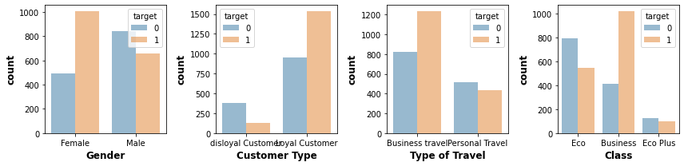
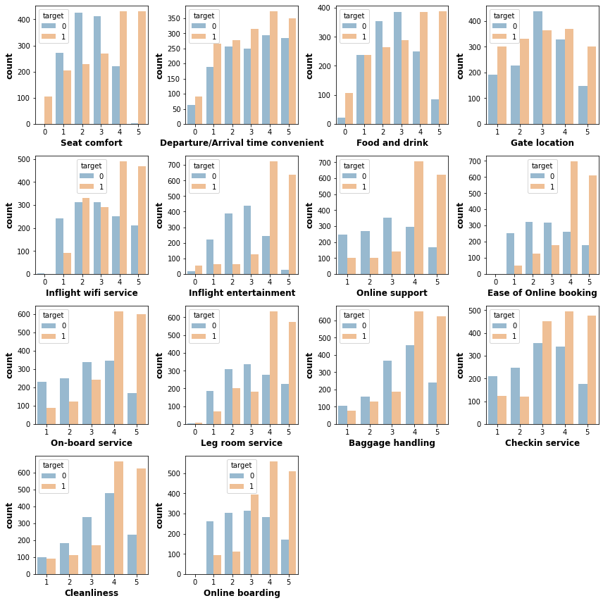
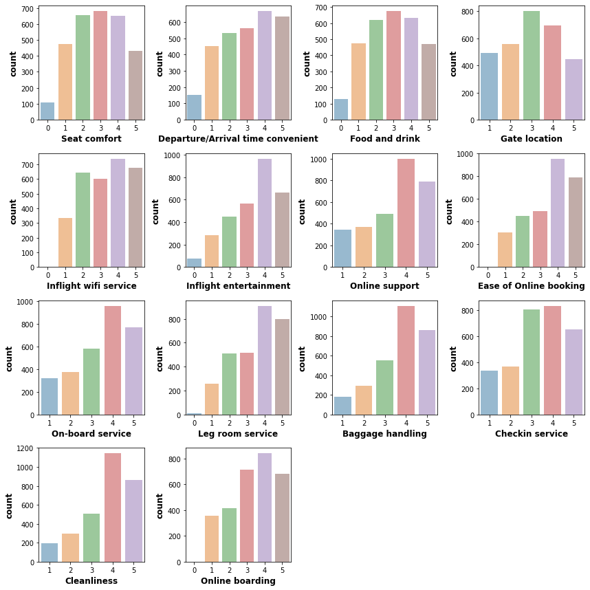
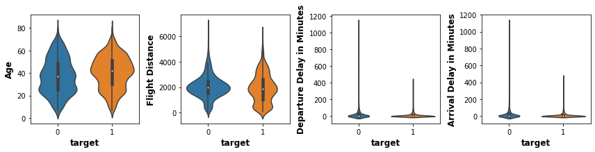
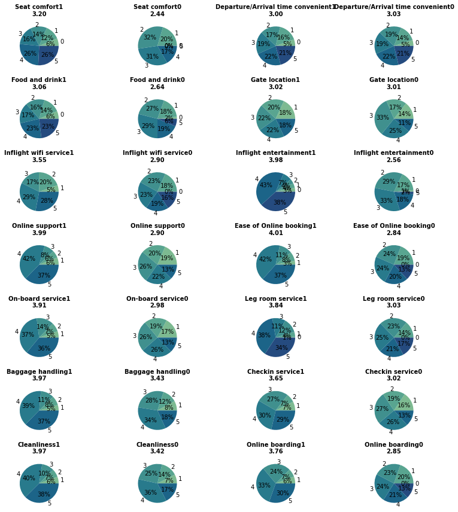
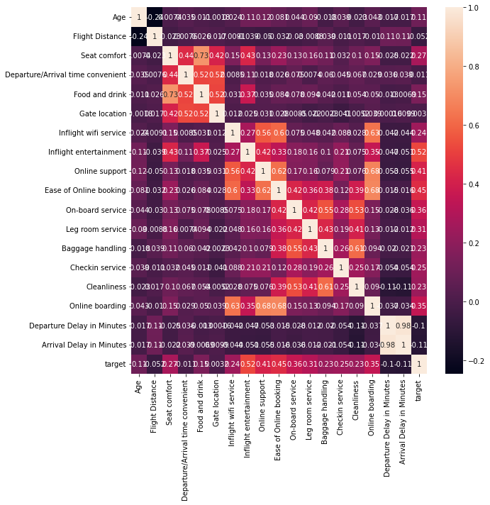

항공사 고객 만족도 예측 경진대회
===================
https://dacon.io/competitions/official/235871/overview/description

항공사의 만족도 조사 정보들을 담은 데이터를 통하여 각 고객의 최종적인 만족 여부를 예측해봅시다.


```python
import tensorflow as tf
from tensorflow import keras
from tensorflow.keras import layers
import numpy as np
import pandas as pd
import seaborn as sns
import matplotlib.pyplot as plt
import lightgbm as lgb

plt.rc('figure', autolayout=True)
plt.rc('axes', labelweight='bold', labelsize='large', titleweight='bold', titlesize=18, titlepad=10)
plt.rc('image', cmap='cividis')
```

## 1. 데이터 살펴보기


```python
df_train = pd.read_csv('data/train.csv', index_col='id')
df_test = pd.read_csv('data/test.csv', index_col='id')
df_train
```


<div>
<style scoped>
    .dataframe tbody tr th:only-of-type {
        vertical-align: middle;
    }

    .dataframe tbody tr th {
        vertical-align: top;
    }

    .dataframe thead th {
        text-align: right;
    }
</style>
<table border="1" class="dataframe">
  <thead>
    <tr style="text-align: right;">
      <th></th>
      <th>Gender</th>
      <th>Customer Type</th>
      <th>Age</th>
      <th>Type of Travel</th>
      <th>Class</th>
      <th>Flight Distance</th>
      <th>Seat comfort</th>
      <th>Departure/Arrival time convenient</th>
      <th>Food and drink</th>
      <th>Gate location</th>
      <th>...</th>
      <th>Ease of Online booking</th>
      <th>On-board service</th>
      <th>Leg room service</th>
      <th>Baggage handling</th>
      <th>Checkin service</th>
      <th>Cleanliness</th>
      <th>Online boarding</th>
      <th>Departure Delay in Minutes</th>
      <th>Arrival Delay in Minutes</th>
      <th>target</th>
    </tr>
    <tr>
      <th>id</th>
      <th></th>
      <th></th>
      <th></th>
      <th></th>
      <th></th>
      <th></th>
      <th></th>
      <th></th>
      <th></th>
      <th></th>
      <th></th>
      <th></th>
      <th></th>
      <th></th>
      <th></th>
      <th></th>
      <th></th>
      <th></th>
      <th></th>
      <th></th>
      <th></th>
    </tr>
  </thead>
  <tbody>
    <tr>
      <th>1</th>
      <td>Female</td>
      <td>disloyal Customer</td>
      <td>22</td>
      <td>Business travel</td>
      <td>Eco</td>
      <td>1599</td>
      <td>3</td>
      <td>0</td>
      <td>3</td>
      <td>3</td>
      <td>...</td>
      <td>4</td>
      <td>5</td>
      <td>4</td>
      <td>4</td>
      <td>4</td>
      <td>5</td>
      <td>4</td>
      <td>0</td>
      <td>0.0</td>
      <td>0</td>
    </tr>
    <tr>
      <th>2</th>
      <td>Female</td>
      <td>Loyal Customer</td>
      <td>37</td>
      <td>Business travel</td>
      <td>Business</td>
      <td>2810</td>
      <td>2</td>
      <td>4</td>
      <td>4</td>
      <td>4</td>
      <td>...</td>
      <td>5</td>
      <td>5</td>
      <td>4</td>
      <td>2</td>
      <td>1</td>
      <td>5</td>
      <td>2</td>
      <td>18</td>
      <td>18.0</td>
      <td>0</td>
    </tr>
    <tr>
      <th>3</th>
      <td>Male</td>
      <td>Loyal Customer</td>
      <td>46</td>
      <td>Business travel</td>
      <td>Business</td>
      <td>2622</td>
      <td>1</td>
      <td>1</td>
      <td>1</td>
      <td>1</td>
      <td>...</td>
      <td>4</td>
      <td>4</td>
      <td>4</td>
      <td>4</td>
      <td>5</td>
      <td>4</td>
      <td>3</td>
      <td>0</td>
      <td>0.0</td>
      <td>1</td>
    </tr>
    <tr>
      <th>4</th>
      <td>Female</td>
      <td>disloyal Customer</td>
      <td>24</td>
      <td>Business travel</td>
      <td>Eco</td>
      <td>2348</td>
      <td>3</td>
      <td>3</td>
      <td>3</td>
      <td>3</td>
      <td>...</td>
      <td>3</td>
      <td>2</td>
      <td>4</td>
      <td>5</td>
      <td>3</td>
      <td>4</td>
      <td>3</td>
      <td>10</td>
      <td>2.0</td>
      <td>0</td>
    </tr>
    <tr>
      <th>5</th>
      <td>Female</td>
      <td>Loyal Customer</td>
      <td>58</td>
      <td>Business travel</td>
      <td>Business</td>
      <td>105</td>
      <td>3</td>
      <td>3</td>
      <td>3</td>
      <td>3</td>
      <td>...</td>
      <td>4</td>
      <td>4</td>
      <td>4</td>
      <td>4</td>
      <td>4</td>
      <td>4</td>
      <td>5</td>
      <td>0</td>
      <td>0.0</td>
      <td>1</td>
    </tr>
    <tr>
      <th>...</th>
      <td>...</td>
      <td>...</td>
      <td>...</td>
      <td>...</td>
      <td>...</td>
      <td>...</td>
      <td>...</td>
      <td>...</td>
      <td>...</td>
      <td>...</td>
      <td>...</td>
      <td>...</td>
      <td>...</td>
      <td>...</td>
      <td>...</td>
      <td>...</td>
      <td>...</td>
      <td>...</td>
      <td>...</td>
      <td>...</td>
      <td>...</td>
    </tr>
    <tr>
      <th>2996</th>
      <td>Male</td>
      <td>Loyal Customer</td>
      <td>30</td>
      <td>Personal Travel</td>
      <td>Eco</td>
      <td>2377</td>
      <td>1</td>
      <td>5</td>
      <td>1</td>
      <td>1</td>
      <td>...</td>
      <td>1</td>
      <td>3</td>
      <td>5</td>
      <td>3</td>
      <td>4</td>
      <td>2</td>
      <td>4</td>
      <td>211</td>
      <td>225.0</td>
      <td>0</td>
    </tr>
    <tr>
      <th>2997</th>
      <td>Female</td>
      <td>disloyal Customer</td>
      <td>24</td>
      <td>Business travel</td>
      <td>Eco</td>
      <td>1643</td>
      <td>2</td>
      <td>4</td>
      <td>3</td>
      <td>4</td>
      <td>...</td>
      <td>5</td>
      <td>2</td>
      <td>2</td>
      <td>4</td>
      <td>1</td>
      <td>3</td>
      <td>5</td>
      <td>20</td>
      <td>13.0</td>
      <td>0</td>
    </tr>
    <tr>
      <th>2998</th>
      <td>Female</td>
      <td>disloyal Customer</td>
      <td>22</td>
      <td>Business travel</td>
      <td>Eco</td>
      <td>1442</td>
      <td>2</td>
      <td>2</td>
      <td>2</td>
      <td>3</td>
      <td>...</td>
      <td>4</td>
      <td>3</td>
      <td>2</td>
      <td>3</td>
      <td>4</td>
      <td>3</td>
      <td>4</td>
      <td>64</td>
      <td>67.0</td>
      <td>0</td>
    </tr>
    <tr>
      <th>2999</th>
      <td>Female</td>
      <td>disloyal Customer</td>
      <td>33</td>
      <td>Business travel</td>
      <td>Business</td>
      <td>2158</td>
      <td>2</td>
      <td>2</td>
      <td>2</td>
      <td>5</td>
      <td>...</td>
      <td>4</td>
      <td>5</td>
      <td>2</td>
      <td>5</td>
      <td>5</td>
      <td>5</td>
      <td>4</td>
      <td>0</td>
      <td>3.0</td>
      <td>0</td>
    </tr>
    <tr>
      <th>3000</th>
      <td>Female</td>
      <td>Loyal Customer</td>
      <td>42</td>
      <td>Business travel</td>
      <td>Eco</td>
      <td>624</td>
      <td>1</td>
      <td>2</td>
      <td>2</td>
      <td>2</td>
      <td>...</td>
      <td>1</td>
      <td>1</td>
      <td>1</td>
      <td>1</td>
      <td>3</td>
      <td>1</td>
      <td>3</td>
      <td>28</td>
      <td>6.0</td>
      <td>0</td>
    </tr>
  </tbody>
</table>
<p>3000 rows × 23 columns</p>
</div>


```python
cat_cols = [x for x in df_train.columns if df_train[x].dtype == 'O']
cnt_cols = ['Age', 'Flight Distance', 'Departure Delay in Minutes', 'Arrival Delay in Minutes']
sat_cols = [x for x in df_train.columns if df_train[x].dtype == 'int64' and (x not in cnt_cols + ['target'])]
```

- 범주형, 연속형, 만족도 특성들을 분류합니다.


```python
df_train.describe()
```


<div>
<style scoped>
    .dataframe tbody tr th:only-of-type {
        vertical-align: middle;
    }

    .dataframe tbody tr th {
        vertical-align: top;
    }

    .dataframe thead th {
        text-align: right;
    }
</style>
<table border="1" class="dataframe">
  <thead>
    <tr style="text-align: right;">
      <th></th>
      <th>Age</th>
      <th>Flight Distance</th>
      <th>Seat comfort</th>
      <th>Departure/Arrival time convenient</th>
      <th>Food and drink</th>
      <th>Gate location</th>
      <th>Inflight wifi service</th>
      <th>Inflight entertainment</th>
      <th>Online support</th>
      <th>Ease of Online booking</th>
      <th>On-board service</th>
      <th>Leg room service</th>
      <th>Baggage handling</th>
      <th>Checkin service</th>
      <th>Cleanliness</th>
      <th>Online boarding</th>
      <th>Departure Delay in Minutes</th>
      <th>Arrival Delay in Minutes</th>
      <th>target</th>
    </tr>
  </thead>
  <tbody>
    <tr>
      <th>count</th>
      <td>3000.000000</td>
      <td>3000.000000</td>
      <td>3000.000000</td>
      <td>3000.000000</td>
      <td>3000.000000</td>
      <td>3000.000000</td>
      <td>3000.000000</td>
      <td>3000.000000</td>
      <td>3000.00000</td>
      <td>3000.000000</td>
      <td>3000.000000</td>
      <td>3000.000000</td>
      <td>3000.000000</td>
      <td>3000.000000</td>
      <td>3000.000000</td>
      <td>3000.000000</td>
      <td>3000.000000</td>
      <td>3000.000000</td>
      <td>3000.000000</td>
    </tr>
    <tr>
      <th>mean</th>
      <td>39.203000</td>
      <td>1983.079333</td>
      <td>2.863333</td>
      <td>3.009667</td>
      <td>2.874333</td>
      <td>3.016667</td>
      <td>3.259667</td>
      <td>3.352333</td>
      <td>3.50500</td>
      <td>3.488000</td>
      <td>3.497000</td>
      <td>3.485000</td>
      <td>3.728667</td>
      <td>3.370000</td>
      <td>3.728667</td>
      <td>3.356333</td>
      <td>15.634333</td>
      <td>15.922000</td>
      <td>0.556000</td>
    </tr>
    <tr>
      <th>std</th>
      <td>15.108802</td>
      <td>1028.109117</td>
      <td>1.394981</td>
      <td>1.519543</td>
      <td>1.431511</td>
      <td>1.294713</td>
      <td>1.322683</td>
      <td>1.352826</td>
      <td>1.31068</td>
      <td>1.302211</td>
      <td>1.283436</td>
      <td>1.294218</td>
      <td>1.154190</td>
      <td>1.258158</td>
      <td>1.161678</td>
      <td>1.294057</td>
      <td>45.083228</td>
      <td>45.203411</td>
      <td>0.496937</td>
    </tr>
    <tr>
      <th>min</th>
      <td>7.000000</td>
      <td>52.000000</td>
      <td>0.000000</td>
      <td>0.000000</td>
      <td>0.000000</td>
      <td>1.000000</td>
      <td>0.000000</td>
      <td>0.000000</td>
      <td>1.00000</td>
      <td>0.000000</td>
      <td>1.000000</td>
      <td>0.000000</td>
      <td>1.000000</td>
      <td>1.000000</td>
      <td>1.000000</td>
      <td>0.000000</td>
      <td>0.000000</td>
      <td>0.000000</td>
      <td>0.000000</td>
    </tr>
    <tr>
      <th>25%</th>
      <td>27.000000</td>
      <td>1348.250000</td>
      <td>2.000000</td>
      <td>2.000000</td>
      <td>2.000000</td>
      <td>2.000000</td>
      <td>2.000000</td>
      <td>2.000000</td>
      <td>3.00000</td>
      <td>2.000000</td>
      <td>3.000000</td>
      <td>2.000000</td>
      <td>3.000000</td>
      <td>3.000000</td>
      <td>3.000000</td>
      <td>2.000000</td>
      <td>0.000000</td>
      <td>0.000000</td>
      <td>0.000000</td>
    </tr>
    <tr>
      <th>50%</th>
      <td>39.000000</td>
      <td>1937.000000</td>
      <td>3.000000</td>
      <td>3.000000</td>
      <td>3.000000</td>
      <td>3.000000</td>
      <td>3.000000</td>
      <td>4.000000</td>
      <td>4.00000</td>
      <td>4.000000</td>
      <td>4.000000</td>
      <td>4.000000</td>
      <td>4.000000</td>
      <td>3.000000</td>
      <td>4.000000</td>
      <td>4.000000</td>
      <td>0.000000</td>
      <td>0.000000</td>
      <td>1.000000</td>
    </tr>
    <tr>
      <th>75%</th>
      <td>51.000000</td>
      <td>2547.250000</td>
      <td>4.000000</td>
      <td>4.000000</td>
      <td>4.000000</td>
      <td>4.000000</td>
      <td>4.000000</td>
      <td>4.000000</td>
      <td>5.00000</td>
      <td>5.000000</td>
      <td>5.000000</td>
      <td>5.000000</td>
      <td>5.000000</td>
      <td>4.000000</td>
      <td>5.000000</td>
      <td>4.000000</td>
      <td>12.000000</td>
      <td>13.000000</td>
      <td>1.000000</td>
    </tr>
    <tr>
      <th>max</th>
      <td>80.000000</td>
      <td>6882.000000</td>
      <td>5.000000</td>
      <td>5.000000</td>
      <td>5.000000</td>
      <td>5.000000</td>
      <td>5.000000</td>
      <td>5.000000</td>
      <td>5.00000</td>
      <td>5.000000</td>
      <td>5.000000</td>
      <td>5.000000</td>
      <td>5.000000</td>
      <td>5.000000</td>
      <td>5.000000</td>
      <td>5.000000</td>
      <td>1128.000000</td>
      <td>1115.000000</td>
      <td>1.000000</td>
    </tr>
  </tbody>
</table>
</div>


```python
df_train.info()
```

    <class 'pandas.core.frame.DataFrame'>
    Int64Index: 3000 entries, 1 to 3000
    Data columns (total 23 columns):
     #   Column                             Non-Null Count  Dtype  
    ---  ------                             --------------  -----  
     0   Gender                             3000 non-null   object 
     1   Customer Type                      3000 non-null   object 
     2   Age                                3000 non-null   int64  
     3   Type of Travel                     3000 non-null   object 
     4   Class                              3000 non-null   object 
     5   Flight Distance                    3000 non-null   int64  
     6   Seat comfort                       3000 non-null   int64  
     7   Departure/Arrival time convenient  3000 non-null   int64  
     8   Food and drink                     3000 non-null   int64  
     9   Gate location                      3000 non-null   int64  
     10  Inflight wifi service              3000 non-null   int64  
     11  Inflight entertainment             3000 non-null   int64  
     12  Online support                     3000 non-null   int64  
     13  Ease of Online booking             3000 non-null   int64  
     14  On-board service                   3000 non-null   int64  
     15  Leg room service                   3000 non-null   int64  
     16  Baggage handling                   3000 non-null   int64  
     17  Checkin service                    3000 non-null   int64  
     18  Cleanliness                        3000 non-null   int64  
     19  Online boarding                    3000 non-null   int64  
     20  Departure Delay in Minutes         3000 non-null   int64  
     21  Arrival Delay in Minutes           3000 non-null   float64
     22  target                             3000 non-null   int64  
    dtypes: float64(1), int64(18), object(4)
    memory usage: 562.5+ KB
    

결측치는 존재하지 않습니다.

### 1.1 데이터 시각화


```python
plt.figure(figsize=(12, 3))
for i, col in enumerate(cat_cols):
    plt.subplot(1, 4, i + 1)
    sns.countplot(x=col, hue='target', data=df_train, alpha=0.5)
```


    

    


```python
plt.figure(figsize=(12, 12))
for i, col in enumerate(sat_cols):
    plt.subplot(4, 4, i + 1)
    sns.countplot(x=col, hue='target', data=df_train, alpha=0.5)
```


    

    


```python
plt.figure(figsize=(12, 12))
for i, col in enumerate(sat_cols):
    plt.subplot(4, 4, i + 1)
    sns.countplot(x=col,data=df_train, alpha=0.5)
```


    

    


- 대체적으로 그래프기 비슷한 모양을 띱니다. 점수를 후하게 주는 경향이 있으며, 높은 점수에서는 만족한 비율이, 낮은 점수에서는 불만족한 비율이 높습니다.
- 0이 존재하는 colunm과 아닌 colunm이 섞여있고, 그 빈도도 낮으며 target과의 연관성도 feature마다 다릅니다. 
- 0-5점으로 평가하는 것이 아니고 1-5점으로 평가하는 시스템에서 0은 결측치일 것으로 예상됩니다.


```python
plt.figure(figsize=(12, 3))
for i, col in enumerate(cnt_cols):
    plt.subplot(1, 4, i + 1)
    sns.violinplot(x='target', y=col, data=df_train, alpha=0.5)
```


    

    


- 나이는 20~40대 젊은 부분에서, 비행 거리는 2000에 가까운 정도에서, 지연은 많이 될수록 불만족의 비율이 높아 보입니다.


```python
plt.figure(figsize=(12, 12))

df1 = df_train[df_train['target'] == 1]
df0 = df_train[df_train['target'] == 0]

colors = sns.color_palette('crest')

for i, col in enumerate(sat_cols):
    plt.subplot(7, 4, i * 2 + 1)
    plt.pie(df1[col].value_counts().sort_index(), labels=df1[col].value_counts().sort_index().index, autopct='%.0f%%', colors=colors)
    plt.title(col + '1' + '\n{0:.2f}'.format(df1[col].mean()), fontdict={'fontsize': 10})
    
    plt.subplot(7, 4, i * 2 + 2)
    plt.pie(df0[col].value_counts().sort_index(), labels=df0[col].value_counts().sort_index().index, autopct='%.0f%%', colors=colors)
    plt.title(col + '0' + '\n{0:.2f}'.format(df0[col].mean()), fontdict={'fontsize': 10})
```


    

    


- 대부분의 변수에서, 만족한 사람들의 평균 평점이 높고 높은 점수의 비중 또한 높습니다.
- Departure/Arrival time convenient, Gate location의 경우 만족/불만족 여부에 관계 없이 평균 점수 및 점수 비율이 비슷합니다.


```python
plt.figure(figsize=(10, 10))
sns.heatmap(df_train.corr(), annot=True)
```


    <AxesSubplot:>


    

    


- 출발지연/ 도착지연시간은 당연하게도 연관성이 매우 높습니다.
- Food and drink와 Seat Comfort도 연관성이 높습니다.
- Online 관련 특성들 역시 연관성이 높습니다.

### 1.2 데이터 가공


```python
def qcut_df(df):
    df_ = pd.DataFrame()
    df_['distance_class'] = pd.qcut(df['Flight Distance'], 3, labels=False)
    df_['age_class'] = pd.qcut(df['Age'], 3, labels=False)
    df_['delay_class'] = pd.qcut(df['Arrival Delay in Minutes'], 5, labels=False, duplicates='drop')
    return df_
```

- Flight Distance, Age, Delay 항목을 값에 따라 세 분위로 나눠 새로운 특성을 생성합니다.


```python
g_s = ['Seat comfort', 'Food and drink']
g_o = ['Inflight wifi service', 'Online boarding', 'Ease of Online booking', 'Online support']
g_c = ['Cleanliness', 'Baggage handling']

def group_df(df):
    df_ = pd.DataFrame()
    sat_mean = df[sat_cols].sum(axis=1) / ( len(sat_cols) - (df[sat_cols] == 0).sum(axis=1) )
    
    df_['g_s'] = df[g_s].sum(axis=1) / (len(g_s) - (df[g_s] == 0).sum(axis=1))
    df_['g_s'] = df_['g_s'].replace(np.nan, 5)  
    df_['g_o'] = df[g_o].sum(axis=1) / (len(g_o) - (df[g_o] == 0).sum(axis=1))
    df_['g_c'] = df[g_c].sum(axis=1) / (len(g_c) - (df[g_c] == 0).sum(axis=1))
    
    return df_
```

- 연관있는 특성들을 묶어 평균내어 새로운 특성을 생성합니다.
- Seat comfort, Food and drink의 경우 두 특성 모두 0인 경우에는 예외 없이 target이 1이었기 때문에 최고점인 5점으로 대체해줍니다.


```python
t = ['g_s', 'g_o', 'g_c', 'n_1','n_5']

def groupby_mean(df_train, df_test):
    
    df_mean = df_train[t + ['age_class']].groupby('age_class').mean().reset_index()
    df_mean.columns = ['age_class'] + list(map(lambda x: x + '_gm', t))

    df_std = df_train[t + ['age_class']].groupby('age_class').std().reset_index()
    df_std.columns = ['age_class'] + list(map(lambda x: x + '_gs', t))

    df_tr = df_train.copy()
    df_tr = pd.merge(df_tr.reset_index(), df_mean, on='age_class', how='left')
    df_tr = pd.merge(df_tr, df_std, on='age_class', how='left')
    df_tr = df_tr.set_index('id')
    
    df_te = df_test.copy()
    df_te = pd.merge(df_te.reset_index(), df_mean, on='age_class', how='left')
    df_te = pd.merge(df_te, df_std, on='age_class', how='left')
    df_te = df_te.set_index('id')
    
    for col in t:
        df_train[col] = (df_tr[col] - df_tr[col + '_gm']) / df_tr[col + '_gs']
        df_test[col] = (df_te[col] - df_te[col + '_gm']) / df_te[col + '_gs']
    
    return df_train, df_test
```

- age_class를 기준으로 pivot 통계치를 이용해 새로운 특성을 생성합니다.
- g_s, g_o, g_c, n_1, n_5 특성이 비슷한 나이대의 고객들에 비해서 얼마나 높고 낮은지를 나타내는 지표가 될 것입니다.


```python
drop_features = [ 'Flight Distance', 'Age', 'Departure Delay in Minutes', 'Arrival Delay in Minutes', ]

def preprocessing(df_train, df_test):
          
    for i in [0, 1, 2, 3, 4, 5]:
        df_train[f'n_{i}'] = (df_train[sat_cols] == i).sum(axis=1)
        df_test[f'n_{i}'] = (df_test[sat_cols] == i).sum(axis=1)
   
    
    df_train = pd.concat([df_train,
                          qcut_df(df_train),
                          group_df(df_train)
                          ], 
                          axis=1)
    df_test = pd.concat([df_test, 
                         qcut_df(df_test),
                         group_df(df_test)
                         ], 
                         axis=1)

    df_train[sat_cols] = df_train[sat_cols].astype('int32')
    df_test[sat_cols] = df_test[sat_cols].astype('int32')
    
    df_tr = pd.DataFrame()
    df_te = pd.DataFrame()
    
    count = 0
    for col in cat_cols:
        if count == 0:
            df_tr['customer_type'] = df_train[col].astype(str)
            df_te['customer_type'] = df_test[col].astype(str)
            count = 1
        else:
            df_tr['customer_type'] += df_train[col].astype(str)
            df_te['customer_type'] += df_test[col].astype(str)
    
    count = 0
    for col in ['Gender', 'Type of Travel','distance_class', 'age_class', 'delay_class']:
        if count == 0:
            df_tr['class_type'] = df_train[col].astype(str)
            df_te['class_type'] = df_test[col].astype(str)
            count = 1
        else:
            df_tr['class_type'] += df_train[col].astype(str)
            df_te['class_type'] += df_test[col].astype(str)

    new_count = df_tr['customer_type'].value_counts().to_dict()
    df_tr['new_count'] = df_tr['customer_type'].map(lambda x: new_count.get(x, 1))
    df_te['new_count'] = df_te['customer_type'].map(lambda x: new_count.get(x, 1))
    
    class_count = df_tr['class_type'].value_counts().to_dict()
    df_tr['class_count'] = df_tr['class_type'].map(lambda x: class_count.get(x, 1))
    df_te['class_count'] = df_te['class_type'].map(lambda x: class_count.get(x, 1))

    df_train = pd.concat([df_train,
                          df_tr['new_count'],
                          df_tr['class_count']
                          ], 
                          axis=1)
    df_test = pd.concat([df_test, 
                         df_te['new_count'],
                         df_te['class_count']
                         ], 
                         axis=1)
    
    df_train, df_test = groupby_mean(df_train, df_test)
    
    
    df_train = df_train.drop(drop_features , axis=1)
    df_test = df_test.drop(drop_features , axis=1)
    
    return df_train, df_test
```

- n_0 - n_5: 0,1,2,3,4,5 점을 준 개수들을 세어 새로운 특성으로 생성합니다.
- new_count: 추가로 범주형 특성들을 하나로 합친 후 그 빈도를 새로운 특성으로 생성합니다.
- class_count: new_count와 유사하게 몇몇 특성들을 하나로 합쳐 빈도를 새로운 특성으로 이용합니다. 특성은 여러 조합을 실험하여 가장 결과가 좋은 조합을 선택했습니다.
- 마지막으로 새로운 특성으로 생성한 것들과 연관이 깊은 기존 특성들은 제거하여 성능 향상을 노려봅니다.
- 이것을 기본으로 모델마다 조금 변형을 주어 데이터셋을 준비합니다.


```python
df_train = pd.read_csv('data/train.csv', index_col='id')
df_test = pd.read_csv('data/test.csv', index_col='id')

df_train, df_test = preprocessing(df_train, df_test)
y = df_train.pop('target')
```

## 2. 모델 훈련시키기

### 2.1 CatBoost


```python
from scipy import sparse as ssp
from sklearn.model_selection import StratifiedKFold
from sklearn.preprocessing import LabelEncoder
from sklearn.preprocessing import OneHotEncoder
from sklearn.metrics import accuracy_score
from catboost import CatBoostClassifier

from time import time
import datetime
```


```python
# 예측값을 반올림해줄 함수
import copy
def threshold(pred, th=0.5):
    l = copy.deepcopy(pred)
    for i, p in enumerate(pred):
        if (p >= th):
            l[i] = 1
        else:
            l[i] = 0
    return l
```


```python
drop_features = [ 'Flight Distance', 'Age', 'Departure Delay in Minutes', 'Arrival Delay in Minutes', ]

def preprocessing(df_train, df_test):
          
    for i in [0, 1, 2, 3, 4, 5]:
        df_train[f'n_{i}'] = (df_train[sat_cols] == i).sum(axis=1)
        df_test[f'n_{i}'] = (df_test[sat_cols] == i).sum(axis=1)
   
    
    df_train = pd.concat([df_train,
                          qcut_df(df_train),
#                          group_df(df_train)
                          ], 
                          axis=1)
    df_test = pd.concat([df_test, 
                         qcut_df(df_test),
#                         group_df(df_test)
                         ], 
                         axis=1)

    df_train[sat_cols] = df_train[sat_cols].astype('int32')
    df_test[sat_cols] = df_test[sat_cols].astype('int32')
    
    df_tr = pd.DataFrame()
    df_te = pd.DataFrame()
    
    count = 0
    for col in cat_cols:
        if count == 0:
            df_tr['customer_type'] = df_train[col].astype(str)
            df_te['customer_type'] = df_test[col].astype(str)
            count = 1
        else:
            df_tr['customer_type'] += df_train[col].astype(str)
            df_te['customer_type'] += df_test[col].astype(str)
    
    count = 0
    for col in ['Gender', 'Type of Travel','distance_class', 'age_class', 'delay_class']:
        if count == 0:
            df_tr['class_type'] = df_train[col].astype(str)
            df_te['class_type'] = df_test[col].astype(str)
            count = 1
        else:
            df_tr['class_type'] += df_train[col].astype(str)
            df_te['class_type'] += df_test[col].astype(str)

    new_count = df_tr['customer_type'].value_counts().to_dict()
    df_tr['new_count'] = df_tr['customer_type'].map(lambda x: new_count.get(x, 1))
    df_te['new_count'] = df_te['customer_type'].map(lambda x: new_count.get(x, 1))
    
    class_count = df_tr['class_type'].value_counts().to_dict()
    df_tr['class_count'] = df_tr['class_type'].map(lambda x: class_count.get(x, 1))
    df_te['class_count'] = df_te['class_type'].map(lambda x: class_count.get(x, 1))

    df_train = pd.concat([df_train,
                          df_tr['new_count'],
                          df_tr['class_count']
                          ], 
                          axis=1)
    df_test = pd.concat([df_test, 
                         df_te['new_count'],
                         df_te['class_count']
                         ], 
                         axis=1)
    
#   df_train, df_test = groupby_mean(df_train, df_test)
    
    
#    df_train = df_train.drop(drop_features , axis=1)
#    df_test = df_test.drop(drop_features , axis=1)
    
    return df_train, df_test
```

- 여러 시도 결과 catboost 모델에서 group_df, groupby_mean은 성능을 악화시키는 것으로 나타났습니다.
- 또한 새로운 특성과 연관이 있는 기존 특성도 학습에 이용하는 편이 더 좋은 성능을 보여주었습니다.


```python
df_train = pd.read_csv('data/train.csv', index_col='id')
df_test = pd.read_csv('data/test.csv', index_col='id')

df_train, df_test = preprocessing(df_train, df_test)
y = df_train.pop('target')
```


```python
cat_features = cat_cols + sat_cols + [ 'distance_class', 'age_class', 'delay_class']
```

- 범주형 데이터로 취급할 특성들을 설정해줍니다.


```python
is_holdout = False
NFOLDS = 5
iterations = 3000
patience = 200

kfold = StratifiedKFold(n_splits=NFOLDS, shuffle=True, random_state=112)

final_cv_train = np.zeros(len(df_train))
final_cv_pred = np.zeros(len(df_test))

begin_time = time()

for s in range(15):
        
    cv_train = np.zeros(len(df_train))
    cv_pred = np.zeros(len(df_test))
   

    for tri, vai in kfold.split(df_train, y):
        preds = []

        model = CatBoostClassifier(iterations=iterations,random_state=s,task_type="GPU",eval_metric="Accuracy",
                                   cat_features=cat_features, one_hot_max_size=5)
        model.fit(df_train.iloc[tri], y.iloc[tri], 
                eval_set=[(df_train.iloc[vai], y.iloc[vai])], 
                early_stopping_rounds=patience ,
                verbose = 100
            )

        val_pred = np.squeeze(model.predict_proba(df_train.iloc[vai])[:, 1])
        cv_train[vai] += val_pred
        print("accuracy: {}".format(model.score(df_train.iloc[vai], y.iloc[vai])))

        cv_pred += np.squeeze(model.predict_proba(df_test)[:, 1])
       
    
    cv_pred /= NFOLDS
    final_cv_pred += cv_pred

    final_cv_train += cv_train
    
    print("cv score:")
    print(accuracy_score(y, threshold(cv_train)))
    print("{} score:".format(s + 1), accuracy_score(y, threshold(final_cv_train / (s + 1))))
    print(str(datetime.timedelta(seconds=time() - begin_time)))
```

    Learning rate set to 0.041945
    0:	learn: 0.8479167	test: 0.8433333	best: 0.8433333 (0)	total: 41.2ms	remaining: 2m 3s
    100:	learn: 0.9508333	test: 0.9216667	best: 0.9233333 (80)	total: 5.78s	remaining: 2m 46s
    200:	learn: 0.9675000	test: 0.9250000	best: 0.9266667 (199)	total: 12.3s	remaining: 2m 50s
    300:	learn: 0.9791667	test: 0.9283333	best: 0.9300000 (274)	total: 19.2s	remaining: 2m 51s
    400:	learn: 0.9895833	test: 0.9283333	best: 0.9316667 (337)	total: 26s	remaining: 2m 48s
    500:	learn: 0.9912500	test: 0.9283333	best: 0.9316667 (337)	total: 32.7s	remaining: 2m 43s
    bestTest = 0.9316666667
    bestIteration = 337
    Shrink model to first 338 iterations.
    accuracy: 0.9316666666666666
    Learning rate set to 0.041945
    0:	learn: 0.8800000	test: 0.8883333	best: 0.8883333 (0)	total: 76.1ms	remaining: 3m 48s
    100:	learn: 0.9487500	test: 0.9316667	best: 0.9366667 (50)	total: 8.14s	remaining: 3m 53s
    200:	learn: 0.9629167	test: 0.9383333	best: 0.9383333 (192)	total: 16s	remaining: 3m 43s
    300:	learn: 0.9704167	test: 0.9450000	best: 0.9450000 (273)	total: 23.5s	remaining: 3m 30s
    400:	learn: 0.9729167	test: 0.9483333	best: 0.9500000 (363)	total: 31.3s	remaining: 3m 22s
    500:	learn: 0.9775000	test: 0.9500000	best: 0.9533333 (424)	total: 39.1s	remaining: 3m 14s
    600:	learn: 0.9816667	test: 0.9500000	best: 0.9533333 (424)	total: 46.4s	remaining: 3m 5s
    bestTest = 0.9533333333
    bestIteration = 424
    Shrink model to first 425 iterations.
    accuracy: 0.9533333333333334
    Learning rate set to 0.041945
    0:	learn: 0.8812500	test: 0.8600000	best: 0.8600000 (0)	total: 77.5ms	remaining: 3m 52s
    100:	learn: 0.9533333	test: 0.9266667	best: 0.9300000 (92)	total: 6.47s	remaining: 3m 5s
    200:	learn: 0.9670833	test: 0.9350000	best: 0.9366667 (138)	total: 12.3s	remaining: 2m 50s
    300:	learn: 0.9729167	test: 0.9316667	best: 0.9366667 (138)	total: 18.1s	remaining: 2m 42s
    bestTest = 0.9366666667
    bestIteration = 138
    Shrink model to first 139 iterations.
    accuracy: 0.9366666666666666
    Learning rate set to 0.041945
    0:	learn: 0.8345833	test: 0.8533333	best: 0.8533333 (0)	total: 54.8ms	remaining: 2m 44s
    100:	learn: 0.9550000	test: 0.9183333	best: 0.9183333 (80)	total: 6.15s	remaining: 2m 56s
    200:	learn: 0.9712500	test: 0.9233333	best: 0.9266667 (149)	total: 12.4s	remaining: 2m 53s
    300:	learn: 0.9791667	test: 0.9266667	best: 0.9316667 (283)	total: 18.5s	remaining: 2m 45s
    400:	learn: 0.9866667	test: 0.9283333	best: 0.9316667 (283)	total: 24.5s	remaining: 2m 39s
    bestTest = 0.9316666667
    bestIteration = 283
    Shrink model to first 284 iterations.
    accuracy: 0.9316666666666666
    Learning rate set to 0.041945
    0:	learn: 0.8975000	test: 0.8933333	best: 0.8933333 (0)	total: 69ms	remaining: 3m 26s
    100:	learn: 0.9550000	test: 0.9350000	best: 0.9350000 (100)	total: 6.1s	remaining: 2m 55s
    200:	learn: 0.9691667	test: 0.9316667	best: 0.9366667 (101)	total: 12.2s	remaining: 2m 49s
    300:	learn: 0.9708333	test: 0.9350000	best: 0.9366667 (101)	total: 17.7s	remaining: 2m 38s
    bestTest = 0.9366666667
    bestIteration = 101
    Shrink model to first 102 iterations.
    accuracy: 0.9366666666666666
    cv score:
    0.938
    1 score: 0.938
    0:02:34.219131
    Learning rate set to 0.041945
    0:	learn: 0.8750000	test: 0.8500000	best: 0.8500000 (0)	total: 59.1ms	remaining: 2m 57s
    100:	learn: 0.9562500	test: 0.9233333	best: 0.9283333 (73)	total: 5.85s	remaining: 2m 47s
    200:	learn: 0.9687500	test: 0.9266667	best: 0.9283333 (73)	total: 12.2s	remaining: 2m 49s
    300:	learn: 0.9775000	test: 0.9233333	best: 0.9300000 (227)	total: 18.8s	remaining: 2m 48s
    400:	learn: 0.9837500	test: 0.9233333	best: 0.9300000 (227)	total: 25.7s	remaining: 2m 46s
    bestTest = 0.93
    bestIteration = 227
    Shrink model to first 228 iterations.
    accuracy: 0.93
    Learning rate set to 0.041945
    0:	learn: 0.8433333	test: 0.8333333	best: 0.8333333 (0)	total: 74.6ms	remaining: 3m 43s
    100:	learn: 0.9466667	test: 0.9300000	best: 0.9300000 (58)	total: 7.52s	remaining: 3m 35s
    200:	learn: 0.9679167	test: 0.9400000	best: 0.9416667 (150)	total: 14.7s	remaining: 3m 24s
    300:	learn: 0.9754167	test: 0.9466667	best: 0.9466667 (252)	total: 21.6s	remaining: 3m 13s
    400:	learn: 0.9833333	test: 0.9466667	best: 0.9483333 (307)	total: 28s	remaining: 3m 1s
    500:	learn: 0.9883333	test: 0.9450000	best: 0.9483333 (307)	total: 35.1s	remaining: 2m 54s
    bestTest = 0.9483333333
    bestIteration = 307
    Shrink model to first 308 iterations.
    accuracy: 0.9483333333333334
    Learning rate set to 0.041945
    0:	learn: 0.8566667	test: 0.8266667	best: 0.8266667 (0)	total: 67.9ms	remaining: 3m 23s
    100:	learn: 0.9554167	test: 0.9216667	best: 0.9233333 (90)	total: 6.82s	remaining: 3m 15s
    200:	learn: 0.9704167	test: 0.9333333	best: 0.9333333 (184)	total: 13.5s	remaining: 3m 8s
    300:	learn: 0.9816667	test: 0.9350000	best: 0.9366667 (242)	total: 20.2s	remaining: 3m 1s
    400:	learn: 0.9866667	test: 0.9383333	best: 0.9383333 (363)	total: 26.9s	remaining: 2m 54s
    500:	learn: 0.9916667	test: 0.9416667	best: 0.9416667 (442)	total: 33.5s	remaining: 2m 47s
    600:	learn: 0.9941667	test: 0.9400000	best: 0.9416667 (442)	total: 40.1s	remaining: 2m 40s
    bestTest = 0.9416666667
    bestIteration = 442
    Shrink model to first 443 iterations.
    accuracy: 0.9416666666666667
    Learning rate set to 0.041945
    0:	learn: 0.8483333	test: 0.8400000	best: 0.8400000 (0)	total: 79.7ms	remaining: 3m 59s
    100:	learn: 0.9570833	test: 0.9216667	best: 0.9233333 (98)	total: 7.34s	remaining: 3m 30s
    200:	learn: 0.9683333	test: 0.9316667	best: 0.9316667 (198)	total: 14.5s	remaining: 3m 22s
    300:	learn: 0.9804167	test: 0.9300000	best: 0.9316667 (198)	total: 21.6s	remaining: 3m 13s
    400:	learn: 0.9862500	test: 0.9333333	best: 0.9350000 (384)	total: 28.7s	remaining: 3m 6s
    500:	learn: 0.9904167	test: 0.9383333	best: 0.9400000 (497)	total: 36.1s	remaining: 3m
    600:	learn: 0.9937500	test: 0.9383333	best: 0.9400000 (497)	total: 43.6s	remaining: 2m 54s
    bestTest = 0.94
    bestIteration = 497
    Shrink model to first 498 iterations.
    accuracy: 0.94
    Learning rate set to 0.041945
    0:	learn: 0.8500000	test: 0.8466667	best: 0.8466667 (0)	total: 74.6ms	remaining: 3m 43s
    100:	learn: 0.9529167	test: 0.9266667	best: 0.9283333 (95)	total: 7.39s	remaining: 3m 32s
    200:	learn: 0.9670833	test: 0.9350000	best: 0.9366667 (175)	total: 14.5s	remaining: 3m 22s
    300:	learn: 0.9712500	test: 0.9350000	best: 0.9366667 (175)	total: 21.1s	remaining: 3m 8s
    400:	learn: 0.9770833	test: 0.9316667	best: 0.9383333 (366)	total: 27.6s	remaining: 2m 59s
    500:	learn: 0.9820833	test: 0.9316667	best: 0.9383333 (366)	total: 34.7s	remaining: 2m 52s
    bestTest = 0.9383333333
    bestIteration = 366
    Shrink model to first 367 iterations.
    accuracy: 0.9383333333333334
    cv score:
    0.9396666666666667
    2 score: 0.9383333333333334
    0:05:52.996143
    Learning rate set to 0.041945
    0:	learn: 0.8825000	test: 0.8750000	best: 0.8750000 (0)	total: 67.8ms	remaining: 3m 23s
    100:	learn: 0.9537500	test: 0.9250000	best: 0.9250000 (92)	total: 6.82s	remaining: 3m 15s
    200:	learn: 0.9708333	test: 0.9250000	best: 0.9300000 (145)	total: 13.8s	remaining: 3m 11s
    300:	learn: 0.9812500	test: 0.9283333	best: 0.9300000 (145)	total: 20.9s	remaining: 3m 7s
    bestTest = 0.93
    bestIteration = 145
    Shrink model to first 146 iterations.
    accuracy: 0.93
    Learning rate set to 0.041945
    0:	learn: 0.8770833	test: 0.8933333	best: 0.8933333 (0)	total: 79.5ms	remaining: 3m 58s
    100:	learn: 0.9591667	test: 0.9383333	best: 0.9416667 (91)	total: 7.7s	remaining: 3m 40s
    200:	learn: 0.9708333	test: 0.9383333	best: 0.9416667 (91)	total: 15.2s	remaining: 3m 30s
    bestTest = 0.9416666667
    bestIteration = 91
    Shrink model to first 92 iterations.
    accuracy: 0.9416666666666667
    Learning rate set to 0.041945
    0:	learn: 0.8841667	test: 0.8533333	best: 0.8533333 (0)	total: 78.3ms	remaining: 3m 54s
    100:	learn: 0.9545833	test: 0.9166667	best: 0.9183333 (94)	total: 7.72s	remaining: 3m 41s
    200:	learn: 0.9650000	test: 0.9283333	best: 0.9283333 (179)	total: 15s	remaining: 3m 29s
    300:	learn: 0.9729167	test: 0.9250000	best: 0.9300000 (285)	total: 22.7s	remaining: 3m 23s
    400:	learn: 0.9791667	test: 0.9266667	best: 0.9316667 (349)	total: 30.4s	remaining: 3m 16s
    500:	learn: 0.9837500	test: 0.9300000	best: 0.9316667 (349)	total: 38s	remaining: 3m 9s
    bestTest = 0.9316666667
    bestIteration = 349
    Shrink model to first 350 iterations.
    accuracy: 0.9316666666666666
    Learning rate set to 0.041945
    0:	learn: 0.8800000	test: 0.8583333	best: 0.8583333 (0)	total: 76ms	remaining: 3m 47s
    100:	learn: 0.9545833	test: 0.9300000	best: 0.9316667 (89)	total: 7.75s	remaining: 3m 42s
    200:	learn: 0.9754167	test: 0.9283333	best: 0.9316667 (89)	total: 15.2s	remaining: 3m 32s
    bestTest = 0.9316666667
    bestIteration = 89
    Shrink model to first 90 iterations.
    accuracy: 0.9316666666666666
    Learning rate set to 0.041945
    0:	learn: 0.8779167	test: 0.8700000	best: 0.8700000 (0)	total: 78.9ms	remaining: 3m 56s
    100:	learn: 0.9491667	test: 0.9350000	best: 0.9350000 (94)	total: 7.86s	remaining: 3m 45s
    200:	learn: 0.9733333	test: 0.9383333	best: 0.9416667 (146)	total: 15.2s	remaining: 3m 31s
    300:	learn: 0.9795833	test: 0.9366667	best: 0.9416667 (146)	total: 22.6s	remaining: 3m 22s
    bestTest = 0.9416666667
    bestIteration = 146
    Shrink model to first 147 iterations.
    accuracy: 0.9416666666666667
    cv score:
    0.9353333333333333
    3 score: 0.9366666666666666
    0:08:11.014632
    Learning rate set to 0.041945
    0:	learn: 0.8720833	test: 0.8616667	best: 0.8616667 (0)	total: 65.7ms	remaining: 3m 17s
    100:	learn: 0.9545833	test: 0.9266667	best: 0.9283333 (51)	total: 6.51s	remaining: 3m 6s
    200:	learn: 0.9712500	test: 0.9250000	best: 0.9283333 (51)	total: 13.3s	remaining: 3m 5s
    bestTest = 0.9283333333
    bestIteration = 51
    Shrink model to first 52 iterations.
    accuracy: 0.9283333333333333
    Learning rate set to 0.041945
    0:	learn: 0.8683333	test: 0.8783333	best: 0.8783333 (0)	total: 68.5ms	remaining: 3m 25s
    100:	learn: 0.9575000	test: 0.9300000	best: 0.9350000 (66)	total: 6.64s	remaining: 3m 10s
    200:	learn: 0.9700000	test: 0.9366667	best: 0.9383333 (143)	total: 13.2s	remaining: 3m 3s
    300:	learn: 0.9775000	test: 0.9416667	best: 0.9416667 (284)	total: 19.6s	remaining: 2m 56s
    400:	learn: 0.9804167	test: 0.9400000	best: 0.9416667 (284)	total: 25.9s	remaining: 2m 47s
    500:	learn: 0.9866667	test: 0.9383333	best: 0.9433333 (423)	total: 32s	remaining: 2m 39s
    600:	learn: 0.9900000	test: 0.9400000	best: 0.9433333 (423)	total: 38.6s	remaining: 2m 33s
    bestTest = 0.9433333333
    bestIteration = 423
    Shrink model to first 424 iterations.
    accuracy: 0.9433333333333334
    Learning rate set to 0.041945
    0:	learn: 0.8620833	test: 0.8383333	best: 0.8383333 (0)	total: 72.8ms	remaining: 3m 38s
    100:	learn: 0.9562500	test: 0.9216667	best: 0.9216667 (72)	total: 7.02s	remaining: 3m 21s
    200:	learn: 0.9704167	test: 0.9350000	best: 0.9350000 (200)	total: 12.9s	remaining: 2m 59s
    300:	learn: 0.9820833	test: 0.9283333	best: 0.9350000 (200)	total: 18.6s	remaining: 2m 46s
    400:	learn: 0.9850000	test: 0.9333333	best: 0.9350000 (200)	total: 24.1s	remaining: 2m 36s
    bestTest = 0.935
    bestIteration = 200
    Shrink model to first 201 iterations.
    accuracy: 0.935
    Learning rate set to 0.041945
    0:	learn: 0.8608333	test: 0.8600000	best: 0.8600000 (0)	total: 63.2ms	remaining: 3m 9s
    100:	learn: 0.9608333	test: 0.9183333	best: 0.9216667 (74)	total: 5.55s	remaining: 2m 39s
    200:	learn: 0.9745833	test: 0.9266667	best: 0.9283333 (176)	total: 11.1s	remaining: 2m 34s
    300:	learn: 0.9820833	test: 0.9300000	best: 0.9300000 (237)	total: 16.5s	remaining: 2m 27s
    400:	learn: 0.9866667	test: 0.9333333	best: 0.9333333 (315)	total: 22.5s	remaining: 2m 26s
    500:	learn: 0.9908333	test: 0.9350000	best: 0.9366667 (445)	total: 29.6s	remaining: 2m 27s
    600:	learn: 0.9941667	test: 0.9350000	best: 0.9366667 (445)	total: 36.9s	remaining: 2m 27s
    bestTest = 0.9366666667
    bestIteration = 445
    Shrink model to first 446 iterations.
    accuracy: 0.9366666666666666
    Learning rate set to 0.041945
    0:	learn: 0.8462500	test: 0.8383333	best: 0.8383333 (0)	total: 76.4ms	remaining: 3m 49s
    100:	learn: 0.9504167	test: 0.9233333	best: 0.9283333 (89)	total: 6.85s	remaining: 3m 16s
    200:	learn: 0.9670833	test: 0.9366667	best: 0.9366667 (198)	total: 13.5s	remaining: 3m 8s
    300:	learn: 0.9741667	test: 0.9300000	best: 0.9383333 (262)	total: 19.6s	remaining: 2m 55s
    400:	learn: 0.9800000	test: 0.9333333	best: 0.9383333 (262)	total: 25.4s	remaining: 2m 44s
    bestTest = 0.9383333333
    bestIteration = 262
    Shrink model to first 263 iterations.
    accuracy: 0.9383333333333334
    cv score:
    0.9363333333333334
    4 score: 0.936
    0:10:44.073885
    Learning rate set to 0.041945
    0:	learn: 0.8662500	test: 0.8650000	best: 0.8650000 (0)	total: 62.5ms	remaining: 3m 7s
    100:	learn: 0.9558333	test: 0.9250000	best: 0.9283333 (58)	total: 6.05s	remaining: 2m 53s
    200:	learn: 0.9683333	test: 0.9250000	best: 0.9283333 (58)	total: 12.9s	remaining: 2m 59s
    bestTest = 0.9283333333
    bestIteration = 58
    Shrink model to first 59 iterations.
    accuracy: 0.9283333333333333
    Learning rate set to 0.041945
    0:	learn: 0.8675000	test: 0.8766667	best: 0.8766667 (0)	total: 54.3ms	remaining: 2m 42s
    100:	learn: 0.9529167	test: 0.9366667	best: 0.9383333 (72)	total: 5.83s	remaining: 2m 47s
    200:	learn: 0.9683333	test: 0.9466667	best: 0.9466667 (200)	total: 11.8s	remaining: 2m 44s
    300:	learn: 0.9770833	test: 0.9450000	best: 0.9500000 (241)	total: 17.1s	remaining: 2m 32s
    400:	learn: 0.9854167	test: 0.9450000	best: 0.9500000 (241)	total: 22.2s	remaining: 2m 23s
    bestTest = 0.95
    bestIteration = 241
    Shrink model to first 242 iterations.
    accuracy: 0.95
    Learning rate set to 0.041945
    0:	learn: 0.8608333	test: 0.8433333	best: 0.8433333 (0)	total: 53.3ms	remaining: 2m 39s
    100:	learn: 0.9554167	test: 0.9300000	best: 0.9300000 (99)	total: 5.36s	remaining: 2m 33s
    200:	learn: 0.9679167	test: 0.9350000	best: 0.9366667 (169)	total: 10.5s	remaining: 2m 25s
    300:	learn: 0.9737500	test: 0.9316667	best: 0.9366667 (169)	total: 15.1s	remaining: 2m 15s
    bestTest = 0.9366666667
    bestIteration = 169
    Shrink model to first 170 iterations.
    accuracy: 0.9366666666666666
    Learning rate set to 0.041945
    0:	learn: 0.8858333	test: 0.8816667	best: 0.8816667 (0)	total: 53.5ms	remaining: 2m 40s
    100:	learn: 0.9558333	test: 0.9166667	best: 0.9183333 (80)	total: 5.28s	remaining: 2m 31s
    200:	learn: 0.9691667	test: 0.9216667	best: 0.9216667 (164)	total: 10.5s	remaining: 2m 25s
    300:	learn: 0.9770833	test: 0.9266667	best: 0.9300000 (292)	total: 15.6s	remaining: 2m 19s
    400:	learn: 0.9837500	test: 0.9283333	best: 0.9300000 (292)	total: 20.6s	remaining: 2m 13s
    500:	learn: 0.9895833	test: 0.9300000	best: 0.9333333 (454)	total: 25.7s	remaining: 2m 8s
    600:	learn: 0.9929167	test: 0.9350000	best: 0.9350000 (578)	total: 30.7s	remaining: 2m 2s
    700:	learn: 0.9950000	test: 0.9366667	best: 0.9366667 (673)	total: 35.7s	remaining: 1m 57s
    800:	learn: 0.9962500	test: 0.9366667	best: 0.9366667 (673)	total: 40.8s	remaining: 1m 51s
    bestTest = 0.9366666667
    bestIteration = 673
    Shrink model to first 674 iterations.
    accuracy: 0.9366666666666666
    Learning rate set to 0.041945
    0:	learn: 0.8704167	test: 0.8616667	best: 0.8616667 (0)	total: 57.6ms	remaining: 2m 52s
    100:	learn: 0.9579167	test: 0.9366667	best: 0.9366667 (98)	total: 5.24s	remaining: 2m 30s
    200:	learn: 0.9708333	test: 0.9350000	best: 0.9400000 (141)	total: 10.3s	remaining: 2m 24s
    300:	learn: 0.9762500	test: 0.9433333	best: 0.9433333 (286)	total: 15.2s	remaining: 2m 16s
    400:	learn: 0.9841667	test: 0.9366667	best: 0.9433333 (286)	total: 20.1s	remaining: 2m 10s
    bestTest = 0.9433333333
    bestIteration = 286
    Shrink model to first 287 iterations.
    accuracy: 0.9433333333333334
    cv score:
    0.939
    5 score: 0.938
    0:12:55.266380
    Learning rate set to 0.041945
    0:	learn: 0.8808333	test: 0.8566667	best: 0.8566667 (0)	total: 49.5ms	remaining: 2m 28s
    100:	learn: 0.9550000	test: 0.9183333	best: 0.9216667 (58)	total: 5.02s	remaining: 2m 24s
    200:	learn: 0.9700000	test: 0.9266667	best: 0.9283333 (196)	total: 9.89s	remaining: 2m 17s
    300:	learn: 0.9808333	test: 0.9300000	best: 0.9333333 (223)	total: 14.7s	remaining: 2m 11s
    400:	learn: 0.9875000	test: 0.9300000	best: 0.9333333 (223)	total: 19.5s	remaining: 2m 6s
    bestTest = 0.9333333333
    bestIteration = 223
    Shrink model to first 224 iterations.
    accuracy: 0.9333333333333333
    Learning rate set to 0.041945
    0:	learn: 0.8787500	test: 0.8933333	best: 0.8933333 (0)	total: 52.1ms	remaining: 2m 36s
    100:	learn: 0.9554167	test: 0.9383333	best: 0.9400000 (65)	total: 5.26s	remaining: 2m 30s
    200:	learn: 0.9675000	test: 0.9433333	best: 0.9433333 (182)	total: 10.3s	remaining: 2m 22s
    300:	learn: 0.9745833	test: 0.9450000	best: 0.9466667 (252)	total: 15.3s	remaining: 2m 16s
    400:	learn: 0.9795833	test: 0.9500000	best: 0.9516667 (374)	total: 20.2s	remaining: 2m 11s
    500:	learn: 0.9833333	test: 0.9466667	best: 0.9516667 (374)	total: 25.1s	remaining: 2m 5s
    bestTest = 0.9516666667
    bestIteration = 374
    Shrink model to first 375 iterations.
    accuracy: 0.9516666666666667
    Learning rate set to 0.041945
    0:	learn: 0.8825000	test: 0.8783333	best: 0.8783333 (0)	total: 51ms	remaining: 2m 32s
    100:	learn: 0.9550000	test: 0.9250000	best: 0.9266667 (62)	total: 5.14s	remaining: 2m 27s
    200:	learn: 0.9658333	test: 0.9316667	best: 0.9316667 (198)	total: 10.2s	remaining: 2m 21s
    300:	learn: 0.9704167	test: 0.9316667	best: 0.9333333 (272)	total: 14.9s	remaining: 2m 14s
    400:	learn: 0.9750000	test: 0.9350000	best: 0.9350000 (305)	total: 19.9s	remaining: 2m 8s
    500:	learn: 0.9783333	test: 0.9350000	best: 0.9350000 (305)	total: 24.8s	remaining: 2m 3s
    bestTest = 0.935
    bestIteration = 305
    Shrink model to first 306 iterations.
    accuracy: 0.935
    Learning rate set to 0.041945
    0:	learn: 0.8645833	test: 0.8633333	best: 0.8633333 (0)	total: 51.8ms	remaining: 2m 35s
    100:	learn: 0.9579167	test: 0.9233333	best: 0.9233333 (99)	total: 5.22s	remaining: 2m 29s
    200:	learn: 0.9729167	test: 0.9283333	best: 0.9333333 (177)	total: 10.2s	remaining: 2m 22s
    300:	learn: 0.9800000	test: 0.9350000	best: 0.9350000 (264)	total: 15s	remaining: 2m 14s
    400:	learn: 0.9854167	test: 0.9300000	best: 0.9350000 (264)	total: 20s	remaining: 2m 9s
    bestTest = 0.935
    bestIteration = 264
    Shrink model to first 265 iterations.
    accuracy: 0.935
    Learning rate set to 0.041945
    0:	learn: 0.8779167	test: 0.8850000	best: 0.8850000 (0)	total: 52.1ms	remaining: 2m 36s
    100:	learn: 0.9500000	test: 0.9233333	best: 0.9266667 (95)	total: 5.28s	remaining: 2m 31s
    200:	learn: 0.9666667	test: 0.9266667	best: 0.9300000 (130)	total: 10.3s	remaining: 2m 23s
    300:	learn: 0.9737500	test: 0.9233333	best: 0.9300000 (130)	total: 15.2s	remaining: 2m 15s
    bestTest = 0.93
    bestIteration = 130
    Shrink model to first 131 iterations.
    accuracy: 0.93
    cv score:
    0.937
    6 score: 0.937
    0:14:52.222654
    Learning rate set to 0.041945
    0:	learn: 0.8708333	test: 0.8500000	best: 0.8500000 (0)	total: 50.6ms	remaining: 2m 31s
    100:	learn: 0.9537500	test: 0.9200000	best: 0.9250000 (52)	total: 4.95s	remaining: 2m 22s
    200:	learn: 0.9700000	test: 0.9233333	best: 0.9300000 (189)	total: 9.74s	remaining: 2m 15s
    300:	learn: 0.9812500	test: 0.9233333	best: 0.9300000 (189)	total: 14.6s	remaining: 2m 10s
    bestTest = 0.93
    bestIteration = 189
    Shrink model to first 190 iterations.
    accuracy: 0.93
    Learning rate set to 0.041945
    0:	learn: 0.8487500	test: 0.8583333	best: 0.8583333 (0)	total: 55.5ms	remaining: 2m 46s
    100:	learn: 0.9566667	test: 0.9333333	best: 0.9383333 (76)	total: 5.24s	remaining: 2m 30s
    200:	learn: 0.9679167	test: 0.9366667	best: 0.9383333 (76)	total: 10.1s	remaining: 2m 20s
    300:	learn: 0.9733333	test: 0.9416667	best: 0.9433333 (234)	total: 14.6s	remaining: 2m 10s
    400:	learn: 0.9783333	test: 0.9416667	best: 0.9433333 (234)	total: 19.4s	remaining: 2m 5s
    bestTest = 0.9433333333
    bestIteration = 234
    Shrink model to first 235 iterations.
    accuracy: 0.9433333333333334
    Learning rate set to 0.041945
    0:	learn: 0.8650000	test: 0.8533333	best: 0.8533333 (0)	total: 52.6ms	remaining: 2m 37s
    100:	learn: 0.9533333	test: 0.9200000	best: 0.9200000 (94)	total: 5.12s	remaining: 2m 26s
    200:	learn: 0.9708333	test: 0.9283333	best: 0.9283333 (189)	total: 10.1s	remaining: 2m 20s
    300:	learn: 0.9741667	test: 0.9333333	best: 0.9350000 (290)	total: 15.1s	remaining: 2m 15s
    400:	learn: 0.9800000	test: 0.9333333	best: 0.9350000 (290)	total: 20.2s	remaining: 2m 10s
    bestTest = 0.935
    bestIteration = 290
    Shrink model to first 291 iterations.
    accuracy: 0.935
    Learning rate set to 0.041945
    0:	learn: 0.8670833	test: 0.8566667	best: 0.8566667 (0)	total: 52.5ms	remaining: 2m 37s
    100:	learn: 0.9562500	test: 0.9216667	best: 0.9266667 (69)	total: 5.21s	remaining: 2m 29s
    200:	learn: 0.9712500	test: 0.9233333	best: 0.9266667 (69)	total: 10s	remaining: 2m 19s
    300:	learn: 0.9758333	test: 0.9300000	best: 0.9316667 (286)	total: 15s	remaining: 2m 14s
    400:	learn: 0.9791667	test: 0.9333333	best: 0.9333333 (361)	total: 19.9s	remaining: 2m 8s
    500:	learn: 0.9820833	test: 0.9350000	best: 0.9350000 (435)	total: 24.9s	remaining: 2m 4s
    600:	learn: 0.9891667	test: 0.9350000	best: 0.9366667 (586)	total: 29.9s	remaining: 1m 59s
    700:	learn: 0.9925000	test: 0.9366667	best: 0.9366667 (586)	total: 34.9s	remaining: 1m 54s
    bestTest = 0.9366666667
    bestIteration = 586
    Shrink model to first 587 iterations.
    accuracy: 0.9366666666666666
    Learning rate set to 0.041945
    0:	learn: 0.8691667	test: 0.8633333	best: 0.8633333 (0)	total: 54.3ms	remaining: 2m 42s
    100:	learn: 0.9550000	test: 0.9333333	best: 0.9350000 (92)	total: 5.41s	remaining: 2m 35s
    200:	learn: 0.9712500	test: 0.9316667	best: 0.9350000 (92)	total: 10.5s	remaining: 2m 26s
    300:	learn: 0.9783333	test: 0.9350000	best: 0.9383333 (249)	total: 15.4s	remaining: 2m 18s
    400:	learn: 0.9850000	test: 0.9366667	best: 0.9383333 (249)	total: 20.4s	remaining: 2m 12s
    500:	learn: 0.9900000	test: 0.9383333	best: 0.9400000 (445)	total: 25.5s	remaining: 2m 7s
    600:	learn: 0.9920833	test: 0.9383333	best: 0.9400000 (445)	total: 30.6s	remaining: 2m 2s
    bestTest = 0.94
    bestIteration = 445
    Shrink model to first 446 iterations.
    accuracy: 0.94
    cv score:
    0.937
    7 score: 0.9363333333333334
    0:17:11.816729
    Learning rate set to 0.041945
    0:	learn: 0.8683333	test: 0.8716667	best: 0.8716667 (0)	total: 50.9ms	remaining: 2m 32s
    100:	learn: 0.9537500	test: 0.9200000	best: 0.9233333 (70)	total: 5.01s	remaining: 2m 23s
    200:	learn: 0.9708333	test: 0.9233333	best: 0.9233333 (70)	total: 9.86s	remaining: 2m 17s
    300:	learn: 0.9833333	test: 0.9233333	best: 0.9250000 (212)	total: 14.7s	remaining: 2m 12s
    400:	learn: 0.9891667	test: 0.9216667	best: 0.9250000 (212)	total: 19.5s	remaining: 2m 6s
    bestTest = 0.925
    bestIteration = 212
    Shrink model to first 213 iterations.
    accuracy: 0.925
    Learning rate set to 0.041945
    0:	learn: 0.8637500	test: 0.8716667	best: 0.8716667 (0)	total: 52.7ms	remaining: 2m 38s
    100:	learn: 0.9545833	test: 0.9350000	best: 0.9366667 (68)	total: 5.17s	remaining: 2m 28s
    200:	learn: 0.9666667	test: 0.9400000	best: 0.9416667 (196)	total: 10.1s	remaining: 2m 21s
    300:	learn: 0.9754167	test: 0.9433333	best: 0.9433333 (224)	total: 15s	remaining: 2m 14s
    400:	learn: 0.9829167	test: 0.9466667	best: 0.9483333 (361)	total: 19.9s	remaining: 2m 9s
    500:	learn: 0.9879167	test: 0.9466667	best: 0.9483333 (361)	total: 24.8s	remaining: 2m 3s
    bestTest = 0.9483333333
    bestIteration = 361
    Shrink model to first 362 iterations.
    accuracy: 0.9483333333333334
    Learning rate set to 0.041945
    0:	learn: 0.8637500	test: 0.8566667	best: 0.8566667 (0)	total: 52.8ms	remaining: 2m 38s
    100:	learn: 0.9562500	test: 0.9200000	best: 0.9200000 (85)	total: 5.14s	remaining: 2m 27s
    200:	learn: 0.9704167	test: 0.9300000	best: 0.9316667 (139)	total: 10.2s	remaining: 2m 21s
    300:	learn: 0.9783333	test: 0.9383333	best: 0.9383333 (293)	total: 15.2s	remaining: 2m 16s
    400:	learn: 0.9845833	test: 0.9400000	best: 0.9400000 (394)	total: 20.2s	remaining: 2m 10s
    500:	learn: 0.9891667	test: 0.9350000	best: 0.9416667 (428)	total: 25.2s	remaining: 2m 5s
    600:	learn: 0.9920833	test: 0.9366667	best: 0.9416667 (428)	total: 30.3s	remaining: 2m
    bestTest = 0.9416666667
    bestIteration = 428
    Shrink model to first 429 iterations.
    accuracy: 0.9416666666666667
    Learning rate set to 0.041945
    0:	learn: 0.8679167	test: 0.8616667	best: 0.8616667 (0)	total: 52.2ms	remaining: 2m 36s
    100:	learn: 0.9562500	test: 0.9116667	best: 0.9216667 (63)	total: 5.25s	remaining: 2m 30s
    200:	learn: 0.9712500	test: 0.9283333	best: 0.9283333 (181)	total: 10.3s	remaining: 2m 22s
    300:	learn: 0.9737500	test: 0.9316667	best: 0.9333333 (226)	total: 14.5s	remaining: 2m 10s
    400:	learn: 0.9783333	test: 0.9300000	best: 0.9333333 (226)	total: 19.4s	remaining: 2m 5s
    bestTest = 0.9333333333
    bestIteration = 226
    Shrink model to first 227 iterations.
    accuracy: 0.9333333333333333
    Learning rate set to 0.041945
    0:	learn: 0.8650000	test: 0.8633333	best: 0.8633333 (0)	total: 50.1ms	remaining: 2m 30s
    100:	learn: 0.9529167	test: 0.9316667	best: 0.9333333 (94)	total: 5.27s	remaining: 2m 31s
    200:	learn: 0.9691667	test: 0.9416667	best: 0.9450000 (177)	total: 10.3s	remaining: 2m 23s
    300:	learn: 0.9766667	test: 0.9433333	best: 0.9450000 (177)	total: 15.3s	remaining: 2m 17s
    bestTest = 0.945
    bestIteration = 177
    Shrink model to first 178 iterations.
    accuracy: 0.945
    cv score:
    0.9386666666666666
    8 score: 0.9363333333333334
    0:19:14.081089
    Learning rate set to 0.041945
    0:	learn: 0.8841667	test: 0.8683333	best: 0.8683333 (0)	total: 59.9ms	remaining: 2m 59s
    100:	learn: 0.9550000	test: 0.9166667	best: 0.9233333 (37)	total: 4.94s	remaining: 2m 21s
    200:	learn: 0.9716667	test: 0.9250000	best: 0.9250000 (183)	total: 9.82s	remaining: 2m 16s
    300:	learn: 0.9795833	test: 0.9250000	best: 0.9283333 (204)	total: 14.7s	remaining: 2m 11s
    400:	learn: 0.9883333	test: 0.9266667	best: 0.9283333 (204)	total: 19.4s	remaining: 2m 6s
    bestTest = 0.9283333333
    bestIteration = 204
    Shrink model to first 205 iterations.
    accuracy: 0.9283333333333333
    Learning rate set to 0.041945
    0:	learn: 0.8629167	test: 0.8733333	best: 0.8733333 (0)	total: 51.8ms	remaining: 2m 35s
    100:	learn: 0.9554167	test: 0.9366667	best: 0.9383333 (90)	total: 5.28s	remaining: 2m 31s
    200:	learn: 0.9708333	test: 0.9416667	best: 0.9450000 (115)	total: 10.3s	remaining: 2m 23s
    300:	learn: 0.9741667	test: 0.9433333	best: 0.9450000 (115)	total: 15.4s	remaining: 2m 17s
    bestTest = 0.945
    bestIteration = 115
    Shrink model to first 116 iterations.
    accuracy: 0.945
    Learning rate set to 0.041945
    0:	learn: 0.8804167	test: 0.8600000	best: 0.8600000 (0)	total: 53.8ms	remaining: 2m 41s
    100:	learn: 0.9516667	test: 0.9216667	best: 0.9250000 (80)	total: 5.25s	remaining: 2m 30s
    200:	learn: 0.9641667	test: 0.9266667	best: 0.9283333 (140)	total: 10.2s	remaining: 2m 21s
    300:	learn: 0.9733333	test: 0.9316667	best: 0.9316667 (210)	total: 15.1s	remaining: 2m 15s
    400:	learn: 0.9808333	test: 0.9316667	best: 0.9350000 (325)	total: 20.3s	remaining: 2m 11s
    500:	learn: 0.9837500	test: 0.9316667	best: 0.9350000 (325)	total: 25.3s	remaining: 2m 6s
    bestTest = 0.935
    bestIteration = 325
    Shrink model to first 326 iterations.
    accuracy: 0.935
    Learning rate set to 0.041945
    0:	learn: 0.8687500	test: 0.8450000	best: 0.8450000 (0)	total: 54ms	remaining: 2m 42s
    100:	learn: 0.9604167	test: 0.9233333	best: 0.9233333 (99)	total: 5.27s	remaining: 2m 31s
    200:	learn: 0.9754167	test: 0.9300000	best: 0.9316667 (187)	total: 10.4s	remaining: 2m 24s
    300:	learn: 0.9829167	test: 0.9350000	best: 0.9350000 (278)	total: 15.5s	remaining: 2m 18s
    400:	learn: 0.9887500	test: 0.9416667	best: 0.9416667 (391)	total: 20.5s	remaining: 2m 12s
    500:	learn: 0.9933333	test: 0.9383333	best: 0.9416667 (391)	total: 25.5s	remaining: 2m 7s
    bestTest = 0.9416666667
    bestIteration = 391
    Shrink model to first 392 iterations.
    accuracy: 0.9416666666666667
    Learning rate set to 0.041945
    0:	learn: 0.8704167	test: 0.8450000	best: 0.8450000 (0)	total: 52.9ms	remaining: 2m 38s
    100:	learn: 0.9516667	test: 0.9316667	best: 0.9350000 (75)	total: 5.24s	remaining: 2m 30s
    200:	learn: 0.9612500	test: 0.9266667	best: 0.9350000 (75)	total: 10.3s	remaining: 2m 22s
    bestTest = 0.935
    bestIteration = 75
    Shrink model to first 76 iterations.
    accuracy: 0.935
    cv score:
    0.937
    9 score: 0.9363333333333334
    0:21:03.058088
    Learning rate set to 0.041945
    0:	learn: 0.8583333	test: 0.8666667	best: 0.8666667 (0)	total: 69ms	remaining: 3m 26s
    100:	learn: 0.9550000	test: 0.9283333	best: 0.9316667 (70)	total: 4.93s	remaining: 2m 21s
    200:	learn: 0.9725000	test: 0.9250000	best: 0.9333333 (117)	total: 9.85s	remaining: 2m 17s
    300:	learn: 0.9812500	test: 0.9266667	best: 0.9333333 (117)	total: 14.7s	remaining: 2m 11s
    bestTest = 0.9333333333
    bestIteration = 117
    Shrink model to first 118 iterations.
    accuracy: 0.9316666666666666
    Learning rate set to 0.041945
    0:	learn: 0.8529167	test: 0.8566667	best: 0.8566667 (0)	total: 52.9ms	remaining: 2m 38s
    100:	learn: 0.9525000	test: 0.9350000	best: 0.9350000 (98)	total: 5.32s	remaining: 2m 32s
    200:	learn: 0.9691667	test: 0.9450000	best: 0.9466667 (192)	total: 10.3s	remaining: 2m 24s
    300:	learn: 0.9770833	test: 0.9433333	best: 0.9483333 (236)	total: 15.3s	remaining: 2m 17s
    400:	learn: 0.9837500	test: 0.9416667	best: 0.9483333 (236)	total: 20.2s	remaining: 2m 11s
    bestTest = 0.9483333333
    bestIteration = 236
    Shrink model to first 237 iterations.
    accuracy: 0.9483333333333334
    Learning rate set to 0.041945
    0:	learn: 0.8691667	test: 0.8433333	best: 0.8433333 (0)	total: 53.3ms	remaining: 2m 39s
    100:	learn: 0.9550000	test: 0.9283333	best: 0.9316667 (71)	total: 5.2s	remaining: 2m 29s
    200:	learn: 0.9691667	test: 0.9316667	best: 0.9316667 (71)	total: 10.3s	remaining: 2m 23s
    300:	learn: 0.9733333	test: 0.9350000	best: 0.9350000 (288)	total: 15.2s	remaining: 2m 16s
    400:	learn: 0.9766667	test: 0.9350000	best: 0.9366667 (379)	total: 20s	remaining: 2m 9s
    500:	learn: 0.9837500	test: 0.9316667	best: 0.9366667 (379)	total: 25s	remaining: 2m 4s
    600:	learn: 0.9879167	test: 0.9366667	best: 0.9400000 (578)	total: 30.1s	remaining: 2m
    700:	learn: 0.9920833	test: 0.9400000	best: 0.9416667 (663)	total: 35.2s	remaining: 1m 55s
    800:	learn: 0.9945833	test: 0.9400000	best: 0.9416667 (663)	total: 40.2s	remaining: 1m 50s
    bestTest = 0.9416666667
    bestIteration = 663
    Shrink model to first 664 iterations.
    accuracy: 0.9416666666666667
    Learning rate set to 0.041945
    0:	learn: 0.8558333	test: 0.8400000	best: 0.8400000 (0)	total: 63.4ms	remaining: 3m 10s
    100:	learn: 0.9570833	test: 0.9250000	best: 0.9250000 (99)	total: 5.28s	remaining: 2m 31s
    200:	learn: 0.9662500	test: 0.9183333	best: 0.9266667 (137)	total: 10.4s	remaining: 2m 25s
    300:	learn: 0.9779167	test: 0.9266667	best: 0.9283333 (230)	total: 15.5s	remaining: 2m 19s
    400:	learn: 0.9816667	test: 0.9283333	best: 0.9283333 (230)	total: 20.4s	remaining: 2m 12s
    bestTest = 0.9283333333
    bestIteration = 230
    Shrink model to first 231 iterations.
    accuracy: 0.9283333333333333
    Learning rate set to 0.041945
    0:	learn: 0.8537500	test: 0.8516667	best: 0.8516667 (0)	total: 61.7ms	remaining: 3m 5s
    100:	learn: 0.9537500	test: 0.9250000	best: 0.9266667 (99)	total: 5.26s	remaining: 2m 30s
    200:	learn: 0.9662500	test: 0.9333333	best: 0.9350000 (174)	total: 10.3s	remaining: 2m 23s
    300:	learn: 0.9779167	test: 0.9316667	best: 0.9366667 (262)	total: 15.5s	remaining: 2m 19s
    400:	learn: 0.9850000	test: 0.9366667	best: 0.9366667 (262)	total: 20.6s	remaining: 2m 13s
    bestTest = 0.9366666667
    bestIteration = 262
    Shrink model to first 263 iterations.
    accuracy: 0.9366666666666666
    cv score:
    0.9373333333333334
    10 score: 0.936
    0:23:12.241086
    Learning rate set to 0.041945
    0:	learn: 0.8787500	test: 0.8733333	best: 0.8733333 (0)	total: 50.3ms	remaining: 2m 30s
    100:	learn: 0.9529167	test: 0.9233333	best: 0.9266667 (73)	total: 5.03s	remaining: 2m 24s
    200:	learn: 0.9708333	test: 0.9233333	best: 0.9266667 (73)	total: 9.87s	remaining: 2m 17s
    300:	learn: 0.9766667	test: 0.9266667	best: 0.9316667 (242)	total: 14.6s	remaining: 2m 11s
    400:	learn: 0.9829167	test: 0.9250000	best: 0.9316667 (242)	total: 19.4s	remaining: 2m 5s
    bestTest = 0.9316666667
    bestIteration = 242
    Shrink model to first 243 iterations.
    accuracy: 0.9316666666666666
    Learning rate set to 0.041945
    0:	learn: 0.8750000	test: 0.8866667	best: 0.8866667 (0)	total: 51.8ms	remaining: 2m 35s
    100:	learn: 0.9570833	test: 0.9350000	best: 0.9366667 (95)	total: 5.29s	remaining: 2m 31s
    200:	learn: 0.9683333	test: 0.9283333	best: 0.9400000 (125)	total: 10.4s	remaining: 2m 25s
    300:	learn: 0.9754167	test: 0.9300000	best: 0.9400000 (125)	total: 15.5s	remaining: 2m 18s
    bestTest = 0.94
    bestIteration = 125
    Shrink model to first 126 iterations.
    accuracy: 0.94
    Learning rate set to 0.041945
    0:	learn: 0.8554167	test: 0.8333333	best: 0.8333333 (0)	total: 54.2ms	remaining: 2m 42s
    100:	learn: 0.9512500	test: 0.9233333	best: 0.9250000 (86)	total: 5.24s	remaining: 2m 30s
    200:	learn: 0.9633333	test: 0.9233333	best: 0.9250000 (86)	total: 10.1s	remaining: 2m 21s
    bestTest = 0.925
    bestIteration = 86
    Shrink model to first 87 iterations.
    accuracy: 0.925
    Learning rate set to 0.041945
    0:	learn: 0.8608333	test: 0.8333333	best: 0.8333333 (0)	total: 57.6ms	remaining: 2m 52s
    100:	learn: 0.9562500	test: 0.9250000	best: 0.9300000 (63)	total: 5.24s	remaining: 2m 30s
    200:	learn: 0.9762500	test: 0.9283333	best: 0.9316667 (153)	total: 10.3s	remaining: 2m 23s
    300:	learn: 0.9854167	test: 0.9333333	best: 0.9333333 (272)	total: 15.4s	remaining: 2m 18s
    400:	learn: 0.9916667	test: 0.9350000	best: 0.9366667 (380)	total: 20.5s	remaining: 2m 12s
    500:	learn: 0.9937500	test: 0.9416667	best: 0.9416667 (499)	total: 25.6s	remaining: 2m 7s
    600:	learn: 0.9958333	test: 0.9400000	best: 0.9416667 (499)	total: 30.6s	remaining: 2m 2s
    700:	learn: 0.9975000	test: 0.9416667	best: 0.9433333 (632)	total: 35.7s	remaining: 1m 57s
    800:	learn: 0.9991667	test: 0.9416667	best: 0.9433333 (632)	total: 40.8s	remaining: 1m 51s
    bestTest = 0.9433333333
    bestIteration = 632
    Shrink model to first 633 iterations.
    accuracy: 0.9433333333333334
    Learning rate set to 0.041945
    0:	learn: 0.8791667	test: 0.8716667	best: 0.8716667 (0)	total: 53.3ms	remaining: 2m 39s
    100:	learn: 0.9520833	test: 0.9250000	best: 0.9300000 (71)	total: 5.18s	remaining: 2m 28s
    200:	learn: 0.9650000	test: 0.9283333	best: 0.9300000 (71)	total: 10.2s	remaining: 2m 22s
    300:	learn: 0.9745833	test: 0.9300000	best: 0.9316667 (226)	total: 15.1s	remaining: 2m 15s
    400:	learn: 0.9825000	test: 0.9316667	best: 0.9350000 (387)	total: 19.9s	remaining: 2m 8s
    500:	learn: 0.9866667	test: 0.9333333	best: 0.9350000 (387)	total: 24.7s	remaining: 2m 3s
    bestTest = 0.935
    bestIteration = 387
    Shrink model to first 388 iterations.
    accuracy: 0.935
    cv score:
    0.935
    11 score: 0.9356666666666666
    0:25:18.628101
    Learning rate set to 0.041945
    0:	learn: 0.8479167	test: 0.8433333	best: 0.8433333 (0)	total: 50.9ms	remaining: 2m 32s
    100:	learn: 0.9558333	test: 0.9166667	best: 0.9233333 (62)	total: 5.01s	remaining: 2m 23s
    200:	learn: 0.9716667	test: 0.9266667	best: 0.9266667 (198)	total: 9.9s	remaining: 2m 17s
    300:	learn: 0.9829167	test: 0.9250000	best: 0.9300000 (234)	total: 14.8s	remaining: 2m 12s
    400:	learn: 0.9891667	test: 0.9233333	best: 0.9300000 (234)	total: 19.6s	remaining: 2m 6s
    bestTest = 0.93
    bestIteration = 234
    Shrink model to first 235 iterations.
    accuracy: 0.93
    Learning rate set to 0.041945
    0:	learn: 0.8775000	test: 0.8933333	best: 0.8933333 (0)	total: 53.6ms	remaining: 2m 40s
    100:	learn: 0.9591667	test: 0.9450000	best: 0.9450000 (78)	total: 5.19s	remaining: 2m 29s
    200:	learn: 0.9720833	test: 0.9450000	best: 0.9466667 (119)	total: 10.2s	remaining: 2m 22s
    300:	learn: 0.9766667	test: 0.9433333	best: 0.9466667 (119)	total: 14.9s	remaining: 2m 13s
    bestTest = 0.9466666667
    bestIteration = 119
    Shrink model to first 120 iterations.
    accuracy: 0.9466666666666667
    Learning rate set to 0.041945
    0:	learn: 0.8470833	test: 0.8283333	best: 0.8283333 (0)	total: 52ms	remaining: 2m 35s
    100:	learn: 0.9529167	test: 0.9216667	best: 0.9216667 (100)	total: 5.1s	remaining: 2m 26s
    200:	learn: 0.9679167	test: 0.9333333	best: 0.9333333 (193)	total: 10.2s	remaining: 2m 22s
    300:	learn: 0.9770833	test: 0.9366667	best: 0.9366667 (251)	total: 15.2s	remaining: 2m 16s
    400:	learn: 0.9866667	test: 0.9366667	best: 0.9383333 (366)	total: 20.2s	remaining: 2m 11s
    500:	learn: 0.9891667	test: 0.9333333	best: 0.9383333 (366)	total: 25.2s	remaining: 2m 5s
    bestTest = 0.9383333333
    bestIteration = 366
    Shrink model to first 367 iterations.
    accuracy: 0.9383333333333334
    Learning rate set to 0.041945
    0:	learn: 0.8708333	test: 0.8516667	best: 0.8516667 (0)	total: 55.7ms	remaining: 2m 46s
    100:	learn: 0.9512500	test: 0.9150000	best: 0.9216667 (63)	total: 5.26s	remaining: 2m 30s
    200:	learn: 0.9662500	test: 0.9233333	best: 0.9233333 (198)	total: 10.3s	remaining: 2m 23s
    300:	learn: 0.9762500	test: 0.9183333	best: 0.9250000 (229)	total: 15.4s	remaining: 2m 18s
    400:	learn: 0.9850000	test: 0.9233333	best: 0.9250000 (229)	total: 20.6s	remaining: 2m 13s
    500:	learn: 0.9891667	test: 0.9266667	best: 0.9300000 (448)	total: 25.6s	remaining: 2m 7s
    600:	learn: 0.9920833	test: 0.9283333	best: 0.9300000 (448)	total: 30.6s	remaining: 2m 2s
    bestTest = 0.93
    bestIteration = 448
    Shrink model to first 449 iterations.
    accuracy: 0.93
    Learning rate set to 0.041945
    0:	learn: 0.8845833	test: 0.8733333	best: 0.8733333 (0)	total: 57.3ms	remaining: 2m 51s
    100:	learn: 0.9512500	test: 0.9250000	best: 0.9250000 (99)	total: 5.17s	remaining: 2m 28s
    200:	learn: 0.9679167	test: 0.9300000	best: 0.9316667 (184)	total: 10.3s	remaining: 2m 22s
    300:	learn: 0.9787500	test: 0.9300000	best: 0.9316667 (184)	total: 15.3s	remaining: 2m 17s
    bestTest = 0.9316666667
    bestIteration = 184
    Shrink model to first 185 iterations.
    accuracy: 0.9316666666666666
    cv score:
    0.9353333333333333
    12 score: 0.9356666666666666
    0:27:19.623101
    Learning rate set to 0.041945
    0:	learn: 0.8783333	test: 0.8700000	best: 0.8700000 (0)	total: 62.1ms	remaining: 3m 6s
    100:	learn: 0.9566667	test: 0.9183333	best: 0.9216667 (50)	total: 5.06s	remaining: 2m 25s
    200:	learn: 0.9716667	test: 0.9266667	best: 0.9266667 (200)	total: 9.93s	remaining: 2m 18s
    300:	learn: 0.9825000	test: 0.9166667	best: 0.9266667 (200)	total: 14.8s	remaining: 2m 12s
    400:	learn: 0.9904167	test: 0.9183333	best: 0.9266667 (200)	total: 19.6s	remaining: 2m 7s
    bestTest = 0.9266666667
    bestIteration = 200
    Shrink model to first 201 iterations.
    accuracy: 0.9266666666666666
    Learning rate set to 0.041945
    0:	learn: 0.8908333	test: 0.8916667	best: 0.8916667 (0)	total: 53.4ms	remaining: 2m 40s
    100:	learn: 0.9570833	test: 0.9366667	best: 0.9400000 (77)	total: 5.19s	remaining: 2m 29s
    200:	learn: 0.9704167	test: 0.9400000	best: 0.9416667 (159)	total: 10.2s	remaining: 2m 22s
    300:	learn: 0.9787500	test: 0.9383333	best: 0.9433333 (265)	total: 15.2s	remaining: 2m 16s
    400:	learn: 0.9825000	test: 0.9416667	best: 0.9433333 (265)	total: 20.2s	remaining: 2m 10s
    500:	learn: 0.9866667	test: 0.9450000	best: 0.9450000 (405)	total: 25.3s	remaining: 2m 6s
    600:	learn: 0.9875000	test: 0.9466667	best: 0.9466667 (527)	total: 30.1s	remaining: 2m
    700:	learn: 0.9875000	test: 0.9466667	best: 0.9466667 (527)	total: 34.6s	remaining: 1m 53s
    bestTest = 0.9466666667
    bestIteration = 527
    Shrink model to first 528 iterations.
    accuracy: 0.9466666666666667
    Learning rate set to 0.041945
    0:	learn: 0.8916667	test: 0.8850000	best: 0.8850000 (0)	total: 55.9ms	remaining: 2m 47s
    100:	learn: 0.9541667	test: 0.9233333	best: 0.9233333 (89)	total: 5.2s	remaining: 2m 29s
    200:	learn: 0.9679167	test: 0.9316667	best: 0.9316667 (191)	total: 10.3s	remaining: 2m 23s
    300:	learn: 0.9758333	test: 0.9250000	best: 0.9316667 (191)	total: 15.3s	remaining: 2m 16s
    bestTest = 0.9316666667
    bestIteration = 191
    Shrink model to first 192 iterations.
    accuracy: 0.9316666666666666
    Learning rate set to 0.041945
    0:	learn: 0.8804167	test: 0.8766667	best: 0.8766667 (0)	total: 62.9ms	remaining: 3m 8s
    100:	learn: 0.9541667	test: 0.9166667	best: 0.9200000 (90)	total: 5.21s	remaining: 2m 29s
    200:	learn: 0.9691667	test: 0.9250000	best: 0.9250000 (200)	total: 10.3s	remaining: 2m 23s
    300:	learn: 0.9775000	test: 0.9233333	best: 0.9250000 (200)	total: 15.4s	remaining: 2m 18s
    400:	learn: 0.9850000	test: 0.9233333	best: 0.9250000 (200)	total: 20.5s	remaining: 2m 12s
    bestTest = 0.925
    bestIteration = 200
    Shrink model to first 201 iterations.
    accuracy: 0.925
    Learning rate set to 0.041945
    0:	learn: 0.8808333	test: 0.8750000	best: 0.8750000 (0)	total: 55.9ms	remaining: 2m 47s
    100:	learn: 0.9545833	test: 0.9283333	best: 0.9283333 (96)	total: 5.28s	remaining: 2m 31s
    200:	learn: 0.9637500	test: 0.9300000	best: 0.9333333 (135)	total: 10.4s	remaining: 2m 24s
    300:	learn: 0.9716667	test: 0.9316667	best: 0.9333333 (135)	total: 15.4s	remaining: 2m 18s
    bestTest = 0.9333333333
    bestIteration = 135
    Shrink model to first 136 iterations.
    accuracy: 0.9333333333333333
    cv score:
    0.9326666666666666
    13 score: 0.9356666666666666
    0:29:15.226101
    Learning rate set to 0.041945
    0:	learn: 0.8804167	test: 0.8733333	best: 0.8733333 (0)	total: 50.5ms	remaining: 2m 31s
    100:	learn: 0.9566667	test: 0.9250000	best: 0.9316667 (91)	total: 4.99s	remaining: 2m 23s
    200:	learn: 0.9712500	test: 0.9216667	best: 0.9316667 (91)	total: 9.83s	remaining: 2m 16s
    bestTest = 0.9316666667
    bestIteration = 91
    Shrink model to first 92 iterations.
    accuracy: 0.9316666666666666
    Learning rate set to 0.041945
    0:	learn: 0.8762500	test: 0.8850000	best: 0.8850000 (0)	total: 54.2ms	remaining: 2m 42s
    100:	learn: 0.9545833	test: 0.9383333	best: 0.9400000 (92)	total: 5.18s	remaining: 2m 28s
    200:	learn: 0.9679167	test: 0.9433333	best: 0.9450000 (139)	total: 10.2s	remaining: 2m 21s
    300:	learn: 0.9758333	test: 0.9400000	best: 0.9450000 (139)	total: 15.1s	remaining: 2m 15s
    bestTest = 0.945
    bestIteration = 139
    Shrink model to first 140 iterations.
    accuracy: 0.945
    Learning rate set to 0.041945
    0:	learn: 0.8808333	test: 0.8666667	best: 0.8666667 (0)	total: 53.4ms	remaining: 2m 40s
    100:	learn: 0.9579167	test: 0.9250000	best: 0.9266667 (96)	total: 5.24s	remaining: 2m 30s
    200:	learn: 0.9670833	test: 0.9283333	best: 0.9300000 (150)	total: 10.3s	remaining: 2m 22s
    300:	learn: 0.9737500	test: 0.9283333	best: 0.9300000 (150)	total: 15.3s	remaining: 2m 16s
    400:	learn: 0.9816667	test: 0.9333333	best: 0.9350000 (346)	total: 20.3s	remaining: 2m 11s
    500:	learn: 0.9850000	test: 0.9316667	best: 0.9350000 (346)	total: 25.3s	remaining: 2m 6s
    bestTest = 0.935
    bestIteration = 346
    Shrink model to first 347 iterations.
    accuracy: 0.935
    Learning rate set to 0.041945
    0:	learn: 0.8829167	test: 0.8833333	best: 0.8833333 (0)	total: 54.1ms	remaining: 2m 42s
    100:	learn: 0.9587500	test: 0.9250000	best: 0.9250000 (87)	total: 5.29s	remaining: 2m 31s
    200:	learn: 0.9737500	test: 0.9266667	best: 0.9316667 (132)	total: 10.3s	remaining: 2m 23s
    300:	learn: 0.9825000	test: 0.9266667	best: 0.9316667 (132)	total: 15.2s	remaining: 2m 16s
    bestTest = 0.9316666667
    bestIteration = 132
    Shrink model to first 133 iterations.
    accuracy: 0.9316666666666666
    Learning rate set to 0.041945
    0:	learn: 0.8816667	test: 0.8800000	best: 0.8800000 (0)	total: 62ms	remaining: 3m 6s
    100:	learn: 0.9537500	test: 0.9300000	best: 0.9383333 (75)	total: 5.27s	remaining: 2m 31s
    200:	learn: 0.9700000	test: 0.9283333	best: 0.9383333 (75)	total: 10.4s	remaining: 2m 24s
    bestTest = 0.9383333333
    bestIteration = 75
    Shrink model to first 76 iterations.
    accuracy: 0.9383333333333334
    cv score:
    0.9363333333333334
    14 score: 0.9356666666666666
    0:30:47.587087
    Learning rate set to 0.041945
    0:	learn: 0.8879167	test: 0.8700000	best: 0.8700000 (0)	total: 55.3ms	remaining: 2m 45s
    100:	learn: 0.9554167	test: 0.9316667	best: 0.9316667 (92)	total: 4.94s	remaining: 2m 21s
    200:	learn: 0.9700000	test: 0.9283333	best: 0.9350000 (151)	total: 9.84s	remaining: 2m 17s
    300:	learn: 0.9791667	test: 0.9300000	best: 0.9350000 (151)	total: 14.6s	remaining: 2m 10s
    bestTest = 0.935
    bestIteration = 151
    Shrink model to first 152 iterations.
    accuracy: 0.935
    Learning rate set to 0.041945
    0:	learn: 0.8720833	test: 0.8850000	best: 0.8850000 (0)	total: 52.3ms	remaining: 2m 36s
    100:	learn: 0.9562500	test: 0.9383333	best: 0.9383333 (74)	total: 5.22s	remaining: 2m 29s
    200:	learn: 0.9675000	test: 0.9383333	best: 0.9433333 (149)	total: 10.1s	remaining: 2m 20s
    300:	learn: 0.9716667	test: 0.9416667	best: 0.9433333 (149)	total: 14.8s	remaining: 2m 12s
    bestTest = 0.9433333333
    bestIteration = 149
    Shrink model to first 150 iterations.
    accuracy: 0.9433333333333334
    Learning rate set to 0.041945
    0:	learn: 0.8766667	test: 0.8550000	best: 0.8550000 (0)	total: 53.3ms	remaining: 2m 39s
    100:	learn: 0.9525000	test: 0.9316667	best: 0.9316667 (100)	total: 5.18s	remaining: 2m 28s
    200:	learn: 0.9679167	test: 0.9366667	best: 0.9366667 (165)	total: 10.1s	remaining: 2m 20s
    300:	learn: 0.9766667	test: 0.9350000	best: 0.9400000 (272)	total: 14.8s	remaining: 2m 12s
    400:	learn: 0.9820833	test: 0.9350000	best: 0.9400000 (272)	total: 19.6s	remaining: 2m 6s
    bestTest = 0.94
    bestIteration = 272
    Shrink model to first 273 iterations.
    accuracy: 0.94
    Learning rate set to 0.041945
    0:	learn: 0.8754167	test: 0.8633333	best: 0.8633333 (0)	total: 58.6ms	remaining: 2m 55s
    100:	learn: 0.9570833	test: 0.9333333	best: 0.9333333 (81)	total: 5.22s	remaining: 2m 29s
    200:	learn: 0.9666667	test: 0.9300000	best: 0.9333333 (81)	total: 10.2s	remaining: 2m 21s
    bestTest = 0.9333333333
    bestIteration = 81
    Shrink model to first 82 iterations.
    accuracy: 0.9333333333333333
    Learning rate set to 0.041945
    0:	learn: 0.8783333	test: 0.8783333	best: 0.8783333 (0)	total: 58.3ms	remaining: 2m 54s
    100:	learn: 0.9479167	test: 0.9266667	best: 0.9266667 (94)	total: 5.17s	remaining: 2m 28s
    200:	learn: 0.9687500	test: 0.9266667	best: 0.9350000 (158)	total: 10.2s	remaining: 2m 21s
    300:	learn: 0.9779167	test: 0.9333333	best: 0.9350000 (158)	total: 15.3s	remaining: 2m 17s
    bestTest = 0.935
    bestIteration = 158
    Shrink model to first 159 iterations.
    accuracy: 0.935
    cv score:
    0.9373333333333334
    15 score: 0.936
    0:32:19.776507
    


```python
cat_train = final_cv_train
cat_pred = final_cv_pred
```

각각 다른 시드값으로 15번의 k-fold 학습 후 그 결과를 저장합니다.

### 2.2 Light GBM


```python
import lightgbm as lgb
from sklearn.metrics import accuracy_score

from time import time
import datetime
```


```python
drop_features = [ 'Flight Distance', 'Age', 'Departure Delay in Minutes', 'Arrival Delay in Minutes' ]

def preprocessing(df_train, df_test):
          
    for i in [0, 1, 2, 3, 4, 5]:
        df_train[f'n_{i}'] = (df_train[sat_cols] == i).sum(axis=1)
        df_test[f'n_{i}'] = (df_test[sat_cols] == i).sum(axis=1)
   
    
    df_train = pd.concat([df_train,
                          qcut_df(df_train),
                          group_df(df_train)
                          ], 
                          axis=1)
    df_test = pd.concat([df_test, 
                         qcut_df(df_test),
                         group_df(df_test)
                         ], 
                         axis=1)

    df_train[sat_cols] = df_train[sat_cols].astype('int32')
    df_test[sat_cols] = df_test[sat_cols].astype('int32')
    
    
    
    df_tr = pd.DataFrame()
    df_te = pd.DataFrame()
    
    count = 0
    for col in cat_cols:
        if count == 0:
            df_tr['customer_type'] = df_train[col].astype(str)
            df_te['customer_type'] = df_test[col].astype(str)
            count = 1
        else:
            df_tr['customer_type'] += df_train[col].astype(str)
            df_te['customer_type'] += df_test[col].astype(str)
    
    count = 0
    for col in ['Gender', 'Type of Travel','distance_class', 'age_class', 'delay_class']:
        if count == 0:
            df_tr['class_type'] = df_train[col].astype(str)
            df_te['class_type'] = df_test[col].astype(str)
            count = 1
        else:
            df_tr['class_type'] += df_train[col].astype(str)
            df_te['class_type'] += df_test[col].astype(str)

    new_count = df_tr['customer_type'].value_counts().to_dict()
    df_tr['new_count'] = df_tr['customer_type'].map(lambda x: new_count.get(x, 1))
    df_te['new_count'] = df_te['customer_type'].map(lambda x: new_count.get(x, 1))
    
    class_count = df_tr['class_type'].value_counts().to_dict()
    df_tr['class_count'] = df_tr['class_type'].map(lambda x: class_count.get(x, 1))
    df_te['class_count'] = df_te['class_type'].map(lambda x: class_count.get(x, 1))

    df_train = pd.concat([df_train,
                          #f_tr['new_count'],
                          df_tr['class_count']
                          ], 
                          axis=1)
    df_test = pd.concat([df_test, 
                         #df_te['new_count'],
                         df_te['class_count']
                         ], 
                         axis=1)
    
#    df_train, df_test = groupby_mean(df_train, df_test)
    
    
    df_train = df_train.drop(drop_features , axis=1)
    df_test = df_test.drop(drop_features , axis=1)
    
    return df_train, df_test
```

- Light GBM의 경우 new_count를 제거하는 것이 성능이 좋았습니다.
- groupby_mean은 이번에도 도움이 되지 않았습니다.
- 하지만 새로운 특성과 관련된 기존 특성을 지우는 것은 성능 향상에 기여했습니다.


```python
df_train = pd.read_csv('data/train.csv', index_col='id')
df_test = pd.read_csv('data/test.csv', index_col='id')

df_train, df_test = preprocessing(df_train, df_test)
y = df_train.pop('target')
```


```python
for col in cat_cols :
    for i, u in enumerate(df_train[col].unique()):
        df_train.loc[df_train[col] == u, col] = i
        df_test.loc[df_test[col] == u, col] = i

X_test = np.squeeze(df_test.values)
X = np.squeeze(df_train.values)
y = np.squeeze(y.values)
```

- 문자열 형식을 숫자로 label encoding 해줍니다.


```python
params = {"objective": "binary",
         "boosting_type": 'gbdt',
         "learning_rate": 0.1,
         "num_leaves": 16,
         "max_depth": 6,
         "max_bin": 256,
         "feature_fraction": 0.5,
         "verbosity": -1,
         "drop_rate": 0.1,
         "is_unbalance": False,
         "max_drop": 50,
         "min_child_samples": 0,
         "min_child_weight": 0.01,
         "min_split_gain": 0,
         "subsample": 0.9,
         "early_stopping_rounds": 200,
         "device_type": 'gpu'
         }
```


```python
NFOLDS = 5
kfold = StratifiedKFold(n_splits=NFOLDS, shuffle=True, random_state=112)
num_boost_round = 3000


final_cv_train = np.zeros(len(df_train))
final_cv_pred = np.zeros(len(df_test))

begin_time = time()

for s in range(20):

    cv_train = np.zeros(len(df_train))
    cv_pred = np.zeros(len(df_test))

    params['seed'] = s
        
    best_trees = []
    fold_scores = []
    
    kf = kfold.split(X, y)
    
    for i, (t, v) in enumerate(kf):
        X_train, X_val, y_train, y_val = X[t, :], X[v, :], y[t], y[v]
        ds_train = lgb.Dataset(X_train, y_train)
        ds_val = lgb.Dataset(X_val, y_val)
        
        bst = lgb.train(
            params, 
            ds_train, 
            num_boost_round,
            valid_sets=ds_val,
            verbose_eval=1000,

        )
        
        best_trees.append(bst.best_iteration)
        
        cv_train[v] += bst.predict(X_val)
        cv_pred += bst.predict(X_test, num_iteration=bst.best_iteration)

        score = accuracy_score(y_val, threshold(cv_train[v]))
        fold_scores.append(score)
        print(score)
    
    cv_pred /= NFOLDS
    final_cv_pred += cv_pred

    final_cv_train += cv_train
    
    print("cv score:")
    print(accuracy_score(y, threshold(cv_train)))
    print("{} score:".format(s + 1), accuracy_score(y, threshold(final_cv_train / (s + 1))))
    print(fold_scores)
    print(best_trees, np.mean(best_trees))
    print(str(datetime.timedelta(seconds=time() - begin_time)))
```

    C:\Users\yhoon\Anaconda3\envs\python39\lib\site-packages\lightgbm\engine.py:239: UserWarning: 'verbose_eval' argument is deprecated and will be removed in a future release of LightGBM. Pass 'log_evaluation()' callback via 'callbacks' argument instead.
      _log_warning("'verbose_eval' argument is deprecated and will be removed in a future release of LightGBM. "
    

    Training until validation scores don't improve for 200 rounds
    Early stopping, best iteration is:
    [93]	valid_0's binary_logloss: 0.176121
    0.92
    Training until validation scores don't improve for 200 rounds
    

    C:\Users\yhoon\Anaconda3\envs\python39\lib\site-packages\lightgbm\engine.py:239: UserWarning: 'verbose_eval' argument is deprecated and will be removed in a future release of LightGBM. Pass 'log_evaluation()' callback via 'callbacks' argument instead.
      _log_warning("'verbose_eval' argument is deprecated and will be removed in a future release of LightGBM. "
    

    Early stopping, best iteration is:
    [243]	valid_0's binary_logloss: 0.138486
    0.9383333333333334
    Training until validation scores don't improve for 200 rounds
    

    C:\Users\yhoon\Anaconda3\envs\python39\lib\site-packages\lightgbm\engine.py:239: UserWarning: 'verbose_eval' argument is deprecated and will be removed in a future release of LightGBM. Pass 'log_evaluation()' callback via 'callbacks' argument instead.
      _log_warning("'verbose_eval' argument is deprecated and will be removed in a future release of LightGBM. "
    

    Early stopping, best iteration is:
    [172]	valid_0's binary_logloss: 0.173456
    0.9216666666666666
    Training until validation scores don't improve for 200 rounds
    

    C:\Users\yhoon\Anaconda3\envs\python39\lib\site-packages\lightgbm\engine.py:239: UserWarning: 'verbose_eval' argument is deprecated and will be removed in a future release of LightGBM. Pass 'log_evaluation()' callback via 'callbacks' argument instead.
      _log_warning("'verbose_eval' argument is deprecated and will be removed in a future release of LightGBM. "
    

    Early stopping, best iteration is:
    [110]	valid_0's binary_logloss: 0.191551
    0.9233333333333333
    Training until validation scores don't improve for 200 rounds
    

    C:\Users\yhoon\Anaconda3\envs\python39\lib\site-packages\lightgbm\engine.py:239: UserWarning: 'verbose_eval' argument is deprecated and will be removed in a future release of LightGBM. Pass 'log_evaluation()' callback via 'callbacks' argument instead.
      _log_warning("'verbose_eval' argument is deprecated and will be removed in a future release of LightGBM. "
    

    Early stopping, best iteration is:
    [161]	valid_0's binary_logloss: 0.167108
    0.9283333333333333
    cv score:
    0.9263333333333333
    1 score: 0.9263333333333333
    [0.92, 0.9383333333333334, 0.9216666666666666, 0.9233333333333333, 0.9283333333333333]
    [93, 243, 172, 110, 161] 155.8
    0:00:07.146997
    Training until validation scores don't improve for 200 rounds
    

    C:\Users\yhoon\Anaconda3\envs\python39\lib\site-packages\lightgbm\engine.py:239: UserWarning: 'verbose_eval' argument is deprecated and will be removed in a future release of LightGBM. Pass 'log_evaluation()' callback via 'callbacks' argument instead.
      _log_warning("'verbose_eval' argument is deprecated and will be removed in a future release of LightGBM. "
    

    Early stopping, best iteration is:
    [91]	valid_0's binary_logloss: 0.176083
    0.9283333333333333
    Training until validation scores don't improve for 200 rounds
    

    C:\Users\yhoon\Anaconda3\envs\python39\lib\site-packages\lightgbm\engine.py:239: UserWarning: 'verbose_eval' argument is deprecated and will be removed in a future release of LightGBM. Pass 'log_evaluation()' callback via 'callbacks' argument instead.
      _log_warning("'verbose_eval' argument is deprecated and will be removed in a future release of LightGBM. "
    

    Early stopping, best iteration is:
    [175]	valid_0's binary_logloss: 0.137295
    0.935
    Training until validation scores don't improve for 200 rounds
    

    C:\Users\yhoon\Anaconda3\envs\python39\lib\site-packages\lightgbm\engine.py:239: UserWarning: 'verbose_eval' argument is deprecated and will be removed in a future release of LightGBM. Pass 'log_evaluation()' callback via 'callbacks' argument instead.
      _log_warning("'verbose_eval' argument is deprecated and will be removed in a future release of LightGBM. "
    

    Early stopping, best iteration is:
    [126]	valid_0's binary_logloss: 0.182336
    0.9166666666666666
    Training until validation scores don't improve for 200 rounds
    

    C:\Users\yhoon\Anaconda3\envs\python39\lib\site-packages\lightgbm\engine.py:239: UserWarning: 'verbose_eval' argument is deprecated and will be removed in a future release of LightGBM. Pass 'log_evaluation()' callback via 'callbacks' argument instead.
      _log_warning("'verbose_eval' argument is deprecated and will be removed in a future release of LightGBM. "
    

    Early stopping, best iteration is:
    [129]	valid_0's binary_logloss: 0.194955
    0.9183333333333333
    Training until validation scores don't improve for 200 rounds
    

    C:\Users\yhoon\Anaconda3\envs\python39\lib\site-packages\lightgbm\engine.py:239: UserWarning: 'verbose_eval' argument is deprecated and will be removed in a future release of LightGBM. Pass 'log_evaluation()' callback via 'callbacks' argument instead.
      _log_warning("'verbose_eval' argument is deprecated and will be removed in a future release of LightGBM. "
    

    Early stopping, best iteration is:
    [170]	valid_0's binary_logloss: 0.16583
    0.9266666666666666
    cv score:
    0.925
    2 score: 0.9263333333333333
    [0.9283333333333333, 0.935, 0.9166666666666666, 0.9183333333333333, 0.9266666666666666]
    [91, 175, 126, 129, 170] 138.2
    0:00:13.741995
    Training until validation scores don't improve for 200 rounds
    

    C:\Users\yhoon\Anaconda3\envs\python39\lib\site-packages\lightgbm\engine.py:239: UserWarning: 'verbose_eval' argument is deprecated and will be removed in a future release of LightGBM. Pass 'log_evaluation()' callback via 'callbacks' argument instead.
      _log_warning("'verbose_eval' argument is deprecated and will be removed in a future release of LightGBM. "
    

    Early stopping, best iteration is:
    [95]	valid_0's binary_logloss: 0.177529
    0.9216666666666666
    Training until validation scores don't improve for 200 rounds
    

    C:\Users\yhoon\Anaconda3\envs\python39\lib\site-packages\lightgbm\engine.py:239: UserWarning: 'verbose_eval' argument is deprecated and will be removed in a future release of LightGBM. Pass 'log_evaluation()' callback via 'callbacks' argument instead.
      _log_warning("'verbose_eval' argument is deprecated and will be removed in a future release of LightGBM. "
    

    Early stopping, best iteration is:
    [138]	valid_0's binary_logloss: 0.133742
    0.935
    Training until validation scores don't improve for 200 rounds
    

    C:\Users\yhoon\Anaconda3\envs\python39\lib\site-packages\lightgbm\engine.py:239: UserWarning: 'verbose_eval' argument is deprecated and will be removed in a future release of LightGBM. Pass 'log_evaluation()' callback via 'callbacks' argument instead.
      _log_warning("'verbose_eval' argument is deprecated and will be removed in a future release of LightGBM. "
    

    Early stopping, best iteration is:
    [174]	valid_0's binary_logloss: 0.178917
    0.9316666666666666
    Training until validation scores don't improve for 200 rounds
    

    C:\Users\yhoon\Anaconda3\envs\python39\lib\site-packages\lightgbm\engine.py:239: UserWarning: 'verbose_eval' argument is deprecated and will be removed in a future release of LightGBM. Pass 'log_evaluation()' callback via 'callbacks' argument instead.
      _log_warning("'verbose_eval' argument is deprecated and will be removed in a future release of LightGBM. "
    

    Early stopping, best iteration is:
    [99]	valid_0's binary_logloss: 0.180019
    0.9233333333333333
    Training until validation scores don't improve for 200 rounds
    

    C:\Users\yhoon\Anaconda3\envs\python39\lib\site-packages\lightgbm\engine.py:239: UserWarning: 'verbose_eval' argument is deprecated and will be removed in a future release of LightGBM. Pass 'log_evaluation()' callback via 'callbacks' argument instead.
      _log_warning("'verbose_eval' argument is deprecated and will be removed in a future release of LightGBM. "
    

    Early stopping, best iteration is:
    [99]	valid_0's binary_logloss: 0.165536
    0.9333333333333333
    cv score:
    0.929
    3 score: 0.93
    [0.9216666666666666, 0.935, 0.9316666666666666, 0.9233333333333333, 0.9333333333333333]
    [95, 138, 174, 99, 99] 121.0
    0:00:20.011997
    Training until validation scores don't improve for 200 rounds
    

    C:\Users\yhoon\Anaconda3\envs\python39\lib\site-packages\lightgbm\engine.py:239: UserWarning: 'verbose_eval' argument is deprecated and will be removed in a future release of LightGBM. Pass 'log_evaluation()' callback via 'callbacks' argument instead.
      _log_warning("'verbose_eval' argument is deprecated and will be removed in a future release of LightGBM. "
    

    Early stopping, best iteration is:
    [110]	valid_0's binary_logloss: 0.182863
    0.9216666666666666
    Training until validation scores don't improve for 200 rounds
    

    C:\Users\yhoon\Anaconda3\envs\python39\lib\site-packages\lightgbm\engine.py:239: UserWarning: 'verbose_eval' argument is deprecated and will be removed in a future release of LightGBM. Pass 'log_evaluation()' callback via 'callbacks' argument instead.
      _log_warning("'verbose_eval' argument is deprecated and will be removed in a future release of LightGBM. "
    

    Early stopping, best iteration is:
    [156]	valid_0's binary_logloss: 0.128244
    0.9383333333333334
    Training until validation scores don't improve for 200 rounds
    

    C:\Users\yhoon\Anaconda3\envs\python39\lib\site-packages\lightgbm\engine.py:239: UserWarning: 'verbose_eval' argument is deprecated and will be removed in a future release of LightGBM. Pass 'log_evaluation()' callback via 'callbacks' argument instead.
      _log_warning("'verbose_eval' argument is deprecated and will be removed in a future release of LightGBM. "
    

    Early stopping, best iteration is:
    [173]	valid_0's binary_logloss: 0.175709
    0.9233333333333333
    Training until validation scores don't improve for 200 rounds
    

    C:\Users\yhoon\Anaconda3\envs\python39\lib\site-packages\lightgbm\engine.py:239: UserWarning: 'verbose_eval' argument is deprecated and will be removed in a future release of LightGBM. Pass 'log_evaluation()' callback via 'callbacks' argument instead.
      _log_warning("'verbose_eval' argument is deprecated and will be removed in a future release of LightGBM. "
    

    Early stopping, best iteration is:
    [89]	valid_0's binary_logloss: 0.190481
    0.9233333333333333
    Training until validation scores don't improve for 200 rounds
    

    C:\Users\yhoon\Anaconda3\envs\python39\lib\site-packages\lightgbm\engine.py:239: UserWarning: 'verbose_eval' argument is deprecated and will be removed in a future release of LightGBM. Pass 'log_evaluation()' callback via 'callbacks' argument instead.
      _log_warning("'verbose_eval' argument is deprecated and will be removed in a future release of LightGBM. "
    

    Early stopping, best iteration is:
    [109]	valid_0's binary_logloss: 0.169182
    0.9316666666666666
    cv score:
    0.9276666666666666
    4 score: 0.93
    [0.9216666666666666, 0.9383333333333334, 0.9233333333333333, 0.9233333333333333, 0.9316666666666666]
    [110, 156, 173, 89, 109] 127.4
    0:00:26.346995
    Training until validation scores don't improve for 200 rounds
    

    C:\Users\yhoon\Anaconda3\envs\python39\lib\site-packages\lightgbm\engine.py:239: UserWarning: 'verbose_eval' argument is deprecated and will be removed in a future release of LightGBM. Pass 'log_evaluation()' callback via 'callbacks' argument instead.
      _log_warning("'verbose_eval' argument is deprecated and will be removed in a future release of LightGBM. "
    

    Early stopping, best iteration is:
    [160]	valid_0's binary_logloss: 0.180936
    0.92
    Training until validation scores don't improve for 200 rounds
    

    C:\Users\yhoon\Anaconda3\envs\python39\lib\site-packages\lightgbm\engine.py:239: UserWarning: 'verbose_eval' argument is deprecated and will be removed in a future release of LightGBM. Pass 'log_evaluation()' callback via 'callbacks' argument instead.
      _log_warning("'verbose_eval' argument is deprecated and will be removed in a future release of LightGBM. "
    

    Early stopping, best iteration is:
    [210]	valid_0's binary_logloss: 0.130961
    0.9383333333333334
    Training until validation scores don't improve for 200 rounds
    

    C:\Users\yhoon\Anaconda3\envs\python39\lib\site-packages\lightgbm\engine.py:239: UserWarning: 'verbose_eval' argument is deprecated and will be removed in a future release of LightGBM. Pass 'log_evaluation()' callback via 'callbacks' argument instead.
      _log_warning("'verbose_eval' argument is deprecated and will be removed in a future release of LightGBM. "
    

    Early stopping, best iteration is:
    [135]	valid_0's binary_logloss: 0.180284
    0.9233333333333333
    Training until validation scores don't improve for 200 rounds
    

    C:\Users\yhoon\Anaconda3\envs\python39\lib\site-packages\lightgbm\engine.py:239: UserWarning: 'verbose_eval' argument is deprecated and will be removed in a future release of LightGBM. Pass 'log_evaluation()' callback via 'callbacks' argument instead.
      _log_warning("'verbose_eval' argument is deprecated and will be removed in a future release of LightGBM. "
    

    Early stopping, best iteration is:
    [151]	valid_0's binary_logloss: 0.193377
    0.9233333333333333
    Training until validation scores don't improve for 200 rounds

    C:\Users\yhoon\Anaconda3\envs\python39\lib\site-packages\lightgbm\engine.py:239: UserWarning: 'verbose_eval' argument is deprecated and will be removed in a future release of LightGBM. Pass 'log_evaluation()' callback via 'callbacks' argument instead.
      _log_warning("'verbose_eval' argument is deprecated and will be removed in a future release of LightGBM. "
    

    
    Early stopping, best iteration is:
    [133]	valid_0's binary_logloss: 0.169518
    0.9233333333333333
    cv score:
    0.9256666666666666
    5 score: 0.929
    [0.92, 0.9383333333333334, 0.9233333333333333, 0.9233333333333333, 0.9233333333333333]
    [160, 210, 135, 151, 133] 157.8
    0:00:33.190997
    Training until validation scores don't improve for 200 rounds
    

    C:\Users\yhoon\Anaconda3\envs\python39\lib\site-packages\lightgbm\engine.py:239: UserWarning: 'verbose_eval' argument is deprecated and will be removed in a future release of LightGBM. Pass 'log_evaluation()' callback via 'callbacks' argument instead.
      _log_warning("'verbose_eval' argument is deprecated and will be removed in a future release of LightGBM. "
    

    Early stopping, best iteration is:
    [126]	valid_0's binary_logloss: 0.170967
    0.9333333333333333
    Training until validation scores don't improve for 200 rounds
    

    C:\Users\yhoon\Anaconda3\envs\python39\lib\site-packages\lightgbm\engine.py:239: UserWarning: 'verbose_eval' argument is deprecated and will be removed in a future release of LightGBM. Pass 'log_evaluation()' callback via 'callbacks' argument instead.
      _log_warning("'verbose_eval' argument is deprecated and will be removed in a future release of LightGBM. "
    

    Early stopping, best iteration is:
    [198]	valid_0's binary_logloss: 0.134801
    0.935
    Training until validation scores don't improve for 200 rounds
    

    C:\Users\yhoon\Anaconda3\envs\python39\lib\site-packages\lightgbm\engine.py:239: UserWarning: 'verbose_eval' argument is deprecated and will be removed in a future release of LightGBM. Pass 'log_evaluation()' callback via 'callbacks' argument instead.
      _log_warning("'verbose_eval' argument is deprecated and will be removed in a future release of LightGBM. "
    

    Early stopping, best iteration is:
    [126]	valid_0's binary_logloss: 0.174391
    0.9283333333333333
    Training until validation scores don't improve for 200 rounds
    

    C:\Users\yhoon\Anaconda3\envs\python39\lib\site-packages\lightgbm\engine.py:239: UserWarning: 'verbose_eval' argument is deprecated and will be removed in a future release of LightGBM. Pass 'log_evaluation()' callback via 'callbacks' argument instead.
      _log_warning("'verbose_eval' argument is deprecated and will be removed in a future release of LightGBM. "
    

    Early stopping, best iteration is:
    [118]	valid_0's binary_logloss: 0.193657
    0.9233333333333333
    Training until validation scores don't improve for 200 rounds
    

    C:\Users\yhoon\Anaconda3\envs\python39\lib\site-packages\lightgbm\engine.py:239: UserWarning: 'verbose_eval' argument is deprecated and will be removed in a future release of LightGBM. Pass 'log_evaluation()' callback via 'callbacks' argument instead.
      _log_warning("'verbose_eval' argument is deprecated and will be removed in a future release of LightGBM. "
    

    Early stopping, best iteration is:
    [133]	valid_0's binary_logloss: 0.169898
    0.9316666666666666
    cv score:
    0.9303333333333333
    6 score: 0.9303333333333333
    [0.9333333333333333, 0.935, 0.9283333333333333, 0.9233333333333333, 0.9316666666666666]
    [126, 198, 126, 118, 133] 140.2
    0:00:39.784995
    Training until validation scores don't improve for 200 rounds
    

    C:\Users\yhoon\Anaconda3\envs\python39\lib\site-packages\lightgbm\engine.py:239: UserWarning: 'verbose_eval' argument is deprecated and will be removed in a future release of LightGBM. Pass 'log_evaluation()' callback via 'callbacks' argument instead.
      _log_warning("'verbose_eval' argument is deprecated and will be removed in a future release of LightGBM. "
    

    Early stopping, best iteration is:
    [131]	valid_0's binary_logloss: 0.176597
    0.9266666666666666
    Training until validation scores don't improve for 200 rounds
    

    C:\Users\yhoon\Anaconda3\envs\python39\lib\site-packages\lightgbm\engine.py:239: UserWarning: 'verbose_eval' argument is deprecated and will be removed in a future release of LightGBM. Pass 'log_evaluation()' callback via 'callbacks' argument instead.
      _log_warning("'verbose_eval' argument is deprecated and will be removed in a future release of LightGBM. "
    

    Early stopping, best iteration is:
    [302]	valid_0's binary_logloss: 0.134765
    0.93
    Training until validation scores don't improve for 200 rounds
    

    C:\Users\yhoon\Anaconda3\envs\python39\lib\site-packages\lightgbm\engine.py:239: UserWarning: 'verbose_eval' argument is deprecated and will be removed in a future release of LightGBM. Pass 'log_evaluation()' callback via 'callbacks' argument instead.
      _log_warning("'verbose_eval' argument is deprecated and will be removed in a future release of LightGBM. "
    

    Early stopping, best iteration is:
    [119]	valid_0's binary_logloss: 0.181619
    0.9266666666666666
    Training until validation scores don't improve for 200 rounds
    

    C:\Users\yhoon\Anaconda3\envs\python39\lib\site-packages\lightgbm\engine.py:239: UserWarning: 'verbose_eval' argument is deprecated and will be removed in a future release of LightGBM. Pass 'log_evaluation()' callback via 'callbacks' argument instead.
      _log_warning("'verbose_eval' argument is deprecated and will be removed in a future release of LightGBM. "
    

    Early stopping, best iteration is:
    [146]	valid_0's binary_logloss: 0.198844
    0.9233333333333333
    Training until validation scores don't improve for 200 rounds
    

    C:\Users\yhoon\Anaconda3\envs\python39\lib\site-packages\lightgbm\engine.py:239: UserWarning: 'verbose_eval' argument is deprecated and will be removed in a future release of LightGBM. Pass 'log_evaluation()' callback via 'callbacks' argument instead.
      _log_warning("'verbose_eval' argument is deprecated and will be removed in a future release of LightGBM. "
    

    Early stopping, best iteration is:
    [141]	valid_0's binary_logloss: 0.167863
    0.9283333333333333
    cv score:
    0.927
    7 score: 0.9303333333333333
    [0.9266666666666666, 0.93, 0.9266666666666666, 0.9233333333333333, 0.9283333333333333]
    [131, 302, 119, 146, 141] 167.8
    0:00:46.837995
    Training until validation scores don't improve for 200 rounds
    

    C:\Users\yhoon\Anaconda3\envs\python39\lib\site-packages\lightgbm\engine.py:239: UserWarning: 'verbose_eval' argument is deprecated and will be removed in a future release of LightGBM. Pass 'log_evaluation()' callback via 'callbacks' argument instead.
      _log_warning("'verbose_eval' argument is deprecated and will be removed in a future release of LightGBM. "
    

    Early stopping, best iteration is:
    [111]	valid_0's binary_logloss: 0.170265
    0.92
    Training until validation scores don't improve for 200 rounds
    

    C:\Users\yhoon\Anaconda3\envs\python39\lib\site-packages\lightgbm\engine.py:239: UserWarning: 'verbose_eval' argument is deprecated and will be removed in a future release of LightGBM. Pass 'log_evaluation()' callback via 'callbacks' argument instead.
      _log_warning("'verbose_eval' argument is deprecated and will be removed in a future release of LightGBM. "
    

    Early stopping, best iteration is:
    [220]	valid_0's binary_logloss: 0.123874
    0.9416666666666667
    Training until validation scores don't improve for 200 rounds
    

    C:\Users\yhoon\Anaconda3\envs\python39\lib\site-packages\lightgbm\engine.py:239: UserWarning: 'verbose_eval' argument is deprecated and will be removed in a future release of LightGBM. Pass 'log_evaluation()' callback via 'callbacks' argument instead.
      _log_warning("'verbose_eval' argument is deprecated and will be removed in a future release of LightGBM. "
    

    Early stopping, best iteration is:
    [132]	valid_0's binary_logloss: 0.187206
    0.92
    Training until validation scores don't improve for 200 rounds
    

    C:\Users\yhoon\Anaconda3\envs\python39\lib\site-packages\lightgbm\engine.py:239: UserWarning: 'verbose_eval' argument is deprecated and will be removed in a future release of LightGBM. Pass 'log_evaluation()' callback via 'callbacks' argument instead.
      _log_warning("'verbose_eval' argument is deprecated and will be removed in a future release of LightGBM. "
    

    Early stopping, best iteration is:
    [119]	valid_0's binary_logloss: 0.196168
    0.9183333333333333
    Training until validation scores don't improve for 200 rounds
    

    C:\Users\yhoon\Anaconda3\envs\python39\lib\site-packages\lightgbm\engine.py:239: UserWarning: 'verbose_eval' argument is deprecated and will be removed in a future release of LightGBM. Pass 'log_evaluation()' callback via 'callbacks' argument instead.
      _log_warning("'verbose_eval' argument is deprecated and will be removed in a future release of LightGBM. "
    

    Early stopping, best iteration is:
    [130]	valid_0's binary_logloss: 0.16493
    0.9266666666666666
    cv score:
    0.9253333333333333
    8 score: 0.93
    [0.92, 0.9416666666666667, 0.92, 0.9183333333333333, 0.9266666666666666]
    [111, 220, 132, 119, 130] 142.4
    0:00:53.473997
    Training until validation scores don't improve for 200 rounds
    

    C:\Users\yhoon\Anaconda3\envs\python39\lib\site-packages\lightgbm\engine.py:239: UserWarning: 'verbose_eval' argument is deprecated and will be removed in a future release of LightGBM. Pass 'log_evaluation()' callback via 'callbacks' argument instead.
      _log_warning("'verbose_eval' argument is deprecated and will be removed in a future release of LightGBM. "
    

    Early stopping, best iteration is:
    [98]	valid_0's binary_logloss: 0.174918
    0.92
    Training until validation scores don't improve for 200 rounds
    

    C:\Users\yhoon\Anaconda3\envs\python39\lib\site-packages\lightgbm\engine.py:239: UserWarning: 'verbose_eval' argument is deprecated and will be removed in a future release of LightGBM. Pass 'log_evaluation()' callback via 'callbacks' argument instead.
      _log_warning("'verbose_eval' argument is deprecated and will be removed in a future release of LightGBM. "
    

    Early stopping, best iteration is:
    [188]	valid_0's binary_logloss: 0.129173
    0.94
    Training until validation scores don't improve for 200 rounds
    

    C:\Users\yhoon\Anaconda3\envs\python39\lib\site-packages\lightgbm\engine.py:239: UserWarning: 'verbose_eval' argument is deprecated and will be removed in a future release of LightGBM. Pass 'log_evaluation()' callback via 'callbacks' argument instead.
      _log_warning("'verbose_eval' argument is deprecated and will be removed in a future release of LightGBM. "
    

    Early stopping, best iteration is:
    [198]	valid_0's binary_logloss: 0.176227
    0.9266666666666666
    Training until validation scores don't improve for 200 rounds
    

    C:\Users\yhoon\Anaconda3\envs\python39\lib\site-packages\lightgbm\engine.py:239: UserWarning: 'verbose_eval' argument is deprecated and will be removed in a future release of LightGBM. Pass 'log_evaluation()' callback via 'callbacks' argument instead.
      _log_warning("'verbose_eval' argument is deprecated and will be removed in a future release of LightGBM. "
    

    Early stopping, best iteration is:
    [144]	valid_0's binary_logloss: 0.183197
    0.925
    Training until validation scores don't improve for 200 rounds
    

    C:\Users\yhoon\Anaconda3\envs\python39\lib\site-packages\lightgbm\engine.py:239: UserWarning: 'verbose_eval' argument is deprecated and will be removed in a future release of LightGBM. Pass 'log_evaluation()' callback via 'callbacks' argument instead.
      _log_warning("'verbose_eval' argument is deprecated and will be removed in a future release of LightGBM. "
    

    Early stopping, best iteration is:
    [93]	valid_0's binary_logloss: 0.171474
    0.93
    cv score:
    0.9283333333333333
    9 score: 0.9293333333333333
    [0.92, 0.94, 0.9266666666666666, 0.925, 0.93]
    [98, 188, 198, 144, 93] 144.2
    0:01:00.154997
    Training until validation scores don't improve for 200 rounds
    

    C:\Users\yhoon\Anaconda3\envs\python39\lib\site-packages\lightgbm\engine.py:239: UserWarning: 'verbose_eval' argument is deprecated and will be removed in a future release of LightGBM. Pass 'log_evaluation()' callback via 'callbacks' argument instead.
      _log_warning("'verbose_eval' argument is deprecated and will be removed in a future release of LightGBM. "
    

    Early stopping, best iteration is:
    [150]	valid_0's binary_logloss: 0.16535
    0.9233333333333333
    Training until validation scores don't improve for 200 rounds
    

    C:\Users\yhoon\Anaconda3\envs\python39\lib\site-packages\lightgbm\engine.py:239: UserWarning: 'verbose_eval' argument is deprecated and will be removed in a future release of LightGBM. Pass 'log_evaluation()' callback via 'callbacks' argument instead.
      _log_warning("'verbose_eval' argument is deprecated and will be removed in a future release of LightGBM. "
    

    Early stopping, best iteration is:
    [179]	valid_0's binary_logloss: 0.133256
    0.9333333333333333
    Training until validation scores don't improve for 200 rounds
    

    C:\Users\yhoon\Anaconda3\envs\python39\lib\site-packages\lightgbm\engine.py:239: UserWarning: 'verbose_eval' argument is deprecated and will be removed in a future release of LightGBM. Pass 'log_evaluation()' callback via 'callbacks' argument instead.
      _log_warning("'verbose_eval' argument is deprecated and will be removed in a future release of LightGBM. "
    

    Early stopping, best iteration is:
    [181]	valid_0's binary_logloss: 0.180514
    0.925
    Training until validation scores don't improve for 200 rounds
    

    C:\Users\yhoon\Anaconda3\envs\python39\lib\site-packages\lightgbm\engine.py:239: UserWarning: 'verbose_eval' argument is deprecated and will be removed in a future release of LightGBM. Pass 'log_evaluation()' callback via 'callbacks' argument instead.
      _log_warning("'verbose_eval' argument is deprecated and will be removed in a future release of LightGBM. "
    

    Early stopping, best iteration is:
    [127]	valid_0's binary_logloss: 0.194636
    0.9266666666666666
    Training until validation scores don't improve for 200 rounds
    

    C:\Users\yhoon\Anaconda3\envs\python39\lib\site-packages\lightgbm\engine.py:239: UserWarning: 'verbose_eval' argument is deprecated and will be removed in a future release of LightGBM. Pass 'log_evaluation()' callback via 'callbacks' argument instead.
      _log_warning("'verbose_eval' argument is deprecated and will be removed in a future release of LightGBM. "
    

    Early stopping, best iteration is:
    [171]	valid_0's binary_logloss: 0.166545
    0.93
    cv score:
    0.9276666666666666
    10 score: 0.9313333333333333
    [0.9233333333333333, 0.9333333333333333, 0.925, 0.9266666666666666, 0.93]
    [150, 179, 181, 127, 171] 161.6
    0:01:07.088995
    Training until validation scores don't improve for 200 rounds
    

    C:\Users\yhoon\Anaconda3\envs\python39\lib\site-packages\lightgbm\engine.py:239: UserWarning: 'verbose_eval' argument is deprecated and will be removed in a future release of LightGBM. Pass 'log_evaluation()' callback via 'callbacks' argument instead.
      _log_warning("'verbose_eval' argument is deprecated and will be removed in a future release of LightGBM. "
    

    Early stopping, best iteration is:
    [86]	valid_0's binary_logloss: 0.178485
    0.9266666666666666
    Training until validation scores don't improve for 200 rounds
    

    C:\Users\yhoon\Anaconda3\envs\python39\lib\site-packages\lightgbm\engine.py:239: UserWarning: 'verbose_eval' argument is deprecated and will be removed in a future release of LightGBM. Pass 'log_evaluation()' callback via 'callbacks' argument instead.
      _log_warning("'verbose_eval' argument is deprecated and will be removed in a future release of LightGBM. "
    

    Early stopping, best iteration is:
    [185]	valid_0's binary_logloss: 0.136445
    0.9383333333333334
    Training until validation scores don't improve for 200 rounds
    

    C:\Users\yhoon\Anaconda3\envs\python39\lib\site-packages\lightgbm\engine.py:239: UserWarning: 'verbose_eval' argument is deprecated and will be removed in a future release of LightGBM. Pass 'log_evaluation()' callback via 'callbacks' argument instead.
      _log_warning("'verbose_eval' argument is deprecated and will be removed in a future release of LightGBM. "
    

    Early stopping, best iteration is:
    [184]	valid_0's binary_logloss: 0.179478
    0.9216666666666666
    Training until validation scores don't improve for 200 rounds
    

    C:\Users\yhoon\Anaconda3\envs\python39\lib\site-packages\lightgbm\engine.py:239: UserWarning: 'verbose_eval' argument is deprecated and will be removed in a future release of LightGBM. Pass 'log_evaluation()' callback via 'callbacks' argument instead.
      _log_warning("'verbose_eval' argument is deprecated and will be removed in a future release of LightGBM. "
    

    Early stopping, best iteration is:
    [126]	valid_0's binary_logloss: 0.193325
    0.92
    Training until validation scores don't improve for 200 rounds
    

    C:\Users\yhoon\Anaconda3\envs\python39\lib\site-packages\lightgbm\engine.py:239: UserWarning: 'verbose_eval' argument is deprecated and will be removed in a future release of LightGBM. Pass 'log_evaluation()' callback via 'callbacks' argument instead.
      _log_warning("'verbose_eval' argument is deprecated and will be removed in a future release of LightGBM. "
    

    Early stopping, best iteration is:
    [113]	valid_0's binary_logloss: 0.165842
    0.9333333333333333
    cv score:
    0.928
    11 score: 0.9296666666666666
    [0.9266666666666666, 0.9383333333333334, 0.9216666666666666, 0.92, 0.9333333333333333]
    [86, 185, 184, 126, 113] 138.8
    0:01:13.630995
    Training until validation scores don't improve for 200 rounds
    

    C:\Users\yhoon\Anaconda3\envs\python39\lib\site-packages\lightgbm\engine.py:239: UserWarning: 'verbose_eval' argument is deprecated and will be removed in a future release of LightGBM. Pass 'log_evaluation()' callback via 'callbacks' argument instead.
      _log_warning("'verbose_eval' argument is deprecated and will be removed in a future release of LightGBM. "
    

    Early stopping, best iteration is:
    [125]	valid_0's binary_logloss: 0.172462
    0.9233333333333333
    Training until validation scores don't improve for 200 rounds
    

    C:\Users\yhoon\Anaconda3\envs\python39\lib\site-packages\lightgbm\engine.py:239: UserWarning: 'verbose_eval' argument is deprecated and will be removed in a future release of LightGBM. Pass 'log_evaluation()' callback via 'callbacks' argument instead.
      _log_warning("'verbose_eval' argument is deprecated and will be removed in a future release of LightGBM. "
    

    Early stopping, best iteration is:
    [151]	valid_0's binary_logloss: 0.134856
    0.93
    Training until validation scores don't improve for 200 rounds
    

    C:\Users\yhoon\Anaconda3\envs\python39\lib\site-packages\lightgbm\engine.py:239: UserWarning: 'verbose_eval' argument is deprecated and will be removed in a future release of LightGBM. Pass 'log_evaluation()' callback via 'callbacks' argument instead.
      _log_warning("'verbose_eval' argument is deprecated and will be removed in a future release of LightGBM. "
    

    Early stopping, best iteration is:
    [128]	valid_0's binary_logloss: 0.181332
    0.9216666666666666
    Training until validation scores don't improve for 200 rounds
    

    C:\Users\yhoon\Anaconda3\envs\python39\lib\site-packages\lightgbm\engine.py:239: UserWarning: 'verbose_eval' argument is deprecated and will be removed in a future release of LightGBM. Pass 'log_evaluation()' callback via 'callbacks' argument instead.
      _log_warning("'verbose_eval' argument is deprecated and will be removed in a future release of LightGBM. "
    

    Early stopping, best iteration is:
    [119]	valid_0's binary_logloss: 0.190791
    0.9233333333333333
    Training until validation scores don't improve for 200 rounds
    

    C:\Users\yhoon\Anaconda3\envs\python39\lib\site-packages\lightgbm\engine.py:239: UserWarning: 'verbose_eval' argument is deprecated and will be removed in a future release of LightGBM. Pass 'log_evaluation()' callback via 'callbacks' argument instead.
      _log_warning("'verbose_eval' argument is deprecated and will be removed in a future release of LightGBM. "
    

    Early stopping, best iteration is:
    [135]	valid_0's binary_logloss: 0.163905
    0.9366666666666666
    cv score:
    0.927
    12 score: 0.9293333333333333
    [0.9233333333333333, 0.93, 0.9216666666666666, 0.9233333333333333, 0.9366666666666666]
    [125, 151, 128, 119, 135] 131.6
    0:01:20.032995
    Training until validation scores don't improve for 200 rounds
    

    C:\Users\yhoon\Anaconda3\envs\python39\lib\site-packages\lightgbm\engine.py:239: UserWarning: 'verbose_eval' argument is deprecated and will be removed in a future release of LightGBM. Pass 'log_evaluation()' callback via 'callbacks' argument instead.
      _log_warning("'verbose_eval' argument is deprecated and will be removed in a future release of LightGBM. "
    

    Early stopping, best iteration is:
    [111]	valid_0's binary_logloss: 0.171714
    0.925
    Training until validation scores don't improve for 200 rounds
    

    C:\Users\yhoon\Anaconda3\envs\python39\lib\site-packages\lightgbm\engine.py:239: UserWarning: 'verbose_eval' argument is deprecated and will be removed in a future release of LightGBM. Pass 'log_evaluation()' callback via 'callbacks' argument instead.
      _log_warning("'verbose_eval' argument is deprecated and will be removed in a future release of LightGBM. "
    

    Early stopping, best iteration is:
    [226]	valid_0's binary_logloss: 0.125385
    0.9366666666666666
    Training until validation scores don't improve for 200 rounds
    

    C:\Users\yhoon\Anaconda3\envs\python39\lib\site-packages\lightgbm\engine.py:239: UserWarning: 'verbose_eval' argument is deprecated and will be removed in a future release of LightGBM. Pass 'log_evaluation()' callback via 'callbacks' argument instead.
      _log_warning("'verbose_eval' argument is deprecated and will be removed in a future release of LightGBM. "
    

    Early stopping, best iteration is:
    [110]	valid_0's binary_logloss: 0.17692
    0.9233333333333333
    Training until validation scores don't improve for 200 rounds
    

    C:\Users\yhoon\Anaconda3\envs\python39\lib\site-packages\lightgbm\engine.py:239: UserWarning: 'verbose_eval' argument is deprecated and will be removed in a future release of LightGBM. Pass 'log_evaluation()' callback via 'callbacks' argument instead.
      _log_warning("'verbose_eval' argument is deprecated and will be removed in a future release of LightGBM. "
    

    Early stopping, best iteration is:
    [145]	valid_0's binary_logloss: 0.194886
    0.9266666666666666
    Training until validation scores don't improve for 200 rounds
    

    C:\Users\yhoon\Anaconda3\envs\python39\lib\site-packages\lightgbm\engine.py:239: UserWarning: 'verbose_eval' argument is deprecated and will be removed in a future release of LightGBM. Pass 'log_evaluation()' callback via 'callbacks' argument instead.
      _log_warning("'verbose_eval' argument is deprecated and will be removed in a future release of LightGBM. "
    

    Early stopping, best iteration is:
    [156]	valid_0's binary_logloss: 0.162864
    0.9266666666666666
    cv score:
    0.9276666666666666
    13 score: 0.9293333333333333
    [0.925, 0.9366666666666666, 0.9233333333333333, 0.9266666666666666, 0.9266666666666666]
    [111, 226, 110, 145, 156] 149.6
    0:01:26.763997
    Training until validation scores don't improve for 200 rounds
    

    C:\Users\yhoon\Anaconda3\envs\python39\lib\site-packages\lightgbm\engine.py:239: UserWarning: 'verbose_eval' argument is deprecated and will be removed in a future release of LightGBM. Pass 'log_evaluation()' callback via 'callbacks' argument instead.
      _log_warning("'verbose_eval' argument is deprecated and will be removed in a future release of LightGBM. "
    

    Early stopping, best iteration is:
    [110]	valid_0's binary_logloss: 0.172423
    0.9283333333333333
    Training until validation scores don't improve for 200 rounds
    

    C:\Users\yhoon\Anaconda3\envs\python39\lib\site-packages\lightgbm\engine.py:239: UserWarning: 'verbose_eval' argument is deprecated and will be removed in a future release of LightGBM. Pass 'log_evaluation()' callback via 'callbacks' argument instead.
      _log_warning("'verbose_eval' argument is deprecated and will be removed in a future release of LightGBM. "
    

    Early stopping, best iteration is:
    [140]	valid_0's binary_logloss: 0.13682
    0.9416666666666667
    Training until validation scores don't improve for 200 rounds
    

    C:\Users\yhoon\Anaconda3\envs\python39\lib\site-packages\lightgbm\engine.py:239: UserWarning: 'verbose_eval' argument is deprecated and will be removed in a future release of LightGBM. Pass 'log_evaluation()' callback via 'callbacks' argument instead.
      _log_warning("'verbose_eval' argument is deprecated and will be removed in a future release of LightGBM. "
    

    Early stopping, best iteration is:
    [131]	valid_0's binary_logloss: 0.188064
    0.9216666666666666
    Training until validation scores don't improve for 200 rounds
    

    C:\Users\yhoon\Anaconda3\envs\python39\lib\site-packages\lightgbm\engine.py:239: UserWarning: 'verbose_eval' argument is deprecated and will be removed in a future release of LightGBM. Pass 'log_evaluation()' callback via 'callbacks' argument instead.
      _log_warning("'verbose_eval' argument is deprecated and will be removed in a future release of LightGBM. "
    

    Early stopping, best iteration is:
    [124]	valid_0's binary_logloss: 0.190228
    0.9283333333333333
    Training until validation scores don't improve for 200 rounds
    

    C:\Users\yhoon\Anaconda3\envs\python39\lib\site-packages\lightgbm\engine.py:239: UserWarning: 'verbose_eval' argument is deprecated and will be removed in a future release of LightGBM. Pass 'log_evaluation()' callback via 'callbacks' argument instead.
      _log_warning("'verbose_eval' argument is deprecated and will be removed in a future release of LightGBM. "
    

    Early stopping, best iteration is:
    [134]	valid_0's binary_logloss: 0.154821
    0.9366666666666666
    cv score:
    0.9313333333333333
    14 score: 0.9293333333333333
    [0.9283333333333333, 0.9416666666666667, 0.9216666666666666, 0.9283333333333333, 0.9366666666666666]
    [110, 140, 131, 124, 134] 127.8
    0:01:33.132995
    Training until validation scores don't improve for 200 rounds
    

    C:\Users\yhoon\Anaconda3\envs\python39\lib\site-packages\lightgbm\engine.py:239: UserWarning: 'verbose_eval' argument is deprecated and will be removed in a future release of LightGBM. Pass 'log_evaluation()' callback via 'callbacks' argument instead.
      _log_warning("'verbose_eval' argument is deprecated and will be removed in a future release of LightGBM. "
    

    Early stopping, best iteration is:
    [147]	valid_0's binary_logloss: 0.173078
    0.9166666666666666
    Training until validation scores don't improve for 200 rounds
    

    C:\Users\yhoon\Anaconda3\envs\python39\lib\site-packages\lightgbm\engine.py:239: UserWarning: 'verbose_eval' argument is deprecated and will be removed in a future release of LightGBM. Pass 'log_evaluation()' callback via 'callbacks' argument instead.
      _log_warning("'verbose_eval' argument is deprecated and will be removed in a future release of LightGBM. "
    

    Early stopping, best iteration is:
    [187]	valid_0's binary_logloss: 0.135665
    0.935
    Training until validation scores don't improve for 200 rounds
    

    C:\Users\yhoon\Anaconda3\envs\python39\lib\site-packages\lightgbm\engine.py:239: UserWarning: 'verbose_eval' argument is deprecated and will be removed in a future release of LightGBM. Pass 'log_evaluation()' callback via 'callbacks' argument instead.
      _log_warning("'verbose_eval' argument is deprecated and will be removed in a future release of LightGBM. "
    

    Early stopping, best iteration is:
    [147]	valid_0's binary_logloss: 0.185964
    0.925
    Training until validation scores don't improve for 200 rounds
    

    C:\Users\yhoon\Anaconda3\envs\python39\lib\site-packages\lightgbm\engine.py:239: UserWarning: 'verbose_eval' argument is deprecated and will be removed in a future release of LightGBM. Pass 'log_evaluation()' callback via 'callbacks' argument instead.
      _log_warning("'verbose_eval' argument is deprecated and will be removed in a future release of LightGBM. "
    

    Early stopping, best iteration is:
    [85]	valid_0's binary_logloss: 0.190945
    0.925
    Training until validation scores don't improve for 200 rounds
    

    C:\Users\yhoon\Anaconda3\envs\python39\lib\site-packages\lightgbm\engine.py:239: UserWarning: 'verbose_eval' argument is deprecated and will be removed in a future release of LightGBM. Pass 'log_evaluation()' callback via 'callbacks' argument instead.
      _log_warning("'verbose_eval' argument is deprecated and will be removed in a future release of LightGBM. "
    

    Early stopping, best iteration is:
    [140]	valid_0's binary_logloss: 0.167479
    0.9283333333333333
    cv score:
    0.926
    15 score: 0.9283333333333333
    [0.9166666666666666, 0.935, 0.925, 0.925, 0.9283333333333333]
    [147, 187, 147, 85, 140] 141.2
    0:01:39.676995
    Training until validation scores don't improve for 200 rounds
    

    C:\Users\yhoon\Anaconda3\envs\python39\lib\site-packages\lightgbm\engine.py:239: UserWarning: 'verbose_eval' argument is deprecated and will be removed in a future release of LightGBM. Pass 'log_evaluation()' callback via 'callbacks' argument instead.
      _log_warning("'verbose_eval' argument is deprecated and will be removed in a future release of LightGBM. "
    

    Early stopping, best iteration is:
    [103]	valid_0's binary_logloss: 0.174417
    0.9266666666666666
    Training until validation scores don't improve for 200 rounds
    

    C:\Users\yhoon\Anaconda3\envs\python39\lib\site-packages\lightgbm\engine.py:239: UserWarning: 'verbose_eval' argument is deprecated and will be removed in a future release of LightGBM. Pass 'log_evaluation()' callback via 'callbacks' argument instead.
      _log_warning("'verbose_eval' argument is deprecated and will be removed in a future release of LightGBM. "
    

    Early stopping, best iteration is:
    [262]	valid_0's binary_logloss: 0.132103
    0.9366666666666666
    Training until validation scores don't improve for 200 rounds
    

    C:\Users\yhoon\Anaconda3\envs\python39\lib\site-packages\lightgbm\engine.py:239: UserWarning: 'verbose_eval' argument is deprecated and will be removed in a future release of LightGBM. Pass 'log_evaluation()' callback via 'callbacks' argument instead.
      _log_warning("'verbose_eval' argument is deprecated and will be removed in a future release of LightGBM. "
    

    Early stopping, best iteration is:
    [151]	valid_0's binary_logloss: 0.178309
    0.9283333333333333
    Training until validation scores don't improve for 200 rounds
    

    C:\Users\yhoon\Anaconda3\envs\python39\lib\site-packages\lightgbm\engine.py:239: UserWarning: 'verbose_eval' argument is deprecated and will be removed in a future release of LightGBM. Pass 'log_evaluation()' callback via 'callbacks' argument instead.
      _log_warning("'verbose_eval' argument is deprecated and will be removed in a future release of LightGBM. "
    

    Early stopping, best iteration is:
    [95]	valid_0's binary_logloss: 0.190953
    0.9166666666666666
    Training until validation scores don't improve for 200 rounds
    

    C:\Users\yhoon\Anaconda3\envs\python39\lib\site-packages\lightgbm\engine.py:239: UserWarning: 'verbose_eval' argument is deprecated and will be removed in a future release of LightGBM. Pass 'log_evaluation()' callback via 'callbacks' argument instead.
      _log_warning("'verbose_eval' argument is deprecated and will be removed in a future release of LightGBM. "
    

    Early stopping, best iteration is:
    [125]	valid_0's binary_logloss: 0.162365
    0.93
    cv score:
    0.9276666666666666
    16 score: 0.929
    [0.9266666666666666, 0.9366666666666666, 0.9283333333333333, 0.9166666666666666, 0.93]
    [103, 262, 151, 95, 125] 147.2
    0:01:46.343995
    Training until validation scores don't improve for 200 rounds
    

    C:\Users\yhoon\Anaconda3\envs\python39\lib\site-packages\lightgbm\engine.py:239: UserWarning: 'verbose_eval' argument is deprecated and will be removed in a future release of LightGBM. Pass 'log_evaluation()' callback via 'callbacks' argument instead.
      _log_warning("'verbose_eval' argument is deprecated and will be removed in a future release of LightGBM. "
    

    Early stopping, best iteration is:
    [94]	valid_0's binary_logloss: 0.176211
    0.9216666666666666
    Training until validation scores don't improve for 200 rounds
    

    C:\Users\yhoon\Anaconda3\envs\python39\lib\site-packages\lightgbm\engine.py:239: UserWarning: 'verbose_eval' argument is deprecated and will be removed in a future release of LightGBM. Pass 'log_evaluation()' callback via 'callbacks' argument instead.
      _log_warning("'verbose_eval' argument is deprecated and will be removed in a future release of LightGBM. "
    

    Early stopping, best iteration is:
    [252]	valid_0's binary_logloss: 0.137899
    0.9316666666666666
    Training until validation scores don't improve for 200 rounds
    

    C:\Users\yhoon\Anaconda3\envs\python39\lib\site-packages\lightgbm\engine.py:239: UserWarning: 'verbose_eval' argument is deprecated and will be removed in a future release of LightGBM. Pass 'log_evaluation()' callback via 'callbacks' argument instead.
      _log_warning("'verbose_eval' argument is deprecated and will be removed in a future release of LightGBM. "
    

    Early stopping, best iteration is:
    [127]	valid_0's binary_logloss: 0.182082
    0.9183333333333333
    

    C:\Users\yhoon\Anaconda3\envs\python39\lib\site-packages\lightgbm\engine.py:239: UserWarning: 'verbose_eval' argument is deprecated and will be removed in a future release of LightGBM. Pass 'log_evaluation()' callback via 'callbacks' argument instead.
      _log_warning("'verbose_eval' argument is deprecated and will be removed in a future release of LightGBM. "
    

    Training until validation scores don't improve for 200 rounds
    Early stopping, best iteration is:
    [86]	valid_0's binary_logloss: 0.193973
    0.9116666666666666
    Training until validation scores don't improve for 200 rounds
    

    C:\Users\yhoon\Anaconda3\envs\python39\lib\site-packages\lightgbm\engine.py:239: UserWarning: 'verbose_eval' argument is deprecated and will be removed in a future release of LightGBM. Pass 'log_evaluation()' callback via 'callbacks' argument instead.
      _log_warning("'verbose_eval' argument is deprecated and will be removed in a future release of LightGBM. "
    

    Early stopping, best iteration is:
    [150]	valid_0's binary_logloss: 0.173077
    0.925
    cv score:
    0.9216666666666666
    17 score: 0.929
    [0.9216666666666666, 0.9316666666666666, 0.9183333333333333, 0.9116666666666666, 0.925]
    [94, 252, 127, 86, 150] 141.8
    0:01:52.929995
    Training until validation scores don't improve for 200 rounds
    

    C:\Users\yhoon\Anaconda3\envs\python39\lib\site-packages\lightgbm\engine.py:239: UserWarning: 'verbose_eval' argument is deprecated and will be removed in a future release of LightGBM. Pass 'log_evaluation()' callback via 'callbacks' argument instead.
      _log_warning("'verbose_eval' argument is deprecated and will be removed in a future release of LightGBM. "
    

    Early stopping, best iteration is:
    [102]	valid_0's binary_logloss: 0.176546
    0.9233333333333333
    Training until validation scores don't improve for 200 rounds
    

    C:\Users\yhoon\Anaconda3\envs\python39\lib\site-packages\lightgbm\engine.py:239: UserWarning: 'verbose_eval' argument is deprecated and will be removed in a future release of LightGBM. Pass 'log_evaluation()' callback via 'callbacks' argument instead.
      _log_warning("'verbose_eval' argument is deprecated and will be removed in a future release of LightGBM. "
    

    Early stopping, best iteration is:
    [257]	valid_0's binary_logloss: 0.129327
    0.9383333333333334
    Training until validation scores don't improve for 200 rounds
    

    C:\Users\yhoon\Anaconda3\envs\python39\lib\site-packages\lightgbm\engine.py:239: UserWarning: 'verbose_eval' argument is deprecated and will be removed in a future release of LightGBM. Pass 'log_evaluation()' callback via 'callbacks' argument instead.
      _log_warning("'verbose_eval' argument is deprecated and will be removed in a future release of LightGBM. "
    

    Early stopping, best iteration is:
    [139]	valid_0's binary_logloss: 0.186566
    0.9283333333333333
    Training until validation scores don't improve for 200 rounds
    

    C:\Users\yhoon\Anaconda3\envs\python39\lib\site-packages\lightgbm\engine.py:239: UserWarning: 'verbose_eval' argument is deprecated and will be removed in a future release of LightGBM. Pass 'log_evaluation()' callback via 'callbacks' argument instead.
      _log_warning("'verbose_eval' argument is deprecated and will be removed in a future release of LightGBM. "
    

    Early stopping, best iteration is:
    [116]	valid_0's binary_logloss: 0.182184
    0.9216666666666666
    Training until validation scores don't improve for 200 rounds
    

    C:\Users\yhoon\Anaconda3\envs\python39\lib\site-packages\lightgbm\engine.py:239: UserWarning: 'verbose_eval' argument is deprecated and will be removed in a future release of LightGBM. Pass 'log_evaluation()' callback via 'callbacks' argument instead.
      _log_warning("'verbose_eval' argument is deprecated and will be removed in a future release of LightGBM. "
    

    Early stopping, best iteration is:
    [134]	valid_0's binary_logloss: 0.160736
    0.9316666666666666
    cv score:
    0.9286666666666666
    18 score: 0.9286666666666666
    [0.9233333333333333, 0.9383333333333334, 0.9283333333333333, 0.9216666666666666, 0.9316666666666666]
    [102, 257, 139, 116, 134] 149.6
    0:01:59.633995
    Training until validation scores don't improve for 200 rounds
    

    C:\Users\yhoon\Anaconda3\envs\python39\lib\site-packages\lightgbm\engine.py:239: UserWarning: 'verbose_eval' argument is deprecated and will be removed in a future release of LightGBM. Pass 'log_evaluation()' callback via 'callbacks' argument instead.
      _log_warning("'verbose_eval' argument is deprecated and will be removed in a future release of LightGBM. "
    

    Early stopping, best iteration is:
    [119]	valid_0's binary_logloss: 0.173875
    0.9283333333333333
    Training until validation scores don't improve for 200 rounds
    

    C:\Users\yhoon\Anaconda3\envs\python39\lib\site-packages\lightgbm\engine.py:239: UserWarning: 'verbose_eval' argument is deprecated and will be removed in a future release of LightGBM. Pass 'log_evaluation()' callback via 'callbacks' argument instead.
      _log_warning("'verbose_eval' argument is deprecated and will be removed in a future release of LightGBM. "
    

    Early stopping, best iteration is:
    [196]	valid_0's binary_logloss: 0.130895
    0.94
    Training until validation scores don't improve for 200 rounds
    

    C:\Users\yhoon\Anaconda3\envs\python39\lib\site-packages\lightgbm\engine.py:239: UserWarning: 'verbose_eval' argument is deprecated and will be removed in a future release of LightGBM. Pass 'log_evaluation()' callback via 'callbacks' argument instead.
      _log_warning("'verbose_eval' argument is deprecated and will be removed in a future release of LightGBM. "
    

    Early stopping, best iteration is:
    [105]	valid_0's binary_logloss: 0.18712
    0.925
    Training until validation scores don't improve for 200 rounds
    

    C:\Users\yhoon\Anaconda3\envs\python39\lib\site-packages\lightgbm\engine.py:239: UserWarning: 'verbose_eval' argument is deprecated and will be removed in a future release of LightGBM. Pass 'log_evaluation()' callback via 'callbacks' argument instead.
      _log_warning("'verbose_eval' argument is deprecated and will be removed in a future release of LightGBM. "
    

    Early stopping, best iteration is:
    [155]	valid_0's binary_logloss: 0.18757
    0.925
    Training until validation scores don't improve for 200 rounds
    

    C:\Users\yhoon\Anaconda3\envs\python39\lib\site-packages\lightgbm\engine.py:239: UserWarning: 'verbose_eval' argument is deprecated and will be removed in a future release of LightGBM. Pass 'log_evaluation()' callback via 'callbacks' argument instead.
      _log_warning("'verbose_eval' argument is deprecated and will be removed in a future release of LightGBM. "
    

    Early stopping, best iteration is:
    [119]	valid_0's binary_logloss: 0.175059
    0.925
    cv score:
    0.9286666666666666
    19 score: 0.9293333333333333
    [0.9283333333333333, 0.94, 0.925, 0.925, 0.925]
    [119, 196, 105, 155, 119] 138.8
    0:02:06.191995
    Training until validation scores don't improve for 200 rounds
    

    C:\Users\yhoon\Anaconda3\envs\python39\lib\site-packages\lightgbm\engine.py:239: UserWarning: 'verbose_eval' argument is deprecated and will be removed in a future release of LightGBM. Pass 'log_evaluation()' callback via 'callbacks' argument instead.
      _log_warning("'verbose_eval' argument is deprecated and will be removed in a future release of LightGBM. "
    

    Early stopping, best iteration is:
    [128]	valid_0's binary_logloss: 0.173508
    0.9266666666666666
    Training until validation scores don't improve for 200 rounds
    

    C:\Users\yhoon\Anaconda3\envs\python39\lib\site-packages\lightgbm\engine.py:239: UserWarning: 'verbose_eval' argument is deprecated and will be removed in a future release of LightGBM. Pass 'log_evaluation()' callback via 'callbacks' argument instead.
      _log_warning("'verbose_eval' argument is deprecated and will be removed in a future release of LightGBM. "
    

    Early stopping, best iteration is:
    [179]	valid_0's binary_logloss: 0.130817
    0.9433333333333334
    Training until validation scores don't improve for 200 rounds
    

    C:\Users\yhoon\Anaconda3\envs\python39\lib\site-packages\lightgbm\engine.py:239: UserWarning: 'verbose_eval' argument is deprecated and will be removed in a future release of LightGBM. Pass 'log_evaluation()' callback via 'callbacks' argument instead.
      _log_warning("'verbose_eval' argument is deprecated and will be removed in a future release of LightGBM. "
    

    Early stopping, best iteration is:
    [96]	valid_0's binary_logloss: 0.188176
    0.9166666666666666
    Training until validation scores don't improve for 200 rounds
    

    C:\Users\yhoon\Anaconda3\envs\python39\lib\site-packages\lightgbm\engine.py:239: UserWarning: 'verbose_eval' argument is deprecated and will be removed in a future release of LightGBM. Pass 'log_evaluation()' callback via 'callbacks' argument instead.
      _log_warning("'verbose_eval' argument is deprecated and will be removed in a future release of LightGBM. "
    

    Early stopping, best iteration is:
    [82]	valid_0's binary_logloss: 0.189992
    0.9216666666666666
    Training until validation scores don't improve for 200 rounds
    

    C:\Users\yhoon\Anaconda3\envs\python39\lib\site-packages\lightgbm\engine.py:239: UserWarning: 'verbose_eval' argument is deprecated and will be removed in a future release of LightGBM. Pass 'log_evaluation()' callback via 'callbacks' argument instead.
      _log_warning("'verbose_eval' argument is deprecated and will be removed in a future release of LightGBM. "
    

    Early stopping, best iteration is:
    [96]	valid_0's binary_logloss: 0.172815
    0.925
    cv score:
    0.9266666666666666
    20 score: 0.9283333333333333
    [0.9266666666666666, 0.9433333333333334, 0.9166666666666666, 0.9216666666666666, 0.925]
    [128, 179, 96, 82, 96] 116.2
    0:02:12.356997
    


```python
lgb_train = final_cv_train
lgb_pred = final_cv_pred
```

- 20번의 k-flod 학습 후 결과를 저장합니다.

### 2.3 TabNet


```python
import torch
import torch.nn as nn
from pytorch_tabnet.tab_model import TabNetClassifier
from pytorch_tabnet.pretraining import TabNetPretrainer
```


```python
g_s = ['Seat comfort', 'Food and drink']
g_o = ['Inflight wifi service', 'Online boarding', 'Ease of Online booking', 'Online support']
g_c = ['Cleanliness', 'Baggage handling']

def group_df(df):
    df_ = pd.DataFrame()
    sat_mean = df[sat_cols].sum(axis=1) / ( len(sat_cols) - (df[sat_cols] == 0).sum(axis=1) )
    
    df_['g_s'] = df[g_s].sum(axis=1) / (len(g_s) - (df[g_s] == 0).sum(axis=1))
    df_['g_s'] = df_['g_s'].replace(np.nan, 5)
    df_['g_s'] = df_['g_s'] - sat_mean
    
    df_['g_o'] = df[g_o].sum(axis=1) / (len(g_o) - (df[g_o] == 0).sum(axis=1))
    df_['g_o'] = df_['g_o'] - sat_mean
    
    df_['g_c'] = df[g_c].sum(axis=1) / (len(g_c) - (df[g_c] == 0).sum(axis=1))
    df_['g_c'] = df_['g_c'] - sat_mean
    
    return df_
```

- group_df에서 비슷한 특성끼리 묶어 평균을 구한 뒤에 추가로 만족도 점수의 평균을 제거하는 것이 TabNet 성능에 도움이 되었습니다.


```python
t = ['g_s', 'g_o', 'g_c', 'n_1', 'n_2', 'n_3', 'n_4', 'n_5']

def groupby_mean(df_train, df_test):
    
    df_mean = df_train[t + ['age_class']].groupby('age_class').mean().reset_index()
    df_mean.columns = ['age_class'] + list(map(lambda x: x + '_gm', t))

    df_std = df_train[t + ['age_class']].groupby('age_class').std().reset_index()
    df_std.columns = ['age_class'] + list(map(lambda x: x + '_gs', t))

    df_tr = df_train.copy()
    df_tr = pd.merge(df_tr.reset_index(), df_mean, on='age_class', how='left')
    df_tr = pd.merge(df_tr, df_std, on='age_class', how='left')
    df_tr = df_tr.set_index('id')
    
    df_te = df_test.copy()
    df_te = pd.merge(df_te.reset_index(), df_mean, on='age_class', how='left')
    df_te = pd.merge(df_te, df_std, on='age_class', how='left')
    df_te = df_te.set_index('id')
    
    for col in t:
        df_tr[col] = (df_tr[col] - df_tr[col + '_gm']) / df_tr[col + '_gs']
        df_te[col] = (df_te[col] - df_te[col + '_gm']) / df_te[col + '_gs']
    
    return df_tr, df_te
```

- n_1,n_5 뿐 아니라 n_2,3,4의 통계치도 이용하는 것이 도움이 되었습니다.


```python
drop_features = [ 'Flight Distance', 'Age', 'Departure Delay in Minutes', 'Arrival Delay in Minutes', ]

def preprocessing(df_train, df_test):
          
    for i in [0, 1, 2, 3, 4, 5]:
        df_train[f'n_{i}'] = (df_train[sat_cols] == i).sum(axis=1)
        df_test[f'n_{i}'] = (df_test[sat_cols] == i).sum(axis=1)
    
    df_train = pd.concat([df_train,
                          qcut_df(df_train),
                          group_df(df_train)
                          ], 
                          axis=1)
    df_test = pd.concat([df_test, 
                         qcut_df(df_test),
                         group_df(df_test)
                         ], 
                         axis=1)

    df_train[sat_cols] = df_train[sat_cols].astype('int32')
    df_test[sat_cols] = df_test[sat_cols].astype('int32')
    
    
    
    df_tr = pd.DataFrame()
    df_te = pd.DataFrame()
    
    count = 0
    for col in cat_cols:
        if count == 0:
            df_tr['customer_type'] = df_train[col].astype(str)
            df_te['customer_type'] = df_test[col].astype(str)
            count = 1
        else:
            df_tr['customer_type'] += df_train[col].astype(str)
            df_te['customer_type'] += df_test[col].astype(str)
    
    count = 0
    for col in ['Gender', 'Type of Travel','distance_class', 'age_class', 'delay_class']:
        if count == 0:
            df_tr['class_type'] = df_train[col].astype(str)
            df_te['class_type'] = df_test[col].astype(str)
            count = 1
        else:
            df_tr['class_type'] += df_train[col].astype(str)
            df_te['class_type'] += df_test[col].astype(str)

    new_count = df_tr['customer_type'].value_counts().to_dict()
    df_tr['new_count'] = df_tr['customer_type'].map(lambda x: new_count.get(x, 1))
    df_te['new_count'] = df_te['customer_type'].map(lambda x: new_count.get(x, 1))
    
    class_count = df_tr['class_type'].value_counts().to_dict()
    df_tr['class_count'] = df_tr['class_type'].map(lambda x: class_count.get(x, 1))
    df_te['class_count'] = df_te['class_type'].map(lambda x: class_count.get(x, 1))

    df_train = pd.concat([df_train,
                          df_tr['new_count'],
                          df_tr['class_count']
                          ], 
                          axis=1)
    df_test = pd.concat([df_test, 
                         df_te['new_count'],
                         df_te['class_count']
                         ], 
                         axis=1)
    
    df_train, df_test = groupby_mean(df_train, df_test)
    
    df_train = df_train.drop(drop_features , axis=1)
    df_test = df_test.drop(drop_features, axis=1)
    
    
    
    return df_train, df_test
```

- 다른 모델과 달리 TabNet은 생성한 모든 특성을 이용하는 것이 성능이 가장 좋았습니다.


```python
df_train = pd.read_csv('data/train.csv', index_col='id')
df_test = pd.read_csv('data/test.csv', index_col='id')

df_train, df_test = preprocessing(df_train, df_test)
y = df_train.pop('target')

for col in cat_cols :
    for i, u in enumerate(df_train[col].unique()):
        df_train.loc[df_train[col] == u, col] = i
        df_test.loc[df_test[col] == u, col] = i

cat_features = sat_cols + cat_cols + ['distance_class', 'age_class', 'delay_class']
cat_features = [x for x in cat_features if x not in drop_features]

df_train_onehot = df_train.copy()
df_test_onehot = df_test.copy()

for col in df_train_onehot.columns:
    if col not in cat_features:
        col_mean = df_train_onehot[col].mean()
        col_std = df_train_onehot[col].std()
        df_train_onehot[col] = (df_train_onehot[col] - col_mean)/col_std
        df_test_onehot[col] = (df_test_onehot[col] - col_mean)/col_std


df_train_onehot = df_train_onehot.astype('float32')
df_train_onehot[cat_features] = df_train_onehot[cat_features].astype('int32')
df_test_onehot = df_test_onehot.astype('float32')
df_test_onehot[cat_features] = df_test_onehot[cat_features].astype('int32')

X_train = df_train_onehot.values
X_test = df_test_onehot.values

y = y.values
```


```python
cat_idxs = [i for i, f in enumerate(df_train_onehot.columns) if f in cat_features]
cat_dims = (df_train_onehot.iloc[:, cat_idxs].max() + 1).to_list()
cat_emb_dims = list((np.zeros(len(cat_dims)) + 2).astype(int))
```

- Tabnet에 이용하기 적절한 형태로 데이터를 가공해줍니다.
- 그리고 parameter로 사용할 범주형 특성에 대한 정보를 저장합니다.


```python
from sklearn.model_selection import StratifiedKFold
from sklearn.metrics import accuracy_score

NFOLDS = 5
kfold = StratifiedKFold(n_splits=NFOLDS, shuffle=True, random_state=212)
num_seeds = 15

cv_train = np.zeros(len(df_train))
cv_pred = np.zeros(len(df_test))

for s in range(num_seeds):
    
    np.random.seed(s)

    for (t, v) in kfold.split(X_train, y):

        y_tr = y[t]
        y_val = y[v]

        x_tr = X_train[t]
        x_val = X_train[v]
        
        clf = TabNetClassifier(n_d=16, n_a=16,
                       n_steps=3,
                       n_independent=4,
                       n_shared=4,
                       gamma=1.1,
                       cat_idxs=cat_idxs,
                       cat_dims=cat_dims,
                       cat_emb_dim=2,
                       optimizer_fn=torch.optim.Adam,
                       optimizer_params=dict(lr=1e-1),
                       scheduler_params={"step_size":10,
                                         "gamma":0.95},
                       scheduler_fn=torch.optim.lr_scheduler.StepLR,
                       seed = s,
                       mask_type='entmax' # "sparsemax", entmax
                      )

        unsupervised_model = TabNetPretrainer(n_d=16, n_a=16,
                       n_steps=3,
                       n_independent=4,
                       n_shared=4,
                       cat_idxs=cat_idxs,
                       cat_dims=cat_dims,
                       cat_emb_dim=2,
                       optimizer_fn=torch.optim.Adam,
                       optimizer_params=dict(lr=1e-1),
                       scheduler_params={"step_size":10,
                                         "gamma":0.95},
                       scheduler_fn=torch.optim.lr_scheduler.StepLR,
                       seed = s,
                       mask_type='entmax' # "sparsemax", entmax
                      )
        
        unsupervised_model.fit(
            X_train=x_tr,
            eval_set=[x_val],
            pretraining_ratio=0.8,
            max_epochs=1000,
            patience=15
        )
        
        clf.fit(
            X_train=x_tr, y_train=y_tr,
            eval_set=[(x_tr, y_tr), (x_val, y_val)],
            eval_name=['train', 'valid'],
            eval_metric=['accuracy'],
            max_epochs=1000 , patience=15,
            batch_size=1024, virtual_batch_size=256,
            num_workers=0,
            weights=1,
            drop_last=False,
            from_unsupervised=unsupervised_model
        )

        
        val_pred = np.squeeze(clf.predict_proba(x_val)[:, 1])
        cv_train[v] += val_pred
        print("accuracy: {}".format(accuracy_score(y[v], threshold(val_pred, th=0.5))))

        cv_pred += np.squeeze(clf.predict_proba(X_test)[:, 1])

    print("-----------------")
    print("seed{}_accuracy: {}".format(s + 1, accuracy_score(y, threshold(cv_train / (s + 1), th=0.5))))
    print("-----------------")

```

    Device used : cuda
    Device used : cuda
    epoch 0  | loss: 8.05519 | val_0_unsup_loss: 25.54197|  0:00:00s
    epoch 1  | loss: 1.24254 | val_0_unsup_loss: 2.49663 |  0:00:01s
    epoch 2  | loss: 1.02573 | val_0_unsup_loss: 1.32495 |  0:00:01s
    epoch 3  | loss: 0.9992  | val_0_unsup_loss: 1.21499 |  0:00:01s
    epoch 4  | loss: 0.97535 | val_0_unsup_loss: 1.08719 |  0:00:02s
    epoch 5  | loss: 0.94344 | val_0_unsup_loss: 0.95671 |  0:00:02s
    epoch 6  | loss: 0.90681 | val_0_unsup_loss: 0.94853 |  0:00:03s
    epoch 7  | loss: 0.87847 | val_0_unsup_loss: 0.83805 |  0:00:03s
    epoch 8  | loss: 0.85764 | val_0_unsup_loss: 0.8134  |  0:00:04s
    epoch 9  | loss: 0.84034 | val_0_unsup_loss: 0.77993 |  0:00:04s
    epoch 10 | loss: 0.83483 | val_0_unsup_loss: 0.74847 |  0:00:04s
    epoch 11 | loss: 0.82428 | val_0_unsup_loss: 0.75432 |  0:00:05s
    epoch 12 | loss: 0.82059 | val_0_unsup_loss: 0.74655 |  0:00:05s
    epoch 13 | loss: 0.81253 | val_0_unsup_loss: 0.74343 |  0:00:06s
    epoch 14 | loss: 0.80465 | val_0_unsup_loss: 0.76046 |  0:00:06s
    epoch 15 | loss: 0.8056  | val_0_unsup_loss: 0.74673 |  0:00:06s
    epoch 16 | loss: 0.8053  | val_0_unsup_loss: 0.74701 |  0:00:07s
    epoch 17 | loss: 0.79375 | val_0_unsup_loss: 0.74321 |  0:00:07s
    epoch 18 | loss: 0.7906  | val_0_unsup_loss: 0.74169 |  0:00:08s
    epoch 19 | loss: 0.78906 | val_0_unsup_loss: 0.74083 |  0:00:08s
    epoch 20 | loss: 0.78714 | val_0_unsup_loss: 0.73898 |  0:00:09s
    epoch 21 | loss: 0.78694 | val_0_unsup_loss: 0.73881 |  0:00:09s
    epoch 22 | loss: 0.78593 | val_0_unsup_loss: 0.73718 |  0:00:09s
    epoch 23 | loss: 0.78012 | val_0_unsup_loss: 0.74212 |  0:00:10s
    epoch 24 | loss: 0.78199 | val_0_unsup_loss: 0.73954 |  0:00:10s
    epoch 25 | loss: 0.78123 | val_0_unsup_loss: 0.73877 |  0:00:11s
    epoch 26 | loss: 0.77549 | val_0_unsup_loss: 0.73696 |  0:00:11s
    epoch 27 | loss: 0.77793 | val_0_unsup_loss: 0.7345  |  0:00:11s
    epoch 28 | loss: 0.77094 | val_0_unsup_loss: 0.7353  |  0:00:12s
    epoch 29 | loss: 0.77287 | val_0_unsup_loss: 0.73416 |  0:00:12s
    epoch 30 | loss: 0.77871 | val_0_unsup_loss: 0.73758 |  0:00:13s
    epoch 31 | loss: 0.77071 | val_0_unsup_loss: 0.73804 |  0:00:13s
    epoch 32 | loss: 0.77047 | val_0_unsup_loss: 0.73223 |  0:00:13s
    epoch 33 | loss: 0.77187 | val_0_unsup_loss: 0.73409 |  0:00:14s
    epoch 34 | loss: 0.77194 | val_0_unsup_loss: 0.74399 |  0:00:14s
    epoch 35 | loss: 0.77328 | val_0_unsup_loss: 0.73533 |  0:00:15s
    epoch 36 | loss: 0.77319 | val_0_unsup_loss: 0.74071 |  0:00:15s
    epoch 37 | loss: 0.77207 | val_0_unsup_loss: 0.73484 |  0:00:15s
    epoch 38 | loss: 0.77301 | val_0_unsup_loss: 0.73678 |  0:00:16s
    epoch 39 | loss: 0.76778 | val_0_unsup_loss: 0.73061 |  0:00:16s
    epoch 40 | loss: 0.77012 | val_0_unsup_loss: 0.73314 |  0:00:17s
    epoch 41 | loss: 0.76749 | val_0_unsup_loss: 0.73087 |  0:00:17s
    epoch 42 | loss: 0.76512 | val_0_unsup_loss: 0.73146 |  0:00:17s
    epoch 43 | loss: 0.7619  | val_0_unsup_loss: 0.73149 |  0:00:18s
    epoch 44 | loss: 0.76314 | val_0_unsup_loss: 0.7317  |  0:00:18s
    epoch 45 | loss: 0.7612  | val_0_unsup_loss: 0.72965 |  0:00:19s
    epoch 46 | loss: 0.7601  | val_0_unsup_loss: 0.72843 |  0:00:19s
    epoch 47 | loss: 0.7642  | val_0_unsup_loss: 0.72813 |  0:00:19s
    epoch 48 | loss: 0.76307 | val_0_unsup_loss: 0.72738 |  0:00:20s
    epoch 49 | loss: 0.76695 | val_0_unsup_loss: 0.72634 |  0:00:20s
    epoch 50 | loss: 0.75959 | val_0_unsup_loss: 0.72571 |  0:00:21s
    epoch 51 | loss: 0.75675 | val_0_unsup_loss: 0.72408 |  0:00:21s
    epoch 52 | loss: 0.75939 | val_0_unsup_loss: 0.72343 |  0:00:21s
    epoch 53 | loss: 0.7597  | val_0_unsup_loss: 0.72849 |  0:00:22s
    epoch 54 | loss: 0.75835 | val_0_unsup_loss: 0.72632 |  0:00:22s
    epoch 55 | loss: 0.76025 | val_0_unsup_loss: 0.72923 |  0:00:23s
    epoch 56 | loss: 0.75607 | val_0_unsup_loss: 0.72496 |  0:00:23s
    epoch 57 | loss: 0.75832 | val_0_unsup_loss: 0.72326 |  0:00:23s
    epoch 58 | loss: 0.75946 | val_0_unsup_loss: 0.72289 |  0:00:24s
    epoch 59 | loss: 0.75329 | val_0_unsup_loss: 0.71583 |  0:00:24s
    epoch 60 | loss: 0.75292 | val_0_unsup_loss: 0.71268 |  0:00:25s
    epoch 61 | loss: 0.7528  | val_0_unsup_loss: 0.7119  |  0:00:25s
    epoch 62 | loss: 0.74921 | val_0_unsup_loss: 0.71207 |  0:00:26s
    epoch 63 | loss: 0.75077 | val_0_unsup_loss: 0.70634 |  0:00:26s
    epoch 64 | loss: 0.74568 | val_0_unsup_loss: 0.70862 |  0:00:26s
    epoch 65 | loss: 0.74981 | val_0_unsup_loss: 0.71481 |  0:00:27s
    epoch 66 | loss: 0.74736 | val_0_unsup_loss: 0.69664 |  0:00:27s
    epoch 67 | loss: 0.74092 | val_0_unsup_loss: 0.6844  |  0:00:28s
    epoch 68 | loss: 0.74057 | val_0_unsup_loss: 0.67736 |  0:00:28s
    epoch 69 | loss: 0.7442  | val_0_unsup_loss: 0.68271 |  0:00:28s
    epoch 70 | loss: 0.73792 | val_0_unsup_loss: 0.68486 |  0:00:29s
    epoch 71 | loss: 0.74242 | val_0_unsup_loss: 0.67071 |  0:00:29s
    epoch 72 | loss: 0.73225 | val_0_unsup_loss: 0.66859 |  0:00:30s
    epoch 73 | loss: 0.73494 | val_0_unsup_loss: 0.66971 |  0:00:30s
    epoch 74 | loss: 0.73053 | val_0_unsup_loss: 0.66301 |  0:00:30s
    epoch 75 | loss: 0.72956 | val_0_unsup_loss: 0.65524 |  0:00:31s
    epoch 76 | loss: 0.7266  | val_0_unsup_loss: 0.65345 |  0:00:31s
    epoch 77 | loss: 0.72035 | val_0_unsup_loss: 0.65107 |  0:00:32s
    epoch 78 | loss: 0.7226  | val_0_unsup_loss: 0.65263 |  0:00:32s
    epoch 79 | loss: 0.71796 | val_0_unsup_loss: 0.64936 |  0:00:32s
    epoch 80 | loss: 0.71974 | val_0_unsup_loss: 0.64761 |  0:00:33s
    epoch 81 | loss: 0.7099  | val_0_unsup_loss: 0.64297 |  0:00:33s
    epoch 82 | loss: 0.71215 | val_0_unsup_loss: 0.6397  |  0:00:34s
    epoch 83 | loss: 0.71019 | val_0_unsup_loss: 0.63536 |  0:00:34s
    epoch 84 | loss: 0.70738 | val_0_unsup_loss: 0.62896 |  0:00:35s
    epoch 85 | loss: 0.70592 | val_0_unsup_loss: 0.63013 |  0:00:35s
    epoch 86 | loss: 0.70025 | val_0_unsup_loss: 0.62245 |  0:00:35s
    epoch 87 | loss: 0.69879 | val_0_unsup_loss: 0.61494 |  0:00:36s
    epoch 88 | loss: 0.70196 | val_0_unsup_loss: 0.61927 |  0:00:36s
    epoch 89 | loss: 0.70013 | val_0_unsup_loss: 0.62275 |  0:00:37s
    epoch 90 | loss: 0.69834 | val_0_unsup_loss: 0.626   |  0:00:37s
    epoch 91 | loss: 0.69497 | val_0_unsup_loss: 0.61954 |  0:00:37s
    epoch 92 | loss: 0.685   | val_0_unsup_loss: 0.60659 |  0:00:38s
    epoch 93 | loss: 0.69211 | val_0_unsup_loss: 0.59733 |  0:00:38s
    epoch 94 | loss: 0.68024 | val_0_unsup_loss: 0.59188 |  0:00:39s
    epoch 95 | loss: 0.67587 | val_0_unsup_loss: 0.58571 |  0:00:39s
    epoch 96 | loss: 0.67893 | val_0_unsup_loss: 0.58099 |  0:00:39s
    epoch 97 | loss: 0.67522 | val_0_unsup_loss: 0.57772 |  0:00:40s
    epoch 98 | loss: 0.67098 | val_0_unsup_loss: 0.5727  |  0:00:40s
    epoch 99 | loss: 0.67554 | val_0_unsup_loss: 0.57421 |  0:00:41s
    epoch 100| loss: 0.66261 | val_0_unsup_loss: 0.56674 |  0:00:41s
    epoch 101| loss: 0.66608 | val_0_unsup_loss: 0.57003 |  0:00:41s
    epoch 102| loss: 0.6625  | val_0_unsup_loss: 0.55351 |  0:00:42s
    epoch 103| loss: 0.66851 | val_0_unsup_loss: 0.55373 |  0:00:42s
    epoch 104| loss: 0.65534 | val_0_unsup_loss: 0.54992 |  0:00:43s
    epoch 105| loss: 0.6525  | val_0_unsup_loss: 0.5438  |  0:00:43s
    epoch 106| loss: 0.64943 | val_0_unsup_loss: 0.54179 |  0:00:44s
    epoch 107| loss: 0.64802 | val_0_unsup_loss: 0.53448 |  0:00:44s
    epoch 108| loss: 0.65414 | val_0_unsup_loss: 0.53344 |  0:00:44s
    epoch 109| loss: 0.64888 | val_0_unsup_loss: 0.53106 |  0:00:45s
    epoch 110| loss: 0.64262 | val_0_unsup_loss: 0.52432 |  0:00:45s
    epoch 111| loss: 0.63603 | val_0_unsup_loss: 0.52541 |  0:00:46s
    epoch 112| loss: 0.63972 | val_0_unsup_loss: 0.52184 |  0:00:46s
    epoch 113| loss: 0.63363 | val_0_unsup_loss: 0.51718 |  0:00:46s
    epoch 114| loss: 0.63755 | val_0_unsup_loss: 0.52063 |  0:00:47s
    epoch 115| loss: 0.63468 | val_0_unsup_loss: 0.52169 |  0:00:47s
    epoch 116| loss: 0.63601 | val_0_unsup_loss: 0.52619 |  0:00:48s
    epoch 117| loss: 0.63277 | val_0_unsup_loss: 0.52434 |  0:00:48s
    epoch 118| loss: 0.62603 | val_0_unsup_loss: 0.51941 |  0:00:48s
    epoch 119| loss: 0.62269 | val_0_unsup_loss: 0.51069 |  0:00:49s
    epoch 120| loss: 0.63225 | val_0_unsup_loss: 0.51173 |  0:00:49s
    epoch 121| loss: 0.63079 | val_0_unsup_loss: 0.51318 |  0:00:50s
    epoch 122| loss: 0.62617 | val_0_unsup_loss: 0.5109  |  0:00:50s
    epoch 123| loss: 0.62197 | val_0_unsup_loss: 0.50746 |  0:00:50s
    epoch 124| loss: 0.62435 | val_0_unsup_loss: 0.49799 |  0:00:51s
    epoch 125| loss: 0.61593 | val_0_unsup_loss: 0.50445 |  0:00:51s
    epoch 126| loss: 0.62415 | val_0_unsup_loss: 0.49781 |  0:00:52s
    epoch 127| loss: 0.60915 | val_0_unsup_loss: 0.47796 |  0:00:52s
    epoch 128| loss: 0.61575 | val_0_unsup_loss: 0.47855 |  0:00:52s
    epoch 129| loss: 0.61352 | val_0_unsup_loss: 0.47965 |  0:00:53s
    epoch 130| loss: 0.61123 | val_0_unsup_loss: 0.4789  |  0:00:53s
    epoch 131| loss: 0.613   | val_0_unsup_loss: 0.47437 |  0:00:54s
    epoch 132| loss: 0.61147 | val_0_unsup_loss: 0.47254 |  0:00:54s
    epoch 133| loss: 0.61022 | val_0_unsup_loss: 0.47682 |  0:00:54s
    epoch 134| loss: 0.60449 | val_0_unsup_loss: 0.48103 |  0:00:55s
    epoch 135| loss: 0.60684 | val_0_unsup_loss: 0.48106 |  0:00:55s
    epoch 136| loss: 0.60616 | val_0_unsup_loss: 0.48642 |  0:00:56s
    epoch 137| loss: 0.60703 | val_0_unsup_loss: 0.48424 |  0:00:56s
    epoch 138| loss: 0.60477 | val_0_unsup_loss: 0.4791  |  0:00:56s
    epoch 139| loss: 0.60501 | val_0_unsup_loss: 0.47147 |  0:00:57s
    epoch 140| loss: 0.60509 | val_0_unsup_loss: 0.46516 |  0:00:57s
    epoch 141| loss: 0.61461 | val_0_unsup_loss: 0.46143 |  0:00:58s
    epoch 142| loss: 0.59888 | val_0_unsup_loss: 0.4588  |  0:00:58s
    epoch 143| loss: 0.60725 | val_0_unsup_loss: 0.46281 |  0:00:59s
    epoch 144| loss: 0.59622 | val_0_unsup_loss: 0.46405 |  0:00:59s
    epoch 145| loss: 0.59977 | val_0_unsup_loss: 0.46213 |  0:00:59s
    epoch 146| loss: 0.60058 | val_0_unsup_loss: 0.45937 |  0:01:00s
    epoch 147| loss: 0.59945 | val_0_unsup_loss: 0.45518 |  0:01:00s
    epoch 148| loss: 0.59162 | val_0_unsup_loss: 0.45474 |  0:01:00s
    epoch 149| loss: 0.59595 | val_0_unsup_loss: 0.45617 |  0:01:01s
    epoch 150| loss: 0.59119 | val_0_unsup_loss: 0.45966 |  0:01:01s
    epoch 151| loss: 0.6023  | val_0_unsup_loss: 0.45822 |  0:01:02s
    epoch 152| loss: 0.59345 | val_0_unsup_loss: 0.45952 |  0:01:02s
    epoch 153| loss: 0.5937  | val_0_unsup_loss: 0.45763 |  0:01:02s
    epoch 154| loss: 0.59509 | val_0_unsup_loss: 0.45542 |  0:01:03s
    epoch 155| loss: 0.59482 | val_0_unsup_loss: 0.45923 |  0:01:03s
    epoch 156| loss: 0.59462 | val_0_unsup_loss: 0.45652 |  0:01:04s
    epoch 157| loss: 0.58812 | val_0_unsup_loss: 0.45382 |  0:01:04s
    epoch 158| loss: 0.59308 | val_0_unsup_loss: 0.44971 |  0:01:04s
    epoch 159| loss: 0.59289 | val_0_unsup_loss: 0.45028 |  0:01:05s
    epoch 160| loss: 0.591   | val_0_unsup_loss: 0.44882 |  0:01:05s
    epoch 161| loss: 0.59482 | val_0_unsup_loss: 0.45308 |  0:01:06s
    epoch 162| loss: 0.59415 | val_0_unsup_loss: 0.45182 |  0:01:06s
    epoch 163| loss: 0.58747 | val_0_unsup_loss: 0.45349 |  0:01:06s
    epoch 164| loss: 0.58396 | val_0_unsup_loss: 0.44874 |  0:01:07s
    epoch 165| loss: 0.58484 | val_0_unsup_loss: 0.44677 |  0:01:07s
    epoch 166| loss: 0.58023 | val_0_unsup_loss: 0.4442  |  0:01:08s
    epoch 167| loss: 0.57996 | val_0_unsup_loss: 0.44085 |  0:01:08s
    epoch 168| loss: 0.58279 | val_0_unsup_loss: 0.44143 |  0:01:08s
    epoch 169| loss: 0.58809 | val_0_unsup_loss: 0.44304 |  0:01:09s
    epoch 170| loss: 0.5909  | val_0_unsup_loss: 0.44615 |  0:01:09s
    epoch 171| loss: 0.5888  | val_0_unsup_loss: 0.44902 |  0:01:10s
    epoch 172| loss: 0.58216 | val_0_unsup_loss: 0.4493  |  0:01:10s
    epoch 173| loss: 0.58581 | val_0_unsup_loss: 0.44675 |  0:01:10s
    epoch 174| loss: 0.58231 | val_0_unsup_loss: 0.44619 |  0:01:11s
    epoch 175| loss: 0.58753 | val_0_unsup_loss: 0.44668 |  0:01:11s
    epoch 176| loss: 0.58509 | val_0_unsup_loss: 0.44483 |  0:01:12s
    epoch 177| loss: 0.58457 | val_0_unsup_loss: 0.44141 |  0:01:12s
    epoch 178| loss: 0.58038 | val_0_unsup_loss: 0.44028 |  0:01:12s
    epoch 179| loss: 0.58442 | val_0_unsup_loss: 0.44609 |  0:01:13s
    epoch 180| loss: 0.58151 | val_0_unsup_loss: 0.45209 |  0:01:13s
    epoch 181| loss: 0.58458 | val_0_unsup_loss: 0.45256 |  0:01:14s
    epoch 182| loss: 0.58284 | val_0_unsup_loss: 0.45014 |  0:01:14s
    epoch 183| loss: 0.57776 | val_0_unsup_loss: 0.44254 |  0:01:14s
    epoch 184| loss: 0.57848 | val_0_unsup_loss: 0.43876 |  0:01:15s
    epoch 185| loss: 0.57506 | val_0_unsup_loss: 0.43956 |  0:01:15s
    epoch 186| loss: 0.57707 | val_0_unsup_loss: 0.4416  |  0:01:16s
    epoch 187| loss: 0.57866 | val_0_unsup_loss: 0.4413  |  0:01:16s
    epoch 188| loss: 0.57405 | val_0_unsup_loss: 0.44056 |  0:01:16s
    epoch 189| loss: 0.57188 | val_0_unsup_loss: 0.44066 |  0:01:17s
    epoch 190| loss: 0.56747 | val_0_unsup_loss: 0.44204 |  0:01:17s
    epoch 191| loss: 0.57444 | val_0_unsup_loss: 0.44389 |  0:01:18s
    epoch 192| loss: 0.57035 | val_0_unsup_loss: 0.44334 |  0:01:18s
    epoch 193| loss: 0.57634 | val_0_unsup_loss: 0.44438 |  0:01:19s
    epoch 194| loss: 0.5675  | val_0_unsup_loss: 0.4414  |  0:01:19s
    epoch 195| loss: 0.56767 | val_0_unsup_loss: 0.43953 |  0:01:20s
    epoch 196| loss: 0.57012 | val_0_unsup_loss: 0.439   |  0:01:20s
    epoch 197| loss: 0.5619  | val_0_unsup_loss: 0.43721 |  0:01:20s
    epoch 198| loss: 0.56095 | val_0_unsup_loss: 0.43593 |  0:01:21s
    epoch 199| loss: 0.56366 | val_0_unsup_loss: 0.43679 |  0:01:21s
    epoch 200| loss: 0.56209 | val_0_unsup_loss: 0.43681 |  0:01:22s
    epoch 201| loss: 0.56727 | val_0_unsup_loss: 0.43598 |  0:01:22s
    epoch 202| loss: 0.56337 | val_0_unsup_loss: 0.43473 |  0:01:23s
    epoch 203| loss: 0.56226 | val_0_unsup_loss: 0.43212 |  0:01:23s
    epoch 204| loss: 0.56215 | val_0_unsup_loss: 0.43035 |  0:01:23s
    epoch 205| loss: 0.56256 | val_0_unsup_loss: 0.4313  |  0:01:24s
    epoch 206| loss: 0.56274 | val_0_unsup_loss: 0.42972 |  0:01:24s
    epoch 207| loss: 0.55774 | val_0_unsup_loss: 0.43082 |  0:01:25s
    epoch 208| loss: 0.55996 | val_0_unsup_loss: 0.42809 |  0:01:25s
    epoch 209| loss: 0.56354 | val_0_unsup_loss: 0.42968 |  0:01:26s
    epoch 210| loss: 0.554   | val_0_unsup_loss: 0.42952 |  0:01:26s
    epoch 211| loss: 0.55051 | val_0_unsup_loss: 0.4287  |  0:01:26s
    epoch 212| loss: 0.55442 | val_0_unsup_loss: 0.42747 |  0:01:27s
    epoch 213| loss: 0.55315 | val_0_unsup_loss: 0.4273  |  0:01:27s
    epoch 214| loss: 0.55638 | val_0_unsup_loss: 0.4277  |  0:01:28s
    epoch 215| loss: 0.55947 | val_0_unsup_loss: 0.42865 |  0:01:28s
    epoch 216| loss: 0.55418 | val_0_unsup_loss: 0.42535 |  0:01:29s
    epoch 217| loss: 0.55507 | val_0_unsup_loss: 0.42377 |  0:01:29s
    epoch 218| loss: 0.55098 | val_0_unsup_loss: 0.42372 |  0:01:29s
    epoch 219| loss: 0.55233 | val_0_unsup_loss: 0.42471 |  0:01:30s
    epoch 220| loss: 0.55508 | val_0_unsup_loss: 0.42437 |  0:01:30s
    epoch 221| loss: 0.55851 | val_0_unsup_loss: 0.42487 |  0:01:31s
    epoch 222| loss: 0.54585 | val_0_unsup_loss: 0.42475 |  0:01:31s
    epoch 223| loss: 0.55532 | val_0_unsup_loss: 0.42413 |  0:01:32s
    epoch 224| loss: 0.55799 | val_0_unsup_loss: 0.42395 |  0:01:32s
    epoch 225| loss: 0.55379 | val_0_unsup_loss: 0.4214  |  0:01:32s
    epoch 226| loss: 0.5546  | val_0_unsup_loss: 0.41854 |  0:01:33s
    epoch 227| loss: 0.55274 | val_0_unsup_loss: 0.41807 |  0:01:33s
    epoch 228| loss: 0.55827 | val_0_unsup_loss: 0.4209  |  0:01:34s
    epoch 229| loss: 0.54853 | val_0_unsup_loss: 0.42419 |  0:01:34s
    epoch 230| loss: 0.55075 | val_0_unsup_loss: 0.42489 |  0:01:35s
    epoch 231| loss: 0.54808 | val_0_unsup_loss: 0.42917 |  0:01:35s
    epoch 232| loss: 0.54902 | val_0_unsup_loss: 0.42944 |  0:01:35s
    epoch 233| loss: 0.55481 | val_0_unsup_loss: 0.42857 |  0:01:36s
    epoch 234| loss: 0.54509 | val_0_unsup_loss: 0.42495 |  0:01:36s
    epoch 235| loss: 0.54592 | val_0_unsup_loss: 0.42083 |  0:01:37s
    epoch 236| loss: 0.54532 | val_0_unsup_loss: 0.41877 |  0:01:37s
    epoch 237| loss: 0.54925 | val_0_unsup_loss: 0.41842 |  0:01:37s
    epoch 238| loss: 0.54291 | val_0_unsup_loss: 0.41198 |  0:01:38s
    epoch 239| loss: 0.55224 | val_0_unsup_loss: 0.4127  |  0:01:38s
    epoch 240| loss: 0.55412 | val_0_unsup_loss: 0.41654 |  0:01:39s
    epoch 241| loss: 0.55389 | val_0_unsup_loss: 0.42052 |  0:01:39s
    epoch 242| loss: 0.54574 | val_0_unsup_loss: 0.41705 |  0:01:40s
    epoch 243| loss: 0.5391  | val_0_unsup_loss: 0.41421 |  0:01:40s
    epoch 244| loss: 0.55433 | val_0_unsup_loss: 0.41648 |  0:01:40s
    epoch 245| loss: 0.54006 | val_0_unsup_loss: 0.4172  |  0:01:41s
    epoch 246| loss: 0.54694 | val_0_unsup_loss: 0.41809 |  0:01:41s
    epoch 247| loss: 0.55167 | val_0_unsup_loss: 0.41968 |  0:01:42s
    epoch 248| loss: 0.54315 | val_0_unsup_loss: 0.4189  |  0:01:42s
    epoch 249| loss: 0.5438  | val_0_unsup_loss: 0.41806 |  0:01:42s
    epoch 250| loss: 0.53667 | val_0_unsup_loss: 0.41817 |  0:01:43s
    epoch 251| loss: 0.55005 | val_0_unsup_loss: 0.41771 |  0:01:43s
    epoch 252| loss: 0.54042 | val_0_unsup_loss: 0.41585 |  0:01:44s
    epoch 253| loss: 0.5465  | val_0_unsup_loss: 0.40997 |  0:01:44s
    epoch 254| loss: 0.54238 | val_0_unsup_loss: 0.40819 |  0:01:44s
    epoch 255| loss: 0.54789 | val_0_unsup_loss: 0.4124  |  0:01:45s
    epoch 256| loss: 0.54566 | val_0_unsup_loss: 0.41392 |  0:01:45s
    epoch 257| loss: 0.5358  | val_0_unsup_loss: 0.41122 |  0:01:46s
    epoch 258| loss: 0.53947 | val_0_unsup_loss: 0.40862 |  0:01:46s
    epoch 259| loss: 0.54595 | val_0_unsup_loss: 0.4076  |  0:01:46s
    epoch 260| loss: 0.54504 | val_0_unsup_loss: 0.40793 |  0:01:47s
    epoch 261| loss: 0.53993 | val_0_unsup_loss: 0.40872 |  0:01:47s
    epoch 262| loss: 0.54114 | val_0_unsup_loss: 0.40797 |  0:01:48s
    epoch 263| loss: 0.54182 | val_0_unsup_loss: 0.40646 |  0:01:48s
    epoch 264| loss: 0.54336 | val_0_unsup_loss: 0.40533 |  0:01:48s
    epoch 265| loss: 0.53766 | val_0_unsup_loss: 0.40319 |  0:01:49s
    epoch 266| loss: 0.54406 | val_0_unsup_loss: 0.40337 |  0:01:49s
    epoch 267| loss: 0.53619 | val_0_unsup_loss: 0.40413 |  0:01:50s
    epoch 268| loss: 0.53395 | val_0_unsup_loss: 0.40187 |  0:01:50s
    epoch 269| loss: 0.54936 | val_0_unsup_loss: 0.40164 |  0:01:51s
    epoch 270| loss: 0.54368 | val_0_unsup_loss: 0.40151 |  0:01:51s
    epoch 271| loss: 0.54268 | val_0_unsup_loss: 0.40203 |  0:01:51s
    epoch 272| loss: 0.54304 | val_0_unsup_loss: 0.40138 |  0:01:52s
    epoch 273| loss: 0.53263 | val_0_unsup_loss: 0.40165 |  0:01:52s
    epoch 274| loss: 0.54232 | val_0_unsup_loss: 0.40102 |  0:01:53s
    epoch 275| loss: 0.54057 | val_0_unsup_loss: 0.40518 |  0:01:53s
    epoch 276| loss: 0.53866 | val_0_unsup_loss: 0.40902 |  0:01:54s
    epoch 277| loss: 0.54071 | val_0_unsup_loss: 0.41044 |  0:01:54s
    epoch 278| loss: 0.54378 | val_0_unsup_loss: 0.41154 |  0:01:54s
    epoch 279| loss: 0.54054 | val_0_unsup_loss: 0.41005 |  0:01:55s
    epoch 280| loss: 0.53839 | val_0_unsup_loss: 0.40615 |  0:01:55s
    epoch 281| loss: 0.53498 | val_0_unsup_loss: 0.4045  |  0:01:56s
    epoch 282| loss: 0.53488 | val_0_unsup_loss: 0.40186 |  0:01:56s
    epoch 283| loss: 0.54113 | val_0_unsup_loss: 0.39928 |  0:01:57s
    epoch 284| loss: 0.54106 | val_0_unsup_loss: 0.3973  |  0:01:57s
    epoch 285| loss: 0.53923 | val_0_unsup_loss: 0.39448 |  0:01:57s
    epoch 286| loss: 0.54225 | val_0_unsup_loss: 0.39501 |  0:01:58s
    epoch 287| loss: 0.53429 | val_0_unsup_loss: 0.39643 |  0:01:58s
    epoch 288| loss: 0.53788 | val_0_unsup_loss: 0.39676 |  0:01:59s
    epoch 289| loss: 0.54076 | val_0_unsup_loss: 0.39599 |  0:01:59s
    epoch 290| loss: 0.54123 | val_0_unsup_loss: 0.39585 |  0:01:59s
    epoch 291| loss: 0.53315 | val_0_unsup_loss: 0.39592 |  0:02:00s
    epoch 292| loss: 0.53225 | val_0_unsup_loss: 0.39598 |  0:02:00s
    epoch 293| loss: 0.53744 | val_0_unsup_loss: 0.39488 |  0:02:01s
    epoch 294| loss: 0.5383  | val_0_unsup_loss: 0.39471 |  0:02:01s
    epoch 295| loss: 0.53515 | val_0_unsup_loss: 0.39526 |  0:02:01s
    epoch 296| loss: 0.53593 | val_0_unsup_loss: 0.39615 |  0:02:02s
    epoch 297| loss: 0.54136 | val_0_unsup_loss: 0.39699 |  0:02:02s
    epoch 298| loss: 0.5377  | val_0_unsup_loss: 0.39771 |  0:02:03s
    epoch 299| loss: 0.53245 | val_0_unsup_loss: 0.39892 |  0:02:03s
    epoch 300| loss: 0.53285 | val_0_unsup_loss: 0.39922 |  0:02:03s
    
    Early stopping occurred at epoch 300 with best_epoch = 285 and best_val_0_unsup_loss = 0.39448
    Best weights from best epoch are automatically used!
    Loading weights from unsupervised pretraining
    epoch 0  | loss: 0.59672 | train_accuracy: 0.84792 | valid_accuracy: 0.83833 |  0:00:00s
    epoch 1  | loss: 0.34344 | train_accuracy: 0.85042 | valid_accuracy: 0.83167 |  0:00:00s
    epoch 2  | loss: 0.2622  | train_accuracy: 0.84917 | valid_accuracy: 0.825   |  0:00:01s
    epoch 3  | loss: 0.29313 | train_accuracy: 0.84667 | valid_accuracy: 0.81667 |  0:00:01s
    epoch 4  | loss: 0.2516  | train_accuracy: 0.86417 | valid_accuracy: 0.82333 |  0:00:01s
    epoch 5  | loss: 0.23563 | train_accuracy: 0.88667 | valid_accuracy: 0.85333 |  0:00:02s
    epoch 6  | loss: 0.20826 | train_accuracy: 0.88292 | valid_accuracy: 0.86167 |  0:00:02s
    epoch 7  | loss: 0.20761 | train_accuracy: 0.9025  | valid_accuracy: 0.88167 |  0:00:02s
    epoch 8  | loss: 0.23983 | train_accuracy: 0.90125 | valid_accuracy: 0.88833 |  0:00:03s
    epoch 9  | loss: 0.19495 | train_accuracy: 0.91417 | valid_accuracy: 0.90167 |  0:00:03s
    epoch 10 | loss: 0.1979  | train_accuracy: 0.91625 | valid_accuracy: 0.91    |  0:00:03s
    epoch 11 | loss: 0.17526 | train_accuracy: 0.89625 | valid_accuracy: 0.88667 |  0:00:04s
    epoch 12 | loss: 0.16845 | train_accuracy: 0.92083 | valid_accuracy: 0.90833 |  0:00:04s
    epoch 13 | loss: 0.15971 | train_accuracy: 0.90083 | valid_accuracy: 0.895   |  0:00:04s
    epoch 14 | loss: 0.18371 | train_accuracy: 0.90667 | valid_accuracy: 0.88667 |  0:00:05s
    epoch 15 | loss: 0.15935 | train_accuracy: 0.87375 | valid_accuracy: 0.84    |  0:00:05s
    epoch 16 | loss: 0.16216 | train_accuracy: 0.88875 | valid_accuracy: 0.86    |  0:00:05s
    epoch 17 | loss: 0.14271 | train_accuracy: 0.93333 | valid_accuracy: 0.91    |  0:00:06s
    epoch 18 | loss: 0.1469  | train_accuracy: 0.93042 | valid_accuracy: 0.90167 |  0:00:06s
    epoch 19 | loss: 0.15215 | train_accuracy: 0.92792 | valid_accuracy: 0.89333 |  0:00:06s
    epoch 20 | loss: 0.12958 | train_accuracy: 0.92417 | valid_accuracy: 0.88333 |  0:00:07s
    epoch 21 | loss: 0.13537 | train_accuracy: 0.93292 | valid_accuracy: 0.895   |  0:00:07s
    epoch 22 | loss: 0.13756 | train_accuracy: 0.93958 | valid_accuracy: 0.89833 |  0:00:07s
    epoch 23 | loss: 0.11545 | train_accuracy: 0.92625 | valid_accuracy: 0.88333 |  0:00:08s
    epoch 24 | loss: 0.15911 | train_accuracy: 0.94208 | valid_accuracy: 0.89833 |  0:00:08s
    epoch 25 | loss: 0.13466 | train_accuracy: 0.94583 | valid_accuracy: 0.89333 |  0:00:08s
    
    Early stopping occurred at epoch 25 with best_epoch = 10 and best_valid_accuracy = 0.91
    Best weights from best epoch are automatically used!
    accuracy: 0.91
    Device used : cuda
    Device used : cuda
    epoch 0  | loss: 7.38222 | val_0_unsup_loss: 21.8063 |  0:00:00s
    epoch 1  | loss: 1.22626 | val_0_unsup_loss: 3.89312 |  0:00:00s
    epoch 2  | loss: 1.0281  | val_0_unsup_loss: 1.44557 |  0:00:01s
    epoch 3  | loss: 0.99618 | val_0_unsup_loss: 1.08762 |  0:00:01s
    epoch 4  | loss: 0.96028 | val_0_unsup_loss: 0.93303 |  0:00:02s
    epoch 5  | loss: 0.91909 | val_0_unsup_loss: 0.88022 |  0:00:02s
    epoch 6  | loss: 0.88161 | val_0_unsup_loss: 0.79137 |  0:00:02s
    epoch 7  | loss: 0.85843 | val_0_unsup_loss: 0.77971 |  0:00:03s
    epoch 8  | loss: 0.84768 | val_0_unsup_loss: 0.75925 |  0:00:03s
    epoch 9  | loss: 0.83552 | val_0_unsup_loss: 0.75152 |  0:00:04s
    epoch 10 | loss: 0.81774 | val_0_unsup_loss: 0.7456  |  0:00:04s
    epoch 11 | loss: 0.81533 | val_0_unsup_loss: 0.74219 |  0:00:05s
    epoch 12 | loss: 0.81054 | val_0_unsup_loss: 0.73867 |  0:00:05s
    epoch 13 | loss: 0.81174 | val_0_unsup_loss: 0.73959 |  0:00:05s
    epoch 14 | loss: 0.80475 | val_0_unsup_loss: 0.73709 |  0:00:06s
    epoch 15 | loss: 0.80042 | val_0_unsup_loss: 0.73536 |  0:00:06s
    epoch 16 | loss: 0.79354 | val_0_unsup_loss: 0.73429 |  0:00:07s
    epoch 17 | loss: 0.79484 | val_0_unsup_loss: 0.74133 |  0:00:07s
    epoch 18 | loss: 0.79173 | val_0_unsup_loss: 0.73597 |  0:00:07s
    epoch 19 | loss: 0.78658 | val_0_unsup_loss: 0.73467 |  0:00:08s
    epoch 20 | loss: 0.78515 | val_0_unsup_loss: 0.73296 |  0:00:08s
    epoch 21 | loss: 0.78393 | val_0_unsup_loss: 0.73417 |  0:00:09s
    epoch 22 | loss: 0.78004 | val_0_unsup_loss: 0.73309 |  0:00:09s
    epoch 23 | loss: 0.77675 | val_0_unsup_loss: 0.73381 |  0:00:09s
    epoch 24 | loss: 0.77436 | val_0_unsup_loss: 0.73355 |  0:00:10s
    epoch 25 | loss: 0.7725  | val_0_unsup_loss: 0.73538 |  0:00:10s
    epoch 26 | loss: 0.77296 | val_0_unsup_loss: 0.73498 |  0:00:11s
    epoch 27 | loss: 0.7723  | val_0_unsup_loss: 0.73194 |  0:00:11s
    epoch 28 | loss: 0.76916 | val_0_unsup_loss: 0.73746 |  0:00:11s
    epoch 29 | loss: 0.77136 | val_0_unsup_loss: 0.73168 |  0:00:12s
    epoch 30 | loss: 0.76809 | val_0_unsup_loss: 0.73239 |  0:00:12s
    epoch 31 | loss: 0.76729 | val_0_unsup_loss: 0.72808 |  0:00:13s
    epoch 32 | loss: 0.77044 | val_0_unsup_loss: 0.72788 |  0:00:13s
    epoch 33 | loss: 0.76851 | val_0_unsup_loss: 0.72379 |  0:00:13s
    epoch 34 | loss: 0.76501 | val_0_unsup_loss: 0.71884 |  0:00:14s
    epoch 35 | loss: 0.76403 | val_0_unsup_loss: 0.71641 |  0:00:14s
    epoch 36 | loss: 0.7656  | val_0_unsup_loss: 0.71237 |  0:00:15s
    epoch 37 | loss: 0.76542 | val_0_unsup_loss: 0.7202  |  0:00:15s
    epoch 38 | loss: 0.75936 | val_0_unsup_loss: 0.71403 |  0:00:16s
    epoch 39 | loss: 0.76201 | val_0_unsup_loss: 0.71713 |  0:00:16s
    epoch 40 | loss: 0.76034 | val_0_unsup_loss: 0.71224 |  0:00:16s
    epoch 41 | loss: 0.759   | val_0_unsup_loss: 0.71108 |  0:00:17s
    epoch 42 | loss: 0.75578 | val_0_unsup_loss: 0.70912 |  0:00:17s
    epoch 43 | loss: 0.75787 | val_0_unsup_loss: 0.71008 |  0:00:18s
    epoch 44 | loss: 0.75712 | val_0_unsup_loss: 0.70655 |  0:00:18s
    epoch 45 | loss: 0.75705 | val_0_unsup_loss: 0.70504 |  0:00:18s
    epoch 46 | loss: 0.75568 | val_0_unsup_loss: 0.70767 |  0:00:19s
    epoch 47 | loss: 0.75499 | val_0_unsup_loss: 0.70451 |  0:00:19s
    epoch 48 | loss: 0.75302 | val_0_unsup_loss: 0.70341 |  0:00:20s
    epoch 49 | loss: 0.75317 | val_0_unsup_loss: 0.70327 |  0:00:20s
    epoch 50 | loss: 0.7513  | val_0_unsup_loss: 0.70104 |  0:00:20s
    epoch 51 | loss: 0.74755 | val_0_unsup_loss: 0.70307 |  0:00:21s
    epoch 52 | loss: 0.74964 | val_0_unsup_loss: 0.70335 |  0:00:21s
    epoch 53 | loss: 0.74714 | val_0_unsup_loss: 0.69712 |  0:00:22s
    epoch 54 | loss: 0.74465 | val_0_unsup_loss: 0.69745 |  0:00:22s
    epoch 55 | loss: 0.74407 | val_0_unsup_loss: 0.69788 |  0:00:23s
    epoch 56 | loss: 0.73942 | val_0_unsup_loss: 0.69573 |  0:00:23s
    epoch 57 | loss: 0.7456  | val_0_unsup_loss: 0.69698 |  0:00:23s
    epoch 58 | loss: 0.73614 | val_0_unsup_loss: 0.69422 |  0:00:24s
    epoch 59 | loss: 0.73591 | val_0_unsup_loss: 0.69058 |  0:00:24s
    epoch 60 | loss: 0.73772 | val_0_unsup_loss: 0.68129 |  0:00:25s
    epoch 61 | loss: 0.73    | val_0_unsup_loss: 0.67655 |  0:00:25s
    epoch 62 | loss: 0.73488 | val_0_unsup_loss: 0.67453 |  0:00:25s
    epoch 63 | loss: 0.72892 | val_0_unsup_loss: 0.672   |  0:00:26s
    epoch 64 | loss: 0.71852 | val_0_unsup_loss: 0.66514 |  0:00:26s
    epoch 65 | loss: 0.71817 | val_0_unsup_loss: 0.66221 |  0:00:27s
    epoch 66 | loss: 0.71956 | val_0_unsup_loss: 0.64979 |  0:00:27s
    epoch 67 | loss: 0.7135  | val_0_unsup_loss: 0.64331 |  0:00:27s
    epoch 68 | loss: 0.71398 | val_0_unsup_loss: 0.63789 |  0:00:28s
    epoch 69 | loss: 0.71207 | val_0_unsup_loss: 0.63577 |  0:00:28s
    epoch 70 | loss: 0.71386 | val_0_unsup_loss: 0.63653 |  0:00:29s
    epoch 71 | loss: 0.7098  | val_0_unsup_loss: 0.63456 |  0:00:29s
    epoch 72 | loss: 0.70673 | val_0_unsup_loss: 0.63097 |  0:00:30s
    epoch 73 | loss: 0.70881 | val_0_unsup_loss: 0.63339 |  0:00:30s
    epoch 74 | loss: 0.70327 | val_0_unsup_loss: 0.63239 |  0:00:30s
    epoch 75 | loss: 0.70549 | val_0_unsup_loss: 0.6279  |  0:00:31s
    epoch 76 | loss: 0.69894 | val_0_unsup_loss: 0.6305  |  0:00:31s
    epoch 77 | loss: 0.69519 | val_0_unsup_loss: 0.63838 |  0:00:32s
    epoch 78 | loss: 0.69857 | val_0_unsup_loss: 0.63862 |  0:00:32s
    epoch 79 | loss: 0.70517 | val_0_unsup_loss: 0.64472 |  0:00:32s
    epoch 80 | loss: 0.69729 | val_0_unsup_loss: 0.64071 |  0:00:33s
    epoch 81 | loss: 0.68891 | val_0_unsup_loss: 0.63364 |  0:00:33s
    epoch 82 | loss: 0.68139 | val_0_unsup_loss: 0.63057 |  0:00:34s
    epoch 83 | loss: 0.69046 | val_0_unsup_loss: 0.6247  |  0:00:34s
    epoch 84 | loss: 0.68492 | val_0_unsup_loss: 0.60773 |  0:00:34s
    epoch 85 | loss: 0.68806 | val_0_unsup_loss: 0.60664 |  0:00:35s
    epoch 86 | loss: 0.67269 | val_0_unsup_loss: 0.59689 |  0:00:35s
    epoch 87 | loss: 0.67076 | val_0_unsup_loss: 0.59343 |  0:00:36s
    epoch 88 | loss: 0.67512 | val_0_unsup_loss: 0.59632 |  0:00:36s
    epoch 89 | loss: 0.67571 | val_0_unsup_loss: 0.59069 |  0:00:36s
    epoch 90 | loss: 0.66487 | val_0_unsup_loss: 0.58207 |  0:00:37s
    epoch 91 | loss: 0.66482 | val_0_unsup_loss: 0.58691 |  0:00:37s
    epoch 92 | loss: 0.66087 | val_0_unsup_loss: 0.58196 |  0:00:38s
    epoch 93 | loss: 0.65977 | val_0_unsup_loss: 0.57932 |  0:00:38s
    epoch 94 | loss: 0.65767 | val_0_unsup_loss: 0.58054 |  0:00:38s
    epoch 95 | loss: 0.64945 | val_0_unsup_loss: 0.57951 |  0:00:39s
    epoch 96 | loss: 0.65642 | val_0_unsup_loss: 0.56674 |  0:00:39s
    epoch 97 | loss: 0.64564 | val_0_unsup_loss: 0.57074 |  0:00:40s
    epoch 98 | loss: 0.65338 | val_0_unsup_loss: 0.57183 |  0:00:40s
    epoch 99 | loss: 0.65679 | val_0_unsup_loss: 0.57114 |  0:00:40s
    epoch 100| loss: 0.6502  | val_0_unsup_loss: 0.5692  |  0:00:41s
    epoch 101| loss: 0.64245 | val_0_unsup_loss: 0.56643 |  0:00:41s
    epoch 102| loss: 0.65804 | val_0_unsup_loss: 0.55962 |  0:00:42s
    epoch 103| loss: 0.63716 | val_0_unsup_loss: 0.55177 |  0:00:42s
    epoch 104| loss: 0.63751 | val_0_unsup_loss: 0.55006 |  0:00:43s
    epoch 105| loss: 0.64484 | val_0_unsup_loss: 0.55231 |  0:00:43s
    epoch 106| loss: 0.64049 | val_0_unsup_loss: 0.55821 |  0:00:43s
    epoch 107| loss: 0.63861 | val_0_unsup_loss: 0.55125 |  0:00:44s
    epoch 108| loss: 0.63336 | val_0_unsup_loss: 0.54493 |  0:00:44s
    epoch 109| loss: 0.64151 | val_0_unsup_loss: 0.54491 |  0:00:45s
    epoch 110| loss: 0.62901 | val_0_unsup_loss: 0.53932 |  0:00:45s
    epoch 111| loss: 0.62576 | val_0_unsup_loss: 0.53157 |  0:00:45s
    epoch 112| loss: 0.63374 | val_0_unsup_loss: 0.52735 |  0:00:46s
    epoch 113| loss: 0.62764 | val_0_unsup_loss: 0.52794 |  0:00:46s
    epoch 114| loss: 0.62429 | val_0_unsup_loss: 0.52664 |  0:00:47s
    epoch 115| loss: 0.62764 | val_0_unsup_loss: 0.52146 |  0:00:47s
    epoch 116| loss: 0.63478 | val_0_unsup_loss: 0.51891 |  0:00:47s
    epoch 117| loss: 0.62626 | val_0_unsup_loss: 0.52277 |  0:00:48s
    epoch 118| loss: 0.63428 | val_0_unsup_loss: 0.51748 |  0:00:48s
    epoch 119| loss: 0.6224  | val_0_unsup_loss: 0.51901 |  0:00:49s
    epoch 120| loss: 0.62224 | val_0_unsup_loss: 0.53232 |  0:00:49s
    epoch 121| loss: 0.62154 | val_0_unsup_loss: 0.51469 |  0:00:50s
    epoch 122| loss: 0.61209 | val_0_unsup_loss: 0.50364 |  0:00:50s
    epoch 123| loss: 0.62168 | val_0_unsup_loss: 0.49858 |  0:00:50s
    epoch 124| loss: 0.62703 | val_0_unsup_loss: 0.50433 |  0:00:51s
    epoch 125| loss: 0.61498 | val_0_unsup_loss: 0.50115 |  0:00:51s
    epoch 126| loss: 0.61341 | val_0_unsup_loss: 0.48631 |  0:00:52s
    epoch 127| loss: 0.62208 | val_0_unsup_loss: 0.48529 |  0:00:52s
    epoch 128| loss: 0.61852 | val_0_unsup_loss: 0.48889 |  0:00:52s
    epoch 129| loss: 0.60456 | val_0_unsup_loss: 0.48989 |  0:00:53s
    epoch 130| loss: 0.61552 | val_0_unsup_loss: 0.50491 |  0:00:53s
    epoch 131| loss: 0.61883 | val_0_unsup_loss: 0.5163  |  0:00:54s
    epoch 132| loss: 0.6186  | val_0_unsup_loss: 0.49787 |  0:00:54s
    epoch 133| loss: 0.60973 | val_0_unsup_loss: 0.4732  |  0:00:54s
    epoch 134| loss: 0.61672 | val_0_unsup_loss: 0.46624 |  0:00:55s
    epoch 135| loss: 0.61678 | val_0_unsup_loss: 0.46868 |  0:00:55s
    epoch 136| loss: 0.61395 | val_0_unsup_loss: 0.47434 |  0:00:56s
    epoch 137| loss: 0.61202 | val_0_unsup_loss: 0.47546 |  0:00:56s
    epoch 138| loss: 0.6108  | val_0_unsup_loss: 0.47177 |  0:00:56s
    epoch 139| loss: 0.60362 | val_0_unsup_loss: 0.47236 |  0:00:57s
    epoch 140| loss: 0.61118 | val_0_unsup_loss: 0.46787 |  0:00:57s
    epoch 141| loss: 0.60728 | val_0_unsup_loss: 0.46396 |  0:00:58s
    epoch 142| loss: 0.6095  | val_0_unsup_loss: 0.47822 |  0:00:58s
    epoch 143| loss: 0.60905 | val_0_unsup_loss: 0.49199 |  0:00:58s
    epoch 144| loss: 0.6076  | val_0_unsup_loss: 0.49395 |  0:00:59s
    epoch 145| loss: 0.59999 | val_0_unsup_loss: 0.48358 |  0:00:59s
    epoch 146| loss: 0.60767 | val_0_unsup_loss: 0.47107 |  0:01:00s
    epoch 147| loss: 0.60381 | val_0_unsup_loss: 0.46782 |  0:01:00s
    epoch 148| loss: 0.59377 | val_0_unsup_loss: 0.46722 |  0:01:00s
    epoch 149| loss: 0.59374 | val_0_unsup_loss: 0.46222 |  0:01:01s
    epoch 150| loss: 0.59442 | val_0_unsup_loss: 0.46361 |  0:01:01s
    epoch 151| loss: 0.59925 | val_0_unsup_loss: 0.46196 |  0:01:02s
    epoch 152| loss: 0.59857 | val_0_unsup_loss: 0.46033 |  0:01:02s
    epoch 153| loss: 0.6018  | val_0_unsup_loss: 0.46781 |  0:01:02s
    epoch 154| loss: 0.60726 | val_0_unsup_loss: 0.47204 |  0:01:03s
    epoch 155| loss: 0.60405 | val_0_unsup_loss: 0.4703  |  0:01:03s
    epoch 156| loss: 0.599   | val_0_unsup_loss: 0.46887 |  0:01:04s
    epoch 157| loss: 0.59752 | val_0_unsup_loss: 0.47103 |  0:01:04s
    epoch 158| loss: 0.59973 | val_0_unsup_loss: 0.47722 |  0:01:04s
    epoch 159| loss: 0.59469 | val_0_unsup_loss: 0.47178 |  0:01:05s
    epoch 160| loss: 0.585   | val_0_unsup_loss: 0.45739 |  0:01:05s
    epoch 161| loss: 0.59501 | val_0_unsup_loss: 0.45883 |  0:01:06s
    epoch 162| loss: 0.58888 | val_0_unsup_loss: 0.47354 |  0:01:06s
    epoch 163| loss: 0.58998 | val_0_unsup_loss: 0.47855 |  0:01:06s
    epoch 164| loss: 0.59697 | val_0_unsup_loss: 0.47934 |  0:01:07s
    epoch 165| loss: 0.59323 | val_0_unsup_loss: 0.47697 |  0:01:07s
    epoch 166| loss: 0.5942  | val_0_unsup_loss: 0.47508 |  0:01:08s
    epoch 167| loss: 0.58736 | val_0_unsup_loss: 0.4712  |  0:01:08s
    epoch 168| loss: 0.58455 | val_0_unsup_loss: 0.46913 |  0:01:08s
    epoch 169| loss: 0.58613 | val_0_unsup_loss: 0.46576 |  0:01:09s
    epoch 170| loss: 0.5932  | val_0_unsup_loss: 0.45738 |  0:01:09s
    epoch 171| loss: 0.58289 | val_0_unsup_loss: 0.45238 |  0:01:10s
    epoch 172| loss: 0.58627 | val_0_unsup_loss: 0.45349 |  0:01:10s
    epoch 173| loss: 0.59186 | val_0_unsup_loss: 0.46283 |  0:01:10s
    epoch 174| loss: 0.58637 | val_0_unsup_loss: 0.45879 |  0:01:11s
    epoch 175| loss: 0.58485 | val_0_unsup_loss: 0.4527  |  0:01:11s
    epoch 176| loss: 0.589   | val_0_unsup_loss: 0.44601 |  0:01:12s
    epoch 177| loss: 0.58554 | val_0_unsup_loss: 0.44259 |  0:01:12s
    epoch 178| loss: 0.58842 | val_0_unsup_loss: 0.44905 |  0:01:12s
    epoch 179| loss: 0.58001 | val_0_unsup_loss: 0.45544 |  0:01:13s
    epoch 180| loss: 0.58276 | val_0_unsup_loss: 0.45609 |  0:01:13s
    epoch 181| loss: 0.59184 | val_0_unsup_loss: 0.45818 |  0:01:14s
    epoch 182| loss: 0.57384 | val_0_unsup_loss: 0.45688 |  0:01:14s
    epoch 183| loss: 0.58584 | val_0_unsup_loss: 0.45604 |  0:01:14s
    epoch 184| loss: 0.57703 | val_0_unsup_loss: 0.45395 |  0:01:15s
    epoch 185| loss: 0.56883 | val_0_unsup_loss: 0.45548 |  0:01:15s
    epoch 186| loss: 0.5806  | val_0_unsup_loss: 0.45366 |  0:01:16s
    epoch 187| loss: 0.56713 | val_0_unsup_loss: 0.44619 |  0:01:16s
    epoch 188| loss: 0.57455 | val_0_unsup_loss: 0.43724 |  0:01:16s
    epoch 189| loss: 0.579   | val_0_unsup_loss: 0.43518 |  0:01:17s
    epoch 190| loss: 0.57612 | val_0_unsup_loss: 0.43431 |  0:01:17s
    epoch 191| loss: 0.57786 | val_0_unsup_loss: 0.43268 |  0:01:18s
    epoch 192| loss: 0.56993 | val_0_unsup_loss: 0.43331 |  0:01:18s
    epoch 193| loss: 0.5748  | val_0_unsup_loss: 0.43866 |  0:01:19s
    epoch 194| loss: 0.5718  | val_0_unsup_loss: 0.44377 |  0:01:19s
    epoch 195| loss: 0.57045 | val_0_unsup_loss: 0.44459 |  0:01:19s
    epoch 196| loss: 0.58007 | val_0_unsup_loss: 0.43958 |  0:01:20s
    epoch 197| loss: 0.57492 | val_0_unsup_loss: 0.43906 |  0:01:20s
    epoch 198| loss: 0.57999 | val_0_unsup_loss: 0.44089 |  0:01:21s
    epoch 199| loss: 0.58925 | val_0_unsup_loss: 0.43383 |  0:01:21s
    epoch 200| loss: 0.57621 | val_0_unsup_loss: 0.43245 |  0:01:21s
    epoch 201| loss: 0.57999 | val_0_unsup_loss: 0.43615 |  0:01:22s
    epoch 202| loss: 0.57114 | val_0_unsup_loss: 0.44704 |  0:01:22s
    epoch 203| loss: 0.57205 | val_0_unsup_loss: 0.45079 |  0:01:23s
    epoch 204| loss: 0.57218 | val_0_unsup_loss: 0.44218 |  0:01:23s
    epoch 205| loss: 0.57668 | val_0_unsup_loss: 0.44288 |  0:01:23s
    epoch 206| loss: 0.57447 | val_0_unsup_loss: 0.44063 |  0:01:24s
    epoch 207| loss: 0.57745 | val_0_unsup_loss: 0.44292 |  0:01:24s
    epoch 208| loss: 0.57759 | val_0_unsup_loss: 0.44266 |  0:01:24s
    epoch 209| loss: 0.56983 | val_0_unsup_loss: 0.44386 |  0:01:25s
    epoch 210| loss: 0.5832  | val_0_unsup_loss: 0.44376 |  0:01:25s
    epoch 211| loss: 0.57063 | val_0_unsup_loss: 0.44311 |  0:01:26s
    epoch 212| loss: 0.57368 | val_0_unsup_loss: 0.44591 |  0:01:26s
    epoch 213| loss: 0.5739  | val_0_unsup_loss: 0.44725 |  0:01:26s
    epoch 214| loss: 0.58086 | val_0_unsup_loss: 0.44466 |  0:01:27s
    epoch 215| loss: 0.57813 | val_0_unsup_loss: 0.44512 |  0:01:27s
    
    Early stopping occurred at epoch 215 with best_epoch = 200 and best_val_0_unsup_loss = 0.43245
    Best weights from best epoch are automatically used!
    Loading weights from unsupervised pretraining
    epoch 0  | loss: 0.64488 | train_accuracy: 0.79167 | valid_accuracy: 0.795   |  0:00:00s
    epoch 1  | loss: 0.43705 | train_accuracy: 0.78875 | valid_accuracy: 0.82    |  0:00:00s
    epoch 2  | loss: 0.33875 | train_accuracy: 0.74958 | valid_accuracy: 0.77    |  0:00:01s
    epoch 3  | loss: 0.3519  | train_accuracy: 0.83667 | valid_accuracy: 0.85333 |  0:00:01s
    epoch 4  | loss: 0.30859 | train_accuracy: 0.83333 | valid_accuracy: 0.84333 |  0:00:01s
    epoch 5  | loss: 0.28993 | train_accuracy: 0.85667 | valid_accuracy: 0.87167 |  0:00:02s
    epoch 6  | loss: 0.29888 | train_accuracy: 0.85583 | valid_accuracy: 0.86667 |  0:00:02s
    epoch 7  | loss: 0.29746 | train_accuracy: 0.86125 | valid_accuracy: 0.86833 |  0:00:02s
    epoch 8  | loss: 0.28058 | train_accuracy: 0.82583 | valid_accuracy: 0.86333 |  0:00:03s
    epoch 9  | loss: 0.25978 | train_accuracy: 0.80042 | valid_accuracy: 0.81833 |  0:00:03s
    epoch 10 | loss: 0.24153 | train_accuracy: 0.87333 | valid_accuracy: 0.87833 |  0:00:03s
    epoch 11 | loss: 0.2665  | train_accuracy: 0.88708 | valid_accuracy: 0.89333 |  0:00:04s
    epoch 12 | loss: 0.24685 | train_accuracy: 0.88083 | valid_accuracy: 0.88333 |  0:00:04s
    epoch 13 | loss: 0.20785 | train_accuracy: 0.86083 | valid_accuracy: 0.85333 |  0:00:04s
    epoch 14 | loss: 0.22598 | train_accuracy: 0.81792 | valid_accuracy: 0.80167 |  0:00:05s
    epoch 15 | loss: 0.2347  | train_accuracy: 0.81625 | valid_accuracy: 0.81    |  0:00:05s
    epoch 16 | loss: 0.20782 | train_accuracy: 0.83042 | valid_accuracy: 0.82167 |  0:00:05s
    epoch 17 | loss: 0.19791 | train_accuracy: 0.8525  | valid_accuracy: 0.82833 |  0:00:06s
    epoch 18 | loss: 0.17874 | train_accuracy: 0.8525  | valid_accuracy: 0.82833 |  0:00:06s
    epoch 19 | loss: 0.16441 | train_accuracy: 0.86458 | valid_accuracy: 0.84333 |  0:00:06s
    epoch 20 | loss: 0.1618  | train_accuracy: 0.8725  | valid_accuracy: 0.845   |  0:00:07s
    epoch 21 | loss: 0.17502 | train_accuracy: 0.89125 | valid_accuracy: 0.85667 |  0:00:07s
    epoch 22 | loss: 0.15203 | train_accuracy: 0.89292 | valid_accuracy: 0.85833 |  0:00:07s
    epoch 23 | loss: 0.1632  | train_accuracy: 0.90042 | valid_accuracy: 0.86    |  0:00:08s
    epoch 24 | loss: 0.159   | train_accuracy: 0.92042 | valid_accuracy: 0.87833 |  0:00:08s
    epoch 25 | loss: 0.16427 | train_accuracy: 0.91333 | valid_accuracy: 0.87667 |  0:00:08s
    epoch 26 | loss: 0.13341 | train_accuracy: 0.91833 | valid_accuracy: 0.89    |  0:00:09s
    
    Early stopping occurred at epoch 26 with best_epoch = 11 and best_valid_accuracy = 0.89333
    Best weights from best epoch are automatically used!
    accuracy: 0.8933333333333333
    Device used : cuda
    Device used : cuda
    epoch 0  | loss: 8.04682 | val_0_unsup_loss: 25.28162|  0:00:00s
    epoch 1  | loss: 1.29027 | val_0_unsup_loss: 2.18916 |  0:00:00s
    epoch 2  | loss: 1.02332 | val_0_unsup_loss: 1.12013 |  0:00:01s
    epoch 3  | loss: 0.99207 | val_0_unsup_loss: 0.99959 |  0:00:01s
    epoch 4  | loss: 0.9509  | val_0_unsup_loss: 0.92373 |  0:00:02s
    epoch 5  | loss: 0.90451 | val_0_unsup_loss: 0.85796 |  0:00:02s
    epoch 6  | loss: 0.87155 | val_0_unsup_loss: 0.84027 |  0:00:02s
    epoch 7  | loss: 0.84667 | val_0_unsup_loss: 0.82092 |  0:00:03s
    epoch 8  | loss: 0.82692 | val_0_unsup_loss: 0.78318 |  0:00:03s
    epoch 9  | loss: 0.81176 | val_0_unsup_loss: 0.77189 |  0:00:04s
    epoch 10 | loss: 0.79639 | val_0_unsup_loss: 0.77126 |  0:00:04s
    epoch 11 | loss: 0.79461 | val_0_unsup_loss: 0.76875 |  0:00:05s
    epoch 12 | loss: 0.78804 | val_0_unsup_loss: 0.76687 |  0:00:05s
    epoch 13 | loss: 0.78677 | val_0_unsup_loss: 0.75942 |  0:00:05s
    epoch 14 | loss: 0.77476 | val_0_unsup_loss: 0.75393 |  0:00:06s
    epoch 15 | loss: 0.76396 | val_0_unsup_loss: 0.75438 |  0:00:06s
    epoch 16 | loss: 0.76767 | val_0_unsup_loss: 0.74436 |  0:00:07s
    epoch 17 | loss: 0.76414 | val_0_unsup_loss: 0.74016 |  0:00:07s
    epoch 18 | loss: 0.7546  | val_0_unsup_loss: 0.73782 |  0:00:07s
    epoch 19 | loss: 0.75753 | val_0_unsup_loss: 0.73552 |  0:00:08s
    epoch 20 | loss: 0.75675 | val_0_unsup_loss: 0.73007 |  0:00:08s
    epoch 21 | loss: 0.75303 | val_0_unsup_loss: 0.73164 |  0:00:09s
    epoch 22 | loss: 0.75368 | val_0_unsup_loss: 0.72887 |  0:00:09s
    epoch 23 | loss: 0.74697 | val_0_unsup_loss: 0.73255 |  0:00:10s
    epoch 24 | loss: 0.74869 | val_0_unsup_loss: 0.72526 |  0:00:10s
    epoch 25 | loss: 0.74413 | val_0_unsup_loss: 0.72376 |  0:00:10s
    epoch 26 | loss: 0.73844 | val_0_unsup_loss: 0.71708 |  0:00:11s
    epoch 27 | loss: 0.74215 | val_0_unsup_loss: 0.70977 |  0:00:11s
    epoch 28 | loss: 0.74031 | val_0_unsup_loss: 0.70569 |  0:00:12s
    epoch 29 | loss: 0.73223 | val_0_unsup_loss: 0.70226 |  0:00:12s
    epoch 30 | loss: 0.73238 | val_0_unsup_loss: 0.70042 |  0:00:12s
    epoch 31 | loss: 0.73546 | val_0_unsup_loss: 0.6954  |  0:00:13s
    epoch 32 | loss: 0.73286 | val_0_unsup_loss: 0.69118 |  0:00:13s
    epoch 33 | loss: 0.73258 | val_0_unsup_loss: 0.6914  |  0:00:14s
    epoch 34 | loss: 0.73253 | val_0_unsup_loss: 0.69652 |  0:00:14s
    epoch 35 | loss: 0.73004 | val_0_unsup_loss: 0.68968 |  0:00:15s
    epoch 36 | loss: 0.7272  | val_0_unsup_loss: 0.68642 |  0:00:15s
    epoch 37 | loss: 0.7264  | val_0_unsup_loss: 0.69419 |  0:00:15s
    epoch 38 | loss: 0.72086 | val_0_unsup_loss: 0.69018 |  0:00:16s
    epoch 39 | loss: 0.71846 | val_0_unsup_loss: 0.68618 |  0:00:16s
    epoch 40 | loss: 0.71822 | val_0_unsup_loss: 0.68569 |  0:00:17s
    epoch 41 | loss: 0.71352 | val_0_unsup_loss: 0.68379 |  0:00:17s
    epoch 42 | loss: 0.71076 | val_0_unsup_loss: 0.68244 |  0:00:17s
    epoch 43 | loss: 0.70127 | val_0_unsup_loss: 0.67377 |  0:00:18s
    epoch 44 | loss: 0.70672 | val_0_unsup_loss: 0.67034 |  0:00:18s
    epoch 45 | loss: 0.70185 | val_0_unsup_loss: 0.66486 |  0:00:19s
    epoch 46 | loss: 0.69457 | val_0_unsup_loss: 0.66229 |  0:00:19s
    epoch 47 | loss: 0.69472 | val_0_unsup_loss: 0.65952 |  0:00:20s
    epoch 48 | loss: 0.69219 | val_0_unsup_loss: 0.65161 |  0:00:20s
    epoch 49 | loss: 0.68892 | val_0_unsup_loss: 0.64107 |  0:00:20s
    epoch 50 | loss: 0.68702 | val_0_unsup_loss: 0.63758 |  0:00:21s
    epoch 51 | loss: 0.68135 | val_0_unsup_loss: 0.63891 |  0:00:21s
    epoch 52 | loss: 0.67595 | val_0_unsup_loss: 0.62086 |  0:00:22s
    epoch 53 | loss: 0.67423 | val_0_unsup_loss: 0.6148  |  0:00:22s
    epoch 54 | loss: 0.66289 | val_0_unsup_loss: 0.6199  |  0:00:22s
    epoch 55 | loss: 0.66766 | val_0_unsup_loss: 0.60575 |  0:00:23s
    epoch 56 | loss: 0.66105 | val_0_unsup_loss: 0.60575 |  0:00:23s
    epoch 57 | loss: 0.65396 | val_0_unsup_loss: 0.59564 |  0:00:24s
    epoch 58 | loss: 0.65083 | val_0_unsup_loss: 0.58646 |  0:00:24s
    epoch 59 | loss: 0.65124 | val_0_unsup_loss: 0.58342 |  0:00:25s
    epoch 60 | loss: 0.65195 | val_0_unsup_loss: 0.57334 |  0:00:25s
    epoch 61 | loss: 0.64639 | val_0_unsup_loss: 0.56286 |  0:00:25s
    epoch 62 | loss: 0.63979 | val_0_unsup_loss: 0.56908 |  0:00:26s
    epoch 63 | loss: 0.64089 | val_0_unsup_loss: 0.56524 |  0:00:26s
    epoch 64 | loss: 0.6341  | val_0_unsup_loss: 0.56227 |  0:00:27s
    epoch 65 | loss: 0.63736 | val_0_unsup_loss: 0.56205 |  0:00:27s
    epoch 66 | loss: 0.63911 | val_0_unsup_loss: 0.56343 |  0:00:27s
    epoch 67 | loss: 0.63488 | val_0_unsup_loss: 0.55969 |  0:00:28s
    epoch 68 | loss: 0.6356  | val_0_unsup_loss: 0.56516 |  0:00:28s
    epoch 69 | loss: 0.63507 | val_0_unsup_loss: 0.55882 |  0:00:29s
    epoch 70 | loss: 0.63624 | val_0_unsup_loss: 0.56001 |  0:00:29s
    epoch 71 | loss: 0.63239 | val_0_unsup_loss: 0.55673 |  0:00:29s
    epoch 72 | loss: 0.6301  | val_0_unsup_loss: 0.55164 |  0:00:30s
    epoch 73 | loss: 0.62111 | val_0_unsup_loss: 0.55906 |  0:00:30s
    epoch 74 | loss: 0.62197 | val_0_unsup_loss: 0.55631 |  0:00:31s
    epoch 75 | loss: 0.62281 | val_0_unsup_loss: 0.55415 |  0:00:31s
    epoch 76 | loss: 0.61881 | val_0_unsup_loss: 0.54982 |  0:00:32s
    epoch 77 | loss: 0.61439 | val_0_unsup_loss: 0.55138 |  0:00:32s
    epoch 78 | loss: 0.62357 | val_0_unsup_loss: 0.54995 |  0:00:32s
    epoch 79 | loss: 0.61656 | val_0_unsup_loss: 0.53989 |  0:00:33s
    epoch 80 | loss: 0.61479 | val_0_unsup_loss: 0.5366  |  0:00:33s
    epoch 81 | loss: 0.60746 | val_0_unsup_loss: 0.53463 |  0:00:34s
    epoch 82 | loss: 0.60573 | val_0_unsup_loss: 0.52978 |  0:00:34s
    epoch 83 | loss: 0.60734 | val_0_unsup_loss: 0.52979 |  0:00:34s
    epoch 84 | loss: 0.61364 | val_0_unsup_loss: 0.52616 |  0:00:35s
    epoch 85 | loss: 0.60731 | val_0_unsup_loss: 0.521   |  0:00:35s
    epoch 86 | loss: 0.60583 | val_0_unsup_loss: 0.51537 |  0:00:36s
    epoch 87 | loss: 0.60441 | val_0_unsup_loss: 0.51832 |  0:00:36s
    epoch 88 | loss: 0.60204 | val_0_unsup_loss: 0.53278 |  0:00:36s
    epoch 89 | loss: 0.59976 | val_0_unsup_loss: 0.5545  |  0:00:37s
    epoch 90 | loss: 0.6022  | val_0_unsup_loss: 0.55241 |  0:00:37s
    epoch 91 | loss: 0.6005  | val_0_unsup_loss: 0.5431  |  0:00:38s
    epoch 92 | loss: 0.59047 | val_0_unsup_loss: 0.52758 |  0:00:38s
    epoch 93 | loss: 0.59227 | val_0_unsup_loss: 0.51549 |  0:00:38s
    epoch 94 | loss: 0.59881 | val_0_unsup_loss: 0.51628 |  0:00:39s
    epoch 95 | loss: 0.59111 | val_0_unsup_loss: 0.50714 |  0:00:39s
    epoch 96 | loss: 0.5964  | val_0_unsup_loss: 0.50027 |  0:00:40s
    epoch 97 | loss: 0.58833 | val_0_unsup_loss: 0.49108 |  0:00:40s
    epoch 98 | loss: 0.58914 | val_0_unsup_loss: 0.48269 |  0:00:40s
    epoch 99 | loss: 0.58724 | val_0_unsup_loss: 0.48313 |  0:00:41s
    epoch 100| loss: 0.59131 | val_0_unsup_loss: 0.48614 |  0:00:41s
    epoch 101| loss: 0.57744 | val_0_unsup_loss: 0.48576 |  0:00:42s
    epoch 102| loss: 0.58337 | val_0_unsup_loss: 0.48296 |  0:00:42s
    epoch 103| loss: 0.58193 | val_0_unsup_loss: 0.47969 |  0:00:42s
    epoch 104| loss: 0.58434 | val_0_unsup_loss: 0.48124 |  0:00:43s
    epoch 105| loss: 0.58184 | val_0_unsup_loss: 0.48058 |  0:00:43s
    epoch 106| loss: 0.57634 | val_0_unsup_loss: 0.48198 |  0:00:44s
    epoch 107| loss: 0.58632 | val_0_unsup_loss: 0.48111 |  0:00:44s
    epoch 108| loss: 0.578   | val_0_unsup_loss: 0.47692 |  0:00:45s
    epoch 109| loss: 0.58163 | val_0_unsup_loss: 0.47644 |  0:00:45s
    epoch 110| loss: 0.57453 | val_0_unsup_loss: 0.47602 |  0:00:45s
    epoch 111| loss: 0.56731 | val_0_unsup_loss: 0.47688 |  0:00:46s
    epoch 112| loss: 0.57586 | val_0_unsup_loss: 0.47359 |  0:00:46s
    epoch 113| loss: 0.56828 | val_0_unsup_loss: 0.47214 |  0:00:47s
    epoch 114| loss: 0.5697  | val_0_unsup_loss: 0.47675 |  0:00:47s
    epoch 115| loss: 0.5741  | val_0_unsup_loss: 0.48355 |  0:00:47s
    epoch 116| loss: 0.56653 | val_0_unsup_loss: 0.47857 |  0:00:48s
    epoch 117| loss: 0.56739 | val_0_unsup_loss: 0.47782 |  0:00:48s
    epoch 118| loss: 0.56683 | val_0_unsup_loss: 0.47633 |  0:00:49s
    epoch 119| loss: 0.56403 | val_0_unsup_loss: 0.47214 |  0:00:49s
    epoch 120| loss: 0.56904 | val_0_unsup_loss: 0.47071 |  0:00:49s
    epoch 121| loss: 0.57313 | val_0_unsup_loss: 0.46878 |  0:00:50s
    epoch 122| loss: 0.56623 | val_0_unsup_loss: 0.47142 |  0:00:50s
    epoch 123| loss: 0.56682 | val_0_unsup_loss: 0.47089 |  0:00:51s
    epoch 124| loss: 0.5708  | val_0_unsup_loss: 0.47468 |  0:00:51s
    epoch 125| loss: 0.57177 | val_0_unsup_loss: 0.47848 |  0:00:51s
    epoch 126| loss: 0.57299 | val_0_unsup_loss: 0.47742 |  0:00:52s
    epoch 127| loss: 0.57345 | val_0_unsup_loss: 0.47746 |  0:00:52s
    epoch 128| loss: 0.56976 | val_0_unsup_loss: 0.47601 |  0:00:53s
    epoch 129| loss: 0.5644  | val_0_unsup_loss: 0.47908 |  0:00:53s
    epoch 130| loss: 0.56621 | val_0_unsup_loss: 0.47941 |  0:00:53s
    epoch 131| loss: 0.57054 | val_0_unsup_loss: 0.47893 |  0:00:54s
    epoch 132| loss: 0.56399 | val_0_unsup_loss: 0.47525 |  0:00:54s
    epoch 133| loss: 0.5609  | val_0_unsup_loss: 0.47127 |  0:00:55s
    epoch 134| loss: 0.565   | val_0_unsup_loss: 0.46914 |  0:00:55s
    epoch 135| loss: 0.56267 | val_0_unsup_loss: 0.46587 |  0:00:55s
    epoch 136| loss: 0.56043 | val_0_unsup_loss: 0.46708 |  0:00:56s
    epoch 137| loss: 0.55766 | val_0_unsup_loss: 0.46783 |  0:00:56s
    epoch 138| loss: 0.56173 | val_0_unsup_loss: 0.46872 |  0:00:57s
    epoch 139| loss: 0.56084 | val_0_unsup_loss: 0.47329 |  0:00:57s
    epoch 140| loss: 0.55398 | val_0_unsup_loss: 0.47596 |  0:00:57s
    epoch 141| loss: 0.56073 | val_0_unsup_loss: 0.47491 |  0:00:58s
    epoch 142| loss: 0.56088 | val_0_unsup_loss: 0.47342 |  0:00:58s
    epoch 143| loss: 0.56022 | val_0_unsup_loss: 0.47427 |  0:00:58s
    epoch 144| loss: 0.55943 | val_0_unsup_loss: 0.47085 |  0:00:59s
    epoch 145| loss: 0.56345 | val_0_unsup_loss: 0.47025 |  0:00:59s
    epoch 146| loss: 0.56313 | val_0_unsup_loss: 0.4788  |  0:01:00s
    epoch 147| loss: 0.55874 | val_0_unsup_loss: 0.48844 |  0:01:00s
    epoch 148| loss: 0.56124 | val_0_unsup_loss: 0.49144 |  0:01:00s
    epoch 149| loss: 0.55831 | val_0_unsup_loss: 0.48305 |  0:01:01s
    epoch 150| loss: 0.55426 | val_0_unsup_loss: 0.48067 |  0:01:01s
    
    Early stopping occurred at epoch 150 with best_epoch = 135 and best_val_0_unsup_loss = 0.46587
    Best weights from best epoch are automatically used!
    Loading weights from unsupervised pretraining
    epoch 0  | loss: 0.7047  | train_accuracy: 0.76042 | valid_accuracy: 0.74833 |  0:00:00s
    epoch 1  | loss: 0.47476 | train_accuracy: 0.79375 | valid_accuracy: 0.77667 |  0:00:00s
    epoch 2  | loss: 0.36112 | train_accuracy: 0.78333 | valid_accuracy: 0.77333 |  0:00:01s
    epoch 3  | loss: 0.34256 | train_accuracy: 0.82458 | valid_accuracy: 0.80167 |  0:00:01s
    epoch 4  | loss: 0.28544 | train_accuracy: 0.82833 | valid_accuracy: 0.80833 |  0:00:01s
    epoch 5  | loss: 0.2847  | train_accuracy: 0.84458 | valid_accuracy: 0.81167 |  0:00:02s
    epoch 6  | loss: 0.25175 | train_accuracy: 0.89375 | valid_accuracy: 0.885   |  0:00:02s
    epoch 7  | loss: 0.24936 | train_accuracy: 0.895   | valid_accuracy: 0.88333 |  0:00:02s
    epoch 8  | loss: 0.25177 | train_accuracy: 0.8725  | valid_accuracy: 0.875   |  0:00:03s
    epoch 9  | loss: 0.26342 | train_accuracy: 0.8475  | valid_accuracy: 0.86333 |  0:00:03s
    epoch 10 | loss: 0.2404  | train_accuracy: 0.86917 | valid_accuracy: 0.87667 |  0:00:03s
    epoch 11 | loss: 0.24332 | train_accuracy: 0.87625 | valid_accuracy: 0.88    |  0:00:04s
    epoch 12 | loss: 0.21046 | train_accuracy: 0.87417 | valid_accuracy: 0.87667 |  0:00:04s
    epoch 13 | loss: 0.2442  | train_accuracy: 0.88167 | valid_accuracy: 0.88333 |  0:00:04s
    epoch 14 | loss: 0.21719 | train_accuracy: 0.89292 | valid_accuracy: 0.895   |  0:00:05s
    epoch 15 | loss: 0.20158 | train_accuracy: 0.89875 | valid_accuracy: 0.89333 |  0:00:05s
    epoch 16 | loss: 0.20046 | train_accuracy: 0.905   | valid_accuracy: 0.90667 |  0:00:05s
    epoch 17 | loss: 0.23277 | train_accuracy: 0.91375 | valid_accuracy: 0.905   |  0:00:06s
    epoch 18 | loss: 0.21982 | train_accuracy: 0.9125  | valid_accuracy: 0.90667 |  0:00:06s
    epoch 19 | loss: 0.21003 | train_accuracy: 0.91792 | valid_accuracy: 0.905   |  0:00:06s
    epoch 20 | loss: 0.19445 | train_accuracy: 0.91417 | valid_accuracy: 0.90833 |  0:00:07s
    epoch 21 | loss: 0.20093 | train_accuracy: 0.91625 | valid_accuracy: 0.90833 |  0:00:07s
    epoch 22 | loss: 0.18712 | train_accuracy: 0.91083 | valid_accuracy: 0.89833 |  0:00:07s
    epoch 23 | loss: 0.18978 | train_accuracy: 0.91417 | valid_accuracy: 0.895   |  0:00:08s
    epoch 24 | loss: 0.17535 | train_accuracy: 0.93167 | valid_accuracy: 0.91667 |  0:00:08s
    epoch 25 | loss: 0.1714  | train_accuracy: 0.93125 | valid_accuracy: 0.90333 |  0:00:08s
    epoch 26 | loss: 0.17074 | train_accuracy: 0.92458 | valid_accuracy: 0.89333 |  0:00:09s
    epoch 27 | loss: 0.1675  | train_accuracy: 0.92625 | valid_accuracy: 0.88833 |  0:00:09s
    epoch 28 | loss: 0.18687 | train_accuracy: 0.92792 | valid_accuracy: 0.89833 |  0:00:09s
    epoch 29 | loss: 0.15462 | train_accuracy: 0.9375  | valid_accuracy: 0.91167 |  0:00:10s
    epoch 30 | loss: 0.15629 | train_accuracy: 0.93333 | valid_accuracy: 0.91    |  0:00:10s
    epoch 31 | loss: 0.16514 | train_accuracy: 0.935   | valid_accuracy: 0.9     |  0:00:10s
    epoch 32 | loss: 0.18216 | train_accuracy: 0.93792 | valid_accuracy: 0.90667 |  0:00:11s
    epoch 33 | loss: 0.15776 | train_accuracy: 0.93083 | valid_accuracy: 0.905   |  0:00:11s
    epoch 34 | loss: 0.17771 | train_accuracy: 0.93458 | valid_accuracy: 0.91167 |  0:00:12s
    epoch 35 | loss: 0.15368 | train_accuracy: 0.93458 | valid_accuracy: 0.90667 |  0:00:12s
    epoch 36 | loss: 0.13461 | train_accuracy: 0.94083 | valid_accuracy: 0.91667 |  0:00:12s
    epoch 37 | loss: 0.13198 | train_accuracy: 0.94375 | valid_accuracy: 0.91167 |  0:00:13s
    epoch 38 | loss: 0.13379 | train_accuracy: 0.9525  | valid_accuracy: 0.915   |  0:00:13s
    epoch 39 | loss: 0.16088 | train_accuracy: 0.94833 | valid_accuracy: 0.89167 |  0:00:13s
    
    Early stopping occurred at epoch 39 with best_epoch = 24 and best_valid_accuracy = 0.91667
    Best weights from best epoch are automatically used!
    accuracy: 0.9166666666666666
    Device used : cuda
    Device used : cuda
    epoch 0  | loss: 7.75254 | val_0_unsup_loss: 21.35791|  0:00:00s
    epoch 1  | loss: 1.23605 | val_0_unsup_loss: 2.72808 |  0:00:00s
    epoch 2  | loss: 1.01302 | val_0_unsup_loss: 1.29322 |  0:00:01s
    epoch 3  | loss: 0.96393 | val_0_unsup_loss: 1.06761 |  0:00:01s
    epoch 4  | loss: 0.91347 | val_0_unsup_loss: 0.93865 |  0:00:02s
    epoch 5  | loss: 0.88668 | val_0_unsup_loss: 0.86365 |  0:00:02s
    epoch 6  | loss: 0.85491 | val_0_unsup_loss: 0.87953 |  0:00:02s
    epoch 7  | loss: 0.83872 | val_0_unsup_loss: 0.85306 |  0:00:03s
    epoch 8  | loss: 0.81518 | val_0_unsup_loss: 0.83461 |  0:00:03s
    epoch 9  | loss: 0.8119  | val_0_unsup_loss: 0.80596 |  0:00:04s
    epoch 10 | loss: 0.80679 | val_0_unsup_loss: 0.7866  |  0:00:04s
    epoch 11 | loss: 0.79728 | val_0_unsup_loss: 0.78548 |  0:00:05s
    epoch 12 | loss: 0.7972  | val_0_unsup_loss: 0.78845 |  0:00:05s
    epoch 13 | loss: 0.79533 | val_0_unsup_loss: 0.79515 |  0:00:05s
    epoch 14 | loss: 0.79242 | val_0_unsup_loss: 0.77688 |  0:00:06s
    epoch 15 | loss: 0.79068 | val_0_unsup_loss: 0.78214 |  0:00:06s
    epoch 16 | loss: 0.79247 | val_0_unsup_loss: 0.77726 |  0:00:06s
    epoch 17 | loss: 0.78874 | val_0_unsup_loss: 0.76362 |  0:00:07s
    epoch 18 | loss: 0.78438 | val_0_unsup_loss: 0.76932 |  0:00:07s
    epoch 19 | loss: 0.78525 | val_0_unsup_loss: 0.77871 |  0:00:08s
    epoch 20 | loss: 0.78453 | val_0_unsup_loss: 0.78151 |  0:00:08s
    epoch 21 | loss: 0.78276 | val_0_unsup_loss: 0.78859 |  0:00:08s
    epoch 22 | loss: 0.78082 | val_0_unsup_loss: 0.77554 |  0:00:09s
    epoch 23 | loss: 0.77959 | val_0_unsup_loss: 0.76159 |  0:00:09s
    epoch 24 | loss: 0.78104 | val_0_unsup_loss: 0.75174 |  0:00:10s
    epoch 25 | loss: 0.76905 | val_0_unsup_loss: 0.74941 |  0:00:10s
    epoch 26 | loss: 0.77126 | val_0_unsup_loss: 0.74594 |  0:00:11s
    epoch 27 | loss: 0.77728 | val_0_unsup_loss: 0.75821 |  0:00:11s
    epoch 28 | loss: 0.77231 | val_0_unsup_loss: 0.74079 |  0:00:11s
    epoch 29 | loss: 0.7704  | val_0_unsup_loss: 0.73402 |  0:00:12s
    epoch 30 | loss: 0.77109 | val_0_unsup_loss: 0.73214 |  0:00:12s
    epoch 31 | loss: 0.76627 | val_0_unsup_loss: 0.73008 |  0:00:13s
    epoch 32 | loss: 0.76865 | val_0_unsup_loss: 0.73153 |  0:00:13s
    epoch 33 | loss: 0.7637  | val_0_unsup_loss: 0.73155 |  0:00:13s
    epoch 34 | loss: 0.7636  | val_0_unsup_loss: 0.73141 |  0:00:14s
    epoch 35 | loss: 0.76198 | val_0_unsup_loss: 0.73301 |  0:00:14s
    epoch 36 | loss: 0.76379 | val_0_unsup_loss: 0.73597 |  0:00:15s
    epoch 37 | loss: 0.76483 | val_0_unsup_loss: 0.73646 |  0:00:15s
    epoch 38 | loss: 0.76003 | val_0_unsup_loss: 0.73565 |  0:00:15s
    epoch 39 | loss: 0.75619 | val_0_unsup_loss: 0.73378 |  0:00:16s
    epoch 40 | loss: 0.7569  | val_0_unsup_loss: 0.73493 |  0:00:16s
    epoch 41 | loss: 0.7576  | val_0_unsup_loss: 0.72958 |  0:00:17s
    epoch 42 | loss: 0.75505 | val_0_unsup_loss: 0.7333  |  0:00:17s
    epoch 43 | loss: 0.75407 | val_0_unsup_loss: 0.73058 |  0:00:17s
    epoch 44 | loss: 0.75073 | val_0_unsup_loss: 0.73779 |  0:00:18s
    epoch 45 | loss: 0.74811 | val_0_unsup_loss: 0.73841 |  0:00:18s
    epoch 46 | loss: 0.74628 | val_0_unsup_loss: 0.73264 |  0:00:19s
    epoch 47 | loss: 0.74379 | val_0_unsup_loss: 0.75434 |  0:00:19s
    epoch 48 | loss: 0.74587 | val_0_unsup_loss: 0.76479 |  0:00:19s
    epoch 49 | loss: 0.74441 | val_0_unsup_loss: 0.75192 |  0:00:20s
    epoch 50 | loss: 0.74177 | val_0_unsup_loss: 0.73206 |  0:00:20s
    epoch 51 | loss: 0.7432  | val_0_unsup_loss: 0.71976 |  0:00:21s
    epoch 52 | loss: 0.74121 | val_0_unsup_loss: 0.72023 |  0:00:21s
    epoch 53 | loss: 0.73778 | val_0_unsup_loss: 0.72652 |  0:00:21s
    epoch 54 | loss: 0.73244 | val_0_unsup_loss: 0.73153 |  0:00:22s
    epoch 55 | loss: 0.73657 | val_0_unsup_loss: 0.74063 |  0:00:22s
    epoch 56 | loss: 0.73568 | val_0_unsup_loss: 0.75682 |  0:00:22s
    epoch 57 | loss: 0.73262 | val_0_unsup_loss: 0.75301 |  0:00:23s
    epoch 58 | loss: 0.73274 | val_0_unsup_loss: 0.75597 |  0:00:23s
    epoch 59 | loss: 0.72676 | val_0_unsup_loss: 0.73578 |  0:00:24s
    epoch 60 | loss: 0.72534 | val_0_unsup_loss: 0.71956 |  0:00:24s
    epoch 61 | loss: 0.72852 | val_0_unsup_loss: 0.70565 |  0:00:24s
    epoch 62 | loss: 0.72588 | val_0_unsup_loss: 0.70022 |  0:00:25s
    epoch 63 | loss: 0.72885 | val_0_unsup_loss: 0.69603 |  0:00:25s
    epoch 64 | loss: 0.72487 | val_0_unsup_loss: 0.68566 |  0:00:26s
    epoch 65 | loss: 0.71742 | val_0_unsup_loss: 0.68311 |  0:00:26s
    epoch 66 | loss: 0.72072 | val_0_unsup_loss: 0.68428 |  0:00:27s
    epoch 67 | loss: 0.72773 | val_0_unsup_loss: 0.68719 |  0:00:27s
    epoch 68 | loss: 0.72517 | val_0_unsup_loss: 0.68443 |  0:00:27s
    epoch 69 | loss: 0.72274 | val_0_unsup_loss: 0.68173 |  0:00:28s
    epoch 70 | loss: 0.7179  | val_0_unsup_loss: 0.68392 |  0:00:28s
    epoch 71 | loss: 0.72037 | val_0_unsup_loss: 0.68677 |  0:00:29s
    epoch 72 | loss: 0.71906 | val_0_unsup_loss: 0.69006 |  0:00:29s
    epoch 73 | loss: 0.71542 | val_0_unsup_loss: 0.68729 |  0:00:29s
    epoch 74 | loss: 0.71653 | val_0_unsup_loss: 0.68585 |  0:00:30s
    epoch 75 | loss: 0.71356 | val_0_unsup_loss: 0.69044 |  0:00:30s
    epoch 76 | loss: 0.71399 | val_0_unsup_loss: 0.69224 |  0:00:31s
    epoch 77 | loss: 0.71459 | val_0_unsup_loss: 0.68248 |  0:00:31s
    epoch 78 | loss: 0.71742 | val_0_unsup_loss: 0.67618 |  0:00:31s
    epoch 79 | loss: 0.71453 | val_0_unsup_loss: 0.69606 |  0:00:32s
    epoch 80 | loss: 0.71319 | val_0_unsup_loss: 0.69198 |  0:00:32s
    epoch 81 | loss: 0.7111  | val_0_unsup_loss: 0.68084 |  0:00:32s
    epoch 82 | loss: 0.70596 | val_0_unsup_loss: 0.67528 |  0:00:33s
    epoch 83 | loss: 0.71071 | val_0_unsup_loss: 0.67363 |  0:00:33s
    epoch 84 | loss: 0.70673 | val_0_unsup_loss: 0.6707  |  0:00:34s
    epoch 85 | loss: 0.70386 | val_0_unsup_loss: 0.66863 |  0:00:34s
    epoch 86 | loss: 0.70042 | val_0_unsup_loss: 0.66771 |  0:00:35s
    epoch 87 | loss: 0.70582 | val_0_unsup_loss: 0.65956 |  0:00:35s
    epoch 88 | loss: 0.69596 | val_0_unsup_loss: 0.64561 |  0:00:35s
    epoch 89 | loss: 0.69586 | val_0_unsup_loss: 0.62821 |  0:00:36s
    epoch 90 | loss: 0.68662 | val_0_unsup_loss: 0.61196 |  0:00:36s
    epoch 91 | loss: 0.68683 | val_0_unsup_loss: 0.60727 |  0:00:37s
    epoch 92 | loss: 0.6783  | val_0_unsup_loss: 0.59792 |  0:00:37s
    epoch 93 | loss: 0.6817  | val_0_unsup_loss: 0.59663 |  0:00:38s
    epoch 94 | loss: 0.67866 | val_0_unsup_loss: 0.58837 |  0:00:38s
    epoch 95 | loss: 0.67344 | val_0_unsup_loss: 0.58901 |  0:00:38s
    epoch 96 | loss: 0.67077 | val_0_unsup_loss: 0.58995 |  0:00:39s
    epoch 97 | loss: 0.67091 | val_0_unsup_loss: 0.57915 |  0:00:39s
    epoch 98 | loss: 0.65987 | val_0_unsup_loss: 0.57387 |  0:00:40s
    epoch 99 | loss: 0.66326 | val_0_unsup_loss: 0.56933 |  0:00:40s
    epoch 100| loss: 0.65397 | val_0_unsup_loss: 0.57514 |  0:00:40s
    epoch 101| loss: 0.66393 | val_0_unsup_loss: 0.5874  |  0:00:41s
    epoch 102| loss: 0.66351 | val_0_unsup_loss: 0.61081 |  0:00:41s
    epoch 103| loss: 0.66166 | val_0_unsup_loss: 0.59299 |  0:00:42s
    epoch 104| loss: 0.64878 | val_0_unsup_loss: 0.58459 |  0:00:42s
    epoch 105| loss: 0.65154 | val_0_unsup_loss: 0.57908 |  0:00:42s
    epoch 106| loss: 0.64815 | val_0_unsup_loss: 0.56855 |  0:00:43s
    epoch 107| loss: 0.64559 | val_0_unsup_loss: 0.56359 |  0:00:43s
    epoch 108| loss: 0.64487 | val_0_unsup_loss: 0.55852 |  0:00:44s
    epoch 109| loss: 0.63776 | val_0_unsup_loss: 0.5456  |  0:00:44s
    epoch 110| loss: 0.63475 | val_0_unsup_loss: 0.54027 |  0:00:44s
    epoch 111| loss: 0.63787 | val_0_unsup_loss: 0.53815 |  0:00:45s
    epoch 112| loss: 0.63353 | val_0_unsup_loss: 0.53536 |  0:00:45s
    epoch 113| loss: 0.62037 | val_0_unsup_loss: 0.53355 |  0:00:46s
    epoch 114| loss: 0.6246  | val_0_unsup_loss: 0.53028 |  0:00:46s
    epoch 115| loss: 0.62421 | val_0_unsup_loss: 0.52835 |  0:00:46s
    epoch 116| loss: 0.61911 | val_0_unsup_loss: 0.52678 |  0:00:47s
    epoch 117| loss: 0.62373 | val_0_unsup_loss: 0.5273  |  0:00:47s
    epoch 118| loss: 0.61857 | val_0_unsup_loss: 0.52534 |  0:00:48s
    epoch 119| loss: 0.61554 | val_0_unsup_loss: 0.52472 |  0:00:48s
    epoch 120| loss: 0.61615 | val_0_unsup_loss: 0.5224  |  0:00:49s
    epoch 121| loss: 0.60892 | val_0_unsup_loss: 0.5204  |  0:00:49s
    epoch 122| loss: 0.60782 | val_0_unsup_loss: 0.51789 |  0:00:49s
    epoch 123| loss: 0.61733 | val_0_unsup_loss: 0.74583 |  0:00:50s
    epoch 124| loss: 0.61609 | val_0_unsup_loss: 0.50556 |  0:00:50s
    epoch 125| loss: 0.61619 | val_0_unsup_loss: 0.50105 |  0:00:51s
    epoch 126| loss: 0.60636 | val_0_unsup_loss: 0.49877 |  0:00:51s
    epoch 127| loss: 0.60862 | val_0_unsup_loss: 0.49313 |  0:00:51s
    epoch 128| loss: 0.6117  | val_0_unsup_loss: 0.48929 |  0:00:52s
    epoch 129| loss: 0.60747 | val_0_unsup_loss: 0.48794 |  0:00:52s
    epoch 130| loss: 0.60454 | val_0_unsup_loss: 0.47969 |  0:00:53s
    epoch 131| loss: 0.60238 | val_0_unsup_loss: 0.47784 |  0:00:53s
    epoch 132| loss: 0.59966 | val_0_unsup_loss: 0.47986 |  0:00:54s
    epoch 133| loss: 0.60878 | val_0_unsup_loss: 0.48283 |  0:00:54s
    epoch 134| loss: 0.59307 | val_0_unsup_loss: 0.47535 |  0:00:54s
    epoch 135| loss: 0.61024 | val_0_unsup_loss: 0.47341 |  0:00:55s
    epoch 136| loss: 0.60246 | val_0_unsup_loss: 0.47778 |  0:00:55s
    epoch 137| loss: 0.5982  | val_0_unsup_loss: 0.48608 |  0:00:56s
    epoch 138| loss: 0.59338 | val_0_unsup_loss: 0.48413 |  0:00:56s
    epoch 139| loss: 0.59546 | val_0_unsup_loss: 0.48774 |  0:00:56s
    epoch 140| loss: 0.60017 | val_0_unsup_loss: 0.49606 |  0:00:57s
    epoch 141| loss: 0.59901 | val_0_unsup_loss: 0.49082 |  0:00:57s
    epoch 142| loss: 0.59144 | val_0_unsup_loss: 0.48589 |  0:00:58s
    epoch 143| loss: 0.59092 | val_0_unsup_loss: 0.48404 |  0:00:58s
    epoch 144| loss: 0.58384 | val_0_unsup_loss: 0.47118 |  0:00:58s
    epoch 145| loss: 0.57721 | val_0_unsup_loss: 0.47803 |  0:00:59s
    epoch 146| loss: 0.58616 | val_0_unsup_loss: 0.47054 |  0:00:59s
    epoch 147| loss: 0.58104 | val_0_unsup_loss: 0.47695 |  0:01:00s
    epoch 148| loss: 0.58602 | val_0_unsup_loss: 0.4686  |  0:01:00s
    epoch 149| loss: 0.58148 | val_0_unsup_loss: 0.46307 |  0:01:00s
    epoch 150| loss: 0.57647 | val_0_unsup_loss: 0.46411 |  0:01:01s
    epoch 151| loss: 0.58185 | val_0_unsup_loss: 0.47319 |  0:01:01s
    epoch 152| loss: 0.58296 | val_0_unsup_loss: 0.47891 |  0:01:02s
    epoch 153| loss: 0.58454 | val_0_unsup_loss: 0.48516 |  0:01:02s
    epoch 154| loss: 0.57666 | val_0_unsup_loss: 0.4827  |  0:01:02s
    epoch 155| loss: 0.57581 | val_0_unsup_loss: 0.47308 |  0:01:03s
    epoch 156| loss: 0.58454 | val_0_unsup_loss: 0.48016 |  0:01:03s
    epoch 157| loss: 0.57598 | val_0_unsup_loss: 0.49153 |  0:01:04s
    epoch 158| loss: 0.57794 | val_0_unsup_loss: 0.49452 |  0:01:04s
    epoch 159| loss: 0.57038 | val_0_unsup_loss: 0.50238 |  0:01:04s
    epoch 160| loss: 0.57905 | val_0_unsup_loss: 0.47624 |  0:01:05s
    epoch 161| loss: 0.5713  | val_0_unsup_loss: 0.46532 |  0:01:05s
    epoch 162| loss: 0.56958 | val_0_unsup_loss: 0.45369 |  0:01:06s
    epoch 163| loss: 0.56944 | val_0_unsup_loss: 0.4428  |  0:01:06s
    epoch 164| loss: 0.57619 | val_0_unsup_loss: 0.44234 |  0:01:06s
    epoch 165| loss: 0.56401 | val_0_unsup_loss: 0.4344  |  0:01:07s
    epoch 166| loss: 0.56607 | val_0_unsup_loss: 0.43461 |  0:01:07s
    epoch 167| loss: 0.56454 | val_0_unsup_loss: 0.44554 |  0:01:08s
    epoch 168| loss: 0.573   | val_0_unsup_loss: 0.44578 |  0:01:08s
    epoch 169| loss: 0.5721  | val_0_unsup_loss: 0.43959 |  0:01:08s
    epoch 170| loss: 0.56488 | val_0_unsup_loss: 0.4383  |  0:01:09s
    epoch 171| loss: 0.56714 | val_0_unsup_loss: 0.4356  |  0:01:09s
    epoch 172| loss: 0.56741 | val_0_unsup_loss: 0.43085 |  0:01:10s
    epoch 173| loss: 0.56134 | val_0_unsup_loss: 0.44313 |  0:01:10s
    epoch 174| loss: 0.56169 | val_0_unsup_loss: 0.44679 |  0:01:10s
    epoch 175| loss: 0.56248 | val_0_unsup_loss: 0.43843 |  0:01:11s
    epoch 176| loss: 0.56247 | val_0_unsup_loss: 0.42621 |  0:01:11s
    epoch 177| loss: 0.56    | val_0_unsup_loss: 0.42985 |  0:01:12s
    epoch 178| loss: 0.56211 | val_0_unsup_loss: 0.43738 |  0:01:12s
    epoch 179| loss: 0.56848 | val_0_unsup_loss: 0.44368 |  0:01:12s
    epoch 180| loss: 0.55905 | val_0_unsup_loss: 0.45002 |  0:01:13s
    epoch 181| loss: 0.56899 | val_0_unsup_loss: 0.45564 |  0:01:13s
    epoch 182| loss: 0.56459 | val_0_unsup_loss: 0.45061 |  0:01:13s
    epoch 183| loss: 0.5668  | val_0_unsup_loss: 0.44166 |  0:01:14s
    epoch 184| loss: 0.56009 | val_0_unsup_loss: 0.43619 |  0:01:14s
    epoch 185| loss: 0.56732 | val_0_unsup_loss: 0.43021 |  0:01:15s
    epoch 186| loss: 0.55969 | val_0_unsup_loss: 0.42921 |  0:01:15s
    epoch 187| loss: 0.55739 | val_0_unsup_loss: 0.43043 |  0:01:15s
    epoch 188| loss: 0.566   | val_0_unsup_loss: 0.43479 |  0:01:16s
    epoch 189| loss: 0.56139 | val_0_unsup_loss: 0.43348 |  0:01:16s
    epoch 190| loss: 0.55834 | val_0_unsup_loss: 0.43281 |  0:01:17s
    epoch 191| loss: 0.55068 | val_0_unsup_loss: 0.42896 |  0:01:17s
    
    Early stopping occurred at epoch 191 with best_epoch = 176 and best_val_0_unsup_loss = 0.42621
    Best weights from best epoch are automatically used!
    Loading weights from unsupervised pretraining
    epoch 0  | loss: 0.70232 | train_accuracy: 0.69292 | valid_accuracy: 0.7     |  0:00:00s
    epoch 1  | loss: 0.48998 | train_accuracy: 0.64167 | valid_accuracy: 0.65167 |  0:00:00s
    epoch 2  | loss: 0.39977 | train_accuracy: 0.70958 | valid_accuracy: 0.7     |  0:00:01s
    epoch 3  | loss: 0.32522 | train_accuracy: 0.76125 | valid_accuracy: 0.76    |  0:00:01s
    epoch 4  | loss: 0.28177 | train_accuracy: 0.82792 | valid_accuracy: 0.85167 |  0:00:01s
    epoch 5  | loss: 0.24298 | train_accuracy: 0.86792 | valid_accuracy: 0.895   |  0:00:02s
    epoch 6  | loss: 0.23847 | train_accuracy: 0.87333 | valid_accuracy: 0.88667 |  0:00:02s
    epoch 7  | loss: 0.24484 | train_accuracy: 0.87    | valid_accuracy: 0.875   |  0:00:03s
    epoch 8  | loss: 0.21134 | train_accuracy: 0.82208 | valid_accuracy: 0.835   |  0:00:03s
    epoch 9  | loss: 0.23598 | train_accuracy: 0.865   | valid_accuracy: 0.875   |  0:00:03s
    epoch 10 | loss: 0.22165 | train_accuracy: 0.83917 | valid_accuracy: 0.87    |  0:00:04s
    epoch 11 | loss: 0.19897 | train_accuracy: 0.86333 | valid_accuracy: 0.89167 |  0:00:04s
    epoch 12 | loss: 0.17579 | train_accuracy: 0.89292 | valid_accuracy: 0.91833 |  0:00:04s
    epoch 13 | loss: 0.19582 | train_accuracy: 0.89375 | valid_accuracy: 0.92    |  0:00:05s
    epoch 14 | loss: 0.20183 | train_accuracy: 0.89958 | valid_accuracy: 0.92    |  0:00:05s
    epoch 15 | loss: 0.1934  | train_accuracy: 0.89417 | valid_accuracy: 0.905   |  0:00:06s
    epoch 16 | loss: 0.18088 | train_accuracy: 0.90917 | valid_accuracy: 0.92667 |  0:00:06s
    epoch 17 | loss: 0.17414 | train_accuracy: 0.91417 | valid_accuracy: 0.93167 |  0:00:06s
    epoch 18 | loss: 0.18593 | train_accuracy: 0.91917 | valid_accuracy: 0.94    |  0:00:07s
    epoch 19 | loss: 0.17543 | train_accuracy: 0.90792 | valid_accuracy: 0.93167 |  0:00:07s
    epoch 20 | loss: 0.17446 | train_accuracy: 0.89458 | valid_accuracy: 0.90333 |  0:00:07s
    epoch 21 | loss: 0.17217 | train_accuracy: 0.89792 | valid_accuracy: 0.91333 |  0:00:08s
    epoch 22 | loss: 0.14857 | train_accuracy: 0.915   | valid_accuracy: 0.935   |  0:00:08s
    epoch 23 | loss: 0.15799 | train_accuracy: 0.92125 | valid_accuracy: 0.92833 |  0:00:08s
    epoch 24 | loss: 0.15542 | train_accuracy: 0.93458 | valid_accuracy: 0.94333 |  0:00:09s
    epoch 25 | loss: 0.14793 | train_accuracy: 0.93667 | valid_accuracy: 0.93833 |  0:00:09s
    epoch 26 | loss: 0.15458 | train_accuracy: 0.93292 | valid_accuracy: 0.935   |  0:00:09s
    epoch 27 | loss: 0.13382 | train_accuracy: 0.93458 | valid_accuracy: 0.94667 |  0:00:10s
    epoch 28 | loss: 0.14145 | train_accuracy: 0.93625 | valid_accuracy: 0.94667 |  0:00:10s
    epoch 29 | loss: 0.14076 | train_accuracy: 0.94042 | valid_accuracy: 0.93667 |  0:00:11s
    epoch 30 | loss: 0.14785 | train_accuracy: 0.93833 | valid_accuracy: 0.93167 |  0:00:11s
    epoch 31 | loss: 0.13944 | train_accuracy: 0.93667 | valid_accuracy: 0.93833 |  0:00:11s
    epoch 32 | loss: 0.16253 | train_accuracy: 0.93708 | valid_accuracy: 0.925   |  0:00:12s
    epoch 33 | loss: 0.14199 | train_accuracy: 0.94375 | valid_accuracy: 0.94    |  0:00:12s
    epoch 34 | loss: 0.14533 | train_accuracy: 0.93375 | valid_accuracy: 0.935   |  0:00:12s
    epoch 35 | loss: 0.15894 | train_accuracy: 0.94542 | valid_accuracy: 0.94    |  0:00:13s
    epoch 36 | loss: 0.1314  | train_accuracy: 0.925   | valid_accuracy: 0.925   |  0:00:13s
    epoch 37 | loss: 0.12324 | train_accuracy: 0.94625 | valid_accuracy: 0.94333 |  0:00:13s
    epoch 38 | loss: 0.12844 | train_accuracy: 0.94917 | valid_accuracy: 0.94167 |  0:00:14s
    epoch 39 | loss: 0.12968 | train_accuracy: 0.95333 | valid_accuracy: 0.94333 |  0:00:14s
    epoch 40 | loss: 0.12635 | train_accuracy: 0.94458 | valid_accuracy: 0.94333 |  0:00:14s
    epoch 41 | loss: 0.13048 | train_accuracy: 0.94625 | valid_accuracy: 0.94667 |  0:00:15s
    epoch 42 | loss: 0.13951 | train_accuracy: 0.95083 | valid_accuracy: 0.94833 |  0:00:15s
    epoch 43 | loss: 0.13181 | train_accuracy: 0.94458 | valid_accuracy: 0.95167 |  0:00:16s
    epoch 44 | loss: 0.11631 | train_accuracy: 0.9375  | valid_accuracy: 0.94833 |  0:00:16s
    epoch 45 | loss: 0.1247  | train_accuracy: 0.95375 | valid_accuracy: 0.945   |  0:00:16s
    epoch 46 | loss: 0.1164  | train_accuracy: 0.95875 | valid_accuracy: 0.93833 |  0:00:17s
    epoch 47 | loss: 0.10734 | train_accuracy: 0.95417 | valid_accuracy: 0.93833 |  0:00:17s
    epoch 48 | loss: 0.10542 | train_accuracy: 0.95375 | valid_accuracy: 0.93167 |  0:00:17s
    epoch 49 | loss: 0.10126 | train_accuracy: 0.95333 | valid_accuracy: 0.93167 |  0:00:18s
    epoch 50 | loss: 0.10932 | train_accuracy: 0.95458 | valid_accuracy: 0.93833 |  0:00:18s
    epoch 51 | loss: 0.10066 | train_accuracy: 0.96625 | valid_accuracy: 0.93833 |  0:00:18s
    epoch 52 | loss: 0.09969 | train_accuracy: 0.96958 | valid_accuracy: 0.945   |  0:00:19s
    epoch 53 | loss: 0.09242 | train_accuracy: 0.96333 | valid_accuracy: 0.94833 |  0:00:19s
    epoch 54 | loss: 0.08643 | train_accuracy: 0.95917 | valid_accuracy: 0.95333 |  0:00:19s
    epoch 55 | loss: 0.0901  | train_accuracy: 0.97417 | valid_accuracy: 0.94667 |  0:00:20s
    epoch 56 | loss: 0.08245 | train_accuracy: 0.97458 | valid_accuracy: 0.945   |  0:00:20s
    epoch 57 | loss: 0.06538 | train_accuracy: 0.97708 | valid_accuracy: 0.95    |  0:00:21s
    epoch 58 | loss: 0.08136 | train_accuracy: 0.97458 | valid_accuracy: 0.94667 |  0:00:21s
    epoch 59 | loss: 0.06915 | train_accuracy: 0.97417 | valid_accuracy: 0.94    |  0:00:21s
    epoch 60 | loss: 0.06822 | train_accuracy: 0.9675  | valid_accuracy: 0.93167 |  0:00:22s
    epoch 61 | loss: 0.05747 | train_accuracy: 0.97375 | valid_accuracy: 0.93667 |  0:00:22s
    epoch 62 | loss: 0.07886 | train_accuracy: 0.98    | valid_accuracy: 0.93667 |  0:00:22s
    epoch 63 | loss: 0.06849 | train_accuracy: 0.97417 | valid_accuracy: 0.93167 |  0:00:23s
    epoch 64 | loss: 0.06684 | train_accuracy: 0.97292 | valid_accuracy: 0.94167 |  0:00:23s
    epoch 65 | loss: 0.06073 | train_accuracy: 0.9725  | valid_accuracy: 0.93833 |  0:00:23s
    epoch 66 | loss: 0.06971 | train_accuracy: 0.97917 | valid_accuracy: 0.94833 |  0:00:24s
    epoch 67 | loss: 0.0664  | train_accuracy: 0.98083 | valid_accuracy: 0.95333 |  0:00:24s
    epoch 68 | loss: 0.07149 | train_accuracy: 0.98208 | valid_accuracy: 0.93833 |  0:00:24s
    epoch 69 | loss: 0.05709 | train_accuracy: 0.98125 | valid_accuracy: 0.92833 |  0:00:25s
    
    Early stopping occurred at epoch 69 with best_epoch = 54 and best_valid_accuracy = 0.95333
    Best weights from best epoch are automatically used!
    accuracy: 0.9533333333333334
    Device used : cuda
    Device used : cuda
    epoch 0  | loss: 7.35564 | val_0_unsup_loss: 18.97248|  0:00:00s
    epoch 1  | loss: 1.22551 | val_0_unsup_loss: 3.56561 |  0:00:00s
    epoch 2  | loss: 1.02787 | val_0_unsup_loss: 1.2441  |  0:00:01s
    epoch 3  | loss: 0.9988  | val_0_unsup_loss: 1.04561 |  0:00:01s
    epoch 4  | loss: 0.96526 | val_0_unsup_loss: 0.96089 |  0:00:02s
    epoch 5  | loss: 0.92838 | val_0_unsup_loss: 0.89356 |  0:00:02s
    epoch 6  | loss: 0.89837 | val_0_unsup_loss: 0.8579  |  0:00:02s
    epoch 7  | loss: 0.87388 | val_0_unsup_loss: 0.82919 |  0:00:03s
    epoch 8  | loss: 0.84502 | val_0_unsup_loss: 0.79373 |  0:00:03s
    epoch 9  | loss: 0.8322  | val_0_unsup_loss: 0.77939 |  0:00:04s
    epoch 10 | loss: 0.81189 | val_0_unsup_loss: 0.77544 |  0:00:04s
    epoch 11 | loss: 0.80645 | val_0_unsup_loss: 0.77409 |  0:00:05s
    epoch 12 | loss: 0.80001 | val_0_unsup_loss: 0.76256 |  0:00:05s
    epoch 13 | loss: 0.79268 | val_0_unsup_loss: 0.76505 |  0:00:05s
    epoch 14 | loss: 0.79324 | val_0_unsup_loss: 0.75441 |  0:00:06s
    epoch 15 | loss: 0.78342 | val_0_unsup_loss: 0.74385 |  0:00:06s
    epoch 16 | loss: 0.78048 | val_0_unsup_loss: 0.73813 |  0:00:07s
    epoch 17 | loss: 0.77687 | val_0_unsup_loss: 0.73968 |  0:00:07s
    epoch 18 | loss: 0.76812 | val_0_unsup_loss: 0.73636 |  0:00:08s
    epoch 19 | loss: 0.77271 | val_0_unsup_loss: 0.73848 |  0:00:08s
    epoch 20 | loss: 0.76993 | val_0_unsup_loss: 0.72783 |  0:00:08s
    epoch 21 | loss: 0.76633 | val_0_unsup_loss: 0.73465 |  0:00:09s
    epoch 22 | loss: 0.76317 | val_0_unsup_loss: 0.739   |  0:00:09s
    epoch 23 | loss: 0.7647  | val_0_unsup_loss: 0.74008 |  0:00:10s
    epoch 24 | loss: 0.76403 | val_0_unsup_loss: 0.72887 |  0:00:10s
    epoch 25 | loss: 0.75855 | val_0_unsup_loss: 0.7699  |  0:00:10s
    epoch 26 | loss: 0.75584 | val_0_unsup_loss: 0.76691 |  0:00:11s
    epoch 27 | loss: 0.75854 | val_0_unsup_loss: 0.76939 |  0:00:11s
    epoch 28 | loss: 0.75832 | val_0_unsup_loss: 0.75124 |  0:00:12s
    epoch 29 | loss: 0.75506 | val_0_unsup_loss: 0.7274  |  0:00:12s
    epoch 30 | loss: 0.75033 | val_0_unsup_loss: 0.71303 |  0:00:13s
    epoch 31 | loss: 0.75306 | val_0_unsup_loss: 0.72008 |  0:00:13s
    epoch 32 | loss: 0.75024 | val_0_unsup_loss: 0.70368 |  0:00:13s
    epoch 33 | loss: 0.74698 | val_0_unsup_loss: 0.69771 |  0:00:14s
    epoch 34 | loss: 0.74385 | val_0_unsup_loss: 0.69869 |  0:00:14s
    epoch 35 | loss: 0.74219 | val_0_unsup_loss: 0.6964  |  0:00:15s
    epoch 36 | loss: 0.74548 | val_0_unsup_loss: 0.70933 |  0:00:15s
    epoch 37 | loss: 0.73811 | val_0_unsup_loss: 0.70631 |  0:00:15s
    epoch 38 | loss: 0.73639 | val_0_unsup_loss: 0.70844 |  0:00:16s
    epoch 39 | loss: 0.74053 | val_0_unsup_loss: 0.71736 |  0:00:16s
    epoch 40 | loss: 0.73726 | val_0_unsup_loss: 0.69823 |  0:00:17s
    epoch 41 | loss: 0.73698 | val_0_unsup_loss: 0.69524 |  0:00:17s
    epoch 42 | loss: 0.72921 | val_0_unsup_loss: 0.70221 |  0:00:18s
    epoch 43 | loss: 0.7353  | val_0_unsup_loss: 0.69436 |  0:00:18s
    epoch 44 | loss: 0.72916 | val_0_unsup_loss: 0.6857  |  0:00:18s
    epoch 45 | loss: 0.72273 | val_0_unsup_loss: 0.67116 |  0:00:19s
    epoch 46 | loss: 0.72526 | val_0_unsup_loss: 0.65846 |  0:00:19s
    epoch 47 | loss: 0.72391 | val_0_unsup_loss: 0.66267 |  0:00:20s
    epoch 48 | loss: 0.72103 | val_0_unsup_loss: 0.66608 |  0:00:20s
    epoch 49 | loss: 0.71968 | val_0_unsup_loss: 0.65958 |  0:00:20s
    epoch 50 | loss: 0.71696 | val_0_unsup_loss: 0.65797 |  0:00:21s
    epoch 51 | loss: 0.71457 | val_0_unsup_loss: 0.66658 |  0:00:21s
    epoch 52 | loss: 0.71637 | val_0_unsup_loss: 0.66112 |  0:00:22s
    epoch 53 | loss: 0.71453 | val_0_unsup_loss: 0.65918 |  0:00:22s
    epoch 54 | loss: 0.71424 | val_0_unsup_loss: 0.66597 |  0:00:23s
    epoch 55 | loss: 0.71119 | val_0_unsup_loss: 0.65603 |  0:00:23s
    epoch 56 | loss: 0.71138 | val_0_unsup_loss: 0.65451 |  0:00:23s
    epoch 57 | loss: 0.70657 | val_0_unsup_loss: 0.65004 |  0:00:24s
    epoch 58 | loss: 0.70214 | val_0_unsup_loss: 0.63873 |  0:00:24s
    epoch 59 | loss: 0.7021  | val_0_unsup_loss: 0.64867 |  0:00:25s
    epoch 60 | loss: 0.70136 | val_0_unsup_loss: 0.65054 |  0:00:25s
    epoch 61 | loss: 0.69549 | val_0_unsup_loss: 0.64032 |  0:00:25s
    epoch 62 | loss: 0.69381 | val_0_unsup_loss: 0.64033 |  0:00:26s
    epoch 63 | loss: 0.69103 | val_0_unsup_loss: 0.64034 |  0:00:26s
    epoch 64 | loss: 0.68996 | val_0_unsup_loss: 0.63986 |  0:00:27s
    epoch 65 | loss: 0.69236 | val_0_unsup_loss: 0.62953 |  0:00:27s
    epoch 66 | loss: 0.69236 | val_0_unsup_loss: 0.62641 |  0:00:27s
    epoch 67 | loss: 0.68809 | val_0_unsup_loss: 0.63916 |  0:00:28s
    epoch 68 | loss: 0.69168 | val_0_unsup_loss: 0.65734 |  0:00:28s
    epoch 69 | loss: 0.69018 | val_0_unsup_loss: 0.66813 |  0:00:29s
    epoch 70 | loss: 0.68453 | val_0_unsup_loss: 0.65482 |  0:00:29s
    epoch 71 | loss: 0.68469 | val_0_unsup_loss: 0.63951 |  0:00:29s
    epoch 72 | loss: 0.68511 | val_0_unsup_loss: 0.63109 |  0:00:30s
    epoch 73 | loss: 0.67826 | val_0_unsup_loss: 0.63528 |  0:00:30s
    epoch 74 | loss: 0.68347 | val_0_unsup_loss: 0.63765 |  0:00:30s
    epoch 75 | loss: 0.68416 | val_0_unsup_loss: 0.63702 |  0:00:31s
    epoch 76 | loss: 0.68155 | val_0_unsup_loss: 0.62687 |  0:00:31s
    epoch 77 | loss: 0.68111 | val_0_unsup_loss: 0.62604 |  0:00:32s
    epoch 78 | loss: 0.67775 | val_0_unsup_loss: 0.62301 |  0:00:32s
    epoch 79 | loss: 0.67952 | val_0_unsup_loss: 0.62157 |  0:00:33s
    epoch 80 | loss: 0.67619 | val_0_unsup_loss: 0.62481 |  0:00:33s
    epoch 81 | loss: 0.6749  | val_0_unsup_loss: 0.62519 |  0:00:33s
    epoch 82 | loss: 0.67221 | val_0_unsup_loss: 0.62499 |  0:00:34s
    epoch 83 | loss: 0.67396 | val_0_unsup_loss: 0.62055 |  0:00:34s
    epoch 84 | loss: 0.67815 | val_0_unsup_loss: 0.6175  |  0:00:35s
    epoch 85 | loss: 0.67426 | val_0_unsup_loss: 0.61685 |  0:00:35s
    epoch 86 | loss: 0.67423 | val_0_unsup_loss: 0.62287 |  0:00:35s
    epoch 87 | loss: 0.67284 | val_0_unsup_loss: 0.62522 |  0:00:36s
    epoch 88 | loss: 0.67018 | val_0_unsup_loss: 0.62553 |  0:00:36s
    epoch 89 | loss: 0.67117 | val_0_unsup_loss: 0.62602 |  0:00:37s
    epoch 90 | loss: 0.66922 | val_0_unsup_loss: 0.633   |  0:00:37s
    epoch 91 | loss: 0.67305 | val_0_unsup_loss: 0.62352 |  0:00:37s
    epoch 92 | loss: 0.66885 | val_0_unsup_loss: 0.62161 |  0:00:38s
    epoch 93 | loss: 0.6738  | val_0_unsup_loss: 0.61864 |  0:00:38s
    epoch 94 | loss: 0.66616 | val_0_unsup_loss: 0.61627 |  0:00:39s
    epoch 95 | loss: 0.66396 | val_0_unsup_loss: 0.61189 |  0:00:39s
    epoch 96 | loss: 0.66077 | val_0_unsup_loss: 0.60789 |  0:00:39s
    epoch 97 | loss: 0.66162 | val_0_unsup_loss: 0.6078  |  0:00:40s
    epoch 98 | loss: 0.66332 | val_0_unsup_loss: 0.61213 |  0:00:40s
    epoch 99 | loss: 0.66172 | val_0_unsup_loss: 0.61133 |  0:00:41s
    epoch 100| loss: 0.661   | val_0_unsup_loss: 0.60894 |  0:00:41s
    epoch 101| loss: 0.65959 | val_0_unsup_loss: 0.60836 |  0:00:41s
    epoch 102| loss: 0.65999 | val_0_unsup_loss: 0.60732 |  0:00:42s
    epoch 103| loss: 0.66341 | val_0_unsup_loss: 0.60522 |  0:00:42s
    epoch 104| loss: 0.6563  | val_0_unsup_loss: 0.60226 |  0:00:43s
    epoch 105| loss: 0.65494 | val_0_unsup_loss: 0.5998  |  0:00:43s
    epoch 106| loss: 0.65227 | val_0_unsup_loss: 0.59919 |  0:00:44s
    epoch 107| loss: 0.65517 | val_0_unsup_loss: 0.59836 |  0:00:44s
    epoch 108| loss: 0.66108 | val_0_unsup_loss: 0.59448 |  0:00:44s
    epoch 109| loss: 0.65469 | val_0_unsup_loss: 0.59374 |  0:00:45s
    epoch 110| loss: 0.64932 | val_0_unsup_loss: 0.5932  |  0:00:45s
    epoch 111| loss: 0.6522  | val_0_unsup_loss: 0.59321 |  0:00:46s
    epoch 112| loss: 0.65288 | val_0_unsup_loss: 0.59439 |  0:00:46s
    epoch 113| loss: 0.64914 | val_0_unsup_loss: 0.5947  |  0:00:46s
    epoch 114| loss: 0.65346 | val_0_unsup_loss: 0.59558 |  0:00:47s
    epoch 115| loss: 0.65315 | val_0_unsup_loss: 0.59674 |  0:00:47s
    epoch 116| loss: 0.65148 | val_0_unsup_loss: 0.59911 |  0:00:48s
    epoch 117| loss: 0.64962 | val_0_unsup_loss: 0.59986 |  0:00:48s
    epoch 118| loss: 0.64853 | val_0_unsup_loss: 0.5961  |  0:00:48s
    epoch 119| loss: 0.64413 | val_0_unsup_loss: 0.59189 |  0:00:49s
    epoch 120| loss: 0.65117 | val_0_unsup_loss: 0.59149 |  0:00:49s
    epoch 121| loss: 0.64385 | val_0_unsup_loss: 0.59465 |  0:00:50s
    epoch 122| loss: 0.64762 | val_0_unsup_loss: 0.59435 |  0:00:50s
    epoch 123| loss: 0.64553 | val_0_unsup_loss: 0.59232 |  0:00:50s
    epoch 124| loss: 0.64755 | val_0_unsup_loss: 0.58955 |  0:00:51s
    epoch 125| loss: 0.64559 | val_0_unsup_loss: 0.58975 |  0:00:51s
    epoch 126| loss: 0.64642 | val_0_unsup_loss: 0.59006 |  0:00:52s
    epoch 127| loss: 0.64335 | val_0_unsup_loss: 0.58947 |  0:00:52s
    epoch 128| loss: 0.64911 | val_0_unsup_loss: 0.58973 |  0:00:52s
    epoch 129| loss: 0.64213 | val_0_unsup_loss: 0.58677 |  0:00:53s
    epoch 130| loss: 0.63965 | val_0_unsup_loss: 0.5883  |  0:00:53s
    epoch 131| loss: 0.64319 | val_0_unsup_loss: 0.59226 |  0:00:54s
    epoch 132| loss: 0.63888 | val_0_unsup_loss: 0.59131 |  0:00:54s
    epoch 133| loss: 0.63782 | val_0_unsup_loss: 0.58483 |  0:00:54s
    epoch 134| loss: 0.64184 | val_0_unsup_loss: 0.57969 |  0:00:55s
    epoch 135| loss: 0.64039 | val_0_unsup_loss: 0.58136 |  0:00:55s
    epoch 136| loss: 0.63859 | val_0_unsup_loss: 0.581   |  0:00:56s
    epoch 137| loss: 0.6325  | val_0_unsup_loss: 0.58253 |  0:00:56s
    epoch 138| loss: 0.63304 | val_0_unsup_loss: 0.57801 |  0:00:56s
    epoch 139| loss: 0.63566 | val_0_unsup_loss: 0.58443 |  0:00:57s
    epoch 140| loss: 0.63854 | val_0_unsup_loss: 0.58401 |  0:00:57s
    epoch 141| loss: 0.63766 | val_0_unsup_loss: 0.58684 |  0:00:58s
    epoch 142| loss: 0.63649 | val_0_unsup_loss: 0.58094 |  0:00:58s
    epoch 143| loss: 0.63811 | val_0_unsup_loss: 0.58347 |  0:00:58s
    epoch 144| loss: 0.62869 | val_0_unsup_loss: 0.5805  |  0:00:59s
    epoch 145| loss: 0.63526 | val_0_unsup_loss: 0.58149 |  0:00:59s
    epoch 146| loss: 0.63172 | val_0_unsup_loss: 0.58416 |  0:01:00s
    epoch 147| loss: 0.6353  | val_0_unsup_loss: 0.58266 |  0:01:00s
    epoch 148| loss: 0.63312 | val_0_unsup_loss: 0.58378 |  0:01:00s
    epoch 149| loss: 0.63031 | val_0_unsup_loss: 0.57176 |  0:01:01s
    epoch 150| loss: 0.63287 | val_0_unsup_loss: 0.56667 |  0:01:01s
    epoch 151| loss: 0.62757 | val_0_unsup_loss: 0.5585  |  0:01:01s
    epoch 152| loss: 0.63463 | val_0_unsup_loss: 0.5514  |  0:01:02s
    epoch 153| loss: 0.62685 | val_0_unsup_loss: 0.55089 |  0:01:02s
    epoch 154| loss: 0.63093 | val_0_unsup_loss: 0.55259 |  0:01:03s
    epoch 155| loss: 0.63061 | val_0_unsup_loss: 0.55605 |  0:01:03s
    epoch 156| loss: 0.637   | val_0_unsup_loss: 0.55887 |  0:01:04s
    epoch 157| loss: 0.63184 | val_0_unsup_loss: 0.55871 |  0:01:04s
    epoch 158| loss: 0.63629 | val_0_unsup_loss: 0.55555 |  0:01:04s
    epoch 159| loss: 0.63525 | val_0_unsup_loss: 0.5539  |  0:01:05s
    epoch 160| loss: 0.62845 | val_0_unsup_loss: 0.55209 |  0:01:05s
    epoch 161| loss: 0.62838 | val_0_unsup_loss: 0.55495 |  0:01:05s
    epoch 162| loss: 0.62797 | val_0_unsup_loss: 0.55947 |  0:01:06s
    epoch 163| loss: 0.6269  | val_0_unsup_loss: 0.55634 |  0:01:06s
    epoch 164| loss: 0.63251 | val_0_unsup_loss: 0.55422 |  0:01:07s
    epoch 165| loss: 0.62741 | val_0_unsup_loss: 0.55473 |  0:01:07s
    epoch 166| loss: 0.63299 | val_0_unsup_loss: 0.5559  |  0:01:07s
    epoch 167| loss: 0.62472 | val_0_unsup_loss: 0.55468 |  0:01:08s
    epoch 168| loss: 0.63184 | val_0_unsup_loss: 0.55645 |  0:01:08s
    
    Early stopping occurred at epoch 168 with best_epoch = 153 and best_val_0_unsup_loss = 0.55089
    Best weights from best epoch are automatically used!
    Loading weights from unsupervised pretraining
    epoch 0  | loss: 0.68718 | train_accuracy: 0.72708 | valid_accuracy: 0.72667 |  0:00:00s
    epoch 1  | loss: 0.49419 | train_accuracy: 0.72083 | valid_accuracy: 0.70333 |  0:00:00s
    epoch 2  | loss: 0.42069 | train_accuracy: 0.8225  | valid_accuracy: 0.785   |  0:00:01s
    epoch 3  | loss: 0.32977 | train_accuracy: 0.84833 | valid_accuracy: 0.83833 |  0:00:01s
    epoch 4  | loss: 0.24662 | train_accuracy: 0.86917 | valid_accuracy: 0.85333 |  0:00:01s
    epoch 5  | loss: 0.23718 | train_accuracy: 0.87708 | valid_accuracy: 0.85833 |  0:00:02s
    epoch 6  | loss: 0.2102  | train_accuracy: 0.8825  | valid_accuracy: 0.865   |  0:00:02s
    epoch 7  | loss: 0.22068 | train_accuracy: 0.89    | valid_accuracy: 0.86333 |  0:00:02s
    epoch 8  | loss: 0.20821 | train_accuracy: 0.88542 | valid_accuracy: 0.86667 |  0:00:03s
    epoch 9  | loss: 0.17306 | train_accuracy: 0.87667 | valid_accuracy: 0.84833 |  0:00:03s
    epoch 10 | loss: 0.22447 | train_accuracy: 0.88167 | valid_accuracy: 0.86    |  0:00:03s
    epoch 11 | loss: 0.20543 | train_accuracy: 0.88958 | valid_accuracy: 0.87167 |  0:00:04s
    epoch 12 | loss: 0.2036  | train_accuracy: 0.88583 | valid_accuracy: 0.86667 |  0:00:04s
    epoch 13 | loss: 0.17914 | train_accuracy: 0.90792 | valid_accuracy: 0.89167 |  0:00:04s
    epoch 14 | loss: 0.1825  | train_accuracy: 0.89083 | valid_accuracy: 0.88333 |  0:00:05s
    epoch 15 | loss: 0.17101 | train_accuracy: 0.91417 | valid_accuracy: 0.88833 |  0:00:05s
    epoch 16 | loss: 0.1526  | train_accuracy: 0.91542 | valid_accuracy: 0.87667 |  0:00:05s
    epoch 17 | loss: 0.16185 | train_accuracy: 0.9225  | valid_accuracy: 0.88833 |  0:00:06s
    epoch 18 | loss: 0.15218 | train_accuracy: 0.92875 | valid_accuracy: 0.89833 |  0:00:06s
    epoch 19 | loss: 0.1434  | train_accuracy: 0.9275  | valid_accuracy: 0.9     |  0:00:06s
    epoch 20 | loss: 0.13478 | train_accuracy: 0.92792 | valid_accuracy: 0.90333 |  0:00:07s
    epoch 21 | loss: 0.14938 | train_accuracy: 0.93208 | valid_accuracy: 0.92333 |  0:00:07s
    epoch 22 | loss: 0.13824 | train_accuracy: 0.93417 | valid_accuracy: 0.9     |  0:00:07s
    epoch 23 | loss: 0.14563 | train_accuracy: 0.9325  | valid_accuracy: 0.9     |  0:00:08s
    epoch 24 | loss: 0.13536 | train_accuracy: 0.92958 | valid_accuracy: 0.895   |  0:00:08s
    epoch 25 | loss: 0.13261 | train_accuracy: 0.93583 | valid_accuracy: 0.9     |  0:00:08s
    epoch 26 | loss: 0.11867 | train_accuracy: 0.93583 | valid_accuracy: 0.89833 |  0:00:09s
    epoch 27 | loss: 0.12547 | train_accuracy: 0.94292 | valid_accuracy: 0.905   |  0:00:09s
    epoch 28 | loss: 0.11296 | train_accuracy: 0.94917 | valid_accuracy: 0.91667 |  0:00:09s
    epoch 29 | loss: 0.0991  | train_accuracy: 0.94333 | valid_accuracy: 0.91167 |  0:00:10s
    epoch 30 | loss: 0.11599 | train_accuracy: 0.94042 | valid_accuracy: 0.90667 |  0:00:10s
    epoch 31 | loss: 0.1267  | train_accuracy: 0.93833 | valid_accuracy: 0.89667 |  0:00:10s
    epoch 32 | loss: 0.10516 | train_accuracy: 0.94    | valid_accuracy: 0.89667 |  0:00:11s
    epoch 33 | loss: 0.12109 | train_accuracy: 0.95417 | valid_accuracy: 0.91333 |  0:00:11s
    epoch 34 | loss: 0.12413 | train_accuracy: 0.95125 | valid_accuracy: 0.91167 |  0:00:11s
    epoch 35 | loss: 0.11596 | train_accuracy: 0.95125 | valid_accuracy: 0.91    |  0:00:12s
    epoch 36 | loss: 0.10217 | train_accuracy: 0.955   | valid_accuracy: 0.91167 |  0:00:12s
    
    Early stopping occurred at epoch 36 with best_epoch = 21 and best_valid_accuracy = 0.92333
    Best weights from best epoch are automatically used!
    accuracy: 0.9233333333333333
    -----------------
    seed1_accuracy: 0.9193333333333333
    -----------------
    Device used : cuda
    Device used : cuda
    epoch 0  | loss: 17.90011| val_0_unsup_loss: 43.2436 |  0:00:00s
    epoch 1  | loss: 1.4087  | val_0_unsup_loss: 2.16135 |  0:00:00s
    epoch 2  | loss: 1.05948 | val_0_unsup_loss: 1.18087 |  0:00:01s
    epoch 3  | loss: 1.02719 | val_0_unsup_loss: 1.09404 |  0:00:01s
    epoch 4  | loss: 1.00075 | val_0_unsup_loss: 1.02369 |  0:00:02s
    epoch 5  | loss: 0.98801 | val_0_unsup_loss: 1.00316 |  0:00:02s
    epoch 6  | loss: 0.96772 | val_0_unsup_loss: 0.96088 |  0:00:02s
    epoch 7  | loss: 0.94902 | val_0_unsup_loss: 0.91805 |  0:00:03s
    epoch 8  | loss: 0.92714 | val_0_unsup_loss: 0.89987 |  0:00:03s
    epoch 9  | loss: 0.89772 | val_0_unsup_loss: 0.88014 |  0:00:04s
    epoch 10 | loss: 0.87393 | val_0_unsup_loss: 0.85004 |  0:00:04s
    epoch 11 | loss: 0.85701 | val_0_unsup_loss: 0.82404 |  0:00:05s
    epoch 12 | loss: 0.84209 | val_0_unsup_loss: 0.82957 |  0:00:05s
    epoch 13 | loss: 0.83423 | val_0_unsup_loss: 0.79174 |  0:00:05s
    epoch 14 | loss: 0.82623 | val_0_unsup_loss: 0.78948 |  0:00:06s
    epoch 15 | loss: 0.81728 | val_0_unsup_loss: 0.78322 |  0:00:06s
    epoch 16 | loss: 0.81649 | val_0_unsup_loss: 0.78504 |  0:00:07s
    epoch 17 | loss: 0.80836 | val_0_unsup_loss: 0.7798  |  0:00:07s
    epoch 18 | loss: 0.80934 | val_0_unsup_loss: 0.77554 |  0:00:07s
    epoch 19 | loss: 0.8042  | val_0_unsup_loss: 0.76453 |  0:00:08s
    epoch 20 | loss: 0.80531 | val_0_unsup_loss: 0.77176 |  0:00:08s
    epoch 21 | loss: 0.79985 | val_0_unsup_loss: 0.76884 |  0:00:09s
    epoch 22 | loss: 0.80113 | val_0_unsup_loss: 0.78881 |  0:00:09s
    epoch 23 | loss: 0.79703 | val_0_unsup_loss: 0.77047 |  0:00:10s
    epoch 24 | loss: 0.79141 | val_0_unsup_loss: 0.7835  |  0:00:10s
    epoch 25 | loss: 0.7877  | val_0_unsup_loss: 0.77419 |  0:00:10s
    epoch 26 | loss: 0.78886 | val_0_unsup_loss: 0.77988 |  0:00:11s
    epoch 27 | loss: 0.78416 | val_0_unsup_loss: 0.77051 |  0:00:11s
    epoch 28 | loss: 0.77455 | val_0_unsup_loss: 0.77425 |  0:00:11s
    epoch 29 | loss: 0.77958 | val_0_unsup_loss: 0.77836 |  0:00:12s
    epoch 30 | loss: 0.78102 | val_0_unsup_loss: 0.79617 |  0:00:12s
    epoch 31 | loss: 0.77661 | val_0_unsup_loss: 0.78996 |  0:00:13s
    epoch 32 | loss: 0.77319 | val_0_unsup_loss: 0.76346 |  0:00:13s
    epoch 33 | loss: 0.77493 | val_0_unsup_loss: 0.79228 |  0:00:13s
    epoch 34 | loss: 0.77138 | val_0_unsup_loss: 0.76715 |  0:00:14s
    epoch 35 | loss: 0.77575 | val_0_unsup_loss: 0.77278 |  0:00:14s
    epoch 36 | loss: 0.77138 | val_0_unsup_loss: 0.75463 |  0:00:15s
    epoch 37 | loss: 0.76008 | val_0_unsup_loss: 0.7599  |  0:00:15s
    epoch 38 | loss: 0.76791 | val_0_unsup_loss: 0.75376 |  0:00:15s
    epoch 39 | loss: 0.76525 | val_0_unsup_loss: 0.75127 |  0:00:16s
    epoch 40 | loss: 0.76659 | val_0_unsup_loss: 0.7548  |  0:00:16s
    epoch 41 | loss: 0.76152 | val_0_unsup_loss: 0.74035 |  0:00:17s
    epoch 42 | loss: 0.76088 | val_0_unsup_loss: 0.73829 |  0:00:17s
    epoch 43 | loss: 0.75966 | val_0_unsup_loss: 0.73674 |  0:00:17s
    epoch 44 | loss: 0.75878 | val_0_unsup_loss: 0.74306 |  0:00:18s
    epoch 45 | loss: 0.75243 | val_0_unsup_loss: 0.72056 |  0:00:18s
    epoch 46 | loss: 0.75672 | val_0_unsup_loss: 0.72088 |  0:00:19s
    epoch 47 | loss: 0.75819 | val_0_unsup_loss: 0.71761 |  0:00:19s
    epoch 48 | loss: 0.7494  | val_0_unsup_loss: 0.7164  |  0:00:20s
    epoch 49 | loss: 0.75071 | val_0_unsup_loss: 0.71581 |  0:00:20s
    epoch 50 | loss: 0.75115 | val_0_unsup_loss: 0.71943 |  0:00:20s
    epoch 51 | loss: 0.74846 | val_0_unsup_loss: 0.71285 |  0:00:21s
    epoch 52 | loss: 0.74737 | val_0_unsup_loss: 0.70993 |  0:00:21s
    epoch 53 | loss: 0.74953 | val_0_unsup_loss: 0.71112 |  0:00:22s
    epoch 54 | loss: 0.74961 | val_0_unsup_loss: 0.71076 |  0:00:22s
    epoch 55 | loss: 0.74028 | val_0_unsup_loss: 0.70911 |  0:00:22s
    epoch 56 | loss: 0.7419  | val_0_unsup_loss: 0.70717 |  0:00:23s
    epoch 57 | loss: 0.74538 | val_0_unsup_loss: 0.69961 |  0:00:23s
    epoch 58 | loss: 0.74228 | val_0_unsup_loss: 0.69905 |  0:00:24s
    epoch 59 | loss: 0.74077 | val_0_unsup_loss: 0.69641 |  0:00:24s
    epoch 60 | loss: 0.73927 | val_0_unsup_loss: 0.69241 |  0:00:24s
    epoch 61 | loss: 0.7429  | val_0_unsup_loss: 0.6962  |  0:00:25s
    epoch 62 | loss: 0.7335  | val_0_unsup_loss: 0.6925  |  0:00:25s
    epoch 63 | loss: 0.73495 | val_0_unsup_loss: 0.68894 |  0:00:26s
    epoch 64 | loss: 0.73729 | val_0_unsup_loss: 0.69039 |  0:00:26s
    epoch 65 | loss: 0.73698 | val_0_unsup_loss: 0.67926 |  0:00:26s
    epoch 66 | loss: 0.73256 | val_0_unsup_loss: 0.67157 |  0:00:27s
    epoch 67 | loss: 0.73135 | val_0_unsup_loss: 0.66834 |  0:00:27s
    epoch 68 | loss: 0.72504 | val_0_unsup_loss: 0.66025 |  0:00:28s
    epoch 69 | loss: 0.72883 | val_0_unsup_loss: 0.66769 |  0:00:28s
    epoch 70 | loss: 0.72577 | val_0_unsup_loss: 0.66025 |  0:00:29s
    epoch 71 | loss: 0.71788 | val_0_unsup_loss: 0.65725 |  0:00:29s
    epoch 72 | loss: 0.72256 | val_0_unsup_loss: 0.66001 |  0:00:29s
    epoch 73 | loss: 0.7108  | val_0_unsup_loss: 0.65527 |  0:00:30s
    epoch 74 | loss: 0.71442 | val_0_unsup_loss: 0.65453 |  0:00:30s
    epoch 75 | loss: 0.71435 | val_0_unsup_loss: 0.65344 |  0:00:31s
    epoch 76 | loss: 0.70471 | val_0_unsup_loss: 0.65137 |  0:00:31s
    epoch 77 | loss: 0.70344 | val_0_unsup_loss: 0.64876 |  0:00:32s
    epoch 78 | loss: 0.70827 | val_0_unsup_loss: 0.64478 |  0:00:32s
    epoch 79 | loss: 0.70525 | val_0_unsup_loss: 0.63811 |  0:00:32s
    epoch 80 | loss: 0.7034  | val_0_unsup_loss: 0.63031 |  0:00:33s
    epoch 81 | loss: 0.69867 | val_0_unsup_loss: 0.62391 |  0:00:33s
    epoch 82 | loss: 0.69311 | val_0_unsup_loss: 0.62105 |  0:00:34s
    epoch 83 | loss: 0.69216 | val_0_unsup_loss: 0.61685 |  0:00:34s
    epoch 84 | loss: 0.68942 | val_0_unsup_loss: 0.6151  |  0:00:34s
    epoch 85 | loss: 0.68835 | val_0_unsup_loss: 0.61341 |  0:00:35s
    epoch 86 | loss: 0.69056 | val_0_unsup_loss: 0.60413 |  0:00:35s
    epoch 87 | loss: 0.68377 | val_0_unsup_loss: 0.60454 |  0:00:36s
    epoch 88 | loss: 0.67749 | val_0_unsup_loss: 0.5898  |  0:00:36s
    epoch 89 | loss: 0.68578 | val_0_unsup_loss: 0.59471 |  0:00:36s
    epoch 90 | loss: 0.67192 | val_0_unsup_loss: 0.58988 |  0:00:37s
    epoch 91 | loss: 0.68758 | val_0_unsup_loss: 0.58076 |  0:00:37s
    epoch 92 | loss: 0.68152 | val_0_unsup_loss: 0.58322 |  0:00:38s
    epoch 93 | loss: 0.67134 | val_0_unsup_loss: 0.57323 |  0:00:38s
    epoch 94 | loss: 0.66448 | val_0_unsup_loss: 0.55577 |  0:00:38s
    epoch 95 | loss: 0.66048 | val_0_unsup_loss: 0.54552 |  0:00:39s
    epoch 96 | loss: 0.65869 | val_0_unsup_loss: 0.53789 |  0:00:39s
    epoch 97 | loss: 0.65849 | val_0_unsup_loss: 0.54074 |  0:00:40s
    epoch 98 | loss: 0.65007 | val_0_unsup_loss: 0.53167 |  0:00:40s
    epoch 99 | loss: 0.65217 | val_0_unsup_loss: 0.53064 |  0:00:41s
    epoch 100| loss: 0.64884 | val_0_unsup_loss: 0.53097 |  0:00:41s
    epoch 101| loss: 0.64737 | val_0_unsup_loss: 0.52927 |  0:00:41s
    epoch 102| loss: 0.64893 | val_0_unsup_loss: 0.5246  |  0:00:42s
    epoch 103| loss: 0.64782 | val_0_unsup_loss: 0.53122 |  0:00:42s
    epoch 104| loss: 0.6456  | val_0_unsup_loss: 0.5349  |  0:00:43s
    epoch 105| loss: 0.6374  | val_0_unsup_loss: 0.5293  |  0:00:43s
    epoch 106| loss: 0.63581 | val_0_unsup_loss: 0.52934 |  0:00:43s
    epoch 107| loss: 0.63823 | val_0_unsup_loss: 0.52053 |  0:00:44s
    epoch 108| loss: 0.63127 | val_0_unsup_loss: 0.51179 |  0:00:44s
    epoch 109| loss: 0.63596 | val_0_unsup_loss: 0.50736 |  0:00:45s
    epoch 110| loss: 0.63352 | val_0_unsup_loss: 0.50744 |  0:00:45s
    epoch 111| loss: 0.62906 | val_0_unsup_loss: 0.50403 |  0:00:45s
    epoch 112| loss: 0.62076 | val_0_unsup_loss: 0.49798 |  0:00:46s
    epoch 113| loss: 0.61861 | val_0_unsup_loss: 0.49482 |  0:00:46s
    epoch 114| loss: 0.61412 | val_0_unsup_loss: 0.49501 |  0:00:47s
    epoch 115| loss: 0.62012 | val_0_unsup_loss: 0.48787 |  0:00:47s
    epoch 116| loss: 0.61231 | val_0_unsup_loss: 0.48349 |  0:00:47s
    epoch 117| loss: 0.61346 | val_0_unsup_loss: 0.48164 |  0:00:48s
    epoch 118| loss: 0.60522 | val_0_unsup_loss: 0.48752 |  0:00:48s
    epoch 119| loss: 0.60938 | val_0_unsup_loss: 0.48023 |  0:00:49s
    epoch 120| loss: 0.61167 | val_0_unsup_loss: 0.47896 |  0:00:49s
    epoch 121| loss: 0.60517 | val_0_unsup_loss: 0.47885 |  0:00:49s
    epoch 122| loss: 0.60317 | val_0_unsup_loss: 0.47789 |  0:00:50s
    epoch 123| loss: 0.59746 | val_0_unsup_loss: 0.47444 |  0:00:50s
    epoch 124| loss: 0.60257 | val_0_unsup_loss: 0.47311 |  0:00:51s
    epoch 125| loss: 0.59937 | val_0_unsup_loss: 0.47215 |  0:00:51s
    epoch 126| loss: 0.60188 | val_0_unsup_loss: 0.4694  |  0:00:52s
    epoch 127| loss: 0.59761 | val_0_unsup_loss: 0.46593 |  0:00:52s
    epoch 128| loss: 0.59445 | val_0_unsup_loss: 0.46471 |  0:00:52s
    epoch 129| loss: 0.59448 | val_0_unsup_loss: 0.46352 |  0:00:53s
    epoch 130| loss: 0.59427 | val_0_unsup_loss: 0.46218 |  0:00:53s
    epoch 131| loss: 0.58805 | val_0_unsup_loss: 0.46196 |  0:00:54s
    epoch 132| loss: 0.59412 | val_0_unsup_loss: 0.46481 |  0:00:54s
    epoch 133| loss: 0.60318 | val_0_unsup_loss: 0.46457 |  0:00:54s
    epoch 134| loss: 0.59525 | val_0_unsup_loss: 0.46422 |  0:00:55s
    epoch 135| loss: 0.59548 | val_0_unsup_loss: 0.46433 |  0:00:55s
    epoch 136| loss: 0.59572 | val_0_unsup_loss: 0.46478 |  0:00:56s
    epoch 137| loss: 0.58793 | val_0_unsup_loss: 0.45996 |  0:00:56s
    epoch 138| loss: 0.58798 | val_0_unsup_loss: 0.45395 |  0:00:56s
    epoch 139| loss: 0.59273 | val_0_unsup_loss: 0.45547 |  0:00:57s
    epoch 140| loss: 0.59231 | val_0_unsup_loss: 0.46513 |  0:00:57s
    epoch 141| loss: 0.60443 | val_0_unsup_loss: 0.46397 |  0:00:58s
    epoch 142| loss: 0.58808 | val_0_unsup_loss: 0.46032 |  0:00:58s
    epoch 143| loss: 0.59316 | val_0_unsup_loss: 0.46173 |  0:00:58s
    epoch 144| loss: 0.59317 | val_0_unsup_loss: 0.46431 |  0:00:59s
    epoch 145| loss: 0.5971  | val_0_unsup_loss: 0.46438 |  0:00:59s
    epoch 146| loss: 0.59263 | val_0_unsup_loss: 0.4662  |  0:01:00s
    epoch 147| loss: 0.58928 | val_0_unsup_loss: 0.45984 |  0:01:00s
    epoch 148| loss: 0.58717 | val_0_unsup_loss: 0.46164 |  0:01:00s
    epoch 149| loss: 0.58314 | val_0_unsup_loss: 0.46765 |  0:01:01s
    epoch 150| loss: 0.58914 | val_0_unsup_loss: 0.45889 |  0:01:01s
    epoch 151| loss: 0.58275 | val_0_unsup_loss: 0.45938 |  0:01:02s
    epoch 152| loss: 0.58652 | val_0_unsup_loss: 0.45659 |  0:01:02s
    epoch 153| loss: 0.58374 | val_0_unsup_loss: 0.45026 |  0:01:02s
    epoch 154| loss: 0.57522 | val_0_unsup_loss: 0.44968 |  0:01:03s
    epoch 155| loss: 0.57095 | val_0_unsup_loss: 0.4511  |  0:01:03s
    epoch 156| loss: 0.58286 | val_0_unsup_loss: 0.44989 |  0:01:04s
    epoch 157| loss: 0.57563 | val_0_unsup_loss: 0.45092 |  0:01:04s
    epoch 158| loss: 0.57263 | val_0_unsup_loss: 0.45123 |  0:01:04s
    epoch 159| loss: 0.57464 | val_0_unsup_loss: 0.45533 |  0:01:05s
    epoch 160| loss: 0.57704 | val_0_unsup_loss: 0.45566 |  0:01:05s
    epoch 161| loss: 0.57219 | val_0_unsup_loss: 0.45144 |  0:01:05s
    epoch 162| loss: 0.57634 | val_0_unsup_loss: 0.45307 |  0:01:06s
    epoch 163| loss: 0.57051 | val_0_unsup_loss: 0.45164 |  0:01:06s
    epoch 164| loss: 0.56875 | val_0_unsup_loss: 0.44909 |  0:01:07s
    epoch 165| loss: 0.57191 | val_0_unsup_loss: 0.45544 |  0:01:07s
    epoch 166| loss: 0.5669  | val_0_unsup_loss: 0.45085 |  0:01:07s
    epoch 167| loss: 0.57255 | val_0_unsup_loss: 0.44519 |  0:01:08s
    epoch 168| loss: 0.56888 | val_0_unsup_loss: 0.44956 |  0:01:08s
    epoch 169| loss: 0.55948 | val_0_unsup_loss: 0.45095 |  0:01:09s
    epoch 170| loss: 0.56823 | val_0_unsup_loss: 0.45005 |  0:01:09s
    epoch 171| loss: 0.57523 | val_0_unsup_loss: 0.45217 |  0:01:09s
    epoch 172| loss: 0.57632 | val_0_unsup_loss: 0.45754 |  0:01:10s
    epoch 173| loss: 0.56813 | val_0_unsup_loss: 0.46036 |  0:01:10s
    epoch 174| loss: 0.56892 | val_0_unsup_loss: 0.46768 |  0:01:11s
    epoch 175| loss: 0.56895 | val_0_unsup_loss: 0.46948 |  0:01:11s
    epoch 176| loss: 0.56583 | val_0_unsup_loss: 0.46464 |  0:01:11s
    epoch 177| loss: 0.56637 | val_0_unsup_loss: 0.46177 |  0:01:12s
    epoch 178| loss: 0.56372 | val_0_unsup_loss: 0.46314 |  0:01:12s
    epoch 179| loss: 0.56461 | val_0_unsup_loss: 0.46031 |  0:01:12s
    epoch 180| loss: 0.56877 | val_0_unsup_loss: 0.45968 |  0:01:13s
    epoch 181| loss: 0.55948 | val_0_unsup_loss: 0.45902 |  0:01:13s
    epoch 182| loss: 0.55935 | val_0_unsup_loss: 0.45815 |  0:01:14s
    
    Early stopping occurred at epoch 182 with best_epoch = 167 and best_val_0_unsup_loss = 0.44519
    Best weights from best epoch are automatically used!
    Loading weights from unsupervised pretraining
    epoch 0  | loss: 0.62145 | train_accuracy: 0.81708 | valid_accuracy: 0.79833 |  0:00:00s
    epoch 1  | loss: 0.37402 | train_accuracy: 0.85833 | valid_accuracy: 0.84167 |  0:00:00s
    epoch 2  | loss: 0.34031 | train_accuracy: 0.86375 | valid_accuracy: 0.86    |  0:00:00s
    epoch 3  | loss: 0.26978 | train_accuracy: 0.87375 | valid_accuracy: 0.87    |  0:00:01s
    epoch 4  | loss: 0.24908 | train_accuracy: 0.88583 | valid_accuracy: 0.87    |  0:00:01s
    epoch 5  | loss: 0.22897 | train_accuracy: 0.88917 | valid_accuracy: 0.86167 |  0:00:02s
    epoch 6  | loss: 0.2363  | train_accuracy: 0.85542 | valid_accuracy: 0.845   |  0:00:02s
    epoch 7  | loss: 0.24267 | train_accuracy: 0.87458 | valid_accuracy: 0.86667 |  0:00:02s
    epoch 8  | loss: 0.21955 | train_accuracy: 0.88917 | valid_accuracy: 0.86833 |  0:00:03s
    epoch 9  | loss: 0.19443 | train_accuracy: 0.90042 | valid_accuracy: 0.87667 |  0:00:03s
    epoch 10 | loss: 0.20818 | train_accuracy: 0.90417 | valid_accuracy: 0.87833 |  0:00:03s
    epoch 11 | loss: 0.18072 | train_accuracy: 0.89625 | valid_accuracy: 0.86667 |  0:00:04s
    epoch 12 | loss: 0.17317 | train_accuracy: 0.90833 | valid_accuracy: 0.87167 |  0:00:04s
    epoch 13 | loss: 0.17094 | train_accuracy: 0.91958 | valid_accuracy: 0.89667 |  0:00:04s
    epoch 14 | loss: 0.15985 | train_accuracy: 0.91958 | valid_accuracy: 0.9     |  0:00:05s
    epoch 15 | loss: 0.15036 | train_accuracy: 0.91792 | valid_accuracy: 0.905   |  0:00:05s
    epoch 16 | loss: 0.144   | train_accuracy: 0.92417 | valid_accuracy: 0.91167 |  0:00:05s
    epoch 17 | loss: 0.13487 | train_accuracy: 0.92542 | valid_accuracy: 0.90667 |  0:00:06s
    epoch 18 | loss: 0.16909 | train_accuracy: 0.92667 | valid_accuracy: 0.905   |  0:00:06s
    epoch 19 | loss: 0.1512  | train_accuracy: 0.92917 | valid_accuracy: 0.91167 |  0:00:06s
    epoch 20 | loss: 0.14237 | train_accuracy: 0.93917 | valid_accuracy: 0.90667 |  0:00:07s
    epoch 21 | loss: 0.15812 | train_accuracy: 0.93208 | valid_accuracy: 0.91833 |  0:00:07s
    epoch 22 | loss: 0.1703  | train_accuracy: 0.93042 | valid_accuracy: 0.91167 |  0:00:07s
    epoch 23 | loss: 0.13973 | train_accuracy: 0.93958 | valid_accuracy: 0.90833 |  0:00:08s
    epoch 24 | loss: 0.13761 | train_accuracy: 0.935   | valid_accuracy: 0.90667 |  0:00:08s
    epoch 25 | loss: 0.12801 | train_accuracy: 0.93875 | valid_accuracy: 0.89833 |  0:00:08s
    epoch 26 | loss: 0.11431 | train_accuracy: 0.93792 | valid_accuracy: 0.90167 |  0:00:09s
    epoch 27 | loss: 0.12398 | train_accuracy: 0.9375  | valid_accuracy: 0.905   |  0:00:09s
    epoch 28 | loss: 0.09493 | train_accuracy: 0.9375  | valid_accuracy: 0.905   |  0:00:09s
    epoch 29 | loss: 0.11975 | train_accuracy: 0.93167 | valid_accuracy: 0.9     |  0:00:10s
    epoch 30 | loss: 0.11415 | train_accuracy: 0.94917 | valid_accuracy: 0.90167 |  0:00:10s
    epoch 31 | loss: 0.12761 | train_accuracy: 0.94833 | valid_accuracy: 0.90167 |  0:00:10s
    epoch 32 | loss: 0.10247 | train_accuracy: 0.94208 | valid_accuracy: 0.90333 |  0:00:11s
    epoch 33 | loss: 0.10271 | train_accuracy: 0.94167 | valid_accuracy: 0.90833 |  0:00:11s
    epoch 34 | loss: 0.11384 | train_accuracy: 0.9475  | valid_accuracy: 0.915   |  0:00:11s
    epoch 35 | loss: 0.10551 | train_accuracy: 0.93833 | valid_accuracy: 0.90833 |  0:00:12s
    epoch 36 | loss: 0.1003  | train_accuracy: 0.94833 | valid_accuracy: 0.92    |  0:00:12s
    epoch 37 | loss: 0.09305 | train_accuracy: 0.95083 | valid_accuracy: 0.91    |  0:00:12s
    epoch 38 | loss: 0.10027 | train_accuracy: 0.95708 | valid_accuracy: 0.90667 |  0:00:13s
    epoch 39 | loss: 0.08624 | train_accuracy: 0.95625 | valid_accuracy: 0.91167 |  0:00:13s
    epoch 40 | loss: 0.09354 | train_accuracy: 0.96042 | valid_accuracy: 0.91333 |  0:00:13s
    epoch 41 | loss: 0.09698 | train_accuracy: 0.955   | valid_accuracy: 0.91833 |  0:00:14s
    epoch 42 | loss: 0.09147 | train_accuracy: 0.9575  | valid_accuracy: 0.92    |  0:00:14s
    epoch 43 | loss: 0.07616 | train_accuracy: 0.96167 | valid_accuracy: 0.91833 |  0:00:14s
    epoch 44 | loss: 0.08736 | train_accuracy: 0.96667 | valid_accuracy: 0.91833 |  0:00:15s
    epoch 45 | loss: 0.07929 | train_accuracy: 0.96125 | valid_accuracy: 0.91167 |  0:00:15s
    epoch 46 | loss: 0.08353 | train_accuracy: 0.96458 | valid_accuracy: 0.90167 |  0:00:15s
    epoch 47 | loss: 0.0587  | train_accuracy: 0.97083 | valid_accuracy: 0.91167 |  0:00:16s
    epoch 48 | loss: 0.07598 | train_accuracy: 0.96625 | valid_accuracy: 0.92    |  0:00:16s
    epoch 49 | loss: 0.08032 | train_accuracy: 0.96833 | valid_accuracy: 0.91667 |  0:00:16s
    epoch 50 | loss: 0.08955 | train_accuracy: 0.97208 | valid_accuracy: 0.92333 |  0:00:17s
    epoch 51 | loss: 0.06004 | train_accuracy: 0.97583 | valid_accuracy: 0.92    |  0:00:17s
    epoch 52 | loss: 0.08284 | train_accuracy: 0.97292 | valid_accuracy: 0.925   |  0:00:17s
    epoch 53 | loss: 0.05845 | train_accuracy: 0.97875 | valid_accuracy: 0.92167 |  0:00:18s
    epoch 54 | loss: 0.05122 | train_accuracy: 0.97875 | valid_accuracy: 0.92667 |  0:00:18s
    epoch 55 | loss: 0.05185 | train_accuracy: 0.9775  | valid_accuracy: 0.915   |  0:00:19s
    epoch 56 | loss: 0.05609 | train_accuracy: 0.97542 | valid_accuracy: 0.915   |  0:00:19s
    epoch 57 | loss: 0.05996 | train_accuracy: 0.97458 | valid_accuracy: 0.90833 |  0:00:19s
    epoch 58 | loss: 0.04818 | train_accuracy: 0.97583 | valid_accuracy: 0.90833 |  0:00:20s
    epoch 59 | loss: 0.06351 | train_accuracy: 0.97417 | valid_accuracy: 0.90667 |  0:00:20s
    epoch 60 | loss: 0.06228 | train_accuracy: 0.97417 | valid_accuracy: 0.895   |  0:00:20s
    epoch 61 | loss: 0.06173 | train_accuracy: 0.97167 | valid_accuracy: 0.90167 |  0:00:21s
    epoch 62 | loss: 0.05027 | train_accuracy: 0.9775  | valid_accuracy: 0.91    |  0:00:21s
    epoch 63 | loss: 0.05501 | train_accuracy: 0.97625 | valid_accuracy: 0.905   |  0:00:21s
    epoch 64 | loss: 0.05523 | train_accuracy: 0.96875 | valid_accuracy: 0.91333 |  0:00:22s
    epoch 65 | loss: 0.04448 | train_accuracy: 0.95333 | valid_accuracy: 0.88667 |  0:00:22s
    epoch 66 | loss: 0.08114 | train_accuracy: 0.97333 | valid_accuracy: 0.90667 |  0:00:22s
    epoch 67 | loss: 0.06494 | train_accuracy: 0.97083 | valid_accuracy: 0.89833 |  0:00:23s
    epoch 68 | loss: 0.05526 | train_accuracy: 0.9775  | valid_accuracy: 0.90667 |  0:00:23s
    epoch 69 | loss: 0.05432 | train_accuracy: 0.97875 | valid_accuracy: 0.91833 |  0:00:23s
    
    Early stopping occurred at epoch 69 with best_epoch = 54 and best_valid_accuracy = 0.92667
    Best weights from best epoch are automatically used!
    accuracy: 0.9266666666666666
    Device used : cuda
    Device used : cuda
    epoch 0  | loss: 17.95363| val_0_unsup_loss: 29.24754|  0:00:00s
    epoch 1  | loss: 1.4493  | val_0_unsup_loss: 1.52779 |  0:00:00s
    epoch 2  | loss: 1.05223 | val_0_unsup_loss: 1.17083 |  0:00:01s
    epoch 3  | loss: 1.01561 | val_0_unsup_loss: 1.06354 |  0:00:01s
    epoch 4  | loss: 0.99547 | val_0_unsup_loss: 0.99566 |  0:00:02s
    epoch 5  | loss: 0.97096 | val_0_unsup_loss: 0.92988 |  0:00:02s
    epoch 6  | loss: 0.94508 | val_0_unsup_loss: 0.89617 |  0:00:02s
    epoch 7  | loss: 0.91546 | val_0_unsup_loss: 0.87211 |  0:00:03s
    epoch 8  | loss: 0.88364 | val_0_unsup_loss: 0.82994 |  0:00:03s
    epoch 9  | loss: 0.86141 | val_0_unsup_loss: 0.81255 |  0:00:04s
    epoch 10 | loss: 0.83457 | val_0_unsup_loss: 0.77781 |  0:00:04s
    epoch 11 | loss: 0.81339 | val_0_unsup_loss: 0.77575 |  0:00:05s
    epoch 12 | loss: 0.7975  | val_0_unsup_loss: 0.7619  |  0:00:05s
    epoch 13 | loss: 0.79574 | val_0_unsup_loss: 0.7431  |  0:00:05s
    epoch 14 | loss: 0.78325 | val_0_unsup_loss: 0.72894 |  0:00:06s
    epoch 15 | loss: 0.77224 | val_0_unsup_loss: 0.72715 |  0:00:06s
    epoch 16 | loss: 0.7665  | val_0_unsup_loss: 0.73889 |  0:00:07s
    epoch 17 | loss: 0.76492 | val_0_unsup_loss: 0.71791 |  0:00:07s
    epoch 18 | loss: 0.75077 | val_0_unsup_loss: 0.70952 |  0:00:07s
    epoch 19 | loss: 0.75527 | val_0_unsup_loss: 0.70007 |  0:00:08s
    epoch 20 | loss: 0.75357 | val_0_unsup_loss: 0.69348 |  0:00:08s
    epoch 21 | loss: 0.74314 | val_0_unsup_loss: 0.70426 |  0:00:09s
    epoch 22 | loss: 0.74553 | val_0_unsup_loss: 0.69156 |  0:00:09s
    epoch 23 | loss: 0.732   | val_0_unsup_loss: 0.69187 |  0:00:09s
    epoch 24 | loss: 0.73375 | val_0_unsup_loss: 0.69545 |  0:00:10s
    epoch 25 | loss: 0.7306  | val_0_unsup_loss: 0.69208 |  0:00:10s
    epoch 26 | loss: 0.7306  | val_0_unsup_loss: 0.68919 |  0:00:11s
    epoch 27 | loss: 0.72708 | val_0_unsup_loss: 0.675   |  0:00:11s
    epoch 28 | loss: 0.72356 | val_0_unsup_loss: 0.6701  |  0:00:12s
    epoch 29 | loss: 0.71738 | val_0_unsup_loss: 0.66211 |  0:00:12s
    epoch 30 | loss: 0.71378 | val_0_unsup_loss: 0.6631  |  0:00:12s
    epoch 31 | loss: 0.71173 | val_0_unsup_loss: 0.66001 |  0:00:13s
    epoch 32 | loss: 0.70984 | val_0_unsup_loss: 0.64864 |  0:00:13s
    epoch 33 | loss: 0.70533 | val_0_unsup_loss: 0.64597 |  0:00:14s
    epoch 34 | loss: 0.70342 | val_0_unsup_loss: 0.64085 |  0:00:14s
    epoch 35 | loss: 0.70167 | val_0_unsup_loss: 0.64585 |  0:00:14s
    epoch 36 | loss: 0.6938  | val_0_unsup_loss: 0.63486 |  0:00:15s
    epoch 37 | loss: 0.69869 | val_0_unsup_loss: 0.6351  |  0:00:15s
    epoch 38 | loss: 0.69041 | val_0_unsup_loss: 0.61747 |  0:00:16s
    epoch 39 | loss: 0.69365 | val_0_unsup_loss: 0.61819 |  0:00:16s
    epoch 40 | loss: 0.68714 | val_0_unsup_loss: 0.62256 |  0:00:16s
    epoch 41 | loss: 0.68912 | val_0_unsup_loss: 0.62328 |  0:00:17s
    epoch 42 | loss: 0.68932 | val_0_unsup_loss: 0.61868 |  0:00:17s
    epoch 43 | loss: 0.68617 | val_0_unsup_loss: 0.61784 |  0:00:18s
    epoch 44 | loss: 0.68112 | val_0_unsup_loss: 0.61827 |  0:00:18s
    epoch 45 | loss: 0.68003 | val_0_unsup_loss: 0.60682 |  0:00:18s
    epoch 46 | loss: 0.67507 | val_0_unsup_loss: 0.61442 |  0:00:19s
    epoch 47 | loss: 0.68343 | val_0_unsup_loss: 0.62244 |  0:00:19s
    epoch 48 | loss: 0.67423 | val_0_unsup_loss: 0.61817 |  0:00:20s
    epoch 49 | loss: 0.66974 | val_0_unsup_loss: 0.61974 |  0:00:20s
    epoch 50 | loss: 0.66517 | val_0_unsup_loss: 0.61461 |  0:00:20s
    epoch 51 | loss: 0.66961 | val_0_unsup_loss: 0.60404 |  0:00:21s
    epoch 52 | loss: 0.66765 | val_0_unsup_loss: 0.60278 |  0:00:21s
    epoch 53 | loss: 0.66889 | val_0_unsup_loss: 0.60407 |  0:00:22s
    epoch 54 | loss: 0.6654  | val_0_unsup_loss: 0.60585 |  0:00:22s
    epoch 55 | loss: 0.65831 | val_0_unsup_loss: 0.59934 |  0:00:22s
    epoch 56 | loss: 0.6675  | val_0_unsup_loss: 0.59359 |  0:00:23s
    epoch 57 | loss: 0.65508 | val_0_unsup_loss: 0.59111 |  0:00:23s
    epoch 58 | loss: 0.65101 | val_0_unsup_loss: 0.6003  |  0:00:24s
    epoch 59 | loss: 0.65689 | val_0_unsup_loss: 0.5907  |  0:00:24s
    epoch 60 | loss: 0.66079 | val_0_unsup_loss: 0.59222 |  0:00:24s
    epoch 61 | loss: 0.65874 | val_0_unsup_loss: 0.59437 |  0:00:25s
    epoch 62 | loss: 0.64823 | val_0_unsup_loss: 0.58428 |  0:00:25s
    epoch 63 | loss: 0.65003 | val_0_unsup_loss: 0.58266 |  0:00:26s
    epoch 64 | loss: 0.65318 | val_0_unsup_loss: 0.58504 |  0:00:26s
    epoch 65 | loss: 0.64952 | val_0_unsup_loss: 0.58359 |  0:00:26s
    epoch 66 | loss: 0.65687 | val_0_unsup_loss: 0.57718 |  0:00:27s
    epoch 67 | loss: 0.64571 | val_0_unsup_loss: 0.58146 |  0:00:27s
    epoch 68 | loss: 0.64787 | val_0_unsup_loss: 0.57913 |  0:00:28s
    epoch 69 | loss: 0.65213 | val_0_unsup_loss: 0.58381 |  0:00:28s
    epoch 70 | loss: 0.64621 | val_0_unsup_loss: 0.59246 |  0:00:28s
    epoch 71 | loss: 0.64821 | val_0_unsup_loss: 0.58038 |  0:00:29s
    epoch 72 | loss: 0.64816 | val_0_unsup_loss: 0.58485 |  0:00:29s
    epoch 73 | loss: 0.64822 | val_0_unsup_loss: 0.58439 |  0:00:30s
    epoch 74 | loss: 0.64732 | val_0_unsup_loss: 0.5839  |  0:00:30s
    epoch 75 | loss: 0.64905 | val_0_unsup_loss: 0.58125 |  0:00:30s
    epoch 76 | loss: 0.64197 | val_0_unsup_loss: 0.57763 |  0:00:31s
    epoch 77 | loss: 0.64232 | val_0_unsup_loss: 0.57739 |  0:00:31s
    epoch 78 | loss: 0.6433  | val_0_unsup_loss: 0.58161 |  0:00:32s
    epoch 79 | loss: 0.64722 | val_0_unsup_loss: 0.57911 |  0:00:32s
    epoch 80 | loss: 0.64536 | val_0_unsup_loss: 0.5764  |  0:00:32s
    epoch 81 | loss: 0.64436 | val_0_unsup_loss: 0.58066 |  0:00:33s
    epoch 82 | loss: 0.64963 | val_0_unsup_loss: 0.59876 |  0:00:33s
    epoch 83 | loss: 0.64739 | val_0_unsup_loss: 0.58561 |  0:00:34s
    epoch 84 | loss: 0.65418 | val_0_unsup_loss: 0.59221 |  0:00:34s
    epoch 85 | loss: 0.64604 | val_0_unsup_loss: 0.59171 |  0:00:34s
    epoch 86 | loss: 0.65143 | val_0_unsup_loss: 0.59021 |  0:00:35s
    epoch 87 | loss: 0.64417 | val_0_unsup_loss: 0.6303  |  0:00:35s
    epoch 88 | loss: 0.64629 | val_0_unsup_loss: 0.58083 |  0:00:35s
    epoch 89 | loss: 0.6433  | val_0_unsup_loss: 0.60905 |  0:00:36s
    epoch 90 | loss: 0.63463 | val_0_unsup_loss: 0.62105 |  0:00:36s
    epoch 91 | loss: 0.64492 | val_0_unsup_loss: 0.61112 |  0:00:37s
    epoch 92 | loss: 0.64764 | val_0_unsup_loss: 0.60209 |  0:00:37s
    epoch 93 | loss: 0.64746 | val_0_unsup_loss: 0.60202 |  0:00:37s
    epoch 94 | loss: 0.64633 | val_0_unsup_loss: 0.59512 |  0:00:38s
    epoch 95 | loss: 0.64493 | val_0_unsup_loss: 0.59287 |  0:00:38s
    
    Early stopping occurred at epoch 95 with best_epoch = 80 and best_val_0_unsup_loss = 0.5764
    Best weights from best epoch are automatically used!
    Loading weights from unsupervised pretraining
    epoch 0  | loss: 0.59749 | train_accuracy: 0.72542 | valid_accuracy: 0.71167 |  0:00:00s
    epoch 1  | loss: 0.47169 | train_accuracy: 0.70125 | valid_accuracy: 0.72333 |  0:00:00s
    epoch 2  | loss: 0.42672 | train_accuracy: 0.7325  | valid_accuracy: 0.75167 |  0:00:01s
    epoch 3  | loss: 0.37795 | train_accuracy: 0.75958 | valid_accuracy: 0.795   |  0:00:01s
    epoch 4  | loss: 0.32714 | train_accuracy: 0.79542 | valid_accuracy: 0.80333 |  0:00:01s
    epoch 5  | loss: 0.28457 | train_accuracy: 0.81333 | valid_accuracy: 0.82667 |  0:00:02s
    epoch 6  | loss: 0.29229 | train_accuracy: 0.82125 | valid_accuracy: 0.81667 |  0:00:02s
    epoch 7  | loss: 0.25307 | train_accuracy: 0.805   | valid_accuracy: 0.78333 |  0:00:02s
    epoch 8  | loss: 0.24784 | train_accuracy: 0.82333 | valid_accuracy: 0.82    |  0:00:03s
    epoch 9  | loss: 0.21264 | train_accuracy: 0.87042 | valid_accuracy: 0.86    |  0:00:03s
    epoch 10 | loss: 0.22999 | train_accuracy: 0.85375 | valid_accuracy: 0.83833 |  0:00:03s
    epoch 11 | loss: 0.17539 | train_accuracy: 0.86    | valid_accuracy: 0.82333 |  0:00:04s
    epoch 12 | loss: 0.19195 | train_accuracy: 0.89417 | valid_accuracy: 0.87167 |  0:00:04s
    epoch 13 | loss: 0.16285 | train_accuracy: 0.91458 | valid_accuracy: 0.88833 |  0:00:04s
    epoch 14 | loss: 0.13547 | train_accuracy: 0.91083 | valid_accuracy: 0.87833 |  0:00:05s
    epoch 15 | loss: 0.15895 | train_accuracy: 0.89708 | valid_accuracy: 0.87    |  0:00:05s
    epoch 16 | loss: 0.14307 | train_accuracy: 0.93167 | valid_accuracy: 0.885   |  0:00:05s
    epoch 17 | loss: 0.12337 | train_accuracy: 0.93833 | valid_accuracy: 0.895   |  0:00:06s
    epoch 18 | loss: 0.13012 | train_accuracy: 0.94542 | valid_accuracy: 0.9     |  0:00:06s
    epoch 19 | loss: 0.1228  | train_accuracy: 0.94125 | valid_accuracy: 0.89167 |  0:00:06s
    epoch 20 | loss: 0.10787 | train_accuracy: 0.94333 | valid_accuracy: 0.89833 |  0:00:07s
    epoch 21 | loss: 0.1115  | train_accuracy: 0.95417 | valid_accuracy: 0.91    |  0:00:07s
    epoch 22 | loss: 0.127   | train_accuracy: 0.95792 | valid_accuracy: 0.915   |  0:00:07s
    epoch 23 | loss: 0.10484 | train_accuracy: 0.95375 | valid_accuracy: 0.91167 |  0:00:08s
    epoch 24 | loss: 0.10462 | train_accuracy: 0.95667 | valid_accuracy: 0.9     |  0:00:08s
    epoch 25 | loss: 0.11158 | train_accuracy: 0.95708 | valid_accuracy: 0.90667 |  0:00:08s
    epoch 26 | loss: 0.09621 | train_accuracy: 0.96417 | valid_accuracy: 0.9     |  0:00:09s
    epoch 27 | loss: 0.08822 | train_accuracy: 0.9675  | valid_accuracy: 0.90667 |  0:00:09s
    epoch 28 | loss: 0.10728 | train_accuracy: 0.95542 | valid_accuracy: 0.89333 |  0:00:09s
    epoch 29 | loss: 0.08923 | train_accuracy: 0.95583 | valid_accuracy: 0.895   |  0:00:10s
    epoch 30 | loss: 0.07492 | train_accuracy: 0.96208 | valid_accuracy: 0.89833 |  0:00:10s
    epoch 31 | loss: 0.07747 | train_accuracy: 0.96458 | valid_accuracy: 0.89    |  0:00:11s
    epoch 32 | loss: 0.08242 | train_accuracy: 0.97292 | valid_accuracy: 0.9     |  0:00:11s
    epoch 33 | loss: 0.08277 | train_accuracy: 0.97083 | valid_accuracy: 0.91    |  0:00:11s
    epoch 34 | loss: 0.07566 | train_accuracy: 0.96    | valid_accuracy: 0.89667 |  0:00:12s
    epoch 35 | loss: 0.07911 | train_accuracy: 0.96333 | valid_accuracy: 0.89667 |  0:00:12s
    epoch 36 | loss: 0.09387 | train_accuracy: 0.97333 | valid_accuracy: 0.89833 |  0:00:12s
    epoch 37 | loss: 0.06864 | train_accuracy: 0.97542 | valid_accuracy: 0.89833 |  0:00:13s
    
    Early stopping occurred at epoch 37 with best_epoch = 22 and best_valid_accuracy = 0.915
    Best weights from best epoch are automatically used!
    accuracy: 0.915
    Device used : cuda
    Device used : cuda
    epoch 0  | loss: 17.62552| val_0_unsup_loss: 31.76783|  0:00:00s
    epoch 1  | loss: 1.36116 | val_0_unsup_loss: 3.46136 |  0:00:00s
    epoch 2  | loss: 1.04067 | val_0_unsup_loss: 1.28618 |  0:00:01s
    epoch 3  | loss: 0.99985 | val_0_unsup_loss: 0.99205 |  0:00:01s
    epoch 4  | loss: 0.96455 | val_0_unsup_loss: 0.93982 |  0:00:02s
    epoch 5  | loss: 0.93807 | val_0_unsup_loss: 0.84971 |  0:00:02s
    epoch 6  | loss: 0.9031  | val_0_unsup_loss: 0.80673 |  0:00:02s
    epoch 7  | loss: 0.86571 | val_0_unsup_loss: 0.7931  |  0:00:03s
    epoch 8  | loss: 0.84112 | val_0_unsup_loss: 0.77588 |  0:00:03s
    epoch 9  | loss: 0.81719 | val_0_unsup_loss: 0.78524 |  0:00:04s
    epoch 10 | loss: 0.80342 | val_0_unsup_loss: 0.77492 |  0:00:04s
    epoch 11 | loss: 0.79472 | val_0_unsup_loss: 0.81186 |  0:00:04s
    epoch 12 | loss: 0.78851 | val_0_unsup_loss: 0.76014 |  0:00:05s
    epoch 13 | loss: 0.77628 | val_0_unsup_loss: 0.74246 |  0:00:05s
    epoch 14 | loss: 0.77147 | val_0_unsup_loss: 0.75269 |  0:00:06s
    epoch 15 | loss: 0.76745 | val_0_unsup_loss: 0.74889 |  0:00:06s
    epoch 16 | loss: 0.76166 | val_0_unsup_loss: 0.7399  |  0:00:06s
    epoch 17 | loss: 0.75989 | val_0_unsup_loss: 0.74316 |  0:00:07s
    epoch 18 | loss: 0.75975 | val_0_unsup_loss: 0.73954 |  0:00:07s
    epoch 19 | loss: 0.75803 | val_0_unsup_loss: 0.74418 |  0:00:08s
    epoch 20 | loss: 0.75531 | val_0_unsup_loss: 0.74237 |  0:00:08s
    epoch 21 | loss: 0.75767 | val_0_unsup_loss: 0.7389  |  0:00:09s
    epoch 22 | loss: 0.75463 | val_0_unsup_loss: 0.74123 |  0:00:09s
    epoch 23 | loss: 0.75267 | val_0_unsup_loss: 0.73701 |  0:00:09s
    epoch 24 | loss: 0.74683 | val_0_unsup_loss: 0.73415 |  0:00:10s
    epoch 25 | loss: 0.74974 | val_0_unsup_loss: 0.73241 |  0:00:10s
    epoch 26 | loss: 0.75111 | val_0_unsup_loss: 0.73103 |  0:00:11s
    epoch 27 | loss: 0.74805 | val_0_unsup_loss: 0.73172 |  0:00:11s
    epoch 28 | loss: 0.74476 | val_0_unsup_loss: 0.7308  |  0:00:11s
    epoch 29 | loss: 0.74858 | val_0_unsup_loss: 0.73379 |  0:00:12s
    epoch 30 | loss: 0.74271 | val_0_unsup_loss: 0.7391  |  0:00:12s
    epoch 31 | loss: 0.7429  | val_0_unsup_loss: 0.74129 |  0:00:13s
    epoch 32 | loss: 0.74066 | val_0_unsup_loss: 0.74486 |  0:00:13s
    epoch 33 | loss: 0.7389  | val_0_unsup_loss: 0.72776 |  0:00:13s
    epoch 34 | loss: 0.74004 | val_0_unsup_loss: 0.7125  |  0:00:14s
    epoch 35 | loss: 0.73895 | val_0_unsup_loss: 0.70792 |  0:00:14s
    epoch 36 | loss: 0.73256 | val_0_unsup_loss: 0.69993 |  0:00:15s
    epoch 37 | loss: 0.73564 | val_0_unsup_loss: 0.70465 |  0:00:15s
    epoch 38 | loss: 0.7381  | val_0_unsup_loss: 0.701   |  0:00:15s
    epoch 39 | loss: 0.73143 | val_0_unsup_loss: 0.69795 |  0:00:16s
    epoch 40 | loss: 0.73026 | val_0_unsup_loss: 0.7005  |  0:00:16s
    epoch 41 | loss: 0.7313  | val_0_unsup_loss: 0.70358 |  0:00:17s
    epoch 42 | loss: 0.73215 | val_0_unsup_loss: 0.71847 |  0:00:17s
    epoch 43 | loss: 0.73139 | val_0_unsup_loss: 0.70568 |  0:00:17s
    epoch 44 | loss: 0.72752 | val_0_unsup_loss: 0.70259 |  0:00:18s
    epoch 45 | loss: 0.72547 | val_0_unsup_loss: 0.70205 |  0:00:18s
    epoch 46 | loss: 0.72646 | val_0_unsup_loss: 0.70064 |  0:00:19s
    epoch 47 | loss: 0.72744 | val_0_unsup_loss: 0.70341 |  0:00:19s
    epoch 48 | loss: 0.72258 | val_0_unsup_loss: 0.69896 |  0:00:19s
    epoch 49 | loss: 0.71811 | val_0_unsup_loss: 0.69262 |  0:00:20s
    epoch 50 | loss: 0.72051 | val_0_unsup_loss: 0.694   |  0:00:20s
    epoch 51 | loss: 0.71293 | val_0_unsup_loss: 0.69882 |  0:00:21s
    epoch 52 | loss: 0.71152 | val_0_unsup_loss: 0.72243 |  0:00:21s
    epoch 53 | loss: 0.71466 | val_0_unsup_loss: 0.71778 |  0:00:21s
    epoch 54 | loss: 0.71702 | val_0_unsup_loss: 0.71076 |  0:00:22s
    epoch 55 | loss: 0.71117 | val_0_unsup_loss: 0.67265 |  0:00:22s
    epoch 56 | loss: 0.70828 | val_0_unsup_loss: 0.66565 |  0:00:23s
    epoch 57 | loss: 0.70352 | val_0_unsup_loss: 0.66065 |  0:00:23s
    epoch 58 | loss: 0.69737 | val_0_unsup_loss: 0.65973 |  0:00:23s
    epoch 59 | loss: 0.70526 | val_0_unsup_loss: 0.65417 |  0:00:24s
    epoch 60 | loss: 0.69396 | val_0_unsup_loss: 0.64788 |  0:00:24s
    epoch 61 | loss: 0.70342 | val_0_unsup_loss: 0.6382  |  0:00:25s
    epoch 62 | loss: 0.69527 | val_0_unsup_loss: 0.6286  |  0:00:25s
    epoch 63 | loss: 0.69635 | val_0_unsup_loss: 0.62556 |  0:00:25s
    epoch 64 | loss: 0.69912 | val_0_unsup_loss: 0.64457 |  0:00:26s
    epoch 65 | loss: 0.70091 | val_0_unsup_loss: 0.66836 |  0:00:26s
    epoch 66 | loss: 0.70219 | val_0_unsup_loss: 0.68822 |  0:00:27s
    epoch 67 | loss: 0.70085 | val_0_unsup_loss: 0.664   |  0:00:27s
    epoch 68 | loss: 0.69631 | val_0_unsup_loss: 0.67207 |  0:00:27s
    epoch 69 | loss: 0.70231 | val_0_unsup_loss: 0.6608  |  0:00:28s
    epoch 70 | loss: 0.69511 | val_0_unsup_loss: 0.65912 |  0:00:28s
    epoch 71 | loss: 0.69612 | val_0_unsup_loss: 0.64621 |  0:00:29s
    epoch 72 | loss: 0.69446 | val_0_unsup_loss: 0.64077 |  0:00:29s
    epoch 73 | loss: 0.69159 | val_0_unsup_loss: 0.63255 |  0:00:29s
    epoch 74 | loss: 0.68514 | val_0_unsup_loss: 0.62705 |  0:00:30s
    epoch 75 | loss: 0.6815  | val_0_unsup_loss: 0.62008 |  0:00:30s
    epoch 76 | loss: 0.67467 | val_0_unsup_loss: 0.62712 |  0:00:31s
    epoch 77 | loss: 0.68119 | val_0_unsup_loss: 0.63794 |  0:00:31s
    epoch 78 | loss: 0.68178 | val_0_unsup_loss: 0.61376 |  0:00:31s
    epoch 79 | loss: 0.68728 | val_0_unsup_loss: 0.60742 |  0:00:32s
    epoch 80 | loss: 0.6809  | val_0_unsup_loss: 0.60347 |  0:00:32s
    epoch 81 | loss: 0.6849  | val_0_unsup_loss: 0.59534 |  0:00:33s
    epoch 82 | loss: 0.68009 | val_0_unsup_loss: 0.59384 |  0:00:33s
    epoch 83 | loss: 0.67394 | val_0_unsup_loss: 0.6073  |  0:00:34s
    epoch 84 | loss: 0.6753  | val_0_unsup_loss: 0.6201  |  0:00:34s
    epoch 85 | loss: 0.67433 | val_0_unsup_loss: 0.61884 |  0:00:34s
    epoch 86 | loss: 0.67222 | val_0_unsup_loss: 0.61573 |  0:00:35s
    epoch 87 | loss: 0.66983 | val_0_unsup_loss: 0.60903 |  0:00:35s
    epoch 88 | loss: 0.67515 | val_0_unsup_loss: 0.63073 |  0:00:36s
    epoch 89 | loss: 0.67024 | val_0_unsup_loss: 0.62648 |  0:00:36s
    epoch 90 | loss: 0.66526 | val_0_unsup_loss: 0.62195 |  0:00:36s
    epoch 91 | loss: 0.67243 | val_0_unsup_loss: 0.61783 |  0:00:37s
    epoch 92 | loss: 0.6721  | val_0_unsup_loss: 0.61904 |  0:00:37s
    epoch 93 | loss: 0.66411 | val_0_unsup_loss: 0.61473 |  0:00:37s
    epoch 94 | loss: 0.65806 | val_0_unsup_loss: 0.60943 |  0:00:38s
    epoch 95 | loss: 0.66169 | val_0_unsup_loss: 0.60561 |  0:00:38s
    epoch 96 | loss: 0.66223 | val_0_unsup_loss: 0.59934 |  0:00:39s
    epoch 97 | loss: 0.66398 | val_0_unsup_loss: 0.60735 |  0:00:39s
    
    Early stopping occurred at epoch 97 with best_epoch = 82 and best_val_0_unsup_loss = 0.59384
    Best weights from best epoch are automatically used!
    Loading weights from unsupervised pretraining
    epoch 0  | loss: 0.74434 | train_accuracy: 0.66292 | valid_accuracy: 0.64167 |  0:00:00s
    epoch 1  | loss: 0.58225 | train_accuracy: 0.70625 | valid_accuracy: 0.67167 |  0:00:00s
    epoch 2  | loss: 0.48113 | train_accuracy: 0.66458 | valid_accuracy: 0.63333 |  0:00:01s
    epoch 3  | loss: 0.45494 | train_accuracy: 0.75083 | valid_accuracy: 0.74    |  0:00:01s
    epoch 4  | loss: 0.42659 | train_accuracy: 0.74167 | valid_accuracy: 0.72167 |  0:00:01s
    epoch 5  | loss: 0.35748 | train_accuracy: 0.72167 | valid_accuracy: 0.7     |  0:00:02s
    epoch 6  | loss: 0.36537 | train_accuracy: 0.7725  | valid_accuracy: 0.75    |  0:00:02s
    epoch 7  | loss: 0.33925 | train_accuracy: 0.79333 | valid_accuracy: 0.77    |  0:00:02s
    epoch 8  | loss: 0.33237 | train_accuracy: 0.79375 | valid_accuracy: 0.77833 |  0:00:03s
    epoch 9  | loss: 0.29131 | train_accuracy: 0.835   | valid_accuracy: 0.835   |  0:00:03s
    epoch 10 | loss: 0.29614 | train_accuracy: 0.84167 | valid_accuracy: 0.83833 |  0:00:03s
    epoch 11 | loss: 0.27269 | train_accuracy: 0.83208 | valid_accuracy: 0.82667 |  0:00:04s
    epoch 12 | loss: 0.25059 | train_accuracy: 0.84    | valid_accuracy: 0.83333 |  0:00:04s
    epoch 13 | loss: 0.23626 | train_accuracy: 0.86375 | valid_accuracy: 0.86    |  0:00:04s
    epoch 14 | loss: 0.24662 | train_accuracy: 0.86458 | valid_accuracy: 0.85333 |  0:00:05s
    epoch 15 | loss: 0.21303 | train_accuracy: 0.88417 | valid_accuracy: 0.87833 |  0:00:05s
    epoch 16 | loss: 0.21119 | train_accuracy: 0.87875 | valid_accuracy: 0.87667 |  0:00:05s
    epoch 17 | loss: 0.195   | train_accuracy: 0.89    | valid_accuracy: 0.87833 |  0:00:06s
    epoch 18 | loss: 0.1875  | train_accuracy: 0.90292 | valid_accuracy: 0.89833 |  0:00:06s
    epoch 19 | loss: 0.19706 | train_accuracy: 0.9075  | valid_accuracy: 0.89167 |  0:00:06s
    epoch 20 | loss: 0.18344 | train_accuracy: 0.91833 | valid_accuracy: 0.905   |  0:00:07s
    epoch 21 | loss: 0.20059 | train_accuracy: 0.93    | valid_accuracy: 0.91667 |  0:00:07s
    epoch 22 | loss: 0.18603 | train_accuracy: 0.9275  | valid_accuracy: 0.90333 |  0:00:07s
    epoch 23 | loss: 0.15722 | train_accuracy: 0.92333 | valid_accuracy: 0.91    |  0:00:08s
    epoch 24 | loss: 0.20604 | train_accuracy: 0.915   | valid_accuracy: 0.90667 |  0:00:08s
    epoch 25 | loss: 0.16925 | train_accuracy: 0.91833 | valid_accuracy: 0.905   |  0:00:08s
    epoch 26 | loss: 0.15353 | train_accuracy: 0.92    | valid_accuracy: 0.90667 |  0:00:09s
    epoch 27 | loss: 0.16346 | train_accuracy: 0.92708 | valid_accuracy: 0.90333 |  0:00:09s
    epoch 28 | loss: 0.14768 | train_accuracy: 0.94083 | valid_accuracy: 0.91333 |  0:00:09s
    epoch 29 | loss: 0.14584 | train_accuracy: 0.93875 | valid_accuracy: 0.89    |  0:00:10s
    epoch 30 | loss: 0.13769 | train_accuracy: 0.92083 | valid_accuracy: 0.90167 |  0:00:10s
    epoch 31 | loss: 0.15375 | train_accuracy: 0.9175  | valid_accuracy: 0.89833 |  0:00:10s
    epoch 32 | loss: 0.1395  | train_accuracy: 0.94958 | valid_accuracy: 0.91833 |  0:00:11s
    epoch 33 | loss: 0.14694 | train_accuracy: 0.95    | valid_accuracy: 0.92    |  0:00:11s
    epoch 34 | loss: 0.13775 | train_accuracy: 0.94667 | valid_accuracy: 0.91333 |  0:00:12s
    epoch 35 | loss: 0.15941 | train_accuracy: 0.94542 | valid_accuracy: 0.91167 |  0:00:12s
    epoch 36 | loss: 0.1222  | train_accuracy: 0.94083 | valid_accuracy: 0.91167 |  0:00:12s
    epoch 37 | loss: 0.12591 | train_accuracy: 0.95458 | valid_accuracy: 0.90833 |  0:00:13s
    epoch 38 | loss: 0.12926 | train_accuracy: 0.94792 | valid_accuracy: 0.91833 |  0:00:13s
    epoch 39 | loss: 0.1278  | train_accuracy: 0.945   | valid_accuracy: 0.91833 |  0:00:13s
    epoch 40 | loss: 0.12457 | train_accuracy: 0.9525  | valid_accuracy: 0.925   |  0:00:13s
    epoch 41 | loss: 0.11226 | train_accuracy: 0.96375 | valid_accuracy: 0.93167 |  0:00:14s
    epoch 42 | loss: 0.12661 | train_accuracy: 0.96917 | valid_accuracy: 0.93    |  0:00:14s
    epoch 43 | loss: 0.09788 | train_accuracy: 0.96625 | valid_accuracy: 0.93167 |  0:00:15s
    epoch 44 | loss: 0.10514 | train_accuracy: 0.9675  | valid_accuracy: 0.93    |  0:00:15s
    epoch 45 | loss: 0.08559 | train_accuracy: 0.95208 | valid_accuracy: 0.91667 |  0:00:15s
    epoch 46 | loss: 0.10677 | train_accuracy: 0.97042 | valid_accuracy: 0.91833 |  0:00:16s
    epoch 47 | loss: 0.10308 | train_accuracy: 0.97292 | valid_accuracy: 0.92    |  0:00:16s
    epoch 48 | loss: 0.09872 | train_accuracy: 0.96417 | valid_accuracy: 0.90833 |  0:00:16s
    epoch 49 | loss: 0.10915 | train_accuracy: 0.94833 | valid_accuracy: 0.91833 |  0:00:17s
    epoch 50 | loss: 0.1218  | train_accuracy: 0.93542 | valid_accuracy: 0.90833 |  0:00:17s
    epoch 51 | loss: 0.18228 | train_accuracy: 0.9325  | valid_accuracy: 0.905   |  0:00:17s
    epoch 52 | loss: 0.17884 | train_accuracy: 0.9275  | valid_accuracy: 0.90167 |  0:00:18s
    epoch 53 | loss: 0.17187 | train_accuracy: 0.91542 | valid_accuracy: 0.87667 |  0:00:18s
    epoch 54 | loss: 0.16868 | train_accuracy: 0.94042 | valid_accuracy: 0.91    |  0:00:18s
    epoch 55 | loss: 0.13467 | train_accuracy: 0.95583 | valid_accuracy: 0.91667 |  0:00:19s
    epoch 56 | loss: 0.13184 | train_accuracy: 0.96292 | valid_accuracy: 0.91    |  0:00:19s
    
    Early stopping occurred at epoch 56 with best_epoch = 41 and best_valid_accuracy = 0.93167
    Best weights from best epoch are automatically used!
    accuracy: 0.9316666666666666
    Device used : cuda
    Device used : cuda
    epoch 0  | loss: 19.49031| val_0_unsup_loss: 154.86456|  0:00:00s
    epoch 1  | loss: 1.45333 | val_0_unsup_loss: 14.96511|  0:00:00s
    epoch 2  | loss: 1.05245 | val_0_unsup_loss: 6.01137 |  0:00:01s
    epoch 3  | loss: 1.00156 | val_0_unsup_loss: 1.60695 |  0:00:01s
    epoch 4  | loss: 0.96983 | val_0_unsup_loss: 0.98595 |  0:00:02s
    epoch 5  | loss: 0.93999 | val_0_unsup_loss: 0.91032 |  0:00:02s
    epoch 6  | loss: 0.89999 | val_0_unsup_loss: 0.83217 |  0:00:02s
    epoch 7  | loss: 0.88016 | val_0_unsup_loss: 0.84884 |  0:00:03s
    epoch 8  | loss: 0.85649 | val_0_unsup_loss: 0.80181 |  0:00:03s
    epoch 9  | loss: 0.83929 | val_0_unsup_loss: 0.77454 |  0:00:04s
    epoch 10 | loss: 0.82099 | val_0_unsup_loss: 0.76195 |  0:00:04s
    epoch 11 | loss: 0.80978 | val_0_unsup_loss: 0.76778 |  0:00:04s
    epoch 12 | loss: 0.802   | val_0_unsup_loss: 0.75788 |  0:00:05s
    epoch 13 | loss: 0.79294 | val_0_unsup_loss: 0.7473  |  0:00:05s
    epoch 14 | loss: 0.79705 | val_0_unsup_loss: 0.76669 |  0:00:06s
    epoch 15 | loss: 0.78314 | val_0_unsup_loss: 0.75847 |  0:00:06s
    epoch 16 | loss: 0.78169 | val_0_unsup_loss: 0.77301 |  0:00:06s
    epoch 17 | loss: 0.77563 | val_0_unsup_loss: 0.77476 |  0:00:07s
    epoch 18 | loss: 0.77327 | val_0_unsup_loss: 0.77727 |  0:00:07s
    epoch 19 | loss: 0.76975 | val_0_unsup_loss: 0.78767 |  0:00:08s
    epoch 20 | loss: 0.77125 | val_0_unsup_loss: 0.78182 |  0:00:08s
    epoch 21 | loss: 0.76971 | val_0_unsup_loss: 0.81631 |  0:00:08s
    epoch 22 | loss: 0.76091 | val_0_unsup_loss: 0.7987  |  0:00:09s
    epoch 23 | loss: 0.76081 | val_0_unsup_loss: 0.80086 |  0:00:09s
    epoch 24 | loss: 0.76075 | val_0_unsup_loss: 0.79223 |  0:00:10s
    epoch 25 | loss: 0.76211 | val_0_unsup_loss: 0.7856  |  0:00:10s
    epoch 26 | loss: 0.75858 | val_0_unsup_loss: 0.78821 |  0:00:10s
    epoch 27 | loss: 0.75628 | val_0_unsup_loss: 0.76017 |  0:00:11s
    epoch 28 | loss: 0.75222 | val_0_unsup_loss: 0.76898 |  0:00:11s
    
    Early stopping occurred at epoch 28 with best_epoch = 13 and best_val_0_unsup_loss = 0.7473
    Best weights from best epoch are automatically used!
    Loading weights from unsupervised pretraining
    epoch 0  | loss: 0.72434 | train_accuracy: 0.50583 | valid_accuracy: 0.49833 |  0:00:00s
    epoch 1  | loss: 0.67291 | train_accuracy: 0.54708 | valid_accuracy: 0.565   |  0:00:00s
    epoch 2  | loss: 0.61168 | train_accuracy: 0.575   | valid_accuracy: 0.57833 |  0:00:01s
    epoch 3  | loss: 0.54263 | train_accuracy: 0.69583 | valid_accuracy: 0.695   |  0:00:01s
    epoch 4  | loss: 0.45563 | train_accuracy: 0.73833 | valid_accuracy: 0.73667 |  0:00:01s
    epoch 5  | loss: 0.4111  | train_accuracy: 0.78417 | valid_accuracy: 0.77667 |  0:00:02s
    epoch 6  | loss: 0.35017 | train_accuracy: 0.80583 | valid_accuracy: 0.78833 |  0:00:02s
    epoch 7  | loss: 0.32562 | train_accuracy: 0.79417 | valid_accuracy: 0.79    |  0:00:02s
    epoch 8  | loss: 0.28977 | train_accuracy: 0.87083 | valid_accuracy: 0.86833 |  0:00:03s
    epoch 9  | loss: 0.28789 | train_accuracy: 0.87958 | valid_accuracy: 0.87333 |  0:00:03s
    epoch 10 | loss: 0.22802 | train_accuracy: 0.88458 | valid_accuracy: 0.89667 |  0:00:03s
    epoch 11 | loss: 0.24501 | train_accuracy: 0.89375 | valid_accuracy: 0.895   |  0:00:04s
    epoch 12 | loss: 0.20305 | train_accuracy: 0.89958 | valid_accuracy: 0.90167 |  0:00:04s
    epoch 13 | loss: 0.18921 | train_accuracy: 0.89792 | valid_accuracy: 0.91667 |  0:00:04s
    epoch 14 | loss: 0.1736  | train_accuracy: 0.88875 | valid_accuracy: 0.92    |  0:00:05s
    epoch 15 | loss: 0.16961 | train_accuracy: 0.88208 | valid_accuracy: 0.89667 |  0:00:05s
    epoch 16 | loss: 0.16636 | train_accuracy: 0.86792 | valid_accuracy: 0.88833 |  0:00:05s
    epoch 17 | loss: 0.16135 | train_accuracy: 0.89542 | valid_accuracy: 0.905   |  0:00:06s
    epoch 18 | loss: 0.17396 | train_accuracy: 0.91375 | valid_accuracy: 0.925   |  0:00:06s
    epoch 19 | loss: 0.16    | train_accuracy: 0.91917 | valid_accuracy: 0.93667 |  0:00:06s
    epoch 20 | loss: 0.14469 | train_accuracy: 0.91417 | valid_accuracy: 0.90833 |  0:00:07s
    epoch 21 | loss: 0.14038 | train_accuracy: 0.91583 | valid_accuracy: 0.91667 |  0:00:07s
    epoch 22 | loss: 0.13452 | train_accuracy: 0.91417 | valid_accuracy: 0.90333 |  0:00:07s
    epoch 23 | loss: 0.13764 | train_accuracy: 0.9075  | valid_accuracy: 0.87667 |  0:00:08s
    epoch 24 | loss: 0.13673 | train_accuracy: 0.90875 | valid_accuracy: 0.89667 |  0:00:08s
    epoch 25 | loss: 0.13679 | train_accuracy: 0.91708 | valid_accuracy: 0.925   |  0:00:09s
    epoch 26 | loss: 0.1256  | train_accuracy: 0.92042 | valid_accuracy: 0.91667 |  0:00:09s
    epoch 27 | loss: 0.12585 | train_accuracy: 0.93667 | valid_accuracy: 0.93    |  0:00:09s
    epoch 28 | loss: 0.10219 | train_accuracy: 0.94208 | valid_accuracy: 0.93167 |  0:00:10s
    epoch 29 | loss: 0.11274 | train_accuracy: 0.94792 | valid_accuracy: 0.93167 |  0:00:10s
    epoch 30 | loss: 0.09349 | train_accuracy: 0.95833 | valid_accuracy: 0.94    |  0:00:10s
    epoch 31 | loss: 0.10575 | train_accuracy: 0.95583 | valid_accuracy: 0.94    |  0:00:11s
    epoch 32 | loss: 0.1057  | train_accuracy: 0.95917 | valid_accuracy: 0.94    |  0:00:11s
    epoch 33 | loss: 0.0948  | train_accuracy: 0.96292 | valid_accuracy: 0.93    |  0:00:11s
    epoch 34 | loss: 0.10382 | train_accuracy: 0.94875 | valid_accuracy: 0.93    |  0:00:12s
    epoch 35 | loss: 0.10428 | train_accuracy: 0.95833 | valid_accuracy: 0.93667 |  0:00:12s
    epoch 36 | loss: 0.08376 | train_accuracy: 0.96083 | valid_accuracy: 0.935   |  0:00:12s
    epoch 37 | loss: 0.08229 | train_accuracy: 0.95917 | valid_accuracy: 0.92167 |  0:00:13s
    epoch 38 | loss: 0.10313 | train_accuracy: 0.96583 | valid_accuracy: 0.93667 |  0:00:13s
    epoch 39 | loss: 0.09181 | train_accuracy: 0.97083 | valid_accuracy: 0.93833 |  0:00:13s
    epoch 40 | loss: 0.08277 | train_accuracy: 0.96792 | valid_accuracy: 0.945   |  0:00:14s
    epoch 41 | loss: 0.09725 | train_accuracy: 0.96375 | valid_accuracy: 0.93667 |  0:00:14s
    epoch 42 | loss: 0.0734  | train_accuracy: 0.965   | valid_accuracy: 0.94    |  0:00:15s
    epoch 43 | loss: 0.08514 | train_accuracy: 0.96958 | valid_accuracy: 0.94333 |  0:00:15s
    epoch 44 | loss: 0.07196 | train_accuracy: 0.97542 | valid_accuracy: 0.95333 |  0:00:15s
    epoch 45 | loss: 0.06783 | train_accuracy: 0.96917 | valid_accuracy: 0.94167 |  0:00:16s
    epoch 46 | loss: 0.06857 | train_accuracy: 0.9725  | valid_accuracy: 0.93333 |  0:00:16s
    epoch 47 | loss: 0.05565 | train_accuracy: 0.97125 | valid_accuracy: 0.93333 |  0:00:16s
    epoch 48 | loss: 0.05174 | train_accuracy: 0.975   | valid_accuracy: 0.935   |  0:00:17s
    epoch 49 | loss: 0.05968 | train_accuracy: 0.98083 | valid_accuracy: 0.94333 |  0:00:17s
    epoch 50 | loss: 0.0578  | train_accuracy: 0.975   | valid_accuracy: 0.93167 |  0:00:17s
    epoch 51 | loss: 0.0646  | train_accuracy: 0.975   | valid_accuracy: 0.94167 |  0:00:18s
    epoch 52 | loss: 0.05417 | train_accuracy: 0.97625 | valid_accuracy: 0.945   |  0:00:18s
    epoch 53 | loss: 0.04766 | train_accuracy: 0.98167 | valid_accuracy: 0.95    |  0:00:18s
    epoch 54 | loss: 0.04578 | train_accuracy: 0.97958 | valid_accuracy: 0.94167 |  0:00:19s
    epoch 55 | loss: 0.05032 | train_accuracy: 0.97708 | valid_accuracy: 0.93    |  0:00:19s
    epoch 56 | loss: 0.05302 | train_accuracy: 0.97875 | valid_accuracy: 0.93333 |  0:00:19s
    epoch 57 | loss: 0.07794 | train_accuracy: 0.97833 | valid_accuracy: 0.92667 |  0:00:20s
    epoch 58 | loss: 0.06104 | train_accuracy: 0.9725  | valid_accuracy: 0.92167 |  0:00:20s
    epoch 59 | loss: 0.06533 | train_accuracy: 0.96292 | valid_accuracy: 0.935   |  0:00:20s
    
    Early stopping occurred at epoch 59 with best_epoch = 44 and best_valid_accuracy = 0.95333
    Best weights from best epoch are automatically used!
    accuracy: 0.9533333333333334
    Device used : cuda
    Device used : cuda
    epoch 0  | loss: 16.85638| val_0_unsup_loss: 19.99074|  0:00:00s
    epoch 1  | loss: 1.38995 | val_0_unsup_loss: 1.8001  |  0:00:00s
    epoch 2  | loss: 1.03555 | val_0_unsup_loss: 1.11797 |  0:00:01s
    epoch 3  | loss: 0.99109 | val_0_unsup_loss: 1.10894 |  0:00:01s
    epoch 4  | loss: 0.95151 | val_0_unsup_loss: 0.99068 |  0:00:02s
    epoch 5  | loss: 0.91138 | val_0_unsup_loss: 0.92673 |  0:00:02s
    epoch 6  | loss: 0.88477 | val_0_unsup_loss: 0.84104 |  0:00:02s
    epoch 7  | loss: 0.84359 | val_0_unsup_loss: 0.80191 |  0:00:03s
    epoch 8  | loss: 0.82231 | val_0_unsup_loss: 0.79423 |  0:00:03s
    epoch 9  | loss: 0.80153 | val_0_unsup_loss: 0.78311 |  0:00:04s
    epoch 10 | loss: 0.79335 | val_0_unsup_loss: 0.76074 |  0:00:04s
    epoch 11 | loss: 0.7884  | val_0_unsup_loss: 0.76183 |  0:00:05s
    epoch 12 | loss: 0.77999 | val_0_unsup_loss: 0.75335 |  0:00:05s
    epoch 13 | loss: 0.77543 | val_0_unsup_loss: 0.75232 |  0:00:05s
    epoch 14 | loss: 0.77278 | val_0_unsup_loss: 0.75584 |  0:00:06s
    epoch 15 | loss: 0.76967 | val_0_unsup_loss: 0.73755 |  0:00:06s
    epoch 16 | loss: 0.76772 | val_0_unsup_loss: 0.73648 |  0:00:07s
    epoch 17 | loss: 0.76505 | val_0_unsup_loss: 0.73878 |  0:00:07s
    epoch 18 | loss: 0.76221 | val_0_unsup_loss: 0.73777 |  0:00:08s
    epoch 19 | loss: 0.76055 | val_0_unsup_loss: 0.74759 |  0:00:08s
    epoch 20 | loss: 0.7631  | val_0_unsup_loss: 0.75228 |  0:00:08s
    epoch 21 | loss: 0.75688 | val_0_unsup_loss: 0.75203 |  0:00:09s
    epoch 22 | loss: 0.75729 | val_0_unsup_loss: 0.74417 |  0:00:09s
    epoch 23 | loss: 0.75293 | val_0_unsup_loss: 0.74168 |  0:00:09s
    epoch 24 | loss: 0.75555 | val_0_unsup_loss: 0.74488 |  0:00:10s
    epoch 25 | loss: 0.75451 | val_0_unsup_loss: 0.74957 |  0:00:10s
    epoch 26 | loss: 0.75036 | val_0_unsup_loss: 0.74836 |  0:00:11s
    epoch 27 | loss: 0.74987 | val_0_unsup_loss: 0.74855 |  0:00:11s
    epoch 28 | loss: 0.74651 | val_0_unsup_loss: 0.75544 |  0:00:11s
    epoch 29 | loss: 0.74895 | val_0_unsup_loss: 0.75235 |  0:00:12s
    epoch 30 | loss: 0.74984 | val_0_unsup_loss: 0.75287 |  0:00:12s
    epoch 31 | loss: 0.74921 | val_0_unsup_loss: 0.73417 |  0:00:13s
    epoch 32 | loss: 0.74077 | val_0_unsup_loss: 0.73019 |  0:00:13s
    epoch 33 | loss: 0.74475 | val_0_unsup_loss: 0.75621 |  0:00:13s
    epoch 34 | loss: 0.74224 | val_0_unsup_loss: 0.80864 |  0:00:14s
    epoch 35 | loss: 0.74071 | val_0_unsup_loss: 0.7623  |  0:00:14s
    epoch 36 | loss: 0.73591 | val_0_unsup_loss: 0.73133 |  0:00:15s
    epoch 37 | loss: 0.73439 | val_0_unsup_loss: 0.71975 |  0:00:15s
    epoch 38 | loss: 0.73474 | val_0_unsup_loss: 0.71699 |  0:00:15s
    epoch 39 | loss: 0.73216 | val_0_unsup_loss: 0.70154 |  0:00:16s
    epoch 40 | loss: 0.73126 | val_0_unsup_loss: 0.69622 |  0:00:16s
    epoch 41 | loss: 0.72754 | val_0_unsup_loss: 0.69184 |  0:00:17s
    epoch 42 | loss: 0.7255  | val_0_unsup_loss: 0.69231 |  0:00:17s
    epoch 43 | loss: 0.72698 | val_0_unsup_loss: 0.68452 |  0:00:17s
    epoch 44 | loss: 0.7184  | val_0_unsup_loss: 0.6895  |  0:00:18s
    epoch 45 | loss: 0.72265 | val_0_unsup_loss: 0.68265 |  0:00:18s
    epoch 46 | loss: 0.72119 | val_0_unsup_loss: 0.67206 |  0:00:19s
    epoch 47 | loss: 0.71734 | val_0_unsup_loss: 0.66753 |  0:00:19s
    epoch 48 | loss: 0.71319 | val_0_unsup_loss: 0.67139 |  0:00:20s
    epoch 49 | loss: 0.71005 | val_0_unsup_loss: 0.66623 |  0:00:20s
    epoch 50 | loss: 0.71004 | val_0_unsup_loss: 0.65888 |  0:00:20s
    epoch 51 | loss: 0.7013  | val_0_unsup_loss: 0.66741 |  0:00:21s
    epoch 52 | loss: 0.70675 | val_0_unsup_loss: 0.67329 |  0:00:21s
    epoch 53 | loss: 0.70121 | val_0_unsup_loss: 0.7106  |  0:00:22s
    epoch 54 | loss: 0.69797 | val_0_unsup_loss: 0.68564 |  0:00:22s
    epoch 55 | loss: 0.69489 | val_0_unsup_loss: 0.67594 |  0:00:22s
    epoch 56 | loss: 0.6961  | val_0_unsup_loss: 0.64372 |  0:00:23s
    epoch 57 | loss: 0.692   | val_0_unsup_loss: 0.64524 |  0:00:23s
    epoch 58 | loss: 0.69075 | val_0_unsup_loss: 0.65106 |  0:00:23s
    epoch 59 | loss: 0.68599 | val_0_unsup_loss: 0.63408 |  0:00:24s
    epoch 60 | loss: 0.68902 | val_0_unsup_loss: 0.6274  |  0:00:24s
    epoch 61 | loss: 0.69002 | val_0_unsup_loss: 0.6181  |  0:00:25s
    epoch 62 | loss: 0.67961 | val_0_unsup_loss: 0.61147 |  0:00:25s
    epoch 63 | loss: 0.67755 | val_0_unsup_loss: 0.61337 |  0:00:26s
    epoch 64 | loss: 0.67632 | val_0_unsup_loss: 0.61398 |  0:00:26s
    epoch 65 | loss: 0.66916 | val_0_unsup_loss: 0.61506 |  0:00:26s
    epoch 66 | loss: 0.67517 | val_0_unsup_loss: 0.61053 |  0:00:27s
    epoch 67 | loss: 0.67783 | val_0_unsup_loss: 0.6109  |  0:00:27s
    epoch 68 | loss: 0.67616 | val_0_unsup_loss: 0.60514 |  0:00:28s
    epoch 69 | loss: 0.6725  | val_0_unsup_loss: 0.60884 |  0:00:28s
    epoch 70 | loss: 0.67183 | val_0_unsup_loss: 0.60163 |  0:00:28s
    epoch 71 | loss: 0.67176 | val_0_unsup_loss: 0.60046 |  0:00:29s
    epoch 72 | loss: 0.67245 | val_0_unsup_loss: 0.59782 |  0:00:29s
    epoch 73 | loss: 0.67108 | val_0_unsup_loss: 0.60077 |  0:00:30s
    epoch 74 | loss: 0.66907 | val_0_unsup_loss: 0.60264 |  0:00:30s
    epoch 75 | loss: 0.66859 | val_0_unsup_loss: 0.59936 |  0:00:30s
    epoch 76 | loss: 0.66209 | val_0_unsup_loss: 0.60589 |  0:00:31s
    epoch 77 | loss: 0.66799 | val_0_unsup_loss: 0.60099 |  0:00:31s
    epoch 78 | loss: 0.66464 | val_0_unsup_loss: 0.60866 |  0:00:32s
    epoch 79 | loss: 0.67209 | val_0_unsup_loss: 0.60258 |  0:00:32s
    epoch 80 | loss: 0.66471 | val_0_unsup_loss: 0.59951 |  0:00:32s
    epoch 81 | loss: 0.66491 | val_0_unsup_loss: 0.58888 |  0:00:33s
    epoch 82 | loss: 0.65874 | val_0_unsup_loss: 0.59012 |  0:00:33s
    epoch 83 | loss: 0.66254 | val_0_unsup_loss: 0.59007 |  0:00:33s
    epoch 84 | loss: 0.66295 | val_0_unsup_loss: 0.58814 |  0:00:34s
    epoch 85 | loss: 0.66065 | val_0_unsup_loss: 0.58758 |  0:00:34s
    epoch 86 | loss: 0.66191 | val_0_unsup_loss: 0.58485 |  0:00:35s
    epoch 87 | loss: 0.6572  | val_0_unsup_loss: 0.58781 |  0:00:35s
    epoch 88 | loss: 0.65955 | val_0_unsup_loss: 0.58992 |  0:00:36s
    epoch 89 | loss: 0.65902 | val_0_unsup_loss: 0.58663 |  0:00:36s
    epoch 90 | loss: 0.65512 | val_0_unsup_loss: 0.58216 |  0:00:36s
    epoch 91 | loss: 0.66062 | val_0_unsup_loss: 0.58309 |  0:00:37s
    epoch 92 | loss: 0.65205 | val_0_unsup_loss: 0.59006 |  0:00:37s
    epoch 93 | loss: 0.65301 | val_0_unsup_loss: 0.57801 |  0:00:37s
    epoch 94 | loss: 0.65493 | val_0_unsup_loss: 0.5776  |  0:00:38s
    epoch 95 | loss: 0.65792 | val_0_unsup_loss: 0.57573 |  0:00:38s
    epoch 96 | loss: 0.65488 | val_0_unsup_loss: 0.57912 |  0:00:39s
    epoch 97 | loss: 0.65523 | val_0_unsup_loss: 0.57916 |  0:00:39s
    epoch 98 | loss: 0.64865 | val_0_unsup_loss: 0.57298 |  0:00:40s
    epoch 99 | loss: 0.64945 | val_0_unsup_loss: 0.5746  |  0:00:40s
    epoch 100| loss: 0.64455 | val_0_unsup_loss: 0.57592 |  0:00:40s
    epoch 101| loss: 0.64852 | val_0_unsup_loss: 0.57892 |  0:00:41s
    epoch 102| loss: 0.64566 | val_0_unsup_loss: 0.57463 |  0:00:41s
    epoch 103| loss: 0.64979 | val_0_unsup_loss: 0.5712  |  0:00:41s
    epoch 104| loss: 0.64244 | val_0_unsup_loss: 0.56837 |  0:00:42s
    epoch 105| loss: 0.63979 | val_0_unsup_loss: 0.56904 |  0:00:42s
    epoch 106| loss: 0.64668 | val_0_unsup_loss: 0.56599 |  0:00:43s
    epoch 107| loss: 0.63857 | val_0_unsup_loss: 0.56599 |  0:00:43s
    epoch 108| loss: 0.64343 | val_0_unsup_loss: 0.57172 |  0:00:44s
    epoch 109| loss: 0.64015 | val_0_unsup_loss: 0.57385 |  0:00:44s
    epoch 110| loss: 0.64595 | val_0_unsup_loss: 0.56769 |  0:00:44s
    epoch 111| loss: 0.63983 | val_0_unsup_loss: 0.56593 |  0:00:45s
    epoch 112| loss: 0.64428 | val_0_unsup_loss: 0.56948 |  0:00:45s
    epoch 113| loss: 0.63865 | val_0_unsup_loss: 0.5682  |  0:00:46s
    epoch 114| loss: 0.63428 | val_0_unsup_loss: 0.56656 |  0:00:46s
    epoch 115| loss: 0.63992 | val_0_unsup_loss: 0.56459 |  0:00:46s
    epoch 116| loss: 0.63563 | val_0_unsup_loss: 0.56475 |  0:00:47s
    epoch 117| loss: 0.63389 | val_0_unsup_loss: 0.56486 |  0:00:47s
    epoch 118| loss: 0.63115 | val_0_unsup_loss: 0.56505 |  0:00:47s
    epoch 119| loss: 0.63219 | val_0_unsup_loss: 0.57099 |  0:00:48s
    epoch 120| loss: 0.63135 | val_0_unsup_loss: 0.57199 |  0:00:48s
    epoch 121| loss: 0.63898 | val_0_unsup_loss: 0.5703  |  0:00:49s
    epoch 122| loss: 0.63205 | val_0_unsup_loss: 0.56837 |  0:00:49s
    epoch 123| loss: 0.63233 | val_0_unsup_loss: 0.57124 |  0:00:49s
    epoch 124| loss: 0.63445 | val_0_unsup_loss: 0.57064 |  0:00:50s
    epoch 125| loss: 0.6355  | val_0_unsup_loss: 0.57009 |  0:00:50s
    epoch 126| loss: 0.63242 | val_0_unsup_loss: 0.56753 |  0:00:51s
    epoch 127| loss: 0.63314 | val_0_unsup_loss: 0.56618 |  0:00:51s
    epoch 128| loss: 0.63109 | val_0_unsup_loss: 0.56114 |  0:00:51s
    epoch 129| loss: 0.63254 | val_0_unsup_loss: 0.56038 |  0:00:52s
    epoch 130| loss: 0.62769 | val_0_unsup_loss: 0.55961 |  0:00:52s
    epoch 131| loss: 0.63149 | val_0_unsup_loss: 0.55731 |  0:00:53s
    epoch 132| loss: 0.63074 | val_0_unsup_loss: 0.55666 |  0:00:53s
    epoch 133| loss: 0.63239 | val_0_unsup_loss: 0.55746 |  0:00:53s
    epoch 134| loss: 0.62484 | val_0_unsup_loss: 0.55956 |  0:00:54s
    epoch 135| loss: 0.62744 | val_0_unsup_loss: 0.56382 |  0:00:54s
    epoch 136| loss: 0.6297  | val_0_unsup_loss: 0.56237 |  0:00:55s
    epoch 137| loss: 0.63121 | val_0_unsup_loss: 0.58277 |  0:00:55s
    epoch 138| loss: 0.62252 | val_0_unsup_loss: 0.55673 |  0:00:55s
    epoch 139| loss: 0.63013 | val_0_unsup_loss: 0.55852 |  0:00:56s
    epoch 140| loss: 0.62552 | val_0_unsup_loss: 0.55676 |  0:00:56s
    epoch 141| loss: 0.6246  | val_0_unsup_loss: 0.55353 |  0:00:57s
    epoch 142| loss: 0.62817 | val_0_unsup_loss: 0.55281 |  0:00:57s
    epoch 143| loss: 0.62699 | val_0_unsup_loss: 0.55637 |  0:00:57s
    epoch 144| loss: 0.61667 | val_0_unsup_loss: 0.55794 |  0:00:58s
    epoch 145| loss: 0.62367 | val_0_unsup_loss: 0.55908 |  0:00:58s
    epoch 146| loss: 0.62157 | val_0_unsup_loss: 0.55876 |  0:00:59s
    epoch 147| loss: 0.62464 | val_0_unsup_loss: 0.5623  |  0:00:59s
    epoch 148| loss: 0.62067 | val_0_unsup_loss: 0.56478 |  0:00:59s
    epoch 149| loss: 0.62052 | val_0_unsup_loss: 0.56663 |  0:01:00s
    epoch 150| loss: 0.62252 | val_0_unsup_loss: 0.56465 |  0:01:00s
    epoch 151| loss: 0.62422 | val_0_unsup_loss: 0.55652 |  0:01:00s
    epoch 152| loss: 0.62472 | val_0_unsup_loss: 0.57785 |  0:01:01s
    epoch 153| loss: 0.63032 | val_0_unsup_loss: 0.56564 |  0:01:01s
    epoch 154| loss: 0.64412 | val_0_unsup_loss: 0.57092 |  0:01:02s
    epoch 155| loss: 0.64462 | val_0_unsup_loss: 0.58909 |  0:01:02s
    epoch 156| loss: 0.64694 | val_0_unsup_loss: 0.58608 |  0:01:02s
    epoch 157| loss: 0.64026 | val_0_unsup_loss: 0.57065 |  0:01:03s
    
    Early stopping occurred at epoch 157 with best_epoch = 142 and best_val_0_unsup_loss = 0.55281
    Best weights from best epoch are automatically used!
    Loading weights from unsupervised pretraining
    epoch 0  | loss: 0.66955 | train_accuracy: 0.70458 | valid_accuracy: 0.74167 |  0:00:00s
    epoch 1  | loss: 0.4966  | train_accuracy: 0.77333 | valid_accuracy: 0.765   |  0:00:00s
    epoch 2  | loss: 0.40846 | train_accuracy: 0.8175  | valid_accuracy: 0.805   |  0:00:01s
    epoch 3  | loss: 0.3374  | train_accuracy: 0.82583 | valid_accuracy: 0.805   |  0:00:01s
    epoch 4  | loss: 0.3437  | train_accuracy: 0.85125 | valid_accuracy: 0.83833 |  0:00:01s
    epoch 5  | loss: 0.2867  | train_accuracy: 0.85875 | valid_accuracy: 0.85    |  0:00:02s
    epoch 6  | loss: 0.25985 | train_accuracy: 0.87542 | valid_accuracy: 0.85667 |  0:00:02s
    epoch 7  | loss: 0.24391 | train_accuracy: 0.87417 | valid_accuracy: 0.83667 |  0:00:02s
    epoch 8  | loss: 0.23454 | train_accuracy: 0.86583 | valid_accuracy: 0.845   |  0:00:03s
    epoch 9  | loss: 0.22444 | train_accuracy: 0.8725  | valid_accuracy: 0.85333 |  0:00:03s
    epoch 10 | loss: 0.19954 | train_accuracy: 0.89125 | valid_accuracy: 0.86833 |  0:00:03s
    epoch 11 | loss: 0.20566 | train_accuracy: 0.88875 | valid_accuracy: 0.86833 |  0:00:04s
    epoch 12 | loss: 0.18401 | train_accuracy: 0.88625 | valid_accuracy: 0.86333 |  0:00:04s
    epoch 13 | loss: 0.16638 | train_accuracy: 0.87625 | valid_accuracy: 0.86167 |  0:00:04s
    epoch 14 | loss: 0.16637 | train_accuracy: 0.87292 | valid_accuracy: 0.84167 |  0:00:05s
    epoch 15 | loss: 0.14566 | train_accuracy: 0.88458 | valid_accuracy: 0.85    |  0:00:05s
    epoch 16 | loss: 0.1464  | train_accuracy: 0.875   | valid_accuracy: 0.84833 |  0:00:05s
    epoch 17 | loss: 0.13232 | train_accuracy: 0.895   | valid_accuracy: 0.86667 |  0:00:06s
    epoch 18 | loss: 0.1354  | train_accuracy: 0.93292 | valid_accuracy: 0.885   |  0:00:06s
    epoch 19 | loss: 0.16195 | train_accuracy: 0.9325  | valid_accuracy: 0.89667 |  0:00:06s
    epoch 20 | loss: 0.13032 | train_accuracy: 0.93042 | valid_accuracy: 0.89833 |  0:00:07s
    epoch 21 | loss: 0.12636 | train_accuracy: 0.93583 | valid_accuracy: 0.905   |  0:00:07s
    epoch 22 | loss: 0.15086 | train_accuracy: 0.93375 | valid_accuracy: 0.895   |  0:00:07s
    epoch 23 | loss: 0.12744 | train_accuracy: 0.94417 | valid_accuracy: 0.88667 |  0:00:08s
    epoch 24 | loss: 0.12797 | train_accuracy: 0.95625 | valid_accuracy: 0.89833 |  0:00:08s
    epoch 25 | loss: 0.08297 | train_accuracy: 0.95375 | valid_accuracy: 0.90333 |  0:00:08s
    epoch 26 | loss: 0.10233 | train_accuracy: 0.95667 | valid_accuracy: 0.90333 |  0:00:09s
    epoch 27 | loss: 0.08984 | train_accuracy: 0.96375 | valid_accuracy: 0.90667 |  0:00:09s
    epoch 28 | loss: 0.07086 | train_accuracy: 0.96583 | valid_accuracy: 0.90667 |  0:00:09s
    epoch 29 | loss: 0.07583 | train_accuracy: 0.96875 | valid_accuracy: 0.91167 |  0:00:10s
    epoch 30 | loss: 0.08131 | train_accuracy: 0.97542 | valid_accuracy: 0.90833 |  0:00:10s
    epoch 31 | loss: 0.06372 | train_accuracy: 0.97542 | valid_accuracy: 0.90333 |  0:00:10s
    epoch 32 | loss: 0.05206 | train_accuracy: 0.96875 | valid_accuracy: 0.90833 |  0:00:11s
    epoch 33 | loss: 0.0655  | train_accuracy: 0.96542 | valid_accuracy: 0.90167 |  0:00:11s
    epoch 34 | loss: 0.06682 | train_accuracy: 0.97542 | valid_accuracy: 0.91167 |  0:00:11s
    epoch 35 | loss: 0.04685 | train_accuracy: 0.97917 | valid_accuracy: 0.90833 |  0:00:12s
    epoch 36 | loss: 0.0548  | train_accuracy: 0.97583 | valid_accuracy: 0.90333 |  0:00:12s
    epoch 37 | loss: 0.05982 | train_accuracy: 0.97167 | valid_accuracy: 0.90667 |  0:00:12s
    epoch 38 | loss: 0.06328 | train_accuracy: 0.96792 | valid_accuracy: 0.9     |  0:00:13s
    epoch 39 | loss: 0.0614  | train_accuracy: 0.97417 | valid_accuracy: 0.895   |  0:00:13s
    epoch 40 | loss: 0.07541 | train_accuracy: 0.97625 | valid_accuracy: 0.90333 |  0:00:13s
    epoch 41 | loss: 0.06164 | train_accuracy: 0.96875 | valid_accuracy: 0.89    |  0:00:14s
    epoch 42 | loss: 0.07423 | train_accuracy: 0.9775  | valid_accuracy: 0.90167 |  0:00:14s
    epoch 43 | loss: 0.06933 | train_accuracy: 0.98458 | valid_accuracy: 0.90333 |  0:00:14s
    epoch 44 | loss: 0.05265 | train_accuracy: 0.975   | valid_accuracy: 0.89333 |  0:00:15s
    
    Early stopping occurred at epoch 44 with best_epoch = 29 and best_valid_accuracy = 0.91167
    Best weights from best epoch are automatically used!
    accuracy: 0.9116666666666666
    -----------------
    seed2_accuracy: 0.9303333333333333
    -----------------
    Device used : cuda
    Device used : cuda
    epoch 0  | loss: 5.22039 | val_0_unsup_loss: 13.53753|  0:00:00s
    epoch 1  | loss: 1.21777 | val_0_unsup_loss: 2.57315 |  0:00:00s
    epoch 2  | loss: 1.03475 | val_0_unsup_loss: 1.07176 |  0:00:01s
    epoch 3  | loss: 1.0068  | val_0_unsup_loss: 1.03743 |  0:00:01s
    epoch 4  | loss: 0.99353 | val_0_unsup_loss: 1.01832 |  0:00:02s
    epoch 5  | loss: 0.97728 | val_0_unsup_loss: 0.97009 |  0:00:02s
    epoch 6  | loss: 0.95272 | val_0_unsup_loss: 0.92048 |  0:00:02s
    epoch 7  | loss: 0.9254  | val_0_unsup_loss: 0.85012 |  0:00:03s
    epoch 8  | loss: 0.87824 | val_0_unsup_loss: 0.80855 |  0:00:03s
    epoch 9  | loss: 0.85345 | val_0_unsup_loss: 0.79714 |  0:00:04s
    epoch 10 | loss: 0.82623 | val_0_unsup_loss: 0.81044 |  0:00:04s
    epoch 11 | loss: 0.80835 | val_0_unsup_loss: 0.78701 |  0:00:04s
    epoch 12 | loss: 0.80103 | val_0_unsup_loss: 0.79007 |  0:00:05s
    epoch 13 | loss: 0.79286 | val_0_unsup_loss: 0.78932 |  0:00:05s
    epoch 14 | loss: 0.79077 | val_0_unsup_loss: 0.78165 |  0:00:06s
    epoch 15 | loss: 0.78379 | val_0_unsup_loss: 0.76334 |  0:00:06s
    epoch 16 | loss: 0.79116 | val_0_unsup_loss: 0.76063 |  0:00:06s
    epoch 17 | loss: 0.78337 | val_0_unsup_loss: 0.76215 |  0:00:07s
    epoch 18 | loss: 0.78561 | val_0_unsup_loss: 0.75975 |  0:00:07s
    epoch 19 | loss: 0.78494 | val_0_unsup_loss: 0.76487 |  0:00:08s
    epoch 20 | loss: 0.77618 | val_0_unsup_loss: 0.77028 |  0:00:08s
    epoch 21 | loss: 0.77454 | val_0_unsup_loss: 0.77006 |  0:00:08s
    epoch 22 | loss: 0.777   | val_0_unsup_loss: 0.76523 |  0:00:09s
    epoch 23 | loss: 0.77051 | val_0_unsup_loss: 0.76865 |  0:00:09s
    epoch 24 | loss: 0.77405 | val_0_unsup_loss: 0.77043 |  0:00:10s
    epoch 25 | loss: 0.76555 | val_0_unsup_loss: 0.75592 |  0:00:10s
    epoch 26 | loss: 0.76369 | val_0_unsup_loss: 0.75617 |  0:00:10s
    epoch 27 | loss: 0.76734 | val_0_unsup_loss: 0.7585  |  0:00:11s
    epoch 28 | loss: 0.765   | val_0_unsup_loss: 0.74678 |  0:00:11s
    epoch 29 | loss: 0.762   | val_0_unsup_loss: 0.74897 |  0:00:12s
    epoch 30 | loss: 0.76184 | val_0_unsup_loss: 0.75157 |  0:00:12s
    epoch 31 | loss: 0.76419 | val_0_unsup_loss: 0.74519 |  0:00:12s
    epoch 32 | loss: 0.75652 | val_0_unsup_loss: 0.7411  |  0:00:13s
    epoch 33 | loss: 0.75812 | val_0_unsup_loss: 0.74375 |  0:00:13s
    epoch 34 | loss: 0.75661 | val_0_unsup_loss: 0.74844 |  0:00:14s
    epoch 35 | loss: 0.76195 | val_0_unsup_loss: 0.75276 |  0:00:14s
    epoch 36 | loss: 0.75316 | val_0_unsup_loss: 0.76304 |  0:00:14s
    epoch 37 | loss: 0.75828 | val_0_unsup_loss: 0.74869 |  0:00:15s
    epoch 38 | loss: 0.74864 | val_0_unsup_loss: 0.7531  |  0:00:15s
    epoch 39 | loss: 0.75193 | val_0_unsup_loss: 0.74423 |  0:00:16s
    epoch 40 | loss: 0.74758 | val_0_unsup_loss: 0.7525  |  0:00:16s
    epoch 41 | loss: 0.7458  | val_0_unsup_loss: 0.74474 |  0:00:16s
    epoch 42 | loss: 0.74118 | val_0_unsup_loss: 0.73512 |  0:00:17s
    epoch 43 | loss: 0.74542 | val_0_unsup_loss: 0.73496 |  0:00:17s
    epoch 44 | loss: 0.73987 | val_0_unsup_loss: 0.72799 |  0:00:18s
    epoch 45 | loss: 0.73851 | val_0_unsup_loss: 0.72272 |  0:00:18s
    epoch 46 | loss: 0.74031 | val_0_unsup_loss: 0.72911 |  0:00:18s
    epoch 47 | loss: 0.74417 | val_0_unsup_loss: 0.71548 |  0:00:19s
    epoch 48 | loss: 0.73526 | val_0_unsup_loss: 0.71738 |  0:00:19s
    epoch 49 | loss: 0.73209 | val_0_unsup_loss: 0.70606 |  0:00:20s
    epoch 50 | loss: 0.72721 | val_0_unsup_loss: 0.70549 |  0:00:20s
    epoch 51 | loss: 0.73051 | val_0_unsup_loss: 0.70212 |  0:00:20s
    epoch 52 | loss: 0.72692 | val_0_unsup_loss: 0.69774 |  0:00:21s
    epoch 53 | loss: 0.7249  | val_0_unsup_loss: 0.70487 |  0:00:21s
    epoch 54 | loss: 0.72174 | val_0_unsup_loss: 0.70845 |  0:00:22s
    epoch 55 | loss: 0.72009 | val_0_unsup_loss: 0.70529 |  0:00:22s
    epoch 56 | loss: 0.72019 | val_0_unsup_loss: 0.68496 |  0:00:22s
    epoch 57 | loss: 0.72065 | val_0_unsup_loss: 0.6804  |  0:00:23s
    epoch 58 | loss: 0.71541 | val_0_unsup_loss: 0.67892 |  0:00:23s
    epoch 59 | loss: 0.71744 | val_0_unsup_loss: 0.67698 |  0:00:24s
    epoch 60 | loss: 0.71246 | val_0_unsup_loss: 0.68394 |  0:00:24s
    epoch 61 | loss: 0.72133 | val_0_unsup_loss: 0.68796 |  0:00:25s
    epoch 62 | loss: 0.71099 | val_0_unsup_loss: 0.67127 |  0:00:25s
    epoch 63 | loss: 0.70489 | val_0_unsup_loss: 0.66078 |  0:00:25s
    epoch 64 | loss: 0.70832 | val_0_unsup_loss: 0.66029 |  0:00:26s
    epoch 65 | loss: 0.70575 | val_0_unsup_loss: 0.65973 |  0:00:26s
    epoch 66 | loss: 0.70471 | val_0_unsup_loss: 0.65566 |  0:00:27s
    epoch 67 | loss: 0.70332 | val_0_unsup_loss: 0.65252 |  0:00:27s
    epoch 68 | loss: 0.70222 | val_0_unsup_loss: 0.65113 |  0:00:27s
    epoch 69 | loss: 0.69943 | val_0_unsup_loss: 0.64502 |  0:00:28s
    epoch 70 | loss: 0.69263 | val_0_unsup_loss: 0.64041 |  0:00:28s
    epoch 71 | loss: 0.69796 | val_0_unsup_loss: 0.63715 |  0:00:29s
    epoch 72 | loss: 0.69667 | val_0_unsup_loss: 0.6314  |  0:00:29s
    epoch 73 | loss: 0.68923 | val_0_unsup_loss: 0.62375 |  0:00:30s
    epoch 74 | loss: 0.68721 | val_0_unsup_loss: 0.6201  |  0:00:30s
    epoch 75 | loss: 0.68235 | val_0_unsup_loss: 0.61812 |  0:00:30s
    epoch 76 | loss: 0.68955 | val_0_unsup_loss: 0.61852 |  0:00:31s
    epoch 77 | loss: 0.68515 | val_0_unsup_loss: 0.61923 |  0:00:31s
    epoch 78 | loss: 0.68683 | val_0_unsup_loss: 0.61711 |  0:00:32s
    epoch 79 | loss: 0.67982 | val_0_unsup_loss: 0.61982 |  0:00:32s
    epoch 80 | loss: 0.68386 | val_0_unsup_loss: 0.62015 |  0:00:32s
    epoch 81 | loss: 0.68446 | val_0_unsup_loss: 0.6237  |  0:00:33s
    epoch 82 | loss: 0.6817  | val_0_unsup_loss: 0.62431 |  0:00:33s
    epoch 83 | loss: 0.68064 | val_0_unsup_loss: 0.61825 |  0:00:34s
    epoch 84 | loss: 0.67982 | val_0_unsup_loss: 0.6163  |  0:00:34s
    epoch 85 | loss: 0.68082 | val_0_unsup_loss: 0.61144 |  0:00:34s
    epoch 86 | loss: 0.67232 | val_0_unsup_loss: 0.61308 |  0:00:35s
    epoch 87 | loss: 0.66996 | val_0_unsup_loss: 0.61394 |  0:00:35s
    epoch 88 | loss: 0.67669 | val_0_unsup_loss: 0.61471 |  0:00:36s
    epoch 89 | loss: 0.66658 | val_0_unsup_loss: 0.61202 |  0:00:36s
    epoch 90 | loss: 0.67133 | val_0_unsup_loss: 0.61437 |  0:00:36s
    epoch 91 | loss: 0.66417 | val_0_unsup_loss: 0.61215 |  0:00:37s
    epoch 92 | loss: 0.66874 | val_0_unsup_loss: 0.60735 |  0:00:37s
    epoch 93 | loss: 0.65925 | val_0_unsup_loss: 0.59952 |  0:00:38s
    epoch 94 | loss: 0.66574 | val_0_unsup_loss: 0.59442 |  0:00:38s
    epoch 95 | loss: 0.65787 | val_0_unsup_loss: 0.5918  |  0:00:38s
    epoch 96 | loss: 0.65772 | val_0_unsup_loss: 0.59319 |  0:00:39s
    epoch 97 | loss: 0.64971 | val_0_unsup_loss: 0.58757 |  0:00:39s
    epoch 98 | loss: 0.64741 | val_0_unsup_loss: 0.58141 |  0:00:40s
    epoch 99 | loss: 0.64292 | val_0_unsup_loss: 0.57807 |  0:00:40s
    epoch 100| loss: 0.64366 | val_0_unsup_loss: 0.58479 |  0:00:40s
    epoch 101| loss: 0.6403  | val_0_unsup_loss: 0.584   |  0:00:41s
    epoch 102| loss: 0.63757 | val_0_unsup_loss: 0.57778 |  0:00:41s
    epoch 103| loss: 0.63533 | val_0_unsup_loss: 0.57689 |  0:00:42s
    epoch 104| loss: 0.63625 | val_0_unsup_loss: 0.57108 |  0:00:42s
    epoch 105| loss: 0.63063 | val_0_unsup_loss: 0.56544 |  0:00:42s
    epoch 106| loss: 0.63051 | val_0_unsup_loss: 0.56284 |  0:00:43s
    epoch 107| loss: 0.62697 | val_0_unsup_loss: 0.55677 |  0:00:43s
    epoch 108| loss: 0.62695 | val_0_unsup_loss: 0.56031 |  0:00:44s
    epoch 109| loss: 0.6207  | val_0_unsup_loss: 0.56682 |  0:00:44s
    epoch 110| loss: 0.62339 | val_0_unsup_loss: 0.55873 |  0:00:44s
    epoch 111| loss: 0.62065 | val_0_unsup_loss: 0.54474 |  0:00:45s
    epoch 112| loss: 0.61162 | val_0_unsup_loss: 0.53433 |  0:00:45s
    epoch 113| loss: 0.61012 | val_0_unsup_loss: 0.52772 |  0:00:46s
    epoch 114| loss: 0.61317 | val_0_unsup_loss: 0.52731 |  0:00:46s
    epoch 115| loss: 0.60957 | val_0_unsup_loss: 0.52182 |  0:00:46s
    epoch 116| loss: 0.60814 | val_0_unsup_loss: 0.52976 |  0:00:47s
    epoch 117| loss: 0.59938 | val_0_unsup_loss: 0.5407  |  0:00:47s
    epoch 118| loss: 0.60791 | val_0_unsup_loss: 0.53363 |  0:00:48s
    epoch 119| loss: 0.60113 | val_0_unsup_loss: 0.52436 |  0:00:48s
    epoch 120| loss: 0.60266 | val_0_unsup_loss: 0.51437 |  0:00:48s
    epoch 121| loss: 0.59764 | val_0_unsup_loss: 0.51942 |  0:00:49s
    epoch 122| loss: 0.59936 | val_0_unsup_loss: 0.52481 |  0:00:49s
    epoch 123| loss: 0.60064 | val_0_unsup_loss: 0.52875 |  0:00:50s
    epoch 124| loss: 0.59309 | val_0_unsup_loss: 0.52217 |  0:00:50s
    epoch 125| loss: 0.59331 | val_0_unsup_loss: 0.5145  |  0:00:50s
    epoch 126| loss: 0.59386 | val_0_unsup_loss: 0.52397 |  0:00:51s
    epoch 127| loss: 0.5948  | val_0_unsup_loss: 0.5235  |  0:00:51s
    epoch 128| loss: 0.59358 | val_0_unsup_loss: 0.52172 |  0:00:52s
    epoch 129| loss: 0.59284 | val_0_unsup_loss: 0.52396 |  0:00:52s
    epoch 130| loss: 0.59549 | val_0_unsup_loss: 0.52092 |  0:00:52s
    epoch 131| loss: 0.59338 | val_0_unsup_loss: 0.52121 |  0:00:53s
    epoch 132| loss: 0.58935 | val_0_unsup_loss: 0.52725 |  0:00:53s
    epoch 133| loss: 0.58705 | val_0_unsup_loss: 0.5276  |  0:00:53s
    epoch 134| loss: 0.59103 | val_0_unsup_loss: 0.53164 |  0:00:54s
    epoch 135| loss: 0.58806 | val_0_unsup_loss: 0.52602 |  0:00:54s
    
    Early stopping occurred at epoch 135 with best_epoch = 120 and best_val_0_unsup_loss = 0.51437
    Best weights from best epoch are automatically used!
    Loading weights from unsupervised pretraining
    epoch 0  | loss: 0.64436 | train_accuracy: 0.76708 | valid_accuracy: 0.765   |  0:00:00s
    epoch 1  | loss: 0.42516 | train_accuracy: 0.795   | valid_accuracy: 0.77667 |  0:00:00s
    epoch 2  | loss: 0.37974 | train_accuracy: 0.81292 | valid_accuracy: 0.80333 |  0:00:01s
    epoch 3  | loss: 0.32328 | train_accuracy: 0.84375 | valid_accuracy: 0.835   |  0:00:01s
    epoch 4  | loss: 0.26222 | train_accuracy: 0.85375 | valid_accuracy: 0.835   |  0:00:01s
    epoch 5  | loss: 0.25328 | train_accuracy: 0.86458 | valid_accuracy: 0.82667 |  0:00:02s
    epoch 6  | loss: 0.22103 | train_accuracy: 0.86917 | valid_accuracy: 0.85    |  0:00:02s
    epoch 7  | loss: 0.22497 | train_accuracy: 0.88    | valid_accuracy: 0.83833 |  0:00:02s
    epoch 8  | loss: 0.20935 | train_accuracy: 0.89292 | valid_accuracy: 0.85167 |  0:00:03s
    epoch 9  | loss: 0.19609 | train_accuracy: 0.88542 | valid_accuracy: 0.85    |  0:00:03s
    epoch 10 | loss: 0.17328 | train_accuracy: 0.8925  | valid_accuracy: 0.86667 |  0:00:03s
    epoch 11 | loss: 0.17154 | train_accuracy: 0.89458 | valid_accuracy: 0.86167 |  0:00:04s
    epoch 12 | loss: 0.17102 | train_accuracy: 0.90667 | valid_accuracy: 0.86    |  0:00:04s
    epoch 13 | loss: 0.15992 | train_accuracy: 0.91042 | valid_accuracy: 0.85333 |  0:00:04s
    epoch 14 | loss: 0.16472 | train_accuracy: 0.91    | valid_accuracy: 0.87333 |  0:00:05s
    epoch 15 | loss: 0.14465 | train_accuracy: 0.91625 | valid_accuracy: 0.88    |  0:00:05s
    epoch 16 | loss: 0.13566 | train_accuracy: 0.92208 | valid_accuracy: 0.89333 |  0:00:05s
    epoch 17 | loss: 0.13415 | train_accuracy: 0.93458 | valid_accuracy: 0.90167 |  0:00:06s
    epoch 18 | loss: 0.13247 | train_accuracy: 0.93083 | valid_accuracy: 0.895   |  0:00:06s
    epoch 19 | loss: 0.12133 | train_accuracy: 0.93667 | valid_accuracy: 0.90833 |  0:00:06s
    epoch 20 | loss: 0.10543 | train_accuracy: 0.94375 | valid_accuracy: 0.915   |  0:00:07s
    epoch 21 | loss: 0.12179 | train_accuracy: 0.94    | valid_accuracy: 0.9     |  0:00:07s
    epoch 22 | loss: 0.10945 | train_accuracy: 0.94167 | valid_accuracy: 0.905   |  0:00:07s
    epoch 23 | loss: 0.09181 | train_accuracy: 0.95    | valid_accuracy: 0.915   |  0:00:08s
    epoch 24 | loss: 0.10976 | train_accuracy: 0.94792 | valid_accuracy: 0.905   |  0:00:08s
    epoch 25 | loss: 0.11226 | train_accuracy: 0.9475  | valid_accuracy: 0.88333 |  0:00:08s
    epoch 26 | loss: 0.09406 | train_accuracy: 0.95292 | valid_accuracy: 0.90167 |  0:00:09s
    epoch 27 | loss: 0.07599 | train_accuracy: 0.94875 | valid_accuracy: 0.905   |  0:00:09s
    epoch 28 | loss: 0.11074 | train_accuracy: 0.94667 | valid_accuracy: 0.90333 |  0:00:09s
    epoch 29 | loss: 0.10719 | train_accuracy: 0.94417 | valid_accuracy: 0.89833 |  0:00:10s
    epoch 30 | loss: 0.10124 | train_accuracy: 0.95458 | valid_accuracy: 0.90667 |  0:00:10s
    epoch 31 | loss: 0.09419 | train_accuracy: 0.95417 | valid_accuracy: 0.91    |  0:00:10s
    epoch 32 | loss: 0.08002 | train_accuracy: 0.96042 | valid_accuracy: 0.91    |  0:00:11s
    epoch 33 | loss: 0.07025 | train_accuracy: 0.96625 | valid_accuracy: 0.915   |  0:00:11s
    epoch 34 | loss: 0.06855 | train_accuracy: 0.97042 | valid_accuracy: 0.91833 |  0:00:11s
    epoch 35 | loss: 0.06519 | train_accuracy: 0.97667 | valid_accuracy: 0.92167 |  0:00:12s
    epoch 36 | loss: 0.07846 | train_accuracy: 0.97792 | valid_accuracy: 0.92    |  0:00:12s
    epoch 37 | loss: 0.07779 | train_accuracy: 0.9775  | valid_accuracy: 0.925   |  0:00:13s
    epoch 38 | loss: 0.07234 | train_accuracy: 0.98125 | valid_accuracy: 0.92333 |  0:00:13s
    epoch 39 | loss: 0.06408 | train_accuracy: 0.98    | valid_accuracy: 0.925   |  0:00:13s
    epoch 40 | loss: 0.05851 | train_accuracy: 0.97917 | valid_accuracy: 0.92667 |  0:00:14s
    epoch 41 | loss: 0.06937 | train_accuracy: 0.98375 | valid_accuracy: 0.925   |  0:00:14s
    epoch 42 | loss: 0.06838 | train_accuracy: 0.98667 | valid_accuracy: 0.92    |  0:00:14s
    epoch 43 | loss: 0.04535 | train_accuracy: 0.9825  | valid_accuracy: 0.91333 |  0:00:15s
    epoch 44 | loss: 0.0437  | train_accuracy: 0.98583 | valid_accuracy: 0.90833 |  0:00:15s
    epoch 45 | loss: 0.04194 | train_accuracy: 0.98708 | valid_accuracy: 0.90833 |  0:00:15s
    epoch 46 | loss: 0.03535 | train_accuracy: 0.98292 | valid_accuracy: 0.9     |  0:00:16s
    epoch 47 | loss: 0.03232 | train_accuracy: 0.98458 | valid_accuracy: 0.90333 |  0:00:16s
    epoch 48 | loss: 0.0433  | train_accuracy: 0.98792 | valid_accuracy: 0.89167 |  0:00:16s
    epoch 49 | loss: 0.03589 | train_accuracy: 0.98875 | valid_accuracy: 0.90833 |  0:00:17s
    epoch 50 | loss: 0.02359 | train_accuracy: 0.99    | valid_accuracy: 0.90667 |  0:00:17s
    epoch 51 | loss: 0.0221  | train_accuracy: 0.98583 | valid_accuracy: 0.91167 |  0:00:17s
    epoch 52 | loss: 0.02236 | train_accuracy: 0.9825  | valid_accuracy: 0.90333 |  0:00:18s
    epoch 53 | loss: 0.03134 | train_accuracy: 0.99    | valid_accuracy: 0.92333 |  0:00:18s
    epoch 54 | loss: 0.05088 | train_accuracy: 0.9875  | valid_accuracy: 0.91667 |  0:00:18s
    epoch 55 | loss: 0.03406 | train_accuracy: 0.98    | valid_accuracy: 0.915   |  0:00:19s
    
    Early stopping occurred at epoch 55 with best_epoch = 40 and best_valid_accuracy = 0.92667
    Best weights from best epoch are automatically used!
    accuracy: 0.9266666666666666
    Device used : cuda
    Device used : cuda
    epoch 0  | loss: 4.9083  | val_0_unsup_loss: 31.41449|  0:00:00s
    epoch 1  | loss: 1.22872 | val_0_unsup_loss: 1.43934 |  0:00:00s
    epoch 2  | loss: 1.02395 | val_0_unsup_loss: 1.10104 |  0:00:01s
    epoch 3  | loss: 0.99881 | val_0_unsup_loss: 1.0565  |  0:00:01s
    epoch 4  | loss: 0.97636 | val_0_unsup_loss: 0.96319 |  0:00:02s
    epoch 5  | loss: 0.9437  | val_0_unsup_loss: 0.88383 |  0:00:02s
    epoch 6  | loss: 0.91427 | val_0_unsup_loss: 0.8518  |  0:00:02s
    epoch 7  | loss: 0.90043 | val_0_unsup_loss: 0.84767 |  0:00:03s
    epoch 8  | loss: 0.87855 | val_0_unsup_loss: 0.8418  |  0:00:03s
    epoch 9  | loss: 0.86012 | val_0_unsup_loss: 0.81381 |  0:00:04s
    epoch 10 | loss: 0.85152 | val_0_unsup_loss: 0.80146 |  0:00:04s
    epoch 11 | loss: 0.84339 | val_0_unsup_loss: 0.7854  |  0:00:04s
    epoch 12 | loss: 0.82587 | val_0_unsup_loss: 0.77298 |  0:00:05s
    epoch 13 | loss: 0.81409 | val_0_unsup_loss: 0.75994 |  0:00:05s
    epoch 14 | loss: 0.8068  | val_0_unsup_loss: 0.74915 |  0:00:06s
    epoch 15 | loss: 0.80133 | val_0_unsup_loss: 0.73381 |  0:00:06s
    epoch 16 | loss: 0.79392 | val_0_unsup_loss: 0.75173 |  0:00:07s
    epoch 17 | loss: 0.78814 | val_0_unsup_loss: 0.78046 |  0:00:07s
    epoch 18 | loss: 0.78762 | val_0_unsup_loss: 0.74259 |  0:00:07s
    epoch 19 | loss: 0.77971 | val_0_unsup_loss: 0.74312 |  0:00:08s
    epoch 20 | loss: 0.77928 | val_0_unsup_loss: 0.80476 |  0:00:08s
    epoch 21 | loss: 0.77483 | val_0_unsup_loss: 0.95357 |  0:00:09s
    epoch 22 | loss: 0.76988 | val_0_unsup_loss: 0.80634 |  0:00:09s
    epoch 23 | loss: 0.77103 | val_0_unsup_loss: 0.79982 |  0:00:09s
    epoch 24 | loss: 0.76545 | val_0_unsup_loss: 0.76441 |  0:00:10s
    epoch 25 | loss: 0.7597  | val_0_unsup_loss: 0.88562 |  0:00:10s
    epoch 26 | loss: 0.75345 | val_0_unsup_loss: 0.77532 |  0:00:10s
    epoch 27 | loss: 0.76062 | val_0_unsup_loss: 0.83301 |  0:00:11s
    epoch 28 | loss: 0.75719 | val_0_unsup_loss: 0.86439 |  0:00:11s
    epoch 29 | loss: 0.75838 | val_0_unsup_loss: 0.80071 |  0:00:12s
    epoch 30 | loss: 0.75008 | val_0_unsup_loss: 0.76243 |  0:00:12s
    
    Early stopping occurred at epoch 30 with best_epoch = 15 and best_val_0_unsup_loss = 0.73381
    Best weights from best epoch are automatically used!
    Loading weights from unsupervised pretraining
    epoch 0  | loss: 0.67507 | train_accuracy: 0.65292 | valid_accuracy: 0.66333 |  0:00:00s
    epoch 1  | loss: 0.62258 | train_accuracy: 0.63208 | valid_accuracy: 0.65    |  0:00:00s
    epoch 2  | loss: 0.59066 | train_accuracy: 0.56417 | valid_accuracy: 0.6     |  0:00:01s
    epoch 3  | loss: 0.56007 | train_accuracy: 0.62    | valid_accuracy: 0.635   |  0:00:01s
    epoch 4  | loss: 0.51563 | train_accuracy: 0.63417 | valid_accuracy: 0.62    |  0:00:01s
    epoch 5  | loss: 0.47234 | train_accuracy: 0.69542 | valid_accuracy: 0.68667 |  0:00:02s
    epoch 6  | loss: 0.41608 | train_accuracy: 0.82375 | valid_accuracy: 0.81833 |  0:00:02s
    epoch 7  | loss: 0.3408  | train_accuracy: 0.87042 | valid_accuracy: 0.86    |  0:00:02s
    epoch 8  | loss: 0.30889 | train_accuracy: 0.88708 | valid_accuracy: 0.88667 |  0:00:03s
    epoch 9  | loss: 0.28139 | train_accuracy: 0.875   | valid_accuracy: 0.85333 |  0:00:03s
    epoch 10 | loss: 0.26685 | train_accuracy: 0.88417 | valid_accuracy: 0.84833 |  0:00:03s
    epoch 11 | loss: 0.26114 | train_accuracy: 0.89667 | valid_accuracy: 0.87    |  0:00:04s
    epoch 12 | loss: 0.24138 | train_accuracy: 0.91125 | valid_accuracy: 0.885   |  0:00:04s
    epoch 13 | loss: 0.21208 | train_accuracy: 0.91708 | valid_accuracy: 0.885   |  0:00:04s
    epoch 14 | loss: 0.20091 | train_accuracy: 0.91208 | valid_accuracy: 0.88167 |  0:00:05s
    epoch 15 | loss: 0.20075 | train_accuracy: 0.91292 | valid_accuracy: 0.87167 |  0:00:05s
    epoch 16 | loss: 0.19309 | train_accuracy: 0.93083 | valid_accuracy: 0.9     |  0:00:05s
    epoch 17 | loss: 0.18458 | train_accuracy: 0.93417 | valid_accuracy: 0.9     |  0:00:06s
    epoch 18 | loss: 0.18907 | train_accuracy: 0.93083 | valid_accuracy: 0.89833 |  0:00:06s
    epoch 19 | loss: 0.16734 | train_accuracy: 0.91917 | valid_accuracy: 0.88667 |  0:00:06s
    epoch 20 | loss: 0.1733  | train_accuracy: 0.935   | valid_accuracy: 0.89    |  0:00:07s
    epoch 21 | loss: 0.14939 | train_accuracy: 0.945   | valid_accuracy: 0.90333 |  0:00:07s
    epoch 22 | loss: 0.14807 | train_accuracy: 0.93917 | valid_accuracy: 0.89333 |  0:00:07s
    epoch 23 | loss: 0.1374  | train_accuracy: 0.93    | valid_accuracy: 0.88667 |  0:00:08s
    epoch 24 | loss: 0.13995 | train_accuracy: 0.94125 | valid_accuracy: 0.9     |  0:00:08s
    epoch 25 | loss: 0.15445 | train_accuracy: 0.95083 | valid_accuracy: 0.90333 |  0:00:08s
    epoch 26 | loss: 0.13022 | train_accuracy: 0.95042 | valid_accuracy: 0.905   |  0:00:09s
    epoch 27 | loss: 0.13637 | train_accuracy: 0.94458 | valid_accuracy: 0.89833 |  0:00:09s
    epoch 28 | loss: 0.13114 | train_accuracy: 0.93708 | valid_accuracy: 0.89833 |  0:00:09s
    epoch 29 | loss: 0.11855 | train_accuracy: 0.94083 | valid_accuracy: 0.90667 |  0:00:10s
    epoch 30 | loss: 0.13809 | train_accuracy: 0.94667 | valid_accuracy: 0.90167 |  0:00:10s
    epoch 31 | loss: 0.12198 | train_accuracy: 0.93542 | valid_accuracy: 0.89833 |  0:00:10s
    epoch 32 | loss: 0.11592 | train_accuracy: 0.95667 | valid_accuracy: 0.905   |  0:00:11s
    epoch 33 | loss: 0.14156 | train_accuracy: 0.96042 | valid_accuracy: 0.91    |  0:00:11s
    epoch 34 | loss: 0.11505 | train_accuracy: 0.95708 | valid_accuracy: 0.90167 |  0:00:11s
    epoch 35 | loss: 0.09131 | train_accuracy: 0.96    | valid_accuracy: 0.905   |  0:00:12s
    epoch 36 | loss: 0.09044 | train_accuracy: 0.96042 | valid_accuracy: 0.91    |  0:00:12s
    epoch 37 | loss: 0.09468 | train_accuracy: 0.95875 | valid_accuracy: 0.905   |  0:00:12s
    epoch 38 | loss: 0.07247 | train_accuracy: 0.96292 | valid_accuracy: 0.905   |  0:00:13s
    epoch 39 | loss: 0.08352 | train_accuracy: 0.96292 | valid_accuracy: 0.90667 |  0:00:13s
    epoch 40 | loss: 0.07374 | train_accuracy: 0.97    | valid_accuracy: 0.91    |  0:00:13s
    epoch 41 | loss: 0.06389 | train_accuracy: 0.97375 | valid_accuracy: 0.90667 |  0:00:14s
    epoch 42 | loss: 0.04947 | train_accuracy: 0.97625 | valid_accuracy: 0.90333 |  0:00:14s
    epoch 43 | loss: 0.07273 | train_accuracy: 0.97875 | valid_accuracy: 0.91167 |  0:00:14s
    epoch 44 | loss: 0.04929 | train_accuracy: 0.97667 | valid_accuracy: 0.91    |  0:00:15s
    epoch 45 | loss: 0.08841 | train_accuracy: 0.97542 | valid_accuracy: 0.90833 |  0:00:15s
    epoch 46 | loss: 0.06813 | train_accuracy: 0.98167 | valid_accuracy: 0.915   |  0:00:15s
    epoch 47 | loss: 0.05588 | train_accuracy: 0.985   | valid_accuracy: 0.91167 |  0:00:16s
    epoch 48 | loss: 0.05182 | train_accuracy: 0.98417 | valid_accuracy: 0.915   |  0:00:16s
    epoch 49 | loss: 0.04616 | train_accuracy: 0.985   | valid_accuracy: 0.91667 |  0:00:16s
    epoch 50 | loss: 0.06393 | train_accuracy: 0.9825  | valid_accuracy: 0.91167 |  0:00:17s
    epoch 51 | loss: 0.05976 | train_accuracy: 0.98042 | valid_accuracy: 0.90667 |  0:00:17s
    epoch 52 | loss: 0.05548 | train_accuracy: 0.9825  | valid_accuracy: 0.90667 |  0:00:17s
    epoch 53 | loss: 0.04967 | train_accuracy: 0.98708 | valid_accuracy: 0.91667 |  0:00:18s
    epoch 54 | loss: 0.05116 | train_accuracy: 0.98708 | valid_accuracy: 0.91833 |  0:00:18s
    epoch 55 | loss: 0.04003 | train_accuracy: 0.98792 | valid_accuracy: 0.91667 |  0:00:18s
    epoch 56 | loss: 0.03972 | train_accuracy: 0.98917 | valid_accuracy: 0.92    |  0:00:19s
    epoch 57 | loss: 0.04852 | train_accuracy: 0.99125 | valid_accuracy: 0.92    |  0:00:19s
    epoch 58 | loss: 0.03631 | train_accuracy: 0.99042 | valid_accuracy: 0.91833 |  0:00:19s
    epoch 59 | loss: 0.02403 | train_accuracy: 0.99167 | valid_accuracy: 0.91333 |  0:00:20s
    epoch 60 | loss: 0.03114 | train_accuracy: 0.99375 | valid_accuracy: 0.90667 |  0:00:20s
    epoch 61 | loss: 0.03241 | train_accuracy: 0.98917 | valid_accuracy: 0.91667 |  0:00:20s
    epoch 62 | loss: 0.04108 | train_accuracy: 0.97625 | valid_accuracy: 0.91167 |  0:00:21s
    epoch 63 | loss: 0.04813 | train_accuracy: 0.98917 | valid_accuracy: 0.92333 |  0:00:21s
    epoch 64 | loss: 0.03706 | train_accuracy: 0.99292 | valid_accuracy: 0.91833 |  0:00:21s
    epoch 65 | loss: 0.03754 | train_accuracy: 0.99125 | valid_accuracy: 0.90667 |  0:00:22s
    epoch 66 | loss: 0.04334 | train_accuracy: 0.98833 | valid_accuracy: 0.91333 |  0:00:22s
    epoch 67 | loss: 0.05689 | train_accuracy: 0.9875  | valid_accuracy: 0.91333 |  0:00:23s
    epoch 68 | loss: 0.05585 | train_accuracy: 0.98708 | valid_accuracy: 0.90833 |  0:00:23s
    epoch 69 | loss: 0.05626 | train_accuracy: 0.98292 | valid_accuracy: 0.91167 |  0:00:23s
    epoch 70 | loss: 0.09205 | train_accuracy: 0.98167 | valid_accuracy: 0.91    |  0:00:24s
    epoch 71 | loss: 0.05113 | train_accuracy: 0.98917 | valid_accuracy: 0.91667 |  0:00:24s
    epoch 72 | loss: 0.03676 | train_accuracy: 0.98875 | valid_accuracy: 0.915   |  0:00:24s
    epoch 73 | loss: 0.0468  | train_accuracy: 0.98708 | valid_accuracy: 0.91    |  0:00:25s
    epoch 74 | loss: 0.03533 | train_accuracy: 0.98625 | valid_accuracy: 0.90833 |  0:00:25s
    epoch 75 | loss: 0.04133 | train_accuracy: 0.99167 | valid_accuracy: 0.91333 |  0:00:25s
    epoch 76 | loss: 0.02769 | train_accuracy: 0.99333 | valid_accuracy: 0.90667 |  0:00:26s
    epoch 77 | loss: 0.02572 | train_accuracy: 0.99375 | valid_accuracy: 0.91167 |  0:00:26s
    epoch 78 | loss: 0.0224  | train_accuracy: 0.9925  | valid_accuracy: 0.91167 |  0:00:26s
    
    Early stopping occurred at epoch 78 with best_epoch = 63 and best_valid_accuracy = 0.92333
    Best weights from best epoch are automatically used!
    accuracy: 0.9233333333333333
    Device used : cuda
    Device used : cuda
    epoch 0  | loss: 4.93568 | val_0_unsup_loss: 21.07133|  0:00:00s
    epoch 1  | loss: 1.25137 | val_0_unsup_loss: 2.15011 |  0:00:00s
    epoch 2  | loss: 1.04217 | val_0_unsup_loss: 1.17245 |  0:00:01s
    epoch 3  | loss: 1.00955 | val_0_unsup_loss: 1.02409 |  0:00:01s
    epoch 4  | loss: 0.98667 | val_0_unsup_loss: 0.97941 |  0:00:02s
    epoch 5  | loss: 0.96738 | val_0_unsup_loss: 0.92823 |  0:00:02s
    epoch 6  | loss: 0.93968 | val_0_unsup_loss: 0.89337 |  0:00:02s
    epoch 7  | loss: 0.91548 | val_0_unsup_loss: 0.87309 |  0:00:03s
    epoch 8  | loss: 0.88919 | val_0_unsup_loss: 0.86545 |  0:00:03s
    epoch 9  | loss: 0.86544 | val_0_unsup_loss: 0.81767 |  0:00:04s
    epoch 10 | loss: 0.84162 | val_0_unsup_loss: 0.81371 |  0:00:04s
    epoch 11 | loss: 0.83147 | val_0_unsup_loss: 0.77819 |  0:00:04s
    epoch 12 | loss: 0.82518 | val_0_unsup_loss: 0.77543 |  0:00:05s
    epoch 13 | loss: 0.81759 | val_0_unsup_loss: 0.78124 |  0:00:05s
    epoch 14 | loss: 0.80777 | val_0_unsup_loss: 0.77317 |  0:00:06s
    epoch 15 | loss: 0.80419 | val_0_unsup_loss: 0.7589  |  0:00:06s
    epoch 16 | loss: 0.798   | val_0_unsup_loss: 0.75456 |  0:00:06s
    epoch 17 | loss: 0.80069 | val_0_unsup_loss: 0.74857 |  0:00:07s
    epoch 18 | loss: 0.78931 | val_0_unsup_loss: 0.75322 |  0:00:07s
    epoch 19 | loss: 0.78664 | val_0_unsup_loss: 0.77095 |  0:00:08s
    epoch 20 | loss: 0.77856 | val_0_unsup_loss: 0.77533 |  0:00:08s
    epoch 21 | loss: 0.7778  | val_0_unsup_loss: 0.7759  |  0:00:09s
    epoch 22 | loss: 0.78003 | val_0_unsup_loss: 0.8021  |  0:00:09s
    epoch 23 | loss: 0.77186 | val_0_unsup_loss: 0.81152 |  0:00:09s
    epoch 24 | loss: 0.77435 | val_0_unsup_loss: 0.80303 |  0:00:10s
    epoch 25 | loss: 0.77196 | val_0_unsup_loss: 0.82651 |  0:00:10s
    epoch 26 | loss: 0.76284 | val_0_unsup_loss: 0.82168 |  0:00:10s
    epoch 27 | loss: 0.76691 | val_0_unsup_loss: 0.8022  |  0:00:11s
    epoch 28 | loss: 0.76388 | val_0_unsup_loss: 0.77591 |  0:00:11s
    epoch 29 | loss: 0.76325 | val_0_unsup_loss: 0.75328 |  0:00:12s
    epoch 30 | loss: 0.76053 | val_0_unsup_loss: 0.74302 |  0:00:12s
    epoch 31 | loss: 0.75748 | val_0_unsup_loss: 0.74105 |  0:00:13s
    epoch 32 | loss: 0.75931 | val_0_unsup_loss: 0.74891 |  0:00:13s
    epoch 33 | loss: 0.75972 | val_0_unsup_loss: 0.7838  |  0:00:13s
    epoch 34 | loss: 0.76355 | val_0_unsup_loss: 0.78723 |  0:00:14s
    epoch 35 | loss: 0.76151 | val_0_unsup_loss: 0.78337 |  0:00:14s
    epoch 36 | loss: 0.75497 | val_0_unsup_loss: 0.80608 |  0:00:14s
    epoch 37 | loss: 0.75636 | val_0_unsup_loss: 0.80182 |  0:00:15s
    epoch 38 | loss: 0.75556 | val_0_unsup_loss: 0.8081  |  0:00:15s
    epoch 39 | loss: 0.75383 | val_0_unsup_loss: 0.76128 |  0:00:16s
    epoch 40 | loss: 0.75366 | val_0_unsup_loss: 0.77239 |  0:00:16s
    epoch 41 | loss: 0.7521  | val_0_unsup_loss: 0.776   |  0:00:16s
    epoch 42 | loss: 0.75618 | val_0_unsup_loss: 0.73101 |  0:00:17s
    epoch 43 | loss: 0.75287 | val_0_unsup_loss: 0.72625 |  0:00:17s
    epoch 44 | loss: 0.75525 | val_0_unsup_loss: 0.72583 |  0:00:18s
    epoch 45 | loss: 0.74812 | val_0_unsup_loss: 0.73431 |  0:00:18s
    epoch 46 | loss: 0.74845 | val_0_unsup_loss: 0.72343 |  0:00:18s
    epoch 47 | loss: 0.75072 | val_0_unsup_loss: 0.72095 |  0:00:19s
    epoch 48 | loss: 0.74822 | val_0_unsup_loss: 0.72356 |  0:00:19s
    epoch 49 | loss: 0.74401 | val_0_unsup_loss: 0.74114 |  0:00:20s
    epoch 50 | loss: 0.74004 | val_0_unsup_loss: 0.74081 |  0:00:20s
    epoch 51 | loss: 0.74384 | val_0_unsup_loss: 0.75234 |  0:00:21s
    epoch 52 | loss: 0.74682 | val_0_unsup_loss: 0.75404 |  0:00:21s
    epoch 53 | loss: 0.74135 | val_0_unsup_loss: 0.75511 |  0:00:21s
    epoch 54 | loss: 0.74291 | val_0_unsup_loss: 0.74844 |  0:00:22s
    epoch 55 | loss: 0.74074 | val_0_unsup_loss: 0.74091 |  0:00:22s
    epoch 56 | loss: 0.73651 | val_0_unsup_loss: 0.72495 |  0:00:22s
    epoch 57 | loss: 0.74213 | val_0_unsup_loss: 0.71778 |  0:00:23s
    epoch 58 | loss: 0.73656 | val_0_unsup_loss: 0.70147 |  0:00:23s
    epoch 59 | loss: 0.73703 | val_0_unsup_loss: 0.69947 |  0:00:24s
    epoch 60 | loss: 0.73497 | val_0_unsup_loss: 0.69831 |  0:00:24s
    epoch 61 | loss: 0.73687 | val_0_unsup_loss: 0.69229 |  0:00:25s
    epoch 62 | loss: 0.7339  | val_0_unsup_loss: 0.68303 |  0:00:25s
    epoch 63 | loss: 0.73194 | val_0_unsup_loss: 0.68341 |  0:00:25s
    epoch 64 | loss: 0.72918 | val_0_unsup_loss: 0.67601 |  0:00:26s
    epoch 65 | loss: 0.72865 | val_0_unsup_loss: 0.66472 |  0:00:26s
    epoch 66 | loss: 0.73188 | val_0_unsup_loss: 0.66694 |  0:00:27s
    epoch 67 | loss: 0.72035 | val_0_unsup_loss: 0.67296 |  0:00:27s
    epoch 68 | loss: 0.72478 | val_0_unsup_loss: 0.66374 |  0:00:27s
    epoch 69 | loss: 0.72235 | val_0_unsup_loss: 0.66114 |  0:00:28s
    epoch 70 | loss: 0.72151 | val_0_unsup_loss: 0.65285 |  0:00:28s
    epoch 71 | loss: 0.71717 | val_0_unsup_loss: 0.64959 |  0:00:29s
    epoch 72 | loss: 0.71754 | val_0_unsup_loss: 0.64641 |  0:00:29s
    epoch 73 | loss: 0.70867 | val_0_unsup_loss: 0.64059 |  0:00:30s
    epoch 74 | loss: 0.71416 | val_0_unsup_loss: 0.63217 |  0:00:30s
    epoch 75 | loss: 0.70639 | val_0_unsup_loss: 0.6245  |  0:00:30s
    epoch 76 | loss: 0.7066  | val_0_unsup_loss: 0.62114 |  0:00:31s
    epoch 77 | loss: 0.7033  | val_0_unsup_loss: 0.62715 |  0:00:31s
    epoch 78 | loss: 0.7031  | val_0_unsup_loss: 0.62918 |  0:00:32s
    epoch 79 | loss: 0.69408 | val_0_unsup_loss: 0.62658 |  0:00:32s
    epoch 80 | loss: 0.70346 | val_0_unsup_loss: 0.63125 |  0:00:32s
    epoch 81 | loss: 0.69318 | val_0_unsup_loss: 0.6287  |  0:00:33s
    epoch 82 | loss: 0.69731 | val_0_unsup_loss: 0.62383 |  0:00:33s
    epoch 83 | loss: 0.69257 | val_0_unsup_loss: 0.60417 |  0:00:34s
    epoch 84 | loss: 0.68524 | val_0_unsup_loss: 0.60115 |  0:00:34s
    epoch 85 | loss: 0.70124 | val_0_unsup_loss: 0.59677 |  0:00:34s
    epoch 86 | loss: 0.68007 | val_0_unsup_loss: 0.59688 |  0:00:35s
    epoch 87 | loss: 0.68371 | val_0_unsup_loss: 0.59951 |  0:00:35s
    epoch 88 | loss: 0.68821 | val_0_unsup_loss: 0.60866 |  0:00:36s
    epoch 89 | loss: 0.68622 | val_0_unsup_loss: 0.60829 |  0:00:36s
    epoch 90 | loss: 0.68713 | val_0_unsup_loss: 0.60272 |  0:00:36s
    epoch 91 | loss: 0.69429 | val_0_unsup_loss: 0.60189 |  0:00:37s
    epoch 92 | loss: 0.69495 | val_0_unsup_loss: 0.60274 |  0:00:37s
    epoch 93 | loss: 0.68639 | val_0_unsup_loss: 0.59423 |  0:00:38s
    epoch 94 | loss: 0.6841  | val_0_unsup_loss: 0.58227 |  0:00:38s
    epoch 95 | loss: 0.69288 | val_0_unsup_loss: 0.57937 |  0:00:38s
    epoch 96 | loss: 0.69004 | val_0_unsup_loss: 0.59157 |  0:00:39s
    epoch 97 | loss: 0.6827  | val_0_unsup_loss: 0.59323 |  0:00:39s
    epoch 98 | loss: 0.68294 | val_0_unsup_loss: 0.58979 |  0:00:40s
    epoch 99 | loss: 0.67855 | val_0_unsup_loss: 0.58463 |  0:00:40s
    epoch 100| loss: 0.68193 | val_0_unsup_loss: 0.58152 |  0:00:40s
    epoch 101| loss: 0.68079 | val_0_unsup_loss: 0.58862 |  0:00:41s
    epoch 102| loss: 0.67852 | val_0_unsup_loss: 0.5875  |  0:00:41s
    epoch 103| loss: 0.68257 | val_0_unsup_loss: 0.58332 |  0:00:42s
    epoch 104| loss: 0.67018 | val_0_unsup_loss: 0.58428 |  0:00:42s
    epoch 105| loss: 0.67579 | val_0_unsup_loss: 0.58265 |  0:00:42s
    epoch 106| loss: 0.68056 | val_0_unsup_loss: 0.5827  |  0:00:43s
    epoch 107| loss: 0.67414 | val_0_unsup_loss: 0.58081 |  0:00:43s
    epoch 108| loss: 0.68394 | val_0_unsup_loss: 0.58415 |  0:00:44s
    epoch 109| loss: 0.68017 | val_0_unsup_loss: 0.58076 |  0:00:44s
    epoch 110| loss: 0.68006 | val_0_unsup_loss: 0.57869 |  0:00:44s
    epoch 111| loss: 0.6843  | val_0_unsup_loss: 0.58355 |  0:00:45s
    epoch 112| loss: 0.67943 | val_0_unsup_loss: 0.58133 |  0:00:45s
    epoch 113| loss: 0.67913 | val_0_unsup_loss: 0.58402 |  0:00:46s
    epoch 114| loss: 0.67696 | val_0_unsup_loss: 0.58742 |  0:00:46s
    epoch 115| loss: 0.67114 | val_0_unsup_loss: 0.59222 |  0:00:46s
    epoch 116| loss: 0.68404 | val_0_unsup_loss: 0.5913  |  0:00:47s
    epoch 117| loss: 0.67632 | val_0_unsup_loss: 0.58547 |  0:00:47s
    epoch 118| loss: 0.67328 | val_0_unsup_loss: 0.58456 |  0:00:48s
    epoch 119| loss: 0.67285 | val_0_unsup_loss: 0.59111 |  0:00:48s
    epoch 120| loss: 0.67562 | val_0_unsup_loss: 0.61104 |  0:00:48s
    epoch 121| loss: 0.6835  | val_0_unsup_loss: 0.6415  |  0:00:49s
    epoch 122| loss: 0.67678 | val_0_unsup_loss: 0.63814 |  0:00:49s
    epoch 123| loss: 0.68304 | val_0_unsup_loss: 0.6308  |  0:00:50s
    epoch 124| loss: 0.6804  | val_0_unsup_loss: 0.62188 |  0:00:50s
    epoch 125| loss: 0.67668 | val_0_unsup_loss: 0.62111 |  0:00:50s
    
    Early stopping occurred at epoch 125 with best_epoch = 110 and best_val_0_unsup_loss = 0.57869
    Best weights from best epoch are automatically used!
    Loading weights from unsupervised pretraining
    epoch 0  | loss: 0.68363 | train_accuracy: 0.64625 | valid_accuracy: 0.645   |  0:00:00s
    epoch 1  | loss: 0.53027 | train_accuracy: 0.67167 | valid_accuracy: 0.66667 |  0:00:00s
    epoch 2  | loss: 0.4653  | train_accuracy: 0.75042 | valid_accuracy: 0.73    |  0:00:01s
    epoch 3  | loss: 0.4679  | train_accuracy: 0.72    | valid_accuracy: 0.69833 |  0:00:01s
    epoch 4  | loss: 0.42742 | train_accuracy: 0.75833 | valid_accuracy: 0.735   |  0:00:01s
    epoch 5  | loss: 0.40401 | train_accuracy: 0.79333 | valid_accuracy: 0.765   |  0:00:02s
    epoch 6  | loss: 0.38164 | train_accuracy: 0.79917 | valid_accuracy: 0.77333 |  0:00:02s
    epoch 7  | loss: 0.3482  | train_accuracy: 0.81458 | valid_accuracy: 0.80833 |  0:00:02s
    epoch 8  | loss: 0.30823 | train_accuracy: 0.86208 | valid_accuracy: 0.84667 |  0:00:03s
    epoch 9  | loss: 0.27177 | train_accuracy: 0.87625 | valid_accuracy: 0.87833 |  0:00:03s
    epoch 10 | loss: 0.26813 | train_accuracy: 0.88167 | valid_accuracy: 0.885   |  0:00:03s
    epoch 11 | loss: 0.22942 | train_accuracy: 0.89458 | valid_accuracy: 0.89833 |  0:00:04s
    epoch 12 | loss: 0.22448 | train_accuracy: 0.89583 | valid_accuracy: 0.89333 |  0:00:04s
    epoch 13 | loss: 0.22515 | train_accuracy: 0.89875 | valid_accuracy: 0.89    |  0:00:04s
    epoch 14 | loss: 0.19441 | train_accuracy: 0.90917 | valid_accuracy: 0.89667 |  0:00:05s
    epoch 15 | loss: 0.19043 | train_accuracy: 0.9225  | valid_accuracy: 0.90667 |  0:00:05s
    epoch 16 | loss: 0.17541 | train_accuracy: 0.92875 | valid_accuracy: 0.91833 |  0:00:05s
    epoch 17 | loss: 0.16217 | train_accuracy: 0.93375 | valid_accuracy: 0.915   |  0:00:06s
    epoch 18 | loss: 0.15836 | train_accuracy: 0.9375  | valid_accuracy: 0.92667 |  0:00:06s
    epoch 19 | loss: 0.13597 | train_accuracy: 0.93708 | valid_accuracy: 0.92    |  0:00:07s
    epoch 20 | loss: 0.15369 | train_accuracy: 0.93083 | valid_accuracy: 0.90667 |  0:00:07s
    epoch 21 | loss: 0.13706 | train_accuracy: 0.92958 | valid_accuracy: 0.91667 |  0:00:07s
    epoch 22 | loss: 0.12953 | train_accuracy: 0.92167 | valid_accuracy: 0.9     |  0:00:08s
    epoch 23 | loss: 0.14498 | train_accuracy: 0.94792 | valid_accuracy: 0.925   |  0:00:08s
    epoch 24 | loss: 0.14325 | train_accuracy: 0.9475  | valid_accuracy: 0.92667 |  0:00:08s
    epoch 25 | loss: 0.12436 | train_accuracy: 0.94958 | valid_accuracy: 0.92667 |  0:00:08s
    epoch 26 | loss: 0.12928 | train_accuracy: 0.94792 | valid_accuracy: 0.92333 |  0:00:09s
    epoch 27 | loss: 0.12599 | train_accuracy: 0.95208 | valid_accuracy: 0.925   |  0:00:09s
    epoch 28 | loss: 0.11721 | train_accuracy: 0.95583 | valid_accuracy: 0.92667 |  0:00:09s
    epoch 29 | loss: 0.12467 | train_accuracy: 0.95667 | valid_accuracy: 0.92333 |  0:00:10s
    epoch 30 | loss: 0.10422 | train_accuracy: 0.95542 | valid_accuracy: 0.91833 |  0:00:10s
    epoch 31 | loss: 0.09946 | train_accuracy: 0.965   | valid_accuracy: 0.92167 |  0:00:11s
    epoch 32 | loss: 0.09928 | train_accuracy: 0.96792 | valid_accuracy: 0.92833 |  0:00:11s
    epoch 33 | loss: 0.08782 | train_accuracy: 0.96542 | valid_accuracy: 0.93167 |  0:00:11s
    epoch 34 | loss: 0.10913 | train_accuracy: 0.96375 | valid_accuracy: 0.92333 |  0:00:12s
    epoch 35 | loss: 0.08512 | train_accuracy: 0.96125 | valid_accuracy: 0.91    |  0:00:12s
    epoch 36 | loss: 0.09311 | train_accuracy: 0.97292 | valid_accuracy: 0.91333 |  0:00:12s
    epoch 37 | loss: 0.0678  | train_accuracy: 0.96875 | valid_accuracy: 0.915   |  0:00:13s
    epoch 38 | loss: 0.08586 | train_accuracy: 0.97792 | valid_accuracy: 0.91833 |  0:00:13s
    epoch 39 | loss: 0.06447 | train_accuracy: 0.97583 | valid_accuracy: 0.92333 |  0:00:13s
    epoch 40 | loss: 0.06942 | train_accuracy: 0.97458 | valid_accuracy: 0.92833 |  0:00:14s
    epoch 41 | loss: 0.07585 | train_accuracy: 0.98167 | valid_accuracy: 0.91167 |  0:00:14s
    epoch 42 | loss: 0.06205 | train_accuracy: 0.98042 | valid_accuracy: 0.90333 |  0:00:14s
    epoch 43 | loss: 0.06683 | train_accuracy: 0.97167 | valid_accuracy: 0.905   |  0:00:15s
    epoch 44 | loss: 0.09198 | train_accuracy: 0.97625 | valid_accuracy: 0.90167 |  0:00:15s
    epoch 45 | loss: 0.06637 | train_accuracy: 0.97458 | valid_accuracy: 0.905   |  0:00:15s
    epoch 46 | loss: 0.07355 | train_accuracy: 0.98375 | valid_accuracy: 0.915   |  0:00:16s
    epoch 47 | loss: 0.04833 | train_accuracy: 0.98625 | valid_accuracy: 0.91833 |  0:00:16s
    epoch 48 | loss: 0.05186 | train_accuracy: 0.98042 | valid_accuracy: 0.91333 |  0:00:16s
    
    Early stopping occurred at epoch 48 with best_epoch = 33 and best_valid_accuracy = 0.93167
    Best weights from best epoch are automatically used!
    accuracy: 0.9316666666666666
    Device used : cuda
    Device used : cuda
    epoch 0  | loss: 4.86271 | val_0_unsup_loss: 30.61387|  0:00:00s
    epoch 1  | loss: 1.23504 | val_0_unsup_loss: 3.29602 |  0:00:00s
    epoch 2  | loss: 1.03032 | val_0_unsup_loss: 1.20438 |  0:00:01s
    epoch 3  | loss: 1.00632 | val_0_unsup_loss: 1.05116 |  0:00:01s
    epoch 4  | loss: 0.97743 | val_0_unsup_loss: 0.92643 |  0:00:02s
    epoch 5  | loss: 0.92947 | val_0_unsup_loss: 0.9211  |  0:00:02s
    epoch 6  | loss: 0.88056 | val_0_unsup_loss: 0.89277 |  0:00:02s
    epoch 7  | loss: 0.8567  | val_0_unsup_loss: 0.83221 |  0:00:03s
    epoch 8  | loss: 0.84005 | val_0_unsup_loss: 0.83209 |  0:00:03s
    epoch 9  | loss: 0.83187 | val_0_unsup_loss: 0.81555 |  0:00:04s
    epoch 10 | loss: 0.82415 | val_0_unsup_loss: 0.75935 |  0:00:04s
    epoch 11 | loss: 0.81052 | val_0_unsup_loss: 0.77341 |  0:00:04s
    epoch 12 | loss: 0.80504 | val_0_unsup_loss: 0.75961 |  0:00:05s
    epoch 13 | loss: 0.79646 | val_0_unsup_loss: 0.76102 |  0:00:05s
    epoch 14 | loss: 0.79288 | val_0_unsup_loss: 0.77935 |  0:00:06s
    epoch 15 | loss: 0.78461 | val_0_unsup_loss: 0.76287 |  0:00:06s
    epoch 16 | loss: 0.78432 | val_0_unsup_loss: 0.76782 |  0:00:06s
    epoch 17 | loss: 0.77499 | val_0_unsup_loss: 0.74959 |  0:00:07s
    epoch 18 | loss: 0.777   | val_0_unsup_loss: 0.75387 |  0:00:07s
    epoch 19 | loss: 0.77355 | val_0_unsup_loss: 0.74978 |  0:00:08s
    epoch 20 | loss: 0.77319 | val_0_unsup_loss: 0.73681 |  0:00:08s
    epoch 21 | loss: 0.77044 | val_0_unsup_loss: 0.73351 |  0:00:08s
    epoch 22 | loss: 0.76368 | val_0_unsup_loss: 0.73639 |  0:00:09s
    epoch 23 | loss: 0.76721 | val_0_unsup_loss: 0.73574 |  0:00:09s
    epoch 24 | loss: 0.76133 | val_0_unsup_loss: 0.77756 |  0:00:10s
    epoch 25 | loss: 0.76192 | val_0_unsup_loss: 0.81544 |  0:00:10s
    epoch 26 | loss: 0.75917 | val_0_unsup_loss: 0.77885 |  0:00:10s
    epoch 27 | loss: 0.76306 | val_0_unsup_loss: 0.83363 |  0:00:11s
    epoch 28 | loss: 0.75745 | val_0_unsup_loss: 0.96921 |  0:00:11s
    epoch 29 | loss: 0.7582  | val_0_unsup_loss: 0.79208 |  0:00:12s
    epoch 30 | loss: 0.75236 | val_0_unsup_loss: 0.73642 |  0:00:12s
    epoch 31 | loss: 0.75859 | val_0_unsup_loss: 0.72343 |  0:00:12s
    epoch 32 | loss: 0.75136 | val_0_unsup_loss: 0.72546 |  0:00:13s
    epoch 33 | loss: 0.74924 | val_0_unsup_loss: 0.72842 |  0:00:13s
    epoch 34 | loss: 0.74792 | val_0_unsup_loss: 0.76296 |  0:00:14s
    epoch 35 | loss: 0.7463  | val_0_unsup_loss: 0.88843 |  0:00:14s
    epoch 36 | loss: 0.74378 | val_0_unsup_loss: 0.88277 |  0:00:14s
    epoch 37 | loss: 0.74311 | val_0_unsup_loss: 0.89534 |  0:00:15s
    epoch 38 | loss: 0.74358 | val_0_unsup_loss: 0.70662 |  0:00:15s
    epoch 39 | loss: 0.7398  | val_0_unsup_loss: 0.7032  |  0:00:16s
    epoch 40 | loss: 0.73994 | val_0_unsup_loss: 0.70147 |  0:00:16s
    epoch 41 | loss: 0.73492 | val_0_unsup_loss: 0.70068 |  0:00:16s
    epoch 42 | loss: 0.73774 | val_0_unsup_loss: 0.70561 |  0:00:17s
    epoch 43 | loss: 0.7374  | val_0_unsup_loss: 0.71265 |  0:00:17s
    epoch 44 | loss: 0.73671 | val_0_unsup_loss: 0.70273 |  0:00:18s
    epoch 45 | loss: 0.73641 | val_0_unsup_loss: 0.70609 |  0:00:18s
    epoch 46 | loss: 0.73316 | val_0_unsup_loss: 0.70084 |  0:00:18s
    epoch 47 | loss: 0.73444 | val_0_unsup_loss: 0.69775 |  0:00:19s
    epoch 48 | loss: 0.72708 | val_0_unsup_loss: 0.71797 |  0:00:19s
    epoch 49 | loss: 0.73391 | val_0_unsup_loss: 0.90078 |  0:00:20s
    epoch 50 | loss: 0.72526 | val_0_unsup_loss: 0.88327 |  0:00:20s
    epoch 51 | loss: 0.72819 | val_0_unsup_loss: 0.7206  |  0:00:20s
    epoch 52 | loss: 0.7239  | val_0_unsup_loss: 0.69829 |  0:00:21s
    epoch 53 | loss: 0.73047 | val_0_unsup_loss: 0.69426 |  0:00:21s
    epoch 54 | loss: 0.72349 | val_0_unsup_loss: 0.70055 |  0:00:22s
    epoch 55 | loss: 0.72131 | val_0_unsup_loss: 0.68819 |  0:00:22s
    epoch 56 | loss: 0.71976 | val_0_unsup_loss: 0.68668 |  0:00:22s
    epoch 57 | loss: 0.71211 | val_0_unsup_loss: 0.68063 |  0:00:23s
    epoch 58 | loss: 0.71787 | val_0_unsup_loss: 0.67706 |  0:00:23s
    epoch 59 | loss: 0.71492 | val_0_unsup_loss: 0.67886 |  0:00:24s
    epoch 60 | loss: 0.70969 | val_0_unsup_loss: 0.66292 |  0:00:24s
    epoch 61 | loss: 0.71869 | val_0_unsup_loss: 0.65945 |  0:00:25s
    epoch 62 | loss: 0.71482 | val_0_unsup_loss: 0.65905 |  0:00:25s
    epoch 63 | loss: 0.71336 | val_0_unsup_loss: 0.6584  |  0:00:25s
    epoch 64 | loss: 0.7117  | val_0_unsup_loss: 0.65222 |  0:00:26s
    epoch 65 | loss: 0.70864 | val_0_unsup_loss: 0.65411 |  0:00:26s
    epoch 66 | loss: 0.70812 | val_0_unsup_loss: 0.65297 |  0:00:27s
    epoch 67 | loss: 0.70906 | val_0_unsup_loss: 0.64774 |  0:00:27s
    epoch 68 | loss: 0.7073  | val_0_unsup_loss: 0.64283 |  0:00:27s
    epoch 69 | loss: 0.69998 | val_0_unsup_loss: 0.64086 |  0:00:28s
    epoch 70 | loss: 0.69565 | val_0_unsup_loss: 0.63923 |  0:00:28s
    epoch 71 | loss: 0.70209 | val_0_unsup_loss: 0.63616 |  0:00:29s
    epoch 72 | loss: 0.69511 | val_0_unsup_loss: 0.63541 |  0:00:29s
    epoch 73 | loss: 0.70331 | val_0_unsup_loss: 0.64095 |  0:00:30s
    epoch 74 | loss: 0.68828 | val_0_unsup_loss: 0.64283 |  0:00:30s
    epoch 75 | loss: 0.69622 | val_0_unsup_loss: 0.63475 |  0:00:30s
    epoch 76 | loss: 0.69411 | val_0_unsup_loss: 0.6373  |  0:00:31s
    epoch 77 | loss: 0.69914 | val_0_unsup_loss: 0.63425 |  0:00:31s
    epoch 78 | loss: 0.69975 | val_0_unsup_loss: 0.63089 |  0:00:32s
    epoch 79 | loss: 0.69584 | val_0_unsup_loss: 0.62699 |  0:00:32s
    epoch 80 | loss: 0.69018 | val_0_unsup_loss: 0.63688 |  0:00:32s
    epoch 81 | loss: 0.69215 | val_0_unsup_loss: 0.62848 |  0:00:33s
    epoch 82 | loss: 0.69429 | val_0_unsup_loss: 0.62184 |  0:00:33s
    epoch 83 | loss: 0.69155 | val_0_unsup_loss: 0.62272 |  0:00:34s
    epoch 84 | loss: 0.69192 | val_0_unsup_loss: 0.61784 |  0:00:34s
    epoch 85 | loss: 0.68996 | val_0_unsup_loss: 0.61537 |  0:00:34s
    epoch 86 | loss: 0.69051 | val_0_unsup_loss: 0.61449 |  0:00:35s
    epoch 87 | loss: 0.68767 | val_0_unsup_loss: 0.61714 |  0:00:35s
    epoch 88 | loss: 0.68786 | val_0_unsup_loss: 0.61865 |  0:00:36s
    epoch 89 | loss: 0.68101 | val_0_unsup_loss: 0.61828 |  0:00:36s
    epoch 90 | loss: 0.68563 | val_0_unsup_loss: 0.61207 |  0:00:37s
    epoch 91 | loss: 0.6896  | val_0_unsup_loss: 0.61085 |  0:00:37s
    epoch 92 | loss: 0.68323 | val_0_unsup_loss: 0.61272 |  0:00:37s
    epoch 93 | loss: 0.68025 | val_0_unsup_loss: 0.60916 |  0:00:38s
    epoch 94 | loss: 0.68071 | val_0_unsup_loss: 0.60224 |  0:00:38s
    epoch 95 | loss: 0.66756 | val_0_unsup_loss: 0.60174 |  0:00:39s
    epoch 96 | loss: 0.67426 | val_0_unsup_loss: 0.5955  |  0:00:39s
    epoch 97 | loss: 0.66478 | val_0_unsup_loss: 0.59634 |  0:00:39s
    epoch 98 | loss: 0.66333 | val_0_unsup_loss: 0.5974  |  0:00:40s
    epoch 99 | loss: 0.66672 | val_0_unsup_loss: 0.59723 |  0:00:40s
    epoch 100| loss: 0.66734 | val_0_unsup_loss: 0.59571 |  0:00:41s
    epoch 101| loss: 0.67266 | val_0_unsup_loss: 0.59227 |  0:00:41s
    epoch 102| loss: 0.66992 | val_0_unsup_loss: 0.59277 |  0:00:41s
    epoch 103| loss: 0.66753 | val_0_unsup_loss: 0.59348 |  0:00:42s
    epoch 104| loss: 0.66842 | val_0_unsup_loss: 0.59214 |  0:00:42s
    epoch 105| loss: 0.66483 | val_0_unsup_loss: 0.59423 |  0:00:43s
    epoch 106| loss: 0.66617 | val_0_unsup_loss: 0.5933  |  0:00:43s
    epoch 107| loss: 0.66487 | val_0_unsup_loss: 0.58574 |  0:00:43s
    epoch 108| loss: 0.6606  | val_0_unsup_loss: 0.58272 |  0:00:44s
    epoch 109| loss: 0.65958 | val_0_unsup_loss: 0.58434 |  0:00:44s
    epoch 110| loss: 0.66477 | val_0_unsup_loss: 0.58211 |  0:00:45s
    epoch 111| loss: 0.66557 | val_0_unsup_loss: 0.58114 |  0:00:45s
    epoch 112| loss: 0.66687 | val_0_unsup_loss: 0.58337 |  0:00:45s
    epoch 113| loss: 0.66606 | val_0_unsup_loss: 0.5886  |  0:00:46s
    epoch 114| loss: 0.67014 | val_0_unsup_loss: 0.60422 |  0:00:46s
    epoch 115| loss: 0.66094 | val_0_unsup_loss: 0.59559 |  0:00:47s
    epoch 116| loss: 0.66588 | val_0_unsup_loss: 0.59244 |  0:00:47s
    epoch 117| loss: 0.6618  | val_0_unsup_loss: 0.59363 |  0:00:47s
    epoch 118| loss: 0.66433 | val_0_unsup_loss: 0.59015 |  0:00:48s
    epoch 119| loss: 0.65954 | val_0_unsup_loss: 0.59163 |  0:00:48s
    epoch 120| loss: 0.66178 | val_0_unsup_loss: 0.588   |  0:00:49s
    epoch 121| loss: 0.6589  | val_0_unsup_loss: 0.58694 |  0:00:49s
    epoch 122| loss: 0.65868 | val_0_unsup_loss: 0.58531 |  0:00:49s
    epoch 123| loss: 0.65992 | val_0_unsup_loss: 0.58902 |  0:00:50s
    epoch 124| loss: 0.65745 | val_0_unsup_loss: 0.59325 |  0:00:50s
    epoch 125| loss: 0.65723 | val_0_unsup_loss: 0.59531 |  0:00:50s
    epoch 126| loss: 0.65813 | val_0_unsup_loss: 0.59777 |  0:00:51s
    
    Early stopping occurred at epoch 126 with best_epoch = 111 and best_val_0_unsup_loss = 0.58114
    Best weights from best epoch are automatically used!
    Loading weights from unsupervised pretraining
    epoch 0  | loss: 0.6588  | train_accuracy: 0.78958 | valid_accuracy: 0.77833 |  0:00:00s
    epoch 1  | loss: 0.4621  | train_accuracy: 0.8325  | valid_accuracy: 0.82833 |  0:00:00s
    epoch 2  | loss: 0.35431 | train_accuracy: 0.81792 | valid_accuracy: 0.83    |  0:00:01s
    epoch 3  | loss: 0.34353 | train_accuracy: 0.8325  | valid_accuracy: 0.83333 |  0:00:01s
    epoch 4  | loss: 0.32724 | train_accuracy: 0.8575  | valid_accuracy: 0.865   |  0:00:01s
    epoch 5  | loss: 0.30352 | train_accuracy: 0.87    | valid_accuracy: 0.88167 |  0:00:02s
    epoch 6  | loss: 0.27964 | train_accuracy: 0.86583 | valid_accuracy: 0.85833 |  0:00:02s
    epoch 7  | loss: 0.29531 | train_accuracy: 0.85917 | valid_accuracy: 0.86667 |  0:00:02s
    epoch 8  | loss: 0.25549 | train_accuracy: 0.8775  | valid_accuracy: 0.90667 |  0:00:03s
    epoch 9  | loss: 0.22789 | train_accuracy: 0.89292 | valid_accuracy: 0.90667 |  0:00:03s
    epoch 10 | loss: 0.21093 | train_accuracy: 0.90292 | valid_accuracy: 0.905   |  0:00:03s
    epoch 11 | loss: 0.24149 | train_accuracy: 0.90792 | valid_accuracy: 0.89833 |  0:00:04s
    epoch 12 | loss: 0.2125  | train_accuracy: 0.89958 | valid_accuracy: 0.90167 |  0:00:04s
    epoch 13 | loss: 0.21733 | train_accuracy: 0.905   | valid_accuracy: 0.89667 |  0:00:04s
    epoch 14 | loss: 0.21249 | train_accuracy: 0.89917 | valid_accuracy: 0.9     |  0:00:05s
    epoch 15 | loss: 0.21251 | train_accuracy: 0.89792 | valid_accuracy: 0.90167 |  0:00:05s
    epoch 16 | loss: 0.20139 | train_accuracy: 0.92167 | valid_accuracy: 0.91    |  0:00:05s
    epoch 17 | loss: 0.19114 | train_accuracy: 0.92708 | valid_accuracy: 0.90333 |  0:00:06s
    epoch 18 | loss: 0.19778 | train_accuracy: 0.92708 | valid_accuracy: 0.90167 |  0:00:06s
    epoch 19 | loss: 0.16555 | train_accuracy: 0.93333 | valid_accuracy: 0.90667 |  0:00:06s
    epoch 20 | loss: 0.17198 | train_accuracy: 0.93417 | valid_accuracy: 0.92833 |  0:00:07s
    epoch 21 | loss: 0.17042 | train_accuracy: 0.94167 | valid_accuracy: 0.92167 |  0:00:07s
    epoch 22 | loss: 0.13945 | train_accuracy: 0.93458 | valid_accuracy: 0.91333 |  0:00:07s
    epoch 23 | loss: 0.14262 | train_accuracy: 0.93333 | valid_accuracy: 0.90333 |  0:00:08s
    epoch 24 | loss: 0.14641 | train_accuracy: 0.94667 | valid_accuracy: 0.92833 |  0:00:08s
    epoch 25 | loss: 0.14053 | train_accuracy: 0.95167 | valid_accuracy: 0.92667 |  0:00:08s
    epoch 26 | loss: 0.13773 | train_accuracy: 0.95208 | valid_accuracy: 0.94    |  0:00:09s
    epoch 27 | loss: 0.11335 | train_accuracy: 0.95708 | valid_accuracy: 0.94333 |  0:00:09s
    epoch 28 | loss: 0.1122  | train_accuracy: 0.95667 | valid_accuracy: 0.94833 |  0:00:09s
    epoch 29 | loss: 0.09911 | train_accuracy: 0.95542 | valid_accuracy: 0.93667 |  0:00:10s
    epoch 30 | loss: 0.09802 | train_accuracy: 0.95125 | valid_accuracy: 0.93    |  0:00:10s
    epoch 31 | loss: 0.14449 | train_accuracy: 0.94292 | valid_accuracy: 0.93    |  0:00:11s
    epoch 32 | loss: 0.12926 | train_accuracy: 0.93958 | valid_accuracy: 0.925   |  0:00:11s
    epoch 33 | loss: 0.13966 | train_accuracy: 0.94875 | valid_accuracy: 0.92667 |  0:00:11s
    epoch 34 | loss: 0.11219 | train_accuracy: 0.93375 | valid_accuracy: 0.90667 |  0:00:12s
    epoch 35 | loss: 0.11208 | train_accuracy: 0.92625 | valid_accuracy: 0.89167 |  0:00:12s
    epoch 36 | loss: 0.12717 | train_accuracy: 0.9375  | valid_accuracy: 0.91333 |  0:00:12s
    epoch 37 | loss: 0.10826 | train_accuracy: 0.94208 | valid_accuracy: 0.90833 |  0:00:13s
    epoch 38 | loss: 0.11778 | train_accuracy: 0.9525  | valid_accuracy: 0.91    |  0:00:13s
    epoch 39 | loss: 0.09332 | train_accuracy: 0.95833 | valid_accuracy: 0.92333 |  0:00:13s
    epoch 40 | loss: 0.09321 | train_accuracy: 0.96167 | valid_accuracy: 0.93    |  0:00:14s
    epoch 41 | loss: 0.0967  | train_accuracy: 0.95875 | valid_accuracy: 0.92833 |  0:00:14s
    epoch 42 | loss: 0.08353 | train_accuracy: 0.965   | valid_accuracy: 0.925   |  0:00:14s
    epoch 43 | loss: 0.06736 | train_accuracy: 0.97208 | valid_accuracy: 0.935   |  0:00:15s
    
    Early stopping occurred at epoch 43 with best_epoch = 28 and best_valid_accuracy = 0.94833
    Best weights from best epoch are automatically used!
    accuracy: 0.9483333333333334
    Device used : cuda
    Device used : cuda
    epoch 0  | loss: 4.98885 | val_0_unsup_loss: 31.48875|  0:00:00s
    epoch 1  | loss: 1.23851 | val_0_unsup_loss: 6.49434 |  0:00:00s
    epoch 2  | loss: 1.03441 | val_0_unsup_loss: 1.54358 |  0:00:01s
    epoch 3  | loss: 1.00717 | val_0_unsup_loss: 1.0531  |  0:00:01s
    epoch 4  | loss: 0.98418 | val_0_unsup_loss: 0.94524 |  0:00:02s
    epoch 5  | loss: 0.95965 | val_0_unsup_loss: 0.90361 |  0:00:02s
    epoch 6  | loss: 0.93654 | val_0_unsup_loss: 0.8617  |  0:00:02s
    epoch 7  | loss: 0.90795 | val_0_unsup_loss: 0.82766 |  0:00:03s
    epoch 8  | loss: 0.88548 | val_0_unsup_loss: 0.8405  |  0:00:03s
    epoch 9  | loss: 0.86989 | val_0_unsup_loss: 0.81279 |  0:00:04s
    epoch 10 | loss: 0.84917 | val_0_unsup_loss: 0.82464 |  0:00:04s
    epoch 11 | loss: 0.8415  | val_0_unsup_loss: 0.76152 |  0:00:04s
    epoch 12 | loss: 0.82923 | val_0_unsup_loss: 0.79075 |  0:00:05s
    epoch 13 | loss: 0.81895 | val_0_unsup_loss: 0.83822 |  0:00:05s
    epoch 14 | loss: 0.80875 | val_0_unsup_loss: 0.85821 |  0:00:06s
    epoch 15 | loss: 0.80095 | val_0_unsup_loss: 0.86693 |  0:00:06s
    epoch 16 | loss: 0.79394 | val_0_unsup_loss: 0.97109 |  0:00:06s
    epoch 17 | loss: 0.78394 | val_0_unsup_loss: 0.96526 |  0:00:07s
    epoch 18 | loss: 0.78601 | val_0_unsup_loss: 0.9805  |  0:00:07s
    epoch 19 | loss: 0.78008 | val_0_unsup_loss: 0.93251 |  0:00:08s
    epoch 20 | loss: 0.77693 | val_0_unsup_loss: 0.85511 |  0:00:08s
    epoch 21 | loss: 0.77233 | val_0_unsup_loss: 0.86126 |  0:00:08s
    epoch 22 | loss: 0.77358 | val_0_unsup_loss: 0.8274  |  0:00:09s
    epoch 23 | loss: 0.76917 | val_0_unsup_loss: 0.85171 |  0:00:09s
    epoch 24 | loss: 0.77705 | val_0_unsup_loss: 0.85273 |  0:00:10s
    epoch 25 | loss: 0.76374 | val_0_unsup_loss: 0.82946 |  0:00:10s
    epoch 26 | loss: 0.7644  | val_0_unsup_loss: 0.81631 |  0:00:10s
    
    Early stopping occurred at epoch 26 with best_epoch = 11 and best_val_0_unsup_loss = 0.76152
    Best weights from best epoch are automatically used!
    Loading weights from unsupervised pretraining
    epoch 0  | loss: 0.69932 | train_accuracy: 0.5725  | valid_accuracy: 0.58167 |  0:00:00s
    epoch 1  | loss: 0.62834 | train_accuracy: 0.67667 | valid_accuracy: 0.69167 |  0:00:00s
    epoch 2  | loss: 0.51639 | train_accuracy: 0.70583 | valid_accuracy: 0.70667 |  0:00:01s
    epoch 3  | loss: 0.41151 | train_accuracy: 0.65583 | valid_accuracy: 0.63167 |  0:00:01s
    epoch 4  | loss: 0.38988 | train_accuracy: 0.77875 | valid_accuracy: 0.745   |  0:00:01s
    epoch 5  | loss: 0.35741 | train_accuracy: 0.83542 | valid_accuracy: 0.80667 |  0:00:02s
    epoch 6  | loss: 0.3104  | train_accuracy: 0.86833 | valid_accuracy: 0.825   |  0:00:02s
    epoch 7  | loss: 0.26943 | train_accuracy: 0.78875 | valid_accuracy: 0.76333 |  0:00:02s
    epoch 8  | loss: 0.26444 | train_accuracy: 0.87542 | valid_accuracy: 0.84333 |  0:00:03s
    epoch 9  | loss: 0.23569 | train_accuracy: 0.86208 | valid_accuracy: 0.825   |  0:00:03s
    epoch 10 | loss: 0.23801 | train_accuracy: 0.89542 | valid_accuracy: 0.87667 |  0:00:03s
    epoch 11 | loss: 0.21871 | train_accuracy: 0.89917 | valid_accuracy: 0.86    |  0:00:04s
    epoch 12 | loss: 0.22794 | train_accuracy: 0.92667 | valid_accuracy: 0.88667 |  0:00:04s
    epoch 13 | loss: 0.18819 | train_accuracy: 0.91542 | valid_accuracy: 0.88167 |  0:00:04s
    epoch 14 | loss: 0.18334 | train_accuracy: 0.87792 | valid_accuracy: 0.845   |  0:00:05s
    epoch 15 | loss: 0.19953 | train_accuracy: 0.91583 | valid_accuracy: 0.87333 |  0:00:05s
    epoch 16 | loss: 0.1718  | train_accuracy: 0.92375 | valid_accuracy: 0.885   |  0:00:05s
    epoch 17 | loss: 0.16358 | train_accuracy: 0.89375 | valid_accuracy: 0.84833 |  0:00:06s
    epoch 18 | loss: 0.20194 | train_accuracy: 0.91958 | valid_accuracy: 0.87667 |  0:00:06s
    epoch 19 | loss: 0.165   | train_accuracy: 0.93333 | valid_accuracy: 0.89333 |  0:00:06s
    epoch 20 | loss: 0.16934 | train_accuracy: 0.92    | valid_accuracy: 0.88167 |  0:00:07s
    epoch 21 | loss: 0.16897 | train_accuracy: 0.9375  | valid_accuracy: 0.88667 |  0:00:07s
    epoch 22 | loss: 0.15886 | train_accuracy: 0.94833 | valid_accuracy: 0.91    |  0:00:07s
    epoch 23 | loss: 0.14137 | train_accuracy: 0.9325  | valid_accuracy: 0.90833 |  0:00:08s
    epoch 24 | loss: 0.15206 | train_accuracy: 0.94292 | valid_accuracy: 0.89333 |  0:00:08s
    epoch 25 | loss: 0.12271 | train_accuracy: 0.92333 | valid_accuracy: 0.875   |  0:00:08s
    epoch 26 | loss: 0.13502 | train_accuracy: 0.9425  | valid_accuracy: 0.895   |  0:00:09s
    epoch 27 | loss: 0.12473 | train_accuracy: 0.95917 | valid_accuracy: 0.9     |  0:00:09s
    epoch 28 | loss: 0.12737 | train_accuracy: 0.95667 | valid_accuracy: 0.91167 |  0:00:09s
    epoch 29 | loss: 0.11182 | train_accuracy: 0.93792 | valid_accuracy: 0.89167 |  0:00:10s
    epoch 30 | loss: 0.11035 | train_accuracy: 0.94958 | valid_accuracy: 0.89167 |  0:00:10s
    epoch 31 | loss: 0.10101 | train_accuracy: 0.96042 | valid_accuracy: 0.915   |  0:00:10s
    epoch 32 | loss: 0.08973 | train_accuracy: 0.95083 | valid_accuracy: 0.90167 |  0:00:11s
    epoch 33 | loss: 0.08865 | train_accuracy: 0.95333 | valid_accuracy: 0.89167 |  0:00:11s
    epoch 34 | loss: 0.10448 | train_accuracy: 0.96875 | valid_accuracy: 0.90667 |  0:00:11s
    epoch 35 | loss: 0.09422 | train_accuracy: 0.96625 | valid_accuracy: 0.9     |  0:00:12s
    epoch 36 | loss: 0.1166  | train_accuracy: 0.96417 | valid_accuracy: 0.88833 |  0:00:12s
    epoch 37 | loss: 0.0865  | train_accuracy: 0.96833 | valid_accuracy: 0.89333 |  0:00:12s
    epoch 38 | loss: 0.09002 | train_accuracy: 0.97    | valid_accuracy: 0.89833 |  0:00:13s
    epoch 39 | loss: 0.0913  | train_accuracy: 0.97792 | valid_accuracy: 0.89333 |  0:00:13s
    epoch 40 | loss: 0.07588 | train_accuracy: 0.97833 | valid_accuracy: 0.89167 |  0:00:13s
    epoch 41 | loss: 0.05586 | train_accuracy: 0.97333 | valid_accuracy: 0.89833 |  0:00:14s
    epoch 42 | loss: 0.0833  | train_accuracy: 0.97375 | valid_accuracy: 0.90167 |  0:00:14s
    epoch 43 | loss: 0.08121 | train_accuracy: 0.9725  | valid_accuracy: 0.915   |  0:00:14s
    epoch 44 | loss: 0.0612  | train_accuracy: 0.98    | valid_accuracy: 0.90667 |  0:00:15s
    epoch 45 | loss: 0.06863 | train_accuracy: 0.98375 | valid_accuracy: 0.91    |  0:00:15s
    epoch 46 | loss: 0.05435 | train_accuracy: 0.98667 | valid_accuracy: 0.90167 |  0:00:15s
    
    Early stopping occurred at epoch 46 with best_epoch = 31 and best_valid_accuracy = 0.915
    Best weights from best epoch are automatically used!
    accuracy: 0.915
    -----------------
    seed3_accuracy: 0.94
    -----------------
    Device used : cuda
    Device used : cuda
    epoch 0  | loss: 11.96365| val_0_unsup_loss: 20.99886|  0:00:00s
    epoch 1  | loss: 1.22215 | val_0_unsup_loss: 2.0043  |  0:00:00s
    epoch 2  | loss: 1.04257 | val_0_unsup_loss: 1.24608 |  0:00:01s
    epoch 3  | loss: 1.01088 | val_0_unsup_loss: 1.07873 |  0:00:01s
    epoch 4  | loss: 0.99675 | val_0_unsup_loss: 0.9923  |  0:00:02s
    epoch 5  | loss: 0.96662 | val_0_unsup_loss: 0.95306 |  0:00:02s
    epoch 6  | loss: 0.92867 | val_0_unsup_loss: 0.91214 |  0:00:02s
    epoch 7  | loss: 0.90038 | val_0_unsup_loss: 0.86685 |  0:00:03s
    epoch 8  | loss: 0.88699 | val_0_unsup_loss: 0.81901 |  0:00:03s
    epoch 9  | loss: 0.87043 | val_0_unsup_loss: 0.80414 |  0:00:04s
    epoch 10 | loss: 0.85504 | val_0_unsup_loss: 0.78601 |  0:00:04s
    epoch 11 | loss: 0.83821 | val_0_unsup_loss: 0.7746  |  0:00:05s
    epoch 12 | loss: 0.82909 | val_0_unsup_loss: 0.75625 |  0:00:05s
    epoch 13 | loss: 0.82183 | val_0_unsup_loss: 0.75458 |  0:00:05s
    epoch 14 | loss: 0.80985 | val_0_unsup_loss: 0.74955 |  0:00:06s
    epoch 15 | loss: 0.80136 | val_0_unsup_loss: 0.74423 |  0:00:06s
    epoch 16 | loss: 0.79288 | val_0_unsup_loss: 0.7283  |  0:00:07s
    epoch 17 | loss: 0.792   | val_0_unsup_loss: 0.71623 |  0:00:07s
    epoch 18 | loss: 0.77821 | val_0_unsup_loss: 0.71663 |  0:00:07s
    epoch 19 | loss: 0.7744  | val_0_unsup_loss: 0.70676 |  0:00:08s
    epoch 20 | loss: 0.76632 | val_0_unsup_loss: 0.69047 |  0:00:08s
    epoch 21 | loss: 0.76469 | val_0_unsup_loss: 0.68368 |  0:00:09s
    epoch 22 | loss: 0.75327 | val_0_unsup_loss: 0.68081 |  0:00:09s
    epoch 23 | loss: 0.75075 | val_0_unsup_loss: 0.67863 |  0:00:10s
    epoch 24 | loss: 0.74529 | val_0_unsup_loss: 0.67327 |  0:00:10s
    epoch 25 | loss: 0.74307 | val_0_unsup_loss: 0.66832 |  0:00:10s
    epoch 26 | loss: 0.73957 | val_0_unsup_loss: 0.67576 |  0:00:11s
    epoch 27 | loss: 0.74007 | val_0_unsup_loss: 0.67374 |  0:00:11s
    epoch 28 | loss: 0.73833 | val_0_unsup_loss: 0.66283 |  0:00:12s
    epoch 29 | loss: 0.73289 | val_0_unsup_loss: 0.65311 |  0:00:12s
    epoch 30 | loss: 0.73273 | val_0_unsup_loss: 0.65986 |  0:00:13s
    epoch 31 | loss: 0.73193 | val_0_unsup_loss: 0.66141 |  0:00:13s
    epoch 32 | loss: 0.72518 | val_0_unsup_loss: 0.65942 |  0:00:13s
    epoch 33 | loss: 0.72444 | val_0_unsup_loss: 0.65253 |  0:00:14s
    epoch 34 | loss: 0.71769 | val_0_unsup_loss: 0.64204 |  0:00:14s
    epoch 35 | loss: 0.71757 | val_0_unsup_loss: 0.6454  |  0:00:14s
    epoch 36 | loss: 0.71006 | val_0_unsup_loss: 0.63658 |  0:00:15s
    epoch 37 | loss: 0.71706 | val_0_unsup_loss: 0.63995 |  0:00:15s
    epoch 38 | loss: 0.70325 | val_0_unsup_loss: 0.64465 |  0:00:16s
    epoch 39 | loss: 0.70922 | val_0_unsup_loss: 0.65424 |  0:00:16s
    epoch 40 | loss: 0.71153 | val_0_unsup_loss: 0.65102 |  0:00:16s
    epoch 41 | loss: 0.70257 | val_0_unsup_loss: 0.64594 |  0:00:17s
    epoch 42 | loss: 0.7034  | val_0_unsup_loss: 0.63974 |  0:00:17s
    epoch 43 | loss: 0.69852 | val_0_unsup_loss: 0.63966 |  0:00:18s
    epoch 44 | loss: 0.69641 | val_0_unsup_loss: 0.64097 |  0:00:18s
    epoch 45 | loss: 0.7044  | val_0_unsup_loss: 0.64369 |  0:00:18s
    epoch 46 | loss: 0.69904 | val_0_unsup_loss: 0.63765 |  0:00:19s
    epoch 47 | loss: 0.69957 | val_0_unsup_loss: 0.63615 |  0:00:19s
    epoch 48 | loss: 0.69816 | val_0_unsup_loss: 0.62605 |  0:00:20s
    epoch 49 | loss: 0.69528 | val_0_unsup_loss: 0.6177  |  0:00:20s
    epoch 50 | loss: 0.69105 | val_0_unsup_loss: 0.61568 |  0:00:20s
    epoch 51 | loss: 0.69329 | val_0_unsup_loss: 0.62017 |  0:00:21s
    epoch 52 | loss: 0.70022 | val_0_unsup_loss: 0.62836 |  0:00:21s
    epoch 53 | loss: 0.68957 | val_0_unsup_loss: 0.62299 |  0:00:22s
    epoch 54 | loss: 0.69229 | val_0_unsup_loss: 0.63239 |  0:00:22s
    epoch 55 | loss: 0.68695 | val_0_unsup_loss: 0.62682 |  0:00:22s
    epoch 56 | loss: 0.68416 | val_0_unsup_loss: 0.62303 |  0:00:23s
    epoch 57 | loss: 0.68394 | val_0_unsup_loss: 0.62333 |  0:00:23s
    epoch 58 | loss: 0.68168 | val_0_unsup_loss: 0.62161 |  0:00:24s
    epoch 59 | loss: 0.67951 | val_0_unsup_loss: 0.61864 |  0:00:24s
    epoch 60 | loss: 0.68081 | val_0_unsup_loss: 0.61852 |  0:00:24s
    epoch 61 | loss: 0.67988 | val_0_unsup_loss: 0.6144  |  0:00:25s
    epoch 62 | loss: 0.68098 | val_0_unsup_loss: 0.61463 |  0:00:25s
    epoch 63 | loss: 0.68261 | val_0_unsup_loss: 0.61695 |  0:00:26s
    epoch 64 | loss: 0.67686 | val_0_unsup_loss: 0.61466 |  0:00:26s
    epoch 65 | loss: 0.67877 | val_0_unsup_loss: 0.61273 |  0:00:26s
    epoch 66 | loss: 0.67608 | val_0_unsup_loss: 0.61109 |  0:00:27s
    epoch 67 | loss: 0.6706  | val_0_unsup_loss: 0.60825 |  0:00:27s
    epoch 68 | loss: 0.67214 | val_0_unsup_loss: 0.60693 |  0:00:28s
    epoch 69 | loss: 0.6709  | val_0_unsup_loss: 0.59937 |  0:00:28s
    epoch 70 | loss: 0.67145 | val_0_unsup_loss: 0.59548 |  0:00:29s
    epoch 71 | loss: 0.67488 | val_0_unsup_loss: 0.59714 |  0:00:29s
    epoch 72 | loss: 0.67096 | val_0_unsup_loss: 0.5966  |  0:00:29s
    epoch 73 | loss: 0.66624 | val_0_unsup_loss: 0.59539 |  0:00:30s
    epoch 74 | loss: 0.66222 | val_0_unsup_loss: 0.60029 |  0:00:30s
    epoch 75 | loss: 0.66475 | val_0_unsup_loss: 0.59648 |  0:00:31s
    epoch 76 | loss: 0.66769 | val_0_unsup_loss: 0.59298 |  0:00:31s
    epoch 77 | loss: 0.66361 | val_0_unsup_loss: 0.58926 |  0:00:31s
    epoch 78 | loss: 0.66354 | val_0_unsup_loss: 0.58535 |  0:00:32s
    epoch 79 | loss: 0.66686 | val_0_unsup_loss: 0.58297 |  0:00:32s
    epoch 80 | loss: 0.66551 | val_0_unsup_loss: 0.5923  |  0:00:33s
    epoch 81 | loss: 0.65819 | val_0_unsup_loss: 0.59829 |  0:00:33s
    epoch 82 | loss: 0.65565 | val_0_unsup_loss: 0.59318 |  0:00:33s
    epoch 83 | loss: 0.65822 | val_0_unsup_loss: 0.58856 |  0:00:34s
    epoch 84 | loss: 0.65713 | val_0_unsup_loss: 0.58382 |  0:00:34s
    epoch 85 | loss: 0.66237 | val_0_unsup_loss: 0.58924 |  0:00:35s
    epoch 86 | loss: 0.66444 | val_0_unsup_loss: 0.58673 |  0:00:35s
    epoch 87 | loss: 0.66143 | val_0_unsup_loss: 0.58612 |  0:00:35s
    epoch 88 | loss: 0.65238 | val_0_unsup_loss: 0.57722 |  0:00:36s
    epoch 89 | loss: 0.65005 | val_0_unsup_loss: 0.57598 |  0:00:36s
    epoch 90 | loss: 0.65144 | val_0_unsup_loss: 0.57532 |  0:00:37s
    epoch 91 | loss: 0.65111 | val_0_unsup_loss: 0.5856  |  0:00:37s
    epoch 92 | loss: 0.64523 | val_0_unsup_loss: 0.58786 |  0:00:37s
    epoch 93 | loss: 0.64793 | val_0_unsup_loss: 0.58566 |  0:00:38s
    epoch 94 | loss: 0.64566 | val_0_unsup_loss: 0.57316 |  0:00:38s
    epoch 95 | loss: 0.64001 | val_0_unsup_loss: 0.56888 |  0:00:39s
    epoch 96 | loss: 0.64343 | val_0_unsup_loss: 0.57261 |  0:00:39s
    epoch 97 | loss: 0.63648 | val_0_unsup_loss: 0.57352 |  0:00:39s
    epoch 98 | loss: 0.63579 | val_0_unsup_loss: 0.57529 |  0:00:40s
    epoch 99 | loss: 0.63226 | val_0_unsup_loss: 0.57278 |  0:00:40s
    epoch 100| loss: 0.63478 | val_0_unsup_loss: 0.56531 |  0:00:41s
    epoch 101| loss: 0.63649 | val_0_unsup_loss: 0.56317 |  0:00:41s
    epoch 102| loss: 0.62764 | val_0_unsup_loss: 0.5637  |  0:00:41s
    epoch 103| loss: 0.63541 | val_0_unsup_loss: 0.5582  |  0:00:42s
    epoch 104| loss: 0.62837 | val_0_unsup_loss: 0.55125 |  0:00:42s
    epoch 105| loss: 0.62853 | val_0_unsup_loss: 0.55079 |  0:00:43s
    epoch 106| loss: 0.62593 | val_0_unsup_loss: 0.5483  |  0:00:43s
    epoch 107| loss: 0.62621 | val_0_unsup_loss: 0.53981 |  0:00:43s
    epoch 108| loss: 0.62325 | val_0_unsup_loss: 0.54022 |  0:00:44s
    epoch 109| loss: 0.62049 | val_0_unsup_loss: 0.53537 |  0:00:44s
    epoch 110| loss: 0.62137 | val_0_unsup_loss: 0.53375 |  0:00:45s
    epoch 111| loss: 0.62266 | val_0_unsup_loss: 0.53689 |  0:00:45s
    epoch 112| loss: 0.62597 | val_0_unsup_loss: 0.53962 |  0:00:45s
    epoch 113| loss: 0.62333 | val_0_unsup_loss: 0.53922 |  0:00:46s
    epoch 114| loss: 0.63064 | val_0_unsup_loss: 0.53726 |  0:00:46s
    epoch 115| loss: 0.61604 | val_0_unsup_loss: 0.549   |  0:00:47s
    epoch 116| loss: 0.6167  | val_0_unsup_loss: 0.54871 |  0:00:47s
    epoch 117| loss: 0.61925 | val_0_unsup_loss: 0.54315 |  0:00:47s
    epoch 118| loss: 0.62018 | val_0_unsup_loss: 0.53702 |  0:00:48s
    epoch 119| loss: 0.62134 | val_0_unsup_loss: 0.53277 |  0:00:48s
    epoch 120| loss: 0.62112 | val_0_unsup_loss: 0.53427 |  0:00:49s
    epoch 121| loss: 0.61661 | val_0_unsup_loss: 0.52445 |  0:00:49s
    epoch 122| loss: 0.61811 | val_0_unsup_loss: 0.51597 |  0:00:49s
    epoch 123| loss: 0.62361 | val_0_unsup_loss: 0.51089 |  0:00:50s
    epoch 124| loss: 0.60604 | val_0_unsup_loss: 0.50275 |  0:00:50s
    epoch 125| loss: 0.61232 | val_0_unsup_loss: 0.48869 |  0:00:51s
    epoch 126| loss: 0.61149 | val_0_unsup_loss: 0.48279 |  0:00:51s
    epoch 127| loss: 0.60866 | val_0_unsup_loss: 0.47805 |  0:00:51s
    epoch 128| loss: 0.61514 | val_0_unsup_loss: 0.47639 |  0:00:52s
    epoch 129| loss: 0.61466 | val_0_unsup_loss: 0.4735  |  0:00:52s
    epoch 130| loss: 0.61276 | val_0_unsup_loss: 0.47173 |  0:00:53s
    epoch 131| loss: 0.60847 | val_0_unsup_loss: 0.47473 |  0:00:53s
    epoch 132| loss: 0.61103 | val_0_unsup_loss: 0.47604 |  0:00:54s
    epoch 133| loss: 0.60902 | val_0_unsup_loss: 0.47502 |  0:00:54s
    epoch 134| loss: 0.6072  | val_0_unsup_loss: 0.47008 |  0:00:54s
    epoch 135| loss: 0.60969 | val_0_unsup_loss: 0.46233 |  0:00:55s
    epoch 136| loss: 0.60695 | val_0_unsup_loss: 0.4612  |  0:00:55s
    epoch 137| loss: 0.60787 | val_0_unsup_loss: 0.46103 |  0:00:56s
    epoch 138| loss: 0.61167 | val_0_unsup_loss: 0.46132 |  0:00:56s
    epoch 139| loss: 0.61362 | val_0_unsup_loss: 0.45951 |  0:00:56s
    epoch 140| loss: 0.61276 | val_0_unsup_loss: 0.45776 |  0:00:57s
    epoch 141| loss: 0.60687 | val_0_unsup_loss: 0.45689 |  0:00:57s
    epoch 142| loss: 0.61316 | val_0_unsup_loss: 0.45632 |  0:00:58s
    epoch 143| loss: 0.61109 | val_0_unsup_loss: 0.45843 |  0:00:58s
    epoch 144| loss: 0.60592 | val_0_unsup_loss: 0.45747 |  0:00:58s
    epoch 145| loss: 0.60028 | val_0_unsup_loss: 0.45687 |  0:00:59s
    epoch 146| loss: 0.60572 | val_0_unsup_loss: 0.46338 |  0:00:59s
    epoch 147| loss: 0.60837 | val_0_unsup_loss: 0.47228 |  0:01:00s
    epoch 148| loss: 0.6007  | val_0_unsup_loss: 0.46505 |  0:01:00s
    epoch 149| loss: 0.59729 | val_0_unsup_loss: 0.4602  |  0:01:00s
    epoch 150| loss: 0.60057 | val_0_unsup_loss: 0.46161 |  0:01:01s
    epoch 151| loss: 0.60542 | val_0_unsup_loss: 0.4625  |  0:01:01s
    epoch 152| loss: 0.60058 | val_0_unsup_loss: 0.46365 |  0:01:02s
    epoch 153| loss: 0.60031 | val_0_unsup_loss: 0.45811 |  0:01:02s
    epoch 154| loss: 0.60144 | val_0_unsup_loss: 0.45793 |  0:01:02s
    epoch 155| loss: 0.60006 | val_0_unsup_loss: 0.45457 |  0:01:03s
    epoch 156| loss: 0.59781 | val_0_unsup_loss: 0.45125 |  0:01:03s
    epoch 157| loss: 0.59449 | val_0_unsup_loss: 0.45459 |  0:01:04s
    epoch 158| loss: 0.59283 | val_0_unsup_loss: 0.46415 |  0:01:04s
    epoch 159| loss: 0.59042 | val_0_unsup_loss: 0.45768 |  0:01:04s
    epoch 160| loss: 0.59374 | val_0_unsup_loss: 0.4579  |  0:01:05s
    epoch 161| loss: 0.59822 | val_0_unsup_loss: 0.46585 |  0:01:05s
    epoch 162| loss: 0.60515 | val_0_unsup_loss: 0.47421 |  0:01:06s
    epoch 163| loss: 0.60799 | val_0_unsup_loss: 0.47871 |  0:01:06s
    epoch 164| loss: 0.60798 | val_0_unsup_loss: 0.47843 |  0:01:06s
    epoch 165| loss: 0.60409 | val_0_unsup_loss: 0.46968 |  0:01:07s
    epoch 166| loss: 0.60712 | val_0_unsup_loss: 0.46587 |  0:01:07s
    epoch 167| loss: 0.60323 | val_0_unsup_loss: 0.46496 |  0:01:07s
    epoch 168| loss: 0.60022 | val_0_unsup_loss: 0.46348 |  0:01:08s
    epoch 169| loss: 0.60198 | val_0_unsup_loss: 0.45984 |  0:01:08s
    epoch 170| loss: 0.60652 | val_0_unsup_loss: 0.47185 |  0:01:09s
    epoch 171| loss: 0.60936 | val_0_unsup_loss: 0.4869  |  0:01:09s
    
    Early stopping occurred at epoch 171 with best_epoch = 156 and best_val_0_unsup_loss = 0.45125
    Best weights from best epoch are automatically used!
    Loading weights from unsupervised pretraining
    epoch 0  | loss: 0.72038 | train_accuracy: 0.73167 | valid_accuracy: 0.68167 |  0:00:00s
    epoch 1  | loss: 0.60326 | train_accuracy: 0.77333 | valid_accuracy: 0.73667 |  0:00:00s
    epoch 2  | loss: 0.51446 | train_accuracy: 0.75    | valid_accuracy: 0.74167 |  0:00:01s
    epoch 3  | loss: 0.44199 | train_accuracy: 0.74833 | valid_accuracy: 0.73333 |  0:00:01s
    epoch 4  | loss: 0.33307 | train_accuracy: 0.80833 | valid_accuracy: 0.78    |  0:00:01s
    epoch 5  | loss: 0.28969 | train_accuracy: 0.83042 | valid_accuracy: 0.81333 |  0:00:02s
    epoch 6  | loss: 0.27824 | train_accuracy: 0.82333 | valid_accuracy: 0.815   |  0:00:02s
    epoch 7  | loss: 0.24549 | train_accuracy: 0.82583 | valid_accuracy: 0.81333 |  0:00:02s
    epoch 8  | loss: 0.26858 | train_accuracy: 0.84875 | valid_accuracy: 0.83333 |  0:00:03s
    epoch 9  | loss: 0.25905 | train_accuracy: 0.85375 | valid_accuracy: 0.82333 |  0:00:03s
    epoch 10 | loss: 0.25285 | train_accuracy: 0.85458 | valid_accuracy: 0.82333 |  0:00:03s
    epoch 11 | loss: 0.24403 | train_accuracy: 0.85583 | valid_accuracy: 0.82333 |  0:00:04s
    epoch 12 | loss: 0.2362  | train_accuracy: 0.86417 | valid_accuracy: 0.85333 |  0:00:04s
    epoch 13 | loss: 0.21916 | train_accuracy: 0.86958 | valid_accuracy: 0.855   |  0:00:04s
    epoch 14 | loss: 0.20705 | train_accuracy: 0.87458 | valid_accuracy: 0.85667 |  0:00:05s
    epoch 15 | loss: 0.19917 | train_accuracy: 0.88042 | valid_accuracy: 0.84667 |  0:00:05s
    epoch 16 | loss: 0.20255 | train_accuracy: 0.8775  | valid_accuracy: 0.85667 |  0:00:05s
    epoch 17 | loss: 0.20399 | train_accuracy: 0.86708 | valid_accuracy: 0.85    |  0:00:06s
    epoch 18 | loss: 0.17601 | train_accuracy: 0.8675  | valid_accuracy: 0.845   |  0:00:06s
    epoch 19 | loss: 0.17923 | train_accuracy: 0.86833 | valid_accuracy: 0.84833 |  0:00:06s
    epoch 20 | loss: 0.19823 | train_accuracy: 0.87458 | valid_accuracy: 0.86167 |  0:00:07s
    epoch 21 | loss: 0.18259 | train_accuracy: 0.89042 | valid_accuracy: 0.84333 |  0:00:07s
    epoch 22 | loss: 0.16626 | train_accuracy: 0.905   | valid_accuracy: 0.86167 |  0:00:07s
    epoch 23 | loss: 0.1683  | train_accuracy: 0.915   | valid_accuracy: 0.88667 |  0:00:08s
    epoch 24 | loss: 0.1854  | train_accuracy: 0.91167 | valid_accuracy: 0.87833 |  0:00:08s
    epoch 25 | loss: 0.16441 | train_accuracy: 0.9125  | valid_accuracy: 0.88    |  0:00:08s
    epoch 26 | loss: 0.17156 | train_accuracy: 0.9125  | valid_accuracy: 0.88833 |  0:00:09s
    epoch 27 | loss: 0.14487 | train_accuracy: 0.915   | valid_accuracy: 0.87333 |  0:00:09s
    epoch 28 | loss: 0.13898 | train_accuracy: 0.9175  | valid_accuracy: 0.87833 |  0:00:09s
    epoch 29 | loss: 0.15884 | train_accuracy: 0.92667 | valid_accuracy: 0.88833 |  0:00:10s
    epoch 30 | loss: 0.15506 | train_accuracy: 0.92875 | valid_accuracy: 0.88667 |  0:00:10s
    epoch 31 | loss: 0.18311 | train_accuracy: 0.92875 | valid_accuracy: 0.88833 |  0:00:10s
    epoch 32 | loss: 0.13408 | train_accuracy: 0.92875 | valid_accuracy: 0.88667 |  0:00:11s
    epoch 33 | loss: 0.14214 | train_accuracy: 0.93125 | valid_accuracy: 0.88833 |  0:00:11s
    epoch 34 | loss: 0.14888 | train_accuracy: 0.91875 | valid_accuracy: 0.87833 |  0:00:11s
    epoch 35 | loss: 0.14541 | train_accuracy: 0.91667 | valid_accuracy: 0.875   |  0:00:12s
    epoch 36 | loss: 0.15252 | train_accuracy: 0.91875 | valid_accuracy: 0.88    |  0:00:12s
    epoch 37 | loss: 0.17546 | train_accuracy: 0.93042 | valid_accuracy: 0.89333 |  0:00:12s
    epoch 38 | loss: 0.12865 | train_accuracy: 0.91833 | valid_accuracy: 0.88667 |  0:00:13s
    epoch 39 | loss: 0.16499 | train_accuracy: 0.93208 | valid_accuracy: 0.89833 |  0:00:13s
    epoch 40 | loss: 0.12385 | train_accuracy: 0.93    | valid_accuracy: 0.89333 |  0:00:13s
    epoch 41 | loss: 0.13829 | train_accuracy: 0.93625 | valid_accuracy: 0.90167 |  0:00:14s
    epoch 42 | loss: 0.14496 | train_accuracy: 0.93875 | valid_accuracy: 0.90167 |  0:00:14s
    epoch 43 | loss: 0.12898 | train_accuracy: 0.93417 | valid_accuracy: 0.89    |  0:00:14s
    epoch 44 | loss: 0.1427  | train_accuracy: 0.94417 | valid_accuracy: 0.89167 |  0:00:15s
    epoch 45 | loss: 0.12708 | train_accuracy: 0.93833 | valid_accuracy: 0.88167 |  0:00:15s
    epoch 46 | loss: 0.12958 | train_accuracy: 0.93792 | valid_accuracy: 0.87833 |  0:00:15s
    epoch 47 | loss: 0.11179 | train_accuracy: 0.95458 | valid_accuracy: 0.89167 |  0:00:16s
    epoch 48 | loss: 0.11163 | train_accuracy: 0.94917 | valid_accuracy: 0.89833 |  0:00:16s
    epoch 49 | loss: 0.11297 | train_accuracy: 0.95    | valid_accuracy: 0.91167 |  0:00:16s
    epoch 50 | loss: 0.1122  | train_accuracy: 0.94875 | valid_accuracy: 0.895   |  0:00:17s
    epoch 51 | loss: 0.1374  | train_accuracy: 0.95208 | valid_accuracy: 0.88833 |  0:00:17s
    epoch 52 | loss: 0.10649 | train_accuracy: 0.95208 | valid_accuracy: 0.9     |  0:00:18s
    epoch 53 | loss: 0.11772 | train_accuracy: 0.95333 | valid_accuracy: 0.90667 |  0:00:18s
    epoch 54 | loss: 0.09741 | train_accuracy: 0.95125 | valid_accuracy: 0.90333 |  0:00:18s
    epoch 55 | loss: 0.11773 | train_accuracy: 0.94792 | valid_accuracy: 0.90667 |  0:00:19s
    epoch 56 | loss: 0.11853 | train_accuracy: 0.95458 | valid_accuracy: 0.905   |  0:00:19s
    epoch 57 | loss: 0.08926 | train_accuracy: 0.9525  | valid_accuracy: 0.89667 |  0:00:19s
    epoch 58 | loss: 0.11322 | train_accuracy: 0.95583 | valid_accuracy: 0.89    |  0:00:20s
    epoch 59 | loss: 0.09002 | train_accuracy: 0.95083 | valid_accuracy: 0.885   |  0:00:20s
    epoch 60 | loss: 0.10826 | train_accuracy: 0.95667 | valid_accuracy: 0.885   |  0:00:20s
    epoch 61 | loss: 0.11053 | train_accuracy: 0.95167 | valid_accuracy: 0.885   |  0:00:21s
    epoch 62 | loss: 0.1062  | train_accuracy: 0.94667 | valid_accuracy: 0.88333 |  0:00:21s
    epoch 63 | loss: 0.1102  | train_accuracy: 0.9575  | valid_accuracy: 0.89667 |  0:00:21s
    epoch 64 | loss: 0.0829  | train_accuracy: 0.9625  | valid_accuracy: 0.91167 |  0:00:22s
    
    Early stopping occurred at epoch 64 with best_epoch = 49 and best_valid_accuracy = 0.91167
    Best weights from best epoch are automatically used!
    accuracy: 0.9116666666666666
    Device used : cuda
    Device used : cuda
    epoch 0  | loss: 11.79883| val_0_unsup_loss: 22.4248 |  0:00:00s
    epoch 1  | loss: 1.26457 | val_0_unsup_loss: 1.37237 |  0:00:00s
    epoch 2  | loss: 1.03485 | val_0_unsup_loss: 1.20867 |  0:00:01s
    epoch 3  | loss: 0.99651 | val_0_unsup_loss: 1.01555 |  0:00:01s
    epoch 4  | loss: 0.94861 | val_0_unsup_loss: 0.91445 |  0:00:02s
    epoch 5  | loss: 0.91097 | val_0_unsup_loss: 0.87882 |  0:00:02s
    epoch 6  | loss: 0.87833 | val_0_unsup_loss: 0.84887 |  0:00:02s
    epoch 7  | loss: 0.84948 | val_0_unsup_loss: 0.8217  |  0:00:03s
    epoch 8  | loss: 0.83269 | val_0_unsup_loss: 0.78092 |  0:00:03s
    epoch 9  | loss: 0.81813 | val_0_unsup_loss: 0.78561 |  0:00:04s
    epoch 10 | loss: 0.80078 | val_0_unsup_loss: 0.77995 |  0:00:04s
    epoch 11 | loss: 0.79162 | val_0_unsup_loss: 0.77907 |  0:00:04s
    epoch 12 | loss: 0.78803 | val_0_unsup_loss: 0.77076 |  0:00:05s
    epoch 13 | loss: 0.7796  | val_0_unsup_loss: 0.77475 |  0:00:05s
    epoch 14 | loss: 0.77754 | val_0_unsup_loss: 0.76207 |  0:00:06s
    epoch 15 | loss: 0.76957 | val_0_unsup_loss: 0.75288 |  0:00:06s
    epoch 16 | loss: 0.76552 | val_0_unsup_loss: 0.76047 |  0:00:07s
    epoch 17 | loss: 0.7635  | val_0_unsup_loss: 0.75779 |  0:00:07s
    epoch 18 | loss: 0.76289 | val_0_unsup_loss: 0.76046 |  0:00:07s
    epoch 19 | loss: 0.76086 | val_0_unsup_loss: 0.74354 |  0:00:08s
    epoch 20 | loss: 0.7585  | val_0_unsup_loss: 0.74461 |  0:00:08s
    epoch 21 | loss: 0.75675 | val_0_unsup_loss: 0.7482  |  0:00:09s
    epoch 22 | loss: 0.75508 | val_0_unsup_loss: 0.7403  |  0:00:09s
    epoch 23 | loss: 0.75571 | val_0_unsup_loss: 0.74373 |  0:00:09s
    epoch 24 | loss: 0.75467 | val_0_unsup_loss: 0.7418  |  0:00:10s
    epoch 25 | loss: 0.75298 | val_0_unsup_loss: 0.74491 |  0:00:10s
    epoch 26 | loss: 0.75297 | val_0_unsup_loss: 0.73463 |  0:00:10s
    epoch 27 | loss: 0.75229 | val_0_unsup_loss: 0.73336 |  0:00:11s
    epoch 28 | loss: 0.75416 | val_0_unsup_loss: 0.7302  |  0:00:11s
    epoch 29 | loss: 0.75136 | val_0_unsup_loss: 0.72643 |  0:00:12s
    epoch 30 | loss: 0.75389 | val_0_unsup_loss: 0.72708 |  0:00:12s
    epoch 31 | loss: 0.74469 | val_0_unsup_loss: 0.72851 |  0:00:13s
    epoch 32 | loss: 0.74299 | val_0_unsup_loss: 0.72624 |  0:00:13s
    epoch 33 | loss: 0.74387 | val_0_unsup_loss: 0.72179 |  0:00:13s
    epoch 34 | loss: 0.74411 | val_0_unsup_loss: 0.71969 |  0:00:14s
    epoch 35 | loss: 0.74424 | val_0_unsup_loss: 0.72834 |  0:00:14s
    epoch 36 | loss: 0.74231 | val_0_unsup_loss: 0.71939 |  0:00:15s
    epoch 37 | loss: 0.74026 | val_0_unsup_loss: 0.71783 |  0:00:15s
    epoch 38 | loss: 0.73442 | val_0_unsup_loss: 0.71539 |  0:00:15s
    epoch 39 | loss: 0.74155 | val_0_unsup_loss: 0.71526 |  0:00:16s
    epoch 40 | loss: 0.73096 | val_0_unsup_loss: 0.70958 |  0:00:16s
    epoch 41 | loss: 0.73539 | val_0_unsup_loss: 0.71109 |  0:00:17s
    epoch 42 | loss: 0.73381 | val_0_unsup_loss: 0.70811 |  0:00:17s
    epoch 43 | loss: 0.72677 | val_0_unsup_loss: 0.70148 |  0:00:17s
    epoch 44 | loss: 0.72203 | val_0_unsup_loss: 0.70156 |  0:00:18s
    epoch 45 | loss: 0.72442 | val_0_unsup_loss: 0.69559 |  0:00:18s
    epoch 46 | loss: 0.72748 | val_0_unsup_loss: 0.69312 |  0:00:19s
    epoch 47 | loss: 0.72388 | val_0_unsup_loss: 0.68885 |  0:00:19s
    epoch 48 | loss: 0.72092 | val_0_unsup_loss: 0.68796 |  0:00:19s
    epoch 49 | loss: 0.71821 | val_0_unsup_loss: 0.68266 |  0:00:20s
    epoch 50 | loss: 0.71359 | val_0_unsup_loss: 0.67844 |  0:00:20s
    epoch 51 | loss: 0.71854 | val_0_unsup_loss: 0.67664 |  0:00:21s
    epoch 52 | loss: 0.7109  | val_0_unsup_loss: 0.67595 |  0:00:21s
    epoch 53 | loss: 0.71347 | val_0_unsup_loss: 0.67018 |  0:00:22s
    epoch 54 | loss: 0.70467 | val_0_unsup_loss: 0.66477 |  0:00:22s
    epoch 55 | loss: 0.70988 | val_0_unsup_loss: 0.65689 |  0:00:22s
    epoch 56 | loss: 0.70776 | val_0_unsup_loss: 0.65943 |  0:00:23s
    epoch 57 | loss: 0.70673 | val_0_unsup_loss: 0.65796 |  0:00:23s
    epoch 58 | loss: 0.70816 | val_0_unsup_loss: 0.65834 |  0:00:24s
    epoch 59 | loss: 0.69502 | val_0_unsup_loss: 0.65703 |  0:00:24s
    epoch 60 | loss: 0.69519 | val_0_unsup_loss: 0.65198 |  0:00:24s
    epoch 61 | loss: 0.69256 | val_0_unsup_loss: 0.65233 |  0:00:25s
    epoch 62 | loss: 0.68757 | val_0_unsup_loss: 0.64281 |  0:00:25s
    epoch 63 | loss: 0.69231 | val_0_unsup_loss: 0.63743 |  0:00:26s
    epoch 64 | loss: 0.68261 | val_0_unsup_loss: 0.63531 |  0:00:26s
    epoch 65 | loss: 0.67612 | val_0_unsup_loss: 0.6293  |  0:00:26s
    epoch 66 | loss: 0.67154 | val_0_unsup_loss: 0.62481 |  0:00:27s
    epoch 67 | loss: 0.68266 | val_0_unsup_loss: 0.61338 |  0:00:27s
    epoch 68 | loss: 0.68003 | val_0_unsup_loss: 0.60917 |  0:00:28s
    epoch 69 | loss: 0.68176 | val_0_unsup_loss: 0.60978 |  0:00:28s
    epoch 70 | loss: 0.67362 | val_0_unsup_loss: 0.61837 |  0:00:29s
    epoch 71 | loss: 0.67343 | val_0_unsup_loss: 0.60952 |  0:00:29s
    epoch 72 | loss: 0.66975 | val_0_unsup_loss: 0.60651 |  0:00:29s
    epoch 73 | loss: 0.66551 | val_0_unsup_loss: 0.60013 |  0:00:30s
    epoch 74 | loss: 0.66316 | val_0_unsup_loss: 0.60697 |  0:00:30s
    epoch 75 | loss: 0.66346 | val_0_unsup_loss: 0.60899 |  0:00:31s
    epoch 76 | loss: 0.66267 | val_0_unsup_loss: 0.60122 |  0:00:31s
    epoch 77 | loss: 0.65393 | val_0_unsup_loss: 0.59622 |  0:00:31s
    epoch 78 | loss: 0.66075 | val_0_unsup_loss: 0.58926 |  0:00:32s
    epoch 79 | loss: 0.66167 | val_0_unsup_loss: 0.59044 |  0:00:32s
    epoch 80 | loss: 0.64883 | val_0_unsup_loss: 0.59147 |  0:00:32s
    epoch 81 | loss: 0.64973 | val_0_unsup_loss: 0.58378 |  0:00:33s
    epoch 82 | loss: 0.64485 | val_0_unsup_loss: 0.58986 |  0:00:33s
    epoch 83 | loss: 0.64943 | val_0_unsup_loss: 0.60003 |  0:00:34s
    epoch 84 | loss: 0.64871 | val_0_unsup_loss: 0.5981  |  0:00:34s
    epoch 85 | loss: 0.64526 | val_0_unsup_loss: 0.59347 |  0:00:34s
    epoch 86 | loss: 0.64081 | val_0_unsup_loss: 0.59156 |  0:00:35s
    epoch 87 | loss: 0.64771 | val_0_unsup_loss: 0.58526 |  0:00:35s
    epoch 88 | loss: 0.64327 | val_0_unsup_loss: 0.58718 |  0:00:36s
    epoch 89 | loss: 0.64193 | val_0_unsup_loss: 0.58612 |  0:00:36s
    epoch 90 | loss: 0.63535 | val_0_unsup_loss: 0.60192 |  0:00:36s
    epoch 91 | loss: 0.64054 | val_0_unsup_loss: 0.61257 |  0:00:37s
    epoch 92 | loss: 0.63916 | val_0_unsup_loss: 0.61607 |  0:00:37s
    epoch 93 | loss: 0.64324 | val_0_unsup_loss: 0.61168 |  0:00:38s
    epoch 94 | loss: 0.6333  | val_0_unsup_loss: 0.60737 |  0:00:38s
    epoch 95 | loss: 0.63075 | val_0_unsup_loss: 0.59991 |  0:00:38s
    epoch 96 | loss: 0.62483 | val_0_unsup_loss: 0.59359 |  0:00:39s
    
    Early stopping occurred at epoch 96 with best_epoch = 81 and best_val_0_unsup_loss = 0.58378
    Best weights from best epoch are automatically used!
    Loading weights from unsupervised pretraining
    epoch 0  | loss: 0.69877 | train_accuracy: 0.59292 | valid_accuracy: 0.575   |  0:00:00s
    epoch 1  | loss: 0.5189  | train_accuracy: 0.74542 | valid_accuracy: 0.77333 |  0:00:00s
    epoch 2  | loss: 0.40813 | train_accuracy: 0.71708 | valid_accuracy: 0.75167 |  0:00:01s
    epoch 3  | loss: 0.40076 | train_accuracy: 0.77625 | valid_accuracy: 0.815   |  0:00:01s
    epoch 4  | loss: 0.38282 | train_accuracy: 0.79958 | valid_accuracy: 0.81833 |  0:00:01s
    epoch 5  | loss: 0.3658  | train_accuracy: 0.80333 | valid_accuracy: 0.81667 |  0:00:02s
    epoch 6  | loss: 0.3382  | train_accuracy: 0.815   | valid_accuracy: 0.81167 |  0:00:02s
    epoch 7  | loss: 0.30528 | train_accuracy: 0.82292 | valid_accuracy: 0.83833 |  0:00:02s
    epoch 8  | loss: 0.2827  | train_accuracy: 0.83958 | valid_accuracy: 0.84167 |  0:00:03s
    epoch 9  | loss: 0.30767 | train_accuracy: 0.82875 | valid_accuracy: 0.83167 |  0:00:03s
    epoch 10 | loss: 0.29144 | train_accuracy: 0.8425  | valid_accuracy: 0.84333 |  0:00:03s
    epoch 11 | loss: 0.30705 | train_accuracy: 0.86333 | valid_accuracy: 0.85333 |  0:00:04s
    epoch 12 | loss: 0.26026 | train_accuracy: 0.85958 | valid_accuracy: 0.82333 |  0:00:04s
    epoch 13 | loss: 0.25887 | train_accuracy: 0.85542 | valid_accuracy: 0.80667 |  0:00:04s
    epoch 14 | loss: 0.24561 | train_accuracy: 0.84958 | valid_accuracy: 0.81167 |  0:00:05s
    epoch 15 | loss: 0.26322 | train_accuracy: 0.87542 | valid_accuracy: 0.85333 |  0:00:05s
    epoch 16 | loss: 0.23595 | train_accuracy: 0.89458 | valid_accuracy: 0.88167 |  0:00:05s
    epoch 17 | loss: 0.24243 | train_accuracy: 0.90083 | valid_accuracy: 0.88333 |  0:00:06s
    epoch 18 | loss: 0.20782 | train_accuracy: 0.86833 | valid_accuracy: 0.83833 |  0:00:06s
    epoch 19 | loss: 0.23595 | train_accuracy: 0.90458 | valid_accuracy: 0.86333 |  0:00:06s
    epoch 20 | loss: 0.20674 | train_accuracy: 0.91458 | valid_accuracy: 0.87    |  0:00:07s
    epoch 21 | loss: 0.22506 | train_accuracy: 0.90333 | valid_accuracy: 0.85667 |  0:00:07s
    epoch 22 | loss: 0.23072 | train_accuracy: 0.91417 | valid_accuracy: 0.89167 |  0:00:07s
    epoch 23 | loss: 0.21503 | train_accuracy: 0.91333 | valid_accuracy: 0.885   |  0:00:08s
    epoch 24 | loss: 0.19893 | train_accuracy: 0.91958 | valid_accuracy: 0.87833 |  0:00:08s
    epoch 25 | loss: 0.19153 | train_accuracy: 0.91667 | valid_accuracy: 0.875   |  0:00:08s
    epoch 26 | loss: 0.17633 | train_accuracy: 0.92583 | valid_accuracy: 0.87333 |  0:00:09s
    epoch 27 | loss: 0.1465  | train_accuracy: 0.92583 | valid_accuracy: 0.87333 |  0:00:09s
    epoch 28 | loss: 0.13905 | train_accuracy: 0.9425  | valid_accuracy: 0.905   |  0:00:09s
    epoch 29 | loss: 0.13941 | train_accuracy: 0.93042 | valid_accuracy: 0.88    |  0:00:10s
    epoch 30 | loss: 0.12865 | train_accuracy: 0.93458 | valid_accuracy: 0.895   |  0:00:10s
    epoch 31 | loss: 0.15016 | train_accuracy: 0.92583 | valid_accuracy: 0.88333 |  0:00:10s
    epoch 32 | loss: 0.12986 | train_accuracy: 0.945   | valid_accuracy: 0.89333 |  0:00:11s
    epoch 33 | loss: 0.11773 | train_accuracy: 0.96    | valid_accuracy: 0.89    |  0:00:11s
    epoch 34 | loss: 0.09127 | train_accuracy: 0.96042 | valid_accuracy: 0.89333 |  0:00:12s
    epoch 35 | loss: 0.09888 | train_accuracy: 0.94958 | valid_accuracy: 0.90667 |  0:00:12s
    epoch 36 | loss: 0.10101 | train_accuracy: 0.96333 | valid_accuracy: 0.91333 |  0:00:12s
    epoch 37 | loss: 0.09135 | train_accuracy: 0.96375 | valid_accuracy: 0.90833 |  0:00:13s
    epoch 38 | loss: 0.09354 | train_accuracy: 0.95625 | valid_accuracy: 0.905   |  0:00:13s
    epoch 39 | loss: 0.09376 | train_accuracy: 0.95667 | valid_accuracy: 0.905   |  0:00:13s
    epoch 40 | loss: 0.10383 | train_accuracy: 0.96083 | valid_accuracy: 0.90667 |  0:00:14s
    epoch 41 | loss: 0.08096 | train_accuracy: 0.9675  | valid_accuracy: 0.90833 |  0:00:14s
    epoch 42 | loss: 0.06564 | train_accuracy: 0.97083 | valid_accuracy: 0.90667 |  0:00:14s
    epoch 43 | loss: 0.06701 | train_accuracy: 0.97042 | valid_accuracy: 0.89667 |  0:00:15s
    epoch 44 | loss: 0.06364 | train_accuracy: 0.96958 | valid_accuracy: 0.91167 |  0:00:15s
    epoch 45 | loss: 0.08012 | train_accuracy: 0.975   | valid_accuracy: 0.91333 |  0:00:15s
    epoch 46 | loss: 0.08897 | train_accuracy: 0.96875 | valid_accuracy: 0.90833 |  0:00:16s
    epoch 47 | loss: 0.07455 | train_accuracy: 0.96125 | valid_accuracy: 0.90667 |  0:00:16s
    epoch 48 | loss: 0.09137 | train_accuracy: 0.95917 | valid_accuracy: 0.91167 |  0:00:16s
    epoch 49 | loss: 0.10864 | train_accuracy: 0.96708 | valid_accuracy: 0.91667 |  0:00:17s
    epoch 50 | loss: 0.07475 | train_accuracy: 0.96917 | valid_accuracy: 0.92167 |  0:00:17s
    epoch 51 | loss: 0.0662  | train_accuracy: 0.97083 | valid_accuracy: 0.92    |  0:00:17s
    epoch 52 | loss: 0.07453 | train_accuracy: 0.97458 | valid_accuracy: 0.915   |  0:00:18s
    epoch 53 | loss: 0.05698 | train_accuracy: 0.97583 | valid_accuracy: 0.90333 |  0:00:18s
    epoch 54 | loss: 0.05398 | train_accuracy: 0.97833 | valid_accuracy: 0.895   |  0:00:18s
    epoch 55 | loss: 0.05806 | train_accuracy: 0.98375 | valid_accuracy: 0.91167 |  0:00:19s
    epoch 56 | loss: 0.04714 | train_accuracy: 0.98167 | valid_accuracy: 0.90833 |  0:00:19s
    epoch 57 | loss: 0.03935 | train_accuracy: 0.9825  | valid_accuracy: 0.91    |  0:00:19s
    epoch 58 | loss: 0.05391 | train_accuracy: 0.98125 | valid_accuracy: 0.92333 |  0:00:20s
    epoch 59 | loss: 0.06186 | train_accuracy: 0.98375 | valid_accuracy: 0.92333 |  0:00:20s
    epoch 60 | loss: 0.05789 | train_accuracy: 0.98292 | valid_accuracy: 0.90667 |  0:00:20s
    epoch 61 | loss: 0.04566 | train_accuracy: 0.98042 | valid_accuracy: 0.91167 |  0:00:21s
    epoch 62 | loss: 0.05046 | train_accuracy: 0.9875  | valid_accuracy: 0.92667 |  0:00:21s
    epoch 63 | loss: 0.03679 | train_accuracy: 0.99167 | valid_accuracy: 0.91667 |  0:00:21s
    epoch 64 | loss: 0.0345  | train_accuracy: 0.99292 | valid_accuracy: 0.91    |  0:00:22s
    epoch 65 | loss: 0.03726 | train_accuracy: 0.99083 | valid_accuracy: 0.905   |  0:00:22s
    epoch 66 | loss: 0.03692 | train_accuracy: 0.9925  | valid_accuracy: 0.91    |  0:00:22s
    epoch 67 | loss: 0.02822 | train_accuracy: 0.99208 | valid_accuracy: 0.92667 |  0:00:23s
    epoch 68 | loss: 0.02597 | train_accuracy: 0.99167 | valid_accuracy: 0.92167 |  0:00:23s
    epoch 69 | loss: 0.03098 | train_accuracy: 0.99375 | valid_accuracy: 0.91667 |  0:00:23s
    epoch 70 | loss: 0.02251 | train_accuracy: 0.99333 | valid_accuracy: 0.915   |  0:00:24s
    epoch 71 | loss: 0.03197 | train_accuracy: 0.995   | valid_accuracy: 0.92667 |  0:00:24s
    epoch 72 | loss: 0.03098 | train_accuracy: 0.99083 | valid_accuracy: 0.92833 |  0:00:24s
    epoch 73 | loss: 0.02835 | train_accuracy: 0.99292 | valid_accuracy: 0.915   |  0:00:25s
    epoch 74 | loss: 0.01511 | train_accuracy: 0.9875  | valid_accuracy: 0.90167 |  0:00:25s
    epoch 75 | loss: 0.04131 | train_accuracy: 0.99042 | valid_accuracy: 0.90167 |  0:00:25s
    epoch 76 | loss: 0.03831 | train_accuracy: 0.99417 | valid_accuracy: 0.905   |  0:00:26s
    epoch 77 | loss: 0.02557 | train_accuracy: 0.99292 | valid_accuracy: 0.91167 |  0:00:26s
    epoch 78 | loss: 0.03371 | train_accuracy: 0.99333 | valid_accuracy: 0.91667 |  0:00:26s
    epoch 79 | loss: 0.0265  | train_accuracy: 0.99292 | valid_accuracy: 0.91667 |  0:00:27s
    epoch 80 | loss: 0.02165 | train_accuracy: 0.99375 | valid_accuracy: 0.91833 |  0:00:27s
    epoch 81 | loss: 0.03324 | train_accuracy: 0.99333 | valid_accuracy: 0.92333 |  0:00:27s
    epoch 82 | loss: 0.01842 | train_accuracy: 0.995   | valid_accuracy: 0.92    |  0:00:28s
    epoch 83 | loss: 0.02057 | train_accuracy: 0.99542 | valid_accuracy: 0.91333 |  0:00:28s
    epoch 84 | loss: 0.01743 | train_accuracy: 0.99417 | valid_accuracy: 0.91333 |  0:00:28s
    epoch 85 | loss: 0.0177  | train_accuracy: 0.99583 | valid_accuracy: 0.91667 |  0:00:29s
    epoch 86 | loss: 0.01395 | train_accuracy: 0.99542 | valid_accuracy: 0.91833 |  0:00:29s
    epoch 87 | loss: 0.0211  | train_accuracy: 0.99542 | valid_accuracy: 0.91667 |  0:00:29s
    
    Early stopping occurred at epoch 87 with best_epoch = 72 and best_valid_accuracy = 0.92833
    Best weights from best epoch are automatically used!
    accuracy: 0.9283333333333333
    Device used : cuda
    Device used : cuda
    epoch 0  | loss: 11.35982| val_0_unsup_loss: 31.8156 |  0:00:00s
    epoch 1  | loss: 1.25324 | val_0_unsup_loss: 1.57207 |  0:00:00s
    epoch 2  | loss: 1.04017 | val_0_unsup_loss: 1.28572 |  0:00:01s
    epoch 3  | loss: 1.01178 | val_0_unsup_loss: 1.07966 |  0:00:01s
    epoch 4  | loss: 0.97696 | val_0_unsup_loss: 0.96837 |  0:00:02s
    epoch 5  | loss: 0.93751 | val_0_unsup_loss: 0.879   |  0:00:02s
    epoch 6  | loss: 0.8969  | val_0_unsup_loss: 0.83598 |  0:00:02s
    epoch 7  | loss: 0.87105 | val_0_unsup_loss: 0.7972  |  0:00:03s
    epoch 8  | loss: 0.85085 | val_0_unsup_loss: 0.78886 |  0:00:03s
    epoch 9  | loss: 0.83517 | val_0_unsup_loss: 0.78    |  0:00:04s
    epoch 10 | loss: 0.82357 | val_0_unsup_loss: 0.77799 |  0:00:04s
    epoch 11 | loss: 0.81999 | val_0_unsup_loss: 0.76247 |  0:00:04s
    epoch 12 | loss: 0.81016 | val_0_unsup_loss: 0.75036 |  0:00:05s
    epoch 13 | loss: 0.80558 | val_0_unsup_loss: 0.75049 |  0:00:05s
    epoch 14 | loss: 0.79857 | val_0_unsup_loss: 0.74395 |  0:00:06s
    epoch 15 | loss: 0.79281 | val_0_unsup_loss: 0.73464 |  0:00:06s
    epoch 16 | loss: 0.78619 | val_0_unsup_loss: 0.73491 |  0:00:07s
    epoch 17 | loss: 0.7844  | val_0_unsup_loss: 0.76607 |  0:00:07s
    epoch 18 | loss: 0.77683 | val_0_unsup_loss: 0.74391 |  0:00:07s
    epoch 19 | loss: 0.77177 | val_0_unsup_loss: 0.74817 |  0:00:08s
    epoch 20 | loss: 0.77033 | val_0_unsup_loss: 0.73469 |  0:00:08s
    epoch 21 | loss: 0.76624 | val_0_unsup_loss: 0.7274  |  0:00:08s
    epoch 22 | loss: 0.76751 | val_0_unsup_loss: 0.72787 |  0:00:09s
    epoch 23 | loss: 0.75842 | val_0_unsup_loss: 0.74357 |  0:00:09s
    epoch 24 | loss: 0.7606  | val_0_unsup_loss: 0.73034 |  0:00:10s
    epoch 25 | loss: 0.75328 | val_0_unsup_loss: 0.7067  |  0:00:10s
    epoch 26 | loss: 0.74595 | val_0_unsup_loss: 0.71982 |  0:00:10s
    epoch 27 | loss: 0.74592 | val_0_unsup_loss: 0.72717 |  0:00:11s
    epoch 28 | loss: 0.73996 | val_0_unsup_loss: 0.73754 |  0:00:11s
    epoch 29 | loss: 0.73664 | val_0_unsup_loss: 0.75258 |  0:00:12s
    epoch 30 | loss: 0.73898 | val_0_unsup_loss: 0.78492 |  0:00:12s
    epoch 31 | loss: 0.73134 | val_0_unsup_loss: 0.80662 |  0:00:12s
    epoch 32 | loss: 0.72438 | val_0_unsup_loss: 0.74265 |  0:00:13s
    epoch 33 | loss: 0.72545 | val_0_unsup_loss: 0.71612 |  0:00:13s
    epoch 34 | loss: 0.71698 | val_0_unsup_loss: 0.70303 |  0:00:14s
    epoch 35 | loss: 0.72655 | val_0_unsup_loss: 0.69234 |  0:00:14s
    epoch 36 | loss: 0.71605 | val_0_unsup_loss: 0.66386 |  0:00:14s
    epoch 37 | loss: 0.72232 | val_0_unsup_loss: 0.65412 |  0:00:15s
    epoch 38 | loss: 0.70978 | val_0_unsup_loss: 0.66462 |  0:00:15s
    epoch 39 | loss: 0.7106  | val_0_unsup_loss: 0.69373 |  0:00:16s
    epoch 40 | loss: 0.71347 | val_0_unsup_loss: 0.70606 |  0:00:16s
    epoch 41 | loss: 0.70653 | val_0_unsup_loss: 0.68156 |  0:00:16s
    epoch 42 | loss: 0.70482 | val_0_unsup_loss: 0.67493 |  0:00:17s
    epoch 43 | loss: 0.70713 | val_0_unsup_loss: 0.65677 |  0:00:17s
    epoch 44 | loss: 0.70915 | val_0_unsup_loss: 0.66502 |  0:00:18s
    epoch 45 | loss: 0.70468 | val_0_unsup_loss: 0.67767 |  0:00:18s
    epoch 46 | loss: 0.70026 | val_0_unsup_loss: 0.67464 |  0:00:19s
    epoch 47 | loss: 0.6993  | val_0_unsup_loss: 0.69103 |  0:00:19s
    epoch 48 | loss: 0.69407 | val_0_unsup_loss: 0.68538 |  0:00:19s
    epoch 49 | loss: 0.69982 | val_0_unsup_loss: 0.674   |  0:00:20s
    epoch 50 | loss: 0.69492 | val_0_unsup_loss: 0.64903 |  0:00:20s
    epoch 51 | loss: 0.69689 | val_0_unsup_loss: 0.64105 |  0:00:20s
    epoch 52 | loss: 0.69132 | val_0_unsup_loss: 0.63078 |  0:00:21s
    epoch 53 | loss: 0.69511 | val_0_unsup_loss: 0.632   |  0:00:21s
    epoch 54 | loss: 0.6907  | val_0_unsup_loss: 0.64002 |  0:00:22s
    epoch 55 | loss: 0.68859 | val_0_unsup_loss: 0.63968 |  0:00:22s
    epoch 56 | loss: 0.68841 | val_0_unsup_loss: 0.63058 |  0:00:22s
    epoch 57 | loss: 0.67904 | val_0_unsup_loss: 0.63116 |  0:00:23s
    epoch 58 | loss: 0.67669 | val_0_unsup_loss: 0.64067 |  0:00:23s
    epoch 59 | loss: 0.67602 | val_0_unsup_loss: 0.62776 |  0:00:24s
    epoch 60 | loss: 0.67576 | val_0_unsup_loss: 0.62672 |  0:00:24s
    epoch 61 | loss: 0.67884 | val_0_unsup_loss: 0.62856 |  0:00:25s
    epoch 62 | loss: 0.67423 | val_0_unsup_loss: 0.63206 |  0:00:25s
    epoch 63 | loss: 0.66604 | val_0_unsup_loss: 0.62331 |  0:00:25s
    epoch 64 | loss: 0.66135 | val_0_unsup_loss: 0.61884 |  0:00:26s
    epoch 65 | loss: 0.66346 | val_0_unsup_loss: 0.6189  |  0:00:26s
    epoch 66 | loss: 0.66181 | val_0_unsup_loss: 0.61733 |  0:00:27s
    epoch 67 | loss: 0.65496 | val_0_unsup_loss: 0.6142  |  0:00:27s
    epoch 68 | loss: 0.66118 | val_0_unsup_loss: 0.61408 |  0:00:27s
    epoch 69 | loss: 0.65954 | val_0_unsup_loss: 0.62193 |  0:00:28s
    epoch 70 | loss: 0.65652 | val_0_unsup_loss: 0.6108  |  0:00:28s
    epoch 71 | loss: 0.65569 | val_0_unsup_loss: 0.61903 |  0:00:29s
    epoch 72 | loss: 0.65084 | val_0_unsup_loss: 0.61513 |  0:00:29s
    epoch 73 | loss: 0.64961 | val_0_unsup_loss: 0.60521 |  0:00:29s
    epoch 74 | loss: 0.6504  | val_0_unsup_loss: 0.60086 |  0:00:30s
    epoch 75 | loss: 0.64549 | val_0_unsup_loss: 0.59033 |  0:00:30s
    epoch 76 | loss: 0.64479 | val_0_unsup_loss: 0.57775 |  0:00:31s
    epoch 77 | loss: 0.64099 | val_0_unsup_loss: 0.58279 |  0:00:31s
    epoch 78 | loss: 0.63895 | val_0_unsup_loss: 0.58668 |  0:00:32s
    epoch 79 | loss: 0.64236 | val_0_unsup_loss: 0.57628 |  0:00:32s
    epoch 80 | loss: 0.63928 | val_0_unsup_loss: 0.57399 |  0:00:32s
    epoch 81 | loss: 0.63572 | val_0_unsup_loss: 0.57522 |  0:00:33s
    epoch 82 | loss: 0.63779 | val_0_unsup_loss: 0.58096 |  0:00:33s
    epoch 83 | loss: 0.63433 | val_0_unsup_loss: 0.58076 |  0:00:34s
    epoch 84 | loss: 0.63832 | val_0_unsup_loss: 0.58165 |  0:00:34s
    epoch 85 | loss: 0.63553 | val_0_unsup_loss: 0.58061 |  0:00:34s
    epoch 86 | loss: 0.63894 | val_0_unsup_loss: 0.57544 |  0:00:35s
    epoch 87 | loss: 0.63307 | val_0_unsup_loss: 0.57177 |  0:00:35s
    epoch 88 | loss: 0.63964 | val_0_unsup_loss: 0.5659  |  0:00:36s
    epoch 89 | loss: 0.63776 | val_0_unsup_loss: 0.57203 |  0:00:36s
    epoch 90 | loss: 0.63014 | val_0_unsup_loss: 0.57092 |  0:00:36s
    epoch 91 | loss: 0.63184 | val_0_unsup_loss: 0.57179 |  0:00:37s
    epoch 92 | loss: 0.62323 | val_0_unsup_loss: 0.57287 |  0:00:37s
    epoch 93 | loss: 0.63211 | val_0_unsup_loss: 0.56767 |  0:00:38s
    epoch 94 | loss: 0.62867 | val_0_unsup_loss: 0.56613 |  0:00:38s
    epoch 95 | loss: 0.63236 | val_0_unsup_loss: 0.56568 |  0:00:38s
    epoch 96 | loss: 0.62897 | val_0_unsup_loss: 0.56693 |  0:00:39s
    epoch 97 | loss: 0.62537 | val_0_unsup_loss: 0.56958 |  0:00:39s
    epoch 98 | loss: 0.62978 | val_0_unsup_loss: 0.57214 |  0:00:40s
    epoch 99 | loss: 0.62641 | val_0_unsup_loss: 0.57099 |  0:00:40s
    epoch 100| loss: 0.62364 | val_0_unsup_loss: 0.56922 |  0:00:40s
    epoch 101| loss: 0.62585 | val_0_unsup_loss: 0.57091 |  0:00:41s
    epoch 102| loss: 0.62277 | val_0_unsup_loss: 0.57224 |  0:00:41s
    epoch 103| loss: 0.62542 | val_0_unsup_loss: 0.57035 |  0:00:41s
    epoch 104| loss: 0.62241 | val_0_unsup_loss: 0.57401 |  0:00:42s
    epoch 105| loss: 0.6215  | val_0_unsup_loss: 0.56994 |  0:00:42s
    epoch 106| loss: 0.61466 | val_0_unsup_loss: 0.5687  |  0:00:43s
    epoch 107| loss: 0.62203 | val_0_unsup_loss: 0.57202 |  0:00:43s
    epoch 108| loss: 0.61331 | val_0_unsup_loss: 0.57419 |  0:00:43s
    epoch 109| loss: 0.61381 | val_0_unsup_loss: 0.57124 |  0:00:44s
    epoch 110| loss: 0.62339 | val_0_unsup_loss: 0.56984 |  0:00:44s
    
    Early stopping occurred at epoch 110 with best_epoch = 95 and best_val_0_unsup_loss = 0.56568
    Best weights from best epoch are automatically used!
    Loading weights from unsupervised pretraining
    epoch 0  | loss: 0.71365 | train_accuracy: 0.66292 | valid_accuracy: 0.66333 |  0:00:00s
    epoch 1  | loss: 0.52159 | train_accuracy: 0.71875 | valid_accuracy: 0.72167 |  0:00:00s
    epoch 2  | loss: 0.43265 | train_accuracy: 0.77208 | valid_accuracy: 0.76833 |  0:00:01s
    epoch 3  | loss: 0.37999 | train_accuracy: 0.73625 | valid_accuracy: 0.73    |  0:00:01s
    epoch 4  | loss: 0.37044 | train_accuracy: 0.72625 | valid_accuracy: 0.715   |  0:00:01s
    epoch 5  | loss: 0.34506 | train_accuracy: 0.72    | valid_accuracy: 0.7     |  0:00:02s
    epoch 6  | loss: 0.33247 | train_accuracy: 0.76958 | valid_accuracy: 0.74333 |  0:00:02s
    epoch 7  | loss: 0.31606 | train_accuracy: 0.79    | valid_accuracy: 0.78167 |  0:00:02s
    epoch 8  | loss: 0.31044 | train_accuracy: 0.83458 | valid_accuracy: 0.83167 |  0:00:03s
    epoch 9  | loss: 0.28398 | train_accuracy: 0.77167 | valid_accuracy: 0.75333 |  0:00:03s
    epoch 10 | loss: 0.28022 | train_accuracy: 0.81292 | valid_accuracy: 0.78833 |  0:00:03s
    epoch 11 | loss: 0.26273 | train_accuracy: 0.855   | valid_accuracy: 0.845   |  0:00:04s
    epoch 12 | loss: 0.23592 | train_accuracy: 0.83792 | valid_accuracy: 0.81833 |  0:00:04s
    epoch 13 | loss: 0.23966 | train_accuracy: 0.87833 | valid_accuracy: 0.85667 |  0:00:04s
    epoch 14 | loss: 0.24768 | train_accuracy: 0.89042 | valid_accuracy: 0.87    |  0:00:05s
    epoch 15 | loss: 0.22688 | train_accuracy: 0.88917 | valid_accuracy: 0.87167 |  0:00:05s
    epoch 16 | loss: 0.22242 | train_accuracy: 0.88208 | valid_accuracy: 0.855   |  0:00:05s
    epoch 17 | loss: 0.21183 | train_accuracy: 0.89625 | valid_accuracy: 0.87    |  0:00:06s
    epoch 18 | loss: 0.22648 | train_accuracy: 0.90167 | valid_accuracy: 0.87667 |  0:00:06s
    epoch 19 | loss: 0.19945 | train_accuracy: 0.86417 | valid_accuracy: 0.84333 |  0:00:06s
    epoch 20 | loss: 0.21348 | train_accuracy: 0.88167 | valid_accuracy: 0.87833 |  0:00:07s
    epoch 21 | loss: 0.19524 | train_accuracy: 0.90917 | valid_accuracy: 0.88667 |  0:00:07s
    epoch 22 | loss: 0.18923 | train_accuracy: 0.91458 | valid_accuracy: 0.89167 |  0:00:08s
    epoch 23 | loss: 0.18734 | train_accuracy: 0.92333 | valid_accuracy: 0.89667 |  0:00:08s
    epoch 24 | loss: 0.19368 | train_accuracy: 0.92167 | valid_accuracy: 0.89833 |  0:00:08s
    epoch 25 | loss: 0.18305 | train_accuracy: 0.93    | valid_accuracy: 0.89833 |  0:00:09s
    epoch 26 | loss: 0.18226 | train_accuracy: 0.92917 | valid_accuracy: 0.89667 |  0:00:09s
    epoch 27 | loss: 0.16081 | train_accuracy: 0.92417 | valid_accuracy: 0.90833 |  0:00:09s
    epoch 28 | loss: 0.16486 | train_accuracy: 0.935   | valid_accuracy: 0.90667 |  0:00:10s
    epoch 29 | loss: 0.14136 | train_accuracy: 0.94    | valid_accuracy: 0.90833 |  0:00:10s
    epoch 30 | loss: 0.15278 | train_accuracy: 0.93292 | valid_accuracy: 0.89833 |  0:00:10s
    epoch 31 | loss: 0.16236 | train_accuracy: 0.91333 | valid_accuracy: 0.875   |  0:00:11s
    epoch 32 | loss: 0.13968 | train_accuracy: 0.92417 | valid_accuracy: 0.88167 |  0:00:11s
    epoch 33 | loss: 0.15812 | train_accuracy: 0.93583 | valid_accuracy: 0.90167 |  0:00:11s
    epoch 34 | loss: 0.14561 | train_accuracy: 0.93292 | valid_accuracy: 0.88833 |  0:00:12s
    epoch 35 | loss: 0.13818 | train_accuracy: 0.93042 | valid_accuracy: 0.89167 |  0:00:12s
    epoch 36 | loss: 0.12873 | train_accuracy: 0.93417 | valid_accuracy: 0.89333 |  0:00:12s
    epoch 37 | loss: 0.11703 | train_accuracy: 0.93375 | valid_accuracy: 0.89167 |  0:00:13s
    epoch 38 | loss: 0.16045 | train_accuracy: 0.94708 | valid_accuracy: 0.91167 |  0:00:13s
    epoch 39 | loss: 0.12737 | train_accuracy: 0.95375 | valid_accuracy: 0.90667 |  0:00:13s
    epoch 40 | loss: 0.11844 | train_accuracy: 0.94625 | valid_accuracy: 0.89    |  0:00:14s
    epoch 41 | loss: 0.12754 | train_accuracy: 0.94458 | valid_accuracy: 0.90167 |  0:00:14s
    epoch 42 | loss: 0.11624 | train_accuracy: 0.95833 | valid_accuracy: 0.90833 |  0:00:14s
    epoch 43 | loss: 0.11639 | train_accuracy: 0.965   | valid_accuracy: 0.915   |  0:00:15s
    epoch 44 | loss: 0.08687 | train_accuracy: 0.9625  | valid_accuracy: 0.91167 |  0:00:15s
    epoch 45 | loss: 0.07957 | train_accuracy: 0.96875 | valid_accuracy: 0.91167 |  0:00:15s
    epoch 46 | loss: 0.08278 | train_accuracy: 0.97292 | valid_accuracy: 0.91667 |  0:00:16s
    epoch 47 | loss: 0.08138 | train_accuracy: 0.96917 | valid_accuracy: 0.90833 |  0:00:16s
    epoch 48 | loss: 0.07806 | train_accuracy: 0.96833 | valid_accuracy: 0.91333 |  0:00:16s
    epoch 49 | loss: 0.0949  | train_accuracy: 0.97583 | valid_accuracy: 0.92333 |  0:00:17s
    epoch 50 | loss: 0.10041 | train_accuracy: 0.95958 | valid_accuracy: 0.905   |  0:00:17s
    epoch 51 | loss: 0.1106  | train_accuracy: 0.95625 | valid_accuracy: 0.89167 |  0:00:17s
    epoch 52 | loss: 0.10699 | train_accuracy: 0.95833 | valid_accuracy: 0.9     |  0:00:18s
    epoch 53 | loss: 0.13271 | train_accuracy: 0.95542 | valid_accuracy: 0.91667 |  0:00:18s
    epoch 54 | loss: 0.12259 | train_accuracy: 0.95625 | valid_accuracy: 0.91    |  0:00:18s
    epoch 55 | loss: 0.10059 | train_accuracy: 0.95917 | valid_accuracy: 0.91    |  0:00:19s
    epoch 56 | loss: 0.09286 | train_accuracy: 0.96042 | valid_accuracy: 0.90167 |  0:00:19s
    epoch 57 | loss: 0.09665 | train_accuracy: 0.96375 | valid_accuracy: 0.91    |  0:00:19s
    epoch 58 | loss: 0.08419 | train_accuracy: 0.96792 | valid_accuracy: 0.90833 |  0:00:20s
    epoch 59 | loss: 0.0797  | train_accuracy: 0.97042 | valid_accuracy: 0.90833 |  0:00:20s
    epoch 60 | loss: 0.06114 | train_accuracy: 0.97292 | valid_accuracy: 0.91667 |  0:00:20s
    epoch 61 | loss: 0.08439 | train_accuracy: 0.97708 | valid_accuracy: 0.91333 |  0:00:21s
    epoch 62 | loss: 0.08479 | train_accuracy: 0.97708 | valid_accuracy: 0.91333 |  0:00:21s
    epoch 63 | loss: 0.05792 | train_accuracy: 0.97708 | valid_accuracy: 0.90833 |  0:00:21s
    epoch 64 | loss: 0.06799 | train_accuracy: 0.97458 | valid_accuracy: 0.90333 |  0:00:22s
    
    Early stopping occurred at epoch 64 with best_epoch = 49 and best_valid_accuracy = 0.92333
    Best weights from best epoch are automatically used!
    accuracy: 0.9233333333333333
    Device used : cuda
    Device used : cuda
    epoch 0  | loss: 11.275  | val_0_unsup_loss: 239.88458|  0:00:00s
    epoch 1  | loss: 1.22563 | val_0_unsup_loss: 2.26684 |  0:00:00s
    epoch 2  | loss: 1.04253 | val_0_unsup_loss: 1.15861 |  0:00:01s
    epoch 3  | loss: 1.01653 | val_0_unsup_loss: 1.04665 |  0:00:01s
    epoch 4  | loss: 1.00454 | val_0_unsup_loss: 1.01182 |  0:00:02s
    epoch 5  | loss: 1.0005  | val_0_unsup_loss: 1.00581 |  0:00:02s
    epoch 6  | loss: 0.99949 | val_0_unsup_loss: 0.99813 |  0:00:02s
    epoch 7  | loss: 0.99376 | val_0_unsup_loss: 0.99033 |  0:00:03s
    epoch 8  | loss: 0.98301 | val_0_unsup_loss: 0.96798 |  0:00:03s
    epoch 9  | loss: 0.97322 | val_0_unsup_loss: 0.93287 |  0:00:04s
    epoch 10 | loss: 0.95454 | val_0_unsup_loss: 0.89958 |  0:00:04s
    epoch 11 | loss: 0.92919 | val_0_unsup_loss: 0.88169 |  0:00:04s
    epoch 12 | loss: 0.91736 | val_0_unsup_loss: 0.86499 |  0:00:05s
    epoch 13 | loss: 0.90275 | val_0_unsup_loss: 0.82061 |  0:00:05s
    epoch 14 | loss: 0.88947 | val_0_unsup_loss: 0.83021 |  0:00:06s
    epoch 15 | loss: 0.88016 | val_0_unsup_loss: 0.80946 |  0:00:06s
    epoch 16 | loss: 0.87016 | val_0_unsup_loss: 0.83214 |  0:00:07s
    epoch 17 | loss: 0.86827 | val_0_unsup_loss: 0.7999  |  0:00:07s
    epoch 18 | loss: 0.86306 | val_0_unsup_loss: 0.80418 |  0:00:07s
    epoch 19 | loss: 0.85232 | val_0_unsup_loss: 0.79938 |  0:00:08s
    epoch 20 | loss: 0.84297 | val_0_unsup_loss: 0.79239 |  0:00:08s
    epoch 21 | loss: 0.82784 | val_0_unsup_loss: 0.76946 |  0:00:09s
    epoch 22 | loss: 0.82906 | val_0_unsup_loss: 0.7518  |  0:00:09s
    epoch 23 | loss: 0.81305 | val_0_unsup_loss: 0.74315 |  0:00:09s
    epoch 24 | loss: 0.81324 | val_0_unsup_loss: 0.72869 |  0:00:10s
    epoch 25 | loss: 0.8014  | val_0_unsup_loss: 0.72723 |  0:00:10s
    epoch 26 | loss: 0.79769 | val_0_unsup_loss: 0.71989 |  0:00:11s
    epoch 27 | loss: 0.79082 | val_0_unsup_loss: 0.71315 |  0:00:11s
    epoch 28 | loss: 0.79083 | val_0_unsup_loss: 0.71002 |  0:00:11s
    epoch 29 | loss: 0.78149 | val_0_unsup_loss: 0.70074 |  0:00:12s
    epoch 30 | loss: 0.78331 | val_0_unsup_loss: 0.69517 |  0:00:12s
    epoch 31 | loss: 0.77435 | val_0_unsup_loss: 0.69742 |  0:00:13s
    epoch 32 | loss: 0.77163 | val_0_unsup_loss: 0.69923 |  0:00:13s
    epoch 33 | loss: 0.76876 | val_0_unsup_loss: 0.69791 |  0:00:14s
    epoch 34 | loss: 0.77082 | val_0_unsup_loss: 0.69441 |  0:00:14s
    epoch 35 | loss: 0.76697 | val_0_unsup_loss: 0.70193 |  0:00:14s
    epoch 36 | loss: 0.76437 | val_0_unsup_loss: 0.69285 |  0:00:15s
    epoch 37 | loss: 0.7614  | val_0_unsup_loss: 0.69188 |  0:00:15s
    epoch 38 | loss: 0.75986 | val_0_unsup_loss: 0.68542 |  0:00:16s
    epoch 39 | loss: 0.75667 | val_0_unsup_loss: 0.67494 |  0:00:16s
    epoch 40 | loss: 0.75343 | val_0_unsup_loss: 0.67379 |  0:00:16s
    epoch 41 | loss: 0.74957 | val_0_unsup_loss: 0.67403 |  0:00:17s
    epoch 42 | loss: 0.74635 | val_0_unsup_loss: 0.67099 |  0:00:17s
    epoch 43 | loss: 0.74523 | val_0_unsup_loss: 0.65962 |  0:00:18s
    epoch 44 | loss: 0.74634 | val_0_unsup_loss: 0.66048 |  0:00:18s
    epoch 45 | loss: 0.73991 | val_0_unsup_loss: 0.66688 |  0:00:18s
    epoch 46 | loss: 0.73523 | val_0_unsup_loss: 0.66016 |  0:00:19s
    epoch 47 | loss: 0.73467 | val_0_unsup_loss: 0.66132 |  0:00:19s
    epoch 48 | loss: 0.72919 | val_0_unsup_loss: 0.65305 |  0:00:20s
    epoch 49 | loss: 0.72567 | val_0_unsup_loss: 0.64776 |  0:00:20s
    epoch 50 | loss: 0.72221 | val_0_unsup_loss: 0.64631 |  0:00:20s
    epoch 51 | loss: 0.72072 | val_0_unsup_loss: 0.64594 |  0:00:21s
    epoch 52 | loss: 0.71959 | val_0_unsup_loss: 0.64517 |  0:00:21s
    epoch 53 | loss: 0.71523 | val_0_unsup_loss: 0.6399  |  0:00:22s
    epoch 54 | loss: 0.71319 | val_0_unsup_loss: 0.63806 |  0:00:22s
    epoch 55 | loss: 0.7093  | val_0_unsup_loss: 0.63837 |  0:00:23s
    epoch 56 | loss: 0.70977 | val_0_unsup_loss: 0.63806 |  0:00:23s
    epoch 57 | loss: 0.70793 | val_0_unsup_loss: 0.63585 |  0:00:23s
    epoch 58 | loss: 0.69942 | val_0_unsup_loss: 0.63614 |  0:00:24s
    epoch 59 | loss: 0.70131 | val_0_unsup_loss: 0.63844 |  0:00:24s
    epoch 60 | loss: 0.70123 | val_0_unsup_loss: 0.63548 |  0:00:25s
    epoch 61 | loss: 0.69728 | val_0_unsup_loss: 0.63909 |  0:00:25s
    epoch 62 | loss: 0.69619 | val_0_unsup_loss: 0.63278 |  0:00:25s
    epoch 63 | loss: 0.69567 | val_0_unsup_loss: 0.63119 |  0:00:26s
    epoch 64 | loss: 0.69481 | val_0_unsup_loss: 0.62908 |  0:00:26s
    epoch 65 | loss: 0.69332 | val_0_unsup_loss: 0.62181 |  0:00:27s
    epoch 66 | loss: 0.6865  | val_0_unsup_loss: 0.62504 |  0:00:27s
    epoch 67 | loss: 0.68785 | val_0_unsup_loss: 0.62829 |  0:00:27s
    epoch 68 | loss: 0.69002 | val_0_unsup_loss: 0.62472 |  0:00:28s
    epoch 69 | loss: 0.68479 | val_0_unsup_loss: 0.62426 |  0:00:28s
    epoch 70 | loss: 0.68628 | val_0_unsup_loss: 0.62296 |  0:00:29s
    epoch 71 | loss: 0.68243 | val_0_unsup_loss: 0.62372 |  0:00:29s
    epoch 72 | loss: 0.68571 | val_0_unsup_loss: 0.62294 |  0:00:30s
    epoch 73 | loss: 0.67924 | val_0_unsup_loss: 0.62028 |  0:00:30s
    epoch 74 | loss: 0.6753  | val_0_unsup_loss: 0.61899 |  0:00:30s
    epoch 75 | loss: 0.67809 | val_0_unsup_loss: 0.62172 |  0:00:31s
    epoch 76 | loss: 0.68015 | val_0_unsup_loss: 0.61929 |  0:00:31s
    epoch 77 | loss: 0.66866 | val_0_unsup_loss: 0.61888 |  0:00:32s
    epoch 78 | loss: 0.6728  | val_0_unsup_loss: 0.62142 |  0:00:32s
    epoch 79 | loss: 0.66932 | val_0_unsup_loss: 0.61515 |  0:00:32s
    epoch 80 | loss: 0.67099 | val_0_unsup_loss: 0.61765 |  0:00:33s
    epoch 81 | loss: 0.67081 | val_0_unsup_loss: 0.62058 |  0:00:33s
    epoch 82 | loss: 0.67397 | val_0_unsup_loss: 0.62384 |  0:00:34s
    epoch 83 | loss: 0.66887 | val_0_unsup_loss: 0.62363 |  0:00:34s
    epoch 84 | loss: 0.66963 | val_0_unsup_loss: 0.62157 |  0:00:34s
    epoch 85 | loss: 0.66505 | val_0_unsup_loss: 0.62163 |  0:00:35s
    epoch 86 | loss: 0.66681 | val_0_unsup_loss: 0.62327 |  0:00:35s
    epoch 87 | loss: 0.67372 | val_0_unsup_loss: 0.6226  |  0:00:36s
    epoch 88 | loss: 0.66528 | val_0_unsup_loss: 0.62601 |  0:00:36s
    epoch 89 | loss: 0.66834 | val_0_unsup_loss: 0.62479 |  0:00:36s
    epoch 90 | loss: 0.6639  | val_0_unsup_loss: 0.62741 |  0:00:37s
    epoch 91 | loss: 0.66198 | val_0_unsup_loss: 0.62232 |  0:00:37s
    epoch 92 | loss: 0.66513 | val_0_unsup_loss: 0.62165 |  0:00:38s
    epoch 93 | loss: 0.66542 | val_0_unsup_loss: 0.62094 |  0:00:38s
    epoch 94 | loss: 0.66119 | val_0_unsup_loss: 0.6231  |  0:00:38s
    
    Early stopping occurred at epoch 94 with best_epoch = 79 and best_val_0_unsup_loss = 0.61515
    Best weights from best epoch are automatically used!
    Loading weights from unsupervised pretraining
    epoch 0  | loss: 0.68646 | train_accuracy: 0.72292 | valid_accuracy: 0.72833 |  0:00:00s
    epoch 1  | loss: 0.52239 | train_accuracy: 0.74375 | valid_accuracy: 0.75833 |  0:00:00s
    epoch 2  | loss: 0.4911  | train_accuracy: 0.75917 | valid_accuracy: 0.74833 |  0:00:01s
    epoch 3  | loss: 0.46816 | train_accuracy: 0.76375 | valid_accuracy: 0.76667 |  0:00:01s
    epoch 4  | loss: 0.41145 | train_accuracy: 0.71667 | valid_accuracy: 0.71833 |  0:00:01s
    epoch 5  | loss: 0.42553 | train_accuracy: 0.71542 | valid_accuracy: 0.71833 |  0:00:02s
    epoch 6  | loss: 0.39129 | train_accuracy: 0.66375 | valid_accuracy: 0.67833 |  0:00:02s
    epoch 7  | loss: 0.34418 | train_accuracy: 0.80542 | valid_accuracy: 0.83167 |  0:00:02s
    epoch 8  | loss: 0.3343  | train_accuracy: 0.80333 | valid_accuracy: 0.8     |  0:00:03s
    epoch 9  | loss: 0.34734 | train_accuracy: 0.77375 | valid_accuracy: 0.78833 |  0:00:03s
    epoch 10 | loss: 0.32308 | train_accuracy: 0.79625 | valid_accuracy: 0.78667 |  0:00:03s
    epoch 11 | loss: 0.33012 | train_accuracy: 0.75583 | valid_accuracy: 0.75667 |  0:00:04s
    epoch 12 | loss: 0.3086  | train_accuracy: 0.73292 | valid_accuracy: 0.73667 |  0:00:04s
    epoch 13 | loss: 0.32163 | train_accuracy: 0.7775  | valid_accuracy: 0.765   |  0:00:04s
    epoch 14 | loss: 0.29797 | train_accuracy: 0.82417 | valid_accuracy: 0.84    |  0:00:05s
    epoch 15 | loss: 0.29425 | train_accuracy: 0.83167 | valid_accuracy: 0.84    |  0:00:05s
    epoch 16 | loss: 0.25544 | train_accuracy: 0.85083 | valid_accuracy: 0.86333 |  0:00:05s
    epoch 17 | loss: 0.27581 | train_accuracy: 0.88125 | valid_accuracy: 0.88833 |  0:00:06s
    epoch 18 | loss: 0.2563  | train_accuracy: 0.87417 | valid_accuracy: 0.88333 |  0:00:06s
    epoch 19 | loss: 0.26422 | train_accuracy: 0.87542 | valid_accuracy: 0.87667 |  0:00:06s
    epoch 20 | loss: 0.23484 | train_accuracy: 0.865   | valid_accuracy: 0.875   |  0:00:07s
    epoch 21 | loss: 0.24185 | train_accuracy: 0.89    | valid_accuracy: 0.895   |  0:00:07s
    epoch 22 | loss: 0.22114 | train_accuracy: 0.88458 | valid_accuracy: 0.88833 |  0:00:07s
    epoch 23 | loss: 0.19761 | train_accuracy: 0.87458 | valid_accuracy: 0.875   |  0:00:08s
    epoch 24 | loss: 0.22412 | train_accuracy: 0.8925  | valid_accuracy: 0.89833 |  0:00:08s
    epoch 25 | loss: 0.22341 | train_accuracy: 0.89792 | valid_accuracy: 0.90833 |  0:00:08s
    epoch 26 | loss: 0.21511 | train_accuracy: 0.90583 | valid_accuracy: 0.92167 |  0:00:09s
    epoch 27 | loss: 0.18753 | train_accuracy: 0.90167 | valid_accuracy: 0.90667 |  0:00:09s
    epoch 28 | loss: 0.16866 | train_accuracy: 0.90625 | valid_accuracy: 0.92667 |  0:00:09s
    epoch 29 | loss: 0.16733 | train_accuracy: 0.91083 | valid_accuracy: 0.905   |  0:00:10s
    epoch 30 | loss: 0.1867  | train_accuracy: 0.92333 | valid_accuracy: 0.91667 |  0:00:10s
    epoch 31 | loss: 0.18332 | train_accuracy: 0.9025  | valid_accuracy: 0.90167 |  0:00:10s
    epoch 32 | loss: 0.16832 | train_accuracy: 0.91125 | valid_accuracy: 0.905   |  0:00:11s
    epoch 33 | loss: 0.17264 | train_accuracy: 0.92333 | valid_accuracy: 0.90833 |  0:00:11s
    epoch 34 | loss: 0.16185 | train_accuracy: 0.90625 | valid_accuracy: 0.89833 |  0:00:11s
    epoch 35 | loss: 0.16613 | train_accuracy: 0.91417 | valid_accuracy: 0.91    |  0:00:12s
    epoch 36 | loss: 0.17345 | train_accuracy: 0.93    | valid_accuracy: 0.925   |  0:00:12s
    epoch 37 | loss: 0.14632 | train_accuracy: 0.9225  | valid_accuracy: 0.91333 |  0:00:12s
    epoch 38 | loss: 0.13813 | train_accuracy: 0.90958 | valid_accuracy: 0.91333 |  0:00:13s
    epoch 39 | loss: 0.14441 | train_accuracy: 0.94125 | valid_accuracy: 0.92667 |  0:00:13s
    epoch 40 | loss: 0.12665 | train_accuracy: 0.945   | valid_accuracy: 0.92833 |  0:00:13s
    epoch 41 | loss: 0.14641 | train_accuracy: 0.93667 | valid_accuracy: 0.92    |  0:00:14s
    epoch 42 | loss: 0.13649 | train_accuracy: 0.93792 | valid_accuracy: 0.915   |  0:00:14s
    epoch 43 | loss: 0.13019 | train_accuracy: 0.94917 | valid_accuracy: 0.925   |  0:00:14s
    epoch 44 | loss: 0.12536 | train_accuracy: 0.94625 | valid_accuracy: 0.93    |  0:00:15s
    epoch 45 | loss: 0.12107 | train_accuracy: 0.95833 | valid_accuracy: 0.94167 |  0:00:15s
    epoch 46 | loss: 0.11528 | train_accuracy: 0.95458 | valid_accuracy: 0.935   |  0:00:15s
    epoch 47 | loss: 0.12767 | train_accuracy: 0.9225  | valid_accuracy: 0.925   |  0:00:16s
    epoch 48 | loss: 0.15286 | train_accuracy: 0.95625 | valid_accuracy: 0.93167 |  0:00:16s
    epoch 49 | loss: 0.10093 | train_accuracy: 0.95792 | valid_accuracy: 0.93167 |  0:00:16s
    epoch 50 | loss: 0.1028  | train_accuracy: 0.94792 | valid_accuracy: 0.92833 |  0:00:17s
    epoch 51 | loss: 0.10754 | train_accuracy: 0.95625 | valid_accuracy: 0.925   |  0:00:17s
    epoch 52 | loss: 0.08951 | train_accuracy: 0.95583 | valid_accuracy: 0.92167 |  0:00:17s
    epoch 53 | loss: 0.09282 | train_accuracy: 0.96417 | valid_accuracy: 0.92333 |  0:00:18s
    epoch 54 | loss: 0.08913 | train_accuracy: 0.96458 | valid_accuracy: 0.93333 |  0:00:18s
    epoch 55 | loss: 0.10297 | train_accuracy: 0.96583 | valid_accuracy: 0.93167 |  0:00:18s
    epoch 56 | loss: 0.08476 | train_accuracy: 0.96542 | valid_accuracy: 0.925   |  0:00:19s
    epoch 57 | loss: 0.07843 | train_accuracy: 0.97458 | valid_accuracy: 0.92333 |  0:00:19s
    epoch 58 | loss: 0.07594 | train_accuracy: 0.97333 | valid_accuracy: 0.935   |  0:00:19s
    epoch 59 | loss: 0.05878 | train_accuracy: 0.97292 | valid_accuracy: 0.93667 |  0:00:20s
    epoch 60 | loss: 0.07108 | train_accuracy: 0.9725  | valid_accuracy: 0.94333 |  0:00:20s
    epoch 61 | loss: 0.06946 | train_accuracy: 0.9775  | valid_accuracy: 0.93833 |  0:00:20s
    epoch 62 | loss: 0.06252 | train_accuracy: 0.975   | valid_accuracy: 0.93333 |  0:00:21s
    epoch 63 | loss: 0.067   | train_accuracy: 0.97792 | valid_accuracy: 0.92833 |  0:00:21s
    epoch 64 | loss: 0.04673 | train_accuracy: 0.98042 | valid_accuracy: 0.92667 |  0:00:21s
    epoch 65 | loss: 0.06801 | train_accuracy: 0.98333 | valid_accuracy: 0.93167 |  0:00:22s
    epoch 66 | loss: 0.06012 | train_accuracy: 0.98375 | valid_accuracy: 0.935   |  0:00:22s
    epoch 67 | loss: 0.06103 | train_accuracy: 0.98167 | valid_accuracy: 0.93333 |  0:00:22s
    epoch 68 | loss: 0.07165 | train_accuracy: 0.97875 | valid_accuracy: 0.94333 |  0:00:23s
    epoch 69 | loss: 0.075   | train_accuracy: 0.97458 | valid_accuracy: 0.94667 |  0:00:23s
    epoch 70 | loss: 0.10108 | train_accuracy: 0.97375 | valid_accuracy: 0.94333 |  0:00:23s
    epoch 71 | loss: 0.0708  | train_accuracy: 0.97375 | valid_accuracy: 0.92833 |  0:00:24s
    epoch 72 | loss: 0.08664 | train_accuracy: 0.97292 | valid_accuracy: 0.91333 |  0:00:24s
    epoch 73 | loss: 0.0735  | train_accuracy: 0.96333 | valid_accuracy: 0.91667 |  0:00:24s
    epoch 74 | loss: 0.0844  | train_accuracy: 0.9775  | valid_accuracy: 0.92667 |  0:00:25s
    epoch 75 | loss: 0.06727 | train_accuracy: 0.98167 | valid_accuracy: 0.935   |  0:00:25s
    epoch 76 | loss: 0.05091 | train_accuracy: 0.98083 | valid_accuracy: 0.92667 |  0:00:25s
    epoch 77 | loss: 0.05794 | train_accuracy: 0.98542 | valid_accuracy: 0.93667 |  0:00:26s
    epoch 78 | loss: 0.06954 | train_accuracy: 0.98958 | valid_accuracy: 0.93667 |  0:00:26s
    epoch 79 | loss: 0.04651 | train_accuracy: 0.98542 | valid_accuracy: 0.93167 |  0:00:26s
    epoch 80 | loss: 0.04984 | train_accuracy: 0.99125 | valid_accuracy: 0.93667 |  0:00:27s
    epoch 81 | loss: 0.03229 | train_accuracy: 0.99292 | valid_accuracy: 0.93333 |  0:00:27s
    epoch 82 | loss: 0.02788 | train_accuracy: 0.99    | valid_accuracy: 0.93667 |  0:00:27s
    epoch 83 | loss: 0.03959 | train_accuracy: 0.98875 | valid_accuracy: 0.94333 |  0:00:28s
    epoch 84 | loss: 0.04042 | train_accuracy: 0.99042 | valid_accuracy: 0.94333 |  0:00:28s
    
    Early stopping occurred at epoch 84 with best_epoch = 69 and best_valid_accuracy = 0.94667
    Best weights from best epoch are automatically used!
    accuracy: 0.9466666666666667
    Device used : cuda
    Device used : cuda
    epoch 0  | loss: 11.90149| val_0_unsup_loss: 16.76137|  0:00:00s
    epoch 1  | loss: 1.22487 | val_0_unsup_loss: 1.44451 |  0:00:00s
    epoch 2  | loss: 1.03509 | val_0_unsup_loss: 1.12186 |  0:00:01s
    epoch 3  | loss: 1.00985 | val_0_unsup_loss: 1.03868 |  0:00:01s
    epoch 4  | loss: 0.99408 | val_0_unsup_loss: 0.99428 |  0:00:02s
    epoch 5  | loss: 0.97878 | val_0_unsup_loss: 0.94199 |  0:00:02s
    epoch 6  | loss: 0.96163 | val_0_unsup_loss: 0.89245 |  0:00:02s
    epoch 7  | loss: 0.9385  | val_0_unsup_loss: 0.86792 |  0:00:03s
    epoch 8  | loss: 0.92543 | val_0_unsup_loss: 0.84657 |  0:00:03s
    epoch 9  | loss: 0.8989  | val_0_unsup_loss: 0.81291 |  0:00:04s
    epoch 10 | loss: 0.87961 | val_0_unsup_loss: 0.8067  |  0:00:04s
    epoch 11 | loss: 0.86843 | val_0_unsup_loss: 0.79669 |  0:00:05s
    epoch 12 | loss: 0.8503  | val_0_unsup_loss: 0.78821 |  0:00:05s
    epoch 13 | loss: 0.84301 | val_0_unsup_loss: 0.77744 |  0:00:05s
    epoch 14 | loss: 0.83199 | val_0_unsup_loss: 0.76132 |  0:00:06s
    epoch 15 | loss: 0.82315 | val_0_unsup_loss: 0.75339 |  0:00:06s
    epoch 16 | loss: 0.81463 | val_0_unsup_loss: 0.74211 |  0:00:07s
    epoch 17 | loss: 0.80682 | val_0_unsup_loss: 0.73493 |  0:00:07s
    epoch 18 | loss: 0.8043  | val_0_unsup_loss: 0.73684 |  0:00:07s
    epoch 19 | loss: 0.80104 | val_0_unsup_loss: 0.73759 |  0:00:08s
    epoch 20 | loss: 0.79673 | val_0_unsup_loss: 0.73629 |  0:00:08s
    epoch 21 | loss: 0.79061 | val_0_unsup_loss: 0.73867 |  0:00:09s
    epoch 22 | loss: 0.78462 | val_0_unsup_loss: 0.72779 |  0:00:09s
    epoch 23 | loss: 0.78165 | val_0_unsup_loss: 0.72994 |  0:00:09s
    epoch 24 | loss: 0.77845 | val_0_unsup_loss: 0.72241 |  0:00:10s
    epoch 25 | loss: 0.77468 | val_0_unsup_loss: 0.72051 |  0:00:10s
    epoch 26 | loss: 0.77193 | val_0_unsup_loss: 0.72058 |  0:00:11s
    epoch 27 | loss: 0.7737  | val_0_unsup_loss: 0.71814 |  0:00:11s
    epoch 28 | loss: 0.77203 | val_0_unsup_loss: 0.71815 |  0:00:11s
    epoch 29 | loss: 0.76999 | val_0_unsup_loss: 0.71598 |  0:00:12s
    epoch 30 | loss: 0.75957 | val_0_unsup_loss: 0.71425 |  0:00:12s
    epoch 31 | loss: 0.76345 | val_0_unsup_loss: 0.71181 |  0:00:13s
    epoch 32 | loss: 0.75694 | val_0_unsup_loss: 0.70379 |  0:00:13s
    epoch 33 | loss: 0.75737 | val_0_unsup_loss: 0.70203 |  0:00:13s
    epoch 34 | loss: 0.75156 | val_0_unsup_loss: 0.70752 |  0:00:14s
    epoch 35 | loss: 0.75036 | val_0_unsup_loss: 0.69486 |  0:00:14s
    epoch 36 | loss: 0.74025 | val_0_unsup_loss: 0.6911  |  0:00:15s
    epoch 37 | loss: 0.75107 | val_0_unsup_loss: 0.68125 |  0:00:15s
    epoch 38 | loss: 0.73845 | val_0_unsup_loss: 0.67008 |  0:00:16s
    epoch 39 | loss: 0.73435 | val_0_unsup_loss: 0.65865 |  0:00:16s
    epoch 40 | loss: 0.73558 | val_0_unsup_loss: 0.65693 |  0:00:16s
    epoch 41 | loss: 0.72558 | val_0_unsup_loss: 0.66673 |  0:00:17s
    epoch 42 | loss: 0.72508 | val_0_unsup_loss: 0.6743  |  0:00:17s
    epoch 43 | loss: 0.72641 | val_0_unsup_loss: 0.65464 |  0:00:18s
    epoch 44 | loss: 0.72402 | val_0_unsup_loss: 0.65249 |  0:00:18s
    epoch 45 | loss: 0.72652 | val_0_unsup_loss: 0.65522 |  0:00:18s
    epoch 46 | loss: 0.71625 | val_0_unsup_loss: 0.64655 |  0:00:19s
    epoch 47 | loss: 0.71581 | val_0_unsup_loss: 0.65307 |  0:00:19s
    epoch 48 | loss: 0.71209 | val_0_unsup_loss: 0.6398  |  0:00:20s
    epoch 49 | loss: 0.70237 | val_0_unsup_loss: 0.64087 |  0:00:20s
    epoch 50 | loss: 0.70449 | val_0_unsup_loss: 0.64038 |  0:00:20s
    epoch 51 | loss: 0.70382 | val_0_unsup_loss: 0.64133 |  0:00:21s
    epoch 52 | loss: 0.69178 | val_0_unsup_loss: 0.64718 |  0:00:21s
    epoch 53 | loss: 0.69832 | val_0_unsup_loss: 0.6366  |  0:00:22s
    epoch 54 | loss: 0.68708 | val_0_unsup_loss: 0.65908 |  0:00:22s
    epoch 55 | loss: 0.69288 | val_0_unsup_loss: 0.68958 |  0:00:22s
    epoch 56 | loss: 0.68949 | val_0_unsup_loss: 0.65559 |  0:00:23s
    epoch 57 | loss: 0.68872 | val_0_unsup_loss: 0.65792 |  0:00:23s
    epoch 58 | loss: 0.68583 | val_0_unsup_loss: 0.63963 |  0:00:24s
    epoch 59 | loss: 0.68422 | val_0_unsup_loss: 0.63884 |  0:00:24s
    epoch 60 | loss: 0.67998 | val_0_unsup_loss: 0.63771 |  0:00:24s
    epoch 61 | loss: 0.67439 | val_0_unsup_loss: 0.62848 |  0:00:25s
    epoch 62 | loss: 0.67971 | val_0_unsup_loss: 0.62293 |  0:00:25s
    epoch 63 | loss: 0.67256 | val_0_unsup_loss: 0.62977 |  0:00:26s
    epoch 64 | loss: 0.67084 | val_0_unsup_loss: 0.62452 |  0:00:26s
    epoch 65 | loss: 0.66966 | val_0_unsup_loss: 0.61237 |  0:00:26s
    epoch 66 | loss: 0.66524 | val_0_unsup_loss: 0.60672 |  0:00:27s
    epoch 67 | loss: 0.66153 | val_0_unsup_loss: 0.6006  |  0:00:27s
    epoch 68 | loss: 0.65957 | val_0_unsup_loss: 0.58978 |  0:00:28s
    epoch 69 | loss: 0.66268 | val_0_unsup_loss: 0.59475 |  0:00:28s
    epoch 70 | loss: 0.6569  | val_0_unsup_loss: 0.58038 |  0:00:28s
    epoch 71 | loss: 0.65806 | val_0_unsup_loss: 0.56487 |  0:00:29s
    epoch 72 | loss: 0.65344 | val_0_unsup_loss: 0.57402 |  0:00:29s
    epoch 73 | loss: 0.65753 | val_0_unsup_loss: 0.56344 |  0:00:30s
    epoch 74 | loss: 0.64812 | val_0_unsup_loss: 0.57466 |  0:00:30s
    epoch 75 | loss: 0.64819 | val_0_unsup_loss: 0.58526 |  0:00:31s
    epoch 76 | loss: 0.64854 | val_0_unsup_loss: 0.57631 |  0:00:31s
    epoch 77 | loss: 0.64054 | val_0_unsup_loss: 0.57146 |  0:00:31s
    epoch 78 | loss: 0.64174 | val_0_unsup_loss: 0.55446 |  0:00:32s
    epoch 79 | loss: 0.64102 | val_0_unsup_loss: 0.55156 |  0:00:32s
    epoch 80 | loss: 0.62916 | val_0_unsup_loss: 0.54127 |  0:00:33s
    epoch 81 | loss: 0.62887 | val_0_unsup_loss: 0.5367  |  0:00:33s
    epoch 82 | loss: 0.6262  | val_0_unsup_loss: 0.53863 |  0:00:33s
    epoch 83 | loss: 0.63263 | val_0_unsup_loss: 0.53675 |  0:00:34s
    epoch 84 | loss: 0.62984 | val_0_unsup_loss: 0.53684 |  0:00:34s
    epoch 85 | loss: 0.63167 | val_0_unsup_loss: 0.53501 |  0:00:35s
    epoch 86 | loss: 0.62709 | val_0_unsup_loss: 0.52894 |  0:00:35s
    epoch 87 | loss: 0.63412 | val_0_unsup_loss: 0.53299 |  0:00:35s
    epoch 88 | loss: 0.6315  | val_0_unsup_loss: 0.53855 |  0:00:36s
    epoch 89 | loss: 0.6333  | val_0_unsup_loss: 0.53847 |  0:00:36s
    epoch 90 | loss: 0.63281 | val_0_unsup_loss: 0.54773 |  0:00:37s
    epoch 91 | loss: 0.63105 | val_0_unsup_loss: 0.55212 |  0:00:37s
    epoch 92 | loss: 0.62685 | val_0_unsup_loss: 0.55567 |  0:00:37s
    epoch 93 | loss: 0.62558 | val_0_unsup_loss: 0.54696 |  0:00:38s
    epoch 94 | loss: 0.61766 | val_0_unsup_loss: 0.54369 |  0:00:38s
    epoch 95 | loss: 0.62166 | val_0_unsup_loss: 0.53683 |  0:00:39s
    epoch 96 | loss: 0.61894 | val_0_unsup_loss: 0.53325 |  0:00:39s
    epoch 97 | loss: 0.61851 | val_0_unsup_loss: 0.53542 |  0:00:39s
    epoch 98 | loss: 0.614   | val_0_unsup_loss: 0.52474 |  0:00:40s
    epoch 99 | loss: 0.61766 | val_0_unsup_loss: 0.51721 |  0:00:40s
    epoch 100| loss: 0.61523 | val_0_unsup_loss: 0.51228 |  0:00:41s
    epoch 101| loss: 0.61427 | val_0_unsup_loss: 0.51285 |  0:00:41s
    epoch 102| loss: 0.60805 | val_0_unsup_loss: 0.51544 |  0:00:41s
    epoch 103| loss: 0.61221 | val_0_unsup_loss: 0.5188  |  0:00:42s
    epoch 104| loss: 0.60998 | val_0_unsup_loss: 0.51259 |  0:00:42s
    epoch 105| loss: 0.60744 | val_0_unsup_loss: 0.50686 |  0:00:42s
    epoch 106| loss: 0.60926 | val_0_unsup_loss: 0.50371 |  0:00:43s
    epoch 107| loss: 0.60664 | val_0_unsup_loss: 0.49638 |  0:00:43s
    epoch 108| loss: 0.60816 | val_0_unsup_loss: 0.49135 |  0:00:44s
    epoch 109| loss: 0.60573 | val_0_unsup_loss: 0.49059 |  0:00:44s
    epoch 110| loss: 0.61328 | val_0_unsup_loss: 0.48469 |  0:00:45s
    epoch 111| loss: 0.61081 | val_0_unsup_loss: 0.47886 |  0:00:45s
    epoch 112| loss: 0.60428 | val_0_unsup_loss: 0.47741 |  0:00:45s
    epoch 113| loss: 0.59996 | val_0_unsup_loss: 0.4701  |  0:00:46s
    epoch 114| loss: 0.60159 | val_0_unsup_loss: 0.47025 |  0:00:46s
    epoch 115| loss: 0.59986 | val_0_unsup_loss: 0.47869 |  0:00:47s
    epoch 116| loss: 0.60437 | val_0_unsup_loss: 0.49823 |  0:00:47s
    epoch 117| loss: 0.5986  | val_0_unsup_loss: 0.5075  |  0:00:47s
    epoch 118| loss: 0.61016 | val_0_unsup_loss: 0.51009 |  0:00:48s
    epoch 119| loss: 0.60475 | val_0_unsup_loss: 0.50998 |  0:00:48s
    epoch 120| loss: 0.60583 | val_0_unsup_loss: 0.51386 |  0:00:49s
    epoch 121| loss: 0.5976  | val_0_unsup_loss: 0.51582 |  0:00:49s
    epoch 122| loss: 0.59829 | val_0_unsup_loss: 0.51181 |  0:00:49s
    epoch 123| loss: 0.59913 | val_0_unsup_loss: 0.50413 |  0:00:50s
    epoch 124| loss: 0.60106 | val_0_unsup_loss: 0.49898 |  0:00:50s
    epoch 125| loss: 0.60444 | val_0_unsup_loss: 0.50091 |  0:00:51s
    epoch 126| loss: 0.59864 | val_0_unsup_loss: 0.49774 |  0:00:51s
    epoch 127| loss: 0.60582 | val_0_unsup_loss: 0.49874 |  0:00:51s
    epoch 128| loss: 0.59974 | val_0_unsup_loss: 0.49844 |  0:00:52s
    
    Early stopping occurred at epoch 128 with best_epoch = 113 and best_val_0_unsup_loss = 0.4701
    Best weights from best epoch are automatically used!
    Loading weights from unsupervised pretraining
    epoch 0  | loss: 0.71762 | train_accuracy: 0.78417 | valid_accuracy: 0.775   |  0:00:00s
    epoch 1  | loss: 0.47316 | train_accuracy: 0.74833 | valid_accuracy: 0.75    |  0:00:00s
    epoch 2  | loss: 0.38056 | train_accuracy: 0.81125 | valid_accuracy: 0.79667 |  0:00:00s
    epoch 3  | loss: 0.30684 | train_accuracy: 0.82125 | valid_accuracy: 0.82833 |  0:00:01s
    epoch 4  | loss: 0.28468 | train_accuracy: 0.80542 | valid_accuracy: 0.84333 |  0:00:01s
    epoch 5  | loss: 0.28318 | train_accuracy: 0.77708 | valid_accuracy: 0.81167 |  0:00:02s
    epoch 6  | loss: 0.28198 | train_accuracy: 0.84083 | valid_accuracy: 0.82    |  0:00:02s
    epoch 7  | loss: 0.26005 | train_accuracy: 0.85917 | valid_accuracy: 0.83167 |  0:00:02s
    epoch 8  | loss: 0.25225 | train_accuracy: 0.83667 | valid_accuracy: 0.82    |  0:00:03s
    epoch 9  | loss: 0.25906 | train_accuracy: 0.8375  | valid_accuracy: 0.82667 |  0:00:03s
    epoch 10 | loss: 0.22928 | train_accuracy: 0.87542 | valid_accuracy: 0.85667 |  0:00:03s
    epoch 11 | loss: 0.24362 | train_accuracy: 0.88125 | valid_accuracy: 0.85167 |  0:00:04s
    epoch 12 | loss: 0.25379 | train_accuracy: 0.88125 | valid_accuracy: 0.83833 |  0:00:04s
    epoch 13 | loss: 0.22992 | train_accuracy: 0.88917 | valid_accuracy: 0.86667 |  0:00:04s
    epoch 14 | loss: 0.23362 | train_accuracy: 0.88667 | valid_accuracy: 0.85333 |  0:00:05s
    epoch 15 | loss: 0.24018 | train_accuracy: 0.90125 | valid_accuracy: 0.87333 |  0:00:05s
    epoch 16 | loss: 0.21406 | train_accuracy: 0.90708 | valid_accuracy: 0.88    |  0:00:05s
    epoch 17 | loss: 0.20304 | train_accuracy: 0.91375 | valid_accuracy: 0.87667 |  0:00:06s
    epoch 18 | loss: 0.22482 | train_accuracy: 0.915   | valid_accuracy: 0.875   |  0:00:06s
    epoch 19 | loss: 0.19417 | train_accuracy: 0.91667 | valid_accuracy: 0.875   |  0:00:06s
    epoch 20 | loss: 0.21818 | train_accuracy: 0.90458 | valid_accuracy: 0.88    |  0:00:07s
    epoch 21 | loss: 0.20011 | train_accuracy: 0.89208 | valid_accuracy: 0.87833 |  0:00:07s
    epoch 22 | loss: 0.20469 | train_accuracy: 0.90708 | valid_accuracy: 0.87333 |  0:00:07s
    epoch 23 | loss: 0.19709 | train_accuracy: 0.91792 | valid_accuracy: 0.87167 |  0:00:08s
    epoch 24 | loss: 0.19581 | train_accuracy: 0.91542 | valid_accuracy: 0.87167 |  0:00:08s
    epoch 25 | loss: 0.17218 | train_accuracy: 0.91708 | valid_accuracy: 0.88333 |  0:00:08s
    epoch 26 | loss: 0.17708 | train_accuracy: 0.92625 | valid_accuracy: 0.88    |  0:00:09s
    epoch 27 | loss: 0.18959 | train_accuracy: 0.92125 | valid_accuracy: 0.87667 |  0:00:09s
    epoch 28 | loss: 0.19584 | train_accuracy: 0.92583 | valid_accuracy: 0.88167 |  0:00:09s
    epoch 29 | loss: 0.20333 | train_accuracy: 0.93417 | valid_accuracy: 0.87333 |  0:00:10s
    epoch 30 | loss: 0.19425 | train_accuracy: 0.93708 | valid_accuracy: 0.87667 |  0:00:10s
    epoch 31 | loss: 0.16363 | train_accuracy: 0.93125 | valid_accuracy: 0.885   |  0:00:10s
    epoch 32 | loss: 0.14852 | train_accuracy: 0.94042 | valid_accuracy: 0.89167 |  0:00:11s
    epoch 33 | loss: 0.16492 | train_accuracy: 0.93125 | valid_accuracy: 0.88    |  0:00:11s
    epoch 34 | loss: 0.14204 | train_accuracy: 0.93583 | valid_accuracy: 0.88167 |  0:00:11s
    epoch 35 | loss: 0.14813 | train_accuracy: 0.93583 | valid_accuracy: 0.88    |  0:00:12s
    epoch 36 | loss: 0.15363 | train_accuracy: 0.92792 | valid_accuracy: 0.875   |  0:00:12s
    epoch 37 | loss: 0.15351 | train_accuracy: 0.93208 | valid_accuracy: 0.87333 |  0:00:12s
    epoch 38 | loss: 0.1566  | train_accuracy: 0.91542 | valid_accuracy: 0.86833 |  0:00:13s
    epoch 39 | loss: 0.14742 | train_accuracy: 0.91958 | valid_accuracy: 0.86833 |  0:00:13s
    epoch 40 | loss: 0.1366  | train_accuracy: 0.91542 | valid_accuracy: 0.86167 |  0:00:13s
    epoch 41 | loss: 0.12672 | train_accuracy: 0.92042 | valid_accuracy: 0.85833 |  0:00:14s
    epoch 42 | loss: 0.12816 | train_accuracy: 0.91333 | valid_accuracy: 0.86    |  0:00:14s
    epoch 43 | loss: 0.14364 | train_accuracy: 0.9325  | valid_accuracy: 0.87167 |  0:00:15s
    epoch 44 | loss: 0.10732 | train_accuracy: 0.92083 | valid_accuracy: 0.87333 |  0:00:15s
    epoch 45 | loss: 0.10643 | train_accuracy: 0.93583 | valid_accuracy: 0.87667 |  0:00:15s
    epoch 46 | loss: 0.08982 | train_accuracy: 0.95125 | valid_accuracy: 0.86167 |  0:00:16s
    epoch 47 | loss: 0.10609 | train_accuracy: 0.9425  | valid_accuracy: 0.87333 |  0:00:16s
    
    Early stopping occurred at epoch 47 with best_epoch = 32 and best_valid_accuracy = 0.89167
    Best weights from best epoch are automatically used!
    accuracy: 0.8916666666666667
    -----------------
    seed4_accuracy: 0.942
    -----------------
    Device used : cuda
    Device used : cuda
    epoch 0  | loss: 83.89687| val_0_unsup_loss: 30.98998|  0:00:00s
    epoch 1  | loss: 1.34958 | val_0_unsup_loss: 4.53138 |  0:00:00s
    epoch 2  | loss: 1.03889 | val_0_unsup_loss: 3.32668 |  0:00:01s
    epoch 3  | loss: 1.00589 | val_0_unsup_loss: 1.02343 |  0:00:01s
    epoch 4  | loss: 0.975   | val_0_unsup_loss: 0.99874 |  0:00:02s
    epoch 5  | loss: 0.94713 | val_0_unsup_loss: 0.93624 |  0:00:02s
    epoch 6  | loss: 0.91279 | val_0_unsup_loss: 0.88584 |  0:00:02s
    epoch 7  | loss: 0.88453 | val_0_unsup_loss: 0.84349 |  0:00:03s
    epoch 8  | loss: 0.86303 | val_0_unsup_loss: 0.80242 |  0:00:03s
    epoch 9  | loss: 0.84463 | val_0_unsup_loss: 0.77463 |  0:00:04s
    epoch 10 | loss: 0.82678 | val_0_unsup_loss: 0.76557 |  0:00:04s
    epoch 11 | loss: 0.81422 | val_0_unsup_loss: 0.76058 |  0:00:05s
    epoch 12 | loss: 0.80988 | val_0_unsup_loss: 0.7658  |  0:00:05s
    epoch 13 | loss: 0.80947 | val_0_unsup_loss: 0.76018 |  0:00:05s
    epoch 14 | loss: 0.79382 | val_0_unsup_loss: 0.74556 |  0:00:06s
    epoch 15 | loss: 0.78593 | val_0_unsup_loss: 0.74618 |  0:00:06s
    epoch 16 | loss: 0.78704 | val_0_unsup_loss: 0.74368 |  0:00:07s
    epoch 17 | loss: 0.78157 | val_0_unsup_loss: 0.74321 |  0:00:07s
    epoch 18 | loss: 0.77618 | val_0_unsup_loss: 0.74181 |  0:00:07s
    epoch 19 | loss: 0.78156 | val_0_unsup_loss: 0.73989 |  0:00:08s
    epoch 20 | loss: 0.77977 | val_0_unsup_loss: 0.739   |  0:00:08s
    epoch 21 | loss: 0.78067 | val_0_unsup_loss: 0.73737 |  0:00:09s
    epoch 22 | loss: 0.77136 | val_0_unsup_loss: 0.73917 |  0:00:09s
    epoch 23 | loss: 0.76824 | val_0_unsup_loss: 0.73789 |  0:00:09s
    epoch 24 | loss: 0.76888 | val_0_unsup_loss: 0.73583 |  0:00:10s
    epoch 25 | loss: 0.76472 | val_0_unsup_loss: 0.73432 |  0:00:10s
    epoch 26 | loss: 0.76933 | val_0_unsup_loss: 0.73662 |  0:00:11s
    epoch 27 | loss: 0.76639 | val_0_unsup_loss: 0.74225 |  0:00:11s
    epoch 28 | loss: 0.76469 | val_0_unsup_loss: 0.73946 |  0:00:11s
    epoch 29 | loss: 0.76495 | val_0_unsup_loss: 0.74259 |  0:00:12s
    epoch 30 | loss: 0.76253 | val_0_unsup_loss: 0.73855 |  0:00:12s
    epoch 31 | loss: 0.76053 | val_0_unsup_loss: 0.73837 |  0:00:13s
    epoch 32 | loss: 0.75805 | val_0_unsup_loss: 0.73926 |  0:00:13s
    epoch 33 | loss: 0.75949 | val_0_unsup_loss: 0.73586 |  0:00:13s
    epoch 34 | loss: 0.75427 | val_0_unsup_loss: 0.73371 |  0:00:14s
    epoch 35 | loss: 0.75596 | val_0_unsup_loss: 0.73018 |  0:00:14s
    epoch 36 | loss: 0.74872 | val_0_unsup_loss: 0.72672 |  0:00:15s
    epoch 37 | loss: 0.74599 | val_0_unsup_loss: 0.7173  |  0:00:15s
    epoch 38 | loss: 0.74677 | val_0_unsup_loss: 0.72065 |  0:00:15s
    epoch 39 | loss: 0.74464 | val_0_unsup_loss: 0.71983 |  0:00:16s
    epoch 40 | loss: 0.74705 | val_0_unsup_loss: 0.71449 |  0:00:16s
    epoch 41 | loss: 0.747   | val_0_unsup_loss: 0.70922 |  0:00:17s
    epoch 42 | loss: 0.73937 | val_0_unsup_loss: 0.70606 |  0:00:17s
    epoch 43 | loss: 0.74372 | val_0_unsup_loss: 0.70933 |  0:00:18s
    epoch 44 | loss: 0.74257 | val_0_unsup_loss: 0.7045  |  0:00:18s
    epoch 45 | loss: 0.73855 | val_0_unsup_loss: 0.70505 |  0:00:18s
    epoch 46 | loss: 0.73265 | val_0_unsup_loss: 0.70224 |  0:00:19s
    epoch 47 | loss: 0.73358 | val_0_unsup_loss: 0.69737 |  0:00:19s
    epoch 48 | loss: 0.73526 | val_0_unsup_loss: 0.69535 |  0:00:20s
    epoch 49 | loss: 0.73069 | val_0_unsup_loss: 0.68921 |  0:00:20s
    epoch 50 | loss: 0.72576 | val_0_unsup_loss: 0.68454 |  0:00:20s
    epoch 51 | loss: 0.7274  | val_0_unsup_loss: 0.68212 |  0:00:21s
    epoch 52 | loss: 0.72029 | val_0_unsup_loss: 0.68538 |  0:00:21s
    epoch 53 | loss: 0.72078 | val_0_unsup_loss: 0.68379 |  0:00:22s
    epoch 54 | loss: 0.72608 | val_0_unsup_loss: 0.68086 |  0:00:22s
    epoch 55 | loss: 0.71934 | val_0_unsup_loss: 0.67145 |  0:00:23s
    epoch 56 | loss: 0.71634 | val_0_unsup_loss: 0.6674  |  0:00:23s
    epoch 57 | loss: 0.71772 | val_0_unsup_loss: 0.66101 |  0:00:23s
    epoch 58 | loss: 0.7101  | val_0_unsup_loss: 0.65576 |  0:00:24s
    epoch 59 | loss: 0.71193 | val_0_unsup_loss: 0.64847 |  0:00:24s
    epoch 60 | loss: 0.71091 | val_0_unsup_loss: 0.64796 |  0:00:25s
    epoch 61 | loss: 0.70891 | val_0_unsup_loss: 0.64724 |  0:00:25s
    epoch 62 | loss: 0.70445 | val_0_unsup_loss: 0.65278 |  0:00:25s
    epoch 63 | loss: 0.70411 | val_0_unsup_loss: 0.64842 |  0:00:26s
    epoch 64 | loss: 0.70915 | val_0_unsup_loss: 0.64982 |  0:00:26s
    epoch 65 | loss: 0.70393 | val_0_unsup_loss: 0.65232 |  0:00:27s
    epoch 66 | loss: 0.70218 | val_0_unsup_loss: 0.65658 |  0:00:27s
    epoch 67 | loss: 0.70731 | val_0_unsup_loss: 0.65702 |  0:00:27s
    epoch 68 | loss: 0.70334 | val_0_unsup_loss: 0.64524 |  0:00:28s
    epoch 69 | loss: 0.70339 | val_0_unsup_loss: 0.63813 |  0:00:28s
    epoch 70 | loss: 0.70359 | val_0_unsup_loss: 0.6343  |  0:00:29s
    epoch 71 | loss: 0.69926 | val_0_unsup_loss: 0.63597 |  0:00:29s
    epoch 72 | loss: 0.70456 | val_0_unsup_loss: 0.63068 |  0:00:29s
    epoch 73 | loss: 0.69912 | val_0_unsup_loss: 0.6278  |  0:00:30s
    epoch 74 | loss: 0.69828 | val_0_unsup_loss: 0.62893 |  0:00:30s
    epoch 75 | loss: 0.70169 | val_0_unsup_loss: 0.64828 |  0:00:31s
    epoch 76 | loss: 0.69631 | val_0_unsup_loss: 0.65433 |  0:00:31s
    epoch 77 | loss: 0.70267 | val_0_unsup_loss: 0.65253 |  0:00:31s
    epoch 78 | loss: 0.69714 | val_0_unsup_loss: 0.65071 |  0:00:32s
    epoch 79 | loss: 0.69533 | val_0_unsup_loss: 0.64692 |  0:00:32s
    epoch 80 | loss: 0.69434 | val_0_unsup_loss: 0.6406  |  0:00:33s
    epoch 81 | loss: 0.69351 | val_0_unsup_loss: 0.6418  |  0:00:33s
    epoch 82 | loss: 0.68918 | val_0_unsup_loss: 0.63265 |  0:00:33s
    epoch 83 | loss: 0.69612 | val_0_unsup_loss: 0.62788 |  0:00:34s
    epoch 84 | loss: 0.68862 | val_0_unsup_loss: 0.62087 |  0:00:34s
    epoch 85 | loss: 0.69094 | val_0_unsup_loss: 0.60911 |  0:00:35s
    epoch 86 | loss: 0.68562 | val_0_unsup_loss: 0.60769 |  0:00:35s
    epoch 87 | loss: 0.68004 | val_0_unsup_loss: 0.60596 |  0:00:35s
    epoch 88 | loss: 0.68355 | val_0_unsup_loss: 0.60647 |  0:00:36s
    epoch 89 | loss: 0.68027 | val_0_unsup_loss: 0.60012 |  0:00:36s
    epoch 90 | loss: 0.68318 | val_0_unsup_loss: 0.60164 |  0:00:37s
    epoch 91 | loss: 0.67811 | val_0_unsup_loss: 0.60054 |  0:00:37s
    epoch 92 | loss: 0.67996 | val_0_unsup_loss: 0.6076  |  0:00:38s
    epoch 93 | loss: 0.67569 | val_0_unsup_loss: 0.60501 |  0:00:38s
    epoch 94 | loss: 0.68015 | val_0_unsup_loss: 0.59803 |  0:00:38s
    epoch 95 | loss: 0.67868 | val_0_unsup_loss: 0.59354 |  0:00:39s
    epoch 96 | loss: 0.67354 | val_0_unsup_loss: 0.59382 |  0:00:39s
    epoch 97 | loss: 0.67365 | val_0_unsup_loss: 0.58912 |  0:00:39s
    epoch 98 | loss: 0.67259 | val_0_unsup_loss: 0.59248 |  0:00:40s
    epoch 99 | loss: 0.67314 | val_0_unsup_loss: 0.58909 |  0:00:40s
    epoch 100| loss: 0.67858 | val_0_unsup_loss: 0.58728 |  0:00:41s
    epoch 101| loss: 0.66718 | val_0_unsup_loss: 0.58509 |  0:00:41s
    epoch 102| loss: 0.67194 | val_0_unsup_loss: 0.58161 |  0:00:42s
    epoch 103| loss: 0.66659 | val_0_unsup_loss: 0.58144 |  0:00:42s
    epoch 104| loss: 0.66457 | val_0_unsup_loss: 0.57933 |  0:00:42s
    epoch 105| loss: 0.6728  | val_0_unsup_loss: 0.57555 |  0:00:43s
    epoch 106| loss: 0.66536 | val_0_unsup_loss: 0.58231 |  0:00:43s
    epoch 107| loss: 0.66106 | val_0_unsup_loss: 0.58033 |  0:00:44s
    epoch 108| loss: 0.66744 | val_0_unsup_loss: 0.57549 |  0:00:44s
    epoch 109| loss: 0.66485 | val_0_unsup_loss: 0.57656 |  0:00:44s
    epoch 110| loss: 0.66223 | val_0_unsup_loss: 0.57806 |  0:00:45s
    epoch 111| loss: 0.66332 | val_0_unsup_loss: 0.58531 |  0:00:45s
    epoch 112| loss: 0.66145 | val_0_unsup_loss: 0.5898  |  0:00:46s
    epoch 113| loss: 0.66182 | val_0_unsup_loss: 0.5883  |  0:00:46s
    epoch 114| loss: 0.65821 | val_0_unsup_loss: 0.58545 |  0:00:46s
    epoch 115| loss: 0.65709 | val_0_unsup_loss: 0.58659 |  0:00:47s
    epoch 116| loss: 0.66086 | val_0_unsup_loss: 0.58813 |  0:00:47s
    epoch 117| loss: 0.64988 | val_0_unsup_loss: 0.60142 |  0:00:48s
    epoch 118| loss: 0.66531 | val_0_unsup_loss: 0.60109 |  0:00:48s
    epoch 119| loss: 0.65578 | val_0_unsup_loss: 0.5966  |  0:00:48s
    epoch 120| loss: 0.6552  | val_0_unsup_loss: 0.60113 |  0:00:49s
    epoch 121| loss: 0.6562  | val_0_unsup_loss: 0.60053 |  0:00:49s
    epoch 122| loss: 0.65253 | val_0_unsup_loss: 0.59974 |  0:00:49s
    epoch 123| loss: 0.65098 | val_0_unsup_loss: 0.59009 |  0:00:50s
    
    Early stopping occurred at epoch 123 with best_epoch = 108 and best_val_0_unsup_loss = 0.57549
    Best weights from best epoch are automatically used!
    Loading weights from unsupervised pretraining
    epoch 0  | loss: 0.61946 | train_accuracy: 0.68417 | valid_accuracy: 0.64333 |  0:00:00s
    epoch 1  | loss: 0.51492 | train_accuracy: 0.74833 | valid_accuracy: 0.68667 |  0:00:00s
    epoch 2  | loss: 0.3879  | train_accuracy: 0.75417 | valid_accuracy: 0.71167 |  0:00:01s
    epoch 3  | loss: 0.36061 | train_accuracy: 0.75917 | valid_accuracy: 0.735   |  0:00:01s
    epoch 4  | loss: 0.30473 | train_accuracy: 0.74708 | valid_accuracy: 0.715   |  0:00:01s
    epoch 5  | loss: 0.28372 | train_accuracy: 0.83083 | valid_accuracy: 0.80667 |  0:00:02s
    epoch 6  | loss: 0.27112 | train_accuracy: 0.86125 | valid_accuracy: 0.83667 |  0:00:02s
    epoch 7  | loss: 0.26205 | train_accuracy: 0.87875 | valid_accuracy: 0.845   |  0:00:02s
    epoch 8  | loss: 0.22475 | train_accuracy: 0.88667 | valid_accuracy: 0.85333 |  0:00:03s
    epoch 9  | loss: 0.23529 | train_accuracy: 0.8875  | valid_accuracy: 0.86    |  0:00:03s
    epoch 10 | loss: 0.22147 | train_accuracy: 0.9025  | valid_accuracy: 0.865   |  0:00:03s
    epoch 11 | loss: 0.18836 | train_accuracy: 0.91042 | valid_accuracy: 0.87333 |  0:00:04s
    epoch 12 | loss: 0.20622 | train_accuracy: 0.91875 | valid_accuracy: 0.88    |  0:00:04s
    epoch 13 | loss: 0.18082 | train_accuracy: 0.91708 | valid_accuracy: 0.86667 |  0:00:04s
    epoch 14 | loss: 0.16433 | train_accuracy: 0.93042 | valid_accuracy: 0.885   |  0:00:05s
    epoch 15 | loss: 0.16868 | train_accuracy: 0.93208 | valid_accuracy: 0.88333 |  0:00:05s
    epoch 16 | loss: 0.16605 | train_accuracy: 0.9325  | valid_accuracy: 0.88167 |  0:00:05s
    epoch 17 | loss: 0.17314 | train_accuracy: 0.92583 | valid_accuracy: 0.88667 |  0:00:06s
    epoch 18 | loss: 0.15199 | train_accuracy: 0.92917 | valid_accuracy: 0.88333 |  0:00:06s
    epoch 19 | loss: 0.1483  | train_accuracy: 0.94458 | valid_accuracy: 0.905   |  0:00:06s
    epoch 20 | loss: 0.13249 | train_accuracy: 0.94333 | valid_accuracy: 0.89833 |  0:00:07s
    epoch 21 | loss: 0.11609 | train_accuracy: 0.94083 | valid_accuracy: 0.895   |  0:00:07s
    epoch 22 | loss: 0.12212 | train_accuracy: 0.94917 | valid_accuracy: 0.895   |  0:00:07s
    epoch 23 | loss: 0.1208  | train_accuracy: 0.94458 | valid_accuracy: 0.90167 |  0:00:08s
    epoch 24 | loss: 0.1124  | train_accuracy: 0.93583 | valid_accuracy: 0.88167 |  0:00:08s
    epoch 25 | loss: 0.12612 | train_accuracy: 0.95708 | valid_accuracy: 0.89333 |  0:00:08s
    epoch 26 | loss: 0.1138  | train_accuracy: 0.95583 | valid_accuracy: 0.90167 |  0:00:09s
    epoch 27 | loss: 0.11423 | train_accuracy: 0.95917 | valid_accuracy: 0.895   |  0:00:09s
    epoch 28 | loss: 0.10203 | train_accuracy: 0.95667 | valid_accuracy: 0.89333 |  0:00:09s
    epoch 29 | loss: 0.10563 | train_accuracy: 0.95833 | valid_accuracy: 0.89833 |  0:00:10s
    epoch 30 | loss: 0.09786 | train_accuracy: 0.96208 | valid_accuracy: 0.89833 |  0:00:10s
    epoch 31 | loss: 0.0838  | train_accuracy: 0.95958 | valid_accuracy: 0.88333 |  0:00:11s
    epoch 32 | loss: 0.08236 | train_accuracy: 0.96083 | valid_accuracy: 0.90167 |  0:00:11s
    epoch 33 | loss: 0.07666 | train_accuracy: 0.965   | valid_accuracy: 0.90833 |  0:00:11s
    epoch 34 | loss: 0.07859 | train_accuracy: 0.96542 | valid_accuracy: 0.89    |  0:00:12s
    epoch 35 | loss: 0.07667 | train_accuracy: 0.96917 | valid_accuracy: 0.89    |  0:00:12s
    epoch 36 | loss: 0.06892 | train_accuracy: 0.96667 | valid_accuracy: 0.90333 |  0:00:12s
    epoch 37 | loss: 0.09133 | train_accuracy: 0.96542 | valid_accuracy: 0.9     |  0:00:13s
    epoch 38 | loss: 0.0768  | train_accuracy: 0.96542 | valid_accuracy: 0.88833 |  0:00:13s
    epoch 39 | loss: 0.0825  | train_accuracy: 0.97167 | valid_accuracy: 0.89167 |  0:00:13s
    epoch 40 | loss: 0.07331 | train_accuracy: 0.97833 | valid_accuracy: 0.90167 |  0:00:14s
    epoch 41 | loss: 0.06475 | train_accuracy: 0.97542 | valid_accuracy: 0.89667 |  0:00:14s
    epoch 42 | loss: 0.06264 | train_accuracy: 0.97125 | valid_accuracy: 0.88333 |  0:00:14s
    epoch 43 | loss: 0.06    | train_accuracy: 0.97958 | valid_accuracy: 0.89333 |  0:00:15s
    epoch 44 | loss: 0.05676 | train_accuracy: 0.9775  | valid_accuracy: 0.89667 |  0:00:15s
    epoch 45 | loss: 0.06128 | train_accuracy: 0.97708 | valid_accuracy: 0.90167 |  0:00:15s
    epoch 46 | loss: 0.04953 | train_accuracy: 0.9825  | valid_accuracy: 0.89333 |  0:00:16s
    epoch 47 | loss: 0.04061 | train_accuracy: 0.98125 | valid_accuracy: 0.87667 |  0:00:16s
    epoch 48 | loss: 0.04298 | train_accuracy: 0.97833 | valid_accuracy: 0.87167 |  0:00:16s
    
    Early stopping occurred at epoch 48 with best_epoch = 33 and best_valid_accuracy = 0.90833
    Best weights from best epoch are automatically used!
    accuracy: 0.9083333333333333
    Device used : cuda
    Device used : cuda
    epoch 0  | loss: 66.06598| val_0_unsup_loss: 65.59789|  0:00:00s
    epoch 1  | loss: 1.50232 | val_0_unsup_loss: 3.62813 |  0:00:00s
    epoch 2  | loss: 1.05328 | val_0_unsup_loss: 1.4872  |  0:00:01s
    epoch 3  | loss: 1.01539 | val_0_unsup_loss: 1.1142  |  0:00:01s
    epoch 4  | loss: 0.99328 | val_0_unsup_loss: 1.01157 |  0:00:02s
    epoch 5  | loss: 0.96127 | val_0_unsup_loss: 0.97124 |  0:00:02s
    epoch 6  | loss: 0.92722 | val_0_unsup_loss: 0.89991 |  0:00:02s
    epoch 7  | loss: 0.89772 | val_0_unsup_loss: 0.8992  |  0:00:03s
    epoch 8  | loss: 0.87022 | val_0_unsup_loss: 0.89767 |  0:00:03s
    epoch 9  | loss: 0.85346 | val_0_unsup_loss: 0.87632 |  0:00:04s
    epoch 10 | loss: 0.84746 | val_0_unsup_loss: 0.82229 |  0:00:04s
    epoch 11 | loss: 0.83275 | val_0_unsup_loss: 0.77757 |  0:00:05s
    epoch 12 | loss: 0.81631 | val_0_unsup_loss: 0.77806 |  0:00:05s
    epoch 13 | loss: 0.8061  | val_0_unsup_loss: 0.77554 |  0:00:05s
    epoch 14 | loss: 0.80013 | val_0_unsup_loss: 0.76991 |  0:00:06s
    epoch 15 | loss: 0.79573 | val_0_unsup_loss: 0.7668  |  0:00:06s
    epoch 16 | loss: 0.78756 | val_0_unsup_loss: 0.75721 |  0:00:07s
    epoch 17 | loss: 0.78303 | val_0_unsup_loss: 0.7549  |  0:00:07s
    epoch 18 | loss: 0.77833 | val_0_unsup_loss: 0.7434  |  0:00:08s
    epoch 19 | loss: 0.76651 | val_0_unsup_loss: 0.74403 |  0:00:08s
    epoch 20 | loss: 0.77283 | val_0_unsup_loss: 0.74824 |  0:00:08s
    epoch 21 | loss: 0.76896 | val_0_unsup_loss: 0.74433 |  0:00:09s
    epoch 22 | loss: 0.77172 | val_0_unsup_loss: 0.7463  |  0:00:09s
    epoch 23 | loss: 0.76524 | val_0_unsup_loss: 0.74134 |  0:00:09s
    epoch 24 | loss: 0.76353 | val_0_unsup_loss: 0.74608 |  0:00:10s
    epoch 25 | loss: 0.76602 | val_0_unsup_loss: 0.75463 |  0:00:10s
    epoch 26 | loss: 0.7604  | val_0_unsup_loss: 0.74593 |  0:00:11s
    epoch 27 | loss: 0.76495 | val_0_unsup_loss: 0.7458  |  0:00:11s
    epoch 28 | loss: 0.76008 | val_0_unsup_loss: 0.75231 |  0:00:11s
    epoch 29 | loss: 0.75874 | val_0_unsup_loss: 0.74194 |  0:00:12s
    epoch 30 | loss: 0.76079 | val_0_unsup_loss: 0.74201 |  0:00:12s
    epoch 31 | loss: 0.76119 | val_0_unsup_loss: 0.73439 |  0:00:13s
    epoch 32 | loss: 0.75793 | val_0_unsup_loss: 0.73605 |  0:00:13s
    epoch 33 | loss: 0.75567 | val_0_unsup_loss: 0.73101 |  0:00:13s
    epoch 34 | loss: 0.75726 | val_0_unsup_loss: 0.73607 |  0:00:14s
    epoch 35 | loss: 0.75471 | val_0_unsup_loss: 0.74048 |  0:00:14s
    epoch 36 | loss: 0.75081 | val_0_unsup_loss: 0.74819 |  0:00:15s
    epoch 37 | loss: 0.75491 | val_0_unsup_loss: 0.75356 |  0:00:15s
    epoch 38 | loss: 0.7484  | val_0_unsup_loss: 0.7501  |  0:00:15s
    epoch 39 | loss: 0.75034 | val_0_unsup_loss: 0.74796 |  0:00:16s
    epoch 40 | loss: 0.75261 | val_0_unsup_loss: 0.73756 |  0:00:16s
    epoch 41 | loss: 0.74799 | val_0_unsup_loss: 0.7434  |  0:00:17s
    epoch 42 | loss: 0.74773 | val_0_unsup_loss: 0.7336  |  0:00:17s
    epoch 43 | loss: 0.75484 | val_0_unsup_loss: 0.75251 |  0:00:17s
    epoch 44 | loss: 0.7513  | val_0_unsup_loss: 0.73895 |  0:00:18s
    epoch 45 | loss: 0.74239 | val_0_unsup_loss: 0.73388 |  0:00:18s
    epoch 46 | loss: 0.74385 | val_0_unsup_loss: 0.72847 |  0:00:19s
    epoch 47 | loss: 0.74202 | val_0_unsup_loss: 0.72227 |  0:00:19s
    epoch 48 | loss: 0.74511 | val_0_unsup_loss: 0.71831 |  0:00:19s
    epoch 49 | loss: 0.7447  | val_0_unsup_loss: 0.71674 |  0:00:20s
    epoch 50 | loss: 0.74268 | val_0_unsup_loss: 0.71402 |  0:00:20s
    epoch 51 | loss: 0.74424 | val_0_unsup_loss: 0.714   |  0:00:21s
    epoch 52 | loss: 0.74513 | val_0_unsup_loss: 0.71656 |  0:00:21s
    epoch 53 | loss: 0.74208 | val_0_unsup_loss: 0.71182 |  0:00:22s
    epoch 54 | loss: 0.74439 | val_0_unsup_loss: 0.70902 |  0:00:22s
    epoch 55 | loss: 0.73839 | val_0_unsup_loss: 0.7096  |  0:00:22s
    epoch 56 | loss: 0.74145 | val_0_unsup_loss: 0.71321 |  0:00:23s
    epoch 57 | loss: 0.7417  | val_0_unsup_loss: 0.72218 |  0:00:23s
    epoch 58 | loss: 0.74034 | val_0_unsup_loss: 0.71556 |  0:00:24s
    epoch 59 | loss: 0.73711 | val_0_unsup_loss: 0.71609 |  0:00:24s
    epoch 60 | loss: 0.73538 | val_0_unsup_loss: 0.70105 |  0:00:24s
    epoch 61 | loss: 0.736   | val_0_unsup_loss: 0.7008  |  0:00:25s
    epoch 62 | loss: 0.73504 | val_0_unsup_loss: 0.69362 |  0:00:25s
    epoch 63 | loss: 0.73668 | val_0_unsup_loss: 0.69357 |  0:00:26s
    epoch 64 | loss: 0.74412 | val_0_unsup_loss: 0.68972 |  0:00:26s
    epoch 65 | loss: 0.73185 | val_0_unsup_loss: 0.68821 |  0:00:26s
    epoch 66 | loss: 0.73231 | val_0_unsup_loss: 0.68325 |  0:00:27s
    epoch 67 | loss: 0.73149 | val_0_unsup_loss: 0.68162 |  0:00:27s
    epoch 68 | loss: 0.73129 | val_0_unsup_loss: 0.68114 |  0:00:28s
    epoch 69 | loss: 0.72938 | val_0_unsup_loss: 0.68045 |  0:00:28s
    epoch 70 | loss: 0.73134 | val_0_unsup_loss: 0.68046 |  0:00:29s
    epoch 71 | loss: 0.72849 | val_0_unsup_loss: 0.67429 |  0:00:29s
    epoch 72 | loss: 0.73455 | val_0_unsup_loss: 0.6774  |  0:00:29s
    epoch 73 | loss: 0.71911 | val_0_unsup_loss: 0.67533 |  0:00:30s
    epoch 74 | loss: 0.7262  | val_0_unsup_loss: 0.66513 |  0:00:30s
    epoch 75 | loss: 0.7216  | val_0_unsup_loss: 0.68111 |  0:00:31s
    epoch 76 | loss: 0.72408 | val_0_unsup_loss: 0.67793 |  0:00:31s
    epoch 77 | loss: 0.72458 | val_0_unsup_loss: 0.6785  |  0:00:31s
    epoch 78 | loss: 0.72051 | val_0_unsup_loss: 0.65999 |  0:00:32s
    epoch 79 | loss: 0.71104 | val_0_unsup_loss: 0.66102 |  0:00:32s
    epoch 80 | loss: 0.71353 | val_0_unsup_loss: 0.65639 |  0:00:33s
    epoch 81 | loss: 0.71028 | val_0_unsup_loss: 0.66886 |  0:00:33s
    epoch 82 | loss: 0.71353 | val_0_unsup_loss: 0.65592 |  0:00:33s
    epoch 83 | loss: 0.70651 | val_0_unsup_loss: 0.66284 |  0:00:34s
    epoch 84 | loss: 0.70286 | val_0_unsup_loss: 0.65185 |  0:00:34s
    epoch 85 | loss: 0.7019  | val_0_unsup_loss: 0.67823 |  0:00:35s
    epoch 86 | loss: 0.69463 | val_0_unsup_loss: 0.63981 |  0:00:35s
    epoch 87 | loss: 0.694   | val_0_unsup_loss: 0.63742 |  0:00:36s
    epoch 88 | loss: 0.69274 | val_0_unsup_loss: 0.64543 |  0:00:36s
    epoch 89 | loss: 0.68508 | val_0_unsup_loss: 0.63532 |  0:00:36s
    epoch 90 | loss: 0.68318 | val_0_unsup_loss: 0.63029 |  0:00:37s
    epoch 91 | loss: 0.6882  | val_0_unsup_loss: 0.62797 |  0:00:37s
    epoch 92 | loss: 0.67826 | val_0_unsup_loss: 0.63423 |  0:00:38s
    epoch 93 | loss: 0.6832  | val_0_unsup_loss: 0.62212 |  0:00:38s
    epoch 94 | loss: 0.68256 | val_0_unsup_loss: 0.61949 |  0:00:39s
    epoch 95 | loss: 0.67248 | val_0_unsup_loss: 0.62127 |  0:00:39s
    epoch 96 | loss: 0.6747  | val_0_unsup_loss: 0.61726 |  0:00:39s
    epoch 97 | loss: 0.67658 | val_0_unsup_loss: 0.61755 |  0:00:40s
    epoch 98 | loss: 0.67342 | val_0_unsup_loss: 0.61502 |  0:00:40s
    epoch 99 | loss: 0.67448 | val_0_unsup_loss: 0.61749 |  0:00:41s
    epoch 100| loss: 0.67581 | val_0_unsup_loss: 0.61666 |  0:00:41s
    epoch 101| loss: 0.66698 | val_0_unsup_loss: 0.61014 |  0:00:41s
    epoch 102| loss: 0.67483 | val_0_unsup_loss: 0.60932 |  0:00:42s
    epoch 103| loss: 0.66759 | val_0_unsup_loss: 0.60976 |  0:00:42s
    epoch 104| loss: 0.66909 | val_0_unsup_loss: 0.60482 |  0:00:43s
    epoch 105| loss: 0.67255 | val_0_unsup_loss: 0.60112 |  0:00:43s
    epoch 106| loss: 0.66932 | val_0_unsup_loss: 0.60178 |  0:00:44s
    epoch 107| loss: 0.67068 | val_0_unsup_loss: 0.60029 |  0:00:44s
    epoch 108| loss: 0.66649 | val_0_unsup_loss: 0.59753 |  0:00:44s
    epoch 109| loss: 0.66818 | val_0_unsup_loss: 0.59391 |  0:00:45s
    epoch 110| loss: 0.66545 | val_0_unsup_loss: 0.59753 |  0:00:45s
    epoch 111| loss: 0.65846 | val_0_unsup_loss: 0.59793 |  0:00:46s
    epoch 112| loss: 0.66207 | val_0_unsup_loss: 0.59451 |  0:00:46s
    epoch 113| loss: 0.66686 | val_0_unsup_loss: 0.61476 |  0:00:46s
    epoch 114| loss: 0.6669  | val_0_unsup_loss: 0.63494 |  0:00:47s
    epoch 115| loss: 0.67816 | val_0_unsup_loss: 0.62719 |  0:00:47s
    epoch 116| loss: 0.67702 | val_0_unsup_loss: 0.62254 |  0:00:48s
    epoch 117| loss: 0.66789 | val_0_unsup_loss: 0.60684 |  0:00:48s
    epoch 118| loss: 0.67364 | val_0_unsup_loss: 0.59997 |  0:00:48s
    epoch 119| loss: 0.65997 | val_0_unsup_loss: 0.60017 |  0:00:49s
    epoch 120| loss: 0.66881 | val_0_unsup_loss: 0.58749 |  0:00:49s
    epoch 121| loss: 0.66662 | val_0_unsup_loss: 0.58069 |  0:00:50s
    epoch 122| loss: 0.6582  | val_0_unsup_loss: 0.58285 |  0:00:50s
    epoch 123| loss: 0.65964 | val_0_unsup_loss: 0.57803 |  0:00:50s
    epoch 124| loss: 0.65837 | val_0_unsup_loss: 0.58141 |  0:00:51s
    epoch 125| loss: 0.65484 | val_0_unsup_loss: 0.57661 |  0:00:51s
    epoch 126| loss: 0.65744 | val_0_unsup_loss: 0.57553 |  0:00:52s
    epoch 127| loss: 0.65747 | val_0_unsup_loss: 0.57712 |  0:00:52s
    epoch 128| loss: 0.65433 | val_0_unsup_loss: 0.57606 |  0:00:52s
    epoch 129| loss: 0.65073 | val_0_unsup_loss: 0.58591 |  0:00:53s
    epoch 130| loss: 0.65558 | val_0_unsup_loss: 0.59041 |  0:00:53s
    epoch 131| loss: 0.65418 | val_0_unsup_loss: 0.59487 |  0:00:54s
    epoch 132| loss: 0.65561 | val_0_unsup_loss: 0.59163 |  0:00:54s
    epoch 133| loss: 0.64801 | val_0_unsup_loss: 0.59683 |  0:00:54s
    epoch 134| loss: 0.65612 | val_0_unsup_loss: 0.58751 |  0:00:55s
    epoch 135| loss: 0.65136 | val_0_unsup_loss: 0.59252 |  0:00:55s
    epoch 136| loss: 0.65148 | val_0_unsup_loss: 0.5914  |  0:00:56s
    epoch 137| loss: 0.65044 | val_0_unsup_loss: 0.58479 |  0:00:56s
    epoch 138| loss: 0.64751 | val_0_unsup_loss: 0.57986 |  0:00:56s
    epoch 139| loss: 0.64747 | val_0_unsup_loss: 0.57438 |  0:00:57s
    epoch 140| loss: 0.64429 | val_0_unsup_loss: 0.56991 |  0:00:57s
    epoch 141| loss: 0.64106 | val_0_unsup_loss: 0.56896 |  0:00:58s
    epoch 142| loss: 0.64366 | val_0_unsup_loss: 0.56815 |  0:00:58s
    epoch 143| loss: 0.64519 | val_0_unsup_loss: 0.57678 |  0:00:59s
    epoch 144| loss: 0.64161 | val_0_unsup_loss: 0.56768 |  0:00:59s
    epoch 145| loss: 0.64323 | val_0_unsup_loss: 0.57143 |  0:00:59s
    epoch 146| loss: 0.6439  | val_0_unsup_loss: 0.57144 |  0:01:00s
    epoch 147| loss: 0.64323 | val_0_unsup_loss: 0.57491 |  0:01:00s
    epoch 148| loss: 0.65159 | val_0_unsup_loss: 0.5739  |  0:01:01s
    epoch 149| loss: 0.64067 | val_0_unsup_loss: 0.57394 |  0:01:01s
    epoch 150| loss: 0.63972 | val_0_unsup_loss: 0.57537 |  0:01:01s
    epoch 151| loss: 0.64515 | val_0_unsup_loss: 0.568   |  0:01:02s
    epoch 152| loss: 0.64173 | val_0_unsup_loss: 0.56235 |  0:01:02s
    epoch 153| loss: 0.64093 | val_0_unsup_loss: 0.56264 |  0:01:03s
    epoch 154| loss: 0.63801 | val_0_unsup_loss: 0.56115 |  0:01:03s
    epoch 155| loss: 0.63748 | val_0_unsup_loss: 0.56179 |  0:01:03s
    epoch 156| loss: 0.63891 | val_0_unsup_loss: 0.56389 |  0:01:04s
    epoch 157| loss: 0.63974 | val_0_unsup_loss: 0.56178 |  0:01:04s
    epoch 158| loss: 0.63417 | val_0_unsup_loss: 0.56136 |  0:01:05s
    epoch 159| loss: 0.63351 | val_0_unsup_loss: 0.56294 |  0:01:05s
    epoch 160| loss: 0.62826 | val_0_unsup_loss: 0.55815 |  0:01:05s
    epoch 161| loss: 0.64042 | val_0_unsup_loss: 0.55834 |  0:01:06s
    epoch 162| loss: 0.63374 | val_0_unsup_loss: 0.55527 |  0:01:06s
    epoch 163| loss: 0.63763 | val_0_unsup_loss: 0.55597 |  0:01:07s
    epoch 164| loss: 0.63526 | val_0_unsup_loss: 0.55855 |  0:01:07s
    epoch 165| loss: 0.63142 | val_0_unsup_loss: 0.55823 |  0:01:08s
    epoch 166| loss: 0.63085 | val_0_unsup_loss: 0.55733 |  0:01:08s
    epoch 167| loss: 0.63515 | val_0_unsup_loss: 0.55659 |  0:01:08s
    epoch 168| loss: 0.62985 | val_0_unsup_loss: 0.55387 |  0:01:09s
    epoch 169| loss: 0.63026 | val_0_unsup_loss: 0.5567  |  0:01:09s
    epoch 170| loss: 0.6316  | val_0_unsup_loss: 0.55467 |  0:01:10s
    epoch 171| loss: 0.63178 | val_0_unsup_loss: 0.55455 |  0:01:10s
    epoch 172| loss: 0.62725 | val_0_unsup_loss: 0.56205 |  0:01:10s
    epoch 173| loss: 0.62492 | val_0_unsup_loss: 0.55941 |  0:01:11s
    epoch 174| loss: 0.62415 | val_0_unsup_loss: 0.5577  |  0:01:11s
    epoch 175| loss: 0.62454 | val_0_unsup_loss: 0.5541  |  0:01:12s
    epoch 176| loss: 0.62747 | val_0_unsup_loss: 0.55285 |  0:01:12s
    epoch 177| loss: 0.62889 | val_0_unsup_loss: 0.55485 |  0:01:12s
    epoch 178| loss: 0.6326  | val_0_unsup_loss: 0.55432 |  0:01:13s
    epoch 179| loss: 0.62927 | val_0_unsup_loss: 0.55141 |  0:01:13s
    epoch 180| loss: 0.62706 | val_0_unsup_loss: 0.55249 |  0:01:14s
    epoch 181| loss: 0.62532 | val_0_unsup_loss: 0.55981 |  0:01:14s
    epoch 182| loss: 0.63814 | val_0_unsup_loss: 0.57325 |  0:01:14s
    epoch 183| loss: 0.63941 | val_0_unsup_loss: 0.57645 |  0:01:15s
    epoch 184| loss: 0.64207 | val_0_unsup_loss: 0.57775 |  0:01:15s
    epoch 185| loss: 0.64029 | val_0_unsup_loss: 0.58009 |  0:01:16s
    epoch 186| loss: 0.63815 | val_0_unsup_loss: 0.57246 |  0:01:16s
    epoch 187| loss: 0.64414 | val_0_unsup_loss: 0.57111 |  0:01:16s
    epoch 188| loss: 0.64418 | val_0_unsup_loss: 0.56785 |  0:01:17s
    epoch 189| loss: 0.63561 | val_0_unsup_loss: 0.561   |  0:01:17s
    epoch 190| loss: 0.63504 | val_0_unsup_loss: 0.56577 |  0:01:18s
    epoch 191| loss: 0.6398  | val_0_unsup_loss: 0.56054 |  0:01:18s
    epoch 192| loss: 0.62988 | val_0_unsup_loss: 0.55964 |  0:01:18s
    epoch 193| loss: 0.63379 | val_0_unsup_loss: 0.56103 |  0:01:19s
    epoch 194| loss: 0.62952 | val_0_unsup_loss: 0.55688 |  0:01:19s
    
    Early stopping occurred at epoch 194 with best_epoch = 179 and best_val_0_unsup_loss = 0.55141
    Best weights from best epoch are automatically used!
    Loading weights from unsupervised pretraining
    epoch 0  | loss: 0.65866 | train_accuracy: 0.74625 | valid_accuracy: 0.73333 |  0:00:00s
    epoch 1  | loss: 0.43091 | train_accuracy: 0.85042 | valid_accuracy: 0.84667 |  0:00:00s
    epoch 2  | loss: 0.3721  | train_accuracy: 0.80417 | valid_accuracy: 0.81333 |  0:00:01s
    epoch 3  | loss: 0.35401 | train_accuracy: 0.84833 | valid_accuracy: 0.85    |  0:00:01s
    epoch 4  | loss: 0.29009 | train_accuracy: 0.84958 | valid_accuracy: 0.85167 |  0:00:01s
    epoch 5  | loss: 0.27918 | train_accuracy: 0.84333 | valid_accuracy: 0.84833 |  0:00:02s
    epoch 6  | loss: 0.23337 | train_accuracy: 0.83417 | valid_accuracy: 0.83833 |  0:00:02s
    epoch 7  | loss: 0.24735 | train_accuracy: 0.83625 | valid_accuracy: 0.83167 |  0:00:02s
    epoch 8  | loss: 0.19483 | train_accuracy: 0.88042 | valid_accuracy: 0.84833 |  0:00:03s
    epoch 9  | loss: 0.19579 | train_accuracy: 0.91542 | valid_accuracy: 0.89333 |  0:00:03s
    epoch 10 | loss: 0.16996 | train_accuracy: 0.9175  | valid_accuracy: 0.89    |  0:00:03s
    epoch 11 | loss: 0.18304 | train_accuracy: 0.91417 | valid_accuracy: 0.88333 |  0:00:04s
    epoch 12 | loss: 0.15742 | train_accuracy: 0.9275  | valid_accuracy: 0.9     |  0:00:04s
    epoch 13 | loss: 0.15728 | train_accuracy: 0.92208 | valid_accuracy: 0.88667 |  0:00:04s
    epoch 14 | loss: 0.14851 | train_accuracy: 0.90375 | valid_accuracy: 0.86833 |  0:00:05s
    epoch 15 | loss: 0.16063 | train_accuracy: 0.9175  | valid_accuracy: 0.87167 |  0:00:05s
    epoch 16 | loss: 0.14484 | train_accuracy: 0.935   | valid_accuracy: 0.905   |  0:00:05s
    epoch 17 | loss: 0.13367 | train_accuracy: 0.95333 | valid_accuracy: 0.915   |  0:00:06s
    epoch 18 | loss: 0.12932 | train_accuracy: 0.95083 | valid_accuracy: 0.91333 |  0:00:06s
    epoch 19 | loss: 0.1075  | train_accuracy: 0.95333 | valid_accuracy: 0.91167 |  0:00:06s
    epoch 20 | loss: 0.09097 | train_accuracy: 0.94917 | valid_accuracy: 0.90667 |  0:00:07s
    epoch 21 | loss: 0.09108 | train_accuracy: 0.9425  | valid_accuracy: 0.885   |  0:00:07s
    epoch 22 | loss: 0.08792 | train_accuracy: 0.9425  | valid_accuracy: 0.89    |  0:00:07s
    epoch 23 | loss: 0.09823 | train_accuracy: 0.95542 | valid_accuracy: 0.895   |  0:00:08s
    epoch 24 | loss: 0.0992  | train_accuracy: 0.96042 | valid_accuracy: 0.90667 |  0:00:08s
    epoch 25 | loss: 0.10224 | train_accuracy: 0.96875 | valid_accuracy: 0.915   |  0:00:09s
    epoch 26 | loss: 0.07082 | train_accuracy: 0.97042 | valid_accuracy: 0.91667 |  0:00:09s
    epoch 27 | loss: 0.0997  | train_accuracy: 0.96958 | valid_accuracy: 0.92    |  0:00:09s
    epoch 28 | loss: 0.10076 | train_accuracy: 0.97708 | valid_accuracy: 0.90833 |  0:00:10s
    epoch 29 | loss: 0.07904 | train_accuracy: 0.96458 | valid_accuracy: 0.9     |  0:00:10s
    epoch 30 | loss: 0.0879  | train_accuracy: 0.96667 | valid_accuracy: 0.89833 |  0:00:11s
    epoch 31 | loss: 0.07942 | train_accuracy: 0.97208 | valid_accuracy: 0.90833 |  0:00:11s
    epoch 32 | loss: 0.06284 | train_accuracy: 0.975   | valid_accuracy: 0.905   |  0:00:11s
    epoch 33 | loss: 0.06529 | train_accuracy: 0.97958 | valid_accuracy: 0.90333 |  0:00:12s
    epoch 34 | loss: 0.05645 | train_accuracy: 0.98292 | valid_accuracy: 0.90667 |  0:00:12s
    epoch 35 | loss: 0.05733 | train_accuracy: 0.97833 | valid_accuracy: 0.90833 |  0:00:12s
    epoch 36 | loss: 0.07273 | train_accuracy: 0.98167 | valid_accuracy: 0.9     |  0:00:13s
    epoch 37 | loss: 0.04781 | train_accuracy: 0.98708 | valid_accuracy: 0.91167 |  0:00:13s
    epoch 38 | loss: 0.04196 | train_accuracy: 0.985   | valid_accuracy: 0.915   |  0:00:13s
    epoch 39 | loss: 0.04874 | train_accuracy: 0.98625 | valid_accuracy: 0.92167 |  0:00:14s
    epoch 40 | loss: 0.04919 | train_accuracy: 0.98542 | valid_accuracy: 0.91667 |  0:00:14s
    epoch 41 | loss: 0.03835 | train_accuracy: 0.985   | valid_accuracy: 0.915   |  0:00:14s
    epoch 42 | loss: 0.05685 | train_accuracy: 0.98792 | valid_accuracy: 0.91833 |  0:00:15s
    epoch 43 | loss: 0.04377 | train_accuracy: 0.98167 | valid_accuracy: 0.90833 |  0:00:15s
    epoch 44 | loss: 0.06323 | train_accuracy: 0.9875  | valid_accuracy: 0.915   |  0:00:15s
    epoch 45 | loss: 0.04239 | train_accuracy: 0.98542 | valid_accuracy: 0.92167 |  0:00:16s
    epoch 46 | loss: 0.04493 | train_accuracy: 0.98583 | valid_accuracy: 0.91667 |  0:00:16s
    epoch 47 | loss: 0.04028 | train_accuracy: 0.99042 | valid_accuracy: 0.91    |  0:00:16s
    epoch 48 | loss: 0.01923 | train_accuracy: 0.99    | valid_accuracy: 0.915   |  0:00:17s
    epoch 49 | loss: 0.03545 | train_accuracy: 0.99125 | valid_accuracy: 0.91667 |  0:00:17s
    epoch 50 | loss: 0.03249 | train_accuracy: 0.99042 | valid_accuracy: 0.915   |  0:00:17s
    epoch 51 | loss: 0.02295 | train_accuracy: 0.995   | valid_accuracy: 0.915   |  0:00:18s
    epoch 52 | loss: 0.02219 | train_accuracy: 0.99125 | valid_accuracy: 0.92167 |  0:00:18s
    epoch 53 | loss: 0.03075 | train_accuracy: 0.99417 | valid_accuracy: 0.92333 |  0:00:18s
    epoch 54 | loss: 0.0201  | train_accuracy: 0.99417 | valid_accuracy: 0.91167 |  0:00:19s
    epoch 55 | loss: 0.03554 | train_accuracy: 0.99458 | valid_accuracy: 0.90167 |  0:00:19s
    epoch 56 | loss: 0.02672 | train_accuracy: 0.98792 | valid_accuracy: 0.90833 |  0:00:19s
    epoch 57 | loss: 0.03759 | train_accuracy: 0.98875 | valid_accuracy: 0.905   |  0:00:20s
    epoch 58 | loss: 0.04308 | train_accuracy: 0.98958 | valid_accuracy: 0.90333 |  0:00:20s
    epoch 59 | loss: 0.03867 | train_accuracy: 0.98917 | valid_accuracy: 0.90667 |  0:00:20s
    epoch 60 | loss: 0.02715 | train_accuracy: 0.98667 | valid_accuracy: 0.895   |  0:00:21s
    epoch 61 | loss: 0.02587 | train_accuracy: 0.98875 | valid_accuracy: 0.905   |  0:00:21s
    epoch 62 | loss: 0.03533 | train_accuracy: 0.99208 | valid_accuracy: 0.9     |  0:00:22s
    epoch 63 | loss: 0.04205 | train_accuracy: 0.99292 | valid_accuracy: 0.895   |  0:00:22s
    epoch 64 | loss: 0.02186 | train_accuracy: 0.99083 | valid_accuracy: 0.89667 |  0:00:22s
    epoch 65 | loss: 0.04122 | train_accuracy: 0.99167 | valid_accuracy: 0.9     |  0:00:23s
    epoch 66 | loss: 0.02334 | train_accuracy: 0.99083 | valid_accuracy: 0.9     |  0:00:23s
    epoch 67 | loss: 0.01982 | train_accuracy: 0.9925  | valid_accuracy: 0.89833 |  0:00:23s
    epoch 68 | loss: 0.02645 | train_accuracy: 0.99708 | valid_accuracy: 0.91167 |  0:00:24s
    
    Early stopping occurred at epoch 68 with best_epoch = 53 and best_valid_accuracy = 0.92333
    Best weights from best epoch are automatically used!
    accuracy: 0.9233333333333333
    Device used : cuda
    Device used : cuda
    epoch 0  | loss: 85.71441| val_0_unsup_loss: 41.7273 |  0:00:00s
    epoch 1  | loss: 1.40931 | val_0_unsup_loss: 2.00343 |  0:00:00s
    epoch 2  | loss: 1.05125 | val_0_unsup_loss: 1.20253 |  0:00:01s
    epoch 3  | loss: 1.00494 | val_0_unsup_loss: 1.03505 |  0:00:01s
    epoch 4  | loss: 0.9801  | val_0_unsup_loss: 0.99257 |  0:00:02s
    epoch 5  | loss: 0.94386 | val_0_unsup_loss: 0.92863 |  0:00:02s
    epoch 6  | loss: 0.89907 | val_0_unsup_loss: 0.87834 |  0:00:02s
    epoch 7  | loss: 0.87665 | val_0_unsup_loss: 0.86073 |  0:00:03s
    epoch 8  | loss: 0.84966 | val_0_unsup_loss: 0.82795 |  0:00:03s
    epoch 9  | loss: 0.83432 | val_0_unsup_loss: 0.79585 |  0:00:04s
    epoch 10 | loss: 0.81193 | val_0_unsup_loss: 0.78288 |  0:00:04s
    epoch 11 | loss: 0.80537 | val_0_unsup_loss: 0.75727 |  0:00:05s
    epoch 12 | loss: 0.79002 | val_0_unsup_loss: 0.75825 |  0:00:05s
    epoch 13 | loss: 0.78884 | val_0_unsup_loss: 0.74319 |  0:00:05s
    epoch 14 | loss: 0.78647 | val_0_unsup_loss: 0.74414 |  0:00:06s
    epoch 15 | loss: 0.78277 | val_0_unsup_loss: 0.75984 |  0:00:06s
    epoch 16 | loss: 0.77297 | val_0_unsup_loss: 0.75805 |  0:00:07s
    epoch 17 | loss: 0.77143 | val_0_unsup_loss: 0.77733 |  0:00:07s
    epoch 18 | loss: 0.76742 | val_0_unsup_loss: 0.76283 |  0:00:07s
    epoch 19 | loss: 0.76019 | val_0_unsup_loss: 0.75411 |  0:00:08s
    epoch 20 | loss: 0.75812 | val_0_unsup_loss: 0.74309 |  0:00:08s
    epoch 21 | loss: 0.76003 | val_0_unsup_loss: 0.74656 |  0:00:09s
    epoch 22 | loss: 0.75896 | val_0_unsup_loss: 0.74322 |  0:00:09s
    epoch 23 | loss: 0.74962 | val_0_unsup_loss: 0.74484 |  0:00:09s
    epoch 24 | loss: 0.75229 | val_0_unsup_loss: 0.74026 |  0:00:10s
    epoch 25 | loss: 0.744   | val_0_unsup_loss: 0.73569 |  0:00:10s
    epoch 26 | loss: 0.74669 | val_0_unsup_loss: 0.73024 |  0:00:11s
    epoch 27 | loss: 0.74318 | val_0_unsup_loss: 0.72819 |  0:00:11s
    epoch 28 | loss: 0.74335 | val_0_unsup_loss: 0.72208 |  0:00:11s
    epoch 29 | loss: 0.74365 | val_0_unsup_loss: 0.74054 |  0:00:12s
    epoch 30 | loss: 0.74145 | val_0_unsup_loss: 0.72408 |  0:00:12s
    epoch 31 | loss: 0.74184 | val_0_unsup_loss: 0.71196 |  0:00:13s
    epoch 32 | loss: 0.73967 | val_0_unsup_loss: 0.70906 |  0:00:13s
    epoch 33 | loss: 0.73965 | val_0_unsup_loss: 0.70831 |  0:00:13s
    epoch 34 | loss: 0.73721 | val_0_unsup_loss: 0.71296 |  0:00:14s
    epoch 35 | loss: 0.74095 | val_0_unsup_loss: 0.70624 |  0:00:14s
    epoch 36 | loss: 0.73833 | val_0_unsup_loss: 0.70601 |  0:00:15s
    epoch 37 | loss: 0.7392  | val_0_unsup_loss: 0.69616 |  0:00:15s
    epoch 38 | loss: 0.73497 | val_0_unsup_loss: 0.69542 |  0:00:16s
    epoch 39 | loss: 0.72961 | val_0_unsup_loss: 0.69605 |  0:00:16s
    epoch 40 | loss: 0.73044 | val_0_unsup_loss: 0.69297 |  0:00:16s
    epoch 41 | loss: 0.7286  | val_0_unsup_loss: 0.68189 |  0:00:17s
    epoch 42 | loss: 0.72772 | val_0_unsup_loss: 0.67321 |  0:00:17s
    epoch 43 | loss: 0.72668 | val_0_unsup_loss: 0.67561 |  0:00:18s
    epoch 44 | loss: 0.72742 | val_0_unsup_loss: 0.6718  |  0:00:18s
    epoch 45 | loss: 0.7214  | val_0_unsup_loss: 0.66127 |  0:00:18s
    epoch 46 | loss: 0.72343 | val_0_unsup_loss: 0.66229 |  0:00:19s
    epoch 47 | loss: 0.71859 | val_0_unsup_loss: 0.65861 |  0:00:19s
    epoch 48 | loss: 0.72485 | val_0_unsup_loss: 0.66038 |  0:00:20s
    epoch 49 | loss: 0.72307 | val_0_unsup_loss: 0.66012 |  0:00:20s
    epoch 50 | loss: 0.72142 | val_0_unsup_loss: 0.6529  |  0:00:20s
    epoch 51 | loss: 0.72014 | val_0_unsup_loss: 0.64715 |  0:00:21s
    epoch 52 | loss: 0.71999 | val_0_unsup_loss: 0.64987 |  0:00:21s
    epoch 53 | loss: 0.715   | val_0_unsup_loss: 0.64951 |  0:00:22s
    epoch 54 | loss: 0.71152 | val_0_unsup_loss: 0.64698 |  0:00:22s
    epoch 55 | loss: 0.70712 | val_0_unsup_loss: 0.64526 |  0:00:22s
    epoch 56 | loss: 0.70845 | val_0_unsup_loss: 0.63837 |  0:00:23s
    epoch 57 | loss: 0.71153 | val_0_unsup_loss: 0.64017 |  0:00:23s
    epoch 58 | loss: 0.7068  | val_0_unsup_loss: 0.63526 |  0:00:24s
    epoch 59 | loss: 0.70922 | val_0_unsup_loss: 0.63374 |  0:00:24s
    epoch 60 | loss: 0.7052  | val_0_unsup_loss: 0.63563 |  0:00:25s
    epoch 61 | loss: 0.70559 | val_0_unsup_loss: 0.62869 |  0:00:25s
    epoch 62 | loss: 0.70467 | val_0_unsup_loss: 0.63608 |  0:00:25s
    epoch 63 | loss: 0.7016  | val_0_unsup_loss: 0.63283 |  0:00:26s
    epoch 64 | loss: 0.70358 | val_0_unsup_loss: 0.62626 |  0:00:26s
    epoch 65 | loss: 0.69909 | val_0_unsup_loss: 0.61955 |  0:00:27s
    epoch 66 | loss: 0.69516 | val_0_unsup_loss: 0.62438 |  0:00:27s
    epoch 67 | loss: 0.69931 | val_0_unsup_loss: 0.64223 |  0:00:27s
    epoch 68 | loss: 0.70054 | val_0_unsup_loss: 0.63385 |  0:00:28s
    epoch 69 | loss: 0.69621 | val_0_unsup_loss: 0.61239 |  0:00:28s
    epoch 70 | loss: 0.69445 | val_0_unsup_loss: 0.60886 |  0:00:29s
    epoch 71 | loss: 0.68985 | val_0_unsup_loss: 0.61343 |  0:00:29s
    epoch 72 | loss: 0.69328 | val_0_unsup_loss: 0.61435 |  0:00:29s
    epoch 73 | loss: 0.68664 | val_0_unsup_loss: 0.61501 |  0:00:30s
    epoch 74 | loss: 0.68944 | val_0_unsup_loss: 0.60045 |  0:00:30s
    epoch 75 | loss: 0.68644 | val_0_unsup_loss: 0.59395 |  0:00:31s
    epoch 76 | loss: 0.69362 | val_0_unsup_loss: 0.60798 |  0:00:31s
    epoch 77 | loss: 0.68459 | val_0_unsup_loss: 0.60136 |  0:00:31s
    epoch 78 | loss: 0.68149 | val_0_unsup_loss: 0.59884 |  0:00:32s
    epoch 79 | loss: 0.68207 | val_0_unsup_loss: 0.59543 |  0:00:32s
    epoch 80 | loss: 0.68314 | val_0_unsup_loss: 0.58752 |  0:00:33s
    epoch 81 | loss: 0.68252 | val_0_unsup_loss: 0.59003 |  0:00:33s
    epoch 82 | loss: 0.68142 | val_0_unsup_loss: 0.58365 |  0:00:33s
    epoch 83 | loss: 0.6776  | val_0_unsup_loss: 0.57527 |  0:00:34s
    epoch 84 | loss: 0.67508 | val_0_unsup_loss: 0.57728 |  0:00:34s
    epoch 85 | loss: 0.68067 | val_0_unsup_loss: 0.57558 |  0:00:35s
    epoch 86 | loss: 0.67502 | val_0_unsup_loss: 0.5688  |  0:00:35s
    epoch 87 | loss: 0.67439 | val_0_unsup_loss: 0.56708 |  0:00:35s
    epoch 88 | loss: 0.67202 | val_0_unsup_loss: 0.56656 |  0:00:36s
    epoch 89 | loss: 0.66855 | val_0_unsup_loss: 0.56642 |  0:00:36s
    epoch 90 | loss: 0.66803 | val_0_unsup_loss: 0.56071 |  0:00:37s
    epoch 91 | loss: 0.66485 | val_0_unsup_loss: 0.55704 |  0:00:37s
    epoch 92 | loss: 0.65916 | val_0_unsup_loss: 0.5602  |  0:00:38s
    epoch 93 | loss: 0.663   | val_0_unsup_loss: 0.5654  |  0:00:38s
    epoch 94 | loss: 0.66583 | val_0_unsup_loss: 0.56656 |  0:00:38s
    epoch 95 | loss: 0.6558  | val_0_unsup_loss: 0.56204 |  0:00:39s
    epoch 96 | loss: 0.66333 | val_0_unsup_loss: 0.56361 |  0:00:39s
    epoch 97 | loss: 0.65632 | val_0_unsup_loss: 0.5608  |  0:00:40s
    epoch 98 | loss: 0.65565 | val_0_unsup_loss: 0.56024 |  0:00:40s
    epoch 99 | loss: 0.65257 | val_0_unsup_loss: 0.55389 |  0:00:40s
    epoch 100| loss: 0.649   | val_0_unsup_loss: 0.54897 |  0:00:41s
    epoch 101| loss: 0.65464 | val_0_unsup_loss: 0.54584 |  0:00:41s
    epoch 102| loss: 0.65363 | val_0_unsup_loss: 0.54858 |  0:00:42s
    epoch 103| loss: 0.64631 | val_0_unsup_loss: 0.54503 |  0:00:42s
    epoch 104| loss: 0.64538 | val_0_unsup_loss: 0.54739 |  0:00:43s
    epoch 105| loss: 0.64988 | val_0_unsup_loss: 0.54778 |  0:00:43s
    epoch 106| loss: 0.6508  | val_0_unsup_loss: 0.54447 |  0:00:44s
    epoch 107| loss: 0.64148 | val_0_unsup_loss: 0.53468 |  0:00:44s
    epoch 108| loss: 0.64619 | val_0_unsup_loss: 0.52701 |  0:00:45s
    epoch 109| loss: 0.64397 | val_0_unsup_loss: 0.52985 |  0:00:45s
    epoch 110| loss: 0.63627 | val_0_unsup_loss: 0.53167 |  0:00:45s
    epoch 111| loss: 0.64062 | val_0_unsup_loss: 0.52823 |  0:00:46s
    epoch 112| loss: 0.63393 | val_0_unsup_loss: 0.52384 |  0:00:46s
    epoch 113| loss: 0.63961 | val_0_unsup_loss: 0.52895 |  0:00:47s
    epoch 114| loss: 0.63467 | val_0_unsup_loss: 0.53392 |  0:00:47s
    epoch 115| loss: 0.63922 | val_0_unsup_loss: 0.5371  |  0:00:47s
    epoch 116| loss: 0.63623 | val_0_unsup_loss: 0.53356 |  0:00:48s
    epoch 117| loss: 0.63532 | val_0_unsup_loss: 0.53026 |  0:00:48s
    epoch 118| loss: 0.63749 | val_0_unsup_loss: 0.53549 |  0:00:48s
    epoch 119| loss: 0.65268 | val_0_unsup_loss: 0.79905 |  0:00:49s
    epoch 120| loss: 0.66079 | val_0_unsup_loss: 0.77971 |  0:00:49s
    epoch 121| loss: 0.65796 | val_0_unsup_loss: 0.64114 |  0:00:50s
    epoch 122| loss: 0.65647 | val_0_unsup_loss: 0.59403 |  0:00:50s
    epoch 123| loss: 0.64682 | val_0_unsup_loss: 0.56832 |  0:00:50s
    epoch 124| loss: 0.65573 | val_0_unsup_loss: 0.55709 |  0:00:51s
    epoch 125| loss: 0.64943 | val_0_unsup_loss: 0.55856 |  0:00:51s
    epoch 126| loss: 0.64975 | val_0_unsup_loss: 0.56558 |  0:00:52s
    epoch 127| loss: 0.64649 | val_0_unsup_loss: 0.56615 |  0:00:52s
    
    Early stopping occurred at epoch 127 with best_epoch = 112 and best_val_0_unsup_loss = 0.52384
    Best weights from best epoch are automatically used!
    Loading weights from unsupervised pretraining
    epoch 0  | loss: 0.69966 | train_accuracy: 0.64292 | valid_accuracy: 0.61833 |  0:00:00s
    epoch 1  | loss: 0.59262 | train_accuracy: 0.63958 | valid_accuracy: 0.61667 |  0:00:00s
    epoch 2  | loss: 0.53785 | train_accuracy: 0.70042 | valid_accuracy: 0.7     |  0:00:01s
    epoch 3  | loss: 0.42473 | train_accuracy: 0.76875 | valid_accuracy: 0.75167 |  0:00:01s
    epoch 4  | loss: 0.37933 | train_accuracy: 0.7875  | valid_accuracy: 0.78333 |  0:00:01s
    epoch 5  | loss: 0.34942 | train_accuracy: 0.84292 | valid_accuracy: 0.84    |  0:00:02s
    epoch 6  | loss: 0.33845 | train_accuracy: 0.87042 | valid_accuracy: 0.86667 |  0:00:02s
    epoch 7  | loss: 0.27929 | train_accuracy: 0.8775  | valid_accuracy: 0.85667 |  0:00:02s
    epoch 8  | loss: 0.26983 | train_accuracy: 0.88667 | valid_accuracy: 0.88667 |  0:00:03s
    epoch 9  | loss: 0.25608 | train_accuracy: 0.88417 | valid_accuracy: 0.87833 |  0:00:03s
    epoch 10 | loss: 0.26132 | train_accuracy: 0.90208 | valid_accuracy: 0.895   |  0:00:03s
    epoch 11 | loss: 0.21882 | train_accuracy: 0.9125  | valid_accuracy: 0.89667 |  0:00:04s
    epoch 12 | loss: 0.21046 | train_accuracy: 0.91167 | valid_accuracy: 0.9     |  0:00:04s
    epoch 13 | loss: 0.20799 | train_accuracy: 0.9125  | valid_accuracy: 0.90833 |  0:00:05s
    epoch 14 | loss: 0.20471 | train_accuracy: 0.9125  | valid_accuracy: 0.915   |  0:00:05s
    epoch 15 | loss: 0.20404 | train_accuracy: 0.9225  | valid_accuracy: 0.915   |  0:00:05s
    epoch 16 | loss: 0.17169 | train_accuracy: 0.9275  | valid_accuracy: 0.90833 |  0:00:06s
    epoch 17 | loss: 0.14726 | train_accuracy: 0.92333 | valid_accuracy: 0.895   |  0:00:06s
    epoch 18 | loss: 0.1726  | train_accuracy: 0.93375 | valid_accuracy: 0.90833 |  0:00:06s
    epoch 19 | loss: 0.15322 | train_accuracy: 0.93875 | valid_accuracy: 0.91833 |  0:00:07s
    epoch 20 | loss: 0.13679 | train_accuracy: 0.93458 | valid_accuracy: 0.92167 |  0:00:07s
    epoch 21 | loss: 0.13241 | train_accuracy: 0.92792 | valid_accuracy: 0.915   |  0:00:07s
    epoch 22 | loss: 0.13247 | train_accuracy: 0.94042 | valid_accuracy: 0.91667 |  0:00:08s
    epoch 23 | loss: 0.12666 | train_accuracy: 0.94458 | valid_accuracy: 0.91667 |  0:00:08s
    epoch 24 | loss: 0.12838 | train_accuracy: 0.95375 | valid_accuracy: 0.935   |  0:00:08s
    epoch 25 | loss: 0.13287 | train_accuracy: 0.94708 | valid_accuracy: 0.92167 |  0:00:09s
    epoch 26 | loss: 0.1391  | train_accuracy: 0.94708 | valid_accuracy: 0.91333 |  0:00:09s
    epoch 27 | loss: 0.12145 | train_accuracy: 0.95333 | valid_accuracy: 0.925   |  0:00:09s
    epoch 28 | loss: 0.10538 | train_accuracy: 0.9625  | valid_accuracy: 0.93    |  0:00:10s
    epoch 29 | loss: 0.09402 | train_accuracy: 0.95792 | valid_accuracy: 0.92167 |  0:00:10s
    epoch 30 | loss: 0.1043  | train_accuracy: 0.95917 | valid_accuracy: 0.91333 |  0:00:10s
    epoch 31 | loss: 0.09895 | train_accuracy: 0.9625  | valid_accuracy: 0.925   |  0:00:11s
    epoch 32 | loss: 0.08612 | train_accuracy: 0.95958 | valid_accuracy: 0.92667 |  0:00:11s
    epoch 33 | loss: 0.09979 | train_accuracy: 0.965   | valid_accuracy: 0.935   |  0:00:11s
    epoch 34 | loss: 0.08682 | train_accuracy: 0.965   | valid_accuracy: 0.93833 |  0:00:12s
    epoch 35 | loss: 0.07163 | train_accuracy: 0.95958 | valid_accuracy: 0.92333 |  0:00:12s
    epoch 36 | loss: 0.10236 | train_accuracy: 0.96958 | valid_accuracy: 0.93167 |  0:00:12s
    epoch 37 | loss: 0.08845 | train_accuracy: 0.96792 | valid_accuracy: 0.92833 |  0:00:13s
    epoch 38 | loss: 0.07713 | train_accuracy: 0.96125 | valid_accuracy: 0.92    |  0:00:13s
    epoch 39 | loss: 0.07582 | train_accuracy: 0.96833 | valid_accuracy: 0.92167 |  0:00:13s
    epoch 40 | loss: 0.0786  | train_accuracy: 0.97417 | valid_accuracy: 0.93333 |  0:00:14s
    epoch 41 | loss: 0.0875  | train_accuracy: 0.97417 | valid_accuracy: 0.93333 |  0:00:14s
    epoch 42 | loss: 0.06186 | train_accuracy: 0.96833 | valid_accuracy: 0.92833 |  0:00:14s
    epoch 43 | loss: 0.07365 | train_accuracy: 0.97625 | valid_accuracy: 0.94    |  0:00:15s
    epoch 44 | loss: 0.05631 | train_accuracy: 0.97583 | valid_accuracy: 0.93    |  0:00:15s
    epoch 45 | loss: 0.08221 | train_accuracy: 0.97667 | valid_accuracy: 0.935   |  0:00:15s
    epoch 46 | loss: 0.06218 | train_accuracy: 0.97417 | valid_accuracy: 0.91    |  0:00:16s
    epoch 47 | loss: 0.07887 | train_accuracy: 0.97125 | valid_accuracy: 0.90833 |  0:00:16s
    epoch 48 | loss: 0.08624 | train_accuracy: 0.97667 | valid_accuracy: 0.905   |  0:00:16s
    epoch 49 | loss: 0.06884 | train_accuracy: 0.97833 | valid_accuracy: 0.91667 |  0:00:17s
    epoch 50 | loss: 0.04726 | train_accuracy: 0.98167 | valid_accuracy: 0.91833 |  0:00:17s
    epoch 51 | loss: 0.05736 | train_accuracy: 0.98042 | valid_accuracy: 0.92833 |  0:00:17s
    epoch 52 | loss: 0.06456 | train_accuracy: 0.98208 | valid_accuracy: 0.92833 |  0:00:18s
    epoch 53 | loss: 0.05043 | train_accuracy: 0.98542 | valid_accuracy: 0.92667 |  0:00:18s
    epoch 54 | loss: 0.05287 | train_accuracy: 0.98625 | valid_accuracy: 0.91833 |  0:00:18s
    epoch 55 | loss: 0.04422 | train_accuracy: 0.98958 | valid_accuracy: 0.93    |  0:00:19s
    epoch 56 | loss: 0.0388  | train_accuracy: 0.97875 | valid_accuracy: 0.93    |  0:00:19s
    epoch 57 | loss: 0.03972 | train_accuracy: 0.98667 | valid_accuracy: 0.935   |  0:00:19s
    epoch 58 | loss: 0.05137 | train_accuracy: 0.98667 | valid_accuracy: 0.92167 |  0:00:20s
    
    Early stopping occurred at epoch 58 with best_epoch = 43 and best_valid_accuracy = 0.94
    Best weights from best epoch are automatically used!
    accuracy: 0.94
    Device used : cuda
    Device used : cuda
    epoch 0  | loss: 75.61341| val_0_unsup_loss: 29.80278|  0:00:00s
    epoch 1  | loss: 1.3327  | val_0_unsup_loss: 2.10311 |  0:00:00s
    epoch 2  | loss: 1.03285 | val_0_unsup_loss: 1.08315 |  0:00:01s
    epoch 3  | loss: 1.00317 | val_0_unsup_loss: 1.02767 |  0:00:01s
    epoch 4  | loss: 0.98359 | val_0_unsup_loss: 0.99518 |  0:00:02s
    epoch 5  | loss: 0.95343 | val_0_unsup_loss: 0.92266 |  0:00:02s
    epoch 6  | loss: 0.917   | val_0_unsup_loss: 0.85278 |  0:00:03s
    epoch 7  | loss: 0.88821 | val_0_unsup_loss: 0.83662 |  0:00:03s
    epoch 8  | loss: 0.86648 | val_0_unsup_loss: 0.82395 |  0:00:03s
    epoch 9  | loss: 0.84904 | val_0_unsup_loss: 0.80697 |  0:00:04s
    epoch 10 | loss: 0.83209 | val_0_unsup_loss: 0.77909 |  0:00:04s
    epoch 11 | loss: 0.82139 | val_0_unsup_loss: 0.78527 |  0:00:05s
    epoch 12 | loss: 0.81276 | val_0_unsup_loss: 0.78575 |  0:00:05s
    epoch 13 | loss: 0.80292 | val_0_unsup_loss: 0.78056 |  0:00:05s
    epoch 14 | loss: 0.79087 | val_0_unsup_loss: 0.75629 |  0:00:06s
    epoch 15 | loss: 0.78658 | val_0_unsup_loss: 0.74956 |  0:00:06s
    epoch 16 | loss: 0.77809 | val_0_unsup_loss: 0.75615 |  0:00:07s
    epoch 17 | loss: 0.77702 | val_0_unsup_loss: 0.75831 |  0:00:07s
    epoch 18 | loss: 0.77192 | val_0_unsup_loss: 0.74502 |  0:00:07s
    epoch 19 | loss: 0.77066 | val_0_unsup_loss: 0.74481 |  0:00:08s
    epoch 20 | loss: 0.76995 | val_0_unsup_loss: 0.74687 |  0:00:08s
    epoch 21 | loss: 0.76894 | val_0_unsup_loss: 0.74372 |  0:00:09s
    epoch 22 | loss: 0.76549 | val_0_unsup_loss: 0.7583  |  0:00:09s
    epoch 23 | loss: 0.76615 | val_0_unsup_loss: 0.74432 |  0:00:10s
    epoch 24 | loss: 0.76521 | val_0_unsup_loss: 0.75229 |  0:00:10s
    epoch 25 | loss: 0.76496 | val_0_unsup_loss: 0.74326 |  0:00:10s
    epoch 26 | loss: 0.75697 | val_0_unsup_loss: 0.74526 |  0:00:11s
    epoch 27 | loss: 0.76414 | val_0_unsup_loss: 0.7514  |  0:00:11s
    epoch 28 | loss: 0.75967 | val_0_unsup_loss: 0.76581 |  0:00:12s
    epoch 29 | loss: 0.76535 | val_0_unsup_loss: 0.78838 |  0:00:12s
    epoch 30 | loss: 0.76249 | val_0_unsup_loss: 0.76012 |  0:00:12s
    epoch 31 | loss: 0.7586  | val_0_unsup_loss: 0.78155 |  0:00:13s
    epoch 32 | loss: 0.76085 | val_0_unsup_loss: 0.80038 |  0:00:13s
    epoch 33 | loss: 0.76112 | val_0_unsup_loss: 0.82132 |  0:00:13s
    epoch 34 | loss: 0.75857 | val_0_unsup_loss: 0.87076 |  0:00:14s
    epoch 35 | loss: 0.76167 | val_0_unsup_loss: 0.85444 |  0:00:14s
    epoch 36 | loss: 0.76076 | val_0_unsup_loss: 0.86346 |  0:00:15s
    epoch 37 | loss: 0.7599  | val_0_unsup_loss: 0.85862 |  0:00:15s
    epoch 38 | loss: 0.7577  | val_0_unsup_loss: 0.88476 |  0:00:15s
    epoch 39 | loss: 0.75728 | val_0_unsup_loss: 0.86883 |  0:00:16s
    epoch 40 | loss: 0.75464 | val_0_unsup_loss: 0.8706  |  0:00:16s
    
    Early stopping occurred at epoch 40 with best_epoch = 25 and best_val_0_unsup_loss = 0.74326
    Best weights from best epoch are automatically used!
    Loading weights from unsupervised pretraining
    epoch 0  | loss: 0.6983  | train_accuracy: 0.56708 | valid_accuracy: 0.59333 |  0:00:00s
    epoch 1  | loss: 0.67722 | train_accuracy: 0.57208 | valid_accuracy: 0.585   |  0:00:00s
    epoch 2  | loss: 0.68864 | train_accuracy: 0.65667 | valid_accuracy: 0.66333 |  0:00:01s
    epoch 3  | loss: 0.63701 | train_accuracy: 0.67667 | valid_accuracy: 0.71    |  0:00:01s
    epoch 4  | loss: 0.54362 | train_accuracy: 0.71708 | valid_accuracy: 0.72833 |  0:00:01s
    epoch 5  | loss: 0.51464 | train_accuracy: 0.7275  | valid_accuracy: 0.73833 |  0:00:02s
    epoch 6  | loss: 0.45952 | train_accuracy: 0.74625 | valid_accuracy: 0.75833 |  0:00:02s
    epoch 7  | loss: 0.39632 | train_accuracy: 0.745   | valid_accuracy: 0.76667 |  0:00:02s
    epoch 8  | loss: 0.31448 | train_accuracy: 0.75167 | valid_accuracy: 0.77167 |  0:00:03s
    epoch 9  | loss: 0.31618 | train_accuracy: 0.76375 | valid_accuracy: 0.785   |  0:00:03s
    epoch 10 | loss: 0.27272 | train_accuracy: 0.77708 | valid_accuracy: 0.805   |  0:00:03s
    epoch 11 | loss: 0.25481 | train_accuracy: 0.79792 | valid_accuracy: 0.8     |  0:00:04s
    epoch 12 | loss: 0.2724  | train_accuracy: 0.82625 | valid_accuracy: 0.83    |  0:00:04s
    epoch 13 | loss: 0.25678 | train_accuracy: 0.82208 | valid_accuracy: 0.825   |  0:00:04s
    epoch 14 | loss: 0.2362  | train_accuracy: 0.85417 | valid_accuracy: 0.86167 |  0:00:05s
    epoch 15 | loss: 0.22899 | train_accuracy: 0.88583 | valid_accuracy: 0.895   |  0:00:05s
    epoch 16 | loss: 0.22328 | train_accuracy: 0.88708 | valid_accuracy: 0.905   |  0:00:05s
    epoch 17 | loss: 0.19034 | train_accuracy: 0.905   | valid_accuracy: 0.91833 |  0:00:06s
    epoch 18 | loss: 0.20401 | train_accuracy: 0.915   | valid_accuracy: 0.93667 |  0:00:06s
    epoch 19 | loss: 0.17643 | train_accuracy: 0.91042 | valid_accuracy: 0.925   |  0:00:07s
    epoch 20 | loss: 0.1667  | train_accuracy: 0.93167 | valid_accuracy: 0.945   |  0:00:07s
    epoch 21 | loss: 0.16361 | train_accuracy: 0.92417 | valid_accuracy: 0.93667 |  0:00:07s
    epoch 22 | loss: 0.17091 | train_accuracy: 0.92708 | valid_accuracy: 0.93167 |  0:00:08s
    epoch 23 | loss: 0.15492 | train_accuracy: 0.93417 | valid_accuracy: 0.93333 |  0:00:08s
    epoch 24 | loss: 0.15859 | train_accuracy: 0.93792 | valid_accuracy: 0.94333 |  0:00:08s
    epoch 25 | loss: 0.14294 | train_accuracy: 0.9475  | valid_accuracy: 0.94667 |  0:00:09s
    epoch 26 | loss: 0.1573  | train_accuracy: 0.94375 | valid_accuracy: 0.935   |  0:00:09s
    epoch 27 | loss: 0.13606 | train_accuracy: 0.94125 | valid_accuracy: 0.93667 |  0:00:09s
    epoch 28 | loss: 0.11811 | train_accuracy: 0.95625 | valid_accuracy: 0.94333 |  0:00:10s
    epoch 29 | loss: 0.10713 | train_accuracy: 0.95417 | valid_accuracy: 0.935   |  0:00:10s
    epoch 30 | loss: 0.10993 | train_accuracy: 0.93875 | valid_accuracy: 0.93167 |  0:00:10s
    epoch 31 | loss: 0.12996 | train_accuracy: 0.95417 | valid_accuracy: 0.935   |  0:00:11s
    epoch 32 | loss: 0.10832 | train_accuracy: 0.96375 | valid_accuracy: 0.94333 |  0:00:11s
    epoch 33 | loss: 0.0947  | train_accuracy: 0.96417 | valid_accuracy: 0.94833 |  0:00:11s
    epoch 34 | loss: 0.09095 | train_accuracy: 0.94958 | valid_accuracy: 0.93    |  0:00:12s
    epoch 35 | loss: 0.10571 | train_accuracy: 0.9525  | valid_accuracy: 0.92333 |  0:00:12s
    epoch 36 | loss: 0.10235 | train_accuracy: 0.95958 | valid_accuracy: 0.945   |  0:00:12s
    epoch 37 | loss: 0.08985 | train_accuracy: 0.96208 | valid_accuracy: 0.94667 |  0:00:13s
    epoch 38 | loss: 0.08558 | train_accuracy: 0.97042 | valid_accuracy: 0.945   |  0:00:13s
    epoch 39 | loss: 0.08567 | train_accuracy: 0.96875 | valid_accuracy: 0.93333 |  0:00:13s
    epoch 40 | loss: 0.06887 | train_accuracy: 0.97125 | valid_accuracy: 0.93333 |  0:00:14s
    epoch 41 | loss: 0.06054 | train_accuracy: 0.97792 | valid_accuracy: 0.93167 |  0:00:14s
    epoch 42 | loss: 0.06086 | train_accuracy: 0.97583 | valid_accuracy: 0.93333 |  0:00:14s
    epoch 43 | loss: 0.0486  | train_accuracy: 0.9625  | valid_accuracy: 0.93333 |  0:00:15s
    epoch 44 | loss: 0.05851 | train_accuracy: 0.97375 | valid_accuracy: 0.93667 |  0:00:15s
    epoch 45 | loss: 0.05181 | train_accuracy: 0.9775  | valid_accuracy: 0.94    |  0:00:15s
    epoch 46 | loss: 0.0379  | train_accuracy: 0.97042 | valid_accuracy: 0.93167 |  0:00:16s
    epoch 47 | loss: 0.04928 | train_accuracy: 0.97958 | valid_accuracy: 0.94    |  0:00:16s
    epoch 48 | loss: 0.04781 | train_accuracy: 0.98292 | valid_accuracy: 0.945   |  0:00:16s
    
    Early stopping occurred at epoch 48 with best_epoch = 33 and best_valid_accuracy = 0.94833
    Best weights from best epoch are automatically used!
    accuracy: 0.9483333333333334
    Device used : cuda
    Device used : cuda
    epoch 0  | loss: 99.35315| val_0_unsup_loss: 145.95372|  0:00:00s
    epoch 1  | loss: 1.457   | val_0_unsup_loss: 6.48249 |  0:00:00s
    epoch 2  | loss: 1.03907 | val_0_unsup_loss: 1.60642 |  0:00:01s
    epoch 3  | loss: 0.9907  | val_0_unsup_loss: 1.26363 |  0:00:01s
    epoch 4  | loss: 0.94177 | val_0_unsup_loss: 0.97922 |  0:00:02s
    epoch 5  | loss: 0.89895 | val_0_unsup_loss: 0.87621 |  0:00:02s
    epoch 6  | loss: 0.86337 | val_0_unsup_loss: 0.83688 |  0:00:02s
    epoch 7  | loss: 0.84638 | val_0_unsup_loss: 0.78448 |  0:00:03s
    epoch 8  | loss: 0.82722 | val_0_unsup_loss: 0.76422 |  0:00:03s
    epoch 9  | loss: 0.81293 | val_0_unsup_loss: 0.74903 |  0:00:04s
    epoch 10 | loss: 0.80607 | val_0_unsup_loss: 0.75441 |  0:00:04s
    epoch 11 | loss: 0.80028 | val_0_unsup_loss: 0.75984 |  0:00:05s
    epoch 12 | loss: 0.79465 | val_0_unsup_loss: 0.75335 |  0:00:05s
    epoch 13 | loss: 0.78233 | val_0_unsup_loss: 0.75631 |  0:00:05s
    epoch 14 | loss: 0.78008 | val_0_unsup_loss: 0.75065 |  0:00:06s
    epoch 15 | loss: 0.78239 | val_0_unsup_loss: 0.76149 |  0:00:06s
    epoch 16 | loss: 0.77936 | val_0_unsup_loss: 0.74852 |  0:00:06s
    epoch 17 | loss: 0.77283 | val_0_unsup_loss: 0.76816 |  0:00:07s
    epoch 18 | loss: 0.76272 | val_0_unsup_loss: 0.74935 |  0:00:07s
    epoch 19 | loss: 0.76308 | val_0_unsup_loss: 0.75206 |  0:00:08s
    epoch 20 | loss: 0.76263 | val_0_unsup_loss: 0.76057 |  0:00:08s
    epoch 21 | loss: 0.75419 | val_0_unsup_loss: 0.75165 |  0:00:08s
    epoch 22 | loss: 0.75666 | val_0_unsup_loss: 0.76178 |  0:00:09s
    epoch 23 | loss: 0.75196 | val_0_unsup_loss: 0.76231 |  0:00:09s
    epoch 24 | loss: 0.75228 | val_0_unsup_loss: 0.75562 |  0:00:10s
    epoch 25 | loss: 0.75335 | val_0_unsup_loss: 0.74339 |  0:00:10s
    epoch 26 | loss: 0.74921 | val_0_unsup_loss: 0.76112 |  0:00:10s
    epoch 27 | loss: 0.75052 | val_0_unsup_loss: 0.75385 |  0:00:11s
    epoch 28 | loss: 0.74822 | val_0_unsup_loss: 0.75733 |  0:00:11s
    epoch 29 | loss: 0.74807 | val_0_unsup_loss: 0.74194 |  0:00:12s
    epoch 30 | loss: 0.74866 | val_0_unsup_loss: 0.73873 |  0:00:12s
    epoch 31 | loss: 0.74693 | val_0_unsup_loss: 0.72668 |  0:00:12s
    epoch 32 | loss: 0.7445  | val_0_unsup_loss: 0.71924 |  0:00:13s
    epoch 33 | loss: 0.74019 | val_0_unsup_loss: 0.71712 |  0:00:13s
    epoch 34 | loss: 0.73952 | val_0_unsup_loss: 0.71484 |  0:00:14s
    epoch 35 | loss: 0.7394  | val_0_unsup_loss: 0.71274 |  0:00:14s
    epoch 36 | loss: 0.73741 | val_0_unsup_loss: 0.71162 |  0:00:15s
    epoch 37 | loss: 0.73757 | val_0_unsup_loss: 0.71111 |  0:00:15s
    epoch 38 | loss: 0.73655 | val_0_unsup_loss: 0.70763 |  0:00:15s
    epoch 39 | loss: 0.73289 | val_0_unsup_loss: 0.70913 |  0:00:16s
    epoch 40 | loss: 0.73358 | val_0_unsup_loss: 0.70585 |  0:00:16s
    epoch 41 | loss: 0.73516 | val_0_unsup_loss: 0.70732 |  0:00:17s
    epoch 42 | loss: 0.73004 | val_0_unsup_loss: 0.70588 |  0:00:17s
    epoch 43 | loss: 0.73061 | val_0_unsup_loss: 0.70301 |  0:00:17s
    epoch 44 | loss: 0.72695 | val_0_unsup_loss: 0.70694 |  0:00:18s
    epoch 45 | loss: 0.72556 | val_0_unsup_loss: 0.70792 |  0:00:18s
    epoch 46 | loss: 0.72483 | val_0_unsup_loss: 0.70635 |  0:00:19s
    epoch 47 | loss: 0.72523 | val_0_unsup_loss: 0.70016 |  0:00:19s
    epoch 48 | loss: 0.72115 | val_0_unsup_loss: 0.69251 |  0:00:19s
    epoch 49 | loss: 0.72024 | val_0_unsup_loss: 0.68602 |  0:00:20s
    epoch 50 | loss: 0.71996 | val_0_unsup_loss: 0.69099 |  0:00:20s
    epoch 51 | loss: 0.71941 | val_0_unsup_loss: 0.68308 |  0:00:21s
    epoch 52 | loss: 0.71128 | val_0_unsup_loss: 0.67585 |  0:00:21s
    epoch 53 | loss: 0.71231 | val_0_unsup_loss: 0.67423 |  0:00:21s
    epoch 54 | loss: 0.71017 | val_0_unsup_loss: 0.66756 |  0:00:22s
    epoch 55 | loss: 0.7047  | val_0_unsup_loss: 0.66321 |  0:00:22s
    epoch 56 | loss: 0.70777 | val_0_unsup_loss: 0.67121 |  0:00:23s
    epoch 57 | loss: 0.7024  | val_0_unsup_loss: 0.66057 |  0:00:23s
    epoch 58 | loss: 0.69927 | val_0_unsup_loss: 0.65473 |  0:00:24s
    epoch 59 | loss: 0.70238 | val_0_unsup_loss: 0.6466  |  0:00:24s
    epoch 60 | loss: 0.69879 | val_0_unsup_loss: 0.6444  |  0:00:24s
    epoch 61 | loss: 0.6943  | val_0_unsup_loss: 0.62934 |  0:00:25s
    epoch 62 | loss: 0.69243 | val_0_unsup_loss: 0.62709 |  0:00:25s
    epoch 63 | loss: 0.68893 | val_0_unsup_loss: 0.633   |  0:00:26s
    epoch 64 | loss: 0.69315 | val_0_unsup_loss: 0.62749 |  0:00:26s
    epoch 65 | loss: 0.69367 | val_0_unsup_loss: 0.62574 |  0:00:26s
    epoch 66 | loss: 0.6917  | val_0_unsup_loss: 0.62143 |  0:00:27s
    epoch 67 | loss: 0.69165 | val_0_unsup_loss: 0.61977 |  0:00:27s
    epoch 68 | loss: 0.68522 | val_0_unsup_loss: 0.61344 |  0:00:28s
    epoch 69 | loss: 0.68881 | val_0_unsup_loss: 0.60684 |  0:00:28s
    epoch 70 | loss: 0.6859  | val_0_unsup_loss: 0.60338 |  0:00:28s
    epoch 71 | loss: 0.68266 | val_0_unsup_loss: 0.59916 |  0:00:29s
    epoch 72 | loss: 0.68139 | val_0_unsup_loss: 0.59423 |  0:00:29s
    epoch 73 | loss: 0.67962 | val_0_unsup_loss: 0.59173 |  0:00:30s
    epoch 74 | loss: 0.68016 | val_0_unsup_loss: 0.59277 |  0:00:30s
    epoch 75 | loss: 0.67118 | val_0_unsup_loss: 0.5887  |  0:00:31s
    epoch 76 | loss: 0.67689 | val_0_unsup_loss: 0.5817  |  0:00:31s
    epoch 77 | loss: 0.67347 | val_0_unsup_loss: 0.57556 |  0:00:31s
    epoch 78 | loss: 0.67578 | val_0_unsup_loss: 0.57901 |  0:00:32s
    epoch 79 | loss: 0.66968 | val_0_unsup_loss: 0.57394 |  0:00:32s
    epoch 80 | loss: 0.66895 | val_0_unsup_loss: 0.56598 |  0:00:33s
    epoch 81 | loss: 0.6643  | val_0_unsup_loss: 0.56418 |  0:00:33s
    epoch 82 | loss: 0.65982 | val_0_unsup_loss: 0.56223 |  0:00:33s
    epoch 83 | loss: 0.66346 | val_0_unsup_loss: 0.55792 |  0:00:34s
    epoch 84 | loss: 0.65178 | val_0_unsup_loss: 0.55608 |  0:00:34s
    epoch 85 | loss: 0.65845 | val_0_unsup_loss: 0.55537 |  0:00:35s
    epoch 86 | loss: 0.64958 | val_0_unsup_loss: 0.55563 |  0:00:35s
    epoch 87 | loss: 0.6457  | val_0_unsup_loss: 0.55719 |  0:00:36s
    epoch 88 | loss: 0.65118 | val_0_unsup_loss: 0.5575  |  0:00:36s
    epoch 89 | loss: 0.6453  | val_0_unsup_loss: 0.56135 |  0:00:36s
    epoch 90 | loss: 0.64229 | val_0_unsup_loss: 0.56308 |  0:00:37s
    epoch 91 | loss: 0.64236 | val_0_unsup_loss: 0.56134 |  0:00:37s
    epoch 92 | loss: 0.64356 | val_0_unsup_loss: 0.56011 |  0:00:38s
    epoch 93 | loss: 0.6391  | val_0_unsup_loss: 0.55903 |  0:00:38s
    epoch 94 | loss: 0.63428 | val_0_unsup_loss: 0.55672 |  0:00:38s
    epoch 95 | loss: 0.63817 | val_0_unsup_loss: 0.54156 |  0:00:39s
    epoch 96 | loss: 0.647   | val_0_unsup_loss: 0.541   |  0:00:39s
    epoch 97 | loss: 0.64403 | val_0_unsup_loss: 0.54472 |  0:00:40s
    epoch 98 | loss: 0.63669 | val_0_unsup_loss: 0.54392 |  0:00:40s
    epoch 99 | loss: 0.64083 | val_0_unsup_loss: 0.54215 |  0:00:40s
    epoch 100| loss: 0.63553 | val_0_unsup_loss: 0.54012 |  0:00:41s
    epoch 101| loss: 0.63047 | val_0_unsup_loss: 0.53824 |  0:00:41s
    epoch 102| loss: 0.63336 | val_0_unsup_loss: 0.5352  |  0:00:42s
    epoch 103| loss: 0.63005 | val_0_unsup_loss: 0.53472 |  0:00:42s
    epoch 104| loss: 0.63379 | val_0_unsup_loss: 0.53227 |  0:00:42s
    epoch 105| loss: 0.62569 | val_0_unsup_loss: 0.53252 |  0:00:43s
    epoch 106| loss: 0.63388 | val_0_unsup_loss: 0.53097 |  0:00:43s
    epoch 107| loss: 0.62904 | val_0_unsup_loss: 0.53411 |  0:00:44s
    epoch 108| loss: 0.63174 | val_0_unsup_loss: 0.53318 |  0:00:44s
    epoch 109| loss: 0.62981 | val_0_unsup_loss: 0.52822 |  0:00:44s
    epoch 110| loss: 0.622   | val_0_unsup_loss: 0.52917 |  0:00:45s
    epoch 111| loss: 0.63055 | val_0_unsup_loss: 0.52886 |  0:00:45s
    epoch 112| loss: 0.62671 | val_0_unsup_loss: 0.52496 |  0:00:46s
    epoch 113| loss: 0.62353 | val_0_unsup_loss: 0.52558 |  0:00:46s
    epoch 114| loss: 0.6223  | val_0_unsup_loss: 0.52681 |  0:00:46s
    epoch 115| loss: 0.62344 | val_0_unsup_loss: 0.53148 |  0:00:47s
    epoch 116| loss: 0.62321 | val_0_unsup_loss: 0.52661 |  0:00:47s
    epoch 117| loss: 0.61681 | val_0_unsup_loss: 0.52751 |  0:00:48s
    epoch 118| loss: 0.61752 | val_0_unsup_loss: 0.53207 |  0:00:48s
    epoch 119| loss: 0.61927 | val_0_unsup_loss: 0.52952 |  0:00:48s
    epoch 120| loss: 0.61734 | val_0_unsup_loss: 0.52491 |  0:00:49s
    epoch 121| loss: 0.61775 | val_0_unsup_loss: 0.52568 |  0:00:49s
    epoch 122| loss: 0.61212 | val_0_unsup_loss: 0.52643 |  0:00:50s
    epoch 123| loss: 0.61458 | val_0_unsup_loss: 0.53023 |  0:00:50s
    epoch 124| loss: 0.61691 | val_0_unsup_loss: 0.52499 |  0:00:50s
    epoch 125| loss: 0.61238 | val_0_unsup_loss: 0.52872 |  0:00:51s
    epoch 126| loss: 0.6099  | val_0_unsup_loss: 0.52498 |  0:00:51s
    epoch 127| loss: 0.61341 | val_0_unsup_loss: 0.51617 |  0:00:52s
    epoch 128| loss: 0.61185 | val_0_unsup_loss: 0.51743 |  0:00:52s
    epoch 129| loss: 0.61341 | val_0_unsup_loss: 0.51751 |  0:00:52s
    epoch 130| loss: 0.61465 | val_0_unsup_loss: 0.51523 |  0:00:53s
    epoch 131| loss: 0.6136  | val_0_unsup_loss: 0.51894 |  0:00:53s
    epoch 132| loss: 0.60865 | val_0_unsup_loss: 0.51752 |  0:00:54s
    epoch 133| loss: 0.61481 | val_0_unsup_loss: 0.51024 |  0:00:54s
    epoch 134| loss: 0.60864 | val_0_unsup_loss: 0.50964 |  0:00:54s
    epoch 135| loss: 0.60226 | val_0_unsup_loss: 0.51055 |  0:00:55s
    epoch 136| loss: 0.60483 | val_0_unsup_loss: 0.5091  |  0:00:55s
    epoch 137| loss: 0.60531 | val_0_unsup_loss: 0.50707 |  0:00:56s
    epoch 138| loss: 0.60176 | val_0_unsup_loss: 0.50614 |  0:00:56s
    epoch 139| loss: 0.60456 | val_0_unsup_loss: 0.50614 |  0:00:56s
    epoch 140| loss: 0.60852 | val_0_unsup_loss: 0.50658 |  0:00:57s
    epoch 141| loss: 0.60495 | val_0_unsup_loss: 0.50547 |  0:00:57s
    epoch 142| loss: 0.60067 | val_0_unsup_loss: 0.50568 |  0:00:58s
    epoch 143| loss: 0.60232 | val_0_unsup_loss: 0.50512 |  0:00:58s
    epoch 144| loss: 0.59836 | val_0_unsup_loss: 0.50381 |  0:00:59s
    epoch 145| loss: 0.60475 | val_0_unsup_loss: 0.50513 |  0:00:59s
    epoch 146| loss: 0.59565 | val_0_unsup_loss: 0.50898 |  0:00:59s
    epoch 147| loss: 0.59146 | val_0_unsup_loss: 0.51033 |  0:01:00s
    epoch 148| loss: 0.60018 | val_0_unsup_loss: 0.50895 |  0:01:00s
    epoch 149| loss: 0.59235 | val_0_unsup_loss: 0.50867 |  0:01:00s
    epoch 150| loss: 0.59376 | val_0_unsup_loss: 0.50512 |  0:01:01s
    epoch 151| loss: 0.58836 | val_0_unsup_loss: 0.50402 |  0:01:01s
    epoch 152| loss: 0.5897  | val_0_unsup_loss: 0.50286 |  0:01:02s
    epoch 153| loss: 0.59316 | val_0_unsup_loss: 0.49667 |  0:01:02s
    epoch 154| loss: 0.58914 | val_0_unsup_loss: 0.50247 |  0:01:03s
    epoch 155| loss: 0.59582 | val_0_unsup_loss: 0.49839 |  0:01:03s
    epoch 156| loss: 0.59191 | val_0_unsup_loss: 0.49899 |  0:01:03s
    epoch 157| loss: 0.59074 | val_0_unsup_loss: 0.50124 |  0:01:04s
    epoch 158| loss: 0.58511 | val_0_unsup_loss: 0.5037  |  0:01:04s
    epoch 159| loss: 0.59272 | val_0_unsup_loss: 0.49877 |  0:01:05s
    epoch 160| loss: 0.58944 | val_0_unsup_loss: 0.49107 |  0:01:05s
    epoch 161| loss: 0.59248 | val_0_unsup_loss: 0.49099 |  0:01:05s
    epoch 162| loss: 0.58468 | val_0_unsup_loss: 0.49158 |  0:01:06s
    epoch 163| loss: 0.5904  | val_0_unsup_loss: 0.49351 |  0:01:06s
    epoch 164| loss: 0.57838 | val_0_unsup_loss: 0.4949  |  0:01:07s
    epoch 165| loss: 0.59026 | val_0_unsup_loss: 0.49089 |  0:01:07s
    epoch 166| loss: 0.58445 | val_0_unsup_loss: 0.48873 |  0:01:07s
    epoch 167| loss: 0.5814  | val_0_unsup_loss: 0.48553 |  0:01:08s
    epoch 168| loss: 0.5817  | val_0_unsup_loss: 0.48705 |  0:01:08s
    epoch 169| loss: 0.57732 | val_0_unsup_loss: 0.48066 |  0:01:09s
    epoch 170| loss: 0.58832 | val_0_unsup_loss: 0.4769  |  0:01:09s
    epoch 171| loss: 0.58095 | val_0_unsup_loss: 0.4754  |  0:01:10s
    epoch 172| loss: 0.57418 | val_0_unsup_loss: 0.47779 |  0:01:10s
    epoch 173| loss: 0.58279 | val_0_unsup_loss: 0.47675 |  0:01:10s
    epoch 174| loss: 0.57748 | val_0_unsup_loss: 0.47323 |  0:01:11s
    epoch 175| loss: 0.57642 | val_0_unsup_loss: 0.47349 |  0:01:11s
    epoch 176| loss: 0.57559 | val_0_unsup_loss: 0.47389 |  0:01:12s
    epoch 177| loss: 0.57364 | val_0_unsup_loss: 0.47449 |  0:01:12s
    epoch 178| loss: 0.57541 | val_0_unsup_loss: 0.47366 |  0:01:12s
    epoch 179| loss: 0.57838 | val_0_unsup_loss: 0.47156 |  0:01:13s
    epoch 180| loss: 0.57761 | val_0_unsup_loss: 0.46865 |  0:01:13s
    epoch 181| loss: 0.57166 | val_0_unsup_loss: 0.46668 |  0:01:14s
    epoch 182| loss: 0.57011 | val_0_unsup_loss: 0.46432 |  0:01:14s
    epoch 183| loss: 0.57848 | val_0_unsup_loss: 0.46399 |  0:01:14s
    epoch 184| loss: 0.56584 | val_0_unsup_loss: 0.46131 |  0:01:15s
    epoch 185| loss: 0.56626 | val_0_unsup_loss: 0.46192 |  0:01:15s
    epoch 186| loss: 0.57011 | val_0_unsup_loss: 0.46404 |  0:01:16s
    epoch 187| loss: 0.56976 | val_0_unsup_loss: 0.45898 |  0:01:16s
    epoch 188| loss: 0.56649 | val_0_unsup_loss: 0.45884 |  0:01:16s
    epoch 189| loss: 0.56449 | val_0_unsup_loss: 0.46225 |  0:01:17s
    epoch 190| loss: 0.57179 | val_0_unsup_loss: 0.46169 |  0:01:17s
    epoch 191| loss: 0.56805 | val_0_unsup_loss: 0.45741 |  0:01:18s
    epoch 192| loss: 0.56807 | val_0_unsup_loss: 0.45535 |  0:01:18s
    epoch 193| loss: 0.56104 | val_0_unsup_loss: 0.45349 |  0:01:18s
    epoch 194| loss: 0.57107 | val_0_unsup_loss: 0.45487 |  0:01:19s
    epoch 195| loss: 0.56405 | val_0_unsup_loss: 0.45761 |  0:01:19s
    epoch 196| loss: 0.56229 | val_0_unsup_loss: 0.45492 |  0:01:20s
    epoch 197| loss: 0.56411 | val_0_unsup_loss: 0.45413 |  0:01:20s
    epoch 198| loss: 0.56741 | val_0_unsup_loss: 0.45977 |  0:01:20s
    epoch 199| loss: 0.56167 | val_0_unsup_loss: 0.45768 |  0:01:21s
    epoch 200| loss: 0.56631 | val_0_unsup_loss: 0.45518 |  0:01:21s
    epoch 201| loss: 0.56537 | val_0_unsup_loss: 0.45317 |  0:01:22s
    epoch 202| loss: 0.55813 | val_0_unsup_loss: 0.45165 |  0:01:22s
    epoch 203| loss: 0.558   | val_0_unsup_loss: 0.45274 |  0:01:22s
    epoch 204| loss: 0.5602  | val_0_unsup_loss: 0.44987 |  0:01:23s
    epoch 205| loss: 0.56183 | val_0_unsup_loss: 0.45076 |  0:01:23s
    epoch 206| loss: 0.55796 | val_0_unsup_loss: 0.44756 |  0:01:24s
    epoch 207| loss: 0.55844 | val_0_unsup_loss: 0.44471 |  0:01:24s
    epoch 208| loss: 0.55899 | val_0_unsup_loss: 0.44242 |  0:01:24s
    epoch 209| loss: 0.55267 | val_0_unsup_loss: 0.45171 |  0:01:25s
    epoch 210| loss: 0.55202 | val_0_unsup_loss: 0.44595 |  0:01:25s
    epoch 211| loss: 0.55452 | val_0_unsup_loss: 0.44608 |  0:01:26s
    epoch 212| loss: 0.55301 | val_0_unsup_loss: 0.44809 |  0:01:26s
    epoch 213| loss: 0.55591 | val_0_unsup_loss: 0.45503 |  0:01:26s
    epoch 214| loss: 0.55429 | val_0_unsup_loss: 0.45821 |  0:01:27s
    epoch 215| loss: 0.55431 | val_0_unsup_loss: 0.44752 |  0:01:27s
    epoch 216| loss: 0.54845 | val_0_unsup_loss: 0.44052 |  0:01:28s
    epoch 217| loss: 0.55091 | val_0_unsup_loss: 0.45757 |  0:01:28s
    epoch 218| loss: 0.55056 | val_0_unsup_loss: 0.44343 |  0:01:28s
    epoch 219| loss: 0.54876 | val_0_unsup_loss: 0.44376 |  0:01:29s
    epoch 220| loss: 0.54756 | val_0_unsup_loss: 0.44406 |  0:01:29s
    epoch 221| loss: 0.54141 | val_0_unsup_loss: 0.44144 |  0:01:30s
    epoch 222| loss: 0.55328 | val_0_unsup_loss: 0.44163 |  0:01:30s
    epoch 223| loss: 0.54631 | val_0_unsup_loss: 0.44133 |  0:01:30s
    epoch 224| loss: 0.55113 | val_0_unsup_loss: 0.44178 |  0:01:31s
    epoch 225| loss: 0.5503  | val_0_unsup_loss: 0.44086 |  0:01:31s
    epoch 226| loss: 0.54775 | val_0_unsup_loss: 0.44121 |  0:01:32s
    epoch 227| loss: 0.54466 | val_0_unsup_loss: 0.44068 |  0:01:32s
    epoch 228| loss: 0.55068 | val_0_unsup_loss: 0.44125 |  0:01:32s
    epoch 229| loss: 0.55012 | val_0_unsup_loss: 0.4375  |  0:01:33s
    epoch 230| loss: 0.54712 | val_0_unsup_loss: 0.43573 |  0:01:33s
    epoch 231| loss: 0.54973 | val_0_unsup_loss: 0.43611 |  0:01:34s
    epoch 232| loss: 0.5478  | val_0_unsup_loss: 0.43592 |  0:01:34s
    epoch 233| loss: 0.54536 | val_0_unsup_loss: 0.43284 |  0:01:34s
    epoch 234| loss: 0.54291 | val_0_unsup_loss: 0.43327 |  0:01:35s
    epoch 235| loss: 0.54234 | val_0_unsup_loss: 0.4337  |  0:01:35s
    epoch 236| loss: 0.53722 | val_0_unsup_loss: 0.43242 |  0:01:36s
    epoch 237| loss: 0.55165 | val_0_unsup_loss: 0.43071 |  0:01:36s
    epoch 238| loss: 0.55272 | val_0_unsup_loss: 0.43009 |  0:01:36s
    epoch 239| loss: 0.54275 | val_0_unsup_loss: 0.42805 |  0:01:37s
    epoch 240| loss: 0.54474 | val_0_unsup_loss: 0.42765 |  0:01:37s
    epoch 241| loss: 0.54759 | val_0_unsup_loss: 0.42573 |  0:01:38s
    epoch 242| loss: 0.54381 | val_0_unsup_loss: 0.42628 |  0:01:38s
    epoch 243| loss: 0.55    | val_0_unsup_loss: 0.42854 |  0:01:39s
    epoch 244| loss: 0.54223 | val_0_unsup_loss: 0.42754 |  0:01:39s
    epoch 245| loss: 0.53593 | val_0_unsup_loss: 0.42391 |  0:01:39s
    epoch 246| loss: 0.54243 | val_0_unsup_loss: 0.42036 |  0:01:40s
    epoch 247| loss: 0.54814 | val_0_unsup_loss: 0.42061 |  0:01:40s
    epoch 248| loss: 0.54462 | val_0_unsup_loss: 0.42376 |  0:01:41s
    epoch 249| loss: 0.54419 | val_0_unsup_loss: 0.42688 |  0:01:41s
    epoch 250| loss: 0.54562 | val_0_unsup_loss: 0.42555 |  0:01:41s
    epoch 251| loss: 0.54992 | val_0_unsup_loss: 0.42425 |  0:01:42s
    epoch 252| loss: 0.53578 | val_0_unsup_loss: 0.42268 |  0:01:42s
    epoch 253| loss: 0.53797 | val_0_unsup_loss: 0.42251 |  0:01:43s
    epoch 254| loss: 0.54436 | val_0_unsup_loss: 0.42322 |  0:01:43s
    epoch 255| loss: 0.54527 | val_0_unsup_loss: 0.42343 |  0:01:43s
    epoch 256| loss: 0.54952 | val_0_unsup_loss: 0.42322 |  0:01:44s
    epoch 257| loss: 0.54348 | val_0_unsup_loss: 0.4241  |  0:01:44s
    epoch 258| loss: 0.54356 | val_0_unsup_loss: 0.42365 |  0:01:44s
    epoch 259| loss: 0.53977 | val_0_unsup_loss: 0.42384 |  0:01:45s
    epoch 260| loss: 0.53937 | val_0_unsup_loss: 0.42278 |  0:01:45s
    epoch 261| loss: 0.53661 | val_0_unsup_loss: 0.4258  |  0:01:46s
    
    Early stopping occurred at epoch 261 with best_epoch = 246 and best_val_0_unsup_loss = 0.42036
    Best weights from best epoch are automatically used!
    Loading weights from unsupervised pretraining
    epoch 0  | loss: 0.74415 | train_accuracy: 0.72792 | valid_accuracy: 0.74833 |  0:00:00s
    epoch 1  | loss: 0.43343 | train_accuracy: 0.82667 | valid_accuracy: 0.81667 |  0:00:00s
    epoch 2  | loss: 0.2998  | train_accuracy: 0.82625 | valid_accuracy: 0.78667 |  0:00:01s
    epoch 3  | loss: 0.23422 | train_accuracy: 0.80167 | valid_accuracy: 0.76667 |  0:00:01s
    epoch 4  | loss: 0.2223  | train_accuracy: 0.79458 | valid_accuracy: 0.78333 |  0:00:01s
    epoch 5  | loss: 0.22683 | train_accuracy: 0.76792 | valid_accuracy: 0.77    |  0:00:02s
    epoch 6  | loss: 0.20208 | train_accuracy: 0.80667 | valid_accuracy: 0.79667 |  0:00:02s
    epoch 7  | loss: 0.19875 | train_accuracy: 0.83667 | valid_accuracy: 0.82167 |  0:00:02s
    epoch 8  | loss: 0.19944 | train_accuracy: 0.845   | valid_accuracy: 0.83    |  0:00:03s
    epoch 9  | loss: 0.16812 | train_accuracy: 0.89458 | valid_accuracy: 0.86333 |  0:00:03s
    epoch 10 | loss: 0.17399 | train_accuracy: 0.88875 | valid_accuracy: 0.85833 |  0:00:03s
    epoch 11 | loss: 0.19005 | train_accuracy: 0.90167 | valid_accuracy: 0.87    |  0:00:04s
    epoch 12 | loss: 0.15264 | train_accuracy: 0.91    | valid_accuracy: 0.875   |  0:00:04s
    epoch 13 | loss: 0.16133 | train_accuracy: 0.90625 | valid_accuracy: 0.87833 |  0:00:04s
    epoch 14 | loss: 0.18215 | train_accuracy: 0.92542 | valid_accuracy: 0.88167 |  0:00:05s
    epoch 15 | loss: 0.13809 | train_accuracy: 0.91792 | valid_accuracy: 0.88167 |  0:00:05s
    epoch 16 | loss: 0.16624 | train_accuracy: 0.92958 | valid_accuracy: 0.88    |  0:00:05s
    epoch 17 | loss: 0.16214 | train_accuracy: 0.92458 | valid_accuracy: 0.885   |  0:00:06s
    epoch 18 | loss: 0.14248 | train_accuracy: 0.93375 | valid_accuracy: 0.88333 |  0:00:06s
    epoch 19 | loss: 0.14021 | train_accuracy: 0.93292 | valid_accuracy: 0.87333 |  0:00:06s
    epoch 20 | loss: 0.14866 | train_accuracy: 0.93208 | valid_accuracy: 0.875   |  0:00:07s
    epoch 21 | loss: 0.12808 | train_accuracy: 0.93792 | valid_accuracy: 0.88167 |  0:00:07s
    epoch 22 | loss: 0.13258 | train_accuracy: 0.94167 | valid_accuracy: 0.88167 |  0:00:07s
    epoch 23 | loss: 0.12008 | train_accuracy: 0.93417 | valid_accuracy: 0.88167 |  0:00:08s
    epoch 24 | loss: 0.14561 | train_accuracy: 0.94792 | valid_accuracy: 0.88167 |  0:00:08s
    epoch 25 | loss: 0.13031 | train_accuracy: 0.92917 | valid_accuracy: 0.875   |  0:00:08s
    epoch 26 | loss: 0.11243 | train_accuracy: 0.93708 | valid_accuracy: 0.875   |  0:00:09s
    epoch 27 | loss: 0.11296 | train_accuracy: 0.9625  | valid_accuracy: 0.89167 |  0:00:09s
    epoch 28 | loss: 0.10054 | train_accuracy: 0.95292 | valid_accuracy: 0.885   |  0:00:09s
    epoch 29 | loss: 0.10267 | train_accuracy: 0.94333 | valid_accuracy: 0.87667 |  0:00:10s
    epoch 30 | loss: 0.09964 | train_accuracy: 0.95333 | valid_accuracy: 0.87833 |  0:00:10s
    epoch 31 | loss: 0.10154 | train_accuracy: 0.95583 | valid_accuracy: 0.88    |  0:00:10s
    epoch 32 | loss: 0.09697 | train_accuracy: 0.95667 | valid_accuracy: 0.88833 |  0:00:11s
    epoch 33 | loss: 0.08596 | train_accuracy: 0.95375 | valid_accuracy: 0.895   |  0:00:11s
    epoch 34 | loss: 0.08974 | train_accuracy: 0.95958 | valid_accuracy: 0.89667 |  0:00:11s
    epoch 35 | loss: 0.09432 | train_accuracy: 0.96708 | valid_accuracy: 0.89833 |  0:00:12s
    epoch 36 | loss: 0.0614  | train_accuracy: 0.97125 | valid_accuracy: 0.89833 |  0:00:12s
    epoch 37 | loss: 0.07343 | train_accuracy: 0.97958 | valid_accuracy: 0.9     |  0:00:12s
    epoch 38 | loss: 0.06207 | train_accuracy: 0.97875 | valid_accuracy: 0.895   |  0:00:13s
    epoch 39 | loss: 0.08254 | train_accuracy: 0.97083 | valid_accuracy: 0.89333 |  0:00:13s
    epoch 40 | loss: 0.07226 | train_accuracy: 0.96333 | valid_accuracy: 0.89667 |  0:00:13s
    epoch 41 | loss: 0.06279 | train_accuracy: 0.96125 | valid_accuracy: 0.89333 |  0:00:14s
    epoch 42 | loss: 0.07494 | train_accuracy: 0.96458 | valid_accuracy: 0.89333 |  0:00:14s
    epoch 43 | loss: 0.05992 | train_accuracy: 0.97417 | valid_accuracy: 0.90333 |  0:00:14s
    epoch 44 | loss: 0.05881 | train_accuracy: 0.97833 | valid_accuracy: 0.89667 |  0:00:15s
    epoch 45 | loss: 0.0595  | train_accuracy: 0.9775  | valid_accuracy: 0.88833 |  0:00:15s
    epoch 46 | loss: 0.05043 | train_accuracy: 0.97542 | valid_accuracy: 0.885   |  0:00:15s
    epoch 47 | loss: 0.04562 | train_accuracy: 0.97333 | valid_accuracy: 0.88167 |  0:00:16s
    epoch 48 | loss: 0.05732 | train_accuracy: 0.98042 | valid_accuracy: 0.89667 |  0:00:16s
    epoch 49 | loss: 0.04311 | train_accuracy: 0.985   | valid_accuracy: 0.89833 |  0:00:16s
    epoch 50 | loss: 0.05199 | train_accuracy: 0.98542 | valid_accuracy: 0.9     |  0:00:17s
    epoch 51 | loss: 0.03885 | train_accuracy: 0.98208 | valid_accuracy: 0.90667 |  0:00:17s
    epoch 52 | loss: 0.03928 | train_accuracy: 0.98208 | valid_accuracy: 0.89667 |  0:00:17s
    epoch 53 | loss: 0.03465 | train_accuracy: 0.98458 | valid_accuracy: 0.88833 |  0:00:18s
    epoch 54 | loss: 0.03759 | train_accuracy: 0.99167 | valid_accuracy: 0.89833 |  0:00:18s
    epoch 55 | loss: 0.02046 | train_accuracy: 0.99042 | valid_accuracy: 0.905   |  0:00:19s
    epoch 56 | loss: 0.03563 | train_accuracy: 0.98583 | valid_accuracy: 0.90167 |  0:00:19s
    epoch 57 | loss: 0.03121 | train_accuracy: 0.9875  | valid_accuracy: 0.90167 |  0:00:19s
    epoch 58 | loss: 0.03012 | train_accuracy: 0.99208 | valid_accuracy: 0.89667 |  0:00:20s
    epoch 59 | loss: 0.02866 | train_accuracy: 0.99208 | valid_accuracy: 0.895   |  0:00:20s
    epoch 60 | loss: 0.03038 | train_accuracy: 0.99083 | valid_accuracy: 0.89833 |  0:00:20s
    epoch 61 | loss: 0.0279  | train_accuracy: 0.99125 | valid_accuracy: 0.9     |  0:00:21s
    epoch 62 | loss: 0.02102 | train_accuracy: 0.99292 | valid_accuracy: 0.885   |  0:00:21s
    epoch 63 | loss: 0.0216  | train_accuracy: 0.99125 | valid_accuracy: 0.88667 |  0:00:21s
    epoch 64 | loss: 0.03176 | train_accuracy: 0.99042 | valid_accuracy: 0.89167 |  0:00:22s
    epoch 65 | loss: 0.02539 | train_accuracy: 0.9925  | valid_accuracy: 0.89667 |  0:00:22s
    epoch 66 | loss: 0.02094 | train_accuracy: 0.99542 | valid_accuracy: 0.89833 |  0:00:22s
    
    Early stopping occurred at epoch 66 with best_epoch = 51 and best_valid_accuracy = 0.90667
    Best weights from best epoch are automatically used!
    accuracy: 0.9066666666666666
    -----------------
    seed5_accuracy: 0.942
    -----------------
    Device used : cuda
    Device used : cuda
    epoch 0  | loss: 16.80198| val_0_unsup_loss: 34.87902|  0:00:00s
    epoch 1  | loss: 1.33499 | val_0_unsup_loss: 1.76592 |  0:00:00s
    epoch 2  | loss: 1.04257 | val_0_unsup_loss: 1.11868 |  0:00:01s
    epoch 3  | loss: 1.01169 | val_0_unsup_loss: 1.07023 |  0:00:01s
    epoch 4  | loss: 0.9991  | val_0_unsup_loss: 1.12868 |  0:00:02s
    epoch 5  | loss: 0.98636 | val_0_unsup_loss: 1.01594 |  0:00:02s
    epoch 6  | loss: 0.97341 | val_0_unsup_loss: 0.99553 |  0:00:02s
    epoch 7  | loss: 0.95645 | val_0_unsup_loss: 0.95667 |  0:00:03s
    epoch 8  | loss: 0.92218 | val_0_unsup_loss: 0.91325 |  0:00:03s
    epoch 9  | loss: 0.89364 | val_0_unsup_loss: 0.87575 |  0:00:04s
    epoch 10 | loss: 0.88621 | val_0_unsup_loss: 0.83464 |  0:00:04s
    epoch 11 | loss: 0.86808 | val_0_unsup_loss: 0.83402 |  0:00:04s
    epoch 12 | loss: 0.85421 | val_0_unsup_loss: 0.82159 |  0:00:05s
    epoch 13 | loss: 0.84788 | val_0_unsup_loss: 0.79415 |  0:00:05s
    epoch 14 | loss: 0.8433  | val_0_unsup_loss: 0.78504 |  0:00:06s
    epoch 15 | loss: 0.83356 | val_0_unsup_loss: 0.78371 |  0:00:06s
    epoch 16 | loss: 0.82722 | val_0_unsup_loss: 0.76768 |  0:00:07s
    epoch 17 | loss: 0.81517 | val_0_unsup_loss: 0.77546 |  0:00:07s
    epoch 18 | loss: 0.80791 | val_0_unsup_loss: 0.77084 |  0:00:07s
    epoch 19 | loss: 0.80235 | val_0_unsup_loss: 0.78644 |  0:00:08s
    epoch 20 | loss: 0.78753 | val_0_unsup_loss: 0.77151 |  0:00:08s
    epoch 21 | loss: 0.7871  | val_0_unsup_loss: 0.75872 |  0:00:09s
    epoch 22 | loss: 0.7858  | val_0_unsup_loss: 0.74498 |  0:00:09s
    epoch 23 | loss: 0.77719 | val_0_unsup_loss: 0.74352 |  0:00:09s
    epoch 24 | loss: 0.78041 | val_0_unsup_loss: 0.74203 |  0:00:10s
    epoch 25 | loss: 0.77759 | val_0_unsup_loss: 0.74769 |  0:00:10s
    epoch 26 | loss: 0.76936 | val_0_unsup_loss: 0.73986 |  0:00:11s
    epoch 27 | loss: 0.77278 | val_0_unsup_loss: 0.75262 |  0:00:11s
    epoch 28 | loss: 0.77055 | val_0_unsup_loss: 0.74539 |  0:00:11s
    epoch 29 | loss: 0.76892 | val_0_unsup_loss: 0.75874 |  0:00:12s
    epoch 30 | loss: 0.7675  | val_0_unsup_loss: 0.7476  |  0:00:12s
    epoch 31 | loss: 0.76405 | val_0_unsup_loss: 0.79934 |  0:00:13s
    epoch 32 | loss: 0.7668  | val_0_unsup_loss: 0.75509 |  0:00:13s
    epoch 33 | loss: 0.76565 | val_0_unsup_loss: 0.75417 |  0:00:13s
    epoch 34 | loss: 0.76458 | val_0_unsup_loss: 0.7541  |  0:00:14s
    epoch 35 | loss: 0.76363 | val_0_unsup_loss: 0.75496 |  0:00:14s
    epoch 36 | loss: 0.76224 | val_0_unsup_loss: 0.78216 |  0:00:15s
    epoch 37 | loss: 0.75767 | val_0_unsup_loss: 0.76101 |  0:00:15s
    epoch 38 | loss: 0.75512 | val_0_unsup_loss: 0.78787 |  0:00:15s
    epoch 39 | loss: 0.76073 | val_0_unsup_loss: 0.74525 |  0:00:16s
    epoch 40 | loss: 0.75618 | val_0_unsup_loss: 0.75802 |  0:00:16s
    epoch 41 | loss: 0.75924 | val_0_unsup_loss: 0.7527  |  0:00:16s
    
    Early stopping occurred at epoch 41 with best_epoch = 26 and best_val_0_unsup_loss = 0.73986
    Best weights from best epoch are automatically used!
    Loading weights from unsupervised pretraining
    epoch 0  | loss: 0.71406 | train_accuracy: 0.53417 | valid_accuracy: 0.49833 |  0:00:00s
    epoch 1  | loss: 0.67564 | train_accuracy: 0.58167 | valid_accuracy: 0.585   |  0:00:00s
    epoch 2  | loss: 0.64225 | train_accuracy: 0.64375 | valid_accuracy: 0.60667 |  0:00:01s
    epoch 3  | loss: 0.4994  | train_accuracy: 0.67875 | valid_accuracy: 0.635   |  0:00:01s
    epoch 4  | loss: 0.41409 | train_accuracy: 0.72083 | valid_accuracy: 0.715   |  0:00:01s
    epoch 5  | loss: 0.38894 | train_accuracy: 0.84708 | valid_accuracy: 0.83167 |  0:00:02s
    epoch 6  | loss: 0.35842 | train_accuracy: 0.87583 | valid_accuracy: 0.85167 |  0:00:02s
    epoch 7  | loss: 0.31516 | train_accuracy: 0.87292 | valid_accuracy: 0.84    |  0:00:02s
    epoch 8  | loss: 0.33254 | train_accuracy: 0.8975  | valid_accuracy: 0.875   |  0:00:03s
    epoch 9  | loss: 0.27885 | train_accuracy: 0.89125 | valid_accuracy: 0.87167 |  0:00:03s
    epoch 10 | loss: 0.32675 | train_accuracy: 0.87917 | valid_accuracy: 0.86    |  0:00:03s
    epoch 11 | loss: 0.28028 | train_accuracy: 0.88292 | valid_accuracy: 0.84667 |  0:00:04s
    epoch 12 | loss: 0.25889 | train_accuracy: 0.89125 | valid_accuracy: 0.85667 |  0:00:04s
    epoch 13 | loss: 0.25177 | train_accuracy: 0.88958 | valid_accuracy: 0.84    |  0:00:04s
    epoch 14 | loss: 0.24939 | train_accuracy: 0.90125 | valid_accuracy: 0.85833 |  0:00:05s
    epoch 15 | loss: 0.24689 | train_accuracy: 0.9     | valid_accuracy: 0.85667 |  0:00:05s
    epoch 16 | loss: 0.22029 | train_accuracy: 0.91042 | valid_accuracy: 0.86667 |  0:00:05s
    epoch 17 | loss: 0.21186 | train_accuracy: 0.91583 | valid_accuracy: 0.87167 |  0:00:06s
    epoch 18 | loss: 0.18929 | train_accuracy: 0.91167 | valid_accuracy: 0.86167 |  0:00:06s
    epoch 19 | loss: 0.20409 | train_accuracy: 0.91875 | valid_accuracy: 0.87    |  0:00:06s
    epoch 20 | loss: 0.17644 | train_accuracy: 0.925   | valid_accuracy: 0.87667 |  0:00:07s
    epoch 21 | loss: 0.20027 | train_accuracy: 0.9275  | valid_accuracy: 0.875   |  0:00:07s
    epoch 22 | loss: 0.16805 | train_accuracy: 0.93208 | valid_accuracy: 0.86833 |  0:00:07s
    epoch 23 | loss: 0.17715 | train_accuracy: 0.93708 | valid_accuracy: 0.885   |  0:00:08s
    epoch 24 | loss: 0.15094 | train_accuracy: 0.94042 | valid_accuracy: 0.885   |  0:00:08s
    epoch 25 | loss: 0.15372 | train_accuracy: 0.94    | valid_accuracy: 0.89    |  0:00:08s
    epoch 26 | loss: 0.13897 | train_accuracy: 0.94958 | valid_accuracy: 0.89    |  0:00:09s
    epoch 27 | loss: 0.14102 | train_accuracy: 0.95333 | valid_accuracy: 0.89833 |  0:00:09s
    epoch 28 | loss: 0.13737 | train_accuracy: 0.9475  | valid_accuracy: 0.885   |  0:00:09s
    epoch 29 | loss: 0.12599 | train_accuracy: 0.94792 | valid_accuracy: 0.895   |  0:00:10s
    epoch 30 | loss: 0.13645 | train_accuracy: 0.95542 | valid_accuracy: 0.88833 |  0:00:10s
    epoch 31 | loss: 0.11147 | train_accuracy: 0.95667 | valid_accuracy: 0.895   |  0:00:10s
    epoch 32 | loss: 0.12994 | train_accuracy: 0.95792 | valid_accuracy: 0.9     |  0:00:11s
    epoch 33 | loss: 0.0957  | train_accuracy: 0.95708 | valid_accuracy: 0.89833 |  0:00:11s
    epoch 34 | loss: 0.10013 | train_accuracy: 0.95667 | valid_accuracy: 0.90333 |  0:00:11s
    epoch 35 | loss: 0.11504 | train_accuracy: 0.95917 | valid_accuracy: 0.895   |  0:00:12s
    epoch 36 | loss: 0.10758 | train_accuracy: 0.97    | valid_accuracy: 0.90667 |  0:00:12s
    epoch 37 | loss: 0.09741 | train_accuracy: 0.97083 | valid_accuracy: 0.90167 |  0:00:13s
    epoch 38 | loss: 0.09153 | train_accuracy: 0.96542 | valid_accuracy: 0.90167 |  0:00:13s
    epoch 39 | loss: 0.08757 | train_accuracy: 0.96375 | valid_accuracy: 0.9     |  0:00:13s
    epoch 40 | loss: 0.10691 | train_accuracy: 0.97042 | valid_accuracy: 0.90167 |  0:00:14s
    epoch 41 | loss: 0.11472 | train_accuracy: 0.96958 | valid_accuracy: 0.90667 |  0:00:14s
    epoch 42 | loss: 0.09037 | train_accuracy: 0.95625 | valid_accuracy: 0.89    |  0:00:14s
    epoch 43 | loss: 0.10728 | train_accuracy: 0.97417 | valid_accuracy: 0.90667 |  0:00:15s
    epoch 44 | loss: 0.07659 | train_accuracy: 0.97583 | valid_accuracy: 0.905   |  0:00:15s
    epoch 45 | loss: 0.07929 | train_accuracy: 0.97625 | valid_accuracy: 0.90167 |  0:00:15s
    epoch 46 | loss: 0.08213 | train_accuracy: 0.97125 | valid_accuracy: 0.89667 |  0:00:16s
    epoch 47 | loss: 0.08958 | train_accuracy: 0.9575  | valid_accuracy: 0.89667 |  0:00:16s
    epoch 48 | loss: 0.1002  | train_accuracy: 0.96375 | valid_accuracy: 0.905   |  0:00:16s
    epoch 49 | loss: 0.09956 | train_accuracy: 0.96167 | valid_accuracy: 0.89667 |  0:00:17s
    epoch 50 | loss: 0.10286 | train_accuracy: 0.96083 | valid_accuracy: 0.89833 |  0:00:17s
    epoch 51 | loss: 0.07471 | train_accuracy: 0.96125 | valid_accuracy: 0.88833 |  0:00:17s
    
    Early stopping occurred at epoch 51 with best_epoch = 36 and best_valid_accuracy = 0.90667
    Best weights from best epoch are automatically used!
    accuracy: 0.8983333333333333
    Device used : cuda
    Device used : cuda
    epoch 0  | loss: 17.14361| val_0_unsup_loss: 49.18644|  0:00:00s
    epoch 1  | loss: 1.49026 | val_0_unsup_loss: 2.66876 |  0:00:00s
    epoch 2  | loss: 1.03193 | val_0_unsup_loss: 1.2862  |  0:00:01s
    epoch 3  | loss: 0.9803  | val_0_unsup_loss: 1.12428 |  0:00:01s
    epoch 4  | loss: 0.92908 | val_0_unsup_loss: 0.98638 |  0:00:02s
    epoch 5  | loss: 0.89162 | val_0_unsup_loss: 0.9284  |  0:00:02s
    epoch 6  | loss: 0.86309 | val_0_unsup_loss: 0.85753 |  0:00:02s
    epoch 7  | loss: 0.8391  | val_0_unsup_loss: 0.84068 |  0:00:03s
    epoch 8  | loss: 0.82588 | val_0_unsup_loss: 0.80391 |  0:00:03s
    epoch 9  | loss: 0.81027 | val_0_unsup_loss: 0.78632 |  0:00:04s
    epoch 10 | loss: 0.80417 | val_0_unsup_loss: 0.7479  |  0:00:04s
    epoch 11 | loss: 0.79778 | val_0_unsup_loss: 0.74383 |  0:00:04s
    epoch 12 | loss: 0.78554 | val_0_unsup_loss: 0.74512 |  0:00:05s
    epoch 13 | loss: 0.78357 | val_0_unsup_loss: 0.74237 |  0:00:05s
    epoch 14 | loss: 0.77213 | val_0_unsup_loss: 0.73158 |  0:00:06s
    epoch 15 | loss: 0.76997 | val_0_unsup_loss: 0.72818 |  0:00:06s
    epoch 16 | loss: 0.76805 | val_0_unsup_loss: 0.7533  |  0:00:07s
    epoch 17 | loss: 0.76526 | val_0_unsup_loss: 0.74774 |  0:00:07s
    epoch 18 | loss: 0.76087 | val_0_unsup_loss: 0.72768 |  0:00:07s
    epoch 19 | loss: 0.75502 | val_0_unsup_loss: 0.71734 |  0:00:08s
    epoch 20 | loss: 0.75738 | val_0_unsup_loss: 0.71179 |  0:00:08s
    epoch 21 | loss: 0.74554 | val_0_unsup_loss: 0.70755 |  0:00:09s
    epoch 22 | loss: 0.75002 | val_0_unsup_loss: 0.7079  |  0:00:09s
    epoch 23 | loss: 0.73616 | val_0_unsup_loss: 0.73932 |  0:00:10s
    epoch 24 | loss: 0.7436  | val_0_unsup_loss: 0.70666 |  0:00:10s
    epoch 25 | loss: 0.73855 | val_0_unsup_loss: 0.69237 |  0:00:10s
    epoch 26 | loss: 0.73656 | val_0_unsup_loss: 0.68702 |  0:00:11s
    epoch 27 | loss: 0.73369 | val_0_unsup_loss: 0.71392 |  0:00:11s
    epoch 28 | loss: 0.72595 | val_0_unsup_loss: 0.70944 |  0:00:12s
    epoch 29 | loss: 0.72494 | val_0_unsup_loss: 0.6733  |  0:00:12s
    epoch 30 | loss: 0.72547 | val_0_unsup_loss: 0.64622 |  0:00:12s
    epoch 31 | loss: 0.71945 | val_0_unsup_loss: 0.65418 |  0:00:13s
    epoch 32 | loss: 0.72031 | val_0_unsup_loss: 0.64525 |  0:00:13s
    epoch 33 | loss: 0.71659 | val_0_unsup_loss: 0.64241 |  0:00:14s
    epoch 34 | loss: 0.71283 | val_0_unsup_loss: 0.64997 |  0:00:14s
    epoch 35 | loss: 0.70747 | val_0_unsup_loss: 0.681   |  0:00:14s
    epoch 36 | loss: 0.70892 | val_0_unsup_loss: 0.64989 |  0:00:15s
    epoch 37 | loss: 0.70328 | val_0_unsup_loss: 0.64804 |  0:00:15s
    epoch 38 | loss: 0.7004  | val_0_unsup_loss: 0.65171 |  0:00:16s
    epoch 39 | loss: 0.69681 | val_0_unsup_loss: 0.6534  |  0:00:16s
    epoch 40 | loss: 0.70271 | val_0_unsup_loss: 0.62556 |  0:00:16s
    epoch 41 | loss: 0.69578 | val_0_unsup_loss: 0.62829 |  0:00:17s
    epoch 42 | loss: 0.69733 | val_0_unsup_loss: 0.62895 |  0:00:17s
    epoch 43 | loss: 0.69668 | val_0_unsup_loss: 0.62134 |  0:00:18s
    epoch 44 | loss: 0.69505 | val_0_unsup_loss: 0.61424 |  0:00:18s
    epoch 45 | loss: 0.69019 | val_0_unsup_loss: 0.61523 |  0:00:18s
    epoch 46 | loss: 0.68198 | val_0_unsup_loss: 0.61631 |  0:00:19s
    epoch 47 | loss: 0.68804 | val_0_unsup_loss: 0.61595 |  0:00:19s
    epoch 48 | loss: 0.67581 | val_0_unsup_loss: 0.61188 |  0:00:20s
    epoch 49 | loss: 0.6778  | val_0_unsup_loss: 0.60714 |  0:00:20s
    epoch 50 | loss: 0.67809 | val_0_unsup_loss: 0.60382 |  0:00:20s
    epoch 51 | loss: 0.67982 | val_0_unsup_loss: 0.59546 |  0:00:21s
    epoch 52 | loss: 0.67377 | val_0_unsup_loss: 0.59364 |  0:00:21s
    epoch 53 | loss: 0.67882 | val_0_unsup_loss: 0.59576 |  0:00:22s
    epoch 54 | loss: 0.67426 | val_0_unsup_loss: 0.60899 |  0:00:22s
    epoch 55 | loss: 0.66604 | val_0_unsup_loss: 0.64856 |  0:00:22s
    epoch 56 | loss: 0.67025 | val_0_unsup_loss: 0.61409 |  0:00:23s
    epoch 57 | loss: 0.66694 | val_0_unsup_loss: 0.60178 |  0:00:23s
    epoch 58 | loss: 0.66952 | val_0_unsup_loss: 0.59645 |  0:00:24s
    epoch 59 | loss: 0.6622  | val_0_unsup_loss: 0.59392 |  0:00:24s
    epoch 60 | loss: 0.65696 | val_0_unsup_loss: 0.5907  |  0:00:24s
    epoch 61 | loss: 0.66281 | val_0_unsup_loss: 0.59552 |  0:00:25s
    epoch 62 | loss: 0.66233 | val_0_unsup_loss: 0.58386 |  0:00:25s
    epoch 63 | loss: 0.66645 | val_0_unsup_loss: 0.60589 |  0:00:26s
    epoch 64 | loss: 0.6571  | val_0_unsup_loss: 0.59957 |  0:00:26s
    epoch 65 | loss: 0.65916 | val_0_unsup_loss: 0.57885 |  0:00:26s
    epoch 66 | loss: 0.65878 | val_0_unsup_loss: 0.58482 |  0:00:27s
    epoch 67 | loss: 0.66234 | val_0_unsup_loss: 0.5886  |  0:00:27s
    epoch 68 | loss: 0.65697 | val_0_unsup_loss: 0.59014 |  0:00:28s
    epoch 69 | loss: 0.65627 | val_0_unsup_loss: 0.57606 |  0:00:28s
    epoch 70 | loss: 0.65025 | val_0_unsup_loss: 0.57126 |  0:00:28s
    epoch 71 | loss: 0.65368 | val_0_unsup_loss: 0.56831 |  0:00:29s
    epoch 72 | loss: 0.6512  | val_0_unsup_loss: 0.57296 |  0:00:29s
    epoch 73 | loss: 0.64662 | val_0_unsup_loss: 0.57201 |  0:00:30s
    epoch 74 | loss: 0.64613 | val_0_unsup_loss: 0.56838 |  0:00:30s
    epoch 75 | loss: 0.6458  | val_0_unsup_loss: 0.56818 |  0:00:30s
    epoch 76 | loss: 0.64377 | val_0_unsup_loss: 0.56725 |  0:00:31s
    epoch 77 | loss: 0.64276 | val_0_unsup_loss: 0.56837 |  0:00:31s
    epoch 78 | loss: 0.64361 | val_0_unsup_loss: 0.57378 |  0:00:32s
    epoch 79 | loss: 0.65164 | val_0_unsup_loss: 0.57566 |  0:00:32s
    epoch 80 | loss: 0.64336 | val_0_unsup_loss: 0.5693  |  0:00:32s
    epoch 81 | loss: 0.65685 | val_0_unsup_loss: 0.59513 |  0:00:33s
    epoch 82 | loss: 0.6519  | val_0_unsup_loss: 0.61052 |  0:00:33s
    epoch 83 | loss: 0.6443  | val_0_unsup_loss: 0.60679 |  0:00:34s
    epoch 84 | loss: 0.64016 | val_0_unsup_loss: 0.58942 |  0:00:34s
    epoch 85 | loss: 0.64413 | val_0_unsup_loss: 0.55862 |  0:00:34s
    epoch 86 | loss: 0.63593 | val_0_unsup_loss: 0.5578  |  0:00:35s
    epoch 87 | loss: 0.63456 | val_0_unsup_loss: 0.54443 |  0:00:35s
    epoch 88 | loss: 0.63867 | val_0_unsup_loss: 0.54178 |  0:00:36s
    epoch 89 | loss: 0.64308 | val_0_unsup_loss: 0.54138 |  0:00:36s
    epoch 90 | loss: 0.63879 | val_0_unsup_loss: 0.54027 |  0:00:36s
    epoch 91 | loss: 0.64885 | val_0_unsup_loss: 0.53946 |  0:00:37s
    epoch 92 | loss: 0.6371  | val_0_unsup_loss: 0.54004 |  0:00:37s
    epoch 93 | loss: 0.6396  | val_0_unsup_loss: 0.53885 |  0:00:38s
    epoch 94 | loss: 0.62602 | val_0_unsup_loss: 0.53893 |  0:00:38s
    epoch 95 | loss: 0.63223 | val_0_unsup_loss: 0.53476 |  0:00:38s
    epoch 96 | loss: 0.6334  | val_0_unsup_loss: 0.53481 |  0:00:39s
    epoch 97 | loss: 0.639   | val_0_unsup_loss: 0.53864 |  0:00:39s
    epoch 98 | loss: 0.62492 | val_0_unsup_loss: 0.54222 |  0:00:40s
    epoch 99 | loss: 0.63597 | val_0_unsup_loss: 0.54088 |  0:00:40s
    epoch 100| loss: 0.63623 | val_0_unsup_loss: 0.53906 |  0:00:40s
    epoch 101| loss: 0.63394 | val_0_unsup_loss: 0.53096 |  0:00:41s
    epoch 102| loss: 0.6307  | val_0_unsup_loss: 0.52694 |  0:00:41s
    epoch 103| loss: 0.63762 | val_0_unsup_loss: 0.53671 |  0:00:42s
    epoch 104| loss: 0.62442 | val_0_unsup_loss: 0.54962 |  0:00:42s
    epoch 105| loss: 0.64265 | val_0_unsup_loss: 0.55734 |  0:00:42s
    epoch 106| loss: 0.62281 | val_0_unsup_loss: 0.56232 |  0:00:43s
    epoch 107| loss: 0.62577 | val_0_unsup_loss: 0.55194 |  0:00:43s
    epoch 108| loss: 0.62008 | val_0_unsup_loss: 0.54046 |  0:00:44s
    epoch 109| loss: 0.62884 | val_0_unsup_loss: 0.53937 |  0:00:44s
    epoch 110| loss: 0.61853 | val_0_unsup_loss: 0.54025 |  0:00:44s
    epoch 111| loss: 0.62338 | val_0_unsup_loss: 0.53827 |  0:00:45s
    epoch 112| loss: 0.62178 | val_0_unsup_loss: 0.53928 |  0:00:45s
    epoch 113| loss: 0.62902 | val_0_unsup_loss: 0.54249 |  0:00:46s
    epoch 114| loss: 0.62266 | val_0_unsup_loss: 0.541   |  0:00:46s
    epoch 115| loss: 0.61766 | val_0_unsup_loss: 0.5403  |  0:00:46s
    epoch 116| loss: 0.6153  | val_0_unsup_loss: 0.53398 |  0:00:47s
    epoch 117| loss: 0.62843 | val_0_unsup_loss: 0.53086 |  0:00:47s
    
    Early stopping occurred at epoch 117 with best_epoch = 102 and best_val_0_unsup_loss = 0.52694
    Best weights from best epoch are automatically used!
    Loading weights from unsupervised pretraining
    epoch 0  | loss: 0.76381 | train_accuracy: 0.63708 | valid_accuracy: 0.68667 |  0:00:00s
    epoch 1  | loss: 0.58777 | train_accuracy: 0.63958 | valid_accuracy: 0.71667 |  0:00:00s
    epoch 2  | loss: 0.52492 | train_accuracy: 0.61083 | valid_accuracy: 0.64333 |  0:00:01s
    epoch 3  | loss: 0.43049 | train_accuracy: 0.72875 | valid_accuracy: 0.74167 |  0:00:01s
    epoch 4  | loss: 0.39822 | train_accuracy: 0.76583 | valid_accuracy: 0.75667 |  0:00:01s
    epoch 5  | loss: 0.36687 | train_accuracy: 0.8025  | valid_accuracy: 0.80167 |  0:00:02s
    epoch 6  | loss: 0.33821 | train_accuracy: 0.79542 | valid_accuracy: 0.82    |  0:00:02s
    epoch 7  | loss: 0.33214 | train_accuracy: 0.8     | valid_accuracy: 0.82667 |  0:00:02s
    epoch 8  | loss: 0.30244 | train_accuracy: 0.8     | valid_accuracy: 0.83    |  0:00:03s
    epoch 9  | loss: 0.26385 | train_accuracy: 0.84375 | valid_accuracy: 0.83833 |  0:00:03s
    epoch 10 | loss: 0.2409  | train_accuracy: 0.84708 | valid_accuracy: 0.85167 |  0:00:03s
    epoch 11 | loss: 0.23808 | train_accuracy: 0.88    | valid_accuracy: 0.87667 |  0:00:04s
    epoch 12 | loss: 0.21921 | train_accuracy: 0.88292 | valid_accuracy: 0.875   |  0:00:04s
    epoch 13 | loss: 0.23015 | train_accuracy: 0.87458 | valid_accuracy: 0.83833 |  0:00:04s
    epoch 14 | loss: 0.241   | train_accuracy: 0.89625 | valid_accuracy: 0.875   |  0:00:05s
    epoch 15 | loss: 0.21581 | train_accuracy: 0.90542 | valid_accuracy: 0.895   |  0:00:05s
    epoch 16 | loss: 0.22491 | train_accuracy: 0.90375 | valid_accuracy: 0.87833 |  0:00:05s
    epoch 17 | loss: 0.21691 | train_accuracy: 0.89542 | valid_accuracy: 0.87667 |  0:00:06s
    epoch 18 | loss: 0.21528 | train_accuracy: 0.91167 | valid_accuracy: 0.88833 |  0:00:06s
    epoch 19 | loss: 0.18767 | train_accuracy: 0.90958 | valid_accuracy: 0.88    |  0:00:06s
    epoch 20 | loss: 0.18604 | train_accuracy: 0.91583 | valid_accuracy: 0.87833 |  0:00:07s
    epoch 21 | loss: 0.18092 | train_accuracy: 0.91958 | valid_accuracy: 0.87667 |  0:00:07s
    epoch 22 | loss: 0.17933 | train_accuracy: 0.91708 | valid_accuracy: 0.87333 |  0:00:07s
    epoch 23 | loss: 0.18251 | train_accuracy: 0.92708 | valid_accuracy: 0.87167 |  0:00:08s
    epoch 24 | loss: 0.15677 | train_accuracy: 0.93042 | valid_accuracy: 0.88167 |  0:00:08s
    epoch 25 | loss: 0.16226 | train_accuracy: 0.93542 | valid_accuracy: 0.87667 |  0:00:08s
    epoch 26 | loss: 0.12411 | train_accuracy: 0.93333 | valid_accuracy: 0.86833 |  0:00:09s
    epoch 27 | loss: 0.12882 | train_accuracy: 0.9425  | valid_accuracy: 0.88333 |  0:00:09s
    epoch 28 | loss: 0.1165  | train_accuracy: 0.95458 | valid_accuracy: 0.90333 |  0:00:09s
    epoch 29 | loss: 0.13407 | train_accuracy: 0.95125 | valid_accuracy: 0.9     |  0:00:10s
    epoch 30 | loss: 0.1339  | train_accuracy: 0.94542 | valid_accuracy: 0.885   |  0:00:10s
    epoch 31 | loss: 0.13194 | train_accuracy: 0.94917 | valid_accuracy: 0.89    |  0:00:10s
    epoch 32 | loss: 0.1247  | train_accuracy: 0.94833 | valid_accuracy: 0.885   |  0:00:11s
    epoch 33 | loss: 0.10915 | train_accuracy: 0.92958 | valid_accuracy: 0.87333 |  0:00:11s
    epoch 34 | loss: 0.12861 | train_accuracy: 0.93    | valid_accuracy: 0.875   |  0:00:11s
    epoch 35 | loss: 0.11942 | train_accuracy: 0.93333 | valid_accuracy: 0.875   |  0:00:12s
    epoch 36 | loss: 0.11536 | train_accuracy: 0.96083 | valid_accuracy: 0.9     |  0:00:12s
    epoch 37 | loss: 0.10463 | train_accuracy: 0.96125 | valid_accuracy: 0.90167 |  0:00:12s
    epoch 38 | loss: 0.10225 | train_accuracy: 0.95667 | valid_accuracy: 0.89333 |  0:00:13s
    epoch 39 | loss: 0.10668 | train_accuracy: 0.96708 | valid_accuracy: 0.89    |  0:00:13s
    epoch 40 | loss: 0.0915  | train_accuracy: 0.97417 | valid_accuracy: 0.90167 |  0:00:13s
    epoch 41 | loss: 0.08065 | train_accuracy: 0.97667 | valid_accuracy: 0.90667 |  0:00:14s
    epoch 42 | loss: 0.09023 | train_accuracy: 0.97542 | valid_accuracy: 0.9     |  0:00:14s
    epoch 43 | loss: 0.08096 | train_accuracy: 0.9775  | valid_accuracy: 0.90667 |  0:00:14s
    epoch 44 | loss: 0.07696 | train_accuracy: 0.97958 | valid_accuracy: 0.90333 |  0:00:15s
    epoch 45 | loss: 0.07369 | train_accuracy: 0.98292 | valid_accuracy: 0.90833 |  0:00:15s
    epoch 46 | loss: 0.06731 | train_accuracy: 0.98042 | valid_accuracy: 0.9     |  0:00:15s
    epoch 47 | loss: 0.06026 | train_accuracy: 0.97875 | valid_accuracy: 0.9     |  0:00:16s
    epoch 48 | loss: 0.06392 | train_accuracy: 0.98083 | valid_accuracy: 0.905   |  0:00:16s
    epoch 49 | loss: 0.04631 | train_accuracy: 0.98208 | valid_accuracy: 0.89167 |  0:00:17s
    epoch 50 | loss: 0.06643 | train_accuracy: 0.9825  | valid_accuracy: 0.89167 |  0:00:17s
    epoch 51 | loss: 0.05996 | train_accuracy: 0.97792 | valid_accuracy: 0.90167 |  0:00:17s
    epoch 52 | loss: 0.0481  | train_accuracy: 0.97292 | valid_accuracy: 0.905   |  0:00:18s
    epoch 53 | loss: 0.07549 | train_accuracy: 0.98042 | valid_accuracy: 0.88    |  0:00:18s
    epoch 54 | loss: 0.08483 | train_accuracy: 0.98    | valid_accuracy: 0.87333 |  0:00:18s
    epoch 55 | loss: 0.05668 | train_accuracy: 0.98333 | valid_accuracy: 0.895   |  0:00:18s
    epoch 56 | loss: 0.04911 | train_accuracy: 0.98708 | valid_accuracy: 0.9     |  0:00:19s
    epoch 57 | loss: 0.04554 | train_accuracy: 0.98625 | valid_accuracy: 0.90667 |  0:00:19s
    epoch 58 | loss: 0.05635 | train_accuracy: 0.985   | valid_accuracy: 0.89833 |  0:00:19s
    epoch 59 | loss: 0.05787 | train_accuracy: 0.98792 | valid_accuracy: 0.90333 |  0:00:20s
    epoch 60 | loss: 0.04694 | train_accuracy: 0.98625 | valid_accuracy: 0.90833 |  0:00:20s
    
    Early stopping occurred at epoch 60 with best_epoch = 45 and best_valid_accuracy = 0.90833
    Best weights from best epoch are automatically used!
    accuracy: 0.9083333333333333
    Device used : cuda
    Device used : cuda
    epoch 0  | loss: 17.36935| val_0_unsup_loss: 183.57205|  0:00:00s
    epoch 1  | loss: 1.47155 | val_0_unsup_loss: 4.42402 |  0:00:00s
    epoch 2  | loss: 1.05189 | val_0_unsup_loss: 1.31384 |  0:00:01s
    epoch 3  | loss: 1.01746 | val_0_unsup_loss: 1.03688 |  0:00:01s
    epoch 4  | loss: 1.00546 | val_0_unsup_loss: 1.00106 |  0:00:02s
    epoch 5  | loss: 0.98912 | val_0_unsup_loss: 0.98963 |  0:00:02s
    epoch 6  | loss: 0.9769  | val_0_unsup_loss: 0.96156 |  0:00:02s
    epoch 7  | loss: 0.96098 | val_0_unsup_loss: 0.9256  |  0:00:03s
    epoch 8  | loss: 0.93529 | val_0_unsup_loss: 0.90484 |  0:00:03s
    epoch 9  | loss: 0.92105 | val_0_unsup_loss: 0.8508  |  0:00:04s
    epoch 10 | loss: 0.90302 | val_0_unsup_loss: 0.82852 |  0:00:04s
    epoch 11 | loss: 0.88227 | val_0_unsup_loss: 0.82215 |  0:00:05s
    epoch 12 | loss: 0.87503 | val_0_unsup_loss: 0.79499 |  0:00:05s
    epoch 13 | loss: 0.86143 | val_0_unsup_loss: 0.81036 |  0:00:05s
    epoch 14 | loss: 0.84572 | val_0_unsup_loss: 0.77339 |  0:00:06s
    epoch 15 | loss: 0.84866 | val_0_unsup_loss: 0.77621 |  0:00:06s
    epoch 16 | loss: 0.82658 | val_0_unsup_loss: 0.77039 |  0:00:07s
    epoch 17 | loss: 0.81544 | val_0_unsup_loss: 0.76769 |  0:00:07s
    epoch 18 | loss: 0.81404 | val_0_unsup_loss: 0.7657  |  0:00:07s
    epoch 19 | loss: 0.80969 | val_0_unsup_loss: 0.75293 |  0:00:08s
    epoch 20 | loss: 0.80597 | val_0_unsup_loss: 0.74752 |  0:00:08s
    epoch 21 | loss: 0.79705 | val_0_unsup_loss: 0.74427 |  0:00:09s
    epoch 22 | loss: 0.79756 | val_0_unsup_loss: 0.75145 |  0:00:09s
    epoch 23 | loss: 0.79356 | val_0_unsup_loss: 0.74332 |  0:00:09s
    epoch 24 | loss: 0.79176 | val_0_unsup_loss: 0.74436 |  0:00:10s
    epoch 25 | loss: 0.79164 | val_0_unsup_loss: 0.73945 |  0:00:10s
    epoch 26 | loss: 0.79091 | val_0_unsup_loss: 0.73856 |  0:00:11s
    epoch 27 | loss: 0.78695 | val_0_unsup_loss: 0.75057 |  0:00:11s
    epoch 28 | loss: 0.78217 | val_0_unsup_loss: 0.74312 |  0:00:12s
    epoch 29 | loss: 0.78035 | val_0_unsup_loss: 0.74108 |  0:00:12s
    epoch 30 | loss: 0.77813 | val_0_unsup_loss: 0.73215 |  0:00:12s
    epoch 31 | loss: 0.77324 | val_0_unsup_loss: 0.73331 |  0:00:13s
    epoch 32 | loss: 0.77938 | val_0_unsup_loss: 0.72321 |  0:00:13s
    epoch 33 | loss: 0.76513 | val_0_unsup_loss: 0.72436 |  0:00:14s
    epoch 34 | loss: 0.76203 | val_0_unsup_loss: 0.72229 |  0:00:14s
    epoch 35 | loss: 0.76403 | val_0_unsup_loss: 0.70994 |  0:00:14s
    epoch 36 | loss: 0.76432 | val_0_unsup_loss: 0.71709 |  0:00:15s
    epoch 37 | loss: 0.75542 | val_0_unsup_loss: 0.72856 |  0:00:15s
    epoch 38 | loss: 0.75718 | val_0_unsup_loss: 0.72938 |  0:00:16s
    epoch 39 | loss: 0.75315 | val_0_unsup_loss: 0.70784 |  0:00:16s
    epoch 40 | loss: 0.75252 | val_0_unsup_loss: 0.70477 |  0:00:16s
    epoch 41 | loss: 0.75201 | val_0_unsup_loss: 0.70078 |  0:00:17s
    epoch 42 | loss: 0.74329 | val_0_unsup_loss: 0.68823 |  0:00:17s
    epoch 43 | loss: 0.74277 | val_0_unsup_loss: 0.6818  |  0:00:18s
    epoch 44 | loss: 0.73842 | val_0_unsup_loss: 0.67851 |  0:00:18s
    epoch 45 | loss: 0.74166 | val_0_unsup_loss: 0.67579 |  0:00:18s
    epoch 46 | loss: 0.73174 | val_0_unsup_loss: 0.67311 |  0:00:19s
    epoch 47 | loss: 0.73377 | val_0_unsup_loss: 0.65024 |  0:00:19s
    epoch 48 | loss: 0.729   | val_0_unsup_loss: 0.64594 |  0:00:20s
    epoch 49 | loss: 0.72957 | val_0_unsup_loss: 0.64997 |  0:00:20s
    epoch 50 | loss: 0.72672 | val_0_unsup_loss: 0.65622 |  0:00:20s
    epoch 51 | loss: 0.72726 | val_0_unsup_loss: 0.65952 |  0:00:21s
    epoch 52 | loss: 0.72409 | val_0_unsup_loss: 0.66335 |  0:00:21s
    epoch 53 | loss: 0.72204 | val_0_unsup_loss: 0.66622 |  0:00:22s
    epoch 54 | loss: 0.72377 | val_0_unsup_loss: 0.65932 |  0:00:22s
    epoch 55 | loss: 0.71125 | val_0_unsup_loss: 0.66009 |  0:00:22s
    epoch 56 | loss: 0.71508 | val_0_unsup_loss: 0.65893 |  0:00:23s
    epoch 57 | loss: 0.71743 | val_0_unsup_loss: 0.65858 |  0:00:23s
    epoch 58 | loss: 0.70975 | val_0_unsup_loss: 0.65302 |  0:00:24s
    epoch 59 | loss: 0.71022 | val_0_unsup_loss: 0.65003 |  0:00:24s
    epoch 60 | loss: 0.70815 | val_0_unsup_loss: 0.64239 |  0:00:24s
    epoch 61 | loss: 0.71133 | val_0_unsup_loss: 0.63222 |  0:00:25s
    epoch 62 | loss: 0.70706 | val_0_unsup_loss: 0.63061 |  0:00:25s
    epoch 63 | loss: 0.70589 | val_0_unsup_loss: 0.63232 |  0:00:26s
    epoch 64 | loss: 0.7073  | val_0_unsup_loss: 0.63286 |  0:00:26s
    epoch 65 | loss: 0.70178 | val_0_unsup_loss: 0.62846 |  0:00:26s
    epoch 66 | loss: 0.69897 | val_0_unsup_loss: 0.62585 |  0:00:27s
    epoch 67 | loss: 0.70624 | val_0_unsup_loss: 0.62571 |  0:00:27s
    epoch 68 | loss: 0.70582 | val_0_unsup_loss: 0.62461 |  0:00:28s
    epoch 69 | loss: 0.70288 | val_0_unsup_loss: 0.61822 |  0:00:28s
    epoch 70 | loss: 0.70302 | val_0_unsup_loss: 0.61605 |  0:00:28s
    epoch 71 | loss: 0.6972  | val_0_unsup_loss: 0.6183  |  0:00:29s
    epoch 72 | loss: 0.70102 | val_0_unsup_loss: 0.61985 |  0:00:29s
    epoch 73 | loss: 0.70308 | val_0_unsup_loss: 0.61856 |  0:00:30s
    epoch 74 | loss: 0.69566 | val_0_unsup_loss: 0.62283 |  0:00:30s
    epoch 75 | loss: 0.69558 | val_0_unsup_loss: 0.61763 |  0:00:30s
    epoch 76 | loss: 0.7007  | val_0_unsup_loss: 0.61527 |  0:00:31s
    epoch 77 | loss: 0.69673 | val_0_unsup_loss: 0.61384 |  0:00:31s
    epoch 78 | loss: 0.70383 | val_0_unsup_loss: 0.61381 |  0:00:32s
    epoch 79 | loss: 0.69893 | val_0_unsup_loss: 0.61337 |  0:00:32s
    epoch 80 | loss: 0.70049 | val_0_unsup_loss: 0.61045 |  0:00:32s
    epoch 81 | loss: 0.70067 | val_0_unsup_loss: 0.60949 |  0:00:33s
    epoch 82 | loss: 0.69524 | val_0_unsup_loss: 0.61148 |  0:00:33s
    epoch 83 | loss: 0.69517 | val_0_unsup_loss: 0.61038 |  0:00:34s
    epoch 84 | loss: 0.69113 | val_0_unsup_loss: 0.61068 |  0:00:34s
    epoch 85 | loss: 0.69509 | val_0_unsup_loss: 0.61071 |  0:00:34s
    epoch 86 | loss: 0.69572 | val_0_unsup_loss: 0.61222 |  0:00:35s
    epoch 87 | loss: 0.69035 | val_0_unsup_loss: 0.61471 |  0:00:35s
    epoch 88 | loss: 0.68697 | val_0_unsup_loss: 0.60706 |  0:00:36s
    epoch 89 | loss: 0.69194 | val_0_unsup_loss: 0.60352 |  0:00:36s
    epoch 90 | loss: 0.6893  | val_0_unsup_loss: 0.60294 |  0:00:36s
    epoch 91 | loss: 0.6916  | val_0_unsup_loss: 0.6036  |  0:00:37s
    epoch 92 | loss: 0.69311 | val_0_unsup_loss: 0.60653 |  0:00:37s
    epoch 93 | loss: 0.68681 | val_0_unsup_loss: 0.60444 |  0:00:38s
    epoch 94 | loss: 0.6853  | val_0_unsup_loss: 0.60281 |  0:00:38s
    epoch 95 | loss: 0.67814 | val_0_unsup_loss: 0.59696 |  0:00:38s
    epoch 96 | loss: 0.68626 | val_0_unsup_loss: 0.58654 |  0:00:39s
    epoch 97 | loss: 0.67364 | val_0_unsup_loss: 0.57993 |  0:00:39s
    epoch 98 | loss: 0.67476 | val_0_unsup_loss: 0.57957 |  0:00:40s
    epoch 99 | loss: 0.67215 | val_0_unsup_loss: 0.58396 |  0:00:40s
    epoch 100| loss: 0.67692 | val_0_unsup_loss: 0.58209 |  0:00:41s
    epoch 101| loss: 0.67226 | val_0_unsup_loss: 0.57852 |  0:00:41s
    epoch 102| loss: 0.67203 | val_0_unsup_loss: 0.5775  |  0:00:41s
    epoch 103| loss: 0.68171 | val_0_unsup_loss: 0.57682 |  0:00:42s
    epoch 104| loss: 0.67875 | val_0_unsup_loss: 0.57556 |  0:00:42s
    epoch 105| loss: 0.6752  | val_0_unsup_loss: 0.57358 |  0:00:43s
    epoch 106| loss: 0.67215 | val_0_unsup_loss: 0.58207 |  0:00:43s
    epoch 107| loss: 0.66701 | val_0_unsup_loss: 0.56924 |  0:00:43s
    epoch 108| loss: 0.66412 | val_0_unsup_loss: 0.55505 |  0:00:44s
    epoch 109| loss: 0.67186 | val_0_unsup_loss: 0.55534 |  0:00:44s
    epoch 110| loss: 0.66653 | val_0_unsup_loss: 0.56145 |  0:00:45s
    epoch 111| loss: 0.67174 | val_0_unsup_loss: 0.56475 |  0:00:45s
    epoch 112| loss: 0.66258 | val_0_unsup_loss: 0.56703 |  0:00:45s
    epoch 113| loss: 0.66671 | val_0_unsup_loss: 0.55684 |  0:00:46s
    epoch 114| loss: 0.66101 | val_0_unsup_loss: 0.55568 |  0:00:46s
    epoch 115| loss: 0.66377 | val_0_unsup_loss: 0.5552  |  0:00:47s
    epoch 116| loss: 0.65524 | val_0_unsup_loss: 0.55434 |  0:00:47s
    epoch 117| loss: 0.66152 | val_0_unsup_loss: 0.56014 |  0:00:47s
    epoch 118| loss: 0.66376 | val_0_unsup_loss: 0.55217 |  0:00:48s
    epoch 119| loss: 0.65604 | val_0_unsup_loss: 0.55172 |  0:00:48s
    epoch 120| loss: 0.65923 | val_0_unsup_loss: 0.5573  |  0:00:49s
    epoch 121| loss: 0.66077 | val_0_unsup_loss: 0.55688 |  0:00:49s
    epoch 122| loss: 0.65662 | val_0_unsup_loss: 0.5597  |  0:00:49s
    epoch 123| loss: 0.65434 | val_0_unsup_loss: 0.5562  |  0:00:50s
    epoch 124| loss: 0.65031 | val_0_unsup_loss: 0.5471  |  0:00:50s
    epoch 125| loss: 0.65523 | val_0_unsup_loss: 0.55287 |  0:00:51s
    epoch 126| loss: 0.65089 | val_0_unsup_loss: 0.55618 |  0:00:51s
    epoch 127| loss: 0.65023 | val_0_unsup_loss: 0.55078 |  0:00:51s
    epoch 128| loss: 0.65565 | val_0_unsup_loss: 0.54735 |  0:00:52s
    epoch 129| loss: 0.64158 | val_0_unsup_loss: 0.54078 |  0:00:52s
    epoch 130| loss: 0.6468  | val_0_unsup_loss: 0.53965 |  0:00:53s
    epoch 131| loss: 0.64817 | val_0_unsup_loss: 0.5401  |  0:00:53s
    epoch 132| loss: 0.64477 | val_0_unsup_loss: 0.54412 |  0:00:53s
    epoch 133| loss: 0.64142 | val_0_unsup_loss: 0.55309 |  0:00:54s
    epoch 134| loss: 0.63943 | val_0_unsup_loss: 0.56365 |  0:00:54s
    epoch 135| loss: 0.64728 | val_0_unsup_loss: 0.54673 |  0:00:55s
    epoch 136| loss: 0.64633 | val_0_unsup_loss: 0.53981 |  0:00:55s
    epoch 137| loss: 0.64228 | val_0_unsup_loss: 0.54271 |  0:00:55s
    epoch 138| loss: 0.6415  | val_0_unsup_loss: 0.53738 |  0:00:56s
    epoch 139| loss: 0.63615 | val_0_unsup_loss: 0.53628 |  0:00:56s
    epoch 140| loss: 0.64477 | val_0_unsup_loss: 0.53006 |  0:00:57s
    epoch 141| loss: 0.63975 | val_0_unsup_loss: 0.52885 |  0:00:57s
    epoch 142| loss: 0.64257 | val_0_unsup_loss: 0.53278 |  0:00:57s
    epoch 143| loss: 0.63536 | val_0_unsup_loss: 0.53443 |  0:00:58s
    epoch 144| loss: 0.63763 | val_0_unsup_loss: 0.52705 |  0:00:58s
    epoch 145| loss: 0.64215 | val_0_unsup_loss: 0.52776 |  0:00:59s
    epoch 146| loss: 0.63914 | val_0_unsup_loss: 0.54072 |  0:00:59s
    epoch 147| loss: 0.63804 | val_0_unsup_loss: 0.5431  |  0:00:59s
    epoch 148| loss: 0.64063 | val_0_unsup_loss: 0.53646 |  0:01:00s
    epoch 149| loss: 0.64038 | val_0_unsup_loss: 0.55072 |  0:01:00s
    epoch 150| loss: 0.64383 | val_0_unsup_loss: 0.53838 |  0:01:01s
    epoch 151| loss: 0.63481 | val_0_unsup_loss: 0.53145 |  0:01:01s
    epoch 152| loss: 0.63762 | val_0_unsup_loss: 0.53325 |  0:01:01s
    epoch 153| loss: 0.63855 | val_0_unsup_loss: 0.53422 |  0:01:02s
    epoch 154| loss: 0.63611 | val_0_unsup_loss: 0.53176 |  0:01:02s
    epoch 155| loss: 0.6363  | val_0_unsup_loss: 0.52403 |  0:01:03s
    epoch 156| loss: 0.63496 | val_0_unsup_loss: 0.51789 |  0:01:03s
    epoch 157| loss: 0.63538 | val_0_unsup_loss: 0.51805 |  0:01:03s
    epoch 158| loss: 0.6293  | val_0_unsup_loss: 0.52132 |  0:01:04s
    epoch 159| loss: 0.6369  | val_0_unsup_loss: 0.51997 |  0:01:04s
    epoch 160| loss: 0.63744 | val_0_unsup_loss: 0.51358 |  0:01:05s
    epoch 161| loss: 0.62762 | val_0_unsup_loss: 0.51425 |  0:01:05s
    epoch 162| loss: 0.63213 | val_0_unsup_loss: 0.51848 |  0:01:05s
    epoch 163| loss: 0.63081 | val_0_unsup_loss: 0.52412 |  0:01:06s
    epoch 164| loss: 0.6298  | val_0_unsup_loss: 0.52102 |  0:01:06s
    epoch 165| loss: 0.62888 | val_0_unsup_loss: 0.51324 |  0:01:07s
    epoch 166| loss: 0.62279 | val_0_unsup_loss: 0.50327 |  0:01:07s
    epoch 167| loss: 0.62798 | val_0_unsup_loss: 0.49897 |  0:01:07s
    epoch 168| loss: 0.62785 | val_0_unsup_loss: 0.50994 |  0:01:08s
    epoch 169| loss: 0.62687 | val_0_unsup_loss: 0.52645 |  0:01:08s
    epoch 170| loss: 0.62825 | val_0_unsup_loss: 0.5256  |  0:01:09s
    epoch 171| loss: 0.62571 | val_0_unsup_loss: 0.51927 |  0:01:09s
    epoch 172| loss: 0.62365 | val_0_unsup_loss: 0.50782 |  0:01:09s
    epoch 173| loss: 0.62366 | val_0_unsup_loss: 0.5092  |  0:01:10s
    epoch 174| loss: 0.61752 | val_0_unsup_loss: 0.5171  |  0:01:10s
    epoch 175| loss: 0.6171  | val_0_unsup_loss: 0.51822 |  0:01:11s
    epoch 176| loss: 0.61887 | val_0_unsup_loss: 0.51835 |  0:01:11s
    epoch 177| loss: 0.62133 | val_0_unsup_loss: 0.51181 |  0:01:11s
    epoch 178| loss: 0.62163 | val_0_unsup_loss: 0.5085  |  0:01:12s
    epoch 179| loss: 0.61846 | val_0_unsup_loss: 0.50518 |  0:01:12s
    epoch 180| loss: 0.61889 | val_0_unsup_loss: 0.50594 |  0:01:12s
    epoch 181| loss: 0.61965 | val_0_unsup_loss: 0.49705 |  0:01:13s
    epoch 182| loss: 0.6183  | val_0_unsup_loss: 0.50196 |  0:01:13s
    epoch 183| loss: 0.61996 | val_0_unsup_loss: 0.52438 |  0:01:14s
    epoch 184| loss: 0.62081 | val_0_unsup_loss: 0.51667 |  0:01:14s
    epoch 185| loss: 0.6198  | val_0_unsup_loss: 0.51789 |  0:01:14s
    epoch 186| loss: 0.61887 | val_0_unsup_loss: 0.51698 |  0:01:15s
    epoch 187| loss: 0.62378 | val_0_unsup_loss: 0.52074 |  0:01:15s
    epoch 188| loss: 0.61863 | val_0_unsup_loss: 0.52155 |  0:01:16s
    epoch 189| loss: 0.61648 | val_0_unsup_loss: 0.51269 |  0:01:16s
    epoch 190| loss: 0.61115 | val_0_unsup_loss: 0.50599 |  0:01:16s
    epoch 191| loss: 0.61749 | val_0_unsup_loss: 0.49698 |  0:01:17s
    epoch 192| loss: 0.61284 | val_0_unsup_loss: 0.50013 |  0:01:17s
    epoch 193| loss: 0.61065 | val_0_unsup_loss: 0.49864 |  0:01:18s
    epoch 194| loss: 0.61213 | val_0_unsup_loss: 0.48625 |  0:01:18s
    epoch 195| loss: 0.61204 | val_0_unsup_loss: 0.47837 |  0:01:18s
    epoch 196| loss: 0.60963 | val_0_unsup_loss: 0.47806 |  0:01:19s
    epoch 197| loss: 0.61267 | val_0_unsup_loss: 0.47971 |  0:01:19s
    epoch 198| loss: 0.61013 | val_0_unsup_loss: 0.48078 |  0:01:20s
    epoch 199| loss: 0.60809 | val_0_unsup_loss: 0.48159 |  0:01:20s
    epoch 200| loss: 0.61178 | val_0_unsup_loss: 0.48426 |  0:01:20s
    epoch 201| loss: 0.61057 | val_0_unsup_loss: 0.48832 |  0:01:21s
    epoch 202| loss: 0.60191 | val_0_unsup_loss: 0.48583 |  0:01:21s
    epoch 203| loss: 0.60215 | val_0_unsup_loss: 0.48351 |  0:01:22s
    epoch 204| loss: 0.60282 | val_0_unsup_loss: 0.47913 |  0:01:22s
    epoch 205| loss: 0.60901 | val_0_unsup_loss: 0.478   |  0:01:22s
    epoch 206| loss: 0.60805 | val_0_unsup_loss: 0.47448 |  0:01:23s
    epoch 207| loss: 0.60413 | val_0_unsup_loss: 0.47225 |  0:01:23s
    epoch 208| loss: 0.59922 | val_0_unsup_loss: 0.47203 |  0:01:24s
    epoch 209| loss: 0.60373 | val_0_unsup_loss: 0.47304 |  0:01:24s
    epoch 210| loss: 0.6032  | val_0_unsup_loss: 0.47217 |  0:01:24s
    epoch 211| loss: 0.59924 | val_0_unsup_loss: 0.47264 |  0:01:25s
    epoch 212| loss: 0.59653 | val_0_unsup_loss: 0.47282 |  0:01:25s
    epoch 213| loss: 0.59919 | val_0_unsup_loss: 0.47286 |  0:01:26s
    epoch 214| loss: 0.59842 | val_0_unsup_loss: 0.47382 |  0:01:26s
    epoch 215| loss: 0.60081 | val_0_unsup_loss: 0.47517 |  0:01:26s
    epoch 216| loss: 0.59853 | val_0_unsup_loss: 0.47383 |  0:01:27s
    epoch 217| loss: 0.60736 | val_0_unsup_loss: 0.47599 |  0:01:27s
    epoch 218| loss: 0.60052 | val_0_unsup_loss: 0.47399 |  0:01:28s
    epoch 219| loss: 0.60213 | val_0_unsup_loss: 0.47235 |  0:01:28s
    epoch 220| loss: 0.59911 | val_0_unsup_loss: 0.47134 |  0:01:28s
    epoch 221| loss: 0.60275 | val_0_unsup_loss: 0.47123 |  0:01:29s
    epoch 222| loss: 0.5995  | val_0_unsup_loss: 0.46974 |  0:01:29s
    epoch 223| loss: 0.6034  | val_0_unsup_loss: 0.47158 |  0:01:30s
    epoch 224| loss: 0.59878 | val_0_unsup_loss: 0.47178 |  0:01:30s
    epoch 225| loss: 0.60121 | val_0_unsup_loss: 0.46988 |  0:01:30s
    epoch 226| loss: 0.59809 | val_0_unsup_loss: 0.46938 |  0:01:31s
    epoch 227| loss: 0.60051 | val_0_unsup_loss: 0.47116 |  0:01:31s
    epoch 228| loss: 0.59559 | val_0_unsup_loss: 0.47063 |  0:01:32s
    epoch 229| loss: 0.60193 | val_0_unsup_loss: 0.4709  |  0:01:32s
    epoch 230| loss: 0.59078 | val_0_unsup_loss: 0.47218 |  0:01:32s
    epoch 231| loss: 0.60031 | val_0_unsup_loss: 0.46986 |  0:01:33s
    epoch 232| loss: 0.59299 | val_0_unsup_loss: 0.46892 |  0:01:33s
    epoch 233| loss: 0.59367 | val_0_unsup_loss: 0.46947 |  0:01:34s
    epoch 234| loss: 0.59309 | val_0_unsup_loss: 0.46879 |  0:01:34s
    epoch 235| loss: 0.60177 | val_0_unsup_loss: 0.46907 |  0:01:34s
    epoch 236| loss: 0.59865 | val_0_unsup_loss: 0.46714 |  0:01:35s
    epoch 237| loss: 0.59675 | val_0_unsup_loss: 0.46769 |  0:01:35s
    epoch 238| loss: 0.59639 | val_0_unsup_loss: 0.46904 |  0:01:36s
    epoch 239| loss: 0.59675 | val_0_unsup_loss: 0.48015 |  0:01:36s
    epoch 240| loss: 0.59557 | val_0_unsup_loss: 0.4819  |  0:01:36s
    epoch 241| loss: 0.59794 | val_0_unsup_loss: 0.4769  |  0:01:37s
    epoch 242| loss: 0.59296 | val_0_unsup_loss: 0.47482 |  0:01:37s
    epoch 243| loss: 0.59751 | val_0_unsup_loss: 0.47304 |  0:01:38s
    epoch 244| loss: 0.59422 | val_0_unsup_loss: 0.47054 |  0:01:38s
    epoch 245| loss: 0.59742 | val_0_unsup_loss: 0.47034 |  0:01:38s
    epoch 246| loss: 0.59763 | val_0_unsup_loss: 0.4738  |  0:01:39s
    epoch 247| loss: 0.59914 | val_0_unsup_loss: 0.47355 |  0:01:39s
    epoch 248| loss: 0.58896 | val_0_unsup_loss: 0.47072 |  0:01:40s
    epoch 249| loss: 0.58927 | val_0_unsup_loss: 0.47219 |  0:01:40s
    epoch 250| loss: 0.59122 | val_0_unsup_loss: 0.47035 |  0:01:40s
    epoch 251| loss: 0.59251 | val_0_unsup_loss: 0.46536 |  0:01:41s
    epoch 252| loss: 0.59726 | val_0_unsup_loss: 0.46127 |  0:01:41s
    epoch 253| loss: 0.59661 | val_0_unsup_loss: 0.45584 |  0:01:42s
    epoch 254| loss: 0.59167 | val_0_unsup_loss: 0.45397 |  0:01:42s
    epoch 255| loss: 0.58706 | val_0_unsup_loss: 0.4612  |  0:01:42s
    epoch 256| loss: 0.59242 | val_0_unsup_loss: 0.46567 |  0:01:43s
    epoch 257| loss: 0.59208 | val_0_unsup_loss: 0.46947 |  0:01:43s
    epoch 258| loss: 0.59004 | val_0_unsup_loss: 0.47346 |  0:01:44s
    epoch 259| loss: 0.59371 | val_0_unsup_loss: 0.47148 |  0:01:44s
    epoch 260| loss: 0.58863 | val_0_unsup_loss: 0.46991 |  0:01:44s
    epoch 261| loss: 0.59706 | val_0_unsup_loss: 0.4698  |  0:01:45s
    epoch 262| loss: 0.59182 | val_0_unsup_loss: 0.47048 |  0:01:45s
    epoch 263| loss: 0.59378 | val_0_unsup_loss: 0.46944 |  0:01:46s
    epoch 264| loss: 0.59015 | val_0_unsup_loss: 0.47219 |  0:01:46s
    epoch 265| loss: 0.58435 | val_0_unsup_loss: 0.47531 |  0:01:46s
    epoch 266| loss: 0.59018 | val_0_unsup_loss: 0.47776 |  0:01:47s
    epoch 267| loss: 0.58586 | val_0_unsup_loss: 0.4854  |  0:01:47s
    epoch 268| loss: 0.59375 | val_0_unsup_loss: 0.48668 |  0:01:47s
    epoch 269| loss: 0.59481 | val_0_unsup_loss: 0.4831  |  0:01:48s
    
    Early stopping occurred at epoch 269 with best_epoch = 254 and best_val_0_unsup_loss = 0.45397
    Best weights from best epoch are automatically used!
    Loading weights from unsupervised pretraining
    epoch 0  | loss: 0.71487 | train_accuracy: 0.74417 | valid_accuracy: 0.72    |  0:00:00s
    epoch 1  | loss: 0.48731 | train_accuracy: 0.73875 | valid_accuracy: 0.70667 |  0:00:00s
    epoch 2  | loss: 0.40673 | train_accuracy: 0.75292 | valid_accuracy: 0.72833 |  0:00:01s
    epoch 3  | loss: 0.4549  | train_accuracy: 0.77    | valid_accuracy: 0.76167 |  0:00:01s
    epoch 4  | loss: 0.39398 | train_accuracy: 0.70667 | valid_accuracy: 0.70333 |  0:00:01s
    epoch 5  | loss: 0.34855 | train_accuracy: 0.71167 | valid_accuracy: 0.71333 |  0:00:02s
    epoch 6  | loss: 0.34059 | train_accuracy: 0.76583 | valid_accuracy: 0.77167 |  0:00:02s
    epoch 7  | loss: 0.31937 | train_accuracy: 0.81083 | valid_accuracy: 0.83    |  0:00:02s
    epoch 8  | loss: 0.30884 | train_accuracy: 0.85292 | valid_accuracy: 0.86167 |  0:00:03s
    epoch 9  | loss: 0.30589 | train_accuracy: 0.86083 | valid_accuracy: 0.86333 |  0:00:03s
    epoch 10 | loss: 0.27658 | train_accuracy: 0.84917 | valid_accuracy: 0.85667 |  0:00:03s
    epoch 11 | loss: 0.31801 | train_accuracy: 0.8425  | valid_accuracy: 0.85333 |  0:00:04s
    epoch 12 | loss: 0.30395 | train_accuracy: 0.85625 | valid_accuracy: 0.86833 |  0:00:04s
    epoch 13 | loss: 0.28684 | train_accuracy: 0.86917 | valid_accuracy: 0.885   |  0:00:04s
    epoch 14 | loss: 0.28615 | train_accuracy: 0.88    | valid_accuracy: 0.88    |  0:00:05s
    epoch 15 | loss: 0.29477 | train_accuracy: 0.86542 | valid_accuracy: 0.86167 |  0:00:05s
    epoch 16 | loss: 0.25328 | train_accuracy: 0.86667 | valid_accuracy: 0.87167 |  0:00:05s
    epoch 17 | loss: 0.27872 | train_accuracy: 0.87875 | valid_accuracy: 0.885   |  0:00:06s
    epoch 18 | loss: 0.28306 | train_accuracy: 0.88458 | valid_accuracy: 0.89    |  0:00:06s
    epoch 19 | loss: 0.24383 | train_accuracy: 0.87042 | valid_accuracy: 0.87    |  0:00:06s
    epoch 20 | loss: 0.25247 | train_accuracy: 0.87833 | valid_accuracy: 0.88333 |  0:00:07s
    epoch 21 | loss: 0.24476 | train_accuracy: 0.8875  | valid_accuracy: 0.885   |  0:00:07s
    epoch 22 | loss: 0.25191 | train_accuracy: 0.88125 | valid_accuracy: 0.88    |  0:00:08s
    epoch 23 | loss: 0.25132 | train_accuracy: 0.87792 | valid_accuracy: 0.88667 |  0:00:08s
    epoch 24 | loss: 0.24563 | train_accuracy: 0.88833 | valid_accuracy: 0.885   |  0:00:08s
    epoch 25 | loss: 0.23423 | train_accuracy: 0.88792 | valid_accuracy: 0.885   |  0:00:09s
    epoch 26 | loss: 0.27028 | train_accuracy: 0.88125 | valid_accuracy: 0.885   |  0:00:09s
    epoch 27 | loss: 0.2506  | train_accuracy: 0.885   | valid_accuracy: 0.885   |  0:00:09s
    epoch 28 | loss: 0.25076 | train_accuracy: 0.88625 | valid_accuracy: 0.895   |  0:00:09s
    epoch 29 | loss: 0.26508 | train_accuracy: 0.88708 | valid_accuracy: 0.87333 |  0:00:10s
    epoch 30 | loss: 0.25004 | train_accuracy: 0.87083 | valid_accuracy: 0.86    |  0:00:10s
    epoch 31 | loss: 0.22352 | train_accuracy: 0.89042 | valid_accuracy: 0.88    |  0:00:11s
    epoch 32 | loss: 0.25215 | train_accuracy: 0.89125 | valid_accuracy: 0.88833 |  0:00:11s
    epoch 33 | loss: 0.25841 | train_accuracy: 0.89167 | valid_accuracy: 0.895   |  0:00:11s
    epoch 34 | loss: 0.23377 | train_accuracy: 0.89917 | valid_accuracy: 0.89    |  0:00:12s
    epoch 35 | loss: 0.2578  | train_accuracy: 0.89958 | valid_accuracy: 0.90167 |  0:00:12s
    epoch 36 | loss: 0.23361 | train_accuracy: 0.89125 | valid_accuracy: 0.895   |  0:00:12s
    epoch 37 | loss: 0.24507 | train_accuracy: 0.88958 | valid_accuracy: 0.89333 |  0:00:13s
    epoch 38 | loss: 0.22884 | train_accuracy: 0.89583 | valid_accuracy: 0.88    |  0:00:13s
    epoch 39 | loss: 0.24935 | train_accuracy: 0.88958 | valid_accuracy: 0.88    |  0:00:13s
    epoch 40 | loss: 0.22375 | train_accuracy: 0.9025  | valid_accuracy: 0.895   |  0:00:14s
    epoch 41 | loss: 0.22926 | train_accuracy: 0.90042 | valid_accuracy: 0.89833 |  0:00:14s
    epoch 42 | loss: 0.23362 | train_accuracy: 0.89833 | valid_accuracy: 0.89833 |  0:00:14s
    epoch 43 | loss: 0.22103 | train_accuracy: 0.90375 | valid_accuracy: 0.90667 |  0:00:15s
    epoch 44 | loss: 0.22553 | train_accuracy: 0.90125 | valid_accuracy: 0.895   |  0:00:15s
    epoch 45 | loss: 0.22925 | train_accuracy: 0.90208 | valid_accuracy: 0.90167 |  0:00:15s
    epoch 46 | loss: 0.20638 | train_accuracy: 0.9025  | valid_accuracy: 0.88    |  0:00:16s
    epoch 47 | loss: 0.20822 | train_accuracy: 0.91417 | valid_accuracy: 0.88833 |  0:00:16s
    epoch 48 | loss: 0.20945 | train_accuracy: 0.90667 | valid_accuracy: 0.88333 |  0:00:16s
    epoch 49 | loss: 0.20915 | train_accuracy: 0.90333 | valid_accuracy: 0.89333 |  0:00:17s
    epoch 50 | loss: 0.195   | train_accuracy: 0.90417 | valid_accuracy: 0.89667 |  0:00:17s
    epoch 51 | loss: 0.18468 | train_accuracy: 0.90625 | valid_accuracy: 0.89333 |  0:00:17s
    epoch 52 | loss: 0.21068 | train_accuracy: 0.91125 | valid_accuracy: 0.89    |  0:00:18s
    epoch 53 | loss: 0.2268  | train_accuracy: 0.90083 | valid_accuracy: 0.89    |  0:00:18s
    epoch 54 | loss: 0.21827 | train_accuracy: 0.9025  | valid_accuracy: 0.895   |  0:00:18s
    epoch 55 | loss: 0.21611 | train_accuracy: 0.90375 | valid_accuracy: 0.88667 |  0:00:19s
    epoch 56 | loss: 0.21333 | train_accuracy: 0.89917 | valid_accuracy: 0.88333 |  0:00:19s
    epoch 57 | loss: 0.21855 | train_accuracy: 0.90792 | valid_accuracy: 0.89333 |  0:00:19s
    epoch 58 | loss: 0.20079 | train_accuracy: 0.90917 | valid_accuracy: 0.87667 |  0:00:20s
    
    Early stopping occurred at epoch 58 with best_epoch = 43 and best_valid_accuracy = 0.90667
    Best weights from best epoch are automatically used!
    accuracy: 0.9066666666666666
    Device used : cuda
    Device used : cuda
    epoch 0  | loss: 17.12712| val_0_unsup_loss: 164.77315|  0:00:00s
    epoch 1  | loss: 1.42304 | val_0_unsup_loss: 8.57512 |  0:00:00s
    epoch 2  | loss: 1.04499 | val_0_unsup_loss: 1.44012 |  0:00:01s
    epoch 3  | loss: 1.01579 | val_0_unsup_loss: 1.11933 |  0:00:01s
    epoch 4  | loss: 0.99022 | val_0_unsup_loss: 1.0226  |  0:00:02s
    epoch 5  | loss: 0.95916 | val_0_unsup_loss: 0.95456 |  0:00:02s
    epoch 6  | loss: 0.92594 | val_0_unsup_loss: 0.90192 |  0:00:02s
    epoch 7  | loss: 0.89503 | val_0_unsup_loss: 0.87197 |  0:00:03s
    epoch 8  | loss: 0.87424 | val_0_unsup_loss: 0.85904 |  0:00:03s
    epoch 9  | loss: 0.85506 | val_0_unsup_loss: 0.87533 |  0:00:04s
    epoch 10 | loss: 0.83127 | val_0_unsup_loss: 0.85355 |  0:00:04s
    epoch 11 | loss: 0.82234 | val_0_unsup_loss: 0.81809 |  0:00:04s
    epoch 12 | loss: 0.81294 | val_0_unsup_loss: 0.79242 |  0:00:05s
    epoch 13 | loss: 0.809   | val_0_unsup_loss: 0.80669 |  0:00:05s
    epoch 14 | loss: 0.79993 | val_0_unsup_loss: 0.83609 |  0:00:06s
    epoch 15 | loss: 0.79719 | val_0_unsup_loss: 0.83289 |  0:00:06s
    epoch 16 | loss: 0.79862 | val_0_unsup_loss: 0.83191 |  0:00:06s
    epoch 17 | loss: 0.78661 | val_0_unsup_loss: 0.81309 |  0:00:07s
    epoch 18 | loss: 0.79117 | val_0_unsup_loss: 0.85252 |  0:00:07s
    epoch 19 | loss: 0.78738 | val_0_unsup_loss: 0.86159 |  0:00:08s
    epoch 20 | loss: 0.78176 | val_0_unsup_loss: 0.81092 |  0:00:08s
    epoch 21 | loss: 0.7842  | val_0_unsup_loss: 0.76655 |  0:00:08s
    epoch 22 | loss: 0.78573 | val_0_unsup_loss: 0.77366 |  0:00:09s
    epoch 23 | loss: 0.78185 | val_0_unsup_loss: 0.78329 |  0:00:09s
    epoch 24 | loss: 0.77904 | val_0_unsup_loss: 0.78812 |  0:00:10s
    epoch 25 | loss: 0.77164 | val_0_unsup_loss: 0.78969 |  0:00:10s
    epoch 26 | loss: 0.77492 | val_0_unsup_loss: 0.87305 |  0:00:10s
    epoch 27 | loss: 0.77652 | val_0_unsup_loss: 0.8663  |  0:00:11s
    epoch 28 | loss: 0.77127 | val_0_unsup_loss: 0.77771 |  0:00:11s
    epoch 29 | loss: 0.77687 | val_0_unsup_loss: 0.75905 |  0:00:12s
    epoch 30 | loss: 0.76594 | val_0_unsup_loss: 0.75776 |  0:00:12s
    epoch 31 | loss: 0.77286 | val_0_unsup_loss: 0.78221 |  0:00:12s
    epoch 32 | loss: 0.77178 | val_0_unsup_loss: 0.7519  |  0:00:13s
    epoch 33 | loss: 0.77651 | val_0_unsup_loss: 0.75372 |  0:00:13s
    epoch 34 | loss: 0.76829 | val_0_unsup_loss: 0.76806 |  0:00:14s
    epoch 35 | loss: 0.76784 | val_0_unsup_loss: 0.74628 |  0:00:14s
    epoch 36 | loss: 0.76367 | val_0_unsup_loss: 0.74719 |  0:00:14s
    epoch 37 | loss: 0.76143 | val_0_unsup_loss: 0.74004 |  0:00:15s
    epoch 38 | loss: 0.76549 | val_0_unsup_loss: 0.74496 |  0:00:15s
    epoch 39 | loss: 0.76052 | val_0_unsup_loss: 0.74111 |  0:00:16s
    epoch 40 | loss: 0.76176 | val_0_unsup_loss: 0.73821 |  0:00:16s
    epoch 41 | loss: 0.76232 | val_0_unsup_loss: 0.73758 |  0:00:16s
    epoch 42 | loss: 0.76217 | val_0_unsup_loss: 0.72291 |  0:00:17s
    epoch 43 | loss: 0.76607 | val_0_unsup_loss: 0.71097 |  0:00:17s
    epoch 44 | loss: 0.76406 | val_0_unsup_loss: 0.71102 |  0:00:18s
    epoch 45 | loss: 0.75803 | val_0_unsup_loss: 0.72478 |  0:00:18s
    epoch 46 | loss: 0.76222 | val_0_unsup_loss: 0.74869 |  0:00:18s
    epoch 47 | loss: 0.75857 | val_0_unsup_loss: 0.76297 |  0:00:19s
    epoch 48 | loss: 0.75544 | val_0_unsup_loss: 0.74707 |  0:00:19s
    epoch 49 | loss: 0.7556  | val_0_unsup_loss: 0.7201  |  0:00:20s
    epoch 50 | loss: 0.74957 | val_0_unsup_loss: 0.71521 |  0:00:20s
    epoch 51 | loss: 0.75872 | val_0_unsup_loss: 0.70822 |  0:00:20s
    epoch 52 | loss: 0.7538  | val_0_unsup_loss: 0.70203 |  0:00:21s
    epoch 53 | loss: 0.74952 | val_0_unsup_loss: 0.68844 |  0:00:21s
    epoch 54 | loss: 0.74768 | val_0_unsup_loss: 0.68896 |  0:00:22s
    epoch 55 | loss: 0.74125 | val_0_unsup_loss: 0.6797  |  0:00:22s
    epoch 56 | loss: 0.7445  | val_0_unsup_loss: 0.67647 |  0:00:22s
    epoch 57 | loss: 0.74488 | val_0_unsup_loss: 0.67047 |  0:00:23s
    epoch 58 | loss: 0.74027 | val_0_unsup_loss: 0.67243 |  0:00:23s
    epoch 59 | loss: 0.73859 | val_0_unsup_loss: 0.6692  |  0:00:24s
    epoch 60 | loss: 0.73799 | val_0_unsup_loss: 0.66049 |  0:00:24s
    epoch 61 | loss: 0.73998 | val_0_unsup_loss: 0.66392 |  0:00:25s
    epoch 62 | loss: 0.73016 | val_0_unsup_loss: 0.6529  |  0:00:25s
    epoch 63 | loss: 0.72943 | val_0_unsup_loss: 0.6536  |  0:00:25s
    epoch 64 | loss: 0.73295 | val_0_unsup_loss: 0.66606 |  0:00:26s
    epoch 65 | loss: 0.72799 | val_0_unsup_loss: 0.65205 |  0:00:26s
    epoch 66 | loss: 0.72767 | val_0_unsup_loss: 0.64808 |  0:00:27s
    epoch 67 | loss: 0.72252 | val_0_unsup_loss: 0.64788 |  0:00:27s
    epoch 68 | loss: 0.7282  | val_0_unsup_loss: 0.64536 |  0:00:27s
    epoch 69 | loss: 0.72166 | val_0_unsup_loss: 0.65339 |  0:00:28s
    epoch 70 | loss: 0.72097 | val_0_unsup_loss: 0.64261 |  0:00:28s
    epoch 71 | loss: 0.71994 | val_0_unsup_loss: 0.62801 |  0:00:29s
    epoch 72 | loss: 0.71997 | val_0_unsup_loss: 0.62377 |  0:00:29s
    epoch 73 | loss: 0.71782 | val_0_unsup_loss: 0.6237  |  0:00:29s
    epoch 74 | loss: 0.72003 | val_0_unsup_loss: 0.62182 |  0:00:30s
    epoch 75 | loss: 0.71677 | val_0_unsup_loss: 0.61937 |  0:00:30s
    epoch 76 | loss: 0.71252 | val_0_unsup_loss: 0.61845 |  0:00:31s
    epoch 77 | loss: 0.71238 | val_0_unsup_loss: 0.61928 |  0:00:31s
    epoch 78 | loss: 0.70935 | val_0_unsup_loss: 0.62212 |  0:00:32s
    epoch 79 | loss: 0.70957 | val_0_unsup_loss: 0.61315 |  0:00:32s
    epoch 80 | loss: 0.70403 | val_0_unsup_loss: 0.61036 |  0:00:32s
    epoch 81 | loss: 0.71427 | val_0_unsup_loss: 0.6091  |  0:00:33s
    epoch 82 | loss: 0.70138 | val_0_unsup_loss: 0.61045 |  0:00:33s
    epoch 83 | loss: 0.7075  | val_0_unsup_loss: 0.61102 |  0:00:34s
    epoch 84 | loss: 0.69922 | val_0_unsup_loss: 0.60534 |  0:00:34s
    epoch 85 | loss: 0.70669 | val_0_unsup_loss: 0.60368 |  0:00:34s
    epoch 86 | loss: 0.70267 | val_0_unsup_loss: 0.6087  |  0:00:35s
    epoch 87 | loss: 0.70393 | val_0_unsup_loss: 0.607   |  0:00:35s
    epoch 88 | loss: 0.70378 | val_0_unsup_loss: 0.60361 |  0:00:36s
    epoch 89 | loss: 0.70452 | val_0_unsup_loss: 0.60111 |  0:00:36s
    epoch 90 | loss: 0.69818 | val_0_unsup_loss: 0.59873 |  0:00:36s
    epoch 91 | loss: 0.70145 | val_0_unsup_loss: 0.59618 |  0:00:37s
    epoch 92 | loss: 0.70244 | val_0_unsup_loss: 0.59534 |  0:00:37s
    epoch 93 | loss: 0.69489 | val_0_unsup_loss: 0.59527 |  0:00:38s
    epoch 94 | loss: 0.69884 | val_0_unsup_loss: 0.59316 |  0:00:38s
    epoch 95 | loss: 0.69713 | val_0_unsup_loss: 0.59193 |  0:00:39s
    epoch 96 | loss: 0.6948  | val_0_unsup_loss: 0.59337 |  0:00:39s
    epoch 97 | loss: 0.68833 | val_0_unsup_loss: 0.59494 |  0:00:39s
    epoch 98 | loss: 0.692   | val_0_unsup_loss: 0.59474 |  0:00:40s
    epoch 99 | loss: 0.69349 | val_0_unsup_loss: 0.59163 |  0:00:40s
    epoch 100| loss: 0.69215 | val_0_unsup_loss: 0.58806 |  0:00:41s
    epoch 101| loss: 0.68684 | val_0_unsup_loss: 0.58566 |  0:00:41s
    epoch 102| loss: 0.68543 | val_0_unsup_loss: 0.58547 |  0:00:41s
    epoch 103| loss: 0.69005 | val_0_unsup_loss: 0.58368 |  0:00:42s
    epoch 104| loss: 0.68133 | val_0_unsup_loss: 0.58037 |  0:00:42s
    epoch 105| loss: 0.68569 | val_0_unsup_loss: 0.57711 |  0:00:43s
    epoch 106| loss: 0.67649 | val_0_unsup_loss: 0.57847 |  0:00:43s
    epoch 107| loss: 0.68541 | val_0_unsup_loss: 0.58124 |  0:00:43s
    epoch 108| loss: 0.68394 | val_0_unsup_loss: 0.58003 |  0:00:44s
    epoch 109| loss: 0.68019 | val_0_unsup_loss: 0.57616 |  0:00:44s
    epoch 110| loss: 0.67801 | val_0_unsup_loss: 0.57094 |  0:00:45s
    epoch 111| loss: 0.67982 | val_0_unsup_loss: 0.56765 |  0:00:45s
    epoch 112| loss: 0.68122 | val_0_unsup_loss: 0.56916 |  0:00:45s
    epoch 113| loss: 0.6755  | val_0_unsup_loss: 0.5746  |  0:00:46s
    epoch 114| loss: 0.67623 | val_0_unsup_loss: 0.57054 |  0:00:46s
    epoch 115| loss: 0.67839 | val_0_unsup_loss: 0.56873 |  0:00:47s
    epoch 116| loss: 0.67599 | val_0_unsup_loss: 0.56935 |  0:00:47s
    epoch 117| loss: 0.67987 | val_0_unsup_loss: 0.5681  |  0:00:47s
    epoch 118| loss: 0.67905 | val_0_unsup_loss: 0.56604 |  0:00:48s
    epoch 119| loss: 0.67642 | val_0_unsup_loss: 0.56292 |  0:00:48s
    epoch 120| loss: 0.67006 | val_0_unsup_loss: 0.55581 |  0:00:49s
    epoch 121| loss: 0.67743 | val_0_unsup_loss: 0.55174 |  0:00:49s
    epoch 122| loss: 0.66796 | val_0_unsup_loss: 0.55539 |  0:00:49s
    epoch 123| loss: 0.67065 | val_0_unsup_loss: 0.55612 |  0:00:50s
    epoch 124| loss: 0.661   | val_0_unsup_loss: 0.55358 |  0:00:50s
    epoch 125| loss: 0.66873 | val_0_unsup_loss: 0.55318 |  0:00:51s
    epoch 126| loss: 0.66216 | val_0_unsup_loss: 0.55389 |  0:00:51s
    epoch 127| loss: 0.66735 | val_0_unsup_loss: 0.54724 |  0:00:51s
    epoch 128| loss: 0.66464 | val_0_unsup_loss: 0.54082 |  0:00:52s
    epoch 129| loss: 0.65699 | val_0_unsup_loss: 0.54088 |  0:00:52s
    epoch 130| loss: 0.66083 | val_0_unsup_loss: 0.53989 |  0:00:53s
    epoch 131| loss: 0.66481 | val_0_unsup_loss: 0.53802 |  0:00:53s
    epoch 132| loss: 0.66608 | val_0_unsup_loss: 0.54386 |  0:00:53s
    epoch 133| loss: 0.65604 | val_0_unsup_loss: 0.54267 |  0:00:54s
    epoch 134| loss: 0.66022 | val_0_unsup_loss: 0.54399 |  0:00:54s
    epoch 135| loss: 0.65353 | val_0_unsup_loss: 0.54246 |  0:00:55s
    epoch 136| loss: 0.65549 | val_0_unsup_loss: 0.53963 |  0:00:55s
    epoch 137| loss: 0.65031 | val_0_unsup_loss: 0.54046 |  0:00:55s
    epoch 138| loss: 0.64274 | val_0_unsup_loss: 0.54262 |  0:00:56s
    epoch 139| loss: 0.65253 | val_0_unsup_loss: 0.54147 |  0:00:56s
    epoch 140| loss: 0.64781 | val_0_unsup_loss: 0.53902 |  0:00:57s
    epoch 141| loss: 0.64979 | val_0_unsup_loss: 0.53847 |  0:00:57s
    epoch 142| loss: 0.64102 | val_0_unsup_loss: 0.53342 |  0:00:57s
    epoch 143| loss: 0.63934 | val_0_unsup_loss: 0.52794 |  0:00:58s
    epoch 144| loss: 0.64325 | val_0_unsup_loss: 0.52496 |  0:00:58s
    epoch 145| loss: 0.63951 | val_0_unsup_loss: 0.53216 |  0:00:59s
    epoch 146| loss: 0.63921 | val_0_unsup_loss: 0.53674 |  0:00:59s
    epoch 147| loss: 0.6415  | val_0_unsup_loss: 0.54018 |  0:00:59s
    epoch 148| loss: 0.64756 | val_0_unsup_loss: 0.54403 |  0:01:00s
    epoch 149| loss: 0.64708 | val_0_unsup_loss: 0.54438 |  0:01:00s
    epoch 150| loss: 0.64085 | val_0_unsup_loss: 0.54686 |  0:01:01s
    epoch 151| loss: 0.63942 | val_0_unsup_loss: 0.54593 |  0:01:01s
    epoch 152| loss: 0.63125 | val_0_unsup_loss: 0.54313 |  0:01:01s
    epoch 153| loss: 0.63596 | val_0_unsup_loss: 0.54442 |  0:01:02s
    epoch 154| loss: 0.63808 | val_0_unsup_loss: 0.54459 |  0:01:02s
    epoch 155| loss: 0.63489 | val_0_unsup_loss: 0.54548 |  0:01:03s
    epoch 156| loss: 0.63668 | val_0_unsup_loss: 0.54028 |  0:01:03s
    epoch 157| loss: 0.63333 | val_0_unsup_loss: 0.5307  |  0:01:03s
    epoch 158| loss: 0.62908 | val_0_unsup_loss: 0.52931 |  0:01:04s
    epoch 159| loss: 0.627   | val_0_unsup_loss: 0.52348 |  0:01:04s
    epoch 160| loss: 0.63033 | val_0_unsup_loss: 0.5206  |  0:01:05s
    epoch 161| loss: 0.62716 | val_0_unsup_loss: 0.51551 |  0:01:05s
    epoch 162| loss: 0.62704 | val_0_unsup_loss: 0.50834 |  0:01:05s
    epoch 163| loss: 0.62174 | val_0_unsup_loss: 0.50734 |  0:01:06s
    epoch 164| loss: 0.62894 | val_0_unsup_loss: 0.50539 |  0:01:06s
    epoch 165| loss: 0.62357 | val_0_unsup_loss: 0.50535 |  0:01:07s
    epoch 166| loss: 0.61329 | val_0_unsup_loss: 0.50602 |  0:01:07s
    epoch 167| loss: 0.62033 | val_0_unsup_loss: 0.50299 |  0:01:07s
    epoch 168| loss: 0.61469 | val_0_unsup_loss: 0.49661 |  0:01:08s
    epoch 169| loss: 0.60972 | val_0_unsup_loss: 0.49422 |  0:01:08s
    epoch 170| loss: 0.61676 | val_0_unsup_loss: 0.49299 |  0:01:09s
    epoch 171| loss: 0.616   | val_0_unsup_loss: 0.4941  |  0:01:09s
    epoch 172| loss: 0.61195 | val_0_unsup_loss: 0.49077 |  0:01:10s
    epoch 173| loss: 0.6158  | val_0_unsup_loss: 0.48264 |  0:01:10s
    epoch 174| loss: 0.60742 | val_0_unsup_loss: 0.47772 |  0:01:10s
    epoch 175| loss: 0.60693 | val_0_unsup_loss: 0.47652 |  0:01:11s
    epoch 176| loss: 0.60601 | val_0_unsup_loss: 0.47598 |  0:01:11s
    epoch 177| loss: 0.60946 | val_0_unsup_loss: 0.47668 |  0:01:12s
    epoch 178| loss: 0.61604 | val_0_unsup_loss: 0.47845 |  0:01:12s
    epoch 179| loss: 0.60525 | val_0_unsup_loss: 0.47908 |  0:01:12s
    epoch 180| loss: 0.60474 | val_0_unsup_loss: 0.47655 |  0:01:13s
    epoch 181| loss: 0.60228 | val_0_unsup_loss: 0.47351 |  0:01:13s
    epoch 182| loss: 0.6047  | val_0_unsup_loss: 0.4694  |  0:01:14s
    epoch 183| loss: 0.60879 | val_0_unsup_loss: 0.47023 |  0:01:14s
    epoch 184| loss: 0.59998 | val_0_unsup_loss: 0.47533 |  0:01:15s
    epoch 185| loss: 0.60743 | val_0_unsup_loss: 0.47483 |  0:01:15s
    epoch 186| loss: 0.599   | val_0_unsup_loss: 0.46945 |  0:01:15s
    epoch 187| loss: 0.5981  | val_0_unsup_loss: 0.46562 |  0:01:16s
    epoch 188| loss: 0.60479 | val_0_unsup_loss: 0.46889 |  0:01:16s
    epoch 189| loss: 0.60825 | val_0_unsup_loss: 0.4697  |  0:01:17s
    epoch 190| loss: 0.60684 | val_0_unsup_loss: 0.46899 |  0:01:17s
    epoch 191| loss: 0.60281 | val_0_unsup_loss: 0.46841 |  0:01:17s
    epoch 192| loss: 0.59245 | val_0_unsup_loss: 0.46773 |  0:01:18s
    epoch 193| loss: 0.60248 | val_0_unsup_loss: 0.46924 |  0:01:18s
    epoch 194| loss: 0.59186 | val_0_unsup_loss: 0.47285 |  0:01:19s
    epoch 195| loss: 0.59604 | val_0_unsup_loss: 0.4714  |  0:01:19s
    epoch 196| loss: 0.60043 | val_0_unsup_loss: 0.46809 |  0:01:19s
    epoch 197| loss: 0.59746 | val_0_unsup_loss: 0.46645 |  0:01:20s
    epoch 198| loss: 0.5986  | val_0_unsup_loss: 0.46715 |  0:01:20s
    epoch 199| loss: 0.59415 | val_0_unsup_loss: 0.46101 |  0:01:21s
    epoch 200| loss: 0.58944 | val_0_unsup_loss: 0.46048 |  0:01:21s
    epoch 201| loss: 0.59276 | val_0_unsup_loss: 0.45858 |  0:01:21s
    epoch 202| loss: 0.60062 | val_0_unsup_loss: 0.45881 |  0:01:22s
    epoch 203| loss: 0.59898 | val_0_unsup_loss: 0.46124 |  0:01:22s
    epoch 204| loss: 0.60186 | val_0_unsup_loss: 0.46518 |  0:01:23s
    epoch 205| loss: 0.59325 | val_0_unsup_loss: 0.46837 |  0:01:23s
    epoch 206| loss: 0.59026 | val_0_unsup_loss: 0.46218 |  0:01:23s
    epoch 207| loss: 0.58994 | val_0_unsup_loss: 0.4582  |  0:01:24s
    epoch 208| loss: 0.58768 | val_0_unsup_loss: 0.45922 |  0:01:24s
    epoch 209| loss: 0.58565 | val_0_unsup_loss: 0.45915 |  0:01:25s
    epoch 210| loss: 0.58608 | val_0_unsup_loss: 0.45676 |  0:01:25s
    epoch 211| loss: 0.58213 | val_0_unsup_loss: 0.45355 |  0:01:25s
    epoch 212| loss: 0.58766 | val_0_unsup_loss: 0.45328 |  0:01:26s
    epoch 213| loss: 0.58762 | val_0_unsup_loss: 0.45353 |  0:01:26s
    epoch 214| loss: 0.5868  | val_0_unsup_loss: 0.45304 |  0:01:27s
    epoch 215| loss: 0.58875 | val_0_unsup_loss: 0.45389 |  0:01:27s
    epoch 216| loss: 0.58683 | val_0_unsup_loss: 0.4531  |  0:01:27s
    epoch 217| loss: 0.5857  | val_0_unsup_loss: 0.45522 |  0:01:28s
    epoch 218| loss: 0.58616 | val_0_unsup_loss: 0.45914 |  0:01:28s
    epoch 219| loss: 0.58786 | val_0_unsup_loss: 0.45895 |  0:01:29s
    epoch 220| loss: 0.58703 | val_0_unsup_loss: 0.45713 |  0:01:29s
    epoch 221| loss: 0.58693 | val_0_unsup_loss: 0.45607 |  0:01:29s
    epoch 222| loss: 0.58754 | val_0_unsup_loss: 0.45519 |  0:01:30s
    epoch 223| loss: 0.58913 | val_0_unsup_loss: 0.45416 |  0:01:30s
    epoch 224| loss: 0.57999 | val_0_unsup_loss: 0.44866 |  0:01:31s
    epoch 225| loss: 0.58571 | val_0_unsup_loss: 0.4474  |  0:01:31s
    epoch 226| loss: 0.58659 | val_0_unsup_loss: 0.44484 |  0:01:31s
    epoch 227| loss: 0.58742 | val_0_unsup_loss: 0.44368 |  0:01:32s
    epoch 228| loss: 0.58266 | val_0_unsup_loss: 0.44241 |  0:01:32s
    epoch 229| loss: 0.58591 | val_0_unsup_loss: 0.44313 |  0:01:33s
    epoch 230| loss: 0.5872  | val_0_unsup_loss: 0.44488 |  0:01:33s
    epoch 231| loss: 0.58598 | val_0_unsup_loss: 0.44342 |  0:01:33s
    epoch 232| loss: 0.57839 | val_0_unsup_loss: 0.44002 |  0:01:34s
    epoch 233| loss: 0.58155 | val_0_unsup_loss: 0.43744 |  0:01:34s
    epoch 234| loss: 0.57897 | val_0_unsup_loss: 0.4377  |  0:01:35s
    epoch 235| loss: 0.57778 | val_0_unsup_loss: 0.4378  |  0:01:35s
    epoch 236| loss: 0.57637 | val_0_unsup_loss: 0.44027 |  0:01:35s
    epoch 237| loss: 0.58158 | val_0_unsup_loss: 0.4408  |  0:01:36s
    epoch 238| loss: 0.57687 | val_0_unsup_loss: 0.43918 |  0:01:36s
    epoch 239| loss: 0.57585 | val_0_unsup_loss: 0.43864 |  0:01:37s
    epoch 240| loss: 0.57606 | val_0_unsup_loss: 0.43562 |  0:01:37s
    epoch 241| loss: 0.57834 | val_0_unsup_loss: 0.435   |  0:01:37s
    epoch 242| loss: 0.57449 | val_0_unsup_loss: 0.43726 |  0:01:38s
    epoch 243| loss: 0.58282 | val_0_unsup_loss: 0.43795 |  0:01:38s
    epoch 244| loss: 0.57784 | val_0_unsup_loss: 0.43768 |  0:01:39s
    epoch 245| loss: 0.57408 | val_0_unsup_loss: 0.43694 |  0:01:39s
    epoch 246| loss: 0.57302 | val_0_unsup_loss: 0.43736 |  0:01:39s
    epoch 247| loss: 0.57755 | val_0_unsup_loss: 0.43533 |  0:01:40s
    epoch 248| loss: 0.57818 | val_0_unsup_loss: 0.43508 |  0:01:40s
    epoch 249| loss: 0.58427 | val_0_unsup_loss: 0.43855 |  0:01:41s
    epoch 250| loss: 0.56586 | val_0_unsup_loss: 0.43925 |  0:01:41s
    epoch 251| loss: 0.57497 | val_0_unsup_loss: 0.43641 |  0:01:41s
    epoch 252| loss: 0.57454 | val_0_unsup_loss: 0.4327  |  0:01:42s
    epoch 253| loss: 0.56753 | val_0_unsup_loss: 0.43459 |  0:01:42s
    epoch 254| loss: 0.57261 | val_0_unsup_loss: 0.43569 |  0:01:43s
    epoch 255| loss: 0.56977 | val_0_unsup_loss: 0.43464 |  0:01:43s
    epoch 256| loss: 0.56631 | val_0_unsup_loss: 0.43093 |  0:01:43s
    epoch 257| loss: 0.57491 | val_0_unsup_loss: 0.42908 |  0:01:44s
    epoch 258| loss: 0.57265 | val_0_unsup_loss: 0.42952 |  0:01:44s
    epoch 259| loss: 0.56712 | val_0_unsup_loss: 0.43075 |  0:01:45s
    epoch 260| loss: 0.57285 | val_0_unsup_loss: 0.42859 |  0:01:45s
    epoch 261| loss: 0.5713  | val_0_unsup_loss: 0.42577 |  0:01:45s
    epoch 262| loss: 0.57078 | val_0_unsup_loss: 0.42442 |  0:01:46s
    epoch 263| loss: 0.57235 | val_0_unsup_loss: 0.4253  |  0:01:46s
    epoch 264| loss: 0.57585 | val_0_unsup_loss: 0.4254  |  0:01:47s
    epoch 265| loss: 0.57304 | val_0_unsup_loss: 0.42701 |  0:01:47s
    epoch 266| loss: 0.56734 | val_0_unsup_loss: 0.42774 |  0:01:47s
    epoch 267| loss: 0.56857 | val_0_unsup_loss: 0.42665 |  0:01:48s
    epoch 268| loss: 0.57618 | val_0_unsup_loss: 0.42747 |  0:01:48s
    epoch 269| loss: 0.56748 | val_0_unsup_loss: 0.42515 |  0:01:49s
    epoch 270| loss: 0.56402 | val_0_unsup_loss: 0.4238  |  0:01:49s
    epoch 271| loss: 0.57513 | val_0_unsup_loss: 0.42362 |  0:01:49s
    epoch 272| loss: 0.56745 | val_0_unsup_loss: 0.42344 |  0:01:50s
    epoch 273| loss: 0.56957 | val_0_unsup_loss: 0.42373 |  0:01:50s
    epoch 274| loss: 0.5656  | val_0_unsup_loss: 0.426   |  0:01:51s
    epoch 275| loss: 0.56124 | val_0_unsup_loss: 0.42794 |  0:01:51s
    epoch 276| loss: 0.56224 | val_0_unsup_loss: 0.42678 |  0:01:51s
    epoch 277| loss: 0.56069 | val_0_unsup_loss: 0.4212  |  0:01:52s
    epoch 278| loss: 0.56255 | val_0_unsup_loss: 0.42216 |  0:01:52s
    epoch 279| loss: 0.55836 | val_0_unsup_loss: 0.42572 |  0:01:53s
    epoch 280| loss: 0.56522 | val_0_unsup_loss: 0.43071 |  0:01:53s
    epoch 281| loss: 0.56802 | val_0_unsup_loss: 0.42996 |  0:01:53s
    epoch 282| loss: 0.56856 | val_0_unsup_loss: 0.42893 |  0:01:54s
    epoch 283| loss: 0.56395 | val_0_unsup_loss: 0.4274  |  0:01:54s
    epoch 284| loss: 0.56226 | val_0_unsup_loss: 0.42586 |  0:01:55s
    epoch 285| loss: 0.56518 | val_0_unsup_loss: 0.42246 |  0:01:55s
    epoch 286| loss: 0.56007 | val_0_unsup_loss: 0.41895 |  0:01:55s
    epoch 287| loss: 0.56289 | val_0_unsup_loss: 0.41497 |  0:01:56s
    epoch 288| loss: 0.56755 | val_0_unsup_loss: 0.41269 |  0:01:56s
    epoch 289| loss: 0.55966 | val_0_unsup_loss: 0.41407 |  0:01:57s
    epoch 290| loss: 0.56553 | val_0_unsup_loss: 0.41686 |  0:01:57s
    epoch 291| loss: 0.55987 | val_0_unsup_loss: 0.41844 |  0:01:57s
    epoch 292| loss: 0.55811 | val_0_unsup_loss: 0.41917 |  0:01:58s
    epoch 293| loss: 0.56043 | val_0_unsup_loss: 0.41978 |  0:01:58s
    epoch 294| loss: 0.56118 | val_0_unsup_loss: 0.4209  |  0:01:58s
    epoch 295| loss: 0.56337 | val_0_unsup_loss: 0.42015 |  0:01:59s
    epoch 296| loss: 0.55752 | val_0_unsup_loss: 0.42056 |  0:01:59s
    epoch 297| loss: 0.55293 | val_0_unsup_loss: 0.4201  |  0:02:00s
    epoch 298| loss: 0.55614 | val_0_unsup_loss: 0.42036 |  0:02:00s
    epoch 299| loss: 0.55895 | val_0_unsup_loss: 0.41931 |  0:02:00s
    epoch 300| loss: 0.56024 | val_0_unsup_loss: 0.41566 |  0:02:01s
    epoch 301| loss: 0.56494 | val_0_unsup_loss: 0.41469 |  0:02:01s
    epoch 302| loss: 0.558   | val_0_unsup_loss: 0.41671 |  0:02:02s
    epoch 303| loss: 0.55434 | val_0_unsup_loss: 0.41576 |  0:02:02s
    
    Early stopping occurred at epoch 303 with best_epoch = 288 and best_val_0_unsup_loss = 0.41269
    Best weights from best epoch are automatically used!
    Loading weights from unsupervised pretraining
    epoch 0  | loss: 0.64914 | train_accuracy: 0.7875  | valid_accuracy: 0.81167 |  0:00:00s
    epoch 1  | loss: 0.40027 | train_accuracy: 0.78292 | valid_accuracy: 0.79167 |  0:00:00s
    epoch 2  | loss: 0.34964 | train_accuracy: 0.80417 | valid_accuracy: 0.805   |  0:00:01s
    epoch 3  | loss: 0.3128  | train_accuracy: 0.83625 | valid_accuracy: 0.83    |  0:00:01s
    epoch 4  | loss: 0.32067 | train_accuracy: 0.84    | valid_accuracy: 0.85667 |  0:00:01s
    epoch 5  | loss: 0.27945 | train_accuracy: 0.84125 | valid_accuracy: 0.84167 |  0:00:02s
    epoch 6  | loss: 0.269   | train_accuracy: 0.84042 | valid_accuracy: 0.845   |  0:00:02s
    epoch 7  | loss: 0.21692 | train_accuracy: 0.865   | valid_accuracy: 0.86833 |  0:00:02s
    epoch 8  | loss: 0.23288 | train_accuracy: 0.87458 | valid_accuracy: 0.905   |  0:00:03s
    epoch 9  | loss: 0.20372 | train_accuracy: 0.88792 | valid_accuracy: 0.91667 |  0:00:03s
    epoch 10 | loss: 0.19784 | train_accuracy: 0.89375 | valid_accuracy: 0.91    |  0:00:03s
    epoch 11 | loss: 0.19397 | train_accuracy: 0.8925  | valid_accuracy: 0.90667 |  0:00:04s
    epoch 12 | loss: 0.18912 | train_accuracy: 0.87792 | valid_accuracy: 0.87667 |  0:00:04s
    epoch 13 | loss: 0.18741 | train_accuracy: 0.8775  | valid_accuracy: 0.875   |  0:00:04s
    epoch 14 | loss: 0.17018 | train_accuracy: 0.89292 | valid_accuracy: 0.9     |  0:00:05s
    epoch 15 | loss: 0.18151 | train_accuracy: 0.90667 | valid_accuracy: 0.90167 |  0:00:05s
    epoch 16 | loss: 0.17571 | train_accuracy: 0.91792 | valid_accuracy: 0.92    |  0:00:05s
    epoch 17 | loss: 0.15344 | train_accuracy: 0.9275  | valid_accuracy: 0.90833 |  0:00:06s
    epoch 18 | loss: 0.14844 | train_accuracy: 0.9275  | valid_accuracy: 0.92167 |  0:00:06s
    epoch 19 | loss: 0.16606 | train_accuracy: 0.92292 | valid_accuracy: 0.92    |  0:00:06s
    epoch 20 | loss: 0.15398 | train_accuracy: 0.92208 | valid_accuracy: 0.90833 |  0:00:07s
    epoch 21 | loss: 0.13697 | train_accuracy: 0.91875 | valid_accuracy: 0.90667 |  0:00:07s
    epoch 22 | loss: 0.15718 | train_accuracy: 0.92167 | valid_accuracy: 0.89833 |  0:00:07s
    epoch 23 | loss: 0.13333 | train_accuracy: 0.92042 | valid_accuracy: 0.90333 |  0:00:08s
    epoch 24 | loss: 0.1353  | train_accuracy: 0.91958 | valid_accuracy: 0.91333 |  0:00:08s
    epoch 25 | loss: 0.11257 | train_accuracy: 0.92667 | valid_accuracy: 0.91333 |  0:00:08s
    epoch 26 | loss: 0.13949 | train_accuracy: 0.91292 | valid_accuracy: 0.89833 |  0:00:09s
    epoch 27 | loss: 0.13494 | train_accuracy: 0.91417 | valid_accuracy: 0.89    |  0:00:09s
    epoch 28 | loss: 0.13626 | train_accuracy: 0.92583 | valid_accuracy: 0.91167 |  0:00:09s
    epoch 29 | loss: 0.1166  | train_accuracy: 0.93333 | valid_accuracy: 0.92667 |  0:00:10s
    epoch 30 | loss: 0.12239 | train_accuracy: 0.93625 | valid_accuracy: 0.91333 |  0:00:10s
    epoch 31 | loss: 0.12323 | train_accuracy: 0.9375  | valid_accuracy: 0.93167 |  0:00:10s
    epoch 32 | loss: 0.1113  | train_accuracy: 0.94375 | valid_accuracy: 0.94333 |  0:00:11s
    epoch 33 | loss: 0.11815 | train_accuracy: 0.955   | valid_accuracy: 0.945   |  0:00:11s
    epoch 34 | loss: 0.12405 | train_accuracy: 0.94958 | valid_accuracy: 0.94    |  0:00:12s
    epoch 35 | loss: 0.11226 | train_accuracy: 0.95833 | valid_accuracy: 0.94    |  0:00:12s
    epoch 36 | loss: 0.10043 | train_accuracy: 0.96542 | valid_accuracy: 0.935   |  0:00:12s
    epoch 37 | loss: 0.10333 | train_accuracy: 0.96292 | valid_accuracy: 0.93667 |  0:00:13s
    epoch 38 | loss: 0.09835 | train_accuracy: 0.95625 | valid_accuracy: 0.93333 |  0:00:13s
    epoch 39 | loss: 0.11846 | train_accuracy: 0.95125 | valid_accuracy: 0.92167 |  0:00:13s
    epoch 40 | loss: 0.10718 | train_accuracy: 0.945   | valid_accuracy: 0.92667 |  0:00:14s
    epoch 41 | loss: 0.10321 | train_accuracy: 0.95542 | valid_accuracy: 0.925   |  0:00:14s
    epoch 42 | loss: 0.08963 | train_accuracy: 0.95917 | valid_accuracy: 0.93    |  0:00:14s
    epoch 43 | loss: 0.07646 | train_accuracy: 0.96125 | valid_accuracy: 0.92333 |  0:00:15s
    epoch 44 | loss: 0.09257 | train_accuracy: 0.96667 | valid_accuracy: 0.93167 |  0:00:15s
    epoch 45 | loss: 0.08731 | train_accuracy: 0.96958 | valid_accuracy: 0.94333 |  0:00:15s
    epoch 46 | loss: 0.07211 | train_accuracy: 0.9675  | valid_accuracy: 0.92833 |  0:00:15s
    epoch 47 | loss: 0.07742 | train_accuracy: 0.95875 | valid_accuracy: 0.925   |  0:00:16s
    epoch 48 | loss: 0.07798 | train_accuracy: 0.96875 | valid_accuracy: 0.92667 |  0:00:16s
    
    Early stopping occurred at epoch 48 with best_epoch = 33 and best_valid_accuracy = 0.945
    Best weights from best epoch are automatically used!
    accuracy: 0.945
    Device used : cuda
    Device used : cuda
    epoch 0  | loss: 15.9135 | val_0_unsup_loss: 75.18756|  0:00:00s
    epoch 1  | loss: 1.3556  | val_0_unsup_loss: 7.04406 |  0:00:00s
    epoch 2  | loss: 1.04416 | val_0_unsup_loss: 1.31313 |  0:00:01s
    epoch 3  | loss: 1.01589 | val_0_unsup_loss: 1.04    |  0:00:01s
    epoch 4  | loss: 1.00397 | val_0_unsup_loss: 1.02157 |  0:00:02s
    epoch 5  | loss: 0.99059 | val_0_unsup_loss: 0.99556 |  0:00:02s
    epoch 6  | loss: 0.97844 | val_0_unsup_loss: 0.95916 |  0:00:03s
    epoch 7  | loss: 0.96019 | val_0_unsup_loss: 0.9244  |  0:00:03s
    epoch 8  | loss: 0.93567 | val_0_unsup_loss: 0.89228 |  0:00:03s
    epoch 9  | loss: 0.92523 | val_0_unsup_loss: 0.85451 |  0:00:04s
    epoch 10 | loss: 0.91068 | val_0_unsup_loss: 0.83923 |  0:00:04s
    epoch 11 | loss: 0.89588 | val_0_unsup_loss: 0.83222 |  0:00:05s
    epoch 12 | loss: 0.886   | val_0_unsup_loss: 0.81426 |  0:00:05s
    epoch 13 | loss: 0.87655 | val_0_unsup_loss: 0.80007 |  0:00:06s
    epoch 14 | loss: 0.8686  | val_0_unsup_loss: 0.78302 |  0:00:06s
    epoch 15 | loss: 0.85916 | val_0_unsup_loss: 0.77448 |  0:00:06s
    epoch 16 | loss: 0.85811 | val_0_unsup_loss: 0.77536 |  0:00:07s
    epoch 17 | loss: 0.84983 | val_0_unsup_loss: 0.77608 |  0:00:07s
    epoch 18 | loss: 0.84463 | val_0_unsup_loss: 0.76585 |  0:00:08s
    epoch 19 | loss: 0.84079 | val_0_unsup_loss: 0.76587 |  0:00:08s
    epoch 20 | loss: 0.8319  | val_0_unsup_loss: 0.78285 |  0:00:08s
    epoch 21 | loss: 0.82893 | val_0_unsup_loss: 0.79389 |  0:00:09s
    epoch 22 | loss: 0.83026 | val_0_unsup_loss: 0.75224 |  0:00:09s
    epoch 23 | loss: 0.82107 | val_0_unsup_loss: 0.75995 |  0:00:10s
    epoch 24 | loss: 0.81805 | val_0_unsup_loss: 0.76282 |  0:00:10s
    epoch 25 | loss: 0.81743 | val_0_unsup_loss: 0.76475 |  0:00:10s
    epoch 26 | loss: 0.80903 | val_0_unsup_loss: 0.7519  |  0:00:11s
    epoch 27 | loss: 0.81819 | val_0_unsup_loss: 0.74754 |  0:00:11s
    epoch 28 | loss: 0.80972 | val_0_unsup_loss: 0.74103 |  0:00:12s
    epoch 29 | loss: 0.80849 | val_0_unsup_loss: 0.74415 |  0:00:12s
    epoch 30 | loss: 0.80636 | val_0_unsup_loss: 0.74453 |  0:00:12s
    epoch 31 | loss: 0.8053  | val_0_unsup_loss: 0.76213 |  0:00:13s
    epoch 32 | loss: 0.80178 | val_0_unsup_loss: 0.77224 |  0:00:13s
    epoch 33 | loss: 0.80409 | val_0_unsup_loss: 0.74867 |  0:00:13s
    epoch 34 | loss: 0.79541 | val_0_unsup_loss: 0.76732 |  0:00:14s
    epoch 35 | loss: 0.79389 | val_0_unsup_loss: 0.75899 |  0:00:14s
    epoch 36 | loss: 0.78575 | val_0_unsup_loss: 0.75967 |  0:00:15s
    epoch 37 | loss: 0.78303 | val_0_unsup_loss: 0.73854 |  0:00:15s
    epoch 38 | loss: 0.78566 | val_0_unsup_loss: 0.73498 |  0:00:15s
    epoch 39 | loss: 0.78092 | val_0_unsup_loss: 0.72556 |  0:00:16s
    epoch 40 | loss: 0.78045 | val_0_unsup_loss: 0.72639 |  0:00:16s
    epoch 41 | loss: 0.77229 | val_0_unsup_loss: 0.72214 |  0:00:17s
    epoch 42 | loss: 0.77498 | val_0_unsup_loss: 0.73035 |  0:00:17s
    epoch 43 | loss: 0.76975 | val_0_unsup_loss: 0.72076 |  0:00:17s
    epoch 44 | loss: 0.76755 | val_0_unsup_loss: 0.73925 |  0:00:18s
    epoch 45 | loss: 0.76586 | val_0_unsup_loss: 0.73967 |  0:00:18s
    epoch 46 | loss: 0.76045 | val_0_unsup_loss: 0.75779 |  0:00:19s
    epoch 47 | loss: 0.76422 | val_0_unsup_loss: 0.73611 |  0:00:19s
    epoch 48 | loss: 0.75895 | val_0_unsup_loss: 0.71312 |  0:00:19s
    epoch 49 | loss: 0.7604  | val_0_unsup_loss: 0.70571 |  0:00:20s
    epoch 50 | loss: 0.76039 | val_0_unsup_loss: 0.71585 |  0:00:20s
    epoch 51 | loss: 0.76327 | val_0_unsup_loss: 0.718   |  0:00:21s
    epoch 52 | loss: 0.74967 | val_0_unsup_loss: 0.70565 |  0:00:21s
    epoch 53 | loss: 0.75569 | val_0_unsup_loss: 0.71467 |  0:00:21s
    epoch 54 | loss: 0.74942 | val_0_unsup_loss: 0.70192 |  0:00:22s
    epoch 55 | loss: 0.75133 | val_0_unsup_loss: 0.68863 |  0:00:22s
    epoch 56 | loss: 0.74658 | val_0_unsup_loss: 0.69115 |  0:00:23s
    epoch 57 | loss: 0.75021 | val_0_unsup_loss: 0.68586 |  0:00:23s
    epoch 58 | loss: 0.75253 | val_0_unsup_loss: 0.71154 |  0:00:23s
    epoch 59 | loss: 0.74467 | val_0_unsup_loss: 0.73522 |  0:00:24s
    epoch 60 | loss: 0.74023 | val_0_unsup_loss: 0.72448 |  0:00:24s
    epoch 61 | loss: 0.73447 | val_0_unsup_loss: 0.70792 |  0:00:25s
    epoch 62 | loss: 0.73693 | val_0_unsup_loss: 0.69642 |  0:00:25s
    epoch 63 | loss: 0.73166 | val_0_unsup_loss: 0.67787 |  0:00:25s
    epoch 64 | loss: 0.73094 | val_0_unsup_loss: 0.67267 |  0:00:26s
    epoch 65 | loss: 0.72882 | val_0_unsup_loss: 0.66017 |  0:00:26s
    epoch 66 | loss: 0.72592 | val_0_unsup_loss: 0.6586  |  0:00:27s
    epoch 67 | loss: 0.72281 | val_0_unsup_loss: 0.65391 |  0:00:27s
    epoch 68 | loss: 0.72985 | val_0_unsup_loss: 0.6581  |  0:00:27s
    epoch 69 | loss: 0.72316 | val_0_unsup_loss: 0.64391 |  0:00:28s
    epoch 70 | loss: 0.71868 | val_0_unsup_loss: 0.64147 |  0:00:28s
    epoch 71 | loss: 0.7171  | val_0_unsup_loss: 0.63715 |  0:00:29s
    epoch 72 | loss: 0.72157 | val_0_unsup_loss: 0.64222 |  0:00:29s
    epoch 73 | loss: 0.71474 | val_0_unsup_loss: 0.63621 |  0:00:30s
    epoch 74 | loss: 0.71719 | val_0_unsup_loss: 0.64122 |  0:00:30s
    epoch 75 | loss: 0.71355 | val_0_unsup_loss: 0.62853 |  0:00:30s
    epoch 76 | loss: 0.71563 | val_0_unsup_loss: 0.62946 |  0:00:31s
    epoch 77 | loss: 0.71753 | val_0_unsup_loss: 0.62732 |  0:00:31s
    epoch 78 | loss: 0.70965 | val_0_unsup_loss: 0.64751 |  0:00:32s
    epoch 79 | loss: 0.71621 | val_0_unsup_loss: 0.62626 |  0:00:32s
    epoch 80 | loss: 0.70955 | val_0_unsup_loss: 0.6213  |  0:00:32s
    epoch 81 | loss: 0.71285 | val_0_unsup_loss: 0.62138 |  0:00:33s
    epoch 82 | loss: 0.71084 | val_0_unsup_loss: 0.63187 |  0:00:33s
    epoch 83 | loss: 0.70926 | val_0_unsup_loss: 0.63646 |  0:00:34s
    epoch 84 | loss: 0.70367 | val_0_unsup_loss: 0.62309 |  0:00:34s
    epoch 85 | loss: 0.70711 | val_0_unsup_loss: 0.62124 |  0:00:34s
    epoch 86 | loss: 0.70113 | val_0_unsup_loss: 0.61853 |  0:00:35s
    epoch 87 | loss: 0.69672 | val_0_unsup_loss: 0.62405 |  0:00:35s
    epoch 88 | loss: 0.70203 | val_0_unsup_loss: 0.63023 |  0:00:36s
    epoch 89 | loss: 0.69783 | val_0_unsup_loss: 0.62357 |  0:00:36s
    epoch 90 | loss: 0.69468 | val_0_unsup_loss: 0.62091 |  0:00:36s
    epoch 91 | loss: 0.69971 | val_0_unsup_loss: 0.61615 |  0:00:37s
    epoch 92 | loss: 0.69879 | val_0_unsup_loss: 0.61641 |  0:00:37s
    epoch 93 | loss: 0.69549 | val_0_unsup_loss: 0.61161 |  0:00:38s
    epoch 94 | loss: 0.68965 | val_0_unsup_loss: 0.61038 |  0:00:38s
    epoch 95 | loss: 0.69705 | val_0_unsup_loss: 0.6101  |  0:00:38s
    epoch 96 | loss: 0.69393 | val_0_unsup_loss: 0.65531 |  0:00:39s
    epoch 97 | loss: 0.6911  | val_0_unsup_loss: 0.63125 |  0:00:39s
    epoch 98 | loss: 0.69332 | val_0_unsup_loss: 0.61816 |  0:00:40s
    epoch 99 | loss: 0.69689 | val_0_unsup_loss: 0.62056 |  0:00:40s
    epoch 100| loss: 0.69243 | val_0_unsup_loss: 0.62118 |  0:00:40s
    epoch 101| loss: 0.69272 | val_0_unsup_loss: 0.61968 |  0:00:41s
    epoch 102| loss: 0.694   | val_0_unsup_loss: 0.6151  |  0:00:41s
    epoch 103| loss: 0.69146 | val_0_unsup_loss: 0.61346 |  0:00:42s
    epoch 104| loss: 0.68623 | val_0_unsup_loss: 0.61603 |  0:00:42s
    epoch 105| loss: 0.69492 | val_0_unsup_loss: 0.62042 |  0:00:42s
    epoch 106| loss: 0.68751 | val_0_unsup_loss: 0.62088 |  0:00:43s
    epoch 107| loss: 0.6879  | val_0_unsup_loss: 0.61973 |  0:00:43s
    epoch 108| loss: 0.69049 | val_0_unsup_loss: 0.62205 |  0:00:43s
    epoch 109| loss: 0.69094 | val_0_unsup_loss: 0.62253 |  0:00:44s
    epoch 110| loss: 0.68897 | val_0_unsup_loss: 0.62645 |  0:00:44s
    
    Early stopping occurred at epoch 110 with best_epoch = 95 and best_val_0_unsup_loss = 0.6101
    Best weights from best epoch are automatically used!
    Loading weights from unsupervised pretraining
    epoch 0  | loss: 0.76634 | train_accuracy: 0.58    | valid_accuracy: 0.59833 |  0:00:00s
    epoch 1  | loss: 0.6435  | train_accuracy: 0.6075  | valid_accuracy: 0.63667 |  0:00:00s
    epoch 2  | loss: 0.60803 | train_accuracy: 0.60458 | valid_accuracy: 0.64    |  0:00:01s
    epoch 3  | loss: 0.57849 | train_accuracy: 0.64792 | valid_accuracy: 0.67667 |  0:00:01s
    epoch 4  | loss: 0.55253 | train_accuracy: 0.65125 | valid_accuracy: 0.66333 |  0:00:01s
    epoch 5  | loss: 0.51813 | train_accuracy: 0.68167 | valid_accuracy: 0.65667 |  0:00:02s
    epoch 6  | loss: 0.50298 | train_accuracy: 0.74    | valid_accuracy: 0.70167 |  0:00:02s
    epoch 7  | loss: 0.48298 | train_accuracy: 0.79875 | valid_accuracy: 0.775   |  0:00:02s
    epoch 8  | loss: 0.46337 | train_accuracy: 0.82667 | valid_accuracy: 0.80333 |  0:00:03s
    epoch 9  | loss: 0.41797 | train_accuracy: 0.85208 | valid_accuracy: 0.835   |  0:00:03s
    epoch 10 | loss: 0.3742  | train_accuracy: 0.82042 | valid_accuracy: 0.805   |  0:00:03s
    epoch 11 | loss: 0.35275 | train_accuracy: 0.88625 | valid_accuracy: 0.865   |  0:00:04s
    epoch 12 | loss: 0.32026 | train_accuracy: 0.89208 | valid_accuracy: 0.86833 |  0:00:04s
    epoch 13 | loss: 0.33488 | train_accuracy: 0.89833 | valid_accuracy: 0.86333 |  0:00:04s
    epoch 14 | loss: 0.3088  | train_accuracy: 0.89583 | valid_accuracy: 0.87667 |  0:00:05s
    epoch 15 | loss: 0.29848 | train_accuracy: 0.8975  | valid_accuracy: 0.87333 |  0:00:05s
    epoch 16 | loss: 0.29692 | train_accuracy: 0.89792 | valid_accuracy: 0.87833 |  0:00:05s
    epoch 17 | loss: 0.25093 | train_accuracy: 0.90625 | valid_accuracy: 0.875   |  0:00:06s
    epoch 18 | loss: 0.24169 | train_accuracy: 0.92042 | valid_accuracy: 0.875   |  0:00:06s
    epoch 19 | loss: 0.24842 | train_accuracy: 0.9225  | valid_accuracy: 0.87167 |  0:00:06s
    epoch 20 | loss: 0.22024 | train_accuracy: 0.91792 | valid_accuracy: 0.86167 |  0:00:07s
    epoch 21 | loss: 0.22396 | train_accuracy: 0.91375 | valid_accuracy: 0.865   |  0:00:07s
    epoch 22 | loss: 0.18297 | train_accuracy: 0.845   | valid_accuracy: 0.8     |  0:00:07s
    epoch 23 | loss: 0.2204  | train_accuracy: 0.9275  | valid_accuracy: 0.86833 |  0:00:08s
    epoch 24 | loss: 0.16612 | train_accuracy: 0.92875 | valid_accuracy: 0.885   |  0:00:08s
    epoch 25 | loss: 0.17631 | train_accuracy: 0.93708 | valid_accuracy: 0.9     |  0:00:08s
    epoch 26 | loss: 0.18164 | train_accuracy: 0.93    | valid_accuracy: 0.88167 |  0:00:09s
    epoch 27 | loss: 0.15608 | train_accuracy: 0.9175  | valid_accuracy: 0.87    |  0:00:09s
    epoch 28 | loss: 0.13397 | train_accuracy: 0.91917 | valid_accuracy: 0.87333 |  0:00:09s
    epoch 29 | loss: 0.13488 | train_accuracy: 0.90875 | valid_accuracy: 0.87    |  0:00:10s
    epoch 30 | loss: 0.12398 | train_accuracy: 0.90333 | valid_accuracy: 0.86167 |  0:00:10s
    epoch 31 | loss: 0.15736 | train_accuracy: 0.92458 | valid_accuracy: 0.88    |  0:00:10s
    epoch 32 | loss: 0.15061 | train_accuracy: 0.92667 | valid_accuracy: 0.89    |  0:00:11s
    epoch 33 | loss: 0.13846 | train_accuracy: 0.94042 | valid_accuracy: 0.89    |  0:00:11s
    epoch 34 | loss: 0.14137 | train_accuracy: 0.9475  | valid_accuracy: 0.89    |  0:00:11s
    epoch 35 | loss: 0.11276 | train_accuracy: 0.945   | valid_accuracy: 0.89    |  0:00:12s
    epoch 36 | loss: 0.13244 | train_accuracy: 0.93792 | valid_accuracy: 0.88833 |  0:00:12s
    epoch 37 | loss: 0.15728 | train_accuracy: 0.9475  | valid_accuracy: 0.88833 |  0:00:12s
    epoch 38 | loss: 0.12942 | train_accuracy: 0.94083 | valid_accuracy: 0.87833 |  0:00:13s
    epoch 39 | loss: 0.12693 | train_accuracy: 0.93917 | valid_accuracy: 0.885   |  0:00:13s
    epoch 40 | loss: 0.11914 | train_accuracy: 0.94375 | valid_accuracy: 0.87833 |  0:00:13s
    
    Early stopping occurred at epoch 40 with best_epoch = 25 and best_valid_accuracy = 0.9
    Best weights from best epoch are automatically used!
    accuracy: 0.9
    -----------------
    seed6_accuracy: 0.941
    -----------------
    Device used : cuda
    Device used : cuda
    epoch 0  | loss: 5.86241 | val_0_unsup_loss: 92.70149|  0:00:00s
    epoch 1  | loss: 1.15763 | val_0_unsup_loss: 2.24926 |  0:00:00s
    epoch 2  | loss: 1.032   | val_0_unsup_loss: 1.19925 |  0:00:01s
    epoch 3  | loss: 1.00855 | val_0_unsup_loss: 1.05339 |  0:00:01s
    epoch 4  | loss: 0.99714 | val_0_unsup_loss: 1.01225 |  0:00:02s
    epoch 5  | loss: 0.98372 | val_0_unsup_loss: 0.96773 |  0:00:02s
    epoch 6  | loss: 0.96157 | val_0_unsup_loss: 0.90515 |  0:00:02s
    epoch 7  | loss: 0.93364 | val_0_unsup_loss: 0.83177 |  0:00:03s
    epoch 8  | loss: 0.90876 | val_0_unsup_loss: 0.8177  |  0:00:03s
    epoch 9  | loss: 0.89448 | val_0_unsup_loss: 0.82399 |  0:00:04s
    epoch 10 | loss: 0.87602 | val_0_unsup_loss: 0.81622 |  0:00:04s
    epoch 11 | loss: 0.86536 | val_0_unsup_loss: 0.81139 |  0:00:04s
    epoch 12 | loss: 0.8569  | val_0_unsup_loss: 0.77212 |  0:00:05s
    epoch 13 | loss: 0.85042 | val_0_unsup_loss: 0.76539 |  0:00:05s
    epoch 14 | loss: 0.83671 | val_0_unsup_loss: 0.77306 |  0:00:06s
    epoch 15 | loss: 0.8325  | val_0_unsup_loss: 0.77965 |  0:00:06s
    epoch 16 | loss: 0.82185 | val_0_unsup_loss: 0.78053 |  0:00:07s
    epoch 17 | loss: 0.8172  | val_0_unsup_loss: 0.79166 |  0:00:07s
    epoch 18 | loss: 0.805   | val_0_unsup_loss: 0.78924 |  0:00:07s
    epoch 19 | loss: 0.80759 | val_0_unsup_loss: 0.78359 |  0:00:08s
    epoch 20 | loss: 0.79952 | val_0_unsup_loss: 0.78658 |  0:00:08s
    epoch 21 | loss: 0.80441 | val_0_unsup_loss: 0.77516 |  0:00:08s
    epoch 22 | loss: 0.80296 | val_0_unsup_loss: 0.76837 |  0:00:09s
    epoch 23 | loss: 0.79839 | val_0_unsup_loss: 0.77429 |  0:00:09s
    epoch 24 | loss: 0.7963  | val_0_unsup_loss: 0.77435 |  0:00:10s
    epoch 25 | loss: 0.79394 | val_0_unsup_loss: 0.77915 |  0:00:10s
    epoch 26 | loss: 0.79664 | val_0_unsup_loss: 0.77916 |  0:00:10s
    epoch 27 | loss: 0.79047 | val_0_unsup_loss: 0.77966 |  0:00:11s
    epoch 28 | loss: 0.78683 | val_0_unsup_loss: 0.78911 |  0:00:11s
    
    Early stopping occurred at epoch 28 with best_epoch = 13 and best_val_0_unsup_loss = 0.76539
    Best weights from best epoch are automatically used!
    Loading weights from unsupervised pretraining
    epoch 0  | loss: 0.72746 | train_accuracy: 0.59292 | valid_accuracy: 0.54    |  0:00:00s
    epoch 1  | loss: 0.65012 | train_accuracy: 0.67875 | valid_accuracy: 0.675   |  0:00:00s
    epoch 2  | loss: 0.52851 | train_accuracy: 0.73292 | valid_accuracy: 0.69167 |  0:00:01s
    epoch 3  | loss: 0.46449 | train_accuracy: 0.77708 | valid_accuracy: 0.75333 |  0:00:01s
    epoch 4  | loss: 0.41127 | train_accuracy: 0.78042 | valid_accuracy: 0.76833 |  0:00:01s
    epoch 5  | loss: 0.34895 | train_accuracy: 0.78    | valid_accuracy: 0.78167 |  0:00:02s
    epoch 6  | loss: 0.32447 | train_accuracy: 0.81875 | valid_accuracy: 0.79667 |  0:00:02s
    epoch 7  | loss: 0.32214 | train_accuracy: 0.81208 | valid_accuracy: 0.78833 |  0:00:02s
    epoch 8  | loss: 0.2799  | train_accuracy: 0.855   | valid_accuracy: 0.84167 |  0:00:03s
    epoch 9  | loss: 0.24711 | train_accuracy: 0.8825  | valid_accuracy: 0.87333 |  0:00:03s
    epoch 10 | loss: 0.23945 | train_accuracy: 0.90042 | valid_accuracy: 0.87667 |  0:00:03s
    epoch 11 | loss: 0.24232 | train_accuracy: 0.89375 | valid_accuracy: 0.89    |  0:00:04s
    epoch 12 | loss: 0.26817 | train_accuracy: 0.88125 | valid_accuracy: 0.87167 |  0:00:04s
    epoch 13 | loss: 0.24449 | train_accuracy: 0.87167 | valid_accuracy: 0.84833 |  0:00:04s
    epoch 14 | loss: 0.19795 | train_accuracy: 0.88167 | valid_accuracy: 0.85667 |  0:00:05s
    epoch 15 | loss: 0.20609 | train_accuracy: 0.89208 | valid_accuracy: 0.87167 |  0:00:05s
    epoch 16 | loss: 0.18507 | train_accuracy: 0.8925  | valid_accuracy: 0.87833 |  0:00:05s
    epoch 17 | loss: 0.20486 | train_accuracy: 0.8975  | valid_accuracy: 0.88333 |  0:00:06s
    epoch 18 | loss: 0.18164 | train_accuracy: 0.91125 | valid_accuracy: 0.89833 |  0:00:06s
    epoch 19 | loss: 0.16615 | train_accuracy: 0.92792 | valid_accuracy: 0.91333 |  0:00:07s
    epoch 20 | loss: 0.14712 | train_accuracy: 0.92917 | valid_accuracy: 0.91333 |  0:00:07s
    epoch 21 | loss: 0.16213 | train_accuracy: 0.92417 | valid_accuracy: 0.905   |  0:00:07s
    epoch 22 | loss: 0.13982 | train_accuracy: 0.93083 | valid_accuracy: 0.92    |  0:00:08s
    epoch 23 | loss: 0.14566 | train_accuracy: 0.94167 | valid_accuracy: 0.91833 |  0:00:08s
    epoch 24 | loss: 0.13254 | train_accuracy: 0.94333 | valid_accuracy: 0.91333 |  0:00:08s
    epoch 25 | loss: 0.13053 | train_accuracy: 0.94167 | valid_accuracy: 0.91667 |  0:00:09s
    epoch 26 | loss: 0.10762 | train_accuracy: 0.94792 | valid_accuracy: 0.91833 |  0:00:09s
    epoch 27 | loss: 0.12552 | train_accuracy: 0.93958 | valid_accuracy: 0.89333 |  0:00:09s
    epoch 28 | loss: 0.1062  | train_accuracy: 0.93333 | valid_accuracy: 0.89167 |  0:00:10s
    epoch 29 | loss: 0.12639 | train_accuracy: 0.95125 | valid_accuracy: 0.90833 |  0:00:10s
    epoch 30 | loss: 0.11603 | train_accuracy: 0.94875 | valid_accuracy: 0.90333 |  0:00:10s
    epoch 31 | loss: 0.11384 | train_accuracy: 0.93333 | valid_accuracy: 0.885   |  0:00:11s
    epoch 32 | loss: 0.10771 | train_accuracy: 0.95458 | valid_accuracy: 0.905   |  0:00:11s
    epoch 33 | loss: 0.09228 | train_accuracy: 0.9575  | valid_accuracy: 0.91333 |  0:00:11s
    epoch 34 | loss: 0.09368 | train_accuracy: 0.94792 | valid_accuracy: 0.9     |  0:00:12s
    epoch 35 | loss: 0.12189 | train_accuracy: 0.94708 | valid_accuracy: 0.89833 |  0:00:12s
    epoch 36 | loss: 0.08015 | train_accuracy: 0.95125 | valid_accuracy: 0.90167 |  0:00:12s
    epoch 37 | loss: 0.07445 | train_accuracy: 0.95708 | valid_accuracy: 0.905   |  0:00:13s
    
    Early stopping occurred at epoch 37 with best_epoch = 22 and best_valid_accuracy = 0.92
    Best weights from best epoch are automatically used!
    accuracy: 0.92
    Device used : cuda
    Device used : cuda
    epoch 0  | loss: 5.77636 | val_0_unsup_loss: 80.81091|  0:00:00s
    epoch 1  | loss: 1.20463 | val_0_unsup_loss: 1.57052 |  0:00:00s
    epoch 2  | loss: 1.03079 | val_0_unsup_loss: 1.18615 |  0:00:01s
    epoch 3  | loss: 1.00658 | val_0_unsup_loss: 1.16692 |  0:00:01s
    epoch 4  | loss: 0.99575 | val_0_unsup_loss: 1.02949 |  0:00:02s
    epoch 5  | loss: 0.98328 | val_0_unsup_loss: 0.98695 |  0:00:02s
    epoch 6  | loss: 0.96127 | val_0_unsup_loss: 0.92613 |  0:00:02s
    epoch 7  | loss: 0.93897 | val_0_unsup_loss: 0.89807 |  0:00:03s
    epoch 8  | loss: 0.92338 | val_0_unsup_loss: 0.86917 |  0:00:03s
    epoch 9  | loss: 0.91236 | val_0_unsup_loss: 0.86807 |  0:00:04s
    epoch 10 | loss: 0.90067 | val_0_unsup_loss: 0.86743 |  0:00:04s
    epoch 11 | loss: 0.88582 | val_0_unsup_loss: 0.83735 |  0:00:04s
    epoch 12 | loss: 0.87214 | val_0_unsup_loss: 0.98274 |  0:00:05s
    epoch 13 | loss: 0.85884 | val_0_unsup_loss: 0.84613 |  0:00:05s
    epoch 14 | loss: 0.85371 | val_0_unsup_loss: 0.80121 |  0:00:06s
    epoch 15 | loss: 0.83626 | val_0_unsup_loss: 0.804   |  0:00:06s
    epoch 16 | loss: 0.82643 | val_0_unsup_loss: 0.8374  |  0:00:06s
    epoch 17 | loss: 0.82045 | val_0_unsup_loss: 0.84105 |  0:00:07s
    epoch 18 | loss: 0.80453 | val_0_unsup_loss: 0.80361 |  0:00:07s
    epoch 19 | loss: 0.80057 | val_0_unsup_loss: 0.82614 |  0:00:08s
    epoch 20 | loss: 0.79513 | val_0_unsup_loss: 0.82097 |  0:00:08s
    epoch 21 | loss: 0.79193 | val_0_unsup_loss: 0.8542  |  0:00:08s
    epoch 22 | loss: 0.7903  | val_0_unsup_loss: 0.8412  |  0:00:09s
    epoch 23 | loss: 0.79193 | val_0_unsup_loss: 0.82277 |  0:00:09s
    epoch 24 | loss: 0.7825  | val_0_unsup_loss: 0.81799 |  0:00:10s
    epoch 25 | loss: 0.77531 | val_0_unsup_loss: 0.8194  |  0:00:10s
    epoch 26 | loss: 0.78247 | val_0_unsup_loss: 0.83606 |  0:00:10s
    epoch 27 | loss: 0.77469 | val_0_unsup_loss: 0.80435 |  0:00:11s
    epoch 28 | loss: 0.77141 | val_0_unsup_loss: 0.8032  |  0:00:11s
    epoch 29 | loss: 0.77329 | val_0_unsup_loss: 0.8266  |  0:00:12s
    
    Early stopping occurred at epoch 29 with best_epoch = 14 and best_val_0_unsup_loss = 0.80121
    Best weights from best epoch are automatically used!
    Loading weights from unsupervised pretraining
    epoch 0  | loss: 0.71399 | train_accuracy: 0.53667 | valid_accuracy: 0.49    |  0:00:00s
    epoch 1  | loss: 0.66858 | train_accuracy: 0.66042 | valid_accuracy: 0.62667 |  0:00:00s
    epoch 2  | loss: 0.64346 | train_accuracy: 0.66458 | valid_accuracy: 0.66833 |  0:00:01s
    epoch 3  | loss: 0.56675 | train_accuracy: 0.6225  | valid_accuracy: 0.63    |  0:00:01s
    epoch 4  | loss: 0.50178 | train_accuracy: 0.76625 | valid_accuracy: 0.78    |  0:00:01s
    epoch 5  | loss: 0.51444 | train_accuracy: 0.74042 | valid_accuracy: 0.785   |  0:00:02s
    epoch 6  | loss: 0.50932 | train_accuracy: 0.73417 | valid_accuracy: 0.74667 |  0:00:02s
    epoch 7  | loss: 0.45771 | train_accuracy: 0.76208 | valid_accuracy: 0.76333 |  0:00:02s
    epoch 8  | loss: 0.4238  | train_accuracy: 0.80917 | valid_accuracy: 0.81167 |  0:00:03s
    epoch 9  | loss: 0.3828  | train_accuracy: 0.68375 | valid_accuracy: 0.67833 |  0:00:03s
    epoch 10 | loss: 0.35417 | train_accuracy: 0.84542 | valid_accuracy: 0.83667 |  0:00:03s
    epoch 11 | loss: 0.33305 | train_accuracy: 0.86042 | valid_accuracy: 0.835   |  0:00:04s
    epoch 12 | loss: 0.32231 | train_accuracy: 0.8575  | valid_accuracy: 0.83833 |  0:00:04s
    epoch 13 | loss: 0.26459 | train_accuracy: 0.89708 | valid_accuracy: 0.875   |  0:00:04s
    epoch 14 | loss: 0.26031 | train_accuracy: 0.89708 | valid_accuracy: 0.885   |  0:00:05s
    epoch 15 | loss: 0.2567  | train_accuracy: 0.9     | valid_accuracy: 0.89    |  0:00:05s
    epoch 16 | loss: 0.20726 | train_accuracy: 0.905   | valid_accuracy: 0.89    |  0:00:05s
    epoch 17 | loss: 0.21297 | train_accuracy: 0.91083 | valid_accuracy: 0.90167 |  0:00:06s
    epoch 18 | loss: 0.19206 | train_accuracy: 0.91417 | valid_accuracy: 0.89333 |  0:00:06s
    epoch 19 | loss: 0.19033 | train_accuracy: 0.92042 | valid_accuracy: 0.89    |  0:00:06s
    epoch 20 | loss: 0.19378 | train_accuracy: 0.93375 | valid_accuracy: 0.905   |  0:00:07s
    epoch 21 | loss: 0.16846 | train_accuracy: 0.9275  | valid_accuracy: 0.895   |  0:00:07s
    epoch 22 | loss: 0.15923 | train_accuracy: 0.925   | valid_accuracy: 0.895   |  0:00:07s
    epoch 23 | loss: 0.15608 | train_accuracy: 0.92292 | valid_accuracy: 0.88333 |  0:00:08s
    epoch 24 | loss: 0.15745 | train_accuracy: 0.92333 | valid_accuracy: 0.88667 |  0:00:08s
    epoch 25 | loss: 0.13459 | train_accuracy: 0.92583 | valid_accuracy: 0.88    |  0:00:08s
    epoch 26 | loss: 0.12608 | train_accuracy: 0.94625 | valid_accuracy: 0.90833 |  0:00:09s
    epoch 27 | loss: 0.13373 | train_accuracy: 0.95042 | valid_accuracy: 0.91167 |  0:00:09s
    epoch 28 | loss: 0.11649 | train_accuracy: 0.94208 | valid_accuracy: 0.89333 |  0:00:09s
    epoch 29 | loss: 0.11169 | train_accuracy: 0.93667 | valid_accuracy: 0.88833 |  0:00:10s
    epoch 30 | loss: 0.12624 | train_accuracy: 0.94333 | valid_accuracy: 0.89    |  0:00:10s
    epoch 31 | loss: 0.12798 | train_accuracy: 0.94708 | valid_accuracy: 0.89167 |  0:00:10s
    epoch 32 | loss: 0.11267 | train_accuracy: 0.95458 | valid_accuracy: 0.895   |  0:00:11s
    epoch 33 | loss: 0.10241 | train_accuracy: 0.95708 | valid_accuracy: 0.895   |  0:00:11s
    epoch 34 | loss: 0.08958 | train_accuracy: 0.95042 | valid_accuracy: 0.895   |  0:00:11s
    epoch 35 | loss: 0.09846 | train_accuracy: 0.95875 | valid_accuracy: 0.895   |  0:00:12s
    epoch 36 | loss: 0.09052 | train_accuracy: 0.95917 | valid_accuracy: 0.89833 |  0:00:12s
    epoch 37 | loss: 0.0896  | train_accuracy: 0.97542 | valid_accuracy: 0.91    |  0:00:13s
    epoch 38 | loss: 0.08032 | train_accuracy: 0.96667 | valid_accuracy: 0.90667 |  0:00:13s
    epoch 39 | loss: 0.07796 | train_accuracy: 0.96125 | valid_accuracy: 0.90667 |  0:00:13s
    epoch 40 | loss: 0.07787 | train_accuracy: 0.96542 | valid_accuracy: 0.905   |  0:00:14s
    epoch 41 | loss: 0.07437 | train_accuracy: 0.97042 | valid_accuracy: 0.905   |  0:00:14s
    epoch 42 | loss: 0.06241 | train_accuracy: 0.97333 | valid_accuracy: 0.91167 |  0:00:14s
    
    Early stopping occurred at epoch 42 with best_epoch = 27 and best_valid_accuracy = 0.91167
    Best weights from best epoch are automatically used!
    accuracy: 0.9116666666666666
    Device used : cuda
    Device used : cuda
    epoch 0  | loss: 6.0187  | val_0_unsup_loss: 19.36472|  0:00:00s
    epoch 1  | loss: 1.26176 | val_0_unsup_loss: 2.69506 |  0:00:00s
    epoch 2  | loss: 1.04217 | val_0_unsup_loss: 1.13945 |  0:00:01s
    epoch 3  | loss: 1.01629 | val_0_unsup_loss: 1.05868 |  0:00:01s
    epoch 4  | loss: 0.99859 | val_0_unsup_loss: 1.0397  |  0:00:02s
    epoch 5  | loss: 0.97991 | val_0_unsup_loss: 0.96948 |  0:00:02s
    epoch 6  | loss: 0.9522  | val_0_unsup_loss: 0.92648 |  0:00:02s
    epoch 7  | loss: 0.91767 | val_0_unsup_loss: 0.90204 |  0:00:03s
    epoch 8  | loss: 0.90068 | val_0_unsup_loss: 0.86143 |  0:00:03s
    epoch 9  | loss: 0.87207 | val_0_unsup_loss: 0.80133 |  0:00:04s
    epoch 10 | loss: 0.85732 | val_0_unsup_loss: 0.76642 |  0:00:04s
    epoch 11 | loss: 0.84687 | val_0_unsup_loss: 0.76988 |  0:00:04s
    epoch 12 | loss: 0.84428 | val_0_unsup_loss: 0.74833 |  0:00:05s
    epoch 13 | loss: 0.83471 | val_0_unsup_loss: 0.75921 |  0:00:05s
    epoch 14 | loss: 0.8201  | val_0_unsup_loss: 0.78521 |  0:00:06s
    epoch 15 | loss: 0.81575 | val_0_unsup_loss: 0.79716 |  0:00:06s
    epoch 16 | loss: 0.80495 | val_0_unsup_loss: 0.76847 |  0:00:06s
    epoch 17 | loss: 0.80607 | val_0_unsup_loss: 0.77529 |  0:00:07s
    epoch 18 | loss: 0.79805 | val_0_unsup_loss: 0.76242 |  0:00:07s
    epoch 19 | loss: 0.79682 | val_0_unsup_loss: 0.82578 |  0:00:08s
    epoch 20 | loss: 0.79433 | val_0_unsup_loss: 0.76759 |  0:00:08s
    epoch 21 | loss: 0.78961 | val_0_unsup_loss: 0.76427 |  0:00:08s
    epoch 22 | loss: 0.78949 | val_0_unsup_loss: 0.76185 |  0:00:09s
    epoch 23 | loss: 0.78839 | val_0_unsup_loss: 0.75217 |  0:00:09s
    epoch 24 | loss: 0.78682 | val_0_unsup_loss: 0.74713 |  0:00:10s
    epoch 25 | loss: 0.78206 | val_0_unsup_loss: 0.78143 |  0:00:10s
    epoch 26 | loss: 0.78226 | val_0_unsup_loss: 0.78237 |  0:00:10s
    epoch 27 | loss: 0.77922 | val_0_unsup_loss: 0.77153 |  0:00:11s
    epoch 28 | loss: 0.7772  | val_0_unsup_loss: 0.74546 |  0:00:11s
    epoch 29 | loss: 0.78113 | val_0_unsup_loss: 0.74655 |  0:00:12s
    epoch 30 | loss: 0.77515 | val_0_unsup_loss: 0.77167 |  0:00:12s
    epoch 31 | loss: 0.77243 | val_0_unsup_loss: 0.78031 |  0:00:12s
    epoch 32 | loss: 0.77388 | val_0_unsup_loss: 0.78586 |  0:00:13s
    epoch 33 | loss: 0.77192 | val_0_unsup_loss: 0.75991 |  0:00:13s
    epoch 34 | loss: 0.77266 | val_0_unsup_loss: 0.7763  |  0:00:14s
    epoch 35 | loss: 0.7739  | val_0_unsup_loss: 0.78767 |  0:00:14s
    epoch 36 | loss: 0.76826 | val_0_unsup_loss: 0.79747 |  0:00:14s
    epoch 37 | loss: 0.77258 | val_0_unsup_loss: 0.78707 |  0:00:15s
    epoch 38 | loss: 0.7715  | val_0_unsup_loss: 0.75913 |  0:00:15s
    epoch 39 | loss: 0.77198 | val_0_unsup_loss: 0.78303 |  0:00:16s
    epoch 40 | loss: 0.76372 | val_0_unsup_loss: 0.80021 |  0:00:16s
    epoch 41 | loss: 0.77033 | val_0_unsup_loss: 0.79742 |  0:00:16s
    epoch 42 | loss: 0.76662 | val_0_unsup_loss: 0.7871  |  0:00:17s
    epoch 43 | loss: 0.76731 | val_0_unsup_loss: 0.76733 |  0:00:17s
    
    Early stopping occurred at epoch 43 with best_epoch = 28 and best_val_0_unsup_loss = 0.74546
    Best weights from best epoch are automatically used!
    Loading weights from unsupervised pretraining
    epoch 0  | loss: 0.73891 | train_accuracy: 0.52167 | valid_accuracy: 0.48833 |  0:00:00s
    epoch 1  | loss: 0.69131 | train_accuracy: 0.62417 | valid_accuracy: 0.615   |  0:00:00s
    epoch 2  | loss: 0.63836 | train_accuracy: 0.67583 | valid_accuracy: 0.69833 |  0:00:01s
    epoch 3  | loss: 0.56797 | train_accuracy: 0.73083 | valid_accuracy: 0.75    |  0:00:01s
    epoch 4  | loss: 0.51792 | train_accuracy: 0.79958 | valid_accuracy: 0.81667 |  0:00:01s
    epoch 5  | loss: 0.46029 | train_accuracy: 0.82458 | valid_accuracy: 0.84667 |  0:00:02s
    epoch 6  | loss: 0.38292 | train_accuracy: 0.81542 | valid_accuracy: 0.83667 |  0:00:02s
    epoch 7  | loss: 0.36177 | train_accuracy: 0.72875 | valid_accuracy: 0.73667 |  0:00:02s
    epoch 8  | loss: 0.34307 | train_accuracy: 0.67833 | valid_accuracy: 0.67    |  0:00:03s
    epoch 9  | loss: 0.34024 | train_accuracy: 0.68542 | valid_accuracy: 0.68167 |  0:00:03s
    epoch 10 | loss: 0.3203  | train_accuracy: 0.80458 | valid_accuracy: 0.80667 |  0:00:03s
    epoch 11 | loss: 0.26916 | train_accuracy: 0.85125 | valid_accuracy: 0.83833 |  0:00:04s
    epoch 12 | loss: 0.26145 | train_accuracy: 0.87042 | valid_accuracy: 0.875   |  0:00:04s
    epoch 13 | loss: 0.24699 | train_accuracy: 0.885   | valid_accuracy: 0.87833 |  0:00:04s
    epoch 14 | loss: 0.23833 | train_accuracy: 0.8925  | valid_accuracy: 0.88667 |  0:00:05s
    epoch 15 | loss: 0.20279 | train_accuracy: 0.89917 | valid_accuracy: 0.885   |  0:00:05s
    epoch 16 | loss: 0.20917 | train_accuracy: 0.90792 | valid_accuracy: 0.88667 |  0:00:05s
    epoch 17 | loss: 0.18705 | train_accuracy: 0.90375 | valid_accuracy: 0.88    |  0:00:06s
    epoch 18 | loss: 0.18274 | train_accuracy: 0.91458 | valid_accuracy: 0.9     |  0:00:06s
    epoch 19 | loss: 0.18833 | train_accuracy: 0.91875 | valid_accuracy: 0.89333 |  0:00:06s
    epoch 20 | loss: 0.15159 | train_accuracy: 0.93042 | valid_accuracy: 0.89833 |  0:00:07s
    epoch 21 | loss: 0.14643 | train_accuracy: 0.92333 | valid_accuracy: 0.90167 |  0:00:07s
    epoch 22 | loss: 0.19181 | train_accuracy: 0.93292 | valid_accuracy: 0.90167 |  0:00:07s
    epoch 23 | loss: 0.14445 | train_accuracy: 0.94375 | valid_accuracy: 0.90667 |  0:00:08s
    epoch 24 | loss: 0.13664 | train_accuracy: 0.94417 | valid_accuracy: 0.905   |  0:00:08s
    epoch 25 | loss: 0.13124 | train_accuracy: 0.94667 | valid_accuracy: 0.905   |  0:00:08s
    epoch 26 | loss: 0.12097 | train_accuracy: 0.93667 | valid_accuracy: 0.905   |  0:00:09s
    epoch 27 | loss: 0.13371 | train_accuracy: 0.94833 | valid_accuracy: 0.90833 |  0:00:09s
    epoch 28 | loss: 0.11745 | train_accuracy: 0.95375 | valid_accuracy: 0.90667 |  0:00:09s
    epoch 29 | loss: 0.09933 | train_accuracy: 0.95208 | valid_accuracy: 0.905   |  0:00:10s
    epoch 30 | loss: 0.09877 | train_accuracy: 0.9525  | valid_accuracy: 0.915   |  0:00:10s
    epoch 31 | loss: 0.12871 | train_accuracy: 0.95875 | valid_accuracy: 0.91333 |  0:00:10s
    epoch 32 | loss: 0.12184 | train_accuracy: 0.9575  | valid_accuracy: 0.91833 |  0:00:11s
    epoch 33 | loss: 0.11212 | train_accuracy: 0.96167 | valid_accuracy: 0.93333 |  0:00:11s
    epoch 34 | loss: 0.09876 | train_accuracy: 0.96375 | valid_accuracy: 0.92667 |  0:00:11s
    epoch 35 | loss: 0.10628 | train_accuracy: 0.96333 | valid_accuracy: 0.925   |  0:00:12s
    epoch 36 | loss: 0.09164 | train_accuracy: 0.96708 | valid_accuracy: 0.91833 |  0:00:12s
    epoch 37 | loss: 0.11056 | train_accuracy: 0.96208 | valid_accuracy: 0.91167 |  0:00:12s
    epoch 38 | loss: 0.11061 | train_accuracy: 0.96542 | valid_accuracy: 0.915   |  0:00:13s
    epoch 39 | loss: 0.11717 | train_accuracy: 0.96333 | valid_accuracy: 0.91    |  0:00:13s
    epoch 40 | loss: 0.09554 | train_accuracy: 0.96958 | valid_accuracy: 0.91833 |  0:00:13s
    epoch 41 | loss: 0.10156 | train_accuracy: 0.95833 | valid_accuracy: 0.91    |  0:00:14s
    epoch 42 | loss: 0.10422 | train_accuracy: 0.97    | valid_accuracy: 0.91667 |  0:00:14s
    epoch 43 | loss: 0.08186 | train_accuracy: 0.96792 | valid_accuracy: 0.92    |  0:00:14s
    epoch 44 | loss: 0.0789  | train_accuracy: 0.96833 | valid_accuracy: 0.915   |  0:00:15s
    epoch 45 | loss: 0.06648 | train_accuracy: 0.97083 | valid_accuracy: 0.92167 |  0:00:15s
    epoch 46 | loss: 0.08099 | train_accuracy: 0.9725  | valid_accuracy: 0.92167 |  0:00:16s
    epoch 47 | loss: 0.0815  | train_accuracy: 0.97583 | valid_accuracy: 0.92333 |  0:00:16s
    epoch 48 | loss: 0.06158 | train_accuracy: 0.97375 | valid_accuracy: 0.92    |  0:00:16s
    
    Early stopping occurred at epoch 48 with best_epoch = 33 and best_valid_accuracy = 0.93333
    Best weights from best epoch are automatically used!
    accuracy: 0.9333333333333333
    Device used : cuda
    Device used : cuda
    epoch 0  | loss: 5.49181 | val_0_unsup_loss: 39.4097 |  0:00:00s
    epoch 1  | loss: 1.22834 | val_0_unsup_loss: 2.40263 |  0:00:00s
    epoch 2  | loss: 1.04772 | val_0_unsup_loss: 1.17597 |  0:00:01s
    epoch 3  | loss: 1.00478 | val_0_unsup_loss: 1.03859 |  0:00:01s
    epoch 4  | loss: 0.97217 | val_0_unsup_loss: 0.97986 |  0:00:02s
    epoch 5  | loss: 0.94022 | val_0_unsup_loss: 0.91019 |  0:00:02s
    epoch 6  | loss: 0.91009 | val_0_unsup_loss: 0.89138 |  0:00:02s
    epoch 7  | loss: 0.89039 | val_0_unsup_loss: 0.87492 |  0:00:03s
    epoch 8  | loss: 0.87111 | val_0_unsup_loss: 0.8604  |  0:00:03s
    epoch 9  | loss: 0.85705 | val_0_unsup_loss: 0.82398 |  0:00:04s
    epoch 10 | loss: 0.83852 | val_0_unsup_loss: 0.7847  |  0:00:04s
    epoch 11 | loss: 0.82092 | val_0_unsup_loss: 0.77561 |  0:00:04s
    epoch 12 | loss: 0.81002 | val_0_unsup_loss: 0.75708 |  0:00:05s
    epoch 13 | loss: 0.79703 | val_0_unsup_loss: 0.75148 |  0:00:05s
    epoch 14 | loss: 0.78896 | val_0_unsup_loss: 0.74945 |  0:00:06s
    epoch 15 | loss: 0.77924 | val_0_unsup_loss: 0.75507 |  0:00:06s
    epoch 16 | loss: 0.77911 | val_0_unsup_loss: 0.75392 |  0:00:07s
    epoch 17 | loss: 0.7747  | val_0_unsup_loss: 0.75693 |  0:00:07s
    epoch 18 | loss: 0.77476 | val_0_unsup_loss: 0.75467 |  0:00:07s
    epoch 19 | loss: 0.76657 | val_0_unsup_loss: 0.75378 |  0:00:08s
    epoch 20 | loss: 0.77144 | val_0_unsup_loss: 0.75407 |  0:00:08s
    epoch 21 | loss: 0.77093 | val_0_unsup_loss: 0.7591  |  0:00:09s
    epoch 22 | loss: 0.76579 | val_0_unsup_loss: 0.75586 |  0:00:09s
    epoch 23 | loss: 0.7664  | val_0_unsup_loss: 0.75535 |  0:00:09s
    epoch 24 | loss: 0.76321 | val_0_unsup_loss: 0.74918 |  0:00:10s
    epoch 25 | loss: 0.76196 | val_0_unsup_loss: 0.74304 |  0:00:10s
    epoch 26 | loss: 0.76756 | val_0_unsup_loss: 0.75195 |  0:00:11s
    epoch 27 | loss: 0.76426 | val_0_unsup_loss: 0.74554 |  0:00:11s
    epoch 28 | loss: 0.76333 | val_0_unsup_loss: 0.75102 |  0:00:11s
    epoch 29 | loss: 0.75843 | val_0_unsup_loss: 0.7428  |  0:00:12s
    epoch 30 | loss: 0.75858 | val_0_unsup_loss: 0.74481 |  0:00:12s
    epoch 31 | loss: 0.75387 | val_0_unsup_loss: 0.74317 |  0:00:13s
    epoch 32 | loss: 0.7595  | val_0_unsup_loss: 0.74592 |  0:00:13s
    epoch 33 | loss: 0.75736 | val_0_unsup_loss: 0.74387 |  0:00:13s
    epoch 34 | loss: 0.75717 | val_0_unsup_loss: 0.74241 |  0:00:14s
    epoch 35 | loss: 0.75435 | val_0_unsup_loss: 0.74299 |  0:00:14s
    epoch 36 | loss: 0.75958 | val_0_unsup_loss: 0.73967 |  0:00:15s
    epoch 37 | loss: 0.75909 | val_0_unsup_loss: 0.73628 |  0:00:15s
    epoch 38 | loss: 0.75853 | val_0_unsup_loss: 0.73443 |  0:00:15s
    epoch 39 | loss: 0.75554 | val_0_unsup_loss: 0.73513 |  0:00:16s
    epoch 40 | loss: 0.75637 | val_0_unsup_loss: 0.73549 |  0:00:16s
    epoch 41 | loss: 0.7571  | val_0_unsup_loss: 0.74049 |  0:00:17s
    epoch 42 | loss: 0.7555  | val_0_unsup_loss: 0.74353 |  0:00:17s
    epoch 43 | loss: 0.75379 | val_0_unsup_loss: 0.74526 |  0:00:17s
    epoch 44 | loss: 0.75401 | val_0_unsup_loss: 0.75638 |  0:00:18s
    epoch 45 | loss: 0.75108 | val_0_unsup_loss: 0.74848 |  0:00:18s
    epoch 46 | loss: 0.75319 | val_0_unsup_loss: 0.75034 |  0:00:19s
    epoch 47 | loss: 0.74851 | val_0_unsup_loss: 0.75824 |  0:00:19s
    epoch 48 | loss: 0.75054 | val_0_unsup_loss: 0.74705 |  0:00:19s
    epoch 49 | loss: 0.7475  | val_0_unsup_loss: 0.7437  |  0:00:20s
    epoch 50 | loss: 0.74675 | val_0_unsup_loss: 0.73145 |  0:00:20s
    epoch 51 | loss: 0.74803 | val_0_unsup_loss: 0.73243 |  0:00:21s
    epoch 52 | loss: 0.74821 | val_0_unsup_loss: 0.73079 |  0:00:21s
    epoch 53 | loss: 0.74974 | val_0_unsup_loss: 0.72963 |  0:00:21s
    epoch 54 | loss: 0.76415 | val_0_unsup_loss: 0.72734 |  0:00:22s
    epoch 55 | loss: 0.745   | val_0_unsup_loss: 0.72266 |  0:00:22s
    epoch 56 | loss: 0.74846 | val_0_unsup_loss: 0.72295 |  0:00:23s
    epoch 57 | loss: 0.74354 | val_0_unsup_loss: 0.73311 |  0:00:23s
    epoch 58 | loss: 0.74122 | val_0_unsup_loss: 0.72978 |  0:00:23s
    epoch 59 | loss: 0.73847 | val_0_unsup_loss: 0.71143 |  0:00:24s
    epoch 60 | loss: 0.73644 | val_0_unsup_loss: 0.71115 |  0:00:24s
    epoch 61 | loss: 0.73499 | val_0_unsup_loss: 0.70425 |  0:00:25s
    epoch 62 | loss: 0.73609 | val_0_unsup_loss: 0.70475 |  0:00:25s
    epoch 63 | loss: 0.73332 | val_0_unsup_loss: 0.70158 |  0:00:26s
    epoch 64 | loss: 0.73216 | val_0_unsup_loss: 0.70139 |  0:00:26s
    epoch 65 | loss: 0.7347  | val_0_unsup_loss: 0.69733 |  0:00:26s
    epoch 66 | loss: 0.73395 | val_0_unsup_loss: 0.6992  |  0:00:27s
    epoch 67 | loss: 0.73217 | val_0_unsup_loss: 0.69423 |  0:00:27s
    epoch 68 | loss: 0.72777 | val_0_unsup_loss: 0.69085 |  0:00:28s
    epoch 69 | loss: 0.7267  | val_0_unsup_loss: 0.68674 |  0:00:28s
    epoch 70 | loss: 0.72283 | val_0_unsup_loss: 0.68461 |  0:00:28s
    epoch 71 | loss: 0.72336 | val_0_unsup_loss: 0.68757 |  0:00:29s
    epoch 72 | loss: 0.71845 | val_0_unsup_loss: 0.67912 |  0:00:29s
    epoch 73 | loss: 0.71253 | val_0_unsup_loss: 0.67691 |  0:00:30s
    epoch 74 | loss: 0.71666 | val_0_unsup_loss: 0.67119 |  0:00:30s
    epoch 75 | loss: 0.71086 | val_0_unsup_loss: 0.66081 |  0:00:31s
    epoch 76 | loss: 0.70847 | val_0_unsup_loss: 0.65447 |  0:00:31s
    epoch 77 | loss: 0.7062  | val_0_unsup_loss: 0.65338 |  0:00:31s
    epoch 78 | loss: 0.70218 | val_0_unsup_loss: 0.65356 |  0:00:32s
    epoch 79 | loss: 0.70241 | val_0_unsup_loss: 0.65533 |  0:00:32s
    epoch 80 | loss: 0.69836 | val_0_unsup_loss: 0.65087 |  0:00:33s
    epoch 81 | loss: 0.70396 | val_0_unsup_loss: 0.64725 |  0:00:33s
    epoch 82 | loss: 0.70126 | val_0_unsup_loss: 0.64627 |  0:00:33s
    epoch 83 | loss: 0.6955  | val_0_unsup_loss: 0.64799 |  0:00:34s
    epoch 84 | loss: 0.69934 | val_0_unsup_loss: 0.64236 |  0:00:34s
    epoch 85 | loss: 0.6899  | val_0_unsup_loss: 0.63501 |  0:00:35s
    epoch 86 | loss: 0.68834 | val_0_unsup_loss: 0.63662 |  0:00:35s
    epoch 87 | loss: 0.68581 | val_0_unsup_loss: 0.63626 |  0:00:35s
    epoch 88 | loss: 0.68491 | val_0_unsup_loss: 0.63393 |  0:00:36s
    epoch 89 | loss: 0.68818 | val_0_unsup_loss: 0.626   |  0:00:36s
    epoch 90 | loss: 0.68396 | val_0_unsup_loss: 0.62394 |  0:00:37s
    epoch 91 | loss: 0.68211 | val_0_unsup_loss: 0.62686 |  0:00:37s
    epoch 92 | loss: 0.68313 | val_0_unsup_loss: 0.62917 |  0:00:37s
    epoch 93 | loss: 0.68021 | val_0_unsup_loss: 0.62739 |  0:00:38s
    epoch 94 | loss: 0.67707 | val_0_unsup_loss: 0.62869 |  0:00:38s
    epoch 95 | loss: 0.67198 | val_0_unsup_loss: 0.62852 |  0:00:39s
    epoch 96 | loss: 0.67368 | val_0_unsup_loss: 0.62683 |  0:00:39s
    epoch 97 | loss: 0.67613 | val_0_unsup_loss: 0.62323 |  0:00:39s
    epoch 98 | loss: 0.67929 | val_0_unsup_loss: 0.6198  |  0:00:40s
    epoch 99 | loss: 0.67792 | val_0_unsup_loss: 0.61882 |  0:00:40s
    epoch 100| loss: 0.67212 | val_0_unsup_loss: 0.61753 |  0:00:41s
    epoch 101| loss: 0.67712 | val_0_unsup_loss: 0.6183  |  0:00:41s
    epoch 102| loss: 0.67478 | val_0_unsup_loss: 0.61223 |  0:00:41s
    epoch 103| loss: 0.67137 | val_0_unsup_loss: 0.61081 |  0:00:42s
    epoch 104| loss: 0.67399 | val_0_unsup_loss: 0.61125 |  0:00:42s
    epoch 105| loss: 0.66848 | val_0_unsup_loss: 0.61438 |  0:00:43s
    epoch 106| loss: 0.6686  | val_0_unsup_loss: 0.61866 |  0:00:43s
    epoch 107| loss: 0.66744 | val_0_unsup_loss: 0.61528 |  0:00:44s
    epoch 108| loss: 0.66924 | val_0_unsup_loss: 0.61344 |  0:00:44s
    epoch 109| loss: 0.66477 | val_0_unsup_loss: 0.6098  |  0:00:44s
    epoch 110| loss: 0.65608 | val_0_unsup_loss: 0.61055 |  0:00:45s
    epoch 111| loss: 0.66428 | val_0_unsup_loss: 0.61543 |  0:00:45s
    epoch 112| loss: 0.66411 | val_0_unsup_loss: 0.61872 |  0:00:46s
    epoch 113| loss: 0.65882 | val_0_unsup_loss: 0.61244 |  0:00:46s
    epoch 114| loss: 0.6655  | val_0_unsup_loss: 0.60681 |  0:00:46s
    epoch 115| loss: 0.65871 | val_0_unsup_loss: 0.612   |  0:00:47s
    epoch 116| loss: 0.66067 | val_0_unsup_loss: 0.60384 |  0:00:47s
    epoch 117| loss: 0.66148 | val_0_unsup_loss: 0.59331 |  0:00:48s
    epoch 118| loss: 0.66024 | val_0_unsup_loss: 0.5954  |  0:00:48s
    epoch 119| loss: 0.65792 | val_0_unsup_loss: 0.59841 |  0:00:48s
    epoch 120| loss: 0.65479 | val_0_unsup_loss: 0.59131 |  0:00:49s
    epoch 121| loss: 0.66175 | val_0_unsup_loss: 0.58672 |  0:00:49s
    epoch 122| loss: 0.65635 | val_0_unsup_loss: 0.58675 |  0:00:50s
    epoch 123| loss: 0.65447 | val_0_unsup_loss: 0.5853  |  0:00:50s
    epoch 124| loss: 0.65823 | val_0_unsup_loss: 0.58742 |  0:00:50s
    epoch 125| loss: 0.64867 | val_0_unsup_loss: 0.5879  |  0:00:51s
    epoch 126| loss: 0.6523  | val_0_unsup_loss: 0.58471 |  0:00:51s
    epoch 127| loss: 0.64953 | val_0_unsup_loss: 0.57505 |  0:00:52s
    epoch 128| loss: 0.65231 | val_0_unsup_loss: 0.57174 |  0:00:52s
    epoch 129| loss: 0.6516  | val_0_unsup_loss: 0.57177 |  0:00:52s
    epoch 130| loss: 0.64653 | val_0_unsup_loss: 0.56664 |  0:00:53s
    epoch 131| loss: 0.64885 | val_0_unsup_loss: 0.56449 |  0:00:53s
    epoch 132| loss: 0.64371 | val_0_unsup_loss: 0.56817 |  0:00:54s
    epoch 133| loss: 0.64959 | val_0_unsup_loss: 0.57516 |  0:00:54s
    epoch 134| loss: 0.6436  | val_0_unsup_loss: 0.57662 |  0:00:54s
    epoch 135| loss: 0.64757 | val_0_unsup_loss: 0.57082 |  0:00:55s
    epoch 136| loss: 0.64693 | val_0_unsup_loss: 0.56705 |  0:00:55s
    epoch 137| loss: 0.6425  | val_0_unsup_loss: 0.56258 |  0:00:56s
    epoch 138| loss: 0.64086 | val_0_unsup_loss: 0.55528 |  0:00:56s
    epoch 139| loss: 0.63835 | val_0_unsup_loss: 0.55289 |  0:00:56s
    epoch 140| loss: 0.64104 | val_0_unsup_loss: 0.55163 |  0:00:57s
    epoch 141| loss: 0.63319 | val_0_unsup_loss: 0.55153 |  0:00:57s
    epoch 142| loss: 0.63086 | val_0_unsup_loss: 0.54633 |  0:00:58s
    epoch 143| loss: 0.63381 | val_0_unsup_loss: 0.54689 |  0:00:58s
    epoch 144| loss: 0.63471 | val_0_unsup_loss: 0.54796 |  0:00:58s
    epoch 145| loss: 0.63335 | val_0_unsup_loss: 0.54902 |  0:00:59s
    epoch 146| loss: 0.62211 | val_0_unsup_loss: 0.54627 |  0:00:59s
    epoch 147| loss: 0.6304  | val_0_unsup_loss: 0.54405 |  0:01:00s
    epoch 148| loss: 0.62242 | val_0_unsup_loss: 0.53823 |  0:01:00s
    epoch 149| loss: 0.62944 | val_0_unsup_loss: 0.53568 |  0:01:00s
    epoch 150| loss: 0.6308  | val_0_unsup_loss: 0.53425 |  0:01:01s
    epoch 151| loss: 0.62757 | val_0_unsup_loss: 0.53158 |  0:01:01s
    epoch 152| loss: 0.62435 | val_0_unsup_loss: 0.53318 |  0:01:02s
    epoch 153| loss: 0.62305 | val_0_unsup_loss: 0.5315  |  0:01:02s
    epoch 154| loss: 0.6252  | val_0_unsup_loss: 0.53329 |  0:01:03s
    epoch 155| loss: 0.62081 | val_0_unsup_loss: 0.53431 |  0:01:03s
    epoch 156| loss: 0.62217 | val_0_unsup_loss: 0.53689 |  0:01:03s
    epoch 157| loss: 0.61907 | val_0_unsup_loss: 0.54813 |  0:01:04s
    epoch 158| loss: 0.62695 | val_0_unsup_loss: 0.53404 |  0:01:04s
    epoch 159| loss: 0.62677 | val_0_unsup_loss: 0.52572 |  0:01:05s
    epoch 160| loss: 0.62227 | val_0_unsup_loss: 0.52386 |  0:01:05s
    epoch 161| loss: 0.61629 | val_0_unsup_loss: 0.52442 |  0:01:05s
    epoch 162| loss: 0.6156  | val_0_unsup_loss: 0.5231  |  0:01:06s
    epoch 163| loss: 0.61607 | val_0_unsup_loss: 0.52309 |  0:01:06s
    epoch 164| loss: 0.60888 | val_0_unsup_loss: 0.52147 |  0:01:07s
    epoch 165| loss: 0.61924 | val_0_unsup_loss: 0.52237 |  0:01:07s
    epoch 166| loss: 0.60889 | val_0_unsup_loss: 0.52563 |  0:01:07s
    epoch 167| loss: 0.61494 | val_0_unsup_loss: 0.52153 |  0:01:08s
    epoch 168| loss: 0.60874 | val_0_unsup_loss: 0.5188  |  0:01:08s
    epoch 169| loss: 0.61271 | val_0_unsup_loss: 0.51734 |  0:01:09s
    epoch 170| loss: 0.60943 | val_0_unsup_loss: 0.5113  |  0:01:09s
    epoch 171| loss: 0.61126 | val_0_unsup_loss: 0.50923 |  0:01:09s
    epoch 172| loss: 0.60703 | val_0_unsup_loss: 0.51064 |  0:01:10s
    epoch 173| loss: 0.61452 | val_0_unsup_loss: 0.51489 |  0:01:10s
    epoch 174| loss: 0.60741 | val_0_unsup_loss: 0.51301 |  0:01:11s
    epoch 175| loss: 0.60724 | val_0_unsup_loss: 0.5154  |  0:01:11s
    epoch 176| loss: 0.60609 | val_0_unsup_loss: 0.5168  |  0:01:11s
    epoch 177| loss: 0.60626 | val_0_unsup_loss: 0.51009 |  0:01:12s
    epoch 178| loss: 0.60529 | val_0_unsup_loss: 0.50744 |  0:01:12s
    epoch 179| loss: 0.60573 | val_0_unsup_loss: 0.50905 |  0:01:13s
    epoch 180| loss: 0.60013 | val_0_unsup_loss: 0.50809 |  0:01:13s
    epoch 181| loss: 0.60384 | val_0_unsup_loss: 0.50531 |  0:01:13s
    epoch 182| loss: 0.6062  | val_0_unsup_loss: 0.50275 |  0:01:14s
    epoch 183| loss: 0.60777 | val_0_unsup_loss: 0.50122 |  0:01:14s
    epoch 184| loss: 0.60629 | val_0_unsup_loss: 0.5049  |  0:01:15s
    epoch 185| loss: 0.60719 | val_0_unsup_loss: 0.50313 |  0:01:15s
    epoch 186| loss: 0.59791 | val_0_unsup_loss: 0.50104 |  0:01:15s
    epoch 187| loss: 0.60252 | val_0_unsup_loss: 0.49885 |  0:01:16s
    epoch 188| loss: 0.60106 | val_0_unsup_loss: 0.49968 |  0:01:16s
    epoch 189| loss: 0.60141 | val_0_unsup_loss: 0.49995 |  0:01:17s
    epoch 190| loss: 0.59556 | val_0_unsup_loss: 0.4953  |  0:01:17s
    epoch 191| loss: 0.60426 | val_0_unsup_loss: 0.49468 |  0:01:17s
    epoch 192| loss: 0.60319 | val_0_unsup_loss: 0.50006 |  0:01:18s
    epoch 193| loss: 0.60007 | val_0_unsup_loss: 0.50031 |  0:01:18s
    epoch 194| loss: 0.59719 | val_0_unsup_loss: 0.49908 |  0:01:19s
    epoch 195| loss: 0.59474 | val_0_unsup_loss: 0.49785 |  0:01:19s
    epoch 196| loss: 0.59921 | val_0_unsup_loss: 0.49516 |  0:01:19s
    epoch 197| loss: 0.60142 | val_0_unsup_loss: 0.49891 |  0:01:20s
    epoch 198| loss: 0.59746 | val_0_unsup_loss: 0.49968 |  0:01:20s
    epoch 199| loss: 0.59688 | val_0_unsup_loss: 0.49593 |  0:01:21s
    epoch 200| loss: 0.60105 | val_0_unsup_loss: 0.49216 |  0:01:21s
    epoch 201| loss: 0.60541 | val_0_unsup_loss: 0.49196 |  0:01:21s
    epoch 202| loss: 0.60683 | val_0_unsup_loss: 0.49096 |  0:01:22s
    epoch 203| loss: 0.60088 | val_0_unsup_loss: 0.49184 |  0:01:22s
    epoch 204| loss: 0.59537 | val_0_unsup_loss: 0.49261 |  0:01:23s
    epoch 205| loss: 0.6021  | val_0_unsup_loss: 0.49439 |  0:01:23s
    epoch 206| loss: 0.59622 | val_0_unsup_loss: 0.48719 |  0:01:23s
    epoch 207| loss: 0.60064 | val_0_unsup_loss: 0.48629 |  0:01:24s
    epoch 208| loss: 0.59579 | val_0_unsup_loss: 0.49053 |  0:01:24s
    epoch 209| loss: 0.60123 | val_0_unsup_loss: 0.49484 |  0:01:25s
    epoch 210| loss: 0.60379 | val_0_unsup_loss: 0.49829 |  0:01:25s
    epoch 211| loss: 0.59657 | val_0_unsup_loss: 0.49657 |  0:01:25s
    epoch 212| loss: 0.59285 | val_0_unsup_loss: 0.49196 |  0:01:26s
    epoch 213| loss: 0.59477 | val_0_unsup_loss: 0.49084 |  0:01:26s
    epoch 214| loss: 0.59321 | val_0_unsup_loss: 0.48855 |  0:01:27s
    epoch 215| loss: 0.6033  | val_0_unsup_loss: 0.48875 |  0:01:27s
    epoch 216| loss: 0.59423 | val_0_unsup_loss: 0.4916  |  0:01:27s
    epoch 217| loss: 0.59684 | val_0_unsup_loss: 0.49115 |  0:01:28s
    epoch 218| loss: 0.6008  | val_0_unsup_loss: 0.49155 |  0:01:28s
    epoch 219| loss: 0.59804 | val_0_unsup_loss: 0.49083 |  0:01:29s
    epoch 220| loss: 0.59363 | val_0_unsup_loss: 0.48925 |  0:01:29s
    epoch 221| loss: 0.59376 | val_0_unsup_loss: 0.49039 |  0:01:29s
    epoch 222| loss: 0.59077 | val_0_unsup_loss: 0.48959 |  0:01:30s
    
    Early stopping occurred at epoch 222 with best_epoch = 207 and best_val_0_unsup_loss = 0.48629
    Best weights from best epoch are automatically used!
    Loading weights from unsupervised pretraining
    epoch 0  | loss: 0.67412 | train_accuracy: 0.78583 | valid_accuracy: 0.77333 |  0:00:00s
    epoch 1  | loss: 0.38011 | train_accuracy: 0.83292 | valid_accuracy: 0.83    |  0:00:00s
    epoch 2  | loss: 0.31143 | train_accuracy: 0.84417 | valid_accuracy: 0.83333 |  0:00:01s
    epoch 3  | loss: 0.3296  | train_accuracy: 0.82708 | valid_accuracy: 0.83167 |  0:00:01s
    epoch 4  | loss: 0.26114 | train_accuracy: 0.80417 | valid_accuracy: 0.815   |  0:00:01s
    epoch 5  | loss: 0.27067 | train_accuracy: 0.79458 | valid_accuracy: 0.79333 |  0:00:02s
    epoch 6  | loss: 0.27295 | train_accuracy: 0.8225  | valid_accuracy: 0.83167 |  0:00:02s
    epoch 7  | loss: 0.24417 | train_accuracy: 0.83125 | valid_accuracy: 0.86333 |  0:00:02s
    epoch 8  | loss: 0.22734 | train_accuracy: 0.8275  | valid_accuracy: 0.86333 |  0:00:03s
    epoch 9  | loss: 0.21443 | train_accuracy: 0.85292 | valid_accuracy: 0.88167 |  0:00:03s
    epoch 10 | loss: 0.20439 | train_accuracy: 0.87542 | valid_accuracy: 0.89333 |  0:00:03s
    epoch 11 | loss: 0.18486 | train_accuracy: 0.8875  | valid_accuracy: 0.89167 |  0:00:04s
    epoch 12 | loss: 0.17915 | train_accuracy: 0.87833 | valid_accuracy: 0.88667 |  0:00:04s
    epoch 13 | loss: 0.19398 | train_accuracy: 0.87417 | valid_accuracy: 0.88833 |  0:00:04s
    epoch 14 | loss: 0.18931 | train_accuracy: 0.88583 | valid_accuracy: 0.89333 |  0:00:05s
    epoch 15 | loss: 0.19407 | train_accuracy: 0.88875 | valid_accuracy: 0.88333 |  0:00:05s
    epoch 16 | loss: 0.17405 | train_accuracy: 0.88    | valid_accuracy: 0.90167 |  0:00:05s
    epoch 17 | loss: 0.1622  | train_accuracy: 0.89292 | valid_accuracy: 0.90667 |  0:00:06s
    epoch 18 | loss: 0.16441 | train_accuracy: 0.91375 | valid_accuracy: 0.91667 |  0:00:06s
    epoch 19 | loss: 0.15673 | train_accuracy: 0.90167 | valid_accuracy: 0.91333 |  0:00:06s
    epoch 20 | loss: 0.17635 | train_accuracy: 0.91833 | valid_accuracy: 0.915   |  0:00:07s
    epoch 21 | loss: 0.15672 | train_accuracy: 0.93333 | valid_accuracy: 0.91333 |  0:00:07s
    epoch 22 | loss: 0.14434 | train_accuracy: 0.91542 | valid_accuracy: 0.89833 |  0:00:07s
    epoch 23 | loss: 0.14435 | train_accuracy: 0.915   | valid_accuracy: 0.89167 |  0:00:08s
    epoch 24 | loss: 0.13064 | train_accuracy: 0.92958 | valid_accuracy: 0.88333 |  0:00:08s
    epoch 25 | loss: 0.13293 | train_accuracy: 0.91667 | valid_accuracy: 0.88167 |  0:00:08s
    epoch 26 | loss: 0.12556 | train_accuracy: 0.91833 | valid_accuracy: 0.90333 |  0:00:09s
    epoch 27 | loss: 0.13548 | train_accuracy: 0.92792 | valid_accuracy: 0.91333 |  0:00:09s
    epoch 28 | loss: 0.124   | train_accuracy: 0.93083 | valid_accuracy: 0.915   |  0:00:09s
    epoch 29 | loss: 0.1215  | train_accuracy: 0.91958 | valid_accuracy: 0.89833 |  0:00:10s
    epoch 30 | loss: 0.11058 | train_accuracy: 0.92375 | valid_accuracy: 0.895   |  0:00:10s
    epoch 31 | loss: 0.10204 | train_accuracy: 0.93417 | valid_accuracy: 0.90333 |  0:00:10s
    epoch 32 | loss: 0.10367 | train_accuracy: 0.94708 | valid_accuracy: 0.90667 |  0:00:11s
    epoch 33 | loss: 0.10509 | train_accuracy: 0.95292 | valid_accuracy: 0.91167 |  0:00:11s
    
    Early stopping occurred at epoch 33 with best_epoch = 18 and best_valid_accuracy = 0.91667
    Best weights from best epoch are automatically used!
    accuracy: 0.9166666666666666
    Device used : cuda
    Device used : cuda
    epoch 0  | loss: 5.76097 | val_0_unsup_loss: 22.89019|  0:00:00s
    epoch 1  | loss: 1.23375 | val_0_unsup_loss: 2.16364 |  0:00:00s
    epoch 2  | loss: 1.03918 | val_0_unsup_loss: 1.516   |  0:00:01s
    epoch 3  | loss: 1.00844 | val_0_unsup_loss: 0.99204 |  0:00:01s
    epoch 4  | loss: 0.97452 | val_0_unsup_loss: 0.95148 |  0:00:02s
    epoch 5  | loss: 0.94584 | val_0_unsup_loss: 0.91212 |  0:00:02s
    epoch 6  | loss: 0.92254 | val_0_unsup_loss: 0.8519  |  0:00:02s
    epoch 7  | loss: 0.89252 | val_0_unsup_loss: 0.82082 |  0:00:03s
    epoch 8  | loss: 0.8814  | val_0_unsup_loss: 0.81774 |  0:00:03s
    epoch 9  | loss: 0.87114 | val_0_unsup_loss: 0.78768 |  0:00:04s
    epoch 10 | loss: 0.85286 | val_0_unsup_loss: 0.78769 |  0:00:04s
    epoch 11 | loss: 0.84169 | val_0_unsup_loss: 0.76354 |  0:00:05s
    epoch 12 | loss: 0.82977 | val_0_unsup_loss: 0.76168 |  0:00:05s
    epoch 13 | loss: 0.81656 | val_0_unsup_loss: 0.76858 |  0:00:05s
    epoch 14 | loss: 0.80865 | val_0_unsup_loss: 0.7589  |  0:00:06s
    epoch 15 | loss: 0.81057 | val_0_unsup_loss: 0.74473 |  0:00:06s
    epoch 16 | loss: 0.79682 | val_0_unsup_loss: 0.7472  |  0:00:07s
    epoch 17 | loss: 0.7956  | val_0_unsup_loss: 0.74353 |  0:00:07s
    epoch 18 | loss: 0.79074 | val_0_unsup_loss: 0.73995 |  0:00:07s
    epoch 19 | loss: 0.79105 | val_0_unsup_loss: 0.76411 |  0:00:08s
    epoch 20 | loss: 0.79145 | val_0_unsup_loss: 0.7502  |  0:00:08s
    epoch 21 | loss: 0.78818 | val_0_unsup_loss: 0.76962 |  0:00:09s
    epoch 22 | loss: 0.78431 | val_0_unsup_loss: 0.75164 |  0:00:09s
    epoch 23 | loss: 0.78147 | val_0_unsup_loss: 0.77046 |  0:00:09s
    epoch 24 | loss: 0.77838 | val_0_unsup_loss: 0.75486 |  0:00:10s
    epoch 25 | loss: 0.77449 | val_0_unsup_loss: 0.76351 |  0:00:10s
    epoch 26 | loss: 0.77851 | val_0_unsup_loss: 0.77229 |  0:00:11s
    epoch 27 | loss: 0.76765 | val_0_unsup_loss: 0.75499 |  0:00:11s
    epoch 28 | loss: 0.76431 | val_0_unsup_loss: 0.75249 |  0:00:11s
    epoch 29 | loss: 0.76106 | val_0_unsup_loss: 0.74321 |  0:00:12s
    epoch 30 | loss: 0.75686 | val_0_unsup_loss: 0.75957 |  0:00:12s
    epoch 31 | loss: 0.75075 | val_0_unsup_loss: 0.75408 |  0:00:12s
    epoch 32 | loss: 0.75386 | val_0_unsup_loss: 0.75096 |  0:00:13s
    epoch 33 | loss: 0.74885 | val_0_unsup_loss: 0.74241 |  0:00:13s
    
    Early stopping occurred at epoch 33 with best_epoch = 18 and best_val_0_unsup_loss = 0.73995
    Best weights from best epoch are automatically used!
    Loading weights from unsupervised pretraining
    epoch 0  | loss: 0.73077 | train_accuracy: 0.56583 | valid_accuracy: 0.59167 |  0:00:00s
    epoch 1  | loss: 0.66294 | train_accuracy: 0.55542 | valid_accuracy: 0.59667 |  0:00:00s
    epoch 2  | loss: 0.59997 | train_accuracy: 0.64375 | valid_accuracy: 0.67    |  0:00:01s
    epoch 3  | loss: 0.53228 | train_accuracy: 0.65167 | valid_accuracy: 0.675   |  0:00:01s
    epoch 4  | loss: 0.52919 | train_accuracy: 0.71958 | valid_accuracy: 0.735   |  0:00:01s
    epoch 5  | loss: 0.37672 | train_accuracy: 0.7325  | valid_accuracy: 0.73333 |  0:00:02s
    epoch 6  | loss: 0.3547  | train_accuracy: 0.76667 | valid_accuracy: 0.76    |  0:00:02s
    epoch 7  | loss: 0.34284 | train_accuracy: 0.86792 | valid_accuracy: 0.82833 |  0:00:02s
    epoch 8  | loss: 0.30148 | train_accuracy: 0.82125 | valid_accuracy: 0.80333 |  0:00:03s
    epoch 9  | loss: 0.2958  | train_accuracy: 0.84208 | valid_accuracy: 0.83667 |  0:00:03s
    epoch 10 | loss: 0.27424 | train_accuracy: 0.86458 | valid_accuracy: 0.84    |  0:00:03s
    epoch 11 | loss: 0.25554 | train_accuracy: 0.87167 | valid_accuracy: 0.84667 |  0:00:04s
    epoch 12 | loss: 0.22665 | train_accuracy: 0.87    | valid_accuracy: 0.84    |  0:00:04s
    epoch 13 | loss: 0.24951 | train_accuracy: 0.9075  | valid_accuracy: 0.86    |  0:00:04s
    epoch 14 | loss: 0.21762 | train_accuracy: 0.90625 | valid_accuracy: 0.86167 |  0:00:05s
    epoch 15 | loss: 0.23087 | train_accuracy: 0.915   | valid_accuracy: 0.88333 |  0:00:05s
    epoch 16 | loss: 0.18573 | train_accuracy: 0.91292 | valid_accuracy: 0.87833 |  0:00:05s
    epoch 17 | loss: 0.2359  | train_accuracy: 0.92208 | valid_accuracy: 0.88667 |  0:00:06s
    epoch 18 | loss: 0.19992 | train_accuracy: 0.91917 | valid_accuracy: 0.89    |  0:00:06s
    epoch 19 | loss: 0.20377 | train_accuracy: 0.84875 | valid_accuracy: 0.83333 |  0:00:06s
    epoch 20 | loss: 0.1979  | train_accuracy: 0.90125 | valid_accuracy: 0.87667 |  0:00:07s
    epoch 21 | loss: 0.17521 | train_accuracy: 0.92208 | valid_accuracy: 0.88333 |  0:00:07s
    epoch 22 | loss: 0.18947 | train_accuracy: 0.92542 | valid_accuracy: 0.89    |  0:00:07s
    epoch 23 | loss: 0.18285 | train_accuracy: 0.91958 | valid_accuracy: 0.875   |  0:00:08s
    epoch 24 | loss: 0.18086 | train_accuracy: 0.92833 | valid_accuracy: 0.88333 |  0:00:08s
    epoch 25 | loss: 0.16565 | train_accuracy: 0.93458 | valid_accuracy: 0.895   |  0:00:08s
    epoch 26 | loss: 0.17538 | train_accuracy: 0.92917 | valid_accuracy: 0.89    |  0:00:09s
    epoch 27 | loss: 0.17641 | train_accuracy: 0.93375 | valid_accuracy: 0.88667 |  0:00:09s
    epoch 28 | loss: 0.15148 | train_accuracy: 0.93208 | valid_accuracy: 0.89333 |  0:00:10s
    epoch 29 | loss: 0.15963 | train_accuracy: 0.93875 | valid_accuracy: 0.885   |  0:00:10s
    epoch 30 | loss: 0.13508 | train_accuracy: 0.94833 | valid_accuracy: 0.88833 |  0:00:10s
    epoch 31 | loss: 0.12916 | train_accuracy: 0.95375 | valid_accuracy: 0.89333 |  0:00:11s
    epoch 32 | loss: 0.13914 | train_accuracy: 0.9525  | valid_accuracy: 0.89    |  0:00:11s
    epoch 33 | loss: 0.1398  | train_accuracy: 0.95333 | valid_accuracy: 0.9     |  0:00:11s
    epoch 34 | loss: 0.11787 | train_accuracy: 0.95375 | valid_accuracy: 0.89333 |  0:00:12s
    epoch 35 | loss: 0.13934 | train_accuracy: 0.95333 | valid_accuracy: 0.895   |  0:00:12s
    epoch 36 | loss: 0.11466 | train_accuracy: 0.94833 | valid_accuracy: 0.905   |  0:00:12s
    epoch 37 | loss: 0.10232 | train_accuracy: 0.965   | valid_accuracy: 0.90333 |  0:00:13s
    epoch 38 | loss: 0.10284 | train_accuracy: 0.96875 | valid_accuracy: 0.90667 |  0:00:13s
    epoch 39 | loss: 0.09631 | train_accuracy: 0.96    | valid_accuracy: 0.91    |  0:00:13s
    epoch 40 | loss: 0.1055  | train_accuracy: 0.9625  | valid_accuracy: 0.905   |  0:00:14s
    epoch 41 | loss: 0.09509 | train_accuracy: 0.96875 | valid_accuracy: 0.9     |  0:00:14s
    epoch 42 | loss: 0.11666 | train_accuracy: 0.9675  | valid_accuracy: 0.91    |  0:00:14s
    epoch 43 | loss: 0.10245 | train_accuracy: 0.96417 | valid_accuracy: 0.915   |  0:00:15s
    epoch 44 | loss: 0.06904 | train_accuracy: 0.96708 | valid_accuracy: 0.91    |  0:00:15s
    epoch 45 | loss: 0.08509 | train_accuracy: 0.96958 | valid_accuracy: 0.90333 |  0:00:15s
    epoch 46 | loss: 0.07349 | train_accuracy: 0.9725  | valid_accuracy: 0.905   |  0:00:16s
    epoch 47 | loss: 0.08712 | train_accuracy: 0.97    | valid_accuracy: 0.89167 |  0:00:16s
    epoch 48 | loss: 0.09503 | train_accuracy: 0.97417 | valid_accuracy: 0.905   |  0:00:16s
    epoch 49 | loss: 0.07389 | train_accuracy: 0.97667 | valid_accuracy: 0.89667 |  0:00:17s
    epoch 50 | loss: 0.06279 | train_accuracy: 0.97667 | valid_accuracy: 0.905   |  0:00:17s
    epoch 51 | loss: 0.05937 | train_accuracy: 0.98167 | valid_accuracy: 0.91333 |  0:00:17s
    epoch 52 | loss: 0.06837 | train_accuracy: 0.97917 | valid_accuracy: 0.91667 |  0:00:18s
    epoch 53 | loss: 0.07824 | train_accuracy: 0.9775  | valid_accuracy: 0.90667 |  0:00:18s
    epoch 54 | loss: 0.07785 | train_accuracy: 0.98625 | valid_accuracy: 0.91167 |  0:00:18s
    epoch 55 | loss: 0.06823 | train_accuracy: 0.98458 | valid_accuracy: 0.905   |  0:00:19s
    epoch 56 | loss: 0.07175 | train_accuracy: 0.98208 | valid_accuracy: 0.89667 |  0:00:19s
    epoch 57 | loss: 0.05938 | train_accuracy: 0.9775  | valid_accuracy: 0.88833 |  0:00:19s
    epoch 58 | loss: 0.05843 | train_accuracy: 0.98417 | valid_accuracy: 0.9     |  0:00:20s
    epoch 59 | loss: 0.04423 | train_accuracy: 0.98667 | valid_accuracy: 0.91    |  0:00:20s
    epoch 60 | loss: 0.04704 | train_accuracy: 0.98833 | valid_accuracy: 0.91167 |  0:00:20s
    epoch 61 | loss: 0.06348 | train_accuracy: 0.99125 | valid_accuracy: 0.91833 |  0:00:21s
    epoch 62 | loss: 0.0559  | train_accuracy: 0.98708 | valid_accuracy: 0.91167 |  0:00:21s
    epoch 63 | loss: 0.05404 | train_accuracy: 0.99083 | valid_accuracy: 0.90333 |  0:00:21s
    epoch 64 | loss: 0.03617 | train_accuracy: 0.98458 | valid_accuracy: 0.89833 |  0:00:22s
    epoch 65 | loss: 0.04471 | train_accuracy: 0.98667 | valid_accuracy: 0.89833 |  0:00:22s
    epoch 66 | loss: 0.05654 | train_accuracy: 0.98958 | valid_accuracy: 0.90667 |  0:00:22s
    epoch 67 | loss: 0.04174 | train_accuracy: 0.98542 | valid_accuracy: 0.905   |  0:00:23s
    epoch 68 | loss: 0.0696  | train_accuracy: 0.98542 | valid_accuracy: 0.90333 |  0:00:23s
    epoch 69 | loss: 0.06022 | train_accuracy: 0.98917 | valid_accuracy: 0.89833 |  0:00:23s
    epoch 70 | loss: 0.04014 | train_accuracy: 0.99    | valid_accuracy: 0.90167 |  0:00:24s
    epoch 71 | loss: 0.04679 | train_accuracy: 0.98375 | valid_accuracy: 0.905   |  0:00:24s
    epoch 72 | loss: 0.06926 | train_accuracy: 0.98833 | valid_accuracy: 0.91    |  0:00:25s
    epoch 73 | loss: 0.04898 | train_accuracy: 0.99125 | valid_accuracy: 0.91333 |  0:00:25s
    epoch 74 | loss: 0.05529 | train_accuracy: 0.98958 | valid_accuracy: 0.91167 |  0:00:25s
    epoch 75 | loss: 0.03448 | train_accuracy: 0.98792 | valid_accuracy: 0.90333 |  0:00:26s
    epoch 76 | loss: 0.04155 | train_accuracy: 0.98792 | valid_accuracy: 0.90667 |  0:00:26s
    
    Early stopping occurred at epoch 76 with best_epoch = 61 and best_valid_accuracy = 0.91833
    Best weights from best epoch are automatically used!
    accuracy: 0.9183333333333333
    -----------------
    seed7_accuracy: 0.9406666666666667
    -----------------
    Device used : cuda
    Device used : cuda
    epoch 0  | loss: 6.97604 | val_0_unsup_loss: 81.27121|  0:00:00s
    epoch 1  | loss: 1.2885  | val_0_unsup_loss: 3.29096 |  0:00:00s
    epoch 2  | loss: 1.04589 | val_0_unsup_loss: 1.50474 |  0:00:01s
    epoch 3  | loss: 0.99974 | val_0_unsup_loss: 1.12216 |  0:00:01s
    epoch 4  | loss: 0.95415 | val_0_unsup_loss: 1.00036 |  0:00:02s
    epoch 5  | loss: 0.91778 | val_0_unsup_loss: 0.95567 |  0:00:02s
    epoch 6  | loss: 0.88406 | val_0_unsup_loss: 0.87709 |  0:00:02s
    epoch 7  | loss: 0.85611 | val_0_unsup_loss: 0.83134 |  0:00:03s
    epoch 8  | loss: 0.829   | val_0_unsup_loss: 0.78732 |  0:00:03s
    epoch 9  | loss: 0.82568 | val_0_unsup_loss: 0.80785 |  0:00:04s
    epoch 10 | loss: 0.80902 | val_0_unsup_loss: 0.78898 |  0:00:04s
    epoch 11 | loss: 0.80497 | val_0_unsup_loss: 0.81742 |  0:00:04s
    epoch 12 | loss: 0.79164 | val_0_unsup_loss: 0.79015 |  0:00:05s
    epoch 13 | loss: 0.7856  | val_0_unsup_loss: 0.7998  |  0:00:05s
    epoch 14 | loss: 0.78266 | val_0_unsup_loss: 0.80757 |  0:00:06s
    epoch 15 | loss: 0.77594 | val_0_unsup_loss: 0.80178 |  0:00:06s
    epoch 16 | loss: 0.77106 | val_0_unsup_loss: 0.74857 |  0:00:06s
    epoch 17 | loss: 0.77027 | val_0_unsup_loss: 0.74979 |  0:00:07s
    epoch 18 | loss: 0.76651 | val_0_unsup_loss: 0.75972 |  0:00:07s
    epoch 19 | loss: 0.76405 | val_0_unsup_loss: 0.76044 |  0:00:08s
    epoch 20 | loss: 0.75592 | val_0_unsup_loss: 0.77092 |  0:00:08s
    epoch 21 | loss: 0.75961 | val_0_unsup_loss: 0.77918 |  0:00:08s
    epoch 22 | loss: 0.75718 | val_0_unsup_loss: 0.7698  |  0:00:09s
    epoch 23 | loss: 0.75169 | val_0_unsup_loss: 0.75287 |  0:00:09s
    epoch 24 | loss: 0.75188 | val_0_unsup_loss: 0.76603 |  0:00:10s
    epoch 25 | loss: 0.74891 | val_0_unsup_loss: 0.84197 |  0:00:10s
    epoch 26 | loss: 0.75389 | val_0_unsup_loss: 0.84404 |  0:00:10s
    epoch 27 | loss: 0.74707 | val_0_unsup_loss: 0.85151 |  0:00:11s
    epoch 28 | loss: 0.74548 | val_0_unsup_loss: 0.88484 |  0:00:11s
    epoch 29 | loss: 0.74919 | val_0_unsup_loss: 0.83139 |  0:00:12s
    epoch 30 | loss: 0.74006 | val_0_unsup_loss: 0.83136 |  0:00:12s
    epoch 31 | loss: 0.74141 | val_0_unsup_loss: 0.86587 |  0:00:12s
    
    Early stopping occurred at epoch 31 with best_epoch = 16 and best_val_0_unsup_loss = 0.74857
    Best weights from best epoch are automatically used!
    Loading weights from unsupervised pretraining
    epoch 0  | loss: 0.68323 | train_accuracy: 0.59917 | valid_accuracy: 0.58167 |  0:00:00s
    epoch 1  | loss: 0.51071 | train_accuracy: 0.71542 | valid_accuracy: 0.69333 |  0:00:00s
    epoch 2  | loss: 0.36657 | train_accuracy: 0.80708 | valid_accuracy: 0.79333 |  0:00:01s
    epoch 3  | loss: 0.31321 | train_accuracy: 0.8325  | valid_accuracy: 0.82    |  0:00:01s
    epoch 4  | loss: 0.29867 | train_accuracy: 0.85458 | valid_accuracy: 0.82333 |  0:00:01s
    epoch 5  | loss: 0.26008 | train_accuracy: 0.84625 | valid_accuracy: 0.82    |  0:00:02s
    epoch 6  | loss: 0.26396 | train_accuracy: 0.88792 | valid_accuracy: 0.86667 |  0:00:02s
    epoch 7  | loss: 0.22607 | train_accuracy: 0.91125 | valid_accuracy: 0.87    |  0:00:02s
    epoch 8  | loss: 0.22475 | train_accuracy: 0.91417 | valid_accuracy: 0.885   |  0:00:03s
    epoch 9  | loss: 0.21294 | train_accuracy: 0.91125 | valid_accuracy: 0.88167 |  0:00:03s
    epoch 10 | loss: 0.20415 | train_accuracy: 0.91625 | valid_accuracy: 0.89    |  0:00:03s
    epoch 11 | loss: 0.18224 | train_accuracy: 0.92    | valid_accuracy: 0.895   |  0:00:04s
    epoch 12 | loss: 0.18079 | train_accuracy: 0.9225  | valid_accuracy: 0.88833 |  0:00:04s
    epoch 13 | loss: 0.18688 | train_accuracy: 0.92792 | valid_accuracy: 0.9     |  0:00:04s
    epoch 14 | loss: 0.16067 | train_accuracy: 0.90708 | valid_accuracy: 0.88333 |  0:00:05s
    epoch 15 | loss: 0.16702 | train_accuracy: 0.91875 | valid_accuracy: 0.895   |  0:00:05s
    epoch 16 | loss: 0.15309 | train_accuracy: 0.91792 | valid_accuracy: 0.89    |  0:00:05s
    epoch 17 | loss: 0.1696  | train_accuracy: 0.91292 | valid_accuracy: 0.88833 |  0:00:06s
    epoch 18 | loss: 0.16119 | train_accuracy: 0.92    | valid_accuracy: 0.9     |  0:00:06s
    epoch 19 | loss: 0.14744 | train_accuracy: 0.93667 | valid_accuracy: 0.905   |  0:00:06s
    epoch 20 | loss: 0.12917 | train_accuracy: 0.9425  | valid_accuracy: 0.90833 |  0:00:07s
    epoch 21 | loss: 0.13388 | train_accuracy: 0.94292 | valid_accuracy: 0.91333 |  0:00:07s
    epoch 22 | loss: 0.12582 | train_accuracy: 0.94917 | valid_accuracy: 0.91167 |  0:00:07s
    epoch 23 | loss: 0.11778 | train_accuracy: 0.94875 | valid_accuracy: 0.90667 |  0:00:08s
    epoch 24 | loss: 0.13435 | train_accuracy: 0.95375 | valid_accuracy: 0.92    |  0:00:08s
    epoch 25 | loss: 0.13096 | train_accuracy: 0.94667 | valid_accuracy: 0.91333 |  0:00:08s
    epoch 26 | loss: 0.12532 | train_accuracy: 0.94917 | valid_accuracy: 0.90667 |  0:00:09s
    epoch 27 | loss: 0.12196 | train_accuracy: 0.95542 | valid_accuracy: 0.91333 |  0:00:09s
    epoch 28 | loss: 0.11081 | train_accuracy: 0.95042 | valid_accuracy: 0.905   |  0:00:09s
    epoch 29 | loss: 0.10443 | train_accuracy: 0.95625 | valid_accuracy: 0.91    |  0:00:10s
    epoch 30 | loss: 0.09658 | train_accuracy: 0.95167 | valid_accuracy: 0.90667 |  0:00:10s
    epoch 31 | loss: 0.08527 | train_accuracy: 0.9575  | valid_accuracy: 0.91167 |  0:00:10s
    epoch 32 | loss: 0.11669 | train_accuracy: 0.95792 | valid_accuracy: 0.91167 |  0:00:11s
    epoch 33 | loss: 0.09448 | train_accuracy: 0.96083 | valid_accuracy: 0.90667 |  0:00:11s
    epoch 34 | loss: 0.08991 | train_accuracy: 0.965   | valid_accuracy: 0.905   |  0:00:11s
    epoch 35 | loss: 0.08981 | train_accuracy: 0.9675  | valid_accuracy: 0.91667 |  0:00:12s
    epoch 36 | loss: 0.07651 | train_accuracy: 0.96875 | valid_accuracy: 0.91    |  0:00:12s
    epoch 37 | loss: 0.07778 | train_accuracy: 0.9725  | valid_accuracy: 0.91167 |  0:00:12s
    epoch 38 | loss: 0.07489 | train_accuracy: 0.97667 | valid_accuracy: 0.90667 |  0:00:13s
    epoch 39 | loss: 0.06658 | train_accuracy: 0.98042 | valid_accuracy: 0.90833 |  0:00:13s
    
    Early stopping occurred at epoch 39 with best_epoch = 24 and best_valid_accuracy = 0.92
    Best weights from best epoch are automatically used!
    accuracy: 0.92
    Device used : cuda
    Device used : cuda
    epoch 0  | loss: 6.38863 | val_0_unsup_loss: 74.57788|  0:00:00s
    epoch 1  | loss: 1.21643 | val_0_unsup_loss: 2.67892 |  0:00:00s
    epoch 2  | loss: 1.03249 | val_0_unsup_loss: 1.41042 |  0:00:01s
    epoch 3  | loss: 1.00305 | val_0_unsup_loss: 1.07342 |  0:00:01s
    epoch 4  | loss: 0.97001 | val_0_unsup_loss: 0.96737 |  0:00:02s
    epoch 5  | loss: 0.94037 | val_0_unsup_loss: 0.9152  |  0:00:02s
    epoch 6  | loss: 0.90755 | val_0_unsup_loss: 0.86375 |  0:00:02s
    epoch 7  | loss: 0.8787  | val_0_unsup_loss: 0.81457 |  0:00:03s
    epoch 8  | loss: 0.86302 | val_0_unsup_loss: 0.78542 |  0:00:03s
    epoch 9  | loss: 0.84121 | val_0_unsup_loss: 0.76307 |  0:00:04s
    epoch 10 | loss: 0.83157 | val_0_unsup_loss: 0.7742  |  0:00:04s
    epoch 11 | loss: 0.81739 | val_0_unsup_loss: 0.7487  |  0:00:04s
    epoch 12 | loss: 0.80874 | val_0_unsup_loss: 0.75304 |  0:00:05s
    epoch 13 | loss: 0.79947 | val_0_unsup_loss: 0.74875 |  0:00:05s
    epoch 14 | loss: 0.79672 | val_0_unsup_loss: 0.7442  |  0:00:06s
    epoch 15 | loss: 0.79012 | val_0_unsup_loss: 0.74664 |  0:00:06s
    epoch 16 | loss: 0.78738 | val_0_unsup_loss: 0.7512  |  0:00:06s
    epoch 17 | loss: 0.78434 | val_0_unsup_loss: 0.74745 |  0:00:07s
    epoch 18 | loss: 0.77923 | val_0_unsup_loss: 0.74606 |  0:00:07s
    epoch 19 | loss: 0.77472 | val_0_unsup_loss: 0.77153 |  0:00:08s
    epoch 20 | loss: 0.77498 | val_0_unsup_loss: 0.76474 |  0:00:08s
    epoch 21 | loss: 0.77278 | val_0_unsup_loss: 0.75464 |  0:00:08s
    epoch 22 | loss: 0.77205 | val_0_unsup_loss: 0.75715 |  0:00:09s
    epoch 23 | loss: 0.76616 | val_0_unsup_loss: 0.74161 |  0:00:09s
    epoch 24 | loss: 0.76741 | val_0_unsup_loss: 0.75225 |  0:00:10s
    epoch 25 | loss: 0.76611 | val_0_unsup_loss: 0.75    |  0:00:10s
    epoch 26 | loss: 0.76857 | val_0_unsup_loss: 0.74949 |  0:00:10s
    epoch 27 | loss: 0.76177 | val_0_unsup_loss: 0.73852 |  0:00:11s
    epoch 28 | loss: 0.75772 | val_0_unsup_loss: 0.74611 |  0:00:11s
    epoch 29 | loss: 0.76422 | val_0_unsup_loss: 0.74439 |  0:00:12s
    epoch 30 | loss: 0.76757 | val_0_unsup_loss: 0.76962 |  0:00:12s
    epoch 31 | loss: 0.76369 | val_0_unsup_loss: 0.77913 |  0:00:12s
    epoch 32 | loss: 0.75893 | val_0_unsup_loss: 0.77612 |  0:00:13s
    epoch 33 | loss: 0.75616 | val_0_unsup_loss: 0.74713 |  0:00:13s
    epoch 34 | loss: 0.76098 | val_0_unsup_loss: 0.73862 |  0:00:14s
    epoch 35 | loss: 0.75393 | val_0_unsup_loss: 0.74578 |  0:00:14s
    epoch 36 | loss: 0.75795 | val_0_unsup_loss: 0.73374 |  0:00:14s
    epoch 37 | loss: 0.75538 | val_0_unsup_loss: 0.73649 |  0:00:15s
    epoch 38 | loss: 0.75768 | val_0_unsup_loss: 0.74548 |  0:00:15s
    epoch 39 | loss: 0.75412 | val_0_unsup_loss: 0.74616 |  0:00:16s
    epoch 40 | loss: 0.75629 | val_0_unsup_loss: 0.75623 |  0:00:16s
    epoch 41 | loss: 0.75021 | val_0_unsup_loss: 0.75857 |  0:00:16s
    epoch 42 | loss: 0.75447 | val_0_unsup_loss: 0.74057 |  0:00:17s
    epoch 43 | loss: 0.75218 | val_0_unsup_loss: 0.73808 |  0:00:17s
    epoch 44 | loss: 0.74869 | val_0_unsup_loss: 0.74163 |  0:00:18s
    epoch 45 | loss: 0.74893 | val_0_unsup_loss: 0.73755 |  0:00:18s
    epoch 46 | loss: 0.75123 | val_0_unsup_loss: 0.73111 |  0:00:18s
    epoch 47 | loss: 0.75447 | val_0_unsup_loss: 0.7334  |  0:00:19s
    epoch 48 | loss: 0.75122 | val_0_unsup_loss: 0.72899 |  0:00:19s
    epoch 49 | loss: 0.75086 | val_0_unsup_loss: 0.72626 |  0:00:20s
    epoch 50 | loss: 0.74723 | val_0_unsup_loss: 0.72558 |  0:00:20s
    epoch 51 | loss: 0.74716 | val_0_unsup_loss: 0.72355 |  0:00:21s
    epoch 52 | loss: 0.74116 | val_0_unsup_loss: 0.72433 |  0:00:21s
    epoch 53 | loss: 0.74864 | val_0_unsup_loss: 0.72685 |  0:00:21s
    epoch 54 | loss: 0.7457  | val_0_unsup_loss: 0.72091 |  0:00:22s
    epoch 55 | loss: 0.7449  | val_0_unsup_loss: 0.72043 |  0:00:22s
    epoch 56 | loss: 0.73938 | val_0_unsup_loss: 0.71935 |  0:00:23s
    epoch 57 | loss: 0.74115 | val_0_unsup_loss: 0.71868 |  0:00:23s
    epoch 58 | loss: 0.73878 | val_0_unsup_loss: 0.71101 |  0:00:23s
    epoch 59 | loss: 0.73795 | val_0_unsup_loss: 0.70533 |  0:00:24s
    epoch 60 | loss: 0.7384  | val_0_unsup_loss: 0.70862 |  0:00:24s
    epoch 61 | loss: 0.73678 | val_0_unsup_loss: 0.70896 |  0:00:25s
    epoch 62 | loss: 0.73706 | val_0_unsup_loss: 0.70841 |  0:00:25s
    epoch 63 | loss: 0.74265 | val_0_unsup_loss: 0.70489 |  0:00:25s
    epoch 64 | loss: 0.74148 | val_0_unsup_loss: 0.69982 |  0:00:26s
    epoch 65 | loss: 0.73521 | val_0_unsup_loss: 0.70155 |  0:00:26s
    epoch 66 | loss: 0.73162 | val_0_unsup_loss: 0.6948  |  0:00:27s
    epoch 67 | loss: 0.73594 | val_0_unsup_loss: 0.6909  |  0:00:27s
    epoch 68 | loss: 0.73516 | val_0_unsup_loss: 0.68506 |  0:00:27s
    epoch 69 | loss: 0.72597 | val_0_unsup_loss: 0.68093 |  0:00:28s
    epoch 70 | loss: 0.72557 | val_0_unsup_loss: 0.67065 |  0:00:28s
    epoch 71 | loss: 0.7289  | val_0_unsup_loss: 0.68498 |  0:00:29s
    epoch 72 | loss: 0.73058 | val_0_unsup_loss: 0.67574 |  0:00:29s
    epoch 73 | loss: 0.72508 | val_0_unsup_loss: 0.66644 |  0:00:30s
    epoch 74 | loss: 0.72334 | val_0_unsup_loss: 0.66363 |  0:00:30s
    epoch 75 | loss: 0.71888 | val_0_unsup_loss: 0.65991 |  0:00:31s
    epoch 76 | loss: 0.72039 | val_0_unsup_loss: 0.65387 |  0:00:31s
    epoch 77 | loss: 0.71965 | val_0_unsup_loss: 0.64496 |  0:00:32s
    epoch 78 | loss: 0.71944 | val_0_unsup_loss: 0.63804 |  0:00:32s
    epoch 79 | loss: 0.71229 | val_0_unsup_loss: 0.63124 |  0:00:33s
    epoch 80 | loss: 0.71385 | val_0_unsup_loss: 0.62953 |  0:00:33s
    epoch 81 | loss: 0.71225 | val_0_unsup_loss: 0.62717 |  0:00:34s
    epoch 82 | loss: 0.7081  | val_0_unsup_loss: 0.62233 |  0:00:34s
    epoch 83 | loss: 0.70378 | val_0_unsup_loss: 0.61881 |  0:00:35s
    epoch 84 | loss: 0.70537 | val_0_unsup_loss: 0.62985 |  0:00:35s
    epoch 85 | loss: 0.70174 | val_0_unsup_loss: 0.63598 |  0:00:36s
    epoch 86 | loss: 0.69925 | val_0_unsup_loss: 0.63297 |  0:00:36s
    epoch 87 | loss: 0.69871 | val_0_unsup_loss: 0.61971 |  0:00:36s
    epoch 88 | loss: 0.69863 | val_0_unsup_loss: 0.62988 |  0:00:37s
    epoch 89 | loss: 0.69742 | val_0_unsup_loss: 0.63302 |  0:00:37s
    epoch 90 | loss: 0.69036 | val_0_unsup_loss: 0.6329  |  0:00:38s
    epoch 91 | loss: 0.69331 | val_0_unsup_loss: 0.63189 |  0:00:38s
    epoch 92 | loss: 0.68752 | val_0_unsup_loss: 0.63002 |  0:00:39s
    epoch 93 | loss: 0.68635 | val_0_unsup_loss: 0.62855 |  0:00:39s
    epoch 94 | loss: 0.68757 | val_0_unsup_loss: 0.61866 |  0:00:39s
    epoch 95 | loss: 0.68352 | val_0_unsup_loss: 0.60989 |  0:00:40s
    epoch 96 | loss: 0.67711 | val_0_unsup_loss: 0.59982 |  0:00:40s
    epoch 97 | loss: 0.68056 | val_0_unsup_loss: 0.59914 |  0:00:41s
    epoch 98 | loss: 0.6827  | val_0_unsup_loss: 0.60513 |  0:00:41s
    epoch 99 | loss: 0.67657 | val_0_unsup_loss: 0.6062  |  0:00:41s
    epoch 100| loss: 0.67803 | val_0_unsup_loss: 0.60109 |  0:00:42s
    epoch 101| loss: 0.67668 | val_0_unsup_loss: 0.61108 |  0:00:42s
    epoch 102| loss: 0.67233 | val_0_unsup_loss: 0.61169 |  0:00:43s
    epoch 103| loss: 0.6728  | val_0_unsup_loss: 0.60867 |  0:00:43s
    epoch 104| loss: 0.67664 | val_0_unsup_loss: 0.60229 |  0:00:43s
    epoch 105| loss: 0.67897 | val_0_unsup_loss: 0.59345 |  0:00:44s
    epoch 106| loss: 0.6762  | val_0_unsup_loss: 0.59155 |  0:00:44s
    epoch 107| loss: 0.67329 | val_0_unsup_loss: 0.58473 |  0:00:45s
    epoch 108| loss: 0.67584 | val_0_unsup_loss: 0.58319 |  0:00:45s
    epoch 109| loss: 0.66873 | val_0_unsup_loss: 0.58306 |  0:00:46s
    epoch 110| loss: 0.67122 | val_0_unsup_loss: 0.57868 |  0:00:46s
    epoch 111| loss: 0.66472 | val_0_unsup_loss: 0.57825 |  0:00:46s
    epoch 112| loss: 0.66926 | val_0_unsup_loss: 0.57894 |  0:00:47s
    epoch 113| loss: 0.65778 | val_0_unsup_loss: 0.58861 |  0:00:47s
    epoch 114| loss: 0.66108 | val_0_unsup_loss: 0.5908  |  0:00:48s
    epoch 115| loss: 0.66018 | val_0_unsup_loss: 0.5908  |  0:00:48s
    epoch 116| loss: 0.65974 | val_0_unsup_loss: 0.58863 |  0:00:48s
    epoch 117| loss: 0.66392 | val_0_unsup_loss: 0.58714 |  0:00:49s
    epoch 118| loss: 0.65738 | val_0_unsup_loss: 0.57932 |  0:00:49s
    epoch 119| loss: 0.65834 | val_0_unsup_loss: 0.57679 |  0:00:50s
    epoch 120| loss: 0.64913 | val_0_unsup_loss: 0.57438 |  0:00:50s
    epoch 121| loss: 0.65471 | val_0_unsup_loss: 0.56744 |  0:00:51s
    epoch 122| loss: 0.65881 | val_0_unsup_loss: 0.56253 |  0:00:51s
    epoch 123| loss: 0.64769 | val_0_unsup_loss: 0.5571  |  0:00:51s
    epoch 124| loss: 0.65504 | val_0_unsup_loss: 0.55419 |  0:00:52s
    epoch 125| loss: 0.64975 | val_0_unsup_loss: 0.55141 |  0:00:52s
    epoch 126| loss: 0.6418  | val_0_unsup_loss: 0.55217 |  0:00:53s
    epoch 127| loss: 0.64686 | val_0_unsup_loss: 0.55374 |  0:00:53s
    epoch 128| loss: 0.64745 | val_0_unsup_loss: 0.5448  |  0:00:54s
    epoch 129| loss: 0.64524 | val_0_unsup_loss: 0.53997 |  0:00:54s
    epoch 130| loss: 0.64439 | val_0_unsup_loss: 0.53599 |  0:00:54s
    epoch 131| loss: 0.64428 | val_0_unsup_loss: 0.53427 |  0:00:55s
    epoch 132| loss: 0.64095 | val_0_unsup_loss: 0.53383 |  0:00:55s
    epoch 133| loss: 0.63764 | val_0_unsup_loss: 0.53284 |  0:00:56s
    epoch 134| loss: 0.63708 | val_0_unsup_loss: 0.53752 |  0:00:56s
    epoch 135| loss: 0.63383 | val_0_unsup_loss: 0.53717 |  0:00:56s
    epoch 136| loss: 0.64457 | val_0_unsup_loss: 0.5368  |  0:00:57s
    epoch 137| loss: 0.6363  | val_0_unsup_loss: 0.53785 |  0:00:57s
    epoch 138| loss: 0.63443 | val_0_unsup_loss: 0.53505 |  0:00:58s
    epoch 139| loss: 0.63466 | val_0_unsup_loss: 0.53754 |  0:00:58s
    epoch 140| loss: 0.63735 | val_0_unsup_loss: 0.54051 |  0:00:58s
    epoch 141| loss: 0.62511 | val_0_unsup_loss: 0.5367  |  0:00:59s
    epoch 142| loss: 0.63042 | val_0_unsup_loss: 0.53804 |  0:00:59s
    epoch 143| loss: 0.62723 | val_0_unsup_loss: 0.53672 |  0:01:00s
    epoch 144| loss: 0.63044 | val_0_unsup_loss: 0.53332 |  0:01:00s
    epoch 145| loss: 0.62527 | val_0_unsup_loss: 0.53147 |  0:01:00s
    epoch 146| loss: 0.62019 | val_0_unsup_loss: 0.53161 |  0:01:01s
    epoch 147| loss: 0.62451 | val_0_unsup_loss: 0.53022 |  0:01:01s
    epoch 148| loss: 0.61806 | val_0_unsup_loss: 0.52903 |  0:01:02s
    epoch 149| loss: 0.61991 | val_0_unsup_loss: 0.52806 |  0:01:02s
    epoch 150| loss: 0.61494 | val_0_unsup_loss: 0.52716 |  0:01:02s
    epoch 151| loss: 0.61701 | val_0_unsup_loss: 0.52814 |  0:01:03s
    epoch 152| loss: 0.61656 | val_0_unsup_loss: 0.53871 |  0:01:03s
    epoch 153| loss: 0.61929 | val_0_unsup_loss: 0.55274 |  0:01:04s
    epoch 154| loss: 0.62344 | val_0_unsup_loss: 0.54913 |  0:01:04s
    epoch 155| loss: 0.6173  | val_0_unsup_loss: 0.53824 |  0:01:04s
    epoch 156| loss: 0.61711 | val_0_unsup_loss: 0.5289  |  0:01:05s
    epoch 157| loss: 0.61364 | val_0_unsup_loss: 0.52176 |  0:01:05s
    epoch 158| loss: 0.61334 | val_0_unsup_loss: 0.52273 |  0:01:06s
    epoch 159| loss: 0.61093 | val_0_unsup_loss: 0.51616 |  0:01:06s
    epoch 160| loss: 0.60862 | val_0_unsup_loss: 0.51484 |  0:01:06s
    epoch 161| loss: 0.61118 | val_0_unsup_loss: 0.51184 |  0:01:07s
    epoch 162| loss: 0.61789 | val_0_unsup_loss: 0.51182 |  0:01:07s
    epoch 163| loss: 0.61619 | val_0_unsup_loss: 0.51871 |  0:01:08s
    epoch 164| loss: 0.6058  | val_0_unsup_loss: 0.51745 |  0:01:08s
    epoch 165| loss: 0.60542 | val_0_unsup_loss: 0.51017 |  0:01:08s
    epoch 166| loss: 0.60805 | val_0_unsup_loss: 0.50436 |  0:01:09s
    epoch 167| loss: 0.60653 | val_0_unsup_loss: 0.49978 |  0:01:09s
    epoch 168| loss: 0.61    | val_0_unsup_loss: 0.4957  |  0:01:10s
    epoch 169| loss: 0.60641 | val_0_unsup_loss: 0.49564 |  0:01:10s
    epoch 170| loss: 0.60235 | val_0_unsup_loss: 0.49063 |  0:01:11s
    epoch 171| loss: 0.60155 | val_0_unsup_loss: 0.48708 |  0:01:11s
    epoch 172| loss: 0.59943 | val_0_unsup_loss: 0.48925 |  0:01:11s
    epoch 173| loss: 0.60183 | val_0_unsup_loss: 0.49018 |  0:01:12s
    epoch 174| loss: 0.60602 | val_0_unsup_loss: 0.49393 |  0:01:12s
    epoch 175| loss: 0.59788 | val_0_unsup_loss: 0.50032 |  0:01:13s
    epoch 176| loss: 0.6022  | val_0_unsup_loss: 0.50348 |  0:01:13s
    epoch 177| loss: 0.60073 | val_0_unsup_loss: 0.50718 |  0:01:13s
    epoch 178| loss: 0.59753 | val_0_unsup_loss: 0.50997 |  0:01:14s
    epoch 179| loss: 0.59758 | val_0_unsup_loss: 0.50715 |  0:01:14s
    epoch 180| loss: 0.59993 | val_0_unsup_loss: 0.50453 |  0:01:15s
    epoch 181| loss: 0.59995 | val_0_unsup_loss: 0.50438 |  0:01:15s
    epoch 182| loss: 0.59599 | val_0_unsup_loss: 0.507   |  0:01:15s
    epoch 183| loss: 0.60206 | val_0_unsup_loss: 0.50938 |  0:01:16s
    epoch 184| loss: 0.59457 | val_0_unsup_loss: 0.5056  |  0:01:16s
    epoch 185| loss: 0.60001 | val_0_unsup_loss: 0.50414 |  0:01:16s
    epoch 186| loss: 0.59648 | val_0_unsup_loss: 0.49862 |  0:01:17s
    
    Early stopping occurred at epoch 186 with best_epoch = 171 and best_val_0_unsup_loss = 0.48708
    Best weights from best epoch are automatically used!
    Loading weights from unsupervised pretraining
    epoch 0  | loss: 0.63377 | train_accuracy: 0.70333 | valid_accuracy: 0.74    |  0:00:00s
    epoch 1  | loss: 0.45233 | train_accuracy: 0.76333 | valid_accuracy: 0.76167 |  0:00:00s
    epoch 2  | loss: 0.42232 | train_accuracy: 0.7775  | valid_accuracy: 0.77667 |  0:00:01s
    epoch 3  | loss: 0.33888 | train_accuracy: 0.81833 | valid_accuracy: 0.82667 |  0:00:01s
    epoch 4  | loss: 0.31761 | train_accuracy: 0.79833 | valid_accuracy: 0.78833 |  0:00:01s
    epoch 5  | loss: 0.29811 | train_accuracy: 0.815   | valid_accuracy: 0.825   |  0:00:02s
    epoch 6  | loss: 0.28521 | train_accuracy: 0.84708 | valid_accuracy: 0.85333 |  0:00:02s
    epoch 7  | loss: 0.25915 | train_accuracy: 0.85333 | valid_accuracy: 0.855   |  0:00:02s
    epoch 8  | loss: 0.24479 | train_accuracy: 0.85042 | valid_accuracy: 0.86333 |  0:00:03s
    epoch 9  | loss: 0.24222 | train_accuracy: 0.86792 | valid_accuracy: 0.88833 |  0:00:03s
    epoch 10 | loss: 0.22033 | train_accuracy: 0.87917 | valid_accuracy: 0.88    |  0:00:03s
    epoch 11 | loss: 0.23349 | train_accuracy: 0.87958 | valid_accuracy: 0.86833 |  0:00:04s
    epoch 12 | loss: 0.24761 | train_accuracy: 0.89292 | valid_accuracy: 0.875   |  0:00:04s
    epoch 13 | loss: 0.22924 | train_accuracy: 0.875   | valid_accuracy: 0.87    |  0:00:04s
    epoch 14 | loss: 0.21507 | train_accuracy: 0.88375 | valid_accuracy: 0.88667 |  0:00:05s
    epoch 15 | loss: 0.20531 | train_accuracy: 0.88667 | valid_accuracy: 0.89    |  0:00:05s
    epoch 16 | loss: 0.22424 | train_accuracy: 0.88958 | valid_accuracy: 0.88833 |  0:00:05s
    epoch 17 | loss: 0.19415 | train_accuracy: 0.89708 | valid_accuracy: 0.885   |  0:00:06s
    epoch 18 | loss: 0.20001 | train_accuracy: 0.90583 | valid_accuracy: 0.90333 |  0:00:06s
    epoch 19 | loss: 0.19583 | train_accuracy: 0.89083 | valid_accuracy: 0.89    |  0:00:06s
    epoch 20 | loss: 0.22275 | train_accuracy: 0.89208 | valid_accuracy: 0.88833 |  0:00:07s
    epoch 21 | loss: 0.25372 | train_accuracy: 0.8925  | valid_accuracy: 0.885   |  0:00:07s
    epoch 22 | loss: 0.20899 | train_accuracy: 0.90542 | valid_accuracy: 0.88667 |  0:00:07s
    epoch 23 | loss: 0.20781 | train_accuracy: 0.89958 | valid_accuracy: 0.89167 |  0:00:08s
    epoch 24 | loss: 0.18411 | train_accuracy: 0.9125  | valid_accuracy: 0.895   |  0:00:08s
    epoch 25 | loss: 0.20308 | train_accuracy: 0.90375 | valid_accuracy: 0.88333 |  0:00:08s
    epoch 26 | loss: 0.19587 | train_accuracy: 0.905   | valid_accuracy: 0.895   |  0:00:09s
    epoch 27 | loss: 0.16658 | train_accuracy: 0.9075  | valid_accuracy: 0.90667 |  0:00:09s
    epoch 28 | loss: 0.16921 | train_accuracy: 0.9075  | valid_accuracy: 0.9     |  0:00:09s
    epoch 29 | loss: 0.16375 | train_accuracy: 0.91417 | valid_accuracy: 0.90333 |  0:00:10s
    epoch 30 | loss: 0.16605 | train_accuracy: 0.91042 | valid_accuracy: 0.91333 |  0:00:10s
    epoch 31 | loss: 0.18003 | train_accuracy: 0.90875 | valid_accuracy: 0.90833 |  0:00:10s
    epoch 32 | loss: 0.17699 | train_accuracy: 0.91667 | valid_accuracy: 0.90333 |  0:00:11s
    epoch 33 | loss: 0.16519 | train_accuracy: 0.91875 | valid_accuracy: 0.89    |  0:00:11s
    epoch 34 | loss: 0.17586 | train_accuracy: 0.92125 | valid_accuracy: 0.895   |  0:00:11s
    epoch 35 | loss: 0.15538 | train_accuracy: 0.915   | valid_accuracy: 0.89167 |  0:00:12s
    epoch 36 | loss: 0.15724 | train_accuracy: 0.92292 | valid_accuracy: 0.9     |  0:00:12s
    epoch 37 | loss: 0.14294 | train_accuracy: 0.92083 | valid_accuracy: 0.895   |  0:00:12s
    epoch 38 | loss: 0.14879 | train_accuracy: 0.92167 | valid_accuracy: 0.89167 |  0:00:13s
    epoch 39 | loss: 0.16802 | train_accuracy: 0.9275  | valid_accuracy: 0.88833 |  0:00:13s
    epoch 40 | loss: 0.14807 | train_accuracy: 0.93    | valid_accuracy: 0.895   |  0:00:13s
    epoch 41 | loss: 0.13169 | train_accuracy: 0.93792 | valid_accuracy: 0.895   |  0:00:14s
    epoch 42 | loss: 0.14889 | train_accuracy: 0.94042 | valid_accuracy: 0.905   |  0:00:14s
    epoch 43 | loss: 0.13975 | train_accuracy: 0.94458 | valid_accuracy: 0.90333 |  0:00:14s
    epoch 44 | loss: 0.13537 | train_accuracy: 0.94583 | valid_accuracy: 0.91333 |  0:00:15s
    epoch 45 | loss: 0.16031 | train_accuracy: 0.95667 | valid_accuracy: 0.90333 |  0:00:15s
    
    Early stopping occurred at epoch 45 with best_epoch = 30 and best_valid_accuracy = 0.91333
    Best weights from best epoch are automatically used!
    accuracy: 0.9133333333333333
    Device used : cuda
    Device used : cuda
    epoch 0  | loss: 6.30113 | val_0_unsup_loss: 43.28049|  0:00:00s
    epoch 1  | loss: 1.20518 | val_0_unsup_loss: 3.06967 |  0:00:00s
    epoch 2  | loss: 1.03573 | val_0_unsup_loss: 1.78048 |  0:00:01s
    epoch 3  | loss: 1.01105 | val_0_unsup_loss: 1.15725 |  0:00:01s
    epoch 4  | loss: 0.98679 | val_0_unsup_loss: 0.99401 |  0:00:02s
    epoch 5  | loss: 0.97209 | val_0_unsup_loss: 0.93939 |  0:00:02s
    epoch 6  | loss: 0.9474  | val_0_unsup_loss: 0.88606 |  0:00:03s
    epoch 7  | loss: 0.92452 | val_0_unsup_loss: 0.86096 |  0:00:03s
    epoch 8  | loss: 0.90382 | val_0_unsup_loss: 0.86683 |  0:00:03s
    epoch 9  | loss: 0.88183 | val_0_unsup_loss: 0.82676 |  0:00:04s
    epoch 10 | loss: 0.85421 | val_0_unsup_loss: 0.80802 |  0:00:04s
    epoch 11 | loss: 0.8388  | val_0_unsup_loss: 0.77318 |  0:00:05s
    epoch 12 | loss: 0.82713 | val_0_unsup_loss: 0.77118 |  0:00:05s
    epoch 13 | loss: 0.81588 | val_0_unsup_loss: 0.76686 |  0:00:05s
    epoch 14 | loss: 0.80481 | val_0_unsup_loss: 0.7713  |  0:00:06s
    epoch 15 | loss: 0.80322 | val_0_unsup_loss: 0.76652 |  0:00:06s
    epoch 16 | loss: 0.79601 | val_0_unsup_loss: 0.74266 |  0:00:07s
    epoch 17 | loss: 0.79475 | val_0_unsup_loss: 0.74344 |  0:00:07s
    epoch 18 | loss: 0.79574 | val_0_unsup_loss: 0.73528 |  0:00:07s
    epoch 19 | loss: 0.78448 | val_0_unsup_loss: 0.72728 |  0:00:08s
    epoch 20 | loss: 0.77935 | val_0_unsup_loss: 0.72092 |  0:00:08s
    epoch 21 | loss: 0.77798 | val_0_unsup_loss: 0.70982 |  0:00:09s
    epoch 22 | loss: 0.76791 | val_0_unsup_loss: 0.70457 |  0:00:09s
    epoch 23 | loss: 0.76063 | val_0_unsup_loss: 0.69912 |  0:00:10s
    epoch 24 | loss: 0.76688 | val_0_unsup_loss: 0.69731 |  0:00:10s
    epoch 25 | loss: 0.76267 | val_0_unsup_loss: 0.69228 |  0:00:10s
    epoch 26 | loss: 0.76078 | val_0_unsup_loss: 0.68785 |  0:00:11s
    epoch 27 | loss: 0.75991 | val_0_unsup_loss: 0.68723 |  0:00:11s
    epoch 28 | loss: 0.75526 | val_0_unsup_loss: 0.68348 |  0:00:12s
    epoch 29 | loss: 0.7564  | val_0_unsup_loss: 0.68181 |  0:00:12s
    epoch 30 | loss: 0.75278 | val_0_unsup_loss: 0.6769  |  0:00:12s
    epoch 31 | loss: 0.75155 | val_0_unsup_loss: 0.67749 |  0:00:13s
    epoch 32 | loss: 0.74813 | val_0_unsup_loss: 0.68632 |  0:00:13s
    epoch 33 | loss: 0.744   | val_0_unsup_loss: 0.68527 |  0:00:14s
    epoch 34 | loss: 0.74652 | val_0_unsup_loss: 0.68217 |  0:00:14s
    epoch 35 | loss: 0.74914 | val_0_unsup_loss: 0.66851 |  0:00:14s
    epoch 36 | loss: 0.74223 | val_0_unsup_loss: 0.66284 |  0:00:15s
    epoch 37 | loss: 0.73613 | val_0_unsup_loss: 0.65623 |  0:00:15s
    epoch 38 | loss: 0.73513 | val_0_unsup_loss: 0.65348 |  0:00:16s
    epoch 39 | loss: 0.73394 | val_0_unsup_loss: 0.64659 |  0:00:16s
    epoch 40 | loss: 0.73263 | val_0_unsup_loss: 0.65115 |  0:00:17s
    epoch 41 | loss: 0.72798 | val_0_unsup_loss: 0.65452 |  0:00:17s
    epoch 42 | loss: 0.73304 | val_0_unsup_loss: 0.65668 |  0:00:17s
    epoch 43 | loss: 0.73569 | val_0_unsup_loss: 0.65274 |  0:00:18s
    epoch 44 | loss: 0.72521 | val_0_unsup_loss: 0.65202 |  0:00:18s
    epoch 45 | loss: 0.73152 | val_0_unsup_loss: 0.64721 |  0:00:19s
    epoch 46 | loss: 0.72774 | val_0_unsup_loss: 0.64726 |  0:00:19s
    epoch 47 | loss: 0.72738 | val_0_unsup_loss: 0.66258 |  0:00:19s
    epoch 48 | loss: 0.72977 | val_0_unsup_loss: 0.64282 |  0:00:20s
    epoch 49 | loss: 0.72844 | val_0_unsup_loss: 0.64053 |  0:00:20s
    epoch 50 | loss: 0.71984 | val_0_unsup_loss: 0.64039 |  0:00:21s
    epoch 51 | loss: 0.71839 | val_0_unsup_loss: 0.63649 |  0:00:21s
    epoch 52 | loss: 0.71645 | val_0_unsup_loss: 0.63536 |  0:00:21s
    epoch 53 | loss: 0.71618 | val_0_unsup_loss: 0.63329 |  0:00:22s
    epoch 54 | loss: 0.71117 | val_0_unsup_loss: 0.62735 |  0:00:22s
    epoch 55 | loss: 0.71069 | val_0_unsup_loss: 0.62274 |  0:00:23s
    epoch 56 | loss: 0.70604 | val_0_unsup_loss: 0.61306 |  0:00:23s
    epoch 57 | loss: 0.70982 | val_0_unsup_loss: 0.61422 |  0:00:24s
    epoch 58 | loss: 0.70395 | val_0_unsup_loss: 0.62048 |  0:00:24s
    epoch 59 | loss: 0.70092 | val_0_unsup_loss: 0.60632 |  0:00:24s
    epoch 60 | loss: 0.69357 | val_0_unsup_loss: 0.60213 |  0:00:25s
    epoch 61 | loss: 0.70498 | val_0_unsup_loss: 0.59741 |  0:00:25s
    epoch 62 | loss: 0.69314 | val_0_unsup_loss: 0.59038 |  0:00:26s
    epoch 63 | loss: 0.68819 | val_0_unsup_loss: 0.58881 |  0:00:26s
    epoch 64 | loss: 0.68732 | val_0_unsup_loss: 0.58606 |  0:00:26s
    epoch 65 | loss: 0.69142 | val_0_unsup_loss: 0.57555 |  0:00:27s
    epoch 66 | loss: 0.69134 | val_0_unsup_loss: 0.58371 |  0:00:27s
    epoch 67 | loss: 0.68557 | val_0_unsup_loss: 0.57952 |  0:00:28s
    epoch 68 | loss: 0.68637 | val_0_unsup_loss: 0.58099 |  0:00:28s
    epoch 69 | loss: 0.68258 | val_0_unsup_loss: 0.58915 |  0:00:28s
    epoch 70 | loss: 0.68197 | val_0_unsup_loss: 0.58805 |  0:00:29s
    epoch 71 | loss: 0.67974 | val_0_unsup_loss: 0.58856 |  0:00:29s
    epoch 72 | loss: 0.67258 | val_0_unsup_loss: 0.59074 |  0:00:30s
    epoch 73 | loss: 0.67211 | val_0_unsup_loss: 0.58968 |  0:00:30s
    epoch 74 | loss: 0.67337 | val_0_unsup_loss: 0.58854 |  0:00:30s
    epoch 75 | loss: 0.67567 | val_0_unsup_loss: 0.58728 |  0:00:31s
    epoch 76 | loss: 0.67177 | val_0_unsup_loss: 0.58857 |  0:00:31s
    epoch 77 | loss: 0.66468 | val_0_unsup_loss: 0.5817  |  0:00:32s
    epoch 78 | loss: 0.66859 | val_0_unsup_loss: 0.5766  |  0:00:32s
    epoch 79 | loss: 0.65939 | val_0_unsup_loss: 0.58153 |  0:00:32s
    epoch 80 | loss: 0.65857 | val_0_unsup_loss: 0.57438 |  0:00:33s
    epoch 81 | loss: 0.65675 | val_0_unsup_loss: 0.56739 |  0:00:33s
    epoch 82 | loss: 0.65845 | val_0_unsup_loss: 0.56743 |  0:00:34s
    epoch 83 | loss: 0.65802 | val_0_unsup_loss: 0.58095 |  0:00:34s
    epoch 84 | loss: 0.65783 | val_0_unsup_loss: 0.56671 |  0:00:34s
    epoch 85 | loss: 0.65496 | val_0_unsup_loss: 0.55438 |  0:00:35s
    epoch 86 | loss: 0.65729 | val_0_unsup_loss: 0.54686 |  0:00:35s
    epoch 87 | loss: 0.65173 | val_0_unsup_loss: 0.54713 |  0:00:36s
    epoch 88 | loss: 0.64835 | val_0_unsup_loss: 0.54759 |  0:00:36s
    epoch 89 | loss: 0.65386 | val_0_unsup_loss: 0.56764 |  0:00:36s
    epoch 90 | loss: 0.65807 | val_0_unsup_loss: 0.57365 |  0:00:37s
    epoch 91 | loss: 0.66059 | val_0_unsup_loss: 0.5773  |  0:00:37s
    epoch 92 | loss: 0.65791 | val_0_unsup_loss: 0.58411 |  0:00:38s
    epoch 93 | loss: 0.66305 | val_0_unsup_loss: 0.57861 |  0:00:38s
    epoch 94 | loss: 0.65489 | val_0_unsup_loss: 0.57575 |  0:00:38s
    epoch 95 | loss: 0.65779 | val_0_unsup_loss: 0.58446 |  0:00:39s
    epoch 96 | loss: 0.66171 | val_0_unsup_loss: 0.57822 |  0:00:39s
    epoch 97 | loss: 0.65841 | val_0_unsup_loss: 0.57294 |  0:00:39s
    epoch 98 | loss: 0.65588 | val_0_unsup_loss: 0.55723 |  0:00:40s
    epoch 99 | loss: 0.65716 | val_0_unsup_loss: 0.5461  |  0:00:40s
    epoch 100| loss: 0.65188 | val_0_unsup_loss: 0.54719 |  0:00:41s
    epoch 101| loss: 0.65138 | val_0_unsup_loss: 0.54748 |  0:00:41s
    epoch 102| loss: 0.65065 | val_0_unsup_loss: 0.54509 |  0:00:41s
    epoch 103| loss: 0.64354 | val_0_unsup_loss: 0.54509 |  0:00:42s
    epoch 104| loss: 0.63914 | val_0_unsup_loss: 0.53962 |  0:00:42s
    epoch 105| loss: 0.63277 | val_0_unsup_loss: 0.52626 |  0:00:43s
    epoch 106| loss: 0.63678 | val_0_unsup_loss: 0.52205 |  0:00:43s
    epoch 107| loss: 0.63982 | val_0_unsup_loss: 0.52455 |  0:00:44s
    epoch 108| loss: 0.63646 | val_0_unsup_loss: 0.52034 |  0:00:44s
    epoch 109| loss: 0.6381  | val_0_unsup_loss: 0.51941 |  0:00:44s
    epoch 110| loss: 0.64123 | val_0_unsup_loss: 0.51934 |  0:00:45s
    epoch 111| loss: 0.64004 | val_0_unsup_loss: 0.52156 |  0:00:45s
    epoch 112| loss: 0.64056 | val_0_unsup_loss: 0.53032 |  0:00:46s
    epoch 113| loss: 0.62762 | val_0_unsup_loss: 0.53429 |  0:00:46s
    epoch 114| loss: 0.6309  | val_0_unsup_loss: 0.52676 |  0:00:46s
    epoch 115| loss: 0.62739 | val_0_unsup_loss: 0.52375 |  0:00:47s
    epoch 116| loss: 0.63252 | val_0_unsup_loss: 0.51825 |  0:00:47s
    epoch 117| loss: 0.6299  | val_0_unsup_loss: 0.51335 |  0:00:48s
    epoch 118| loss: 0.62695 | val_0_unsup_loss: 0.51193 |  0:00:48s
    epoch 119| loss: 0.6264  | val_0_unsup_loss: 0.52129 |  0:00:48s
    epoch 120| loss: 0.62835 | val_0_unsup_loss: 0.54186 |  0:00:49s
    epoch 121| loss: 0.63083 | val_0_unsup_loss: 0.51311 |  0:00:49s
    epoch 122| loss: 0.62809 | val_0_unsup_loss: 0.51679 |  0:00:50s
    epoch 123| loss: 0.61694 | val_0_unsup_loss: 0.51433 |  0:00:50s
    epoch 124| loss: 0.61996 | val_0_unsup_loss: 0.50888 |  0:00:50s
    epoch 125| loss: 0.62039 | val_0_unsup_loss: 0.50816 |  0:00:51s
    epoch 126| loss: 0.61815 | val_0_unsup_loss: 0.5137  |  0:00:51s
    epoch 127| loss: 0.62137 | val_0_unsup_loss: 0.51714 |  0:00:52s
    epoch 128| loss: 0.61991 | val_0_unsup_loss: 0.52592 |  0:00:52s
    epoch 129| loss: 0.62667 | val_0_unsup_loss: 0.52176 |  0:00:52s
    epoch 130| loss: 0.61986 | val_0_unsup_loss: 0.51214 |  0:00:53s
    epoch 131| loss: 0.61838 | val_0_unsup_loss: 0.50884 |  0:00:53s
    epoch 132| loss: 0.61582 | val_0_unsup_loss: 0.50825 |  0:00:54s
    epoch 133| loss: 0.62521 | val_0_unsup_loss: 0.50866 |  0:00:54s
    epoch 134| loss: 0.62119 | val_0_unsup_loss: 0.50494 |  0:00:54s
    epoch 135| loss: 0.6154  | val_0_unsup_loss: 0.50578 |  0:00:55s
    epoch 136| loss: 0.62282 | val_0_unsup_loss: 0.5036  |  0:00:55s
    epoch 137| loss: 0.61553 | val_0_unsup_loss: 0.50168 |  0:00:56s
    epoch 138| loss: 0.61261 | val_0_unsup_loss: 0.50001 |  0:00:56s
    epoch 139| loss: 0.61362 | val_0_unsup_loss: 0.50037 |  0:00:56s
    epoch 140| loss: 0.60775 | val_0_unsup_loss: 0.49977 |  0:00:57s
    epoch 141| loss: 0.60953 | val_0_unsup_loss: 0.49826 |  0:00:57s
    epoch 142| loss: 0.60905 | val_0_unsup_loss: 0.49298 |  0:00:58s
    epoch 143| loss: 0.60483 | val_0_unsup_loss: 0.48959 |  0:00:58s
    epoch 144| loss: 0.60258 | val_0_unsup_loss: 0.49084 |  0:00:58s
    epoch 145| loss: 0.60214 | val_0_unsup_loss: 0.49102 |  0:00:59s
    epoch 146| loss: 0.60188 | val_0_unsup_loss: 0.49038 |  0:00:59s
    epoch 147| loss: 0.59849 | val_0_unsup_loss: 0.48707 |  0:01:00s
    epoch 148| loss: 0.59795 | val_0_unsup_loss: 0.48372 |  0:01:00s
    epoch 149| loss: 0.59639 | val_0_unsup_loss: 0.48123 |  0:01:00s
    epoch 150| loss: 0.59706 | val_0_unsup_loss: 0.48079 |  0:01:01s
    epoch 151| loss: 0.59533 | val_0_unsup_loss: 0.47936 |  0:01:01s
    epoch 152| loss: 0.59227 | val_0_unsup_loss: 0.47805 |  0:01:02s
    epoch 153| loss: 0.58967 | val_0_unsup_loss: 0.47928 |  0:01:02s
    epoch 154| loss: 0.58997 | val_0_unsup_loss: 0.48686 |  0:01:03s
    epoch 155| loss: 0.59513 | val_0_unsup_loss: 0.52029 |  0:01:03s
    epoch 156| loss: 0.59469 | val_0_unsup_loss: 0.52925 |  0:01:03s
    epoch 157| loss: 0.60027 | val_0_unsup_loss: 0.53602 |  0:01:04s
    epoch 158| loss: 0.59166 | val_0_unsup_loss: 0.53861 |  0:01:04s
    epoch 159| loss: 0.60275 | val_0_unsup_loss: 0.53559 |  0:01:04s
    epoch 160| loss: 0.59437 | val_0_unsup_loss: 0.53573 |  0:01:05s
    epoch 161| loss: 0.60222 | val_0_unsup_loss: 0.52741 |  0:01:05s
    epoch 162| loss: 0.60356 | val_0_unsup_loss: 0.52399 |  0:01:06s
    epoch 163| loss: 0.5955  | val_0_unsup_loss: 0.52305 |  0:01:06s
    epoch 164| loss: 0.59191 | val_0_unsup_loss: 0.52615 |  0:01:06s
    epoch 165| loss: 0.58784 | val_0_unsup_loss: 0.5287  |  0:01:07s
    epoch 166| loss: 0.59334 | val_0_unsup_loss: 0.52613 |  0:01:07s
    epoch 167| loss: 0.59263 | val_0_unsup_loss: 0.52437 |  0:01:08s
    
    Early stopping occurred at epoch 167 with best_epoch = 152 and best_val_0_unsup_loss = 0.47805
    Best weights from best epoch are automatically used!
    Loading weights from unsupervised pretraining
    epoch 0  | loss: 0.60111 | train_accuracy: 0.68583 | valid_accuracy: 0.66    |  0:00:00s
    epoch 1  | loss: 0.44313 | train_accuracy: 0.79833 | valid_accuracy: 0.76333 |  0:00:00s
    epoch 2  | loss: 0.32658 | train_accuracy: 0.84208 | valid_accuracy: 0.84    |  0:00:01s
    epoch 3  | loss: 0.28818 | train_accuracy: 0.84667 | valid_accuracy: 0.845   |  0:00:01s
    epoch 4  | loss: 0.24622 | train_accuracy: 0.83    | valid_accuracy: 0.84667 |  0:00:01s
    epoch 5  | loss: 0.22676 | train_accuracy: 0.8375  | valid_accuracy: 0.84833 |  0:00:02s
    epoch 6  | loss: 0.20331 | train_accuracy: 0.86542 | valid_accuracy: 0.855   |  0:00:02s
    epoch 7  | loss: 0.22203 | train_accuracy: 0.82333 | valid_accuracy: 0.80833 |  0:00:02s
    epoch 8  | loss: 0.22538 | train_accuracy: 0.83833 | valid_accuracy: 0.84333 |  0:00:03s
    epoch 9  | loss: 0.21885 | train_accuracy: 0.85583 | valid_accuracy: 0.85    |  0:00:03s
    epoch 10 | loss: 0.20254 | train_accuracy: 0.88458 | valid_accuracy: 0.87333 |  0:00:03s
    epoch 11 | loss: 0.18405 | train_accuracy: 0.9     | valid_accuracy: 0.89667 |  0:00:04s
    epoch 12 | loss: 0.18476 | train_accuracy: 0.91042 | valid_accuracy: 0.89    |  0:00:04s
    epoch 13 | loss: 0.16861 | train_accuracy: 0.91417 | valid_accuracy: 0.90167 |  0:00:04s
    epoch 14 | loss: 0.15446 | train_accuracy: 0.9175  | valid_accuracy: 0.9     |  0:00:05s
    epoch 15 | loss: 0.18385 | train_accuracy: 0.91958 | valid_accuracy: 0.89167 |  0:00:05s
    epoch 16 | loss: 0.17653 | train_accuracy: 0.91917 | valid_accuracy: 0.89833 |  0:00:05s
    epoch 17 | loss: 0.17925 | train_accuracy: 0.90292 | valid_accuracy: 0.88    |  0:00:06s
    epoch 18 | loss: 0.17302 | train_accuracy: 0.89292 | valid_accuracy: 0.865   |  0:00:06s
    epoch 19 | loss: 0.16784 | train_accuracy: 0.89167 | valid_accuracy: 0.87167 |  0:00:06s
    epoch 20 | loss: 0.16371 | train_accuracy: 0.89333 | valid_accuracy: 0.87333 |  0:00:07s
    epoch 21 | loss: 0.15459 | train_accuracy: 0.89083 | valid_accuracy: 0.88    |  0:00:07s
    epoch 22 | loss: 0.17625 | train_accuracy: 0.90125 | valid_accuracy: 0.88333 |  0:00:07s
    epoch 23 | loss: 0.14902 | train_accuracy: 0.92125 | valid_accuracy: 0.88833 |  0:00:08s
    epoch 24 | loss: 0.14712 | train_accuracy: 0.91917 | valid_accuracy: 0.88    |  0:00:08s
    epoch 25 | loss: 0.14619 | train_accuracy: 0.92542 | valid_accuracy: 0.89333 |  0:00:08s
    epoch 26 | loss: 0.13698 | train_accuracy: 0.93125 | valid_accuracy: 0.91333 |  0:00:09s
    epoch 27 | loss: 0.14765 | train_accuracy: 0.935   | valid_accuracy: 0.92    |  0:00:09s
    epoch 28 | loss: 0.13389 | train_accuracy: 0.94042 | valid_accuracy: 0.91    |  0:00:09s
    epoch 29 | loss: 0.14717 | train_accuracy: 0.93708 | valid_accuracy: 0.89667 |  0:00:10s
    epoch 30 | loss: 0.13784 | train_accuracy: 0.93958 | valid_accuracy: 0.90667 |  0:00:10s
    epoch 31 | loss: 0.14734 | train_accuracy: 0.94167 | valid_accuracy: 0.91667 |  0:00:10s
    epoch 32 | loss: 0.12261 | train_accuracy: 0.94125 | valid_accuracy: 0.91333 |  0:00:11s
    epoch 33 | loss: 0.13438 | train_accuracy: 0.945   | valid_accuracy: 0.91833 |  0:00:11s
    epoch 34 | loss: 0.12724 | train_accuracy: 0.94917 | valid_accuracy: 0.91333 |  0:00:11s
    epoch 35 | loss: 0.14449 | train_accuracy: 0.95292 | valid_accuracy: 0.91667 |  0:00:12s
    epoch 36 | loss: 0.11704 | train_accuracy: 0.95208 | valid_accuracy: 0.91167 |  0:00:12s
    epoch 37 | loss: 0.12089 | train_accuracy: 0.95208 | valid_accuracy: 0.91667 |  0:00:12s
    epoch 38 | loss: 0.11187 | train_accuracy: 0.94667 | valid_accuracy: 0.91    |  0:00:13s
    epoch 39 | loss: 0.11696 | train_accuracy: 0.94583 | valid_accuracy: 0.91333 |  0:00:13s
    epoch 40 | loss: 0.11711 | train_accuracy: 0.95292 | valid_accuracy: 0.91167 |  0:00:14s
    epoch 41 | loss: 0.11493 | train_accuracy: 0.94792 | valid_accuracy: 0.9     |  0:00:14s
    epoch 42 | loss: 0.10934 | train_accuracy: 0.94833 | valid_accuracy: 0.90667 |  0:00:14s
    
    Early stopping occurred at epoch 42 with best_epoch = 27 and best_valid_accuracy = 0.92
    Best weights from best epoch are automatically used!
    accuracy: 0.92
    Device used : cuda
    Device used : cuda
    epoch 0  | loss: 6.72242 | val_0_unsup_loss: 17.14376|  0:00:00s
    epoch 1  | loss: 1.24483 | val_0_unsup_loss: 2.21385 |  0:00:00s
    epoch 2  | loss: 1.03963 | val_0_unsup_loss: 1.13212 |  0:00:01s
    epoch 3  | loss: 0.99422 | val_0_unsup_loss: 1.06122 |  0:00:01s
    epoch 4  | loss: 0.96261 | val_0_unsup_loss: 1.0009  |  0:00:02s
    epoch 5  | loss: 0.92044 | val_0_unsup_loss: 0.92073 |  0:00:02s
    epoch 6  | loss: 0.8929  | val_0_unsup_loss: 0.91677 |  0:00:02s
    epoch 7  | loss: 0.87474 | val_0_unsup_loss: 0.79665 |  0:00:03s
    epoch 8  | loss: 0.84202 | val_0_unsup_loss: 0.78047 |  0:00:03s
    epoch 9  | loss: 0.82905 | val_0_unsup_loss: 0.76095 |  0:00:04s
    epoch 10 | loss: 0.81593 | val_0_unsup_loss: 0.78825 |  0:00:04s
    epoch 11 | loss: 0.80604 | val_0_unsup_loss: 0.77157 |  0:00:04s
    epoch 12 | loss: 0.78994 | val_0_unsup_loss: 0.76068 |  0:00:05s
    epoch 13 | loss: 0.78609 | val_0_unsup_loss: 0.75456 |  0:00:05s
    epoch 14 | loss: 0.78012 | val_0_unsup_loss: 0.74542 |  0:00:06s
    epoch 15 | loss: 0.77752 | val_0_unsup_loss: 0.75258 |  0:00:06s
    epoch 16 | loss: 0.77418 | val_0_unsup_loss: 0.74088 |  0:00:06s
    epoch 17 | loss: 0.77482 | val_0_unsup_loss: 0.73997 |  0:00:07s
    epoch 18 | loss: 0.77284 | val_0_unsup_loss: 0.74095 |  0:00:07s
    epoch 19 | loss: 0.77137 | val_0_unsup_loss: 0.7633  |  0:00:08s
    epoch 20 | loss: 0.76981 | val_0_unsup_loss: 0.76284 |  0:00:08s
    epoch 21 | loss: 0.77279 | val_0_unsup_loss: 0.78796 |  0:00:09s
    epoch 22 | loss: 0.76753 | val_0_unsup_loss: 0.75668 |  0:00:09s
    epoch 23 | loss: 0.76206 | val_0_unsup_loss: 0.77793 |  0:00:09s
    epoch 24 | loss: 0.76215 | val_0_unsup_loss: 0.7833  |  0:00:10s
    epoch 25 | loss: 0.75704 | val_0_unsup_loss: 0.7778  |  0:00:10s
    epoch 26 | loss: 0.76288 | val_0_unsup_loss: 0.78529 |  0:00:10s
    epoch 27 | loss: 0.76217 | val_0_unsup_loss: 0.78406 |  0:00:11s
    epoch 28 | loss: 0.75252 | val_0_unsup_loss: 0.78571 |  0:00:11s
    epoch 29 | loss: 0.75727 | val_0_unsup_loss: 0.76764 |  0:00:12s
    epoch 30 | loss: 0.7537  | val_0_unsup_loss: 0.77111 |  0:00:12s
    epoch 31 | loss: 0.75125 | val_0_unsup_loss: 0.76968 |  0:00:12s
    epoch 32 | loss: 0.75276 | val_0_unsup_loss: 0.7659  |  0:00:13s
    
    Early stopping occurred at epoch 32 with best_epoch = 17 and best_val_0_unsup_loss = 0.73997
    Best weights from best epoch are automatically used!
    Loading weights from unsupervised pretraining
    epoch 0  | loss: 0.7249  | train_accuracy: 0.50542 | valid_accuracy: 0.49667 |  0:00:00s
    epoch 1  | loss: 0.65844 | train_accuracy: 0.58792 | valid_accuracy: 0.585   |  0:00:00s
    epoch 2  | loss: 0.56964 | train_accuracy: 0.64833 | valid_accuracy: 0.645   |  0:00:01s
    epoch 3  | loss: 0.4171  | train_accuracy: 0.79958 | valid_accuracy: 0.76667 |  0:00:01s
    epoch 4  | loss: 0.36152 | train_accuracy: 0.83667 | valid_accuracy: 0.845   |  0:00:01s
    epoch 5  | loss: 0.31574 | train_accuracy: 0.86167 | valid_accuracy: 0.855   |  0:00:02s
    epoch 6  | loss: 0.29194 | train_accuracy: 0.84208 | valid_accuracy: 0.86167 |  0:00:02s
    epoch 7  | loss: 0.26188 | train_accuracy: 0.81333 | valid_accuracy: 0.84    |  0:00:02s
    epoch 8  | loss: 0.27721 | train_accuracy: 0.79917 | valid_accuracy: 0.83167 |  0:00:03s
    epoch 9  | loss: 0.22244 | train_accuracy: 0.85125 | valid_accuracy: 0.87833 |  0:00:03s
    epoch 10 | loss: 0.20296 | train_accuracy: 0.88042 | valid_accuracy: 0.91    |  0:00:03s
    epoch 11 | loss: 0.20716 | train_accuracy: 0.90292 | valid_accuracy: 0.925   |  0:00:04s
    epoch 12 | loss: 0.19953 | train_accuracy: 0.91208 | valid_accuracy: 0.92333 |  0:00:04s
    epoch 13 | loss: 0.19109 | train_accuracy: 0.91583 | valid_accuracy: 0.93    |  0:00:04s
    epoch 14 | loss: 0.18069 | train_accuracy: 0.925   | valid_accuracy: 0.925   |  0:00:05s
    epoch 15 | loss: 0.18609 | train_accuracy: 0.92167 | valid_accuracy: 0.91333 |  0:00:05s
    epoch 16 | loss: 0.17226 | train_accuracy: 0.91958 | valid_accuracy: 0.905   |  0:00:05s
    epoch 17 | loss: 0.18891 | train_accuracy: 0.92292 | valid_accuracy: 0.91333 |  0:00:06s
    epoch 18 | loss: 0.16834 | train_accuracy: 0.93292 | valid_accuracy: 0.93333 |  0:00:06s
    epoch 19 | loss: 0.15424 | train_accuracy: 0.92875 | valid_accuracy: 0.92    |  0:00:06s
    epoch 20 | loss: 0.14338 | train_accuracy: 0.93    | valid_accuracy: 0.91167 |  0:00:07s
    epoch 21 | loss: 0.1515  | train_accuracy: 0.94    | valid_accuracy: 0.91833 |  0:00:07s
    epoch 22 | loss: 0.15947 | train_accuracy: 0.93125 | valid_accuracy: 0.92    |  0:00:07s
    epoch 23 | loss: 0.14954 | train_accuracy: 0.92708 | valid_accuracy: 0.92    |  0:00:08s
    epoch 24 | loss: 0.1319  | train_accuracy: 0.94958 | valid_accuracy: 0.93    |  0:00:08s
    epoch 25 | loss: 0.12588 | train_accuracy: 0.94167 | valid_accuracy: 0.92167 |  0:00:08s
    epoch 26 | loss: 0.12446 | train_accuracy: 0.95417 | valid_accuracy: 0.935   |  0:00:09s
    epoch 27 | loss: 0.11672 | train_accuracy: 0.95708 | valid_accuracy: 0.93167 |  0:00:09s
    epoch 28 | loss: 0.11497 | train_accuracy: 0.9575  | valid_accuracy: 0.92667 |  0:00:09s
    epoch 29 | loss: 0.09704 | train_accuracy: 0.95667 | valid_accuracy: 0.93    |  0:00:10s
    epoch 30 | loss: 0.10863 | train_accuracy: 0.95708 | valid_accuracy: 0.93167 |  0:00:10s
    epoch 31 | loss: 0.08717 | train_accuracy: 0.95708 | valid_accuracy: 0.92833 |  0:00:10s
    epoch 32 | loss: 0.10295 | train_accuracy: 0.95    | valid_accuracy: 0.92167 |  0:00:11s
    epoch 33 | loss: 0.09058 | train_accuracy: 0.94667 | valid_accuracy: 0.92333 |  0:00:11s
    epoch 34 | loss: 0.07917 | train_accuracy: 0.95292 | valid_accuracy: 0.93833 |  0:00:11s
    epoch 35 | loss: 0.10571 | train_accuracy: 0.96125 | valid_accuracy: 0.93167 |  0:00:12s
    epoch 36 | loss: 0.06402 | train_accuracy: 0.95958 | valid_accuracy: 0.93167 |  0:00:12s
    epoch 37 | loss: 0.06627 | train_accuracy: 0.97083 | valid_accuracy: 0.94667 |  0:00:12s
    epoch 38 | loss: 0.06805 | train_accuracy: 0.96792 | valid_accuracy: 0.93667 |  0:00:13s
    epoch 39 | loss: 0.07272 | train_accuracy: 0.97    | valid_accuracy: 0.93833 |  0:00:13s
    epoch 40 | loss: 0.06418 | train_accuracy: 0.97125 | valid_accuracy: 0.93167 |  0:00:14s
    epoch 41 | loss: 0.08159 | train_accuracy: 0.96917 | valid_accuracy: 0.92333 |  0:00:14s
    epoch 42 | loss: 0.07334 | train_accuracy: 0.96583 | valid_accuracy: 0.91167 |  0:00:14s
    epoch 43 | loss: 0.07115 | train_accuracy: 0.96417 | valid_accuracy: 0.91833 |  0:00:15s
    epoch 44 | loss: 0.05707 | train_accuracy: 0.97042 | valid_accuracy: 0.92667 |  0:00:15s
    epoch 45 | loss: 0.06102 | train_accuracy: 0.97167 | valid_accuracy: 0.92    |  0:00:15s
    epoch 46 | loss: 0.03682 | train_accuracy: 0.97792 | valid_accuracy: 0.92333 |  0:00:16s
    epoch 47 | loss: 0.05124 | train_accuracy: 0.97333 | valid_accuracy: 0.91833 |  0:00:16s
    epoch 48 | loss: 0.0355  | train_accuracy: 0.97833 | valid_accuracy: 0.92    |  0:00:16s
    epoch 49 | loss: 0.06487 | train_accuracy: 0.98792 | valid_accuracy: 0.92667 |  0:00:17s
    epoch 50 | loss: 0.06606 | train_accuracy: 0.96583 | valid_accuracy: 0.925   |  0:00:17s
    epoch 51 | loss: 0.06635 | train_accuracy: 0.97667 | valid_accuracy: 0.935   |  0:00:17s
    epoch 52 | loss: 0.06601 | train_accuracy: 0.98542 | valid_accuracy: 0.93667 |  0:00:18s
    
    Early stopping occurred at epoch 52 with best_epoch = 37 and best_valid_accuracy = 0.94667
    Best weights from best epoch are automatically used!
    accuracy: 0.9466666666666667
    Device used : cuda
    Device used : cuda
    epoch 0  | loss: 6.73473 | val_0_unsup_loss: 73.50952|  0:00:00s
    epoch 1  | loss: 1.26942 | val_0_unsup_loss: 18.83187|  0:00:00s
    epoch 2  | loss: 1.0364  | val_0_unsup_loss: 5.00718 |  0:00:01s
    epoch 3  | loss: 0.99531 | val_0_unsup_loss: 1.64391 |  0:00:01s
    epoch 4  | loss: 0.95327 | val_0_unsup_loss: 1.06297 |  0:00:02s
    epoch 5  | loss: 0.91381 | val_0_unsup_loss: 0.89466 |  0:00:02s
    epoch 6  | loss: 0.89287 | val_0_unsup_loss: 0.85769 |  0:00:02s
    epoch 7  | loss: 0.8573  | val_0_unsup_loss: 0.81226 |  0:00:03s
    epoch 8  | loss: 0.84048 | val_0_unsup_loss: 0.84183 |  0:00:03s
    epoch 9  | loss: 0.83127 | val_0_unsup_loss: 0.90071 |  0:00:04s
    epoch 10 | loss: 0.82559 | val_0_unsup_loss: 0.80302 |  0:00:04s
    epoch 11 | loss: 0.81471 | val_0_unsup_loss: 0.78228 |  0:00:04s
    epoch 12 | loss: 0.80787 | val_0_unsup_loss: 0.76199 |  0:00:05s
    epoch 13 | loss: 0.80092 | val_0_unsup_loss: 0.75583 |  0:00:05s
    epoch 14 | loss: 0.80086 | val_0_unsup_loss: 0.75235 |  0:00:06s
    epoch 15 | loss: 0.79206 | val_0_unsup_loss: 0.75242 |  0:00:06s
    epoch 16 | loss: 0.78977 | val_0_unsup_loss: 0.74784 |  0:00:07s
    epoch 17 | loss: 0.79029 | val_0_unsup_loss: 0.75517 |  0:00:07s
    epoch 18 | loss: 0.77949 | val_0_unsup_loss: 0.7608  |  0:00:08s
    epoch 19 | loss: 0.78025 | val_0_unsup_loss: 0.76029 |  0:00:08s
    epoch 20 | loss: 0.78097 | val_0_unsup_loss: 0.7539  |  0:00:08s
    epoch 21 | loss: 0.78147 | val_0_unsup_loss: 0.74958 |  0:00:09s
    epoch 22 | loss: 0.77561 | val_0_unsup_loss: 0.74397 |  0:00:09s
    epoch 23 | loss: 0.77161 | val_0_unsup_loss: 0.74073 |  0:00:10s
    epoch 24 | loss: 0.77301 | val_0_unsup_loss: 0.73544 |  0:00:10s
    epoch 25 | loss: 0.77023 | val_0_unsup_loss: 0.73603 |  0:00:11s
    epoch 26 | loss: 0.77104 | val_0_unsup_loss: 0.7426  |  0:00:11s
    epoch 27 | loss: 0.76598 | val_0_unsup_loss: 0.74142 |  0:00:11s
    epoch 28 | loss: 0.76803 | val_0_unsup_loss: 0.73388 |  0:00:12s
    epoch 29 | loss: 0.768   | val_0_unsup_loss: 0.73175 |  0:00:12s
    epoch 30 | loss: 0.76689 | val_0_unsup_loss: 0.7327  |  0:00:13s
    epoch 31 | loss: 0.76164 | val_0_unsup_loss: 0.73331 |  0:00:13s
    epoch 32 | loss: 0.76139 | val_0_unsup_loss: 0.7281  |  0:00:13s
    epoch 33 | loss: 0.75958 | val_0_unsup_loss: 0.7258  |  0:00:14s
    epoch 34 | loss: 0.76587 | val_0_unsup_loss: 0.72519 |  0:00:14s
    epoch 35 | loss: 0.75784 | val_0_unsup_loss: 0.72891 |  0:00:15s
    epoch 36 | loss: 0.75407 | val_0_unsup_loss: 0.72899 |  0:00:15s
    epoch 37 | loss: 0.75467 | val_0_unsup_loss: 0.72404 |  0:00:16s
    epoch 38 | loss: 0.74881 | val_0_unsup_loss: 0.72042 |  0:00:16s
    epoch 39 | loss: 0.75307 | val_0_unsup_loss: 0.71714 |  0:00:16s
    epoch 40 | loss: 0.74863 | val_0_unsup_loss: 0.71998 |  0:00:17s
    epoch 41 | loss: 0.74864 | val_0_unsup_loss: 0.7154  |  0:00:17s
    epoch 42 | loss: 0.74848 | val_0_unsup_loss: 0.71074 |  0:00:18s
    epoch 43 | loss: 0.74881 | val_0_unsup_loss: 0.71025 |  0:00:18s
    epoch 44 | loss: 0.74964 | val_0_unsup_loss: 0.7231  |  0:00:19s
    epoch 45 | loss: 0.74708 | val_0_unsup_loss: 0.72607 |  0:00:19s
    epoch 46 | loss: 0.74698 | val_0_unsup_loss: 0.71725 |  0:00:19s
    epoch 47 | loss: 0.7466  | val_0_unsup_loss: 0.71903 |  0:00:20s
    epoch 48 | loss: 0.74748 | val_0_unsup_loss: 0.71283 |  0:00:20s
    epoch 49 | loss: 0.74518 | val_0_unsup_loss: 0.70786 |  0:00:21s
    epoch 50 | loss: 0.74514 | val_0_unsup_loss: 0.70464 |  0:00:21s
    epoch 51 | loss: 0.74182 | val_0_unsup_loss: 0.70163 |  0:00:21s
    epoch 52 | loss: 0.74002 | val_0_unsup_loss: 0.70214 |  0:00:22s
    epoch 53 | loss: 0.74625 | val_0_unsup_loss: 0.70148 |  0:00:22s
    epoch 54 | loss: 0.74176 | val_0_unsup_loss: 0.69836 |  0:00:23s
    epoch 55 | loss: 0.74328 | val_0_unsup_loss: 0.70142 |  0:00:23s
    epoch 56 | loss: 0.74171 | val_0_unsup_loss: 0.7073  |  0:00:24s
    epoch 57 | loss: 0.74367 | val_0_unsup_loss: 0.71088 |  0:00:24s
    epoch 58 | loss: 0.7409  | val_0_unsup_loss: 0.70223 |  0:00:24s
    epoch 59 | loss: 0.74015 | val_0_unsup_loss: 0.70123 |  0:00:25s
    epoch 60 | loss: 0.7425  | val_0_unsup_loss: 0.70675 |  0:00:25s
    epoch 61 | loss: 0.74485 | val_0_unsup_loss: 0.70651 |  0:00:25s
    epoch 62 | loss: 0.73513 | val_0_unsup_loss: 0.71169 |  0:00:26s
    epoch 63 | loss: 0.74297 | val_0_unsup_loss: 0.70571 |  0:00:26s
    epoch 64 | loss: 0.73666 | val_0_unsup_loss: 0.69955 |  0:00:27s
    epoch 65 | loss: 0.74226 | val_0_unsup_loss: 0.70127 |  0:00:27s
    epoch 66 | loss: 0.73962 | val_0_unsup_loss: 0.69171 |  0:00:27s
    epoch 67 | loss: 0.73992 | val_0_unsup_loss: 0.68774 |  0:00:28s
    epoch 68 | loss: 0.7398  | val_0_unsup_loss: 0.68748 |  0:00:28s
    epoch 69 | loss: 0.73417 | val_0_unsup_loss: 0.68619 |  0:00:29s
    epoch 70 | loss: 0.73509 | val_0_unsup_loss: 0.68562 |  0:00:29s
    epoch 71 | loss: 0.7357  | val_0_unsup_loss: 0.68513 |  0:00:30s
    epoch 72 | loss: 0.73632 | val_0_unsup_loss: 0.68269 |  0:00:30s
    epoch 73 | loss: 0.73653 | val_0_unsup_loss: 0.68263 |  0:00:30s
    epoch 74 | loss: 0.73543 | val_0_unsup_loss: 0.68035 |  0:00:31s
    epoch 75 | loss: 0.73267 | val_0_unsup_loss: 0.68048 |  0:00:31s
    epoch 76 | loss: 0.73916 | val_0_unsup_loss: 0.68041 |  0:00:32s
    epoch 77 | loss: 0.73797 | val_0_unsup_loss: 0.68005 |  0:00:32s
    epoch 78 | loss: 0.73519 | val_0_unsup_loss: 0.67572 |  0:00:32s
    epoch 79 | loss: 0.73073 | val_0_unsup_loss: 0.67538 |  0:00:33s
    epoch 80 | loss: 0.72741 | val_0_unsup_loss: 0.67089 |  0:00:33s
    epoch 81 | loss: 0.73204 | val_0_unsup_loss: 0.66798 |  0:00:34s
    epoch 82 | loss: 0.7314  | val_0_unsup_loss: 0.66932 |  0:00:34s
    epoch 83 | loss: 0.73215 | val_0_unsup_loss: 0.66595 |  0:00:34s
    epoch 84 | loss: 0.72373 | val_0_unsup_loss: 0.66498 |  0:00:35s
    epoch 85 | loss: 0.72824 | val_0_unsup_loss: 0.66279 |  0:00:35s
    epoch 86 | loss: 0.7225  | val_0_unsup_loss: 0.65963 |  0:00:36s
    epoch 87 | loss: 0.71943 | val_0_unsup_loss: 0.65762 |  0:00:36s
    epoch 88 | loss: 0.72515 | val_0_unsup_loss: 0.6584  |  0:00:37s
    epoch 89 | loss: 0.72703 | val_0_unsup_loss: 0.6576  |  0:00:37s
    epoch 90 | loss: 0.72023 | val_0_unsup_loss: 0.65398 |  0:00:37s
    epoch 91 | loss: 0.72718 | val_0_unsup_loss: 0.65499 |  0:00:38s
    epoch 92 | loss: 0.71967 | val_0_unsup_loss: 0.65571 |  0:00:38s
    epoch 93 | loss: 0.72311 | val_0_unsup_loss: 0.64882 |  0:00:39s
    epoch 94 | loss: 0.72583 | val_0_unsup_loss: 0.64472 |  0:00:39s
    epoch 95 | loss: 0.72271 | val_0_unsup_loss: 0.64123 |  0:00:39s
    epoch 96 | loss: 0.71986 | val_0_unsup_loss: 0.64553 |  0:00:40s
    epoch 97 | loss: 0.71999 | val_0_unsup_loss: 0.65285 |  0:00:40s
    epoch 98 | loss: 0.72651 | val_0_unsup_loss: 0.65258 |  0:00:41s
    epoch 99 | loss: 0.71498 | val_0_unsup_loss: 0.6527  |  0:00:41s
    epoch 100| loss: 0.71885 | val_0_unsup_loss: 0.65149 |  0:00:41s
    epoch 101| loss: 0.71389 | val_0_unsup_loss: 0.65123 |  0:00:42s
    epoch 102| loss: 0.71487 | val_0_unsup_loss: 0.64648 |  0:00:42s
    epoch 103| loss: 0.71439 | val_0_unsup_loss: 0.64486 |  0:00:43s
    epoch 104| loss: 0.71476 | val_0_unsup_loss: 0.64254 |  0:00:43s
    epoch 105| loss: 0.71462 | val_0_unsup_loss: 0.64229 |  0:00:43s
    epoch 106| loss: 0.71459 | val_0_unsup_loss: 0.6397  |  0:00:44s
    epoch 107| loss: 0.71895 | val_0_unsup_loss: 0.6405  |  0:00:44s
    epoch 108| loss: 0.71284 | val_0_unsup_loss: 0.64287 |  0:00:45s
    epoch 109| loss: 0.71303 | val_0_unsup_loss: 0.64315 |  0:00:45s
    epoch 110| loss: 0.71794 | val_0_unsup_loss: 0.64088 |  0:00:45s
    epoch 111| loss: 0.72029 | val_0_unsup_loss: 0.6396  |  0:00:46s
    epoch 112| loss: 0.71134 | val_0_unsup_loss: 0.64128 |  0:00:46s
    epoch 113| loss: 0.713   | val_0_unsup_loss: 0.63821 |  0:00:47s
    epoch 114| loss: 0.71227 | val_0_unsup_loss: 0.63803 |  0:00:47s
    epoch 115| loss: 0.70967 | val_0_unsup_loss: 0.63167 |  0:00:47s
    epoch 116| loss: 0.70754 | val_0_unsup_loss: 0.63498 |  0:00:48s
    epoch 117| loss: 0.70604 | val_0_unsup_loss: 0.63338 |  0:00:48s
    epoch 118| loss: 0.70827 | val_0_unsup_loss: 0.62726 |  0:00:49s
    epoch 119| loss: 0.70897 | val_0_unsup_loss: 0.62398 |  0:00:49s
    epoch 120| loss: 0.70452 | val_0_unsup_loss: 0.61997 |  0:00:49s
    epoch 121| loss: 0.70251 | val_0_unsup_loss: 0.61428 |  0:00:50s
    epoch 122| loss: 0.70863 | val_0_unsup_loss: 0.61432 |  0:00:50s
    epoch 123| loss: 0.7081  | val_0_unsup_loss: 0.6186  |  0:00:51s
    epoch 124| loss: 0.70748 | val_0_unsup_loss: 0.61962 |  0:00:51s
    epoch 125| loss: 0.70934 | val_0_unsup_loss: 0.61515 |  0:00:51s
    epoch 126| loss: 0.70865 | val_0_unsup_loss: 0.61349 |  0:00:52s
    epoch 127| loss: 0.70301 | val_0_unsup_loss: 0.61181 |  0:00:52s
    epoch 128| loss: 0.70513 | val_0_unsup_loss: 0.60856 |  0:00:53s
    epoch 129| loss: 0.70069 | val_0_unsup_loss: 0.60313 |  0:00:53s
    epoch 130| loss: 0.69807 | val_0_unsup_loss: 0.60131 |  0:00:54s
    epoch 131| loss: 0.70026 | val_0_unsup_loss: 0.59977 |  0:00:54s
    epoch 132| loss: 0.69981 | val_0_unsup_loss: 0.60053 |  0:00:54s
    epoch 133| loss: 0.70201 | val_0_unsup_loss: 0.60249 |  0:00:55s
    epoch 134| loss: 0.69918 | val_0_unsup_loss: 0.60048 |  0:00:55s
    epoch 135| loss: 0.69472 | val_0_unsup_loss: 0.60116 |  0:00:56s
    epoch 136| loss: 0.6926  | val_0_unsup_loss: 0.60052 |  0:00:56s
    epoch 137| loss: 0.69606 | val_0_unsup_loss: 0.60341 |  0:00:56s
    epoch 138| loss: 0.69655 | val_0_unsup_loss: 0.60602 |  0:00:57s
    epoch 139| loss: 0.69613 | val_0_unsup_loss: 0.59849 |  0:00:57s
    epoch 140| loss: 0.69402 | val_0_unsup_loss: 0.59631 |  0:00:57s
    epoch 141| loss: 0.69465 | val_0_unsup_loss: 0.59258 |  0:00:58s
    epoch 142| loss: 0.69704 | val_0_unsup_loss: 0.5959  |  0:00:58s
    epoch 143| loss: 0.69093 | val_0_unsup_loss: 0.59845 |  0:00:59s
    epoch 144| loss: 0.69882 | val_0_unsup_loss: 0.59891 |  0:00:59s
    epoch 145| loss: 0.68693 | val_0_unsup_loss: 0.59887 |  0:01:00s
    epoch 146| loss: 0.68818 | val_0_unsup_loss: 0.59739 |  0:01:00s
    epoch 147| loss: 0.68896 | val_0_unsup_loss: 0.60263 |  0:01:00s
    epoch 148| loss: 0.68868 | val_0_unsup_loss: 0.60308 |  0:01:01s
    epoch 149| loss: 0.68646 | val_0_unsup_loss: 0.60182 |  0:01:01s
    epoch 150| loss: 0.69035 | val_0_unsup_loss: 0.59618 |  0:01:01s
    epoch 151| loss: 0.68909 | val_0_unsup_loss: 0.58815 |  0:01:02s
    epoch 152| loss: 0.68964 | val_0_unsup_loss: 0.58334 |  0:01:02s
    epoch 153| loss: 0.68166 | val_0_unsup_loss: 0.57931 |  0:01:03s
    epoch 154| loss: 0.68343 | val_0_unsup_loss: 0.57759 |  0:01:03s
    epoch 155| loss: 0.67956 | val_0_unsup_loss: 0.56929 |  0:01:03s
    epoch 156| loss: 0.67788 | val_0_unsup_loss: 0.56116 |  0:01:04s
    epoch 157| loss: 0.67549 | val_0_unsup_loss: 0.55898 |  0:01:04s
    epoch 158| loss: 0.67492 | val_0_unsup_loss: 0.55579 |  0:01:05s
    epoch 159| loss: 0.6755  | val_0_unsup_loss: 0.55135 |  0:01:05s
    epoch 160| loss: 0.67037 | val_0_unsup_loss: 0.55183 |  0:01:06s
    epoch 161| loss: 0.67295 | val_0_unsup_loss: 0.55287 |  0:01:06s
    epoch 162| loss: 0.68064 | val_0_unsup_loss: 0.56108 |  0:01:06s
    epoch 163| loss: 0.67266 | val_0_unsup_loss: 0.56176 |  0:01:07s
    epoch 164| loss: 0.66877 | val_0_unsup_loss: 0.56213 |  0:01:07s
    epoch 165| loss: 0.67365 | val_0_unsup_loss: 0.56314 |  0:01:08s
    epoch 166| loss: 0.67003 | val_0_unsup_loss: 0.56115 |  0:01:08s
    epoch 167| loss: 0.67391 | val_0_unsup_loss: 0.55481 |  0:01:08s
    epoch 168| loss: 0.66641 | val_0_unsup_loss: 0.55142 |  0:01:09s
    epoch 169| loss: 0.66505 | val_0_unsup_loss: 0.55265 |  0:01:09s
    epoch 170| loss: 0.66802 | val_0_unsup_loss: 0.54957 |  0:01:09s
    epoch 171| loss: 0.65908 | val_0_unsup_loss: 0.54466 |  0:01:10s
    epoch 172| loss: 0.65939 | val_0_unsup_loss: 0.54213 |  0:01:10s
    epoch 173| loss: 0.66284 | val_0_unsup_loss: 0.54349 |  0:01:11s
    epoch 174| loss: 0.66434 | val_0_unsup_loss: 0.54797 |  0:01:11s
    epoch 175| loss: 0.66391 | val_0_unsup_loss: 0.54439 |  0:01:11s
    epoch 176| loss: 0.65974 | val_0_unsup_loss: 0.5465  |  0:01:12s
    epoch 177| loss: 0.6584  | val_0_unsup_loss: 0.53753 |  0:01:12s
    epoch 178| loss: 0.65779 | val_0_unsup_loss: 0.52809 |  0:01:13s
    epoch 179| loss: 0.65936 | val_0_unsup_loss: 0.52731 |  0:01:13s
    epoch 180| loss: 0.65586 | val_0_unsup_loss: 0.53109 |  0:01:14s
    epoch 181| loss: 0.66023 | val_0_unsup_loss: 0.53086 |  0:01:14s
    epoch 182| loss: 0.66145 | val_0_unsup_loss: 0.52567 |  0:01:14s
    epoch 183| loss: 0.65552 | val_0_unsup_loss: 0.52165 |  0:01:15s
    epoch 184| loss: 0.65264 | val_0_unsup_loss: 0.51651 |  0:01:15s
    epoch 185| loss: 0.65438 | val_0_unsup_loss: 0.51075 |  0:01:15s
    epoch 186| loss: 0.65091 | val_0_unsup_loss: 0.51261 |  0:01:16s
    epoch 187| loss: 0.65034 | val_0_unsup_loss: 0.51948 |  0:01:16s
    epoch 188| loss: 0.64849 | val_0_unsup_loss: 0.51651 |  0:01:17s
    epoch 189| loss: 0.64759 | val_0_unsup_loss: 0.50811 |  0:01:17s
    epoch 190| loss: 0.65053 | val_0_unsup_loss: 0.5055  |  0:01:18s
    epoch 191| loss: 0.64575 | val_0_unsup_loss: 0.51087 |  0:01:18s
    epoch 192| loss: 0.64401 | val_0_unsup_loss: 0.50819 |  0:01:18s
    epoch 193| loss: 0.64186 | val_0_unsup_loss: 0.50286 |  0:01:19s
    epoch 194| loss: 0.6416  | val_0_unsup_loss: 0.50216 |  0:01:19s
    epoch 195| loss: 0.64828 | val_0_unsup_loss: 0.50278 |  0:01:20s
    epoch 196| loss: 0.64044 | val_0_unsup_loss: 0.50035 |  0:01:20s
    epoch 197| loss: 0.64677 | val_0_unsup_loss: 0.50205 |  0:01:20s
    epoch 198| loss: 0.63905 | val_0_unsup_loss: 0.50318 |  0:01:21s
    epoch 199| loss: 0.64332 | val_0_unsup_loss: 0.50225 |  0:01:21s
    epoch 200| loss: 0.64323 | val_0_unsup_loss: 0.5037  |  0:01:22s
    epoch 201| loss: 0.64371 | val_0_unsup_loss: 0.49398 |  0:01:22s
    epoch 202| loss: 0.63872 | val_0_unsup_loss: 0.48971 |  0:01:22s
    epoch 203| loss: 0.63757 | val_0_unsup_loss: 0.48746 |  0:01:23s
    epoch 204| loss: 0.64118 | val_0_unsup_loss: 0.4899  |  0:01:23s
    epoch 205| loss: 0.63879 | val_0_unsup_loss: 0.4917  |  0:01:24s
    epoch 206| loss: 0.63913 | val_0_unsup_loss: 0.49312 |  0:01:24s
    epoch 207| loss: 0.63762 | val_0_unsup_loss: 0.49352 |  0:01:24s
    epoch 208| loss: 0.64078 | val_0_unsup_loss: 0.48715 |  0:01:25s
    epoch 209| loss: 0.63779 | val_0_unsup_loss: 0.47882 |  0:01:25s
    epoch 210| loss: 0.63366 | val_0_unsup_loss: 0.4763  |  0:01:26s
    epoch 211| loss: 0.63964 | val_0_unsup_loss: 0.48277 |  0:01:26s
    epoch 212| loss: 0.63641 | val_0_unsup_loss: 0.48562 |  0:01:26s
    epoch 213| loss: 0.6425  | val_0_unsup_loss: 0.48677 |  0:01:27s
    epoch 214| loss: 0.63445 | val_0_unsup_loss: 0.48544 |  0:01:27s
    epoch 215| loss: 0.6325  | val_0_unsup_loss: 0.4849  |  0:01:28s
    epoch 216| loss: 0.62906 | val_0_unsup_loss: 0.47629 |  0:01:28s
    epoch 217| loss: 0.63384 | val_0_unsup_loss: 0.46779 |  0:01:28s
    epoch 218| loss: 0.63378 | val_0_unsup_loss: 0.46504 |  0:01:29s
    epoch 219| loss: 0.63708 | val_0_unsup_loss: 0.46901 |  0:01:29s
    epoch 220| loss: 0.63035 | val_0_unsup_loss: 0.47396 |  0:01:30s
    epoch 221| loss: 0.62973 | val_0_unsup_loss: 0.47473 |  0:01:30s
    epoch 222| loss: 0.62877 | val_0_unsup_loss: 0.47013 |  0:01:30s
    epoch 223| loss: 0.62716 | val_0_unsup_loss: 0.46757 |  0:01:31s
    epoch 224| loss: 0.63123 | val_0_unsup_loss: 0.46898 |  0:01:31s
    epoch 225| loss: 0.62928 | val_0_unsup_loss: 0.46818 |  0:01:32s
    epoch 226| loss: 0.62589 | val_0_unsup_loss: 0.46635 |  0:01:32s
    epoch 227| loss: 0.62749 | val_0_unsup_loss: 0.46267 |  0:01:32s
    epoch 228| loss: 0.63295 | val_0_unsup_loss: 0.45952 |  0:01:33s
    epoch 229| loss: 0.62858 | val_0_unsup_loss: 0.46196 |  0:01:33s
    epoch 230| loss: 0.62781 | val_0_unsup_loss: 0.46202 |  0:01:34s
    epoch 231| loss: 0.63002 | val_0_unsup_loss: 0.46364 |  0:01:34s
    epoch 232| loss: 0.62887 | val_0_unsup_loss: 0.46575 |  0:01:34s
    epoch 233| loss: 0.62758 | val_0_unsup_loss: 0.46462 |  0:01:35s
    epoch 234| loss: 0.63005 | val_0_unsup_loss: 0.46752 |  0:01:35s
    epoch 235| loss: 0.62259 | val_0_unsup_loss: 0.46451 |  0:01:36s
    epoch 236| loss: 0.62334 | val_0_unsup_loss: 0.46176 |  0:01:36s
    epoch 237| loss: 0.62504 | val_0_unsup_loss: 0.46028 |  0:01:36s
    epoch 238| loss: 0.62689 | val_0_unsup_loss: 0.46081 |  0:01:37s
    epoch 239| loss: 0.62215 | val_0_unsup_loss: 0.45798 |  0:01:37s
    epoch 240| loss: 0.62385 | val_0_unsup_loss: 0.45383 |  0:01:38s
    epoch 241| loss: 0.62414 | val_0_unsup_loss: 0.45406 |  0:01:38s
    epoch 242| loss: 0.6207  | val_0_unsup_loss: 0.45305 |  0:01:38s
    epoch 243| loss: 0.62671 | val_0_unsup_loss: 0.44972 |  0:01:39s
    epoch 244| loss: 0.62787 | val_0_unsup_loss: 0.45298 |  0:01:39s
    epoch 245| loss: 0.62492 | val_0_unsup_loss: 0.45182 |  0:01:40s
    epoch 246| loss: 0.62556 | val_0_unsup_loss: 0.45448 |  0:01:40s
    epoch 247| loss: 0.62363 | val_0_unsup_loss: 0.45571 |  0:01:40s
    epoch 248| loss: 0.61824 | val_0_unsup_loss: 0.45321 |  0:01:41s
    epoch 249| loss: 0.62486 | val_0_unsup_loss: 0.45123 |  0:01:41s
    epoch 250| loss: 0.62535 | val_0_unsup_loss: 0.45084 |  0:01:41s
    epoch 251| loss: 0.62126 | val_0_unsup_loss: 0.44883 |  0:01:42s
    epoch 252| loss: 0.62048 | val_0_unsup_loss: 0.45161 |  0:01:42s
    epoch 253| loss: 0.62079 | val_0_unsup_loss: 0.45636 |  0:01:43s
    epoch 254| loss: 0.61984 | val_0_unsup_loss: 0.45941 |  0:01:43s
    epoch 255| loss: 0.62891 | val_0_unsup_loss: 0.45649 |  0:01:43s
    epoch 256| loss: 0.62179 | val_0_unsup_loss: 0.45575 |  0:01:44s
    epoch 257| loss: 0.62216 | val_0_unsup_loss: 0.45441 |  0:01:44s
    epoch 258| loss: 0.62335 | val_0_unsup_loss: 0.45449 |  0:01:45s
    epoch 259| loss: 0.61996 | val_0_unsup_loss: 0.45019 |  0:01:45s
    epoch 260| loss: 0.62404 | val_0_unsup_loss: 0.45564 |  0:01:45s
    epoch 261| loss: 0.62399 | val_0_unsup_loss: 0.45521 |  0:01:46s
    epoch 262| loss: 0.61274 | val_0_unsup_loss: 0.45155 |  0:01:46s
    epoch 263| loss: 0.61691 | val_0_unsup_loss: 0.44793 |  0:01:47s
    epoch 264| loss: 0.62172 | val_0_unsup_loss: 0.44349 |  0:01:47s
    epoch 265| loss: 0.6264  | val_0_unsup_loss: 0.44281 |  0:01:47s
    epoch 266| loss: 0.61915 | val_0_unsup_loss: 0.44411 |  0:01:48s
    epoch 267| loss: 0.62378 | val_0_unsup_loss: 0.44547 |  0:01:48s
    epoch 268| loss: 0.61683 | val_0_unsup_loss: 0.4518  |  0:01:49s
    epoch 269| loss: 0.61953 | val_0_unsup_loss: 0.45563 |  0:01:49s
    epoch 270| loss: 0.62237 | val_0_unsup_loss: 0.45622 |  0:01:49s
    epoch 271| loss: 0.62369 | val_0_unsup_loss: 0.45321 |  0:01:50s
    epoch 272| loss: 0.61907 | val_0_unsup_loss: 0.45672 |  0:01:50s
    epoch 273| loss: 0.61887 | val_0_unsup_loss: 0.45656 |  0:01:51s
    epoch 274| loss: 0.62264 | val_0_unsup_loss: 0.46065 |  0:01:51s
    epoch 275| loss: 0.61312 | val_0_unsup_loss: 0.46308 |  0:01:51s
    epoch 276| loss: 0.62022 | val_0_unsup_loss: 0.45904 |  0:01:52s
    epoch 277| loss: 0.62082 | val_0_unsup_loss: 0.45576 |  0:01:52s
    epoch 278| loss: 0.61601 | val_0_unsup_loss: 0.45538 |  0:01:53s
    epoch 279| loss: 0.61977 | val_0_unsup_loss: 0.45376 |  0:01:53s
    epoch 280| loss: 0.61296 | val_0_unsup_loss: 0.45294 |  0:01:53s
    
    Early stopping occurred at epoch 280 with best_epoch = 265 and best_val_0_unsup_loss = 0.44281
    Best weights from best epoch are automatically used!
    Loading weights from unsupervised pretraining
    epoch 0  | loss: 0.64984 | train_accuracy: 0.76333 | valid_accuracy: 0.73667 |  0:00:00s
    epoch 1  | loss: 0.41245 | train_accuracy: 0.845   | valid_accuracy: 0.82333 |  0:00:00s
    epoch 2  | loss: 0.33694 | train_accuracy: 0.85417 | valid_accuracy: 0.83833 |  0:00:01s
    epoch 3  | loss: 0.26789 | train_accuracy: 0.85833 | valid_accuracy: 0.84667 |  0:00:01s
    epoch 4  | loss: 0.26362 | train_accuracy: 0.86375 | valid_accuracy: 0.845   |  0:00:01s
    epoch 5  | loss: 0.27533 | train_accuracy: 0.86667 | valid_accuracy: 0.84667 |  0:00:02s
    epoch 6  | loss: 0.22871 | train_accuracy: 0.875   | valid_accuracy: 0.85167 |  0:00:02s
    epoch 7  | loss: 0.25702 | train_accuracy: 0.88958 | valid_accuracy: 0.86167 |  0:00:02s
    epoch 8  | loss: 0.2302  | train_accuracy: 0.87458 | valid_accuracy: 0.85167 |  0:00:03s
    epoch 9  | loss: 0.23326 | train_accuracy: 0.89042 | valid_accuracy: 0.86    |  0:00:03s
    epoch 10 | loss: 0.20536 | train_accuracy: 0.89667 | valid_accuracy: 0.86333 |  0:00:03s
    epoch 11 | loss: 0.18532 | train_accuracy: 0.89583 | valid_accuracy: 0.85333 |  0:00:04s
    epoch 12 | loss: 0.20085 | train_accuracy: 0.89292 | valid_accuracy: 0.85833 |  0:00:04s
    epoch 13 | loss: 0.21331 | train_accuracy: 0.89708 | valid_accuracy: 0.875   |  0:00:04s
    epoch 14 | loss: 0.19108 | train_accuracy: 0.885   | valid_accuracy: 0.85667 |  0:00:05s
    epoch 15 | loss: 0.19655 | train_accuracy: 0.89042 | valid_accuracy: 0.87    |  0:00:05s
    epoch 16 | loss: 0.19396 | train_accuracy: 0.9025  | valid_accuracy: 0.89    |  0:00:05s
    epoch 17 | loss: 0.18374 | train_accuracy: 0.91042 | valid_accuracy: 0.88667 |  0:00:06s
    epoch 18 | loss: 0.17561 | train_accuracy: 0.91125 | valid_accuracy: 0.88667 |  0:00:06s
    epoch 19 | loss: 0.18295 | train_accuracy: 0.90917 | valid_accuracy: 0.88667 |  0:00:06s
    epoch 20 | loss: 0.17599 | train_accuracy: 0.91292 | valid_accuracy: 0.89333 |  0:00:07s
    epoch 21 | loss: 0.16837 | train_accuracy: 0.89833 | valid_accuracy: 0.88667 |  0:00:07s
    epoch 22 | loss: 0.18213 | train_accuracy: 0.90458 | valid_accuracy: 0.895   |  0:00:07s
    epoch 23 | loss: 0.18309 | train_accuracy: 0.91542 | valid_accuracy: 0.89833 |  0:00:08s
    epoch 24 | loss: 0.178   | train_accuracy: 0.91333 | valid_accuracy: 0.885   |  0:00:08s
    epoch 25 | loss: 0.17324 | train_accuracy: 0.91542 | valid_accuracy: 0.89333 |  0:00:08s
    epoch 26 | loss: 0.18145 | train_accuracy: 0.91458 | valid_accuracy: 0.89833 |  0:00:09s
    epoch 27 | loss: 0.15512 | train_accuracy: 0.90583 | valid_accuracy: 0.89167 |  0:00:09s
    epoch 28 | loss: 0.17396 | train_accuracy: 0.90958 | valid_accuracy: 0.89333 |  0:00:10s
    epoch 29 | loss: 0.16652 | train_accuracy: 0.90125 | valid_accuracy: 0.88833 |  0:00:10s
    epoch 30 | loss: 0.15212 | train_accuracy: 0.91458 | valid_accuracy: 0.88833 |  0:00:10s
    epoch 31 | loss: 0.14909 | train_accuracy: 0.92042 | valid_accuracy: 0.90333 |  0:00:11s
    epoch 32 | loss: 0.15399 | train_accuracy: 0.93083 | valid_accuracy: 0.90833 |  0:00:11s
    epoch 33 | loss: 0.15547 | train_accuracy: 0.935   | valid_accuracy: 0.905   |  0:00:11s
    epoch 34 | loss: 0.15251 | train_accuracy: 0.92458 | valid_accuracy: 0.89667 |  0:00:12s
    epoch 35 | loss: 0.14015 | train_accuracy: 0.93583 | valid_accuracy: 0.90833 |  0:00:12s
    epoch 36 | loss: 0.1662  | train_accuracy: 0.92917 | valid_accuracy: 0.91667 |  0:00:12s
    epoch 37 | loss: 0.14998 | train_accuracy: 0.92167 | valid_accuracy: 0.90833 |  0:00:13s
    epoch 38 | loss: 0.15099 | train_accuracy: 0.92792 | valid_accuracy: 0.895   |  0:00:13s
    epoch 39 | loss: 0.15445 | train_accuracy: 0.92583 | valid_accuracy: 0.89167 |  0:00:13s
    epoch 40 | loss: 0.14668 | train_accuracy: 0.91208 | valid_accuracy: 0.87167 |  0:00:14s
    epoch 41 | loss: 0.16391 | train_accuracy: 0.91667 | valid_accuracy: 0.87667 |  0:00:14s
    epoch 42 | loss: 0.16024 | train_accuracy: 0.92542 | valid_accuracy: 0.91167 |  0:00:14s
    epoch 43 | loss: 0.15503 | train_accuracy: 0.86708 | valid_accuracy: 0.85    |  0:00:15s
    epoch 44 | loss: 0.16642 | train_accuracy: 0.92333 | valid_accuracy: 0.9     |  0:00:15s
    epoch 45 | loss: 0.15283 | train_accuracy: 0.93542 | valid_accuracy: 0.905   |  0:00:15s
    epoch 46 | loss: 0.14458 | train_accuracy: 0.93583 | valid_accuracy: 0.90833 |  0:00:16s
    epoch 47 | loss: 0.13808 | train_accuracy: 0.94208 | valid_accuracy: 0.895   |  0:00:16s
    epoch 48 | loss: 0.12203 | train_accuracy: 0.94792 | valid_accuracy: 0.90167 |  0:00:16s
    epoch 49 | loss: 0.12359 | train_accuracy: 0.94583 | valid_accuracy: 0.90167 |  0:00:17s
    epoch 50 | loss: 0.13152 | train_accuracy: 0.94708 | valid_accuracy: 0.90667 |  0:00:17s
    epoch 51 | loss: 0.12393 | train_accuracy: 0.9325  | valid_accuracy: 0.9     |  0:00:17s
    
    Early stopping occurred at epoch 51 with best_epoch = 36 and best_valid_accuracy = 0.91667
    Best weights from best epoch are automatically used!
    accuracy: 0.9166666666666666
    -----------------
    seed8_accuracy: 0.9406666666666667
    -----------------
    Device used : cuda
    Device used : cuda
    epoch 0  | loss: 10.51535| val_0_unsup_loss: 44.89979|  0:00:00s
    epoch 1  | loss: 1.3259  | val_0_unsup_loss: 10.99313|  0:00:00s
    epoch 2  | loss: 1.05763 | val_0_unsup_loss: 1.25589 |  0:00:01s
    epoch 3  | loss: 1.01401 | val_0_unsup_loss: 1.09058 |  0:00:01s
    epoch 4  | loss: 0.98719 | val_0_unsup_loss: 1.00723 |  0:00:02s
    epoch 5  | loss: 0.95198 | val_0_unsup_loss: 0.94147 |  0:00:02s
    epoch 6  | loss: 0.9084  | val_0_unsup_loss: 0.87685 |  0:00:02s
    epoch 7  | loss: 0.87547 | val_0_unsup_loss: 0.82109 |  0:00:03s
    epoch 8  | loss: 0.84359 | val_0_unsup_loss: 0.79376 |  0:00:03s
    epoch 9  | loss: 0.82653 | val_0_unsup_loss: 0.78672 |  0:00:04s
    epoch 10 | loss: 0.81293 | val_0_unsup_loss: 0.77068 |  0:00:04s
    epoch 11 | loss: 0.79815 | val_0_unsup_loss: 0.75357 |  0:00:04s
    epoch 12 | loss: 0.78862 | val_0_unsup_loss: 0.76635 |  0:00:05s
    epoch 13 | loss: 0.78633 | val_0_unsup_loss: 0.77648 |  0:00:05s
    epoch 14 | loss: 0.78298 | val_0_unsup_loss: 0.78028 |  0:00:06s
    epoch 15 | loss: 0.77816 | val_0_unsup_loss: 0.77619 |  0:00:06s
    epoch 16 | loss: 0.78109 | val_0_unsup_loss: 0.76177 |  0:00:06s
    epoch 17 | loss: 0.77168 | val_0_unsup_loss: 0.76532 |  0:00:07s
    epoch 18 | loss: 0.77584 | val_0_unsup_loss: 0.75674 |  0:00:07s
    epoch 19 | loss: 0.77102 | val_0_unsup_loss: 0.75437 |  0:00:08s
    epoch 20 | loss: 0.76921 | val_0_unsup_loss: 0.74494 |  0:00:08s
    epoch 21 | loss: 0.76693 | val_0_unsup_loss: 0.74012 |  0:00:08s
    epoch 22 | loss: 0.76476 | val_0_unsup_loss: 0.73625 |  0:00:09s
    epoch 23 | loss: 0.75934 | val_0_unsup_loss: 0.73681 |  0:00:09s
    epoch 24 | loss: 0.75927 | val_0_unsup_loss: 0.74164 |  0:00:10s
    epoch 25 | loss: 0.75887 | val_0_unsup_loss: 0.74507 |  0:00:10s
    epoch 26 | loss: 0.75651 | val_0_unsup_loss: 0.73388 |  0:00:10s
    epoch 27 | loss: 0.75025 | val_0_unsup_loss: 0.73522 |  0:00:11s
    epoch 28 | loss: 0.74986 | val_0_unsup_loss: 0.74059 |  0:00:11s
    epoch 29 | loss: 0.75427 | val_0_unsup_loss: 0.73909 |  0:00:12s
    epoch 30 | loss: 0.74771 | val_0_unsup_loss: 0.75218 |  0:00:12s
    epoch 31 | loss: 0.74734 | val_0_unsup_loss: 0.74856 |  0:00:12s
    epoch 32 | loss: 0.74912 | val_0_unsup_loss: 0.74211 |  0:00:13s
    epoch 33 | loss: 0.74662 | val_0_unsup_loss: 0.73051 |  0:00:13s
    epoch 34 | loss: 0.74324 | val_0_unsup_loss: 0.72    |  0:00:14s
    epoch 35 | loss: 0.74211 | val_0_unsup_loss: 0.72218 |  0:00:14s
    epoch 36 | loss: 0.74856 | val_0_unsup_loss: 0.72869 |  0:00:14s
    epoch 37 | loss: 0.74206 | val_0_unsup_loss: 0.74154 |  0:00:15s
    epoch 38 | loss: 0.74287 | val_0_unsup_loss: 0.7216  |  0:00:15s
    epoch 39 | loss: 0.74184 | val_0_unsup_loss: 0.71983 |  0:00:16s
    epoch 40 | loss: 0.73526 | val_0_unsup_loss: 0.71797 |  0:00:16s
    epoch 41 | loss: 0.73836 | val_0_unsup_loss: 0.71882 |  0:00:16s
    epoch 42 | loss: 0.73399 | val_0_unsup_loss: 0.71711 |  0:00:17s
    epoch 43 | loss: 0.73257 | val_0_unsup_loss: 0.71135 |  0:00:17s
    epoch 44 | loss: 0.72961 | val_0_unsup_loss: 0.70425 |  0:00:18s
    epoch 45 | loss: 0.73343 | val_0_unsup_loss: 0.70271 |  0:00:18s
    epoch 46 | loss: 0.73652 | val_0_unsup_loss: 0.6988  |  0:00:19s
    epoch 47 | loss: 0.73123 | val_0_unsup_loss: 0.7012  |  0:00:19s
    epoch 48 | loss: 0.73212 | val_0_unsup_loss: 0.70161 |  0:00:19s
    epoch 49 | loss: 0.73114 | val_0_unsup_loss: 0.69679 |  0:00:20s
    epoch 50 | loss: 0.73062 | val_0_unsup_loss: 0.70022 |  0:00:20s
    epoch 51 | loss: 0.72444 | val_0_unsup_loss: 0.69253 |  0:00:21s
    epoch 52 | loss: 0.72582 | val_0_unsup_loss: 0.68823 |  0:00:21s
    epoch 53 | loss: 0.72829 | val_0_unsup_loss: 0.68878 |  0:00:21s
    epoch 54 | loss: 0.72414 | val_0_unsup_loss: 0.68509 |  0:00:22s
    epoch 55 | loss: 0.72557 | val_0_unsup_loss: 0.68664 |  0:00:22s
    epoch 56 | loss: 0.72365 | val_0_unsup_loss: 0.72867 |  0:00:23s
    epoch 57 | loss: 0.7186  | val_0_unsup_loss: 0.70421 |  0:00:23s
    epoch 58 | loss: 0.71997 | val_0_unsup_loss: 0.72016 |  0:00:23s
    epoch 59 | loss: 0.71478 | val_0_unsup_loss: 0.70424 |  0:00:24s
    epoch 60 | loss: 0.71257 | val_0_unsup_loss: 0.70145 |  0:00:24s
    epoch 61 | loss: 0.71277 | val_0_unsup_loss: 0.70246 |  0:00:25s
    epoch 62 | loss: 0.71047 | val_0_unsup_loss: 0.6955  |  0:00:25s
    epoch 63 | loss: 0.70018 | val_0_unsup_loss: 0.6973  |  0:00:25s
    epoch 64 | loss: 0.70444 | val_0_unsup_loss: 0.68811 |  0:00:26s
    epoch 65 | loss: 0.70302 | val_0_unsup_loss: 0.6864  |  0:00:26s
    epoch 66 | loss: 0.69434 | val_0_unsup_loss: 0.68355 |  0:00:26s
    epoch 67 | loss: 0.69136 | val_0_unsup_loss: 0.68498 |  0:00:27s
    epoch 68 | loss: 0.69691 | val_0_unsup_loss: 0.6881  |  0:00:27s
    epoch 69 | loss: 0.68391 | val_0_unsup_loss: 0.67219 |  0:00:28s
    epoch 70 | loss: 0.68289 | val_0_unsup_loss: 0.6386  |  0:00:28s
    epoch 71 | loss: 0.68311 | val_0_unsup_loss: 0.61764 |  0:00:29s
    epoch 72 | loss: 0.67537 | val_0_unsup_loss: 0.61685 |  0:00:29s
    epoch 73 | loss: 0.67898 | val_0_unsup_loss: 0.61653 |  0:00:29s
    epoch 74 | loss: 0.67018 | val_0_unsup_loss: 0.64303 |  0:00:30s
    epoch 75 | loss: 0.67831 | val_0_unsup_loss: 0.60992 |  0:00:30s
    epoch 76 | loss: 0.67188 | val_0_unsup_loss: 0.61569 |  0:00:31s
    epoch 77 | loss: 0.67207 | val_0_unsup_loss: 0.60745 |  0:00:31s
    epoch 78 | loss: 0.66841 | val_0_unsup_loss: 0.59661 |  0:00:31s
    epoch 79 | loss: 0.65735 | val_0_unsup_loss: 0.58867 |  0:00:32s
    epoch 80 | loss: 0.65964 | val_0_unsup_loss: 0.58655 |  0:00:32s
    epoch 81 | loss: 0.65245 | val_0_unsup_loss: 0.58789 |  0:00:33s
    epoch 82 | loss: 0.65417 | val_0_unsup_loss: 0.58972 |  0:00:33s
    epoch 83 | loss: 0.65167 | val_0_unsup_loss: 0.5859  |  0:00:33s
    epoch 84 | loss: 0.6517  | val_0_unsup_loss: 0.58127 |  0:00:34s
    epoch 85 | loss: 0.64913 | val_0_unsup_loss: 0.5671  |  0:00:34s
    epoch 86 | loss: 0.64726 | val_0_unsup_loss: 0.56415 |  0:00:35s
    epoch 87 | loss: 0.64429 | val_0_unsup_loss: 0.55993 |  0:00:35s
    epoch 88 | loss: 0.64254 | val_0_unsup_loss: 0.55555 |  0:00:36s
    epoch 89 | loss: 0.63836 | val_0_unsup_loss: 0.55209 |  0:00:36s
    epoch 90 | loss: 0.63955 | val_0_unsup_loss: 0.55034 |  0:00:36s
    epoch 91 | loss: 0.63471 | val_0_unsup_loss: 0.54593 |  0:00:37s
    epoch 92 | loss: 0.6376  | val_0_unsup_loss: 0.56511 |  0:00:37s
    epoch 93 | loss: 0.63167 | val_0_unsup_loss: 0.56426 |  0:00:38s
    epoch 94 | loss: 0.63889 | val_0_unsup_loss: 0.55678 |  0:00:38s
    epoch 95 | loss: 0.62828 | val_0_unsup_loss: 0.54464 |  0:00:38s
    epoch 96 | loss: 0.62822 | val_0_unsup_loss: 0.53164 |  0:00:39s
    epoch 97 | loss: 0.63317 | val_0_unsup_loss: 0.52633 |  0:00:39s
    epoch 98 | loss: 0.64051 | val_0_unsup_loss: 0.51809 |  0:00:40s
    epoch 99 | loss: 0.63139 | val_0_unsup_loss: 0.51423 |  0:00:40s
    epoch 100| loss: 0.6234  | val_0_unsup_loss: 0.52145 |  0:00:41s
    epoch 101| loss: 0.63302 | val_0_unsup_loss: 0.52681 |  0:00:41s
    epoch 102| loss: 0.62124 | val_0_unsup_loss: 0.53008 |  0:00:41s
    epoch 103| loss: 0.62913 | val_0_unsup_loss: 0.52761 |  0:00:42s
    epoch 104| loss: 0.63041 | val_0_unsup_loss: 0.51348 |  0:00:42s
    epoch 105| loss: 0.61831 | val_0_unsup_loss: 0.50059 |  0:00:43s
    epoch 106| loss: 0.6237  | val_0_unsup_loss: 0.49438 |  0:00:43s
    epoch 107| loss: 0.62014 | val_0_unsup_loss: 0.49257 |  0:00:43s
    epoch 108| loss: 0.62348 | val_0_unsup_loss: 0.48942 |  0:00:44s
    epoch 109| loss: 0.62173 | val_0_unsup_loss: 0.4895  |  0:00:44s
    epoch 110| loss: 0.61827 | val_0_unsup_loss: 0.49277 |  0:00:45s
    epoch 111| loss: 0.61708 | val_0_unsup_loss: 0.49292 |  0:00:45s
    epoch 112| loss: 0.61661 | val_0_unsup_loss: 0.48603 |  0:00:45s
    epoch 113| loss: 0.61142 | val_0_unsup_loss: 0.49064 |  0:00:46s
    epoch 114| loss: 0.61925 | val_0_unsup_loss: 0.48943 |  0:00:46s
    epoch 115| loss: 0.61554 | val_0_unsup_loss: 0.48817 |  0:00:47s
    epoch 116| loss: 0.61907 | val_0_unsup_loss: 0.48646 |  0:00:47s
    epoch 117| loss: 0.61769 | val_0_unsup_loss: 0.4793  |  0:00:47s
    epoch 118| loss: 0.61121 | val_0_unsup_loss: 0.47708 |  0:00:48s
    epoch 119| loss: 0.61617 | val_0_unsup_loss: 0.48035 |  0:00:48s
    epoch 120| loss: 0.61136 | val_0_unsup_loss: 0.48411 |  0:00:49s
    epoch 121| loss: 0.6111  | val_0_unsup_loss: 0.48558 |  0:00:49s
    epoch 122| loss: 0.60149 | val_0_unsup_loss: 0.47502 |  0:00:49s
    epoch 123| loss: 0.61383 | val_0_unsup_loss: 0.48768 |  0:00:50s
    epoch 124| loss: 0.60042 | val_0_unsup_loss: 0.48433 |  0:00:50s
    epoch 125| loss: 0.60742 | val_0_unsup_loss: 0.47327 |  0:00:51s
    epoch 126| loss: 0.60796 | val_0_unsup_loss: 0.47454 |  0:00:51s
    epoch 127| loss: 0.60934 | val_0_unsup_loss: 0.47437 |  0:00:51s
    epoch 128| loss: 0.60224 | val_0_unsup_loss: 0.46607 |  0:00:52s
    epoch 129| loss: 0.60789 | val_0_unsup_loss: 0.46111 |  0:00:52s
    epoch 130| loss: 0.60386 | val_0_unsup_loss: 0.45345 |  0:00:53s
    epoch 131| loss: 0.60785 | val_0_unsup_loss: 0.45353 |  0:00:53s
    epoch 132| loss: 0.60325 | val_0_unsup_loss: 0.46445 |  0:00:53s
    epoch 133| loss: 0.62491 | val_0_unsup_loss: 0.49549 |  0:00:54s
    epoch 134| loss: 0.61826 | val_0_unsup_loss: 0.49733 |  0:00:54s
    epoch 135| loss: 0.61488 | val_0_unsup_loss: 0.48847 |  0:00:54s
    epoch 136| loss: 0.61906 | val_0_unsup_loss: 0.48267 |  0:00:55s
    epoch 137| loss: 0.61134 | val_0_unsup_loss: 0.49022 |  0:00:55s
    epoch 138| loss: 0.60826 | val_0_unsup_loss: 0.48324 |  0:00:56s
    epoch 139| loss: 0.60818 | val_0_unsup_loss: 0.47961 |  0:00:56s
    epoch 140| loss: 0.6101  | val_0_unsup_loss: 0.48173 |  0:00:56s
    epoch 141| loss: 0.60005 | val_0_unsup_loss: 0.47266 |  0:00:57s
    epoch 142| loss: 0.60104 | val_0_unsup_loss: 0.47626 |  0:00:57s
    epoch 143| loss: 0.60001 | val_0_unsup_loss: 0.46232 |  0:00:58s
    epoch 144| loss: 0.60095 | val_0_unsup_loss: 0.45258 |  0:00:58s
    epoch 145| loss: 0.59774 | val_0_unsup_loss: 0.45094 |  0:00:58s
    epoch 146| loss: 0.58968 | val_0_unsup_loss: 0.4557  |  0:00:59s
    epoch 147| loss: 0.59478 | val_0_unsup_loss: 0.46071 |  0:00:59s
    epoch 148| loss: 0.58916 | val_0_unsup_loss: 0.45696 |  0:01:00s
    epoch 149| loss: 0.59127 | val_0_unsup_loss: 0.45342 |  0:01:00s
    epoch 150| loss: 0.58382 | val_0_unsup_loss: 0.45175 |  0:01:00s
    epoch 151| loss: 0.58936 | val_0_unsup_loss: 0.44147 |  0:01:01s
    epoch 152| loss: 0.59133 | val_0_unsup_loss: 0.43685 |  0:01:01s
    epoch 153| loss: 0.58798 | val_0_unsup_loss: 0.43681 |  0:01:02s
    epoch 154| loss: 0.58476 | val_0_unsup_loss: 0.43245 |  0:01:02s
    epoch 155| loss: 0.58574 | val_0_unsup_loss: 0.43001 |  0:01:02s
    epoch 156| loss: 0.58805 | val_0_unsup_loss: 0.43367 |  0:01:03s
    epoch 157| loss: 0.58024 | val_0_unsup_loss: 0.44417 |  0:01:03s
    epoch 158| loss: 0.57747 | val_0_unsup_loss: 0.45094 |  0:01:04s
    epoch 159| loss: 0.59023 | val_0_unsup_loss: 0.45302 |  0:01:04s
    epoch 160| loss: 0.58834 | val_0_unsup_loss: 0.44261 |  0:01:04s
    epoch 161| loss: 0.57909 | val_0_unsup_loss: 0.43817 |  0:01:05s
    epoch 162| loss: 0.58868 | val_0_unsup_loss: 0.43831 |  0:01:05s
    epoch 163| loss: 0.5866  | val_0_unsup_loss: 0.43975 |  0:01:06s
    epoch 164| loss: 0.57701 | val_0_unsup_loss: 0.4466  |  0:01:06s
    epoch 165| loss: 0.58743 | val_0_unsup_loss: 0.43978 |  0:01:06s
    epoch 166| loss: 0.58267 | val_0_unsup_loss: 0.43951 |  0:01:07s
    epoch 167| loss: 0.58068 | val_0_unsup_loss: 0.44634 |  0:01:07s
    epoch 168| loss: 0.57965 | val_0_unsup_loss: 0.43548 |  0:01:08s
    epoch 169| loss: 0.58016 | val_0_unsup_loss: 0.44398 |  0:01:08s
    epoch 170| loss: 0.58254 | val_0_unsup_loss: 0.43949 |  0:01:08s
    
    Early stopping occurred at epoch 170 with best_epoch = 155 and best_val_0_unsup_loss = 0.43001
    Best weights from best epoch are automatically used!
    Loading weights from unsupervised pretraining
    epoch 0  | loss: 0.73762 | train_accuracy: 0.7975  | valid_accuracy: 0.745   |  0:00:00s
    epoch 1  | loss: 0.40145 | train_accuracy: 0.80625 | valid_accuracy: 0.795   |  0:00:00s
    epoch 2  | loss: 0.36534 | train_accuracy: 0.74083 | valid_accuracy: 0.695   |  0:00:01s
    epoch 3  | loss: 0.34862 | train_accuracy: 0.7225  | valid_accuracy: 0.68    |  0:00:01s
    epoch 4  | loss: 0.31546 | train_accuracy: 0.74583 | valid_accuracy: 0.69833 |  0:00:01s
    epoch 5  | loss: 0.28328 | train_accuracy: 0.73583 | valid_accuracy: 0.68    |  0:00:02s
    epoch 6  | loss: 0.29655 | train_accuracy: 0.75792 | valid_accuracy: 0.70167 |  0:00:02s
    epoch 7  | loss: 0.27207 | train_accuracy: 0.7575  | valid_accuracy: 0.71    |  0:00:02s
    epoch 8  | loss: 0.2647  | train_accuracy: 0.78917 | valid_accuracy: 0.76333 |  0:00:03s
    epoch 9  | loss: 0.24252 | train_accuracy: 0.81583 | valid_accuracy: 0.76833 |  0:00:03s
    epoch 10 | loss: 0.21974 | train_accuracy: 0.83583 | valid_accuracy: 0.785   |  0:00:03s
    epoch 11 | loss: 0.22882 | train_accuracy: 0.815   | valid_accuracy: 0.775   |  0:00:04s
    epoch 12 | loss: 0.215   | train_accuracy: 0.83792 | valid_accuracy: 0.80333 |  0:00:04s
    epoch 13 | loss: 0.18315 | train_accuracy: 0.83667 | valid_accuracy: 0.80333 |  0:00:04s
    epoch 14 | loss: 0.18637 | train_accuracy: 0.83667 | valid_accuracy: 0.80333 |  0:00:05s
    epoch 15 | loss: 0.20145 | train_accuracy: 0.80333 | valid_accuracy: 0.75    |  0:00:05s
    epoch 16 | loss: 0.21173 | train_accuracy: 0.75583 | valid_accuracy: 0.715   |  0:00:05s
    epoch 17 | loss: 0.18507 | train_accuracy: 0.82583 | valid_accuracy: 0.78    |  0:00:06s
    epoch 18 | loss: 0.18002 | train_accuracy: 0.85875 | valid_accuracy: 0.82167 |  0:00:06s
    epoch 19 | loss: 0.18822 | train_accuracy: 0.84333 | valid_accuracy: 0.80667 |  0:00:06s
    epoch 20 | loss: 0.18339 | train_accuracy: 0.845   | valid_accuracy: 0.80667 |  0:00:07s
    epoch 21 | loss: 0.16166 | train_accuracy: 0.82417 | valid_accuracy: 0.78167 |  0:00:07s
    epoch 22 | loss: 0.16088 | train_accuracy: 0.81792 | valid_accuracy: 0.77833 |  0:00:07s
    epoch 23 | loss: 0.15689 | train_accuracy: 0.87875 | valid_accuracy: 0.84333 |  0:00:08s
    epoch 24 | loss: 0.14766 | train_accuracy: 0.89542 | valid_accuracy: 0.87167 |  0:00:08s
    epoch 25 | loss: 0.16687 | train_accuracy: 0.89875 | valid_accuracy: 0.85833 |  0:00:08s
    epoch 26 | loss: 0.12304 | train_accuracy: 0.92583 | valid_accuracy: 0.87833 |  0:00:09s
    epoch 27 | loss: 0.14503 | train_accuracy: 0.90458 | valid_accuracy: 0.87333 |  0:00:09s
    epoch 28 | loss: 0.11249 | train_accuracy: 0.93042 | valid_accuracy: 0.87667 |  0:00:10s
    epoch 29 | loss: 0.11964 | train_accuracy: 0.9325  | valid_accuracy: 0.89    |  0:00:10s
    epoch 30 | loss: 0.1195  | train_accuracy: 0.92417 | valid_accuracy: 0.88333 |  0:00:10s
    epoch 31 | loss: 0.1126  | train_accuracy: 0.93083 | valid_accuracy: 0.88    |  0:00:11s
    epoch 32 | loss: 0.0999  | train_accuracy: 0.94917 | valid_accuracy: 0.90167 |  0:00:11s
    epoch 33 | loss: 0.10128 | train_accuracy: 0.95667 | valid_accuracy: 0.90167 |  0:00:11s
    epoch 34 | loss: 0.09942 | train_accuracy: 0.95042 | valid_accuracy: 0.89833 |  0:00:12s
    epoch 35 | loss: 0.07533 | train_accuracy: 0.95208 | valid_accuracy: 0.89833 |  0:00:12s
    epoch 36 | loss: 0.08203 | train_accuracy: 0.95083 | valid_accuracy: 0.90833 |  0:00:12s
    epoch 37 | loss: 0.09457 | train_accuracy: 0.95125 | valid_accuracy: 0.91167 |  0:00:13s
    epoch 38 | loss: 0.09584 | train_accuracy: 0.95917 | valid_accuracy: 0.915   |  0:00:13s
    epoch 39 | loss: 0.08835 | train_accuracy: 0.94333 | valid_accuracy: 0.88833 |  0:00:13s
    epoch 40 | loss: 0.08123 | train_accuracy: 0.95167 | valid_accuracy: 0.89833 |  0:00:14s
    epoch 41 | loss: 0.07987 | train_accuracy: 0.97167 | valid_accuracy: 0.91167 |  0:00:14s
    epoch 42 | loss: 0.07419 | train_accuracy: 0.96083 | valid_accuracy: 0.905   |  0:00:14s
    epoch 43 | loss: 0.08379 | train_accuracy: 0.9475  | valid_accuracy: 0.89333 |  0:00:15s
    epoch 44 | loss: 0.06785 | train_accuracy: 0.9575  | valid_accuracy: 0.90333 |  0:00:15s
    epoch 45 | loss: 0.07675 | train_accuracy: 0.96083 | valid_accuracy: 0.90167 |  0:00:16s
    epoch 46 | loss: 0.07516 | train_accuracy: 0.97208 | valid_accuracy: 0.905   |  0:00:16s
    epoch 47 | loss: 0.05807 | train_accuracy: 0.98167 | valid_accuracy: 0.90167 |  0:00:16s
    epoch 48 | loss: 0.0704  | train_accuracy: 0.96417 | valid_accuracy: 0.89333 |  0:00:17s
    epoch 49 | loss: 0.07057 | train_accuracy: 0.94292 | valid_accuracy: 0.87667 |  0:00:17s
    epoch 50 | loss: 0.04856 | train_accuracy: 0.97083 | valid_accuracy: 0.9     |  0:00:17s
    epoch 51 | loss: 0.05207 | train_accuracy: 0.98458 | valid_accuracy: 0.91333 |  0:00:18s
    epoch 52 | loss: 0.04751 | train_accuracy: 0.9875  | valid_accuracy: 0.91    |  0:00:18s
    epoch 53 | loss: 0.05124 | train_accuracy: 0.9875  | valid_accuracy: 0.90833 |  0:00:18s
    
    Early stopping occurred at epoch 53 with best_epoch = 38 and best_valid_accuracy = 0.915
    Best weights from best epoch are automatically used!
    accuracy: 0.915
    Device used : cuda
    Device used : cuda
    epoch 0  | loss: 10.24657| val_0_unsup_loss: 24.31153|  0:00:00s
    epoch 1  | loss: 1.32133 | val_0_unsup_loss: 3.73362 |  0:00:00s
    epoch 2  | loss: 1.04565 | val_0_unsup_loss: 1.48447 |  0:00:01s
    epoch 3  | loss: 1.01326 | val_0_unsup_loss: 1.08938 |  0:00:01s
    epoch 4  | loss: 0.97454 | val_0_unsup_loss: 1.05097 |  0:00:02s
    epoch 5  | loss: 0.92883 | val_0_unsup_loss: 1.02413 |  0:00:02s
    epoch 6  | loss: 0.8999  | val_0_unsup_loss: 0.9712  |  0:00:02s
    epoch 7  | loss: 0.87627 | val_0_unsup_loss: 0.92916 |  0:00:03s
    epoch 8  | loss: 0.85863 | val_0_unsup_loss: 0.91608 |  0:00:03s
    epoch 9  | loss: 0.83743 | val_0_unsup_loss: 0.84743 |  0:00:04s
    epoch 10 | loss: 0.82617 | val_0_unsup_loss: 0.85359 |  0:00:04s
    epoch 11 | loss: 0.8192  | val_0_unsup_loss: 0.81263 |  0:00:05s
    epoch 12 | loss: 0.80905 | val_0_unsup_loss: 0.80431 |  0:00:05s
    epoch 13 | loss: 0.79914 | val_0_unsup_loss: 0.83777 |  0:00:05s
    epoch 14 | loss: 0.79128 | val_0_unsup_loss: 0.84327 |  0:00:06s
    epoch 15 | loss: 0.7834  | val_0_unsup_loss: 0.8669  |  0:00:06s
    epoch 16 | loss: 0.78748 | val_0_unsup_loss: 0.82752 |  0:00:07s
    epoch 17 | loss: 0.77524 | val_0_unsup_loss: 0.82157 |  0:00:07s
    epoch 18 | loss: 0.78243 | val_0_unsup_loss: 0.78542 |  0:00:07s
    epoch 19 | loss: 0.76999 | val_0_unsup_loss: 0.75572 |  0:00:08s
    epoch 20 | loss: 0.77082 | val_0_unsup_loss: 0.75605 |  0:00:08s
    epoch 21 | loss: 0.76634 | val_0_unsup_loss: 0.7483  |  0:00:09s
    epoch 22 | loss: 0.77053 | val_0_unsup_loss: 0.76175 |  0:00:09s
    epoch 23 | loss: 0.76702 | val_0_unsup_loss: 0.75826 |  0:00:09s
    epoch 24 | loss: 0.76888 | val_0_unsup_loss: 0.76123 |  0:00:10s
    epoch 25 | loss: 0.76833 | val_0_unsup_loss: 0.76579 |  0:00:10s
    epoch 26 | loss: 0.76269 | val_0_unsup_loss: 0.74289 |  0:00:11s
    epoch 27 | loss: 0.7642  | val_0_unsup_loss: 0.79159 |  0:00:11s
    epoch 28 | loss: 0.76106 | val_0_unsup_loss: 0.7745  |  0:00:11s
    epoch 29 | loss: 0.77244 | val_0_unsup_loss: 0.78544 |  0:00:12s
    epoch 30 | loss: 0.76051 | val_0_unsup_loss: 0.80347 |  0:00:12s
    epoch 31 | loss: 0.75752 | val_0_unsup_loss: 0.80307 |  0:00:12s
    epoch 32 | loss: 0.75783 | val_0_unsup_loss: 0.80195 |  0:00:13s
    epoch 33 | loss: 0.75976 | val_0_unsup_loss: 0.7651  |  0:00:13s
    epoch 34 | loss: 0.75493 | val_0_unsup_loss: 0.77203 |  0:00:14s
    epoch 35 | loss: 0.75783 | val_0_unsup_loss: 0.77326 |  0:00:14s
    epoch 36 | loss: 0.75494 | val_0_unsup_loss: 0.76007 |  0:00:14s
    epoch 37 | loss: 0.75732 | val_0_unsup_loss: 0.77993 |  0:00:15s
    epoch 38 | loss: 0.75619 | val_0_unsup_loss: 0.74757 |  0:00:15s
    epoch 39 | loss: 0.75445 | val_0_unsup_loss: 0.73846 |  0:00:16s
    epoch 40 | loss: 0.7576  | val_0_unsup_loss: 0.74382 |  0:00:16s
    epoch 41 | loss: 0.75418 | val_0_unsup_loss: 0.74227 |  0:00:17s
    epoch 42 | loss: 0.7535  | val_0_unsup_loss: 0.74126 |  0:00:17s
    epoch 43 | loss: 0.75508 | val_0_unsup_loss: 0.7397  |  0:00:17s
    epoch 44 | loss: 0.75129 | val_0_unsup_loss: 0.74032 |  0:00:18s
    epoch 45 | loss: 0.75089 | val_0_unsup_loss: 0.73322 |  0:00:18s
    epoch 46 | loss: 0.75002 | val_0_unsup_loss: 0.73264 |  0:00:19s
    epoch 47 | loss: 0.74966 | val_0_unsup_loss: 0.7338  |  0:00:19s
    epoch 48 | loss: 0.74774 | val_0_unsup_loss: 0.72813 |  0:00:20s
    epoch 49 | loss: 0.75133 | val_0_unsup_loss: 0.72643 |  0:00:20s
    epoch 50 | loss: 0.7467  | val_0_unsup_loss: 0.72715 |  0:00:21s
    epoch 51 | loss: 0.74469 | val_0_unsup_loss: 0.72791 |  0:00:21s
    epoch 52 | loss: 0.74384 | val_0_unsup_loss: 0.72623 |  0:00:21s
    epoch 53 | loss: 0.74217 | val_0_unsup_loss: 0.72404 |  0:00:22s
    epoch 54 | loss: 0.74823 | val_0_unsup_loss: 0.73032 |  0:00:22s
    epoch 55 | loss: 0.74482 | val_0_unsup_loss: 0.72498 |  0:00:23s
    epoch 56 | loss: 0.74438 | val_0_unsup_loss: 0.71922 |  0:00:23s
    epoch 57 | loss: 0.74836 | val_0_unsup_loss: 0.71731 |  0:00:24s
    epoch 58 | loss: 0.74325 | val_0_unsup_loss: 0.72127 |  0:00:24s
    epoch 59 | loss: 0.7468  | val_0_unsup_loss: 0.71968 |  0:00:25s
    epoch 60 | loss: 0.74097 | val_0_unsup_loss: 0.71533 |  0:00:25s
    epoch 61 | loss: 0.73948 | val_0_unsup_loss: 0.7123  |  0:00:26s
    epoch 62 | loss: 0.74235 | val_0_unsup_loss: 0.71354 |  0:00:26s
    epoch 63 | loss: 0.73896 | val_0_unsup_loss: 0.7165  |  0:00:27s
    epoch 64 | loss: 0.74088 | val_0_unsup_loss: 0.71679 |  0:00:27s
    epoch 65 | loss: 0.74049 | val_0_unsup_loss: 0.71357 |  0:00:28s
    epoch 66 | loss: 0.73654 | val_0_unsup_loss: 0.70351 |  0:00:28s
    epoch 67 | loss: 0.73592 | val_0_unsup_loss: 0.69964 |  0:00:29s
    epoch 68 | loss: 0.73788 | val_0_unsup_loss: 0.69574 |  0:00:29s
    epoch 69 | loss: 0.73147 | val_0_unsup_loss: 0.6951  |  0:00:29s
    epoch 70 | loss: 0.73112 | val_0_unsup_loss: 0.70104 |  0:00:30s
    epoch 71 | loss: 0.73618 | val_0_unsup_loss: 0.70312 |  0:00:30s
    epoch 72 | loss: 0.73458 | val_0_unsup_loss: 0.70287 |  0:00:31s
    epoch 73 | loss: 0.73701 | val_0_unsup_loss: 0.69717 |  0:00:31s
    epoch 74 | loss: 0.72969 | val_0_unsup_loss: 0.68828 |  0:00:32s
    epoch 75 | loss: 0.73324 | val_0_unsup_loss: 0.67859 |  0:00:32s
    epoch 76 | loss: 0.72958 | val_0_unsup_loss: 0.71886 |  0:00:33s
    epoch 77 | loss: 0.73466 | val_0_unsup_loss: 0.75943 |  0:00:33s
    epoch 78 | loss: 0.73195 | val_0_unsup_loss: 0.67351 |  0:00:33s
    epoch 79 | loss: 0.72665 | val_0_unsup_loss: 0.69844 |  0:00:34s
    epoch 80 | loss: 0.72398 | val_0_unsup_loss: 0.69434 |  0:00:34s
    epoch 81 | loss: 0.72265 | val_0_unsup_loss: 0.69534 |  0:00:35s
    epoch 82 | loss: 0.72098 | val_0_unsup_loss: 0.68926 |  0:00:35s
    epoch 83 | loss: 0.7225  | val_0_unsup_loss: 0.68107 |  0:00:35s
    epoch 84 | loss: 0.71904 | val_0_unsup_loss: 0.67527 |  0:00:36s
    epoch 85 | loss: 0.71792 | val_0_unsup_loss: 0.65874 |  0:00:36s
    epoch 86 | loss: 0.71462 | val_0_unsup_loss: 0.65353 |  0:00:37s
    epoch 87 | loss: 0.71676 | val_0_unsup_loss: 0.65242 |  0:00:37s
    epoch 88 | loss: 0.71068 | val_0_unsup_loss: 0.65523 |  0:00:38s
    epoch 89 | loss: 0.71149 | val_0_unsup_loss: 0.64377 |  0:00:38s
    epoch 90 | loss: 0.70187 | val_0_unsup_loss: 0.63854 |  0:00:38s
    epoch 91 | loss: 0.7011  | val_0_unsup_loss: 0.64289 |  0:00:39s
    epoch 92 | loss: 0.70106 | val_0_unsup_loss: 0.64487 |  0:00:39s
    epoch 93 | loss: 0.69438 | val_0_unsup_loss: 0.64149 |  0:00:40s
    epoch 94 | loss: 0.69557 | val_0_unsup_loss: 0.63511 |  0:00:40s
    epoch 95 | loss: 0.69497 | val_0_unsup_loss: 0.62943 |  0:00:41s
    epoch 96 | loss: 0.69382 | val_0_unsup_loss: 0.62402 |  0:00:41s
    epoch 97 | loss: 0.69056 | val_0_unsup_loss: 0.61446 |  0:00:42s
    epoch 98 | loss: 0.69161 | val_0_unsup_loss: 0.61686 |  0:00:42s
    epoch 99 | loss: 0.68624 | val_0_unsup_loss: 0.61112 |  0:00:42s
    epoch 100| loss: 0.6883  | val_0_unsup_loss: 0.60408 |  0:00:43s
    epoch 101| loss: 0.68272 | val_0_unsup_loss: 0.59494 |  0:00:43s
    epoch 102| loss: 0.68248 | val_0_unsup_loss: 0.59285 |  0:00:44s
    epoch 103| loss: 0.67258 | val_0_unsup_loss: 0.58636 |  0:00:44s
    epoch 104| loss: 0.67304 | val_0_unsup_loss: 0.57937 |  0:00:45s
    epoch 105| loss: 0.66983 | val_0_unsup_loss: 0.56825 |  0:00:45s
    epoch 106| loss: 0.67262 | val_0_unsup_loss: 0.55841 |  0:00:45s
    epoch 107| loss: 0.66846 | val_0_unsup_loss: 0.55302 |  0:00:46s
    epoch 108| loss: 0.6607  | val_0_unsup_loss: 0.55154 |  0:00:46s
    epoch 109| loss: 0.66024 | val_0_unsup_loss: 0.55023 |  0:00:47s
    epoch 110| loss: 0.66621 | val_0_unsup_loss: 0.55341 |  0:00:47s
    epoch 111| loss: 0.65134 | val_0_unsup_loss: 0.54844 |  0:00:47s
    epoch 112| loss: 0.65264 | val_0_unsup_loss: 0.54236 |  0:00:48s
    epoch 113| loss: 0.65289 | val_0_unsup_loss: 0.53855 |  0:00:48s
    epoch 114| loss: 0.64722 | val_0_unsup_loss: 0.53198 |  0:00:49s
    epoch 115| loss: 0.65466 | val_0_unsup_loss: 0.53132 |  0:00:49s
    epoch 116| loss: 0.64048 | val_0_unsup_loss: 0.52346 |  0:00:50s
    epoch 117| loss: 0.65111 | val_0_unsup_loss: 0.52412 |  0:00:50s
    epoch 118| loss: 0.64432 | val_0_unsup_loss: 0.52454 |  0:00:51s
    epoch 119| loss: 0.64302 | val_0_unsup_loss: 0.52512 |  0:00:51s
    epoch 120| loss: 0.63977 | val_0_unsup_loss: 0.52935 |  0:00:51s
    epoch 121| loss: 0.63247 | val_0_unsup_loss: 0.53062 |  0:00:52s
    epoch 122| loss: 0.63929 | val_0_unsup_loss: 0.53486 |  0:00:52s
    epoch 123| loss: 0.63899 | val_0_unsup_loss: 0.53222 |  0:00:53s
    epoch 124| loss: 0.6321  | val_0_unsup_loss: 0.51939 |  0:00:53s
    epoch 125| loss: 0.63565 | val_0_unsup_loss: 0.51198 |  0:00:54s
    epoch 126| loss: 0.62752 | val_0_unsup_loss: 0.50759 |  0:00:54s
    epoch 127| loss: 0.63099 | val_0_unsup_loss: 0.51655 |  0:00:54s
    epoch 128| loss: 0.6282  | val_0_unsup_loss: 0.51328 |  0:00:55s
    epoch 129| loss: 0.62281 | val_0_unsup_loss: 0.50686 |  0:00:55s
    epoch 130| loss: 0.62472 | val_0_unsup_loss: 0.50896 |  0:00:56s
    epoch 131| loss: 0.6221  | val_0_unsup_loss: 0.51093 |  0:00:56s
    epoch 132| loss: 0.62086 | val_0_unsup_loss: 0.5074  |  0:00:56s
    epoch 133| loss: 0.61556 | val_0_unsup_loss: 0.50657 |  0:00:57s
    epoch 134| loss: 0.6166  | val_0_unsup_loss: 0.50666 |  0:00:57s
    epoch 135| loss: 0.61874 | val_0_unsup_loss: 0.51018 |  0:00:58s
    epoch 136| loss: 0.61082 | val_0_unsup_loss: 0.50839 |  0:00:58s
    epoch 137| loss: 0.60689 | val_0_unsup_loss: 0.50029 |  0:00:58s
    epoch 138| loss: 0.61592 | val_0_unsup_loss: 0.48914 |  0:00:59s
    epoch 139| loss: 0.60891 | val_0_unsup_loss: 0.47994 |  0:00:59s
    epoch 140| loss: 0.61394 | val_0_unsup_loss: 0.47877 |  0:01:00s
    epoch 141| loss: 0.6057  | val_0_unsup_loss: 0.47819 |  0:01:00s
    epoch 142| loss: 0.60964 | val_0_unsup_loss: 0.47645 |  0:01:00s
    epoch 143| loss: 0.60607 | val_0_unsup_loss: 0.47663 |  0:01:01s
    epoch 144| loss: 0.60111 | val_0_unsup_loss: 0.48325 |  0:01:01s
    epoch 145| loss: 0.60405 | val_0_unsup_loss: 0.49076 |  0:01:02s
    epoch 146| loss: 0.60141 | val_0_unsup_loss: 0.48931 |  0:01:02s
    epoch 147| loss: 0.59748 | val_0_unsup_loss: 0.48233 |  0:01:02s
    epoch 148| loss: 0.60345 | val_0_unsup_loss: 0.48193 |  0:01:03s
    epoch 149| loss: 0.60392 | val_0_unsup_loss: 0.47911 |  0:01:03s
    epoch 150| loss: 0.58491 | val_0_unsup_loss: 0.47407 |  0:01:04s
    epoch 151| loss: 0.5938  | val_0_unsup_loss: 0.46979 |  0:01:04s
    epoch 152| loss: 0.60128 | val_0_unsup_loss: 0.46685 |  0:01:04s
    epoch 153| loss: 0.5972  | val_0_unsup_loss: 0.46536 |  0:01:05s
    epoch 154| loss: 0.59387 | val_0_unsup_loss: 0.46052 |  0:01:05s
    epoch 155| loss: 0.59269 | val_0_unsup_loss: 0.4522  |  0:01:06s
    epoch 156| loss: 0.59663 | val_0_unsup_loss: 0.451   |  0:01:06s
    epoch 157| loss: 0.59199 | val_0_unsup_loss: 0.45082 |  0:01:06s
    epoch 158| loss: 0.59202 | val_0_unsup_loss: 0.44815 |  0:01:07s
    epoch 159| loss: 0.59203 | val_0_unsup_loss: 0.45239 |  0:01:07s
    epoch 160| loss: 0.58954 | val_0_unsup_loss: 0.45236 |  0:01:08s
    epoch 161| loss: 0.58462 | val_0_unsup_loss: 0.44626 |  0:01:08s
    epoch 162| loss: 0.58834 | val_0_unsup_loss: 0.44466 |  0:01:08s
    epoch 163| loss: 0.58193 | val_0_unsup_loss: 0.44917 |  0:01:09s
    epoch 164| loss: 0.59295 | val_0_unsup_loss: 0.44901 |  0:01:09s
    epoch 165| loss: 0.57915 | val_0_unsup_loss: 0.44608 |  0:01:10s
    epoch 166| loss: 0.58393 | val_0_unsup_loss: 0.44742 |  0:01:10s
    epoch 167| loss: 0.58302 | val_0_unsup_loss: 0.44707 |  0:01:10s
    epoch 168| loss: 0.58504 | val_0_unsup_loss: 0.44158 |  0:01:11s
    epoch 169| loss: 0.5799  | val_0_unsup_loss: 0.44789 |  0:01:11s
    epoch 170| loss: 0.57771 | val_0_unsup_loss: 0.44    |  0:01:12s
    epoch 171| loss: 0.58455 | val_0_unsup_loss: 0.43736 |  0:01:12s
    epoch 172| loss: 0.58337 | val_0_unsup_loss: 0.44139 |  0:01:12s
    epoch 173| loss: 0.58144 | val_0_unsup_loss: 0.44417 |  0:01:13s
    epoch 174| loss: 0.58824 | val_0_unsup_loss: 0.44886 |  0:01:13s
    epoch 175| loss: 0.57617 | val_0_unsup_loss: 0.45149 |  0:01:14s
    epoch 176| loss: 0.58279 | val_0_unsup_loss: 0.44788 |  0:01:14s
    epoch 177| loss: 0.57991 | val_0_unsup_loss: 0.43853 |  0:01:14s
    epoch 178| loss: 0.57841 | val_0_unsup_loss: 0.43551 |  0:01:15s
    epoch 179| loss: 0.58621 | val_0_unsup_loss: 0.4342  |  0:01:15s
    epoch 180| loss: 0.58024 | val_0_unsup_loss: 0.43658 |  0:01:16s
    epoch 181| loss: 0.57376 | val_0_unsup_loss: 0.43619 |  0:01:16s
    epoch 182| loss: 0.57606 | val_0_unsup_loss: 0.43291 |  0:01:16s
    epoch 183| loss: 0.57202 | val_0_unsup_loss: 0.43089 |  0:01:17s
    epoch 184| loss: 0.57201 | val_0_unsup_loss: 0.42621 |  0:01:17s
    epoch 185| loss: 0.57095 | val_0_unsup_loss: 0.42544 |  0:01:18s
    epoch 186| loss: 0.57336 | val_0_unsup_loss: 0.42647 |  0:01:18s
    epoch 187| loss: 0.57098 | val_0_unsup_loss: 0.42538 |  0:01:18s
    epoch 188| loss: 0.57382 | val_0_unsup_loss: 0.42842 |  0:01:19s
    epoch 189| loss: 0.57047 | val_0_unsup_loss: 0.42604 |  0:01:19s
    epoch 190| loss: 0.57266 | val_0_unsup_loss: 0.42364 |  0:01:20s
    epoch 191| loss: 0.56801 | val_0_unsup_loss: 0.42247 |  0:01:20s
    epoch 192| loss: 0.57282 | val_0_unsup_loss: 0.4211  |  0:01:20s
    epoch 193| loss: 0.56878 | val_0_unsup_loss: 0.42647 |  0:01:21s
    epoch 194| loss: 0.57404 | val_0_unsup_loss: 0.42799 |  0:01:21s
    epoch 195| loss: 0.56778 | val_0_unsup_loss: 0.42779 |  0:01:22s
    epoch 196| loss: 0.56517 | val_0_unsup_loss: 0.42672 |  0:01:22s
    epoch 197| loss: 0.57037 | val_0_unsup_loss: 0.42651 |  0:01:22s
    epoch 198| loss: 0.57232 | val_0_unsup_loss: 0.43172 |  0:01:23s
    epoch 199| loss: 0.57042 | val_0_unsup_loss: 0.42697 |  0:01:23s
    epoch 200| loss: 0.56731 | val_0_unsup_loss: 0.42157 |  0:01:23s
    epoch 201| loss: 0.56703 | val_0_unsup_loss: 0.42065 |  0:01:24s
    epoch 202| loss: 0.57081 | val_0_unsup_loss: 0.42139 |  0:01:24s
    epoch 203| loss: 0.56625 | val_0_unsup_loss: 0.42213 |  0:01:25s
    epoch 204| loss: 0.56995 | val_0_unsup_loss: 0.42716 |  0:01:25s
    epoch 205| loss: 0.56894 | val_0_unsup_loss: 0.43236 |  0:01:25s
    epoch 206| loss: 0.56198 | val_0_unsup_loss: 0.43187 |  0:01:26s
    epoch 207| loss: 0.57203 | val_0_unsup_loss: 0.42687 |  0:01:26s
    epoch 208| loss: 0.57136 | val_0_unsup_loss: 0.42593 |  0:01:27s
    epoch 209| loss: 0.56006 | val_0_unsup_loss: 0.42229 |  0:01:27s
    epoch 210| loss: 0.57402 | val_0_unsup_loss: 0.41502 |  0:01:27s
    epoch 211| loss: 0.56215 | val_0_unsup_loss: 0.41205 |  0:01:28s
    epoch 212| loss: 0.571   | val_0_unsup_loss: 0.41071 |  0:01:28s
    epoch 213| loss: 0.56526 | val_0_unsup_loss: 0.40884 |  0:01:29s
    epoch 214| loss: 0.56905 | val_0_unsup_loss: 0.40959 |  0:01:29s
    epoch 215| loss: 0.56675 | val_0_unsup_loss: 0.40852 |  0:01:30s
    epoch 216| loss: 0.56685 | val_0_unsup_loss: 0.41208 |  0:01:30s
    epoch 217| loss: 0.56326 | val_0_unsup_loss: 0.41114 |  0:01:30s
    epoch 218| loss: 0.56953 | val_0_unsup_loss: 0.41492 |  0:01:31s
    epoch 219| loss: 0.5672  | val_0_unsup_loss: 0.41918 |  0:01:31s
    epoch 220| loss: 0.56789 | val_0_unsup_loss: 0.41647 |  0:01:32s
    epoch 221| loss: 0.56471 | val_0_unsup_loss: 0.41605 |  0:01:32s
    epoch 222| loss: 0.56142 | val_0_unsup_loss: 0.41652 |  0:01:32s
    epoch 223| loss: 0.56444 | val_0_unsup_loss: 0.41564 |  0:01:33s
    epoch 224| loss: 0.56634 | val_0_unsup_loss: 0.41369 |  0:01:33s
    epoch 225| loss: 0.57    | val_0_unsup_loss: 0.41307 |  0:01:33s
    epoch 226| loss: 0.56335 | val_0_unsup_loss: 0.41483 |  0:01:34s
    epoch 227| loss: 0.56974 | val_0_unsup_loss: 0.41027 |  0:01:34s
    epoch 228| loss: 0.56702 | val_0_unsup_loss: 0.40978 |  0:01:35s
    epoch 229| loss: 0.56142 | val_0_unsup_loss: 0.41054 |  0:01:35s
    epoch 230| loss: 0.56258 | val_0_unsup_loss: 0.41237 |  0:01:35s
    
    Early stopping occurred at epoch 230 with best_epoch = 215 and best_val_0_unsup_loss = 0.40852
    Best weights from best epoch are automatically used!
    Loading weights from unsupervised pretraining
    epoch 0  | loss: 0.67333 | train_accuracy: 0.79125 | valid_accuracy: 0.78    |  0:00:00s
    epoch 1  | loss: 0.43238 | train_accuracy: 0.76583 | valid_accuracy: 0.78833 |  0:00:00s
    epoch 2  | loss: 0.38204 | train_accuracy: 0.80083 | valid_accuracy: 0.81167 |  0:00:01s
    epoch 3  | loss: 0.35199 | train_accuracy: 0.82333 | valid_accuracy: 0.81    |  0:00:01s
    epoch 4  | loss: 0.34338 | train_accuracy: 0.83083 | valid_accuracy: 0.82167 |  0:00:01s
    epoch 5  | loss: 0.28788 | train_accuracy: 0.84    | valid_accuracy: 0.81667 |  0:00:01s
    epoch 6  | loss: 0.28894 | train_accuracy: 0.85417 | valid_accuracy: 0.84667 |  0:00:02s
    epoch 7  | loss: 0.30675 | train_accuracy: 0.87917 | valid_accuracy: 0.87667 |  0:00:02s
    epoch 8  | loss: 0.25596 | train_accuracy: 0.89958 | valid_accuracy: 0.87833 |  0:00:02s
    epoch 9  | loss: 0.24734 | train_accuracy: 0.90458 | valid_accuracy: 0.88667 |  0:00:03s
    epoch 10 | loss: 0.23548 | train_accuracy: 0.9075  | valid_accuracy: 0.88833 |  0:00:03s
    epoch 11 | loss: 0.23454 | train_accuracy: 0.87875 | valid_accuracy: 0.855   |  0:00:04s
    epoch 12 | loss: 0.22789 | train_accuracy: 0.88417 | valid_accuracy: 0.84833 |  0:00:04s
    epoch 13 | loss: 0.25412 | train_accuracy: 0.9125  | valid_accuracy: 0.87833 |  0:00:04s
    epoch 14 | loss: 0.19676 | train_accuracy: 0.91042 | valid_accuracy: 0.88    |  0:00:05s
    epoch 15 | loss: 0.19362 | train_accuracy: 0.90917 | valid_accuracy: 0.87167 |  0:00:05s
    epoch 16 | loss: 0.20284 | train_accuracy: 0.9225  | valid_accuracy: 0.89    |  0:00:05s
    epoch 17 | loss: 0.19008 | train_accuracy: 0.9275  | valid_accuracy: 0.89667 |  0:00:06s
    epoch 18 | loss: 0.17338 | train_accuracy: 0.9225  | valid_accuracy: 0.89    |  0:00:06s
    epoch 19 | loss: 0.19849 | train_accuracy: 0.92792 | valid_accuracy: 0.89    |  0:00:06s
    epoch 20 | loss: 0.16452 | train_accuracy: 0.92458 | valid_accuracy: 0.86833 |  0:00:07s
    epoch 21 | loss: 0.16032 | train_accuracy: 0.93417 | valid_accuracy: 0.88167 |  0:00:07s
    epoch 22 | loss: 0.15454 | train_accuracy: 0.94458 | valid_accuracy: 0.90833 |  0:00:07s
    epoch 23 | loss: 0.15072 | train_accuracy: 0.94917 | valid_accuracy: 0.90667 |  0:00:08s
    epoch 24 | loss: 0.14872 | train_accuracy: 0.92625 | valid_accuracy: 0.885   |  0:00:08s
    epoch 25 | loss: 0.12551 | train_accuracy: 0.9275  | valid_accuracy: 0.88333 |  0:00:09s
    epoch 26 | loss: 0.13063 | train_accuracy: 0.93375 | valid_accuracy: 0.88667 |  0:00:09s
    epoch 27 | loss: 0.11432 | train_accuracy: 0.93042 | valid_accuracy: 0.87667 |  0:00:09s
    epoch 28 | loss: 0.13925 | train_accuracy: 0.95125 | valid_accuracy: 0.90167 |  0:00:10s
    epoch 29 | loss: 0.11662 | train_accuracy: 0.95667 | valid_accuracy: 0.91    |  0:00:10s
    epoch 30 | loss: 0.10904 | train_accuracy: 0.95417 | valid_accuracy: 0.91    |  0:00:10s
    epoch 31 | loss: 0.11133 | train_accuracy: 0.95167 | valid_accuracy: 0.89333 |  0:00:11s
    epoch 32 | loss: 0.1095  | train_accuracy: 0.96167 | valid_accuracy: 0.91    |  0:00:11s
    epoch 33 | loss: 0.10034 | train_accuracy: 0.965   | valid_accuracy: 0.92    |  0:00:11s
    epoch 34 | loss: 0.09757 | train_accuracy: 0.96167 | valid_accuracy: 0.91167 |  0:00:12s
    epoch 35 | loss: 0.07636 | train_accuracy: 0.95208 | valid_accuracy: 0.89833 |  0:00:12s
    epoch 36 | loss: 0.08706 | train_accuracy: 0.95875 | valid_accuracy: 0.90333 |  0:00:12s
    epoch 37 | loss: 0.07876 | train_accuracy: 0.97417 | valid_accuracy: 0.91833 |  0:00:13s
    epoch 38 | loss: 0.08175 | train_accuracy: 0.97625 | valid_accuracy: 0.91167 |  0:00:13s
    epoch 39 | loss: 0.09897 | train_accuracy: 0.96417 | valid_accuracy: 0.89667 |  0:00:13s
    epoch 40 | loss: 0.08476 | train_accuracy: 0.95708 | valid_accuracy: 0.89667 |  0:00:14s
    epoch 41 | loss: 0.10542 | train_accuracy: 0.97417 | valid_accuracy: 0.91333 |  0:00:14s
    epoch 42 | loss: 0.08535 | train_accuracy: 0.97292 | valid_accuracy: 0.915   |  0:00:14s
    epoch 43 | loss: 0.10272 | train_accuracy: 0.96458 | valid_accuracy: 0.90667 |  0:00:15s
    epoch 44 | loss: 0.07482 | train_accuracy: 0.95875 | valid_accuracy: 0.90333 |  0:00:15s
    epoch 45 | loss: 0.07003 | train_accuracy: 0.96958 | valid_accuracy: 0.90667 |  0:00:15s
    epoch 46 | loss: 0.06118 | train_accuracy: 0.9775  | valid_accuracy: 0.91167 |  0:00:16s
    epoch 47 | loss: 0.06237 | train_accuracy: 0.97792 | valid_accuracy: 0.91    |  0:00:16s
    epoch 48 | loss: 0.05859 | train_accuracy: 0.98375 | valid_accuracy: 0.90167 |  0:00:17s
    
    Early stopping occurred at epoch 48 with best_epoch = 33 and best_valid_accuracy = 0.92
    Best weights from best epoch are automatically used!
    accuracy: 0.92
    Device used : cuda
    Device used : cuda
    epoch 0  | loss: 9.66016 | val_0_unsup_loss: 33.53138|  0:00:00s
    epoch 1  | loss: 1.30018 | val_0_unsup_loss: 2.69955 |  0:00:00s
    epoch 2  | loss: 1.04647 | val_0_unsup_loss: 1.3112  |  0:00:01s
    epoch 3  | loss: 1.01245 | val_0_unsup_loss: 1.05827 |  0:00:01s
    epoch 4  | loss: 0.97976 | val_0_unsup_loss: 0.97942 |  0:00:02s
    epoch 5  | loss: 0.94027 | val_0_unsup_loss: 0.8995  |  0:00:02s
    epoch 6  | loss: 0.90958 | val_0_unsup_loss: 0.87579 |  0:00:02s
    epoch 7  | loss: 0.88497 | val_0_unsup_loss: 0.8754  |  0:00:03s
    epoch 8  | loss: 0.86283 | val_0_unsup_loss: 0.79328 |  0:00:03s
    epoch 9  | loss: 0.84268 | val_0_unsup_loss: 0.76523 |  0:00:04s
    epoch 10 | loss: 0.82764 | val_0_unsup_loss: 0.76633 |  0:00:04s
    epoch 11 | loss: 0.82905 | val_0_unsup_loss: 0.75807 |  0:00:05s
    epoch 12 | loss: 0.81632 | val_0_unsup_loss: 0.76199 |  0:00:05s
    epoch 13 | loss: 0.8121  | val_0_unsup_loss: 0.76398 |  0:00:05s
    epoch 14 | loss: 0.80311 | val_0_unsup_loss: 0.7634  |  0:00:06s
    epoch 15 | loss: 0.79555 | val_0_unsup_loss: 0.77614 |  0:00:06s
    epoch 16 | loss: 0.79729 | val_0_unsup_loss: 0.80629 |  0:00:07s
    epoch 17 | loss: 0.79303 | val_0_unsup_loss: 0.78746 |  0:00:07s
    epoch 18 | loss: 0.78638 | val_0_unsup_loss: 0.81116 |  0:00:07s
    epoch 19 | loss: 0.78405 | val_0_unsup_loss: 0.7804  |  0:00:08s
    epoch 20 | loss: 0.77949 | val_0_unsup_loss: 0.78448 |  0:00:08s
    epoch 21 | loss: 0.77898 | val_0_unsup_loss: 0.78559 |  0:00:09s
    epoch 22 | loss: 0.77966 | val_0_unsup_loss: 0.76382 |  0:00:09s
    epoch 23 | loss: 0.77489 | val_0_unsup_loss: 0.7395  |  0:00:09s
    epoch 24 | loss: 0.77364 | val_0_unsup_loss: 0.77818 |  0:00:10s
    epoch 25 | loss: 0.77825 | val_0_unsup_loss: 0.7848  |  0:00:10s
    epoch 26 | loss: 0.78489 | val_0_unsup_loss: 0.75285 |  0:00:11s
    epoch 27 | loss: 0.77369 | val_0_unsup_loss: 0.74545 |  0:00:11s
    epoch 28 | loss: 0.77164 | val_0_unsup_loss: 0.74307 |  0:00:11s
    epoch 29 | loss: 0.77303 | val_0_unsup_loss: 0.74139 |  0:00:12s
    epoch 30 | loss: 0.77044 | val_0_unsup_loss: 0.73382 |  0:00:12s
    epoch 31 | loss: 0.76426 | val_0_unsup_loss: 0.73925 |  0:00:13s
    epoch 32 | loss: 0.76774 | val_0_unsup_loss: 0.75028 |  0:00:13s
    epoch 33 | loss: 0.76689 | val_0_unsup_loss: 0.75514 |  0:00:13s
    epoch 34 | loss: 0.7648  | val_0_unsup_loss: 0.74188 |  0:00:14s
    epoch 35 | loss: 0.76232 | val_0_unsup_loss: 0.73701 |  0:00:14s
    epoch 36 | loss: 0.75992 | val_0_unsup_loss: 0.73086 |  0:00:15s
    epoch 37 | loss: 0.76341 | val_0_unsup_loss: 0.73557 |  0:00:15s
    epoch 38 | loss: 0.75849 | val_0_unsup_loss: 0.73275 |  0:00:15s
    epoch 39 | loss: 0.75899 | val_0_unsup_loss: 0.72731 |  0:00:16s
    epoch 40 | loss: 0.75329 | val_0_unsup_loss: 0.71278 |  0:00:16s
    epoch 41 | loss: 0.754   | val_0_unsup_loss: 0.71089 |  0:00:17s
    epoch 42 | loss: 0.75798 | val_0_unsup_loss: 0.70453 |  0:00:17s
    epoch 43 | loss: 0.7525  | val_0_unsup_loss: 0.70532 |  0:00:18s
    epoch 44 | loss: 0.74995 | val_0_unsup_loss: 0.71104 |  0:00:18s
    epoch 45 | loss: 0.7512  | val_0_unsup_loss: 0.7387  |  0:00:18s
    epoch 46 | loss: 0.75088 | val_0_unsup_loss: 0.78296 |  0:00:19s
    epoch 47 | loss: 0.75022 | val_0_unsup_loss: 0.70156 |  0:00:19s
    epoch 48 | loss: 0.75035 | val_0_unsup_loss: 0.6981  |  0:00:20s
    epoch 49 | loss: 0.74502 | val_0_unsup_loss: 0.6902  |  0:00:20s
    epoch 50 | loss: 0.74282 | val_0_unsup_loss: 0.68736 |  0:00:20s
    epoch 51 | loss: 0.74449 | val_0_unsup_loss: 0.68651 |  0:00:21s
    epoch 52 | loss: 0.74429 | val_0_unsup_loss: 0.68599 |  0:00:21s
    epoch 53 | loss: 0.73997 | val_0_unsup_loss: 0.68493 |  0:00:22s
    epoch 54 | loss: 0.74158 | val_0_unsup_loss: 0.6859  |  0:00:22s
    epoch 55 | loss: 0.74092 | val_0_unsup_loss: 0.68279 |  0:00:23s
    epoch 56 | loss: 0.73726 | val_0_unsup_loss: 0.68872 |  0:00:23s
    epoch 57 | loss: 0.73767 | val_0_unsup_loss: 0.67427 |  0:00:23s
    epoch 58 | loss: 0.73622 | val_0_unsup_loss: 0.67989 |  0:00:24s
    epoch 59 | loss: 0.73594 | val_0_unsup_loss: 0.68191 |  0:00:24s
    epoch 60 | loss: 0.73245 | val_0_unsup_loss: 0.67789 |  0:00:25s
    epoch 61 | loss: 0.72886 | val_0_unsup_loss: 0.66387 |  0:00:25s
    epoch 62 | loss: 0.72803 | val_0_unsup_loss: 0.65292 |  0:00:26s
    epoch 63 | loss: 0.7327  | val_0_unsup_loss: 0.64476 |  0:00:26s
    epoch 64 | loss: 0.72855 | val_0_unsup_loss: 0.6473  |  0:00:26s
    epoch 65 | loss: 0.72908 | val_0_unsup_loss: 0.64658 |  0:00:27s
    epoch 66 | loss: 0.72913 | val_0_unsup_loss: 0.65494 |  0:00:27s
    epoch 67 | loss: 0.72694 | val_0_unsup_loss: 0.65033 |  0:00:28s
    epoch 68 | loss: 0.72388 | val_0_unsup_loss: 0.64841 |  0:00:28s
    epoch 69 | loss: 0.72501 | val_0_unsup_loss: 0.657   |  0:00:28s
    epoch 70 | loss: 0.72101 | val_0_unsup_loss: 0.83476 |  0:00:29s
    epoch 71 | loss: 0.71891 | val_0_unsup_loss: 0.66547 |  0:00:29s
    epoch 72 | loss: 0.71766 | val_0_unsup_loss: 0.64145 |  0:00:30s
    epoch 73 | loss: 0.70648 | val_0_unsup_loss: 0.63346 |  0:00:30s
    epoch 74 | loss: 0.7124  | val_0_unsup_loss: 0.6354  |  0:00:30s
    epoch 75 | loss: 0.70863 | val_0_unsup_loss: 0.63026 |  0:00:31s
    epoch 76 | loss: 0.71405 | val_0_unsup_loss: 0.6234  |  0:00:31s
    epoch 77 | loss: 0.70589 | val_0_unsup_loss: 0.62182 |  0:00:32s
    epoch 78 | loss: 0.70609 | val_0_unsup_loss: 0.62248 |  0:00:32s
    epoch 79 | loss: 0.7054  | val_0_unsup_loss: 0.61867 |  0:00:32s
    epoch 80 | loss: 0.70347 | val_0_unsup_loss: 0.61367 |  0:00:33s
    epoch 81 | loss: 0.701   | val_0_unsup_loss: 0.61384 |  0:00:33s
    epoch 82 | loss: 0.70649 | val_0_unsup_loss: 0.60911 |  0:00:34s
    epoch 83 | loss: 0.70094 | val_0_unsup_loss: 0.61094 |  0:00:34s
    epoch 84 | loss: 0.70421 | val_0_unsup_loss: 0.61475 |  0:00:34s
    epoch 85 | loss: 0.69766 | val_0_unsup_loss: 0.61462 |  0:00:35s
    epoch 86 | loss: 0.69299 | val_0_unsup_loss: 0.61003 |  0:00:35s
    epoch 87 | loss: 0.70536 | val_0_unsup_loss: 0.62985 |  0:00:36s
    epoch 88 | loss: 0.69969 | val_0_unsup_loss: 0.614   |  0:00:36s
    epoch 89 | loss: 0.69042 | val_0_unsup_loss: 0.60134 |  0:00:36s
    epoch 90 | loss: 0.69628 | val_0_unsup_loss: 0.6008  |  0:00:37s
    epoch 91 | loss: 0.69624 | val_0_unsup_loss: 0.59667 |  0:00:37s
    epoch 92 | loss: 0.68837 | val_0_unsup_loss: 0.5897  |  0:00:38s
    epoch 93 | loss: 0.68671 | val_0_unsup_loss: 0.5915  |  0:00:38s
    epoch 94 | loss: 0.69012 | val_0_unsup_loss: 0.61037 |  0:00:38s
    epoch 95 | loss: 0.6866  | val_0_unsup_loss: 0.58551 |  0:00:39s
    epoch 96 | loss: 0.68578 | val_0_unsup_loss: 0.58513 |  0:00:39s
    epoch 97 | loss: 0.68623 | val_0_unsup_loss: 0.58348 |  0:00:40s
    epoch 98 | loss: 0.68402 | val_0_unsup_loss: 0.57371 |  0:00:40s
    epoch 99 | loss: 0.6745  | val_0_unsup_loss: 0.57209 |  0:00:40s
    epoch 100| loss: 0.67827 | val_0_unsup_loss: 0.56647 |  0:00:41s
    epoch 101| loss: 0.68133 | val_0_unsup_loss: 0.57151 |  0:00:41s
    epoch 102| loss: 0.67677 | val_0_unsup_loss: 0.57173 |  0:00:42s
    epoch 103| loss: 0.67411 | val_0_unsup_loss: 0.5604  |  0:00:42s
    epoch 104| loss: 0.66459 | val_0_unsup_loss: 0.55831 |  0:00:43s
    epoch 105| loss: 0.65954 | val_0_unsup_loss: 0.56136 |  0:00:43s
    epoch 106| loss: 0.66716 | val_0_unsup_loss: 0.57507 |  0:00:43s
    epoch 107| loss: 0.66198 | val_0_unsup_loss: 0.56681 |  0:00:44s
    epoch 108| loss: 0.66471 | val_0_unsup_loss: 0.55543 |  0:00:44s
    epoch 109| loss: 0.65663 | val_0_unsup_loss: 0.55088 |  0:00:45s
    epoch 110| loss: 0.66153 | val_0_unsup_loss: 0.56031 |  0:00:45s
    epoch 111| loss: 0.66191 | val_0_unsup_loss: 0.5441  |  0:00:46s
    epoch 112| loss: 0.65328 | val_0_unsup_loss: 0.55013 |  0:00:46s
    epoch 113| loss: 0.6555  | val_0_unsup_loss: 0.54176 |  0:00:46s
    epoch 114| loss: 0.64867 | val_0_unsup_loss: 0.53237 |  0:00:47s
    epoch 115| loss: 0.65217 | val_0_unsup_loss: 0.53213 |  0:00:47s
    epoch 116| loss: 0.64681 | val_0_unsup_loss: 0.55516 |  0:00:48s
    epoch 117| loss: 0.64555 | val_0_unsup_loss: 0.55146 |  0:00:48s
    epoch 118| loss: 0.64341 | val_0_unsup_loss: 0.5587  |  0:00:48s
    epoch 119| loss: 0.64126 | val_0_unsup_loss: 0.5495  |  0:00:49s
    epoch 120| loss: 0.64168 | val_0_unsup_loss: 0.55229 |  0:00:49s
    epoch 121| loss: 0.63676 | val_0_unsup_loss: 0.55092 |  0:00:50s
    epoch 122| loss: 0.63567 | val_0_unsup_loss: 0.5462  |  0:00:50s
    epoch 123| loss: 0.63506 | val_0_unsup_loss: 0.54608 |  0:00:50s
    epoch 124| loss: 0.6274  | val_0_unsup_loss: 0.53912 |  0:00:51s
    epoch 125| loss: 0.63303 | val_0_unsup_loss: 0.53844 |  0:00:51s
    epoch 126| loss: 0.62304 | val_0_unsup_loss: 0.54068 |  0:00:52s
    epoch 127| loss: 0.62263 | val_0_unsup_loss: 0.54055 |  0:00:52s
    epoch 128| loss: 0.6225  | val_0_unsup_loss: 0.5339  |  0:00:52s
    epoch 129| loss: 0.62794 | val_0_unsup_loss: 0.52844 |  0:00:53s
    epoch 130| loss: 0.62355 | val_0_unsup_loss: 0.52577 |  0:00:53s
    epoch 131| loss: 0.62146 | val_0_unsup_loss: 0.5259  |  0:00:54s
    epoch 132| loss: 0.62775 | val_0_unsup_loss: 0.52927 |  0:00:54s
    epoch 133| loss: 0.62296 | val_0_unsup_loss: 0.53537 |  0:00:55s
    epoch 134| loss: 0.62522 | val_0_unsup_loss: 0.53012 |  0:00:55s
    epoch 135| loss: 0.62186 | val_0_unsup_loss: 0.52315 |  0:00:55s
    epoch 136| loss: 0.62115 | val_0_unsup_loss: 0.51851 |  0:00:56s
    epoch 137| loss: 0.62306 | val_0_unsup_loss: 0.51422 |  0:00:56s
    epoch 138| loss: 0.62144 | val_0_unsup_loss: 0.51491 |  0:00:57s
    epoch 139| loss: 0.6209  | val_0_unsup_loss: 0.51219 |  0:00:57s
    epoch 140| loss: 0.61915 | val_0_unsup_loss: 0.51465 |  0:00:57s
    epoch 141| loss: 0.61477 | val_0_unsup_loss: 0.5153  |  0:00:58s
    epoch 142| loss: 0.61477 | val_0_unsup_loss: 0.51271 |  0:00:58s
    epoch 143| loss: 0.61466 | val_0_unsup_loss: 0.50594 |  0:00:59s
    epoch 144| loss: 0.60953 | val_0_unsup_loss: 0.51943 |  0:00:59s
    epoch 145| loss: 0.61186 | val_0_unsup_loss: 0.52331 |  0:00:59s
    epoch 146| loss: 0.60637 | val_0_unsup_loss: 0.52383 |  0:01:00s
    epoch 147| loss: 0.60277 | val_0_unsup_loss: 0.51853 |  0:01:00s
    epoch 148| loss: 0.60241 | val_0_unsup_loss: 0.51634 |  0:01:01s
    epoch 149| loss: 0.61277 | val_0_unsup_loss: 0.50828 |  0:01:01s
    epoch 150| loss: 0.60221 | val_0_unsup_loss: 0.50456 |  0:01:02s
    epoch 151| loss: 0.60281 | val_0_unsup_loss: 0.50665 |  0:01:02s
    epoch 152| loss: 0.5997  | val_0_unsup_loss: 0.50995 |  0:01:02s
    epoch 153| loss: 0.60268 | val_0_unsup_loss: 0.51427 |  0:01:03s
    epoch 154| loss: 0.6048  | val_0_unsup_loss: 0.51385 |  0:01:03s
    epoch 155| loss: 0.59662 | val_0_unsup_loss: 0.50944 |  0:01:03s
    epoch 156| loss: 0.60076 | val_0_unsup_loss: 0.49627 |  0:01:04s
    epoch 157| loss: 0.59342 | val_0_unsup_loss: 0.49618 |  0:01:04s
    epoch 158| loss: 0.59785 | val_0_unsup_loss: 0.49522 |  0:01:05s
    epoch 159| loss: 0.59604 | val_0_unsup_loss: 0.4956  |  0:01:05s
    epoch 160| loss: 0.60961 | val_0_unsup_loss: 0.52381 |  0:01:05s
    epoch 161| loss: 0.60763 | val_0_unsup_loss: 0.55567 |  0:01:06s
    epoch 162| loss: 0.61006 | val_0_unsup_loss: 0.56565 |  0:01:06s
    epoch 163| loss: 0.61807 | val_0_unsup_loss: 0.54898 |  0:01:07s
    epoch 164| loss: 0.61429 | val_0_unsup_loss: 0.53272 |  0:01:07s
    epoch 165| loss: 0.60943 | val_0_unsup_loss: 0.5303  |  0:01:07s
    epoch 166| loss: 0.61258 | val_0_unsup_loss: 0.52913 |  0:01:08s
    epoch 167| loss: 0.61386 | val_0_unsup_loss: 0.54574 |  0:01:08s
    epoch 168| loss: 0.62097 | val_0_unsup_loss: 0.57709 |  0:01:08s
    epoch 169| loss: 0.62078 | val_0_unsup_loss: 0.55118 |  0:01:09s
    epoch 170| loss: 0.60969 | val_0_unsup_loss: 0.54287 |  0:01:09s
    epoch 171| loss: 0.60526 | val_0_unsup_loss: 0.5255  |  0:01:10s
    epoch 172| loss: 0.60892 | val_0_unsup_loss: 0.53606 |  0:01:10s
    epoch 173| loss: 0.6064  | val_0_unsup_loss: 0.53245 |  0:01:10s
    
    Early stopping occurred at epoch 173 with best_epoch = 158 and best_val_0_unsup_loss = 0.49522
    Best weights from best epoch are automatically used!
    Loading weights from unsupervised pretraining
    epoch 0  | loss: 0.60056 | train_accuracy: 0.80875 | valid_accuracy: 0.785   |  0:00:00s
    epoch 1  | loss: 0.38296 | train_accuracy: 0.8375  | valid_accuracy: 0.825   |  0:00:00s
    epoch 2  | loss: 0.36294 | train_accuracy: 0.84292 | valid_accuracy: 0.84167 |  0:00:00s
    epoch 3  | loss: 0.3302  | train_accuracy: 0.85375 | valid_accuracy: 0.84833 |  0:00:01s
    epoch 4  | loss: 0.28834 | train_accuracy: 0.85042 | valid_accuracy: 0.84667 |  0:00:01s
    epoch 5  | loss: 0.29362 | train_accuracy: 0.84792 | valid_accuracy: 0.84167 |  0:00:02s
    epoch 6  | loss: 0.29819 | train_accuracy: 0.86708 | valid_accuracy: 0.86167 |  0:00:02s
    epoch 7  | loss: 0.27814 | train_accuracy: 0.86375 | valid_accuracy: 0.84833 |  0:00:02s
    epoch 8  | loss: 0.27169 | train_accuracy: 0.86667 | valid_accuracy: 0.875   |  0:00:03s
    epoch 9  | loss: 0.24298 | train_accuracy: 0.88875 | valid_accuracy: 0.87833 |  0:00:03s
    epoch 10 | loss: 0.22965 | train_accuracy: 0.90167 | valid_accuracy: 0.89167 |  0:00:03s
    epoch 11 | loss: 0.18655 | train_accuracy: 0.90167 | valid_accuracy: 0.90667 |  0:00:04s
    epoch 12 | loss: 0.19601 | train_accuracy: 0.91333 | valid_accuracy: 0.90167 |  0:00:04s
    epoch 13 | loss: 0.16918 | train_accuracy: 0.92125 | valid_accuracy: 0.90167 |  0:00:04s
    epoch 14 | loss: 0.17542 | train_accuracy: 0.91833 | valid_accuracy: 0.89833 |  0:00:05s
    epoch 15 | loss: 0.17023 | train_accuracy: 0.92125 | valid_accuracy: 0.905   |  0:00:05s
    epoch 16 | loss: 0.16374 | train_accuracy: 0.92083 | valid_accuracy: 0.9     |  0:00:05s
    epoch 17 | loss: 0.16157 | train_accuracy: 0.92833 | valid_accuracy: 0.90833 |  0:00:06s
    epoch 18 | loss: 0.14513 | train_accuracy: 0.90833 | valid_accuracy: 0.90167 |  0:00:06s
    epoch 19 | loss: 0.12602 | train_accuracy: 0.90542 | valid_accuracy: 0.9     |  0:00:06s
    epoch 20 | loss: 0.13802 | train_accuracy: 0.93583 | valid_accuracy: 0.90333 |  0:00:07s
    epoch 21 | loss: 0.12095 | train_accuracy: 0.94083 | valid_accuracy: 0.91167 |  0:00:07s
    epoch 22 | loss: 0.12557 | train_accuracy: 0.94917 | valid_accuracy: 0.91333 |  0:00:07s
    epoch 23 | loss: 0.12223 | train_accuracy: 0.94458 | valid_accuracy: 0.91333 |  0:00:08s
    epoch 24 | loss: 0.14185 | train_accuracy: 0.9525  | valid_accuracy: 0.92    |  0:00:08s
    epoch 25 | loss: 0.13522 | train_accuracy: 0.95333 | valid_accuracy: 0.91167 |  0:00:08s
    epoch 26 | loss: 0.10525 | train_accuracy: 0.93833 | valid_accuracy: 0.89667 |  0:00:09s
    epoch 27 | loss: 0.12438 | train_accuracy: 0.9425  | valid_accuracy: 0.90167 |  0:00:09s
    epoch 28 | loss: 0.10166 | train_accuracy: 0.94167 | valid_accuracy: 0.89833 |  0:00:09s
    epoch 29 | loss: 0.09448 | train_accuracy: 0.95417 | valid_accuracy: 0.90167 |  0:00:10s
    epoch 30 | loss: 0.08496 | train_accuracy: 0.96167 | valid_accuracy: 0.90667 |  0:00:10s
    epoch 31 | loss: 0.06741 | train_accuracy: 0.96458 | valid_accuracy: 0.90667 |  0:00:10s
    epoch 32 | loss: 0.09121 | train_accuracy: 0.95292 | valid_accuracy: 0.90833 |  0:00:11s
    epoch 33 | loss: 0.11521 | train_accuracy: 0.96917 | valid_accuracy: 0.92    |  0:00:11s
    epoch 34 | loss: 0.08504 | train_accuracy: 0.97    | valid_accuracy: 0.90667 |  0:00:11s
    epoch 35 | loss: 0.08473 | train_accuracy: 0.94792 | valid_accuracy: 0.89333 |  0:00:12s
    epoch 36 | loss: 0.08493 | train_accuracy: 0.97125 | valid_accuracy: 0.91167 |  0:00:12s
    epoch 37 | loss: 0.07595 | train_accuracy: 0.96708 | valid_accuracy: 0.89667 |  0:00:12s
    epoch 38 | loss: 0.07107 | train_accuracy: 0.97042 | valid_accuracy: 0.90333 |  0:00:13s
    epoch 39 | loss: 0.0511  | train_accuracy: 0.96917 | valid_accuracy: 0.91    |  0:00:13s
    
    Early stopping occurred at epoch 39 with best_epoch = 24 and best_valid_accuracy = 0.92
    Best weights from best epoch are automatically used!
    accuracy: 0.92
    Device used : cuda
    Device used : cuda
    epoch 0  | loss: 9.96245 | val_0_unsup_loss: 39.44227|  0:00:00s
    epoch 1  | loss: 1.24941 | val_0_unsup_loss: 7.70004 |  0:00:00s
    epoch 2  | loss: 1.02749 | val_0_unsup_loss: 2.22045 |  0:00:01s
    epoch 3  | loss: 0.99164 | val_0_unsup_loss: 1.26679 |  0:00:01s
    epoch 4  | loss: 0.9493  | val_0_unsup_loss: 1.01042 |  0:00:02s
    epoch 5  | loss: 0.91844 | val_0_unsup_loss: 0.8995  |  0:00:02s
    epoch 6  | loss: 0.89934 | val_0_unsup_loss: 0.89147 |  0:00:02s
    epoch 7  | loss: 0.87172 | val_0_unsup_loss: 0.83841 |  0:00:03s
    epoch 8  | loss: 0.85091 | val_0_unsup_loss: 0.81131 |  0:00:03s
    epoch 9  | loss: 0.8391  | val_0_unsup_loss: 0.76982 |  0:00:04s
    epoch 10 | loss: 0.81675 | val_0_unsup_loss: 0.76001 |  0:00:04s
    epoch 11 | loss: 0.81211 | val_0_unsup_loss: 0.75821 |  0:00:05s
    epoch 12 | loss: 0.79935 | val_0_unsup_loss: 0.7387  |  0:00:05s
    epoch 13 | loss: 0.79875 | val_0_unsup_loss: 0.73271 |  0:00:05s
    epoch 14 | loss: 0.79278 | val_0_unsup_loss: 0.72693 |  0:00:06s
    epoch 15 | loss: 0.78464 | val_0_unsup_loss: 0.72514 |  0:00:06s
    epoch 16 | loss: 0.78231 | val_0_unsup_loss: 0.72272 |  0:00:07s
    epoch 17 | loss: 0.77121 | val_0_unsup_loss: 0.71454 |  0:00:07s
    epoch 18 | loss: 0.77498 | val_0_unsup_loss: 0.72461 |  0:00:07s
    epoch 19 | loss: 0.76805 | val_0_unsup_loss: 0.71397 |  0:00:08s
    epoch 20 | loss: 0.77166 | val_0_unsup_loss: 0.70506 |  0:00:08s
    epoch 21 | loss: 0.76569 | val_0_unsup_loss: 0.70147 |  0:00:09s
    epoch 22 | loss: 0.76022 | val_0_unsup_loss: 0.69904 |  0:00:09s
    epoch 23 | loss: 0.76174 | val_0_unsup_loss: 0.69653 |  0:00:10s
    epoch 24 | loss: 0.7583  | val_0_unsup_loss: 0.69643 |  0:00:10s
    epoch 25 | loss: 0.75945 | val_0_unsup_loss: 0.69387 |  0:00:10s
    epoch 26 | loss: 0.75737 | val_0_unsup_loss: 0.69629 |  0:00:11s
    epoch 27 | loss: 0.75272 | val_0_unsup_loss: 0.69435 |  0:00:11s
    epoch 28 | loss: 0.75345 | val_0_unsup_loss: 0.69458 |  0:00:12s
    epoch 29 | loss: 0.75129 | val_0_unsup_loss: 0.69038 |  0:00:12s
    epoch 30 | loss: 0.74699 | val_0_unsup_loss: 0.69542 |  0:00:12s
    epoch 31 | loss: 0.7519  | val_0_unsup_loss: 0.69161 |  0:00:13s
    epoch 32 | loss: 0.75296 | val_0_unsup_loss: 0.69243 |  0:00:13s
    epoch 33 | loss: 0.75354 | val_0_unsup_loss: 0.69194 |  0:00:14s
    epoch 34 | loss: 0.74914 | val_0_unsup_loss: 0.68679 |  0:00:14s
    epoch 35 | loss: 0.74916 | val_0_unsup_loss: 0.6884  |  0:00:15s
    epoch 36 | loss: 0.74328 | val_0_unsup_loss: 0.68684 |  0:00:15s
    epoch 37 | loss: 0.74812 | val_0_unsup_loss: 0.68511 |  0:00:15s
    epoch 38 | loss: 0.7401  | val_0_unsup_loss: 0.6855  |  0:00:16s
    epoch 39 | loss: 0.73701 | val_0_unsup_loss: 0.68698 |  0:00:16s
    epoch 40 | loss: 0.74    | val_0_unsup_loss: 0.69601 |  0:00:17s
    epoch 41 | loss: 0.73435 | val_0_unsup_loss: 0.68613 |  0:00:17s
    epoch 42 | loss: 0.73931 | val_0_unsup_loss: 0.68141 |  0:00:17s
    epoch 43 | loss: 0.7338  | val_0_unsup_loss: 0.6747  |  0:00:18s
    epoch 44 | loss: 0.733   | val_0_unsup_loss: 0.67025 |  0:00:18s
    epoch 45 | loss: 0.73152 | val_0_unsup_loss: 0.66754 |  0:00:19s
    epoch 46 | loss: 0.72726 | val_0_unsup_loss: 0.66473 |  0:00:19s
    epoch 47 | loss: 0.7256  | val_0_unsup_loss: 0.66045 |  0:00:19s
    epoch 48 | loss: 0.72091 | val_0_unsup_loss: 0.65767 |  0:00:20s
    epoch 49 | loss: 0.7168  | val_0_unsup_loss: 0.64709 |  0:00:20s
    epoch 50 | loss: 0.70983 | val_0_unsup_loss: 0.63352 |  0:00:21s
    epoch 51 | loss: 0.70216 | val_0_unsup_loss: 0.62725 |  0:00:21s
    epoch 52 | loss: 0.69959 | val_0_unsup_loss: 0.61909 |  0:00:21s
    epoch 53 | loss: 0.69867 | val_0_unsup_loss: 0.60816 |  0:00:22s
    epoch 54 | loss: 0.69265 | val_0_unsup_loss: 0.60537 |  0:00:22s
    epoch 55 | loss: 0.69681 | val_0_unsup_loss: 0.6042  |  0:00:23s
    epoch 56 | loss: 0.69254 | val_0_unsup_loss: 0.60064 |  0:00:23s
    epoch 57 | loss: 0.69368 | val_0_unsup_loss: 0.60228 |  0:00:23s
    epoch 58 | loss: 0.6922  | val_0_unsup_loss: 0.61062 |  0:00:24s
    epoch 59 | loss: 0.68519 | val_0_unsup_loss: 0.60651 |  0:00:24s
    epoch 60 | loss: 0.68023 | val_0_unsup_loss: 0.60295 |  0:00:25s
    epoch 61 | loss: 0.68081 | val_0_unsup_loss: 0.60164 |  0:00:25s
    epoch 62 | loss: 0.67629 | val_0_unsup_loss: 0.5953  |  0:00:25s
    epoch 63 | loss: 0.66803 | val_0_unsup_loss: 0.59754 |  0:00:26s
    epoch 64 | loss: 0.6614  | val_0_unsup_loss: 0.59765 |  0:00:26s
    epoch 65 | loss: 0.67328 | val_0_unsup_loss: 0.58754 |  0:00:27s
    epoch 66 | loss: 0.66807 | val_0_unsup_loss: 0.60236 |  0:00:27s
    epoch 67 | loss: 0.65498 | val_0_unsup_loss: 0.58688 |  0:00:27s
    epoch 68 | loss: 0.65925 | val_0_unsup_loss: 0.61754 |  0:00:28s
    epoch 69 | loss: 0.65596 | val_0_unsup_loss: 0.61614 |  0:00:28s
    epoch 70 | loss: 0.65196 | val_0_unsup_loss: 0.58656 |  0:00:28s
    epoch 71 | loss: 0.65132 | val_0_unsup_loss: 0.5841  |  0:00:29s
    epoch 72 | loss: 0.64546 | val_0_unsup_loss: 0.57812 |  0:00:29s
    epoch 73 | loss: 0.63691 | val_0_unsup_loss: 0.56694 |  0:00:30s
    epoch 74 | loss: 0.63972 | val_0_unsup_loss: 0.56662 |  0:00:30s
    epoch 75 | loss: 0.63775 | val_0_unsup_loss: 0.57314 |  0:00:30s
    epoch 76 | loss: 0.62908 | val_0_unsup_loss: 0.59343 |  0:00:31s
    epoch 77 | loss: 0.62522 | val_0_unsup_loss: 0.60357 |  0:00:31s
    epoch 78 | loss: 0.63054 | val_0_unsup_loss: 0.59402 |  0:00:32s
    epoch 79 | loss: 0.62152 | val_0_unsup_loss: 0.55646 |  0:00:32s
    epoch 80 | loss: 0.61511 | val_0_unsup_loss: 0.53046 |  0:00:32s
    epoch 81 | loss: 0.61815 | val_0_unsup_loss: 0.52758 |  0:00:33s
    epoch 82 | loss: 0.61871 | val_0_unsup_loss: 0.52805 |  0:00:33s
    epoch 83 | loss: 0.61658 | val_0_unsup_loss: 0.54268 |  0:00:34s
    epoch 84 | loss: 0.61507 | val_0_unsup_loss: 0.54524 |  0:00:34s
    epoch 85 | loss: 0.6217  | val_0_unsup_loss: 0.54534 |  0:00:34s
    epoch 86 | loss: 0.61928 | val_0_unsup_loss: 0.53893 |  0:00:35s
    epoch 87 | loss: 0.60895 | val_0_unsup_loss: 0.52816 |  0:00:35s
    epoch 88 | loss: 0.59822 | val_0_unsup_loss: 0.52969 |  0:00:36s
    epoch 89 | loss: 0.60255 | val_0_unsup_loss: 0.50964 |  0:00:36s
    epoch 90 | loss: 0.59676 | val_0_unsup_loss: 0.49961 |  0:00:36s
    epoch 91 | loss: 0.5895  | val_0_unsup_loss: 0.49241 |  0:00:37s
    epoch 92 | loss: 0.59193 | val_0_unsup_loss: 0.49004 |  0:00:37s
    epoch 93 | loss: 0.59053 | val_0_unsup_loss: 0.49103 |  0:00:38s
    epoch 94 | loss: 0.59951 | val_0_unsup_loss: 0.48939 |  0:00:38s
    epoch 95 | loss: 0.59519 | val_0_unsup_loss: 0.49001 |  0:00:38s
    epoch 96 | loss: 0.59125 | val_0_unsup_loss: 0.49435 |  0:00:39s
    epoch 97 | loss: 0.60112 | val_0_unsup_loss: 0.49111 |  0:00:39s
    epoch 98 | loss: 0.59537 | val_0_unsup_loss: 0.4893  |  0:00:39s
    epoch 99 | loss: 0.58564 | val_0_unsup_loss: 0.49527 |  0:00:40s
    epoch 100| loss: 0.58756 | val_0_unsup_loss: 0.48828 |  0:00:40s
    epoch 101| loss: 0.58154 | val_0_unsup_loss: 0.47888 |  0:00:41s
    epoch 102| loss: 0.58229 | val_0_unsup_loss: 0.47381 |  0:00:41s
    epoch 103| loss: 0.57881 | val_0_unsup_loss: 0.47119 |  0:00:42s
    epoch 104| loss: 0.58417 | val_0_unsup_loss: 0.46776 |  0:00:42s
    epoch 105| loss: 0.57789 | val_0_unsup_loss: 0.46179 |  0:00:42s
    epoch 106| loss: 0.57917 | val_0_unsup_loss: 0.45963 |  0:00:43s
    epoch 107| loss: 0.58005 | val_0_unsup_loss: 0.45886 |  0:00:43s
    epoch 108| loss: 0.58017 | val_0_unsup_loss: 0.46223 |  0:00:44s
    epoch 109| loss: 0.58146 | val_0_unsup_loss: 0.46514 |  0:00:44s
    epoch 110| loss: 0.57015 | val_0_unsup_loss: 0.46613 |  0:00:44s
    epoch 111| loss: 0.57593 | val_0_unsup_loss: 0.46509 |  0:00:45s
    epoch 112| loss: 0.57549 | val_0_unsup_loss: 0.4643  |  0:00:45s
    epoch 113| loss: 0.57357 | val_0_unsup_loss: 0.45723 |  0:00:46s
    epoch 114| loss: 0.57119 | val_0_unsup_loss: 0.45292 |  0:00:46s
    epoch 115| loss: 0.56914 | val_0_unsup_loss: 0.46227 |  0:00:46s
    epoch 116| loss: 0.58029 | val_0_unsup_loss: 0.47814 |  0:00:47s
    epoch 117| loss: 0.56924 | val_0_unsup_loss: 0.48925 |  0:00:47s
    epoch 118| loss: 0.56846 | val_0_unsup_loss: 0.48835 |  0:00:47s
    epoch 119| loss: 0.57314 | val_0_unsup_loss: 0.48852 |  0:00:48s
    epoch 120| loss: 0.57275 | val_0_unsup_loss: 0.48794 |  0:00:48s
    epoch 121| loss: 0.56867 | val_0_unsup_loss: 0.48957 |  0:00:49s
    epoch 122| loss: 0.56821 | val_0_unsup_loss: 0.49289 |  0:00:49s
    epoch 123| loss: 0.57444 | val_0_unsup_loss: 0.48878 |  0:00:49s
    epoch 124| loss: 0.5717  | val_0_unsup_loss: 0.49457 |  0:00:50s
    epoch 125| loss: 0.56646 | val_0_unsup_loss: 0.50093 |  0:00:50s
    epoch 126| loss: 0.56903 | val_0_unsup_loss: 0.49369 |  0:00:51s
    epoch 127| loss: 0.56285 | val_0_unsup_loss: 0.47525 |  0:00:51s
    epoch 128| loss: 0.56388 | val_0_unsup_loss: 0.46731 |  0:00:51s
    epoch 129| loss: 0.56473 | val_0_unsup_loss: 0.46039 |  0:00:52s
    
    Early stopping occurred at epoch 129 with best_epoch = 114 and best_val_0_unsup_loss = 0.45292
    Best weights from best epoch are automatically used!
    Loading weights from unsupervised pretraining
    epoch 0  | loss: 0.72611 | train_accuracy: 0.70458 | valid_accuracy: 0.70667 |  0:00:00s
    epoch 1  | loss: 0.46299 | train_accuracy: 0.78542 | valid_accuracy: 0.78667 |  0:00:00s
    epoch 2  | loss: 0.35873 | train_accuracy: 0.80625 | valid_accuracy: 0.79667 |  0:00:00s
    epoch 3  | loss: 0.29258 | train_accuracy: 0.79333 | valid_accuracy: 0.78    |  0:00:01s
    epoch 4  | loss: 0.27485 | train_accuracy: 0.78458 | valid_accuracy: 0.79    |  0:00:01s
    epoch 5  | loss: 0.27284 | train_accuracy: 0.83292 | valid_accuracy: 0.86    |  0:00:01s
    epoch 6  | loss: 0.25364 | train_accuracy: 0.85583 | valid_accuracy: 0.875   |  0:00:02s
    epoch 7  | loss: 0.23288 | train_accuracy: 0.86292 | valid_accuracy: 0.90333 |  0:00:02s
    epoch 8  | loss: 0.2178  | train_accuracy: 0.86083 | valid_accuracy: 0.9     |  0:00:02s
    epoch 9  | loss: 0.2525  | train_accuracy: 0.85375 | valid_accuracy: 0.87667 |  0:00:03s
    epoch 10 | loss: 0.20607 | train_accuracy: 0.87667 | valid_accuracy: 0.90833 |  0:00:03s
    epoch 11 | loss: 0.19927 | train_accuracy: 0.89042 | valid_accuracy: 0.915   |  0:00:03s
    epoch 12 | loss: 0.19608 | train_accuracy: 0.89958 | valid_accuracy: 0.92333 |  0:00:04s
    epoch 13 | loss: 0.18116 | train_accuracy: 0.89625 | valid_accuracy: 0.92333 |  0:00:04s
    epoch 14 | loss: 0.18153 | train_accuracy: 0.89083 | valid_accuracy: 0.91167 |  0:00:04s
    epoch 15 | loss: 0.20697 | train_accuracy: 0.9175  | valid_accuracy: 0.93    |  0:00:05s
    epoch 16 | loss: 0.18654 | train_accuracy: 0.90958 | valid_accuracy: 0.925   |  0:00:05s
    epoch 17 | loss: 0.16208 | train_accuracy: 0.89542 | valid_accuracy: 0.90667 |  0:00:05s
    epoch 18 | loss: 0.16846 | train_accuracy: 0.91708 | valid_accuracy: 0.93    |  0:00:06s
    epoch 19 | loss: 0.16012 | train_accuracy: 0.91667 | valid_accuracy: 0.92167 |  0:00:06s
    epoch 20 | loss: 0.14274 | train_accuracy: 0.88292 | valid_accuracy: 0.895   |  0:00:06s
    epoch 21 | loss: 0.14539 | train_accuracy: 0.92667 | valid_accuracy: 0.92167 |  0:00:07s
    epoch 22 | loss: 0.13624 | train_accuracy: 0.93083 | valid_accuracy: 0.93167 |  0:00:07s
    epoch 23 | loss: 0.1381  | train_accuracy: 0.9025  | valid_accuracy: 0.91667 |  0:00:07s
    epoch 24 | loss: 0.14055 | train_accuracy: 0.91583 | valid_accuracy: 0.92    |  0:00:08s
    epoch 25 | loss: 0.15601 | train_accuracy: 0.94    | valid_accuracy: 0.93833 |  0:00:08s
    epoch 26 | loss: 0.144   | train_accuracy: 0.91833 | valid_accuracy: 0.92    |  0:00:08s
    epoch 27 | loss: 0.13621 | train_accuracy: 0.91708 | valid_accuracy: 0.92    |  0:00:09s
    epoch 28 | loss: 0.12097 | train_accuracy: 0.93792 | valid_accuracy: 0.93167 |  0:00:09s
    epoch 29 | loss: 0.12333 | train_accuracy: 0.94958 | valid_accuracy: 0.93667 |  0:00:09s
    epoch 30 | loss: 0.13854 | train_accuracy: 0.93292 | valid_accuracy: 0.925   |  0:00:10s
    epoch 31 | loss: 0.11273 | train_accuracy: 0.935   | valid_accuracy: 0.92833 |  0:00:10s
    epoch 32 | loss: 0.12771 | train_accuracy: 0.95    | valid_accuracy: 0.94667 |  0:00:10s
    epoch 33 | loss: 0.10749 | train_accuracy: 0.94417 | valid_accuracy: 0.95167 |  0:00:11s
    epoch 34 | loss: 0.13046 | train_accuracy: 0.93708 | valid_accuracy: 0.95333 |  0:00:11s
    epoch 35 | loss: 0.1047  | train_accuracy: 0.93417 | valid_accuracy: 0.94667 |  0:00:11s
    epoch 36 | loss: 0.10825 | train_accuracy: 0.95042 | valid_accuracy: 0.95    |  0:00:12s
    epoch 37 | loss: 0.09103 | train_accuracy: 0.96208 | valid_accuracy: 0.95167 |  0:00:12s
    epoch 38 | loss: 0.07972 | train_accuracy: 0.95958 | valid_accuracy: 0.955   |  0:00:12s
    epoch 39 | loss: 0.06663 | train_accuracy: 0.95167 | valid_accuracy: 0.93333 |  0:00:13s
    epoch 40 | loss: 0.08249 | train_accuracy: 0.965   | valid_accuracy: 0.93333 |  0:00:13s
    epoch 41 | loss: 0.06244 | train_accuracy: 0.97375 | valid_accuracy: 0.945   |  0:00:13s
    epoch 42 | loss: 0.06256 | train_accuracy: 0.97042 | valid_accuracy: 0.93667 |  0:00:14s
    epoch 43 | loss: 0.07608 | train_accuracy: 0.97625 | valid_accuracy: 0.945   |  0:00:14s
    epoch 44 | loss: 0.07052 | train_accuracy: 0.97375 | valid_accuracy: 0.93833 |  0:00:14s
    epoch 45 | loss: 0.07225 | train_accuracy: 0.97708 | valid_accuracy: 0.94167 |  0:00:15s
    epoch 46 | loss: 0.0562  | train_accuracy: 0.97875 | valid_accuracy: 0.94    |  0:00:15s
    epoch 47 | loss: 0.08064 | train_accuracy: 0.98083 | valid_accuracy: 0.94667 |  0:00:15s
    epoch 48 | loss: 0.05852 | train_accuracy: 0.97625 | valid_accuracy: 0.94333 |  0:00:16s
    epoch 49 | loss: 0.05583 | train_accuracy: 0.98292 | valid_accuracy: 0.93833 |  0:00:16s
    epoch 50 | loss: 0.0539  | train_accuracy: 0.97917 | valid_accuracy: 0.94333 |  0:00:16s
    epoch 51 | loss: 0.0413  | train_accuracy: 0.97583 | valid_accuracy: 0.94833 |  0:00:17s
    epoch 52 | loss: 0.06215 | train_accuracy: 0.97875 | valid_accuracy: 0.94333 |  0:00:17s
    epoch 53 | loss: 0.03715 | train_accuracy: 0.9825  | valid_accuracy: 0.94167 |  0:00:17s
    
    Early stopping occurred at epoch 53 with best_epoch = 38 and best_valid_accuracy = 0.955
    Best weights from best epoch are automatically used!
    accuracy: 0.955
    Device used : cuda
    Device used : cuda
    epoch 0  | loss: 10.57392| val_0_unsup_loss: 68.82381|  0:00:00s
    epoch 1  | loss: 1.40998 | val_0_unsup_loss: 6.19847 |  0:00:00s
    epoch 2  | loss: 1.05824 | val_0_unsup_loss: 2.2162  |  0:00:01s
    epoch 3  | loss: 1.00876 | val_0_unsup_loss: 1.43227 |  0:00:01s
    epoch 4  | loss: 0.96093 | val_0_unsup_loss: 1.01526 |  0:00:01s
    epoch 5  | loss: 0.92292 | val_0_unsup_loss: 0.91144 |  0:00:02s
    epoch 6  | loss: 0.89319 | val_0_unsup_loss: 0.85765 |  0:00:02s
    epoch 7  | loss: 0.86639 | val_0_unsup_loss: 0.8349  |  0:00:03s
    epoch 8  | loss: 0.84164 | val_0_unsup_loss: 0.80357 |  0:00:03s
    epoch 9  | loss: 0.82266 | val_0_unsup_loss: 0.76795 |  0:00:04s
    epoch 10 | loss: 0.80496 | val_0_unsup_loss: 0.74692 |  0:00:04s
    epoch 11 | loss: 0.79237 | val_0_unsup_loss: 0.75381 |  0:00:04s
    epoch 12 | loss: 0.78747 | val_0_unsup_loss: 0.74559 |  0:00:05s
    epoch 13 | loss: 0.78312 | val_0_unsup_loss: 0.74146 |  0:00:05s
    epoch 14 | loss: 0.77241 | val_0_unsup_loss: 0.74444 |  0:00:06s
    epoch 15 | loss: 0.76992 | val_0_unsup_loss: 0.74087 |  0:00:06s
    epoch 16 | loss: 0.77387 | val_0_unsup_loss: 0.76881 |  0:00:06s
    epoch 17 | loss: 0.7639  | val_0_unsup_loss: 0.75416 |  0:00:07s
    epoch 18 | loss: 0.76644 | val_0_unsup_loss: 0.74129 |  0:00:07s
    epoch 19 | loss: 0.75791 | val_0_unsup_loss: 0.73615 |  0:00:08s
    epoch 20 | loss: 0.76499 | val_0_unsup_loss: 0.7387  |  0:00:08s
    epoch 21 | loss: 0.75377 | val_0_unsup_loss: 0.72954 |  0:00:08s
    epoch 22 | loss: 0.75279 | val_0_unsup_loss: 0.72936 |  0:00:09s
    epoch 23 | loss: 0.74798 | val_0_unsup_loss: 0.73113 |  0:00:09s
    epoch 24 | loss: 0.75164 | val_0_unsup_loss: 0.7314  |  0:00:10s
    epoch 25 | loss: 0.74983 | val_0_unsup_loss: 0.72885 |  0:00:10s
    epoch 26 | loss: 0.75    | val_0_unsup_loss: 0.72551 |  0:00:10s
    epoch 27 | loss: 0.74674 | val_0_unsup_loss: 0.72408 |  0:00:11s
    epoch 28 | loss: 0.74748 | val_0_unsup_loss: 0.71887 |  0:00:11s
    epoch 29 | loss: 0.74667 | val_0_unsup_loss: 0.7175  |  0:00:12s
    epoch 30 | loss: 0.73938 | val_0_unsup_loss: 0.71535 |  0:00:12s
    epoch 31 | loss: 0.73845 | val_0_unsup_loss: 0.70752 |  0:00:12s
    epoch 32 | loss: 0.73935 | val_0_unsup_loss: 0.70394 |  0:00:13s
    epoch 33 | loss: 0.73294 | val_0_unsup_loss: 0.68835 |  0:00:13s
    epoch 34 | loss: 0.73387 | val_0_unsup_loss: 0.68159 |  0:00:14s
    epoch 35 | loss: 0.73038 | val_0_unsup_loss: 0.6752  |  0:00:14s
    epoch 36 | loss: 0.73213 | val_0_unsup_loss: 0.66755 |  0:00:14s
    epoch 37 | loss: 0.7211  | val_0_unsup_loss: 0.65935 |  0:00:15s
    epoch 38 | loss: 0.7222  | val_0_unsup_loss: 0.662   |  0:00:15s
    epoch 39 | loss: 0.71742 | val_0_unsup_loss: 0.6519  |  0:00:16s
    epoch 40 | loss: 0.71212 | val_0_unsup_loss: 0.64445 |  0:00:16s
    epoch 41 | loss: 0.70627 | val_0_unsup_loss: 0.63842 |  0:00:16s
    epoch 42 | loss: 0.70239 | val_0_unsup_loss: 0.6333  |  0:00:17s
    epoch 43 | loss: 0.70453 | val_0_unsup_loss: 0.6341  |  0:00:17s
    epoch 44 | loss: 0.70105 | val_0_unsup_loss: 0.62539 |  0:00:18s
    epoch 45 | loss: 0.69675 | val_0_unsup_loss: 0.623   |  0:00:18s
    epoch 46 | loss: 0.6961  | val_0_unsup_loss: 0.6151  |  0:00:18s
    epoch 47 | loss: 0.69364 | val_0_unsup_loss: 0.61415 |  0:00:19s
    epoch 48 | loss: 0.6939  | val_0_unsup_loss: 0.59919 |  0:00:19s
    epoch 49 | loss: 0.68382 | val_0_unsup_loss: 0.58728 |  0:00:20s
    epoch 50 | loss: 0.67561 | val_0_unsup_loss: 0.5859  |  0:00:20s
    epoch 51 | loss: 0.67877 | val_0_unsup_loss: 0.57858 |  0:00:20s
    epoch 52 | loss: 0.67593 | val_0_unsup_loss: 0.57652 |  0:00:21s
    epoch 53 | loss: 0.67339 | val_0_unsup_loss: 0.57552 |  0:00:21s
    epoch 54 | loss: 0.66396 | val_0_unsup_loss: 0.5734  |  0:00:22s
    epoch 55 | loss: 0.66426 | val_0_unsup_loss: 0.55581 |  0:00:22s
    epoch 56 | loss: 0.66635 | val_0_unsup_loss: 0.54514 |  0:00:22s
    epoch 57 | loss: 0.6589  | val_0_unsup_loss: 0.54028 |  0:00:23s
    epoch 58 | loss: 0.65653 | val_0_unsup_loss: 0.53822 |  0:00:23s
    epoch 59 | loss: 0.65228 | val_0_unsup_loss: 0.53565 |  0:00:24s
    epoch 60 | loss: 0.64944 | val_0_unsup_loss: 0.53112 |  0:00:24s
    epoch 61 | loss: 0.64552 | val_0_unsup_loss: 0.5307  |  0:00:24s
    epoch 62 | loss: 0.63674 | val_0_unsup_loss: 0.52869 |  0:00:25s
    epoch 63 | loss: 0.63702 | val_0_unsup_loss: 0.52615 |  0:00:25s
    epoch 64 | loss: 0.63863 | val_0_unsup_loss: 0.5211  |  0:00:26s
    epoch 65 | loss: 0.63776 | val_0_unsup_loss: 0.51702 |  0:00:26s
    epoch 66 | loss: 0.63225 | val_0_unsup_loss: 0.51499 |  0:00:26s
    epoch 67 | loss: 0.63159 | val_0_unsup_loss: 0.50626 |  0:00:27s
    epoch 68 | loss: 0.63544 | val_0_unsup_loss: 0.50787 |  0:00:27s
    epoch 69 | loss: 0.62534 | val_0_unsup_loss: 0.51507 |  0:00:28s
    epoch 70 | loss: 0.62797 | val_0_unsup_loss: 0.49897 |  0:00:28s
    epoch 71 | loss: 0.6241  | val_0_unsup_loss: 0.48613 |  0:00:28s
    epoch 72 | loss: 0.62287 | val_0_unsup_loss: 0.49642 |  0:00:29s
    epoch 73 | loss: 0.61816 | val_0_unsup_loss: 0.49348 |  0:00:29s
    epoch 74 | loss: 0.61014 | val_0_unsup_loss: 0.48932 |  0:00:30s
    epoch 75 | loss: 0.61601 | val_0_unsup_loss: 0.49085 |  0:00:30s
    epoch 76 | loss: 0.61769 | val_0_unsup_loss: 0.49801 |  0:00:30s
    epoch 77 | loss: 0.60954 | val_0_unsup_loss: 0.50788 |  0:00:31s
    epoch 78 | loss: 0.61455 | val_0_unsup_loss: 0.49695 |  0:00:31s
    epoch 79 | loss: 0.60791 | val_0_unsup_loss: 0.49566 |  0:00:31s
    epoch 80 | loss: 0.61134 | val_0_unsup_loss: 0.5025  |  0:00:32s
    epoch 81 | loss: 0.60919 | val_0_unsup_loss: 0.4966  |  0:00:32s
    epoch 82 | loss: 0.60638 | val_0_unsup_loss: 0.48597 |  0:00:33s
    epoch 83 | loss: 0.60493 | val_0_unsup_loss: 0.4801  |  0:00:33s
    epoch 84 | loss: 0.60068 | val_0_unsup_loss: 0.47566 |  0:00:33s
    epoch 85 | loss: 0.60699 | val_0_unsup_loss: 0.47634 |  0:00:34s
    epoch 86 | loss: 0.60453 | val_0_unsup_loss: 0.4766  |  0:00:34s
    epoch 87 | loss: 0.60662 | val_0_unsup_loss: 0.48332 |  0:00:35s
    epoch 88 | loss: 0.59603 | val_0_unsup_loss: 0.4773  |  0:00:35s
    epoch 89 | loss: 0.60438 | val_0_unsup_loss: 0.47042 |  0:00:35s
    epoch 90 | loss: 0.60492 | val_0_unsup_loss: 0.46867 |  0:00:36s
    epoch 91 | loss: 0.59429 | val_0_unsup_loss: 0.46693 |  0:00:36s
    epoch 92 | loss: 0.59391 | val_0_unsup_loss: 0.46051 |  0:00:37s
    epoch 93 | loss: 0.59268 | val_0_unsup_loss: 0.46455 |  0:00:37s
    epoch 94 | loss: 0.59455 | val_0_unsup_loss: 0.46599 |  0:00:37s
    epoch 95 | loss: 0.58739 | val_0_unsup_loss: 0.46571 |  0:00:38s
    epoch 96 | loss: 0.59491 | val_0_unsup_loss: 0.46303 |  0:00:38s
    epoch 97 | loss: 0.59235 | val_0_unsup_loss: 0.45823 |  0:00:38s
    epoch 98 | loss: 0.58965 | val_0_unsup_loss: 0.4566  |  0:00:39s
    epoch 99 | loss: 0.58263 | val_0_unsup_loss: 0.45324 |  0:00:39s
    epoch 100| loss: 0.58812 | val_0_unsup_loss: 0.45016 |  0:00:40s
    epoch 101| loss: 0.58728 | val_0_unsup_loss: 0.44914 |  0:00:40s
    epoch 102| loss: 0.58643 | val_0_unsup_loss: 0.45083 |  0:00:40s
    epoch 103| loss: 0.58653 | val_0_unsup_loss: 0.46142 |  0:00:41s
    epoch 104| loss: 0.59022 | val_0_unsup_loss: 0.47712 |  0:00:41s
    epoch 105| loss: 0.58915 | val_0_unsup_loss: 0.49506 |  0:00:42s
    epoch 106| loss: 0.59516 | val_0_unsup_loss: 0.48472 |  0:00:42s
    epoch 107| loss: 0.58403 | val_0_unsup_loss: 0.47711 |  0:00:42s
    epoch 108| loss: 0.57826 | val_0_unsup_loss: 0.45467 |  0:00:43s
    epoch 109| loss: 0.58278 | val_0_unsup_loss: 0.45128 |  0:00:43s
    epoch 110| loss: 0.58377 | val_0_unsup_loss: 0.45851 |  0:00:44s
    epoch 111| loss: 0.58395 | val_0_unsup_loss: 0.45178 |  0:00:44s
    epoch 112| loss: 0.59221 | val_0_unsup_loss: 0.44559 |  0:00:44s
    epoch 113| loss: 0.57666 | val_0_unsup_loss: 0.43973 |  0:00:45s
    epoch 114| loss: 0.5803  | val_0_unsup_loss: 0.43586 |  0:00:45s
    epoch 115| loss: 0.57731 | val_0_unsup_loss: 0.4362  |  0:00:45s
    epoch 116| loss: 0.58328 | val_0_unsup_loss: 0.44352 |  0:00:46s
    epoch 117| loss: 0.57869 | val_0_unsup_loss: 0.44442 |  0:00:46s
    epoch 118| loss: 0.5776  | val_0_unsup_loss: 0.43997 |  0:00:47s
    epoch 119| loss: 0.58255 | val_0_unsup_loss: 0.44    |  0:00:47s
    epoch 120| loss: 0.57317 | val_0_unsup_loss: 0.44461 |  0:00:47s
    epoch 121| loss: 0.57268 | val_0_unsup_loss: 0.43729 |  0:00:48s
    epoch 122| loss: 0.56835 | val_0_unsup_loss: 0.4286  |  0:00:48s
    epoch 123| loss: 0.575   | val_0_unsup_loss: 0.42762 |  0:00:49s
    epoch 124| loss: 0.57491 | val_0_unsup_loss: 0.42146 |  0:00:49s
    epoch 125| loss: 0.57078 | val_0_unsup_loss: 0.41709 |  0:00:49s
    epoch 126| loss: 0.57234 | val_0_unsup_loss: 0.41438 |  0:00:50s
    epoch 127| loss: 0.56718 | val_0_unsup_loss: 0.41245 |  0:00:50s
    epoch 128| loss: 0.56682 | val_0_unsup_loss: 0.4071  |  0:00:51s
    epoch 129| loss: 0.57341 | val_0_unsup_loss: 0.41421 |  0:00:51s
    epoch 130| loss: 0.57096 | val_0_unsup_loss: 0.41608 |  0:00:51s
    epoch 131| loss: 0.56708 | val_0_unsup_loss: 0.4168  |  0:00:52s
    epoch 132| loss: 0.56385 | val_0_unsup_loss: 0.41201 |  0:00:52s
    epoch 133| loss: 0.56505 | val_0_unsup_loss: 0.40415 |  0:00:52s
    epoch 134| loss: 0.56443 | val_0_unsup_loss: 0.40272 |  0:00:53s
    epoch 135| loss: 0.5647  | val_0_unsup_loss: 0.40599 |  0:00:53s
    epoch 136| loss: 0.57202 | val_0_unsup_loss: 0.40919 |  0:00:54s
    epoch 137| loss: 0.57345 | val_0_unsup_loss: 0.41275 |  0:00:54s
    epoch 138| loss: 0.56227 | val_0_unsup_loss: 0.41353 |  0:00:54s
    epoch 139| loss: 0.56225 | val_0_unsup_loss: 0.41101 |  0:00:55s
    epoch 140| loss: 0.56215 | val_0_unsup_loss: 0.40376 |  0:00:55s
    epoch 141| loss: 0.56167 | val_0_unsup_loss: 0.40283 |  0:00:56s
    epoch 142| loss: 0.56188 | val_0_unsup_loss: 0.4025  |  0:00:56s
    epoch 143| loss: 0.56761 | val_0_unsup_loss: 0.40931 |  0:00:56s
    epoch 144| loss: 0.55305 | val_0_unsup_loss: 0.41402 |  0:00:57s
    epoch 145| loss: 0.56815 | val_0_unsup_loss: 0.41487 |  0:00:57s
    epoch 146| loss: 0.56171 | val_0_unsup_loss: 0.4144  |  0:00:58s
    epoch 147| loss: 0.55746 | val_0_unsup_loss: 0.41146 |  0:00:58s
    epoch 148| loss: 0.56036 | val_0_unsup_loss: 0.40699 |  0:00:58s
    epoch 149| loss: 0.5557  | val_0_unsup_loss: 0.40675 |  0:00:59s
    epoch 150| loss: 0.55719 | val_0_unsup_loss: 0.40369 |  0:00:59s
    epoch 151| loss: 0.56102 | val_0_unsup_loss: 0.40592 |  0:00:59s
    epoch 152| loss: 0.56223 | val_0_unsup_loss: 0.40637 |  0:01:00s
    epoch 153| loss: 0.56114 | val_0_unsup_loss: 0.4082  |  0:01:00s
    epoch 154| loss: 0.55754 | val_0_unsup_loss: 0.40716 |  0:01:01s
    epoch 155| loss: 0.55128 | val_0_unsup_loss: 0.40538 |  0:01:01s
    epoch 156| loss: 0.55722 | val_0_unsup_loss: 0.40499 |  0:01:01s
    epoch 157| loss: 0.54913 | val_0_unsup_loss: 0.40684 |  0:01:02s
    
    Early stopping occurred at epoch 157 with best_epoch = 142 and best_val_0_unsup_loss = 0.4025
    Best weights from best epoch are automatically used!
    Loading weights from unsupervised pretraining
    epoch 0  | loss: 0.59242 | train_accuracy: 0.76083 | valid_accuracy: 0.76667 |  0:00:00s
    epoch 1  | loss: 0.38855 | train_accuracy: 0.72875 | valid_accuracy: 0.7     |  0:00:00s
    epoch 2  | loss: 0.30659 | train_accuracy: 0.76167 | valid_accuracy: 0.72833 |  0:00:01s
    epoch 3  | loss: 0.26345 | train_accuracy: 0.80333 | valid_accuracy: 0.75833 |  0:00:01s
    epoch 4  | loss: 0.24598 | train_accuracy: 0.82708 | valid_accuracy: 0.8     |  0:00:01s
    epoch 5  | loss: 0.22436 | train_accuracy: 0.88292 | valid_accuracy: 0.84333 |  0:00:02s
    epoch 6  | loss: 0.22084 | train_accuracy: 0.86125 | valid_accuracy: 0.81333 |  0:00:02s
    epoch 7  | loss: 0.22473 | train_accuracy: 0.8825  | valid_accuracy: 0.825   |  0:00:02s
    epoch 8  | loss: 0.23332 | train_accuracy: 0.88292 | valid_accuracy: 0.84    |  0:00:02s
    epoch 9  | loss: 0.19196 | train_accuracy: 0.89417 | valid_accuracy: 0.85833 |  0:00:03s
    epoch 10 | loss: 0.19544 | train_accuracy: 0.91208 | valid_accuracy: 0.87667 |  0:00:03s
    epoch 11 | loss: 0.19104 | train_accuracy: 0.91542 | valid_accuracy: 0.89167 |  0:00:04s
    epoch 12 | loss: 0.17476 | train_accuracy: 0.92375 | valid_accuracy: 0.89833 |  0:00:04s
    epoch 13 | loss: 0.1776  | train_accuracy: 0.91625 | valid_accuracy: 0.89667 |  0:00:04s
    epoch 14 | loss: 0.1677  | train_accuracy: 0.92875 | valid_accuracy: 0.91    |  0:00:05s
    epoch 15 | loss: 0.16996 | train_accuracy: 0.92833 | valid_accuracy: 0.90167 |  0:00:05s
    epoch 16 | loss: 0.14507 | train_accuracy: 0.91958 | valid_accuracy: 0.89333 |  0:00:05s
    epoch 17 | loss: 0.12796 | train_accuracy: 0.91875 | valid_accuracy: 0.88667 |  0:00:06s
    epoch 18 | loss: 0.15222 | train_accuracy: 0.93167 | valid_accuracy: 0.89833 |  0:00:06s
    epoch 19 | loss: 0.13406 | train_accuracy: 0.93375 | valid_accuracy: 0.89667 |  0:00:06s
    epoch 20 | loss: 0.12026 | train_accuracy: 0.93667 | valid_accuracy: 0.89    |  0:00:06s
    epoch 21 | loss: 0.10905 | train_accuracy: 0.91375 | valid_accuracy: 0.85667 |  0:00:07s
    epoch 22 | loss: 0.12082 | train_accuracy: 0.94458 | valid_accuracy: 0.89167 |  0:00:07s
    epoch 23 | loss: 0.11287 | train_accuracy: 0.93792 | valid_accuracy: 0.87833 |  0:00:07s
    epoch 24 | loss: 0.10707 | train_accuracy: 0.92417 | valid_accuracy: 0.86667 |  0:00:08s
    epoch 25 | loss: 0.12233 | train_accuracy: 0.945   | valid_accuracy: 0.88833 |  0:00:08s
    epoch 26 | loss: 0.09667 | train_accuracy: 0.95042 | valid_accuracy: 0.895   |  0:00:08s
    epoch 27 | loss: 0.11896 | train_accuracy: 0.96083 | valid_accuracy: 0.90333 |  0:00:09s
    epoch 28 | loss: 0.08457 | train_accuracy: 0.96208 | valid_accuracy: 0.905   |  0:00:09s
    epoch 29 | loss: 0.09601 | train_accuracy: 0.9575  | valid_accuracy: 0.89833 |  0:00:09s
    
    Early stopping occurred at epoch 29 with best_epoch = 14 and best_valid_accuracy = 0.91
    Best weights from best epoch are automatically used!
    accuracy: 0.91
    -----------------
    seed9_accuracy: 0.9406666666666667
    -----------------
    Device used : cuda
    Device used : cuda
    epoch 0  | loss: 29.00937| val_0_unsup_loss: 129.26479|  0:00:00s
    epoch 1  | loss: 1.41319 | val_0_unsup_loss: 38.31537|  0:00:00s
    epoch 2  | loss: 1.04556 | val_0_unsup_loss: 1.20786 |  0:00:01s
    epoch 3  | loss: 1.01344 | val_0_unsup_loss: 1.07782 |  0:00:01s
    epoch 4  | loss: 0.99449 | val_0_unsup_loss: 1.00231 |  0:00:02s
    epoch 5  | loss: 0.97162 | val_0_unsup_loss: 0.93864 |  0:00:02s
    epoch 6  | loss: 0.94046 | val_0_unsup_loss: 0.87434 |  0:00:02s
    epoch 7  | loss: 0.90725 | val_0_unsup_loss: 0.85722 |  0:00:03s
    epoch 8  | loss: 0.88165 | val_0_unsup_loss: 0.90562 |  0:00:03s
    epoch 9  | loss: 0.86458 | val_0_unsup_loss: 0.86976 |  0:00:04s
    epoch 10 | loss: 0.84895 | val_0_unsup_loss: 0.86266 |  0:00:04s
    epoch 11 | loss: 0.83193 | val_0_unsup_loss: 0.77846 |  0:00:04s
    epoch 12 | loss: 0.82432 | val_0_unsup_loss: 0.78719 |  0:00:05s
    epoch 13 | loss: 0.81255 | val_0_unsup_loss: 0.74671 |  0:00:05s
    epoch 14 | loss: 0.80058 | val_0_unsup_loss: 0.74442 |  0:00:06s
    epoch 15 | loss: 0.7985  | val_0_unsup_loss: 0.7366  |  0:00:06s
    epoch 16 | loss: 0.79847 | val_0_unsup_loss: 0.73251 |  0:00:06s
    epoch 17 | loss: 0.78919 | val_0_unsup_loss: 0.73623 |  0:00:07s
    epoch 18 | loss: 0.78321 | val_0_unsup_loss: 0.73172 |  0:00:07s
    epoch 19 | loss: 0.77351 | val_0_unsup_loss: 0.7324  |  0:00:08s
    epoch 20 | loss: 0.76163 | val_0_unsup_loss: 0.73132 |  0:00:08s
    epoch 21 | loss: 0.75089 | val_0_unsup_loss: 0.7253  |  0:00:08s
    epoch 22 | loss: 0.75481 | val_0_unsup_loss: 0.7447  |  0:00:09s
    epoch 23 | loss: 0.75485 | val_0_unsup_loss: 0.74309 |  0:00:09s
    epoch 24 | loss: 0.75906 | val_0_unsup_loss: 0.74597 |  0:00:09s
    epoch 25 | loss: 0.74552 | val_0_unsup_loss: 0.72801 |  0:00:10s
    epoch 26 | loss: 0.74461 | val_0_unsup_loss: 0.74845 |  0:00:10s
    epoch 27 | loss: 0.74469 | val_0_unsup_loss: 0.74417 |  0:00:11s
    epoch 28 | loss: 0.74378 | val_0_unsup_loss: 0.72812 |  0:00:11s
    epoch 29 | loss: 0.73657 | val_0_unsup_loss: 0.70944 |  0:00:11s
    epoch 30 | loss: 0.73526 | val_0_unsup_loss: 0.7068  |  0:00:12s
    epoch 31 | loss: 0.73084 | val_0_unsup_loss: 0.69903 |  0:00:12s
    epoch 32 | loss: 0.72824 | val_0_unsup_loss: 0.68724 |  0:00:13s
    epoch 33 | loss: 0.72303 | val_0_unsup_loss: 0.68193 |  0:00:13s
    epoch 34 | loss: 0.72548 | val_0_unsup_loss: 0.67992 |  0:00:14s
    epoch 35 | loss: 0.71893 | val_0_unsup_loss: 0.67629 |  0:00:14s
    epoch 36 | loss: 0.72406 | val_0_unsup_loss: 0.67551 |  0:00:14s
    epoch 37 | loss: 0.71115 | val_0_unsup_loss: 0.67275 |  0:00:15s
    epoch 38 | loss: 0.72101 | val_0_unsup_loss: 0.67278 |  0:00:15s
    epoch 39 | loss: 0.71004 | val_0_unsup_loss: 0.66601 |  0:00:15s
    epoch 40 | loss: 0.70196 | val_0_unsup_loss: 0.67122 |  0:00:16s
    epoch 41 | loss: 0.71011 | val_0_unsup_loss: 0.66102 |  0:00:16s
    epoch 42 | loss: 0.70413 | val_0_unsup_loss: 0.65903 |  0:00:17s
    epoch 43 | loss: 0.70101 | val_0_unsup_loss: 0.66384 |  0:00:17s
    epoch 44 | loss: 0.69631 | val_0_unsup_loss: 0.65907 |  0:00:18s
    epoch 45 | loss: 0.69456 | val_0_unsup_loss: 0.65659 |  0:00:18s
    epoch 46 | loss: 0.69296 | val_0_unsup_loss: 0.65833 |  0:00:18s
    epoch 47 | loss: 0.69332 | val_0_unsup_loss: 0.65474 |  0:00:19s
    epoch 48 | loss: 0.68811 | val_0_unsup_loss: 0.64459 |  0:00:19s
    epoch 49 | loss: 0.68876 | val_0_unsup_loss: 0.64457 |  0:00:19s
    epoch 50 | loss: 0.68739 | val_0_unsup_loss: 0.65513 |  0:00:20s
    epoch 51 | loss: 0.68348 | val_0_unsup_loss: 0.65053 |  0:00:20s
    epoch 52 | loss: 0.67736 | val_0_unsup_loss: 0.63959 |  0:00:21s
    epoch 53 | loss: 0.67471 | val_0_unsup_loss: 0.63951 |  0:00:21s
    epoch 54 | loss: 0.67145 | val_0_unsup_loss: 0.6299  |  0:00:21s
    epoch 55 | loss: 0.67236 | val_0_unsup_loss: 0.62831 |  0:00:22s
    epoch 56 | loss: 0.67    | val_0_unsup_loss: 0.63301 |  0:00:22s
    epoch 57 | loss: 0.66605 | val_0_unsup_loss: 0.6309  |  0:00:23s
    epoch 58 | loss: 0.66958 | val_0_unsup_loss: 0.62814 |  0:00:23s
    epoch 59 | loss: 0.66722 | val_0_unsup_loss: 0.62987 |  0:00:23s
    epoch 60 | loss: 0.66345 | val_0_unsup_loss: 0.6216  |  0:00:24s
    epoch 61 | loss: 0.6667  | val_0_unsup_loss: 0.61747 |  0:00:24s
    epoch 62 | loss: 0.66103 | val_0_unsup_loss: 0.62114 |  0:00:25s
    epoch 63 | loss: 0.65986 | val_0_unsup_loss: 0.61712 |  0:00:25s
    epoch 64 | loss: 0.66165 | val_0_unsup_loss: 0.61914 |  0:00:25s
    epoch 65 | loss: 0.65662 | val_0_unsup_loss: 0.6161  |  0:00:26s
    epoch 66 | loss: 0.66697 | val_0_unsup_loss: 0.61225 |  0:00:26s
    epoch 67 | loss: 0.65645 | val_0_unsup_loss: 0.61382 |  0:00:27s
    epoch 68 | loss: 0.66251 | val_0_unsup_loss: 0.61538 |  0:00:27s
    epoch 69 | loss: 0.6609  | val_0_unsup_loss: 0.61444 |  0:00:27s
    epoch 70 | loss: 0.65977 | val_0_unsup_loss: 0.61116 |  0:00:28s
    epoch 71 | loss: 0.65626 | val_0_unsup_loss: 0.60692 |  0:00:28s
    epoch 72 | loss: 0.65066 | val_0_unsup_loss: 0.60439 |  0:00:29s
    epoch 73 | loss: 0.65237 | val_0_unsup_loss: 0.59994 |  0:00:29s
    epoch 74 | loss: 0.6567  | val_0_unsup_loss: 0.59949 |  0:00:29s
    epoch 75 | loss: 0.64887 | val_0_unsup_loss: 0.60078 |  0:00:30s
    epoch 76 | loss: 0.65338 | val_0_unsup_loss: 0.60506 |  0:00:30s
    epoch 77 | loss: 0.6489  | val_0_unsup_loss: 0.59694 |  0:00:30s
    epoch 78 | loss: 0.64678 | val_0_unsup_loss: 0.59822 |  0:00:31s
    epoch 79 | loss: 0.64678 | val_0_unsup_loss: 0.59648 |  0:00:31s
    epoch 80 | loss: 0.64781 | val_0_unsup_loss: 0.59302 |  0:00:32s
    epoch 81 | loss: 0.64844 | val_0_unsup_loss: 0.58944 |  0:00:32s
    epoch 82 | loss: 0.6504  | val_0_unsup_loss: 0.59241 |  0:00:33s
    epoch 83 | loss: 0.6449  | val_0_unsup_loss: 0.59884 |  0:00:33s
    epoch 84 | loss: 0.64251 | val_0_unsup_loss: 0.5844  |  0:00:33s
    epoch 85 | loss: 0.64482 | val_0_unsup_loss: 0.5736  |  0:00:34s
    epoch 86 | loss: 0.63609 | val_0_unsup_loss: 0.57459 |  0:00:34s
    epoch 87 | loss: 0.64369 | val_0_unsup_loss: 0.58143 |  0:00:35s
    epoch 88 | loss: 0.64683 | val_0_unsup_loss: 0.58693 |  0:00:35s
    epoch 89 | loss: 0.6449  | val_0_unsup_loss: 0.57909 |  0:00:35s
    epoch 90 | loss: 0.63303 | val_0_unsup_loss: 0.57535 |  0:00:36s
    epoch 91 | loss: 0.64159 | val_0_unsup_loss: 0.57397 |  0:00:36s
    epoch 92 | loss: 0.63784 | val_0_unsup_loss: 0.57061 |  0:00:36s
    epoch 93 | loss: 0.64312 | val_0_unsup_loss: 0.57381 |  0:00:37s
    epoch 94 | loss: 0.63949 | val_0_unsup_loss: 0.57148 |  0:00:37s
    epoch 95 | loss: 0.63575 | val_0_unsup_loss: 0.57295 |  0:00:38s
    epoch 96 | loss: 0.64087 | val_0_unsup_loss: 0.5762  |  0:00:38s
    epoch 97 | loss: 0.63151 | val_0_unsup_loss: 0.57838 |  0:00:38s
    epoch 98 | loss: 0.63566 | val_0_unsup_loss: 0.57311 |  0:00:39s
    epoch 99 | loss: 0.62713 | val_0_unsup_loss: 0.57141 |  0:00:39s
    epoch 100| loss: 0.63194 | val_0_unsup_loss: 0.56862 |  0:00:40s
    epoch 101| loss: 0.62398 | val_0_unsup_loss: 0.56736 |  0:00:40s
    epoch 102| loss: 0.62594 | val_0_unsup_loss: 0.56505 |  0:00:40s
    epoch 103| loss: 0.63023 | val_0_unsup_loss: 0.56368 |  0:00:41s
    epoch 104| loss: 0.62238 | val_0_unsup_loss: 0.56335 |  0:00:41s
    epoch 105| loss: 0.62342 | val_0_unsup_loss: 0.55964 |  0:00:42s
    epoch 106| loss: 0.6227  | val_0_unsup_loss: 0.55842 |  0:00:42s
    epoch 107| loss: 0.62345 | val_0_unsup_loss: 0.55504 |  0:00:42s
    epoch 108| loss: 0.62207 | val_0_unsup_loss: 0.55474 |  0:00:43s
    epoch 109| loss: 0.61841 | val_0_unsup_loss: 0.55548 |  0:00:43s
    epoch 110| loss: 0.61474 | val_0_unsup_loss: 0.55158 |  0:00:44s
    epoch 111| loss: 0.61709 | val_0_unsup_loss: 0.55406 |  0:00:44s
    epoch 112| loss: 0.62161 | val_0_unsup_loss: 0.55152 |  0:00:44s
    epoch 113| loss: 0.61559 | val_0_unsup_loss: 0.55135 |  0:00:45s
    epoch 114| loss: 0.62457 | val_0_unsup_loss: 0.54907 |  0:00:45s
    epoch 115| loss: 0.62327 | val_0_unsup_loss: 0.55962 |  0:00:46s
    epoch 116| loss: 0.61779 | val_0_unsup_loss: 0.56568 |  0:00:46s
    epoch 117| loss: 0.62378 | val_0_unsup_loss: 0.56532 |  0:00:46s
    epoch 118| loss: 0.61352 | val_0_unsup_loss: 0.56424 |  0:00:47s
    epoch 119| loss: 0.61243 | val_0_unsup_loss: 0.57565 |  0:00:47s
    epoch 120| loss: 0.61781 | val_0_unsup_loss: 0.57807 |  0:00:48s
    epoch 121| loss: 0.61642 | val_0_unsup_loss: 0.57024 |  0:00:48s
    epoch 122| loss: 0.6254  | val_0_unsup_loss: 0.56478 |  0:00:48s
    epoch 123| loss: 0.61541 | val_0_unsup_loss: 0.55631 |  0:00:49s
    epoch 124| loss: 0.62096 | val_0_unsup_loss: 0.55539 |  0:00:49s
    epoch 125| loss: 0.61767 | val_0_unsup_loss: 0.55259 |  0:00:49s
    epoch 126| loss: 0.61304 | val_0_unsup_loss: 0.56599 |  0:00:50s
    epoch 127| loss: 0.61387 | val_0_unsup_loss: 0.55565 |  0:00:50s
    epoch 128| loss: 0.61244 | val_0_unsup_loss: 0.54635 |  0:00:51s
    epoch 129| loss: 0.6123  | val_0_unsup_loss: 0.53422 |  0:00:51s
    epoch 130| loss: 0.61738 | val_0_unsup_loss: 0.53118 |  0:00:51s
    epoch 131| loss: 0.60756 | val_0_unsup_loss: 0.52797 |  0:00:52s
    epoch 132| loss: 0.61084 | val_0_unsup_loss: 0.52604 |  0:00:52s
    epoch 133| loss: 0.60075 | val_0_unsup_loss: 0.52347 |  0:00:53s
    epoch 134| loss: 0.60844 | val_0_unsup_loss: 0.52312 |  0:00:53s
    epoch 135| loss: 0.60795 | val_0_unsup_loss: 0.52006 |  0:00:53s
    epoch 136| loss: 0.60163 | val_0_unsup_loss: 0.52308 |  0:00:54s
    epoch 137| loss: 0.60512 | val_0_unsup_loss: 0.51866 |  0:00:54s
    epoch 138| loss: 0.60184 | val_0_unsup_loss: 0.51753 |  0:00:55s
    epoch 139| loss: 0.60034 | val_0_unsup_loss: 0.52447 |  0:00:55s
    epoch 140| loss: 0.60262 | val_0_unsup_loss: 0.52319 |  0:00:55s
    epoch 141| loss: 0.59395 | val_0_unsup_loss: 0.51902 |  0:00:56s
    epoch 142| loss: 0.59834 | val_0_unsup_loss: 0.51898 |  0:00:56s
    epoch 143| loss: 0.60175 | val_0_unsup_loss: 0.52995 |  0:00:57s
    epoch 144| loss: 0.60073 | val_0_unsup_loss: 0.51884 |  0:00:57s
    epoch 145| loss: 0.59712 | val_0_unsup_loss: 0.5204  |  0:00:57s
    epoch 146| loss: 0.59564 | val_0_unsup_loss: 0.51068 |  0:00:58s
    epoch 147| loss: 0.59088 | val_0_unsup_loss: 0.50502 |  0:00:58s
    epoch 148| loss: 0.59784 | val_0_unsup_loss: 0.50136 |  0:00:59s
    epoch 149| loss: 0.58952 | val_0_unsup_loss: 0.50023 |  0:00:59s
    epoch 150| loss: 0.5915  | val_0_unsup_loss: 0.50801 |  0:00:59s
    epoch 151| loss: 0.58527 | val_0_unsup_loss: 0.50991 |  0:01:00s
    epoch 152| loss: 0.59304 | val_0_unsup_loss: 0.50858 |  0:01:00s
    epoch 153| loss: 0.59447 | val_0_unsup_loss: 0.50287 |  0:01:01s
    epoch 154| loss: 0.58709 | val_0_unsup_loss: 0.50519 |  0:01:01s
    epoch 155| loss: 0.58663 | val_0_unsup_loss: 0.49992 |  0:01:01s
    epoch 156| loss: 0.59025 | val_0_unsup_loss: 0.49638 |  0:01:02s
    epoch 157| loss: 0.58692 | val_0_unsup_loss: 0.49544 |  0:01:02s
    epoch 158| loss: 0.58979 | val_0_unsup_loss: 0.49676 |  0:01:03s
    epoch 159| loss: 0.58616 | val_0_unsup_loss: 0.49401 |  0:01:03s
    epoch 160| loss: 0.59127 | val_0_unsup_loss: 0.493   |  0:01:03s
    epoch 161| loss: 0.59339 | val_0_unsup_loss: 0.50014 |  0:01:04s
    epoch 162| loss: 0.59168 | val_0_unsup_loss: 0.49378 |  0:01:04s
    epoch 163| loss: 0.59182 | val_0_unsup_loss: 0.48996 |  0:01:05s
    epoch 164| loss: 0.58327 | val_0_unsup_loss: 0.48897 |  0:01:05s
    epoch 165| loss: 0.58316 | val_0_unsup_loss: 0.4937  |  0:01:05s
    epoch 166| loss: 0.58157 | val_0_unsup_loss: 0.4942  |  0:01:06s
    epoch 167| loss: 0.58211 | val_0_unsup_loss: 0.49902 |  0:01:06s
    epoch 168| loss: 0.59037 | val_0_unsup_loss: 0.49916 |  0:01:06s
    epoch 169| loss: 0.58151 | val_0_unsup_loss: 0.49146 |  0:01:07s
    epoch 170| loss: 0.58729 | val_0_unsup_loss: 0.49304 |  0:01:07s
    epoch 171| loss: 0.58396 | val_0_unsup_loss: 0.49814 |  0:01:08s
    epoch 172| loss: 0.58543 | val_0_unsup_loss: 0.49809 |  0:01:08s
    epoch 173| loss: 0.58337 | val_0_unsup_loss: 0.49811 |  0:01:08s
    epoch 174| loss: 0.58331 | val_0_unsup_loss: 0.5013  |  0:01:09s
    epoch 175| loss: 0.58452 | val_0_unsup_loss: 0.48965 |  0:01:09s
    epoch 176| loss: 0.57963 | val_0_unsup_loss: 0.49413 |  0:01:09s
    epoch 177| loss: 0.57898 | val_0_unsup_loss: 0.48719 |  0:01:10s
    epoch 178| loss: 0.5802  | val_0_unsup_loss: 0.48569 |  0:01:10s
    epoch 179| loss: 0.57747 | val_0_unsup_loss: 0.48173 |  0:01:11s
    epoch 180| loss: 0.57863 | val_0_unsup_loss: 0.4792  |  0:01:11s
    epoch 181| loss: 0.57268 | val_0_unsup_loss: 0.47283 |  0:01:12s
    epoch 182| loss: 0.57716 | val_0_unsup_loss: 0.467   |  0:01:12s
    epoch 183| loss: 0.57596 | val_0_unsup_loss: 0.47092 |  0:01:12s
    epoch 184| loss: 0.5813  | val_0_unsup_loss: 0.47302 |  0:01:13s
    epoch 185| loss: 0.57756 | val_0_unsup_loss: 0.47782 |  0:01:13s
    epoch 186| loss: 0.57041 | val_0_unsup_loss: 0.48041 |  0:01:13s
    epoch 187| loss: 0.57218 | val_0_unsup_loss: 0.48118 |  0:01:14s
    epoch 188| loss: 0.57331 | val_0_unsup_loss: 0.47673 |  0:01:14s
    epoch 189| loss: 0.57415 | val_0_unsup_loss: 0.47383 |  0:01:15s
    epoch 190| loss: 0.57549 | val_0_unsup_loss: 0.47552 |  0:01:15s
    epoch 191| loss: 0.57022 | val_0_unsup_loss: 0.47531 |  0:01:15s
    epoch 192| loss: 0.56136 | val_0_unsup_loss: 0.47603 |  0:01:16s
    epoch 193| loss: 0.56837 | val_0_unsup_loss: 0.47593 |  0:01:16s
    epoch 194| loss: 0.56998 | val_0_unsup_loss: 0.47413 |  0:01:16s
    epoch 195| loss: 0.57055 | val_0_unsup_loss: 0.4791  |  0:01:17s
    epoch 196| loss: 0.56881 | val_0_unsup_loss: 0.47519 |  0:01:17s
    epoch 197| loss: 0.56785 | val_0_unsup_loss: 0.47082 |  0:01:18s
    
    Early stopping occurred at epoch 197 with best_epoch = 182 and best_val_0_unsup_loss = 0.467
    Best weights from best epoch are automatically used!
    Loading weights from unsupervised pretraining
    epoch 0  | loss: 0.84055 | train_accuracy: 0.67792 | valid_accuracy: 0.66833 |  0:00:00s
    epoch 1  | loss: 0.48512 | train_accuracy: 0.73042 | valid_accuracy: 0.73    |  0:00:00s
    epoch 2  | loss: 0.39681 | train_accuracy: 0.77333 | valid_accuracy: 0.75667 |  0:00:00s
    epoch 3  | loss: 0.31703 | train_accuracy: 0.74042 | valid_accuracy: 0.73    |  0:00:01s
    epoch 4  | loss: 0.32701 | train_accuracy: 0.75542 | valid_accuracy: 0.75833 |  0:00:01s
    epoch 5  | loss: 0.30277 | train_accuracy: 0.70333 | valid_accuracy: 0.69833 |  0:00:02s
    epoch 6  | loss: 0.27133 | train_accuracy: 0.75875 | valid_accuracy: 0.74    |  0:00:02s
    epoch 7  | loss: 0.28304 | train_accuracy: 0.79542 | valid_accuracy: 0.77333 |  0:00:02s
    epoch 8  | loss: 0.25743 | train_accuracy: 0.79125 | valid_accuracy: 0.775   |  0:00:02s
    epoch 9  | loss: 0.25685 | train_accuracy: 0.79542 | valid_accuracy: 0.76333 |  0:00:03s
    epoch 10 | loss: 0.25469 | train_accuracy: 0.82458 | valid_accuracy: 0.78    |  0:00:03s
    epoch 11 | loss: 0.24637 | train_accuracy: 0.83417 | valid_accuracy: 0.78833 |  0:00:04s
    epoch 12 | loss: 0.22204 | train_accuracy: 0.84125 | valid_accuracy: 0.78667 |  0:00:04s
    epoch 13 | loss: 0.22664 | train_accuracy: 0.84375 | valid_accuracy: 0.79833 |  0:00:04s
    epoch 14 | loss: 0.20941 | train_accuracy: 0.85167 | valid_accuracy: 0.825   |  0:00:05s
    epoch 15 | loss: 0.2344  | train_accuracy: 0.82542 | valid_accuracy: 0.80833 |  0:00:05s
    epoch 16 | loss: 0.2336  | train_accuracy: 0.8225  | valid_accuracy: 0.805   |  0:00:05s
    epoch 17 | loss: 0.19464 | train_accuracy: 0.8225  | valid_accuracy: 0.81    |  0:00:06s
    epoch 18 | loss: 0.20478 | train_accuracy: 0.85458 | valid_accuracy: 0.83833 |  0:00:06s
    epoch 19 | loss: 0.17674 | train_accuracy: 0.87292 | valid_accuracy: 0.83    |  0:00:06s
    epoch 20 | loss: 0.17613 | train_accuracy: 0.88833 | valid_accuracy: 0.83667 |  0:00:07s
    epoch 21 | loss: 0.16924 | train_accuracy: 0.90625 | valid_accuracy: 0.85167 |  0:00:07s
    epoch 22 | loss: 0.16925 | train_accuracy: 0.87917 | valid_accuracy: 0.83833 |  0:00:07s
    epoch 23 | loss: 0.14562 | train_accuracy: 0.88167 | valid_accuracy: 0.84333 |  0:00:08s
    epoch 24 | loss: 0.15041 | train_accuracy: 0.90833 | valid_accuracy: 0.85833 |  0:00:08s
    epoch 25 | loss: 0.14908 | train_accuracy: 0.92    | valid_accuracy: 0.86833 |  0:00:08s
    epoch 26 | loss: 0.14469 | train_accuracy: 0.92917 | valid_accuracy: 0.87333 |  0:00:09s
    epoch 27 | loss: 0.12135 | train_accuracy: 0.93875 | valid_accuracy: 0.88833 |  0:00:09s
    epoch 28 | loss: 0.13186 | train_accuracy: 0.92833 | valid_accuracy: 0.865   |  0:00:09s
    epoch 29 | loss: 0.12455 | train_accuracy: 0.925   | valid_accuracy: 0.86667 |  0:00:10s
    epoch 30 | loss: 0.12087 | train_accuracy: 0.92458 | valid_accuracy: 0.85833 |  0:00:10s
    epoch 31 | loss: 0.11463 | train_accuracy: 0.93542 | valid_accuracy: 0.87667 |  0:00:10s
    epoch 32 | loss: 0.11109 | train_accuracy: 0.9375  | valid_accuracy: 0.885   |  0:00:11s
    epoch 33 | loss: 0.10161 | train_accuracy: 0.94167 | valid_accuracy: 0.88    |  0:00:11s
    epoch 34 | loss: 0.11869 | train_accuracy: 0.945   | valid_accuracy: 0.87833 |  0:00:11s
    epoch 35 | loss: 0.13035 | train_accuracy: 0.93167 | valid_accuracy: 0.88    |  0:00:11s
    epoch 36 | loss: 0.13892 | train_accuracy: 0.95    | valid_accuracy: 0.88667 |  0:00:12s
    epoch 37 | loss: 0.12704 | train_accuracy: 0.955   | valid_accuracy: 0.88667 |  0:00:12s
    epoch 38 | loss: 0.09885 | train_accuracy: 0.93417 | valid_accuracy: 0.885   |  0:00:13s
    epoch 39 | loss: 0.10291 | train_accuracy: 0.92792 | valid_accuracy: 0.86833 |  0:00:13s
    epoch 40 | loss: 0.10887 | train_accuracy: 0.93125 | valid_accuracy: 0.86167 |  0:00:13s
    epoch 41 | loss: 0.10797 | train_accuracy: 0.92833 | valid_accuracy: 0.87667 |  0:00:14s
    epoch 42 | loss: 0.11134 | train_accuracy: 0.93292 | valid_accuracy: 0.875   |  0:00:14s
    
    Early stopping occurred at epoch 42 with best_epoch = 27 and best_valid_accuracy = 0.88833
    Best weights from best epoch are automatically used!
    accuracy: 0.8883333333333333
    Device used : cuda
    Device used : cuda
    epoch 0  | loss: 33.58259| val_0_unsup_loss: 39.85352|  0:00:00s
    epoch 1  | loss: 1.72451 | val_0_unsup_loss: 2.3668  |  0:00:00s
    epoch 2  | loss: 1.06145 | val_0_unsup_loss: 1.15233 |  0:00:01s
    epoch 3  | loss: 0.99887 | val_0_unsup_loss: 0.99873 |  0:00:01s
    epoch 4  | loss: 0.95891 | val_0_unsup_loss: 0.92688 |  0:00:02s
    epoch 5  | loss: 0.91441 | val_0_unsup_loss: 0.89778 |  0:00:02s
    epoch 6  | loss: 0.88073 | val_0_unsup_loss: 0.86103 |  0:00:02s
    epoch 7  | loss: 0.85973 | val_0_unsup_loss: 0.8362  |  0:00:03s
    epoch 8  | loss: 0.83721 | val_0_unsup_loss: 0.81347 |  0:00:03s
    epoch 9  | loss: 0.82223 | val_0_unsup_loss: 0.77987 |  0:00:04s
    epoch 10 | loss: 0.80871 | val_0_unsup_loss: 0.76338 |  0:00:04s
    epoch 11 | loss: 0.79215 | val_0_unsup_loss: 0.75929 |  0:00:04s
    epoch 12 | loss: 0.79305 | val_0_unsup_loss: 0.75199 |  0:00:05s
    epoch 13 | loss: 0.7821  | val_0_unsup_loss: 0.74888 |  0:00:05s
    epoch 14 | loss: 0.78364 | val_0_unsup_loss: 0.74661 |  0:00:06s
    epoch 15 | loss: 0.77623 | val_0_unsup_loss: 0.74421 |  0:00:06s
    epoch 16 | loss: 0.78243 | val_0_unsup_loss: 0.74394 |  0:00:06s
    epoch 17 | loss: 0.78092 | val_0_unsup_loss: 0.74397 |  0:00:07s
    epoch 18 | loss: 0.77646 | val_0_unsup_loss: 0.73982 |  0:00:07s
    epoch 19 | loss: 0.77269 | val_0_unsup_loss: 0.73821 |  0:00:08s
    epoch 20 | loss: 0.77244 | val_0_unsup_loss: 0.73752 |  0:00:08s
    epoch 21 | loss: 0.77458 | val_0_unsup_loss: 0.73323 |  0:00:08s
    epoch 22 | loss: 0.7684  | val_0_unsup_loss: 0.7347  |  0:00:09s
    epoch 23 | loss: 0.7732  | val_0_unsup_loss: 0.7299  |  0:00:09s
    epoch 24 | loss: 0.76568 | val_0_unsup_loss: 0.7281  |  0:00:10s
    epoch 25 | loss: 0.76518 | val_0_unsup_loss: 0.7227  |  0:00:10s
    epoch 26 | loss: 0.76734 | val_0_unsup_loss: 0.72679 |  0:00:10s
    epoch 27 | loss: 0.76334 | val_0_unsup_loss: 0.72532 |  0:00:11s
    epoch 28 | loss: 0.7608  | val_0_unsup_loss: 0.72245 |  0:00:11s
    epoch 29 | loss: 0.76357 | val_0_unsup_loss: 0.72976 |  0:00:12s
    epoch 30 | loss: 0.75849 | val_0_unsup_loss: 0.71856 |  0:00:12s
    epoch 31 | loss: 0.75932 | val_0_unsup_loss: 0.7181  |  0:00:12s
    epoch 32 | loss: 0.76042 | val_0_unsup_loss: 0.71803 |  0:00:13s
    epoch 33 | loss: 0.7555  | val_0_unsup_loss: 0.70996 |  0:00:13s
    epoch 34 | loss: 0.76096 | val_0_unsup_loss: 0.71263 |  0:00:14s
    epoch 35 | loss: 0.75334 | val_0_unsup_loss: 0.71509 |  0:00:14s
    epoch 36 | loss: 0.75387 | val_0_unsup_loss: 0.71522 |  0:00:14s
    epoch 37 | loss: 0.75097 | val_0_unsup_loss: 0.71261 |  0:00:15s
    epoch 38 | loss: 0.75756 | val_0_unsup_loss: 0.70541 |  0:00:15s
    epoch 39 | loss: 0.7491  | val_0_unsup_loss: 0.70665 |  0:00:16s
    epoch 40 | loss: 0.74811 | val_0_unsup_loss: 0.70489 |  0:00:16s
    epoch 41 | loss: 0.74321 | val_0_unsup_loss: 0.70376 |  0:00:16s
    epoch 42 | loss: 0.74401 | val_0_unsup_loss: 0.6986  |  0:00:17s
    epoch 43 | loss: 0.74561 | val_0_unsup_loss: 0.70223 |  0:00:17s
    epoch 44 | loss: 0.74204 | val_0_unsup_loss: 0.68935 |  0:00:18s
    epoch 45 | loss: 0.73958 | val_0_unsup_loss: 0.68491 |  0:00:18s
    epoch 46 | loss: 0.74523 | val_0_unsup_loss: 0.6909  |  0:00:18s
    epoch 47 | loss: 0.74532 | val_0_unsup_loss: 0.69148 |  0:00:19s
    epoch 48 | loss: 0.74064 | val_0_unsup_loss: 0.69837 |  0:00:19s
    epoch 49 | loss: 0.73858 | val_0_unsup_loss: 0.68894 |  0:00:20s
    epoch 50 | loss: 0.73996 | val_0_unsup_loss: 0.6876  |  0:00:20s
    epoch 51 | loss: 0.73808 | val_0_unsup_loss: 0.68817 |  0:00:20s
    epoch 52 | loss: 0.73541 | val_0_unsup_loss: 0.68936 |  0:00:21s
    epoch 53 | loss: 0.73761 | val_0_unsup_loss: 0.69987 |  0:00:21s
    epoch 54 | loss: 0.73449 | val_0_unsup_loss: 0.71114 |  0:00:22s
    epoch 55 | loss: 0.73634 | val_0_unsup_loss: 0.685   |  0:00:22s
    epoch 56 | loss: 0.73522 | val_0_unsup_loss: 0.67485 |  0:00:22s
    epoch 57 | loss: 0.73192 | val_0_unsup_loss: 0.67553 |  0:00:23s
    epoch 58 | loss: 0.72918 | val_0_unsup_loss: 0.67671 |  0:00:23s
    epoch 59 | loss: 0.72827 | val_0_unsup_loss: 0.66961 |  0:00:23s
    epoch 60 | loss: 0.73369 | val_0_unsup_loss: 0.66661 |  0:00:24s
    epoch 61 | loss: 0.72637 | val_0_unsup_loss: 0.66696 |  0:00:24s
    epoch 62 | loss: 0.72237 | val_0_unsup_loss: 0.6618  |  0:00:25s
    epoch 63 | loss: 0.7234  | val_0_unsup_loss: 0.6616  |  0:00:25s
    epoch 64 | loss: 0.72918 | val_0_unsup_loss: 0.66219 |  0:00:25s
    epoch 65 | loss: 0.72018 | val_0_unsup_loss: 0.66125 |  0:00:26s
    epoch 66 | loss: 0.72411 | val_0_unsup_loss: 0.65991 |  0:00:26s
    epoch 67 | loss: 0.71725 | val_0_unsup_loss: 0.66087 |  0:00:27s
    epoch 68 | loss: 0.72039 | val_0_unsup_loss: 0.66309 |  0:00:27s
    epoch 69 | loss: 0.71893 | val_0_unsup_loss: 0.65859 |  0:00:27s
    epoch 70 | loss: 0.71612 | val_0_unsup_loss: 0.66467 |  0:00:28s
    epoch 71 | loss: 0.71767 | val_0_unsup_loss: 0.66127 |  0:00:28s
    epoch 72 | loss: 0.71517 | val_0_unsup_loss: 0.65653 |  0:00:29s
    epoch 73 | loss: 0.71798 | val_0_unsup_loss: 0.65795 |  0:00:29s
    epoch 74 | loss: 0.71851 | val_0_unsup_loss: 0.6592  |  0:00:29s
    epoch 75 | loss: 0.71532 | val_0_unsup_loss: 0.66258 |  0:00:30s
    epoch 76 | loss: 0.70806 | val_0_unsup_loss: 0.66507 |  0:00:30s
    epoch 77 | loss: 0.70916 | val_0_unsup_loss: 0.66383 |  0:00:30s
    epoch 78 | loss: 0.70493 | val_0_unsup_loss: 0.66878 |  0:00:31s
    epoch 79 | loss: 0.70584 | val_0_unsup_loss: 0.66429 |  0:00:31s
    epoch 80 | loss: 0.70378 | val_0_unsup_loss: 0.64555 |  0:00:32s
    epoch 81 | loss: 0.70531 | val_0_unsup_loss: 0.64279 |  0:00:32s
    epoch 82 | loss: 0.70616 | val_0_unsup_loss: 0.62569 |  0:00:32s
    epoch 83 | loss: 0.70595 | val_0_unsup_loss: 0.62413 |  0:00:33s
    epoch 84 | loss: 0.69806 | val_0_unsup_loss: 0.62387 |  0:00:33s
    epoch 85 | loss: 0.69676 | val_0_unsup_loss: 0.62684 |  0:00:34s
    epoch 86 | loss: 0.69863 | val_0_unsup_loss: 0.62169 |  0:00:34s
    epoch 87 | loss: 0.69231 | val_0_unsup_loss: 0.61989 |  0:00:34s
    epoch 88 | loss: 0.69558 | val_0_unsup_loss: 0.61348 |  0:00:35s
    epoch 89 | loss: 0.69303 | val_0_unsup_loss: 0.60967 |  0:00:35s
    epoch 90 | loss: 0.69177 | val_0_unsup_loss: 0.60642 |  0:00:36s
    epoch 91 | loss: 0.692   | val_0_unsup_loss: 0.59541 |  0:00:36s
    epoch 92 | loss: 0.68045 | val_0_unsup_loss: 0.597   |  0:00:37s
    epoch 93 | loss: 0.69157 | val_0_unsup_loss: 0.59786 |  0:00:37s
    epoch 94 | loss: 0.67421 | val_0_unsup_loss: 0.58031 |  0:00:37s
    epoch 95 | loss: 0.6726  | val_0_unsup_loss: 0.56729 |  0:00:38s
    epoch 96 | loss: 0.67573 | val_0_unsup_loss: 0.56215 |  0:00:38s
    epoch 97 | loss: 0.66841 | val_0_unsup_loss: 0.55643 |  0:00:38s
    epoch 98 | loss: 0.66186 | val_0_unsup_loss: 0.56001 |  0:00:39s
    epoch 99 | loss: 0.65831 | val_0_unsup_loss: 0.57177 |  0:00:39s
    epoch 100| loss: 0.66265 | val_0_unsup_loss: 0.57036 |  0:00:40s
    epoch 101| loss: 0.6582  | val_0_unsup_loss: 0.56922 |  0:00:40s
    epoch 102| loss: 0.65417 | val_0_unsup_loss: 0.56761 |  0:00:40s
    epoch 103| loss: 0.66218 | val_0_unsup_loss: 0.56391 |  0:00:41s
    epoch 104| loss: 0.66044 | val_0_unsup_loss: 0.56027 |  0:00:41s
    epoch 105| loss: 0.66092 | val_0_unsup_loss: 0.53881 |  0:00:42s
    epoch 106| loss: 0.6572  | val_0_unsup_loss: 0.53999 |  0:00:42s
    epoch 107| loss: 0.65204 | val_0_unsup_loss: 0.5214  |  0:00:42s
    epoch 108| loss: 0.65102 | val_0_unsup_loss: 0.5078  |  0:00:43s
    epoch 109| loss: 0.64807 | val_0_unsup_loss: 0.49846 |  0:00:43s
    epoch 110| loss: 0.65026 | val_0_unsup_loss: 0.4956  |  0:00:44s
    epoch 111| loss: 0.65041 | val_0_unsup_loss: 0.49428 |  0:00:44s
    epoch 112| loss: 0.64788 | val_0_unsup_loss: 0.49133 |  0:00:44s
    epoch 113| loss: 0.65177 | val_0_unsup_loss: 0.49504 |  0:00:45s
    epoch 114| loss: 0.64646 | val_0_unsup_loss: 0.48472 |  0:00:45s
    epoch 115| loss: 0.64924 | val_0_unsup_loss: 0.49175 |  0:00:46s
    epoch 116| loss: 0.65023 | val_0_unsup_loss: 0.4841  |  0:00:46s
    epoch 117| loss: 0.64572 | val_0_unsup_loss: 0.48208 |  0:00:46s
    epoch 118| loss: 0.63568 | val_0_unsup_loss: 0.48399 |  0:00:47s
    epoch 119| loss: 0.62792 | val_0_unsup_loss: 0.47759 |  0:00:47s
    epoch 120| loss: 0.64124 | val_0_unsup_loss: 0.47123 |  0:00:48s
    epoch 121| loss: 0.63807 | val_0_unsup_loss: 0.4753  |  0:00:48s
    epoch 122| loss: 0.63962 | val_0_unsup_loss: 0.50145 |  0:00:48s
    epoch 123| loss: 0.64607 | val_0_unsup_loss: 0.52888 |  0:00:49s
    epoch 124| loss: 0.64955 | val_0_unsup_loss: 0.53693 |  0:00:49s
    epoch 125| loss: 0.64715 | val_0_unsup_loss: 0.53504 |  0:00:49s
    epoch 126| loss: 0.64496 | val_0_unsup_loss: 0.52531 |  0:00:50s
    epoch 127| loss: 0.63639 | val_0_unsup_loss: 0.50815 |  0:00:50s
    epoch 128| loss: 0.63193 | val_0_unsup_loss: 0.49232 |  0:00:51s
    epoch 129| loss: 0.63114 | val_0_unsup_loss: 0.48615 |  0:00:51s
    epoch 130| loss: 0.63536 | val_0_unsup_loss: 0.47896 |  0:00:51s
    epoch 131| loss: 0.632   | val_0_unsup_loss: 0.47754 |  0:00:52s
    epoch 132| loss: 0.62757 | val_0_unsup_loss: 0.47745 |  0:00:52s
    epoch 133| loss: 0.62684 | val_0_unsup_loss: 0.46891 |  0:00:53s
    epoch 134| loss: 0.61839 | val_0_unsup_loss: 0.46677 |  0:00:53s
    epoch 135| loss: 0.61484 | val_0_unsup_loss: 0.46268 |  0:00:53s
    epoch 136| loss: 0.60944 | val_0_unsup_loss: 0.45505 |  0:00:54s
    epoch 137| loss: 0.61993 | val_0_unsup_loss: 0.45102 |  0:00:54s
    epoch 138| loss: 0.61232 | val_0_unsup_loss: 0.45277 |  0:00:55s
    epoch 139| loss: 0.61182 | val_0_unsup_loss: 0.45855 |  0:00:55s
    epoch 140| loss: 0.618   | val_0_unsup_loss: 0.46151 |  0:00:55s
    epoch 141| loss: 0.61533 | val_0_unsup_loss: 0.4615  |  0:00:56s
    epoch 142| loss: 0.61254 | val_0_unsup_loss: 0.46039 |  0:00:56s
    epoch 143| loss: 0.61212 | val_0_unsup_loss: 0.45537 |  0:00:56s
    epoch 144| loss: 0.61173 | val_0_unsup_loss: 0.44756 |  0:00:57s
    epoch 145| loss: 0.60457 | val_0_unsup_loss: 0.44641 |  0:00:57s
    epoch 146| loss: 0.60183 | val_0_unsup_loss: 0.4412  |  0:00:58s
    epoch 147| loss: 0.61094 | val_0_unsup_loss: 0.44115 |  0:00:58s
    epoch 148| loss: 0.60508 | val_0_unsup_loss: 0.44324 |  0:00:58s
    epoch 149| loss: 0.60918 | val_0_unsup_loss: 0.44255 |  0:00:59s
    epoch 150| loss: 0.60874 | val_0_unsup_loss: 0.43905 |  0:00:59s
    epoch 151| loss: 0.60971 | val_0_unsup_loss: 0.44004 |  0:01:00s
    epoch 152| loss: 0.6073  | val_0_unsup_loss: 0.43974 |  0:01:00s
    epoch 153| loss: 0.60213 | val_0_unsup_loss: 0.43393 |  0:01:00s
    epoch 154| loss: 0.60094 | val_0_unsup_loss: 0.42876 |  0:01:01s
    epoch 155| loss: 0.59887 | val_0_unsup_loss: 0.42736 |  0:01:01s
    epoch 156| loss: 0.59676 | val_0_unsup_loss: 0.43049 |  0:01:02s
    epoch 157| loss: 0.59783 | val_0_unsup_loss: 0.42642 |  0:01:02s
    epoch 158| loss: 0.59823 | val_0_unsup_loss: 0.42463 |  0:01:02s
    epoch 159| loss: 0.59387 | val_0_unsup_loss: 0.42431 |  0:01:03s
    epoch 160| loss: 0.60285 | val_0_unsup_loss: 0.42243 |  0:01:03s
    epoch 161| loss: 0.59422 | val_0_unsup_loss: 0.42471 |  0:01:04s
    epoch 162| loss: 0.60128 | val_0_unsup_loss: 0.42461 |  0:01:04s
    epoch 163| loss: 0.59834 | val_0_unsup_loss: 0.42479 |  0:01:04s
    epoch 164| loss: 0.59537 | val_0_unsup_loss: 0.42512 |  0:01:05s
    epoch 165| loss: 0.59516 | val_0_unsup_loss: 0.42491 |  0:01:05s
    epoch 166| loss: 0.60068 | val_0_unsup_loss: 0.42355 |  0:01:05s
    epoch 167| loss: 0.59565 | val_0_unsup_loss: 0.42257 |  0:01:06s
    epoch 168| loss: 0.5947  | val_0_unsup_loss: 0.42058 |  0:01:06s
    epoch 169| loss: 0.59378 | val_0_unsup_loss: 0.42037 |  0:01:07s
    epoch 170| loss: 0.59317 | val_0_unsup_loss: 0.42003 |  0:01:07s
    epoch 171| loss: 0.59085 | val_0_unsup_loss: 0.41864 |  0:01:07s
    epoch 172| loss: 0.58968 | val_0_unsup_loss: 0.41879 |  0:01:08s
    epoch 173| loss: 0.59814 | val_0_unsup_loss: 0.41853 |  0:01:08s
    epoch 174| loss: 0.59309 | val_0_unsup_loss: 0.4174  |  0:01:09s
    epoch 175| loss: 0.59597 | val_0_unsup_loss: 0.41828 |  0:01:09s
    epoch 176| loss: 0.59157 | val_0_unsup_loss: 0.41857 |  0:01:10s
    epoch 177| loss: 0.59037 | val_0_unsup_loss: 0.41605 |  0:01:10s
    epoch 178| loss: 0.5898  | val_0_unsup_loss: 0.41264 |  0:01:10s
    epoch 179| loss: 0.58925 | val_0_unsup_loss: 0.41179 |  0:01:11s
    epoch 180| loss: 0.59412 | val_0_unsup_loss: 0.41273 |  0:01:11s
    epoch 181| loss: 0.59462 | val_0_unsup_loss: 0.41345 |  0:01:12s
    epoch 182| loss: 0.59687 | val_0_unsup_loss: 0.41642 |  0:01:12s
    epoch 183| loss: 0.5827  | val_0_unsup_loss: 0.41517 |  0:01:12s
    epoch 184| loss: 0.58785 | val_0_unsup_loss: 0.41383 |  0:01:13s
    epoch 185| loss: 0.59262 | val_0_unsup_loss: 0.41435 |  0:01:13s
    epoch 186| loss: 0.5903  | val_0_unsup_loss: 0.40901 |  0:01:14s
    epoch 187| loss: 0.5927  | val_0_unsup_loss: 0.40959 |  0:01:14s
    epoch 188| loss: 0.58966 | val_0_unsup_loss: 0.41189 |  0:01:14s
    epoch 189| loss: 0.58624 | val_0_unsup_loss: 0.4085  |  0:01:15s
    epoch 190| loss: 0.5863  | val_0_unsup_loss: 0.41206 |  0:01:15s
    epoch 191| loss: 0.58624 | val_0_unsup_loss: 0.41563 |  0:01:15s
    epoch 192| loss: 0.58085 | val_0_unsup_loss: 0.41379 |  0:01:16s
    epoch 193| loss: 0.58457 | val_0_unsup_loss: 0.41204 |  0:01:16s
    epoch 194| loss: 0.58686 | val_0_unsup_loss: 0.40926 |  0:01:17s
    epoch 195| loss: 0.58575 | val_0_unsup_loss: 0.40848 |  0:01:17s
    epoch 196| loss: 0.59046 | val_0_unsup_loss: 0.41148 |  0:01:17s
    epoch 197| loss: 0.58782 | val_0_unsup_loss: 0.41377 |  0:01:18s
    epoch 198| loss: 0.58454 | val_0_unsup_loss: 0.40924 |  0:01:18s
    epoch 199| loss: 0.58369 | val_0_unsup_loss: 0.40608 |  0:01:19s
    epoch 200| loss: 0.58462 | val_0_unsup_loss: 0.40544 |  0:01:19s
    epoch 201| loss: 0.5806  | val_0_unsup_loss: 0.40424 |  0:01:19s
    epoch 202| loss: 0.58585 | val_0_unsup_loss: 0.40685 |  0:01:20s
    epoch 203| loss: 0.58155 | val_0_unsup_loss: 0.41177 |  0:01:20s
    epoch 204| loss: 0.58358 | val_0_unsup_loss: 0.41255 |  0:01:21s
    epoch 205| loss: 0.5822  | val_0_unsup_loss: 0.40835 |  0:01:21s
    epoch 206| loss: 0.58586 | val_0_unsup_loss: 0.40878 |  0:01:21s
    epoch 207| loss: 0.57739 | val_0_unsup_loss: 0.40415 |  0:01:22s
    epoch 208| loss: 0.58294 | val_0_unsup_loss: 0.39776 |  0:01:22s
    epoch 209| loss: 0.58006 | val_0_unsup_loss: 0.39691 |  0:01:22s
    epoch 210| loss: 0.57508 | val_0_unsup_loss: 0.39613 |  0:01:23s
    epoch 211| loss: 0.57681 | val_0_unsup_loss: 0.39441 |  0:01:23s
    epoch 212| loss: 0.58022 | val_0_unsup_loss: 0.3948  |  0:01:24s
    epoch 213| loss: 0.57582 | val_0_unsup_loss: 0.3974  |  0:01:24s
    epoch 214| loss: 0.57726 | val_0_unsup_loss: 0.39662 |  0:01:24s
    epoch 215| loss: 0.5732  | val_0_unsup_loss: 0.39609 |  0:01:25s
    epoch 216| loss: 0.57474 | val_0_unsup_loss: 0.3986  |  0:01:25s
    epoch 217| loss: 0.57545 | val_0_unsup_loss: 0.39516 |  0:01:26s
    epoch 218| loss: 0.57209 | val_0_unsup_loss: 0.39642 |  0:01:26s
    epoch 219| loss: 0.57793 | val_0_unsup_loss: 0.39762 |  0:01:26s
    epoch 220| loss: 0.57467 | val_0_unsup_loss: 0.3964  |  0:01:27s
    epoch 221| loss: 0.57653 | val_0_unsup_loss: 0.39957 |  0:01:27s
    epoch 222| loss: 0.56705 | val_0_unsup_loss: 0.40215 |  0:01:28s
    epoch 223| loss: 0.57269 | val_0_unsup_loss: 0.39994 |  0:01:28s
    epoch 224| loss: 0.57305 | val_0_unsup_loss: 0.39816 |  0:01:28s
    epoch 225| loss: 0.57705 | val_0_unsup_loss: 0.40042 |  0:01:29s
    epoch 226| loss: 0.57291 | val_0_unsup_loss: 0.39816 |  0:01:29s
    
    Early stopping occurred at epoch 226 with best_epoch = 211 and best_val_0_unsup_loss = 0.39441
    Best weights from best epoch are automatically used!
    Loading weights from unsupervised pretraining
    epoch 0  | loss: 0.70996 | train_accuracy: 0.74875 | valid_accuracy: 0.77667 |  0:00:00s
    epoch 1  | loss: 0.47308 | train_accuracy: 0.79125 | valid_accuracy: 0.765   |  0:00:00s
    epoch 2  | loss: 0.33906 | train_accuracy: 0.82208 | valid_accuracy: 0.81833 |  0:00:01s
    epoch 3  | loss: 0.28667 | train_accuracy: 0.84625 | valid_accuracy: 0.84667 |  0:00:01s
    epoch 4  | loss: 0.23902 | train_accuracy: 0.85    | valid_accuracy: 0.845   |  0:00:01s
    epoch 5  | loss: 0.23703 | train_accuracy: 0.84583 | valid_accuracy: 0.825   |  0:00:02s
    epoch 6  | loss: 0.21686 | train_accuracy: 0.86708 | valid_accuracy: 0.84667 |  0:00:02s
    epoch 7  | loss: 0.20919 | train_accuracy: 0.87167 | valid_accuracy: 0.86333 |  0:00:02s
    epoch 8  | loss: 0.22679 | train_accuracy: 0.85875 | valid_accuracy: 0.85167 |  0:00:03s
    epoch 9  | loss: 0.23237 | train_accuracy: 0.84958 | valid_accuracy: 0.835   |  0:00:03s
    epoch 10 | loss: 0.19258 | train_accuracy: 0.86417 | valid_accuracy: 0.84833 |  0:00:03s
    epoch 11 | loss: 0.17842 | train_accuracy: 0.85958 | valid_accuracy: 0.84167 |  0:00:04s
    epoch 12 | loss: 0.18502 | train_accuracy: 0.87417 | valid_accuracy: 0.85833 |  0:00:04s
    epoch 13 | loss: 0.16987 | train_accuracy: 0.875   | valid_accuracy: 0.86833 |  0:00:04s
    epoch 14 | loss: 0.16498 | train_accuracy: 0.9075  | valid_accuracy: 0.87667 |  0:00:05s
    epoch 15 | loss: 0.15253 | train_accuracy: 0.91708 | valid_accuracy: 0.89167 |  0:00:05s
    epoch 16 | loss: 0.16445 | train_accuracy: 0.92792 | valid_accuracy: 0.89333 |  0:00:05s
    epoch 17 | loss: 0.15494 | train_accuracy: 0.93083 | valid_accuracy: 0.89667 |  0:00:06s
    epoch 18 | loss: 0.14722 | train_accuracy: 0.925   | valid_accuracy: 0.88    |  0:00:06s
    epoch 19 | loss: 0.12733 | train_accuracy: 0.92792 | valid_accuracy: 0.89167 |  0:00:06s
    epoch 20 | loss: 0.12364 | train_accuracy: 0.93958 | valid_accuracy: 0.90167 |  0:00:07s
    epoch 21 | loss: 0.13044 | train_accuracy: 0.9375  | valid_accuracy: 0.89833 |  0:00:07s
    epoch 22 | loss: 0.10965 | train_accuracy: 0.9275  | valid_accuracy: 0.88167 |  0:00:07s
    epoch 23 | loss: 0.11096 | train_accuracy: 0.93    | valid_accuracy: 0.89167 |  0:00:08s
    epoch 24 | loss: 0.09927 | train_accuracy: 0.93708 | valid_accuracy: 0.89    |  0:00:08s
    epoch 25 | loss: 0.11358 | train_accuracy: 0.92708 | valid_accuracy: 0.865   |  0:00:08s
    epoch 26 | loss: 0.10953 | train_accuracy: 0.93958 | valid_accuracy: 0.89167 |  0:00:09s
    epoch 27 | loss: 0.11021 | train_accuracy: 0.95    | valid_accuracy: 0.89833 |  0:00:09s
    epoch 28 | loss: 0.10279 | train_accuracy: 0.925   | valid_accuracy: 0.885   |  0:00:09s
    epoch 29 | loss: 0.10206 | train_accuracy: 0.91583 | valid_accuracy: 0.86333 |  0:00:10s
    epoch 30 | loss: 0.10298 | train_accuracy: 0.92917 | valid_accuracy: 0.88    |  0:00:10s
    epoch 31 | loss: 0.10669 | train_accuracy: 0.95083 | valid_accuracy: 0.89667 |  0:00:10s
    epoch 32 | loss: 0.1086  | train_accuracy: 0.95375 | valid_accuracy: 0.89333 |  0:00:10s
    epoch 33 | loss: 0.07311 | train_accuracy: 0.95583 | valid_accuracy: 0.88667 |  0:00:11s
    epoch 34 | loss: 0.0897  | train_accuracy: 0.9625  | valid_accuracy: 0.9     |  0:00:11s
    epoch 35 | loss: 0.06962 | train_accuracy: 0.9675  | valid_accuracy: 0.90667 |  0:00:11s
    epoch 36 | loss: 0.07442 | train_accuracy: 0.97083 | valid_accuracy: 0.89167 |  0:00:12s
    epoch 37 | loss: 0.09343 | train_accuracy: 0.97083 | valid_accuracy: 0.9     |  0:00:12s
    epoch 38 | loss: 0.07089 | train_accuracy: 0.96125 | valid_accuracy: 0.89167 |  0:00:12s
    epoch 39 | loss: 0.08223 | train_accuracy: 0.96542 | valid_accuracy: 0.9     |  0:00:13s
    epoch 40 | loss: 0.07683 | train_accuracy: 0.97167 | valid_accuracy: 0.89667 |  0:00:13s
    epoch 41 | loss: 0.05804 | train_accuracy: 0.97375 | valid_accuracy: 0.9     |  0:00:13s
    epoch 42 | loss: 0.05611 | train_accuracy: 0.98042 | valid_accuracy: 0.89333 |  0:00:14s
    epoch 43 | loss: 0.04121 | train_accuracy: 0.9825  | valid_accuracy: 0.91333 |  0:00:14s
    epoch 44 | loss: 0.05093 | train_accuracy: 0.985   | valid_accuracy: 0.91667 |  0:00:14s
    epoch 45 | loss: 0.03489 | train_accuracy: 0.9825  | valid_accuracy: 0.91333 |  0:00:15s
    epoch 46 | loss: 0.04561 | train_accuracy: 0.98292 | valid_accuracy: 0.90833 |  0:00:15s
    epoch 47 | loss: 0.04142 | train_accuracy: 0.98    | valid_accuracy: 0.91167 |  0:00:15s
    epoch 48 | loss: 0.05205 | train_accuracy: 0.98125 | valid_accuracy: 0.91    |  0:00:16s
    epoch 49 | loss: 0.06732 | train_accuracy: 0.97958 | valid_accuracy: 0.905   |  0:00:16s
    epoch 50 | loss: 0.06094 | train_accuracy: 0.98083 | valid_accuracy: 0.90167 |  0:00:16s
    epoch 51 | loss: 0.0371  | train_accuracy: 0.9825  | valid_accuracy: 0.90667 |  0:00:17s
    epoch 52 | loss: 0.05015 | train_accuracy: 0.98667 | valid_accuracy: 0.92    |  0:00:17s
    epoch 53 | loss: 0.03693 | train_accuracy: 0.98625 | valid_accuracy: 0.915   |  0:00:17s
    epoch 54 | loss: 0.04392 | train_accuracy: 0.98292 | valid_accuracy: 0.90333 |  0:00:18s
    epoch 55 | loss: 0.0337  | train_accuracy: 0.98042 | valid_accuracy: 0.90333 |  0:00:18s
    epoch 56 | loss: 0.04605 | train_accuracy: 0.98167 | valid_accuracy: 0.905   |  0:00:18s
    epoch 57 | loss: 0.03228 | train_accuracy: 0.98458 | valid_accuracy: 0.91    |  0:00:19s
    epoch 58 | loss: 0.0401  | train_accuracy: 0.98792 | valid_accuracy: 0.9     |  0:00:19s
    epoch 59 | loss: 0.04177 | train_accuracy: 0.98875 | valid_accuracy: 0.90333 |  0:00:19s
    epoch 60 | loss: 0.04543 | train_accuracy: 0.98875 | valid_accuracy: 0.91167 |  0:00:20s
    epoch 61 | loss: 0.03736 | train_accuracy: 0.98792 | valid_accuracy: 0.91167 |  0:00:20s
    epoch 62 | loss: 0.04389 | train_accuracy: 0.98333 | valid_accuracy: 0.91167 |  0:00:20s
    epoch 63 | loss: 0.03222 | train_accuracy: 0.98458 | valid_accuracy: 0.90833 |  0:00:21s
    epoch 64 | loss: 0.03651 | train_accuracy: 0.98833 | valid_accuracy: 0.9     |  0:00:21s
    epoch 65 | loss: 0.02723 | train_accuracy: 0.99125 | valid_accuracy: 0.89333 |  0:00:21s
    epoch 66 | loss: 0.02652 | train_accuracy: 0.99417 | valid_accuracy: 0.89667 |  0:00:22s
    epoch 67 | loss: 0.03008 | train_accuracy: 0.995   | valid_accuracy: 0.90333 |  0:00:22s
    
    Early stopping occurred at epoch 67 with best_epoch = 52 and best_valid_accuracy = 0.92
    Best weights from best epoch are automatically used!
    accuracy: 0.92
    Device used : cuda
    Device used : cuda
    epoch 0  | loss: 33.6218 | val_0_unsup_loss: 158.07616|  0:00:00s
    epoch 1  | loss: 1.43193 | val_0_unsup_loss: 2.95482 |  0:00:00s
    epoch 2  | loss: 1.04822 | val_0_unsup_loss: 1.61368 |  0:00:01s
    epoch 3  | loss: 1.00992 | val_0_unsup_loss: 1.29972 |  0:00:01s
    epoch 4  | loss: 0.98349 | val_0_unsup_loss: 1.03582 |  0:00:02s
    epoch 5  | loss: 0.95034 | val_0_unsup_loss: 1.00034 |  0:00:02s
    epoch 6  | loss: 0.91991 | val_0_unsup_loss: 1.03023 |  0:00:02s
    epoch 7  | loss: 0.89301 | val_0_unsup_loss: 0.85731 |  0:00:03s
    epoch 8  | loss: 0.86375 | val_0_unsup_loss: 0.84042 |  0:00:03s
    epoch 9  | loss: 0.83816 | val_0_unsup_loss: 0.81777 |  0:00:04s
    epoch 10 | loss: 0.82232 | val_0_unsup_loss: 0.79543 |  0:00:04s
    epoch 11 | loss: 0.80622 | val_0_unsup_loss: 0.76441 |  0:00:04s
    epoch 12 | loss: 0.79908 | val_0_unsup_loss: 0.74326 |  0:00:05s
    epoch 13 | loss: 0.79897 | val_0_unsup_loss: 0.74909 |  0:00:05s
    epoch 14 | loss: 0.80338 | val_0_unsup_loss: 0.73582 |  0:00:06s
    epoch 15 | loss: 0.78959 | val_0_unsup_loss: 0.73198 |  0:00:06s
    epoch 16 | loss: 0.79505 | val_0_unsup_loss: 0.73382 |  0:00:06s
    epoch 17 | loss: 0.78429 | val_0_unsup_loss: 0.73985 |  0:00:07s
    epoch 18 | loss: 0.78181 | val_0_unsup_loss: 0.7496  |  0:00:07s
    epoch 19 | loss: 0.78169 | val_0_unsup_loss: 0.76018 |  0:00:07s
    epoch 20 | loss: 0.77609 | val_0_unsup_loss: 0.75615 |  0:00:08s
    epoch 21 | loss: 0.7785  | val_0_unsup_loss: 0.7457  |  0:00:08s
    epoch 22 | loss: 0.77691 | val_0_unsup_loss: 0.75852 |  0:00:09s
    epoch 23 | loss: 0.77588 | val_0_unsup_loss: 0.78159 |  0:00:09s
    epoch 24 | loss: 0.76796 | val_0_unsup_loss: 0.81678 |  0:00:09s
    epoch 25 | loss: 0.76635 | val_0_unsup_loss: 0.83356 |  0:00:10s
    epoch 26 | loss: 0.76814 | val_0_unsup_loss: 0.77795 |  0:00:10s
    epoch 27 | loss: 0.76517 | val_0_unsup_loss: 0.78699 |  0:00:11s
    epoch 28 | loss: 0.77135 | val_0_unsup_loss: 0.81747 |  0:00:11s
    epoch 29 | loss: 0.76352 | val_0_unsup_loss: 0.82554 |  0:00:11s
    epoch 30 | loss: 0.76251 | val_0_unsup_loss: 0.79381 |  0:00:12s
    
    Early stopping occurred at epoch 30 with best_epoch = 15 and best_val_0_unsup_loss = 0.73198
    Best weights from best epoch are automatically used!
    Loading weights from unsupervised pretraining
    epoch 0  | loss: 0.70792 | train_accuracy: 0.62625 | valid_accuracy: 0.62333 |  0:00:00s
    epoch 1  | loss: 0.59087 | train_accuracy: 0.63458 | valid_accuracy: 0.61833 |  0:00:00s
    epoch 2  | loss: 0.52201 | train_accuracy: 0.70958 | valid_accuracy: 0.72833 |  0:00:00s
    epoch 3  | loss: 0.46323 | train_accuracy: 0.73458 | valid_accuracy: 0.74833 |  0:00:01s
    epoch 4  | loss: 0.46115 | train_accuracy: 0.73167 | valid_accuracy: 0.74333 |  0:00:01s
    epoch 5  | loss: 0.43763 | train_accuracy: 0.71875 | valid_accuracy: 0.73667 |  0:00:02s
    epoch 6  | loss: 0.41242 | train_accuracy: 0.71875 | valid_accuracy: 0.73667 |  0:00:02s
    epoch 7  | loss: 0.38105 | train_accuracy: 0.71917 | valid_accuracy: 0.72667 |  0:00:02s
    epoch 8  | loss: 0.38335 | train_accuracy: 0.72292 | valid_accuracy: 0.74167 |  0:00:02s
    epoch 9  | loss: 0.38019 | train_accuracy: 0.78708 | valid_accuracy: 0.795   |  0:00:03s
    epoch 10 | loss: 0.38305 | train_accuracy: 0.77875 | valid_accuracy: 0.79833 |  0:00:03s
    epoch 11 | loss: 0.35084 | train_accuracy: 0.74625 | valid_accuracy: 0.77    |  0:00:04s
    epoch 12 | loss: 0.33888 | train_accuracy: 0.78917 | valid_accuracy: 0.81167 |  0:00:04s
    epoch 13 | loss: 0.33532 | train_accuracy: 0.795   | valid_accuracy: 0.82    |  0:00:04s
    epoch 14 | loss: 0.31941 | train_accuracy: 0.85083 | valid_accuracy: 0.865   |  0:00:05s
    epoch 15 | loss: 0.31977 | train_accuracy: 0.865   | valid_accuracy: 0.86833 |  0:00:05s
    epoch 16 | loss: 0.31444 | train_accuracy: 0.86    | valid_accuracy: 0.86667 |  0:00:05s
    epoch 17 | loss: 0.30396 | train_accuracy: 0.85458 | valid_accuracy: 0.845   |  0:00:06s
    epoch 18 | loss: 0.3145  | train_accuracy: 0.8475  | valid_accuracy: 0.84    |  0:00:06s
    epoch 19 | loss: 0.26878 | train_accuracy: 0.82125 | valid_accuracy: 0.80667 |  0:00:06s
    epoch 20 | loss: 0.26632 | train_accuracy: 0.83    | valid_accuracy: 0.82    |  0:00:07s
    epoch 21 | loss: 0.25842 | train_accuracy: 0.8525  | valid_accuracy: 0.84167 |  0:00:07s
    epoch 22 | loss: 0.24641 | train_accuracy: 0.87083 | valid_accuracy: 0.865   |  0:00:07s
    epoch 23 | loss: 0.21974 | train_accuracy: 0.86333 | valid_accuracy: 0.86333 |  0:00:08s
    epoch 24 | loss: 0.20988 | train_accuracy: 0.87375 | valid_accuracy: 0.85667 |  0:00:08s
    epoch 25 | loss: 0.23779 | train_accuracy: 0.8875  | valid_accuracy: 0.875   |  0:00:08s
    epoch 26 | loss: 0.22992 | train_accuracy: 0.88    | valid_accuracy: 0.87167 |  0:00:09s
    epoch 27 | loss: 0.20877 | train_accuracy: 0.8925  | valid_accuracy: 0.87667 |  0:00:09s
    epoch 28 | loss: 0.18301 | train_accuracy: 0.90042 | valid_accuracy: 0.875   |  0:00:09s
    epoch 29 | loss: 0.203   | train_accuracy: 0.88208 | valid_accuracy: 0.85667 |  0:00:10s
    epoch 30 | loss: 0.20516 | train_accuracy: 0.9075  | valid_accuracy: 0.88833 |  0:00:10s
    epoch 31 | loss: 0.17267 | train_accuracy: 0.90875 | valid_accuracy: 0.88833 |  0:00:10s
    epoch 32 | loss: 0.18846 | train_accuracy: 0.91083 | valid_accuracy: 0.89    |  0:00:11s
    epoch 33 | loss: 0.16049 | train_accuracy: 0.93    | valid_accuracy: 0.91167 |  0:00:11s
    epoch 34 | loss: 0.16364 | train_accuracy: 0.91833 | valid_accuracy: 0.91    |  0:00:11s
    epoch 35 | loss: 0.13989 | train_accuracy: 0.91583 | valid_accuracy: 0.895   |  0:00:12s
    epoch 36 | loss: 0.1561  | train_accuracy: 0.91083 | valid_accuracy: 0.87833 |  0:00:12s
    epoch 37 | loss: 0.14589 | train_accuracy: 0.93417 | valid_accuracy: 0.895   |  0:00:12s
    epoch 38 | loss: 0.14623 | train_accuracy: 0.94417 | valid_accuracy: 0.90833 |  0:00:13s
    epoch 39 | loss: 0.14267 | train_accuracy: 0.93708 | valid_accuracy: 0.90833 |  0:00:13s
    epoch 40 | loss: 0.13419 | train_accuracy: 0.93792 | valid_accuracy: 0.905   |  0:00:13s
    epoch 41 | loss: 0.13167 | train_accuracy: 0.93625 | valid_accuracy: 0.89833 |  0:00:14s
    epoch 42 | loss: 0.11651 | train_accuracy: 0.92833 | valid_accuracy: 0.895   |  0:00:14s
    epoch 43 | loss: 0.12501 | train_accuracy: 0.9475  | valid_accuracy: 0.9     |  0:00:14s
    epoch 44 | loss: 0.11205 | train_accuracy: 0.95583 | valid_accuracy: 0.90333 |  0:00:15s
    epoch 45 | loss: 0.11022 | train_accuracy: 0.94417 | valid_accuracy: 0.9     |  0:00:15s
    epoch 46 | loss: 0.1105  | train_accuracy: 0.96    | valid_accuracy: 0.91167 |  0:00:15s
    epoch 47 | loss: 0.10081 | train_accuracy: 0.95375 | valid_accuracy: 0.91167 |  0:00:16s
    epoch 48 | loss: 0.11916 | train_accuracy: 0.95333 | valid_accuracy: 0.905   |  0:00:16s
    
    Early stopping occurred at epoch 48 with best_epoch = 33 and best_valid_accuracy = 0.91167
    Best weights from best epoch are automatically used!
    accuracy: 0.9116666666666666
    Device used : cuda
    Device used : cuda
    epoch 0  | loss: 30.70608| val_0_unsup_loss: 29.50788|  0:00:00s
    epoch 1  | loss: 1.78206 | val_0_unsup_loss: 3.48925 |  0:00:00s
    epoch 2  | loss: 1.07044 | val_0_unsup_loss: 1.24314 |  0:00:01s
    epoch 3  | loss: 1.01188 | val_0_unsup_loss: 1.09906 |  0:00:01s
    epoch 4  | loss: 0.9934  | val_0_unsup_loss: 1.01082 |  0:00:01s
    epoch 5  | loss: 0.96402 | val_0_unsup_loss: 0.93369 |  0:00:02s
    epoch 6  | loss: 0.93044 | val_0_unsup_loss: 0.87205 |  0:00:02s
    epoch 7  | loss: 0.89997 | val_0_unsup_loss: 0.8528  |  0:00:03s
    epoch 8  | loss: 0.87911 | val_0_unsup_loss: 0.81461 |  0:00:03s
    epoch 9  | loss: 0.86518 | val_0_unsup_loss: 0.78424 |  0:00:04s
    epoch 10 | loss: 0.85478 | val_0_unsup_loss: 0.78122 |  0:00:04s
    epoch 11 | loss: 0.83973 | val_0_unsup_loss: 0.78228 |  0:00:04s
    epoch 12 | loss: 0.83364 | val_0_unsup_loss: 0.76323 |  0:00:05s
    epoch 13 | loss: 0.8182  | val_0_unsup_loss: 0.75886 |  0:00:05s
    epoch 14 | loss: 0.8118  | val_0_unsup_loss: 0.76075 |  0:00:06s
    epoch 15 | loss: 0.80808 | val_0_unsup_loss: 0.77327 |  0:00:06s
    epoch 16 | loss: 0.79934 | val_0_unsup_loss: 0.76976 |  0:00:06s
    epoch 17 | loss: 0.79503 | val_0_unsup_loss: 0.77133 |  0:00:07s
    epoch 18 | loss: 0.78978 | val_0_unsup_loss: 0.78398 |  0:00:07s
    epoch 19 | loss: 0.79833 | val_0_unsup_loss: 0.77223 |  0:00:07s
    epoch 20 | loss: 0.7869  | val_0_unsup_loss: 0.79615 |  0:00:08s
    epoch 21 | loss: 0.78472 | val_0_unsup_loss: 0.76812 |  0:00:08s
    epoch 22 | loss: 0.77917 | val_0_unsup_loss: 0.77949 |  0:00:09s
    epoch 23 | loss: 0.77954 | val_0_unsup_loss: 0.77323 |  0:00:09s
    epoch 24 | loss: 0.77418 | val_0_unsup_loss: 0.75478 |  0:00:09s
    epoch 25 | loss: 0.77165 | val_0_unsup_loss: 0.7705  |  0:00:10s
    epoch 26 | loss: 0.76964 | val_0_unsup_loss: 0.76097 |  0:00:10s
    epoch 27 | loss: 0.77055 | val_0_unsup_loss: 0.76474 |  0:00:10s
    epoch 28 | loss: 0.76616 | val_0_unsup_loss: 0.79659 |  0:00:11s
    epoch 29 | loss: 0.76773 | val_0_unsup_loss: 0.75127 |  0:00:11s
    epoch 30 | loss: 0.76717 | val_0_unsup_loss: 0.73322 |  0:00:12s
    epoch 31 | loss: 0.76497 | val_0_unsup_loss: 0.7274  |  0:00:12s
    epoch 32 | loss: 0.76087 | val_0_unsup_loss: 0.72537 |  0:00:12s
    epoch 33 | loss: 0.76396 | val_0_unsup_loss: 0.72962 |  0:00:13s
    epoch 34 | loss: 0.76172 | val_0_unsup_loss: 0.73891 |  0:00:13s
    epoch 35 | loss: 0.76525 | val_0_unsup_loss: 0.74704 |  0:00:14s
    epoch 36 | loss: 0.76108 | val_0_unsup_loss: 0.7628  |  0:00:14s
    epoch 37 | loss: 0.75751 | val_0_unsup_loss: 0.76149 |  0:00:14s
    epoch 38 | loss: 0.76076 | val_0_unsup_loss: 0.74021 |  0:00:15s
    epoch 39 | loss: 0.75882 | val_0_unsup_loss: 0.74233 |  0:00:15s
    epoch 40 | loss: 0.75279 | val_0_unsup_loss: 0.75129 |  0:00:15s
    epoch 41 | loss: 0.75423 | val_0_unsup_loss: 0.74292 |  0:00:16s
    epoch 42 | loss: 0.75236 | val_0_unsup_loss: 0.73587 |  0:00:16s
    epoch 43 | loss: 0.75069 | val_0_unsup_loss: 0.73951 |  0:00:17s
    epoch 44 | loss: 0.74596 | val_0_unsup_loss: 0.74292 |  0:00:17s
    epoch 45 | loss: 0.74366 | val_0_unsup_loss: 0.75563 |  0:00:17s
    epoch 46 | loss: 0.74681 | val_0_unsup_loss: 0.7406  |  0:00:18s
    epoch 47 | loss: 0.74608 | val_0_unsup_loss: 0.6979  |  0:00:18s
    epoch 48 | loss: 0.74653 | val_0_unsup_loss: 0.70003 |  0:00:19s
    epoch 49 | loss: 0.74658 | val_0_unsup_loss: 0.70619 |  0:00:19s
    epoch 50 | loss: 0.74108 | val_0_unsup_loss: 0.70995 |  0:00:19s
    epoch 51 | loss: 0.74094 | val_0_unsup_loss: 0.71036 |  0:00:20s
    epoch 52 | loss: 0.74058 | val_0_unsup_loss: 0.70125 |  0:00:20s
    epoch 53 | loss: 0.73851 | val_0_unsup_loss: 0.69002 |  0:00:20s
    epoch 54 | loss: 0.7413  | val_0_unsup_loss: 0.68211 |  0:00:21s
    epoch 55 | loss: 0.7344  | val_0_unsup_loss: 0.6856  |  0:00:21s
    epoch 56 | loss: 0.73771 | val_0_unsup_loss: 0.6817  |  0:00:22s
    epoch 57 | loss: 0.73164 | val_0_unsup_loss: 0.67957 |  0:00:22s
    epoch 58 | loss: 0.72931 | val_0_unsup_loss: 0.67722 |  0:00:22s
    epoch 59 | loss: 0.73083 | val_0_unsup_loss: 0.6767  |  0:00:23s
    epoch 60 | loss: 0.72717 | val_0_unsup_loss: 0.67749 |  0:00:23s
    epoch 61 | loss: 0.72499 | val_0_unsup_loss: 0.66891 |  0:00:24s
    epoch 62 | loss: 0.71996 | val_0_unsup_loss: 0.67194 |  0:00:24s
    epoch 63 | loss: 0.72081 | val_0_unsup_loss: 0.66275 |  0:00:24s
    epoch 64 | loss: 0.71735 | val_0_unsup_loss: 0.66507 |  0:00:25s
    epoch 65 | loss: 0.71378 | val_0_unsup_loss: 0.65568 |  0:00:25s
    epoch 66 | loss: 0.70775 | val_0_unsup_loss: 0.66051 |  0:00:26s
    epoch 67 | loss: 0.70878 | val_0_unsup_loss: 0.67325 |  0:00:26s
    epoch 68 | loss: 0.71266 | val_0_unsup_loss: 0.6643  |  0:00:26s
    epoch 69 | loss: 0.70567 | val_0_unsup_loss: 0.65693 |  0:00:27s
    epoch 70 | loss: 0.71545 | val_0_unsup_loss: 0.67235 |  0:00:27s
    epoch 71 | loss: 0.70744 | val_0_unsup_loss: 0.64814 |  0:00:27s
    epoch 72 | loss: 0.70447 | val_0_unsup_loss: 0.65627 |  0:00:28s
    epoch 73 | loss: 0.70105 | val_0_unsup_loss: 0.66881 |  0:00:28s
    epoch 74 | loss: 0.70443 | val_0_unsup_loss: 0.63883 |  0:00:29s
    epoch 75 | loss: 0.69855 | val_0_unsup_loss: 0.63044 |  0:00:29s
    epoch 76 | loss: 0.68985 | val_0_unsup_loss: 0.63828 |  0:00:29s
    epoch 77 | loss: 0.69386 | val_0_unsup_loss: 0.63314 |  0:00:30s
    epoch 78 | loss: 0.68925 | val_0_unsup_loss: 0.63718 |  0:00:30s
    epoch 79 | loss: 0.69058 | val_0_unsup_loss: 0.63555 |  0:00:31s
    epoch 80 | loss: 0.68334 | val_0_unsup_loss: 0.62903 |  0:00:31s
    epoch 81 | loss: 0.69272 | val_0_unsup_loss: 0.62755 |  0:00:31s
    epoch 82 | loss: 0.67977 | val_0_unsup_loss: 0.62361 |  0:00:32s
    epoch 83 | loss: 0.68405 | val_0_unsup_loss: 0.61877 |  0:00:32s
    epoch 84 | loss: 0.68322 | val_0_unsup_loss: 0.61725 |  0:00:33s
    epoch 85 | loss: 0.67566 | val_0_unsup_loss: 0.61757 |  0:00:33s
    epoch 86 | loss: 0.67564 | val_0_unsup_loss: 0.62272 |  0:00:33s
    epoch 87 | loss: 0.67306 | val_0_unsup_loss: 0.60921 |  0:00:34s
    epoch 88 | loss: 0.6724  | val_0_unsup_loss: 0.60672 |  0:00:34s
    epoch 89 | loss: 0.67054 | val_0_unsup_loss: 0.6111  |  0:00:35s
    epoch 90 | loss: 0.67453 | val_0_unsup_loss: 0.60599 |  0:00:35s
    epoch 91 | loss: 0.66526 | val_0_unsup_loss: 0.60053 |  0:00:35s
    epoch 92 | loss: 0.66438 | val_0_unsup_loss: 0.59037 |  0:00:36s
    epoch 93 | loss: 0.6637  | val_0_unsup_loss: 0.58803 |  0:00:36s
    epoch 94 | loss: 0.6635  | val_0_unsup_loss: 0.58282 |  0:00:37s
    epoch 95 | loss: 0.6671  | val_0_unsup_loss: 0.59069 |  0:00:37s
    epoch 96 | loss: 0.65787 | val_0_unsup_loss: 0.59292 |  0:00:37s
    epoch 97 | loss: 0.65596 | val_0_unsup_loss: 0.58056 |  0:00:38s
    epoch 98 | loss: 0.65869 | val_0_unsup_loss: 0.57503 |  0:00:38s
    epoch 99 | loss: 0.65421 | val_0_unsup_loss: 0.57884 |  0:00:39s
    epoch 100| loss: 0.65374 | val_0_unsup_loss: 0.58156 |  0:00:39s
    epoch 101| loss: 0.65675 | val_0_unsup_loss: 0.58108 |  0:00:39s
    epoch 102| loss: 0.65173 | val_0_unsup_loss: 0.57365 |  0:00:40s
    epoch 103| loss: 0.64741 | val_0_unsup_loss: 0.56727 |  0:00:40s
    epoch 104| loss: 0.64863 | val_0_unsup_loss: 0.57085 |  0:00:41s
    epoch 105| loss: 0.65082 | val_0_unsup_loss: 0.61197 |  0:00:41s
    epoch 106| loss: 0.65038 | val_0_unsup_loss: 0.57172 |  0:00:41s
    epoch 107| loss: 0.64563 | val_0_unsup_loss: 0.55433 |  0:00:42s
    epoch 108| loss: 0.64518 | val_0_unsup_loss: 0.56652 |  0:00:42s
    epoch 109| loss: 0.64958 | val_0_unsup_loss: 0.56723 |  0:00:42s
    epoch 110| loss: 0.64682 | val_0_unsup_loss: 0.56279 |  0:00:43s
    epoch 111| loss: 0.64752 | val_0_unsup_loss: 0.55483 |  0:00:43s
    epoch 112| loss: 0.63897 | val_0_unsup_loss: 0.54271 |  0:00:44s
    epoch 113| loss: 0.64514 | val_0_unsup_loss: 0.53728 |  0:00:44s
    epoch 114| loss: 0.64044 | val_0_unsup_loss: 0.53734 |  0:00:44s
    epoch 115| loss: 0.63574 | val_0_unsup_loss: 0.53243 |  0:00:45s
    epoch 116| loss: 0.63604 | val_0_unsup_loss: 0.53829 |  0:00:45s
    epoch 117| loss: 0.63117 | val_0_unsup_loss: 0.5386  |  0:00:46s
    epoch 118| loss: 0.63686 | val_0_unsup_loss: 0.53451 |  0:00:46s
    epoch 119| loss: 0.63396 | val_0_unsup_loss: 0.53364 |  0:00:46s
    epoch 120| loss: 0.62994 | val_0_unsup_loss: 0.54047 |  0:00:47s
    epoch 121| loss: 0.6283  | val_0_unsup_loss: 0.53153 |  0:00:47s
    epoch 122| loss: 0.63204 | val_0_unsup_loss: 0.52884 |  0:00:47s
    epoch 123| loss: 0.62769 | val_0_unsup_loss: 0.52095 |  0:00:48s
    epoch 124| loss: 0.62539 | val_0_unsup_loss: 0.51661 |  0:00:48s
    epoch 125| loss: 0.62257 | val_0_unsup_loss: 0.52546 |  0:00:49s
    epoch 126| loss: 0.62299 | val_0_unsup_loss: 0.52178 |  0:00:49s
    epoch 127| loss: 0.62229 | val_0_unsup_loss: 0.51892 |  0:00:49s
    epoch 128| loss: 0.62443 | val_0_unsup_loss: 0.51789 |  0:00:50s
    epoch 129| loss: 0.62407 | val_0_unsup_loss: 0.51563 |  0:00:50s
    epoch 130| loss: 0.61979 | val_0_unsup_loss: 0.51726 |  0:00:51s
    epoch 131| loss: 0.61863 | val_0_unsup_loss: 0.5058  |  0:00:51s
    epoch 132| loss: 0.61697 | val_0_unsup_loss: 0.50446 |  0:00:51s
    epoch 133| loss: 0.61008 | val_0_unsup_loss: 0.51285 |  0:00:52s
    epoch 134| loss: 0.61067 | val_0_unsup_loss: 0.5115  |  0:00:52s
    epoch 135| loss: 0.61033 | val_0_unsup_loss: 0.50172 |  0:00:53s
    epoch 136| loss: 0.60565 | val_0_unsup_loss: 0.49597 |  0:00:53s
    epoch 137| loss: 0.61618 | val_0_unsup_loss: 0.49398 |  0:00:53s
    epoch 138| loss: 0.60492 | val_0_unsup_loss: 0.49259 |  0:00:54s
    epoch 139| loss: 0.60963 | val_0_unsup_loss: 0.49179 |  0:00:54s
    epoch 140| loss: 0.61828 | val_0_unsup_loss: 0.50463 |  0:00:55s
    epoch 141| loss: 0.63157 | val_0_unsup_loss: 0.5564  |  0:00:55s
    epoch 142| loss: 0.6221  | val_0_unsup_loss: 0.61947 |  0:00:55s
    epoch 143| loss: 0.61544 | val_0_unsup_loss: 0.57223 |  0:00:56s
    epoch 144| loss: 0.61186 | val_0_unsup_loss: 0.51453 |  0:00:56s
    epoch 145| loss: 0.6088  | val_0_unsup_loss: 0.49182 |  0:00:56s
    epoch 146| loss: 0.60421 | val_0_unsup_loss: 0.48151 |  0:00:57s
    epoch 147| loss: 0.59938 | val_0_unsup_loss: 0.48225 |  0:00:57s
    epoch 148| loss: 0.59531 | val_0_unsup_loss: 0.494   |  0:00:58s
    epoch 149| loss: 0.60789 | val_0_unsup_loss: 0.49494 |  0:00:58s
    epoch 150| loss: 0.59888 | val_0_unsup_loss: 0.48844 |  0:00:58s
    epoch 151| loss: 0.59054 | val_0_unsup_loss: 0.47878 |  0:00:59s
    epoch 152| loss: 0.59536 | val_0_unsup_loss: 0.46921 |  0:00:59s
    epoch 153| loss: 0.5938  | val_0_unsup_loss: 0.47879 |  0:01:00s
    epoch 154| loss: 0.59241 | val_0_unsup_loss: 0.48093 |  0:01:00s
    epoch 155| loss: 0.58745 | val_0_unsup_loss: 0.48496 |  0:01:00s
    epoch 156| loss: 0.58725 | val_0_unsup_loss: 0.47772 |  0:01:01s
    epoch 157| loss: 0.58673 | val_0_unsup_loss: 0.47322 |  0:01:01s
    epoch 158| loss: 0.58999 | val_0_unsup_loss: 0.46829 |  0:01:02s
    epoch 159| loss: 0.58624 | val_0_unsup_loss: 0.46516 |  0:01:02s
    epoch 160| loss: 0.58955 | val_0_unsup_loss: 0.46514 |  0:01:02s
    epoch 161| loss: 0.58665 | val_0_unsup_loss: 0.46543 |  0:01:03s
    epoch 162| loss: 0.58206 | val_0_unsup_loss: 0.47199 |  0:01:03s
    epoch 163| loss: 0.5891  | val_0_unsup_loss: 0.47871 |  0:01:04s
    epoch 164| loss: 0.58288 | val_0_unsup_loss: 0.47737 |  0:01:04s
    epoch 165| loss: 0.58069 | val_0_unsup_loss: 0.475   |  0:01:04s
    epoch 166| loss: 0.58087 | val_0_unsup_loss: 0.4891  |  0:01:05s
    epoch 167| loss: 0.58375 | val_0_unsup_loss: 0.47438 |  0:01:05s
    epoch 168| loss: 0.57793 | val_0_unsup_loss: 0.47469 |  0:01:06s
    epoch 169| loss: 0.58302 | val_0_unsup_loss: 0.47902 |  0:01:06s
    epoch 170| loss: 0.57562 | val_0_unsup_loss: 0.47381 |  0:01:06s
    epoch 171| loss: 0.57724 | val_0_unsup_loss: 0.47425 |  0:01:07s
    epoch 172| loss: 0.57838 | val_0_unsup_loss: 0.47159 |  0:01:07s
    epoch 173| loss: 0.57557 | val_0_unsup_loss: 0.4693  |  0:01:07s
    epoch 174| loss: 0.57692 | val_0_unsup_loss: 0.47489 |  0:01:08s
    epoch 175| loss: 0.58478 | val_0_unsup_loss: 0.49402 |  0:01:08s
    
    Early stopping occurred at epoch 175 with best_epoch = 160 and best_val_0_unsup_loss = 0.46514
    Best weights from best epoch are automatically used!
    Loading weights from unsupervised pretraining
    epoch 0  | loss: 0.62    | train_accuracy: 0.76208 | valid_accuracy: 0.75333 |  0:00:00s
    epoch 1  | loss: 0.45315 | train_accuracy: 0.83583 | valid_accuracy: 0.85167 |  0:00:00s
    epoch 2  | loss: 0.37685 | train_accuracy: 0.82083 | valid_accuracy: 0.83833 |  0:00:01s
    epoch 3  | loss: 0.35132 | train_accuracy: 0.84    | valid_accuracy: 0.85    |  0:00:01s
    epoch 4  | loss: 0.32998 | train_accuracy: 0.8425  | valid_accuracy: 0.83667 |  0:00:01s
    epoch 5  | loss: 0.29488 | train_accuracy: 0.86792 | valid_accuracy: 0.86833 |  0:00:01s
    epoch 6  | loss: 0.28499 | train_accuracy: 0.87083 | valid_accuracy: 0.87    |  0:00:02s
    epoch 7  | loss: 0.27333 | train_accuracy: 0.87958 | valid_accuracy: 0.88333 |  0:00:02s
    epoch 8  | loss: 0.26845 | train_accuracy: 0.88417 | valid_accuracy: 0.895   |  0:00:03s
    epoch 9  | loss: 0.26779 | train_accuracy: 0.89417 | valid_accuracy: 0.90333 |  0:00:03s
    epoch 10 | loss: 0.2218  | train_accuracy: 0.88833 | valid_accuracy: 0.90167 |  0:00:03s
    epoch 11 | loss: 0.22299 | train_accuracy: 0.89583 | valid_accuracy: 0.90667 |  0:00:03s
    epoch 12 | loss: 0.21889 | train_accuracy: 0.90333 | valid_accuracy: 0.90667 |  0:00:04s
    epoch 13 | loss: 0.21044 | train_accuracy: 0.90583 | valid_accuracy: 0.91667 |  0:00:04s
    epoch 14 | loss: 0.20769 | train_accuracy: 0.91375 | valid_accuracy: 0.935   |  0:00:05s
    epoch 15 | loss: 0.18224 | train_accuracy: 0.90917 | valid_accuracy: 0.91667 |  0:00:05s
    epoch 16 | loss: 0.20642 | train_accuracy: 0.91833 | valid_accuracy: 0.92667 |  0:00:05s
    epoch 17 | loss: 0.19206 | train_accuracy: 0.92333 | valid_accuracy: 0.93833 |  0:00:06s
    epoch 18 | loss: 0.17276 | train_accuracy: 0.925   | valid_accuracy: 0.94167 |  0:00:06s
    epoch 19 | loss: 0.16134 | train_accuracy: 0.92458 | valid_accuracy: 0.935   |  0:00:06s
    epoch 20 | loss: 0.15897 | train_accuracy: 0.93292 | valid_accuracy: 0.93833 |  0:00:07s
    epoch 21 | loss: 0.15678 | train_accuracy: 0.91458 | valid_accuracy: 0.91    |  0:00:07s
    epoch 22 | loss: 0.15412 | train_accuracy: 0.9225  | valid_accuracy: 0.91333 |  0:00:07s
    epoch 23 | loss: 0.16374 | train_accuracy: 0.93833 | valid_accuracy: 0.93667 |  0:00:07s
    epoch 24 | loss: 0.13245 | train_accuracy: 0.9425  | valid_accuracy: 0.94167 |  0:00:08s
    epoch 25 | loss: 0.13744 | train_accuracy: 0.9425  | valid_accuracy: 0.94167 |  0:00:08s
    epoch 26 | loss: 0.14027 | train_accuracy: 0.94083 | valid_accuracy: 0.94    |  0:00:09s
    epoch 27 | loss: 0.12863 | train_accuracy: 0.94458 | valid_accuracy: 0.925   |  0:00:09s
    epoch 28 | loss: 0.11924 | train_accuracy: 0.95    | valid_accuracy: 0.93833 |  0:00:09s
    epoch 29 | loss: 0.11446 | train_accuracy: 0.94667 | valid_accuracy: 0.94333 |  0:00:10s
    epoch 30 | loss: 0.10349 | train_accuracy: 0.94667 | valid_accuracy: 0.94    |  0:00:10s
    epoch 31 | loss: 0.11461 | train_accuracy: 0.94583 | valid_accuracy: 0.94167 |  0:00:11s
    epoch 32 | loss: 0.09643 | train_accuracy: 0.95    | valid_accuracy: 0.935   |  0:00:11s
    epoch 33 | loss: 0.11035 | train_accuracy: 0.9575  | valid_accuracy: 0.93667 |  0:00:11s
    epoch 34 | loss: 0.09758 | train_accuracy: 0.95708 | valid_accuracy: 0.935   |  0:00:12s
    epoch 35 | loss: 0.08985 | train_accuracy: 0.95    | valid_accuracy: 0.925   |  0:00:12s
    epoch 36 | loss: 0.10499 | train_accuracy: 0.95125 | valid_accuracy: 0.92333 |  0:00:12s
    epoch 37 | loss: 0.09066 | train_accuracy: 0.95417 | valid_accuracy: 0.925   |  0:00:13s
    epoch 38 | loss: 0.09395 | train_accuracy: 0.94417 | valid_accuracy: 0.92    |  0:00:13s
    epoch 39 | loss: 0.07645 | train_accuracy: 0.95375 | valid_accuracy: 0.92    |  0:00:13s
    epoch 40 | loss: 0.07717 | train_accuracy: 0.96333 | valid_accuracy: 0.93167 |  0:00:14s
    epoch 41 | loss: 0.08645 | train_accuracy: 0.95833 | valid_accuracy: 0.93167 |  0:00:14s
    epoch 42 | loss: 0.07302 | train_accuracy: 0.96083 | valid_accuracy: 0.93    |  0:00:14s
    epoch 43 | loss: 0.07119 | train_accuracy: 0.95875 | valid_accuracy: 0.91667 |  0:00:15s
    epoch 44 | loss: 0.06916 | train_accuracy: 0.96333 | valid_accuracy: 0.92667 |  0:00:15s
    
    Early stopping occurred at epoch 44 with best_epoch = 29 and best_valid_accuracy = 0.94333
    Best weights from best epoch are automatically used!
    accuracy: 0.9433333333333334
    Device used : cuda
    Device used : cuda
    epoch 0  | loss: 33.24699| val_0_unsup_loss: 20.68244|  0:00:00s
    epoch 1  | loss: 1.59018 | val_0_unsup_loss: 3.06112 |  0:00:00s
    epoch 2  | loss: 1.05778 | val_0_unsup_loss: 1.57629 |  0:00:01s
    epoch 3  | loss: 1.00213 | val_0_unsup_loss: 1.35253 |  0:00:01s
    epoch 4  | loss: 0.97113 | val_0_unsup_loss: 1.10241 |  0:00:02s
    epoch 5  | loss: 0.93344 | val_0_unsup_loss: 0.97247 |  0:00:02s
    epoch 6  | loss: 0.90498 | val_0_unsup_loss: 0.88687 |  0:00:02s
    epoch 7  | loss: 0.85696 | val_0_unsup_loss: 0.86034 |  0:00:03s
    epoch 8  | loss: 0.84237 | val_0_unsup_loss: 0.83389 |  0:00:03s
    epoch 9  | loss: 0.81553 | val_0_unsup_loss: 0.79244 |  0:00:04s
    epoch 10 | loss: 0.80913 | val_0_unsup_loss: 0.77482 |  0:00:04s
    epoch 11 | loss: 0.80055 | val_0_unsup_loss: 0.74976 |  0:00:04s
    epoch 12 | loss: 0.79484 | val_0_unsup_loss: 0.74411 |  0:00:05s
    epoch 13 | loss: 0.79339 | val_0_unsup_loss: 0.74147 |  0:00:05s
    epoch 14 | loss: 0.78124 | val_0_unsup_loss: 0.75317 |  0:00:06s
    epoch 15 | loss: 0.77876 | val_0_unsup_loss: 0.80223 |  0:00:06s
    epoch 16 | loss: 0.77357 | val_0_unsup_loss: 0.82216 |  0:00:06s
    epoch 17 | loss: 0.76782 | val_0_unsup_loss: 0.80813 |  0:00:07s
    epoch 18 | loss: 0.76446 | val_0_unsup_loss: 0.81368 |  0:00:07s
    epoch 19 | loss: 0.76406 | val_0_unsup_loss: 0.82289 |  0:00:08s
    epoch 20 | loss: 0.75817 | val_0_unsup_loss: 0.8068  |  0:00:08s
    epoch 21 | loss: 0.76211 | val_0_unsup_loss: 0.78757 |  0:00:08s
    epoch 22 | loss: 0.75426 | val_0_unsup_loss: 0.76577 |  0:00:09s
    epoch 23 | loss: 0.75537 | val_0_unsup_loss: 0.75546 |  0:00:09s
    epoch 24 | loss: 0.75366 | val_0_unsup_loss: 0.76139 |  0:00:09s
    epoch 25 | loss: 0.74891 | val_0_unsup_loss: 0.75415 |  0:00:10s
    epoch 26 | loss: 0.75063 | val_0_unsup_loss: 0.74674 |  0:00:10s
    epoch 27 | loss: 0.75548 | val_0_unsup_loss: 0.73743 |  0:00:11s
    epoch 28 | loss: 0.74491 | val_0_unsup_loss: 0.74219 |  0:00:11s
    epoch 29 | loss: 0.74924 | val_0_unsup_loss: 0.75395 |  0:00:11s
    epoch 30 | loss: 0.74676 | val_0_unsup_loss: 0.74103 |  0:00:12s
    epoch 31 | loss: 0.7397  | val_0_unsup_loss: 0.72317 |  0:00:12s
    epoch 32 | loss: 0.7388  | val_0_unsup_loss: 0.71864 |  0:00:13s
    epoch 33 | loss: 0.73633 | val_0_unsup_loss: 0.71819 |  0:00:13s
    epoch 34 | loss: 0.7365  | val_0_unsup_loss: 0.72056 |  0:00:13s
    epoch 35 | loss: 0.73596 | val_0_unsup_loss: 0.72218 |  0:00:14s
    epoch 36 | loss: 0.73107 | val_0_unsup_loss: 0.71348 |  0:00:14s
    epoch 37 | loss: 0.7326  | val_0_unsup_loss: 0.71659 |  0:00:15s
    epoch 38 | loss: 0.72755 | val_0_unsup_loss: 0.73026 |  0:00:15s
    epoch 39 | loss: 0.72612 | val_0_unsup_loss: 0.72087 |  0:00:15s
    epoch 40 | loss: 0.71924 | val_0_unsup_loss: 0.67635 |  0:00:16s
    epoch 41 | loss: 0.72539 | val_0_unsup_loss: 0.68108 |  0:00:16s
    epoch 42 | loss: 0.7228  | val_0_unsup_loss: 0.69054 |  0:00:17s
    epoch 43 | loss: 0.71805 | val_0_unsup_loss: 0.7073  |  0:00:17s
    epoch 44 | loss: 0.71888 | val_0_unsup_loss: 0.70013 |  0:00:17s
    epoch 45 | loss: 0.71776 | val_0_unsup_loss: 0.68205 |  0:00:18s
    epoch 46 | loss: 0.71692 | val_0_unsup_loss: 0.66138 |  0:00:18s
    epoch 47 | loss: 0.7194  | val_0_unsup_loss: 0.6661  |  0:00:18s
    epoch 48 | loss: 0.71139 | val_0_unsup_loss: 0.66478 |  0:00:19s
    epoch 49 | loss: 0.71094 | val_0_unsup_loss: 0.67995 |  0:00:19s
    epoch 50 | loss: 0.70965 | val_0_unsup_loss: 0.6638  |  0:00:20s
    epoch 51 | loss: 0.71153 | val_0_unsup_loss: 0.67827 |  0:00:20s
    epoch 52 | loss: 0.7044  | val_0_unsup_loss: 0.71313 |  0:00:20s
    epoch 53 | loss: 0.70174 | val_0_unsup_loss: 0.69921 |  0:00:21s
    epoch 54 | loss: 0.70148 | val_0_unsup_loss: 0.68606 |  0:00:21s
    epoch 55 | loss: 0.70089 | val_0_unsup_loss: 0.65115 |  0:00:21s
    epoch 56 | loss: 0.70406 | val_0_unsup_loss: 0.66148 |  0:00:22s
    epoch 57 | loss: 0.69219 | val_0_unsup_loss: 0.67296 |  0:00:22s
    epoch 58 | loss: 0.6927  | val_0_unsup_loss: 0.66705 |  0:00:23s
    epoch 59 | loss: 0.70076 | val_0_unsup_loss: 0.65587 |  0:00:23s
    epoch 60 | loss: 0.69437 | val_0_unsup_loss: 0.65247 |  0:00:23s
    epoch 61 | loss: 0.69176 | val_0_unsup_loss: 0.65099 |  0:00:24s
    epoch 62 | loss: 0.69326 | val_0_unsup_loss: 0.66005 |  0:00:24s
    epoch 63 | loss: 0.6923  | val_0_unsup_loss: 0.66793 |  0:00:25s
    epoch 64 | loss: 0.69128 | val_0_unsup_loss: 0.67395 |  0:00:25s
    epoch 65 | loss: 0.69251 | val_0_unsup_loss: 0.64568 |  0:00:25s
    epoch 66 | loss: 0.69007 | val_0_unsup_loss: 0.63336 |  0:00:26s
    epoch 67 | loss: 0.687   | val_0_unsup_loss: 0.63143 |  0:00:26s
    epoch 68 | loss: 0.68516 | val_0_unsup_loss: 0.6248  |  0:00:27s
    epoch 69 | loss: 0.69047 | val_0_unsup_loss: 0.63174 |  0:00:27s
    epoch 70 | loss: 0.68591 | val_0_unsup_loss: 0.66206 |  0:00:27s
    epoch 71 | loss: 0.68548 | val_0_unsup_loss: 0.66124 |  0:00:28s
    epoch 72 | loss: 0.67986 | val_0_unsup_loss: 0.64868 |  0:00:28s
    epoch 73 | loss: 0.67749 | val_0_unsup_loss: 0.61808 |  0:00:29s
    epoch 74 | loss: 0.68377 | val_0_unsup_loss: 0.61308 |  0:00:29s
    epoch 75 | loss: 0.6775  | val_0_unsup_loss: 0.62136 |  0:00:29s
    epoch 76 | loss: 0.67777 | val_0_unsup_loss: 0.61611 |  0:00:30s
    epoch 77 | loss: 0.67997 | val_0_unsup_loss: 0.6076  |  0:00:30s
    epoch 78 | loss: 0.68238 | val_0_unsup_loss: 0.6164  |  0:00:31s
    epoch 79 | loss: 0.67512 | val_0_unsup_loss: 0.64585 |  0:00:31s
    epoch 80 | loss: 0.67484 | val_0_unsup_loss: 0.65384 |  0:00:31s
    epoch 81 | loss: 0.67163 | val_0_unsup_loss: 0.6182  |  0:00:32s
    epoch 82 | loss: 0.66839 | val_0_unsup_loss: 0.62219 |  0:00:32s
    epoch 83 | loss: 0.67091 | val_0_unsup_loss: 0.63026 |  0:00:32s
    epoch 84 | loss: 0.67001 | val_0_unsup_loss: 0.65519 |  0:00:33s
    epoch 85 | loss: 0.66182 | val_0_unsup_loss: 0.66061 |  0:00:33s
    epoch 86 | loss: 0.65827 | val_0_unsup_loss: 0.63107 |  0:00:34s
    epoch 87 | loss: 0.6629  | val_0_unsup_loss: 0.59783 |  0:00:34s
    epoch 88 | loss: 0.65864 | val_0_unsup_loss: 0.59981 |  0:00:34s
    epoch 89 | loss: 0.6564  | val_0_unsup_loss: 0.60452 |  0:00:35s
    epoch 90 | loss: 0.65413 | val_0_unsup_loss: 0.59944 |  0:00:35s
    epoch 91 | loss: 0.6576  | val_0_unsup_loss: 0.59387 |  0:00:36s
    epoch 92 | loss: 0.6508  | val_0_unsup_loss: 0.58924 |  0:00:36s
    epoch 93 | loss: 0.65484 | val_0_unsup_loss: 0.59597 |  0:00:36s
    epoch 94 | loss: 0.65527 | val_0_unsup_loss: 0.5889  |  0:00:37s
    epoch 95 | loss: 0.65569 | val_0_unsup_loss: 0.58899 |  0:00:37s
    epoch 96 | loss: 0.65487 | val_0_unsup_loss: 0.5879  |  0:00:37s
    epoch 97 | loss: 0.65427 | val_0_unsup_loss: 0.59044 |  0:00:38s
    epoch 98 | loss: 0.649   | val_0_unsup_loss: 0.58588 |  0:00:38s
    epoch 99 | loss: 0.65045 | val_0_unsup_loss: 0.58521 |  0:00:39s
    epoch 100| loss: 0.65117 | val_0_unsup_loss: 0.58698 |  0:00:39s
    epoch 101| loss: 0.65387 | val_0_unsup_loss: 0.59046 |  0:00:39s
    epoch 102| loss: 0.6489  | val_0_unsup_loss: 0.587   |  0:00:40s
    epoch 103| loss: 0.65363 | val_0_unsup_loss: 0.58708 |  0:00:40s
    epoch 104| loss: 0.65146 | val_0_unsup_loss: 0.59208 |  0:00:41s
    epoch 105| loss: 0.65536 | val_0_unsup_loss: 0.59012 |  0:00:41s
    epoch 106| loss: 0.64832 | val_0_unsup_loss: 0.63696 |  0:00:41s
    epoch 107| loss: 0.65343 | val_0_unsup_loss: 0.58454 |  0:00:42s
    epoch 108| loss: 0.65359 | val_0_unsup_loss: 0.58632 |  0:00:42s
    epoch 109| loss: 0.64641 | val_0_unsup_loss: 0.5875  |  0:00:42s
    epoch 110| loss: 0.64826 | val_0_unsup_loss: 0.58541 |  0:00:43s
    epoch 111| loss: 0.65035 | val_0_unsup_loss: 0.58877 |  0:00:43s
    epoch 112| loss: 0.64842 | val_0_unsup_loss: 0.58607 |  0:00:44s
    epoch 113| loss: 0.64053 | val_0_unsup_loss: 0.58859 |  0:00:44s
    epoch 114| loss: 0.64784 | val_0_unsup_loss: 0.58696 |  0:00:44s
    epoch 115| loss: 0.64834 | val_0_unsup_loss: 0.58272 |  0:00:45s
    epoch 116| loss: 0.64156 | val_0_unsup_loss: 0.57925 |  0:00:45s
    epoch 117| loss: 0.64069 | val_0_unsup_loss: 0.58014 |  0:00:46s
    epoch 118| loss: 0.64729 | val_0_unsup_loss: 0.58051 |  0:00:46s
    epoch 119| loss: 0.6445  | val_0_unsup_loss: 0.58299 |  0:00:46s
    epoch 120| loss: 0.64357 | val_0_unsup_loss: 0.58214 |  0:00:47s
    epoch 121| loss: 0.63786 | val_0_unsup_loss: 0.58755 |  0:00:47s
    epoch 122| loss: 0.63977 | val_0_unsup_loss: 0.58238 |  0:00:48s
    epoch 123| loss: 0.63845 | val_0_unsup_loss: 0.62381 |  0:00:48s
    epoch 124| loss: 0.63383 | val_0_unsup_loss: 0.60116 |  0:00:48s
    epoch 125| loss: 0.63356 | val_0_unsup_loss: 0.57957 |  0:00:49s
    epoch 126| loss: 0.63152 | val_0_unsup_loss: 0.57641 |  0:00:49s
    epoch 127| loss: 0.63395 | val_0_unsup_loss: 0.57493 |  0:00:49s
    epoch 128| loss: 0.63126 | val_0_unsup_loss: 0.57358 |  0:00:50s
    epoch 129| loss: 0.63401 | val_0_unsup_loss: 0.57255 |  0:00:50s
    epoch 130| loss: 0.63555 | val_0_unsup_loss: 0.56914 |  0:00:51s
    epoch 131| loss: 0.62965 | val_0_unsup_loss: 0.56803 |  0:00:51s
    epoch 132| loss: 0.63538 | val_0_unsup_loss: 0.56927 |  0:00:52s
    epoch 133| loss: 0.631   | val_0_unsup_loss: 0.57205 |  0:00:52s
    epoch 134| loss: 0.63578 | val_0_unsup_loss: 0.56923 |  0:00:52s
    epoch 135| loss: 0.62964 | val_0_unsup_loss: 0.57139 |  0:00:53s
    epoch 136| loss: 0.62762 | val_0_unsup_loss: 0.57494 |  0:00:53s
    epoch 137| loss: 0.63264 | val_0_unsup_loss: 0.56885 |  0:00:54s
    epoch 138| loss: 0.62865 | val_0_unsup_loss: 0.5705  |  0:00:54s
    epoch 139| loss: 0.62929 | val_0_unsup_loss: 0.5688  |  0:00:54s
    epoch 140| loss: 0.63242 | val_0_unsup_loss: 0.57275 |  0:00:55s
    epoch 141| loss: 0.62651 | val_0_unsup_loss: 0.57023 |  0:00:55s
    epoch 142| loss: 0.62757 | val_0_unsup_loss: 0.56958 |  0:00:55s
    epoch 143| loss: 0.62322 | val_0_unsup_loss: 0.56864 |  0:00:56s
    epoch 144| loss: 0.62545 | val_0_unsup_loss: 0.56907 |  0:00:56s
    epoch 145| loss: 0.62291 | val_0_unsup_loss: 0.56637 |  0:00:57s
    epoch 146| loss: 0.62358 | val_0_unsup_loss: 0.56667 |  0:00:57s
    epoch 147| loss: 0.62886 | val_0_unsup_loss: 0.56695 |  0:00:57s
    epoch 148| loss: 0.62196 | val_0_unsup_loss: 0.56712 |  0:00:58s
    epoch 149| loss: 0.6235  | val_0_unsup_loss: 0.56891 |  0:00:58s
    epoch 150| loss: 0.62076 | val_0_unsup_loss: 0.56617 |  0:00:58s
    epoch 151| loss: 0.62253 | val_0_unsup_loss: 0.56561 |  0:00:59s
    epoch 152| loss: 0.62553 | val_0_unsup_loss: 0.56585 |  0:00:59s
    epoch 153| loss: 0.62512 | val_0_unsup_loss: 0.56678 |  0:01:00s
    epoch 154| loss: 0.61878 | val_0_unsup_loss: 0.563   |  0:01:00s
    epoch 155| loss: 0.62321 | val_0_unsup_loss: 0.56844 |  0:01:00s
    epoch 156| loss: 0.62098 | val_0_unsup_loss: 0.5689  |  0:01:01s
    epoch 157| loss: 0.62022 | val_0_unsup_loss: 0.56697 |  0:01:01s
    epoch 158| loss: 0.62285 | val_0_unsup_loss: 0.5723  |  0:01:02s
    epoch 159| loss: 0.6229  | val_0_unsup_loss: 0.56924 |  0:01:02s
    epoch 160| loss: 0.62604 | val_0_unsup_loss: 0.56758 |  0:01:02s
    epoch 161| loss: 0.62783 | val_0_unsup_loss: 0.56856 |  0:01:03s
    epoch 162| loss: 0.62872 | val_0_unsup_loss: 0.56935 |  0:01:03s
    epoch 163| loss: 0.61824 | val_0_unsup_loss: 0.56411 |  0:01:04s
    epoch 164| loss: 0.62598 | val_0_unsup_loss: 0.56249 |  0:01:04s
    epoch 165| loss: 0.61786 | val_0_unsup_loss: 0.56291 |  0:01:04s
    epoch 166| loss: 0.62104 | val_0_unsup_loss: 0.56273 |  0:01:05s
    epoch 167| loss: 0.6204  | val_0_unsup_loss: 0.56163 |  0:01:05s
    epoch 168| loss: 0.62198 | val_0_unsup_loss: 0.56281 |  0:01:05s
    epoch 169| loss: 0.62282 | val_0_unsup_loss: 0.5656  |  0:01:06s
    epoch 170| loss: 0.62444 | val_0_unsup_loss: 0.56344 |  0:01:06s
    epoch 171| loss: 0.61752 | val_0_unsup_loss: 0.56275 |  0:01:07s
    epoch 172| loss: 0.61672 | val_0_unsup_loss: 0.56322 |  0:01:07s
    epoch 173| loss: 0.62299 | val_0_unsup_loss: 0.5652  |  0:01:07s
    epoch 174| loss: 0.62102 | val_0_unsup_loss: 0.56777 |  0:01:08s
    epoch 175| loss: 0.61928 | val_0_unsup_loss: 0.56411 |  0:01:08s
    epoch 176| loss: 0.62233 | val_0_unsup_loss: 0.56943 |  0:01:09s
    epoch 177| loss: 0.62619 | val_0_unsup_loss: 0.57138 |  0:01:09s
    epoch 178| loss: 0.62377 | val_0_unsup_loss: 0.56769 |  0:01:09s
    epoch 179| loss: 0.61966 | val_0_unsup_loss: 0.56662 |  0:01:10s
    epoch 180| loss: 0.61739 | val_0_unsup_loss: 0.5664  |  0:01:10s
    epoch 181| loss: 0.62061 | val_0_unsup_loss: 0.56937 |  0:01:10s
    epoch 182| loss: 0.61495 | val_0_unsup_loss: 0.56843 |  0:01:11s
    
    Early stopping occurred at epoch 182 with best_epoch = 167 and best_val_0_unsup_loss = 0.56163
    Best weights from best epoch are automatically used!
    Loading weights from unsupervised pretraining
    epoch 0  | loss: 0.66654 | train_accuracy: 0.61583 | valid_accuracy: 0.65833 |  0:00:00s
    epoch 1  | loss: 0.51998 | train_accuracy: 0.65208 | valid_accuracy: 0.69    |  0:00:00s
    epoch 2  | loss: 0.42126 | train_accuracy: 0.7075  | valid_accuracy: 0.72167 |  0:00:00s
    epoch 3  | loss: 0.39646 | train_accuracy: 0.74708 | valid_accuracy: 0.75333 |  0:00:01s
    epoch 4  | loss: 0.37673 | train_accuracy: 0.75167 | valid_accuracy: 0.71667 |  0:00:01s
    epoch 5  | loss: 0.35288 | train_accuracy: 0.77458 | valid_accuracy: 0.77167 |  0:00:01s
    epoch 6  | loss: 0.31534 | train_accuracy: 0.79333 | valid_accuracy: 0.78833 |  0:00:02s
    epoch 7  | loss: 0.3067  | train_accuracy: 0.81958 | valid_accuracy: 0.79667 |  0:00:02s
    epoch 8  | loss: 0.32885 | train_accuracy: 0.81542 | valid_accuracy: 0.785   |  0:00:02s
    epoch 9  | loss: 0.3016  | train_accuracy: 0.77625 | valid_accuracy: 0.76167 |  0:00:03s
    epoch 10 | loss: 0.29989 | train_accuracy: 0.80458 | valid_accuracy: 0.8     |  0:00:03s
    epoch 11 | loss: 0.28438 | train_accuracy: 0.80792 | valid_accuracy: 0.78167 |  0:00:03s
    epoch 12 | loss: 0.27947 | train_accuracy: 0.81917 | valid_accuracy: 0.80333 |  0:00:04s
    epoch 13 | loss: 0.28378 | train_accuracy: 0.77667 | valid_accuracy: 0.77833 |  0:00:04s
    epoch 14 | loss: 0.26781 | train_accuracy: 0.79417 | valid_accuracy: 0.77833 |  0:00:04s
    epoch 15 | loss: 0.24643 | train_accuracy: 0.85792 | valid_accuracy: 0.82667 |  0:00:05s
    epoch 16 | loss: 0.25088 | train_accuracy: 0.8725  | valid_accuracy: 0.85167 |  0:00:05s
    epoch 17 | loss: 0.22728 | train_accuracy: 0.87542 | valid_accuracy: 0.84    |  0:00:05s
    epoch 18 | loss: 0.22301 | train_accuracy: 0.87792 | valid_accuracy: 0.83667 |  0:00:06s
    epoch 19 | loss: 0.20387 | train_accuracy: 0.88208 | valid_accuracy: 0.84667 |  0:00:06s
    epoch 20 | loss: 0.18703 | train_accuracy: 0.88417 | valid_accuracy: 0.83667 |  0:00:06s
    epoch 21 | loss: 0.18772 | train_accuracy: 0.88833 | valid_accuracy: 0.84333 |  0:00:07s
    epoch 22 | loss: 0.17329 | train_accuracy: 0.895   | valid_accuracy: 0.865   |  0:00:07s
    epoch 23 | loss: 0.17899 | train_accuracy: 0.89208 | valid_accuracy: 0.86667 |  0:00:07s
    epoch 24 | loss: 0.15779 | train_accuracy: 0.89208 | valid_accuracy: 0.87    |  0:00:08s
    epoch 25 | loss: 0.15679 | train_accuracy: 0.89042 | valid_accuracy: 0.85667 |  0:00:08s
    epoch 26 | loss: 0.16022 | train_accuracy: 0.90083 | valid_accuracy: 0.86167 |  0:00:08s
    epoch 27 | loss: 0.14516 | train_accuracy: 0.9075  | valid_accuracy: 0.86833 |  0:00:09s
    epoch 28 | loss: 0.13601 | train_accuracy: 0.8975  | valid_accuracy: 0.85333 |  0:00:09s
    epoch 29 | loss: 0.15448 | train_accuracy: 0.90583 | valid_accuracy: 0.865   |  0:00:09s
    epoch 30 | loss: 0.1425  | train_accuracy: 0.91042 | valid_accuracy: 0.87667 |  0:00:10s
    epoch 31 | loss: 0.16036 | train_accuracy: 0.92083 | valid_accuracy: 0.89333 |  0:00:10s
    epoch 32 | loss: 0.16594 | train_accuracy: 0.92542 | valid_accuracy: 0.89    |  0:00:10s
    epoch 33 | loss: 0.1339  | train_accuracy: 0.93333 | valid_accuracy: 0.875   |  0:00:11s
    epoch 34 | loss: 0.1339  | train_accuracy: 0.93083 | valid_accuracy: 0.875   |  0:00:11s
    epoch 35 | loss: 0.11225 | train_accuracy: 0.92792 | valid_accuracy: 0.88833 |  0:00:11s
    epoch 36 | loss: 0.10593 | train_accuracy: 0.93708 | valid_accuracy: 0.88833 |  0:00:12s
    epoch 37 | loss: 0.12619 | train_accuracy: 0.94875 | valid_accuracy: 0.88833 |  0:00:12s
    epoch 38 | loss: 0.11486 | train_accuracy: 0.94958 | valid_accuracy: 0.89167 |  0:00:12s
    epoch 39 | loss: 0.11842 | train_accuracy: 0.955   | valid_accuracy: 0.89833 |  0:00:13s
    epoch 40 | loss: 0.10505 | train_accuracy: 0.95917 | valid_accuracy: 0.9     |  0:00:13s
    epoch 41 | loss: 0.11729 | train_accuracy: 0.96125 | valid_accuracy: 0.905   |  0:00:13s
    epoch 42 | loss: 0.07918 | train_accuracy: 0.96208 | valid_accuracy: 0.9     |  0:00:14s
    epoch 43 | loss: 0.09225 | train_accuracy: 0.96    | valid_accuracy: 0.90833 |  0:00:14s
    epoch 44 | loss: 0.10509 | train_accuracy: 0.95625 | valid_accuracy: 0.89833 |  0:00:14s
    epoch 45 | loss: 0.11373 | train_accuracy: 0.95708 | valid_accuracy: 0.90167 |  0:00:15s
    epoch 46 | loss: 0.11225 | train_accuracy: 0.96042 | valid_accuracy: 0.91    |  0:00:15s
    epoch 47 | loss: 0.09486 | train_accuracy: 0.96292 | valid_accuracy: 0.90833 |  0:00:15s
    epoch 48 | loss: 0.10683 | train_accuracy: 0.96792 | valid_accuracy: 0.905   |  0:00:16s
    epoch 49 | loss: 0.09433 | train_accuracy: 0.96583 | valid_accuracy: 0.90667 |  0:00:16s
    epoch 50 | loss: 0.09154 | train_accuracy: 0.96208 | valid_accuracy: 0.90667 |  0:00:16s
    epoch 51 | loss: 0.09785 | train_accuracy: 0.9675  | valid_accuracy: 0.91167 |  0:00:17s
    epoch 52 | loss: 0.08964 | train_accuracy: 0.95708 | valid_accuracy: 0.90333 |  0:00:17s
    epoch 53 | loss: 0.08878 | train_accuracy: 0.95625 | valid_accuracy: 0.89    |  0:00:17s
    epoch 54 | loss: 0.07216 | train_accuracy: 0.95958 | valid_accuracy: 0.885   |  0:00:18s
    epoch 55 | loss: 0.08525 | train_accuracy: 0.96417 | valid_accuracy: 0.90667 |  0:00:18s
    epoch 56 | loss: 0.05688 | train_accuracy: 0.96625 | valid_accuracy: 0.915   |  0:00:18s
    epoch 57 | loss: 0.07959 | train_accuracy: 0.96167 | valid_accuracy: 0.91167 |  0:00:19s
    epoch 58 | loss: 0.07631 | train_accuracy: 0.97125 | valid_accuracy: 0.91167 |  0:00:19s
    epoch 59 | loss: 0.07439 | train_accuracy: 0.97333 | valid_accuracy: 0.90167 |  0:00:19s
    epoch 60 | loss: 0.04994 | train_accuracy: 0.97708 | valid_accuracy: 0.90667 |  0:00:20s
    epoch 61 | loss: 0.07524 | train_accuracy: 0.97542 | valid_accuracy: 0.905   |  0:00:20s
    epoch 62 | loss: 0.06919 | train_accuracy: 0.97625 | valid_accuracy: 0.90333 |  0:00:20s
    epoch 63 | loss: 0.04864 | train_accuracy: 0.9825  | valid_accuracy: 0.91833 |  0:00:21s
    epoch 64 | loss: 0.06444 | train_accuracy: 0.98083 | valid_accuracy: 0.915   |  0:00:21s
    epoch 65 | loss: 0.04147 | train_accuracy: 0.98292 | valid_accuracy: 0.91833 |  0:00:21s
    epoch 66 | loss: 0.07083 | train_accuracy: 0.97792 | valid_accuracy: 0.91667 |  0:00:22s
    epoch 67 | loss: 0.05055 | train_accuracy: 0.97458 | valid_accuracy: 0.90667 |  0:00:22s
    epoch 68 | loss: 0.04629 | train_accuracy: 0.97625 | valid_accuracy: 0.90833 |  0:00:22s
    epoch 69 | loss: 0.05756 | train_accuracy: 0.97625 | valid_accuracy: 0.915   |  0:00:22s
    epoch 70 | loss: 0.0495  | train_accuracy: 0.97542 | valid_accuracy: 0.905   |  0:00:23s
    epoch 71 | loss: 0.05566 | train_accuracy: 0.98292 | valid_accuracy: 0.895   |  0:00:23s
    epoch 72 | loss: 0.05    | train_accuracy: 0.985   | valid_accuracy: 0.90833 |  0:00:24s
    epoch 73 | loss: 0.03329 | train_accuracy: 0.98458 | valid_accuracy: 0.9     |  0:00:24s
    epoch 74 | loss: 0.03984 | train_accuracy: 0.98458 | valid_accuracy: 0.91    |  0:00:24s
    epoch 75 | loss: 0.04695 | train_accuracy: 0.98708 | valid_accuracy: 0.91833 |  0:00:25s
    epoch 76 | loss: 0.04667 | train_accuracy: 0.98958 | valid_accuracy: 0.91    |  0:00:25s
    epoch 77 | loss: 0.04463 | train_accuracy: 0.98083 | valid_accuracy: 0.9     |  0:00:25s
    epoch 78 | loss: 0.04187 | train_accuracy: 0.98292 | valid_accuracy: 0.90833 |  0:00:26s
    
    Early stopping occurred at epoch 78 with best_epoch = 63 and best_valid_accuracy = 0.91833
    Best weights from best epoch are automatically used!
    accuracy: 0.9183333333333333
    -----------------
    seed10_accuracy: 0.9393333333333334
    -----------------
    Device used : cuda
    Device used : cuda
    epoch 0  | loss: 13.34645| val_0_unsup_loss: 45.21926|  0:00:00s
    epoch 1  | loss: 1.37707 | val_0_unsup_loss: 2.4299  |  0:00:00s
    epoch 2  | loss: 1.05181 | val_0_unsup_loss: 1.38833 |  0:00:01s
    epoch 3  | loss: 1.00539 | val_0_unsup_loss: 1.15926 |  0:00:01s
    epoch 4  | loss: 0.97417 | val_0_unsup_loss: 1.08651 |  0:00:02s
    epoch 5  | loss: 0.93817 | val_0_unsup_loss: 1.12663 |  0:00:02s
    epoch 6  | loss: 0.9016  | val_0_unsup_loss: 1.10247 |  0:00:02s
    epoch 7  | loss: 0.88056 | val_0_unsup_loss: 0.93203 |  0:00:03s
    epoch 8  | loss: 0.85685 | val_0_unsup_loss: 0.88135 |  0:00:03s
    epoch 9  | loss: 0.84301 | val_0_unsup_loss: 0.84606 |  0:00:04s
    epoch 10 | loss: 0.83555 | val_0_unsup_loss: 0.81511 |  0:00:04s
    epoch 11 | loss: 0.83826 | val_0_unsup_loss: 0.76367 |  0:00:04s
    epoch 12 | loss: 0.81109 | val_0_unsup_loss: 0.76023 |  0:00:05s
    epoch 13 | loss: 0.80413 | val_0_unsup_loss: 0.75055 |  0:00:05s
    epoch 14 | loss: 0.80623 | val_0_unsup_loss: 0.75954 |  0:00:06s
    epoch 15 | loss: 0.79518 | val_0_unsup_loss: 0.76943 |  0:00:06s
    epoch 16 | loss: 0.79039 | val_0_unsup_loss: 0.77613 |  0:00:06s
    epoch 17 | loss: 0.78765 | val_0_unsup_loss: 0.77688 |  0:00:07s
    epoch 18 | loss: 0.78904 | val_0_unsup_loss: 0.77513 |  0:00:07s
    epoch 19 | loss: 0.77975 | val_0_unsup_loss: 0.79154 |  0:00:08s
    epoch 20 | loss: 0.78264 | val_0_unsup_loss: 0.81377 |  0:00:08s
    epoch 21 | loss: 0.78197 | val_0_unsup_loss: 0.79691 |  0:00:08s
    epoch 22 | loss: 0.77806 | val_0_unsup_loss: 0.79139 |  0:00:09s
    epoch 23 | loss: 0.77108 | val_0_unsup_loss: 0.78927 |  0:00:09s
    epoch 24 | loss: 0.76873 | val_0_unsup_loss: 0.76612 |  0:00:09s
    epoch 25 | loss: 0.76837 | val_0_unsup_loss: 0.77035 |  0:00:10s
    epoch 26 | loss: 0.77053 | val_0_unsup_loss: 0.78204 |  0:00:10s
    epoch 27 | loss: 0.76552 | val_0_unsup_loss: 0.79205 |  0:00:11s
    epoch 28 | loss: 0.76533 | val_0_unsup_loss: 0.79261 |  0:00:11s
    
    Early stopping occurred at epoch 28 with best_epoch = 13 and best_val_0_unsup_loss = 0.75055
    Best weights from best epoch are automatically used!
    Loading weights from unsupervised pretraining
    epoch 0  | loss: 0.7772  | train_accuracy: 0.59708 | valid_accuracy: 0.57667 |  0:00:00s
    epoch 1  | loss: 0.66907 | train_accuracy: 0.55583 | valid_accuracy: 0.55333 |  0:00:00s
    epoch 2  | loss: 0.63581 | train_accuracy: 0.59083 | valid_accuracy: 0.565   |  0:00:01s
    epoch 3  | loss: 0.65136 | train_accuracy: 0.63417 | valid_accuracy: 0.61667 |  0:00:01s
    epoch 4  | loss: 0.62979 | train_accuracy: 0.62042 | valid_accuracy: 0.60667 |  0:00:01s
    epoch 5  | loss: 0.62486 | train_accuracy: 0.63875 | valid_accuracy: 0.63    |  0:00:02s
    epoch 6  | loss: 0.57928 | train_accuracy: 0.66958 | valid_accuracy: 0.65    |  0:00:02s
    epoch 7  | loss: 0.56658 | train_accuracy: 0.68333 | valid_accuracy: 0.67833 |  0:00:02s
    epoch 8  | loss: 0.52192 | train_accuracy: 0.7025  | valid_accuracy: 0.69667 |  0:00:03s
    epoch 9  | loss: 0.50749 | train_accuracy: 0.78583 | valid_accuracy: 0.75333 |  0:00:03s
    epoch 10 | loss: 0.45462 | train_accuracy: 0.82167 | valid_accuracy: 0.795   |  0:00:03s
    epoch 11 | loss: 0.44022 | train_accuracy: 0.84083 | valid_accuracy: 0.82167 |  0:00:04s
    epoch 12 | loss: 0.38959 | train_accuracy: 0.84583 | valid_accuracy: 0.81333 |  0:00:04s
    epoch 13 | loss: 0.35893 | train_accuracy: 0.84917 | valid_accuracy: 0.81833 |  0:00:04s
    epoch 14 | loss: 0.35088 | train_accuracy: 0.85083 | valid_accuracy: 0.82167 |  0:00:05s
    epoch 15 | loss: 0.31649 | train_accuracy: 0.8825  | valid_accuracy: 0.84667 |  0:00:05s
    epoch 16 | loss: 0.28715 | train_accuracy: 0.89333 | valid_accuracy: 0.86167 |  0:00:05s
    epoch 17 | loss: 0.26287 | train_accuracy: 0.89792 | valid_accuracy: 0.87    |  0:00:06s
    epoch 18 | loss: 0.26486 | train_accuracy: 0.89875 | valid_accuracy: 0.86833 |  0:00:06s
    epoch 19 | loss: 0.23741 | train_accuracy: 0.90542 | valid_accuracy: 0.86333 |  0:00:06s
    epoch 20 | loss: 0.24345 | train_accuracy: 0.91125 | valid_accuracy: 0.86833 |  0:00:07s
    epoch 21 | loss: 0.25683 | train_accuracy: 0.91417 | valid_accuracy: 0.86833 |  0:00:07s
    epoch 22 | loss: 0.22578 | train_accuracy: 0.91208 | valid_accuracy: 0.88    |  0:00:07s
    epoch 23 | loss: 0.22838 | train_accuracy: 0.9075  | valid_accuracy: 0.87667 |  0:00:07s
    epoch 24 | loss: 0.21892 | train_accuracy: 0.91625 | valid_accuracy: 0.86833 |  0:00:08s
    epoch 25 | loss: 0.20994 | train_accuracy: 0.92417 | valid_accuracy: 0.88167 |  0:00:08s
    epoch 26 | loss: 0.19617 | train_accuracy: 0.92792 | valid_accuracy: 0.87667 |  0:00:08s
    epoch 27 | loss: 0.16327 | train_accuracy: 0.92917 | valid_accuracy: 0.88333 |  0:00:09s
    epoch 28 | loss: 0.17255 | train_accuracy: 0.93417 | valid_accuracy: 0.89167 |  0:00:09s
    epoch 29 | loss: 0.15938 | train_accuracy: 0.93958 | valid_accuracy: 0.89667 |  0:00:09s
    epoch 30 | loss: 0.14073 | train_accuracy: 0.93708 | valid_accuracy: 0.90333 |  0:00:10s
    epoch 31 | loss: 0.14811 | train_accuracy: 0.93833 | valid_accuracy: 0.905   |  0:00:10s
    epoch 32 | loss: 0.13121 | train_accuracy: 0.9475  | valid_accuracy: 0.90167 |  0:00:11s
    epoch 33 | loss: 0.13406 | train_accuracy: 0.945   | valid_accuracy: 0.90333 |  0:00:11s
    epoch 34 | loss: 0.13926 | train_accuracy: 0.9475  | valid_accuracy: 0.90333 |  0:00:11s
    epoch 35 | loss: 0.12148 | train_accuracy: 0.95042 | valid_accuracy: 0.90167 |  0:00:12s
    epoch 36 | loss: 0.12077 | train_accuracy: 0.95375 | valid_accuracy: 0.90333 |  0:00:12s
    epoch 37 | loss: 0.11717 | train_accuracy: 0.96042 | valid_accuracy: 0.9     |  0:00:12s
    epoch 38 | loss: 0.11236 | train_accuracy: 0.9625  | valid_accuracy: 0.90667 |  0:00:12s
    epoch 39 | loss: 0.11398 | train_accuracy: 0.96208 | valid_accuracy: 0.9     |  0:00:13s
    epoch 40 | loss: 0.11241 | train_accuracy: 0.95625 | valid_accuracy: 0.88833 |  0:00:13s
    epoch 41 | loss: 0.09199 | train_accuracy: 0.96292 | valid_accuracy: 0.89333 |  0:00:13s
    epoch 42 | loss: 0.07381 | train_accuracy: 0.97125 | valid_accuracy: 0.9     |  0:00:14s
    epoch 43 | loss: 0.08963 | train_accuracy: 0.96667 | valid_accuracy: 0.9     |  0:00:14s
    epoch 44 | loss: 0.08015 | train_accuracy: 0.97667 | valid_accuracy: 0.91    |  0:00:14s
    epoch 45 | loss: 0.05867 | train_accuracy: 0.97958 | valid_accuracy: 0.90833 |  0:00:15s
    epoch 46 | loss: 0.07813 | train_accuracy: 0.98208 | valid_accuracy: 0.905   |  0:00:15s
    epoch 47 | loss: 0.04497 | train_accuracy: 0.97833 | valid_accuracy: 0.905   |  0:00:15s
    epoch 48 | loss: 0.05798 | train_accuracy: 0.985   | valid_accuracy: 0.90167 |  0:00:16s
    epoch 49 | loss: 0.04738 | train_accuracy: 0.96917 | valid_accuracy: 0.89833 |  0:00:16s
    epoch 50 | loss: 0.05194 | train_accuracy: 0.97667 | valid_accuracy: 0.89667 |  0:00:16s
    epoch 51 | loss: 0.05076 | train_accuracy: 0.97875 | valid_accuracy: 0.90333 |  0:00:17s
    epoch 52 | loss: 0.04869 | train_accuracy: 0.97667 | valid_accuracy: 0.905   |  0:00:17s
    epoch 53 | loss: 0.0661  | train_accuracy: 0.97958 | valid_accuracy: 0.905   |  0:00:17s
    epoch 54 | loss: 0.0551  | train_accuracy: 0.98125 | valid_accuracy: 0.91    |  0:00:18s
    epoch 55 | loss: 0.05242 | train_accuracy: 0.98417 | valid_accuracy: 0.89167 |  0:00:18s
    epoch 56 | loss: 0.05295 | train_accuracy: 0.98542 | valid_accuracy: 0.89167 |  0:00:18s
    epoch 57 | loss: 0.06275 | train_accuracy: 0.98125 | valid_accuracy: 0.90333 |  0:00:19s
    epoch 58 | loss: 0.04826 | train_accuracy: 0.985   | valid_accuracy: 0.90833 |  0:00:19s
    epoch 59 | loss: 0.06366 | train_accuracy: 0.98917 | valid_accuracy: 0.9     |  0:00:19s
    
    Early stopping occurred at epoch 59 with best_epoch = 44 and best_valid_accuracy = 0.91
    Best weights from best epoch are automatically used!
    accuracy: 0.91
    Device used : cuda
    Device used : cuda
    epoch 0  | loss: 13.62355| val_0_unsup_loss: 46.1817 |  0:00:00s
    epoch 1  | loss: 1.33167 | val_0_unsup_loss: 2.56233 |  0:00:00s
    epoch 2  | loss: 1.03723 | val_0_unsup_loss: 2.47584 |  0:00:01s
    epoch 3  | loss: 0.98306 | val_0_unsup_loss: 1.78012 |  0:00:01s
    epoch 4  | loss: 0.93921 | val_0_unsup_loss: 1.23347 |  0:00:02s
    epoch 5  | loss: 0.8995  | val_0_unsup_loss: 1.04923 |  0:00:02s
    epoch 6  | loss: 0.87348 | val_0_unsup_loss: 0.90922 |  0:00:02s
    epoch 7  | loss: 0.85714 | val_0_unsup_loss: 0.93707 |  0:00:03s
    epoch 8  | loss: 0.83309 | val_0_unsup_loss: 0.82867 |  0:00:03s
    epoch 9  | loss: 0.82612 | val_0_unsup_loss: 0.83397 |  0:00:04s
    epoch 10 | loss: 0.80678 | val_0_unsup_loss: 0.79935 |  0:00:04s
    epoch 11 | loss: 0.80038 | val_0_unsup_loss: 0.81641 |  0:00:04s
    epoch 12 | loss: 0.79981 | val_0_unsup_loss: 0.79431 |  0:00:05s
    epoch 13 | loss: 0.78999 | val_0_unsup_loss: 0.78668 |  0:00:05s
    epoch 14 | loss: 0.79069 | val_0_unsup_loss: 0.77127 |  0:00:06s
    epoch 15 | loss: 0.77844 | val_0_unsup_loss: 0.77488 |  0:00:06s
    epoch 16 | loss: 0.78015 | val_0_unsup_loss: 0.75626 |  0:00:06s
    epoch 17 | loss: 0.77386 | val_0_unsup_loss: 0.76917 |  0:00:07s
    epoch 18 | loss: 0.77759 | val_0_unsup_loss: 0.77448 |  0:00:07s
    epoch 19 | loss: 0.77565 | val_0_unsup_loss: 0.76494 |  0:00:08s
    epoch 20 | loss: 0.77512 | val_0_unsup_loss: 0.7751  |  0:00:08s
    epoch 21 | loss: 0.77072 | val_0_unsup_loss: 0.79004 |  0:00:08s
    epoch 22 | loss: 0.77174 | val_0_unsup_loss: 0.7909  |  0:00:09s
    epoch 23 | loss: 0.77202 | val_0_unsup_loss: 0.79249 |  0:00:09s
    epoch 24 | loss: 0.76437 | val_0_unsup_loss: 0.77924 |  0:00:09s
    epoch 25 | loss: 0.76559 | val_0_unsup_loss: 0.79274 |  0:00:10s
    epoch 26 | loss: 0.7602  | val_0_unsup_loss: 0.80321 |  0:00:10s
    epoch 27 | loss: 0.76017 | val_0_unsup_loss: 0.7934  |  0:00:11s
    epoch 28 | loss: 0.7693  | val_0_unsup_loss: 0.7883  |  0:00:11s
    epoch 29 | loss: 0.76095 | val_0_unsup_loss: 0.76468 |  0:00:11s
    epoch 30 | loss: 0.75509 | val_0_unsup_loss: 0.77284 |  0:00:12s
    epoch 31 | loss: 0.75344 | val_0_unsup_loss: 0.77123 |  0:00:12s
    
    Early stopping occurred at epoch 31 with best_epoch = 16 and best_val_0_unsup_loss = 0.75626
    Best weights from best epoch are automatically used!
    Loading weights from unsupervised pretraining
    epoch 0  | loss: 0.76755 | train_accuracy: 0.50625 | valid_accuracy: 0.54167 |  0:00:00s
    epoch 1  | loss: 0.6527  | train_accuracy: 0.55875 | valid_accuracy: 0.57833 |  0:00:00s
    epoch 2  | loss: 0.5888  | train_accuracy: 0.70958 | valid_accuracy: 0.73    |  0:00:01s
    epoch 3  | loss: 0.5101  | train_accuracy: 0.73417 | valid_accuracy: 0.73    |  0:00:01s
    epoch 4  | loss: 0.4236  | train_accuracy: 0.75708 | valid_accuracy: 0.78833 |  0:00:01s
    epoch 5  | loss: 0.36484 | train_accuracy: 0.77833 | valid_accuracy: 0.785   |  0:00:02s
    epoch 6  | loss: 0.32203 | train_accuracy: 0.80125 | valid_accuracy: 0.805   |  0:00:02s
    epoch 7  | loss: 0.29945 | train_accuracy: 0.82708 | valid_accuracy: 0.83333 |  0:00:02s
    epoch 8  | loss: 0.30958 | train_accuracy: 0.85667 | valid_accuracy: 0.86333 |  0:00:03s
    epoch 9  | loss: 0.27229 | train_accuracy: 0.83875 | valid_accuracy: 0.825   |  0:00:03s
    epoch 10 | loss: 0.27425 | train_accuracy: 0.88417 | valid_accuracy: 0.87667 |  0:00:03s
    epoch 11 | loss: 0.23748 | train_accuracy: 0.90167 | valid_accuracy: 0.89    |  0:00:04s
    epoch 12 | loss: 0.23356 | train_accuracy: 0.89792 | valid_accuracy: 0.89    |  0:00:04s
    epoch 13 | loss: 0.23904 | train_accuracy: 0.87083 | valid_accuracy: 0.84667 |  0:00:04s
    epoch 14 | loss: 0.21209 | train_accuracy: 0.89417 | valid_accuracy: 0.875   |  0:00:05s
    epoch 15 | loss: 0.18714 | train_accuracy: 0.91708 | valid_accuracy: 0.88167 |  0:00:05s
    epoch 16 | loss: 0.20357 | train_accuracy: 0.90458 | valid_accuracy: 0.88167 |  0:00:05s
    epoch 17 | loss: 0.16679 | train_accuracy: 0.92917 | valid_accuracy: 0.91    |  0:00:05s
    epoch 18 | loss: 0.16221 | train_accuracy: 0.9325  | valid_accuracy: 0.90167 |  0:00:06s
    epoch 19 | loss: 0.16076 | train_accuracy: 0.9225  | valid_accuracy: 0.89    |  0:00:06s
    epoch 20 | loss: 0.16965 | train_accuracy: 0.93292 | valid_accuracy: 0.90167 |  0:00:06s
    epoch 21 | loss: 0.1687  | train_accuracy: 0.93875 | valid_accuracy: 0.895   |  0:00:07s
    epoch 22 | loss: 0.1258  | train_accuracy: 0.93375 | valid_accuracy: 0.89333 |  0:00:07s
    epoch 23 | loss: 0.1623  | train_accuracy: 0.92333 | valid_accuracy: 0.89167 |  0:00:07s
    epoch 24 | loss: 0.127   | train_accuracy: 0.91167 | valid_accuracy: 0.88167 |  0:00:08s
    epoch 25 | loss: 0.13738 | train_accuracy: 0.9325  | valid_accuracy: 0.89167 |  0:00:08s
    epoch 26 | loss: 0.11358 | train_accuracy: 0.91958 | valid_accuracy: 0.87833 |  0:00:08s
    epoch 27 | loss: 0.12798 | train_accuracy: 0.92833 | valid_accuracy: 0.89667 |  0:00:09s
    epoch 28 | loss: 0.09866 | train_accuracy: 0.93667 | valid_accuracy: 0.89167 |  0:00:09s
    epoch 29 | loss: 0.10661 | train_accuracy: 0.94583 | valid_accuracy: 0.9     |  0:00:09s
    epoch 30 | loss: 0.10595 | train_accuracy: 0.95667 | valid_accuracy: 0.90833 |  0:00:10s
    epoch 31 | loss: 0.08379 | train_accuracy: 0.94292 | valid_accuracy: 0.88667 |  0:00:10s
    epoch 32 | loss: 0.08324 | train_accuracy: 0.95458 | valid_accuracy: 0.88167 |  0:00:10s
    
    Early stopping occurred at epoch 32 with best_epoch = 17 and best_valid_accuracy = 0.91
    Best weights from best epoch are automatically used!
    accuracy: 0.91
    Device used : cuda
    Device used : cuda
    epoch 0  | loss: 14.07826| val_0_unsup_loss: 46.02868|  0:00:00s
    epoch 1  | loss: 1.44087 | val_0_unsup_loss: 2.08983 |  0:00:00s
    epoch 2  | loss: 1.0691  | val_0_unsup_loss: 2.05863 |  0:00:01s
    epoch 3  | loss: 1.02627 | val_0_unsup_loss: 1.71862 |  0:00:01s
    epoch 4  | loss: 0.99922 | val_0_unsup_loss: 1.02146 |  0:00:02s
    epoch 5  | loss: 0.98774 | val_0_unsup_loss: 1.00172 |  0:00:02s
    epoch 6  | loss: 0.97065 | val_0_unsup_loss: 0.9637  |  0:00:02s
    epoch 7  | loss: 0.95074 | val_0_unsup_loss: 0.92923 |  0:00:03s
    epoch 8  | loss: 0.92681 | val_0_unsup_loss: 0.90152 |  0:00:03s
    epoch 9  | loss: 0.89984 | val_0_unsup_loss: 0.85818 |  0:00:04s
    epoch 10 | loss: 0.88402 | val_0_unsup_loss: 0.81097 |  0:00:04s
    epoch 11 | loss: 0.86836 | val_0_unsup_loss: 0.81145 |  0:00:04s
    epoch 12 | loss: 0.85491 | val_0_unsup_loss: 0.78807 |  0:00:05s
    epoch 13 | loss: 0.84177 | val_0_unsup_loss: 0.80586 |  0:00:05s
    epoch 14 | loss: 0.84166 | val_0_unsup_loss: 0.78549 |  0:00:05s
    epoch 15 | loss: 0.82898 | val_0_unsup_loss: 0.77025 |  0:00:06s
    epoch 16 | loss: 0.81534 | val_0_unsup_loss: 0.76134 |  0:00:06s
    epoch 17 | loss: 0.81338 | val_0_unsup_loss: 0.7523  |  0:00:07s
    epoch 18 | loss: 0.80755 | val_0_unsup_loss: 0.74344 |  0:00:07s
    epoch 19 | loss: 0.80132 | val_0_unsup_loss: 0.74271 |  0:00:08s
    epoch 20 | loss: 0.8003  | val_0_unsup_loss: 0.74408 |  0:00:08s
    epoch 21 | loss: 0.7946  | val_0_unsup_loss: 0.74657 |  0:00:08s
    epoch 22 | loss: 0.79469 | val_0_unsup_loss: 0.75156 |  0:00:09s
    epoch 23 | loss: 0.79253 | val_0_unsup_loss: 0.74887 |  0:00:09s
    epoch 24 | loss: 0.79049 | val_0_unsup_loss: 0.75164 |  0:00:09s
    epoch 25 | loss: 0.78872 | val_0_unsup_loss: 0.75047 |  0:00:10s
    epoch 26 | loss: 0.78592 | val_0_unsup_loss: 0.74881 |  0:00:10s
    epoch 27 | loss: 0.7814  | val_0_unsup_loss: 0.75104 |  0:00:11s
    epoch 28 | loss: 0.78201 | val_0_unsup_loss: 0.74765 |  0:00:11s
    epoch 29 | loss: 0.78287 | val_0_unsup_loss: 0.76055 |  0:00:11s
    epoch 30 | loss: 0.77846 | val_0_unsup_loss: 0.75778 |  0:00:12s
    epoch 31 | loss: 0.77765 | val_0_unsup_loss: 0.7584  |  0:00:12s
    epoch 32 | loss: 0.77954 | val_0_unsup_loss: 0.76137 |  0:00:13s
    epoch 33 | loss: 0.77515 | val_0_unsup_loss: 0.74326 |  0:00:13s
    epoch 34 | loss: 0.77759 | val_0_unsup_loss: 0.73946 |  0:00:13s
    epoch 35 | loss: 0.772   | val_0_unsup_loss: 0.73239 |  0:00:14s
    epoch 36 | loss: 0.7677  | val_0_unsup_loss: 0.73107 |  0:00:14s
    epoch 37 | loss: 0.76992 | val_0_unsup_loss: 0.72974 |  0:00:15s
    epoch 38 | loss: 0.76583 | val_0_unsup_loss: 0.72666 |  0:00:15s
    epoch 39 | loss: 0.7709  | val_0_unsup_loss: 0.71528 |  0:00:15s
    epoch 40 | loss: 0.76544 | val_0_unsup_loss: 0.71004 |  0:00:16s
    epoch 41 | loss: 0.76634 | val_0_unsup_loss: 0.71438 |  0:00:16s
    epoch 42 | loss: 0.76638 | val_0_unsup_loss: 0.71035 |  0:00:17s
    epoch 43 | loss: 0.76203 | val_0_unsup_loss: 0.70548 |  0:00:17s
    epoch 44 | loss: 0.76112 | val_0_unsup_loss: 0.69837 |  0:00:17s
    epoch 45 | loss: 0.75499 | val_0_unsup_loss: 0.69876 |  0:00:18s
    epoch 46 | loss: 0.7554  | val_0_unsup_loss: 0.70029 |  0:00:18s
    epoch 47 | loss: 0.754   | val_0_unsup_loss: 0.69604 |  0:00:18s
    epoch 48 | loss: 0.75102 | val_0_unsup_loss: 0.69717 |  0:00:19s
    epoch 49 | loss: 0.75096 | val_0_unsup_loss: 0.69427 |  0:00:19s
    epoch 50 | loss: 0.75268 | val_0_unsup_loss: 0.6937  |  0:00:20s
    epoch 51 | loss: 0.74813 | val_0_unsup_loss: 0.69913 |  0:00:20s
    epoch 52 | loss: 0.75738 | val_0_unsup_loss: 0.69499 |  0:00:20s
    epoch 53 | loss: 0.74989 | val_0_unsup_loss: 0.69289 |  0:00:21s
    epoch 54 | loss: 0.7514  | val_0_unsup_loss: 0.69602 |  0:00:21s
    epoch 55 | loss: 0.74691 | val_0_unsup_loss: 0.69728 |  0:00:22s
    epoch 56 | loss: 0.73696 | val_0_unsup_loss: 0.68931 |  0:00:22s
    epoch 57 | loss: 0.73831 | val_0_unsup_loss: 0.68463 |  0:00:22s
    epoch 58 | loss: 0.74455 | val_0_unsup_loss: 0.69083 |  0:00:23s
    epoch 59 | loss: 0.73695 | val_0_unsup_loss: 0.68894 |  0:00:23s
    epoch 60 | loss: 0.73864 | val_0_unsup_loss: 0.68648 |  0:00:24s
    epoch 61 | loss: 0.73813 | val_0_unsup_loss: 0.68843 |  0:00:24s
    epoch 62 | loss: 0.73358 | val_0_unsup_loss: 0.67984 |  0:00:24s
    epoch 63 | loss: 0.73671 | val_0_unsup_loss: 0.67875 |  0:00:25s
    epoch 64 | loss: 0.7344  | val_0_unsup_loss: 0.68139 |  0:00:25s
    epoch 65 | loss: 0.7349  | val_0_unsup_loss: 0.68115 |  0:00:26s
    epoch 66 | loss: 0.73451 | val_0_unsup_loss: 0.67726 |  0:00:26s
    epoch 67 | loss: 0.73075 | val_0_unsup_loss: 0.6746  |  0:00:26s
    epoch 68 | loss: 0.73059 | val_0_unsup_loss: 0.67291 |  0:00:27s
    epoch 69 | loss: 0.73046 | val_0_unsup_loss: 0.67533 |  0:00:27s
    epoch 70 | loss: 0.72776 | val_0_unsup_loss: 0.67173 |  0:00:28s
    epoch 71 | loss: 0.72484 | val_0_unsup_loss: 0.66673 |  0:00:28s
    epoch 72 | loss: 0.71871 | val_0_unsup_loss: 0.66609 |  0:00:28s
    epoch 73 | loss: 0.72199 | val_0_unsup_loss: 0.66892 |  0:00:29s
    epoch 74 | loss: 0.72459 | val_0_unsup_loss: 0.66355 |  0:00:29s
    epoch 75 | loss: 0.71967 | val_0_unsup_loss: 0.6616  |  0:00:30s
    epoch 76 | loss: 0.71639 | val_0_unsup_loss: 0.65304 |  0:00:30s
    epoch 77 | loss: 0.71581 | val_0_unsup_loss: 0.64881 |  0:00:30s
    epoch 78 | loss: 0.71369 | val_0_unsup_loss: 0.65489 |  0:00:31s
    epoch 79 | loss: 0.71249 | val_0_unsup_loss: 0.65818 |  0:00:31s
    epoch 80 | loss: 0.70799 | val_0_unsup_loss: 0.65093 |  0:00:31s
    epoch 81 | loss: 0.71278 | val_0_unsup_loss: 0.64741 |  0:00:32s
    epoch 82 | loss: 0.71009 | val_0_unsup_loss: 0.64509 |  0:00:32s
    epoch 83 | loss: 0.70292 | val_0_unsup_loss: 0.64924 |  0:00:33s
    epoch 84 | loss: 0.70432 | val_0_unsup_loss: 0.64982 |  0:00:33s
    epoch 85 | loss: 0.70309 | val_0_unsup_loss: 0.64143 |  0:00:33s
    epoch 86 | loss: 0.70092 | val_0_unsup_loss: 0.63715 |  0:00:34s
    epoch 87 | loss: 0.70078 | val_0_unsup_loss: 0.62786 |  0:00:34s
    epoch 88 | loss: 0.69896 | val_0_unsup_loss: 0.61496 |  0:00:35s
    epoch 89 | loss: 0.69067 | val_0_unsup_loss: 0.61662 |  0:00:35s
    epoch 90 | loss: 0.69819 | val_0_unsup_loss: 0.60874 |  0:00:35s
    epoch 91 | loss: 0.68983 | val_0_unsup_loss: 0.61251 |  0:00:36s
    epoch 92 | loss: 0.69451 | val_0_unsup_loss: 0.61344 |  0:00:36s
    epoch 93 | loss: 0.69824 | val_0_unsup_loss: 0.61829 |  0:00:37s
    epoch 94 | loss: 0.69029 | val_0_unsup_loss: 0.61599 |  0:00:37s
    epoch 95 | loss: 0.69508 | val_0_unsup_loss: 0.60987 |  0:00:37s
    epoch 96 | loss: 0.69152 | val_0_unsup_loss: 0.6096  |  0:00:38s
    epoch 97 | loss: 0.68512 | val_0_unsup_loss: 0.61344 |  0:00:38s
    epoch 98 | loss: 0.68941 | val_0_unsup_loss: 0.59964 |  0:00:39s
    epoch 99 | loss: 0.67761 | val_0_unsup_loss: 0.59272 |  0:00:39s
    epoch 100| loss: 0.67119 | val_0_unsup_loss: 0.59285 |  0:00:39s
    epoch 101| loss: 0.67481 | val_0_unsup_loss: 0.58768 |  0:00:40s
    epoch 102| loss: 0.67067 | val_0_unsup_loss: 0.58337 |  0:00:40s
    epoch 103| loss: 0.66996 | val_0_unsup_loss: 0.57734 |  0:00:41s
    epoch 104| loss: 0.66727 | val_0_unsup_loss: 0.5731  |  0:00:41s
    epoch 105| loss: 0.66841 | val_0_unsup_loss: 0.57117 |  0:00:41s
    epoch 106| loss: 0.67521 | val_0_unsup_loss: 0.57796 |  0:00:42s
    epoch 107| loss: 0.66488 | val_0_unsup_loss: 0.56604 |  0:00:42s
    epoch 108| loss: 0.66309 | val_0_unsup_loss: 0.56493 |  0:00:43s
    epoch 109| loss: 0.66503 | val_0_unsup_loss: 0.56079 |  0:00:43s
    epoch 110| loss: 0.66598 | val_0_unsup_loss: 0.57311 |  0:00:43s
    epoch 111| loss: 0.66595 | val_0_unsup_loss: 0.5705  |  0:00:44s
    epoch 112| loss: 0.66148 | val_0_unsup_loss: 0.57167 |  0:00:44s
    epoch 113| loss: 0.65787 | val_0_unsup_loss: 0.56617 |  0:00:45s
    epoch 114| loss: 0.65751 | val_0_unsup_loss: 0.57465 |  0:00:45s
    epoch 115| loss: 0.65146 | val_0_unsup_loss: 0.5661  |  0:00:45s
    epoch 116| loss: 0.65601 | val_0_unsup_loss: 0.55638 |  0:00:46s
    epoch 117| loss: 0.66111 | val_0_unsup_loss: 0.5567  |  0:00:46s
    epoch 118| loss: 0.65073 | val_0_unsup_loss: 0.55933 |  0:00:46s
    epoch 119| loss: 0.65275 | val_0_unsup_loss: 0.56214 |  0:00:47s
    epoch 120| loss: 0.65488 | val_0_unsup_loss: 0.55563 |  0:00:47s
    epoch 121| loss: 0.65124 | val_0_unsup_loss: 0.55565 |  0:00:48s
    epoch 122| loss: 0.64611 | val_0_unsup_loss: 0.5582  |  0:00:48s
    epoch 123| loss: 0.64931 | val_0_unsup_loss: 0.55756 |  0:00:48s
    epoch 124| loss: 0.65504 | val_0_unsup_loss: 0.55337 |  0:00:49s
    epoch 125| loss: 0.64234 | val_0_unsup_loss: 0.555   |  0:00:49s
    epoch 126| loss: 0.65203 | val_0_unsup_loss: 0.55038 |  0:00:50s
    epoch 127| loss: 0.64668 | val_0_unsup_loss: 0.54501 |  0:00:50s
    epoch 128| loss: 0.64352 | val_0_unsup_loss: 0.55052 |  0:00:50s
    epoch 129| loss: 0.642   | val_0_unsup_loss: 0.53632 |  0:00:51s
    epoch 130| loss: 0.64296 | val_0_unsup_loss: 0.53032 |  0:00:51s
    epoch 131| loss: 0.63487 | val_0_unsup_loss: 0.53393 |  0:00:52s
    epoch 132| loss: 0.63264 | val_0_unsup_loss: 0.54655 |  0:00:52s
    epoch 133| loss: 0.6332  | val_0_unsup_loss: 0.53753 |  0:00:52s
    epoch 134| loss: 0.63753 | val_0_unsup_loss: 0.54926 |  0:00:53s
    epoch 135| loss: 0.63583 | val_0_unsup_loss: 0.54267 |  0:00:53s
    epoch 136| loss: 0.6348  | val_0_unsup_loss: 0.52552 |  0:00:53s
    epoch 137| loss: 0.62685 | val_0_unsup_loss: 0.52388 |  0:00:54s
    epoch 138| loss: 0.62825 | val_0_unsup_loss: 0.51952 |  0:00:54s
    epoch 139| loss: 0.62979 | val_0_unsup_loss: 0.52027 |  0:00:55s
    epoch 140| loss: 0.62894 | val_0_unsup_loss: 0.51989 |  0:00:55s
    epoch 141| loss: 0.62641 | val_0_unsup_loss: 0.52435 |  0:00:55s
    epoch 142| loss: 0.62331 | val_0_unsup_loss: 0.53167 |  0:00:56s
    epoch 143| loss: 0.62892 | val_0_unsup_loss: 0.53042 |  0:00:56s
    epoch 144| loss: 0.62217 | val_0_unsup_loss: 0.52337 |  0:00:57s
    epoch 145| loss: 0.62796 | val_0_unsup_loss: 0.51477 |  0:00:57s
    epoch 146| loss: 0.6244  | val_0_unsup_loss: 0.51251 |  0:00:57s
    epoch 147| loss: 0.6293  | val_0_unsup_loss: 0.52006 |  0:00:58s
    epoch 148| loss: 0.62873 | val_0_unsup_loss: 0.52855 |  0:00:58s
    epoch 149| loss: 0.61686 | val_0_unsup_loss: 0.51713 |  0:00:59s
    epoch 150| loss: 0.62597 | val_0_unsup_loss: 0.50501 |  0:00:59s
    epoch 151| loss: 0.6319  | val_0_unsup_loss: 0.50895 |  0:00:59s
    epoch 152| loss: 0.62503 | val_0_unsup_loss: 0.50908 |  0:01:00s
    epoch 153| loss: 0.62873 | val_0_unsup_loss: 0.50707 |  0:01:00s
    epoch 154| loss: 0.62393 | val_0_unsup_loss: 0.50892 |  0:01:00s
    epoch 155| loss: 0.6222  | val_0_unsup_loss: 0.50794 |  0:01:01s
    epoch 156| loss: 0.62073 | val_0_unsup_loss: 0.50957 |  0:01:01s
    epoch 157| loss: 0.63128 | val_0_unsup_loss: 0.52914 |  0:01:02s
    epoch 158| loss: 0.63906 | val_0_unsup_loss: 0.54179 |  0:01:02s
    epoch 159| loss: 0.64538 | val_0_unsup_loss: 0.55723 |  0:01:02s
    epoch 160| loss: 0.64847 | val_0_unsup_loss: 0.55805 |  0:01:03s
    epoch 161| loss: 0.65315 | val_0_unsup_loss: 0.55048 |  0:01:03s
    epoch 162| loss: 0.63947 | val_0_unsup_loss: 0.5444  |  0:01:04s
    epoch 163| loss: 0.64683 | val_0_unsup_loss: 0.548   |  0:01:04s
    epoch 164| loss: 0.64718 | val_0_unsup_loss: 0.56755 |  0:01:04s
    epoch 165| loss: 0.64877 | val_0_unsup_loss: 0.54392 |  0:01:05s
    
    Early stopping occurred at epoch 165 with best_epoch = 150 and best_val_0_unsup_loss = 0.50501
    Best weights from best epoch are automatically used!
    Loading weights from unsupervised pretraining
    epoch 0  | loss: 0.65571 | train_accuracy: 0.57542 | valid_accuracy: 0.555   |  0:00:00s
    epoch 1  | loss: 0.51712 | train_accuracy: 0.71417 | valid_accuracy: 0.735   |  0:00:00s
    epoch 2  | loss: 0.44952 | train_accuracy: 0.79958 | valid_accuracy: 0.78333 |  0:00:01s
    epoch 3  | loss: 0.42316 | train_accuracy: 0.76292 | valid_accuracy: 0.765   |  0:00:01s
    epoch 4  | loss: 0.37424 | train_accuracy: 0.73583 | valid_accuracy: 0.75833 |  0:00:01s
    epoch 5  | loss: 0.30763 | train_accuracy: 0.74417 | valid_accuracy: 0.77333 |  0:00:02s
    epoch 6  | loss: 0.32665 | train_accuracy: 0.75125 | valid_accuracy: 0.77333 |  0:00:02s
    epoch 7  | loss: 0.31401 | train_accuracy: 0.74583 | valid_accuracy: 0.77    |  0:00:02s
    epoch 8  | loss: 0.34232 | train_accuracy: 0.71958 | valid_accuracy: 0.74333 |  0:00:02s
    epoch 9  | loss: 0.29705 | train_accuracy: 0.73875 | valid_accuracy: 0.76    |  0:00:03s
    epoch 10 | loss: 0.29691 | train_accuracy: 0.79    | valid_accuracy: 0.8     |  0:00:03s
    epoch 11 | loss: 0.28443 | train_accuracy: 0.80125 | valid_accuracy: 0.805   |  0:00:03s
    epoch 12 | loss: 0.27928 | train_accuracy: 0.81292 | valid_accuracy: 0.82833 |  0:00:04s
    epoch 13 | loss: 0.2664  | train_accuracy: 0.83375 | valid_accuracy: 0.85333 |  0:00:04s
    epoch 14 | loss: 0.26161 | train_accuracy: 0.84292 | valid_accuracy: 0.84333 |  0:00:04s
    epoch 15 | loss: 0.30833 | train_accuracy: 0.855   | valid_accuracy: 0.85833 |  0:00:05s
    epoch 16 | loss: 0.28471 | train_accuracy: 0.85792 | valid_accuracy: 0.86667 |  0:00:05s
    epoch 17 | loss: 0.27386 | train_accuracy: 0.83375 | valid_accuracy: 0.84167 |  0:00:05s
    epoch 18 | loss: 0.25229 | train_accuracy: 0.85583 | valid_accuracy: 0.85333 |  0:00:06s
    epoch 19 | loss: 0.26753 | train_accuracy: 0.84708 | valid_accuracy: 0.84167 |  0:00:06s
    epoch 20 | loss: 0.24249 | train_accuracy: 0.84042 | valid_accuracy: 0.83667 |  0:00:06s
    epoch 21 | loss: 0.26488 | train_accuracy: 0.85833 | valid_accuracy: 0.84    |  0:00:07s
    epoch 22 | loss: 0.30548 | train_accuracy: 0.875   | valid_accuracy: 0.86333 |  0:00:07s
    epoch 23 | loss: 0.27925 | train_accuracy: 0.88208 | valid_accuracy: 0.87167 |  0:00:07s
    epoch 24 | loss: 0.28715 | train_accuracy: 0.89625 | valid_accuracy: 0.87167 |  0:00:08s
    epoch 25 | loss: 0.25023 | train_accuracy: 0.8875  | valid_accuracy: 0.85167 |  0:00:08s
    epoch 26 | loss: 0.24571 | train_accuracy: 0.90333 | valid_accuracy: 0.87333 |  0:00:08s
    epoch 27 | loss: 0.25249 | train_accuracy: 0.91083 | valid_accuracy: 0.88167 |  0:00:09s
    epoch 28 | loss: 0.22196 | train_accuracy: 0.9075  | valid_accuracy: 0.88167 |  0:00:09s
    epoch 29 | loss: 0.21817 | train_accuracy: 0.90292 | valid_accuracy: 0.87833 |  0:00:09s
    epoch 30 | loss: 0.20532 | train_accuracy: 0.90792 | valid_accuracy: 0.87333 |  0:00:10s
    epoch 31 | loss: 0.19997 | train_accuracy: 0.90083 | valid_accuracy: 0.88167 |  0:00:10s
    epoch 32 | loss: 0.21079 | train_accuracy: 0.90833 | valid_accuracy: 0.89333 |  0:00:10s
    epoch 33 | loss: 0.20214 | train_accuracy: 0.91667 | valid_accuracy: 0.90833 |  0:00:11s
    epoch 34 | loss: 0.17662 | train_accuracy: 0.90958 | valid_accuracy: 0.90167 |  0:00:11s
    epoch 35 | loss: 0.17324 | train_accuracy: 0.92042 | valid_accuracy: 0.915   |  0:00:11s
    epoch 36 | loss: 0.17002 | train_accuracy: 0.92292 | valid_accuracy: 0.91333 |  0:00:12s
    epoch 37 | loss: 0.15202 | train_accuracy: 0.92583 | valid_accuracy: 0.91167 |  0:00:12s
    epoch 38 | loss: 0.16398 | train_accuracy: 0.93    | valid_accuracy: 0.90833 |  0:00:12s
    epoch 39 | loss: 0.15023 | train_accuracy: 0.92708 | valid_accuracy: 0.90667 |  0:00:13s
    epoch 40 | loss: 0.15371 | train_accuracy: 0.93583 | valid_accuracy: 0.91333 |  0:00:13s
    epoch 41 | loss: 0.12843 | train_accuracy: 0.93875 | valid_accuracy: 0.91667 |  0:00:13s
    epoch 42 | loss: 0.1397  | train_accuracy: 0.945   | valid_accuracy: 0.915   |  0:00:14s
    epoch 43 | loss: 0.11499 | train_accuracy: 0.945   | valid_accuracy: 0.92    |  0:00:14s
    epoch 44 | loss: 0.11366 | train_accuracy: 0.95333 | valid_accuracy: 0.91667 |  0:00:14s
    epoch 45 | loss: 0.09984 | train_accuracy: 0.95542 | valid_accuracy: 0.91167 |  0:00:15s
    epoch 46 | loss: 0.11921 | train_accuracy: 0.95708 | valid_accuracy: 0.91667 |  0:00:15s
    epoch 47 | loss: 0.10974 | train_accuracy: 0.95042 | valid_accuracy: 0.91    |  0:00:15s
    epoch 48 | loss: 0.10846 | train_accuracy: 0.9525  | valid_accuracy: 0.90833 |  0:00:16s
    epoch 49 | loss: 0.07561 | train_accuracy: 0.95208 | valid_accuracy: 0.90667 |  0:00:16s
    epoch 50 | loss: 0.08159 | train_accuracy: 0.95708 | valid_accuracy: 0.905   |  0:00:16s
    epoch 51 | loss: 0.09789 | train_accuracy: 0.96167 | valid_accuracy: 0.915   |  0:00:17s
    epoch 52 | loss: 0.10405 | train_accuracy: 0.96708 | valid_accuracy: 0.91333 |  0:00:17s
    epoch 53 | loss: 0.09651 | train_accuracy: 0.96833 | valid_accuracy: 0.91333 |  0:00:17s
    epoch 54 | loss: 0.07226 | train_accuracy: 0.96458 | valid_accuracy: 0.90667 |  0:00:18s
    epoch 55 | loss: 0.08608 | train_accuracy: 0.9725  | valid_accuracy: 0.90667 |  0:00:18s
    epoch 56 | loss: 0.07644 | train_accuracy: 0.97125 | valid_accuracy: 0.91    |  0:00:18s
    epoch 57 | loss: 0.06591 | train_accuracy: 0.97042 | valid_accuracy: 0.91833 |  0:00:19s
    epoch 58 | loss: 0.10338 | train_accuracy: 0.97542 | valid_accuracy: 0.91833 |  0:00:19s
    
    Early stopping occurred at epoch 58 with best_epoch = 43 and best_valid_accuracy = 0.92
    Best weights from best epoch are automatically used!
    accuracy: 0.92
    Device used : cuda
    Device used : cuda
    epoch 0  | loss: 13.6463 | val_0_unsup_loss: 68.04497|  0:00:00s
    epoch 1  | loss: 1.28046 | val_0_unsup_loss: 2.10634 |  0:00:00s
    epoch 2  | loss: 1.03972 | val_0_unsup_loss: 1.1238  |  0:00:01s
    epoch 3  | loss: 1.00357 | val_0_unsup_loss: 1.02524 |  0:00:01s
    epoch 4  | loss: 0.98451 | val_0_unsup_loss: 0.97967 |  0:00:02s
    epoch 5  | loss: 0.95666 | val_0_unsup_loss: 0.91837 |  0:00:02s
    epoch 6  | loss: 0.93625 | val_0_unsup_loss: 0.88801 |  0:00:02s
    epoch 7  | loss: 0.91934 | val_0_unsup_loss: 0.83382 |  0:00:03s
    epoch 8  | loss: 0.9022  | val_0_unsup_loss: 0.81128 |  0:00:03s
    epoch 9  | loss: 0.87042 | val_0_unsup_loss: 0.8013  |  0:00:04s
    epoch 10 | loss: 0.85669 | val_0_unsup_loss: 0.78574 |  0:00:04s
    epoch 11 | loss: 0.83338 | val_0_unsup_loss: 0.78529 |  0:00:04s
    epoch 12 | loss: 0.82525 | val_0_unsup_loss: 0.77734 |  0:00:05s
    epoch 13 | loss: 0.81267 | val_0_unsup_loss: 0.75378 |  0:00:05s
    epoch 14 | loss: 0.80226 | val_0_unsup_loss: 0.74101 |  0:00:06s
    epoch 15 | loss: 0.79222 | val_0_unsup_loss: 0.74505 |  0:00:06s
    epoch 16 | loss: 0.79001 | val_0_unsup_loss: 0.7512  |  0:00:06s
    epoch 17 | loss: 0.78935 | val_0_unsup_loss: 0.74589 |  0:00:07s
    epoch 18 | loss: 0.79136 | val_0_unsup_loss: 0.75186 |  0:00:07s
    epoch 19 | loss: 0.78405 | val_0_unsup_loss: 0.74645 |  0:00:08s
    epoch 20 | loss: 0.77384 | val_0_unsup_loss: 0.76099 |  0:00:08s
    epoch 21 | loss: 0.77508 | val_0_unsup_loss: 0.76799 |  0:00:08s
    epoch 22 | loss: 0.76903 | val_0_unsup_loss: 0.77869 |  0:00:09s
    epoch 23 | loss: 0.77478 | val_0_unsup_loss: 0.75036 |  0:00:09s
    epoch 24 | loss: 0.7667  | val_0_unsup_loss: 0.75318 |  0:00:09s
    epoch 25 | loss: 0.76611 | val_0_unsup_loss: 0.74172 |  0:00:10s
    epoch 26 | loss: 0.76404 | val_0_unsup_loss: 0.7606  |  0:00:10s
    epoch 27 | loss: 0.76325 | val_0_unsup_loss: 0.73944 |  0:00:11s
    epoch 28 | loss: 0.76094 | val_0_unsup_loss: 0.76658 |  0:00:11s
    epoch 29 | loss: 0.75898 | val_0_unsup_loss: 0.75747 |  0:00:11s
    epoch 30 | loss: 0.75591 | val_0_unsup_loss: 0.76132 |  0:00:12s
    epoch 31 | loss: 0.75514 | val_0_unsup_loss: 0.75561 |  0:00:12s
    epoch 32 | loss: 0.75283 | val_0_unsup_loss: 0.74535 |  0:00:13s
    epoch 33 | loss: 0.75179 | val_0_unsup_loss: 0.73753 |  0:00:13s
    epoch 34 | loss: 0.75236 | val_0_unsup_loss: 0.74375 |  0:00:13s
    epoch 35 | loss: 0.75069 | val_0_unsup_loss: 0.73462 |  0:00:14s
    epoch 36 | loss: 0.74521 | val_0_unsup_loss: 0.74163 |  0:00:14s
    epoch 37 | loss: 0.74473 | val_0_unsup_loss: 0.74188 |  0:00:15s
    epoch 38 | loss: 0.7416  | val_0_unsup_loss: 0.73909 |  0:00:15s
    epoch 39 | loss: 0.73636 | val_0_unsup_loss: 0.71152 |  0:00:15s
    epoch 40 | loss: 0.73733 | val_0_unsup_loss: 0.70229 |  0:00:16s
    epoch 41 | loss: 0.73803 | val_0_unsup_loss: 0.69691 |  0:00:16s
    epoch 42 | loss: 0.73277 | val_0_unsup_loss: 0.70734 |  0:00:17s
    epoch 43 | loss: 0.73402 | val_0_unsup_loss: 0.68428 |  0:00:17s
    epoch 44 | loss: 0.72635 | val_0_unsup_loss: 0.68837 |  0:00:17s
    epoch 45 | loss: 0.72394 | val_0_unsup_loss: 0.67992 |  0:00:18s
    epoch 46 | loss: 0.72082 | val_0_unsup_loss: 0.68661 |  0:00:18s
    epoch 47 | loss: 0.71252 | val_0_unsup_loss: 0.69593 |  0:00:18s
    epoch 48 | loss: 0.71291 | val_0_unsup_loss: 0.67397 |  0:00:19s
    epoch 49 | loss: 0.70911 | val_0_unsup_loss: 0.67734 |  0:00:19s
    epoch 50 | loss: 0.7054  | val_0_unsup_loss: 0.65914 |  0:00:20s
    epoch 51 | loss: 0.69456 | val_0_unsup_loss: 0.6405  |  0:00:20s
    epoch 52 | loss: 0.69926 | val_0_unsup_loss: 0.63158 |  0:00:20s
    epoch 53 | loss: 0.69851 | val_0_unsup_loss: 0.61629 |  0:00:21s
    epoch 54 | loss: 0.69733 | val_0_unsup_loss: 0.60469 |  0:00:21s
    epoch 55 | loss: 0.68788 | val_0_unsup_loss: 0.59336 |  0:00:22s
    epoch 56 | loss: 0.68396 | val_0_unsup_loss: 0.59112 |  0:00:22s
    epoch 57 | loss: 0.68223 | val_0_unsup_loss: 0.58644 |  0:00:22s
    epoch 58 | loss: 0.68388 | val_0_unsup_loss: 0.58679 |  0:00:23s
    epoch 59 | loss: 0.67874 | val_0_unsup_loss: 0.57464 |  0:00:23s
    epoch 60 | loss: 0.67644 | val_0_unsup_loss: 0.57123 |  0:00:24s
    epoch 61 | loss: 0.66679 | val_0_unsup_loss: 0.57558 |  0:00:24s
    epoch 62 | loss: 0.66689 | val_0_unsup_loss: 0.56844 |  0:00:24s
    epoch 63 | loss: 0.66539 | val_0_unsup_loss: 0.56726 |  0:00:25s
    epoch 64 | loss: 0.66685 | val_0_unsup_loss: 0.56137 |  0:00:25s
    epoch 65 | loss: 0.66147 | val_0_unsup_loss: 0.56822 |  0:00:26s
    epoch 66 | loss: 0.656   | val_0_unsup_loss: 0.56374 |  0:00:26s
    epoch 67 | loss: 0.65371 | val_0_unsup_loss: 0.55741 |  0:00:27s
    epoch 68 | loss: 0.64955 | val_0_unsup_loss: 0.54679 |  0:00:27s
    epoch 69 | loss: 0.64707 | val_0_unsup_loss: 0.5408  |  0:00:27s
    epoch 70 | loss: 0.64385 | val_0_unsup_loss: 0.54117 |  0:00:28s
    epoch 71 | loss: 0.6453  | val_0_unsup_loss: 0.52949 |  0:00:28s
    epoch 72 | loss: 0.62896 | val_0_unsup_loss: 0.52159 |  0:00:29s
    epoch 73 | loss: 0.62505 | val_0_unsup_loss: 0.51297 |  0:00:29s
    epoch 74 | loss: 0.63731 | val_0_unsup_loss: 0.5159  |  0:00:29s
    epoch 75 | loss: 0.62975 | val_0_unsup_loss: 0.51614 |  0:00:30s
    epoch 76 | loss: 0.62581 | val_0_unsup_loss: 0.51957 |  0:00:30s
    epoch 77 | loss: 0.62177 | val_0_unsup_loss: 0.51627 |  0:00:30s
    epoch 78 | loss: 0.61662 | val_0_unsup_loss: 0.51454 |  0:00:31s
    epoch 79 | loss: 0.6178  | val_0_unsup_loss: 0.50738 |  0:00:31s
    epoch 80 | loss: 0.61149 | val_0_unsup_loss: 0.50235 |  0:00:32s
    epoch 81 | loss: 0.61681 | val_0_unsup_loss: 0.50878 |  0:00:32s
    epoch 82 | loss: 0.61279 | val_0_unsup_loss: 0.51819 |  0:00:32s
    epoch 83 | loss: 0.60768 | val_0_unsup_loss: 0.51588 |  0:00:33s
    epoch 84 | loss: 0.60903 | val_0_unsup_loss: 0.49541 |  0:00:33s
    epoch 85 | loss: 0.6094  | val_0_unsup_loss: 0.49332 |  0:00:34s
    epoch 86 | loss: 0.60311 | val_0_unsup_loss: 0.48616 |  0:00:34s
    epoch 87 | loss: 0.60522 | val_0_unsup_loss: 0.47768 |  0:00:34s
    epoch 88 | loss: 0.60665 | val_0_unsup_loss: 0.4798  |  0:00:35s
    epoch 89 | loss: 0.59963 | val_0_unsup_loss: 0.47837 |  0:00:35s
    epoch 90 | loss: 0.60031 | val_0_unsup_loss: 0.47929 |  0:00:36s
    epoch 91 | loss: 0.591   | val_0_unsup_loss: 0.4743  |  0:00:36s
    epoch 92 | loss: 0.60135 | val_0_unsup_loss: 0.48916 |  0:00:36s
    epoch 93 | loss: 0.59565 | val_0_unsup_loss: 0.49105 |  0:00:37s
    epoch 94 | loss: 0.59582 | val_0_unsup_loss: 0.48847 |  0:00:37s
    epoch 95 | loss: 0.60049 | val_0_unsup_loss: 0.49237 |  0:00:37s
    epoch 96 | loss: 0.59645 | val_0_unsup_loss: 0.48329 |  0:00:38s
    epoch 97 | loss: 0.59667 | val_0_unsup_loss: 0.47341 |  0:00:38s
    epoch 98 | loss: 0.5966  | val_0_unsup_loss: 0.46844 |  0:00:39s
    epoch 99 | loss: 0.58486 | val_0_unsup_loss: 0.46342 |  0:00:39s
    epoch 100| loss: 0.57987 | val_0_unsup_loss: 0.4613  |  0:00:39s
    epoch 101| loss: 0.58106 | val_0_unsup_loss: 0.46085 |  0:00:40s
    epoch 102| loss: 0.58284 | val_0_unsup_loss: 0.457   |  0:00:40s
    epoch 103| loss: 0.58669 | val_0_unsup_loss: 0.45412 |  0:00:41s
    epoch 104| loss: 0.58258 | val_0_unsup_loss: 0.45346 |  0:00:41s
    epoch 105| loss: 0.58446 | val_0_unsup_loss: 0.45172 |  0:00:41s
    epoch 106| loss: 0.58626 | val_0_unsup_loss: 0.45043 |  0:00:42s
    epoch 107| loss: 0.58012 | val_0_unsup_loss: 0.44962 |  0:00:42s
    epoch 108| loss: 0.58285 | val_0_unsup_loss: 0.44524 |  0:00:43s
    epoch 109| loss: 0.58153 | val_0_unsup_loss: 0.44627 |  0:00:43s
    epoch 110| loss: 0.58292 | val_0_unsup_loss: 0.45183 |  0:00:43s
    epoch 111| loss: 0.58452 | val_0_unsup_loss: 0.45384 |  0:00:44s
    epoch 112| loss: 0.57834 | val_0_unsup_loss: 0.4559  |  0:00:44s
    epoch 113| loss: 0.58595 | val_0_unsup_loss: 0.4491  |  0:00:45s
    epoch 114| loss: 0.59174 | val_0_unsup_loss: 0.45288 |  0:00:45s
    epoch 115| loss: 0.58931 | val_0_unsup_loss: 0.45616 |  0:00:45s
    epoch 116| loss: 0.58923 | val_0_unsup_loss: 0.45674 |  0:00:46s
    epoch 117| loss: 0.58541 | val_0_unsup_loss: 0.46014 |  0:00:46s
    epoch 118| loss: 0.58049 | val_0_unsup_loss: 0.46076 |  0:00:46s
    epoch 119| loss: 0.58357 | val_0_unsup_loss: 0.4573  |  0:00:47s
    epoch 120| loss: 0.5797  | val_0_unsup_loss: 0.4534  |  0:00:47s
    epoch 121| loss: 0.57993 | val_0_unsup_loss: 0.45373 |  0:00:48s
    epoch 122| loss: 0.57684 | val_0_unsup_loss: 0.45456 |  0:00:48s
    epoch 123| loss: 0.57599 | val_0_unsup_loss: 0.45361 |  0:00:48s
    
    Early stopping occurred at epoch 123 with best_epoch = 108 and best_val_0_unsup_loss = 0.44524
    Best weights from best epoch are automatically used!
    Loading weights from unsupervised pretraining
    epoch 0  | loss: 0.58821 | train_accuracy: 0.83458 | valid_accuracy: 0.845   |  0:00:00s
    epoch 1  | loss: 0.3707  | train_accuracy: 0.83708 | valid_accuracy: 0.85167 |  0:00:00s
    epoch 2  | loss: 0.32007 | train_accuracy: 0.845   | valid_accuracy: 0.85167 |  0:00:01s
    epoch 3  | loss: 0.31663 | train_accuracy: 0.82583 | valid_accuracy: 0.82667 |  0:00:01s
    epoch 4  | loss: 0.28089 | train_accuracy: 0.81792 | valid_accuracy: 0.82333 |  0:00:01s
    epoch 5  | loss: 0.25302 | train_accuracy: 0.81042 | valid_accuracy: 0.81833 |  0:00:01s
    epoch 6  | loss: 0.24798 | train_accuracy: 0.845   | valid_accuracy: 0.83667 |  0:00:02s
    epoch 7  | loss: 0.2379  | train_accuracy: 0.82583 | valid_accuracy: 0.82167 |  0:00:02s
    epoch 8  | loss: 0.25685 | train_accuracy: 0.86167 | valid_accuracy: 0.855   |  0:00:02s
    epoch 9  | loss: 0.22854 | train_accuracy: 0.8825  | valid_accuracy: 0.88    |  0:00:03s
    epoch 10 | loss: 0.20305 | train_accuracy: 0.88542 | valid_accuracy: 0.88667 |  0:00:03s
    epoch 11 | loss: 0.20681 | train_accuracy: 0.88958 | valid_accuracy: 0.905   |  0:00:03s
    epoch 12 | loss: 0.24179 | train_accuracy: 0.89208 | valid_accuracy: 0.91333 |  0:00:04s
    epoch 13 | loss: 0.21152 | train_accuracy: 0.89042 | valid_accuracy: 0.895   |  0:00:04s
    epoch 14 | loss: 0.2006  | train_accuracy: 0.89417 | valid_accuracy: 0.9     |  0:00:04s
    epoch 15 | loss: 0.22561 | train_accuracy: 0.88958 | valid_accuracy: 0.88667 |  0:00:05s
    epoch 16 | loss: 0.19492 | train_accuracy: 0.885   | valid_accuracy: 0.88833 |  0:00:05s
    epoch 17 | loss: 0.19262 | train_accuracy: 0.87625 | valid_accuracy: 0.88667 |  0:00:05s
    epoch 18 | loss: 0.23602 | train_accuracy: 0.88042 | valid_accuracy: 0.88167 |  0:00:06s
    epoch 19 | loss: 0.20343 | train_accuracy: 0.89167 | valid_accuracy: 0.88833 |  0:00:06s
    epoch 20 | loss: 0.19411 | train_accuracy: 0.89875 | valid_accuracy: 0.89667 |  0:00:06s
    epoch 21 | loss: 0.20541 | train_accuracy: 0.89083 | valid_accuracy: 0.90333 |  0:00:07s
    epoch 22 | loss: 0.22157 | train_accuracy: 0.89375 | valid_accuracy: 0.91    |  0:00:07s
    epoch 23 | loss: 0.19856 | train_accuracy: 0.89708 | valid_accuracy: 0.91833 |  0:00:07s
    epoch 24 | loss: 0.2046  | train_accuracy: 0.91625 | valid_accuracy: 0.91333 |  0:00:08s
    epoch 25 | loss: 0.173   | train_accuracy: 0.91375 | valid_accuracy: 0.90833 |  0:00:08s
    epoch 26 | loss: 0.19588 | train_accuracy: 0.91458 | valid_accuracy: 0.91833 |  0:00:08s
    epoch 27 | loss: 0.19599 | train_accuracy: 0.91708 | valid_accuracy: 0.91    |  0:00:09s
    epoch 28 | loss: 0.20295 | train_accuracy: 0.91208 | valid_accuracy: 0.91    |  0:00:09s
    epoch 29 | loss: 0.19181 | train_accuracy: 0.89167 | valid_accuracy: 0.90167 |  0:00:09s
    epoch 30 | loss: 0.18609 | train_accuracy: 0.90208 | valid_accuracy: 0.90833 |  0:00:10s
    epoch 31 | loss: 0.19    | train_accuracy: 0.90125 | valid_accuracy: 0.905   |  0:00:10s
    epoch 32 | loss: 0.18852 | train_accuracy: 0.88583 | valid_accuracy: 0.87833 |  0:00:10s
    epoch 33 | loss: 0.18309 | train_accuracy: 0.90917 | valid_accuracy: 0.90167 |  0:00:11s
    epoch 34 | loss: 0.16808 | train_accuracy: 0.91708 | valid_accuracy: 0.90333 |  0:00:11s
    epoch 35 | loss: 0.1523  | train_accuracy: 0.91292 | valid_accuracy: 0.9     |  0:00:11s
    epoch 36 | loss: 0.19087 | train_accuracy: 0.91917 | valid_accuracy: 0.91833 |  0:00:12s
    epoch 37 | loss: 0.17091 | train_accuracy: 0.90125 | valid_accuracy: 0.90167 |  0:00:12s
    epoch 38 | loss: 0.18581 | train_accuracy: 0.92542 | valid_accuracy: 0.925   |  0:00:12s
    epoch 39 | loss: 0.15485 | train_accuracy: 0.91583 | valid_accuracy: 0.92333 |  0:00:13s
    epoch 40 | loss: 0.16575 | train_accuracy: 0.92458 | valid_accuracy: 0.93    |  0:00:13s
    epoch 41 | loss: 0.15992 | train_accuracy: 0.91917 | valid_accuracy: 0.92333 |  0:00:13s
    epoch 42 | loss: 0.15939 | train_accuracy: 0.92042 | valid_accuracy: 0.92667 |  0:00:14s
    epoch 43 | loss: 0.15411 | train_accuracy: 0.9175  | valid_accuracy: 0.92    |  0:00:14s
    epoch 44 | loss: 0.16246 | train_accuracy: 0.92    | valid_accuracy: 0.91667 |  0:00:14s
    epoch 45 | loss: 0.16201 | train_accuracy: 0.92208 | valid_accuracy: 0.91833 |  0:00:15s
    epoch 46 | loss: 0.1447  | train_accuracy: 0.92167 | valid_accuracy: 0.915   |  0:00:15s
    epoch 47 | loss: 0.16532 | train_accuracy: 0.92917 | valid_accuracy: 0.91833 |  0:00:15s
    epoch 48 | loss: 0.16407 | train_accuracy: 0.9225  | valid_accuracy: 0.93    |  0:00:16s
    epoch 49 | loss: 0.1533  | train_accuracy: 0.91917 | valid_accuracy: 0.925   |  0:00:16s
    epoch 50 | loss: 0.16311 | train_accuracy: 0.92625 | valid_accuracy: 0.92667 |  0:00:16s
    epoch 51 | loss: 0.15018 | train_accuracy: 0.92958 | valid_accuracy: 0.93333 |  0:00:17s
    epoch 52 | loss: 0.12826 | train_accuracy: 0.9175  | valid_accuracy: 0.90667 |  0:00:17s
    epoch 53 | loss: 0.15528 | train_accuracy: 0.92667 | valid_accuracy: 0.91    |  0:00:17s
    epoch 54 | loss: 0.15233 | train_accuracy: 0.94083 | valid_accuracy: 0.91833 |  0:00:18s
    epoch 55 | loss: 0.12739 | train_accuracy: 0.94375 | valid_accuracy: 0.92167 |  0:00:18s
    epoch 56 | loss: 0.12908 | train_accuracy: 0.93625 | valid_accuracy: 0.925   |  0:00:18s
    epoch 57 | loss: 0.1183  | train_accuracy: 0.93292 | valid_accuracy: 0.92    |  0:00:19s
    epoch 58 | loss: 0.13184 | train_accuracy: 0.94667 | valid_accuracy: 0.92833 |  0:00:19s
    epoch 59 | loss: 0.13067 | train_accuracy: 0.95042 | valid_accuracy: 0.92    |  0:00:19s
    epoch 60 | loss: 0.12907 | train_accuracy: 0.94792 | valid_accuracy: 0.92667 |  0:00:19s
    epoch 61 | loss: 0.12173 | train_accuracy: 0.93417 | valid_accuracy: 0.91    |  0:00:20s
    epoch 62 | loss: 0.11994 | train_accuracy: 0.94208 | valid_accuracy: 0.91833 |  0:00:20s
    epoch 63 | loss: 0.11805 | train_accuracy: 0.95    | valid_accuracy: 0.93    |  0:00:20s
    epoch 64 | loss: 0.11751 | train_accuracy: 0.94792 | valid_accuracy: 0.925   |  0:00:21s
    epoch 65 | loss: 0.10718 | train_accuracy: 0.95625 | valid_accuracy: 0.93    |  0:00:21s
    epoch 66 | loss: 0.10629 | train_accuracy: 0.95667 | valid_accuracy: 0.93167 |  0:00:21s
    
    Early stopping occurred at epoch 66 with best_epoch = 51 and best_valid_accuracy = 0.93333
    Best weights from best epoch are automatically used!
    accuracy: 0.9333333333333333
    Device used : cuda
    Device used : cuda
    epoch 0  | loss: 13.71981| val_0_unsup_loss: 62.62091|  0:00:00s
    epoch 1  | loss: 1.35878 | val_0_unsup_loss: 3.19773 |  0:00:00s
    epoch 2  | loss: 1.0541  | val_0_unsup_loss: 1.25887 |  0:00:01s
    epoch 3  | loss: 1.00618 | val_0_unsup_loss: 1.02837 |  0:00:01s
    epoch 4  | loss: 0.97067 | val_0_unsup_loss: 0.96985 |  0:00:02s
    epoch 5  | loss: 0.95391 | val_0_unsup_loss: 0.91066 |  0:00:02s
    epoch 6  | loss: 0.9242  | val_0_unsup_loss: 0.87869 |  0:00:03s
    epoch 7  | loss: 0.91476 | val_0_unsup_loss: 0.82676 |  0:00:03s
    epoch 8  | loss: 0.88526 | val_0_unsup_loss: 0.81381 |  0:00:03s
    epoch 9  | loss: 0.87347 | val_0_unsup_loss: 0.82608 |  0:00:04s
    epoch 10 | loss: 0.85193 | val_0_unsup_loss: 0.81353 |  0:00:04s
    epoch 11 | loss: 0.8369  | val_0_unsup_loss: 0.79984 |  0:00:05s
    epoch 12 | loss: 0.82802 | val_0_unsup_loss: 0.81855 |  0:00:05s
    epoch 13 | loss: 0.81429 | val_0_unsup_loss: 0.80078 |  0:00:05s
    epoch 14 | loss: 0.8112  | val_0_unsup_loss: 0.79578 |  0:00:06s
    epoch 15 | loss: 0.80365 | val_0_unsup_loss: 0.78664 |  0:00:06s
    epoch 16 | loss: 0.79459 | val_0_unsup_loss: 0.79007 |  0:00:07s
    epoch 17 | loss: 0.79311 | val_0_unsup_loss: 0.79234 |  0:00:07s
    epoch 18 | loss: 0.79072 | val_0_unsup_loss: 0.78869 |  0:00:07s
    epoch 19 | loss: 0.78933 | val_0_unsup_loss: 0.80337 |  0:00:08s
    epoch 20 | loss: 0.7888  | val_0_unsup_loss: 0.77282 |  0:00:08s
    epoch 21 | loss: 0.78999 | val_0_unsup_loss: 0.77444 |  0:00:08s
    epoch 22 | loss: 0.7842  | val_0_unsup_loss: 0.76324 |  0:00:09s
    epoch 23 | loss: 0.78282 | val_0_unsup_loss: 0.7714  |  0:00:09s
    epoch 24 | loss: 0.78082 | val_0_unsup_loss: 0.77009 |  0:00:10s
    epoch 25 | loss: 0.78619 | val_0_unsup_loss: 0.79076 |  0:00:10s
    epoch 26 | loss: 0.7799  | val_0_unsup_loss: 0.77885 |  0:00:10s
    epoch 27 | loss: 0.7753  | val_0_unsup_loss: 0.78221 |  0:00:11s
    epoch 28 | loss: 0.77666 | val_0_unsup_loss: 0.77879 |  0:00:11s
    epoch 29 | loss: 0.77725 | val_0_unsup_loss: 0.77306 |  0:00:12s
    epoch 30 | loss: 0.77381 | val_0_unsup_loss: 0.77482 |  0:00:12s
    epoch 31 | loss: 0.77095 | val_0_unsup_loss: 0.75629 |  0:00:12s
    epoch 32 | loss: 0.7707  | val_0_unsup_loss: 0.75574 |  0:00:13s
    epoch 33 | loss: 0.76261 | val_0_unsup_loss: 0.76389 |  0:00:13s
    epoch 34 | loss: 0.76926 | val_0_unsup_loss: 0.76951 |  0:00:14s
    epoch 35 | loss: 0.76239 | val_0_unsup_loss: 0.76424 |  0:00:14s
    epoch 36 | loss: 0.7619  | val_0_unsup_loss: 0.77964 |  0:00:14s
    epoch 37 | loss: 0.76414 | val_0_unsup_loss: 0.77474 |  0:00:15s
    epoch 38 | loss: 0.76489 | val_0_unsup_loss: 0.79022 |  0:00:15s
    epoch 39 | loss: 0.75994 | val_0_unsup_loss: 0.78053 |  0:00:15s
    epoch 40 | loss: 0.76297 | val_0_unsup_loss: 0.77363 |  0:00:16s
    epoch 41 | loss: 0.75918 | val_0_unsup_loss: 0.77793 |  0:00:16s
    epoch 42 | loss: 0.76096 | val_0_unsup_loss: 0.76142 |  0:00:17s
    epoch 43 | loss: 0.75397 | val_0_unsup_loss: 0.75085 |  0:00:17s
    epoch 44 | loss: 0.75743 | val_0_unsup_loss: 0.73743 |  0:00:17s
    epoch 45 | loss: 0.75577 | val_0_unsup_loss: 0.72839 |  0:00:18s
    epoch 46 | loss: 0.75299 | val_0_unsup_loss: 0.73368 |  0:00:18s
    epoch 47 | loss: 0.75177 | val_0_unsup_loss: 0.72429 |  0:00:19s
    epoch 48 | loss: 0.7492  | val_0_unsup_loss: 0.72475 |  0:00:19s
    epoch 49 | loss: 0.75329 | val_0_unsup_loss: 0.72241 |  0:00:19s
    epoch 50 | loss: 0.75145 | val_0_unsup_loss: 0.72298 |  0:00:20s
    epoch 51 | loss: 0.74909 | val_0_unsup_loss: 0.71954 |  0:00:20s
    epoch 52 | loss: 0.74432 | val_0_unsup_loss: 0.70971 |  0:00:21s
    epoch 53 | loss: 0.74093 | val_0_unsup_loss: 0.71021 |  0:00:21s
    epoch 54 | loss: 0.74795 | val_0_unsup_loss: 0.72502 |  0:00:21s
    epoch 55 | loss: 0.7404  | val_0_unsup_loss: 0.73748 |  0:00:22s
    epoch 56 | loss: 0.74172 | val_0_unsup_loss: 0.73383 |  0:00:22s
    epoch 57 | loss: 0.74211 | val_0_unsup_loss: 0.71341 |  0:00:23s
    epoch 58 | loss: 0.74021 | val_0_unsup_loss: 0.70778 |  0:00:23s
    epoch 59 | loss: 0.73836 | val_0_unsup_loss: 0.70615 |  0:00:23s
    epoch 60 | loss: 0.73846 | val_0_unsup_loss: 0.71948 |  0:00:24s
    epoch 61 | loss: 0.74091 | val_0_unsup_loss: 0.71211 |  0:00:24s
    epoch 62 | loss: 0.73403 | val_0_unsup_loss: 0.71188 |  0:00:25s
    epoch 63 | loss: 0.73604 | val_0_unsup_loss: 0.71462 |  0:00:25s
    epoch 64 | loss: 0.73532 | val_0_unsup_loss: 0.70802 |  0:00:25s
    epoch 65 | loss: 0.73601 | val_0_unsup_loss: 0.70518 |  0:00:26s
    epoch 66 | loss: 0.73198 | val_0_unsup_loss: 0.67984 |  0:00:26s
    epoch 67 | loss: 0.73536 | val_0_unsup_loss: 0.67894 |  0:00:26s
    epoch 68 | loss: 0.74276 | val_0_unsup_loss: 0.67446 |  0:00:27s
    epoch 69 | loss: 0.74206 | val_0_unsup_loss: 0.67631 |  0:00:27s
    epoch 70 | loss: 0.73128 | val_0_unsup_loss: 0.67462 |  0:00:28s
    epoch 71 | loss: 0.73432 | val_0_unsup_loss: 0.67932 |  0:00:28s
    epoch 72 | loss: 0.72813 | val_0_unsup_loss: 0.67013 |  0:00:28s
    epoch 73 | loss: 0.73005 | val_0_unsup_loss: 0.66662 |  0:00:29s
    epoch 74 | loss: 0.72946 | val_0_unsup_loss: 0.66727 |  0:00:29s
    epoch 75 | loss: 0.72842 | val_0_unsup_loss: 0.66714 |  0:00:30s
    epoch 76 | loss: 0.7221  | val_0_unsup_loss: 0.66422 |  0:00:30s
    epoch 77 | loss: 0.72604 | val_0_unsup_loss: 0.66236 |  0:00:30s
    epoch 78 | loss: 0.72592 | val_0_unsup_loss: 0.66507 |  0:00:31s
    epoch 79 | loss: 0.7282  | val_0_unsup_loss: 0.66402 |  0:00:31s
    epoch 80 | loss: 0.72776 | val_0_unsup_loss: 0.66449 |  0:00:32s
    epoch 81 | loss: 0.72661 | val_0_unsup_loss: 0.66082 |  0:00:32s
    epoch 82 | loss: 0.72907 | val_0_unsup_loss: 0.6627  |  0:00:32s
    epoch 83 | loss: 0.72308 | val_0_unsup_loss: 0.66579 |  0:00:33s
    epoch 84 | loss: 0.73143 | val_0_unsup_loss: 0.66334 |  0:00:33s
    epoch 85 | loss: 0.72662 | val_0_unsup_loss: 0.66248 |  0:00:34s
    epoch 86 | loss: 0.72188 | val_0_unsup_loss: 0.66032 |  0:00:34s
    epoch 87 | loss: 0.72793 | val_0_unsup_loss: 0.65474 |  0:00:34s
    epoch 88 | loss: 0.7234  | val_0_unsup_loss: 0.65648 |  0:00:35s
    epoch 89 | loss: 0.7235  | val_0_unsup_loss: 0.65336 |  0:00:35s
    epoch 90 | loss: 0.72642 | val_0_unsup_loss: 0.66152 |  0:00:36s
    epoch 91 | loss: 0.72362 | val_0_unsup_loss: 0.66806 |  0:00:36s
    epoch 92 | loss: 0.71798 | val_0_unsup_loss: 0.65859 |  0:00:36s
    epoch 93 | loss: 0.72154 | val_0_unsup_loss: 0.65966 |  0:00:37s
    epoch 94 | loss: 0.72445 | val_0_unsup_loss: 0.6619  |  0:00:37s
    epoch 95 | loss: 0.72106 | val_0_unsup_loss: 0.65346 |  0:00:37s
    epoch 96 | loss: 0.71549 | val_0_unsup_loss: 0.65599 |  0:00:38s
    epoch 97 | loss: 0.71566 | val_0_unsup_loss: 0.65226 |  0:00:38s
    epoch 98 | loss: 0.71732 | val_0_unsup_loss: 0.65498 |  0:00:39s
    epoch 99 | loss: 0.71352 | val_0_unsup_loss: 0.65752 |  0:00:39s
    epoch 100| loss: 0.711   | val_0_unsup_loss: 0.65504 |  0:00:39s
    epoch 101| loss: 0.71161 | val_0_unsup_loss: 0.64906 |  0:00:40s
    epoch 102| loss: 0.71262 | val_0_unsup_loss: 0.64821 |  0:00:40s
    epoch 103| loss: 0.71314 | val_0_unsup_loss: 0.64053 |  0:00:41s
    epoch 104| loss: 0.71391 | val_0_unsup_loss: 0.63646 |  0:00:41s
    epoch 105| loss: 0.706   | val_0_unsup_loss: 0.62745 |  0:00:41s
    epoch 106| loss: 0.71167 | val_0_unsup_loss: 0.63027 |  0:00:42s
    epoch 107| loss: 0.71074 | val_0_unsup_loss: 0.62905 |  0:00:42s
    epoch 108| loss: 0.70741 | val_0_unsup_loss: 0.62657 |  0:00:42s
    epoch 109| loss: 0.70945 | val_0_unsup_loss: 0.62345 |  0:00:43s
    epoch 110| loss: 0.70692 | val_0_unsup_loss: 0.62341 |  0:00:43s
    epoch 111| loss: 0.7025  | val_0_unsup_loss: 0.62179 |  0:00:44s
    epoch 112| loss: 0.69881 | val_0_unsup_loss: 0.61633 |  0:00:44s
    epoch 113| loss: 0.70134 | val_0_unsup_loss: 0.6127  |  0:00:44s
    epoch 114| loss: 0.70349 | val_0_unsup_loss: 0.61194 |  0:00:45s
    epoch 115| loss: 0.69805 | val_0_unsup_loss: 0.61103 |  0:00:45s
    epoch 116| loss: 0.70724 | val_0_unsup_loss: 0.60742 |  0:00:46s
    epoch 117| loss: 0.70796 | val_0_unsup_loss: 0.61079 |  0:00:46s
    epoch 118| loss: 0.70944 | val_0_unsup_loss: 0.61605 |  0:00:46s
    epoch 119| loss: 0.70822 | val_0_unsup_loss: 0.61007 |  0:00:47s
    epoch 120| loss: 0.71119 | val_0_unsup_loss: 0.6114  |  0:00:47s
    epoch 121| loss: 0.70954 | val_0_unsup_loss: 0.61229 |  0:00:48s
    epoch 122| loss: 0.70239 | val_0_unsup_loss: 0.61603 |  0:00:48s
    epoch 123| loss: 0.70147 | val_0_unsup_loss: 0.61585 |  0:00:48s
    epoch 124| loss: 0.70549 | val_0_unsup_loss: 0.61023 |  0:00:49s
    epoch 125| loss: 0.70143 | val_0_unsup_loss: 0.61321 |  0:00:49s
    epoch 126| loss: 0.69445 | val_0_unsup_loss: 0.60849 |  0:00:50s
    epoch 127| loss: 0.69566 | val_0_unsup_loss: 0.60437 |  0:00:50s
    epoch 128| loss: 0.69445 | val_0_unsup_loss: 0.60144 |  0:00:50s
    epoch 129| loss: 0.69886 | val_0_unsup_loss: 0.60473 |  0:00:51s
    epoch 130| loss: 0.69502 | val_0_unsup_loss: 0.6109  |  0:00:51s
    epoch 131| loss: 0.69725 | val_0_unsup_loss: 0.6191  |  0:00:51s
    epoch 132| loss: 0.6941  | val_0_unsup_loss: 0.62589 |  0:00:52s
    epoch 133| loss: 0.69816 | val_0_unsup_loss: 0.61551 |  0:00:52s
    epoch 134| loss: 0.70735 | val_0_unsup_loss: 0.60428 |  0:00:53s
    epoch 135| loss: 0.69845 | val_0_unsup_loss: 0.60551 |  0:00:53s
    epoch 136| loss: 0.69153 | val_0_unsup_loss: 0.624   |  0:00:53s
    epoch 137| loss: 0.69568 | val_0_unsup_loss: 0.64126 |  0:00:54s
    epoch 138| loss: 0.69464 | val_0_unsup_loss: 0.64454 |  0:00:54s
    epoch 139| loss: 0.68891 | val_0_unsup_loss: 0.63398 |  0:00:55s
    epoch 140| loss: 0.69284 | val_0_unsup_loss: 0.62374 |  0:00:55s
    epoch 141| loss: 0.6882  | val_0_unsup_loss: 0.61431 |  0:00:55s
    epoch 142| loss: 0.68619 | val_0_unsup_loss: 0.59935 |  0:00:56s
    epoch 143| loss: 0.69159 | val_0_unsup_loss: 0.59428 |  0:00:56s
    epoch 144| loss: 0.68851 | val_0_unsup_loss: 0.59412 |  0:00:57s
    epoch 145| loss: 0.68461 | val_0_unsup_loss: 0.59697 |  0:00:57s
    epoch 146| loss: 0.6893  | val_0_unsup_loss: 0.59364 |  0:00:57s
    epoch 147| loss: 0.67903 | val_0_unsup_loss: 0.59418 |  0:00:58s
    epoch 148| loss: 0.68804 | val_0_unsup_loss: 0.5942  |  0:00:58s
    epoch 149| loss: 0.68288 | val_0_unsup_loss: 0.59128 |  0:00:58s
    epoch 150| loss: 0.6799  | val_0_unsup_loss: 0.58669 |  0:00:59s
    epoch 151| loss: 0.68154 | val_0_unsup_loss: 0.59077 |  0:00:59s
    epoch 152| loss: 0.68061 | val_0_unsup_loss: 0.59106 |  0:01:00s
    epoch 153| loss: 0.67465 | val_0_unsup_loss: 0.59245 |  0:01:00s
    epoch 154| loss: 0.67892 | val_0_unsup_loss: 0.59225 |  0:01:00s
    epoch 155| loss: 0.68041 | val_0_unsup_loss: 0.59169 |  0:01:01s
    epoch 156| loss: 0.67758 | val_0_unsup_loss: 0.59236 |  0:01:01s
    epoch 157| loss: 0.67278 | val_0_unsup_loss: 0.58842 |  0:01:02s
    epoch 158| loss: 0.6828  | val_0_unsup_loss: 0.58505 |  0:01:02s
    epoch 159| loss: 0.67865 | val_0_unsup_loss: 0.5873  |  0:01:02s
    epoch 160| loss: 0.67048 | val_0_unsup_loss: 0.58822 |  0:01:03s
    epoch 161| loss: 0.67535 | val_0_unsup_loss: 0.58196 |  0:01:03s
    epoch 162| loss: 0.67426 | val_0_unsup_loss: 0.57657 |  0:01:03s
    epoch 163| loss: 0.66261 | val_0_unsup_loss: 0.56842 |  0:01:04s
    epoch 164| loss: 0.67686 | val_0_unsup_loss: 0.56431 |  0:01:04s
    epoch 165| loss: 0.67064 | val_0_unsup_loss: 0.56411 |  0:01:05s
    epoch 166| loss: 0.66672 | val_0_unsup_loss: 0.56368 |  0:01:05s
    epoch 167| loss: 0.66618 | val_0_unsup_loss: 0.56216 |  0:01:05s
    epoch 168| loss: 0.66617 | val_0_unsup_loss: 0.55992 |  0:01:06s
    epoch 169| loss: 0.66252 | val_0_unsup_loss: 0.55773 |  0:01:06s
    epoch 170| loss: 0.65449 | val_0_unsup_loss: 0.55768 |  0:01:07s
    epoch 171| loss: 0.66129 | val_0_unsup_loss: 0.56176 |  0:01:07s
    epoch 172| loss: 0.66135 | val_0_unsup_loss: 0.56548 |  0:01:08s
    epoch 173| loss: 0.65313 | val_0_unsup_loss: 0.57918 |  0:01:08s
    epoch 174| loss: 0.65922 | val_0_unsup_loss: 0.58243 |  0:01:08s
    epoch 175| loss: 0.65412 | val_0_unsup_loss: 0.58145 |  0:01:09s
    epoch 176| loss: 0.66183 | val_0_unsup_loss: 0.60524 |  0:01:09s
    epoch 177| loss: 0.66415 | val_0_unsup_loss: 0.62181 |  0:01:09s
    epoch 178| loss: 0.66381 | val_0_unsup_loss: 0.61835 |  0:01:10s
    epoch 179| loss: 0.65935 | val_0_unsup_loss: 0.60869 |  0:01:10s
    epoch 180| loss: 0.66308 | val_0_unsup_loss: 0.60821 |  0:01:11s
    epoch 181| loss: 0.66081 | val_0_unsup_loss: 0.61009 |  0:01:11s
    epoch 182| loss: 0.65903 | val_0_unsup_loss: 0.61137 |  0:01:11s
    epoch 183| loss: 0.66506 | val_0_unsup_loss: 0.60294 |  0:01:12s
    epoch 184| loss: 0.65989 | val_0_unsup_loss: 0.59334 |  0:01:12s
    epoch 185| loss: 0.65478 | val_0_unsup_loss: 0.593   |  0:01:12s
    
    Early stopping occurred at epoch 185 with best_epoch = 170 and best_val_0_unsup_loss = 0.55768
    Best weights from best epoch are automatically used!
    Loading weights from unsupervised pretraining
    epoch 0  | loss: 0.66072 | train_accuracy: 0.7275  | valid_accuracy: 0.7     |  0:00:00s
    epoch 1  | loss: 0.50056 | train_accuracy: 0.7275  | valid_accuracy: 0.68833 |  0:00:00s
    epoch 2  | loss: 0.45073 | train_accuracy: 0.7775  | valid_accuracy: 0.765   |  0:00:01s
    epoch 3  | loss: 0.40205 | train_accuracy: 0.78083 | valid_accuracy: 0.77667 |  0:00:01s
    epoch 4  | loss: 0.39248 | train_accuracy: 0.78625 | valid_accuracy: 0.77333 |  0:00:01s
    epoch 5  | loss: 0.37803 | train_accuracy: 0.79958 | valid_accuracy: 0.78833 |  0:00:01s
    epoch 6  | loss: 0.36797 | train_accuracy: 0.79625 | valid_accuracy: 0.78333 |  0:00:02s
    epoch 7  | loss: 0.35723 | train_accuracy: 0.8225  | valid_accuracy: 0.80667 |  0:00:02s
    epoch 8  | loss: 0.33004 | train_accuracy: 0.84708 | valid_accuracy: 0.835   |  0:00:03s
    epoch 9  | loss: 0.29305 | train_accuracy: 0.8525  | valid_accuracy: 0.83    |  0:00:03s
    epoch 10 | loss: 0.29052 | train_accuracy: 0.87375 | valid_accuracy: 0.84167 |  0:00:03s
    epoch 11 | loss: 0.25861 | train_accuracy: 0.89167 | valid_accuracy: 0.865   |  0:00:04s
    epoch 12 | loss: 0.24732 | train_accuracy: 0.89333 | valid_accuracy: 0.865   |  0:00:04s
    epoch 13 | loss: 0.21698 | train_accuracy: 0.90667 | valid_accuracy: 0.88333 |  0:00:04s
    epoch 14 | loss: 0.2024  | train_accuracy: 0.89042 | valid_accuracy: 0.87    |  0:00:04s
    epoch 15 | loss: 0.20435 | train_accuracy: 0.87708 | valid_accuracy: 0.84833 |  0:00:05s
    epoch 16 | loss: 0.20903 | train_accuracy: 0.90042 | valid_accuracy: 0.86333 |  0:00:05s
    epoch 17 | loss: 0.19567 | train_accuracy: 0.93083 | valid_accuracy: 0.90333 |  0:00:05s
    epoch 18 | loss: 0.17451 | train_accuracy: 0.93333 | valid_accuracy: 0.89833 |  0:00:06s
    epoch 19 | loss: 0.16271 | train_accuracy: 0.93292 | valid_accuracy: 0.9     |  0:00:06s
    epoch 20 | loss: 0.14524 | train_accuracy: 0.93    | valid_accuracy: 0.89    |  0:00:06s
    epoch 21 | loss: 0.15204 | train_accuracy: 0.93583 | valid_accuracy: 0.90667 |  0:00:07s
    epoch 22 | loss: 0.1321  | train_accuracy: 0.94083 | valid_accuracy: 0.89333 |  0:00:07s
    epoch 23 | loss: 0.14297 | train_accuracy: 0.93333 | valid_accuracy: 0.88833 |  0:00:07s
    epoch 24 | loss: 0.10652 | train_accuracy: 0.93833 | valid_accuracy: 0.89333 |  0:00:08s
    epoch 25 | loss: 0.12275 | train_accuracy: 0.93958 | valid_accuracy: 0.88833 |  0:00:08s
    epoch 26 | loss: 0.09708 | train_accuracy: 0.94625 | valid_accuracy: 0.89167 |  0:00:08s
    epoch 27 | loss: 0.09104 | train_accuracy: 0.95625 | valid_accuracy: 0.89    |  0:00:09s
    epoch 28 | loss: 0.10767 | train_accuracy: 0.9625  | valid_accuracy: 0.91    |  0:00:09s
    epoch 29 | loss: 0.1059  | train_accuracy: 0.96833 | valid_accuracy: 0.90167 |  0:00:09s
    epoch 30 | loss: 0.11911 | train_accuracy: 0.96083 | valid_accuracy: 0.905   |  0:00:10s
    epoch 31 | loss: 0.08514 | train_accuracy: 0.95167 | valid_accuracy: 0.895   |  0:00:10s
    epoch 32 | loss: 0.10699 | train_accuracy: 0.96083 | valid_accuracy: 0.90333 |  0:00:10s
    epoch 33 | loss: 0.08826 | train_accuracy: 0.97167 | valid_accuracy: 0.92    |  0:00:11s
    epoch 34 | loss: 0.07977 | train_accuracy: 0.97167 | valid_accuracy: 0.91833 |  0:00:11s
    epoch 35 | loss: 0.07473 | train_accuracy: 0.975   | valid_accuracy: 0.91167 |  0:00:11s
    epoch 36 | loss: 0.07763 | train_accuracy: 0.975   | valid_accuracy: 0.91167 |  0:00:12s
    epoch 37 | loss: 0.07642 | train_accuracy: 0.9775  | valid_accuracy: 0.9     |  0:00:12s
    epoch 38 | loss: 0.06338 | train_accuracy: 0.98042 | valid_accuracy: 0.89833 |  0:00:12s
    epoch 39 | loss: 0.0514  | train_accuracy: 0.98417 | valid_accuracy: 0.90333 |  0:00:13s
    epoch 40 | loss: 0.05364 | train_accuracy: 0.97958 | valid_accuracy: 0.91    |  0:00:13s
    epoch 41 | loss: 0.05309 | train_accuracy: 0.98208 | valid_accuracy: 0.90833 |  0:00:13s
    epoch 42 | loss: 0.05016 | train_accuracy: 0.98333 | valid_accuracy: 0.90333 |  0:00:14s
    epoch 43 | loss: 0.06551 | train_accuracy: 0.98458 | valid_accuracy: 0.9     |  0:00:14s
    epoch 44 | loss: 0.04823 | train_accuracy: 0.98917 | valid_accuracy: 0.90667 |  0:00:14s
    epoch 45 | loss: 0.04734 | train_accuracy: 0.98542 | valid_accuracy: 0.91    |  0:00:15s
    epoch 46 | loss: 0.0545  | train_accuracy: 0.98583 | valid_accuracy: 0.92167 |  0:00:15s
    epoch 47 | loss: 0.04885 | train_accuracy: 0.99    | valid_accuracy: 0.91    |  0:00:15s
    epoch 48 | loss: 0.0355  | train_accuracy: 0.98792 | valid_accuracy: 0.905   |  0:00:16s
    epoch 49 | loss: 0.04791 | train_accuracy: 0.98833 | valid_accuracy: 0.91333 |  0:00:16s
    epoch 50 | loss: 0.04199 | train_accuracy: 0.98917 | valid_accuracy: 0.91167 |  0:00:16s
    epoch 51 | loss: 0.04201 | train_accuracy: 0.9875  | valid_accuracy: 0.9     |  0:00:17s
    epoch 52 | loss: 0.03647 | train_accuracy: 0.98542 | valid_accuracy: 0.905   |  0:00:17s
    epoch 53 | loss: 0.05231 | train_accuracy: 0.98708 | valid_accuracy: 0.91    |  0:00:17s
    epoch 54 | loss: 0.0458  | train_accuracy: 0.98458 | valid_accuracy: 0.9     |  0:00:18s
    epoch 55 | loss: 0.0558  | train_accuracy: 0.98708 | valid_accuracy: 0.905   |  0:00:18s
    epoch 56 | loss: 0.05617 | train_accuracy: 0.98292 | valid_accuracy: 0.91    |  0:00:18s
    epoch 57 | loss: 0.07575 | train_accuracy: 0.99042 | valid_accuracy: 0.90833 |  0:00:19s
    epoch 58 | loss: 0.04918 | train_accuracy: 0.985   | valid_accuracy: 0.90667 |  0:00:19s
    epoch 59 | loss: 0.04923 | train_accuracy: 0.98583 | valid_accuracy: 0.91333 |  0:00:19s
    epoch 60 | loss: 0.03774 | train_accuracy: 0.98875 | valid_accuracy: 0.91167 |  0:00:20s
    epoch 61 | loss: 0.0367  | train_accuracy: 0.99292 | valid_accuracy: 0.91333 |  0:00:20s
    
    Early stopping occurred at epoch 61 with best_epoch = 46 and best_valid_accuracy = 0.92167
    Best weights from best epoch are automatically used!
    accuracy: 0.9216666666666666
    -----------------
    seed11_accuracy: 0.9393333333333334
    -----------------
    Device used : cuda
    Device used : cuda
    epoch 0  | loss: 4.97783 | val_0_unsup_loss: 14.97887|  0:00:00s
    epoch 1  | loss: 1.10994 | val_0_unsup_loss: 1.79296 |  0:00:00s
    epoch 2  | loss: 1.02944 | val_0_unsup_loss: 1.12578 |  0:00:01s
    epoch 3  | loss: 1.00928 | val_0_unsup_loss: 1.13638 |  0:00:01s
    epoch 4  | loss: 1.00349 | val_0_unsup_loss: 1.04904 |  0:00:02s
    epoch 5  | loss: 0.9976  | val_0_unsup_loss: 1.01317 |  0:00:02s
    epoch 6  | loss: 0.98768 | val_0_unsup_loss: 0.98234 |  0:00:03s
    epoch 7  | loss: 0.97308 | val_0_unsup_loss: 0.9311  |  0:00:03s
    epoch 8  | loss: 0.95393 | val_0_unsup_loss: 0.89781 |  0:00:04s
    epoch 9  | loss: 0.93291 | val_0_unsup_loss: 0.88497 |  0:00:04s
    epoch 10 | loss: 0.91832 | val_0_unsup_loss: 0.88301 |  0:00:05s
    epoch 11 | loss: 0.89371 | val_0_unsup_loss: 0.8477  |  0:00:05s
    epoch 12 | loss: 0.87283 | val_0_unsup_loss: 0.82869 |  0:00:06s
    epoch 13 | loss: 0.85864 | val_0_unsup_loss: 0.83238 |  0:00:06s
    epoch 14 | loss: 0.84875 | val_0_unsup_loss: 0.80049 |  0:00:06s
    epoch 15 | loss: 0.82942 | val_0_unsup_loss: 0.79157 |  0:00:07s
    epoch 16 | loss: 0.82419 | val_0_unsup_loss: 0.78457 |  0:00:07s
    epoch 17 | loss: 0.81241 | val_0_unsup_loss: 0.78081 |  0:00:08s
    epoch 18 | loss: 0.80545 | val_0_unsup_loss: 0.76556 |  0:00:08s
    epoch 19 | loss: 0.79641 | val_0_unsup_loss: 0.76438 |  0:00:08s
    epoch 20 | loss: 0.79023 | val_0_unsup_loss: 0.75264 |  0:00:09s
    epoch 21 | loss: 0.78879 | val_0_unsup_loss: 0.74679 |  0:00:09s
    epoch 22 | loss: 0.78435 | val_0_unsup_loss: 0.7488  |  0:00:10s
    epoch 23 | loss: 0.77952 | val_0_unsup_loss: 0.74535 |  0:00:10s
    epoch 24 | loss: 0.78294 | val_0_unsup_loss: 0.74333 |  0:00:11s
    epoch 25 | loss: 0.77814 | val_0_unsup_loss: 0.74176 |  0:00:11s
    epoch 26 | loss: 0.7749  | val_0_unsup_loss: 0.74058 |  0:00:11s
    epoch 27 | loss: 0.77795 | val_0_unsup_loss: 0.74524 |  0:00:12s
    epoch 28 | loss: 0.77238 | val_0_unsup_loss: 0.74256 |  0:00:12s
    epoch 29 | loss: 0.76649 | val_0_unsup_loss: 0.74634 |  0:00:13s
    epoch 30 | loss: 0.76581 | val_0_unsup_loss: 0.75436 |  0:00:13s
    epoch 31 | loss: 0.77163 | val_0_unsup_loss: 0.75112 |  0:00:13s
    epoch 32 | loss: 0.77058 | val_0_unsup_loss: 0.75849 |  0:00:14s
    epoch 33 | loss: 0.76547 | val_0_unsup_loss: 0.75341 |  0:00:14s
    epoch 34 | loss: 0.76317 | val_0_unsup_loss: 0.75756 |  0:00:15s
    epoch 35 | loss: 0.75514 | val_0_unsup_loss: 0.75312 |  0:00:15s
    epoch 36 | loss: 0.76291 | val_0_unsup_loss: 0.75869 |  0:00:15s
    epoch 37 | loss: 0.75981 | val_0_unsup_loss: 0.73669 |  0:00:16s
    epoch 38 | loss: 0.75777 | val_0_unsup_loss: 0.73392 |  0:00:16s
    epoch 39 | loss: 0.75869 | val_0_unsup_loss: 0.73383 |  0:00:16s
    epoch 40 | loss: 0.75467 | val_0_unsup_loss: 0.73253 |  0:00:17s
    epoch 41 | loss: 0.75633 | val_0_unsup_loss: 0.73199 |  0:00:17s
    epoch 42 | loss: 0.7522  | val_0_unsup_loss: 0.73664 |  0:00:18s
    epoch 43 | loss: 0.7531  | val_0_unsup_loss: 0.73539 |  0:00:18s
    epoch 44 | loss: 0.75046 | val_0_unsup_loss: 0.74862 |  0:00:18s
    epoch 45 | loss: 0.75479 | val_0_unsup_loss: 0.75597 |  0:00:19s
    epoch 46 | loss: 0.74609 | val_0_unsup_loss: 0.74826 |  0:00:19s
    epoch 47 | loss: 0.74703 | val_0_unsup_loss: 0.74781 |  0:00:20s
    epoch 48 | loss: 0.74763 | val_0_unsup_loss: 0.72542 |  0:00:20s
    epoch 49 | loss: 0.74589 | val_0_unsup_loss: 0.72259 |  0:00:20s
    epoch 50 | loss: 0.74125 | val_0_unsup_loss: 0.71868 |  0:00:21s
    epoch 51 | loss: 0.74472 | val_0_unsup_loss: 0.71117 |  0:00:21s
    epoch 52 | loss: 0.73443 | val_0_unsup_loss: 0.70245 |  0:00:22s
    epoch 53 | loss: 0.73832 | val_0_unsup_loss: 0.70148 |  0:00:22s
    epoch 54 | loss: 0.73668 | val_0_unsup_loss: 0.70996 |  0:00:22s
    epoch 55 | loss: 0.7309  | val_0_unsup_loss: 0.69824 |  0:00:23s
    epoch 56 | loss: 0.73242 | val_0_unsup_loss: 0.69468 |  0:00:23s
    epoch 57 | loss: 0.73133 | val_0_unsup_loss: 0.68968 |  0:00:24s
    epoch 58 | loss: 0.72867 | val_0_unsup_loss: 0.69249 |  0:00:24s
    epoch 59 | loss: 0.72687 | val_0_unsup_loss: 0.69359 |  0:00:24s
    epoch 60 | loss: 0.72384 | val_0_unsup_loss: 0.67669 |  0:00:25s
    epoch 61 | loss: 0.72205 | val_0_unsup_loss: 0.67755 |  0:00:25s
    epoch 62 | loss: 0.72773 | val_0_unsup_loss: 0.68154 |  0:00:26s
    epoch 63 | loss: 0.7159  | val_0_unsup_loss: 0.67125 |  0:00:26s
    epoch 64 | loss: 0.71577 | val_0_unsup_loss: 0.67847 |  0:00:26s
    epoch 65 | loss: 0.72062 | val_0_unsup_loss: 0.69171 |  0:00:27s
    epoch 66 | loss: 0.71851 | val_0_unsup_loss: 0.67537 |  0:00:27s
    epoch 67 | loss: 0.71768 | val_0_unsup_loss: 0.67071 |  0:00:28s
    epoch 68 | loss: 0.71876 | val_0_unsup_loss: 0.6507  |  0:00:28s
    epoch 69 | loss: 0.71181 | val_0_unsup_loss: 0.64446 |  0:00:28s
    epoch 70 | loss: 0.71521 | val_0_unsup_loss: 0.64224 |  0:00:29s
    epoch 71 | loss: 0.71047 | val_0_unsup_loss: 0.64219 |  0:00:29s
    epoch 72 | loss: 0.70944 | val_0_unsup_loss: 0.65085 |  0:00:30s
    epoch 73 | loss: 0.70987 | val_0_unsup_loss: 0.64374 |  0:00:30s
    epoch 74 | loss: 0.71362 | val_0_unsup_loss: 0.6406  |  0:00:30s
    epoch 75 | loss: 0.70838 | val_0_unsup_loss: 0.64471 |  0:00:31s
    epoch 76 | loss: 0.70691 | val_0_unsup_loss: 0.6389  |  0:00:31s
    epoch 77 | loss: 0.70571 | val_0_unsup_loss: 0.63451 |  0:00:31s
    epoch 78 | loss: 0.70694 | val_0_unsup_loss: 0.63172 |  0:00:32s
    epoch 79 | loss: 0.70182 | val_0_unsup_loss: 0.64003 |  0:00:32s
    epoch 80 | loss: 0.70305 | val_0_unsup_loss: 0.63701 |  0:00:33s
    epoch 81 | loss: 0.69918 | val_0_unsup_loss: 0.63428 |  0:00:33s
    epoch 82 | loss: 0.69857 | val_0_unsup_loss: 0.62997 |  0:00:33s
    epoch 83 | loss: 0.69992 | val_0_unsup_loss: 0.62749 |  0:00:34s
    epoch 84 | loss: 0.69592 | val_0_unsup_loss: 0.62766 |  0:00:34s
    epoch 85 | loss: 0.68977 | val_0_unsup_loss: 0.6279  |  0:00:35s
    epoch 86 | loss: 0.68965 | val_0_unsup_loss: 0.62049 |  0:00:35s
    epoch 87 | loss: 0.69718 | val_0_unsup_loss: 0.62173 |  0:00:35s
    epoch 88 | loss: 0.69208 | val_0_unsup_loss: 0.61894 |  0:00:36s
    epoch 89 | loss: 0.687   | val_0_unsup_loss: 0.6172  |  0:00:36s
    epoch 90 | loss: 0.68769 | val_0_unsup_loss: 0.6115  |  0:00:37s
    epoch 91 | loss: 0.68291 | val_0_unsup_loss: 0.61567 |  0:00:37s
    epoch 92 | loss: 0.6829  | val_0_unsup_loss: 0.61923 |  0:00:37s
    epoch 93 | loss: 0.67989 | val_0_unsup_loss: 0.61587 |  0:00:38s
    epoch 94 | loss: 0.67489 | val_0_unsup_loss: 0.62173 |  0:00:38s
    epoch 95 | loss: 0.67785 | val_0_unsup_loss: 0.63014 |  0:00:39s
    epoch 96 | loss: 0.67542 | val_0_unsup_loss: 0.62043 |  0:00:39s
    epoch 97 | loss: 0.66895 | val_0_unsup_loss: 0.61985 |  0:00:39s
    epoch 98 | loss: 0.67084 | val_0_unsup_loss: 0.61722 |  0:00:40s
    epoch 99 | loss: 0.67351 | val_0_unsup_loss: 0.61314 |  0:00:40s
    epoch 100| loss: 0.67123 | val_0_unsup_loss: 0.6038  |  0:00:40s
    epoch 101| loss: 0.66726 | val_0_unsup_loss: 0.60231 |  0:00:41s
    epoch 102| loss: 0.67605 | val_0_unsup_loss: 0.60467 |  0:00:41s
    epoch 103| loss: 0.67441 | val_0_unsup_loss: 0.60353 |  0:00:42s
    epoch 104| loss: 0.66487 | val_0_unsup_loss: 0.59956 |  0:00:42s
    epoch 105| loss: 0.66742 | val_0_unsup_loss: 0.59561 |  0:00:42s
    epoch 106| loss: 0.66362 | val_0_unsup_loss: 0.58887 |  0:00:43s
    epoch 107| loss: 0.65787 | val_0_unsup_loss: 0.58831 |  0:00:43s
    epoch 108| loss: 0.65735 | val_0_unsup_loss: 0.59042 |  0:00:44s
    epoch 109| loss: 0.65788 | val_0_unsup_loss: 0.58579 |  0:00:44s
    epoch 110| loss: 0.65497 | val_0_unsup_loss: 0.58204 |  0:00:45s
    epoch 111| loss: 0.65506 | val_0_unsup_loss: 0.58098 |  0:00:45s
    epoch 112| loss: 0.65626 | val_0_unsup_loss: 0.5776  |  0:00:45s
    epoch 113| loss: 0.65342 | val_0_unsup_loss: 0.57598 |  0:00:46s
    epoch 114| loss: 0.65286 | val_0_unsup_loss: 0.57955 |  0:00:46s
    epoch 115| loss: 0.65357 | val_0_unsup_loss: 0.58709 |  0:00:47s
    epoch 116| loss: 0.65183 | val_0_unsup_loss: 0.58769 |  0:00:47s
    epoch 117| loss: 0.65141 | val_0_unsup_loss: 0.59218 |  0:00:47s
    epoch 118| loss: 0.64783 | val_0_unsup_loss: 0.58969 |  0:00:48s
    epoch 119| loss: 0.6482  | val_0_unsup_loss: 0.57811 |  0:00:48s
    epoch 120| loss: 0.64578 | val_0_unsup_loss: 0.57283 |  0:00:48s
    epoch 121| loss: 0.64522 | val_0_unsup_loss: 0.575   |  0:00:49s
    epoch 122| loss: 0.64488 | val_0_unsup_loss: 0.59013 |  0:00:49s
    epoch 123| loss: 0.6481  | val_0_unsup_loss: 0.58501 |  0:00:50s
    epoch 124| loss: 0.63895 | val_0_unsup_loss: 0.58473 |  0:00:50s
    epoch 125| loss: 0.6433  | val_0_unsup_loss: 0.58687 |  0:00:50s
    epoch 126| loss: 0.64315 | val_0_unsup_loss: 0.58889 |  0:00:51s
    epoch 127| loss: 0.64383 | val_0_unsup_loss: 0.58769 |  0:00:51s
    epoch 128| loss: 0.64896 | val_0_unsup_loss: 0.59668 |  0:00:51s
    epoch 129| loss: 0.64414 | val_0_unsup_loss: 0.60575 |  0:00:52s
    epoch 130| loss: 0.64782 | val_0_unsup_loss: 0.60427 |  0:00:52s
    epoch 131| loss: 0.63776 | val_0_unsup_loss: 0.60208 |  0:00:53s
    epoch 132| loss: 0.63967 | val_0_unsup_loss: 0.59267 |  0:00:53s
    epoch 133| loss: 0.63794 | val_0_unsup_loss: 0.59181 |  0:00:53s
    epoch 134| loss: 0.64554 | val_0_unsup_loss: 0.58182 |  0:00:54s
    epoch 135| loss: 0.6359  | val_0_unsup_loss: 0.57359 |  0:00:54s
    
    Early stopping occurred at epoch 135 with best_epoch = 120 and best_val_0_unsup_loss = 0.57283
    Best weights from best epoch are automatically used!
    Loading weights from unsupervised pretraining
    epoch 0  | loss: 0.6319  | train_accuracy: 0.65708 | valid_accuracy: 0.65167 |  0:00:00s
    epoch 1  | loss: 0.48456 | train_accuracy: 0.67042 | valid_accuracy: 0.68333 |  0:00:00s
    epoch 2  | loss: 0.37539 | train_accuracy: 0.75542 | valid_accuracy: 0.71833 |  0:00:01s
    epoch 3  | loss: 0.34016 | train_accuracy: 0.77667 | valid_accuracy: 0.76167 |  0:00:01s
    epoch 4  | loss: 0.29033 | train_accuracy: 0.76417 | valid_accuracy: 0.75167 |  0:00:01s
    epoch 5  | loss: 0.25498 | train_accuracy: 0.83417 | valid_accuracy: 0.825   |  0:00:02s
    epoch 6  | loss: 0.24021 | train_accuracy: 0.83542 | valid_accuracy: 0.83667 |  0:00:02s
    epoch 7  | loss: 0.23416 | train_accuracy: 0.83833 | valid_accuracy: 0.82167 |  0:00:02s
    epoch 8  | loss: 0.21346 | train_accuracy: 0.86333 | valid_accuracy: 0.85333 |  0:00:03s
    epoch 9  | loss: 0.19948 | train_accuracy: 0.88292 | valid_accuracy: 0.86167 |  0:00:03s
    epoch 10 | loss: 0.19693 | train_accuracy: 0.89667 | valid_accuracy: 0.87    |  0:00:03s
    epoch 11 | loss: 0.17758 | train_accuracy: 0.89083 | valid_accuracy: 0.86333 |  0:00:04s
    epoch 12 | loss: 0.20876 | train_accuracy: 0.89833 | valid_accuracy: 0.87833 |  0:00:04s
    epoch 13 | loss: 0.17871 | train_accuracy: 0.90917 | valid_accuracy: 0.88667 |  0:00:04s
    epoch 14 | loss: 0.18937 | train_accuracy: 0.92292 | valid_accuracy: 0.89    |  0:00:05s
    epoch 15 | loss: 0.15921 | train_accuracy: 0.91208 | valid_accuracy: 0.885   |  0:00:05s
    epoch 16 | loss: 0.15215 | train_accuracy: 0.92667 | valid_accuracy: 0.89333 |  0:00:05s
    epoch 17 | loss: 0.14702 | train_accuracy: 0.93583 | valid_accuracy: 0.89667 |  0:00:06s
    epoch 18 | loss: 0.14258 | train_accuracy: 0.93625 | valid_accuracy: 0.905   |  0:00:06s
    epoch 19 | loss: 0.13886 | train_accuracy: 0.94042 | valid_accuracy: 0.905   |  0:00:06s
    epoch 20 | loss: 0.13101 | train_accuracy: 0.93833 | valid_accuracy: 0.905   |  0:00:07s
    epoch 21 | loss: 0.12902 | train_accuracy: 0.94333 | valid_accuracy: 0.90333 |  0:00:07s
    epoch 22 | loss: 0.11555 | train_accuracy: 0.9525  | valid_accuracy: 0.905   |  0:00:07s
    epoch 23 | loss: 0.12905 | train_accuracy: 0.94542 | valid_accuracy: 0.90667 |  0:00:08s
    epoch 24 | loss: 0.11899 | train_accuracy: 0.95292 | valid_accuracy: 0.90167 |  0:00:08s
    epoch 25 | loss: 0.1155  | train_accuracy: 0.95417 | valid_accuracy: 0.89833 |  0:00:08s
    epoch 26 | loss: 0.10183 | train_accuracy: 0.94833 | valid_accuracy: 0.89167 |  0:00:09s
    epoch 27 | loss: 0.09131 | train_accuracy: 0.95667 | valid_accuracy: 0.895   |  0:00:09s
    epoch 28 | loss: 0.09554 | train_accuracy: 0.96625 | valid_accuracy: 0.905   |  0:00:09s
    epoch 29 | loss: 0.07293 | train_accuracy: 0.96875 | valid_accuracy: 0.9     |  0:00:10s
    epoch 30 | loss: 0.10338 | train_accuracy: 0.96917 | valid_accuracy: 0.905   |  0:00:10s
    epoch 31 | loss: 0.07426 | train_accuracy: 0.96292 | valid_accuracy: 0.90667 |  0:00:10s
    epoch 32 | loss: 0.08428 | train_accuracy: 0.9675  | valid_accuracy: 0.90167 |  0:00:11s
    epoch 33 | loss: 0.0749  | train_accuracy: 0.97083 | valid_accuracy: 0.905   |  0:00:11s
    epoch 34 | loss: 0.07796 | train_accuracy: 0.97625 | valid_accuracy: 0.905   |  0:00:11s
    epoch 35 | loss: 0.06756 | train_accuracy: 0.97375 | valid_accuracy: 0.90333 |  0:00:12s
    epoch 36 | loss: 0.07642 | train_accuracy: 0.96583 | valid_accuracy: 0.90333 |  0:00:12s
    epoch 37 | loss: 0.07411 | train_accuracy: 0.96333 | valid_accuracy: 0.905   |  0:00:12s
    epoch 38 | loss: 0.06576 | train_accuracy: 0.97083 | valid_accuracy: 0.91    |  0:00:13s
    epoch 39 | loss: 0.06122 | train_accuracy: 0.97167 | valid_accuracy: 0.905   |  0:00:13s
    epoch 40 | loss: 0.07021 | train_accuracy: 0.98042 | valid_accuracy: 0.90333 |  0:00:13s
    epoch 41 | loss: 0.0754  | train_accuracy: 0.97667 | valid_accuracy: 0.89833 |  0:00:14s
    epoch 42 | loss: 0.05487 | train_accuracy: 0.96792 | valid_accuracy: 0.89167 |  0:00:14s
    epoch 43 | loss: 0.0509  | train_accuracy: 0.96375 | valid_accuracy: 0.89833 |  0:00:14s
    epoch 44 | loss: 0.07248 | train_accuracy: 0.97458 | valid_accuracy: 0.90667 |  0:00:15s
    epoch 45 | loss: 0.05722 | train_accuracy: 0.98417 | valid_accuracy: 0.91    |  0:00:15s
    epoch 46 | loss: 0.07232 | train_accuracy: 0.98667 | valid_accuracy: 0.90667 |  0:00:15s
    epoch 47 | loss: 0.05199 | train_accuracy: 0.98333 | valid_accuracy: 0.895   |  0:00:16s
    epoch 48 | loss: 0.04388 | train_accuracy: 0.9825  | valid_accuracy: 0.895   |  0:00:16s
    epoch 49 | loss: 0.05062 | train_accuracy: 0.9825  | valid_accuracy: 0.88833 |  0:00:16s
    epoch 50 | loss: 0.04788 | train_accuracy: 0.9875  | valid_accuracy: 0.89333 |  0:00:17s
    epoch 51 | loss: 0.03559 | train_accuracy: 0.99083 | valid_accuracy: 0.9     |  0:00:17s
    epoch 52 | loss: 0.03691 | train_accuracy: 0.98833 | valid_accuracy: 0.90333 |  0:00:17s
    epoch 53 | loss: 0.02546 | train_accuracy: 0.99    | valid_accuracy: 0.90333 |  0:00:17s
    
    Early stopping occurred at epoch 53 with best_epoch = 38 and best_valid_accuracy = 0.91
    Best weights from best epoch are automatically used!
    accuracy: 0.91
    Device used : cuda
    Device used : cuda
    epoch 0  | loss: 4.92398 | val_0_unsup_loss: 30.00965|  0:00:00s
    epoch 1  | loss: 1.13194 | val_0_unsup_loss: 1.83086 |  0:00:00s
    epoch 2  | loss: 1.0291  | val_0_unsup_loss: 1.17918 |  0:00:01s
    epoch 3  | loss: 1.01019 | val_0_unsup_loss: 1.04373 |  0:00:01s
    epoch 4  | loss: 0.99514 | val_0_unsup_loss: 1.00312 |  0:00:01s
    epoch 5  | loss: 0.96809 | val_0_unsup_loss: 0.91691 |  0:00:02s
    epoch 6  | loss: 0.93499 | val_0_unsup_loss: 0.86946 |  0:00:02s
    epoch 7  | loss: 0.89325 | val_0_unsup_loss: 0.83554 |  0:00:03s
    epoch 8  | loss: 0.86787 | val_0_unsup_loss: 0.81927 |  0:00:03s
    epoch 9  | loss: 0.84511 | val_0_unsup_loss: 0.78382 |  0:00:03s
    epoch 10 | loss: 0.831   | val_0_unsup_loss: 0.77678 |  0:00:04s
    epoch 11 | loss: 0.82142 | val_0_unsup_loss: 0.75579 |  0:00:04s
    epoch 12 | loss: 0.80534 | val_0_unsup_loss: 0.75203 |  0:00:05s
    epoch 13 | loss: 0.80164 | val_0_unsup_loss: 0.75656 |  0:00:05s
    epoch 14 | loss: 0.80044 | val_0_unsup_loss: 0.75622 |  0:00:05s
    epoch 15 | loss: 0.7904  | val_0_unsup_loss: 0.74977 |  0:00:06s
    epoch 16 | loss: 0.79174 | val_0_unsup_loss: 0.75408 |  0:00:06s
    epoch 17 | loss: 0.78354 | val_0_unsup_loss: 0.74641 |  0:00:07s
    epoch 18 | loss: 0.78626 | val_0_unsup_loss: 0.74046 |  0:00:07s
    epoch 19 | loss: 0.77402 | val_0_unsup_loss: 0.74139 |  0:00:08s
    epoch 20 | loss: 0.77094 | val_0_unsup_loss: 0.73791 |  0:00:08s
    epoch 21 | loss: 0.77302 | val_0_unsup_loss: 0.73953 |  0:00:08s
    epoch 22 | loss: 0.76986 | val_0_unsup_loss: 0.73941 |  0:00:09s
    epoch 23 | loss: 0.7659  | val_0_unsup_loss: 0.73896 |  0:00:09s
    epoch 24 | loss: 0.76799 | val_0_unsup_loss: 0.74334 |  0:00:09s
    epoch 25 | loss: 0.76055 | val_0_unsup_loss: 0.73818 |  0:00:10s
    epoch 26 | loss: 0.76483 | val_0_unsup_loss: 0.73758 |  0:00:10s
    epoch 27 | loss: 0.75803 | val_0_unsup_loss: 0.73744 |  0:00:11s
    epoch 28 | loss: 0.75643 | val_0_unsup_loss: 0.73643 |  0:00:11s
    epoch 29 | loss: 0.75644 | val_0_unsup_loss: 0.73566 |  0:00:11s
    epoch 30 | loss: 0.75777 | val_0_unsup_loss: 0.73244 |  0:00:12s
    epoch 31 | loss: 0.7561  | val_0_unsup_loss: 0.73484 |  0:00:12s
    epoch 32 | loss: 0.75907 | val_0_unsup_loss: 0.73294 |  0:00:13s
    epoch 33 | loss: 0.75961 | val_0_unsup_loss: 0.73116 |  0:00:13s
    epoch 34 | loss: 0.75277 | val_0_unsup_loss: 0.73164 |  0:00:13s
    epoch 35 | loss: 0.75037 | val_0_unsup_loss: 0.72731 |  0:00:14s
    epoch 36 | loss: 0.74882 | val_0_unsup_loss: 0.72535 |  0:00:14s
    epoch 37 | loss: 0.75241 | val_0_unsup_loss: 0.72244 |  0:00:15s
    epoch 38 | loss: 0.75415 | val_0_unsup_loss: 0.7191  |  0:00:15s
    epoch 39 | loss: 0.7547  | val_0_unsup_loss: 0.71924 |  0:00:15s
    epoch 40 | loss: 0.74838 | val_0_unsup_loss: 0.7149  |  0:00:16s
    epoch 41 | loss: 0.74953 | val_0_unsup_loss: 0.70958 |  0:00:16s
    epoch 42 | loss: 0.749   | val_0_unsup_loss: 0.7052  |  0:00:17s
    epoch 43 | loss: 0.74925 | val_0_unsup_loss: 0.70441 |  0:00:17s
    epoch 44 | loss: 0.74688 | val_0_unsup_loss: 0.70267 |  0:00:17s
    epoch 45 | loss: 0.75121 | val_0_unsup_loss: 0.69899 |  0:00:18s
    epoch 46 | loss: 0.74243 | val_0_unsup_loss: 0.69633 |  0:00:18s
    epoch 47 | loss: 0.74367 | val_0_unsup_loss: 0.69182 |  0:00:19s
    epoch 48 | loss: 0.74196 | val_0_unsup_loss: 0.68865 |  0:00:19s
    epoch 49 | loss: 0.73772 | val_0_unsup_loss: 0.68633 |  0:00:19s
    epoch 50 | loss: 0.73708 | val_0_unsup_loss: 0.68495 |  0:00:20s
    epoch 51 | loss: 0.73794 | val_0_unsup_loss: 0.68301 |  0:00:20s
    epoch 52 | loss: 0.73942 | val_0_unsup_loss: 0.68221 |  0:00:21s
    epoch 53 | loss: 0.73325 | val_0_unsup_loss: 0.68024 |  0:00:21s
    epoch 54 | loss: 0.73418 | val_0_unsup_loss: 0.68757 |  0:00:22s
    epoch 55 | loss: 0.73178 | val_0_unsup_loss: 0.67612 |  0:00:22s
    epoch 56 | loss: 0.7296  | val_0_unsup_loss: 0.66974 |  0:00:22s
    epoch 57 | loss: 0.72568 | val_0_unsup_loss: 0.66458 |  0:00:23s
    epoch 58 | loss: 0.72485 | val_0_unsup_loss: 0.6604  |  0:00:23s
    epoch 59 | loss: 0.72379 | val_0_unsup_loss: 0.65744 |  0:00:23s
    epoch 60 | loss: 0.72019 | val_0_unsup_loss: 0.65554 |  0:00:24s
    epoch 61 | loss: 0.72125 | val_0_unsup_loss: 0.65382 |  0:00:24s
    epoch 62 | loss: 0.71776 | val_0_unsup_loss: 0.65018 |  0:00:25s
    epoch 63 | loss: 0.71622 | val_0_unsup_loss: 0.6493  |  0:00:25s
    epoch 64 | loss: 0.71526 | val_0_unsup_loss: 0.64625 |  0:00:26s
    epoch 65 | loss: 0.7139  | val_0_unsup_loss: 0.64132 |  0:00:26s
    epoch 66 | loss: 0.71024 | val_0_unsup_loss: 0.64703 |  0:00:26s
    epoch 67 | loss: 0.713   | val_0_unsup_loss: 0.64631 |  0:00:27s
    epoch 68 | loss: 0.71048 | val_0_unsup_loss: 0.64492 |  0:00:27s
    epoch 69 | loss: 0.70911 | val_0_unsup_loss: 0.64387 |  0:00:27s
    epoch 70 | loss: 0.70851 | val_0_unsup_loss: 0.63778 |  0:00:28s
    epoch 71 | loss: 0.71279 | val_0_unsup_loss: 0.63641 |  0:00:28s
    epoch 72 | loss: 0.7095  | val_0_unsup_loss: 0.63569 |  0:00:29s
    epoch 73 | loss: 0.70207 | val_0_unsup_loss: 0.63675 |  0:00:29s
    epoch 74 | loss: 0.70881 | val_0_unsup_loss: 0.63654 |  0:00:29s
    epoch 75 | loss: 0.70501 | val_0_unsup_loss: 0.6365  |  0:00:30s
    epoch 76 | loss: 0.70028 | val_0_unsup_loss: 0.63539 |  0:00:30s
    epoch 77 | loss: 0.70181 | val_0_unsup_loss: 0.63308 |  0:00:31s
    epoch 78 | loss: 0.7009  | val_0_unsup_loss: 0.63197 |  0:00:31s
    epoch 79 | loss: 0.69475 | val_0_unsup_loss: 0.63098 |  0:00:31s
    epoch 80 | loss: 0.69656 | val_0_unsup_loss: 0.62386 |  0:00:32s
    epoch 81 | loss: 0.69544 | val_0_unsup_loss: 0.62024 |  0:00:32s
    epoch 82 | loss: 0.68489 | val_0_unsup_loss: 0.62479 |  0:00:33s
    epoch 83 | loss: 0.68571 | val_0_unsup_loss: 0.6194  |  0:00:33s
    epoch 84 | loss: 0.68469 | val_0_unsup_loss: 0.61808 |  0:00:33s
    epoch 85 | loss: 0.68422 | val_0_unsup_loss: 0.61849 |  0:00:34s
    epoch 86 | loss: 0.68179 | val_0_unsup_loss: 0.6161  |  0:00:34s
    epoch 87 | loss: 0.68509 | val_0_unsup_loss: 0.61613 |  0:00:35s
    epoch 88 | loss: 0.68145 | val_0_unsup_loss: 0.617   |  0:00:35s
    epoch 89 | loss: 0.67776 | val_0_unsup_loss: 0.61262 |  0:00:35s
    epoch 90 | loss: 0.67994 | val_0_unsup_loss: 0.60812 |  0:00:36s
    epoch 91 | loss: 0.67208 | val_0_unsup_loss: 0.60837 |  0:00:36s
    epoch 92 | loss: 0.67088 | val_0_unsup_loss: 0.60884 |  0:00:37s
    epoch 93 | loss: 0.67421 | val_0_unsup_loss: 0.6091  |  0:00:37s
    epoch 94 | loss: 0.67215 | val_0_unsup_loss: 0.60873 |  0:00:37s
    epoch 95 | loss: 0.66913 | val_0_unsup_loss: 0.60784 |  0:00:38s
    epoch 96 | loss: 0.67139 | val_0_unsup_loss: 0.60465 |  0:00:38s
    epoch 97 | loss: 0.66798 | val_0_unsup_loss: 0.60244 |  0:00:39s
    epoch 98 | loss: 0.66573 | val_0_unsup_loss: 0.60395 |  0:00:39s
    epoch 99 | loss: 0.66059 | val_0_unsup_loss: 0.60389 |  0:00:39s
    epoch 100| loss: 0.66663 | val_0_unsup_loss: 0.60384 |  0:00:40s
    epoch 101| loss: 0.66504 | val_0_unsup_loss: 0.60507 |  0:00:40s
    epoch 102| loss: 0.66534 | val_0_unsup_loss: 0.59928 |  0:00:40s
    epoch 103| loss: 0.66711 | val_0_unsup_loss: 0.5967  |  0:00:41s
    epoch 104| loss: 0.66276 | val_0_unsup_loss: 0.59619 |  0:00:41s
    epoch 105| loss: 0.65939 | val_0_unsup_loss: 0.59273 |  0:00:42s
    epoch 106| loss: 0.66253 | val_0_unsup_loss: 0.59065 |  0:00:42s
    epoch 107| loss: 0.6592  | val_0_unsup_loss: 0.59117 |  0:00:42s
    epoch 108| loss: 0.65432 | val_0_unsup_loss: 0.59382 |  0:00:43s
    epoch 109| loss: 0.6601  | val_0_unsup_loss: 0.59715 |  0:00:43s
    epoch 110| loss: 0.66018 | val_0_unsup_loss: 0.59256 |  0:00:44s
    epoch 111| loss: 0.65691 | val_0_unsup_loss: 0.59159 |  0:00:44s
    epoch 112| loss: 0.65916 | val_0_unsup_loss: 0.59214 |  0:00:44s
    epoch 113| loss: 0.66196 | val_0_unsup_loss: 0.59269 |  0:00:45s
    epoch 114| loss: 0.65731 | val_0_unsup_loss: 0.59072 |  0:00:45s
    epoch 115| loss: 0.65598 | val_0_unsup_loss: 0.59173 |  0:00:46s
    epoch 116| loss: 0.6523  | val_0_unsup_loss: 0.5913  |  0:00:46s
    epoch 117| loss: 0.65755 | val_0_unsup_loss: 0.59422 |  0:00:46s
    epoch 118| loss: 0.65799 | val_0_unsup_loss: 0.59739 |  0:00:47s
    epoch 119| loss: 0.65417 | val_0_unsup_loss: 0.60308 |  0:00:47s
    epoch 120| loss: 0.65412 | val_0_unsup_loss: 0.60269 |  0:00:47s
    epoch 121| loss: 0.65084 | val_0_unsup_loss: 0.5977  |  0:00:48s
    
    Early stopping occurred at epoch 121 with best_epoch = 106 and best_val_0_unsup_loss = 0.59065
    Best weights from best epoch are automatically used!
    Loading weights from unsupervised pretraining
    epoch 0  | loss: 0.67294 | train_accuracy: 0.70792 | valid_accuracy: 0.68    |  0:00:00s
    epoch 1  | loss: 0.53792 | train_accuracy: 0.77375 | valid_accuracy: 0.79167 |  0:00:00s
    epoch 2  | loss: 0.44483 | train_accuracy: 0.79125 | valid_accuracy: 0.78167 |  0:00:00s
    epoch 3  | loss: 0.3761  | train_accuracy: 0.80875 | valid_accuracy: 0.79    |  0:00:01s
    epoch 4  | loss: 0.33095 | train_accuracy: 0.84792 | valid_accuracy: 0.83    |  0:00:01s
    epoch 5  | loss: 0.30846 | train_accuracy: 0.87333 | valid_accuracy: 0.84333 |  0:00:01s
    epoch 6  | loss: 0.32355 | train_accuracy: 0.88292 | valid_accuracy: 0.865   |  0:00:02s
    epoch 7  | loss: 0.27275 | train_accuracy: 0.88458 | valid_accuracy: 0.87    |  0:00:02s
    epoch 8  | loss: 0.25629 | train_accuracy: 0.88583 | valid_accuracy: 0.865   |  0:00:03s
    epoch 9  | loss: 0.26028 | train_accuracy: 0.90167 | valid_accuracy: 0.87667 |  0:00:03s
    epoch 10 | loss: 0.24699 | train_accuracy: 0.90542 | valid_accuracy: 0.87833 |  0:00:03s
    epoch 11 | loss: 0.20468 | train_accuracy: 0.8975  | valid_accuracy: 0.885   |  0:00:04s
    epoch 12 | loss: 0.21723 | train_accuracy: 0.90625 | valid_accuracy: 0.89    |  0:00:04s
    epoch 13 | loss: 0.22626 | train_accuracy: 0.90667 | valid_accuracy: 0.88333 |  0:00:04s
    epoch 14 | loss: 0.21123 | train_accuracy: 0.89833 | valid_accuracy: 0.85833 |  0:00:05s
    epoch 15 | loss: 0.17992 | train_accuracy: 0.89792 | valid_accuracy: 0.86167 |  0:00:05s
    epoch 16 | loss: 0.15411 | train_accuracy: 0.90375 | valid_accuracy: 0.87    |  0:00:05s
    epoch 17 | loss: 0.18452 | train_accuracy: 0.91    | valid_accuracy: 0.87667 |  0:00:06s
    epoch 18 | loss: 0.16629 | train_accuracy: 0.91417 | valid_accuracy: 0.87167 |  0:00:06s
    epoch 19 | loss: 0.16588 | train_accuracy: 0.92792 | valid_accuracy: 0.89167 |  0:00:06s
    epoch 20 | loss: 0.14403 | train_accuracy: 0.93792 | valid_accuracy: 0.89333 |  0:00:07s
    epoch 21 | loss: 0.14822 | train_accuracy: 0.93958 | valid_accuracy: 0.88333 |  0:00:07s
    epoch 22 | loss: 0.14459 | train_accuracy: 0.94167 | valid_accuracy: 0.88833 |  0:00:07s
    epoch 23 | loss: 0.13914 | train_accuracy: 0.93708 | valid_accuracy: 0.87833 |  0:00:08s
    epoch 24 | loss: 0.12955 | train_accuracy: 0.94333 | valid_accuracy: 0.875   |  0:00:08s
    epoch 25 | loss: 0.1406  | train_accuracy: 0.9525  | valid_accuracy: 0.88167 |  0:00:08s
    epoch 26 | loss: 0.11686 | train_accuracy: 0.94292 | valid_accuracy: 0.87667 |  0:00:09s
    epoch 27 | loss: 0.10567 | train_accuracy: 0.95833 | valid_accuracy: 0.89167 |  0:00:09s
    epoch 28 | loss: 0.10062 | train_accuracy: 0.95958 | valid_accuracy: 0.88833 |  0:00:09s
    epoch 29 | loss: 0.10008 | train_accuracy: 0.96625 | valid_accuracy: 0.89833 |  0:00:10s
    epoch 30 | loss: 0.08655 | train_accuracy: 0.96167 | valid_accuracy: 0.885   |  0:00:10s
    epoch 31 | loss: 0.07782 | train_accuracy: 0.96167 | valid_accuracy: 0.885   |  0:00:10s
    epoch 32 | loss: 0.08602 | train_accuracy: 0.96333 | valid_accuracy: 0.87833 |  0:00:11s
    epoch 33 | loss: 0.08133 | train_accuracy: 0.97042 | valid_accuracy: 0.9     |  0:00:11s
    epoch 34 | loss: 0.08844 | train_accuracy: 0.9475  | valid_accuracy: 0.88    |  0:00:11s
    epoch 35 | loss: 0.09628 | train_accuracy: 0.94042 | valid_accuracy: 0.87    |  0:00:11s
    epoch 36 | loss: 0.12218 | train_accuracy: 0.95833 | valid_accuracy: 0.89167 |  0:00:12s
    epoch 37 | loss: 0.093   | train_accuracy: 0.95792 | valid_accuracy: 0.89    |  0:00:12s
    epoch 38 | loss: 0.09002 | train_accuracy: 0.96375 | valid_accuracy: 0.895   |  0:00:12s
    epoch 39 | loss: 0.07847 | train_accuracy: 0.96667 | valid_accuracy: 0.88667 |  0:00:13s
    epoch 40 | loss: 0.07558 | train_accuracy: 0.97333 | valid_accuracy: 0.88833 |  0:00:13s
    epoch 41 | loss: 0.07939 | train_accuracy: 0.96792 | valid_accuracy: 0.88167 |  0:00:13s
    epoch 42 | loss: 0.08229 | train_accuracy: 0.96125 | valid_accuracy: 0.87833 |  0:00:14s
    epoch 43 | loss: 0.06162 | train_accuracy: 0.96625 | valid_accuracy: 0.885   |  0:00:14s
    epoch 44 | loss: 0.06417 | train_accuracy: 0.97792 | valid_accuracy: 0.895   |  0:00:14s
    epoch 45 | loss: 0.0606  | train_accuracy: 0.97375 | valid_accuracy: 0.885   |  0:00:15s
    epoch 46 | loss: 0.06272 | train_accuracy: 0.97667 | valid_accuracy: 0.89333 |  0:00:15s
    epoch 47 | loss: 0.0572  | train_accuracy: 0.98792 | valid_accuracy: 0.90167 |  0:00:15s
    epoch 48 | loss: 0.05301 | train_accuracy: 0.97958 | valid_accuracy: 0.89667 |  0:00:16s
    epoch 49 | loss: 0.05707 | train_accuracy: 0.97667 | valid_accuracy: 0.88833 |  0:00:16s
    epoch 50 | loss: 0.04942 | train_accuracy: 0.98167 | valid_accuracy: 0.9     |  0:00:16s
    epoch 51 | loss: 0.05848 | train_accuracy: 0.98333 | valid_accuracy: 0.89333 |  0:00:17s
    epoch 52 | loss: 0.05492 | train_accuracy: 0.98792 | valid_accuracy: 0.90333 |  0:00:17s
    epoch 53 | loss: 0.04352 | train_accuracy: 0.98792 | valid_accuracy: 0.90167 |  0:00:17s
    epoch 54 | loss: 0.04223 | train_accuracy: 0.98958 | valid_accuracy: 0.90167 |  0:00:18s
    epoch 55 | loss: 0.03962 | train_accuracy: 0.99125 | valid_accuracy: 0.90167 |  0:00:18s
    epoch 56 | loss: 0.03062 | train_accuracy: 0.99417 | valid_accuracy: 0.905   |  0:00:18s
    epoch 57 | loss: 0.03321 | train_accuracy: 0.99375 | valid_accuracy: 0.90833 |  0:00:19s
    epoch 58 | loss: 0.01643 | train_accuracy: 0.99125 | valid_accuracy: 0.895   |  0:00:19s
    epoch 59 | loss: 0.03014 | train_accuracy: 0.99    | valid_accuracy: 0.89667 |  0:00:19s
    epoch 60 | loss: 0.0134  | train_accuracy: 0.99083 | valid_accuracy: 0.89667 |  0:00:20s
    epoch 61 | loss: 0.029   | train_accuracy: 0.99083 | valid_accuracy: 0.91    |  0:00:20s
    epoch 62 | loss: 0.01186 | train_accuracy: 0.99042 | valid_accuracy: 0.90833 |  0:00:20s
    epoch 63 | loss: 0.02313 | train_accuracy: 0.99208 | valid_accuracy: 0.905   |  0:00:21s
    epoch 64 | loss: 0.02854 | train_accuracy: 0.99375 | valid_accuracy: 0.905   |  0:00:21s
    epoch 65 | loss: 0.01964 | train_accuracy: 0.99125 | valid_accuracy: 0.9     |  0:00:21s
    epoch 66 | loss: 0.03084 | train_accuracy: 0.995   | valid_accuracy: 0.905   |  0:00:22s
    epoch 67 | loss: 0.02934 | train_accuracy: 0.99208 | valid_accuracy: 0.91    |  0:00:22s
    epoch 68 | loss: 0.02931 | train_accuracy: 0.9875  | valid_accuracy: 0.89333 |  0:00:22s
    epoch 69 | loss: 0.02964 | train_accuracy: 0.99    | valid_accuracy: 0.88833 |  0:00:22s
    epoch 70 | loss: 0.03191 | train_accuracy: 0.99208 | valid_accuracy: 0.89667 |  0:00:23s
    epoch 71 | loss: 0.03392 | train_accuracy: 0.99083 | valid_accuracy: 0.9     |  0:00:23s
    epoch 72 | loss: 0.04045 | train_accuracy: 0.99167 | valid_accuracy: 0.89333 |  0:00:23s
    epoch 73 | loss: 0.0199  | train_accuracy: 0.98833 | valid_accuracy: 0.88333 |  0:00:24s
    epoch 74 | loss: 0.04056 | train_accuracy: 0.98708 | valid_accuracy: 0.89    |  0:00:24s
    epoch 75 | loss: 0.03455 | train_accuracy: 0.98917 | valid_accuracy: 0.88833 |  0:00:24s
    epoch 76 | loss: 0.03634 | train_accuracy: 0.98917 | valid_accuracy: 0.88667 |  0:00:25s
    
    Early stopping occurred at epoch 76 with best_epoch = 61 and best_valid_accuracy = 0.91
    Best weights from best epoch are automatically used!
    accuracy: 0.91
    Device used : cuda
    Device used : cuda
    epoch 0  | loss: 4.95809 | val_0_unsup_loss: 41.3628 |  0:00:00s
    epoch 1  | loss: 1.16869 | val_0_unsup_loss: 1.83648 |  0:00:00s
    epoch 2  | loss: 1.02796 | val_0_unsup_loss: 1.39623 |  0:00:01s
    epoch 3  | loss: 1.00791 | val_0_unsup_loss: 1.12845 |  0:00:01s
    epoch 4  | loss: 0.98514 | val_0_unsup_loss: 0.98412 |  0:00:02s
    epoch 5  | loss: 0.96722 | val_0_unsup_loss: 0.93428 |  0:00:02s
    epoch 6  | loss: 0.93692 | val_0_unsup_loss: 0.92521 |  0:00:02s
    epoch 7  | loss: 0.91447 | val_0_unsup_loss: 0.88285 |  0:00:03s
    epoch 8  | loss: 0.88707 | val_0_unsup_loss: 0.85387 |  0:00:03s
    epoch 9  | loss: 0.87168 | val_0_unsup_loss: 0.84213 |  0:00:04s
    epoch 10 | loss: 0.85587 | val_0_unsup_loss: 0.80802 |  0:00:04s
    epoch 11 | loss: 0.84437 | val_0_unsup_loss: 0.81618 |  0:00:04s
    epoch 12 | loss: 0.82227 | val_0_unsup_loss: 0.79707 |  0:00:05s
    epoch 13 | loss: 0.8077  | val_0_unsup_loss: 0.78921 |  0:00:05s
    epoch 14 | loss: 0.80787 | val_0_unsup_loss: 0.80285 |  0:00:06s
    epoch 15 | loss: 0.79145 | val_0_unsup_loss: 0.79079 |  0:00:06s
    epoch 16 | loss: 0.78892 | val_0_unsup_loss: 0.79565 |  0:00:06s
    epoch 17 | loss: 0.78804 | val_0_unsup_loss: 0.76056 |  0:00:07s
    epoch 18 | loss: 0.78243 | val_0_unsup_loss: 0.76329 |  0:00:07s
    epoch 19 | loss: 0.78164 | val_0_unsup_loss: 0.75273 |  0:00:07s
    epoch 20 | loss: 0.78207 | val_0_unsup_loss: 0.75319 |  0:00:08s
    epoch 21 | loss: 0.77844 | val_0_unsup_loss: 0.75356 |  0:00:08s
    epoch 22 | loss: 0.77801 | val_0_unsup_loss: 0.74278 |  0:00:09s
    epoch 23 | loss: 0.77942 | val_0_unsup_loss: 0.73815 |  0:00:09s
    epoch 24 | loss: 0.77265 | val_0_unsup_loss: 0.73061 |  0:00:09s
    epoch 25 | loss: 0.77445 | val_0_unsup_loss: 0.7304  |  0:00:10s
    epoch 26 | loss: 0.77336 | val_0_unsup_loss: 0.73565 |  0:00:10s
    epoch 27 | loss: 0.77306 | val_0_unsup_loss: 0.73862 |  0:00:11s
    epoch 28 | loss: 0.76898 | val_0_unsup_loss: 0.74072 |  0:00:11s
    epoch 29 | loss: 0.7684  | val_0_unsup_loss: 0.73471 |  0:00:11s
    epoch 30 | loss: 0.77544 | val_0_unsup_loss: 0.73283 |  0:00:12s
    epoch 31 | loss: 0.76519 | val_0_unsup_loss: 0.7306  |  0:00:12s
    epoch 32 | loss: 0.77155 | val_0_unsup_loss: 0.72859 |  0:00:13s
    epoch 33 | loss: 0.76722 | val_0_unsup_loss: 0.72842 |  0:00:13s
    epoch 34 | loss: 0.7635  | val_0_unsup_loss: 0.72841 |  0:00:13s
    epoch 35 | loss: 0.76156 | val_0_unsup_loss: 0.72917 |  0:00:14s
    epoch 36 | loss: 0.76635 | val_0_unsup_loss: 0.72797 |  0:00:14s
    epoch 37 | loss: 0.75904 | val_0_unsup_loss: 0.73037 |  0:00:14s
    epoch 38 | loss: 0.76052 | val_0_unsup_loss: 0.72901 |  0:00:15s
    epoch 39 | loss: 0.76086 | val_0_unsup_loss: 0.73577 |  0:00:15s
    epoch 40 | loss: 0.76337 | val_0_unsup_loss: 0.73307 |  0:00:16s
    epoch 41 | loss: 0.76068 | val_0_unsup_loss: 0.74722 |  0:00:16s
    epoch 42 | loss: 0.75942 | val_0_unsup_loss: 0.73724 |  0:00:17s
    epoch 43 | loss: 0.7594  | val_0_unsup_loss: 0.73364 |  0:00:17s
    epoch 44 | loss: 0.76002 | val_0_unsup_loss: 0.73825 |  0:00:17s
    epoch 45 | loss: 0.75582 | val_0_unsup_loss: 0.73855 |  0:00:18s
    epoch 46 | loss: 0.74884 | val_0_unsup_loss: 0.72397 |  0:00:18s
    epoch 47 | loss: 0.74745 | val_0_unsup_loss: 0.71856 |  0:00:18s
    epoch 48 | loss: 0.75177 | val_0_unsup_loss: 0.71789 |  0:00:19s
    epoch 49 | loss: 0.74592 | val_0_unsup_loss: 0.7134  |  0:00:19s
    epoch 50 | loss: 0.73753 | val_0_unsup_loss: 0.71517 |  0:00:20s
    epoch 51 | loss: 0.73944 | val_0_unsup_loss: 0.70801 |  0:00:20s
    epoch 52 | loss: 0.73876 | val_0_unsup_loss: 0.70297 |  0:00:20s
    epoch 53 | loss: 0.73314 | val_0_unsup_loss: 0.69944 |  0:00:21s
    epoch 54 | loss: 0.73435 | val_0_unsup_loss: 0.6993  |  0:00:21s
    epoch 55 | loss: 0.73681 | val_0_unsup_loss: 0.68398 |  0:00:22s
    epoch 56 | loss: 0.73451 | val_0_unsup_loss: 0.67757 |  0:00:22s
    epoch 57 | loss: 0.73839 | val_0_unsup_loss: 0.67378 |  0:00:22s
    epoch 58 | loss: 0.734   | val_0_unsup_loss: 0.67651 |  0:00:23s
    epoch 59 | loss: 0.72907 | val_0_unsup_loss: 0.69975 |  0:00:23s
    epoch 60 | loss: 0.72759 | val_0_unsup_loss: 0.72374 |  0:00:24s
    epoch 61 | loss: 0.71867 | val_0_unsup_loss: 0.72584 |  0:00:24s
    epoch 62 | loss: 0.72659 | val_0_unsup_loss: 0.70675 |  0:00:24s
    epoch 63 | loss: 0.72058 | val_0_unsup_loss: 0.677   |  0:00:25s
    epoch 64 | loss: 0.71779 | val_0_unsup_loss: 0.67501 |  0:00:25s
    epoch 65 | loss: 0.71469 | val_0_unsup_loss: 0.6671  |  0:00:26s
    epoch 66 | loss: 0.71759 | val_0_unsup_loss: 0.6604  |  0:00:26s
    epoch 67 | loss: 0.71347 | val_0_unsup_loss: 0.66201 |  0:00:26s
    epoch 68 | loss: 0.71157 | val_0_unsup_loss: 0.65468 |  0:00:27s
    epoch 69 | loss: 0.70796 | val_0_unsup_loss: 0.65311 |  0:00:27s
    epoch 70 | loss: 0.70816 | val_0_unsup_loss: 0.64715 |  0:00:28s
    epoch 71 | loss: 0.70017 | val_0_unsup_loss: 0.65077 |  0:00:28s
    epoch 72 | loss: 0.70046 | val_0_unsup_loss: 0.64911 |  0:00:28s
    epoch 73 | loss: 0.70206 | val_0_unsup_loss: 0.6426  |  0:00:29s
    epoch 74 | loss: 0.70687 | val_0_unsup_loss: 0.64708 |  0:00:29s
    epoch 75 | loss: 0.69456 | val_0_unsup_loss: 0.63928 |  0:00:30s
    epoch 76 | loss: 0.69116 | val_0_unsup_loss: 0.63073 |  0:00:30s
    epoch 77 | loss: 0.68535 | val_0_unsup_loss: 0.61824 |  0:00:30s
    epoch 78 | loss: 0.68981 | val_0_unsup_loss: 0.61854 |  0:00:31s
    epoch 79 | loss: 0.68266 | val_0_unsup_loss: 0.60847 |  0:00:31s
    epoch 80 | loss: 0.67503 | val_0_unsup_loss: 0.60207 |  0:00:32s
    epoch 81 | loss: 0.67132 | val_0_unsup_loss: 0.59703 |  0:00:32s
    epoch 82 | loss: 0.66909 | val_0_unsup_loss: 0.60326 |  0:00:32s
    epoch 83 | loss: 0.67309 | val_0_unsup_loss: 0.5972  |  0:00:33s
    epoch 84 | loss: 0.6651  | val_0_unsup_loss: 0.59579 |  0:00:33s
    epoch 85 | loss: 0.6676  | val_0_unsup_loss: 0.59133 |  0:00:34s
    epoch 86 | loss: 0.65855 | val_0_unsup_loss: 0.58282 |  0:00:34s
    epoch 87 | loss: 0.66256 | val_0_unsup_loss: 0.58061 |  0:00:34s
    epoch 88 | loss: 0.65508 | val_0_unsup_loss: 0.58401 |  0:00:35s
    epoch 89 | loss: 0.66023 | val_0_unsup_loss: 0.58159 |  0:00:35s
    epoch 90 | loss: 0.64638 | val_0_unsup_loss: 0.57776 |  0:00:36s
    epoch 91 | loss: 0.64786 | val_0_unsup_loss: 0.57717 |  0:00:36s
    epoch 92 | loss: 0.64518 | val_0_unsup_loss: 0.57979 |  0:00:36s
    epoch 93 | loss: 0.64976 | val_0_unsup_loss: 0.57279 |  0:00:37s
    epoch 94 | loss: 0.64179 | val_0_unsup_loss: 0.56803 |  0:00:37s
    epoch 95 | loss: 0.63349 | val_0_unsup_loss: 0.56221 |  0:00:38s
    epoch 96 | loss: 0.64595 | val_0_unsup_loss: 0.56162 |  0:00:38s
    epoch 97 | loss: 0.63854 | val_0_unsup_loss: 0.56323 |  0:00:38s
    epoch 98 | loss: 0.64009 | val_0_unsup_loss: 0.5636  |  0:00:39s
    epoch 99 | loss: 0.63567 | val_0_unsup_loss: 0.55996 |  0:00:39s
    epoch 100| loss: 0.63744 | val_0_unsup_loss: 0.5589  |  0:00:40s
    epoch 101| loss: 0.63436 | val_0_unsup_loss: 0.5544  |  0:00:40s
    epoch 102| loss: 0.63983 | val_0_unsup_loss: 0.55081 |  0:00:40s
    epoch 103| loss: 0.63048 | val_0_unsup_loss: 0.55224 |  0:00:41s
    epoch 104| loss: 0.6248  | val_0_unsup_loss: 0.54879 |  0:00:41s
    epoch 105| loss: 0.62626 | val_0_unsup_loss: 0.54734 |  0:00:42s
    epoch 106| loss: 0.6235  | val_0_unsup_loss: 0.55036 |  0:00:42s
    epoch 107| loss: 0.62969 | val_0_unsup_loss: 0.54957 |  0:00:42s
    epoch 108| loss: 0.61878 | val_0_unsup_loss: 0.54714 |  0:00:43s
    epoch 109| loss: 0.62405 | val_0_unsup_loss: 0.54434 |  0:00:43s
    epoch 110| loss: 0.62186 | val_0_unsup_loss: 0.54428 |  0:00:44s
    epoch 111| loss: 0.61826 | val_0_unsup_loss: 0.54034 |  0:00:44s
    epoch 112| loss: 0.62123 | val_0_unsup_loss: 0.53596 |  0:00:44s
    epoch 113| loss: 0.62066 | val_0_unsup_loss: 0.5329  |  0:00:45s
    epoch 114| loss: 0.61527 | val_0_unsup_loss: 0.5333  |  0:00:45s
    epoch 115| loss: 0.6124  | val_0_unsup_loss: 0.52887 |  0:00:46s
    epoch 116| loss: 0.61138 | val_0_unsup_loss: 0.52834 |  0:00:46s
    epoch 117| loss: 0.61253 | val_0_unsup_loss: 0.53505 |  0:00:46s
    epoch 118| loss: 0.61214 | val_0_unsup_loss: 0.54116 |  0:00:47s
    epoch 119| loss: 0.6112  | val_0_unsup_loss: 0.54274 |  0:00:47s
    epoch 120| loss: 0.61394 | val_0_unsup_loss: 0.53951 |  0:00:48s
    epoch 121| loss: 0.61113 | val_0_unsup_loss: 0.53519 |  0:00:48s
    epoch 122| loss: 0.6134  | val_0_unsup_loss: 0.52893 |  0:00:48s
    epoch 123| loss: 0.60817 | val_0_unsup_loss: 0.52555 |  0:00:49s
    epoch 124| loss: 0.6024  | val_0_unsup_loss: 0.52668 |  0:00:49s
    epoch 125| loss: 0.6047  | val_0_unsup_loss: 0.52249 |  0:00:50s
    epoch 126| loss: 0.6009  | val_0_unsup_loss: 0.52122 |  0:00:50s
    epoch 127| loss: 0.60134 | val_0_unsup_loss: 0.52139 |  0:00:50s
    epoch 128| loss: 0.60643 | val_0_unsup_loss: 0.52061 |  0:00:51s
    epoch 129| loss: 0.59913 | val_0_unsup_loss: 0.51528 |  0:00:51s
    epoch 130| loss: 0.59822 | val_0_unsup_loss: 0.51178 |  0:00:52s
    epoch 131| loss: 0.60278 | val_0_unsup_loss: 0.50663 |  0:00:52s
    epoch 132| loss: 0.5982  | val_0_unsup_loss: 0.51084 |  0:00:52s
    epoch 133| loss: 0.60009 | val_0_unsup_loss: 0.5589  |  0:00:53s
    epoch 134| loss: 0.60491 | val_0_unsup_loss: 0.69744 |  0:00:53s
    epoch 135| loss: 0.61437 | val_0_unsup_loss: 0.54383 |  0:00:53s
    epoch 136| loss: 0.61026 | val_0_unsup_loss: 0.67083 |  0:00:54s
    epoch 137| loss: 0.62535 | val_0_unsup_loss: 0.56073 |  0:00:54s
    epoch 138| loss: 0.60612 | val_0_unsup_loss: 0.55025 |  0:00:55s
    epoch 139| loss: 0.60926 | val_0_unsup_loss: 0.56362 |  0:00:55s
    epoch 140| loss: 0.61341 | val_0_unsup_loss: 0.57443 |  0:00:55s
    epoch 141| loss: 0.60424 | val_0_unsup_loss: 0.56303 |  0:00:56s
    epoch 142| loss: 0.61056 | val_0_unsup_loss: 0.55849 |  0:00:56s
    epoch 143| loss: 0.60745 | val_0_unsup_loss: 0.52069 |  0:00:57s
    epoch 144| loss: 0.60455 | val_0_unsup_loss: 0.51399 |  0:00:57s
    epoch 145| loss: 0.60507 | val_0_unsup_loss: 0.51686 |  0:00:57s
    epoch 146| loss: 0.60927 | val_0_unsup_loss: 0.51139 |  0:00:58s
    
    Early stopping occurred at epoch 146 with best_epoch = 131 and best_val_0_unsup_loss = 0.50663
    Best weights from best epoch are automatically used!
    Loading weights from unsupervised pretraining
    epoch 0  | loss: 0.65392 | train_accuracy: 0.7525  | valid_accuracy: 0.74667 |  0:00:00s
    epoch 1  | loss: 0.43151 | train_accuracy: 0.80417 | valid_accuracy: 0.795   |  0:00:00s
    epoch 2  | loss: 0.40491 | train_accuracy: 0.75667 | valid_accuracy: 0.74667 |  0:00:00s
    epoch 3  | loss: 0.35632 | train_accuracy: 0.73875 | valid_accuracy: 0.73833 |  0:00:01s
    epoch 4  | loss: 0.35844 | train_accuracy: 0.71417 | valid_accuracy: 0.70833 |  0:00:01s
    epoch 5  | loss: 0.36615 | train_accuracy: 0.72417 | valid_accuracy: 0.735   |  0:00:01s
    epoch 6  | loss: 0.32798 | train_accuracy: 0.72958 | valid_accuracy: 0.72833 |  0:00:02s
    epoch 7  | loss: 0.31282 | train_accuracy: 0.7875  | valid_accuracy: 0.765   |  0:00:02s
    epoch 8  | loss: 0.28856 | train_accuracy: 0.74208 | valid_accuracy: 0.735   |  0:00:02s
    epoch 9  | loss: 0.27268 | train_accuracy: 0.80292 | valid_accuracy: 0.79667 |  0:00:03s
    epoch 10 | loss: 0.25533 | train_accuracy: 0.86583 | valid_accuracy: 0.86667 |  0:00:03s
    epoch 11 | loss: 0.23907 | train_accuracy: 0.86417 | valid_accuracy: 0.85167 |  0:00:03s
    epoch 12 | loss: 0.24001 | train_accuracy: 0.88083 | valid_accuracy: 0.86667 |  0:00:04s
    epoch 13 | loss: 0.213   | train_accuracy: 0.89583 | valid_accuracy: 0.88167 |  0:00:04s
    epoch 14 | loss: 0.22431 | train_accuracy: 0.89417 | valid_accuracy: 0.87833 |  0:00:04s
    epoch 15 | loss: 0.22253 | train_accuracy: 0.89333 | valid_accuracy: 0.87833 |  0:00:05s
    epoch 16 | loss: 0.2334  | train_accuracy: 0.89958 | valid_accuracy: 0.89667 |  0:00:05s
    epoch 17 | loss: 0.21151 | train_accuracy: 0.91417 | valid_accuracy: 0.90667 |  0:00:05s
    epoch 18 | loss: 0.20555 | train_accuracy: 0.92625 | valid_accuracy: 0.90333 |  0:00:06s
    epoch 19 | loss: 0.15801 | train_accuracy: 0.92792 | valid_accuracy: 0.90667 |  0:00:06s
    epoch 20 | loss: 0.19413 | train_accuracy: 0.93167 | valid_accuracy: 0.90667 |  0:00:06s
    epoch 21 | loss: 0.15818 | train_accuracy: 0.92833 | valid_accuracy: 0.90333 |  0:00:07s
    epoch 22 | loss: 0.16694 | train_accuracy: 0.92917 | valid_accuracy: 0.91167 |  0:00:07s
    epoch 23 | loss: 0.16574 | train_accuracy: 0.9425  | valid_accuracy: 0.91167 |  0:00:07s
    epoch 24 | loss: 0.15257 | train_accuracy: 0.94708 | valid_accuracy: 0.91333 |  0:00:08s
    epoch 25 | loss: 0.13747 | train_accuracy: 0.94333 | valid_accuracy: 0.895   |  0:00:08s
    epoch 26 | loss: 0.12824 | train_accuracy: 0.93708 | valid_accuracy: 0.90833 |  0:00:08s
    epoch 27 | loss: 0.13865 | train_accuracy: 0.94917 | valid_accuracy: 0.91333 |  0:00:09s
    epoch 28 | loss: 0.11779 | train_accuracy: 0.94958 | valid_accuracy: 0.91667 |  0:00:09s
    epoch 29 | loss: 0.09927 | train_accuracy: 0.93875 | valid_accuracy: 0.91167 |  0:00:09s
    epoch 30 | loss: 0.11855 | train_accuracy: 0.94583 | valid_accuracy: 0.91167 |  0:00:10s
    epoch 31 | loss: 0.10349 | train_accuracy: 0.95125 | valid_accuracy: 0.925   |  0:00:10s
    epoch 32 | loss: 0.10641 | train_accuracy: 0.94583 | valid_accuracy: 0.91833 |  0:00:10s
    epoch 33 | loss: 0.11039 | train_accuracy: 0.9475  | valid_accuracy: 0.915   |  0:00:11s
    epoch 34 | loss: 0.12627 | train_accuracy: 0.945   | valid_accuracy: 0.91    |  0:00:11s
    epoch 35 | loss: 0.11323 | train_accuracy: 0.96583 | valid_accuracy: 0.915   |  0:00:11s
    epoch 36 | loss: 0.09897 | train_accuracy: 0.96208 | valid_accuracy: 0.92    |  0:00:12s
    epoch 37 | loss: 0.08814 | train_accuracy: 0.94875 | valid_accuracy: 0.91167 |  0:00:12s
    epoch 38 | loss: 0.09227 | train_accuracy: 0.96125 | valid_accuracy: 0.90833 |  0:00:12s
    epoch 39 | loss: 0.08626 | train_accuracy: 0.97083 | valid_accuracy: 0.91167 |  0:00:13s
    epoch 40 | loss: 0.08992 | train_accuracy: 0.96542 | valid_accuracy: 0.91833 |  0:00:13s
    epoch 41 | loss: 0.10383 | train_accuracy: 0.9625  | valid_accuracy: 0.91833 |  0:00:13s
    epoch 42 | loss: 0.08858 | train_accuracy: 0.97042 | valid_accuracy: 0.91833 |  0:00:14s
    epoch 43 | loss: 0.07314 | train_accuracy: 0.97375 | valid_accuracy: 0.925   |  0:00:14s
    epoch 44 | loss: 0.07091 | train_accuracy: 0.97958 | valid_accuracy: 0.93    |  0:00:14s
    epoch 45 | loss: 0.06253 | train_accuracy: 0.97125 | valid_accuracy: 0.925   |  0:00:15s
    epoch 46 | loss: 0.05796 | train_accuracy: 0.975   | valid_accuracy: 0.92833 |  0:00:15s
    epoch 47 | loss: 0.0573  | train_accuracy: 0.97917 | valid_accuracy: 0.93167 |  0:00:15s
    epoch 48 | loss: 0.05497 | train_accuracy: 0.97875 | valid_accuracy: 0.92667 |  0:00:16s
    epoch 49 | loss: 0.05148 | train_accuracy: 0.96458 | valid_accuracy: 0.91333 |  0:00:16s
    epoch 50 | loss: 0.06442 | train_accuracy: 0.97292 | valid_accuracy: 0.92667 |  0:00:16s
    epoch 51 | loss: 0.07577 | train_accuracy: 0.98083 | valid_accuracy: 0.92667 |  0:00:17s
    epoch 52 | loss: 0.05811 | train_accuracy: 0.97708 | valid_accuracy: 0.92833 |  0:00:17s
    epoch 53 | loss: 0.05586 | train_accuracy: 0.96417 | valid_accuracy: 0.92    |  0:00:17s
    epoch 54 | loss: 0.07292 | train_accuracy: 0.97583 | valid_accuracy: 0.92167 |  0:00:18s
    epoch 55 | loss: 0.06018 | train_accuracy: 0.98083 | valid_accuracy: 0.92    |  0:00:18s
    epoch 56 | loss: 0.06091 | train_accuracy: 0.98167 | valid_accuracy: 0.91667 |  0:00:18s
    epoch 57 | loss: 0.04623 | train_accuracy: 0.98292 | valid_accuracy: 0.925   |  0:00:19s
    epoch 58 | loss: 0.03985 | train_accuracy: 0.985   | valid_accuracy: 0.92833 |  0:00:19s
    epoch 59 | loss: 0.04567 | train_accuracy: 0.98083 | valid_accuracy: 0.92    |  0:00:19s
    epoch 60 | loss: 0.04138 | train_accuracy: 0.97917 | valid_accuracy: 0.92    |  0:00:20s
    epoch 61 | loss: 0.02911 | train_accuracy: 0.98417 | valid_accuracy: 0.92667 |  0:00:20s
    epoch 62 | loss: 0.03729 | train_accuracy: 0.98792 | valid_accuracy: 0.91833 |  0:00:20s
    
    Early stopping occurred at epoch 62 with best_epoch = 47 and best_valid_accuracy = 0.93167
    Best weights from best epoch are automatically used!
    accuracy: 0.9316666666666666
    Device used : cuda
    Device used : cuda
    epoch 0  | loss: 4.93746 | val_0_unsup_loss: 11.26929|  0:00:00s
    epoch 1  | loss: 1.14804 | val_0_unsup_loss: 1.85977 |  0:00:00s
    epoch 2  | loss: 1.01827 | val_0_unsup_loss: 1.24412 |  0:00:01s
    epoch 3  | loss: 0.99272 | val_0_unsup_loss: 0.99909 |  0:00:01s
    epoch 4  | loss: 0.95663 | val_0_unsup_loss: 0.90882 |  0:00:02s
    epoch 5  | loss: 0.92807 | val_0_unsup_loss: 0.85489 |  0:00:02s
    epoch 6  | loss: 0.89723 | val_0_unsup_loss: 0.83117 |  0:00:02s
    epoch 7  | loss: 0.87597 | val_0_unsup_loss: 0.80935 |  0:00:03s
    epoch 8  | loss: 0.85181 | val_0_unsup_loss: 0.78997 |  0:00:03s
    epoch 9  | loss: 0.83667 | val_0_unsup_loss: 0.78853 |  0:00:04s
    epoch 10 | loss: 0.82241 | val_0_unsup_loss: 0.76922 |  0:00:04s
    epoch 11 | loss: 0.80212 | val_0_unsup_loss: 0.76938 |  0:00:05s
    epoch 12 | loss: 0.79774 | val_0_unsup_loss: 0.76976 |  0:00:05s
    epoch 13 | loss: 0.78489 | val_0_unsup_loss: 0.74735 |  0:00:05s
    epoch 14 | loss: 0.78453 | val_0_unsup_loss: 0.73822 |  0:00:06s
    epoch 15 | loss: 0.77197 | val_0_unsup_loss: 0.74118 |  0:00:06s
    epoch 16 | loss: 0.77809 | val_0_unsup_loss: 0.73719 |  0:00:07s
    epoch 17 | loss: 0.77685 | val_0_unsup_loss: 0.73985 |  0:00:07s
    epoch 18 | loss: 0.76801 | val_0_unsup_loss: 0.73644 |  0:00:07s
    epoch 19 | loss: 0.76963 | val_0_unsup_loss: 0.73634 |  0:00:08s
    epoch 20 | loss: 0.76785 | val_0_unsup_loss: 0.74624 |  0:00:08s
    epoch 21 | loss: 0.76451 | val_0_unsup_loss: 0.74763 |  0:00:09s
    epoch 22 | loss: 0.76075 | val_0_unsup_loss: 0.75094 |  0:00:09s
    epoch 23 | loss: 0.7592  | val_0_unsup_loss: 0.73857 |  0:00:09s
    epoch 24 | loss: 0.75405 | val_0_unsup_loss: 0.72315 |  0:00:10s
    epoch 25 | loss: 0.75003 | val_0_unsup_loss: 0.72519 |  0:00:10s
    epoch 26 | loss: 0.75383 | val_0_unsup_loss: 0.72919 |  0:00:11s
    epoch 27 | loss: 0.74917 | val_0_unsup_loss: 0.72224 |  0:00:11s
    epoch 28 | loss: 0.74989 | val_0_unsup_loss: 0.73246 |  0:00:11s
    epoch 29 | loss: 0.74985 | val_0_unsup_loss: 0.72864 |  0:00:12s
    epoch 30 | loss: 0.75028 | val_0_unsup_loss: 0.71199 |  0:00:12s
    epoch 31 | loss: 0.73802 | val_0_unsup_loss: 0.70048 |  0:00:13s
    epoch 32 | loss: 0.74413 | val_0_unsup_loss: 0.71065 |  0:00:13s
    epoch 33 | loss: 0.74241 | val_0_unsup_loss: 0.75537 |  0:00:14s
    epoch 34 | loss: 0.73973 | val_0_unsup_loss: 0.75525 |  0:00:14s
    epoch 35 | loss: 0.73323 | val_0_unsup_loss: 0.76563 |  0:00:14s
    epoch 36 | loss: 0.73671 | val_0_unsup_loss: 0.70729 |  0:00:15s
    epoch 37 | loss: 0.72902 | val_0_unsup_loss: 0.68277 |  0:00:15s
    epoch 38 | loss: 0.73464 | val_0_unsup_loss: 0.66885 |  0:00:16s
    epoch 39 | loss: 0.73341 | val_0_unsup_loss: 0.68268 |  0:00:16s
    epoch 40 | loss: 0.72841 | val_0_unsup_loss: 0.72142 |  0:00:16s
    epoch 41 | loss: 0.72615 | val_0_unsup_loss: 0.70674 |  0:00:17s
    epoch 42 | loss: 0.72315 | val_0_unsup_loss: 0.6739  |  0:00:17s
    epoch 43 | loss: 0.71973 | val_0_unsup_loss: 0.66247 |  0:00:18s
    epoch 44 | loss: 0.71539 | val_0_unsup_loss: 0.65882 |  0:00:18s
    epoch 45 | loss: 0.72011 | val_0_unsup_loss: 0.65257 |  0:00:18s
    epoch 46 | loss: 0.714   | val_0_unsup_loss: 0.64751 |  0:00:19s
    epoch 47 | loss: 0.71058 | val_0_unsup_loss: 0.6475  |  0:00:19s
    epoch 48 | loss: 0.70512 | val_0_unsup_loss: 0.6567  |  0:00:20s
    epoch 49 | loss: 0.70536 | val_0_unsup_loss: 0.67546 |  0:00:20s
    epoch 50 | loss: 0.6982  | val_0_unsup_loss: 0.68118 |  0:00:20s
    epoch 51 | loss: 0.69935 | val_0_unsup_loss: 0.65482 |  0:00:21s
    epoch 52 | loss: 0.69092 | val_0_unsup_loss: 0.62819 |  0:00:21s
    epoch 53 | loss: 0.68457 | val_0_unsup_loss: 0.62629 |  0:00:21s
    epoch 54 | loss: 0.69109 | val_0_unsup_loss: 0.62395 |  0:00:22s
    epoch 55 | loss: 0.68971 | val_0_unsup_loss: 0.61912 |  0:00:22s
    epoch 56 | loss: 0.68808 | val_0_unsup_loss: 0.61466 |  0:00:23s
    epoch 57 | loss: 0.6829  | val_0_unsup_loss: 0.60324 |  0:00:23s
    epoch 58 | loss: 0.67568 | val_0_unsup_loss: 0.59975 |  0:00:24s
    epoch 59 | loss: 0.67253 | val_0_unsup_loss: 0.60106 |  0:00:24s
    epoch 60 | loss: 0.67148 | val_0_unsup_loss: 0.58977 |  0:00:24s
    epoch 61 | loss: 0.66668 | val_0_unsup_loss: 0.59046 |  0:00:25s
    epoch 62 | loss: 0.66177 | val_0_unsup_loss: 0.58199 |  0:00:25s
    epoch 63 | loss: 0.66077 | val_0_unsup_loss: 0.65063 |  0:00:26s
    epoch 64 | loss: 0.66581 | val_0_unsup_loss: 0.6238  |  0:00:26s
    epoch 65 | loss: 0.6591  | val_0_unsup_loss: 0.57758 |  0:00:26s
    epoch 66 | loss: 0.65546 | val_0_unsup_loss: 0.57992 |  0:00:27s
    epoch 67 | loss: 0.65304 | val_0_unsup_loss: 0.57191 |  0:00:27s
    epoch 68 | loss: 0.65029 | val_0_unsup_loss: 0.57759 |  0:00:28s
    epoch 69 | loss: 0.6388  | val_0_unsup_loss: 0.58321 |  0:00:28s
    epoch 70 | loss: 0.64531 | val_0_unsup_loss: 0.56817 |  0:00:28s
    epoch 71 | loss: 0.63887 | val_0_unsup_loss: 0.5668  |  0:00:29s
    epoch 72 | loss: 0.64069 | val_0_unsup_loss: 0.55753 |  0:00:29s
    epoch 73 | loss: 0.64323 | val_0_unsup_loss: 0.55824 |  0:00:30s
    epoch 74 | loss: 0.64494 | val_0_unsup_loss: 0.55957 |  0:00:30s
    epoch 75 | loss: 0.6426  | val_0_unsup_loss: 0.55681 |  0:00:30s
    epoch 76 | loss: 0.63584 | val_0_unsup_loss: 0.5524  |  0:00:31s
    epoch 77 | loss: 0.6402  | val_0_unsup_loss: 0.54862 |  0:00:31s
    epoch 78 | loss: 0.63106 | val_0_unsup_loss: 0.55229 |  0:00:32s
    epoch 79 | loss: 0.63388 | val_0_unsup_loss: 0.54057 |  0:00:32s
    epoch 80 | loss: 0.62798 | val_0_unsup_loss: 0.5605  |  0:00:32s
    epoch 81 | loss: 0.63033 | val_0_unsup_loss: 0.57891 |  0:00:33s
    epoch 82 | loss: 0.62361 | val_0_unsup_loss: 0.57016 |  0:00:33s
    epoch 83 | loss: 0.62774 | val_0_unsup_loss: 0.54856 |  0:00:33s
    epoch 84 | loss: 0.6175  | val_0_unsup_loss: 0.5273  |  0:00:34s
    epoch 85 | loss: 0.62283 | val_0_unsup_loss: 0.52428 |  0:00:34s
    epoch 86 | loss: 0.61185 | val_0_unsup_loss: 0.52131 |  0:00:35s
    epoch 87 | loss: 0.62037 | val_0_unsup_loss: 0.52484 |  0:00:35s
    epoch 88 | loss: 0.61237 | val_0_unsup_loss: 0.51544 |  0:00:35s
    epoch 89 | loss: 0.60793 | val_0_unsup_loss: 0.51515 |  0:00:36s
    epoch 90 | loss: 0.60306 | val_0_unsup_loss: 0.51166 |  0:00:36s
    epoch 91 | loss: 0.60965 | val_0_unsup_loss: 0.50279 |  0:00:37s
    epoch 92 | loss: 0.60634 | val_0_unsup_loss: 0.50254 |  0:00:37s
    epoch 93 | loss: 0.60858 | val_0_unsup_loss: 0.5043  |  0:00:37s
    epoch 94 | loss: 0.60278 | val_0_unsup_loss: 0.50672 |  0:00:38s
    epoch 95 | loss: 0.60035 | val_0_unsup_loss: 0.49973 |  0:00:38s
    epoch 96 | loss: 0.59641 | val_0_unsup_loss: 0.50215 |  0:00:39s
    epoch 97 | loss: 0.58824 | val_0_unsup_loss: 0.49852 |  0:00:39s
    epoch 98 | loss: 0.58785 | val_0_unsup_loss: 0.49597 |  0:00:39s
    epoch 99 | loss: 0.59314 | val_0_unsup_loss: 0.50089 |  0:00:40s
    epoch 100| loss: 0.58979 | val_0_unsup_loss: 0.49969 |  0:00:40s
    epoch 101| loss: 0.59172 | val_0_unsup_loss: 0.4973  |  0:00:41s
    epoch 102| loss: 0.59349 | val_0_unsup_loss: 0.49715 |  0:00:41s
    epoch 103| loss: 0.58516 | val_0_unsup_loss: 0.49786 |  0:00:41s
    epoch 104| loss: 0.58994 | val_0_unsup_loss: 0.49992 |  0:00:42s
    epoch 105| loss: 0.58679 | val_0_unsup_loss: 0.49854 |  0:00:42s
    epoch 106| loss: 0.58839 | val_0_unsup_loss: 0.50004 |  0:00:42s
    epoch 107| loss: 0.58342 | val_0_unsup_loss: 0.50216 |  0:00:43s
    epoch 108| loss: 0.58365 | val_0_unsup_loss: 0.50488 |  0:00:43s
    epoch 109| loss: 0.57604 | val_0_unsup_loss: 0.50105 |  0:00:44s
    epoch 110| loss: 0.58152 | val_0_unsup_loss: 0.49576 |  0:00:44s
    epoch 111| loss: 0.57631 | val_0_unsup_loss: 0.48882 |  0:00:44s
    epoch 112| loss: 0.57447 | val_0_unsup_loss: 0.48304 |  0:00:45s
    epoch 113| loss: 0.581   | val_0_unsup_loss: 0.48469 |  0:00:45s
    epoch 114| loss: 0.58032 | val_0_unsup_loss: 0.48231 |  0:00:46s
    epoch 115| loss: 0.58075 | val_0_unsup_loss: 0.48339 |  0:00:46s
    epoch 116| loss: 0.57971 | val_0_unsup_loss: 0.49537 |  0:00:46s
    epoch 117| loss: 0.57513 | val_0_unsup_loss: 0.50054 |  0:00:47s
    epoch 118| loss: 0.57869 | val_0_unsup_loss: 0.49896 |  0:00:47s
    epoch 119| loss: 0.58095 | val_0_unsup_loss: 0.49936 |  0:00:47s
    epoch 120| loss: 0.57762 | val_0_unsup_loss: 0.49954 |  0:00:48s
    epoch 121| loss: 0.57311 | val_0_unsup_loss: 0.49747 |  0:00:48s
    epoch 122| loss: 0.58156 | val_0_unsup_loss: 0.49553 |  0:00:49s
    epoch 123| loss: 0.57426 | val_0_unsup_loss: 0.49312 |  0:00:49s
    epoch 124| loss: 0.57677 | val_0_unsup_loss: 0.49227 |  0:00:49s
    epoch 125| loss: 0.57425 | val_0_unsup_loss: 0.48993 |  0:00:50s
    epoch 126| loss: 0.56884 | val_0_unsup_loss: 0.49021 |  0:00:50s
    epoch 127| loss: 0.57264 | val_0_unsup_loss: 0.49285 |  0:00:51s
    epoch 128| loss: 0.56988 | val_0_unsup_loss: 0.49213 |  0:00:51s
    epoch 129| loss: 0.57626 | val_0_unsup_loss: 0.49248 |  0:00:51s
    
    Early stopping occurred at epoch 129 with best_epoch = 114 and best_val_0_unsup_loss = 0.48231
    Best weights from best epoch are automatically used!
    Loading weights from unsupervised pretraining
    epoch 0  | loss: 0.73857 | train_accuracy: 0.76708 | valid_accuracy: 0.75667 |  0:00:00s
    epoch 1  | loss: 0.4519  | train_accuracy: 0.80167 | valid_accuracy: 0.825   |  0:00:00s
    epoch 2  | loss: 0.35411 | train_accuracy: 0.85625 | valid_accuracy: 0.87333 |  0:00:01s
    epoch 3  | loss: 0.26933 | train_accuracy: 0.8675  | valid_accuracy: 0.87667 |  0:00:01s
    epoch 4  | loss: 0.26233 | train_accuracy: 0.88042 | valid_accuracy: 0.88833 |  0:00:01s
    epoch 5  | loss: 0.2819  | train_accuracy: 0.89042 | valid_accuracy: 0.90167 |  0:00:02s
    epoch 6  | loss: 0.23262 | train_accuracy: 0.88792 | valid_accuracy: 0.90333 |  0:00:02s
    epoch 7  | loss: 0.21424 | train_accuracy: 0.89    | valid_accuracy: 0.90667 |  0:00:02s
    epoch 8  | loss: 0.21297 | train_accuracy: 0.90458 | valid_accuracy: 0.935   |  0:00:03s
    epoch 9  | loss: 0.18529 | train_accuracy: 0.91542 | valid_accuracy: 0.925   |  0:00:03s
    epoch 10 | loss: 0.18127 | train_accuracy: 0.91792 | valid_accuracy: 0.93167 |  0:00:03s
    epoch 11 | loss: 0.20183 | train_accuracy: 0.9225  | valid_accuracy: 0.93833 |  0:00:04s
    epoch 12 | loss: 0.18275 | train_accuracy: 0.92667 | valid_accuracy: 0.925   |  0:00:04s
    epoch 13 | loss: 0.16081 | train_accuracy: 0.93    | valid_accuracy: 0.93    |  0:00:04s
    epoch 14 | loss: 0.16781 | train_accuracy: 0.93125 | valid_accuracy: 0.935   |  0:00:05s
    epoch 15 | loss: 0.15976 | train_accuracy: 0.93333 | valid_accuracy: 0.93833 |  0:00:05s
    epoch 16 | loss: 0.166   | train_accuracy: 0.93292 | valid_accuracy: 0.925   |  0:00:05s
    epoch 17 | loss: 0.13877 | train_accuracy: 0.925   | valid_accuracy: 0.91667 |  0:00:06s
    epoch 18 | loss: 0.17667 | train_accuracy: 0.92458 | valid_accuracy: 0.91833 |  0:00:06s
    epoch 19 | loss: 0.13129 | train_accuracy: 0.91833 | valid_accuracy: 0.90667 |  0:00:06s
    epoch 20 | loss: 0.13387 | train_accuracy: 0.93083 | valid_accuracy: 0.90667 |  0:00:06s
    epoch 21 | loss: 0.13485 | train_accuracy: 0.94167 | valid_accuracy: 0.92    |  0:00:07s
    epoch 22 | loss: 0.11235 | train_accuracy: 0.945   | valid_accuracy: 0.92    |  0:00:07s
    epoch 23 | loss: 0.10864 | train_accuracy: 0.95375 | valid_accuracy: 0.92333 |  0:00:07s
    epoch 24 | loss: 0.10307 | train_accuracy: 0.95375 | valid_accuracy: 0.93167 |  0:00:08s
    epoch 25 | loss: 0.10191 | train_accuracy: 0.95833 | valid_accuracy: 0.94    |  0:00:08s
    epoch 26 | loss: 0.09542 | train_accuracy: 0.96083 | valid_accuracy: 0.935   |  0:00:08s
    epoch 27 | loss: 0.10499 | train_accuracy: 0.95292 | valid_accuracy: 0.92333 |  0:00:09s
    epoch 28 | loss: 0.10297 | train_accuracy: 0.93458 | valid_accuracy: 0.90667 |  0:00:09s
    epoch 29 | loss: 0.09264 | train_accuracy: 0.95    | valid_accuracy: 0.92    |  0:00:09s
    epoch 30 | loss: 0.08594 | train_accuracy: 0.96333 | valid_accuracy: 0.93667 |  0:00:10s
    epoch 31 | loss: 0.08469 | train_accuracy: 0.96417 | valid_accuracy: 0.93667 |  0:00:10s
    epoch 32 | loss: 0.07007 | train_accuracy: 0.96042 | valid_accuracy: 0.93333 |  0:00:10s
    epoch 33 | loss: 0.06488 | train_accuracy: 0.95417 | valid_accuracy: 0.93    |  0:00:11s
    epoch 34 | loss: 0.07214 | train_accuracy: 0.96792 | valid_accuracy: 0.93167 |  0:00:11s
    epoch 35 | loss: 0.05878 | train_accuracy: 0.96917 | valid_accuracy: 0.93333 |  0:00:11s
    epoch 36 | loss: 0.05315 | train_accuracy: 0.95417 | valid_accuracy: 0.93    |  0:00:12s
    epoch 37 | loss: 0.07366 | train_accuracy: 0.96917 | valid_accuracy: 0.92167 |  0:00:12s
    epoch 38 | loss: 0.07874 | train_accuracy: 0.95917 | valid_accuracy: 0.92333 |  0:00:12s
    epoch 39 | loss: 0.09001 | train_accuracy: 0.97583 | valid_accuracy: 0.93167 |  0:00:13s
    epoch 40 | loss: 0.08352 | train_accuracy: 0.975   | valid_accuracy: 0.92667 |  0:00:13s
    
    Early stopping occurred at epoch 40 with best_epoch = 25 and best_valid_accuracy = 0.94
    Best weights from best epoch are automatically used!
    accuracy: 0.94
    Device used : cuda
    Device used : cuda
    epoch 0  | loss: 4.92795 | val_0_unsup_loss: 23.3572 |  0:00:00s
    epoch 1  | loss: 1.19427 | val_0_unsup_loss: 1.35077 |  0:00:00s
    epoch 2  | loss: 1.02518 | val_0_unsup_loss: 1.09929 |  0:00:01s
    epoch 3  | loss: 1.00466 | val_0_unsup_loss: 1.0063  |  0:00:01s
    epoch 4  | loss: 0.98022 | val_0_unsup_loss: 0.96332 |  0:00:02s
    epoch 5  | loss: 0.95202 | val_0_unsup_loss: 0.89267 |  0:00:02s
    epoch 6  | loss: 0.91511 | val_0_unsup_loss: 0.83624 |  0:00:02s
    epoch 7  | loss: 0.88153 | val_0_unsup_loss: 0.81528 |  0:00:03s
    epoch 8  | loss: 0.8603  | val_0_unsup_loss: 0.80587 |  0:00:03s
    epoch 9  | loss: 0.83891 | val_0_unsup_loss: 0.77599 |  0:00:04s
    epoch 10 | loss: 0.82385 | val_0_unsup_loss: 0.76432 |  0:00:04s
    epoch 11 | loss: 0.80969 | val_0_unsup_loss: 0.75538 |  0:00:05s
    epoch 12 | loss: 0.80326 | val_0_unsup_loss: 0.74668 |  0:00:05s
    epoch 13 | loss: 0.79473 | val_0_unsup_loss: 0.74302 |  0:00:05s
    epoch 14 | loss: 0.79264 | val_0_unsup_loss: 0.75318 |  0:00:06s
    epoch 15 | loss: 0.78223 | val_0_unsup_loss: 0.74684 |  0:00:06s
    epoch 16 | loss: 0.78297 | val_0_unsup_loss: 0.75788 |  0:00:07s
    epoch 17 | loss: 0.77812 | val_0_unsup_loss: 0.75013 |  0:00:07s
    epoch 18 | loss: 0.77037 | val_0_unsup_loss: 0.75841 |  0:00:07s
    epoch 19 | loss: 0.76857 | val_0_unsup_loss: 0.75272 |  0:00:08s
    epoch 20 | loss: 0.76608 | val_0_unsup_loss: 0.75238 |  0:00:08s
    epoch 21 | loss: 0.76535 | val_0_unsup_loss: 0.75125 |  0:00:08s
    epoch 22 | loss: 0.7633  | val_0_unsup_loss: 0.7471  |  0:00:09s
    epoch 23 | loss: 0.7547  | val_0_unsup_loss: 0.74086 |  0:00:09s
    epoch 24 | loss: 0.75816 | val_0_unsup_loss: 0.73676 |  0:00:10s
    epoch 25 | loss: 0.75805 | val_0_unsup_loss: 0.73199 |  0:00:10s
    epoch 26 | loss: 0.76095 | val_0_unsup_loss: 0.73492 |  0:00:10s
    epoch 27 | loss: 0.75348 | val_0_unsup_loss: 0.72206 |  0:00:11s
    epoch 28 | loss: 0.75535 | val_0_unsup_loss: 0.72501 |  0:00:11s
    epoch 29 | loss: 0.75174 | val_0_unsup_loss: 0.72599 |  0:00:12s
    epoch 30 | loss: 0.7545  | val_0_unsup_loss: 0.72383 |  0:00:12s
    epoch 31 | loss: 0.74561 | val_0_unsup_loss: 0.72064 |  0:00:12s
    epoch 32 | loss: 0.75174 | val_0_unsup_loss: 0.72033 |  0:00:13s
    epoch 33 | loss: 0.74788 | val_0_unsup_loss: 0.72027 |  0:00:13s
    epoch 34 | loss: 0.74373 | val_0_unsup_loss: 0.71571 |  0:00:14s
    epoch 35 | loss: 0.74413 | val_0_unsup_loss: 0.7126  |  0:00:14s
    epoch 36 | loss: 0.73834 | val_0_unsup_loss: 0.70963 |  0:00:14s
    epoch 37 | loss: 0.73638 | val_0_unsup_loss: 0.7109  |  0:00:15s
    epoch 38 | loss: 0.74544 | val_0_unsup_loss: 0.71122 |  0:00:15s
    epoch 39 | loss: 0.74325 | val_0_unsup_loss: 0.70761 |  0:00:15s
    epoch 40 | loss: 0.73938 | val_0_unsup_loss: 0.70438 |  0:00:16s
    epoch 41 | loss: 0.73798 | val_0_unsup_loss: 0.70862 |  0:00:16s
    epoch 42 | loss: 0.73384 | val_0_unsup_loss: 0.71589 |  0:00:17s
    epoch 43 | loss: 0.73345 | val_0_unsup_loss: 0.70092 |  0:00:17s
    epoch 44 | loss: 0.72952 | val_0_unsup_loss: 0.69502 |  0:00:17s
    epoch 45 | loss: 0.7322  | val_0_unsup_loss: 0.68557 |  0:00:18s
    epoch 46 | loss: 0.72526 | val_0_unsup_loss: 0.67612 |  0:00:18s
    epoch 47 | loss: 0.71742 | val_0_unsup_loss: 0.67344 |  0:00:19s
    epoch 48 | loss: 0.71909 | val_0_unsup_loss: 0.66984 |  0:00:19s
    epoch 49 | loss: 0.71584 | val_0_unsup_loss: 0.66604 |  0:00:19s
    epoch 50 | loss: 0.72288 | val_0_unsup_loss: 0.66463 |  0:00:20s
    epoch 51 | loss: 0.71885 | val_0_unsup_loss: 0.66191 |  0:00:20s
    epoch 52 | loss: 0.71192 | val_0_unsup_loss: 0.65903 |  0:00:21s
    epoch 53 | loss: 0.70396 | val_0_unsup_loss: 0.65601 |  0:00:21s
    epoch 54 | loss: 0.70871 | val_0_unsup_loss: 0.65469 |  0:00:21s
    epoch 55 | loss: 0.70284 | val_0_unsup_loss: 0.64429 |  0:00:22s
    epoch 56 | loss: 0.70544 | val_0_unsup_loss: 0.63995 |  0:00:22s
    epoch 57 | loss: 0.70412 | val_0_unsup_loss: 0.63549 |  0:00:23s
    epoch 58 | loss: 0.70315 | val_0_unsup_loss: 0.64713 |  0:00:23s
    epoch 59 | loss: 0.6988  | val_0_unsup_loss: 0.64091 |  0:00:23s
    epoch 60 | loss: 0.69683 | val_0_unsup_loss: 0.64196 |  0:00:24s
    epoch 61 | loss: 0.6964  | val_0_unsup_loss: 0.64323 |  0:00:24s
    epoch 62 | loss: 0.69584 | val_0_unsup_loss: 0.63686 |  0:00:25s
    epoch 63 | loss: 0.69071 | val_0_unsup_loss: 0.63724 |  0:00:25s
    epoch 64 | loss: 0.68906 | val_0_unsup_loss: 0.63233 |  0:00:25s
    epoch 65 | loss: 0.69671 | val_0_unsup_loss: 0.6293  |  0:00:26s
    epoch 66 | loss: 0.69554 | val_0_unsup_loss: 0.62405 |  0:00:26s
    epoch 67 | loss: 0.68791 | val_0_unsup_loss: 0.62453 |  0:00:27s
    epoch 68 | loss: 0.69144 | val_0_unsup_loss: 0.62438 |  0:00:27s
    epoch 69 | loss: 0.68951 | val_0_unsup_loss: 0.62784 |  0:00:27s
    epoch 70 | loss: 0.68911 | val_0_unsup_loss: 0.62851 |  0:00:28s
    epoch 71 | loss: 0.68828 | val_0_unsup_loss: 0.62597 |  0:00:28s
    epoch 72 | loss: 0.68682 | val_0_unsup_loss: 0.61744 |  0:00:28s
    epoch 73 | loss: 0.68395 | val_0_unsup_loss: 0.61694 |  0:00:29s
    epoch 74 | loss: 0.68717 | val_0_unsup_loss: 0.61525 |  0:00:29s
    epoch 75 | loss: 0.68638 | val_0_unsup_loss: 0.61255 |  0:00:30s
    epoch 76 | loss: 0.68233 | val_0_unsup_loss: 0.61373 |  0:00:30s
    epoch 77 | loss: 0.68488 | val_0_unsup_loss: 0.60969 |  0:00:31s
    epoch 78 | loss: 0.67712 | val_0_unsup_loss: 0.61188 |  0:00:31s
    epoch 79 | loss: 0.68158 | val_0_unsup_loss: 0.61289 |  0:00:31s
    epoch 80 | loss: 0.67982 | val_0_unsup_loss: 0.6127  |  0:00:32s
    epoch 81 | loss: 0.68052 | val_0_unsup_loss: 0.61261 |  0:00:32s
    epoch 82 | loss: 0.67658 | val_0_unsup_loss: 0.61629 |  0:00:32s
    epoch 83 | loss: 0.67884 | val_0_unsup_loss: 0.6141  |  0:00:33s
    epoch 84 | loss: 0.67756 | val_0_unsup_loss: 0.612   |  0:00:33s
    epoch 85 | loss: 0.68025 | val_0_unsup_loss: 0.60922 |  0:00:34s
    epoch 86 | loss: 0.6758  | val_0_unsup_loss: 0.6086  |  0:00:34s
    epoch 87 | loss: 0.67769 | val_0_unsup_loss: 0.61059 |  0:00:34s
    epoch 88 | loss: 0.68392 | val_0_unsup_loss: 0.61249 |  0:00:35s
    epoch 89 | loss: 0.67339 | val_0_unsup_loss: 0.61189 |  0:00:35s
    epoch 90 | loss: 0.6753  | val_0_unsup_loss: 0.60951 |  0:00:36s
    epoch 91 | loss: 0.67143 | val_0_unsup_loss: 0.60763 |  0:00:36s
    epoch 92 | loss: 0.67014 | val_0_unsup_loss: 0.61133 |  0:00:36s
    epoch 93 | loss: 0.66996 | val_0_unsup_loss: 0.61136 |  0:00:37s
    epoch 94 | loss: 0.66811 | val_0_unsup_loss: 0.60681 |  0:00:37s
    epoch 95 | loss: 0.66527 | val_0_unsup_loss: 0.60251 |  0:00:37s
    epoch 96 | loss: 0.66739 | val_0_unsup_loss: 0.60391 |  0:00:38s
    epoch 97 | loss: 0.66791 | val_0_unsup_loss: 0.59732 |  0:00:38s
    epoch 98 | loss: 0.67108 | val_0_unsup_loss: 0.5965  |  0:00:39s
    epoch 99 | loss: 0.66548 | val_0_unsup_loss: 0.59874 |  0:00:39s
    epoch 100| loss: 0.66118 | val_0_unsup_loss: 0.60077 |  0:00:39s
    epoch 101| loss: 0.66533 | val_0_unsup_loss: 0.59991 |  0:00:40s
    epoch 102| loss: 0.6676  | val_0_unsup_loss: 0.59836 |  0:00:40s
    epoch 103| loss: 0.66413 | val_0_unsup_loss: 0.60365 |  0:00:41s
    epoch 104| loss: 0.66337 | val_0_unsup_loss: 0.59783 |  0:00:41s
    epoch 105| loss: 0.66592 | val_0_unsup_loss: 0.59137 |  0:00:41s
    epoch 106| loss: 0.6681  | val_0_unsup_loss: 0.59258 |  0:00:42s
    epoch 107| loss: 0.66347 | val_0_unsup_loss: 0.59301 |  0:00:42s
    epoch 108| loss: 0.66411 | val_0_unsup_loss: 0.58818 |  0:00:43s
    epoch 109| loss: 0.65989 | val_0_unsup_loss: 0.58177 |  0:00:43s
    epoch 110| loss: 0.66061 | val_0_unsup_loss: 0.5823  |  0:00:43s
    epoch 111| loss: 0.66039 | val_0_unsup_loss: 0.57916 |  0:00:44s
    epoch 112| loss: 0.65798 | val_0_unsup_loss: 0.57706 |  0:00:44s
    epoch 113| loss: 0.65955 | val_0_unsup_loss: 0.57947 |  0:00:45s
    epoch 114| loss: 0.65752 | val_0_unsup_loss: 0.58034 |  0:00:45s
    epoch 115| loss: 0.65428 | val_0_unsup_loss: 0.57991 |  0:00:45s
    epoch 116| loss: 0.66258 | val_0_unsup_loss: 0.5773  |  0:00:46s
    epoch 117| loss: 0.66249 | val_0_unsup_loss: 0.58209 |  0:00:46s
    epoch 118| loss: 0.66574 | val_0_unsup_loss: 0.58598 |  0:00:47s
    epoch 119| loss: 0.66049 | val_0_unsup_loss: 0.58054 |  0:00:47s
    epoch 120| loss: 0.66577 | val_0_unsup_loss: 0.58916 |  0:00:47s
    epoch 121| loss: 0.66804 | val_0_unsup_loss: 0.58721 |  0:00:48s
    epoch 122| loss: 0.66331 | val_0_unsup_loss: 0.58435 |  0:00:48s
    epoch 123| loss: 0.67064 | val_0_unsup_loss: 0.59555 |  0:00:48s
    epoch 124| loss: 0.67    | val_0_unsup_loss: 0.60116 |  0:00:49s
    epoch 125| loss: 0.66275 | val_0_unsup_loss: 0.59923 |  0:00:49s
    epoch 126| loss: 0.66935 | val_0_unsup_loss: 0.5877  |  0:00:50s
    epoch 127| loss: 0.66995 | val_0_unsup_loss: 0.58725 |  0:00:50s
    
    Early stopping occurred at epoch 127 with best_epoch = 112 and best_val_0_unsup_loss = 0.57706
    Best weights from best epoch are automatically used!
    Loading weights from unsupervised pretraining
    epoch 0  | loss: 0.65804 | train_accuracy: 0.72958 | valid_accuracy: 0.75167 |  0:00:00s
    epoch 1  | loss: 0.45377 | train_accuracy: 0.81292 | valid_accuracy: 0.81167 |  0:00:00s
    epoch 2  | loss: 0.3557  | train_accuracy: 0.8125  | valid_accuracy: 0.80167 |  0:00:00s
    epoch 3  | loss: 0.30536 | train_accuracy: 0.83542 | valid_accuracy: 0.83167 |  0:00:01s
    epoch 4  | loss: 0.2605  | train_accuracy: 0.86833 | valid_accuracy: 0.87333 |  0:00:01s
    epoch 5  | loss: 0.26096 | train_accuracy: 0.88042 | valid_accuracy: 0.87333 |  0:00:01s
    epoch 6  | loss: 0.25634 | train_accuracy: 0.87    | valid_accuracy: 0.86333 |  0:00:02s
    epoch 7  | loss: 0.26296 | train_accuracy: 0.88542 | valid_accuracy: 0.87333 |  0:00:02s
    epoch 8  | loss: 0.24429 | train_accuracy: 0.89417 | valid_accuracy: 0.88667 |  0:00:02s
    epoch 9  | loss: 0.21627 | train_accuracy: 0.90542 | valid_accuracy: 0.88333 |  0:00:03s
    epoch 10 | loss: 0.22231 | train_accuracy: 0.91333 | valid_accuracy: 0.89667 |  0:00:03s
    epoch 11 | loss: 0.20027 | train_accuracy: 0.91625 | valid_accuracy: 0.88833 |  0:00:03s
    epoch 12 | loss: 0.20277 | train_accuracy: 0.91375 | valid_accuracy: 0.89333 |  0:00:04s
    epoch 13 | loss: 0.19188 | train_accuracy: 0.9225  | valid_accuracy: 0.89167 |  0:00:04s
    epoch 14 | loss: 0.20299 | train_accuracy: 0.92583 | valid_accuracy: 0.89667 |  0:00:04s
    epoch 15 | loss: 0.17012 | train_accuracy: 0.92375 | valid_accuracy: 0.885   |  0:00:05s
    epoch 16 | loss: 0.15865 | train_accuracy: 0.90833 | valid_accuracy: 0.865   |  0:00:05s
    epoch 17 | loss: 0.14975 | train_accuracy: 0.93333 | valid_accuracy: 0.87833 |  0:00:05s
    epoch 18 | loss: 0.15826 | train_accuracy: 0.93    | valid_accuracy: 0.89    |  0:00:06s
    epoch 19 | loss: 0.15859 | train_accuracy: 0.93917 | valid_accuracy: 0.89333 |  0:00:06s
    epoch 20 | loss: 0.13153 | train_accuracy: 0.9425  | valid_accuracy: 0.90333 |  0:00:06s
    epoch 21 | loss: 0.11899 | train_accuracy: 0.95083 | valid_accuracy: 0.90833 |  0:00:07s
    epoch 22 | loss: 0.12609 | train_accuracy: 0.93667 | valid_accuracy: 0.885   |  0:00:07s
    epoch 23 | loss: 0.13169 | train_accuracy: 0.93583 | valid_accuracy: 0.87167 |  0:00:07s
    epoch 24 | loss: 0.13786 | train_accuracy: 0.95042 | valid_accuracy: 0.90833 |  0:00:08s
    epoch 25 | loss: 0.13205 | train_accuracy: 0.95583 | valid_accuracy: 0.905   |  0:00:08s
    epoch 26 | loss: 0.10423 | train_accuracy: 0.9525  | valid_accuracy: 0.9     |  0:00:08s
    epoch 27 | loss: 0.10959 | train_accuracy: 0.95667 | valid_accuracy: 0.91667 |  0:00:09s
    epoch 28 | loss: 0.10305 | train_accuracy: 0.95208 | valid_accuracy: 0.89667 |  0:00:09s
    epoch 29 | loss: 0.10545 | train_accuracy: 0.91208 | valid_accuracy: 0.86667 |  0:00:09s
    epoch 30 | loss: 0.10333 | train_accuracy: 0.92625 | valid_accuracy: 0.87833 |  0:00:10s
    epoch 31 | loss: 0.08632 | train_accuracy: 0.95917 | valid_accuracy: 0.9     |  0:00:10s
    epoch 32 | loss: 0.10181 | train_accuracy: 0.96583 | valid_accuracy: 0.90667 |  0:00:10s
    epoch 33 | loss: 0.09941 | train_accuracy: 0.95458 | valid_accuracy: 0.89833 |  0:00:11s
    epoch 34 | loss: 0.10223 | train_accuracy: 0.96292 | valid_accuracy: 0.895   |  0:00:11s
    epoch 35 | loss: 0.11253 | train_accuracy: 0.96167 | valid_accuracy: 0.90667 |  0:00:11s
    epoch 36 | loss: 0.11191 | train_accuracy: 0.96375 | valid_accuracy: 0.90333 |  0:00:12s
    epoch 37 | loss: 0.104   | train_accuracy: 0.96    | valid_accuracy: 0.90833 |  0:00:12s
    epoch 38 | loss: 0.07978 | train_accuracy: 0.96958 | valid_accuracy: 0.91333 |  0:00:12s
    epoch 39 | loss: 0.08116 | train_accuracy: 0.96167 | valid_accuracy: 0.90667 |  0:00:13s
    epoch 40 | loss: 0.08666 | train_accuracy: 0.93792 | valid_accuracy: 0.87833 |  0:00:13s
    epoch 41 | loss: 0.08467 | train_accuracy: 0.94417 | valid_accuracy: 0.88333 |  0:00:13s
    epoch 42 | loss: 0.07133 | train_accuracy: 0.96833 | valid_accuracy: 0.89833 |  0:00:14s
    
    Early stopping occurred at epoch 42 with best_epoch = 27 and best_valid_accuracy = 0.91667
    Best weights from best epoch are automatically used!
    accuracy: 0.9166666666666666
    -----------------
    seed12_accuracy: 0.938
    -----------------
    Device used : cuda
    Device used : cuda
    epoch 0  | loss: 22.0915 | val_0_unsup_loss: 57.45779|  0:00:00s
    epoch 1  | loss: 1.59385 | val_0_unsup_loss: 3.49432 |  0:00:00s
    epoch 2  | loss: 1.06192 | val_0_unsup_loss: 1.41603 |  0:00:01s
    epoch 3  | loss: 1.00885 | val_0_unsup_loss: 1.06828 |  0:00:01s
    epoch 4  | loss: 0.9735  | val_0_unsup_loss: 1.01505 |  0:00:02s
    epoch 5  | loss: 0.95035 | val_0_unsup_loss: 0.92674 |  0:00:02s
    epoch 6  | loss: 0.92332 | val_0_unsup_loss: 0.90358 |  0:00:02s
    epoch 7  | loss: 0.90586 | val_0_unsup_loss: 0.86392 |  0:00:03s
    epoch 8  | loss: 0.88224 | val_0_unsup_loss: 0.84098 |  0:00:03s
    epoch 9  | loss: 0.87425 | val_0_unsup_loss: 0.82056 |  0:00:04s
    epoch 10 | loss: 0.85361 | val_0_unsup_loss: 0.80502 |  0:00:04s
    epoch 11 | loss: 0.84308 | val_0_unsup_loss: 0.79139 |  0:00:04s
    epoch 12 | loss: 0.82702 | val_0_unsup_loss: 0.77432 |  0:00:05s
    epoch 13 | loss: 0.80828 | val_0_unsup_loss: 0.78097 |  0:00:05s
    epoch 14 | loss: 0.80748 | val_0_unsup_loss: 0.7703  |  0:00:06s
    epoch 15 | loss: 0.7952  | val_0_unsup_loss: 0.78355 |  0:00:06s
    epoch 16 | loss: 0.80002 | val_0_unsup_loss: 0.81812 |  0:00:06s
    epoch 17 | loss: 0.79687 | val_0_unsup_loss: 0.7645  |  0:00:07s
    epoch 18 | loss: 0.79474 | val_0_unsup_loss: 0.78289 |  0:00:07s
    epoch 19 | loss: 0.79933 | val_0_unsup_loss: 0.76464 |  0:00:08s
    epoch 20 | loss: 0.79026 | val_0_unsup_loss: 0.75633 |  0:00:08s
    epoch 21 | loss: 0.7873  | val_0_unsup_loss: 0.79154 |  0:00:08s
    epoch 22 | loss: 0.78235 | val_0_unsup_loss: 0.79065 |  0:00:09s
    epoch 23 | loss: 0.78043 | val_0_unsup_loss: 0.81116 |  0:00:09s
    epoch 24 | loss: 0.77448 | val_0_unsup_loss: 0.81283 |  0:00:10s
    epoch 25 | loss: 0.77596 | val_0_unsup_loss: 0.76265 |  0:00:10s
    epoch 26 | loss: 0.77608 | val_0_unsup_loss: 0.77792 |  0:00:10s
    epoch 27 | loss: 0.76963 | val_0_unsup_loss: 0.80802 |  0:00:11s
    epoch 28 | loss: 0.76905 | val_0_unsup_loss: 0.77576 |  0:00:11s
    epoch 29 | loss: 0.76751 | val_0_unsup_loss: 0.75269 |  0:00:11s
    epoch 30 | loss: 0.76778 | val_0_unsup_loss: 0.74007 |  0:00:12s
    epoch 31 | loss: 0.7696  | val_0_unsup_loss: 0.731   |  0:00:12s
    epoch 32 | loss: 0.76481 | val_0_unsup_loss: 0.73668 |  0:00:13s
    epoch 33 | loss: 0.75714 | val_0_unsup_loss: 0.73174 |  0:00:13s
    epoch 34 | loss: 0.75539 | val_0_unsup_loss: 0.72918 |  0:00:13s
    epoch 35 | loss: 0.75869 | val_0_unsup_loss: 0.73115 |  0:00:14s
    epoch 36 | loss: 0.75064 | val_0_unsup_loss: 0.71847 |  0:00:14s
    epoch 37 | loss: 0.75254 | val_0_unsup_loss: 0.7329  |  0:00:15s
    epoch 38 | loss: 0.74626 | val_0_unsup_loss: 0.71783 |  0:00:15s
    epoch 39 | loss: 0.7507  | val_0_unsup_loss: 0.69716 |  0:00:15s
    epoch 40 | loss: 0.75242 | val_0_unsup_loss: 0.68979 |  0:00:16s
    epoch 41 | loss: 0.74698 | val_0_unsup_loss: 0.68185 |  0:00:16s
    epoch 42 | loss: 0.74608 | val_0_unsup_loss: 0.68531 |  0:00:17s
    epoch 43 | loss: 0.74543 | val_0_unsup_loss: 0.68381 |  0:00:17s
    epoch 44 | loss: 0.7391  | val_0_unsup_loss: 0.67559 |  0:00:17s
    epoch 45 | loss: 0.73988 | val_0_unsup_loss: 0.67846 |  0:00:18s
    epoch 46 | loss: 0.74304 | val_0_unsup_loss: 0.67424 |  0:00:18s
    epoch 47 | loss: 0.73595 | val_0_unsup_loss: 0.6715  |  0:00:19s
    epoch 48 | loss: 0.73795 | val_0_unsup_loss: 0.67541 |  0:00:19s
    epoch 49 | loss: 0.73817 | val_0_unsup_loss: 0.67194 |  0:00:19s
    epoch 50 | loss: 0.73766 | val_0_unsup_loss: 0.66396 |  0:00:20s
    epoch 51 | loss: 0.73494 | val_0_unsup_loss: 0.66909 |  0:00:20s
    epoch 52 | loss: 0.7328  | val_0_unsup_loss: 0.67488 |  0:00:21s
    epoch 53 | loss: 0.73369 | val_0_unsup_loss: 0.67844 |  0:00:21s
    epoch 54 | loss: 0.72578 | val_0_unsup_loss: 0.67306 |  0:00:21s
    epoch 55 | loss: 0.73341 | val_0_unsup_loss: 0.66295 |  0:00:22s
    epoch 56 | loss: 0.72998 | val_0_unsup_loss: 0.65338 |  0:00:22s
    epoch 57 | loss: 0.72626 | val_0_unsup_loss: 0.6537  |  0:00:23s
    epoch 58 | loss: 0.72844 | val_0_unsup_loss: 0.65709 |  0:00:23s
    epoch 59 | loss: 0.72682 | val_0_unsup_loss: 0.65598 |  0:00:23s
    epoch 60 | loss: 0.72359 | val_0_unsup_loss: 0.65127 |  0:00:24s
    epoch 61 | loss: 0.7306  | val_0_unsup_loss: 0.65056 |  0:00:24s
    epoch 62 | loss: 0.72172 | val_0_unsup_loss: 0.66464 |  0:00:24s
    epoch 63 | loss: 0.72147 | val_0_unsup_loss: 0.66022 |  0:00:25s
    epoch 64 | loss: 0.71832 | val_0_unsup_loss: 0.64922 |  0:00:25s
    epoch 65 | loss: 0.72517 | val_0_unsup_loss: 0.64674 |  0:00:26s
    epoch 66 | loss: 0.71798 | val_0_unsup_loss: 0.65154 |  0:00:26s
    epoch 67 | loss: 0.71482 | val_0_unsup_loss: 0.64765 |  0:00:26s
    epoch 68 | loss: 0.71065 | val_0_unsup_loss: 0.64204 |  0:00:27s
    epoch 69 | loss: 0.71981 | val_0_unsup_loss: 0.64073 |  0:00:27s
    epoch 70 | loss: 0.71864 | val_0_unsup_loss: 0.64142 |  0:00:28s
    epoch 71 | loss: 0.71047 | val_0_unsup_loss: 0.63947 |  0:00:28s
    epoch 72 | loss: 0.70879 | val_0_unsup_loss: 0.63902 |  0:00:28s
    epoch 73 | loss: 0.71002 | val_0_unsup_loss: 0.63764 |  0:00:29s
    epoch 74 | loss: 0.71045 | val_0_unsup_loss: 0.63124 |  0:00:29s
    epoch 75 | loss: 0.71011 | val_0_unsup_loss: 0.63891 |  0:00:30s
    epoch 76 | loss: 0.69998 | val_0_unsup_loss: 0.63666 |  0:00:30s
    epoch 77 | loss: 0.70517 | val_0_unsup_loss: 0.63384 |  0:00:30s
    epoch 78 | loss: 0.70372 | val_0_unsup_loss: 0.62718 |  0:00:31s
    epoch 79 | loss: 0.70192 | val_0_unsup_loss: 0.62757 |  0:00:31s
    epoch 80 | loss: 0.69086 | val_0_unsup_loss: 0.62481 |  0:00:32s
    epoch 81 | loss: 0.69592 | val_0_unsup_loss: 0.624   |  0:00:32s
    epoch 82 | loss: 0.69251 | val_0_unsup_loss: 0.62341 |  0:00:32s
    epoch 83 | loss: 0.69262 | val_0_unsup_loss: 0.62379 |  0:00:33s
    epoch 84 | loss: 0.69328 | val_0_unsup_loss: 0.62355 |  0:00:33s
    epoch 85 | loss: 0.6918  | val_0_unsup_loss: 0.62277 |  0:00:34s
    epoch 86 | loss: 0.69065 | val_0_unsup_loss: 0.62286 |  0:00:34s
    epoch 87 | loss: 0.6851  | val_0_unsup_loss: 0.62583 |  0:00:34s
    epoch 88 | loss: 0.67851 | val_0_unsup_loss: 0.6239  |  0:00:35s
    epoch 89 | loss: 0.68612 | val_0_unsup_loss: 0.62389 |  0:00:35s
    epoch 90 | loss: 0.68602 | val_0_unsup_loss: 0.61984 |  0:00:35s
    epoch 91 | loss: 0.67373 | val_0_unsup_loss: 0.6095  |  0:00:36s
    epoch 92 | loss: 0.68701 | val_0_unsup_loss: 0.60581 |  0:00:36s
    epoch 93 | loss: 0.67572 | val_0_unsup_loss: 0.60337 |  0:00:37s
    epoch 94 | loss: 0.67273 | val_0_unsup_loss: 0.60562 |  0:00:37s
    epoch 95 | loss: 0.67356 | val_0_unsup_loss: 0.59746 |  0:00:38s
    epoch 96 | loss: 0.67223 | val_0_unsup_loss: 0.58512 |  0:00:38s
    epoch 97 | loss: 0.67182 | val_0_unsup_loss: 0.57036 |  0:00:38s
    epoch 98 | loss: 0.66815 | val_0_unsup_loss: 0.55529 |  0:00:39s
    epoch 99 | loss: 0.66229 | val_0_unsup_loss: 0.55375 |  0:00:39s
    epoch 100| loss: 0.65913 | val_0_unsup_loss: 0.55447 |  0:00:40s
    epoch 101| loss: 0.66331 | val_0_unsup_loss: 0.55198 |  0:00:40s
    epoch 102| loss: 0.65862 | val_0_unsup_loss: 0.53826 |  0:00:40s
    epoch 103| loss: 0.65284 | val_0_unsup_loss: 0.53571 |  0:00:41s
    epoch 104| loss: 0.64826 | val_0_unsup_loss: 0.54151 |  0:00:41s
    epoch 105| loss: 0.65358 | val_0_unsup_loss: 0.54845 |  0:00:41s
    epoch 106| loss: 0.64997 | val_0_unsup_loss: 0.54651 |  0:00:42s
    epoch 107| loss: 0.65172 | val_0_unsup_loss: 0.54101 |  0:00:42s
    epoch 108| loss: 0.6457  | val_0_unsup_loss: 0.53265 |  0:00:43s
    epoch 109| loss: 0.64926 | val_0_unsup_loss: 0.54072 |  0:00:43s
    epoch 110| loss: 0.64546 | val_0_unsup_loss: 0.54418 |  0:00:43s
    epoch 111| loss: 0.63886 | val_0_unsup_loss: 0.53821 |  0:00:44s
    epoch 112| loss: 0.64506 | val_0_unsup_loss: 0.53126 |  0:00:44s
    epoch 113| loss: 0.63935 | val_0_unsup_loss: 0.52857 |  0:00:45s
    epoch 114| loss: 0.64301 | val_0_unsup_loss: 0.52644 |  0:00:45s
    epoch 115| loss: 0.64139 | val_0_unsup_loss: 0.52173 |  0:00:45s
    epoch 116| loss: 0.6413  | val_0_unsup_loss: 0.51729 |  0:00:46s
    epoch 117| loss: 0.63663 | val_0_unsup_loss: 0.51882 |  0:00:46s
    epoch 118| loss: 0.6361  | val_0_unsup_loss: 0.52736 |  0:00:47s
    epoch 119| loss: 0.6289  | val_0_unsup_loss: 0.52748 |  0:00:47s
    epoch 120| loss: 0.6356  | val_0_unsup_loss: 0.5236  |  0:00:47s
    epoch 121| loss: 0.63416 | val_0_unsup_loss: 0.5163  |  0:00:48s
    epoch 122| loss: 0.62821 | val_0_unsup_loss: 0.51148 |  0:00:48s
    epoch 123| loss: 0.64108 | val_0_unsup_loss: 0.51649 |  0:00:49s
    epoch 124| loss: 0.63177 | val_0_unsup_loss: 0.52164 |  0:00:49s
    epoch 125| loss: 0.637   | val_0_unsup_loss: 0.51844 |  0:00:49s
    epoch 126| loss: 0.63687 | val_0_unsup_loss: 0.52247 |  0:00:50s
    epoch 127| loss: 0.63052 | val_0_unsup_loss: 0.51906 |  0:00:50s
    epoch 128| loss: 0.63032 | val_0_unsup_loss: 0.51866 |  0:00:50s
    epoch 129| loss: 0.63829 | val_0_unsup_loss: 0.51913 |  0:00:51s
    epoch 130| loss: 0.63528 | val_0_unsup_loss: 0.51137 |  0:00:51s
    epoch 131| loss: 0.62942 | val_0_unsup_loss: 0.51603 |  0:00:52s
    epoch 132| loss: 0.63127 | val_0_unsup_loss: 0.51405 |  0:00:52s
    epoch 133| loss: 0.62529 | val_0_unsup_loss: 0.51623 |  0:00:52s
    epoch 134| loss: 0.62785 | val_0_unsup_loss: 0.51584 |  0:00:53s
    epoch 135| loss: 0.62975 | val_0_unsup_loss: 0.51245 |  0:00:53s
    epoch 136| loss: 0.62889 | val_0_unsup_loss: 0.50765 |  0:00:53s
    epoch 137| loss: 0.62752 | val_0_unsup_loss: 0.50575 |  0:00:54s
    epoch 138| loss: 0.63013 | val_0_unsup_loss: 0.50752 |  0:00:54s
    epoch 139| loss: 0.62192 | val_0_unsup_loss: 0.51567 |  0:00:55s
    epoch 140| loss: 0.62594 | val_0_unsup_loss: 0.51383 |  0:00:55s
    epoch 141| loss: 0.63433 | val_0_unsup_loss: 0.51207 |  0:00:55s
    epoch 142| loss: 0.62625 | val_0_unsup_loss: 0.50502 |  0:00:56s
    epoch 143| loss: 0.63697 | val_0_unsup_loss: 0.50419 |  0:00:56s
    epoch 144| loss: 0.6291  | val_0_unsup_loss: 0.50171 |  0:00:57s
    epoch 145| loss: 0.62427 | val_0_unsup_loss: 0.49686 |  0:00:57s
    epoch 146| loss: 0.62566 | val_0_unsup_loss: 0.49383 |  0:00:57s
    epoch 147| loss: 0.6279  | val_0_unsup_loss: 0.50004 |  0:00:58s
    epoch 148| loss: 0.61885 | val_0_unsup_loss: 0.50758 |  0:00:58s
    epoch 149| loss: 0.61946 | val_0_unsup_loss: 0.50301 |  0:00:59s
    epoch 150| loss: 0.62436 | val_0_unsup_loss: 0.49952 |  0:00:59s
    epoch 151| loss: 0.61783 | val_0_unsup_loss: 0.49691 |  0:00:59s
    epoch 152| loss: 0.62275 | val_0_unsup_loss: 0.49577 |  0:01:00s
    epoch 153| loss: 0.6219  | val_0_unsup_loss: 0.49483 |  0:01:00s
    epoch 154| loss: 0.62199 | val_0_unsup_loss: 0.49414 |  0:01:01s
    epoch 155| loss: 0.62112 | val_0_unsup_loss: 0.49313 |  0:01:01s
    epoch 156| loss: 0.61896 | val_0_unsup_loss: 0.49081 |  0:01:01s
    epoch 157| loss: 0.61488 | val_0_unsup_loss: 0.48953 |  0:01:02s
    epoch 158| loss: 0.6099  | val_0_unsup_loss: 0.49309 |  0:01:02s
    epoch 159| loss: 0.61671 | val_0_unsup_loss: 0.48975 |  0:01:02s
    epoch 160| loss: 0.60911 | val_0_unsup_loss: 0.48186 |  0:01:03s
    epoch 161| loss: 0.61663 | val_0_unsup_loss: 0.48629 |  0:01:03s
    epoch 162| loss: 0.60606 | val_0_unsup_loss: 0.48199 |  0:01:04s
    epoch 163| loss: 0.60805 | val_0_unsup_loss: 0.48932 |  0:01:04s
    epoch 164| loss: 0.61541 | val_0_unsup_loss: 0.48622 |  0:01:04s
    epoch 165| loss: 0.61567 | val_0_unsup_loss: 0.48704 |  0:01:05s
    epoch 166| loss: 0.61284 | val_0_unsup_loss: 0.48908 |  0:01:05s
    epoch 167| loss: 0.61267 | val_0_unsup_loss: 0.49019 |  0:01:06s
    epoch 168| loss: 0.60727 | val_0_unsup_loss: 0.48675 |  0:01:06s
    epoch 169| loss: 0.61258 | val_0_unsup_loss: 0.48079 |  0:01:06s
    epoch 170| loss: 0.60697 | val_0_unsup_loss: 0.48257 |  0:01:07s
    epoch 171| loss: 0.60418 | val_0_unsup_loss: 0.47949 |  0:01:07s
    epoch 172| loss: 0.60829 | val_0_unsup_loss: 0.48242 |  0:01:07s
    epoch 173| loss: 0.60725 | val_0_unsup_loss: 0.479   |  0:01:08s
    epoch 174| loss: 0.60734 | val_0_unsup_loss: 0.47941 |  0:01:08s
    epoch 175| loss: 0.60577 | val_0_unsup_loss: 0.48433 |  0:01:09s
    epoch 176| loss: 0.60485 | val_0_unsup_loss: 0.47987 |  0:01:09s
    epoch 177| loss: 0.60717 | val_0_unsup_loss: 0.47913 |  0:01:09s
    epoch 178| loss: 0.60706 | val_0_unsup_loss: 0.47869 |  0:01:10s
    epoch 179| loss: 0.60569 | val_0_unsup_loss: 0.47555 |  0:01:10s
    epoch 180| loss: 0.60371 | val_0_unsup_loss: 0.47561 |  0:01:11s
    epoch 181| loss: 0.6056  | val_0_unsup_loss: 0.47627 |  0:01:11s
    epoch 182| loss: 0.60434 | val_0_unsup_loss: 0.47765 |  0:01:11s
    epoch 183| loss: 0.605   | val_0_unsup_loss: 0.48053 |  0:01:12s
    epoch 184| loss: 0.60436 | val_0_unsup_loss: 0.48458 |  0:01:12s
    epoch 185| loss: 0.6092  | val_0_unsup_loss: 0.48097 |  0:01:12s
    epoch 186| loss: 0.59983 | val_0_unsup_loss: 0.47651 |  0:01:13s
    epoch 187| loss: 0.5965  | val_0_unsup_loss: 0.47321 |  0:01:13s
    epoch 188| loss: 0.60451 | val_0_unsup_loss: 0.46564 |  0:01:14s
    epoch 189| loss: 0.60142 | val_0_unsup_loss: 0.46354 |  0:01:14s
    epoch 190| loss: 0.60228 | val_0_unsup_loss: 0.4636  |  0:01:14s
    epoch 191| loss: 0.60024 | val_0_unsup_loss: 0.46361 |  0:01:15s
    epoch 192| loss: 0.59771 | val_0_unsup_loss: 0.46149 |  0:01:15s
    epoch 193| loss: 0.59818 | val_0_unsup_loss: 0.46355 |  0:01:16s
    epoch 194| loss: 0.59211 | val_0_unsup_loss: 0.46177 |  0:01:16s
    epoch 195| loss: 0.60011 | val_0_unsup_loss: 0.46746 |  0:01:16s
    epoch 196| loss: 0.59892 | val_0_unsup_loss: 0.47064 |  0:01:17s
    epoch 197| loss: 0.59692 | val_0_unsup_loss: 0.47841 |  0:01:17s
    epoch 198| loss: 0.59681 | val_0_unsup_loss: 0.47389 |  0:01:18s
    epoch 199| loss: 0.59344 | val_0_unsup_loss: 0.47159 |  0:01:18s
    epoch 200| loss: 0.60264 | val_0_unsup_loss: 0.47306 |  0:01:18s
    epoch 201| loss: 0.59827 | val_0_unsup_loss: 0.48098 |  0:01:19s
    epoch 202| loss: 0.59841 | val_0_unsup_loss: 0.47475 |  0:01:19s
    epoch 203| loss: 0.59126 | val_0_unsup_loss: 0.46789 |  0:01:19s
    epoch 204| loss: 0.60047 | val_0_unsup_loss: 0.47192 |  0:01:20s
    epoch 205| loss: 0.59895 | val_0_unsup_loss: 0.47793 |  0:01:20s
    epoch 206| loss: 0.58965 | val_0_unsup_loss: 0.47974 |  0:01:21s
    epoch 207| loss: 0.59058 | val_0_unsup_loss: 0.48019 |  0:01:21s
    
    Early stopping occurred at epoch 207 with best_epoch = 192 and best_val_0_unsup_loss = 0.46149
    Best weights from best epoch are automatically used!
    Loading weights from unsupervised pretraining
    epoch 0  | loss: 0.82157 | train_accuracy: 0.79208 | valid_accuracy: 0.77    |  0:00:00s
    epoch 1  | loss: 0.46499 | train_accuracy: 0.80375 | valid_accuracy: 0.785   |  0:00:00s
    epoch 2  | loss: 0.39498 | train_accuracy: 0.82542 | valid_accuracy: 0.81333 |  0:00:01s
    epoch 3  | loss: 0.34818 | train_accuracy: 0.84    | valid_accuracy: 0.82833 |  0:00:01s
    epoch 4  | loss: 0.32168 | train_accuracy: 0.83167 | valid_accuracy: 0.83333 |  0:00:01s
    epoch 5  | loss: 0.29601 | train_accuracy: 0.86    | valid_accuracy: 0.85167 |  0:00:02s
    epoch 6  | loss: 0.28287 | train_accuracy: 0.85167 | valid_accuracy: 0.83333 |  0:00:02s
    epoch 7  | loss: 0.29102 | train_accuracy: 0.83333 | valid_accuracy: 0.82333 |  0:00:02s
    epoch 8  | loss: 0.28562 | train_accuracy: 0.81792 | valid_accuracy: 0.81333 |  0:00:03s
    epoch 9  | loss: 0.28722 | train_accuracy: 0.84542 | valid_accuracy: 0.84167 |  0:00:03s
    epoch 10 | loss: 0.25869 | train_accuracy: 0.84292 | valid_accuracy: 0.83167 |  0:00:03s
    epoch 11 | loss: 0.26336 | train_accuracy: 0.85667 | valid_accuracy: 0.83    |  0:00:03s
    epoch 12 | loss: 0.24886 | train_accuracy: 0.83875 | valid_accuracy: 0.82667 |  0:00:04s
    epoch 13 | loss: 0.26105 | train_accuracy: 0.84833 | valid_accuracy: 0.825   |  0:00:04s
    epoch 14 | loss: 0.25056 | train_accuracy: 0.85833 | valid_accuracy: 0.825   |  0:00:04s
    epoch 15 | loss: 0.24299 | train_accuracy: 0.86542 | valid_accuracy: 0.84167 |  0:00:05s
    epoch 16 | loss: 0.23291 | train_accuracy: 0.86208 | valid_accuracy: 0.83667 |  0:00:05s
    epoch 17 | loss: 0.2354  | train_accuracy: 0.87125 | valid_accuracy: 0.84    |  0:00:05s
    epoch 18 | loss: 0.21016 | train_accuracy: 0.8725  | valid_accuracy: 0.84833 |  0:00:06s
    epoch 19 | loss: 0.24701 | train_accuracy: 0.87458 | valid_accuracy: 0.85333 |  0:00:06s
    epoch 20 | loss: 0.21459 | train_accuracy: 0.88583 | valid_accuracy: 0.85833 |  0:00:06s
    epoch 21 | loss: 0.20178 | train_accuracy: 0.89792 | valid_accuracy: 0.86833 |  0:00:07s
    epoch 22 | loss: 0.18249 | train_accuracy: 0.9     | valid_accuracy: 0.87667 |  0:00:07s
    epoch 23 | loss: 0.21269 | train_accuracy: 0.90458 | valid_accuracy: 0.885   |  0:00:07s
    epoch 24 | loss: 0.22204 | train_accuracy: 0.90667 | valid_accuracy: 0.87833 |  0:00:08s
    epoch 25 | loss: 0.22778 | train_accuracy: 0.89667 | valid_accuracy: 0.87    |  0:00:08s
    epoch 26 | loss: 0.22042 | train_accuracy: 0.88958 | valid_accuracy: 0.835   |  0:00:08s
    epoch 27 | loss: 0.21442 | train_accuracy: 0.89417 | valid_accuracy: 0.85    |  0:00:09s
    epoch 28 | loss: 0.22079 | train_accuracy: 0.87708 | valid_accuracy: 0.84167 |  0:00:09s
    epoch 29 | loss: 0.19106 | train_accuracy: 0.88    | valid_accuracy: 0.85167 |  0:00:09s
    epoch 30 | loss: 0.18993 | train_accuracy: 0.90167 | valid_accuracy: 0.875   |  0:00:10s
    epoch 31 | loss: 0.20275 | train_accuracy: 0.91417 | valid_accuracy: 0.885   |  0:00:10s
    epoch 32 | loss: 0.2306  | train_accuracy: 0.89    | valid_accuracy: 0.86833 |  0:00:10s
    epoch 33 | loss: 0.21481 | train_accuracy: 0.905   | valid_accuracy: 0.87667 |  0:00:11s
    epoch 34 | loss: 0.20154 | train_accuracy: 0.91375 | valid_accuracy: 0.88833 |  0:00:11s
    epoch 35 | loss: 0.19872 | train_accuracy: 0.90625 | valid_accuracy: 0.89333 |  0:00:11s
    epoch 36 | loss: 0.18278 | train_accuracy: 0.9075  | valid_accuracy: 0.885   |  0:00:12s
    epoch 37 | loss: 0.19381 | train_accuracy: 0.895   | valid_accuracy: 0.85833 |  0:00:12s
    epoch 38 | loss: 0.21829 | train_accuracy: 0.89917 | valid_accuracy: 0.87    |  0:00:12s
    epoch 39 | loss: 0.18671 | train_accuracy: 0.9075  | valid_accuracy: 0.88333 |  0:00:13s
    epoch 40 | loss: 0.19507 | train_accuracy: 0.9125  | valid_accuracy: 0.88333 |  0:00:13s
    epoch 41 | loss: 0.19525 | train_accuracy: 0.91167 | valid_accuracy: 0.87    |  0:00:13s
    epoch 42 | loss: 0.17791 | train_accuracy: 0.90917 | valid_accuracy: 0.86333 |  0:00:14s
    epoch 43 | loss: 0.19726 | train_accuracy: 0.91833 | valid_accuracy: 0.87167 |  0:00:14s
    epoch 44 | loss: 0.14961 | train_accuracy: 0.92208 | valid_accuracy: 0.88    |  0:00:14s
    epoch 45 | loss: 0.16165 | train_accuracy: 0.91917 | valid_accuracy: 0.875   |  0:00:15s
    epoch 46 | loss: 0.16951 | train_accuracy: 0.92625 | valid_accuracy: 0.89333 |  0:00:15s
    epoch 47 | loss: 0.17291 | train_accuracy: 0.9225  | valid_accuracy: 0.895   |  0:00:15s
    epoch 48 | loss: 0.15664 | train_accuracy: 0.92375 | valid_accuracy: 0.88667 |  0:00:16s
    epoch 49 | loss: 0.15369 | train_accuracy: 0.92583 | valid_accuracy: 0.88667 |  0:00:16s
    epoch 50 | loss: 0.16686 | train_accuracy: 0.92458 | valid_accuracy: 0.87667 |  0:00:16s
    epoch 51 | loss: 0.16233 | train_accuracy: 0.91917 | valid_accuracy: 0.885   |  0:00:17s
    epoch 52 | loss: 0.15841 | train_accuracy: 0.91958 | valid_accuracy: 0.88333 |  0:00:17s
    epoch 53 | loss: 0.1568  | train_accuracy: 0.93875 | valid_accuracy: 0.89667 |  0:00:17s
    epoch 54 | loss: 0.14609 | train_accuracy: 0.93167 | valid_accuracy: 0.87    |  0:00:18s
    epoch 55 | loss: 0.16306 | train_accuracy: 0.93792 | valid_accuracy: 0.87667 |  0:00:18s
    epoch 56 | loss: 0.14105 | train_accuracy: 0.94208 | valid_accuracy: 0.895   |  0:00:18s
    epoch 57 | loss: 0.13798 | train_accuracy: 0.93875 | valid_accuracy: 0.895   |  0:00:19s
    epoch 58 | loss: 0.13095 | train_accuracy: 0.94083 | valid_accuracy: 0.9     |  0:00:19s
    epoch 59 | loss: 0.16058 | train_accuracy: 0.94292 | valid_accuracy: 0.895   |  0:00:19s
    epoch 60 | loss: 0.17359 | train_accuracy: 0.92625 | valid_accuracy: 0.87833 |  0:00:20s
    epoch 61 | loss: 0.15757 | train_accuracy: 0.93292 | valid_accuracy: 0.88667 |  0:00:20s
    epoch 62 | loss: 0.15052 | train_accuracy: 0.91375 | valid_accuracy: 0.875   |  0:00:20s
    epoch 63 | loss: 0.18072 | train_accuracy: 0.92458 | valid_accuracy: 0.87833 |  0:00:20s
    epoch 64 | loss: 0.19024 | train_accuracy: 0.9225  | valid_accuracy: 0.88667 |  0:00:21s
    epoch 65 | loss: 0.17    | train_accuracy: 0.93167 | valid_accuracy: 0.87167 |  0:00:21s
    epoch 66 | loss: 0.16379 | train_accuracy: 0.93542 | valid_accuracy: 0.89    |  0:00:21s
    epoch 67 | loss: 0.15714 | train_accuracy: 0.93167 | valid_accuracy: 0.89667 |  0:00:22s
    epoch 68 | loss: 0.15861 | train_accuracy: 0.92833 | valid_accuracy: 0.88667 |  0:00:22s
    epoch 69 | loss: 0.17533 | train_accuracy: 0.9275  | valid_accuracy: 0.89833 |  0:00:22s
    epoch 70 | loss: 0.16061 | train_accuracy: 0.945   | valid_accuracy: 0.89333 |  0:00:23s
    epoch 71 | loss: 0.15565 | train_accuracy: 0.93625 | valid_accuracy: 0.875   |  0:00:23s
    epoch 72 | loss: 0.15931 | train_accuracy: 0.9375  | valid_accuracy: 0.88    |  0:00:23s
    epoch 73 | loss: 0.13063 | train_accuracy: 0.94875 | valid_accuracy: 0.895   |  0:00:24s
    
    Early stopping occurred at epoch 73 with best_epoch = 58 and best_valid_accuracy = 0.9
    Best weights from best epoch are automatically used!
    accuracy: 0.9
    Device used : cuda
    Device used : cuda
    epoch 0  | loss: 20.47916| val_0_unsup_loss: 175.21602|  0:00:00s
    epoch 1  | loss: 1.32485 | val_0_unsup_loss: 3.84728 |  0:00:00s
    epoch 2  | loss: 1.04255 | val_0_unsup_loss: 1.22486 |  0:00:01s
    epoch 3  | loss: 1.00385 | val_0_unsup_loss: 1.02398 |  0:00:01s
    epoch 4  | loss: 0.97258 | val_0_unsup_loss: 0.97765 |  0:00:02s
    epoch 5  | loss: 0.93241 | val_0_unsup_loss: 0.92747 |  0:00:02s
    epoch 6  | loss: 0.89209 | val_0_unsup_loss: 0.85469 |  0:00:02s
    epoch 7  | loss: 0.85631 | val_0_unsup_loss: 0.81819 |  0:00:03s
    epoch 8  | loss: 0.84391 | val_0_unsup_loss: 0.80595 |  0:00:03s
    epoch 9  | loss: 0.82884 | val_0_unsup_loss: 0.79831 |  0:00:04s
    epoch 10 | loss: 0.81879 | val_0_unsup_loss: 0.78513 |  0:00:04s
    epoch 11 | loss: 0.80567 | val_0_unsup_loss: 0.76738 |  0:00:04s
    epoch 12 | loss: 0.79491 | val_0_unsup_loss: 0.75045 |  0:00:05s
    epoch 13 | loss: 0.79041 | val_0_unsup_loss: 0.75497 |  0:00:05s
    epoch 14 | loss: 0.78727 | val_0_unsup_loss: 0.75152 |  0:00:06s
    epoch 15 | loss: 0.77669 | val_0_unsup_loss: 0.74758 |  0:00:06s
    epoch 16 | loss: 0.78069 | val_0_unsup_loss: 0.74803 |  0:00:06s
    epoch 17 | loss: 0.77454 | val_0_unsup_loss: 0.76247 |  0:00:07s
    epoch 18 | loss: 0.77344 | val_0_unsup_loss: 0.73627 |  0:00:07s
    epoch 19 | loss: 0.76748 | val_0_unsup_loss: 0.73758 |  0:00:07s
    epoch 20 | loss: 0.76807 | val_0_unsup_loss: 0.72342 |  0:00:08s
    epoch 21 | loss: 0.76253 | val_0_unsup_loss: 0.72277 |  0:00:08s
    epoch 22 | loss: 0.75805 | val_0_unsup_loss: 0.71103 |  0:00:09s
    epoch 23 | loss: 0.75633 | val_0_unsup_loss: 0.71467 |  0:00:09s
    epoch 24 | loss: 0.74949 | val_0_unsup_loss: 0.71381 |  0:00:09s
    epoch 25 | loss: 0.7515  | val_0_unsup_loss: 0.71567 |  0:00:10s
    epoch 26 | loss: 0.74963 | val_0_unsup_loss: 0.72271 |  0:00:10s
    epoch 27 | loss: 0.75277 | val_0_unsup_loss: 0.70451 |  0:00:11s
    epoch 28 | loss: 0.74854 | val_0_unsup_loss: 0.69933 |  0:00:11s
    epoch 29 | loss: 0.74211 | val_0_unsup_loss: 0.70315 |  0:00:11s
    epoch 30 | loss: 0.74882 | val_0_unsup_loss: 0.69541 |  0:00:12s
    epoch 31 | loss: 0.7437  | val_0_unsup_loss: 0.69496 |  0:00:12s
    epoch 32 | loss: 0.74299 | val_0_unsup_loss: 0.70203 |  0:00:13s
    epoch 33 | loss: 0.73952 | val_0_unsup_loss: 0.69369 |  0:00:13s
    epoch 34 | loss: 0.73617 | val_0_unsup_loss: 0.69236 |  0:00:13s
    epoch 35 | loss: 0.74056 | val_0_unsup_loss: 0.69044 |  0:00:14s
    epoch 36 | loss: 0.73346 | val_0_unsup_loss: 0.69822 |  0:00:14s
    epoch 37 | loss: 0.73214 | val_0_unsup_loss: 0.69239 |  0:00:15s
    epoch 38 | loss: 0.73526 | val_0_unsup_loss: 0.68348 |  0:00:15s
    epoch 39 | loss: 0.73999 | val_0_unsup_loss: 0.68251 |  0:00:15s
    epoch 40 | loss: 0.73254 | val_0_unsup_loss: 0.67913 |  0:00:16s
    epoch 41 | loss: 0.73378 | val_0_unsup_loss: 0.67521 |  0:00:16s
    epoch 42 | loss: 0.73542 | val_0_unsup_loss: 0.67912 |  0:00:17s
    epoch 43 | loss: 0.72922 | val_0_unsup_loss: 0.67732 |  0:00:17s
    epoch 44 | loss: 0.73194 | val_0_unsup_loss: 0.68841 |  0:00:17s
    epoch 45 | loss: 0.72963 | val_0_unsup_loss: 0.67698 |  0:00:18s
    epoch 46 | loss: 0.72454 | val_0_unsup_loss: 0.67037 |  0:00:18s
    epoch 47 | loss: 0.72447 | val_0_unsup_loss: 0.67199 |  0:00:18s
    epoch 48 | loss: 0.72289 | val_0_unsup_loss: 0.67041 |  0:00:19s
    epoch 49 | loss: 0.72095 | val_0_unsup_loss: 0.6707  |  0:00:19s
    epoch 50 | loss: 0.72429 | val_0_unsup_loss: 0.6696  |  0:00:20s
    epoch 51 | loss: 0.71989 | val_0_unsup_loss: 0.67315 |  0:00:20s
    epoch 52 | loss: 0.72162 | val_0_unsup_loss: 0.66304 |  0:00:20s
    epoch 53 | loss: 0.72567 | val_0_unsup_loss: 0.65767 |  0:00:21s
    epoch 54 | loss: 0.71885 | val_0_unsup_loss: 0.65915 |  0:00:21s
    epoch 55 | loss: 0.71837 | val_0_unsup_loss: 0.66412 |  0:00:22s
    epoch 56 | loss: 0.71808 | val_0_unsup_loss: 0.66613 |  0:00:22s
    epoch 57 | loss: 0.71538 | val_0_unsup_loss: 0.66152 |  0:00:22s
    epoch 58 | loss: 0.71495 | val_0_unsup_loss: 0.65833 |  0:00:23s
    epoch 59 | loss: 0.71486 | val_0_unsup_loss: 0.65805 |  0:00:23s
    epoch 60 | loss: 0.71734 | val_0_unsup_loss: 0.66134 |  0:00:24s
    epoch 61 | loss: 0.71698 | val_0_unsup_loss: 0.66144 |  0:00:24s
    epoch 62 | loss: 0.71003 | val_0_unsup_loss: 0.65401 |  0:00:24s
    epoch 63 | loss: 0.70673 | val_0_unsup_loss: 0.64906 |  0:00:25s
    epoch 64 | loss: 0.71123 | val_0_unsup_loss: 0.64784 |  0:00:25s
    epoch 65 | loss: 0.71316 | val_0_unsup_loss: 0.65431 |  0:00:25s
    epoch 66 | loss: 0.70884 | val_0_unsup_loss: 0.65762 |  0:00:26s
    epoch 67 | loss: 0.70644 | val_0_unsup_loss: 0.65064 |  0:00:26s
    epoch 68 | loss: 0.70559 | val_0_unsup_loss: 0.64933 |  0:00:27s
    epoch 69 | loss: 0.70364 | val_0_unsup_loss: 0.64822 |  0:00:27s
    epoch 70 | loss: 0.70581 | val_0_unsup_loss: 0.63539 |  0:00:27s
    epoch 71 | loss: 0.69678 | val_0_unsup_loss: 0.63812 |  0:00:28s
    epoch 72 | loss: 0.69452 | val_0_unsup_loss: 0.63509 |  0:00:28s
    epoch 73 | loss: 0.69199 | val_0_unsup_loss: 0.63594 |  0:00:29s
    epoch 74 | loss: 0.69523 | val_0_unsup_loss: 0.63608 |  0:00:29s
    epoch 75 | loss: 0.69796 | val_0_unsup_loss: 0.63433 |  0:00:29s
    epoch 76 | loss: 0.69255 | val_0_unsup_loss: 0.62892 |  0:00:30s
    epoch 77 | loss: 0.69663 | val_0_unsup_loss: 0.62513 |  0:00:30s
    epoch 78 | loss: 0.6928  | val_0_unsup_loss: 0.62229 |  0:00:31s
    epoch 79 | loss: 0.6921  | val_0_unsup_loss: 0.62123 |  0:00:31s
    epoch 80 | loss: 0.68839 | val_0_unsup_loss: 0.62136 |  0:00:31s
    epoch 81 | loss: 0.68097 | val_0_unsup_loss: 0.61687 |  0:00:32s
    epoch 82 | loss: 0.68039 | val_0_unsup_loss: 0.61232 |  0:00:32s
    epoch 83 | loss: 0.68443 | val_0_unsup_loss: 0.62444 |  0:00:33s
    epoch 84 | loss: 0.6958  | val_0_unsup_loss: 0.63557 |  0:00:33s
    epoch 85 | loss: 0.69392 | val_0_unsup_loss: 0.64474 |  0:00:33s
    epoch 86 | loss: 0.69662 | val_0_unsup_loss: 0.64434 |  0:00:34s
    epoch 87 | loss: 0.69447 | val_0_unsup_loss: 0.64384 |  0:00:34s
    epoch 88 | loss: 0.69064 | val_0_unsup_loss: 0.64455 |  0:00:34s
    epoch 89 | loss: 0.69524 | val_0_unsup_loss: 0.63995 |  0:00:35s
    epoch 90 | loss: 0.68675 | val_0_unsup_loss: 0.62857 |  0:00:35s
    epoch 91 | loss: 0.68608 | val_0_unsup_loss: 0.62536 |  0:00:36s
    epoch 92 | loss: 0.69322 | val_0_unsup_loss: 0.61551 |  0:00:36s
    epoch 93 | loss: 0.68362 | val_0_unsup_loss: 0.61581 |  0:00:36s
    epoch 94 | loss: 0.68165 | val_0_unsup_loss: 0.62773 |  0:00:37s
    epoch 95 | loss: 0.67935 | val_0_unsup_loss: 0.62515 |  0:00:37s
    epoch 96 | loss: 0.67835 | val_0_unsup_loss: 0.61616 |  0:00:37s
    epoch 97 | loss: 0.67734 | val_0_unsup_loss: 0.60724 |  0:00:38s
    epoch 98 | loss: 0.68018 | val_0_unsup_loss: 0.59493 |  0:00:38s
    epoch 99 | loss: 0.67369 | val_0_unsup_loss: 0.59373 |  0:00:39s
    epoch 100| loss: 0.66901 | val_0_unsup_loss: 0.58928 |  0:00:39s
    epoch 101| loss: 0.67454 | val_0_unsup_loss: 0.58916 |  0:00:40s
    epoch 102| loss: 0.66845 | val_0_unsup_loss: 0.59304 |  0:00:40s
    epoch 103| loss: 0.66846 | val_0_unsup_loss: 0.59157 |  0:00:40s
    epoch 104| loss: 0.67017 | val_0_unsup_loss: 0.59283 |  0:00:41s
    epoch 105| loss: 0.66396 | val_0_unsup_loss: 0.59349 |  0:00:41s
    epoch 106| loss: 0.66173 | val_0_unsup_loss: 0.59698 |  0:00:41s
    epoch 107| loss: 0.6638  | val_0_unsup_loss: 0.59975 |  0:00:42s
    epoch 108| loss: 0.66366 | val_0_unsup_loss: 0.60754 |  0:00:42s
    epoch 109| loss: 0.66194 | val_0_unsup_loss: 0.60667 |  0:00:43s
    epoch 110| loss: 0.65927 | val_0_unsup_loss: 0.60333 |  0:00:43s
    epoch 111| loss: 0.65672 | val_0_unsup_loss: 0.59589 |  0:00:43s
    epoch 112| loss: 0.66242 | val_0_unsup_loss: 0.58875 |  0:00:44s
    epoch 113| loss: 0.65972 | val_0_unsup_loss: 0.58705 |  0:00:44s
    epoch 114| loss: 0.65805 | val_0_unsup_loss: 0.58242 |  0:00:45s
    epoch 115| loss: 0.65971 | val_0_unsup_loss: 0.58584 |  0:00:45s
    epoch 116| loss: 0.66028 | val_0_unsup_loss: 0.59095 |  0:00:45s
    epoch 117| loss: 0.64902 | val_0_unsup_loss: 0.58756 |  0:00:46s
    epoch 118| loss: 0.64896 | val_0_unsup_loss: 0.58019 |  0:00:46s
    epoch 119| loss: 0.6446  | val_0_unsup_loss: 0.57803 |  0:00:47s
    epoch 120| loss: 0.65441 | val_0_unsup_loss: 0.57571 |  0:00:47s
    epoch 121| loss: 0.64737 | val_0_unsup_loss: 0.57026 |  0:00:47s
    epoch 122| loss: 0.65167 | val_0_unsup_loss: 0.568   |  0:00:48s
    epoch 123| loss: 0.64787 | val_0_unsup_loss: 0.57017 |  0:00:48s
    epoch 124| loss: 0.64706 | val_0_unsup_loss: 0.57233 |  0:00:48s
    epoch 125| loss: 0.63713 | val_0_unsup_loss: 0.57125 |  0:00:49s
    epoch 126| loss: 0.64516 | val_0_unsup_loss: 0.57113 |  0:00:49s
    epoch 127| loss: 0.64033 | val_0_unsup_loss: 0.57135 |  0:00:50s
    epoch 128| loss: 0.64073 | val_0_unsup_loss: 0.57273 |  0:00:50s
    epoch 129| loss: 0.64001 | val_0_unsup_loss: 0.57609 |  0:00:50s
    epoch 130| loss: 0.63722 | val_0_unsup_loss: 0.57749 |  0:00:51s
    epoch 131| loss: 0.63698 | val_0_unsup_loss: 0.57536 |  0:00:51s
    epoch 132| loss: 0.63342 | val_0_unsup_loss: 0.57269 |  0:00:52s
    epoch 133| loss: 0.63233 | val_0_unsup_loss: 0.57427 |  0:00:52s
    epoch 134| loss: 0.63211 | val_0_unsup_loss: 0.57793 |  0:00:52s
    epoch 135| loss: 0.63133 | val_0_unsup_loss: 0.57722 |  0:00:53s
    epoch 136| loss: 0.62468 | val_0_unsup_loss: 0.57388 |  0:00:53s
    epoch 137| loss: 0.63624 | val_0_unsup_loss: 0.57225 |  0:00:53s
    
    Early stopping occurred at epoch 137 with best_epoch = 122 and best_val_0_unsup_loss = 0.568
    Best weights from best epoch are automatically used!
    Loading weights from unsupervised pretraining
    epoch 0  | loss: 0.56251 | train_accuracy: 0.76958 | valid_accuracy: 0.76833 |  0:00:00s
    epoch 1  | loss: 0.41921 | train_accuracy: 0.76917 | valid_accuracy: 0.77167 |  0:00:00s
    epoch 2  | loss: 0.35592 | train_accuracy: 0.75708 | valid_accuracy: 0.74833 |  0:00:01s
    epoch 3  | loss: 0.32523 | train_accuracy: 0.81458 | valid_accuracy: 0.80667 |  0:00:01s
    epoch 4  | loss: 0.31833 | train_accuracy: 0.83167 | valid_accuracy: 0.80667 |  0:00:01s
    epoch 5  | loss: 0.29025 | train_accuracy: 0.8575  | valid_accuracy: 0.82667 |  0:00:02s
    epoch 6  | loss: 0.26241 | train_accuracy: 0.8825  | valid_accuracy: 0.855   |  0:00:02s
    epoch 7  | loss: 0.24056 | train_accuracy: 0.87917 | valid_accuracy: 0.865   |  0:00:02s
    epoch 8  | loss: 0.23357 | train_accuracy: 0.88167 | valid_accuracy: 0.865   |  0:00:03s
    epoch 9  | loss: 0.22872 | train_accuracy: 0.89083 | valid_accuracy: 0.87833 |  0:00:03s
    epoch 10 | loss: 0.22889 | train_accuracy: 0.90375 | valid_accuracy: 0.88667 |  0:00:03s
    epoch 11 | loss: 0.2124  | train_accuracy: 0.90583 | valid_accuracy: 0.89    |  0:00:04s
    epoch 12 | loss: 0.19913 | train_accuracy: 0.92125 | valid_accuracy: 0.89333 |  0:00:04s
    epoch 13 | loss: 0.18773 | train_accuracy: 0.91375 | valid_accuracy: 0.90333 |  0:00:04s
    epoch 14 | loss: 0.17103 | train_accuracy: 0.92667 | valid_accuracy: 0.90333 |  0:00:05s
    epoch 15 | loss: 0.16083 | train_accuracy: 0.92792 | valid_accuracy: 0.89667 |  0:00:05s
    epoch 16 | loss: 0.19124 | train_accuracy: 0.93625 | valid_accuracy: 0.91    |  0:00:05s
    epoch 17 | loss: 0.15536 | train_accuracy: 0.93792 | valid_accuracy: 0.91167 |  0:00:06s
    epoch 18 | loss: 0.14567 | train_accuracy: 0.93833 | valid_accuracy: 0.9     |  0:00:06s
    epoch 19 | loss: 0.148   | train_accuracy: 0.94083 | valid_accuracy: 0.91167 |  0:00:06s
    epoch 20 | loss: 0.15577 | train_accuracy: 0.94542 | valid_accuracy: 0.91    |  0:00:07s
    epoch 21 | loss: 0.15342 | train_accuracy: 0.94542 | valid_accuracy: 0.90667 |  0:00:07s
    epoch 22 | loss: 0.11592 | train_accuracy: 0.95083 | valid_accuracy: 0.90333 |  0:00:07s
    epoch 23 | loss: 0.13245 | train_accuracy: 0.95333 | valid_accuracy: 0.915   |  0:00:08s
    epoch 24 | loss: 0.12204 | train_accuracy: 0.95333 | valid_accuracy: 0.89667 |  0:00:08s
    epoch 25 | loss: 0.10719 | train_accuracy: 0.95    | valid_accuracy: 0.89667 |  0:00:08s
    epoch 26 | loss: 0.12567 | train_accuracy: 0.95292 | valid_accuracy: 0.915   |  0:00:09s
    epoch 27 | loss: 0.11512 | train_accuracy: 0.95083 | valid_accuracy: 0.90333 |  0:00:09s
    epoch 28 | loss: 0.12233 | train_accuracy: 0.94417 | valid_accuracy: 0.90333 |  0:00:09s
    epoch 29 | loss: 0.10774 | train_accuracy: 0.95    | valid_accuracy: 0.91    |  0:00:10s
    epoch 30 | loss: 0.10407 | train_accuracy: 0.95083 | valid_accuracy: 0.89833 |  0:00:10s
    epoch 31 | loss: 0.10019 | train_accuracy: 0.95458 | valid_accuracy: 0.90333 |  0:00:10s
    epoch 32 | loss: 0.09449 | train_accuracy: 0.95625 | valid_accuracy: 0.89333 |  0:00:11s
    epoch 33 | loss: 0.08142 | train_accuracy: 0.965   | valid_accuracy: 0.895   |  0:00:11s
    epoch 34 | loss: 0.08377 | train_accuracy: 0.96375 | valid_accuracy: 0.90167 |  0:00:11s
    epoch 35 | loss: 0.08913 | train_accuracy: 0.96583 | valid_accuracy: 0.90667 |  0:00:12s
    epoch 36 | loss: 0.088   | train_accuracy: 0.96625 | valid_accuracy: 0.9     |  0:00:12s
    epoch 37 | loss: 0.0992  | train_accuracy: 0.96917 | valid_accuracy: 0.89667 |  0:00:12s
    epoch 38 | loss: 0.07967 | train_accuracy: 0.9675  | valid_accuracy: 0.905   |  0:00:13s
    
    Early stopping occurred at epoch 38 with best_epoch = 23 and best_valid_accuracy = 0.915
    Best weights from best epoch are automatically used!
    accuracy: 0.915
    Device used : cuda
    Device used : cuda
    epoch 0  | loss: 19.49457| val_0_unsup_loss: 44.8791 |  0:00:00s
    epoch 1  | loss: 1.40103 | val_0_unsup_loss: 2.18873 |  0:00:00s
    epoch 2  | loss: 1.04183 | val_0_unsup_loss: 1.12019 |  0:00:01s
    epoch 3  | loss: 1.0055  | val_0_unsup_loss: 1.02103 |  0:00:01s
    epoch 4  | loss: 0.96049 | val_0_unsup_loss: 0.95285 |  0:00:02s
    epoch 5  | loss: 0.92471 | val_0_unsup_loss: 0.9543  |  0:00:02s
    epoch 6  | loss: 0.89221 | val_0_unsup_loss: 0.8848  |  0:00:02s
    epoch 7  | loss: 0.8712  | val_0_unsup_loss: 0.83641 |  0:00:03s
    epoch 8  | loss: 0.84342 | val_0_unsup_loss: 0.80459 |  0:00:03s
    epoch 9  | loss: 0.82452 | val_0_unsup_loss: 0.79879 |  0:00:04s
    epoch 10 | loss: 0.81258 | val_0_unsup_loss: 0.77821 |  0:00:04s
    epoch 11 | loss: 0.80354 | val_0_unsup_loss: 0.77497 |  0:00:04s
    epoch 12 | loss: 0.79548 | val_0_unsup_loss: 0.76913 |  0:00:05s
    epoch 13 | loss: 0.78421 | val_0_unsup_loss: 0.76241 |  0:00:05s
    epoch 14 | loss: 0.7815  | val_0_unsup_loss: 0.76391 |  0:00:06s
    epoch 15 | loss: 0.77382 | val_0_unsup_loss: 0.75719 |  0:00:06s
    epoch 16 | loss: 0.77475 | val_0_unsup_loss: 0.74955 |  0:00:06s
    epoch 17 | loss: 0.77557 | val_0_unsup_loss: 0.75766 |  0:00:07s
    epoch 18 | loss: 0.77183 | val_0_unsup_loss: 0.74467 |  0:00:07s
    epoch 19 | loss: 0.76628 | val_0_unsup_loss: 0.7549  |  0:00:08s
    epoch 20 | loss: 0.76906 | val_0_unsup_loss: 0.75009 |  0:00:08s
    epoch 21 | loss: 0.76359 | val_0_unsup_loss: 0.74687 |  0:00:08s
    epoch 22 | loss: 0.76088 | val_0_unsup_loss: 0.75926 |  0:00:09s
    epoch 23 | loss: 0.75924 | val_0_unsup_loss: 0.76553 |  0:00:09s
    epoch 24 | loss: 0.75385 | val_0_unsup_loss: 0.76794 |  0:00:10s
    epoch 25 | loss: 0.75929 | val_0_unsup_loss: 0.77389 |  0:00:10s
    epoch 26 | loss: 0.75825 | val_0_unsup_loss: 0.76793 |  0:00:10s
    epoch 27 | loss: 0.75542 | val_0_unsup_loss: 0.77163 |  0:00:11s
    epoch 28 | loss: 0.75798 | val_0_unsup_loss: 0.77024 |  0:00:11s
    epoch 29 | loss: 0.75106 | val_0_unsup_loss: 0.77831 |  0:00:12s
    epoch 30 | loss: 0.75637 | val_0_unsup_loss: 0.77115 |  0:00:12s
    epoch 31 | loss: 0.75251 | val_0_unsup_loss: 0.758   |  0:00:12s
    epoch 32 | loss: 0.751   | val_0_unsup_loss: 0.7634  |  0:00:13s
    epoch 33 | loss: 0.75068 | val_0_unsup_loss: 0.75334 |  0:00:13s
    
    Early stopping occurred at epoch 33 with best_epoch = 18 and best_val_0_unsup_loss = 0.74467
    Best weights from best epoch are automatically used!
    Loading weights from unsupervised pretraining
    epoch 0  | loss: 0.69186 | train_accuracy: 0.59667 | valid_accuracy: 0.56167 |  0:00:00s
    epoch 1  | loss: 0.69516 | train_accuracy: 0.56917 | valid_accuracy: 0.53667 |  0:00:00s
    epoch 2  | loss: 0.64229 | train_accuracy: 0.56917 | valid_accuracy: 0.55833 |  0:00:00s
    epoch 3  | loss: 0.55741 | train_accuracy: 0.615   | valid_accuracy: 0.60333 |  0:00:01s
    epoch 4  | loss: 0.49787 | train_accuracy: 0.7475  | valid_accuracy: 0.74333 |  0:00:01s
    epoch 5  | loss: 0.42471 | train_accuracy: 0.79208 | valid_accuracy: 0.80667 |  0:00:02s
    epoch 6  | loss: 0.41014 | train_accuracy: 0.80833 | valid_accuracy: 0.82167 |  0:00:02s
    epoch 7  | loss: 0.37261 | train_accuracy: 0.83833 | valid_accuracy: 0.845   |  0:00:02s
    epoch 8  | loss: 0.36192 | train_accuracy: 0.86083 | valid_accuracy: 0.85833 |  0:00:03s
    epoch 9  | loss: 0.30567 | train_accuracy: 0.87208 | valid_accuracy: 0.89    |  0:00:03s
    epoch 10 | loss: 0.33206 | train_accuracy: 0.88375 | valid_accuracy: 0.885   |  0:00:03s
    epoch 11 | loss: 0.29068 | train_accuracy: 0.88792 | valid_accuracy: 0.87833 |  0:00:04s
    epoch 12 | loss: 0.29669 | train_accuracy: 0.88833 | valid_accuracy: 0.87833 |  0:00:04s
    epoch 13 | loss: 0.29071 | train_accuracy: 0.88    | valid_accuracy: 0.86667 |  0:00:04s
    epoch 14 | loss: 0.25358 | train_accuracy: 0.8575  | valid_accuracy: 0.855   |  0:00:04s
    epoch 15 | loss: 0.25535 | train_accuracy: 0.85833 | valid_accuracy: 0.85167 |  0:00:05s
    epoch 16 | loss: 0.21941 | train_accuracy: 0.81083 | valid_accuracy: 0.81667 |  0:00:05s
    epoch 17 | loss: 0.25381 | train_accuracy: 0.85333 | valid_accuracy: 0.83833 |  0:00:05s
    epoch 18 | loss: 0.22128 | train_accuracy: 0.875   | valid_accuracy: 0.87    |  0:00:06s
    epoch 19 | loss: 0.21445 | train_accuracy: 0.88917 | valid_accuracy: 0.88167 |  0:00:06s
    epoch 20 | loss: 0.19358 | train_accuracy: 0.89042 | valid_accuracy: 0.87167 |  0:00:06s
    epoch 21 | loss: 0.18757 | train_accuracy: 0.89167 | valid_accuracy: 0.87167 |  0:00:07s
    epoch 22 | loss: 0.17138 | train_accuracy: 0.90292 | valid_accuracy: 0.885   |  0:00:07s
    epoch 23 | loss: 0.17881 | train_accuracy: 0.89792 | valid_accuracy: 0.87667 |  0:00:07s
    epoch 24 | loss: 0.15449 | train_accuracy: 0.885   | valid_accuracy: 0.875   |  0:00:08s
    
    Early stopping occurred at epoch 24 with best_epoch = 9 and best_valid_accuracy = 0.89
    Best weights from best epoch are automatically used!
    accuracy: 0.89
    Device used : cuda
    Device used : cuda
    epoch 0  | loss: 20.76482| val_0_unsup_loss: 61.50957|  0:00:00s
    epoch 1  | loss: 1.46877 | val_0_unsup_loss: 3.74718 |  0:00:00s
    epoch 2  | loss: 1.05378 | val_0_unsup_loss: 1.86649 |  0:00:01s
    epoch 3  | loss: 1.01712 | val_0_unsup_loss: 1.14574 |  0:00:01s
    epoch 4  | loss: 0.99943 | val_0_unsup_loss: 1.05032 |  0:00:02s
    epoch 5  | loss: 0.98495 | val_0_unsup_loss: 0.98184 |  0:00:02s
    epoch 6  | loss: 0.9672  | val_0_unsup_loss: 0.94401 |  0:00:02s
    epoch 7  | loss: 0.93734 | val_0_unsup_loss: 0.88578 |  0:00:03s
    epoch 8  | loss: 0.91868 | val_0_unsup_loss: 0.84869 |  0:00:03s
    epoch 9  | loss: 0.89633 | val_0_unsup_loss: 0.81207 |  0:00:04s
    epoch 10 | loss: 0.87986 | val_0_unsup_loss: 0.78858 |  0:00:04s
    epoch 11 | loss: 0.86949 | val_0_unsup_loss: 0.78286 |  0:00:04s
    epoch 12 | loss: 0.85507 | val_0_unsup_loss: 0.78621 |  0:00:05s
    epoch 13 | loss: 0.83548 | val_0_unsup_loss: 0.7704  |  0:00:05s
    epoch 14 | loss: 0.82502 | val_0_unsup_loss: 0.75268 |  0:00:06s
    epoch 15 | loss: 0.81909 | val_0_unsup_loss: 0.75363 |  0:00:06s
    epoch 16 | loss: 0.8174  | val_0_unsup_loss: 0.75717 |  0:00:06s
    epoch 17 | loss: 0.81013 | val_0_unsup_loss: 0.75541 |  0:00:07s
    epoch 18 | loss: 0.81025 | val_0_unsup_loss: 0.75285 |  0:00:07s
    epoch 19 | loss: 0.81326 | val_0_unsup_loss: 0.77602 |  0:00:08s
    epoch 20 | loss: 0.80603 | val_0_unsup_loss: 0.76646 |  0:00:08s
    epoch 21 | loss: 0.80734 | val_0_unsup_loss: 0.76931 |  0:00:08s
    epoch 22 | loss: 0.80135 | val_0_unsup_loss: 0.76484 |  0:00:09s
    epoch 23 | loss: 0.7922  | val_0_unsup_loss: 0.77158 |  0:00:09s
    epoch 24 | loss: 0.79482 | val_0_unsup_loss: 0.76303 |  0:00:09s
    epoch 25 | loss: 0.78893 | val_0_unsup_loss: 0.7683  |  0:00:10s
    epoch 26 | loss: 0.78535 | val_0_unsup_loss: 0.75897 |  0:00:10s
    epoch 27 | loss: 0.77595 | val_0_unsup_loss: 0.76162 |  0:00:11s
    epoch 28 | loss: 0.77909 | val_0_unsup_loss: 0.7557  |  0:00:11s
    epoch 29 | loss: 0.77138 | val_0_unsup_loss: 0.74812 |  0:00:11s
    epoch 30 | loss: 0.77258 | val_0_unsup_loss: 0.75968 |  0:00:12s
    epoch 31 | loss: 0.7691  | val_0_unsup_loss: 0.76391 |  0:00:12s
    epoch 32 | loss: 0.76918 | val_0_unsup_loss: 0.73977 |  0:00:13s
    epoch 33 | loss: 0.76546 | val_0_unsup_loss: 0.74541 |  0:00:13s
    epoch 34 | loss: 0.7606  | val_0_unsup_loss: 0.72672 |  0:00:13s
    epoch 35 | loss: 0.76395 | val_0_unsup_loss: 0.74824 |  0:00:14s
    epoch 36 | loss: 0.76331 | val_0_unsup_loss: 0.73469 |  0:00:14s
    epoch 37 | loss: 0.7582  | val_0_unsup_loss: 0.76168 |  0:00:14s
    epoch 38 | loss: 0.75743 | val_0_unsup_loss: 0.74457 |  0:00:15s
    epoch 39 | loss: 0.75165 | val_0_unsup_loss: 0.77656 |  0:00:15s
    epoch 40 | loss: 0.75485 | val_0_unsup_loss: 0.75451 |  0:00:16s
    epoch 41 | loss: 0.74753 | val_0_unsup_loss: 0.7567  |  0:00:16s
    epoch 42 | loss: 0.75496 | val_0_unsup_loss: 0.7709  |  0:00:16s
    epoch 43 | loss: 0.74845 | val_0_unsup_loss: 0.73635 |  0:00:17s
    epoch 44 | loss: 0.74817 | val_0_unsup_loss: 0.72324 |  0:00:17s
    epoch 45 | loss: 0.74645 | val_0_unsup_loss: 0.7188  |  0:00:18s
    epoch 46 | loss: 0.74902 | val_0_unsup_loss: 0.71581 |  0:00:18s
    epoch 47 | loss: 0.74192 | val_0_unsup_loss: 0.7156  |  0:00:18s
    epoch 48 | loss: 0.73682 | val_0_unsup_loss: 0.70529 |  0:00:19s
    epoch 49 | loss: 0.7299  | val_0_unsup_loss: 0.69294 |  0:00:19s
    epoch 50 | loss: 0.73021 | val_0_unsup_loss: 0.69693 |  0:00:20s
    epoch 51 | loss: 0.73033 | val_0_unsup_loss: 0.69186 |  0:00:20s
    epoch 52 | loss: 0.72799 | val_0_unsup_loss: 0.69688 |  0:00:20s
    epoch 53 | loss: 0.72638 | val_0_unsup_loss: 0.70297 |  0:00:21s
    epoch 54 | loss: 0.72069 | val_0_unsup_loss: 0.69894 |  0:00:21s
    epoch 55 | loss: 0.72428 | val_0_unsup_loss: 0.69858 |  0:00:22s
    epoch 56 | loss: 0.7219  | val_0_unsup_loss: 0.6962  |  0:00:22s
    epoch 57 | loss: 0.71826 | val_0_unsup_loss: 0.68781 |  0:00:22s
    epoch 58 | loss: 0.71731 | val_0_unsup_loss: 0.68993 |  0:00:23s
    epoch 59 | loss: 0.71596 | val_0_unsup_loss: 0.6904  |  0:00:23s
    epoch 60 | loss: 0.71506 | val_0_unsup_loss: 0.68635 |  0:00:23s
    epoch 61 | loss: 0.72059 | val_0_unsup_loss: 0.68931 |  0:00:24s
    epoch 62 | loss: 0.70283 | val_0_unsup_loss: 0.68383 |  0:00:24s
    epoch 63 | loss: 0.70713 | val_0_unsup_loss: 0.66973 |  0:00:25s
    epoch 64 | loss: 0.70675 | val_0_unsup_loss: 0.66429 |  0:00:25s
    epoch 65 | loss: 0.70699 | val_0_unsup_loss: 0.65473 |  0:00:26s
    epoch 66 | loss: 0.70795 | val_0_unsup_loss: 0.65396 |  0:00:26s
    epoch 67 | loss: 0.70179 | val_0_unsup_loss: 0.64899 |  0:00:26s
    epoch 68 | loss: 0.70195 | val_0_unsup_loss: 0.64441 |  0:00:27s
    epoch 69 | loss: 0.69876 | val_0_unsup_loss: 0.64254 |  0:00:27s
    epoch 70 | loss: 0.70086 | val_0_unsup_loss: 0.63812 |  0:00:28s
    epoch 71 | loss: 0.69218 | val_0_unsup_loss: 0.63534 |  0:00:28s
    epoch 72 | loss: 0.68846 | val_0_unsup_loss: 0.63272 |  0:00:28s
    epoch 73 | loss: 0.68985 | val_0_unsup_loss: 0.62749 |  0:00:29s
    epoch 74 | loss: 0.68484 | val_0_unsup_loss: 0.63691 |  0:00:29s
    epoch 75 | loss: 0.68795 | val_0_unsup_loss: 0.63207 |  0:00:30s
    epoch 76 | loss: 0.68308 | val_0_unsup_loss: 0.63093 |  0:00:30s
    epoch 77 | loss: 0.68604 | val_0_unsup_loss: 0.63597 |  0:00:30s
    epoch 78 | loss: 0.68077 | val_0_unsup_loss: 0.63166 |  0:00:31s
    epoch 79 | loss: 0.67759 | val_0_unsup_loss: 0.62879 |  0:00:31s
    epoch 80 | loss: 0.67515 | val_0_unsup_loss: 0.62087 |  0:00:31s
    epoch 81 | loss: 0.67838 | val_0_unsup_loss: 0.62757 |  0:00:32s
    epoch 82 | loss: 0.67667 | val_0_unsup_loss: 0.63419 |  0:00:32s
    epoch 83 | loss: 0.67903 | val_0_unsup_loss: 0.6299  |  0:00:33s
    epoch 84 | loss: 0.68112 | val_0_unsup_loss: 0.63162 |  0:00:33s
    epoch 85 | loss: 0.68329 | val_0_unsup_loss: 0.62646 |  0:00:33s
    epoch 86 | loss: 0.67614 | val_0_unsup_loss: 0.62657 |  0:00:34s
    epoch 87 | loss: 0.68042 | val_0_unsup_loss: 0.62213 |  0:00:34s
    epoch 88 | loss: 0.67221 | val_0_unsup_loss: 0.61687 |  0:00:34s
    epoch 89 | loss: 0.67822 | val_0_unsup_loss: 0.61331 |  0:00:35s
    epoch 90 | loss: 0.67774 | val_0_unsup_loss: 0.61076 |  0:00:35s
    epoch 91 | loss: 0.67489 | val_0_unsup_loss: 0.61293 |  0:00:36s
    epoch 92 | loss: 0.66958 | val_0_unsup_loss: 0.60808 |  0:00:36s
    epoch 93 | loss: 0.67092 | val_0_unsup_loss: 0.6049  |  0:00:36s
    epoch 94 | loss: 0.666   | val_0_unsup_loss: 0.59923 |  0:00:37s
    epoch 95 | loss: 0.66718 | val_0_unsup_loss: 0.60174 |  0:00:37s
    epoch 96 | loss: 0.66692 | val_0_unsup_loss: 0.60315 |  0:00:38s
    epoch 97 | loss: 0.66017 | val_0_unsup_loss: 0.59903 |  0:00:38s
    epoch 98 | loss: 0.66371 | val_0_unsup_loss: 0.59631 |  0:00:38s
    epoch 99 | loss: 0.66071 | val_0_unsup_loss: 0.59578 |  0:00:39s
    epoch 100| loss: 0.65527 | val_0_unsup_loss: 0.5965  |  0:00:39s
    epoch 101| loss: 0.65914 | val_0_unsup_loss: 0.59304 |  0:00:40s
    epoch 102| loss: 0.65568 | val_0_unsup_loss: 0.59234 |  0:00:40s
    epoch 103| loss: 0.6568  | val_0_unsup_loss: 0.59084 |  0:00:40s
    epoch 104| loss: 0.64749 | val_0_unsup_loss: 0.59492 |  0:00:41s
    epoch 105| loss: 0.652   | val_0_unsup_loss: 0.59165 |  0:00:41s
    epoch 106| loss: 0.65469 | val_0_unsup_loss: 0.59329 |  0:00:42s
    epoch 107| loss: 0.65248 | val_0_unsup_loss: 0.59247 |  0:00:42s
    epoch 108| loss: 0.64853 | val_0_unsup_loss: 0.59084 |  0:00:42s
    epoch 109| loss: 0.64744 | val_0_unsup_loss: 0.58991 |  0:00:43s
    epoch 110| loss: 0.64684 | val_0_unsup_loss: 0.58549 |  0:00:43s
    epoch 111| loss: 0.64413 | val_0_unsup_loss: 0.58659 |  0:00:43s
    epoch 112| loss: 0.64686 | val_0_unsup_loss: 0.58407 |  0:00:44s
    epoch 113| loss: 0.64341 | val_0_unsup_loss: 0.57888 |  0:00:44s
    epoch 114| loss: 0.64094 | val_0_unsup_loss: 0.57726 |  0:00:45s
    epoch 115| loss: 0.64184 | val_0_unsup_loss: 0.57338 |  0:00:45s
    epoch 116| loss: 0.63342 | val_0_unsup_loss: 0.57173 |  0:00:45s
    epoch 117| loss: 0.63523 | val_0_unsup_loss: 0.5624  |  0:00:46s
    epoch 118| loss: 0.63115 | val_0_unsup_loss: 0.56328 |  0:00:46s
    epoch 119| loss: 0.63017 | val_0_unsup_loss: 0.56085 |  0:00:47s
    epoch 120| loss: 0.63156 | val_0_unsup_loss: 0.55827 |  0:00:47s
    epoch 121| loss: 0.62742 | val_0_unsup_loss: 0.55325 |  0:00:47s
    epoch 122| loss: 0.63495 | val_0_unsup_loss: 0.55054 |  0:00:48s
    epoch 123| loss: 0.62519 | val_0_unsup_loss: 0.55567 |  0:00:48s
    epoch 124| loss: 0.63093 | val_0_unsup_loss: 0.55184 |  0:00:49s
    epoch 125| loss: 0.62786 | val_0_unsup_loss: 0.5482  |  0:00:49s
    epoch 126| loss: 0.62323 | val_0_unsup_loss: 0.54694 |  0:00:49s
    epoch 127| loss: 0.61976 | val_0_unsup_loss: 0.55544 |  0:00:50s
    epoch 128| loss: 0.62201 | val_0_unsup_loss: 0.55074 |  0:00:50s
    epoch 129| loss: 0.62058 | val_0_unsup_loss: 0.54642 |  0:00:51s
    epoch 130| loss: 0.61789 | val_0_unsup_loss: 0.54964 |  0:00:51s
    epoch 131| loss: 0.6228  | val_0_unsup_loss: 0.54322 |  0:00:51s
    epoch 132| loss: 0.61912 | val_0_unsup_loss: 0.54067 |  0:00:52s
    epoch 133| loss: 0.61449 | val_0_unsup_loss: 0.53869 |  0:00:52s
    epoch 134| loss: 0.61718 | val_0_unsup_loss: 0.53284 |  0:00:53s
    epoch 135| loss: 0.62064 | val_0_unsup_loss: 0.53987 |  0:00:53s
    epoch 136| loss: 0.63046 | val_0_unsup_loss: 0.54265 |  0:00:53s
    epoch 137| loss: 0.62665 | val_0_unsup_loss: 0.53853 |  0:00:54s
    epoch 138| loss: 0.62046 | val_0_unsup_loss: 0.54141 |  0:00:54s
    epoch 139| loss: 0.62212 | val_0_unsup_loss: 0.53203 |  0:00:55s
    epoch 140| loss: 0.6253  | val_0_unsup_loss: 0.53482 |  0:00:55s
    epoch 141| loss: 0.62843 | val_0_unsup_loss: 0.54298 |  0:00:55s
    epoch 142| loss: 0.62048 | val_0_unsup_loss: 0.53297 |  0:00:56s
    epoch 143| loss: 0.62628 | val_0_unsup_loss: 0.52691 |  0:00:56s
    epoch 144| loss: 0.62654 | val_0_unsup_loss: 0.528   |  0:00:56s
    epoch 145| loss: 0.61687 | val_0_unsup_loss: 0.5286  |  0:00:57s
    epoch 146| loss: 0.61762 | val_0_unsup_loss: 0.53306 |  0:00:57s
    epoch 147| loss: 0.61302 | val_0_unsup_loss: 0.5331  |  0:00:58s
    epoch 148| loss: 0.61373 | val_0_unsup_loss: 0.53417 |  0:00:58s
    epoch 149| loss: 0.61343 | val_0_unsup_loss: 0.52996 |  0:00:58s
    epoch 150| loss: 0.60851 | val_0_unsup_loss: 0.52533 |  0:00:59s
    epoch 151| loss: 0.60869 | val_0_unsup_loss: 0.5244  |  0:00:59s
    epoch 152| loss: 0.61497 | val_0_unsup_loss: 0.52462 |  0:01:00s
    epoch 153| loss: 0.61356 | val_0_unsup_loss: 0.53025 |  0:01:00s
    epoch 154| loss: 0.61379 | val_0_unsup_loss: 0.52869 |  0:01:00s
    epoch 155| loss: 0.61591 | val_0_unsup_loss: 0.52655 |  0:01:01s
    epoch 156| loss: 0.60868 | val_0_unsup_loss: 0.52561 |  0:01:01s
    epoch 157| loss: 0.61    | val_0_unsup_loss: 0.53163 |  0:01:02s
    epoch 158| loss: 0.606   | val_0_unsup_loss: 0.53453 |  0:01:02s
    epoch 159| loss: 0.60341 | val_0_unsup_loss: 0.52989 |  0:01:02s
    epoch 160| loss: 0.60629 | val_0_unsup_loss: 0.53331 |  0:01:03s
    epoch 161| loss: 0.60573 | val_0_unsup_loss: 0.5328  |  0:01:03s
    epoch 162| loss: 0.60149 | val_0_unsup_loss: 0.5294  |  0:01:03s
    epoch 163| loss: 0.60992 | val_0_unsup_loss: 0.5329  |  0:01:04s
    epoch 164| loss: 0.60891 | val_0_unsup_loss: 0.5302  |  0:01:04s
    epoch 165| loss: 0.61174 | val_0_unsup_loss: 0.52565 |  0:01:04s
    epoch 166| loss: 0.61356 | val_0_unsup_loss: 0.52698 |  0:01:05s
    
    Early stopping occurred at epoch 166 with best_epoch = 151 and best_val_0_unsup_loss = 0.5244
    Best weights from best epoch are automatically used!
    Loading weights from unsupervised pretraining
    epoch 0  | loss: 0.66011 | train_accuracy: 0.69    | valid_accuracy: 0.68833 |  0:00:00s
    epoch 1  | loss: 0.52064 | train_accuracy: 0.78375 | valid_accuracy: 0.79667 |  0:00:00s
    epoch 2  | loss: 0.46433 | train_accuracy: 0.82583 | valid_accuracy: 0.855   |  0:00:00s
    epoch 3  | loss: 0.41137 | train_accuracy: 0.79583 | valid_accuracy: 0.84667 |  0:00:01s
    epoch 4  | loss: 0.34967 | train_accuracy: 0.83833 | valid_accuracy: 0.86167 |  0:00:01s
    epoch 5  | loss: 0.31745 | train_accuracy: 0.80542 | valid_accuracy: 0.80167 |  0:00:01s
    epoch 6  | loss: 0.31938 | train_accuracy: 0.86875 | valid_accuracy: 0.88833 |  0:00:02s
    epoch 7  | loss: 0.28278 | train_accuracy: 0.85875 | valid_accuracy: 0.89    |  0:00:02s
    epoch 8  | loss: 0.29177 | train_accuracy: 0.855   | valid_accuracy: 0.88833 |  0:00:03s
    epoch 9  | loss: 0.26425 | train_accuracy: 0.85083 | valid_accuracy: 0.885   |  0:00:03s
    epoch 10 | loss: 0.24788 | train_accuracy: 0.85583 | valid_accuracy: 0.88333 |  0:00:03s
    epoch 11 | loss: 0.24198 | train_accuracy: 0.85667 | valid_accuracy: 0.87833 |  0:00:04s
    epoch 12 | loss: 0.22887 | train_accuracy: 0.8575  | valid_accuracy: 0.87167 |  0:00:04s
    epoch 13 | loss: 0.20894 | train_accuracy: 0.87333 | valid_accuracy: 0.89    |  0:00:04s
    epoch 14 | loss: 0.19122 | train_accuracy: 0.88875 | valid_accuracy: 0.89667 |  0:00:04s
    epoch 15 | loss: 0.21252 | train_accuracy: 0.89583 | valid_accuracy: 0.895   |  0:00:05s
    epoch 16 | loss: 0.1692  | train_accuracy: 0.90625 | valid_accuracy: 0.90167 |  0:00:05s
    epoch 17 | loss: 0.18467 | train_accuracy: 0.90042 | valid_accuracy: 0.89167 |  0:00:05s
    epoch 18 | loss: 0.201   | train_accuracy: 0.91042 | valid_accuracy: 0.89    |  0:00:06s
    epoch 19 | loss: 0.17904 | train_accuracy: 0.90833 | valid_accuracy: 0.89833 |  0:00:06s
    epoch 20 | loss: 0.16723 | train_accuracy: 0.91625 | valid_accuracy: 0.91333 |  0:00:06s
    epoch 21 | loss: 0.14481 | train_accuracy: 0.92333 | valid_accuracy: 0.93    |  0:00:07s
    epoch 22 | loss: 0.15918 | train_accuracy: 0.92417 | valid_accuracy: 0.92667 |  0:00:07s
    epoch 23 | loss: 0.16534 | train_accuracy: 0.92583 | valid_accuracy: 0.92667 |  0:00:07s
    epoch 24 | loss: 0.12829 | train_accuracy: 0.93708 | valid_accuracy: 0.94667 |  0:00:08s
    epoch 25 | loss: 0.13186 | train_accuracy: 0.94167 | valid_accuracy: 0.93167 |  0:00:08s
    epoch 26 | loss: 0.13901 | train_accuracy: 0.94625 | valid_accuracy: 0.93333 |  0:00:08s
    epoch 27 | loss: 0.13579 | train_accuracy: 0.94792 | valid_accuracy: 0.92167 |  0:00:09s
    epoch 28 | loss: 0.11554 | train_accuracy: 0.9375  | valid_accuracy: 0.92    |  0:00:09s
    epoch 29 | loss: 0.13738 | train_accuracy: 0.9475  | valid_accuracy: 0.92167 |  0:00:09s
    epoch 30 | loss: 0.11952 | train_accuracy: 0.93542 | valid_accuracy: 0.91167 |  0:00:10s
    epoch 31 | loss: 0.13658 | train_accuracy: 0.94958 | valid_accuracy: 0.92167 |  0:00:10s
    epoch 32 | loss: 0.13702 | train_accuracy: 0.94542 | valid_accuracy: 0.91333 |  0:00:10s
    epoch 33 | loss: 0.12369 | train_accuracy: 0.9425  | valid_accuracy: 0.93    |  0:00:11s
    epoch 34 | loss: 0.12334 | train_accuracy: 0.94917 | valid_accuracy: 0.92833 |  0:00:11s
    epoch 35 | loss: 0.10716 | train_accuracy: 0.95708 | valid_accuracy: 0.92167 |  0:00:11s
    epoch 36 | loss: 0.10453 | train_accuracy: 0.96042 | valid_accuracy: 0.92333 |  0:00:12s
    epoch 37 | loss: 0.11283 | train_accuracy: 0.94833 | valid_accuracy: 0.925   |  0:00:12s
    epoch 38 | loss: 0.12852 | train_accuracy: 0.96542 | valid_accuracy: 0.93333 |  0:00:12s
    epoch 39 | loss: 0.09891 | train_accuracy: 0.96333 | valid_accuracy: 0.93    |  0:00:13s
    
    Early stopping occurred at epoch 39 with best_epoch = 24 and best_valid_accuracy = 0.94667
    Best weights from best epoch are automatically used!
    accuracy: 0.9466666666666667
    Device used : cuda
    Device used : cuda
    epoch 0  | loss: 19.80053| val_0_unsup_loss: 39.34474|  0:00:00s
    epoch 1  | loss: 1.30135 | val_0_unsup_loss: 1.55356 |  0:00:00s
    epoch 2  | loss: 1.03538 | val_0_unsup_loss: 1.55462 |  0:00:01s
    epoch 3  | loss: 1.01134 | val_0_unsup_loss: 1.11977 |  0:00:01s
    epoch 4  | loss: 0.98922 | val_0_unsup_loss: 0.9936  |  0:00:02s
    epoch 5  | loss: 0.96917 | val_0_unsup_loss: 0.9244  |  0:00:02s
    epoch 6  | loss: 0.93434 | val_0_unsup_loss: 0.87012 |  0:00:02s
    epoch 7  | loss: 0.90972 | val_0_unsup_loss: 0.84079 |  0:00:03s
    epoch 8  | loss: 0.8867  | val_0_unsup_loss: 0.81417 |  0:00:03s
    epoch 9  | loss: 0.86883 | val_0_unsup_loss: 0.79977 |  0:00:04s
    epoch 10 | loss: 0.85262 | val_0_unsup_loss: 0.8042  |  0:00:04s
    epoch 11 | loss: 0.83391 | val_0_unsup_loss: 0.79348 |  0:00:04s
    epoch 12 | loss: 0.82128 | val_0_unsup_loss: 0.77528 |  0:00:05s
    epoch 13 | loss: 0.81529 | val_0_unsup_loss: 0.76695 |  0:00:05s
    epoch 14 | loss: 0.80622 | val_0_unsup_loss: 0.80983 |  0:00:06s
    epoch 15 | loss: 0.79193 | val_0_unsup_loss: 0.79862 |  0:00:06s
    epoch 16 | loss: 0.78948 | val_0_unsup_loss: 0.82018 |  0:00:06s
    epoch 17 | loss: 0.78968 | val_0_unsup_loss: 0.79407 |  0:00:07s
    epoch 18 | loss: 0.78268 | val_0_unsup_loss: 0.85653 |  0:00:07s
    epoch 19 | loss: 0.78446 | val_0_unsup_loss: 0.88598 |  0:00:07s
    epoch 20 | loss: 0.78531 | val_0_unsup_loss: 0.85559 |  0:00:08s
    epoch 21 | loss: 0.77637 | val_0_unsup_loss: 0.77835 |  0:00:08s
    epoch 22 | loss: 0.77514 | val_0_unsup_loss: 0.74681 |  0:00:09s
    epoch 23 | loss: 0.7731  | val_0_unsup_loss: 0.77756 |  0:00:09s
    epoch 24 | loss: 0.76992 | val_0_unsup_loss: 0.75767 |  0:00:09s
    epoch 25 | loss: 0.76553 | val_0_unsup_loss: 0.77977 |  0:00:10s
    epoch 26 | loss: 0.76458 | val_0_unsup_loss: 0.73945 |  0:00:10s
    epoch 27 | loss: 0.76687 | val_0_unsup_loss: 0.75668 |  0:00:11s
    epoch 28 | loss: 0.7711  | val_0_unsup_loss: 0.86995 |  0:00:11s
    epoch 29 | loss: 0.76525 | val_0_unsup_loss: 0.82215 |  0:00:11s
    epoch 30 | loss: 0.75787 | val_0_unsup_loss: 0.7901  |  0:00:12s
    epoch 31 | loss: 0.75652 | val_0_unsup_loss: 0.74319 |  0:00:12s
    epoch 32 | loss: 0.76187 | val_0_unsup_loss: 0.74929 |  0:00:12s
    epoch 33 | loss: 0.77029 | val_0_unsup_loss: 0.74178 |  0:00:13s
    epoch 34 | loss: 0.76445 | val_0_unsup_loss: 0.80754 |  0:00:13s
    epoch 35 | loss: 0.76372 | val_0_unsup_loss: 0.81433 |  0:00:14s
    epoch 36 | loss: 0.77139 | val_0_unsup_loss: 0.78946 |  0:00:14s
    epoch 37 | loss: 0.76194 | val_0_unsup_loss: 0.8271  |  0:00:14s
    epoch 38 | loss: 0.76535 | val_0_unsup_loss: 0.78531 |  0:00:15s
    epoch 39 | loss: 0.75921 | val_0_unsup_loss: 0.79777 |  0:00:15s
    epoch 40 | loss: 0.75704 | val_0_unsup_loss: 0.78245 |  0:00:15s
    epoch 41 | loss: 0.75126 | val_0_unsup_loss: 0.75922 |  0:00:16s
    
    Early stopping occurred at epoch 41 with best_epoch = 26 and best_val_0_unsup_loss = 0.73945
    Best weights from best epoch are automatically used!
    Loading weights from unsupervised pretraining
    epoch 0  | loss: 0.69997 | train_accuracy: 0.44708 | valid_accuracy: 0.45167 |  0:00:00s
    epoch 1  | loss: 0.69506 | train_accuracy: 0.55208 | valid_accuracy: 0.575   |  0:00:00s
    epoch 2  | loss: 0.67805 | train_accuracy: 0.57042 | valid_accuracy: 0.58167 |  0:00:01s
    epoch 3  | loss: 0.65481 | train_accuracy: 0.685   | valid_accuracy: 0.69667 |  0:00:01s
    epoch 4  | loss: 0.56653 | train_accuracy: 0.64375 | valid_accuracy: 0.61    |  0:00:01s
    epoch 5  | loss: 0.49372 | train_accuracy: 0.65875 | valid_accuracy: 0.59667 |  0:00:02s
    epoch 6  | loss: 0.44063 | train_accuracy: 0.75625 | valid_accuracy: 0.70833 |  0:00:02s
    epoch 7  | loss: 0.38729 | train_accuracy: 0.77583 | valid_accuracy: 0.73667 |  0:00:02s
    epoch 8  | loss: 0.33593 | train_accuracy: 0.78875 | valid_accuracy: 0.75167 |  0:00:03s
    epoch 9  | loss: 0.27956 | train_accuracy: 0.815   | valid_accuracy: 0.78667 |  0:00:03s
    epoch 10 | loss: 0.28722 | train_accuracy: 0.82708 | valid_accuracy: 0.785   |  0:00:03s
    epoch 11 | loss: 0.25588 | train_accuracy: 0.84333 | valid_accuracy: 0.8     |  0:00:04s
    epoch 12 | loss: 0.23548 | train_accuracy: 0.90875 | valid_accuracy: 0.87167 |  0:00:04s
    epoch 13 | loss: 0.20093 | train_accuracy: 0.91167 | valid_accuracy: 0.88167 |  0:00:04s
    epoch 14 | loss: 0.19062 | train_accuracy: 0.925   | valid_accuracy: 0.88833 |  0:00:05s
    epoch 15 | loss: 0.18309 | train_accuracy: 0.92583 | valid_accuracy: 0.88833 |  0:00:05s
    epoch 16 | loss: 0.16034 | train_accuracy: 0.92    | valid_accuracy: 0.88333 |  0:00:05s
    epoch 17 | loss: 0.16432 | train_accuracy: 0.92625 | valid_accuracy: 0.88167 |  0:00:06s
    epoch 18 | loss: 0.16294 | train_accuracy: 0.93542 | valid_accuracy: 0.89    |  0:00:06s
    epoch 19 | loss: 0.1534  | train_accuracy: 0.9325  | valid_accuracy: 0.89667 |  0:00:07s
    epoch 20 | loss: 0.14865 | train_accuracy: 0.93292 | valid_accuracy: 0.89833 |  0:00:07s
    epoch 21 | loss: 0.12988 | train_accuracy: 0.9425  | valid_accuracy: 0.90167 |  0:00:07s
    epoch 22 | loss: 0.13141 | train_accuracy: 0.94375 | valid_accuracy: 0.90667 |  0:00:08s
    epoch 23 | loss: 0.12152 | train_accuracy: 0.92083 | valid_accuracy: 0.87667 |  0:00:08s
    epoch 24 | loss: 0.14087 | train_accuracy: 0.93833 | valid_accuracy: 0.885   |  0:00:08s
    epoch 25 | loss: 0.10992 | train_accuracy: 0.94417 | valid_accuracy: 0.9     |  0:00:08s
    epoch 26 | loss: 0.12133 | train_accuracy: 0.93458 | valid_accuracy: 0.87833 |  0:00:09s
    epoch 27 | loss: 0.102   | train_accuracy: 0.94375 | valid_accuracy: 0.88833 |  0:00:09s
    epoch 28 | loss: 0.09721 | train_accuracy: 0.95875 | valid_accuracy: 0.89833 |  0:00:09s
    epoch 29 | loss: 0.10368 | train_accuracy: 0.96458 | valid_accuracy: 0.89833 |  0:00:10s
    epoch 30 | loss: 0.09934 | train_accuracy: 0.96667 | valid_accuracy: 0.9     |  0:00:10s
    epoch 31 | loss: 0.08394 | train_accuracy: 0.9725  | valid_accuracy: 0.89833 |  0:00:10s
    epoch 32 | loss: 0.05433 | train_accuracy: 0.97917 | valid_accuracy: 0.9     |  0:00:11s
    epoch 33 | loss: 0.06916 | train_accuracy: 0.98    | valid_accuracy: 0.89833 |  0:00:11s
    epoch 34 | loss: 0.08649 | train_accuracy: 0.97792 | valid_accuracy: 0.9     |  0:00:11s
    epoch 35 | loss: 0.07425 | train_accuracy: 0.97625 | valid_accuracy: 0.89833 |  0:00:12s
    epoch 36 | loss: 0.07    | train_accuracy: 0.9775  | valid_accuracy: 0.90833 |  0:00:12s
    epoch 37 | loss: 0.07679 | train_accuracy: 0.98167 | valid_accuracy: 0.90333 |  0:00:12s
    epoch 38 | loss: 0.05774 | train_accuracy: 0.97792 | valid_accuracy: 0.89667 |  0:00:13s
    epoch 39 | loss: 0.06588 | train_accuracy: 0.97792 | valid_accuracy: 0.90167 |  0:00:13s
    epoch 40 | loss: 0.06388 | train_accuracy: 0.98333 | valid_accuracy: 0.905   |  0:00:13s
    epoch 41 | loss: 0.07656 | train_accuracy: 0.98667 | valid_accuracy: 0.91    |  0:00:14s
    epoch 42 | loss: 0.05653 | train_accuracy: 0.9875  | valid_accuracy: 0.91    |  0:00:14s
    epoch 43 | loss: 0.06644 | train_accuracy: 0.98917 | valid_accuracy: 0.90833 |  0:00:14s
    epoch 44 | loss: 0.06117 | train_accuracy: 0.98792 | valid_accuracy: 0.91167 |  0:00:15s
    epoch 45 | loss: 0.04847 | train_accuracy: 0.98542 | valid_accuracy: 0.91833 |  0:00:15s
    epoch 46 | loss: 0.04676 | train_accuracy: 0.99042 | valid_accuracy: 0.91    |  0:00:15s
    epoch 47 | loss: 0.03718 | train_accuracy: 0.99167 | valid_accuracy: 0.915   |  0:00:16s
    epoch 48 | loss: 0.03693 | train_accuracy: 0.99125 | valid_accuracy: 0.91833 |  0:00:16s
    epoch 49 | loss: 0.03346 | train_accuracy: 0.99042 | valid_accuracy: 0.91833 |  0:00:16s
    epoch 50 | loss: 0.03403 | train_accuracy: 0.99292 | valid_accuracy: 0.91167 |  0:00:17s
    epoch 51 | loss: 0.03027 | train_accuracy: 0.99333 | valid_accuracy: 0.905   |  0:00:17s
    epoch 52 | loss: 0.02412 | train_accuracy: 0.99292 | valid_accuracy: 0.90667 |  0:00:17s
    epoch 53 | loss: 0.02355 | train_accuracy: 0.99    | valid_accuracy: 0.91667 |  0:00:18s
    epoch 54 | loss: 0.02985 | train_accuracy: 0.99333 | valid_accuracy: 0.91167 |  0:00:18s
    epoch 55 | loss: 0.02956 | train_accuracy: 0.99333 | valid_accuracy: 0.90833 |  0:00:18s
    epoch 56 | loss: 0.03504 | train_accuracy: 0.99292 | valid_accuracy: 0.915   |  0:00:19s
    epoch 57 | loss: 0.01978 | train_accuracy: 0.99083 | valid_accuracy: 0.91167 |  0:00:19s
    epoch 58 | loss: 0.03244 | train_accuracy: 0.99292 | valid_accuracy: 0.915   |  0:00:19s
    epoch 59 | loss: 0.03066 | train_accuracy: 0.99292 | valid_accuracy: 0.91667 |  0:00:20s
    epoch 60 | loss: 0.0219  | train_accuracy: 0.99333 | valid_accuracy: 0.91667 |  0:00:20s
    
    Early stopping occurred at epoch 60 with best_epoch = 45 and best_valid_accuracy = 0.91833
    Best weights from best epoch are automatically used!
    accuracy: 0.9183333333333333
    -----------------
    seed13_accuracy: 0.9376666666666666
    -----------------
    Device used : cuda
    Device used : cuda
    epoch 0  | loss: 4.03602 | val_0_unsup_loss: 16.33032|  0:00:00s
    epoch 1  | loss: 1.16074 | val_0_unsup_loss: 1.9321  |  0:00:00s
    epoch 2  | loss: 1.02291 | val_0_unsup_loss: 1.12901 |  0:00:01s
    epoch 3  | loss: 1.00241 | val_0_unsup_loss: 1.03415 |  0:00:01s
    epoch 4  | loss: 0.98448 | val_0_unsup_loss: 1.01795 |  0:00:01s
    epoch 5  | loss: 0.95876 | val_0_unsup_loss: 0.97137 |  0:00:02s
    epoch 6  | loss: 0.94033 | val_0_unsup_loss: 0.9231  |  0:00:02s
    epoch 7  | loss: 0.92072 | val_0_unsup_loss: 0.87284 |  0:00:03s
    epoch 8  | loss: 0.88874 | val_0_unsup_loss: 0.83159 |  0:00:03s
    epoch 9  | loss: 0.86882 | val_0_unsup_loss: 0.79006 |  0:00:04s
    epoch 10 | loss: 0.85318 | val_0_unsup_loss: 0.79053 |  0:00:04s
    epoch 11 | loss: 0.83781 | val_0_unsup_loss: 0.78349 |  0:00:04s
    epoch 12 | loss: 0.82786 | val_0_unsup_loss: 0.80209 |  0:00:05s
    epoch 13 | loss: 0.82014 | val_0_unsup_loss: 0.8088  |  0:00:05s
    epoch 14 | loss: 0.8105  | val_0_unsup_loss: 0.79162 |  0:00:05s
    epoch 15 | loss: 0.80618 | val_0_unsup_loss: 0.78761 |  0:00:06s
    epoch 16 | loss: 0.80638 | val_0_unsup_loss: 0.77824 |  0:00:06s
    epoch 17 | loss: 0.79934 | val_0_unsup_loss: 0.7943  |  0:00:07s
    epoch 18 | loss: 0.79455 | val_0_unsup_loss: 0.78334 |  0:00:07s
    epoch 19 | loss: 0.79983 | val_0_unsup_loss: 0.79163 |  0:00:07s
    epoch 20 | loss: 0.79445 | val_0_unsup_loss: 0.81802 |  0:00:08s
    epoch 21 | loss: 0.79481 | val_0_unsup_loss: 0.81059 |  0:00:08s
    epoch 22 | loss: 0.79104 | val_0_unsup_loss: 0.82234 |  0:00:09s
    epoch 23 | loss: 0.78724 | val_0_unsup_loss: 0.80278 |  0:00:09s
    epoch 24 | loss: 0.78595 | val_0_unsup_loss: 0.81548 |  0:00:09s
    epoch 25 | loss: 0.78506 | val_0_unsup_loss: 0.78835 |  0:00:10s
    epoch 26 | loss: 0.78783 | val_0_unsup_loss: 0.78331 |  0:00:10s
    epoch 27 | loss: 0.78747 | val_0_unsup_loss: 0.79358 |  0:00:11s
    epoch 28 | loss: 0.78364 | val_0_unsup_loss: 0.808   |  0:00:11s
    epoch 29 | loss: 0.77576 | val_0_unsup_loss: 0.80202 |  0:00:11s
    epoch 30 | loss: 0.7776  | val_0_unsup_loss: 0.78598 |  0:00:12s
    epoch 31 | loss: 0.77639 | val_0_unsup_loss: 0.77549 |  0:00:12s
    epoch 32 | loss: 0.77528 | val_0_unsup_loss: 0.78179 |  0:00:12s
    epoch 33 | loss: 0.77317 | val_0_unsup_loss: 0.76959 |  0:00:13s
    epoch 34 | loss: 0.77285 | val_0_unsup_loss: 0.74052 |  0:00:13s
    epoch 35 | loss: 0.77247 | val_0_unsup_loss: 0.74012 |  0:00:14s
    epoch 36 | loss: 0.77282 | val_0_unsup_loss: 0.73831 |  0:00:14s
    epoch 37 | loss: 0.77884 | val_0_unsup_loss: 0.73531 |  0:00:14s
    epoch 38 | loss: 0.77264 | val_0_unsup_loss: 0.7415  |  0:00:15s
    epoch 39 | loss: 0.77751 | val_0_unsup_loss: 0.73784 |  0:00:15s
    epoch 40 | loss: 0.76913 | val_0_unsup_loss: 0.73778 |  0:00:16s
    epoch 41 | loss: 0.7715  | val_0_unsup_loss: 0.74904 |  0:00:16s
    epoch 42 | loss: 0.76799 | val_0_unsup_loss: 0.82901 |  0:00:16s
    epoch 43 | loss: 0.76581 | val_0_unsup_loss: 0.79732 |  0:00:17s
    epoch 44 | loss: 0.76786 | val_0_unsup_loss: 0.78829 |  0:00:17s
    epoch 45 | loss: 0.76826 | val_0_unsup_loss: 0.74469 |  0:00:18s
    epoch 46 | loss: 0.76462 | val_0_unsup_loss: 0.73718 |  0:00:18s
    epoch 47 | loss: 0.76504 | val_0_unsup_loss: 0.73862 |  0:00:18s
    epoch 48 | loss: 0.76199 | val_0_unsup_loss: 0.73374 |  0:00:19s
    epoch 49 | loss: 0.7603  | val_0_unsup_loss: 0.73323 |  0:00:19s
    epoch 50 | loss: 0.76686 | val_0_unsup_loss: 0.73122 |  0:00:20s
    epoch 51 | loss: 0.76361 | val_0_unsup_loss: 0.72993 |  0:00:20s
    epoch 52 | loss: 0.76011 | val_0_unsup_loss: 0.73843 |  0:00:20s
    epoch 53 | loss: 0.764   | val_0_unsup_loss: 0.73812 |  0:00:21s
    epoch 54 | loss: 0.76057 | val_0_unsup_loss: 0.72763 |  0:00:21s
    epoch 55 | loss: 0.75944 | val_0_unsup_loss: 0.72489 |  0:00:22s
    epoch 56 | loss: 0.75596 | val_0_unsup_loss: 0.73076 |  0:00:22s
    epoch 57 | loss: 0.75566 | val_0_unsup_loss: 0.73013 |  0:00:22s
    epoch 58 | loss: 0.75995 | val_0_unsup_loss: 0.72657 |  0:00:23s
    epoch 59 | loss: 0.75758 | val_0_unsup_loss: 0.72599 |  0:00:23s
    epoch 60 | loss: 0.75779 | val_0_unsup_loss: 0.72902 |  0:00:23s
    epoch 61 | loss: 0.75898 | val_0_unsup_loss: 0.73139 |  0:00:24s
    epoch 62 | loss: 0.75485 | val_0_unsup_loss: 0.73233 |  0:00:24s
    epoch 63 | loss: 0.75624 | val_0_unsup_loss: 0.73034 |  0:00:25s
    epoch 64 | loss: 0.75438 | val_0_unsup_loss: 0.72807 |  0:00:25s
    epoch 65 | loss: 0.75171 | val_0_unsup_loss: 0.72333 |  0:00:25s
    epoch 66 | loss: 0.75124 | val_0_unsup_loss: 0.72089 |  0:00:26s
    epoch 67 | loss: 0.75279 | val_0_unsup_loss: 0.72102 |  0:00:26s
    epoch 68 | loss: 0.75594 | val_0_unsup_loss: 0.71952 |  0:00:27s
    epoch 69 | loss: 0.75264 | val_0_unsup_loss: 0.72068 |  0:00:27s
    epoch 70 | loss: 0.75207 | val_0_unsup_loss: 0.72073 |  0:00:27s
    epoch 71 | loss: 0.74971 | val_0_unsup_loss: 0.71996 |  0:00:28s
    epoch 72 | loss: 0.7489  | val_0_unsup_loss: 0.71879 |  0:00:28s
    epoch 73 | loss: 0.75264 | val_0_unsup_loss: 0.72284 |  0:00:29s
    epoch 74 | loss: 0.75112 | val_0_unsup_loss: 0.71753 |  0:00:29s
    epoch 75 | loss: 0.75319 | val_0_unsup_loss: 0.71528 |  0:00:29s
    epoch 76 | loss: 0.75066 | val_0_unsup_loss: 0.71536 |  0:00:30s
    epoch 77 | loss: 0.75267 | val_0_unsup_loss: 0.71533 |  0:00:30s
    epoch 78 | loss: 0.75363 | val_0_unsup_loss: 0.71102 |  0:00:31s
    epoch 79 | loss: 0.75193 | val_0_unsup_loss: 0.70965 |  0:00:31s
    epoch 80 | loss: 0.75026 | val_0_unsup_loss: 0.71276 |  0:00:31s
    epoch 81 | loss: 0.75042 | val_0_unsup_loss: 0.70896 |  0:00:32s
    epoch 82 | loss: 0.75141 | val_0_unsup_loss: 0.7056  |  0:00:32s
    epoch 83 | loss: 0.74987 | val_0_unsup_loss: 0.70341 |  0:00:33s
    epoch 84 | loss: 0.74891 | val_0_unsup_loss: 0.70217 |  0:00:33s
    epoch 85 | loss: 0.75037 | val_0_unsup_loss: 0.70127 |  0:00:33s
    epoch 86 | loss: 0.74473 | val_0_unsup_loss: 0.70197 |  0:00:34s
    epoch 87 | loss: 0.7482  | val_0_unsup_loss: 0.70166 |  0:00:34s
    epoch 88 | loss: 0.74683 | val_0_unsup_loss: 0.70216 |  0:00:34s
    epoch 89 | loss: 0.74892 | val_0_unsup_loss: 0.70126 |  0:00:35s
    epoch 90 | loss: 0.7486  | val_0_unsup_loss: 0.6992  |  0:00:35s
    epoch 91 | loss: 0.74679 | val_0_unsup_loss: 0.6988  |  0:00:36s
    epoch 92 | loss: 0.7477  | val_0_unsup_loss: 0.69813 |  0:00:36s
    epoch 93 | loss: 0.74423 | val_0_unsup_loss: 0.69777 |  0:00:36s
    epoch 94 | loss: 0.74852 | val_0_unsup_loss: 0.69707 |  0:00:37s
    epoch 95 | loss: 0.74643 | val_0_unsup_loss: 0.69575 |  0:00:37s
    epoch 96 | loss: 0.74537 | val_0_unsup_loss: 0.69363 |  0:00:38s
    epoch 97 | loss: 0.74769 | val_0_unsup_loss: 0.69382 |  0:00:38s
    epoch 98 | loss: 0.745   | val_0_unsup_loss: 0.69479 |  0:00:39s
    epoch 99 | loss: 0.74776 | val_0_unsup_loss: 0.69886 |  0:00:39s
    epoch 100| loss: 0.74092 | val_0_unsup_loss: 0.69285 |  0:00:39s
    epoch 101| loss: 0.74394 | val_0_unsup_loss: 0.69081 |  0:00:40s
    epoch 102| loss: 0.74143 | val_0_unsup_loss: 0.68944 |  0:00:40s
    epoch 103| loss: 0.74042 | val_0_unsup_loss: 0.68826 |  0:00:41s
    epoch 104| loss: 0.74413 | val_0_unsup_loss: 0.68899 |  0:00:41s
    epoch 105| loss: 0.73897 | val_0_unsup_loss: 0.68756 |  0:00:41s
    epoch 106| loss: 0.73869 | val_0_unsup_loss: 0.68656 |  0:00:42s
    epoch 107| loss: 0.74549 | val_0_unsup_loss: 0.68451 |  0:00:42s
    epoch 108| loss: 0.74127 | val_0_unsup_loss: 0.68771 |  0:00:43s
    epoch 109| loss: 0.74137 | val_0_unsup_loss: 0.689   |  0:00:43s
    epoch 110| loss: 0.74111 | val_0_unsup_loss: 0.68822 |  0:00:43s
    epoch 111| loss: 0.74    | val_0_unsup_loss: 0.68568 |  0:00:44s
    epoch 112| loss: 0.73982 | val_0_unsup_loss: 0.68449 |  0:00:44s
    epoch 113| loss: 0.74132 | val_0_unsup_loss: 0.68397 |  0:00:44s
    epoch 114| loss: 0.73607 | val_0_unsup_loss: 0.68222 |  0:00:45s
    epoch 115| loss: 0.73521 | val_0_unsup_loss: 0.68337 |  0:00:45s
    epoch 116| loss: 0.73952 | val_0_unsup_loss: 0.68349 |  0:00:46s
    epoch 117| loss: 0.73974 | val_0_unsup_loss: 0.6823  |  0:00:46s
    epoch 118| loss: 0.73664 | val_0_unsup_loss: 0.6819  |  0:00:46s
    epoch 119| loss: 0.73602 | val_0_unsup_loss: 0.67883 |  0:00:47s
    epoch 120| loss: 0.73413 | val_0_unsup_loss: 0.67581 |  0:00:47s
    epoch 121| loss: 0.73513 | val_0_unsup_loss: 0.67331 |  0:00:48s
    epoch 122| loss: 0.73866 | val_0_unsup_loss: 0.67178 |  0:00:48s
    epoch 123| loss: 0.73664 | val_0_unsup_loss: 0.66921 |  0:00:48s
    epoch 124| loss: 0.73363 | val_0_unsup_loss: 0.66524 |  0:00:49s
    epoch 125| loss: 0.73773 | val_0_unsup_loss: 0.66348 |  0:00:49s
    epoch 126| loss: 0.73472 | val_0_unsup_loss: 0.66265 |  0:00:50s
    epoch 127| loss: 0.73534 | val_0_unsup_loss: 0.66425 |  0:00:50s
    epoch 128| loss: 0.72926 | val_0_unsup_loss: 0.66375 |  0:00:50s
    epoch 129| loss: 0.73489 | val_0_unsup_loss: 0.66594 |  0:00:51s
    epoch 130| loss: 0.72815 | val_0_unsup_loss: 0.66379 |  0:00:51s
    epoch 131| loss: 0.73299 | val_0_unsup_loss: 0.66448 |  0:00:52s
    epoch 132| loss: 0.73392 | val_0_unsup_loss: 0.66713 |  0:00:52s
    epoch 133| loss: 0.73243 | val_0_unsup_loss: 0.66565 |  0:00:52s
    epoch 134| loss: 0.73035 | val_0_unsup_loss: 0.66329 |  0:00:53s
    epoch 135| loss: 0.73035 | val_0_unsup_loss: 0.66027 |  0:00:53s
    epoch 136| loss: 0.73282 | val_0_unsup_loss: 0.66062 |  0:00:54s
    epoch 137| loss: 0.72883 | val_0_unsup_loss: 0.66414 |  0:00:54s
    epoch 138| loss: 0.73495 | val_0_unsup_loss: 0.66543 |  0:00:54s
    epoch 139| loss: 0.7291  | val_0_unsup_loss: 0.66494 |  0:00:55s
    epoch 140| loss: 0.72869 | val_0_unsup_loss: 0.6651  |  0:00:55s
    epoch 141| loss: 0.72683 | val_0_unsup_loss: 0.6643  |  0:00:55s
    epoch 142| loss: 0.72656 | val_0_unsup_loss: 0.66252 |  0:00:56s
    epoch 143| loss: 0.72939 | val_0_unsup_loss: 0.66201 |  0:00:56s
    epoch 144| loss: 0.73006 | val_0_unsup_loss: 0.65991 |  0:00:57s
    epoch 145| loss: 0.72962 | val_0_unsup_loss: 0.6574  |  0:00:57s
    epoch 146| loss: 0.72814 | val_0_unsup_loss: 0.65619 |  0:00:57s
    epoch 147| loss: 0.72861 | val_0_unsup_loss: 0.65271 |  0:00:58s
    epoch 148| loss: 0.72919 | val_0_unsup_loss: 0.65363 |  0:00:58s
    epoch 149| loss: 0.72648 | val_0_unsup_loss: 0.65669 |  0:00:59s
    epoch 150| loss: 0.72363 | val_0_unsup_loss: 0.65317 |  0:00:59s
    epoch 151| loss: 0.72547 | val_0_unsup_loss: 0.65234 |  0:00:59s
    epoch 152| loss: 0.72289 | val_0_unsup_loss: 0.64931 |  0:01:00s
    epoch 153| loss: 0.72184 | val_0_unsup_loss: 0.65135 |  0:01:00s
    epoch 154| loss: 0.72507 | val_0_unsup_loss: 0.66217 |  0:01:01s
    epoch 155| loss: 0.72862 | val_0_unsup_loss: 0.67877 |  0:01:01s
    epoch 156| loss: 0.72965 | val_0_unsup_loss: 0.68114 |  0:01:01s
    epoch 157| loss: 0.72955 | val_0_unsup_loss: 0.67098 |  0:01:02s
    epoch 158| loss: 0.72957 | val_0_unsup_loss: 0.66576 |  0:01:02s
    epoch 159| loss: 0.72998 | val_0_unsup_loss: 0.66267 |  0:01:02s
    epoch 160| loss: 0.72372 | val_0_unsup_loss: 0.66571 |  0:01:03s
    epoch 161| loss: 0.72448 | val_0_unsup_loss: 0.66242 |  0:01:03s
    epoch 162| loss: 0.7275  | val_0_unsup_loss: 0.65932 |  0:01:04s
    epoch 163| loss: 0.72429 | val_0_unsup_loss: 0.65387 |  0:01:04s
    epoch 164| loss: 0.72096 | val_0_unsup_loss: 0.65108 |  0:01:04s
    epoch 165| loss: 0.71989 | val_0_unsup_loss: 0.65202 |  0:01:05s
    epoch 166| loss: 0.71337 | val_0_unsup_loss: 0.65018 |  0:01:05s
    epoch 167| loss: 0.7169  | val_0_unsup_loss: 0.63968 |  0:01:06s
    epoch 168| loss: 0.71386 | val_0_unsup_loss: 0.64299 |  0:01:06s
    epoch 169| loss: 0.71159 | val_0_unsup_loss: 0.64243 |  0:01:06s
    epoch 170| loss: 0.70655 | val_0_unsup_loss: 0.64094 |  0:01:07s
    epoch 171| loss: 0.70759 | val_0_unsup_loss: 0.6378  |  0:01:07s
    epoch 172| loss: 0.70712 | val_0_unsup_loss: 0.62735 |  0:01:07s
    epoch 173| loss: 0.70264 | val_0_unsup_loss: 0.62614 |  0:01:08s
    epoch 174| loss: 0.70143 | val_0_unsup_loss: 0.62001 |  0:01:08s
    epoch 175| loss: 0.70179 | val_0_unsup_loss: 0.62477 |  0:01:09s
    epoch 176| loss: 0.69834 | val_0_unsup_loss: 0.62543 |  0:01:09s
    epoch 177| loss: 0.6989  | val_0_unsup_loss: 0.61906 |  0:01:09s
    epoch 178| loss: 0.69805 | val_0_unsup_loss: 0.60766 |  0:01:10s
    epoch 179| loss: 0.69222 | val_0_unsup_loss: 0.60657 |  0:01:10s
    epoch 180| loss: 0.69456 | val_0_unsup_loss: 0.60436 |  0:01:11s
    epoch 181| loss: 0.69184 | val_0_unsup_loss: 0.607   |  0:01:11s
    epoch 182| loss: 0.69085 | val_0_unsup_loss: 0.6066  |  0:01:11s
    epoch 183| loss: 0.68268 | val_0_unsup_loss: 0.60959 |  0:01:12s
    epoch 184| loss: 0.68615 | val_0_unsup_loss: 0.61914 |  0:01:12s
    epoch 185| loss: 0.67844 | val_0_unsup_loss: 0.62829 |  0:01:13s
    epoch 186| loss: 0.68168 | val_0_unsup_loss: 0.61045 |  0:01:13s
    epoch 187| loss: 0.68182 | val_0_unsup_loss: 0.60735 |  0:01:13s
    epoch 188| loss: 0.67739 | val_0_unsup_loss: 0.60023 |  0:01:14s
    epoch 189| loss: 0.67532 | val_0_unsup_loss: 0.59874 |  0:01:14s
    epoch 190| loss: 0.67042 | val_0_unsup_loss: 0.5983  |  0:01:14s
    epoch 191| loss: 0.66986 | val_0_unsup_loss: 0.59833 |  0:01:15s
    epoch 192| loss: 0.66963 | val_0_unsup_loss: 0.59678 |  0:01:15s
    epoch 193| loss: 0.66629 | val_0_unsup_loss: 0.59185 |  0:01:16s
    epoch 194| loss: 0.66173 | val_0_unsup_loss: 0.5819  |  0:01:16s
    epoch 195| loss: 0.67024 | val_0_unsup_loss: 0.57848 |  0:01:16s
    epoch 196| loss: 0.66926 | val_0_unsup_loss: 0.57682 |  0:01:17s
    epoch 197| loss: 0.66172 | val_0_unsup_loss: 0.57835 |  0:01:17s
    epoch 198| loss: 0.65911 | val_0_unsup_loss: 0.57659 |  0:01:18s
    epoch 199| loss: 0.66094 | val_0_unsup_loss: 0.56933 |  0:01:18s
    epoch 200| loss: 0.65703 | val_0_unsup_loss: 0.56166 |  0:01:18s
    epoch 201| loss: 0.66295 | val_0_unsup_loss: 0.55761 |  0:01:19s
    epoch 202| loss: 0.65322 | val_0_unsup_loss: 0.55046 |  0:01:19s
    epoch 203| loss: 0.66061 | val_0_unsup_loss: 0.54524 |  0:01:20s
    epoch 204| loss: 0.66001 | val_0_unsup_loss: 0.54579 |  0:01:20s
    epoch 205| loss: 0.6534  | val_0_unsup_loss: 0.54936 |  0:01:20s
    epoch 206| loss: 0.65452 | val_0_unsup_loss: 0.54154 |  0:01:21s
    epoch 207| loss: 0.6551  | val_0_unsup_loss: 0.53489 |  0:01:21s
    epoch 208| loss: 0.65583 | val_0_unsup_loss: 0.52685 |  0:01:22s
    epoch 209| loss: 0.65406 | val_0_unsup_loss: 0.52735 |  0:01:22s
    epoch 210| loss: 0.64816 | val_0_unsup_loss: 0.5246  |  0:01:22s
    epoch 211| loss: 0.64753 | val_0_unsup_loss: 0.52255 |  0:01:23s
    epoch 212| loss: 0.64846 | val_0_unsup_loss: 0.527   |  0:01:23s
    epoch 213| loss: 0.65244 | val_0_unsup_loss: 0.53235 |  0:01:24s
    epoch 214| loss: 0.6524  | val_0_unsup_loss: 0.53958 |  0:01:24s
    epoch 215| loss: 0.64574 | val_0_unsup_loss: 0.54603 |  0:01:24s
    epoch 216| loss: 0.64169 | val_0_unsup_loss: 0.54563 |  0:01:25s
    epoch 217| loss: 0.6539  | val_0_unsup_loss: 0.5374  |  0:01:25s
    epoch 218| loss: 0.64655 | val_0_unsup_loss: 0.54402 |  0:01:26s
    epoch 219| loss: 0.64562 | val_0_unsup_loss: 0.54101 |  0:01:26s
    epoch 220| loss: 0.64534 | val_0_unsup_loss: 0.54072 |  0:01:26s
    epoch 221| loss: 0.64926 | val_0_unsup_loss: 0.54327 |  0:01:27s
    epoch 222| loss: 0.64436 | val_0_unsup_loss: 0.54459 |  0:01:27s
    epoch 223| loss: 0.6515  | val_0_unsup_loss: 0.54442 |  0:01:27s
    epoch 224| loss: 0.64783 | val_0_unsup_loss: 0.54313 |  0:01:28s
    epoch 225| loss: 0.64645 | val_0_unsup_loss: 0.53818 |  0:01:28s
    epoch 226| loss: 0.64614 | val_0_unsup_loss: 0.53507 |  0:01:29s
    
    Early stopping occurred at epoch 226 with best_epoch = 211 and best_val_0_unsup_loss = 0.52255
    Best weights from best epoch are automatically used!
    Loading weights from unsupervised pretraining
    epoch 0  | loss: 0.65155 | train_accuracy: 0.75833 | valid_accuracy: 0.76    |  0:00:00s
    epoch 1  | loss: 0.47458 | train_accuracy: 0.80667 | valid_accuracy: 0.78667 |  0:00:00s
    epoch 2  | loss: 0.30421 | train_accuracy: 0.84167 | valid_accuracy: 0.83167 |  0:00:00s
    epoch 3  | loss: 0.26213 | train_accuracy: 0.85208 | valid_accuracy: 0.82167 |  0:00:01s
    epoch 4  | loss: 0.22334 | train_accuracy: 0.86958 | valid_accuracy: 0.83667 |  0:00:01s
    epoch 5  | loss: 0.22709 | train_accuracy: 0.88667 | valid_accuracy: 0.88    |  0:00:02s
    epoch 6  | loss: 0.21558 | train_accuracy: 0.8975  | valid_accuracy: 0.885   |  0:00:02s
    epoch 7  | loss: 0.20343 | train_accuracy: 0.90375 | valid_accuracy: 0.88333 |  0:00:02s
    epoch 8  | loss: 0.20824 | train_accuracy: 0.89542 | valid_accuracy: 0.87    |  0:00:02s
    epoch 9  | loss: 0.1918  | train_accuracy: 0.88583 | valid_accuracy: 0.85833 |  0:00:03s
    epoch 10 | loss: 0.18335 | train_accuracy: 0.89625 | valid_accuracy: 0.86667 |  0:00:03s
    epoch 11 | loss: 0.1758  | train_accuracy: 0.89    | valid_accuracy: 0.86    |  0:00:03s
    epoch 12 | loss: 0.15147 | train_accuracy: 0.88    | valid_accuracy: 0.84    |  0:00:04s
    epoch 13 | loss: 0.17282 | train_accuracy: 0.8775  | valid_accuracy: 0.85333 |  0:00:04s
    epoch 14 | loss: 0.17318 | train_accuracy: 0.89333 | valid_accuracy: 0.865   |  0:00:04s
    epoch 15 | loss: 0.17933 | train_accuracy: 0.90875 | valid_accuracy: 0.885   |  0:00:05s
    epoch 16 | loss: 0.15382 | train_accuracy: 0.92958 | valid_accuracy: 0.89167 |  0:00:05s
    epoch 17 | loss: 0.16744 | train_accuracy: 0.93375 | valid_accuracy: 0.89333 |  0:00:05s
    epoch 18 | loss: 0.14246 | train_accuracy: 0.92792 | valid_accuracy: 0.89667 |  0:00:06s
    epoch 19 | loss: 0.13296 | train_accuracy: 0.91417 | valid_accuracy: 0.88833 |  0:00:06s
    epoch 20 | loss: 0.14141 | train_accuracy: 0.94042 | valid_accuracy: 0.89667 |  0:00:06s
    epoch 21 | loss: 0.11918 | train_accuracy: 0.94083 | valid_accuracy: 0.89333 |  0:00:07s
    epoch 22 | loss: 0.14227 | train_accuracy: 0.93542 | valid_accuracy: 0.87833 |  0:00:07s
    epoch 23 | loss: 0.14761 | train_accuracy: 0.92583 | valid_accuracy: 0.86833 |  0:00:07s
    epoch 24 | loss: 0.13458 | train_accuracy: 0.93667 | valid_accuracy: 0.88667 |  0:00:08s
    epoch 25 | loss: 0.13411 | train_accuracy: 0.94125 | valid_accuracy: 0.89333 |  0:00:08s
    epoch 26 | loss: 0.10672 | train_accuracy: 0.94583 | valid_accuracy: 0.905   |  0:00:08s
    epoch 27 | loss: 0.11282 | train_accuracy: 0.95542 | valid_accuracy: 0.915   |  0:00:09s
    epoch 28 | loss: 0.10296 | train_accuracy: 0.94083 | valid_accuracy: 0.90833 |  0:00:09s
    epoch 29 | loss: 0.09338 | train_accuracy: 0.95625 | valid_accuracy: 0.91    |  0:00:09s
    epoch 30 | loss: 0.10871 | train_accuracy: 0.95542 | valid_accuracy: 0.9     |  0:00:10s
    epoch 31 | loss: 0.10446 | train_accuracy: 0.96    | valid_accuracy: 0.91333 |  0:00:10s
    epoch 32 | loss: 0.07316 | train_accuracy: 0.95833 | valid_accuracy: 0.92667 |  0:00:10s
    epoch 33 | loss: 0.07575 | train_accuracy: 0.96042 | valid_accuracy: 0.90667 |  0:00:11s
    epoch 34 | loss: 0.06509 | train_accuracy: 0.96833 | valid_accuracy: 0.90167 |  0:00:11s
    epoch 35 | loss: 0.04957 | train_accuracy: 0.9675  | valid_accuracy: 0.90333 |  0:00:11s
    epoch 36 | loss: 0.04545 | train_accuracy: 0.96417 | valid_accuracy: 0.895   |  0:00:12s
    epoch 37 | loss: 0.04067 | train_accuracy: 0.98042 | valid_accuracy: 0.92833 |  0:00:12s
    epoch 38 | loss: 0.05444 | train_accuracy: 0.96708 | valid_accuracy: 0.895   |  0:00:12s
    epoch 39 | loss: 0.06646 | train_accuracy: 0.96833 | valid_accuracy: 0.90667 |  0:00:13s
    epoch 40 | loss: 0.04898 | train_accuracy: 0.97958 | valid_accuracy: 0.915   |  0:00:13s
    epoch 41 | loss: 0.05927 | train_accuracy: 0.98292 | valid_accuracy: 0.91333 |  0:00:13s
    epoch 42 | loss: 0.04913 | train_accuracy: 0.97542 | valid_accuracy: 0.89333 |  0:00:14s
    epoch 43 | loss: 0.0515  | train_accuracy: 0.97292 | valid_accuracy: 0.9     |  0:00:14s
    epoch 44 | loss: 0.05602 | train_accuracy: 0.97542 | valid_accuracy: 0.90167 |  0:00:14s
    epoch 45 | loss: 0.0487  | train_accuracy: 0.975   | valid_accuracy: 0.89167 |  0:00:15s
    epoch 46 | loss: 0.0423  | train_accuracy: 0.97667 | valid_accuracy: 0.89333 |  0:00:15s
    epoch 47 | loss: 0.04415 | train_accuracy: 0.98583 | valid_accuracy: 0.90167 |  0:00:15s
    epoch 48 | loss: 0.03031 | train_accuracy: 0.99    | valid_accuracy: 0.90333 |  0:00:16s
    epoch 49 | loss: 0.03163 | train_accuracy: 0.98792 | valid_accuracy: 0.91333 |  0:00:16s
    epoch 50 | loss: 0.03109 | train_accuracy: 0.98208 | valid_accuracy: 0.90667 |  0:00:16s
    epoch 51 | loss: 0.03878 | train_accuracy: 0.98417 | valid_accuracy: 0.915   |  0:00:17s
    epoch 52 | loss: 0.02369 | train_accuracy: 0.98083 | valid_accuracy: 0.91333 |  0:00:17s
    
    Early stopping occurred at epoch 52 with best_epoch = 37 and best_valid_accuracy = 0.92833
    Best weights from best epoch are automatically used!
    accuracy: 0.9283333333333333
    Device used : cuda
    Device used : cuda
    epoch 0  | loss: 4.03862 | val_0_unsup_loss: 36.55606|  0:00:00s
    epoch 1  | loss: 1.14641 | val_0_unsup_loss: 1.89347 |  0:00:00s
    epoch 2  | loss: 1.02596 | val_0_unsup_loss: 1.0908  |  0:00:01s
    epoch 3  | loss: 1.01089 | val_0_unsup_loss: 1.02999 |  0:00:01s
    epoch 4  | loss: 0.99256 | val_0_unsup_loss: 0.98434 |  0:00:02s
    epoch 5  | loss: 0.97117 | val_0_unsup_loss: 0.96629 |  0:00:02s
    epoch 6  | loss: 0.93895 | val_0_unsup_loss: 0.9778  |  0:00:02s
    epoch 7  | loss: 0.90101 | val_0_unsup_loss: 0.84498 |  0:00:03s
    epoch 8  | loss: 0.86409 | val_0_unsup_loss: 0.79377 |  0:00:03s
    epoch 9  | loss: 0.84637 | val_0_unsup_loss: 0.81902 |  0:00:04s
    epoch 10 | loss: 0.83482 | val_0_unsup_loss: 0.79528 |  0:00:04s
    epoch 11 | loss: 0.82043 | val_0_unsup_loss: 0.80737 |  0:00:04s
    epoch 12 | loss: 0.82463 | val_0_unsup_loss: 0.76961 |  0:00:05s
    epoch 13 | loss: 0.81271 | val_0_unsup_loss: 0.74909 |  0:00:05s
    epoch 14 | loss: 0.80387 | val_0_unsup_loss: 0.75617 |  0:00:05s
    epoch 15 | loss: 0.79907 | val_0_unsup_loss: 0.77252 |  0:00:06s
    epoch 16 | loss: 0.80113 | val_0_unsup_loss: 0.77477 |  0:00:06s
    epoch 17 | loss: 0.79526 | val_0_unsup_loss: 0.76984 |  0:00:07s
    epoch 18 | loss: 0.79023 | val_0_unsup_loss: 0.78685 |  0:00:07s
    epoch 19 | loss: 0.7955  | val_0_unsup_loss: 0.81017 |  0:00:07s
    epoch 20 | loss: 0.79085 | val_0_unsup_loss: 0.79202 |  0:00:08s
    epoch 21 | loss: 0.78738 | val_0_unsup_loss: 0.781   |  0:00:08s
    epoch 22 | loss: 0.7874  | val_0_unsup_loss: 0.80265 |  0:00:08s
    epoch 23 | loss: 0.78425 | val_0_unsup_loss: 0.79845 |  0:00:09s
    epoch 24 | loss: 0.78409 | val_0_unsup_loss: 0.80224 |  0:00:09s
    epoch 25 | loss: 0.77846 | val_0_unsup_loss: 0.75643 |  0:00:10s
    epoch 26 | loss: 0.77335 | val_0_unsup_loss: 0.77398 |  0:00:10s
    epoch 27 | loss: 0.77678 | val_0_unsup_loss: 0.80283 |  0:00:10s
    epoch 28 | loss: 0.77616 | val_0_unsup_loss: 0.81217 |  0:00:11s
    
    Early stopping occurred at epoch 28 with best_epoch = 13 and best_val_0_unsup_loss = 0.74909
    Best weights from best epoch are automatically used!
    Loading weights from unsupervised pretraining
    epoch 0  | loss: 0.71261 | train_accuracy: 0.44875 | valid_accuracy: 0.43167 |  0:00:00s
    epoch 1  | loss: 0.69277 | train_accuracy: 0.56917 | valid_accuracy: 0.525   |  0:00:00s
    epoch 2  | loss: 0.68192 | train_accuracy: 0.55917 | valid_accuracy: 0.57833 |  0:00:01s
    epoch 3  | loss: 0.64453 | train_accuracy: 0.54375 | valid_accuracy: 0.57667 |  0:00:01s
    epoch 4  | loss: 0.59981 | train_accuracy: 0.60042 | valid_accuracy: 0.61167 |  0:00:01s
    epoch 5  | loss: 0.55022 | train_accuracy: 0.6375  | valid_accuracy: 0.61667 |  0:00:02s
    epoch 6  | loss: 0.49492 | train_accuracy: 0.6875  | valid_accuracy: 0.66667 |  0:00:02s
    epoch 7  | loss: 0.43852 | train_accuracy: 0.70333 | valid_accuracy: 0.715   |  0:00:02s
    epoch 8  | loss: 0.42994 | train_accuracy: 0.68958 | valid_accuracy: 0.69    |  0:00:03s
    epoch 9  | loss: 0.36236 | train_accuracy: 0.81333 | valid_accuracy: 0.83333 |  0:00:03s
    epoch 10 | loss: 0.33062 | train_accuracy: 0.85    | valid_accuracy: 0.86333 |  0:00:03s
    epoch 11 | loss: 0.3091  | train_accuracy: 0.84708 | valid_accuracy: 0.85667 |  0:00:04s
    epoch 12 | loss: 0.30434 | train_accuracy: 0.85208 | valid_accuracy: 0.84833 |  0:00:04s
    epoch 13 | loss: 0.27561 | train_accuracy: 0.87042 | valid_accuracy: 0.86667 |  0:00:04s
    epoch 14 | loss: 0.25069 | train_accuracy: 0.88458 | valid_accuracy: 0.87167 |  0:00:05s
    epoch 15 | loss: 0.25316 | train_accuracy: 0.9     | valid_accuracy: 0.875   |  0:00:05s
    epoch 16 | loss: 0.22612 | train_accuracy: 0.9075  | valid_accuracy: 0.88167 |  0:00:05s
    epoch 17 | loss: 0.21604 | train_accuracy: 0.91    | valid_accuracy: 0.875   |  0:00:06s
    epoch 18 | loss: 0.21362 | train_accuracy: 0.90042 | valid_accuracy: 0.875   |  0:00:06s
    epoch 19 | loss: 0.2226  | train_accuracy: 0.91125 | valid_accuracy: 0.88833 |  0:00:06s
    epoch 20 | loss: 0.21254 | train_accuracy: 0.91958 | valid_accuracy: 0.895   |  0:00:07s
    epoch 21 | loss: 0.21091 | train_accuracy: 0.9175  | valid_accuracy: 0.88667 |  0:00:07s
    epoch 22 | loss: 0.19457 | train_accuracy: 0.91792 | valid_accuracy: 0.89    |  0:00:07s
    epoch 23 | loss: 0.18781 | train_accuracy: 0.92125 | valid_accuracy: 0.89667 |  0:00:08s
    epoch 24 | loss: 0.17256 | train_accuracy: 0.92542 | valid_accuracy: 0.89833 |  0:00:08s
    epoch 25 | loss: 0.19581 | train_accuracy: 0.92625 | valid_accuracy: 0.9     |  0:00:08s
    epoch 26 | loss: 0.17638 | train_accuracy: 0.91958 | valid_accuracy: 0.89    |  0:00:09s
    epoch 27 | loss: 0.17021 | train_accuracy: 0.9175  | valid_accuracy: 0.88667 |  0:00:09s
    epoch 28 | loss: 0.1782  | train_accuracy: 0.92458 | valid_accuracy: 0.88833 |  0:00:09s
    epoch 29 | loss: 0.17611 | train_accuracy: 0.90542 | valid_accuracy: 0.86333 |  0:00:10s
    epoch 30 | loss: 0.16474 | train_accuracy: 0.91917 | valid_accuracy: 0.865   |  0:00:10s
    epoch 31 | loss: 0.16388 | train_accuracy: 0.92667 | valid_accuracy: 0.87833 |  0:00:10s
    epoch 32 | loss: 0.12825 | train_accuracy: 0.92875 | valid_accuracy: 0.88    |  0:00:11s
    epoch 33 | loss: 0.13063 | train_accuracy: 0.9325  | valid_accuracy: 0.88333 |  0:00:11s
    epoch 34 | loss: 0.13371 | train_accuracy: 0.94208 | valid_accuracy: 0.89    |  0:00:11s
    epoch 35 | loss: 0.13542 | train_accuracy: 0.94375 | valid_accuracy: 0.90333 |  0:00:12s
    epoch 36 | loss: 0.11691 | train_accuracy: 0.93958 | valid_accuracy: 0.89333 |  0:00:12s
    epoch 37 | loss: 0.13324 | train_accuracy: 0.93917 | valid_accuracy: 0.88667 |  0:00:12s
    epoch 38 | loss: 0.16156 | train_accuracy: 0.93875 | valid_accuracy: 0.88667 |  0:00:12s
    epoch 39 | loss: 0.12032 | train_accuracy: 0.935   | valid_accuracy: 0.89    |  0:00:13s
    epoch 40 | loss: 0.1449  | train_accuracy: 0.94875 | valid_accuracy: 0.89167 |  0:00:13s
    epoch 41 | loss: 0.12732 | train_accuracy: 0.9425  | valid_accuracy: 0.89    |  0:00:13s
    epoch 42 | loss: 0.16953 | train_accuracy: 0.93917 | valid_accuracy: 0.88167 |  0:00:14s
    epoch 43 | loss: 0.13932 | train_accuracy: 0.94292 | valid_accuracy: 0.895   |  0:00:14s
    epoch 44 | loss: 0.11617 | train_accuracy: 0.9525  | valid_accuracy: 0.9     |  0:00:14s
    epoch 45 | loss: 0.12695 | train_accuracy: 0.95125 | valid_accuracy: 0.89333 |  0:00:15s
    epoch 46 | loss: 0.12088 | train_accuracy: 0.94667 | valid_accuracy: 0.89167 |  0:00:15s
    epoch 47 | loss: 0.10823 | train_accuracy: 0.95625 | valid_accuracy: 0.89833 |  0:00:15s
    epoch 48 | loss: 0.10601 | train_accuracy: 0.95792 | valid_accuracy: 0.89667 |  0:00:16s
    epoch 49 | loss: 0.10545 | train_accuracy: 0.95625 | valid_accuracy: 0.88833 |  0:00:16s
    epoch 50 | loss: 0.09709 | train_accuracy: 0.95917 | valid_accuracy: 0.89667 |  0:00:16s
    
    Early stopping occurred at epoch 50 with best_epoch = 35 and best_valid_accuracy = 0.90333
    Best weights from best epoch are automatically used!
    accuracy: 0.9033333333333333
    Device used : cuda
    Device used : cuda
    epoch 0  | loss: 4.0331  | val_0_unsup_loss: 36.8233 |  0:00:00s
    epoch 1  | loss: 1.14694 | val_0_unsup_loss: 2.45559 |  0:00:00s
    epoch 2  | loss: 1.02904 | val_0_unsup_loss: 1.41584 |  0:00:01s
    epoch 3  | loss: 1.00878 | val_0_unsup_loss: 1.08687 |  0:00:01s
    epoch 4  | loss: 1.00114 | val_0_unsup_loss: 1.00697 |  0:00:02s
    epoch 5  | loss: 0.9901  | val_0_unsup_loss: 0.98274 |  0:00:02s
    epoch 6  | loss: 0.97499 | val_0_unsup_loss: 0.93515 |  0:00:02s
    epoch 7  | loss: 0.95153 | val_0_unsup_loss: 0.89461 |  0:00:03s
    epoch 8  | loss: 0.92861 | val_0_unsup_loss: 0.8573  |  0:00:03s
    epoch 9  | loss: 0.91065 | val_0_unsup_loss: 0.87521 |  0:00:04s
    epoch 10 | loss: 0.88907 | val_0_unsup_loss: 0.82948 |  0:00:04s
    epoch 11 | loss: 0.88417 | val_0_unsup_loss: 0.83176 |  0:00:04s
    epoch 12 | loss: 0.8739  | val_0_unsup_loss: 0.83069 |  0:00:05s
    epoch 13 | loss: 0.86734 | val_0_unsup_loss: 0.81559 |  0:00:05s
    epoch 14 | loss: 0.86195 | val_0_unsup_loss: 0.81393 |  0:00:06s
    epoch 15 | loss: 0.85712 | val_0_unsup_loss: 0.79669 |  0:00:06s
    epoch 16 | loss: 0.84826 | val_0_unsup_loss: 0.78653 |  0:00:06s
    epoch 17 | loss: 0.84621 | val_0_unsup_loss: 0.77895 |  0:00:07s
    epoch 18 | loss: 0.83665 | val_0_unsup_loss: 0.76886 |  0:00:07s
    epoch 19 | loss: 0.83265 | val_0_unsup_loss: 0.76566 |  0:00:08s
    epoch 20 | loss: 0.82387 | val_0_unsup_loss: 0.75999 |  0:00:08s
    epoch 21 | loss: 0.81987 | val_0_unsup_loss: 0.75843 |  0:00:08s
    epoch 22 | loss: 0.81157 | val_0_unsup_loss: 0.75855 |  0:00:09s
    epoch 23 | loss: 0.80843 | val_0_unsup_loss: 0.76669 |  0:00:09s
    epoch 24 | loss: 0.81174 | val_0_unsup_loss: 0.7842  |  0:00:10s
    epoch 25 | loss: 0.80005 | val_0_unsup_loss: 0.75657 |  0:00:10s
    epoch 26 | loss: 0.79872 | val_0_unsup_loss: 0.7636  |  0:00:10s
    epoch 27 | loss: 0.79748 | val_0_unsup_loss: 0.76188 |  0:00:11s
    epoch 28 | loss: 0.78886 | val_0_unsup_loss: 0.74881 |  0:00:11s
    epoch 29 | loss: 0.78297 | val_0_unsup_loss: 0.73961 |  0:00:12s
    epoch 30 | loss: 0.77664 | val_0_unsup_loss: 0.75731 |  0:00:12s
    epoch 31 | loss: 0.784   | val_0_unsup_loss: 0.74674 |  0:00:12s
    epoch 32 | loss: 0.7785  | val_0_unsup_loss: 0.73643 |  0:00:13s
    epoch 33 | loss: 0.77325 | val_0_unsup_loss: 0.73927 |  0:00:13s
    epoch 34 | loss: 0.774   | val_0_unsup_loss: 0.74109 |  0:00:14s
    epoch 35 | loss: 0.7749  | val_0_unsup_loss: 0.73618 |  0:00:14s
    epoch 36 | loss: 0.77374 | val_0_unsup_loss: 0.73457 |  0:00:14s
    epoch 37 | loss: 0.76962 | val_0_unsup_loss: 0.73966 |  0:00:15s
    epoch 38 | loss: 0.76361 | val_0_unsup_loss: 0.73566 |  0:00:15s
    epoch 39 | loss: 0.76937 | val_0_unsup_loss: 0.73943 |  0:00:16s
    epoch 40 | loss: 0.76233 | val_0_unsup_loss: 0.73564 |  0:00:16s
    epoch 41 | loss: 0.76643 | val_0_unsup_loss: 0.7406  |  0:00:16s
    epoch 42 | loss: 0.76285 | val_0_unsup_loss: 0.73971 |  0:00:17s
    epoch 43 | loss: 0.76157 | val_0_unsup_loss: 0.73556 |  0:00:17s
    epoch 44 | loss: 0.75977 | val_0_unsup_loss: 0.74026 |  0:00:18s
    epoch 45 | loss: 0.76053 | val_0_unsup_loss: 0.73624 |  0:00:18s
    epoch 46 | loss: 0.75758 | val_0_unsup_loss: 0.7371  |  0:00:18s
    epoch 47 | loss: 0.75752 | val_0_unsup_loss: 0.74181 |  0:00:19s
    epoch 48 | loss: 0.75831 | val_0_unsup_loss: 0.74045 |  0:00:19s
    epoch 49 | loss: 0.75544 | val_0_unsup_loss: 0.74161 |  0:00:19s
    epoch 50 | loss: 0.76415 | val_0_unsup_loss: 0.73617 |  0:00:20s
    epoch 51 | loss: 0.75962 | val_0_unsup_loss: 0.74675 |  0:00:20s
    
    Early stopping occurred at epoch 51 with best_epoch = 36 and best_val_0_unsup_loss = 0.73457
    Best weights from best epoch are automatically used!
    Loading weights from unsupervised pretraining
    epoch 0  | loss: 0.6948  | train_accuracy: 0.58125 | valid_accuracy: 0.55667 |  0:00:00s
    epoch 1  | loss: 0.68028 | train_accuracy: 0.58333 | valid_accuracy: 0.57    |  0:00:00s
    epoch 2  | loss: 0.67008 | train_accuracy: 0.57458 | valid_accuracy: 0.55667 |  0:00:00s
    epoch 3  | loss: 0.64908 | train_accuracy: 0.60958 | valid_accuracy: 0.58667 |  0:00:01s
    epoch 4  | loss: 0.60645 | train_accuracy: 0.59667 | valid_accuracy: 0.60167 |  0:00:01s
    epoch 5  | loss: 0.55729 | train_accuracy: 0.65625 | valid_accuracy: 0.655   |  0:00:02s
    epoch 6  | loss: 0.476   | train_accuracy: 0.65667 | valid_accuracy: 0.67833 |  0:00:02s
    epoch 7  | loss: 0.43514 | train_accuracy: 0.76917 | valid_accuracy: 0.74667 |  0:00:02s
    epoch 8  | loss: 0.34652 | train_accuracy: 0.79875 | valid_accuracy: 0.79    |  0:00:03s
    epoch 9  | loss: 0.34743 | train_accuracy: 0.81    | valid_accuracy: 0.79333 |  0:00:03s
    epoch 10 | loss: 0.30941 | train_accuracy: 0.82833 | valid_accuracy: 0.80167 |  0:00:03s
    epoch 11 | loss: 0.27128 | train_accuracy: 0.85    | valid_accuracy: 0.82    |  0:00:04s
    epoch 12 | loss: 0.28237 | train_accuracy: 0.80208 | valid_accuracy: 0.775   |  0:00:04s
    epoch 13 | loss: 0.26369 | train_accuracy: 0.82375 | valid_accuracy: 0.79167 |  0:00:04s
    epoch 14 | loss: 0.22429 | train_accuracy: 0.87167 | valid_accuracy: 0.82833 |  0:00:05s
    epoch 15 | loss: 0.25973 | train_accuracy: 0.90208 | valid_accuracy: 0.88333 |  0:00:05s
    epoch 16 | loss: 0.24434 | train_accuracy: 0.9     | valid_accuracy: 0.885   |  0:00:05s
    epoch 17 | loss: 0.2549  | train_accuracy: 0.8875  | valid_accuracy: 0.88167 |  0:00:06s
    epoch 18 | loss: 0.24634 | train_accuracy: 0.88208 | valid_accuracy: 0.87    |  0:00:06s
    epoch 19 | loss: 0.21993 | train_accuracy: 0.88167 | valid_accuracy: 0.86667 |  0:00:06s
    epoch 20 | loss: 0.19988 | train_accuracy: 0.88333 | valid_accuracy: 0.87833 |  0:00:07s
    epoch 21 | loss: 0.22237 | train_accuracy: 0.89333 | valid_accuracy: 0.87667 |  0:00:07s
    epoch 22 | loss: 0.19533 | train_accuracy: 0.91625 | valid_accuracy: 0.88833 |  0:00:07s
    epoch 23 | loss: 0.18235 | train_accuracy: 0.92667 | valid_accuracy: 0.89333 |  0:00:08s
    epoch 24 | loss: 0.17948 | train_accuracy: 0.92292 | valid_accuracy: 0.9     |  0:00:08s
    epoch 25 | loss: 0.16659 | train_accuracy: 0.91958 | valid_accuracy: 0.91    |  0:00:08s
    epoch 26 | loss: 0.15313 | train_accuracy: 0.91708 | valid_accuracy: 0.90667 |  0:00:09s
    epoch 27 | loss: 0.14918 | train_accuracy: 0.925   | valid_accuracy: 0.895   |  0:00:09s
    epoch 28 | loss: 0.15295 | train_accuracy: 0.93792 | valid_accuracy: 0.915   |  0:00:09s
    epoch 29 | loss: 0.1379  | train_accuracy: 0.9325  | valid_accuracy: 0.90833 |  0:00:10s
    epoch 30 | loss: 0.13158 | train_accuracy: 0.95042 | valid_accuracy: 0.915   |  0:00:10s
    epoch 31 | loss: 0.11784 | train_accuracy: 0.95458 | valid_accuracy: 0.92667 |  0:00:10s
    epoch 32 | loss: 0.11186 | train_accuracy: 0.95042 | valid_accuracy: 0.915   |  0:00:11s
    epoch 33 | loss: 0.13407 | train_accuracy: 0.95583 | valid_accuracy: 0.91167 |  0:00:11s
    epoch 34 | loss: 0.09714 | train_accuracy: 0.95958 | valid_accuracy: 0.91    |  0:00:11s
    epoch 35 | loss: 0.10555 | train_accuracy: 0.96417 | valid_accuracy: 0.92333 |  0:00:12s
    epoch 36 | loss: 0.1223  | train_accuracy: 0.95125 | valid_accuracy: 0.92333 |  0:00:12s
    epoch 37 | loss: 0.15791 | train_accuracy: 0.94    | valid_accuracy: 0.92333 |  0:00:12s
    epoch 38 | loss: 0.14799 | train_accuracy: 0.94375 | valid_accuracy: 0.90667 |  0:00:13s
    epoch 39 | loss: 0.122   | train_accuracy: 0.94625 | valid_accuracy: 0.92    |  0:00:13s
    epoch 40 | loss: 0.10695 | train_accuracy: 0.95542 | valid_accuracy: 0.93    |  0:00:13s
    epoch 41 | loss: 0.10634 | train_accuracy: 0.95417 | valid_accuracy: 0.93667 |  0:00:14s
    epoch 42 | loss: 0.09252 | train_accuracy: 0.96125 | valid_accuracy: 0.92667 |  0:00:14s
    epoch 43 | loss: 0.08633 | train_accuracy: 0.97375 | valid_accuracy: 0.93    |  0:00:14s
    epoch 44 | loss: 0.09701 | train_accuracy: 0.97333 | valid_accuracy: 0.935   |  0:00:15s
    epoch 45 | loss: 0.07568 | train_accuracy: 0.96833 | valid_accuracy: 0.92167 |  0:00:15s
    epoch 46 | loss: 0.07741 | train_accuracy: 0.97417 | valid_accuracy: 0.92333 |  0:00:15s
    epoch 47 | loss: 0.05825 | train_accuracy: 0.9725  | valid_accuracy: 0.925   |  0:00:15s
    epoch 48 | loss: 0.08351 | train_accuracy: 0.98    | valid_accuracy: 0.93333 |  0:00:16s
    epoch 49 | loss: 0.06115 | train_accuracy: 0.98125 | valid_accuracy: 0.93167 |  0:00:16s
    epoch 50 | loss: 0.06536 | train_accuracy: 0.97    | valid_accuracy: 0.915   |  0:00:16s
    epoch 51 | loss: 0.06226 | train_accuracy: 0.975   | valid_accuracy: 0.91167 |  0:00:17s
    epoch 52 | loss: 0.05689 | train_accuracy: 0.98458 | valid_accuracy: 0.90833 |  0:00:17s
    epoch 53 | loss: 0.05419 | train_accuracy: 0.98542 | valid_accuracy: 0.91667 |  0:00:17s
    epoch 54 | loss: 0.04595 | train_accuracy: 0.98    | valid_accuracy: 0.91667 |  0:00:18s
    epoch 55 | loss: 0.06525 | train_accuracy: 0.97792 | valid_accuracy: 0.915   |  0:00:18s
    epoch 56 | loss: 0.05482 | train_accuracy: 0.98375 | valid_accuracy: 0.915   |  0:00:18s
    
    Early stopping occurred at epoch 56 with best_epoch = 41 and best_valid_accuracy = 0.93667
    Best weights from best epoch are automatically used!
    accuracy: 0.9366666666666666
    Device used : cuda
    Device used : cuda
    epoch 0  | loss: 4.06079 | val_0_unsup_loss: 13.06442|  0:00:00s
    epoch 1  | loss: 1.14643 | val_0_unsup_loss: 1.34699 |  0:00:00s
    epoch 2  | loss: 1.01948 | val_0_unsup_loss: 1.04339 |  0:00:01s
    epoch 3  | loss: 1.00359 | val_0_unsup_loss: 1.02998 |  0:00:01s
    epoch 4  | loss: 0.98453 | val_0_unsup_loss: 0.96863 |  0:00:01s
    epoch 5  | loss: 0.9546  | val_0_unsup_loss: 0.91596 |  0:00:02s
    epoch 6  | loss: 0.93008 | val_0_unsup_loss: 0.89059 |  0:00:02s
    epoch 7  | loss: 0.90555 | val_0_unsup_loss: 0.87033 |  0:00:03s
    epoch 8  | loss: 0.88139 | val_0_unsup_loss: 0.82603 |  0:00:03s
    epoch 9  | loss: 0.87574 | val_0_unsup_loss: 0.84161 |  0:00:04s
    epoch 10 | loss: 0.85141 | val_0_unsup_loss: 0.79012 |  0:00:04s
    epoch 11 | loss: 0.85123 | val_0_unsup_loss: 0.80169 |  0:00:04s
    epoch 12 | loss: 0.84023 | val_0_unsup_loss: 0.79293 |  0:00:05s
    epoch 13 | loss: 0.82895 | val_0_unsup_loss: 0.77624 |  0:00:05s
    epoch 14 | loss: 0.82459 | val_0_unsup_loss: 0.77842 |  0:00:05s
    epoch 15 | loss: 0.81033 | val_0_unsup_loss: 0.75928 |  0:00:06s
    epoch 16 | loss: 0.80861 | val_0_unsup_loss: 0.76683 |  0:00:06s
    epoch 17 | loss: 0.79701 | val_0_unsup_loss: 0.78921 |  0:00:07s
    epoch 18 | loss: 0.8001  | val_0_unsup_loss: 0.77588 |  0:00:07s
    epoch 19 | loss: 0.7958  | val_0_unsup_loss: 0.78135 |  0:00:07s
    epoch 20 | loss: 0.78928 | val_0_unsup_loss: 0.80028 |  0:00:08s
    epoch 21 | loss: 0.79328 | val_0_unsup_loss: 0.78728 |  0:00:08s
    epoch 22 | loss: 0.78814 | val_0_unsup_loss: 0.79917 |  0:00:09s
    epoch 23 | loss: 0.78475 | val_0_unsup_loss: 0.77474 |  0:00:09s
    epoch 24 | loss: 0.78359 | val_0_unsup_loss: 0.78447 |  0:00:09s
    epoch 25 | loss: 0.77613 | val_0_unsup_loss: 0.77939 |  0:00:10s
    epoch 26 | loss: 0.77792 | val_0_unsup_loss: 0.76811 |  0:00:10s
    epoch 27 | loss: 0.77873 | val_0_unsup_loss: 0.74698 |  0:00:11s
    epoch 28 | loss: 0.77916 | val_0_unsup_loss: 0.78758 |  0:00:11s
    epoch 29 | loss: 0.77064 | val_0_unsup_loss: 0.76079 |  0:00:11s
    epoch 30 | loss: 0.76737 | val_0_unsup_loss: 0.73508 |  0:00:12s
    epoch 31 | loss: 0.76964 | val_0_unsup_loss: 0.73846 |  0:00:12s
    epoch 32 | loss: 0.76845 | val_0_unsup_loss: 0.74129 |  0:00:13s
    epoch 33 | loss: 0.76561 | val_0_unsup_loss: 0.74242 |  0:00:13s
    epoch 34 | loss: 0.76658 | val_0_unsup_loss: 0.74339 |  0:00:13s
    epoch 35 | loss: 0.76782 | val_0_unsup_loss: 0.72602 |  0:00:14s
    epoch 36 | loss: 0.76451 | val_0_unsup_loss: 0.72557 |  0:00:14s
    epoch 37 | loss: 0.75979 | val_0_unsup_loss: 0.72456 |  0:00:15s
    epoch 38 | loss: 0.7597  | val_0_unsup_loss: 0.72552 |  0:00:15s
    epoch 39 | loss: 0.75541 | val_0_unsup_loss: 0.72409 |  0:00:15s
    epoch 40 | loss: 0.7551  | val_0_unsup_loss: 0.72671 |  0:00:16s
    epoch 41 | loss: 0.75242 | val_0_unsup_loss: 0.72462 |  0:00:16s
    epoch 42 | loss: 0.75166 | val_0_unsup_loss: 0.72451 |  0:00:17s
    epoch 43 | loss: 0.7494  | val_0_unsup_loss: 0.71706 |  0:00:17s
    epoch 44 | loss: 0.75107 | val_0_unsup_loss: 0.71455 |  0:00:17s
    epoch 45 | loss: 0.74685 | val_0_unsup_loss: 0.71112 |  0:00:18s
    epoch 46 | loss: 0.74563 | val_0_unsup_loss: 0.70777 |  0:00:18s
    epoch 47 | loss: 0.74476 | val_0_unsup_loss: 0.71451 |  0:00:19s
    epoch 48 | loss: 0.74668 | val_0_unsup_loss: 0.72833 |  0:00:19s
    epoch 49 | loss: 0.7471  | val_0_unsup_loss: 0.73802 |  0:00:19s
    epoch 50 | loss: 0.74768 | val_0_unsup_loss: 0.72395 |  0:00:20s
    epoch 51 | loss: 0.74253 | val_0_unsup_loss: 0.70575 |  0:00:20s
    epoch 52 | loss: 0.74035 | val_0_unsup_loss: 0.70313 |  0:00:21s
    epoch 53 | loss: 0.7418  | val_0_unsup_loss: 0.69477 |  0:00:21s
    epoch 54 | loss: 0.739   | val_0_unsup_loss: 0.69035 |  0:00:21s
    epoch 55 | loss: 0.73902 | val_0_unsup_loss: 0.68697 |  0:00:22s
    epoch 56 | loss: 0.73896 | val_0_unsup_loss: 0.68325 |  0:00:22s
    epoch 57 | loss: 0.73587 | val_0_unsup_loss: 0.68871 |  0:00:23s
    epoch 58 | loss: 0.73522 | val_0_unsup_loss: 0.68525 |  0:00:23s
    epoch 59 | loss: 0.73433 | val_0_unsup_loss: 0.68144 |  0:00:23s
    epoch 60 | loss: 0.73881 | val_0_unsup_loss: 0.68728 |  0:00:24s
    epoch 61 | loss: 0.73691 | val_0_unsup_loss: 0.68648 |  0:00:24s
    epoch 62 | loss: 0.73815 | val_0_unsup_loss: 0.67761 |  0:00:24s
    epoch 63 | loss: 0.73748 | val_0_unsup_loss: 0.67384 |  0:00:25s
    epoch 64 | loss: 0.73611 | val_0_unsup_loss: 0.67025 |  0:00:25s
    epoch 65 | loss: 0.73191 | val_0_unsup_loss: 0.66923 |  0:00:26s
    epoch 66 | loss: 0.73115 | val_0_unsup_loss: 0.66902 |  0:00:26s
    epoch 67 | loss: 0.72803 | val_0_unsup_loss: 0.66826 |  0:00:27s
    epoch 68 | loss: 0.72883 | val_0_unsup_loss: 0.6659  |  0:00:27s
    epoch 69 | loss: 0.72844 | val_0_unsup_loss: 0.66781 |  0:00:27s
    epoch 70 | loss: 0.72884 | val_0_unsup_loss: 0.66781 |  0:00:28s
    epoch 71 | loss: 0.73167 | val_0_unsup_loss: 0.66622 |  0:00:28s
    epoch 72 | loss: 0.72612 | val_0_unsup_loss: 0.66321 |  0:00:29s
    epoch 73 | loss: 0.72668 | val_0_unsup_loss: 0.66169 |  0:00:29s
    epoch 74 | loss: 0.72458 | val_0_unsup_loss: 0.66408 |  0:00:29s
    epoch 75 | loss: 0.72745 | val_0_unsup_loss: 0.66358 |  0:00:30s
    epoch 76 | loss: 0.72405 | val_0_unsup_loss: 0.66454 |  0:00:30s
    epoch 77 | loss: 0.73193 | val_0_unsup_loss: 0.66778 |  0:00:30s
    epoch 78 | loss: 0.72537 | val_0_unsup_loss: 0.66786 |  0:00:31s
    epoch 79 | loss: 0.73094 | val_0_unsup_loss: 0.66607 |  0:00:31s
    epoch 80 | loss: 0.72471 | val_0_unsup_loss: 0.6651  |  0:00:32s
    epoch 81 | loss: 0.72738 | val_0_unsup_loss: 0.66422 |  0:00:32s
    epoch 82 | loss: 0.72693 | val_0_unsup_loss: 0.65858 |  0:00:32s
    epoch 83 | loss: 0.72343 | val_0_unsup_loss: 0.65475 |  0:00:33s
    epoch 84 | loss: 0.72191 | val_0_unsup_loss: 0.65555 |  0:00:33s
    epoch 85 | loss: 0.7255  | val_0_unsup_loss: 0.65854 |  0:00:34s
    epoch 86 | loss: 0.72325 | val_0_unsup_loss: 0.6608  |  0:00:34s
    epoch 87 | loss: 0.72418 | val_0_unsup_loss: 0.66484 |  0:00:34s
    epoch 88 | loss: 0.72225 | val_0_unsup_loss: 0.66241 |  0:00:35s
    epoch 89 | loss: 0.72624 | val_0_unsup_loss: 0.6565  |  0:00:35s
    epoch 90 | loss: 0.72094 | val_0_unsup_loss: 0.65811 |  0:00:35s
    epoch 91 | loss: 0.72    | val_0_unsup_loss: 0.65554 |  0:00:36s
    epoch 92 | loss: 0.71586 | val_0_unsup_loss: 0.65012 |  0:00:36s
    epoch 93 | loss: 0.72118 | val_0_unsup_loss: 0.65147 |  0:00:37s
    epoch 94 | loss: 0.71397 | val_0_unsup_loss: 0.64859 |  0:00:37s
    epoch 95 | loss: 0.7181  | val_0_unsup_loss: 0.64814 |  0:00:37s
    epoch 96 | loss: 0.71761 | val_0_unsup_loss: 0.65395 |  0:00:38s
    epoch 97 | loss: 0.71377 | val_0_unsup_loss: 0.65281 |  0:00:38s
    epoch 98 | loss: 0.70981 | val_0_unsup_loss: 0.64621 |  0:00:38s
    epoch 99 | loss: 0.70498 | val_0_unsup_loss: 0.64027 |  0:00:39s
    epoch 100| loss: 0.70838 | val_0_unsup_loss: 0.63598 |  0:00:39s
    epoch 101| loss: 0.7017  | val_0_unsup_loss: 0.63625 |  0:00:40s
    epoch 102| loss: 0.70821 | val_0_unsup_loss: 0.63663 |  0:00:40s
    epoch 103| loss: 0.7013  | val_0_unsup_loss: 0.63418 |  0:00:40s
    epoch 104| loss: 0.70246 | val_0_unsup_loss: 0.63521 |  0:00:41s
    epoch 105| loss: 0.70696 | val_0_unsup_loss: 0.63769 |  0:00:41s
    epoch 106| loss: 0.69908 | val_0_unsup_loss: 0.63608 |  0:00:42s
    epoch 107| loss: 0.70315 | val_0_unsup_loss: 0.6346  |  0:00:42s
    epoch 108| loss: 0.70169 | val_0_unsup_loss: 0.63715 |  0:00:42s
    epoch 109| loss: 0.70153 | val_0_unsup_loss: 0.64144 |  0:00:43s
    epoch 110| loss: 0.7013  | val_0_unsup_loss: 0.64059 |  0:00:43s
    epoch 111| loss: 0.69752 | val_0_unsup_loss: 0.6363  |  0:00:43s
    epoch 112| loss: 0.69217 | val_0_unsup_loss: 0.63577 |  0:00:44s
    epoch 113| loss: 0.69668 | val_0_unsup_loss: 0.63429 |  0:00:44s
    epoch 114| loss: 0.69058 | val_0_unsup_loss: 0.63383 |  0:00:45s
    epoch 115| loss: 0.69055 | val_0_unsup_loss: 0.63687 |  0:00:45s
    epoch 116| loss: 0.69184 | val_0_unsup_loss: 0.62824 |  0:00:45s
    epoch 117| loss: 0.68879 | val_0_unsup_loss: 0.61732 |  0:00:46s
    epoch 118| loss: 0.68176 | val_0_unsup_loss: 0.61448 |  0:00:46s
    epoch 119| loss: 0.68293 | val_0_unsup_loss: 0.612   |  0:00:47s
    epoch 120| loss: 0.67766 | val_0_unsup_loss: 0.61169 |  0:00:47s
    epoch 121| loss: 0.67185 | val_0_unsup_loss: 0.61176 |  0:00:47s
    epoch 122| loss: 0.67849 | val_0_unsup_loss: 0.60398 |  0:00:48s
    epoch 123| loss: 0.67302 | val_0_unsup_loss: 0.60043 |  0:00:48s
    epoch 124| loss: 0.6713  | val_0_unsup_loss: 0.59393 |  0:00:49s
    epoch 125| loss: 0.66618 | val_0_unsup_loss: 0.58374 |  0:00:49s
    epoch 126| loss: 0.66254 | val_0_unsup_loss: 0.58355 |  0:00:49s
    epoch 127| loss: 0.65622 | val_0_unsup_loss: 0.5831  |  0:00:50s
    epoch 128| loss: 0.66336 | val_0_unsup_loss: 0.57245 |  0:00:50s
    epoch 129| loss: 0.66314 | val_0_unsup_loss: 0.56706 |  0:00:51s
    epoch 130| loss: 0.66124 | val_0_unsup_loss: 0.58246 |  0:00:51s
    epoch 131| loss: 0.66079 | val_0_unsup_loss: 0.57459 |  0:00:51s
    epoch 132| loss: 0.65269 | val_0_unsup_loss: 0.56911 |  0:00:52s
    epoch 133| loss: 0.6563  | val_0_unsup_loss: 0.56237 |  0:00:52s
    epoch 134| loss: 0.65281 | val_0_unsup_loss: 0.55157 |  0:00:53s
    epoch 135| loss: 0.64688 | val_0_unsup_loss: 0.55084 |  0:00:53s
    epoch 136| loss: 0.65088 | val_0_unsup_loss: 0.54709 |  0:00:53s
    epoch 137| loss: 0.64566 | val_0_unsup_loss: 0.54132 |  0:00:54s
    epoch 138| loss: 0.64868 | val_0_unsup_loss: 0.5433  |  0:00:54s
    epoch 139| loss: 0.64311 | val_0_unsup_loss: 0.54583 |  0:00:55s
    epoch 140| loss: 0.64695 | val_0_unsup_loss: 0.54979 |  0:00:55s
    epoch 141| loss: 0.64554 | val_0_unsup_loss: 0.5511  |  0:00:55s
    epoch 142| loss: 0.64177 | val_0_unsup_loss: 0.54284 |  0:00:56s
    epoch 143| loss: 0.64183 | val_0_unsup_loss: 0.53789 |  0:00:56s
    epoch 144| loss: 0.64167 | val_0_unsup_loss: 0.549   |  0:00:57s
    epoch 145| loss: 0.63834 | val_0_unsup_loss: 0.55539 |  0:00:57s
    epoch 146| loss: 0.63922 | val_0_unsup_loss: 0.53845 |  0:00:57s
    epoch 147| loss: 0.63903 | val_0_unsup_loss: 0.53183 |  0:00:58s
    epoch 148| loss: 0.63913 | val_0_unsup_loss: 0.52744 |  0:00:58s
    epoch 149| loss: 0.63501 | val_0_unsup_loss: 0.52935 |  0:00:59s
    epoch 150| loss: 0.63752 | val_0_unsup_loss: 0.52793 |  0:00:59s
    epoch 151| loss: 0.63323 | val_0_unsup_loss: 0.52922 |  0:00:59s
    epoch 152| loss: 0.63126 | val_0_unsup_loss: 0.53953 |  0:01:00s
    epoch 153| loss: 0.62483 | val_0_unsup_loss: 0.52352 |  0:01:00s
    epoch 154| loss: 0.62779 | val_0_unsup_loss: 0.52585 |  0:01:00s
    epoch 155| loss: 0.63538 | val_0_unsup_loss: 0.52376 |  0:01:01s
    epoch 156| loss: 0.6305  | val_0_unsup_loss: 0.51964 |  0:01:01s
    epoch 157| loss: 0.62691 | val_0_unsup_loss: 0.51662 |  0:01:02s
    epoch 158| loss: 0.62619 | val_0_unsup_loss: 0.50984 |  0:01:02s
    epoch 159| loss: 0.62641 | val_0_unsup_loss: 0.50263 |  0:01:02s
    epoch 160| loss: 0.62378 | val_0_unsup_loss: 0.50135 |  0:01:03s
    epoch 161| loss: 0.6228  | val_0_unsup_loss: 0.50085 |  0:01:03s
    epoch 162| loss: 0.61961 | val_0_unsup_loss: 0.50361 |  0:01:04s
    epoch 163| loss: 0.62031 | val_0_unsup_loss: 0.50703 |  0:01:04s
    epoch 164| loss: 0.62148 | val_0_unsup_loss: 0.50801 |  0:01:04s
    epoch 165| loss: 0.61925 | val_0_unsup_loss: 0.51063 |  0:01:05s
    epoch 166| loss: 0.61652 | val_0_unsup_loss: 0.51165 |  0:01:05s
    epoch 167| loss: 0.61228 | val_0_unsup_loss: 0.51116 |  0:01:06s
    epoch 168| loss: 0.6163  | val_0_unsup_loss: 0.50292 |  0:01:06s
    epoch 169| loss: 0.61138 | val_0_unsup_loss: 0.50122 |  0:01:06s
    epoch 170| loss: 0.61335 | val_0_unsup_loss: 0.50246 |  0:01:07s
    epoch 171| loss: 0.60423 | val_0_unsup_loss: 0.50488 |  0:01:07s
    epoch 172| loss: 0.60933 | val_0_unsup_loss: 0.50289 |  0:01:07s
    epoch 173| loss: 0.6141  | val_0_unsup_loss: 0.50183 |  0:01:08s
    epoch 174| loss: 0.61184 | val_0_unsup_loss: 0.50879 |  0:01:08s
    epoch 175| loss: 0.60707 | val_0_unsup_loss: 0.50549 |  0:01:09s
    epoch 176| loss: 0.61605 | val_0_unsup_loss: 0.50254 |  0:01:09s
    
    Early stopping occurred at epoch 176 with best_epoch = 161 and best_val_0_unsup_loss = 0.50085
    Best weights from best epoch are automatically used!
    Loading weights from unsupervised pretraining
    epoch 0  | loss: 0.75354 | train_accuracy: 0.69125 | valid_accuracy: 0.69167 |  0:00:00s
    epoch 1  | loss: 0.5916  | train_accuracy: 0.6575  | valid_accuracy: 0.65833 |  0:00:00s
    epoch 2  | loss: 0.44512 | train_accuracy: 0.83792 | valid_accuracy: 0.855   |  0:00:01s
    epoch 3  | loss: 0.3565  | train_accuracy: 0.68667 | valid_accuracy: 0.68667 |  0:00:01s
    epoch 4  | loss: 0.36774 | train_accuracy: 0.86875 | valid_accuracy: 0.88667 |  0:00:01s
    epoch 5  | loss: 0.30156 | train_accuracy: 0.87292 | valid_accuracy: 0.88667 |  0:00:02s
    epoch 6  | loss: 0.30817 | train_accuracy: 0.88208 | valid_accuracy: 0.89    |  0:00:02s
    epoch 7  | loss: 0.24922 | train_accuracy: 0.89375 | valid_accuracy: 0.90667 |  0:00:02s
    epoch 8  | loss: 0.22795 | train_accuracy: 0.88875 | valid_accuracy: 0.91    |  0:00:03s
    epoch 9  | loss: 0.23192 | train_accuracy: 0.89208 | valid_accuracy: 0.88833 |  0:00:03s
    epoch 10 | loss: 0.22812 | train_accuracy: 0.88875 | valid_accuracy: 0.87667 |  0:00:03s
    epoch 11 | loss: 0.21673 | train_accuracy: 0.89875 | valid_accuracy: 0.87833 |  0:00:04s
    epoch 12 | loss: 0.203   | train_accuracy: 0.90792 | valid_accuracy: 0.89833 |  0:00:04s
    epoch 13 | loss: 0.17548 | train_accuracy: 0.90125 | valid_accuracy: 0.895   |  0:00:04s
    epoch 14 | loss: 0.18134 | train_accuracy: 0.90833 | valid_accuracy: 0.89    |  0:00:05s
    epoch 15 | loss: 0.16712 | train_accuracy: 0.90292 | valid_accuracy: 0.88833 |  0:00:05s
    epoch 16 | loss: 0.16218 | train_accuracy: 0.91042 | valid_accuracy: 0.90167 |  0:00:05s
    epoch 17 | loss: 0.17098 | train_accuracy: 0.9275  | valid_accuracy: 0.91667 |  0:00:06s
    epoch 18 | loss: 0.15271 | train_accuracy: 0.92917 | valid_accuracy: 0.93    |  0:00:06s
    epoch 19 | loss: 0.13689 | train_accuracy: 0.92792 | valid_accuracy: 0.92667 |  0:00:06s
    epoch 20 | loss: 0.14398 | train_accuracy: 0.93417 | valid_accuracy: 0.92333 |  0:00:07s
    epoch 21 | loss: 0.13417 | train_accuracy: 0.9275  | valid_accuracy: 0.92    |  0:00:07s
    epoch 22 | loss: 0.14747 | train_accuracy: 0.93667 | valid_accuracy: 0.94333 |  0:00:07s
    epoch 23 | loss: 0.13506 | train_accuracy: 0.93333 | valid_accuracy: 0.93    |  0:00:08s
    epoch 24 | loss: 0.14609 | train_accuracy: 0.93708 | valid_accuracy: 0.92833 |  0:00:08s
    epoch 25 | loss: 0.11798 | train_accuracy: 0.94417 | valid_accuracy: 0.92833 |  0:00:08s
    epoch 26 | loss: 0.14315 | train_accuracy: 0.94167 | valid_accuracy: 0.925   |  0:00:09s
    epoch 27 | loss: 0.11716 | train_accuracy: 0.9525  | valid_accuracy: 0.93167 |  0:00:09s
    epoch 28 | loss: 0.11217 | train_accuracy: 0.95333 | valid_accuracy: 0.93    |  0:00:09s
    epoch 29 | loss: 0.10982 | train_accuracy: 0.95583 | valid_accuracy: 0.93167 |  0:00:10s
    epoch 30 | loss: 0.09175 | train_accuracy: 0.94625 | valid_accuracy: 0.925   |  0:00:10s
    epoch 31 | loss: 0.09349 | train_accuracy: 0.95625 | valid_accuracy: 0.925   |  0:00:10s
    epoch 32 | loss: 0.1113  | train_accuracy: 0.96375 | valid_accuracy: 0.93167 |  0:00:11s
    epoch 33 | loss: 0.11202 | train_accuracy: 0.95458 | valid_accuracy: 0.92833 |  0:00:11s
    epoch 34 | loss: 0.08897 | train_accuracy: 0.96333 | valid_accuracy: 0.93833 |  0:00:11s
    epoch 35 | loss: 0.10291 | train_accuracy: 0.96458 | valid_accuracy: 0.94167 |  0:00:12s
    epoch 36 | loss: 0.07907 | train_accuracy: 0.95208 | valid_accuracy: 0.93833 |  0:00:12s
    epoch 37 | loss: 0.09523 | train_accuracy: 0.95833 | valid_accuracy: 0.94    |  0:00:12s
    
    Early stopping occurred at epoch 37 with best_epoch = 22 and best_valid_accuracy = 0.94333
    Best weights from best epoch are automatically used!
    accuracy: 0.9433333333333334
    Device used : cuda
    Device used : cuda
    epoch 0  | loss: 3.99691 | val_0_unsup_loss: 17.0364 |  0:00:00s
    epoch 1  | loss: 1.14103 | val_0_unsup_loss: 2.22978 |  0:00:00s
    epoch 2  | loss: 1.01921 | val_0_unsup_loss: 1.25878 |  0:00:01s
    epoch 3  | loss: 0.99676 | val_0_unsup_loss: 1.09158 |  0:00:01s
    epoch 4  | loss: 0.96919 | val_0_unsup_loss: 1.02281 |  0:00:02s
    epoch 5  | loss: 0.93148 | val_0_unsup_loss: 0.89684 |  0:00:02s
    epoch 6  | loss: 0.88974 | val_0_unsup_loss: 0.87658 |  0:00:03s
    epoch 7  | loss: 0.87019 | val_0_unsup_loss: 0.89505 |  0:00:03s
    epoch 8  | loss: 0.8521  | val_0_unsup_loss: 0.93428 |  0:00:03s
    epoch 9  | loss: 0.82811 | val_0_unsup_loss: 0.96483 |  0:00:04s
    epoch 10 | loss: 0.8228  | val_0_unsup_loss: 0.85274 |  0:00:04s
    epoch 11 | loss: 0.80876 | val_0_unsup_loss: 0.81473 |  0:00:05s
    epoch 12 | loss: 0.79616 | val_0_unsup_loss: 0.74862 |  0:00:05s
    epoch 13 | loss: 0.79652 | val_0_unsup_loss: 0.73928 |  0:00:06s
    epoch 14 | loss: 0.77882 | val_0_unsup_loss: 0.74819 |  0:00:06s
    epoch 15 | loss: 0.77921 | val_0_unsup_loss: 0.74203 |  0:00:06s
    epoch 16 | loss: 0.77981 | val_0_unsup_loss: 0.74668 |  0:00:07s
    epoch 17 | loss: 0.77876 | val_0_unsup_loss: 0.74067 |  0:00:07s
    epoch 18 | loss: 0.77032 | val_0_unsup_loss: 0.7377  |  0:00:08s
    epoch 19 | loss: 0.77036 | val_0_unsup_loss: 0.7379  |  0:00:08s
    epoch 20 | loss: 0.76243 | val_0_unsup_loss: 0.73771 |  0:00:09s
    epoch 21 | loss: 0.76668 | val_0_unsup_loss: 0.73282 |  0:00:09s
    epoch 22 | loss: 0.76634 | val_0_unsup_loss: 0.73419 |  0:00:09s
    epoch 23 | loss: 0.75689 | val_0_unsup_loss: 0.73133 |  0:00:10s
    epoch 24 | loss: 0.76312 | val_0_unsup_loss: 0.73439 |  0:00:10s
    epoch 25 | loss: 0.76072 | val_0_unsup_loss: 0.74275 |  0:00:11s
    epoch 26 | loss: 0.75989 | val_0_unsup_loss: 0.76157 |  0:00:11s
    epoch 27 | loss: 0.76058 | val_0_unsup_loss: 0.75408 |  0:00:11s
    epoch 28 | loss: 0.76001 | val_0_unsup_loss: 0.76034 |  0:00:12s
    epoch 29 | loss: 0.75468 | val_0_unsup_loss: 0.75093 |  0:00:12s
    epoch 30 | loss: 0.75043 | val_0_unsup_loss: 0.74262 |  0:00:13s
    epoch 31 | loss: 0.75318 | val_0_unsup_loss: 0.73829 |  0:00:13s
    epoch 32 | loss: 0.75408 | val_0_unsup_loss: 0.74363 |  0:00:13s
    epoch 33 | loss: 0.75481 | val_0_unsup_loss: 0.73786 |  0:00:14s
    epoch 34 | loss: 0.75043 | val_0_unsup_loss: 0.73153 |  0:00:14s
    epoch 35 | loss: 0.75425 | val_0_unsup_loss: 0.72856 |  0:00:15s
    epoch 36 | loss: 0.74884 | val_0_unsup_loss: 0.72948 |  0:00:15s
    epoch 37 | loss: 0.7505  | val_0_unsup_loss: 0.72747 |  0:00:15s
    epoch 38 | loss: 0.75141 | val_0_unsup_loss: 0.72659 |  0:00:16s
    epoch 39 | loss: 0.74765 | val_0_unsup_loss: 0.73047 |  0:00:16s
    epoch 40 | loss: 0.75093 | val_0_unsup_loss: 0.73346 |  0:00:17s
    epoch 41 | loss: 0.75141 | val_0_unsup_loss: 0.73444 |  0:00:17s
    epoch 42 | loss: 0.74848 | val_0_unsup_loss: 0.73323 |  0:00:18s
    epoch 43 | loss: 0.7477  | val_0_unsup_loss: 0.72772 |  0:00:18s
    epoch 44 | loss: 0.74894 | val_0_unsup_loss: 0.72931 |  0:00:18s
    epoch 45 | loss: 0.74779 | val_0_unsup_loss: 0.72465 |  0:00:19s
    epoch 46 | loss: 0.74358 | val_0_unsup_loss: 0.73285 |  0:00:19s
    epoch 47 | loss: 0.74365 | val_0_unsup_loss: 0.72324 |  0:00:20s
    epoch 48 | loss: 0.74595 | val_0_unsup_loss: 0.72046 |  0:00:20s
    epoch 49 | loss: 0.74154 | val_0_unsup_loss: 0.71944 |  0:00:20s
    epoch 50 | loss: 0.74568 | val_0_unsup_loss: 0.72553 |  0:00:21s
    epoch 51 | loss: 0.74782 | val_0_unsup_loss: 0.72943 |  0:00:21s
    epoch 52 | loss: 0.74749 | val_0_unsup_loss: 0.72721 |  0:00:22s
    epoch 53 | loss: 0.74645 | val_0_unsup_loss: 0.72975 |  0:00:22s
    epoch 54 | loss: 0.74912 | val_0_unsup_loss: 0.72979 |  0:00:22s
    epoch 55 | loss: 0.7467  | val_0_unsup_loss: 0.72905 |  0:00:23s
    epoch 56 | loss: 0.74584 | val_0_unsup_loss: 0.72749 |  0:00:23s
    epoch 57 | loss: 0.74068 | val_0_unsup_loss: 0.72715 |  0:00:23s
    epoch 58 | loss: 0.74093 | val_0_unsup_loss: 0.72861 |  0:00:24s
    epoch 59 | loss: 0.74015 | val_0_unsup_loss: 0.72636 |  0:00:24s
    epoch 60 | loss: 0.7422  | val_0_unsup_loss: 0.72545 |  0:00:25s
    epoch 61 | loss: 0.74369 | val_0_unsup_loss: 0.72802 |  0:00:25s
    epoch 62 | loss: 0.74249 | val_0_unsup_loss: 0.72636 |  0:00:25s
    epoch 63 | loss: 0.74296 | val_0_unsup_loss: 0.7223  |  0:00:26s
    epoch 64 | loss: 0.73844 | val_0_unsup_loss: 0.71447 |  0:00:26s
    epoch 65 | loss: 0.74048 | val_0_unsup_loss: 0.71587 |  0:00:27s
    epoch 66 | loss: 0.73792 | val_0_unsup_loss: 0.71982 |  0:00:27s
    epoch 67 | loss: 0.7352  | val_0_unsup_loss: 0.72789 |  0:00:27s
    epoch 68 | loss: 0.73542 | val_0_unsup_loss: 0.72156 |  0:00:28s
    epoch 69 | loss: 0.73779 | val_0_unsup_loss: 0.71723 |  0:00:28s
    epoch 70 | loss: 0.73687 | val_0_unsup_loss: 0.72298 |  0:00:29s
    epoch 71 | loss: 0.73724 | val_0_unsup_loss: 0.71512 |  0:00:29s
    epoch 72 | loss: 0.73622 | val_0_unsup_loss: 0.71214 |  0:00:29s
    epoch 73 | loss: 0.73789 | val_0_unsup_loss: 0.71546 |  0:00:30s
    epoch 74 | loss: 0.73538 | val_0_unsup_loss: 0.71646 |  0:00:30s
    epoch 75 | loss: 0.73749 | val_0_unsup_loss: 0.71475 |  0:00:31s
    epoch 76 | loss: 0.73546 | val_0_unsup_loss: 0.71453 |  0:00:31s
    epoch 77 | loss: 0.73604 | val_0_unsup_loss: 0.71534 |  0:00:31s
    epoch 78 | loss: 0.73288 | val_0_unsup_loss: 0.71548 |  0:00:32s
    epoch 79 | loss: 0.73866 | val_0_unsup_loss: 0.71405 |  0:00:32s
    epoch 80 | loss: 0.74042 | val_0_unsup_loss: 0.71339 |  0:00:33s
    epoch 81 | loss: 0.73372 | val_0_unsup_loss: 0.71255 |  0:00:33s
    epoch 82 | loss: 0.73468 | val_0_unsup_loss: 0.71181 |  0:00:33s
    epoch 83 | loss: 0.73322 | val_0_unsup_loss: 0.71204 |  0:00:34s
    epoch 84 | loss: 0.73474 | val_0_unsup_loss: 0.71473 |  0:00:34s
    epoch 85 | loss: 0.73573 | val_0_unsup_loss: 0.7105  |  0:00:34s
    epoch 86 | loss: 0.73536 | val_0_unsup_loss: 0.71073 |  0:00:35s
    epoch 87 | loss: 0.73295 | val_0_unsup_loss: 0.71161 |  0:00:35s
    epoch 88 | loss: 0.73377 | val_0_unsup_loss: 0.71131 |  0:00:36s
    epoch 89 | loss: 0.73902 | val_0_unsup_loss: 0.7112  |  0:00:36s
    epoch 90 | loss: 0.73221 | val_0_unsup_loss: 0.71336 |  0:00:36s
    epoch 91 | loss: 0.73329 | val_0_unsup_loss: 0.7112  |  0:00:37s
    epoch 92 | loss: 0.73518 | val_0_unsup_loss: 0.70789 |  0:00:37s
    epoch 93 | loss: 0.73459 | val_0_unsup_loss: 0.7072  |  0:00:38s
    epoch 94 | loss: 0.73436 | val_0_unsup_loss: 0.70729 |  0:00:38s
    epoch 95 | loss: 0.73258 | val_0_unsup_loss: 0.7071  |  0:00:38s
    epoch 96 | loss: 0.73718 | val_0_unsup_loss: 0.7127  |  0:00:39s
    epoch 97 | loss: 0.73271 | val_0_unsup_loss: 0.70786 |  0:00:39s
    epoch 98 | loss: 0.73415 | val_0_unsup_loss: 0.70636 |  0:00:40s
    epoch 99 | loss: 0.73343 | val_0_unsup_loss: 0.70374 |  0:00:40s
    epoch 100| loss: 0.73053 | val_0_unsup_loss: 0.70303 |  0:00:40s
    epoch 101| loss: 0.73148 | val_0_unsup_loss: 0.70231 |  0:00:41s
    epoch 102| loss: 0.72975 | val_0_unsup_loss: 0.70045 |  0:00:41s
    epoch 103| loss: 0.73093 | val_0_unsup_loss: 0.69964 |  0:00:42s
    epoch 104| loss: 0.73224 | val_0_unsup_loss: 0.69807 |  0:00:42s
    epoch 105| loss: 0.73408 | val_0_unsup_loss: 0.69828 |  0:00:42s
    epoch 106| loss: 0.73406 | val_0_unsup_loss: 0.69718 |  0:00:43s
    epoch 107| loss: 0.7278  | val_0_unsup_loss: 0.69681 |  0:00:43s
    epoch 108| loss: 0.72897 | val_0_unsup_loss: 0.69561 |  0:00:44s
    epoch 109| loss: 0.73224 | val_0_unsup_loss: 0.69416 |  0:00:44s
    epoch 110| loss: 0.72776 | val_0_unsup_loss: 0.69355 |  0:00:44s
    epoch 111| loss: 0.72695 | val_0_unsup_loss: 0.69352 |  0:00:45s
    epoch 112| loss: 0.72823 | val_0_unsup_loss: 0.69447 |  0:00:45s
    epoch 113| loss: 0.7284  | val_0_unsup_loss: 0.69187 |  0:00:46s
    epoch 114| loss: 0.72546 | val_0_unsup_loss: 0.69168 |  0:00:46s
    epoch 115| loss: 0.72596 | val_0_unsup_loss: 0.69858 |  0:00:46s
    epoch 116| loss: 0.72563 | val_0_unsup_loss: 0.69536 |  0:00:47s
    epoch 117| loss: 0.72125 | val_0_unsup_loss: 0.69735 |  0:00:47s
    epoch 118| loss: 0.72467 | val_0_unsup_loss: 0.70489 |  0:00:47s
    epoch 119| loss: 0.72261 | val_0_unsup_loss: 0.6936  |  0:00:48s
    epoch 120| loss: 0.72317 | val_0_unsup_loss: 0.69572 |  0:00:48s
    epoch 121| loss: 0.7237  | val_0_unsup_loss: 0.69349 |  0:00:49s
    epoch 122| loss: 0.72492 | val_0_unsup_loss: 0.69067 |  0:00:49s
    epoch 123| loss: 0.72048 | val_0_unsup_loss: 0.68861 |  0:00:49s
    epoch 124| loss: 0.72259 | val_0_unsup_loss: 0.68624 |  0:00:50s
    epoch 125| loss: 0.71847 | val_0_unsup_loss: 0.68677 |  0:00:50s
    epoch 126| loss: 0.72072 | val_0_unsup_loss: 0.68459 |  0:00:51s
    epoch 127| loss: 0.71667 | val_0_unsup_loss: 0.68215 |  0:00:51s
    epoch 128| loss: 0.71897 | val_0_unsup_loss: 0.67871 |  0:00:51s
    epoch 129| loss: 0.7202  | val_0_unsup_loss: 0.67747 |  0:00:52s
    epoch 130| loss: 0.72403 | val_0_unsup_loss: 0.67641 |  0:00:52s
    epoch 131| loss: 0.71749 | val_0_unsup_loss: 0.68246 |  0:00:53s
    epoch 132| loss: 0.71961 | val_0_unsup_loss: 0.68742 |  0:00:53s
    epoch 133| loss: 0.71777 | val_0_unsup_loss: 0.69541 |  0:00:53s
    epoch 134| loss: 0.71841 | val_0_unsup_loss: 0.68489 |  0:00:54s
    epoch 135| loss: 0.71833 | val_0_unsup_loss: 0.68847 |  0:00:54s
    epoch 136| loss: 0.70914 | val_0_unsup_loss: 0.69345 |  0:00:55s
    epoch 137| loss: 0.71414 | val_0_unsup_loss: 0.68881 |  0:00:55s
    epoch 138| loss: 0.71211 | val_0_unsup_loss: 0.68541 |  0:00:55s
    epoch 139| loss: 0.71387 | val_0_unsup_loss: 0.68414 |  0:00:56s
    epoch 140| loss: 0.71343 | val_0_unsup_loss: 0.68206 |  0:00:56s
    epoch 141| loss: 0.70896 | val_0_unsup_loss: 0.68404 |  0:00:57s
    epoch 142| loss: 0.70934 | val_0_unsup_loss: 0.69156 |  0:00:57s
    epoch 143| loss: 0.70909 | val_0_unsup_loss: 0.68408 |  0:00:57s
    epoch 144| loss: 0.70216 | val_0_unsup_loss: 0.67362 |  0:00:58s
    epoch 145| loss: 0.7058  | val_0_unsup_loss: 0.66972 |  0:00:58s
    epoch 146| loss: 0.69836 | val_0_unsup_loss: 0.66903 |  0:00:58s
    epoch 147| loss: 0.70341 | val_0_unsup_loss: 0.67196 |  0:00:59s
    epoch 148| loss: 0.70049 | val_0_unsup_loss: 0.67194 |  0:00:59s
    epoch 149| loss: 0.70441 | val_0_unsup_loss: 0.67027 |  0:01:00s
    epoch 150| loss: 0.6992  | val_0_unsup_loss: 0.66753 |  0:01:00s
    epoch 151| loss: 0.70446 | val_0_unsup_loss: 0.66341 |  0:01:00s
    epoch 152| loss: 0.69968 | val_0_unsup_loss: 0.65821 |  0:01:01s
    epoch 153| loss: 0.69965 | val_0_unsup_loss: 0.65612 |  0:01:01s
    epoch 154| loss: 0.70387 | val_0_unsup_loss: 0.65573 |  0:01:02s
    epoch 155| loss: 0.69627 | val_0_unsup_loss: 0.65498 |  0:01:02s
    epoch 156| loss: 0.70195 | val_0_unsup_loss: 0.65056 |  0:01:02s
    epoch 157| loss: 0.69997 | val_0_unsup_loss: 0.64774 |  0:01:03s
    epoch 158| loss: 0.69948 | val_0_unsup_loss: 0.64759 |  0:01:03s
    epoch 159| loss: 0.69727 | val_0_unsup_loss: 0.64543 |  0:01:04s
    epoch 160| loss: 0.69344 | val_0_unsup_loss: 0.64395 |  0:01:04s
    epoch 161| loss: 0.69841 | val_0_unsup_loss: 0.63979 |  0:01:05s
    epoch 162| loss: 0.6945  | val_0_unsup_loss: 0.63864 |  0:01:05s
    epoch 163| loss: 0.69342 | val_0_unsup_loss: 0.63807 |  0:01:05s
    epoch 164| loss: 0.69824 | val_0_unsup_loss: 0.63722 |  0:01:06s
    epoch 165| loss: 0.69293 | val_0_unsup_loss: 0.63662 |  0:01:06s
    epoch 166| loss: 0.69751 | val_0_unsup_loss: 0.63266 |  0:01:07s
    epoch 167| loss: 0.68867 | val_0_unsup_loss: 0.63023 |  0:01:07s
    epoch 168| loss: 0.68965 | val_0_unsup_loss: 0.62698 |  0:01:07s
    epoch 169| loss: 0.69129 | val_0_unsup_loss: 0.62366 |  0:01:08s
    epoch 170| loss: 0.68657 | val_0_unsup_loss: 0.62571 |  0:01:08s
    epoch 171| loss: 0.69433 | val_0_unsup_loss: 0.62562 |  0:01:09s
    epoch 172| loss: 0.68511 | val_0_unsup_loss: 0.62469 |  0:01:09s
    epoch 173| loss: 0.68781 | val_0_unsup_loss: 0.62314 |  0:01:09s
    epoch 174| loss: 0.67885 | val_0_unsup_loss: 0.6219  |  0:01:10s
    epoch 175| loss: 0.6797  | val_0_unsup_loss: 0.62069 |  0:01:10s
    epoch 176| loss: 0.68794 | val_0_unsup_loss: 0.62069 |  0:01:11s
    epoch 177| loss: 0.68692 | val_0_unsup_loss: 0.62175 |  0:01:11s
    epoch 178| loss: 0.6831  | val_0_unsup_loss: 0.62254 |  0:01:11s
    epoch 179| loss: 0.68157 | val_0_unsup_loss: 0.62253 |  0:01:12s
    epoch 180| loss: 0.68195 | val_0_unsup_loss: 0.62038 |  0:01:12s
    epoch 181| loss: 0.68704 | val_0_unsup_loss: 0.61902 |  0:01:12s
    epoch 182| loss: 0.68238 | val_0_unsup_loss: 0.6193  |  0:01:13s
    epoch 183| loss: 0.67955 | val_0_unsup_loss: 0.61779 |  0:01:13s
    epoch 184| loss: 0.67912 | val_0_unsup_loss: 0.61606 |  0:01:14s
    epoch 185| loss: 0.67732 | val_0_unsup_loss: 0.61673 |  0:01:14s
    epoch 186| loss: 0.6786  | val_0_unsup_loss: 0.619   |  0:01:14s
    epoch 187| loss: 0.67479 | val_0_unsup_loss: 0.61741 |  0:01:15s
    epoch 188| loss: 0.68327 | val_0_unsup_loss: 0.61472 |  0:01:15s
    epoch 189| loss: 0.67154 | val_0_unsup_loss: 0.6142  |  0:01:16s
    epoch 190| loss: 0.68184 | val_0_unsup_loss: 0.61294 |  0:01:16s
    epoch 191| loss: 0.6786  | val_0_unsup_loss: 0.61174 |  0:01:16s
    epoch 192| loss: 0.67507 | val_0_unsup_loss: 0.60997 |  0:01:17s
    epoch 193| loss: 0.67895 | val_0_unsup_loss: 0.6087  |  0:01:17s
    epoch 194| loss: 0.67162 | val_0_unsup_loss: 0.60631 |  0:01:18s
    epoch 195| loss: 0.67577 | val_0_unsup_loss: 0.60439 |  0:01:18s
    epoch 196| loss: 0.66694 | val_0_unsup_loss: 0.60291 |  0:01:18s
    epoch 197| loss: 0.67662 | val_0_unsup_loss: 0.60371 |  0:01:19s
    epoch 198| loss: 0.67308 | val_0_unsup_loss: 0.60297 |  0:01:19s
    epoch 199| loss: 0.67596 | val_0_unsup_loss: 0.602   |  0:01:20s
    epoch 200| loss: 0.66707 | val_0_unsup_loss: 0.60274 |  0:01:20s
    epoch 201| loss: 0.67369 | val_0_unsup_loss: 0.60142 |  0:01:20s
    epoch 202| loss: 0.67883 | val_0_unsup_loss: 0.60101 |  0:01:21s
    epoch 203| loss: 0.66888 | val_0_unsup_loss: 0.60175 |  0:01:21s
    epoch 204| loss: 0.66726 | val_0_unsup_loss: 0.60062 |  0:01:22s
    epoch 205| loss: 0.66955 | val_0_unsup_loss: 0.60051 |  0:01:22s
    epoch 206| loss: 0.67139 | val_0_unsup_loss: 0.6008  |  0:01:22s
    epoch 207| loss: 0.66987 | val_0_unsup_loss: 0.60181 |  0:01:23s
    epoch 208| loss: 0.66957 | val_0_unsup_loss: 0.60029 |  0:01:23s
    epoch 209| loss: 0.66705 | val_0_unsup_loss: 0.59784 |  0:01:24s
    epoch 210| loss: 0.6726  | val_0_unsup_loss: 0.59549 |  0:01:24s
    epoch 211| loss: 0.67447 | val_0_unsup_loss: 0.59461 |  0:01:24s
    epoch 212| loss: 0.65929 | val_0_unsup_loss: 0.59274 |  0:01:25s
    epoch 213| loss: 0.67335 | val_0_unsup_loss: 0.59298 |  0:01:25s
    epoch 214| loss: 0.66945 | val_0_unsup_loss: 0.5939  |  0:01:26s
    epoch 215| loss: 0.66517 | val_0_unsup_loss: 0.59578 |  0:01:26s
    epoch 216| loss: 0.67086 | val_0_unsup_loss: 0.59547 |  0:01:26s
    epoch 217| loss: 0.66224 | val_0_unsup_loss: 0.59418 |  0:01:27s
    epoch 218| loss: 0.67254 | val_0_unsup_loss: 0.59296 |  0:01:27s
    epoch 219| loss: 0.67139 | val_0_unsup_loss: 0.59192 |  0:01:28s
    epoch 220| loss: 0.66745 | val_0_unsup_loss: 0.59138 |  0:01:28s
    epoch 221| loss: 0.67173 | val_0_unsup_loss: 0.59047 |  0:01:28s
    epoch 222| loss: 0.66804 | val_0_unsup_loss: 0.58946 |  0:01:29s
    epoch 223| loss: 0.67238 | val_0_unsup_loss: 0.5893  |  0:01:29s
    epoch 224| loss: 0.66509 | val_0_unsup_loss: 0.59004 |  0:01:30s
    epoch 225| loss: 0.66389 | val_0_unsup_loss: 0.59067 |  0:01:30s
    epoch 226| loss: 0.67321 | val_0_unsup_loss: 0.59175 |  0:01:30s
    epoch 227| loss: 0.66636 | val_0_unsup_loss: 0.59051 |  0:01:31s
    epoch 228| loss: 0.66535 | val_0_unsup_loss: 0.58803 |  0:01:31s
    epoch 229| loss: 0.66339 | val_0_unsup_loss: 0.58831 |  0:01:32s
    epoch 230| loss: 0.66363 | val_0_unsup_loss: 0.5877  |  0:01:32s
    epoch 231| loss: 0.66574 | val_0_unsup_loss: 0.58702 |  0:01:32s
    epoch 232| loss: 0.66153 | val_0_unsup_loss: 0.58655 |  0:01:33s
    epoch 233| loss: 0.66437 | val_0_unsup_loss: 0.58353 |  0:01:33s
    epoch 234| loss: 0.66473 | val_0_unsup_loss: 0.58125 |  0:01:34s
    epoch 235| loss: 0.66706 | val_0_unsup_loss: 0.58063 |  0:01:34s
    epoch 236| loss: 0.66848 | val_0_unsup_loss: 0.58097 |  0:01:34s
    epoch 237| loss: 0.66367 | val_0_unsup_loss: 0.58249 |  0:01:35s
    epoch 238| loss: 0.6613  | val_0_unsup_loss: 0.58342 |  0:01:35s
    epoch 239| loss: 0.66403 | val_0_unsup_loss: 0.58357 |  0:01:36s
    epoch 240| loss: 0.65881 | val_0_unsup_loss: 0.58234 |  0:01:36s
    epoch 241| loss: 0.6527  | val_0_unsup_loss: 0.58182 |  0:01:36s
    epoch 242| loss: 0.66401 | val_0_unsup_loss: 0.58232 |  0:01:37s
    epoch 243| loss: 0.65539 | val_0_unsup_loss: 0.5809  |  0:01:37s
    epoch 244| loss: 0.66218 | val_0_unsup_loss: 0.57889 |  0:01:37s
    epoch 245| loss: 0.6616  | val_0_unsup_loss: 0.57571 |  0:01:38s
    epoch 246| loss: 0.65979 | val_0_unsup_loss: 0.57549 |  0:01:38s
    epoch 247| loss: 0.66539 | val_0_unsup_loss: 0.57421 |  0:01:39s
    epoch 248| loss: 0.66494 | val_0_unsup_loss: 0.57435 |  0:01:39s
    epoch 249| loss: 0.653   | val_0_unsup_loss: 0.57272 |  0:01:39s
    epoch 250| loss: 0.66044 | val_0_unsup_loss: 0.57156 |  0:01:40s
    epoch 251| loss: 0.6596  | val_0_unsup_loss: 0.57189 |  0:01:40s
    epoch 252| loss: 0.65453 | val_0_unsup_loss: 0.57412 |  0:01:41s
    epoch 253| loss: 0.65564 | val_0_unsup_loss: 0.5755  |  0:01:41s
    epoch 254| loss: 0.65417 | val_0_unsup_loss: 0.57522 |  0:01:41s
    epoch 255| loss: 0.66193 | val_0_unsup_loss: 0.57594 |  0:01:42s
    epoch 256| loss: 0.65177 | val_0_unsup_loss: 0.57484 |  0:01:42s
    epoch 257| loss: 0.65346 | val_0_unsup_loss: 0.57377 |  0:01:43s
    epoch 258| loss: 0.65209 | val_0_unsup_loss: 0.57376 |  0:01:43s
    epoch 259| loss: 0.66088 | val_0_unsup_loss: 0.57339 |  0:01:43s
    epoch 260| loss: 0.65881 | val_0_unsup_loss: 0.57258 |  0:01:44s
    epoch 261| loss: 0.6609  | val_0_unsup_loss: 0.57139 |  0:01:44s
    epoch 262| loss: 0.65355 | val_0_unsup_loss: 0.56994 |  0:01:44s
    epoch 263| loss: 0.65644 | val_0_unsup_loss: 0.56913 |  0:01:45s
    epoch 264| loss: 0.65842 | val_0_unsup_loss: 0.56909 |  0:01:45s
    epoch 265| loss: 0.66439 | val_0_unsup_loss: 0.57077 |  0:01:46s
    epoch 266| loss: 0.65831 | val_0_unsup_loss: 0.57211 |  0:01:46s
    epoch 267| loss: 0.65664 | val_0_unsup_loss: 0.5693  |  0:01:46s
    epoch 268| loss: 0.65292 | val_0_unsup_loss: 0.56715 |  0:01:47s
    epoch 269| loss: 0.65449 | val_0_unsup_loss: 0.56692 |  0:01:47s
    epoch 270| loss: 0.66147 | val_0_unsup_loss: 0.56815 |  0:01:48s
    epoch 271| loss: 0.65268 | val_0_unsup_loss: 0.56961 |  0:01:48s
    epoch 272| loss: 0.65926 | val_0_unsup_loss: 0.57168 |  0:01:48s
    epoch 273| loss: 0.65524 | val_0_unsup_loss: 0.57237 |  0:01:49s
    epoch 274| loss: 0.64921 | val_0_unsup_loss: 0.57202 |  0:01:49s
    epoch 275| loss: 0.65544 | val_0_unsup_loss: 0.57012 |  0:01:49s
    epoch 276| loss: 0.64587 | val_0_unsup_loss: 0.56716 |  0:01:50s
    epoch 277| loss: 0.65703 | val_0_unsup_loss: 0.56471 |  0:01:50s
    epoch 278| loss: 0.65618 | val_0_unsup_loss: 0.56432 |  0:01:51s
    epoch 279| loss: 0.65361 | val_0_unsup_loss: 0.56496 |  0:01:51s
    epoch 280| loss: 0.65862 | val_0_unsup_loss: 0.56528 |  0:01:51s
    epoch 281| loss: 0.64984 | val_0_unsup_loss: 0.56468 |  0:01:52s
    epoch 282| loss: 0.64771 | val_0_unsup_loss: 0.56376 |  0:01:52s
    epoch 283| loss: 0.65015 | val_0_unsup_loss: 0.56418 |  0:01:53s
    epoch 284| loss: 0.64822 | val_0_unsup_loss: 0.56282 |  0:01:53s
    epoch 285| loss: 0.64809 | val_0_unsup_loss: 0.56186 |  0:01:53s
    epoch 286| loss: 0.64676 | val_0_unsup_loss: 0.56191 |  0:01:54s
    epoch 287| loss: 0.64583 | val_0_unsup_loss: 0.56165 |  0:01:54s
    epoch 288| loss: 0.64155 | val_0_unsup_loss: 0.5631  |  0:01:55s
    epoch 289| loss: 0.64947 | val_0_unsup_loss: 0.56637 |  0:01:55s
    epoch 290| loss: 0.64701 | val_0_unsup_loss: 0.56634 |  0:01:55s
    epoch 291| loss: 0.64447 | val_0_unsup_loss: 0.56538 |  0:01:56s
    epoch 292| loss: 0.65136 | val_0_unsup_loss: 0.566   |  0:01:56s
    epoch 293| loss: 0.6474  | val_0_unsup_loss: 0.56618 |  0:01:56s
    epoch 294| loss: 0.6436  | val_0_unsup_loss: 0.56502 |  0:01:57s
    epoch 295| loss: 0.64034 | val_0_unsup_loss: 0.5641  |  0:01:57s
    epoch 296| loss: 0.64918 | val_0_unsup_loss: 0.56433 |  0:01:58s
    epoch 297| loss: 0.63911 | val_0_unsup_loss: 0.56435 |  0:01:58s
    epoch 298| loss: 0.64039 | val_0_unsup_loss: 0.56401 |  0:01:58s
    epoch 299| loss: 0.6473  | val_0_unsup_loss: 0.56446 |  0:01:59s
    epoch 300| loss: 0.64927 | val_0_unsup_loss: 0.56421 |  0:01:59s
    epoch 301| loss: 0.64594 | val_0_unsup_loss: 0.56361 |  0:01:59s
    epoch 302| loss: 0.63862 | val_0_unsup_loss: 0.56275 |  0:02:00s
    
    Early stopping occurred at epoch 302 with best_epoch = 287 and best_val_0_unsup_loss = 0.56165
    Best weights from best epoch are automatically used!
    Loading weights from unsupervised pretraining
    epoch 0  | loss: 0.6923  | train_accuracy: 0.58667 | valid_accuracy: 0.59    |  0:00:00s
    epoch 1  | loss: 0.62989 | train_accuracy: 0.61625 | valid_accuracy: 0.60167 |  0:00:00s
    epoch 2  | loss: 0.58542 | train_accuracy: 0.66417 | valid_accuracy: 0.65167 |  0:00:01s
    epoch 3  | loss: 0.56467 | train_accuracy: 0.71875 | valid_accuracy: 0.69    |  0:00:01s
    epoch 4  | loss: 0.49883 | train_accuracy: 0.76125 | valid_accuracy: 0.76    |  0:00:01s
    epoch 5  | loss: 0.45333 | train_accuracy: 0.77667 | valid_accuracy: 0.74333 |  0:00:02s
    epoch 6  | loss: 0.40467 | train_accuracy: 0.77125 | valid_accuracy: 0.74167 |  0:00:02s
    epoch 7  | loss: 0.39625 | train_accuracy: 0.74125 | valid_accuracy: 0.71167 |  0:00:02s
    epoch 8  | loss: 0.38709 | train_accuracy: 0.67292 | valid_accuracy: 0.66167 |  0:00:03s
    epoch 9  | loss: 0.36154 | train_accuracy: 0.735   | valid_accuracy: 0.70833 |  0:00:03s
    epoch 10 | loss: 0.35074 | train_accuracy: 0.75917 | valid_accuracy: 0.72833 |  0:00:03s
    epoch 11 | loss: 0.31987 | train_accuracy: 0.77833 | valid_accuracy: 0.74667 |  0:00:04s
    epoch 12 | loss: 0.3168  | train_accuracy: 0.82208 | valid_accuracy: 0.79333 |  0:00:04s
    epoch 13 | loss: 0.29101 | train_accuracy: 0.86375 | valid_accuracy: 0.82667 |  0:00:04s
    epoch 14 | loss: 0.2663  | train_accuracy: 0.88542 | valid_accuracy: 0.83833 |  0:00:05s
    epoch 15 | loss: 0.27832 | train_accuracy: 0.89042 | valid_accuracy: 0.84333 |  0:00:05s
    epoch 16 | loss: 0.26128 | train_accuracy: 0.89917 | valid_accuracy: 0.85833 |  0:00:05s
    epoch 17 | loss: 0.23046 | train_accuracy: 0.90833 | valid_accuracy: 0.88    |  0:00:06s
    epoch 18 | loss: 0.20487 | train_accuracy: 0.91917 | valid_accuracy: 0.88167 |  0:00:06s
    epoch 19 | loss: 0.20748 | train_accuracy: 0.92125 | valid_accuracy: 0.89    |  0:00:06s
    epoch 20 | loss: 0.18906 | train_accuracy: 0.91917 | valid_accuracy: 0.89    |  0:00:07s
    epoch 21 | loss: 0.198   | train_accuracy: 0.92792 | valid_accuracy: 0.9     |  0:00:07s
    epoch 22 | loss: 0.1883  | train_accuracy: 0.935   | valid_accuracy: 0.89167 |  0:00:07s
    epoch 23 | loss: 0.17475 | train_accuracy: 0.92917 | valid_accuracy: 0.895   |  0:00:08s
    epoch 24 | loss: 0.16109 | train_accuracy: 0.93875 | valid_accuracy: 0.89667 |  0:00:08s
    epoch 25 | loss: 0.14123 | train_accuracy: 0.93125 | valid_accuracy: 0.89    |  0:00:08s
    epoch 26 | loss: 0.14661 | train_accuracy: 0.93667 | valid_accuracy: 0.89333 |  0:00:09s
    epoch 27 | loss: 0.16801 | train_accuracy: 0.95042 | valid_accuracy: 0.90167 |  0:00:09s
    epoch 28 | loss: 0.18032 | train_accuracy: 0.95625 | valid_accuracy: 0.89167 |  0:00:09s
    epoch 29 | loss: 0.13473 | train_accuracy: 0.95542 | valid_accuracy: 0.89167 |  0:00:10s
    epoch 30 | loss: 0.12656 | train_accuracy: 0.95542 | valid_accuracy: 0.905   |  0:00:10s
    epoch 31 | loss: 0.13156 | train_accuracy: 0.96125 | valid_accuracy: 0.91167 |  0:00:10s
    epoch 32 | loss: 0.12628 | train_accuracy: 0.9575  | valid_accuracy: 0.90833 |  0:00:11s
    epoch 33 | loss: 0.12315 | train_accuracy: 0.96583 | valid_accuracy: 0.90667 |  0:00:11s
    epoch 34 | loss: 0.10334 | train_accuracy: 0.96125 | valid_accuracy: 0.89833 |  0:00:11s
    epoch 35 | loss: 0.10023 | train_accuracy: 0.965   | valid_accuracy: 0.90833 |  0:00:12s
    epoch 36 | loss: 0.11915 | train_accuracy: 0.96792 | valid_accuracy: 0.90333 |  0:00:12s
    epoch 37 | loss: 0.10313 | train_accuracy: 0.96083 | valid_accuracy: 0.915   |  0:00:12s
    epoch 38 | loss: 0.10332 | train_accuracy: 0.96583 | valid_accuracy: 0.91167 |  0:00:13s
    epoch 39 | loss: 0.09993 | train_accuracy: 0.97083 | valid_accuracy: 0.905   |  0:00:13s
    epoch 40 | loss: 0.08629 | train_accuracy: 0.96833 | valid_accuracy: 0.91333 |  0:00:13s
    epoch 41 | loss: 0.09592 | train_accuracy: 0.965   | valid_accuracy: 0.915   |  0:00:14s
    epoch 42 | loss: 0.06912 | train_accuracy: 0.96542 | valid_accuracy: 0.91333 |  0:00:14s
    epoch 43 | loss: 0.08609 | train_accuracy: 0.97375 | valid_accuracy: 0.91    |  0:00:14s
    epoch 44 | loss: 0.07134 | train_accuracy: 0.97542 | valid_accuracy: 0.90333 |  0:00:15s
    epoch 45 | loss: 0.07408 | train_accuracy: 0.97417 | valid_accuracy: 0.91833 |  0:00:15s
    epoch 46 | loss: 0.07325 | train_accuracy: 0.97417 | valid_accuracy: 0.91    |  0:00:15s
    epoch 47 | loss: 0.06677 | train_accuracy: 0.97542 | valid_accuracy: 0.90333 |  0:00:16s
    epoch 48 | loss: 0.07535 | train_accuracy: 0.97875 | valid_accuracy: 0.90333 |  0:00:16s
    epoch 49 | loss: 0.088   | train_accuracy: 0.97333 | valid_accuracy: 0.90667 |  0:00:16s
    epoch 50 | loss: 0.07834 | train_accuracy: 0.97458 | valid_accuracy: 0.91333 |  0:00:17s
    epoch 51 | loss: 0.07164 | train_accuracy: 0.98    | valid_accuracy: 0.91667 |  0:00:17s
    epoch 52 | loss: 0.07434 | train_accuracy: 0.98167 | valid_accuracy: 0.915   |  0:00:17s
    epoch 53 | loss: 0.05957 | train_accuracy: 0.98667 | valid_accuracy: 0.91667 |  0:00:18s
    epoch 54 | loss: 0.05466 | train_accuracy: 0.98292 | valid_accuracy: 0.91833 |  0:00:18s
    epoch 55 | loss: 0.06415 | train_accuracy: 0.96708 | valid_accuracy: 0.91    |  0:00:18s
    epoch 56 | loss: 0.06374 | train_accuracy: 0.98333 | valid_accuracy: 0.91667 |  0:00:19s
    epoch 57 | loss: 0.05    | train_accuracy: 0.9875  | valid_accuracy: 0.90667 |  0:00:19s
    epoch 58 | loss: 0.06075 | train_accuracy: 0.98792 | valid_accuracy: 0.91333 |  0:00:19s
    epoch 59 | loss: 0.05795 | train_accuracy: 0.97708 | valid_accuracy: 0.91    |  0:00:20s
    epoch 60 | loss: 0.0675  | train_accuracy: 0.98292 | valid_accuracy: 0.91    |  0:00:20s
    
    Early stopping occurred at epoch 60 with best_epoch = 45 and best_valid_accuracy = 0.91833
    Best weights from best epoch are automatically used!
    accuracy: 0.9183333333333333
    -----------------
    seed14_accuracy: 0.9393333333333334
    -----------------
    Device used : cuda
    Device used : cuda
    epoch 0  | loss: 10.39201| val_0_unsup_loss: 48.08861|  0:00:00s
    epoch 1  | loss: 1.4631  | val_0_unsup_loss: 2.62253 |  0:00:00s
    epoch 2  | loss: 1.06511 | val_0_unsup_loss: 1.10744 |  0:00:01s
    epoch 3  | loss: 1.01494 | val_0_unsup_loss: 0.99796 |  0:00:01s
    epoch 4  | loss: 0.97276 | val_0_unsup_loss: 0.95322 |  0:00:02s
    epoch 5  | loss: 0.93775 | val_0_unsup_loss: 0.87499 |  0:00:02s
    epoch 6  | loss: 0.89648 | val_0_unsup_loss: 0.82917 |  0:00:02s
    epoch 7  | loss: 0.872   | val_0_unsup_loss: 0.80764 |  0:00:03s
    epoch 8  | loss: 0.84722 | val_0_unsup_loss: 0.7847  |  0:00:03s
    epoch 9  | loss: 0.83824 | val_0_unsup_loss: 0.76845 |  0:00:04s
    epoch 10 | loss: 0.82713 | val_0_unsup_loss: 0.77049 |  0:00:04s
    epoch 11 | loss: 0.81159 | val_0_unsup_loss: 0.78559 |  0:00:04s
    epoch 12 | loss: 0.8031  | val_0_unsup_loss: 0.75034 |  0:00:05s
    epoch 13 | loss: 0.79657 | val_0_unsup_loss: 0.74434 |  0:00:05s
    epoch 14 | loss: 0.78496 | val_0_unsup_loss: 0.73648 |  0:00:06s
    epoch 15 | loss: 0.78108 | val_0_unsup_loss: 0.74295 |  0:00:06s
    epoch 16 | loss: 0.77534 | val_0_unsup_loss: 0.73762 |  0:00:06s
    epoch 17 | loss: 0.77375 | val_0_unsup_loss: 0.73516 |  0:00:07s
    epoch 18 | loss: 0.77399 | val_0_unsup_loss: 0.74557 |  0:00:07s
    epoch 19 | loss: 0.77095 | val_0_unsup_loss: 0.81217 |  0:00:08s
    epoch 20 | loss: 0.7636  | val_0_unsup_loss: 0.86796 |  0:00:08s
    epoch 21 | loss: 0.76207 | val_0_unsup_loss: 0.87528 |  0:00:08s
    epoch 22 | loss: 0.75909 | val_0_unsup_loss: 0.87288 |  0:00:09s
    epoch 23 | loss: 0.76331 | val_0_unsup_loss: 0.83326 |  0:00:09s
    epoch 24 | loss: 0.75861 | val_0_unsup_loss: 0.77924 |  0:00:09s
    epoch 25 | loss: 0.75407 | val_0_unsup_loss: 0.76886 |  0:00:10s
    epoch 26 | loss: 0.75255 | val_0_unsup_loss: 0.80613 |  0:00:10s
    epoch 27 | loss: 0.74994 | val_0_unsup_loss: 0.77667 |  0:00:11s
    epoch 28 | loss: 0.75198 | val_0_unsup_loss: 0.78473 |  0:00:11s
    epoch 29 | loss: 0.75027 | val_0_unsup_loss: 0.80665 |  0:00:11s
    epoch 30 | loss: 0.74703 | val_0_unsup_loss: 0.79936 |  0:00:12s
    epoch 31 | loss: 0.75199 | val_0_unsup_loss: 0.79481 |  0:00:12s
    epoch 32 | loss: 0.74595 | val_0_unsup_loss: 0.75662 |  0:00:12s
    
    Early stopping occurred at epoch 32 with best_epoch = 17 and best_val_0_unsup_loss = 0.73516
    Best weights from best epoch are automatically used!
    Loading weights from unsupervised pretraining
    epoch 0  | loss: 0.697   | train_accuracy: 0.47375 | valid_accuracy: 0.47833 |  0:00:00s
    epoch 1  | loss: 0.6473  | train_accuracy: 0.59833 | valid_accuracy: 0.63333 |  0:00:00s
    epoch 2  | loss: 0.58835 | train_accuracy: 0.65583 | valid_accuracy: 0.64833 |  0:00:01s
    epoch 3  | loss: 0.53714 | train_accuracy: 0.72833 | valid_accuracy: 0.685   |  0:00:01s
    epoch 4  | loss: 0.47974 | train_accuracy: 0.74292 | valid_accuracy: 0.69667 |  0:00:01s
    epoch 5  | loss: 0.40795 | train_accuracy: 0.7725  | valid_accuracy: 0.76333 |  0:00:02s
    epoch 6  | loss: 0.43932 | train_accuracy: 0.8025  | valid_accuracy: 0.78333 |  0:00:02s
    epoch 7  | loss: 0.34648 | train_accuracy: 0.8375  | valid_accuracy: 0.80167 |  0:00:02s
    epoch 8  | loss: 0.30156 | train_accuracy: 0.87708 | valid_accuracy: 0.85    |  0:00:03s
    epoch 9  | loss: 0.24929 | train_accuracy: 0.89542 | valid_accuracy: 0.85667 |  0:00:03s
    epoch 10 | loss: 0.23646 | train_accuracy: 0.89875 | valid_accuracy: 0.86333 |  0:00:03s
    epoch 11 | loss: 0.27205 | train_accuracy: 0.8975  | valid_accuracy: 0.85833 |  0:00:04s
    epoch 12 | loss: 0.22394 | train_accuracy: 0.89417 | valid_accuracy: 0.875   |  0:00:04s
    epoch 13 | loss: 0.22601 | train_accuracy: 0.90292 | valid_accuracy: 0.875   |  0:00:04s
    epoch 14 | loss: 0.21048 | train_accuracy: 0.91167 | valid_accuracy: 0.86333 |  0:00:05s
    epoch 15 | loss: 0.18973 | train_accuracy: 0.9025  | valid_accuracy: 0.88667 |  0:00:05s
    epoch 16 | loss: 0.1949  | train_accuracy: 0.91    | valid_accuracy: 0.89167 |  0:00:05s
    epoch 17 | loss: 0.18074 | train_accuracy: 0.91625 | valid_accuracy: 0.88    |  0:00:06s
    epoch 18 | loss: 0.16301 | train_accuracy: 0.92083 | valid_accuracy: 0.9     |  0:00:06s
    epoch 19 | loss: 0.16321 | train_accuracy: 0.92625 | valid_accuracy: 0.89833 |  0:00:06s
    epoch 20 | loss: 0.1406  | train_accuracy: 0.9375  | valid_accuracy: 0.91    |  0:00:07s
    epoch 21 | loss: 0.1486  | train_accuracy: 0.94042 | valid_accuracy: 0.92    |  0:00:07s
    epoch 22 | loss: 0.13934 | train_accuracy: 0.93542 | valid_accuracy: 0.91333 |  0:00:07s
    epoch 23 | loss: 0.16934 | train_accuracy: 0.93667 | valid_accuracy: 0.89167 |  0:00:08s
    epoch 24 | loss: 0.12895 | train_accuracy: 0.95417 | valid_accuracy: 0.895   |  0:00:08s
    epoch 25 | loss: 0.12663 | train_accuracy: 0.94542 | valid_accuracy: 0.915   |  0:00:08s
    epoch 26 | loss: 0.10734 | train_accuracy: 0.95208 | valid_accuracy: 0.915   |  0:00:09s
    epoch 27 | loss: 0.1132  | train_accuracy: 0.95708 | valid_accuracy: 0.91167 |  0:00:09s
    epoch 28 | loss: 0.09671 | train_accuracy: 0.9575  | valid_accuracy: 0.89667 |  0:00:09s
    epoch 29 | loss: 0.11124 | train_accuracy: 0.94667 | valid_accuracy: 0.89833 |  0:00:10s
    epoch 30 | loss: 0.10295 | train_accuracy: 0.95583 | valid_accuracy: 0.9     |  0:00:10s
    epoch 31 | loss: 0.10502 | train_accuracy: 0.95958 | valid_accuracy: 0.91167 |  0:00:10s
    epoch 32 | loss: 0.10727 | train_accuracy: 0.96125 | valid_accuracy: 0.91333 |  0:00:11s
    epoch 33 | loss: 0.11361 | train_accuracy: 0.9675  | valid_accuracy: 0.91333 |  0:00:11s
    epoch 34 | loss: 0.09721 | train_accuracy: 0.96708 | valid_accuracy: 0.91167 |  0:00:11s
    epoch 35 | loss: 0.08334 | train_accuracy: 0.97458 | valid_accuracy: 0.91167 |  0:00:12s
    epoch 36 | loss: 0.08375 | train_accuracy: 0.97375 | valid_accuracy: 0.915   |  0:00:12s
    
    Early stopping occurred at epoch 36 with best_epoch = 21 and best_valid_accuracy = 0.92
    Best weights from best epoch are automatically used!
    accuracy: 0.92
    Device used : cuda
    Device used : cuda
    epoch 0  | loss: 10.17305| val_0_unsup_loss: 726.07214|  0:00:00s
    epoch 1  | loss: 1.41807 | val_0_unsup_loss: 1.64239 |  0:00:00s
    epoch 2  | loss: 1.04547 | val_0_unsup_loss: 1.12583 |  0:00:01s
    epoch 3  | loss: 1.01746 | val_0_unsup_loss: 1.0566  |  0:00:01s
    epoch 4  | loss: 0.9889  | val_0_unsup_loss: 1.02419 |  0:00:02s
    epoch 5  | loss: 0.96731 | val_0_unsup_loss: 0.98764 |  0:00:02s
    epoch 6  | loss: 0.94141 | val_0_unsup_loss: 0.94638 |  0:00:02s
    epoch 7  | loss: 0.91172 | val_0_unsup_loss: 0.86769 |  0:00:03s
    epoch 8  | loss: 0.88326 | val_0_unsup_loss: 0.83828 |  0:00:03s
    epoch 9  | loss: 0.86972 | val_0_unsup_loss: 0.82904 |  0:00:04s
    epoch 10 | loss: 0.8508  | val_0_unsup_loss: 0.7855  |  0:00:04s
    epoch 11 | loss: 0.82809 | val_0_unsup_loss: 0.79504 |  0:00:05s
    epoch 12 | loss: 0.81554 | val_0_unsup_loss: 0.77145 |  0:00:05s
    epoch 13 | loss: 0.80462 | val_0_unsup_loss: 0.76231 |  0:00:05s
    epoch 14 | loss: 0.8027  | val_0_unsup_loss: 0.74263 |  0:00:06s
    epoch 15 | loss: 0.79067 | val_0_unsup_loss: 0.74535 |  0:00:06s
    epoch 16 | loss: 0.78198 | val_0_unsup_loss: 0.73965 |  0:00:07s
    epoch 17 | loss: 0.78381 | val_0_unsup_loss: 0.73969 |  0:00:07s
    epoch 18 | loss: 0.78728 | val_0_unsup_loss: 0.75026 |  0:00:07s
    epoch 19 | loss: 0.77225 | val_0_unsup_loss: 0.72919 |  0:00:08s
    epoch 20 | loss: 0.77093 | val_0_unsup_loss: 0.73699 |  0:00:08s
    epoch 21 | loss: 0.77276 | val_0_unsup_loss: 0.727   |  0:00:08s
    epoch 22 | loss: 0.767   | val_0_unsup_loss: 0.72671 |  0:00:09s
    epoch 23 | loss: 0.76229 | val_0_unsup_loss: 0.72187 |  0:00:09s
    epoch 24 | loss: 0.75557 | val_0_unsup_loss: 0.71693 |  0:00:10s
    epoch 25 | loss: 0.75636 | val_0_unsup_loss: 0.7113  |  0:00:10s
    epoch 26 | loss: 0.75502 | val_0_unsup_loss: 0.71387 |  0:00:11s
    epoch 27 | loss: 0.75655 | val_0_unsup_loss: 0.71241 |  0:00:11s
    epoch 28 | loss: 0.75466 | val_0_unsup_loss: 0.7199  |  0:00:12s
    epoch 29 | loss: 0.74956 | val_0_unsup_loss: 0.72017 |  0:00:12s
    epoch 30 | loss: 0.74876 | val_0_unsup_loss: 0.71469 |  0:00:12s
    epoch 31 | loss: 0.74506 | val_0_unsup_loss: 0.70338 |  0:00:13s
    epoch 32 | loss: 0.73951 | val_0_unsup_loss: 0.68703 |  0:00:13s
    epoch 33 | loss: 0.74019 | val_0_unsup_loss: 0.6843  |  0:00:14s
    epoch 34 | loss: 0.73909 | val_0_unsup_loss: 0.68807 |  0:00:14s
    epoch 35 | loss: 0.73584 | val_0_unsup_loss: 0.70595 |  0:00:15s
    epoch 36 | loss: 0.73758 | val_0_unsup_loss: 0.70271 |  0:00:15s
    epoch 37 | loss: 0.73649 | val_0_unsup_loss: 0.68813 |  0:00:15s
    epoch 38 | loss: 0.7367  | val_0_unsup_loss: 0.68946 |  0:00:16s
    epoch 39 | loss: 0.73424 | val_0_unsup_loss: 0.69345 |  0:00:16s
    epoch 40 | loss: 0.73176 | val_0_unsup_loss: 0.68371 |  0:00:17s
    epoch 41 | loss: 0.73548 | val_0_unsup_loss: 0.68881 |  0:00:17s
    epoch 42 | loss: 0.72764 | val_0_unsup_loss: 0.69016 |  0:00:17s
    epoch 43 | loss: 0.72977 | val_0_unsup_loss: 0.66677 |  0:00:18s
    epoch 44 | loss: 0.7206  | val_0_unsup_loss: 0.65758 |  0:00:18s
    epoch 45 | loss: 0.7152  | val_0_unsup_loss: 0.65201 |  0:00:19s
    epoch 46 | loss: 0.7238  | val_0_unsup_loss: 0.65201 |  0:00:19s
    epoch 47 | loss: 0.71865 | val_0_unsup_loss: 0.65049 |  0:00:19s
    epoch 48 | loss: 0.71677 | val_0_unsup_loss: 0.64686 |  0:00:20s
    epoch 49 | loss: 0.71413 | val_0_unsup_loss: 0.64019 |  0:00:20s
    epoch 50 | loss: 0.72158 | val_0_unsup_loss: 0.64592 |  0:00:21s
    epoch 51 | loss: 0.71442 | val_0_unsup_loss: 0.66127 |  0:00:21s
    epoch 52 | loss: 0.7183  | val_0_unsup_loss: 0.64729 |  0:00:21s
    epoch 53 | loss: 0.71477 | val_0_unsup_loss: 0.63763 |  0:00:22s
    epoch 54 | loss: 0.71407 | val_0_unsup_loss: 0.64032 |  0:00:22s
    epoch 55 | loss: 0.71264 | val_0_unsup_loss: 0.64168 |  0:00:23s
    epoch 56 | loss: 0.70875 | val_0_unsup_loss: 0.63266 |  0:00:23s
    epoch 57 | loss: 0.70516 | val_0_unsup_loss: 0.62464 |  0:00:23s
    epoch 58 | loss: 0.70603 | val_0_unsup_loss: 0.61636 |  0:00:24s
    epoch 59 | loss: 0.70884 | val_0_unsup_loss: 0.62606 |  0:00:24s
    epoch 60 | loss: 0.70897 | val_0_unsup_loss: 0.62434 |  0:00:25s
    epoch 61 | loss: 0.70406 | val_0_unsup_loss: 0.60696 |  0:00:25s
    epoch 62 | loss: 0.70526 | val_0_unsup_loss: 0.60529 |  0:00:25s
    epoch 63 | loss: 0.69906 | val_0_unsup_loss: 0.59905 |  0:00:26s
    epoch 64 | loss: 0.69561 | val_0_unsup_loss: 0.59236 |  0:00:26s
    epoch 65 | loss: 0.69409 | val_0_unsup_loss: 0.59368 |  0:00:27s
    epoch 66 | loss: 0.69939 | val_0_unsup_loss: 0.59936 |  0:00:27s
    epoch 67 | loss: 0.70036 | val_0_unsup_loss: 0.60131 |  0:00:27s
    epoch 68 | loss: 0.69388 | val_0_unsup_loss: 0.59893 |  0:00:28s
    epoch 69 | loss: 0.68707 | val_0_unsup_loss: 0.58886 |  0:00:28s
    epoch 70 | loss: 0.6902  | val_0_unsup_loss: 0.58576 |  0:00:29s
    epoch 71 | loss: 0.68919 | val_0_unsup_loss: 0.58682 |  0:00:29s
    epoch 72 | loss: 0.68839 | val_0_unsup_loss: 0.59131 |  0:00:29s
    epoch 73 | loss: 0.68291 | val_0_unsup_loss: 0.58651 |  0:00:30s
    epoch 74 | loss: 0.68422 | val_0_unsup_loss: 0.58693 |  0:00:30s
    epoch 75 | loss: 0.68024 | val_0_unsup_loss: 0.5868  |  0:00:31s
    epoch 76 | loss: 0.67951 | val_0_unsup_loss: 0.58936 |  0:00:31s
    epoch 77 | loss: 0.67833 | val_0_unsup_loss: 0.61411 |  0:00:31s
    epoch 78 | loss: 0.68155 | val_0_unsup_loss: 0.60898 |  0:00:32s
    epoch 79 | loss: 0.68443 | val_0_unsup_loss: 0.59139 |  0:00:32s
    epoch 80 | loss: 0.67941 | val_0_unsup_loss: 0.59226 |  0:00:32s
    epoch 81 | loss: 0.68652 | val_0_unsup_loss: 0.5899  |  0:00:33s
    epoch 82 | loss: 0.68366 | val_0_unsup_loss: 0.59136 |  0:00:33s
    epoch 83 | loss: 0.68269 | val_0_unsup_loss: 0.58664 |  0:00:34s
    epoch 84 | loss: 0.67597 | val_0_unsup_loss: 0.58328 |  0:00:34s
    epoch 85 | loss: 0.67964 | val_0_unsup_loss: 0.57648 |  0:00:34s
    epoch 86 | loss: 0.67301 | val_0_unsup_loss: 0.57311 |  0:00:35s
    epoch 87 | loss: 0.67003 | val_0_unsup_loss: 0.56791 |  0:00:35s
    epoch 88 | loss: 0.66197 | val_0_unsup_loss: 0.55633 |  0:00:36s
    epoch 89 | loss: 0.65972 | val_0_unsup_loss: 0.54308 |  0:00:36s
    epoch 90 | loss: 0.66455 | val_0_unsup_loss: 0.53647 |  0:00:36s
    epoch 91 | loss: 0.65386 | val_0_unsup_loss: 0.53341 |  0:00:37s
    epoch 92 | loss: 0.65908 | val_0_unsup_loss: 0.52339 |  0:00:37s
    epoch 93 | loss: 0.65042 | val_0_unsup_loss: 0.51907 |  0:00:38s
    epoch 94 | loss: 0.6602  | val_0_unsup_loss: 0.51646 |  0:00:38s
    epoch 95 | loss: 0.64792 | val_0_unsup_loss: 0.51247 |  0:00:39s
    epoch 96 | loss: 0.64472 | val_0_unsup_loss: 0.50682 |  0:00:39s
    epoch 97 | loss: 0.6416  | val_0_unsup_loss: 0.50784 |  0:00:39s
    epoch 98 | loss: 0.64106 | val_0_unsup_loss: 0.50275 |  0:00:40s
    epoch 99 | loss: 0.63638 | val_0_unsup_loss: 0.49868 |  0:00:40s
    epoch 100| loss: 0.63677 | val_0_unsup_loss: 0.49606 |  0:00:41s
    epoch 101| loss: 0.63182 | val_0_unsup_loss: 0.4989  |  0:00:41s
    epoch 102| loss: 0.63989 | val_0_unsup_loss: 0.50102 |  0:00:41s
    epoch 103| loss: 0.63216 | val_0_unsup_loss: 0.50075 |  0:00:42s
    epoch 104| loss: 0.63768 | val_0_unsup_loss: 0.49478 |  0:00:42s
    epoch 105| loss: 0.63243 | val_0_unsup_loss: 0.49218 |  0:00:43s
    epoch 106| loss: 0.62893 | val_0_unsup_loss: 0.4991  |  0:00:43s
    epoch 107| loss: 0.62895 | val_0_unsup_loss: 0.50321 |  0:00:43s
    epoch 108| loss: 0.62511 | val_0_unsup_loss: 0.49486 |  0:00:44s
    epoch 109| loss: 0.62225 | val_0_unsup_loss: 0.48515 |  0:00:44s
    epoch 110| loss: 0.62102 | val_0_unsup_loss: 0.47268 |  0:00:45s
    epoch 111| loss: 0.61917 | val_0_unsup_loss: 0.46493 |  0:00:45s
    epoch 112| loss: 0.61675 | val_0_unsup_loss: 0.46767 |  0:00:46s
    epoch 113| loss: 0.62101 | val_0_unsup_loss: 0.47188 |  0:00:46s
    epoch 114| loss: 0.62006 | val_0_unsup_loss: 0.48034 |  0:00:46s
    epoch 115| loss: 0.61774 | val_0_unsup_loss: 0.48157 |  0:00:47s
    epoch 116| loss: 0.61051 | val_0_unsup_loss: 0.47204 |  0:00:47s
    epoch 117| loss: 0.61873 | val_0_unsup_loss: 0.46745 |  0:00:47s
    epoch 118| loss: 0.61541 | val_0_unsup_loss: 0.46447 |  0:00:48s
    epoch 119| loss: 0.61477 | val_0_unsup_loss: 0.4665  |  0:00:48s
    epoch 120| loss: 0.6177  | val_0_unsup_loss: 0.46625 |  0:00:49s
    epoch 121| loss: 0.60826 | val_0_unsup_loss: 0.45834 |  0:00:49s
    epoch 122| loss: 0.60996 | val_0_unsup_loss: 0.45492 |  0:00:49s
    epoch 123| loss: 0.61192 | val_0_unsup_loss: 0.45556 |  0:00:50s
    epoch 124| loss: 0.60546 | val_0_unsup_loss: 0.45936 |  0:00:50s
    epoch 125| loss: 0.60692 | val_0_unsup_loss: 0.45771 |  0:00:51s
    epoch 126| loss: 0.60813 | val_0_unsup_loss: 0.45683 |  0:00:51s
    epoch 127| loss: 0.60835 | val_0_unsup_loss: 0.46377 |  0:00:51s
    epoch 128| loss: 0.61048 | val_0_unsup_loss: 0.46334 |  0:00:52s
    epoch 129| loss: 0.60447 | val_0_unsup_loss: 0.46088 |  0:00:52s
    epoch 130| loss: 0.60603 | val_0_unsup_loss: 0.4605  |  0:00:52s
    epoch 131| loss: 0.60759 | val_0_unsup_loss: 0.4574  |  0:00:53s
    epoch 132| loss: 0.59355 | val_0_unsup_loss: 0.46118 |  0:00:53s
    epoch 133| loss: 0.59851 | val_0_unsup_loss: 0.46828 |  0:00:54s
    epoch 134| loss: 0.59673 | val_0_unsup_loss: 0.4678  |  0:00:54s
    epoch 135| loss: 0.59169 | val_0_unsup_loss: 0.46538 |  0:00:54s
    epoch 136| loss: 0.59507 | val_0_unsup_loss: 0.46261 |  0:00:55s
    epoch 137| loss: 0.59828 | val_0_unsup_loss: 0.45656 |  0:00:55s
    
    Early stopping occurred at epoch 137 with best_epoch = 122 and best_val_0_unsup_loss = 0.45492
    Best weights from best epoch are automatically used!
    Loading weights from unsupervised pretraining
    epoch 0  | loss: 0.70876 | train_accuracy: 0.81083 | valid_accuracy: 0.82833 |  0:00:00s
    epoch 1  | loss: 0.43324 | train_accuracy: 0.82708 | valid_accuracy: 0.84833 |  0:00:00s
    epoch 2  | loss: 0.33444 | train_accuracy: 0.84792 | valid_accuracy: 0.86    |  0:00:00s
    epoch 3  | loss: 0.31901 | train_accuracy: 0.85833 | valid_accuracy: 0.86    |  0:00:01s
    epoch 4  | loss: 0.29665 | train_accuracy: 0.84875 | valid_accuracy: 0.85    |  0:00:01s
    epoch 5  | loss: 0.30289 | train_accuracy: 0.85125 | valid_accuracy: 0.86833 |  0:00:01s
    epoch 6  | loss: 0.23999 | train_accuracy: 0.86792 | valid_accuracy: 0.855   |  0:00:02s
    epoch 7  | loss: 0.25472 | train_accuracy: 0.86417 | valid_accuracy: 0.84    |  0:00:02s
    epoch 8  | loss: 0.25231 | train_accuracy: 0.84458 | valid_accuracy: 0.83333 |  0:00:02s
    epoch 9  | loss: 0.22443 | train_accuracy: 0.82    | valid_accuracy: 0.83    |  0:00:03s
    epoch 10 | loss: 0.25518 | train_accuracy: 0.79833 | valid_accuracy: 0.79    |  0:00:03s
    epoch 11 | loss: 0.24089 | train_accuracy: 0.77083 | valid_accuracy: 0.75667 |  0:00:03s
    epoch 12 | loss: 0.2318  | train_accuracy: 0.76458 | valid_accuracy: 0.755   |  0:00:04s
    epoch 13 | loss: 0.20492 | train_accuracy: 0.8     | valid_accuracy: 0.76167 |  0:00:04s
    epoch 14 | loss: 0.20588 | train_accuracy: 0.83917 | valid_accuracy: 0.795   |  0:00:04s
    epoch 15 | loss: 0.18153 | train_accuracy: 0.85458 | valid_accuracy: 0.82167 |  0:00:05s
    epoch 16 | loss: 0.1862  | train_accuracy: 0.84375 | valid_accuracy: 0.82167 |  0:00:05s
    epoch 17 | loss: 0.17312 | train_accuracy: 0.87833 | valid_accuracy: 0.84667 |  0:00:05s
    epoch 18 | loss: 0.17973 | train_accuracy: 0.91375 | valid_accuracy: 0.88    |  0:00:06s
    epoch 19 | loss: 0.17586 | train_accuracy: 0.90083 | valid_accuracy: 0.86667 |  0:00:06s
    epoch 20 | loss: 0.16655 | train_accuracy: 0.90167 | valid_accuracy: 0.86167 |  0:00:06s
    epoch 21 | loss: 0.16741 | train_accuracy: 0.91    | valid_accuracy: 0.885   |  0:00:07s
    epoch 22 | loss: 0.15818 | train_accuracy: 0.89292 | valid_accuracy: 0.86    |  0:00:07s
    epoch 23 | loss: 0.18035 | train_accuracy: 0.915   | valid_accuracy: 0.87667 |  0:00:07s
    epoch 24 | loss: 0.15978 | train_accuracy: 0.92875 | valid_accuracy: 0.90667 |  0:00:08s
    epoch 25 | loss: 0.18562 | train_accuracy: 0.93125 | valid_accuracy: 0.90333 |  0:00:08s
    epoch 26 | loss: 0.14853 | train_accuracy: 0.92417 | valid_accuracy: 0.9     |  0:00:08s
    epoch 27 | loss: 0.16851 | train_accuracy: 0.93458 | valid_accuracy: 0.91667 |  0:00:09s
    epoch 28 | loss: 0.13188 | train_accuracy: 0.92875 | valid_accuracy: 0.91333 |  0:00:09s
    epoch 29 | loss: 0.1433  | train_accuracy: 0.92958 | valid_accuracy: 0.89833 |  0:00:09s
    epoch 30 | loss: 0.13447 | train_accuracy: 0.9325  | valid_accuracy: 0.915   |  0:00:10s
    epoch 31 | loss: 0.13819 | train_accuracy: 0.94042 | valid_accuracy: 0.915   |  0:00:10s
    epoch 32 | loss: 0.13338 | train_accuracy: 0.93417 | valid_accuracy: 0.90667 |  0:00:10s
    epoch 33 | loss: 0.11724 | train_accuracy: 0.93875 | valid_accuracy: 0.90833 |  0:00:11s
    epoch 34 | loss: 0.1227  | train_accuracy: 0.94208 | valid_accuracy: 0.90167 |  0:00:11s
    epoch 35 | loss: 0.11237 | train_accuracy: 0.94333 | valid_accuracy: 0.91333 |  0:00:11s
    epoch 36 | loss: 0.11618 | train_accuracy: 0.9475  | valid_accuracy: 0.91    |  0:00:12s
    epoch 37 | loss: 0.10991 | train_accuracy: 0.95125 | valid_accuracy: 0.90333 |  0:00:12s
    epoch 38 | loss: 0.12338 | train_accuracy: 0.94833 | valid_accuracy: 0.92333 |  0:00:12s
    epoch 39 | loss: 0.10295 | train_accuracy: 0.94833 | valid_accuracy: 0.91667 |  0:00:13s
    epoch 40 | loss: 0.12691 | train_accuracy: 0.94625 | valid_accuracy: 0.90667 |  0:00:13s
    epoch 41 | loss: 0.12329 | train_accuracy: 0.94833 | valid_accuracy: 0.91333 |  0:00:13s
    epoch 42 | loss: 0.11964 | train_accuracy: 0.95    | valid_accuracy: 0.92833 |  0:00:14s
    epoch 43 | loss: 0.11158 | train_accuracy: 0.95167 | valid_accuracy: 0.91167 |  0:00:14s
    epoch 44 | loss: 0.09742 | train_accuracy: 0.94875 | valid_accuracy: 0.90667 |  0:00:14s
    epoch 45 | loss: 0.10003 | train_accuracy: 0.9575  | valid_accuracy: 0.9     |  0:00:15s
    epoch 46 | loss: 0.10541 | train_accuracy: 0.96792 | valid_accuracy: 0.91667 |  0:00:15s
    epoch 47 | loss: 0.11154 | train_accuracy: 0.96208 | valid_accuracy: 0.92    |  0:00:15s
    epoch 48 | loss: 0.09013 | train_accuracy: 0.95708 | valid_accuracy: 0.91667 |  0:00:16s
    epoch 49 | loss: 0.09437 | train_accuracy: 0.95    | valid_accuracy: 0.89    |  0:00:16s
    epoch 50 | loss: 0.09684 | train_accuracy: 0.95875 | valid_accuracy: 0.885   |  0:00:16s
    epoch 51 | loss: 0.06708 | train_accuracy: 0.96167 | valid_accuracy: 0.89333 |  0:00:17s
    epoch 52 | loss: 0.07614 | train_accuracy: 0.96708 | valid_accuracy: 0.91833 |  0:00:17s
    epoch 53 | loss: 0.08982 | train_accuracy: 0.96417 | valid_accuracy: 0.91333 |  0:00:17s
    epoch 54 | loss: 0.07476 | train_accuracy: 0.96833 | valid_accuracy: 0.91667 |  0:00:18s
    epoch 55 | loss: 0.08843 | train_accuracy: 0.97292 | valid_accuracy: 0.90667 |  0:00:18s
    epoch 56 | loss: 0.06985 | train_accuracy: 0.96917 | valid_accuracy: 0.90833 |  0:00:18s
    epoch 57 | loss: 0.0688  | train_accuracy: 0.97    | valid_accuracy: 0.90833 |  0:00:19s
    
    Early stopping occurred at epoch 57 with best_epoch = 42 and best_valid_accuracy = 0.92833
    Best weights from best epoch are automatically used!
    accuracy: 0.9283333333333333
    Device used : cuda
    Device used : cuda
    epoch 0  | loss: 10.60751| val_0_unsup_loss: 20.75044|  0:00:00s
    epoch 1  | loss: 1.42811 | val_0_unsup_loss: 7.68259 |  0:00:00s
    epoch 2  | loss: 1.04585 | val_0_unsup_loss: 3.05478 |  0:00:01s
    epoch 3  | loss: 0.99926 | val_0_unsup_loss: 1.02147 |  0:00:01s
    epoch 4  | loss: 0.94897 | val_0_unsup_loss: 0.92049 |  0:00:02s
    epoch 5  | loss: 0.90061 | val_0_unsup_loss: 0.83314 |  0:00:02s
    epoch 6  | loss: 0.85742 | val_0_unsup_loss: 0.79996 |  0:00:02s
    epoch 7  | loss: 0.84008 | val_0_unsup_loss: 0.77649 |  0:00:03s
    epoch 8  | loss: 0.81831 | val_0_unsup_loss: 0.78414 |  0:00:03s
    epoch 9  | loss: 0.80487 | val_0_unsup_loss: 0.77775 |  0:00:04s
    epoch 10 | loss: 0.79247 | val_0_unsup_loss: 0.75894 |  0:00:04s
    epoch 11 | loss: 0.78746 | val_0_unsup_loss: 0.75399 |  0:00:04s
    epoch 12 | loss: 0.77789 | val_0_unsup_loss: 0.74305 |  0:00:05s
    epoch 13 | loss: 0.77943 | val_0_unsup_loss: 0.75284 |  0:00:05s
    epoch 14 | loss: 0.77909 | val_0_unsup_loss: 0.74202 |  0:00:06s
    epoch 15 | loss: 0.77257 | val_0_unsup_loss: 0.75537 |  0:00:06s
    epoch 16 | loss: 0.77297 | val_0_unsup_loss: 0.7451  |  0:00:06s
    epoch 17 | loss: 0.77108 | val_0_unsup_loss: 0.75413 |  0:00:07s
    epoch 18 | loss: 0.76971 | val_0_unsup_loss: 0.76915 |  0:00:07s
    epoch 19 | loss: 0.77208 | val_0_unsup_loss: 0.7546  |  0:00:08s
    epoch 20 | loss: 0.7677  | val_0_unsup_loss: 0.74828 |  0:00:08s
    epoch 21 | loss: 0.76912 | val_0_unsup_loss: 0.75668 |  0:00:08s
    epoch 22 | loss: 0.7676  | val_0_unsup_loss: 0.79984 |  0:00:09s
    epoch 23 | loss: 0.76188 | val_0_unsup_loss: 0.76281 |  0:00:09s
    epoch 24 | loss: 0.76212 | val_0_unsup_loss: 0.78714 |  0:00:09s
    epoch 25 | loss: 0.761   | val_0_unsup_loss: 0.76001 |  0:00:10s
    epoch 26 | loss: 0.75879 | val_0_unsup_loss: 0.80686 |  0:00:10s
    epoch 27 | loss: 0.7595  | val_0_unsup_loss: 0.76779 |  0:00:11s
    epoch 28 | loss: 0.75583 | val_0_unsup_loss: 0.74508 |  0:00:11s
    epoch 29 | loss: 0.75709 | val_0_unsup_loss: 0.73898 |  0:00:11s
    epoch 30 | loss: 0.75625 | val_0_unsup_loss: 0.74226 |  0:00:12s
    epoch 31 | loss: 0.75318 | val_0_unsup_loss: 0.78025 |  0:00:12s
    epoch 32 | loss: 0.75112 | val_0_unsup_loss: 0.8062  |  0:00:13s
    epoch 33 | loss: 0.74856 | val_0_unsup_loss: 0.79604 |  0:00:13s
    epoch 34 | loss: 0.74817 | val_0_unsup_loss: 0.75792 |  0:00:14s
    epoch 35 | loss: 0.74586 | val_0_unsup_loss: 0.75638 |  0:00:14s
    epoch 36 | loss: 0.74566 | val_0_unsup_loss: 0.735   |  0:00:14s
    epoch 37 | loss: 0.74373 | val_0_unsup_loss: 0.74574 |  0:00:15s
    epoch 38 | loss: 0.74581 | val_0_unsup_loss: 0.75752 |  0:00:15s
    epoch 39 | loss: 0.74355 | val_0_unsup_loss: 0.74425 |  0:00:16s
    epoch 40 | loss: 0.74189 | val_0_unsup_loss: 0.73092 |  0:00:16s
    epoch 41 | loss: 0.73968 | val_0_unsup_loss: 0.72913 |  0:00:16s
    epoch 42 | loss: 0.73719 | val_0_unsup_loss: 0.73872 |  0:00:17s
    epoch 43 | loss: 0.74115 | val_0_unsup_loss: 0.72245 |  0:00:17s
    epoch 44 | loss: 0.73288 | val_0_unsup_loss: 0.714   |  0:00:18s
    epoch 45 | loss: 0.73594 | val_0_unsup_loss: 0.71437 |  0:00:18s
    epoch 46 | loss: 0.73816 | val_0_unsup_loss: 0.71657 |  0:00:18s
    epoch 47 | loss: 0.73656 | val_0_unsup_loss: 0.71501 |  0:00:19s
    epoch 48 | loss: 0.73184 | val_0_unsup_loss: 0.70759 |  0:00:19s
    epoch 49 | loss: 0.73241 | val_0_unsup_loss: 0.70453 |  0:00:20s
    epoch 50 | loss: 0.73056 | val_0_unsup_loss: 0.70156 |  0:00:20s
    epoch 51 | loss: 0.73023 | val_0_unsup_loss: 0.70171 |  0:00:20s
    epoch 52 | loss: 0.72794 | val_0_unsup_loss: 0.69277 |  0:00:21s
    epoch 53 | loss: 0.72906 | val_0_unsup_loss: 0.69108 |  0:00:21s
    epoch 54 | loss: 0.72515 | val_0_unsup_loss: 0.68667 |  0:00:22s
    epoch 55 | loss: 0.72392 | val_0_unsup_loss: 0.69092 |  0:00:22s
    epoch 56 | loss: 0.72073 | val_0_unsup_loss: 0.67614 |  0:00:22s
    epoch 57 | loss: 0.72037 | val_0_unsup_loss: 0.67271 |  0:00:23s
    epoch 58 | loss: 0.71545 | val_0_unsup_loss: 0.6658  |  0:00:23s
    epoch 59 | loss: 0.71477 | val_0_unsup_loss: 0.66425 |  0:00:24s
    epoch 60 | loss: 0.71809 | val_0_unsup_loss: 0.66394 |  0:00:24s
    epoch 61 | loss: 0.70962 | val_0_unsup_loss: 0.65442 |  0:00:24s
    epoch 62 | loss: 0.70785 | val_0_unsup_loss: 0.64778 |  0:00:25s
    epoch 63 | loss: 0.70869 | val_0_unsup_loss: 0.65013 |  0:00:25s
    epoch 64 | loss: 0.70508 | val_0_unsup_loss: 0.64833 |  0:00:26s
    epoch 65 | loss: 0.70297 | val_0_unsup_loss: 0.64649 |  0:00:26s
    epoch 66 | loss: 0.70093 | val_0_unsup_loss: 0.65461 |  0:00:26s
    epoch 67 | loss: 0.70138 | val_0_unsup_loss: 0.63572 |  0:00:27s
    epoch 68 | loss: 0.69569 | val_0_unsup_loss: 0.63001 |  0:00:27s
    epoch 69 | loss: 0.69562 | val_0_unsup_loss: 0.63018 |  0:00:28s
    epoch 70 | loss: 0.696   | val_0_unsup_loss: 0.6297  |  0:00:28s
    epoch 71 | loss: 0.69159 | val_0_unsup_loss: 0.62831 |  0:00:28s
    epoch 72 | loss: 0.69785 | val_0_unsup_loss: 0.62468 |  0:00:29s
    epoch 73 | loss: 0.69049 | val_0_unsup_loss: 0.62472 |  0:00:29s
    epoch 74 | loss: 0.69392 | val_0_unsup_loss: 0.62399 |  0:00:30s
    epoch 75 | loss: 0.68545 | val_0_unsup_loss: 0.61923 |  0:00:30s
    epoch 76 | loss: 0.6856  | val_0_unsup_loss: 0.62582 |  0:00:30s
    epoch 77 | loss: 0.68732 | val_0_unsup_loss: 0.62632 |  0:00:31s
    epoch 78 | loss: 0.68172 | val_0_unsup_loss: 0.62047 |  0:00:31s
    epoch 79 | loss: 0.68288 | val_0_unsup_loss: 0.61454 |  0:00:32s
    epoch 80 | loss: 0.68059 | val_0_unsup_loss: 0.61195 |  0:00:32s
    epoch 81 | loss: 0.68103 | val_0_unsup_loss: 0.60937 |  0:00:32s
    epoch 82 | loss: 0.67692 | val_0_unsup_loss: 0.60622 |  0:00:33s
    epoch 83 | loss: 0.67637 | val_0_unsup_loss: 0.61052 |  0:00:33s
    epoch 84 | loss: 0.6772  | val_0_unsup_loss: 0.61602 |  0:00:34s
    epoch 85 | loss: 0.68271 | val_0_unsup_loss: 0.61231 |  0:00:34s
    epoch 86 | loss: 0.67223 | val_0_unsup_loss: 0.60938 |  0:00:34s
    epoch 87 | loss: 0.68112 | val_0_unsup_loss: 0.60931 |  0:00:35s
    epoch 88 | loss: 0.67524 | val_0_unsup_loss: 0.61205 |  0:00:35s
    epoch 89 | loss: 0.6754  | val_0_unsup_loss: 0.60755 |  0:00:36s
    epoch 90 | loss: 0.66774 | val_0_unsup_loss: 0.59732 |  0:00:36s
    epoch 91 | loss: 0.66363 | val_0_unsup_loss: 0.58802 |  0:00:36s
    epoch 92 | loss: 0.66996 | val_0_unsup_loss: 0.5872  |  0:00:37s
    epoch 93 | loss: 0.66809 | val_0_unsup_loss: 0.58339 |  0:00:37s
    epoch 94 | loss: 0.66627 | val_0_unsup_loss: 0.58102 |  0:00:38s
    epoch 95 | loss: 0.66436 | val_0_unsup_loss: 0.57996 |  0:00:38s
    epoch 96 | loss: 0.66478 | val_0_unsup_loss: 0.57907 |  0:00:38s
    epoch 97 | loss: 0.66138 | val_0_unsup_loss: 0.57581 |  0:00:39s
    epoch 98 | loss: 0.66327 | val_0_unsup_loss: 0.58279 |  0:00:39s
    epoch 99 | loss: 0.65531 | val_0_unsup_loss: 0.5706  |  0:00:40s
    epoch 100| loss: 0.66027 | val_0_unsup_loss: 0.5709  |  0:00:40s
    epoch 101| loss: 0.6574  | val_0_unsup_loss: 0.57429 |  0:00:40s
    epoch 102| loss: 0.66123 | val_0_unsup_loss: 0.57399 |  0:00:41s
    epoch 103| loss: 0.65385 | val_0_unsup_loss: 0.57207 |  0:00:41s
    epoch 104| loss: 0.65185 | val_0_unsup_loss: 0.56673 |  0:00:41s
    epoch 105| loss: 0.66293 | val_0_unsup_loss: 0.56711 |  0:00:42s
    epoch 106| loss: 0.65043 | val_0_unsup_loss: 0.56917 |  0:00:42s
    epoch 107| loss: 0.65839 | val_0_unsup_loss: 0.57056 |  0:00:43s
    epoch 108| loss: 0.6594  | val_0_unsup_loss: 0.57467 |  0:00:43s
    epoch 109| loss: 0.6522  | val_0_unsup_loss: 0.57586 |  0:00:43s
    epoch 110| loss: 0.65625 | val_0_unsup_loss: 0.56834 |  0:00:44s
    epoch 111| loss: 0.65472 | val_0_unsup_loss: 0.56423 |  0:00:44s
    epoch 112| loss: 0.64991 | val_0_unsup_loss: 0.56228 |  0:00:45s
    epoch 113| loss: 0.65424 | val_0_unsup_loss: 0.56237 |  0:00:45s
    epoch 114| loss: 0.64799 | val_0_unsup_loss: 0.55914 |  0:00:45s
    epoch 115| loss: 0.64731 | val_0_unsup_loss: 0.5556  |  0:00:46s
    epoch 116| loss: 0.64779 | val_0_unsup_loss: 0.5546  |  0:00:46s
    epoch 117| loss: 0.6468  | val_0_unsup_loss: 0.55378 |  0:00:47s
    epoch 118| loss: 0.64201 | val_0_unsup_loss: 0.55573 |  0:00:47s
    epoch 119| loss: 0.64257 | val_0_unsup_loss: 0.55766 |  0:00:47s
    epoch 120| loss: 0.64075 | val_0_unsup_loss: 0.55336 |  0:00:48s
    epoch 121| loss: 0.64471 | val_0_unsup_loss: 0.55164 |  0:00:48s
    epoch 122| loss: 0.64774 | val_0_unsup_loss: 0.5726  |  0:00:49s
    epoch 123| loss: 0.65013 | val_0_unsup_loss: 0.58844 |  0:00:49s
    epoch 124| loss: 0.65521 | val_0_unsup_loss: 0.59987 |  0:00:49s
    epoch 125| loss: 0.64515 | val_0_unsup_loss: 0.59552 |  0:00:50s
    epoch 126| loss: 0.65323 | val_0_unsup_loss: 0.59448 |  0:00:50s
    epoch 127| loss: 0.64145 | val_0_unsup_loss: 0.58375 |  0:00:51s
    epoch 128| loss: 0.64577 | val_0_unsup_loss: 0.59383 |  0:00:51s
    epoch 129| loss: 0.64701 | val_0_unsup_loss: 0.58851 |  0:00:51s
    epoch 130| loss: 0.64751 | val_0_unsup_loss: 0.5876  |  0:00:52s
    epoch 131| loss: 0.64384 | val_0_unsup_loss: 0.58228 |  0:00:52s
    epoch 132| loss: 0.64723 | val_0_unsup_loss: 0.58311 |  0:00:52s
    epoch 133| loss: 0.63851 | val_0_unsup_loss: 0.58255 |  0:00:53s
    epoch 134| loss: 0.65085 | val_0_unsup_loss: 0.57306 |  0:00:53s
    epoch 135| loss: 0.63646 | val_0_unsup_loss: 0.56755 |  0:00:54s
    epoch 136| loss: 0.64403 | val_0_unsup_loss: 0.56652 |  0:00:54s
    
    Early stopping occurred at epoch 136 with best_epoch = 121 and best_val_0_unsup_loss = 0.55164
    Best weights from best epoch are automatically used!
    Loading weights from unsupervised pretraining
    epoch 0  | loss: 0.7464  | train_accuracy: 0.75458 | valid_accuracy: 0.73    |  0:00:00s
    epoch 1  | loss: 0.5258  | train_accuracy: 0.76375 | valid_accuracy: 0.735   |  0:00:00s
    epoch 2  | loss: 0.55877 | train_accuracy: 0.7375  | valid_accuracy: 0.725   |  0:00:01s
    epoch 3  | loss: 0.53131 | train_accuracy: 0.75583 | valid_accuracy: 0.73667 |  0:00:01s
    epoch 4  | loss: 0.52493 | train_accuracy: 0.75375 | valid_accuracy: 0.74    |  0:00:01s
    epoch 5  | loss: 0.47963 | train_accuracy: 0.73458 | valid_accuracy: 0.72    |  0:00:02s
    epoch 6  | loss: 0.47262 | train_accuracy: 0.75667 | valid_accuracy: 0.75    |  0:00:02s
    epoch 7  | loss: 0.44353 | train_accuracy: 0.76    | valid_accuracy: 0.75667 |  0:00:02s
    epoch 8  | loss: 0.40876 | train_accuracy: 0.77833 | valid_accuracy: 0.76167 |  0:00:02s
    epoch 9  | loss: 0.40949 | train_accuracy: 0.79375 | valid_accuracy: 0.75667 |  0:00:03s
    epoch 10 | loss: 0.3764  | train_accuracy: 0.80083 | valid_accuracy: 0.78667 |  0:00:03s
    epoch 11 | loss: 0.36965 | train_accuracy: 0.78125 | valid_accuracy: 0.77333 |  0:00:04s
    epoch 12 | loss: 0.35425 | train_accuracy: 0.76917 | valid_accuracy: 0.77833 |  0:00:04s
    epoch 13 | loss: 0.3902  | train_accuracy: 0.80583 | valid_accuracy: 0.80167 |  0:00:04s
    epoch 14 | loss: 0.3671  | train_accuracy: 0.86083 | valid_accuracy: 0.85167 |  0:00:05s
    epoch 15 | loss: 0.32615 | train_accuracy: 0.86333 | valid_accuracy: 0.85833 |  0:00:05s
    epoch 16 | loss: 0.32965 | train_accuracy: 0.87792 | valid_accuracy: 0.86667 |  0:00:05s
    epoch 17 | loss: 0.29104 | train_accuracy: 0.88583 | valid_accuracy: 0.87667 |  0:00:06s
    epoch 18 | loss: 0.26996 | train_accuracy: 0.88708 | valid_accuracy: 0.87167 |  0:00:06s
    epoch 19 | loss: 0.28161 | train_accuracy: 0.89    | valid_accuracy: 0.87333 |  0:00:06s
    epoch 20 | loss: 0.25132 | train_accuracy: 0.89667 | valid_accuracy: 0.88167 |  0:00:07s
    epoch 21 | loss: 0.24949 | train_accuracy: 0.89333 | valid_accuracy: 0.87833 |  0:00:07s
    epoch 22 | loss: 0.22002 | train_accuracy: 0.88958 | valid_accuracy: 0.87833 |  0:00:07s
    epoch 23 | loss: 0.22576 | train_accuracy: 0.89375 | valid_accuracy: 0.88167 |  0:00:08s
    epoch 24 | loss: 0.18638 | train_accuracy: 0.89792 | valid_accuracy: 0.89    |  0:00:08s
    epoch 25 | loss: 0.17803 | train_accuracy: 0.9075  | valid_accuracy: 0.89333 |  0:00:08s
    epoch 26 | loss: 0.16853 | train_accuracy: 0.90875 | valid_accuracy: 0.89    |  0:00:09s
    epoch 27 | loss: 0.1916  | train_accuracy: 0.92167 | valid_accuracy: 0.89167 |  0:00:09s
    epoch 28 | loss: 0.18396 | train_accuracy: 0.93208 | valid_accuracy: 0.91333 |  0:00:09s
    epoch 29 | loss: 0.16314 | train_accuracy: 0.90917 | valid_accuracy: 0.89333 |  0:00:10s
    epoch 30 | loss: 0.16269 | train_accuracy: 0.92042 | valid_accuracy: 0.89667 |  0:00:10s
    epoch 31 | loss: 0.15452 | train_accuracy: 0.92792 | valid_accuracy: 0.89833 |  0:00:10s
    epoch 32 | loss: 0.1306  | train_accuracy: 0.93167 | valid_accuracy: 0.905   |  0:00:11s
    epoch 33 | loss: 0.14039 | train_accuracy: 0.93208 | valid_accuracy: 0.90833 |  0:00:11s
    epoch 34 | loss: 0.1322  | train_accuracy: 0.91042 | valid_accuracy: 0.895   |  0:00:11s
    epoch 35 | loss: 0.13892 | train_accuracy: 0.93875 | valid_accuracy: 0.90833 |  0:00:12s
    epoch 36 | loss: 0.12669 | train_accuracy: 0.92875 | valid_accuracy: 0.9     |  0:00:12s
    epoch 37 | loss: 0.13517 | train_accuracy: 0.94667 | valid_accuracy: 0.90833 |  0:00:12s
    epoch 38 | loss: 0.1108  | train_accuracy: 0.95    | valid_accuracy: 0.91667 |  0:00:13s
    epoch 39 | loss: 0.0985  | train_accuracy: 0.94167 | valid_accuracy: 0.90833 |  0:00:13s
    epoch 40 | loss: 0.09825 | train_accuracy: 0.95708 | valid_accuracy: 0.91333 |  0:00:14s
    epoch 41 | loss: 0.11164 | train_accuracy: 0.94958 | valid_accuracy: 0.90333 |  0:00:14s
    epoch 42 | loss: 0.11595 | train_accuracy: 0.95458 | valid_accuracy: 0.91667 |  0:00:14s
    epoch 43 | loss: 0.1007  | train_accuracy: 0.95792 | valid_accuracy: 0.91667 |  0:00:15s
    epoch 44 | loss: 0.09077 | train_accuracy: 0.95458 | valid_accuracy: 0.905   |  0:00:15s
    epoch 45 | loss: 0.08524 | train_accuracy: 0.95583 | valid_accuracy: 0.90833 |  0:00:15s
    epoch 46 | loss: 0.08365 | train_accuracy: 0.97042 | valid_accuracy: 0.91333 |  0:00:16s
    epoch 47 | loss: 0.08387 | train_accuracy: 0.97375 | valid_accuracy: 0.915   |  0:00:16s
    epoch 48 | loss: 0.08483 | train_accuracy: 0.97417 | valid_accuracy: 0.91    |  0:00:16s
    epoch 49 | loss: 0.0755  | train_accuracy: 0.97708 | valid_accuracy: 0.925   |  0:00:17s
    epoch 50 | loss: 0.07738 | train_accuracy: 0.98375 | valid_accuracy: 0.92333 |  0:00:17s
    epoch 51 | loss: 0.06108 | train_accuracy: 0.97583 | valid_accuracy: 0.91    |  0:00:17s
    epoch 52 | loss: 0.05703 | train_accuracy: 0.98458 | valid_accuracy: 0.91833 |  0:00:18s
    epoch 53 | loss: 0.04188 | train_accuracy: 0.98625 | valid_accuracy: 0.91833 |  0:00:18s
    epoch 54 | loss: 0.0673  | train_accuracy: 0.98875 | valid_accuracy: 0.92167 |  0:00:18s
    epoch 55 | loss: 0.04767 | train_accuracy: 0.98708 | valid_accuracy: 0.92333 |  0:00:19s
    epoch 56 | loss: 0.05586 | train_accuracy: 0.98333 | valid_accuracy: 0.90667 |  0:00:19s
    epoch 57 | loss: 0.05018 | train_accuracy: 0.98792 | valid_accuracy: 0.90667 |  0:00:19s
    epoch 58 | loss: 0.03609 | train_accuracy: 0.98625 | valid_accuracy: 0.91    |  0:00:20s
    epoch 59 | loss: 0.04183 | train_accuracy: 0.98875 | valid_accuracy: 0.91667 |  0:00:20s
    epoch 60 | loss: 0.03336 | train_accuracy: 0.98875 | valid_accuracy: 0.91833 |  0:00:20s
    epoch 61 | loss: 0.03885 | train_accuracy: 0.98708 | valid_accuracy: 0.91833 |  0:00:21s
    epoch 62 | loss: 0.04137 | train_accuracy: 0.99208 | valid_accuracy: 0.915   |  0:00:21s
    epoch 63 | loss: 0.03053 | train_accuracy: 0.99125 | valid_accuracy: 0.91333 |  0:00:21s
    epoch 64 | loss: 0.02593 | train_accuracy: 0.99125 | valid_accuracy: 0.91167 |  0:00:22s
    
    Early stopping occurred at epoch 64 with best_epoch = 49 and best_valid_accuracy = 0.925
    Best weights from best epoch are automatically used!
    accuracy: 0.925
    Device used : cuda
    Device used : cuda
    epoch 0  | loss: 10.70092| val_0_unsup_loss: 87.50807|  0:00:00s
    epoch 1  | loss: 1.32067 | val_0_unsup_loss: 2.83552 |  0:00:00s
    epoch 2  | loss: 1.03165 | val_0_unsup_loss: 2.21076 |  0:00:01s
    epoch 3  | loss: 0.98682 | val_0_unsup_loss: 1.1011  |  0:00:01s
    epoch 4  | loss: 0.9469  | val_0_unsup_loss: 1.06171 |  0:00:02s
    epoch 5  | loss: 0.91639 | val_0_unsup_loss: 0.93301 |  0:00:02s
    epoch 6  | loss: 0.88861 | val_0_unsup_loss: 0.88995 |  0:00:02s
    epoch 7  | loss: 0.8865  | val_0_unsup_loss: 0.85497 |  0:00:03s
    epoch 8  | loss: 0.86441 | val_0_unsup_loss: 0.8314  |  0:00:03s
    epoch 9  | loss: 0.85923 | val_0_unsup_loss: 0.80768 |  0:00:04s
    epoch 10 | loss: 0.8384  | val_0_unsup_loss: 0.79548 |  0:00:04s
    epoch 11 | loss: 0.82419 | val_0_unsup_loss: 0.78507 |  0:00:04s
    epoch 12 | loss: 0.82103 | val_0_unsup_loss: 0.76522 |  0:00:05s
    epoch 13 | loss: 0.80297 | val_0_unsup_loss: 0.75121 |  0:00:05s
    epoch 14 | loss: 0.7967  | val_0_unsup_loss: 0.74727 |  0:00:06s
    epoch 15 | loss: 0.79291 | val_0_unsup_loss: 0.75297 |  0:00:06s
    epoch 16 | loss: 0.79257 | val_0_unsup_loss: 0.75422 |  0:00:06s
    epoch 17 | loss: 0.78506 | val_0_unsup_loss: 0.78073 |  0:00:07s
    epoch 18 | loss: 0.78312 | val_0_unsup_loss: 0.77533 |  0:00:07s
    epoch 19 | loss: 0.7781  | val_0_unsup_loss: 0.78741 |  0:00:08s
    epoch 20 | loss: 0.77204 | val_0_unsup_loss: 0.77377 |  0:00:08s
    epoch 21 | loss: 0.76517 | val_0_unsup_loss: 0.76816 |  0:00:08s
    epoch 22 | loss: 0.76337 | val_0_unsup_loss: 0.75501 |  0:00:09s
    epoch 23 | loss: 0.76243 | val_0_unsup_loss: 0.73393 |  0:00:09s
    epoch 24 | loss: 0.76416 | val_0_unsup_loss: 0.75252 |  0:00:09s
    epoch 25 | loss: 0.75974 | val_0_unsup_loss: 0.75185 |  0:00:10s
    epoch 26 | loss: 0.75755 | val_0_unsup_loss: 0.74206 |  0:00:10s
    epoch 27 | loss: 0.75515 | val_0_unsup_loss: 0.72718 |  0:00:11s
    epoch 28 | loss: 0.75147 | val_0_unsup_loss: 0.72191 |  0:00:11s
    epoch 29 | loss: 0.74742 | val_0_unsup_loss: 0.71519 |  0:00:11s
    epoch 30 | loss: 0.74487 | val_0_unsup_loss: 0.7001  |  0:00:12s
    epoch 31 | loss: 0.74447 | val_0_unsup_loss: 0.69595 |  0:00:12s
    epoch 32 | loss: 0.73618 | val_0_unsup_loss: 0.68515 |  0:00:13s
    epoch 33 | loss: 0.73332 | val_0_unsup_loss: 0.67776 |  0:00:13s
    epoch 34 | loss: 0.73515 | val_0_unsup_loss: 0.67794 |  0:00:13s
    epoch 35 | loss: 0.7318  | val_0_unsup_loss: 0.67952 |  0:00:14s
    epoch 36 | loss: 0.72966 | val_0_unsup_loss: 0.68836 |  0:00:14s
    epoch 37 | loss: 0.72691 | val_0_unsup_loss: 0.68989 |  0:00:15s
    epoch 38 | loss: 0.72801 | val_0_unsup_loss: 0.69306 |  0:00:15s
    epoch 39 | loss: 0.72139 | val_0_unsup_loss: 0.67266 |  0:00:15s
    epoch 40 | loss: 0.72055 | val_0_unsup_loss: 0.66241 |  0:00:16s
    epoch 41 | loss: 0.71903 | val_0_unsup_loss: 0.65453 |  0:00:16s
    epoch 42 | loss: 0.71801 | val_0_unsup_loss: 0.65973 |  0:00:17s
    epoch 43 | loss: 0.70922 | val_0_unsup_loss: 0.67108 |  0:00:17s
    epoch 44 | loss: 0.71393 | val_0_unsup_loss: 0.67962 |  0:00:17s
    epoch 45 | loss: 0.71104 | val_0_unsup_loss: 0.6659  |  0:00:18s
    epoch 46 | loss: 0.71055 | val_0_unsup_loss: 0.65618 |  0:00:18s
    epoch 47 | loss: 0.707   | val_0_unsup_loss: 0.67467 |  0:00:18s
    epoch 48 | loss: 0.70911 | val_0_unsup_loss: 0.67697 |  0:00:19s
    epoch 49 | loss: 0.70662 | val_0_unsup_loss: 0.67206 |  0:00:19s
    epoch 50 | loss: 0.70097 | val_0_unsup_loss: 0.67505 |  0:00:20s
    epoch 51 | loss: 0.70013 | val_0_unsup_loss: 0.66889 |  0:00:20s
    epoch 52 | loss: 0.69891 | val_0_unsup_loss: 0.66149 |  0:00:20s
    epoch 53 | loss: 0.69767 | val_0_unsup_loss: 0.65905 |  0:00:21s
    epoch 54 | loss: 0.69857 | val_0_unsup_loss: 0.66413 |  0:00:21s
    epoch 55 | loss: 0.69312 | val_0_unsup_loss: 0.63522 |  0:00:22s
    epoch 56 | loss: 0.68905 | val_0_unsup_loss: 0.62114 |  0:00:22s
    epoch 57 | loss: 0.6903  | val_0_unsup_loss: 0.62009 |  0:00:22s
    epoch 58 | loss: 0.68931 | val_0_unsup_loss: 0.62529 |  0:00:23s
    epoch 59 | loss: 0.68624 | val_0_unsup_loss: 0.62767 |  0:00:23s
    epoch 60 | loss: 0.69101 | val_0_unsup_loss: 0.6338  |  0:00:24s
    epoch 61 | loss: 0.6768  | val_0_unsup_loss: 0.62244 |  0:00:24s
    epoch 62 | loss: 0.67865 | val_0_unsup_loss: 0.62441 |  0:00:24s
    epoch 63 | loss: 0.6756  | val_0_unsup_loss: 0.62059 |  0:00:25s
    epoch 64 | loss: 0.67838 | val_0_unsup_loss: 0.62671 |  0:00:25s
    epoch 65 | loss: 0.67463 | val_0_unsup_loss: 0.61136 |  0:00:25s
    epoch 66 | loss: 0.67595 | val_0_unsup_loss: 0.60886 |  0:00:26s
    epoch 67 | loss: 0.67991 | val_0_unsup_loss: 0.60867 |  0:00:26s
    epoch 68 | loss: 0.66949 | val_0_unsup_loss: 0.60943 |  0:00:27s
    epoch 69 | loss: 0.67618 | val_0_unsup_loss: 0.60784 |  0:00:27s
    epoch 70 | loss: 0.67239 | val_0_unsup_loss: 0.61757 |  0:00:28s
    epoch 71 | loss: 0.66758 | val_0_unsup_loss: 0.61056 |  0:00:28s
    epoch 72 | loss: 0.66712 | val_0_unsup_loss: 0.60864 |  0:00:28s
    epoch 73 | loss: 0.66491 | val_0_unsup_loss: 0.60668 |  0:00:29s
    epoch 74 | loss: 0.6619  | val_0_unsup_loss: 0.60638 |  0:00:29s
    epoch 75 | loss: 0.66171 | val_0_unsup_loss: 0.60558 |  0:00:29s
    epoch 76 | loss: 0.65628 | val_0_unsup_loss: 0.60507 |  0:00:30s
    epoch 77 | loss: 0.66118 | val_0_unsup_loss: 0.60322 |  0:00:30s
    epoch 78 | loss: 0.6604  | val_0_unsup_loss: 0.5934  |  0:00:31s
    epoch 79 | loss: 0.66009 | val_0_unsup_loss: 0.59283 |  0:00:31s
    epoch 80 | loss: 0.65448 | val_0_unsup_loss: 0.58709 |  0:00:32s
    epoch 81 | loss: 0.65552 | val_0_unsup_loss: 0.57864 |  0:00:32s
    epoch 82 | loss: 0.66548 | val_0_unsup_loss: 0.57773 |  0:00:32s
    epoch 83 | loss: 0.66331 | val_0_unsup_loss: 0.57851 |  0:00:33s
    epoch 84 | loss: 0.66527 | val_0_unsup_loss: 0.58269 |  0:00:33s
    epoch 85 | loss: 0.662   | val_0_unsup_loss: 0.57767 |  0:00:33s
    epoch 86 | loss: 0.65819 | val_0_unsup_loss: 0.56707 |  0:00:34s
    epoch 87 | loss: 0.65762 | val_0_unsup_loss: 0.56224 |  0:00:34s
    epoch 88 | loss: 0.65309 | val_0_unsup_loss: 0.55692 |  0:00:35s
    epoch 89 | loss: 0.65248 | val_0_unsup_loss: 0.54488 |  0:00:35s
    epoch 90 | loss: 0.65783 | val_0_unsup_loss: 0.54569 |  0:00:36s
    epoch 91 | loss: 0.65422 | val_0_unsup_loss: 0.54524 |  0:00:36s
    epoch 92 | loss: 0.65533 | val_0_unsup_loss: 0.53978 |  0:00:36s
    epoch 93 | loss: 0.6549  | val_0_unsup_loss: 0.53813 |  0:00:37s
    epoch 94 | loss: 0.65271 | val_0_unsup_loss: 0.53499 |  0:00:37s
    epoch 95 | loss: 0.64621 | val_0_unsup_loss: 0.53176 |  0:00:38s
    epoch 96 | loss: 0.64732 | val_0_unsup_loss: 0.5354  |  0:00:38s
    epoch 97 | loss: 0.64626 | val_0_unsup_loss: 0.53471 |  0:00:38s
    epoch 98 | loss: 0.64178 | val_0_unsup_loss: 0.53681 |  0:00:39s
    epoch 99 | loss: 0.65814 | val_0_unsup_loss: 0.54102 |  0:00:39s
    epoch 100| loss: 0.65399 | val_0_unsup_loss: 0.54448 |  0:00:40s
    epoch 101| loss: 0.65712 | val_0_unsup_loss: 0.54475 |  0:00:40s
    epoch 102| loss: 0.65276 | val_0_unsup_loss: 0.54442 |  0:00:40s
    epoch 103| loss: 0.64778 | val_0_unsup_loss: 0.54455 |  0:00:41s
    epoch 104| loss: 0.64181 | val_0_unsup_loss: 0.54072 |  0:00:41s
    epoch 105| loss: 0.64522 | val_0_unsup_loss: 0.54223 |  0:00:42s
    epoch 106| loss: 0.64364 | val_0_unsup_loss: 0.53077 |  0:00:42s
    epoch 107| loss: 0.64703 | val_0_unsup_loss: 0.52224 |  0:00:42s
    epoch 108| loss: 0.65148 | val_0_unsup_loss: 0.51672 |  0:00:43s
    epoch 109| loss: 0.64182 | val_0_unsup_loss: 0.51522 |  0:00:43s
    epoch 110| loss: 0.64192 | val_0_unsup_loss: 0.51319 |  0:00:44s
    epoch 111| loss: 0.64438 | val_0_unsup_loss: 0.51282 |  0:00:44s
    epoch 112| loss: 0.64242 | val_0_unsup_loss: 0.52094 |  0:00:44s
    epoch 113| loss: 0.63863 | val_0_unsup_loss: 0.52761 |  0:00:45s
    epoch 114| loss: 0.64333 | val_0_unsup_loss: 0.52603 |  0:00:45s
    epoch 115| loss: 0.64061 | val_0_unsup_loss: 0.52159 |  0:00:45s
    epoch 116| loss: 0.64231 | val_0_unsup_loss: 0.52134 |  0:00:46s
    epoch 117| loss: 0.64082 | val_0_unsup_loss: 0.51875 |  0:00:46s
    epoch 118| loss: 0.64497 | val_0_unsup_loss: 0.51782 |  0:00:47s
    epoch 119| loss: 0.63316 | val_0_unsup_loss: 0.51542 |  0:00:47s
    epoch 120| loss: 0.63708 | val_0_unsup_loss: 0.51433 |  0:00:47s
    epoch 121| loss: 0.6398  | val_0_unsup_loss: 0.51518 |  0:00:48s
    epoch 122| loss: 0.63892 | val_0_unsup_loss: 0.51559 |  0:00:48s
    epoch 123| loss: 0.64027 | val_0_unsup_loss: 0.5205  |  0:00:49s
    epoch 124| loss: 0.64039 | val_0_unsup_loss: 0.54733 |  0:00:49s
    epoch 125| loss: 0.64112 | val_0_unsup_loss: 0.55797 |  0:00:49s
    epoch 126| loss: 0.64517 | val_0_unsup_loss: 0.56706 |  0:00:50s
    
    Early stopping occurred at epoch 126 with best_epoch = 111 and best_val_0_unsup_loss = 0.51282
    Best weights from best epoch are automatically used!
    Loading weights from unsupervised pretraining
    epoch 0  | loss: 0.59826 | train_accuracy: 0.73167 | valid_accuracy: 0.73    |  0:00:00s
    epoch 1  | loss: 0.45263 | train_accuracy: 0.73542 | valid_accuracy: 0.71167 |  0:00:00s
    epoch 2  | loss: 0.43824 | train_accuracy: 0.77333 | valid_accuracy: 0.76833 |  0:00:00s
    epoch 3  | loss: 0.36802 | train_accuracy: 0.79083 | valid_accuracy: 0.8     |  0:00:01s
    epoch 4  | loss: 0.36954 | train_accuracy: 0.79417 | valid_accuracy: 0.805   |  0:00:01s
    epoch 5  | loss: 0.35996 | train_accuracy: 0.80292 | valid_accuracy: 0.81333 |  0:00:02s
    epoch 6  | loss: 0.33683 | train_accuracy: 0.81125 | valid_accuracy: 0.82333 |  0:00:02s
    epoch 7  | loss: 0.33112 | train_accuracy: 0.82958 | valid_accuracy: 0.83667 |  0:00:02s
    epoch 8  | loss: 0.30751 | train_accuracy: 0.83792 | valid_accuracy: 0.85    |  0:00:03s
    epoch 9  | loss: 0.2705  | train_accuracy: 0.845   | valid_accuracy: 0.86333 |  0:00:03s
    epoch 10 | loss: 0.26749 | train_accuracy: 0.8425  | valid_accuracy: 0.85667 |  0:00:03s
    epoch 11 | loss: 0.23244 | train_accuracy: 0.8675  | valid_accuracy: 0.89    |  0:00:04s
    epoch 12 | loss: 0.23175 | train_accuracy: 0.85917 | valid_accuracy: 0.87333 |  0:00:04s
    epoch 13 | loss: 0.20825 | train_accuracy: 0.88042 | valid_accuracy: 0.89667 |  0:00:04s
    epoch 14 | loss: 0.20957 | train_accuracy: 0.87833 | valid_accuracy: 0.89667 |  0:00:05s
    epoch 15 | loss: 0.22355 | train_accuracy: 0.85958 | valid_accuracy: 0.86    |  0:00:05s
    epoch 16 | loss: 0.23713 | train_accuracy: 0.8625  | valid_accuracy: 0.86333 |  0:00:05s
    epoch 17 | loss: 0.20077 | train_accuracy: 0.87458 | valid_accuracy: 0.87333 |  0:00:06s
    epoch 18 | loss: 0.19263 | train_accuracy: 0.89125 | valid_accuracy: 0.895   |  0:00:06s
    epoch 19 | loss: 0.17872 | train_accuracy: 0.88292 | valid_accuracy: 0.88333 |  0:00:06s
    epoch 20 | loss: 0.18764 | train_accuracy: 0.9     | valid_accuracy: 0.91333 |  0:00:07s
    epoch 21 | loss: 0.2011  | train_accuracy: 0.90583 | valid_accuracy: 0.91667 |  0:00:07s
    epoch 22 | loss: 0.20393 | train_accuracy: 0.89417 | valid_accuracy: 0.895   |  0:00:07s
    epoch 23 | loss: 0.1867  | train_accuracy: 0.89583 | valid_accuracy: 0.89833 |  0:00:08s
    epoch 24 | loss: 0.20169 | train_accuracy: 0.88875 | valid_accuracy: 0.88333 |  0:00:08s
    epoch 25 | loss: 0.22162 | train_accuracy: 0.89917 | valid_accuracy: 0.88333 |  0:00:08s
    epoch 26 | loss: 0.17959 | train_accuracy: 0.90292 | valid_accuracy: 0.90167 |  0:00:09s
    epoch 27 | loss: 0.19058 | train_accuracy: 0.89292 | valid_accuracy: 0.88667 |  0:00:09s
    epoch 28 | loss: 0.18101 | train_accuracy: 0.90792 | valid_accuracy: 0.92    |  0:00:09s
    epoch 29 | loss: 0.18223 | train_accuracy: 0.90583 | valid_accuracy: 0.90667 |  0:00:10s
    epoch 30 | loss: 0.18189 | train_accuracy: 0.9125  | valid_accuracy: 0.91    |  0:00:10s
    epoch 31 | loss: 0.17395 | train_accuracy: 0.91667 | valid_accuracy: 0.93333 |  0:00:10s
    epoch 32 | loss: 0.17537 | train_accuracy: 0.89917 | valid_accuracy: 0.905   |  0:00:11s
    epoch 33 | loss: 0.18411 | train_accuracy: 0.92    | valid_accuracy: 0.925   |  0:00:11s
    epoch 34 | loss: 0.15953 | train_accuracy: 0.92458 | valid_accuracy: 0.925   |  0:00:11s
    epoch 35 | loss: 0.16787 | train_accuracy: 0.92    | valid_accuracy: 0.92    |  0:00:12s
    epoch 36 | loss: 0.16381 | train_accuracy: 0.92167 | valid_accuracy: 0.92    |  0:00:12s
    epoch 37 | loss: 0.14168 | train_accuracy: 0.92625 | valid_accuracy: 0.93333 |  0:00:12s
    epoch 38 | loss: 0.14349 | train_accuracy: 0.92333 | valid_accuracy: 0.91667 |  0:00:13s
    epoch 39 | loss: 0.13258 | train_accuracy: 0.9325  | valid_accuracy: 0.93667 |  0:00:13s
    epoch 40 | loss: 0.13249 | train_accuracy: 0.93792 | valid_accuracy: 0.93167 |  0:00:13s
    epoch 41 | loss: 0.13213 | train_accuracy: 0.92333 | valid_accuracy: 0.92167 |  0:00:14s
    epoch 42 | loss: 0.15838 | train_accuracy: 0.92583 | valid_accuracy: 0.93167 |  0:00:14s
    epoch 43 | loss: 0.14376 | train_accuracy: 0.93292 | valid_accuracy: 0.93    |  0:00:15s
    epoch 44 | loss: 0.14009 | train_accuracy: 0.94125 | valid_accuracy: 0.93667 |  0:00:15s
    epoch 45 | loss: 0.13947 | train_accuracy: 0.92792 | valid_accuracy: 0.925   |  0:00:15s
    epoch 46 | loss: 0.13972 | train_accuracy: 0.91583 | valid_accuracy: 0.91833 |  0:00:16s
    epoch 47 | loss: 0.14657 | train_accuracy: 0.92958 | valid_accuracy: 0.92667 |  0:00:16s
    epoch 48 | loss: 0.14245 | train_accuracy: 0.90833 | valid_accuracy: 0.89667 |  0:00:16s
    epoch 49 | loss: 0.15267 | train_accuracy: 0.93708 | valid_accuracy: 0.93167 |  0:00:17s
    epoch 50 | loss: 0.13194 | train_accuracy: 0.94042 | valid_accuracy: 0.94    |  0:00:17s
    epoch 51 | loss: 0.13653 | train_accuracy: 0.935   | valid_accuracy: 0.92667 |  0:00:17s
    epoch 52 | loss: 0.13763 | train_accuracy: 0.945   | valid_accuracy: 0.94    |  0:00:18s
    epoch 53 | loss: 0.11213 | train_accuracy: 0.95083 | valid_accuracy: 0.94    |  0:00:18s
    epoch 54 | loss: 0.11967 | train_accuracy: 0.94833 | valid_accuracy: 0.935   |  0:00:18s
    epoch 55 | loss: 0.11907 | train_accuracy: 0.9525  | valid_accuracy: 0.94333 |  0:00:19s
    epoch 56 | loss: 0.1171  | train_accuracy: 0.95333 | valid_accuracy: 0.93333 |  0:00:19s
    epoch 57 | loss: 0.12147 | train_accuracy: 0.96083 | valid_accuracy: 0.94    |  0:00:19s
    epoch 58 | loss: 0.10106 | train_accuracy: 0.95792 | valid_accuracy: 0.94    |  0:00:20s
    epoch 59 | loss: 0.09958 | train_accuracy: 0.95792 | valid_accuracy: 0.94    |  0:00:20s
    epoch 60 | loss: 0.10133 | train_accuracy: 0.96417 | valid_accuracy: 0.945   |  0:00:20s
    epoch 61 | loss: 0.0953  | train_accuracy: 0.95458 | valid_accuracy: 0.94    |  0:00:21s
    epoch 62 | loss: 0.08955 | train_accuracy: 0.96542 | valid_accuracy: 0.93333 |  0:00:21s
    epoch 63 | loss: 0.08339 | train_accuracy: 0.96792 | valid_accuracy: 0.92833 |  0:00:21s
    epoch 64 | loss: 0.09663 | train_accuracy: 0.96833 | valid_accuracy: 0.935   |  0:00:21s
    epoch 65 | loss: 0.08582 | train_accuracy: 0.96917 | valid_accuracy: 0.93167 |  0:00:22s
    epoch 66 | loss: 0.08249 | train_accuracy: 0.97167 | valid_accuracy: 0.93167 |  0:00:22s
    epoch 67 | loss: 0.08036 | train_accuracy: 0.97083 | valid_accuracy: 0.935   |  0:00:22s
    epoch 68 | loss: 0.09118 | train_accuracy: 0.975   | valid_accuracy: 0.93667 |  0:00:23s
    epoch 69 | loss: 0.07977 | train_accuracy: 0.97667 | valid_accuracy: 0.94167 |  0:00:23s
    epoch 70 | loss: 0.06878 | train_accuracy: 0.97833 | valid_accuracy: 0.93667 |  0:00:23s
    epoch 71 | loss: 0.06548 | train_accuracy: 0.97667 | valid_accuracy: 0.94167 |  0:00:24s
    epoch 72 | loss: 0.062   | train_accuracy: 0.97583 | valid_accuracy: 0.935   |  0:00:24s
    epoch 73 | loss: 0.06973 | train_accuracy: 0.96583 | valid_accuracy: 0.935   |  0:00:25s
    epoch 74 | loss: 0.06864 | train_accuracy: 0.97625 | valid_accuracy: 0.935   |  0:00:25s
    epoch 75 | loss: 0.06009 | train_accuracy: 0.97708 | valid_accuracy: 0.93667 |  0:00:25s
    
    Early stopping occurred at epoch 75 with best_epoch = 60 and best_valid_accuracy = 0.945
    Best weights from best epoch are automatically used!
    accuracy: 0.945
    Device used : cuda
    Device used : cuda
    epoch 0  | loss: 9.91477 | val_0_unsup_loss: 36.09737|  0:00:00s
    epoch 1  | loss: 1.41184 | val_0_unsup_loss: 2.89101 |  0:00:00s
    epoch 2  | loss: 1.04479 | val_0_unsup_loss: 1.2581  |  0:00:01s
    epoch 3  | loss: 1.00395 | val_0_unsup_loss: 1.08815 |  0:00:01s
    epoch 4  | loss: 0.96109 | val_0_unsup_loss: 0.99245 |  0:00:01s
    epoch 5  | loss: 0.92489 | val_0_unsup_loss: 0.99661 |  0:00:02s
    epoch 6  | loss: 0.89467 | val_0_unsup_loss: 0.95442 |  0:00:02s
    epoch 7  | loss: 0.86564 | val_0_unsup_loss: 0.87197 |  0:00:03s
    epoch 8  | loss: 0.8447  | val_0_unsup_loss: 0.82899 |  0:00:03s
    epoch 9  | loss: 0.83742 | val_0_unsup_loss: 0.86133 |  0:00:03s
    epoch 10 | loss: 0.82659 | val_0_unsup_loss: 0.85128 |  0:00:04s
    epoch 11 | loss: 0.81124 | val_0_unsup_loss: 0.79847 |  0:00:04s
    epoch 12 | loss: 0.80906 | val_0_unsup_loss: 0.78719 |  0:00:05s
    epoch 13 | loss: 0.79556 | val_0_unsup_loss: 0.78271 |  0:00:05s
    epoch 14 | loss: 0.79857 | val_0_unsup_loss: 0.77659 |  0:00:05s
    epoch 15 | loss: 0.79484 | val_0_unsup_loss: 0.74562 |  0:00:06s
    epoch 16 | loss: 0.79103 | val_0_unsup_loss: 0.73704 |  0:00:06s
    epoch 17 | loss: 0.79122 | val_0_unsup_loss: 0.73095 |  0:00:07s
    epoch 18 | loss: 0.78914 | val_0_unsup_loss: 0.72424 |  0:00:07s
    epoch 19 | loss: 0.78475 | val_0_unsup_loss: 0.71928 |  0:00:07s
    epoch 20 | loss: 0.77457 | val_0_unsup_loss: 0.71915 |  0:00:08s
    epoch 21 | loss: 0.76792 | val_0_unsup_loss: 0.71597 |  0:00:08s
    epoch 22 | loss: 0.77427 | val_0_unsup_loss: 0.7252  |  0:00:09s
    epoch 23 | loss: 0.77026 | val_0_unsup_loss: 0.73415 |  0:00:09s
    epoch 24 | loss: 0.77531 | val_0_unsup_loss: 0.74029 |  0:00:09s
    epoch 25 | loss: 0.76875 | val_0_unsup_loss: 0.75167 |  0:00:10s
    epoch 26 | loss: 0.76725 | val_0_unsup_loss: 0.75343 |  0:00:10s
    epoch 27 | loss: 0.76559 | val_0_unsup_loss: 0.74884 |  0:00:11s
    epoch 28 | loss: 0.76101 | val_0_unsup_loss: 0.75077 |  0:00:11s
    epoch 29 | loss: 0.7573  | val_0_unsup_loss: 0.74811 |  0:00:11s
    epoch 30 | loss: 0.75719 | val_0_unsup_loss: 0.6959  |  0:00:12s
    epoch 31 | loss: 0.74427 | val_0_unsup_loss: 0.69048 |  0:00:12s
    epoch 32 | loss: 0.74677 | val_0_unsup_loss: 0.6812  |  0:00:13s
    epoch 33 | loss: 0.748   | val_0_unsup_loss: 0.68032 |  0:00:13s
    epoch 34 | loss: 0.74692 | val_0_unsup_loss: 0.67597 |  0:00:13s
    epoch 35 | loss: 0.75179 | val_0_unsup_loss: 0.67619 |  0:00:14s
    epoch 36 | loss: 0.74373 | val_0_unsup_loss: 0.67618 |  0:00:14s
    epoch 37 | loss: 0.74287 | val_0_unsup_loss: 0.66922 |  0:00:15s
    epoch 38 | loss: 0.74301 | val_0_unsup_loss: 0.66537 |  0:00:15s
    epoch 39 | loss: 0.73893 | val_0_unsup_loss: 0.65782 |  0:00:15s
    epoch 40 | loss: 0.73883 | val_0_unsup_loss: 0.65357 |  0:00:16s
    epoch 41 | loss: 0.74566 | val_0_unsup_loss: 0.6518  |  0:00:16s
    epoch 42 | loss: 0.74149 | val_0_unsup_loss: 0.64675 |  0:00:17s
    epoch 43 | loss: 0.74602 | val_0_unsup_loss: 0.6464  |  0:00:17s
    epoch 44 | loss: 0.7388  | val_0_unsup_loss: 0.63921 |  0:00:17s
    epoch 45 | loss: 0.73475 | val_0_unsup_loss: 0.63093 |  0:00:18s
    epoch 46 | loss: 0.73348 | val_0_unsup_loss: 0.63245 |  0:00:18s
    epoch 47 | loss: 0.72782 | val_0_unsup_loss: 0.62937 |  0:00:19s
    epoch 48 | loss: 0.72425 | val_0_unsup_loss: 0.62453 |  0:00:19s
    epoch 49 | loss: 0.72385 | val_0_unsup_loss: 0.63323 |  0:00:19s
    epoch 50 | loss: 0.72246 | val_0_unsup_loss: 0.62584 |  0:00:20s
    epoch 51 | loss: 0.7186  | val_0_unsup_loss: 0.61574 |  0:00:20s
    epoch 52 | loss: 0.72601 | val_0_unsup_loss: 0.61378 |  0:00:21s
    epoch 53 | loss: 0.71962 | val_0_unsup_loss: 0.61713 |  0:00:21s
    epoch 54 | loss: 0.71755 | val_0_unsup_loss: 0.60676 |  0:00:21s
    epoch 55 | loss: 0.71964 | val_0_unsup_loss: 0.60318 |  0:00:22s
    epoch 56 | loss: 0.71103 | val_0_unsup_loss: 0.6126  |  0:00:22s
    epoch 57 | loss: 0.7097  | val_0_unsup_loss: 0.60853 |  0:00:23s
    epoch 58 | loss: 0.7096  | val_0_unsup_loss: 0.59512 |  0:00:23s
    epoch 59 | loss: 0.71272 | val_0_unsup_loss: 0.58848 |  0:00:23s
    epoch 60 | loss: 0.70548 | val_0_unsup_loss: 0.58606 |  0:00:24s
    epoch 61 | loss: 0.70692 | val_0_unsup_loss: 0.59286 |  0:00:24s
    epoch 62 | loss: 0.70284 | val_0_unsup_loss: 0.60075 |  0:00:25s
    epoch 63 | loss: 0.69855 | val_0_unsup_loss: 0.60773 |  0:00:25s
    epoch 64 | loss: 0.70102 | val_0_unsup_loss: 0.6144  |  0:00:25s
    epoch 65 | loss: 0.69218 | val_0_unsup_loss: 0.61496 |  0:00:26s
    epoch 66 | loss: 0.69316 | val_0_unsup_loss: 0.61059 |  0:00:26s
    epoch 67 | loss: 0.69292 | val_0_unsup_loss: 0.61498 |  0:00:26s
    epoch 68 | loss: 0.68913 | val_0_unsup_loss: 0.6143  |  0:00:27s
    epoch 69 | loss: 0.68997 | val_0_unsup_loss: 0.60845 |  0:00:27s
    epoch 70 | loss: 0.69022 | val_0_unsup_loss: 0.60262 |  0:00:28s
    epoch 71 | loss: 0.6826  | val_0_unsup_loss: 0.59847 |  0:00:28s
    epoch 72 | loss: 0.67916 | val_0_unsup_loss: 0.58823 |  0:00:28s
    epoch 73 | loss: 0.67596 | val_0_unsup_loss: 0.57702 |  0:00:29s
    epoch 74 | loss: 0.67335 | val_0_unsup_loss: 0.58039 |  0:00:29s
    epoch 75 | loss: 0.67366 | val_0_unsup_loss: 0.58038 |  0:00:30s
    epoch 76 | loss: 0.66653 | val_0_unsup_loss: 0.57487 |  0:00:30s
    epoch 77 | loss: 0.66446 | val_0_unsup_loss: 0.55442 |  0:00:30s
    epoch 78 | loss: 0.67383 | val_0_unsup_loss: 0.53994 |  0:00:31s
    epoch 79 | loss: 0.66573 | val_0_unsup_loss: 0.53501 |  0:00:31s
    epoch 80 | loss: 0.65441 | val_0_unsup_loss: 0.53496 |  0:00:32s
    epoch 81 | loss: 0.66017 | val_0_unsup_loss: 0.53215 |  0:00:32s
    epoch 82 | loss: 0.66045 | val_0_unsup_loss: 0.52307 |  0:00:32s
    epoch 83 | loss: 0.65651 | val_0_unsup_loss: 0.52391 |  0:00:33s
    epoch 84 | loss: 0.65508 | val_0_unsup_loss: 0.54035 |  0:00:33s
    epoch 85 | loss: 0.66135 | val_0_unsup_loss: 0.53906 |  0:00:34s
    epoch 86 | loss: 0.64886 | val_0_unsup_loss: 0.52866 |  0:00:34s
    epoch 87 | loss: 0.65783 | val_0_unsup_loss: 0.52717 |  0:00:34s
    epoch 88 | loss: 0.65518 | val_0_unsup_loss: 0.51401 |  0:00:35s
    epoch 89 | loss: 0.65295 | val_0_unsup_loss: 0.50769 |  0:00:35s
    epoch 90 | loss: 0.65658 | val_0_unsup_loss: 0.50094 |  0:00:35s
    epoch 91 | loss: 0.65084 | val_0_unsup_loss: 0.49981 |  0:00:36s
    epoch 92 | loss: 0.65127 | val_0_unsup_loss: 0.49374 |  0:00:36s
    epoch 93 | loss: 0.64812 | val_0_unsup_loss: 0.49981 |  0:00:37s
    epoch 94 | loss: 0.64065 | val_0_unsup_loss: 0.50359 |  0:00:37s
    epoch 95 | loss: 0.65237 | val_0_unsup_loss: 0.5072  |  0:00:37s
    epoch 96 | loss: 0.64193 | val_0_unsup_loss: 0.51954 |  0:00:38s
    epoch 97 | loss: 0.64451 | val_0_unsup_loss: 0.51556 |  0:00:38s
    epoch 98 | loss: 0.64132 | val_0_unsup_loss: 0.51384 |  0:00:39s
    epoch 99 | loss: 0.65227 | val_0_unsup_loss: 0.50995 |  0:00:39s
    epoch 100| loss: 0.64138 | val_0_unsup_loss: 0.50758 |  0:00:39s
    epoch 101| loss: 0.63993 | val_0_unsup_loss: 0.49433 |  0:00:40s
    epoch 102| loss: 0.63367 | val_0_unsup_loss: 0.49065 |  0:00:40s
    epoch 103| loss: 0.63901 | val_0_unsup_loss: 0.50231 |  0:00:41s
    epoch 104| loss: 0.6417  | val_0_unsup_loss: 0.51458 |  0:00:41s
    epoch 105| loss: 0.64492 | val_0_unsup_loss: 0.51138 |  0:00:41s
    epoch 106| loss: 0.63846 | val_0_unsup_loss: 0.4996  |  0:00:42s
    epoch 107| loss: 0.64544 | val_0_unsup_loss: 0.48724 |  0:00:42s
    epoch 108| loss: 0.6339  | val_0_unsup_loss: 0.50874 |  0:00:42s
    epoch 109| loss: 0.6378  | val_0_unsup_loss: 0.52651 |  0:00:43s
    epoch 110| loss: 0.63925 | val_0_unsup_loss: 0.53315 |  0:00:43s
    epoch 111| loss: 0.63679 | val_0_unsup_loss: 0.52117 |  0:00:44s
    epoch 112| loss: 0.63714 | val_0_unsup_loss: 0.49476 |  0:00:44s
    epoch 113| loss: 0.63459 | val_0_unsup_loss: 0.48219 |  0:00:44s
    epoch 114| loss: 0.64008 | val_0_unsup_loss: 0.48175 |  0:00:45s
    epoch 115| loss: 0.63233 | val_0_unsup_loss: 0.47826 |  0:00:45s
    epoch 116| loss: 0.63145 | val_0_unsup_loss: 0.48803 |  0:00:46s
    epoch 117| loss: 0.62968 | val_0_unsup_loss: 0.47555 |  0:00:46s
    epoch 118| loss: 0.62969 | val_0_unsup_loss: 0.47261 |  0:00:46s
    epoch 119| loss: 0.62568 | val_0_unsup_loss: 0.46898 |  0:00:47s
    epoch 120| loss: 0.62745 | val_0_unsup_loss: 0.46591 |  0:00:47s
    epoch 121| loss: 0.62712 | val_0_unsup_loss: 0.45784 |  0:00:48s
    epoch 122| loss: 0.61942 | val_0_unsup_loss: 0.45613 |  0:00:48s
    epoch 123| loss: 0.62464 | val_0_unsup_loss: 0.45929 |  0:00:48s
    epoch 124| loss: 0.62243 | val_0_unsup_loss: 0.46649 |  0:00:49s
    epoch 125| loss: 0.62727 | val_0_unsup_loss: 0.46739 |  0:00:49s
    epoch 126| loss: 0.62337 | val_0_unsup_loss: 0.46416 |  0:00:50s
    epoch 127| loss: 0.62461 | val_0_unsup_loss: 0.46058 |  0:00:50s
    epoch 128| loss: 0.61704 | val_0_unsup_loss: 0.45996 |  0:00:50s
    epoch 129| loss: 0.61374 | val_0_unsup_loss: 0.45697 |  0:00:51s
    epoch 130| loss: 0.61912 | val_0_unsup_loss: 0.45807 |  0:00:51s
    epoch 131| loss: 0.61738 | val_0_unsup_loss: 0.45419 |  0:00:52s
    epoch 132| loss: 0.61378 | val_0_unsup_loss: 0.45267 |  0:00:52s
    epoch 133| loss: 0.6123  | val_0_unsup_loss: 0.45472 |  0:00:52s
    epoch 134| loss: 0.61062 | val_0_unsup_loss: 0.45221 |  0:00:53s
    epoch 135| loss: 0.60829 | val_0_unsup_loss: 0.44509 |  0:00:53s
    epoch 136| loss: 0.61225 | val_0_unsup_loss: 0.44046 |  0:00:54s
    epoch 137| loss: 0.6128  | val_0_unsup_loss: 0.44435 |  0:00:54s
    epoch 138| loss: 0.61066 | val_0_unsup_loss: 0.44866 |  0:00:54s
    epoch 139| loss: 0.6147  | val_0_unsup_loss: 0.44425 |  0:00:55s
    epoch 140| loss: 0.60368 | val_0_unsup_loss: 0.44288 |  0:00:55s
    epoch 141| loss: 0.59252 | val_0_unsup_loss: 0.44787 |  0:00:55s
    epoch 142| loss: 0.60437 | val_0_unsup_loss: 0.44358 |  0:00:56s
    epoch 143| loss: 0.6104  | val_0_unsup_loss: 0.44136 |  0:00:56s
    epoch 144| loss: 0.59618 | val_0_unsup_loss: 0.44296 |  0:00:57s
    epoch 145| loss: 0.60514 | val_0_unsup_loss: 0.44342 |  0:00:57s
    epoch 146| loss: 0.59705 | val_0_unsup_loss: 0.43812 |  0:00:57s
    epoch 147| loss: 0.60501 | val_0_unsup_loss: 0.43313 |  0:00:58s
    epoch 148| loss: 0.59697 | val_0_unsup_loss: 0.43226 |  0:00:58s
    epoch 149| loss: 0.60063 | val_0_unsup_loss: 0.42631 |  0:00:59s
    epoch 150| loss: 0.60428 | val_0_unsup_loss: 0.42209 |  0:00:59s
    epoch 151| loss: 0.60035 | val_0_unsup_loss: 0.42739 |  0:00:59s
    epoch 152| loss: 0.59713 | val_0_unsup_loss: 0.4352  |  0:01:00s
    epoch 153| loss: 0.59937 | val_0_unsup_loss: 0.43494 |  0:01:00s
    epoch 154| loss: 0.5949  | val_0_unsup_loss: 0.43383 |  0:01:00s
    epoch 155| loss: 0.59381 | val_0_unsup_loss: 0.43835 |  0:01:01s
    epoch 156| loss: 0.5971  | val_0_unsup_loss: 0.44373 |  0:01:01s
    epoch 157| loss: 0.60724 | val_0_unsup_loss: 0.45094 |  0:01:02s
    epoch 158| loss: 0.59062 | val_0_unsup_loss: 0.4476  |  0:01:02s
    epoch 159| loss: 0.59669 | val_0_unsup_loss: 0.44334 |  0:01:02s
    epoch 160| loss: 0.59212 | val_0_unsup_loss: 0.4462  |  0:01:03s
    epoch 161| loss: 0.59299 | val_0_unsup_loss: 0.45175 |  0:01:03s
    epoch 162| loss: 0.59577 | val_0_unsup_loss: 0.45632 |  0:01:04s
    epoch 163| loss: 0.59303 | val_0_unsup_loss: 0.44369 |  0:01:04s
    epoch 164| loss: 0.5888  | val_0_unsup_loss: 0.4398  |  0:01:04s
    epoch 165| loss: 0.59103 | val_0_unsup_loss: 0.43907 |  0:01:05s
    
    Early stopping occurred at epoch 165 with best_epoch = 150 and best_val_0_unsup_loss = 0.42209
    Best weights from best epoch are automatically used!
    Loading weights from unsupervised pretraining
    epoch 0  | loss: 0.67372 | train_accuracy: 0.73458 | valid_accuracy: 0.76833 |  0:00:00s
    epoch 1  | loss: 0.48395 | train_accuracy: 0.71875 | valid_accuracy: 0.71    |  0:00:00s
    epoch 2  | loss: 0.3879  | train_accuracy: 0.80292 | valid_accuracy: 0.795   |  0:00:01s
    epoch 3  | loss: 0.38453 | train_accuracy: 0.80667 | valid_accuracy: 0.79667 |  0:00:01s
    epoch 4  | loss: 0.32675 | train_accuracy: 0.80583 | valid_accuracy: 0.78667 |  0:00:01s
    epoch 5  | loss: 0.3364  | train_accuracy: 0.7775  | valid_accuracy: 0.75667 |  0:00:02s
    epoch 6  | loss: 0.28377 | train_accuracy: 0.86167 | valid_accuracy: 0.83167 |  0:00:02s
    epoch 7  | loss: 0.26577 | train_accuracy: 0.84625 | valid_accuracy: 0.815   |  0:00:02s
    epoch 8  | loss: 0.24592 | train_accuracy: 0.81042 | valid_accuracy: 0.77167 |  0:00:03s
    epoch 9  | loss: 0.22894 | train_accuracy: 0.8725  | valid_accuracy: 0.84167 |  0:00:03s
    epoch 10 | loss: 0.22747 | train_accuracy: 0.89208 | valid_accuracy: 0.85833 |  0:00:03s
    epoch 11 | loss: 0.20293 | train_accuracy: 0.88125 | valid_accuracy: 0.85167 |  0:00:04s
    epoch 12 | loss: 0.19675 | train_accuracy: 0.90125 | valid_accuracy: 0.87167 |  0:00:04s
    epoch 13 | loss: 0.18476 | train_accuracy: 0.91208 | valid_accuracy: 0.885   |  0:00:04s
    epoch 14 | loss: 0.16358 | train_accuracy: 0.91917 | valid_accuracy: 0.89667 |  0:00:05s
    epoch 15 | loss: 0.14462 | train_accuracy: 0.91458 | valid_accuracy: 0.89167 |  0:00:05s
    epoch 16 | loss: 0.16652 | train_accuracy: 0.91458 | valid_accuracy: 0.88833 |  0:00:05s
    epoch 17 | loss: 0.12938 | train_accuracy: 0.93042 | valid_accuracy: 0.905   |  0:00:06s
    epoch 18 | loss: 0.13938 | train_accuracy: 0.92792 | valid_accuracy: 0.90167 |  0:00:06s
    epoch 19 | loss: 0.14906 | train_accuracy: 0.93958 | valid_accuracy: 0.90667 |  0:00:06s
    epoch 20 | loss: 0.13995 | train_accuracy: 0.94167 | valid_accuracy: 0.90333 |  0:00:07s
    epoch 21 | loss: 0.13572 | train_accuracy: 0.94208 | valid_accuracy: 0.89167 |  0:00:07s
    epoch 22 | loss: 0.12741 | train_accuracy: 0.94542 | valid_accuracy: 0.905   |  0:00:07s
    epoch 23 | loss: 0.11927 | train_accuracy: 0.94583 | valid_accuracy: 0.89667 |  0:00:07s
    epoch 24 | loss: 0.11085 | train_accuracy: 0.94958 | valid_accuracy: 0.91167 |  0:00:08s
    epoch 25 | loss: 0.12304 | train_accuracy: 0.95625 | valid_accuracy: 0.905   |  0:00:08s
    epoch 26 | loss: 0.09079 | train_accuracy: 0.95542 | valid_accuracy: 0.91333 |  0:00:08s
    epoch 27 | loss: 0.08936 | train_accuracy: 0.95333 | valid_accuracy: 0.91333 |  0:00:09s
    epoch 28 | loss: 0.10785 | train_accuracy: 0.96875 | valid_accuracy: 0.91167 |  0:00:09s
    epoch 29 | loss: 0.0796  | train_accuracy: 0.96917 | valid_accuracy: 0.91667 |  0:00:09s
    epoch 30 | loss: 0.08918 | train_accuracy: 0.97042 | valid_accuracy: 0.915   |  0:00:10s
    epoch 31 | loss: 0.06692 | train_accuracy: 0.97417 | valid_accuracy: 0.91333 |  0:00:10s
    epoch 32 | loss: 0.08301 | train_accuracy: 0.96875 | valid_accuracy: 0.90667 |  0:00:10s
    epoch 33 | loss: 0.09066 | train_accuracy: 0.96458 | valid_accuracy: 0.90333 |  0:00:11s
    epoch 34 | loss: 0.09526 | train_accuracy: 0.95917 | valid_accuracy: 0.90167 |  0:00:11s
    epoch 35 | loss: 0.08781 | train_accuracy: 0.96625 | valid_accuracy: 0.89833 |  0:00:11s
    epoch 36 | loss: 0.10612 | train_accuracy: 0.96375 | valid_accuracy: 0.895   |  0:00:12s
    epoch 37 | loss: 0.06129 | train_accuracy: 0.965   | valid_accuracy: 0.89833 |  0:00:12s
    epoch 38 | loss: 0.07278 | train_accuracy: 0.96792 | valid_accuracy: 0.90667 |  0:00:13s
    epoch 39 | loss: 0.08338 | train_accuracy: 0.96958 | valid_accuracy: 0.90333 |  0:00:13s
    epoch 40 | loss: 0.06368 | train_accuracy: 0.96875 | valid_accuracy: 0.90167 |  0:00:13s
    epoch 41 | loss: 0.0575  | train_accuracy: 0.97958 | valid_accuracy: 0.90833 |  0:00:14s
    epoch 42 | loss: 0.05256 | train_accuracy: 0.98125 | valid_accuracy: 0.91167 |  0:00:14s
    epoch 43 | loss: 0.0545  | train_accuracy: 0.97625 | valid_accuracy: 0.91    |  0:00:14s
    epoch 44 | loss: 0.05054 | train_accuracy: 0.97667 | valid_accuracy: 0.90833 |  0:00:15s
    
    Early stopping occurred at epoch 44 with best_epoch = 29 and best_valid_accuracy = 0.91667
    Best weights from best epoch are automatically used!
    accuracy: 0.9166666666666666
    -----------------
    seed15_accuracy: 0.9376666666666666
    -----------------
    


```python
tab_train = cv_train
tab_pred = cv_pred
```

- 15번의 k-fold 학습 후 결과를 저장합니다.

## Ensemble


```python
print(accuracy_score(y, threshold(cat_train/15)))
print(accuracy_score(y, threshold(lgb_train/20)))
print(accuracy_score(y, threshold(tab_train/15)))
```

    0.936
    0.9283333333333333
    0.9376666666666666
    


```python
best_score = 0
best_ratio = [0, 0, 0]
for i in range(20):
    a = (i + 1) * 0.05
    for j in range(19 - i):
        b = (j + 1) * 0.05
        final_train = (tab_train / 15) * a + (cat_train / 15) * b + (lgb_train / 20) * (1 - a - b)
        score = accuracy_score(y, threshold(final_train))
        if score > best_score:
            best_score = score
            best_ratio = [a, b, 1 - a - b]
print(best_ratio, best_score)

```

    [0.45, 0.30000000000000004, 0.25] 0.9416666666666667
    

- 5% 단위로 가장 적절한 배합 비율을 찾아봅니다.


```python
final_train = (tab_train / 15) * 0.45 + (cat_train / 15) * 0.3 + (lgb_train / 20) * 0.25
accuracy_score(y, threshold(final_train))
#220218 best 
```


    0.9416666666666667


```python
final_pred = tab_pred / 75 * 0.45 + (cat_pred / 15) * 0.3 + (lgb_pred / 20) * 0.25
```


```python
sub_cat_lgb_tab = pd.DataFrame(threshold(final_pred), columns=['target'])
sub_cat_lgb_tab.index.name = 'id'
sub_cat_lgb_tab.index += 1
sub_cat_lgb_tab.describe()
```


<div>
<style scoped>
    .dataframe tbody tr th:only-of-type {
        vertical-align: middle;
    }

    .dataframe tbody tr th {
        vertical-align: top;
    }

    .dataframe thead th {
        text-align: right;
    }
</style>
<table border="1" class="dataframe">
  <thead>
    <tr style="text-align: right;">
      <th></th>
      <th>target</th>
    </tr>
  </thead>
  <tbody>
    <tr>
      <th>count</th>
      <td>2000.000000</td>
    </tr>
    <tr>
      <th>mean</th>
      <td>0.550500</td>
    </tr>
    <tr>
      <th>std</th>
      <td>0.497568</td>
    </tr>
    <tr>
      <th>min</th>
      <td>0.000000</td>
    </tr>
    <tr>
      <th>25%</th>
      <td>0.000000</td>
    </tr>
    <tr>
      <th>50%</th>
      <td>1.000000</td>
    </tr>
    <tr>
      <th>75%</th>
      <td>1.000000</td>
    </tr>
    <tr>
      <th>max</th>
      <td>1.000000</td>
    </tr>
  </tbody>
</table>
</div>


```python
sub_cat_lgb_tab.to_csv('submission/sub_cat_lgb_tab_0218.csv')
```

- 가장 점수가 높게 나온 비율로 최종 예측을 생성하고 제출물을 생성합니다.
