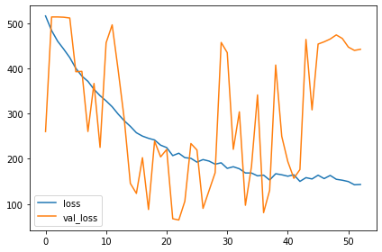
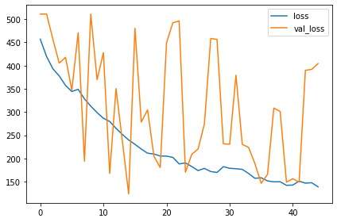
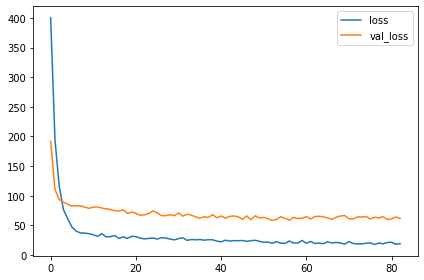
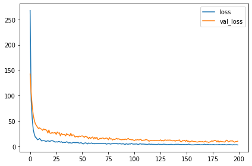
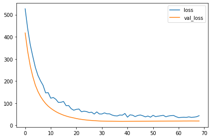
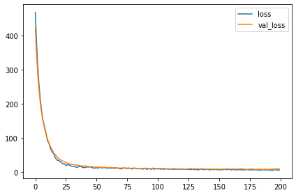
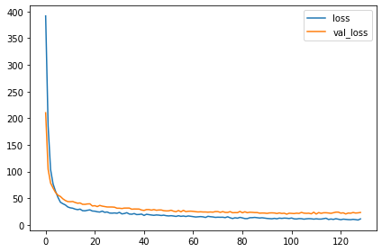
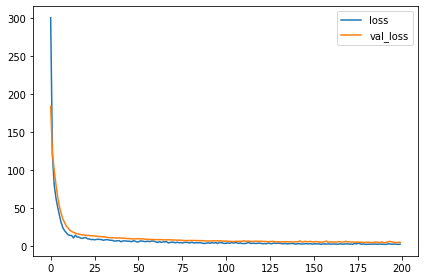

생육 기간 예측 경진대회
=======

https://dacon.io/competitions/official/235851/overview/description

KIST에서 Dacon을 통해 개최한 생육 기간 예측 경진대회에 참여해 보았다. 
한 쌍의 식물 이미지을 입력으로 받아 그 두 사진이 며칠 차이나는 것인지 예측하는 모델을 만드는 것이 목표이다. 주어진 식물 이미지는 총 두 종류였고, (BC: 청경채, LT: 적상추) 입력으로 받을 이미지가 어떤 식물인지는 파일명을 통해 알 수 있었다. 

train 데이터는 약 40일간 각각의 식물을 키우며 하루 단위로 상태를 촬영한 것으로, 파일명을 통해 이미지가 어떤 식물의 며칠차 이미지인지 구별할 수 있었다.

두 가지 방법을 생각해보았는데, 아래와 같다.
1. 하나의 이미지를 입력으로 받아서 며칠차의 이미지인지 예측하는 모델을 식물별로 만들고, 이전/이후 이미지에 대해 각각 예측한 후에 그 둘의 차를 구하는 방법
2. 두 개의 이미지를 입력으로 받아서 두 이미지가 며칠 차이나는지 예측하는 모델을 만드는 방법.

1번의 경우 학습할 때 주어진 데이터를 직관적으로 이용할 수 있고, 모델 구성이 쉽지만 학습 데이터의 양이 적어 완성된 모델의 정확도가 비교적 낮을 것이다. 반면 2번의 경우에는 학습 데이터의 양이 NC2 = N(N-1)/2 으로 많아져 모델의 정확도가 올라갈 수 있지만 주어진 학습 데이터에서 새로운 학습 데이터를 생성하는 과정을 거쳐야 한다.

주어진 시간이 길지 않았기에 나에게 조금 더 익숙한 1번 방법을 선택했다. 

## import & Constructing Dataset


```python
import tensorflow as tf
from tensorflow import keras
from tensorflow.keras import layers
from tensorflow.keras.layers.experimental import preprocessing
from tensorflow.keras.preprocessing import image_dataset_from_directory

import matplotlib.pyplot as plt

import numpy as np

plt.rc('figure', autolayout=True)
plt.rc('axes', labelweight='bold', labelsize='large', titleweight='bold', titlesize=18, titlepad=10)
plt.rc('image', cmap='cividis')
```


```python
import pandas as pd
import os

path = "./data/open/train_dataset"
file_list_BC = []
file_list_LT = []
df_BC = pd.DataFrame(columns=['file_path', 'day'])
df_LT = pd.DataFrame(columns=['file_path', 'day'])
for i in range(9):
    file_path = path + "/BC" + "/BC_0{}".format(i+1)
    file_list_BC=os.listdir(file_path)
    for img in file_list_BC:
        df_BC = df_BC.append({'file_path': file_path + img, 'day': float(img[-6:-4])}, ignore_index=True)
for i in range(10):
    file_path = path + "/LT" + "/LT_0{}".format(i+1)
    if i == 9:
        file_path = path + "/LT/LT_10"
    file_list_LT=os.listdir(file_path)
    for img in file_list_LT:
        df_LT = df_LT.append({'file_path': file_path + img, 'day': float(img[-6:-4])}, ignore_index=True)
```


```python
ds_bc_ = keras.preprocessing.image_dataset_from_directory(
    path+'/BC',
    labels=df_BC.day.to_list(),
    label_mode='int',
    image_size=[256, 256],
    interpolation='nearest',
    batch_size=1,
    shuffle=False
)

ds_lt_ = keras.preprocessing.image_dataset_from_directory(
    path+'/LT',
    labels=df_LT.day.to_list(),
    label_mode='int',
    image_size=[256, 256],
    interpolation='nearest',
    batch_size=1,
    shuffle=False
)
```

    Found 353 files belonging to 9 classes.
    Found 400 files belonging to 10 classes.
    


```python
ds_train_bc_ = ds_bc_.take(int(353 * 0.7))
ds_val_bc_ = ds_bc_.skip(int(353*0.7))
ds_train_lt_ = ds_lt_.take(int(400 * 0.7))
ds_val_lt_ = ds_lt_.take(int(400 * 0.7))
```


```python
def convert_to_float(image, label):
    image = tf.image.convert_image_dtype(image, dtype=tf.float32) 
    label = tf.cast(label, tf.float32)
    return image, label

AUTOTUNE = tf.data.experimental.AUTOTUNE

ds_train_bc = (
    ds_train_bc_
    .map(convert_to_float)
    .unbatch()
    .batch(8)
    .shuffle(500)
    .cache()
    .prefetch(buffer_size=AUTOTUNE)
)

ds_val_bc = (
    ds_val_bc_
    .map(convert_to_float)
    .unbatch()
    .batch(8)
    .cache()
    .prefetch(buffer_size=AUTOTUNE)
)

ds_train_lt = (
    ds_train_lt_
    .map(convert_to_float)
    .unbatch()
    .batch(8)
    .shuffle(500)
    .cache()
    .prefetch(buffer_size=AUTOTUNE)
)

ds_val_lt = (
    ds_val_lt_
    .map(convert_to_float)
    .unbatch()
    .batch(8)
    .cache()
    .prefetch(buffer_size=AUTOTUNE)
)
```

모듈 임포트 및 데이터 세트를 구성한다. 주어진 이미지의 크기가 너무 큰 상황이므로 크기를 (256, 256)으로 줄여 불러오고, 70%는 train dataset으로, 30%는 validation dataset으로 나눠준 후 `.cache()`,`.shuffle()`,`prefetch` 등의 전처리 과정을 거친다.

## my_conv_model

### model for BC


```python
my_conv_model_bc = keras.Sequential([
    
    layers.InputLayer(input_shape=[256, 256, 3]),
    
    preprocessing.RandomContrast(factor=0.2),
    preprocessing.RandomFlip(mode='horizontal_and_vertical'),
    preprocessing.RandomRotation(factor=0.05),
    preprocessing.RandomTranslation(height_factor=0.1, width_factor=0.1),

    layers.BatchNormalization(),
    layers.Conv2D(filters=16, kernel_size=7, activation='relu', padding='same'),
    layers.Conv2D(filters=32, kernel_size=7, activation='relu', padding='same'),
    layers.MaxPool2D(),
    
    layers.BatchNormalization(),
    layers.Conv2D(filters=64, kernel_size=5, activation='relu', padding='same'),
    layers.MaxPool2D(),
    
    layers.BatchNormalization(),
    layers.Conv2D(filters=128, kernel_size=5, activation='relu', padding='same'),
    layers.MaxPool2D(),
    
    layers.BatchNormalization(),
    layers.Conv2D(filters=256, kernel_size=3, activation='relu', padding='same'),
    layers.MaxPool2D(),
    
    layers.BatchNormalization(),
    layers.Conv2D(filters=256, kernel_size=3, activation='relu', padding='same'),
    layers.MaxPool2D(),

    layers.BatchNormalization(),
    layers.Conv2D(filters=512, kernel_size=3, activation='relu', padding='same'),
    layers.GlobalAveragePooling2D(),
    
    layers.BatchNormalization(),
    layers.Dense(16, activation='relu'),
    layers.BatchNormalization(),
    layers.Dense(16, activation='relu'),
    layers.BatchNormalization(),
    layers.Dense(1, activation='relu')
    
])
```

가장 처음으로 시도해본 모델이다. 부족한 데이터셋을 보완하기 위해 Data Augmentation layer부터 시작하여 convolution층을 쌓았다.


```python
my_conv_model_bc.compile(
    optimizer='adam',
    loss='mse'
)
```


```python
early = keras.callbacks.EarlyStopping(patience=30, min_delta=0.001, restore_best_weights=True)

history_bc = my_conv_model_bc.fit(
    ds_train_bc,
    validation_data=ds_val_bc,
    callbacks=[early],
    epochs=200
)
```

    Epoch 1/200
    31/31 [==============================] - 6s 134ms/step - loss: 515.8571 - val_loss: 260.3142
    Epoch 2/200
    31/31 [==============================] - 4s 119ms/step - loss: 483.6300 - val_loss: 513.6698
    Epoch 3/200
    31/31 [==============================] - 4s 118ms/step - loss: 459.9893 - val_loss: 513.6698
    Epoch 4/200
    31/31 [==============================] - 4s 118ms/step - loss: 442.5177 - val_loss: 513.0699
    Epoch 5/200
    31/31 [==============================] - 4s 116ms/step - loss: 423.8370 - val_loss: 511.3443
    Epoch 6/200
    31/31 [==============================] - 4s 115ms/step - loss: 400.0494 - val_loss: 392.5919
    Epoch 7/200
    31/31 [==============================] - 4s 115ms/step - loss: 382.9873 - val_loss: 393.3257
    Epoch 8/200
    31/31 [==============================] - 4s 115ms/step - loss: 371.2958 - val_loss: 260.4291
    Epoch 9/200
    31/31 [==============================] - 4s 116ms/step - loss: 353.6974 - val_loss: 366.6125
    Epoch 10/200
    31/31 [==============================] - 4s 116ms/step - loss: 339.5904 - val_loss: 225.2170
    Epoch 11/200
    31/31 [==============================] - 4s 115ms/step - loss: 328.1214 - val_loss: 456.5563
    Epoch 12/200
    31/31 [==============================] - 4s 115ms/step - loss: 315.1238 - val_loss: 496.2237
    Epoch 13/200
    31/31 [==============================] - 4s 116ms/step - loss: 298.7297 - val_loss: 395.0162
    Epoch 14/200
    31/31 [==============================] - 4s 115ms/step - loss: 284.1547 - val_loss: 287.4724
    Epoch 15/200
    31/31 [==============================] - 4s 116ms/step - loss: 271.7897 - val_loss: 145.6639
    Epoch 16/200
    31/31 [==============================] - 4s 116ms/step - loss: 257.6491 - val_loss: 123.5513
    Epoch 17/200
    31/31 [==============================] - 4s 115ms/step - loss: 250.2372 - val_loss: 202.5203
    Epoch 18/200
    31/31 [==============================] - 4s 116ms/step - loss: 245.3734 - val_loss: 87.9480
    Epoch 19/200
    31/31 [==============================] - 4s 115ms/step - loss: 241.7070 - val_loss: 238.9716
    Epoch 20/200
    31/31 [==============================] - 4s 116ms/step - loss: 230.2093 - val_loss: 204.3353
    Epoch 21/200
    31/31 [==============================] - 4s 115ms/step - loss: 224.8642 - val_loss: 220.7077
    Epoch 22/200
    31/31 [==============================] - 4s 116ms/step - loss: 207.1036 - val_loss: 67.5695
    Epoch 23/200
    31/31 [==============================] - 4s 116ms/step - loss: 212.4428 - val_loss: 64.7133
    Epoch 24/200
    31/31 [==============================] - 4s 116ms/step - loss: 202.5946 - val_loss: 106.2078
    Epoch 25/200
    31/31 [==============================] - 4s 116ms/step - loss: 201.1051 - val_loss: 233.8314
    Epoch 26/200
    31/31 [==============================] - 4s 115ms/step - loss: 192.6969 - val_loss: 219.4762
    Epoch 27/200
    31/31 [==============================] - 4s 115ms/step - loss: 198.3473 - val_loss: 90.4305
    Epoch 28/200
    31/31 [==============================] - 4s 116ms/step - loss: 195.0088 - val_loss: 129.9259
    Epoch 29/200
    31/31 [==============================] - 4s 116ms/step - loss: 188.1787 - val_loss: 169.1521
    Epoch 30/200
    31/31 [==============================] - 4s 116ms/step - loss: 191.2083 - val_loss: 457.2595
    Epoch 31/200
    31/31 [==============================] - 4s 117ms/step - loss: 178.9156 - val_loss: 434.7900
    Epoch 32/200
    31/31 [==============================] - 4s 117ms/step - loss: 182.5073 - val_loss: 221.0270
    Epoch 33/200
    31/31 [==============================] - 4s 116ms/step - loss: 178.0316 - val_loss: 303.9967
    Epoch 34/200
    31/31 [==============================] - 4s 117ms/step - loss: 168.7470 - val_loss: 97.3454
    Epoch 35/200
    31/31 [==============================] - 4s 118ms/step - loss: 168.6668 - val_loss: 182.7960
    Epoch 36/200
    31/31 [==============================] - 4s 117ms/step - loss: 162.3425 - val_loss: 341.3082
    Epoch 37/200
    31/31 [==============================] - 4s 117ms/step - loss: 163.9371 - val_loss: 81.0173
    Epoch 38/200
    31/31 [==============================] - 4s 116ms/step - loss: 153.1464 - val_loss: 130.4110
    Epoch 39/200
    31/31 [==============================] - 4s 117ms/step - loss: 167.0489 - val_loss: 407.3948
    Epoch 40/200
    31/31 [==============================] - 4s 116ms/step - loss: 164.7410 - val_loss: 249.7122
    Epoch 41/200
    31/31 [==============================] - 4s 117ms/step - loss: 161.5841 - val_loss: 193.9990
    Epoch 42/200
    31/31 [==============================] - 4s 116ms/step - loss: 164.7186 - val_loss: 156.9907
    Epoch 43/200
    31/31 [==============================] - 4s 116ms/step - loss: 150.1192 - val_loss: 176.2496
    Epoch 44/200
    31/31 [==============================] - 4s 116ms/step - loss: 158.3910 - val_loss: 463.9881
    Epoch 45/200
    31/31 [==============================] - 4s 116ms/step - loss: 155.4690 - val_loss: 308.2648
    Epoch 46/200
    31/31 [==============================] - 4s 117ms/step - loss: 163.7993 - val_loss: 453.7521
    Epoch 47/200
    31/31 [==============================] - 4s 116ms/step - loss: 156.2769 - val_loss: 458.7275
    Epoch 48/200
    31/31 [==============================] - 4s 116ms/step - loss: 163.3109 - val_loss: 464.8999
    Epoch 49/200
    31/31 [==============================] - 4s 116ms/step - loss: 154.8050 - val_loss: 473.9274
    Epoch 50/200
    31/31 [==============================] - 4s 116ms/step - loss: 152.7213 - val_loss: 466.1008
    Epoch 51/200
    31/31 [==============================] - 4s 116ms/step - loss: 149.7379 - val_loss: 447.0241
    Epoch 52/200
    31/31 [==============================] - 4s 117ms/step - loss: 142.6334 - val_loss: 439.6975
    Epoch 53/200
    31/31 [==============================] - 4s 118ms/step - loss: 143.3005 - val_loss: 442.2234
    


```python
history_bc_df = pd.DataFrame(history_bc.history)
history_bc_df.plot()
history_bc_df.val_loss.min()
```


    64.71331787109375


    

    


### model for LT


```python
my_conv_model_lt = keras.Sequential([
    
    layers.InputLayer(input_shape=[256, 256, 3]),
    
    preprocessing.RandomContrast(factor=0.2),
    preprocessing.RandomFlip(mode='horizontal_and_vertical'),
    preprocessing.RandomRotation(factor=0.05),
    preprocessing.RandomTranslation(height_factor=0.1, width_factor=0.1),

    layers.BatchNormalization(),
    layers.Conv2D(filters=16, kernel_size=7, activation='relu', padding='same'),
    layers.Conv2D(filters=32, kernel_size=7, activation='relu', padding='same'),
    layers.MaxPool2D(),
    
    layers.BatchNormalization(),
    layers.Conv2D(filters=64, kernel_size=5, activation='relu', padding='same'),
    layers.MaxPool2D(),
    
    layers.BatchNormalization(),
    layers.Conv2D(filters=128, kernel_size=5, activation='relu', padding='same'),
    layers.MaxPool2D(),
    
    layers.BatchNormalization(),
    layers.Conv2D(filters=256, kernel_size=3, activation='relu', padding='same'),
    layers.MaxPool2D(),
    
    layers.BatchNormalization(),
    layers.Conv2D(filters=256, kernel_size=3, activation='relu', padding='same'),
    layers.MaxPool2D(),
    
    layers.BatchNormalization(),
    layers.Conv2D(filters=512, kernel_size=3, activation='relu', padding='same'),
    layers.GlobalAveragePooling2D(),
    
    layers.BatchNormalization(),
    layers.Dense(16, activation='relu'),
    layers.BatchNormalization(),
    layers.Dense(16, activation='relu'),
    layers.BatchNormalization(),
    layers.Dense(1, activation='relu')
    
])
```


```python
my_conv_model_lt.compile(
    optimizer='adam',
    loss='mse'
)
```


```python
history_lt = my_conv_model_lt.fit(
    ds_train_lt,
    validation_data=ds_val_lt,
    callbacks=[early],
    epochs=200
)
```

    Epoch 1/200
    35/35 [==============================] - 7s 143ms/step - loss: 457.0312 - val_loss: 511.0893
    Epoch 2/200
    35/35 [==============================] - 5s 132ms/step - loss: 419.5297 - val_loss: 511.0893
    Epoch 3/200
    35/35 [==============================] - 5s 133ms/step - loss: 393.1316 - val_loss: 456.6693
    Epoch 4/200
    35/35 [==============================] - 5s 133ms/step - loss: 377.8481 - val_loss: 405.3843
    Epoch 5/200
    35/35 [==============================] - 5s 132ms/step - loss: 357.3217 - val_loss: 417.9756
    Epoch 6/200
    35/35 [==============================] - 5s 133ms/step - loss: 344.2028 - val_loss: 346.8989
    Epoch 7/200
    35/35 [==============================] - 5s 133ms/step - loss: 349.0166 - val_loss: 470.8322
    Epoch 8/200
    35/35 [==============================] - 5s 133ms/step - loss: 328.4152 - val_loss: 194.1724
    Epoch 9/200
    35/35 [==============================] - 5s 133ms/step - loss: 312.6311 - val_loss: 511.0893
    Epoch 10/200
    35/35 [==============================] - 5s 133ms/step - loss: 298.7771 - val_loss: 369.7345
    Epoch 11/200
    35/35 [==============================] - 5s 133ms/step - loss: 286.5973 - val_loss: 427.7449
    Epoch 12/200
    35/35 [==============================] - 5s 133ms/step - loss: 279.5605 - val_loss: 167.7548
    Epoch 13/200
    35/35 [==============================] - 5s 132ms/step - loss: 264.8020 - val_loss: 350.4664
    Epoch 14/200
    35/35 [==============================] - 5s 132ms/step - loss: 251.7407 - val_loss: 237.9728
    Epoch 15/200
    35/35 [==============================] - 5s 133ms/step - loss: 239.8489 - val_loss: 123.7462
    Epoch 16/200
    35/35 [==============================] - 5s 132ms/step - loss: 230.4057 - val_loss: 480.3776
    Epoch 17/200
    35/35 [==============================] - 5s 132ms/step - loss: 220.1818 - val_loss: 278.3588
    Epoch 18/200
    35/35 [==============================] - 5s 132ms/step - loss: 211.2850 - val_loss: 304.6825
    Epoch 19/200
    35/35 [==============================] - 5s 132ms/step - loss: 209.5475 - val_loss: 204.7624
    Epoch 20/200
    35/35 [==============================] - 5s 132ms/step - loss: 205.1927 - val_loss: 180.3592
    Epoch 21/200
    35/35 [==============================] - 5s 132ms/step - loss: 204.9958 - val_loss: 449.1464
    Epoch 22/200
    35/35 [==============================] - 5s 133ms/step - loss: 202.2907 - val_loss: 492.3596
    Epoch 23/200
    35/35 [==============================] - 5s 132ms/step - loss: 188.2301 - val_loss: 496.3425
    Epoch 24/200
    35/35 [==============================] - 5s 132ms/step - loss: 190.2379 - val_loss: 170.4053
    Epoch 25/200
    35/35 [==============================] - 5s 132ms/step - loss: 182.5014 - val_loss: 208.8862
    Epoch 26/200
    35/35 [==============================] - 5s 134ms/step - loss: 173.8195 - val_loss: 220.3764
    Epoch 27/200
    35/35 [==============================] - 5s 132ms/step - loss: 178.6378 - val_loss: 274.2379
    Epoch 28/200
    35/35 [==============================] - 5s 133ms/step - loss: 171.7723 - val_loss: 458.4698
    Epoch 29/200
    35/35 [==============================] - 5s 133ms/step - loss: 169.8550 - val_loss: 456.5378
    Epoch 30/200
    35/35 [==============================] - 5s 133ms/step - loss: 182.2980 - val_loss: 231.4540
    Epoch 31/200
    35/35 [==============================] - 5s 132ms/step - loss: 178.7592 - val_loss: 230.6397
    Epoch 32/200
    35/35 [==============================] - 5s 133ms/step - loss: 177.8751 - val_loss: 379.3458
    Epoch 33/200
    35/35 [==============================] - 5s 133ms/step - loss: 176.4236 - val_loss: 230.3199
    Epoch 34/200
    35/35 [==============================] - 5s 133ms/step - loss: 167.6593 - val_loss: 223.7957
    Epoch 35/200
    35/35 [==============================] - 5s 132ms/step - loss: 157.2380 - val_loss: 188.8523
    Epoch 36/200
    35/35 [==============================] - 5s 133ms/step - loss: 158.3401 - val_loss: 146.4380
    Epoch 37/200
    35/35 [==============================] - 5s 133ms/step - loss: 151.5335 - val_loss: 165.7619
    Epoch 38/200
    35/35 [==============================] - 5s 133ms/step - loss: 149.5933 - val_loss: 308.5584
    Epoch 39/200
    35/35 [==============================] - 5s 133ms/step - loss: 149.7565 - val_loss: 301.0820
    Epoch 40/200
    35/35 [==============================] - 5s 132ms/step - loss: 142.0242 - val_loss: 148.7987
    Epoch 41/200
    35/35 [==============================] - 5s 133ms/step - loss: 142.6787 - val_loss: 156.3166
    Epoch 42/200
    35/35 [==============================] - 5s 133ms/step - loss: 151.0714 - val_loss: 148.9152
    Epoch 43/200
    35/35 [==============================] - 5s 133ms/step - loss: 146.7005 - val_loss: 389.8687
    Epoch 44/200
    35/35 [==============================] - 5s 132ms/step - loss: 147.6984 - val_loss: 391.9529
    Epoch 45/200
    35/35 [==============================] - 5s 133ms/step - loss: 138.8297 - val_loss: 404.4947
    


```python
history_lt_df = pd.DataFrame(history_lt.history)
history_lt_df.plot()
history_lt_df.val_loss.min()
```


    123.7461929321289


    

    


```python
test_data = pd.read_csv('./data/open/test_dataset/test_data.csv')
test_data.head()
```


<div>
<style scoped>
    .dataframe tbody tr th:only-of-type {
        vertical-align: middle;
    }

    .dataframe tbody tr th {
        vertical-align: top;
    }

    .dataframe thead th {
        text-align: right;
    }
</style>
<table border="1" class="dataframe">
  <thead>
    <tr style="text-align: right;">
      <th></th>
      <th>idx</th>
      <th>before_file_path</th>
      <th>after_file_path</th>
    </tr>
  </thead>
  <tbody>
    <tr>
      <th>0</th>
      <td>0</td>
      <td>idx_LT_1003_00341</td>
      <td>idx_LT_1003_00154</td>
    </tr>
    <tr>
      <th>1</th>
      <td>1</td>
      <td>idx_LT_1003_00592</td>
      <td>idx_LT_1003_00687</td>
    </tr>
    <tr>
      <th>2</th>
      <td>2</td>
      <td>idx_BC_1100_00445</td>
      <td>idx_BC_1100_00840</td>
    </tr>
    <tr>
      <th>3</th>
      <td>3</td>
      <td>idx_BC_1112_00229</td>
      <td>idx_BC_1112_00105</td>
    </tr>
    <tr>
      <th>4</th>
      <td>4</td>
      <td>idx_LT_1088_00681</td>
      <td>idx_LT_1088_00698</td>
    </tr>
  </tbody>
</table>
</div>


### prediction


```python
bf_pred = []
af_pred = []

for i in range(3960):
    split_before = test_data.loc[i, 'before_file_path'].split('_')
    split_after = test_data.loc[i, 'after_file_path'].split('_')
    
    before_file_path = './data/open/test_dataset/{}/{}/{}.png'.format(split_before[1], split_before[2], test_data.loc[i, 'before_file_path'])
    after_file_path = './data/open/test_dataset/{}/{}/{}.png'.format(split_after[1], split_after[2], test_data.loc[i, 'after_file_path'])
    
    before_img = keras.preprocessing.image.load_img(before_file_path, target_size=[256, 256])
    after_img = keras.preprocessing.image.load_img(after_file_path, target_size=[256, 256])
    
    before_img = tf.image.convert_image_dtype(before_img, dtype=tf.float32)
    after_img = tf.image.convert_image_dtype(after_img, dtype=tf.float32)
    before_img = tf.expand_dims(before_img, 0)
    after_img = tf.expand_dims(after_img, 0)
    
    if (split_before[1] == 'LT'):
        bf_pred.append(my_conv_model_lt(before_img))
        af_pred.append(my_conv_model_lt(after_img))
    else:
        bf_pred.append(my_conv_model_bc(before_img))
        af_pred.append(my_conv_model_bc(after_img))
        
    
    
    
```

학습된 모델들을 이용해 이제 제출할 파일을 준비한다. test_data 파일에서 전/후 이미지 경로를 가져온 후 각각의 이미지를 불러와 학습시킨 모델로 예측한다. 그 결과는 각각 bf_pred, af_pred에 저장한다. 


```python
a = tf.squeeze(bf_pred)
b = tf.squeeze(af_pred)
```


```python
pred = b-a
```


```python
pred_np = pred.numpy()
```


```python
pred_np
```


    array([ 0.       , 20.849321 ,  1.5090866, ..., 17.441883 ,  2.0291595,
            7.103262 ], dtype=float32)


```python
a = [x.numpy() for x in bf_pred]
b = [x.numpy() for x in af_pred]
```


```python
test_data['time_delta'] = pred_np
test_data.head()
```


<div>
<style scoped>
    .dataframe tbody tr th:only-of-type {
        vertical-align: middle;
    }

    .dataframe tbody tr th {
        vertical-align: top;
    }

    .dataframe thead th {
        text-align: right;
    }
</style>
<table border="1" class="dataframe">
  <thead>
    <tr style="text-align: right;">
      <th></th>
      <th>idx</th>
      <th>before_file_path</th>
      <th>after_file_path</th>
      <th>time_delta</th>
      <th>time_delta_round</th>
    </tr>
  </thead>
  <tbody>
    <tr>
      <th>0</th>
      <td>0</td>
      <td>idx_LT_1003_00341</td>
      <td>idx_LT_1003_00154</td>
      <td>0.000000</td>
      <td>17.0</td>
    </tr>
    <tr>
      <th>1</th>
      <td>1</td>
      <td>idx_LT_1003_00592</td>
      <td>idx_LT_1003_00687</td>
      <td>20.849321</td>
      <td>42.0</td>
    </tr>
    <tr>
      <th>2</th>
      <td>2</td>
      <td>idx_BC_1100_00445</td>
      <td>idx_BC_1100_00840</td>
      <td>1.509087</td>
      <td>-3.0</td>
    </tr>
    <tr>
      <th>3</th>
      <td>3</td>
      <td>idx_BC_1112_00229</td>
      <td>idx_BC_1112_00105</td>
      <td>9.539714</td>
      <td>8.0</td>
    </tr>
    <tr>
      <th>4</th>
      <td>4</td>
      <td>idx_LT_1088_00681</td>
      <td>idx_LT_1088_00698</td>
      <td>19.850803</td>
      <td>0.0</td>
    </tr>
  </tbody>
</table>
</div>


```python
sub = test_data.loc[:,['idx', 'time_delta']].to_csv('./submission_3.csv', index=False)
```

bf_pred와 af_pred의 차이를 계산하여 최종 결과를 산출하고 파일로 저장한다.


```python
test_data['time_delta_round'] = round(test_data['time_delta'])
```


```python
sub = test_data.loc[:, ['idx', 'time_delta_round']]
sub = sub.rename(columns={'time_delta_round': 'time_delta'})
sub.head()
```


<div>
<style scoped>
    .dataframe tbody tr th:only-of-type {
        vertical-align: middle;
    }

    .dataframe tbody tr th {
        vertical-align: top;
    }

    .dataframe thead th {
        text-align: right;
    }
</style>
<table border="1" class="dataframe">
  <thead>
    <tr style="text-align: right;">
      <th></th>
      <th>idx</th>
      <th>time_delta</th>
    </tr>
  </thead>
  <tbody>
    <tr>
      <th>0</th>
      <td>0</td>
      <td>17.0</td>
    </tr>
    <tr>
      <th>1</th>
      <td>1</td>
      <td>42.0</td>
    </tr>
    <tr>
      <th>2</th>
      <td>2</td>
      <td>-3.0</td>
    </tr>
    <tr>
      <th>3</th>
      <td>3</td>
      <td>8.0</td>
    </tr>
    <tr>
      <th>4</th>
      <td>4</td>
      <td>0.0</td>
    </tr>
  </tbody>
</table>
</div>


```python
sub.to_csv('./submission_round_2.csv', index=False)
```

반올림한 결과도 제출해본다.

## Feature vectors of images with Inception V3 trained on the iNaturalist (iNat) 2017 dataset.

pretrained Inception V3 모델을 이용한 모델이다.

### model for BC


```python
import tensorflow_hub as hub

model_InceptionV3_bc = keras.Sequential([
    layers.InputLayer(input_shape=[256, 256, 3]),
    
    preprocessing.RandomContrast(factor=0.2),
    preprocessing.RandomFlip(mode='horizontal_and_vertical'),
    preprocessing.RandomRotation(factor=0.05),
    preprocessing.RandomTranslation(height_factor=0.1, width_factor=0.1),
    
    hub.KerasLayer("https://tfhub.dev/google/inaturalist/inception_v3/feature_vector/5", trainable=False),
    layers.Dense(1, activation='relu')
])
```


```python
model_InceptionV3_bc.compile(
    optimizer='adam',
    loss='mse'
)
```


```python
early = keras.callbacks.EarlyStopping(patience=30, min_delta=0.001, restore_best_weights=True)

history_inceptionV3_bc = model_InceptionV3_bc.fit(
    ds_train_bc,
    validation_data=ds_val_bc,
    callbacks=[early],
    epochs=200
)
```

    Epoch 1/200
    31/31 [==============================] - 64s 730ms/step - loss: 400.5964 - val_loss: 192.0665
    Epoch 2/200
    31/31 [==============================] - 2s 78ms/step - loss: 195.4252 - val_loss: 110.9231
    Epoch 3/200
    31/31 [==============================] - 2s 78ms/step - loss: 115.9808 - val_loss: 93.2681
    Epoch 4/200
    31/31 [==============================] - 2s 77ms/step - loss: 76.6959 - val_loss: 89.3264
    Epoch 5/200
    31/31 [==============================] - 2s 77ms/step - loss: 60.9589 - val_loss: 85.5317
    Epoch 6/200
    31/31 [==============================] - 2s 77ms/step - loss: 46.9957 - val_loss: 82.5640
    Epoch 7/200
    31/31 [==============================] - 2s 73ms/step - loss: 40.1099 - val_loss: 83.1177
    Epoch 8/200
    31/31 [==============================] - 2s 73ms/step - loss: 36.9794 - val_loss: 82.8093
    Epoch 9/200
    31/31 [==============================] - 2s 78ms/step - loss: 36.9035 - val_loss: 80.8165
    Epoch 10/200
    31/31 [==============================] - 2s 78ms/step - loss: 35.7571 - val_loss: 78.6310
    Epoch 11/200
    31/31 [==============================] - 2s 73ms/step - loss: 34.1028 - val_loss: 80.5993
    Epoch 12/200
    31/31 [==============================] - 2s 73ms/step - loss: 31.4140 - val_loss: 81.0685
    Epoch 13/200
    31/31 [==============================] - 2s 73ms/step - loss: 35.9488 - val_loss: 79.0916
    Epoch 14/200
    31/31 [==============================] - 2s 78ms/step - loss: 30.4540 - val_loss: 77.9292
    Epoch 15/200
    31/31 [==============================] - 2s 78ms/step - loss: 30.8682 - val_loss: 76.5714
    Epoch 16/200
    31/31 [==============================] - 2s 78ms/step - loss: 32.8613 - val_loss: 74.7149
    Epoch 17/200
    31/31 [==============================] - 2s 78ms/step - loss: 27.8073 - val_loss: 74.0180
    Epoch 18/200
    31/31 [==============================] - 2s 73ms/step - loss: 30.4803 - val_loss: 76.2163
    Epoch 19/200
    31/31 [==============================] - 2s 78ms/step - loss: 27.9562 - val_loss: 70.0010
    Epoch 20/200
    31/31 [==============================] - 2s 73ms/step - loss: 31.3739 - val_loss: 72.2322
    Epoch 21/200
    31/31 [==============================] - 2s 73ms/step - loss: 30.7633 - val_loss: 70.2847
    Epoch 22/200
    31/31 [==============================] - 2s 81ms/step - loss: 28.5418 - val_loss: 66.9956
    Epoch 23/200
    31/31 [==============================] - 2s 74ms/step - loss: 27.0449 - val_loss: 67.5446
    Epoch 24/200
    31/31 [==============================] - 2s 76ms/step - loss: 27.8422 - val_loss: 69.9366
    Epoch 25/200
    31/31 [==============================] - 2s 74ms/step - loss: 28.6448 - val_loss: 74.3412
    Epoch 26/200
    31/31 [==============================] - 2s 73ms/step - loss: 26.6983 - val_loss: 70.9286
    Epoch 27/200
    31/31 [==============================] - 2s 78ms/step - loss: 29.2641 - val_loss: 66.2381
    Epoch 28/200
    31/31 [==============================] - 2s 73ms/step - loss: 28.3320 - val_loss: 66.2874
    Epoch 29/200
    31/31 [==============================] - 2s 73ms/step - loss: 26.8851 - val_loss: 67.8572
    Epoch 30/200
    31/31 [==============================] - 2s 77ms/step - loss: 25.4129 - val_loss: 66.1844
    Epoch 31/200
    31/31 [==============================] - 2s 73ms/step - loss: 27.5323 - val_loss: 70.8451
    Epoch 32/200
    31/31 [==============================] - 2s 78ms/step - loss: 28.9707 - val_loss: 65.3838
    Epoch 33/200
    31/31 [==============================] - 2s 73ms/step - loss: 24.5845 - val_loss: 68.6962
    Epoch 34/200
    31/31 [==============================] - 2s 73ms/step - loss: 26.0010 - val_loss: 67.2394
    Epoch 35/200
    31/31 [==============================] - 2s 78ms/step - loss: 25.5403 - val_loss: 64.2159
    Epoch 36/200
    31/31 [==============================] - 2s 78ms/step - loss: 26.0302 - val_loss: 61.8992
    Epoch 37/200
    31/31 [==============================] - 2s 74ms/step - loss: 24.8692 - val_loss: 64.4042
    Epoch 38/200
    31/31 [==============================] - 2s 73ms/step - loss: 25.7319 - val_loss: 63.2512
    Epoch 39/200
    31/31 [==============================] - 2s 73ms/step - loss: 25.5339 - val_loss: 67.8790
    Epoch 40/200
    31/31 [==============================] - 2s 73ms/step - loss: 23.2873 - val_loss: 62.7961
    Epoch 41/200
    31/31 [==============================] - 2s 73ms/step - loss: 22.1064 - val_loss: 65.7179
    Epoch 42/200
    31/31 [==============================] - 2s 73ms/step - loss: 24.7902 - val_loss: 62.1894
    Epoch 43/200
    31/31 [==============================] - 2s 73ms/step - loss: 23.3013 - val_loss: 65.0752
    Epoch 44/200
    31/31 [==============================] - 2s 73ms/step - loss: 24.1256 - val_loss: 65.8132
    Epoch 45/200
    31/31 [==============================] - 2s 73ms/step - loss: 24.0640 - val_loss: 64.3355
    Epoch 46/200
    31/31 [==============================] - 2s 77ms/step - loss: 24.3038 - val_loss: 59.9836
    Epoch 47/200
    31/31 [==============================] - 2s 73ms/step - loss: 22.8753 - val_loss: 65.8209
    Epoch 48/200
    31/31 [==============================] - 2s 78ms/step - loss: 23.9659 - val_loss: 59.5048
    Epoch 49/200
    31/31 [==============================] - 2s 73ms/step - loss: 24.6965 - val_loss: 66.1223
    Epoch 50/200
    31/31 [==============================] - 2s 73ms/step - loss: 23.0004 - val_loss: 62.3623
    Epoch 51/200
    31/31 [==============================] - 2s 73ms/step - loss: 21.2663 - val_loss: 63.3528
    Epoch 52/200
    31/31 [==============================] - 2s 73ms/step - loss: 21.7279 - val_loss: 61.3497
    Epoch 53/200
    31/31 [==============================] - 2s 78ms/step - loss: 19.6753 - val_loss: 58.1021
    Epoch 54/200
    31/31 [==============================] - 2s 74ms/step - loss: 22.3833 - val_loss: 60.0407
    Epoch 55/200
    31/31 [==============================] - 2s 74ms/step - loss: 19.9275 - val_loss: 64.6369
    Epoch 56/200
    31/31 [==============================] - 2s 74ms/step - loss: 19.3052 - val_loss: 61.5371
    Epoch 57/200
    31/31 [==============================] - 2s 73ms/step - loss: 23.5065 - val_loss: 58.6598
    Epoch 58/200
    31/31 [==============================] - 2s 74ms/step - loss: 20.1298 - val_loss: 63.3926
    Epoch 59/200
    31/31 [==============================] - 2s 74ms/step - loss: 20.0520 - val_loss: 61.4285
    Epoch 60/200
    31/31 [==============================] - 2s 74ms/step - loss: 24.4609 - val_loss: 62.0573
    Epoch 61/200
    31/31 [==============================] - 2s 74ms/step - loss: 19.5321 - val_loss: 64.6381
    Epoch 62/200
    31/31 [==============================] - 2s 74ms/step - loss: 22.7725 - val_loss: 60.6799
    Epoch 63/200
    31/31 [==============================] - 2s 74ms/step - loss: 19.2453 - val_loss: 64.9300
    Epoch 64/200
    31/31 [==============================] - 2s 73ms/step - loss: 20.0059 - val_loss: 65.1975
    Epoch 65/200
    31/31 [==============================] - 2s 73ms/step - loss: 18.9628 - val_loss: 64.4075
    Epoch 66/200
    31/31 [==============================] - 2s 74ms/step - loss: 22.1356 - val_loss: 62.5207
    Epoch 67/200
    31/31 [==============================] - 2s 74ms/step - loss: 20.1018 - val_loss: 59.8941
    Epoch 68/200
    31/31 [==============================] - 2s 74ms/step - loss: 21.0719 - val_loss: 63.7596
    Epoch 69/200
    31/31 [==============================] - 2s 73ms/step - loss: 20.1609 - val_loss: 65.7661
    Epoch 70/200
    31/31 [==============================] - 2s 73ms/step - loss: 18.1543 - val_loss: 66.3766
    Epoch 71/200
    31/31 [==============================] - 2s 73ms/step - loss: 22.5153 - val_loss: 60.9518
    Epoch 72/200
    31/31 [==============================] - 2s 73ms/step - loss: 19.1908 - val_loss: 60.9707
    Epoch 73/200
    31/31 [==============================] - 2s 73ms/step - loss: 18.5873 - val_loss: 64.2459
    Epoch 74/200
    31/31 [==============================] - 2s 73ms/step - loss: 18.6072 - val_loss: 63.9364
    Epoch 75/200
    31/31 [==============================] - 2s 73ms/step - loss: 19.7535 - val_loss: 65.0090
    Epoch 76/200
    31/31 [==============================] - 2s 73ms/step - loss: 20.1968 - val_loss: 60.5784
    Epoch 77/200
    31/31 [==============================] - 2s 74ms/step - loss: 17.6390 - val_loss: 63.6978
    Epoch 78/200
    31/31 [==============================] - 2s 73ms/step - loss: 20.0027 - val_loss: 62.3843
    Epoch 79/200
    31/31 [==============================] - 2s 74ms/step - loss: 18.7664 - val_loss: 64.6525
    Epoch 80/200
    31/31 [==============================] - 2s 73ms/step - loss: 21.0079 - val_loss: 59.7566
    Epoch 81/200
    31/31 [==============================] - 2s 73ms/step - loss: 21.3944 - val_loss: 60.8192
    Epoch 82/200
    31/31 [==============================] - 2s 73ms/step - loss: 17.9325 - val_loss: 64.0160
    Epoch 83/200
    31/31 [==============================] - 2s 78ms/step - loss: 18.9965 - val_loss: 61.5613
    


```python
df_history_inceptionV3_bc = pd.DataFrame(history_inceptionV3_bc.history)
df_history_inceptionV3_bc.plot()
print(df_history_inceptionV3_bc.val_loss.min())
```

    58.10213088989258
    


    

    


### model for LT


```python
model_InceptionV3_lt = keras.Sequential([
    layers.InputLayer(input_shape=[256, 256, 3]),
    
    preprocessing.RandomContrast(factor=0.2),
    preprocessing.RandomFlip(mode='horizontal_and_vertical'),
    preprocessing.RandomRotation(factor=0.05),
    preprocessing.RandomTranslation(height_factor=0.1, width_factor=0.1),
    
    hub.KerasLayer("https://tfhub.dev/google/inaturalist/inception_v3/feature_vector/5", trainable=False),
    layers.Dense(1, activation='relu')
])
```


```python
model_InceptionV3_lt.compile(
    optimizer='adam',
    loss='mse'
)
```


```python
history_inceptionV3_lt = model_InceptionV3_lt.fit(
    ds_train_lt,
    validation_data=ds_val_lt,
    callbacks=[early],
    epochs=200
)
```

    Epoch 1/200
    35/35 [==============================] - 59s 283ms/step - loss: 267.5953 - val_loss: 142.6358
    Epoch 2/200
    35/35 [==============================] - 4s 102ms/step - loss: 90.2751 - val_loss: 104.5277
    Epoch 3/200
    35/35 [==============================] - 4s 102ms/step - loss: 55.0043 - val_loss: 79.8890
    Epoch 4/200
    35/35 [==============================] - 3s 101ms/step - loss: 33.1431 - val_loss: 61.6856
    Epoch 5/200
    35/35 [==============================] - 3s 101ms/step - loss: 24.1910 - val_loss: 51.8429
    Epoch 6/200
    35/35 [==============================] - 4s 102ms/step - loss: 18.2753 - val_loss: 44.6154
    Epoch 7/200
    35/35 [==============================] - 3s 101ms/step - loss: 16.8149 - val_loss: 41.2690
    Epoch 8/200
    35/35 [==============================] - 3s 101ms/step - loss: 13.2607 - val_loss: 38.1541
    Epoch 9/200
    35/35 [==============================] - 4s 101ms/step - loss: 13.6940 - val_loss: 35.3799
    Epoch 10/200
    35/35 [==============================] - 3s 98ms/step - loss: 15.7930 - val_loss: 36.6617
    Epoch 11/200
    35/35 [==============================] - 3s 101ms/step - loss: 13.6657 - val_loss: 34.7526
    Epoch 12/200
    35/35 [==============================] - 3s 101ms/step - loss: 10.8917 - val_loss: 34.0970
    Epoch 13/200
    35/35 [==============================] - 3s 101ms/step - loss: 11.3016 - val_loss: 31.6066
    Epoch 14/200
    35/35 [==============================] - 3s 99ms/step - loss: 11.3760 - val_loss: 34.5758
    Epoch 15/200
    35/35 [==============================] - 3s 97ms/step - loss: 11.0947 - val_loss: 32.7870
    Epoch 16/200
    35/35 [==============================] - 3s 98ms/step - loss: 10.0867 - val_loss: 33.1752
    Epoch 17/200
    35/35 [==============================] - 4s 102ms/step - loss: 10.3995 - val_loss: 31.3577
    Epoch 18/200
    35/35 [==============================] - 4s 102ms/step - loss: 11.3812 - val_loss: 26.5064
    Epoch 19/200
    35/35 [==============================] - 3s 99ms/step - loss: 10.3995 - val_loss: 32.4281
    Epoch 20/200
    35/35 [==============================] - 4s 102ms/step - loss: 10.1197 - val_loss: 26.2765
    Epoch 21/200
    35/35 [==============================] - 4s 102ms/step - loss: 11.1301 - val_loss: 25.7067
    Epoch 22/200
    35/35 [==============================] - 3s 98ms/step - loss: 11.4463 - val_loss: 27.5882
    Epoch 23/200
    35/35 [==============================] - 3s 98ms/step - loss: 10.8471 - val_loss: 26.1618
    Epoch 24/200
    35/35 [==============================] - 3s 98ms/step - loss: 9.8867 - val_loss: 27.0445
    Epoch 25/200
    35/35 [==============================] - 3s 98ms/step - loss: 8.5365 - val_loss: 27.2464
    Epoch 26/200
    35/35 [==============================] - 4s 102ms/step - loss: 9.2943 - val_loss: 23.7069
    Epoch 27/200
    35/35 [==============================] - 3s 99ms/step - loss: 8.6181 - val_loss: 28.5529
    Epoch 28/200
    35/35 [==============================] - 3s 99ms/step - loss: 9.6948 - val_loss: 26.0202
    Epoch 29/200
    35/35 [==============================] - 3s 99ms/step - loss: 9.6668 - val_loss: 27.0909
    Epoch 30/200
    35/35 [==============================] - 4s 103ms/step - loss: 8.3811 - val_loss: 20.7559
    Epoch 31/200
    35/35 [==============================] - 3s 98ms/step - loss: 9.4062 - val_loss: 25.9118
    Epoch 32/200
    35/35 [==============================] - 3s 98ms/step - loss: 7.4950 - val_loss: 22.8918
    Epoch 33/200
    35/35 [==============================] - 3s 98ms/step - loss: 8.3607 - val_loss: 23.7883
    Epoch 34/200
    35/35 [==============================] - 3s 98ms/step - loss: 7.8140 - val_loss: 23.5110
    Epoch 35/200
    35/35 [==============================] - 3s 101ms/step - loss: 7.9397 - val_loss: 20.6845
    Epoch 36/200
    35/35 [==============================] - 3s 98ms/step - loss: 9.3832 - val_loss: 25.2421
    Epoch 37/200
    35/35 [==============================] - 3s 98ms/step - loss: 8.2487 - val_loss: 23.0632
    Epoch 38/200
    35/35 [==============================] - 3s 98ms/step - loss: 6.7433 - val_loss: 22.9872
    Epoch 39/200
    35/35 [==============================] - 4s 102ms/step - loss: 7.6738 - val_loss: 20.5507
    Epoch 40/200
    35/35 [==============================] - 3s 97ms/step - loss: 6.9044 - val_loss: 25.9428
    Epoch 41/200
    35/35 [==============================] - 3s 97ms/step - loss: 6.6152 - val_loss: 20.8946
    Epoch 42/200
    35/35 [==============================] - 3s 98ms/step - loss: 7.6620 - val_loss: 23.1430
    Epoch 43/200
    35/35 [==============================] - 3s 98ms/step - loss: 7.9507 - val_loss: 22.1812
    Epoch 44/200
    35/35 [==============================] - 4s 102ms/step - loss: 7.3383 - val_loss: 18.6486
    Epoch 45/200
    35/35 [==============================] - 3s 98ms/step - loss: 7.7895 - val_loss: 19.2392
    Epoch 46/200
    35/35 [==============================] - 3s 98ms/step - loss: 7.4731 - val_loss: 20.0332
    Epoch 47/200
    35/35 [==============================] - 4s 102ms/step - loss: 7.7942 - val_loss: 18.3656
    Epoch 48/200
    35/35 [==============================] - 3s 98ms/step - loss: 6.4109 - val_loss: 20.5819
    Epoch 49/200
    35/35 [==============================] - 3s 98ms/step - loss: 7.1043 - val_loss: 19.3266
    Epoch 50/200
    35/35 [==============================] - 3s 97ms/step - loss: 7.3166 - val_loss: 20.5303
    Epoch 51/200
    35/35 [==============================] - 4s 101ms/step - loss: 5.8941 - val_loss: 20.9351
    Epoch 52/200
    35/35 [==============================] - 3s 98ms/step - loss: 4.9991 - val_loss: 19.5182
    Epoch 53/200
    35/35 [==============================] - 4s 102ms/step - loss: 6.5049 - val_loss: 17.9472
    Epoch 54/200
    35/35 [==============================] - 3s 98ms/step - loss: 7.1994 - val_loss: 20.3726
    Epoch 55/200
    35/35 [==============================] - 3s 97ms/step - loss: 6.4298 - val_loss: 19.0243
    Epoch 56/200
    35/35 [==============================] - 3s 97ms/step - loss: 5.0167 - val_loss: 18.2676
    Epoch 57/200
    35/35 [==============================] - 4s 102ms/step - loss: 6.8860 - val_loss: 15.0397
    Epoch 58/200
    35/35 [==============================] - 3s 98ms/step - loss: 6.2001 - val_loss: 18.1682
    Epoch 59/200
    35/35 [==============================] - 3s 98ms/step - loss: 6.3037 - val_loss: 15.5254
    Epoch 60/200
    35/35 [==============================] - 3s 98ms/step - loss: 6.9300 - val_loss: 17.6217
    Epoch 61/200
    35/35 [==============================] - 3s 98ms/step - loss: 5.5090 - val_loss: 18.7189
    Epoch 62/200
    35/35 [==============================] - 4s 102ms/step - loss: 6.3320 - val_loss: 14.6152
    Epoch 63/200
    35/35 [==============================] - 3s 98ms/step - loss: 5.2628 - val_loss: 18.0294
    Epoch 64/200
    35/35 [==============================] - 3s 97ms/step - loss: 5.7192 - val_loss: 15.4067
    Epoch 65/200
    35/35 [==============================] - 3s 98ms/step - loss: 5.6020 - val_loss: 17.8264
    Epoch 66/200
    35/35 [==============================] - 4s 102ms/step - loss: 5.6311 - val_loss: 13.6082
    Epoch 67/200
    35/35 [==============================] - 3s 98ms/step - loss: 5.6616 - val_loss: 14.1689
    Epoch 68/200
    35/35 [==============================] - 3s 98ms/step - loss: 5.5566 - val_loss: 16.2974
    Epoch 69/200
    35/35 [==============================] - 3s 97ms/step - loss: 5.6556 - val_loss: 15.3677
    Epoch 70/200
    35/35 [==============================] - 3s 97ms/step - loss: 6.1316 - val_loss: 16.6068
    Epoch 71/200
    35/35 [==============================] - 3s 97ms/step - loss: 5.7022 - val_loss: 16.6693
    Epoch 72/200
    35/35 [==============================] - 3s 98ms/step - loss: 6.0620 - val_loss: 14.7758
    Epoch 73/200
    35/35 [==============================] - 3s 98ms/step - loss: 6.0510 - val_loss: 15.9207
    Epoch 74/200
    35/35 [==============================] - 3s 98ms/step - loss: 4.5217 - val_loss: 16.6812
    Epoch 75/200
    35/35 [==============================] - 3s 98ms/step - loss: 5.2235 - val_loss: 15.9247
    Epoch 76/200
    35/35 [==============================] - 4s 102ms/step - loss: 5.4808 - val_loss: 13.1473
    Epoch 77/200
    35/35 [==============================] - 3s 98ms/step - loss: 5.4453 - val_loss: 17.5494
    Epoch 78/200
    35/35 [==============================] - 3s 98ms/step - loss: 4.6470 - val_loss: 14.5697
    Epoch 79/200
    35/35 [==============================] - 3s 98ms/step - loss: 5.3022 - val_loss: 15.0707
    Epoch 80/200
    35/35 [==============================] - 4s 102ms/step - loss: 5.4465 - val_loss: 12.6455
    Epoch 81/200
    35/35 [==============================] - 3s 97ms/step - loss: 5.6795 - val_loss: 14.6443
    Epoch 82/200
    35/35 [==============================] - 3s 98ms/step - loss: 5.8855 - val_loss: 13.4410
    Epoch 83/200
    35/35 [==============================] - 3s 97ms/step - loss: 5.8772 - val_loss: 14.8077
    Epoch 84/200
    35/35 [==============================] - 3s 98ms/step - loss: 6.0731 - val_loss: 15.9732
    Epoch 85/200
    35/35 [==============================] - 3s 98ms/step - loss: 4.9971 - val_loss: 14.2493
    Epoch 86/200
    35/35 [==============================] - 3s 98ms/step - loss: 5.2179 - val_loss: 15.2031
    Epoch 87/200
    35/35 [==============================] - 3s 97ms/step - loss: 5.6927 - val_loss: 13.6171
    Epoch 88/200
    35/35 [==============================] - 3s 98ms/step - loss: 5.0478 - val_loss: 13.4741
    Epoch 89/200
    35/35 [==============================] - 3s 98ms/step - loss: 4.8009 - val_loss: 13.0391
    Epoch 90/200
    35/35 [==============================] - 3s 98ms/step - loss: 5.5312 - val_loss: 14.2673
    Epoch 91/200
    35/35 [==============================] - 3s 98ms/step - loss: 4.7202 - val_loss: 13.1142
    Epoch 92/200
    35/35 [==============================] - 3s 98ms/step - loss: 3.7516 - val_loss: 14.8548
    Epoch 93/200
    35/35 [==============================] - 3s 98ms/step - loss: 5.4803 - val_loss: 13.2510
    Epoch 94/200
    35/35 [==============================] - 3s 98ms/step - loss: 4.6655 - val_loss: 14.4702
    Epoch 95/200
    35/35 [==============================] - 3s 98ms/step - loss: 4.4379 - val_loss: 15.8425
    Epoch 96/200
    35/35 [==============================] - 3s 98ms/step - loss: 5.0627 - val_loss: 14.0034
    Epoch 97/200
    35/35 [==============================] - 3s 97ms/step - loss: 4.7182 - val_loss: 13.6732
    Epoch 98/200
    35/35 [==============================] - 3s 98ms/step - loss: 5.8748 - val_loss: 13.0892
    Epoch 99/200
    35/35 [==============================] - 3s 98ms/step - loss: 5.0026 - val_loss: 13.3027
    Epoch 100/200
    35/35 [==============================] - 3s 101ms/step - loss: 4.6181 - val_loss: 12.5367
    Epoch 101/200
    35/35 [==============================] - 4s 102ms/step - loss: 4.6586 - val_loss: 11.7075
    Epoch 102/200
    35/35 [==============================] - 3s 97ms/step - loss: 4.7857 - val_loss: 13.1466
    Epoch 103/200
    35/35 [==============================] - 3s 98ms/step - loss: 5.0451 - val_loss: 12.7689
    Epoch 104/200
    35/35 [==============================] - 3s 98ms/step - loss: 4.2532 - val_loss: 13.4013
    Epoch 105/200
    35/35 [==============================] - 3s 98ms/step - loss: 4.1062 - val_loss: 12.7683
    Epoch 106/200
    35/35 [==============================] - 3s 98ms/step - loss: 5.2174 - val_loss: 13.1414
    Epoch 107/200
    35/35 [==============================] - 3s 98ms/step - loss: 5.2059 - val_loss: 14.3479
    Epoch 108/200
    35/35 [==============================] - 4s 102ms/step - loss: 4.4640 - val_loss: 11.4404
    Epoch 109/200
    35/35 [==============================] - 3s 97ms/step - loss: 4.8744 - val_loss: 12.1295
    Epoch 110/200
    35/35 [==============================] - 3s 98ms/step - loss: 4.6096 - val_loss: 12.4435
    Epoch 111/200
    35/35 [==============================] - 3s 98ms/step - loss: 4.5041 - val_loss: 12.5303
    Epoch 112/200
    35/35 [==============================] - 3s 98ms/step - loss: 4.2334 - val_loss: 13.7809
    Epoch 113/200
    35/35 [==============================] - 3s 98ms/step - loss: 4.0635 - val_loss: 13.0333
    Epoch 114/200
    35/35 [==============================] - 3s 98ms/step - loss: 4.1847 - val_loss: 12.1587
    Epoch 115/200
    35/35 [==============================] - 3s 101ms/step - loss: 5.0585 - val_loss: 10.1708
    Epoch 116/200
    35/35 [==============================] - 3s 97ms/step - loss: 4.0041 - val_loss: 11.6818
    Epoch 117/200
    35/35 [==============================] - 3s 98ms/step - loss: 4.5454 - val_loss: 11.6174
    Epoch 118/200
    35/35 [==============================] - 3s 97ms/step - loss: 4.2099 - val_loss: 11.2828
    Epoch 119/200
    35/35 [==============================] - 3s 97ms/step - loss: 4.1795 - val_loss: 11.6445
    Epoch 120/200
    35/35 [==============================] - 3s 97ms/step - loss: 4.2781 - val_loss: 11.4475
    Epoch 121/200
    35/35 [==============================] - 3s 98ms/step - loss: 4.1401 - val_loss: 12.1215
    Epoch 122/200
    35/35 [==============================] - 3s 97ms/step - loss: 4.1630 - val_loss: 11.8540
    Epoch 123/200
    35/35 [==============================] - 3s 98ms/step - loss: 3.9571 - val_loss: 11.3771
    Epoch 124/200
    35/35 [==============================] - 3s 97ms/step - loss: 4.7382 - val_loss: 11.3420
    Epoch 125/200
    35/35 [==============================] - 3s 98ms/step - loss: 4.0461 - val_loss: 11.7885
    Epoch 126/200
    35/35 [==============================] - 3s 98ms/step - loss: 4.1559 - val_loss: 12.9823
    Epoch 127/200
    35/35 [==============================] - 3s 98ms/step - loss: 4.0345 - val_loss: 10.9922
    Epoch 128/200
    35/35 [==============================] - 3s 97ms/step - loss: 4.1124 - val_loss: 12.0434
    Epoch 129/200
    35/35 [==============================] - 3s 98ms/step - loss: 4.5922 - val_loss: 10.8961
    Epoch 130/200
    35/35 [==============================] - 3s 98ms/step - loss: 4.2484 - val_loss: 12.7948
    Epoch 131/200
    35/35 [==============================] - 3s 98ms/step - loss: 4.0805 - val_loss: 12.6487
    Epoch 132/200
    35/35 [==============================] - 3s 98ms/step - loss: 3.5430 - val_loss: 11.9976
    Epoch 133/200
    35/35 [==============================] - 3s 98ms/step - loss: 3.7007 - val_loss: 12.7524
    Epoch 134/200
    35/35 [==============================] - 3s 98ms/step - loss: 4.0733 - val_loss: 12.1194
    Epoch 135/200
    35/35 [==============================] - 3s 98ms/step - loss: 3.7102 - val_loss: 12.8408
    Epoch 136/200
    35/35 [==============================] - 3s 97ms/step - loss: 4.4451 - val_loss: 11.6757
    Epoch 137/200
    35/35 [==============================] - 3s 98ms/step - loss: 3.7500 - val_loss: 11.1608
    Epoch 138/200
    35/35 [==============================] - 3s 97ms/step - loss: 3.5721 - val_loss: 11.2104
    Epoch 139/200
    35/35 [==============================] - 3s 98ms/step - loss: 3.5052 - val_loss: 11.8174
    Epoch 140/200
    35/35 [==============================] - 3s 98ms/step - loss: 4.2257 - val_loss: 10.3523
    Epoch 141/200
    35/35 [==============================] - 3s 98ms/step - loss: 4.1547 - val_loss: 11.9895
    Epoch 142/200
    35/35 [==============================] - 3s 98ms/step - loss: 4.2100 - val_loss: 11.2655
    Epoch 143/200
    35/35 [==============================] - 3s 98ms/step - loss: 4.3965 - val_loss: 11.9604
    Epoch 144/200
    35/35 [==============================] - 3s 97ms/step - loss: 3.9586 - val_loss: 12.9762
    Epoch 145/200
    35/35 [==============================] - 4s 102ms/step - loss: 3.8093 - val_loss: 9.8819
    Epoch 146/200
    35/35 [==============================] - 4s 102ms/step - loss: 3.8508 - val_loss: 9.0833
    Epoch 147/200
    35/35 [==============================] - 3s 98ms/step - loss: 3.6731 - val_loss: 11.5624
    Epoch 148/200
    35/35 [==============================] - 3s 98ms/step - loss: 3.9261 - val_loss: 11.1420
    Epoch 149/200
    35/35 [==============================] - 3s 98ms/step - loss: 3.7544 - val_loss: 12.0116
    Epoch 150/200
    35/35 [==============================] - 3s 98ms/step - loss: 3.6651 - val_loss: 10.0184
    Epoch 151/200
    35/35 [==============================] - 3s 98ms/step - loss: 3.9281 - val_loss: 12.4418
    Epoch 152/200
    35/35 [==============================] - 3s 97ms/step - loss: 3.9675 - val_loss: 9.6619
    Epoch 153/200
    35/35 [==============================] - 3s 97ms/step - loss: 4.7139 - val_loss: 10.6508
    Epoch 154/200
    35/35 [==============================] - 3s 101ms/step - loss: 3.6207 - val_loss: 8.5522
    Epoch 155/200
    35/35 [==============================] - 3s 97ms/step - loss: 3.5818 - val_loss: 10.0058
    Epoch 156/200
    35/35 [==============================] - 3s 97ms/step - loss: 3.0203 - val_loss: 10.8692
    Epoch 157/200
    35/35 [==============================] - 3s 98ms/step - loss: 3.2725 - val_loss: 10.2244
    Epoch 158/200
    35/35 [==============================] - 3s 97ms/step - loss: 3.1026 - val_loss: 9.5223
    Epoch 159/200
    35/35 [==============================] - 3s 97ms/step - loss: 3.7418 - val_loss: 9.9533
    Epoch 160/200
    35/35 [==============================] - 3s 97ms/step - loss: 3.4894 - val_loss: 9.0948
    Epoch 161/200
    35/35 [==============================] - 3s 97ms/step - loss: 3.8890 - val_loss: 8.6604
    Epoch 162/200
    35/35 [==============================] - 3s 98ms/step - loss: 3.7489 - val_loss: 8.9261
    Epoch 163/200
    35/35 [==============================] - 3s 97ms/step - loss: 4.1149 - val_loss: 9.9134
    Epoch 164/200
    35/35 [==============================] - 3s 98ms/step - loss: 3.1841 - val_loss: 9.4922
    Epoch 165/200
    35/35 [==============================] - 3s 98ms/step - loss: 3.5552 - val_loss: 9.1673
    Epoch 166/200
    35/35 [==============================] - 3s 98ms/step - loss: 3.2687 - val_loss: 9.7488
    Epoch 167/200
    35/35 [==============================] - 3s 98ms/step - loss: 3.9308 - val_loss: 8.7850
    Epoch 168/200
    35/35 [==============================] - 3s 97ms/step - loss: 4.5135 - val_loss: 9.3287
    Epoch 169/200
    35/35 [==============================] - 3s 98ms/step - loss: 3.7737 - val_loss: 10.4968
    Epoch 170/200
    35/35 [==============================] - 3s 97ms/step - loss: 3.4680 - val_loss: 8.8523
    Epoch 171/200
    35/35 [==============================] - 3s 98ms/step - loss: 4.2128 - val_loss: 8.9990
    Epoch 172/200
    35/35 [==============================] - 4s 101ms/step - loss: 3.6830 - val_loss: 8.0186
    Epoch 173/200
    35/35 [==============================] - 3s 97ms/step - loss: 3.3940 - val_loss: 8.8123
    Epoch 174/200
    35/35 [==============================] - 3s 97ms/step - loss: 3.6354 - val_loss: 9.4806
    Epoch 175/200
    35/35 [==============================] - 3s 98ms/step - loss: 3.3357 - val_loss: 11.0046
    Epoch 176/200
    35/35 [==============================] - 3s 98ms/step - loss: 3.5657 - val_loss: 10.2959
    Epoch 177/200
    35/35 [==============================] - 3s 97ms/step - loss: 3.8977 - val_loss: 11.0013
    Epoch 178/200
    35/35 [==============================] - 3s 97ms/step - loss: 3.1910 - val_loss: 12.1733
    Epoch 179/200
    35/35 [==============================] - 3s 98ms/step - loss: 3.4435 - val_loss: 11.5488
    Epoch 180/200
    35/35 [==============================] - 3s 98ms/step - loss: 3.4965 - val_loss: 8.8221
    Epoch 181/200
    35/35 [==============================] - 3s 97ms/step - loss: 3.3066 - val_loss: 11.3991
    Epoch 182/200
    35/35 [==============================] - 3s 98ms/step - loss: 3.9446 - val_loss: 8.3126
    Epoch 183/200
    35/35 [==============================] - 3s 98ms/step - loss: 3.6437 - val_loss: 10.2872
    Epoch 184/200
    35/35 [==============================] - 3s 98ms/step - loss: 3.2447 - val_loss: 9.8890
    Epoch 185/200
    35/35 [==============================] - 3s 97ms/step - loss: 3.9475 - val_loss: 9.5403
    Epoch 186/200
    35/35 [==============================] - 3s 97ms/step - loss: 3.3425 - val_loss: 9.3205
    Epoch 187/200
    35/35 [==============================] - 3s 97ms/step - loss: 3.9947 - val_loss: 8.6745
    Epoch 188/200
    35/35 [==============================] - 3s 97ms/step - loss: 3.4550 - val_loss: 9.4906
    Epoch 189/200
    35/35 [==============================] - 3s 97ms/step - loss: 3.0680 - val_loss: 12.4135
    Epoch 190/200
    35/35 [==============================] - 3s 97ms/step - loss: 3.5155 - val_loss: 11.6836
    Epoch 191/200
    35/35 [==============================] - 3s 98ms/step - loss: 3.6743 - val_loss: 8.9071
    Epoch 192/200
    35/35 [==============================] - 3s 98ms/step - loss: 3.7474 - val_loss: 10.0538
    Epoch 193/200
    35/35 [==============================] - 3s 98ms/step - loss: 3.4648 - val_loss: 10.9824
    Epoch 194/200
    35/35 [==============================] - 3s 97ms/step - loss: 3.2840 - val_loss: 10.8693
    Epoch 195/200
    35/35 [==============================] - 3s 97ms/step - loss: 3.0685 - val_loss: 11.0272
    Epoch 196/200
    35/35 [==============================] - 3s 97ms/step - loss: 3.6158 - val_loss: 9.3619
    Epoch 197/200
    35/35 [==============================] - 3s 98ms/step - loss: 3.2187 - val_loss: 8.4626
    Epoch 198/200
    35/35 [==============================] - 3s 98ms/step - loss: 3.3138 - val_loss: 9.7900
    Epoch 199/200
    35/35 [==============================] - 3s 97ms/step - loss: 3.3933 - val_loss: 9.7044
    Epoch 200/200
    35/35 [==============================] - 3s 98ms/step - loss: 3.0374 - val_loss: 10.4564
    


```python
df_history_inceptionV3_lt = pd.DataFrame(history_inceptionV3_lt.history)
df_history_inceptionV3_lt.plot()
print(df_history_inceptionV3_lt.val_loss.min())
```

    8.018611907958984
    


    

    


### prediction


```python
bf_pred = []
af_pred = []

for i in range(3960):
    split_before = test_data.loc[i, 'before_file_path'].split('_')
    split_after = test_data.loc[i, 'after_file_path'].split('_')
    
    before_file_path = './data/open/test_dataset/{}/{}/{}.png'.format(split_before[1], split_before[2], test_data.loc[i, 'before_file_path'])
    after_file_path = './data/open/test_dataset/{}/{}/{}.png'.format(split_after[1], split_after[2], test_data.loc[i, 'after_file_path'])
    
    before_img = keras.preprocessing.image.load_img(before_file_path, target_size=[256, 256])
    after_img = keras.preprocessing.image.load_img(after_file_path, target_size=[256, 256])
    
    before_img = tf.image.convert_image_dtype(before_img, dtype=tf.float32)
    after_img = tf.image.convert_image_dtype(after_img, dtype=tf.float32)
    before_img = tf.expand_dims(before_img, 0)
    after_img = tf.expand_dims(after_img, 0)
    
    if (split_before[1] == 'LT'):
        bf_pred.append(model_InceptionV3_lt(before_img))
        af_pred.append(model_InceptionV3_lt(after_img))
    else:
        bf_pred.append(model_InceptionV3_bc(before_img))
        af_pred.append(model_InceptionV3_bc(after_img))
        
    
    
```


```python
pred = tf.squeeze(af_pred) - tf.squeeze(bf_pred)
pred_np = pred.numpy()
print(pred_np)
```

    [26.260178  28.437988  -1.6531639 ...  7.903446   2.4351768 12.020096 ]
    


```python
sub_inception = test_data
sub_inception['time_delta'] = pred_np
sub_inception.loc[sub_inception.time_delta < 1, 'time_delta'] = 1
sub_inception.head()
```


<div>
<style scoped>
    .dataframe tbody tr th:only-of-type {
        vertical-align: middle;
    }

    .dataframe tbody tr th {
        vertical-align: top;
    }

    .dataframe thead th {
        text-align: right;
    }
</style>
<table border="1" class="dataframe">
  <thead>
    <tr style="text-align: right;">
      <th></th>
      <th>idx</th>
      <th>before_file_path</th>
      <th>after_file_path</th>
      <th>time_delta</th>
    </tr>
  </thead>
  <tbody>
    <tr>
      <th>0</th>
      <td>0</td>
      <td>idx_LT_1003_00341</td>
      <td>idx_LT_1003_00154</td>
      <td>26.260178</td>
    </tr>
    <tr>
      <th>1</th>
      <td>1</td>
      <td>idx_LT_1003_00592</td>
      <td>idx_LT_1003_00687</td>
      <td>28.437988</td>
    </tr>
    <tr>
      <th>2</th>
      <td>2</td>
      <td>idx_BC_1100_00445</td>
      <td>idx_BC_1100_00840</td>
      <td>1.000000</td>
    </tr>
    <tr>
      <th>3</th>
      <td>3</td>
      <td>idx_BC_1112_00229</td>
      <td>idx_BC_1112_00105</td>
      <td>8.913050</td>
    </tr>
    <tr>
      <th>4</th>
      <td>4</td>
      <td>idx_LT_1088_00681</td>
      <td>idx_LT_1088_00698</td>
      <td>15.000099</td>
    </tr>
  </tbody>
</table>
</div>


```python
sub_inception.loc[:, ['idx', 'time_delta']].to_csv('./submission_inceptionv3_1.csv', index=False)
```

## EfficientNet

Feature vectors of images with EfficientNet V2 with input size 480x480, trained on imagenet-ilsvrc-2012-cls (ILSVRC-2012-CLS).
Google의 pretrained EfficientNet 모델을 이용해보았다.

### Constructing Dataset
 
모델에 최적화된 input size에 맞게 다시 데이터셋을 불러온다.


```python
ds2_bc_ = keras.preprocessing.image_dataset_from_directory(
    path+'/BC',
    labels=df_BC.day.to_list(),
    label_mode='int',
    image_size=[480, 480],
    interpolation='nearest',
    batch_size=1,
    shuffle=False
)

ds2_lt_ = keras.preprocessing.image_dataset_from_directory(
    path+'/LT',
    labels=df_LT.day.to_list(),
    label_mode='int',
    image_size=[480, 480],
    interpolation='nearest',
    batch_size=1,
    shuffle=False
)
```

    Found 353 files belonging to 9 classes.
    Found 400 files belonging to 10 classes.
    


```python
ds2_train_bc_ = ds2_bc_.take(int(353 * 0.7))
ds2_val_bc_ = ds2_bc_.skip(int(353*0.7))
ds2_train_lt_ = ds2_lt_.take(int(400 * 0.7))
ds2_val_lt_ = ds2_lt_.take(int(400 * 0.7))
```


```python
def convert_to_float(image, label):
    image = tf.image.convert_image_dtype(image, dtype=tf.float32) 
    label = tf.cast(label, tf.float32)
    return image, label

AUTOTUNE = tf.data.experimental.AUTOTUNE

ds2_train_bc = (
    ds2_train_bc_
    .map(convert_to_float)
    .unbatch()
    .batch(8)
    .shuffle(500)
    .cache()
    .prefetch(buffer_size=AUTOTUNE)
)

ds2_val_bc = (
    ds2_val_bc_
    .map(convert_to_float)
    .unbatch()
    .batch(8)
    .cache()
    .prefetch(buffer_size=AUTOTUNE)
)

ds2_train_lt = (
    ds2_train_lt_
    .map(convert_to_float)
    .unbatch()
    .batch(8)
    .shuffle(500)
    .cache()
    .prefetch(buffer_size=AUTOTUNE)
)

ds2_val_lt = (
    ds2_val_lt_
    .map(convert_to_float)
    .unbatch()
    .batch(8)
    .cache()
    .prefetch(buffer_size=AUTOTUNE)
)
```

### model for BC


```python
model_EfficientNet_bc = keras.Sequential([
    layers.InputLayer(input_shape=[480, 480, 3]),
    
    preprocessing.RandomContrast(factor=0.2),
    preprocessing.RandomFlip(mode='horizontal_and_vertical'),
    preprocessing.RandomRotation(factor=0.05),
    preprocessing.RandomTranslation(height_factor=0.1, width_factor=0.1),
    
    hub.KerasLayer("https://tfhub.dev/google/imagenet/efficientnet_v2_imagenet1k_m/feature_vector/2", trainable=False),
    layers.Dense(1, activation='relu')
])
```


```python
model_EfficientNet_bc.compile(
    optimizer='adam',
    loss='mse'
)
```


```python
history_EfficientNet_bc = model_EfficientNet_bc.fit(
    ds2_train_bc,
    validation_data=ds2_val_bc,
    callbacks=[early],
    epochs=200
)
```

    Epoch 1/200
    31/31 [==============================] - 93s 1s/step - loss: 526.7703 - val_loss: 417.6715
    Epoch 2/200
    31/31 [==============================] - 18s 574ms/step - loss: 435.7549 - val_loss: 333.3734
    Epoch 3/200
    31/31 [==============================] - 18s 574ms/step - loss: 364.0046 - val_loss: 268.2938
    Epoch 4/200
    31/31 [==============================] - 18s 576ms/step - loss: 310.8192 - val_loss: 219.7018
    Epoch 5/200
    31/31 [==============================] - 18s 577ms/step - loss: 261.1351 - val_loss: 180.7642
    Epoch 6/200
    31/31 [==============================] - 18s 577ms/step - loss: 225.3673 - val_loss: 152.5628
    Epoch 7/200
    31/31 [==============================] - 18s 576ms/step - loss: 200.9063 - val_loss: 130.4413
    Epoch 8/200
    31/31 [==============================] - 18s 577ms/step - loss: 180.5946 - val_loss: 112.8487
    Epoch 9/200
    31/31 [==============================] - 18s 579ms/step - loss: 146.4309 - val_loss: 98.2142
    Epoch 10/200
    31/31 [==============================] - 18s 579ms/step - loss: 147.4788 - val_loss: 86.3653
    Epoch 11/200
    31/31 [==============================] - 18s 577ms/step - loss: 122.2967 - val_loss: 76.8692
    Epoch 12/200
    31/31 [==============================] - 18s 584ms/step - loss: 125.5120 - val_loss: 68.6775
    Epoch 13/200
    31/31 [==============================] - 17s 556ms/step - loss: 117.3434 - val_loss: 61.5177
    Epoch 14/200
    31/31 [==============================] - 18s 585ms/step - loss: 103.0817 - val_loss: 55.4240
    Epoch 15/200
    31/31 [==============================] - 18s 577ms/step - loss: 103.8400 - val_loss: 50.2677
    Epoch 16/200
    31/31 [==============================] - 18s 577ms/step - loss: 107.4890 - val_loss: 45.5635
    Epoch 17/200
    31/31 [==============================] - 18s 579ms/step - loss: 88.5880 - val_loss: 41.7618
    Epoch 18/200
    31/31 [==============================] - 18s 579ms/step - loss: 89.1254 - val_loss: 38.2037
    Epoch 19/200
    31/31 [==============================] - 18s 579ms/step - loss: 74.7371 - val_loss: 35.5583
    Epoch 20/200
    31/31 [==============================] - 18s 579ms/step - loss: 67.9721 - val_loss: 33.1024
    Epoch 21/200
    31/31 [==============================] - 18s 583ms/step - loss: 71.7778 - val_loss: 30.4600
    Epoch 22/200
    31/31 [==============================] - 17s 552ms/step - loss: 73.6190 - val_loss: 28.2412
    Epoch 23/200
    31/31 [==============================] - 17s 545ms/step - loss: 60.9196 - val_loss: 26.4590
    Epoch 24/200
    31/31 [==============================] - 17s 546ms/step - loss: 63.5583 - val_loss: 24.8351
    Epoch 25/200
    31/31 [==============================] - 17s 545ms/step - loss: 61.8232 - val_loss: 23.6177
    Epoch 26/200
    31/31 [==============================] - 17s 545ms/step - loss: 57.2938 - val_loss: 22.4432
    Epoch 27/200
    31/31 [==============================] - 17s 556ms/step - loss: 59.0057 - val_loss: 21.5182
    Epoch 28/200
    31/31 [==============================] - 17s 553ms/step - loss: 50.5343 - val_loss: 20.6949
    Epoch 29/200
    31/31 [==============================] - 17s 544ms/step - loss: 60.4202 - val_loss: 20.0094
    Epoch 30/200
    31/31 [==============================] - 17s 548ms/step - loss: 51.0365 - val_loss: 19.2920
    Epoch 31/200
    31/31 [==============================] - 17s 555ms/step - loss: 50.9079 - val_loss: 18.7739
    Epoch 32/200
    31/31 [==============================] - 19s 608ms/step - loss: 55.9529 - val_loss: 18.5302
    Epoch 33/200
    31/31 [==============================] - 17s 561ms/step - loss: 51.5987 - val_loss: 18.2936
    Epoch 34/200
    31/31 [==============================] - 17s 560ms/step - loss: 51.5262 - val_loss: 18.2054
    Epoch 35/200
    31/31 [==============================] - 17s 561ms/step - loss: 46.0337 - val_loss: 18.0913
    Epoch 36/200
    31/31 [==============================] - 17s 561ms/step - loss: 42.7777 - val_loss: 17.9043
    Epoch 37/200
    31/31 [==============================] - 17s 560ms/step - loss: 41.9914 - val_loss: 17.7654
    Epoch 38/200
    31/31 [==============================] - 17s 561ms/step - loss: 46.3962 - val_loss: 17.6080
    Epoch 39/200
    31/31 [==============================] - 17s 561ms/step - loss: 45.5243 - val_loss: 17.5299
    Epoch 40/200
    31/31 [==============================] - 17s 548ms/step - loss: 53.1986 - val_loss: 17.6406
    Epoch 41/200
    31/31 [==============================] - 17s 548ms/step - loss: 36.5426 - val_loss: 17.6947
    Epoch 42/200
    31/31 [==============================] - 18s 582ms/step - loss: 47.0643 - val_loss: 17.7705
    Epoch 43/200
    31/31 [==============================] - 17s 548ms/step - loss: 45.4310 - val_loss: 17.8326
    Epoch 44/200
    31/31 [==============================] - 17s 549ms/step - loss: 39.1819 - val_loss: 17.9283
    Epoch 45/200
    31/31 [==============================] - 17s 548ms/step - loss: 44.0402 - val_loss: 18.0060
    Epoch 46/200
    31/31 [==============================] - 17s 548ms/step - loss: 46.4654 - val_loss: 18.0160
    Epoch 47/200
    31/31 [==============================] - 17s 548ms/step - loss: 42.8081 - val_loss: 18.0981
    Epoch 48/200
    31/31 [==============================] - 17s 547ms/step - loss: 37.8657 - val_loss: 18.1354
    Epoch 49/200
    31/31 [==============================] - 17s 549ms/step - loss: 41.6904 - val_loss: 18.2193
    Epoch 50/200
    31/31 [==============================] - 17s 548ms/step - loss: 36.4154 - val_loss: 18.2963
    Epoch 51/200
    31/31 [==============================] - 17s 548ms/step - loss: 44.8844 - val_loss: 18.4131
    Epoch 52/200
    31/31 [==============================] - 17s 548ms/step - loss: 38.9462 - val_loss: 18.4841
    Epoch 53/200
    31/31 [==============================] - 18s 578ms/step - loss: 41.0844 - val_loss: 18.6041
    Epoch 54/200
    31/31 [==============================] - 17s 548ms/step - loss: 42.8900 - val_loss: 18.6739
    Epoch 55/200
    31/31 [==============================] - 17s 548ms/step - loss: 44.8430 - val_loss: 18.6907
    Epoch 56/200
    31/31 [==============================] - 17s 548ms/step - loss: 38.2892 - val_loss: 18.7709
    Epoch 57/200
    31/31 [==============================] - 17s 548ms/step - loss: 41.6872 - val_loss: 18.8945
    Epoch 58/200
    31/31 [==============================] - 17s 548ms/step - loss: 43.4907 - val_loss: 18.9077
    Epoch 59/200
    31/31 [==============================] - 17s 548ms/step - loss: 44.2937 - val_loss: 18.9309
    Epoch 60/200
    31/31 [==============================] - 17s 548ms/step - loss: 38.6617 - val_loss: 19.0348
    Epoch 61/200
    31/31 [==============================] - 17s 548ms/step - loss: 34.6282 - val_loss: 19.0353
    Epoch 62/200
    31/31 [==============================] - 17s 549ms/step - loss: 35.4908 - val_loss: 19.1247
    Epoch 63/200
    31/31 [==============================] - 17s 548ms/step - loss: 36.0696 - val_loss: 19.2656
    Epoch 64/200
    31/31 [==============================] - 17s 548ms/step - loss: 35.4241 - val_loss: 19.2405
    Epoch 65/200
    31/31 [==============================] - 17s 548ms/step - loss: 37.9279 - val_loss: 19.3433
    Epoch 66/200
    31/31 [==============================] - 17s 548ms/step - loss: 35.3708 - val_loss: 19.3576
    Epoch 67/200
    31/31 [==============================] - 17s 548ms/step - loss: 36.6770 - val_loss: 19.3248
    Epoch 68/200
    31/31 [==============================] - 17s 547ms/step - loss: 38.3254 - val_loss: 19.2529
    Epoch 69/200
    31/31 [==============================] - 17s 558ms/step - loss: 43.2032 - val_loss: 19.2962
    


```python
df_history_EfficientNet_bc = pd.DataFrame(history_EfficientNet_bc.history)
df_history_EfficientNet_bc.plot()
print(df_history_EfficientNet_bc.val_loss.min())
```

    17.5299072265625
    


    

    


### model for LT


```python
model_EfficientNet_lt = keras.Sequential([
    layers.InputLayer(input_shape=[480, 480, 3]),
    
    preprocessing.RandomContrast(factor=0.2),
    preprocessing.RandomFlip(mode='horizontal_and_vertical'),
    preprocessing.RandomRotation(factor=0.05),
    preprocessing.RandomTranslation(height_factor=0.1, width_factor=0.1),
    
    hub.KerasLayer("https://tfhub.dev/google/imagenet/efficientnet_v2_imagenet1k_m/feature_vector/2", trainable=False),
    layers.Dense(1, activation='relu')
])
```


```python
model_EfficientNet_lt.compile(
    optimizer='adam',
    loss='mse'
)
```


```python
history_EfficientNet_lt = model_EfficientNet_lt.fit(
    ds2_train_lt,
    validation_data=ds2_val_lt,
    callbacks=[early],
    epochs=200
)
```

    Epoch 1/200
    35/35 [==============================] - 94s 900ms/step - loss: 468.7220 - val_loss: 422.5256
    Epoch 2/200
    35/35 [==============================] - 27s 770ms/step - loss: 379.9182 - val_loss: 345.5245
    Epoch 3/200
    35/35 [==============================] - 27s 770ms/step - loss: 310.6779 - val_loss: 286.9363
    Epoch 4/200
    35/35 [==============================] - 27s 771ms/step - loss: 257.2853 - val_loss: 241.3487
    Epoch 5/200
    35/35 [==============================] - 27s 772ms/step - loss: 215.6875 - val_loss: 205.1130
    Epoch 6/200
    35/35 [==============================] - 27s 773ms/step - loss: 183.3239 - val_loss: 177.4987
    Epoch 7/200
    35/35 [==============================] - 27s 773ms/step - loss: 156.4345 - val_loss: 155.5626
    Epoch 8/200
    35/35 [==============================] - 27s 773ms/step - loss: 140.5279 - val_loss: 137.0013
    Epoch 9/200
    35/35 [==============================] - 27s 771ms/step - loss: 124.9678 - val_loss: 121.1428
    Epoch 10/200
    35/35 [==============================] - 27s 774ms/step - loss: 110.0297 - val_loss: 107.5560
    Epoch 11/200
    35/35 [==============================] - 27s 775ms/step - loss: 90.1076 - val_loss: 96.0565
    Epoch 12/200
    35/35 [==============================] - 27s 773ms/step - loss: 86.1356 - val_loss: 85.5889
    Epoch 13/200
    35/35 [==============================] - 27s 775ms/step - loss: 71.9444 - val_loss: 77.0852
    Epoch 14/200
    35/35 [==============================] - 27s 775ms/step - loss: 64.1697 - val_loss: 69.4269
    Epoch 15/200
    35/35 [==============================] - 27s 775ms/step - loss: 57.2895 - val_loss: 62.6670
    Epoch 16/200
    35/35 [==============================] - 27s 774ms/step - loss: 54.3565 - val_loss: 56.4571
    Epoch 17/200
    35/35 [==============================] - 27s 776ms/step - loss: 43.5169 - val_loss: 51.5547
    Epoch 18/200
    35/35 [==============================] - 26s 750ms/step - loss: 38.1703 - val_loss: 46.9565
    Epoch 19/200
    35/35 [==============================] - 26s 750ms/step - loss: 33.8290 - val_loss: 43.1526
    Epoch 20/200
    35/35 [==============================] - 26s 750ms/step - loss: 33.9446 - val_loss: 39.2019
    Epoch 21/200
    35/35 [==============================] - 26s 750ms/step - loss: 30.3965 - val_loss: 36.7558
    Epoch 22/200
    35/35 [==============================] - 26s 750ms/step - loss: 28.0320 - val_loss: 34.2294
    Epoch 23/200
    35/35 [==============================] - 26s 749ms/step - loss: 24.6763 - val_loss: 32.5517
    Epoch 24/200
    35/35 [==============================] - 26s 749ms/step - loss: 23.5404 - val_loss: 30.4718
    Epoch 25/200
    35/35 [==============================] - 26s 751ms/step - loss: 23.3693 - val_loss: 29.0663
    Epoch 26/200
    35/35 [==============================] - 26s 749ms/step - loss: 18.4106 - val_loss: 27.6752
    Epoch 27/200
    35/35 [==============================] - 29s 831ms/step - loss: 20.4704 - val_loss: 25.6030
    Epoch 28/200
    35/35 [==============================] - 27s 777ms/step - loss: 20.8252 - val_loss: 24.6389
    Epoch 29/200
    35/35 [==============================] - 26s 758ms/step - loss: 19.6544 - val_loss: 23.4136
    Epoch 30/200
    35/35 [==============================] - 26s 754ms/step - loss: 17.3149 - val_loss: 22.8218
    Epoch 31/200
    35/35 [==============================] - 26s 764ms/step - loss: 16.6731 - val_loss: 22.4301
    Epoch 32/200
    35/35 [==============================] - 26s 764ms/step - loss: 15.5466 - val_loss: 21.3924
    Epoch 33/200
    35/35 [==============================] - 26s 762ms/step - loss: 15.3975 - val_loss: 20.8372
    Epoch 34/200
    35/35 [==============================] - 26s 766ms/step - loss: 14.4462 - val_loss: 20.3214
    Epoch 35/200
    35/35 [==============================] - 26s 752ms/step - loss: 12.4018 - val_loss: 19.6401
    Epoch 36/200
    35/35 [==============================] - 26s 751ms/step - loss: 15.7381 - val_loss: 19.2878
    Epoch 37/200
    35/35 [==============================] - 26s 768ms/step - loss: 15.3687 - val_loss: 18.3496
    Epoch 38/200
    35/35 [==============================] - 26s 764ms/step - loss: 15.9361 - val_loss: 17.3982
    Epoch 39/200
    35/35 [==============================] - 26s 755ms/step - loss: 14.1207 - val_loss: 17.6239
    Epoch 40/200
    35/35 [==============================] - 26s 760ms/step - loss: 12.9394 - val_loss: 17.2752
    Epoch 41/200
    35/35 [==============================] - 26s 755ms/step - loss: 12.2709 - val_loss: 17.2287
    Epoch 42/200
    35/35 [==============================] - 26s 767ms/step - loss: 13.0305 - val_loss: 17.3706
    Epoch 43/200
    35/35 [==============================] - 26s 765ms/step - loss: 14.7530 - val_loss: 16.5143
    Epoch 44/200
    35/35 [==============================] - 26s 766ms/step - loss: 14.0775 - val_loss: 16.1243
    Epoch 45/200
    35/35 [==============================] - 26s 763ms/step - loss: 14.2219 - val_loss: 15.2706
    Epoch 46/200
    35/35 [==============================] - 27s 772ms/step - loss: 15.0287 - val_loss: 15.0317
    Epoch 47/200
    35/35 [==============================] - 26s 756ms/step - loss: 12.6599 - val_loss: 15.3417
    Epoch 48/200
    35/35 [==============================] - 27s 796ms/step - loss: 12.3435 - val_loss: 14.3398
    Epoch 49/200
    35/35 [==============================] - 27s 773ms/step - loss: 10.5502 - val_loss: 13.9030
    Epoch 50/200
    35/35 [==============================] - 26s 761ms/step - loss: 11.4877 - val_loss: 13.9437
    Epoch 51/200
    35/35 [==============================] - 26s 746ms/step - loss: 12.7293 - val_loss: 13.9804
    Epoch 52/200
    35/35 [==============================] - 26s 748ms/step - loss: 10.5538 - val_loss: 14.0155
    Epoch 53/200
    35/35 [==============================] - 27s 770ms/step - loss: 13.0491 - val_loss: 13.5461
    Epoch 54/200
    35/35 [==============================] - 27s 775ms/step - loss: 12.8861 - val_loss: 13.1567
    Epoch 55/200
    35/35 [==============================] - 26s 758ms/step - loss: 11.8617 - val_loss: 13.3607
    Epoch 56/200
    35/35 [==============================] - 27s 785ms/step - loss: 11.4668 - val_loss: 13.2175
    Epoch 57/200
    35/35 [==============================] - 28s 806ms/step - loss: 13.4069 - val_loss: 12.8579
    Epoch 58/200
    35/35 [==============================] - 27s 777ms/step - loss: 12.0634 - val_loss: 12.9676
    Epoch 59/200
    35/35 [==============================] - 26s 753ms/step - loss: 11.2886 - val_loss: 12.5384
    Epoch 60/200
    35/35 [==============================] - 26s 751ms/step - loss: 10.9157 - val_loss: 12.3813
    Epoch 61/200
    35/35 [==============================] - 26s 741ms/step - loss: 11.2188 - val_loss: 12.4764
    Epoch 62/200
    35/35 [==============================] - 26s 740ms/step - loss: 11.2970 - val_loss: 12.5392
    Epoch 63/200
    35/35 [==============================] - 26s 741ms/step - loss: 10.7931 - val_loss: 12.6077
    Epoch 64/200
    35/35 [==============================] - 26s 742ms/step - loss: 11.1491 - val_loss: 12.6647
    Epoch 65/200
    35/35 [==============================] - 27s 771ms/step - loss: 10.5533 - val_loss: 12.1001
    Epoch 66/200
    35/35 [==============================] - 26s 767ms/step - loss: 10.7051 - val_loss: 12.2679
    Epoch 67/200
    35/35 [==============================] - 26s 744ms/step - loss: 11.2061 - val_loss: 12.2030
    Epoch 68/200
    35/35 [==============================] - 26s 760ms/step - loss: 11.1698 - val_loss: 11.3903
    Epoch 69/200
    35/35 [==============================] - 27s 789ms/step - loss: 9.7413 - val_loss: 11.2458
    Epoch 70/200
    35/35 [==============================] - 26s 768ms/step - loss: 9.5633 - val_loss: 10.9977
    Epoch 71/200
    35/35 [==============================] - 26s 752ms/step - loss: 8.4000 - val_loss: 11.2384
    Epoch 72/200
    35/35 [==============================] - 26s 744ms/step - loss: 9.8801 - val_loss: 11.4522
    Epoch 73/200
    35/35 [==============================] - 26s 744ms/step - loss: 10.9902 - val_loss: 11.4607
    Epoch 74/200
    35/35 [==============================] - 26s 743ms/step - loss: 11.2797 - val_loss: 11.3513
    Epoch 75/200
    35/35 [==============================] - 26s 742ms/step - loss: 9.7816 - val_loss: 11.1654
    Epoch 76/200
    35/35 [==============================] - 26s 759ms/step - loss: 9.9250 - val_loss: 10.6965
    Epoch 77/200
    35/35 [==============================] - 26s 743ms/step - loss: 11.3473 - val_loss: 11.0624
    Epoch 78/200
    35/35 [==============================] - 26s 742ms/step - loss: 9.4791 - val_loss: 10.8750
    Epoch 79/200
    35/35 [==============================] - 26s 753ms/step - loss: 10.1582 - val_loss: 10.5971
    Epoch 80/200
    35/35 [==============================] - 26s 742ms/step - loss: 8.2469 - val_loss: 10.8431
    Epoch 81/200
    35/35 [==============================] - 26s 742ms/step - loss: 10.1248 - val_loss: 10.6717
    Epoch 82/200
    35/35 [==============================] - 26s 752ms/step - loss: 11.4184 - val_loss: 10.4337
    Epoch 83/200
    35/35 [==============================] - 26s 753ms/step - loss: 9.1936 - val_loss: 10.4264
    Epoch 84/200
    35/35 [==============================] - 26s 742ms/step - loss: 9.3242 - val_loss: 10.4718
    Epoch 85/200
    35/35 [==============================] - 26s 753ms/step - loss: 10.6572 - val_loss: 10.3424
    Epoch 86/200
    35/35 [==============================] - 26s 766ms/step - loss: 10.0275 - val_loss: 9.7112
    Epoch 87/200
    35/35 [==============================] - 26s 764ms/step - loss: 8.8386 - val_loss: 9.4177
    Epoch 88/200
    35/35 [==============================] - 26s 741ms/step - loss: 8.3280 - val_loss: 10.0403
    Epoch 89/200
    35/35 [==============================] - 26s 740ms/step - loss: 8.1975 - val_loss: 10.4020
    Epoch 90/200
    35/35 [==============================] - 26s 740ms/step - loss: 10.3865 - val_loss: 10.7842
    Epoch 91/200
    35/35 [==============================] - 26s 740ms/step - loss: 9.8695 - val_loss: 10.4958
    Epoch 92/200
    35/35 [==============================] - 26s 741ms/step - loss: 6.9166 - val_loss: 10.7153
    Epoch 93/200
    35/35 [==============================] - 26s 741ms/step - loss: 9.5968 - val_loss: 10.2707
    Epoch 94/200
    35/35 [==============================] - 26s 742ms/step - loss: 9.5104 - val_loss: 9.7072
    Epoch 95/200
    35/35 [==============================] - 26s 742ms/step - loss: 7.7056 - val_loss: 9.6308
    Epoch 96/200
    35/35 [==============================] - 26s 743ms/step - loss: 7.7971 - val_loss: 9.7937
    Epoch 97/200
    35/35 [==============================] - 26s 743ms/step - loss: 11.2877 - val_loss: 9.8946
    Epoch 98/200
    35/35 [==============================] - 26s 742ms/step - loss: 7.0390 - val_loss: 10.0042
    Epoch 99/200
    35/35 [==============================] - 26s 752ms/step - loss: 9.9661 - val_loss: 9.3281
    Epoch 100/200
    35/35 [==============================] - 26s 742ms/step - loss: 8.9597 - val_loss: 10.0655
    Epoch 101/200
    35/35 [==============================] - 26s 742ms/step - loss: 8.4506 - val_loss: 10.3672
    Epoch 102/200
    35/35 [==============================] - 26s 742ms/step - loss: 9.7853 - val_loss: 9.8945
    Epoch 103/200
    35/35 [==============================] - 26s 742ms/step - loss: 7.5050 - val_loss: 10.4150
    Epoch 104/200
    35/35 [==============================] - 26s 742ms/step - loss: 9.2399 - val_loss: 9.8480
    Epoch 105/200
    35/35 [==============================] - 26s 742ms/step - loss: 7.4558 - val_loss: 9.3900
    Epoch 106/200
    35/35 [==============================] - 26s 742ms/step - loss: 7.6521 - val_loss: 9.5850
    Epoch 107/200
    35/35 [==============================] - 26s 743ms/step - loss: 8.6631 - val_loss: 9.7024
    Epoch 108/200
    35/35 [==============================] - 26s 742ms/step - loss: 8.8752 - val_loss: 9.5960
    Epoch 109/200
    35/35 [==============================] - 26s 753ms/step - loss: 8.1410 - val_loss: 9.3004
    Epoch 110/200
    35/35 [==============================] - 26s 753ms/step - loss: 7.5838 - val_loss: 9.0432
    Epoch 111/200
    35/35 [==============================] - 26s 752ms/step - loss: 8.5636 - val_loss: 8.5892
    Epoch 112/200
    35/35 [==============================] - 26s 740ms/step - loss: 7.9090 - val_loss: 8.9997
    Epoch 113/200
    35/35 [==============================] - 26s 741ms/step - loss: 7.5817 - val_loss: 9.1798
    Epoch 114/200
    35/35 [==============================] - 26s 741ms/step - loss: 7.6130 - val_loss: 9.5323
    Epoch 115/200
    35/35 [==============================] - 26s 742ms/step - loss: 7.8695 - val_loss: 9.2134
    Epoch 116/200
    35/35 [==============================] - 26s 742ms/step - loss: 7.3386 - val_loss: 8.7927
    Epoch 117/200
    35/35 [==============================] - 26s 742ms/step - loss: 8.6720 - val_loss: 8.8705
    Epoch 118/200
    35/35 [==============================] - 26s 742ms/step - loss: 7.6577 - val_loss: 8.7836
    Epoch 119/200
    35/35 [==============================] - 26s 742ms/step - loss: 7.8297 - val_loss: 8.9676
    Epoch 120/200
    35/35 [==============================] - 26s 741ms/step - loss: 7.6869 - val_loss: 8.7714
    Epoch 121/200
    35/35 [==============================] - 26s 753ms/step - loss: 7.1396 - val_loss: 8.5131
    Epoch 122/200
    35/35 [==============================] - 26s 752ms/step - loss: 8.4395 - val_loss: 8.3112
    Epoch 123/200
    35/35 [==============================] - 26s 752ms/step - loss: 7.9057 - val_loss: 7.9869
    Epoch 124/200
    35/35 [==============================] - 26s 752ms/step - loss: 7.2516 - val_loss: 7.9707
    Epoch 125/200
    35/35 [==============================] - 26s 742ms/step - loss: 7.1785 - val_loss: 8.3887
    Epoch 126/200
    35/35 [==============================] - 26s 741ms/step - loss: 7.1789 - val_loss: 9.2615
    Epoch 127/200
    35/35 [==============================] - 26s 741ms/step - loss: 7.3552 - val_loss: 9.3724
    Epoch 128/200
    35/35 [==============================] - 26s 741ms/step - loss: 6.4114 - val_loss: 9.4809
    Epoch 129/200
    35/35 [==============================] - 26s 742ms/step - loss: 8.3395 - val_loss: 8.5222
    Epoch 130/200
    35/35 [==============================] - 26s 742ms/step - loss: 7.0692 - val_loss: 8.8655
    Epoch 131/200
    35/35 [==============================] - 26s 743ms/step - loss: 6.2197 - val_loss: 8.8729
    Epoch 132/200
    35/35 [==============================] - 26s 743ms/step - loss: 7.0860 - val_loss: 8.6164
    Epoch 133/200
    35/35 [==============================] - 26s 743ms/step - loss: 6.7446 - val_loss: 8.8203
    Epoch 134/200
    35/35 [==============================] - 26s 742ms/step - loss: 5.7160 - val_loss: 8.6565
    Epoch 135/200
    35/35 [==============================] - 26s 743ms/step - loss: 6.8482 - val_loss: 8.1172
    Epoch 136/200
    35/35 [==============================] - 26s 744ms/step - loss: 8.6713 - val_loss: 9.1888
    Epoch 137/200
    35/35 [==============================] - 26s 742ms/step - loss: 7.3791 - val_loss: 8.8955
    Epoch 138/200
    35/35 [==============================] - 26s 742ms/step - loss: 6.3434 - val_loss: 8.5456
    Epoch 139/200
    35/35 [==============================] - 26s 746ms/step - loss: 6.9046 - val_loss: 8.1959
    Epoch 140/200
    35/35 [==============================] - 26s 742ms/step - loss: 6.9021 - val_loss: 8.1951
    Epoch 141/200
    35/35 [==============================] - 26s 741ms/step - loss: 7.8428 - val_loss: 8.1071
    Epoch 142/200
    35/35 [==============================] - 26s 742ms/step - loss: 6.8910 - val_loss: 8.4176
    Epoch 143/200
    35/35 [==============================] - 26s 741ms/step - loss: 6.0172 - val_loss: 8.2568
    Epoch 144/200
    35/35 [==============================] - 26s 742ms/step - loss: 6.3369 - val_loss: 8.2760
    Epoch 145/200
    35/35 [==============================] - 26s 752ms/step - loss: 6.6595 - val_loss: 7.5019
    Epoch 146/200
    35/35 [==============================] - 26s 741ms/step - loss: 7.0411 - val_loss: 8.1760
    Epoch 147/200
    35/35 [==============================] - 26s 741ms/step - loss: 6.0809 - val_loss: 7.8597
    Epoch 148/200
    35/35 [==============================] - 26s 741ms/step - loss: 7.6988 - val_loss: 7.8192
    Epoch 149/200
    35/35 [==============================] - 26s 743ms/step - loss: 6.2892 - val_loss: 7.9530
    Epoch 150/200
    35/35 [==============================] - 26s 742ms/step - loss: 6.8966 - val_loss: 8.5423
    Epoch 151/200
    35/35 [==============================] - 26s 742ms/step - loss: 5.8505 - val_loss: 7.5733
    Epoch 152/200
    35/35 [==============================] - 26s 763ms/step - loss: 6.0433 - val_loss: 7.9660
    Epoch 153/200
    35/35 [==============================] - 26s 743ms/step - loss: 6.4798 - val_loss: 8.2795
    Epoch 154/200
    35/35 [==============================] - 26s 743ms/step - loss: 6.1646 - val_loss: 7.9480
    Epoch 155/200
    35/35 [==============================] - 26s 742ms/step - loss: 6.8427 - val_loss: 7.7158
    Epoch 156/200
    35/35 [==============================] - 26s 741ms/step - loss: 7.6556 - val_loss: 8.1797
    Epoch 157/200
    35/35 [==============================] - 26s 741ms/step - loss: 6.2599 - val_loss: 8.8947
    Epoch 158/200
    35/35 [==============================] - 26s 742ms/step - loss: 6.8325 - val_loss: 7.9479
    Epoch 159/200
    35/35 [==============================] - 26s 742ms/step - loss: 7.4459 - val_loss: 8.6584
    Epoch 160/200
    35/35 [==============================] - 26s 741ms/step - loss: 6.2179 - val_loss: 8.3272
    Epoch 161/200
    35/35 [==============================] - 26s 742ms/step - loss: 5.7164 - val_loss: 8.2635
    Epoch 162/200
    35/35 [==============================] - 26s 743ms/step - loss: 7.3704 - val_loss: 8.4653
    Epoch 163/200
    35/35 [==============================] - 26s 742ms/step - loss: 6.5745 - val_loss: 8.4159
    Epoch 164/200
    35/35 [==============================] - 26s 741ms/step - loss: 5.6918 - val_loss: 8.0131
    Epoch 165/200
    35/35 [==============================] - 26s 741ms/step - loss: 6.4876 - val_loss: 8.4222
    Epoch 166/200
    35/35 [==============================] - 26s 741ms/step - loss: 5.7761 - val_loss: 8.5066
    Epoch 167/200
    35/35 [==============================] - 26s 741ms/step - loss: 6.3878 - val_loss: 8.3647
    Epoch 168/200
    35/35 [==============================] - 26s 742ms/step - loss: 6.5184 - val_loss: 8.1677
    Epoch 169/200
    35/35 [==============================] - 26s 740ms/step - loss: 5.8484 - val_loss: 8.4469
    Epoch 170/200
    35/35 [==============================] - 26s 740ms/step - loss: 5.9282 - val_loss: 8.9177
    Epoch 171/200
    35/35 [==============================] - 26s 740ms/step - loss: 5.9986 - val_loss: 7.8056
    Epoch 172/200
    35/35 [==============================] - 26s 741ms/step - loss: 5.6686 - val_loss: 7.5676
    Epoch 173/200
    35/35 [==============================] - 26s 741ms/step - loss: 6.7353 - val_loss: 7.6118
    Epoch 174/200
    35/35 [==============================] - 26s 753ms/step - loss: 6.8763 - val_loss: 7.1693
    Epoch 175/200
    35/35 [==============================] - 26s 742ms/step - loss: 5.5234 - val_loss: 8.0075
    Epoch 176/200
    35/35 [==============================] - 26s 741ms/step - loss: 5.6754 - val_loss: 8.0098
    Epoch 177/200
    35/35 [==============================] - 26s 740ms/step - loss: 6.9891 - val_loss: 8.6324
    Epoch 178/200
    35/35 [==============================] - 26s 740ms/step - loss: 5.5654 - val_loss: 8.3538
    Epoch 179/200
    35/35 [==============================] - 26s 741ms/step - loss: 5.8535 - val_loss: 7.7504
    Epoch 180/200
    35/35 [==============================] - 26s 741ms/step - loss: 6.3659 - val_loss: 7.7865
    Epoch 181/200
    35/35 [==============================] - 26s 741ms/step - loss: 6.2540 - val_loss: 7.6787
    Epoch 182/200
    35/35 [==============================] - 26s 741ms/step - loss: 5.4853 - val_loss: 7.2578
    Epoch 183/200
    35/35 [==============================] - 26s 740ms/step - loss: 5.3580 - val_loss: 8.1664
    Epoch 184/200
    35/35 [==============================] - 26s 741ms/step - loss: 5.0545 - val_loss: 8.0246
    Epoch 185/200
    35/35 [==============================] - 26s 743ms/step - loss: 5.3434 - val_loss: 7.5548
    Epoch 186/200
    35/35 [==============================] - 27s 774ms/step - loss: 5.6265 - val_loss: 7.9093
    Epoch 187/200
    35/35 [==============================] - 26s 753ms/step - loss: 6.4716 - val_loss: 6.8784
    Epoch 188/200
    35/35 [==============================] - 26s 742ms/step - loss: 5.5232 - val_loss: 8.0249
    Epoch 189/200
    35/35 [==============================] - 26s 743ms/step - loss: 5.7952 - val_loss: 7.5960
    Epoch 190/200
    35/35 [==============================] - 26s 742ms/step - loss: 6.0586 - val_loss: 7.4855
    Epoch 191/200
    35/35 [==============================] - 26s 742ms/step - loss: 5.7140 - val_loss: 7.6295
    Epoch 192/200
    35/35 [==============================] - 26s 741ms/step - loss: 5.0154 - val_loss: 7.2134
    Epoch 193/200
    35/35 [==============================] - 26s 742ms/step - loss: 5.0197 - val_loss: 8.1330
    Epoch 194/200
    35/35 [==============================] - 26s 743ms/step - loss: 5.0324 - val_loss: 8.4238
    Epoch 195/200
    35/35 [==============================] - 26s 741ms/step - loss: 4.6971 - val_loss: 8.5233
    Epoch 196/200
    35/35 [==============================] - 26s 752ms/step - loss: 6.4321 - val_loss: 8.1483
    Epoch 197/200
    35/35 [==============================] - 26s 745ms/step - loss: 6.6948 - val_loss: 8.2512
    Epoch 198/200
    35/35 [==============================] - 26s 740ms/step - loss: 4.9785 - val_loss: 8.1002
    Epoch 199/200
    35/35 [==============================] - 26s 741ms/step - loss: 5.5779 - val_loss: 9.3257
    Epoch 200/200
    35/35 [==============================] - 26s 742ms/step - loss: 5.5047 - val_loss: 8.4131
    


```python
df_history_EfficientNet_lt = pd.DataFrame(history_EfficientNet_lt.history)
df_history_EfficientNet_lt.plot()
print(df_history_EfficientNet_lt.val_loss.min())
```

    6.87841272354126
    


    

    


### prediction


```python
bf_pred = []
af_pred = []

for i in range(3960):
    split_before = test_data.loc[i, 'before_file_path'].split('_')
    split_after = test_data.loc[i, 'after_file_path'].split('_')
    
    before_file_path = './data/open/test_dataset/{}/{}/{}.png'.format(split_before[1], split_before[2], test_data.loc[i, 'before_file_path'])
    after_file_path = './data/open/test_dataset/{}/{}/{}.png'.format(split_after[1], split_after[2], test_data.loc[i, 'after_file_path'])
    
    before_img = keras.preprocessing.image.load_img(before_file_path, target_size=[480, 480])
    after_img = keras.preprocessing.image.load_img(after_file_path, target_size=[480, 480])
    
    before_img = tf.image.convert_image_dtype(before_img, dtype=tf.float32)
    after_img = tf.image.convert_image_dtype(after_img, dtype=tf.float32)
    before_img = tf.expand_dims(before_img, 0)
    after_img = tf.expand_dims(after_img, 0)
    
    if (split_before[1] == 'LT'):
        bf_pred.append(model_EfficientNet_lt(before_img))
        af_pred.append(model_EfficientNet_lt(after_img))
    else:
        bf_pred.append(model_EfficientNet_bc(before_img))
        af_pred.append(model_EfficientNet_bc(after_img))
        
    
    
```


```python
pred = tf.squeeze(af_pred) - tf.squeeze(bf_pred)
pred_np = pred.numpy()
print(pred_np)
```

    [23.200678  23.824505  -4.0034275 ...  3.5225792 -6.673952   6.971922 ]
    


```python
sub = test_data
sub['time_delta'] = pred_np
sub.head()
```


<div>
<style scoped>
    .dataframe tbody tr th:only-of-type {
        vertical-align: middle;
    }

    .dataframe tbody tr th {
        vertical-align: top;
    }

    .dataframe thead th {
        text-align: right;
    }
</style>
<table border="1" class="dataframe">
  <thead>
    <tr style="text-align: right;">
      <th></th>
      <th>idx</th>
      <th>before_file_path</th>
      <th>after_file_path</th>
      <th>time_delta</th>
    </tr>
  </thead>
  <tbody>
    <tr>
      <th>0</th>
      <td>0</td>
      <td>idx_LT_1003_00341</td>
      <td>idx_LT_1003_00154</td>
      <td>23.200678</td>
    </tr>
    <tr>
      <th>1</th>
      <td>1</td>
      <td>idx_LT_1003_00592</td>
      <td>idx_LT_1003_00687</td>
      <td>23.824505</td>
    </tr>
    <tr>
      <th>2</th>
      <td>2</td>
      <td>idx_BC_1100_00445</td>
      <td>idx_BC_1100_00840</td>
      <td>-4.003428</td>
    </tr>
    <tr>
      <th>3</th>
      <td>3</td>
      <td>idx_BC_1112_00229</td>
      <td>idx_BC_1112_00105</td>
      <td>4.633896</td>
    </tr>
    <tr>
      <th>4</th>
      <td>4</td>
      <td>idx_LT_1088_00681</td>
      <td>idx_LT_1088_00698</td>
      <td>22.734917</td>
    </tr>
  </tbody>
</table>
</div>


```python
sub.loc[sub['time_delta'] <= 1, 'time_delta'] = 1
sub.head()
```


<div>
<style scoped>
    .dataframe tbody tr th:only-of-type {
        vertical-align: middle;
    }

    .dataframe tbody tr th {
        vertical-align: top;
    }

    .dataframe thead th {
        text-align: right;
    }
</style>
<table border="1" class="dataframe">
  <thead>
    <tr style="text-align: right;">
      <th></th>
      <th>idx</th>
      <th>before_file_path</th>
      <th>after_file_path</th>
      <th>time_delta</th>
    </tr>
  </thead>
  <tbody>
    <tr>
      <th>0</th>
      <td>0</td>
      <td>idx_LT_1003_00341</td>
      <td>idx_LT_1003_00154</td>
      <td>23.200678</td>
    </tr>
    <tr>
      <th>1</th>
      <td>1</td>
      <td>idx_LT_1003_00592</td>
      <td>idx_LT_1003_00687</td>
      <td>23.824505</td>
    </tr>
    <tr>
      <th>2</th>
      <td>2</td>
      <td>idx_BC_1100_00445</td>
      <td>idx_BC_1100_00840</td>
      <td>1.000000</td>
    </tr>
    <tr>
      <th>3</th>
      <td>3</td>
      <td>idx_BC_1112_00229</td>
      <td>idx_BC_1112_00105</td>
      <td>4.633896</td>
    </tr>
    <tr>
      <th>4</th>
      <td>4</td>
      <td>idx_LT_1088_00681</td>
      <td>idx_LT_1088_00698</td>
      <td>22.734917</td>
    </tr>
  </tbody>
</table>
</div>


```python
sub.loc[:, ['idx', 'time_delta']].to_csv('./submission_EfficientNet.csv', index=False)
```

## Center Crop

주어진 이미지를 보니, 정중앙의 식물 하나만 이용하는 것이 학습에 더 도움이 될 것이라는 생각이 들었다. 화분 및 도구 등 필요 없는 부분이 이미지의 양 옆에 많이 포함되어 있었기 때문이다. Center Crop layer를 모델에 추가하여 이 생각을 적용해보았다.

### Constructing Dataset

Center Crop을 적용하기 적당한 사이즈로 불러온다.


```python
ds3_bc_ = keras.preprocessing.image_dataset_from_directory(
    path+'/BC',
    labels=df_BC.day.to_list(),
    label_mode='int',
    image_size=[821, 1093],
    interpolation='nearest',
    batch_size=1,
    shuffle=False
)

ds3_lt_ = keras.preprocessing.image_dataset_from_directory(
    path+'/LT',
    labels=df_LT.day.to_list(),
    label_mode='int',
    image_size=[821, 1093],
    interpolation='nearest',
    batch_size=1,
    shuffle=False
)
```

    Found 353 files belonging to 9 classes.
    Found 400 files belonging to 10 classes.
    


```python
ds3_train_bc_ = ds3_bc_.take(int(353 * 0.7))
ds3_val_bc_ = ds3_bc_.skip(int(353*0.7))
ds3_train_lt_ = ds3_lt_.take(int(400 * 0.7))
ds3_val_lt_ = ds3_lt_.take(int(400 * 0.7))
```


```python
ds3_train_bc = (
    ds3_train_bc_
    .map(convert_to_float)
    .unbatch()
    .batch(8)
    .shuffle(500)
    .cache()
    .prefetch(buffer_size=AUTOTUNE)
)

ds3_val_bc = (
    ds3_val_bc_
    .map(convert_to_float)
    .unbatch()
    .batch(8)
    .cache()
    .prefetch(buffer_size=AUTOTUNE)
)

ds3_train_lt = (
    ds3_train_lt_
    .map(convert_to_float)
    .unbatch()
    .batch(8)
    .shuffle(500)
    .cache()
    .prefetch(buffer_size=AUTOTUNE)
)

ds3_val_lt = (
    ds3_val_lt_
    .map(convert_to_float)
    .unbatch()
    .batch(8)
    .cache()
    .prefetch(buffer_size=AUTOTUNE)
)
```

### model for BC


```python
model_crop_bc = keras.Sequential([
    layers.InputLayer(input_shape=[821, 1093, 3]),
    layers.CenterCrop(299, 299),
    
    preprocessing.RandomContrast(factor=0.2),
    preprocessing.RandomFlip(mode='horizontal_and_vertical'),
    preprocessing.RandomRotation(factor=0.05),
    preprocessing.RandomTranslation(height_factor=0.1, width_factor=0.1),
    
    hub.KerasLayer("https://tfhub.dev/google/inaturalist/inception_v3/feature_vector/5", trainable=False),
    layers.Dense(1, activation='relu')
])
```


```python
model_crop_bc.compile(
    optimizer='adam',
    loss='mse'
)
```


```python
history_crop_bc = model_crop_bc.fit(
    ds3_train_bc,
    validation_data=ds3_val_bc,
    callbacks=[early],
    epochs=200
)
```

    Epoch 1/200
    31/31 [==============================] - 38s 830ms/step - loss: 391.6193 - val_loss: 210.2217
    Epoch 2/200
    31/31 [==============================] - 4s 123ms/step - loss: 185.5675 - val_loss: 104.3257
    Epoch 3/200
    31/31 [==============================] - 4s 122ms/step - loss: 103.9187 - val_loss: 78.5606
    Epoch 4/200
    31/31 [==============================] - 4s 123ms/step - loss: 77.1150 - val_loss: 69.2753
    Epoch 5/200
    31/31 [==============================] - 4s 122ms/step - loss: 63.2510 - val_loss: 60.9247
    Epoch 6/200
    31/31 [==============================] - 4s 123ms/step - loss: 51.7332 - val_loss: 55.7882
    Epoch 7/200
    31/31 [==============================] - 4s 122ms/step - loss: 42.5331 - val_loss: 53.3357
    Epoch 8/200
    31/31 [==============================] - 4s 122ms/step - loss: 39.7623 - val_loss: 48.9319
    Epoch 9/200
    31/31 [==============================] - 4s 124ms/step - loss: 37.4822 - val_loss: 45.8040
    Epoch 10/200
    31/31 [==============================] - 4s 124ms/step - loss: 33.6900 - val_loss: 43.7381
    Epoch 11/200
    31/31 [==============================] - 4s 122ms/step - loss: 32.0700 - val_loss: 43.5256
    Epoch 12/200
    31/31 [==============================] - 4s 119ms/step - loss: 31.3376 - val_loss: 43.8663
    Epoch 13/200
    31/31 [==============================] - 4s 123ms/step - loss: 29.6086 - val_loss: 42.0901
    Epoch 14/200
    31/31 [==============================] - 4s 123ms/step - loss: 28.6407 - val_loss: 40.6651
    Epoch 15/200
    31/31 [==============================] - 4s 118ms/step - loss: 29.6370 - val_loss: 41.1479
    Epoch 16/200
    31/31 [==============================] - 4s 123ms/step - loss: 26.6996 - val_loss: 38.6430
    Epoch 17/200
    31/31 [==============================] - 4s 123ms/step - loss: 26.4379 - val_loss: 38.5721
    Epoch 18/200
    31/31 [==============================] - 4s 119ms/step - loss: 27.4810 - val_loss: 39.3467
    Epoch 19/200
    31/31 [==============================] - 4s 119ms/step - loss: 28.2383 - val_loss: 39.5297
    Epoch 20/200
    31/31 [==============================] - 4s 124ms/step - loss: 26.0557 - val_loss: 35.5406
    Epoch 21/200
    31/31 [==============================] - 4s 118ms/step - loss: 25.7404 - val_loss: 36.0523
    Epoch 22/200
    31/31 [==============================] - 4s 122ms/step - loss: 24.6206 - val_loss: 34.3884
    Epoch 23/200
    31/31 [==============================] - 4s 118ms/step - loss: 24.1276 - val_loss: 36.6051
    Epoch 24/200
    31/31 [==============================] - 4s 119ms/step - loss: 25.9024 - val_loss: 35.2349
    Epoch 25/200
    31/31 [==============================] - 4s 119ms/step - loss: 23.6077 - val_loss: 34.4983
    Epoch 26/200
    31/31 [==============================] - 4s 124ms/step - loss: 24.2624 - val_loss: 33.6464
    Epoch 27/200
    31/31 [==============================] - 4s 123ms/step - loss: 22.2571 - val_loss: 33.5915
    Epoch 28/200
    31/31 [==============================] - 4s 123ms/step - loss: 22.0274 - val_loss: 33.5665
    Epoch 29/200
    31/31 [==============================] - 4s 122ms/step - loss: 22.4631 - val_loss: 33.2231
    Epoch 30/200
    31/31 [==============================] - 4s 123ms/step - loss: 21.8106 - val_loss: 31.3405
    Epoch 31/200
    31/31 [==============================] - 4s 118ms/step - loss: 23.5261 - val_loss: 31.3441
    Epoch 32/200
    31/31 [==============================] - 4s 124ms/step - loss: 20.6800 - val_loss: 30.7378
    Epoch 33/200
    31/31 [==============================] - 4s 118ms/step - loss: 21.3947 - val_loss: 31.5895
    Epoch 34/200
    31/31 [==============================] - 4s 119ms/step - loss: 22.9393 - val_loss: 31.6517
    Epoch 35/200
    31/31 [==============================] - 4s 118ms/step - loss: 20.4457 - val_loss: 31.6228
    Epoch 36/200
    31/31 [==============================] - 4s 123ms/step - loss: 20.0660 - val_loss: 29.4837
    Epoch 37/200
    31/31 [==============================] - 4s 118ms/step - loss: 21.3094 - val_loss: 29.8600
    Epoch 38/200
    31/31 [==============================] - 4s 121ms/step - loss: 19.3911 - val_loss: 29.7679
    Epoch 39/200
    31/31 [==============================] - 4s 120ms/step - loss: 19.6409 - val_loss: 29.7605
    Epoch 40/200
    31/31 [==============================] - 4s 122ms/step - loss: 20.3197 - val_loss: 27.9328
    Epoch 41/200
    31/31 [==============================] - 4s 126ms/step - loss: 17.7762 - val_loss: 27.1954
    Epoch 42/200
    31/31 [==============================] - 4s 120ms/step - loss: 19.9800 - val_loss: 28.8112
    Epoch 43/200
    31/31 [==============================] - 4s 119ms/step - loss: 19.2613 - val_loss: 28.7867
    Epoch 44/200
    31/31 [==============================] - 4s 119ms/step - loss: 18.5755 - val_loss: 27.7128
    Epoch 45/200
    31/31 [==============================] - 4s 119ms/step - loss: 18.0153 - val_loss: 28.8153
    Epoch 46/200
    31/31 [==============================] - 4s 119ms/step - loss: 18.6904 - val_loss: 27.5039
    Epoch 47/200
    31/31 [==============================] - 4s 120ms/step - loss: 18.3915 - val_loss: 27.9863
    Epoch 48/200
    31/31 [==============================] - 4s 120ms/step - loss: 17.6617 - val_loss: 28.0506
    Epoch 49/200
    31/31 [==============================] - 4s 123ms/step - loss: 18.3005 - val_loss: 26.6846
    Epoch 50/200
    31/31 [==============================] - 4s 123ms/step - loss: 17.3133 - val_loss: 26.2748
    Epoch 51/200
    31/31 [==============================] - 4s 118ms/step - loss: 16.8516 - val_loss: 26.3517
    Epoch 52/200
    31/31 [==============================] - 4s 118ms/step - loss: 17.3073 - val_loss: 27.5338
    Epoch 53/200
    31/31 [==============================] - 4s 123ms/step - loss: 16.7450 - val_loss: 25.7473
    Epoch 54/200
    31/31 [==============================] - 4s 123ms/step - loss: 15.9607 - val_loss: 24.7888
    Epoch 55/200
    31/31 [==============================] - 4s 118ms/step - loss: 17.2592 - val_loss: 27.0059
    Epoch 56/200
    31/31 [==============================] - 4s 122ms/step - loss: 16.0954 - val_loss: 24.5600
    Epoch 57/200
    31/31 [==============================] - 4s 118ms/step - loss: 16.7591 - val_loss: 27.3025
    Epoch 58/200
    31/31 [==============================] - 4s 118ms/step - loss: 15.8016 - val_loss: 24.9769
    Epoch 59/200
    31/31 [==============================] - 4s 118ms/step - loss: 16.8442 - val_loss: 25.6142
    Epoch 60/200
    31/31 [==============================] - 4s 118ms/step - loss: 16.2600 - val_loss: 25.8040
    Epoch 61/200
    31/31 [==============================] - 4s 119ms/step - loss: 15.5436 - val_loss: 25.4288
    Epoch 62/200
    31/31 [==============================] - 4s 118ms/step - loss: 14.8465 - val_loss: 24.7703
    Epoch 63/200
    31/31 [==============================] - 4s 123ms/step - loss: 15.1649 - val_loss: 24.3227
    Epoch 64/200
    31/31 [==============================] - 4s 119ms/step - loss: 15.6278 - val_loss: 24.6266
    Epoch 65/200
    31/31 [==============================] - 4s 123ms/step - loss: 15.1704 - val_loss: 24.2479
    Epoch 66/200
    31/31 [==============================] - 4s 118ms/step - loss: 14.0111 - val_loss: 24.2588
    Epoch 67/200
    31/31 [==============================] - 4s 123ms/step - loss: 16.1518 - val_loss: 23.8951
    Epoch 68/200
    31/31 [==============================] - 4s 119ms/step - loss: 15.4136 - val_loss: 24.2791
    Epoch 69/200
    31/31 [==============================] - 4s 118ms/step - loss: 14.9959 - val_loss: 23.9257
    Epoch 70/200
    31/31 [==============================] - 4s 119ms/step - loss: 14.1583 - val_loss: 25.0045
    Epoch 71/200
    31/31 [==============================] - 4s 118ms/step - loss: 14.5030 - val_loss: 24.9869
    Epoch 72/200
    31/31 [==============================] - 4s 123ms/step - loss: 14.3576 - val_loss: 23.5843
    Epoch 73/200
    31/31 [==============================] - 4s 118ms/step - loss: 14.4604 - val_loss: 24.9441
    Epoch 74/200
    31/31 [==============================] - 4s 122ms/step - loss: 13.6948 - val_loss: 23.5465
    Epoch 75/200
    31/31 [==============================] - 4s 122ms/step - loss: 15.3038 - val_loss: 23.4009
    Epoch 76/200
    31/31 [==============================] - 4s 119ms/step - loss: 13.3550 - val_loss: 24.9198
    Epoch 77/200
    31/31 [==============================] - 4s 123ms/step - loss: 12.0248 - val_loss: 22.8556
    Epoch 78/200
    31/31 [==============================] - 4s 118ms/step - loss: 13.4097 - val_loss: 23.1174
    Epoch 79/200
    31/31 [==============================] - 4s 119ms/step - loss: 12.6630 - val_loss: 23.0128
    Epoch 80/200
    31/31 [==============================] - 4s 118ms/step - loss: 14.1719 - val_loss: 25.3125
    Epoch 81/200
    31/31 [==============================] - 4s 123ms/step - loss: 13.1589 - val_loss: 22.8242
    Epoch 82/200
    31/31 [==============================] - 4s 119ms/step - loss: 11.9220 - val_loss: 24.6663
    Epoch 83/200
    31/31 [==============================] - 4s 119ms/step - loss: 11.8915 - val_loss: 22.9390
    Epoch 84/200
    31/31 [==============================] - 4s 118ms/step - loss: 13.5184 - val_loss: 23.8030
    Epoch 85/200
    31/31 [==============================] - 4s 118ms/step - loss: 13.6369 - val_loss: 23.5924
    Epoch 86/200
    31/31 [==============================] - 4s 118ms/step - loss: 14.1019 - val_loss: 23.1675
    Epoch 87/200
    31/31 [==============================] - 4s 118ms/step - loss: 13.5301 - val_loss: 23.1838
    Epoch 88/200
    31/31 [==============================] - 4s 123ms/step - loss: 12.9675 - val_loss: 22.0591
    Epoch 89/200
    31/31 [==============================] - 4s 118ms/step - loss: 13.4308 - val_loss: 22.3276
    Epoch 90/200
    31/31 [==============================] - 4s 118ms/step - loss: 12.7572 - val_loss: 22.2520
    Epoch 91/200
    31/31 [==============================] - 4s 122ms/step - loss: 12.1849 - val_loss: 21.6350
    Epoch 92/200
    31/31 [==============================] - 4s 118ms/step - loss: 11.7549 - val_loss: 22.4613
    Epoch 93/200
    31/31 [==============================] - 4s 118ms/step - loss: 11.5032 - val_loss: 22.6064
    Epoch 94/200
    31/31 [==============================] - 4s 118ms/step - loss: 12.3289 - val_loss: 22.4002
    Epoch 95/200
    31/31 [==============================] - 4s 123ms/step - loss: 11.4923 - val_loss: 21.3928
    Epoch 96/200
    31/31 [==============================] - 4s 118ms/step - loss: 12.7555 - val_loss: 22.5215
    Epoch 97/200
    31/31 [==============================] - 4s 118ms/step - loss: 12.2377 - val_loss: 21.4783
    Epoch 98/200
    31/31 [==============================] - 4s 118ms/step - loss: 12.7876 - val_loss: 21.9885
    Epoch 99/200
    31/31 [==============================] - 4s 122ms/step - loss: 12.5692 - val_loss: 20.1802
    Epoch 100/200
    31/31 [==============================] - 4s 118ms/step - loss: 12.0602 - val_loss: 21.9413
    Epoch 101/200
    31/31 [==============================] - 4s 118ms/step - loss: 12.9554 - val_loss: 21.7053
    Epoch 102/200
    31/31 [==============================] - 4s 118ms/step - loss: 11.3813 - val_loss: 21.3051
    Epoch 103/200
    31/31 [==============================] - 4s 118ms/step - loss: 11.1608 - val_loss: 22.0318
    Epoch 104/200
    31/31 [==============================] - 4s 118ms/step - loss: 11.8800 - val_loss: 21.5865
    Epoch 105/200
    31/31 [==============================] - 4s 118ms/step - loss: 11.7160 - val_loss: 23.4727
    Epoch 106/200
    31/31 [==============================] - 4s 119ms/step - loss: 10.7858 - val_loss: 22.0988
    Epoch 107/200
    31/31 [==============================] - 4s 118ms/step - loss: 11.4464 - val_loss: 21.7403
    Epoch 108/200
    31/31 [==============================] - 4s 118ms/step - loss: 11.7716 - val_loss: 22.0151
    Epoch 109/200
    31/31 [==============================] - 4s 118ms/step - loss: 11.5281 - val_loss: 20.8320
    Epoch 110/200
    31/31 [==============================] - 4s 118ms/step - loss: 10.8491 - val_loss: 23.8159
    Epoch 111/200
    31/31 [==============================] - 4s 118ms/step - loss: 11.5117 - val_loss: 20.4503
    Epoch 112/200
    31/31 [==============================] - 4s 118ms/step - loss: 10.9581 - val_loss: 23.1450
    Epoch 113/200
    31/31 [==============================] - 4s 120ms/step - loss: 10.9526 - val_loss: 21.7161
    Epoch 114/200
    31/31 [==============================] - 4s 120ms/step - loss: 11.7903 - val_loss: 22.7687
    Epoch 115/200
    31/31 [==============================] - 4s 118ms/step - loss: 12.5498 - val_loss: 22.7976
    Epoch 116/200
    31/31 [==============================] - 4s 119ms/step - loss: 10.2102 - val_loss: 22.3802
    Epoch 117/200
    31/31 [==============================] - 4s 118ms/step - loss: 11.0951 - val_loss: 21.7434
    Epoch 118/200
    31/31 [==============================] - 4s 118ms/step - loss: 10.3650 - val_loss: 22.8383
    Epoch 119/200
    31/31 [==============================] - 4s 118ms/step - loss: 11.6642 - val_loss: 23.9694
    Epoch 120/200
    31/31 [==============================] - 4s 120ms/step - loss: 10.7726 - val_loss: 23.9768
    Epoch 121/200
    31/31 [==============================] - 4s 119ms/step - loss: 9.8059 - val_loss: 22.0504
    Epoch 122/200
    31/31 [==============================] - 4s 118ms/step - loss: 10.8467 - val_loss: 22.7240
    Epoch 123/200
    31/31 [==============================] - 4s 118ms/step - loss: 10.4001 - val_loss: 20.5629
    Epoch 124/200
    31/31 [==============================] - 4s 118ms/step - loss: 9.9558 - val_loss: 22.2976
    Epoch 125/200
    31/31 [==============================] - 4s 118ms/step - loss: 9.8163 - val_loss: 21.9252
    Epoch 126/200
    31/31 [==============================] - 4s 118ms/step - loss: 10.4918 - val_loss: 23.3214
    Epoch 127/200
    31/31 [==============================] - 4s 121ms/step - loss: 9.9470 - val_loss: 22.3000
    Epoch 128/200
    31/31 [==============================] - 4s 125ms/step - loss: 9.2076 - val_loss: 22.6551
    Epoch 129/200
    31/31 [==============================] - 4s 124ms/step - loss: 11.3382 - val_loss: 23.3827
    


```python
df_history_crop_bc = pd.DataFrame(history_crop_bc.history)
df_history_crop_bc.plot()
print(df_history_crop_bc.val_loss.min())
```

    20.18016815185547
    


    

    


### model for LT


```python
model_crop_lt = keras.Sequential([
    layers.InputLayer(input_shape=[821, 1093, 3]),
    layers.CenterCrop(299, 299),
    
    preprocessing.RandomContrast(factor=0.2),
    preprocessing.RandomFlip(mode='horizontal_and_vertical'),
    preprocessing.RandomRotation(factor=0.05),
    preprocessing.RandomTranslation(height_factor=0.1, width_factor=0.1),
    
    hub.KerasLayer("https://tfhub.dev/google/inaturalist/inception_v3/feature_vector/5", trainable=False),
    layers.Dense(1, activation='relu')
])
```


```python
model_crop_lt.compile(
    optimizer='adam',
    loss='mse'
)
```


```python
history_crop_lt = model_crop_lt.fit(
    ds3_train_lt,
    validation_data=ds3_val_lt,
    callbacks=[early],
    epochs=200
)
```

    Epoch 1/200
    35/35 [==============================] - 102s 2s/step - loss: 300.9148 - val_loss: 184.3136
    Epoch 2/200
    35/35 [==============================] - 6s 165ms/step - loss: 120.9166 - val_loss: 121.4629
    Epoch 3/200
    35/35 [==============================] - 6s 163ms/step - loss: 81.0532 - val_loss: 100.6372
    Epoch 4/200
    35/35 [==============================] - 6s 163ms/step - loss: 63.6085 - val_loss: 81.4953
    Epoch 5/200
    35/35 [==============================] - 6s 163ms/step - loss: 51.5302 - val_loss: 64.6291
    Epoch 6/200
    35/35 [==============================] - 6s 164ms/step - loss: 40.7256 - val_loss: 52.0746
    Epoch 7/200
    35/35 [==============================] - 6s 164ms/step - loss: 30.9661 - val_loss: 42.9591
    Epoch 8/200
    35/35 [==============================] - 6s 164ms/step - loss: 24.2054 - val_loss: 35.8434
    Epoch 9/200
    35/35 [==============================] - 6s 164ms/step - loss: 20.5589 - val_loss: 30.8872
    Epoch 10/200
    35/35 [==============================] - 6s 164ms/step - loss: 17.7150 - val_loss: 26.5609
    Epoch 11/200
    35/35 [==============================] - 6s 164ms/step - loss: 15.1272 - val_loss: 23.8206
    Epoch 12/200
    35/35 [==============================] - 6s 164ms/step - loss: 14.4996 - val_loss: 21.1817
    Epoch 13/200
    35/35 [==============================] - 6s 163ms/step - loss: 14.2893 - val_loss: 19.5412
    Epoch 14/200
    35/35 [==============================] - 6s 164ms/step - loss: 11.0884 - val_loss: 18.3941
    Epoch 15/200
    35/35 [==============================] - 6s 165ms/step - loss: 14.7885 - val_loss: 17.5609
    Epoch 16/200
    35/35 [==============================] - 6s 165ms/step - loss: 12.2809 - val_loss: 16.6450
    Epoch 17/200
    35/35 [==============================] - 6s 164ms/step - loss: 12.2361 - val_loss: 16.2280
    Epoch 18/200
    35/35 [==============================] - 6s 165ms/step - loss: 11.1119 - val_loss: 15.6441
    Epoch 19/200
    35/35 [==============================] - 6s 165ms/step - loss: 10.4722 - val_loss: 15.0836
    Epoch 20/200
    35/35 [==============================] - 6s 165ms/step - loss: 11.4166 - val_loss: 15.0686
    Epoch 21/200
    35/35 [==============================] - 6s 165ms/step - loss: 11.6570 - val_loss: 14.5289
    Epoch 22/200
    35/35 [==============================] - 6s 165ms/step - loss: 10.0125 - val_loss: 14.4551
    Epoch 23/200
    35/35 [==============================] - 6s 165ms/step - loss: 9.7354 - val_loss: 14.3538
    Epoch 24/200
    35/35 [==============================] - 6s 165ms/step - loss: 8.9515 - val_loss: 13.9363
    Epoch 25/200
    35/35 [==============================] - 6s 165ms/step - loss: 9.1695 - val_loss: 13.9319
    Epoch 26/200
    35/35 [==============================] - 6s 165ms/step - loss: 8.6650 - val_loss: 13.7170
    Epoch 27/200
    35/35 [==============================] - 6s 165ms/step - loss: 9.1329 - val_loss: 13.6631
    Epoch 28/200
    35/35 [==============================] - 6s 165ms/step - loss: 9.4006 - val_loss: 13.0455
    Epoch 29/200
    35/35 [==============================] - 6s 168ms/step - loss: 9.1815 - val_loss: 12.9699
    Epoch 30/200
    35/35 [==============================] - 6s 169ms/step - loss: 8.9420 - val_loss: 12.7786
    Epoch 31/200
    35/35 [==============================] - 6s 172ms/step - loss: 8.0925 - val_loss: 12.6796
    Epoch 32/200
    35/35 [==============================] - 6s 165ms/step - loss: 8.6316 - val_loss: 12.3167
    Epoch 33/200
    35/35 [==============================] - 6s 164ms/step - loss: 8.9137 - val_loss: 11.9146
    Epoch 34/200
    35/35 [==============================] - 6s 165ms/step - loss: 8.4577 - val_loss: 11.5949
    Epoch 35/200
    35/35 [==============================] - 6s 164ms/step - loss: 8.0542 - val_loss: 11.4193
    Epoch 36/200
    35/35 [==============================] - 6s 161ms/step - loss: 8.0809 - val_loss: 11.4522
    Epoch 37/200
    35/35 [==============================] - 6s 165ms/step - loss: 7.1355 - val_loss: 11.3484
    Epoch 38/200
    35/35 [==============================] - 6s 164ms/step - loss: 7.0835 - val_loss: 11.0587
    Epoch 39/200
    35/35 [==============================] - 6s 164ms/step - loss: 7.4384 - val_loss: 11.0051
    Epoch 40/200
    35/35 [==============================] - 6s 160ms/step - loss: 7.6133 - val_loss: 11.3714
    Epoch 41/200
    35/35 [==============================] - 6s 164ms/step - loss: 6.0316 - val_loss: 10.9678
    Epoch 42/200
    35/35 [==============================] - 6s 164ms/step - loss: 7.2356 - val_loss: 10.6764
    Epoch 43/200
    35/35 [==============================] - 6s 161ms/step - loss: 7.2061 - val_loss: 10.7930
    Epoch 44/200
    35/35 [==============================] - 6s 164ms/step - loss: 7.1367 - val_loss: 10.4038
    Epoch 45/200
    35/35 [==============================] - 6s 164ms/step - loss: 6.8244 - val_loss: 10.2825
    Epoch 46/200
    35/35 [==============================] - 6s 162ms/step - loss: 6.8074 - val_loss: 10.3322
    Epoch 47/200
    35/35 [==============================] - 6s 165ms/step - loss: 6.0876 - val_loss: 9.9315
    Epoch 48/200
    35/35 [==============================] - 6s 164ms/step - loss: 7.4755 - val_loss: 9.9255
    Epoch 49/200
    35/35 [==============================] - 6s 161ms/step - loss: 6.9712 - val_loss: 10.0068
    Epoch 50/200
    35/35 [==============================] - 6s 165ms/step - loss: 5.8687 - val_loss: 9.8634
    Epoch 51/200
    35/35 [==============================] - 6s 161ms/step - loss: 5.9741 - val_loss: 10.2610
    Epoch 52/200
    35/35 [==============================] - 6s 161ms/step - loss: 7.1193 - val_loss: 9.8690
    Epoch 53/200
    35/35 [==============================] - 6s 165ms/step - loss: 7.1605 - val_loss: 9.8090
    Epoch 54/200
    35/35 [==============================] - 6s 160ms/step - loss: 6.4854 - val_loss: 9.8930
    Epoch 55/200
    35/35 [==============================] - 6s 165ms/step - loss: 6.2696 - val_loss: 9.4060
    Epoch 56/200
    35/35 [==============================] - 6s 165ms/step - loss: 6.8617 - val_loss: 9.2466
    Epoch 57/200
    35/35 [==============================] - 6s 160ms/step - loss: 6.3666 - val_loss: 9.2694
    Epoch 58/200
    35/35 [==============================] - 6s 165ms/step - loss: 6.6242 - val_loss: 9.0660
    Epoch 59/200
    35/35 [==============================] - 6s 161ms/step - loss: 7.2708 - val_loss: 9.1015
    Epoch 60/200
    35/35 [==============================] - 6s 165ms/step - loss: 6.6631 - val_loss: 9.0216
    Epoch 61/200
    35/35 [==============================] - 6s 164ms/step - loss: 5.9453 - val_loss: 8.9689
    Epoch 62/200
    35/35 [==============================] - 6s 165ms/step - loss: 5.0703 - val_loss: 8.7672
    Epoch 63/200
    35/35 [==============================] - 6s 160ms/step - loss: 6.4018 - val_loss: 9.0227
    Epoch 64/200
    35/35 [==============================] - 6s 161ms/step - loss: 5.2556 - val_loss: 8.9888
    Epoch 65/200
    35/35 [==============================] - 6s 165ms/step - loss: 5.9483 - val_loss: 8.5989
    Epoch 66/200
    35/35 [==============================] - 6s 161ms/step - loss: 6.1217 - val_loss: 8.6817
    Epoch 67/200
    35/35 [==============================] - 6s 164ms/step - loss: 6.1630 - val_loss: 8.5972
    Epoch 68/200
    35/35 [==============================] - 6s 161ms/step - loss: 4.5227 - val_loss: 8.8577
    Epoch 69/200
    35/35 [==============================] - 6s 161ms/step - loss: 5.0532 - val_loss: 8.6029
    Epoch 70/200
    35/35 [==============================] - 6s 164ms/step - loss: 5.7268 - val_loss: 8.5905
    Epoch 71/200
    35/35 [==============================] - 6s 164ms/step - loss: 5.4979 - val_loss: 8.3878
    Epoch 72/200
    35/35 [==============================] - 6s 165ms/step - loss: 4.6770 - val_loss: 8.3512
    Epoch 73/200
    35/35 [==============================] - 6s 165ms/step - loss: 5.5289 - val_loss: 8.1570
    Epoch 74/200
    35/35 [==============================] - 6s 161ms/step - loss: 4.8453 - val_loss: 8.1934
    Epoch 75/200
    35/35 [==============================] - 6s 161ms/step - loss: 5.0632 - val_loss: 8.2617
    Epoch 76/200
    35/35 [==============================] - 6s 165ms/step - loss: 4.5644 - val_loss: 7.9266
    Epoch 77/200
    35/35 [==============================] - 6s 165ms/step - loss: 5.1714 - val_loss: 7.6689
    Epoch 78/200
    35/35 [==============================] - 6s 161ms/step - loss: 5.3445 - val_loss: 7.6692
    Epoch 79/200
    35/35 [==============================] - 6s 165ms/step - loss: 5.2717 - val_loss: 7.5381
    Epoch 80/200
    35/35 [==============================] - 6s 163ms/step - loss: 4.3992 - val_loss: 7.8419
    Epoch 81/200
    35/35 [==============================] - 6s 160ms/step - loss: 5.4683 - val_loss: 7.7699
    Epoch 82/200
    35/35 [==============================] - 6s 161ms/step - loss: 4.8965 - val_loss: 7.7040
    Epoch 83/200
    35/35 [==============================] - 6s 160ms/step - loss: 4.5288 - val_loss: 7.8262
    Epoch 84/200
    35/35 [==============================] - 6s 160ms/step - loss: 5.0183 - val_loss: 7.6339
    Epoch 85/200
    35/35 [==============================] - 6s 161ms/step - loss: 4.6057 - val_loss: 7.6328
    Epoch 86/200
    35/35 [==============================] - 6s 160ms/step - loss: 4.9884 - val_loss: 7.6058
    Epoch 87/200
    35/35 [==============================] - 6s 161ms/step - loss: 4.3856 - val_loss: 7.5920
    Epoch 88/200
    35/35 [==============================] - 6s 164ms/step - loss: 4.0159 - val_loss: 7.5363
    Epoch 89/200
    35/35 [==============================] - 6s 165ms/step - loss: 3.9417 - val_loss: 7.1853
    Epoch 90/200
    35/35 [==============================] - 6s 165ms/step - loss: 4.4710 - val_loss: 7.1809
    Epoch 91/200
    35/35 [==============================] - 6s 164ms/step - loss: 4.5704 - val_loss: 7.0539
    Epoch 92/200
    35/35 [==============================] - 6s 162ms/step - loss: 4.2215 - val_loss: 7.0617
    Epoch 93/200
    35/35 [==============================] - 6s 164ms/step - loss: 5.1366 - val_loss: 7.1056
    Epoch 94/200
    35/35 [==============================] - 6s 160ms/step - loss: 4.3288 - val_loss: 7.5689
    Epoch 95/200
    35/35 [==============================] - 6s 161ms/step - loss: 4.9956 - val_loss: 7.1326
    Epoch 96/200
    35/35 [==============================] - 6s 161ms/step - loss: 3.7693 - val_loss: 7.3562
    Epoch 97/200
    35/35 [==============================] - 6s 161ms/step - loss: 5.2641 - val_loss: 7.3960
    Epoch 98/200
    35/35 [==============================] - 6s 161ms/step - loss: 4.8047 - val_loss: 7.3243
    Epoch 99/200
    35/35 [==============================] - 6s 164ms/step - loss: 4.4667 - val_loss: 6.7798
    Epoch 100/200
    35/35 [==============================] - 6s 162ms/step - loss: 3.9582 - val_loss: 7.0014
    Epoch 101/200
    35/35 [==============================] - 6s 161ms/step - loss: 4.2080 - val_loss: 6.9979
    Epoch 102/200
    35/35 [==============================] - 6s 161ms/step - loss: 4.4856 - val_loss: 6.8161
    Epoch 103/200
    35/35 [==============================] - 6s 165ms/step - loss: 4.1288 - val_loss: 6.6715
    Epoch 104/200
    35/35 [==============================] - 6s 164ms/step - loss: 5.0404 - val_loss: 6.5479
    Epoch 105/200
    35/35 [==============================] - 6s 164ms/step - loss: 4.3333 - val_loss: 6.3494
    Epoch 106/200
    35/35 [==============================] - 6s 161ms/step - loss: 4.9311 - val_loss: 6.5416
    Epoch 107/200
    35/35 [==============================] - 6s 161ms/step - loss: 4.8171 - val_loss: 6.7955
    Epoch 108/200
    35/35 [==============================] - 6s 160ms/step - loss: 3.8848 - val_loss: 6.6541
    Epoch 109/200
    35/35 [==============================] - 6s 161ms/step - loss: 4.5946 - val_loss: 6.6044
    Epoch 110/200
    35/35 [==============================] - 6s 161ms/step - loss: 3.8364 - val_loss: 6.8052
    Epoch 111/200
    35/35 [==============================] - 6s 161ms/step - loss: 3.8209 - val_loss: 7.3089
    Epoch 112/200
    35/35 [==============================] - 6s 161ms/step - loss: 3.8047 - val_loss: 6.8146
    Epoch 113/200
    35/35 [==============================] - 6s 160ms/step - loss: 4.6107 - val_loss: 6.9311
    Epoch 114/200
    35/35 [==============================] - 6s 160ms/step - loss: 5.0752 - val_loss: 7.0281
    Epoch 115/200
    35/35 [==============================] - 6s 160ms/step - loss: 3.7828 - val_loss: 6.5185
    Epoch 116/200
    35/35 [==============================] - 6s 160ms/step - loss: 4.2013 - val_loss: 6.5202
    Epoch 117/200
    35/35 [==============================] - 6s 161ms/step - loss: 4.1455 - val_loss: 6.6936
    Epoch 118/200
    35/35 [==============================] - 6s 161ms/step - loss: 3.7140 - val_loss: 7.0467
    Epoch 119/200
    35/35 [==============================] - 6s 160ms/step - loss: 4.3398 - val_loss: 6.6733
    Epoch 120/200
    35/35 [==============================] - 6s 160ms/step - loss: 4.2354 - val_loss: 6.7983
    Epoch 121/200
    35/35 [==============================] - 6s 161ms/step - loss: 3.8943 - val_loss: 6.7872
    Epoch 122/200
    35/35 [==============================] - 6s 161ms/step - loss: 3.4862 - val_loss: 6.5233
    Epoch 123/200
    35/35 [==============================] - 6s 161ms/step - loss: 3.8368 - val_loss: 6.5513
    Epoch 124/200
    35/35 [==============================] - 6s 160ms/step - loss: 3.4747 - val_loss: 6.3941
    Epoch 125/200
    35/35 [==============================] - 6s 164ms/step - loss: 4.5635 - val_loss: 6.1246
    Epoch 126/200
    35/35 [==============================] - 6s 161ms/step - loss: 3.6418 - val_loss: 6.3937
    Epoch 127/200
    35/35 [==============================] - 6s 161ms/step - loss: 3.6047 - val_loss: 6.6731
    Epoch 128/200
    35/35 [==============================] - 6s 161ms/step - loss: 4.3640 - val_loss: 6.4294
    Epoch 129/200
    35/35 [==============================] - 6s 164ms/step - loss: 4.0721 - val_loss: 5.9759
    Epoch 130/200
    35/35 [==============================] - 6s 160ms/step - loss: 4.0569 - val_loss: 6.1408
    Epoch 131/200
    35/35 [==============================] - 6s 161ms/step - loss: 4.3703 - val_loss: 6.1981
    Epoch 132/200
    35/35 [==============================] - 6s 164ms/step - loss: 3.8779 - val_loss: 5.8347
    Epoch 133/200
    35/35 [==============================] - 6s 161ms/step - loss: 3.5525 - val_loss: 6.1952
    Epoch 134/200
    35/35 [==============================] - 6s 161ms/step - loss: 3.6210 - val_loss: 5.9444
    Epoch 135/200
    35/35 [==============================] - 6s 161ms/step - loss: 3.6456 - val_loss: 6.1688
    Epoch 136/200
    35/35 [==============================] - 6s 161ms/step - loss: 3.3510 - val_loss: 6.1101
    Epoch 137/200
    35/35 [==============================] - 6s 164ms/step - loss: 3.6879 - val_loss: 5.9368
    Epoch 138/200
    35/35 [==============================] - 6s 163ms/step - loss: 3.8586 - val_loss: 6.0251
    Epoch 139/200
    35/35 [==============================] - 6s 166ms/step - loss: 3.8325 - val_loss: 5.6172
    Epoch 140/200
    35/35 [==============================] - 6s 160ms/step - loss: 3.2542 - val_loss: 6.1837
    Epoch 141/200
    35/35 [==============================] - 6s 161ms/step - loss: 3.2607 - val_loss: 5.9963
    Epoch 142/200
    35/35 [==============================] - 6s 160ms/step - loss: 3.5642 - val_loss: 6.1519
    Epoch 143/200
    35/35 [==============================] - 6s 161ms/step - loss: 3.3807 - val_loss: 7.2823
    Epoch 144/200
    35/35 [==============================] - 6s 161ms/step - loss: 3.1764 - val_loss: 5.8044
    Epoch 145/200
    35/35 [==============================] - 6s 160ms/step - loss: 3.2845 - val_loss: 5.9363
    Epoch 146/200
    35/35 [==============================] - 6s 161ms/step - loss: 3.5684 - val_loss: 6.7294
    Epoch 147/200
    35/35 [==============================] - 6s 161ms/step - loss: 3.5384 - val_loss: 6.0808
    Epoch 148/200
    35/35 [==============================] - 6s 161ms/step - loss: 3.3406 - val_loss: 6.2636
    Epoch 149/200
    35/35 [==============================] - 6s 161ms/step - loss: 3.6462 - val_loss: 6.5582
    Epoch 150/200
    35/35 [==============================] - 6s 160ms/step - loss: 3.0092 - val_loss: 6.0550
    Epoch 151/200
    35/35 [==============================] - 6s 160ms/step - loss: 3.3850 - val_loss: 5.8820
    Epoch 152/200
    35/35 [==============================] - 6s 161ms/step - loss: 3.4722 - val_loss: 6.4309
    Epoch 153/200
    35/35 [==============================] - 6s 161ms/step - loss: 3.2105 - val_loss: 6.1343
    Epoch 154/200
    35/35 [==============================] - 6s 161ms/step - loss: 3.4817 - val_loss: 5.8409
    Epoch 155/200
    35/35 [==============================] - 6s 165ms/step - loss: 2.6558 - val_loss: 5.5041
    Epoch 156/200
    35/35 [==============================] - 6s 160ms/step - loss: 3.3104 - val_loss: 5.7626
    Epoch 157/200
    35/35 [==============================] - 6s 161ms/step - loss: 3.3359 - val_loss: 6.1195
    Epoch 158/200
    35/35 [==============================] - 6s 161ms/step - loss: 3.1284 - val_loss: 7.0306
    Epoch 159/200
    35/35 [==============================] - 6s 165ms/step - loss: 3.2573 - val_loss: 5.3990
    Epoch 160/200
    35/35 [==============================] - 6s 161ms/step - loss: 3.0399 - val_loss: 5.8053
    Epoch 161/200
    35/35 [==============================] - 6s 161ms/step - loss: 3.1652 - val_loss: 5.8476
    Epoch 162/200
    35/35 [==============================] - 6s 161ms/step - loss: 3.1480 - val_loss: 5.7282
    Epoch 163/200
    35/35 [==============================] - 6s 165ms/step - loss: 3.0185 - val_loss: 5.7401
    Epoch 164/200
    35/35 [==============================] - 6s 162ms/step - loss: 2.9914 - val_loss: 5.6483
    Epoch 165/200
    35/35 [==============================] - 6s 163ms/step - loss: 2.9041 - val_loss: 6.2679
    Epoch 166/200
    35/35 [==============================] - 6s 162ms/step - loss: 3.4700 - val_loss: 6.0513
    Epoch 167/200
    35/35 [==============================] - 6s 163ms/step - loss: 3.0529 - val_loss: 5.6893
    Epoch 168/200
    35/35 [==============================] - 6s 163ms/step - loss: 3.0037 - val_loss: 5.9263
    Epoch 169/200
    35/35 [==============================] - 6s 161ms/step - loss: 3.3423 - val_loss: 6.7296
    Epoch 170/200
    35/35 [==============================] - 6s 166ms/step - loss: 3.3306 - val_loss: 5.9328
    Epoch 171/200
    35/35 [==============================] - 6s 166ms/step - loss: 3.0887 - val_loss: 6.0922
    Epoch 172/200
    35/35 [==============================] - 6s 168ms/step - loss: 3.0966 - val_loss: 5.5505
    Epoch 173/200
    35/35 [==============================] - 6s 172ms/step - loss: 2.7574 - val_loss: 5.8151
    Epoch 174/200
    35/35 [==============================] - 6s 162ms/step - loss: 3.8680 - val_loss: 5.4601
    Epoch 175/200
    35/35 [==============================] - 6s 163ms/step - loss: 3.3359 - val_loss: 5.5187
    Epoch 176/200
    35/35 [==============================] - 6s 160ms/step - loss: 4.0293 - val_loss: 5.7217
    Epoch 177/200
    35/35 [==============================] - 6s 164ms/step - loss: 3.7165 - val_loss: 5.3853
    Epoch 178/200
    35/35 [==============================] - 6s 161ms/step - loss: 2.8368 - val_loss: 5.5430
    Epoch 179/200
    35/35 [==============================] - 6s 169ms/step - loss: 3.2338 - val_loss: 5.2925
    Epoch 180/200
    35/35 [==============================] - 6s 165ms/step - loss: 2.7266 - val_loss: 4.9648
    Epoch 181/200
    35/35 [==============================] - 6s 161ms/step - loss: 2.7432 - val_loss: 5.5780
    Epoch 182/200
    35/35 [==============================] - 6s 161ms/step - loss: 2.8331 - val_loss: 5.3892
    Epoch 183/200
    35/35 [==============================] - 6s 161ms/step - loss: 2.9243 - val_loss: 5.0487
    Epoch 184/200
    35/35 [==============================] - 6s 165ms/step - loss: 2.8983 - val_loss: 4.9477
    Epoch 185/200
    35/35 [==============================] - 6s 161ms/step - loss: 3.1223 - val_loss: 5.4487
    Epoch 186/200
    35/35 [==============================] - 6s 161ms/step - loss: 3.0871 - val_loss: 5.5669
    Epoch 187/200
    35/35 [==============================] - 6s 161ms/step - loss: 2.7736 - val_loss: 5.7919
    Epoch 188/200
    35/35 [==============================] - 6s 164ms/step - loss: 3.0739 - val_loss: 4.8284
    Epoch 189/200
    35/35 [==============================] - 6s 161ms/step - loss: 2.9734 - val_loss: 5.6289
    Epoch 190/200
    35/35 [==============================] - 6s 161ms/step - loss: 2.7388 - val_loss: 5.6117
    Epoch 191/200
    35/35 [==============================] - 6s 164ms/step - loss: 2.7966 - val_loss: 4.7065
    Epoch 192/200
    35/35 [==============================] - 6s 161ms/step - loss: 2.5999 - val_loss: 5.4775
    Epoch 193/200
    35/35 [==============================] - 6s 160ms/step - loss: 3.3254 - val_loss: 5.6578
    Epoch 194/200
    35/35 [==============================] - 6s 161ms/step - loss: 3.3891 - val_loss: 6.6581
    Epoch 195/200
    35/35 [==============================] - 6s 161ms/step - loss: 2.8550 - val_loss: 6.0529
    Epoch 196/200
    35/35 [==============================] - 6s 161ms/step - loss: 2.8419 - val_loss: 5.5107
    Epoch 197/200
    35/35 [==============================] - 6s 161ms/step - loss: 3.1353 - val_loss: 5.2086
    Epoch 198/200
    35/35 [==============================] - 6s 161ms/step - loss: 2.8412 - val_loss: 4.9655
    Epoch 199/200
    35/35 [==============================] - 6s 161ms/step - loss: 2.5557 - val_loss: 5.4453
    Epoch 200/200
    35/35 [==============================] - 6s 160ms/step - loss: 2.9690 - val_loss: 5.4800
    


```python
df_history_crop_lt = pd.DataFrame(history_crop_lt.history)
df_history_crop_lt.plot()
print(df_history_crop_lt.val_loss.min())
```

    4.7064619064331055
    


    

    


### prediction


```python
bf_pred = []
af_pred = []

for i in range(3960):
    split_before = test_data.loc[i, 'before_file_path'].split('_')
    split_after = test_data.loc[i, 'after_file_path'].split('_')
    
    before_file_path = './data/open/test_dataset/{}/{}/{}.png'.format(split_before[1], split_before[2], test_data.loc[i, 'before_file_path'])
    after_file_path = './data/open/test_dataset/{}/{}/{}.png'.format(split_after[1], split_after[2], test_data.loc[i, 'after_file_path'])
    
    before_img = keras.preprocessing.image.load_img(before_file_path, target_size=[821, 1093])
    after_img = keras.preprocessing.image.load_img(after_file_path, target_size=[821, 1093])
    
    before_img = tf.image.convert_image_dtype(before_img, dtype=tf.float32)
    after_img = tf.image.convert_image_dtype(after_img, dtype=tf.float32)
    before_img = tf.expand_dims(before_img, 0)
    after_img = tf.expand_dims(after_img, 0)
    
    if (split_before[1] == 'LT'):
        bf_pred.append(model_crop_lt(before_img))
        af_pred.append(model_crop_lt(after_img))
    else:
        bf_pred.append(model_crop_bc(before_img))
        af_pred.append(model_crop_bc(after_img))
        
    
    
```


```python
pred = tf.squeeze(af_pred) - tf.squeeze(bf_pred)
pred_np = pred.numpy()
print(pred_np)
```

    [25.001717  19.701107   7.3002644 ... 12.567173   3.8213806  2.3136292]
    


```python
sub_crop = test_data
sub_crop['time_delta'] = pred_np
sub_crop.loc[sub_inception.time_delta < 1, 'time_delta'] = 1
sub_crop.head()
```


<div>
<style scoped>
    .dataframe tbody tr th:only-of-type {
        vertical-align: middle;
    }

    .dataframe tbody tr th {
        vertical-align: top;
    }

    .dataframe thead th {
        text-align: right;
    }
</style>
<table border="1" class="dataframe">
  <thead>
    <tr style="text-align: right;">
      <th></th>
      <th>idx</th>
      <th>before_file_path</th>
      <th>after_file_path</th>
      <th>time_delta</th>
    </tr>
  </thead>
  <tbody>
    <tr>
      <th>0</th>
      <td>0</td>
      <td>idx_LT_1003_00341</td>
      <td>idx_LT_1003_00154</td>
      <td>25.001717</td>
    </tr>
    <tr>
      <th>1</th>
      <td>1</td>
      <td>idx_LT_1003_00592</td>
      <td>idx_LT_1003_00687</td>
      <td>19.701107</td>
    </tr>
    <tr>
      <th>2</th>
      <td>2</td>
      <td>idx_BC_1100_00445</td>
      <td>idx_BC_1100_00840</td>
      <td>7.300264</td>
    </tr>
    <tr>
      <th>3</th>
      <td>3</td>
      <td>idx_BC_1112_00229</td>
      <td>idx_BC_1112_00105</td>
      <td>6.089890</td>
    </tr>
    <tr>
      <th>4</th>
      <td>4</td>
      <td>idx_LT_1088_00681</td>
      <td>idx_LT_1088_00698</td>
      <td>24.057806</td>
    </tr>
  </tbody>
</table>
</div>


```python
sub_inception.loc[:, ['idx', 'time_delta']].to_csv('./submission_crop.csv', index=False)
```

## Result

가장 좋은 예측을 한 모델은 Center Crop을 적용한 모델이었다. 최종 점수는 8.3315319077. 첫 제출 당시 점수 11.9935508021에 비하면 많은 발전이 있었지만 아직 많이 부족하다. 최종 순위는 86위. 아쉬운 결과이다.

- 모델의 구조 및 그에 따른 데이터 양의 한계가 가장 아쉽다. 시작할 당시 더 효과적일 것이라고 생각한 1번 방식 보다는 2번 방식이 옳은 길이었다는 생각이 든다. 이렇게 모델을 따로 만드는 방식은 사용할 수 있는 데이터가 400개 이하로, 데이터의 개수가 너무 적었다. Data Augmentation으로 데이터를 보강해보기도 했지만 그것으로는 부족했던 것으로 보인다.
- 식물 개체에 따른 성장의 차이가 생각보다 컸다. 이런 점은 학습 데이터의 양이 부족한 이번 환경에서 더 큰 단점이 되었고, 학습에서 큰 걸림돌이 되었을 것이다.
