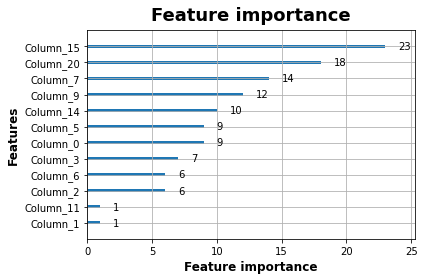

심장 질환 예측 경진대회
==========
https://dacon.io/competitions/official/235848/overview/description

참여해본 두 번째 경진대회. 이번엔 유명한 데이터인 심장 질환 관련 수치들을 가지고 심장 질환 여부를 예측하는 Binary Classification 모델을 구성하는 것이 목적이었다. 다루는 데이터가 수치로 주어져 있어 데이터 분석 및 처리가 수월할 것으로 예상한다.


```python
import tensorflow as tf
import tensorflow.keras as keras
import pandas as pd
import matplotlib.pyplot as plt
import numpy as np

plt.rc('figure', autolayout=True)
plt.rc('axes', labelweight='bold', labelsize='large', titleweight='bold', titlesize=18, titlepad=10)
plt.rc('image', cmap='cividis')
```


```python
df_train = pd.read_csv('./train.csv', index_col='id')
df_train.head()
```


<div>
<style scoped>
    .dataframe tbody tr th:only-of-type {
        vertical-align: middle;
    }

    .dataframe tbody tr th {
        vertical-align: top;
    }

    .dataframe thead th {
        text-align: right;
    }
</style>
<table border="1" class="dataframe">
  <thead>
    <tr style="text-align: right;">
      <th></th>
      <th>age</th>
      <th>sex</th>
      <th>cp</th>
      <th>trestbps</th>
      <th>chol</th>
      <th>fbs</th>
      <th>restecg</th>
      <th>thalach</th>
      <th>exang</th>
      <th>oldpeak</th>
      <th>slope</th>
      <th>ca</th>
      <th>thal</th>
      <th>target</th>
    </tr>
    <tr>
      <th>id</th>
      <th></th>
      <th></th>
      <th></th>
      <th></th>
      <th></th>
      <th></th>
      <th></th>
      <th></th>
      <th></th>
      <th></th>
      <th></th>
      <th></th>
      <th></th>
      <th></th>
    </tr>
  </thead>
  <tbody>
    <tr>
      <th>1</th>
      <td>53</td>
      <td>1</td>
      <td>2</td>
      <td>130</td>
      <td>197</td>
      <td>1</td>
      <td>0</td>
      <td>152</td>
      <td>0</td>
      <td>1.2</td>
      <td>0</td>
      <td>0</td>
      <td>2</td>
      <td>1</td>
    </tr>
    <tr>
      <th>2</th>
      <td>52</td>
      <td>1</td>
      <td>3</td>
      <td>152</td>
      <td>298</td>
      <td>1</td>
      <td>1</td>
      <td>178</td>
      <td>0</td>
      <td>1.2</td>
      <td>1</td>
      <td>0</td>
      <td>3</td>
      <td>1</td>
    </tr>
    <tr>
      <th>3</th>
      <td>54</td>
      <td>1</td>
      <td>1</td>
      <td>192</td>
      <td>283</td>
      <td>0</td>
      <td>0</td>
      <td>195</td>
      <td>0</td>
      <td>0.0</td>
      <td>2</td>
      <td>1</td>
      <td>3</td>
      <td>0</td>
    </tr>
    <tr>
      <th>4</th>
      <td>45</td>
      <td>0</td>
      <td>0</td>
      <td>138</td>
      <td>236</td>
      <td>0</td>
      <td>0</td>
      <td>152</td>
      <td>1</td>
      <td>0.2</td>
      <td>1</td>
      <td>0</td>
      <td>2</td>
      <td>1</td>
    </tr>
    <tr>
      <th>5</th>
      <td>35</td>
      <td>1</td>
      <td>1</td>
      <td>122</td>
      <td>192</td>
      <td>0</td>
      <td>1</td>
      <td>174</td>
      <td>0</td>
      <td>0.0</td>
      <td>2</td>
      <td>0</td>
      <td>2</td>
      <td>1</td>
    </tr>
  </tbody>
</table>
</div>


```python
df_train.describe()
```


<div>
<style scoped>
    .dataframe tbody tr th:only-of-type {
        vertical-align: middle;
    }

    .dataframe tbody tr th {
        vertical-align: top;
    }

    .dataframe thead th {
        text-align: right;
    }
</style>
<table border="1" class="dataframe">
  <thead>
    <tr style="text-align: right;">
      <th></th>
      <th>age</th>
      <th>sex</th>
      <th>cp</th>
      <th>trestbps</th>
      <th>chol</th>
      <th>fbs</th>
      <th>restecg</th>
      <th>thalach</th>
      <th>exang</th>
      <th>oldpeak</th>
      <th>slope</th>
      <th>ca</th>
      <th>thal</th>
      <th>target</th>
    </tr>
  </thead>
  <tbody>
    <tr>
      <th>count</th>
      <td>151.000000</td>
      <td>151.000000</td>
      <td>151.000000</td>
      <td>151.000000</td>
      <td>151.000000</td>
      <td>151.000000</td>
      <td>151.000000</td>
      <td>151.000000</td>
      <td>151.000000</td>
      <td>151.000000</td>
      <td>151.000000</td>
      <td>151.000000</td>
      <td>151.000000</td>
      <td>151.000000</td>
    </tr>
    <tr>
      <th>mean</th>
      <td>54.496689</td>
      <td>0.682119</td>
      <td>1.066225</td>
      <td>132.033113</td>
      <td>244.529801</td>
      <td>0.158940</td>
      <td>0.509934</td>
      <td>150.629139</td>
      <td>0.324503</td>
      <td>0.976821</td>
      <td>1.377483</td>
      <td>0.602649</td>
      <td>2.317881</td>
      <td>0.549669</td>
    </tr>
    <tr>
      <th>std</th>
      <td>8.904586</td>
      <td>0.467202</td>
      <td>1.056213</td>
      <td>17.909929</td>
      <td>56.332206</td>
      <td>0.366837</td>
      <td>0.514685</td>
      <td>23.466463</td>
      <td>0.469747</td>
      <td>1.085998</td>
      <td>0.640226</td>
      <td>0.917093</td>
      <td>0.604107</td>
      <td>0.499183</td>
    </tr>
    <tr>
      <th>min</th>
      <td>34.000000</td>
      <td>0.000000</td>
      <td>0.000000</td>
      <td>94.000000</td>
      <td>131.000000</td>
      <td>0.000000</td>
      <td>0.000000</td>
      <td>88.000000</td>
      <td>0.000000</td>
      <td>0.000000</td>
      <td>0.000000</td>
      <td>0.000000</td>
      <td>0.000000</td>
      <td>0.000000</td>
    </tr>
    <tr>
      <th>25%</th>
      <td>48.500000</td>
      <td>0.000000</td>
      <td>0.000000</td>
      <td>120.000000</td>
      <td>208.000000</td>
      <td>0.000000</td>
      <td>0.000000</td>
      <td>136.500000</td>
      <td>0.000000</td>
      <td>0.000000</td>
      <td>1.000000</td>
      <td>0.000000</td>
      <td>2.000000</td>
      <td>0.000000</td>
    </tr>
    <tr>
      <th>50%</th>
      <td>54.000000</td>
      <td>1.000000</td>
      <td>1.000000</td>
      <td>130.000000</td>
      <td>239.000000</td>
      <td>0.000000</td>
      <td>1.000000</td>
      <td>155.000000</td>
      <td>0.000000</td>
      <td>0.800000</td>
      <td>1.000000</td>
      <td>0.000000</td>
      <td>2.000000</td>
      <td>1.000000</td>
    </tr>
    <tr>
      <th>75%</th>
      <td>61.000000</td>
      <td>1.000000</td>
      <td>2.000000</td>
      <td>140.000000</td>
      <td>270.000000</td>
      <td>0.000000</td>
      <td>1.000000</td>
      <td>168.000000</td>
      <td>1.000000</td>
      <td>1.600000</td>
      <td>2.000000</td>
      <td>1.000000</td>
      <td>3.000000</td>
      <td>1.000000</td>
    </tr>
    <tr>
      <th>max</th>
      <td>77.000000</td>
      <td>1.000000</td>
      <td>3.000000</td>
      <td>192.000000</td>
      <td>564.000000</td>
      <td>1.000000</td>
      <td>2.000000</td>
      <td>195.000000</td>
      <td>1.000000</td>
      <td>5.600000</td>
      <td>2.000000</td>
      <td>3.000000</td>
      <td>3.000000</td>
      <td>1.000000</td>
    </tr>
  </tbody>
</table>
</div>


필요한 패키지 임포트 및 데이터 불러오기. data frame으로 데이터의 대략적인 모양새를 살펴본다.

**cp**: 가슴 통증(chest pain) 종류 
0 : asymptomatic 무증상
1 : atypical angina 일반적이지 않은 협심증
2 : non-anginal pain 협심증이 아닌 통증
3 : typical angina 일반적인 협심증

**restecg**: (resting electrocardiographic) 휴식 중 심전도 결과 
0: showing probable or definite left ventricular hypertrophy by Estes' criteria
1: 정상
2: having ST-T wave abnormality (T wave inversions and/or ST elevation or depression of > 0.05 mV)

**slope**: (the slope of the peak exercise ST segment) 활동 ST 분절 피크의 기울기
0: downsloping 하강
1: flat 평탄
2: upsloping 상승

**ca**: number of major vessels colored by flouroscopy 형광 투시로 확인된 주요 혈관 수 (0~3 개) 
Null 값은 숫자 4로 인코딩됨 -> 4는 training data에는 없고, test data에서 한 건 발견된다.

**thal**: thalassemia 지중해빈혈 여부
0 = Null 
1 = normal 정상
2 = fixed defect 고정 결함
3 = reversable defect 가역 결함

- *위 feature들은 수치가 아니라 class를 나타내므로 one hot encoding을 해주는 것이 좋을 것이다.*


```python
cp_df = pd.get_dummies(df_train.cp, prefix='cp')
restecg_df = pd.get_dummies(df_train.restecg, prefix='restecg')
slope_df = pd.get_dummies(df_train.slope, prefix='slope')
ca_df = pd.get_dummies(df_train.ca, prefix='ca')
thal_df = pd.get_dummies(df_train.thal, prefix='thal')
```


```python
cp_df = cp_df.drop('cp_0', axis=1)
restecg_df = restecg_df.drop('restecg_1', axis=1)
slope_df = slope_df.drop('slope_1', axis=1)
thal_df = thal_df.drop(['thal_0', 'thal_1'], axis=1)
```


```python
df_train_onehot = df_train.drop(['cp', 'restecg', 'slope', 'ca', 'thal'], axis=1)
df_train_onehot = pd.concat([df_train_onehot, cp_df, restecg_df, slope_df, ca_df, thal_df], axis=1)
df_train_onehot.head()
```


<div>
<style scoped>
    .dataframe tbody tr th:only-of-type {
        vertical-align: middle;
    }

    .dataframe tbody tr th {
        vertical-align: top;
    }

    .dataframe thead th {
        text-align: right;
    }
</style>
<table border="1" class="dataframe">
  <thead>
    <tr style="text-align: right;">
      <th></th>
      <th>age</th>
      <th>sex</th>
      <th>trestbps</th>
      <th>chol</th>
      <th>fbs</th>
      <th>thalach</th>
      <th>exang</th>
      <th>oldpeak</th>
      <th>target</th>
      <th>cp_1</th>
      <th>...</th>
      <th>restecg_0</th>
      <th>restecg_2</th>
      <th>slope_0</th>
      <th>slope_2</th>
      <th>ca_0</th>
      <th>ca_1</th>
      <th>ca_2</th>
      <th>ca_3</th>
      <th>thal_2</th>
      <th>thal_3</th>
    </tr>
    <tr>
      <th>id</th>
      <th></th>
      <th></th>
      <th></th>
      <th></th>
      <th></th>
      <th></th>
      <th></th>
      <th></th>
      <th></th>
      <th></th>
      <th></th>
      <th></th>
      <th></th>
      <th></th>
      <th></th>
      <th></th>
      <th></th>
      <th></th>
      <th></th>
      <th></th>
      <th></th>
    </tr>
  </thead>
  <tbody>
    <tr>
      <th>1</th>
      <td>53</td>
      <td>1</td>
      <td>130</td>
      <td>197</td>
      <td>1</td>
      <td>152</td>
      <td>0</td>
      <td>1.2</td>
      <td>1</td>
      <td>0</td>
      <td>...</td>
      <td>1</td>
      <td>0</td>
      <td>1</td>
      <td>0</td>
      <td>1</td>
      <td>0</td>
      <td>0</td>
      <td>0</td>
      <td>1</td>
      <td>0</td>
    </tr>
    <tr>
      <th>2</th>
      <td>52</td>
      <td>1</td>
      <td>152</td>
      <td>298</td>
      <td>1</td>
      <td>178</td>
      <td>0</td>
      <td>1.2</td>
      <td>1</td>
      <td>0</td>
      <td>...</td>
      <td>0</td>
      <td>0</td>
      <td>0</td>
      <td>0</td>
      <td>1</td>
      <td>0</td>
      <td>0</td>
      <td>0</td>
      <td>0</td>
      <td>1</td>
    </tr>
    <tr>
      <th>3</th>
      <td>54</td>
      <td>1</td>
      <td>192</td>
      <td>283</td>
      <td>0</td>
      <td>195</td>
      <td>0</td>
      <td>0.0</td>
      <td>0</td>
      <td>1</td>
      <td>...</td>
      <td>1</td>
      <td>0</td>
      <td>0</td>
      <td>1</td>
      <td>0</td>
      <td>1</td>
      <td>0</td>
      <td>0</td>
      <td>0</td>
      <td>1</td>
    </tr>
    <tr>
      <th>4</th>
      <td>45</td>
      <td>0</td>
      <td>138</td>
      <td>236</td>
      <td>0</td>
      <td>152</td>
      <td>1</td>
      <td>0.2</td>
      <td>1</td>
      <td>0</td>
      <td>...</td>
      <td>1</td>
      <td>0</td>
      <td>0</td>
      <td>0</td>
      <td>1</td>
      <td>0</td>
      <td>0</td>
      <td>0</td>
      <td>1</td>
      <td>0</td>
    </tr>
    <tr>
      <th>5</th>
      <td>35</td>
      <td>1</td>
      <td>122</td>
      <td>192</td>
      <td>0</td>
      <td>174</td>
      <td>0</td>
      <td>0.0</td>
      <td>1</td>
      <td>1</td>
      <td>...</td>
      <td>0</td>
      <td>0</td>
      <td>0</td>
      <td>1</td>
      <td>1</td>
      <td>0</td>
      <td>0</td>
      <td>0</td>
      <td>1</td>
      <td>0</td>
    </tr>
  </tbody>
</table>
<p>5 rows × 22 columns</p>
</div>


**age**: 나이
**trestbps**: (resting blood pressure) 휴식 중 혈압(mmHg)
**chol**: (serum cholestoral) 혈중 콜레스테롤 (mg/dl)
**thalach**: (maximum heart rate achieved) 최대 심박수
**oldpeak**: (ST depression induced by exercise relative to rest) 휴식 대비 운동으로 인한 ST 하강

- 위 feature들은 연속적인 수치를 나타낸다. 이런 수치들은 0~1 사이의 값으로 rescaling 해주는 것이 바람직할 것이다.


```python
continuous_f = ['age', 'trestbps', 'chol', 'thalach', 'oldpeak']
max_val = []
for i in continuous_f:
    print("max value for {} : {}".format(i, df_train[i].max()))
```

    max value for age : 77
    max value for trestbps : 192
    max value for chol : 564
    max value for thalach : 195
    max value for oldpeak : 5.6
    


```python
for i in continuous_f:
    df_train_onehot[i] = df_train_onehot[i] / df_train_onehot[i].max()
df_train_onehot.head()
```


<div>
<style scoped>
    .dataframe tbody tr th:only-of-type {
        vertical-align: middle;
    }

    .dataframe tbody tr th {
        vertical-align: top;
    }

    .dataframe thead th {
        text-align: right;
    }
</style>
<table border="1" class="dataframe">
  <thead>
    <tr style="text-align: right;">
      <th></th>
      <th>age</th>
      <th>sex</th>
      <th>trestbps</th>
      <th>chol</th>
      <th>fbs</th>
      <th>thalach</th>
      <th>exang</th>
      <th>oldpeak</th>
      <th>target</th>
      <th>cp_1</th>
      <th>...</th>
      <th>restecg_0</th>
      <th>restecg_2</th>
      <th>slope_0</th>
      <th>slope_2</th>
      <th>ca_0</th>
      <th>ca_1</th>
      <th>ca_2</th>
      <th>ca_3</th>
      <th>thal_2</th>
      <th>thal_3</th>
    </tr>
    <tr>
      <th>id</th>
      <th></th>
      <th></th>
      <th></th>
      <th></th>
      <th></th>
      <th></th>
      <th></th>
      <th></th>
      <th></th>
      <th></th>
      <th></th>
      <th></th>
      <th></th>
      <th></th>
      <th></th>
      <th></th>
      <th></th>
      <th></th>
      <th></th>
      <th></th>
      <th></th>
    </tr>
  </thead>
  <tbody>
    <tr>
      <th>1</th>
      <td>0.688312</td>
      <td>1</td>
      <td>0.677083</td>
      <td>0.349291</td>
      <td>1</td>
      <td>0.779487</td>
      <td>0</td>
      <td>0.214286</td>
      <td>1</td>
      <td>0</td>
      <td>...</td>
      <td>1</td>
      <td>0</td>
      <td>1</td>
      <td>0</td>
      <td>1</td>
      <td>0</td>
      <td>0</td>
      <td>0</td>
      <td>1</td>
      <td>0</td>
    </tr>
    <tr>
      <th>2</th>
      <td>0.675325</td>
      <td>1</td>
      <td>0.791667</td>
      <td>0.528369</td>
      <td>1</td>
      <td>0.912821</td>
      <td>0</td>
      <td>0.214286</td>
      <td>1</td>
      <td>0</td>
      <td>...</td>
      <td>0</td>
      <td>0</td>
      <td>0</td>
      <td>0</td>
      <td>1</td>
      <td>0</td>
      <td>0</td>
      <td>0</td>
      <td>0</td>
      <td>1</td>
    </tr>
    <tr>
      <th>3</th>
      <td>0.701299</td>
      <td>1</td>
      <td>1.000000</td>
      <td>0.501773</td>
      <td>0</td>
      <td>1.000000</td>
      <td>0</td>
      <td>0.000000</td>
      <td>0</td>
      <td>1</td>
      <td>...</td>
      <td>1</td>
      <td>0</td>
      <td>0</td>
      <td>1</td>
      <td>0</td>
      <td>1</td>
      <td>0</td>
      <td>0</td>
      <td>0</td>
      <td>1</td>
    </tr>
    <tr>
      <th>4</th>
      <td>0.584416</td>
      <td>0</td>
      <td>0.718750</td>
      <td>0.418440</td>
      <td>0</td>
      <td>0.779487</td>
      <td>1</td>
      <td>0.035714</td>
      <td>1</td>
      <td>0</td>
      <td>...</td>
      <td>1</td>
      <td>0</td>
      <td>0</td>
      <td>0</td>
      <td>1</td>
      <td>0</td>
      <td>0</td>
      <td>0</td>
      <td>1</td>
      <td>0</td>
    </tr>
    <tr>
      <th>5</th>
      <td>0.454545</td>
      <td>1</td>
      <td>0.635417</td>
      <td>0.340426</td>
      <td>0</td>
      <td>0.892308</td>
      <td>0</td>
      <td>0.000000</td>
      <td>1</td>
      <td>1</td>
      <td>...</td>
      <td>0</td>
      <td>0</td>
      <td>0</td>
      <td>1</td>
      <td>1</td>
      <td>0</td>
      <td>0</td>
      <td>0</td>
      <td>1</td>
      <td>0</td>
    </tr>
  </tbody>
</table>
<p>5 rows × 22 columns</p>
</div>


연속적인 값들은 0과 1 사이로 rescaling.


```python
target_train = df_train_onehot.pop('target')
```


```python
df_train_onehot.values
```


    array([[0.68831169, 1.        , 0.67708333, ..., 0.        , 1.        ,
            0.        ],
           [0.67532468, 1.        , 0.79166667, ..., 0.        , 0.        ,
            1.        ],
           [0.7012987 , 1.        , 1.        , ..., 0.        , 0.        ,
            1.        ],
           ...,
           [0.8961039 , 1.        , 0.83333333, ..., 0.        , 1.        ,
            0.        ],
           [0.5974026 , 1.        , 0.625     , ..., 0.        , 0.        ,
            1.        ],
           [0.81818182, 0.        , 0.72916667, ..., 0.        , 1.        ,
            0.        ]])


```python
dataset = tf.data.Dataset.from_tensor_slices((df_train_onehot.values, target_train.values))
```


```python
train_n = int(df_train_onehot.count()[0]*0.7)
train_n
```


    105


```python
ds_train = dataset.take(train_n)
ds_val = dataset.skip(train_n)
```


```python
ds_train.element_spec
```


    (TensorSpec(shape=(21,), dtype=tf.float64, name=None),
     TensorSpec(shape=(), dtype=tf.int64, name=None))


```python
AUTOTUNE = tf.data.experimental.AUTOTUNE

ds_train = (
    ds_train
    .batch(32)
    .cache()
    .prefetch(buffer_size=AUTOTUNE)
)

ds_val = (
    ds_val
    .batch(32)
    .cache()
    .prefetch(buffer_size=AUTOTUNE)
)
```


```python
ds_train.element_spec
```


    (TensorSpec(shape=(None, 21), dtype=tf.float64, name=None),
     TensorSpec(shape=(None,), dtype=tf.int64, name=None))


전처리한 data frame을 dataset으로 준비한다. 


```python
from tensorflow.keras import layers

model = keras.Sequential([
    layers.Dense(64, input_shape=[21], activation='relu'),
    
    layers.BatchNormalization(),
    layers.Dense(128, activation='relu'),
    layers.Dropout(0.3),
    
    layers.BatchNormalization(),
    layers.Dense(256, activation='relu'),
     layers.Dropout(0.3),
    
    layers.BatchNormalization(),
    layers.Dense(256, activation='relu'),
     layers.Dropout(0.3),
    
    layers.BatchNormalization(),
    layers.Dense(128, activation='relu'),
    
    layers.Dense(1, activation='sigmoid')
    
])
```

처음으로 시도해볼 모델은 6층으로 쌓은 dense 모델이다. 많지 않은 feature와 dataset에는  이런 단순한 모델이 효과적이지 않을까?


```python
model.compile(optimizer='adam', loss='binary_crossentropy', metrics=['binary_accuracy'])
```


```python
early = keras.callbacks.EarlyStopping(patience=10, min_delta=0.001, restore_best_weights=True)

history = model.fit(
    ds_train,
    validation_data=ds_val,
    callbacks=[early],
    epochs=100
)
```

    Epoch 1/100
    4/4 [==============================] - 2s 86ms/step - loss: 0.7231 - binary_accuracy: 0.5143 - val_loss: 0.6786 - val_binary_accuracy: 0.6522
    Epoch 2/100
    4/4 [==============================] - 0s 20ms/step - loss: 0.5585 - binary_accuracy: 0.6952 - val_loss: 0.6680 - val_binary_accuracy: 0.6304
    Epoch 3/100
    4/4 [==============================] - 0s 24ms/step - loss: 0.4027 - binary_accuracy: 0.8286 - val_loss: 0.6577 - val_binary_accuracy: 0.6304
    Epoch 4/100
    4/4 [==============================] - 0s 24ms/step - loss: 0.3275 - binary_accuracy: 0.8667 - val_loss: 0.6479 - val_binary_accuracy: 0.6087
    Epoch 5/100
    4/4 [==============================] - 0s 22ms/step - loss: 0.3357 - binary_accuracy: 0.8286 - val_loss: 0.6379 - val_binary_accuracy: 0.5870
    Epoch 6/100
    4/4 [==============================] - 0s 21ms/step - loss: 0.2573 - binary_accuracy: 0.8762 - val_loss: 0.6314 - val_binary_accuracy: 0.5652
    Epoch 7/100
    4/4 [==============================] - 0s 21ms/step - loss: 0.2451 - binary_accuracy: 0.8762 - val_loss: 0.6246 - val_binary_accuracy: 0.5652
    Epoch 8/100
    4/4 [==============================] - 0s 23ms/step - loss: 0.1940 - binary_accuracy: 0.9333 - val_loss: 0.6185 - val_binary_accuracy: 0.5435
    Epoch 9/100
    4/4 [==============================] - 0s 21ms/step - loss: 0.2814 - binary_accuracy: 0.8857 - val_loss: 0.6103 - val_binary_accuracy: 0.5652
    Epoch 10/100
    4/4 [==============================] - 0s 20ms/step - loss: 0.1418 - binary_accuracy: 0.9524 - val_loss: 0.6034 - val_binary_accuracy: 0.5652
    Epoch 11/100
    4/4 [==============================] - 0s 19ms/step - loss: 0.1275 - binary_accuracy: 0.9524 - val_loss: 0.6021 - val_binary_accuracy: 0.5870
    Epoch 12/100
    4/4 [==============================] - 0s 20ms/step - loss: 0.1758 - binary_accuracy: 0.9238 - val_loss: 0.6009 - val_binary_accuracy: 0.6304
    Epoch 13/100
    4/4 [==============================] - 0s 21ms/step - loss: 0.1167 - binary_accuracy: 0.9429 - val_loss: 0.6033 - val_binary_accuracy: 0.6304
    Epoch 14/100
    4/4 [==============================] - 0s 17ms/step - loss: 0.1156 - binary_accuracy: 0.9524 - val_loss: 0.6049 - val_binary_accuracy: 0.6304
    Epoch 15/100
    4/4 [==============================] - 0s 18ms/step - loss: 0.1029 - binary_accuracy: 0.9333 - val_loss: 0.6188 - val_binary_accuracy: 0.6304
    Epoch 16/100
    4/4 [==============================] - 0s 18ms/step - loss: 0.1476 - binary_accuracy: 0.9333 - val_loss: 0.6382 - val_binary_accuracy: 0.6087
    Epoch 17/100
    4/4 [==============================] - 0s 18ms/step - loss: 0.1086 - binary_accuracy: 0.9429 - val_loss: 0.6412 - val_binary_accuracy: 0.6087
    Epoch 18/100
    4/4 [==============================] - 0s 17ms/step - loss: 0.1218 - binary_accuracy: 0.9429 - val_loss: 0.6480 - val_binary_accuracy: 0.6087
    Epoch 19/100
    4/4 [==============================] - 0s 18ms/step - loss: 0.1306 - binary_accuracy: 0.9429 - val_loss: 0.6449 - val_binary_accuracy: 0.6522
    Epoch 20/100
    4/4 [==============================] - 0s 18ms/step - loss: 0.1131 - binary_accuracy: 0.9333 - val_loss: 0.6372 - val_binary_accuracy: 0.6739
    Epoch 21/100
    4/4 [==============================] - 0s 17ms/step - loss: 0.1044 - binary_accuracy: 0.9619 - val_loss: 0.6278 - val_binary_accuracy: 0.6739
    Epoch 22/100
    4/4 [==============================] - 0s 21ms/step - loss: 0.0879 - binary_accuracy: 0.9714 - val_loss: 0.6380 - val_binary_accuracy: 0.6739
    


```python
history_df = pd.DataFrame(history.history)
history_df.loc[:, ['loss', 'val_loss']].plot()
history_df.loc[:, ['binary_accuracy', 'val_binary_accuracy']].plot()
print("Highest validation accuracy: {}".format(history_df.val_binary_accuracy.max()))
```

    Highest validation accuracy: 0.6739130616188049
    


    

    


    

    


validationa accuracy가 67%정도로 만족스럽지 못한 결과이다. 그래도 우선 이 모델로 submission을 생성해보자.


```python
df_test = pd.read_csv('./test.csv', index_col='id')
df_test.head()
```


<div>
<style scoped>
    .dataframe tbody tr th:only-of-type {
        vertical-align: middle;
    }

    .dataframe tbody tr th {
        vertical-align: top;
    }

    .dataframe thead th {
        text-align: right;
    }
</style>
<table border="1" class="dataframe">
  <thead>
    <tr style="text-align: right;">
      <th></th>
      <th>age</th>
      <th>sex</th>
      <th>cp</th>
      <th>trestbps</th>
      <th>chol</th>
      <th>fbs</th>
      <th>restecg</th>
      <th>thalach</th>
      <th>exang</th>
      <th>oldpeak</th>
      <th>slope</th>
      <th>ca</th>
      <th>thal</th>
    </tr>
    <tr>
      <th>id</th>
      <th></th>
      <th></th>
      <th></th>
      <th></th>
      <th></th>
      <th></th>
      <th></th>
      <th></th>
      <th></th>
      <th></th>
      <th></th>
      <th></th>
      <th></th>
    </tr>
  </thead>
  <tbody>
    <tr>
      <th>1</th>
      <td>57</td>
      <td>1</td>
      <td>0</td>
      <td>150</td>
      <td>276</td>
      <td>0</td>
      <td>0</td>
      <td>112</td>
      <td>1</td>
      <td>0.6</td>
      <td>1</td>
      <td>1</td>
      <td>1</td>
    </tr>
    <tr>
      <th>2</th>
      <td>59</td>
      <td>1</td>
      <td>3</td>
      <td>170</td>
      <td>288</td>
      <td>0</td>
      <td>0</td>
      <td>159</td>
      <td>0</td>
      <td>0.2</td>
      <td>1</td>
      <td>0</td>
      <td>3</td>
    </tr>
    <tr>
      <th>3</th>
      <td>57</td>
      <td>1</td>
      <td>2</td>
      <td>150</td>
      <td>126</td>
      <td>1</td>
      <td>1</td>
      <td>173</td>
      <td>0</td>
      <td>0.2</td>
      <td>2</td>
      <td>1</td>
      <td>3</td>
    </tr>
    <tr>
      <th>4</th>
      <td>56</td>
      <td>0</td>
      <td>0</td>
      <td>134</td>
      <td>409</td>
      <td>0</td>
      <td>0</td>
      <td>150</td>
      <td>1</td>
      <td>1.9</td>
      <td>1</td>
      <td>2</td>
      <td>3</td>
    </tr>
    <tr>
      <th>5</th>
      <td>71</td>
      <td>0</td>
      <td>2</td>
      <td>110</td>
      <td>265</td>
      <td>1</td>
      <td>0</td>
      <td>130</td>
      <td>0</td>
      <td>0.0</td>
      <td>2</td>
      <td>1</td>
      <td>2</td>
    </tr>
  </tbody>
</table>
</div>


```python
cp_df = pd.get_dummies(df_test.cp, prefix='cp')
restecg_df = pd.get_dummies(df_test.restecg, prefix='restecg')
slope_df = pd.get_dummies(df_test.slope, prefix='slope')
ca_df = pd.get_dummies(df_test.ca, prefix='ca')
thal_df = pd.get_dummies(df_test.thal, prefix='thal')
```


```python
cp_df = cp_df.drop('cp_0', axis=1)
restecg_df = restecg_df.drop('restecg_1', axis=1)
slope_df = slope_df.drop('slope_1', axis=1)
ca_df = ca_df.drop('ca_4', axis=1)
thal_df = thal_df.drop(['thal_0', 'thal_1'], axis=1)
```


```python
df_test_onehot = df_test.drop(['cp', 'restecg', 'slope', 'ca', 'thal'], axis=1)
df_test_onehot = pd.concat([df_test_onehot, cp_df, restecg_df, slope_df, ca_df, thal_df], axis=1)
df_test_onehot.head()
```


<div>
<style scoped>
    .dataframe tbody tr th:only-of-type {
        vertical-align: middle;
    }

    .dataframe tbody tr th {
        vertical-align: top;
    }

    .dataframe thead th {
        text-align: right;
    }
</style>
<table border="1" class="dataframe">
  <thead>
    <tr style="text-align: right;">
      <th></th>
      <th>age</th>
      <th>sex</th>
      <th>trestbps</th>
      <th>chol</th>
      <th>fbs</th>
      <th>thalach</th>
      <th>exang</th>
      <th>oldpeak</th>
      <th>cp_1</th>
      <th>cp_2</th>
      <th>...</th>
      <th>restecg_0</th>
      <th>restecg_2</th>
      <th>slope_0</th>
      <th>slope_2</th>
      <th>ca_0</th>
      <th>ca_1</th>
      <th>ca_2</th>
      <th>ca_3</th>
      <th>thal_2</th>
      <th>thal_3</th>
    </tr>
    <tr>
      <th>id</th>
      <th></th>
      <th></th>
      <th></th>
      <th></th>
      <th></th>
      <th></th>
      <th></th>
      <th></th>
      <th></th>
      <th></th>
      <th></th>
      <th></th>
      <th></th>
      <th></th>
      <th></th>
      <th></th>
      <th></th>
      <th></th>
      <th></th>
      <th></th>
      <th></th>
    </tr>
  </thead>
  <tbody>
    <tr>
      <th>1</th>
      <td>57</td>
      <td>1</td>
      <td>150</td>
      <td>276</td>
      <td>0</td>
      <td>112</td>
      <td>1</td>
      <td>0.6</td>
      <td>0</td>
      <td>0</td>
      <td>...</td>
      <td>1</td>
      <td>0</td>
      <td>0</td>
      <td>0</td>
      <td>0</td>
      <td>1</td>
      <td>0</td>
      <td>0</td>
      <td>0</td>
      <td>0</td>
    </tr>
    <tr>
      <th>2</th>
      <td>59</td>
      <td>1</td>
      <td>170</td>
      <td>288</td>
      <td>0</td>
      <td>159</td>
      <td>0</td>
      <td>0.2</td>
      <td>0</td>
      <td>0</td>
      <td>...</td>
      <td>1</td>
      <td>0</td>
      <td>0</td>
      <td>0</td>
      <td>1</td>
      <td>0</td>
      <td>0</td>
      <td>0</td>
      <td>0</td>
      <td>1</td>
    </tr>
    <tr>
      <th>3</th>
      <td>57</td>
      <td>1</td>
      <td>150</td>
      <td>126</td>
      <td>1</td>
      <td>173</td>
      <td>0</td>
      <td>0.2</td>
      <td>0</td>
      <td>1</td>
      <td>...</td>
      <td>0</td>
      <td>0</td>
      <td>0</td>
      <td>1</td>
      <td>0</td>
      <td>1</td>
      <td>0</td>
      <td>0</td>
      <td>0</td>
      <td>1</td>
    </tr>
    <tr>
      <th>4</th>
      <td>56</td>
      <td>0</td>
      <td>134</td>
      <td>409</td>
      <td>0</td>
      <td>150</td>
      <td>1</td>
      <td>1.9</td>
      <td>0</td>
      <td>0</td>
      <td>...</td>
      <td>1</td>
      <td>0</td>
      <td>0</td>
      <td>0</td>
      <td>0</td>
      <td>0</td>
      <td>1</td>
      <td>0</td>
      <td>0</td>
      <td>1</td>
    </tr>
    <tr>
      <th>5</th>
      <td>71</td>
      <td>0</td>
      <td>110</td>
      <td>265</td>
      <td>1</td>
      <td>130</td>
      <td>0</td>
      <td>0.0</td>
      <td>0</td>
      <td>1</td>
      <td>...</td>
      <td>1</td>
      <td>0</td>
      <td>0</td>
      <td>1</td>
      <td>0</td>
      <td>1</td>
      <td>0</td>
      <td>0</td>
      <td>1</td>
      <td>0</td>
    </tr>
  </tbody>
</table>
<p>5 rows × 21 columns</p>
</div>


```python
for i in continuous_f:
    df_test_onehot[i] = df_test_onehot[i] / df_train[i].max()
df_test_onehot.head()
```


<div>
<style scoped>
    .dataframe tbody tr th:only-of-type {
        vertical-align: middle;
    }

    .dataframe tbody tr th {
        vertical-align: top;
    }

    .dataframe thead th {
        text-align: right;
    }
</style>
<table border="1" class="dataframe">
  <thead>
    <tr style="text-align: right;">
      <th></th>
      <th>age</th>
      <th>sex</th>
      <th>trestbps</th>
      <th>chol</th>
      <th>fbs</th>
      <th>thalach</th>
      <th>exang</th>
      <th>oldpeak</th>
      <th>cp_1</th>
      <th>cp_2</th>
      <th>...</th>
      <th>restecg_0</th>
      <th>restecg_2</th>
      <th>slope_0</th>
      <th>slope_2</th>
      <th>ca_0</th>
      <th>ca_1</th>
      <th>ca_2</th>
      <th>ca_3</th>
      <th>thal_2</th>
      <th>thal_3</th>
    </tr>
    <tr>
      <th>id</th>
      <th></th>
      <th></th>
      <th></th>
      <th></th>
      <th></th>
      <th></th>
      <th></th>
      <th></th>
      <th></th>
      <th></th>
      <th></th>
      <th></th>
      <th></th>
      <th></th>
      <th></th>
      <th></th>
      <th></th>
      <th></th>
      <th></th>
      <th></th>
      <th></th>
    </tr>
  </thead>
  <tbody>
    <tr>
      <th>1</th>
      <td>0.740260</td>
      <td>1</td>
      <td>0.781250</td>
      <td>0.489362</td>
      <td>0</td>
      <td>0.574359</td>
      <td>1</td>
      <td>0.107143</td>
      <td>0</td>
      <td>0</td>
      <td>...</td>
      <td>1</td>
      <td>0</td>
      <td>0</td>
      <td>0</td>
      <td>0</td>
      <td>1</td>
      <td>0</td>
      <td>0</td>
      <td>0</td>
      <td>0</td>
    </tr>
    <tr>
      <th>2</th>
      <td>0.766234</td>
      <td>1</td>
      <td>0.885417</td>
      <td>0.510638</td>
      <td>0</td>
      <td>0.815385</td>
      <td>0</td>
      <td>0.035714</td>
      <td>0</td>
      <td>0</td>
      <td>...</td>
      <td>1</td>
      <td>0</td>
      <td>0</td>
      <td>0</td>
      <td>1</td>
      <td>0</td>
      <td>0</td>
      <td>0</td>
      <td>0</td>
      <td>1</td>
    </tr>
    <tr>
      <th>3</th>
      <td>0.740260</td>
      <td>1</td>
      <td>0.781250</td>
      <td>0.223404</td>
      <td>1</td>
      <td>0.887179</td>
      <td>0</td>
      <td>0.035714</td>
      <td>0</td>
      <td>1</td>
      <td>...</td>
      <td>0</td>
      <td>0</td>
      <td>0</td>
      <td>1</td>
      <td>0</td>
      <td>1</td>
      <td>0</td>
      <td>0</td>
      <td>0</td>
      <td>1</td>
    </tr>
    <tr>
      <th>4</th>
      <td>0.727273</td>
      <td>0</td>
      <td>0.697917</td>
      <td>0.725177</td>
      <td>0</td>
      <td>0.769231</td>
      <td>1</td>
      <td>0.339286</td>
      <td>0</td>
      <td>0</td>
      <td>...</td>
      <td>1</td>
      <td>0</td>
      <td>0</td>
      <td>0</td>
      <td>0</td>
      <td>0</td>
      <td>1</td>
      <td>0</td>
      <td>0</td>
      <td>1</td>
    </tr>
    <tr>
      <th>5</th>
      <td>0.922078</td>
      <td>0</td>
      <td>0.572917</td>
      <td>0.469858</td>
      <td>1</td>
      <td>0.666667</td>
      <td>0</td>
      <td>0.000000</td>
      <td>0</td>
      <td>1</td>
      <td>...</td>
      <td>1</td>
      <td>0</td>
      <td>0</td>
      <td>1</td>
      <td>0</td>
      <td>1</td>
      <td>0</td>
      <td>0</td>
      <td>1</td>
      <td>0</td>
    </tr>
  </tbody>
</table>
<p>5 rows × 21 columns</p>
</div>


```python
ds_test = tf.data.Dataset.from_tensor_slices((df_test_onehot.values))
ds_test = ds_test.batch(1)
```


```python
df_pred = pd.DataFrame(data=model.predict(ds_test), columns=['target'])
df_pred['id'] = df_pred.index + 1
```


```python
df_pred = df_pred[['id', 'target']]

df_pred['target'] = list(map(round, df_pred['target']))
df_pred
```


<div>
<style scoped>
    .dataframe tbody tr th:only-of-type {
        vertical-align: middle;
    }

    .dataframe tbody tr th {
        vertical-align: top;
    }

    .dataframe thead th {
        text-align: right;
    }
</style>
<table border="1" class="dataframe">
  <thead>
    <tr style="text-align: right;">
      <th></th>
      <th>id</th>
      <th>target</th>
    </tr>
  </thead>
  <tbody>
    <tr>
      <th>0</th>
      <td>1</td>
      <td>0</td>
    </tr>
    <tr>
      <th>1</th>
      <td>2</td>
      <td>1</td>
    </tr>
    <tr>
      <th>2</th>
      <td>3</td>
      <td>1</td>
    </tr>
    <tr>
      <th>3</th>
      <td>4</td>
      <td>1</td>
    </tr>
    <tr>
      <th>4</th>
      <td>5</td>
      <td>1</td>
    </tr>
    <tr>
      <th>...</th>
      <td>...</td>
      <td>...</td>
    </tr>
    <tr>
      <th>147</th>
      <td>148</td>
      <td>1</td>
    </tr>
    <tr>
      <th>148</th>
      <td>149</td>
      <td>1</td>
    </tr>
    <tr>
      <th>149</th>
      <td>150</td>
      <td>1</td>
    </tr>
    <tr>
      <th>150</th>
      <td>151</td>
      <td>1</td>
    </tr>
    <tr>
      <th>151</th>
      <td>152</td>
      <td>1</td>
    </tr>
  </tbody>
</table>
<p>152 rows × 2 columns</p>
</div>


```python
df_pred.to_csv('submission.csv', index=False)
```


    ---------------------------------------------------------------------------

    PermissionError                           Traceback (most recent call last)

    ~\AppData\Local\Temp/ipykernel_17008/1297841265.py in <module>
    ----> 1 df_pred.to_csv('submission.csv', index=False)
    

    ~\Anaconda3\envs\python39\lib\site-packages\pandas\core\generic.py in to_csv(self, path_or_buf, sep, na_rep, float_format, columns, header, index, index_label, mode, encoding, compression, quoting, quotechar, line_terminator, chunksize, date_format, doublequote, escapechar, decimal, errors, storage_options)
       3464         )
       3465 
    -> 3466         return DataFrameRenderer(formatter).to_csv(
       3467             path_or_buf,
       3468             line_terminator=line_terminator,
    

    ~\Anaconda3\envs\python39\lib\site-packages\pandas\io\formats\format.py in to_csv(self, path_or_buf, encoding, sep, columns, index_label, mode, compression, quoting, quotechar, line_terminator, chunksize, date_format, doublequote, escapechar, errors, storage_options)
       1103             formatter=self.fmt,
       1104         )
    -> 1105         csv_formatter.save()
       1106 
       1107         if created_buffer:
    

    ~\Anaconda3\envs\python39\lib\site-packages\pandas\io\formats\csvs.py in save(self)
        235         """
        236         # apply compression and byte/text conversion
    --> 237         with get_handle(
        238             self.filepath_or_buffer,
        239             self.mode,
    

    ~\Anaconda3\envs\python39\lib\site-packages\pandas\io\common.py in get_handle(path_or_buf, mode, encoding, compression, memory_map, is_text, errors, storage_options)
        700         if ioargs.encoding and "b" not in ioargs.mode:
        701             # Encoding
    --> 702             handle = open(
        703                 handle,
        704                 ioargs.mode,
    

    PermissionError: [Errno 13] Permission denied: 'submission.csv'


## Light GBM

두 번째로 시도해볼 모델은 light gbm모델이다. light gbm은 ensemble 모델 중 gradiant boosting method 계열의 각광받는 모델이다. 다른 boosting method 계열의 모델보다 계산량은 적고, 성능은 비슷하거나 앞서는, 좋은 모습을 보여주고 있는 모델이라고 한다.


```python
import lightgbm as lgb

train_data_lgb = lgb.Dataset(df_train_onehot[:train_n].values, label=target_train[:train_n].values)
val_data_lgb = train_data_lgb.create_valid(df_train_onehot[train_n:].values, label=target_train[train_n:].values)
```


```python
param = {'num_leaves': 31, 'objective': 'binary', 'device_type': 'gpu'}
n_round = 100

record = {}
record_eval = lgb.record_evaluation(record)
early = lgb.early_stopping(20)

bst = lgb.train(param, train_data_lgb, n_round, valid_sets=[val_data_lgb], callbacks=[record_eval, early])
bst.save_model('lgb_model.txt', num_iteration=bst.best_iteration)
print('best score: {}'.format(bst.best_score))
```

    [LightGBM] [Info] Number of positive: 58, number of negative: 47
    [LightGBM] [Info] This is the GPU trainer!!
    [LightGBM] [Info] Total Bins 145
    [LightGBM] [Info] Number of data points in the train set: 105, number of used features: 14
    [LightGBM] [Info] Using GPU Device: NVIDIA GeForce GTX 1060 3GB, Vendor: NVIDIA Corporation
    [LightGBM] [Info] Compiling OpenCL Kernel with 64 bins...
    [LightGBM] [Info] GPU programs have been built
    [LightGBM] [Info] Size of histogram bin entry: 8
    [LightGBM] [Info] 11 dense feature groups (0.00 MB) transferred to GPU in 0.001363 secs. 1 sparse feature groups
    [LightGBM] [Info] [binary:BoostFromScore]: pavg=0.552381 -> initscore=0.210295
    [LightGBM] [Info] Start training from score 0.210295
    [LightGBM] [Warning] No further splits with positive gain, best gain: -inf
    Training until validation scores don't improve for 20 rounds
    [LightGBM] [Warning] No further splits with positive gain, best gain: -inf
    [LightGBM] [Warning] No further splits with positive gain, best gain: -inf
    [LightGBM] [Warning] No further splits with positive gain, best gain: -inf
    [LightGBM] [Warning] No further splits with positive gain, best gain: -inf
    [LightGBM] [Warning] No further splits with positive gain, best gain: -inf
    [LightGBM] [Warning] No further splits with positive gain, best gain: -inf
    [LightGBM] [Warning] No further splits with positive gain, best gain: -inf
    [LightGBM] [Warning] No further splits with positive gain, best gain: -inf
    [LightGBM] [Warning] No further splits with positive gain, best gain: -inf
    [LightGBM] [Warning] No further splits with positive gain, best gain: -inf
    [LightGBM] [Warning] No further splits with positive gain, best gain: -inf
    [LightGBM] [Warning] No further splits with positive gain, best gain: -inf
    [LightGBM] [Warning] No further splits with positive gain, best gain: -inf
    [LightGBM] [Warning] No further splits with positive gain, best gain: -inf
    [LightGBM] [Warning] No further splits with positive gain, best gain: -inf
    [LightGBM] [Warning] No further splits with positive gain, best gain: -inf
    [LightGBM] [Warning] No further splits with positive gain, best gain: -inf
    [LightGBM] [Warning] No further splits with positive gain, best gain: -inf
    [LightGBM] [Warning] No further splits with positive gain, best gain: -inf
    [LightGBM] [Warning] No further splits with positive gain, best gain: -inf
    [LightGBM] [Warning] No further splits with positive gain, best gain: -inf
    [LightGBM] [Warning] No further splits with positive gain, best gain: -inf
    [LightGBM] [Warning] No further splits with positive gain, best gain: -inf
    [LightGBM] [Warning] No further splits with positive gain, best gain: -inf
    [LightGBM] [Warning] No further splits with positive gain, best gain: -inf
    [LightGBM] [Warning] No further splits with positive gain, best gain: -inf
    [LightGBM] [Warning] No further splits with positive gain, best gain: -inf
    [LightGBM] [Warning] No further splits with positive gain, best gain: -inf
    [LightGBM] [Warning] No further splits with positive gain, best gain: -inf
    [LightGBM] [Warning] No further splits with positive gain, best gain: -inf
    [LightGBM] [Warning] No further splits with positive gain, best gain: -inf
    [LightGBM] [Warning] No further splits with positive gain, best gain: -inf
    [LightGBM] [Warning] No further splits with positive gain, best gain: -inf
    [LightGBM] [Warning] No further splits with positive gain, best gain: -inf
    [LightGBM] [Warning] No further splits with positive gain, best gain: -inf
    [LightGBM] [Warning] No further splits with positive gain, best gain: -inf
    [LightGBM] [Warning] No further splits with positive gain, best gain: -inf
    [LightGBM] [Warning] No further splits with positive gain, best gain: -inf
    [LightGBM] [Warning] No further splits with positive gain, best gain: -inf
    [LightGBM] [Warning] No further splits with positive gain, best gain: -inf
    [LightGBM] [Warning] No further splits with positive gain, best gain: -inf
    [LightGBM] [Warning] No further splits with positive gain, best gain: -inf
    [LightGBM] [Warning] No further splits with positive gain, best gain: -inf
    [LightGBM] [Warning] No further splits with positive gain, best gain: -inf
    [LightGBM] [Warning] No further splits with positive gain, best gain: -inf
    [LightGBM] [Warning] No further splits with positive gain, best gain: -inf
    [LightGBM] [Warning] No further splits with positive gain, best gain: -inf
    [LightGBM] [Warning] No further splits with positive gain, best gain: -inf
    [LightGBM] [Warning] No further splits with positive gain, best gain: -inf
    [LightGBM] [Warning] No further splits with positive gain, best gain: -inf
    [LightGBM] [Warning] No further splits with positive gain, best gain: -inf
    [LightGBM] [Warning] No further splits with positive gain, best gain: -inf
    [LightGBM] [Warning] No further splits with positive gain, best gain: -inf
    [LightGBM] [Warning] No further splits with positive gain, best gain: -inf
    [LightGBM] [Warning] No further splits with positive gain, best gain: -inf
    [LightGBM] [Warning] No further splits with positive gain, best gain: -inf
    [LightGBM] [Warning] No further splits with positive gain, best gain: -inf
    Early stopping, best iteration is:
    [38]	valid_0's binary_logloss: 0.416795
    best score: defaultdict(<class 'collections.OrderedDict'>, {'valid_0': OrderedDict([('binary_logloss', 0.41679487674655996)])})
    


```python
lgb_pred = bst.predict(df_test_onehot.values)
```


```python
df_pred_lgb = pd.DataFrame(data=lgb_pred, columns=['target'])
df_pred_lgb['id'] = df_pred_lgb.index + 1
```


```python
df_pred_lgb = df_pred_lgb[['id', 'target']]

df_pred_lgb['target'] = list(map(round, df_pred_lgb['target']))
df_pred_lgb
```


<div>
<style scoped>
    .dataframe tbody tr th:only-of-type {
        vertical-align: middle;
    }

    .dataframe tbody tr th {
        vertical-align: top;
    }

    .dataframe thead th {
        text-align: right;
    }
</style>
<table border="1" class="dataframe">
  <thead>
    <tr style="text-align: right;">
      <th></th>
      <th>id</th>
      <th>target</th>
    </tr>
  </thead>
  <tbody>
    <tr>
      <th>0</th>
      <td>1</td>
      <td>0</td>
    </tr>
    <tr>
      <th>1</th>
      <td>2</td>
      <td>0</td>
    </tr>
    <tr>
      <th>2</th>
      <td>3</td>
      <td>0</td>
    </tr>
    <tr>
      <th>3</th>
      <td>4</td>
      <td>0</td>
    </tr>
    <tr>
      <th>4</th>
      <td>5</td>
      <td>1</td>
    </tr>
    <tr>
      <th>...</th>
      <td>...</td>
      <td>...</td>
    </tr>
    <tr>
      <th>147</th>
      <td>148</td>
      <td>0</td>
    </tr>
    <tr>
      <th>148</th>
      <td>149</td>
      <td>0</td>
    </tr>
    <tr>
      <th>149</th>
      <td>150</td>
      <td>0</td>
    </tr>
    <tr>
      <th>150</th>
      <td>151</td>
      <td>1</td>
    </tr>
    <tr>
      <th>151</th>
      <td>152</td>
      <td>1</td>
    </tr>
  </tbody>
</table>
<p>152 rows × 2 columns</p>
</div>


```python
df_pred_lgb.to_csv('submission_lgb.csv', index=False)
```


```python
lgb.plot_importance(bst)
```


    <AxesSubplot:title={'center':'Feature importance'}, xlabel='Feature importance', ylabel='Features'>


    

    


```python
lgb.plot_metric(record)
```


    <AxesSubplot:title={'center':'Metric during training'}, xlabel='Iterations', ylabel='binary_logloss'>


    

    


CV


```python
train_data_lgb_cv = lgb.Dataset(df_train_onehot.values, label=target_train.values)

record={}
bst_cv = lgb.cv(param, train_data_lgb_cv, n_round, callbacks=[early], return_cvbooster=True)
bst_cv['cvbooster']
```

    [LightGBM] [Info] Number of positive: 66, number of negative: 54
    [LightGBM] [Info] This is the GPU trainer!!
    [LightGBM] [Info] Total Bins 181
    [LightGBM] [Info] Number of data points in the train set: 120, number of used features: 16
    [LightGBM] [Info] Using GPU Device: NVIDIA GeForce GTX 1060 3GB, Vendor: NVIDIA Corporation
    [LightGBM] [Info] Compiling OpenCL Kernel with 64 bins...
    [LightGBM] [Info] GPU programs have been built
    [LightGBM] [Info] Size of histogram bin entry: 8
    [LightGBM] [Info] 11 dense feature groups (0.00 MB) transferred to GPU in 0.001438 secs. 1 sparse feature groups
    [LightGBM] [Info] Number of positive: 66, number of negative: 55
    [LightGBM] [Info] This is the GPU trainer!!
    [LightGBM] [Info] Total Bins 181
    [LightGBM] [Info] Number of data points in the train set: 121, number of used features: 16
    [LightGBM] [Info] Using GPU Device: NVIDIA GeForce GTX 1060 3GB, Vendor: NVIDIA Corporation
    [LightGBM] [Info] Compiling OpenCL Kernel with 64 bins...
    [LightGBM] [Info] GPU programs have been built
    [LightGBM] [Info] Size of histogram bin entry: 8
    [LightGBM] [Info] 11 dense feature groups (0.00 MB) transferred to GPU in 0.001273 secs. 1 sparse feature groups
    [LightGBM] [Info] Number of positive: 66, number of negative: 55
    [LightGBM] [Info] This is the GPU trainer!!
    [LightGBM] [Info] Total Bins 181
    [LightGBM] [Info] Number of data points in the train set: 121, number of used features: 16
    [LightGBM] [Info] Using GPU Device: NVIDIA GeForce GTX 1060 3GB, Vendor: NVIDIA Corporation
    [LightGBM] [Info] Compiling OpenCL Kernel with 64 bins...
    [LightGBM] [Info] GPU programs have been built
    [LightGBM] [Info] Size of histogram bin entry: 8
    [LightGBM] [Info] 11 dense feature groups (0.00 MB) transferred to GPU in 0.001274 secs. 1 sparse feature groups
    [LightGBM] [Info] Number of positive: 67, number of negative: 54
    [LightGBM] [Info] This is the GPU trainer!!
    [LightGBM] [Info] Total Bins 181
    [LightGBM] [Info] Number of data points in the train set: 121, number of used features: 16
    [LightGBM] [Info] Using GPU Device: NVIDIA GeForce GTX 1060 3GB, Vendor: NVIDIA Corporation
    [LightGBM] [Info] Compiling OpenCL Kernel with 64 bins...
    [LightGBM] [Info] GPU programs have been built
    [LightGBM] [Info] Size of histogram bin entry: 8
    [LightGBM] [Info] 11 dense feature groups (0.00 MB) transferred to GPU in 0.001381 secs. 1 sparse feature groups
    [LightGBM] [Info] Number of positive: 67, number of negative: 54
    [LightGBM] [Info] This is the GPU trainer!!
    [LightGBM] [Info] Total Bins 181
    [LightGBM] [Info] Number of data points in the train set: 121, number of used features: 16
    [LightGBM] [Info] Using GPU Device: NVIDIA GeForce GTX 1060 3GB, Vendor: NVIDIA Corporation
    [LightGBM] [Info] Compiling OpenCL Kernel with 64 bins...
    [LightGBM] [Info] GPU programs have been built
    [LightGBM] [Info] Size of histogram bin entry: 8
    [LightGBM] [Info] 11 dense feature groups (0.00 MB) transferred to GPU in 0.001399 secs. 1 sparse feature groups
    [LightGBM] [Info] [binary:BoostFromScore]: pavg=0.550000 -> initscore=0.200671
    [LightGBM] [Info] Start training from score 0.200671
    [LightGBM] [Warning] No further splits with positive gain, best gain: -inf
    [LightGBM] [Info] [binary:BoostFromScore]: pavg=0.545455 -> initscore=0.182322
    [LightGBM] [Info] Start training from score 0.182322
    [LightGBM] [Warning] No further splits with positive gain, best gain: -inf
    [LightGBM] [Info] [binary:BoostFromScore]: pavg=0.545455 -> initscore=0.182322
    [LightGBM] [Info] Start training from score 0.182322
    [LightGBM] [Warning] No further splits with positive gain, best gain: -inf
    [LightGBM] [Info] [binary:BoostFromScore]: pavg=0.553719 -> initscore=0.215709
    [LightGBM] [Info] Start training from score 0.215709
    [LightGBM] [Warning] No further splits with positive gain, best gain: -inf
    [LightGBM] [Info] [binary:BoostFromScore]: pavg=0.553719 -> initscore=0.215709
    [LightGBM] [Info] Start training from score 0.215709
    [LightGBM] [Warning] No further splits with positive gain, best gain: -inf
    [LightGBM] [Warning] No further splits with positive gain, best gain: -inf
    [LightGBM] [Warning] No further splits with positive gain, best gain: -inf
    [LightGBM] [Warning] No further splits with positive gain, best gain: -inf
    [LightGBM] [Warning] No further splits with positive gain, best gain: -inf
    [LightGBM] [Warning] No further splits with positive gain, best gain: -inf
    [LightGBM] [Warning] No further splits with positive gain, best gain: -inf
    [LightGBM] [Warning] No further splits with positive gain, best gain: -inf
    [LightGBM] [Warning] No further splits with positive gain, best gain: -inf
    [LightGBM] [Warning] No further splits with positive gain, best gain: -inf
    [LightGBM] [Warning] No further splits with positive gain, best gain: -inf
    [LightGBM] [Warning] No further splits with positive gain, best gain: -inf
    [LightGBM] [Warning] No further splits with positive gain, best gain: -inf
    [LightGBM] [Warning] No further splits with positive gain, best gain: -inf
    [LightGBM] [Warning] No further splits with positive gain, best gain: -inf
    [LightGBM] [Warning] No further splits with positive gain, best gain: -inf
    [LightGBM] [Warning] No further splits with positive gain, best gain: -inf
    [LightGBM] [Warning] No further splits with positive gain, best gain: -inf
    [LightGBM] [Warning] No further splits with positive gain, best gain: -inf
    [LightGBM] [Warning] No further splits with positive gain, best gain: -inf
    [LightGBM] [Warning] No further splits with positive gain, best gain: -inf
    [LightGBM] [Warning] No further splits with positive gain, best gain: -inf
    [LightGBM] [Warning] No further splits with positive gain, best gain: -inf
    [LightGBM] [Warning] No further splits with positive gain, best gain: -inf
    [LightGBM] [Warning] No further splits with positive gain, best gain: -inf
    [LightGBM] [Warning] No further splits with positive gain, best gain: -inf
    [LightGBM] [Warning] No further splits with positive gain, best gain: -inf
    [LightGBM] [Warning] No further splits with positive gain, best gain: -inf
    [LightGBM] [Warning] No further splits with positive gain, best gain: -inf
    [LightGBM] [Warning] No further splits with positive gain, best gain: -inf
    [LightGBM] [Warning] No further splits with positive gain, best gain: -inf
    [LightGBM] [Warning] No further splits with positive gain, best gain: -inf
    [LightGBM] [Warning] No further splits with positive gain, best gain: -inf
    [LightGBM] [Warning] No further splits with positive gain, best gain: -inf
    [LightGBM] [Warning] No further splits with positive gain, best gain: -inf
    [LightGBM] [Warning] No further splits with positive gain, best gain: -inf
    [LightGBM] [Warning] No further splits with positive gain, best gain: -inf
    [LightGBM] [Warning] No further splits with positive gain, best gain: -inf
    [LightGBM] [Warning] No further splits with positive gain, best gain: -inf
    [LightGBM] [Warning] No further splits with positive gain, best gain: -inf
    [LightGBM] [Warning] No further splits with positive gain, best gain: -inf
    [LightGBM] [Warning] No further splits with positive gain, best gain: -inf
    [LightGBM] [Warning] No further splits with positive gain, best gain: -inf
    [LightGBM] [Warning] No further splits with positive gain, best gain: -inf
    [LightGBM] [Warning] No further splits with positive gain, best gain: -inf
    [LightGBM] [Warning] No further splits with positive gain, best gain: -inf
    [LightGBM] [Warning] No further splits with positive gain, best gain: -inf
    [LightGBM] [Warning] No further splits with positive gain, best gain: -inf
    [LightGBM] [Warning] No further splits with positive gain, best gain: -inf
    [LightGBM] [Warning] No further splits with positive gain, best gain: -inf
    [LightGBM] [Warning] No further splits with positive gain, best gain: -inf
    [LightGBM] [Warning] No further splits with positive gain, best gain: -inf
    [LightGBM] [Warning] No further splits with positive gain, best gain: -inf
    [LightGBM] [Warning] No further splits with positive gain, best gain: -inf
    [LightGBM] [Warning] No further splits with positive gain, best gain: -inf
    [LightGBM] [Warning] No further splits with positive gain, best gain: -inf
    [LightGBM] [Warning] No further splits with positive gain, best gain: -inf
    [LightGBM] [Warning] No further splits with positive gain, best gain: -inf
    [LightGBM] [Warning] No further splits with positive gain, best gain: -inf
    [LightGBM] [Warning] No further splits with positive gain, best gain: -inf
    [LightGBM] [Warning] No further splits with positive gain, best gain: -inf
    [LightGBM] [Warning] No further splits with positive gain, best gain: -inf
    [LightGBM] [Warning] No further splits with positive gain, best gain: -inf
    [LightGBM] [Warning] No further splits with positive gain, best gain: -inf
    [LightGBM] [Warning] No further splits with positive gain, best gain: -inf
    [LightGBM] [Warning] No further splits with positive gain, best gain: -inf
    [LightGBM] [Warning] No further splits with positive gain, best gain: -inf
    [LightGBM] [Warning] No further splits with positive gain, best gain: -inf
    [LightGBM] [Warning] No further splits with positive gain, best gain: -inf
    [LightGBM] [Warning] No further splits with positive gain, best gain: -inf
    [LightGBM] [Warning] No further splits with positive gain, best gain: -inf
    [LightGBM] [Warning] No further splits with positive gain, best gain: -inf
    [LightGBM] [Warning] No further splits with positive gain, best gain: -inf
    [LightGBM] [Warning] No further splits with positive gain, best gain: -inf
    [LightGBM] [Warning] No further splits with positive gain, best gain: -inf
    [LightGBM] [Warning] No further splits with positive gain, best gain: -inf
    [LightGBM] [Warning] No further splits with positive gain, best gain: -inf
    [LightGBM] [Warning] No further splits with positive gain, best gain: -inf
    [LightGBM] [Warning] No further splits with positive gain, best gain: -inf
    [LightGBM] [Warning] No further splits with positive gain, best gain: -inf
    [LightGBM] [Warning] No further splits with positive gain, best gain: -inf
    [LightGBM] [Warning] No further splits with positive gain, best gain: -inf
    [LightGBM] [Warning] No further splits with positive gain, best gain: -inf
    [LightGBM] [Warning] No further splits with positive gain, best gain: -inf
    [LightGBM] [Warning] No further splits with positive gain, best gain: -inf
    [LightGBM] [Warning] No further splits with positive gain, best gain: -inf
    [LightGBM] [Warning] No further splits with positive gain, best gain: -inf
    [LightGBM] [Warning] No further splits with positive gain, best gain: -inf
    [LightGBM] [Warning] No further splits with positive gain, best gain: -inf
    [LightGBM] [Warning] No further splits with positive gain, best gain: -inf
    [LightGBM] [Warning] No further splits with positive gain, best gain: -inf
    [LightGBM] [Warning] No further splits with positive gain, best gain: -inf
    [LightGBM] [Warning] No further splits with positive gain, best gain: -inf
    [LightGBM] [Warning] No further splits with positive gain, best gain: -inf
    [LightGBM] [Warning] No further splits with positive gain, best gain: -inf
    [LightGBM] [Warning] No further splits with positive gain, best gain: -inf
    [LightGBM] [Warning] No further splits with positive gain, best gain: -inf
    [LightGBM] [Warning] No further splits with positive gain, best gain: -inf
    [LightGBM] [Warning] No further splits with positive gain, best gain: -inf
    [LightGBM] [Warning] No further splits with positive gain, best gain: -inf
    [LightGBM] [Warning] No further splits with positive gain, best gain: -inf
    [LightGBM] [Warning] No further splits with positive gain, best gain: -inf
    [LightGBM] [Warning] No further splits with positive gain, best gain: -inf
    [LightGBM] [Warning] No further splits with positive gain, best gain: -inf
    [LightGBM] [Warning] No further splits with positive gain, best gain: -inf
    [LightGBM] [Warning] No further splits with positive gain, best gain: -inf
    [LightGBM] [Warning] No further splits with positive gain, best gain: -inf
    [LightGBM] [Warning] No further splits with positive gain, best gain: -inf
    [LightGBM] [Warning] No further splits with positive gain, best gain: -inf
    [LightGBM] [Warning] No further splits with positive gain, best gain: -inf
    [LightGBM] [Warning] No further splits with positive gain, best gain: -inf
    [LightGBM] [Warning] No further splits with positive gain, best gain: -inf
    [LightGBM] [Warning] No further splits with positive gain, best gain: -inf
    [LightGBM] [Warning] No further splits with positive gain, best gain: -inf
    [LightGBM] [Warning] No further splits with positive gain, best gain: -inf
    [LightGBM] [Warning] No further splits with positive gain, best gain: -inf
    [LightGBM] [Warning] No further splits with positive gain, best gain: -inf
    [LightGBM] [Warning] No further splits with positive gain, best gain: -inf
    [LightGBM] [Warning] No further splits with positive gain, best gain: -inf
    [LightGBM] [Warning] No further splits with positive gain, best gain: -inf
    [LightGBM] [Warning] No further splits with positive gain, best gain: -inf
    [LightGBM] [Warning] No further splits with positive gain, best gain: -inf
    [LightGBM] [Warning] No further splits with positive gain, best gain: -inf
    [LightGBM] [Warning] No further splits with positive gain, best gain: -inf
    [LightGBM] [Warning] No further splits with positive gain, best gain: -inf
    [LightGBM] [Warning] No further splits with positive gain, best gain: -inf
    [LightGBM] [Warning] No further splits with positive gain, best gain: -inf
    [LightGBM] [Warning] No further splits with positive gain, best gain: -inf
    [LightGBM] [Warning] No further splits with positive gain, best gain: -inf
    [LightGBM] [Warning] No further splits with positive gain, best gain: -inf
    [LightGBM] [Warning] No further splits with positive gain, best gain: -inf
    [LightGBM] [Warning] No further splits with positive gain, best gain: -inf
    [LightGBM] [Warning] No further splits with positive gain, best gain: -inf
    [LightGBM] [Warning] No further splits with positive gain, best gain: -inf
    [LightGBM] [Warning] No further splits with positive gain, best gain: -inf
    [LightGBM] [Warning] No further splits with positive gain, best gain: -inf
    [LightGBM] [Warning] No further splits with positive gain, best gain: -inf
    [LightGBM] [Warning] No further splits with positive gain, best gain: -inf
    [LightGBM] [Warning] No further splits with positive gain, best gain: -inf
    [LightGBM] [Warning] No further splits with positive gain, best gain: -inf
    [LightGBM] [Warning] No further splits with positive gain, best gain: -inf
    [LightGBM] [Warning] No further splits with positive gain, best gain: -inf
    [LightGBM] [Warning] No further splits with positive gain, best gain: -inf
    [LightGBM] [Warning] No further splits with positive gain, best gain: -inf
    [LightGBM] [Warning] No further splits with positive gain, best gain: -inf
    [LightGBM] [Warning] No further splits with positive gain, best gain: -inf
    [LightGBM] [Warning] No further splits with positive gain, best gain: -inf
    [LightGBM] [Warning] No further splits with positive gain, best gain: -inf
    [LightGBM] [Warning] No further splits with positive gain, best gain: -inf
    [LightGBM] [Warning] No further splits with positive gain, best gain: -inf
    [LightGBM] [Warning] No further splits with positive gain, best gain: -inf
    [LightGBM] [Warning] No further splits with positive gain, best gain: -inf
    [LightGBM] [Warning] No further splits with positive gain, best gain: -inf
    [LightGBM] [Warning] No further splits with positive gain, best gain: -inf
    [LightGBM] [Warning] No further splits with positive gain, best gain: -inf
    [LightGBM] [Warning] No further splits with positive gain, best gain: -inf
    [LightGBM] [Warning] No further splits with positive gain, best gain: -inf
    [LightGBM] [Warning] No further splits with positive gain, best gain: -inf
    [LightGBM] [Warning] No further splits with positive gain, best gain: -inf
    [LightGBM] [Warning] No further splits with positive gain, best gain: -inf
    [LightGBM] [Warning] No further splits with positive gain, best gain: -inf
    [LightGBM] [Warning] No further splits with positive gain, best gain: -inf
    [LightGBM] [Warning] No further splits with positive gain, best gain: -inf
    [LightGBM] [Warning] No further splits with positive gain, best gain: -inf
    [LightGBM] [Warning] No further splits with positive gain, best gain: -inf
    [LightGBM] [Warning] No further splits with positive gain, best gain: -inf
    [LightGBM] [Warning] No further splits with positive gain, best gain: -inf
    [LightGBM] [Warning] No further splits with positive gain, best gain: -inf
    [LightGBM] [Warning] No further splits with positive gain, best gain: -inf
    [LightGBM] [Warning] No further splits with positive gain, best gain: -inf
    [LightGBM] [Warning] No further splits with positive gain, best gain: -inf
    [LightGBM] [Warning] No further splits with positive gain, best gain: -inf
    [LightGBM] [Warning] No further splits with positive gain, best gain: -inf
    [LightGBM] [Warning] No further splits with positive gain, best gain: -inf
    [LightGBM] [Warning] No further splits with positive gain, best gain: -inf
    [LightGBM] [Warning] No further splits with positive gain, best gain: -inf
    [LightGBM] [Warning] No further splits with positive gain, best gain: -inf
    [LightGBM] [Warning] No further splits with positive gain, best gain: -inf
    [LightGBM] [Warning] No further splits with positive gain, best gain: -inf
    [LightGBM] [Warning] No further splits with positive gain, best gain: -inf
    [LightGBM] [Warning] No further splits with positive gain, best gain: -inf
    [LightGBM] [Warning] No further splits with positive gain, best gain: -inf
    [LightGBM] [Warning] No further splits with positive gain, best gain: -inf
    [LightGBM] [Warning] No further splits with positive gain, best gain: -inf
    [LightGBM] [Warning] No further splits with positive gain, best gain: -inf
    [LightGBM] [Warning] No further splits with positive gain, best gain: -inf
    [LightGBM] [Warning] No further splits with positive gain, best gain: -inf
    [LightGBM] [Warning] No further splits with positive gain, best gain: -inf
    [LightGBM] [Warning] No further splits with positive gain, best gain: -inf
    [LightGBM] [Warning] No further splits with positive gain, best gain: -inf
    [LightGBM] [Warning] No further splits with positive gain, best gain: -inf
    [LightGBM] [Warning] No further splits with positive gain, best gain: -inf
    [LightGBM] [Warning] No further splits with positive gain, best gain: -inf
    [LightGBM] [Warning] No further splits with positive gain, best gain: -inf
    [LightGBM] [Warning] No further splits with positive gain, best gain: -inf
    [LightGBM] [Warning] No further splits with positive gain, best gain: -inf
    [LightGBM] [Warning] No further splits with positive gain, best gain: -inf
    [LightGBM] [Warning] No further splits with positive gain, best gain: -inf
    [LightGBM] [Warning] No further splits with positive gain, best gain: -inf
    [LightGBM] [Warning] No further splits with positive gain, best gain: -inf
    [LightGBM] [Warning] No further splits with positive gain, best gain: -inf
    [LightGBM] [Warning] No further splits with positive gain, best gain: -inf
    [LightGBM] [Warning] No further splits with positive gain, best gain: -inf
    [LightGBM] [Warning] No further splits with positive gain, best gain: -inf
    [LightGBM] [Warning] No further splits with positive gain, best gain: -inf
    [LightGBM] [Warning] No further splits with positive gain, best gain: -inf
    [LightGBM] [Warning] No further splits with positive gain, best gain: -inf
    [LightGBM] [Warning] No further splits with positive gain, best gain: -inf
    [LightGBM] [Warning] No further splits with positive gain, best gain: -inf
    [LightGBM] [Warning] No further splits with positive gain, best gain: -inf
    [LightGBM] [Warning] No further splits with positive gain, best gain: -inf
    [LightGBM] [Warning] No further splits with positive gain, best gain: -inf
    [LightGBM] [Warning] No further splits with positive gain, best gain: -inf
    [LightGBM] [Warning] No further splits with positive gain, best gain: -inf
    [LightGBM] [Warning] No further splits with positive gain, best gain: -inf
    [LightGBM] [Warning] No further splits with positive gain, best gain: -inf
    [LightGBM] [Warning] No further splits with positive gain, best gain: -inf
    [LightGBM] [Warning] No further splits with positive gain, best gain: -inf
    [LightGBM] [Warning] No further splits with positive gain, best gain: -inf
    [LightGBM] [Warning] No further splits with positive gain, best gain: -inf
    [LightGBM] [Warning] No further splits with positive gain, best gain: -inf
    [LightGBM] [Warning] No further splits with positive gain, best gain: -inf
    [LightGBM] [Warning] No further splits with positive gain, best gain: -inf
    [LightGBM] [Warning] No further splits with positive gain, best gain: -inf
    [LightGBM] [Warning] No further splits with positive gain, best gain: -inf
    [LightGBM] [Warning] No further splits with positive gain, best gain: -inf
    [LightGBM] [Warning] No further splits with positive gain, best gain: -inf
    [LightGBM] [Warning] No further splits with positive gain, best gain: -inf
    [LightGBM] [Warning] No further splits with positive gain, best gain: -inf
    [LightGBM] [Warning] No further splits with positive gain, best gain: -inf
    [LightGBM] [Warning] No further splits with positive gain, best gain: -inf
    [LightGBM] [Warning] No further splits with positive gain, best gain: -inf
    [LightGBM] [Warning] No further splits with positive gain, best gain: -inf
    [LightGBM] [Warning] No further splits with positive gain, best gain: -inf
    [LightGBM] [Warning] No further splits with positive gain, best gain: -inf
    [LightGBM] [Warning] No further splits with positive gain, best gain: -inf
    [LightGBM] [Warning] No further splits with positive gain, best gain: -inf
    [LightGBM] [Warning] No further splits with positive gain, best gain: -inf
    [LightGBM] [Warning] No further splits with positive gain, best gain: -inf
    [LightGBM] [Warning] No further splits with positive gain, best gain: -inf
    [LightGBM] [Warning] No further splits with positive gain, best gain: -inf
    [LightGBM] [Warning] No further splits with positive gain, best gain: -inf
    [LightGBM] [Warning] No further splits with positive gain, best gain: -inf
    [LightGBM] [Warning] No further splits with positive gain, best gain: -inf
    [LightGBM] [Warning] No further splits with positive gain, best gain: -inf
    [LightGBM] [Warning] No further splits with positive gain, best gain: -inf
    [LightGBM] [Warning] No further splits with positive gain, best gain: -inf
    [LightGBM] [Warning] No further splits with positive gain, best gain: -inf
    [LightGBM] [Warning] No further splits with positive gain, best gain: -inf
    [LightGBM] [Warning] No further splits with positive gain, best gain: -inf
    [LightGBM] [Warning] No further splits with positive gain, best gain: -inf
    [LightGBM] [Warning] No further splits with positive gain, best gain: -inf
    [LightGBM] [Warning] No further splits with positive gain, best gain: -inf
    [LightGBM] [Warning] No further splits with positive gain, best gain: -inf
    [LightGBM] [Warning] No further splits with positive gain, best gain: -inf
    [LightGBM] [Warning] No further splits with positive gain, best gain: -inf
    [LightGBM] [Warning] No further splits with positive gain, best gain: -inf
    [LightGBM] [Warning] No further splits with positive gain, best gain: -inf
    [LightGBM] [Warning] No further splits with positive gain, best gain: -inf
    [LightGBM] [Warning] No further splits with positive gain, best gain: -inf
    [LightGBM] [Warning] No further splits with positive gain, best gain: -inf
    [LightGBM] [Warning] No further splits with positive gain, best gain: -inf
    [LightGBM] [Warning] No further splits with positive gain, best gain: -inf
    [LightGBM] [Warning] No further splits with positive gain, best gain: -inf
    [LightGBM] [Warning] No further splits with positive gain, best gain: -inf
    [LightGBM] [Warning] No further splits with positive gain, best gain: -inf
    Early stopping, best iteration is:
    [34]	cv_agg's binary_logloss: 0.390677 + 0.0993912
    


    <lightgbm.engine.CVBooster at 0x21e1e2c9310>


```python
bst_cv_model = bst_cv['cvbooster']
lgb_cv_pred_ = bst_cv_model.predict(df_test_onehot.values)
```


```python
lgb_cv_pred = np.zeros(152)
for pred in lgb_cv_pred_:
    lgb_cv_pred += pred
lgb_cv_pred = lgb_cv_pred/5
lgb_cv_pred
```


    array([0.07269806, 0.50151114, 0.70965072, 0.02156571, 0.68434145,
           0.97182267, 0.81919749, 0.01442381, 0.07904817, 0.69372647,
           0.76415294, 0.13783951, 0.97548462, 0.05541124, 0.95645676,
           0.99114674, 0.9573156 , 0.03400505, 0.01252664, 0.09396011,
           0.52711556, 0.08361143, 0.88123734, 0.35108636, 0.79984589,
           0.79420119, 0.90024033, 0.92853497, 0.03163546, 0.93823683,
           0.03459352, 0.055907  , 0.01709578, 0.60687433, 0.72899639,
           0.04204331, 0.93999048, 0.86861564, 0.37634537, 0.94887105,
           0.87018881, 0.9474882 , 0.93972935, 0.95367107, 0.63002499,
           0.04393604, 0.76094547, 0.98459797, 0.11630415, 0.02892721,
           0.14293085, 0.05138565, 0.79540981, 0.73408784, 0.16022111,
           0.05589728, 0.19295053, 0.9778291 , 0.03703775, 0.0113136 ,
           0.13050702, 0.95447442, 0.18741153, 0.88950848, 0.89027985,
           0.09459176, 0.26435139, 0.29278675, 0.82485884, 0.97458798,
           0.30044256, 0.98529284, 0.73533221, 0.97170461, 0.14262151,
           0.9567561 , 0.47185662, 0.39477969, 0.11813812, 0.09697949,
           0.82781953, 0.06976888, 0.8291052 , 0.90224074, 0.63221321,
           0.14943626, 0.01030013, 0.44188838, 0.23986108, 0.63637812,
           0.8385462 , 0.97977505, 0.97600748, 0.9784893 , 0.9792794 ,
           0.82781953, 0.81122862, 0.18615332, 0.9705047 , 0.22995482,
           0.6870169 , 0.9827154 , 0.89249037, 0.09351279, 0.1919731 ,
           0.96261538, 0.96861379, 0.96577951, 0.39225327, 0.04865175,
           0.96352532, 0.97946192, 0.04088091, 0.97098089, 0.29088692,
           0.85252042, 0.24990909, 0.98671867, 0.45322602, 0.09676334,
           0.0213403 , 0.03278912, 0.01666459, 0.40864108, 0.116571  ,
           0.01613578, 0.40817113, 0.04254613, 0.25256203, 0.52491788,
           0.14649921, 0.96554631, 0.46204299, 0.32111267, 0.98131618,
           0.71762022, 0.89435395, 0.28208181, 0.40878303, 0.17972301,
           0.08512858, 0.01541926, 0.9629857 , 0.97174876, 0.98847215,
           0.97759472, 0.07133738, 0.11855319, 0.0378227 , 0.01205575,
           0.88022494, 0.98257631])


```python
df_pred_lgb_cv = pd.DataFrame(data=lgb_cv_pred, columns=['target'])
df_pred_lgb_cv['id'] = df_pred_lgb_cv.index + 1
```


```python
df_pred_lgb_cv = df_pred_lgb_cv[['id', 'target']]

df_pred_lgb_cv['target'] = list(map(round, df_pred_lgb_cv['target']))
df_pred_lgb_cv
```


<div>
<style scoped>
    .dataframe tbody tr th:only-of-type {
        vertical-align: middle;
    }

    .dataframe tbody tr th {
        vertical-align: top;
    }

    .dataframe thead th {
        text-align: right;
    }
</style>
<table border="1" class="dataframe">
  <thead>
    <tr style="text-align: right;">
      <th></th>
      <th>id</th>
      <th>target</th>
    </tr>
  </thead>
  <tbody>
    <tr>
      <th>0</th>
      <td>1</td>
      <td>0</td>
    </tr>
    <tr>
      <th>1</th>
      <td>2</td>
      <td>1</td>
    </tr>
    <tr>
      <th>2</th>
      <td>3</td>
      <td>1</td>
    </tr>
    <tr>
      <th>3</th>
      <td>4</td>
      <td>0</td>
    </tr>
    <tr>
      <th>4</th>
      <td>5</td>
      <td>1</td>
    </tr>
    <tr>
      <th>...</th>
      <td>...</td>
      <td>...</td>
    </tr>
    <tr>
      <th>147</th>
      <td>148</td>
      <td>0</td>
    </tr>
    <tr>
      <th>148</th>
      <td>149</td>
      <td>0</td>
    </tr>
    <tr>
      <th>149</th>
      <td>150</td>
      <td>0</td>
    </tr>
    <tr>
      <th>150</th>
      <td>151</td>
      <td>1</td>
    </tr>
    <tr>
      <th>151</th>
      <td>152</td>
      <td>1</td>
    </tr>
  </tbody>
</table>
<p>152 rows × 2 columns</p>
</div>


```python
df_pred_lgb_cv.to_csv('submission_lgb_cv.csv', index=False)
```

## grid search

light gbm에는 정말 많은 parameter 값이 있다. 그 중 일부라도 grid search로 최적의 parameter를 찾아보자.


```python
X_train = df_train_onehot.values
y_train = target_train.values
```


```python
lgbm = lgb.LGBMClassifier()
lgbm.fit(X_train[:train_n], y_train[:train_n])
lgbm.score(X_train[:train_n], y_train[:train_n])
```


    1.0


```python
from sklearn.metrics import classification_report
X_test = df_test_onehot.values
pred_test = lgbm.predict(X_train[train_n:])
pred_test_ = list(map(round, np.squeeze(pred_test)))
print(classification_report(y_train[train_n:], pred_test_))
```

                  precision    recall  f1-score   support
    
               0       0.69      0.86      0.77        21
               1       0.85      0.68      0.76        25
    
        accuracy                           0.76        46
       macro avg       0.77      0.77      0.76        46
    weighted avg       0.78      0.76      0.76        46
    
    


```python
from sklearn.model_selection import GridSearchCV

grid_params ={'boosting_type': ['gbdt', 'dart', 'goss', 'rf'], 'max_depth' : range(1, 20, 2) , 'n_estimators': range(50, 150, 10), 'learning_rate':[0.01, 0.1], 'random_state':[24]}
grid_search = GridSearchCV(lgb.LGBMClassifier(), grid_params, cv=5)
grid_search.fit(X_train, y_train)
```

    C:\Users\yhoon\Anaconda3\envs\python39\lib\site-packages\sklearn\model_selection\_validation.py:372: FitFailedWarning: 
    1000 fits failed out of a total of 4000.
    The score on these train-test partitions for these parameters will be set to nan.
    If these failures are not expected, you can try to debug them by setting error_score='raise'.
    
    Below are more details about the failures:
    --------------------------------------------------------------------------------
    1000 fits failed with the following error:
    Traceback (most recent call last):
      File "C:\Users\yhoon\Anaconda3\envs\python39\lib\site-packages\sklearn\model_selection\_validation.py", line 681, in _fit_and_score
        estimator.fit(X_train, y_train, **fit_params)
      File "C:\Users\yhoon\Anaconda3\envs\python39\lib\site-packages\lightgbm\sklearn.py", line 967, in fit
        super().fit(X, _y, sample_weight=sample_weight, init_score=init_score, eval_set=valid_sets,
      File "C:\Users\yhoon\Anaconda3\envs\python39\lib\site-packages\lightgbm\sklearn.py", line 748, in fit
        self._Booster = train(
      File "C:\Users\yhoon\Anaconda3\envs\python39\lib\site-packages\lightgbm\engine.py", line 271, in train
        booster = Booster(params=params, train_set=train_set)
      File "C:\Users\yhoon\Anaconda3\envs\python39\lib\site-packages\lightgbm\basic.py", line 2610, in __init__
        _safe_call(_LIB.LGBM_BoosterCreate(
      File "C:\Users\yhoon\Anaconda3\envs\python39\lib\site-packages\lightgbm\basic.py", line 125, in _safe_call
        raise LightGBMError(_LIB.LGBM_GetLastError().decode('utf-8'))
    lightgbm.basic.LightGBMError: Check failed: config->bagging_freq > 0 && config->bagging_fraction < 1.0f && config->bagging_fraction > 0.0f at d:\a\1\s\python-package\compile\src\boosting\rf.hpp, line 35 .
    
    
      warnings.warn(some_fits_failed_message, FitFailedWarning)
    C:\Users\yhoon\Anaconda3\envs\python39\lib\site-packages\sklearn\model_selection\_search.py:969: UserWarning: One or more of the test scores are non-finite: [0.70215054 0.70215054 0.70860215 0.70860215 0.70193548 0.72193548
     0.74129032 0.74129032 0.74129032 0.76129032 0.80129032 0.80129032
     0.80129032 0.79462366 0.80129032 0.80129032 0.80795699 0.80129032
     0.80129032 0.80129032 0.80129032 0.80129032 0.80129032 0.79462366
     0.80129032 0.80129032 0.80129032 0.80129032 0.80129032 0.80129032
     0.80129032 0.80129032 0.80129032 0.79462366 0.80129032 0.80129032
     0.80129032 0.80129032 0.80129032 0.80129032 0.80129032 0.80129032
     0.80129032 0.79462366 0.80129032 0.80129032 0.80129032 0.80129032
     0.80129032 0.80129032 0.80129032 0.80129032 0.80129032 0.79462366
     0.80129032 0.80129032 0.80129032 0.80129032 0.80129032 0.80129032
     0.80129032 0.80129032 0.80129032 0.79462366 0.80129032 0.80129032
     0.80129032 0.80129032 0.80129032 0.80129032 0.80129032 0.80129032
     0.80129032 0.79462366 0.80129032 0.80129032 0.80129032 0.80129032
     0.80129032 0.80129032 0.80129032 0.80129032 0.80129032 0.79462366
     0.80129032 0.80129032 0.80129032 0.80129032 0.80129032 0.80129032
     0.80129032 0.80129032 0.80129032 0.79462366 0.80129032 0.80129032
     0.80129032 0.80129032 0.80129032 0.80129032 0.80107527 0.80107527
     0.8144086  0.82107527 0.82107527 0.82107527 0.8144086  0.82107527
     0.8144086  0.82107527 0.83397849 0.82731183 0.82731183 0.82731183
     0.81397849 0.83397849 0.82064516 0.82064516 0.82064516 0.82064516
     0.82731183 0.82731183 0.82731183 0.82731183 0.82731183 0.83397849
     0.82731183 0.82064516 0.82731183 0.82731183 0.82731183 0.82731183
     0.82731183 0.82731183 0.82731183 0.83397849 0.82731183 0.82064516
     0.82731183 0.82731183 0.82731183 0.82731183 0.82731183 0.82731183
     0.82731183 0.83397849 0.82731183 0.82064516 0.82731183 0.82731183
     0.82731183 0.82731183 0.82731183 0.82731183 0.82731183 0.83397849
     0.82731183 0.82064516 0.82731183 0.82731183 0.82731183 0.82731183
     0.82731183 0.82731183 0.82731183 0.83397849 0.82731183 0.82064516
     0.82731183 0.82731183 0.82731183 0.82731183 0.82731183 0.82731183
     0.82731183 0.83397849 0.82731183 0.82064516 0.82731183 0.82731183
     0.82731183 0.82731183 0.82731183 0.82731183 0.82731183 0.83397849
     0.82731183 0.82064516 0.82731183 0.82731183 0.82731183 0.82731183
     0.82731183 0.82731183 0.82731183 0.83397849 0.82731183 0.82064516
     0.82731183 0.82731183 0.72193548 0.72193548 0.72193548 0.72193548
     0.72193548 0.72193548 0.72193548 0.72193548 0.72193548 0.72193548
     0.79483871 0.79483871 0.80150538 0.80150538 0.79483871 0.79483871
     0.79483871 0.79483871 0.79483871 0.79462366 0.79483871 0.79483871
     0.80150538 0.80150538 0.79483871 0.79483871 0.79483871 0.79483871
     0.80150538 0.80129032 0.79483871 0.79483871 0.80150538 0.80150538
     0.79483871 0.79483871 0.79483871 0.79483871 0.80150538 0.80129032
     0.79483871 0.79483871 0.80150538 0.80150538 0.79483871 0.79483871
     0.79483871 0.79483871 0.80150538 0.80129032 0.79483871 0.79483871
     0.80150538 0.80150538 0.79483871 0.79483871 0.79483871 0.79483871
     0.80150538 0.80129032 0.79483871 0.79483871 0.80150538 0.80150538
     0.79483871 0.79483871 0.79483871 0.79483871 0.80150538 0.80129032
     0.79483871 0.79483871 0.80150538 0.80150538 0.79483871 0.79483871
     0.79483871 0.79483871 0.80150538 0.80129032 0.79483871 0.79483871
     0.80150538 0.80150538 0.79483871 0.79483871 0.79483871 0.79483871
     0.80150538 0.80129032 0.79483871 0.79483871 0.80150538 0.80150538
     0.79483871 0.79483871 0.79483871 0.79483871 0.80150538 0.80129032
     0.81462366 0.80795699 0.80129032 0.79462366 0.79462366 0.80129032
     0.80129032 0.79462366 0.80107527 0.79462366 0.80774194 0.8144086
     0.82731183 0.82731183 0.82064516 0.82064516 0.82064516 0.82064516
     0.82064516 0.82064516 0.8344086  0.82752688 0.82086022 0.82086022
     0.82086022 0.80774194 0.80752688 0.80752688 0.80752688 0.80086022
     0.8344086  0.82752688 0.82086022 0.82086022 0.82086022 0.80774194
     0.80752688 0.80752688 0.80752688 0.80086022 0.8344086  0.82752688
     0.82086022 0.82086022 0.82086022 0.80774194 0.80752688 0.80752688
     0.80752688 0.80086022 0.8344086  0.82752688 0.82086022 0.82086022
     0.82086022 0.80774194 0.80752688 0.80752688 0.80752688 0.80086022
     0.8344086  0.82752688 0.82086022 0.82086022 0.82086022 0.80774194
     0.80752688 0.80752688 0.80752688 0.80086022 0.8344086  0.82752688
     0.82086022 0.82086022 0.82086022 0.80774194 0.80752688 0.80752688
     0.80752688 0.80086022 0.8344086  0.82752688 0.82086022 0.82086022
     0.82086022 0.80774194 0.80752688 0.80752688 0.80752688 0.80086022
     0.8344086  0.82752688 0.82086022 0.82086022 0.82086022 0.80774194
     0.80752688 0.80752688 0.80752688 0.80086022 0.70215054 0.70215054
     0.70860215 0.70860215 0.70193548 0.72193548 0.72193548 0.72193548
     0.72193548 0.72193548 0.80129032 0.80129032 0.80129032 0.79462366
     0.80129032 0.80129032 0.80129032 0.80129032 0.80129032 0.80129032
     0.80129032 0.80129032 0.80129032 0.79462366 0.80129032 0.80129032
     0.80129032 0.80129032 0.80129032 0.80129032 0.80129032 0.80129032
     0.80129032 0.79462366 0.80129032 0.80129032 0.80129032 0.80129032
     0.80129032 0.80129032 0.80129032 0.80129032 0.80129032 0.79462366
     0.80129032 0.80129032 0.80129032 0.80129032 0.80129032 0.80129032
     0.80129032 0.80129032 0.80129032 0.79462366 0.80129032 0.80129032
     0.80129032 0.80129032 0.80129032 0.80129032 0.80129032 0.80129032
     0.80129032 0.79462366 0.80129032 0.80129032 0.80129032 0.80129032
     0.80129032 0.80129032 0.80129032 0.80129032 0.80129032 0.79462366
     0.80129032 0.80129032 0.80129032 0.80129032 0.80129032 0.80129032
     0.80129032 0.80129032 0.80129032 0.79462366 0.80129032 0.80129032
     0.80129032 0.80129032 0.80129032 0.80129032 0.80129032 0.80129032
     0.80129032 0.79462366 0.80129032 0.80129032 0.80129032 0.80129032
     0.80129032 0.80129032 0.74795699 0.74795699 0.74795699 0.74795699
     0.74795699 0.74795699 0.74795699 0.74795699 0.74795699 0.74795699
     0.80129032 0.80129032 0.80129032 0.80129032 0.80129032 0.80129032
     0.80129032 0.80129032 0.80129032 0.80129032 0.79462366 0.79462366
     0.79462366 0.79462366 0.79462366 0.79462366 0.79462366 0.79462366
     0.79462366 0.79462366 0.79462366 0.79462366 0.79462366 0.79462366
     0.79462366 0.79462366 0.79462366 0.79462366 0.79462366 0.79462366
     0.79462366 0.79462366 0.79462366 0.79462366 0.79462366 0.79462366
     0.79462366 0.79462366 0.79462366 0.79462366 0.79462366 0.79462366
     0.79462366 0.79462366 0.79462366 0.79462366 0.79462366 0.79462366
     0.79462366 0.79462366 0.79462366 0.79462366 0.79462366 0.79462366
     0.79462366 0.79462366 0.79462366 0.79462366 0.79462366 0.79462366
     0.79462366 0.79462366 0.79462366 0.79462366 0.79462366 0.79462366
     0.79462366 0.79462366 0.79462366 0.79462366 0.79462366 0.79462366
     0.79462366 0.79462366 0.79462366 0.79462366 0.79462366 0.79462366
     0.79462366 0.79462366 0.79462366 0.79462366 0.79462366 0.79462366
     0.79462366 0.79462366 0.79462366 0.79462366 0.79462366 0.79462366
            nan        nan        nan        nan        nan        nan
            nan        nan        nan        nan        nan        nan
            nan        nan        nan        nan        nan        nan
            nan        nan        nan        nan        nan        nan
            nan        nan        nan        nan        nan        nan
            nan        nan        nan        nan        nan        nan
            nan        nan        nan        nan        nan        nan
            nan        nan        nan        nan        nan        nan
            nan        nan        nan        nan        nan        nan
            nan        nan        nan        nan        nan        nan
            nan        nan        nan        nan        nan        nan
            nan        nan        nan        nan        nan        nan
            nan        nan        nan        nan        nan        nan
            nan        nan        nan        nan        nan        nan
            nan        nan        nan        nan        nan        nan
            nan        nan        nan        nan        nan        nan
            nan        nan        nan        nan        nan        nan
            nan        nan        nan        nan        nan        nan
            nan        nan        nan        nan        nan        nan
            nan        nan        nan        nan        nan        nan
            nan        nan        nan        nan        nan        nan
            nan        nan        nan        nan        nan        nan
            nan        nan        nan        nan        nan        nan
            nan        nan        nan        nan        nan        nan
            nan        nan        nan        nan        nan        nan
            nan        nan        nan        nan        nan        nan
            nan        nan        nan        nan        nan        nan
            nan        nan        nan        nan        nan        nan
            nan        nan        nan        nan        nan        nan
            nan        nan        nan        nan        nan        nan
            nan        nan        nan        nan        nan        nan
            nan        nan        nan        nan        nan        nan
            nan        nan        nan        nan        nan        nan
            nan        nan]
      warnings.warn(
    


    GridSearchCV(cv=5, estimator=LGBMClassifier(),
                 param_grid={'boosting_type': ['gbdt', 'dart', 'goss', 'rf'],
                             'learning_rate': [0.01, 0.1],
                             'max_depth': range(1, 20, 2),
                             'n_estimators': range(50, 150, 10),
                             'random_state': [24]})


```python
print('Best_params: {}'.format(grid_search.best_params_))
print('Best_score: {:.4f}'.format(grid_search.best_score_))
```

    Best_params: {'boosting_type': 'dart', 'learning_rate': 0.1, 'max_depth': 5, 'n_estimators': 50, 'random_state': 24}
    Best_score: 0.8344
    

grid search로 찾은 최적의 parameter들. 이것들을 적용해 새로 학습시켜보자.


```python
train_data_lgb_cv = lgb.Dataset(df_train_onehot.values, label=target_train.values)
param = {'boosting': 'dart', 'learning_rate': 0.1, 'max_depth': 5, 'num_iterations': 50, 'seed': 24, 'device_type': 'gpu'}
n_round = 100

dart_cv = lgb.cv(param, train_data_lgb_cv, n_round, return_cvbooster=True)
```

    C:\Users\yhoon\Anaconda3\envs\python39\lib\site-packages\lightgbm\engine.py:573: UserWarning: Found `num_iterations` in params. Will use it instead of argument
      _log_warning(f"Found `{alias}` in params. Will use it instead of argument")
    

    [LightGBM] [Warning] Accuracy may be bad since you didn't explicitly set num_leaves OR 2^max_depth > num_leaves. (num_leaves=31).
    [LightGBM] [Warning] Accuracy may be bad since you didn't explicitly set num_leaves OR 2^max_depth > num_leaves. (num_leaves=31).
    [LightGBM] [Warning] Accuracy may be bad since you didn't explicitly set num_leaves OR 2^max_depth > num_leaves. (num_leaves=31).
    [LightGBM] [Info] This is the GPU trainer!!
    [LightGBM] [Info] Total Bins 181
    [LightGBM] [Info] Number of data points in the train set: 120, number of used features: 16
    [LightGBM] [Info] Using GPU Device: NVIDIA GeForce GTX 1060 3GB, Vendor: NVIDIA Corporation
    [LightGBM] [Info] Compiling OpenCL Kernel with 64 bins...
    [LightGBM] [Info] GPU programs have been built
    [LightGBM] [Info] Size of histogram bin entry: 8
    [LightGBM] [Info] 11 dense feature groups (0.00 MB) transferred to GPU in 0.002042 secs. 1 sparse feature groups
    [LightGBM] [Warning] Accuracy may be bad since you didn't explicitly set num_leaves OR 2^max_depth > num_leaves. (num_leaves=31).
    [LightGBM] [Warning] Accuracy may be bad since you didn't explicitly set num_leaves OR 2^max_depth > num_leaves. (num_leaves=31).
    [LightGBM] [Warning] Accuracy may be bad since you didn't explicitly set num_leaves OR 2^max_depth > num_leaves. (num_leaves=31).
    [LightGBM] [Info] This is the GPU trainer!!
    [LightGBM] [Info] Total Bins 181
    [LightGBM] [Info] Number of data points in the train set: 121, number of used features: 16
    [LightGBM] [Info] Using GPU Device: NVIDIA GeForce GTX 1060 3GB, Vendor: NVIDIA Corporation
    [LightGBM] [Info] Compiling OpenCL Kernel with 64 bins...
    [LightGBM] [Info] GPU programs have been built
    [LightGBM] [Info] Size of histogram bin entry: 8
    [LightGBM] [Info] 11 dense feature groups (0.00 MB) transferred to GPU in 0.001511 secs. 1 sparse feature groups
    [LightGBM] [Warning] Accuracy may be bad since you didn't explicitly set num_leaves OR 2^max_depth > num_leaves. (num_leaves=31).
    [LightGBM] [Warning] Accuracy may be bad since you didn't explicitly set num_leaves OR 2^max_depth > num_leaves. (num_leaves=31).
    [LightGBM] [Warning] Accuracy may be bad since you didn't explicitly set num_leaves OR 2^max_depth > num_leaves. (num_leaves=31).
    [LightGBM] [Info] This is the GPU trainer!!
    [LightGBM] [Info] Total Bins 181
    [LightGBM] [Info] Number of data points in the train set: 121, number of used features: 16
    [LightGBM] [Info] Using GPU Device: NVIDIA GeForce GTX 1060 3GB, Vendor: NVIDIA Corporation
    [LightGBM] [Info] Compiling OpenCL Kernel with 64 bins...
    [LightGBM] [Info] GPU programs have been built
    [LightGBM] [Info] Size of histogram bin entry: 8
    [LightGBM] [Info] 11 dense feature groups (0.00 MB) transferred to GPU in 0.001499 secs. 1 sparse feature groups
    [LightGBM] [Warning] Accuracy may be bad since you didn't explicitly set num_leaves OR 2^max_depth > num_leaves. (num_leaves=31).
    [LightGBM] [Warning] Accuracy may be bad since you didn't explicitly set num_leaves OR 2^max_depth > num_leaves. (num_leaves=31).
    [LightGBM] [Warning] Accuracy may be bad since you didn't explicitly set num_leaves OR 2^max_depth > num_leaves. (num_leaves=31).
    [LightGBM] [Info] This is the GPU trainer!!
    [LightGBM] [Info] Total Bins 181
    [LightGBM] [Info] Number of data points in the train set: 121, number of used features: 16
    [LightGBM] [Info] Using GPU Device: NVIDIA GeForce GTX 1060 3GB, Vendor: NVIDIA Corporation
    [LightGBM] [Info] Compiling OpenCL Kernel with 64 bins...
    [LightGBM] [Info] GPU programs have been built
    [LightGBM] [Info] Size of histogram bin entry: 8
    [LightGBM] [Info] 11 dense feature groups (0.00 MB) transferred to GPU in 0.001826 secs. 1 sparse feature groups
    [LightGBM] [Warning] Accuracy may be bad since you didn't explicitly set num_leaves OR 2^max_depth > num_leaves. (num_leaves=31).
    [LightGBM] [Warning] Accuracy may be bad since you didn't explicitly set num_leaves OR 2^max_depth > num_leaves. (num_leaves=31).
    [LightGBM] [Warning] Accuracy may be bad since you didn't explicitly set num_leaves OR 2^max_depth > num_leaves. (num_leaves=31).
    [LightGBM] [Info] This is the GPU trainer!!
    [LightGBM] [Info] Total Bins 181
    [LightGBM] [Info] Number of data points in the train set: 121, number of used features: 16
    [LightGBM] [Info] Using GPU Device: NVIDIA GeForce GTX 1060 3GB, Vendor: NVIDIA Corporation
    [LightGBM] [Info] Compiling OpenCL Kernel with 64 bins...
    [LightGBM] [Info] GPU programs have been built
    [LightGBM] [Info] Size of histogram bin entry: 8
    [LightGBM] [Info] 11 dense feature groups (0.00 MB) transferred to GPU in 0.001762 secs. 1 sparse feature groups
    [LightGBM] [Warning] Accuracy may be bad since you didn't explicitly set num_leaves OR 2^max_depth > num_leaves. (num_leaves=31).
    [LightGBM] [Info] Start training from score 0.550000
    [LightGBM] [Warning] No further splits with positive gain, best gain: -inf
    [LightGBM] [Info] Start training from score 0.545455
    [LightGBM] [Warning] No further splits with positive gain, best gain: -inf
    [LightGBM] [Info] Start training from score 0.545455
    [LightGBM] [Warning] No further splits with positive gain, best gain: -inf
    [LightGBM] [Info] Start training from score 0.553719
    [LightGBM] [Warning] No further splits with positive gain, best gain: -inf
    [LightGBM] [Info] Start training from score 0.553719
    [LightGBM] [Warning] No further splits with positive gain, best gain: -inf
    [LightGBM] [Warning] No further splits with positive gain, best gain: -inf
    [LightGBM] [Warning] No further splits with positive gain, best gain: -inf
    [LightGBM] [Warning] No further splits with positive gain, best gain: -inf
    [LightGBM] [Warning] No further splits with positive gain, best gain: -inf
    [LightGBM] [Warning] No further splits with positive gain, best gain: -inf
    [LightGBM] [Warning] No further splits with positive gain, best gain: -inf
    [LightGBM] [Warning] No further splits with positive gain, best gain: -inf
    [LightGBM] [Warning] No further splits with positive gain, best gain: -inf
    [LightGBM] [Warning] No further splits with positive gain, best gain: -inf
    [LightGBM] [Warning] No further splits with positive gain, best gain: -inf
    [LightGBM] [Warning] No further splits with positive gain, best gain: -inf
    [LightGBM] [Warning] No further splits with positive gain, best gain: -inf
    [LightGBM] [Warning] No further splits with positive gain, best gain: -inf
    [LightGBM] [Warning] No further splits with positive gain, best gain: -inf
    [LightGBM] [Warning] No further splits with positive gain, best gain: -inf
    [LightGBM] [Warning] No further splits with positive gain, best gain: -inf
    [LightGBM] [Warning] No further splits with positive gain, best gain: -inf
    [LightGBM] [Warning] No further splits with positive gain, best gain: -inf
    [LightGBM] [Warning] No further splits with positive gain, best gain: -inf
    [LightGBM] [Warning] No further splits with positive gain, best gain: -inf
    [LightGBM] [Warning] No further splits with positive gain, best gain: -inf
    [LightGBM] [Warning] No further splits with positive gain, best gain: -inf
    [LightGBM] [Warning] No further splits with positive gain, best gain: -inf
    [LightGBM] [Warning] No further splits with positive gain, best gain: -inf
    [LightGBM] [Warning] No further splits with positive gain, best gain: -inf
    [LightGBM] [Warning] No further splits with positive gain, best gain: -inf
    [LightGBM] [Warning] No further splits with positive gain, best gain: -inf
    [LightGBM] [Warning] No further splits with positive gain, best gain: -inf
    [LightGBM] [Warning] No further splits with positive gain, best gain: -inf
    [LightGBM] [Warning] No further splits with positive gain, best gain: -inf
    [LightGBM] [Warning] No further splits with positive gain, best gain: -inf
    [LightGBM] [Warning] No further splits with positive gain, best gain: -inf
    [LightGBM] [Warning] No further splits with positive gain, best gain: -inf
    [LightGBM] [Warning] No further splits with positive gain, best gain: -inf
    [LightGBM] [Warning] No further splits with positive gain, best gain: -inf
    [LightGBM] [Warning] No further splits with positive gain, best gain: -inf
    [LightGBM] [Warning] No further splits with positive gain, best gain: -inf
    [LightGBM] [Warning] No further splits with positive gain, best gain: -inf
    [LightGBM] [Warning] No further splits with positive gain, best gain: -inf
    [LightGBM] [Warning] No further splits with positive gain, best gain: -inf
    [LightGBM] [Warning] No further splits with positive gain, best gain: -inf
    [LightGBM] [Warning] No further splits with positive gain, best gain: -inf
    [LightGBM] [Warning] No further splits with positive gain, best gain: -inf
    [LightGBM] [Warning] No further splits with positive gain, best gain: -inf
    [LightGBM] [Warning] No further splits with positive gain, best gain: -inf
    [LightGBM] [Warning] No further splits with positive gain, best gain: -inf
    [LightGBM] [Warning] No further splits with positive gain, best gain: -inf
    [LightGBM] [Warning] No further splits with positive gain, best gain: -inf
    [LightGBM] [Warning] No further splits with positive gain, best gain: -inf
    [LightGBM] [Warning] No further splits with positive gain, best gain: -inf
    [LightGBM] [Warning] No further splits with positive gain, best gain: -inf
    [LightGBM] [Warning] No further splits with positive gain, best gain: -inf
    [LightGBM] [Warning] No further splits with positive gain, best gain: -inf
    [LightGBM] [Warning] No further splits with positive gain, best gain: -inf
    [LightGBM] [Warning] No further splits with positive gain, best gain: -inf
    [LightGBM] [Warning] No further splits with positive gain, best gain: -inf
    [LightGBM] [Warning] No further splits with positive gain, best gain: -inf
    [LightGBM] [Warning] No further splits with positive gain, best gain: -inf
    [LightGBM] [Warning] No further splits with positive gain, best gain: -inf
    [LightGBM] [Warning] No further splits with positive gain, best gain: -inf
    [LightGBM] [Warning] No further splits with positive gain, best gain: -inf
    [LightGBM] [Warning] No further splits with positive gain, best gain: -inf
    [LightGBM] [Warning] No further splits with positive gain, best gain: -inf
    [LightGBM] [Warning] No further splits with positive gain, best gain: -inf
    [LightGBM] [Warning] No further splits with positive gain, best gain: -inf
    [LightGBM] [Warning] No further splits with positive gain, best gain: -inf
    [LightGBM] [Warning] No further splits with positive gain, best gain: -inf
    [LightGBM] [Warning] No further splits with positive gain, best gain: -inf
    [LightGBM] [Warning] No further splits with positive gain, best gain: -inf
    [LightGBM] [Warning] No further splits with positive gain, best gain: -inf
    [LightGBM] [Warning] No further splits with positive gain, best gain: -inf
    [LightGBM] [Warning] No further splits with positive gain, best gain: -inf
    [LightGBM] [Warning] No further splits with positive gain, best gain: -inf
    [LightGBM] [Warning] No further splits with positive gain, best gain: -inf
    [LightGBM] [Warning] No further splits with positive gain, best gain: -inf
    [LightGBM] [Warning] No further splits with positive gain, best gain: -inf
    [LightGBM] [Warning] No further splits with positive gain, best gain: -inf
    [LightGBM] [Warning] No further splits with positive gain, best gain: -inf
    [LightGBM] [Warning] No further splits with positive gain, best gain: -inf
    [LightGBM] [Warning] No further splits with positive gain, best gain: -inf
    [LightGBM] [Warning] No further splits with positive gain, best gain: -inf
    [LightGBM] [Warning] No further splits with positive gain, best gain: -inf
    [LightGBM] [Warning] No further splits with positive gain, best gain: -inf
    [LightGBM] [Warning] No further splits with positive gain, best gain: -inf
    [LightGBM] [Warning] No further splits with positive gain, best gain: -inf
    [LightGBM] [Warning] No further splits with positive gain, best gain: -inf
    [LightGBM] [Warning] No further splits with positive gain, best gain: -inf
    [LightGBM] [Warning] No further splits with positive gain, best gain: -inf
    [LightGBM] [Warning] No further splits with positive gain, best gain: -inf
    [LightGBM] [Warning] No further splits with positive gain, best gain: -inf
    [LightGBM] [Warning] No further splits with positive gain, best gain: -inf
    [LightGBM] [Warning] No further splits with positive gain, best gain: -inf
    [LightGBM] [Warning] No further splits with positive gain, best gain: -inf
    [LightGBM] [Warning] No further splits with positive gain, best gain: -inf
    [LightGBM] [Warning] No further splits with positive gain, best gain: -inf
    [LightGBM] [Warning] No further splits with positive gain, best gain: -inf
    [LightGBM] [Warning] No further splits with positive gain, best gain: -inf
    [LightGBM] [Warning] No further splits with positive gain, best gain: -inf
    [LightGBM] [Warning] No further splits with positive gain, best gain: -inf
    [LightGBM] [Warning] No further splits with positive gain, best gain: -inf
    [LightGBM] [Warning] No further splits with positive gain, best gain: -inf
    [LightGBM] [Warning] No further splits with positive gain, best gain: -inf
    [LightGBM] [Warning] No further splits with positive gain, best gain: -inf
    [LightGBM] [Warning] No further splits with positive gain, best gain: -inf
    [LightGBM] [Warning] No further splits with positive gain, best gain: -inf
    [LightGBM] [Warning] No further splits with positive gain, best gain: -inf
    [LightGBM] [Warning] No further splits with positive gain, best gain: -inf
    [LightGBM] [Warning] No further splits with positive gain, best gain: -inf
    [LightGBM] [Warning] No further splits with positive gain, best gain: -inf
    [LightGBM] [Warning] No further splits with positive gain, best gain: -inf
    [LightGBM] [Warning] No further splits with positive gain, best gain: -inf
    [LightGBM] [Warning] No further splits with positive gain, best gain: -inf
    [LightGBM] [Warning] No further splits with positive gain, best gain: -inf
    [LightGBM] [Warning] No further splits with positive gain, best gain: -inf
    [LightGBM] [Warning] No further splits with positive gain, best gain: -inf
    [LightGBM] [Warning] No further splits with positive gain, best gain: -inf
    [LightGBM] [Warning] No further splits with positive gain, best gain: -inf
    [LightGBM] [Warning] No further splits with positive gain, best gain: -inf
    [LightGBM] [Warning] No further splits with positive gain, best gain: -inf
    [LightGBM] [Warning] No further splits with positive gain, best gain: -inf
    [LightGBM] [Warning] No further splits with positive gain, best gain: -inf
    [LightGBM] [Warning] No further splits with positive gain, best gain: -inf
    [LightGBM] [Warning] No further splits with positive gain, best gain: -inf
    [LightGBM] [Warning] No further splits with positive gain, best gain: -inf
    [LightGBM] [Warning] No further splits with positive gain, best gain: -inf
    [LightGBM] [Warning] No further splits with positive gain, best gain: -inf
    [LightGBM] [Warning] No further splits with positive gain, best gain: -inf
    [LightGBM] [Warning] No further splits with positive gain, best gain: -inf
    [LightGBM] [Warning] No further splits with positive gain, best gain: -inf
    [LightGBM] [Warning] No further splits with positive gain, best gain: -inf
    [LightGBM] [Warning] No further splits with positive gain, best gain: -inf
    [LightGBM] [Warning] No further splits with positive gain, best gain: -inf
    [LightGBM] [Warning] No further splits with positive gain, best gain: -inf
    [LightGBM] [Warning] No further splits with positive gain, best gain: -inf
    [LightGBM] [Warning] No further splits with positive gain, best gain: -inf
    [LightGBM] [Warning] No further splits with positive gain, best gain: -inf
    [LightGBM] [Warning] No further splits with positive gain, best gain: -inf
    [LightGBM] [Warning] No further splits with positive gain, best gain: -inf
    [LightGBM] [Warning] No further splits with positive gain, best gain: -inf
    [LightGBM] [Warning] No further splits with positive gain, best gain: -inf
    [LightGBM] [Warning] No further splits with positive gain, best gain: -inf
    [LightGBM] [Warning] No further splits with positive gain, best gain: -inf
    [LightGBM] [Warning] No further splits with positive gain, best gain: -inf
    [LightGBM] [Warning] No further splits with positive gain, best gain: -inf
    [LightGBM] [Warning] No further splits with positive gain, best gain: -inf
    [LightGBM] [Warning] No further splits with positive gain, best gain: -inf
    [LightGBM] [Warning] No further splits with positive gain, best gain: -inf
    [LightGBM] [Warning] No further splits with positive gain, best gain: -inf
    [LightGBM] [Warning] No further splits with positive gain, best gain: -inf
    [LightGBM] [Warning] No further splits with positive gain, best gain: -inf
    [LightGBM] [Warning] No further splits with positive gain, best gain: -inf
    [LightGBM] [Warning] No further splits with positive gain, best gain: -inf
    [LightGBM] [Warning] No further splits with positive gain, best gain: -inf
    [LightGBM] [Warning] No further splits with positive gain, best gain: -inf
    [LightGBM] [Warning] No further splits with positive gain, best gain: -inf
    [LightGBM] [Warning] No further splits with positive gain, best gain: -inf
    [LightGBM] [Warning] No further splits with positive gain, best gain: -inf
    [LightGBM] [Warning] No further splits with positive gain, best gain: -inf
    [LightGBM] [Warning] No further splits with positive gain, best gain: -inf
    [LightGBM] [Warning] No further splits with positive gain, best gain: -inf
    [LightGBM] [Warning] No further splits with positive gain, best gain: -inf
    [LightGBM] [Warning] No further splits with positive gain, best gain: -inf
    [LightGBM] [Warning] No further splits with positive gain, best gain: -inf
    [LightGBM] [Warning] No further splits with positive gain, best gain: -inf
    [LightGBM] [Warning] No further splits with positive gain, best gain: -inf
    [LightGBM] [Warning] No further splits with positive gain, best gain: -inf
    [LightGBM] [Warning] No further splits with positive gain, best gain: -inf
    [LightGBM] [Warning] No further splits with positive gain, best gain: -inf
    [LightGBM] [Warning] No further splits with positive gain, best gain: -inf
    [LightGBM] [Warning] No further splits with positive gain, best gain: -inf
    [LightGBM] [Warning] No further splits with positive gain, best gain: -inf
    [LightGBM] [Warning] No further splits with positive gain, best gain: -inf
    [LightGBM] [Warning] No further splits with positive gain, best gain: -inf
    [LightGBM] [Warning] No further splits with positive gain, best gain: -inf
    [LightGBM] [Warning] No further splits with positive gain, best gain: -inf
    [LightGBM] [Warning] No further splits with positive gain, best gain: -inf
    [LightGBM] [Warning] No further splits with positive gain, best gain: -inf
    [LightGBM] [Warning] No further splits with positive gain, best gain: -inf
    [LightGBM] [Warning] No further splits with positive gain, best gain: -inf
    [LightGBM] [Warning] No further splits with positive gain, best gain: -inf
    [LightGBM] [Warning] No further splits with positive gain, best gain: -inf
    [LightGBM] [Warning] No further splits with positive gain, best gain: -inf
    [LightGBM] [Warning] No further splits with positive gain, best gain: -inf
    [LightGBM] [Warning] No further splits with positive gain, best gain: -inf
    [LightGBM] [Warning] No further splits with positive gain, best gain: -inf
    [LightGBM] [Warning] No further splits with positive gain, best gain: -inf
    [LightGBM] [Warning] No further splits with positive gain, best gain: -inf
    [LightGBM] [Warning] No further splits with positive gain, best gain: -inf
    [LightGBM] [Warning] No further splits with positive gain, best gain: -inf
    [LightGBM] [Warning] No further splits with positive gain, best gain: -inf
    [LightGBM] [Warning] No further splits with positive gain, best gain: -inf
    [LightGBM] [Warning] No further splits with positive gain, best gain: -inf
    [LightGBM] [Warning] No further splits with positive gain, best gain: -inf
    [LightGBM] [Warning] No further splits with positive gain, best gain: -inf
    [LightGBM] [Warning] No further splits with positive gain, best gain: -inf
    [LightGBM] [Warning] No further splits with positive gain, best gain: -inf
    [LightGBM] [Warning] No further splits with positive gain, best gain: -inf
    [LightGBM] [Warning] No further splits with positive gain, best gain: -inf
    [LightGBM] [Warning] No further splits with positive gain, best gain: -inf
    [LightGBM] [Warning] No further splits with positive gain, best gain: -inf
    [LightGBM] [Warning] No further splits with positive gain, best gain: -inf
    [LightGBM] [Warning] No further splits with positive gain, best gain: -inf
    [LightGBM] [Warning] No further splits with positive gain, best gain: -inf
    [LightGBM] [Warning] No further splits with positive gain, best gain: -inf
    [LightGBM] [Warning] No further splits with positive gain, best gain: -inf
    [LightGBM] [Warning] No further splits with positive gain, best gain: -inf
    [LightGBM] [Warning] No further splits with positive gain, best gain: -inf
    [LightGBM] [Warning] No further splits with positive gain, best gain: -inf
    [LightGBM] [Warning] No further splits with positive gain, best gain: -inf
    [LightGBM] [Warning] No further splits with positive gain, best gain: -inf
    [LightGBM] [Warning] No further splits with positive gain, best gain: -inf
    [LightGBM] [Warning] No further splits with positive gain, best gain: -inf
    [LightGBM] [Warning] No further splits with positive gain, best gain: -inf
    [LightGBM] [Warning] No further splits with positive gain, best gain: -inf
    [LightGBM] [Warning] No further splits with positive gain, best gain: -inf
    [LightGBM] [Warning] No further splits with positive gain, best gain: -inf
    [LightGBM] [Warning] No further splits with positive gain, best gain: -inf
    [LightGBM] [Warning] No further splits with positive gain, best gain: -inf
    [LightGBM] [Warning] No further splits with positive gain, best gain: -inf
    [LightGBM] [Warning] No further splits with positive gain, best gain: -inf
    [LightGBM] [Warning] No further splits with positive gain, best gain: -inf
    [LightGBM] [Warning] No further splits with positive gain, best gain: -inf
    [LightGBM] [Warning] No further splits with positive gain, best gain: -inf
    [LightGBM] [Warning] No further splits with positive gain, best gain: -inf
    [LightGBM] [Warning] No further splits with positive gain, best gain: -inf
    [LightGBM] [Warning] No further splits with positive gain, best gain: -inf
    [LightGBM] [Warning] No further splits with positive gain, best gain: -inf
    [LightGBM] [Warning] No further splits with positive gain, best gain: -inf
    [LightGBM] [Warning] No further splits with positive gain, best gain: -inf
    [LightGBM] [Warning] No further splits with positive gain, best gain: -inf
    [LightGBM] [Warning] No further splits with positive gain, best gain: -inf
    [LightGBM] [Warning] No further splits with positive gain, best gain: -inf
    [LightGBM] [Warning] No further splits with positive gain, best gain: -inf
    [LightGBM] [Warning] No further splits with positive gain, best gain: -inf
    [LightGBM] [Warning] No further splits with positive gain, best gain: -inf
    [LightGBM] [Warning] No further splits with positive gain, best gain: -inf
    [LightGBM] [Warning] No further splits with positive gain, best gain: -inf
    [LightGBM] [Warning] No further splits with positive gain, best gain: -inf
    [LightGBM] [Warning] No further splits with positive gain, best gain: -inf
    [LightGBM] [Warning] No further splits with positive gain, best gain: -inf
    [LightGBM] [Warning] No further splits with positive gain, best gain: -inf
    [LightGBM] [Warning] No further splits with positive gain, best gain: -inf
    [LightGBM] [Warning] No further splits with positive gain, best gain: -inf
    [LightGBM] [Warning] No further splits with positive gain, best gain: -inf
    [LightGBM] [Warning] No further splits with positive gain, best gain: -inf
    


```python
dart_cv_model = dart_cv['cvbooster']
dart_cv_pred_ = dart_cv_model.predict(df_test_onehot.values)

dart_cv_pred = np.zeros(152)
for pred in dart_cv_pred_:
    dart_cv_pred += pred
dart_cv_pred = dart_cv_pred/5
```


```python
df_pred_dart_cv = pd.DataFrame(data=dart_cv_pred, columns=['target'])
df_pred_dart_cv['id'] = df_pred_dart_cv.index + 1

df_pred_dart_cv = df_pred_dart_cv[['id', 'target']]

df_pred_dart_cv['target'] = list(map(round, df_pred_dart_cv['target']))
df_pred_dart_cv
```


<div>
<style scoped>
    .dataframe tbody tr th:only-of-type {
        vertical-align: middle;
    }

    .dataframe tbody tr th {
        vertical-align: top;
    }

    .dataframe thead th {
        text-align: right;
    }
</style>
<table border="1" class="dataframe">
  <thead>
    <tr style="text-align: right;">
      <th></th>
      <th>id</th>
      <th>target</th>
    </tr>
  </thead>
  <tbody>
    <tr>
      <th>0</th>
      <td>1</td>
      <td>0</td>
    </tr>
    <tr>
      <th>1</th>
      <td>2</td>
      <td>0</td>
    </tr>
    <tr>
      <th>2</th>
      <td>3</td>
      <td>0</td>
    </tr>
    <tr>
      <th>3</th>
      <td>4</td>
      <td>0</td>
    </tr>
    <tr>
      <th>4</th>
      <td>5</td>
      <td>1</td>
    </tr>
    <tr>
      <th>...</th>
      <td>...</td>
      <td>...</td>
    </tr>
    <tr>
      <th>147</th>
      <td>148</td>
      <td>0</td>
    </tr>
    <tr>
      <th>148</th>
      <td>149</td>
      <td>0</td>
    </tr>
    <tr>
      <th>149</th>
      <td>150</td>
      <td>0</td>
    </tr>
    <tr>
      <th>150</th>
      <td>151</td>
      <td>1</td>
    </tr>
    <tr>
      <th>151</th>
      <td>152</td>
      <td>1</td>
    </tr>
  </tbody>
</table>
<p>152 rows × 2 columns</p>
</div>


```python
df_pred_dart_cv.to_csv('submission_dart_cv.csv', index=False)
```

최종 f1 score는 0.7826. 데이터와 모델에 대한 충분한 이해가 없이 주먹구구식으로 접근했던 것 같아 아쉬움이 남는다. 다음에는 좀 더 여유를 두고 참여하여 충분한 이해를 바탕으로 만들어보자.
