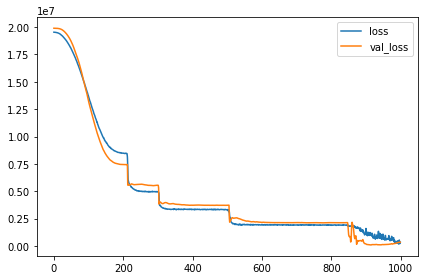
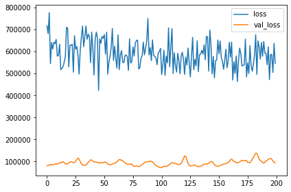

펭귄 몸무게 예측 경진대회
=======
https://dacon.io/competitions/official/235862/overview/description

9개의 feature로 펭귄의 몸무게를 예측하는 모델을 만들어 성능을 겨루는 대회이다. 성능은 rmse로 평가한다. 이전에 참가했던 심장 질환 예측 경진대회와 유사한 유형의 자료 및 목표이지만 이번엔 Classification이 아니라 Regression 모델을 만든다.

##  데이터 살펴보기


```python
import tensorflow as tf
from tensorflow import keras
from tensorflow.keras import layers
import numpy as np
import pandas as pd
import seaborn as sns
import matplotlib.pyplot as plt

plt.rc('figure', autolayout=True)
plt.rc('axes', labelweight='bold', labelsize='large', titleweight='bold', titlesize=18, titlepad=10)
plt.rc('image', cmap='cividis')
```


```python
df_train = pd.read_csv('./train.csv', index_col='id')
df_train.head()
```


<div>
<style scoped>
    .dataframe tbody tr th:only-of-type {
        vertical-align: middle;
    }

    .dataframe tbody tr th {
        vertical-align: top;
    }

    .dataframe thead th {
        text-align: right;
    }
</style>
<table border="1" class="dataframe">
  <thead>
    <tr style="text-align: right;">
      <th></th>
      <th>Species</th>
      <th>Island</th>
      <th>Clutch Completion</th>
      <th>Culmen Length (mm)</th>
      <th>Culmen Depth (mm)</th>
      <th>Flipper Length (mm)</th>
      <th>Sex</th>
      <th>Delta 15 N (o/oo)</th>
      <th>Delta 13 C (o/oo)</th>
      <th>Body Mass (g)</th>
    </tr>
    <tr>
      <th>id</th>
      <th></th>
      <th></th>
      <th></th>
      <th></th>
      <th></th>
      <th></th>
      <th></th>
      <th></th>
      <th></th>
      <th></th>
    </tr>
  </thead>
  <tbody>
    <tr>
      <th>0</th>
      <td>Gentoo penguin (Pygoscelis papua)</td>
      <td>Biscoe</td>
      <td>Yes</td>
      <td>50.0</td>
      <td>15.3</td>
      <td>220</td>
      <td>MALE</td>
      <td>8.30515</td>
      <td>-25.19017</td>
      <td>5550</td>
    </tr>
    <tr>
      <th>1</th>
      <td>Chinstrap penguin (Pygoscelis antarctica)</td>
      <td>Dream</td>
      <td>No</td>
      <td>49.5</td>
      <td>19.0</td>
      <td>200</td>
      <td>MALE</td>
      <td>9.63074</td>
      <td>-24.34684</td>
      <td>3800</td>
    </tr>
    <tr>
      <th>2</th>
      <td>Gentoo penguin (Pygoscelis papua)</td>
      <td>Biscoe</td>
      <td>Yes</td>
      <td>45.1</td>
      <td>14.4</td>
      <td>210</td>
      <td>FEMALE</td>
      <td>8.51951</td>
      <td>-27.01854</td>
      <td>4400</td>
    </tr>
    <tr>
      <th>3</th>
      <td>Gentoo penguin (Pygoscelis papua)</td>
      <td>Biscoe</td>
      <td>Yes</td>
      <td>44.5</td>
      <td>14.7</td>
      <td>214</td>
      <td>FEMALE</td>
      <td>8.20106</td>
      <td>-26.16524</td>
      <td>4850</td>
    </tr>
    <tr>
      <th>4</th>
      <td>Gentoo penguin (Pygoscelis papua)</td>
      <td>Biscoe</td>
      <td>No</td>
      <td>49.6</td>
      <td>16.0</td>
      <td>225</td>
      <td>MALE</td>
      <td>8.38324</td>
      <td>-26.84272</td>
      <td>5700</td>
    </tr>
  </tbody>
</table>
</div>


```python
df_train.describe()
```


<div>
<style scoped>
    .dataframe tbody tr th:only-of-type {
        vertical-align: middle;
    }

    .dataframe tbody tr th {
        vertical-align: top;
    }

    .dataframe thead th {
        text-align: right;
    }
</style>
<table border="1" class="dataframe">
  <thead>
    <tr style="text-align: right;">
      <th></th>
      <th>Culmen Length (mm)</th>
      <th>Culmen Depth (mm)</th>
      <th>Flipper Length (mm)</th>
      <th>Delta 15 N (o/oo)</th>
      <th>Delta 13 C (o/oo)</th>
      <th>Body Mass (g)</th>
    </tr>
  </thead>
  <tbody>
    <tr>
      <th>count</th>
      <td>114.000000</td>
      <td>114.000000</td>
      <td>114.000000</td>
      <td>111.000000</td>
      <td>111.000000</td>
      <td>114.000000</td>
    </tr>
    <tr>
      <th>mean</th>
      <td>44.613158</td>
      <td>17.014912</td>
      <td>203.052632</td>
      <td>8.737634</td>
      <td>-25.723051</td>
      <td>4327.850877</td>
    </tr>
    <tr>
      <th>std</th>
      <td>5.321829</td>
      <td>1.941363</td>
      <td>14.653425</td>
      <td>0.567698</td>
      <td>0.859786</td>
      <td>781.766484</td>
    </tr>
    <tr>
      <th>min</th>
      <td>33.500000</td>
      <td>13.200000</td>
      <td>174.000000</td>
      <td>7.632200</td>
      <td>-27.018540</td>
      <td>2700.000000</td>
    </tr>
    <tr>
      <th>25%</th>
      <td>40.325000</td>
      <td>15.225000</td>
      <td>190.000000</td>
      <td>8.272585</td>
      <td>-26.434025</td>
      <td>3675.000000</td>
    </tr>
    <tr>
      <th>50%</th>
      <td>45.200000</td>
      <td>17.250000</td>
      <td>199.000000</td>
      <td>8.632590</td>
      <td>-25.955410</td>
      <td>4250.000000</td>
    </tr>
    <tr>
      <th>75%</th>
      <td>49.075000</td>
      <td>18.600000</td>
      <td>216.000000</td>
      <td>9.264635</td>
      <td>-25.005945</td>
      <td>4850.000000</td>
    </tr>
    <tr>
      <th>max</th>
      <td>55.100000</td>
      <td>21.100000</td>
      <td>231.000000</td>
      <td>10.025440</td>
      <td>-24.102550</td>
      <td>6300.000000</td>
    </tr>
  </tbody>
</table>
</div>


```python
print("Species info")
print(df_train.Species.describe())
print("unique value: {}".format(df_train.Species.unique()))
```

    Species info
    count                                   114
    unique                                    3
    top       Gentoo penguin (Pygoscelis papua)
    freq                                     48
    Name: Species, dtype: object
    unique value: ['Gentoo penguin (Pygoscelis papua)'
     'Chinstrap penguin (Pygoscelis antarctica)'
     'Adelie Penguin (Pygoscelis adeliae)']
    

종의 종류는 총 3가지. Gentoo, Chinstrap, Adelie.


```python
print("Island info")
print(df_train.Island.describe())
print("unique values: {}".format(df_train.Island.unique()))
```

    Island info
    count        114
    unique         3
    top       Biscoe
    freq          57
    Name: Island, dtype: object
    unique values: ['Biscoe' 'Dream' 'Torgersen']
    

근처 섬 이름도 3가지. Biscoe, Dream, Torgersen. 


```python
pd.plotting.scatter_matrix(df_train, alpha=1, figsize=(12,12), diagonal="kde")
```


    array([[<AxesSubplot:xlabel='Culmen Length (mm)', ylabel='Culmen Length (mm)'>,
            <AxesSubplot:xlabel='Culmen Depth (mm)', ylabel='Culmen Length (mm)'>,
            <AxesSubplot:xlabel='Flipper Length (mm)', ylabel='Culmen Length (mm)'>,
            <AxesSubplot:xlabel='Delta 15 N (o/oo)', ylabel='Culmen Length (mm)'>,
            <AxesSubplot:xlabel='Delta 13 C (o/oo)', ylabel='Culmen Length (mm)'>,
            <AxesSubplot:xlabel='Body Mass (g)', ylabel='Culmen Length (mm)'>],
           [<AxesSubplot:xlabel='Culmen Length (mm)', ylabel='Culmen Depth (mm)'>,
            <AxesSubplot:xlabel='Culmen Depth (mm)', ylabel='Culmen Depth (mm)'>,
            <AxesSubplot:xlabel='Flipper Length (mm)', ylabel='Culmen Depth (mm)'>,
            <AxesSubplot:xlabel='Delta 15 N (o/oo)', ylabel='Culmen Depth (mm)'>,
            <AxesSubplot:xlabel='Delta 13 C (o/oo)', ylabel='Culmen Depth (mm)'>,
            <AxesSubplot:xlabel='Body Mass (g)', ylabel='Culmen Depth (mm)'>],
           [<AxesSubplot:xlabel='Culmen Length (mm)', ylabel='Flipper Length (mm)'>,
            <AxesSubplot:xlabel='Culmen Depth (mm)', ylabel='Flipper Length (mm)'>,
            <AxesSubplot:xlabel='Flipper Length (mm)', ylabel='Flipper Length (mm)'>,
            <AxesSubplot:xlabel='Delta 15 N (o/oo)', ylabel='Flipper Length (mm)'>,
            <AxesSubplot:xlabel='Delta 13 C (o/oo)', ylabel='Flipper Length (mm)'>,
            <AxesSubplot:xlabel='Body Mass (g)', ylabel='Flipper Length (mm)'>],
           [<AxesSubplot:xlabel='Culmen Length (mm)', ylabel='Delta 15 N (o/oo)'>,
            <AxesSubplot:xlabel='Culmen Depth (mm)', ylabel='Delta 15 N (o/oo)'>,
            <AxesSubplot:xlabel='Flipper Length (mm)', ylabel='Delta 15 N (o/oo)'>,
            <AxesSubplot:xlabel='Delta 15 N (o/oo)', ylabel='Delta 15 N (o/oo)'>,
            <AxesSubplot:xlabel='Delta 13 C (o/oo)', ylabel='Delta 15 N (o/oo)'>,
            <AxesSubplot:xlabel='Body Mass (g)', ylabel='Delta 15 N (o/oo)'>],
           [<AxesSubplot:xlabel='Culmen Length (mm)', ylabel='Delta 13 C (o/oo)'>,
            <AxesSubplot:xlabel='Culmen Depth (mm)', ylabel='Delta 13 C (o/oo)'>,
            <AxesSubplot:xlabel='Flipper Length (mm)', ylabel='Delta 13 C (o/oo)'>,
            <AxesSubplot:xlabel='Delta 15 N (o/oo)', ylabel='Delta 13 C (o/oo)'>,
            <AxesSubplot:xlabel='Delta 13 C (o/oo)', ylabel='Delta 13 C (o/oo)'>,
            <AxesSubplot:xlabel='Body Mass (g)', ylabel='Delta 13 C (o/oo)'>],
           [<AxesSubplot:xlabel='Culmen Length (mm)', ylabel='Body Mass (g)'>,
            <AxesSubplot:xlabel='Culmen Depth (mm)', ylabel='Body Mass (g)'>,
            <AxesSubplot:xlabel='Flipper Length (mm)', ylabel='Body Mass (g)'>,
            <AxesSubplot:xlabel='Delta 15 N (o/oo)', ylabel='Body Mass (g)'>,
            <AxesSubplot:xlabel='Delta 13 C (o/oo)', ylabel='Body Mass (g)'>,
            <AxesSubplot:xlabel='Body Mass (g)', ylabel='Body Mass (g)'>]],
          dtype=object)


    

    


```python
plt.figure(figsize=(12, 12))
cols = ["Culmen Length (mm)", "Culmen Depth (mm)", "Flipper Length (mm)", "Delta 15 N (o/oo)", "Delta 13 C (o/oo)"]
for i, col in enumerate(cols):
    plt.subplot(3, 3, i+1)
    sns.scatterplot(x=col, y="Body Mass (g)", data=df_train, hue="Species", style="Sex", legend=False)
```


    

    


```python
plt.figure(figsize=(12, 12))
cols = ["Culmen Length (mm)", "Culmen Depth (mm)", "Flipper Length (mm)", "Delta 15 N (o/oo)", "Delta 13 C (o/oo)"]
for i, col in enumerate(cols):
    plt.subplot(3, 3, i+1)
    sns.scatterplot(x=col, y="Body Mass (g)", data=df_train, hue="Clutch Completion", legend=False)
```


    

    


```python
sns.scatterplot(x="Clutch Completion", y="Body Mass (g)", hue="Species", data=df_train)
```


    <AxesSubplot:xlabel='Clutch Completion', ylabel='Body Mass (g)'>


    

    


```python
plt.figure(figsize=(12, 4))
for i, s in enumerate(df_train["Species"].unique()):
    plt.subplot(1, 3, i+1)
    sns.scatterplot(x="Clutch Completion", y="Body Mass (g)",  data=df_train[df_train["Species"]==s])
    plt.title(s.split()[0])
```


    

    


```python
sns.scatterplot(x="Island", y="Body Mass (g)", hue="Species", data=df_train)
```


    <AxesSubplot:xlabel='Island', ylabel='Body Mass (g)'>


    

    


```python
sns.scatterplot(x="Island", y="Body Mass (g)", hue="Species", 
                data=df_train[df_train["Species"] != "Gentoo penguin (Pygoscelis papua)"])
```


    <AxesSubplot:xlabel='Island', ylabel='Body Mass (g)'>


    

    


```python
for i in df_train["Island"].unique():
    df_ = df_train[df_train["Species"] == "Adelie Penguin (Pygoscelis adeliae)"]
    print("\n\n" + i)
    print(df_[df_["Island"] == i].mean())
```

    
    
    Biscoe
    Culmen Length (mm)       38.611111
    Culmen Depth (mm)        18.122222
    Flipper Length (mm)     191.000000
    Delta 15 N (o/oo)         8.951982
    Delta 13 C (o/oo)       -25.913202
    Body Mass (g)          3830.555556
    dtype: float64
    
    
    Dream
    Culmen Length (mm)       38.921053
    Culmen Depth (mm)        18.357895
    Flipper Length (mm)     188.105263
    Delta 15 N (o/oo)         8.987301
    Delta 13 C (o/oo)       -25.667341
    Body Mass (g)          3776.315789
    dtype: float64
    
    
    Torgersen
    Culmen Length (mm)       38.792308
    Culmen Depth (mm)        18.538462
    Flipper Length (mm)     191.000000
    Delta 15 N (o/oo)         8.621243
    Delta 13 C (o/oo)       -26.017551
    Body Mass (g)          3817.307692
    dtype: float64
    

    C:\Users\yhoon\AppData\Local\Temp/ipykernel_11064/1489644879.py:4: FutureWarning: Dropping of nuisance columns in DataFrame reductions (with 'numeric_only=None') is deprecated; in a future version this will raise TypeError.  Select only valid columns before calling the reduction.
      print(df_[df_["Island"] == i].mean())
    

위 그래프들에서 Delta 15 N, Delta 13 C, Clutch Completion, island의 경우 body mass와 큰 연관은 없는 것으로 보인다. 우선 이 특성들은 제외하고 학습시켜보자.


```python
df_train_fixed = df_train.drop(["Delta 15 N (o/oo)", "Delta 13 C (o/oo)", "Clutch Completion", "Island"], axis=1)
df_train_fixed.head()
```


<div>
<style scoped>
    .dataframe tbody tr th:only-of-type {
        vertical-align: middle;
    }

    .dataframe tbody tr th {
        vertical-align: top;
    }

    .dataframe thead th {
        text-align: right;
    }
</style>
<table border="1" class="dataframe">
  <thead>
    <tr style="text-align: right;">
      <th></th>
      <th>Species</th>
      <th>Culmen Length (mm)</th>
      <th>Culmen Depth (mm)</th>
      <th>Flipper Length (mm)</th>
      <th>Sex</th>
      <th>Body Mass (g)</th>
    </tr>
    <tr>
      <th>id</th>
      <th></th>
      <th></th>
      <th></th>
      <th></th>
      <th></th>
      <th></th>
    </tr>
  </thead>
  <tbody>
    <tr>
      <th>0</th>
      <td>Gentoo penguin (Pygoscelis papua)</td>
      <td>50.0</td>
      <td>15.3</td>
      <td>220</td>
      <td>MALE</td>
      <td>5550</td>
    </tr>
    <tr>
      <th>1</th>
      <td>Chinstrap penguin (Pygoscelis antarctica)</td>
      <td>49.5</td>
      <td>19.0</td>
      <td>200</td>
      <td>MALE</td>
      <td>3800</td>
    </tr>
    <tr>
      <th>2</th>
      <td>Gentoo penguin (Pygoscelis papua)</td>
      <td>45.1</td>
      <td>14.4</td>
      <td>210</td>
      <td>FEMALE</td>
      <td>4400</td>
    </tr>
    <tr>
      <th>3</th>
      <td>Gentoo penguin (Pygoscelis papua)</td>
      <td>44.5</td>
      <td>14.7</td>
      <td>214</td>
      <td>FEMALE</td>
      <td>4850</td>
    </tr>
    <tr>
      <th>4</th>
      <td>Gentoo penguin (Pygoscelis papua)</td>
      <td>49.6</td>
      <td>16.0</td>
      <td>225</td>
      <td>MALE</td>
      <td>5700</td>
    </tr>
  </tbody>
</table>
</div>


apply **one hot encoding** categorical features and **rescale** continuous values


```python
species_df = pd.get_dummies(df_train["Species"])
Island_df = pd.get_dummies(df_train["Sex"])
Island_df = Island_df.drop("MALE", axis=1)
```


```python
df_train_onehot = df_train_fixed.drop(["Species", "Sex"], axis=1)
df_train_onehot = pd.concat([df_train_onehot, species_df, Island_df], axis=1)

col_cnt = ["Culmen Length (mm)", "Culmen Depth (mm)", "Flipper Length (mm)"]

for col in col_cnt:
    if (col in df_train.columns):
        col_max = df_train[col].max()
        col_min = df_train[col].min()
        df_train_onehot[col] = (df_train_onehot[col] - col_min) / (col_max - col_min)
        
df_train_onehot.head()
```


<div>
<style scoped>
    .dataframe tbody tr th:only-of-type {
        vertical-align: middle;
    }

    .dataframe tbody tr th {
        vertical-align: top;
    }

    .dataframe thead th {
        text-align: right;
    }
</style>
<table border="1" class="dataframe">
  <thead>
    <tr style="text-align: right;">
      <th></th>
      <th>Culmen Length (mm)</th>
      <th>Culmen Depth (mm)</th>
      <th>Flipper Length (mm)</th>
      <th>Body Mass (g)</th>
      <th>Adelie Penguin (Pygoscelis adeliae)</th>
      <th>Chinstrap penguin (Pygoscelis antarctica)</th>
      <th>Gentoo penguin (Pygoscelis papua)</th>
      <th>FEMALE</th>
    </tr>
    <tr>
      <th>id</th>
      <th></th>
      <th></th>
      <th></th>
      <th></th>
      <th></th>
      <th></th>
      <th></th>
      <th></th>
    </tr>
  </thead>
  <tbody>
    <tr>
      <th>0</th>
      <td>0.763889</td>
      <td>0.265823</td>
      <td>0.807018</td>
      <td>5550.0</td>
      <td>0</td>
      <td>1</td>
      <td>0</td>
      <td>0</td>
    </tr>
    <tr>
      <th>1</th>
      <td>0.740741</td>
      <td>0.734177</td>
      <td>0.456140</td>
      <td>3800.0</td>
      <td>0</td>
      <td>0</td>
      <td>1</td>
      <td>0</td>
    </tr>
    <tr>
      <th>2</th>
      <td>0.537037</td>
      <td>0.151899</td>
      <td>0.631579</td>
      <td>4400.0</td>
      <td>1</td>
      <td>0</td>
      <td>0</td>
      <td>1</td>
    </tr>
    <tr>
      <th>3</th>
      <td>0.509259</td>
      <td>0.189873</td>
      <td>0.701754</td>
      <td>4850.0</td>
      <td>0</td>
      <td>1</td>
      <td>0</td>
      <td>1</td>
    </tr>
    <tr>
      <th>4</th>
      <td>0.745370</td>
      <td>0.354430</td>
      <td>0.894737</td>
      <td>5700.0</td>
      <td>1</td>
      <td>0</td>
      <td>0</td>
      <td>1</td>
    </tr>
  </tbody>
</table>
</div>


```python
df_train_y = df_train_onehot.pop("Body Mass (g)")
for col in df_train_onehot.columns:
    df_train_onehot[col] = df_train_onehot[col] / df_train_onehot[col].max()
```


```python
df_train_onehot.head()
```


<div>
<style scoped>
    .dataframe tbody tr th:only-of-type {
        vertical-align: middle;
    }

    .dataframe tbody tr th {
        vertical-align: top;
    }

    .dataframe thead th {
        text-align: right;
    }
</style>
<table border="1" class="dataframe">
  <thead>
    <tr style="text-align: right;">
      <th></th>
      <th>Culmen Length (mm)</th>
      <th>Culmen Depth (mm)</th>
      <th>Flipper Length (mm)</th>
      <th>Adelie Penguin (Pygoscelis adeliae)</th>
      <th>Chinstrap penguin (Pygoscelis antarctica)</th>
      <th>Gentoo penguin (Pygoscelis papua)</th>
      <th>FEMALE</th>
    </tr>
    <tr>
      <th>id</th>
      <th></th>
      <th></th>
      <th></th>
      <th></th>
      <th></th>
      <th></th>
      <th></th>
    </tr>
  </thead>
  <tbody>
    <tr>
      <th>0</th>
      <td>0.763889</td>
      <td>0.265823</td>
      <td>0.807018</td>
      <td>0.0</td>
      <td>1.0</td>
      <td>0.0</td>
      <td>0.0</td>
    </tr>
    <tr>
      <th>1</th>
      <td>0.740741</td>
      <td>0.734177</td>
      <td>0.456140</td>
      <td>0.0</td>
      <td>0.0</td>
      <td>1.0</td>
      <td>0.0</td>
    </tr>
    <tr>
      <th>2</th>
      <td>0.537037</td>
      <td>0.151899</td>
      <td>0.631579</td>
      <td>1.0</td>
      <td>0.0</td>
      <td>0.0</td>
      <td>1.0</td>
    </tr>
    <tr>
      <th>3</th>
      <td>0.509259</td>
      <td>0.189873</td>
      <td>0.701754</td>
      <td>0.0</td>
      <td>1.0</td>
      <td>0.0</td>
      <td>1.0</td>
    </tr>
    <tr>
      <th>4</th>
      <td>0.745370</td>
      <td>0.354430</td>
      <td>0.894737</td>
      <td>1.0</td>
      <td>0.0</td>
      <td>0.0</td>
      <td>1.0</td>
    </tr>
  </tbody>
</table>
</div>


```python
train_n = int(df_train_onehot.count()[0]*0.8)
train_n
```


    91


```python
df_test = pd.read_csv("./test.csv", index_col="id")

species_df = pd.get_dummies(df_test["Species"])
Island_df = pd.get_dummies(df_test["Sex"])
Island_df = Island_df.drop("MALE", axis=1)

df_test_onehot = df_test.drop(["Species", "Sex", "Delta 15 N (o/oo)", "Delta 13 C (o/oo)", "Clutch Completion", "Island"], axis=1)
df_test_onehot = pd.concat([df_test_onehot, species_df, Island_df], axis=1)

for col in df_test_onehot.columns:
    if (col in df_train.columns):
        col_max = df_train[col].max()
        col_min = df_train[col].min()
        df_test_onehot[col] = (df_test_onehot[col] - col_min) / (col_max - col_min)

df_test_onehot.head()
```


<div>
<style scoped>
    .dataframe tbody tr th:only-of-type {
        vertical-align: middle;
    }

    .dataframe tbody tr th {
        vertical-align: top;
    }

    .dataframe thead th {
        text-align: right;
    }
</style>
<table border="1" class="dataframe">
  <thead>
    <tr style="text-align: right;">
      <th></th>
      <th>Culmen Length (mm)</th>
      <th>Culmen Depth (mm)</th>
      <th>Flipper Length (mm)</th>
      <th>Adelie Penguin (Pygoscelis adeliae)</th>
      <th>Chinstrap penguin (Pygoscelis antarctica)</th>
      <th>Gentoo penguin (Pygoscelis papua)</th>
      <th>FEMALE</th>
    </tr>
    <tr>
      <th>id</th>
      <th></th>
      <th></th>
      <th></th>
      <th></th>
      <th></th>
      <th></th>
      <th></th>
    </tr>
  </thead>
  <tbody>
    <tr>
      <th>0</th>
      <td>0.856481</td>
      <td>0.949367</td>
      <td>0.631579</td>
      <td>0</td>
      <td>1</td>
      <td>0</td>
      <td>0</td>
    </tr>
    <tr>
      <th>1</th>
      <td>1.037037</td>
      <td>0.481013</td>
      <td>0.947368</td>
      <td>0</td>
      <td>0</td>
      <td>1</td>
      <td>0</td>
    </tr>
    <tr>
      <th>2</th>
      <td>0.250000</td>
      <td>0.708861</td>
      <td>0.280702</td>
      <td>1</td>
      <td>0</td>
      <td>0</td>
      <td>1</td>
    </tr>
    <tr>
      <th>3</th>
      <td>0.541667</td>
      <td>0.430380</td>
      <td>0.298246</td>
      <td>0</td>
      <td>1</td>
      <td>0</td>
      <td>1</td>
    </tr>
    <tr>
      <th>4</th>
      <td>0.203704</td>
      <td>0.683544</td>
      <td>-0.035088</td>
      <td>1</td>
      <td>0</td>
      <td>0</td>
      <td>1</td>
    </tr>
  </tbody>
</table>
</div>


## Dense model

우선 6층짜리 Dense model로 시험해보자


```python
ds_ = tf.data.Dataset.from_tensor_slices((df_train_onehot.values, df_train_y.values)).shuffle(buffer_size=500)
ds_train = ds_.take(train_n)
ds_val = ds_.skip(train_n)

AUTOTUNE = tf.data.experimental.AUTOTUNE

ds_train = ds_train = (
    ds_train
    .batch(32)
    .cache()
    .prefetch(buffer_size=AUTOTUNE)
)

ds_val = (
    ds_val
    .batch(32)
    .cache()
    .prefetch(buffer_size=AUTOTUNE)
)
```


```python
ds_train.element_spec
```


    (TensorSpec(shape=(None, 7), dtype=tf.float64, name=None),
     TensorSpec(shape=(None,), dtype=tf.int64, name=None))


```python
model_Dense = keras.Sequential([
    layers.Dense(64, input_shape=[7], activation='relu'),
    
    layers.BatchNormalization(),
    layers.Dense(128, activation='relu'),
    layers.Dropout(0.3),
    
    layers.BatchNormalization(),
    layers.Dense(256, activation='relu'),
     layers.Dropout(0.3),
    
    layers.BatchNormalization(),
    layers.Dense(256, activation='relu'),
     layers.Dropout(0.3),
    
    layers.BatchNormalization(),
    layers.Dense(128, activation='relu'),
    
    layers.Dense(1, activation='relu')
    
])
```


```python
model_Dense.compile(optimizer=keras.optimizers.Adam(learning_rate=0.0005), loss="mse")
```


```python
early = keras.callbacks.EarlyStopping(patience=100, min_delta=0.001, restore_best_weights=True)

history_Dense = model_Dense.fit(
    ds_train,
    validation_data=ds_val,
    callbacks=[early],
    epochs=1000
)
```

    Epoch 1/1000
    3/3 [==============================] - 2s 112ms/step - loss: 19528188.0000 - val_loss: 19889218.0000
    Epoch 2/1000
    3/3 [==============================] - 0s 23ms/step - loss: 19526626.0000 - val_loss: 19888776.0000
    Epoch 3/1000
    3/3 [==============================] - 0s 26ms/step - loss: 19524668.0000 - val_loss: 19888254.0000
    Epoch 4/1000
    3/3 [==============================] - 0s 25ms/step - loss: 19521592.0000 - val_loss: 19887600.0000
    Epoch 5/1000
    3/3 [==============================] - 0s 24ms/step - loss: 19515740.0000 - val_loss: 19886858.0000
    Epoch 6/1000
    3/3 [==============================] - 0s 22ms/step - loss: 19511778.0000 - val_loss: 19885976.0000
    Epoch 7/1000
    3/3 [==============================] - 0s 24ms/step - loss: 19506570.0000 - val_loss: 19884916.0000
    Epoch 8/1000
    3/3 [==============================] - 0s 24ms/step - loss: 19501096.0000 - val_loss: 19883536.0000
    Epoch 9/1000
    3/3 [==============================] - 0s 24ms/step - loss: 19494214.0000 - val_loss: 19881874.0000
    Epoch 10/1000
    3/3 [==============================] - 0s 24ms/step - loss: 19487210.0000 - val_loss: 19879822.0000
    Epoch 11/1000
    3/3 [==============================] - 0s 22ms/step - loss: 19477722.0000 - val_loss: 19877332.0000
    Epoch 12/1000
    3/3 [==============================] - 0s 23ms/step - loss: 19468012.0000 - val_loss: 19874214.0000
    Epoch 13/1000
    3/3 [==============================] - 0s 25ms/step - loss: 19455964.0000 - val_loss: 19870536.0000
    Epoch 14/1000
    3/3 [==============================] - 0s 23ms/step - loss: 19445352.0000 - val_loss: 19866092.0000
    Epoch 15/1000
    3/3 [==============================] - 0s 22ms/step - loss: 19430592.0000 - val_loss: 19860780.0000
    Epoch 16/1000
    3/3 [==============================] - 0s 24ms/step - loss: 19413918.0000 - val_loss: 19854622.0000
    Epoch 17/1000
    3/3 [==============================] - 0s 23ms/step - loss: 19394724.0000 - val_loss: 19847478.0000
    Epoch 18/1000
    3/3 [==============================] - 0s 23ms/step - loss: 19376548.0000 - val_loss: 19839180.0000
    Epoch 19/1000
    3/3 [==============================] - 0s 21ms/step - loss: 19357594.0000 - val_loss: 19830050.0000
    Epoch 20/1000
    3/3 [==============================] - 0s 22ms/step - loss: 19331762.0000 - val_loss: 19819658.0000
    Epoch 21/1000
    3/3 [==============================] - 0s 22ms/step - loss: 19311410.0000 - val_loss: 19807616.0000
    Epoch 22/1000
    3/3 [==============================] - 0s 24ms/step - loss: 19281486.0000 - val_loss: 19793776.0000
    Epoch 23/1000
    3/3 [==============================] - 0s 24ms/step - loss: 19256788.0000 - val_loss: 19778022.0000
    Epoch 24/1000
    3/3 [==============================] - 0s 22ms/step - loss: 19223800.0000 - val_loss: 19761030.0000
    Epoch 25/1000
    3/3 [==============================] - 0s 24ms/step - loss: 19200140.0000 - val_loss: 19742338.0000
    Epoch 26/1000
    3/3 [==============================] - 0s 23ms/step - loss: 19167238.0000 - val_loss: 19721676.0000
    Epoch 27/1000
    3/3 [==============================] - 0s 23ms/step - loss: 19133338.0000 - val_loss: 19699018.0000
    Epoch 28/1000
    3/3 [==============================] - 0s 23ms/step - loss: 19098550.0000 - val_loss: 19674718.0000
    Epoch 29/1000
    3/3 [==============================] - 0s 22ms/step - loss: 19066158.0000 - val_loss: 19649198.0000
    Epoch 30/1000
    3/3 [==============================] - 0s 21ms/step - loss: 19026958.0000 - val_loss: 19621798.0000
    Epoch 31/1000
    3/3 [==============================] - 0s 24ms/step - loss: 18993366.0000 - val_loss: 19592728.0000
    Epoch 32/1000
    3/3 [==============================] - 0s 24ms/step - loss: 18950062.0000 - val_loss: 19562000.0000
    Epoch 33/1000
    3/3 [==============================] - 0s 22ms/step - loss: 18912728.0000 - val_loss: 19529962.0000
    Epoch 34/1000
    3/3 [==============================] - 0s 24ms/step - loss: 18872440.0000 - val_loss: 19497510.0000
    Epoch 35/1000
    3/3 [==============================] - 0s 25ms/step - loss: 18828556.0000 - val_loss: 19462776.0000
    Epoch 36/1000
    3/3 [==============================] - 0s 23ms/step - loss: 18793786.0000 - val_loss: 19426032.0000
    Epoch 37/1000
    3/3 [==============================] - 0s 23ms/step - loss: 18741022.0000 - val_loss: 19387840.0000
    Epoch 38/1000
    3/3 [==============================] - 0s 23ms/step - loss: 18704378.0000 - val_loss: 19348794.0000
    Epoch 39/1000
    3/3 [==============================] - 0s 23ms/step - loss: 18658548.0000 - val_loss: 19308308.0000
    Epoch 40/1000
    3/3 [==============================] - 0s 24ms/step - loss: 18609456.0000 - val_loss: 19266320.0000
    Epoch 41/1000
    3/3 [==============================] - 0s 27ms/step - loss: 18556338.0000 - val_loss: 19221638.0000
    Epoch 42/1000
    3/3 [==============================] - 0s 25ms/step - loss: 18498136.0000 - val_loss: 19174442.0000
    Epoch 43/1000
    3/3 [==============================] - 0s 24ms/step - loss: 18458522.0000 - val_loss: 19126434.0000
    Epoch 44/1000
    3/3 [==============================] - 0s 25ms/step - loss: 18401340.0000 - val_loss: 19076364.0000
    Epoch 45/1000
    3/3 [==============================] - 0s 26ms/step - loss: 18348492.0000 - val_loss: 19025700.0000
    Epoch 46/1000
    3/3 [==============================] - 0s 26ms/step - loss: 18298398.0000 - val_loss: 18972130.0000
    Epoch 47/1000
    3/3 [==============================] - 0s 26ms/step - loss: 18238988.0000 - val_loss: 18916494.0000
    Epoch 48/1000
    3/3 [==============================] - 0s 25ms/step - loss: 18168796.0000 - val_loss: 18858022.0000
    Epoch 49/1000
    3/3 [==============================] - 0s 24ms/step - loss: 18132398.0000 - val_loss: 18796314.0000
    Epoch 50/1000
    3/3 [==============================] - 0s 24ms/step - loss: 18061494.0000 - val_loss: 18733432.0000
    Epoch 51/1000
    3/3 [==============================] - 0s 23ms/step - loss: 18000688.0000 - val_loss: 18667434.0000
    Epoch 52/1000
    3/3 [==============================] - 0s 22ms/step - loss: 17926132.0000 - val_loss: 18598054.0000
    Epoch 53/1000
    3/3 [==============================] - 0s 22ms/step - loss: 17870580.0000 - val_loss: 18531578.0000
    Epoch 54/1000
    3/3 [==============================] - 0s 27ms/step - loss: 17806896.0000 - val_loss: 18457960.0000
    Epoch 55/1000
    3/3 [==============================] - 0s 25ms/step - loss: 17745408.0000 - val_loss: 18385988.0000
    Epoch 56/1000
    3/3 [==============================] - 0s 28ms/step - loss: 17679214.0000 - val_loss: 18311494.0000
    Epoch 57/1000
    3/3 [==============================] - 0s 25ms/step - loss: 17612122.0000 - val_loss: 18233082.0000
    Epoch 58/1000
    3/3 [==============================] - 0s 25ms/step - loss: 17529626.0000 - val_loss: 18147892.0000
    Epoch 59/1000
    3/3 [==============================] - 0s 24ms/step - loss: 17452342.0000 - val_loss: 18060648.0000
    Epoch 60/1000
    3/3 [==============================] - 0s 24ms/step - loss: 17398478.0000 - val_loss: 17972952.0000
    Epoch 61/1000
    3/3 [==============================] - 0s 24ms/step - loss: 17307280.0000 - val_loss: 17888460.0000
    Epoch 62/1000
    3/3 [==============================] - 0s 24ms/step - loss: 17237164.0000 - val_loss: 17805668.0000
    Epoch 63/1000
    3/3 [==============================] - 0s 23ms/step - loss: 17175212.0000 - val_loss: 17728460.0000
    Epoch 64/1000
    3/3 [==============================] - 0s 23ms/step - loss: 17071818.0000 - val_loss: 17648528.0000
    Epoch 65/1000
    3/3 [==============================] - 0s 27ms/step - loss: 17002132.0000 - val_loss: 17561144.0000
    Epoch 66/1000
    3/3 [==============================] - 0s 27ms/step - loss: 16940910.0000 - val_loss: 17465100.0000
    Epoch 67/1000
    3/3 [==============================] - 0s 28ms/step - loss: 16861090.0000 - val_loss: 17364128.0000
    Epoch 68/1000
    3/3 [==============================] - 0s 26ms/step - loss: 16762413.0000 - val_loss: 17266298.0000
    Epoch 69/1000
    3/3 [==============================] - 0s 22ms/step - loss: 16693704.0000 - val_loss: 17168908.0000
    Epoch 70/1000
    3/3 [==============================] - 0s 22ms/step - loss: 16585573.0000 - val_loss: 17076730.0000
    Epoch 71/1000
    3/3 [==============================] - 0s 22ms/step - loss: 16524686.0000 - val_loss: 16982850.0000
    Epoch 72/1000
    3/3 [==============================] - 0s 22ms/step - loss: 16440877.0000 - val_loss: 16884764.0000
    Epoch 73/1000
    3/3 [==============================] - 0s 28ms/step - loss: 16364879.0000 - val_loss: 16783884.0000
    Epoch 74/1000
    3/3 [==============================] - 0s 28ms/step - loss: 16258605.0000 - val_loss: 16671949.0000
    Epoch 75/1000
    3/3 [==============================] - 0s 24ms/step - loss: 16173395.0000 - val_loss: 16558851.0000
    Epoch 76/1000
    3/3 [==============================] - 0s 22ms/step - loss: 16089592.0000 - val_loss: 16439346.0000
    Epoch 77/1000
    3/3 [==============================] - 0s 23ms/step - loss: 15994523.0000 - val_loss: 16320470.0000
    Epoch 78/1000
    3/3 [==============================] - 0s 23ms/step - loss: 15904940.0000 - val_loss: 16202532.0000
    Epoch 79/1000
    3/3 [==============================] - 0s 23ms/step - loss: 15812169.0000 - val_loss: 16083000.0000
    Epoch 80/1000
    3/3 [==============================] - 0s 24ms/step - loss: 15713795.0000 - val_loss: 15964065.0000
    Epoch 81/1000
    3/3 [==============================] - 0s 23ms/step - loss: 15608804.0000 - val_loss: 15849301.0000
    Epoch 82/1000
    3/3 [==============================] - 0s 21ms/step - loss: 15537892.0000 - val_loss: 15722694.0000
    Epoch 83/1000
    3/3 [==============================] - 0s 23ms/step - loss: 15438617.0000 - val_loss: 15587718.0000
    Epoch 84/1000
    3/3 [==============================] - 0s 23ms/step - loss: 15338127.0000 - val_loss: 15449074.0000
    Epoch 85/1000
    3/3 [==============================] - 0s 24ms/step - loss: 15239548.0000 - val_loss: 15305501.0000
    Epoch 86/1000
    3/3 [==============================] - 0s 23ms/step - loss: 15143290.0000 - val_loss: 15176309.0000
    Epoch 87/1000
    3/3 [==============================] - 0s 23ms/step - loss: 15066641.0000 - val_loss: 15063413.0000
    Epoch 88/1000
    3/3 [==============================] - 0s 22ms/step - loss: 14937921.0000 - val_loss: 14954766.0000
    Epoch 89/1000
    3/3 [==============================] - 0s 22ms/step - loss: 14885002.0000 - val_loss: 14834951.0000
    Epoch 90/1000
    3/3 [==============================] - 0s 22ms/step - loss: 14742528.0000 - val_loss: 14692562.0000
    Epoch 91/1000
    3/3 [==============================] - 0s 21ms/step - loss: 14655743.0000 - val_loss: 14548241.0000
    Epoch 92/1000
    3/3 [==============================] - 0s 23ms/step - loss: 14549757.0000 - val_loss: 14409007.0000
    Epoch 93/1000
    3/3 [==============================] - 0s 25ms/step - loss: 14472832.0000 - val_loss: 14282009.0000
    Epoch 94/1000
    3/3 [==============================] - 0s 21ms/step - loss: 14340059.0000 - val_loss: 14172728.0000
    Epoch 95/1000
    3/3 [==============================] - 0s 22ms/step - loss: 14266057.0000 - val_loss: 14063051.0000
    Epoch 96/1000
    3/3 [==============================] - 0s 23ms/step - loss: 14152373.0000 - val_loss: 13941610.0000
    Epoch 97/1000
    3/3 [==============================] - 0s 22ms/step - loss: 14044731.0000 - val_loss: 13807034.0000
    Epoch 98/1000
    3/3 [==============================] - 0s 23ms/step - loss: 13983896.0000 - val_loss: 13658137.0000
    Epoch 99/1000
    3/3 [==============================] - 0s 24ms/step - loss: 13842899.0000 - val_loss: 13501777.0000
    Epoch 100/1000
    3/3 [==============================] - 0s 22ms/step - loss: 13763052.0000 - val_loss: 13367196.0000
    Epoch 101/1000
    3/3 [==============================] - 0s 23ms/step - loss: 13650512.0000 - val_loss: 13236373.0000
    Epoch 102/1000
    3/3 [==============================] - 0s 22ms/step - loss: 13537553.0000 - val_loss: 13090020.0000
    Epoch 103/1000
    3/3 [==============================] - 0s 23ms/step - loss: 13451156.0000 - val_loss: 12953052.0000
    Epoch 104/1000
    3/3 [==============================] - 0s 24ms/step - loss: 13332697.0000 - val_loss: 12831041.0000
    Epoch 105/1000
    3/3 [==============================] - 0s 23ms/step - loss: 13208435.0000 - val_loss: 12714504.0000
    Epoch 106/1000
    3/3 [==============================] - 0s 25ms/step - loss: 13155135.0000 - val_loss: 12594285.0000
    Epoch 107/1000
    3/3 [==============================] - 0s 24ms/step - loss: 13045154.0000 - val_loss: 12469955.0000
    Epoch 108/1000
    3/3 [==============================] - 0s 22ms/step - loss: 12971121.0000 - val_loss: 12343016.0000
    Epoch 109/1000
    3/3 [==============================] - 0s 23ms/step - loss: 12859192.0000 - val_loss: 12218374.0000
    Epoch 110/1000
    3/3 [==============================] - 0s 23ms/step - loss: 12739771.0000 - val_loss: 12084600.0000
    Epoch 111/1000
    3/3 [==============================] - 0s 24ms/step - loss: 12630393.0000 - val_loss: 11964559.0000
    Epoch 112/1000
    3/3 [==============================] - 0s 26ms/step - loss: 12543812.0000 - val_loss: 11850297.0000
    Epoch 113/1000
    3/3 [==============================] - 0s 26ms/step - loss: 12455223.0000 - val_loss: 11728801.0000
    Epoch 114/1000
    3/3 [==============================] - 0s 25ms/step - loss: 12344915.0000 - val_loss: 11610536.0000
    Epoch 115/1000
    3/3 [==============================] - 0s 25ms/step - loss: 12269686.0000 - val_loss: 11499426.0000
    Epoch 116/1000
    3/3 [==============================] - 0s 22ms/step - loss: 12136636.0000 - val_loss: 11387894.0000
    Epoch 117/1000
    3/3 [==============================] - 0s 24ms/step - loss: 12054168.0000 - val_loss: 11275304.0000
    Epoch 118/1000
    3/3 [==============================] - 0s 24ms/step - loss: 11970855.0000 - val_loss: 11180016.0000
    Epoch 119/1000
    3/3 [==============================] - 0s 23ms/step - loss: 11894769.0000 - val_loss: 11074208.0000
    Epoch 120/1000
    3/3 [==============================] - 0s 25ms/step - loss: 11773124.0000 - val_loss: 10964681.0000
    Epoch 121/1000
    3/3 [==============================] - 0s 28ms/step - loss: 11683799.0000 - val_loss: 10853487.0000
    Epoch 122/1000
    3/3 [==============================] - 0s 25ms/step - loss: 11606362.0000 - val_loss: 10741512.0000
    Epoch 123/1000
    3/3 [==============================] - 0s 25ms/step - loss: 11538650.0000 - val_loss: 10628015.0000
    Epoch 124/1000
    3/3 [==============================] - 0s 24ms/step - loss: 11399911.0000 - val_loss: 10508891.0000
    Epoch 125/1000
    3/3 [==============================] - 0s 23ms/step - loss: 11304532.0000 - val_loss: 10398098.0000
    Epoch 126/1000
    3/3 [==============================] - 0s 25ms/step - loss: 11307870.0000 - val_loss: 10296293.0000
    Epoch 127/1000
    3/3 [==============================] - 0s 23ms/step - loss: 11133091.0000 - val_loss: 10199356.0000
    Epoch 128/1000
    3/3 [==============================] - 0s 25ms/step - loss: 11071395.0000 - val_loss: 10100264.0000
    Epoch 129/1000
    3/3 [==============================] - 0s 25ms/step - loss: 10962771.0000 - val_loss: 9996556.0000
    Epoch 130/1000
    3/3 [==============================] - 0s 29ms/step - loss: 10877285.0000 - val_loss: 9897002.0000
    Epoch 131/1000
    3/3 [==============================] - 0s 25ms/step - loss: 10786272.0000 - val_loss: 9807827.0000
    Epoch 132/1000
    3/3 [==============================] - 0s 26ms/step - loss: 10716869.0000 - val_loss: 9718203.0000
    Epoch 133/1000
    3/3 [==============================] - 0s 24ms/step - loss: 10668237.0000 - val_loss: 9628797.0000
    Epoch 134/1000
    3/3 [==============================] - 0s 22ms/step - loss: 10592344.0000 - val_loss: 9548454.0000
    Epoch 135/1000
    3/3 [==============================] - 0s 23ms/step - loss: 10493358.0000 - val_loss: 9465635.0000
    Epoch 136/1000
    3/3 [==============================] - 0s 27ms/step - loss: 10435763.0000 - val_loss: 9375565.0000
    Epoch 137/1000
    3/3 [==============================] - 0s 25ms/step - loss: 10353599.0000 - val_loss: 9283711.0000
    Epoch 138/1000
    3/3 [==============================] - 0s 24ms/step - loss: 10307374.0000 - val_loss: 9193182.0000
    Epoch 139/1000
    3/3 [==============================] - 0s 22ms/step - loss: 10208807.0000 - val_loss: 9106055.0000
    Epoch 140/1000
    3/3 [==============================] - 0s 26ms/step - loss: 10145146.0000 - val_loss: 9027240.0000
    Epoch 141/1000
    3/3 [==============================] - 0s 23ms/step - loss: 10082485.0000 - val_loss: 8948081.0000
    Epoch 142/1000
    3/3 [==============================] - 0s 23ms/step - loss: 9986581.0000 - val_loss: 8877190.0000
    Epoch 143/1000
    3/3 [==============================] - 0s 23ms/step - loss: 9938624.0000 - val_loss: 8815059.0000
    Epoch 144/1000
    3/3 [==============================] - 0s 24ms/step - loss: 9860152.0000 - val_loss: 8760971.0000
    Epoch 145/1000
    3/3 [==============================] - 0s 24ms/step - loss: 9870942.0000 - val_loss: 8704394.0000
    Epoch 146/1000
    3/3 [==============================] - 0s 23ms/step - loss: 9778955.0000 - val_loss: 8647405.0000
    Epoch 147/1000
    3/3 [==============================] - 0s 24ms/step - loss: 9672371.0000 - val_loss: 8576218.0000
    Epoch 148/1000
    3/3 [==============================] - 0s 24ms/step - loss: 9660141.0000 - val_loss: 8514102.0000
    Epoch 149/1000
    3/3 [==============================] - 0s 24ms/step - loss: 9568322.0000 - val_loss: 8459753.0000
    Epoch 150/1000
    3/3 [==============================] - 0s 23ms/step - loss: 9543835.0000 - val_loss: 8407115.0000
    Epoch 151/1000
    3/3 [==============================] - 0s 22ms/step - loss: 9492220.0000 - val_loss: 8357104.5000
    Epoch 152/1000
    3/3 [==============================] - 0s 24ms/step - loss: 9481390.0000 - val_loss: 8309527.5000
    Epoch 153/1000
    3/3 [==============================] - 0s 22ms/step - loss: 9377402.0000 - val_loss: 8259354.5000
    Epoch 154/1000
    3/3 [==============================] - 0s 23ms/step - loss: 9381969.0000 - val_loss: 8209018.5000
    Epoch 155/1000
    3/3 [==============================] - 0s 23ms/step - loss: 9317546.0000 - val_loss: 8170700.5000
    Epoch 156/1000
    3/3 [==============================] - 0s 22ms/step - loss: 9246681.0000 - val_loss: 8135331.0000
    Epoch 157/1000
    3/3 [==============================] - 0s 23ms/step - loss: 9200386.0000 - val_loss: 8091169.5000
    Epoch 158/1000
    3/3 [==============================] - 0s 23ms/step - loss: 9169934.0000 - val_loss: 8051230.5000
    Epoch 159/1000
    3/3 [==============================] - 0s 24ms/step - loss: 9132941.0000 - val_loss: 8009217.5000
    Epoch 160/1000
    3/3 [==============================] - 0s 24ms/step - loss: 9070630.0000 - val_loss: 7966868.0000
    Epoch 161/1000
    3/3 [==============================] - 0s 23ms/step - loss: 9059344.0000 - val_loss: 7930206.5000
    Epoch 162/1000
    3/3 [==============================] - 0s 23ms/step - loss: 9008128.0000 - val_loss: 7892615.5000
    Epoch 163/1000
    3/3 [==============================] - 0s 22ms/step - loss: 8995635.0000 - val_loss: 7861301.0000
    Epoch 164/1000
    3/3 [==============================] - 0s 22ms/step - loss: 9010114.0000 - val_loss: 7837697.5000
    Epoch 165/1000
    3/3 [==============================] - 0s 23ms/step - loss: 8912395.0000 - val_loss: 7817676.0000
    Epoch 166/1000
    3/3 [==============================] - 0s 23ms/step - loss: 8909728.0000 - val_loss: 7800420.0000
    Epoch 167/1000
    3/3 [==============================] - 0s 26ms/step - loss: 8870857.0000 - val_loss: 7786987.0000
    Epoch 168/1000
    3/3 [==============================] - 0s 24ms/step - loss: 8847908.0000 - val_loss: 7760407.5000
    Epoch 169/1000
    3/3 [==============================] - 0s 23ms/step - loss: 8841648.0000 - val_loss: 7726327.5000
    Epoch 170/1000
    3/3 [==============================] - 0s 22ms/step - loss: 8818005.0000 - val_loss: 7696114.0000
    Epoch 171/1000
    3/3 [==============================] - 0s 24ms/step - loss: 8802009.0000 - val_loss: 7670416.5000
    Epoch 172/1000
    3/3 [==============================] - 0s 25ms/step - loss: 8765410.0000 - val_loss: 7649278.0000
    Epoch 173/1000
    3/3 [==============================] - 0s 25ms/step - loss: 8748822.0000 - val_loss: 7633116.0000
    Epoch 174/1000
    3/3 [==============================] - 0s 24ms/step - loss: 8710195.0000 - val_loss: 7621970.0000
    Epoch 175/1000
    3/3 [==============================] - 0s 23ms/step - loss: 8700543.0000 - val_loss: 7606624.0000
    Epoch 176/1000
    3/3 [==============================] - 0s 23ms/step - loss: 8707208.0000 - val_loss: 7587183.5000
    Epoch 177/1000
    3/3 [==============================] - 0s 24ms/step - loss: 8673315.0000 - val_loss: 7570455.5000
    Epoch 178/1000
    3/3 [==============================] - 0s 22ms/step - loss: 8661307.0000 - val_loss: 7558240.0000
    Epoch 179/1000
    3/3 [==============================] - 0s 24ms/step - loss: 8641829.0000 - val_loss: 7550017.5000
    Epoch 180/1000
    3/3 [==============================] - 0s 23ms/step - loss: 8638499.0000 - val_loss: 7542323.0000
    Epoch 181/1000
    3/3 [==============================] - 0s 22ms/step - loss: 8612429.0000 - val_loss: 7537003.0000
    Epoch 182/1000
    3/3 [==============================] - 0s 24ms/step - loss: 8604642.0000 - val_loss: 7529502.0000
    Epoch 183/1000
    3/3 [==============================] - 0s 23ms/step - loss: 8601029.0000 - val_loss: 7516160.0000
    Epoch 184/1000
    3/3 [==============================] - 0s 24ms/step - loss: 8580717.0000 - val_loss: 7506266.5000
    Epoch 185/1000
    3/3 [==============================] - 0s 25ms/step - loss: 8551601.0000 - val_loss: 7498967.5000
    Epoch 186/1000
    3/3 [==============================] - 0s 25ms/step - loss: 8547511.0000 - val_loss: 7491967.5000
    Epoch 187/1000
    3/3 [==============================] - 0s 23ms/step - loss: 8542814.0000 - val_loss: 7484566.5000
    Epoch 188/1000
    3/3 [==============================] - 0s 23ms/step - loss: 8545997.0000 - val_loss: 7477666.0000
    Epoch 189/1000
    3/3 [==============================] - 0s 22ms/step - loss: 8530483.0000 - val_loss: 7468629.5000
    Epoch 190/1000
    3/3 [==============================] - 0s 23ms/step - loss: 8535887.0000 - val_loss: 7460250.5000
    Epoch 191/1000
    3/3 [==============================] - 0s 22ms/step - loss: 8510618.0000 - val_loss: 7454273.5000
    Epoch 192/1000
    3/3 [==============================] - 0s 23ms/step - loss: 8505618.0000 - val_loss: 7451737.0000
    Epoch 193/1000
    3/3 [==============================] - 0s 23ms/step - loss: 8511691.0000 - val_loss: 7449876.0000
    Epoch 194/1000
    3/3 [==============================] - 0s 24ms/step - loss: 8528210.0000 - val_loss: 7448112.5000
    Epoch 195/1000
    3/3 [==============================] - 0s 22ms/step - loss: 8496482.0000 - val_loss: 7450409.5000
    Epoch 196/1000
    3/3 [==============================] - 0s 25ms/step - loss: 8472124.0000 - val_loss: 7450941.0000
    Epoch 197/1000
    3/3 [==============================] - 0s 23ms/step - loss: 8484632.0000 - val_loss: 7449717.0000
    Epoch 198/1000
    3/3 [==============================] - 0s 23ms/step - loss: 8480263.0000 - val_loss: 7447869.0000
    Epoch 199/1000
    3/3 [==============================] - 0s 25ms/step - loss: 8479630.0000 - val_loss: 7445634.0000
    Epoch 200/1000
    3/3 [==============================] - 0s 26ms/step - loss: 8482322.0000 - val_loss: 7442361.0000
    Epoch 201/1000
    3/3 [==============================] - 0s 23ms/step - loss: 8472644.0000 - val_loss: 7438671.5000
    Epoch 202/1000
    3/3 [==============================] - 0s 24ms/step - loss: 8474355.0000 - val_loss: 7435548.0000
    Epoch 203/1000
    3/3 [==============================] - 0s 22ms/step - loss: 8475140.0000 - val_loss: 7433383.5000
    Epoch 204/1000
    3/3 [==============================] - 0s 23ms/step - loss: 8454455.0000 - val_loss: 7432136.5000
    Epoch 205/1000
    3/3 [==============================] - 0s 21ms/step - loss: 8451704.0000 - val_loss: 7432166.5000
    Epoch 206/1000
    3/3 [==============================] - 0s 20ms/step - loss: 8445748.0000 - val_loss: 7434686.0000
    Epoch 207/1000
    3/3 [==============================] - 0s 20ms/step - loss: 8463394.0000 - val_loss: 7436703.5000
    Epoch 208/1000
    3/3 [==============================] - 0s 19ms/step - loss: 8475260.0000 - val_loss: 7435536.5000
    Epoch 209/1000
    3/3 [==============================] - 0s 21ms/step - loss: 8451047.0000 - val_loss: 7433806.5000
    Epoch 210/1000
    3/3 [==============================] - 0s 23ms/step - loss: 8461495.0000 - val_loss: 7433209.0000
    Epoch 211/1000
    3/3 [==============================] - 0s 19ms/step - loss: 8448290.0000 - val_loss: 7432612.0000
    Epoch 212/1000
    3/3 [==============================] - 0s 20ms/step - loss: 8435063.0000 - val_loss: 7437033.5000
    Epoch 213/1000
    3/3 [==============================] - 0s 20ms/step - loss: 8129997.5000 - val_loss: 7435580.0000
    Epoch 214/1000
    3/3 [==============================] - 0s 24ms/step - loss: 7250944.0000 - val_loss: 5565639.0000
    Epoch 215/1000
    3/3 [==============================] - 0s 24ms/step - loss: 6058614.0000 - val_loss: 5552920.5000
    Epoch 216/1000
    3/3 [==============================] - 0s 20ms/step - loss: 5927749.0000 - val_loss: 5626255.5000
    Epoch 217/1000
    3/3 [==============================] - 0s 22ms/step - loss: 5784787.5000 - val_loss: 5611772.0000
    Epoch 218/1000
    3/3 [==============================] - 0s 20ms/step - loss: 5712441.5000 - val_loss: 5584832.5000
    Epoch 219/1000
    3/3 [==============================] - 0s 22ms/step - loss: 5597872.5000 - val_loss: 5567894.0000
    Epoch 220/1000
    3/3 [==============================] - 0s 19ms/step - loss: 5585163.0000 - val_loss: 5570584.0000
    Epoch 221/1000
    3/3 [==============================] - 0s 21ms/step - loss: 5529688.5000 - val_loss: 5586530.0000
    Epoch 222/1000
    3/3 [==============================] - 0s 21ms/step - loss: 5509327.5000 - val_loss: 5610721.5000
    Epoch 223/1000
    3/3 [==============================] - 0s 20ms/step - loss: 5444377.5000 - val_loss: 5642217.0000
    Epoch 224/1000
    3/3 [==============================] - 0s 20ms/step - loss: 5365840.0000 - val_loss: 5663420.5000
    Epoch 225/1000
    3/3 [==============================] - 0s 20ms/step - loss: 5382051.0000 - val_loss: 5670933.0000
    Epoch 226/1000
    3/3 [==============================] - 0s 20ms/step - loss: 5339799.5000 - val_loss: 5664563.5000
    Epoch 227/1000
    3/3 [==============================] - 0s 21ms/step - loss: 5318756.0000 - val_loss: 5650470.0000
    Epoch 228/1000
    3/3 [==============================] - 0s 21ms/step - loss: 5255667.5000 - val_loss: 5637783.5000
    Epoch 229/1000
    3/3 [==============================] - 0s 20ms/step - loss: 5252479.5000 - val_loss: 5622988.0000
    Epoch 230/1000
    3/3 [==============================] - 0s 19ms/step - loss: 5220268.5000 - val_loss: 5610248.0000
    Epoch 231/1000
    3/3 [==============================] - 0s 21ms/step - loss: 5197415.5000 - val_loss: 5601518.5000
    Epoch 232/1000
    3/3 [==============================] - 0s 19ms/step - loss: 5198183.5000 - val_loss: 5597840.0000
    Epoch 233/1000
    3/3 [==============================] - 0s 20ms/step - loss: 5159169.5000 - val_loss: 5598633.5000
    Epoch 234/1000
    3/3 [==============================] - 0s 20ms/step - loss: 5131447.5000 - val_loss: 5598821.0000
    Epoch 235/1000
    3/3 [==============================] - 0s 20ms/step - loss: 5123023.0000 - val_loss: 5605052.0000
    Epoch 236/1000
    3/3 [==============================] - 0s 20ms/step - loss: 5130607.5000 - val_loss: 5605546.0000
    Epoch 237/1000
    3/3 [==============================] - 0s 20ms/step - loss: 5099871.5000 - val_loss: 5607358.5000
    Epoch 238/1000
    3/3 [==============================] - 0s 20ms/step - loss: 5090064.5000 - val_loss: 5611919.0000
    Epoch 239/1000
    3/3 [==============================] - 0s 20ms/step - loss: 5092374.0000 - val_loss: 5616196.0000
    Epoch 240/1000
    3/3 [==============================] - 0s 19ms/step - loss: 5035021.5000 - val_loss: 5618250.5000
    Epoch 241/1000
    3/3 [==============================] - 0s 20ms/step - loss: 5053206.0000 - val_loss: 5619640.5000
    Epoch 242/1000
    3/3 [==============================] - 0s 23ms/step - loss: 5034930.5000 - val_loss: 5621032.5000
    Epoch 243/1000
    3/3 [==============================] - 0s 22ms/step - loss: 5024794.5000 - val_loss: 5623161.0000
    Epoch 244/1000
    3/3 [==============================] - 0s 21ms/step - loss: 5031730.0000 - val_loss: 5626264.5000
    Epoch 245/1000
    3/3 [==============================] - 0s 21ms/step - loss: 5023364.5000 - val_loss: 5627616.0000
    Epoch 246/1000
    3/3 [==============================] - 0s 21ms/step - loss: 4985590.0000 - val_loss: 5629131.5000
    Epoch 247/1000
    3/3 [==============================] - 0s 19ms/step - loss: 5017852.5000 - val_loss: 5630995.5000
    Epoch 248/1000
    3/3 [==============================] - 0s 21ms/step - loss: 5023233.0000 - val_loss: 5633616.5000
    Epoch 249/1000
    3/3 [==============================] - 0s 19ms/step - loss: 4992107.5000 - val_loss: 5636070.5000
    Epoch 250/1000
    3/3 [==============================] - 0s 21ms/step - loss: 4989091.0000 - val_loss: 5634967.0000
    Epoch 251/1000
    3/3 [==============================] - 0s 20ms/step - loss: 5009035.0000 - val_loss: 5632622.5000
    Epoch 252/1000
    3/3 [==============================] - 0s 21ms/step - loss: 5001845.5000 - val_loss: 5636924.5000
    Epoch 253/1000
    3/3 [==============================] - 0s 21ms/step - loss: 5006242.0000 - val_loss: 5641790.0000
    Epoch 254/1000
    3/3 [==============================] - 0s 19ms/step - loss: 4996668.0000 - val_loss: 5643651.0000
    Epoch 255/1000
    3/3 [==============================] - 0s 20ms/step - loss: 4966596.0000 - val_loss: 5640249.0000
    Epoch 256/1000
    3/3 [==============================] - 0s 21ms/step - loss: 4974629.5000 - val_loss: 5634279.0000
    Epoch 257/1000
    3/3 [==============================] - 0s 20ms/step - loss: 4991193.0000 - val_loss: 5628404.0000
    Epoch 258/1000
    3/3 [==============================] - 0s 19ms/step - loss: 4970565.0000 - val_loss: 5622546.0000
    Epoch 259/1000
    3/3 [==============================] - 0s 20ms/step - loss: 4979556.5000 - val_loss: 5615237.0000
    Epoch 260/1000
    3/3 [==============================] - 0s 20ms/step - loss: 4969695.5000 - val_loss: 5608809.0000
    Epoch 261/1000
    3/3 [==============================] - 0s 22ms/step - loss: 4986186.5000 - val_loss: 5597949.0000
    Epoch 262/1000
    3/3 [==============================] - 0s 19ms/step - loss: 4967341.5000 - val_loss: 5588044.5000
    Epoch 263/1000
    3/3 [==============================] - 0s 21ms/step - loss: 4957808.0000 - val_loss: 5585523.0000
    Epoch 264/1000
    3/3 [==============================] - 0s 22ms/step - loss: 5004929.5000 - val_loss: 5584308.0000
    Epoch 265/1000
    3/3 [==============================] - 0s 20ms/step - loss: 4975425.5000 - val_loss: 5583234.0000
    Epoch 266/1000
    3/3 [==============================] - 0s 20ms/step - loss: 4984488.5000 - val_loss: 5581319.5000
    Epoch 267/1000
    3/3 [==============================] - 0s 21ms/step - loss: 4962542.5000 - val_loss: 5577682.5000
    Epoch 268/1000
    3/3 [==============================] - 0s 19ms/step - loss: 4954210.5000 - val_loss: 5571120.5000
    Epoch 269/1000
    3/3 [==============================] - 0s 20ms/step - loss: 4969767.5000 - val_loss: 5563169.5000
    Epoch 270/1000
    3/3 [==============================] - 0s 21ms/step - loss: 4956773.5000 - val_loss: 5555415.5000
    Epoch 271/1000
    3/3 [==============================] - 0s 23ms/step - loss: 4953590.0000 - val_loss: 5548538.5000
    Epoch 272/1000
    3/3 [==============================] - 0s 23ms/step - loss: 4959185.5000 - val_loss: 5543285.5000
    Epoch 273/1000
    3/3 [==============================] - 0s 23ms/step - loss: 4977214.5000 - val_loss: 5539807.0000
    Epoch 274/1000
    3/3 [==============================] - 0s 27ms/step - loss: 4937680.0000 - val_loss: 5537528.5000
    Epoch 275/1000
    3/3 [==============================] - 0s 28ms/step - loss: 4973675.0000 - val_loss: 5536863.5000
    Epoch 276/1000
    3/3 [==============================] - 0s 23ms/step - loss: 4952423.0000 - val_loss: 5536672.0000
    Epoch 277/1000
    3/3 [==============================] - 0s 25ms/step - loss: 4946055.5000 - val_loss: 5536057.5000
    Epoch 278/1000
    3/3 [==============================] - 0s 20ms/step - loss: 4980686.0000 - val_loss: 5536404.0000
    Epoch 279/1000
    3/3 [==============================] - 0s 20ms/step - loss: 4946229.5000 - val_loss: 5537219.0000
    Epoch 280/1000
    3/3 [==============================] - 0s 20ms/step - loss: 4952511.5000 - val_loss: 5537010.0000
    Epoch 281/1000
    3/3 [==============================] - 0s 23ms/step - loss: 4948817.0000 - val_loss: 5533911.5000
    Epoch 282/1000
    3/3 [==============================] - 0s 26ms/step - loss: 4954258.5000 - val_loss: 5529513.0000
    Epoch 283/1000
    3/3 [==============================] - 0s 23ms/step - loss: 4962698.5000 - val_loss: 5524936.5000
    Epoch 284/1000
    3/3 [==============================] - 0s 25ms/step - loss: 4990562.0000 - val_loss: 5518630.5000
    Epoch 285/1000
    3/3 [==============================] - 0s 25ms/step - loss: 4961849.0000 - val_loss: 5513159.5000
    Epoch 286/1000
    3/3 [==============================] - 0s 23ms/step - loss: 4985067.0000 - val_loss: 5509445.5000
    Epoch 287/1000
    3/3 [==============================] - 0s 23ms/step - loss: 4961095.5000 - val_loss: 5508185.0000
    Epoch 288/1000
    3/3 [==============================] - 0s 20ms/step - loss: 4963964.0000 - val_loss: 5510183.5000
    Epoch 289/1000
    3/3 [==============================] - 0s 21ms/step - loss: 4955260.0000 - val_loss: 5514533.5000
    Epoch 290/1000
    3/3 [==============================] - 0s 24ms/step - loss: 4953921.0000 - val_loss: 5521304.5000
    Epoch 291/1000
    3/3 [==============================] - 0s 24ms/step - loss: 4968557.5000 - val_loss: 5523516.5000
    Epoch 292/1000
    3/3 [==============================] - 0s 25ms/step - loss: 4974063.0000 - val_loss: 5523598.5000
    Epoch 293/1000
    3/3 [==============================] - 0s 21ms/step - loss: 4963587.5000 - val_loss: 5524404.0000
    Epoch 294/1000
    3/3 [==============================] - 0s 20ms/step - loss: 4946065.5000 - val_loss: 5529179.0000
    Epoch 295/1000
    3/3 [==============================] - 0s 19ms/step - loss: 4954666.0000 - val_loss: 5533619.5000
    Epoch 296/1000
    3/3 [==============================] - 0s 25ms/step - loss: 4977714.5000 - val_loss: 5537629.0000
    Epoch 297/1000
    3/3 [==============================] - 0s 26ms/step - loss: 4945215.5000 - val_loss: 5542625.5000
    Epoch 298/1000
    3/3 [==============================] - 0s 23ms/step - loss: 4958242.0000 - val_loss: 5547263.0000
    Epoch 299/1000
    3/3 [==============================] - 0s 22ms/step - loss: 4962617.5000 - val_loss: 5549792.5000
    Epoch 300/1000
    3/3 [==============================] - 0s 21ms/step - loss: 4967585.0000 - val_loss: 5548742.5000
    Epoch 301/1000
    3/3 [==============================] - 0s 19ms/step - loss: 4938122.5000 - val_loss: 5544422.5000
    Epoch 302/1000
    3/3 [==============================] - 0s 20ms/step - loss: 4955476.5000 - val_loss: 5541310.5000
    Epoch 303/1000
    3/3 [==============================] - 0s 24ms/step - loss: 4914090.0000 - val_loss: 5308605.0000
    Epoch 304/1000
    3/3 [==============================] - 0s 22ms/step - loss: 4813950.5000 - val_loss: 3827540.7500
    Epoch 305/1000
    3/3 [==============================] - 0s 21ms/step - loss: 3985441.0000 - val_loss: 3917742.0000
    Epoch 306/1000
    3/3 [==============================] - 0s 20ms/step - loss: 3691903.2500 - val_loss: 3994541.5000
    Epoch 307/1000
    3/3 [==============================] - 0s 22ms/step - loss: 3705128.7500 - val_loss: 4023622.2500
    Epoch 308/1000
    3/3 [==============================] - 0s 21ms/step - loss: 3697507.2500 - val_loss: 4015438.0000
    Epoch 309/1000
    3/3 [==============================] - 0s 21ms/step - loss: 3663111.7500 - val_loss: 3983879.7500
    Epoch 310/1000
    3/3 [==============================] - 0s 21ms/step - loss: 3574714.2500 - val_loss: 3948457.7500
    Epoch 311/1000
    3/3 [==============================] - 0s 19ms/step - loss: 3563573.7500 - val_loss: 3918327.2500
    Epoch 312/1000
    3/3 [==============================] - 0s 19ms/step - loss: 3538978.7500 - val_loss: 3896159.2500
    Epoch 313/1000
    3/3 [==============================] - 0s 21ms/step - loss: 3511620.5000 - val_loss: 3879584.0000
    Epoch 314/1000
    3/3 [==============================] - 0s 19ms/step - loss: 3492928.7500 - val_loss: 3871180.7500
    Epoch 315/1000
    3/3 [==============================] - 0s 20ms/step - loss: 3469052.2500 - val_loss: 3872359.2500
    Epoch 316/1000
    3/3 [==============================] - 0s 20ms/step - loss: 3457119.7500 - val_loss: 3875004.2500
    Epoch 317/1000
    3/3 [==============================] - 0s 23ms/step - loss: 3479014.0000 - val_loss: 3889764.7500
    Epoch 318/1000
    3/3 [==============================] - 0s 23ms/step - loss: 3446794.2500 - val_loss: 3909061.2500
    Epoch 319/1000
    3/3 [==============================] - 0s 20ms/step - loss: 3430509.0000 - val_loss: 3931549.2500
    Epoch 320/1000
    3/3 [==============================] - 0s 21ms/step - loss: 3424199.7500 - val_loss: 3945924.7500
    Epoch 321/1000
    3/3 [==============================] - 0s 19ms/step - loss: 3403519.2500 - val_loss: 3953932.5000
    Epoch 322/1000
    3/3 [==============================] - 0s 20ms/step - loss: 3430517.5000 - val_loss: 3963221.5000
    Epoch 323/1000
    3/3 [==============================] - 0s 22ms/step - loss: 3424518.7500 - val_loss: 3967491.5000
    Epoch 324/1000
    3/3 [==============================] - 0s 20ms/step - loss: 3381966.0000 - val_loss: 3961612.5000
    Epoch 325/1000
    3/3 [==============================] - 0s 21ms/step - loss: 3394837.7500 - val_loss: 3957569.0000
    Epoch 326/1000
    3/3 [==============================] - 0s 20ms/step - loss: 3379115.0000 - val_loss: 3949771.2500
    Epoch 327/1000
    3/3 [==============================] - 0s 20ms/step - loss: 3366815.7500 - val_loss: 3931211.5000
    Epoch 328/1000
    3/3 [==============================] - 0s 22ms/step - loss: 3350872.5000 - val_loss: 3917063.7500
    Epoch 329/1000
    3/3 [==============================] - 0s 20ms/step - loss: 3375956.5000 - val_loss: 3905524.2500
    Epoch 330/1000
    3/3 [==============================] - 0s 19ms/step - loss: 3370856.0000 - val_loss: 3887875.2500
    Epoch 331/1000
    3/3 [==============================] - 0s 20ms/step - loss: 3363539.2500 - val_loss: 3871803.5000
    Epoch 332/1000
    3/3 [==============================] - 0s 18ms/step - loss: 3355012.5000 - val_loss: 3861052.5000
    Epoch 333/1000
    3/3 [==============================] - 0s 20ms/step - loss: 3357886.2500 - val_loss: 3853999.2500
    Epoch 334/1000
    3/3 [==============================] - 0s 20ms/step - loss: 3357245.2500 - val_loss: 3846628.2500
    Epoch 335/1000
    3/3 [==============================] - 0s 19ms/step - loss: 3369232.2500 - val_loss: 3842453.2500
    Epoch 336/1000
    3/3 [==============================] - 0s 19ms/step - loss: 3347279.5000 - val_loss: 3842225.0000
    Epoch 337/1000
    3/3 [==============================] - 0s 21ms/step - loss: 3335279.0000 - val_loss: 3846091.2500
    Epoch 338/1000
    3/3 [==============================] - 0s 20ms/step - loss: 3350510.7500 - val_loss: 3846131.2500
    Epoch 339/1000
    3/3 [==============================] - 0s 22ms/step - loss: 3337473.7500 - val_loss: 3846109.2500
    Epoch 340/1000
    3/3 [==============================] - 0s 22ms/step - loss: 3339982.0000 - val_loss: 3850467.2500
    Epoch 341/1000
    3/3 [==============================] - 0s 21ms/step - loss: 3345867.2500 - val_loss: 3855406.5000
    Epoch 342/1000
    3/3 [==============================] - 0s 20ms/step - loss: 3363260.2500 - val_loss: 3863037.2500
    Epoch 343/1000
    3/3 [==============================] - 0s 20ms/step - loss: 3352309.5000 - val_loss: 3871864.2500
    Epoch 344/1000
    3/3 [==============================] - 0s 21ms/step - loss: 3362779.5000 - val_loss: 3878446.0000
    Epoch 345/1000
    3/3 [==============================] - 0s 20ms/step - loss: 3353012.0000 - val_loss: 3874695.2500
    Epoch 346/1000
    3/3 [==============================] - 0s 21ms/step - loss: 3325404.2500 - val_loss: 3867505.5000
    Epoch 347/1000
    3/3 [==============================] - 0s 26ms/step - loss: 3375513.0000 - val_loss: 3856791.0000
    Epoch 348/1000
    3/3 [==============================] - 0s 26ms/step - loss: 3390270.5000 - val_loss: 3845600.2500
    Epoch 349/1000
    3/3 [==============================] - 0s 26ms/step - loss: 3352657.5000 - val_loss: 3835511.2500
    Epoch 350/1000
    3/3 [==============================] - 0s 21ms/step - loss: 3374898.2500 - val_loss: 3827777.0000
    Epoch 351/1000
    3/3 [==============================] - 0s 29ms/step - loss: 3352012.7500 - val_loss: 3821417.7500
    Epoch 352/1000
    3/3 [==============================] - 0s 38ms/step - loss: 3354238.5000 - val_loss: 3816207.7500
    Epoch 353/1000
    3/3 [==============================] - 0s 35ms/step - loss: 3316121.7500 - val_loss: 3812055.0000
    Epoch 354/1000
    3/3 [==============================] - 0s 32ms/step - loss: 3341345.0000 - val_loss: 3808368.2500
    Epoch 355/1000
    3/3 [==============================] - 0s 33ms/step - loss: 3321385.7500 - val_loss: 3805830.0000
    Epoch 356/1000
    3/3 [==============================] - 0s 25ms/step - loss: 3344263.0000 - val_loss: 3802357.2500
    Epoch 357/1000
    3/3 [==============================] - 0s 25ms/step - loss: 3350636.0000 - val_loss: 3799824.0000
    Epoch 358/1000
    3/3 [==============================] - 0s 29ms/step - loss: 3350504.7500 - val_loss: 3797225.5000
    Epoch 359/1000
    3/3 [==============================] - 0s 22ms/step - loss: 3353818.7500 - val_loss: 3797710.0000
    Epoch 360/1000
    3/3 [==============================] - 0s 22ms/step - loss: 3375667.0000 - val_loss: 3800855.0000
    Epoch 361/1000
    3/3 [==============================] - 0s 23ms/step - loss: 3323420.2500 - val_loss: 3800438.0000
    Epoch 362/1000
    3/3 [==============================] - 0s 24ms/step - loss: 3348035.7500 - val_loss: 3795394.0000
    Epoch 363/1000
    3/3 [==============================] - 0s 26ms/step - loss: 3352198.2500 - val_loss: 3789353.5000
    Epoch 364/1000
    3/3 [==============================] - 0s 22ms/step - loss: 3342921.2500 - val_loss: 3783362.0000
    Epoch 365/1000
    3/3 [==============================] - 0s 20ms/step - loss: 3363776.0000 - val_loss: 3784065.5000
    Epoch 366/1000
    3/3 [==============================] - 0s 21ms/step - loss: 3340938.2500 - val_loss: 3784552.0000
    Epoch 367/1000
    3/3 [==============================] - 0s 25ms/step - loss: 3325407.7500 - val_loss: 3779367.0000
    Epoch 368/1000
    3/3 [==============================] - 0s 23ms/step - loss: 3329365.7500 - val_loss: 3772434.7500
    Epoch 369/1000
    3/3 [==============================] - 0s 23ms/step - loss: 3368625.2500 - val_loss: 3764468.2500
    Epoch 370/1000
    3/3 [==============================] - 0s 23ms/step - loss: 3359818.2500 - val_loss: 3760601.0000
    Epoch 371/1000
    3/3 [==============================] - 0s 22ms/step - loss: 3334329.0000 - val_loss: 3762257.7500
    Epoch 372/1000
    3/3 [==============================] - 0s 19ms/step - loss: 3342142.5000 - val_loss: 3765240.0000
    Epoch 373/1000
    3/3 [==============================] - 0s 19ms/step - loss: 3358800.2500 - val_loss: 3767958.5000
    Epoch 374/1000
    3/3 [==============================] - 0s 19ms/step - loss: 3348682.5000 - val_loss: 3768547.7500
    Epoch 375/1000
    3/3 [==============================] - 0s 19ms/step - loss: 3317512.5000 - val_loss: 3769855.2500
    Epoch 376/1000
    3/3 [==============================] - 0s 21ms/step - loss: 3361081.7500 - val_loss: 3767256.0000
    Epoch 377/1000
    3/3 [==============================] - 0s 20ms/step - loss: 3381051.7500 - val_loss: 3761432.7500
    Epoch 378/1000
    3/3 [==============================] - 0s 25ms/step - loss: 3351992.0000 - val_loss: 3758992.7500
    Epoch 379/1000
    3/3 [==============================] - 0s 23ms/step - loss: 3363595.0000 - val_loss: 3753652.5000
    Epoch 380/1000
    3/3 [==============================] - 0s 28ms/step - loss: 3360489.5000 - val_loss: 3745081.5000
    Epoch 381/1000
    3/3 [==============================] - 0s 23ms/step - loss: 3350349.2500 - val_loss: 3741452.2500
    Epoch 382/1000
    3/3 [==============================] - 0s 20ms/step - loss: 3352118.2500 - val_loss: 3742036.2500
    Epoch 383/1000
    3/3 [==============================] - 0s 20ms/step - loss: 3348207.5000 - val_loss: 3743109.2500
    Epoch 384/1000
    3/3 [==============================] - 0s 20ms/step - loss: 3346872.2500 - val_loss: 3742108.7500
    Epoch 385/1000
    3/3 [==============================] - 0s 24ms/step - loss: 3341864.7500 - val_loss: 3741188.7500
    Epoch 386/1000
    3/3 [==============================] - 0s 22ms/step - loss: 3359531.0000 - val_loss: 3737283.5000
    Epoch 387/1000
    3/3 [==============================] - 0s 22ms/step - loss: 3348056.5000 - val_loss: 3736115.5000
    Epoch 388/1000
    3/3 [==============================] - 0s 23ms/step - loss: 3326475.2500 - val_loss: 3734132.5000
    Epoch 389/1000
    3/3 [==============================] - 0s 24ms/step - loss: 3351528.0000 - val_loss: 3730542.0000
    Epoch 390/1000
    3/3 [==============================] - 0s 23ms/step - loss: 3355087.5000 - val_loss: 3727548.5000
    Epoch 391/1000
    3/3 [==============================] - 0s 23ms/step - loss: 3360712.5000 - val_loss: 3724284.5000
    Epoch 392/1000
    3/3 [==============================] - 0s 25ms/step - loss: 3341461.5000 - val_loss: 3720419.5000
    Epoch 393/1000
    3/3 [==============================] - 0s 23ms/step - loss: 3328813.0000 - val_loss: 3718086.2500
    Epoch 394/1000
    3/3 [==============================] - 0s 22ms/step - loss: 3364367.7500 - val_loss: 3719606.2500
    Epoch 395/1000
    3/3 [==============================] - 0s 22ms/step - loss: 3352322.5000 - val_loss: 3722024.2500
    Epoch 396/1000
    3/3 [==============================] - 0s 22ms/step - loss: 3341363.2500 - val_loss: 3725453.5000
    Epoch 397/1000
    3/3 [==============================] - 0s 20ms/step - loss: 3366361.2500 - val_loss: 3727113.7500
    Epoch 398/1000
    3/3 [==============================] - 0s 19ms/step - loss: 3315090.2500 - val_loss: 3726919.0000
    Epoch 399/1000
    3/3 [==============================] - 0s 19ms/step - loss: 3338488.2500 - val_loss: 3723845.5000
    Epoch 400/1000
    3/3 [==============================] - 0s 19ms/step - loss: 3345412.5000 - val_loss: 3720714.5000
    Epoch 401/1000
    3/3 [==============================] - 0s 20ms/step - loss: 3330688.0000 - val_loss: 3720492.2500
    Epoch 402/1000
    3/3 [==============================] - 0s 19ms/step - loss: 3346828.7500 - val_loss: 3722007.0000
    Epoch 403/1000
    3/3 [==============================] - 0s 19ms/step - loss: 3339951.7500 - val_loss: 3724378.5000
    Epoch 404/1000
    3/3 [==============================] - 0s 20ms/step - loss: 3340079.0000 - val_loss: 3726496.7500
    Epoch 405/1000
    3/3 [==============================] - 0s 22ms/step - loss: 3348118.5000 - val_loss: 3729580.5000
    Epoch 406/1000
    3/3 [==============================] - 0s 19ms/step - loss: 3308779.2500 - val_loss: 3730592.7500
    Epoch 407/1000
    3/3 [==============================] - 0s 20ms/step - loss: 3346000.2500 - val_loss: 3731205.5000
    Epoch 408/1000
    3/3 [==============================] - 0s 19ms/step - loss: 3320323.5000 - val_loss: 3731948.5000
    Epoch 409/1000
    3/3 [==============================] - 0s 19ms/step - loss: 3358872.0000 - val_loss: 3733720.2500
    Epoch 410/1000
    3/3 [==============================] - 0s 20ms/step - loss: 3348214.7500 - val_loss: 3735822.2500
    Epoch 411/1000
    3/3 [==============================] - 0s 19ms/step - loss: 3329865.2500 - val_loss: 3733774.2500
    Epoch 412/1000
    3/3 [==============================] - 0s 22ms/step - loss: 3338610.0000 - val_loss: 3732954.0000
    Epoch 413/1000
    3/3 [==============================] - 0s 19ms/step - loss: 3349469.5000 - val_loss: 3733726.0000
    Epoch 414/1000
    3/3 [==============================] - 0s 19ms/step - loss: 3335695.0000 - val_loss: 3735792.0000
    Epoch 415/1000
    3/3 [==============================] - 0s 19ms/step - loss: 3359916.2500 - val_loss: 3737899.2500
    Epoch 416/1000
    3/3 [==============================] - 0s 20ms/step - loss: 3337468.7500 - val_loss: 3740510.0000
    Epoch 417/1000
    3/3 [==============================] - 0s 21ms/step - loss: 3345277.2500 - val_loss: 3739834.0000
    Epoch 418/1000
    3/3 [==============================] - 0s 21ms/step - loss: 3344654.0000 - val_loss: 3740406.2500
    Epoch 419/1000
    3/3 [==============================] - 0s 22ms/step - loss: 3341218.0000 - val_loss: 3739408.7500
    Epoch 420/1000
    3/3 [==============================] - 0s 18ms/step - loss: 3333940.0000 - val_loss: 3737646.2500
    Epoch 421/1000
    3/3 [==============================] - 0s 18ms/step - loss: 3355719.7500 - val_loss: 3734346.5000
    Epoch 422/1000
    3/3 [==============================] - 0s 22ms/step - loss: 3336559.5000 - val_loss: 3731526.2500
    Epoch 423/1000
    3/3 [==============================] - 0s 20ms/step - loss: 3315257.7500 - val_loss: 3728846.0000
    Epoch 424/1000
    3/3 [==============================] - 0s 20ms/step - loss: 3311133.5000 - val_loss: 3728853.5000
    Epoch 425/1000
    3/3 [==============================] - 0s 20ms/step - loss: 3331953.0000 - val_loss: 3729529.5000
    Epoch 426/1000
    3/3 [==============================] - 0s 21ms/step - loss: 3338765.2500 - val_loss: 3729256.2500
    Epoch 427/1000
    3/3 [==============================] - 0s 22ms/step - loss: 3334905.0000 - val_loss: 3727495.0000
    Epoch 428/1000
    3/3 [==============================] - 0s 18ms/step - loss: 3338844.2500 - val_loss: 3722887.0000
    Epoch 429/1000
    3/3 [==============================] - 0s 19ms/step - loss: 3341718.5000 - val_loss: 3719759.2500
    Epoch 430/1000
    3/3 [==============================] - 0s 23ms/step - loss: 3317181.2500 - val_loss: 3717289.7500
    Epoch 431/1000
    3/3 [==============================] - 0s 22ms/step - loss: 3343834.2500 - val_loss: 3716504.2500
    Epoch 432/1000
    3/3 [==============================] - 0s 19ms/step - loss: 3332476.5000 - val_loss: 3717152.0000
    Epoch 433/1000
    3/3 [==============================] - 0s 19ms/step - loss: 3327478.5000 - val_loss: 3718058.5000
    Epoch 434/1000
    3/3 [==============================] - 0s 19ms/step - loss: 3354951.0000 - val_loss: 3718874.5000
    Epoch 435/1000
    3/3 [==============================] - 0s 20ms/step - loss: 3336150.5000 - val_loss: 3719536.2500
    Epoch 436/1000
    3/3 [==============================] - 0s 19ms/step - loss: 3339624.0000 - val_loss: 3720025.7500
    Epoch 437/1000
    3/3 [==============================] - 0s 21ms/step - loss: 3360359.0000 - val_loss: 3722022.0000
    Epoch 438/1000
    3/3 [==============================] - 0s 19ms/step - loss: 3321957.2500 - val_loss: 3724828.5000
    Epoch 439/1000
    3/3 [==============================] - 0s 19ms/step - loss: 3319530.2500 - val_loss: 3724817.7500
    Epoch 440/1000
    3/3 [==============================] - 0s 22ms/step - loss: 3334409.2500 - val_loss: 3723309.5000
    Epoch 441/1000
    3/3 [==============================] - 0s 20ms/step - loss: 3307793.0000 - val_loss: 3721669.5000
    Epoch 442/1000
    3/3 [==============================] - 0s 19ms/step - loss: 3330859.5000 - val_loss: 3718790.5000
    Epoch 443/1000
    3/3 [==============================] - 0s 20ms/step - loss: 3341039.7500 - val_loss: 3718747.5000
    Epoch 444/1000
    3/3 [==============================] - 0s 19ms/step - loss: 3354712.5000 - val_loss: 3721106.5000
    Epoch 445/1000
    3/3 [==============================] - 0s 18ms/step - loss: 3320721.2500 - val_loss: 3723631.0000
    Epoch 446/1000
    3/3 [==============================] - 0s 19ms/step - loss: 3327556.2500 - val_loss: 3725673.0000
    Epoch 447/1000
    3/3 [==============================] - 0s 19ms/step - loss: 3328461.7500 - val_loss: 3725969.0000
    Epoch 448/1000
    3/3 [==============================] - 0s 19ms/step - loss: 3333065.5000 - val_loss: 3720487.0000
    Epoch 449/1000
    3/3 [==============================] - 0s 25ms/step - loss: 3337119.0000 - val_loss: 3715578.7500
    Epoch 450/1000
    3/3 [==============================] - 0s 23ms/step - loss: 3352856.5000 - val_loss: 3714803.5000
    Epoch 451/1000
    3/3 [==============================] - 0s 21ms/step - loss: 3341077.7500 - val_loss: 3715409.5000
    Epoch 452/1000
    3/3 [==============================] - 0s 22ms/step - loss: 3333366.2500 - val_loss: 3716763.2500
    Epoch 453/1000
    3/3 [==============================] - 0s 21ms/step - loss: 3347438.0000 - val_loss: 3718554.5000
    Epoch 454/1000
    3/3 [==============================] - 0s 19ms/step - loss: 3351396.2500 - val_loss: 3719988.7500
    Epoch 455/1000
    3/3 [==============================] - 0s 21ms/step - loss: 3327636.5000 - val_loss: 3720338.0000
    Epoch 456/1000
    3/3 [==============================] - 0s 20ms/step - loss: 3354716.5000 - val_loss: 3721266.7500
    Epoch 457/1000
    3/3 [==============================] - 0s 19ms/step - loss: 3324503.2500 - val_loss: 3721155.2500
    Epoch 458/1000
    3/3 [==============================] - 0s 19ms/step - loss: 3308633.7500 - val_loss: 3720059.2500
    Epoch 459/1000
    3/3 [==============================] - 0s 19ms/step - loss: 3350641.2500 - val_loss: 3718789.2500
    Epoch 460/1000
    3/3 [==============================] - 0s 19ms/step - loss: 3346708.7500 - val_loss: 3715826.0000
    Epoch 461/1000
    3/3 [==============================] - 0s 22ms/step - loss: 3315330.7500 - val_loss: 3713555.5000
    Epoch 462/1000
    3/3 [==============================] - 0s 19ms/step - loss: 3342231.2500 - val_loss: 3714854.2500
    Epoch 463/1000
    3/3 [==============================] - 0s 20ms/step - loss: 3311335.5000 - val_loss: 3717614.2500
    Epoch 464/1000
    3/3 [==============================] - 0s 21ms/step - loss: 3356088.2500 - val_loss: 3718338.7500
    Epoch 465/1000
    3/3 [==============================] - 0s 22ms/step - loss: 3349821.5000 - val_loss: 3715181.2500
    Epoch 466/1000
    3/3 [==============================] - 0s 26ms/step - loss: 3320004.5000 - val_loss: 3713544.7500
    Epoch 467/1000
    3/3 [==============================] - 0s 20ms/step - loss: 3345569.7500 - val_loss: 3715014.2500
    Epoch 468/1000
    3/3 [==============================] - 0s 19ms/step - loss: 3306689.5000 - val_loss: 3719462.2500
    Epoch 469/1000
    3/3 [==============================] - 0s 19ms/step - loss: 3336485.2500 - val_loss: 3723260.2500
    Epoch 470/1000
    3/3 [==============================] - 0s 19ms/step - loss: 3340070.7500 - val_loss: 3725472.7500
    Epoch 471/1000
    3/3 [==============================] - 0s 20ms/step - loss: 3320667.5000 - val_loss: 3726795.7500
    Epoch 472/1000
    3/3 [==============================] - 0s 19ms/step - loss: 3322898.2500 - val_loss: 3722557.2500
    Epoch 473/1000
    3/3 [==============================] - 0s 21ms/step - loss: 3321494.5000 - val_loss: 3718048.2500
    Epoch 474/1000
    3/3 [==============================] - 0s 22ms/step - loss: 3368555.0000 - val_loss: 3716695.0000
    Epoch 475/1000
    3/3 [==============================] - 0s 19ms/step - loss: 3347063.2500 - val_loss: 3716824.0000
    Epoch 476/1000
    3/3 [==============================] - 0s 20ms/step - loss: 3324020.0000 - val_loss: 3717711.2500
    Epoch 477/1000
    3/3 [==============================] - 0s 20ms/step - loss: 3312745.2500 - val_loss: 3719855.0000
    Epoch 478/1000
    3/3 [==============================] - 0s 20ms/step - loss: 3306651.5000 - val_loss: 3722468.5000
    Epoch 479/1000
    3/3 [==============================] - 0s 19ms/step - loss: 3318177.5000 - val_loss: 3723514.7500
    Epoch 480/1000
    3/3 [==============================] - 0s 21ms/step - loss: 3340766.5000 - val_loss: 3723602.0000
    Epoch 481/1000
    3/3 [==============================] - 0s 20ms/step - loss: 3337732.2500 - val_loss: 3721034.5000
    Epoch 482/1000
    3/3 [==============================] - 0s 22ms/step - loss: 3343792.2500 - val_loss: 3719319.7500
    Epoch 483/1000
    3/3 [==============================] - 0s 21ms/step - loss: 3335938.7500 - val_loss: 3716957.2500
    Epoch 484/1000
    3/3 [==============================] - 0s 22ms/step - loss: 3353014.7500 - val_loss: 3716381.5000
    Epoch 485/1000
    3/3 [==============================] - 0s 20ms/step - loss: 3336111.0000 - val_loss: 3715381.2500
    Epoch 486/1000
    3/3 [==============================] - 0s 20ms/step - loss: 3334744.0000 - val_loss: 3718404.2500
    Epoch 487/1000
    3/3 [==============================] - 0s 19ms/step - loss: 3338412.2500 - val_loss: 3720642.0000
    Epoch 488/1000
    3/3 [==============================] - 0s 19ms/step - loss: 3327855.7500 - val_loss: 3719716.7500
    Epoch 489/1000
    3/3 [==============================] - 0s 18ms/step - loss: 3333772.0000 - val_loss: 3718339.5000
    Epoch 490/1000
    3/3 [==============================] - 0s 19ms/step - loss: 3328975.7500 - val_loss: 3718145.5000
    Epoch 491/1000
    3/3 [==============================] - 0s 22ms/step - loss: 3327410.0000 - val_loss: 3718148.2500
    Epoch 492/1000
    3/3 [==============================] - 0s 22ms/step - loss: 3290742.2500 - val_loss: 3719248.2500
    Epoch 493/1000
    3/3 [==============================] - 0s 21ms/step - loss: 3323723.2500 - val_loss: 3717858.0000
    Epoch 494/1000
    3/3 [==============================] - 0s 21ms/step - loss: 3340446.5000 - val_loss: 3714173.2500
    Epoch 495/1000
    3/3 [==============================] - 0s 19ms/step - loss: 3331522.0000 - val_loss: 3713845.5000
    Epoch 496/1000
    3/3 [==============================] - 0s 22ms/step - loss: 3333815.2500 - val_loss: 3713343.2500
    Epoch 497/1000
    3/3 [==============================] - 0s 22ms/step - loss: 3334369.5000 - val_loss: 3712561.5000
    Epoch 498/1000
    3/3 [==============================] - 0s 23ms/step - loss: 3301185.5000 - val_loss: 3712476.5000
    Epoch 499/1000
    3/3 [==============================] - 0s 18ms/step - loss: 3308673.5000 - val_loss: 3714262.5000
    Epoch 500/1000
    3/3 [==============================] - 0s 19ms/step - loss: 3297016.2500 - val_loss: 3717048.2500
    Epoch 501/1000
    3/3 [==============================] - 0s 19ms/step - loss: 3294842.0000 - val_loss: 3721512.2500
    Epoch 502/1000
    3/3 [==============================] - 0s 21ms/step - loss: 3331607.2500 - val_loss: 3725304.7500
    Epoch 503/1000
    3/3 [==============================] - 0s 19ms/step - loss: 3292050.2500 - val_loss: 3726051.5000
    Epoch 504/1000
    3/3 [==============================] - 0s 20ms/step - loss: 3199451.0000 - val_loss: 3725310.2500
    Epoch 505/1000
    3/3 [==============================] - 0s 20ms/step - loss: 3301374.0000 - val_loss: 3725721.5000
    Epoch 506/1000
    3/3 [==============================] - 0s 20ms/step - loss: 3121518.0000 - val_loss: 3725266.0000
    Epoch 507/1000
    3/3 [==============================] - 0s 25ms/step - loss: 3124914.7500 - val_loss: 2553093.5000
    Epoch 508/1000
    3/3 [==============================] - 0s 23ms/step - loss: 2713261.7500 - val_loss: 2174331.2500
    Epoch 509/1000
    3/3 [==============================] - 0s 19ms/step - loss: 2611423.0000 - val_loss: 2227607.2500
    Epoch 510/1000
    3/3 [==============================] - 0s 20ms/step - loss: 2535515.7500 - val_loss: 2294458.5000
    Epoch 511/1000
    3/3 [==============================] - 0s 22ms/step - loss: 2271747.2500 - val_loss: 2351069.5000
    Epoch 512/1000
    3/3 [==============================] - 0s 20ms/step - loss: 2209275.5000 - val_loss: 2420291.5000
    Epoch 513/1000
    3/3 [==============================] - 0s 22ms/step - loss: 2152632.5000 - val_loss: 2492038.0000
    Epoch 514/1000
    3/3 [==============================] - 0s 21ms/step - loss: 2113656.0000 - val_loss: 2552448.2500
    Epoch 515/1000
    3/3 [==============================] - 0s 23ms/step - loss: 2090236.6250 - val_loss: 2579888.2500
    Epoch 516/1000
    3/3 [==============================] - 0s 20ms/step - loss: 2089025.2500 - val_loss: 2580612.5000
    Epoch 517/1000
    3/3 [==============================] - 0s 20ms/step - loss: 2018824.2500 - val_loss: 2563617.5000
    Epoch 518/1000
    3/3 [==============================] - 0s 19ms/step - loss: 2033866.3750 - val_loss: 2549846.0000
    Epoch 519/1000
    3/3 [==============================] - 0s 19ms/step - loss: 2053253.2500 - val_loss: 2535760.2500
    Epoch 520/1000
    3/3 [==============================] - 0s 20ms/step - loss: 2029625.5000 - val_loss: 2541222.7500
    Epoch 521/1000
    3/3 [==============================] - 0s 18ms/step - loss: 2028132.7500 - val_loss: 2552302.0000
    Epoch 522/1000
    3/3 [==============================] - 0s 19ms/step - loss: 2030357.5000 - val_loss: 2559891.7500
    Epoch 523/1000
    3/3 [==============================] - 0s 21ms/step - loss: 1955451.3750 - val_loss: 2557770.2500
    Epoch 524/1000
    3/3 [==============================] - 0s 21ms/step - loss: 2001153.7500 - val_loss: 2559061.0000
    Epoch 525/1000
    3/3 [==============================] - 0s 20ms/step - loss: 1985398.5000 - val_loss: 2560266.2500
    Epoch 526/1000
    3/3 [==============================] - 0s 19ms/step - loss: 1962281.5000 - val_loss: 2565873.5000
    Epoch 527/1000
    3/3 [==============================] - 0s 19ms/step - loss: 1996914.5000 - val_loss: 2570230.2500
    Epoch 528/1000
    3/3 [==============================] - 0s 20ms/step - loss: 1985204.7500 - val_loss: 2572726.0000
    Epoch 529/1000
    3/3 [==============================] - 0s 20ms/step - loss: 1949220.0000 - val_loss: 2567091.7500
    Epoch 530/1000
    3/3 [==============================] - 0s 21ms/step - loss: 1957109.6250 - val_loss: 2558086.5000
    Epoch 531/1000
    3/3 [==============================] - 0s 21ms/step - loss: 1963612.0000 - val_loss: 2538817.0000
    Epoch 532/1000
    3/3 [==============================] - 0s 19ms/step - loss: 1965122.1250 - val_loss: 2522795.5000
    Epoch 533/1000
    3/3 [==============================] - 0s 18ms/step - loss: 1933706.0000 - val_loss: 2508322.7500
    Epoch 534/1000
    3/3 [==============================] - 0s 19ms/step - loss: 1973317.6250 - val_loss: 2500450.7500
    Epoch 535/1000
    3/3 [==============================] - 0s 20ms/step - loss: 1931248.1250 - val_loss: 2496911.7500
    Epoch 536/1000
    3/3 [==============================] - 0s 19ms/step - loss: 1944770.1250 - val_loss: 2490347.5000
    Epoch 537/1000
    3/3 [==============================] - 0s 19ms/step - loss: 2015645.8750 - val_loss: 2478885.0000
    Epoch 538/1000
    3/3 [==============================] - 0s 19ms/step - loss: 1970544.3750 - val_loss: 2468959.2500
    Epoch 539/1000
    3/3 [==============================] - 0s 21ms/step - loss: 1926735.6250 - val_loss: 2459329.5000
    Epoch 540/1000
    3/3 [==============================] - 0s 19ms/step - loss: 1965736.6250 - val_loss: 2444729.5000
    Epoch 541/1000
    3/3 [==============================] - 0s 19ms/step - loss: 1923625.6250 - val_loss: 2436406.5000
    Epoch 542/1000
    3/3 [==============================] - 0s 18ms/step - loss: 1956622.3750 - val_loss: 2423057.5000
    Epoch 543/1000
    3/3 [==============================] - 0s 21ms/step - loss: 1905711.8750 - val_loss: 2405549.5000
    Epoch 544/1000
    3/3 [==============================] - 0s 19ms/step - loss: 1955980.8750 - val_loss: 2386030.7500
    Epoch 545/1000
    3/3 [==============================] - 0s 20ms/step - loss: 1940653.0000 - val_loss: 2369686.5000
    Epoch 546/1000
    3/3 [==============================] - 0s 20ms/step - loss: 1974005.1250 - val_loss: 2359570.5000
    Epoch 547/1000
    3/3 [==============================] - 0s 18ms/step - loss: 1979629.5000 - val_loss: 2353664.0000
    Epoch 548/1000
    3/3 [==============================] - 0s 20ms/step - loss: 1969845.6250 - val_loss: 2349973.7500
    Epoch 549/1000
    3/3 [==============================] - 0s 19ms/step - loss: 1940290.5000 - val_loss: 2342137.5000
    Epoch 550/1000
    3/3 [==============================] - 0s 20ms/step - loss: 1943585.2500 - val_loss: 2326498.0000
    Epoch 551/1000
    3/3 [==============================] - 0s 20ms/step - loss: 1982723.3750 - val_loss: 2316839.7500
    Epoch 552/1000
    3/3 [==============================] - 0s 20ms/step - loss: 1961539.1250 - val_loss: 2308503.7500
    Epoch 553/1000
    3/3 [==============================] - 0s 22ms/step - loss: 1939325.5000 - val_loss: 2298409.7500
    Epoch 554/1000
    3/3 [==============================] - 0s 20ms/step - loss: 1940665.5000 - val_loss: 2288674.5000
    Epoch 555/1000
    3/3 [==============================] - 0s 20ms/step - loss: 1931375.1250 - val_loss: 2276904.7500
    Epoch 556/1000
    3/3 [==============================] - 0s 19ms/step - loss: 1952205.7500 - val_loss: 2270755.7500
    Epoch 557/1000
    3/3 [==============================] - 0s 22ms/step - loss: 1961233.6250 - val_loss: 2269644.7500
    Epoch 558/1000
    3/3 [==============================] - 0s 19ms/step - loss: 1978968.6250 - val_loss: 2274255.2500
    Epoch 559/1000
    3/3 [==============================] - 0s 21ms/step - loss: 1939582.1250 - val_loss: 2277164.7500
    Epoch 560/1000
    3/3 [==============================] - 0s 21ms/step - loss: 1939592.1250 - val_loss: 2278875.2500
    Epoch 561/1000
    3/3 [==============================] - 0s 21ms/step - loss: 1964553.3750 - val_loss: 2273932.7500
    Epoch 562/1000
    3/3 [==============================] - 0s 20ms/step - loss: 1941191.2500 - val_loss: 2266778.2500
    Epoch 563/1000
    3/3 [==============================] - 0s 21ms/step - loss: 1950346.7500 - val_loss: 2256096.2500
    Epoch 564/1000
    3/3 [==============================] - 0s 21ms/step - loss: 1958022.6250 - val_loss: 2246300.7500
    Epoch 565/1000
    3/3 [==============================] - 0s 20ms/step - loss: 1938591.6250 - val_loss: 2242029.2500
    Epoch 566/1000
    3/3 [==============================] - 0s 21ms/step - loss: 1921908.3750 - val_loss: 2240205.5000
    Epoch 567/1000
    3/3 [==============================] - 0s 19ms/step - loss: 1953675.3750 - val_loss: 2236068.2500
    Epoch 568/1000
    3/3 [==============================] - 0s 20ms/step - loss: 1928385.0000 - val_loss: 2230054.5000
    Epoch 569/1000
    3/3 [==============================] - 0s 19ms/step - loss: 1974114.5000 - val_loss: 2217620.2500
    Epoch 570/1000
    3/3 [==============================] - 0s 21ms/step - loss: 1948195.5000 - val_loss: 2210517.7500
    Epoch 571/1000
    3/3 [==============================] - 0s 19ms/step - loss: 1940350.7500 - val_loss: 2207948.2500
    Epoch 572/1000
    3/3 [==============================] - 0s 19ms/step - loss: 1920967.0000 - val_loss: 2208566.7500
    Epoch 573/1000
    3/3 [==============================] - 0s 21ms/step - loss: 1960598.8750 - val_loss: 2213625.5000
    Epoch 574/1000
    3/3 [==============================] - 0s 19ms/step - loss: 1944364.0000 - val_loss: 2220949.5000
    Epoch 575/1000
    3/3 [==============================] - 0s 20ms/step - loss: 1912462.7500 - val_loss: 2223849.5000
    Epoch 576/1000
    3/3 [==============================] - 0s 21ms/step - loss: 1963327.2500 - val_loss: 2225950.5000
    Epoch 577/1000
    3/3 [==============================] - 0s 18ms/step - loss: 1955586.6250 - val_loss: 2224028.5000
    Epoch 578/1000
    3/3 [==============================] - 0s 20ms/step - loss: 1922423.5000 - val_loss: 2218470.2500
    Epoch 579/1000
    3/3 [==============================] - 0s 19ms/step - loss: 1931523.5000 - val_loss: 2211321.0000
    Epoch 580/1000
    3/3 [==============================] - 0s 21ms/step - loss: 1934468.6250 - val_loss: 2200892.5000
    Epoch 581/1000
    3/3 [==============================] - 0s 20ms/step - loss: 1945791.6250 - val_loss: 2193830.5000
    Epoch 582/1000
    3/3 [==============================] - 0s 21ms/step - loss: 1955036.5000 - val_loss: 2193450.7500
    Epoch 583/1000
    3/3 [==============================] - 0s 19ms/step - loss: 1945048.1250 - val_loss: 2195943.2500
    Epoch 584/1000
    3/3 [==============================] - 0s 21ms/step - loss: 1931507.3750 - val_loss: 2199771.2500
    Epoch 585/1000
    3/3 [==============================] - 0s 19ms/step - loss: 1919909.6250 - val_loss: 2206538.5000
    Epoch 586/1000
    3/3 [==============================] - 0s 21ms/step - loss: 1945422.7500 - val_loss: 2207960.0000
    Epoch 587/1000
    3/3 [==============================] - 0s 19ms/step - loss: 1952708.0000 - val_loss: 2205492.7500
    Epoch 588/1000
    3/3 [==============================] - 0s 19ms/step - loss: 1946933.2500 - val_loss: 2200674.2500
    Epoch 589/1000
    3/3 [==============================] - 0s 18ms/step - loss: 1944585.5000 - val_loss: 2193112.7500
    Epoch 590/1000
    3/3 [==============================] - 0s 21ms/step - loss: 1913715.7500 - val_loss: 2187132.0000
    Epoch 591/1000
    3/3 [==============================] - 0s 20ms/step - loss: 1923481.5000 - val_loss: 2181832.7500
    Epoch 592/1000
    3/3 [==============================] - 0s 20ms/step - loss: 1958026.8750 - val_loss: 2177273.2500
    Epoch 593/1000
    3/3 [==============================] - 0s 21ms/step - loss: 1937181.5000 - val_loss: 2176667.7500
    Epoch 594/1000
    3/3 [==============================] - 0s 19ms/step - loss: 1937935.1250 - val_loss: 2178361.5000
    Epoch 595/1000
    3/3 [==============================] - 0s 19ms/step - loss: 1927912.7500 - val_loss: 2178062.5000
    Epoch 596/1000
    3/3 [==============================] - 0s 22ms/step - loss: 1925414.0000 - val_loss: 2174023.5000
    Epoch 597/1000
    3/3 [==============================] - 0s 21ms/step - loss: 1923663.5000 - val_loss: 2168249.0000
    Epoch 598/1000
    3/3 [==============================] - 0s 24ms/step - loss: 1909870.2500 - val_loss: 2163509.2500
    Epoch 599/1000
    3/3 [==============================] - 0s 23ms/step - loss: 1912488.5000 - val_loss: 2159219.5000
    Epoch 600/1000
    3/3 [==============================] - 0s 23ms/step - loss: 1955856.8750 - val_loss: 2157004.7500
    Epoch 601/1000
    3/3 [==============================] - 0s 22ms/step - loss: 1961715.0000 - val_loss: 2156702.0000
    Epoch 602/1000
    3/3 [==============================] - 0s 20ms/step - loss: 1949347.1250 - val_loss: 2158950.2500
    Epoch 603/1000
    3/3 [==============================] - 0s 20ms/step - loss: 1950512.1250 - val_loss: 2160923.7500
    Epoch 604/1000
    3/3 [==============================] - 0s 21ms/step - loss: 1901234.8750 - val_loss: 2164673.5000
    Epoch 605/1000
    3/3 [==============================] - 0s 19ms/step - loss: 1922946.5000 - val_loss: 2167213.2500
    Epoch 606/1000
    3/3 [==============================] - 0s 20ms/step - loss: 1914915.1250 - val_loss: 2168263.0000
    Epoch 607/1000
    3/3 [==============================] - 0s 22ms/step - loss: 1926927.0000 - val_loss: 2160711.2500
    Epoch 608/1000
    3/3 [==============================] - 0s 18ms/step - loss: 1951954.8750 - val_loss: 2156859.5000
    Epoch 609/1000
    3/3 [==============================] - 0s 24ms/step - loss: 1943842.5000 - val_loss: 2154517.2500
    Epoch 610/1000
    3/3 [==============================] - 0s 27ms/step - loss: 1912797.3750 - val_loss: 2153346.7500
    Epoch 611/1000
    3/3 [==============================] - 0s 30ms/step - loss: 1934752.1250 - val_loss: 2151273.7500
    Epoch 612/1000
    3/3 [==============================] - 0s 23ms/step - loss: 1916395.7500 - val_loss: 2148967.2500
    Epoch 613/1000
    3/3 [==============================] - 0s 22ms/step - loss: 1914811.2500 - val_loss: 2147850.0000
    Epoch 614/1000
    3/3 [==============================] - 0s 25ms/step - loss: 1940702.3750 - val_loss: 2147742.2500
    Epoch 615/1000
    3/3 [==============================] - 0s 28ms/step - loss: 1934835.7500 - val_loss: 2146237.7500
    Epoch 616/1000
    3/3 [==============================] - 0s 23ms/step - loss: 1951625.1250 - val_loss: 2146538.7500
    Epoch 617/1000
    3/3 [==============================] - 0s 25ms/step - loss: 1924737.2500 - val_loss: 2145845.0000
    Epoch 618/1000
    3/3 [==============================] - 0s 25ms/step - loss: 1907145.8750 - val_loss: 2145527.0000
    Epoch 619/1000
    3/3 [==============================] - 0s 21ms/step - loss: 1921991.0000 - val_loss: 2143670.0000
    Epoch 620/1000
    3/3 [==============================] - 0s 23ms/step - loss: 1927119.5000 - val_loss: 2141663.7500
    Epoch 621/1000
    3/3 [==============================] - 0s 23ms/step - loss: 1916755.7500 - val_loss: 2138186.0000
    Epoch 622/1000
    3/3 [==============================] - 0s 21ms/step - loss: 1914372.6250 - val_loss: 2136933.2500
    Epoch 623/1000
    3/3 [==============================] - 0s 20ms/step - loss: 1938094.1250 - val_loss: 2137866.0000
    Epoch 624/1000
    3/3 [==============================] - 0s 20ms/step - loss: 1956454.3750 - val_loss: 2141710.7500
    Epoch 625/1000
    3/3 [==============================] - 0s 21ms/step - loss: 1950178.5000 - val_loss: 2144635.2500
    Epoch 626/1000
    3/3 [==============================] - 0s 20ms/step - loss: 1903774.2500 - val_loss: 2144317.2500
    Epoch 627/1000
    3/3 [==============================] - 0s 19ms/step - loss: 1921770.2500 - val_loss: 2139720.2500
    Epoch 628/1000
    3/3 [==============================] - 0s 22ms/step - loss: 1920110.3750 - val_loss: 2135370.7500
    Epoch 629/1000
    3/3 [==============================] - 0s 25ms/step - loss: 1940951.0000 - val_loss: 2132579.2500
    Epoch 630/1000
    3/3 [==============================] - 0s 22ms/step - loss: 1927632.5000 - val_loss: 2130299.7500
    Epoch 631/1000
    3/3 [==============================] - 0s 26ms/step - loss: 1940599.8750 - val_loss: 2129995.5000
    Epoch 632/1000
    3/3 [==============================] - 0s 20ms/step - loss: 1922267.1250 - val_loss: 2132543.0000
    Epoch 633/1000
    3/3 [==============================] - 0s 21ms/step - loss: 1911583.1250 - val_loss: 2134950.2500
    Epoch 634/1000
    3/3 [==============================] - 0s 21ms/step - loss: 1918804.8750 - val_loss: 2136392.2500
    Epoch 635/1000
    3/3 [==============================] - 0s 20ms/step - loss: 1931036.5000 - val_loss: 2135843.2500
    Epoch 636/1000
    3/3 [==============================] - 0s 23ms/step - loss: 1910746.0000 - val_loss: 2136584.7500
    Epoch 637/1000
    3/3 [==============================] - 0s 19ms/step - loss: 1952701.1250 - val_loss: 2135986.5000
    Epoch 638/1000
    3/3 [==============================] - 0s 18ms/step - loss: 1958814.6250 - val_loss: 2134992.0000
    Epoch 639/1000
    3/3 [==============================] - 0s 19ms/step - loss: 1957937.3750 - val_loss: 2135176.2500
    Epoch 640/1000
    3/3 [==============================] - 0s 19ms/step - loss: 1924218.7500 - val_loss: 2135334.5000
    Epoch 641/1000
    3/3 [==============================] - 0s 21ms/step - loss: 1937425.6250 - val_loss: 2133691.5000
    Epoch 642/1000
    3/3 [==============================] - 0s 19ms/step - loss: 1933540.3750 - val_loss: 2131686.5000
    Epoch 643/1000
    3/3 [==============================] - 0s 22ms/step - loss: 1914167.8750 - val_loss: 2129892.5000
    Epoch 644/1000
    3/3 [==============================] - 0s 21ms/step - loss: 1922872.2500 - val_loss: 2130958.5000
    Epoch 645/1000
    3/3 [==============================] - 0s 21ms/step - loss: 1909268.3750 - val_loss: 2134171.5000
    Epoch 646/1000
    3/3 [==============================] - 0s 21ms/step - loss: 1952708.0000 - val_loss: 2136576.7500
    Epoch 647/1000
    3/3 [==============================] - 0s 21ms/step - loss: 1927711.6250 - val_loss: 2137813.2500
    Epoch 648/1000
    3/3 [==============================] - 0s 21ms/step - loss: 1935428.8750 - val_loss: 2137106.0000
    Epoch 649/1000
    3/3 [==============================] - 0s 21ms/step - loss: 1934372.3750 - val_loss: 2135442.7500
    Epoch 650/1000
    3/3 [==============================] - 0s 19ms/step - loss: 1925568.0000 - val_loss: 2133474.7500
    Epoch 651/1000
    3/3 [==============================] - 0s 21ms/step - loss: 1923126.8750 - val_loss: 2131196.2500
    Epoch 652/1000
    3/3 [==============================] - 0s 25ms/step - loss: 1938352.7500 - val_loss: 2129147.7500
    Epoch 653/1000
    3/3 [==============================] - 0s 24ms/step - loss: 1932529.3750 - val_loss: 2128199.2500
    Epoch 654/1000
    3/3 [==============================] - 0s 20ms/step - loss: 1912457.5000 - val_loss: 2129042.7500
    Epoch 655/1000
    3/3 [==============================] - 0s 22ms/step - loss: 1922553.3750 - val_loss: 2132363.2500
    Epoch 656/1000
    3/3 [==============================] - 0s 21ms/step - loss: 1931807.1250 - val_loss: 2133449.0000
    Epoch 657/1000
    3/3 [==============================] - 0s 23ms/step - loss: 1932623.6250 - val_loss: 2133009.5000
    Epoch 658/1000
    3/3 [==============================] - 0s 19ms/step - loss: 1916748.2500 - val_loss: 2131707.7500
    Epoch 659/1000
    3/3 [==============================] - 0s 20ms/step - loss: 1930487.8750 - val_loss: 2131300.5000
    Epoch 660/1000
    3/3 [==============================] - 0s 22ms/step - loss: 1911388.0000 - val_loss: 2131052.0000
    Epoch 661/1000
    3/3 [==============================] - 0s 21ms/step - loss: 1947006.7500 - val_loss: 2130830.7500
    Epoch 662/1000
    3/3 [==============================] - 0s 20ms/step - loss: 1912442.8750 - val_loss: 2132003.2500
    Epoch 663/1000
    3/3 [==============================] - 0s 19ms/step - loss: 1939647.6250 - val_loss: 2130602.7500
    Epoch 664/1000
    3/3 [==============================] - 0s 21ms/step - loss: 1933295.5000 - val_loss: 2128716.7500
    Epoch 665/1000
    3/3 [==============================] - 0s 20ms/step - loss: 1931985.3750 - val_loss: 2128575.0000
    Epoch 666/1000
    3/3 [==============================] - 0s 21ms/step - loss: 1931160.2500 - val_loss: 2128988.2500
    Epoch 667/1000
    3/3 [==============================] - 0s 19ms/step - loss: 1934988.6250 - val_loss: 2128564.5000
    Epoch 668/1000
    3/3 [==============================] - 0s 21ms/step - loss: 1926186.0000 - val_loss: 2128796.2500
    Epoch 669/1000
    3/3 [==============================] - 0s 19ms/step - loss: 1912099.0000 - val_loss: 2130156.7500
    Epoch 670/1000
    3/3 [==============================] - 0s 21ms/step - loss: 1908979.1250 - val_loss: 2131951.7500
    Epoch 671/1000
    3/3 [==============================] - 0s 22ms/step - loss: 1939663.1250 - val_loss: 2134440.0000
    Epoch 672/1000
    3/3 [==============================] - 0s 20ms/step - loss: 1916391.0000 - val_loss: 2133898.5000
    Epoch 673/1000
    3/3 [==============================] - 0s 21ms/step - loss: 1948514.1250 - val_loss: 2132902.5000
    Epoch 674/1000
    3/3 [==============================] - 0s 20ms/step - loss: 1952347.3750 - val_loss: 2131034.0000
    Epoch 675/1000
    3/3 [==============================] - 0s 21ms/step - loss: 1924606.1250 - val_loss: 2131479.2500
    Epoch 676/1000
    3/3 [==============================] - 0s 20ms/step - loss: 1919752.5000 - val_loss: 2130607.7500
    Epoch 677/1000
    3/3 [==============================] - 0s 19ms/step - loss: 1892090.0000 - val_loss: 2129043.7500
    Epoch 678/1000
    3/3 [==============================] - 0s 20ms/step - loss: 1951029.1250 - val_loss: 2132071.7500
    Epoch 679/1000
    3/3 [==============================] - 0s 20ms/step - loss: 1925886.7500 - val_loss: 2133199.2500
    Epoch 680/1000
    3/3 [==============================] - 0s 21ms/step - loss: 1904849.7500 - val_loss: 2131060.2500
    Epoch 681/1000
    3/3 [==============================] - 0s 19ms/step - loss: 1904966.3750 - val_loss: 2128874.7500
    Epoch 682/1000
    3/3 [==============================] - 0s 25ms/step - loss: 1915804.1250 - val_loss: 2126644.5000
    Epoch 683/1000
    3/3 [==============================] - 0s 24ms/step - loss: 1912103.7500 - val_loss: 2124555.7500
    Epoch 684/1000
    3/3 [==============================] - 0s 24ms/step - loss: 1942377.6250 - val_loss: 2123856.5000
    Epoch 685/1000
    3/3 [==============================] - 0s 20ms/step - loss: 1914373.6250 - val_loss: 2124335.0000
    Epoch 686/1000
    3/3 [==============================] - 0s 19ms/step - loss: 1903124.0000 - val_loss: 2125605.0000
    Epoch 687/1000
    3/3 [==============================] - 0s 20ms/step - loss: 1908252.5000 - val_loss: 2127482.5000
    Epoch 688/1000
    3/3 [==============================] - 0s 20ms/step - loss: 1920260.2500 - val_loss: 2129062.5000
    Epoch 689/1000
    3/3 [==============================] - 0s 20ms/step - loss: 1901657.3750 - val_loss: 2130035.2500
    Epoch 690/1000
    3/3 [==============================] - 0s 20ms/step - loss: 1908959.0000 - val_loss: 2130908.2500
    Epoch 691/1000
    3/3 [==============================] - 0s 20ms/step - loss: 1944230.6250 - val_loss: 2133254.0000
    Epoch 692/1000
    3/3 [==============================] - 0s 21ms/step - loss: 1910898.2500 - val_loss: 2135510.2500
    Epoch 693/1000
    3/3 [==============================] - 0s 20ms/step - loss: 1910394.0000 - val_loss: 2138979.2500
    Epoch 694/1000
    3/3 [==============================] - 0s 23ms/step - loss: 1932791.0000 - val_loss: 2137759.0000
    Epoch 695/1000
    3/3 [==============================] - 0s 21ms/step - loss: 1914985.8750 - val_loss: 2136554.0000
    Epoch 696/1000
    3/3 [==============================] - 0s 20ms/step - loss: 1918613.7500 - val_loss: 2136034.5000
    Epoch 697/1000
    3/3 [==============================] - 0s 20ms/step - loss: 1930674.2500 - val_loss: 2136487.0000
    Epoch 698/1000
    3/3 [==============================] - 0s 19ms/step - loss: 1916711.3750 - val_loss: 2138318.0000
    Epoch 699/1000
    3/3 [==============================] - 0s 22ms/step - loss: 1918639.6250 - val_loss: 2141814.2500
    Epoch 700/1000
    3/3 [==============================] - 0s 20ms/step - loss: 1922074.2500 - val_loss: 2143463.0000
    Epoch 701/1000
    3/3 [==============================] - 0s 19ms/step - loss: 1920457.3750 - val_loss: 2143413.0000
    Epoch 702/1000
    3/3 [==============================] - 0s 20ms/step - loss: 1907093.1250 - val_loss: 2142454.5000
    Epoch 703/1000
    3/3 [==============================] - 0s 20ms/step - loss: 1927376.7500 - val_loss: 2140105.7500
    Epoch 704/1000
    3/3 [==============================] - 0s 19ms/step - loss: 1920300.2500 - val_loss: 2137191.7500
    Epoch 705/1000
    3/3 [==============================] - 0s 18ms/step - loss: 1890016.0000 - val_loss: 2134806.0000
    Epoch 706/1000
    3/3 [==============================] - 0s 21ms/step - loss: 1918635.6250 - val_loss: 2135526.0000
    Epoch 707/1000
    3/3 [==============================] - 0s 21ms/step - loss: 1902260.7500 - val_loss: 2136541.2500
    Epoch 708/1000
    3/3 [==============================] - 0s 19ms/step - loss: 1913413.5000 - val_loss: 2138183.5000
    Epoch 709/1000
    3/3 [==============================] - 0s 20ms/step - loss: 1920087.8750 - val_loss: 2137440.0000
    Epoch 710/1000
    3/3 [==============================] - 0s 21ms/step - loss: 1915324.8750 - val_loss: 2133649.7500
    Epoch 711/1000
    3/3 [==============================] - 0s 21ms/step - loss: 1937987.1250 - val_loss: 2129992.7500
    Epoch 712/1000
    3/3 [==============================] - 0s 21ms/step - loss: 1916224.7500 - val_loss: 2128523.2500
    Epoch 713/1000
    3/3 [==============================] - 0s 20ms/step - loss: 1921656.2500 - val_loss: 2130480.5000
    Epoch 714/1000
    3/3 [==============================] - 0s 21ms/step - loss: 1904249.3750 - val_loss: 2136810.0000
    Epoch 715/1000
    3/3 [==============================] - 0s 18ms/step - loss: 1949961.6250 - val_loss: 2140511.7500
    Epoch 716/1000
    3/3 [==============================] - 0s 22ms/step - loss: 1907697.6250 - val_loss: 2136821.5000
    Epoch 717/1000
    3/3 [==============================] - 0s 21ms/step - loss: 1932383.6250 - val_loss: 2131504.0000
    Epoch 718/1000
    3/3 [==============================] - 0s 20ms/step - loss: 1922254.1250 - val_loss: 2125527.0000
    Epoch 719/1000
    3/3 [==============================] - 0s 22ms/step - loss: 1937551.1250 - val_loss: 2124092.2500
    Epoch 720/1000
    3/3 [==============================] - 0s 21ms/step - loss: 1925421.8750 - val_loss: 2124815.7500
    Epoch 721/1000
    3/3 [==============================] - 0s 23ms/step - loss: 1924740.2500 - val_loss: 2127039.2500
    Epoch 722/1000
    3/3 [==============================] - 0s 20ms/step - loss: 1897679.8750 - val_loss: 2128657.5000
    Epoch 723/1000
    3/3 [==============================] - 0s 21ms/step - loss: 1915694.7500 - val_loss: 2129827.7500
    Epoch 724/1000
    3/3 [==============================] - 0s 18ms/step - loss: 1915371.6250 - val_loss: 2128418.0000
    Epoch 725/1000
    3/3 [==============================] - 0s 23ms/step - loss: 1936582.5000 - val_loss: 2126216.0000
    Epoch 726/1000
    3/3 [==============================] - 0s 23ms/step - loss: 1922397.5000 - val_loss: 2122324.7500
    Epoch 727/1000
    3/3 [==============================] - 0s 23ms/step - loss: 1925293.0000 - val_loss: 2119907.0000
    Epoch 728/1000
    3/3 [==============================] - 0s 22ms/step - loss: 1939725.1250 - val_loss: 2119135.0000
    Epoch 729/1000
    3/3 [==============================] - 0s 22ms/step - loss: 1914155.6250 - val_loss: 2117926.7500
    Epoch 730/1000
    3/3 [==============================] - 0s 18ms/step - loss: 1928287.0000 - val_loss: 2118613.2500
    Epoch 731/1000
    3/3 [==============================] - 0s 19ms/step - loss: 1933581.0000 - val_loss: 2119778.7500
    Epoch 732/1000
    3/3 [==============================] - 0s 20ms/step - loss: 1917799.7500 - val_loss: 2122175.2500
    Epoch 733/1000
    3/3 [==============================] - 0s 20ms/step - loss: 1905103.1250 - val_loss: 2124080.7500
    Epoch 734/1000
    3/3 [==============================] - 0s 21ms/step - loss: 1918320.7500 - val_loss: 2127020.7500
    Epoch 735/1000
    3/3 [==============================] - 0s 21ms/step - loss: 1955727.1250 - val_loss: 2131039.2500
    Epoch 736/1000
    3/3 [==============================] - 0s 19ms/step - loss: 1913878.0000 - val_loss: 2132587.7500
    Epoch 737/1000
    3/3 [==============================] - 0s 19ms/step - loss: 1918541.8750 - val_loss: 2131609.5000
    Epoch 738/1000
    3/3 [==============================] - 0s 19ms/step - loss: 1926748.5000 - val_loss: 2129194.0000
    Epoch 739/1000
    3/3 [==============================] - 0s 19ms/step - loss: 1962988.1250 - val_loss: 2127346.0000
    Epoch 740/1000
    3/3 [==============================] - 0s 20ms/step - loss: 1890516.7500 - val_loss: 2126234.0000
    Epoch 741/1000
    3/3 [==============================] - 0s 19ms/step - loss: 1903278.6250 - val_loss: 2127367.2500
    Epoch 742/1000
    3/3 [==============================] - 0s 19ms/step - loss: 1929516.2500 - val_loss: 2131090.7500
    Epoch 743/1000
    3/3 [==============================] - 0s 19ms/step - loss: 1929290.2500 - val_loss: 2134294.2500
    Epoch 744/1000
    3/3 [==============================] - 0s 19ms/step - loss: 1905825.0000 - val_loss: 2133028.5000
    Epoch 745/1000
    3/3 [==============================] - 0s 21ms/step - loss: 1931027.3750 - val_loss: 2131225.5000
    Epoch 746/1000
    3/3 [==============================] - 0s 21ms/step - loss: 1918730.5000 - val_loss: 2130932.7500
    Epoch 747/1000
    3/3 [==============================] - 0s 19ms/step - loss: 1928835.5000 - val_loss: 2130811.2500
    Epoch 748/1000
    3/3 [==============================] - 0s 21ms/step - loss: 1918843.6250 - val_loss: 2132010.0000
    Epoch 749/1000
    3/3 [==============================] - 0s 19ms/step - loss: 1922821.1250 - val_loss: 2136739.7500
    Epoch 750/1000
    3/3 [==============================] - 0s 18ms/step - loss: 1928400.5000 - val_loss: 2140315.7500
    Epoch 751/1000
    3/3 [==============================] - 0s 20ms/step - loss: 1870785.7500 - val_loss: 2141975.2500
    Epoch 752/1000
    3/3 [==============================] - 0s 21ms/step - loss: 1924920.7500 - val_loss: 2141265.7500
    Epoch 753/1000
    3/3 [==============================] - 0s 18ms/step - loss: 1901768.5000 - val_loss: 2138514.5000
    Epoch 754/1000
    3/3 [==============================] - 0s 22ms/step - loss: 1926137.8750 - val_loss: 2136384.2500
    Epoch 755/1000
    3/3 [==============================] - 0s 20ms/step - loss: 1927798.8750 - val_loss: 2133122.2500
    Epoch 756/1000
    3/3 [==============================] - 0s 20ms/step - loss: 1923838.2500 - val_loss: 2129699.5000
    Epoch 757/1000
    3/3 [==============================] - 0s 20ms/step - loss: 1912976.0000 - val_loss: 2127670.5000
    Epoch 758/1000
    3/3 [==============================] - 0s 21ms/step - loss: 1903793.6250 - val_loss: 2129057.7500
    Epoch 759/1000
    3/3 [==============================] - 0s 19ms/step - loss: 1900361.5000 - val_loss: 2127462.0000
    Epoch 760/1000
    3/3 [==============================] - 0s 20ms/step - loss: 1927667.7500 - val_loss: 2123071.0000
    Epoch 761/1000
    3/3 [==============================] - 0s 21ms/step - loss: 1916446.7500 - val_loss: 2120271.0000
    Epoch 762/1000
    3/3 [==============================] - 0s 22ms/step - loss: 1906359.8750 - val_loss: 2118970.7500
    Epoch 763/1000
    3/3 [==============================] - 0s 21ms/step - loss: 1911546.7500 - val_loss: 2120664.0000
    Epoch 764/1000
    3/3 [==============================] - 0s 20ms/step - loss: 1897154.8750 - val_loss: 2121157.5000
    Epoch 765/1000
    3/3 [==============================] - 0s 19ms/step - loss: 1907859.8750 - val_loss: 2120786.7500
    Epoch 766/1000
    3/3 [==============================] - 0s 19ms/step - loss: 1923890.1250 - val_loss: 2120383.0000
    Epoch 767/1000
    3/3 [==============================] - 0s 20ms/step - loss: 1897141.6250 - val_loss: 2121618.0000
    Epoch 768/1000
    3/3 [==============================] - 0s 19ms/step - loss: 1909687.2500 - val_loss: 2123692.7500
    Epoch 769/1000
    3/3 [==============================] - 0s 19ms/step - loss: 1899040.7500 - val_loss: 2124716.7500
    Epoch 770/1000
    3/3 [==============================] - 0s 23ms/step - loss: 1931835.1250 - val_loss: 2125030.2500
    Epoch 771/1000
    3/3 [==============================] - 0s 20ms/step - loss: 1909069.7500 - val_loss: 2121608.7500
    Epoch 772/1000
    3/3 [==============================] - 0s 20ms/step - loss: 1901595.7500 - val_loss: 2118678.0000
    Epoch 773/1000
    3/3 [==============================] - 0s 23ms/step - loss: 1908870.6250 - val_loss: 2117678.5000
    Epoch 774/1000
    3/3 [==============================] - 0s 25ms/step - loss: 1908233.5000 - val_loss: 2116562.0000
    Epoch 775/1000
    3/3 [==============================] - 0s 22ms/step - loss: 1899668.7500 - val_loss: 2115323.7500
    Epoch 776/1000
    3/3 [==============================] - 0s 18ms/step - loss: 1924615.0000 - val_loss: 2115438.2500
    Epoch 777/1000
    3/3 [==============================] - 0s 25ms/step - loss: 1925293.5000 - val_loss: 2113589.7500
    Epoch 778/1000
    3/3 [==============================] - 0s 19ms/step - loss: 1922602.5000 - val_loss: 2114056.2500
    Epoch 779/1000
    3/3 [==============================] - 0s 19ms/step - loss: 1913510.3750 - val_loss: 2116419.7500
    Epoch 780/1000
    3/3 [==============================] - 0s 19ms/step - loss: 1904946.8750 - val_loss: 2120434.5000
    Epoch 781/1000
    3/3 [==============================] - 0s 20ms/step - loss: 1916469.2500 - val_loss: 2123326.5000
    Epoch 782/1000
    3/3 [==============================] - 0s 20ms/step - loss: 1929873.8750 - val_loss: 2124313.0000
    Epoch 783/1000
    3/3 [==============================] - 0s 21ms/step - loss: 1912543.6250 - val_loss: 2121309.5000
    Epoch 784/1000
    3/3 [==============================] - 0s 20ms/step - loss: 1921245.1250 - val_loss: 2118539.2500
    Epoch 785/1000
    3/3 [==============================] - 0s 20ms/step - loss: 1927584.1250 - val_loss: 2118489.7500
    Epoch 786/1000
    3/3 [==============================] - 0s 20ms/step - loss: 1903373.5000 - val_loss: 2119942.2500
    Epoch 787/1000
    3/3 [==============================] - 0s 21ms/step - loss: 1891447.2500 - val_loss: 2120969.7500
    Epoch 788/1000
    3/3 [==============================] - 0s 20ms/step - loss: 1920070.1250 - val_loss: 2122167.0000
    Epoch 789/1000
    3/3 [==============================] - 0s 20ms/step - loss: 1896959.8750 - val_loss: 2125213.5000
    Epoch 790/1000
    3/3 [==============================] - 0s 20ms/step - loss: 1911173.6250 - val_loss: 2129210.5000
    Epoch 791/1000
    3/3 [==============================] - 0s 19ms/step - loss: 1935710.7500 - val_loss: 2129716.2500
    Epoch 792/1000
    3/3 [==============================] - 0s 19ms/step - loss: 1901465.0000 - val_loss: 2128931.7500
    Epoch 793/1000
    3/3 [==============================] - 0s 21ms/step - loss: 1944184.7500 - val_loss: 2129556.7500
    Epoch 794/1000
    3/3 [==============================] - 0s 19ms/step - loss: 1901440.8750 - val_loss: 2132465.5000
    Epoch 795/1000
    3/3 [==============================] - 0s 21ms/step - loss: 1917140.8750 - val_loss: 2132311.2500
    Epoch 796/1000
    3/3 [==============================] - 0s 19ms/step - loss: 1910814.3750 - val_loss: 2131416.7500
    Epoch 797/1000
    3/3 [==============================] - 0s 19ms/step - loss: 1903324.5000 - val_loss: 2130920.2500
    Epoch 798/1000
    3/3 [==============================] - 0s 19ms/step - loss: 1928779.7500 - val_loss: 2132848.2500
    Epoch 799/1000
    3/3 [==============================] - 0s 19ms/step - loss: 1931065.6250 - val_loss: 2134525.5000
    Epoch 800/1000
    3/3 [==============================] - 0s 19ms/step - loss: 1888316.8750 - val_loss: 2135243.0000
    Epoch 801/1000
    3/3 [==============================] - 0s 20ms/step - loss: 1889096.5000 - val_loss: 2132548.2500
    Epoch 802/1000
    3/3 [==============================] - 0s 22ms/step - loss: 1922096.8750 - val_loss: 2129753.5000
    Epoch 803/1000
    3/3 [==============================] - 0s 20ms/step - loss: 1896393.5000 - val_loss: 2127345.0000
    Epoch 804/1000
    3/3 [==============================] - 0s 19ms/step - loss: 1893058.6250 - val_loss: 2125844.2500
    Epoch 805/1000
    3/3 [==============================] - 0s 20ms/step - loss: 1917225.8750 - val_loss: 2125124.0000
    Epoch 806/1000
    3/3 [==============================] - 0s 19ms/step - loss: 1913918.6250 - val_loss: 2124771.7500
    Epoch 807/1000
    3/3 [==============================] - 0s 20ms/step - loss: 1899419.7500 - val_loss: 2126049.0000
    Epoch 808/1000
    3/3 [==============================] - 0s 21ms/step - loss: 1908124.1250 - val_loss: 2127409.7500
    Epoch 809/1000
    3/3 [==============================] - 0s 21ms/step - loss: 1915888.0000 - val_loss: 2127777.7500
    Epoch 810/1000
    3/3 [==============================] - 0s 21ms/step - loss: 1932602.0000 - val_loss: 2126391.2500
    Epoch 811/1000
    3/3 [==============================] - 0s 20ms/step - loss: 1917114.7500 - val_loss: 2122697.0000
    Epoch 812/1000
    3/3 [==============================] - 0s 19ms/step - loss: 1912899.8750 - val_loss: 2119627.2500
    Epoch 813/1000
    3/3 [==============================] - 0s 21ms/step - loss: 1927765.5000 - val_loss: 2121481.0000
    Epoch 814/1000
    3/3 [==============================] - 0s 20ms/step - loss: 1906984.7500 - val_loss: 2119927.0000
    Epoch 815/1000
    3/3 [==============================] - 0s 19ms/step - loss: 1876515.0000 - val_loss: 2118262.2500
    Epoch 816/1000
    3/3 [==============================] - 0s 20ms/step - loss: 1899764.0000 - val_loss: 2117036.7500
    Epoch 817/1000
    3/3 [==============================] - 0s 19ms/step - loss: 1903775.1250 - val_loss: 2115278.5000
    Epoch 818/1000
    3/3 [==============================] - 0s 18ms/step - loss: 1918698.7500 - val_loss: 2115268.5000
    Epoch 819/1000
    3/3 [==============================] - 0s 20ms/step - loss: 1914264.5000 - val_loss: 2115716.7500
    Epoch 820/1000
    3/3 [==============================] - 0s 19ms/step - loss: 1924469.7500 - val_loss: 2116348.2500
    Epoch 821/1000
    3/3 [==============================] - 0s 20ms/step - loss: 1901279.6250 - val_loss: 2115798.2500
    Epoch 822/1000
    3/3 [==============================] - 0s 20ms/step - loss: 1907075.5000 - val_loss: 2115535.2500
    Epoch 823/1000
    3/3 [==============================] - 0s 20ms/step - loss: 1938237.8750 - val_loss: 2115657.7500
    Epoch 824/1000
    3/3 [==============================] - 0s 19ms/step - loss: 1911983.5000 - val_loss: 2116816.2500
    Epoch 825/1000
    3/3 [==============================] - 0s 22ms/step - loss: 1915346.2500 - val_loss: 2119518.7500
    Epoch 826/1000
    3/3 [==============================] - 0s 19ms/step - loss: 1927267.0000 - val_loss: 2124261.2500
    Epoch 827/1000
    3/3 [==============================] - 0s 19ms/step - loss: 1912909.7500 - val_loss: 2124524.2500
    Epoch 828/1000
    3/3 [==============================] - 0s 19ms/step - loss: 1898344.5000 - val_loss: 2125734.2500
    Epoch 829/1000
    3/3 [==============================] - 0s 19ms/step - loss: 1908449.3750 - val_loss: 2125572.2500
    Epoch 830/1000
    3/3 [==============================] - 0s 20ms/step - loss: 1916409.0000 - val_loss: 2124378.5000
    Epoch 831/1000
    3/3 [==============================] - 0s 20ms/step - loss: 1898625.7500 - val_loss: 2122419.5000
    Epoch 832/1000
    3/3 [==============================] - 0s 21ms/step - loss: 1895451.3750 - val_loss: 2121876.0000
    Epoch 833/1000
    3/3 [==============================] - 0s 20ms/step - loss: 1904532.0000 - val_loss: 2124167.2500
    Epoch 834/1000
    3/3 [==============================] - 0s 19ms/step - loss: 1927883.6250 - val_loss: 2127560.2500
    Epoch 835/1000
    3/3 [==============================] - 0s 21ms/step - loss: 1953294.7500 - val_loss: 2128961.5000
    Epoch 836/1000
    3/3 [==============================] - 0s 20ms/step - loss: 1885018.8750 - val_loss: 2127514.7500
    Epoch 837/1000
    3/3 [==============================] - 0s 19ms/step - loss: 1908594.2500 - val_loss: 2125276.7500
    Epoch 838/1000
    3/3 [==============================] - 0s 19ms/step - loss: 1923993.6250 - val_loss: 2124866.7500
    Epoch 839/1000
    3/3 [==============================] - 0s 20ms/step - loss: 1917814.0000 - val_loss: 2125462.5000
    Epoch 840/1000
    3/3 [==============================] - 0s 20ms/step - loss: 1911647.5000 - val_loss: 2126636.7500
    Epoch 841/1000
    3/3 [==============================] - 0s 20ms/step - loss: 1910082.5000 - val_loss: 2127263.2500
    Epoch 842/1000
    3/3 [==============================] - 0s 18ms/step - loss: 1908234.5000 - val_loss: 2129453.5000
    Epoch 843/1000
    3/3 [==============================] - 0s 20ms/step - loss: 1918162.5000 - val_loss: 2133538.5000
    Epoch 844/1000
    3/3 [==============================] - 0s 21ms/step - loss: 1891731.8750 - val_loss: 2133783.0000
    Epoch 845/1000
    3/3 [==============================] - 0s 20ms/step - loss: 1907880.7500 - val_loss: 2129211.7500
    Epoch 846/1000
    3/3 [==============================] - 0s 21ms/step - loss: 1894406.5000 - val_loss: 2124718.2500
    Epoch 847/1000
    3/3 [==============================] - 0s 19ms/step - loss: 1869571.1250 - val_loss: 2126291.7500
    Epoch 848/1000
    3/3 [==============================] - 0s 20ms/step - loss: 1918835.5000 - val_loss: 2135046.5000
    Epoch 849/1000
    3/3 [==============================] - 0s 23ms/step - loss: 1918300.1250 - val_loss: 1927042.1250
    Epoch 850/1000
    3/3 [==============================] - 0s 23ms/step - loss: 1806706.2500 - val_loss: 1462480.0000
    Epoch 851/1000
    3/3 [==============================] - 0s 22ms/step - loss: 1847456.8750 - val_loss: 1050183.0000
    Epoch 852/1000
    3/3 [==============================] - 0s 23ms/step - loss: 1838707.5000 - val_loss: 906621.9375
    Epoch 853/1000
    3/3 [==============================] - 0s 22ms/step - loss: 1800324.6250 - val_loss: 855880.0625
    Epoch 854/1000
    3/3 [==============================] - 0s 19ms/step - loss: 1799812.8750 - val_loss: 861332.6875
    Epoch 855/1000
    3/3 [==============================] - 0s 18ms/step - loss: 1827108.6250 - val_loss: 864986.5000
    Epoch 856/1000
    3/3 [==============================] - 0s 22ms/step - loss: 1817979.1250 - val_loss: 735200.3750
    Epoch 857/1000
    3/3 [==============================] - 0s 24ms/step - loss: 1803957.5000 - val_loss: 360583.1250
    Epoch 858/1000
    3/3 [==============================] - 0s 18ms/step - loss: 1807783.7500 - val_loss: 539828.1875
    Epoch 859/1000
    3/3 [==============================] - 0s 19ms/step - loss: 1844971.3750 - val_loss: 1189423.2500
    Epoch 860/1000
    3/3 [==============================] - 0s 18ms/step - loss: 1806890.8750 - val_loss: 2055076.3750
    Epoch 861/1000
    3/3 [==============================] - 0s 21ms/step - loss: 1835768.7500 - val_loss: 2163876.2500
    Epoch 862/1000
    3/3 [==============================] - 0s 22ms/step - loss: 1834189.3750 - val_loss: 2018337.0000
    Epoch 863/1000
    3/3 [==============================] - 0s 21ms/step - loss: 1749940.6250 - val_loss: 1928136.7500
    Epoch 864/1000
    3/3 [==============================] - 0s 20ms/step - loss: 1787182.1250 - val_loss: 1859779.1250
    Epoch 865/1000
    3/3 [==============================] - 0s 19ms/step - loss: 1824187.7500 - val_loss: 1621060.3750
    Epoch 866/1000
    3/3 [==============================] - 0s 19ms/step - loss: 1786364.6250 - val_loss: 1232485.8750
    Epoch 867/1000
    3/3 [==============================] - 0s 19ms/step - loss: 1833608.7500 - val_loss: 940550.8125
    Epoch 868/1000
    3/3 [==============================] - 0s 20ms/step - loss: 1703458.2500 - val_loss: 767697.5000
    Epoch 869/1000
    3/3 [==============================] - 0s 20ms/step - loss: 1780452.2500 - val_loss: 661773.1250
    Epoch 870/1000
    3/3 [==============================] - 0s 21ms/step - loss: 1772150.8750 - val_loss: 747764.4375
    Epoch 871/1000
    3/3 [==============================] - 0s 21ms/step - loss: 1700532.6250 - val_loss: 931391.9375
    Epoch 872/1000
    3/3 [==============================] - 0s 19ms/step - loss: 1625142.8750 - val_loss: 922481.0625
    Epoch 873/1000
    3/3 [==============================] - 0s 19ms/step - loss: 1711069.5000 - val_loss: 686144.2500
    Epoch 874/1000
    3/3 [==============================] - 0s 27ms/step - loss: 1657092.2500 - val_loss: 149976.7344
    Epoch 875/1000
    3/3 [==============================] - 0s 20ms/step - loss: 1672240.7500 - val_loss: 253897.9531
    Epoch 876/1000
    3/3 [==============================] - 0s 21ms/step - loss: 1621050.0000 - val_loss: 469112.7812
    Epoch 877/1000
    3/3 [==============================] - 0s 20ms/step - loss: 1747251.3750 - val_loss: 499084.8750
    Epoch 878/1000
    3/3 [==============================] - 0s 19ms/step - loss: 1655830.5000 - val_loss: 477827.9688
    Epoch 879/1000
    3/3 [==============================] - 0s 19ms/step - loss: 1595842.1250 - val_loss: 418925.3125
    Epoch 880/1000
    3/3 [==============================] - 0s 20ms/step - loss: 1613318.0000 - val_loss: 439001.2500
    Epoch 881/1000
    3/3 [==============================] - 0s 19ms/step - loss: 1607805.3750 - val_loss: 475884.4062
    Epoch 882/1000
    3/3 [==============================] - 0s 19ms/step - loss: 1639790.7500 - val_loss: 483318.2188
    Epoch 883/1000
    3/3 [==============================] - 0s 20ms/step - loss: 1538627.1250 - val_loss: 496229.4375
    Epoch 884/1000
    3/3 [==============================] - 0s 20ms/step - loss: 1379259.5000 - val_loss: 507821.3125
    Epoch 885/1000
    3/3 [==============================] - 0s 19ms/step - loss: 1643026.6250 - val_loss: 500378.6875
    Epoch 886/1000
    3/3 [==============================] - 0s 19ms/step - loss: 1565242.7500 - val_loss: 479586.4375
    Epoch 887/1000
    3/3 [==============================] - 0s 19ms/step - loss: 1335363.3750 - val_loss: 470519.0312
    Epoch 888/1000
    3/3 [==============================] - 0s 19ms/step - loss: 1405801.0000 - val_loss: 451952.3438
    Epoch 889/1000
    3/3 [==============================] - 0s 20ms/step - loss: 1428069.5000 - val_loss: 434580.4062
    Epoch 890/1000
    3/3 [==============================] - 0s 19ms/step - loss: 1447221.7500 - val_loss: 506892.9688
    Epoch 891/1000
    3/3 [==============================] - 0s 19ms/step - loss: 1412524.0000 - val_loss: 549510.3125
    Epoch 892/1000
    3/3 [==============================] - 0s 21ms/step - loss: 1475594.8750 - val_loss: 588183.3750
    Epoch 893/1000
    3/3 [==============================] - 0s 20ms/step - loss: 1218663.7500 - val_loss: 512271.5625
    Epoch 894/1000
    3/3 [==============================] - 0s 20ms/step - loss: 1337648.7500 - val_loss: 364972.9688
    Epoch 895/1000
    3/3 [==============================] - 0s 20ms/step - loss: 1191978.6250 - val_loss: 298827.6562
    Epoch 896/1000
    3/3 [==============================] - 0s 20ms/step - loss: 1181883.2500 - val_loss: 259650.1562
    Epoch 897/1000
    3/3 [==============================] - 0s 18ms/step - loss: 1011404.5000 - val_loss: 221588.7031
    Epoch 898/1000
    3/3 [==============================] - 0s 21ms/step - loss: 1111667.5000 - val_loss: 218506.0000
    Epoch 899/1000
    3/3 [==============================] - 0s 20ms/step - loss: 1114365.1250 - val_loss: 211937.7656
    Epoch 900/1000
    3/3 [==============================] - 0s 20ms/step - loss: 1141291.5000 - val_loss: 200571.9062
    Epoch 901/1000
    3/3 [==============================] - 0s 21ms/step - loss: 1599885.3750 - val_loss: 183588.7656
    Epoch 902/1000
    3/3 [==============================] - 0s 19ms/step - loss: 1026471.1875 - val_loss: 156383.0156
    Epoch 903/1000
    3/3 [==============================] - 0s 24ms/step - loss: 1308991.0000 - val_loss: 140597.6094
    Epoch 904/1000
    3/3 [==============================] - 0s 23ms/step - loss: 1035956.8125 - val_loss: 137947.3438
    Epoch 905/1000
    3/3 [==============================] - 0s 22ms/step - loss: 937724.3750 - val_loss: 135675.2500
    Epoch 906/1000
    3/3 [==============================] - 0s 23ms/step - loss: 973611.0625 - val_loss: 133429.5000
    Epoch 907/1000
    3/3 [==============================] - 0s 23ms/step - loss: 1153265.6250 - val_loss: 129713.9219
    Epoch 908/1000
    3/3 [==============================] - 0s 21ms/step - loss: 997510.6875 - val_loss: 128787.3125
    Epoch 909/1000
    3/3 [==============================] - 0s 22ms/step - loss: 1247523.7500 - val_loss: 128346.2266
    Epoch 910/1000
    3/3 [==============================] - 0s 23ms/step - loss: 960966.4375 - val_loss: 123174.2422
    Epoch 911/1000
    3/3 [==============================] - 0s 22ms/step - loss: 1139796.2500 - val_loss: 116933.9531
    Epoch 912/1000
    3/3 [==============================] - 0s 22ms/step - loss: 1121682.2500 - val_loss: 110574.2188
    Epoch 913/1000
    3/3 [==============================] - 0s 25ms/step - loss: 1009384.1875 - val_loss: 108110.7812
    Epoch 914/1000
    3/3 [==============================] - 0s 23ms/step - loss: 1226255.6250 - val_loss: 101738.8906
    Epoch 915/1000
    3/3 [==============================] - 0s 24ms/step - loss: 971515.8750 - val_loss: 93271.1953
    Epoch 916/1000
    3/3 [==============================] - 0s 21ms/step - loss: 1022905.5000 - val_loss: 95757.3047
    Epoch 917/1000
    3/3 [==============================] - 0s 20ms/step - loss: 1123984.0000 - val_loss: 110610.8359
    Epoch 918/1000
    3/3 [==============================] - 0s 22ms/step - loss: 899286.0000 - val_loss: 122579.1719
    Epoch 919/1000
    3/3 [==============================] - 0s 20ms/step - loss: 1157994.6250 - val_loss: 127805.7578
    Epoch 920/1000
    3/3 [==============================] - 0s 19ms/step - loss: 914231.7500 - val_loss: 127162.0625
    Epoch 921/1000
    3/3 [==============================] - 0s 19ms/step - loss: 799249.2500 - val_loss: 124412.9766
    Epoch 922/1000
    3/3 [==============================] - 0s 20ms/step - loss: 711440.8125 - val_loss: 125129.2812
    Epoch 923/1000
    3/3 [==============================] - 0s 20ms/step - loss: 809064.9375 - val_loss: 125898.1641
    Epoch 924/1000
    3/3 [==============================] - 0s 19ms/step - loss: 774037.3750 - val_loss: 124891.8594
    Epoch 925/1000
    3/3 [==============================] - 0s 19ms/step - loss: 975842.8125 - val_loss: 124492.6328
    Epoch 926/1000
    3/3 [==============================] - 0s 20ms/step - loss: 1073275.2500 - val_loss: 123298.2812
    Epoch 927/1000
    3/3 [==============================] - 0s 21ms/step - loss: 873866.3750 - val_loss: 119916.5859
    Epoch 928/1000
    3/3 [==============================] - 0s 20ms/step - loss: 620913.2500 - val_loss: 125604.9766
    Epoch 929/1000
    3/3 [==============================] - 0s 19ms/step - loss: 848582.1250 - val_loss: 137057.2344
    Epoch 930/1000
    3/3 [==============================] - 0s 19ms/step - loss: 728721.1250 - val_loss: 140827.1406
    Epoch 931/1000
    3/3 [==============================] - 0s 20ms/step - loss: 810519.5000 - val_loss: 141844.4844
    Epoch 932/1000
    3/3 [==============================] - 0s 20ms/step - loss: 999670.8750 - val_loss: 133403.7656
    Epoch 933/1000
    3/3 [==============================] - 0s 20ms/step - loss: 909787.5000 - val_loss: 123349.8281
    Epoch 934/1000
    3/3 [==============================] - 0s 20ms/step - loss: 685458.3750 - val_loss: 116237.7578
    Epoch 935/1000
    3/3 [==============================] - 0s 21ms/step - loss: 782330.5625 - val_loss: 113669.3047
    Epoch 936/1000
    3/3 [==============================] - 0s 19ms/step - loss: 922261.6875 - val_loss: 114562.2578
    Epoch 937/1000
    3/3 [==============================] - 0s 19ms/step - loss: 1341657.2500 - val_loss: 112056.8672
    Epoch 938/1000
    3/3 [==============================] - 0s 19ms/step - loss: 759904.5000 - val_loss: 114090.3906
    Epoch 939/1000
    3/3 [==============================] - 0s 20ms/step - loss: 837267.1875 - val_loss: 114680.8984
    Epoch 940/1000
    3/3 [==============================] - 0s 19ms/step - loss: 716004.5625 - val_loss: 111194.6406
    Epoch 941/1000
    3/3 [==============================] - 0s 22ms/step - loss: 1159147.7500 - val_loss: 107150.1328
    Epoch 942/1000
    3/3 [==============================] - 0s 19ms/step - loss: 838129.5625 - val_loss: 105980.3516
    Epoch 943/1000
    3/3 [==============================] - 0s 19ms/step - loss: 688178.1250 - val_loss: 110186.5234
    Epoch 944/1000
    3/3 [==============================] - 0s 22ms/step - loss: 1059643.7500 - val_loss: 109357.4531
    Epoch 945/1000
    3/3 [==============================] - 0s 19ms/step - loss: 671876.5000 - val_loss: 106850.4688
    Epoch 946/1000
    3/3 [==============================] - 0s 21ms/step - loss: 695324.5625 - val_loss: 112385.1172
    Epoch 947/1000
    3/3 [==============================] - 0s 20ms/step - loss: 600476.5000 - val_loss: 125598.8359
    Epoch 948/1000
    3/3 [==============================] - 0s 19ms/step - loss: 1023012.5625 - val_loss: 131015.2578
    Epoch 949/1000
    3/3 [==============================] - 0s 19ms/step - loss: 981203.0000 - val_loss: 128055.0234
    Epoch 950/1000
    3/3 [==============================] - 0s 20ms/step - loss: 1082603.0000 - val_loss: 116851.1953
    Epoch 951/1000
    3/3 [==============================] - 0s 20ms/step - loss: 653842.7500 - val_loss: 119778.7578
    Epoch 952/1000
    3/3 [==============================] - 0s 21ms/step - loss: 786873.5000 - val_loss: 126527.4375
    Epoch 953/1000
    3/3 [==============================] - 0s 20ms/step - loss: 628832.6250 - val_loss: 129201.1172
    Epoch 954/1000
    3/3 [==============================] - 0s 19ms/step - loss: 700877.3750 - val_loss: 130386.4141
    Epoch 955/1000
    3/3 [==============================] - 0s 21ms/step - loss: 536484.1250 - val_loss: 129334.0234
    Epoch 956/1000
    3/3 [==============================] - 0s 19ms/step - loss: 558986.0000 - val_loss: 131339.5469
    Epoch 957/1000
    3/3 [==============================] - 0s 19ms/step - loss: 964915.8750 - val_loss: 133897.9531
    Epoch 958/1000
    3/3 [==============================] - 0s 21ms/step - loss: 746829.5625 - val_loss: 134986.5156
    Epoch 959/1000
    3/3 [==============================] - 0s 20ms/step - loss: 561355.9375 - val_loss: 137074.6094
    Epoch 960/1000
    3/3 [==============================] - 0s 20ms/step - loss: 570204.6875 - val_loss: 139007.5938
    Epoch 961/1000
    3/3 [==============================] - 0s 18ms/step - loss: 628986.7500 - val_loss: 140192.7188
    Epoch 962/1000
    3/3 [==============================] - 0s 21ms/step - loss: 640911.5000 - val_loss: 139415.7344
    Epoch 963/1000
    3/3 [==============================] - 0s 22ms/step - loss: 684269.1875 - val_loss: 140925.8438
    Epoch 964/1000
    3/3 [==============================] - 0s 19ms/step - loss: 617181.1875 - val_loss: 146403.1094
    Epoch 965/1000
    3/3 [==============================] - 0s 19ms/step - loss: 683551.8125 - val_loss: 148450.1875
    Epoch 966/1000
    3/3 [==============================] - 0s 19ms/step - loss: 708466.3125 - val_loss: 149424.2500
    Epoch 967/1000
    3/3 [==============================] - 0s 21ms/step - loss: 949703.9375 - val_loss: 151692.1094
    Epoch 968/1000
    3/3 [==============================] - 0s 19ms/step - loss: 587521.8750 - val_loss: 163805.9062
    Epoch 969/1000
    3/3 [==============================] - 0s 20ms/step - loss: 600803.8750 - val_loss: 165430.4688
    Epoch 970/1000
    3/3 [==============================] - 0s 19ms/step - loss: 486978.8125 - val_loss: 166599.7031
    Epoch 971/1000
    3/3 [==============================] - 0s 20ms/step - loss: 688978.5625 - val_loss: 166830.8906
    Epoch 972/1000
    3/3 [==============================] - 0s 19ms/step - loss: 497735.0312 - val_loss: 174906.1562
    Epoch 973/1000
    3/3 [==============================] - 0s 22ms/step - loss: 567032.1875 - val_loss: 187856.4844
    Epoch 974/1000
    3/3 [==============================] - 0s 21ms/step - loss: 546618.4375 - val_loss: 197053.5000
    Epoch 975/1000
    3/3 [==============================] - 0s 20ms/step - loss: 880438.3125 - val_loss: 210706.2969
    Epoch 976/1000
    3/3 [==============================] - 0s 19ms/step - loss: 810531.4375 - val_loss: 188979.6094
    Epoch 977/1000
    3/3 [==============================] - 0s 20ms/step - loss: 570071.6250 - val_loss: 179183.4531
    Epoch 978/1000
    3/3 [==============================] - 0s 19ms/step - loss: 681182.1250 - val_loss: 177093.2500
    Epoch 979/1000
    3/3 [==============================] - 0s 20ms/step - loss: 538645.3125 - val_loss: 194867.5625
    Epoch 980/1000
    3/3 [==============================] - 0s 19ms/step - loss: 757538.3125 - val_loss: 211661.3438
    Epoch 981/1000
    3/3 [==============================] - 0s 18ms/step - loss: 750873.6875 - val_loss: 211071.8438
    Epoch 982/1000
    3/3 [==============================] - 0s 20ms/step - loss: 395988.7812 - val_loss: 212286.0000
    Epoch 983/1000
    3/3 [==============================] - 0s 20ms/step - loss: 546300.3125 - val_loss: 219667.5938
    Epoch 984/1000
    3/3 [==============================] - 0s 20ms/step - loss: 501551.9688 - val_loss: 223792.8281
    Epoch 985/1000
    3/3 [==============================] - 0s 19ms/step - loss: 256149.8906 - val_loss: 228323.9375
    Epoch 986/1000
    3/3 [==============================] - 0s 20ms/step - loss: 352393.8750 - val_loss: 236684.0469
    Epoch 987/1000
    3/3 [==============================] - 0s 19ms/step - loss: 260694.5000 - val_loss: 249240.2031
    Epoch 988/1000
    3/3 [==============================] - 0s 20ms/step - loss: 388021.3750 - val_loss: 262754.8750
    Epoch 989/1000
    3/3 [==============================] - 0s 21ms/step - loss: 402062.5625 - val_loss: 273382.3750
    Epoch 990/1000
    3/3 [==============================] - 0s 19ms/step - loss: 263843.1250 - val_loss: 284110.4062
    Epoch 991/1000
    3/3 [==============================] - 0s 19ms/step - loss: 346098.5000 - val_loss: 291768.5312
    Epoch 992/1000
    3/3 [==============================] - 0s 21ms/step - loss: 470141.6250 - val_loss: 297522.0000
    Epoch 993/1000
    3/3 [==============================] - 0s 21ms/step - loss: 269069.0625 - val_loss: 301979.7500
    Epoch 994/1000
    3/3 [==============================] - 0s 21ms/step - loss: 225060.4375 - val_loss: 311384.3125
    Epoch 995/1000
    3/3 [==============================] - 0s 20ms/step - loss: 241328.7500 - val_loss: 323614.1875
    Epoch 996/1000
    3/3 [==============================] - 0s 21ms/step - loss: 177964.5312 - val_loss: 335040.0625
    Epoch 997/1000
    3/3 [==============================] - 0s 20ms/step - loss: 547353.2500 - val_loss: 341742.8750
    Epoch 998/1000
    3/3 [==============================] - 0s 19ms/step - loss: 372608.2188 - val_loss: 341151.3125
    Epoch 999/1000
    3/3 [==============================] - 0s 19ms/step - loss: 225812.9219 - val_loss: 340285.2500
    Epoch 1000/1000
    3/3 [==============================] - 0s 19ms/step - loss: 332419.7500 - val_loss: 342708.5938
    


```python
history_df = pd.DataFrame(history_Dense.history)
history_df.loc[:, ['loss', 'val_loss']].plot()
print("Lowest validation mse: {}".format(history_df.val_loss.min()))
```

    Lowest validation mse: 93271.1953125
    


    

    


```python
pred = model_Dense.predict(df_test_onehot)
pred
```


    array([[4882.1226],
           [6061.0957],
           [4106.704 ],
           [4344.046 ],
           [3807.6533],
           [4505.867 ],
           [4990.7617],
           [5526.906 ],
           [5100.0254],
           [4569.5825],
           [4706.585 ],
           [5073.3545],
           [5103.638 ],
           [5139.2896],
           [5555.3394],
           [5614.5854],
           [4811.378 ],
           [4487.461 ],
           [3873.1338],
           [4100.1113],
           [4669.7075],
           [5920.761 ],
           [5926.3857],
           [4567.8643],
           [4155.1445],
           [5050.7983],
           [3759.264 ],
           [4465.333 ],
           [4620.824 ],
           [5120.9287],
           [4051.3845],
           [5167.0894],
           [3930.49  ],
           [5226.1865],
           [4387.4946],
           [3718.4114],
           [5079.1216],
           [3949.918 ],
           [4415.9756],
           [5102.2607],
           [4706.869 ],
           [3926.6892],
           [4650.068 ],
           [5907.037 ],
           [4075.8208],
           [5120.8076],
           [4267.7515],
           [4699.7095],
           [5150.7305],
           [5978.16  ],
           [4090.0986],
           [4667.406 ],
           [3946.5195],
           [4420.2246],
           [4722.646 ],
           [4483.7627],
           [5134.7427],
           [4638.606 ],
           [5172.3706],
           [4132.669 ],
           [4536.711 ],
           [3953.6328],
           [4383.5864],
           [5931.1514],
           [3938.1233],
           [4699.0093],
           [4665.053 ],
           [4986.876 ],
           [4396.4365],
           [4328.362 ],
           [5165.3374],
           [3739.066 ],
           [3975.51  ],
           [4172.3755],
           [5909.435 ],
           [4587.95  ],
           [3774.2698],
           [4372.339 ],
           [5795.356 ],
           [4963.839 ],
           [4708.7573],
           [4439.539 ],
           [4703.7485],
           [5087.6934],
           [5551.5356],
           [4693.7183],
           [5639.239 ],
           [4486.5903],
           [3997.1484],
           [5590.7344],
           [5089.289 ],
           [4109.5654],
           [4100.905 ],
           [3955.2358],
           [3783.1357],
           [3988.5386],
           [3847.691 ],
           [3850.3027],
           [5342.7065],
           [4540.9604],
           [3890.8975],
           [4446.9634],
           [3701.459 ],
           [5812.4062],
           [6071.626 ],
           [4442.3237],
           [5716.3354],
           [5810.7144],
           [4385.5205],
           [3742.5347],
           [5024.4165],
           [3682.8105],
           [4621.183 ],
           [4568.342 ],
           [5526.6406],
           [4146.4053],
           [4081.3518],
           [4176.1387],
           [4434.5117],
           [4644.8804],
           [4521.0186],
           [5897.1963],
           [3764.4614],
           [4750.565 ],
           [4434.3403],
           [4599.1763],
           [5482.7334],
           [4663.67  ],
           [3799.87  ],
           [3867.6006],
           [4668.6274],
           [4517.64  ],
           [5856.4014],
           [5506.138 ],
           [5754.305 ],
           [4427.781 ],
           [3889.08  ],
           [3852.8708],
           [5021.2046],
           [3954.8994],
           [4626.941 ],
           [4972.092 ],
           [3649.3113],
           [3983.2393],
           [4702.0493],
           [4195.599 ],
           [5103.3594],
           [3997.2705],
           [5910.504 ],
           [4724.943 ],
           [5648.282 ],
           [3779.696 ],
           [5550.4595],
           [5897.0625],
           [4378.387 ],
           [5948.545 ],
           [4079.7156],
           [4425.583 ],
           [3961.4604],
           [3827.5125],
           [4659.5107],
           [4121.0454],
           [4037.0251],
           [3707.181 ],
           [5663.261 ],
           [3754.7664],
           [5921.0664],
           [5167.6484],
           [4623.457 ],
           [4238.1333],
           [5987.3623],
           [4028.5183],
           [5868.001 ],
           [3724.4153],
           [3833.0376],
           [4663.1924],
           [4557.032 ],
           [4954.524 ],
           [5845.263 ],
           [3911.2886],
           [4592.817 ],
           [4709.971 ],
           [4400.738 ],
           [4639.6445],
           [5043.3022],
           [4658.74  ],
           [5310.392 ],
           [5598.0024],
           [3953.7532],
           [3653.382 ],
           [4695.9263],
           [4213.1006],
           [3844.3088],
           [4670.5566],
           [5203.852 ],
           [5916.2373],
           [4668.6797],
           [5697.2915],
           [3907.4387],
           [3889.8472],
           [4556.1655],
           [5107.671 ],
           [4498.9434],
           [5109.0146],
           [4438.45  ],
           [4215.3867],
           [3790.1653],
           [4528.4844],
           [5262.0776],
           [5258.8604],
           [4415.5166],
           [3794.823 ],
           [3818.777 ],
           [4098.2754],
           [3928.1897],
           [4619.698 ],
           [5765.1475],
           [3881.5974],
           [4442.654 ],
           [4592.264 ],
           [4096.742 ],
           [3870.1174],
           [5071.1387],
           [4591.006 ],
           [5207.193 ],
           [5049.548 ],
           [4513.009 ],
           [4633.561 ]], dtype=float32)


```python
df_pred = pd.DataFrame(data=pred, columns=['Body Mass (g)'])
df_pred.index.name = "id"
df_pred.head()
```


<div>
<style scoped>
    .dataframe tbody tr th:only-of-type {
        vertical-align: middle;
    }

    .dataframe tbody tr th {
        vertical-align: top;
    }

    .dataframe thead th {
        text-align: right;
    }
</style>
<table border="1" class="dataframe">
  <thead>
    <tr style="text-align: right;">
      <th></th>
      <th>Body Mass (g)</th>
    </tr>
    <tr>
      <th>id</th>
      <th></th>
    </tr>
  </thead>
  <tbody>
    <tr>
      <th>0</th>
      <td>4882.122559</td>
    </tr>
    <tr>
      <th>1</th>
      <td>6061.095703</td>
    </tr>
    <tr>
      <th>2</th>
      <td>4106.704102</td>
    </tr>
    <tr>
      <th>3</th>
      <td>4344.045898</td>
    </tr>
    <tr>
      <th>4</th>
      <td>3807.653320</td>
    </tr>
  </tbody>
</table>
</div>


```python
df_pred.to_csv('submission.csv')
```

## Dense model (simpler)


```python
model_Dense_s = keras.Sequential([
    layers.Dense(32, input_shape=[7], activation='relu'),
    
    layers.BatchNormalization(),
    layers.Dense(64, activation='relu'),
    layers.Dropout(0.3),
    
    layers.BatchNormalization(),
    layers.Dense(128, activation='relu'),
    layers.Dropout(0.3),
    
    layers.BatchNormalization(),
    layers.Dense(128, activation='relu'),
    layers.Dropout(0.3),
    
    layers.Dense(1, activation='relu')
    
])
```

조금 더 단순한 모델로 시험해보자.


```python
model_Dense_s.compile(optimizer=keras.optimizers.Adam(learning_rate=0.001), loss="mse")
```


```python
early = keras.callbacks.EarlyStopping(patience=100, min_delta=0.001, restore_best_weights=True)

history_Dense_s = model_Dense_s.fit(
    ds_train,
    validation_data=ds_val,
    callbacks=[early],
    epochs=1000
)
```

    Epoch 1/1000
    3/3 [==============================] - 0s 24ms/step - loss: 717208.3750 - val_loss: 80942.7969
    Epoch 2/1000
    3/3 [==============================] - 0s 17ms/step - loss: 681014.8750 - val_loss: 81596.6328
    Epoch 3/1000
    3/3 [==============================] - 0s 21ms/step - loss: 776310.6875 - val_loss: 84325.7578
    Epoch 4/1000
    3/3 [==============================] - 0s 18ms/step - loss: 545111.7500 - val_loss: 87344.7266
    Epoch 5/1000
    3/3 [==============================] - 0s 18ms/step - loss: 640630.3750 - val_loss: 85166.2734
    Epoch 6/1000
    3/3 [==============================] - 0s 18ms/step - loss: 611160.0000 - val_loss: 83412.7734
    Epoch 7/1000
    3/3 [==============================] - 0s 18ms/step - loss: 641579.7500 - val_loss: 85800.2031
    Epoch 8/1000
    3/3 [==============================] - 0s 19ms/step - loss: 635313.6250 - val_loss: 88437.0312
    Epoch 9/1000
    3/3 [==============================] - 0s 20ms/step - loss: 654832.1875 - val_loss: 89053.7500
    Epoch 10/1000
    3/3 [==============================] - 0s 19ms/step - loss: 579158.3125 - val_loss: 88393.3828
    Epoch 11/1000
    3/3 [==============================] - 0s 19ms/step - loss: 580644.9375 - val_loss: 90735.6328
    Epoch 12/1000
    3/3 [==============================] - 0s 19ms/step - loss: 633332.9375 - val_loss: 94127.8828
    Epoch 13/1000
    3/3 [==============================] - 0s 18ms/step - loss: 517195.8750 - val_loss: 93832.3516
    Epoch 14/1000
    3/3 [==============================] - 0s 19ms/step - loss: 522857.2188 - val_loss: 96913.5469
    Epoch 15/1000
    3/3 [==============================] - 0s 18ms/step - loss: 530747.0625 - val_loss: 98768.0000
    Epoch 16/1000
    3/3 [==============================] - 0s 19ms/step - loss: 550562.8750 - val_loss: 94449.2031
    Epoch 17/1000
    3/3 [==============================] - 0s 17ms/step - loss: 576022.0000 - val_loss: 88858.5391
    Epoch 18/1000
    3/3 [==============================] - 0s 18ms/step - loss: 710026.4375 - val_loss: 88237.2188
    Epoch 19/1000
    3/3 [==============================] - 0s 17ms/step - loss: 705375.1250 - val_loss: 89034.4766
    Epoch 20/1000
    3/3 [==============================] - 0s 20ms/step - loss: 530309.5000 - val_loss: 92717.5078
    Epoch 21/1000
    3/3 [==============================] - 0s 18ms/step - loss: 629389.6875 - val_loss: 97787.6328
    Epoch 22/1000
    3/3 [==============================] - 0s 20ms/step - loss: 628273.5625 - val_loss: 98398.7188
    Epoch 23/1000
    3/3 [==============================] - 0s 22ms/step - loss: 632003.6875 - val_loss: 96920.5625
    Epoch 24/1000
    3/3 [==============================] - 0s 19ms/step - loss: 505908.8438 - val_loss: 95314.1875
    Epoch 25/1000
    3/3 [==============================] - 0s 19ms/step - loss: 671370.3750 - val_loss: 94968.6875
    Epoch 26/1000
    3/3 [==============================] - 0s 17ms/step - loss: 610394.1875 - val_loss: 100191.3594
    Epoch 27/1000
    3/3 [==============================] - 0s 18ms/step - loss: 622624.1875 - val_loss: 109112.3672
    Epoch 28/1000
    3/3 [==============================] - 0s 19ms/step - loss: 583970.5625 - val_loss: 115590.3516
    Epoch 29/1000
    3/3 [==============================] - 0s 17ms/step - loss: 496922.4688 - val_loss: 110068.5234
    Epoch 30/1000
    3/3 [==============================] - 0s 18ms/step - loss: 605087.5000 - val_loss: 99985.3984
    Epoch 31/1000
    3/3 [==============================] - 0s 17ms/step - loss: 664169.0625 - val_loss: 88869.7812
    Epoch 32/1000
    3/3 [==============================] - 0s 18ms/step - loss: 715548.0625 - val_loss: 84722.6641
    Epoch 33/1000
    3/3 [==============================] - 0s 19ms/step - loss: 621800.8125 - val_loss: 82958.5938
    Epoch 34/1000
    3/3 [==============================] - 0s 19ms/step - loss: 666355.0625 - val_loss: 82857.9922
    Epoch 35/1000
    3/3 [==============================] - 0s 20ms/step - loss: 715494.8125 - val_loss: 83080.5781
    Epoch 36/1000
    3/3 [==============================] - 0s 19ms/step - loss: 655487.5000 - val_loss: 88730.0234
    Epoch 37/1000
    3/3 [==============================] - 0s 18ms/step - loss: 678282.1250 - val_loss: 96800.9141
    Epoch 38/1000
    3/3 [==============================] - 0s 19ms/step - loss: 667566.0625 - val_loss: 101313.6719
    Epoch 39/1000
    3/3 [==============================] - 0s 18ms/step - loss: 549163.4375 - val_loss: 107475.4531
    Epoch 40/1000
    3/3 [==============================] - 0s 20ms/step - loss: 687917.9375 - val_loss: 105872.0625
    Epoch 41/1000
    3/3 [==============================] - 0s 19ms/step - loss: 615049.9375 - val_loss: 100519.8359
    Epoch 42/1000
    3/3 [==============================] - 0s 18ms/step - loss: 492939.6875 - val_loss: 98739.0781
    Epoch 43/1000
    3/3 [==============================] - 0s 18ms/step - loss: 654037.8125 - val_loss: 97440.1328
    Epoch 44/1000
    3/3 [==============================] - 0s 19ms/step - loss: 688179.5625 - val_loss: 97354.4922
    Epoch 45/1000
    3/3 [==============================] - 0s 19ms/step - loss: 660416.2500 - val_loss: 96321.5000
    Epoch 46/1000
    3/3 [==============================] - 0s 20ms/step - loss: 423056.8438 - val_loss: 92966.6641
    Epoch 47/1000
    3/3 [==============================] - 0s 18ms/step - loss: 657073.3125 - val_loss: 92720.8047
    Epoch 48/1000
    3/3 [==============================] - 0s 18ms/step - loss: 637165.0000 - val_loss: 94246.7812
    Epoch 49/1000
    3/3 [==============================] - 0s 19ms/step - loss: 668008.6250 - val_loss: 94467.5781
    Epoch 50/1000
    3/3 [==============================] - 0s 20ms/step - loss: 659961.8750 - val_loss: 93558.4375
    Epoch 51/1000
    3/3 [==============================] - 0s 18ms/step - loss: 676453.8125 - val_loss: 96581.8672
    Epoch 52/1000
    3/3 [==============================] - 0s 18ms/step - loss: 588046.0625 - val_loss: 97112.4375
    Epoch 53/1000
    3/3 [==============================] - 0s 18ms/step - loss: 687900.5000 - val_loss: 93597.8516
    Epoch 54/1000
    3/3 [==============================] - 0s 18ms/step - loss: 496999.7500 - val_loss: 89138.4219
    Epoch 55/1000
    3/3 [==============================] - 0s 18ms/step - loss: 551987.6250 - val_loss: 86431.8828
    Epoch 56/1000
    3/3 [==============================] - 0s 21ms/step - loss: 579917.0000 - val_loss: 84046.2656
    Epoch 57/1000
    3/3 [==============================] - 0s 18ms/step - loss: 618115.0625 - val_loss: 85355.8672
    Epoch 58/1000
    3/3 [==============================] - 0s 19ms/step - loss: 704340.6250 - val_loss: 88284.1641
    Epoch 59/1000
    3/3 [==============================] - 0s 18ms/step - loss: 559470.3125 - val_loss: 90586.6875
    Epoch 60/1000
    3/3 [==============================] - 0s 17ms/step - loss: 623698.3750 - val_loss: 91939.4922
    Epoch 61/1000
    3/3 [==============================] - 0s 19ms/step - loss: 565142.7500 - val_loss: 93841.8281
    Epoch 62/1000
    3/3 [==============================] - 0s 19ms/step - loss: 523840.0000 - val_loss: 98902.6953
    Epoch 63/1000
    3/3 [==============================] - 0s 16ms/step - loss: 675614.9375 - val_loss: 103867.6016
    Epoch 64/1000
    3/3 [==============================] - 0s 17ms/step - loss: 517350.5938 - val_loss: 108555.7031
    Epoch 65/1000
    3/3 [==============================] - 0s 17ms/step - loss: 583306.1875 - val_loss: 108818.6094
    Epoch 66/1000
    3/3 [==============================] - 0s 18ms/step - loss: 603622.3750 - val_loss: 104292.1953
    Epoch 67/1000
    3/3 [==============================] - 0s 17ms/step - loss: 552526.7500 - val_loss: 103700.2969
    Epoch 68/1000
    3/3 [==============================] - 0s 18ms/step - loss: 548422.3125 - val_loss: 98568.9375
    Epoch 69/1000
    3/3 [==============================] - 0s 18ms/step - loss: 581315.8750 - val_loss: 93980.1328
    Epoch 70/1000
    3/3 [==============================] - 0s 18ms/step - loss: 584035.4375 - val_loss: 89823.8359
    Epoch 71/1000
    3/3 [==============================] - 0s 18ms/step - loss: 576877.5625 - val_loss: 87647.8047
    Epoch 72/1000
    3/3 [==============================] - 0s 18ms/step - loss: 514005.1875 - val_loss: 87191.2969
    Epoch 73/1000
    3/3 [==============================] - 0s 20ms/step - loss: 657224.1875 - val_loss: 87433.6328
    Epoch 74/1000
    3/3 [==============================] - 0s 19ms/step - loss: 547523.6875 - val_loss: 88557.7422
    Epoch 75/1000
    3/3 [==============================] - 0s 18ms/step - loss: 555133.4375 - val_loss: 87617.0000
    Epoch 76/1000
    3/3 [==============================] - 0s 22ms/step - loss: 620705.1250 - val_loss: 79905.5234
    Epoch 77/1000
    3/3 [==============================] - 0s 20ms/step - loss: 579389.0625 - val_loss: 78257.6953
    Epoch 78/1000
    3/3 [==============================] - 0s 17ms/step - loss: 636827.8125 - val_loss: 78336.2109
    Epoch 79/1000
    3/3 [==============================] - 0s 19ms/step - loss: 650300.1875 - val_loss: 79905.2969
    Epoch 80/1000
    3/3 [==============================] - 0s 17ms/step - loss: 651250.1875 - val_loss: 78466.4688
    Epoch 81/1000
    3/3 [==============================] - 0s 20ms/step - loss: 520134.1562 - val_loss: 76669.0938
    Epoch 82/1000
    3/3 [==============================] - 0s 18ms/step - loss: 527112.4375 - val_loss: 77982.7188
    Epoch 83/1000
    3/3 [==============================] - 0s 18ms/step - loss: 569248.5000 - val_loss: 81746.8047
    Epoch 84/1000
    3/3 [==============================] - 0s 17ms/step - loss: 579875.8125 - val_loss: 86413.9766
    Epoch 85/1000
    3/3 [==============================] - 0s 18ms/step - loss: 642039.9375 - val_loss: 89808.2500
    Epoch 86/1000
    3/3 [==============================] - 0s 18ms/step - loss: 584603.0625 - val_loss: 94940.9766
    Epoch 87/1000
    3/3 [==============================] - 0s 19ms/step - loss: 614984.8125 - val_loss: 97676.0547
    Epoch 88/1000
    3/3 [==============================] - 0s 19ms/step - loss: 647628.9375 - val_loss: 98170.8906
    Epoch 89/1000
    3/3 [==============================] - 0s 19ms/step - loss: 749835.9375 - val_loss: 99086.8359
    Epoch 90/1000
    3/3 [==============================] - 0s 18ms/step - loss: 583742.3750 - val_loss: 99644.6406
    Epoch 91/1000
    3/3 [==============================] - 0s 17ms/step - loss: 617811.5000 - val_loss: 102016.1172
    Epoch 92/1000
    3/3 [==============================] - 0s 17ms/step - loss: 558243.9375 - val_loss: 99725.0078
    Epoch 93/1000
    3/3 [==============================] - 0s 18ms/step - loss: 652413.8750 - val_loss: 98027.0312
    Epoch 94/1000
    3/3 [==============================] - 0s 17ms/step - loss: 581715.8750 - val_loss: 92516.2188
    Epoch 95/1000
    3/3 [==============================] - 0s 18ms/step - loss: 577619.4375 - val_loss: 85295.6641
    Epoch 96/1000
    3/3 [==============================] - 0s 17ms/step - loss: 570931.0625 - val_loss: 82105.4766
    Epoch 97/1000
    3/3 [==============================] - 0s 17ms/step - loss: 539825.8750 - val_loss: 78176.3359
    Epoch 98/1000
    3/3 [==============================] - 0s 19ms/step - loss: 593625.9375 - val_loss: 76107.6328
    Epoch 99/1000
    3/3 [==============================] - 0s 21ms/step - loss: 600279.5625 - val_loss: 72609.0703
    Epoch 100/1000
    3/3 [==============================] - 0s 19ms/step - loss: 613905.0625 - val_loss: 71756.5234
    Epoch 101/1000
    3/3 [==============================] - 0s 18ms/step - loss: 494448.4688 - val_loss: 72466.1328
    Epoch 102/1000
    3/3 [==============================] - 0s 19ms/step - loss: 539059.3125 - val_loss: 75640.6094
    Epoch 103/1000
    3/3 [==============================] - 0s 19ms/step - loss: 605816.6875 - val_loss: 78293.8047
    Epoch 104/1000
    3/3 [==============================] - 0s 20ms/step - loss: 490992.1875 - val_loss: 77595.2734
    Epoch 105/1000
    3/3 [==============================] - 0s 18ms/step - loss: 578836.6875 - val_loss: 77282.2500
    Epoch 106/1000
    3/3 [==============================] - 0s 18ms/step - loss: 548047.3125 - val_loss: 79297.6719
    Epoch 107/1000
    3/3 [==============================] - 0s 18ms/step - loss: 707401.6875 - val_loss: 82800.7500
    Epoch 108/1000
    3/3 [==============================] - 0s 18ms/step - loss: 530419.5625 - val_loss: 87560.3281
    Epoch 109/1000
    3/3 [==============================] - 0s 19ms/step - loss: 623489.4375 - val_loss: 92150.2578
    Epoch 110/1000
    3/3 [==============================] - 0s 18ms/step - loss: 703723.1875 - val_loss: 93597.6953
    Epoch 111/1000
    3/3 [==============================] - 0s 18ms/step - loss: 500215.2500 - val_loss: 93501.9922
    Epoch 112/1000
    3/3 [==============================] - 0s 19ms/step - loss: 593974.0625 - val_loss: 92027.9219
    Epoch 113/1000
    3/3 [==============================] - 0s 20ms/step - loss: 536433.2500 - val_loss: 90475.3906
    Epoch 114/1000
    3/3 [==============================] - 0s 18ms/step - loss: 505961.9375 - val_loss: 89056.0547
    Epoch 115/1000
    3/3 [==============================] - 0s 18ms/step - loss: 591696.1250 - val_loss: 86972.2734
    Epoch 116/1000
    3/3 [==============================] - 0s 19ms/step - loss: 559535.0625 - val_loss: 85441.0312
    Epoch 117/1000
    3/3 [==============================] - 0s 19ms/step - loss: 498210.4062 - val_loss: 87404.6328
    Epoch 118/1000
    3/3 [==============================] - 0s 18ms/step - loss: 577058.7500 - val_loss: 91206.2266
    Epoch 119/1000
    3/3 [==============================] - 0s 18ms/step - loss: 596501.0000 - val_loss: 100946.6016
    Epoch 120/1000
    3/3 [==============================] - 0s 19ms/step - loss: 565839.7500 - val_loss: 113310.0312
    Epoch 121/1000
    3/3 [==============================] - 0s 17ms/step - loss: 495909.7500 - val_loss: 125397.6328
    Epoch 122/1000
    3/3 [==============================] - 0s 17ms/step - loss: 574738.3750 - val_loss: 122266.7734
    Epoch 123/1000
    3/3 [==============================] - 0s 17ms/step - loss: 538083.7500 - val_loss: 107253.7422
    Epoch 124/1000
    3/3 [==============================] - 0s 18ms/step - loss: 615507.7500 - val_loss: 90792.9531
    Epoch 125/1000
    3/3 [==============================] - 0s 22ms/step - loss: 548279.3125 - val_loss: 83129.7344
    Epoch 126/1000
    3/3 [==============================] - 0s 22ms/step - loss: 483997.7500 - val_loss: 78943.1172
    Epoch 127/1000
    3/3 [==============================] - 0s 23ms/step - loss: 572177.3125 - val_loss: 79423.6875
    Epoch 128/1000
    3/3 [==============================] - 0s 24ms/step - loss: 664106.3750 - val_loss: 81806.6406
    Epoch 129/1000
    3/3 [==============================] - 0s 19ms/step - loss: 516933.5938 - val_loss: 83616.1484
    Epoch 130/1000
    3/3 [==============================] - 0s 19ms/step - loss: 564023.1250 - val_loss: 83047.2734
    Epoch 131/1000
    3/3 [==============================] - 0s 19ms/step - loss: 534030.0000 - val_loss: 80552.8594
    Epoch 132/1000
    3/3 [==============================] - 0s 20ms/step - loss: 648944.8125 - val_loss: 77351.5156
    Epoch 133/1000
    3/3 [==============================] - 0s 18ms/step - loss: 507767.8125 - val_loss: 76483.1406
    Epoch 134/1000
    3/3 [==============================] - 0s 18ms/step - loss: 585892.8125 - val_loss: 77929.3906
    Epoch 135/1000
    3/3 [==============================] - 0s 18ms/step - loss: 588254.7500 - val_loss: 78124.5391
    Epoch 136/1000
    3/3 [==============================] - 0s 17ms/step - loss: 605002.7500 - val_loss: 80041.7812
    Epoch 137/1000
    3/3 [==============================] - 0s 19ms/step - loss: 588542.6250 - val_loss: 84745.6875
    Epoch 138/1000
    3/3 [==============================] - 0s 18ms/step - loss: 630271.7500 - val_loss: 87757.6328
    Epoch 139/1000
    3/3 [==============================] - 0s 18ms/step - loss: 562137.6875 - val_loss: 88266.8594
    Epoch 140/1000
    3/3 [==============================] - 0s 17ms/step - loss: 669153.8750 - val_loss: 88010.2031
    Epoch 141/1000
    3/3 [==============================] - 0s 17ms/step - loss: 664557.6875 - val_loss: 88829.7266
    Epoch 142/1000
    3/3 [==============================] - 0s 19ms/step - loss: 510513.8438 - val_loss: 91252.1094
    Epoch 143/1000
    3/3 [==============================] - 0s 18ms/step - loss: 697553.8750 - val_loss: 96595.3828
    Epoch 144/1000
    3/3 [==============================] - 0s 19ms/step - loss: 629483.6250 - val_loss: 99624.3516
    Epoch 145/1000
    3/3 [==============================] - 0s 17ms/step - loss: 498421.9688 - val_loss: 99645.2422
    Epoch 146/1000
    3/3 [==============================] - 0s 17ms/step - loss: 577810.5625 - val_loss: 92977.1172
    Epoch 147/1000
    3/3 [==============================] - 0s 18ms/step - loss: 480306.1250 - val_loss: 85938.5859
    Epoch 148/1000
    3/3 [==============================] - 0s 17ms/step - loss: 557581.1250 - val_loss: 80270.3359
    Epoch 149/1000
    3/3 [==============================] - 0s 18ms/step - loss: 562402.0000 - val_loss: 79099.5938
    Epoch 150/1000
    3/3 [==============================] - 0s 19ms/step - loss: 652330.3125 - val_loss: 77751.6562
    Epoch 151/1000
    3/3 [==============================] - 0s 17ms/step - loss: 589684.1250 - val_loss: 78824.5234
    Epoch 152/1000
    3/3 [==============================] - 0s 18ms/step - loss: 647669.8750 - val_loss: 81027.5469
    Epoch 153/1000
    3/3 [==============================] - 0s 18ms/step - loss: 572153.8750 - val_loss: 83752.9531
    Epoch 154/1000
    3/3 [==============================] - 0s 18ms/step - loss: 555230.3125 - val_loss: 85439.6094
    Epoch 155/1000
    3/3 [==============================] - 0s 17ms/step - loss: 519331.7812 - val_loss: 87901.9219
    Epoch 156/1000
    3/3 [==============================] - 0s 19ms/step - loss: 560778.8125 - val_loss: 88782.6094
    Epoch 157/1000
    3/3 [==============================] - 0s 18ms/step - loss: 610072.6250 - val_loss: 90521.0859
    Epoch 158/1000
    3/3 [==============================] - 0s 18ms/step - loss: 525984.0625 - val_loss: 93723.7812
    Epoch 159/1000
    3/3 [==============================] - 0s 18ms/step - loss: 556484.8125 - val_loss: 94757.4766
    Epoch 160/1000
    3/3 [==============================] - 0s 18ms/step - loss: 641407.5625 - val_loss: 100454.7266
    Epoch 161/1000
    3/3 [==============================] - 0s 17ms/step - loss: 574001.9375 - val_loss: 106603.8281
    Epoch 162/1000
    3/3 [==============================] - 0s 18ms/step - loss: 642688.0625 - val_loss: 110681.3516
    Epoch 163/1000
    3/3 [==============================] - 0s 18ms/step - loss: 470397.7188 - val_loss: 105144.9141
    Epoch 164/1000
    3/3 [==============================] - 0s 17ms/step - loss: 554022.7500 - val_loss: 99685.7578
    Epoch 165/1000
    3/3 [==============================] - 0s 20ms/step - loss: 500140.5312 - val_loss: 98598.7188
    Epoch 166/1000
    3/3 [==============================] - 0s 19ms/step - loss: 579366.8125 - val_loss: 93551.3828
    Epoch 167/1000
    3/3 [==============================] - 0s 18ms/step - loss: 463138.1562 - val_loss: 93968.3359
    Epoch 168/1000
    3/3 [==============================] - 0s 20ms/step - loss: 557062.0625 - val_loss: 94939.4141
    Epoch 169/1000
    3/3 [==============================] - 0s 19ms/step - loss: 615021.1250 - val_loss: 98206.5547
    Epoch 170/1000
    3/3 [==============================] - 0s 18ms/step - loss: 591958.5625 - val_loss: 102201.6719
    Epoch 171/1000
    3/3 [==============================] - 0s 18ms/step - loss: 533727.5000 - val_loss: 104018.0469
    Epoch 172/1000
    3/3 [==============================] - 0s 18ms/step - loss: 537017.2500 - val_loss: 103517.7578
    Epoch 173/1000
    3/3 [==============================] - 0s 18ms/step - loss: 538728.0625 - val_loss: 103687.2188
    Epoch 174/1000
    3/3 [==============================] - 0s 18ms/step - loss: 655913.1250 - val_loss: 104420.4375
    Epoch 175/1000
    3/3 [==============================] - 0s 18ms/step - loss: 484187.1562 - val_loss: 104349.8672
    Epoch 176/1000
    3/3 [==============================] - 0s 18ms/step - loss: 547870.1250 - val_loss: 95710.0625
    Epoch 177/1000
    3/3 [==============================] - 0s 18ms/step - loss: 499903.5938 - val_loss: 94451.6328
    Epoch 178/1000
    3/3 [==============================] - 0s 18ms/step - loss: 626462.5625 - val_loss: 94678.6484
    Epoch 179/1000
    3/3 [==============================] - 0s 19ms/step - loss: 534986.9375 - val_loss: 100958.1172
    Epoch 180/1000
    3/3 [==============================] - 0s 17ms/step - loss: 509880.1875 - val_loss: 110176.2031
    Epoch 181/1000
    3/3 [==============================] - 0s 19ms/step - loss: 543374.4375 - val_loss: 118412.8281
    Epoch 182/1000
    3/3 [==============================] - 0s 17ms/step - loss: 584442.3750 - val_loss: 128705.7188
    Epoch 183/1000
    3/3 [==============================] - 0s 18ms/step - loss: 675739.2500 - val_loss: 137343.7656
    Epoch 184/1000
    3/3 [==============================] - 0s 18ms/step - loss: 495900.8438 - val_loss: 137257.1406
    Epoch 185/1000
    3/3 [==============================] - 0s 18ms/step - loss: 648347.7500 - val_loss: 124536.3906
    Epoch 186/1000
    3/3 [==============================] - 0s 19ms/step - loss: 621000.8750 - val_loss: 110723.0000
    Epoch 187/1000
    3/3 [==============================] - 0s 17ms/step - loss: 565616.6250 - val_loss: 104331.1328
    Epoch 188/1000
    3/3 [==============================] - 0s 18ms/step - loss: 641275.5000 - val_loss: 99775.8516
    Epoch 189/1000
    3/3 [==============================] - 0s 18ms/step - loss: 578397.5000 - val_loss: 95225.1875
    Epoch 190/1000
    3/3 [==============================] - 0s 19ms/step - loss: 645656.5000 - val_loss: 92333.2188
    Epoch 191/1000
    3/3 [==============================] - 0s 18ms/step - loss: 592453.6875 - val_loss: 96000.1016
    Epoch 192/1000
    3/3 [==============================] - 0s 17ms/step - loss: 591600.7500 - val_loss: 101571.1328
    Epoch 193/1000
    3/3 [==============================] - 0s 17ms/step - loss: 539876.1250 - val_loss: 105468.5312
    Epoch 194/1000
    3/3 [==============================] - 0s 17ms/step - loss: 621071.8750 - val_loss: 109876.5547
    Epoch 195/1000
    3/3 [==============================] - 0s 19ms/step - loss: 471660.8438 - val_loss: 112296.0312
    Epoch 196/1000
    3/3 [==============================] - 0s 18ms/step - loss: 586275.0000 - val_loss: 113113.9531
    Epoch 197/1000
    3/3 [==============================] - 0s 18ms/step - loss: 585741.0000 - val_loss: 110734.3281
    Epoch 198/1000
    3/3 [==============================] - 0s 19ms/step - loss: 504499.4375 - val_loss: 101438.8828
    Epoch 199/1000
    3/3 [==============================] - 0s 18ms/step - loss: 636778.1875 - val_loss: 96057.2812
    Epoch 200/1000
    3/3 [==============================] - 0s 22ms/step - loss: 545519.0625 - val_loss: 93591.2578
    


```python
history_df = pd.DataFrame(history_Dense_s.history)
history_df.loc[:, ['loss', 'val_loss']].plot()
print("Lowest validation mse: {}".format(history_df.val_loss.min()))
```

    Lowest validation mse: 71756.5234375
    


    

    


## light GBM

저번 경진대회에서 그나마 좋은 성적을 보여주었던 Light GBM 모델을 사용해보자.


```python
import lightgbm as lgb

train_data_lgb = lgb.Dataset(df_train_onehot[:train_n].values, label=df_train_y[:train_n].values)
val_data_lgb = train_data_lgb.create_valid(df_train_onehot[train_n:].values, label=df_train_y[train_n:].values)
```


```python
param = {'num_leaves': 31, 'objective': 'mse', 'device_type': 'gpu'}
n_round = 100

record = {}
record_eval = lgb.record_evaluation(record)
early = lgb.early_stopping(20)

bst = lgb.train(param, train_data_lgb, n_round, valid_sets=[val_data_lgb], callbacks=[record_eval, early])
bst.save_model('lgb_model.txt', num_iteration=bst.best_iteration)
print('best score: {}'.format(bst.best_score))
```

    [LightGBM] [Info] This is the GPU trainer!!
    [LightGBM] [Info] Total Bins 86
    [LightGBM] [Info] Number of data points in the train set: 91, number of used features: 7
    [LightGBM] [Info] Using GPU Device: NVIDIA GeForce GTX 1060 3GB, Vendor: NVIDIA Corporation
    [LightGBM] [Info] Compiling OpenCL Kernel with 64 bins...
    [LightGBM] [Info] GPU programs have been built
    [LightGBM] [Info] Size of histogram bin entry: 8
    [LightGBM] [Info] 5 dense feature groups (0.00 MB) transferred to GPU in 0.000727 secs. 0 sparse feature groups
    [LightGBM] [Info] Start training from score 4289.835165
    [LightGBM] [Warning] No further splits with positive gain, best gain: -inf
    Training until validation scores don't improve for 20 rounds
    [LightGBM] [Warning] No further splits with positive gain, best gain: -inf
    [LightGBM] [Warning] No further splits with positive gain, best gain: -inf
    [LightGBM] [Warning] No further splits with positive gain, best gain: -inf
    [LightGBM] [Warning] No further splits with positive gain, best gain: -inf
    [LightGBM] [Warning] No further splits with positive gain, best gain: -inf
    [LightGBM] [Warning] No further splits with positive gain, best gain: -inf
    [LightGBM] [Warning] No further splits with positive gain, best gain: -inf
    [LightGBM] [Warning] No further splits with positive gain, best gain: -inf
    [LightGBM] [Warning] No further splits with positive gain, best gain: -inf
    [LightGBM] [Warning] No further splits with positive gain, best gain: -inf
    [LightGBM] [Warning] No further splits with positive gain, best gain: -inf
    [LightGBM] [Warning] No further splits with positive gain, best gain: -inf
    [LightGBM] [Warning] No further splits with positive gain, best gain: -inf
    [LightGBM] [Warning] No further splits with positive gain, best gain: -inf
    [LightGBM] [Warning] No further splits with positive gain, best gain: -inf
    [LightGBM] [Warning] No further splits with positive gain, best gain: -inf
    [LightGBM] [Warning] No further splits with positive gain, best gain: -inf
    [LightGBM] [Warning] No further splits with positive gain, best gain: -inf
    [LightGBM] [Warning] No further splits with positive gain, best gain: -inf
    [LightGBM] [Warning] No further splits with positive gain, best gain: -inf
    [LightGBM] [Warning] No further splits with positive gain, best gain: -inf
    [LightGBM] [Warning] No further splits with positive gain, best gain: -inf
    [LightGBM] [Warning] No further splits with positive gain, best gain: -inf
    [LightGBM] [Warning] No further splits with positive gain, best gain: -inf
    [LightGBM] [Warning] No further splits with positive gain, best gain: -inf
    [LightGBM] [Warning] No further splits with positive gain, best gain: -inf
    [LightGBM] [Warning] No further splits with positive gain, best gain: -inf
    [LightGBM] [Warning] No further splits with positive gain, best gain: -inf
    [LightGBM] [Warning] No further splits with positive gain, best gain: -inf
    [LightGBM] [Warning] No further splits with positive gain, best gain: -inf
    [LightGBM] [Warning] No further splits with positive gain, best gain: -inf
    [LightGBM] [Warning] No further splits with positive gain, best gain: -inf
    [LightGBM] [Warning] No further splits with positive gain, best gain: -inf
    [LightGBM] [Warning] No further splits with positive gain, best gain: -inf
    [LightGBM] [Warning] No further splits with positive gain, best gain: -inf
    [LightGBM] [Warning] No further splits with positive gain, best gain: -inf
    [LightGBM] [Warning] No further splits with positive gain, best gain: -inf
    [LightGBM] [Warning] No further splits with positive gain, best gain: -inf
    [LightGBM] [Warning] No further splits with positive gain, best gain: -inf
    [LightGBM] [Warning] No further splits with positive gain, best gain: -inf
    [LightGBM] [Warning] No further splits with positive gain, best gain: -inf
    [LightGBM] [Warning] No further splits with positive gain, best gain: -inf
    [LightGBM] [Warning] No further splits with positive gain, best gain: -inf
    [LightGBM] [Warning] No further splits with positive gain, best gain: -inf
    [LightGBM] [Warning] No further splits with positive gain, best gain: -inf
    [LightGBM] [Warning] No further splits with positive gain, best gain: -inf
    [LightGBM] [Warning] No further splits with positive gain, best gain: -inf
    [LightGBM] [Warning] No further splits with positive gain, best gain: -inf
    [LightGBM] [Warning] No further splits with positive gain, best gain: -inf
    [LightGBM] [Warning] No further splits with positive gain, best gain: -inf
    [LightGBM] [Warning] No further splits with positive gain, best gain: -inf
    [LightGBM] [Warning] No further splits with positive gain, best gain: -inf
    [LightGBM] [Warning] No further splits with positive gain, best gain: -inf
    [LightGBM] [Warning] No further splits with positive gain, best gain: -inf
    [LightGBM] [Warning] No further splits with positive gain, best gain: -inf
    [LightGBM] [Warning] No further splits with positive gain, best gain: -inf
    [LightGBM] [Warning] No further splits with positive gain, best gain: -inf
    [LightGBM] [Warning] No further splits with positive gain, best gain: -inf
    Early stopping, best iteration is:
    [39]	valid_0's l2: 129981
    best score: defaultdict(<class 'collections.OrderedDict'>, {'valid_0': OrderedDict([('l2', 129980.93029196959)])})
    


```python
pred = bst.predict(df_test_onehot.values)
pred
```


    array([4367.61089459, 5460.1613687 , 3475.9686272 , 3536.41972221,
           3475.9686272 , 3992.80363176, 4553.75557698, 4842.98008326,
           4725.42842801, 3997.26691165, 4406.8419684 , 4553.75557698,
           4725.42842801, 4583.2566899 , 4824.85269541, 5163.13912412,
           4194.1369222 , 3984.80670829, 3471.72091239, 3484.18111574,
           3989.0544231 , 5460.1613687 , 5460.1613687 , 4194.1369222 ,
           3536.41972221, 4553.75557698, 3471.72091239, 3857.8005997 ,
           4080.02783218, 4553.75557698, 3475.9686272 , 5022.45067259,
           3540.66743702, 5022.45067259, 3851.7377249 , 3611.18722433,
           4274.05749518, 3611.18722433, 3845.34039635, 4553.75557698,
           4406.8419684 , 3471.72091239, 3857.8005997 , 5460.1613687 ,
           3611.18722433, 4553.75557698, 3940.56152024, 4213.7211665 ,
           4725.42842801, 5460.1613687 , 3791.04943753, 3997.26691165,
           3471.72091239, 4185.92443366, 4213.7211665 , 3997.26691165,
           4553.75557698, 3997.26691165, 5022.45067259, 3701.97620449,
           3851.7377249 , 3471.72091239, 3851.7377249 , 5460.1613687 ,
           3611.18722433, 4213.7211665 , 4205.50867796, 4668.04053278,
           4080.02783218, 3843.52523635, 4965.06277737, 3471.72091239,
           3471.72091239, 3677.48562907, 5460.1613687 , 4367.61089459,
           3471.72091239, 3843.52523635, 5460.1613687 , 4668.04053278,
           3997.26691165, 3857.8005997 , 3989.0544231 , 4725.42842801,
           5282.17406595, 4213.7211665 , 5460.1613687 , 4213.7211665 ,
           3471.72091239, 5163.13912412, 4496.36768176, 3484.18111574,
           3475.9686272 , 3827.64147919, 3471.72091239, 3536.41972221,
           3471.72091239, 3471.72091239, 5282.17406595, 4213.7211665 ,
           3536.41972221, 3479.03182698, 3471.72091239, 5460.1613687 ,
           5460.1613687 , 3479.03182698, 5460.1613687 , 5460.1613687 ,
           3984.59114322, 3471.72091239, 4553.75557698, 3471.72091239,
           4066.04236602, 3989.0544231 , 5282.17406595, 3934.49864543,
           3475.9686272 , 3536.41972221, 3997.26691165, 3989.0544231 ,
           3992.80363176, 5020.96738602, 3471.72091239, 4675.53706468,
           4185.92443366, 4074.25485456, 4985.15182137, 3989.0544231 ,
           3471.72091239, 3706.2239193 , 3857.8005997 , 3845.34039635,
           5460.1613687 , 4985.15182137, 5163.13912412, 3849.58811116,
           3611.18722433, 3471.72091239, 4525.86879468, 3536.41972221,
           3857.8005997 , 4496.36768176, 3471.72091239, 3475.9686272 ,
           4580.31594079, 3536.41972221, 4553.75557698, 3611.18722433,
           5460.1613687 , 4213.7211665 , 5282.17406595, 3471.72091239,
           5460.1613687 , 5460.1613687 , 4074.25485456, 5460.1613687 ,
           3475.9686272 , 4185.92443366, 3471.72091239, 3611.18722433,
           3857.8005997 , 3536.41972221, 3540.66743702, 3611.18722433,
           5163.13912412, 3471.72091239, 5460.1613687 , 4583.2566899 ,
           3997.26691165, 3940.56152024, 5460.1613687 , 3536.41972221,
           5282.17406595, 3471.72091239, 3611.18722433, 3989.0544231 ,
           4367.61089459, 4496.36768176, 5460.1613687 , 3475.9686272 ,
           3857.8005997 , 4367.61089459, 3992.80363176, 4588.52842933,
           4553.75557698, 4213.7211665 , 5200.43797534, 4985.15182137,
           3475.9686272 , 3471.72091239, 4213.7211665 , 3701.97620449,
           3712.66574266, 3989.0544231 , 5022.45067259, 5460.1613687 ,
           3997.26691165, 5282.17406595, 3471.72091239, 3471.72091239,
           3849.58811116, 4725.42842801, 3849.58811116, 4583.2566899 ,
           3997.26691165, 3940.56152024, 3471.72091239, 3992.80363176,
           4903.41573076, 5282.17406595, 3479.03182698, 3471.72091239,
           3471.72091239, 3623.64742769, 3540.66743702, 3997.26691165,
           5282.17406595, 3548.87992556, 4185.92443366, 3997.26691165,
           3484.18111574, 3471.72091239, 4583.2566899 , 4194.1369222 ,
           5022.45067259, 4553.75557698, 4194.1369222 , 3857.8005997 ])


```python
df_pred = pd.DataFrame(data=pred, columns=['Body Mass (g)'])
df_pred.index.name = "id"
df_pred.head()
```


<div>
<style scoped>
    .dataframe tbody tr th:only-of-type {
        vertical-align: middle;
    }

    .dataframe tbody tr th {
        vertical-align: top;
    }

    .dataframe thead th {
        text-align: right;
    }
</style>
<table border="1" class="dataframe">
  <thead>
    <tr style="text-align: right;">
      <th></th>
      <th>Body Mass (g)</th>
    </tr>
    <tr>
      <th>id</th>
      <th></th>
    </tr>
  </thead>
  <tbody>
    <tr>
      <th>0</th>
      <td>4367.610895</td>
    </tr>
    <tr>
      <th>1</th>
      <td>5460.161369</td>
    </tr>
    <tr>
      <th>2</th>
      <td>3475.968627</td>
    </tr>
    <tr>
      <th>3</th>
      <td>3536.419722</td>
    </tr>
    <tr>
      <th>4</th>
      <td>3475.968627</td>
    </tr>
  </tbody>
</table>
</div>


```python
df_pred.to_csv('submission_bst.csv')
```


```python
lgb.plot_importance(bst)
```


    <AxesSubplot:title={'center':'Feature importance'}, xlabel='Feature importance', ylabel='Features'>


    

    


```python
lgb.plot_metric(record)
```


    <AxesSubplot:title={'center':'Metric during training'}, xlabel='Iterations', ylabel='l2'>


    

    


## Grid Search for Light GBM

Light GBM 모델에 적합한 parameter를 Grid Search로 찾아보자.


```python
X_train = df_train_onehot.values
y_train = df_train_y.values
```


```python
from sklearn.model_selection import GridSearchCV

grid_params ={'boosting_type': ['gbdt', 'dart', 'goss', 'rf'], 'max_depth' : range(1, 20, 2) , 'n_estimators': range(50, 150, 10), 'learning_rate':[0.001, 0.01, 0.1], 'random_state':[30]}
grid_search = GridSearchCV(lgb.LGBMRegressor(), grid_params, scoring='neg_root_mean_squared_error', cv=5)
grid_search.fit(X_train, y_train)
```

    C:\Users\yhoon\Anaconda3\envs\python39\lib\site-packages\sklearn\model_selection\_validation.py:372: FitFailedWarning: 
    1500 fits failed out of a total of 6000.
    The score on these train-test partitions for these parameters will be set to nan.
    If these failures are not expected, you can try to debug them by setting error_score='raise'.
    
    Below are more details about the failures:
    --------------------------------------------------------------------------------
    1500 fits failed with the following error:
    Traceback (most recent call last):
      File "C:\Users\yhoon\Anaconda3\envs\python39\lib\site-packages\sklearn\model_selection\_validation.py", line 681, in _fit_and_score
        estimator.fit(X_train, y_train, **fit_params)
      File "C:\Users\yhoon\Anaconda3\envs\python39\lib\site-packages\lightgbm\sklearn.py", line 895, in fit
        super().fit(X, y, sample_weight=sample_weight, init_score=init_score,
      File "C:\Users\yhoon\Anaconda3\envs\python39\lib\site-packages\lightgbm\sklearn.py", line 748, in fit
        self._Booster = train(
      File "C:\Users\yhoon\Anaconda3\envs\python39\lib\site-packages\lightgbm\engine.py", line 271, in train
        booster = Booster(params=params, train_set=train_set)
      File "C:\Users\yhoon\Anaconda3\envs\python39\lib\site-packages\lightgbm\basic.py", line 2610, in __init__
        _safe_call(_LIB.LGBM_BoosterCreate(
      File "C:\Users\yhoon\Anaconda3\envs\python39\lib\site-packages\lightgbm\basic.py", line 125, in _safe_call
        raise LightGBMError(_LIB.LGBM_GetLastError().decode('utf-8'))
    lightgbm.basic.LightGBMError: Check failed: config->bagging_freq > 0 && config->bagging_fraction < 1.0f && config->bagging_fraction > 0.0f at d:\a\1\s\python-package\compile\src\boosting\rf.hpp, line 35 .
    
    
      warnings.warn(some_fits_failed_message, FitFailedWarning)
    C:\Users\yhoon\Anaconda3\envs\python39\lib\site-packages\sklearn\model_selection\_search.py:969: UserWarning: One or more of the test scores are non-finite: [-758.20628162 -753.19931573 -748.25450463 ...           nan           nan
               nan]
      warnings.warn(
    


    GridSearchCV(cv=5, estimator=LGBMRegressor(),
                 param_grid={'boosting_type': ['gbdt', 'dart', 'goss', 'rf'],
                             'learning_rate': [0.001, 0.01, 0.1],
                             'max_depth': range(1, 20, 2),
                             'n_estimators': range(50, 150, 10),
                             'random_state': [30]},
                 scoring='neg_root_mean_squared_error')


```python
print('Best_params: {}'.format(grid_search.best_params_))
print('Best_score: {:.4f}'.format(grid_search.best_score_))
```

    Best_params: {'boosting_type': 'gbdt', 'learning_rate': 0.1, 'max_depth': 1, 'n_estimators': 100, 'random_state': 30}
    Best_score: -316.6001
    

grid search로 찾은 최적의 parameter들. 이것들을 적용해 새로 학습시켜보자.


```python
param = {'boosting_type': 'gbdt', 'learning_rate': 0.1, 'max_depth': 1, 'n_estimators': 100, 'random_state': 30,
         'objective': 'mse', 'device_type': 'gpu'}
n_round = 1000

record = {}
record_eval = lgb.record_evaluation(record)
early = lgb.early_stopping(20)

bst_gs = lgb.train(param, train_data_lgb, n_round, valid_sets=[val_data_lgb], callbacks=[record_eval, early])
bst_gs.save_model('lgb_model_gs.txt', num_iteration=bst_gs.best_iteration)
print('best score: {}'.format(bst_gs.best_score))
```

    [LightGBM] [Info] This is the GPU trainer!!
    [LightGBM] [Info] Total Bins 86
    [LightGBM] [Info] Number of data points in the train set: 91, number of used features: 7
    [LightGBM] [Info] Using GPU Device: NVIDIA GeForce GTX 1060 3GB, Vendor: NVIDIA Corporation
    [LightGBM] [Info] Compiling OpenCL Kernel with 64 bins...
    [LightGBM] [Info] GPU programs have been built
    [LightGBM] [Info] Size of histogram bin entry: 8
    [LightGBM] [Info] 5 dense feature groups (0.00 MB) transferred to GPU in 0.000828 secs. 0 sparse feature groups
    [LightGBM] [Info] Start training from score 4289.835165
    Training until validation scores don't improve for 20 rounds
    Did not meet early stopping. Best iteration is:
    [99]	valid_0's l2: 121764
    best score: defaultdict(<class 'collections.OrderedDict'>, {'valid_0': OrderedDict([('l2', 121764.04300751386)])})
    


```python
pred = bst_gs.predict(df_test_onehot.values)
pred
```


    array([4390.29634722, 5456.49442529, 3494.43175887, 3514.26417709,
           3494.43175887, 4022.83357609, 4583.70231792, 4979.26992617,
           4704.11477516, 4044.89672716, 4220.2234359 , 4583.70231792,
           4704.11477516, 4599.49587772, 4963.47636637, 5235.05665009,
           4069.36493429, 4044.89672716, 3494.43175887, 3494.43175887,
           4044.89672716, 5456.49442529, 5456.49442529, 4069.36493429,
           3514.26417709, 4583.70231792, 3494.43175887, 3874.20580732,
           4044.89672716, 4583.70231792, 3494.43175887, 4925.55255037,
           3514.26417709, 4925.55255037, 3894.03822555, 3665.1226787 ,
           4262.77090499, 3665.1226787 , 3874.20580732, 4583.70231792,
           4220.2234359 , 3494.43175887, 3874.20580732, 5456.49442529,
           3665.1226787 , 4583.70231792, 3874.20580732, 4173.6920777 ,
           4704.11477516, 5456.49442529, 3669.75846761, 4044.89672716,
           3494.43175887, 4069.36493429, 4173.6920777 , 4044.89672716,
           4583.70231792, 4044.89672716, 4925.55255037, 3643.05952763,
           3894.03822555, 3494.43175887, 3894.03822555, 5456.49442529,
           3665.1226787 , 4173.6920777 , 4173.6920777 , 4704.11477516,
           4044.89672716, 3894.03822555, 4925.55255037, 3494.43175887,
           3494.43175887, 3643.05952763, 5456.49442529, 4390.29634722,
           3494.43175887, 3894.03822555, 5456.49442529, 4704.11477516,
           4044.89672716, 3874.20580732, 4044.89672716, 4704.11477516,
           5305.32659882, 4173.6920777 , 5456.49442529, 4173.6920777 ,
           3494.43175887, 5235.05665009, 4583.70231792, 3494.43175887,
           3494.43175887, 3793.91802924, 3494.43175887, 3514.26417709,
           3494.43175887, 3494.43175887, 5305.32659882, 4173.6920777 ,
           3514.26417709, 3514.26417709, 3494.43175887, 5456.49442529,
           5456.49442529, 3514.26417709, 5456.49442529, 5456.49442529,
           4022.83357609, 3494.43175887, 4583.70231792, 3494.43175887,
           4003.00115786, 4044.89672716, 5305.32659882, 3894.03822555,
           3494.43175887, 3514.26417709, 4044.89672716, 4044.89672716,
           4022.83357609, 5130.43775264, 3494.43175887, 4541.15484883,
           4069.36493429, 4003.00115786, 5083.88882362, 4044.89672716,
           3494.43175887, 3643.05952763, 3874.20580732, 3874.20580732,
           5456.49442529, 5083.88882362, 5235.05665009, 3874.20580732,
           3665.1226787 , 3494.43175887, 4599.49587772, 3514.26417709,
           3874.20580732, 4583.70231792, 3494.43175887, 3494.43175887,
           4541.15484883, 3514.26417709, 4583.70231792, 3665.1226787 ,
           5456.49442529, 4173.6920777 , 5305.32659882, 3494.43175887,
           5456.49442529, 5456.49442529, 4003.00115786, 5456.49442529,
           3494.43175887, 4069.36493429, 3494.43175887, 3665.1226787 ,
           3874.20580732, 3514.26417709, 3514.26417709, 3665.1226787 ,
           5235.05665009, 3494.43175887, 5456.49442529, 4599.49587772,
           4044.89672716, 3874.20580732, 5456.49442529, 3514.26417709,
           5305.32659882, 3494.43175887, 3665.1226787 , 4044.89672716,
           4390.29634722, 4583.70231792, 5456.49442529, 3494.43175887,
           3874.20580732, 4390.29634722, 4022.83357609, 4541.15484883,
           4583.70231792, 4173.6920777 , 5076.72037684, 5083.88882362,
           3494.43175887, 3494.43175887, 4173.6920777 , 3643.05952763,
           3623.22710941, 4044.89672716, 4925.55255037, 5456.49442529,
           4044.89672716, 5305.32659882, 3494.43175887, 3494.43175887,
           3874.20580732, 4704.11477516, 3874.20580732, 4599.49587772,
           4044.89672716, 3874.20580732, 3494.43175887, 4022.83357609,
           4855.28260164, 5305.32659882, 3514.26417709, 3494.43175887,
           3494.43175887, 3665.1226787 , 3514.26417709, 4044.89672716,
           5305.32659882, 3514.26417709, 4069.36493429, 4044.89672716,
           3494.43175887, 3494.43175887, 4599.49587772, 4069.36493429,
           4925.55255037, 4583.70231792, 4069.36493429, 3874.20580732])


```python
df_pred = pd.DataFrame(data=pred, columns=['Body Mass (g)'])
df_pred.index.name = "id"
df_pred.head()
```


<div>
<style scoped>
    .dataframe tbody tr th:only-of-type {
        vertical-align: middle;
    }

    .dataframe tbody tr th {
        vertical-align: top;
    }

    .dataframe thead th {
        text-align: right;
    }
</style>
<table border="1" class="dataframe">
  <thead>
    <tr style="text-align: right;">
      <th></th>
      <th>Body Mass (g)</th>
    </tr>
    <tr>
      <th>id</th>
      <th></th>
    </tr>
  </thead>
  <tbody>
    <tr>
      <th>0</th>
      <td>4390.296347</td>
    </tr>
    <tr>
      <th>1</th>
      <td>5456.494425</td>
    </tr>
    <tr>
      <th>2</th>
      <td>3494.431759</td>
    </tr>
    <tr>
      <th>3</th>
      <td>3514.264177</td>
    </tr>
    <tr>
      <th>4</th>
      <td>3494.431759</td>
    </tr>
  </tbody>
</table>
</div>


```python
df_pred.to_csv('submission_bst_grid.csv')
```


```python
lgb.plot_importance(bst_gs)
```


    <AxesSubplot:title={'center':'Feature importance'}, xlabel='Feature importance', ylabel='Features'>


    

    


```python
lgb.plot_metric(record)
```


    <AxesSubplot:title={'center':'Metric during training'}, xlabel='Iterations', ylabel='l2'>


    

    


제출 전 모델 선택


```python
test_sample = df_train_onehot.sample(40, random_state=10)
test_sample_y = df_train_y.sample(40, random_state=10)
```


```python
def get_mse(pred, y):
    rmse = np.sqrt(np.multiply((y-pred), (y-pred))) / len(pred)
    return sum(rmse)
```


```python
pred_d = np.squeeze(model_Dense.predict(test_sample) * df_train_y.max())
pred_g = np.squeeze(bst_gs.predict(test_sample.values))

print("rmse for dense: {}\nrmse for grid: {}".format(get_mse(pred_d, test_sample_y.values), get_mse(pred_g, test_sample_y.values)))
```

    rmse for dense: 481.6888305664063
    rmse for grid: 276.7167832821802
    

## 결측치 조정

train, test set에 있는 결측치에 대한 처리를 해주자.


```python
df_train.isna().sum()
```


    Species                0
    Island                 0
    Clutch Completion      0
    Culmen Length (mm)     0
    Culmen Depth (mm)      0
    Flipper Length (mm)    0
    Sex                    0
    Delta 15 N (o/oo)      2
    Delta 13 C (o/oo)      2
    Body Mass (g)          0
    dtype: int64


```python
df_train[df_train["Sex"].isna()]
```


<div>
<style scoped>
    .dataframe tbody tr th:only-of-type {
        vertical-align: middle;
    }

    .dataframe tbody tr th {
        vertical-align: top;
    }

    .dataframe thead th {
        text-align: right;
    }
</style>
<table border="1" class="dataframe">
  <thead>
    <tr style="text-align: right;">
      <th></th>
      <th>Species</th>
      <th>Island</th>
      <th>Clutch Completion</th>
      <th>Culmen Length (mm)</th>
      <th>Culmen Depth (mm)</th>
      <th>Flipper Length (mm)</th>
      <th>Sex</th>
      <th>Delta 15 N (o/oo)</th>
      <th>Delta 13 C (o/oo)</th>
      <th>Body Mass (g)</th>
    </tr>
    <tr>
      <th>id</th>
      <th></th>
      <th></th>
      <th></th>
      <th></th>
      <th></th>
      <th></th>
      <th></th>
      <th></th>
      <th></th>
      <th></th>
    </tr>
  </thead>
  <tbody>
  </tbody>
</table>
</div>


```python
df_train.dropna(subset=["Sex"], inplace=True)
df_train["Sex"].isna().sum()
```


    0


Training set에는 빈 칸이 많지 않으니 단순히 빈 칸이 있는 행을 지워주자.


```python
def outlier_idx(df, col, weight=1.5):
    q_25 = np.percentile(df[col], 25)
    q_75 = np.percentile(df[col], 75)
    
    iqr = q_75 - q_25
    
    lower_bound = q_25 - iqr
    upper_bound = q_75 + iqr
    
    o_idx = df[(df[col] < lower_bound) | (df[col] > upper_bound)].index
    
    return o_idx
```


```python
cols = ["Culmen Length (mm)", "Culmen Depth (mm)", "Flipper Length (mm)", "Body Mass (g)"]
for col in cols:
    outlier_idx_ = outlier_idx(df_train, col)
    df_train.drop(outlier_idx_, inplace=True)
df_train.describe()
```


<div>
<style scoped>
    .dataframe tbody tr th:only-of-type {
        vertical-align: middle;
    }

    .dataframe tbody tr th {
        vertical-align: top;
    }

    .dataframe thead th {
        text-align: right;
    }
</style>
<table border="1" class="dataframe">
  <thead>
    <tr style="text-align: right;">
      <th></th>
      <th>Culmen Length (mm)</th>
      <th>Culmen Depth (mm)</th>
      <th>Flipper Length (mm)</th>
      <th>Delta 15 N (o/oo)</th>
      <th>Delta 13 C (o/oo)</th>
      <th>Body Mass (g)</th>
    </tr>
  </thead>
  <tbody>
    <tr>
      <th>count</th>
      <td>110.000000</td>
      <td>110.000000</td>
      <td>110.000000</td>
      <td>108.000000</td>
      <td>108.000000</td>
      <td>110.000000</td>
    </tr>
    <tr>
      <th>mean</th>
      <td>44.676364</td>
      <td>17.016364</td>
      <td>203.000000</td>
      <td>8.742847</td>
      <td>-25.725444</td>
      <td>4315.454545</td>
    </tr>
    <tr>
      <th>std</th>
      <td>5.297583</td>
      <td>1.926233</td>
      <td>14.698811</td>
      <td>0.570546</td>
      <td>0.860370</td>
      <td>768.159228</td>
    </tr>
    <tr>
      <th>min</th>
      <td>33.500000</td>
      <td>13.200000</td>
      <td>174.000000</td>
      <td>7.632200</td>
      <td>-27.018540</td>
      <td>2700.000000</td>
    </tr>
    <tr>
      <th>25%</th>
      <td>40.325000</td>
      <td>15.325000</td>
      <td>190.000000</td>
      <td>8.273562</td>
      <td>-26.427103</td>
      <td>3675.000000</td>
    </tr>
    <tr>
      <th>50%</th>
      <td>45.200000</td>
      <td>17.250000</td>
      <td>199.000000</td>
      <td>8.633735</td>
      <td>-25.957770</td>
      <td>4250.000000</td>
    </tr>
    <tr>
      <th>75%</th>
      <td>49.075000</td>
      <td>18.600000</td>
      <td>216.000000</td>
      <td>9.275710</td>
      <td>-24.984690</td>
      <td>4850.000000</td>
    </tr>
    <tr>
      <th>max</th>
      <td>55.100000</td>
      <td>21.100000</td>
      <td>231.000000</td>
      <td>10.025440</td>
      <td>-24.102550</td>
      <td>6000.000000</td>
    </tr>
  </tbody>
</table>
</div>


하는 김에 아웃라이어에 해당하는 행도 지워주자.


```python
species_df = pd.get_dummies(df_train["Species"])
Island_df = pd.get_dummies(df_train["Sex"])
Island_df = Island_df.drop("MALE", axis=1)
```


```python
df_train_onehot = df_train.drop(["Species", "Sex", "Delta 15 N (o/oo)", "Delta 13 C (o/oo)", "Clutch Completion", "Island"], axis=1)
df_train_onehot = pd.concat([df_train_onehot, species_df, Island_df], axis=1)

col_cnt = ["Culmen Length (mm)", "Culmen Depth (mm)", "Flipper Length (mm)"]

for col in col_cnt:
    if (col in df_train.columns):
        col_max = df_train[col].max()
        col_min = df_train[col].min()
        df_train_onehot[col] = (df_train_onehot[col] - col_min) / (col_max - col_min)
        
df_train_onehot.head()
```


<div>
<style scoped>
    .dataframe tbody tr th:only-of-type {
        vertical-align: middle;
    }

    .dataframe tbody tr th {
        vertical-align: top;
    }

    .dataframe thead th {
        text-align: right;
    }
</style>
<table border="1" class="dataframe">
  <thead>
    <tr style="text-align: right;">
      <th></th>
      <th>Culmen Length (mm)</th>
      <th>Culmen Depth (mm)</th>
      <th>Flipper Length (mm)</th>
      <th>Body Mass (g)</th>
      <th>Adelie Penguin (Pygoscelis adeliae)</th>
      <th>Chinstrap penguin (Pygoscelis antarctica)</th>
      <th>Gentoo penguin (Pygoscelis papua)</th>
      <th>FEMALE</th>
    </tr>
    <tr>
      <th>id</th>
      <th></th>
      <th></th>
      <th></th>
      <th></th>
      <th></th>
      <th></th>
      <th></th>
      <th></th>
    </tr>
  </thead>
  <tbody>
    <tr>
      <th>0</th>
      <td>0.763889</td>
      <td>0.265823</td>
      <td>0.807018</td>
      <td>5550</td>
      <td>0</td>
      <td>0</td>
      <td>1</td>
      <td>0</td>
    </tr>
    <tr>
      <th>1</th>
      <td>0.740741</td>
      <td>0.734177</td>
      <td>0.456140</td>
      <td>3800</td>
      <td>0</td>
      <td>1</td>
      <td>0</td>
      <td>0</td>
    </tr>
    <tr>
      <th>2</th>
      <td>0.537037</td>
      <td>0.151899</td>
      <td>0.631579</td>
      <td>4400</td>
      <td>0</td>
      <td>0</td>
      <td>1</td>
      <td>1</td>
    </tr>
    <tr>
      <th>3</th>
      <td>0.509259</td>
      <td>0.189873</td>
      <td>0.701754</td>
      <td>4850</td>
      <td>0</td>
      <td>0</td>
      <td>1</td>
      <td>1</td>
    </tr>
    <tr>
      <th>4</th>
      <td>0.745370</td>
      <td>0.354430</td>
      <td>0.894737</td>
      <td>5700</td>
      <td>0</td>
      <td>0</td>
      <td>1</td>
      <td>0</td>
    </tr>
  </tbody>
</table>
</div>


```python
df_train_y = df_train_onehot.pop("Body Mass (g)")
for col in df_train_onehot.columns:
    df_train_onehot[col] = df_train_onehot[col] / df_train_onehot[col].max()
```

새로운 training set으로 학습시켜보자.


```python
train_data_lgb = lgb.Dataset(df_train_onehot[:train_n].values, label=df_train_y[:train_n].values)
val_data_lgb = train_data_lgb.create_valid(df_train_onehot[train_n:].values, label=df_train_y[train_n:].values)

param = {'boosting_type': 'gbdt', 'learning_rate': 0.1, 'max_depth': 1, 'n_estimators': 140, 'random_state': 30,
         'objective': 'mse', 'device_type': 'gpu'}
n_round = 1000

record = {}
record_eval = lgb.record_evaluation(record)
early = lgb.early_stopping(100)

bst_no = lgb.train(param, train_data_lgb, n_round, valid_sets=[val_data_lgb], callbacks=[record_eval, early])
bst_no.save_model('lgb_model_no.txt', num_iteration=bst_no.best_iteration)
print('best score: {}'.format(bst_no.best_score))
```


    ---------------------------------------------------------------------------

    NameError                                 Traceback (most recent call last)

    ~\AppData\Local\Temp/ipykernel_30688/2712877425.py in <module>
    ----> 1 train_data_lgb = lgb.Dataset(df_train_onehot[:train_n].values, label=df_train_y[:train_n].values)
          2 val_data_lgb = train_data_lgb.create_valid(df_train_onehot[train_n:].values, label=df_train_y[train_n:].values)
          3 
          4 param = {'boosting_type': 'gbdt', 'learning_rate': 0.1, 'max_depth': 1, 'n_estimators': 140, 'random_state': 30,
          5          'objective': 'mse', 'device_type': 'gpu'}
    

    NameError: name 'lgb' is not defined


```python
lgb.plot_importance(bst_no)
```


    <AxesSubplot:title={'center':'Feature importance'}, xlabel='Feature importance', ylabel='Features'>


    

    


```python
lgb.plot_metric(record)
```


    <AxesSubplot:title={'center':'Metric during training'}, xlabel='Iterations', ylabel='l2'>


    

    


```python
pred = bst_no.predict(df_test_onehot.values)
pred
```


    array([4361.97106786, 5427.81843843, 3500.19535911, 3478.52712565,
           3500.19535911, 4022.52537359, 4508.29011972, 5166.7993176 ,
           4883.95712155, 4006.45306615, 4224.36834472, 4524.2844111 ,
           4883.95712155, 4731.52674884, 4959.55697987, 5420.42798222,
           4112.24585347, 3954.93704739, 3519.66447862, 3553.22606298,
           4059.48377002, 5427.81843843, 5420.42798222, 4112.24585347,
           3478.52712565, 4524.2844111 , 3519.66447862, 3935.46792787,
           4025.92218567, 4524.2844111 , 3500.19535911, 4883.95712155,
           3459.05800613, 4883.95712155, 3947.36127877, 3590.6496169 ,
           4274.55919672, 3590.6496169 , 3954.93704739, 4524.2844111 ,
           4224.36834472, 3519.66447862, 3935.46792787, 5427.81843843,
           3643.68032077, 4524.2844111 , 3954.93704739, 4138.18272985,
           4883.95712155, 5427.81843843, 3737.5797572 , 4006.45306615,
           3519.66447862, 4131.71497299, 4138.18272985, 4009.98793116,
           4524.2844111 , 4006.45306615, 4883.95712155, 3606.72192434,
           3947.36127877, 3519.66447862, 3947.36127877, 5427.81843843,
           3519.66447862, 4134.64786484, 4134.64786484, 4864.42796517,
           4025.92218567, 3966.83039829, 4867.96283017, 3519.66447862,
           3519.66447862, 3606.72192434, 5420.42798222, 4361.97106786,
           3519.66447862, 3947.36127877, 5427.81843843, 4867.96283017,
           4059.48377002, 3935.46792787, 4063.01863503, 4883.95712155,
           5319.22969032, 4134.64786484, 5420.42798222, 4138.18272985,
           3572.6951825 , 5427.81843843, 4508.29011972, 3553.22606298,
           3553.22606298, 3647.85927732, 3519.66447862, 3531.55782952,
           3519.66447862, 3519.66447862, 5319.22969032, 4134.64786484,
           3478.52712565, 3462.53283427, 3519.66447862, 5420.42798222,
           5427.81843843, 3462.53283427, 5420.42798222, 5420.42798222,
           4041.99449311, 3519.66447862, 4508.29011972, 3519.66447862,
           4063.66272656, 4006.45306615, 5319.22969032, 3913.79969441,
           3500.19535911, 3531.55782952, 4079.01292641, 4006.45306615,
           4022.52537359, 5275.38806571, 3519.66447862, 4497.09754363,
           4112.24585347, 4063.66272656, 5319.22969032, 4006.45306615,
           3519.66447862, 3587.25280483, 3988.49863175, 4007.96775126,
           5427.81843843, 5319.22969032, 5427.81843843, 3935.46792787,
           3519.66447862, 3519.66447862, 4715.53245746, 3478.52712565,
           3935.46792787, 4508.29011972, 3512.27402241, 3500.19535911,
           4493.56267863, 3478.52712565, 4524.2844111 , 3572.6951825 ,
           5427.81843843, 4138.18272985, 5319.22969032, 3519.66447862,
           5404.43369084, 5420.42798222, 4063.66272656, 5427.81843843,
           3553.22606298, 4112.24585347, 3519.66447862, 3590.6496169 ,
           3935.46792787, 3531.55782952, 3478.52712565, 3519.66447862,
           5427.81843843, 3519.66447862, 5427.81843843, 4731.52674884,
           4006.45306615, 3954.93704739, 5427.81843843, 3478.52712565,
           5319.22969032, 3519.66447862, 3519.66447862, 4059.48377002,
           4361.97106786, 4508.29011972, 5420.42798222, 3500.19535911,
           3988.49863175, 4361.97106786, 4022.52537359, 4474.09355911,
           4524.2844111 , 4134.64786484, 4985.15541346, 5319.22969032,
           3500.19535911, 3519.66447862, 4138.18272985, 3606.72192434,
           3647.85927732, 4059.48377002, 4883.95712155, 5427.81843843,
           4025.98222254, 5319.22969032, 3519.66447862, 3519.66447862,
           3935.46792787, 4883.95712155, 3935.46792787, 4731.52674884,
           4059.48377002, 3954.93704739, 3519.66447862, 4022.52537359,
           4985.15541346, 5303.23539894, 3458.99796926, 3519.66447862,
           3519.66447862, 3500.19535911, 3512.08871001, 4006.45306615,
           5319.22969032, 3512.08871001, 4112.24585347, 3935.46792787,
           3500.19535911, 3572.6951825 , 4731.52674884, 4112.24585347,
           4883.95712155, 4524.2844111 , 4112.24585347, 3988.49863175])


```python
df_pred = pd.DataFrame(data=pred, columns=['Body Mass (g)'])
df_pred.index.name = "id"
df_pred.head()
```


<div>
<style scoped>
    .dataframe tbody tr th:only-of-type {
        vertical-align: middle;
    }

    .dataframe tbody tr th {
        vertical-align: top;
    }

    .dataframe thead th {
        text-align: right;
    }
</style>
<table border="1" class="dataframe">
  <thead>
    <tr style="text-align: right;">
      <th></th>
      <th>Body Mass (g)</th>
    </tr>
    <tr>
      <th>id</th>
      <th></th>
    </tr>
  </thead>
  <tbody>
    <tr>
      <th>0</th>
      <td>4361.971068</td>
    </tr>
    <tr>
      <th>1</th>
      <td>5427.818438</td>
    </tr>
    <tr>
      <th>2</th>
      <td>3500.195359</td>
    </tr>
    <tr>
      <th>3</th>
      <td>3478.527126</td>
    </tr>
    <tr>
      <th>4</th>
      <td>3500.195359</td>
    </tr>
  </tbody>
</table>
</div>


```python
df_pred.to_csv('submission_bst_no.csv')
```

## one hot 대신 target encoding

one hot encoding 대신 **target encoding** 방식으로 성능 개선을 이루는 경우가 많다고 한다. target encodig은 categorical feature들의 각 종류마다 새로운 feature를 만드는 대신, 종류별 y의 평균을 새로운 값으로 사용한다.


```python
df_train_onehot.head()
```


<div>
<style scoped>
    .dataframe tbody tr th:only-of-type {
        vertical-align: middle;
    }

    .dataframe tbody tr th {
        vertical-align: top;
    }

    .dataframe thead th {
        text-align: right;
    }
</style>
<table border="1" class="dataframe">
  <thead>
    <tr style="text-align: right;">
      <th></th>
      <th>Culmen Length (mm)</th>
      <th>Culmen Depth (mm)</th>
      <th>Flipper Length (mm)</th>
      <th>Adelie Penguin (Pygoscelis adeliae)</th>
      <th>Chinstrap penguin (Pygoscelis antarctica)</th>
      <th>Gentoo penguin (Pygoscelis papua)</th>
      <th>FEMALE</th>
    </tr>
    <tr>
      <th>id</th>
      <th></th>
      <th></th>
      <th></th>
      <th></th>
      <th></th>
      <th></th>
      <th></th>
    </tr>
  </thead>
  <tbody>
    <tr>
      <th>0</th>
      <td>0.763889</td>
      <td>0.265823</td>
      <td>0.807018</td>
      <td>0.0</td>
      <td>0.0</td>
      <td>1.0</td>
      <td>0.0</td>
    </tr>
    <tr>
      <th>1</th>
      <td>0.740741</td>
      <td>0.734177</td>
      <td>0.456140</td>
      <td>0.0</td>
      <td>1.0</td>
      <td>0.0</td>
      <td>0.0</td>
    </tr>
    <tr>
      <th>2</th>
      <td>0.537037</td>
      <td>0.151899</td>
      <td>0.631579</td>
      <td>0.0</td>
      <td>0.0</td>
      <td>1.0</td>
      <td>1.0</td>
    </tr>
    <tr>
      <th>3</th>
      <td>0.509259</td>
      <td>0.189873</td>
      <td>0.701754</td>
      <td>0.0</td>
      <td>0.0</td>
      <td>1.0</td>
      <td>1.0</td>
    </tr>
    <tr>
      <th>4</th>
      <td>0.745370</td>
      <td>0.354430</td>
      <td>0.894737</td>
      <td>0.0</td>
      <td>0.0</td>
      <td>1.0</td>
      <td>0.0</td>
    </tr>
  </tbody>
</table>
</div>


```python
mean_A = df_train[df_train["Species"] == "Adelie Penguin (Pygoscelis adeliae)"].loc[:, "Body Mass (g)"].mean()
mean_C = df_train[df_train["Species"] == "Chinstrap penguin (Pygoscelis antarctica)"].loc[:, "Body Mass (g)"].mean()
mean_G = df_train[df_train["Species"] == "Gentoo penguin (Pygoscelis papua)"].loc[:, "Body Mass (g)"].mean()
mean_M = df_train[df_train["Sex"] == "MALE"].loc[:, "Body Mass (g)"].mean()
mean_F = df_train[df_train["Sex"] == "FEMALE"].loc[:, "Body Mass (g)"].mean()

idx_A = df_train[df_train["Species"] == "Adelie Penguin (Pygoscelis adeliae)"].index
idx_C = df_train[df_train["Species"] == "Chinstrap penguin (Pygoscelis antarctica)"].index
idx_G = df_train[df_train["Species"] == "Gentoo penguin (Pygoscelis papua)"].index
idx_M = df_train[df_train["Sex"] == "MALE"].index
idx_F = df_train[df_train["Sex"] == "FEMALE"].index

df_train_target = df_train.copy()

df_train_target.loc[idx_A, "Species"] = mean_A 
df_train_target.loc[idx_C, "Species"] = mean_C 
df_train_target.loc[idx_G, "Species"] = mean_G 
df_train_target.loc[idx_M, "Sex"] = mean_M
df_train_target.loc[idx_F, "Sex"] = mean_F

df_train_target.head()
```


<div>
<style scoped>
    .dataframe tbody tr th:only-of-type {
        vertical-align: middle;
    }

    .dataframe tbody tr th {
        vertical-align: top;
    }

    .dataframe thead th {
        text-align: right;
    }
</style>
<table border="1" class="dataframe">
  <thead>
    <tr style="text-align: right;">
      <th></th>
      <th>Species</th>
      <th>Island</th>
      <th>Clutch Completion</th>
      <th>Culmen Length (mm)</th>
      <th>Culmen Depth (mm)</th>
      <th>Flipper Length (mm)</th>
      <th>Sex</th>
      <th>Delta 15 N (o/oo)</th>
      <th>Delta 13 C (o/oo)</th>
      <th>Body Mass (g)</th>
    </tr>
    <tr>
      <th>id</th>
      <th></th>
      <th></th>
      <th></th>
      <th></th>
      <th></th>
      <th></th>
      <th></th>
      <th></th>
      <th></th>
      <th></th>
    </tr>
  </thead>
  <tbody>
    <tr>
      <th>0</th>
      <td>5058.152174</td>
      <td>Biscoe</td>
      <td>Yes</td>
      <td>50.0</td>
      <td>15.3</td>
      <td>220</td>
      <td>4630.0</td>
      <td>8.30515</td>
      <td>-25.19017</td>
      <td>5550</td>
    </tr>
    <tr>
      <th>1</th>
      <td>3756.0</td>
      <td>Dream</td>
      <td>No</td>
      <td>49.5</td>
      <td>19.0</td>
      <td>200</td>
      <td>4630.0</td>
      <td>9.63074</td>
      <td>-24.34684</td>
      <td>3800</td>
    </tr>
    <tr>
      <th>2</th>
      <td>5058.152174</td>
      <td>Biscoe</td>
      <td>Yes</td>
      <td>45.1</td>
      <td>14.4</td>
      <td>210</td>
      <td>4000.909091</td>
      <td>8.51951</td>
      <td>-27.01854</td>
      <td>4400</td>
    </tr>
    <tr>
      <th>3</th>
      <td>5058.152174</td>
      <td>Biscoe</td>
      <td>Yes</td>
      <td>44.5</td>
      <td>14.7</td>
      <td>214</td>
      <td>4000.909091</td>
      <td>8.20106</td>
      <td>-26.16524</td>
      <td>4850</td>
    </tr>
    <tr>
      <th>4</th>
      <td>5058.152174</td>
      <td>Biscoe</td>
      <td>No</td>
      <td>49.6</td>
      <td>16.0</td>
      <td>225</td>
      <td>4630.0</td>
      <td>8.38324</td>
      <td>-26.84272</td>
      <td>5700</td>
    </tr>
  </tbody>
</table>
</div>


```python
df_train_target = df_train_target.drop(["Delta 15 N (o/oo)", "Delta 13 C (o/oo)", "Clutch Completion", "Island"], axis=1)
df_train_target.head()
```


<div>
<style scoped>
    .dataframe tbody tr th:only-of-type {
        vertical-align: middle;
    }

    .dataframe tbody tr th {
        vertical-align: top;
    }

    .dataframe thead th {
        text-align: right;
    }
</style>
<table border="1" class="dataframe">
  <thead>
    <tr style="text-align: right;">
      <th></th>
      <th>Species</th>
      <th>Culmen Length (mm)</th>
      <th>Culmen Depth (mm)</th>
      <th>Flipper Length (mm)</th>
      <th>Sex</th>
      <th>Body Mass (g)</th>
    </tr>
    <tr>
      <th>id</th>
      <th></th>
      <th></th>
      <th></th>
      <th></th>
      <th></th>
      <th></th>
    </tr>
  </thead>
  <tbody>
    <tr>
      <th>0</th>
      <td>5058.152174</td>
      <td>50.0</td>
      <td>15.3</td>
      <td>220</td>
      <td>4630.0</td>
      <td>5550</td>
    </tr>
    <tr>
      <th>1</th>
      <td>3756.0</td>
      <td>49.5</td>
      <td>19.0</td>
      <td>200</td>
      <td>4630.0</td>
      <td>3800</td>
    </tr>
    <tr>
      <th>2</th>
      <td>5058.152174</td>
      <td>45.1</td>
      <td>14.4</td>
      <td>210</td>
      <td>4000.909091</td>
      <td>4400</td>
    </tr>
    <tr>
      <th>3</th>
      <td>5058.152174</td>
      <td>44.5</td>
      <td>14.7</td>
      <td>214</td>
      <td>4000.909091</td>
      <td>4850</td>
    </tr>
    <tr>
      <th>4</th>
      <td>5058.152174</td>
      <td>49.6</td>
      <td>16.0</td>
      <td>225</td>
      <td>4630.0</td>
      <td>5700</td>
    </tr>
  </tbody>
</table>
</div>


```python
def min_max_scale(df, col):
    col_min = df[col].min()
    col_max = df[col].max()
    df[col] = ( df[col] - col_min) / (col_max - col_min)

cols = ["Culmen Length (mm)", "Culmen Depth (mm)", "Flipper Length (mm)"]

for col in cols:
    min_max_scale(df_train_target, col)
df_train_target.head()
```


<div>
<style scoped>
    .dataframe tbody tr th:only-of-type {
        vertical-align: middle;
    }

    .dataframe tbody tr th {
        vertical-align: top;
    }

    .dataframe thead th {
        text-align: right;
    }
</style>
<table border="1" class="dataframe">
  <thead>
    <tr style="text-align: right;">
      <th></th>
      <th>Species</th>
      <th>Culmen Length (mm)</th>
      <th>Culmen Depth (mm)</th>
      <th>Flipper Length (mm)</th>
      <th>Sex</th>
      <th>Body Mass (g)</th>
    </tr>
    <tr>
      <th>id</th>
      <th></th>
      <th></th>
      <th></th>
      <th></th>
      <th></th>
      <th></th>
    </tr>
  </thead>
  <tbody>
    <tr>
      <th>0</th>
      <td>5058.152174</td>
      <td>0.763889</td>
      <td>0.265823</td>
      <td>0.807018</td>
      <td>4630.0</td>
      <td>5550</td>
    </tr>
    <tr>
      <th>1</th>
      <td>3756.0</td>
      <td>0.740741</td>
      <td>0.734177</td>
      <td>0.456140</td>
      <td>4630.0</td>
      <td>3800</td>
    </tr>
    <tr>
      <th>2</th>
      <td>5058.152174</td>
      <td>0.537037</td>
      <td>0.151899</td>
      <td>0.631579</td>
      <td>4000.909091</td>
      <td>4400</td>
    </tr>
    <tr>
      <th>3</th>
      <td>5058.152174</td>
      <td>0.509259</td>
      <td>0.189873</td>
      <td>0.701754</td>
      <td>4000.909091</td>
      <td>4850</td>
    </tr>
    <tr>
      <th>4</th>
      <td>5058.152174</td>
      <td>0.745370</td>
      <td>0.354430</td>
      <td>0.894737</td>
      <td>4630.0</td>
      <td>5700</td>
    </tr>
  </tbody>
</table>
</div>


```python
cols = ["Species", "Sex"]
for col in cols:
    df_train_target[col] = (df_train_target[col] - df_train["Body Mass (g)"].min()) / (df_train["Body Mass (g)"].max() - df_train["Body Mass (g)"].min())

df_train_target.head()
```


<div>
<style scoped>
    .dataframe tbody tr th:only-of-type {
        vertical-align: middle;
    }

    .dataframe tbody tr th {
        vertical-align: top;
    }

    .dataframe thead th {
        text-align: right;
    }
</style>
<table border="1" class="dataframe">
  <thead>
    <tr style="text-align: right;">
      <th></th>
      <th>Species</th>
      <th>Culmen Length (mm)</th>
      <th>Culmen Depth (mm)</th>
      <th>Flipper Length (mm)</th>
      <th>Sex</th>
      <th>Body Mass (g)</th>
    </tr>
    <tr>
      <th>id</th>
      <th></th>
      <th></th>
      <th></th>
      <th></th>
      <th></th>
      <th></th>
    </tr>
  </thead>
  <tbody>
    <tr>
      <th>0</th>
      <td>0.714592</td>
      <td>0.763889</td>
      <td>0.265823</td>
      <td>0.807018</td>
      <td>0.584848</td>
      <td>5550</td>
    </tr>
    <tr>
      <th>1</th>
      <td>0.32</td>
      <td>0.740741</td>
      <td>0.734177</td>
      <td>0.456140</td>
      <td>0.584848</td>
      <td>3800</td>
    </tr>
    <tr>
      <th>2</th>
      <td>0.714592</td>
      <td>0.537037</td>
      <td>0.151899</td>
      <td>0.631579</td>
      <td>0.394215</td>
      <td>4400</td>
    </tr>
    <tr>
      <th>3</th>
      <td>0.714592</td>
      <td>0.509259</td>
      <td>0.189873</td>
      <td>0.701754</td>
      <td>0.394215</td>
      <td>4850</td>
    </tr>
    <tr>
      <th>4</th>
      <td>0.714592</td>
      <td>0.745370</td>
      <td>0.354430</td>
      <td>0.894737</td>
      <td>0.584848</td>
      <td>5700</td>
    </tr>
  </tbody>
</table>
</div>


```python
df_train_y = df_train_target.pop("Body Mass (g)")
df_train_target.head()
```


<div>
<style scoped>
    .dataframe tbody tr th:only-of-type {
        vertical-align: middle;
    }

    .dataframe tbody tr th {
        vertical-align: top;
    }

    .dataframe thead th {
        text-align: right;
    }
</style>
<table border="1" class="dataframe">
  <thead>
    <tr style="text-align: right;">
      <th></th>
      <th>Species</th>
      <th>Culmen Length (mm)</th>
      <th>Culmen Depth (mm)</th>
      <th>Flipper Length (mm)</th>
      <th>Sex</th>
    </tr>
    <tr>
      <th>id</th>
      <th></th>
      <th></th>
      <th></th>
      <th></th>
      <th></th>
    </tr>
  </thead>
  <tbody>
    <tr>
      <th>0</th>
      <td>0.714592</td>
      <td>0.763889</td>
      <td>0.265823</td>
      <td>0.807018</td>
      <td>0.584848</td>
    </tr>
    <tr>
      <th>1</th>
      <td>0.32</td>
      <td>0.740741</td>
      <td>0.734177</td>
      <td>0.456140</td>
      <td>0.584848</td>
    </tr>
    <tr>
      <th>2</th>
      <td>0.714592</td>
      <td>0.537037</td>
      <td>0.151899</td>
      <td>0.631579</td>
      <td>0.394215</td>
    </tr>
    <tr>
      <th>3</th>
      <td>0.714592</td>
      <td>0.509259</td>
      <td>0.189873</td>
      <td>0.701754</td>
      <td>0.394215</td>
    </tr>
    <tr>
      <th>4</th>
      <td>0.714592</td>
      <td>0.745370</td>
      <td>0.354430</td>
      <td>0.894737</td>
      <td>0.584848</td>
    </tr>
  </tbody>
</table>
</div>


```python
df_train.reset_index(drop=True, inplace=True)
df_train.index.name = "id"

df_train_target.reset_index(drop=True, inplace=True)
df_train_target.index.name = "id"

df_train_y.reset_index(drop=True, inplace=True)
df_train_y.index.name = "id"

df_train_target
```


<div>
<style scoped>
    .dataframe tbody tr th:only-of-type {
        vertical-align: middle;
    }

    .dataframe tbody tr th {
        vertical-align: top;
    }

    .dataframe thead th {
        text-align: right;
    }
</style>
<table border="1" class="dataframe">
  <thead>
    <tr style="text-align: right;">
      <th></th>
      <th>Species</th>
      <th>Culmen Length (mm)</th>
      <th>Culmen Depth (mm)</th>
      <th>Flipper Length (mm)</th>
      <th>Sex</th>
    </tr>
    <tr>
      <th>id</th>
      <th></th>
      <th></th>
      <th></th>
      <th></th>
      <th></th>
    </tr>
  </thead>
  <tbody>
    <tr>
      <th>0</th>
      <td>0.714592</td>
      <td>0.763889</td>
      <td>0.265823</td>
      <td>0.807018</td>
      <td>0.584848</td>
    </tr>
    <tr>
      <th>1</th>
      <td>0.32</td>
      <td>0.740741</td>
      <td>0.734177</td>
      <td>0.456140</td>
      <td>0.584848</td>
    </tr>
    <tr>
      <th>2</th>
      <td>0.714592</td>
      <td>0.537037</td>
      <td>0.151899</td>
      <td>0.631579</td>
      <td>0.394215</td>
    </tr>
    <tr>
      <th>3</th>
      <td>0.714592</td>
      <td>0.509259</td>
      <td>0.189873</td>
      <td>0.701754</td>
      <td>0.394215</td>
    </tr>
    <tr>
      <th>4</th>
      <td>0.714592</td>
      <td>0.745370</td>
      <td>0.354430</td>
      <td>0.894737</td>
      <td>0.584848</td>
    </tr>
    <tr>
      <th>...</th>
      <td>...</td>
      <td>...</td>
      <td>...</td>
      <td>...</td>
      <td>...</td>
    </tr>
    <tr>
      <th>105</th>
      <td>0.332751</td>
      <td>0.143519</td>
      <td>0.582278</td>
      <td>0.192982</td>
      <td>0.394215</td>
    </tr>
    <tr>
      <th>106</th>
      <td>0.332751</td>
      <td>0.263889</td>
      <td>0.683544</td>
      <td>0.280702</td>
      <td>0.584848</td>
    </tr>
    <tr>
      <th>107</th>
      <td>0.332751</td>
      <td>0.449074</td>
      <td>0.670886</td>
      <td>0.315789</td>
      <td>0.584848</td>
    </tr>
    <tr>
      <th>108</th>
      <td>0.32</td>
      <td>0.620370</td>
      <td>0.430380</td>
      <td>0.315789</td>
      <td>0.394215</td>
    </tr>
    <tr>
      <th>109</th>
      <td>0.714592</td>
      <td>0.800926</td>
      <td>0.518987</td>
      <td>0.947368</td>
      <td>0.584848</td>
    </tr>
  </tbody>
</table>
<p>110 rows × 5 columns</p>
</div>


```python
col_max = df_train_y.max()
col_min = df_train_y.min()
df_train_y_rescaled = (df_train_y - col_min) / (col_max - col_min)
```

### test set 결측치 채우기

앞서 만든 train set을 이용하여 결측치를 예측하는 모델을 만들어보자.


```python
df_test.isna().sum()
```


    Species                0
    Island                 0
    Clutch Completion      0
    Culmen Length (mm)     0
    Culmen Depth (mm)      0
    Flipper Length (mm)    0
    Sex                    6
    Delta 15 N (o/oo)      9
    Delta 13 C (o/oo)      8
    dtype: int64


Sex의 결측치를 채우는 모델을 만들자


```python
df_train_fill = df_train_target.copy()

df_train_fill.loc[(df_train_fill["Sex"] > 0.5), "Sex"] = 1
df_train_fill.loc[(df_train_fill["Sex"] < 0.5), "Sex"] = 0

df_train_fill_y = df_train_fill.pop("Sex")
df_train_fill.head()
```


<div>
<style scoped>
    .dataframe tbody tr th:only-of-type {
        vertical-align: middle;
    }

    .dataframe tbody tr th {
        vertical-align: top;
    }

    .dataframe thead th {
        text-align: right;
    }
</style>
<table border="1" class="dataframe">
  <thead>
    <tr style="text-align: right;">
      <th></th>
      <th>Species</th>
      <th>Culmen Length (mm)</th>
      <th>Culmen Depth (mm)</th>
      <th>Flipper Length (mm)</th>
    </tr>
    <tr>
      <th>id</th>
      <th></th>
      <th></th>
      <th></th>
      <th></th>
    </tr>
  </thead>
  <tbody>
    <tr>
      <th>0</th>
      <td>0.714592</td>
      <td>0.763889</td>
      <td>0.265823</td>
      <td>0.807018</td>
    </tr>
    <tr>
      <th>1</th>
      <td>0.32</td>
      <td>0.740741</td>
      <td>0.734177</td>
      <td>0.456140</td>
    </tr>
    <tr>
      <th>2</th>
      <td>0.714592</td>
      <td>0.537037</td>
      <td>0.151899</td>
      <td>0.631579</td>
    </tr>
    <tr>
      <th>3</th>
      <td>0.714592</td>
      <td>0.509259</td>
      <td>0.189873</td>
      <td>0.701754</td>
    </tr>
    <tr>
      <th>4</th>
      <td>0.714592</td>
      <td>0.745370</td>
      <td>0.354430</td>
      <td>0.894737</td>
    </tr>
  </tbody>
</table>
</div>


```python
ds_ = tf.data.Dataset.from_tensor_slices((df_train_fill.values.astype(float), df_train_fill_y.values.astype(float))).shuffle(buffer_size=500)
ds_train = ds_.take(train_n)
ds_val = ds_.skip(train_n)

AUTOTUNE = tf.data.experimental.AUTOTUNE

ds_train = ds_train = (
    ds_train
    .batch(32)
    .cache()
    .prefetch(buffer_size=AUTOTUNE)
)

ds_val = (
    ds_val
    .batch(32)
    .cache()
    .prefetch(buffer_size=AUTOTUNE)
)
```


```python
ds_train.element_spec
```


    (TensorSpec(shape=(None, 4), dtype=tf.float64, name=None),
     TensorSpec(shape=(None,), dtype=tf.float64, name=None))


```python
model_fill = keras.Sequential([
    layers.Dense(512, input_shape=[4], kernel_initializer=keras.initializers.he_normal()),
    layers.PReLU(),
    layers.BatchNormalization(),
    layers.Dropout(0.5),
    
    layers.Dense(64, kernel_initializer=keras.initializers.he_normal()),
    layers.PReLU(),
    layers.BatchNormalization(),
    layers.Dropout(0.5),
    
    
    layers.Dense(1, kernel_initializer=keras.initializers.he_normal(), activation='sigmoid')
    
])
```


```python
model_fill.compile(optimizer=keras.optimizers.Adam(learning_rate=0.0005), loss='binary_crossentropy', metrics=['binary_accuracy'])
```


```python
early = keras.callbacks.EarlyStopping(patience=100, min_delta=0.001, restore_best_weights=True)

history_fill = model_fill.fit(
    ds_train,
    validation_data=ds_val,
    callbacks=[early],
    epochs=2000
)
```

    Epoch 1/2000
    3/3 [==============================] - 2s 108ms/step - loss: 0.9908 - binary_accuracy: 0.5385 - val_loss: 0.7286 - val_binary_accuracy: 0.5789
    Epoch 2/2000
    3/3 [==============================] - 0s 23ms/step - loss: 0.8786 - binary_accuracy: 0.5165 - val_loss: 0.7223 - val_binary_accuracy: 0.5789
    Epoch 3/2000
    3/3 [==============================] - 0s 20ms/step - loss: 0.7996 - binary_accuracy: 0.6044 - val_loss: 0.7505 - val_binary_accuracy: 0.5789
    Epoch 4/2000
    3/3 [==============================] - 0s 21ms/step - loss: 0.6094 - binary_accuracy: 0.6484 - val_loss: 0.7871 - val_binary_accuracy: 0.5789
    Epoch 5/2000
    3/3 [==============================] - 0s 21ms/step - loss: 0.6215 - binary_accuracy: 0.6813 - val_loss: 0.8356 - val_binary_accuracy: 0.5789
    Epoch 6/2000
    3/3 [==============================] - 0s 24ms/step - loss: 0.5709 - binary_accuracy: 0.7253 - val_loss: 0.8871 - val_binary_accuracy: 0.5789
    Epoch 7/2000
    3/3 [==============================] - 0s 21ms/step - loss: 0.5399 - binary_accuracy: 0.7033 - val_loss: 0.9281 - val_binary_accuracy: 0.5789
    Epoch 8/2000
    3/3 [==============================] - 0s 21ms/step - loss: 0.4766 - binary_accuracy: 0.8022 - val_loss: 0.9602 - val_binary_accuracy: 0.5789
    Epoch 9/2000
    3/3 [==============================] - 0s 22ms/step - loss: 0.4432 - binary_accuracy: 0.7692 - val_loss: 0.9830 - val_binary_accuracy: 0.5789
    Epoch 10/2000
    3/3 [==============================] - 0s 20ms/step - loss: 0.4023 - binary_accuracy: 0.8242 - val_loss: 0.9970 - val_binary_accuracy: 0.5789
    Epoch 11/2000
    3/3 [==============================] - 0s 18ms/step - loss: 0.4997 - binary_accuracy: 0.7473 - val_loss: 1.0048 - val_binary_accuracy: 0.5789
    Epoch 12/2000
    3/3 [==============================] - 0s 20ms/step - loss: 0.5213 - binary_accuracy: 0.7143 - val_loss: 1.0092 - val_binary_accuracy: 0.5789
    Epoch 13/2000
    3/3 [==============================] - 0s 20ms/step - loss: 0.5083 - binary_accuracy: 0.7253 - val_loss: 1.0051 - val_binary_accuracy: 0.5789
    Epoch 14/2000
    3/3 [==============================] - 0s 21ms/step - loss: 0.4176 - binary_accuracy: 0.8022 - val_loss: 1.0033 - val_binary_accuracy: 0.5789
    Epoch 15/2000
    3/3 [==============================] - 0s 21ms/step - loss: 0.4508 - binary_accuracy: 0.7912 - val_loss: 0.9985 - val_binary_accuracy: 0.5789
    Epoch 16/2000
    3/3 [==============================] - 0s 21ms/step - loss: 0.3864 - binary_accuracy: 0.8571 - val_loss: 0.9887 - val_binary_accuracy: 0.5789
    Epoch 17/2000
    3/3 [==============================] - 0s 19ms/step - loss: 0.4082 - binary_accuracy: 0.8022 - val_loss: 0.9774 - val_binary_accuracy: 0.5789
    Epoch 18/2000
    3/3 [==============================] - 0s 20ms/step - loss: 0.3479 - binary_accuracy: 0.8352 - val_loss: 0.9708 - val_binary_accuracy: 0.5789
    Epoch 19/2000
    3/3 [==============================] - 0s 21ms/step - loss: 0.4335 - binary_accuracy: 0.7802 - val_loss: 0.9642 - val_binary_accuracy: 0.5789
    Epoch 20/2000
    3/3 [==============================] - 0s 21ms/step - loss: 0.3914 - binary_accuracy: 0.7912 - val_loss: 0.9583 - val_binary_accuracy: 0.5789
    Epoch 21/2000
    3/3 [==============================] - 0s 21ms/step - loss: 0.4494 - binary_accuracy: 0.8132 - val_loss: 0.9566 - val_binary_accuracy: 0.5789
    Epoch 22/2000
    3/3 [==============================] - 0s 20ms/step - loss: 0.4526 - binary_accuracy: 0.7582 - val_loss: 0.9551 - val_binary_accuracy: 0.5789
    Epoch 23/2000
    3/3 [==============================] - 0s 20ms/step - loss: 0.4668 - binary_accuracy: 0.8132 - val_loss: 0.9505 - val_binary_accuracy: 0.5789
    Epoch 24/2000
    3/3 [==============================] - 0s 19ms/step - loss: 0.3817 - binary_accuracy: 0.8352 - val_loss: 0.9391 - val_binary_accuracy: 0.5789
    Epoch 25/2000
    3/3 [==============================] - 0s 20ms/step - loss: 0.3874 - binary_accuracy: 0.8022 - val_loss: 0.9277 - val_binary_accuracy: 0.5789
    Epoch 26/2000
    3/3 [==============================] - 0s 19ms/step - loss: 0.4058 - binary_accuracy: 0.7692 - val_loss: 0.9181 - val_binary_accuracy: 0.5789
    Epoch 27/2000
    3/3 [==============================] - 0s 20ms/step - loss: 0.3436 - binary_accuracy: 0.8571 - val_loss: 0.9068 - val_binary_accuracy: 0.5789
    Epoch 28/2000
    3/3 [==============================] - 0s 20ms/step - loss: 0.4448 - binary_accuracy: 0.7473 - val_loss: 0.8931 - val_binary_accuracy: 0.5789
    Epoch 29/2000
    3/3 [==============================] - 0s 22ms/step - loss: 0.3766 - binary_accuracy: 0.8462 - val_loss: 0.8792 - val_binary_accuracy: 0.5789
    Epoch 30/2000
    3/3 [==============================] - 0s 21ms/step - loss: 0.3477 - binary_accuracy: 0.8352 - val_loss: 0.8642 - val_binary_accuracy: 0.5789
    Epoch 31/2000
    3/3 [==============================] - 0s 19ms/step - loss: 0.4101 - binary_accuracy: 0.8022 - val_loss: 0.8520 - val_binary_accuracy: 0.5789
    Epoch 32/2000
    3/3 [==============================] - 0s 20ms/step - loss: 0.3599 - binary_accuracy: 0.8242 - val_loss: 0.8407 - val_binary_accuracy: 0.5789
    Epoch 33/2000
    3/3 [==============================] - 0s 21ms/step - loss: 0.4199 - binary_accuracy: 0.8022 - val_loss: 0.8263 - val_binary_accuracy: 0.5789
    Epoch 34/2000
    3/3 [==============================] - 0s 20ms/step - loss: 0.3382 - binary_accuracy: 0.8352 - val_loss: 0.8151 - val_binary_accuracy: 0.5789
    Epoch 35/2000
    3/3 [==============================] - 0s 21ms/step - loss: 0.3451 - binary_accuracy: 0.8352 - val_loss: 0.8051 - val_binary_accuracy: 0.5789
    Epoch 36/2000
    3/3 [==============================] - 0s 18ms/step - loss: 0.2578 - binary_accuracy: 0.8901 - val_loss: 0.7972 - val_binary_accuracy: 0.5789
    Epoch 37/2000
    3/3 [==============================] - 0s 18ms/step - loss: 0.3689 - binary_accuracy: 0.7912 - val_loss: 0.7909 - val_binary_accuracy: 0.5789
    Epoch 38/2000
    3/3 [==============================] - 0s 21ms/step - loss: 0.3451 - binary_accuracy: 0.8352 - val_loss: 0.7872 - val_binary_accuracy: 0.5789
    Epoch 39/2000
    3/3 [==============================] - 0s 20ms/step - loss: 0.3830 - binary_accuracy: 0.8022 - val_loss: 0.7801 - val_binary_accuracy: 0.5789
    Epoch 40/2000
    3/3 [==============================] - 0s 20ms/step - loss: 0.3397 - binary_accuracy: 0.8462 - val_loss: 0.7698 - val_binary_accuracy: 0.5789
    Epoch 41/2000
    3/3 [==============================] - 0s 20ms/step - loss: 0.3407 - binary_accuracy: 0.8132 - val_loss: 0.7582 - val_binary_accuracy: 0.5789
    Epoch 42/2000
    3/3 [==============================] - 0s 19ms/step - loss: 0.3917 - binary_accuracy: 0.8242 - val_loss: 0.7480 - val_binary_accuracy: 0.5789
    Epoch 43/2000
    3/3 [==============================] - 0s 20ms/step - loss: 0.3980 - binary_accuracy: 0.8132 - val_loss: 0.7381 - val_binary_accuracy: 0.5789
    Epoch 44/2000
    3/3 [==============================] - 0s 21ms/step - loss: 0.3124 - binary_accuracy: 0.8681 - val_loss: 0.7298 - val_binary_accuracy: 0.6316
    Epoch 45/2000
    3/3 [==============================] - 0s 21ms/step - loss: 0.3830 - binary_accuracy: 0.8242 - val_loss: 0.7187 - val_binary_accuracy: 0.6316
    Epoch 46/2000
    3/3 [==============================] - 0s 22ms/step - loss: 0.3779 - binary_accuracy: 0.8022 - val_loss: 0.7049 - val_binary_accuracy: 0.6316
    Epoch 47/2000
    3/3 [==============================] - 0s 22ms/step - loss: 0.3235 - binary_accuracy: 0.8681 - val_loss: 0.6907 - val_binary_accuracy: 0.6316
    Epoch 48/2000
    3/3 [==============================] - 0s 22ms/step - loss: 0.3341 - binary_accuracy: 0.8571 - val_loss: 0.6766 - val_binary_accuracy: 0.6316
    Epoch 49/2000
    3/3 [==============================] - 0s 22ms/step - loss: 0.3807 - binary_accuracy: 0.8352 - val_loss: 0.6614 - val_binary_accuracy: 0.6316
    Epoch 50/2000
    3/3 [==============================] - 0s 21ms/step - loss: 0.3262 - binary_accuracy: 0.8571 - val_loss: 0.6474 - val_binary_accuracy: 0.6316
    Epoch 51/2000
    3/3 [==============================] - 0s 24ms/step - loss: 0.3401 - binary_accuracy: 0.8681 - val_loss: 0.6353 - val_binary_accuracy: 0.6842
    Epoch 52/2000
    3/3 [==============================] - 0s 22ms/step - loss: 0.3281 - binary_accuracy: 0.8242 - val_loss: 0.6265 - val_binary_accuracy: 0.6842
    Epoch 53/2000
    3/3 [==============================] - 0s 22ms/step - loss: 0.3853 - binary_accuracy: 0.8022 - val_loss: 0.6208 - val_binary_accuracy: 0.6842
    Epoch 54/2000
    3/3 [==============================] - 0s 23ms/step - loss: 0.2971 - binary_accuracy: 0.8352 - val_loss: 0.6159 - val_binary_accuracy: 0.6842
    Epoch 55/2000
    3/3 [==============================] - 0s 23ms/step - loss: 0.2935 - binary_accuracy: 0.8791 - val_loss: 0.6111 - val_binary_accuracy: 0.6842
    Epoch 56/2000
    3/3 [==============================] - 0s 22ms/step - loss: 0.3694 - binary_accuracy: 0.8022 - val_loss: 0.6074 - val_binary_accuracy: 0.6842
    Epoch 57/2000
    3/3 [==============================] - 0s 22ms/step - loss: 0.3303 - binary_accuracy: 0.8462 - val_loss: 0.6046 - val_binary_accuracy: 0.7368
    Epoch 58/2000
    3/3 [==============================] - 0s 23ms/step - loss: 0.3320 - binary_accuracy: 0.8462 - val_loss: 0.5997 - val_binary_accuracy: 0.7368
    Epoch 59/2000
    3/3 [==============================] - 0s 23ms/step - loss: 0.3675 - binary_accuracy: 0.7912 - val_loss: 0.5938 - val_binary_accuracy: 0.7368
    Epoch 60/2000
    3/3 [==============================] - 0s 22ms/step - loss: 0.3112 - binary_accuracy: 0.8242 - val_loss: 0.5876 - val_binary_accuracy: 0.7368
    Epoch 61/2000
    3/3 [==============================] - 0s 23ms/step - loss: 0.3682 - binary_accuracy: 0.8352 - val_loss: 0.5782 - val_binary_accuracy: 0.7368
    Epoch 62/2000
    3/3 [==============================] - 0s 25ms/step - loss: 0.3308 - binary_accuracy: 0.8571 - val_loss: 0.5685 - val_binary_accuracy: 0.7368
    Epoch 63/2000
    3/3 [==============================] - 0s 21ms/step - loss: 0.3602 - binary_accuracy: 0.8352 - val_loss: 0.5603 - val_binary_accuracy: 0.7368
    Epoch 64/2000
    3/3 [==============================] - 0s 21ms/step - loss: 0.3733 - binary_accuracy: 0.8242 - val_loss: 0.5500 - val_binary_accuracy: 0.7368
    Epoch 65/2000
    3/3 [==============================] - 0s 22ms/step - loss: 0.3124 - binary_accuracy: 0.8791 - val_loss: 0.5407 - val_binary_accuracy: 0.7368
    Epoch 66/2000
    3/3 [==============================] - 0s 22ms/step - loss: 0.3718 - binary_accuracy: 0.7912 - val_loss: 0.5284 - val_binary_accuracy: 0.7368
    Epoch 67/2000
    3/3 [==============================] - 0s 23ms/step - loss: 0.3737 - binary_accuracy: 0.8132 - val_loss: 0.5163 - val_binary_accuracy: 0.7368
    Epoch 68/2000
    3/3 [==============================] - 0s 21ms/step - loss: 0.3191 - binary_accuracy: 0.8571 - val_loss: 0.5059 - val_binary_accuracy: 0.7368
    Epoch 69/2000
    3/3 [==============================] - 0s 21ms/step - loss: 0.3526 - binary_accuracy: 0.8571 - val_loss: 0.4989 - val_binary_accuracy: 0.7368
    Epoch 70/2000
    3/3 [==============================] - 0s 21ms/step - loss: 0.2918 - binary_accuracy: 0.8571 - val_loss: 0.4953 - val_binary_accuracy: 0.7368
    Epoch 71/2000
    3/3 [==============================] - 0s 21ms/step - loss: 0.3097 - binary_accuracy: 0.8352 - val_loss: 0.4925 - val_binary_accuracy: 0.7368
    Epoch 72/2000
    3/3 [==============================] - 0s 21ms/step - loss: 0.2811 - binary_accuracy: 0.8352 - val_loss: 0.4901 - val_binary_accuracy: 0.7368
    Epoch 73/2000
    3/3 [==============================] - 0s 21ms/step - loss: 0.3603 - binary_accuracy: 0.8242 - val_loss: 0.4879 - val_binary_accuracy: 0.7368
    Epoch 74/2000
    3/3 [==============================] - 0s 21ms/step - loss: 0.3204 - binary_accuracy: 0.8352 - val_loss: 0.4850 - val_binary_accuracy: 0.7368
    Epoch 75/2000
    3/3 [==============================] - 0s 22ms/step - loss: 0.2813 - binary_accuracy: 0.8901 - val_loss: 0.4821 - val_binary_accuracy: 0.7895
    Epoch 76/2000
    3/3 [==============================] - 0s 21ms/step - loss: 0.3104 - binary_accuracy: 0.8791 - val_loss: 0.4779 - val_binary_accuracy: 0.8421
    Epoch 77/2000
    3/3 [==============================] - 0s 22ms/step - loss: 0.2992 - binary_accuracy: 0.8571 - val_loss: 0.4739 - val_binary_accuracy: 0.8421
    Epoch 78/2000
    3/3 [==============================] - 0s 22ms/step - loss: 0.3717 - binary_accuracy: 0.8571 - val_loss: 0.4686 - val_binary_accuracy: 0.8421
    Epoch 79/2000
    3/3 [==============================] - 0s 21ms/step - loss: 0.3124 - binary_accuracy: 0.8571 - val_loss: 0.4610 - val_binary_accuracy: 0.8421
    Epoch 80/2000
    3/3 [==============================] - 0s 24ms/step - loss: 0.2748 - binary_accuracy: 0.8901 - val_loss: 0.4532 - val_binary_accuracy: 0.8421
    Epoch 81/2000
    3/3 [==============================] - 0s 22ms/step - loss: 0.2717 - binary_accuracy: 0.8901 - val_loss: 0.4459 - val_binary_accuracy: 0.8421
    Epoch 82/2000
    3/3 [==============================] - 0s 23ms/step - loss: 0.2964 - binary_accuracy: 0.8571 - val_loss: 0.4406 - val_binary_accuracy: 0.8947
    Epoch 83/2000
    3/3 [==============================] - 0s 24ms/step - loss: 0.3328 - binary_accuracy: 0.8571 - val_loss: 0.4379 - val_binary_accuracy: 0.8947
    Epoch 84/2000
    3/3 [==============================] - 0s 24ms/step - loss: 0.3067 - binary_accuracy: 0.8462 - val_loss: 0.4330 - val_binary_accuracy: 0.8947
    Epoch 85/2000
    3/3 [==============================] - 0s 25ms/step - loss: 0.3570 - binary_accuracy: 0.7912 - val_loss: 0.4257 - val_binary_accuracy: 0.8947
    Epoch 86/2000
    3/3 [==============================] - 0s 25ms/step - loss: 0.3375 - binary_accuracy: 0.8352 - val_loss: 0.4204 - val_binary_accuracy: 0.8947
    Epoch 87/2000
    3/3 [==============================] - 0s 23ms/step - loss: 0.3318 - binary_accuracy: 0.8352 - val_loss: 0.4171 - val_binary_accuracy: 0.8947
    Epoch 88/2000
    3/3 [==============================] - 0s 26ms/step - loss: 0.2867 - binary_accuracy: 0.8681 - val_loss: 0.4153 - val_binary_accuracy: 0.8947
    Epoch 89/2000
    3/3 [==============================] - 0s 20ms/step - loss: 0.3768 - binary_accuracy: 0.8132 - val_loss: 0.4171 - val_binary_accuracy: 0.8947
    Epoch 90/2000
    3/3 [==============================] - 0s 18ms/step - loss: 0.3404 - binary_accuracy: 0.8352 - val_loss: 0.4195 - val_binary_accuracy: 0.9474
    Epoch 91/2000
    3/3 [==============================] - 0s 23ms/step - loss: 0.2804 - binary_accuracy: 0.8681 - val_loss: 0.4201 - val_binary_accuracy: 0.8947
    Epoch 92/2000
    3/3 [==============================] - 0s 22ms/step - loss: 0.3381 - binary_accuracy: 0.8132 - val_loss: 0.4175 - val_binary_accuracy: 0.8947
    Epoch 93/2000
    3/3 [==============================] - 0s 24ms/step - loss: 0.2740 - binary_accuracy: 0.8901 - val_loss: 0.4128 - val_binary_accuracy: 0.8947
    Epoch 94/2000
    3/3 [==============================] - 0s 23ms/step - loss: 0.2567 - binary_accuracy: 0.8681 - val_loss: 0.4072 - val_binary_accuracy: 0.8947
    Epoch 95/2000
    3/3 [==============================] - 0s 23ms/step - loss: 0.2578 - binary_accuracy: 0.9011 - val_loss: 0.4017 - val_binary_accuracy: 0.8947
    Epoch 96/2000
    3/3 [==============================] - 0s 22ms/step - loss: 0.2860 - binary_accuracy: 0.9011 - val_loss: 0.3972 - val_binary_accuracy: 0.8947
    Epoch 97/2000
    3/3 [==============================] - 0s 25ms/step - loss: 0.2769 - binary_accuracy: 0.9011 - val_loss: 0.3922 - val_binary_accuracy: 0.8947
    Epoch 98/2000
    3/3 [==============================] - 0s 23ms/step - loss: 0.3067 - binary_accuracy: 0.8571 - val_loss: 0.3892 - val_binary_accuracy: 0.8947
    Epoch 99/2000
    3/3 [==============================] - 0s 24ms/step - loss: 0.2503 - binary_accuracy: 0.8901 - val_loss: 0.3859 - val_binary_accuracy: 0.8947
    Epoch 100/2000
    3/3 [==============================] - 0s 23ms/step - loss: 0.2617 - binary_accuracy: 0.8571 - val_loss: 0.3833 - val_binary_accuracy: 0.8947
    Epoch 101/2000
    3/3 [==============================] - 0s 21ms/step - loss: 0.2612 - binary_accuracy: 0.9011 - val_loss: 0.3809 - val_binary_accuracy: 0.8947
    Epoch 102/2000
    3/3 [==============================] - 0s 22ms/step - loss: 0.2769 - binary_accuracy: 0.8681 - val_loss: 0.3795 - val_binary_accuracy: 0.8947
    Epoch 103/2000
    3/3 [==============================] - 0s 22ms/step - loss: 0.2873 - binary_accuracy: 0.8462 - val_loss: 0.3766 - val_binary_accuracy: 0.8947
    Epoch 104/2000
    3/3 [==============================] - 0s 20ms/step - loss: 0.2919 - binary_accuracy: 0.8352 - val_loss: 0.3742 - val_binary_accuracy: 0.8947
    Epoch 105/2000
    3/3 [==============================] - 0s 22ms/step - loss: 0.3417 - binary_accuracy: 0.8352 - val_loss: 0.3712 - val_binary_accuracy: 0.8947
    Epoch 106/2000
    3/3 [==============================] - 0s 24ms/step - loss: 0.2653 - binary_accuracy: 0.8681 - val_loss: 0.3698 - val_binary_accuracy: 0.8947
    Epoch 107/2000
    3/3 [==============================] - 0s 24ms/step - loss: 0.2710 - binary_accuracy: 0.9011 - val_loss: 0.3671 - val_binary_accuracy: 0.8947
    Epoch 108/2000
    3/3 [==============================] - 0s 22ms/step - loss: 0.2509 - binary_accuracy: 0.9231 - val_loss: 0.3657 - val_binary_accuracy: 0.8947
    Epoch 109/2000
    3/3 [==============================] - 0s 22ms/step - loss: 0.3011 - binary_accuracy: 0.8462 - val_loss: 0.3639 - val_binary_accuracy: 0.8947
    Epoch 110/2000
    3/3 [==============================] - 0s 24ms/step - loss: 0.3047 - binary_accuracy: 0.8242 - val_loss: 0.3603 - val_binary_accuracy: 0.8947
    Epoch 111/2000
    3/3 [==============================] - 0s 23ms/step - loss: 0.2359 - binary_accuracy: 0.8791 - val_loss: 0.3585 - val_binary_accuracy: 0.8947
    Epoch 112/2000
    3/3 [==============================] - 0s 27ms/step - loss: 0.2720 - binary_accuracy: 0.8901 - val_loss: 0.3553 - val_binary_accuracy: 0.8947
    Epoch 113/2000
    3/3 [==============================] - 0s 25ms/step - loss: 0.2530 - binary_accuracy: 0.9011 - val_loss: 0.3516 - val_binary_accuracy: 0.8947
    Epoch 114/2000
    3/3 [==============================] - 0s 28ms/step - loss: 0.2992 - binary_accuracy: 0.8681 - val_loss: 0.3493 - val_binary_accuracy: 0.8947
    Epoch 115/2000
    3/3 [==============================] - 0s 22ms/step - loss: 0.2378 - binary_accuracy: 0.9011 - val_loss: 0.3473 - val_binary_accuracy: 0.8947
    Epoch 116/2000
    3/3 [==============================] - 0s 23ms/step - loss: 0.3029 - binary_accuracy: 0.8681 - val_loss: 0.3438 - val_binary_accuracy: 0.8947
    Epoch 117/2000
    3/3 [==============================] - 0s 25ms/step - loss: 0.2950 - binary_accuracy: 0.8681 - val_loss: 0.3385 - val_binary_accuracy: 0.8947
    Epoch 118/2000
    3/3 [==============================] - 0s 23ms/step - loss: 0.2825 - binary_accuracy: 0.8681 - val_loss: 0.3341 - val_binary_accuracy: 0.8947
    Epoch 119/2000
    3/3 [==============================] - 0s 23ms/step - loss: 0.2511 - binary_accuracy: 0.9121 - val_loss: 0.3318 - val_binary_accuracy: 0.8947
    Epoch 120/2000
    3/3 [==============================] - 0s 22ms/step - loss: 0.3013 - binary_accuracy: 0.8681 - val_loss: 0.3321 - val_binary_accuracy: 0.8947
    Epoch 121/2000
    3/3 [==============================] - 0s 30ms/step - loss: 0.2149 - binary_accuracy: 0.9011 - val_loss: 0.3326 - val_binary_accuracy: 0.8947
    Epoch 122/2000
    3/3 [==============================] - 0s 21ms/step - loss: 0.3014 - binary_accuracy: 0.8132 - val_loss: 0.3342 - val_binary_accuracy: 0.8947
    Epoch 123/2000
    3/3 [==============================] - 0s 21ms/step - loss: 0.2872 - binary_accuracy: 0.8681 - val_loss: 0.3359 - val_binary_accuracy: 0.8947
    Epoch 124/2000
    3/3 [==============================] - 0s 22ms/step - loss: 0.3002 - binary_accuracy: 0.9011 - val_loss: 0.3365 - val_binary_accuracy: 0.8947
    Epoch 125/2000
    3/3 [==============================] - 0s 24ms/step - loss: 0.2449 - binary_accuracy: 0.8791 - val_loss: 0.3378 - val_binary_accuracy: 0.8947
    Epoch 126/2000
    3/3 [==============================] - 0s 23ms/step - loss: 0.3208 - binary_accuracy: 0.8571 - val_loss: 0.3369 - val_binary_accuracy: 0.8947
    Epoch 127/2000
    3/3 [==============================] - 0s 21ms/step - loss: 0.2703 - binary_accuracy: 0.8571 - val_loss: 0.3346 - val_binary_accuracy: 0.8947
    Epoch 128/2000
    3/3 [==============================] - 0s 20ms/step - loss: 0.2561 - binary_accuracy: 0.8681 - val_loss: 0.3313 - val_binary_accuracy: 0.8947
    Epoch 129/2000
    3/3 [==============================] - 0s 23ms/step - loss: 0.2482 - binary_accuracy: 0.8791 - val_loss: 0.3279 - val_binary_accuracy: 0.8947
    Epoch 130/2000
    3/3 [==============================] - 0s 22ms/step - loss: 0.2724 - binary_accuracy: 0.8571 - val_loss: 0.3254 - val_binary_accuracy: 0.8947
    Epoch 131/2000
    3/3 [==============================] - 0s 21ms/step - loss: 0.2685 - binary_accuracy: 0.8901 - val_loss: 0.3254 - val_binary_accuracy: 0.8947
    Epoch 132/2000
    3/3 [==============================] - 0s 20ms/step - loss: 0.2197 - binary_accuracy: 0.9121 - val_loss: 0.3270 - val_binary_accuracy: 0.8947
    Epoch 133/2000
    3/3 [==============================] - 0s 19ms/step - loss: 0.2320 - binary_accuracy: 0.9121 - val_loss: 0.3291 - val_binary_accuracy: 0.8947
    Epoch 134/2000
    3/3 [==============================] - 0s 20ms/step - loss: 0.2286 - binary_accuracy: 0.8901 - val_loss: 0.3301 - val_binary_accuracy: 0.8947
    Epoch 135/2000
    3/3 [==============================] - 0s 20ms/step - loss: 0.2067 - binary_accuracy: 0.9231 - val_loss: 0.3336 - val_binary_accuracy: 0.8947
    Epoch 136/2000
    3/3 [==============================] - 0s 20ms/step - loss: 0.2918 - binary_accuracy: 0.8901 - val_loss: 0.3368 - val_binary_accuracy: 0.8947
    Epoch 137/2000
    3/3 [==============================] - 0s 25ms/step - loss: 0.2258 - binary_accuracy: 0.9011 - val_loss: 0.3371 - val_binary_accuracy: 0.8947
    Epoch 138/2000
    3/3 [==============================] - 0s 23ms/step - loss: 0.2761 - binary_accuracy: 0.8681 - val_loss: 0.3335 - val_binary_accuracy: 0.8947
    Epoch 139/2000
    3/3 [==============================] - 0s 23ms/step - loss: 0.2674 - binary_accuracy: 0.8681 - val_loss: 0.3262 - val_binary_accuracy: 0.8947
    Epoch 140/2000
    3/3 [==============================] - 0s 24ms/step - loss: 0.2757 - binary_accuracy: 0.8791 - val_loss: 0.3190 - val_binary_accuracy: 0.8947
    Epoch 141/2000
    3/3 [==============================] - 0s 22ms/step - loss: 0.2243 - binary_accuracy: 0.9231 - val_loss: 0.3168 - val_binary_accuracy: 0.8947
    Epoch 142/2000
    3/3 [==============================] - 0s 23ms/step - loss: 0.2325 - binary_accuracy: 0.9231 - val_loss: 0.3136 - val_binary_accuracy: 0.8947
    Epoch 143/2000
    3/3 [==============================] - 0s 23ms/step - loss: 0.2177 - binary_accuracy: 0.9341 - val_loss: 0.3107 - val_binary_accuracy: 0.8947
    Epoch 144/2000
    3/3 [==============================] - 0s 23ms/step - loss: 0.2614 - binary_accuracy: 0.8901 - val_loss: 0.3065 - val_binary_accuracy: 0.8947
    Epoch 145/2000
    3/3 [==============================] - 0s 21ms/step - loss: 0.2718 - binary_accuracy: 0.8681 - val_loss: 0.3053 - val_binary_accuracy: 0.8947
    Epoch 146/2000
    3/3 [==============================] - 0s 20ms/step - loss: 0.2960 - binary_accuracy: 0.8571 - val_loss: 0.3061 - val_binary_accuracy: 0.8947
    Epoch 147/2000
    3/3 [==============================] - 0s 20ms/step - loss: 0.2201 - binary_accuracy: 0.9121 - val_loss: 0.3076 - val_binary_accuracy: 0.8947
    Epoch 148/2000
    3/3 [==============================] - 0s 21ms/step - loss: 0.2680 - binary_accuracy: 0.8571 - val_loss: 0.3084 - val_binary_accuracy: 0.8947
    Epoch 149/2000
    3/3 [==============================] - 0s 24ms/step - loss: 0.2707 - binary_accuracy: 0.8352 - val_loss: 0.3090 - val_binary_accuracy: 0.8947
    Epoch 150/2000
    3/3 [==============================] - 0s 23ms/step - loss: 0.2544 - binary_accuracy: 0.8901 - val_loss: 0.3089 - val_binary_accuracy: 0.8947
    Epoch 151/2000
    3/3 [==============================] - 0s 20ms/step - loss: 0.2606 - binary_accuracy: 0.8791 - val_loss: 0.3059 - val_binary_accuracy: 0.8947
    Epoch 152/2000
    3/3 [==============================] - 0s 25ms/step - loss: 0.2538 - binary_accuracy: 0.8791 - val_loss: 0.3041 - val_binary_accuracy: 0.8947
    Epoch 153/2000
    3/3 [==============================] - 0s 22ms/step - loss: 0.2373 - binary_accuracy: 0.9011 - val_loss: 0.3046 - val_binary_accuracy: 0.8947
    Epoch 154/2000
    3/3 [==============================] - 0s 21ms/step - loss: 0.2539 - binary_accuracy: 0.9011 - val_loss: 0.3066 - val_binary_accuracy: 0.8947
    Epoch 155/2000
    3/3 [==============================] - 0s 22ms/step - loss: 0.2235 - binary_accuracy: 0.9231 - val_loss: 0.3044 - val_binary_accuracy: 0.8947
    Epoch 156/2000
    3/3 [==============================] - 0s 24ms/step - loss: 0.2279 - binary_accuracy: 0.9011 - val_loss: 0.2991 - val_binary_accuracy: 0.8947
    Epoch 157/2000
    3/3 [==============================] - 0s 23ms/step - loss: 0.1742 - binary_accuracy: 0.9451 - val_loss: 0.2944 - val_binary_accuracy: 0.8947
    Epoch 158/2000
    3/3 [==============================] - 0s 22ms/step - loss: 0.2348 - binary_accuracy: 0.8901 - val_loss: 0.2922 - val_binary_accuracy: 0.8947
    Epoch 159/2000
    3/3 [==============================] - 0s 19ms/step - loss: 0.2571 - binary_accuracy: 0.8681 - val_loss: 0.2933 - val_binary_accuracy: 0.8947
    Epoch 160/2000
    3/3 [==============================] - 0s 21ms/step - loss: 0.3021 - binary_accuracy: 0.8571 - val_loss: 0.2937 - val_binary_accuracy: 0.8947
    Epoch 161/2000
    3/3 [==============================] - 0s 19ms/step - loss: 0.2993 - binary_accuracy: 0.8571 - val_loss: 0.2930 - val_binary_accuracy: 0.8947
    Epoch 162/2000
    3/3 [==============================] - 0s 22ms/step - loss: 0.2701 - binary_accuracy: 0.8901 - val_loss: 0.2926 - val_binary_accuracy: 0.8947
    Epoch 163/2000
    3/3 [==============================] - 0s 19ms/step - loss: 0.2565 - binary_accuracy: 0.9011 - val_loss: 0.2929 - val_binary_accuracy: 0.8947
    Epoch 164/2000
    3/3 [==============================] - 0s 20ms/step - loss: 0.2336 - binary_accuracy: 0.9011 - val_loss: 0.2922 - val_binary_accuracy: 0.8947
    Epoch 165/2000
    3/3 [==============================] - 0s 19ms/step - loss: 0.2478 - binary_accuracy: 0.8681 - val_loss: 0.2924 - val_binary_accuracy: 0.8947
    Epoch 166/2000
    3/3 [==============================] - 0s 21ms/step - loss: 0.2274 - binary_accuracy: 0.9231 - val_loss: 0.2952 - val_binary_accuracy: 0.8947
    Epoch 167/2000
    3/3 [==============================] - 0s 22ms/step - loss: 0.2075 - binary_accuracy: 0.9121 - val_loss: 0.2996 - val_binary_accuracy: 0.8947
    Epoch 168/2000
    3/3 [==============================] - 0s 23ms/step - loss: 0.2294 - binary_accuracy: 0.9121 - val_loss: 0.3018 - val_binary_accuracy: 0.8947
    Epoch 169/2000
    3/3 [==============================] - 0s 21ms/step - loss: 0.2580 - binary_accuracy: 0.8901 - val_loss: 0.3006 - val_binary_accuracy: 0.8947
    Epoch 170/2000
    3/3 [==============================] - 0s 19ms/step - loss: 0.2710 - binary_accuracy: 0.8791 - val_loss: 0.2972 - val_binary_accuracy: 0.8947
    Epoch 171/2000
    3/3 [==============================] - 0s 19ms/step - loss: 0.2781 - binary_accuracy: 0.8791 - val_loss: 0.2927 - val_binary_accuracy: 0.8947
    Epoch 172/2000
    3/3 [==============================] - 0s 22ms/step - loss: 0.2823 - binary_accuracy: 0.8352 - val_loss: 0.2896 - val_binary_accuracy: 0.8947
    Epoch 173/2000
    3/3 [==============================] - 0s 24ms/step - loss: 0.2507 - binary_accuracy: 0.9011 - val_loss: 0.2868 - val_binary_accuracy: 0.8947
    Epoch 174/2000
    3/3 [==============================] - 0s 22ms/step - loss: 0.2359 - binary_accuracy: 0.8901 - val_loss: 0.2839 - val_binary_accuracy: 0.8947
    Epoch 175/2000
    3/3 [==============================] - 0s 22ms/step - loss: 0.2342 - binary_accuracy: 0.8681 - val_loss: 0.2804 - val_binary_accuracy: 0.8947
    Epoch 176/2000
    3/3 [==============================] - 0s 22ms/step - loss: 0.2063 - binary_accuracy: 0.9341 - val_loss: 0.2773 - val_binary_accuracy: 0.8947
    Epoch 177/2000
    3/3 [==============================] - 0s 19ms/step - loss: 0.2196 - binary_accuracy: 0.9011 - val_loss: 0.2771 - val_binary_accuracy: 0.8947
    Epoch 178/2000
    3/3 [==============================] - 0s 22ms/step - loss: 0.2404 - binary_accuracy: 0.8681 - val_loss: 0.2753 - val_binary_accuracy: 0.8947
    Epoch 179/2000
    3/3 [==============================] - 0s 23ms/step - loss: 0.2243 - binary_accuracy: 0.9011 - val_loss: 0.2736 - val_binary_accuracy: 0.8947
    Epoch 180/2000
    3/3 [==============================] - 0s 21ms/step - loss: 0.3104 - binary_accuracy: 0.8571 - val_loss: 0.2754 - val_binary_accuracy: 0.8947
    Epoch 181/2000
    3/3 [==============================] - 0s 21ms/step - loss: 0.1994 - binary_accuracy: 0.9121 - val_loss: 0.2792 - val_binary_accuracy: 0.8947
    Epoch 182/2000
    3/3 [==============================] - 0s 20ms/step - loss: 0.2385 - binary_accuracy: 0.8791 - val_loss: 0.2845 - val_binary_accuracy: 0.8947
    Epoch 183/2000
    3/3 [==============================] - 0s 19ms/step - loss: 0.2370 - binary_accuracy: 0.9011 - val_loss: 0.2903 - val_binary_accuracy: 0.8947
    Epoch 184/2000
    3/3 [==============================] - 0s 20ms/step - loss: 0.2380 - binary_accuracy: 0.8791 - val_loss: 0.2969 - val_binary_accuracy: 0.8947
    Epoch 185/2000
    3/3 [==============================] - 0s 20ms/step - loss: 0.2676 - binary_accuracy: 0.8462 - val_loss: 0.3018 - val_binary_accuracy: 0.8947
    Epoch 186/2000
    3/3 [==============================] - 0s 21ms/step - loss: 0.2598 - binary_accuracy: 0.8571 - val_loss: 0.3001 - val_binary_accuracy: 0.8947
    Epoch 187/2000
    3/3 [==============================] - 0s 21ms/step - loss: 0.2378 - binary_accuracy: 0.9231 - val_loss: 0.2947 - val_binary_accuracy: 0.8947
    Epoch 188/2000
    3/3 [==============================] - 0s 20ms/step - loss: 0.2182 - binary_accuracy: 0.9011 - val_loss: 0.2893 - val_binary_accuracy: 0.8947
    Epoch 189/2000
    3/3 [==============================] - 0s 20ms/step - loss: 0.2467 - binary_accuracy: 0.8791 - val_loss: 0.2837 - val_binary_accuracy: 0.8947
    Epoch 190/2000
    3/3 [==============================] - 0s 23ms/step - loss: 0.2736 - binary_accuracy: 0.8571 - val_loss: 0.2789 - val_binary_accuracy: 0.8947
    Epoch 191/2000
    3/3 [==============================] - 0s 22ms/step - loss: 0.1925 - binary_accuracy: 0.9231 - val_loss: 0.2787 - val_binary_accuracy: 0.8947
    Epoch 192/2000
    3/3 [==============================] - 0s 21ms/step - loss: 0.2123 - binary_accuracy: 0.8901 - val_loss: 0.2778 - val_binary_accuracy: 0.8947
    Epoch 193/2000
    3/3 [==============================] - 0s 20ms/step - loss: 0.2204 - binary_accuracy: 0.9341 - val_loss: 0.2774 - val_binary_accuracy: 0.8947
    Epoch 194/2000
    3/3 [==============================] - 0s 19ms/step - loss: 0.2310 - binary_accuracy: 0.9121 - val_loss: 0.2778 - val_binary_accuracy: 0.8947
    Epoch 195/2000
    3/3 [==============================] - 0s 19ms/step - loss: 0.2365 - binary_accuracy: 0.9011 - val_loss: 0.2766 - val_binary_accuracy: 0.8947
    Epoch 196/2000
    3/3 [==============================] - 0s 20ms/step - loss: 0.1969 - binary_accuracy: 0.9231 - val_loss: 0.2757 - val_binary_accuracy: 0.8947
    Epoch 197/2000
    3/3 [==============================] - 0s 21ms/step - loss: 0.2302 - binary_accuracy: 0.8791 - val_loss: 0.2737 - val_binary_accuracy: 0.8947
    Epoch 198/2000
    3/3 [==============================] - 0s 22ms/step - loss: 0.2093 - binary_accuracy: 0.9121 - val_loss: 0.2696 - val_binary_accuracy: 0.8947
    Epoch 199/2000
    3/3 [==============================] - 0s 24ms/step - loss: 0.2400 - binary_accuracy: 0.8791 - val_loss: 0.2641 - val_binary_accuracy: 0.8947
    Epoch 200/2000
    3/3 [==============================] - 0s 22ms/step - loss: 0.2119 - binary_accuracy: 0.9121 - val_loss: 0.2580 - val_binary_accuracy: 0.8947
    Epoch 201/2000
    3/3 [==============================] - 0s 22ms/step - loss: 0.1845 - binary_accuracy: 0.9121 - val_loss: 0.2553 - val_binary_accuracy: 0.8947
    Epoch 202/2000
    3/3 [==============================] - 0s 20ms/step - loss: 0.2462 - binary_accuracy: 0.8791 - val_loss: 0.2557 - val_binary_accuracy: 0.8947
    Epoch 203/2000
    3/3 [==============================] - 0s 22ms/step - loss: 0.2836 - binary_accuracy: 0.8681 - val_loss: 0.2584 - val_binary_accuracy: 0.8947
    Epoch 204/2000
    3/3 [==============================] - 0s 20ms/step - loss: 0.2202 - binary_accuracy: 0.8901 - val_loss: 0.2636 - val_binary_accuracy: 0.8947
    Epoch 205/2000
    3/3 [==============================] - 0s 21ms/step - loss: 0.2380 - binary_accuracy: 0.8791 - val_loss: 0.2735 - val_binary_accuracy: 0.8947
    Epoch 206/2000
    3/3 [==============================] - 0s 20ms/step - loss: 0.2542 - binary_accuracy: 0.8791 - val_loss: 0.2792 - val_binary_accuracy: 0.8947
    Epoch 207/2000
    3/3 [==============================] - 0s 19ms/step - loss: 0.2701 - binary_accuracy: 0.8571 - val_loss: 0.2840 - val_binary_accuracy: 0.8947
    Epoch 208/2000
    3/3 [==============================] - 0s 20ms/step - loss: 0.3090 - binary_accuracy: 0.8571 - val_loss: 0.2863 - val_binary_accuracy: 0.8947
    Epoch 209/2000
    3/3 [==============================] - 0s 21ms/step - loss: 0.2611 - binary_accuracy: 0.8791 - val_loss: 0.2889 - val_binary_accuracy: 0.8947
    Epoch 210/2000
    3/3 [==============================] - 0s 20ms/step - loss: 0.1909 - binary_accuracy: 0.9341 - val_loss: 0.2897 - val_binary_accuracy: 0.8947
    Epoch 211/2000
    3/3 [==============================] - 0s 21ms/step - loss: 0.2185 - binary_accuracy: 0.9341 - val_loss: 0.2834 - val_binary_accuracy: 0.8947
    Epoch 212/2000
    3/3 [==============================] - 0s 19ms/step - loss: 0.2649 - binary_accuracy: 0.8352 - val_loss: 0.2756 - val_binary_accuracy: 0.8947
    Epoch 213/2000
    3/3 [==============================] - 0s 19ms/step - loss: 0.1947 - binary_accuracy: 0.9121 - val_loss: 0.2712 - val_binary_accuracy: 0.8947
    Epoch 214/2000
    3/3 [==============================] - 0s 19ms/step - loss: 0.1912 - binary_accuracy: 0.9011 - val_loss: 0.2665 - val_binary_accuracy: 0.8947
    Epoch 215/2000
    3/3 [==============================] - 0s 19ms/step - loss: 0.2588 - binary_accuracy: 0.8791 - val_loss: 0.2588 - val_binary_accuracy: 0.8947
    Epoch 216/2000
    3/3 [==============================] - 0s 22ms/step - loss: 0.2176 - binary_accuracy: 0.8901 - val_loss: 0.2494 - val_binary_accuracy: 0.8947
    Epoch 217/2000
    3/3 [==============================] - 0s 23ms/step - loss: 0.2367 - binary_accuracy: 0.8571 - val_loss: 0.2465 - val_binary_accuracy: 0.8947
    Epoch 218/2000
    3/3 [==============================] - 0s 20ms/step - loss: 0.2405 - binary_accuracy: 0.8791 - val_loss: 0.2496 - val_binary_accuracy: 0.8947
    Epoch 219/2000
    3/3 [==============================] - 0s 21ms/step - loss: 0.2369 - binary_accuracy: 0.8681 - val_loss: 0.2551 - val_binary_accuracy: 0.8947
    Epoch 220/2000
    3/3 [==============================] - 0s 22ms/step - loss: 0.2212 - binary_accuracy: 0.9011 - val_loss: 0.2575 - val_binary_accuracy: 0.8947
    Epoch 221/2000
    3/3 [==============================] - 0s 21ms/step - loss: 0.2301 - binary_accuracy: 0.9121 - val_loss: 0.2604 - val_binary_accuracy: 0.8947
    Epoch 222/2000
    3/3 [==============================] - 0s 19ms/step - loss: 0.2007 - binary_accuracy: 0.9231 - val_loss: 0.2673 - val_binary_accuracy: 0.8947
    Epoch 223/2000
    3/3 [==============================] - 0s 19ms/step - loss: 0.2089 - binary_accuracy: 0.9011 - val_loss: 0.2721 - val_binary_accuracy: 0.8947
    Epoch 224/2000
    3/3 [==============================] - 0s 21ms/step - loss: 0.2035 - binary_accuracy: 0.8901 - val_loss: 0.2738 - val_binary_accuracy: 0.8947
    Epoch 225/2000
    3/3 [==============================] - 0s 20ms/step - loss: 0.2220 - binary_accuracy: 0.8901 - val_loss: 0.2747 - val_binary_accuracy: 0.8947
    Epoch 226/2000
    3/3 [==============================] - 0s 19ms/step - loss: 0.1832 - binary_accuracy: 0.9341 - val_loss: 0.2786 - val_binary_accuracy: 0.8947
    Epoch 227/2000
    3/3 [==============================] - 0s 20ms/step - loss: 0.1793 - binary_accuracy: 0.9231 - val_loss: 0.2814 - val_binary_accuracy: 0.8947
    Epoch 228/2000
    3/3 [==============================] - 0s 19ms/step - loss: 0.2716 - binary_accuracy: 0.8681 - val_loss: 0.2857 - val_binary_accuracy: 0.8947
    Epoch 229/2000
    3/3 [==============================] - 0s 20ms/step - loss: 0.1949 - binary_accuracy: 0.9451 - val_loss: 0.2905 - val_binary_accuracy: 0.8947
    Epoch 230/2000
    3/3 [==============================] - 0s 20ms/step - loss: 0.2430 - binary_accuracy: 0.9011 - val_loss: 0.2941 - val_binary_accuracy: 0.8947
    Epoch 231/2000
    3/3 [==============================] - 0s 21ms/step - loss: 0.1593 - binary_accuracy: 0.9451 - val_loss: 0.2952 - val_binary_accuracy: 0.8947
    Epoch 232/2000
    3/3 [==============================] - 0s 21ms/step - loss: 0.2162 - binary_accuracy: 0.8791 - val_loss: 0.2950 - val_binary_accuracy: 0.8947
    Epoch 233/2000
    3/3 [==============================] - 0s 24ms/step - loss: 0.2238 - binary_accuracy: 0.8791 - val_loss: 0.2933 - val_binary_accuracy: 0.8947
    Epoch 234/2000
    3/3 [==============================] - 0s 20ms/step - loss: 0.1934 - binary_accuracy: 0.9231 - val_loss: 0.2902 - val_binary_accuracy: 0.8947
    Epoch 235/2000
    3/3 [==============================] - 0s 20ms/step - loss: 0.1830 - binary_accuracy: 0.9451 - val_loss: 0.2829 - val_binary_accuracy: 0.8947
    Epoch 236/2000
    3/3 [==============================] - 0s 24ms/step - loss: 0.2506 - binary_accuracy: 0.8791 - val_loss: 0.2734 - val_binary_accuracy: 0.8947
    Epoch 237/2000
    3/3 [==============================] - 0s 22ms/step - loss: 0.2388 - binary_accuracy: 0.9011 - val_loss: 0.2656 - val_binary_accuracy: 0.8947
    Epoch 238/2000
    3/3 [==============================] - 0s 21ms/step - loss: 0.1740 - binary_accuracy: 0.9231 - val_loss: 0.2597 - val_binary_accuracy: 0.8947
    Epoch 239/2000
    3/3 [==============================] - 0s 21ms/step - loss: 0.2265 - binary_accuracy: 0.9011 - val_loss: 0.2566 - val_binary_accuracy: 0.8947
    Epoch 240/2000
    3/3 [==============================] - 0s 21ms/step - loss: 0.2245 - binary_accuracy: 0.9121 - val_loss: 0.2532 - val_binary_accuracy: 0.8947
    Epoch 241/2000
    3/3 [==============================] - 0s 21ms/step - loss: 0.2186 - binary_accuracy: 0.9011 - val_loss: 0.2540 - val_binary_accuracy: 0.8947
    Epoch 242/2000
    3/3 [==============================] - 0s 21ms/step - loss: 0.2623 - binary_accuracy: 0.9341 - val_loss: 0.2649 - val_binary_accuracy: 0.8947
    Epoch 243/2000
    3/3 [==============================] - 0s 19ms/step - loss: 0.2026 - binary_accuracy: 0.9121 - val_loss: 0.2764 - val_binary_accuracy: 0.8947
    Epoch 244/2000
    3/3 [==============================] - 0s 20ms/step - loss: 0.2110 - binary_accuracy: 0.9121 - val_loss: 0.2864 - val_binary_accuracy: 0.8947
    Epoch 245/2000
    3/3 [==============================] - 0s 23ms/step - loss: 0.2043 - binary_accuracy: 0.9231 - val_loss: 0.2935 - val_binary_accuracy: 0.8947
    Epoch 246/2000
    3/3 [==============================] - 0s 20ms/step - loss: 0.2232 - binary_accuracy: 0.9011 - val_loss: 0.2956 - val_binary_accuracy: 0.8947
    Epoch 247/2000
    3/3 [==============================] - 0s 21ms/step - loss: 0.2363 - binary_accuracy: 0.9011 - val_loss: 0.2934 - val_binary_accuracy: 0.8947
    Epoch 248/2000
    3/3 [==============================] - 0s 20ms/step - loss: 0.2379 - binary_accuracy: 0.8462 - val_loss: 0.2895 - val_binary_accuracy: 0.8947
    Epoch 249/2000
    3/3 [==============================] - 0s 23ms/step - loss: 0.2611 - binary_accuracy: 0.8681 - val_loss: 0.2837 - val_binary_accuracy: 0.8947
    Epoch 250/2000
    3/3 [==============================] - 0s 21ms/step - loss: 0.1824 - binary_accuracy: 0.9231 - val_loss: 0.2815 - val_binary_accuracy: 0.8947
    Epoch 251/2000
    3/3 [==============================] - 0s 20ms/step - loss: 0.2517 - binary_accuracy: 0.8791 - val_loss: 0.2770 - val_binary_accuracy: 0.8947
    Epoch 252/2000
    3/3 [==============================] - 0s 22ms/step - loss: 0.2288 - binary_accuracy: 0.8571 - val_loss: 0.2767 - val_binary_accuracy: 0.8947
    Epoch 253/2000
    3/3 [==============================] - 0s 23ms/step - loss: 0.1528 - binary_accuracy: 0.9670 - val_loss: 0.2775 - val_binary_accuracy: 0.8947
    Epoch 254/2000
    3/3 [==============================] - 0s 20ms/step - loss: 0.2534 - binary_accuracy: 0.8681 - val_loss: 0.2737 - val_binary_accuracy: 0.8947
    Epoch 255/2000
    3/3 [==============================] - 0s 20ms/step - loss: 0.2026 - binary_accuracy: 0.9231 - val_loss: 0.2683 - val_binary_accuracy: 0.8947
    Epoch 256/2000
    3/3 [==============================] - 0s 19ms/step - loss: 0.2398 - binary_accuracy: 0.9011 - val_loss: 0.2618 - val_binary_accuracy: 0.8947
    Epoch 257/2000
    3/3 [==============================] - 0s 20ms/step - loss: 0.2021 - binary_accuracy: 0.9121 - val_loss: 0.2568 - val_binary_accuracy: 0.8947
    Epoch 258/2000
    3/3 [==============================] - 0s 20ms/step - loss: 0.1864 - binary_accuracy: 0.9011 - val_loss: 0.2562 - val_binary_accuracy: 0.8947
    Epoch 259/2000
    3/3 [==============================] - 0s 20ms/step - loss: 0.1727 - binary_accuracy: 0.9341 - val_loss: 0.2547 - val_binary_accuracy: 0.8947
    Epoch 260/2000
    3/3 [==============================] - 0s 22ms/step - loss: 0.2229 - binary_accuracy: 0.8901 - val_loss: 0.2551 - val_binary_accuracy: 0.8947
    Epoch 261/2000
    3/3 [==============================] - 0s 20ms/step - loss: 0.2091 - binary_accuracy: 0.9011 - val_loss: 0.2588 - val_binary_accuracy: 0.8947
    Epoch 262/2000
    3/3 [==============================] - 0s 20ms/step - loss: 0.2370 - binary_accuracy: 0.9011 - val_loss: 0.2579 - val_binary_accuracy: 0.8947
    Epoch 263/2000
    3/3 [==============================] - 0s 20ms/step - loss: 0.1563 - binary_accuracy: 0.9560 - val_loss: 0.2654 - val_binary_accuracy: 0.8947
    Epoch 264/2000
    3/3 [==============================] - 0s 21ms/step - loss: 0.2257 - binary_accuracy: 0.9011 - val_loss: 0.2735 - val_binary_accuracy: 0.8947
    Epoch 265/2000
    3/3 [==============================] - 0s 21ms/step - loss: 0.2032 - binary_accuracy: 0.9121 - val_loss: 0.2807 - val_binary_accuracy: 0.8947
    Epoch 266/2000
    3/3 [==============================] - 0s 21ms/step - loss: 0.1979 - binary_accuracy: 0.8901 - val_loss: 0.2865 - val_binary_accuracy: 0.8947
    Epoch 267/2000
    3/3 [==============================] - 0s 21ms/step - loss: 0.2083 - binary_accuracy: 0.9121 - val_loss: 0.2906 - val_binary_accuracy: 0.8947
    Epoch 268/2000
    3/3 [==============================] - 0s 20ms/step - loss: 0.2075 - binary_accuracy: 0.9011 - val_loss: 0.2916 - val_binary_accuracy: 0.8947
    Epoch 269/2000
    3/3 [==============================] - 0s 19ms/step - loss: 0.1827 - binary_accuracy: 0.9341 - val_loss: 0.2900 - val_binary_accuracy: 0.8947
    Epoch 270/2000
    3/3 [==============================] - 0s 20ms/step - loss: 0.1736 - binary_accuracy: 0.9560 - val_loss: 0.2839 - val_binary_accuracy: 0.8947
    Epoch 271/2000
    3/3 [==============================] - 0s 21ms/step - loss: 0.1749 - binary_accuracy: 0.9231 - val_loss: 0.2771 - val_binary_accuracy: 0.8947
    Epoch 272/2000
    3/3 [==============================] - 0s 18ms/step - loss: 0.1736 - binary_accuracy: 0.9231 - val_loss: 0.2655 - val_binary_accuracy: 0.8947
    Epoch 273/2000
    3/3 [==============================] - 0s 21ms/step - loss: 0.2095 - binary_accuracy: 0.9121 - val_loss: 0.2500 - val_binary_accuracy: 0.8947
    Epoch 274/2000
    3/3 [==============================] - 0s 22ms/step - loss: 0.2422 - binary_accuracy: 0.8681 - val_loss: 0.2347 - val_binary_accuracy: 0.8947
    Epoch 275/2000
    3/3 [==============================] - 0s 21ms/step - loss: 0.1999 - binary_accuracy: 0.9121 - val_loss: 0.2283 - val_binary_accuracy: 0.8947
    Epoch 276/2000
    3/3 [==============================] - 0s 21ms/step - loss: 0.1990 - binary_accuracy: 0.9121 - val_loss: 0.2244 - val_binary_accuracy: 0.8947
    Epoch 277/2000
    3/3 [==============================] - 0s 22ms/step - loss: 0.1776 - binary_accuracy: 0.9121 - val_loss: 0.2192 - val_binary_accuracy: 0.8947
    Epoch 278/2000
    3/3 [==============================] - 0s 23ms/step - loss: 0.2353 - binary_accuracy: 0.8791 - val_loss: 0.2151 - val_binary_accuracy: 0.8947
    Epoch 279/2000
    3/3 [==============================] - 0s 20ms/step - loss: 0.1799 - binary_accuracy: 0.9341 - val_loss: 0.2195 - val_binary_accuracy: 0.8947
    Epoch 280/2000
    3/3 [==============================] - 0s 19ms/step - loss: 0.1749 - binary_accuracy: 0.9451 - val_loss: 0.2268 - val_binary_accuracy: 0.8947
    Epoch 281/2000
    3/3 [==============================] - 0s 21ms/step - loss: 0.2177 - binary_accuracy: 0.8791 - val_loss: 0.2340 - val_binary_accuracy: 0.8947
    Epoch 282/2000
    3/3 [==============================] - 0s 20ms/step - loss: 0.2155 - binary_accuracy: 0.8901 - val_loss: 0.2444 - val_binary_accuracy: 0.8947
    Epoch 283/2000
    3/3 [==============================] - 0s 20ms/step - loss: 0.1969 - binary_accuracy: 0.9231 - val_loss: 0.2530 - val_binary_accuracy: 0.8947
    Epoch 284/2000
    3/3 [==============================] - 0s 20ms/step - loss: 0.2409 - binary_accuracy: 0.9121 - val_loss: 0.2613 - val_binary_accuracy: 0.8947
    Epoch 285/2000
    3/3 [==============================] - 0s 18ms/step - loss: 0.2066 - binary_accuracy: 0.9341 - val_loss: 0.2755 - val_binary_accuracy: 0.8947
    Epoch 286/2000
    3/3 [==============================] - 0s 19ms/step - loss: 0.1841 - binary_accuracy: 0.9231 - val_loss: 0.2907 - val_binary_accuracy: 0.8947
    Epoch 287/2000
    3/3 [==============================] - 0s 20ms/step - loss: 0.1555 - binary_accuracy: 0.9341 - val_loss: 0.3045 - val_binary_accuracy: 0.8421
    Epoch 288/2000
    3/3 [==============================] - 0s 22ms/step - loss: 0.2152 - binary_accuracy: 0.8901 - val_loss: 0.3010 - val_binary_accuracy: 0.8421
    Epoch 289/2000
    3/3 [==============================] - 0s 20ms/step - loss: 0.1793 - binary_accuracy: 0.9231 - val_loss: 0.2919 - val_binary_accuracy: 0.8421
    Epoch 290/2000
    3/3 [==============================] - 0s 21ms/step - loss: 0.1796 - binary_accuracy: 0.9231 - val_loss: 0.2851 - val_binary_accuracy: 0.8421
    Epoch 291/2000
    3/3 [==============================] - 0s 20ms/step - loss: 0.1996 - binary_accuracy: 0.9121 - val_loss: 0.2803 - val_binary_accuracy: 0.8421
    Epoch 292/2000
    3/3 [==============================] - 0s 19ms/step - loss: 0.2059 - binary_accuracy: 0.9121 - val_loss: 0.2693 - val_binary_accuracy: 0.8947
    Epoch 293/2000
    3/3 [==============================] - 0s 20ms/step - loss: 0.1930 - binary_accuracy: 0.9231 - val_loss: 0.2594 - val_binary_accuracy: 0.8947
    Epoch 294/2000
    3/3 [==============================] - 0s 20ms/step - loss: 0.1970 - binary_accuracy: 0.9341 - val_loss: 0.2535 - val_binary_accuracy: 0.8947
    Epoch 295/2000
    3/3 [==============================] - 0s 21ms/step - loss: 0.1838 - binary_accuracy: 0.9451 - val_loss: 0.2496 - val_binary_accuracy: 0.8947
    Epoch 296/2000
    3/3 [==============================] - 0s 19ms/step - loss: 0.1537 - binary_accuracy: 0.9121 - val_loss: 0.2510 - val_binary_accuracy: 0.8947
    Epoch 297/2000
    3/3 [==============================] - 0s 20ms/step - loss: 0.1773 - binary_accuracy: 0.9341 - val_loss: 0.2518 - val_binary_accuracy: 0.8421
    Epoch 298/2000
    3/3 [==============================] - 0s 21ms/step - loss: 0.2020 - binary_accuracy: 0.9341 - val_loss: 0.2513 - val_binary_accuracy: 0.8421
    Epoch 299/2000
    3/3 [==============================] - 0s 19ms/step - loss: 0.2270 - binary_accuracy: 0.9231 - val_loss: 0.2471 - val_binary_accuracy: 0.8947
    Epoch 300/2000
    3/3 [==============================] - 0s 20ms/step - loss: 0.2185 - binary_accuracy: 0.9451 - val_loss: 0.2518 - val_binary_accuracy: 0.8947
    Epoch 301/2000
    3/3 [==============================] - 0s 20ms/step - loss: 0.2037 - binary_accuracy: 0.9341 - val_loss: 0.2567 - val_binary_accuracy: 0.8421
    Epoch 302/2000
    3/3 [==============================] - 0s 20ms/step - loss: 0.1807 - binary_accuracy: 0.9341 - val_loss: 0.2645 - val_binary_accuracy: 0.8421
    Epoch 303/2000
    3/3 [==============================] - 0s 21ms/step - loss: 0.1608 - binary_accuracy: 0.9121 - val_loss: 0.2721 - val_binary_accuracy: 0.8421
    Epoch 304/2000
    3/3 [==============================] - 0s 19ms/step - loss: 0.1791 - binary_accuracy: 0.9341 - val_loss: 0.2787 - val_binary_accuracy: 0.8421
    Epoch 305/2000
    3/3 [==============================] - 0s 20ms/step - loss: 0.1737 - binary_accuracy: 0.9121 - val_loss: 0.2774 - val_binary_accuracy: 0.8421
    Epoch 306/2000
    3/3 [==============================] - 0s 19ms/step - loss: 0.1629 - binary_accuracy: 0.9451 - val_loss: 0.2750 - val_binary_accuracy: 0.8421
    Epoch 307/2000
    3/3 [==============================] - 0s 21ms/step - loss: 0.2172 - binary_accuracy: 0.8791 - val_loss: 0.2654 - val_binary_accuracy: 0.8421
    Epoch 308/2000
    3/3 [==============================] - 0s 23ms/step - loss: 0.1764 - binary_accuracy: 0.9341 - val_loss: 0.2553 - val_binary_accuracy: 0.8947
    Epoch 309/2000
    3/3 [==============================] - 0s 20ms/step - loss: 0.1403 - binary_accuracy: 0.9670 - val_loss: 0.2486 - val_binary_accuracy: 0.8947
    Epoch 310/2000
    3/3 [==============================] - 0s 20ms/step - loss: 0.1868 - binary_accuracy: 0.9121 - val_loss: 0.2444 - val_binary_accuracy: 0.8947
    Epoch 311/2000
    3/3 [==============================] - 0s 21ms/step - loss: 0.1987 - binary_accuracy: 0.9121 - val_loss: 0.2427 - val_binary_accuracy: 0.8947
    Epoch 312/2000
    3/3 [==============================] - 0s 20ms/step - loss: 0.1656 - binary_accuracy: 0.9341 - val_loss: 0.2431 - val_binary_accuracy: 0.8947
    Epoch 313/2000
    3/3 [==============================] - 0s 21ms/step - loss: 0.2281 - binary_accuracy: 0.8681 - val_loss: 0.2448 - val_binary_accuracy: 0.8421
    Epoch 314/2000
    3/3 [==============================] - 0s 19ms/step - loss: 0.1693 - binary_accuracy: 0.9231 - val_loss: 0.2459 - val_binary_accuracy: 0.8421
    Epoch 315/2000
    3/3 [==============================] - 0s 20ms/step - loss: 0.1700 - binary_accuracy: 0.9560 - val_loss: 0.2434 - val_binary_accuracy: 0.8421
    Epoch 316/2000
    3/3 [==============================] - 0s 20ms/step - loss: 0.1635 - binary_accuracy: 0.9451 - val_loss: 0.2441 - val_binary_accuracy: 0.8421
    Epoch 317/2000
    3/3 [==============================] - 0s 20ms/step - loss: 0.1869 - binary_accuracy: 0.9231 - val_loss: 0.2355 - val_binary_accuracy: 0.8421
    Epoch 318/2000
    3/3 [==============================] - 0s 19ms/step - loss: 0.1343 - binary_accuracy: 0.9341 - val_loss: 0.2338 - val_binary_accuracy: 0.8421
    Epoch 319/2000
    3/3 [==============================] - 0s 21ms/step - loss: 0.1702 - binary_accuracy: 0.9121 - val_loss: 0.2345 - val_binary_accuracy: 0.8421
    Epoch 320/2000
    3/3 [==============================] - 0s 21ms/step - loss: 0.2136 - binary_accuracy: 0.9011 - val_loss: 0.2388 - val_binary_accuracy: 0.8421
    Epoch 321/2000
    3/3 [==============================] - 0s 19ms/step - loss: 0.1760 - binary_accuracy: 0.9341 - val_loss: 0.2520 - val_binary_accuracy: 0.8421
    Epoch 322/2000
    3/3 [==============================] - 0s 20ms/step - loss: 0.1214 - binary_accuracy: 0.9890 - val_loss: 0.2623 - val_binary_accuracy: 0.8421
    Epoch 323/2000
    3/3 [==============================] - 0s 21ms/step - loss: 0.1531 - binary_accuracy: 0.9341 - val_loss: 0.2684 - val_binary_accuracy: 0.8421
    Epoch 324/2000
    3/3 [==============================] - 0s 20ms/step - loss: 0.1849 - binary_accuracy: 0.9341 - val_loss: 0.2716 - val_binary_accuracy: 0.8421
    Epoch 325/2000
    3/3 [==============================] - 0s 20ms/step - loss: 0.1553 - binary_accuracy: 0.9341 - val_loss: 0.2714 - val_binary_accuracy: 0.8421
    Epoch 326/2000
    3/3 [==============================] - 0s 19ms/step - loss: 0.1682 - binary_accuracy: 0.9341 - val_loss: 0.2632 - val_binary_accuracy: 0.8421
    Epoch 327/2000
    3/3 [==============================] - 0s 19ms/step - loss: 0.1346 - binary_accuracy: 0.9451 - val_loss: 0.2602 - val_binary_accuracy: 0.8421
    Epoch 328/2000
    3/3 [==============================] - 0s 20ms/step - loss: 0.1743 - binary_accuracy: 0.9341 - val_loss: 0.2600 - val_binary_accuracy: 0.8421
    Epoch 329/2000
    3/3 [==============================] - 0s 20ms/step - loss: 0.1669 - binary_accuracy: 0.9121 - val_loss: 0.2555 - val_binary_accuracy: 0.8421
    Epoch 330/2000
    3/3 [==============================] - 0s 20ms/step - loss: 0.2294 - binary_accuracy: 0.8791 - val_loss: 0.2445 - val_binary_accuracy: 0.8421
    Epoch 331/2000
    3/3 [==============================] - 0s 20ms/step - loss: 0.1690 - binary_accuracy: 0.9451 - val_loss: 0.2370 - val_binary_accuracy: 0.8421
    Epoch 332/2000
    3/3 [==============================] - 0s 19ms/step - loss: 0.1699 - binary_accuracy: 0.9121 - val_loss: 0.2285 - val_binary_accuracy: 0.8421
    Epoch 333/2000
    3/3 [==============================] - 0s 19ms/step - loss: 0.1722 - binary_accuracy: 0.9121 - val_loss: 0.2267 - val_binary_accuracy: 0.8421
    Epoch 334/2000
    3/3 [==============================] - 0s 20ms/step - loss: 0.1957 - binary_accuracy: 0.9231 - val_loss: 0.2287 - val_binary_accuracy: 0.8421
    Epoch 335/2000
    3/3 [==============================] - 0s 19ms/step - loss: 0.1646 - binary_accuracy: 0.9560 - val_loss: 0.2323 - val_binary_accuracy: 0.8421
    Epoch 336/2000
    3/3 [==============================] - 0s 20ms/step - loss: 0.1641 - binary_accuracy: 0.9560 - val_loss: 0.2381 - val_binary_accuracy: 0.8421
    Epoch 337/2000
    3/3 [==============================] - 0s 21ms/step - loss: 0.1976 - binary_accuracy: 0.8901 - val_loss: 0.2395 - val_binary_accuracy: 0.8421
    Epoch 338/2000
    3/3 [==============================] - 0s 27ms/step - loss: 0.1644 - binary_accuracy: 0.9231 - val_loss: 0.2512 - val_binary_accuracy: 0.8421
    Epoch 339/2000
    3/3 [==============================] - 0s 22ms/step - loss: 0.2024 - binary_accuracy: 0.9121 - val_loss: 0.2634 - val_binary_accuracy: 0.8421
    Epoch 340/2000
    3/3 [==============================] - 0s 20ms/step - loss: 0.1673 - binary_accuracy: 0.9121 - val_loss: 0.2757 - val_binary_accuracy: 0.8421
    Epoch 341/2000
    3/3 [==============================] - 0s 20ms/step - loss: 0.1648 - binary_accuracy: 0.9121 - val_loss: 0.2831 - val_binary_accuracy: 0.8421
    Epoch 342/2000
    3/3 [==============================] - 0s 20ms/step - loss: 0.2005 - binary_accuracy: 0.9011 - val_loss: 0.2805 - val_binary_accuracy: 0.8421
    Epoch 343/2000
    3/3 [==============================] - 0s 19ms/step - loss: 0.1710 - binary_accuracy: 0.9560 - val_loss: 0.2818 - val_binary_accuracy: 0.8421
    Epoch 344/2000
    3/3 [==============================] - 0s 20ms/step - loss: 0.1578 - binary_accuracy: 0.9121 - val_loss: 0.2804 - val_binary_accuracy: 0.8421
    Epoch 345/2000
    3/3 [==============================] - 0s 20ms/step - loss: 0.2003 - binary_accuracy: 0.9231 - val_loss: 0.2743 - val_binary_accuracy: 0.8421
    Epoch 346/2000
    3/3 [==============================] - 0s 22ms/step - loss: 0.1521 - binary_accuracy: 0.9451 - val_loss: 0.2669 - val_binary_accuracy: 0.8421
    Epoch 347/2000
    3/3 [==============================] - 0s 21ms/step - loss: 0.2110 - binary_accuracy: 0.9121 - val_loss: 0.2686 - val_binary_accuracy: 0.8421
    Epoch 348/2000
    3/3 [==============================] - 0s 19ms/step - loss: 0.1266 - binary_accuracy: 0.9451 - val_loss: 0.2783 - val_binary_accuracy: 0.8421
    Epoch 349/2000
    3/3 [==============================] - 0s 20ms/step - loss: 0.1499 - binary_accuracy: 0.9011 - val_loss: 0.2868 - val_binary_accuracy: 0.8421
    Epoch 350/2000
    3/3 [==============================] - 0s 20ms/step - loss: 0.1726 - binary_accuracy: 0.9560 - val_loss: 0.2894 - val_binary_accuracy: 0.8421
    Epoch 351/2000
    3/3 [==============================] - 0s 19ms/step - loss: 0.2174 - binary_accuracy: 0.9121 - val_loss: 0.2811 - val_binary_accuracy: 0.8421
    Epoch 352/2000
    3/3 [==============================] - 0s 23ms/step - loss: 0.2282 - binary_accuracy: 0.9121 - val_loss: 0.2697 - val_binary_accuracy: 0.8421
    Epoch 353/2000
    3/3 [==============================] - 0s 22ms/step - loss: 0.1370 - binary_accuracy: 0.9451 - val_loss: 0.2621 - val_binary_accuracy: 0.8421
    Epoch 354/2000
    3/3 [==============================] - 0s 21ms/step - loss: 0.1187 - binary_accuracy: 0.9890 - val_loss: 0.2606 - val_binary_accuracy: 0.8421
    Epoch 355/2000
    3/3 [==============================] - 0s 21ms/step - loss: 0.1990 - binary_accuracy: 0.9341 - val_loss: 0.2655 - val_binary_accuracy: 0.8421
    Epoch 356/2000
    3/3 [==============================] - 0s 21ms/step - loss: 0.1560 - binary_accuracy: 0.9560 - val_loss: 0.2696 - val_binary_accuracy: 0.8421
    Epoch 357/2000
    3/3 [==============================] - 0s 18ms/step - loss: 0.1762 - binary_accuracy: 0.9231 - val_loss: 0.2629 - val_binary_accuracy: 0.8421
    Epoch 358/2000
    3/3 [==============================] - 0s 21ms/step - loss: 0.1390 - binary_accuracy: 0.9670 - val_loss: 0.2433 - val_binary_accuracy: 0.8421
    Epoch 359/2000
    3/3 [==============================] - 0s 21ms/step - loss: 0.1919 - binary_accuracy: 0.9121 - val_loss: 0.2265 - val_binary_accuracy: 0.8421
    Epoch 360/2000
    3/3 [==============================] - 0s 20ms/step - loss: 0.1602 - binary_accuracy: 0.9121 - val_loss: 0.2249 - val_binary_accuracy: 0.8421
    Epoch 361/2000
    3/3 [==============================] - 0s 20ms/step - loss: 0.1515 - binary_accuracy: 0.9341 - val_loss: 0.2291 - val_binary_accuracy: 0.8421
    Epoch 362/2000
    3/3 [==============================] - 0s 19ms/step - loss: 0.1613 - binary_accuracy: 0.9011 - val_loss: 0.2433 - val_binary_accuracy: 0.8421
    Epoch 363/2000
    3/3 [==============================] - 0s 20ms/step - loss: 0.1872 - binary_accuracy: 0.9121 - val_loss: 0.2579 - val_binary_accuracy: 0.8421
    Epoch 364/2000
    3/3 [==============================] - 0s 19ms/step - loss: 0.1470 - binary_accuracy: 0.9341 - val_loss: 0.2726 - val_binary_accuracy: 0.8421
    Epoch 365/2000
    3/3 [==============================] - 0s 20ms/step - loss: 0.1599 - binary_accuracy: 0.9121 - val_loss: 0.2873 - val_binary_accuracy: 0.8421
    Epoch 366/2000
    3/3 [==============================] - 0s 20ms/step - loss: 0.1254 - binary_accuracy: 0.9451 - val_loss: 0.2993 - val_binary_accuracy: 0.8421
    Epoch 367/2000
    3/3 [==============================] - 0s 21ms/step - loss: 0.1603 - binary_accuracy: 0.9121 - val_loss: 0.2993 - val_binary_accuracy: 0.8421
    Epoch 368/2000
    3/3 [==============================] - 0s 20ms/step - loss: 0.1455 - binary_accuracy: 0.9560 - val_loss: 0.2915 - val_binary_accuracy: 0.8421
    Epoch 369/2000
    3/3 [==============================] - 0s 21ms/step - loss: 0.1675 - binary_accuracy: 0.9341 - val_loss: 0.2795 - val_binary_accuracy: 0.8421
    Epoch 370/2000
    3/3 [==============================] - 0s 21ms/step - loss: 0.1363 - binary_accuracy: 0.9341 - val_loss: 0.2728 - val_binary_accuracy: 0.8421
    Epoch 371/2000
    3/3 [==============================] - 0s 20ms/step - loss: 0.1562 - binary_accuracy: 0.9560 - val_loss: 0.2643 - val_binary_accuracy: 0.8421
    Epoch 372/2000
    3/3 [==============================] - 0s 20ms/step - loss: 0.1226 - binary_accuracy: 0.9780 - val_loss: 0.2559 - val_binary_accuracy: 0.8421
    Epoch 373/2000
    3/3 [==============================] - 0s 19ms/step - loss: 0.1854 - binary_accuracy: 0.9011 - val_loss: 0.2492 - val_binary_accuracy: 0.8421
    Epoch 374/2000
    3/3 [==============================] - 0s 21ms/step - loss: 0.1700 - binary_accuracy: 0.9231 - val_loss: 0.2532 - val_binary_accuracy: 0.8421
    Epoch 375/2000
    3/3 [==============================] - 0s 20ms/step - loss: 0.1606 - binary_accuracy: 0.9341 - val_loss: 0.2637 - val_binary_accuracy: 0.8421
    Epoch 376/2000
    3/3 [==============================] - 0s 18ms/step - loss: 0.1799 - binary_accuracy: 0.9011 - val_loss: 0.2711 - val_binary_accuracy: 0.8421
    Epoch 377/2000
    3/3 [==============================] - 0s 19ms/step - loss: 0.1985 - binary_accuracy: 0.9231 - val_loss: 0.2698 - val_binary_accuracy: 0.8421
    Epoch 378/2000
    3/3 [==============================] - 0s 22ms/step - loss: 0.1441 - binary_accuracy: 0.9341 - val_loss: 0.2677 - val_binary_accuracy: 0.8421
    


```python
history_df = pd.DataFrame(history_fill.history)
history_df.loc[:, ['binary_accuracy', 'val_binary_accuracy']].plot()
print("Highest validation accuracy: {}".format(history_df.val_binary_accuracy.max()))
```

    Highest validation accuracy: 0.9473684430122375
    


    

    


모델 준비 완료. 테스트셋 결측치를 채워보자


```python
idx_A = df_test[df_test["Species"] == "Adelie Penguin (Pygoscelis adeliae)"].index
idx_C = df_test[df_test["Species"] == "Chinstrap penguin (Pygoscelis antarctica)"].index
idx_G = df_test[df_test["Species"] == "Gentoo penguin (Pygoscelis papua)"].index
idx_M = df_test[df_test["Sex"] == "MALE"].index
idx_F = df_test[df_test["Sex"] == "FEMALE"].index

df_test_target = df_test.copy()

df_test_target.loc[idx_A, "Species"] = mean_A 
df_test_target.loc[idx_C, "Species"] = mean_C 
df_test_target.loc[idx_G, "Species"] = mean_G 
df_test_target.loc[idx_M, "Sex"] = mean_M
df_test_target.loc[idx_F, "Sex"] = mean_F

df_test_target = df_test_target.drop(["Delta 15 N (o/oo)", "Delta 13 C (o/oo)", "Clutch Completion", "Island"], axis=1)

cols = ["Culmen Length (mm)", "Culmen Depth (mm)", "Flipper Length (mm)"]

for col in cols:
    col_min = df_train[col].min()
    col_max = df_train[col].max()
    df_test_target[col] = (df_test_target[col] - col_min) / (col_max - col_min)

cols = ["Species", "Sex"]
for col in cols:
    df_test_target[col] = (df_test_target[col] - df_train["Body Mass (g)"].min()) / (df_train["Body Mass (g)"].max() - df_train["Body Mass (g)"].min())

df_test_target.head()
```


<div>
<style scoped>
    .dataframe tbody tr th:only-of-type {
        vertical-align: middle;
    }

    .dataframe tbody tr th {
        vertical-align: top;
    }

    .dataframe thead th {
        text-align: right;
    }
</style>
<table border="1" class="dataframe">
  <thead>
    <tr style="text-align: right;">
      <th></th>
      <th>Species</th>
      <th>Culmen Length (mm)</th>
      <th>Culmen Depth (mm)</th>
      <th>Flipper Length (mm)</th>
      <th>Sex</th>
    </tr>
    <tr>
      <th>id</th>
      <th></th>
      <th></th>
      <th></th>
      <th></th>
      <th></th>
    </tr>
  </thead>
  <tbody>
    <tr>
      <th>0</th>
      <td>0.32</td>
      <td>0.856481</td>
      <td>0.949367</td>
      <td>0.631579</td>
      <td>0.584848</td>
    </tr>
    <tr>
      <th>1</th>
      <td>0.714592</td>
      <td>1.037037</td>
      <td>0.481013</td>
      <td>0.947368</td>
      <td>0.584848</td>
    </tr>
    <tr>
      <th>2</th>
      <td>0.332751</td>
      <td>0.250000</td>
      <td>0.708861</td>
      <td>0.280702</td>
      <td>0.394215</td>
    </tr>
    <tr>
      <th>3</th>
      <td>0.32</td>
      <td>0.541667</td>
      <td>0.430380</td>
      <td>0.298246</td>
      <td>0.394215</td>
    </tr>
    <tr>
      <th>4</th>
      <td>0.332751</td>
      <td>0.203704</td>
      <td>0.683544</td>
      <td>-0.035088</td>
      <td>0.394215</td>
    </tr>
  </tbody>
</table>
</div>


```python
df_test_fill = df_test_target.drop("Sex", axis=1)
idx_to_fill = df_test_target[df_test_target.Sex.isna()].index

pred_fill = np.squeeze(model_fill.predict(df_test_fill.loc[idx_to_fill].values.astype(float)))
pred_fill = list(map(round, pred_fill))

for i, idx in enumerate(idx_to_fill):
    df_test_target.loc[idx, "Sex"] = pred_fill[i]
```


```python
df_test_target.isna().sum()
```


    Species                0
    Culmen Length (mm)     0
    Culmen Depth (mm)      0
    Flipper Length (mm)    0
    Sex                    0
    dtype: int64


결측치 채운 데이터로 학습 및 예측해보기


```python
import lightgbm as lgb

train_data_lgb = lgb.Dataset(df_train_target[:train_n].values, label=df_train_y[:train_n].values)
val_data_lgb = train_data_lgb.create_valid(df_train_target[train_n:].values, label=df_train_y[train_n:].values)

param = {'boosting_type': 'gbdt', 'learning_rate': 0.1, 'max_depth': 1, 'n_estimators': 140, 'random_state': 30,
         'objective': 'mse', 'device_type': 'gpu'}
n_round = 1000

record = {}
record_eval = lgb.record_evaluation(record)
early = lgb.early_stopping(100)

bst_target = lgb.train(param, train_data_lgb, n_round, valid_sets=[val_data_lgb], callbacks=[record_eval, early])
bst_target.save_model('lgb_model_target.txt', num_iteration=bst_target.best_iteration)
print('best score: {}'.format(bst_target.best_score))
```

    C:\Users\yhoon\Anaconda3\envs\python39\lib\site-packages\lightgbm\engine.py:177: UserWarning: Found `n_estimators` in params. Will use it instead of argument
      _log_warning(f"Found `{alias}` in params. Will use it instead of argument")
    

    [LightGBM] [Info] This is the GPU trainer!!
    [LightGBM] [Info] Total Bins 84
    [LightGBM] [Info] Number of data points in the train set: 91, number of used features: 5
    [LightGBM] [Info] Using GPU Device: NVIDIA GeForce GTX 1060 3GB, Vendor: NVIDIA Corporation
    [LightGBM] [Info] Compiling OpenCL Kernel with 64 bins...
    [LightGBM] [Info] GPU programs have been built
    [LightGBM] [Info] Size of histogram bin entry: 8
    [LightGBM] [Info] 5 dense feature groups (0.00 MB) transferred to GPU in 0.000785 secs. 0 sparse feature groups
    [LightGBM] [Info] Start training from score 4289.285714
    Training until validation scores don't improve for 100 rounds
    Did not meet early stopping. Best iteration is:
    [119]	valid_0's l2: 110710
    best score: defaultdict(<class 'collections.OrderedDict'>, {'valid_0': OrderedDict([('l2', 110709.89233960387)])})
    


```python
lgb.plot_importance(bst_target)
```


    <AxesSubplot:title={'center':'Feature importance'}, xlabel='Feature importance', ylabel='Features'>


    

    


```python
lgb.plot_metric(record)
```


    <AxesSubplot:title={'center':'Metric during training'}, xlabel='Iterations', ylabel='l2'>


    

    


```python
pred = bst_target.predict(df_test_target.values)
pred
```


    array([4361.97106632, 5427.8184374 , 3500.19536091, 3478.52712611,
           3500.19536091, 4022.52537233, 4508.29012008, 5166.79931531,
           4883.95712169, 4006.45306544, 4224.36834432, 4524.28441127,
           4883.95712169, 4731.52674898, 5060.75527117, 5420.42798159,
           4112.24585221, 3954.93704636, 3519.66448002, 3553.22606513,
           4059.48376966, 5427.8184374 , 5420.42798159, 4112.24585221,
           3478.52712611, 4524.28441127, 3519.66448002, 3935.46792724,
           4025.92218455, 4524.28441127, 3500.19536091, 4883.95712169,
           3459.05800699, 4883.95712169, 3947.36127755, 3590.64961822,
           4274.55919715, 3590.64961822, 3954.93704636, 4524.28441127,
           4224.36834432, 3519.66448002, 3935.46792724, 5427.8184374 ,
           3643.68032245, 4524.28441127, 3519.66448002, 4138.18272962,
           4883.95712169, 5427.8184374 , 3737.5797589 , 4006.45306544,
           3519.66448002, 4131.71497132, 4138.18272962, 4009.98793062,
           4524.28441127, 4006.45306544, 4883.95712169, 3606.72192511,
           3947.36127755, 3519.66448002, 3947.36127755, 5427.8184374 ,
           3519.66448002, 4134.64786444, 4134.64786444, 4864.42796533,
           4025.92218455, 3966.83039667, 4867.96283051, 3519.66448002,
           3519.66448002, 3606.72192511, 5420.42798159, 4361.97106632,
           3519.66448002, 3947.36127755, 5427.8184374 , 4867.96283051,
           4059.48376966, 3935.46792724, 4063.01863485, 4883.95712169,
           5319.22968802, 4134.64786444, 5420.42798159, 4138.18272962,
           3572.69518425, 5427.8184374 , 4508.29012008, 3553.22606513,
           3553.22606513, 3647.85927902, 3519.66448002, 3531.55783034,
           3519.66448002, 3519.66448002, 4883.95712169, 4134.64786444,
           3478.52712611, 3462.53283493, 3519.66448002, 5420.42798159,
           5427.8184374 , 3462.53283493, 5420.42798159, 5420.42798159,
           4041.99449144, 3519.66448002, 4508.29012008, 3519.66448002,
           4063.66272624, 4006.45306544, 5319.22968802, 3913.79969244,
           3500.19536091, 3531.55783034, 4079.01292603, 4006.45306544,
           4022.52537233, 5275.3880647 , 3519.66448002, 4497.09754273,
           4112.24585221, 4063.66272624, 5319.22968802, 4006.45306544,
           3519.66448002, 3587.25280599, 3988.49863147, 4007.96775058,
           5427.8184374 , 5420.42798159, 5427.8184374 , 3935.46792724,
           3519.66448002, 3519.66448002, 4715.5324578 , 3478.52712611,
           3935.46792724, 4508.29012008, 3512.27402421, 3500.19536091,
           4493.56267755, 3478.52712611, 4524.28441127, 3572.69518425,
           5427.8184374 , 4138.18272962, 5319.22968802, 3519.66448002,
           5404.43369041, 5420.42798159, 4063.66272624, 5427.8184374 ,
           3553.22606513, 4112.24585221, 3519.66448002, 3590.64961822,
           3935.46792724, 3531.55783034, 3478.52712611, 3519.66448002,
           5427.8184374 , 3519.66448002, 5427.8184374 , 4731.52674898,
           4006.45306544, 3954.93704636, 5427.8184374 , 3478.52712611,
           5319.22968802, 3519.66448002, 3519.66448002, 4059.48376966,
           4361.97106632, 4508.29012008, 5420.42798159, 3500.19536091,
           3988.49863147, 4361.97106632, 4022.52537233, 4474.09355843,
           4524.28441127, 4134.64786444, 4985.15541525, 5319.22968802,
           3500.19536091, 3519.66448002, 4138.18272962, 3606.72192511,
           3647.85927902, 4059.48376966, 4883.95712169, 5427.8184374 ,
           4025.9822218 , 5319.22968802, 3519.66448002, 3519.66448002,
           3935.46792724, 4883.95712169, 3935.46792724, 4731.52674898,
           4059.48376966, 3954.93704636, 3519.66448002, 4022.52537233,
           4985.15541525, 4867.96283051, 3458.99796975, 3519.66448002,
           3519.66448002, 3500.19536091, 3512.08871122, 4006.45306544,
           5420.42798159, 3512.08871122, 4112.24585221, 3935.46792724,
           3500.19536091, 3572.69518425, 4731.52674898, 4112.24585221,
           4883.95712169, 4524.28441127, 4112.24585221, 3988.49863147])


```python
df_pred = pd.DataFrame(data=pred, columns=['Body Mass (g)'])
df_pred.index.name = "id"
df_pred.head()
```


<div>
<style scoped>
    .dataframe tbody tr th:only-of-type {
        vertical-align: middle;
    }

    .dataframe tbody tr th {
        vertical-align: top;
    }

    .dataframe thead th {
        text-align: right;
    }
</style>
<table border="1" class="dataframe">
  <thead>
    <tr style="text-align: right;">
      <th></th>
      <th>Body Mass (g)</th>
    </tr>
    <tr>
      <th>id</th>
      <th></th>
    </tr>
  </thead>
  <tbody>
    <tr>
      <th>0</th>
      <td>4361.971066</td>
    </tr>
    <tr>
      <th>1</th>
      <td>5427.818437</td>
    </tr>
    <tr>
      <th>2</th>
      <td>3500.195361</td>
    </tr>
    <tr>
      <th>3</th>
      <td>3478.527126</td>
    </tr>
    <tr>
      <th>4</th>
      <td>3500.195361</td>
    </tr>
  </tbody>
</table>
</div>


```python
df_pred.to_csv('submission_bst_target.csv')
```

dense 모델도 학습시켜보자


```python
ds_ = tf.data.Dataset.from_tensor_slices((df_train_target.values.astype(float), df_train_y_rescaled.values)).shuffle(buffer_size=500)
ds_train = ds_.take(train_n)
ds_val = ds_.skip(train_n)

AUTOTUNE = tf.data.experimental.AUTOTUNE

ds_train = ds_train = (
    ds_train
    .batch(32)
    .cache()
    .prefetch(buffer_size=AUTOTUNE)
)

ds_val = (
    ds_val
    .batch(32)
    .cache()
    .prefetch(buffer_size=AUTOTUNE)
)
```


```python
ds_train.element_spec
```


    (TensorSpec(shape=(None, 5), dtype=tf.float64, name=None),
     TensorSpec(shape=(None,), dtype=tf.float64, name=None))


```python
model_Dense = keras.Sequential([
    layers.Dense(512, input_shape=[5], kernel_initializer=keras.initializers.he_normal()),
    layers.PReLU(),
    layers.BatchNormalization(),
    layers.Dropout(0.5),
    
    layers.Dense(64, kernel_initializer=keras.initializers.he_normal()),
    layers.PReLU(),
    layers.BatchNormalization(),
    layers.Dropout(0.5),
    
    
    layers.Dense(1, kernel_initializer=keras.initializers.he_normal(), activation='relu')
    
])
```


```python
model_Dense.compile(optimizer=keras.optimizers.Adam(learning_rate=0.0005), loss="mse")
```


```python
early = keras.callbacks.EarlyStopping(patience=100, min_delta=0.0001, restore_best_weights=True)

history_Dense = model_Dense.fit(
    ds_train,  
    validation_data=ds_val,
    callbacks=[early],
    epochs=2000
)
```

    Epoch 1/2000
    3/3 [==============================] - 0s 21ms/step - loss: 0.7319 - val_loss: 0.0155
    Epoch 2/2000
    3/3 [==============================] - 0s 18ms/step - loss: 1.4555 - val_loss: 0.0365
    Epoch 3/2000
    3/3 [==============================] - 0s 18ms/step - loss: 1.1041 - val_loss: 0.0847
    Epoch 4/2000
    3/3 [==============================] - 0s 18ms/step - loss: 1.0078 - val_loss: 0.1095
    Epoch 5/2000
    3/3 [==============================] - 0s 18ms/step - loss: 1.2497 - val_loss: 0.1383
    Epoch 6/2000
    3/3 [==============================] - 0s 21ms/step - loss: 0.8068 - val_loss: 0.1715
    Epoch 7/2000
    3/3 [==============================] - 0s 18ms/step - loss: 0.9226 - val_loss: 0.1892
    Epoch 8/2000
    3/3 [==============================] - 0s 17ms/step - loss: 0.5464 - val_loss: 0.2079
    Epoch 9/2000
    3/3 [==============================] - 0s 18ms/step - loss: 0.6454 - val_loss: 0.2053
    Epoch 10/2000
    3/3 [==============================] - 0s 16ms/step - loss: 0.6236 - val_loss: 0.2159
    Epoch 11/2000
    3/3 [==============================] - 0s 17ms/step - loss: 0.5026 - val_loss: 0.2276
    Epoch 12/2000
    3/3 [==============================] - 0s 18ms/step - loss: 0.7696 - val_loss: 0.2445
    Epoch 13/2000
    3/3 [==============================] - 0s 18ms/step - loss: 0.8984 - val_loss: 0.2631
    Epoch 14/2000
    3/3 [==============================] - 0s 17ms/step - loss: 0.4132 - val_loss: 0.2826
    Epoch 15/2000
    3/3 [==============================] - 0s 17ms/step - loss: 0.5890 - val_loss: 0.2950
    Epoch 16/2000
    3/3 [==============================] - 0s 20ms/step - loss: 0.4902 - val_loss: 0.2966
    Epoch 17/2000
    3/3 [==============================] - 0s 18ms/step - loss: 0.7768 - val_loss: 0.2992
    Epoch 18/2000
    3/3 [==============================] - 0s 16ms/step - loss: 0.4198 - val_loss: 0.2993
    Epoch 19/2000
    3/3 [==============================] - 0s 18ms/step - loss: 0.4381 - val_loss: 0.2993
    Epoch 20/2000
    3/3 [==============================] - 0s 17ms/step - loss: 0.7144 - val_loss: 0.2993
    Epoch 21/2000
    3/3 [==============================] - 0s 21ms/step - loss: 0.4138 - val_loss: 0.2993
    Epoch 22/2000
    3/3 [==============================] - 0s 20ms/step - loss: 0.6377 - val_loss: 0.2993
    Epoch 23/2000
    3/3 [==============================] - 0s 17ms/step - loss: 0.6206 - val_loss: 0.2993
    Epoch 24/2000
    3/3 [==============================] - 0s 17ms/step - loss: 0.5132 - val_loss: 0.2993
    Epoch 25/2000
    3/3 [==============================] - 0s 18ms/step - loss: 0.4795 - val_loss: 0.2993
    Epoch 26/2000
    3/3 [==============================] - 0s 19ms/step - loss: 0.4685 - val_loss: 0.2993
    Epoch 27/2000
    3/3 [==============================] - 0s 18ms/step - loss: 0.4572 - val_loss: 0.2993
    Epoch 28/2000
    3/3 [==============================] - 0s 18ms/step - loss: 0.5672 - val_loss: 0.2993
    Epoch 29/2000
    3/3 [==============================] - 0s 17ms/step - loss: 0.3139 - val_loss: 0.2993
    Epoch 30/2000
    3/3 [==============================] - 0s 17ms/step - loss: 0.3950 - val_loss: 0.2993
    Epoch 31/2000
    3/3 [==============================] - 0s 18ms/step - loss: 0.4645 - val_loss: 0.2993
    Epoch 32/2000
    3/3 [==============================] - 0s 18ms/step - loss: 0.3352 - val_loss: 0.2993
    Epoch 33/2000
    3/3 [==============================] - 0s 17ms/step - loss: 0.3053 - val_loss: 0.2993
    Epoch 34/2000
    3/3 [==============================] - 0s 16ms/step - loss: 0.4802 - val_loss: 0.2993
    Epoch 35/2000
    3/3 [==============================] - 0s 19ms/step - loss: 0.3901 - val_loss: 0.2935
    Epoch 36/2000
    3/3 [==============================] - 0s 19ms/step - loss: 0.3230 - val_loss: 0.2873
    Epoch 37/2000
    3/3 [==============================] - 0s 20ms/step - loss: 0.3681 - val_loss: 0.2762
    Epoch 38/2000
    3/3 [==============================] - 0s 17ms/step - loss: 0.3641 - val_loss: 0.2709
    Epoch 39/2000
    3/3 [==============================] - 0s 17ms/step - loss: 0.3536 - val_loss: 0.2713
    Epoch 40/2000
    3/3 [==============================] - 0s 17ms/step - loss: 0.3752 - val_loss: 0.2729
    Epoch 41/2000
    3/3 [==============================] - 0s 17ms/step - loss: 0.2776 - val_loss: 0.2693
    Epoch 42/2000
    3/3 [==============================] - 0s 18ms/step - loss: 0.4103 - val_loss: 0.2730
    Epoch 43/2000
    3/3 [==============================] - 0s 18ms/step - loss: 0.5225 - val_loss: 0.2899
    Epoch 44/2000
    3/3 [==============================] - 0s 15ms/step - loss: 0.3580 - val_loss: 0.2951
    Epoch 45/2000
    3/3 [==============================] - 0s 18ms/step - loss: 0.3730 - val_loss: 0.2981
    Epoch 46/2000
    3/3 [==============================] - 0s 17ms/step - loss: 0.3098 - val_loss: 0.2993
    Epoch 47/2000
    3/3 [==============================] - 0s 17ms/step - loss: 0.2717 - val_loss: 0.2993
    Epoch 48/2000
    3/3 [==============================] - 0s 18ms/step - loss: 0.3630 - val_loss: 0.2993
    Epoch 49/2000
    3/3 [==============================] - 0s 18ms/step - loss: 0.4203 - val_loss: 0.2993
    Epoch 50/2000
    3/3 [==============================] - 0s 17ms/step - loss: 0.3270 - val_loss: 0.2993
    Epoch 51/2000
    3/3 [==============================] - 0s 17ms/step - loss: 0.2261 - val_loss: 0.2993
    Epoch 52/2000
    3/3 [==============================] - 0s 17ms/step - loss: 0.3113 - val_loss: 0.2993
    Epoch 53/2000
    3/3 [==============================] - 0s 17ms/step - loss: 0.2633 - val_loss: 0.2993
    Epoch 54/2000
    3/3 [==============================] - 0s 19ms/step - loss: 0.2702 - val_loss: 0.2993
    Epoch 55/2000
    3/3 [==============================] - 0s 17ms/step - loss: 0.5928 - val_loss: 0.2993
    Epoch 56/2000
    3/3 [==============================] - 0s 19ms/step - loss: 0.3027 - val_loss: 0.2993
    Epoch 57/2000
    3/3 [==============================] - 0s 17ms/step - loss: 0.3751 - val_loss: 0.2993
    Epoch 58/2000
    3/3 [==============================] - 0s 17ms/step - loss: 0.3844 - val_loss: 0.2993
    Epoch 59/2000
    3/3 [==============================] - 0s 17ms/step - loss: 0.2957 - val_loss: 0.2993
    Epoch 60/2000
    3/3 [==============================] - 0s 18ms/step - loss: 0.3844 - val_loss: 0.2993
    Epoch 61/2000
    3/3 [==============================] - 0s 17ms/step - loss: 0.3111 - val_loss: 0.2993
    Epoch 62/2000
    3/3 [==============================] - 0s 18ms/step - loss: 0.4273 - val_loss: 0.2993
    Epoch 63/2000
    3/3 [==============================] - 0s 17ms/step - loss: 0.3051 - val_loss: 0.2993
    Epoch 64/2000
    3/3 [==============================] - 0s 16ms/step - loss: 0.2886 - val_loss: 0.2993
    Epoch 65/2000
    3/3 [==============================] - 0s 17ms/step - loss: 0.2482 - val_loss: 0.2993
    Epoch 66/2000
    3/3 [==============================] - 0s 17ms/step - loss: 0.3916 - val_loss: 0.2993
    Epoch 67/2000
    3/3 [==============================] - 0s 19ms/step - loss: 0.3078 - val_loss: 0.2993
    Epoch 68/2000
    3/3 [==============================] - 0s 17ms/step - loss: 0.2667 - val_loss: 0.2993
    Epoch 69/2000
    3/3 [==============================] - 0s 18ms/step - loss: 0.2857 - val_loss: 0.2993
    Epoch 70/2000
    3/3 [==============================] - 0s 18ms/step - loss: 0.3182 - val_loss: 0.2993
    Epoch 71/2000
    3/3 [==============================] - 0s 17ms/step - loss: 0.2506 - val_loss: 0.2993
    Epoch 72/2000
    3/3 [==============================] - 0s 17ms/step - loss: 0.5226 - val_loss: 0.2993
    Epoch 73/2000
    3/3 [==============================] - 0s 17ms/step - loss: 0.3581 - val_loss: 0.2993
    Epoch 74/2000
    3/3 [==============================] - 0s 18ms/step - loss: 0.2881 - val_loss: 0.2993
    Epoch 75/2000
    3/3 [==============================] - 0s 18ms/step - loss: 0.2528 - val_loss: 0.2993
    Epoch 76/2000
    3/3 [==============================] - 0s 19ms/step - loss: 0.3324 - val_loss: 0.2993
    Epoch 77/2000
    3/3 [==============================] - 0s 16ms/step - loss: 0.4058 - val_loss: 0.2993
    Epoch 78/2000
    3/3 [==============================] - 0s 17ms/step - loss: 0.3095 - val_loss: 0.2993
    Epoch 79/2000
    3/3 [==============================] - 0s 17ms/step - loss: 0.3024 - val_loss: 0.2993
    Epoch 80/2000
    3/3 [==============================] - 0s 17ms/step - loss: 0.2604 - val_loss: 0.2993
    Epoch 81/2000
    3/3 [==============================] - 0s 17ms/step - loss: 0.2448 - val_loss: 0.2993
    Epoch 82/2000
    3/3 [==============================] - 0s 18ms/step - loss: 0.2889 - val_loss: 0.2993
    Epoch 83/2000
    3/3 [==============================] - 0s 18ms/step - loss: 0.3368 - val_loss: 0.2993
    Epoch 84/2000
    3/3 [==============================] - 0s 18ms/step - loss: 0.2750 - val_loss: 0.2993
    Epoch 85/2000
    3/3 [==============================] - 0s 18ms/step - loss: 0.3056 - val_loss: 0.2958
    Epoch 86/2000
    3/3 [==============================] - 0s 17ms/step - loss: 0.3292 - val_loss: 0.2873
    Epoch 87/2000
    3/3 [==============================] - 0s 18ms/step - loss: 0.2613 - val_loss: 0.2726
    Epoch 88/2000
    3/3 [==============================] - 0s 17ms/step - loss: 0.3785 - val_loss: 0.2568
    Epoch 89/2000
    3/3 [==============================] - 0s 17ms/step - loss: 0.2179 - val_loss: 0.2508
    Epoch 90/2000
    3/3 [==============================] - 0s 18ms/step - loss: 0.2541 - val_loss: 0.2471
    Epoch 91/2000
    3/3 [==============================] - 0s 17ms/step - loss: 0.2715 - val_loss: 0.2415
    Epoch 92/2000
    3/3 [==============================] - 0s 20ms/step - loss: 0.3611 - val_loss: 0.2456
    Epoch 93/2000
    3/3 [==============================] - 0s 17ms/step - loss: 0.3227 - val_loss: 0.2502
    Epoch 94/2000
    3/3 [==============================] - 0s 18ms/step - loss: 0.2593 - val_loss: 0.2537
    Epoch 95/2000
    3/3 [==============================] - 0s 19ms/step - loss: 0.2674 - val_loss: 0.2549
    Epoch 96/2000
    3/3 [==============================] - 0s 18ms/step - loss: 0.3154 - val_loss: 0.2579
    Epoch 97/2000
    3/3 [==============================] - 0s 16ms/step - loss: 0.2649 - val_loss: 0.2614
    Epoch 98/2000
    3/3 [==============================] - 0s 17ms/step - loss: 0.2714 - val_loss: 0.2659
    Epoch 99/2000
    3/3 [==============================] - 0s 19ms/step - loss: 0.2498 - val_loss: 0.2697
    Epoch 100/2000
    3/3 [==============================] - 0s 18ms/step - loss: 0.2145 - val_loss: 0.2729
    Epoch 101/2000
    3/3 [==============================] - 0s 19ms/step - loss: 0.3873 - val_loss: 0.2818
    


```python
history_df = pd.DataFrame(history_Dense.history)
history_df.loc[:, ['loss', 'val_loss']].plot()
print("Lowest validation mse: {}".format(history_df.val_loss.min()))
```

    Lowest validation mse: 0.015514910221099854
    


    

    


```python
test_sample = df_train_target.sample(40, random_state=10)
test_sample_y = df_train_y.sample(40, random_state=10)
```


```python
def get_mse(pred, y):
    rmse = np.sqrt(np.multiply((y-pred), (y-pred))) / len(pred)
    return sum(rmse)
```


```python
pred_d = np.squeeze(model_Dense.predict(test_sample.values.astype(float)))
pred_g = np.squeeze(bst_target.predict(test_sample.values.astype(float))) 
pred_d = (pred_d * (df_train_y.max() - df_train_y.min())) + df_train_y.min()

pred_mix = (pred_d + pred_g)/2

print("rmse for dense: {}\nrmse for bst: {}\n mix: {}".format(get_mse(pred_d, test_sample_y.values), get_mse(pred_g, test_sample_y.values), get_mse(pred_mix, test_sample_y.values)))
```

    rmse for dense: 280.94649047851567
    rmse for bst: 199.30477944972833
     mix: 226.89950532411555
    

### feature 추가

성능을 더 끌어올리기 위해 feature를 추가해보자. 기존에 있던 feature들끼리 곱하고 나누어 새로운 feature들을 생성한다.


```python
from itertools import combinations

cols = ["Culmen Length (mm)", "Culmen Depth (mm)", "Flipper Length (mm)"]

for i, col in enumerate(combinations(cols, 2)):
    df_train_target["m_{}".format(i)] = df_train[col[0]] * df_train[col[1]]
    df_train_target["d_{}".format(i)] = df_train[col[0]] / df_train[col[1]]
    df_test_target["m_{}".format(i)] = df_test[col[0]] * df_test[col[1]]
    df_test_target["d_{}".format(i)] = df_test[col[0]] / df_test[col[1]]
    
    min_max_scale(df_train_target, "m_{}".format(i))
    min_max_scale(df_train_target, "d_{}".format(i))
    min_max_scale(df_test_target, "m_{}".format(i))
    min_max_scale(df_test_target, "d_{}".format(i))
```


```python
df_test_target.isna().sum()
```


    Species                0
    Culmen Length (mm)     0
    Culmen Depth (mm)      0
    Flipper Length (mm)    0
    Sex                    0
    m_0                    0
    d_0                    0
    m_1                    0
    d_1                    0
    m_2                    0
    d_2                    0
    dtype: int64


```python
df_train_target.to_csv('df_train_target.csv')
```


```python
ds_ = tf.data.Dataset.from_tensor_slices((df_train_target.values.astype(float), df_train_y_rescaled.values.astype(float))).shuffle(buffer_size=500)
ds_train = ds_.take(train_n)
ds_val = ds_.skip(train_n)

AUTOTUNE = tf.data.experimental.AUTOTUNE

ds_train = (
    ds_train
    .batch(32)
    .cache()
    .prefetch(buffer_size=AUTOTUNE)
)

ds_val = (
    ds_val
    .batch(32)
    .cache()
    .prefetch(buffer_size=AUTOTUNE)
)
```


```python
ds_train.element_spec
```


    (TensorSpec(shape=(None, 11), dtype=tf.float64, name=None),
     TensorSpec(shape=(None,), dtype=tf.float64, name=None))


```python
model_Dense_mf = keras.Sequential([
    layers.Dense(512, input_shape=[11], kernel_initializer=keras.initializers.he_normal()),
    layers.PReLU(),
    layers.BatchNormalization(),
    layers.Dropout(0.75),
    
    layers.Dense(64, kernel_initializer=keras.initializers.he_normal()),
    layers.PReLU(),
    layers.BatchNormalization(),
    layers.Dropout(0.5),
    
    layers.Dense(1, kernel_initializer=keras.initializers.he_normal(), activation='relu')
    
])
```


```python
model_Dense_mf.compile(optimizer=keras.optimizers.Adam(learning_rate=0.0005), loss="mse")
```


```python
early = keras.callbacks.EarlyStopping(patience=100, min_delta=0.001, restore_best_weights=True)

history_Dense_mf = model_Dense_mf.fit(
    ds_train,
    validation_data=ds_val,
    callbacks=[early],
    epochs=2000
)
```

    Epoch 1/2000
    3/3 [==============================] - 0s 22ms/step - loss: 0.0108 - val_loss: 0.0044
    Epoch 2/2000
    3/3 [==============================] - 0s 20ms/step - loss: 0.0091 - val_loss: 0.0044
    Epoch 3/2000
    3/3 [==============================] - 0s 18ms/step - loss: 0.0087 - val_loss: 0.0043
    Epoch 4/2000
    3/3 [==============================] - 0s 17ms/step - loss: 0.0097 - val_loss: 0.0043
    Epoch 5/2000
    3/3 [==============================] - 0s 18ms/step - loss: 0.0094 - val_loss: 0.0044
    Epoch 6/2000
    3/3 [==============================] - 0s 17ms/step - loss: 0.0096 - val_loss: 0.0044
    Epoch 7/2000
    3/3 [==============================] - 0s 18ms/step - loss: 0.0087 - val_loss: 0.0044
    Epoch 8/2000
    3/3 [==============================] - 0s 19ms/step - loss: 0.0078 - val_loss: 0.0045
    Epoch 9/2000
    3/3 [==============================] - 0s 16ms/step - loss: 0.0098 - val_loss: 0.0046
    Epoch 10/2000
    3/3 [==============================] - 0s 17ms/step - loss: 0.0070 - val_loss: 0.0047
    Epoch 11/2000
    3/3 [==============================] - 0s 20ms/step - loss: 0.0077 - val_loss: 0.0047
    Epoch 12/2000
    3/3 [==============================] - 0s 19ms/step - loss: 0.0082 - val_loss: 0.0046
    Epoch 13/2000
    3/3 [==============================] - 0s 17ms/step - loss: 0.0092 - val_loss: 0.0045
    Epoch 14/2000
    3/3 [==============================] - 0s 18ms/step - loss: 0.0087 - val_loss: 0.0044
    Epoch 15/2000
    3/3 [==============================] - 0s 19ms/step - loss: 0.0088 - val_loss: 0.0044
    Epoch 16/2000
    3/3 [==============================] - 0s 18ms/step - loss: 0.0092 - val_loss: 0.0044
    Epoch 17/2000
    3/3 [==============================] - 0s 18ms/step - loss: 0.0083 - val_loss: 0.0044
    Epoch 18/2000
    3/3 [==============================] - 0s 18ms/step - loss: 0.0097 - val_loss: 0.0045
    Epoch 19/2000
    3/3 [==============================] - 0s 18ms/step - loss: 0.0092 - val_loss: 0.0045
    Epoch 20/2000
    3/3 [==============================] - 0s 16ms/step - loss: 0.0089 - val_loss: 0.0045
    Epoch 21/2000
    3/3 [==============================] - 0s 17ms/step - loss: 0.0086 - val_loss: 0.0046
    Epoch 22/2000
    3/3 [==============================] - 0s 17ms/step - loss: 0.0100 - val_loss: 0.0046
    Epoch 23/2000
    3/3 [==============================] - 0s 17ms/step - loss: 0.0089 - val_loss: 0.0046
    Epoch 24/2000
    3/3 [==============================] - 0s 16ms/step - loss: 0.0098 - val_loss: 0.0046
    Epoch 25/2000
    3/3 [==============================] - 0s 19ms/step - loss: 0.0088 - val_loss: 0.0046
    Epoch 26/2000
    3/3 [==============================] - 0s 18ms/step - loss: 0.0096 - val_loss: 0.0046
    Epoch 27/2000
    3/3 [==============================] - 0s 18ms/step - loss: 0.0098 - val_loss: 0.0047
    Epoch 28/2000
    3/3 [==============================] - 0s 18ms/step - loss: 0.0105 - val_loss: 0.0046
    Epoch 29/2000
    3/3 [==============================] - 0s 17ms/step - loss: 0.0096 - val_loss: 0.0046
    Epoch 30/2000
    3/3 [==============================] - 0s 17ms/step - loss: 0.0096 - val_loss: 0.0046
    Epoch 31/2000
    3/3 [==============================] - 0s 17ms/step - loss: 0.0089 - val_loss: 0.0046
    Epoch 32/2000
    3/3 [==============================] - 0s 19ms/step - loss: 0.0071 - val_loss: 0.0047
    Epoch 33/2000
    3/3 [==============================] - 0s 18ms/step - loss: 0.0111 - val_loss: 0.0046
    Epoch 34/2000
    3/3 [==============================] - 0s 18ms/step - loss: 0.0081 - val_loss: 0.0044
    Epoch 35/2000
    3/3 [==============================] - 0s 19ms/step - loss: 0.0093 - val_loss: 0.0043
    Epoch 36/2000
    3/3 [==============================] - 0s 17ms/step - loss: 0.0084 - val_loss: 0.0044
    Epoch 37/2000
    3/3 [==============================] - 0s 19ms/step - loss: 0.0095 - val_loss: 0.0044
    Epoch 38/2000
    3/3 [==============================] - 0s 18ms/step - loss: 0.0098 - val_loss: 0.0043
    Epoch 39/2000
    3/3 [==============================] - 0s 17ms/step - loss: 0.0078 - val_loss: 0.0045
    Epoch 40/2000
    3/3 [==============================] - 0s 18ms/step - loss: 0.0090 - val_loss: 0.0047
    Epoch 41/2000
    3/3 [==============================] - 0s 19ms/step - loss: 0.0095 - val_loss: 0.0047
    Epoch 42/2000
    3/3 [==============================] - 0s 18ms/step - loss: 0.0088 - val_loss: 0.0044
    Epoch 43/2000
    3/3 [==============================] - 0s 18ms/step - loss: 0.0091 - val_loss: 0.0043
    Epoch 44/2000
    3/3 [==============================] - 0s 19ms/step - loss: 0.0087 - val_loss: 0.0043
    Epoch 45/2000
    3/3 [==============================] - 0s 18ms/step - loss: 0.0089 - val_loss: 0.0044
    Epoch 46/2000
    3/3 [==============================] - 0s 16ms/step - loss: 0.0087 - val_loss: 0.0044
    Epoch 47/2000
    3/3 [==============================] - 0s 17ms/step - loss: 0.0093 - val_loss: 0.0045
    Epoch 48/2000
    3/3 [==============================] - 0s 17ms/step - loss: 0.0100 - val_loss: 0.0045
    Epoch 49/2000
    3/3 [==============================] - 0s 19ms/step - loss: 0.0092 - val_loss: 0.0046
    Epoch 50/2000
    3/3 [==============================] - 0s 20ms/step - loss: 0.0083 - val_loss: 0.0046
    Epoch 51/2000
    3/3 [==============================] - 0s 21ms/step - loss: 0.0099 - val_loss: 0.0046
    Epoch 52/2000
    3/3 [==============================] - 0s 20ms/step - loss: 0.0097 - val_loss: 0.0045
    Epoch 53/2000
    3/3 [==============================] - 0s 18ms/step - loss: 0.0096 - val_loss: 0.0045
    Epoch 54/2000
    3/3 [==============================] - 0s 18ms/step - loss: 0.0086 - val_loss: 0.0045
    Epoch 55/2000
    3/3 [==============================] - 0s 19ms/step - loss: 0.0110 - val_loss: 0.0045
    Epoch 56/2000
    3/3 [==============================] - 0s 18ms/step - loss: 0.0096 - val_loss: 0.0045
    Epoch 57/2000
    3/3 [==============================] - 0s 18ms/step - loss: 0.0086 - val_loss: 0.0045
    Epoch 58/2000
    3/3 [==============================] - 0s 19ms/step - loss: 0.0100 - val_loss: 0.0045
    Epoch 59/2000
    3/3 [==============================] - 0s 22ms/step - loss: 0.0081 - val_loss: 0.0046
    Epoch 60/2000
    3/3 [==============================] - 0s 23ms/step - loss: 0.0099 - val_loss: 0.0046
    Epoch 61/2000
    3/3 [==============================] - 0s 21ms/step - loss: 0.0103 - val_loss: 0.0046
    Epoch 62/2000
    3/3 [==============================] - 0s 19ms/step - loss: 0.0101 - val_loss: 0.0046
    Epoch 63/2000
    3/3 [==============================] - 0s 19ms/step - loss: 0.0146 - val_loss: 0.0045
    Epoch 64/2000
    3/3 [==============================] - 0s 18ms/step - loss: 0.0093 - val_loss: 0.0045
    Epoch 65/2000
    3/3 [==============================] - 0s 19ms/step - loss: 0.0083 - val_loss: 0.0045
    Epoch 66/2000
    3/3 [==============================] - 0s 17ms/step - loss: 0.0097 - val_loss: 0.0044
    Epoch 67/2000
    3/3 [==============================] - 0s 19ms/step - loss: 0.0071 - val_loss: 0.0044
    Epoch 68/2000
    3/3 [==============================] - 0s 18ms/step - loss: 0.0080 - val_loss: 0.0044
    Epoch 69/2000
    3/3 [==============================] - 0s 16ms/step - loss: 0.0104 - val_loss: 0.0045
    Epoch 70/2000
    3/3 [==============================] - 0s 18ms/step - loss: 0.0091 - val_loss: 0.0045
    Epoch 71/2000
    3/3 [==============================] - 0s 18ms/step - loss: 0.0092 - val_loss: 0.0045
    Epoch 72/2000
    3/3 [==============================] - 0s 18ms/step - loss: 0.0089 - val_loss: 0.0044
    Epoch 73/2000
    3/3 [==============================] - 0s 17ms/step - loss: 0.0097 - val_loss: 0.0044
    Epoch 74/2000
    3/3 [==============================] - 0s 17ms/step - loss: 0.0090 - val_loss: 0.0044
    Epoch 75/2000
    3/3 [==============================] - 0s 17ms/step - loss: 0.0091 - val_loss: 0.0044
    Epoch 76/2000
    3/3 [==============================] - 0s 17ms/step - loss: 0.0092 - val_loss: 0.0044
    Epoch 77/2000
    3/3 [==============================] - 0s 17ms/step - loss: 0.0090 - val_loss: 0.0044
    Epoch 78/2000
    3/3 [==============================] - 0s 19ms/step - loss: 0.0080 - val_loss: 0.0045
    Epoch 79/2000
    3/3 [==============================] - 0s 16ms/step - loss: 0.0087 - val_loss: 0.0047
    Epoch 80/2000
    3/3 [==============================] - 0s 17ms/step - loss: 0.0088 - val_loss: 0.0047
    Epoch 81/2000
    3/3 [==============================] - 0s 20ms/step - loss: 0.0100 - val_loss: 0.0046
    Epoch 82/2000
    3/3 [==============================] - 0s 23ms/step - loss: 0.0088 - val_loss: 0.0046
    Epoch 83/2000
    3/3 [==============================] - 0s 20ms/step - loss: 0.0084 - val_loss: 0.0045
    Epoch 84/2000
    3/3 [==============================] - 0s 18ms/step - loss: 0.0119 - val_loss: 0.0044
    Epoch 85/2000
    3/3 [==============================] - 0s 17ms/step - loss: 0.0084 - val_loss: 0.0044
    Epoch 86/2000
    3/3 [==============================] - 0s 17ms/step - loss: 0.0080 - val_loss: 0.0044
    Epoch 87/2000
    3/3 [==============================] - 0s 19ms/step - loss: 0.0078 - val_loss: 0.0044
    Epoch 88/2000
    3/3 [==============================] - 0s 17ms/step - loss: 0.0096 - val_loss: 0.0044
    Epoch 89/2000
    3/3 [==============================] - 0s 19ms/step - loss: 0.0074 - val_loss: 0.0044
    Epoch 90/2000
    3/3 [==============================] - 0s 17ms/step - loss: 0.0091 - val_loss: 0.0045
    Epoch 91/2000
    3/3 [==============================] - 0s 19ms/step - loss: 0.0095 - val_loss: 0.0046
    Epoch 92/2000
    3/3 [==============================] - 0s 18ms/step - loss: 0.0083 - val_loss: 0.0045
    Epoch 93/2000
    3/3 [==============================] - 0s 17ms/step - loss: 0.0086 - val_loss: 0.0045
    Epoch 94/2000
    3/3 [==============================] - 0s 18ms/step - loss: 0.0082 - val_loss: 0.0046
    Epoch 95/2000
    3/3 [==============================] - 0s 17ms/step - loss: 0.0083 - val_loss: 0.0047
    Epoch 96/2000
    3/3 [==============================] - 0s 16ms/step - loss: 0.0091 - val_loss: 0.0046
    Epoch 97/2000
    3/3 [==============================] - 0s 18ms/step - loss: 0.0096 - val_loss: 0.0045
    Epoch 98/2000
    3/3 [==============================] - 0s 17ms/step - loss: 0.0099 - val_loss: 0.0044
    Epoch 99/2000
    3/3 [==============================] - 0s 19ms/step - loss: 0.0098 - val_loss: 0.0044
    Epoch 100/2000
    3/3 [==============================] - 0s 16ms/step - loss: 0.0106 - val_loss: 0.0044
    Epoch 101/2000
    3/3 [==============================] - 0s 20ms/step - loss: 0.0102 - val_loss: 0.0043
    


```python
history_df = pd.DataFrame(history_Dense_mf.history)
history_df.loc[:, ['loss', 'val_loss']].plot()
print("Lowest validation mse: {}".format(history_df.val_loss.min()))
```

    Lowest validation mse: 0.004307249095290899
    


    

    


```python
train_data_lgb = lgb.Dataset(df_train_target[:train_n].values, label=df_train_y[:train_n].values)
val_data_lgb = train_data_lgb.create_valid(df_train_target[train_n:].values, label=df_train_y[train_n:].values)

param = {'boosting_type': 'gbdt', 'learning_rate': 0.1, 'max_depth': 1, 'n_estimators': 140, 'random_state': 30,
         'objective': 'mse', 'device_type': 'gpu'}
n_round = 1000

record = {}
record_eval = lgb.record_evaluation(record)
early = lgb.early_stopping(100)

bst_target = lgb.train(param, train_data_lgb, n_round, valid_sets=[val_data_lgb], callbacks=[record_eval, early])
bst_target.save_model('lgb_model_target.txt', num_iteration=bst_target.best_iteration)
print('best score: {}'.format(bst_target.best_score))
```

    C:\Users\yhoon\Anaconda3\envs\python39\lib\site-packages\lightgbm\engine.py:177: UserWarning: Found `n_estimators` in params. Will use it instead of argument
      _log_warning(f"Found `{alias}` in params. Will use it instead of argument")
    

    [LightGBM] [Info] This is the GPU trainer!!
    [LightGBM] [Info] Total Bins 268
    [LightGBM] [Info] Number of data points in the train set: 91, number of used features: 11
    [LightGBM] [Info] Using GPU Device: NVIDIA GeForce GTX 1060 3GB, Vendor: NVIDIA Corporation
    [LightGBM] [Info] Compiling OpenCL Kernel with 64 bins...
    [LightGBM] [Info] GPU programs have been built
    [LightGBM] [Info] Size of histogram bin entry: 8
    [LightGBM] [Info] 11 dense feature groups (0.00 MB) transferred to GPU in 0.001387 secs. 0 sparse feature groups
    [LightGBM] [Info] Start training from score 4289.285714
    Training until validation scores don't improve for 100 rounds
    Did not meet early stopping. Best iteration is:
    [136]	valid_0's l2: 94268.2
    best score: defaultdict(<class 'collections.OrderedDict'>, {'valid_0': OrderedDict([('l2', 94268.23117291559)])})
    


```python
lgb.plot_importance(bst_target)
```


    <AxesSubplot:title={'center':'Feature importance'}, xlabel='Feature importance', ylabel='Features'>


    

    


```python
lgb.plot_metric(record)
```


    <AxesSubplot:title={'center':'Metric during training'}, xlabel='Iterations', ylabel='l2'>


    

    


```python
test_sample = df_train_target.sample(40, random_state=10)
test_sample_y = df_train_y.sample(40, random_state=10)
```


```python

```


```python
pred_d = np.squeeze(model_Dense_mf.predict(test_sample.values.astype(float)))
pred_g = np.squeeze(bst_target.predict(test_sample.values.astype(float))) 
pred_d = (pred_d * (df_train["Body Mass (g)"].max() - df_train["Body Mass (g)"].min())) + df_train["Body Mass (g)"].min()

mse_d = get_mse(pred_d, test_sample_y.values)
mse_g = get_mse(pred_g, test_sample_y.values)
pred_mix = pred_d * (mse_d / (mse_d + mse_g)) + pred_g * (mse_g / (mse_d + mse_g))

print("rmse for dense: {}\nrmse for bst: {}\n mix: {}".format(get_mse(pred_d, test_sample_y.values), get_mse(pred_g, test_sample_y.values), get_mse(pred_mix, test_sample_y.values)))
```

    rmse for dense: 203.06546630859378
    rmse for bst: 185.78077986824698
     mix: 189.8973718296171
    


```python
df_test_target.isna().sum()
```


    Species                0
    Culmen Length (mm)     0
    Culmen Depth (mm)      0
    Flipper Length (mm)    0
    Sex                    0
    m_0                    0
    d_0                    0
    m_1                    0
    d_1                    0
    m_2                    0
    d_2                    0
    dtype: int64


```python
pred_d = np.squeeze(model_Dense_mf.predict(df_test_target.values.astype(float)))
pred_d = (pred_d * (df_train["Body Mass (g)"].max() - df_train["Body Mass (g)"].min())) + df_train["Body Mass (g)"].min()
pred_g = np.squeeze(bst_target.predict(df_test_target.values.astype(float))) 

pred_mix = pred_d * (mse_d / (mse_d + mse_g)) + pred_g * (mse_g / (mse_d + mse_g))
```


```python
df_pred = pd.DataFrame(pred_mix, columns=["Body Mass (g)"])
df_pred.index.name = "id"
df_pred
```


<div>
<style scoped>
    .dataframe tbody tr th:only-of-type {
        vertical-align: middle;
    }

    .dataframe tbody tr th {
        vertical-align: top;
    }

    .dataframe thead th {
        text-align: right;
    }
</style>
<table border="1" class="dataframe">
  <thead>
    <tr style="text-align: right;">
      <th></th>
      <th>Body Mass (g)</th>
    </tr>
    <tr>
      <th>id</th>
      <th></th>
    </tr>
  </thead>
  <tbody>
    <tr>
      <th>0</th>
      <td>4370.154073</td>
    </tr>
    <tr>
      <th>1</th>
      <td>5497.940579</td>
    </tr>
    <tr>
      <th>2</th>
      <td>3652.027793</td>
    </tr>
    <tr>
      <th>3</th>
      <td>3510.054329</td>
    </tr>
    <tr>
      <th>4</th>
      <td>3399.481588</td>
    </tr>
    <tr>
      <th>...</th>
      <td>...</td>
    </tr>
    <tr>
      <th>223</th>
      <td>4133.424794</td>
    </tr>
    <tr>
      <th>224</th>
      <td>4849.799624</td>
    </tr>
    <tr>
      <th>225</th>
      <td>4656.612492</td>
    </tr>
    <tr>
      <th>226</th>
      <td>4126.552479</td>
    </tr>
    <tr>
      <th>227</th>
      <td>4121.960201</td>
    </tr>
  </tbody>
</table>
<p>228 rows × 1 columns</p>
</div>


```python
df_pred.to_csv('submisssion_interfeature.csv')
```

## CV

새로운 feature들로 성능의 향상이 있었는데, K Fold Cross Validation으로 모델을 여러번 학습해 평균을 내어 좀 더 일반적인 성능을 내는 모델을 만들자.


```python
def Dense_model():
    
    model = keras.Sequential([
        layers.Dense(512, input_shape=[5], kernel_initializer=keras.initializers.he_normal()),
        layers.PReLU(),
        layers.BatchNormalization(),
        layers.Dropout(0.75),

        layers.Dense(64, kernel_initializer=keras.initializers.he_normal()),
        layers.PReLU(),
        layers.BatchNormalization(),
        layers.Dropout(0.5),

        layers.Dense(1, kernel_initializer=keras.initializers.he_normal(), activation='relu')

    ])
    
    model.compile(optimizer=keras.optimizers.Adam(learning_rate=0.0005), loss="mse")
    
    return model
```


```python
def mk_Dataset(X, y):
    ds_ = tf.data.Dataset.from_tensor_slices((X.values.astype(float), y.values.astype(float)))

    AUTOTUNE = tf.data.experimental.AUTOTUNE

    ds = (
        ds_
        .batch(32)
        .cache()
        .prefetch(buffer_size=AUTOTUNE)
    )
    
    return ds
```


```python
col_max = df_train["Body Mass (g)"].max()
col_min = df_train["Body Mass (g)"].min()
```


```python
from sklearn.model_selection import StratifiedKFold

NFOLDS = 5

kfold = StratifiedKFold(n_splits=NFOLDS, shuffle=True, random_state = 102)

num_seeds = 5
cv_train = np.zeros(len(df_train_target))
cv_pred = np.zeros(len(df_test_target))

early = keras.callbacks.EarlyStopping(patience=100, restore_best_weights=True)

for s in range(num_seeds):
    
    np.random.seed(s)

    for (tr_idx, te_idx) in kfold.split(df_train_target, df_train_y):
        ds_train = mk_Dataset(df_train_target.loc[tr_idx, :], df_train_y_rescaled.loc[tr_idx])
        ds_test = mk_Dataset(df_train_target.loc[te_idx, :], df_train_y_rescaled.loc[te_idx])
        
        model = Dense_model()
        
        model.fit(
            ds_train,
            validation_data=ds_test,
            verbose=0,
#            callbacks=[early],
            epochs=2000
        )
        
        model.fit(
            ds_train,
            validation_data=ds_test,
            verbose=0,
            callbacks=[early],
            epochs=2000
        )
        
        cv_train[te_idx] += np.squeeze(model.predict(df_train_target.loc[te_idx, :].values.astype(float)))
        print("mse: {}".format(get_mse(( cv_train[te_idx] * (col_max - col_min) / (s + 1)) + col_min, df_train_y[te_idx]) ))

        cv_pred += np.squeeze(model.predict(df_test_target.values.astype(float)))

    print("-----------------")
    print("seed{}_mse: {}".format(s, get_mse( ( (cv_train / (s + 1)) * (col_max - col_min) ) + col_min, df_train_y)))
    print("-----------------")
```

    C:\Users\yhoon\Anaconda3\envs\python39\lib\site-packages\sklearn\model_selection\_split.py:676: UserWarning: The least populated class in y has only 1 members, which is less than n_splits=5.
      warnings.warn(
    

    mse: 254.82973212545568
    mse: 248.73652417551392
    mse: 194.58945583213458
    mse: 292.1637432141738
    mse: 182.7127888798714
    -----------------
    seed0_mse: 234.60644884542995
    -----------------
    

    C:\Users\yhoon\Anaconda3\envs\python39\lib\site-packages\sklearn\model_selection\_split.py:676: UserWarning: The least populated class in y has only 1 members, which is less than n_splits=5.
      warnings.warn(
    

    mse: 259.15769877081567
    mse: 249.6437496759675
    mse: 196.0307000035589
    mse: 291.8486685915427
    mse: 190.9935783594847
    -----------------
    seed1_mse: 237.534879080274
    -----------------
    

    C:\Users\yhoon\Anaconda3\envs\python39\lib\site-packages\sklearn\model_selection\_split.py:676: UserWarning: The least populated class in y has only 1 members, which is less than n_splits=5.
      warnings.warn(
    

    mse: 259.28357968276197
    mse: 249.64398850094193
    mse: 193.32695806568316
    mse: 289.69344659285116
    mse: 192.37627089023593
    -----------------
    seed2_mse: 236.8648487464949
    -----------------
    

    C:\Users\yhoon\Anaconda3\envs\python39\lib\site-packages\sklearn\model_selection\_split.py:676: UserWarning: The least populated class in y has only 1 members, which is less than n_splits=5.
      warnings.warn(
    

    mse: 259.95335372334176
    mse: 250.54175347428435
    mse: 192.313572933728
    mse: 291.2754347039895
    mse: 190.47873727977276
    -----------------
    seed3_mse: 236.91257042302337
    -----------------
    

    C:\Users\yhoon\Anaconda3\envs\python39\lib\site-packages\sklearn\model_selection\_split.py:676: UserWarning: The least populated class in y has only 1 members, which is less than n_splits=5.
      warnings.warn(
    

    mse: 260.9525469893759
    mse: 248.56939409266823
    mse: 192.759551202709
    mse: 290.91302870349455
    mse: 191.94017484784126
    -----------------
    seed4_mse: 237.02693916721788
    -----------------
    


```python
cv_pred = cv_pred / (NFOLDS * num_seeds)
cv_pred = ( cv_pred * (col_max - col_min) ) + col_min
df_cv_pred = pd.DataFrame(cv_pred, columns=["Body Mass (g)"])
df_cv_pred.index.name = "id"
df_cv_pred
```


<div>
<style scoped>
    .dataframe tbody tr th:only-of-type {
        vertical-align: middle;
    }

    .dataframe tbody tr th {
        vertical-align: top;
    }

    .dataframe thead th {
        text-align: right;
    }
</style>
<table border="1" class="dataframe">
  <thead>
    <tr style="text-align: right;">
      <th></th>
      <th>Body Mass (g)</th>
    </tr>
    <tr>
      <th>id</th>
      <th></th>
    </tr>
  </thead>
  <tbody>
    <tr>
      <th>0</th>
      <td>4333.696857</td>
    </tr>
    <tr>
      <th>1</th>
      <td>5600.179185</td>
    </tr>
    <tr>
      <th>2</th>
      <td>3685.484764</td>
    </tr>
    <tr>
      <th>3</th>
      <td>3521.198764</td>
    </tr>
    <tr>
      <th>4</th>
      <td>3277.910464</td>
    </tr>
    <tr>
      <th>...</th>
      <td>...</td>
    </tr>
    <tr>
      <th>223</th>
      <td>4195.513586</td>
    </tr>
    <tr>
      <th>224</th>
      <td>4859.142669</td>
    </tr>
    <tr>
      <th>225</th>
      <td>4612.665414</td>
    </tr>
    <tr>
      <th>226</th>
      <td>4160.108301</td>
    </tr>
    <tr>
      <th>227</th>
      <td>4160.046668</td>
    </tr>
  </tbody>
</table>
<p>228 rows × 1 columns</p>
</div>


```python
import lightgbm as lgb
```


```python

NFOLDS = 5

kfold = StratifiedKFold(n_splits=NFOLDS, shuffle=True, random_state = 102)

param = {'boosting_type': 'gbdt', 'learning_rate': 0.1, 'max_depth': 1, 'n_estimators': 140, 'random_state': 30,
         'objective': 'mse', 'device_type': 'gpu'}

num_seeds = 16
n_round = 10000

cv_train_lgb = np.zeros(len(df_train_target))
cv_pred_lgb = np.zeros(len(df_test_target))

early = lgb.early_stopping(100)

for s in range(num_seeds):
    
    param['random_state'] = s

    for (tr_idx, te_idx) in kfold.split(df_train_target, df_train_y):
        
        train_data_lgb = lgb.Dataset(df_train_target.loc[tr_idx, :].values, label=df_train_y[tr_idx].values)
        val_data_lgb = train_data_lgb.create_valid(df_train_target.loc[te_idx, :].values, label=df_train_y[te_idx].values)
        
        bst = lgb.train(param, train_data_lgb, n_round, valid_sets=[val_data_lgb], callbacks=[early])
        print('best score: {}'.format(bst.best_score))

        cv_train_lgb[te_idx] += np.squeeze(bst.predict(df_train_target.loc[te_idx, :].values.astype(float)))
        print("mse: {}".format(get_mse( cv_train_lgb[te_idx] / (s + 1) , df_train_y[te_idx]) ))

        cv_pred_lgb += np.squeeze(bst.predict(df_test_target.values.astype(float)))

    print("-----------------")
    print("seed{}_mse: {}".format(s, get_mse( cv_train_lgb / (s + 1), df_train_y)))
    print("-----------------")
```

    C:\Users\yhoon\Anaconda3\envs\python39\lib\site-packages\sklearn\model_selection\_split.py:676: UserWarning: The least populated class in y has only 1 members, which is less than n_splits=5.
      warnings.warn(
    C:\Users\yhoon\Anaconda3\envs\python39\lib\site-packages\lightgbm\engine.py:177: UserWarning: Found `n_estimators` in params. Will use it instead of argument
      _log_warning(f"Found `{alias}` in params. Will use it instead of argument")
    

    [LightGBM] [Info] This is the GPU trainer!!
    [LightGBM] [Info] Total Bins 79
    [LightGBM] [Info] Number of data points in the train set: 88, number of used features: 5
    [LightGBM] [Info] Using GPU Device: NVIDIA GeForce GTX 1060 3GB, Vendor: NVIDIA Corporation
    [LightGBM] [Info] Compiling OpenCL Kernel with 64 bins...
    [LightGBM] [Info] GPU programs have been built
    [LightGBM] [Info] Size of histogram bin entry: 8
    [LightGBM] [Info] 5 dense feature groups (0.00 MB) transferred to GPU in 0.000722 secs. 0 sparse feature groups
    [LightGBM] [Info] Start training from score 4317.897727
    Training until validation scores don't improve for 100 rounds
    Early stopping, best iteration is:
    [38]	valid_0's l2: 87638.1
    best score: defaultdict(<class 'collections.OrderedDict'>, {'valid_0': OrderedDict([('l2', 87638.13632678112)])})
    mse: 243.36184786291597
    [LightGBM] [Info] This is the GPU trainer!!
    [LightGBM] [Info] Total Bins 84
    [LightGBM] [Info] Number of data points in the train set: 88, number of used features: 5
    [LightGBM] [Info] Using GPU Device: NVIDIA GeForce GTX 1060 3GB, Vendor: NVIDIA Corporation
    [LightGBM] [Info] Compiling OpenCL Kernel with 64 bins...
    [LightGBM] [Info] GPU programs have been built
    [LightGBM] [Info] Size of histogram bin entry: 8
    [LightGBM] [Info] 5 dense feature groups (0.00 MB) transferred to GPU in 0.000787 secs. 0 sparse feature groups
    [LightGBM] [Info] Start training from score 4317.045455
    Early stopping, best iteration is:
    [38]	valid_0's l2: 87638.1
    best score: defaultdict(<class 'collections.OrderedDict'>, {'valid_0': OrderedDict([('l2', 87638.13632678112)])})
    mse: 269.92980266813225
    [LightGBM] [Info] This is the GPU trainer!!
    [LightGBM] [Info] Total Bins 81
    [LightGBM] [Info] Number of data points in the train set: 88, number of used features: 5
    [LightGBM] [Info] Using GPU Device: NVIDIA GeForce GTX 1060 3GB, Vendor: NVIDIA Corporation
    [LightGBM] [Info] Compiling OpenCL Kernel with 64 bins...
    [LightGBM] [Info] GPU programs have been built
    [LightGBM] [Info] Size of histogram bin entry: 8
    [LightGBM] [Info] 5 dense feature groups (0.00 MB) transferred to GPU in 0.001078 secs. 0 sparse feature groups
    [LightGBM] [Info] Start training from score 4347.727273
    Did not meet early stopping. Best iteration is:
    [99]	valid_0's l2: 57946.2
    best score: defaultdict(<class 'collections.OrderedDict'>, {'valid_0': OrderedDict([('l2', 57946.241888274766)])})
    mse: 184.40891231824307
    [LightGBM] [Info] This is the GPU trainer!!
    [LightGBM] [Info] Total Bins 82
    [LightGBM] [Info] Number of data points in the train set: 88, number of used features: 5
    [LightGBM] [Info] Using GPU Device: NVIDIA GeForce GTX 1060 3GB, Vendor: NVIDIA Corporation
    [LightGBM] [Info] Compiling OpenCL Kernel with 64 bins...
    [LightGBM] [Info] GPU programs have been built
    [LightGBM] [Info] Size of histogram bin entry: 8
    [LightGBM] [Info] 5 dense feature groups (0.00 MB) transferred to GPU in 0.000891 secs. 0 sparse feature groups
    [LightGBM] [Info] Start training from score 4312.500000
    Did not meet early stopping. Best iteration is:
    [99]	valid_0's l2: 57946.2
    best score: defaultdict(<class 'collections.OrderedDict'>, {'valid_0': OrderedDict([('l2', 57946.241888274766)])})
    mse: 299.68818412631043
    [LightGBM] [Info] This is the GPU trainer!!
    [LightGBM] [Info] Total Bins 83
    [LightGBM] [Info] Number of data points in the train set: 88, number of used features: 5
    [LightGBM] [Info] Using GPU Device: NVIDIA GeForce GTX 1060 3GB, Vendor: NVIDIA Corporation
    [LightGBM] [Info] Compiling OpenCL Kernel with 64 bins...
    [LightGBM] [Info] GPU programs have been built
    [LightGBM] [Info] Size of histogram bin entry: 8
    [LightGBM] [Info] 5 dense feature groups (0.00 MB) transferred to GPU in 0.000957 secs. 0 sparse feature groups
    [LightGBM] [Info] Start training from score 4282.102273
    Did not meet early stopping. Best iteration is:
    [99]	valid_0's l2: 57946.2
    best score: defaultdict(<class 'collections.OrderedDict'>, {'valid_0': OrderedDict([('l2', 57946.241888274766)])})
    mse: 219.44822491346795
    -----------------
    seed0_mse: 243.36739437781392
    -----------------
    [LightGBM] [Info] This is the GPU trainer!!
    [LightGBM] [Info] Total Bins 79
    [LightGBM] [Info] Number of data points in the train set: 88, number of used features: 5
    

    C:\Users\yhoon\Anaconda3\envs\python39\lib\site-packages\sklearn\model_selection\_split.py:676: UserWarning: The least populated class in y has only 1 members, which is less than n_splits=5.
      warnings.warn(
    C:\Users\yhoon\Anaconda3\envs\python39\lib\site-packages\lightgbm\engine.py:177: UserWarning: Found `n_estimators` in params. Will use it instead of argument
      _log_warning(f"Found `{alias}` in params. Will use it instead of argument")
    

    [LightGBM] [Info] Using GPU Device: NVIDIA GeForce GTX 1060 3GB, Vendor: NVIDIA Corporation
    [LightGBM] [Info] Compiling OpenCL Kernel with 64 bins...
    [LightGBM] [Info] GPU programs have been built
    [LightGBM] [Info] Size of histogram bin entry: 8
    [LightGBM] [Info] 5 dense feature groups (0.00 MB) transferred to GPU in 0.000932 secs. 0 sparse feature groups
    [LightGBM] [Info] Start training from score 4317.897727
    Did not meet early stopping. Best iteration is:
    [99]	valid_0's l2: 57946.2
    best score: defaultdict(<class 'collections.OrderedDict'>, {'valid_0': OrderedDict([('l2', 57946.241888274766)])})
    mse: 249.03118617207718
    [LightGBM] [Info] This is the GPU trainer!!
    [LightGBM] [Info] Total Bins 84
    [LightGBM] [Info] Number of data points in the train set: 88, number of used features: 5
    [LightGBM] [Info] Using GPU Device: NVIDIA GeForce GTX 1060 3GB, Vendor: NVIDIA Corporation
    [LightGBM] [Info] Compiling OpenCL Kernel with 64 bins...
    [LightGBM] [Info] GPU programs have been built
    [LightGBM] [Info] Size of histogram bin entry: 8
    [LightGBM] [Info] 5 dense feature groups (0.00 MB) transferred to GPU in 0.000890 secs. 0 sparse feature groups
    [LightGBM] [Info] Start training from score 4317.045455
    Did not meet early stopping. Best iteration is:
    [99]	valid_0's l2: 57946.2
    best score: defaultdict(<class 'collections.OrderedDict'>, {'valid_0': OrderedDict([('l2', 57946.241888274766)])})
    mse: 272.60596518057514
    [LightGBM] [Info] This is the GPU trainer!!
    [LightGBM] [Info] Total Bins 81
    [LightGBM] [Info] Number of data points in the train set: 88, number of used features: 5
    [LightGBM] [Info] Using GPU Device: NVIDIA GeForce GTX 1060 3GB, Vendor: NVIDIA Corporation
    [LightGBM] [Info] Compiling OpenCL Kernel with 64 bins...
    [LightGBM] [Info] GPU programs have been built
    [LightGBM] [Info] Size of histogram bin entry: 8
    [LightGBM] [Info] 5 dense feature groups (0.00 MB) transferred to GPU in 0.000854 secs. 0 sparse feature groups
    [LightGBM] [Info] Start training from score 4347.727273
    Did not meet early stopping. Best iteration is:
    [99]	valid_0's l2: 57946.2
    best score: defaultdict(<class 'collections.OrderedDict'>, {'valid_0': OrderedDict([('l2', 57946.24188662956)])})
    mse: 184.40891233528257
    [LightGBM] [Info] This is the GPU trainer!!
    [LightGBM] [Info] Total Bins 82
    [LightGBM] [Info] Number of data points in the train set: 88, number of used features: 5
    [LightGBM] [Info] Using GPU Device: NVIDIA GeForce GTX 1060 3GB, Vendor: NVIDIA Corporation
    [LightGBM] [Info] Compiling OpenCL Kernel with 64 bins...
    [LightGBM] [Info] GPU programs have been built
    [LightGBM] [Info] Size of histogram bin entry: 8
    [LightGBM] [Info] 5 dense feature groups (0.00 MB) transferred to GPU in 0.000716 secs. 0 sparse feature groups
    [LightGBM] [Info] Start training from score 4312.500000
    Did not meet early stopping. Best iteration is:
    [99]	valid_0's l2: 57946.2
    best score: defaultdict(<class 'collections.OrderedDict'>, {'valid_0': OrderedDict([('l2', 57946.24188662956)])})
    mse: 299.68818407489084
    [LightGBM] [Info] This is the GPU trainer!!
    [LightGBM] [Info] Total Bins 83
    [LightGBM] [Info] Number of data points in the train set: 88, number of used features: 5
    [LightGBM] [Info] Using GPU Device: NVIDIA GeForce GTX 1060 3GB, Vendor: NVIDIA Corporation
    [LightGBM] [Info] Compiling OpenCL Kernel with 64 bins...
    [LightGBM] [Info] GPU programs have been built
    [LightGBM] [Info] Size of histogram bin entry: 8
    [LightGBM] [Info] 5 dense feature groups (0.00 MB) transferred to GPU in 0.000899 secs. 0 sparse feature groups
    [LightGBM] [Info] Start training from score 4282.102273
    Did not meet early stopping. Best iteration is:
    [99]	valid_0's l2: 57946.2
    best score: defaultdict(<class 'collections.OrderedDict'>, {'valid_0': OrderedDict([('l2', 57946.24188662956)])})
    mse: 219.44822491877827
    -----------------
    seed1_mse: 245.03649453632082
    -----------------
    [LightGBM] [Info] This is the GPU trainer!!
    [LightGBM] [Info] Total Bins 79
    [LightGBM] [Info] Number of data points in the train set: 88, number of used features: 5
    

    C:\Users\yhoon\Anaconda3\envs\python39\lib\site-packages\sklearn\model_selection\_split.py:676: UserWarning: The least populated class in y has only 1 members, which is less than n_splits=5.
      warnings.warn(
    C:\Users\yhoon\Anaconda3\envs\python39\lib\site-packages\lightgbm\engine.py:177: UserWarning: Found `n_estimators` in params. Will use it instead of argument
      _log_warning(f"Found `{alias}` in params. Will use it instead of argument")
    

    [LightGBM] [Info] Using GPU Device: NVIDIA GeForce GTX 1060 3GB, Vendor: NVIDIA Corporation
    [LightGBM] [Info] Compiling OpenCL Kernel with 64 bins...
    [LightGBM] [Info] GPU programs have been built
    [LightGBM] [Info] Size of histogram bin entry: 8
    [LightGBM] [Info] 5 dense feature groups (0.00 MB) transferred to GPU in 0.000856 secs. 0 sparse feature groups
    [LightGBM] [Info] Start training from score 4317.897727
    Did not meet early stopping. Best iteration is:
    [99]	valid_0's l2: 57946.2
    best score: defaultdict(<class 'collections.OrderedDict'>, {'valid_0': OrderedDict([('l2', 57946.24188662956)])})
    mse: 251.3798811907732
    [LightGBM] [Info] This is the GPU trainer!!
    [LightGBM] [Info] Total Bins 84
    [LightGBM] [Info] Number of data points in the train set: 88, number of used features: 5
    [LightGBM] [Info] Using GPU Device: NVIDIA GeForce GTX 1060 3GB, Vendor: NVIDIA Corporation
    [LightGBM] [Info] Compiling OpenCL Kernel with 64 bins...
    [LightGBM] [Info] GPU programs have been built
    [LightGBM] [Info] Size of histogram bin entry: 8
    [LightGBM] [Info] 5 dense feature groups (0.00 MB) transferred to GPU in 0.000824 secs. 0 sparse feature groups
    [LightGBM] [Info] Start training from score 4317.045455
    Did not meet early stopping. Best iteration is:
    [99]	valid_0's l2: 57946.2
    best score: defaultdict(<class 'collections.OrderedDict'>, {'valid_0': OrderedDict([('l2', 57946.24188662956)])})
    mse: 274.485024518124
    [LightGBM] [Info] This is the GPU trainer!!
    [LightGBM] [Info] Total Bins 81
    [LightGBM] [Info] Number of data points in the train set: 88, number of used features: 5
    [LightGBM] [Info] Using GPU Device: NVIDIA GeForce GTX 1060 3GB, Vendor: NVIDIA Corporation
    [LightGBM] [Info] Compiling OpenCL Kernel with 64 bins...
    [LightGBM] [Info] GPU programs have been built
    [LightGBM] [Info] Size of histogram bin entry: 8
    [LightGBM] [Info] 5 dense feature groups (0.00 MB) transferred to GPU in 0.000763 secs. 0 sparse feature groups
    [LightGBM] [Info] Start training from score 4347.727273
    Did not meet early stopping. Best iteration is:
    [99]	valid_0's l2: 57946.2
    best score: defaultdict(<class 'collections.OrderedDict'>, {'valid_0': OrderedDict([('l2', 57946.241805300044)])})
    mse: 184.40891229280297
    [LightGBM] [Info] This is the GPU trainer!!
    [LightGBM] [Info] Total Bins 82
    [LightGBM] [Info] Number of data points in the train set: 88, number of used features: 5
    [LightGBM] [Info] Using GPU Device: NVIDIA GeForce GTX 1060 3GB, Vendor: NVIDIA Corporation
    [LightGBM] [Info] Compiling OpenCL Kernel with 64 bins...
    [LightGBM] [Info] GPU programs have been built
    [LightGBM] [Info] Size of histogram bin entry: 8
    [LightGBM] [Info] 5 dense feature groups (0.00 MB) transferred to GPU in 0.000849 secs. 0 sparse feature groups
    [LightGBM] [Info] Start training from score 4312.500000
    Did not meet early stopping. Best iteration is:
    [99]	valid_0's l2: 57946.2
    best score: defaultdict(<class 'collections.OrderedDict'>, {'valid_0': OrderedDict([('l2', 57946.241805300044)])})
    mse: 299.68818406109807
    [LightGBM] [Info] This is the GPU trainer!!
    [LightGBM] [Info] Total Bins 83
    [LightGBM] [Info] Number of data points in the train set: 88, number of used features: 5
    [LightGBM] [Info] Using GPU Device: NVIDIA GeForce GTX 1060 3GB, Vendor: NVIDIA Corporation
    [LightGBM] [Info] Compiling OpenCL Kernel with 64 bins...
    [LightGBM] [Info] GPU programs have been built
    [LightGBM] [Info] Size of histogram bin entry: 8
    [LightGBM] [Info] 5 dense feature groups (0.00 MB) transferred to GPU in 0.000849 secs. 0 sparse feature groups
    [LightGBM] [Info] Start training from score 4282.102273
    Did not meet early stopping. Best iteration is:
    [99]	valid_0's l2: 57946.2
    best score: defaultdict(<class 'collections.OrderedDict'>, {'valid_0': OrderedDict([('l2', 57946.241805300044)])})
    mse: 219.44822490228344
    -----------------
    seed2_mse: 245.88204539301628
    -----------------
    [LightGBM] [Info] This is the GPU trainer!!
    [LightGBM] [Info] Total Bins 79
    [LightGBM] [Info] Number of data points in the train set: 88, number of used features: 5
    

    C:\Users\yhoon\Anaconda3\envs\python39\lib\site-packages\sklearn\model_selection\_split.py:676: UserWarning: The least populated class in y has only 1 members, which is less than n_splits=5.
      warnings.warn(
    C:\Users\yhoon\Anaconda3\envs\python39\lib\site-packages\lightgbm\engine.py:177: UserWarning: Found `n_estimators` in params. Will use it instead of argument
      _log_warning(f"Found `{alias}` in params. Will use it instead of argument")
    

    [LightGBM] [Info] Using GPU Device: NVIDIA GeForce GTX 1060 3GB, Vendor: NVIDIA Corporation
    [LightGBM] [Info] Compiling OpenCL Kernel with 64 bins...
    [LightGBM] [Info] GPU programs have been built
    [LightGBM] [Info] Size of histogram bin entry: 8
    [LightGBM] [Info] 5 dense feature groups (0.00 MB) transferred to GPU in 0.000902 secs. 0 sparse feature groups
    [LightGBM] [Info] Start training from score 4317.897727
    Did not meet early stopping. Best iteration is:
    [99]	valid_0's l2: 57946.2
    best score: defaultdict(<class 'collections.OrderedDict'>, {'valid_0': OrderedDict([('l2', 57946.241805300044)])})
    mse: 252.55422870922044
    [LightGBM] [Info] This is the GPU trainer!!
    [LightGBM] [Info] Total Bins 84
    [LightGBM] [Info] Number of data points in the train set: 88, number of used features: 5
    [LightGBM] [Info] Using GPU Device: NVIDIA GeForce GTX 1060 3GB, Vendor: NVIDIA Corporation
    [LightGBM] [Info] Compiling OpenCL Kernel with 64 bins...
    [LightGBM] [Info] GPU programs have been built
    [LightGBM] [Info] Size of histogram bin entry: 8
    [LightGBM] [Info] 5 dense feature groups (0.00 MB) transferred to GPU in 0.000757 secs. 0 sparse feature groups
    [LightGBM] [Info] Start training from score 4317.045455
    Did not meet early stopping. Best iteration is:
    [99]	valid_0's l2: 57946.2
    best score: defaultdict(<class 'collections.OrderedDict'>, {'valid_0': OrderedDict([('l2', 57946.241805300044)])})
    mse: 275.68133100832165
    [LightGBM] [Info] This is the GPU trainer!!
    [LightGBM] [Info] Total Bins 81
    [LightGBM] [Info] Number of data points in the train set: 88, number of used features: 5
    [LightGBM] [Info] Using GPU Device: NVIDIA GeForce GTX 1060 3GB, Vendor: NVIDIA Corporation
    [LightGBM] [Info] Compiling OpenCL Kernel with 64 bins...
    [LightGBM] [Info] GPU programs have been built
    [LightGBM] [Info] Size of histogram bin entry: 8
    [LightGBM] [Info] 5 dense feature groups (0.00 MB) transferred to GPU in 0.000716 secs. 0 sparse feature groups
    [LightGBM] [Info] Start training from score 4347.727273
    Did not meet early stopping. Best iteration is:
    [99]	valid_0's l2: 57946.2
    best score: defaultdict(<class 'collections.OrderedDict'>, {'valid_0': OrderedDict([('l2', 57946.241805300044)])})
    mse: 184.40891229500193
    [LightGBM] [Info] This is the GPU trainer!!
    [LightGBM] [Info] Total Bins 82
    [LightGBM] [Info] Number of data points in the train set: 88, number of used features: 5
    [LightGBM] [Info] Using GPU Device: NVIDIA GeForce GTX 1060 3GB, Vendor: NVIDIA Corporation
    [LightGBM] [Info] Compiling OpenCL Kernel with 64 bins...
    [LightGBM] [Info] GPU programs have been built
    [LightGBM] [Info] Size of histogram bin entry: 8
    [LightGBM] [Info] 5 dense feature groups (0.00 MB) transferred to GPU in 0.000702 secs. 0 sparse feature groups
    [LightGBM] [Info] Start training from score 4312.500000
    Did not meet early stopping. Best iteration is:
    [99]	valid_0's l2: 57946.2
    best score: defaultdict(<class 'collections.OrderedDict'>, {'valid_0': OrderedDict([('l2', 57946.241805300044)])})
    mse: 299.68818407715753
    [LightGBM] [Info] This is the GPU trainer!!
    [LightGBM] [Info] Total Bins 83
    [LightGBM] [Info] Number of data points in the train set: 88, number of used features: 5
    [LightGBM] [Info] Using GPU Device: NVIDIA GeForce GTX 1060 3GB, Vendor: NVIDIA Corporation
    [LightGBM] [Info] Compiling OpenCL Kernel with 64 bins...
    [LightGBM] [Info] GPU programs have been built
    [LightGBM] [Info] Size of histogram bin entry: 8
    [LightGBM] [Info] 5 dense feature groups (0.00 MB) transferred to GPU in 0.000770 secs. 0 sparse feature groups
    [LightGBM] [Info] Start training from score 4282.102273
    Did not meet early stopping. Best iteration is:
    [99]	valid_0's l2: 57946.2
    best score: defaultdict(<class 'collections.OrderedDict'>, {'valid_0': OrderedDict([('l2', 57946.241805300044)])})
    mse: 219.44822490604045
    -----------------
    seed3_mse: 246.3561761991484
    -----------------
    [LightGBM] [Info] This is the GPU trainer!!
    [LightGBM] [Info] Total Bins 79
    [LightGBM] [Info] Number of data points in the train set: 88, number of used features: 5
    

    C:\Users\yhoon\Anaconda3\envs\python39\lib\site-packages\sklearn\model_selection\_split.py:676: UserWarning: The least populated class in y has only 1 members, which is less than n_splits=5.
      warnings.warn(
    C:\Users\yhoon\Anaconda3\envs\python39\lib\site-packages\lightgbm\engine.py:177: UserWarning: Found `n_estimators` in params. Will use it instead of argument
      _log_warning(f"Found `{alias}` in params. Will use it instead of argument")
    

    [LightGBM] [Info] Using GPU Device: NVIDIA GeForce GTX 1060 3GB, Vendor: NVIDIA Corporation
    [LightGBM] [Info] Compiling OpenCL Kernel with 64 bins...
    [LightGBM] [Info] GPU programs have been built
    [LightGBM] [Info] Size of histogram bin entry: 8
    [LightGBM] [Info] 5 dense feature groups (0.00 MB) transferred to GPU in 0.000696 secs. 0 sparse feature groups
    [LightGBM] [Info] Start training from score 4317.897727
    Did not meet early stopping. Best iteration is:
    [99]	valid_0's l2: 57946.2
    best score: defaultdict(<class 'collections.OrderedDict'>, {'valid_0': OrderedDict([('l2', 57946.241805300044)])})
    mse: 253.25883721207194
    [LightGBM] [Info] This is the GPU trainer!!
    [LightGBM] [Info] Total Bins 84
    [LightGBM] [Info] Number of data points in the train set: 88, number of used features: 5
    [LightGBM] [Info] Using GPU Device: NVIDIA GeForce GTX 1060 3GB, Vendor: NVIDIA Corporation
    [LightGBM] [Info] Compiling OpenCL Kernel with 64 bins...
    [LightGBM] [Info] GPU programs have been built
    [LightGBM] [Info] Size of histogram bin entry: 8
    [LightGBM] [Info] 5 dense feature groups (0.00 MB) transferred to GPU in 0.000825 secs. 0 sparse feature groups
    [LightGBM] [Info] Start training from score 4317.045455
    Did not meet early stopping. Best iteration is:
    [99]	valid_0's l2: 57946.2
    best score: defaultdict(<class 'collections.OrderedDict'>, {'valid_0': OrderedDict([('l2', 57946.241805300044)])})
    mse: 276.399114901988
    [LightGBM] [Info] This is the GPU trainer!!
    [LightGBM] [Info] Total Bins 81
    [LightGBM] [Info] Number of data points in the train set: 88, number of used features: 5
    [LightGBM] [Info] Using GPU Device: NVIDIA GeForce GTX 1060 3GB, Vendor: NVIDIA Corporation
    [LightGBM] [Info] Compiling OpenCL Kernel with 64 bins...
    [LightGBM] [Info] GPU programs have been built
    [LightGBM] [Info] Size of histogram bin entry: 8
    [LightGBM] [Info] 5 dense feature groups (0.00 MB) transferred to GPU in 0.000716 secs. 0 sparse feature groups
    [LightGBM] [Info] Start training from score 4347.727273
    Did not meet early stopping. Best iteration is:
    [99]	valid_0's l2: 57946.2
    best score: defaultdict(<class 'collections.OrderedDict'>, {'valid_0': OrderedDict([('l2', 57946.241805300044)])})
    mse: 184.40891228611406
    [LightGBM] [Info] This is the GPU trainer!!
    [LightGBM] [Info] Total Bins 82
    [LightGBM] [Info] Number of data points in the train set: 88, number of used features: 5
    [LightGBM] [Info] Using GPU Device: NVIDIA GeForce GTX 1060 3GB, Vendor: NVIDIA Corporation
    [LightGBM] [Info] Compiling OpenCL Kernel with 64 bins...
    [LightGBM] [Info] GPU programs have been built
    [LightGBM] [Info] Size of histogram bin entry: 8
    [LightGBM] [Info] 5 dense feature groups (0.00 MB) transferred to GPU in 0.000716 secs. 0 sparse feature groups
    [LightGBM] [Info] Start training from score 4312.500000
    Did not meet early stopping. Best iteration is:
    [99]	valid_0's l2: 57946.2
    best score: defaultdict(<class 'collections.OrderedDict'>, {'valid_0': OrderedDict([('l2', 57946.241805300044)])})
    mse: 299.68818408406526
    [LightGBM] [Info] This is the GPU trainer!!
    [LightGBM] [Info] Total Bins 83
    [LightGBM] [Info] Number of data points in the train set: 88, number of used features: 5
    [LightGBM] [Info] Using GPU Device: NVIDIA GeForce GTX 1060 3GB, Vendor: NVIDIA Corporation
    [LightGBM] [Info] Compiling OpenCL Kernel with 64 bins...
    [LightGBM] [Info] GPU programs have been built
    [LightGBM] [Info] Size of histogram bin entry: 8
    [LightGBM] [Info] 5 dense feature groups (0.00 MB) transferred to GPU in 0.000701 secs. 0 sparse feature groups
    [LightGBM] [Info] Start training from score 4282.102273
    Did not meet early stopping. Best iteration is:
    [99]	valid_0's l2: 57946.2
    best score: defaultdict(<class 'collections.OrderedDict'>, {'valid_0': OrderedDict([('l2', 57946.241805300044)])})
    mse: 219.44822491538184
    -----------------
    seed4_mse: 246.64065467992407
    -----------------
    [LightGBM] [Info] This is the GPU trainer!!
    [LightGBM] [Info] Total Bins 79
    [LightGBM] [Info] Number of data points in the train set: 88, number of used features: 5
    

    C:\Users\yhoon\Anaconda3\envs\python39\lib\site-packages\sklearn\model_selection\_split.py:676: UserWarning: The least populated class in y has only 1 members, which is less than n_splits=5.
      warnings.warn(
    C:\Users\yhoon\Anaconda3\envs\python39\lib\site-packages\lightgbm\engine.py:177: UserWarning: Found `n_estimators` in params. Will use it instead of argument
      _log_warning(f"Found `{alias}` in params. Will use it instead of argument")
    

    [LightGBM] [Info] Using GPU Device: NVIDIA GeForce GTX 1060 3GB, Vendor: NVIDIA Corporation
    [LightGBM] [Info] Compiling OpenCL Kernel with 64 bins...
    [LightGBM] [Info] GPU programs have been built
    [LightGBM] [Info] Size of histogram bin entry: 8
    [LightGBM] [Info] 5 dense feature groups (0.00 MB) transferred to GPU in 0.000723 secs. 0 sparse feature groups
    [LightGBM] [Info] Start training from score 4317.897727
    Did not meet early stopping. Best iteration is:
    [99]	valid_0's l2: 57946.2
    best score: defaultdict(<class 'collections.OrderedDict'>, {'valid_0': OrderedDict([('l2', 57946.241805300044)])})
    mse: 253.72857621424217
    [LightGBM] [Info] This is the GPU trainer!!
    [LightGBM] [Info] Total Bins 84
    [LightGBM] [Info] Number of data points in the train set: 88, number of used features: 5
    [LightGBM] [Info] Using GPU Device: NVIDIA GeForce GTX 1060 3GB, Vendor: NVIDIA Corporation
    [LightGBM] [Info] Compiling OpenCL Kernel with 64 bins...
    [LightGBM] [Info] GPU programs have been built
    [LightGBM] [Info] Size of histogram bin entry: 8
    [LightGBM] [Info] 5 dense feature groups (0.00 MB) transferred to GPU in 0.000694 secs. 0 sparse feature groups
    [LightGBM] [Info] Start training from score 4317.045455
    Did not meet early stopping. Best iteration is:
    [99]	valid_0's l2: 57946.2
    best score: defaultdict(<class 'collections.OrderedDict'>, {'valid_0': OrderedDict([('l2', 57946.241805300044)])})
    mse: 276.8776375002432
    [LightGBM] [Info] This is the GPU trainer!!
    [LightGBM] [Info] Total Bins 81
    [LightGBM] [Info] Number of data points in the train set: 88, number of used features: 5
    [LightGBM] [Info] Using GPU Device: NVIDIA GeForce GTX 1060 3GB, Vendor: NVIDIA Corporation
    [LightGBM] [Info] Compiling OpenCL Kernel with 64 bins...
    [LightGBM] [Info] GPU programs have been built
    [LightGBM] [Info] Size of histogram bin entry: 8
    [LightGBM] [Info] 5 dense feature groups (0.00 MB) transferred to GPU in 0.000712 secs. 0 sparse feature groups
    [LightGBM] [Info] Start training from score 4347.727273
    Did not meet early stopping. Best iteration is:
    [99]	valid_0's l2: 57946.2
    best score: defaultdict(<class 'collections.OrderedDict'>, {'valid_0': OrderedDict([('l2', 57946.241805300044)])})
    mse: 184.40891228690086
    [LightGBM] [Info] This is the GPU trainer!!
    [LightGBM] [Info] Total Bins 82
    [LightGBM] [Info] Number of data points in the train set: 88, number of used features: 5
    [LightGBM] [Info] Using GPU Device: NVIDIA GeForce GTX 1060 3GB, Vendor: NVIDIA Corporation
    [LightGBM] [Info] Compiling OpenCL Kernel with 64 bins...
    [LightGBM] [Info] GPU programs have been built
    [LightGBM] [Info] Size of histogram bin entry: 8
    [LightGBM] [Info] 5 dense feature groups (0.00 MB) transferred to GPU in 0.000780 secs. 0 sparse feature groups
    [LightGBM] [Info] Start training from score 4312.500000
    Did not meet early stopping. Best iteration is:
    [99]	valid_0's l2: 57946.2
    best score: defaultdict(<class 'collections.OrderedDict'>, {'valid_0': OrderedDict([('l2', 57946.241805300044)])})
    mse: 299.68818409438927
    [LightGBM] [Info] This is the GPU trainer!!
    [LightGBM] [Info] Total Bins 83
    [LightGBM] [Info] Number of data points in the train set: 88, number of used features: 5
    [LightGBM] [Info] Using GPU Device: NVIDIA GeForce GTX 1060 3GB, Vendor: NVIDIA Corporation
    [LightGBM] [Info] Compiling OpenCL Kernel with 64 bins...
    [LightGBM] [Info] GPU programs have been built
    [LightGBM] [Info] Size of histogram bin entry: 8
    [LightGBM] [Info] 5 dense feature groups (0.00 MB) transferred to GPU in 0.000825 secs. 0 sparse feature groups
    [LightGBM] [Info] Start training from score 4282.102273
    Did not meet early stopping. Best iteration is:
    [99]	valid_0's l2: 57946.2
    best score: defaultdict(<class 'collections.OrderedDict'>, {'valid_0': OrderedDict([('l2', 57946.241805300044)])})
    mse: 219.4482249189122
    -----------------
    seed5_mse: 246.83030700293742
    -----------------
    [LightGBM] [Info] This is the GPU trainer!!
    [LightGBM] [Info] Total Bins 79
    [LightGBM] [Info] Number of data points in the train set: 88, number of used features: 5
    

    C:\Users\yhoon\Anaconda3\envs\python39\lib\site-packages\sklearn\model_selection\_split.py:676: UserWarning: The least populated class in y has only 1 members, which is less than n_splits=5.
      warnings.warn(
    C:\Users\yhoon\Anaconda3\envs\python39\lib\site-packages\lightgbm\engine.py:177: UserWarning: Found `n_estimators` in params. Will use it instead of argument
      _log_warning(f"Found `{alias}` in params. Will use it instead of argument")
    

    [LightGBM] [Info] Using GPU Device: NVIDIA GeForce GTX 1060 3GB, Vendor: NVIDIA Corporation
    [LightGBM] [Info] Compiling OpenCL Kernel with 64 bins...
    [LightGBM] [Info] GPU programs have been built
    [LightGBM] [Info] Size of histogram bin entry: 8
    [LightGBM] [Info] 5 dense feature groups (0.00 MB) transferred to GPU in 0.000887 secs. 0 sparse feature groups
    [LightGBM] [Info] Start training from score 4317.897727
    Did not meet early stopping. Best iteration is:
    [99]	valid_0's l2: 57946.2
    best score: defaultdict(<class 'collections.OrderedDict'>, {'valid_0': OrderedDict([('l2', 57946.241805300044)])})
    mse: 254.06410407794036
    [LightGBM] [Info] This is the GPU trainer!!
    [LightGBM] [Info] Total Bins 84
    [LightGBM] [Info] Number of data points in the train set: 88, number of used features: 5
    [LightGBM] [Info] Using GPU Device: NVIDIA GeForce GTX 1060 3GB, Vendor: NVIDIA Corporation
    [LightGBM] [Info] Compiling OpenCL Kernel with 64 bins...
    [LightGBM] [Info] GPU programs have been built
    [LightGBM] [Info] Size of histogram bin entry: 8
    [LightGBM] [Info] 5 dense feature groups (0.00 MB) transferred to GPU in 0.000698 secs. 0 sparse feature groups
    [LightGBM] [Info] Start training from score 4317.045455
    Did not meet early stopping. Best iteration is:
    [99]	valid_0's l2: 57946.2
    best score: defaultdict(<class 'collections.OrderedDict'>, {'valid_0': OrderedDict([('l2', 57946.241805300044)])})
    mse: 277.21943935504515
    [LightGBM] [Info] This is the GPU trainer!!
    [LightGBM] [Info] Total Bins 81
    [LightGBM] [Info] Number of data points in the train set: 88, number of used features: 5
    [LightGBM] [Info] Using GPU Device: NVIDIA GeForce GTX 1060 3GB, Vendor: NVIDIA Corporation
    [LightGBM] [Info] Compiling OpenCL Kernel with 64 bins...
    [LightGBM] [Info] GPU programs have been built
    [LightGBM] [Info] Size of histogram bin entry: 8
    [LightGBM] [Info] 5 dense feature groups (0.00 MB) transferred to GPU in 0.000852 secs. 0 sparse feature groups
    [LightGBM] [Info] Start training from score 4347.727273
    Did not meet early stopping. Best iteration is:
    [99]	valid_0's l2: 57946.2
    best score: defaultdict(<class 'collections.OrderedDict'>, {'valid_0': OrderedDict([('l2', 57946.24179366769)])})
    mse: 184.4089122733429
    [LightGBM] [Info] This is the GPU trainer!!
    [LightGBM] [Info] Total Bins 82
    [LightGBM] [Info] Number of data points in the train set: 88, number of used features: 5
    [LightGBM] [Info] Using GPU Device: NVIDIA GeForce GTX 1060 3GB, Vendor: NVIDIA Corporation
    [LightGBM] [Info] Compiling OpenCL Kernel with 64 bins...
    [LightGBM] [Info] GPU programs have been built
    [LightGBM] [Info] Size of histogram bin entry: 8
    [LightGBM] [Info] 5 dense feature groups (0.00 MB) transferred to GPU in 0.000940 secs. 0 sparse feature groups
    [LightGBM] [Info] Start training from score 4312.500000
    Did not meet early stopping. Best iteration is:
    [99]	valid_0's l2: 57946.2
    best score: defaultdict(<class 'collections.OrderedDict'>, {'valid_0': OrderedDict([('l2', 57946.24179366769)])})
    mse: 299.68818409916435
    [LightGBM] [Info] This is the GPU trainer!!
    [LightGBM] [Info] Total Bins 83
    [LightGBM] [Info] Number of data points in the train set: 88, number of used features: 5
    [LightGBM] [Info] Using GPU Device: NVIDIA GeForce GTX 1060 3GB, Vendor: NVIDIA Corporation
    [LightGBM] [Info] Compiling OpenCL Kernel with 64 bins...
    [LightGBM] [Info] GPU programs have been built
    [LightGBM] [Info] Size of histogram bin entry: 8
    [LightGBM] [Info] 5 dense feature groups (0.00 MB) transferred to GPU in 0.000733 secs. 0 sparse feature groups
    [LightGBM] [Info] Start training from score 4282.102273
    Did not meet early stopping. Best iteration is:
    [99]	valid_0's l2: 57946.2
    best score: defaultdict(<class 'collections.OrderedDict'>, {'valid_0': OrderedDict([('l2', 57946.24179366769)])})
    mse: 219.4482249282501
    -----------------
    seed6_mse: 246.9657729467485
    -----------------
    [LightGBM] [Info] This is the GPU trainer!!
    [LightGBM] [Info] Total Bins 79
    [LightGBM] [Info] Number of data points in the train set: 88, number of used features: 5
    

    C:\Users\yhoon\Anaconda3\envs\python39\lib\site-packages\sklearn\model_selection\_split.py:676: UserWarning: The least populated class in y has only 1 members, which is less than n_splits=5.
      warnings.warn(
    C:\Users\yhoon\Anaconda3\envs\python39\lib\site-packages\lightgbm\engine.py:177: UserWarning: Found `n_estimators` in params. Will use it instead of argument
      _log_warning(f"Found `{alias}` in params. Will use it instead of argument")
    

    [LightGBM] [Info] Using GPU Device: NVIDIA GeForce GTX 1060 3GB, Vendor: NVIDIA Corporation
    [LightGBM] [Info] Compiling OpenCL Kernel with 64 bins...
    [LightGBM] [Info] GPU programs have been built
    [LightGBM] [Info] Size of histogram bin entry: 8
    [LightGBM] [Info] 5 dense feature groups (0.00 MB) transferred to GPU in 0.000677 secs. 0 sparse feature groups
    [LightGBM] [Info] Start training from score 4317.897727
    Did not meet early stopping. Best iteration is:
    [99]	valid_0's l2: 57946.2
    best score: defaultdict(<class 'collections.OrderedDict'>, {'valid_0': OrderedDict([('l2', 57946.24179366769)])})
    mse: 254.31574997478808
    [LightGBM] [Info] This is the GPU trainer!!
    [LightGBM] [Info] Total Bins 84
    [LightGBM] [Info] Number of data points in the train set: 88, number of used features: 5
    [LightGBM] [Info] Using GPU Device: NVIDIA GeForce GTX 1060 3GB, Vendor: NVIDIA Corporation
    [LightGBM] [Info] Compiling OpenCL Kernel with 64 bins...
    [LightGBM] [Info] GPU programs have been built
    [LightGBM] [Info] Size of histogram bin entry: 8
    [LightGBM] [Info] 5 dense feature groups (0.00 MB) transferred to GPU in 0.000893 secs. 0 sparse feature groups
    [LightGBM] [Info] Start training from score 4317.045455
    Did not meet early stopping. Best iteration is:
    [99]	valid_0's l2: 57946.2
    best score: defaultdict(<class 'collections.OrderedDict'>, {'valid_0': OrderedDict([('l2', 57946.24179366769)])})
    mse: 277.4757907352615
    [LightGBM] [Info] This is the GPU trainer!!
    [LightGBM] [Info] Total Bins 81
    [LightGBM] [Info] Number of data points in the train set: 88, number of used features: 5
    [LightGBM] [Info] Using GPU Device: NVIDIA GeForce GTX 1060 3GB, Vendor: NVIDIA Corporation
    [LightGBM] [Info] Compiling OpenCL Kernel with 64 bins...
    [LightGBM] [Info] GPU programs have been built
    [LightGBM] [Info] Size of histogram bin entry: 8
    [LightGBM] [Info] 5 dense feature groups (0.00 MB) transferred to GPU in 0.000754 secs. 0 sparse feature groups
    [LightGBM] [Info] Start training from score 4347.727273
    Did not meet early stopping. Best iteration is:
    [99]	valid_0's l2: 57946.2
    best score: defaultdict(<class 'collections.OrderedDict'>, {'valid_0': OrderedDict([('l2', 57946.24179366769)])})
    mse: 184.40891227493861
    [LightGBM] [Info] This is the GPU trainer!!
    [LightGBM] [Info] Total Bins 82
    [LightGBM] [Info] Number of data points in the train set: 88, number of used features: 5
    [LightGBM] [Info] Using GPU Device: NVIDIA GeForce GTX 1060 3GB, Vendor: NVIDIA Corporation
    [LightGBM] [Info] Compiling OpenCL Kernel with 64 bins...
    [LightGBM] [Info] GPU programs have been built
    [LightGBM] [Info] Size of histogram bin entry: 8
    [LightGBM] [Info] 5 dense feature groups (0.00 MB) transferred to GPU in 0.000844 secs. 0 sparse feature groups
    [LightGBM] [Info] Start training from score 4312.500000
    Did not meet early stopping. Best iteration is:
    [99]	valid_0's l2: 57946.2
    best score: defaultdict(<class 'collections.OrderedDict'>, {'valid_0': OrderedDict([('l2', 57946.24179366769)])})
    mse: 299.6881840883438
    [LightGBM] [Info] This is the GPU trainer!!
    [LightGBM] [Info] Total Bins 83
    [LightGBM] [Info] Number of data points in the train set: 88, number of used features: 5
    [LightGBM] [Info] Using GPU Device: NVIDIA GeForce GTX 1060 3GB, Vendor: NVIDIA Corporation
    [LightGBM] [Info] Compiling OpenCL Kernel with 64 bins...
    [LightGBM] [Info] GPU programs have been built
    [LightGBM] [Info] Size of histogram bin entry: 8
    [LightGBM] [Info] 5 dense feature groups (0.00 MB) transferred to GPU in 0.000876 secs. 0 sparse feature groups
    [LightGBM] [Info] Start training from score 4282.102273
    Did not meet early stopping. Best iteration is:
    [99]	valid_0's l2: 57946.2
    best score: defaultdict(<class 'collections.OrderedDict'>, {'valid_0': OrderedDict([('l2', 57946.24179366769)])})
    mse: 219.44822492130035
    -----------------
    seed7_mse: 247.0673723989265
    -----------------
    [LightGBM] [Info] This is the GPU trainer!!
    [LightGBM] [Info] Total Bins 79
    [LightGBM] [Info] Number of data points in the train set: 88, number of used features: 5
    

    C:\Users\yhoon\Anaconda3\envs\python39\lib\site-packages\sklearn\model_selection\_split.py:676: UserWarning: The least populated class in y has only 1 members, which is less than n_splits=5.
      warnings.warn(
    C:\Users\yhoon\Anaconda3\envs\python39\lib\site-packages\lightgbm\engine.py:177: UserWarning: Found `n_estimators` in params. Will use it instead of argument
      _log_warning(f"Found `{alias}` in params. Will use it instead of argument")
    

    [LightGBM] [Info] Using GPU Device: NVIDIA GeForce GTX 1060 3GB, Vendor: NVIDIA Corporation
    [LightGBM] [Info] Compiling OpenCL Kernel with 64 bins...
    [LightGBM] [Info] GPU programs have been built
    [LightGBM] [Info] Size of histogram bin entry: 8
    [LightGBM] [Info] 5 dense feature groups (0.00 MB) transferred to GPU in 0.000856 secs. 0 sparse feature groups
    [LightGBM] [Info] Start training from score 4317.897727
    Did not meet early stopping. Best iteration is:
    [99]	valid_0's l2: 57946.2
    best score: defaultdict(<class 'collections.OrderedDict'>, {'valid_0': OrderedDict([('l2', 57946.24179366769)])})
    mse: 254.51147455974893
    [LightGBM] [Info] This is the GPU trainer!!
    [LightGBM] [Info] Total Bins 84
    [LightGBM] [Info] Number of data points in the train set: 88, number of used features: 5
    [LightGBM] [Info] Using GPU Device: NVIDIA GeForce GTX 1060 3GB, Vendor: NVIDIA Corporation
    [LightGBM] [Info] Compiling OpenCL Kernel with 64 bins...
    [LightGBM] [Info] GPU programs have been built
    [LightGBM] [Info] Size of histogram bin entry: 8
    [LightGBM] [Info] 5 dense feature groups (0.00 MB) transferred to GPU in 0.000912 secs. 0 sparse feature groups
    [LightGBM] [Info] Start training from score 4317.045455
    Did not meet early stopping. Best iteration is:
    [99]	valid_0's l2: 57946.2
    best score: defaultdict(<class 'collections.OrderedDict'>, {'valid_0': OrderedDict([('l2', 57946.24179366769)])})
    mse: 277.67517515331565
    [LightGBM] [Info] This is the GPU trainer!!
    [LightGBM] [Info] Total Bins 81
    [LightGBM] [Info] Number of data points in the train set: 88, number of used features: 5
    [LightGBM] [Info] Using GPU Device: NVIDIA GeForce GTX 1060 3GB, Vendor: NVIDIA Corporation
    [LightGBM] [Info] Compiling OpenCL Kernel with 64 bins...
    [LightGBM] [Info] GPU programs have been built
    [LightGBM] [Info] Size of histogram bin entry: 8
    [LightGBM] [Info] 5 dense feature groups (0.00 MB) transferred to GPU in 0.000803 secs. 0 sparse feature groups
    [LightGBM] [Info] Start training from score 4347.727273
    Did not meet early stopping. Best iteration is:
    [99]	valid_0's l2: 57946.2
    best score: defaultdict(<class 'collections.OrderedDict'>, {'valid_0': OrderedDict([('l2', 57946.24179366769)])})
    mse: 184.40891226639314
    [LightGBM] [Info] This is the GPU trainer!!
    [LightGBM] [Info] Total Bins 82
    [LightGBM] [Info] Number of data points in the train set: 88, number of used features: 5
    [LightGBM] [Info] Using GPU Device: NVIDIA GeForce GTX 1060 3GB, Vendor: NVIDIA Corporation
    [LightGBM] [Info] Compiling OpenCL Kernel with 64 bins...
    [LightGBM] [Info] GPU programs have been built
    [LightGBM] [Info] Size of histogram bin entry: 8
    [LightGBM] [Info] 5 dense feature groups (0.00 MB) transferred to GPU in 0.000738 secs. 0 sparse feature groups
    [LightGBM] [Info] Start training from score 4312.500000
    Did not meet early stopping. Best iteration is:
    [99]	valid_0's l2: 57946.2
    best score: defaultdict(<class 'collections.OrderedDict'>, {'valid_0': OrderedDict([('l2', 57946.24179366769)])})
    mse: 299.688184092194
    [LightGBM] [Info] This is the GPU trainer!!
    [LightGBM] [Info] Total Bins 83
    [LightGBM] [Info] Number of data points in the train set: 88, number of used features: 5
    [LightGBM] [Info] Using GPU Device: NVIDIA GeForce GTX 1060 3GB, Vendor: NVIDIA Corporation
    [LightGBM] [Info] Compiling OpenCL Kernel with 64 bins...
    [LightGBM] [Info] GPU programs have been built
    [LightGBM] [Info] Size of histogram bin entry: 8
    [LightGBM] [Info] 5 dense feature groups (0.00 MB) transferred to GPU in 0.000697 secs. 0 sparse feature groups
    [LightGBM] [Info] Start training from score 4282.102273
    Did not meet early stopping. Best iteration is:
    [99]	valid_0's l2: 57946.2
    best score: defaultdict(<class 'collections.OrderedDict'>, {'valid_0': OrderedDict([('l2', 57946.24179366769)])})
    mse: 219.44822492094423
    -----------------
    seed8_mse: 247.1463941985192
    -----------------
    [LightGBM] [Info] This is the GPU trainer!!
    [LightGBM] [Info] Total Bins 79
    [LightGBM] [Info] Number of data points in the train set: 88, number of used features: 5
    

    C:\Users\yhoon\Anaconda3\envs\python39\lib\site-packages\sklearn\model_selection\_split.py:676: UserWarning: The least populated class in y has only 1 members, which is less than n_splits=5.
      warnings.warn(
    C:\Users\yhoon\Anaconda3\envs\python39\lib\site-packages\lightgbm\engine.py:177: UserWarning: Found `n_estimators` in params. Will use it instead of argument
      _log_warning(f"Found `{alias}` in params. Will use it instead of argument")
    

    [LightGBM] [Info] Using GPU Device: NVIDIA GeForce GTX 1060 3GB, Vendor: NVIDIA Corporation
    [LightGBM] [Info] Compiling OpenCL Kernel with 64 bins...
    [LightGBM] [Info] GPU programs have been built
    [LightGBM] [Info] Size of histogram bin entry: 8
    [LightGBM] [Info] 5 dense feature groups (0.00 MB) transferred to GPU in 0.000843 secs. 0 sparse feature groups
    [LightGBM] [Info] Start training from score 4317.897727
    Did not meet early stopping. Best iteration is:
    [99]	valid_0's l2: 57946.2
    best score: defaultdict(<class 'collections.OrderedDict'>, {'valid_0': OrderedDict([('l2', 57946.24179366769)])})
    mse: 254.66805422641548
    [LightGBM] [Info] This is the GPU trainer!!
    [LightGBM] [Info] Total Bins 84
    [LightGBM] [Info] Number of data points in the train set: 88, number of used features: 5
    [LightGBM] [Info] Using GPU Device: NVIDIA GeForce GTX 1060 3GB, Vendor: NVIDIA Corporation
    [LightGBM] [Info] Compiling OpenCL Kernel with 64 bins...
    [LightGBM] [Info] GPU programs have been built
    [LightGBM] [Info] Size of histogram bin entry: 8
    [LightGBM] [Info] 5 dense feature groups (0.00 MB) transferred to GPU in 0.000683 secs. 0 sparse feature groups
    [LightGBM] [Info] Start training from score 4317.045455
    Did not meet early stopping. Best iteration is:
    [99]	valid_0's l2: 57946.2
    best score: defaultdict(<class 'collections.OrderedDict'>, {'valid_0': OrderedDict([('l2', 57946.24179366769)])})
    mse: 277.8346826838423
    [LightGBM] [Info] This is the GPU trainer!!
    [LightGBM] [Info] Total Bins 81
    [LightGBM] [Info] Number of data points in the train set: 88, number of used features: 5
    [LightGBM] [Info] Using GPU Device: NVIDIA GeForce GTX 1060 3GB, Vendor: NVIDIA Corporation
    [LightGBM] [Info] Compiling OpenCL Kernel with 64 bins...
    [LightGBM] [Info] GPU programs have been built
    [LightGBM] [Info] Size of histogram bin entry: 8
    [LightGBM] [Info] 5 dense feature groups (0.00 MB) transferred to GPU in 0.000799 secs. 0 sparse feature groups
    [LightGBM] [Info] Start training from score 4347.727273
    Did not meet early stopping. Best iteration is:
    [99]	valid_0's l2: 57946.2
    best score: defaultdict(<class 'collections.OrderedDict'>, {'valid_0': OrderedDict([('l2', 57946.24179366769)])})
    mse: 184.40891226199236
    [LightGBM] [Info] This is the GPU trainer!!
    [LightGBM] [Info] Total Bins 82
    [LightGBM] [Info] Number of data points in the train set: 88, number of used features: 5
    [LightGBM] [Info] Using GPU Device: NVIDIA GeForce GTX 1060 3GB, Vendor: NVIDIA Corporation
    [LightGBM] [Info] Compiling OpenCL Kernel with 64 bins...
    [LightGBM] [Info] GPU programs have been built
    [LightGBM] [Info] Size of histogram bin entry: 8
    [LightGBM] [Info] 5 dense feature groups (0.00 MB) transferred to GPU in 0.001046 secs. 0 sparse feature groups
    [LightGBM] [Info] Start training from score 4312.500000
    Did not meet early stopping. Best iteration is:
    [99]	valid_0's l2: 57946.2
    best score: defaultdict(<class 'collections.OrderedDict'>, {'valid_0': OrderedDict([('l2', 57946.24179366769)])})
    mse: 299.68818408581996
    [LightGBM] [Info] This is the GPU trainer!!
    [LightGBM] [Info] Total Bins 83
    [LightGBM] [Info] Number of data points in the train set: 88, number of used features: 5
    [LightGBM] [Info] Using GPU Device: NVIDIA GeForce GTX 1060 3GB, Vendor: NVIDIA Corporation
    [LightGBM] [Info] Compiling OpenCL Kernel with 64 bins...
    [LightGBM] [Info] GPU programs have been built
    [LightGBM] [Info] Size of histogram bin entry: 8
    [LightGBM] [Info] 5 dense feature groups (0.00 MB) transferred to GPU in 0.000826 secs. 0 sparse feature groups
    [LightGBM] [Info] Start training from score 4282.102273
    Did not meet early stopping. Best iteration is:
    [99]	valid_0's l2: 57946.2
    best score: defaultdict(<class 'collections.OrderedDict'>, {'valid_0': OrderedDict([('l2', 57946.24179366769)])})
    mse: 219.44822491302108
    -----------------
    seed9_mse: 247.20961163421813
    -----------------
    [LightGBM] [Info] This is the GPU trainer!!
    [LightGBM] [Info] Total Bins 79
    [LightGBM] [Info] Number of data points in the train set: 88, number of used features: 5
    

    C:\Users\yhoon\Anaconda3\envs\python39\lib\site-packages\sklearn\model_selection\_split.py:676: UserWarning: The least populated class in y has only 1 members, which is less than n_splits=5.
      warnings.warn(
    C:\Users\yhoon\Anaconda3\envs\python39\lib\site-packages\lightgbm\engine.py:177: UserWarning: Found `n_estimators` in params. Will use it instead of argument
      _log_warning(f"Found `{alias}` in params. Will use it instead of argument")
    

    [LightGBM] [Info] Using GPU Device: NVIDIA GeForce GTX 1060 3GB, Vendor: NVIDIA Corporation
    [LightGBM] [Info] Compiling OpenCL Kernel with 64 bins...
    [LightGBM] [Info] GPU programs have been built
    [LightGBM] [Info] Size of histogram bin entry: 8
    [LightGBM] [Info] 5 dense feature groups (0.00 MB) transferred to GPU in 0.000765 secs. 0 sparse feature groups
    [LightGBM] [Info] Start training from score 4317.897727
    Did not meet early stopping. Best iteration is:
    [99]	valid_0's l2: 57946.2
    best score: defaultdict(<class 'collections.OrderedDict'>, {'valid_0': OrderedDict([('l2', 57946.24179366769)])})
    mse: 254.79616486749188
    [LightGBM] [Info] This is the GPU trainer!!
    [LightGBM] [Info] Total Bins 84
    [LightGBM] [Info] Number of data points in the train set: 88, number of used features: 5
    [LightGBM] [Info] Using GPU Device: NVIDIA GeForce GTX 1060 3GB, Vendor: NVIDIA Corporation
    [LightGBM] [Info] Compiling OpenCL Kernel with 64 bins...
    [LightGBM] [Info] GPU programs have been built
    [LightGBM] [Info] Size of histogram bin entry: 8
    [LightGBM] [Info] 5 dense feature groups (0.00 MB) transferred to GPU in 0.000830 secs. 0 sparse feature groups
    [LightGBM] [Info] Start training from score 4317.045455
    Did not meet early stopping. Best iteration is:
    [99]	valid_0's l2: 57946.2
    best score: defaultdict(<class 'collections.OrderedDict'>, {'valid_0': OrderedDict([('l2', 57946.24179366769)])})
    mse: 277.96518884676266
    [LightGBM] [Info] This is the GPU trainer!!
    [LightGBM] [Info] Total Bins 81
    [LightGBM] [Info] Number of data points in the train set: 88, number of used features: 5
    [LightGBM] [Info] Using GPU Device: NVIDIA GeForce GTX 1060 3GB, Vendor: NVIDIA Corporation
    [LightGBM] [Info] Compiling OpenCL Kernel with 64 bins...
    [LightGBM] [Info] GPU programs have been built
    [LightGBM] [Info] Size of histogram bin entry: 8
    [LightGBM] [Info] 5 dense feature groups (0.00 MB) transferred to GPU in 0.000908 secs. 0 sparse feature groups
    [LightGBM] [Info] Start training from score 4347.727273
    Did not meet early stopping. Best iteration is:
    [99]	valid_0's l2: 57946.2
    best score: defaultdict(<class 'collections.OrderedDict'>, {'valid_0': OrderedDict([('l2', 57946.24179366769)])})
    mse: 184.4089122661434
    [LightGBM] [Info] This is the GPU trainer!!
    [LightGBM] [Info] Total Bins 82
    [LightGBM] [Info] Number of data points in the train set: 88, number of used features: 5
    [LightGBM] [Info] Using GPU Device: NVIDIA GeForce GTX 1060 3GB, Vendor: NVIDIA Corporation
    [LightGBM] [Info] Compiling OpenCL Kernel with 64 bins...
    [LightGBM] [Info] GPU programs have been built
    [LightGBM] [Info] Size of histogram bin entry: 8
    [LightGBM] [Info] 5 dense feature groups (0.00 MB) transferred to GPU in 0.000754 secs. 0 sparse feature groups
    [LightGBM] [Info] Start training from score 4312.500000
    Did not meet early stopping. Best iteration is:
    [99]	valid_0's l2: 57946.2
    best score: defaultdict(<class 'collections.OrderedDict'>, {'valid_0': OrderedDict([('l2', 57946.24179366769)])})
    mse: 299.68818408705874
    [LightGBM] [Info] This is the GPU trainer!!
    [LightGBM] [Info] Total Bins 83
    [LightGBM] [Info] Number of data points in the train set: 88, number of used features: 5
    [LightGBM] [Info] Using GPU Device: NVIDIA GeForce GTX 1060 3GB, Vendor: NVIDIA Corporation
    [LightGBM] [Info] Compiling OpenCL Kernel with 64 bins...
    [LightGBM] [Info] GPU programs have been built
    [LightGBM] [Info] Size of histogram bin entry: 8
    [LightGBM] [Info] 5 dense feature groups (0.00 MB) transferred to GPU in 0.000748 secs. 0 sparse feature groups
    [LightGBM] [Info] Start training from score 4282.102273
    Did not meet early stopping. Best iteration is:
    [99]	valid_0's l2: 57946.2
    best score: defaultdict(<class 'collections.OrderedDict'>, {'valid_0': OrderedDict([('l2', 57946.24179366769)])})
    mse: 219.44822491658087
    -----------------
    seed10_mse: 247.26133499680753
    -----------------
    [LightGBM] [Info] This is the GPU trainer!!
    [LightGBM] [Info] Total Bins 79
    [LightGBM] [Info] Number of data points in the train set: 88, number of used features: 5
    

    C:\Users\yhoon\Anaconda3\envs\python39\lib\site-packages\sklearn\model_selection\_split.py:676: UserWarning: The least populated class in y has only 1 members, which is less than n_splits=5.
      warnings.warn(
    C:\Users\yhoon\Anaconda3\envs\python39\lib\site-packages\lightgbm\engine.py:177: UserWarning: Found `n_estimators` in params. Will use it instead of argument
      _log_warning(f"Found `{alias}` in params. Will use it instead of argument")
    

    [LightGBM] [Info] Using GPU Device: NVIDIA GeForce GTX 1060 3GB, Vendor: NVIDIA Corporation
    [LightGBM] [Info] Compiling OpenCL Kernel with 64 bins...
    [LightGBM] [Info] GPU programs have been built
    [LightGBM] [Info] Size of histogram bin entry: 8
    [LightGBM] [Info] 5 dense feature groups (0.00 MB) transferred to GPU in 0.000782 secs. 0 sparse feature groups
    [LightGBM] [Info] Start training from score 4317.897727
    Did not meet early stopping. Best iteration is:
    [99]	valid_0's l2: 57946.2
    best score: defaultdict(<class 'collections.OrderedDict'>, {'valid_0': OrderedDict([('l2', 57946.24179366769)])})
    mse: 254.90292373466937
    [LightGBM] [Info] This is the GPU trainer!!
    [LightGBM] [Info] Total Bins 84
    [LightGBM] [Info] Number of data points in the train set: 88, number of used features: 5
    [LightGBM] [Info] Using GPU Device: NVIDIA GeForce GTX 1060 3GB, Vendor: NVIDIA Corporation
    [LightGBM] [Info] Compiling OpenCL Kernel with 64 bins...
    [LightGBM] [Info] GPU programs have been built
    [LightGBM] [Info] Size of histogram bin entry: 8
    [LightGBM] [Info] 5 dense feature groups (0.00 MB) transferred to GPU in 0.000727 secs. 0 sparse feature groups
    [LightGBM] [Info] Start training from score 4317.045455
    Did not meet early stopping. Best iteration is:
    [99]	valid_0's l2: 57946.2
    best score: defaultdict(<class 'collections.OrderedDict'>, {'valid_0': OrderedDict([('l2', 57946.24179366769)])})
    mse: 278.0739439846563
    [LightGBM] [Info] This is the GPU trainer!!
    [LightGBM] [Info] Total Bins 81
    [LightGBM] [Info] Number of data points in the train set: 88, number of used features: 5
    [LightGBM] [Info] Using GPU Device: NVIDIA GeForce GTX 1060 3GB, Vendor: NVIDIA Corporation
    [LightGBM] [Info] Compiling OpenCL Kernel with 64 bins...
    [LightGBM] [Info] GPU programs have been built
    [LightGBM] [Info] Size of histogram bin entry: 8
    [LightGBM] [Info] 5 dense feature groups (0.00 MB) transferred to GPU in 0.000794 secs. 0 sparse feature groups
    [LightGBM] [Info] Start training from score 4347.727273
    Did not meet early stopping. Best iteration is:
    [99]	valid_0's l2: 57946.2
    best score: defaultdict(<class 'collections.OrderedDict'>, {'valid_0': OrderedDict([('l2', 57946.24179366769)])})
    mse: 184.4089122678826
    [LightGBM] [Info] This is the GPU trainer!!
    [LightGBM] [Info] Total Bins 82
    [LightGBM] [Info] Number of data points in the train set: 88, number of used features: 5
    [LightGBM] [Info] Using GPU Device: NVIDIA GeForce GTX 1060 3GB, Vendor: NVIDIA Corporation
    [LightGBM] [Info] Compiling OpenCL Kernel with 64 bins...
    [LightGBM] [Info] GPU programs have been built
    [LightGBM] [Info] Size of histogram bin entry: 8
    [LightGBM] [Info] 5 dense feature groups (0.00 MB) transferred to GPU in 0.000809 secs. 0 sparse feature groups
    [LightGBM] [Info] Start training from score 4312.500000
    Did not meet early stopping. Best iteration is:
    [99]	valid_0's l2: 57946.2
    best score: defaultdict(<class 'collections.OrderedDict'>, {'valid_0': OrderedDict([('l2', 57946.24179366769)])})
    mse: 299.68818408971254
    [LightGBM] [Info] This is the GPU trainer!!
    [LightGBM] [Info] Total Bins 83
    [LightGBM] [Info] Number of data points in the train set: 88, number of used features: 5
    [LightGBM] [Info] Using GPU Device: NVIDIA GeForce GTX 1060 3GB, Vendor: NVIDIA Corporation
    [LightGBM] [Info] Compiling OpenCL Kernel with 64 bins...
    [LightGBM] [Info] GPU programs have been built
    [LightGBM] [Info] Size of histogram bin entry: 8
    [LightGBM] [Info] 5 dense feature groups (0.00 MB) transferred to GPU in 0.000700 secs. 0 sparse feature groups
    [LightGBM] [Info] Start training from score 4282.102273
    Did not meet early stopping. Best iteration is:
    [99]	valid_0's l2: 57946.2
    best score: defaultdict(<class 'collections.OrderedDict'>, {'valid_0': OrderedDict([('l2', 57946.24179366769)])})
    mse: 219.44822491705017
    -----------------
    seed11_mse: 247.30443779879423
    -----------------
    [LightGBM] [Info] This is the GPU trainer!!
    [LightGBM] [Info] Total Bins 79
    [LightGBM] [Info] Number of data points in the train set: 88, number of used features: 5
    

    C:\Users\yhoon\Anaconda3\envs\python39\lib\site-packages\sklearn\model_selection\_split.py:676: UserWarning: The least populated class in y has only 1 members, which is less than n_splits=5.
      warnings.warn(
    C:\Users\yhoon\Anaconda3\envs\python39\lib\site-packages\lightgbm\engine.py:177: UserWarning: Found `n_estimators` in params. Will use it instead of argument
      _log_warning(f"Found `{alias}` in params. Will use it instead of argument")
    

    [LightGBM] [Info] Using GPU Device: NVIDIA GeForce GTX 1060 3GB, Vendor: NVIDIA Corporation
    [LightGBM] [Info] Compiling OpenCL Kernel with 64 bins...
    [LightGBM] [Info] GPU programs have been built
    [LightGBM] [Info] Size of histogram bin entry: 8
    [LightGBM] [Info] 5 dense feature groups (0.00 MB) transferred to GPU in 0.000759 secs. 0 sparse feature groups
    [LightGBM] [Info] Start training from score 4317.897727
    Did not meet early stopping. Best iteration is:
    [99]	valid_0's l2: 57946.2
    best score: defaultdict(<class 'collections.OrderedDict'>, {'valid_0': OrderedDict([('l2', 57946.24179366769)])})
    mse: 254.99325815749992
    [LightGBM] [Info] This is the GPU trainer!!
    [LightGBM] [Info] Total Bins 84
    [LightGBM] [Info] Number of data points in the train set: 88, number of used features: 5
    [LightGBM] [Info] Using GPU Device: NVIDIA GeForce GTX 1060 3GB, Vendor: NVIDIA Corporation
    [LightGBM] [Info] Compiling OpenCL Kernel with 64 bins...
    [LightGBM] [Info] GPU programs have been built
    [LightGBM] [Info] Size of histogram bin entry: 8
    [LightGBM] [Info] 5 dense feature groups (0.00 MB) transferred to GPU in 0.000754 secs. 0 sparse feature groups
    [LightGBM] [Info] Start training from score 4317.045455
    Did not meet early stopping. Best iteration is:
    [99]	valid_0's l2: 57946.2
    best score: defaultdict(<class 'collections.OrderedDict'>, {'valid_0': OrderedDict([('l2', 57946.24179366769)])})
    mse: 278.1659675562475
    [LightGBM] [Info] This is the GPU trainer!!
    [LightGBM] [Info] Total Bins 81
    [LightGBM] [Info] Number of data points in the train set: 88, number of used features: 5
    [LightGBM] [Info] Using GPU Device: NVIDIA GeForce GTX 1060 3GB, Vendor: NVIDIA Corporation
    [LightGBM] [Info] Compiling OpenCL Kernel with 64 bins...
    [LightGBM] [Info] GPU programs have been built
    [LightGBM] [Info] Size of histogram bin entry: 8
    [LightGBM] [Info] 5 dense feature groups (0.00 MB) transferred to GPU in 0.000736 secs. 0 sparse feature groups
    [LightGBM] [Info] Start training from score 4347.727273
    Did not meet early stopping. Best iteration is:
    [99]	valid_0's l2: 57946.2
    best score: defaultdict(<class 'collections.OrderedDict'>, {'valid_0': OrderedDict([('l2', 57946.24179366769)])})
    mse: 184.40891226760925
    [LightGBM] [Info] This is the GPU trainer!!
    [LightGBM] [Info] Total Bins 82
    [LightGBM] [Info] Number of data points in the train set: 88, number of used features: 5
    [LightGBM] [Info] Using GPU Device: NVIDIA GeForce GTX 1060 3GB, Vendor: NVIDIA Corporation
    [LightGBM] [Info] Compiling OpenCL Kernel with 64 bins...
    [LightGBM] [Info] GPU programs have been built
    [LightGBM] [Info] Size of histogram bin entry: 8
    [LightGBM] [Info] 5 dense feature groups (0.00 MB) transferred to GPU in 0.000701 secs. 0 sparse feature groups
    [LightGBM] [Info] Start training from score 4312.500000
    Did not meet early stopping. Best iteration is:
    [99]	valid_0's l2: 57946.2
    best score: defaultdict(<class 'collections.OrderedDict'>, {'valid_0': OrderedDict([('l2', 57946.24179366769)])})
    mse: 299.6881840961205
    [LightGBM] [Info] This is the GPU trainer!!
    [LightGBM] [Info] Total Bins 83
    [LightGBM] [Info] Number of data points in the train set: 88, number of used features: 5
    [LightGBM] [Info] Using GPU Device: NVIDIA GeForce GTX 1060 3GB, Vendor: NVIDIA Corporation
    [LightGBM] [Info] Compiling OpenCL Kernel with 64 bins...
    [LightGBM] [Info] GPU programs have been built
    [LightGBM] [Info] Size of histogram bin entry: 8
    [LightGBM] [Info] 5 dense feature groups (0.00 MB) transferred to GPU in 0.000766 secs. 0 sparse feature groups
    [LightGBM] [Info] Start training from score 4282.102273
    Did not meet early stopping. Best iteration is:
    [99]	valid_0's l2: 57946.2
    best score: defaultdict(<class 'collections.OrderedDict'>, {'valid_0': OrderedDict([('l2', 57946.24179366769)])})
    mse: 219.4482249144365
    -----------------
    seed12_mse: 247.3409093983827
    -----------------
    [LightGBM] [Info] This is the GPU trainer!!
    [LightGBM] [Info] Total Bins 79
    [LightGBM] [Info] Number of data points in the train set: 88, number of used features: 5
    

    C:\Users\yhoon\Anaconda3\envs\python39\lib\site-packages\sklearn\model_selection\_split.py:676: UserWarning: The least populated class in y has only 1 members, which is less than n_splits=5.
      warnings.warn(
    C:\Users\yhoon\Anaconda3\envs\python39\lib\site-packages\lightgbm\engine.py:177: UserWarning: Found `n_estimators` in params. Will use it instead of argument
      _log_warning(f"Found `{alias}` in params. Will use it instead of argument")
    

    [LightGBM] [Info] Using GPU Device: NVIDIA GeForce GTX 1060 3GB, Vendor: NVIDIA Corporation
    [LightGBM] [Info] Compiling OpenCL Kernel with 64 bins...
    [LightGBM] [Info] GPU programs have been built
    [LightGBM] [Info] Size of histogram bin entry: 8
    [LightGBM] [Info] 5 dense feature groups (0.00 MB) transferred to GPU in 0.000699 secs. 0 sparse feature groups
    [LightGBM] [Info] Start training from score 4317.897727
    Did not meet early stopping. Best iteration is:
    [99]	valid_0's l2: 57946.2
    best score: defaultdict(<class 'collections.OrderedDict'>, {'valid_0': OrderedDict([('l2', 57946.24179366769)])})
    mse: 255.07068766475558
    [LightGBM] [Info] This is the GPU trainer!!
    [LightGBM] [Info] Total Bins 84
    [LightGBM] [Info] Number of data points in the train set: 88, number of used features: 5
    [LightGBM] [Info] Using GPU Device: NVIDIA GeForce GTX 1060 3GB, Vendor: NVIDIA Corporation
    [LightGBM] [Info] Compiling OpenCL Kernel with 64 bins...
    [LightGBM] [Info] GPU programs have been built
    [LightGBM] [Info] Size of histogram bin entry: 8
    [LightGBM] [Info] 5 dense feature groups (0.00 MB) transferred to GPU in 0.000726 secs. 0 sparse feature groups
    [LightGBM] [Info] Start training from score 4317.045455
    Did not meet early stopping. Best iteration is:
    [99]	valid_0's l2: 57946.2
    best score: defaultdict(<class 'collections.OrderedDict'>, {'valid_0': OrderedDict([('l2', 57946.24179366769)])})
    mse: 278.24484490803275
    [LightGBM] [Info] This is the GPU trainer!!
    [LightGBM] [Info] Total Bins 81
    [LightGBM] [Info] Number of data points in the train set: 88, number of used features: 5
    [LightGBM] [Info] Using GPU Device: NVIDIA GeForce GTX 1060 3GB, Vendor: NVIDIA Corporation
    [LightGBM] [Info] Compiling OpenCL Kernel with 64 bins...
    [LightGBM] [Info] GPU programs have been built
    [LightGBM] [Info] Size of histogram bin entry: 8
    [LightGBM] [Info] 5 dense feature groups (0.00 MB) transferred to GPU in 0.000755 secs. 0 sparse feature groups
    [LightGBM] [Info] Start training from score 4347.727273
    Did not meet early stopping. Best iteration is:
    [99]	valid_0's l2: 57946.2
    best score: defaultdict(<class 'collections.OrderedDict'>, {'valid_0': OrderedDict([('l2', 57946.24179366769)])})
    mse: 184.4089122648472
    [LightGBM] [Info] This is the GPU trainer!!
    [LightGBM] [Info] Total Bins 82
    [LightGBM] [Info] Number of data points in the train set: 88, number of used features: 5
    [LightGBM] [Info] Using GPU Device: NVIDIA GeForce GTX 1060 3GB, Vendor: NVIDIA Corporation
    [LightGBM] [Info] Compiling OpenCL Kernel with 64 bins...
    [LightGBM] [Info] GPU programs have been built
    [LightGBM] [Info] Size of histogram bin entry: 8
    [LightGBM] [Info] 5 dense feature groups (0.00 MB) transferred to GPU in 0.000854 secs. 0 sparse feature groups
    [LightGBM] [Info] Start training from score 4312.500000
    Did not meet early stopping. Best iteration is:
    [99]	valid_0's l2: 57946.2
    best score: defaultdict(<class 'collections.OrderedDict'>, {'valid_0': OrderedDict([('l2', 57946.24179366769)])})
    mse: 299.6881840975991
    [LightGBM] [Info] This is the GPU trainer!!
    [LightGBM] [Info] Total Bins 83
    [LightGBM] [Info] Number of data points in the train set: 88, number of used features: 5
    [LightGBM] [Info] Using GPU Device: NVIDIA GeForce GTX 1060 3GB, Vendor: NVIDIA Corporation
    [LightGBM] [Info] Compiling OpenCL Kernel with 64 bins...
    [LightGBM] [Info] GPU programs have been built
    [LightGBM] [Info] Size of histogram bin entry: 8
    [LightGBM] [Info] 5 dense feature groups (0.00 MB) transferred to GPU in 0.000728 secs. 0 sparse feature groups
    [LightGBM] [Info] Start training from score 4282.102273
    Did not meet early stopping. Best iteration is:
    [99]	valid_0's l2: 57946.2
    best score: defaultdict(<class 'collections.OrderedDict'>, {'valid_0': OrderedDict([('l2', 57946.24179366769)])})
    mse: 219.4482249137187
    -----------------
    seed13_mse: 247.3721707697907
    -----------------
    [LightGBM] [Info] This is the GPU trainer!!
    [LightGBM] [Info] Total Bins 79
    [LightGBM] [Info] Number of data points in the train set: 88, number of used features: 5
    

    C:\Users\yhoon\Anaconda3\envs\python39\lib\site-packages\sklearn\model_selection\_split.py:676: UserWarning: The least populated class in y has only 1 members, which is less than n_splits=5.
      warnings.warn(
    C:\Users\yhoon\Anaconda3\envs\python39\lib\site-packages\lightgbm\engine.py:177: UserWarning: Found `n_estimators` in params. Will use it instead of argument
      _log_warning(f"Found `{alias}` in params. Will use it instead of argument")
    

    [LightGBM] [Info] Using GPU Device: NVIDIA GeForce GTX 1060 3GB, Vendor: NVIDIA Corporation
    [LightGBM] [Info] Compiling OpenCL Kernel with 64 bins...
    [LightGBM] [Info] GPU programs have been built
    [LightGBM] [Info] Size of histogram bin entry: 8
    [LightGBM] [Info] 5 dense feature groups (0.00 MB) transferred to GPU in 0.000803 secs. 0 sparse feature groups
    [LightGBM] [Info] Start training from score 4317.897727
    Did not meet early stopping. Best iteration is:
    [99]	valid_0's l2: 57946.2
    best score: defaultdict(<class 'collections.OrderedDict'>, {'valid_0': OrderedDict([('l2', 57946.24179366769)])})
    mse: 255.13779323911703
    [LightGBM] [Info] This is the GPU trainer!!
    [LightGBM] [Info] Total Bins 84
    [LightGBM] [Info] Number of data points in the train set: 88, number of used features: 5
    [LightGBM] [Info] Using GPU Device: NVIDIA GeForce GTX 1060 3GB, Vendor: NVIDIA Corporation
    [LightGBM] [Info] Compiling OpenCL Kernel with 64 bins...
    [LightGBM] [Info] GPU programs have been built
    [LightGBM] [Info] Size of histogram bin entry: 8
    [LightGBM] [Info] 5 dense feature groups (0.00 MB) transferred to GPU in 0.000729 secs. 0 sparse feature groups
    [LightGBM] [Info] Start training from score 4317.045455
    Did not meet early stopping. Best iteration is:
    [99]	valid_0's l2: 57946.2
    best score: defaultdict(<class 'collections.OrderedDict'>, {'valid_0': OrderedDict([('l2', 57946.24179366769)])})
    mse: 278.3132052788098
    [LightGBM] [Info] This is the GPU trainer!!
    [LightGBM] [Info] Total Bins 81
    [LightGBM] [Info] Number of data points in the train set: 88, number of used features: 5
    [LightGBM] [Info] Using GPU Device: NVIDIA GeForce GTX 1060 3GB, Vendor: NVIDIA Corporation
    [LightGBM] [Info] Compiling OpenCL Kernel with 64 bins...
    [LightGBM] [Info] GPU programs have been built
    [LightGBM] [Info] Size of histogram bin entry: 8
    [LightGBM] [Info] 5 dense feature groups (0.00 MB) transferred to GPU in 0.000742 secs. 0 sparse feature groups
    [LightGBM] [Info] Start training from score 4347.727273
    Did not meet early stopping. Best iteration is:
    [99]	valid_0's l2: 57946.2
    best score: defaultdict(<class 'collections.OrderedDict'>, {'valid_0': OrderedDict([('l2', 57946.24179366769)])})
    mse: 184.40891226452234
    [LightGBM] [Info] This is the GPU trainer!!
    [LightGBM] [Info] Total Bins 82
    [LightGBM] [Info] Number of data points in the train set: 88, number of used features: 5
    [LightGBM] [Info] Using GPU Device: NVIDIA GeForce GTX 1060 3GB, Vendor: NVIDIA Corporation
    [LightGBM] [Info] Compiling OpenCL Kernel with 64 bins...
    [LightGBM] [Info] GPU programs have been built
    [LightGBM] [Info] Size of histogram bin entry: 8
    [LightGBM] [Info] 5 dense feature groups (0.00 MB) transferred to GPU in 0.000722 secs. 0 sparse feature groups
    [LightGBM] [Info] Start training from score 4312.500000
    Did not meet early stopping. Best iteration is:
    [99]	valid_0's l2: 57946.2
    best score: defaultdict(<class 'collections.OrderedDict'>, {'valid_0': OrderedDict([('l2', 57946.24179366769)])})
    mse: 299.6881841008859
    [LightGBM] [Info] This is the GPU trainer!!
    [LightGBM] [Info] Total Bins 83
    [LightGBM] [Info] Number of data points in the train set: 88, number of used features: 5
    [LightGBM] [Info] Using GPU Device: NVIDIA GeForce GTX 1060 3GB, Vendor: NVIDIA Corporation
    [LightGBM] [Info] Compiling OpenCL Kernel with 64 bins...
    [LightGBM] [Info] GPU programs have been built
    [LightGBM] [Info] Size of histogram bin entry: 8
    [LightGBM] [Info] 5 dense feature groups (0.00 MB) transferred to GPU in 0.000803 secs. 0 sparse feature groups
    [LightGBM] [Info] Start training from score 4282.102273
    Did not meet early stopping. Best iteration is:
    [99]	valid_0's l2: 57946.2
    best score: defaultdict(<class 'collections.OrderedDict'>, {'valid_0': OrderedDict([('l2', 57946.24179366769)])})
    mse: 219.4482249156025
    -----------------
    seed14_mse: 247.3992639597875
    -----------------
    [LightGBM] [Info] This is the GPU trainer!!
    [LightGBM] [Info] Total Bins 79
    [LightGBM] [Info] Number of data points in the train set: 88, number of used features: 5
    

    C:\Users\yhoon\Anaconda3\envs\python39\lib\site-packages\sklearn\model_selection\_split.py:676: UserWarning: The least populated class in y has only 1 members, which is less than n_splits=5.
      warnings.warn(
    C:\Users\yhoon\Anaconda3\envs\python39\lib\site-packages\lightgbm\engine.py:177: UserWarning: Found `n_estimators` in params. Will use it instead of argument
      _log_warning(f"Found `{alias}` in params. Will use it instead of argument")
    

    [LightGBM] [Info] Using GPU Device: NVIDIA GeForce GTX 1060 3GB, Vendor: NVIDIA Corporation
    [LightGBM] [Info] Compiling OpenCL Kernel with 64 bins...
    [LightGBM] [Info] GPU programs have been built
    [LightGBM] [Info] Size of histogram bin entry: 8
    [LightGBM] [Info] 5 dense feature groups (0.00 MB) transferred to GPU in 0.000725 secs. 0 sparse feature groups
    [LightGBM] [Info] Start training from score 4317.897727
    Did not meet early stopping. Best iteration is:
    [99]	valid_0's l2: 57946.2
    best score: defaultdict(<class 'collections.OrderedDict'>, {'valid_0': OrderedDict([('l2', 57946.24179366769)])})
    mse: 255.19651061393574
    [LightGBM] [Info] This is the GPU trainer!!
    [LightGBM] [Info] Total Bins 84
    [LightGBM] [Info] Number of data points in the train set: 88, number of used features: 5
    [LightGBM] [Info] Using GPU Device: NVIDIA GeForce GTX 1060 3GB, Vendor: NVIDIA Corporation
    [LightGBM] [Info] Compiling OpenCL Kernel with 64 bins...
    [LightGBM] [Info] GPU programs have been built
    [LightGBM] [Info] Size of histogram bin entry: 8
    [LightGBM] [Info] 5 dense feature groups (0.00 MB) transferred to GPU in 0.000877 secs. 0 sparse feature groups
    [LightGBM] [Info] Start training from score 4317.045455
    Did not meet early stopping. Best iteration is:
    [99]	valid_0's l2: 57946.2
    best score: defaultdict(<class 'collections.OrderedDict'>, {'valid_0': OrderedDict([('l2', 57946.24179366769)])})
    mse: 278.3730206076091
    [LightGBM] [Info] This is the GPU trainer!!
    [LightGBM] [Info] Total Bins 81
    [LightGBM] [Info] Number of data points in the train set: 88, number of used features: 5
    [LightGBM] [Info] Using GPU Device: NVIDIA GeForce GTX 1060 3GB, Vendor: NVIDIA Corporation
    [LightGBM] [Info] Compiling OpenCL Kernel with 64 bins...
    [LightGBM] [Info] GPU programs have been built
    [LightGBM] [Info] Size of histogram bin entry: 8
    [LightGBM] [Info] 5 dense feature groups (0.00 MB) transferred to GPU in 0.000768 secs. 0 sparse feature groups
    [LightGBM] [Info] Start training from score 4347.727273
    Did not meet early stopping. Best iteration is:
    [99]	valid_0's l2: 57946.2
    best score: defaultdict(<class 'collections.OrderedDict'>, {'valid_0': OrderedDict([('l2', 57946.24179366769)])})
    mse: 184.40891226144566
    [LightGBM] [Info] This is the GPU trainer!!
    [LightGBM] [Info] Total Bins 82
    [LightGBM] [Info] Number of data points in the train set: 88, number of used features: 5
    [LightGBM] [Info] Using GPU Device: NVIDIA GeForce GTX 1060 3GB, Vendor: NVIDIA Corporation
    [LightGBM] [Info] Compiling OpenCL Kernel with 64 bins...
    [LightGBM] [Info] GPU programs have been built
    [LightGBM] [Info] Size of histogram bin entry: 8
    [LightGBM] [Info] 5 dense feature groups (0.00 MB) transferred to GPU in 0.000824 secs. 0 sparse feature groups
    [LightGBM] [Info] Start training from score 4312.500000
    Did not meet early stopping. Best iteration is:
    [99]	valid_0's l2: 57946.2
    best score: defaultdict(<class 'collections.OrderedDict'>, {'valid_0': OrderedDict([('l2', 57946.24179366769)])})
    mse: 299.6881841039951
    [LightGBM] [Info] This is the GPU trainer!!
    [LightGBM] [Info] Total Bins 83
    [LightGBM] [Info] Number of data points in the train set: 88, number of used features: 5
    [LightGBM] [Info] Using GPU Device: NVIDIA GeForce GTX 1060 3GB, Vendor: NVIDIA Corporation
    [LightGBM] [Info] Compiling OpenCL Kernel with 64 bins...
    [LightGBM] [Info] GPU programs have been built
    [LightGBM] [Info] Size of histogram bin entry: 8
    [LightGBM] [Info] 5 dense feature groups (0.00 MB) transferred to GPU in 0.000772 secs. 0 sparse feature groups
    [LightGBM] [Info] Start training from score 4282.102273
    Did not meet early stopping. Best iteration is:
    [99]	valid_0's l2: 57946.2
    best score: defaultdict(<class 'collections.OrderedDict'>, {'valid_0': OrderedDict([('l2', 57946.24179366769)])})
    mse: 219.44822491960255
    -----------------
    seed15_mse: 247.42297050131754
    -----------------
    


```python
cv_pred_lgb = cv_pred_lgb / (NFOLDS * num_seeds)
df_cv_pred_lgb = pd.DataFrame(cv_pred_lgb, columns=["Body Mass (g)"])
df_cv_pred_lgb.index.name = "id"
df_cv_pred_lgb
```


<div>
<style scoped>
    .dataframe tbody tr th:only-of-type {
        vertical-align: middle;
    }

    .dataframe tbody tr th {
        vertical-align: top;
    }

    .dataframe thead th {
        text-align: right;
    }
</style>
<table border="1" class="dataframe">
  <thead>
    <tr style="text-align: right;">
      <th></th>
      <th>Body Mass (g)</th>
    </tr>
    <tr>
      <th>id</th>
      <th></th>
    </tr>
  </thead>
  <tbody>
    <tr>
      <th>0</th>
      <td>4405.417838</td>
    </tr>
    <tr>
      <th>1</th>
      <td>5407.922866</td>
    </tr>
    <tr>
      <th>2</th>
      <td>3495.612592</td>
    </tr>
    <tr>
      <th>3</th>
      <td>3476.775408</td>
    </tr>
    <tr>
      <th>4</th>
      <td>3503.340467</td>
    </tr>
    <tr>
      <th>...</th>
      <td>...</td>
    </tr>
    <tr>
      <th>223</th>
      <td>4215.285217</td>
    </tr>
    <tr>
      <th>224</th>
      <td>4817.527349</td>
    </tr>
    <tr>
      <th>225</th>
      <td>4580.434332</td>
    </tr>
    <tr>
      <th>226</th>
      <td>4146.017102</td>
    </tr>
    <tr>
      <th>227</th>
      <td>4029.375116</td>
    </tr>
  </tbody>
</table>
<p>228 rows × 1 columns</p>
</div>


```python
cv_pred_mix = cv_pred * 0.5 + cv_pred_lgb * 0.5
df_cv_mix = pd.DataFrame(cv_pred_mix, columns=["Body Mass (g)"])
df_cv_mix.index.name = "id"
df_cv_mix
```


<div>
<style scoped>
    .dataframe tbody tr th:only-of-type {
        vertical-align: middle;
    }

    .dataframe tbody tr th {
        vertical-align: top;
    }

    .dataframe thead th {
        text-align: right;
    }
</style>
<table border="1" class="dataframe">
  <thead>
    <tr style="text-align: right;">
      <th></th>
      <th>Body Mass (g)</th>
    </tr>
    <tr>
      <th>id</th>
      <th></th>
    </tr>
  </thead>
  <tbody>
    <tr>
      <th>0</th>
      <td>4369.557347</td>
    </tr>
    <tr>
      <th>1</th>
      <td>5504.051026</td>
    </tr>
    <tr>
      <th>2</th>
      <td>3590.548678</td>
    </tr>
    <tr>
      <th>3</th>
      <td>3498.987086</td>
    </tr>
    <tr>
      <th>4</th>
      <td>3390.625466</td>
    </tr>
    <tr>
      <th>...</th>
      <td>...</td>
    </tr>
    <tr>
      <th>223</th>
      <td>4205.399401</td>
    </tr>
    <tr>
      <th>224</th>
      <td>4838.335009</td>
    </tr>
    <tr>
      <th>225</th>
      <td>4596.549873</td>
    </tr>
    <tr>
      <th>226</th>
      <td>4153.062701</td>
    </tr>
    <tr>
      <th>227</th>
      <td>4094.710892</td>
    </tr>
  </tbody>
</table>
<p>228 rows × 1 columns</p>
</div>


```python
df_cv_mix.to_csv("submission_cv_mix_lf.csv")
```
