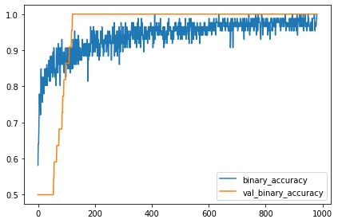
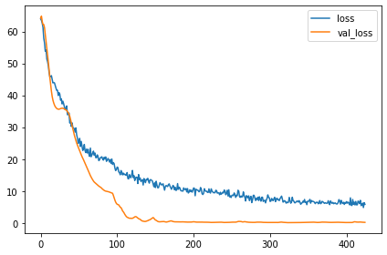
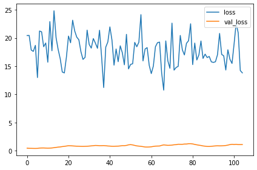

펭귄 몸무게 예측 경진대회(2)
=======
https://dacon.io/competitions/official/235862/overview/description

9개의 feature로 펭귄의 몸무게를 예측하는 모델을 만들어 성능을 겨루는 대회이다. 성능은 rmse로 평가한다. 이전에 참가했던 심장 질환 예측 경진대회와 유사한 유형의 자료 및 목표이지만 이번엔 Classification이 아니라 Regression 모델을 만든다.

## 모든 feature 이용해보기

Body Mass와 관련 없어 보였던 Island, Clutch Completion, Delta 15 N, 13 C 등의 feature를 제거했던 것이 성능의 저하를 가져왔던 것은 아닐까? 모든 feature를 이용해보자.
train, test 데이터를 불러와 결측치를 제거하고, target encoding 및 min max scaling도 적용해준다.


```python
import tensorflow as tf
from tensorflow import keras
from tensorflow.keras import layers
import numpy as np
import pandas as pd
import seaborn as sns
import matplotlib.pyplot as plt

plt.rc('figure', autolayout=True)
plt.rc('axes', labelweight='bold', labelsize='large', titleweight='bold', titlesize=18, titlepad=10)
plt.rc('image', cmap='cividis')
```


```python
df_train = pd.read_csv("./train.csv", index_col="id")
df_test = pd.read_csv("./test.csv", index_col="id")

df_train.isna().sum()
```


    Species                0
    Island                 0
    Clutch Completion      0
    Culmen Length (mm)     0
    Culmen Depth (mm)      0
    Flipper Length (mm)    0
    Sex                    3
    Delta 15 N (o/oo)      3
    Delta 13 C (o/oo)      3
    Body Mass (g)          0
    dtype: int64


```python
df_test.isna().sum()
```


    Species                0
    Island                 0
    Clutch Completion      0
    Culmen Length (mm)     0
    Culmen Depth (mm)      0
    Flipper Length (mm)    0
    Sex                    6
    Delta 15 N (o/oo)      9
    Delta 13 C (o/oo)      8
    dtype: int64


```python
df_train.dropna(subset = ["Sex", "Delta 15 N (o/oo)", "Delta 13 C (o/oo)"], inplace=True)
df_train.isna().sum()
```


    Species                0
    Island                 0
    Clutch Completion      0
    Culmen Length (mm)     0
    Culmen Depth (mm)      0
    Flipper Length (mm)    0
    Sex                    0
    Delta 15 N (o/oo)      0
    Delta 13 C (o/oo)      0
    Body Mass (g)          0
    dtype: int64


```python
def outlier_idx(df, col, weight=1.5):
    q_25 = np.percentile(df[col], 25)
    q_75 = np.percentile(df[col], 75)
    
    iqr = q_75 - q_25
    
    lower_bound = q_25 - iqr
    upper_bound = q_75 + iqr
    
    o_idx = df[(df[col] < lower_bound) | (df[col] > upper_bound)].index
    
    return o_idx
```


```python
cols = ["Culmen Length (mm)", "Culmen Depth (mm)", "Flipper Length (mm)", "Body Mass (g)", "Delta 15 N (o/oo)", "Delta 13 C (o/oo)"]
for col in cols:
    outlier_idx_ = outlier_idx(df_train, col)
    df_train.drop(outlier_idx_, inplace=True)
df_train.describe()
```


<div>
<style scoped>
    .dataframe tbody tr th:only-of-type {
        vertical-align: middle;
    }

    .dataframe tbody tr th {
        vertical-align: top;
    }

    .dataframe thead th {
        text-align: right;
    }
</style>
<table border="1" class="dataframe">
  <thead>
    <tr style="text-align: right;">
      <th></th>
      <th>Culmen Length (mm)</th>
      <th>Culmen Depth (mm)</th>
      <th>Flipper Length (mm)</th>
      <th>Delta 15 N (o/oo)</th>
      <th>Delta 13 C (o/oo)</th>
      <th>Body Mass (g)</th>
    </tr>
  </thead>
  <tbody>
    <tr>
      <th>count</th>
      <td>108.000000</td>
      <td>108.000000</td>
      <td>108.000000</td>
      <td>108.000000</td>
      <td>108.000000</td>
      <td>108.000000</td>
    </tr>
    <tr>
      <th>mean</th>
      <td>44.796296</td>
      <td>16.989815</td>
      <td>203.342593</td>
      <td>8.742847</td>
      <td>-25.725444</td>
      <td>4318.055556</td>
    </tr>
    <tr>
      <th>std</th>
      <td>5.267125</td>
      <td>1.932019</td>
      <td>14.614141</td>
      <td>0.570546</td>
      <td>0.860370</td>
      <td>772.337402</td>
    </tr>
    <tr>
      <th>min</th>
      <td>33.500000</td>
      <td>13.200000</td>
      <td>174.000000</td>
      <td>7.632200</td>
      <td>-27.018540</td>
      <td>2700.000000</td>
    </tr>
    <tr>
      <th>25%</th>
      <td>40.850000</td>
      <td>15.275000</td>
      <td>190.000000</td>
      <td>8.273562</td>
      <td>-26.427103</td>
      <td>3668.750000</td>
    </tr>
    <tr>
      <th>50%</th>
      <td>45.300000</td>
      <td>17.150000</td>
      <td>199.500000</td>
      <td>8.633735</td>
      <td>-25.957770</td>
      <td>4250.000000</td>
    </tr>
    <tr>
      <th>75%</th>
      <td>49.125000</td>
      <td>18.600000</td>
      <td>216.000000</td>
      <td>9.275710</td>
      <td>-24.984690</td>
      <td>4862.500000</td>
    </tr>
    <tr>
      <th>max</th>
      <td>55.100000</td>
      <td>21.100000</td>
      <td>231.000000</td>
      <td>10.025440</td>
      <td>-24.102550</td>
      <td>6000.000000</td>
    </tr>
  </tbody>
</table>
</div>


```python
df_train
```


<div>
<style scoped>
    .dataframe tbody tr th:only-of-type {
        vertical-align: middle;
    }

    .dataframe tbody tr th {
        vertical-align: top;
    }

    .dataframe thead th {
        text-align: right;
    }
</style>
<table border="1" class="dataframe">
  <thead>
    <tr style="text-align: right;">
      <th></th>
      <th>Species</th>
      <th>Island</th>
      <th>Clutch Completion</th>
      <th>Culmen Length (mm)</th>
      <th>Culmen Depth (mm)</th>
      <th>Flipper Length (mm)</th>
      <th>Sex</th>
      <th>Delta 15 N (o/oo)</th>
      <th>Delta 13 C (o/oo)</th>
      <th>Body Mass (g)</th>
    </tr>
    <tr>
      <th>id</th>
      <th></th>
      <th></th>
      <th></th>
      <th></th>
      <th></th>
      <th></th>
      <th></th>
      <th></th>
      <th></th>
      <th></th>
    </tr>
  </thead>
  <tbody>
    <tr>
      <th>0</th>
      <td>Gentoo penguin (Pygoscelis papua)</td>
      <td>Biscoe</td>
      <td>Yes</td>
      <td>50.0</td>
      <td>15.3</td>
      <td>220</td>
      <td>MALE</td>
      <td>8.30515</td>
      <td>-25.19017</td>
      <td>5550</td>
    </tr>
    <tr>
      <th>1</th>
      <td>Chinstrap penguin (Pygoscelis antarctica)</td>
      <td>Dream</td>
      <td>No</td>
      <td>49.5</td>
      <td>19.0</td>
      <td>200</td>
      <td>MALE</td>
      <td>9.63074</td>
      <td>-24.34684</td>
      <td>3800</td>
    </tr>
    <tr>
      <th>2</th>
      <td>Gentoo penguin (Pygoscelis papua)</td>
      <td>Biscoe</td>
      <td>Yes</td>
      <td>45.1</td>
      <td>14.4</td>
      <td>210</td>
      <td>FEMALE</td>
      <td>8.51951</td>
      <td>-27.01854</td>
      <td>4400</td>
    </tr>
    <tr>
      <th>3</th>
      <td>Gentoo penguin (Pygoscelis papua)</td>
      <td>Biscoe</td>
      <td>Yes</td>
      <td>44.5</td>
      <td>14.7</td>
      <td>214</td>
      <td>FEMALE</td>
      <td>8.20106</td>
      <td>-26.16524</td>
      <td>4850</td>
    </tr>
    <tr>
      <th>4</th>
      <td>Gentoo penguin (Pygoscelis papua)</td>
      <td>Biscoe</td>
      <td>No</td>
      <td>49.6</td>
      <td>16.0</td>
      <td>225</td>
      <td>MALE</td>
      <td>8.38324</td>
      <td>-26.84272</td>
      <td>5700</td>
    </tr>
    <tr>
      <th>...</th>
      <td>...</td>
      <td>...</td>
      <td>...</td>
      <td>...</td>
      <td>...</td>
      <td>...</td>
      <td>...</td>
      <td>...</td>
      <td>...</td>
      <td>...</td>
    </tr>
    <tr>
      <th>108</th>
      <td>Chinstrap penguin (Pygoscelis antarctica)</td>
      <td>Dream</td>
      <td>Yes</td>
      <td>49.0</td>
      <td>19.6</td>
      <td>212</td>
      <td>MALE</td>
      <td>9.34089</td>
      <td>-24.45189</td>
      <td>4300</td>
    </tr>
    <tr>
      <th>110</th>
      <td>Adelie Penguin (Pygoscelis adeliae)</td>
      <td>Dream</td>
      <td>Yes</td>
      <td>39.2</td>
      <td>18.6</td>
      <td>190</td>
      <td>MALE</td>
      <td>9.11006</td>
      <td>-25.79549</td>
      <td>4250</td>
    </tr>
    <tr>
      <th>111</th>
      <td>Adelie Penguin (Pygoscelis adeliae)</td>
      <td>Dream</td>
      <td>Yes</td>
      <td>43.2</td>
      <td>18.5</td>
      <td>192</td>
      <td>MALE</td>
      <td>8.97025</td>
      <td>-26.03679</td>
      <td>4100</td>
    </tr>
    <tr>
      <th>112</th>
      <td>Chinstrap penguin (Pygoscelis antarctica)</td>
      <td>Dream</td>
      <td>No</td>
      <td>46.9</td>
      <td>16.6</td>
      <td>192</td>
      <td>FEMALE</td>
      <td>9.80589</td>
      <td>-24.73735</td>
      <td>2700</td>
    </tr>
    <tr>
      <th>113</th>
      <td>Gentoo penguin (Pygoscelis papua)</td>
      <td>Biscoe</td>
      <td>Yes</td>
      <td>50.8</td>
      <td>17.3</td>
      <td>228</td>
      <td>MALE</td>
      <td>8.27428</td>
      <td>-26.30019</td>
      <td>5600</td>
    </tr>
  </tbody>
</table>
<p>108 rows × 10 columns</p>
</div>


```python
df_train.reset_index(drop=True, inplace=True)
df_train.index.name = "id"
```


```python
cat_cols = ["Species", "Island", "Sex", "Clutch Completion"]

df_train_target = df_train.copy()

for col in cat_cols:
    print("\n\n{}".format(col))
    for u in df_train[col].unique():
        cat_idx = df_train_target[df_train_target[col] == u].index
        cat_mean = df_train_target[df_train_target[col] == u].loc[:, "Body Mass (g)"].mean()
        df_train_target.loc[cat_idx, col] = cat_mean
        print("\n{}: {}".format(u, cat_mean))    

df_train_target.head()
```

    
    
    Species
    
    Gentoo penguin (Pygoscelis papua): 5058.152173913043
    
    Chinstrap penguin (Pygoscelis antarctica): 3756.0
    
    Adelie Penguin (Pygoscelis adeliae): 3777.7027027027025
    
    
    Island
    
    Biscoe: 4857.272727272727
    
    Dream: 3744.186046511628
    
    Torgersen: 3820.0
    
    
    Sex
    
    MALE: 4629.62962962963
    
    FEMALE: 4006.4814814814813
    
    
    Clutch Completion
    
    Yes: 4346.3917525773195
    
    No: 4068.181818181818
    


<div>
<style scoped>
    .dataframe tbody tr th:only-of-type {
        vertical-align: middle;
    }

    .dataframe tbody tr th {
        vertical-align: top;
    }

    .dataframe thead th {
        text-align: right;
    }
</style>
<table border="1" class="dataframe">
  <thead>
    <tr style="text-align: right;">
      <th></th>
      <th>Species</th>
      <th>Island</th>
      <th>Clutch Completion</th>
      <th>Culmen Length (mm)</th>
      <th>Culmen Depth (mm)</th>
      <th>Flipper Length (mm)</th>
      <th>Sex</th>
      <th>Delta 15 N (o/oo)</th>
      <th>Delta 13 C (o/oo)</th>
      <th>Body Mass (g)</th>
    </tr>
    <tr>
      <th>id</th>
      <th></th>
      <th></th>
      <th></th>
      <th></th>
      <th></th>
      <th></th>
      <th></th>
      <th></th>
      <th></th>
      <th></th>
    </tr>
  </thead>
  <tbody>
    <tr>
      <th>0</th>
      <td>5058.152174</td>
      <td>4857.272727</td>
      <td>4346.391753</td>
      <td>50.0</td>
      <td>15.3</td>
      <td>220</td>
      <td>4629.62963</td>
      <td>8.30515</td>
      <td>-25.19017</td>
      <td>5550</td>
    </tr>
    <tr>
      <th>1</th>
      <td>3756.0</td>
      <td>3744.186047</td>
      <td>4068.181818</td>
      <td>49.5</td>
      <td>19.0</td>
      <td>200</td>
      <td>4629.62963</td>
      <td>9.63074</td>
      <td>-24.34684</td>
      <td>3800</td>
    </tr>
    <tr>
      <th>2</th>
      <td>5058.152174</td>
      <td>4857.272727</td>
      <td>4346.391753</td>
      <td>45.1</td>
      <td>14.4</td>
      <td>210</td>
      <td>4006.481481</td>
      <td>8.51951</td>
      <td>-27.01854</td>
      <td>4400</td>
    </tr>
    <tr>
      <th>3</th>
      <td>5058.152174</td>
      <td>4857.272727</td>
      <td>4346.391753</td>
      <td>44.5</td>
      <td>14.7</td>
      <td>214</td>
      <td>4006.481481</td>
      <td>8.20106</td>
      <td>-26.16524</td>
      <td>4850</td>
    </tr>
    <tr>
      <th>4</th>
      <td>5058.152174</td>
      <td>4857.272727</td>
      <td>4068.181818</td>
      <td>49.6</td>
      <td>16.0</td>
      <td>225</td>
      <td>4629.62963</td>
      <td>8.38324</td>
      <td>-26.84272</td>
      <td>5700</td>
    </tr>
  </tbody>
</table>
</div>


```python
def min_max_scale(df, col):
    col_min = df[col].min()
    col_max = df[col].max()
    df[col] = ( df[col] - col_min) / (col_max - col_min)

cnt_cols = ["Culmen Length (mm)", "Culmen Depth (mm)", "Flipper Length (mm)", "Delta 15 N (o/oo)", "Delta 13 C (o/oo)"]

for col in cnt_cols:
    min_max_scale(df_train_target, col)

body_min = df_train["Body Mass (g)"].min()
body_max = df_train["Body Mass (g)"].max()

for col in cat_cols:
    df_train_target[col] = (df_train_target[col] - body_min) / (body_max - body_min)
    df_train_target[col] = df_train_target[col].astype(float)
df_train_target.head()
```


<div>
<style scoped>
    .dataframe tbody tr th:only-of-type {
        vertical-align: middle;
    }

    .dataframe tbody tr th {
        vertical-align: top;
    }

    .dataframe thead th {
        text-align: right;
    }
</style>
<table border="1" class="dataframe">
  <thead>
    <tr style="text-align: right;">
      <th></th>
      <th>Species</th>
      <th>Island</th>
      <th>Clutch Completion</th>
      <th>Culmen Length (mm)</th>
      <th>Culmen Depth (mm)</th>
      <th>Flipper Length (mm)</th>
      <th>Sex</th>
      <th>Delta 15 N (o/oo)</th>
      <th>Delta 13 C (o/oo)</th>
      <th>Body Mass (g)</th>
    </tr>
    <tr>
      <th>id</th>
      <th></th>
      <th></th>
      <th></th>
      <th></th>
      <th></th>
      <th></th>
      <th></th>
      <th></th>
      <th></th>
      <th></th>
    </tr>
  </thead>
  <tbody>
    <tr>
      <th>0</th>
      <td>0.714592</td>
      <td>0.653719</td>
      <td>0.498907</td>
      <td>0.763889</td>
      <td>0.265823</td>
      <td>0.807018</td>
      <td>0.584736</td>
      <td>0.281188</td>
      <td>0.627015</td>
      <td>5550</td>
    </tr>
    <tr>
      <th>1</th>
      <td>0.320000</td>
      <td>0.316420</td>
      <td>0.414601</td>
      <td>0.740741</td>
      <td>0.734177</td>
      <td>0.456140</td>
      <td>0.584736</td>
      <td>0.835077</td>
      <td>0.916224</td>
      <td>3800</td>
    </tr>
    <tr>
      <th>2</th>
      <td>0.714592</td>
      <td>0.653719</td>
      <td>0.498907</td>
      <td>0.537037</td>
      <td>0.151899</td>
      <td>0.631579</td>
      <td>0.395903</td>
      <td>0.370757</td>
      <td>0.000000</td>
      <td>4400</td>
    </tr>
    <tr>
      <th>3</th>
      <td>0.714592</td>
      <td>0.653719</td>
      <td>0.498907</td>
      <td>0.509259</td>
      <td>0.189873</td>
      <td>0.701754</td>
      <td>0.395903</td>
      <td>0.237695</td>
      <td>0.292628</td>
      <td>4850</td>
    </tr>
    <tr>
      <th>4</th>
      <td>0.714592</td>
      <td>0.653719</td>
      <td>0.414601</td>
      <td>0.745370</td>
      <td>0.354430</td>
      <td>0.894737</td>
      <td>0.584736</td>
      <td>0.313817</td>
      <td>0.060295</td>
      <td>5700</td>
    </tr>
  </tbody>
</table>
</div>


```python
df_train_y = df_train_target.pop("Body Mass (g)")
df_train_y_rescaled = (df_train_y - body_min) / (body_max - body_min)
```


```python
train_n = int(df_train_target.count()[0]*0.8)
```

### test set


```python
df_test_target = df_test.copy()

for col in cat_cols:
    for u in df_train[col].unique():
        cat_idx = df_test_target[df_test_target[col] == u].index
        cat_mean = df_train[df_train[col] == u].loc[:, "Body Mass (g)"].mean()
        df_test_target.loc[cat_idx, col] = cat_mean

df_test_target.head()
```


<div>
<style scoped>
    .dataframe tbody tr th:only-of-type {
        vertical-align: middle;
    }

    .dataframe tbody tr th {
        vertical-align: top;
    }

    .dataframe thead th {
        text-align: right;
    }
</style>
<table border="1" class="dataframe">
  <thead>
    <tr style="text-align: right;">
      <th></th>
      <th>Species</th>
      <th>Island</th>
      <th>Clutch Completion</th>
      <th>Culmen Length (mm)</th>
      <th>Culmen Depth (mm)</th>
      <th>Flipper Length (mm)</th>
      <th>Sex</th>
      <th>Delta 15 N (o/oo)</th>
      <th>Delta 13 C (o/oo)</th>
    </tr>
    <tr>
      <th>id</th>
      <th></th>
      <th></th>
      <th></th>
      <th></th>
      <th></th>
      <th></th>
      <th></th>
      <th></th>
      <th></th>
    </tr>
  </thead>
  <tbody>
    <tr>
      <th>0</th>
      <td>3756.0</td>
      <td>3744.186047</td>
      <td>4346.391753</td>
      <td>52.0</td>
      <td>20.7</td>
      <td>210.0</td>
      <td>4629.62963</td>
      <td>9.43146</td>
      <td>-24.68440</td>
    </tr>
    <tr>
      <th>1</th>
      <td>5058.152174</td>
      <td>4857.272727</td>
      <td>4346.391753</td>
      <td>55.9</td>
      <td>17.0</td>
      <td>228.0</td>
      <td>4629.62963</td>
      <td>8.31180</td>
      <td>-26.35425</td>
    </tr>
    <tr>
      <th>2</th>
      <td>3777.702703</td>
      <td>3744.186047</td>
      <td>4346.391753</td>
      <td>38.9</td>
      <td>18.8</td>
      <td>190.0</td>
      <td>4006.481481</td>
      <td>8.36936</td>
      <td>-26.11199</td>
    </tr>
    <tr>
      <th>3</th>
      <td>3756.0</td>
      <td>3744.186047</td>
      <td>4346.391753</td>
      <td>45.2</td>
      <td>16.6</td>
      <td>191.0</td>
      <td>4006.481481</td>
      <td>9.62357</td>
      <td>-24.78984</td>
    </tr>
    <tr>
      <th>4</th>
      <td>3777.702703</td>
      <td>4857.272727</td>
      <td>4068.181818</td>
      <td>37.9</td>
      <td>18.6</td>
      <td>172.0</td>
      <td>4006.481481</td>
      <td>8.38404</td>
      <td>-25.19837</td>
    </tr>
  </tbody>
</table>
</div>


```python
for col in cnt_cols:
    col_max = df_train[col].max()
    col_min = df_train[col].min()
    df_test_target[col] = (df_test_target[col] - col_min) / (col_max - col_min)

for col in cat_cols:
    df_test_target[col] = (df_test_target[col] - body_min) / (body_max - body_min)
    df_test_target[col] = df_test_target[col].astype(float)
    
df_test_target.head()
```


<div>
<style scoped>
    .dataframe tbody tr th:only-of-type {
        vertical-align: middle;
    }

    .dataframe tbody tr th {
        vertical-align: top;
    }

    .dataframe thead th {
        text-align: right;
    }
</style>
<table border="1" class="dataframe">
  <thead>
    <tr style="text-align: right;">
      <th></th>
      <th>Species</th>
      <th>Island</th>
      <th>Clutch Completion</th>
      <th>Culmen Length (mm)</th>
      <th>Culmen Depth (mm)</th>
      <th>Flipper Length (mm)</th>
      <th>Sex</th>
      <th>Delta 15 N (o/oo)</th>
      <th>Delta 13 C (o/oo)</th>
    </tr>
    <tr>
      <th>id</th>
      <th></th>
      <th></th>
      <th></th>
      <th></th>
      <th></th>
      <th></th>
      <th></th>
      <th></th>
      <th></th>
    </tr>
  </thead>
  <tbody>
    <tr>
      <th>0</th>
      <td>0.320000</td>
      <td>0.316420</td>
      <td>0.498907</td>
      <td>0.856481</td>
      <td>0.949367</td>
      <td>0.631579</td>
      <td>0.584736</td>
      <td>0.751809</td>
      <td>0.800462</td>
    </tr>
    <tr>
      <th>1</th>
      <td>0.714592</td>
      <td>0.653719</td>
      <td>0.498907</td>
      <td>1.037037</td>
      <td>0.481013</td>
      <td>0.947368</td>
      <td>0.584736</td>
      <td>0.283967</td>
      <td>0.227809</td>
    </tr>
    <tr>
      <th>2</th>
      <td>0.326577</td>
      <td>0.316420</td>
      <td>0.498907</td>
      <td>0.250000</td>
      <td>0.708861</td>
      <td>0.280702</td>
      <td>0.395903</td>
      <td>0.308018</td>
      <td>0.310889</td>
    </tr>
    <tr>
      <th>3</th>
      <td>0.320000</td>
      <td>0.316420</td>
      <td>0.498907</td>
      <td>0.541667</td>
      <td>0.430380</td>
      <td>0.298246</td>
      <td>0.395903</td>
      <td>0.832081</td>
      <td>0.764303</td>
    </tr>
    <tr>
      <th>4</th>
      <td>0.326577</td>
      <td>0.653719</td>
      <td>0.414601</td>
      <td>0.203704</td>
      <td>0.683544</td>
      <td>-0.035088</td>
      <td>0.395903</td>
      <td>0.314152</td>
      <td>0.624203</td>
    </tr>
  </tbody>
</table>
</div>


## test set 결측치 채우기

Sex 뿐만 아니라 다른 결측치도 모두 채워주자.


```python
df_test.isna().sum()
```


    Species                0
    Island                 0
    Clutch Completion      0
    Culmen Length (mm)     0
    Culmen Depth (mm)      0
    Flipper Length (mm)    0
    Sex                    6
    Delta 15 N (o/oo)      9
    Delta 13 C (o/oo)      8
    dtype: int64


### Sex 


```python
df_fill = df_train_target.copy()
df_fill = df_fill.drop(["Delta 15 N (o/oo)", "Delta 13 C (o/oo)", "Sex"], axis=1)

df_fill_sex = df_fill.drop(["Island", "Clutch Completion"], axis=1)
df_fill_sex_y = df_train_target["Sex"].copy()

for i, u in enumerate(df_fill_sex_y.unique()):
    df_fill_sex_y.loc[(df_fill_sex_y == u)] = i
    
df_fill_sex_y
```


    id
    0      0.0
    1      0.0
    2      1.0
    3      1.0
    4      0.0
          ... 
    103    0.0
    104    0.0
    105    0.0
    106    1.0
    107    0.0
    Name: Sex, Length: 108, dtype: float64


```python
ds_ = tf.data.Dataset.from_tensor_slices((df_fill.values, df_fill_sex_y.values)).shuffle(buffer_size=500)
ds_train = ds_.take(train_n)
ds_val = ds_.skip(train_n)

AUTOTUNE = tf.data.experimental.AUTOTUNE

ds_train = ds_train = (
    ds_train
    .batch(32)
    .cache()
    .prefetch(buffer_size=AUTOTUNE)
)

ds_val = (
    ds_val
    .batch(32)
    .cache()
    .prefetch(buffer_size=AUTOTUNE)
)
```


```python
ds_train.element_spec
```


    (TensorSpec(shape=(None, 6), dtype=tf.float64, name=None),
     TensorSpec(shape=(None,), dtype=tf.float64, name=None))


```python
model_fill_sex = keras.Sequential([
    layers.Dense(512, input_shape=[6], kernel_initializer=keras.initializers.he_normal()),
    layers.PReLU(),
    layers.BatchNormalization(),
    layers.Dropout(0.5),
    
    layers.Dense(64, kernel_initializer=keras.initializers.he_normal()),
    layers.PReLU(),
    layers.BatchNormalization(),
    layers.Dropout(0.5),
    
    
    layers.Dense(1, kernel_initializer=keras.initializers.he_normal(), activation='sigmoid')
    
])
```


```python
model_fill_sex.compile(optimizer=keras.optimizers.Adam(learning_rate=0.0005), loss='binary_crossentropy', metrics=['binary_accuracy'])
```


```python
early = keras.callbacks.EarlyStopping(patience=100, min_delta=0.001, restore_best_weights=True)

history_fill_sex = model_fill_sex.fit(
    ds_train,
    validation_data=ds_val,
    callbacks=[early],
    epochs=2000
)
```

    Epoch 1/2000
    3/3 [==============================] - 1s 100ms/step - loss: 0.9292 - binary_accuracy: 0.5814 - val_loss: 0.6813 - val_binary_accuracy: 0.5000
    Epoch 2/2000
    3/3 [==============================] - 0s 19ms/step - loss: 0.8149 - binary_accuracy: 0.6395 - val_loss: 0.7088 - val_binary_accuracy: 0.5000
    Epoch 3/2000
    3/3 [==============================] - 0s 19ms/step - loss: 0.6720 - binary_accuracy: 0.6395 - val_loss: 0.7517 - val_binary_accuracy: 0.5000
    Epoch 4/2000
    3/3 [==============================] - 0s 19ms/step - loss: 0.8602 - binary_accuracy: 0.6744 - val_loss: 0.8015 - val_binary_accuracy: 0.5000
    Epoch 5/2000
    3/3 [==============================] - 0s 20ms/step - loss: 0.6804 - binary_accuracy: 0.7326 - val_loss: 0.8588 - val_binary_accuracy: 0.5000
    Epoch 6/2000
    3/3 [==============================] - 0s 20ms/step - loss: 0.4380 - binary_accuracy: 0.7791 - val_loss: 0.9146 - val_binary_accuracy: 0.5000
    Epoch 7/2000
    3/3 [==============================] - 0s 21ms/step - loss: 0.5699 - binary_accuracy: 0.7442 - val_loss: 0.9632 - val_binary_accuracy: 0.5000
    Epoch 8/2000
    3/3 [==============================] - 0s 19ms/step - loss: 0.4638 - binary_accuracy: 0.7326 - val_loss: 1.0036 - val_binary_accuracy: 0.5000
    Epoch 9/2000
    3/3 [==============================] - 0s 18ms/step - loss: 0.4857 - binary_accuracy: 0.7674 - val_loss: 1.0346 - val_binary_accuracy: 0.5000
    Epoch 10/2000
    3/3 [==============================] - 0s 21ms/step - loss: 0.4700 - binary_accuracy: 0.7209 - val_loss: 1.0605 - val_binary_accuracy: 0.5000
    Epoch 11/2000
    3/3 [==============================] - 0s 18ms/step - loss: 0.3710 - binary_accuracy: 0.8372 - val_loss: 1.0795 - val_binary_accuracy: 0.5000
    Epoch 12/2000
    3/3 [==============================] - 0s 21ms/step - loss: 0.3504 - binary_accuracy: 0.8488 - val_loss: 1.0887 - val_binary_accuracy: 0.5000
    Epoch 13/2000
    3/3 [==============================] - 0s 17ms/step - loss: 0.4122 - binary_accuracy: 0.8140 - val_loss: 1.1016 - val_binary_accuracy: 0.5000
    Epoch 14/2000
    3/3 [==============================] - 0s 19ms/step - loss: 0.4175 - binary_accuracy: 0.7674 - val_loss: 1.1090 - val_binary_accuracy: 0.5000
    Epoch 15/2000
    3/3 [==============================] - 0s 18ms/step - loss: 0.3873 - binary_accuracy: 0.8256 - val_loss: 1.1148 - val_binary_accuracy: 0.5000
    Epoch 16/2000
    3/3 [==============================] - 0s 17ms/step - loss: 0.3585 - binary_accuracy: 0.8023 - val_loss: 1.1169 - val_binary_accuracy: 0.5000
    Epoch 17/2000
    3/3 [==============================] - 0s 18ms/step - loss: 0.5663 - binary_accuracy: 0.7558 - val_loss: 1.1176 - val_binary_accuracy: 0.5000
    Epoch 18/2000
    3/3 [==============================] - 0s 18ms/step - loss: 0.3877 - binary_accuracy: 0.8023 - val_loss: 1.1190 - val_binary_accuracy: 0.5000
    Epoch 19/2000
    3/3 [==============================] - 0s 19ms/step - loss: 0.4827 - binary_accuracy: 0.8023 - val_loss: 1.1205 - val_binary_accuracy: 0.5000
    Epoch 20/2000
    3/3 [==============================] - 0s 18ms/step - loss: 0.4164 - binary_accuracy: 0.8256 - val_loss: 1.1211 - val_binary_accuracy: 0.5000
    Epoch 21/2000
    3/3 [==============================] - 0s 20ms/step - loss: 0.4230 - binary_accuracy: 0.8256 - val_loss: 1.1233 - val_binary_accuracy: 0.5000
    Epoch 22/2000
    3/3 [==============================] - 0s 18ms/step - loss: 0.4444 - binary_accuracy: 0.7791 - val_loss: 1.1187 - val_binary_accuracy: 0.5000
    Epoch 23/2000
    3/3 [==============================] - 0s 19ms/step - loss: 0.3695 - binary_accuracy: 0.8256 - val_loss: 1.1112 - val_binary_accuracy: 0.5000
    Epoch 24/2000
    3/3 [==============================] - 0s 20ms/step - loss: 0.3390 - binary_accuracy: 0.8256 - val_loss: 1.1051 - val_binary_accuracy: 0.5000
    Epoch 25/2000
    3/3 [==============================] - 0s 19ms/step - loss: 0.3546 - binary_accuracy: 0.8488 - val_loss: 1.0976 - val_binary_accuracy: 0.5000
    Epoch 26/2000
    3/3 [==============================] - 0s 20ms/step - loss: 0.3676 - binary_accuracy: 0.8488 - val_loss: 1.0884 - val_binary_accuracy: 0.5000
    Epoch 27/2000
    3/3 [==============================] - 0s 19ms/step - loss: 0.4215 - binary_accuracy: 0.8023 - val_loss: 1.0770 - val_binary_accuracy: 0.5000
    Epoch 28/2000
    3/3 [==============================] - 0s 19ms/step - loss: 0.3899 - binary_accuracy: 0.8140 - val_loss: 1.0633 - val_binary_accuracy: 0.5000
    Epoch 29/2000
    3/3 [==============================] - 0s 19ms/step - loss: 0.3116 - binary_accuracy: 0.8488 - val_loss: 1.0505 - val_binary_accuracy: 0.5000
    Epoch 30/2000
    3/3 [==============================] - 0s 19ms/step - loss: 0.3799 - binary_accuracy: 0.8372 - val_loss: 1.0351 - val_binary_accuracy: 0.5000
    Epoch 31/2000
    3/3 [==============================] - 0s 19ms/step - loss: 0.3840 - binary_accuracy: 0.8023 - val_loss: 1.0215 - val_binary_accuracy: 0.5000
    Epoch 32/2000
    3/3 [==============================] - 0s 19ms/step - loss: 0.3398 - binary_accuracy: 0.8605 - val_loss: 1.0073 - val_binary_accuracy: 0.5000
    Epoch 33/2000
    3/3 [==============================] - 0s 19ms/step - loss: 0.4160 - binary_accuracy: 0.8256 - val_loss: 0.9927 - val_binary_accuracy: 0.5000
    Epoch 34/2000
    3/3 [==============================] - 0s 19ms/step - loss: 0.3858 - binary_accuracy: 0.8023 - val_loss: 0.9796 - val_binary_accuracy: 0.5000
    Epoch 35/2000
    3/3 [==============================] - 0s 19ms/step - loss: 0.3396 - binary_accuracy: 0.8488 - val_loss: 0.9639 - val_binary_accuracy: 0.5000
    Epoch 36/2000
    3/3 [==============================] - 0s 21ms/step - loss: 0.3252 - binary_accuracy: 0.8372 - val_loss: 0.9502 - val_binary_accuracy: 0.5000
    Epoch 37/2000
    3/3 [==============================] - 0s 21ms/step - loss: 0.3424 - binary_accuracy: 0.8372 - val_loss: 0.9345 - val_binary_accuracy: 0.5000
    Epoch 38/2000
    3/3 [==============================] - 0s 20ms/step - loss: 0.3642 - binary_accuracy: 0.8488 - val_loss: 0.9185 - val_binary_accuracy: 0.5000
    Epoch 39/2000
    3/3 [==============================] - 0s 20ms/step - loss: 0.3082 - binary_accuracy: 0.8721 - val_loss: 0.9064 - val_binary_accuracy: 0.5000
    Epoch 40/2000
    3/3 [==============================] - 0s 18ms/step - loss: 0.3551 - binary_accuracy: 0.8256 - val_loss: 0.8939 - val_binary_accuracy: 0.5000
    Epoch 41/2000
    3/3 [==============================] - 0s 19ms/step - loss: 0.2833 - binary_accuracy: 0.8721 - val_loss: 0.8792 - val_binary_accuracy: 0.5000
    Epoch 42/2000
    3/3 [==============================] - 0s 20ms/step - loss: 0.3917 - binary_accuracy: 0.8140 - val_loss: 0.8655 - val_binary_accuracy: 0.5000
    Epoch 43/2000
    3/3 [==============================] - 0s 19ms/step - loss: 0.2692 - binary_accuracy: 0.8721 - val_loss: 0.8495 - val_binary_accuracy: 0.5000
    Epoch 44/2000
    3/3 [==============================] - 0s 18ms/step - loss: 0.3036 - binary_accuracy: 0.8140 - val_loss: 0.8336 - val_binary_accuracy: 0.5000
    Epoch 45/2000
    3/3 [==============================] - 0s 17ms/step - loss: 0.2940 - binary_accuracy: 0.8837 - val_loss: 0.8162 - val_binary_accuracy: 0.5000
    Epoch 46/2000
    3/3 [==============================] - 0s 19ms/step - loss: 0.3213 - binary_accuracy: 0.8488 - val_loss: 0.7992 - val_binary_accuracy: 0.5000
    Epoch 47/2000
    3/3 [==============================] - 0s 19ms/step - loss: 0.3284 - binary_accuracy: 0.8372 - val_loss: 0.7856 - val_binary_accuracy: 0.5000
    Epoch 48/2000
    3/3 [==============================] - 0s 19ms/step - loss: 0.2885 - binary_accuracy: 0.8721 - val_loss: 0.7739 - val_binary_accuracy: 0.5000
    Epoch 49/2000
    3/3 [==============================] - 0s 19ms/step - loss: 0.3425 - binary_accuracy: 0.8605 - val_loss: 0.7621 - val_binary_accuracy: 0.5000
    Epoch 50/2000
    3/3 [==============================] - 0s 20ms/step - loss: 0.2921 - binary_accuracy: 0.8837 - val_loss: 0.7491 - val_binary_accuracy: 0.5000
    Epoch 51/2000
    3/3 [==============================] - 0s 17ms/step - loss: 0.3087 - binary_accuracy: 0.8605 - val_loss: 0.7359 - val_binary_accuracy: 0.5000
    Epoch 52/2000
    3/3 [==============================] - 0s 19ms/step - loss: 0.3670 - binary_accuracy: 0.8256 - val_loss: 0.7201 - val_binary_accuracy: 0.5000
    Epoch 53/2000
    3/3 [==============================] - 0s 17ms/step - loss: 0.2653 - binary_accuracy: 0.8721 - val_loss: 0.7049 - val_binary_accuracy: 0.5000
    Epoch 54/2000
    3/3 [==============================] - 0s 17ms/step - loss: 0.2677 - binary_accuracy: 0.8953 - val_loss: 0.6911 - val_binary_accuracy: 0.5000
    Epoch 55/2000
    3/3 [==============================] - 0s 19ms/step - loss: 0.2825 - binary_accuracy: 0.8488 - val_loss: 0.6761 - val_binary_accuracy: 0.5000
    Epoch 56/2000
    3/3 [==============================] - 0s 20ms/step - loss: 0.3324 - binary_accuracy: 0.8372 - val_loss: 0.6623 - val_binary_accuracy: 0.5455
    Epoch 57/2000
    3/3 [==============================] - 0s 20ms/step - loss: 0.2317 - binary_accuracy: 0.9070 - val_loss: 0.6511 - val_binary_accuracy: 0.5455
    Epoch 58/2000
    3/3 [==============================] - 0s 21ms/step - loss: 0.2922 - binary_accuracy: 0.8837 - val_loss: 0.6386 - val_binary_accuracy: 0.5909
    Epoch 59/2000
    3/3 [==============================] - 0s 21ms/step - loss: 0.2907 - binary_accuracy: 0.8372 - val_loss: 0.6267 - val_binary_accuracy: 0.5909
    Epoch 60/2000
    3/3 [==============================] - 0s 21ms/step - loss: 0.3665 - binary_accuracy: 0.8256 - val_loss: 0.6162 - val_binary_accuracy: 0.5909
    Epoch 61/2000
    3/3 [==============================] - 0s 19ms/step - loss: 0.2967 - binary_accuracy: 0.8488 - val_loss: 0.6061 - val_binary_accuracy: 0.5909
    Epoch 62/2000
    3/3 [==============================] - 0s 20ms/step - loss: 0.3616 - binary_accuracy: 0.8256 - val_loss: 0.5975 - val_binary_accuracy: 0.5909
    Epoch 63/2000
    3/3 [==============================] - 0s 21ms/step - loss: 0.3374 - binary_accuracy: 0.8372 - val_loss: 0.5892 - val_binary_accuracy: 0.5909
    Epoch 64/2000
    3/3 [==============================] - 0s 20ms/step - loss: 0.3202 - binary_accuracy: 0.8023 - val_loss: 0.5816 - val_binary_accuracy: 0.5909
    Epoch 65/2000
    3/3 [==============================] - 0s 20ms/step - loss: 0.3346 - binary_accuracy: 0.8488 - val_loss: 0.5705 - val_binary_accuracy: 0.5909
    Epoch 66/2000
    3/3 [==============================] - 0s 22ms/step - loss: 0.2740 - binary_accuracy: 0.9070 - val_loss: 0.5596 - val_binary_accuracy: 0.5909
    Epoch 67/2000
    3/3 [==============================] - 0s 21ms/step - loss: 0.3297 - binary_accuracy: 0.8605 - val_loss: 0.5476 - val_binary_accuracy: 0.6364
    Epoch 68/2000
    3/3 [==============================] - 0s 20ms/step - loss: 0.2890 - binary_accuracy: 0.8372 - val_loss: 0.5357 - val_binary_accuracy: 0.6364
    Epoch 69/2000
    3/3 [==============================] - 0s 19ms/step - loss: 0.3085 - binary_accuracy: 0.8605 - val_loss: 0.5241 - val_binary_accuracy: 0.6364
    Epoch 70/2000
    3/3 [==============================] - 0s 21ms/step - loss: 0.2676 - binary_accuracy: 0.8953 - val_loss: 0.5110 - val_binary_accuracy: 0.6364
    Epoch 71/2000
    3/3 [==============================] - 0s 23ms/step - loss: 0.3268 - binary_accuracy: 0.8372 - val_loss: 0.4976 - val_binary_accuracy: 0.6364
    Epoch 72/2000
    3/3 [==============================] - 0s 19ms/step - loss: 0.2425 - binary_accuracy: 0.9186 - val_loss: 0.4833 - val_binary_accuracy: 0.6364
    Epoch 73/2000
    3/3 [==============================] - 0s 20ms/step - loss: 0.2960 - binary_accuracy: 0.9070 - val_loss: 0.4697 - val_binary_accuracy: 0.6364
    Epoch 74/2000
    3/3 [==============================] - 0s 20ms/step - loss: 0.2622 - binary_accuracy: 0.8837 - val_loss: 0.4570 - val_binary_accuracy: 0.6364
    Epoch 75/2000
    3/3 [==============================] - 0s 20ms/step - loss: 0.3098 - binary_accuracy: 0.8605 - val_loss: 0.4457 - val_binary_accuracy: 0.6818
    Epoch 76/2000
    3/3 [==============================] - 0s 21ms/step - loss: 0.2557 - binary_accuracy: 0.8721 - val_loss: 0.4353 - val_binary_accuracy: 0.6818
    Epoch 77/2000
    3/3 [==============================] - 0s 21ms/step - loss: 0.2513 - binary_accuracy: 0.9070 - val_loss: 0.4271 - val_binary_accuracy: 0.6818
    Epoch 78/2000
    3/3 [==============================] - 0s 19ms/step - loss: 0.2664 - binary_accuracy: 0.8837 - val_loss: 0.4200 - val_binary_accuracy: 0.6818
    Epoch 79/2000
    3/3 [==============================] - 0s 21ms/step - loss: 0.2984 - binary_accuracy: 0.8023 - val_loss: 0.4129 - val_binary_accuracy: 0.6818
    Epoch 80/2000
    3/3 [==============================] - 0s 20ms/step - loss: 0.2251 - binary_accuracy: 0.8953 - val_loss: 0.4058 - val_binary_accuracy: 0.6818
    Epoch 81/2000
    3/3 [==============================] - 0s 20ms/step - loss: 0.2474 - binary_accuracy: 0.9070 - val_loss: 0.3984 - val_binary_accuracy: 0.6818
    Epoch 82/2000
    3/3 [==============================] - 0s 20ms/step - loss: 0.2511 - binary_accuracy: 0.8721 - val_loss: 0.3925 - val_binary_accuracy: 0.6818
    Epoch 83/2000
    3/3 [==============================] - 0s 22ms/step - loss: 0.2244 - binary_accuracy: 0.9070 - val_loss: 0.3857 - val_binary_accuracy: 0.6818
    Epoch 84/2000
    3/3 [==============================] - 0s 21ms/step - loss: 0.3900 - binary_accuracy: 0.8605 - val_loss: 0.3788 - val_binary_accuracy: 0.6818
    Epoch 85/2000
    3/3 [==============================] - 0s 21ms/step - loss: 0.2042 - binary_accuracy: 0.9302 - val_loss: 0.3714 - val_binary_accuracy: 0.6818
    Epoch 86/2000
    3/3 [==============================] - 0s 20ms/step - loss: 0.2751 - binary_accuracy: 0.8837 - val_loss: 0.3647 - val_binary_accuracy: 0.7273
    Epoch 87/2000
    3/3 [==============================] - 0s 19ms/step - loss: 0.2991 - binary_accuracy: 0.8721 - val_loss: 0.3596 - val_binary_accuracy: 0.7273
    Epoch 88/2000
    3/3 [==============================] - 0s 21ms/step - loss: 0.2734 - binary_accuracy: 0.8837 - val_loss: 0.3567 - val_binary_accuracy: 0.7727
    Epoch 89/2000
    3/3 [==============================] - 0s 21ms/step - loss: 0.2851 - binary_accuracy: 0.8605 - val_loss: 0.3530 - val_binary_accuracy: 0.7727
    Epoch 90/2000
    3/3 [==============================] - 0s 19ms/step - loss: 0.2728 - binary_accuracy: 0.8605 - val_loss: 0.3480 - val_binary_accuracy: 0.7727
    Epoch 91/2000
    3/3 [==============================] - 0s 20ms/step - loss: 0.2401 - binary_accuracy: 0.8953 - val_loss: 0.3402 - val_binary_accuracy: 0.7727
    Epoch 92/2000
    3/3 [==============================] - 0s 20ms/step - loss: 0.2830 - binary_accuracy: 0.8488 - val_loss: 0.3323 - val_binary_accuracy: 0.8182
    Epoch 93/2000
    3/3 [==============================] - 0s 20ms/step - loss: 0.3531 - binary_accuracy: 0.8372 - val_loss: 0.3245 - val_binary_accuracy: 0.8182
    Epoch 94/2000
    3/3 [==============================] - 0s 18ms/step - loss: 0.2535 - binary_accuracy: 0.8837 - val_loss: 0.3171 - val_binary_accuracy: 0.8182
    Epoch 95/2000
    3/3 [==============================] - 0s 20ms/step - loss: 0.2591 - binary_accuracy: 0.8721 - val_loss: 0.3102 - val_binary_accuracy: 0.8182
    Epoch 96/2000
    3/3 [==============================] - 0s 20ms/step - loss: 0.2443 - binary_accuracy: 0.8953 - val_loss: 0.3041 - val_binary_accuracy: 0.8182
    Epoch 97/2000
    3/3 [==============================] - 0s 20ms/step - loss: 0.1949 - binary_accuracy: 0.9070 - val_loss: 0.2987 - val_binary_accuracy: 0.8182
    Epoch 98/2000
    3/3 [==============================] - 0s 19ms/step - loss: 0.2707 - binary_accuracy: 0.8837 - val_loss: 0.2925 - val_binary_accuracy: 0.8182
    Epoch 99/2000
    3/3 [==============================] - 0s 19ms/step - loss: 0.2854 - binary_accuracy: 0.8256 - val_loss: 0.2869 - val_binary_accuracy: 0.8636
    Epoch 100/2000
    3/3 [==============================] - 0s 20ms/step - loss: 0.2828 - binary_accuracy: 0.8605 - val_loss: 0.2816 - val_binary_accuracy: 0.8636
    Epoch 101/2000
    3/3 [==============================] - 0s 21ms/step - loss: 0.2438 - binary_accuracy: 0.8721 - val_loss: 0.2774 - val_binary_accuracy: 0.8636
    Epoch 102/2000
    3/3 [==============================] - 0s 20ms/step - loss: 0.2784 - binary_accuracy: 0.8605 - val_loss: 0.2740 - val_binary_accuracy: 0.8636
    Epoch 103/2000
    3/3 [==============================] - 0s 25ms/step - loss: 0.2299 - binary_accuracy: 0.9070 - val_loss: 0.2699 - val_binary_accuracy: 0.8636
    Epoch 104/2000
    3/3 [==============================] - 0s 19ms/step - loss: 0.2386 - binary_accuracy: 0.8721 - val_loss: 0.2677 - val_binary_accuracy: 0.8636
    Epoch 105/2000
    3/3 [==============================] - 0s 21ms/step - loss: 0.2526 - binary_accuracy: 0.8837 - val_loss: 0.2638 - val_binary_accuracy: 0.8636
    Epoch 106/2000
    3/3 [==============================] - 0s 19ms/step - loss: 0.2890 - binary_accuracy: 0.8488 - val_loss: 0.2577 - val_binary_accuracy: 0.8636
    Epoch 107/2000
    3/3 [==============================] - 0s 20ms/step - loss: 0.2059 - binary_accuracy: 0.9070 - val_loss: 0.2511 - val_binary_accuracy: 0.8636
    Epoch 108/2000
    3/3 [==============================] - 0s 20ms/step - loss: 0.2780 - binary_accuracy: 0.8837 - val_loss: 0.2447 - val_binary_accuracy: 0.8636
    Epoch 109/2000
    3/3 [==============================] - 0s 19ms/step - loss: 0.2660 - binary_accuracy: 0.8721 - val_loss: 0.2382 - val_binary_accuracy: 0.8636
    Epoch 110/2000
    3/3 [==============================] - 0s 20ms/step - loss: 0.3057 - binary_accuracy: 0.8488 - val_loss: 0.2337 - val_binary_accuracy: 0.8636
    Epoch 111/2000
    3/3 [==============================] - 0s 19ms/step - loss: 0.1988 - binary_accuracy: 0.9070 - val_loss: 0.2301 - val_binary_accuracy: 0.9091
    Epoch 112/2000
    3/3 [==============================] - 0s 22ms/step - loss: 0.2648 - binary_accuracy: 0.8953 - val_loss: 0.2271 - val_binary_accuracy: 0.9091
    Epoch 113/2000
    3/3 [==============================] - 0s 20ms/step - loss: 0.3207 - binary_accuracy: 0.8488 - val_loss: 0.2226 - val_binary_accuracy: 0.9091
    Epoch 114/2000
    3/3 [==============================] - 0s 20ms/step - loss: 0.2764 - binary_accuracy: 0.8372 - val_loss: 0.2178 - val_binary_accuracy: 0.9091
    Epoch 115/2000
    3/3 [==============================] - 0s 20ms/step - loss: 0.2706 - binary_accuracy: 0.8721 - val_loss: 0.2143 - val_binary_accuracy: 0.9091
    Epoch 116/2000
    3/3 [==============================] - 0s 20ms/step - loss: 0.2001 - binary_accuracy: 0.9070 - val_loss: 0.2100 - val_binary_accuracy: 0.9091
    Epoch 117/2000
    3/3 [==============================] - 0s 21ms/step - loss: 0.3123 - binary_accuracy: 0.8488 - val_loss: 0.2071 - val_binary_accuracy: 0.9091
    Epoch 118/2000
    3/3 [==============================] - 0s 21ms/step - loss: 0.2346 - binary_accuracy: 0.8837 - val_loss: 0.2044 - val_binary_accuracy: 0.9091
    Epoch 119/2000
    3/3 [==============================] - 0s 21ms/step - loss: 0.2829 - binary_accuracy: 0.8721 - val_loss: 0.2011 - val_binary_accuracy: 0.9545
    Epoch 120/2000
    3/3 [==============================] - 0s 21ms/step - loss: 0.2612 - binary_accuracy: 0.8488 - val_loss: 0.1980 - val_binary_accuracy: 0.9545
    Epoch 121/2000
    3/3 [==============================] - 0s 20ms/step - loss: 0.2077 - binary_accuracy: 0.9070 - val_loss: 0.1938 - val_binary_accuracy: 0.9545
    Epoch 122/2000
    3/3 [==============================] - 0s 21ms/step - loss: 0.2260 - binary_accuracy: 0.8605 - val_loss: 0.1887 - val_binary_accuracy: 1.0000
    Epoch 123/2000
    3/3 [==============================] - 0s 21ms/step - loss: 0.2516 - binary_accuracy: 0.8488 - val_loss: 0.1848 - val_binary_accuracy: 1.0000
    Epoch 124/2000
    3/3 [==============================] - 0s 20ms/step - loss: 0.1934 - binary_accuracy: 0.9302 - val_loss: 0.1822 - val_binary_accuracy: 1.0000
    Epoch 125/2000
    3/3 [==============================] - 0s 21ms/step - loss: 0.2256 - binary_accuracy: 0.9186 - val_loss: 0.1810 - val_binary_accuracy: 1.0000
    Epoch 126/2000
    3/3 [==============================] - 0s 20ms/step - loss: 0.2695 - binary_accuracy: 0.9070 - val_loss: 0.1802 - val_binary_accuracy: 1.0000
    Epoch 127/2000
    3/3 [==============================] - 0s 21ms/step - loss: 0.2745 - binary_accuracy: 0.8721 - val_loss: 0.1784 - val_binary_accuracy: 1.0000
    Epoch 128/2000
    3/3 [==============================] - 0s 22ms/step - loss: 0.2094 - binary_accuracy: 0.9186 - val_loss: 0.1763 - val_binary_accuracy: 1.0000
    Epoch 129/2000
    3/3 [==============================] - 0s 21ms/step - loss: 0.3070 - binary_accuracy: 0.8605 - val_loss: 0.1729 - val_binary_accuracy: 1.0000
    Epoch 130/2000
    3/3 [==============================] - 0s 20ms/step - loss: 0.1709 - binary_accuracy: 0.9535 - val_loss: 0.1687 - val_binary_accuracy: 1.0000
    Epoch 131/2000
    3/3 [==============================] - 0s 21ms/step - loss: 0.2916 - binary_accuracy: 0.8605 - val_loss: 0.1650 - val_binary_accuracy: 1.0000
    Epoch 132/2000
    3/3 [==============================] - 0s 20ms/step - loss: 0.2270 - binary_accuracy: 0.9186 - val_loss: 0.1618 - val_binary_accuracy: 1.0000
    Epoch 133/2000
    3/3 [==============================] - 0s 22ms/step - loss: 0.2087 - binary_accuracy: 0.9302 - val_loss: 0.1606 - val_binary_accuracy: 1.0000
    Epoch 134/2000
    3/3 [==============================] - 0s 18ms/step - loss: 0.2426 - binary_accuracy: 0.8837 - val_loss: 0.1604 - val_binary_accuracy: 1.0000
    Epoch 135/2000
    3/3 [==============================] - 0s 20ms/step - loss: 0.1908 - binary_accuracy: 0.9070 - val_loss: 0.1591 - val_binary_accuracy: 1.0000
    Epoch 136/2000
    3/3 [==============================] - 0s 21ms/step - loss: 0.2953 - binary_accuracy: 0.8605 - val_loss: 0.1580 - val_binary_accuracy: 1.0000
    Epoch 137/2000
    3/3 [==============================] - 0s 21ms/step - loss: 0.2459 - binary_accuracy: 0.9302 - val_loss: 0.1553 - val_binary_accuracy: 1.0000
    Epoch 138/2000
    3/3 [==============================] - 0s 20ms/step - loss: 0.1884 - binary_accuracy: 0.9070 - val_loss: 0.1522 - val_binary_accuracy: 1.0000
    Epoch 139/2000
    3/3 [==============================] - 0s 21ms/step - loss: 0.2570 - binary_accuracy: 0.8721 - val_loss: 0.1507 - val_binary_accuracy: 1.0000
    Epoch 140/2000
    3/3 [==============================] - 0s 21ms/step - loss: 0.2691 - binary_accuracy: 0.9070 - val_loss: 0.1492 - val_binary_accuracy: 1.0000
    Epoch 141/2000
    3/3 [==============================] - 0s 21ms/step - loss: 0.2011 - binary_accuracy: 0.9186 - val_loss: 0.1465 - val_binary_accuracy: 1.0000
    Epoch 142/2000
    3/3 [==============================] - 0s 20ms/step - loss: 0.2046 - binary_accuracy: 0.9419 - val_loss: 0.1428 - val_binary_accuracy: 1.0000
    Epoch 143/2000
    3/3 [==============================] - 0s 20ms/step - loss: 0.2509 - binary_accuracy: 0.8605 - val_loss: 0.1398 - val_binary_accuracy: 1.0000
    Epoch 144/2000
    3/3 [==============================] - 0s 19ms/step - loss: 0.1750 - binary_accuracy: 0.9302 - val_loss: 0.1365 - val_binary_accuracy: 1.0000
    Epoch 145/2000
    3/3 [==============================] - 0s 21ms/step - loss: 0.2392 - binary_accuracy: 0.9070 - val_loss: 0.1325 - val_binary_accuracy: 1.0000
    Epoch 146/2000
    3/3 [==============================] - 0s 19ms/step - loss: 0.2301 - binary_accuracy: 0.9070 - val_loss: 0.1298 - val_binary_accuracy: 1.0000
    Epoch 147/2000
    3/3 [==============================] - 0s 19ms/step - loss: 0.2343 - binary_accuracy: 0.8837 - val_loss: 0.1270 - val_binary_accuracy: 1.0000
    Epoch 148/2000
    3/3 [==============================] - 0s 19ms/step - loss: 0.2372 - binary_accuracy: 0.8721 - val_loss: 0.1247 - val_binary_accuracy: 1.0000
    Epoch 149/2000
    3/3 [==============================] - 0s 21ms/step - loss: 0.2527 - binary_accuracy: 0.8721 - val_loss: 0.1226 - val_binary_accuracy: 1.0000
    Epoch 150/2000
    3/3 [==============================] - 0s 21ms/step - loss: 0.2246 - binary_accuracy: 0.9070 - val_loss: 0.1207 - val_binary_accuracy: 1.0000
    Epoch 151/2000
    3/3 [==============================] - 0s 21ms/step - loss: 0.2135 - binary_accuracy: 0.8953 - val_loss: 0.1193 - val_binary_accuracy: 1.0000
    Epoch 152/2000
    3/3 [==============================] - 0s 21ms/step - loss: 0.2288 - binary_accuracy: 0.8837 - val_loss: 0.1181 - val_binary_accuracy: 1.0000
    Epoch 153/2000
    3/3 [==============================] - 0s 20ms/step - loss: 0.2582 - binary_accuracy: 0.8837 - val_loss: 0.1174 - val_binary_accuracy: 1.0000
    Epoch 154/2000
    3/3 [==============================] - 0s 18ms/step - loss: 0.2605 - binary_accuracy: 0.8721 - val_loss: 0.1177 - val_binary_accuracy: 1.0000
    Epoch 155/2000
    3/3 [==============================] - 0s 23ms/step - loss: 0.1849 - binary_accuracy: 0.8953 - val_loss: 0.1167 - val_binary_accuracy: 1.0000
    Epoch 156/2000
    3/3 [==============================] - 0s 19ms/step - loss: 0.2136 - binary_accuracy: 0.8837 - val_loss: 0.1156 - val_binary_accuracy: 1.0000
    Epoch 157/2000
    3/3 [==============================] - 0s 21ms/step - loss: 0.1894 - binary_accuracy: 0.9302 - val_loss: 0.1136 - val_binary_accuracy: 1.0000
    Epoch 158/2000
    3/3 [==============================] - 0s 19ms/step - loss: 0.2476 - binary_accuracy: 0.8953 - val_loss: 0.1120 - val_binary_accuracy: 1.0000
    Epoch 159/2000
    3/3 [==============================] - 0s 20ms/step - loss: 0.2122 - binary_accuracy: 0.9186 - val_loss: 0.1091 - val_binary_accuracy: 1.0000
    Epoch 160/2000
    3/3 [==============================] - 0s 22ms/step - loss: 0.2597 - binary_accuracy: 0.8953 - val_loss: 0.1070 - val_binary_accuracy: 1.0000
    Epoch 161/2000
    3/3 [==============================] - 0s 20ms/step - loss: 0.2486 - binary_accuracy: 0.9070 - val_loss: 0.1065 - val_binary_accuracy: 1.0000
    Epoch 162/2000
    3/3 [==============================] - 0s 19ms/step - loss: 0.2373 - binary_accuracy: 0.8837 - val_loss: 0.1068 - val_binary_accuracy: 1.0000
    Epoch 163/2000
    3/3 [==============================] - 0s 19ms/step - loss: 0.2223 - binary_accuracy: 0.9070 - val_loss: 0.1083 - val_binary_accuracy: 1.0000
    Epoch 164/2000
    3/3 [==============================] - 0s 18ms/step - loss: 0.2322 - binary_accuracy: 0.8837 - val_loss: 0.1111 - val_binary_accuracy: 1.0000
    Epoch 165/2000
    3/3 [==============================] - 0s 18ms/step - loss: 0.1923 - binary_accuracy: 0.9186 - val_loss: 0.1125 - val_binary_accuracy: 1.0000
    Epoch 166/2000
    3/3 [==============================] - 0s 19ms/step - loss: 0.2332 - binary_accuracy: 0.9070 - val_loss: 0.1129 - val_binary_accuracy: 1.0000
    Epoch 167/2000
    3/3 [==============================] - 0s 20ms/step - loss: 0.2446 - binary_accuracy: 0.9070 - val_loss: 0.1118 - val_binary_accuracy: 1.0000
    Epoch 168/2000
    3/3 [==============================] - 0s 18ms/step - loss: 0.1811 - binary_accuracy: 0.9186 - val_loss: 0.1104 - val_binary_accuracy: 1.0000
    Epoch 169/2000
    3/3 [==============================] - 0s 20ms/step - loss: 0.2238 - binary_accuracy: 0.8837 - val_loss: 0.1084 - val_binary_accuracy: 1.0000
    Epoch 170/2000
    3/3 [==============================] - 0s 17ms/step - loss: 0.2369 - binary_accuracy: 0.8837 - val_loss: 0.1063 - val_binary_accuracy: 1.0000
    Epoch 171/2000
    3/3 [==============================] - 0s 20ms/step - loss: 0.2342 - binary_accuracy: 0.8837 - val_loss: 0.1049 - val_binary_accuracy: 1.0000
    Epoch 172/2000
    3/3 [==============================] - 0s 20ms/step - loss: 0.2213 - binary_accuracy: 0.8953 - val_loss: 0.1032 - val_binary_accuracy: 1.0000
    Epoch 173/2000
    3/3 [==============================] - 0s 19ms/step - loss: 0.2211 - binary_accuracy: 0.9302 - val_loss: 0.1035 - val_binary_accuracy: 1.0000
    Epoch 174/2000
    3/3 [==============================] - 0s 19ms/step - loss: 0.2305 - binary_accuracy: 0.9070 - val_loss: 0.1037 - val_binary_accuracy: 1.0000
    Epoch 175/2000
    3/3 [==============================] - 0s 19ms/step - loss: 0.2645 - binary_accuracy: 0.9070 - val_loss: 0.1047 - val_binary_accuracy: 1.0000
    Epoch 176/2000
    3/3 [==============================] - 0s 18ms/step - loss: 0.2811 - binary_accuracy: 0.8140 - val_loss: 0.1064 - val_binary_accuracy: 1.0000
    Epoch 177/2000
    3/3 [==============================] - 0s 18ms/step - loss: 0.2350 - binary_accuracy: 0.9070 - val_loss: 0.1071 - val_binary_accuracy: 1.0000
    Epoch 178/2000
    3/3 [==============================] - 0s 18ms/step - loss: 0.2871 - binary_accuracy: 0.8721 - val_loss: 0.1068 - val_binary_accuracy: 1.0000
    Epoch 179/2000
    3/3 [==============================] - 0s 19ms/step - loss: 0.2296 - binary_accuracy: 0.9186 - val_loss: 0.1056 - val_binary_accuracy: 1.0000
    Epoch 180/2000
    3/3 [==============================] - 0s 17ms/step - loss: 0.2332 - binary_accuracy: 0.9186 - val_loss: 0.1039 - val_binary_accuracy: 1.0000
    Epoch 181/2000
    3/3 [==============================] - 0s 17ms/step - loss: 0.1981 - binary_accuracy: 0.8837 - val_loss: 0.1024 - val_binary_accuracy: 1.0000
    Epoch 182/2000
    3/3 [==============================] - 0s 19ms/step - loss: 0.2726 - binary_accuracy: 0.8837 - val_loss: 0.1001 - val_binary_accuracy: 1.0000
    Epoch 183/2000
    3/3 [==============================] - 0s 19ms/step - loss: 0.2673 - binary_accuracy: 0.8953 - val_loss: 0.0974 - val_binary_accuracy: 1.0000
    Epoch 184/2000
    3/3 [==============================] - 0s 21ms/step - loss: 0.1829 - binary_accuracy: 0.9186 - val_loss: 0.0954 - val_binary_accuracy: 1.0000
    Epoch 185/2000
    3/3 [==============================] - 0s 19ms/step - loss: 0.2153 - binary_accuracy: 0.8953 - val_loss: 0.0926 - val_binary_accuracy: 1.0000
    Epoch 186/2000
    3/3 [==============================] - 0s 22ms/step - loss: 0.1624 - binary_accuracy: 0.9651 - val_loss: 0.0911 - val_binary_accuracy: 1.0000
    Epoch 187/2000
    3/3 [==============================] - 0s 21ms/step - loss: 0.1536 - binary_accuracy: 0.9419 - val_loss: 0.0890 - val_binary_accuracy: 1.0000
    Epoch 188/2000
    3/3 [==============================] - 0s 20ms/step - loss: 0.1955 - binary_accuracy: 0.9302 - val_loss: 0.0872 - val_binary_accuracy: 1.0000
    Epoch 189/2000
    3/3 [==============================] - 0s 20ms/step - loss: 0.1735 - binary_accuracy: 0.9535 - val_loss: 0.0853 - val_binary_accuracy: 1.0000
    Epoch 190/2000
    3/3 [==============================] - 0s 19ms/step - loss: 0.2094 - binary_accuracy: 0.9186 - val_loss: 0.0840 - val_binary_accuracy: 1.0000
    Epoch 191/2000
    3/3 [==============================] - 0s 18ms/step - loss: 0.1924 - binary_accuracy: 0.9535 - val_loss: 0.0830 - val_binary_accuracy: 1.0000
    Epoch 192/2000
    3/3 [==============================] - 0s 20ms/step - loss: 0.2469 - binary_accuracy: 0.8837 - val_loss: 0.0823 - val_binary_accuracy: 1.0000
    Epoch 193/2000
    3/3 [==============================] - 0s 20ms/step - loss: 0.1894 - binary_accuracy: 0.9302 - val_loss: 0.0804 - val_binary_accuracy: 1.0000
    Epoch 194/2000
    3/3 [==============================] - 0s 21ms/step - loss: 0.2273 - binary_accuracy: 0.9186 - val_loss: 0.0790 - val_binary_accuracy: 1.0000
    Epoch 195/2000
    3/3 [==============================] - 0s 19ms/step - loss: 0.1893 - binary_accuracy: 0.9186 - val_loss: 0.0780 - val_binary_accuracy: 1.0000
    Epoch 196/2000
    3/3 [==============================] - 0s 18ms/step - loss: 0.1682 - binary_accuracy: 0.9651 - val_loss: 0.0772 - val_binary_accuracy: 1.0000
    Epoch 197/2000
    3/3 [==============================] - 0s 20ms/step - loss: 0.1861 - binary_accuracy: 0.8953 - val_loss: 0.0767 - val_binary_accuracy: 1.0000
    Epoch 198/2000
    3/3 [==============================] - 0s 20ms/step - loss: 0.2378 - binary_accuracy: 0.9186 - val_loss: 0.0760 - val_binary_accuracy: 1.0000
    Epoch 199/2000
    3/3 [==============================] - 0s 20ms/step - loss: 0.1598 - binary_accuracy: 0.9535 - val_loss: 0.0765 - val_binary_accuracy: 1.0000
    Epoch 200/2000
    3/3 [==============================] - 0s 19ms/step - loss: 0.1715 - binary_accuracy: 0.9302 - val_loss: 0.0763 - val_binary_accuracy: 1.0000
    Epoch 201/2000
    3/3 [==============================] - 0s 18ms/step - loss: 0.2178 - binary_accuracy: 0.8953 - val_loss: 0.0763 - val_binary_accuracy: 1.0000
    Epoch 202/2000
    3/3 [==============================] - 0s 18ms/step - loss: 0.2201 - binary_accuracy: 0.8953 - val_loss: 0.0760 - val_binary_accuracy: 1.0000
    Epoch 203/2000
    3/3 [==============================] - 0s 19ms/step - loss: 0.1701 - binary_accuracy: 0.9419 - val_loss: 0.0753 - val_binary_accuracy: 1.0000
    Epoch 204/2000
    3/3 [==============================] - 0s 21ms/step - loss: 0.2162 - binary_accuracy: 0.9186 - val_loss: 0.0738 - val_binary_accuracy: 1.0000
    Epoch 205/2000
    3/3 [==============================] - 0s 19ms/step - loss: 0.2366 - binary_accuracy: 0.9070 - val_loss: 0.0727 - val_binary_accuracy: 1.0000
    Epoch 206/2000
    3/3 [==============================] - 0s 21ms/step - loss: 0.2049 - binary_accuracy: 0.9535 - val_loss: 0.0717 - val_binary_accuracy: 1.0000
    Epoch 207/2000
    3/3 [==============================] - 0s 21ms/step - loss: 0.2438 - binary_accuracy: 0.9070 - val_loss: 0.0704 - val_binary_accuracy: 1.0000
    Epoch 208/2000
    3/3 [==============================] - 0s 21ms/step - loss: 0.1778 - binary_accuracy: 0.9302 - val_loss: 0.0693 - val_binary_accuracy: 1.0000
    Epoch 209/2000
    3/3 [==============================] - 0s 19ms/step - loss: 0.1941 - binary_accuracy: 0.9302 - val_loss: 0.0687 - val_binary_accuracy: 1.0000
    Epoch 210/2000
    3/3 [==============================] - 0s 21ms/step - loss: 0.1704 - binary_accuracy: 0.8837 - val_loss: 0.0677 - val_binary_accuracy: 1.0000
    Epoch 211/2000
    3/3 [==============================] - 0s 19ms/step - loss: 0.1544 - binary_accuracy: 0.9535 - val_loss: 0.0665 - val_binary_accuracy: 1.0000
    Epoch 212/2000
    3/3 [==============================] - 0s 19ms/step - loss: 0.2225 - binary_accuracy: 0.9070 - val_loss: 0.0666 - val_binary_accuracy: 1.0000
    Epoch 213/2000
    3/3 [==============================] - 0s 18ms/step - loss: 0.1785 - binary_accuracy: 0.9302 - val_loss: 0.0677 - val_binary_accuracy: 1.0000
    Epoch 214/2000
    3/3 [==============================] - 0s 18ms/step - loss: 0.1770 - binary_accuracy: 0.9070 - val_loss: 0.0697 - val_binary_accuracy: 1.0000
    Epoch 215/2000
    3/3 [==============================] - 0s 18ms/step - loss: 0.1842 - binary_accuracy: 0.8837 - val_loss: 0.0722 - val_binary_accuracy: 1.0000
    Epoch 216/2000
    3/3 [==============================] - 0s 19ms/step - loss: 0.2129 - binary_accuracy: 0.8721 - val_loss: 0.0738 - val_binary_accuracy: 1.0000
    Epoch 217/2000
    3/3 [==============================] - 0s 20ms/step - loss: 0.2135 - binary_accuracy: 0.8837 - val_loss: 0.0750 - val_binary_accuracy: 1.0000
    Epoch 218/2000
    3/3 [==============================] - 0s 19ms/step - loss: 0.1521 - binary_accuracy: 0.9186 - val_loss: 0.0746 - val_binary_accuracy: 1.0000
    Epoch 219/2000
    3/3 [==============================] - 0s 18ms/step - loss: 0.2451 - binary_accuracy: 0.8837 - val_loss: 0.0742 - val_binary_accuracy: 1.0000
    Epoch 220/2000
    3/3 [==============================] - 0s 19ms/step - loss: 0.1929 - binary_accuracy: 0.8953 - val_loss: 0.0733 - val_binary_accuracy: 1.0000
    Epoch 221/2000
    3/3 [==============================] - 0s 18ms/step - loss: 0.1504 - binary_accuracy: 0.9535 - val_loss: 0.0723 - val_binary_accuracy: 1.0000
    Epoch 222/2000
    3/3 [==============================] - 0s 18ms/step - loss: 0.1562 - binary_accuracy: 0.9419 - val_loss: 0.0713 - val_binary_accuracy: 1.0000
    Epoch 223/2000
    3/3 [==============================] - 0s 18ms/step - loss: 0.1905 - binary_accuracy: 0.9186 - val_loss: 0.0703 - val_binary_accuracy: 1.0000
    Epoch 224/2000
    3/3 [==============================] - 0s 19ms/step - loss: 0.2279 - binary_accuracy: 0.9186 - val_loss: 0.0697 - val_binary_accuracy: 1.0000
    Epoch 225/2000
    3/3 [==============================] - 0s 18ms/step - loss: 0.2331 - binary_accuracy: 0.9186 - val_loss: 0.0693 - val_binary_accuracy: 1.0000
    Epoch 226/2000
    3/3 [==============================] - 0s 19ms/step - loss: 0.1680 - binary_accuracy: 0.9651 - val_loss: 0.0686 - val_binary_accuracy: 1.0000
    Epoch 227/2000
    3/3 [==============================] - 0s 19ms/step - loss: 0.1564 - binary_accuracy: 0.9419 - val_loss: 0.0682 - val_binary_accuracy: 1.0000
    Epoch 228/2000
    3/3 [==============================] - 0s 19ms/step - loss: 0.1811 - binary_accuracy: 0.9070 - val_loss: 0.0681 - val_binary_accuracy: 1.0000
    Epoch 229/2000
    3/3 [==============================] - 0s 19ms/step - loss: 0.1925 - binary_accuracy: 0.9302 - val_loss: 0.0680 - val_binary_accuracy: 1.0000
    Epoch 230/2000
    3/3 [==============================] - 0s 19ms/step - loss: 0.1629 - binary_accuracy: 0.9186 - val_loss: 0.0677 - val_binary_accuracy: 1.0000
    Epoch 231/2000
    3/3 [==============================] - 0s 17ms/step - loss: 0.2114 - binary_accuracy: 0.8837 - val_loss: 0.0676 - val_binary_accuracy: 1.0000
    Epoch 232/2000
    3/3 [==============================] - 0s 17ms/step - loss: 0.2092 - binary_accuracy: 0.9186 - val_loss: 0.0671 - val_binary_accuracy: 1.0000
    Epoch 233/2000
    3/3 [==============================] - 0s 22ms/step - loss: 0.2056 - binary_accuracy: 0.9070 - val_loss: 0.0661 - val_binary_accuracy: 1.0000
    Epoch 234/2000
    3/3 [==============================] - 0s 22ms/step - loss: 0.2354 - binary_accuracy: 0.8953 - val_loss: 0.0650 - val_binary_accuracy: 1.0000
    Epoch 235/2000
    3/3 [==============================] - 0s 19ms/step - loss: 0.1626 - binary_accuracy: 0.9302 - val_loss: 0.0640 - val_binary_accuracy: 1.0000
    Epoch 236/2000
    3/3 [==============================] - 0s 20ms/step - loss: 0.2035 - binary_accuracy: 0.9186 - val_loss: 0.0634 - val_binary_accuracy: 1.0000
    Epoch 237/2000
    3/3 [==============================] - 0s 17ms/step - loss: 0.1556 - binary_accuracy: 0.9419 - val_loss: 0.0635 - val_binary_accuracy: 1.0000
    Epoch 238/2000
    3/3 [==============================] - 0s 17ms/step - loss: 0.1701 - binary_accuracy: 0.9302 - val_loss: 0.0631 - val_binary_accuracy: 1.0000
    Epoch 239/2000
    3/3 [==============================] - 0s 18ms/step - loss: 0.2013 - binary_accuracy: 0.9186 - val_loss: 0.0636 - val_binary_accuracy: 1.0000
    Epoch 240/2000
    3/3 [==============================] - 0s 17ms/step - loss: 0.2110 - binary_accuracy: 0.9302 - val_loss: 0.0640 - val_binary_accuracy: 1.0000
    Epoch 241/2000
    3/3 [==============================] - 0s 19ms/step - loss: 0.2037 - binary_accuracy: 0.9419 - val_loss: 0.0646 - val_binary_accuracy: 1.0000
    Epoch 242/2000
    3/3 [==============================] - 0s 18ms/step - loss: 0.1944 - binary_accuracy: 0.8953 - val_loss: 0.0657 - val_binary_accuracy: 1.0000
    Epoch 243/2000
    3/3 [==============================] - 0s 18ms/step - loss: 0.1951 - binary_accuracy: 0.9186 - val_loss: 0.0658 - val_binary_accuracy: 1.0000
    Epoch 244/2000
    3/3 [==============================] - 0s 19ms/step - loss: 0.1706 - binary_accuracy: 0.9302 - val_loss: 0.0653 - val_binary_accuracy: 1.0000
    Epoch 245/2000
    3/3 [==============================] - 0s 19ms/step - loss: 0.1652 - binary_accuracy: 0.9419 - val_loss: 0.0644 - val_binary_accuracy: 1.0000
    Epoch 246/2000
    3/3 [==============================] - 0s 19ms/step - loss: 0.1496 - binary_accuracy: 0.9535 - val_loss: 0.0619 - val_binary_accuracy: 1.0000
    Epoch 247/2000
    3/3 [==============================] - 0s 21ms/step - loss: 0.1860 - binary_accuracy: 0.9070 - val_loss: 0.0605 - val_binary_accuracy: 1.0000
    Epoch 248/2000
    3/3 [==============================] - 0s 20ms/step - loss: 0.2307 - binary_accuracy: 0.8837 - val_loss: 0.0589 - val_binary_accuracy: 1.0000
    Epoch 249/2000
    3/3 [==============================] - 0s 20ms/step - loss: 0.2115 - binary_accuracy: 0.8953 - val_loss: 0.0574 - val_binary_accuracy: 1.0000
    Epoch 250/2000
    3/3 [==============================] - 0s 18ms/step - loss: 0.1954 - binary_accuracy: 0.9302 - val_loss: 0.0568 - val_binary_accuracy: 1.0000
    Epoch 251/2000
    3/3 [==============================] - 0s 19ms/step - loss: 0.1636 - binary_accuracy: 0.9419 - val_loss: 0.0564 - val_binary_accuracy: 1.0000
    Epoch 252/2000
    3/3 [==============================] - 0s 19ms/step - loss: 0.1333 - binary_accuracy: 0.9535 - val_loss: 0.0550 - val_binary_accuracy: 1.0000
    Epoch 253/2000
    3/3 [==============================] - 0s 20ms/step - loss: 0.2118 - binary_accuracy: 0.9419 - val_loss: 0.0542 - val_binary_accuracy: 1.0000
    Epoch 254/2000
    3/3 [==============================] - 0s 18ms/step - loss: 0.2062 - binary_accuracy: 0.9186 - val_loss: 0.0546 - val_binary_accuracy: 1.0000
    Epoch 255/2000
    3/3 [==============================] - 0s 17ms/step - loss: 0.1918 - binary_accuracy: 0.9186 - val_loss: 0.0562 - val_binary_accuracy: 1.0000
    Epoch 256/2000
    3/3 [==============================] - 0s 20ms/step - loss: 0.1827 - binary_accuracy: 0.9419 - val_loss: 0.0578 - val_binary_accuracy: 1.0000
    Epoch 257/2000
    3/3 [==============================] - 0s 18ms/step - loss: 0.2070 - binary_accuracy: 0.9186 - val_loss: 0.0588 - val_binary_accuracy: 1.0000
    Epoch 258/2000
    3/3 [==============================] - 0s 17ms/step - loss: 0.1702 - binary_accuracy: 0.9186 - val_loss: 0.0593 - val_binary_accuracy: 1.0000
    Epoch 259/2000
    3/3 [==============================] - 0s 18ms/step - loss: 0.2360 - binary_accuracy: 0.8721 - val_loss: 0.0592 - val_binary_accuracy: 1.0000
    Epoch 260/2000
    3/3 [==============================] - 0s 20ms/step - loss: 0.1934 - binary_accuracy: 0.9186 - val_loss: 0.0586 - val_binary_accuracy: 1.0000
    Epoch 261/2000
    3/3 [==============================] - 0s 19ms/step - loss: 0.1747 - binary_accuracy: 0.9186 - val_loss: 0.0582 - val_binary_accuracy: 1.0000
    Epoch 262/2000
    3/3 [==============================] - 0s 19ms/step - loss: 0.2005 - binary_accuracy: 0.9419 - val_loss: 0.0579 - val_binary_accuracy: 1.0000
    Epoch 263/2000
    3/3 [==============================] - 0s 18ms/step - loss: 0.1442 - binary_accuracy: 0.9651 - val_loss: 0.0573 - val_binary_accuracy: 1.0000
    Epoch 264/2000
    3/3 [==============================] - 0s 19ms/step - loss: 0.1797 - binary_accuracy: 0.9419 - val_loss: 0.0566 - val_binary_accuracy: 1.0000
    Epoch 265/2000
    3/3 [==============================] - 0s 20ms/step - loss: 0.1742 - binary_accuracy: 0.9186 - val_loss: 0.0561 - val_binary_accuracy: 1.0000
    Epoch 266/2000
    3/3 [==============================] - 0s 18ms/step - loss: 0.1607 - binary_accuracy: 0.9302 - val_loss: 0.0552 - val_binary_accuracy: 1.0000
    Epoch 267/2000
    3/3 [==============================] - 0s 18ms/step - loss: 0.1970 - binary_accuracy: 0.9419 - val_loss: 0.0543 - val_binary_accuracy: 1.0000
    Epoch 268/2000
    3/3 [==============================] - 0s 20ms/step - loss: 0.1774 - binary_accuracy: 0.9186 - val_loss: 0.0530 - val_binary_accuracy: 1.0000
    Epoch 269/2000
    3/3 [==============================] - 0s 23ms/step - loss: 0.1575 - binary_accuracy: 0.9767 - val_loss: 0.0515 - val_binary_accuracy: 1.0000
    Epoch 270/2000
    3/3 [==============================] - 0s 19ms/step - loss: 0.1742 - binary_accuracy: 0.8837 - val_loss: 0.0498 - val_binary_accuracy: 1.0000
    Epoch 271/2000
    3/3 [==============================] - 0s 20ms/step - loss: 0.2239 - binary_accuracy: 0.9186 - val_loss: 0.0487 - val_binary_accuracy: 1.0000
    Epoch 272/2000
    3/3 [==============================] - 0s 18ms/step - loss: 0.1682 - binary_accuracy: 0.9419 - val_loss: 0.0478 - val_binary_accuracy: 1.0000
    Epoch 273/2000
    3/3 [==============================] - 0s 19ms/step - loss: 0.1577 - binary_accuracy: 0.9186 - val_loss: 0.0469 - val_binary_accuracy: 1.0000
    Epoch 274/2000
    3/3 [==============================] - 0s 19ms/step - loss: 0.1947 - binary_accuracy: 0.8953 - val_loss: 0.0460 - val_binary_accuracy: 1.0000
    Epoch 275/2000
    3/3 [==============================] - 0s 19ms/step - loss: 0.1624 - binary_accuracy: 0.9419 - val_loss: 0.0456 - val_binary_accuracy: 1.0000
    Epoch 276/2000
    3/3 [==============================] - 0s 17ms/step - loss: 0.2176 - binary_accuracy: 0.9070 - val_loss: 0.0457 - val_binary_accuracy: 1.0000
    Epoch 277/2000
    3/3 [==============================] - 0s 19ms/step - loss: 0.1721 - binary_accuracy: 0.9302 - val_loss: 0.0456 - val_binary_accuracy: 1.0000
    Epoch 278/2000
    3/3 [==============================] - 0s 21ms/step - loss: 0.1127 - binary_accuracy: 0.9535 - val_loss: 0.0457 - val_binary_accuracy: 1.0000
    Epoch 279/2000
    3/3 [==============================] - 0s 18ms/step - loss: 0.1553 - binary_accuracy: 0.9535 - val_loss: 0.0465 - val_binary_accuracy: 1.0000
    Epoch 280/2000
    3/3 [==============================] - 0s 18ms/step - loss: 0.2253 - binary_accuracy: 0.8837 - val_loss: 0.0481 - val_binary_accuracy: 1.0000
    Epoch 281/2000
    3/3 [==============================] - 0s 18ms/step - loss: 0.1827 - binary_accuracy: 0.9186 - val_loss: 0.0497 - val_binary_accuracy: 1.0000
    Epoch 282/2000
    3/3 [==============================] - 0s 17ms/step - loss: 0.1751 - binary_accuracy: 0.9419 - val_loss: 0.0508 - val_binary_accuracy: 1.0000
    Epoch 283/2000
    3/3 [==============================] - 0s 17ms/step - loss: 0.1599 - binary_accuracy: 0.9186 - val_loss: 0.0508 - val_binary_accuracy: 1.0000
    Epoch 284/2000
    3/3 [==============================] - 0s 18ms/step - loss: 0.1310 - binary_accuracy: 0.9535 - val_loss: 0.0505 - val_binary_accuracy: 1.0000
    Epoch 285/2000
    3/3 [==============================] - 0s 19ms/step - loss: 0.1782 - binary_accuracy: 0.9070 - val_loss: 0.0500 - val_binary_accuracy: 1.0000
    Epoch 286/2000
    3/3 [==============================] - 0s 17ms/step - loss: 0.1530 - binary_accuracy: 0.9651 - val_loss: 0.0499 - val_binary_accuracy: 1.0000
    Epoch 287/2000
    3/3 [==============================] - 0s 18ms/step - loss: 0.1920 - binary_accuracy: 0.8605 - val_loss: 0.0499 - val_binary_accuracy: 1.0000
    Epoch 288/2000
    3/3 [==============================] - 0s 17ms/step - loss: 0.1831 - binary_accuracy: 0.9302 - val_loss: 0.0502 - val_binary_accuracy: 1.0000
    Epoch 289/2000
    3/3 [==============================] - 0s 19ms/step - loss: 0.1370 - binary_accuracy: 0.9535 - val_loss: 0.0498 - val_binary_accuracy: 1.0000
    Epoch 290/2000
    3/3 [==============================] - 0s 18ms/step - loss: 0.1993 - binary_accuracy: 0.8953 - val_loss: 0.0482 - val_binary_accuracy: 1.0000
    Epoch 291/2000
    3/3 [==============================] - 0s 17ms/step - loss: 0.1897 - binary_accuracy: 0.8953 - val_loss: 0.0470 - val_binary_accuracy: 1.0000
    Epoch 292/2000
    3/3 [==============================] - 0s 20ms/step - loss: 0.1667 - binary_accuracy: 0.9419 - val_loss: 0.0463 - val_binary_accuracy: 1.0000
    Epoch 293/2000
    3/3 [==============================] - 0s 18ms/step - loss: 0.1459 - binary_accuracy: 0.9767 - val_loss: 0.0461 - val_binary_accuracy: 1.0000
    Epoch 294/2000
    3/3 [==============================] - 0s 19ms/step - loss: 0.1492 - binary_accuracy: 0.9535 - val_loss: 0.0463 - val_binary_accuracy: 1.0000
    Epoch 295/2000
    3/3 [==============================] - 0s 19ms/step - loss: 0.1574 - binary_accuracy: 0.9302 - val_loss: 0.0465 - val_binary_accuracy: 1.0000
    Epoch 296/2000
    3/3 [==============================] - 0s 19ms/step - loss: 0.1891 - binary_accuracy: 0.9186 - val_loss: 0.0456 - val_binary_accuracy: 1.0000
    Epoch 297/2000
    3/3 [==============================] - 0s 17ms/step - loss: 0.1654 - binary_accuracy: 0.9186 - val_loss: 0.0448 - val_binary_accuracy: 1.0000
    Epoch 298/2000
    3/3 [==============================] - 0s 20ms/step - loss: 0.1461 - binary_accuracy: 0.9419 - val_loss: 0.0445 - val_binary_accuracy: 1.0000
    Epoch 299/2000
    3/3 [==============================] - 0s 18ms/step - loss: 0.1800 - binary_accuracy: 0.8953 - val_loss: 0.0436 - val_binary_accuracy: 1.0000
    Epoch 300/2000
    3/3 [==============================] - 0s 20ms/step - loss: 0.1364 - binary_accuracy: 0.9651 - val_loss: 0.0423 - val_binary_accuracy: 1.0000
    Epoch 301/2000
    3/3 [==============================] - 0s 19ms/step - loss: 0.1384 - binary_accuracy: 0.9419 - val_loss: 0.0410 - val_binary_accuracy: 1.0000
    Epoch 302/2000
    3/3 [==============================] - 0s 19ms/step - loss: 0.2168 - binary_accuracy: 0.9186 - val_loss: 0.0398 - val_binary_accuracy: 1.0000
    Epoch 303/2000
    3/3 [==============================] - 0s 17ms/step - loss: 0.1492 - binary_accuracy: 0.9302 - val_loss: 0.0393 - val_binary_accuracy: 1.0000
    Epoch 304/2000
    3/3 [==============================] - 0s 18ms/step - loss: 0.2052 - binary_accuracy: 0.9186 - val_loss: 0.0394 - val_binary_accuracy: 1.0000
    Epoch 305/2000
    3/3 [==============================] - 0s 16ms/step - loss: 0.1683 - binary_accuracy: 0.9419 - val_loss: 0.0395 - val_binary_accuracy: 1.0000
    Epoch 306/2000
    3/3 [==============================] - 0s 19ms/step - loss: 0.1796 - binary_accuracy: 0.9070 - val_loss: 0.0385 - val_binary_accuracy: 1.0000
    Epoch 307/2000
    3/3 [==============================] - 0s 19ms/step - loss: 0.1709 - binary_accuracy: 0.9651 - val_loss: 0.0384 - val_binary_accuracy: 1.0000
    Epoch 308/2000
    3/3 [==============================] - 0s 17ms/step - loss: 0.2098 - binary_accuracy: 0.9070 - val_loss: 0.0387 - val_binary_accuracy: 1.0000
    Epoch 309/2000
    3/3 [==============================] - 0s 18ms/step - loss: 0.1474 - binary_accuracy: 0.9767 - val_loss: 0.0391 - val_binary_accuracy: 1.0000
    Epoch 310/2000
    3/3 [==============================] - 0s 17ms/step - loss: 0.1603 - binary_accuracy: 0.9419 - val_loss: 0.0394 - val_binary_accuracy: 1.0000
    Epoch 311/2000
    3/3 [==============================] - 0s 17ms/step - loss: 0.1628 - binary_accuracy: 0.9302 - val_loss: 0.0396 - val_binary_accuracy: 1.0000
    Epoch 312/2000
    3/3 [==============================] - 0s 18ms/step - loss: 0.1908 - binary_accuracy: 0.9186 - val_loss: 0.0387 - val_binary_accuracy: 1.0000
    Epoch 313/2000
    3/3 [==============================] - 0s 19ms/step - loss: 0.1415 - binary_accuracy: 0.9651 - val_loss: 0.0377 - val_binary_accuracy: 1.0000
    Epoch 314/2000
    3/3 [==============================] - 0s 21ms/step - loss: 0.1339 - binary_accuracy: 0.9535 - val_loss: 0.0365 - val_binary_accuracy: 1.0000
    Epoch 315/2000
    3/3 [==============================] - 0s 20ms/step - loss: 0.2265 - binary_accuracy: 0.9070 - val_loss: 0.0345 - val_binary_accuracy: 1.0000
    Epoch 316/2000
    3/3 [==============================] - 0s 21ms/step - loss: 0.1539 - binary_accuracy: 0.9535 - val_loss: 0.0329 - val_binary_accuracy: 1.0000
    Epoch 317/2000
    3/3 [==============================] - 0s 18ms/step - loss: 0.1694 - binary_accuracy: 0.9302 - val_loss: 0.0319 - val_binary_accuracy: 1.0000
    Epoch 318/2000
    3/3 [==============================] - 0s 18ms/step - loss: 0.1522 - binary_accuracy: 0.9535 - val_loss: 0.0320 - val_binary_accuracy: 1.0000
    Epoch 319/2000
    3/3 [==============================] - 0s 18ms/step - loss: 0.1607 - binary_accuracy: 0.9302 - val_loss: 0.0327 - val_binary_accuracy: 1.0000
    Epoch 320/2000
    3/3 [==============================] - 0s 18ms/step - loss: 0.1559 - binary_accuracy: 0.9419 - val_loss: 0.0333 - val_binary_accuracy: 1.0000
    Epoch 321/2000
    3/3 [==============================] - 0s 18ms/step - loss: 0.1556 - binary_accuracy: 0.9302 - val_loss: 0.0340 - val_binary_accuracy: 1.0000
    Epoch 322/2000
    3/3 [==============================] - 0s 18ms/step - loss: 0.2587 - binary_accuracy: 0.9070 - val_loss: 0.0345 - val_binary_accuracy: 1.0000
    Epoch 323/2000
    3/3 [==============================] - 0s 18ms/step - loss: 0.1831 - binary_accuracy: 0.9186 - val_loss: 0.0351 - val_binary_accuracy: 1.0000
    Epoch 324/2000
    3/3 [==============================] - 0s 18ms/step - loss: 0.1749 - binary_accuracy: 0.9535 - val_loss: 0.0354 - val_binary_accuracy: 1.0000
    Epoch 325/2000
    3/3 [==============================] - 0s 17ms/step - loss: 0.2045 - binary_accuracy: 0.9070 - val_loss: 0.0351 - val_binary_accuracy: 1.0000
    Epoch 326/2000
    3/3 [==============================] - 0s 18ms/step - loss: 0.1699 - binary_accuracy: 0.9302 - val_loss: 0.0349 - val_binary_accuracy: 1.0000
    Epoch 327/2000
    3/3 [==============================] - 0s 17ms/step - loss: 0.1431 - binary_accuracy: 0.9419 - val_loss: 0.0346 - val_binary_accuracy: 1.0000
    Epoch 328/2000
    3/3 [==============================] - 0s 19ms/step - loss: 0.1417 - binary_accuracy: 0.9419 - val_loss: 0.0349 - val_binary_accuracy: 1.0000
    Epoch 329/2000
    3/3 [==============================] - 0s 18ms/step - loss: 0.1609 - binary_accuracy: 0.9419 - val_loss: 0.0350 - val_binary_accuracy: 1.0000
    Epoch 330/2000
    3/3 [==============================] - 0s 17ms/step - loss: 0.1193 - binary_accuracy: 0.9767 - val_loss: 0.0347 - val_binary_accuracy: 1.0000
    Epoch 331/2000
    3/3 [==============================] - 0s 19ms/step - loss: 0.1009 - binary_accuracy: 0.9651 - val_loss: 0.0346 - val_binary_accuracy: 1.0000
    Epoch 332/2000
    3/3 [==============================] - 0s 19ms/step - loss: 0.0904 - binary_accuracy: 0.9767 - val_loss: 0.0344 - val_binary_accuracy: 1.0000
    Epoch 333/2000
    3/3 [==============================] - 0s 17ms/step - loss: 0.1117 - binary_accuracy: 0.9651 - val_loss: 0.0344 - val_binary_accuracy: 1.0000
    Epoch 334/2000
    3/3 [==============================] - 0s 19ms/step - loss: 0.1916 - binary_accuracy: 0.9302 - val_loss: 0.0350 - val_binary_accuracy: 1.0000
    Epoch 335/2000
    3/3 [==============================] - 0s 20ms/step - loss: 0.1429 - binary_accuracy: 0.9419 - val_loss: 0.0351 - val_binary_accuracy: 1.0000
    Epoch 336/2000
    3/3 [==============================] - 0s 18ms/step - loss: 0.1424 - binary_accuracy: 0.9302 - val_loss: 0.0350 - val_binary_accuracy: 1.0000
    Epoch 337/2000
    3/3 [==============================] - 0s 18ms/step - loss: 0.1355 - binary_accuracy: 0.9767 - val_loss: 0.0347 - val_binary_accuracy: 1.0000
    Epoch 338/2000
    3/3 [==============================] - 0s 18ms/step - loss: 0.1449 - binary_accuracy: 0.9535 - val_loss: 0.0348 - val_binary_accuracy: 1.0000
    Epoch 339/2000
    3/3 [==============================] - 0s 19ms/step - loss: 0.1545 - binary_accuracy: 0.9651 - val_loss: 0.0348 - val_binary_accuracy: 1.0000
    Epoch 340/2000
    3/3 [==============================] - 0s 18ms/step - loss: 0.1429 - binary_accuracy: 0.9651 - val_loss: 0.0354 - val_binary_accuracy: 1.0000
    Epoch 341/2000
    3/3 [==============================] - 0s 19ms/step - loss: 0.1632 - binary_accuracy: 0.9419 - val_loss: 0.0359 - val_binary_accuracy: 1.0000
    Epoch 342/2000
    3/3 [==============================] - 0s 17ms/step - loss: 0.1629 - binary_accuracy: 0.9186 - val_loss: 0.0355 - val_binary_accuracy: 1.0000
    Epoch 343/2000
    3/3 [==============================] - 0s 17ms/step - loss: 0.1345 - binary_accuracy: 0.9419 - val_loss: 0.0354 - val_binary_accuracy: 1.0000
    Epoch 344/2000
    3/3 [==============================] - 0s 19ms/step - loss: 0.1257 - binary_accuracy: 0.9651 - val_loss: 0.0357 - val_binary_accuracy: 1.0000
    Epoch 345/2000
    3/3 [==============================] - 0s 18ms/step - loss: 0.1412 - binary_accuracy: 0.9535 - val_loss: 0.0361 - val_binary_accuracy: 1.0000
    Epoch 346/2000
    3/3 [==============================] - 0s 19ms/step - loss: 0.1165 - binary_accuracy: 0.9651 - val_loss: 0.0362 - val_binary_accuracy: 1.0000
    Epoch 347/2000
    3/3 [==============================] - 0s 18ms/step - loss: 0.1818 - binary_accuracy: 0.9070 - val_loss: 0.0365 - val_binary_accuracy: 1.0000
    Epoch 348/2000
    3/3 [==============================] - 0s 18ms/step - loss: 0.1610 - binary_accuracy: 0.9535 - val_loss: 0.0367 - val_binary_accuracy: 1.0000
    Epoch 349/2000
    3/3 [==============================] - 0s 17ms/step - loss: 0.1243 - binary_accuracy: 0.9419 - val_loss: 0.0370 - val_binary_accuracy: 1.0000
    Epoch 350/2000
    3/3 [==============================] - 0s 19ms/step - loss: 0.1213 - binary_accuracy: 0.9419 - val_loss: 0.0372 - val_binary_accuracy: 1.0000
    Epoch 351/2000
    3/3 [==============================] - 0s 18ms/step - loss: 0.1010 - binary_accuracy: 0.9767 - val_loss: 0.0370 - val_binary_accuracy: 1.0000
    Epoch 352/2000
    3/3 [==============================] - 0s 18ms/step - loss: 0.1463 - binary_accuracy: 0.9419 - val_loss: 0.0375 - val_binary_accuracy: 1.0000
    Epoch 353/2000
    3/3 [==============================] - 0s 19ms/step - loss: 0.1909 - binary_accuracy: 0.9302 - val_loss: 0.0378 - val_binary_accuracy: 1.0000
    Epoch 354/2000
    3/3 [==============================] - 0s 18ms/step - loss: 0.0655 - binary_accuracy: 0.9884 - val_loss: 0.0379 - val_binary_accuracy: 1.0000
    Epoch 355/2000
    3/3 [==============================] - 0s 19ms/step - loss: 0.1901 - binary_accuracy: 0.9186 - val_loss: 0.0385 - val_binary_accuracy: 1.0000
    Epoch 356/2000
    3/3 [==============================] - 0s 19ms/step - loss: 0.1497 - binary_accuracy: 0.9535 - val_loss: 0.0394 - val_binary_accuracy: 1.0000
    Epoch 357/2000
    3/3 [==============================] - 0s 21ms/step - loss: 0.1604 - binary_accuracy: 0.9302 - val_loss: 0.0392 - val_binary_accuracy: 1.0000
    Epoch 358/2000
    3/3 [==============================] - 0s 18ms/step - loss: 0.1481 - binary_accuracy: 0.9302 - val_loss: 0.0381 - val_binary_accuracy: 1.0000
    Epoch 359/2000
    3/3 [==============================] - 0s 18ms/step - loss: 0.2152 - binary_accuracy: 0.9186 - val_loss: 0.0379 - val_binary_accuracy: 1.0000
    Epoch 360/2000
    3/3 [==============================] - 0s 17ms/step - loss: 0.1022 - binary_accuracy: 0.9651 - val_loss: 0.0374 - val_binary_accuracy: 1.0000
    Epoch 361/2000
    3/3 [==============================] - 0s 17ms/step - loss: 0.2090 - binary_accuracy: 0.9070 - val_loss: 0.0371 - val_binary_accuracy: 1.0000
    Epoch 362/2000
    3/3 [==============================] - 0s 18ms/step - loss: 0.1730 - binary_accuracy: 0.9419 - val_loss: 0.0367 - val_binary_accuracy: 1.0000
    Epoch 363/2000
    3/3 [==============================] - 0s 20ms/step - loss: 0.1154 - binary_accuracy: 0.9535 - val_loss: 0.0365 - val_binary_accuracy: 1.0000
    Epoch 364/2000
    3/3 [==============================] - 0s 18ms/step - loss: 0.1139 - binary_accuracy: 0.9884 - val_loss: 0.0367 - val_binary_accuracy: 1.0000
    Epoch 365/2000
    3/3 [==============================] - 0s 17ms/step - loss: 0.1615 - binary_accuracy: 0.9419 - val_loss: 0.0365 - val_binary_accuracy: 1.0000
    Epoch 366/2000
    3/3 [==============================] - 0s 18ms/step - loss: 0.1508 - binary_accuracy: 0.9419 - val_loss: 0.0355 - val_binary_accuracy: 1.0000
    Epoch 367/2000
    3/3 [==============================] - 0s 18ms/step - loss: 0.1312 - binary_accuracy: 0.9651 - val_loss: 0.0347 - val_binary_accuracy: 1.0000
    Epoch 368/2000
    3/3 [==============================] - 0s 19ms/step - loss: 0.1219 - binary_accuracy: 0.9767 - val_loss: 0.0342 - val_binary_accuracy: 1.0000
    Epoch 369/2000
    3/3 [==============================] - 0s 18ms/step - loss: 0.1462 - binary_accuracy: 0.9302 - val_loss: 0.0334 - val_binary_accuracy: 1.0000
    Epoch 370/2000
    3/3 [==============================] - 0s 18ms/step - loss: 0.1759 - binary_accuracy: 0.9302 - val_loss: 0.0325 - val_binary_accuracy: 1.0000
    Epoch 371/2000
    3/3 [==============================] - 0s 19ms/step - loss: 0.1287 - binary_accuracy: 0.9419 - val_loss: 0.0314 - val_binary_accuracy: 1.0000
    Epoch 372/2000
    3/3 [==============================] - 0s 19ms/step - loss: 0.1794 - binary_accuracy: 0.9186 - val_loss: 0.0305 - val_binary_accuracy: 1.0000
    Epoch 373/2000
    3/3 [==============================] - 0s 21ms/step - loss: 0.1712 - binary_accuracy: 0.8953 - val_loss: 0.0295 - val_binary_accuracy: 1.0000
    Epoch 374/2000
    3/3 [==============================] - 0s 18ms/step - loss: 0.1508 - binary_accuracy: 0.9070 - val_loss: 0.0292 - val_binary_accuracy: 1.0000
    Epoch 375/2000
    3/3 [==============================] - 0s 18ms/step - loss: 0.1394 - binary_accuracy: 0.9651 - val_loss: 0.0300 - val_binary_accuracy: 1.0000
    Epoch 376/2000
    3/3 [==============================] - 0s 19ms/step - loss: 0.1506 - binary_accuracy: 0.9419 - val_loss: 0.0311 - val_binary_accuracy: 1.0000
    Epoch 377/2000
    3/3 [==============================] - 0s 19ms/step - loss: 0.1629 - binary_accuracy: 0.9419 - val_loss: 0.0327 - val_binary_accuracy: 1.0000
    Epoch 378/2000
    3/3 [==============================] - 0s 23ms/step - loss: 0.1784 - binary_accuracy: 0.9535 - val_loss: 0.0356 - val_binary_accuracy: 1.0000
    Epoch 379/2000
    3/3 [==============================] - 0s 20ms/step - loss: 0.1528 - binary_accuracy: 0.9302 - val_loss: 0.0386 - val_binary_accuracy: 1.0000
    Epoch 380/2000
    3/3 [==============================] - 0s 18ms/step - loss: 0.1240 - binary_accuracy: 0.9651 - val_loss: 0.0407 - val_binary_accuracy: 1.0000
    Epoch 381/2000
    3/3 [==============================] - 0s 19ms/step - loss: 0.1139 - binary_accuracy: 0.9535 - val_loss: 0.0422 - val_binary_accuracy: 1.0000
    Epoch 382/2000
    3/3 [==============================] - 0s 18ms/step - loss: 0.1617 - binary_accuracy: 0.9302 - val_loss: 0.0424 - val_binary_accuracy: 1.0000
    Epoch 383/2000
    3/3 [==============================] - 0s 18ms/step - loss: 0.1121 - binary_accuracy: 0.9535 - val_loss: 0.0420 - val_binary_accuracy: 1.0000
    Epoch 384/2000
    3/3 [==============================] - 0s 18ms/step - loss: 0.1416 - binary_accuracy: 0.9535 - val_loss: 0.0417 - val_binary_accuracy: 1.0000
    Epoch 385/2000
    3/3 [==============================] - 0s 17ms/step - loss: 0.1446 - binary_accuracy: 0.9419 - val_loss: 0.0415 - val_binary_accuracy: 1.0000
    Epoch 386/2000
    3/3 [==============================] - 0s 18ms/step - loss: 0.1467 - binary_accuracy: 0.9186 - val_loss: 0.0412 - val_binary_accuracy: 1.0000
    Epoch 387/2000
    3/3 [==============================] - 0s 19ms/step - loss: 0.1718 - binary_accuracy: 0.9419 - val_loss: 0.0401 - val_binary_accuracy: 1.0000
    Epoch 388/2000
    3/3 [==============================] - 0s 18ms/step - loss: 0.1633 - binary_accuracy: 0.9535 - val_loss: 0.0391 - val_binary_accuracy: 1.0000
    Epoch 389/2000
    3/3 [==============================] - 0s 17ms/step - loss: 0.1399 - binary_accuracy: 0.9651 - val_loss: 0.0384 - val_binary_accuracy: 1.0000
    Epoch 390/2000
    3/3 [==============================] - 0s 20ms/step - loss: 0.1262 - binary_accuracy: 0.9419 - val_loss: 0.0376 - val_binary_accuracy: 1.0000
    Epoch 391/2000
    3/3 [==============================] - 0s 17ms/step - loss: 0.1215 - binary_accuracy: 0.9651 - val_loss: 0.0367 - val_binary_accuracy: 1.0000
    Epoch 392/2000
    3/3 [==============================] - 0s 20ms/step - loss: 0.1140 - binary_accuracy: 0.9651 - val_loss: 0.0358 - val_binary_accuracy: 1.0000
    Epoch 393/2000
    3/3 [==============================] - 0s 18ms/step - loss: 0.1523 - binary_accuracy: 0.9302 - val_loss: 0.0348 - val_binary_accuracy: 1.0000
    Epoch 394/2000
    3/3 [==============================] - 0s 17ms/step - loss: 0.1250 - binary_accuracy: 0.9651 - val_loss: 0.0332 - val_binary_accuracy: 1.0000
    Epoch 395/2000
    3/3 [==============================] - 0s 18ms/step - loss: 0.1412 - binary_accuracy: 0.9651 - val_loss: 0.0326 - val_binary_accuracy: 1.0000
    Epoch 396/2000
    3/3 [==============================] - 0s 18ms/step - loss: 0.1209 - binary_accuracy: 0.9535 - val_loss: 0.0327 - val_binary_accuracy: 1.0000
    Epoch 397/2000
    3/3 [==============================] - 0s 18ms/step - loss: 0.1158 - binary_accuracy: 0.9767 - val_loss: 0.0330 - val_binary_accuracy: 1.0000
    Epoch 398/2000
    3/3 [==============================] - 0s 17ms/step - loss: 0.1186 - binary_accuracy: 0.9651 - val_loss: 0.0335 - val_binary_accuracy: 1.0000
    Epoch 399/2000
    3/3 [==============================] - 0s 18ms/step - loss: 0.1186 - binary_accuracy: 0.9535 - val_loss: 0.0333 - val_binary_accuracy: 1.0000
    Epoch 400/2000
    3/3 [==============================] - 0s 18ms/step - loss: 0.1302 - binary_accuracy: 0.9419 - val_loss: 0.0330 - val_binary_accuracy: 1.0000
    Epoch 401/2000
    3/3 [==============================] - 0s 19ms/step - loss: 0.1074 - binary_accuracy: 0.9535 - val_loss: 0.0322 - val_binary_accuracy: 1.0000
    Epoch 402/2000
    3/3 [==============================] - 0s 20ms/step - loss: 0.1327 - binary_accuracy: 0.9651 - val_loss: 0.0317 - val_binary_accuracy: 1.0000
    Epoch 403/2000
    3/3 [==============================] - 0s 16ms/step - loss: 0.1525 - binary_accuracy: 0.9419 - val_loss: 0.0312 - val_binary_accuracy: 1.0000
    Epoch 404/2000
    3/3 [==============================] - 0s 18ms/step - loss: 0.1049 - binary_accuracy: 0.9535 - val_loss: 0.0306 - val_binary_accuracy: 1.0000
    Epoch 405/2000
    3/3 [==============================] - 0s 18ms/step - loss: 0.1699 - binary_accuracy: 0.9070 - val_loss: 0.0302 - val_binary_accuracy: 1.0000
    Epoch 406/2000
    3/3 [==============================] - 0s 18ms/step - loss: 0.1519 - binary_accuracy: 0.9302 - val_loss: 0.0293 - val_binary_accuracy: 1.0000
    Epoch 407/2000
    3/3 [==============================] - 0s 22ms/step - loss: 0.1179 - binary_accuracy: 0.9651 - val_loss: 0.0282 - val_binary_accuracy: 1.0000
    Epoch 408/2000
    3/3 [==============================] - 0s 17ms/step - loss: 0.1712 - binary_accuracy: 0.9186 - val_loss: 0.0283 - val_binary_accuracy: 1.0000
    Epoch 409/2000
    3/3 [==============================] - 0s 18ms/step - loss: 0.1533 - binary_accuracy: 0.9419 - val_loss: 0.0286 - val_binary_accuracy: 1.0000
    Epoch 410/2000
    3/3 [==============================] - 0s 19ms/step - loss: 0.2111 - binary_accuracy: 0.9419 - val_loss: 0.0295 - val_binary_accuracy: 1.0000
    Epoch 411/2000
    3/3 [==============================] - 0s 17ms/step - loss: 0.0625 - binary_accuracy: 1.0000 - val_loss: 0.0301 - val_binary_accuracy: 1.0000
    Epoch 412/2000
    3/3 [==============================] - 0s 17ms/step - loss: 0.1010 - binary_accuracy: 0.9535 - val_loss: 0.0302 - val_binary_accuracy: 1.0000
    Epoch 413/2000
    3/3 [==============================] - 0s 18ms/step - loss: 0.1728 - binary_accuracy: 0.9302 - val_loss: 0.0309 - val_binary_accuracy: 1.0000
    Epoch 414/2000
    3/3 [==============================] - 0s 21ms/step - loss: 0.1392 - binary_accuracy: 0.9651 - val_loss: 0.0317 - val_binary_accuracy: 1.0000
    Epoch 415/2000
    3/3 [==============================] - 0s 18ms/step - loss: 0.1785 - binary_accuracy: 0.9535 - val_loss: 0.0321 - val_binary_accuracy: 1.0000
    Epoch 416/2000
    3/3 [==============================] - 0s 17ms/step - loss: 0.1192 - binary_accuracy: 0.9535 - val_loss: 0.0320 - val_binary_accuracy: 1.0000
    Epoch 417/2000
    3/3 [==============================] - 0s 17ms/step - loss: 0.1333 - binary_accuracy: 0.9651 - val_loss: 0.0324 - val_binary_accuracy: 1.0000
    Epoch 418/2000
    3/3 [==============================] - 0s 17ms/step - loss: 0.0785 - binary_accuracy: 0.9767 - val_loss: 0.0330 - val_binary_accuracy: 1.0000
    Epoch 419/2000
    3/3 [==============================] - 0s 19ms/step - loss: 0.0854 - binary_accuracy: 0.9651 - val_loss: 0.0334 - val_binary_accuracy: 1.0000
    Epoch 420/2000
    3/3 [==============================] - 0s 18ms/step - loss: 0.1370 - binary_accuracy: 0.9651 - val_loss: 0.0336 - val_binary_accuracy: 1.0000
    Epoch 421/2000
    3/3 [==============================] - 0s 17ms/step - loss: 0.1283 - binary_accuracy: 0.9419 - val_loss: 0.0330 - val_binary_accuracy: 1.0000
    Epoch 422/2000
    3/3 [==============================] - 0s 20ms/step - loss: 0.1275 - binary_accuracy: 0.9419 - val_loss: 0.0319 - val_binary_accuracy: 1.0000
    Epoch 423/2000
    3/3 [==============================] - 0s 18ms/step - loss: 0.1082 - binary_accuracy: 0.9651 - val_loss: 0.0316 - val_binary_accuracy: 1.0000
    Epoch 424/2000
    3/3 [==============================] - 0s 18ms/step - loss: 0.1521 - binary_accuracy: 0.9419 - val_loss: 0.0309 - val_binary_accuracy: 1.0000
    Epoch 425/2000
    3/3 [==============================] - 0s 18ms/step - loss: 0.1318 - binary_accuracy: 0.9767 - val_loss: 0.0300 - val_binary_accuracy: 1.0000
    Epoch 426/2000
    3/3 [==============================] - 0s 20ms/step - loss: 0.1344 - binary_accuracy: 0.9419 - val_loss: 0.0293 - val_binary_accuracy: 1.0000
    Epoch 427/2000
    3/3 [==============================] - 0s 18ms/step - loss: 0.1063 - binary_accuracy: 0.9419 - val_loss: 0.0291 - val_binary_accuracy: 1.0000
    Epoch 428/2000
    3/3 [==============================] - 0s 17ms/step - loss: 0.1053 - binary_accuracy: 0.9651 - val_loss: 0.0290 - val_binary_accuracy: 1.0000
    Epoch 429/2000
    3/3 [==============================] - 0s 19ms/step - loss: 0.1540 - binary_accuracy: 0.9651 - val_loss: 0.0297 - val_binary_accuracy: 1.0000
    Epoch 430/2000
    3/3 [==============================] - 0s 18ms/step - loss: 0.1448 - binary_accuracy: 0.9535 - val_loss: 0.0305 - val_binary_accuracy: 1.0000
    Epoch 431/2000
    3/3 [==============================] - 0s 18ms/step - loss: 0.0912 - binary_accuracy: 0.9884 - val_loss: 0.0314 - val_binary_accuracy: 1.0000
    Epoch 432/2000
    3/3 [==============================] - 0s 18ms/step - loss: 0.1313 - binary_accuracy: 0.9535 - val_loss: 0.0323 - val_binary_accuracy: 1.0000
    Epoch 433/2000
    3/3 [==============================] - 0s 18ms/step - loss: 0.1466 - binary_accuracy: 0.9419 - val_loss: 0.0336 - val_binary_accuracy: 1.0000
    Epoch 434/2000
    3/3 [==============================] - 0s 18ms/step - loss: 0.1278 - binary_accuracy: 0.9535 - val_loss: 0.0347 - val_binary_accuracy: 1.0000
    Epoch 435/2000
    3/3 [==============================] - 0s 18ms/step - loss: 0.1411 - binary_accuracy: 0.9419 - val_loss: 0.0353 - val_binary_accuracy: 1.0000
    Epoch 436/2000
    3/3 [==============================] - 0s 19ms/step - loss: 0.1361 - binary_accuracy: 0.9419 - val_loss: 0.0360 - val_binary_accuracy: 1.0000
    Epoch 437/2000
    3/3 [==============================] - 0s 19ms/step - loss: 0.1010 - binary_accuracy: 0.9535 - val_loss: 0.0364 - val_binary_accuracy: 1.0000
    Epoch 438/2000
    3/3 [==============================] - 0s 19ms/step - loss: 0.1437 - binary_accuracy: 0.9419 - val_loss: 0.0373 - val_binary_accuracy: 1.0000
    Epoch 439/2000
    3/3 [==============================] - 0s 18ms/step - loss: 0.1014 - binary_accuracy: 0.9535 - val_loss: 0.0378 - val_binary_accuracy: 1.0000
    Epoch 440/2000
    3/3 [==============================] - 0s 18ms/step - loss: 0.1158 - binary_accuracy: 0.9302 - val_loss: 0.0381 - val_binary_accuracy: 1.0000
    Epoch 441/2000
    3/3 [==============================] - 0s 19ms/step - loss: 0.1605 - binary_accuracy: 0.9651 - val_loss: 0.0379 - val_binary_accuracy: 1.0000
    Epoch 442/2000
    3/3 [==============================] - 0s 18ms/step - loss: 0.1800 - binary_accuracy: 0.9419 - val_loss: 0.0380 - val_binary_accuracy: 1.0000
    Epoch 443/2000
    3/3 [==============================] - 0s 19ms/step - loss: 0.1705 - binary_accuracy: 0.9070 - val_loss: 0.0388 - val_binary_accuracy: 1.0000
    Epoch 444/2000
    3/3 [==============================] - 0s 21ms/step - loss: 0.1364 - binary_accuracy: 0.9419 - val_loss: 0.0384 - val_binary_accuracy: 1.0000
    Epoch 445/2000
    3/3 [==============================] - 0s 17ms/step - loss: 0.1505 - binary_accuracy: 0.9651 - val_loss: 0.0382 - val_binary_accuracy: 1.0000
    Epoch 446/2000
    3/3 [==============================] - 0s 17ms/step - loss: 0.1359 - binary_accuracy: 0.9651 - val_loss: 0.0389 - val_binary_accuracy: 1.0000
    Epoch 447/2000
    3/3 [==============================] - 0s 21ms/step - loss: 0.1643 - binary_accuracy: 0.9186 - val_loss: 0.0394 - val_binary_accuracy: 1.0000
    Epoch 448/2000
    3/3 [==============================] - 0s 19ms/step - loss: 0.1545 - binary_accuracy: 0.9302 - val_loss: 0.0390 - val_binary_accuracy: 1.0000
    Epoch 449/2000
    3/3 [==============================] - 0s 18ms/step - loss: 0.1774 - binary_accuracy: 0.9302 - val_loss: 0.0383 - val_binary_accuracy: 1.0000
    Epoch 450/2000
    3/3 [==============================] - 0s 17ms/step - loss: 0.1122 - binary_accuracy: 0.9419 - val_loss: 0.0369 - val_binary_accuracy: 1.0000
    Epoch 451/2000
    3/3 [==============================] - 0s 17ms/step - loss: 0.1134 - binary_accuracy: 0.9419 - val_loss: 0.0353 - val_binary_accuracy: 1.0000
    Epoch 452/2000
    3/3 [==============================] - 0s 18ms/step - loss: 0.1187 - binary_accuracy: 0.9535 - val_loss: 0.0334 - val_binary_accuracy: 1.0000
    Epoch 453/2000
    3/3 [==============================] - 0s 17ms/step - loss: 0.1423 - binary_accuracy: 0.9535 - val_loss: 0.0326 - val_binary_accuracy: 1.0000
    Epoch 454/2000
    3/3 [==============================] - 0s 17ms/step - loss: 0.1578 - binary_accuracy: 0.9302 - val_loss: 0.0317 - val_binary_accuracy: 1.0000
    Epoch 455/2000
    3/3 [==============================] - 0s 19ms/step - loss: 0.1420 - binary_accuracy: 0.9186 - val_loss: 0.0311 - val_binary_accuracy: 1.0000
    Epoch 456/2000
    3/3 [==============================] - 0s 18ms/step - loss: 0.1278 - binary_accuracy: 0.9767 - val_loss: 0.0310 - val_binary_accuracy: 1.0000
    Epoch 457/2000
    3/3 [==============================] - 0s 18ms/step - loss: 0.1166 - binary_accuracy: 0.9767 - val_loss: 0.0316 - val_binary_accuracy: 1.0000
    Epoch 458/2000
    3/3 [==============================] - 0s 17ms/step - loss: 0.1009 - binary_accuracy: 0.9535 - val_loss: 0.0330 - val_binary_accuracy: 1.0000
    Epoch 459/2000
    3/3 [==============================] - 0s 18ms/step - loss: 0.1547 - binary_accuracy: 0.9419 - val_loss: 0.0336 - val_binary_accuracy: 1.0000
    Epoch 460/2000
    3/3 [==============================] - 0s 19ms/step - loss: 0.0872 - binary_accuracy: 0.9651 - val_loss: 0.0333 - val_binary_accuracy: 1.0000
    Epoch 461/2000
    3/3 [==============================] - 0s 19ms/step - loss: 0.0855 - binary_accuracy: 0.9884 - val_loss: 0.0327 - val_binary_accuracy: 1.0000
    Epoch 462/2000
    3/3 [==============================] - 0s 18ms/step - loss: 0.1125 - binary_accuracy: 0.9651 - val_loss: 0.0321 - val_binary_accuracy: 1.0000
    Epoch 463/2000
    3/3 [==============================] - 0s 17ms/step - loss: 0.1535 - binary_accuracy: 0.9535 - val_loss: 0.0320 - val_binary_accuracy: 1.0000
    Epoch 464/2000
    3/3 [==============================] - 0s 17ms/step - loss: 0.1235 - binary_accuracy: 0.9535 - val_loss: 0.0316 - val_binary_accuracy: 1.0000
    Epoch 465/2000
    3/3 [==============================] - 0s 17ms/step - loss: 0.1072 - binary_accuracy: 0.9535 - val_loss: 0.0306 - val_binary_accuracy: 1.0000
    Epoch 466/2000
    3/3 [==============================] - 0s 17ms/step - loss: 0.1093 - binary_accuracy: 0.9651 - val_loss: 0.0300 - val_binary_accuracy: 1.0000
    Epoch 467/2000
    3/3 [==============================] - 0s 17ms/step - loss: 0.1020 - binary_accuracy: 0.9651 - val_loss: 0.0294 - val_binary_accuracy: 1.0000
    Epoch 468/2000
    3/3 [==============================] - 0s 18ms/step - loss: 0.1055 - binary_accuracy: 0.9535 - val_loss: 0.0287 - val_binary_accuracy: 1.0000
    Epoch 469/2000
    3/3 [==============================] - 0s 18ms/step - loss: 0.1451 - binary_accuracy: 0.9302 - val_loss: 0.0284 - val_binary_accuracy: 1.0000
    Epoch 470/2000
    3/3 [==============================] - 0s 18ms/step - loss: 0.0925 - binary_accuracy: 0.9535 - val_loss: 0.0280 - val_binary_accuracy: 1.0000
    Epoch 471/2000
    3/3 [==============================] - 0s 18ms/step - loss: 0.1228 - binary_accuracy: 0.9302 - val_loss: 0.0279 - val_binary_accuracy: 1.0000
    Epoch 472/2000
    3/3 [==============================] - 0s 18ms/step - loss: 0.1503 - binary_accuracy: 0.9535 - val_loss: 0.0278 - val_binary_accuracy: 1.0000
    Epoch 473/2000
    3/3 [==============================] - 0s 20ms/step - loss: 0.1935 - binary_accuracy: 0.9186 - val_loss: 0.0276 - val_binary_accuracy: 1.0000
    Epoch 474/2000
    3/3 [==============================] - 0s 17ms/step - loss: 0.1092 - binary_accuracy: 0.9535 - val_loss: 0.0272 - val_binary_accuracy: 1.0000
    Epoch 475/2000
    3/3 [==============================] - 0s 20ms/step - loss: 0.1674 - binary_accuracy: 0.9419 - val_loss: 0.0269 - val_binary_accuracy: 1.0000
    Epoch 476/2000
    3/3 [==============================] - 0s 18ms/step - loss: 0.1257 - binary_accuracy: 0.9535 - val_loss: 0.0271 - val_binary_accuracy: 1.0000
    Epoch 477/2000
    3/3 [==============================] - 0s 17ms/step - loss: 0.1082 - binary_accuracy: 0.9651 - val_loss: 0.0269 - val_binary_accuracy: 1.0000
    Epoch 478/2000
    3/3 [==============================] - 0s 17ms/step - loss: 0.1542 - binary_accuracy: 0.9302 - val_loss: 0.0262 - val_binary_accuracy: 1.0000
    Epoch 479/2000
    3/3 [==============================] - 0s 21ms/step - loss: 0.1466 - binary_accuracy: 0.9651 - val_loss: 0.0256 - val_binary_accuracy: 1.0000
    Epoch 480/2000
    3/3 [==============================] - 0s 17ms/step - loss: 0.1126 - binary_accuracy: 0.9535 - val_loss: 0.0250 - val_binary_accuracy: 1.0000
    Epoch 481/2000
    3/3 [==============================] - 0s 20ms/step - loss: 0.0934 - binary_accuracy: 0.9535 - val_loss: 0.0245 - val_binary_accuracy: 1.0000
    Epoch 482/2000
    3/3 [==============================] - 0s 19ms/step - loss: 0.1174 - binary_accuracy: 0.9535 - val_loss: 0.0253 - val_binary_accuracy: 1.0000
    Epoch 483/2000
    3/3 [==============================] - 0s 19ms/step - loss: 0.1041 - binary_accuracy: 0.9767 - val_loss: 0.0272 - val_binary_accuracy: 1.0000
    Epoch 484/2000
    3/3 [==============================] - 0s 18ms/step - loss: 0.1392 - binary_accuracy: 0.9535 - val_loss: 0.0287 - val_binary_accuracy: 1.0000
    Epoch 485/2000
    3/3 [==============================] - 0s 18ms/step - loss: 0.0895 - binary_accuracy: 0.9767 - val_loss: 0.0296 - val_binary_accuracy: 1.0000
    Epoch 486/2000
    3/3 [==============================] - 0s 19ms/step - loss: 0.1058 - binary_accuracy: 0.9767 - val_loss: 0.0299 - val_binary_accuracy: 1.0000
    Epoch 487/2000
    3/3 [==============================] - 0s 19ms/step - loss: 0.1425 - binary_accuracy: 0.9535 - val_loss: 0.0304 - val_binary_accuracy: 1.0000
    Epoch 488/2000
    3/3 [==============================] - 0s 19ms/step - loss: 0.1354 - binary_accuracy: 0.9651 - val_loss: 0.0304 - val_binary_accuracy: 1.0000
    Epoch 489/2000
    3/3 [==============================] - 0s 17ms/step - loss: 0.1252 - binary_accuracy: 0.9651 - val_loss: 0.0294 - val_binary_accuracy: 1.0000
    Epoch 490/2000
    3/3 [==============================] - 0s 18ms/step - loss: 0.0995 - binary_accuracy: 0.9651 - val_loss: 0.0280 - val_binary_accuracy: 1.0000
    Epoch 491/2000
    3/3 [==============================] - 0s 17ms/step - loss: 0.1309 - binary_accuracy: 0.9419 - val_loss: 0.0264 - val_binary_accuracy: 1.0000
    Epoch 492/2000
    3/3 [==============================] - 0s 18ms/step - loss: 0.1129 - binary_accuracy: 0.9651 - val_loss: 0.0258 - val_binary_accuracy: 1.0000
    Epoch 493/2000
    3/3 [==============================] - 0s 18ms/step - loss: 0.1199 - binary_accuracy: 0.9302 - val_loss: 0.0253 - val_binary_accuracy: 1.0000
    Epoch 494/2000
    3/3 [==============================] - 0s 17ms/step - loss: 0.1268 - binary_accuracy: 0.9651 - val_loss: 0.0248 - val_binary_accuracy: 1.0000
    Epoch 495/2000
    3/3 [==============================] - 0s 18ms/step - loss: 0.1530 - binary_accuracy: 0.9767 - val_loss: 0.0255 - val_binary_accuracy: 1.0000
    Epoch 496/2000
    3/3 [==============================] - 0s 18ms/step - loss: 0.1264 - binary_accuracy: 0.9535 - val_loss: 0.0260 - val_binary_accuracy: 1.0000
    Epoch 497/2000
    3/3 [==============================] - 0s 17ms/step - loss: 0.1137 - binary_accuracy: 0.9651 - val_loss: 0.0267 - val_binary_accuracy: 1.0000
    Epoch 498/2000
    3/3 [==============================] - 0s 18ms/step - loss: 0.0739 - binary_accuracy: 0.9884 - val_loss: 0.0282 - val_binary_accuracy: 1.0000
    Epoch 499/2000
    3/3 [==============================] - 0s 17ms/step - loss: 0.1474 - binary_accuracy: 0.9419 - val_loss: 0.0300 - val_binary_accuracy: 1.0000
    Epoch 500/2000
    3/3 [==============================] - 0s 18ms/step - loss: 0.0813 - binary_accuracy: 0.9767 - val_loss: 0.0310 - val_binary_accuracy: 1.0000
    Epoch 501/2000
    3/3 [==============================] - 0s 18ms/step - loss: 0.1156 - binary_accuracy: 0.9651 - val_loss: 0.0320 - val_binary_accuracy: 1.0000
    Epoch 502/2000
    3/3 [==============================] - 0s 18ms/step - loss: 0.1594 - binary_accuracy: 0.9302 - val_loss: 0.0311 - val_binary_accuracy: 1.0000
    Epoch 503/2000
    3/3 [==============================] - 0s 18ms/step - loss: 0.0758 - binary_accuracy: 0.9767 - val_loss: 0.0300 - val_binary_accuracy: 1.0000
    Epoch 504/2000
    3/3 [==============================] - 0s 17ms/step - loss: 0.1456 - binary_accuracy: 0.9535 - val_loss: 0.0294 - val_binary_accuracy: 1.0000
    Epoch 505/2000
    3/3 [==============================] - 0s 17ms/step - loss: 0.1116 - binary_accuracy: 0.9651 - val_loss: 0.0288 - val_binary_accuracy: 1.0000
    Epoch 506/2000
    3/3 [==============================] - 0s 18ms/step - loss: 0.1753 - binary_accuracy: 0.9535 - val_loss: 0.0283 - val_binary_accuracy: 1.0000
    Epoch 507/2000
    3/3 [==============================] - 0s 19ms/step - loss: 0.1149 - binary_accuracy: 0.9535 - val_loss: 0.0276 - val_binary_accuracy: 1.0000
    Epoch 508/2000
    3/3 [==============================] - 0s 18ms/step - loss: 0.1311 - binary_accuracy: 0.9302 - val_loss: 0.0269 - val_binary_accuracy: 1.0000
    Epoch 509/2000
    3/3 [==============================] - 0s 18ms/step - loss: 0.1316 - binary_accuracy: 0.9651 - val_loss: 0.0266 - val_binary_accuracy: 1.0000
    Epoch 510/2000
    3/3 [==============================] - 0s 17ms/step - loss: 0.1290 - binary_accuracy: 0.9651 - val_loss: 0.0256 - val_binary_accuracy: 1.0000
    Epoch 511/2000
    3/3 [==============================] - 0s 18ms/step - loss: 0.0803 - binary_accuracy: 0.9651 - val_loss: 0.0239 - val_binary_accuracy: 1.0000
    Epoch 512/2000
    3/3 [==============================] - 0s 21ms/step - loss: 0.1452 - binary_accuracy: 0.9535 - val_loss: 0.0220 - val_binary_accuracy: 1.0000
    Epoch 513/2000
    3/3 [==============================] - 0s 20ms/step - loss: 0.1671 - binary_accuracy: 0.9535 - val_loss: 0.0204 - val_binary_accuracy: 1.0000
    Epoch 514/2000
    3/3 [==============================] - 0s 19ms/step - loss: 0.1329 - binary_accuracy: 0.9419 - val_loss: 0.0200 - val_binary_accuracy: 1.0000
    Epoch 515/2000
    3/3 [==============================] - 0s 18ms/step - loss: 0.0967 - binary_accuracy: 0.9651 - val_loss: 0.0199 - val_binary_accuracy: 1.0000
    Epoch 516/2000
    3/3 [==============================] - 0s 18ms/step - loss: 0.1399 - binary_accuracy: 0.9419 - val_loss: 0.0199 - val_binary_accuracy: 1.0000
    Epoch 517/2000
    3/3 [==============================] - 0s 21ms/step - loss: 0.0999 - binary_accuracy: 0.9651 - val_loss: 0.0193 - val_binary_accuracy: 1.0000
    Epoch 518/2000
    3/3 [==============================] - 0s 17ms/step - loss: 0.1223 - binary_accuracy: 0.9535 - val_loss: 0.0188 - val_binary_accuracy: 1.0000
    Epoch 519/2000
    3/3 [==============================] - 0s 19ms/step - loss: 0.0964 - binary_accuracy: 0.9884 - val_loss: 0.0181 - val_binary_accuracy: 1.0000
    Epoch 520/2000
    3/3 [==============================] - 0s 18ms/step - loss: 0.1410 - binary_accuracy: 0.9651 - val_loss: 0.0179 - val_binary_accuracy: 1.0000
    Epoch 521/2000
    3/3 [==============================] - 0s 17ms/step - loss: 0.1588 - binary_accuracy: 0.9302 - val_loss: 0.0183 - val_binary_accuracy: 1.0000
    Epoch 522/2000
    3/3 [==============================] - 0s 19ms/step - loss: 0.1288 - binary_accuracy: 0.9651 - val_loss: 0.0188 - val_binary_accuracy: 1.0000
    Epoch 523/2000
    3/3 [==============================] - 0s 20ms/step - loss: 0.1298 - binary_accuracy: 0.9419 - val_loss: 0.0196 - val_binary_accuracy: 1.0000
    Epoch 524/2000
    3/3 [==============================] - 0s 17ms/step - loss: 0.0952 - binary_accuracy: 0.9535 - val_loss: 0.0206 - val_binary_accuracy: 1.0000
    Epoch 525/2000
    3/3 [==============================] - 0s 18ms/step - loss: 0.1221 - binary_accuracy: 0.9651 - val_loss: 0.0223 - val_binary_accuracy: 1.0000
    Epoch 526/2000
    3/3 [==============================] - 0s 19ms/step - loss: 0.1378 - binary_accuracy: 0.9535 - val_loss: 0.0243 - val_binary_accuracy: 1.0000
    Epoch 527/2000
    3/3 [==============================] - 0s 18ms/step - loss: 0.0692 - binary_accuracy: 0.9767 - val_loss: 0.0254 - val_binary_accuracy: 1.0000
    Epoch 528/2000
    3/3 [==============================] - 0s 18ms/step - loss: 0.1385 - binary_accuracy: 0.9651 - val_loss: 0.0256 - val_binary_accuracy: 1.0000
    Epoch 529/2000
    3/3 [==============================] - 0s 19ms/step - loss: 0.1325 - binary_accuracy: 0.9419 - val_loss: 0.0251 - val_binary_accuracy: 1.0000
    Epoch 530/2000
    3/3 [==============================] - 0s 17ms/step - loss: 0.1326 - binary_accuracy: 0.9302 - val_loss: 0.0244 - val_binary_accuracy: 1.0000
    Epoch 531/2000
    3/3 [==============================] - 0s 18ms/step - loss: 0.1177 - binary_accuracy: 0.9651 - val_loss: 0.0237 - val_binary_accuracy: 1.0000
    Epoch 532/2000
    3/3 [==============================] - 0s 17ms/step - loss: 0.1528 - binary_accuracy: 0.9186 - val_loss: 0.0240 - val_binary_accuracy: 1.0000
    Epoch 533/2000
    3/3 [==============================] - 0s 17ms/step - loss: 0.0869 - binary_accuracy: 0.9884 - val_loss: 0.0249 - val_binary_accuracy: 1.0000
    Epoch 534/2000
    3/3 [==============================] - 0s 18ms/step - loss: 0.0812 - binary_accuracy: 0.9535 - val_loss: 0.0254 - val_binary_accuracy: 1.0000
    Epoch 535/2000
    3/3 [==============================] - 0s 17ms/step - loss: 0.1122 - binary_accuracy: 0.9767 - val_loss: 0.0262 - val_binary_accuracy: 1.0000
    Epoch 536/2000
    3/3 [==============================] - 0s 18ms/step - loss: 0.0924 - binary_accuracy: 0.9767 - val_loss: 0.0271 - val_binary_accuracy: 1.0000
    Epoch 537/2000
    3/3 [==============================] - 0s 18ms/step - loss: 0.1219 - binary_accuracy: 0.9651 - val_loss: 0.0266 - val_binary_accuracy: 1.0000
    Epoch 538/2000
    3/3 [==============================] - 0s 18ms/step - loss: 0.1073 - binary_accuracy: 0.9651 - val_loss: 0.0260 - val_binary_accuracy: 1.0000
    Epoch 539/2000
    3/3 [==============================] - 0s 17ms/step - loss: 0.1103 - binary_accuracy: 0.9884 - val_loss: 0.0257 - val_binary_accuracy: 1.0000
    Epoch 540/2000
    3/3 [==============================] - 0s 17ms/step - loss: 0.1511 - binary_accuracy: 0.9535 - val_loss: 0.0259 - val_binary_accuracy: 1.0000
    Epoch 541/2000
    3/3 [==============================] - 0s 19ms/step - loss: 0.1365 - binary_accuracy: 0.9186 - val_loss: 0.0259 - val_binary_accuracy: 1.0000
    Epoch 542/2000
    3/3 [==============================] - 0s 17ms/step - loss: 0.0781 - binary_accuracy: 0.9767 - val_loss: 0.0257 - val_binary_accuracy: 1.0000
    Epoch 543/2000
    3/3 [==============================] - 0s 18ms/step - loss: 0.1728 - binary_accuracy: 0.9302 - val_loss: 0.0254 - val_binary_accuracy: 1.0000
    Epoch 544/2000
    3/3 [==============================] - 0s 18ms/step - loss: 0.1208 - binary_accuracy: 0.9535 - val_loss: 0.0245 - val_binary_accuracy: 1.0000
    Epoch 545/2000
    3/3 [==============================] - 0s 18ms/step - loss: 0.0843 - binary_accuracy: 0.9767 - val_loss: 0.0246 - val_binary_accuracy: 1.0000
    Epoch 546/2000
    3/3 [==============================] - 0s 20ms/step - loss: 0.2010 - binary_accuracy: 0.9302 - val_loss: 0.0250 - val_binary_accuracy: 1.0000
    Epoch 547/2000
    3/3 [==============================] - 0s 18ms/step - loss: 0.1459 - binary_accuracy: 0.9419 - val_loss: 0.0246 - val_binary_accuracy: 1.0000
    Epoch 548/2000
    3/3 [==============================] - 0s 17ms/step - loss: 0.1348 - binary_accuracy: 0.9302 - val_loss: 0.0241 - val_binary_accuracy: 1.0000
    Epoch 549/2000
    3/3 [==============================] - 0s 17ms/step - loss: 0.1031 - binary_accuracy: 0.9535 - val_loss: 0.0237 - val_binary_accuracy: 1.0000
    Epoch 550/2000
    3/3 [==============================] - 0s 17ms/step - loss: 0.1060 - binary_accuracy: 0.9767 - val_loss: 0.0242 - val_binary_accuracy: 1.0000
    Epoch 551/2000
    3/3 [==============================] - 0s 18ms/step - loss: 0.1132 - binary_accuracy: 0.9651 - val_loss: 0.0251 - val_binary_accuracy: 1.0000
    Epoch 552/2000
    3/3 [==============================] - 0s 19ms/step - loss: 0.0669 - binary_accuracy: 0.9651 - val_loss: 0.0250 - val_binary_accuracy: 1.0000
    Epoch 553/2000
    3/3 [==============================] - 0s 18ms/step - loss: 0.0953 - binary_accuracy: 0.9651 - val_loss: 0.0249 - val_binary_accuracy: 1.0000
    Epoch 554/2000
    3/3 [==============================] - 0s 18ms/step - loss: 0.1054 - binary_accuracy: 0.9419 - val_loss: 0.0248 - val_binary_accuracy: 1.0000
    Epoch 555/2000
    3/3 [==============================] - 0s 20ms/step - loss: 0.1152 - binary_accuracy: 0.9651 - val_loss: 0.0252 - val_binary_accuracy: 1.0000
    Epoch 556/2000
    3/3 [==============================] - 0s 18ms/step - loss: 0.0984 - binary_accuracy: 0.9651 - val_loss: 0.0254 - val_binary_accuracy: 1.0000
    Epoch 557/2000
    3/3 [==============================] - 0s 19ms/step - loss: 0.1402 - binary_accuracy: 0.9419 - val_loss: 0.0258 - val_binary_accuracy: 1.0000
    Epoch 558/2000
    3/3 [==============================] - 0s 18ms/step - loss: 0.1428 - binary_accuracy: 0.9302 - val_loss: 0.0257 - val_binary_accuracy: 1.0000
    Epoch 559/2000
    3/3 [==============================] - 0s 18ms/step - loss: 0.0728 - binary_accuracy: 0.9651 - val_loss: 0.0253 - val_binary_accuracy: 1.0000
    Epoch 560/2000
    3/3 [==============================] - 0s 17ms/step - loss: 0.1056 - binary_accuracy: 0.9767 - val_loss: 0.0253 - val_binary_accuracy: 1.0000
    Epoch 561/2000
    3/3 [==============================] - 0s 17ms/step - loss: 0.1237 - binary_accuracy: 0.9651 - val_loss: 0.0247 - val_binary_accuracy: 1.0000
    Epoch 562/2000
    3/3 [==============================] - 0s 19ms/step - loss: 0.1038 - binary_accuracy: 0.9535 - val_loss: 0.0244 - val_binary_accuracy: 1.0000
    Epoch 563/2000
    3/3 [==============================] - 0s 19ms/step - loss: 0.1071 - binary_accuracy: 0.9651 - val_loss: 0.0244 - val_binary_accuracy: 1.0000
    Epoch 564/2000
    3/3 [==============================] - 0s 19ms/step - loss: 0.1226 - binary_accuracy: 0.9535 - val_loss: 0.0245 - val_binary_accuracy: 1.0000
    Epoch 565/2000
    3/3 [==============================] - 0s 19ms/step - loss: 0.1101 - binary_accuracy: 0.9535 - val_loss: 0.0245 - val_binary_accuracy: 1.0000
    Epoch 566/2000
    3/3 [==============================] - 0s 18ms/step - loss: 0.1322 - binary_accuracy: 0.9651 - val_loss: 0.0248 - val_binary_accuracy: 1.0000
    Epoch 567/2000
    3/3 [==============================] - 0s 19ms/step - loss: 0.1070 - binary_accuracy: 0.9419 - val_loss: 0.0250 - val_binary_accuracy: 1.0000
    Epoch 568/2000
    3/3 [==============================] - 0s 18ms/step - loss: 0.1027 - binary_accuracy: 0.9535 - val_loss: 0.0251 - val_binary_accuracy: 1.0000
    Epoch 569/2000
    3/3 [==============================] - 0s 18ms/step - loss: 0.1037 - binary_accuracy: 0.9535 - val_loss: 0.0251 - val_binary_accuracy: 1.0000
    Epoch 570/2000
    3/3 [==============================] - 0s 18ms/step - loss: 0.1244 - binary_accuracy: 0.9186 - val_loss: 0.0250 - val_binary_accuracy: 1.0000
    Epoch 571/2000
    3/3 [==============================] - 0s 17ms/step - loss: 0.0862 - binary_accuracy: 0.9767 - val_loss: 0.0258 - val_binary_accuracy: 1.0000
    Epoch 572/2000
    3/3 [==============================] - 0s 18ms/step - loss: 0.1585 - binary_accuracy: 0.9535 - val_loss: 0.0267 - val_binary_accuracy: 1.0000
    Epoch 573/2000
    3/3 [==============================] - 0s 19ms/step - loss: 0.1131 - binary_accuracy: 0.9535 - val_loss: 0.0275 - val_binary_accuracy: 1.0000
    Epoch 574/2000
    3/3 [==============================] - 0s 20ms/step - loss: 0.1032 - binary_accuracy: 0.9419 - val_loss: 0.0274 - val_binary_accuracy: 1.0000
    Epoch 575/2000
    3/3 [==============================] - 0s 18ms/step - loss: 0.0870 - binary_accuracy: 0.9651 - val_loss: 0.0262 - val_binary_accuracy: 1.0000
    Epoch 576/2000
    3/3 [==============================] - 0s 18ms/step - loss: 0.0934 - binary_accuracy: 0.9651 - val_loss: 0.0254 - val_binary_accuracy: 1.0000
    Epoch 577/2000
    3/3 [==============================] - 0s 17ms/step - loss: 0.1152 - binary_accuracy: 0.9419 - val_loss: 0.0255 - val_binary_accuracy: 1.0000
    Epoch 578/2000
    3/3 [==============================] - 0s 17ms/step - loss: 0.1044 - binary_accuracy: 0.9651 - val_loss: 0.0251 - val_binary_accuracy: 1.0000
    Epoch 579/2000
    3/3 [==============================] - 0s 19ms/step - loss: 0.1235 - binary_accuracy: 0.9535 - val_loss: 0.0250 - val_binary_accuracy: 1.0000
    Epoch 580/2000
    3/3 [==============================] - 0s 18ms/step - loss: 0.1270 - binary_accuracy: 0.9419 - val_loss: 0.0247 - val_binary_accuracy: 1.0000
    Epoch 581/2000
    3/3 [==============================] - 0s 18ms/step - loss: 0.0921 - binary_accuracy: 0.9651 - val_loss: 0.0238 - val_binary_accuracy: 1.0000
    Epoch 582/2000
    3/3 [==============================] - 0s 18ms/step - loss: 0.0985 - binary_accuracy: 0.9651 - val_loss: 0.0221 - val_binary_accuracy: 1.0000
    Epoch 583/2000
    3/3 [==============================] - 0s 18ms/step - loss: 0.1304 - binary_accuracy: 0.9651 - val_loss: 0.0206 - val_binary_accuracy: 1.0000
    Epoch 584/2000
    3/3 [==============================] - 0s 19ms/step - loss: 0.0899 - binary_accuracy: 0.9535 - val_loss: 0.0196 - val_binary_accuracy: 1.0000
    Epoch 585/2000
    3/3 [==============================] - 0s 18ms/step - loss: 0.0787 - binary_accuracy: 0.9767 - val_loss: 0.0191 - val_binary_accuracy: 1.0000
    Epoch 586/2000
    3/3 [==============================] - 0s 19ms/step - loss: 0.1132 - binary_accuracy: 0.9535 - val_loss: 0.0188 - val_binary_accuracy: 1.0000
    Epoch 587/2000
    3/3 [==============================] - 0s 17ms/step - loss: 0.0692 - binary_accuracy: 0.9767 - val_loss: 0.0183 - val_binary_accuracy: 1.0000
    Epoch 588/2000
    3/3 [==============================] - 0s 17ms/step - loss: 0.1104 - binary_accuracy: 0.9767 - val_loss: 0.0179 - val_binary_accuracy: 1.0000
    Epoch 589/2000
    3/3 [==============================] - 0s 19ms/step - loss: 0.1364 - binary_accuracy: 0.9419 - val_loss: 0.0180 - val_binary_accuracy: 1.0000
    Epoch 590/2000
    3/3 [==============================] - 0s 17ms/step - loss: 0.1058 - binary_accuracy: 0.9535 - val_loss: 0.0175 - val_binary_accuracy: 1.0000
    Epoch 591/2000
    3/3 [==============================] - 0s 20ms/step - loss: 0.0727 - binary_accuracy: 0.9651 - val_loss: 0.0171 - val_binary_accuracy: 1.0000
    Epoch 592/2000
    3/3 [==============================] - 0s 19ms/step - loss: 0.0975 - binary_accuracy: 0.9651 - val_loss: 0.0165 - val_binary_accuracy: 1.0000
    Epoch 593/2000
    3/3 [==============================] - 0s 18ms/step - loss: 0.1484 - binary_accuracy: 0.9419 - val_loss: 0.0168 - val_binary_accuracy: 1.0000
    Epoch 594/2000
    3/3 [==============================] - 0s 20ms/step - loss: 0.1371 - binary_accuracy: 0.9419 - val_loss: 0.0174 - val_binary_accuracy: 1.0000
    Epoch 595/2000
    3/3 [==============================] - 0s 21ms/step - loss: 0.1039 - binary_accuracy: 0.9651 - val_loss: 0.0175 - val_binary_accuracy: 1.0000
    Epoch 596/2000
    3/3 [==============================] - 0s 18ms/step - loss: 0.1280 - binary_accuracy: 0.9419 - val_loss: 0.0170 - val_binary_accuracy: 1.0000
    Epoch 597/2000
    3/3 [==============================] - 0s 19ms/step - loss: 0.1328 - binary_accuracy: 0.9651 - val_loss: 0.0168 - val_binary_accuracy: 1.0000
    Epoch 598/2000
    3/3 [==============================] - 0s 18ms/step - loss: 0.1113 - binary_accuracy: 0.9651 - val_loss: 0.0168 - val_binary_accuracy: 1.0000
    Epoch 599/2000
    3/3 [==============================] - 0s 17ms/step - loss: 0.1144 - binary_accuracy: 0.9651 - val_loss: 0.0172 - val_binary_accuracy: 1.0000
    Epoch 600/2000
    3/3 [==============================] - 0s 20ms/step - loss: 0.0793 - binary_accuracy: 0.9535 - val_loss: 0.0173 - val_binary_accuracy: 1.0000
    Epoch 601/2000
    3/3 [==============================] - 0s 18ms/step - loss: 0.1042 - binary_accuracy: 0.9767 - val_loss: 0.0173 - val_binary_accuracy: 1.0000
    Epoch 602/2000
    3/3 [==============================] - 0s 20ms/step - loss: 0.0637 - binary_accuracy: 0.9884 - val_loss: 0.0176 - val_binary_accuracy: 1.0000
    Epoch 603/2000
    3/3 [==============================] - 0s 18ms/step - loss: 0.0799 - binary_accuracy: 0.9767 - val_loss: 0.0175 - val_binary_accuracy: 1.0000
    Epoch 604/2000
    3/3 [==============================] - 0s 22ms/step - loss: 0.0954 - binary_accuracy: 0.9535 - val_loss: 0.0172 - val_binary_accuracy: 1.0000
    Epoch 605/2000
    3/3 [==============================] - 0s 19ms/step - loss: 0.0706 - binary_accuracy: 0.9535 - val_loss: 0.0170 - val_binary_accuracy: 1.0000
    Epoch 606/2000
    3/3 [==============================] - 0s 18ms/step - loss: 0.0990 - binary_accuracy: 0.9535 - val_loss: 0.0164 - val_binary_accuracy: 1.0000
    Epoch 607/2000
    3/3 [==============================] - 0s 19ms/step - loss: 0.1116 - binary_accuracy: 0.9767 - val_loss: 0.0164 - val_binary_accuracy: 1.0000
    Epoch 608/2000
    3/3 [==============================] - 0s 20ms/step - loss: 0.1075 - binary_accuracy: 0.9767 - val_loss: 0.0168 - val_binary_accuracy: 1.0000
    Epoch 609/2000
    3/3 [==============================] - 0s 18ms/step - loss: 0.1002 - binary_accuracy: 0.9535 - val_loss: 0.0166 - val_binary_accuracy: 1.0000
    Epoch 610/2000
    3/3 [==============================] - 0s 19ms/step - loss: 0.0557 - binary_accuracy: 0.9767 - val_loss: 0.0164 - val_binary_accuracy: 1.0000
    Epoch 611/2000
    3/3 [==============================] - 0s 17ms/step - loss: 0.1408 - binary_accuracy: 0.9419 - val_loss: 0.0167 - val_binary_accuracy: 1.0000
    Epoch 612/2000
    3/3 [==============================] - 0s 18ms/step - loss: 0.1040 - binary_accuracy: 0.9535 - val_loss: 0.0171 - val_binary_accuracy: 1.0000
    Epoch 613/2000
    3/3 [==============================] - 0s 19ms/step - loss: 0.0892 - binary_accuracy: 0.9767 - val_loss: 0.0179 - val_binary_accuracy: 1.0000
    Epoch 614/2000
    3/3 [==============================] - 0s 18ms/step - loss: 0.1177 - binary_accuracy: 0.9535 - val_loss: 0.0187 - val_binary_accuracy: 1.0000
    Epoch 615/2000
    3/3 [==============================] - 0s 17ms/step - loss: 0.1272 - binary_accuracy: 0.9535 - val_loss: 0.0187 - val_binary_accuracy: 1.0000
    Epoch 616/2000
    3/3 [==============================] - 0s 17ms/step - loss: 0.1090 - binary_accuracy: 0.9535 - val_loss: 0.0185 - val_binary_accuracy: 1.0000
    Epoch 617/2000
    3/3 [==============================] - 0s 17ms/step - loss: 0.1285 - binary_accuracy: 0.9767 - val_loss: 0.0187 - val_binary_accuracy: 1.0000
    Epoch 618/2000
    3/3 [==============================] - 0s 19ms/step - loss: 0.0940 - binary_accuracy: 0.9767 - val_loss: 0.0193 - val_binary_accuracy: 1.0000
    Epoch 619/2000
    3/3 [==============================] - 0s 18ms/step - loss: 0.0794 - binary_accuracy: 0.9884 - val_loss: 0.0188 - val_binary_accuracy: 1.0000
    Epoch 620/2000
    3/3 [==============================] - 0s 17ms/step - loss: 0.0947 - binary_accuracy: 0.9535 - val_loss: 0.0186 - val_binary_accuracy: 1.0000
    Epoch 621/2000
    3/3 [==============================] - 0s 19ms/step - loss: 0.0945 - binary_accuracy: 0.9535 - val_loss: 0.0177 - val_binary_accuracy: 1.0000
    Epoch 622/2000
    3/3 [==============================] - 0s 18ms/step - loss: 0.1188 - binary_accuracy: 0.9535 - val_loss: 0.0165 - val_binary_accuracy: 1.0000
    Epoch 623/2000
    3/3 [==============================] - 0s 21ms/step - loss: 0.1067 - binary_accuracy: 0.9651 - val_loss: 0.0156 - val_binary_accuracy: 1.0000
    Epoch 624/2000
    3/3 [==============================] - 0s 22ms/step - loss: 0.0740 - binary_accuracy: 0.9767 - val_loss: 0.0148 - val_binary_accuracy: 1.0000
    Epoch 625/2000
    3/3 [==============================] - 0s 21ms/step - loss: 0.0806 - binary_accuracy: 0.9651 - val_loss: 0.0144 - val_binary_accuracy: 1.0000
    Epoch 626/2000
    3/3 [==============================] - 0s 18ms/step - loss: 0.1340 - binary_accuracy: 0.9419 - val_loss: 0.0144 - val_binary_accuracy: 1.0000
    Epoch 627/2000
    3/3 [==============================] - 0s 17ms/step - loss: 0.0715 - binary_accuracy: 0.9884 - val_loss: 0.0147 - val_binary_accuracy: 1.0000
    Epoch 628/2000
    3/3 [==============================] - 0s 17ms/step - loss: 0.0738 - binary_accuracy: 0.9767 - val_loss: 0.0154 - val_binary_accuracy: 1.0000
    Epoch 629/2000
    3/3 [==============================] - 0s 18ms/step - loss: 0.0986 - binary_accuracy: 0.9767 - val_loss: 0.0159 - val_binary_accuracy: 1.0000
    Epoch 630/2000
    3/3 [==============================] - 0s 17ms/step - loss: 0.0635 - binary_accuracy: 0.9767 - val_loss: 0.0160 - val_binary_accuracy: 1.0000
    Epoch 631/2000
    3/3 [==============================] - 0s 18ms/step - loss: 0.0860 - binary_accuracy: 0.9767 - val_loss: 0.0159 - val_binary_accuracy: 1.0000
    Epoch 632/2000
    3/3 [==============================] - 0s 18ms/step - loss: 0.0772 - binary_accuracy: 0.9767 - val_loss: 0.0163 - val_binary_accuracy: 1.0000
    Epoch 633/2000
    3/3 [==============================] - 0s 18ms/step - loss: 0.0774 - binary_accuracy: 0.9767 - val_loss: 0.0162 - val_binary_accuracy: 1.0000
    Epoch 634/2000
    3/3 [==============================] - 0s 17ms/step - loss: 0.1091 - binary_accuracy: 0.9651 - val_loss: 0.0160 - val_binary_accuracy: 1.0000
    Epoch 635/2000
    3/3 [==============================] - 0s 21ms/step - loss: 0.1167 - binary_accuracy: 0.9767 - val_loss: 0.0161 - val_binary_accuracy: 1.0000
    Epoch 636/2000
    3/3 [==============================] - 0s 17ms/step - loss: 0.0411 - binary_accuracy: 1.0000 - val_loss: 0.0161 - val_binary_accuracy: 1.0000
    Epoch 637/2000
    3/3 [==============================] - 0s 17ms/step - loss: 0.1068 - binary_accuracy: 0.9651 - val_loss: 0.0165 - val_binary_accuracy: 1.0000
    Epoch 638/2000
    3/3 [==============================] - 0s 17ms/step - loss: 0.1090 - binary_accuracy: 0.9651 - val_loss: 0.0169 - val_binary_accuracy: 1.0000
    Epoch 639/2000
    3/3 [==============================] - 0s 19ms/step - loss: 0.0662 - binary_accuracy: 0.9651 - val_loss: 0.0173 - val_binary_accuracy: 1.0000
    Epoch 640/2000
    3/3 [==============================] - 0s 18ms/step - loss: 0.0984 - binary_accuracy: 0.9767 - val_loss: 0.0175 - val_binary_accuracy: 1.0000
    Epoch 641/2000
    3/3 [==============================] - 0s 17ms/step - loss: 0.0892 - binary_accuracy: 0.9651 - val_loss: 0.0174 - val_binary_accuracy: 1.0000
    Epoch 642/2000
    3/3 [==============================] - 0s 17ms/step - loss: 0.1011 - binary_accuracy: 0.9535 - val_loss: 0.0170 - val_binary_accuracy: 1.0000
    Epoch 643/2000
    3/3 [==============================] - 0s 18ms/step - loss: 0.0673 - binary_accuracy: 0.9767 - val_loss: 0.0162 - val_binary_accuracy: 1.0000
    Epoch 644/2000
    3/3 [==============================] - 0s 18ms/step - loss: 0.0694 - binary_accuracy: 0.9767 - val_loss: 0.0156 - val_binary_accuracy: 1.0000
    Epoch 645/2000
    3/3 [==============================] - 0s 18ms/step - loss: 0.0885 - binary_accuracy: 0.9651 - val_loss: 0.0156 - val_binary_accuracy: 1.0000
    Epoch 646/2000
    3/3 [==============================] - 0s 19ms/step - loss: 0.1294 - binary_accuracy: 0.9535 - val_loss: 0.0160 - val_binary_accuracy: 1.0000
    Epoch 647/2000
    3/3 [==============================] - 0s 18ms/step - loss: 0.0977 - binary_accuracy: 0.9535 - val_loss: 0.0164 - val_binary_accuracy: 1.0000
    Epoch 648/2000
    3/3 [==============================] - 0s 19ms/step - loss: 0.0648 - binary_accuracy: 0.9767 - val_loss: 0.0168 - val_binary_accuracy: 1.0000
    Epoch 649/2000
    3/3 [==============================] - 0s 19ms/step - loss: 0.1043 - binary_accuracy: 0.9535 - val_loss: 0.0166 - val_binary_accuracy: 1.0000
    Epoch 650/2000
    3/3 [==============================] - 0s 17ms/step - loss: 0.0603 - binary_accuracy: 0.9884 - val_loss: 0.0164 - val_binary_accuracy: 1.0000
    Epoch 651/2000
    3/3 [==============================] - 0s 20ms/step - loss: 0.0777 - binary_accuracy: 0.9767 - val_loss: 0.0165 - val_binary_accuracy: 1.0000
    Epoch 652/2000
    3/3 [==============================] - 0s 17ms/step - loss: 0.0805 - binary_accuracy: 0.9767 - val_loss: 0.0171 - val_binary_accuracy: 1.0000
    Epoch 653/2000
    3/3 [==============================] - 0s 18ms/step - loss: 0.0672 - binary_accuracy: 0.9767 - val_loss: 0.0180 - val_binary_accuracy: 1.0000
    Epoch 654/2000
    3/3 [==============================] - 0s 17ms/step - loss: 0.0870 - binary_accuracy: 0.9767 - val_loss: 0.0189 - val_binary_accuracy: 1.0000
    Epoch 655/2000
    3/3 [==============================] - 0s 16ms/step - loss: 0.1033 - binary_accuracy: 0.9651 - val_loss: 0.0191 - val_binary_accuracy: 1.0000
    Epoch 656/2000
    3/3 [==============================] - 0s 19ms/step - loss: 0.0865 - binary_accuracy: 0.9884 - val_loss: 0.0195 - val_binary_accuracy: 1.0000
    Epoch 657/2000
    3/3 [==============================] - 0s 17ms/step - loss: 0.0701 - binary_accuracy: 0.9767 - val_loss: 0.0200 - val_binary_accuracy: 1.0000
    Epoch 658/2000
    3/3 [==============================] - 0s 19ms/step - loss: 0.0603 - binary_accuracy: 0.9884 - val_loss: 0.0200 - val_binary_accuracy: 1.0000
    Epoch 659/2000
    3/3 [==============================] - 0s 18ms/step - loss: 0.0790 - binary_accuracy: 0.9651 - val_loss: 0.0205 - val_binary_accuracy: 1.0000
    Epoch 660/2000
    3/3 [==============================] - 0s 17ms/step - loss: 0.1216 - binary_accuracy: 0.9535 - val_loss: 0.0205 - val_binary_accuracy: 1.0000
    Epoch 661/2000
    3/3 [==============================] - 0s 19ms/step - loss: 0.0608 - binary_accuracy: 0.9767 - val_loss: 0.0200 - val_binary_accuracy: 1.0000
    Epoch 662/2000
    3/3 [==============================] - 0s 18ms/step - loss: 0.0799 - binary_accuracy: 0.9767 - val_loss: 0.0200 - val_binary_accuracy: 1.0000
    Epoch 663/2000
    3/3 [==============================] - 0s 19ms/step - loss: 0.1150 - binary_accuracy: 0.9651 - val_loss: 0.0201 - val_binary_accuracy: 1.0000
    Epoch 664/2000
    3/3 [==============================] - 0s 18ms/step - loss: 0.0846 - binary_accuracy: 0.9651 - val_loss: 0.0201 - val_binary_accuracy: 1.0000
    Epoch 665/2000
    3/3 [==============================] - 0s 20ms/step - loss: 0.0745 - binary_accuracy: 0.9767 - val_loss: 0.0198 - val_binary_accuracy: 1.0000
    Epoch 666/2000
    3/3 [==============================] - 0s 20ms/step - loss: 0.0786 - binary_accuracy: 0.9651 - val_loss: 0.0196 - val_binary_accuracy: 1.0000
    Epoch 667/2000
    3/3 [==============================] - 0s 18ms/step - loss: 0.0999 - binary_accuracy: 0.9884 - val_loss: 0.0196 - val_binary_accuracy: 1.0000
    Epoch 668/2000
    3/3 [==============================] - 0s 18ms/step - loss: 0.0656 - binary_accuracy: 0.9884 - val_loss: 0.0200 - val_binary_accuracy: 1.0000
    Epoch 669/2000
    3/3 [==============================] - 0s 18ms/step - loss: 0.0867 - binary_accuracy: 0.9535 - val_loss: 0.0194 - val_binary_accuracy: 1.0000
    Epoch 670/2000
    3/3 [==============================] - 0s 18ms/step - loss: 0.1107 - binary_accuracy: 0.9535 - val_loss: 0.0189 - val_binary_accuracy: 1.0000
    Epoch 671/2000
    3/3 [==============================] - 0s 19ms/step - loss: 0.1124 - binary_accuracy: 0.9535 - val_loss: 0.0181 - val_binary_accuracy: 1.0000
    Epoch 672/2000
    3/3 [==============================] - 0s 19ms/step - loss: 0.0717 - binary_accuracy: 0.9651 - val_loss: 0.0173 - val_binary_accuracy: 1.0000
    Epoch 673/2000
    3/3 [==============================] - 0s 19ms/step - loss: 0.1075 - binary_accuracy: 0.9535 - val_loss: 0.0169 - val_binary_accuracy: 1.0000
    Epoch 674/2000
    3/3 [==============================] - 0s 18ms/step - loss: 0.0713 - binary_accuracy: 0.9767 - val_loss: 0.0170 - val_binary_accuracy: 1.0000
    Epoch 675/2000
    3/3 [==============================] - 0s 19ms/step - loss: 0.0702 - binary_accuracy: 0.9767 - val_loss: 0.0182 - val_binary_accuracy: 1.0000
    Epoch 676/2000
    3/3 [==============================] - 0s 19ms/step - loss: 0.1155 - binary_accuracy: 0.9535 - val_loss: 0.0193 - val_binary_accuracy: 1.0000
    Epoch 677/2000
    3/3 [==============================] - 0s 19ms/step - loss: 0.1370 - binary_accuracy: 0.9070 - val_loss: 0.0198 - val_binary_accuracy: 1.0000
    Epoch 678/2000
    3/3 [==============================] - 0s 20ms/step - loss: 0.1635 - binary_accuracy: 0.9302 - val_loss: 0.0206 - val_binary_accuracy: 1.0000
    Epoch 679/2000
    3/3 [==============================] - 0s 20ms/step - loss: 0.0623 - binary_accuracy: 0.9767 - val_loss: 0.0205 - val_binary_accuracy: 1.0000
    Epoch 680/2000
    3/3 [==============================] - 0s 20ms/step - loss: 0.0923 - binary_accuracy: 0.9884 - val_loss: 0.0209 - val_binary_accuracy: 1.0000
    Epoch 681/2000
    3/3 [==============================] - 0s 17ms/step - loss: 0.0915 - binary_accuracy: 0.9535 - val_loss: 0.0210 - val_binary_accuracy: 1.0000
    Epoch 682/2000
    3/3 [==============================] - 0s 18ms/step - loss: 0.0991 - binary_accuracy: 0.9767 - val_loss: 0.0214 - val_binary_accuracy: 1.0000
    Epoch 683/2000
    3/3 [==============================] - 0s 19ms/step - loss: 0.0795 - binary_accuracy: 0.9651 - val_loss: 0.0209 - val_binary_accuracy: 1.0000
    Epoch 684/2000
    3/3 [==============================] - 0s 19ms/step - loss: 0.0674 - binary_accuracy: 0.9767 - val_loss: 0.0204 - val_binary_accuracy: 1.0000
    Epoch 685/2000
    3/3 [==============================] - 0s 17ms/step - loss: 0.0493 - binary_accuracy: 0.9884 - val_loss: 0.0198 - val_binary_accuracy: 1.0000
    Epoch 686/2000
    3/3 [==============================] - 0s 19ms/step - loss: 0.1762 - binary_accuracy: 0.9070 - val_loss: 0.0203 - val_binary_accuracy: 1.0000
    Epoch 687/2000
    3/3 [==============================] - 0s 18ms/step - loss: 0.1191 - binary_accuracy: 0.9535 - val_loss: 0.0220 - val_binary_accuracy: 1.0000
    Epoch 688/2000
    3/3 [==============================] - 0s 17ms/step - loss: 0.1095 - binary_accuracy: 0.9651 - val_loss: 0.0237 - val_binary_accuracy: 1.0000
    Epoch 689/2000
    3/3 [==============================] - 0s 18ms/step - loss: 0.0628 - binary_accuracy: 0.9767 - val_loss: 0.0245 - val_binary_accuracy: 1.0000
    Epoch 690/2000
    3/3 [==============================] - 0s 18ms/step - loss: 0.0671 - binary_accuracy: 0.9767 - val_loss: 0.0245 - val_binary_accuracy: 1.0000
    Epoch 691/2000
    3/3 [==============================] - 0s 19ms/step - loss: 0.1099 - binary_accuracy: 0.9767 - val_loss: 0.0247 - val_binary_accuracy: 1.0000
    Epoch 692/2000
    3/3 [==============================] - 0s 17ms/step - loss: 0.1068 - binary_accuracy: 0.9651 - val_loss: 0.0242 - val_binary_accuracy: 1.0000
    Epoch 693/2000
    3/3 [==============================] - 0s 19ms/step - loss: 0.0571 - binary_accuracy: 0.9884 - val_loss: 0.0223 - val_binary_accuracy: 1.0000
    Epoch 694/2000
    3/3 [==============================] - 0s 20ms/step - loss: 0.0869 - binary_accuracy: 0.9651 - val_loss: 0.0209 - val_binary_accuracy: 1.0000
    Epoch 695/2000
    3/3 [==============================] - 0s 18ms/step - loss: 0.0935 - binary_accuracy: 0.9767 - val_loss: 0.0192 - val_binary_accuracy: 1.0000
    Epoch 696/2000
    3/3 [==============================] - 0s 19ms/step - loss: 0.0973 - binary_accuracy: 0.9651 - val_loss: 0.0182 - val_binary_accuracy: 1.0000
    Epoch 697/2000
    3/3 [==============================] - 0s 19ms/step - loss: 0.0853 - binary_accuracy: 0.9767 - val_loss: 0.0172 - val_binary_accuracy: 1.0000
    Epoch 698/2000
    3/3 [==============================] - 0s 19ms/step - loss: 0.1017 - binary_accuracy: 0.9767 - val_loss: 0.0165 - val_binary_accuracy: 1.0000
    Epoch 699/2000
    3/3 [==============================] - 0s 18ms/step - loss: 0.0856 - binary_accuracy: 0.9651 - val_loss: 0.0160 - val_binary_accuracy: 1.0000
    Epoch 700/2000
    3/3 [==============================] - 0s 20ms/step - loss: 0.0727 - binary_accuracy: 0.9884 - val_loss: 0.0157 - val_binary_accuracy: 1.0000
    Epoch 701/2000
    3/3 [==============================] - 0s 19ms/step - loss: 0.0730 - binary_accuracy: 0.9884 - val_loss: 0.0162 - val_binary_accuracy: 1.0000
    Epoch 702/2000
    3/3 [==============================] - 0s 17ms/step - loss: 0.0933 - binary_accuracy: 0.9651 - val_loss: 0.0168 - val_binary_accuracy: 1.0000
    Epoch 703/2000
    3/3 [==============================] - 0s 18ms/step - loss: 0.1132 - binary_accuracy: 0.9535 - val_loss: 0.0178 - val_binary_accuracy: 1.0000
    Epoch 704/2000
    3/3 [==============================] - 0s 17ms/step - loss: 0.0902 - binary_accuracy: 0.9651 - val_loss: 0.0181 - val_binary_accuracy: 1.0000
    Epoch 705/2000
    3/3 [==============================] - 0s 18ms/step - loss: 0.0716 - binary_accuracy: 0.9767 - val_loss: 0.0179 - val_binary_accuracy: 1.0000
    Epoch 706/2000
    3/3 [==============================] - 0s 17ms/step - loss: 0.0756 - binary_accuracy: 0.9767 - val_loss: 0.0176 - val_binary_accuracy: 1.0000
    Epoch 707/2000
    3/3 [==============================] - 0s 19ms/step - loss: 0.0797 - binary_accuracy: 0.9651 - val_loss: 0.0174 - val_binary_accuracy: 1.0000
    Epoch 708/2000
    3/3 [==============================] - 0s 17ms/step - loss: 0.1700 - binary_accuracy: 0.9651 - val_loss: 0.0168 - val_binary_accuracy: 1.0000
    Epoch 709/2000
    3/3 [==============================] - 0s 19ms/step - loss: 0.0917 - binary_accuracy: 0.9651 - val_loss: 0.0154 - val_binary_accuracy: 1.0000
    Epoch 710/2000
    3/3 [==============================] - 0s 19ms/step - loss: 0.0844 - binary_accuracy: 0.9651 - val_loss: 0.0137 - val_binary_accuracy: 1.0000
    Epoch 711/2000
    3/3 [==============================] - 0s 21ms/step - loss: 0.0728 - binary_accuracy: 0.9767 - val_loss: 0.0128 - val_binary_accuracy: 1.0000
    Epoch 712/2000
    3/3 [==============================] - 0s 17ms/step - loss: 0.0720 - binary_accuracy: 0.9884 - val_loss: 0.0122 - val_binary_accuracy: 1.0000
    Epoch 713/2000
    3/3 [==============================] - 0s 18ms/step - loss: 0.0850 - binary_accuracy: 0.9767 - val_loss: 0.0124 - val_binary_accuracy: 1.0000
    Epoch 714/2000
    3/3 [==============================] - 0s 17ms/step - loss: 0.0881 - binary_accuracy: 0.9767 - val_loss: 0.0128 - val_binary_accuracy: 1.0000
    Epoch 715/2000
    3/3 [==============================] - 0s 17ms/step - loss: 0.0752 - binary_accuracy: 0.9767 - val_loss: 0.0137 - val_binary_accuracy: 1.0000
    Epoch 716/2000
    3/3 [==============================] - 0s 17ms/step - loss: 0.1043 - binary_accuracy: 0.9651 - val_loss: 0.0145 - val_binary_accuracy: 1.0000
    Epoch 717/2000
    3/3 [==============================] - 0s 17ms/step - loss: 0.1066 - binary_accuracy: 0.9767 - val_loss: 0.0152 - val_binary_accuracy: 1.0000
    Epoch 718/2000
    3/3 [==============================] - 0s 18ms/step - loss: 0.1166 - binary_accuracy: 0.9535 - val_loss: 0.0161 - val_binary_accuracy: 1.0000
    Epoch 719/2000
    3/3 [==============================] - 0s 19ms/step - loss: 0.0800 - binary_accuracy: 0.9651 - val_loss: 0.0174 - val_binary_accuracy: 1.0000
    Epoch 720/2000
    3/3 [==============================] - 0s 18ms/step - loss: 0.0753 - binary_accuracy: 0.9884 - val_loss: 0.0182 - val_binary_accuracy: 1.0000
    Epoch 721/2000
    3/3 [==============================] - 0s 18ms/step - loss: 0.0619 - binary_accuracy: 0.9884 - val_loss: 0.0181 - val_binary_accuracy: 1.0000
    Epoch 722/2000
    3/3 [==============================] - 0s 18ms/step - loss: 0.0963 - binary_accuracy: 0.9767 - val_loss: 0.0179 - val_binary_accuracy: 1.0000
    Epoch 723/2000
    3/3 [==============================] - 0s 17ms/step - loss: 0.0907 - binary_accuracy: 0.9535 - val_loss: 0.0178 - val_binary_accuracy: 1.0000
    Epoch 724/2000
    3/3 [==============================] - 0s 19ms/step - loss: 0.0638 - binary_accuracy: 0.9651 - val_loss: 0.0171 - val_binary_accuracy: 1.0000
    Epoch 725/2000
    3/3 [==============================] - 0s 18ms/step - loss: 0.1144 - binary_accuracy: 0.9302 - val_loss: 0.0162 - val_binary_accuracy: 1.0000
    Epoch 726/2000
    3/3 [==============================] - 0s 19ms/step - loss: 0.0473 - binary_accuracy: 0.9884 - val_loss: 0.0152 - val_binary_accuracy: 1.0000
    Epoch 727/2000
    3/3 [==============================] - 0s 19ms/step - loss: 0.0665 - binary_accuracy: 0.9884 - val_loss: 0.0143 - val_binary_accuracy: 1.0000
    Epoch 728/2000
    3/3 [==============================] - 0s 19ms/step - loss: 0.0472 - binary_accuracy: 0.9884 - val_loss: 0.0137 - val_binary_accuracy: 1.0000
    Epoch 729/2000
    3/3 [==============================] - 0s 17ms/step - loss: 0.0792 - binary_accuracy: 0.9535 - val_loss: 0.0139 - val_binary_accuracy: 1.0000
    Epoch 730/2000
    3/3 [==============================] - 0s 19ms/step - loss: 0.1057 - binary_accuracy: 0.9651 - val_loss: 0.0145 - val_binary_accuracy: 1.0000
    Epoch 731/2000
    3/3 [==============================] - 0s 18ms/step - loss: 0.1064 - binary_accuracy: 0.9651 - val_loss: 0.0155 - val_binary_accuracy: 1.0000
    Epoch 732/2000
    3/3 [==============================] - 0s 19ms/step - loss: 0.0942 - binary_accuracy: 0.9651 - val_loss: 0.0157 - val_binary_accuracy: 1.0000
    Epoch 733/2000
    3/3 [==============================] - 0s 21ms/step - loss: 0.0601 - binary_accuracy: 0.9767 - val_loss: 0.0158 - val_binary_accuracy: 1.0000
    Epoch 734/2000
    3/3 [==============================] - 0s 19ms/step - loss: 0.0618 - binary_accuracy: 0.9884 - val_loss: 0.0159 - val_binary_accuracy: 1.0000
    Epoch 735/2000
    3/3 [==============================] - 0s 19ms/step - loss: 0.0582 - binary_accuracy: 0.9767 - val_loss: 0.0156 - val_binary_accuracy: 1.0000
    Epoch 736/2000
    3/3 [==============================] - 0s 20ms/step - loss: 0.0613 - binary_accuracy: 0.9651 - val_loss: 0.0150 - val_binary_accuracy: 1.0000
    Epoch 737/2000
    3/3 [==============================] - 0s 19ms/step - loss: 0.0806 - binary_accuracy: 0.9767 - val_loss: 0.0147 - val_binary_accuracy: 1.0000
    Epoch 738/2000
    3/3 [==============================] - 0s 17ms/step - loss: 0.1372 - binary_accuracy: 0.9535 - val_loss: 0.0151 - val_binary_accuracy: 1.0000
    Epoch 739/2000
    3/3 [==============================] - 0s 19ms/step - loss: 0.0689 - binary_accuracy: 0.9767 - val_loss: 0.0145 - val_binary_accuracy: 1.0000
    Epoch 740/2000
    3/3 [==============================] - 0s 19ms/step - loss: 0.0787 - binary_accuracy: 0.9651 - val_loss: 0.0144 - val_binary_accuracy: 1.0000
    Epoch 741/2000
    3/3 [==============================] - 0s 19ms/step - loss: 0.0655 - binary_accuracy: 0.9767 - val_loss: 0.0145 - val_binary_accuracy: 1.0000
    Epoch 742/2000
    3/3 [==============================] - 0s 18ms/step - loss: 0.0593 - binary_accuracy: 1.0000 - val_loss: 0.0144 - val_binary_accuracy: 1.0000
    Epoch 743/2000
    3/3 [==============================] - 0s 17ms/step - loss: 0.0738 - binary_accuracy: 0.9651 - val_loss: 0.0150 - val_binary_accuracy: 1.0000
    Epoch 744/2000
    3/3 [==============================] - 0s 18ms/step - loss: 0.0951 - binary_accuracy: 0.9535 - val_loss: 0.0153 - val_binary_accuracy: 1.0000
    Epoch 745/2000
    3/3 [==============================] - 0s 17ms/step - loss: 0.1104 - binary_accuracy: 0.9419 - val_loss: 0.0148 - val_binary_accuracy: 1.0000
    Epoch 746/2000
    3/3 [==============================] - 0s 19ms/step - loss: 0.0847 - binary_accuracy: 0.9767 - val_loss: 0.0140 - val_binary_accuracy: 1.0000
    Epoch 747/2000
    3/3 [==============================] - 0s 17ms/step - loss: 0.0737 - binary_accuracy: 0.9535 - val_loss: 0.0138 - val_binary_accuracy: 1.0000
    Epoch 748/2000
    3/3 [==============================] - 0s 20ms/step - loss: 0.0781 - binary_accuracy: 0.9651 - val_loss: 0.0139 - val_binary_accuracy: 1.0000
    Epoch 749/2000
    3/3 [==============================] - 0s 17ms/step - loss: 0.1143 - binary_accuracy: 0.9651 - val_loss: 0.0141 - val_binary_accuracy: 1.0000
    Epoch 750/2000
    3/3 [==============================] - 0s 19ms/step - loss: 0.0682 - binary_accuracy: 0.9884 - val_loss: 0.0140 - val_binary_accuracy: 1.0000
    Epoch 751/2000
    3/3 [==============================] - 0s 18ms/step - loss: 0.0484 - binary_accuracy: 0.9767 - val_loss: 0.0137 - val_binary_accuracy: 1.0000
    Epoch 752/2000
    3/3 [==============================] - 0s 18ms/step - loss: 0.0757 - binary_accuracy: 0.9767 - val_loss: 0.0133 - val_binary_accuracy: 1.0000
    Epoch 753/2000
    3/3 [==============================] - 0s 18ms/step - loss: 0.0812 - binary_accuracy: 0.9651 - val_loss: 0.0128 - val_binary_accuracy: 1.0000
    Epoch 754/2000
    3/3 [==============================] - 0s 18ms/step - loss: 0.0969 - binary_accuracy: 0.9767 - val_loss: 0.0131 - val_binary_accuracy: 1.0000
    Epoch 755/2000
    3/3 [==============================] - 0s 18ms/step - loss: 0.0712 - binary_accuracy: 0.9884 - val_loss: 0.0137 - val_binary_accuracy: 1.0000
    Epoch 756/2000
    3/3 [==============================] - 0s 18ms/step - loss: 0.0852 - binary_accuracy: 0.9651 - val_loss: 0.0143 - val_binary_accuracy: 1.0000
    Epoch 757/2000
    3/3 [==============================] - 0s 17ms/step - loss: 0.0720 - binary_accuracy: 0.9884 - val_loss: 0.0151 - val_binary_accuracy: 1.0000
    Epoch 758/2000
    3/3 [==============================] - 0s 19ms/step - loss: 0.0676 - binary_accuracy: 0.9767 - val_loss: 0.0159 - val_binary_accuracy: 1.0000
    Epoch 759/2000
    3/3 [==============================] - 0s 19ms/step - loss: 0.1024 - binary_accuracy: 0.9535 - val_loss: 0.0164 - val_binary_accuracy: 1.0000
    Epoch 760/2000
    3/3 [==============================] - 0s 20ms/step - loss: 0.1230 - binary_accuracy: 0.9535 - val_loss: 0.0166 - val_binary_accuracy: 1.0000
    Epoch 761/2000
    3/3 [==============================] - 0s 18ms/step - loss: 0.0692 - binary_accuracy: 0.9651 - val_loss: 0.0170 - val_binary_accuracy: 1.0000
    Epoch 762/2000
    3/3 [==============================] - 0s 18ms/step - loss: 0.0738 - binary_accuracy: 0.9884 - val_loss: 0.0177 - val_binary_accuracy: 1.0000
    Epoch 763/2000
    3/3 [==============================] - 0s 22ms/step - loss: 0.0774 - binary_accuracy: 0.9651 - val_loss: 0.0181 - val_binary_accuracy: 1.0000
    Epoch 764/2000
    3/3 [==============================] - 0s 20ms/step - loss: 0.0891 - binary_accuracy: 0.9651 - val_loss: 0.0187 - val_binary_accuracy: 1.0000
    Epoch 765/2000
    3/3 [==============================] - 0s 20ms/step - loss: 0.0645 - binary_accuracy: 0.9884 - val_loss: 0.0189 - val_binary_accuracy: 1.0000
    Epoch 766/2000
    3/3 [==============================] - 0s 20ms/step - loss: 0.0360 - binary_accuracy: 1.0000 - val_loss: 0.0188 - val_binary_accuracy: 1.0000
    Epoch 767/2000
    3/3 [==============================] - 0s 18ms/step - loss: 0.0530 - binary_accuracy: 0.9884 - val_loss: 0.0190 - val_binary_accuracy: 1.0000
    Epoch 768/2000
    3/3 [==============================] - 0s 20ms/step - loss: 0.1049 - binary_accuracy: 0.9419 - val_loss: 0.0184 - val_binary_accuracy: 1.0000
    Epoch 769/2000
    3/3 [==============================] - 0s 19ms/step - loss: 0.0879 - binary_accuracy: 0.9767 - val_loss: 0.0179 - val_binary_accuracy: 1.0000
    Epoch 770/2000
    3/3 [==============================] - 0s 19ms/step - loss: 0.0326 - binary_accuracy: 0.9884 - val_loss: 0.0173 - val_binary_accuracy: 1.0000
    Epoch 771/2000
    3/3 [==============================] - 0s 22ms/step - loss: 0.0912 - binary_accuracy: 0.9535 - val_loss: 0.0157 - val_binary_accuracy: 1.0000
    Epoch 772/2000
    3/3 [==============================] - 0s 19ms/step - loss: 0.0505 - binary_accuracy: 0.9884 - val_loss: 0.0138 - val_binary_accuracy: 1.0000
    Epoch 773/2000
    3/3 [==============================] - 0s 18ms/step - loss: 0.1038 - binary_accuracy: 0.9535 - val_loss: 0.0129 - val_binary_accuracy: 1.0000
    Epoch 774/2000
    3/3 [==============================] - 0s 20ms/step - loss: 0.0550 - binary_accuracy: 0.9651 - val_loss: 0.0126 - val_binary_accuracy: 1.0000
    Epoch 775/2000
    3/3 [==============================] - 0s 20ms/step - loss: 0.0434 - binary_accuracy: 1.0000 - val_loss: 0.0121 - val_binary_accuracy: 1.0000
    Epoch 776/2000
    3/3 [==============================] - 0s 23ms/step - loss: 0.0667 - binary_accuracy: 0.9884 - val_loss: 0.0117 - val_binary_accuracy: 1.0000
    Epoch 777/2000
    3/3 [==============================] - 0s 19ms/step - loss: 0.0693 - binary_accuracy: 0.9767 - val_loss: 0.0118 - val_binary_accuracy: 1.0000
    Epoch 778/2000
    3/3 [==============================] - 0s 17ms/step - loss: 0.0526 - binary_accuracy: 0.9884 - val_loss: 0.0118 - val_binary_accuracy: 1.0000
    Epoch 779/2000
    3/3 [==============================] - 0s 18ms/step - loss: 0.0653 - binary_accuracy: 0.9767 - val_loss: 0.0125 - val_binary_accuracy: 1.0000
    Epoch 780/2000
    3/3 [==============================] - 0s 19ms/step - loss: 0.0510 - binary_accuracy: 0.9767 - val_loss: 0.0134 - val_binary_accuracy: 1.0000
    Epoch 781/2000
    3/3 [==============================] - 0s 19ms/step - loss: 0.0965 - binary_accuracy: 0.9767 - val_loss: 0.0147 - val_binary_accuracy: 1.0000
    Epoch 782/2000
    3/3 [==============================] - 0s 18ms/step - loss: 0.0725 - binary_accuracy: 0.9535 - val_loss: 0.0163 - val_binary_accuracy: 1.0000
    Epoch 783/2000
    3/3 [==============================] - 0s 19ms/step - loss: 0.1113 - binary_accuracy: 0.9419 - val_loss: 0.0171 - val_binary_accuracy: 1.0000
    Epoch 784/2000
    3/3 [==============================] - 0s 19ms/step - loss: 0.0978 - binary_accuracy: 0.9302 - val_loss: 0.0164 - val_binary_accuracy: 1.0000
    Epoch 785/2000
    3/3 [==============================] - 0s 18ms/step - loss: 0.0679 - binary_accuracy: 0.9651 - val_loss: 0.0145 - val_binary_accuracy: 1.0000
    Epoch 786/2000
    3/3 [==============================] - 0s 17ms/step - loss: 0.0684 - binary_accuracy: 0.9767 - val_loss: 0.0134 - val_binary_accuracy: 1.0000
    Epoch 787/2000
    3/3 [==============================] - 0s 18ms/step - loss: 0.0394 - binary_accuracy: 1.0000 - val_loss: 0.0126 - val_binary_accuracy: 1.0000
    Epoch 788/2000
    3/3 [==============================] - 0s 19ms/step - loss: 0.0573 - binary_accuracy: 0.9884 - val_loss: 0.0120 - val_binary_accuracy: 1.0000
    Epoch 789/2000
    3/3 [==============================] - 0s 19ms/step - loss: 0.0354 - binary_accuracy: 0.9884 - val_loss: 0.0118 - val_binary_accuracy: 1.0000
    Epoch 790/2000
    3/3 [==============================] - 0s 19ms/step - loss: 0.0670 - binary_accuracy: 0.9767 - val_loss: 0.0119 - val_binary_accuracy: 1.0000
    Epoch 791/2000
    3/3 [==============================] - 0s 21ms/step - loss: 0.0991 - binary_accuracy: 0.9419 - val_loss: 0.0123 - val_binary_accuracy: 1.0000
    Epoch 792/2000
    3/3 [==============================] - 0s 19ms/step - loss: 0.0618 - binary_accuracy: 0.9651 - val_loss: 0.0123 - val_binary_accuracy: 1.0000
    Epoch 793/2000
    3/3 [==============================] - 0s 20ms/step - loss: 0.0829 - binary_accuracy: 0.9884 - val_loss: 0.0118 - val_binary_accuracy: 1.0000
    Epoch 794/2000
    3/3 [==============================] - 0s 22ms/step - loss: 0.0709 - binary_accuracy: 0.9767 - val_loss: 0.0112 - val_binary_accuracy: 1.0000
    Epoch 795/2000
    3/3 [==============================] - 0s 23ms/step - loss: 0.0602 - binary_accuracy: 0.9767 - val_loss: 0.0102 - val_binary_accuracy: 1.0000
    Epoch 796/2000
    3/3 [==============================] - 0s 19ms/step - loss: 0.0897 - binary_accuracy: 0.9767 - val_loss: 0.0104 - val_binary_accuracy: 1.0000
    Epoch 797/2000
    3/3 [==============================] - 0s 20ms/step - loss: 0.1222 - binary_accuracy: 0.9651 - val_loss: 0.0114 - val_binary_accuracy: 1.0000
    Epoch 798/2000
    3/3 [==============================] - 0s 22ms/step - loss: 0.0899 - binary_accuracy: 0.9767 - val_loss: 0.0124 - val_binary_accuracy: 1.0000
    Epoch 799/2000
    3/3 [==============================] - 0s 18ms/step - loss: 0.1088 - binary_accuracy: 0.9651 - val_loss: 0.0130 - val_binary_accuracy: 1.0000
    Epoch 800/2000
    3/3 [==============================] - 0s 19ms/step - loss: 0.0964 - binary_accuracy: 0.9651 - val_loss: 0.0132 - val_binary_accuracy: 1.0000
    Epoch 801/2000
    3/3 [==============================] - 0s 20ms/step - loss: 0.0626 - binary_accuracy: 0.9884 - val_loss: 0.0140 - val_binary_accuracy: 1.0000
    Epoch 802/2000
    3/3 [==============================] - 0s 19ms/step - loss: 0.0733 - binary_accuracy: 0.9767 - val_loss: 0.0149 - val_binary_accuracy: 1.0000
    Epoch 803/2000
    3/3 [==============================] - 0s 20ms/step - loss: 0.1016 - binary_accuracy: 0.9651 - val_loss: 0.0153 - val_binary_accuracy: 1.0000
    Epoch 804/2000
    3/3 [==============================] - 0s 20ms/step - loss: 0.0865 - binary_accuracy: 0.9767 - val_loss: 0.0152 - val_binary_accuracy: 1.0000
    Epoch 805/2000
    3/3 [==============================] - 0s 18ms/step - loss: 0.0699 - binary_accuracy: 0.9884 - val_loss: 0.0146 - val_binary_accuracy: 1.0000
    Epoch 806/2000
    3/3 [==============================] - 0s 20ms/step - loss: 0.0620 - binary_accuracy: 0.9651 - val_loss: 0.0141 - val_binary_accuracy: 1.0000
    Epoch 807/2000
    3/3 [==============================] - 0s 18ms/step - loss: 0.0442 - binary_accuracy: 0.9884 - val_loss: 0.0136 - val_binary_accuracy: 1.0000
    Epoch 808/2000
    3/3 [==============================] - 0s 21ms/step - loss: 0.1361 - binary_accuracy: 0.9419 - val_loss: 0.0126 - val_binary_accuracy: 1.0000
    Epoch 809/2000
    3/3 [==============================] - 0s 20ms/step - loss: 0.0908 - binary_accuracy: 0.9535 - val_loss: 0.0119 - val_binary_accuracy: 1.0000
    Epoch 810/2000
    3/3 [==============================] - 0s 19ms/step - loss: 0.0388 - binary_accuracy: 0.9767 - val_loss: 0.0116 - val_binary_accuracy: 1.0000
    Epoch 811/2000
    3/3 [==============================] - 0s 22ms/step - loss: 0.0922 - binary_accuracy: 0.9535 - val_loss: 0.0111 - val_binary_accuracy: 1.0000
    Epoch 812/2000
    3/3 [==============================] - 0s 21ms/step - loss: 0.0575 - binary_accuracy: 0.9767 - val_loss: 0.0108 - val_binary_accuracy: 1.0000
    Epoch 813/2000
    3/3 [==============================] - 0s 20ms/step - loss: 0.1081 - binary_accuracy: 0.9767 - val_loss: 0.0111 - val_binary_accuracy: 1.0000
    Epoch 814/2000
    3/3 [==============================] - 0s 20ms/step - loss: 0.0552 - binary_accuracy: 0.9767 - val_loss: 0.0113 - val_binary_accuracy: 1.0000
    Epoch 815/2000
    3/3 [==============================] - 0s 20ms/step - loss: 0.0854 - binary_accuracy: 0.9535 - val_loss: 0.0118 - val_binary_accuracy: 1.0000
    Epoch 816/2000
    3/3 [==============================] - 0s 20ms/step - loss: 0.1427 - binary_accuracy: 0.9302 - val_loss: 0.0121 - val_binary_accuracy: 1.0000
    Epoch 817/2000
    3/3 [==============================] - 0s 20ms/step - loss: 0.0606 - binary_accuracy: 0.9767 - val_loss: 0.0116 - val_binary_accuracy: 1.0000
    Epoch 818/2000
    3/3 [==============================] - 0s 18ms/step - loss: 0.0667 - binary_accuracy: 0.9767 - val_loss: 0.0111 - val_binary_accuracy: 1.0000
    Epoch 819/2000
    3/3 [==============================] - 0s 19ms/step - loss: 0.0455 - binary_accuracy: 0.9884 - val_loss: 0.0109 - val_binary_accuracy: 1.0000
    Epoch 820/2000
    3/3 [==============================] - 0s 19ms/step - loss: 0.0575 - binary_accuracy: 0.9884 - val_loss: 0.0108 - val_binary_accuracy: 1.0000
    Epoch 821/2000
    3/3 [==============================] - 0s 20ms/step - loss: 0.0611 - binary_accuracy: 0.9767 - val_loss: 0.0110 - val_binary_accuracy: 1.0000
    Epoch 822/2000
    3/3 [==============================] - 0s 19ms/step - loss: 0.0559 - binary_accuracy: 0.9884 - val_loss: 0.0118 - val_binary_accuracy: 1.0000
    Epoch 823/2000
    3/3 [==============================] - 0s 19ms/step - loss: 0.1105 - binary_accuracy: 0.9535 - val_loss: 0.0126 - val_binary_accuracy: 1.0000
    Epoch 824/2000
    3/3 [==============================] - 0s 18ms/step - loss: 0.0722 - binary_accuracy: 0.9651 - val_loss: 0.0133 - val_binary_accuracy: 1.0000
    Epoch 825/2000
    3/3 [==============================] - 0s 20ms/step - loss: 0.0948 - binary_accuracy: 0.9535 - val_loss: 0.0128 - val_binary_accuracy: 1.0000
    Epoch 826/2000
    3/3 [==============================] - 0s 20ms/step - loss: 0.0565 - binary_accuracy: 0.9651 - val_loss: 0.0121 - val_binary_accuracy: 1.0000
    Epoch 827/2000
    3/3 [==============================] - 0s 18ms/step - loss: 0.0855 - binary_accuracy: 0.9767 - val_loss: 0.0116 - val_binary_accuracy: 1.0000
    Epoch 828/2000
    3/3 [==============================] - 0s 18ms/step - loss: 0.1021 - binary_accuracy: 0.9651 - val_loss: 0.0112 - val_binary_accuracy: 1.0000
    Epoch 829/2000
    3/3 [==============================] - 0s 20ms/step - loss: 0.0503 - binary_accuracy: 0.9884 - val_loss: 0.0112 - val_binary_accuracy: 1.0000
    Epoch 830/2000
    3/3 [==============================] - 0s 18ms/step - loss: 0.1134 - binary_accuracy: 0.9651 - val_loss: 0.0113 - val_binary_accuracy: 1.0000
    Epoch 831/2000
    3/3 [==============================] - 0s 21ms/step - loss: 0.0882 - binary_accuracy: 0.9651 - val_loss: 0.0114 - val_binary_accuracy: 1.0000
    Epoch 832/2000
    3/3 [==============================] - 0s 19ms/step - loss: 0.0537 - binary_accuracy: 0.9884 - val_loss: 0.0119 - val_binary_accuracy: 1.0000
    Epoch 833/2000
    3/3 [==============================] - 0s 20ms/step - loss: 0.0658 - binary_accuracy: 0.9651 - val_loss: 0.0123 - val_binary_accuracy: 1.0000
    Epoch 834/2000
    3/3 [==============================] - 0s 21ms/step - loss: 0.0529 - binary_accuracy: 0.9884 - val_loss: 0.0127 - val_binary_accuracy: 1.0000
    Epoch 835/2000
    3/3 [==============================] - 0s 19ms/step - loss: 0.1203 - binary_accuracy: 0.9419 - val_loss: 0.0135 - val_binary_accuracy: 1.0000
    Epoch 836/2000
    3/3 [==============================] - 0s 19ms/step - loss: 0.0710 - binary_accuracy: 0.9767 - val_loss: 0.0139 - val_binary_accuracy: 1.0000
    Epoch 837/2000
    3/3 [==============================] - 0s 23ms/step - loss: 0.0809 - binary_accuracy: 0.9651 - val_loss: 0.0137 - val_binary_accuracy: 1.0000
    Epoch 838/2000
    3/3 [==============================] - 0s 19ms/step - loss: 0.0691 - binary_accuracy: 0.9767 - val_loss: 0.0133 - val_binary_accuracy: 1.0000
    Epoch 839/2000
    3/3 [==============================] - 0s 20ms/step - loss: 0.0535 - binary_accuracy: 0.9884 - val_loss: 0.0129 - val_binary_accuracy: 1.0000
    Epoch 840/2000
    3/3 [==============================] - 0s 21ms/step - loss: 0.0474 - binary_accuracy: 0.9884 - val_loss: 0.0128 - val_binary_accuracy: 1.0000
    Epoch 841/2000
    3/3 [==============================] - 0s 19ms/step - loss: 0.0421 - binary_accuracy: 0.9884 - val_loss: 0.0125 - val_binary_accuracy: 1.0000
    Epoch 842/2000
    3/3 [==============================] - 0s 21ms/step - loss: 0.0661 - binary_accuracy: 0.9767 - val_loss: 0.0117 - val_binary_accuracy: 1.0000
    Epoch 843/2000
    3/3 [==============================] - 0s 18ms/step - loss: 0.0427 - binary_accuracy: 0.9884 - val_loss: 0.0107 - val_binary_accuracy: 1.0000
    Epoch 844/2000
    3/3 [==============================] - 0s 20ms/step - loss: 0.0697 - binary_accuracy: 0.9767 - val_loss: 0.0103 - val_binary_accuracy: 1.0000
    Epoch 845/2000
    3/3 [==============================] - 0s 18ms/step - loss: 0.0731 - binary_accuracy: 0.9884 - val_loss: 0.0102 - val_binary_accuracy: 1.0000
    Epoch 846/2000
    3/3 [==============================] - 0s 21ms/step - loss: 0.0404 - binary_accuracy: 0.9884 - val_loss: 0.0104 - val_binary_accuracy: 1.0000
    Epoch 847/2000
    3/3 [==============================] - 0s 22ms/step - loss: 0.0373 - binary_accuracy: 0.9884 - val_loss: 0.0106 - val_binary_accuracy: 1.0000
    Epoch 848/2000
    3/3 [==============================] - 0s 21ms/step - loss: 0.0762 - binary_accuracy: 0.9767 - val_loss: 0.0111 - val_binary_accuracy: 1.0000
    Epoch 849/2000
    3/3 [==============================] - 0s 21ms/step - loss: 0.0543 - binary_accuracy: 0.9767 - val_loss: 0.0114 - val_binary_accuracy: 1.0000
    Epoch 850/2000
    3/3 [==============================] - 0s 21ms/step - loss: 0.1013 - binary_accuracy: 0.9767 - val_loss: 0.0121 - val_binary_accuracy: 1.0000
    Epoch 851/2000
    3/3 [==============================] - 0s 20ms/step - loss: 0.0855 - binary_accuracy: 0.9651 - val_loss: 0.0122 - val_binary_accuracy: 1.0000
    Epoch 852/2000
    3/3 [==============================] - 0s 18ms/step - loss: 0.0679 - binary_accuracy: 0.9651 - val_loss: 0.0121 - val_binary_accuracy: 1.0000
    Epoch 853/2000
    3/3 [==============================] - 0s 19ms/step - loss: 0.0603 - binary_accuracy: 0.9884 - val_loss: 0.0120 - val_binary_accuracy: 1.0000
    Epoch 854/2000
    3/3 [==============================] - 0s 19ms/step - loss: 0.0797 - binary_accuracy: 0.9535 - val_loss: 0.0120 - val_binary_accuracy: 1.0000
    Epoch 855/2000
    3/3 [==============================] - 0s 19ms/step - loss: 0.0490 - binary_accuracy: 0.9884 - val_loss: 0.0117 - val_binary_accuracy: 1.0000
    Epoch 856/2000
    3/3 [==============================] - 0s 20ms/step - loss: 0.0330 - binary_accuracy: 0.9884 - val_loss: 0.0114 - val_binary_accuracy: 1.0000
    Epoch 857/2000
    3/3 [==============================] - 0s 19ms/step - loss: 0.1050 - binary_accuracy: 0.9651 - val_loss: 0.0113 - val_binary_accuracy: 1.0000
    Epoch 858/2000
    3/3 [==============================] - 0s 17ms/step - loss: 0.0689 - binary_accuracy: 0.9767 - val_loss: 0.0117 - val_binary_accuracy: 1.0000
    Epoch 859/2000
    3/3 [==============================] - 0s 19ms/step - loss: 0.0518 - binary_accuracy: 0.9767 - val_loss: 0.0123 - val_binary_accuracy: 1.0000
    Epoch 860/2000
    3/3 [==============================] - 0s 18ms/step - loss: 0.0524 - binary_accuracy: 0.9884 - val_loss: 0.0123 - val_binary_accuracy: 1.0000
    Epoch 861/2000
    3/3 [==============================] - 0s 19ms/step - loss: 0.0807 - binary_accuracy: 0.9767 - val_loss: 0.0123 - val_binary_accuracy: 1.0000
    Epoch 862/2000
    3/3 [==============================] - 0s 20ms/step - loss: 0.0422 - binary_accuracy: 0.9884 - val_loss: 0.0125 - val_binary_accuracy: 1.0000
    Epoch 863/2000
    3/3 [==============================] - 0s 18ms/step - loss: 0.0777 - binary_accuracy: 0.9651 - val_loss: 0.0126 - val_binary_accuracy: 1.0000
    Epoch 864/2000
    3/3 [==============================] - 0s 20ms/step - loss: 0.0732 - binary_accuracy: 0.9884 - val_loss: 0.0126 - val_binary_accuracy: 1.0000
    Epoch 865/2000
    3/3 [==============================] - 0s 22ms/step - loss: 0.0943 - binary_accuracy: 0.9651 - val_loss: 0.0130 - val_binary_accuracy: 1.0000
    Epoch 866/2000
    3/3 [==============================] - 0s 19ms/step - loss: 0.0601 - binary_accuracy: 0.9651 - val_loss: 0.0131 - val_binary_accuracy: 1.0000
    Epoch 867/2000
    3/3 [==============================] - 0s 18ms/step - loss: 0.1012 - binary_accuracy: 0.9767 - val_loss: 0.0127 - val_binary_accuracy: 1.0000
    Epoch 868/2000
    3/3 [==============================] - 0s 19ms/step - loss: 0.1010 - binary_accuracy: 0.9767 - val_loss: 0.0123 - val_binary_accuracy: 1.0000
    Epoch 869/2000
    3/3 [==============================] - 0s 18ms/step - loss: 0.0534 - binary_accuracy: 0.9884 - val_loss: 0.0123 - val_binary_accuracy: 1.0000
    Epoch 870/2000
    3/3 [==============================] - 0s 17ms/step - loss: 0.0280 - binary_accuracy: 1.0000 - val_loss: 0.0122 - val_binary_accuracy: 1.0000
    Epoch 871/2000
    3/3 [==============================] - 0s 18ms/step - loss: 0.0735 - binary_accuracy: 0.9884 - val_loss: 0.0118 - val_binary_accuracy: 1.0000
    Epoch 872/2000
    3/3 [==============================] - 0s 17ms/step - loss: 0.0734 - binary_accuracy: 0.9535 - val_loss: 0.0110 - val_binary_accuracy: 1.0000
    Epoch 873/2000
    3/3 [==============================] - 0s 18ms/step - loss: 0.0711 - binary_accuracy: 0.9651 - val_loss: 0.0096 - val_binary_accuracy: 1.0000
    Epoch 874/2000
    3/3 [==============================] - 0s 21ms/step - loss: 0.0782 - binary_accuracy: 0.9767 - val_loss: 0.0082 - val_binary_accuracy: 1.0000
    Epoch 875/2000
    3/3 [==============================] - 0s 20ms/step - loss: 0.0585 - binary_accuracy: 0.9651 - val_loss: 0.0077 - val_binary_accuracy: 1.0000
    Epoch 876/2000
    3/3 [==============================] - 0s 18ms/step - loss: 0.0521 - binary_accuracy: 0.9767 - val_loss: 0.0076 - val_binary_accuracy: 1.0000
    Epoch 877/2000
    3/3 [==============================] - 0s 19ms/step - loss: 0.0989 - binary_accuracy: 0.9651 - val_loss: 0.0077 - val_binary_accuracy: 1.0000
    Epoch 878/2000
    3/3 [==============================] - 0s 18ms/step - loss: 0.0630 - binary_accuracy: 0.9767 - val_loss: 0.0076 - val_binary_accuracy: 1.0000
    Epoch 879/2000
    3/3 [==============================] - 0s 20ms/step - loss: 0.0675 - binary_accuracy: 0.9651 - val_loss: 0.0075 - val_binary_accuracy: 1.0000
    Epoch 880/2000
    3/3 [==============================] - 0s 19ms/step - loss: 0.0844 - binary_accuracy: 0.9651 - val_loss: 0.0074 - val_binary_accuracy: 1.0000
    Epoch 881/2000
    3/3 [==============================] - 0s 22ms/step - loss: 0.0788 - binary_accuracy: 0.9651 - val_loss: 0.0069 - val_binary_accuracy: 1.0000
    Epoch 882/2000
    3/3 [==============================] - 0s 17ms/step - loss: 0.0493 - binary_accuracy: 0.9651 - val_loss: 0.0063 - val_binary_accuracy: 1.0000
    Epoch 883/2000
    3/3 [==============================] - 0s 18ms/step - loss: 0.0828 - binary_accuracy: 0.9651 - val_loss: 0.0060 - val_binary_accuracy: 1.0000
    Epoch 884/2000
    3/3 [==============================] - 0s 20ms/step - loss: 0.0859 - binary_accuracy: 0.9884 - val_loss: 0.0061 - val_binary_accuracy: 1.0000
    Epoch 885/2000
    3/3 [==============================] - 0s 19ms/step - loss: 0.1008 - binary_accuracy: 0.9535 - val_loss: 0.0062 - val_binary_accuracy: 1.0000
    Epoch 886/2000
    3/3 [==============================] - 0s 18ms/step - loss: 0.0918 - binary_accuracy: 0.9767 - val_loss: 0.0062 - val_binary_accuracy: 1.0000
    Epoch 887/2000
    3/3 [==============================] - 0s 18ms/step - loss: 0.0424 - binary_accuracy: 0.9767 - val_loss: 0.0062 - val_binary_accuracy: 1.0000
    Epoch 888/2000
    3/3 [==============================] - 0s 20ms/step - loss: 0.1152 - binary_accuracy: 0.9651 - val_loss: 0.0064 - val_binary_accuracy: 1.0000
    Epoch 889/2000
    3/3 [==============================] - 0s 17ms/step - loss: 0.0353 - binary_accuracy: 0.9884 - val_loss: 0.0067 - val_binary_accuracy: 1.0000
    Epoch 890/2000
    3/3 [==============================] - 0s 19ms/step - loss: 0.0466 - binary_accuracy: 0.9884 - val_loss: 0.0073 - val_binary_accuracy: 1.0000
    Epoch 891/2000
    3/3 [==============================] - 0s 19ms/step - loss: 0.0588 - binary_accuracy: 0.9535 - val_loss: 0.0077 - val_binary_accuracy: 1.0000
    Epoch 892/2000
    3/3 [==============================] - 0s 18ms/step - loss: 0.0859 - binary_accuracy: 0.9535 - val_loss: 0.0085 - val_binary_accuracy: 1.0000
    Epoch 893/2000
    3/3 [==============================] - 0s 17ms/step - loss: 0.0369 - binary_accuracy: 0.9884 - val_loss: 0.0091 - val_binary_accuracy: 1.0000
    Epoch 894/2000
    3/3 [==============================] - 0s 17ms/step - loss: 0.0677 - binary_accuracy: 0.9884 - val_loss: 0.0100 - val_binary_accuracy: 1.0000
    Epoch 895/2000
    3/3 [==============================] - 0s 17ms/step - loss: 0.0443 - binary_accuracy: 1.0000 - val_loss: 0.0104 - val_binary_accuracy: 1.0000
    Epoch 896/2000
    3/3 [==============================] - 0s 18ms/step - loss: 0.0646 - binary_accuracy: 0.9884 - val_loss: 0.0106 - val_binary_accuracy: 1.0000
    Epoch 897/2000
    3/3 [==============================] - 0s 18ms/step - loss: 0.0808 - binary_accuracy: 0.9651 - val_loss: 0.0103 - val_binary_accuracy: 1.0000
    Epoch 898/2000
    3/3 [==============================] - 0s 18ms/step - loss: 0.0364 - binary_accuracy: 0.9884 - val_loss: 0.0102 - val_binary_accuracy: 1.0000
    Epoch 899/2000
    3/3 [==============================] - 0s 17ms/step - loss: 0.0954 - binary_accuracy: 0.9535 - val_loss: 0.0101 - val_binary_accuracy: 1.0000
    Epoch 900/2000
    3/3 [==============================] - 0s 19ms/step - loss: 0.0852 - binary_accuracy: 0.9651 - val_loss: 0.0097 - val_binary_accuracy: 1.0000
    Epoch 901/2000
    3/3 [==============================] - 0s 18ms/step - loss: 0.1070 - binary_accuracy: 0.9535 - val_loss: 0.0089 - val_binary_accuracy: 1.0000
    Epoch 902/2000
    3/3 [==============================] - 0s 17ms/step - loss: 0.0883 - binary_accuracy: 0.9651 - val_loss: 0.0083 - val_binary_accuracy: 1.0000
    Epoch 903/2000
    3/3 [==============================] - 0s 18ms/step - loss: 0.0614 - binary_accuracy: 0.9767 - val_loss: 0.0082 - val_binary_accuracy: 1.0000
    Epoch 904/2000
    3/3 [==============================] - 0s 19ms/step - loss: 0.0528 - binary_accuracy: 0.9884 - val_loss: 0.0088 - val_binary_accuracy: 1.0000
    Epoch 905/2000
    3/3 [==============================] - 0s 18ms/step - loss: 0.1144 - binary_accuracy: 0.9651 - val_loss: 0.0090 - val_binary_accuracy: 1.0000
    Epoch 906/2000
    3/3 [==============================] - 0s 19ms/step - loss: 0.0784 - binary_accuracy: 0.9767 - val_loss: 0.0092 - val_binary_accuracy: 1.0000
    Epoch 907/2000
    3/3 [==============================] - 0s 19ms/step - loss: 0.0356 - binary_accuracy: 0.9884 - val_loss: 0.0095 - val_binary_accuracy: 1.0000
    Epoch 908/2000
    3/3 [==============================] - 0s 18ms/step - loss: 0.0622 - binary_accuracy: 0.9651 - val_loss: 0.0095 - val_binary_accuracy: 1.0000
    Epoch 909/2000
    3/3 [==============================] - 0s 18ms/step - loss: 0.0955 - binary_accuracy: 0.9535 - val_loss: 0.0093 - val_binary_accuracy: 1.0000
    Epoch 910/2000
    3/3 [==============================] - 0s 18ms/step - loss: 0.0635 - binary_accuracy: 0.9767 - val_loss: 0.0097 - val_binary_accuracy: 1.0000
    Epoch 911/2000
    3/3 [==============================] - 0s 19ms/step - loss: 0.0298 - binary_accuracy: 1.0000 - val_loss: 0.0098 - val_binary_accuracy: 1.0000
    Epoch 912/2000
    3/3 [==============================] - 0s 20ms/step - loss: 0.0720 - binary_accuracy: 0.9767 - val_loss: 0.0105 - val_binary_accuracy: 1.0000
    Epoch 913/2000
    3/3 [==============================] - 0s 17ms/step - loss: 0.0704 - binary_accuracy: 0.9419 - val_loss: 0.0115 - val_binary_accuracy: 1.0000
    Epoch 914/2000
    3/3 [==============================] - 0s 18ms/step - loss: 0.0659 - binary_accuracy: 0.9651 - val_loss: 0.0124 - val_binary_accuracy: 1.0000
    Epoch 915/2000
    3/3 [==============================] - 0s 20ms/step - loss: 0.0534 - binary_accuracy: 0.9884 - val_loss: 0.0132 - val_binary_accuracy: 1.0000
    Epoch 916/2000
    3/3 [==============================] - 0s 19ms/step - loss: 0.0533 - binary_accuracy: 0.9884 - val_loss: 0.0141 - val_binary_accuracy: 1.0000
    Epoch 917/2000
    3/3 [==============================] - 0s 17ms/step - loss: 0.0525 - binary_accuracy: 0.9884 - val_loss: 0.0140 - val_binary_accuracy: 1.0000
    Epoch 918/2000
    3/3 [==============================] - 0s 19ms/step - loss: 0.0436 - binary_accuracy: 0.9884 - val_loss: 0.0135 - val_binary_accuracy: 1.0000
    Epoch 919/2000
    3/3 [==============================] - 0s 19ms/step - loss: 0.0631 - binary_accuracy: 0.9767 - val_loss: 0.0134 - val_binary_accuracy: 1.0000
    Epoch 920/2000
    3/3 [==============================] - 0s 17ms/step - loss: 0.0299 - binary_accuracy: 1.0000 - val_loss: 0.0134 - val_binary_accuracy: 1.0000
    Epoch 921/2000
    3/3 [==============================] - 0s 18ms/step - loss: 0.0814 - binary_accuracy: 0.9651 - val_loss: 0.0135 - val_binary_accuracy: 1.0000
    Epoch 922/2000
    3/3 [==============================] - 0s 17ms/step - loss: 0.0756 - binary_accuracy: 0.9767 - val_loss: 0.0126 - val_binary_accuracy: 1.0000
    Epoch 923/2000
    3/3 [==============================] - 0s 19ms/step - loss: 0.0339 - binary_accuracy: 1.0000 - val_loss: 0.0113 - val_binary_accuracy: 1.0000
    Epoch 924/2000
    3/3 [==============================] - 0s 18ms/step - loss: 0.0492 - binary_accuracy: 0.9884 - val_loss: 0.0106 - val_binary_accuracy: 1.0000
    Epoch 925/2000
    3/3 [==============================] - 0s 17ms/step - loss: 0.0347 - binary_accuracy: 1.0000 - val_loss: 0.0101 - val_binary_accuracy: 1.0000
    Epoch 926/2000
    3/3 [==============================] - 0s 19ms/step - loss: 0.1093 - binary_accuracy: 0.9651 - val_loss: 0.0099 - val_binary_accuracy: 1.0000
    Epoch 927/2000
    3/3 [==============================] - 0s 17ms/step - loss: 0.0534 - binary_accuracy: 0.9767 - val_loss: 0.0099 - val_binary_accuracy: 1.0000
    Epoch 928/2000
    3/3 [==============================] - 0s 19ms/step - loss: 0.0466 - binary_accuracy: 0.9884 - val_loss: 0.0105 - val_binary_accuracy: 1.0000
    Epoch 929/2000
    3/3 [==============================] - 0s 18ms/step - loss: 0.0766 - binary_accuracy: 0.9767 - val_loss: 0.0111 - val_binary_accuracy: 1.0000
    Epoch 930/2000
    3/3 [==============================] - 0s 19ms/step - loss: 0.0501 - binary_accuracy: 0.9884 - val_loss: 0.0110 - val_binary_accuracy: 1.0000
    Epoch 931/2000
    3/3 [==============================] - 0s 17ms/step - loss: 0.0781 - binary_accuracy: 0.9651 - val_loss: 0.0107 - val_binary_accuracy: 1.0000
    Epoch 932/2000
    3/3 [==============================] - 0s 17ms/step - loss: 0.0563 - binary_accuracy: 0.9767 - val_loss: 0.0106 - val_binary_accuracy: 1.0000
    Epoch 933/2000
    3/3 [==============================] - 0s 19ms/step - loss: 0.0203 - binary_accuracy: 1.0000 - val_loss: 0.0104 - val_binary_accuracy: 1.0000
    Epoch 934/2000
    3/3 [==============================] - 0s 19ms/step - loss: 0.0623 - binary_accuracy: 0.9767 - val_loss: 0.0102 - val_binary_accuracy: 1.0000
    Epoch 935/2000
    3/3 [==============================] - 0s 18ms/step - loss: 0.0771 - binary_accuracy: 0.9535 - val_loss: 0.0103 - val_binary_accuracy: 1.0000
    Epoch 936/2000
    3/3 [==============================] - 0s 18ms/step - loss: 0.0605 - binary_accuracy: 0.9767 - val_loss: 0.0104 - val_binary_accuracy: 1.0000
    Epoch 937/2000
    3/3 [==============================] - 0s 17ms/step - loss: 0.0644 - binary_accuracy: 0.9884 - val_loss: 0.0109 - val_binary_accuracy: 1.0000
    Epoch 938/2000
    3/3 [==============================] - 0s 18ms/step - loss: 0.0531 - binary_accuracy: 0.9884 - val_loss: 0.0114 - val_binary_accuracy: 1.0000
    Epoch 939/2000
    3/3 [==============================] - 0s 19ms/step - loss: 0.0426 - binary_accuracy: 0.9767 - val_loss: 0.0122 - val_binary_accuracy: 1.0000
    Epoch 940/2000
    3/3 [==============================] - 0s 18ms/step - loss: 0.0317 - binary_accuracy: 1.0000 - val_loss: 0.0128 - val_binary_accuracy: 1.0000
    Epoch 941/2000
    3/3 [==============================] - 0s 18ms/step - loss: 0.0851 - binary_accuracy: 0.9651 - val_loss: 0.0132 - val_binary_accuracy: 1.0000
    Epoch 942/2000
    3/3 [==============================] - 0s 18ms/step - loss: 0.0935 - binary_accuracy: 0.9767 - val_loss: 0.0134 - val_binary_accuracy: 1.0000
    Epoch 943/2000
    3/3 [==============================] - 0s 19ms/step - loss: 0.0749 - binary_accuracy: 0.9767 - val_loss: 0.0130 - val_binary_accuracy: 1.0000
    Epoch 944/2000
    3/3 [==============================] - 0s 19ms/step - loss: 0.0891 - binary_accuracy: 0.9651 - val_loss: 0.0118 - val_binary_accuracy: 1.0000
    Epoch 945/2000
    3/3 [==============================] - 0s 19ms/step - loss: 0.0783 - binary_accuracy: 0.9535 - val_loss: 0.0108 - val_binary_accuracy: 1.0000
    Epoch 946/2000
    3/3 [==============================] - 0s 19ms/step - loss: 0.1053 - binary_accuracy: 0.9535 - val_loss: 0.0102 - val_binary_accuracy: 1.0000
    Epoch 947/2000
    3/3 [==============================] - 0s 19ms/step - loss: 0.0700 - binary_accuracy: 0.9767 - val_loss: 0.0093 - val_binary_accuracy: 1.0000
    Epoch 948/2000
    3/3 [==============================] - 0s 17ms/step - loss: 0.0958 - binary_accuracy: 0.9767 - val_loss: 0.0091 - val_binary_accuracy: 1.0000
    Epoch 949/2000
    3/3 [==============================] - 0s 19ms/step - loss: 0.0586 - binary_accuracy: 0.9651 - val_loss: 0.0090 - val_binary_accuracy: 1.0000
    Epoch 950/2000
    3/3 [==============================] - 0s 17ms/step - loss: 0.0455 - binary_accuracy: 1.0000 - val_loss: 0.0088 - val_binary_accuracy: 1.0000
    Epoch 951/2000
    3/3 [==============================] - 0s 18ms/step - loss: 0.0416 - binary_accuracy: 0.9767 - val_loss: 0.0087 - val_binary_accuracy: 1.0000
    Epoch 952/2000
    3/3 [==============================] - 0s 19ms/step - loss: 0.0299 - binary_accuracy: 0.9884 - val_loss: 0.0088 - val_binary_accuracy: 1.0000
    Epoch 953/2000
    3/3 [==============================] - 0s 17ms/step - loss: 0.0729 - binary_accuracy: 0.9767 - val_loss: 0.0090 - val_binary_accuracy: 1.0000
    Epoch 954/2000
    3/3 [==============================] - 0s 18ms/step - loss: 0.0724 - binary_accuracy: 0.9651 - val_loss: 0.0097 - val_binary_accuracy: 1.0000
    Epoch 955/2000
    3/3 [==============================] - 0s 18ms/step - loss: 0.0492 - binary_accuracy: 0.9651 - val_loss: 0.0102 - val_binary_accuracy: 1.0000
    Epoch 956/2000
    3/3 [==============================] - 0s 21ms/step - loss: 0.0735 - binary_accuracy: 0.9651 - val_loss: 0.0105 - val_binary_accuracy: 1.0000
    Epoch 957/2000
    3/3 [==============================] - 0s 19ms/step - loss: 0.0938 - binary_accuracy: 0.9535 - val_loss: 0.0109 - val_binary_accuracy: 1.0000
    Epoch 958/2000
    3/3 [==============================] - 0s 18ms/step - loss: 0.0755 - binary_accuracy: 0.9651 - val_loss: 0.0114 - val_binary_accuracy: 1.0000
    Epoch 959/2000
    3/3 [==============================] - 0s 19ms/step - loss: 0.0562 - binary_accuracy: 0.9767 - val_loss: 0.0122 - val_binary_accuracy: 1.0000
    Epoch 960/2000
    3/3 [==============================] - 0s 19ms/step - loss: 0.0716 - binary_accuracy: 0.9535 - val_loss: 0.0123 - val_binary_accuracy: 1.0000
    Epoch 961/2000
    3/3 [==============================] - 0s 18ms/step - loss: 0.0621 - binary_accuracy: 0.9767 - val_loss: 0.0116 - val_binary_accuracy: 1.0000
    Epoch 962/2000
    3/3 [==============================] - 0s 19ms/step - loss: 0.0409 - binary_accuracy: 0.9767 - val_loss: 0.0111 - val_binary_accuracy: 1.0000
    Epoch 963/2000
    3/3 [==============================] - 0s 18ms/step - loss: 0.0667 - binary_accuracy: 0.9767 - val_loss: 0.0107 - val_binary_accuracy: 1.0000
    Epoch 964/2000
    3/3 [==============================] - 0s 20ms/step - loss: 0.0486 - binary_accuracy: 0.9884 - val_loss: 0.0100 - val_binary_accuracy: 1.0000
    Epoch 965/2000
    3/3 [==============================] - 0s 19ms/step - loss: 0.0704 - binary_accuracy: 0.9535 - val_loss: 0.0094 - val_binary_accuracy: 1.0000
    Epoch 966/2000
    3/3 [==============================] - 0s 19ms/step - loss: 0.0311 - binary_accuracy: 0.9884 - val_loss: 0.0088 - val_binary_accuracy: 1.0000
    Epoch 967/2000
    3/3 [==============================] - 0s 18ms/step - loss: 0.0497 - binary_accuracy: 0.9884 - val_loss: 0.0084 - val_binary_accuracy: 1.0000
    Epoch 968/2000
    3/3 [==============================] - 0s 18ms/step - loss: 0.0664 - binary_accuracy: 0.9884 - val_loss: 0.0082 - val_binary_accuracy: 1.0000
    Epoch 969/2000
    3/3 [==============================] - 0s 21ms/step - loss: 0.0310 - binary_accuracy: 0.9884 - val_loss: 0.0084 - val_binary_accuracy: 1.0000
    Epoch 970/2000
    3/3 [==============================] - 0s 20ms/step - loss: 0.0298 - binary_accuracy: 0.9884 - val_loss: 0.0087 - val_binary_accuracy: 1.0000
    Epoch 971/2000
    3/3 [==============================] - 0s 18ms/step - loss: 0.0830 - binary_accuracy: 0.9884 - val_loss: 0.0091 - val_binary_accuracy: 1.0000
    Epoch 972/2000
    3/3 [==============================] - 0s 20ms/step - loss: 0.0389 - binary_accuracy: 1.0000 - val_loss: 0.0096 - val_binary_accuracy: 1.0000
    Epoch 973/2000
    3/3 [==============================] - 0s 17ms/step - loss: 0.0584 - binary_accuracy: 0.9884 - val_loss: 0.0100 - val_binary_accuracy: 1.0000
    Epoch 974/2000
    3/3 [==============================] - 0s 18ms/step - loss: 0.1037 - binary_accuracy: 0.9535 - val_loss: 0.0108 - val_binary_accuracy: 1.0000
    Epoch 975/2000
    3/3 [==============================] - 0s 18ms/step - loss: 0.1096 - binary_accuracy: 0.9767 - val_loss: 0.0117 - val_binary_accuracy: 1.0000
    Epoch 976/2000
    3/3 [==============================] - 0s 18ms/step - loss: 0.0526 - binary_accuracy: 0.9651 - val_loss: 0.0119 - val_binary_accuracy: 1.0000
    Epoch 977/2000
    3/3 [==============================] - 0s 17ms/step - loss: 0.0593 - binary_accuracy: 0.9651 - val_loss: 0.0114 - val_binary_accuracy: 1.0000
    Epoch 978/2000
    3/3 [==============================] - 0s 19ms/step - loss: 0.0684 - binary_accuracy: 0.9651 - val_loss: 0.0110 - val_binary_accuracy: 1.0000
    Epoch 979/2000
    3/3 [==============================] - 0s 18ms/step - loss: 0.0719 - binary_accuracy: 0.9767 - val_loss: 0.0108 - val_binary_accuracy: 1.0000
    Epoch 980/2000
    3/3 [==============================] - 0s 17ms/step - loss: 0.0603 - binary_accuracy: 0.9884 - val_loss: 0.0112 - val_binary_accuracy: 1.0000
    Epoch 981/2000
    3/3 [==============================] - 0s 20ms/step - loss: 0.0366 - binary_accuracy: 1.0000 - val_loss: 0.0116 - val_binary_accuracy: 1.0000
    


```python
history_df = pd.DataFrame(history_fill_sex.history)
history_df.loc[:, ['binary_accuracy', 'val_binary_accuracy']].plot()
print("Highest validation accuracy: {}".format(history_df.val_binary_accuracy.max()))
```

    Highest validation accuracy: 1.0
    


    

    


```python
df_fill_test = df_test_target.drop(["Sex", "Delta 15 N (o/oo)", "Delta 13 C (o/oo)"], axis=1)

df_fill_test_sex = df_fill_test.drop(["Island", "Clutch Completion"], axis=1)
idx_to_fill = df_test_target[df_test_target["Sex"].isna()].index

pred_fill = np.squeeze(model_fill_sex.predict(df_fill_test.loc[idx_to_fill].values))
pred_fill = list(map(round, pred_fill))
for i, c in enumerate(pred_fill):
    if (c == 0):
        pred_fill[i] = "MALE"
    elif (c == 1):
        pred_fill[i] = "FEMALE"

df_test.loc[idx_to_fill, "Sex"] = pred_fill
df_test.isna().sum()
```


    Species                0
    Island                 0
    Clutch Completion      0
    Culmen Length (mm)     0
    Culmen Depth (mm)      0
    Flipper Length (mm)    0
    Sex                    0
    Delta 15 N (o/oo)      9
    Delta 13 C (o/oo)      8
    dtype: int64


## Delta 15 N


```python
df_test[df_test.isna().sum(axis=1) > 0]
```


<div>
<style scoped>
    .dataframe tbody tr th:only-of-type {
        vertical-align: middle;
    }

    .dataframe tbody tr th {
        vertical-align: top;
    }

    .dataframe thead th {
        text-align: right;
    }
</style>
<table border="1" class="dataframe">
  <thead>
    <tr style="text-align: right;">
      <th></th>
      <th>Species</th>
      <th>Island</th>
      <th>Clutch Completion</th>
      <th>Culmen Length (mm)</th>
      <th>Culmen Depth (mm)</th>
      <th>Flipper Length (mm)</th>
      <th>Sex</th>
      <th>Delta 15 N (o/oo)</th>
      <th>Delta 13 C (o/oo)</th>
    </tr>
    <tr>
      <th>id</th>
      <th></th>
      <th></th>
      <th></th>
      <th></th>
      <th></th>
      <th></th>
      <th></th>
      <th></th>
      <th></th>
    </tr>
  </thead>
  <tbody>
    <tr>
      <th>27</th>
      <td>Adelie Penguin (Pygoscelis adeliae)</td>
      <td>Torgersen</td>
      <td>Yes</td>
      <td>38.6</td>
      <td>21.2</td>
      <td>191.0</td>
      <td>MALE</td>
      <td>NaN</td>
      <td>NaN</td>
    </tr>
    <tr>
      <th>75</th>
      <td>Chinstrap penguin (Pygoscelis antarctica)</td>
      <td>Dream</td>
      <td>Yes</td>
      <td>51.9</td>
      <td>19.5</td>
      <td>206.0</td>
      <td>MALE</td>
      <td>NaN</td>
      <td>-23.78767</td>
    </tr>
    <tr>
      <th>81</th>
      <td>Adelie Penguin (Pygoscelis adeliae)</td>
      <td>Dream</td>
      <td>Yes</td>
      <td>37.5</td>
      <td>18.9</td>
      <td>179.0</td>
      <td>MALE</td>
      <td>NaN</td>
      <td>NaN</td>
    </tr>
    <tr>
      <th>106</th>
      <td>Gentoo penguin (Pygoscelis papua)</td>
      <td>Biscoe</td>
      <td>Yes</td>
      <td>47.3</td>
      <td>15.3</td>
      <td>222.0</td>
      <td>MALE</td>
      <td>NaN</td>
      <td>NaN</td>
    </tr>
    <tr>
      <th>159</th>
      <td>Adelie Penguin (Pygoscelis adeliae)</td>
      <td>Torgersen</td>
      <td>Yes</td>
      <td>41.1</td>
      <td>17.6</td>
      <td>182.0</td>
      <td>FEMALE</td>
      <td>NaN</td>
      <td>NaN</td>
    </tr>
    <tr>
      <th>175</th>
      <td>Adelie Penguin (Pygoscelis adeliae)</td>
      <td>Dream</td>
      <td>Yes</td>
      <td>40.8</td>
      <td>18.4</td>
      <td>195.0</td>
      <td>MALE</td>
      <td>NaN</td>
      <td>NaN</td>
    </tr>
    <tr>
      <th>202</th>
      <td>Adelie Penguin (Pygoscelis adeliae)</td>
      <td>Torgersen</td>
      <td>Yes</td>
      <td>39.1</td>
      <td>18.7</td>
      <td>181.0</td>
      <td>MALE</td>
      <td>NaN</td>
      <td>NaN</td>
    </tr>
    <tr>
      <th>205</th>
      <td>Adelie Penguin (Pygoscelis adeliae)</td>
      <td>Torgersen</td>
      <td>Yes</td>
      <td>37.8</td>
      <td>17.3</td>
      <td>180.0</td>
      <td>MALE</td>
      <td>NaN</td>
      <td>NaN</td>
    </tr>
    <tr>
      <th>215</th>
      <td>Adelie Penguin (Pygoscelis adeliae)</td>
      <td>Dream</td>
      <td>Yes</td>
      <td>41.1</td>
      <td>19.0</td>
      <td>182.0</td>
      <td>MALE</td>
      <td>NaN</td>
      <td>NaN</td>
    </tr>
  </tbody>
</table>
</div>


```python
#df_fill_N = df_fill.drop(["Island", "Clutch Completion"], axis=1)

df_fill_N_y = df_train["Delta 15 N (o/oo)"]
```


```python
ds_ = tf.data.Dataset.from_tensor_slices((df_fill.values, df_fill_N_y.values)).shuffle(buffer_size=500)
ds_train = ds_.take(train_n)
ds_val = ds_.skip(train_n)

AUTOTUNE = tf.data.experimental.AUTOTUNE

ds_train = ds_train = (
    ds_train
    .batch(32)
    .cache()
    .prefetch(buffer_size=AUTOTUNE)
)

ds_val = (
    ds_val
    .batch(32)
    .cache()
    .prefetch(buffer_size=AUTOTUNE)
)
```


```python
ds_train.element_spec
```


    (TensorSpec(shape=(None, 6), dtype=tf.float64, name=None),
     TensorSpec(shape=(None,), dtype=tf.float64, name=None))


```python
model_fill_N = keras.Sequential([
    layers.Dense(512, input_shape=[6], kernel_initializer=keras.initializers.he_normal()),
    layers.PReLU(),
    layers.BatchNormalization(),
    layers.Dropout(0.5),
    
    layers.Dense(64, kernel_initializer=keras.initializers.he_normal()),
    layers.PReLU(),
    layers.BatchNormalization(),
    layers.Dropout(0.5),
    
    
    layers.Dense(1, kernel_initializer=keras.initializers.he_normal(), activation='relu')
    
])
```


```python
model_fill_N.compile(optimizer=keras.optimizers.Adam(learning_rate=0.001), loss='mse')
```


```python
early = keras.callbacks.EarlyStopping(patience=100, restore_best_weights=True)

history_fill_N = model_fill_N.fit(
    ds_train,
    validation_data=ds_val,
    callbacks=[early],
    epochs=2000
)
```

    Epoch 1/2000
    3/3 [==============================] - 1s 68ms/step - loss: 63.9246 - val_loss: 64.2361
    Epoch 2/2000
    3/3 [==============================] - 0s 18ms/step - loss: 63.4882 - val_loss: 64.8200
    Epoch 3/2000
    3/3 [==============================] - 0s 20ms/step - loss: 62.6047 - val_loss: 63.1639
    Epoch 4/2000
    3/3 [==============================] - 0s 19ms/step - loss: 61.3115 - val_loss: 62.2052
    Epoch 5/2000
    3/3 [==============================] - 0s 17ms/step - loss: 57.9017 - val_loss: 62.2076
    Epoch 6/2000
    3/3 [==============================] - 0s 27ms/step - loss: 56.4740 - val_loss: 61.1982
    Epoch 7/2000
    3/3 [==============================] - 0s 23ms/step - loss: 53.8254 - val_loss: 59.0850
    Epoch 8/2000
    3/3 [==============================] - 0s 21ms/step - loss: 54.2054 - val_loss: 56.9820
    Epoch 9/2000
    3/3 [==============================] - 0s 21ms/step - loss: 51.4008 - val_loss: 54.9684
    Epoch 10/2000
    3/3 [==============================] - 0s 21ms/step - loss: 50.5331 - val_loss: 52.8436
    Epoch 11/2000
    3/3 [==============================] - 0s 19ms/step - loss: 49.2484 - val_loss: 50.3980
    Epoch 12/2000
    3/3 [==============================] - 0s 19ms/step - loss: 47.1391 - val_loss: 47.9245
    Epoch 13/2000
    3/3 [==============================] - 0s 20ms/step - loss: 45.7755 - val_loss: 45.5150
    Epoch 14/2000
    3/3 [==============================] - 0s 18ms/step - loss: 45.8278 - val_loss: 43.3976
    Epoch 15/2000
    3/3 [==============================] - 0s 20ms/step - loss: 46.1658 - val_loss: 41.3476
    Epoch 16/2000
    3/3 [==============================] - 0s 21ms/step - loss: 45.0384 - val_loss: 39.6766
    Epoch 17/2000
    3/3 [==============================] - 0s 20ms/step - loss: 43.8825 - val_loss: 38.4701
    Epoch 18/2000
    3/3 [==============================] - 0s 23ms/step - loss: 44.0254 - val_loss: 37.6211
    Epoch 19/2000
    3/3 [==============================] - 0s 21ms/step - loss: 43.8953 - val_loss: 36.9564
    Epoch 20/2000
    3/3 [==============================] - 0s 21ms/step - loss: 43.0181 - val_loss: 36.4499
    Epoch 21/2000
    3/3 [==============================] - 0s 19ms/step - loss: 42.2329 - val_loss: 36.1286
    Epoch 22/2000
    3/3 [==============================] - 0s 19ms/step - loss: 41.5371 - val_loss: 35.8690
    Epoch 23/2000
    3/3 [==============================] - 0s 20ms/step - loss: 41.5650 - val_loss: 35.7165
    Epoch 24/2000
    3/3 [==============================] - 0s 19ms/step - loss: 39.9242 - val_loss: 35.6516
    Epoch 25/2000
    3/3 [==============================] - 0s 20ms/step - loss: 40.8358 - val_loss: 35.6314
    Epoch 26/2000
    3/3 [==============================] - 0s 18ms/step - loss: 40.3613 - val_loss: 35.7369
    Epoch 27/2000
    3/3 [==============================] - 0s 18ms/step - loss: 38.4846 - val_loss: 35.8443
    Epoch 28/2000
    3/3 [==============================] - 0s 18ms/step - loss: 38.8856 - val_loss: 35.9363
    Epoch 29/2000
    3/3 [==============================] - 0s 16ms/step - loss: 37.2894 - val_loss: 35.9279
    Epoch 30/2000
    3/3 [==============================] - 0s 18ms/step - loss: 38.1596 - val_loss: 35.9604
    Epoch 31/2000
    3/3 [==============================] - 0s 19ms/step - loss: 37.3573 - val_loss: 35.8550
    Epoch 32/2000
    3/3 [==============================] - 0s 19ms/step - loss: 36.3778 - val_loss: 35.7116
    Epoch 33/2000
    3/3 [==============================] - 0s 18ms/step - loss: 35.5766 - val_loss: 35.5246
    Epoch 34/2000
    3/3 [==============================] - 0s 18ms/step - loss: 35.9029 - val_loss: 35.4239
    Epoch 35/2000
    3/3 [==============================] - 0s 18ms/step - loss: 36.6699 - val_loss: 35.2450
    Epoch 36/2000
    3/3 [==============================] - 0s 20ms/step - loss: 33.9176 - val_loss: 34.8992
    Epoch 37/2000
    3/3 [==============================] - 0s 18ms/step - loss: 33.9336 - val_loss: 34.5312
    Epoch 38/2000
    3/3 [==============================] - 0s 19ms/step - loss: 34.4642 - val_loss: 34.0981
    Epoch 39/2000
    3/3 [==============================] - 0s 19ms/step - loss: 31.3298 - val_loss: 33.4365
    Epoch 40/2000
    3/3 [==============================] - 0s 17ms/step - loss: 31.7844 - val_loss: 32.4756
    Epoch 41/2000
    3/3 [==============================] - 0s 18ms/step - loss: 30.2570 - val_loss: 31.6309
    Epoch 42/2000
    3/3 [==============================] - 0s 18ms/step - loss: 31.3741 - val_loss: 30.6452
    Epoch 43/2000
    3/3 [==============================] - 0s 20ms/step - loss: 29.9456 - val_loss: 29.6106
    Epoch 44/2000
    3/3 [==============================] - 0s 18ms/step - loss: 29.6906 - val_loss: 28.5667
    Epoch 45/2000
    3/3 [==============================] - 0s 18ms/step - loss: 29.5587 - val_loss: 27.4928
    Epoch 46/2000
    3/3 [==============================] - 0s 19ms/step - loss: 28.4606 - val_loss: 26.6797
    Epoch 47/2000
    3/3 [==============================] - 0s 18ms/step - loss: 29.7870 - val_loss: 25.7713
    Epoch 48/2000
    3/3 [==============================] - 0s 19ms/step - loss: 27.6546 - val_loss: 25.0608
    Epoch 49/2000
    3/3 [==============================] - 0s 20ms/step - loss: 26.6014 - val_loss: 24.3865
    Epoch 50/2000
    3/3 [==============================] - 0s 19ms/step - loss: 24.9142 - val_loss: 23.7980
    Epoch 51/2000
    3/3 [==============================] - 0s 19ms/step - loss: 25.2610 - val_loss: 23.1948
    Epoch 52/2000
    3/3 [==============================] - 0s 18ms/step - loss: 26.5056 - val_loss: 22.5626
    Epoch 53/2000
    3/3 [==============================] - 0s 20ms/step - loss: 23.9546 - val_loss: 21.9880
    Epoch 54/2000
    3/3 [==============================] - 0s 19ms/step - loss: 25.5448 - val_loss: 21.3631
    Epoch 55/2000
    3/3 [==============================] - 0s 18ms/step - loss: 24.0751 - val_loss: 20.7898
    Epoch 56/2000
    3/3 [==============================] - 0s 20ms/step - loss: 22.7038 - val_loss: 20.3075
    Epoch 57/2000
    3/3 [==============================] - 0s 17ms/step - loss: 23.1396 - val_loss: 19.7762
    Epoch 58/2000
    3/3 [==============================] - 0s 18ms/step - loss: 24.5875 - val_loss: 19.2364
    Epoch 59/2000
    3/3 [==============================] - 0s 19ms/step - loss: 22.6271 - val_loss: 18.6591
    Epoch 60/2000
    3/3 [==============================] - 0s 18ms/step - loss: 22.0331 - val_loss: 18.1119
    Epoch 61/2000
    3/3 [==============================] - 0s 18ms/step - loss: 23.1514 - val_loss: 17.5949
    Epoch 62/2000
    3/3 [==============================] - 0s 21ms/step - loss: 21.9211 - val_loss: 17.0527
    Epoch 63/2000
    3/3 [==============================] - 0s 18ms/step - loss: 23.0673 - val_loss: 16.4874
    Epoch 64/2000
    3/3 [==============================] - 0s 19ms/step - loss: 21.5581 - val_loss: 15.9007
    Epoch 65/2000
    3/3 [==============================] - 0s 18ms/step - loss: 20.8533 - val_loss: 15.3598
    Epoch 66/2000
    3/3 [==============================] - 0s 17ms/step - loss: 23.4633 - val_loss: 14.8071
    Epoch 67/2000
    3/3 [==============================] - 0s 19ms/step - loss: 20.7496 - val_loss: 14.3279
    Epoch 68/2000
    3/3 [==============================] - 0s 20ms/step - loss: 21.2918 - val_loss: 13.9003
    Epoch 69/2000
    3/3 [==============================] - 0s 18ms/step - loss: 21.9017 - val_loss: 13.4915
    Epoch 70/2000
    3/3 [==============================] - 0s 17ms/step - loss: 22.5020 - val_loss: 13.1250
    Epoch 71/2000
    3/3 [==============================] - 0s 18ms/step - loss: 21.1958 - val_loss: 12.8115
    Epoch 72/2000
    3/3 [==============================] - 0s 18ms/step - loss: 21.8961 - val_loss: 12.5942
    Epoch 73/2000
    3/3 [==============================] - 0s 17ms/step - loss: 20.4607 - val_loss: 12.3792
    Epoch 74/2000
    3/3 [==============================] - 0s 18ms/step - loss: 20.4267 - val_loss: 12.1839
    Epoch 75/2000
    3/3 [==============================] - 0s 18ms/step - loss: 21.3276 - val_loss: 11.9560
    Epoch 76/2000
    3/3 [==============================] - 0s 18ms/step - loss: 20.7658 - val_loss: 11.7183
    Epoch 77/2000
    3/3 [==============================] - 0s 18ms/step - loss: 19.5253 - val_loss: 11.5343
    Epoch 78/2000
    3/3 [==============================] - 0s 19ms/step - loss: 19.7774 - val_loss: 11.3781
    Epoch 79/2000
    3/3 [==============================] - 0s 18ms/step - loss: 20.4310 - val_loss: 11.2409
    Epoch 80/2000
    3/3 [==============================] - 0s 18ms/step - loss: 20.5607 - val_loss: 11.0512
    Epoch 81/2000
    3/3 [==============================] - 0s 18ms/step - loss: 20.7285 - val_loss: 10.7865
    Epoch 82/2000
    3/3 [==============================] - 0s 17ms/step - loss: 20.0386 - val_loss: 10.5627
    Epoch 83/2000
    3/3 [==============================] - 0s 19ms/step - loss: 19.6867 - val_loss: 10.3968
    Epoch 84/2000
    3/3 [==============================] - 0s 18ms/step - loss: 20.5749 - val_loss: 10.1845
    Epoch 85/2000
    3/3 [==============================] - 0s 19ms/step - loss: 20.0542 - val_loss: 10.0560
    Epoch 86/2000
    3/3 [==============================] - 0s 17ms/step - loss: 20.6815 - val_loss: 9.9644
    Epoch 87/2000
    3/3 [==============================] - 0s 22ms/step - loss: 19.2886 - val_loss: 9.9133
    Epoch 88/2000
    3/3 [==============================] - 0s 17ms/step - loss: 19.6918 - val_loss: 9.8517
    Epoch 89/2000
    3/3 [==============================] - 0s 17ms/step - loss: 20.2200 - val_loss: 9.8054
    Epoch 90/2000
    3/3 [==============================] - 0s 19ms/step - loss: 19.7753 - val_loss: 9.7447
    Epoch 91/2000
    3/3 [==============================] - 0s 16ms/step - loss: 19.0847 - val_loss: 9.6536
    Epoch 92/2000
    3/3 [==============================] - 0s 18ms/step - loss: 19.8624 - val_loss: 9.5636
    Epoch 93/2000
    3/3 [==============================] - 0s 17ms/step - loss: 18.6637 - val_loss: 9.4701
    Epoch 94/2000
    3/3 [==============================] - 0s 17ms/step - loss: 20.0476 - val_loss: 9.3848
    Epoch 95/2000
    3/3 [==============================] - 0s 17ms/step - loss: 18.3285 - val_loss: 9.2776
    Epoch 96/2000
    3/3 [==============================] - 0s 18ms/step - loss: 18.9060 - val_loss: 8.6440
    Epoch 97/2000
    3/3 [==============================] - 0s 19ms/step - loss: 18.5854 - val_loss: 7.8854
    Epoch 98/2000
    3/3 [==============================] - 0s 19ms/step - loss: 17.2430 - val_loss: 7.1578
    Epoch 99/2000
    3/3 [==============================] - 0s 17ms/step - loss: 16.3928 - val_loss: 6.5390
    Epoch 100/2000
    3/3 [==============================] - 0s 21ms/step - loss: 16.6875 - val_loss: 6.1039
    Epoch 101/2000
    3/3 [==============================] - 0s 21ms/step - loss: 17.5018 - val_loss: 5.8407
    Epoch 102/2000
    3/3 [==============================] - 0s 19ms/step - loss: 17.3361 - val_loss: 5.7504
    Epoch 103/2000
    3/3 [==============================] - 0s 18ms/step - loss: 15.9910 - val_loss: 5.6463
    Epoch 104/2000
    3/3 [==============================] - 0s 17ms/step - loss: 15.7714 - val_loss: 5.2844
    Epoch 105/2000
    3/3 [==============================] - 0s 17ms/step - loss: 15.0863 - val_loss: 4.9223
    Epoch 106/2000
    3/3 [==============================] - 0s 19ms/step - loss: 16.4069 - val_loss: 4.7867
    Epoch 107/2000
    3/3 [==============================] - 0s 19ms/step - loss: 15.9258 - val_loss: 4.3699
    Epoch 108/2000
    3/3 [==============================] - 0s 19ms/step - loss: 15.0691 - val_loss: 3.7839
    Epoch 109/2000
    3/3 [==============================] - 0s 20ms/step - loss: 15.6002 - val_loss: 3.4876
    Epoch 110/2000
    3/3 [==============================] - 0s 19ms/step - loss: 15.1330 - val_loss: 3.1320
    Epoch 111/2000
    3/3 [==============================] - 0s 19ms/step - loss: 15.2858 - val_loss: 2.6724
    Epoch 112/2000
    3/3 [==============================] - 0s 20ms/step - loss: 15.0362 - val_loss: 2.2978
    Epoch 113/2000
    3/3 [==============================] - 0s 19ms/step - loss: 14.9068 - val_loss: 1.9784
    Epoch 114/2000
    3/3 [==============================] - 0s 19ms/step - loss: 15.7820 - val_loss: 1.7962
    Epoch 115/2000
    3/3 [==============================] - 0s 19ms/step - loss: 13.9018 - val_loss: 1.6554
    Epoch 116/2000
    3/3 [==============================] - 0s 18ms/step - loss: 13.7994 - val_loss: 1.5302
    Epoch 117/2000
    3/3 [==============================] - 0s 17ms/step - loss: 15.1310 - val_loss: 1.4900
    Epoch 118/2000
    3/3 [==============================] - 0s 19ms/step - loss: 14.3317 - val_loss: 1.4287
    Epoch 119/2000
    3/3 [==============================] - 0s 16ms/step - loss: 14.1539 - val_loss: 1.4725
    Epoch 120/2000
    3/3 [==============================] - 0s 19ms/step - loss: 15.1075 - val_loss: 1.4059
    Epoch 121/2000
    3/3 [==============================] - 0s 16ms/step - loss: 16.4507 - val_loss: 1.4469
    Epoch 122/2000
    3/3 [==============================] - 0s 17ms/step - loss: 14.2232 - val_loss: 1.5770
    Epoch 123/2000
    3/3 [==============================] - 0s 15ms/step - loss: 14.7992 - val_loss: 1.6973
    Epoch 124/2000
    3/3 [==============================] - 0s 16ms/step - loss: 13.2804 - val_loss: 1.8886
    Epoch 125/2000
    3/3 [==============================] - 0s 19ms/step - loss: 14.1748 - val_loss: 1.9695
    Epoch 126/2000
    3/3 [==============================] - 0s 17ms/step - loss: 14.3340 - val_loss: 1.9142
    Epoch 127/2000
    3/3 [==============================] - 0s 17ms/step - loss: 14.2852 - val_loss: 1.7060
    Epoch 128/2000
    3/3 [==============================] - 0s 17ms/step - loss: 12.3446 - val_loss: 1.4678
    Epoch 129/2000
    3/3 [==============================] - 0s 17ms/step - loss: 15.1486 - val_loss: 1.3254
    Epoch 130/2000
    3/3 [==============================] - 0s 20ms/step - loss: 13.5694 - val_loss: 1.2372
    Epoch 131/2000
    3/3 [==============================] - 0s 19ms/step - loss: 14.0969 - val_loss: 1.1094
    Epoch 132/2000
    3/3 [==============================] - 0s 18ms/step - loss: 13.0010 - val_loss: 0.9008
    Epoch 133/2000
    3/3 [==============================] - 0s 17ms/step - loss: 13.2742 - val_loss: 0.7076
    Epoch 134/2000
    3/3 [==============================] - 0s 18ms/step - loss: 13.5409 - val_loss: 0.5875
    Epoch 135/2000
    3/3 [==============================] - 0s 19ms/step - loss: 11.8761 - val_loss: 0.5351
    Epoch 136/2000
    3/3 [==============================] - 0s 19ms/step - loss: 13.9043 - val_loss: 0.4780
    Epoch 137/2000
    3/3 [==============================] - 0s 17ms/step - loss: 13.3847 - val_loss: 0.4440
    Epoch 138/2000
    3/3 [==============================] - 0s 18ms/step - loss: 12.6192 - val_loss: 0.4549
    Epoch 139/2000
    3/3 [==============================] - 0s 18ms/step - loss: 13.6219 - val_loss: 0.5326
    Epoch 140/2000
    3/3 [==============================] - 0s 17ms/step - loss: 13.4840 - val_loss: 0.6327
    Epoch 141/2000
    3/3 [==============================] - 0s 15ms/step - loss: 13.9752 - val_loss: 0.6920
    Epoch 142/2000
    3/3 [==============================] - 0s 16ms/step - loss: 13.0678 - val_loss: 0.8384
    Epoch 143/2000
    3/3 [==============================] - 0s 16ms/step - loss: 12.4606 - val_loss: 0.9243
    Epoch 144/2000
    3/3 [==============================] - 0s 17ms/step - loss: 13.5165 - val_loss: 1.0086
    Epoch 145/2000
    3/3 [==============================] - 0s 16ms/step - loss: 13.5512 - val_loss: 1.1732
    Epoch 146/2000
    3/3 [==============================] - 0s 17ms/step - loss: 13.3477 - val_loss: 1.3484
    Epoch 147/2000
    3/3 [==============================] - 0s 15ms/step - loss: 13.1520 - val_loss: 1.5347
    Epoch 148/2000
    3/3 [==============================] - 0s 17ms/step - loss: 12.3048 - val_loss: 1.6759
    Epoch 149/2000
    3/3 [==============================] - 0s 17ms/step - loss: 11.3480 - val_loss: 1.4749
    Epoch 150/2000
    3/3 [==============================] - 0s 16ms/step - loss: 12.5602 - val_loss: 1.1479
    Epoch 151/2000
    3/3 [==============================] - 0s 17ms/step - loss: 11.0736 - val_loss: 0.9201
    Epoch 152/2000
    3/3 [==============================] - 0s 17ms/step - loss: 13.0602 - val_loss: 0.8054
    Epoch 153/2000
    3/3 [==============================] - 0s 16ms/step - loss: 11.8539 - val_loss: 0.6378
    Epoch 154/2000
    3/3 [==============================] - 0s 17ms/step - loss: 11.0208 - val_loss: 0.4827
    Epoch 155/2000
    3/3 [==============================] - 0s 18ms/step - loss: 11.0260 - val_loss: 0.3856
    Epoch 156/2000
    3/3 [==============================] - 0s 19ms/step - loss: 11.8509 - val_loss: 0.3476
    Epoch 157/2000
    3/3 [==============================] - 0s 16ms/step - loss: 12.6209 - val_loss: 0.3501
    Epoch 158/2000
    3/3 [==============================] - 0s 16ms/step - loss: 12.2690 - val_loss: 0.3624
    Epoch 159/2000
    3/3 [==============================] - 0s 16ms/step - loss: 11.8843 - val_loss: 0.3986
    Epoch 160/2000
    3/3 [==============================] - 0s 16ms/step - loss: 12.0325 - val_loss: 0.3958
    Epoch 161/2000
    3/3 [==============================] - 0s 16ms/step - loss: 12.2707 - val_loss: 0.4136
    Epoch 162/2000
    3/3 [==============================] - 0s 17ms/step - loss: 11.2695 - val_loss: 0.4302
    Epoch 163/2000
    3/3 [==============================] - 0s 15ms/step - loss: 10.2592 - val_loss: 0.3671
    Epoch 164/2000
    3/3 [==============================] - 0s 18ms/step - loss: 11.4187 - val_loss: 0.3010
    Epoch 165/2000
    3/3 [==============================] - 0s 18ms/step - loss: 11.7340 - val_loss: 0.2703
    Epoch 166/2000
    3/3 [==============================] - 0s 16ms/step - loss: 11.5099 - val_loss: 0.2893
    Epoch 167/2000
    3/3 [==============================] - 0s 18ms/step - loss: 11.3969 - val_loss: 0.3437
    Epoch 168/2000
    3/3 [==============================] - 0s 16ms/step - loss: 11.9991 - val_loss: 0.4018
    Epoch 169/2000
    3/3 [==============================] - 0s 16ms/step - loss: 12.2397 - val_loss: 0.4810
    Epoch 170/2000
    3/3 [==============================] - 0s 16ms/step - loss: 11.5477 - val_loss: 0.5670
    Epoch 171/2000
    3/3 [==============================] - 0s 17ms/step - loss: 11.0490 - val_loss: 0.6404
    Epoch 172/2000
    3/3 [==============================] - 0s 15ms/step - loss: 10.5382 - val_loss: 0.6047
    Epoch 173/2000
    3/3 [==============================] - 0s 18ms/step - loss: 11.0644 - val_loss: 0.5398
    Epoch 174/2000
    3/3 [==============================] - 0s 16ms/step - loss: 11.7539 - val_loss: 0.4333
    Epoch 175/2000
    3/3 [==============================] - 0s 16ms/step - loss: 11.4450 - val_loss: 0.3845
    Epoch 176/2000
    3/3 [==============================] - 0s 17ms/step - loss: 10.3776 - val_loss: 0.3447
    Epoch 177/2000
    3/3 [==============================] - 0s 15ms/step - loss: 11.1504 - val_loss: 0.3288
    Epoch 178/2000
    3/3 [==============================] - 0s 18ms/step - loss: 10.1548 - val_loss: 0.3335
    Epoch 179/2000
    3/3 [==============================] - 0s 16ms/step - loss: 10.4131 - val_loss: 0.3366
    Epoch 180/2000
    3/3 [==============================] - 0s 17ms/step - loss: 12.3233 - val_loss: 0.3394
    Epoch 181/2000
    3/3 [==============================] - 0s 16ms/step - loss: 10.5349 - val_loss: 0.3317
    Epoch 182/2000
    3/3 [==============================] - 0s 17ms/step - loss: 11.1908 - val_loss: 0.3221
    Epoch 183/2000
    3/3 [==============================] - 0s 16ms/step - loss: 10.9572 - val_loss: 0.3034
    Epoch 184/2000
    3/3 [==============================] - 0s 17ms/step - loss: 10.2117 - val_loss: 0.3123
    Epoch 185/2000
    3/3 [==============================] - 0s 18ms/step - loss: 10.0176 - val_loss: 0.3239
    Epoch 186/2000
    3/3 [==============================] - 0s 16ms/step - loss: 10.0423 - val_loss: 0.3249
    Epoch 187/2000
    3/3 [==============================] - 0s 17ms/step - loss: 9.9498 - val_loss: 0.3287
    Epoch 188/2000
    3/3 [==============================] - 0s 16ms/step - loss: 10.9732 - val_loss: 0.3217
    Epoch 189/2000
    3/3 [==============================] - 0s 17ms/step - loss: 10.5145 - val_loss: 0.3056
    Epoch 190/2000
    3/3 [==============================] - 0s 17ms/step - loss: 10.4714 - val_loss: 0.2886
    Epoch 191/2000
    3/3 [==============================] - 0s 19ms/step - loss: 10.7715 - val_loss: 0.2667
    Epoch 192/2000
    3/3 [==============================] - 0s 19ms/step - loss: 9.7337 - val_loss: 0.2509
    Epoch 193/2000
    3/3 [==============================] - 0s 17ms/step - loss: 10.7542 - val_loss: 0.2533
    Epoch 194/2000
    3/3 [==============================] - 0s 17ms/step - loss: 9.3759 - val_loss: 0.2536
    Epoch 195/2000
    3/3 [==============================] - 0s 18ms/step - loss: 9.6407 - val_loss: 0.2468
    Epoch 196/2000
    3/3 [==============================] - 0s 17ms/step - loss: 10.3892 - val_loss: 0.2436
    Epoch 197/2000
    3/3 [==============================] - 0s 16ms/step - loss: 9.8106 - val_loss: 0.2517
    Epoch 198/2000
    3/3 [==============================] - 0s 18ms/step - loss: 10.2234 - val_loss: 0.2658
    Epoch 199/2000
    3/3 [==============================] - 0s 16ms/step - loss: 9.6407 - val_loss: 0.2996
    Epoch 200/2000
    3/3 [==============================] - 0s 15ms/step - loss: 10.2393 - val_loss: 0.3434
    Epoch 201/2000
    3/3 [==============================] - 0s 17ms/step - loss: 10.9628 - val_loss: 0.3624
    Epoch 202/2000
    3/3 [==============================] - 0s 16ms/step - loss: 10.8485 - val_loss: 0.3327
    Epoch 203/2000
    3/3 [==============================] - 0s 15ms/step - loss: 8.5074 - val_loss: 0.2847
    Epoch 204/2000
    3/3 [==============================] - 0s 18ms/step - loss: 10.5347 - val_loss: 0.2516
    Epoch 205/2000
    3/3 [==============================] - 0s 19ms/step - loss: 10.4539 - val_loss: 0.2423
    Epoch 206/2000
    3/3 [==============================] - 0s 16ms/step - loss: 10.2269 - val_loss: 0.2482
    Epoch 207/2000
    3/3 [==============================] - 0s 16ms/step - loss: 10.1837 - val_loss: 0.2579
    Epoch 208/2000
    3/3 [==============================] - 0s 16ms/step - loss: 9.7482 - val_loss: 0.2464
    Epoch 209/2000
    3/3 [==============================] - 0s 17ms/step - loss: 9.9567 - val_loss: 0.2285
    Epoch 210/2000
    3/3 [==============================] - 0s 18ms/step - loss: 11.0972 - val_loss: 0.2410
    Epoch 211/2000
    3/3 [==============================] - 0s 15ms/step - loss: 10.5828 - val_loss: 0.2588
    Epoch 212/2000
    3/3 [==============================] - 0s 16ms/step - loss: 9.1565 - val_loss: 0.2462
    Epoch 213/2000
    3/3 [==============================] - 0s 18ms/step - loss: 8.8914 - val_loss: 0.2267
    Epoch 214/2000
    3/3 [==============================] - 0s 19ms/step - loss: 9.2583 - val_loss: 0.2201
    Epoch 215/2000
    3/3 [==============================] - 0s 15ms/step - loss: 10.7109 - val_loss: 0.2276
    Epoch 216/2000
    3/3 [==============================] - 0s 19ms/step - loss: 10.0931 - val_loss: 0.2147
    Epoch 217/2000
    3/3 [==============================] - 0s 20ms/step - loss: 9.9191 - val_loss: 0.2028
    Epoch 218/2000
    3/3 [==============================] - 0s 18ms/step - loss: 9.9330 - val_loss: 0.1964
    Epoch 219/2000
    3/3 [==============================] - 0s 15ms/step - loss: 9.6054 - val_loss: 0.2060
    Epoch 220/2000
    3/3 [==============================] - 0s 15ms/step - loss: 9.5378 - val_loss: 0.2129
    Epoch 221/2000
    3/3 [==============================] - 0s 18ms/step - loss: 10.6820 - val_loss: 0.1921
    Epoch 222/2000
    3/3 [==============================] - 0s 20ms/step - loss: 9.6303 - val_loss: 0.1673
    Epoch 223/2000
    3/3 [==============================] - 0s 19ms/step - loss: 9.3567 - val_loss: 0.1526
    Epoch 224/2000
    3/3 [==============================] - 0s 19ms/step - loss: 10.6701 - val_loss: 0.1425
    Epoch 225/2000
    3/3 [==============================] - 0s 19ms/step - loss: 9.9753 - val_loss: 0.1410
    Epoch 226/2000
    3/3 [==============================] - 0s 16ms/step - loss: 9.6938 - val_loss: 0.1444
    Epoch 227/2000
    3/3 [==============================] - 0s 16ms/step - loss: 9.4394 - val_loss: 0.1507
    Epoch 228/2000
    3/3 [==============================] - 0s 17ms/step - loss: 9.4907 - val_loss: 0.1601
    Epoch 229/2000
    3/3 [==============================] - 0s 18ms/step - loss: 9.4546 - val_loss: 0.1684
    Epoch 230/2000
    3/3 [==============================] - 0s 16ms/step - loss: 10.2278 - val_loss: 0.1745
    Epoch 231/2000
    3/3 [==============================] - 0s 19ms/step - loss: 10.1107 - val_loss: 0.1795
    Epoch 232/2000
    3/3 [==============================] - 0s 18ms/step - loss: 9.3177 - val_loss: 0.1842
    Epoch 233/2000
    3/3 [==============================] - 0s 15ms/step - loss: 9.4791 - val_loss: 0.1811
    Epoch 234/2000
    3/3 [==============================] - 0s 18ms/step - loss: 9.3597 - val_loss: 0.1805
    Epoch 235/2000
    3/3 [==============================] - 0s 17ms/step - loss: 8.8284 - val_loss: 0.1980
    Epoch 236/2000
    3/3 [==============================] - 0s 17ms/step - loss: 9.5996 - val_loss: 0.2157
    Epoch 237/2000
    3/3 [==============================] - 0s 18ms/step - loss: 8.9801 - val_loss: 0.2212
    Epoch 238/2000
    3/3 [==============================] - 0s 17ms/step - loss: 9.2346 - val_loss: 0.1952
    Epoch 239/2000
    3/3 [==============================] - 0s 16ms/step - loss: 9.5987 - val_loss: 0.1547
    Epoch 240/2000
    3/3 [==============================] - 0s 18ms/step - loss: 9.3466 - val_loss: 0.1364
    Epoch 241/2000
    3/3 [==============================] - 0s 20ms/step - loss: 10.3040 - val_loss: 0.1314
    Epoch 242/2000
    3/3 [==============================] - 0s 16ms/step - loss: 10.0337 - val_loss: 0.1352
    Epoch 243/2000
    3/3 [==============================] - 0s 17ms/step - loss: 8.8257 - val_loss: 0.1380
    Epoch 244/2000
    3/3 [==============================] - 0s 17ms/step - loss: 9.2141 - val_loss: 0.1416
    Epoch 245/2000
    3/3 [==============================] - 0s 16ms/step - loss: 10.2344 - val_loss: 0.1409
    Epoch 246/2000
    3/3 [==============================] - 0s 16ms/step - loss: 8.4202 - val_loss: 0.1466
    Epoch 247/2000
    3/3 [==============================] - 0s 15ms/step - loss: 10.3865 - val_loss: 0.1546
    Epoch 248/2000
    3/3 [==============================] - 0s 17ms/step - loss: 8.1533 - val_loss: 0.1743
    Epoch 249/2000
    3/3 [==============================] - 0s 15ms/step - loss: 8.4757 - val_loss: 0.1957
    Epoch 250/2000
    3/3 [==============================] - 0s 16ms/step - loss: 7.9618 - val_loss: 0.2244
    Epoch 251/2000
    3/3 [==============================] - 0s 15ms/step - loss: 8.6258 - val_loss: 0.2380
    Epoch 252/2000
    3/3 [==============================] - 0s 17ms/step - loss: 8.7078 - val_loss: 0.2344
    Epoch 253/2000
    3/3 [==============================] - 0s 16ms/step - loss: 8.5103 - val_loss: 0.2274
    Epoch 254/2000
    3/3 [==============================] - 0s 17ms/step - loss: 9.3880 - val_loss: 0.2109
    Epoch 255/2000
    3/3 [==============================] - 0s 17ms/step - loss: 8.8524 - val_loss: 0.2088
    Epoch 256/2000
    3/3 [==============================] - 0s 15ms/step - loss: 7.9767 - val_loss: 0.2323
    Epoch 257/2000
    3/3 [==============================] - 0s 15ms/step - loss: 8.6763 - val_loss: 0.2755
    Epoch 258/2000
    3/3 [==============================] - 0s 17ms/step - loss: 8.5363 - val_loss: 0.3443
    Epoch 259/2000
    3/3 [==============================] - 0s 17ms/step - loss: 10.2390 - val_loss: 0.4262
    Epoch 260/2000
    3/3 [==============================] - 0s 15ms/step - loss: 9.9548 - val_loss: 0.4695
    Epoch 261/2000
    3/3 [==============================] - 0s 16ms/step - loss: 8.2358 - val_loss: 0.4662
    Epoch 262/2000
    3/3 [==============================] - 0s 15ms/step - loss: 8.0091 - val_loss: 0.4502
    Epoch 263/2000
    3/3 [==============================] - 0s 16ms/step - loss: 8.4634 - val_loss: 0.4307
    Epoch 264/2000
    3/3 [==============================] - 0s 19ms/step - loss: 8.1392 - val_loss: 0.3759
    Epoch 265/2000
    3/3 [==============================] - 0s 18ms/step - loss: 8.2288 - val_loss: 0.2987
    Epoch 266/2000
    3/3 [==============================] - 0s 17ms/step - loss: 9.7138 - val_loss: 0.3175
    Epoch 267/2000
    3/3 [==============================] - 0s 18ms/step - loss: 8.6109 - val_loss: 0.3714
    Epoch 268/2000
    3/3 [==============================] - 0s 20ms/step - loss: 8.0336 - val_loss: 0.3843
    Epoch 269/2000
    3/3 [==============================] - 0s 19ms/step - loss: 6.8762 - val_loss: 0.3533
    Epoch 270/2000
    3/3 [==============================] - 0s 17ms/step - loss: 8.5404 - val_loss: 0.2943
    Epoch 271/2000
    3/3 [==============================] - 0s 17ms/step - loss: 8.3181 - val_loss: 0.2570
    Epoch 272/2000
    3/3 [==============================] - 0s 19ms/step - loss: 7.8168 - val_loss: 0.2282
    Epoch 273/2000
    3/3 [==============================] - 0s 17ms/step - loss: 8.4785 - val_loss: 0.2049
    Epoch 274/2000
    3/3 [==============================] - 0s 20ms/step - loss: 6.9988 - val_loss: 0.1904
    Epoch 275/2000
    3/3 [==============================] - 0s 19ms/step - loss: 7.8256 - val_loss: 0.1776
    Epoch 276/2000
    3/3 [==============================] - 0s 18ms/step - loss: 8.3276 - val_loss: 0.1725
    Epoch 277/2000
    3/3 [==============================] - 0s 20ms/step - loss: 6.3627 - val_loss: 0.1674
    Epoch 278/2000
    3/3 [==============================] - 0s 19ms/step - loss: 7.1867 - val_loss: 0.1615
    Epoch 279/2000
    3/3 [==============================] - 0s 19ms/step - loss: 8.6475 - val_loss: 0.1535
    Epoch 280/2000
    3/3 [==============================] - 0s 17ms/step - loss: 8.6394 - val_loss: 0.1515
    Epoch 281/2000
    3/3 [==============================] - 0s 18ms/step - loss: 7.8068 - val_loss: 0.1629
    Epoch 282/2000
    3/3 [==============================] - 0s 18ms/step - loss: 6.9972 - val_loss: 0.1897
    Epoch 283/2000
    3/3 [==============================] - 0s 18ms/step - loss: 7.7370 - val_loss: 0.2233
    Epoch 284/2000
    3/3 [==============================] - 0s 21ms/step - loss: 7.3163 - val_loss: 0.2327
    Epoch 285/2000
    3/3 [==============================] - 0s 19ms/step - loss: 8.0476 - val_loss: 0.2378
    Epoch 286/2000
    3/3 [==============================] - 0s 17ms/step - loss: 7.0121 - val_loss: 0.2573
    Epoch 287/2000
    3/3 [==============================] - 0s 19ms/step - loss: 8.1963 - val_loss: 0.2654
    Epoch 288/2000
    3/3 [==============================] - 0s 16ms/step - loss: 7.3690 - val_loss: 0.2561
    Epoch 289/2000
    3/3 [==============================] - 0s 18ms/step - loss: 6.8142 - val_loss: 0.2316
    Epoch 290/2000
    3/3 [==============================] - 0s 19ms/step - loss: 8.0369 - val_loss: 0.2012
    Epoch 291/2000
    3/3 [==============================] - 0s 17ms/step - loss: 8.0482 - val_loss: 0.1744
    Epoch 292/2000
    3/3 [==============================] - 0s 15ms/step - loss: 6.7327 - val_loss: 0.1613
    Epoch 293/2000
    3/3 [==============================] - 0s 17ms/step - loss: 6.9690 - val_loss: 0.1522
    Epoch 294/2000
    3/3 [==============================] - 0s 18ms/step - loss: 7.1094 - val_loss: 0.1364
    Epoch 295/2000
    3/3 [==============================] - 0s 18ms/step - loss: 6.2758 - val_loss: 0.1301
    Epoch 296/2000
    3/3 [==============================] - 0s 17ms/step - loss: 7.1618 - val_loss: 0.1339
    Epoch 297/2000
    3/3 [==============================] - 0s 16ms/step - loss: 7.6688 - val_loss: 0.1324
    Epoch 298/2000
    3/3 [==============================] - 0s 17ms/step - loss: 8.7843 - val_loss: 0.1317
    Epoch 299/2000
    3/3 [==============================] - 0s 17ms/step - loss: 8.0399 - val_loss: 0.1340
    Epoch 300/2000
    3/3 [==============================] - 0s 16ms/step - loss: 7.8540 - val_loss: 0.1436
    Epoch 301/2000
    3/3 [==============================] - 0s 18ms/step - loss: 6.7244 - val_loss: 0.1423
    Epoch 302/2000
    3/3 [==============================] - 0s 17ms/step - loss: 6.8353 - val_loss: 0.1385
    Epoch 303/2000
    3/3 [==============================] - 0s 19ms/step - loss: 7.6714 - val_loss: 0.1293
    Epoch 304/2000
    3/3 [==============================] - 0s 20ms/step - loss: 7.1378 - val_loss: 0.1254
    Epoch 305/2000
    3/3 [==============================] - 0s 16ms/step - loss: 6.9704 - val_loss: 0.1456
    Epoch 306/2000
    3/3 [==============================] - 0s 18ms/step - loss: 7.5910 - val_loss: 0.1454
    Epoch 307/2000
    3/3 [==============================] - 0s 18ms/step - loss: 8.0229 - val_loss: 0.1341
    Epoch 308/2000
    3/3 [==============================] - 0s 17ms/step - loss: 6.6616 - val_loss: 0.1329
    Epoch 309/2000
    3/3 [==============================] - 0s 22ms/step - loss: 7.4689 - val_loss: 0.1431
    Epoch 310/2000
    3/3 [==============================] - 0s 16ms/step - loss: 7.7538 - val_loss: 0.1380
    Epoch 311/2000
    3/3 [==============================] - 0s 21ms/step - loss: 7.2020 - val_loss: 0.1232
    Epoch 312/2000
    3/3 [==============================] - 0s 20ms/step - loss: 7.3050 - val_loss: 0.1408
    Epoch 313/2000
    3/3 [==============================] - 0s 20ms/step - loss: 6.9865 - val_loss: 0.1745
    Epoch 314/2000
    3/3 [==============================] - 0s 17ms/step - loss: 7.6368 - val_loss: 0.2145
    Epoch 315/2000
    3/3 [==============================] - 0s 18ms/step - loss: 7.9697 - val_loss: 0.2411
    Epoch 316/2000
    3/3 [==============================] - 0s 22ms/step - loss: 8.3973 - val_loss: 0.2468
    Epoch 317/2000
    3/3 [==============================] - 0s 17ms/step - loss: 7.5350 - val_loss: 0.2000
    Epoch 318/2000
    3/3 [==============================] - 0s 18ms/step - loss: 6.5102 - val_loss: 0.1769
    Epoch 319/2000
    3/3 [==============================] - 0s 18ms/step - loss: 6.8246 - val_loss: 0.1566
    Epoch 320/2000
    3/3 [==============================] - 0s 19ms/step - loss: 6.9826 - val_loss: 0.1332
    Epoch 321/2000
    3/3 [==============================] - 0s 20ms/step - loss: 6.6604 - val_loss: 0.1149
    Epoch 322/2000
    3/3 [==============================] - 0s 21ms/step - loss: 6.1836 - val_loss: 0.0995
    Epoch 323/2000
    3/3 [==============================] - 0s 25ms/step - loss: 6.5224 - val_loss: 0.0904
    Epoch 324/2000
    3/3 [==============================] - 0s 24ms/step - loss: 6.3309 - val_loss: 0.0848
    Epoch 325/2000
    3/3 [==============================] - 0s 18ms/step - loss: 6.5135 - val_loss: 0.0804
    Epoch 326/2000
    3/3 [==============================] - 0s 19ms/step - loss: 7.9869 - val_loss: 0.0817
    Epoch 327/2000
    3/3 [==============================] - 0s 19ms/step - loss: 7.0120 - val_loss: 0.0883
    Epoch 328/2000
    3/3 [==============================] - 0s 19ms/step - loss: 6.1746 - val_loss: 0.0928
    Epoch 329/2000
    3/3 [==============================] - 0s 16ms/step - loss: 6.5233 - val_loss: 0.0973
    Epoch 330/2000
    3/3 [==============================] - 0s 16ms/step - loss: 8.0431 - val_loss: 0.1002
    Epoch 331/2000
    3/3 [==============================] - 0s 17ms/step - loss: 7.0053 - val_loss: 0.1035
    Epoch 332/2000
    3/3 [==============================] - 0s 17ms/step - loss: 6.8147 - val_loss: 0.1082
    Epoch 333/2000
    3/3 [==============================] - 0s 18ms/step - loss: 6.3171 - val_loss: 0.1082
    Epoch 334/2000
    3/3 [==============================] - 0s 16ms/step - loss: 6.3161 - val_loss: 0.1081
    Epoch 335/2000
    3/3 [==============================] - 0s 18ms/step - loss: 6.5702 - val_loss: 0.1073
    Epoch 336/2000
    3/3 [==============================] - 0s 17ms/step - loss: 6.8456 - val_loss: 0.1081
    Epoch 337/2000
    3/3 [==============================] - 0s 17ms/step - loss: 6.8040 - val_loss: 0.1079
    Epoch 338/2000
    3/3 [==============================] - 0s 17ms/step - loss: 6.5039 - val_loss: 0.1130
    Epoch 339/2000
    3/3 [==============================] - 0s 17ms/step - loss: 6.9748 - val_loss: 0.1167
    Epoch 340/2000
    3/3 [==============================] - 0s 16ms/step - loss: 6.5135 - val_loss: 0.1167
    Epoch 341/2000
    3/3 [==============================] - 0s 18ms/step - loss: 5.8280 - val_loss: 0.1178
    Epoch 342/2000
    3/3 [==============================] - 0s 16ms/step - loss: 6.1436 - val_loss: 0.1226
    Epoch 343/2000
    3/3 [==============================] - 0s 15ms/step - loss: 6.3260 - val_loss: 0.1298
    Epoch 344/2000
    3/3 [==============================] - 0s 16ms/step - loss: 6.8051 - val_loss: 0.1380
    Epoch 345/2000
    3/3 [==============================] - 0s 17ms/step - loss: 6.4495 - val_loss: 0.1445
    Epoch 346/2000
    3/3 [==============================] - 0s 18ms/step - loss: 7.3485 - val_loss: 0.1489
    Epoch 347/2000
    3/3 [==============================] - 0s 17ms/step - loss: 6.4009 - val_loss: 0.1544
    Epoch 348/2000
    3/3 [==============================] - 0s 16ms/step - loss: 6.5926 - val_loss: 0.1613
    Epoch 349/2000
    3/3 [==============================] - 0s 15ms/step - loss: 5.7082 - val_loss: 0.1639
    Epoch 350/2000
    3/3 [==============================] - 0s 16ms/step - loss: 6.7951 - val_loss: 0.1603
    Epoch 351/2000
    3/3 [==============================] - 0s 18ms/step - loss: 6.7940 - val_loss: 0.1606
    Epoch 352/2000
    3/3 [==============================] - 0s 18ms/step - loss: 6.8365 - val_loss: 0.1611
    Epoch 353/2000
    3/3 [==============================] - 0s 16ms/step - loss: 7.3779 - val_loss: 0.1682
    Epoch 354/2000
    3/3 [==============================] - 0s 16ms/step - loss: 6.1739 - val_loss: 0.1996
    Epoch 355/2000
    3/3 [==============================] - 0s 16ms/step - loss: 7.0284 - val_loss: 0.2314
    Epoch 356/2000
    3/3 [==============================] - 0s 17ms/step - loss: 6.7946 - val_loss: 0.2368
    Epoch 357/2000
    3/3 [==============================] - 0s 18ms/step - loss: 6.7463 - val_loss: 0.2406
    Epoch 358/2000
    3/3 [==============================] - 0s 16ms/step - loss: 6.6616 - val_loss: 0.2237
    Epoch 359/2000
    3/3 [==============================] - 0s 15ms/step - loss: 6.4598 - val_loss: 0.2009
    Epoch 360/2000
    3/3 [==============================] - 0s 15ms/step - loss: 6.0314 - val_loss: 0.1773
    Epoch 361/2000
    3/3 [==============================] - 0s 17ms/step - loss: 6.4363 - val_loss: 0.1582
    Epoch 362/2000
    3/3 [==============================] - 0s 17ms/step - loss: 6.4361 - val_loss: 0.1467
    Epoch 363/2000
    3/3 [==============================] - 0s 16ms/step - loss: 6.4899 - val_loss: 0.1383
    Epoch 364/2000
    3/3 [==============================] - 0s 17ms/step - loss: 5.9942 - val_loss: 0.1391
    Epoch 365/2000
    3/3 [==============================] - 0s 16ms/step - loss: 6.2671 - val_loss: 0.1498
    Epoch 366/2000
    3/3 [==============================] - 0s 17ms/step - loss: 6.9970 - val_loss: 0.1689
    Epoch 367/2000
    3/3 [==============================] - 0s 19ms/step - loss: 6.0088 - val_loss: 0.1971
    Epoch 368/2000
    3/3 [==============================] - 0s 17ms/step - loss: 6.2155 - val_loss: 0.2257
    Epoch 369/2000
    3/3 [==============================] - 0s 16ms/step - loss: 6.7417 - val_loss: 0.2458
    Epoch 370/2000
    3/3 [==============================] - 0s 18ms/step - loss: 6.6093 - val_loss: 0.2457
    Epoch 371/2000
    3/3 [==============================] - 0s 15ms/step - loss: 6.3655 - val_loss: 0.2356
    Epoch 372/2000
    3/3 [==============================] - 0s 17ms/step - loss: 6.1216 - val_loss: 0.2336
    Epoch 373/2000
    3/3 [==============================] - 0s 16ms/step - loss: 6.3289 - val_loss: 0.2335
    Epoch 374/2000
    3/3 [==============================] - 0s 16ms/step - loss: 6.1802 - val_loss: 0.2235
    Epoch 375/2000
    3/3 [==============================] - 0s 16ms/step - loss: 6.1635 - val_loss: 0.2040
    Epoch 376/2000
    3/3 [==============================] - 0s 16ms/step - loss: 6.1742 - val_loss: 0.1952
    Epoch 377/2000
    3/3 [==============================] - 0s 16ms/step - loss: 6.9498 - val_loss: 0.1857
    Epoch 378/2000
    3/3 [==============================] - 0s 16ms/step - loss: 6.1986 - val_loss: 0.1706
    Epoch 379/2000
    3/3 [==============================] - 0s 18ms/step - loss: 5.7133 - val_loss: 0.1592
    Epoch 380/2000
    3/3 [==============================] - 0s 20ms/step - loss: 6.8768 - val_loss: 0.1538
    Epoch 381/2000
    3/3 [==============================] - 0s 17ms/step - loss: 6.4202 - val_loss: 0.1563
    Epoch 382/2000
    3/3 [==============================] - 0s 17ms/step - loss: 6.1358 - val_loss: 0.1632
    Epoch 383/2000
    3/3 [==============================] - 0s 17ms/step - loss: 6.4214 - val_loss: 0.1696
    Epoch 384/2000
    3/3 [==============================] - 0s 18ms/step - loss: 6.0260 - val_loss: 0.1807
    Epoch 385/2000
    3/3 [==============================] - 0s 17ms/step - loss: 6.1256 - val_loss: 0.1848
    Epoch 386/2000
    3/3 [==============================] - 0s 17ms/step - loss: 6.2849 - val_loss: 0.1839
    Epoch 387/2000
    3/3 [==============================] - 0s 17ms/step - loss: 6.0442 - val_loss: 0.1788
    Epoch 388/2000
    3/3 [==============================] - 0s 17ms/step - loss: 5.9328 - val_loss: 0.1776
    Epoch 389/2000
    3/3 [==============================] - 0s 16ms/step - loss: 5.9631 - val_loss: 0.1899
    Epoch 390/2000
    3/3 [==============================] - 0s 16ms/step - loss: 6.4648 - val_loss: 0.1989
    Epoch 391/2000
    3/3 [==============================] - 0s 17ms/step - loss: 7.3009 - val_loss: 0.1881
    Epoch 392/2000
    3/3 [==============================] - 0s 16ms/step - loss: 6.8842 - val_loss: 0.1668
    Epoch 393/2000
    3/3 [==============================] - 0s 16ms/step - loss: 5.8870 - val_loss: 0.1470
    Epoch 394/2000
    3/3 [==============================] - 0s 16ms/step - loss: 7.0656 - val_loss: 0.1366
    Epoch 395/2000
    3/3 [==============================] - 0s 16ms/step - loss: 6.3063 - val_loss: 0.1283
    Epoch 396/2000
    3/3 [==============================] - 0s 16ms/step - loss: 6.0779 - val_loss: 0.1236
    Epoch 397/2000
    3/3 [==============================] - 0s 17ms/step - loss: 6.4626 - val_loss: 0.1190
    Epoch 398/2000
    3/3 [==============================] - 0s 16ms/step - loss: 5.7900 - val_loss: 0.1192
    Epoch 399/2000
    3/3 [==============================] - 0s 16ms/step - loss: 6.4231 - val_loss: 0.1228
    Epoch 400/2000
    3/3 [==============================] - 0s 15ms/step - loss: 6.1229 - val_loss: 0.1150
    Epoch 401/2000
    3/3 [==============================] - 0s 16ms/step - loss: 6.6676 - val_loss: 0.1159
    Epoch 402/2000
    3/3 [==============================] - 0s 16ms/step - loss: 6.1963 - val_loss: 0.1206
    Epoch 403/2000
    3/3 [==============================] - 0s 17ms/step - loss: 6.4731 - val_loss: 0.1188
    Epoch 404/2000
    3/3 [==============================] - 0s 17ms/step - loss: 6.1931 - val_loss: 0.1204
    Epoch 405/2000
    3/3 [==============================] - 0s 16ms/step - loss: 5.6464 - val_loss: 0.1253
    Epoch 406/2000
    3/3 [==============================] - 0s 17ms/step - loss: 7.8650 - val_loss: 0.1199
    Epoch 407/2000
    3/3 [==============================] - 0s 17ms/step - loss: 5.6046 - val_loss: 0.1138
    Epoch 408/2000
    3/3 [==============================] - 0s 16ms/step - loss: 5.4383 - val_loss: 0.1274
    Epoch 409/2000
    3/3 [==============================] - 0s 18ms/step - loss: 7.3413 - val_loss: 0.1713
    Epoch 410/2000
    3/3 [==============================] - 0s 17ms/step - loss: 5.8127 - val_loss: 0.2700
    Epoch 411/2000
    3/3 [==============================] - 0s 16ms/step - loss: 6.4927 - val_loss: 0.3477
    Epoch 412/2000
    3/3 [==============================] - 0s 17ms/step - loss: 5.6210 - val_loss: 0.3488
    Epoch 413/2000
    3/3 [==============================] - 0s 17ms/step - loss: 6.7231 - val_loss: 0.2980
    Epoch 414/2000
    3/3 [==============================] - 0s 17ms/step - loss: 5.6683 - val_loss: 0.2683
    Epoch 415/2000
    3/3 [==============================] - 0s 17ms/step - loss: 5.6720 - val_loss: 0.2404
    Epoch 416/2000
    3/3 [==============================] - 0s 16ms/step - loss: 6.8448 - val_loss: 0.2418
    Epoch 417/2000
    3/3 [==============================] - 0s 17ms/step - loss: 6.6208 - val_loss: 0.2569
    Epoch 418/2000
    3/3 [==============================] - 0s 16ms/step - loss: 6.0771 - val_loss: 0.2694
    Epoch 419/2000
    3/3 [==============================] - 0s 17ms/step - loss: 7.0871 - val_loss: 0.2750
    Epoch 420/2000
    3/3 [==============================] - 0s 18ms/step - loss: 5.3990 - val_loss: 0.2609
    Epoch 421/2000
    3/3 [==============================] - 0s 15ms/step - loss: 5.5969 - val_loss: 0.2397
    Epoch 422/2000
    3/3 [==============================] - 0s 16ms/step - loss: 6.1956 - val_loss: 0.2045
    Epoch 423/2000
    3/3 [==============================] - 0s 18ms/step - loss: 4.8115 - val_loss: 0.1835
    Epoch 424/2000
    3/3 [==============================] - 0s 15ms/step - loss: 6.3446 - val_loss: 0.1716
    Epoch 425/2000
    3/3 [==============================] - 0s 18ms/step - loss: 5.8141 - val_loss: 0.1664
    


```python
history_df = pd.DataFrame(history_fill_N.history)
history_df.loc[:, ['loss', 'val_loss']].plot()
print("Lowest validation loss: {}".format(history_df.val_loss.min()))
```

    Lowest validation loss: 0.08040127903223038
    


    

    


```python
idx_to_fill = df_test_target[df_test["Delta 15 N (o/oo)"].isna()].index

pred_fill = np.squeeze(model_fill_N.predict(df_fill_test.loc[idx_to_fill].values))

df_test.loc[idx_to_fill, "Delta 15 N (o/oo)"] = pred_fill
df_test.isna().sum()
```


    Species                0
    Island                 0
    Clutch Completion      0
    Culmen Length (mm)     0
    Culmen Depth (mm)      0
    Flipper Length (mm)    0
    Sex                    0
    Delta 15 N (o/oo)      0
    Delta 13 C (o/oo)      8
    dtype: int64


## Delta 13 C


```python
df_fill_C = df_fill.drop(["Island", "Clutch Completion"], axis=1)

df_fill_C_y = df_train["Delta 13 C (o/oo)"]
```


```python
ds_ = tf.data.Dataset.from_tensor_slices((df_fill_C.values, df_fill_C_y.values)).shuffle(buffer_size=500)
ds_train = ds_.take(train_n)
ds_val = ds_.skip(train_n)

AUTOTUNE = tf.data.experimental.AUTOTUNE

ds_train = ds_train = (
    ds_train
    .batch(32)
    .cache()
    .prefetch(buffer_size=AUTOTUNE)
)

ds_val = (
    ds_val
    .batch(32)
    .cache()
    .prefetch(buffer_size=AUTOTUNE)
)
```


```python
ds_train.element_spec
```


    (TensorSpec(shape=(None, 4), dtype=tf.float64, name=None),
     TensorSpec(shape=(None,), dtype=tf.float64, name=None))


```python
model_fill_C = keras.Sequential([
    layers.Dense(512, input_shape=[4], kernel_initializer=keras.initializers.he_normal()),
    layers.PReLU(),
    layers.BatchNormalization(),
    layers.Dropout(0.5),
    
    layers.Dense(64, kernel_initializer=keras.initializers.he_normal()),
    layers.PReLU(),
    layers.BatchNormalization(),
    layers.Dropout(0.5),
    
    
    layers.Dense(1, kernel_initializer=keras.initializers.he_normal())
    
])
```


```python
model_fill_C.compile(optimizer=keras.optimizers.Adam(learning_rate=0.001), loss='mse')
```


```python
early = keras.callbacks.EarlyStopping(patience=100,  restore_best_weights=True)

history_fill_C = model_fill_C.fit(
    ds_train,
    validation_data=ds_val,
    callbacks=[early],
    epochs=2000
)
```

    Epoch 1/2000
    3/3 [==============================] - 0s 21ms/step - loss: 20.4367 - val_loss: 0.4353
    Epoch 2/2000
    3/3 [==============================] - 0s 20ms/step - loss: 20.4554 - val_loss: 0.4133
    Epoch 3/2000
    3/3 [==============================] - 0s 19ms/step - loss: 17.8606 - val_loss: 0.4085
    Epoch 4/2000
    3/3 [==============================] - 0s 17ms/step - loss: 17.6194 - val_loss: 0.3993
    Epoch 5/2000
    3/3 [==============================] - 0s 20ms/step - loss: 18.6922 - val_loss: 0.3934
    Epoch 6/2000
    3/3 [==============================] - 0s 17ms/step - loss: 12.9735 - val_loss: 0.4033
    Epoch 7/2000
    3/3 [==============================] - 0s 17ms/step - loss: 21.2398 - val_loss: 0.4519
    Epoch 8/2000
    3/3 [==============================] - 0s 17ms/step - loss: 21.1028 - val_loss: 0.4708
    Epoch 9/2000
    3/3 [==============================] - 0s 19ms/step - loss: 18.4477 - val_loss: 0.4752
    Epoch 10/2000
    3/3 [==============================] - 0s 17ms/step - loss: 19.1098 - val_loss: 0.4523
    Epoch 11/2000
    3/3 [==============================] - 0s 16ms/step - loss: 15.7004 - val_loss: 0.4378
    Epoch 12/2000
    3/3 [==============================] - 0s 18ms/step - loss: 22.9131 - val_loss: 0.4481
    Epoch 13/2000
    3/3 [==============================] - 0s 17ms/step - loss: 17.7308 - val_loss: 0.4762
    Epoch 14/2000
    3/3 [==============================] - 0s 16ms/step - loss: 24.8329 - val_loss: 0.5253
    Epoch 15/2000
    3/3 [==============================] - 0s 17ms/step - loss: 20.0572 - val_loss: 0.5782
    Epoch 16/2000
    3/3 [==============================] - 0s 17ms/step - loss: 17.9596 - val_loss: 0.6271
    Epoch 17/2000
    3/3 [==============================] - 0s 18ms/step - loss: 16.3259 - val_loss: 0.6573
    Epoch 18/2000
    3/3 [==============================] - 0s 15ms/step - loss: 13.9557 - val_loss: 0.7205
    Epoch 19/2000
    3/3 [==============================] - 0s 18ms/step - loss: 13.7982 - val_loss: 0.7620
    Epoch 20/2000
    3/3 [==============================] - 0s 15ms/step - loss: 16.6208 - val_loss: 0.8197
    Epoch 21/2000
    3/3 [==============================] - 0s 17ms/step - loss: 20.3436 - val_loss: 0.8719
    Epoch 22/2000
    3/3 [==============================] - 0s 16ms/step - loss: 19.1529 - val_loss: 0.8630
    Epoch 23/2000
    3/3 [==============================] - 0s 15ms/step - loss: 23.1598 - val_loss: 0.8375
    Epoch 24/2000
    3/3 [==============================] - 0s 18ms/step - loss: 21.2511 - val_loss: 0.8122
    Epoch 25/2000
    3/3 [==============================] - 0s 17ms/step - loss: 20.1445 - val_loss: 0.7885
    Epoch 26/2000
    3/3 [==============================] - 0s 17ms/step - loss: 19.6928 - val_loss: 0.7784
    Epoch 27/2000
    3/3 [==============================] - 0s 17ms/step - loss: 17.5819 - val_loss: 0.7603
    Epoch 28/2000
    3/3 [==============================] - 0s 17ms/step - loss: 16.1968 - val_loss: 0.7546
    Epoch 29/2000
    3/3 [==============================] - 0s 16ms/step - loss: 16.5614 - val_loss: 0.7653
    Epoch 30/2000
    3/3 [==============================] - 0s 17ms/step - loss: 21.3991 - val_loss: 0.7796
    Epoch 31/2000
    3/3 [==============================] - 0s 17ms/step - loss: 18.8513 - val_loss: 0.8113
    Epoch 32/2000
    3/3 [==============================] - 0s 17ms/step - loss: 18.2050 - val_loss: 0.8437
    Epoch 33/2000
    3/3 [==============================] - 0s 17ms/step - loss: 19.8999 - val_loss: 0.8818
    Epoch 34/2000
    3/3 [==============================] - 0s 16ms/step - loss: 19.0915 - val_loss: 0.9202
    Epoch 35/2000
    3/3 [==============================] - 0s 16ms/step - loss: 18.1715 - val_loss: 0.9063
    Epoch 36/2000
    3/3 [==============================] - 0s 16ms/step - loss: 21.3766 - val_loss: 0.8802
    Epoch 37/2000
    3/3 [==============================] - 0s 16ms/step - loss: 16.6286 - val_loss: 0.8840
    Epoch 38/2000
    3/3 [==============================] - 0s 16ms/step - loss: 11.2000 - val_loss: 0.8939
    Epoch 39/2000
    3/3 [==============================] - 0s 16ms/step - loss: 18.3740 - val_loss: 0.8677
    Epoch 40/2000
    3/3 [==============================] - 0s 16ms/step - loss: 19.2851 - val_loss: 0.8268
    Epoch 41/2000
    3/3 [==============================] - 0s 17ms/step - loss: 21.9727 - val_loss: 0.8067
    Epoch 42/2000
    3/3 [==============================] - 0s 16ms/step - loss: 19.6332 - val_loss: 0.7739
    Epoch 43/2000
    3/3 [==============================] - 0s 19ms/step - loss: 15.1789 - val_loss: 0.7703
    Epoch 44/2000
    3/3 [==============================] - 0s 18ms/step - loss: 18.0491 - val_loss: 0.7925
    Epoch 45/2000
    3/3 [==============================] - 0s 17ms/step - loss: 15.7899 - val_loss: 0.8022
    Epoch 46/2000
    3/3 [==============================] - 0s 18ms/step - loss: 18.6129 - val_loss: 0.8373
    Epoch 47/2000
    3/3 [==============================] - 0s 16ms/step - loss: 17.3903 - val_loss: 0.8880
    Epoch 48/2000
    3/3 [==============================] - 0s 18ms/step - loss: 15.2390 - val_loss: 0.8849
    Epoch 49/2000
    3/3 [==============================] - 0s 17ms/step - loss: 20.6498 - val_loss: 0.9288
    Epoch 50/2000
    3/3 [==============================] - 0s 16ms/step - loss: 14.5168 - val_loss: 1.0299
    Epoch 51/2000
    3/3 [==============================] - 0s 17ms/step - loss: 15.3108 - val_loss: 1.0656
    Epoch 52/2000
    3/3 [==============================] - 0s 15ms/step - loss: 15.4279 - val_loss: 1.0160
    Epoch 53/2000
    3/3 [==============================] - 0s 18ms/step - loss: 19.2194 - val_loss: 0.9257
    Epoch 54/2000
    3/3 [==============================] - 0s 16ms/step - loss: 18.4459 - val_loss: 0.8427
    Epoch 55/2000
    3/3 [==============================] - 0s 16ms/step - loss: 19.2553 - val_loss: 0.8031
    Epoch 56/2000
    3/3 [==============================] - 0s 17ms/step - loss: 24.1492 - val_loss: 0.7639
    Epoch 57/2000
    3/3 [==============================] - 0s 17ms/step - loss: 15.9297 - val_loss: 0.7081
    Epoch 58/2000
    3/3 [==============================] - 0s 16ms/step - loss: 18.0468 - val_loss: 0.6481
    Epoch 59/2000
    3/3 [==============================] - 0s 17ms/step - loss: 18.2918 - val_loss: 0.6381
    Epoch 60/2000
    3/3 [==============================] - 0s 17ms/step - loss: 15.1423 - val_loss: 0.6508
    Epoch 61/2000
    3/3 [==============================] - 0s 16ms/step - loss: 13.6812 - val_loss: 0.6819
    Epoch 62/2000
    3/3 [==============================] - 0s 16ms/step - loss: 15.0180 - val_loss: 0.7468
    Epoch 63/2000
    3/3 [==============================] - 0s 16ms/step - loss: 18.4499 - val_loss: 0.7996
    Epoch 64/2000
    3/3 [==============================] - 0s 15ms/step - loss: 19.1678 - val_loss: 0.8131
    Epoch 65/2000
    3/3 [==============================] - 0s 16ms/step - loss: 19.2731 - val_loss: 0.8248
    Epoch 66/2000
    3/3 [==============================] - 0s 18ms/step - loss: 13.8153 - val_loss: 0.9385
    Epoch 67/2000
    3/3 [==============================] - 0s 16ms/step - loss: 10.7404 - val_loss: 1.0199
    Epoch 68/2000
    3/3 [==============================] - 0s 17ms/step - loss: 19.4857 - val_loss: 0.9814
    Epoch 69/2000
    3/3 [==============================] - 0s 15ms/step - loss: 15.9439 - val_loss: 0.9411
    Epoch 70/2000
    3/3 [==============================] - 0s 16ms/step - loss: 14.6183 - val_loss: 0.9586
    Epoch 71/2000
    3/3 [==============================] - 0s 17ms/step - loss: 22.6409 - val_loss: 0.9818
    Epoch 72/2000
    3/3 [==============================] - 0s 16ms/step - loss: 14.2965 - val_loss: 1.0415
    Epoch 73/2000
    3/3 [==============================] - 0s 16ms/step - loss: 14.7686 - val_loss: 1.0621
    Epoch 74/2000
    3/3 [==============================] - 0s 16ms/step - loss: 14.9635 - val_loss: 1.1318
    Epoch 75/2000
    3/3 [==============================] - 0s 16ms/step - loss: 20.4555 - val_loss: 1.1241
    Epoch 76/2000
    3/3 [==============================] - 0s 18ms/step - loss: 17.9050 - val_loss: 1.1233
    Epoch 77/2000
    3/3 [==============================] - 0s 17ms/step - loss: 16.9919 - val_loss: 1.1687
    Epoch 78/2000
    3/3 [==============================] - 0s 18ms/step - loss: 19.0549 - val_loss: 1.1741
    Epoch 79/2000
    3/3 [==============================] - 0s 17ms/step - loss: 19.5144 - val_loss: 1.2324
    Epoch 80/2000
    3/3 [==============================] - 0s 16ms/step - loss: 22.5272 - val_loss: 1.2353
    Epoch 81/2000
    3/3 [==============================] - 0s 18ms/step - loss: 15.2727 - val_loss: 1.1920
    Epoch 82/2000
    3/3 [==============================] - 0s 24ms/step - loss: 19.1011 - val_loss: 1.1056
    Epoch 83/2000
    3/3 [==============================] - 0s 16ms/step - loss: 16.0963 - val_loss: 1.0315
    Epoch 84/2000
    3/3 [==============================] - 0s 16ms/step - loss: 16.9963 - val_loss: 0.9701
    Epoch 85/2000
    3/3 [==============================] - 0s 17ms/step - loss: 19.4684 - val_loss: 0.9156
    Epoch 86/2000
    3/3 [==============================] - 0s 15ms/step - loss: 16.3710 - val_loss: 0.8350
    Epoch 87/2000
    3/3 [==============================] - 0s 15ms/step - loss: 17.1352 - val_loss: 0.7917
    Epoch 88/2000
    3/3 [==============================] - 0s 18ms/step - loss: 16.5248 - val_loss: 0.7482
    Epoch 89/2000
    3/3 [==============================] - 0s 16ms/step - loss: 16.7219 - val_loss: 0.7414
    Epoch 90/2000
    3/3 [==============================] - 0s 16ms/step - loss: 15.7710 - val_loss: 0.7685
    Epoch 91/2000
    3/3 [==============================] - 0s 16ms/step - loss: 15.6626 - val_loss: 0.8092
    Epoch 92/2000
    3/3 [==============================] - 0s 15ms/step - loss: 15.7822 - val_loss: 0.8402
    Epoch 93/2000
    3/3 [==============================] - 0s 17ms/step - loss: 17.0497 - val_loss: 0.8614
    Epoch 94/2000
    3/3 [==============================] - 0s 15ms/step - loss: 20.8124 - val_loss: 0.8454
    Epoch 95/2000
    3/3 [==============================] - 0s 17ms/step - loss: 17.0857 - val_loss: 0.8557
    Epoch 96/2000
    3/3 [==============================] - 0s 18ms/step - loss: 16.8348 - val_loss: 0.8802
    Epoch 97/2000
    3/3 [==============================] - 0s 18ms/step - loss: 14.3157 - val_loss: 0.9122
    Epoch 98/2000
    3/3 [==============================] - 0s 17ms/step - loss: 17.9073 - val_loss: 0.9847
    Epoch 99/2000
    3/3 [==============================] - 0s 18ms/step - loss: 16.2168 - val_loss: 1.0728
    Epoch 100/2000
    3/3 [==============================] - 0s 15ms/step - loss: 15.4794 - val_loss: 1.1252
    Epoch 101/2000
    3/3 [==============================] - 0s 16ms/step - loss: 18.9230 - val_loss: 1.0979
    Epoch 102/2000
    3/3 [==============================] - 0s 17ms/step - loss: 22.6400 - val_loss: 1.1237
    Epoch 103/2000
    3/3 [==============================] - 0s 17ms/step - loss: 20.9081 - val_loss: 1.0813
    Epoch 104/2000
    3/3 [==============================] - 0s 18ms/step - loss: 14.2177 - val_loss: 1.0806
    Epoch 105/2000
    3/3 [==============================] - 0s 19ms/step - loss: 13.8107 - val_loss: 1.0875
    


```python
history_df = pd.DataFrame(history_fill_C.history)
history_df.loc[:, ['loss', 'val_loss']].plot()
print("Lowest validation loss: {}".format(history_df.val_loss.min()))
```

    Lowest validation loss: 0.39338257908821106
    


    

    


```python
idx_to_fill = df_test[df_test["Delta 13 C (o/oo)"].isna()].index

pred_fill = np.squeeze(model_fill_C.predict(df_fill_test_sex.loc[idx_to_fill].values)) 
pred_fill

```


    array([-24.878124, -24.347454, -26.628109, -24.60858 , -25.533125,
           -24.664764, -25.063604, -24.687365], dtype=float32)


```python
df_test.loc[idx_to_fill, "Delta 13 C (o/oo)"] = pred_fill
df_test.isna().sum()
```


    Species                0
    Island                 0
    Clutch Completion      0
    Culmen Length (mm)     0
    Culmen Depth (mm)      0
    Flipper Length (mm)    0
    Sex                    0
    Delta 15 N (o/oo)      0
    Delta 13 C (o/oo)      0
    dtype: int64


```python
df_test_target = df_test.copy()

for col in cat_cols:
    for u in df_train[col].unique():
        cat_idx = df_test_target[df_test_target[col] == u].index
        cat_mean = df_train[df_train[col] == u].loc[:, "Body Mass (g)"].mean()
        df_test_target.loc[cat_idx, col] = cat_mean

df_test_target.head()
```


<div>
<style scoped>
    .dataframe tbody tr th:only-of-type {
        vertical-align: middle;
    }

    .dataframe tbody tr th {
        vertical-align: top;
    }

    .dataframe thead th {
        text-align: right;
    }
</style>
<table border="1" class="dataframe">
  <thead>
    <tr style="text-align: right;">
      <th></th>
      <th>Species</th>
      <th>Island</th>
      <th>Clutch Completion</th>
      <th>Culmen Length (mm)</th>
      <th>Culmen Depth (mm)</th>
      <th>Flipper Length (mm)</th>
      <th>Sex</th>
      <th>Delta 15 N (o/oo)</th>
      <th>Delta 13 C (o/oo)</th>
    </tr>
    <tr>
      <th>id</th>
      <th></th>
      <th></th>
      <th></th>
      <th></th>
      <th></th>
      <th></th>
      <th></th>
      <th></th>
      <th></th>
    </tr>
  </thead>
  <tbody>
    <tr>
      <th>0</th>
      <td>3756.0</td>
      <td>3744.186047</td>
      <td>4346.391753</td>
      <td>52.0</td>
      <td>20.7</td>
      <td>210.0</td>
      <td>4629.62963</td>
      <td>9.43146</td>
      <td>-24.68440</td>
    </tr>
    <tr>
      <th>1</th>
      <td>5058.152174</td>
      <td>4857.272727</td>
      <td>4346.391753</td>
      <td>55.9</td>
      <td>17.0</td>
      <td>228.0</td>
      <td>4629.62963</td>
      <td>8.31180</td>
      <td>-26.35425</td>
    </tr>
    <tr>
      <th>2</th>
      <td>3777.702703</td>
      <td>3744.186047</td>
      <td>4346.391753</td>
      <td>38.9</td>
      <td>18.8</td>
      <td>190.0</td>
      <td>4006.481481</td>
      <td>8.36936</td>
      <td>-26.11199</td>
    </tr>
    <tr>
      <th>3</th>
      <td>3756.0</td>
      <td>3744.186047</td>
      <td>4346.391753</td>
      <td>45.2</td>
      <td>16.6</td>
      <td>191.0</td>
      <td>4006.481481</td>
      <td>9.62357</td>
      <td>-24.78984</td>
    </tr>
    <tr>
      <th>4</th>
      <td>3777.702703</td>
      <td>4857.272727</td>
      <td>4068.181818</td>
      <td>37.9</td>
      <td>18.6</td>
      <td>172.0</td>
      <td>4006.481481</td>
      <td>8.38404</td>
      <td>-25.19837</td>
    </tr>
  </tbody>
</table>
</div>


```python
for col in cnt_cols:
    col_max = df_train[col].max()
    col_min = df_train[col].min()
    df_test_target[col] = (df_test_target[col] - col_min) / (col_max - col_min)

for col in cat_cols:
    df_test_target[col] = (df_test_target[col] - body_min) / (body_max - body_min)
    df_test_target[col] = df_test_target[col].astype(float)
    
df_test_target.head()
```


<div>
<style scoped>
    .dataframe tbody tr th:only-of-type {
        vertical-align: middle;
    }

    .dataframe tbody tr th {
        vertical-align: top;
    }

    .dataframe thead th {
        text-align: right;
    }
</style>
<table border="1" class="dataframe">
  <thead>
    <tr style="text-align: right;">
      <th></th>
      <th>Species</th>
      <th>Island</th>
      <th>Clutch Completion</th>
      <th>Culmen Length (mm)</th>
      <th>Culmen Depth (mm)</th>
      <th>Flipper Length (mm)</th>
      <th>Sex</th>
      <th>Delta 15 N (o/oo)</th>
      <th>Delta 13 C (o/oo)</th>
    </tr>
    <tr>
      <th>id</th>
      <th></th>
      <th></th>
      <th></th>
      <th></th>
      <th></th>
      <th></th>
      <th></th>
      <th></th>
      <th></th>
    </tr>
  </thead>
  <tbody>
    <tr>
      <th>0</th>
      <td>0.320000</td>
      <td>0.316420</td>
      <td>0.498907</td>
      <td>0.856481</td>
      <td>0.949367</td>
      <td>0.631579</td>
      <td>0.584736</td>
      <td>0.751809</td>
      <td>0.800462</td>
    </tr>
    <tr>
      <th>1</th>
      <td>0.714592</td>
      <td>0.653719</td>
      <td>0.498907</td>
      <td>1.037037</td>
      <td>0.481013</td>
      <td>0.947368</td>
      <td>0.584736</td>
      <td>0.283967</td>
      <td>0.227809</td>
    </tr>
    <tr>
      <th>2</th>
      <td>0.326577</td>
      <td>0.316420</td>
      <td>0.498907</td>
      <td>0.250000</td>
      <td>0.708861</td>
      <td>0.280702</td>
      <td>0.395903</td>
      <td>0.308018</td>
      <td>0.310889</td>
    </tr>
    <tr>
      <th>3</th>
      <td>0.320000</td>
      <td>0.316420</td>
      <td>0.498907</td>
      <td>0.541667</td>
      <td>0.430380</td>
      <td>0.298246</td>
      <td>0.395903</td>
      <td>0.832081</td>
      <td>0.764303</td>
    </tr>
    <tr>
      <th>4</th>
      <td>0.326577</td>
      <td>0.653719</td>
      <td>0.414601</td>
      <td>0.203704</td>
      <td>0.683544</td>
      <td>-0.035088</td>
      <td>0.395903</td>
      <td>0.314152</td>
      <td>0.624203</td>
    </tr>
  </tbody>
</table>
</div>


```python
df_test_target.isna().sum()
```


    Species                0
    Island                 0
    Clutch Completion      0
    Culmen Length (mm)     0
    Culmen Depth (mm)      0
    Flipper Length (mm)    0
    Sex                    0
    Delta 15 N (o/oo)      0
    Delta 13 C (o/oo)      0
    dtype: int64


```python
df_test.to_csv("test_filled.csv")
df_train.to_csv("train_droped.csv")
```


```python
df_train_target.to_csv("train_target.csv")
df_train_y.to_csv("train_y.csv")
df_test_target.to_csv("test_target.csv")
```

## CV로 모델 훈련

이제 데이터 전처리는 완료했다. 이 데이터를 바탕으로 다시 학습시켜보자.


```python
def Dense_model():
    
    model = keras.Sequential([
        layers.Dense(512, input_shape=[9], kernel_initializer=keras.initializers.he_normal()),
        layers.PReLU(),
        layers.BatchNormalization(),
        layers.Dropout(0.75),

        layers.Dense(64, kernel_initializer=keras.initializers.he_normal()),
        layers.PReLU(),
        layers.BatchNormalization(),
        layers.Dropout(0.5),

        layers.Dense(1, kernel_initializer=keras.initializers.he_normal(), activation='relu')

    ])
    
    model.compile(optimizer=keras.optimizers.Adam(learning_rate=0.0005), loss="mse")
    
    return model
```


```python
def mk_Dataset(X, y):
    ds_ = tf.data.Dataset.from_tensor_slices((X.values.astype(float), y.values.astype(float)))

    AUTOTUNE = tf.data.experimental.AUTOTUNE

    ds = (
        ds_
        .batch(32)
        .cache()
        .prefetch(buffer_size=AUTOTUNE)
    )
    
    return ds
```


```python
def get_mse(pred, y):
    rmse = np.sqrt(np.multiply((y-pred), (y-pred))) / len(pred)
    return sum(rmse)
```


```python
from sklearn.model_selection import StratifiedKFold

NFOLDS = 5

kfold = StratifiedKFold(n_splits=NFOLDS, shuffle=True, random_state = 102)

num_seeds = 5
cv_train = np.zeros(len(df_train_target))
cv_pred = np.zeros(len(df_test_target))

early = keras.callbacks.EarlyStopping(patience=100, restore_best_weights=True)

for s in range(num_seeds):
    
    np.random.seed(s)

    for (tr_idx, te_idx) in kfold.split(df_train_target, df_train_y):
        ds_train = mk_Dataset(df_train_target.loc[tr_idx, :], df_train_y_rescaled.loc[tr_idx])
        ds_test = mk_Dataset(df_train_target.loc[te_idx, :], df_train_y_rescaled.loc[te_idx])
        
        model = Dense_model()
        
        model.fit(
            ds_train,
            validation_data=ds_test,
            verbose=0,
#            callbacks=[early],
            epochs=2000
        )
        
        model.fit(
            ds_train,
            validation_data=ds_test,
            verbose=0,
            callbacks=[early],
            epochs=2000
        )
        
        cv_train[te_idx] += np.squeeze(model.predict(df_train_target.loc[te_idx, :].values.astype(float)))
        print("mse: {}".format(get_mse(( cv_train[te_idx] * (body_max - body_min) / (s + 1)) + body_min, df_train_y[te_idx]) ))

        cv_pred += np.squeeze(model.predict(df_test_target.values.astype(float)))

    print("-----------------")
    print("seed{}_mse: {}".format(s, get_mse( ( (cv_train / (s + 1)) * (body_max - body_min) ) + body_min, df_train_y)))
    print("-----------------")
```

    C:\Users\yhoon\Anaconda3\envs\python39\lib\site-packages\sklearn\model_selection\_split.py:676: UserWarning: The least populated class in y has only 1 members, which is less than n_splits=5.
      warnings.warn(
    

    WARNING:tensorflow:6 out of the last 7 calls to <function Model.make_predict_function.<locals>.predict_function at 0x00000208700E60D0> triggered tf.function retracing. Tracing is expensive and the excessive number of tracings could be due to (1) creating @tf.function repeatedly in a loop, (2) passing tensors with different shapes, (3) passing Python objects instead of tensors. For (1), please define your @tf.function outside of the loop. For (2), @tf.function has experimental_relax_shapes=True option that relaxes argument shapes that can avoid unnecessary retracing. For (3), please refer to https://www.tensorflow.org/guide/function#controlling_retracing and https://www.tensorflow.org/api_docs/python/tf/function for  more details.
    mse: 279.3315070596608
    mse: 260.97818938168615
    mse: 186.15629280155358
    mse: 175.87716820694152
    mse: 212.73096516018822
    -----------------
    seed0_mse: 223.54650522271785
    -----------------
    

    C:\Users\yhoon\Anaconda3\envs\python39\lib\site-packages\sklearn\model_selection\_split.py:676: UserWarning: The least populated class in y has only 1 members, which is less than n_splits=5.
      warnings.warn(
    

    mse: 272.645001384345
    mse: 261.0205234451728
    mse: 189.52100219374356
    mse: 182.01911715524537
    mse: 211.93757245228406
    -----------------
    seed1_mse: 223.91846366916545
    -----------------
    

    C:\Users\yhoon\Anaconda3\envs\python39\lib\site-packages\sklearn\model_selection\_split.py:676: UserWarning: The least populated class in y has only 1 members, which is less than n_splits=5.
      warnings.warn(
    

    mse: 270.9989520636472
    mse: 257.1236522360282
    mse: 189.29357061331925
    mse: 181.9969185761043
    mse: 210.36110882248192
    -----------------
    seed2_mse: 222.43217058755735
    -----------------
    

    C:\Users\yhoon\Anaconda3\envs\python39\lib\site-packages\sklearn\model_selection\_split.py:676: UserWarning: The least populated class in y has only 1 members, which is less than n_splits=5.
      warnings.warn(
    

    mse: 269.6019257334146
    mse: 249.1449623622678
    mse: 187.08869860592216
    mse: 181.71954635708104
    mse: 209.16788739462692
    -----------------
    seed3_mse: 219.78721311315908
    -----------------
    

    C:\Users\yhoon\Anaconda3\envs\python39\lib\site-packages\sklearn\model_selection\_split.py:676: UserWarning: The least populated class in y has only 1 members, which is less than n_splits=5.
      warnings.warn(
    

    mse: 270.3695860234174
    mse: 249.70510168509054
    mse: 187.0824013379487
    mse: 182.10612631979447
    mse: 209.34705292894728
    -----------------
    seed4_mse: 220.16641410412623
    -----------------
    


```python
cv_pred = cv_pred / (NFOLDS * num_seeds)
cv_pred = ( cv_pred * (body_max - body_min) ) + body_min
df_cv_pred = pd.DataFrame(cv_pred, columns=["Body Mass (g)"])
df_cv_pred.index.name = "id"
df_cv_pred
```


<div>
<style scoped>
    .dataframe tbody tr th:only-of-type {
        vertical-align: middle;
    }

    .dataframe tbody tr th {
        vertical-align: top;
    }

    .dataframe thead th {
        text-align: right;
    }
</style>
<table border="1" class="dataframe">
  <thead>
    <tr style="text-align: right;">
      <th></th>
      <th>Body Mass (g)</th>
    </tr>
    <tr>
      <th>id</th>
      <th></th>
    </tr>
  </thead>
  <tbody>
    <tr>
      <th>0</th>
      <td>4106.410736</td>
    </tr>
    <tr>
      <th>1</th>
      <td>5359.106355</td>
    </tr>
    <tr>
      <th>2</th>
      <td>3962.475208</td>
    </tr>
    <tr>
      <th>3</th>
      <td>3807.054117</td>
    </tr>
    <tr>
      <th>4</th>
      <td>3848.255482</td>
    </tr>
    <tr>
      <th>...</th>
      <td>...</td>
    </tr>
    <tr>
      <th>223</th>
      <td>3875.902333</td>
    </tr>
    <tr>
      <th>224</th>
      <td>4992.993462</td>
    </tr>
    <tr>
      <th>225</th>
      <td>4896.698597</td>
    </tr>
    <tr>
      <th>226</th>
      <td>3877.260262</td>
    </tr>
    <tr>
      <th>227</th>
      <td>3968.084542</td>
    </tr>
  </tbody>
</table>
<p>228 rows × 1 columns</p>
</div>


```python
df_cv_pred.to_csv("cv_pred_dense.csv")
```


```python
import lightgbm as lgb
```


```python

NFOLDS = 5

kfold = StratifiedKFold(n_splits=NFOLDS, shuffle=True, random_state = 102)

param = {'boosting_type': 'gbdt', 'learning_rate': 0.1, 'max_depth': 3, 'n_estimators': 50, 'random_state': 30,
         'objective': 'mse', 'device_type': 'gpu'}

num_seeds = 16
n_round = 10000

cv_train_lgb = np.zeros(len(df_train_target))
cv_pred_lgb = np.zeros(len(df_test_target))

early = lgb.early_stopping(100)

for s in range(num_seeds):
    
    param['random_state'] = s

    for (tr_idx, te_idx) in kfold.split(df_train_target, df_train_y):
        
        train_data_lgb = lgb.Dataset(df_train_target.loc[tr_idx, :].values, label=df_train_y[tr_idx].values)
        val_data_lgb = train_data_lgb.create_valid(df_train_target.loc[te_idx, :].values, label=df_train_y[te_idx].values)
        
        bst = lgb.train(param, train_data_lgb, n_round, valid_sets=[val_data_lgb], callbacks=[early])
        print('best score: {}'.format(bst.best_score))

        cv_train_lgb[te_idx] += np.squeeze(bst.predict(df_train_target.loc[te_idx, :].values.astype(float)))
        print("mse: {}".format(get_mse( cv_train_lgb[te_idx] / (s + 1) , df_train_y[te_idx]) ))

        cv_pred_lgb += np.squeeze(bst.predict(df_test_target.values.astype(float)))

    print("-----------------")
    print("seed{}_mse: {}".format(s, get_mse( cv_train_lgb / (s + 1), df_train_y)))
    print("-----------------")
```

    C:\Users\yhoon\Anaconda3\envs\python39\lib\site-packages\sklearn\model_selection\_split.py:676: UserWarning: The least populated class in y has only 1 members, which is less than n_splits=5.
      warnings.warn(
    C:\Users\yhoon\Anaconda3\envs\python39\lib\site-packages\lightgbm\engine.py:177: UserWarning: Found `n_estimators` in params. Will use it instead of argument
      _log_warning(f"Found `{alias}` in params. Will use it instead of argument")
    

    [LightGBM] [Info] This is the GPU trainer!!
    [LightGBM] [Info] Total Bins 142
    [LightGBM] [Info] Number of data points in the train set: 86, number of used features: 8
    [LightGBM] [Info] Using GPU Device: NVIDIA GeForce GTX 1060 3GB, Vendor: NVIDIA Corporation
    [LightGBM] [Info] Compiling OpenCL Kernel with 64 bins...
    [LightGBM] [Info] GPU programs have been built
    [LightGBM] [Info] Size of histogram bin entry: 8
    [LightGBM] [Info] 8 dense feature groups (0.00 MB) transferred to GPU in 0.001700 secs. 0 sparse feature groups
    [LightGBM] [Info] Start training from score 4305.232558
    [LightGBM] [Warning] No further splits with positive gain, best gain: -inf
    Training until validation scores don't improve for 100 rounds
    [LightGBM] [Warning] No further splits with positive gain, best gain: -inf
    [LightGBM] [Warning] No further splits with positive gain, best gain: -inf
    [LightGBM] [Warning] No further splits with positive gain, best gain: -inf
    [LightGBM] [Warning] No further splits with positive gain, best gain: -inf
    [LightGBM] [Warning] No further splits with positive gain, best gain: -inf
    [LightGBM] [Warning] No further splits with positive gain, best gain: -inf
    [LightGBM] [Warning] No further splits with positive gain, best gain: -inf
    [LightGBM] [Warning] No further splits with positive gain, best gain: -inf
    [LightGBM] [Warning] No further splits with positive gain, best gain: -inf
    [LightGBM] [Warning] No further splits with positive gain, best gain: -inf
    [LightGBM] [Warning] No further splits with positive gain, best gain: -inf
    [LightGBM] [Warning] No further splits with positive gain, best gain: -inf
    [LightGBM] [Warning] No further splits with positive gain, best gain: -inf
    [LightGBM] [Warning] No further splits with positive gain, best gain: -inf
    [LightGBM] [Warning] No further splits with positive gain, best gain: -inf
    [LightGBM] [Warning] No further splits with positive gain, best gain: -inf
    [LightGBM] [Warning] No further splits with positive gain, best gain: -inf
    [LightGBM] [Warning] No further splits with positive gain, best gain: -inf
    [LightGBM] [Warning] No further splits with positive gain, best gain: -inf
    [LightGBM] [Warning] No further splits with positive gain, best gain: -inf
    [LightGBM] [Warning] No further splits with positive gain, best gain: -inf
    [LightGBM] [Warning] No further splits with positive gain, best gain: -inf
    [LightGBM] [Warning] No further splits with positive gain, best gain: -inf
    [LightGBM] [Warning] No further splits with positive gain, best gain: -inf
    [LightGBM] [Warning] No further splits with positive gain, best gain: -inf
    [LightGBM] [Warning] No further splits with positive gain, best gain: -inf
    [LightGBM] [Warning] No further splits with positive gain, best gain: -inf
    [LightGBM] [Warning] No further splits with positive gain, best gain: -inf
    [LightGBM] [Warning] No further splits with positive gain, best gain: -inf
    [LightGBM] [Warning] No further splits with positive gain, best gain: -inf
    [LightGBM] [Warning] No further splits with positive gain, best gain: -inf
    [LightGBM] [Warning] No further splits with positive gain, best gain: -inf
    [LightGBM] [Warning] No further splits with positive gain, best gain: -inf
    [LightGBM] [Warning] No further splits with positive gain, best gain: -inf
    [LightGBM] [Warning] No further splits with positive gain, best gain: -inf
    [LightGBM] [Warning] No further splits with positive gain, best gain: -inf
    [LightGBM] [Warning] No further splits with positive gain, best gain: -inf
    [LightGBM] [Warning] No further splits with positive gain, best gain: -inf
    [LightGBM] [Warning] No further splits with positive gain, best gain: -inf
    [LightGBM] [Warning] No further splits with positive gain, best gain: -inf
    [LightGBM] [Warning] No further splits with positive gain, best gain: -inf
    [LightGBM] [Warning] No further splits with positive gain, best gain: -inf
    [LightGBM] [Warning] No further splits with positive gain, best gain: -inf
    [LightGBM] [Warning] No further splits with positive gain, best gain: -inf
    [LightGBM] [Warning] No further splits with positive gain, best gain: -inf
    [LightGBM] [Warning] No further splits with positive gain, best gain: -inf
    [LightGBM] [Warning] No further splits with positive gain, best gain: -inf
    [LightGBM] [Warning] No further splits with positive gain, best gain: -inf
    [LightGBM] [Warning] No further splits with positive gain, best gain: -inf
    Did not meet early stopping. Best iteration is:
    [37]	valid_0's l2: 126198
    best score: defaultdict(<class 'collections.OrderedDict'>, {'valid_0': OrderedDict([('l2', 126197.53548811306)])})
    mse: 300.06557033832985
    [LightGBM] [Info] This is the GPU trainer!!
    [LightGBM] [Info] Total Bins 142
    [LightGBM] [Info] Number of data points in the train set: 86, number of used features: 8
    [LightGBM] [Info] Using GPU Device: NVIDIA GeForce GTX 1060 3GB, Vendor: NVIDIA Corporation
    [LightGBM] [Info] Compiling OpenCL Kernel with 64 bins...
    [LightGBM] [Info] GPU programs have been built
    [LightGBM] [Info] Size of histogram bin entry: 8
    [LightGBM] [Info] 8 dense feature groups (0.00 MB) transferred to GPU in 0.001271 secs. 0 sparse feature groups
    [LightGBM] [Info] Start training from score 4365.697674
    [LightGBM] [Warning] No further splits with positive gain, best gain: -inf
    [LightGBM] [Warning] No further splits with positive gain, best gain: -inf
    [LightGBM] [Warning] No further splits with positive gain, best gain: -inf
    [LightGBM] [Warning] No further splits with positive gain, best gain: -inf
    [LightGBM] [Warning] No further splits with positive gain, best gain: -inf
    [LightGBM] [Warning] No further splits with positive gain, best gain: -inf
    [LightGBM] [Warning] No further splits with positive gain, best gain: -inf
    [LightGBM] [Warning] No further splits with positive gain, best gain: -inf
    [LightGBM] [Warning] No further splits with positive gain, best gain: -inf
    [LightGBM] [Warning] No further splits with positive gain, best gain: -inf
    [LightGBM] [Warning] No further splits with positive gain, best gain: -inf
    [LightGBM] [Warning] No further splits with positive gain, best gain: -inf
    [LightGBM] [Warning] No further splits with positive gain, best gain: -inf
    [LightGBM] [Warning] No further splits with positive gain, best gain: -inf
    [LightGBM] [Warning] No further splits with positive gain, best gain: -inf
    [LightGBM] [Warning] No further splits with positive gain, best gain: -inf
    [LightGBM] [Warning] No further splits with positive gain, best gain: -inf
    [LightGBM] [Warning] No further splits with positive gain, best gain: -inf
    [LightGBM] [Warning] No further splits with positive gain, best gain: -inf
    [LightGBM] [Warning] No further splits with positive gain, best gain: -inf
    [LightGBM] [Warning] No further splits with positive gain, best gain: -inf
    [LightGBM] [Warning] No further splits with positive gain, best gain: -inf
    [LightGBM] [Warning] No further splits with positive gain, best gain: -inf
    [LightGBM] [Warning] No further splits with positive gain, best gain: -inf
    [LightGBM] [Warning] No further splits with positive gain, best gain: -inf
    [LightGBM] [Warning] No further splits with positive gain, best gain: -inf
    [LightGBM] [Warning] No further splits with positive gain, best gain: -inf
    [LightGBM] [Warning] No further splits with positive gain, best gain: -inf
    [LightGBM] [Warning] No further splits with positive gain, best gain: -inf
    [LightGBM] [Warning] No further splits with positive gain, best gain: -inf
    [LightGBM] [Warning] No further splits with positive gain, best gain: -inf
    [LightGBM] [Warning] No further splits with positive gain, best gain: -inf
    [LightGBM] [Warning] No further splits with positive gain, best gain: -inf
    [LightGBM] [Warning] No further splits with positive gain, best gain: -inf
    [LightGBM] [Warning] No further splits with positive gain, best gain: -inf
    [LightGBM] [Warning] No further splits with positive gain, best gain: -inf
    [LightGBM] [Warning] No further splits with positive gain, best gain: -inf
    [LightGBM] [Warning] No further splits with positive gain, best gain: -inf
    [LightGBM] [Warning] No further splits with positive gain, best gain: -inf
    [LightGBM] [Warning] No further splits with positive gain, best gain: -inf
    [LightGBM] [Warning] No further splits with positive gain, best gain: -inf
    [LightGBM] [Warning] No further splits with positive gain, best gain: -inf
    [LightGBM] [Warning] No further splits with positive gain, best gain: -inf
    [LightGBM] [Warning] No further splits with positive gain, best gain: -inf
    [LightGBM] [Warning] No further splits with positive gain, best gain: -inf
    [LightGBM] [Warning] No further splits with positive gain, best gain: -inf
    [LightGBM] [Warning] No further splits with positive gain, best gain: -inf
    [LightGBM] [Warning] No further splits with positive gain, best gain: -inf
    [LightGBM] [Warning] No further splits with positive gain, best gain: -inf
    [LightGBM] [Warning] No further splits with positive gain, best gain: -inf
    Did not meet early stopping. Best iteration is:
    [47]	valid_0's l2: 113538
    best score: defaultdict(<class 'collections.OrderedDict'>, {'valid_0': OrderedDict([('l2', 113537.78714218028)])})
    mse: 268.15392765918875
    [LightGBM] [Info] This is the GPU trainer!!
    [LightGBM] [Info] Total Bins 141
    [LightGBM] [Info] Number of data points in the train set: 86, number of used features: 8
    [LightGBM] [Info] Using GPU Device: NVIDIA GeForce GTX 1060 3GB, Vendor: NVIDIA Corporation
    [LightGBM] [Info] Compiling OpenCL Kernel with 64 bins...
    [LightGBM] [Info] GPU programs have been built
    [LightGBM] [Info] Size of histogram bin entry: 8
    [LightGBM] [Info] 8 dense feature groups (0.00 MB) transferred to GPU in 0.001280 secs. 0 sparse feature groups
    [LightGBM] [Info] Start training from score 4259.883721
    [LightGBM] [Warning] No further splits with positive gain, best gain: -inf
    [LightGBM] [Warning] No further splits with positive gain, best gain: -inf
    [LightGBM] [Warning] No further splits with positive gain, best gain: -inf
    [LightGBM] [Warning] No further splits with positive gain, best gain: -inf
    [LightGBM] [Warning] No further splits with positive gain, best gain: -inf
    [LightGBM] [Warning] No further splits with positive gain, best gain: -inf
    [LightGBM] [Warning] No further splits with positive gain, best gain: -inf
    [LightGBM] [Warning] No further splits with positive gain, best gain: -inf
    [LightGBM] [Warning] No further splits with positive gain, best gain: -inf
    [LightGBM] [Warning] No further splits with positive gain, best gain: -inf
    [LightGBM] [Warning] No further splits with positive gain, best gain: -inf
    [LightGBM] [Warning] No further splits with positive gain, best gain: -inf
    [LightGBM] [Warning] No further splits with positive gain, best gain: -inf
    [LightGBM] [Warning] No further splits with positive gain, best gain: -inf
    [LightGBM] [Warning] No further splits with positive gain, best gain: -inf
    [LightGBM] [Warning] No further splits with positive gain, best gain: -inf
    [LightGBM] [Warning] No further splits with positive gain, best gain: -inf
    [LightGBM] [Warning] No further splits with positive gain, best gain: -inf
    [LightGBM] [Warning] No further splits with positive gain, best gain: -inf
    [LightGBM] [Warning] No further splits with positive gain, best gain: -inf
    [LightGBM] [Warning] No further splits with positive gain, best gain: -inf
    [LightGBM] [Warning] No further splits with positive gain, best gain: -inf
    [LightGBM] [Warning] No further splits with positive gain, best gain: -inf
    [LightGBM] [Warning] No further splits with positive gain, best gain: -inf
    [LightGBM] [Warning] No further splits with positive gain, best gain: -inf
    [LightGBM] [Warning] No further splits with positive gain, best gain: -inf
    [LightGBM] [Warning] No further splits with positive gain, best gain: -inf
    [LightGBM] [Warning] No further splits with positive gain, best gain: -inf
    [LightGBM] [Warning] No further splits with positive gain, best gain: -inf
    [LightGBM] [Warning] No further splits with positive gain, best gain: -inf
    [LightGBM] [Warning] No further splits with positive gain, best gain: -inf
    [LightGBM] [Warning] No further splits with positive gain, best gain: -inf
    [LightGBM] [Warning] No further splits with positive gain, best gain: -inf
    [LightGBM] [Warning] No further splits with positive gain, best gain: -inf
    [LightGBM] [Warning] No further splits with positive gain, best gain: -inf
    [LightGBM] [Warning] No further splits with positive gain, best gain: -inf
    [LightGBM] [Warning] No further splits with positive gain, best gain: -inf
    [LightGBM] [Warning] No further splits with positive gain, best gain: -inf
    [LightGBM] [Warning] No further splits with positive gain, best gain: -inf
    [LightGBM] [Warning] No further splits with positive gain, best gain: -inf
    [LightGBM] [Warning] No further splits with positive gain, best gain: -inf
    [LightGBM] [Warning] No further splits with positive gain, best gain: -inf
    [LightGBM] [Warning] No further splits with positive gain, best gain: -inf
    [LightGBM] [Warning] No further splits with positive gain, best gain: -inf
    [LightGBM] [Warning] No further splits with positive gain, best gain: -inf
    [LightGBM] [Warning] No further splits with positive gain, best gain: -inf
    [LightGBM] [Warning] No further splits with positive gain, best gain: -inf
    [LightGBM] [Warning] No further splits with positive gain, best gain: -inf
    [LightGBM] [Warning] No further splits with positive gain, best gain: -inf
    [LightGBM] [Warning] No further splits with positive gain, best gain: -inf
    Did not meet early stopping. Best iteration is:
    [50]	valid_0's l2: 96331.4
    best score: defaultdict(<class 'collections.OrderedDict'>, {'valid_0': OrderedDict([('l2', 96331.40668557819)])})
    mse: 240.77092341987594
    [LightGBM] [Info] This is the GPU trainer!!
    [LightGBM] [Info] Total Bins 146
    [LightGBM] [Info] Number of data points in the train set: 87, number of used features: 8
    [LightGBM] [Info] Using GPU Device: NVIDIA GeForce GTX 1060 3GB, Vendor: NVIDIA Corporation
    [LightGBM] [Info] Compiling OpenCL Kernel with 64 bins...
    [LightGBM] [Info] GPU programs have been built
    [LightGBM] [Info] Size of histogram bin entry: 8
    [LightGBM] [Info] 8 dense feature groups (0.00 MB) transferred to GPU in 0.001222 secs. 0 sparse feature groups
    [LightGBM] [Info] Start training from score 4301.149425
    [LightGBM] [Warning] No further splits with positive gain, best gain: -inf
    [LightGBM] [Warning] No further splits with positive gain, best gain: -inf
    [LightGBM] [Warning] No further splits with positive gain, best gain: -inf
    [LightGBM] [Warning] No further splits with positive gain, best gain: -inf
    [LightGBM] [Warning] No further splits with positive gain, best gain: -inf
    [LightGBM] [Warning] No further splits with positive gain, best gain: -inf
    [LightGBM] [Warning] No further splits with positive gain, best gain: -inf
    [LightGBM] [Warning] No further splits with positive gain, best gain: -inf
    [LightGBM] [Warning] No further splits with positive gain, best gain: -inf
    [LightGBM] [Warning] No further splits with positive gain, best gain: -inf
    [LightGBM] [Warning] No further splits with positive gain, best gain: -inf
    [LightGBM] [Warning] No further splits with positive gain, best gain: -inf
    [LightGBM] [Warning] No further splits with positive gain, best gain: -inf
    [LightGBM] [Warning] No further splits with positive gain, best gain: -inf
    [LightGBM] [Warning] No further splits with positive gain, best gain: -inf
    [LightGBM] [Warning] No further splits with positive gain, best gain: -inf
    [LightGBM] [Warning] No further splits with positive gain, best gain: -inf
    [LightGBM] [Warning] No further splits with positive gain, best gain: -inf
    [LightGBM] [Warning] No further splits with positive gain, best gain: -inf
    [LightGBM] [Warning] No further splits with positive gain, best gain: -inf
    [LightGBM] [Warning] No further splits with positive gain, best gain: -inf
    [LightGBM] [Warning] No further splits with positive gain, best gain: -inf
    [LightGBM] [Warning] No further splits with positive gain, best gain: -inf
    [LightGBM] [Warning] No further splits with positive gain, best gain: -inf
    [LightGBM] [Warning] No further splits with positive gain, best gain: -inf
    [LightGBM] [Warning] No further splits with positive gain, best gain: -inf
    [LightGBM] [Warning] No further splits with positive gain, best gain: -inf
    [LightGBM] [Warning] No further splits with positive gain, best gain: -inf
    [LightGBM] [Warning] No further splits with positive gain, best gain: -inf
    [LightGBM] [Warning] No further splits with positive gain, best gain: -inf
    [LightGBM] [Warning] No further splits with positive gain, best gain: -inf
    [LightGBM] [Warning] No further splits with positive gain, best gain: -inf
    [LightGBM] [Warning] No further splits with positive gain, best gain: -inf
    [LightGBM] [Warning] No further splits with positive gain, best gain: -inf
    [LightGBM] [Warning] No further splits with positive gain, best gain: -inf
    [LightGBM] [Warning] No further splits with positive gain, best gain: -inf
    [LightGBM] [Warning] No further splits with positive gain, best gain: -inf
    [LightGBM] [Warning] No further splits with positive gain, best gain: -inf
    [LightGBM] [Warning] No further splits with positive gain, best gain: -inf
    [LightGBM] [Warning] No further splits with positive gain, best gain: -inf
    [LightGBM] [Warning] No further splits with positive gain, best gain: -inf
    [LightGBM] [Warning] No further splits with positive gain, best gain: -inf
    [LightGBM] [Warning] No further splits with positive gain, best gain: -inf
    [LightGBM] [Warning] No further splits with positive gain, best gain: -inf
    [LightGBM] [Warning] No further splits with positive gain, best gain: -inf
    [LightGBM] [Warning] No further splits with positive gain, best gain: -inf
    [LightGBM] [Warning] No further splits with positive gain, best gain: -inf
    [LightGBM] [Warning] No further splits with positive gain, best gain: -inf
    [LightGBM] [Warning] No further splits with positive gain, best gain: -inf
    [LightGBM] [Warning] No further splits with positive gain, best gain: -inf
    Did not meet early stopping. Best iteration is:
    [36]	valid_0's l2: 73445.5
    best score: defaultdict(<class 'collections.OrderedDict'>, {'valid_0': OrderedDict([('l2', 73445.54487073215)])})
    mse: 207.99244316192582
    [LightGBM] [Info] This is the GPU trainer!!
    [LightGBM] [Info] Total Bins 148
    [LightGBM] [Info] Number of data points in the train set: 87, number of used features: 8
    [LightGBM] [Info] Using GPU Device: NVIDIA GeForce GTX 1060 3GB, Vendor: NVIDIA Corporation
    [LightGBM] [Info] Compiling OpenCL Kernel with 64 bins...
    [LightGBM] [Info] GPU programs have been built
    [LightGBM] [Info] Size of histogram bin entry: 8
    [LightGBM] [Info] 8 dense feature groups (0.00 MB) transferred to GPU in 0.001364 secs. 0 sparse feature groups
    [LightGBM] [Info] Start training from score 4358.045977
    [LightGBM] [Warning] No further splits with positive gain, best gain: -inf
    [LightGBM] [Warning] No further splits with positive gain, best gain: -inf
    [LightGBM] [Warning] No further splits with positive gain, best gain: -inf
    [LightGBM] [Warning] No further splits with positive gain, best gain: -inf
    [LightGBM] [Warning] No further splits with positive gain, best gain: -inf
    [LightGBM] [Warning] No further splits with positive gain, best gain: -inf
    [LightGBM] [Warning] No further splits with positive gain, best gain: -inf
    [LightGBM] [Warning] No further splits with positive gain, best gain: -inf
    [LightGBM] [Warning] No further splits with positive gain, best gain: -inf
    [LightGBM] [Warning] No further splits with positive gain, best gain: -inf
    [LightGBM] [Warning] No further splits with positive gain, best gain: -inf
    [LightGBM] [Warning] No further splits with positive gain, best gain: -inf
    [LightGBM] [Warning] No further splits with positive gain, best gain: -inf
    [LightGBM] [Warning] No further splits with positive gain, best gain: -inf
    [LightGBM] [Warning] No further splits with positive gain, best gain: -inf
    [LightGBM] [Warning] No further splits with positive gain, best gain: -inf
    [LightGBM] [Warning] No further splits with positive gain, best gain: -inf
    [LightGBM] [Warning] No further splits with positive gain, best gain: -inf
    [LightGBM] [Warning] No further splits with positive gain, best gain: -inf
    [LightGBM] [Warning] No further splits with positive gain, best gain: -inf
    [LightGBM] [Warning] No further splits with positive gain, best gain: -inf
    [LightGBM] [Warning] No further splits with positive gain, best gain: -inf
    [LightGBM] [Warning] No further splits with positive gain, best gain: -inf
    [LightGBM] [Warning] No further splits with positive gain, best gain: -inf
    [LightGBM] [Warning] No further splits with positive gain, best gain: -inf
    [LightGBM] [Warning] No further splits with positive gain, best gain: -inf
    [LightGBM] [Warning] No further splits with positive gain, best gain: -inf
    [LightGBM] [Warning] No further splits with positive gain, best gain: -inf
    [LightGBM] [Warning] No further splits with positive gain, best gain: -inf
    [LightGBM] [Warning] No further splits with positive gain, best gain: -inf
    [LightGBM] [Warning] No further splits with positive gain, best gain: -inf
    [LightGBM] [Warning] No further splits with positive gain, best gain: -inf
    [LightGBM] [Warning] No further splits with positive gain, best gain: -inf
    [LightGBM] [Warning] No further splits with positive gain, best gain: -inf
    [LightGBM] [Warning] No further splits with positive gain, best gain: -inf
    [LightGBM] [Warning] No further splits with positive gain, best gain: -inf
    [LightGBM] [Warning] No further splits with positive gain, best gain: -inf
    [LightGBM] [Warning] No further splits with positive gain, best gain: -inf
    [LightGBM] [Warning] No further splits with positive gain, best gain: -inf
    [LightGBM] [Warning] No further splits with positive gain, best gain: -inf
    [LightGBM] [Warning] No further splits with positive gain, best gain: -inf
    [LightGBM] [Warning] No further splits with positive gain, best gain: -inf
    [LightGBM] [Warning] No further splits with positive gain, best gain: -inf
    [LightGBM] [Warning] No further splits with positive gain, best gain: -inf
    [LightGBM] [Warning] No further splits with positive gain, best gain: -inf
    [LightGBM] [Warning] No further splits with positive gain, best gain: -inf
    [LightGBM] [Warning] No further splits with positive gain, best gain: -inf
    [LightGBM] [Warning] No further splits with positive gain, best gain: -inf
    [LightGBM] [Warning] No further splits with positive gain, best gain: -inf
    [LightGBM] [Warning] No further splits with positive gain, best gain: -inf
    Did not meet early stopping. Best iteration is:
    [43]	valid_0's l2: 73229.1
    best score: defaultdict(<class 'collections.OrderedDict'>, {'valid_0': OrderedDict([('l2', 73229.14932559239)])})
    mse: 226.62289750309185
    -----------------
    seed0_mse: 249.3028835661856
    -----------------
    [LightGBM] [Info] This is the GPU trainer!!
    [LightGBM] [Info] Total Bins 142
    [LightGBM] [Info] Number of data points in the train set: 86, number of used features: 8
    

    C:\Users\yhoon\Anaconda3\envs\python39\lib\site-packages\sklearn\model_selection\_split.py:676: UserWarning: The least populated class in y has only 1 members, which is less than n_splits=5.
      warnings.warn(
    C:\Users\yhoon\Anaconda3\envs\python39\lib\site-packages\lightgbm\engine.py:177: UserWarning: Found `n_estimators` in params. Will use it instead of argument
      _log_warning(f"Found `{alias}` in params. Will use it instead of argument")
    

    [LightGBM] [Info] Using GPU Device: NVIDIA GeForce GTX 1060 3GB, Vendor: NVIDIA Corporation
    [LightGBM] [Info] Compiling OpenCL Kernel with 64 bins...
    [LightGBM] [Info] GPU programs have been built
    [LightGBM] [Info] Size of histogram bin entry: 8
    [LightGBM] [Info] 8 dense feature groups (0.00 MB) transferred to GPU in 0.001332 secs. 0 sparse feature groups
    [LightGBM] [Info] Start training from score 4305.232558
    [LightGBM] [Warning] No further splits with positive gain, best gain: -inf
    [LightGBM] [Warning] No further splits with positive gain, best gain: -inf
    [LightGBM] [Warning] No further splits with positive gain, best gain: -inf
    [LightGBM] [Warning] No further splits with positive gain, best gain: -inf
    [LightGBM] [Warning] No further splits with positive gain, best gain: -inf
    [LightGBM] [Warning] No further splits with positive gain, best gain: -inf
    [LightGBM] [Warning] No further splits with positive gain, best gain: -inf
    [LightGBM] [Warning] No further splits with positive gain, best gain: -inf
    [LightGBM] [Warning] No further splits with positive gain, best gain: -inf
    [LightGBM] [Warning] No further splits with positive gain, best gain: -inf
    [LightGBM] [Warning] No further splits with positive gain, best gain: -inf
    [LightGBM] [Warning] No further splits with positive gain, best gain: -inf
    [LightGBM] [Warning] No further splits with positive gain, best gain: -inf
    [LightGBM] [Warning] No further splits with positive gain, best gain: -inf
    [LightGBM] [Warning] No further splits with positive gain, best gain: -inf
    [LightGBM] [Warning] No further splits with positive gain, best gain: -inf
    [LightGBM] [Warning] No further splits with positive gain, best gain: -inf
    [LightGBM] [Warning] No further splits with positive gain, best gain: -inf
    [LightGBM] [Warning] No further splits with positive gain, best gain: -inf
    [LightGBM] [Warning] No further splits with positive gain, best gain: -inf
    [LightGBM] [Warning] No further splits with positive gain, best gain: -inf
    [LightGBM] [Warning] No further splits with positive gain, best gain: -inf
    [LightGBM] [Warning] No further splits with positive gain, best gain: -inf
    [LightGBM] [Warning] No further splits with positive gain, best gain: -inf
    [LightGBM] [Warning] No further splits with positive gain, best gain: -inf
    [LightGBM] [Warning] No further splits with positive gain, best gain: -inf
    [LightGBM] [Warning] No further splits with positive gain, best gain: -inf
    [LightGBM] [Warning] No further splits with positive gain, best gain: -inf
    [LightGBM] [Warning] No further splits with positive gain, best gain: -inf
    [LightGBM] [Warning] No further splits with positive gain, best gain: -inf
    [LightGBM] [Warning] No further splits with positive gain, best gain: -inf
    [LightGBM] [Warning] No further splits with positive gain, best gain: -inf
    [LightGBM] [Warning] No further splits with positive gain, best gain: -inf
    [LightGBM] [Warning] No further splits with positive gain, best gain: -inf
    [LightGBM] [Warning] No further splits with positive gain, best gain: -inf
    [LightGBM] [Warning] No further splits with positive gain, best gain: -inf
    [LightGBM] [Warning] No further splits with positive gain, best gain: -inf
    [LightGBM] [Warning] No further splits with positive gain, best gain: -inf
    [LightGBM] [Warning] No further splits with positive gain, best gain: -inf
    [LightGBM] [Warning] No further splits with positive gain, best gain: -inf
    [LightGBM] [Warning] No further splits with positive gain, best gain: -inf
    [LightGBM] [Warning] No further splits with positive gain, best gain: -inf
    [LightGBM] [Warning] No further splits with positive gain, best gain: -inf
    [LightGBM] [Warning] No further splits with positive gain, best gain: -inf
    [LightGBM] [Warning] No further splits with positive gain, best gain: -inf
    [LightGBM] [Warning] No further splits with positive gain, best gain: -inf
    [LightGBM] [Warning] No further splits with positive gain, best gain: -inf
    [LightGBM] [Warning] No further splits with positive gain, best gain: -inf
    [LightGBM] [Warning] No further splits with positive gain, best gain: -inf
    [LightGBM] [Warning] No further splits with positive gain, best gain: -inf
    Did not meet early stopping. Best iteration is:
    [43]	valid_0's l2: 73229.1
    best score: defaultdict(<class 'collections.OrderedDict'>, {'valid_0': OrderedDict([('l2', 73229.14932559239)])})
    mse: 302.6663426550958
    [LightGBM] [Info] This is the GPU trainer!!
    [LightGBM] [Info] Total Bins 142
    [LightGBM] [Info] Number of data points in the train set: 86, number of used features: 8
    [LightGBM] [Info] Using GPU Device: NVIDIA GeForce GTX 1060 3GB, Vendor: NVIDIA Corporation
    [LightGBM] [Info] Compiling OpenCL Kernel with 64 bins...
    [LightGBM] [Info] GPU programs have been built
    [LightGBM] [Info] Size of histogram bin entry: 8
    [LightGBM] [Info] 8 dense feature groups (0.00 MB) transferred to GPU in 0.001208 secs. 0 sparse feature groups
    [LightGBM] [Info] Start training from score 4365.697674
    [LightGBM] [Warning] No further splits with positive gain, best gain: -inf
    [LightGBM] [Warning] No further splits with positive gain, best gain: -inf
    [LightGBM] [Warning] No further splits with positive gain, best gain: -inf
    [LightGBM] [Warning] No further splits with positive gain, best gain: -inf
    [LightGBM] [Warning] No further splits with positive gain, best gain: -inf
    [LightGBM] [Warning] No further splits with positive gain, best gain: -inf
    [LightGBM] [Warning] No further splits with positive gain, best gain: -inf
    [LightGBM] [Warning] No further splits with positive gain, best gain: -inf
    [LightGBM] [Warning] No further splits with positive gain, best gain: -inf
    [LightGBM] [Warning] No further splits with positive gain, best gain: -inf
    [LightGBM] [Warning] No further splits with positive gain, best gain: -inf
    [LightGBM] [Warning] No further splits with positive gain, best gain: -inf
    [LightGBM] [Warning] No further splits with positive gain, best gain: -inf
    [LightGBM] [Warning] No further splits with positive gain, best gain: -inf
    [LightGBM] [Warning] No further splits with positive gain, best gain: -inf
    [LightGBM] [Warning] No further splits with positive gain, best gain: -inf
    [LightGBM] [Warning] No further splits with positive gain, best gain: -inf
    [LightGBM] [Warning] No further splits with positive gain, best gain: -inf
    [LightGBM] [Warning] No further splits with positive gain, best gain: -inf
    [LightGBM] [Warning] No further splits with positive gain, best gain: -inf
    [LightGBM] [Warning] No further splits with positive gain, best gain: -inf
    [LightGBM] [Warning] No further splits with positive gain, best gain: -inf
    [LightGBM] [Warning] No further splits with positive gain, best gain: -inf
    [LightGBM] [Warning] No further splits with positive gain, best gain: -inf
    [LightGBM] [Warning] No further splits with positive gain, best gain: -inf
    [LightGBM] [Warning] No further splits with positive gain, best gain: -inf
    [LightGBM] [Warning] No further splits with positive gain, best gain: -inf
    [LightGBM] [Warning] No further splits with positive gain, best gain: -inf
    [LightGBM] [Warning] No further splits with positive gain, best gain: -inf
    [LightGBM] [Warning] No further splits with positive gain, best gain: -inf
    [LightGBM] [Warning] No further splits with positive gain, best gain: -inf
    [LightGBM] [Warning] No further splits with positive gain, best gain: -inf
    [LightGBM] [Warning] No further splits with positive gain, best gain: -inf
    [LightGBM] [Warning] No further splits with positive gain, best gain: -inf
    [LightGBM] [Warning] No further splits with positive gain, best gain: -inf
    [LightGBM] [Warning] No further splits with positive gain, best gain: -inf
    [LightGBM] [Warning] No further splits with positive gain, best gain: -inf
    [LightGBM] [Warning] No further splits with positive gain, best gain: -inf
    [LightGBM] [Warning] No further splits with positive gain, best gain: -inf
    [LightGBM] [Warning] No further splits with positive gain, best gain: -inf
    [LightGBM] [Warning] No further splits with positive gain, best gain: -inf
    [LightGBM] [Warning] No further splits with positive gain, best gain: -inf
    [LightGBM] [Warning] No further splits with positive gain, best gain: -inf
    [LightGBM] [Warning] No further splits with positive gain, best gain: -inf
    [LightGBM] [Warning] No further splits with positive gain, best gain: -inf
    [LightGBM] [Warning] No further splits with positive gain, best gain: -inf
    [LightGBM] [Warning] No further splits with positive gain, best gain: -inf
    [LightGBM] [Warning] No further splits with positive gain, best gain: -inf
    [LightGBM] [Warning] No further splits with positive gain, best gain: -inf
    [LightGBM] [Warning] No further splits with positive gain, best gain: -inf
    Did not meet early stopping. Best iteration is:
    [43]	valid_0's l2: 73229.1
    best score: defaultdict(<class 'collections.OrderedDict'>, {'valid_0': OrderedDict([('l2', 73229.14932559239)])})
    mse: 268.26887234287017
    [LightGBM] [Info] This is the GPU trainer!!
    [LightGBM] [Info] Total Bins 141
    [LightGBM] [Info] Number of data points in the train set: 86, number of used features: 8
    [LightGBM] [Info] Using GPU Device: NVIDIA GeForce GTX 1060 3GB, Vendor: NVIDIA Corporation
    [LightGBM] [Info] Compiling OpenCL Kernel with 64 bins...
    [LightGBM] [Info] GPU programs have been built
    [LightGBM] [Info] Size of histogram bin entry: 8
    [LightGBM] [Info] 8 dense feature groups (0.00 MB) transferred to GPU in 0.001342 secs. 0 sparse feature groups
    [LightGBM] [Info] Start training from score 4259.883721
    [LightGBM] [Warning] No further splits with positive gain, best gain: -inf
    [LightGBM] [Warning] No further splits with positive gain, best gain: -inf
    [LightGBM] [Warning] No further splits with positive gain, best gain: -inf
    [LightGBM] [Warning] No further splits with positive gain, best gain: -inf
    [LightGBM] [Warning] No further splits with positive gain, best gain: -inf
    [LightGBM] [Warning] No further splits with positive gain, best gain: -inf
    [LightGBM] [Warning] No further splits with positive gain, best gain: -inf
    [LightGBM] [Warning] No further splits with positive gain, best gain: -inf
    [LightGBM] [Warning] No further splits with positive gain, best gain: -inf
    [LightGBM] [Warning] No further splits with positive gain, best gain: -inf
    [LightGBM] [Warning] No further splits with positive gain, best gain: -inf
    [LightGBM] [Warning] No further splits with positive gain, best gain: -inf
    [LightGBM] [Warning] No further splits with positive gain, best gain: -inf
    [LightGBM] [Warning] No further splits with positive gain, best gain: -inf
    [LightGBM] [Warning] No further splits with positive gain, best gain: -inf
    [LightGBM] [Warning] No further splits with positive gain, best gain: -inf
    [LightGBM] [Warning] No further splits with positive gain, best gain: -inf
    [LightGBM] [Warning] No further splits with positive gain, best gain: -inf
    [LightGBM] [Warning] No further splits with positive gain, best gain: -inf
    [LightGBM] [Warning] No further splits with positive gain, best gain: -inf
    [LightGBM] [Warning] No further splits with positive gain, best gain: -inf
    [LightGBM] [Warning] No further splits with positive gain, best gain: -inf
    [LightGBM] [Warning] No further splits with positive gain, best gain: -inf
    [LightGBM] [Warning] No further splits with positive gain, best gain: -inf
    [LightGBM] [Warning] No further splits with positive gain, best gain: -inf
    [LightGBM] [Warning] No further splits with positive gain, best gain: -inf
    [LightGBM] [Warning] No further splits with positive gain, best gain: -inf
    [LightGBM] [Warning] No further splits with positive gain, best gain: -inf
    [LightGBM] [Warning] No further splits with positive gain, best gain: -inf
    [LightGBM] [Warning] No further splits with positive gain, best gain: -inf
    [LightGBM] [Warning] No further splits with positive gain, best gain: -inf
    [LightGBM] [Warning] No further splits with positive gain, best gain: -inf
    [LightGBM] [Warning] No further splits with positive gain, best gain: -inf
    [LightGBM] [Warning] No further splits with positive gain, best gain: -inf
    [LightGBM] [Warning] No further splits with positive gain, best gain: -inf
    [LightGBM] [Warning] No further splits with positive gain, best gain: -inf
    [LightGBM] [Warning] No further splits with positive gain, best gain: -inf
    [LightGBM] [Warning] No further splits with positive gain, best gain: -inf
    [LightGBM] [Warning] No further splits with positive gain, best gain: -inf
    [LightGBM] [Warning] No further splits with positive gain, best gain: -inf
    [LightGBM] [Warning] No further splits with positive gain, best gain: -inf
    [LightGBM] [Warning] No further splits with positive gain, best gain: -inf
    [LightGBM] [Warning] No further splits with positive gain, best gain: -inf
    [LightGBM] [Warning] No further splits with positive gain, best gain: -inf
    [LightGBM] [Warning] No further splits with positive gain, best gain: -inf
    [LightGBM] [Warning] No further splits with positive gain, best gain: -inf
    [LightGBM] [Warning] No further splits with positive gain, best gain: -inf
    [LightGBM] [Warning] No further splits with positive gain, best gain: -inf
    [LightGBM] [Warning] No further splits with positive gain, best gain: -inf
    [LightGBM] [Warning] No further splits with positive gain, best gain: -inf
    Did not meet early stopping. Best iteration is:
    [43]	valid_0's l2: 73229.1
    best score: defaultdict(<class 'collections.OrderedDict'>, {'valid_0': OrderedDict([('l2', 73229.14932559239)])})
    mse: 243.96109441124406
    [LightGBM] [Info] This is the GPU trainer!!
    [LightGBM] [Info] Total Bins 146
    [LightGBM] [Info] Number of data points in the train set: 87, number of used features: 8
    [LightGBM] [Info] Using GPU Device: NVIDIA GeForce GTX 1060 3GB, Vendor: NVIDIA Corporation
    [LightGBM] [Info] Compiling OpenCL Kernel with 64 bins...
    [LightGBM] [Info] GPU programs have been built
    [LightGBM] [Info] Size of histogram bin entry: 8
    [LightGBM] [Info] 8 dense feature groups (0.00 MB) transferred to GPU in 0.001264 secs. 0 sparse feature groups
    [LightGBM] [Info] Start training from score 4301.149425
    [LightGBM] [Warning] No further splits with positive gain, best gain: -inf
    [LightGBM] [Warning] No further splits with positive gain, best gain: -inf
    [LightGBM] [Warning] No further splits with positive gain, best gain: -inf
    [LightGBM] [Warning] No further splits with positive gain, best gain: -inf
    [LightGBM] [Warning] No further splits with positive gain, best gain: -inf
    [LightGBM] [Warning] No further splits with positive gain, best gain: -inf
    [LightGBM] [Warning] No further splits with positive gain, best gain: -inf
    [LightGBM] [Warning] No further splits with positive gain, best gain: -inf
    [LightGBM] [Warning] No further splits with positive gain, best gain: -inf
    [LightGBM] [Warning] No further splits with positive gain, best gain: -inf
    [LightGBM] [Warning] No further splits with positive gain, best gain: -inf
    [LightGBM] [Warning] No further splits with positive gain, best gain: -inf
    [LightGBM] [Warning] No further splits with positive gain, best gain: -inf
    [LightGBM] [Warning] No further splits with positive gain, best gain: -inf
    [LightGBM] [Warning] No further splits with positive gain, best gain: -inf
    [LightGBM] [Warning] No further splits with positive gain, best gain: -inf
    [LightGBM] [Warning] No further splits with positive gain, best gain: -inf
    [LightGBM] [Warning] No further splits with positive gain, best gain: -inf
    [LightGBM] [Warning] No further splits with positive gain, best gain: -inf
    [LightGBM] [Warning] No further splits with positive gain, best gain: -inf
    [LightGBM] [Warning] No further splits with positive gain, best gain: -inf
    [LightGBM] [Warning] No further splits with positive gain, best gain: -inf
    [LightGBM] [Warning] No further splits with positive gain, best gain: -inf
    [LightGBM] [Warning] No further splits with positive gain, best gain: -inf
    [LightGBM] [Warning] No further splits with positive gain, best gain: -inf
    [LightGBM] [Warning] No further splits with positive gain, best gain: -inf
    [LightGBM] [Warning] No further splits with positive gain, best gain: -inf
    [LightGBM] [Warning] No further splits with positive gain, best gain: -inf
    [LightGBM] [Warning] No further splits with positive gain, best gain: -inf
    [LightGBM] [Warning] No further splits with positive gain, best gain: -inf
    [LightGBM] [Warning] No further splits with positive gain, best gain: -inf
    [LightGBM] [Warning] No further splits with positive gain, best gain: -inf
    [LightGBM] [Warning] No further splits with positive gain, best gain: -inf
    [LightGBM] [Warning] No further splits with positive gain, best gain: -inf
    [LightGBM] [Warning] No further splits with positive gain, best gain: -inf
    [LightGBM] [Warning] No further splits with positive gain, best gain: -inf
    [LightGBM] [Warning] No further splits with positive gain, best gain: -inf
    [LightGBM] [Warning] No further splits with positive gain, best gain: -inf
    [LightGBM] [Warning] No further splits with positive gain, best gain: -inf
    [LightGBM] [Warning] No further splits with positive gain, best gain: -inf
    [LightGBM] [Warning] No further splits with positive gain, best gain: -inf
    [LightGBM] [Warning] No further splits with positive gain, best gain: -inf
    [LightGBM] [Warning] No further splits with positive gain, best gain: -inf
    [LightGBM] [Warning] No further splits with positive gain, best gain: -inf
    [LightGBM] [Warning] No further splits with positive gain, best gain: -inf
    [LightGBM] [Warning] No further splits with positive gain, best gain: -inf
    [LightGBM] [Warning] No further splits with positive gain, best gain: -inf
    [LightGBM] [Warning] No further splits with positive gain, best gain: -inf
    [LightGBM] [Warning] No further splits with positive gain, best gain: -inf
    [LightGBM] [Warning] No further splits with positive gain, best gain: -inf
    Did not meet early stopping. Best iteration is:
    [43]	valid_0's l2: 73229.1
    best score: defaultdict(<class 'collections.OrderedDict'>, {'valid_0': OrderedDict([('l2', 73229.14932559239)])})
    mse: 210.221029699319
    [LightGBM] [Info] This is the GPU trainer!!
    [LightGBM] [Info] Total Bins 148
    [LightGBM] [Info] Number of data points in the train set: 87, number of used features: 8
    [LightGBM] [Info] Using GPU Device: NVIDIA GeForce GTX 1060 3GB, Vendor: NVIDIA Corporation
    [LightGBM] [Info] Compiling OpenCL Kernel with 64 bins...
    [LightGBM] [Info] GPU programs have been built
    [LightGBM] [Info] Size of histogram bin entry: 8
    [LightGBM] [Info] 8 dense feature groups (0.00 MB) transferred to GPU in 0.001372 secs. 0 sparse feature groups
    [LightGBM] [Info] Start training from score 4358.045977
    [LightGBM] [Warning] No further splits with positive gain, best gain: -inf
    [LightGBM] [Warning] No further splits with positive gain, best gain: -inf
    [LightGBM] [Warning] No further splits with positive gain, best gain: -inf
    [LightGBM] [Warning] No further splits with positive gain, best gain: -inf
    [LightGBM] [Warning] No further splits with positive gain, best gain: -inf
    [LightGBM] [Warning] No further splits with positive gain, best gain: -inf
    [LightGBM] [Warning] No further splits with positive gain, best gain: -inf
    [LightGBM] [Warning] No further splits with positive gain, best gain: -inf
    [LightGBM] [Warning] No further splits with positive gain, best gain: -inf
    [LightGBM] [Warning] No further splits with positive gain, best gain: -inf
    [LightGBM] [Warning] No further splits with positive gain, best gain: -inf
    [LightGBM] [Warning] No further splits with positive gain, best gain: -inf
    [LightGBM] [Warning] No further splits with positive gain, best gain: -inf
    [LightGBM] [Warning] No further splits with positive gain, best gain: -inf
    [LightGBM] [Warning] No further splits with positive gain, best gain: -inf
    [LightGBM] [Warning] No further splits with positive gain, best gain: -inf
    [LightGBM] [Warning] No further splits with positive gain, best gain: -inf
    [LightGBM] [Warning] No further splits with positive gain, best gain: -inf
    [LightGBM] [Warning] No further splits with positive gain, best gain: -inf
    [LightGBM] [Warning] No further splits with positive gain, best gain: -inf
    [LightGBM] [Warning] No further splits with positive gain, best gain: -inf
    [LightGBM] [Warning] No further splits with positive gain, best gain: -inf
    [LightGBM] [Warning] No further splits with positive gain, best gain: -inf
    [LightGBM] [Warning] No further splits with positive gain, best gain: -inf
    [LightGBM] [Warning] No further splits with positive gain, best gain: -inf
    [LightGBM] [Warning] No further splits with positive gain, best gain: -inf
    [LightGBM] [Warning] No further splits with positive gain, best gain: -inf
    [LightGBM] [Warning] No further splits with positive gain, best gain: -inf
    [LightGBM] [Warning] No further splits with positive gain, best gain: -inf
    [LightGBM] [Warning] No further splits with positive gain, best gain: -inf
    [LightGBM] [Warning] No further splits with positive gain, best gain: -inf
    [LightGBM] [Warning] No further splits with positive gain, best gain: -inf
    [LightGBM] [Warning] No further splits with positive gain, best gain: -inf
    [LightGBM] [Warning] No further splits with positive gain, best gain: -inf
    [LightGBM] [Warning] No further splits with positive gain, best gain: -inf
    [LightGBM] [Warning] No further splits with positive gain, best gain: -inf
    [LightGBM] [Warning] No further splits with positive gain, best gain: -inf
    [LightGBM] [Warning] No further splits with positive gain, best gain: -inf
    [LightGBM] [Warning] No further splits with positive gain, best gain: -inf
    [LightGBM] [Warning] No further splits with positive gain, best gain: -inf
    [LightGBM] [Warning] No further splits with positive gain, best gain: -inf
    [LightGBM] [Warning] No further splits with positive gain, best gain: -inf
    [LightGBM] [Warning] No further splits with positive gain, best gain: -inf
    [LightGBM] [Warning] No further splits with positive gain, best gain: -inf
    [LightGBM] [Warning] No further splits with positive gain, best gain: -inf
    [LightGBM] [Warning] No further splits with positive gain, best gain: -inf
    [LightGBM] [Warning] No further splits with positive gain, best gain: -inf
    [LightGBM] [Warning] No further splits with positive gain, best gain: -inf
    [LightGBM] [Warning] No further splits with positive gain, best gain: -inf
    [LightGBM] [Warning] No further splits with positive gain, best gain: -inf
    Did not meet early stopping. Best iteration is:
    [43]	valid_0's l2: 73229.1
    best score: defaultdict(<class 'collections.OrderedDict'>, {'valid_0': OrderedDict([('l2', 73229.14932559239)])})
    mse: 226.62289753183074
    -----------------
    seed1_mse: 250.9392711005255
    -----------------
    [LightGBM] [Info] This is the GPU trainer!!
    [LightGBM] [Info] Total Bins 142
    [LightGBM] [Info] Number of data points in the train set: 86, number of used features: 8
    

    C:\Users\yhoon\Anaconda3\envs\python39\lib\site-packages\sklearn\model_selection\_split.py:676: UserWarning: The least populated class in y has only 1 members, which is less than n_splits=5.
      warnings.warn(
    C:\Users\yhoon\Anaconda3\envs\python39\lib\site-packages\lightgbm\engine.py:177: UserWarning: Found `n_estimators` in params. Will use it instead of argument
      _log_warning(f"Found `{alias}` in params. Will use it instead of argument")
    

    [LightGBM] [Info] Using GPU Device: NVIDIA GeForce GTX 1060 3GB, Vendor: NVIDIA Corporation
    [LightGBM] [Info] Compiling OpenCL Kernel with 64 bins...
    [LightGBM] [Info] GPU programs have been built
    [LightGBM] [Info] Size of histogram bin entry: 8
    [LightGBM] [Info] 8 dense feature groups (0.00 MB) transferred to GPU in 0.001254 secs. 0 sparse feature groups
    [LightGBM] [Info] Start training from score 4305.232558
    [LightGBM] [Warning] No further splits with positive gain, best gain: -inf
    [LightGBM] [Warning] No further splits with positive gain, best gain: -inf
    [LightGBM] [Warning] No further splits with positive gain, best gain: -inf
    [LightGBM] [Warning] No further splits with positive gain, best gain: -inf
    [LightGBM] [Warning] No further splits with positive gain, best gain: -inf
    [LightGBM] [Warning] No further splits with positive gain, best gain: -inf
    [LightGBM] [Warning] No further splits with positive gain, best gain: -inf
    [LightGBM] [Warning] No further splits with positive gain, best gain: -inf
    [LightGBM] [Warning] No further splits with positive gain, best gain: -inf
    [LightGBM] [Warning] No further splits with positive gain, best gain: -inf
    [LightGBM] [Warning] No further splits with positive gain, best gain: -inf
    [LightGBM] [Warning] No further splits with positive gain, best gain: -inf
    [LightGBM] [Warning] No further splits with positive gain, best gain: -inf
    [LightGBM] [Warning] No further splits with positive gain, best gain: -inf
    [LightGBM] [Warning] No further splits with positive gain, best gain: -inf
    [LightGBM] [Warning] No further splits with positive gain, best gain: -inf
    [LightGBM] [Warning] No further splits with positive gain, best gain: -inf
    [LightGBM] [Warning] No further splits with positive gain, best gain: -inf
    [LightGBM] [Warning] No further splits with positive gain, best gain: -inf
    [LightGBM] [Warning] No further splits with positive gain, best gain: -inf
    [LightGBM] [Warning] No further splits with positive gain, best gain: -inf
    [LightGBM] [Warning] No further splits with positive gain, best gain: -inf
    [LightGBM] [Warning] No further splits with positive gain, best gain: -inf
    [LightGBM] [Warning] No further splits with positive gain, best gain: -inf
    [LightGBM] [Warning] No further splits with positive gain, best gain: -inf
    [LightGBM] [Warning] No further splits with positive gain, best gain: -inf
    [LightGBM] [Warning] No further splits with positive gain, best gain: -inf
    [LightGBM] [Warning] No further splits with positive gain, best gain: -inf
    [LightGBM] [Warning] No further splits with positive gain, best gain: -inf
    [LightGBM] [Warning] No further splits with positive gain, best gain: -inf
    [LightGBM] [Warning] No further splits with positive gain, best gain: -inf
    [LightGBM] [Warning] No further splits with positive gain, best gain: -inf
    [LightGBM] [Warning] No further splits with positive gain, best gain: -inf
    [LightGBM] [Warning] No further splits with positive gain, best gain: -inf
    [LightGBM] [Warning] No further splits with positive gain, best gain: -inf
    [LightGBM] [Warning] No further splits with positive gain, best gain: -inf
    [LightGBM] [Warning] No further splits with positive gain, best gain: -inf
    [LightGBM] [Warning] No further splits with positive gain, best gain: -inf
    [LightGBM] [Warning] No further splits with positive gain, best gain: -inf
    [LightGBM] [Warning] No further splits with positive gain, best gain: -inf
    [LightGBM] [Warning] No further splits with positive gain, best gain: -inf
    [LightGBM] [Warning] No further splits with positive gain, best gain: -inf
    [LightGBM] [Warning] No further splits with positive gain, best gain: -inf
    [LightGBM] [Warning] No further splits with positive gain, best gain: -inf
    [LightGBM] [Warning] No further splits with positive gain, best gain: -inf
    [LightGBM] [Warning] No further splits with positive gain, best gain: -inf
    [LightGBM] [Warning] No further splits with positive gain, best gain: -inf
    [LightGBM] [Warning] No further splits with positive gain, best gain: -inf
    [LightGBM] [Warning] No further splits with positive gain, best gain: -inf
    [LightGBM] [Warning] No further splits with positive gain, best gain: -inf
    Did not meet early stopping. Best iteration is:
    [43]	valid_0's l2: 73229.1
    best score: defaultdict(<class 'collections.OrderedDict'>, {'valid_0': OrderedDict([('l2', 73229.14932559239)])})
    mse: 303.5332667585605
    [LightGBM] [Info] This is the GPU trainer!!
    [LightGBM] [Info] Total Bins 142
    [LightGBM] [Info] Number of data points in the train set: 86, number of used features: 8
    [LightGBM] [Info] Using GPU Device: NVIDIA GeForce GTX 1060 3GB, Vendor: NVIDIA Corporation
    [LightGBM] [Info] Compiling OpenCL Kernel with 64 bins...
    [LightGBM] [Info] GPU programs have been built
    [LightGBM] [Info] Size of histogram bin entry: 8
    [LightGBM] [Info] 8 dense feature groups (0.00 MB) transferred to GPU in 0.001243 secs. 0 sparse feature groups
    [LightGBM] [Info] Start training from score 4365.697674
    [LightGBM] [Warning] No further splits with positive gain, best gain: -inf
    [LightGBM] [Warning] No further splits with positive gain, best gain: -inf
    [LightGBM] [Warning] No further splits with positive gain, best gain: -inf
    [LightGBM] [Warning] No further splits with positive gain, best gain: -inf
    [LightGBM] [Warning] No further splits with positive gain, best gain: -inf
    [LightGBM] [Warning] No further splits with positive gain, best gain: -inf
    [LightGBM] [Warning] No further splits with positive gain, best gain: -inf
    [LightGBM] [Warning] No further splits with positive gain, best gain: -inf
    [LightGBM] [Warning] No further splits with positive gain, best gain: -inf
    [LightGBM] [Warning] No further splits with positive gain, best gain: -inf
    [LightGBM] [Warning] No further splits with positive gain, best gain: -inf
    [LightGBM] [Warning] No further splits with positive gain, best gain: -inf
    [LightGBM] [Warning] No further splits with positive gain, best gain: -inf
    [LightGBM] [Warning] No further splits with positive gain, best gain: -inf
    [LightGBM] [Warning] No further splits with positive gain, best gain: -inf
    [LightGBM] [Warning] No further splits with positive gain, best gain: -inf
    [LightGBM] [Warning] No further splits with positive gain, best gain: -inf
    [LightGBM] [Warning] No further splits with positive gain, best gain: -inf
    [LightGBM] [Warning] No further splits with positive gain, best gain: -inf
    [LightGBM] [Warning] No further splits with positive gain, best gain: -inf
    [LightGBM] [Warning] No further splits with positive gain, best gain: -inf
    [LightGBM] [Warning] No further splits with positive gain, best gain: -inf
    [LightGBM] [Warning] No further splits with positive gain, best gain: -inf
    [LightGBM] [Warning] No further splits with positive gain, best gain: -inf
    [LightGBM] [Warning] No further splits with positive gain, best gain: -inf
    [LightGBM] [Warning] No further splits with positive gain, best gain: -inf
    [LightGBM] [Warning] No further splits with positive gain, best gain: -inf
    [LightGBM] [Warning] No further splits with positive gain, best gain: -inf
    [LightGBM] [Warning] No further splits with positive gain, best gain: -inf
    [LightGBM] [Warning] No further splits with positive gain, best gain: -inf
    [LightGBM] [Warning] No further splits with positive gain, best gain: -inf
    [LightGBM] [Warning] No further splits with positive gain, best gain: -inf
    [LightGBM] [Warning] No further splits with positive gain, best gain: -inf
    [LightGBM] [Warning] No further splits with positive gain, best gain: -inf
    [LightGBM] [Warning] No further splits with positive gain, best gain: -inf
    [LightGBM] [Warning] No further splits with positive gain, best gain: -inf
    [LightGBM] [Warning] No further splits with positive gain, best gain: -inf
    [LightGBM] [Warning] No further splits with positive gain, best gain: -inf
    [LightGBM] [Warning] No further splits with positive gain, best gain: -inf
    [LightGBM] [Warning] No further splits with positive gain, best gain: -inf
    [LightGBM] [Warning] No further splits with positive gain, best gain: -inf
    [LightGBM] [Warning] No further splits with positive gain, best gain: -inf
    [LightGBM] [Warning] No further splits with positive gain, best gain: -inf
    [LightGBM] [Warning] No further splits with positive gain, best gain: -inf
    [LightGBM] [Warning] No further splits with positive gain, best gain: -inf
    [LightGBM] [Warning] No further splits with positive gain, best gain: -inf
    [LightGBM] [Warning] No further splits with positive gain, best gain: -inf
    [LightGBM] [Warning] No further splits with positive gain, best gain: -inf
    [LightGBM] [Warning] No further splits with positive gain, best gain: -inf
    [LightGBM] [Warning] No further splits with positive gain, best gain: -inf
    Did not meet early stopping. Best iteration is:
    [43]	valid_0's l2: 73229.1
    best score: defaultdict(<class 'collections.OrderedDict'>, {'valid_0': OrderedDict([('l2', 73229.14932559239)])})
    mse: 268.38976673843536
    [LightGBM] [Info] This is the GPU trainer!!
    [LightGBM] [Info] Total Bins 141
    [LightGBM] [Info] Number of data points in the train set: 86, number of used features: 8
    [LightGBM] [Info] Using GPU Device: NVIDIA GeForce GTX 1060 3GB, Vendor: NVIDIA Corporation
    [LightGBM] [Info] Compiling OpenCL Kernel with 64 bins...
    [LightGBM] [Info] GPU programs have been built
    [LightGBM] [Info] Size of histogram bin entry: 8
    [LightGBM] [Info] 8 dense feature groups (0.00 MB) transferred to GPU in 0.001423 secs. 0 sparse feature groups
    [LightGBM] [Info] Start training from score 4259.883721
    [LightGBM] [Warning] No further splits with positive gain, best gain: -inf
    [LightGBM] [Warning] No further splits with positive gain, best gain: -inf
    [LightGBM] [Warning] No further splits with positive gain, best gain: -inf
    [LightGBM] [Warning] No further splits with positive gain, best gain: -inf
    [LightGBM] [Warning] No further splits with positive gain, best gain: -inf
    [LightGBM] [Warning] No further splits with positive gain, best gain: -inf
    [LightGBM] [Warning] No further splits with positive gain, best gain: -inf
    [LightGBM] [Warning] No further splits with positive gain, best gain: -inf
    [LightGBM] [Warning] No further splits with positive gain, best gain: -inf
    [LightGBM] [Warning] No further splits with positive gain, best gain: -inf
    [LightGBM] [Warning] No further splits with positive gain, best gain: -inf
    [LightGBM] [Warning] No further splits with positive gain, best gain: -inf
    [LightGBM] [Warning] No further splits with positive gain, best gain: -inf
    [LightGBM] [Warning] No further splits with positive gain, best gain: -inf
    [LightGBM] [Warning] No further splits with positive gain, best gain: -inf
    [LightGBM] [Warning] No further splits with positive gain, best gain: -inf
    [LightGBM] [Warning] No further splits with positive gain, best gain: -inf
    [LightGBM] [Warning] No further splits with positive gain, best gain: -inf
    [LightGBM] [Warning] No further splits with positive gain, best gain: -inf
    [LightGBM] [Warning] No further splits with positive gain, best gain: -inf
    [LightGBM] [Warning] No further splits with positive gain, best gain: -inf
    [LightGBM] [Warning] No further splits with positive gain, best gain: -inf
    [LightGBM] [Warning] No further splits with positive gain, best gain: -inf
    [LightGBM] [Warning] No further splits with positive gain, best gain: -inf
    [LightGBM] [Warning] No further splits with positive gain, best gain: -inf
    [LightGBM] [Warning] No further splits with positive gain, best gain: -inf
    [LightGBM] [Warning] No further splits with positive gain, best gain: -inf
    [LightGBM] [Warning] No further splits with positive gain, best gain: -inf
    [LightGBM] [Warning] No further splits with positive gain, best gain: -inf
    [LightGBM] [Warning] No further splits with positive gain, best gain: -inf
    [LightGBM] [Warning] No further splits with positive gain, best gain: -inf
    [LightGBM] [Warning] No further splits with positive gain, best gain: -inf
    [LightGBM] [Warning] No further splits with positive gain, best gain: -inf
    [LightGBM] [Warning] No further splits with positive gain, best gain: -inf
    [LightGBM] [Warning] No further splits with positive gain, best gain: -inf
    [LightGBM] [Warning] No further splits with positive gain, best gain: -inf
    [LightGBM] [Warning] No further splits with positive gain, best gain: -inf
    [LightGBM] [Warning] No further splits with positive gain, best gain: -inf
    [LightGBM] [Warning] No further splits with positive gain, best gain: -inf
    [LightGBM] [Warning] No further splits with positive gain, best gain: -inf
    [LightGBM] [Warning] No further splits with positive gain, best gain: -inf
    [LightGBM] [Warning] No further splits with positive gain, best gain: -inf
    [LightGBM] [Warning] No further splits with positive gain, best gain: -inf
    [LightGBM] [Warning] No further splits with positive gain, best gain: -inf
    [LightGBM] [Warning] No further splits with positive gain, best gain: -inf
    [LightGBM] [Warning] No further splits with positive gain, best gain: -inf
    [LightGBM] [Warning] No further splits with positive gain, best gain: -inf
    [LightGBM] [Warning] No further splits with positive gain, best gain: -inf
    [LightGBM] [Warning] No further splits with positive gain, best gain: -inf
    [LightGBM] [Warning] No further splits with positive gain, best gain: -inf
    Did not meet early stopping. Best iteration is:
    [43]	valid_0's l2: 73229.1
    best score: defaultdict(<class 'collections.OrderedDict'>, {'valid_0': OrderedDict([('l2', 73229.14932559239)])})
    mse: 245.02448473825052
    [LightGBM] [Info] This is the GPU trainer!!
    [LightGBM] [Info] Total Bins 146
    [LightGBM] [Info] Number of data points in the train set: 87, number of used features: 8
    [LightGBM] [Info] Using GPU Device: NVIDIA GeForce GTX 1060 3GB, Vendor: NVIDIA Corporation
    [LightGBM] [Info] Compiling OpenCL Kernel with 64 bins...
    [LightGBM] [Info] GPU programs have been built
    [LightGBM] [Info] Size of histogram bin entry: 8
    [LightGBM] [Info] 8 dense feature groups (0.00 MB) transferred to GPU in 0.001668 secs. 0 sparse feature groups
    [LightGBM] [Info] Start training from score 4301.149425
    [LightGBM] [Warning] No further splits with positive gain, best gain: -inf
    [LightGBM] [Warning] No further splits with positive gain, best gain: -inf
    [LightGBM] [Warning] No further splits with positive gain, best gain: -inf
    [LightGBM] [Warning] No further splits with positive gain, best gain: -inf
    [LightGBM] [Warning] No further splits with positive gain, best gain: -inf
    [LightGBM] [Warning] No further splits with positive gain, best gain: -inf
    [LightGBM] [Warning] No further splits with positive gain, best gain: -inf
    [LightGBM] [Warning] No further splits with positive gain, best gain: -inf
    [LightGBM] [Warning] No further splits with positive gain, best gain: -inf
    [LightGBM] [Warning] No further splits with positive gain, best gain: -inf
    [LightGBM] [Warning] No further splits with positive gain, best gain: -inf
    [LightGBM] [Warning] No further splits with positive gain, best gain: -inf
    [LightGBM] [Warning] No further splits with positive gain, best gain: -inf
    [LightGBM] [Warning] No further splits with positive gain, best gain: -inf
    [LightGBM] [Warning] No further splits with positive gain, best gain: -inf
    [LightGBM] [Warning] No further splits with positive gain, best gain: -inf
    [LightGBM] [Warning] No further splits with positive gain, best gain: -inf
    [LightGBM] [Warning] No further splits with positive gain, best gain: -inf
    [LightGBM] [Warning] No further splits with positive gain, best gain: -inf
    [LightGBM] [Warning] No further splits with positive gain, best gain: -inf
    [LightGBM] [Warning] No further splits with positive gain, best gain: -inf
    [LightGBM] [Warning] No further splits with positive gain, best gain: -inf
    [LightGBM] [Warning] No further splits with positive gain, best gain: -inf
    [LightGBM] [Warning] No further splits with positive gain, best gain: -inf
    [LightGBM] [Warning] No further splits with positive gain, best gain: -inf
    [LightGBM] [Warning] No further splits with positive gain, best gain: -inf
    [LightGBM] [Warning] No further splits with positive gain, best gain: -inf
    [LightGBM] [Warning] No further splits with positive gain, best gain: -inf
    [LightGBM] [Warning] No further splits with positive gain, best gain: -inf
    [LightGBM] [Warning] No further splits with positive gain, best gain: -inf
    [LightGBM] [Warning] No further splits with positive gain, best gain: -inf
    [LightGBM] [Warning] No further splits with positive gain, best gain: -inf
    [LightGBM] [Warning] No further splits with positive gain, best gain: -inf
    [LightGBM] [Warning] No further splits with positive gain, best gain: -inf
    [LightGBM] [Warning] No further splits with positive gain, best gain: -inf
    [LightGBM] [Warning] No further splits with positive gain, best gain: -inf
    [LightGBM] [Warning] No further splits with positive gain, best gain: -inf
    [LightGBM] [Warning] No further splits with positive gain, best gain: -inf
    [LightGBM] [Warning] No further splits with positive gain, best gain: -inf
    [LightGBM] [Warning] No further splits with positive gain, best gain: -inf
    [LightGBM] [Warning] No further splits with positive gain, best gain: -inf
    [LightGBM] [Warning] No further splits with positive gain, best gain: -inf
    [LightGBM] [Warning] No further splits with positive gain, best gain: -inf
    [LightGBM] [Warning] No further splits with positive gain, best gain: -inf
    [LightGBM] [Warning] No further splits with positive gain, best gain: -inf
    [LightGBM] [Warning] No further splits with positive gain, best gain: -inf
    [LightGBM] [Warning] No further splits with positive gain, best gain: -inf
    [LightGBM] [Warning] No further splits with positive gain, best gain: -inf
    [LightGBM] [Warning] No further splits with positive gain, best gain: -inf
    [LightGBM] [Warning] No further splits with positive gain, best gain: -inf
    Did not meet early stopping. Best iteration is:
    [43]	valid_0's l2: 73229.1
    best score: defaultdict(<class 'collections.OrderedDict'>, {'valid_0': OrderedDict([('l2', 73229.14932559239)])})
    mse: 210.99422111948854
    [LightGBM] [Info] This is the GPU trainer!!
    [LightGBM] [Info] Total Bins 148
    [LightGBM] [Info] Number of data points in the train set: 87, number of used features: 8
    [LightGBM] [Info] Using GPU Device: NVIDIA GeForce GTX 1060 3GB, Vendor: NVIDIA Corporation
    [LightGBM] [Info] Compiling OpenCL Kernel with 64 bins...
    [LightGBM] [Info] GPU programs have been built
    [LightGBM] [Info] Size of histogram bin entry: 8
    [LightGBM] [Info] 8 dense feature groups (0.00 MB) transferred to GPU in 0.001556 secs. 0 sparse feature groups
    [LightGBM] [Info] Start training from score 4358.045977
    [LightGBM] [Warning] No further splits with positive gain, best gain: -inf
    [LightGBM] [Warning] No further splits with positive gain, best gain: -inf
    [LightGBM] [Warning] No further splits with positive gain, best gain: -inf
    [LightGBM] [Warning] No further splits with positive gain, best gain: -inf
    [LightGBM] [Warning] No further splits with positive gain, best gain: -inf
    [LightGBM] [Warning] No further splits with positive gain, best gain: -inf
    [LightGBM] [Warning] No further splits with positive gain, best gain: -inf
    [LightGBM] [Warning] No further splits with positive gain, best gain: -inf
    [LightGBM] [Warning] No further splits with positive gain, best gain: -inf
    [LightGBM] [Warning] No further splits with positive gain, best gain: -inf
    [LightGBM] [Warning] No further splits with positive gain, best gain: -inf
    [LightGBM] [Warning] No further splits with positive gain, best gain: -inf
    [LightGBM] [Warning] No further splits with positive gain, best gain: -inf
    [LightGBM] [Warning] No further splits with positive gain, best gain: -inf
    [LightGBM] [Warning] No further splits with positive gain, best gain: -inf
    [LightGBM] [Warning] No further splits with positive gain, best gain: -inf
    [LightGBM] [Warning] No further splits with positive gain, best gain: -inf
    [LightGBM] [Warning] No further splits with positive gain, best gain: -inf
    [LightGBM] [Warning] No further splits with positive gain, best gain: -inf
    [LightGBM] [Warning] No further splits with positive gain, best gain: -inf
    [LightGBM] [Warning] No further splits with positive gain, best gain: -inf
    [LightGBM] [Warning] No further splits with positive gain, best gain: -inf
    [LightGBM] [Warning] No further splits with positive gain, best gain: -inf
    [LightGBM] [Warning] No further splits with positive gain, best gain: -inf
    [LightGBM] [Warning] No further splits with positive gain, best gain: -inf
    [LightGBM] [Warning] No further splits with positive gain, best gain: -inf
    [LightGBM] [Warning] No further splits with positive gain, best gain: -inf
    [LightGBM] [Warning] No further splits with positive gain, best gain: -inf
    [LightGBM] [Warning] No further splits with positive gain, best gain: -inf
    [LightGBM] [Warning] No further splits with positive gain, best gain: -inf
    [LightGBM] [Warning] No further splits with positive gain, best gain: -inf
    [LightGBM] [Warning] No further splits with positive gain, best gain: -inf
    [LightGBM] [Warning] No further splits with positive gain, best gain: -inf
    [LightGBM] [Warning] No further splits with positive gain, best gain: -inf
    [LightGBM] [Warning] No further splits with positive gain, best gain: -inf
    [LightGBM] [Warning] No further splits with positive gain, best gain: -inf
    [LightGBM] [Warning] No further splits with positive gain, best gain: -inf
    [LightGBM] [Warning] No further splits with positive gain, best gain: -inf
    [LightGBM] [Warning] No further splits with positive gain, best gain: -inf
    [LightGBM] [Warning] No further splits with positive gain, best gain: -inf
    [LightGBM] [Warning] No further splits with positive gain, best gain: -inf
    [LightGBM] [Warning] No further splits with positive gain, best gain: -inf
    [LightGBM] [Warning] No further splits with positive gain, best gain: -inf
    [LightGBM] [Warning] No further splits with positive gain, best gain: -inf
    [LightGBM] [Warning] No further splits with positive gain, best gain: -inf
    [LightGBM] [Warning] No further splits with positive gain, best gain: -inf
    [LightGBM] [Warning] No further splits with positive gain, best gain: -inf
    [LightGBM] [Warning] No further splits with positive gain, best gain: -inf
    [LightGBM] [Warning] No further splits with positive gain, best gain: -inf
    [LightGBM] [Warning] No further splits with positive gain, best gain: -inf
    Did not meet early stopping. Best iteration is:
    [43]	valid_0's l2: 73229.1
    best score: defaultdict(<class 'collections.OrderedDict'>, {'valid_0': OrderedDict([('l2', 73229.14927053291)])})
    mse: 226.6228974901033
    -----------------
    seed2_mse: 251.50745270348935
    -----------------
    [LightGBM] [Info] This is the GPU trainer!!
    [LightGBM] [Info] Total Bins 142
    [LightGBM] [Info] Number of data points in the train set: 86, number of used features: 8
    

    C:\Users\yhoon\Anaconda3\envs\python39\lib\site-packages\sklearn\model_selection\_split.py:676: UserWarning: The least populated class in y has only 1 members, which is less than n_splits=5.
      warnings.warn(
    C:\Users\yhoon\Anaconda3\envs\python39\lib\site-packages\lightgbm\engine.py:177: UserWarning: Found `n_estimators` in params. Will use it instead of argument
      _log_warning(f"Found `{alias}` in params. Will use it instead of argument")
    

    [LightGBM] [Info] Using GPU Device: NVIDIA GeForce GTX 1060 3GB, Vendor: NVIDIA Corporation
    [LightGBM] [Info] Compiling OpenCL Kernel with 64 bins...
    [LightGBM] [Info] GPU programs have been built
    [LightGBM] [Info] Size of histogram bin entry: 8
    [LightGBM] [Info] 8 dense feature groups (0.00 MB) transferred to GPU in 0.001261 secs. 0 sparse feature groups
    [LightGBM] [Info] Start training from score 4305.232558
    [LightGBM] [Warning] No further splits with positive gain, best gain: -inf
    [LightGBM] [Warning] No further splits with positive gain, best gain: -inf
    [LightGBM] [Warning] No further splits with positive gain, best gain: -inf
    [LightGBM] [Warning] No further splits with positive gain, best gain: -inf
    [LightGBM] [Warning] No further splits with positive gain, best gain: -inf
    [LightGBM] [Warning] No further splits with positive gain, best gain: -inf
    [LightGBM] [Warning] No further splits with positive gain, best gain: -inf
    [LightGBM] [Warning] No further splits with positive gain, best gain: -inf
    [LightGBM] [Warning] No further splits with positive gain, best gain: -inf
    [LightGBM] [Warning] No further splits with positive gain, best gain: -inf
    [LightGBM] [Warning] No further splits with positive gain, best gain: -inf
    [LightGBM] [Warning] No further splits with positive gain, best gain: -inf
    [LightGBM] [Warning] No further splits with positive gain, best gain: -inf
    [LightGBM] [Warning] No further splits with positive gain, best gain: -inf
    [LightGBM] [Warning] No further splits with positive gain, best gain: -inf
    [LightGBM] [Warning] No further splits with positive gain, best gain: -inf
    [LightGBM] [Warning] No further splits with positive gain, best gain: -inf
    [LightGBM] [Warning] No further splits with positive gain, best gain: -inf
    [LightGBM] [Warning] No further splits with positive gain, best gain: -inf
    [LightGBM] [Warning] No further splits with positive gain, best gain: -inf
    [LightGBM] [Warning] No further splits with positive gain, best gain: -inf
    [LightGBM] [Warning] No further splits with positive gain, best gain: -inf
    [LightGBM] [Warning] No further splits with positive gain, best gain: -inf
    [LightGBM] [Warning] No further splits with positive gain, best gain: -inf
    [LightGBM] [Warning] No further splits with positive gain, best gain: -inf
    [LightGBM] [Warning] No further splits with positive gain, best gain: -inf
    [LightGBM] [Warning] No further splits with positive gain, best gain: -inf
    [LightGBM] [Warning] No further splits with positive gain, best gain: -inf
    [LightGBM] [Warning] No further splits with positive gain, best gain: -inf
    [LightGBM] [Warning] No further splits with positive gain, best gain: -inf
    [LightGBM] [Warning] No further splits with positive gain, best gain: -inf
    [LightGBM] [Warning] No further splits with positive gain, best gain: -inf
    [LightGBM] [Warning] No further splits with positive gain, best gain: -inf
    [LightGBM] [Warning] No further splits with positive gain, best gain: -inf
    [LightGBM] [Warning] No further splits with positive gain, best gain: -inf
    [LightGBM] [Warning] No further splits with positive gain, best gain: -inf
    [LightGBM] [Warning] No further splits with positive gain, best gain: -inf
    [LightGBM] [Warning] No further splits with positive gain, best gain: -inf
    [LightGBM] [Warning] No further splits with positive gain, best gain: -inf
    [LightGBM] [Warning] No further splits with positive gain, best gain: -inf
    [LightGBM] [Warning] No further splits with positive gain, best gain: -inf
    [LightGBM] [Warning] No further splits with positive gain, best gain: -inf
    [LightGBM] [Warning] No further splits with positive gain, best gain: -inf
    [LightGBM] [Warning] No further splits with positive gain, best gain: -inf
    [LightGBM] [Warning] No further splits with positive gain, best gain: -inf
    [LightGBM] [Warning] No further splits with positive gain, best gain: -inf
    [LightGBM] [Warning] No further splits with positive gain, best gain: -inf
    [LightGBM] [Warning] No further splits with positive gain, best gain: -inf
    [LightGBM] [Warning] No further splits with positive gain, best gain: -inf
    [LightGBM] [Warning] No further splits with positive gain, best gain: -inf
    Did not meet early stopping. Best iteration is:
    [43]	valid_0's l2: 73229.1
    best score: defaultdict(<class 'collections.OrderedDict'>, {'valid_0': OrderedDict([('l2', 73229.14927053291)])})
    mse: 303.9667288189538
    [LightGBM] [Info] This is the GPU trainer!!
    [LightGBM] [Info] Total Bins 142
    [LightGBM] [Info] Number of data points in the train set: 86, number of used features: 8
    [LightGBM] [Info] Using GPU Device: NVIDIA GeForce GTX 1060 3GB, Vendor: NVIDIA Corporation
    [LightGBM] [Info] Compiling OpenCL Kernel with 64 bins...
    [LightGBM] [Info] GPU programs have been built
    [LightGBM] [Info] Size of histogram bin entry: 8
    [LightGBM] [Info] 8 dense feature groups (0.00 MB) transferred to GPU in 0.001318 secs. 0 sparse feature groups
    [LightGBM] [Info] Start training from score 4365.697674
    [LightGBM] [Warning] No further splits with positive gain, best gain: -inf
    [LightGBM] [Warning] No further splits with positive gain, best gain: -inf
    [LightGBM] [Warning] No further splits with positive gain, best gain: -inf
    [LightGBM] [Warning] No further splits with positive gain, best gain: -inf
    [LightGBM] [Warning] No further splits with positive gain, best gain: -inf
    [LightGBM] [Warning] No further splits with positive gain, best gain: -inf
    [LightGBM] [Warning] No further splits with positive gain, best gain: -inf
    [LightGBM] [Warning] No further splits with positive gain, best gain: -inf
    [LightGBM] [Warning] No further splits with positive gain, best gain: -inf
    [LightGBM] [Warning] No further splits with positive gain, best gain: -inf
    [LightGBM] [Warning] No further splits with positive gain, best gain: -inf
    [LightGBM] [Warning] No further splits with positive gain, best gain: -inf
    [LightGBM] [Warning] No further splits with positive gain, best gain: -inf
    [LightGBM] [Warning] No further splits with positive gain, best gain: -inf
    [LightGBM] [Warning] No further splits with positive gain, best gain: -inf
    [LightGBM] [Warning] No further splits with positive gain, best gain: -inf
    [LightGBM] [Warning] No further splits with positive gain, best gain: -inf
    [LightGBM] [Warning] No further splits with positive gain, best gain: -inf
    [LightGBM] [Warning] No further splits with positive gain, best gain: -inf
    [LightGBM] [Warning] No further splits with positive gain, best gain: -inf
    [LightGBM] [Warning] No further splits with positive gain, best gain: -inf
    [LightGBM] [Warning] No further splits with positive gain, best gain: -inf
    [LightGBM] [Warning] No further splits with positive gain, best gain: -inf
    [LightGBM] [Warning] No further splits with positive gain, best gain: -inf
    [LightGBM] [Warning] No further splits with positive gain, best gain: -inf
    [LightGBM] [Warning] No further splits with positive gain, best gain: -inf
    [LightGBM] [Warning] No further splits with positive gain, best gain: -inf
    [LightGBM] [Warning] No further splits with positive gain, best gain: -inf
    [LightGBM] [Warning] No further splits with positive gain, best gain: -inf
    [LightGBM] [Warning] No further splits with positive gain, best gain: -inf
    [LightGBM] [Warning] No further splits with positive gain, best gain: -inf
    [LightGBM] [Warning] No further splits with positive gain, best gain: -inf
    [LightGBM] [Warning] No further splits with positive gain, best gain: -inf
    [LightGBM] [Warning] No further splits with positive gain, best gain: -inf
    [LightGBM] [Warning] No further splits with positive gain, best gain: -inf
    [LightGBM] [Warning] No further splits with positive gain, best gain: -inf
    [LightGBM] [Warning] No further splits with positive gain, best gain: -inf
    [LightGBM] [Warning] No further splits with positive gain, best gain: -inf
    [LightGBM] [Warning] No further splits with positive gain, best gain: -inf
    [LightGBM] [Warning] No further splits with positive gain, best gain: -inf
    [LightGBM] [Warning] No further splits with positive gain, best gain: -inf
    [LightGBM] [Warning] No further splits with positive gain, best gain: -inf
    [LightGBM] [Warning] No further splits with positive gain, best gain: -inf
    [LightGBM] [Warning] No further splits with positive gain, best gain: -inf
    [LightGBM] [Warning] No further splits with positive gain, best gain: -inf
    [LightGBM] [Warning] No further splits with positive gain, best gain: -inf
    [LightGBM] [Warning] No further splits with positive gain, best gain: -inf
    [LightGBM] [Warning] No further splits with positive gain, best gain: -inf
    [LightGBM] [Warning] No further splits with positive gain, best gain: -inf
    [LightGBM] [Warning] No further splits with positive gain, best gain: -inf
    Did not meet early stopping. Best iteration is:
    [43]	valid_0's l2: 73229.1
    best score: defaultdict(<class 'collections.OrderedDict'>, {'valid_0': OrderedDict([('l2', 73229.14927053291)])})
    mse: 268.45021390687924
    [LightGBM] [Info] This is the GPU trainer!!
    [LightGBM] [Info] Total Bins 141
    [LightGBM] [Info] Number of data points in the train set: 86, number of used features: 8
    [LightGBM] [Info] Using GPU Device: NVIDIA GeForce GTX 1060 3GB, Vendor: NVIDIA Corporation
    [LightGBM] [Info] Compiling OpenCL Kernel with 64 bins...
    [LightGBM] [Info] GPU programs have been built
    [LightGBM] [Info] Size of histogram bin entry: 8
    [LightGBM] [Info] 8 dense feature groups (0.00 MB) transferred to GPU in 0.001216 secs. 0 sparse feature groups
    [LightGBM] [Info] Start training from score 4259.883721
    [LightGBM] [Warning] No further splits with positive gain, best gain: -inf
    [LightGBM] [Warning] No further splits with positive gain, best gain: -inf
    [LightGBM] [Warning] No further splits with positive gain, best gain: -inf
    [LightGBM] [Warning] No further splits with positive gain, best gain: -inf
    [LightGBM] [Warning] No further splits with positive gain, best gain: -inf
    [LightGBM] [Warning] No further splits with positive gain, best gain: -inf
    [LightGBM] [Warning] No further splits with positive gain, best gain: -inf
    [LightGBM] [Warning] No further splits with positive gain, best gain: -inf
    [LightGBM] [Warning] No further splits with positive gain, best gain: -inf
    [LightGBM] [Warning] No further splits with positive gain, best gain: -inf
    [LightGBM] [Warning] No further splits with positive gain, best gain: -inf
    [LightGBM] [Warning] No further splits with positive gain, best gain: -inf
    [LightGBM] [Warning] No further splits with positive gain, best gain: -inf
    [LightGBM] [Warning] No further splits with positive gain, best gain: -inf
    [LightGBM] [Warning] No further splits with positive gain, best gain: -inf
    [LightGBM] [Warning] No further splits with positive gain, best gain: -inf
    [LightGBM] [Warning] No further splits with positive gain, best gain: -inf
    [LightGBM] [Warning] No further splits with positive gain, best gain: -inf
    [LightGBM] [Warning] No further splits with positive gain, best gain: -inf
    [LightGBM] [Warning] No further splits with positive gain, best gain: -inf
    [LightGBM] [Warning] No further splits with positive gain, best gain: -inf
    [LightGBM] [Warning] No further splits with positive gain, best gain: -inf
    [LightGBM] [Warning] No further splits with positive gain, best gain: -inf
    [LightGBM] [Warning] No further splits with positive gain, best gain: -inf
    [LightGBM] [Warning] No further splits with positive gain, best gain: -inf
    [LightGBM] [Warning] No further splits with positive gain, best gain: -inf
    [LightGBM] [Warning] No further splits with positive gain, best gain: -inf
    [LightGBM] [Warning] No further splits with positive gain, best gain: -inf
    [LightGBM] [Warning] No further splits with positive gain, best gain: -inf
    [LightGBM] [Warning] No further splits with positive gain, best gain: -inf
    [LightGBM] [Warning] No further splits with positive gain, best gain: -inf
    [LightGBM] [Warning] No further splits with positive gain, best gain: -inf
    [LightGBM] [Warning] No further splits with positive gain, best gain: -inf
    [LightGBM] [Warning] No further splits with positive gain, best gain: -inf
    [LightGBM] [Warning] No further splits with positive gain, best gain: -inf
    [LightGBM] [Warning] No further splits with positive gain, best gain: -inf
    [LightGBM] [Warning] No further splits with positive gain, best gain: -inf
    [LightGBM] [Warning] No further splits with positive gain, best gain: -inf
    [LightGBM] [Warning] No further splits with positive gain, best gain: -inf
    [LightGBM] [Warning] No further splits with positive gain, best gain: -inf
    [LightGBM] [Warning] No further splits with positive gain, best gain: -inf
    [LightGBM] [Warning] No further splits with positive gain, best gain: -inf
    [LightGBM] [Warning] No further splits with positive gain, best gain: -inf
    [LightGBM] [Warning] No further splits with positive gain, best gain: -inf
    [LightGBM] [Warning] No further splits with positive gain, best gain: -inf
    [LightGBM] [Warning] No further splits with positive gain, best gain: -inf
    [LightGBM] [Warning] No further splits with positive gain, best gain: -inf
    [LightGBM] [Warning] No further splits with positive gain, best gain: -inf
    [LightGBM] [Warning] No further splits with positive gain, best gain: -inf
    [LightGBM] [Warning] No further splits with positive gain, best gain: -inf
    Did not meet early stopping. Best iteration is:
    [43]	valid_0's l2: 73229.1
    best score: defaultdict(<class 'collections.OrderedDict'>, {'valid_0': OrderedDict([('l2', 73229.14927053291)])})
    mse: 245.55617992309942
    [LightGBM] [Info] This is the GPU trainer!!
    [LightGBM] [Info] Total Bins 146
    [LightGBM] [Info] Number of data points in the train set: 87, number of used features: 8
    [LightGBM] [Info] Using GPU Device: NVIDIA GeForce GTX 1060 3GB, Vendor: NVIDIA Corporation
    [LightGBM] [Info] Compiling OpenCL Kernel with 64 bins...
    [LightGBM] [Info] GPU programs have been built
    [LightGBM] [Info] Size of histogram bin entry: 8
    [LightGBM] [Info] 8 dense feature groups (0.00 MB) transferred to GPU in 0.001374 secs. 0 sparse feature groups
    [LightGBM] [Info] Start training from score 4301.149425
    [LightGBM] [Warning] No further splits with positive gain, best gain: -inf
    [LightGBM] [Warning] No further splits with positive gain, best gain: -inf
    [LightGBM] [Warning] No further splits with positive gain, best gain: -inf
    [LightGBM] [Warning] No further splits with positive gain, best gain: -inf
    [LightGBM] [Warning] No further splits with positive gain, best gain: -inf
    [LightGBM] [Warning] No further splits with positive gain, best gain: -inf
    [LightGBM] [Warning] No further splits with positive gain, best gain: -inf
    [LightGBM] [Warning] No further splits with positive gain, best gain: -inf
    [LightGBM] [Warning] No further splits with positive gain, best gain: -inf
    [LightGBM] [Warning] No further splits with positive gain, best gain: -inf
    [LightGBM] [Warning] No further splits with positive gain, best gain: -inf
    [LightGBM] [Warning] No further splits with positive gain, best gain: -inf
    [LightGBM] [Warning] No further splits with positive gain, best gain: -inf
    [LightGBM] [Warning] No further splits with positive gain, best gain: -inf
    [LightGBM] [Warning] No further splits with positive gain, best gain: -inf
    [LightGBM] [Warning] No further splits with positive gain, best gain: -inf
    [LightGBM] [Warning] No further splits with positive gain, best gain: -inf
    [LightGBM] [Warning] No further splits with positive gain, best gain: -inf
    [LightGBM] [Warning] No further splits with positive gain, best gain: -inf
    [LightGBM] [Warning] No further splits with positive gain, best gain: -inf
    [LightGBM] [Warning] No further splits with positive gain, best gain: -inf
    [LightGBM] [Warning] No further splits with positive gain, best gain: -inf
    [LightGBM] [Warning] No further splits with positive gain, best gain: -inf
    [LightGBM] [Warning] No further splits with positive gain, best gain: -inf
    [LightGBM] [Warning] No further splits with positive gain, best gain: -inf
    [LightGBM] [Warning] No further splits with positive gain, best gain: -inf
    [LightGBM] [Warning] No further splits with positive gain, best gain: -inf
    [LightGBM] [Warning] No further splits with positive gain, best gain: -inf
    [LightGBM] [Warning] No further splits with positive gain, best gain: -inf
    [LightGBM] [Warning] No further splits with positive gain, best gain: -inf
    [LightGBM] [Warning] No further splits with positive gain, best gain: -inf
    [LightGBM] [Warning] No further splits with positive gain, best gain: -inf
    [LightGBM] [Warning] No further splits with positive gain, best gain: -inf
    [LightGBM] [Warning] No further splits with positive gain, best gain: -inf
    [LightGBM] [Warning] No further splits with positive gain, best gain: -inf
    [LightGBM] [Warning] No further splits with positive gain, best gain: -inf
    [LightGBM] [Warning] No further splits with positive gain, best gain: -inf
    [LightGBM] [Warning] No further splits with positive gain, best gain: -inf
    [LightGBM] [Warning] No further splits with positive gain, best gain: -inf
    [LightGBM] [Warning] No further splits with positive gain, best gain: -inf
    [LightGBM] [Warning] No further splits with positive gain, best gain: -inf
    [LightGBM] [Warning] No further splits with positive gain, best gain: -inf
    [LightGBM] [Warning] No further splits with positive gain, best gain: -inf
    [LightGBM] [Warning] No further splits with positive gain, best gain: -inf
    [LightGBM] [Warning] No further splits with positive gain, best gain: -inf
    [LightGBM] [Warning] No further splits with positive gain, best gain: -inf
    [LightGBM] [Warning] No further splits with positive gain, best gain: -inf
    [LightGBM] [Warning] No further splits with positive gain, best gain: -inf
    [LightGBM] [Warning] No further splits with positive gain, best gain: -inf
    [LightGBM] [Warning] No further splits with positive gain, best gain: -inf
    Did not meet early stopping. Best iteration is:
    [43]	valid_0's l2: 73229.1
    best score: defaultdict(<class 'collections.OrderedDict'>, {'valid_0': OrderedDict([('l2', 73229.14927053291)])})
    mse: 211.38081685268173
    [LightGBM] [Info] This is the GPU trainer!!
    [LightGBM] [Info] Total Bins 148
    [LightGBM] [Info] Number of data points in the train set: 87, number of used features: 8
    [LightGBM] [Info] Using GPU Device: NVIDIA GeForce GTX 1060 3GB, Vendor: NVIDIA Corporation
    [LightGBM] [Info] Compiling OpenCL Kernel with 64 bins...
    [LightGBM] [Info] GPU programs have been built
    [LightGBM] [Info] Size of histogram bin entry: 8
    [LightGBM] [Info] 8 dense feature groups (0.00 MB) transferred to GPU in 0.001292 secs. 0 sparse feature groups
    [LightGBM] [Info] Start training from score 4358.045977
    [LightGBM] [Warning] No further splits with positive gain, best gain: -inf
    [LightGBM] [Warning] No further splits with positive gain, best gain: -inf
    [LightGBM] [Warning] No further splits with positive gain, best gain: -inf
    [LightGBM] [Warning] No further splits with positive gain, best gain: -inf
    [LightGBM] [Warning] No further splits with positive gain, best gain: -inf
    [LightGBM] [Warning] No further splits with positive gain, best gain: -inf
    [LightGBM] [Warning] No further splits with positive gain, best gain: -inf
    [LightGBM] [Warning] No further splits with positive gain, best gain: -inf
    [LightGBM] [Warning] No further splits with positive gain, best gain: -inf
    [LightGBM] [Warning] No further splits with positive gain, best gain: -inf
    [LightGBM] [Warning] No further splits with positive gain, best gain: -inf
    [LightGBM] [Warning] No further splits with positive gain, best gain: -inf
    [LightGBM] [Warning] No further splits with positive gain, best gain: -inf
    [LightGBM] [Warning] No further splits with positive gain, best gain: -inf
    [LightGBM] [Warning] No further splits with positive gain, best gain: -inf
    [LightGBM] [Warning] No further splits with positive gain, best gain: -inf
    [LightGBM] [Warning] No further splits with positive gain, best gain: -inf
    [LightGBM] [Warning] No further splits with positive gain, best gain: -inf
    [LightGBM] [Warning] No further splits with positive gain, best gain: -inf
    [LightGBM] [Warning] No further splits with positive gain, best gain: -inf
    [LightGBM] [Warning] No further splits with positive gain, best gain: -inf
    [LightGBM] [Warning] No further splits with positive gain, best gain: -inf
    [LightGBM] [Warning] No further splits with positive gain, best gain: -inf
    [LightGBM] [Warning] No further splits with positive gain, best gain: -inf
    [LightGBM] [Warning] No further splits with positive gain, best gain: -inf
    [LightGBM] [Warning] No further splits with positive gain, best gain: -inf
    [LightGBM] [Warning] No further splits with positive gain, best gain: -inf
    [LightGBM] [Warning] No further splits with positive gain, best gain: -inf
    [LightGBM] [Warning] No further splits with positive gain, best gain: -inf
    [LightGBM] [Warning] No further splits with positive gain, best gain: -inf
    [LightGBM] [Warning] No further splits with positive gain, best gain: -inf
    [LightGBM] [Warning] No further splits with positive gain, best gain: -inf
    [LightGBM] [Warning] No further splits with positive gain, best gain: -inf
    [LightGBM] [Warning] No further splits with positive gain, best gain: -inf
    [LightGBM] [Warning] No further splits with positive gain, best gain: -inf
    [LightGBM] [Warning] No further splits with positive gain, best gain: -inf
    [LightGBM] [Warning] No further splits with positive gain, best gain: -inf
    [LightGBM] [Warning] No further splits with positive gain, best gain: -inf
    [LightGBM] [Warning] No further splits with positive gain, best gain: -inf
    [LightGBM] [Warning] No further splits with positive gain, best gain: -inf
    [LightGBM] [Warning] No further splits with positive gain, best gain: -inf
    [LightGBM] [Warning] No further splits with positive gain, best gain: -inf
    [LightGBM] [Warning] No further splits with positive gain, best gain: -inf
    [LightGBM] [Warning] No further splits with positive gain, best gain: -inf
    [LightGBM] [Warning] No further splits with positive gain, best gain: -inf
    [LightGBM] [Warning] No further splits with positive gain, best gain: -inf
    [LightGBM] [Warning] No further splits with positive gain, best gain: -inf
    [LightGBM] [Warning] No further splits with positive gain, best gain: -inf
    [LightGBM] [Warning] No further splits with positive gain, best gain: -inf
    [LightGBM] [Warning] No further splits with positive gain, best gain: -inf
    Did not meet early stopping. Best iteration is:
    [43]	valid_0's l2: 73229.1
    best score: defaultdict(<class 'collections.OrderedDict'>, {'valid_0': OrderedDict([('l2', 73229.14927053291)])})
    mse: 226.62289747944962
    -----------------
    seed3_mse: 251.79154351158584
    -----------------
    [LightGBM] [Info] This is the GPU trainer!!
    [LightGBM] [Info] Total Bins 142
    [LightGBM] [Info] Number of data points in the train set: 86, number of used features: 8
    

    C:\Users\yhoon\Anaconda3\envs\python39\lib\site-packages\sklearn\model_selection\_split.py:676: UserWarning: The least populated class in y has only 1 members, which is less than n_splits=5.
      warnings.warn(
    C:\Users\yhoon\Anaconda3\envs\python39\lib\site-packages\lightgbm\engine.py:177: UserWarning: Found `n_estimators` in params. Will use it instead of argument
      _log_warning(f"Found `{alias}` in params. Will use it instead of argument")
    

    [LightGBM] [Info] Using GPU Device: NVIDIA GeForce GTX 1060 3GB, Vendor: NVIDIA Corporation
    [LightGBM] [Info] Compiling OpenCL Kernel with 64 bins...
    [LightGBM] [Info] GPU programs have been built
    [LightGBM] [Info] Size of histogram bin entry: 8
    [LightGBM] [Info] 8 dense feature groups (0.00 MB) transferred to GPU in 0.001384 secs. 0 sparse feature groups
    [LightGBM] [Info] Start training from score 4305.232558
    [LightGBM] [Warning] No further splits with positive gain, best gain: -inf
    [LightGBM] [Warning] No further splits with positive gain, best gain: -inf
    [LightGBM] [Warning] No further splits with positive gain, best gain: -inf
    [LightGBM] [Warning] No further splits with positive gain, best gain: -inf
    [LightGBM] [Warning] No further splits with positive gain, best gain: -inf
    [LightGBM] [Warning] No further splits with positive gain, best gain: -inf
    [LightGBM] [Warning] No further splits with positive gain, best gain: -inf
    [LightGBM] [Warning] No further splits with positive gain, best gain: -inf
    [LightGBM] [Warning] No further splits with positive gain, best gain: -inf
    [LightGBM] [Warning] No further splits with positive gain, best gain: -inf
    [LightGBM] [Warning] No further splits with positive gain, best gain: -inf
    [LightGBM] [Warning] No further splits with positive gain, best gain: -inf
    [LightGBM] [Warning] No further splits with positive gain, best gain: -inf
    [LightGBM] [Warning] No further splits with positive gain, best gain: -inf
    [LightGBM] [Warning] No further splits with positive gain, best gain: -inf
    [LightGBM] [Warning] No further splits with positive gain, best gain: -inf
    [LightGBM] [Warning] No further splits with positive gain, best gain: -inf
    [LightGBM] [Warning] No further splits with positive gain, best gain: -inf
    [LightGBM] [Warning] No further splits with positive gain, best gain: -inf
    [LightGBM] [Warning] No further splits with positive gain, best gain: -inf
    [LightGBM] [Warning] No further splits with positive gain, best gain: -inf
    [LightGBM] [Warning] No further splits with positive gain, best gain: -inf
    [LightGBM] [Warning] No further splits with positive gain, best gain: -inf
    [LightGBM] [Warning] No further splits with positive gain, best gain: -inf
    [LightGBM] [Warning] No further splits with positive gain, best gain: -inf
    [LightGBM] [Warning] No further splits with positive gain, best gain: -inf
    [LightGBM] [Warning] No further splits with positive gain, best gain: -inf
    [LightGBM] [Warning] No further splits with positive gain, best gain: -inf
    [LightGBM] [Warning] No further splits with positive gain, best gain: -inf
    [LightGBM] [Warning] No further splits with positive gain, best gain: -inf
    [LightGBM] [Warning] No further splits with positive gain, best gain: -inf
    [LightGBM] [Warning] No further splits with positive gain, best gain: -inf
    [LightGBM] [Warning] No further splits with positive gain, best gain: -inf
    [LightGBM] [Warning] No further splits with positive gain, best gain: -inf
    [LightGBM] [Warning] No further splits with positive gain, best gain: -inf
    [LightGBM] [Warning] No further splits with positive gain, best gain: -inf
    [LightGBM] [Warning] No further splits with positive gain, best gain: -inf
    [LightGBM] [Warning] No further splits with positive gain, best gain: -inf
    [LightGBM] [Warning] No further splits with positive gain, best gain: -inf
    [LightGBM] [Warning] No further splits with positive gain, best gain: -inf
    [LightGBM] [Warning] No further splits with positive gain, best gain: -inf
    [LightGBM] [Warning] No further splits with positive gain, best gain: -inf
    [LightGBM] [Warning] No further splits with positive gain, best gain: -inf
    [LightGBM] [Warning] No further splits with positive gain, best gain: -inf
    [LightGBM] [Warning] No further splits with positive gain, best gain: -inf
    [LightGBM] [Warning] No further splits with positive gain, best gain: -inf
    [LightGBM] [Warning] No further splits with positive gain, best gain: -inf
    [LightGBM] [Warning] No further splits with positive gain, best gain: -inf
    [LightGBM] [Warning] No further splits with positive gain, best gain: -inf
    [LightGBM] [Warning] No further splits with positive gain, best gain: -inf
    Did not meet early stopping. Best iteration is:
    [43]	valid_0's l2: 73229.1
    best score: defaultdict(<class 'collections.OrderedDict'>, {'valid_0': OrderedDict([('l2', 73229.14927053291)])})
    mse: 304.22680605095235
    [LightGBM] [Info] This is the GPU trainer!!
    [LightGBM] [Info] Total Bins 142
    [LightGBM] [Info] Number of data points in the train set: 86, number of used features: 8
    [LightGBM] [Info] Using GPU Device: NVIDIA GeForce GTX 1060 3GB, Vendor: NVIDIA Corporation
    [LightGBM] [Info] Compiling OpenCL Kernel with 64 bins...
    [LightGBM] [Info] GPU programs have been built
    [LightGBM] [Info] Size of histogram bin entry: 8
    [LightGBM] [Info] 8 dense feature groups (0.00 MB) transferred to GPU in 0.001261 secs. 0 sparse feature groups
    [LightGBM] [Info] Start training from score 4365.697674
    [LightGBM] [Warning] No further splits with positive gain, best gain: -inf
    [LightGBM] [Warning] No further splits with positive gain, best gain: -inf
    [LightGBM] [Warning] No further splits with positive gain, best gain: -inf
    [LightGBM] [Warning] No further splits with positive gain, best gain: -inf
    [LightGBM] [Warning] No further splits with positive gain, best gain: -inf
    [LightGBM] [Warning] No further splits with positive gain, best gain: -inf
    [LightGBM] [Warning] No further splits with positive gain, best gain: -inf
    [LightGBM] [Warning] No further splits with positive gain, best gain: -inf
    [LightGBM] [Warning] No further splits with positive gain, best gain: -inf
    [LightGBM] [Warning] No further splits with positive gain, best gain: -inf
    [LightGBM] [Warning] No further splits with positive gain, best gain: -inf
    [LightGBM] [Warning] No further splits with positive gain, best gain: -inf
    [LightGBM] [Warning] No further splits with positive gain, best gain: -inf
    [LightGBM] [Warning] No further splits with positive gain, best gain: -inf
    [LightGBM] [Warning] No further splits with positive gain, best gain: -inf
    [LightGBM] [Warning] No further splits with positive gain, best gain: -inf
    [LightGBM] [Warning] No further splits with positive gain, best gain: -inf
    [LightGBM] [Warning] No further splits with positive gain, best gain: -inf
    [LightGBM] [Warning] No further splits with positive gain, best gain: -inf
    [LightGBM] [Warning] No further splits with positive gain, best gain: -inf
    [LightGBM] [Warning] No further splits with positive gain, best gain: -inf
    [LightGBM] [Warning] No further splits with positive gain, best gain: -inf
    [LightGBM] [Warning] No further splits with positive gain, best gain: -inf
    [LightGBM] [Warning] No further splits with positive gain, best gain: -inf
    [LightGBM] [Warning] No further splits with positive gain, best gain: -inf
    [LightGBM] [Warning] No further splits with positive gain, best gain: -inf
    [LightGBM] [Warning] No further splits with positive gain, best gain: -inf
    [LightGBM] [Warning] No further splits with positive gain, best gain: -inf
    [LightGBM] [Warning] No further splits with positive gain, best gain: -inf
    [LightGBM] [Warning] No further splits with positive gain, best gain: -inf
    [LightGBM] [Warning] No further splits with positive gain, best gain: -inf
    [LightGBM] [Warning] No further splits with positive gain, best gain: -inf
    [LightGBM] [Warning] No further splits with positive gain, best gain: -inf
    [LightGBM] [Warning] No further splits with positive gain, best gain: -inf
    [LightGBM] [Warning] No further splits with positive gain, best gain: -inf
    [LightGBM] [Warning] No further splits with positive gain, best gain: -inf
    [LightGBM] [Warning] No further splits with positive gain, best gain: -inf
    [LightGBM] [Warning] No further splits with positive gain, best gain: -inf
    [LightGBM] [Warning] No further splits with positive gain, best gain: -inf
    [LightGBM] [Warning] No further splits with positive gain, best gain: -inf
    [LightGBM] [Warning] No further splits with positive gain, best gain: -inf
    [LightGBM] [Warning] No further splits with positive gain, best gain: -inf
    [LightGBM] [Warning] No further splits with positive gain, best gain: -inf
    [LightGBM] [Warning] No further splits with positive gain, best gain: -inf
    [LightGBM] [Warning] No further splits with positive gain, best gain: -inf
    [LightGBM] [Warning] No further splits with positive gain, best gain: -inf
    [LightGBM] [Warning] No further splits with positive gain, best gain: -inf
    [LightGBM] [Warning] No further splits with positive gain, best gain: -inf
    [LightGBM] [Warning] No further splits with positive gain, best gain: -inf
    [LightGBM] [Warning] No further splits with positive gain, best gain: -inf
    Did not meet early stopping. Best iteration is:
    [43]	valid_0's l2: 73229.1
    best score: defaultdict(<class 'collections.OrderedDict'>, {'valid_0': OrderedDict([('l2', 73229.14927053291)])})
    mse: 268.48648222367177
    [LightGBM] [Info] This is the GPU trainer!!
    [LightGBM] [Info] Total Bins 141
    [LightGBM] [Info] Number of data points in the train set: 86, number of used features: 8
    [LightGBM] [Info] Using GPU Device: NVIDIA GeForce GTX 1060 3GB, Vendor: NVIDIA Corporation
    [LightGBM] [Info] Compiling OpenCL Kernel with 64 bins...
    [LightGBM] [Info] GPU programs have been built
    [LightGBM] [Info] Size of histogram bin entry: 8
    [LightGBM] [Info] 8 dense feature groups (0.00 MB) transferred to GPU in 0.001260 secs. 0 sparse feature groups
    [LightGBM] [Info] Start training from score 4259.883721
    [LightGBM] [Warning] No further splits with positive gain, best gain: -inf
    [LightGBM] [Warning] No further splits with positive gain, best gain: -inf
    [LightGBM] [Warning] No further splits with positive gain, best gain: -inf
    [LightGBM] [Warning] No further splits with positive gain, best gain: -inf
    [LightGBM] [Warning] No further splits with positive gain, best gain: -inf
    [LightGBM] [Warning] No further splits with positive gain, best gain: -inf
    [LightGBM] [Warning] No further splits with positive gain, best gain: -inf
    [LightGBM] [Warning] No further splits with positive gain, best gain: -inf
    [LightGBM] [Warning] No further splits with positive gain, best gain: -inf
    [LightGBM] [Warning] No further splits with positive gain, best gain: -inf
    [LightGBM] [Warning] No further splits with positive gain, best gain: -inf
    [LightGBM] [Warning] No further splits with positive gain, best gain: -inf
    [LightGBM] [Warning] No further splits with positive gain, best gain: -inf
    [LightGBM] [Warning] No further splits with positive gain, best gain: -inf
    [LightGBM] [Warning] No further splits with positive gain, best gain: -inf
    [LightGBM] [Warning] No further splits with positive gain, best gain: -inf
    [LightGBM] [Warning] No further splits with positive gain, best gain: -inf
    [LightGBM] [Warning] No further splits with positive gain, best gain: -inf
    [LightGBM] [Warning] No further splits with positive gain, best gain: -inf
    [LightGBM] [Warning] No further splits with positive gain, best gain: -inf
    [LightGBM] [Warning] No further splits with positive gain, best gain: -inf
    [LightGBM] [Warning] No further splits with positive gain, best gain: -inf
    [LightGBM] [Warning] No further splits with positive gain, best gain: -inf
    [LightGBM] [Warning] No further splits with positive gain, best gain: -inf
    [LightGBM] [Warning] No further splits with positive gain, best gain: -inf
    [LightGBM] [Warning] No further splits with positive gain, best gain: -inf
    [LightGBM] [Warning] No further splits with positive gain, best gain: -inf
    [LightGBM] [Warning] No further splits with positive gain, best gain: -inf
    [LightGBM] [Warning] No further splits with positive gain, best gain: -inf
    [LightGBM] [Warning] No further splits with positive gain, best gain: -inf
    [LightGBM] [Warning] No further splits with positive gain, best gain: -inf
    [LightGBM] [Warning] No further splits with positive gain, best gain: -inf
    [LightGBM] [Warning] No further splits with positive gain, best gain: -inf
    [LightGBM] [Warning] No further splits with positive gain, best gain: -inf
    [LightGBM] [Warning] No further splits with positive gain, best gain: -inf
    [LightGBM] [Warning] No further splits with positive gain, best gain: -inf
    [LightGBM] [Warning] No further splits with positive gain, best gain: -inf
    [LightGBM] [Warning] No further splits with positive gain, best gain: -inf
    [LightGBM] [Warning] No further splits with positive gain, best gain: -inf
    [LightGBM] [Warning] No further splits with positive gain, best gain: -inf
    [LightGBM] [Warning] No further splits with positive gain, best gain: -inf
    [LightGBM] [Warning] No further splits with positive gain, best gain: -inf
    [LightGBM] [Warning] No further splits with positive gain, best gain: -inf
    [LightGBM] [Warning] No further splits with positive gain, best gain: -inf
    [LightGBM] [Warning] No further splits with positive gain, best gain: -inf
    [LightGBM] [Warning] No further splits with positive gain, best gain: -inf
    [LightGBM] [Warning] No further splits with positive gain, best gain: -inf
    [LightGBM] [Warning] No further splits with positive gain, best gain: -inf
    [LightGBM] [Warning] No further splits with positive gain, best gain: -inf
    [LightGBM] [Warning] No further splits with positive gain, best gain: -inf
    Did not meet early stopping. Best iteration is:
    [43]	valid_0's l2: 73229.1
    best score: defaultdict(<class 'collections.OrderedDict'>, {'valid_0': OrderedDict([('l2', 73229.14927053291)])})
    mse: 245.87519701249042
    [LightGBM] [Info] This is the GPU trainer!!
    [LightGBM] [Info] Total Bins 146
    [LightGBM] [Info] Number of data points in the train set: 87, number of used features: 8
    [LightGBM] [Info] Using GPU Device: NVIDIA GeForce GTX 1060 3GB, Vendor: NVIDIA Corporation
    [LightGBM] [Info] Compiling OpenCL Kernel with 64 bins...
    [LightGBM] [Info] GPU programs have been built
    [LightGBM] [Info] Size of histogram bin entry: 8
    [LightGBM] [Info] 8 dense feature groups (0.00 MB) transferred to GPU in 0.001227 secs. 0 sparse feature groups
    [LightGBM] [Info] Start training from score 4301.149425
    [LightGBM] [Warning] No further splits with positive gain, best gain: -inf
    [LightGBM] [Warning] No further splits with positive gain, best gain: -inf
    [LightGBM] [Warning] No further splits with positive gain, best gain: -inf
    [LightGBM] [Warning] No further splits with positive gain, best gain: -inf
    [LightGBM] [Warning] No further splits with positive gain, best gain: -inf
    [LightGBM] [Warning] No further splits with positive gain, best gain: -inf
    [LightGBM] [Warning] No further splits with positive gain, best gain: -inf
    [LightGBM] [Warning] No further splits with positive gain, best gain: -inf
    [LightGBM] [Warning] No further splits with positive gain, best gain: -inf
    [LightGBM] [Warning] No further splits with positive gain, best gain: -inf
    [LightGBM] [Warning] No further splits with positive gain, best gain: -inf
    [LightGBM] [Warning] No further splits with positive gain, best gain: -inf
    [LightGBM] [Warning] No further splits with positive gain, best gain: -inf
    [LightGBM] [Warning] No further splits with positive gain, best gain: -inf
    [LightGBM] [Warning] No further splits with positive gain, best gain: -inf
    [LightGBM] [Warning] No further splits with positive gain, best gain: -inf
    [LightGBM] [Warning] No further splits with positive gain, best gain: -inf
    [LightGBM] [Warning] No further splits with positive gain, best gain: -inf
    [LightGBM] [Warning] No further splits with positive gain, best gain: -inf
    [LightGBM] [Warning] No further splits with positive gain, best gain: -inf
    [LightGBM] [Warning] No further splits with positive gain, best gain: -inf
    [LightGBM] [Warning] No further splits with positive gain, best gain: -inf
    [LightGBM] [Warning] No further splits with positive gain, best gain: -inf
    [LightGBM] [Warning] No further splits with positive gain, best gain: -inf
    [LightGBM] [Warning] No further splits with positive gain, best gain: -inf
    [LightGBM] [Warning] No further splits with positive gain, best gain: -inf
    [LightGBM] [Warning] No further splits with positive gain, best gain: -inf
    [LightGBM] [Warning] No further splits with positive gain, best gain: -inf
    [LightGBM] [Warning] No further splits with positive gain, best gain: -inf
    [LightGBM] [Warning] No further splits with positive gain, best gain: -inf
    [LightGBM] [Warning] No further splits with positive gain, best gain: -inf
    [LightGBM] [Warning] No further splits with positive gain, best gain: -inf
    [LightGBM] [Warning] No further splits with positive gain, best gain: -inf
    [LightGBM] [Warning] No further splits with positive gain, best gain: -inf
    [LightGBM] [Warning] No further splits with positive gain, best gain: -inf
    [LightGBM] [Warning] No further splits with positive gain, best gain: -inf
    [LightGBM] [Warning] No further splits with positive gain, best gain: -inf
    [LightGBM] [Warning] No further splits with positive gain, best gain: -inf
    [LightGBM] [Warning] No further splits with positive gain, best gain: -inf
    [LightGBM] [Warning] No further splits with positive gain, best gain: -inf
    [LightGBM] [Warning] No further splits with positive gain, best gain: -inf
    [LightGBM] [Warning] No further splits with positive gain, best gain: -inf
    [LightGBM] [Warning] No further splits with positive gain, best gain: -inf
    [LightGBM] [Warning] No further splits with positive gain, best gain: -inf
    [LightGBM] [Warning] No further splits with positive gain, best gain: -inf
    [LightGBM] [Warning] No further splits with positive gain, best gain: -inf
    [LightGBM] [Warning] No further splits with positive gain, best gain: -inf
    [LightGBM] [Warning] No further splits with positive gain, best gain: -inf
    [LightGBM] [Warning] No further splits with positive gain, best gain: -inf
    [LightGBM] [Warning] No further splits with positive gain, best gain: -inf
    Did not meet early stopping. Best iteration is:
    [43]	valid_0's l2: 73229.1
    best score: defaultdict(<class 'collections.OrderedDict'>, {'valid_0': OrderedDict([('l2', 73229.14927053291)])})
    mse: 211.61277430647894
    [LightGBM] [Info] This is the GPU trainer!!
    [LightGBM] [Info] Total Bins 148
    [LightGBM] [Info] Number of data points in the train set: 87, number of used features: 8
    [LightGBM] [Info] Using GPU Device: NVIDIA GeForce GTX 1060 3GB, Vendor: NVIDIA Corporation
    [LightGBM] [Info] Compiling OpenCL Kernel with 64 bins...
    [LightGBM] [Info] GPU programs have been built
    [LightGBM] [Info] Size of histogram bin entry: 8
    [LightGBM] [Info] 8 dense feature groups (0.00 MB) transferred to GPU in 0.001307 secs. 0 sparse feature groups
    [LightGBM] [Info] Start training from score 4358.045977
    [LightGBM] [Warning] No further splits with positive gain, best gain: -inf
    [LightGBM] [Warning] No further splits with positive gain, best gain: -inf
    [LightGBM] [Warning] No further splits with positive gain, best gain: -inf
    [LightGBM] [Warning] No further splits with positive gain, best gain: -inf
    [LightGBM] [Warning] No further splits with positive gain, best gain: -inf
    [LightGBM] [Warning] No further splits with positive gain, best gain: -inf
    [LightGBM] [Warning] No further splits with positive gain, best gain: -inf
    [LightGBM] [Warning] No further splits with positive gain, best gain: -inf
    [LightGBM] [Warning] No further splits with positive gain, best gain: -inf
    [LightGBM] [Warning] No further splits with positive gain, best gain: -inf
    [LightGBM] [Warning] No further splits with positive gain, best gain: -inf
    [LightGBM] [Warning] No further splits with positive gain, best gain: -inf
    [LightGBM] [Warning] No further splits with positive gain, best gain: -inf
    [LightGBM] [Warning] No further splits with positive gain, best gain: -inf
    [LightGBM] [Warning] No further splits with positive gain, best gain: -inf
    [LightGBM] [Warning] No further splits with positive gain, best gain: -inf
    [LightGBM] [Warning] No further splits with positive gain, best gain: -inf
    [LightGBM] [Warning] No further splits with positive gain, best gain: -inf
    [LightGBM] [Warning] No further splits with positive gain, best gain: -inf
    [LightGBM] [Warning] No further splits with positive gain, best gain: -inf
    [LightGBM] [Warning] No further splits with positive gain, best gain: -inf
    [LightGBM] [Warning] No further splits with positive gain, best gain: -inf
    [LightGBM] [Warning] No further splits with positive gain, best gain: -inf
    [LightGBM] [Warning] No further splits with positive gain, best gain: -inf
    [LightGBM] [Warning] No further splits with positive gain, best gain: -inf
    [LightGBM] [Warning] No further splits with positive gain, best gain: -inf
    [LightGBM] [Warning] No further splits with positive gain, best gain: -inf
    [LightGBM] [Warning] No further splits with positive gain, best gain: -inf
    [LightGBM] [Warning] No further splits with positive gain, best gain: -inf
    [LightGBM] [Warning] No further splits with positive gain, best gain: -inf
    [LightGBM] [Warning] No further splits with positive gain, best gain: -inf
    [LightGBM] [Warning] No further splits with positive gain, best gain: -inf
    [LightGBM] [Warning] No further splits with positive gain, best gain: -inf
    [LightGBM] [Warning] No further splits with positive gain, best gain: -inf
    [LightGBM] [Warning] No further splits with positive gain, best gain: -inf
    [LightGBM] [Warning] No further splits with positive gain, best gain: -inf
    [LightGBM] [Warning] No further splits with positive gain, best gain: -inf
    [LightGBM] [Warning] No further splits with positive gain, best gain: -inf
    [LightGBM] [Warning] No further splits with positive gain, best gain: -inf
    [LightGBM] [Warning] No further splits with positive gain, best gain: -inf
    [LightGBM] [Warning] No further splits with positive gain, best gain: -inf
    [LightGBM] [Warning] No further splits with positive gain, best gain: -inf
    [LightGBM] [Warning] No further splits with positive gain, best gain: -inf
    [LightGBM] [Warning] No further splits with positive gain, best gain: -inf
    [LightGBM] [Warning] No further splits with positive gain, best gain: -inf
    [LightGBM] [Warning] No further splits with positive gain, best gain: -inf
    [LightGBM] [Warning] No further splits with positive gain, best gain: -inf
    [LightGBM] [Warning] No further splits with positive gain, best gain: -inf
    [LightGBM] [Warning] No further splits with positive gain, best gain: -inf
    [LightGBM] [Warning] No further splits with positive gain, best gain: -inf
    Did not meet early stopping. Best iteration is:
    [43]	valid_0's l2: 73229.1
    best score: defaultdict(<class 'collections.OrderedDict'>, {'valid_0': OrderedDict([('l2', 73229.14927053291)])})
    mse: 226.62289747689522
    -----------------
    seed4_mse: 251.96199799784608
    -----------------
    [LightGBM] [Info] This is the GPU trainer!!
    [LightGBM] [Info] Total Bins 142
    [LightGBM] [Info] Number of data points in the train set: 86, number of used features: 8
    

    C:\Users\yhoon\Anaconda3\envs\python39\lib\site-packages\sklearn\model_selection\_split.py:676: UserWarning: The least populated class in y has only 1 members, which is less than n_splits=5.
      warnings.warn(
    C:\Users\yhoon\Anaconda3\envs\python39\lib\site-packages\lightgbm\engine.py:177: UserWarning: Found `n_estimators` in params. Will use it instead of argument
      _log_warning(f"Found `{alias}` in params. Will use it instead of argument")
    

    [LightGBM] [Info] Using GPU Device: NVIDIA GeForce GTX 1060 3GB, Vendor: NVIDIA Corporation
    [LightGBM] [Info] Compiling OpenCL Kernel with 64 bins...
    [LightGBM] [Info] GPU programs have been built
    [LightGBM] [Info] Size of histogram bin entry: 8
    [LightGBM] [Info] 8 dense feature groups (0.00 MB) transferred to GPU in 0.001677 secs. 0 sparse feature groups
    [LightGBM] [Info] Start training from score 4305.232558
    [LightGBM] [Warning] No further splits with positive gain, best gain: -inf
    [LightGBM] [Warning] No further splits with positive gain, best gain: -inf
    [LightGBM] [Warning] No further splits with positive gain, best gain: -inf
    [LightGBM] [Warning] No further splits with positive gain, best gain: -inf
    [LightGBM] [Warning] No further splits with positive gain, best gain: -inf
    [LightGBM] [Warning] No further splits with positive gain, best gain: -inf
    [LightGBM] [Warning] No further splits with positive gain, best gain: -inf
    [LightGBM] [Warning] No further splits with positive gain, best gain: -inf
    [LightGBM] [Warning] No further splits with positive gain, best gain: -inf
    [LightGBM] [Warning] No further splits with positive gain, best gain: -inf
    [LightGBM] [Warning] No further splits with positive gain, best gain: -inf
    [LightGBM] [Warning] No further splits with positive gain, best gain: -inf
    [LightGBM] [Warning] No further splits with positive gain, best gain: -inf
    [LightGBM] [Warning] No further splits with positive gain, best gain: -inf
    [LightGBM] [Warning] No further splits with positive gain, best gain: -inf
    [LightGBM] [Warning] No further splits with positive gain, best gain: -inf
    [LightGBM] [Warning] No further splits with positive gain, best gain: -inf
    [LightGBM] [Warning] No further splits with positive gain, best gain: -inf
    [LightGBM] [Warning] No further splits with positive gain, best gain: -inf
    [LightGBM] [Warning] No further splits with positive gain, best gain: -inf
    [LightGBM] [Warning] No further splits with positive gain, best gain: -inf
    [LightGBM] [Warning] No further splits with positive gain, best gain: -inf
    [LightGBM] [Warning] No further splits with positive gain, best gain: -inf
    [LightGBM] [Warning] No further splits with positive gain, best gain: -inf
    [LightGBM] [Warning] No further splits with positive gain, best gain: -inf
    [LightGBM] [Warning] No further splits with positive gain, best gain: -inf
    [LightGBM] [Warning] No further splits with positive gain, best gain: -inf
    [LightGBM] [Warning] No further splits with positive gain, best gain: -inf
    [LightGBM] [Warning] No further splits with positive gain, best gain: -inf
    [LightGBM] [Warning] No further splits with positive gain, best gain: -inf
    [LightGBM] [Warning] No further splits with positive gain, best gain: -inf
    [LightGBM] [Warning] No further splits with positive gain, best gain: -inf
    [LightGBM] [Warning] No further splits with positive gain, best gain: -inf
    [LightGBM] [Warning] No further splits with positive gain, best gain: -inf
    [LightGBM] [Warning] No further splits with positive gain, best gain: -inf
    [LightGBM] [Warning] No further splits with positive gain, best gain: -inf
    [LightGBM] [Warning] No further splits with positive gain, best gain: -inf
    [LightGBM] [Warning] No further splits with positive gain, best gain: -inf
    [LightGBM] [Warning] No further splits with positive gain, best gain: -inf
    [LightGBM] [Warning] No further splits with positive gain, best gain: -inf
    [LightGBM] [Warning] No further splits with positive gain, best gain: -inf
    [LightGBM] [Warning] No further splits with positive gain, best gain: -inf
    [LightGBM] [Warning] No further splits with positive gain, best gain: -inf
    [LightGBM] [Warning] No further splits with positive gain, best gain: -inf
    [LightGBM] [Warning] No further splits with positive gain, best gain: -inf
    [LightGBM] [Warning] No further splits with positive gain, best gain: -inf
    [LightGBM] [Warning] No further splits with positive gain, best gain: -inf
    [LightGBM] [Warning] No further splits with positive gain, best gain: -inf
    [LightGBM] [Warning] No further splits with positive gain, best gain: -inf
    [LightGBM] [Warning] No further splits with positive gain, best gain: -inf
    Did not meet early stopping. Best iteration is:
    [43]	valid_0's l2: 73229.1
    best score: defaultdict(<class 'collections.OrderedDict'>, {'valid_0': OrderedDict([('l2', 73229.14927053291)])})
    mse: 304.40019086931835
    [LightGBM] [Info] This is the GPU trainer!!
    [LightGBM] [Info] Total Bins 142
    [LightGBM] [Info] Number of data points in the train set: 86, number of used features: 8
    [LightGBM] [Info] Using GPU Device: NVIDIA GeForce GTX 1060 3GB, Vendor: NVIDIA Corporation
    [LightGBM] [Info] Compiling OpenCL Kernel with 64 bins...
    [LightGBM] [Info] GPU programs have been built
    [LightGBM] [Info] Size of histogram bin entry: 8
    [LightGBM] [Info] 8 dense feature groups (0.00 MB) transferred to GPU in 0.001310 secs. 0 sparse feature groups
    [LightGBM] [Info] Start training from score 4365.697674
    [LightGBM] [Warning] No further splits with positive gain, best gain: -inf
    [LightGBM] [Warning] No further splits with positive gain, best gain: -inf
    [LightGBM] [Warning] No further splits with positive gain, best gain: -inf
    [LightGBM] [Warning] No further splits with positive gain, best gain: -inf
    [LightGBM] [Warning] No further splits with positive gain, best gain: -inf
    [LightGBM] [Warning] No further splits with positive gain, best gain: -inf
    [LightGBM] [Warning] No further splits with positive gain, best gain: -inf
    [LightGBM] [Warning] No further splits with positive gain, best gain: -inf
    [LightGBM] [Warning] No further splits with positive gain, best gain: -inf
    [LightGBM] [Warning] No further splits with positive gain, best gain: -inf
    [LightGBM] [Warning] No further splits with positive gain, best gain: -inf
    [LightGBM] [Warning] No further splits with positive gain, best gain: -inf
    [LightGBM] [Warning] No further splits with positive gain, best gain: -inf
    [LightGBM] [Warning] No further splits with positive gain, best gain: -inf
    [LightGBM] [Warning] No further splits with positive gain, best gain: -inf
    [LightGBM] [Warning] No further splits with positive gain, best gain: -inf
    [LightGBM] [Warning] No further splits with positive gain, best gain: -inf
    [LightGBM] [Warning] No further splits with positive gain, best gain: -inf
    [LightGBM] [Warning] No further splits with positive gain, best gain: -inf
    [LightGBM] [Warning] No further splits with positive gain, best gain: -inf
    [LightGBM] [Warning] No further splits with positive gain, best gain: -inf
    [LightGBM] [Warning] No further splits with positive gain, best gain: -inf
    [LightGBM] [Warning] No further splits with positive gain, best gain: -inf
    [LightGBM] [Warning] No further splits with positive gain, best gain: -inf
    [LightGBM] [Warning] No further splits with positive gain, best gain: -inf
    [LightGBM] [Warning] No further splits with positive gain, best gain: -inf
    [LightGBM] [Warning] No further splits with positive gain, best gain: -inf
    [LightGBM] [Warning] No further splits with positive gain, best gain: -inf
    [LightGBM] [Warning] No further splits with positive gain, best gain: -inf
    [LightGBM] [Warning] No further splits with positive gain, best gain: -inf
    [LightGBM] [Warning] No further splits with positive gain, best gain: -inf
    [LightGBM] [Warning] No further splits with positive gain, best gain: -inf
    [LightGBM] [Warning] No further splits with positive gain, best gain: -inf
    [LightGBM] [Warning] No further splits with positive gain, best gain: -inf
    [LightGBM] [Warning] No further splits with positive gain, best gain: -inf
    [LightGBM] [Warning] No further splits with positive gain, best gain: -inf
    [LightGBM] [Warning] No further splits with positive gain, best gain: -inf
    [LightGBM] [Warning] No further splits with positive gain, best gain: -inf
    [LightGBM] [Warning] No further splits with positive gain, best gain: -inf
    [LightGBM] [Warning] No further splits with positive gain, best gain: -inf
    [LightGBM] [Warning] No further splits with positive gain, best gain: -inf
    [LightGBM] [Warning] No further splits with positive gain, best gain: -inf
    [LightGBM] [Warning] No further splits with positive gain, best gain: -inf
    [LightGBM] [Warning] No further splits with positive gain, best gain: -inf
    [LightGBM] [Warning] No further splits with positive gain, best gain: -inf
    [LightGBM] [Warning] No further splits with positive gain, best gain: -inf
    [LightGBM] [Warning] No further splits with positive gain, best gain: -inf
    [LightGBM] [Warning] No further splits with positive gain, best gain: -inf
    [LightGBM] [Warning] No further splits with positive gain, best gain: -inf
    [LightGBM] [Warning] No further splits with positive gain, best gain: -inf
    Did not meet early stopping. Best iteration is:
    [43]	valid_0's l2: 73229.1
    best score: defaultdict(<class 'collections.OrderedDict'>, {'valid_0': OrderedDict([('l2', 73229.14927053291)])})
    mse: 268.51066109774024
    [LightGBM] [Info] This is the GPU trainer!!
    [LightGBM] [Info] Total Bins 141
    [LightGBM] [Info] Number of data points in the train set: 86, number of used features: 8
    [LightGBM] [Info] Using GPU Device: NVIDIA GeForce GTX 1060 3GB, Vendor: NVIDIA Corporation
    [LightGBM] [Info] Compiling OpenCL Kernel with 64 bins...
    [LightGBM] [Info] GPU programs have been built
    [LightGBM] [Info] Size of histogram bin entry: 8
    [LightGBM] [Info] 8 dense feature groups (0.00 MB) transferred to GPU in 0.001316 secs. 0 sparse feature groups
    [LightGBM] [Info] Start training from score 4259.883721
    [LightGBM] [Warning] No further splits with positive gain, best gain: -inf
    [LightGBM] [Warning] No further splits with positive gain, best gain: -inf
    [LightGBM] [Warning] No further splits with positive gain, best gain: -inf
    [LightGBM] [Warning] No further splits with positive gain, best gain: -inf
    [LightGBM] [Warning] No further splits with positive gain, best gain: -inf
    [LightGBM] [Warning] No further splits with positive gain, best gain: -inf
    [LightGBM] [Warning] No further splits with positive gain, best gain: -inf
    [LightGBM] [Warning] No further splits with positive gain, best gain: -inf
    [LightGBM] [Warning] No further splits with positive gain, best gain: -inf
    [LightGBM] [Warning] No further splits with positive gain, best gain: -inf
    [LightGBM] [Warning] No further splits with positive gain, best gain: -inf
    [LightGBM] [Warning] No further splits with positive gain, best gain: -inf
    [LightGBM] [Warning] No further splits with positive gain, best gain: -inf
    [LightGBM] [Warning] No further splits with positive gain, best gain: -inf
    [LightGBM] [Warning] No further splits with positive gain, best gain: -inf
    [LightGBM] [Warning] No further splits with positive gain, best gain: -inf
    [LightGBM] [Warning] No further splits with positive gain, best gain: -inf
    [LightGBM] [Warning] No further splits with positive gain, best gain: -inf
    [LightGBM] [Warning] No further splits with positive gain, best gain: -inf
    [LightGBM] [Warning] No further splits with positive gain, best gain: -inf
    [LightGBM] [Warning] No further splits with positive gain, best gain: -inf
    [LightGBM] [Warning] No further splits with positive gain, best gain: -inf
    [LightGBM] [Warning] No further splits with positive gain, best gain: -inf
    [LightGBM] [Warning] No further splits with positive gain, best gain: -inf
    [LightGBM] [Warning] No further splits with positive gain, best gain: -inf
    [LightGBM] [Warning] No further splits with positive gain, best gain: -inf
    [LightGBM] [Warning] No further splits with positive gain, best gain: -inf
    [LightGBM] [Warning] No further splits with positive gain, best gain: -inf
    [LightGBM] [Warning] No further splits with positive gain, best gain: -inf
    [LightGBM] [Warning] No further splits with positive gain, best gain: -inf
    [LightGBM] [Warning] No further splits with positive gain, best gain: -inf
    [LightGBM] [Warning] No further splits with positive gain, best gain: -inf
    [LightGBM] [Warning] No further splits with positive gain, best gain: -inf
    [LightGBM] [Warning] No further splits with positive gain, best gain: -inf
    [LightGBM] [Warning] No further splits with positive gain, best gain: -inf
    [LightGBM] [Warning] No further splits with positive gain, best gain: -inf
    [LightGBM] [Warning] No further splits with positive gain, best gain: -inf
    [LightGBM] [Warning] No further splits with positive gain, best gain: -inf
    [LightGBM] [Warning] No further splits with positive gain, best gain: -inf
    [LightGBM] [Warning] No further splits with positive gain, best gain: -inf
    [LightGBM] [Warning] No further splits with positive gain, best gain: -inf
    [LightGBM] [Warning] No further splits with positive gain, best gain: -inf
    [LightGBM] [Warning] No further splits with positive gain, best gain: -inf
    [LightGBM] [Warning] No further splits with positive gain, best gain: -inf
    [LightGBM] [Warning] No further splits with positive gain, best gain: -inf
    [LightGBM] [Warning] No further splits with positive gain, best gain: -inf
    [LightGBM] [Warning] No further splits with positive gain, best gain: -inf
    [LightGBM] [Warning] No further splits with positive gain, best gain: -inf
    [LightGBM] [Warning] No further splits with positive gain, best gain: -inf
    [LightGBM] [Warning] No further splits with positive gain, best gain: -inf
    Did not meet early stopping. Best iteration is:
    [43]	valid_0's l2: 73229.1
    best score: defaultdict(<class 'collections.OrderedDict'>, {'valid_0': OrderedDict([('l2', 73229.14927053291)])})
    mse: 246.08787510607576
    [LightGBM] [Info] This is the GPU trainer!!
    [LightGBM] [Info] Total Bins 146
    [LightGBM] [Info] Number of data points in the train set: 87, number of used features: 8
    [LightGBM] [Info] Using GPU Device: NVIDIA GeForce GTX 1060 3GB, Vendor: NVIDIA Corporation
    [LightGBM] [Info] Compiling OpenCL Kernel with 64 bins...
    [LightGBM] [Info] GPU programs have been built
    [LightGBM] [Info] Size of histogram bin entry: 8
    [LightGBM] [Info] 8 dense feature groups (0.00 MB) transferred to GPU in 0.001219 secs. 0 sparse feature groups
    [LightGBM] [Info] Start training from score 4301.149425
    [LightGBM] [Warning] No further splits with positive gain, best gain: -inf
    [LightGBM] [Warning] No further splits with positive gain, best gain: -inf
    [LightGBM] [Warning] No further splits with positive gain, best gain: -inf
    [LightGBM] [Warning] No further splits with positive gain, best gain: -inf
    [LightGBM] [Warning] No further splits with positive gain, best gain: -inf
    [LightGBM] [Warning] No further splits with positive gain, best gain: -inf
    [LightGBM] [Warning] No further splits with positive gain, best gain: -inf
    [LightGBM] [Warning] No further splits with positive gain, best gain: -inf
    [LightGBM] [Warning] No further splits with positive gain, best gain: -inf
    [LightGBM] [Warning] No further splits with positive gain, best gain: -inf
    [LightGBM] [Warning] No further splits with positive gain, best gain: -inf
    [LightGBM] [Warning] No further splits with positive gain, best gain: -inf
    [LightGBM] [Warning] No further splits with positive gain, best gain: -inf
    [LightGBM] [Warning] No further splits with positive gain, best gain: -inf
    [LightGBM] [Warning] No further splits with positive gain, best gain: -inf
    [LightGBM] [Warning] No further splits with positive gain, best gain: -inf
    [LightGBM] [Warning] No further splits with positive gain, best gain: -inf
    [LightGBM] [Warning] No further splits with positive gain, best gain: -inf
    [LightGBM] [Warning] No further splits with positive gain, best gain: -inf
    [LightGBM] [Warning] No further splits with positive gain, best gain: -inf
    [LightGBM] [Warning] No further splits with positive gain, best gain: -inf
    [LightGBM] [Warning] No further splits with positive gain, best gain: -inf
    [LightGBM] [Warning] No further splits with positive gain, best gain: -inf
    [LightGBM] [Warning] No further splits with positive gain, best gain: -inf
    [LightGBM] [Warning] No further splits with positive gain, best gain: -inf
    [LightGBM] [Warning] No further splits with positive gain, best gain: -inf
    [LightGBM] [Warning] No further splits with positive gain, best gain: -inf
    [LightGBM] [Warning] No further splits with positive gain, best gain: -inf
    [LightGBM] [Warning] No further splits with positive gain, best gain: -inf
    [LightGBM] [Warning] No further splits with positive gain, best gain: -inf
    [LightGBM] [Warning] No further splits with positive gain, best gain: -inf
    [LightGBM] [Warning] No further splits with positive gain, best gain: -inf
    [LightGBM] [Warning] No further splits with positive gain, best gain: -inf
    [LightGBM] [Warning] No further splits with positive gain, best gain: -inf
    [LightGBM] [Warning] No further splits with positive gain, best gain: -inf
    [LightGBM] [Warning] No further splits with positive gain, best gain: -inf
    [LightGBM] [Warning] No further splits with positive gain, best gain: -inf
    [LightGBM] [Warning] No further splits with positive gain, best gain: -inf
    [LightGBM] [Warning] No further splits with positive gain, best gain: -inf
    [LightGBM] [Warning] No further splits with positive gain, best gain: -inf
    [LightGBM] [Warning] No further splits with positive gain, best gain: -inf
    [LightGBM] [Warning] No further splits with positive gain, best gain: -inf
    [LightGBM] [Warning] No further splits with positive gain, best gain: -inf
    [LightGBM] [Warning] No further splits with positive gain, best gain: -inf
    [LightGBM] [Warning] No further splits with positive gain, best gain: -inf
    [LightGBM] [Warning] No further splits with positive gain, best gain: -inf
    [LightGBM] [Warning] No further splits with positive gain, best gain: -inf
    [LightGBM] [Warning] No further splits with positive gain, best gain: -inf
    [LightGBM] [Warning] No further splits with positive gain, best gain: -inf
    [LightGBM] [Warning] No further splits with positive gain, best gain: -inf
    Did not meet early stopping. Best iteration is:
    [43]	valid_0's l2: 73229.1
    best score: defaultdict(<class 'collections.OrderedDict'>, {'valid_0': OrderedDict([('l2', 73229.14927053291)])})
    mse: 211.7674126013363
    [LightGBM] [Info] This is the GPU trainer!!
    [LightGBM] [Info] Total Bins 148
    [LightGBM] [Info] Number of data points in the train set: 87, number of used features: 8
    [LightGBM] [Info] Using GPU Device: NVIDIA GeForce GTX 1060 3GB, Vendor: NVIDIA Corporation
    [LightGBM] [Info] Compiling OpenCL Kernel with 64 bins...
    [LightGBM] [Info] GPU programs have been built
    [LightGBM] [Info] Size of histogram bin entry: 8
    [LightGBM] [Info] 8 dense feature groups (0.00 MB) transferred to GPU in 0.001312 secs. 0 sparse feature groups
    [LightGBM] [Info] Start training from score 4358.045977
    [LightGBM] [Warning] No further splits with positive gain, best gain: -inf
    [LightGBM] [Warning] No further splits with positive gain, best gain: -inf
    [LightGBM] [Warning] No further splits with positive gain, best gain: -inf
    [LightGBM] [Warning] No further splits with positive gain, best gain: -inf
    [LightGBM] [Warning] No further splits with positive gain, best gain: -inf
    [LightGBM] [Warning] No further splits with positive gain, best gain: -inf
    [LightGBM] [Warning] No further splits with positive gain, best gain: -inf
    [LightGBM] [Warning] No further splits with positive gain, best gain: -inf
    [LightGBM] [Warning] No further splits with positive gain, best gain: -inf
    [LightGBM] [Warning] No further splits with positive gain, best gain: -inf
    [LightGBM] [Warning] No further splits with positive gain, best gain: -inf
    [LightGBM] [Warning] No further splits with positive gain, best gain: -inf
    [LightGBM] [Warning] No further splits with positive gain, best gain: -inf
    [LightGBM] [Warning] No further splits with positive gain, best gain: -inf
    [LightGBM] [Warning] No further splits with positive gain, best gain: -inf
    [LightGBM] [Warning] No further splits with positive gain, best gain: -inf
    [LightGBM] [Warning] No further splits with positive gain, best gain: -inf
    [LightGBM] [Warning] No further splits with positive gain, best gain: -inf
    [LightGBM] [Warning] No further splits with positive gain, best gain: -inf
    [LightGBM] [Warning] No further splits with positive gain, best gain: -inf
    [LightGBM] [Warning] No further splits with positive gain, best gain: -inf
    [LightGBM] [Warning] No further splits with positive gain, best gain: -inf
    [LightGBM] [Warning] No further splits with positive gain, best gain: -inf
    [LightGBM] [Warning] No further splits with positive gain, best gain: -inf
    [LightGBM] [Warning] No further splits with positive gain, best gain: -inf
    [LightGBM] [Warning] No further splits with positive gain, best gain: -inf
    [LightGBM] [Warning] No further splits with positive gain, best gain: -inf
    [LightGBM] [Warning] No further splits with positive gain, best gain: -inf
    [LightGBM] [Warning] No further splits with positive gain, best gain: -inf
    [LightGBM] [Warning] No further splits with positive gain, best gain: -inf
    [LightGBM] [Warning] No further splits with positive gain, best gain: -inf
    [LightGBM] [Warning] No further splits with positive gain, best gain: -inf
    [LightGBM] [Warning] No further splits with positive gain, best gain: -inf
    [LightGBM] [Warning] No further splits with positive gain, best gain: -inf
    [LightGBM] [Warning] No further splits with positive gain, best gain: -inf
    [LightGBM] [Warning] No further splits with positive gain, best gain: -inf
    [LightGBM] [Warning] No further splits with positive gain, best gain: -inf
    [LightGBM] [Warning] No further splits with positive gain, best gain: -inf
    [LightGBM] [Warning] No further splits with positive gain, best gain: -inf
    [LightGBM] [Warning] No further splits with positive gain, best gain: -inf
    [LightGBM] [Warning] No further splits with positive gain, best gain: -inf
    [LightGBM] [Warning] No further splits with positive gain, best gain: -inf
    [LightGBM] [Warning] No further splits with positive gain, best gain: -inf
    [LightGBM] [Warning] No further splits with positive gain, best gain: -inf
    [LightGBM] [Warning] No further splits with positive gain, best gain: -inf
    [LightGBM] [Warning] No further splits with positive gain, best gain: -inf
    [LightGBM] [Warning] No further splits with positive gain, best gain: -inf
    [LightGBM] [Warning] No further splits with positive gain, best gain: -inf
    [LightGBM] [Warning] No further splits with positive gain, best gain: -inf
    [LightGBM] [Warning] No further splits with positive gain, best gain: -inf
    Did not meet early stopping. Best iteration is:
    [43]	valid_0's l2: 73229.1
    best score: defaultdict(<class 'collections.OrderedDict'>, {'valid_0': OrderedDict([('l2', 73229.14927053291)])})
    mse: 226.62289748795246
    -----------------
    seed5_mse: 252.07563432855576
    -----------------
    [LightGBM] [Info] This is the GPU trainer!!
    [LightGBM] [Info] Total Bins 142
    [LightGBM] [Info] Number of data points in the train set: 86, number of used features: 8
    

    C:\Users\yhoon\Anaconda3\envs\python39\lib\site-packages\sklearn\model_selection\_split.py:676: UserWarning: The least populated class in y has only 1 members, which is less than n_splits=5.
      warnings.warn(
    C:\Users\yhoon\Anaconda3\envs\python39\lib\site-packages\lightgbm\engine.py:177: UserWarning: Found `n_estimators` in params. Will use it instead of argument
      _log_warning(f"Found `{alias}` in params. Will use it instead of argument")
    

    [LightGBM] [Info] Using GPU Device: NVIDIA GeForce GTX 1060 3GB, Vendor: NVIDIA Corporation
    [LightGBM] [Info] Compiling OpenCL Kernel with 64 bins...
    [LightGBM] [Info] GPU programs have been built
    [LightGBM] [Info] Size of histogram bin entry: 8
    [LightGBM] [Info] 8 dense feature groups (0.00 MB) transferred to GPU in 0.001268 secs. 0 sparse feature groups
    [LightGBM] [Info] Start training from score 4305.232558
    [LightGBM] [Warning] No further splits with positive gain, best gain: -inf
    [LightGBM] [Warning] No further splits with positive gain, best gain: -inf
    [LightGBM] [Warning] No further splits with positive gain, best gain: -inf
    [LightGBM] [Warning] No further splits with positive gain, best gain: -inf
    [LightGBM] [Warning] No further splits with positive gain, best gain: -inf
    [LightGBM] [Warning] No further splits with positive gain, best gain: -inf
    [LightGBM] [Warning] No further splits with positive gain, best gain: -inf
    [LightGBM] [Warning] No further splits with positive gain, best gain: -inf
    [LightGBM] [Warning] No further splits with positive gain, best gain: -inf
    [LightGBM] [Warning] No further splits with positive gain, best gain: -inf
    [LightGBM] [Warning] No further splits with positive gain, best gain: -inf
    [LightGBM] [Warning] No further splits with positive gain, best gain: -inf
    [LightGBM] [Warning] No further splits with positive gain, best gain: -inf
    [LightGBM] [Warning] No further splits with positive gain, best gain: -inf
    [LightGBM] [Warning] No further splits with positive gain, best gain: -inf
    [LightGBM] [Warning] No further splits with positive gain, best gain: -inf
    [LightGBM] [Warning] No further splits with positive gain, best gain: -inf
    [LightGBM] [Warning] No further splits with positive gain, best gain: -inf
    [LightGBM] [Warning] No further splits with positive gain, best gain: -inf
    [LightGBM] [Warning] No further splits with positive gain, best gain: -inf
    [LightGBM] [Warning] No further splits with positive gain, best gain: -inf
    [LightGBM] [Warning] No further splits with positive gain, best gain: -inf
    [LightGBM] [Warning] No further splits with positive gain, best gain: -inf
    [LightGBM] [Warning] No further splits with positive gain, best gain: -inf
    [LightGBM] [Warning] No further splits with positive gain, best gain: -inf
    [LightGBM] [Warning] No further splits with positive gain, best gain: -inf
    [LightGBM] [Warning] No further splits with positive gain, best gain: -inf
    [LightGBM] [Warning] No further splits with positive gain, best gain: -inf
    [LightGBM] [Warning] No further splits with positive gain, best gain: -inf
    [LightGBM] [Warning] No further splits with positive gain, best gain: -inf
    [LightGBM] [Warning] No further splits with positive gain, best gain: -inf
    [LightGBM] [Warning] No further splits with positive gain, best gain: -inf
    [LightGBM] [Warning] No further splits with positive gain, best gain: -inf
    [LightGBM] [Warning] No further splits with positive gain, best gain: -inf
    [LightGBM] [Warning] No further splits with positive gain, best gain: -inf
    [LightGBM] [Warning] No further splits with positive gain, best gain: -inf
    [LightGBM] [Warning] No further splits with positive gain, best gain: -inf
    [LightGBM] [Warning] No further splits with positive gain, best gain: -inf
    [LightGBM] [Warning] No further splits with positive gain, best gain: -inf
    [LightGBM] [Warning] No further splits with positive gain, best gain: -inf
    [LightGBM] [Warning] No further splits with positive gain, best gain: -inf
    [LightGBM] [Warning] No further splits with positive gain, best gain: -inf
    [LightGBM] [Warning] No further splits with positive gain, best gain: -inf
    [LightGBM] [Warning] No further splits with positive gain, best gain: -inf
    [LightGBM] [Warning] No further splits with positive gain, best gain: -inf
    [LightGBM] [Warning] No further splits with positive gain, best gain: -inf
    [LightGBM] [Warning] No further splits with positive gain, best gain: -inf
    [LightGBM] [Warning] No further splits with positive gain, best gain: -inf
    [LightGBM] [Warning] No further splits with positive gain, best gain: -inf
    [LightGBM] [Warning] No further splits with positive gain, best gain: -inf
    Did not meet early stopping. Best iteration is:
    [43]	valid_0's l2: 73229.1
    best score: defaultdict(<class 'collections.OrderedDict'>, {'valid_0': OrderedDict([('l2', 73229.14927053291)])})
    mse: 304.5240371709664
    [LightGBM] [Info] This is the GPU trainer!!
    [LightGBM] [Info] Total Bins 142
    [LightGBM] [Info] Number of data points in the train set: 86, number of used features: 8
    [LightGBM] [Info] Using GPU Device: NVIDIA GeForce GTX 1060 3GB, Vendor: NVIDIA Corporation
    [LightGBM] [Info] Compiling OpenCL Kernel with 64 bins...
    [LightGBM] [Info] GPU programs have been built
    [LightGBM] [Info] Size of histogram bin entry: 8
    [LightGBM] [Info] 8 dense feature groups (0.00 MB) transferred to GPU in 0.001290 secs. 0 sparse feature groups
    [LightGBM] [Info] Start training from score 4365.697674
    [LightGBM] [Warning] No further splits with positive gain, best gain: -inf
    [LightGBM] [Warning] No further splits with positive gain, best gain: -inf
    [LightGBM] [Warning] No further splits with positive gain, best gain: -inf
    [LightGBM] [Warning] No further splits with positive gain, best gain: -inf
    [LightGBM] [Warning] No further splits with positive gain, best gain: -inf
    [LightGBM] [Warning] No further splits with positive gain, best gain: -inf
    [LightGBM] [Warning] No further splits with positive gain, best gain: -inf
    [LightGBM] [Warning] No further splits with positive gain, best gain: -inf
    [LightGBM] [Warning] No further splits with positive gain, best gain: -inf
    [LightGBM] [Warning] No further splits with positive gain, best gain: -inf
    [LightGBM] [Warning] No further splits with positive gain, best gain: -inf
    [LightGBM] [Warning] No further splits with positive gain, best gain: -inf
    [LightGBM] [Warning] No further splits with positive gain, best gain: -inf
    [LightGBM] [Warning] No further splits with positive gain, best gain: -inf
    [LightGBM] [Warning] No further splits with positive gain, best gain: -inf
    [LightGBM] [Warning] No further splits with positive gain, best gain: -inf
    [LightGBM] [Warning] No further splits with positive gain, best gain: -inf
    [LightGBM] [Warning] No further splits with positive gain, best gain: -inf
    [LightGBM] [Warning] No further splits with positive gain, best gain: -inf
    [LightGBM] [Warning] No further splits with positive gain, best gain: -inf
    [LightGBM] [Warning] No further splits with positive gain, best gain: -inf
    [LightGBM] [Warning] No further splits with positive gain, best gain: -inf
    [LightGBM] [Warning] No further splits with positive gain, best gain: -inf
    [LightGBM] [Warning] No further splits with positive gain, best gain: -inf
    [LightGBM] [Warning] No further splits with positive gain, best gain: -inf
    [LightGBM] [Warning] No further splits with positive gain, best gain: -inf
    [LightGBM] [Warning] No further splits with positive gain, best gain: -inf
    [LightGBM] [Warning] No further splits with positive gain, best gain: -inf
    [LightGBM] [Warning] No further splits with positive gain, best gain: -inf
    [LightGBM] [Warning] No further splits with positive gain, best gain: -inf
    [LightGBM] [Warning] No further splits with positive gain, best gain: -inf
    [LightGBM] [Warning] No further splits with positive gain, best gain: -inf
    [LightGBM] [Warning] No further splits with positive gain, best gain: -inf
    [LightGBM] [Warning] No further splits with positive gain, best gain: -inf
    [LightGBM] [Warning] No further splits with positive gain, best gain: -inf
    [LightGBM] [Warning] No further splits with positive gain, best gain: -inf
    [LightGBM] [Warning] No further splits with positive gain, best gain: -inf
    [LightGBM] [Warning] No further splits with positive gain, best gain: -inf
    [LightGBM] [Warning] No further splits with positive gain, best gain: -inf
    [LightGBM] [Warning] No further splits with positive gain, best gain: -inf
    [LightGBM] [Warning] No further splits with positive gain, best gain: -inf
    [LightGBM] [Warning] No further splits with positive gain, best gain: -inf
    [LightGBM] [Warning] No further splits with positive gain, best gain: -inf
    [LightGBM] [Warning] No further splits with positive gain, best gain: -inf
    [LightGBM] [Warning] No further splits with positive gain, best gain: -inf
    [LightGBM] [Warning] No further splits with positive gain, best gain: -inf
    [LightGBM] [Warning] No further splits with positive gain, best gain: -inf
    [LightGBM] [Warning] No further splits with positive gain, best gain: -inf
    [LightGBM] [Warning] No further splits with positive gain, best gain: -inf
    [LightGBM] [Warning] No further splits with positive gain, best gain: -inf
    Did not meet early stopping. Best iteration is:
    [43]	valid_0's l2: 73229.1
    best score: defaultdict(<class 'collections.OrderedDict'>, {'valid_0': OrderedDict([('l2', 73229.14927053291)])})
    mse: 268.52793173304696
    [LightGBM] [Info] This is the GPU trainer!!
    [LightGBM] [Info] Total Bins 141
    [LightGBM] [Info] Number of data points in the train set: 86, number of used features: 8
    [LightGBM] [Info] Using GPU Device: NVIDIA GeForce GTX 1060 3GB, Vendor: NVIDIA Corporation
    [LightGBM] [Info] Compiling OpenCL Kernel with 64 bins...
    [LightGBM] [Info] GPU programs have been built
    [LightGBM] [Info] Size of histogram bin entry: 8
    [LightGBM] [Info] 8 dense feature groups (0.00 MB) transferred to GPU in 0.001538 secs. 0 sparse feature groups
    [LightGBM] [Info] Start training from score 4259.883721
    [LightGBM] [Warning] No further splits with positive gain, best gain: -inf
    [LightGBM] [Warning] No further splits with positive gain, best gain: -inf
    [LightGBM] [Warning] No further splits with positive gain, best gain: -inf
    [LightGBM] [Warning] No further splits with positive gain, best gain: -inf
    [LightGBM] [Warning] No further splits with positive gain, best gain: -inf
    [LightGBM] [Warning] No further splits with positive gain, best gain: -inf
    [LightGBM] [Warning] No further splits with positive gain, best gain: -inf
    [LightGBM] [Warning] No further splits with positive gain, best gain: -inf
    [LightGBM] [Warning] No further splits with positive gain, best gain: -inf
    [LightGBM] [Warning] No further splits with positive gain, best gain: -inf
    [LightGBM] [Warning] No further splits with positive gain, best gain: -inf
    [LightGBM] [Warning] No further splits with positive gain, best gain: -inf
    [LightGBM] [Warning] No further splits with positive gain, best gain: -inf
    [LightGBM] [Warning] No further splits with positive gain, best gain: -inf
    [LightGBM] [Warning] No further splits with positive gain, best gain: -inf
    [LightGBM] [Warning] No further splits with positive gain, best gain: -inf
    [LightGBM] [Warning] No further splits with positive gain, best gain: -inf
    [LightGBM] [Warning] No further splits with positive gain, best gain: -inf
    [LightGBM] [Warning] No further splits with positive gain, best gain: -inf
    [LightGBM] [Warning] No further splits with positive gain, best gain: -inf
    [LightGBM] [Warning] No further splits with positive gain, best gain: -inf
    [LightGBM] [Warning] No further splits with positive gain, best gain: -inf
    [LightGBM] [Warning] No further splits with positive gain, best gain: -inf
    [LightGBM] [Warning] No further splits with positive gain, best gain: -inf
    [LightGBM] [Warning] No further splits with positive gain, best gain: -inf
    [LightGBM] [Warning] No further splits with positive gain, best gain: -inf
    [LightGBM] [Warning] No further splits with positive gain, best gain: -inf
    [LightGBM] [Warning] No further splits with positive gain, best gain: -inf
    [LightGBM] [Warning] No further splits with positive gain, best gain: -inf
    [LightGBM] [Warning] No further splits with positive gain, best gain: -inf
    [LightGBM] [Warning] No further splits with positive gain, best gain: -inf
    [LightGBM] [Warning] No further splits with positive gain, best gain: -inf
    [LightGBM] [Warning] No further splits with positive gain, best gain: -inf
    [LightGBM] [Warning] No further splits with positive gain, best gain: -inf
    [LightGBM] [Warning] No further splits with positive gain, best gain: -inf
    [LightGBM] [Warning] No further splits with positive gain, best gain: -inf
    [LightGBM] [Warning] No further splits with positive gain, best gain: -inf
    [LightGBM] [Warning] No further splits with positive gain, best gain: -inf
    [LightGBM] [Warning] No further splits with positive gain, best gain: -inf
    [LightGBM] [Warning] No further splits with positive gain, best gain: -inf
    [LightGBM] [Warning] No further splits with positive gain, best gain: -inf
    [LightGBM] [Warning] No further splits with positive gain, best gain: -inf
    [LightGBM] [Warning] No further splits with positive gain, best gain: -inf
    [LightGBM] [Warning] No further splits with positive gain, best gain: -inf
    [LightGBM] [Warning] No further splits with positive gain, best gain: -inf
    [LightGBM] [Warning] No further splits with positive gain, best gain: -inf
    [LightGBM] [Warning] No further splits with positive gain, best gain: -inf
    [LightGBM] [Warning] No further splits with positive gain, best gain: -inf
    [LightGBM] [Warning] No further splits with positive gain, best gain: -inf
    [LightGBM] [Warning] No further splits with positive gain, best gain: -inf
    Did not meet early stopping. Best iteration is:
    [43]	valid_0's l2: 73229.1
    best score: defaultdict(<class 'collections.OrderedDict'>, {'valid_0': OrderedDict([('l2', 73229.14927053291)])})
    mse: 246.23978801523285
    [LightGBM] [Info] This is the GPU trainer!!
    [LightGBM] [Info] Total Bins 146
    [LightGBM] [Info] Number of data points in the train set: 87, number of used features: 8
    [LightGBM] [Info] Using GPU Device: NVIDIA GeForce GTX 1060 3GB, Vendor: NVIDIA Corporation
    [LightGBM] [Info] Compiling OpenCL Kernel with 64 bins...
    [LightGBM] [Info] GPU programs have been built
    [LightGBM] [Info] Size of histogram bin entry: 8
    [LightGBM] [Info] 8 dense feature groups (0.00 MB) transferred to GPU in 0.001346 secs. 0 sparse feature groups
    [LightGBM] [Info] Start training from score 4301.149425
    [LightGBM] [Warning] No further splits with positive gain, best gain: -inf
    [LightGBM] [Warning] No further splits with positive gain, best gain: -inf
    [LightGBM] [Warning] No further splits with positive gain, best gain: -inf
    [LightGBM] [Warning] No further splits with positive gain, best gain: -inf
    [LightGBM] [Warning] No further splits with positive gain, best gain: -inf
    [LightGBM] [Warning] No further splits with positive gain, best gain: -inf
    [LightGBM] [Warning] No further splits with positive gain, best gain: -inf
    [LightGBM] [Warning] No further splits with positive gain, best gain: -inf
    [LightGBM] [Warning] No further splits with positive gain, best gain: -inf
    [LightGBM] [Warning] No further splits with positive gain, best gain: -inf
    [LightGBM] [Warning] No further splits with positive gain, best gain: -inf
    [LightGBM] [Warning] No further splits with positive gain, best gain: -inf
    [LightGBM] [Warning] No further splits with positive gain, best gain: -inf
    [LightGBM] [Warning] No further splits with positive gain, best gain: -inf
    [LightGBM] [Warning] No further splits with positive gain, best gain: -inf
    [LightGBM] [Warning] No further splits with positive gain, best gain: -inf
    [LightGBM] [Warning] No further splits with positive gain, best gain: -inf
    [LightGBM] [Warning] No further splits with positive gain, best gain: -inf
    [LightGBM] [Warning] No further splits with positive gain, best gain: -inf
    [LightGBM] [Warning] No further splits with positive gain, best gain: -inf
    [LightGBM] [Warning] No further splits with positive gain, best gain: -inf
    [LightGBM] [Warning] No further splits with positive gain, best gain: -inf
    [LightGBM] [Warning] No further splits with positive gain, best gain: -inf
    [LightGBM] [Warning] No further splits with positive gain, best gain: -inf
    [LightGBM] [Warning] No further splits with positive gain, best gain: -inf
    [LightGBM] [Warning] No further splits with positive gain, best gain: -inf
    [LightGBM] [Warning] No further splits with positive gain, best gain: -inf
    [LightGBM] [Warning] No further splits with positive gain, best gain: -inf
    [LightGBM] [Warning] No further splits with positive gain, best gain: -inf
    [LightGBM] [Warning] No further splits with positive gain, best gain: -inf
    [LightGBM] [Warning] No further splits with positive gain, best gain: -inf
    [LightGBM] [Warning] No further splits with positive gain, best gain: -inf
    [LightGBM] [Warning] No further splits with positive gain, best gain: -inf
    [LightGBM] [Warning] No further splits with positive gain, best gain: -inf
    [LightGBM] [Warning] No further splits with positive gain, best gain: -inf
    [LightGBM] [Warning] No further splits with positive gain, best gain: -inf
    [LightGBM] [Warning] No further splits with positive gain, best gain: -inf
    [LightGBM] [Warning] No further splits with positive gain, best gain: -inf
    [LightGBM] [Warning] No further splits with positive gain, best gain: -inf
    [LightGBM] [Warning] No further splits with positive gain, best gain: -inf
    [LightGBM] [Warning] No further splits with positive gain, best gain: -inf
    [LightGBM] [Warning] No further splits with positive gain, best gain: -inf
    [LightGBM] [Warning] No further splits with positive gain, best gain: -inf
    [LightGBM] [Warning] No further splits with positive gain, best gain: -inf
    [LightGBM] [Warning] No further splits with positive gain, best gain: -inf
    [LightGBM] [Warning] No further splits with positive gain, best gain: -inf
    [LightGBM] [Warning] No further splits with positive gain, best gain: -inf
    [LightGBM] [Warning] No further splits with positive gain, best gain: -inf
    [LightGBM] [Warning] No further splits with positive gain, best gain: -inf
    [LightGBM] [Warning] No further splits with positive gain, best gain: -inf
    Did not meet early stopping. Best iteration is:
    [43]	valid_0's l2: 73229.1
    best score: defaultdict(<class 'collections.OrderedDict'>, {'valid_0': OrderedDict([('l2', 73229.14927053291)])})
    mse: 211.87786851789116
    [LightGBM] [Info] This is the GPU trainer!!
    [LightGBM] [Info] Total Bins 148
    [LightGBM] [Info] Number of data points in the train set: 87, number of used features: 8
    [LightGBM] [Info] Using GPU Device: NVIDIA GeForce GTX 1060 3GB, Vendor: NVIDIA Corporation
    [LightGBM] [Info] Compiling OpenCL Kernel with 64 bins...
    [LightGBM] [Info] GPU programs have been built
    [LightGBM] [Info] Size of histogram bin entry: 8
    [LightGBM] [Info] 8 dense feature groups (0.00 MB) transferred to GPU in 0.001256 secs. 0 sparse feature groups
    [LightGBM] [Info] Start training from score 4358.045977
    [LightGBM] [Warning] No further splits with positive gain, best gain: -inf
    [LightGBM] [Warning] No further splits with positive gain, best gain: -inf
    [LightGBM] [Warning] No further splits with positive gain, best gain: -inf
    [LightGBM] [Warning] No further splits with positive gain, best gain: -inf
    [LightGBM] [Warning] No further splits with positive gain, best gain: -inf
    [LightGBM] [Warning] No further splits with positive gain, best gain: -inf
    [LightGBM] [Warning] No further splits with positive gain, best gain: -inf
    [LightGBM] [Warning] No further splits with positive gain, best gain: -inf
    [LightGBM] [Warning] No further splits with positive gain, best gain: -inf
    [LightGBM] [Warning] No further splits with positive gain, best gain: -inf
    [LightGBM] [Warning] No further splits with positive gain, best gain: -inf
    [LightGBM] [Warning] No further splits with positive gain, best gain: -inf
    [LightGBM] [Warning] No further splits with positive gain, best gain: -inf
    [LightGBM] [Warning] No further splits with positive gain, best gain: -inf
    [LightGBM] [Warning] No further splits with positive gain, best gain: -inf
    [LightGBM] [Warning] No further splits with positive gain, best gain: -inf
    [LightGBM] [Warning] No further splits with positive gain, best gain: -inf
    [LightGBM] [Warning] No further splits with positive gain, best gain: -inf
    [LightGBM] [Warning] No further splits with positive gain, best gain: -inf
    [LightGBM] [Warning] No further splits with positive gain, best gain: -inf
    [LightGBM] [Warning] No further splits with positive gain, best gain: -inf
    [LightGBM] [Warning] No further splits with positive gain, best gain: -inf
    [LightGBM] [Warning] No further splits with positive gain, best gain: -inf
    [LightGBM] [Warning] No further splits with positive gain, best gain: -inf
    [LightGBM] [Warning] No further splits with positive gain, best gain: -inf
    [LightGBM] [Warning] No further splits with positive gain, best gain: -inf
    [LightGBM] [Warning] No further splits with positive gain, best gain: -inf
    [LightGBM] [Warning] No further splits with positive gain, best gain: -inf
    [LightGBM] [Warning] No further splits with positive gain, best gain: -inf
    [LightGBM] [Warning] No further splits with positive gain, best gain: -inf
    [LightGBM] [Warning] No further splits with positive gain, best gain: -inf
    [LightGBM] [Warning] No further splits with positive gain, best gain: -inf
    [LightGBM] [Warning] No further splits with positive gain, best gain: -inf
    [LightGBM] [Warning] No further splits with positive gain, best gain: -inf
    [LightGBM] [Warning] No further splits with positive gain, best gain: -inf
    [LightGBM] [Warning] No further splits with positive gain, best gain: -inf
    [LightGBM] [Warning] No further splits with positive gain, best gain: -inf
    [LightGBM] [Warning] No further splits with positive gain, best gain: -inf
    [LightGBM] [Warning] No further splits with positive gain, best gain: -inf
    [LightGBM] [Warning] No further splits with positive gain, best gain: -inf
    [LightGBM] [Warning] No further splits with positive gain, best gain: -inf
    [LightGBM] [Warning] No further splits with positive gain, best gain: -inf
    [LightGBM] [Warning] No further splits with positive gain, best gain: -inf
    [LightGBM] [Warning] No further splits with positive gain, best gain: -inf
    [LightGBM] [Warning] No further splits with positive gain, best gain: -inf
    [LightGBM] [Warning] No further splits with positive gain, best gain: -inf
    [LightGBM] [Warning] No further splits with positive gain, best gain: -inf
    [LightGBM] [Warning] No further splits with positive gain, best gain: -inf
    [LightGBM] [Warning] No further splits with positive gain, best gain: -inf
    [LightGBM] [Warning] No further splits with positive gain, best gain: -inf
    Did not meet early stopping. Best iteration is:
    [43]	valid_0's l2: 73229.1
    best score: defaultdict(<class 'collections.OrderedDict'>, {'valid_0': OrderedDict([('l2', 73229.14927053291)])})
    mse: 226.62289749505845
    -----------------
    seed6_mse: 252.15680313421635
    -----------------
    [LightGBM] [Info] This is the GPU trainer!!
    [LightGBM] [Info] Total Bins 142
    [LightGBM] [Info] Number of data points in the train set: 86, number of used features: 8
    

    C:\Users\yhoon\Anaconda3\envs\python39\lib\site-packages\sklearn\model_selection\_split.py:676: UserWarning: The least populated class in y has only 1 members, which is less than n_splits=5.
      warnings.warn(
    C:\Users\yhoon\Anaconda3\envs\python39\lib\site-packages\lightgbm\engine.py:177: UserWarning: Found `n_estimators` in params. Will use it instead of argument
      _log_warning(f"Found `{alias}` in params. Will use it instead of argument")
    

    [LightGBM] [Info] Using GPU Device: NVIDIA GeForce GTX 1060 3GB, Vendor: NVIDIA Corporation
    [LightGBM] [Info] Compiling OpenCL Kernel with 64 bins...
    [LightGBM] [Info] GPU programs have been built
    [LightGBM] [Info] Size of histogram bin entry: 8
    [LightGBM] [Info] 8 dense feature groups (0.00 MB) transferred to GPU in 0.001318 secs. 0 sparse feature groups
    [LightGBM] [Info] Start training from score 4305.232558
    [LightGBM] [Warning] No further splits with positive gain, best gain: -inf
    [LightGBM] [Warning] No further splits with positive gain, best gain: -inf
    [LightGBM] [Warning] No further splits with positive gain, best gain: -inf
    [LightGBM] [Warning] No further splits with positive gain, best gain: -inf
    [LightGBM] [Warning] No further splits with positive gain, best gain: -inf
    [LightGBM] [Warning] No further splits with positive gain, best gain: -inf
    [LightGBM] [Warning] No further splits with positive gain, best gain: -inf
    [LightGBM] [Warning] No further splits with positive gain, best gain: -inf
    [LightGBM] [Warning] No further splits with positive gain, best gain: -inf
    [LightGBM] [Warning] No further splits with positive gain, best gain: -inf
    [LightGBM] [Warning] No further splits with positive gain, best gain: -inf
    [LightGBM] [Warning] No further splits with positive gain, best gain: -inf
    [LightGBM] [Warning] No further splits with positive gain, best gain: -inf
    [LightGBM] [Warning] No further splits with positive gain, best gain: -inf
    [LightGBM] [Warning] No further splits with positive gain, best gain: -inf
    [LightGBM] [Warning] No further splits with positive gain, best gain: -inf
    [LightGBM] [Warning] No further splits with positive gain, best gain: -inf
    [LightGBM] [Warning] No further splits with positive gain, best gain: -inf
    [LightGBM] [Warning] No further splits with positive gain, best gain: -inf
    [LightGBM] [Warning] No further splits with positive gain, best gain: -inf
    [LightGBM] [Warning] No further splits with positive gain, best gain: -inf
    [LightGBM] [Warning] No further splits with positive gain, best gain: -inf
    [LightGBM] [Warning] No further splits with positive gain, best gain: -inf
    [LightGBM] [Warning] No further splits with positive gain, best gain: -inf
    [LightGBM] [Warning] No further splits with positive gain, best gain: -inf
    [LightGBM] [Warning] No further splits with positive gain, best gain: -inf
    [LightGBM] [Warning] No further splits with positive gain, best gain: -inf
    [LightGBM] [Warning] No further splits with positive gain, best gain: -inf
    [LightGBM] [Warning] No further splits with positive gain, best gain: -inf
    [LightGBM] [Warning] No further splits with positive gain, best gain: -inf
    [LightGBM] [Warning] No further splits with positive gain, best gain: -inf
    [LightGBM] [Warning] No further splits with positive gain, best gain: -inf
    [LightGBM] [Warning] No further splits with positive gain, best gain: -inf
    [LightGBM] [Warning] No further splits with positive gain, best gain: -inf
    [LightGBM] [Warning] No further splits with positive gain, best gain: -inf
    [LightGBM] [Warning] No further splits with positive gain, best gain: -inf
    [LightGBM] [Warning] No further splits with positive gain, best gain: -inf
    [LightGBM] [Warning] No further splits with positive gain, best gain: -inf
    [LightGBM] [Warning] No further splits with positive gain, best gain: -inf
    [LightGBM] [Warning] No further splits with positive gain, best gain: -inf
    [LightGBM] [Warning] No further splits with positive gain, best gain: -inf
    [LightGBM] [Warning] No further splits with positive gain, best gain: -inf
    [LightGBM] [Warning] No further splits with positive gain, best gain: -inf
    [LightGBM] [Warning] No further splits with positive gain, best gain: -inf
    [LightGBM] [Warning] No further splits with positive gain, best gain: -inf
    [LightGBM] [Warning] No further splits with positive gain, best gain: -inf
    [LightGBM] [Warning] No further splits with positive gain, best gain: -inf
    [LightGBM] [Warning] No further splits with positive gain, best gain: -inf
    [LightGBM] [Warning] No further splits with positive gain, best gain: -inf
    [LightGBM] [Warning] No further splits with positive gain, best gain: -inf
    Did not meet early stopping. Best iteration is:
    [43]	valid_0's l2: 73229.1
    best score: defaultdict(<class 'collections.OrderedDict'>, {'valid_0': OrderedDict([('l2', 73229.14927053291)])})
    mse: 304.61692189229086
    [LightGBM] [Info] This is the GPU trainer!!
    [LightGBM] [Info] Total Bins 142
    [LightGBM] [Info] Number of data points in the train set: 86, number of used features: 8
    [LightGBM] [Info] Using GPU Device: NVIDIA GeForce GTX 1060 3GB, Vendor: NVIDIA Corporation
    [LightGBM] [Info] Compiling OpenCL Kernel with 64 bins...
    [LightGBM] [Info] GPU programs have been built
    [LightGBM] [Info] Size of histogram bin entry: 8
    [LightGBM] [Info] 8 dense feature groups (0.00 MB) transferred to GPU in 0.001250 secs. 0 sparse feature groups
    [LightGBM] [Info] Start training from score 4365.697674
    [LightGBM] [Warning] No further splits with positive gain, best gain: -inf
    [LightGBM] [Warning] No further splits with positive gain, best gain: -inf
    [LightGBM] [Warning] No further splits with positive gain, best gain: -inf
    [LightGBM] [Warning] No further splits with positive gain, best gain: -inf
    [LightGBM] [Warning] No further splits with positive gain, best gain: -inf
    [LightGBM] [Warning] No further splits with positive gain, best gain: -inf
    [LightGBM] [Warning] No further splits with positive gain, best gain: -inf
    [LightGBM] [Warning] No further splits with positive gain, best gain: -inf
    [LightGBM] [Warning] No further splits with positive gain, best gain: -inf
    [LightGBM] [Warning] No further splits with positive gain, best gain: -inf
    [LightGBM] [Warning] No further splits with positive gain, best gain: -inf
    [LightGBM] [Warning] No further splits with positive gain, best gain: -inf
    [LightGBM] [Warning] No further splits with positive gain, best gain: -inf
    [LightGBM] [Warning] No further splits with positive gain, best gain: -inf
    [LightGBM] [Warning] No further splits with positive gain, best gain: -inf
    [LightGBM] [Warning] No further splits with positive gain, best gain: -inf
    [LightGBM] [Warning] No further splits with positive gain, best gain: -inf
    [LightGBM] [Warning] No further splits with positive gain, best gain: -inf
    [LightGBM] [Warning] No further splits with positive gain, best gain: -inf
    [LightGBM] [Warning] No further splits with positive gain, best gain: -inf
    [LightGBM] [Warning] No further splits with positive gain, best gain: -inf
    [LightGBM] [Warning] No further splits with positive gain, best gain: -inf
    [LightGBM] [Warning] No further splits with positive gain, best gain: -inf
    [LightGBM] [Warning] No further splits with positive gain, best gain: -inf
    [LightGBM] [Warning] No further splits with positive gain, best gain: -inf
    [LightGBM] [Warning] No further splits with positive gain, best gain: -inf
    [LightGBM] [Warning] No further splits with positive gain, best gain: -inf
    [LightGBM] [Warning] No further splits with positive gain, best gain: -inf
    [LightGBM] [Warning] No further splits with positive gain, best gain: -inf
    [LightGBM] [Warning] No further splits with positive gain, best gain: -inf
    [LightGBM] [Warning] No further splits with positive gain, best gain: -inf
    [LightGBM] [Warning] No further splits with positive gain, best gain: -inf
    [LightGBM] [Warning] No further splits with positive gain, best gain: -inf
    [LightGBM] [Warning] No further splits with positive gain, best gain: -inf
    [LightGBM] [Warning] No further splits with positive gain, best gain: -inf
    [LightGBM] [Warning] No further splits with positive gain, best gain: -inf
    [LightGBM] [Warning] No further splits with positive gain, best gain: -inf
    [LightGBM] [Warning] No further splits with positive gain, best gain: -inf
    [LightGBM] [Warning] No further splits with positive gain, best gain: -inf
    [LightGBM] [Warning] No further splits with positive gain, best gain: -inf
    [LightGBM] [Warning] No further splits with positive gain, best gain: -inf
    [LightGBM] [Warning] No further splits with positive gain, best gain: -inf
    [LightGBM] [Warning] No further splits with positive gain, best gain: -inf
    [LightGBM] [Warning] No further splits with positive gain, best gain: -inf
    [LightGBM] [Warning] No further splits with positive gain, best gain: -inf
    [LightGBM] [Warning] No further splits with positive gain, best gain: -inf
    [LightGBM] [Warning] No further splits with positive gain, best gain: -inf
    [LightGBM] [Warning] No further splits with positive gain, best gain: -inf
    [LightGBM] [Warning] No further splits with positive gain, best gain: -inf
    [LightGBM] [Warning] No further splits with positive gain, best gain: -inf
    Did not meet early stopping. Best iteration is:
    [43]	valid_0's l2: 73229.1
    best score: defaultdict(<class 'collections.OrderedDict'>, {'valid_0': OrderedDict([('l2', 73229.14927053291)])})
    mse: 268.54088470433436
    [LightGBM] [Info] This is the GPU trainer!!
    [LightGBM] [Info] Total Bins 141
    [LightGBM] [Info] Number of data points in the train set: 86, number of used features: 8
    [LightGBM] [Info] Using GPU Device: NVIDIA GeForce GTX 1060 3GB, Vendor: NVIDIA Corporation
    [LightGBM] [Info] Compiling OpenCL Kernel with 64 bins...
    [LightGBM] [Info] GPU programs have been built
    [LightGBM] [Info] Size of histogram bin entry: 8
    [LightGBM] [Info] 8 dense feature groups (0.00 MB) transferred to GPU in 0.001654 secs. 0 sparse feature groups
    [LightGBM] [Info] Start training from score 4259.883721
    [LightGBM] [Warning] No further splits with positive gain, best gain: -inf
    [LightGBM] [Warning] No further splits with positive gain, best gain: -inf
    [LightGBM] [Warning] No further splits with positive gain, best gain: -inf
    [LightGBM] [Warning] No further splits with positive gain, best gain: -inf
    [LightGBM] [Warning] No further splits with positive gain, best gain: -inf
    [LightGBM] [Warning] No further splits with positive gain, best gain: -inf
    [LightGBM] [Warning] No further splits with positive gain, best gain: -inf
    [LightGBM] [Warning] No further splits with positive gain, best gain: -inf
    [LightGBM] [Warning] No further splits with positive gain, best gain: -inf
    [LightGBM] [Warning] No further splits with positive gain, best gain: -inf
    [LightGBM] [Warning] No further splits with positive gain, best gain: -inf
    [LightGBM] [Warning] No further splits with positive gain, best gain: -inf
    [LightGBM] [Warning] No further splits with positive gain, best gain: -inf
    [LightGBM] [Warning] No further splits with positive gain, best gain: -inf
    [LightGBM] [Warning] No further splits with positive gain, best gain: -inf
    [LightGBM] [Warning] No further splits with positive gain, best gain: -inf
    [LightGBM] [Warning] No further splits with positive gain, best gain: -inf
    [LightGBM] [Warning] No further splits with positive gain, best gain: -inf
    [LightGBM] [Warning] No further splits with positive gain, best gain: -inf
    [LightGBM] [Warning] No further splits with positive gain, best gain: -inf
    [LightGBM] [Warning] No further splits with positive gain, best gain: -inf
    [LightGBM] [Warning] No further splits with positive gain, best gain: -inf
    [LightGBM] [Warning] No further splits with positive gain, best gain: -inf
    [LightGBM] [Warning] No further splits with positive gain, best gain: -inf
    [LightGBM] [Warning] No further splits with positive gain, best gain: -inf
    [LightGBM] [Warning] No further splits with positive gain, best gain: -inf
    [LightGBM] [Warning] No further splits with positive gain, best gain: -inf
    [LightGBM] [Warning] No further splits with positive gain, best gain: -inf
    [LightGBM] [Warning] No further splits with positive gain, best gain: -inf
    [LightGBM] [Warning] No further splits with positive gain, best gain: -inf
    [LightGBM] [Warning] No further splits with positive gain, best gain: -inf
    [LightGBM] [Warning] No further splits with positive gain, best gain: -inf
    [LightGBM] [Warning] No further splits with positive gain, best gain: -inf
    [LightGBM] [Warning] No further splits with positive gain, best gain: -inf
    [LightGBM] [Warning] No further splits with positive gain, best gain: -inf
    [LightGBM] [Warning] No further splits with positive gain, best gain: -inf
    [LightGBM] [Warning] No further splits with positive gain, best gain: -inf
    [LightGBM] [Warning] No further splits with positive gain, best gain: -inf
    [LightGBM] [Warning] No further splits with positive gain, best gain: -inf
    [LightGBM] [Warning] No further splits with positive gain, best gain: -inf
    [LightGBM] [Warning] No further splits with positive gain, best gain: -inf
    [LightGBM] [Warning] No further splits with positive gain, best gain: -inf
    [LightGBM] [Warning] No further splits with positive gain, best gain: -inf
    [LightGBM] [Warning] No further splits with positive gain, best gain: -inf
    [LightGBM] [Warning] No further splits with positive gain, best gain: -inf
    [LightGBM] [Warning] No further splits with positive gain, best gain: -inf
    [LightGBM] [Warning] No further splits with positive gain, best gain: -inf
    [LightGBM] [Warning] No further splits with positive gain, best gain: -inf
    [LightGBM] [Warning] No further splits with positive gain, best gain: -inf
    [LightGBM] [Warning] No further splits with positive gain, best gain: -inf
    Did not meet early stopping. Best iteration is:
    [43]	valid_0's l2: 73229.1
    best score: defaultdict(<class 'collections.OrderedDict'>, {'valid_0': OrderedDict([('l2', 73229.14927053291)])})
    mse: 246.3537226991882
    [LightGBM] [Info] This is the GPU trainer!!
    [LightGBM] [Info] Total Bins 146
    [LightGBM] [Info] Number of data points in the train set: 87, number of used features: 8
    [LightGBM] [Info] Using GPU Device: NVIDIA GeForce GTX 1060 3GB, Vendor: NVIDIA Corporation
    [LightGBM] [Info] Compiling OpenCL Kernel with 64 bins...
    [LightGBM] [Info] GPU programs have been built
    [LightGBM] [Info] Size of histogram bin entry: 8
    [LightGBM] [Info] 8 dense feature groups (0.00 MB) transferred to GPU in 0.001284 secs. 0 sparse feature groups
    [LightGBM] [Info] Start training from score 4301.149425
    [LightGBM] [Warning] No further splits with positive gain, best gain: -inf
    [LightGBM] [Warning] No further splits with positive gain, best gain: -inf
    [LightGBM] [Warning] No further splits with positive gain, best gain: -inf
    [LightGBM] [Warning] No further splits with positive gain, best gain: -inf
    [LightGBM] [Warning] No further splits with positive gain, best gain: -inf
    [LightGBM] [Warning] No further splits with positive gain, best gain: -inf
    [LightGBM] [Warning] No further splits with positive gain, best gain: -inf
    [LightGBM] [Warning] No further splits with positive gain, best gain: -inf
    [LightGBM] [Warning] No further splits with positive gain, best gain: -inf
    [LightGBM] [Warning] No further splits with positive gain, best gain: -inf
    [LightGBM] [Warning] No further splits with positive gain, best gain: -inf
    [LightGBM] [Warning] No further splits with positive gain, best gain: -inf
    [LightGBM] [Warning] No further splits with positive gain, best gain: -inf
    [LightGBM] [Warning] No further splits with positive gain, best gain: -inf
    [LightGBM] [Warning] No further splits with positive gain, best gain: -inf
    [LightGBM] [Warning] No further splits with positive gain, best gain: -inf
    [LightGBM] [Warning] No further splits with positive gain, best gain: -inf
    [LightGBM] [Warning] No further splits with positive gain, best gain: -inf
    [LightGBM] [Warning] No further splits with positive gain, best gain: -inf
    [LightGBM] [Warning] No further splits with positive gain, best gain: -inf
    [LightGBM] [Warning] No further splits with positive gain, best gain: -inf
    [LightGBM] [Warning] No further splits with positive gain, best gain: -inf
    [LightGBM] [Warning] No further splits with positive gain, best gain: -inf
    [LightGBM] [Warning] No further splits with positive gain, best gain: -inf
    [LightGBM] [Warning] No further splits with positive gain, best gain: -inf
    [LightGBM] [Warning] No further splits with positive gain, best gain: -inf
    [LightGBM] [Warning] No further splits with positive gain, best gain: -inf
    [LightGBM] [Warning] No further splits with positive gain, best gain: -inf
    [LightGBM] [Warning] No further splits with positive gain, best gain: -inf
    [LightGBM] [Warning] No further splits with positive gain, best gain: -inf
    [LightGBM] [Warning] No further splits with positive gain, best gain: -inf
    [LightGBM] [Warning] No further splits with positive gain, best gain: -inf
    [LightGBM] [Warning] No further splits with positive gain, best gain: -inf
    [LightGBM] [Warning] No further splits with positive gain, best gain: -inf
    [LightGBM] [Warning] No further splits with positive gain, best gain: -inf
    [LightGBM] [Warning] No further splits with positive gain, best gain: -inf
    [LightGBM] [Warning] No further splits with positive gain, best gain: -inf
    [LightGBM] [Warning] No further splits with positive gain, best gain: -inf
    [LightGBM] [Warning] No further splits with positive gain, best gain: -inf
    [LightGBM] [Warning] No further splits with positive gain, best gain: -inf
    [LightGBM] [Warning] No further splits with positive gain, best gain: -inf
    [LightGBM] [Warning] No further splits with positive gain, best gain: -inf
    [LightGBM] [Warning] No further splits with positive gain, best gain: -inf
    [LightGBM] [Warning] No further splits with positive gain, best gain: -inf
    [LightGBM] [Warning] No further splits with positive gain, best gain: -inf
    [LightGBM] [Warning] No further splits with positive gain, best gain: -inf
    [LightGBM] [Warning] No further splits with positive gain, best gain: -inf
    [LightGBM] [Warning] No further splits with positive gain, best gain: -inf
    [LightGBM] [Warning] No further splits with positive gain, best gain: -inf
    [LightGBM] [Warning] No further splits with positive gain, best gain: -inf
    Did not meet early stopping. Best iteration is:
    [43]	valid_0's l2: 73229.1
    best score: defaultdict(<class 'collections.OrderedDict'>, {'valid_0': OrderedDict([('l2', 73229.14927053291)])})
    mse: 211.96071047204015
    [LightGBM] [Info] This is the GPU trainer!!
    [LightGBM] [Info] Total Bins 148
    [LightGBM] [Info] Number of data points in the train set: 87, number of used features: 8
    [LightGBM] [Info] Using GPU Device: NVIDIA GeForce GTX 1060 3GB, Vendor: NVIDIA Corporation
    [LightGBM] [Info] Compiling OpenCL Kernel with 64 bins...
    [LightGBM] [Info] GPU programs have been built
    [LightGBM] [Info] Size of histogram bin entry: 8
    [LightGBM] [Info] 8 dense feature groups (0.00 MB) transferred to GPU in 0.001477 secs. 0 sparse feature groups
    [LightGBM] [Info] Start training from score 4358.045977
    [LightGBM] [Warning] No further splits with positive gain, best gain: -inf
    [LightGBM] [Warning] No further splits with positive gain, best gain: -inf
    [LightGBM] [Warning] No further splits with positive gain, best gain: -inf
    [LightGBM] [Warning] No further splits with positive gain, best gain: -inf
    [LightGBM] [Warning] No further splits with positive gain, best gain: -inf
    [LightGBM] [Warning] No further splits with positive gain, best gain: -inf
    [LightGBM] [Warning] No further splits with positive gain, best gain: -inf
    [LightGBM] [Warning] No further splits with positive gain, best gain: -inf
    [LightGBM] [Warning] No further splits with positive gain, best gain: -inf
    [LightGBM] [Warning] No further splits with positive gain, best gain: -inf
    [LightGBM] [Warning] No further splits with positive gain, best gain: -inf
    [LightGBM] [Warning] No further splits with positive gain, best gain: -inf
    [LightGBM] [Warning] No further splits with positive gain, best gain: -inf
    [LightGBM] [Warning] No further splits with positive gain, best gain: -inf
    [LightGBM] [Warning] No further splits with positive gain, best gain: -inf
    [LightGBM] [Warning] No further splits with positive gain, best gain: -inf
    [LightGBM] [Warning] No further splits with positive gain, best gain: -inf
    [LightGBM] [Warning] No further splits with positive gain, best gain: -inf
    [LightGBM] [Warning] No further splits with positive gain, best gain: -inf
    [LightGBM] [Warning] No further splits with positive gain, best gain: -inf
    [LightGBM] [Warning] No further splits with positive gain, best gain: -inf
    [LightGBM] [Warning] No further splits with positive gain, best gain: -inf
    [LightGBM] [Warning] No further splits with positive gain, best gain: -inf
    [LightGBM] [Warning] No further splits with positive gain, best gain: -inf
    [LightGBM] [Warning] No further splits with positive gain, best gain: -inf
    [LightGBM] [Warning] No further splits with positive gain, best gain: -inf
    [LightGBM] [Warning] No further splits with positive gain, best gain: -inf
    [LightGBM] [Warning] No further splits with positive gain, best gain: -inf
    [LightGBM] [Warning] No further splits with positive gain, best gain: -inf
    [LightGBM] [Warning] No further splits with positive gain, best gain: -inf
    [LightGBM] [Warning] No further splits with positive gain, best gain: -inf
    [LightGBM] [Warning] No further splits with positive gain, best gain: -inf
    [LightGBM] [Warning] No further splits with positive gain, best gain: -inf
    [LightGBM] [Warning] No further splits with positive gain, best gain: -inf
    [LightGBM] [Warning] No further splits with positive gain, best gain: -inf
    [LightGBM] [Warning] No further splits with positive gain, best gain: -inf
    [LightGBM] [Warning] No further splits with positive gain, best gain: -inf
    [LightGBM] [Warning] No further splits with positive gain, best gain: -inf
    [LightGBM] [Warning] No further splits with positive gain, best gain: -inf
    [LightGBM] [Warning] No further splits with positive gain, best gain: -inf
    [LightGBM] [Warning] No further splits with positive gain, best gain: -inf
    [LightGBM] [Warning] No further splits with positive gain, best gain: -inf
    [LightGBM] [Warning] No further splits with positive gain, best gain: -inf
    [LightGBM] [Warning] No further splits with positive gain, best gain: -inf
    [LightGBM] [Warning] No further splits with positive gain, best gain: -inf
    [LightGBM] [Warning] No further splits with positive gain, best gain: -inf
    [LightGBM] [Warning] No further splits with positive gain, best gain: -inf
    [LightGBM] [Warning] No further splits with positive gain, best gain: -inf
    [LightGBM] [Warning] No further splits with positive gain, best gain: -inf
    [LightGBM] [Warning] No further splits with positive gain, best gain: -inf
    Did not meet early stopping. Best iteration is:
    [43]	valid_0's l2: 73229.1
    best score: defaultdict(<class 'collections.OrderedDict'>, {'valid_0': OrderedDict([('l2', 73229.14927053291)])})
    mse: 226.62289749866943
    -----------------
    seed7_mse: 252.21767973974812
    -----------------
    [LightGBM] [Info] This is the GPU trainer!!
    [LightGBM] [Info] Total Bins 142
    [LightGBM] [Info] Number of data points in the train set: 86, number of used features: 8
    

    C:\Users\yhoon\Anaconda3\envs\python39\lib\site-packages\sklearn\model_selection\_split.py:676: UserWarning: The least populated class in y has only 1 members, which is less than n_splits=5.
      warnings.warn(
    C:\Users\yhoon\Anaconda3\envs\python39\lib\site-packages\lightgbm\engine.py:177: UserWarning: Found `n_estimators` in params. Will use it instead of argument
      _log_warning(f"Found `{alias}` in params. Will use it instead of argument")
    

    [LightGBM] [Info] Using GPU Device: NVIDIA GeForce GTX 1060 3GB, Vendor: NVIDIA Corporation
    [LightGBM] [Info] Compiling OpenCL Kernel with 64 bins...
    [LightGBM] [Info] GPU programs have been built
    [LightGBM] [Info] Size of histogram bin entry: 8
    [LightGBM] [Info] 8 dense feature groups (0.00 MB) transferred to GPU in 0.001231 secs. 0 sparse feature groups
    [LightGBM] [Info] Start training from score 4305.232558
    [LightGBM] [Warning] No further splits with positive gain, best gain: -inf
    [LightGBM] [Warning] No further splits with positive gain, best gain: -inf
    [LightGBM] [Warning] No further splits with positive gain, best gain: -inf
    [LightGBM] [Warning] No further splits with positive gain, best gain: -inf
    [LightGBM] [Warning] No further splits with positive gain, best gain: -inf
    [LightGBM] [Warning] No further splits with positive gain, best gain: -inf
    [LightGBM] [Warning] No further splits with positive gain, best gain: -inf
    [LightGBM] [Warning] No further splits with positive gain, best gain: -inf
    [LightGBM] [Warning] No further splits with positive gain, best gain: -inf
    [LightGBM] [Warning] No further splits with positive gain, best gain: -inf
    [LightGBM] [Warning] No further splits with positive gain, best gain: -inf
    [LightGBM] [Warning] No further splits with positive gain, best gain: -inf
    [LightGBM] [Warning] No further splits with positive gain, best gain: -inf
    [LightGBM] [Warning] No further splits with positive gain, best gain: -inf
    [LightGBM] [Warning] No further splits with positive gain, best gain: -inf
    [LightGBM] [Warning] No further splits with positive gain, best gain: -inf
    [LightGBM] [Warning] No further splits with positive gain, best gain: -inf
    [LightGBM] [Warning] No further splits with positive gain, best gain: -inf
    [LightGBM] [Warning] No further splits with positive gain, best gain: -inf
    [LightGBM] [Warning] No further splits with positive gain, best gain: -inf
    [LightGBM] [Warning] No further splits with positive gain, best gain: -inf
    [LightGBM] [Warning] No further splits with positive gain, best gain: -inf
    [LightGBM] [Warning] No further splits with positive gain, best gain: -inf
    [LightGBM] [Warning] No further splits with positive gain, best gain: -inf
    [LightGBM] [Warning] No further splits with positive gain, best gain: -inf
    [LightGBM] [Warning] No further splits with positive gain, best gain: -inf
    [LightGBM] [Warning] No further splits with positive gain, best gain: -inf
    [LightGBM] [Warning] No further splits with positive gain, best gain: -inf
    [LightGBM] [Warning] No further splits with positive gain, best gain: -inf
    [LightGBM] [Warning] No further splits with positive gain, best gain: -inf
    [LightGBM] [Warning] No further splits with positive gain, best gain: -inf
    [LightGBM] [Warning] No further splits with positive gain, best gain: -inf
    [LightGBM] [Warning] No further splits with positive gain, best gain: -inf
    [LightGBM] [Warning] No further splits with positive gain, best gain: -inf
    [LightGBM] [Warning] No further splits with positive gain, best gain: -inf
    [LightGBM] [Warning] No further splits with positive gain, best gain: -inf
    [LightGBM] [Warning] No further splits with positive gain, best gain: -inf
    [LightGBM] [Warning] No further splits with positive gain, best gain: -inf
    [LightGBM] [Warning] No further splits with positive gain, best gain: -inf
    [LightGBM] [Warning] No further splits with positive gain, best gain: -inf
    [LightGBM] [Warning] No further splits with positive gain, best gain: -inf
    [LightGBM] [Warning] No further splits with positive gain, best gain: -inf
    [LightGBM] [Warning] No further splits with positive gain, best gain: -inf
    [LightGBM] [Warning] No further splits with positive gain, best gain: -inf
    [LightGBM] [Warning] No further splits with positive gain, best gain: -inf
    [LightGBM] [Warning] No further splits with positive gain, best gain: -inf
    [LightGBM] [Warning] No further splits with positive gain, best gain: -inf
    [LightGBM] [Warning] No further splits with positive gain, best gain: -inf
    [LightGBM] [Warning] No further splits with positive gain, best gain: -inf
    [LightGBM] [Warning] No further splits with positive gain, best gain: -inf
    Did not meet early stopping. Best iteration is:
    [43]	valid_0's l2: 73229.1
    best score: defaultdict(<class 'collections.OrderedDict'>, {'valid_0': OrderedDict([('l2', 73229.14927053291)])})
    mse: 304.68916556471703
    [LightGBM] [Info] This is the GPU trainer!!
    [LightGBM] [Info] Total Bins 142
    [LightGBM] [Info] Number of data points in the train set: 86, number of used features: 8
    [LightGBM] [Info] Using GPU Device: NVIDIA GeForce GTX 1060 3GB, Vendor: NVIDIA Corporation
    [LightGBM] [Info] Compiling OpenCL Kernel with 64 bins...
    [LightGBM] [Info] GPU programs have been built
    [LightGBM] [Info] Size of histogram bin entry: 8
    [LightGBM] [Info] 8 dense feature groups (0.00 MB) transferred to GPU in 0.001319 secs. 0 sparse feature groups
    [LightGBM] [Info] Start training from score 4365.697674
    [LightGBM] [Warning] No further splits with positive gain, best gain: -inf
    [LightGBM] [Warning] No further splits with positive gain, best gain: -inf
    [LightGBM] [Warning] No further splits with positive gain, best gain: -inf
    [LightGBM] [Warning] No further splits with positive gain, best gain: -inf
    [LightGBM] [Warning] No further splits with positive gain, best gain: -inf
    [LightGBM] [Warning] No further splits with positive gain, best gain: -inf
    [LightGBM] [Warning] No further splits with positive gain, best gain: -inf
    [LightGBM] [Warning] No further splits with positive gain, best gain: -inf
    [LightGBM] [Warning] No further splits with positive gain, best gain: -inf
    [LightGBM] [Warning] No further splits with positive gain, best gain: -inf
    [LightGBM] [Warning] No further splits with positive gain, best gain: -inf
    [LightGBM] [Warning] No further splits with positive gain, best gain: -inf
    [LightGBM] [Warning] No further splits with positive gain, best gain: -inf
    [LightGBM] [Warning] No further splits with positive gain, best gain: -inf
    [LightGBM] [Warning] No further splits with positive gain, best gain: -inf
    [LightGBM] [Warning] No further splits with positive gain, best gain: -inf
    [LightGBM] [Warning] No further splits with positive gain, best gain: -inf
    [LightGBM] [Warning] No further splits with positive gain, best gain: -inf
    [LightGBM] [Warning] No further splits with positive gain, best gain: -inf
    [LightGBM] [Warning] No further splits with positive gain, best gain: -inf
    [LightGBM] [Warning] No further splits with positive gain, best gain: -inf
    [LightGBM] [Warning] No further splits with positive gain, best gain: -inf
    [LightGBM] [Warning] No further splits with positive gain, best gain: -inf
    [LightGBM] [Warning] No further splits with positive gain, best gain: -inf
    [LightGBM] [Warning] No further splits with positive gain, best gain: -inf
    [LightGBM] [Warning] No further splits with positive gain, best gain: -inf
    [LightGBM] [Warning] No further splits with positive gain, best gain: -inf
    [LightGBM] [Warning] No further splits with positive gain, best gain: -inf
    [LightGBM] [Warning] No further splits with positive gain, best gain: -inf
    [LightGBM] [Warning] No further splits with positive gain, best gain: -inf
    [LightGBM] [Warning] No further splits with positive gain, best gain: -inf
    [LightGBM] [Warning] No further splits with positive gain, best gain: -inf
    [LightGBM] [Warning] No further splits with positive gain, best gain: -inf
    [LightGBM] [Warning] No further splits with positive gain, best gain: -inf
    [LightGBM] [Warning] No further splits with positive gain, best gain: -inf
    [LightGBM] [Warning] No further splits with positive gain, best gain: -inf
    [LightGBM] [Warning] No further splits with positive gain, best gain: -inf
    [LightGBM] [Warning] No further splits with positive gain, best gain: -inf
    [LightGBM] [Warning] No further splits with positive gain, best gain: -inf
    [LightGBM] [Warning] No further splits with positive gain, best gain: -inf
    [LightGBM] [Warning] No further splits with positive gain, best gain: -inf
    [LightGBM] [Warning] No further splits with positive gain, best gain: -inf
    [LightGBM] [Warning] No further splits with positive gain, best gain: -inf
    [LightGBM] [Warning] No further splits with positive gain, best gain: -inf
    [LightGBM] [Warning] No further splits with positive gain, best gain: -inf
    [LightGBM] [Warning] No further splits with positive gain, best gain: -inf
    [LightGBM] [Warning] No further splits with positive gain, best gain: -inf
    [LightGBM] [Warning] No further splits with positive gain, best gain: -inf
    [LightGBM] [Warning] No further splits with positive gain, best gain: -inf
    [LightGBM] [Warning] No further splits with positive gain, best gain: -inf
    Did not meet early stopping. Best iteration is:
    [43]	valid_0's l2: 73229.1
    best score: defaultdict(<class 'collections.OrderedDict'>, {'valid_0': OrderedDict([('l2', 73229.14927053291)])})
    mse: 268.55095922939245
    [LightGBM] [Info] This is the GPU trainer!!
    [LightGBM] [Info] Total Bins 141
    [LightGBM] [Info] Number of data points in the train set: 86, number of used features: 8
    [LightGBM] [Info] Using GPU Device: NVIDIA GeForce GTX 1060 3GB, Vendor: NVIDIA Corporation
    [LightGBM] [Info] Compiling OpenCL Kernel with 64 bins...
    [LightGBM] [Info] GPU programs have been built
    [LightGBM] [Info] Size of histogram bin entry: 8
    [LightGBM] [Info] 8 dense feature groups (0.00 MB) transferred to GPU in 0.001317 secs. 0 sparse feature groups
    [LightGBM] [Info] Start training from score 4259.883721
    [LightGBM] [Warning] No further splits with positive gain, best gain: -inf
    [LightGBM] [Warning] No further splits with positive gain, best gain: -inf
    [LightGBM] [Warning] No further splits with positive gain, best gain: -inf
    [LightGBM] [Warning] No further splits with positive gain, best gain: -inf
    [LightGBM] [Warning] No further splits with positive gain, best gain: -inf
    [LightGBM] [Warning] No further splits with positive gain, best gain: -inf
    [LightGBM] [Warning] No further splits with positive gain, best gain: -inf
    [LightGBM] [Warning] No further splits with positive gain, best gain: -inf
    [LightGBM] [Warning] No further splits with positive gain, best gain: -inf
    [LightGBM] [Warning] No further splits with positive gain, best gain: -inf
    [LightGBM] [Warning] No further splits with positive gain, best gain: -inf
    [LightGBM] [Warning] No further splits with positive gain, best gain: -inf
    [LightGBM] [Warning] No further splits with positive gain, best gain: -inf
    [LightGBM] [Warning] No further splits with positive gain, best gain: -inf
    [LightGBM] [Warning] No further splits with positive gain, best gain: -inf
    [LightGBM] [Warning] No further splits with positive gain, best gain: -inf
    [LightGBM] [Warning] No further splits with positive gain, best gain: -inf
    [LightGBM] [Warning] No further splits with positive gain, best gain: -inf
    [LightGBM] [Warning] No further splits with positive gain, best gain: -inf
    [LightGBM] [Warning] No further splits with positive gain, best gain: -inf
    [LightGBM] [Warning] No further splits with positive gain, best gain: -inf
    [LightGBM] [Warning] No further splits with positive gain, best gain: -inf
    [LightGBM] [Warning] No further splits with positive gain, best gain: -inf
    [LightGBM] [Warning] No further splits with positive gain, best gain: -inf
    [LightGBM] [Warning] No further splits with positive gain, best gain: -inf
    [LightGBM] [Warning] No further splits with positive gain, best gain: -inf
    [LightGBM] [Warning] No further splits with positive gain, best gain: -inf
    [LightGBM] [Warning] No further splits with positive gain, best gain: -inf
    [LightGBM] [Warning] No further splits with positive gain, best gain: -inf
    [LightGBM] [Warning] No further splits with positive gain, best gain: -inf
    [LightGBM] [Warning] No further splits with positive gain, best gain: -inf
    [LightGBM] [Warning] No further splits with positive gain, best gain: -inf
    [LightGBM] [Warning] No further splits with positive gain, best gain: -inf
    [LightGBM] [Warning] No further splits with positive gain, best gain: -inf
    [LightGBM] [Warning] No further splits with positive gain, best gain: -inf
    [LightGBM] [Warning] No further splits with positive gain, best gain: -inf
    [LightGBM] [Warning] No further splits with positive gain, best gain: -inf
    [LightGBM] [Warning] No further splits with positive gain, best gain: -inf
    [LightGBM] [Warning] No further splits with positive gain, best gain: -inf
    [LightGBM] [Warning] No further splits with positive gain, best gain: -inf
    [LightGBM] [Warning] No further splits with positive gain, best gain: -inf
    [LightGBM] [Warning] No further splits with positive gain, best gain: -inf
    [LightGBM] [Warning] No further splits with positive gain, best gain: -inf
    [LightGBM] [Warning] No further splits with positive gain, best gain: -inf
    [LightGBM] [Warning] No further splits with positive gain, best gain: -inf
    [LightGBM] [Warning] No further splits with positive gain, best gain: -inf
    [LightGBM] [Warning] No further splits with positive gain, best gain: -inf
    [LightGBM] [Warning] No further splits with positive gain, best gain: -inf
    [LightGBM] [Warning] No further splits with positive gain, best gain: -inf
    [LightGBM] [Warning] No further splits with positive gain, best gain: -inf
    Did not meet early stopping. Best iteration is:
    [43]	valid_0's l2: 73229.1
    best score: defaultdict(<class 'collections.OrderedDict'>, {'valid_0': OrderedDict([('l2', 73229.14927053291)])})
    mse: 246.44233857046711
    [LightGBM] [Info] This is the GPU trainer!!
    [LightGBM] [Info] Total Bins 146
    [LightGBM] [Info] Number of data points in the train set: 87, number of used features: 8
    [LightGBM] [Info] Using GPU Device: NVIDIA GeForce GTX 1060 3GB, Vendor: NVIDIA Corporation
    [LightGBM] [Info] Compiling OpenCL Kernel with 64 bins...
    [LightGBM] [Info] GPU programs have been built
    [LightGBM] [Info] Size of histogram bin entry: 8
    [LightGBM] [Info] 8 dense feature groups (0.00 MB) transferred to GPU in 0.001352 secs. 0 sparse feature groups
    [LightGBM] [Info] Start training from score 4301.149425
    [LightGBM] [Warning] No further splits with positive gain, best gain: -inf
    [LightGBM] [Warning] No further splits with positive gain, best gain: -inf
    [LightGBM] [Warning] No further splits with positive gain, best gain: -inf
    [LightGBM] [Warning] No further splits with positive gain, best gain: -inf
    [LightGBM] [Warning] No further splits with positive gain, best gain: -inf
    [LightGBM] [Warning] No further splits with positive gain, best gain: -inf
    [LightGBM] [Warning] No further splits with positive gain, best gain: -inf
    [LightGBM] [Warning] No further splits with positive gain, best gain: -inf
    [LightGBM] [Warning] No further splits with positive gain, best gain: -inf
    [LightGBM] [Warning] No further splits with positive gain, best gain: -inf
    [LightGBM] [Warning] No further splits with positive gain, best gain: -inf
    [LightGBM] [Warning] No further splits with positive gain, best gain: -inf
    [LightGBM] [Warning] No further splits with positive gain, best gain: -inf
    [LightGBM] [Warning] No further splits with positive gain, best gain: -inf
    [LightGBM] [Warning] No further splits with positive gain, best gain: -inf
    [LightGBM] [Warning] No further splits with positive gain, best gain: -inf
    [LightGBM] [Warning] No further splits with positive gain, best gain: -inf
    [LightGBM] [Warning] No further splits with positive gain, best gain: -inf
    [LightGBM] [Warning] No further splits with positive gain, best gain: -inf
    [LightGBM] [Warning] No further splits with positive gain, best gain: -inf
    [LightGBM] [Warning] No further splits with positive gain, best gain: -inf
    [LightGBM] [Warning] No further splits with positive gain, best gain: -inf
    [LightGBM] [Warning] No further splits with positive gain, best gain: -inf
    [LightGBM] [Warning] No further splits with positive gain, best gain: -inf
    [LightGBM] [Warning] No further splits with positive gain, best gain: -inf
    [LightGBM] [Warning] No further splits with positive gain, best gain: -inf
    [LightGBM] [Warning] No further splits with positive gain, best gain: -inf
    [LightGBM] [Warning] No further splits with positive gain, best gain: -inf
    [LightGBM] [Warning] No further splits with positive gain, best gain: -inf
    [LightGBM] [Warning] No further splits with positive gain, best gain: -inf
    [LightGBM] [Warning] No further splits with positive gain, best gain: -inf
    [LightGBM] [Warning] No further splits with positive gain, best gain: -inf
    [LightGBM] [Warning] No further splits with positive gain, best gain: -inf
    [LightGBM] [Warning] No further splits with positive gain, best gain: -inf
    [LightGBM] [Warning] No further splits with positive gain, best gain: -inf
    [LightGBM] [Warning] No further splits with positive gain, best gain: -inf
    [LightGBM] [Warning] No further splits with positive gain, best gain: -inf
    [LightGBM] [Warning] No further splits with positive gain, best gain: -inf
    [LightGBM] [Warning] No further splits with positive gain, best gain: -inf
    [LightGBM] [Warning] No further splits with positive gain, best gain: -inf
    [LightGBM] [Warning] No further splits with positive gain, best gain: -inf
    [LightGBM] [Warning] No further splits with positive gain, best gain: -inf
    [LightGBM] [Warning] No further splits with positive gain, best gain: -inf
    [LightGBM] [Warning] No further splits with positive gain, best gain: -inf
    [LightGBM] [Warning] No further splits with positive gain, best gain: -inf
    [LightGBM] [Warning] No further splits with positive gain, best gain: -inf
    [LightGBM] [Warning] No further splits with positive gain, best gain: -inf
    [LightGBM] [Warning] No further splits with positive gain, best gain: -inf
    [LightGBM] [Warning] No further splits with positive gain, best gain: -inf
    [LightGBM] [Warning] No further splits with positive gain, best gain: -inf
    Did not meet early stopping. Best iteration is:
    [43]	valid_0's l2: 73229.1
    best score: defaultdict(<class 'collections.OrderedDict'>, {'valid_0': OrderedDict([('l2', 73229.14927053291)])})
    mse: 212.02514310707747
    [LightGBM] [Info] This is the GPU trainer!!
    [LightGBM] [Info] Total Bins 148
    [LightGBM] [Info] Number of data points in the train set: 87, number of used features: 8
    [LightGBM] [Info] Using GPU Device: NVIDIA GeForce GTX 1060 3GB, Vendor: NVIDIA Corporation
    [LightGBM] [Info] Compiling OpenCL Kernel with 64 bins...
    [LightGBM] [Info] GPU programs have been built
    [LightGBM] [Info] Size of histogram bin entry: 8
    [LightGBM] [Info] 8 dense feature groups (0.00 MB) transferred to GPU in 0.001329 secs. 0 sparse feature groups
    [LightGBM] [Info] Start training from score 4358.045977
    [LightGBM] [Warning] No further splits with positive gain, best gain: -inf
    [LightGBM] [Warning] No further splits with positive gain, best gain: -inf
    [LightGBM] [Warning] No further splits with positive gain, best gain: -inf
    [LightGBM] [Warning] No further splits with positive gain, best gain: -inf
    [LightGBM] [Warning] No further splits with positive gain, best gain: -inf
    [LightGBM] [Warning] No further splits with positive gain, best gain: -inf
    [LightGBM] [Warning] No further splits with positive gain, best gain: -inf
    [LightGBM] [Warning] No further splits with positive gain, best gain: -inf
    [LightGBM] [Warning] No further splits with positive gain, best gain: -inf
    [LightGBM] [Warning] No further splits with positive gain, best gain: -inf
    [LightGBM] [Warning] No further splits with positive gain, best gain: -inf
    [LightGBM] [Warning] No further splits with positive gain, best gain: -inf
    [LightGBM] [Warning] No further splits with positive gain, best gain: -inf
    [LightGBM] [Warning] No further splits with positive gain, best gain: -inf
    [LightGBM] [Warning] No further splits with positive gain, best gain: -inf
    [LightGBM] [Warning] No further splits with positive gain, best gain: -inf
    [LightGBM] [Warning] No further splits with positive gain, best gain: -inf
    [LightGBM] [Warning] No further splits with positive gain, best gain: -inf
    [LightGBM] [Warning] No further splits with positive gain, best gain: -inf
    [LightGBM] [Warning] No further splits with positive gain, best gain: -inf
    [LightGBM] [Warning] No further splits with positive gain, best gain: -inf
    [LightGBM] [Warning] No further splits with positive gain, best gain: -inf
    [LightGBM] [Warning] No further splits with positive gain, best gain: -inf
    [LightGBM] [Warning] No further splits with positive gain, best gain: -inf
    [LightGBM] [Warning] No further splits with positive gain, best gain: -inf
    [LightGBM] [Warning] No further splits with positive gain, best gain: -inf
    [LightGBM] [Warning] No further splits with positive gain, best gain: -inf
    [LightGBM] [Warning] No further splits with positive gain, best gain: -inf
    [LightGBM] [Warning] No further splits with positive gain, best gain: -inf
    [LightGBM] [Warning] No further splits with positive gain, best gain: -inf
    [LightGBM] [Warning] No further splits with positive gain, best gain: -inf
    [LightGBM] [Warning] No further splits with positive gain, best gain: -inf
    [LightGBM] [Warning] No further splits with positive gain, best gain: -inf
    [LightGBM] [Warning] No further splits with positive gain, best gain: -inf
    [LightGBM] [Warning] No further splits with positive gain, best gain: -inf
    [LightGBM] [Warning] No further splits with positive gain, best gain: -inf
    [LightGBM] [Warning] No further splits with positive gain, best gain: -inf
    [LightGBM] [Warning] No further splits with positive gain, best gain: -inf
    [LightGBM] [Warning] No further splits with positive gain, best gain: -inf
    [LightGBM] [Warning] No further splits with positive gain, best gain: -inf
    [LightGBM] [Warning] No further splits with positive gain, best gain: -inf
    [LightGBM] [Warning] No further splits with positive gain, best gain: -inf
    [LightGBM] [Warning] No further splits with positive gain, best gain: -inf
    [LightGBM] [Warning] No further splits with positive gain, best gain: -inf
    [LightGBM] [Warning] No further splits with positive gain, best gain: -inf
    [LightGBM] [Warning] No further splits with positive gain, best gain: -inf
    [LightGBM] [Warning] No further splits with positive gain, best gain: -inf
    [LightGBM] [Warning] No further splits with positive gain, best gain: -inf
    [LightGBM] [Warning] No further splits with positive gain, best gain: -inf
    [LightGBM] [Warning] No further splits with positive gain, best gain: -inf
    Did not meet early stopping. Best iteration is:
    [43]	valid_0's l2: 73229.1
    best score: defaultdict(<class 'collections.OrderedDict'>, {'valid_0': OrderedDict([('l2', 73229.14927053291)])})
    mse: 226.62289748973353
    -----------------
    seed8_mse: 252.26502820883064
    -----------------
    [LightGBM] [Info] This is the GPU trainer!!
    [LightGBM] [Info] Total Bins 142
    [LightGBM] [Info] Number of data points in the train set: 86, number of used features: 8
    

    C:\Users\yhoon\Anaconda3\envs\python39\lib\site-packages\sklearn\model_selection\_split.py:676: UserWarning: The least populated class in y has only 1 members, which is less than n_splits=5.
      warnings.warn(
    C:\Users\yhoon\Anaconda3\envs\python39\lib\site-packages\lightgbm\engine.py:177: UserWarning: Found `n_estimators` in params. Will use it instead of argument
      _log_warning(f"Found `{alias}` in params. Will use it instead of argument")
    

    [LightGBM] [Info] Using GPU Device: NVIDIA GeForce GTX 1060 3GB, Vendor: NVIDIA Corporation
    [LightGBM] [Info] Compiling OpenCL Kernel with 64 bins...
    [LightGBM] [Info] GPU programs have been built
    [LightGBM] [Info] Size of histogram bin entry: 8
    [LightGBM] [Info] 8 dense feature groups (0.00 MB) transferred to GPU in 0.001272 secs. 0 sparse feature groups
    [LightGBM] [Info] Start training from score 4305.232558
    [LightGBM] [Warning] No further splits with positive gain, best gain: -inf
    [LightGBM] [Warning] No further splits with positive gain, best gain: -inf
    [LightGBM] [Warning] No further splits with positive gain, best gain: -inf
    [LightGBM] [Warning] No further splits with positive gain, best gain: -inf
    [LightGBM] [Warning] No further splits with positive gain, best gain: -inf
    [LightGBM] [Warning] No further splits with positive gain, best gain: -inf
    [LightGBM] [Warning] No further splits with positive gain, best gain: -inf
    [LightGBM] [Warning] No further splits with positive gain, best gain: -inf
    [LightGBM] [Warning] No further splits with positive gain, best gain: -inf
    [LightGBM] [Warning] No further splits with positive gain, best gain: -inf
    [LightGBM] [Warning] No further splits with positive gain, best gain: -inf
    [LightGBM] [Warning] No further splits with positive gain, best gain: -inf
    [LightGBM] [Warning] No further splits with positive gain, best gain: -inf
    [LightGBM] [Warning] No further splits with positive gain, best gain: -inf
    [LightGBM] [Warning] No further splits with positive gain, best gain: -inf
    [LightGBM] [Warning] No further splits with positive gain, best gain: -inf
    [LightGBM] [Warning] No further splits with positive gain, best gain: -inf
    [LightGBM] [Warning] No further splits with positive gain, best gain: -inf
    [LightGBM] [Warning] No further splits with positive gain, best gain: -inf
    [LightGBM] [Warning] No further splits with positive gain, best gain: -inf
    [LightGBM] [Warning] No further splits with positive gain, best gain: -inf
    [LightGBM] [Warning] No further splits with positive gain, best gain: -inf
    [LightGBM] [Warning] No further splits with positive gain, best gain: -inf
    [LightGBM] [Warning] No further splits with positive gain, best gain: -inf
    [LightGBM] [Warning] No further splits with positive gain, best gain: -inf
    [LightGBM] [Warning] No further splits with positive gain, best gain: -inf
    [LightGBM] [Warning] No further splits with positive gain, best gain: -inf
    [LightGBM] [Warning] No further splits with positive gain, best gain: -inf
    [LightGBM] [Warning] No further splits with positive gain, best gain: -inf
    [LightGBM] [Warning] No further splits with positive gain, best gain: -inf
    [LightGBM] [Warning] No further splits with positive gain, best gain: -inf
    [LightGBM] [Warning] No further splits with positive gain, best gain: -inf
    [LightGBM] [Warning] No further splits with positive gain, best gain: -inf
    [LightGBM] [Warning] No further splits with positive gain, best gain: -inf
    [LightGBM] [Warning] No further splits with positive gain, best gain: -inf
    [LightGBM] [Warning] No further splits with positive gain, best gain: -inf
    [LightGBM] [Warning] No further splits with positive gain, best gain: -inf
    [LightGBM] [Warning] No further splits with positive gain, best gain: -inf
    [LightGBM] [Warning] No further splits with positive gain, best gain: -inf
    [LightGBM] [Warning] No further splits with positive gain, best gain: -inf
    [LightGBM] [Warning] No further splits with positive gain, best gain: -inf
    [LightGBM] [Warning] No further splits with positive gain, best gain: -inf
    [LightGBM] [Warning] No further splits with positive gain, best gain: -inf
    [LightGBM] [Warning] No further splits with positive gain, best gain: -inf
    [LightGBM] [Warning] No further splits with positive gain, best gain: -inf
    [LightGBM] [Warning] No further splits with positive gain, best gain: -inf
    [LightGBM] [Warning] No further splits with positive gain, best gain: -inf
    [LightGBM] [Warning] No further splits with positive gain, best gain: -inf
    [LightGBM] [Warning] No further splits with positive gain, best gain: -inf
    [LightGBM] [Warning] No further splits with positive gain, best gain: -inf
    Did not meet early stopping. Best iteration is:
    [43]	valid_0's l2: 73229.1
    best score: defaultdict(<class 'collections.OrderedDict'>, {'valid_0': OrderedDict([('l2', 73229.14927053291)])})
    mse: 304.74696051058856
    [LightGBM] [Info] This is the GPU trainer!!
    [LightGBM] [Info] Total Bins 142
    [LightGBM] [Info] Number of data points in the train set: 86, number of used features: 8
    [LightGBM] [Info] Using GPU Device: NVIDIA GeForce GTX 1060 3GB, Vendor: NVIDIA Corporation
    [LightGBM] [Info] Compiling OpenCL Kernel with 64 bins...
    [LightGBM] [Info] GPU programs have been built
    [LightGBM] [Info] Size of histogram bin entry: 8
    [LightGBM] [Info] 8 dense feature groups (0.00 MB) transferred to GPU in 0.001231 secs. 0 sparse feature groups
    [LightGBM] [Info] Start training from score 4365.697674
    [LightGBM] [Warning] No further splits with positive gain, best gain: -inf
    [LightGBM] [Warning] No further splits with positive gain, best gain: -inf
    [LightGBM] [Warning] No further splits with positive gain, best gain: -inf
    [LightGBM] [Warning] No further splits with positive gain, best gain: -inf
    [LightGBM] [Warning] No further splits with positive gain, best gain: -inf
    [LightGBM] [Warning] No further splits with positive gain, best gain: -inf
    [LightGBM] [Warning] No further splits with positive gain, best gain: -inf
    [LightGBM] [Warning] No further splits with positive gain, best gain: -inf
    [LightGBM] [Warning] No further splits with positive gain, best gain: -inf
    [LightGBM] [Warning] No further splits with positive gain, best gain: -inf
    [LightGBM] [Warning] No further splits with positive gain, best gain: -inf
    [LightGBM] [Warning] No further splits with positive gain, best gain: -inf
    [LightGBM] [Warning] No further splits with positive gain, best gain: -inf
    [LightGBM] [Warning] No further splits with positive gain, best gain: -inf
    [LightGBM] [Warning] No further splits with positive gain, best gain: -inf
    [LightGBM] [Warning] No further splits with positive gain, best gain: -inf
    [LightGBM] [Warning] No further splits with positive gain, best gain: -inf
    [LightGBM] [Warning] No further splits with positive gain, best gain: -inf
    [LightGBM] [Warning] No further splits with positive gain, best gain: -inf
    [LightGBM] [Warning] No further splits with positive gain, best gain: -inf
    [LightGBM] [Warning] No further splits with positive gain, best gain: -inf
    [LightGBM] [Warning] No further splits with positive gain, best gain: -inf
    [LightGBM] [Warning] No further splits with positive gain, best gain: -inf
    [LightGBM] [Warning] No further splits with positive gain, best gain: -inf
    [LightGBM] [Warning] No further splits with positive gain, best gain: -inf
    [LightGBM] [Warning] No further splits with positive gain, best gain: -inf
    [LightGBM] [Warning] No further splits with positive gain, best gain: -inf
    [LightGBM] [Warning] No further splits with positive gain, best gain: -inf
    [LightGBM] [Warning] No further splits with positive gain, best gain: -inf
    [LightGBM] [Warning] No further splits with positive gain, best gain: -inf
    [LightGBM] [Warning] No further splits with positive gain, best gain: -inf
    [LightGBM] [Warning] No further splits with positive gain, best gain: -inf
    [LightGBM] [Warning] No further splits with positive gain, best gain: -inf
    [LightGBM] [Warning] No further splits with positive gain, best gain: -inf
    [LightGBM] [Warning] No further splits with positive gain, best gain: -inf
    [LightGBM] [Warning] No further splits with positive gain, best gain: -inf
    [LightGBM] [Warning] No further splits with positive gain, best gain: -inf
    [LightGBM] [Warning] No further splits with positive gain, best gain: -inf
    [LightGBM] [Warning] No further splits with positive gain, best gain: -inf
    [LightGBM] [Warning] No further splits with positive gain, best gain: -inf
    [LightGBM] [Warning] No further splits with positive gain, best gain: -inf
    [LightGBM] [Warning] No further splits with positive gain, best gain: -inf
    [LightGBM] [Warning] No further splits with positive gain, best gain: -inf
    [LightGBM] [Warning] No further splits with positive gain, best gain: -inf
    [LightGBM] [Warning] No further splits with positive gain, best gain: -inf
    [LightGBM] [Warning] No further splits with positive gain, best gain: -inf
    [LightGBM] [Warning] No further splits with positive gain, best gain: -inf
    [LightGBM] [Warning] No further splits with positive gain, best gain: -inf
    [LightGBM] [Warning] No further splits with positive gain, best gain: -inf
    [LightGBM] [Warning] No further splits with positive gain, best gain: -inf
    Did not meet early stopping. Best iteration is:
    [43]	valid_0's l2: 73229.1
    best score: defaultdict(<class 'collections.OrderedDict'>, {'valid_0': OrderedDict([('l2', 73229.14927053291)])})
    mse: 268.5590188553982
    [LightGBM] [Info] This is the GPU trainer!!
    [LightGBM] [Info] Total Bins 141
    [LightGBM] [Info] Number of data points in the train set: 86, number of used features: 8
    [LightGBM] [Info] Using GPU Device: NVIDIA GeForce GTX 1060 3GB, Vendor: NVIDIA Corporation
    [LightGBM] [Info] Compiling OpenCL Kernel with 64 bins...
    [LightGBM] [Info] GPU programs have been built
    [LightGBM] [Info] Size of histogram bin entry: 8
    [LightGBM] [Info] 8 dense feature groups (0.00 MB) transferred to GPU in 0.001237 secs. 0 sparse feature groups
    [LightGBM] [Info] Start training from score 4259.883721
    [LightGBM] [Warning] No further splits with positive gain, best gain: -inf
    [LightGBM] [Warning] No further splits with positive gain, best gain: -inf
    [LightGBM] [Warning] No further splits with positive gain, best gain: -inf
    [LightGBM] [Warning] No further splits with positive gain, best gain: -inf
    [LightGBM] [Warning] No further splits with positive gain, best gain: -inf
    [LightGBM] [Warning] No further splits with positive gain, best gain: -inf
    [LightGBM] [Warning] No further splits with positive gain, best gain: -inf
    [LightGBM] [Warning] No further splits with positive gain, best gain: -inf
    [LightGBM] [Warning] No further splits with positive gain, best gain: -inf
    [LightGBM] [Warning] No further splits with positive gain, best gain: -inf
    [LightGBM] [Warning] No further splits with positive gain, best gain: -inf
    [LightGBM] [Warning] No further splits with positive gain, best gain: -inf
    [LightGBM] [Warning] No further splits with positive gain, best gain: -inf
    [LightGBM] [Warning] No further splits with positive gain, best gain: -inf
    [LightGBM] [Warning] No further splits with positive gain, best gain: -inf
    [LightGBM] [Warning] No further splits with positive gain, best gain: -inf
    [LightGBM] [Warning] No further splits with positive gain, best gain: -inf
    [LightGBM] [Warning] No further splits with positive gain, best gain: -inf
    [LightGBM] [Warning] No further splits with positive gain, best gain: -inf
    [LightGBM] [Warning] No further splits with positive gain, best gain: -inf
    [LightGBM] [Warning] No further splits with positive gain, best gain: -inf
    [LightGBM] [Warning] No further splits with positive gain, best gain: -inf
    [LightGBM] [Warning] No further splits with positive gain, best gain: -inf
    [LightGBM] [Warning] No further splits with positive gain, best gain: -inf
    [LightGBM] [Warning] No further splits with positive gain, best gain: -inf
    [LightGBM] [Warning] No further splits with positive gain, best gain: -inf
    [LightGBM] [Warning] No further splits with positive gain, best gain: -inf
    [LightGBM] [Warning] No further splits with positive gain, best gain: -inf
    [LightGBM] [Warning] No further splits with positive gain, best gain: -inf
    [LightGBM] [Warning] No further splits with positive gain, best gain: -inf
    [LightGBM] [Warning] No further splits with positive gain, best gain: -inf
    [LightGBM] [Warning] No further splits with positive gain, best gain: -inf
    [LightGBM] [Warning] No further splits with positive gain, best gain: -inf
    [LightGBM] [Warning] No further splits with positive gain, best gain: -inf
    [LightGBM] [Warning] No further splits with positive gain, best gain: -inf
    [LightGBM] [Warning] No further splits with positive gain, best gain: -inf
    [LightGBM] [Warning] No further splits with positive gain, best gain: -inf
    [LightGBM] [Warning] No further splits with positive gain, best gain: -inf
    [LightGBM] [Warning] No further splits with positive gain, best gain: -inf
    [LightGBM] [Warning] No further splits with positive gain, best gain: -inf
    [LightGBM] [Warning] No further splits with positive gain, best gain: -inf
    [LightGBM] [Warning] No further splits with positive gain, best gain: -inf
    [LightGBM] [Warning] No further splits with positive gain, best gain: -inf
    [LightGBM] [Warning] No further splits with positive gain, best gain: -inf
    [LightGBM] [Warning] No further splits with positive gain, best gain: -inf
    [LightGBM] [Warning] No further splits with positive gain, best gain: -inf
    [LightGBM] [Warning] No further splits with positive gain, best gain: -inf
    [LightGBM] [Warning] No further splits with positive gain, best gain: -inf
    [LightGBM] [Warning] No further splits with positive gain, best gain: -inf
    [LightGBM] [Warning] No further splits with positive gain, best gain: -inf
    Did not meet early stopping. Best iteration is:
    [43]	valid_0's l2: 73229.1
    best score: defaultdict(<class 'collections.OrderedDict'>, {'valid_0': OrderedDict([('l2', 73229.14927053291)])})
    mse: 246.513231252159
    [LightGBM] [Info] This is the GPU trainer!!
    [LightGBM] [Info] Total Bins 146
    [LightGBM] [Info] Number of data points in the train set: 87, number of used features: 8
    [LightGBM] [Info] Using GPU Device: NVIDIA GeForce GTX 1060 3GB, Vendor: NVIDIA Corporation
    [LightGBM] [Info] Compiling OpenCL Kernel with 64 bins...
    [LightGBM] [Info] GPU programs have been built
    [LightGBM] [Info] Size of histogram bin entry: 8
    [LightGBM] [Info] 8 dense feature groups (0.00 MB) transferred to GPU in 0.001249 secs. 0 sparse feature groups
    [LightGBM] [Info] Start training from score 4301.149425
    [LightGBM] [Warning] No further splits with positive gain, best gain: -inf
    [LightGBM] [Warning] No further splits with positive gain, best gain: -inf
    [LightGBM] [Warning] No further splits with positive gain, best gain: -inf
    [LightGBM] [Warning] No further splits with positive gain, best gain: -inf
    [LightGBM] [Warning] No further splits with positive gain, best gain: -inf
    [LightGBM] [Warning] No further splits with positive gain, best gain: -inf
    [LightGBM] [Warning] No further splits with positive gain, best gain: -inf
    [LightGBM] [Warning] No further splits with positive gain, best gain: -inf
    [LightGBM] [Warning] No further splits with positive gain, best gain: -inf
    [LightGBM] [Warning] No further splits with positive gain, best gain: -inf
    [LightGBM] [Warning] No further splits with positive gain, best gain: -inf
    [LightGBM] [Warning] No further splits with positive gain, best gain: -inf
    [LightGBM] [Warning] No further splits with positive gain, best gain: -inf
    [LightGBM] [Warning] No further splits with positive gain, best gain: -inf
    [LightGBM] [Warning] No further splits with positive gain, best gain: -inf
    [LightGBM] [Warning] No further splits with positive gain, best gain: -inf
    [LightGBM] [Warning] No further splits with positive gain, best gain: -inf
    [LightGBM] [Warning] No further splits with positive gain, best gain: -inf
    [LightGBM] [Warning] No further splits with positive gain, best gain: -inf
    [LightGBM] [Warning] No further splits with positive gain, best gain: -inf
    [LightGBM] [Warning] No further splits with positive gain, best gain: -inf
    [LightGBM] [Warning] No further splits with positive gain, best gain: -inf
    [LightGBM] [Warning] No further splits with positive gain, best gain: -inf
    [LightGBM] [Warning] No further splits with positive gain, best gain: -inf
    [LightGBM] [Warning] No further splits with positive gain, best gain: -inf
    [LightGBM] [Warning] No further splits with positive gain, best gain: -inf
    [LightGBM] [Warning] No further splits with positive gain, best gain: -inf
    [LightGBM] [Warning] No further splits with positive gain, best gain: -inf
    [LightGBM] [Warning] No further splits with positive gain, best gain: -inf
    [LightGBM] [Warning] No further splits with positive gain, best gain: -inf
    [LightGBM] [Warning] No further splits with positive gain, best gain: -inf
    [LightGBM] [Warning] No further splits with positive gain, best gain: -inf
    [LightGBM] [Warning] No further splits with positive gain, best gain: -inf
    [LightGBM] [Warning] No further splits with positive gain, best gain: -inf
    [LightGBM] [Warning] No further splits with positive gain, best gain: -inf
    [LightGBM] [Warning] No further splits with positive gain, best gain: -inf
    [LightGBM] [Warning] No further splits with positive gain, best gain: -inf
    [LightGBM] [Warning] No further splits with positive gain, best gain: -inf
    [LightGBM] [Warning] No further splits with positive gain, best gain: -inf
    [LightGBM] [Warning] No further splits with positive gain, best gain: -inf
    [LightGBM] [Warning] No further splits with positive gain, best gain: -inf
    [LightGBM] [Warning] No further splits with positive gain, best gain: -inf
    [LightGBM] [Warning] No further splits with positive gain, best gain: -inf
    [LightGBM] [Warning] No further splits with positive gain, best gain: -inf
    [LightGBM] [Warning] No further splits with positive gain, best gain: -inf
    [LightGBM] [Warning] No further splits with positive gain, best gain: -inf
    [LightGBM] [Warning] No further splits with positive gain, best gain: -inf
    [LightGBM] [Warning] No further splits with positive gain, best gain: -inf
    [LightGBM] [Warning] No further splits with positive gain, best gain: -inf
    [LightGBM] [Warning] No further splits with positive gain, best gain: -inf
    Did not meet early stopping. Best iteration is:
    [43]	valid_0's l2: 73229.1
    best score: defaultdict(<class 'collections.OrderedDict'>, {'valid_0': OrderedDict([('l2', 73229.14927053291)])})
    mse: 212.07668920897748
    [LightGBM] [Info] This is the GPU trainer!!
    [LightGBM] [Info] Total Bins 148
    [LightGBM] [Info] Number of data points in the train set: 87, number of used features: 8
    [LightGBM] [Info] Using GPU Device: NVIDIA GeForce GTX 1060 3GB, Vendor: NVIDIA Corporation
    [LightGBM] [Info] Compiling OpenCL Kernel with 64 bins...
    [LightGBM] [Info] GPU programs have been built
    [LightGBM] [Info] Size of histogram bin entry: 8
    [LightGBM] [Info] 8 dense feature groups (0.00 MB) transferred to GPU in 0.001305 secs. 0 sparse feature groups
    [LightGBM] [Info] Start training from score 4358.045977
    [LightGBM] [Warning] No further splits with positive gain, best gain: -inf
    [LightGBM] [Warning] No further splits with positive gain, best gain: -inf
    [LightGBM] [Warning] No further splits with positive gain, best gain: -inf
    [LightGBM] [Warning] No further splits with positive gain, best gain: -inf
    [LightGBM] [Warning] No further splits with positive gain, best gain: -inf
    [LightGBM] [Warning] No further splits with positive gain, best gain: -inf
    [LightGBM] [Warning] No further splits with positive gain, best gain: -inf
    [LightGBM] [Warning] No further splits with positive gain, best gain: -inf
    [LightGBM] [Warning] No further splits with positive gain, best gain: -inf
    [LightGBM] [Warning] No further splits with positive gain, best gain: -inf
    [LightGBM] [Warning] No further splits with positive gain, best gain: -inf
    [LightGBM] [Warning] No further splits with positive gain, best gain: -inf
    [LightGBM] [Warning] No further splits with positive gain, best gain: -inf
    [LightGBM] [Warning] No further splits with positive gain, best gain: -inf
    [LightGBM] [Warning] No further splits with positive gain, best gain: -inf
    [LightGBM] [Warning] No further splits with positive gain, best gain: -inf
    [LightGBM] [Warning] No further splits with positive gain, best gain: -inf
    [LightGBM] [Warning] No further splits with positive gain, best gain: -inf
    [LightGBM] [Warning] No further splits with positive gain, best gain: -inf
    [LightGBM] [Warning] No further splits with positive gain, best gain: -inf
    [LightGBM] [Warning] No further splits with positive gain, best gain: -inf
    [LightGBM] [Warning] No further splits with positive gain, best gain: -inf
    [LightGBM] [Warning] No further splits with positive gain, best gain: -inf
    [LightGBM] [Warning] No further splits with positive gain, best gain: -inf
    [LightGBM] [Warning] No further splits with positive gain, best gain: -inf
    [LightGBM] [Warning] No further splits with positive gain, best gain: -inf
    [LightGBM] [Warning] No further splits with positive gain, best gain: -inf
    [LightGBM] [Warning] No further splits with positive gain, best gain: -inf
    [LightGBM] [Warning] No further splits with positive gain, best gain: -inf
    [LightGBM] [Warning] No further splits with positive gain, best gain: -inf
    [LightGBM] [Warning] No further splits with positive gain, best gain: -inf
    [LightGBM] [Warning] No further splits with positive gain, best gain: -inf
    [LightGBM] [Warning] No further splits with positive gain, best gain: -inf
    [LightGBM] [Warning] No further splits with positive gain, best gain: -inf
    [LightGBM] [Warning] No further splits with positive gain, best gain: -inf
    [LightGBM] [Warning] No further splits with positive gain, best gain: -inf
    [LightGBM] [Warning] No further splits with positive gain, best gain: -inf
    [LightGBM] [Warning] No further splits with positive gain, best gain: -inf
    [LightGBM] [Warning] No further splits with positive gain, best gain: -inf
    [LightGBM] [Warning] No further splits with positive gain, best gain: -inf
    [LightGBM] [Warning] No further splits with positive gain, best gain: -inf
    [LightGBM] [Warning] No further splits with positive gain, best gain: -inf
    [LightGBM] [Warning] No further splits with positive gain, best gain: -inf
    [LightGBM] [Warning] No further splits with positive gain, best gain: -inf
    [LightGBM] [Warning] No further splits with positive gain, best gain: -inf
    [LightGBM] [Warning] No further splits with positive gain, best gain: -inf
    [LightGBM] [Warning] No further splits with positive gain, best gain: -inf
    [LightGBM] [Warning] No further splits with positive gain, best gain: -inf
    [LightGBM] [Warning] No further splits with positive gain, best gain: -inf
    [LightGBM] [Warning] No further splits with positive gain, best gain: -inf
    Did not meet early stopping. Best iteration is:
    [43]	valid_0's l2: 73229.1
    best score: defaultdict(<class 'collections.OrderedDict'>, {'valid_0': OrderedDict([('l2', 73229.14927053291)])})
    mse: 226.62289748794547
    -----------------
    seed9_mse: 252.30290698365363
    -----------------
    [LightGBM] [Info] This is the GPU trainer!!
    [LightGBM] [Info] Total Bins 142
    [LightGBM] [Info] Number of data points in the train set: 86, number of used features: 8
    

    C:\Users\yhoon\Anaconda3\envs\python39\lib\site-packages\sklearn\model_selection\_split.py:676: UserWarning: The least populated class in y has only 1 members, which is less than n_splits=5.
      warnings.warn(
    C:\Users\yhoon\Anaconda3\envs\python39\lib\site-packages\lightgbm\engine.py:177: UserWarning: Found `n_estimators` in params. Will use it instead of argument
      _log_warning(f"Found `{alias}` in params. Will use it instead of argument")
    

    [LightGBM] [Info] Using GPU Device: NVIDIA GeForce GTX 1060 3GB, Vendor: NVIDIA Corporation
    [LightGBM] [Info] Compiling OpenCL Kernel with 64 bins...
    [LightGBM] [Info] GPU programs have been built
    [LightGBM] [Info] Size of histogram bin entry: 8
    [LightGBM] [Info] 8 dense feature groups (0.00 MB) transferred to GPU in 0.001963 secs. 0 sparse feature groups
    [LightGBM] [Info] Start training from score 4305.232558
    [LightGBM] [Warning] No further splits with positive gain, best gain: -inf
    [LightGBM] [Warning] No further splits with positive gain, best gain: -inf
    [LightGBM] [Warning] No further splits with positive gain, best gain: -inf
    [LightGBM] [Warning] No further splits with positive gain, best gain: -inf
    [LightGBM] [Warning] No further splits with positive gain, best gain: -inf
    [LightGBM] [Warning] No further splits with positive gain, best gain: -inf
    [LightGBM] [Warning] No further splits with positive gain, best gain: -inf
    [LightGBM] [Warning] No further splits with positive gain, best gain: -inf
    [LightGBM] [Warning] No further splits with positive gain, best gain: -inf
    [LightGBM] [Warning] No further splits with positive gain, best gain: -inf
    [LightGBM] [Warning] No further splits with positive gain, best gain: -inf
    [LightGBM] [Warning] No further splits with positive gain, best gain: -inf
    [LightGBM] [Warning] No further splits with positive gain, best gain: -inf
    [LightGBM] [Warning] No further splits with positive gain, best gain: -inf
    [LightGBM] [Warning] No further splits with positive gain, best gain: -inf
    [LightGBM] [Warning] No further splits with positive gain, best gain: -inf
    [LightGBM] [Warning] No further splits with positive gain, best gain: -inf
    [LightGBM] [Warning] No further splits with positive gain, best gain: -inf
    [LightGBM] [Warning] No further splits with positive gain, best gain: -inf
    [LightGBM] [Warning] No further splits with positive gain, best gain: -inf
    [LightGBM] [Warning] No further splits with positive gain, best gain: -inf
    [LightGBM] [Warning] No further splits with positive gain, best gain: -inf
    [LightGBM] [Warning] No further splits with positive gain, best gain: -inf
    [LightGBM] [Warning] No further splits with positive gain, best gain: -inf
    [LightGBM] [Warning] No further splits with positive gain, best gain: -inf
    [LightGBM] [Warning] No further splits with positive gain, best gain: -inf
    [LightGBM] [Warning] No further splits with positive gain, best gain: -inf
    [LightGBM] [Warning] No further splits with positive gain, best gain: -inf
    [LightGBM] [Warning] No further splits with positive gain, best gain: -inf
    [LightGBM] [Warning] No further splits with positive gain, best gain: -inf
    [LightGBM] [Warning] No further splits with positive gain, best gain: -inf
    [LightGBM] [Warning] No further splits with positive gain, best gain: -inf
    [LightGBM] [Warning] No further splits with positive gain, best gain: -inf
    [LightGBM] [Warning] No further splits with positive gain, best gain: -inf
    [LightGBM] [Warning] No further splits with positive gain, best gain: -inf
    [LightGBM] [Warning] No further splits with positive gain, best gain: -inf
    [LightGBM] [Warning] No further splits with positive gain, best gain: -inf
    [LightGBM] [Warning] No further splits with positive gain, best gain: -inf
    [LightGBM] [Warning] No further splits with positive gain, best gain: -inf
    [LightGBM] [Warning] No further splits with positive gain, best gain: -inf
    [LightGBM] [Warning] No further splits with positive gain, best gain: -inf
    [LightGBM] [Warning] No further splits with positive gain, best gain: -inf
    [LightGBM] [Warning] No further splits with positive gain, best gain: -inf
    [LightGBM] [Warning] No further splits with positive gain, best gain: -inf
    [LightGBM] [Warning] No further splits with positive gain, best gain: -inf
    [LightGBM] [Warning] No further splits with positive gain, best gain: -inf
    [LightGBM] [Warning] No further splits with positive gain, best gain: -inf
    [LightGBM] [Warning] No further splits with positive gain, best gain: -inf
    [LightGBM] [Warning] No further splits with positive gain, best gain: -inf
    [LightGBM] [Warning] No further splits with positive gain, best gain: -inf
    Did not meet early stopping. Best iteration is:
    [43]	valid_0's l2: 73229.1
    best score: defaultdict(<class 'collections.OrderedDict'>, {'valid_0': OrderedDict([('l2', 73229.14927053291)])})
    mse: 304.7942472748359
    [LightGBM] [Info] This is the GPU trainer!!
    [LightGBM] [Info] Total Bins 142
    [LightGBM] [Info] Number of data points in the train set: 86, number of used features: 8
    [LightGBM] [Info] Using GPU Device: NVIDIA GeForce GTX 1060 3GB, Vendor: NVIDIA Corporation
    [LightGBM] [Info] Compiling OpenCL Kernel with 64 bins...
    [LightGBM] [Info] GPU programs have been built
    [LightGBM] [Info] Size of histogram bin entry: 8
    [LightGBM] [Info] 8 dense feature groups (0.00 MB) transferred to GPU in 0.001287 secs. 0 sparse feature groups
    [LightGBM] [Info] Start training from score 4365.697674
    [LightGBM] [Warning] No further splits with positive gain, best gain: -inf
    [LightGBM] [Warning] No further splits with positive gain, best gain: -inf
    [LightGBM] [Warning] No further splits with positive gain, best gain: -inf
    [LightGBM] [Warning] No further splits with positive gain, best gain: -inf
    [LightGBM] [Warning] No further splits with positive gain, best gain: -inf
    [LightGBM] [Warning] No further splits with positive gain, best gain: -inf
    [LightGBM] [Warning] No further splits with positive gain, best gain: -inf
    [LightGBM] [Warning] No further splits with positive gain, best gain: -inf
    [LightGBM] [Warning] No further splits with positive gain, best gain: -inf
    [LightGBM] [Warning] No further splits with positive gain, best gain: -inf
    [LightGBM] [Warning] No further splits with positive gain, best gain: -inf
    [LightGBM] [Warning] No further splits with positive gain, best gain: -inf
    [LightGBM] [Warning] No further splits with positive gain, best gain: -inf
    [LightGBM] [Warning] No further splits with positive gain, best gain: -inf
    [LightGBM] [Warning] No further splits with positive gain, best gain: -inf
    [LightGBM] [Warning] No further splits with positive gain, best gain: -inf
    [LightGBM] [Warning] No further splits with positive gain, best gain: -inf
    [LightGBM] [Warning] No further splits with positive gain, best gain: -inf
    [LightGBM] [Warning] No further splits with positive gain, best gain: -inf
    [LightGBM] [Warning] No further splits with positive gain, best gain: -inf
    [LightGBM] [Warning] No further splits with positive gain, best gain: -inf
    [LightGBM] [Warning] No further splits with positive gain, best gain: -inf
    [LightGBM] [Warning] No further splits with positive gain, best gain: -inf
    [LightGBM] [Warning] No further splits with positive gain, best gain: -inf
    [LightGBM] [Warning] No further splits with positive gain, best gain: -inf
    [LightGBM] [Warning] No further splits with positive gain, best gain: -inf
    [LightGBM] [Warning] No further splits with positive gain, best gain: -inf
    [LightGBM] [Warning] No further splits with positive gain, best gain: -inf
    [LightGBM] [Warning] No further splits with positive gain, best gain: -inf
    [LightGBM] [Warning] No further splits with positive gain, best gain: -inf
    [LightGBM] [Warning] No further splits with positive gain, best gain: -inf
    [LightGBM] [Warning] No further splits with positive gain, best gain: -inf
    [LightGBM] [Warning] No further splits with positive gain, best gain: -inf
    [LightGBM] [Warning] No further splits with positive gain, best gain: -inf
    [LightGBM] [Warning] No further splits with positive gain, best gain: -inf
    [LightGBM] [Warning] No further splits with positive gain, best gain: -inf
    [LightGBM] [Warning] No further splits with positive gain, best gain: -inf
    [LightGBM] [Warning] No further splits with positive gain, best gain: -inf
    [LightGBM] [Warning] No further splits with positive gain, best gain: -inf
    [LightGBM] [Warning] No further splits with positive gain, best gain: -inf
    [LightGBM] [Warning] No further splits with positive gain, best gain: -inf
    [LightGBM] [Warning] No further splits with positive gain, best gain: -inf
    [LightGBM] [Warning] No further splits with positive gain, best gain: -inf
    [LightGBM] [Warning] No further splits with positive gain, best gain: -inf
    [LightGBM] [Warning] No further splits with positive gain, best gain: -inf
    [LightGBM] [Warning] No further splits with positive gain, best gain: -inf
    [LightGBM] [Warning] No further splits with positive gain, best gain: -inf
    [LightGBM] [Warning] No further splits with positive gain, best gain: -inf
    [LightGBM] [Warning] No further splits with positive gain, best gain: -inf
    [LightGBM] [Warning] No further splits with positive gain, best gain: -inf
    Did not meet early stopping. Best iteration is:
    [43]	valid_0's l2: 73229.1
    best score: defaultdict(<class 'collections.OrderedDict'>, {'valid_0': OrderedDict([('l2', 73229.14927053291)])})
    mse: 268.5656130820407
    [LightGBM] [Info] This is the GPU trainer!!
    [LightGBM] [Info] Total Bins 141
    [LightGBM] [Info] Number of data points in the train set: 86, number of used features: 8
    [LightGBM] [Info] Using GPU Device: NVIDIA GeForce GTX 1060 3GB, Vendor: NVIDIA Corporation
    [LightGBM] [Info] Compiling OpenCL Kernel with 64 bins...
    [LightGBM] [Info] GPU programs have been built
    [LightGBM] [Info] Size of histogram bin entry: 8
    [LightGBM] [Info] 8 dense feature groups (0.00 MB) transferred to GPU in 0.001404 secs. 0 sparse feature groups
    [LightGBM] [Info] Start training from score 4259.883721
    [LightGBM] [Warning] No further splits with positive gain, best gain: -inf
    [LightGBM] [Warning] No further splits with positive gain, best gain: -inf
    [LightGBM] [Warning] No further splits with positive gain, best gain: -inf
    [LightGBM] [Warning] No further splits with positive gain, best gain: -inf
    [LightGBM] [Warning] No further splits with positive gain, best gain: -inf
    [LightGBM] [Warning] No further splits with positive gain, best gain: -inf
    [LightGBM] [Warning] No further splits with positive gain, best gain: -inf
    [LightGBM] [Warning] No further splits with positive gain, best gain: -inf
    [LightGBM] [Warning] No further splits with positive gain, best gain: -inf
    [LightGBM] [Warning] No further splits with positive gain, best gain: -inf
    [LightGBM] [Warning] No further splits with positive gain, best gain: -inf
    [LightGBM] [Warning] No further splits with positive gain, best gain: -inf
    [LightGBM] [Warning] No further splits with positive gain, best gain: -inf
    [LightGBM] [Warning] No further splits with positive gain, best gain: -inf
    [LightGBM] [Warning] No further splits with positive gain, best gain: -inf
    [LightGBM] [Warning] No further splits with positive gain, best gain: -inf
    [LightGBM] [Warning] No further splits with positive gain, best gain: -inf
    [LightGBM] [Warning] No further splits with positive gain, best gain: -inf
    [LightGBM] [Warning] No further splits with positive gain, best gain: -inf
    [LightGBM] [Warning] No further splits with positive gain, best gain: -inf
    [LightGBM] [Warning] No further splits with positive gain, best gain: -inf
    [LightGBM] [Warning] No further splits with positive gain, best gain: -inf
    [LightGBM] [Warning] No further splits with positive gain, best gain: -inf
    [LightGBM] [Warning] No further splits with positive gain, best gain: -inf
    [LightGBM] [Warning] No further splits with positive gain, best gain: -inf
    [LightGBM] [Warning] No further splits with positive gain, best gain: -inf
    [LightGBM] [Warning] No further splits with positive gain, best gain: -inf
    [LightGBM] [Warning] No further splits with positive gain, best gain: -inf
    [LightGBM] [Warning] No further splits with positive gain, best gain: -inf
    [LightGBM] [Warning] No further splits with positive gain, best gain: -inf
    [LightGBM] [Warning] No further splits with positive gain, best gain: -inf
    [LightGBM] [Warning] No further splits with positive gain, best gain: -inf
    [LightGBM] [Warning] No further splits with positive gain, best gain: -inf
    [LightGBM] [Warning] No further splits with positive gain, best gain: -inf
    [LightGBM] [Warning] No further splits with positive gain, best gain: -inf
    [LightGBM] [Warning] No further splits with positive gain, best gain: -inf
    [LightGBM] [Warning] No further splits with positive gain, best gain: -inf
    [LightGBM] [Warning] No further splits with positive gain, best gain: -inf
    [LightGBM] [Warning] No further splits with positive gain, best gain: -inf
    [LightGBM] [Warning] No further splits with positive gain, best gain: -inf
    [LightGBM] [Warning] No further splits with positive gain, best gain: -inf
    [LightGBM] [Warning] No further splits with positive gain, best gain: -inf
    [LightGBM] [Warning] No further splits with positive gain, best gain: -inf
    [LightGBM] [Warning] No further splits with positive gain, best gain: -inf
    [LightGBM] [Warning] No further splits with positive gain, best gain: -inf
    [LightGBM] [Warning] No further splits with positive gain, best gain: -inf
    [LightGBM] [Warning] No further splits with positive gain, best gain: -inf
    [LightGBM] [Warning] No further splits with positive gain, best gain: -inf
    [LightGBM] [Warning] No further splits with positive gain, best gain: -inf
    [LightGBM] [Warning] No further splits with positive gain, best gain: -inf
    Did not meet early stopping. Best iteration is:
    [43]	valid_0's l2: 73229.1
    best score: defaultdict(<class 'collections.OrderedDict'>, {'valid_0': OrderedDict([('l2', 73229.14927053291)])})
    mse: 246.57123436188508
    [LightGBM] [Info] This is the GPU trainer!!
    [LightGBM] [Info] Total Bins 146
    [LightGBM] [Info] Number of data points in the train set: 87, number of used features: 8
    [LightGBM] [Info] Using GPU Device: NVIDIA GeForce GTX 1060 3GB, Vendor: NVIDIA Corporation
    [LightGBM] [Info] Compiling OpenCL Kernel with 64 bins...
    [LightGBM] [Info] GPU programs have been built
    [LightGBM] [Info] Size of histogram bin entry: 8
    [LightGBM] [Info] 8 dense feature groups (0.00 MB) transferred to GPU in 0.001221 secs. 0 sparse feature groups
    [LightGBM] [Info] Start training from score 4301.149425
    [LightGBM] [Warning] No further splits with positive gain, best gain: -inf
    [LightGBM] [Warning] No further splits with positive gain, best gain: -inf
    [LightGBM] [Warning] No further splits with positive gain, best gain: -inf
    [LightGBM] [Warning] No further splits with positive gain, best gain: -inf
    [LightGBM] [Warning] No further splits with positive gain, best gain: -inf
    [LightGBM] [Warning] No further splits with positive gain, best gain: -inf
    [LightGBM] [Warning] No further splits with positive gain, best gain: -inf
    [LightGBM] [Warning] No further splits with positive gain, best gain: -inf
    [LightGBM] [Warning] No further splits with positive gain, best gain: -inf
    [LightGBM] [Warning] No further splits with positive gain, best gain: -inf
    [LightGBM] [Warning] No further splits with positive gain, best gain: -inf
    [LightGBM] [Warning] No further splits with positive gain, best gain: -inf
    [LightGBM] [Warning] No further splits with positive gain, best gain: -inf
    [LightGBM] [Warning] No further splits with positive gain, best gain: -inf
    [LightGBM] [Warning] No further splits with positive gain, best gain: -inf
    [LightGBM] [Warning] No further splits with positive gain, best gain: -inf
    [LightGBM] [Warning] No further splits with positive gain, best gain: -inf
    [LightGBM] [Warning] No further splits with positive gain, best gain: -inf
    [LightGBM] [Warning] No further splits with positive gain, best gain: -inf
    [LightGBM] [Warning] No further splits with positive gain, best gain: -inf
    [LightGBM] [Warning] No further splits with positive gain, best gain: -inf
    [LightGBM] [Warning] No further splits with positive gain, best gain: -inf
    [LightGBM] [Warning] No further splits with positive gain, best gain: -inf
    [LightGBM] [Warning] No further splits with positive gain, best gain: -inf
    [LightGBM] [Warning] No further splits with positive gain, best gain: -inf
    [LightGBM] [Warning] No further splits with positive gain, best gain: -inf
    [LightGBM] [Warning] No further splits with positive gain, best gain: -inf
    [LightGBM] [Warning] No further splits with positive gain, best gain: -inf
    [LightGBM] [Warning] No further splits with positive gain, best gain: -inf
    [LightGBM] [Warning] No further splits with positive gain, best gain: -inf
    [LightGBM] [Warning] No further splits with positive gain, best gain: -inf
    [LightGBM] [Warning] No further splits with positive gain, best gain: -inf
    [LightGBM] [Warning] No further splits with positive gain, best gain: -inf
    [LightGBM] [Warning] No further splits with positive gain, best gain: -inf
    [LightGBM] [Warning] No further splits with positive gain, best gain: -inf
    [LightGBM] [Warning] No further splits with positive gain, best gain: -inf
    [LightGBM] [Warning] No further splits with positive gain, best gain: -inf
    [LightGBM] [Warning] No further splits with positive gain, best gain: -inf
    [LightGBM] [Warning] No further splits with positive gain, best gain: -inf
    [LightGBM] [Warning] No further splits with positive gain, best gain: -inf
    [LightGBM] [Warning] No further splits with positive gain, best gain: -inf
    [LightGBM] [Warning] No further splits with positive gain, best gain: -inf
    [LightGBM] [Warning] No further splits with positive gain, best gain: -inf
    [LightGBM] [Warning] No further splits with positive gain, best gain: -inf
    [LightGBM] [Warning] No further splits with positive gain, best gain: -inf
    [LightGBM] [Warning] No further splits with positive gain, best gain: -inf
    [LightGBM] [Warning] No further splits with positive gain, best gain: -inf
    [LightGBM] [Warning] No further splits with positive gain, best gain: -inf
    [LightGBM] [Warning] No further splits with positive gain, best gain: -inf
    [LightGBM] [Warning] No further splits with positive gain, best gain: -inf
    Did not meet early stopping. Best iteration is:
    [43]	valid_0's l2: 73229.1
    best score: defaultdict(<class 'collections.OrderedDict'>, {'valid_0': OrderedDict([('l2', 73229.14927053291)])})
    mse: 212.11886328551435
    [LightGBM] [Info] This is the GPU trainer!!
    [LightGBM] [Info] Total Bins 148
    [LightGBM] [Info] Number of data points in the train set: 87, number of used features: 8
    [LightGBM] [Info] Using GPU Device: NVIDIA GeForce GTX 1060 3GB, Vendor: NVIDIA Corporation
    [LightGBM] [Info] Compiling OpenCL Kernel with 64 bins...
    [LightGBM] [Info] GPU programs have been built
    [LightGBM] [Info] Size of histogram bin entry: 8
    [LightGBM] [Info] 8 dense feature groups (0.00 MB) transferred to GPU in 0.001324 secs. 0 sparse feature groups
    [LightGBM] [Info] Start training from score 4358.045977
    [LightGBM] [Warning] No further splits with positive gain, best gain: -inf
    [LightGBM] [Warning] No further splits with positive gain, best gain: -inf
    [LightGBM] [Warning] No further splits with positive gain, best gain: -inf
    [LightGBM] [Warning] No further splits with positive gain, best gain: -inf
    [LightGBM] [Warning] No further splits with positive gain, best gain: -inf
    [LightGBM] [Warning] No further splits with positive gain, best gain: -inf
    [LightGBM] [Warning] No further splits with positive gain, best gain: -inf
    [LightGBM] [Warning] No further splits with positive gain, best gain: -inf
    [LightGBM] [Warning] No further splits with positive gain, best gain: -inf
    [LightGBM] [Warning] No further splits with positive gain, best gain: -inf
    [LightGBM] [Warning] No further splits with positive gain, best gain: -inf
    [LightGBM] [Warning] No further splits with positive gain, best gain: -inf
    [LightGBM] [Warning] No further splits with positive gain, best gain: -inf
    [LightGBM] [Warning] No further splits with positive gain, best gain: -inf
    [LightGBM] [Warning] No further splits with positive gain, best gain: -inf
    [LightGBM] [Warning] No further splits with positive gain, best gain: -inf
    [LightGBM] [Warning] No further splits with positive gain, best gain: -inf
    [LightGBM] [Warning] No further splits with positive gain, best gain: -inf
    [LightGBM] [Warning] No further splits with positive gain, best gain: -inf
    [LightGBM] [Warning] No further splits with positive gain, best gain: -inf
    [LightGBM] [Warning] No further splits with positive gain, best gain: -inf
    [LightGBM] [Warning] No further splits with positive gain, best gain: -inf
    [LightGBM] [Warning] No further splits with positive gain, best gain: -inf
    [LightGBM] [Warning] No further splits with positive gain, best gain: -inf
    [LightGBM] [Warning] No further splits with positive gain, best gain: -inf
    [LightGBM] [Warning] No further splits with positive gain, best gain: -inf
    [LightGBM] [Warning] No further splits with positive gain, best gain: -inf
    [LightGBM] [Warning] No further splits with positive gain, best gain: -inf
    [LightGBM] [Warning] No further splits with positive gain, best gain: -inf
    [LightGBM] [Warning] No further splits with positive gain, best gain: -inf
    [LightGBM] [Warning] No further splits with positive gain, best gain: -inf
    [LightGBM] [Warning] No further splits with positive gain, best gain: -inf
    [LightGBM] [Warning] No further splits with positive gain, best gain: -inf
    [LightGBM] [Warning] No further splits with positive gain, best gain: -inf
    [LightGBM] [Warning] No further splits with positive gain, best gain: -inf
    [LightGBM] [Warning] No further splits with positive gain, best gain: -inf
    [LightGBM] [Warning] No further splits with positive gain, best gain: -inf
    [LightGBM] [Warning] No further splits with positive gain, best gain: -inf
    [LightGBM] [Warning] No further splits with positive gain, best gain: -inf
    [LightGBM] [Warning] No further splits with positive gain, best gain: -inf
    [LightGBM] [Warning] No further splits with positive gain, best gain: -inf
    [LightGBM] [Warning] No further splits with positive gain, best gain: -inf
    [LightGBM] [Warning] No further splits with positive gain, best gain: -inf
    [LightGBM] [Warning] No further splits with positive gain, best gain: -inf
    [LightGBM] [Warning] No further splits with positive gain, best gain: -inf
    [LightGBM] [Warning] No further splits with positive gain, best gain: -inf
    [LightGBM] [Warning] No further splits with positive gain, best gain: -inf
    [LightGBM] [Warning] No further splits with positive gain, best gain: -inf
    [LightGBM] [Warning] No further splits with positive gain, best gain: -inf
    [LightGBM] [Warning] No further splits with positive gain, best gain: -inf
    Did not meet early stopping. Best iteration is:
    [43]	valid_0's l2: 73229.1
    best score: defaultdict(<class 'collections.OrderedDict'>, {'valid_0': OrderedDict([('l2', 73229.14927053291)])})
    mse: 226.62289748548372
    -----------------
    seed10_mse: 252.33389870373807
    -----------------
    [LightGBM] [Info] This is the GPU trainer!!
    [LightGBM] [Info] Total Bins 142
    [LightGBM] [Info] Number of data points in the train set: 86, number of used features: 8
    

    C:\Users\yhoon\Anaconda3\envs\python39\lib\site-packages\sklearn\model_selection\_split.py:676: UserWarning: The least populated class in y has only 1 members, which is less than n_splits=5.
      warnings.warn(
    C:\Users\yhoon\Anaconda3\envs\python39\lib\site-packages\lightgbm\engine.py:177: UserWarning: Found `n_estimators` in params. Will use it instead of argument
      _log_warning(f"Found `{alias}` in params. Will use it instead of argument")
    

    [LightGBM] [Info] Using GPU Device: NVIDIA GeForce GTX 1060 3GB, Vendor: NVIDIA Corporation
    [LightGBM] [Info] Compiling OpenCL Kernel with 64 bins...
    [LightGBM] [Info] GPU programs have been built
    [LightGBM] [Info] Size of histogram bin entry: 8
    [LightGBM] [Info] 8 dense feature groups (0.00 MB) transferred to GPU in 0.002165 secs. 0 sparse feature groups
    [LightGBM] [Info] Start training from score 4305.232558
    [LightGBM] [Warning] No further splits with positive gain, best gain: -inf
    [LightGBM] [Warning] No further splits with positive gain, best gain: -inf
    [LightGBM] [Warning] No further splits with positive gain, best gain: -inf
    [LightGBM] [Warning] No further splits with positive gain, best gain: -inf
    [LightGBM] [Warning] No further splits with positive gain, best gain: -inf
    [LightGBM] [Warning] No further splits with positive gain, best gain: -inf
    [LightGBM] [Warning] No further splits with positive gain, best gain: -inf
    [LightGBM] [Warning] No further splits with positive gain, best gain: -inf
    [LightGBM] [Warning] No further splits with positive gain, best gain: -inf
    [LightGBM] [Warning] No further splits with positive gain, best gain: -inf
    [LightGBM] [Warning] No further splits with positive gain, best gain: -inf
    [LightGBM] [Warning] No further splits with positive gain, best gain: -inf
    [LightGBM] [Warning] No further splits with positive gain, best gain: -inf
    [LightGBM] [Warning] No further splits with positive gain, best gain: -inf
    [LightGBM] [Warning] No further splits with positive gain, best gain: -inf
    [LightGBM] [Warning] No further splits with positive gain, best gain: -inf
    [LightGBM] [Warning] No further splits with positive gain, best gain: -inf
    [LightGBM] [Warning] No further splits with positive gain, best gain: -inf
    [LightGBM] [Warning] No further splits with positive gain, best gain: -inf
    [LightGBM] [Warning] No further splits with positive gain, best gain: -inf
    [LightGBM] [Warning] No further splits with positive gain, best gain: -inf
    [LightGBM] [Warning] No further splits with positive gain, best gain: -inf
    [LightGBM] [Warning] No further splits with positive gain, best gain: -inf
    [LightGBM] [Warning] No further splits with positive gain, best gain: -inf
    [LightGBM] [Warning] No further splits with positive gain, best gain: -inf
    [LightGBM] [Warning] No further splits with positive gain, best gain: -inf
    [LightGBM] [Warning] No further splits with positive gain, best gain: -inf
    [LightGBM] [Warning] No further splits with positive gain, best gain: -inf
    [LightGBM] [Warning] No further splits with positive gain, best gain: -inf
    [LightGBM] [Warning] No further splits with positive gain, best gain: -inf
    [LightGBM] [Warning] No further splits with positive gain, best gain: -inf
    [LightGBM] [Warning] No further splits with positive gain, best gain: -inf
    [LightGBM] [Warning] No further splits with positive gain, best gain: -inf
    [LightGBM] [Warning] No further splits with positive gain, best gain: -inf
    [LightGBM] [Warning] No further splits with positive gain, best gain: -inf
    [LightGBM] [Warning] No further splits with positive gain, best gain: -inf
    [LightGBM] [Warning] No further splits with positive gain, best gain: -inf
    [LightGBM] [Warning] No further splits with positive gain, best gain: -inf
    [LightGBM] [Warning] No further splits with positive gain, best gain: -inf
    [LightGBM] [Warning] No further splits with positive gain, best gain: -inf
    [LightGBM] [Warning] No further splits with positive gain, best gain: -inf
    [LightGBM] [Warning] No further splits with positive gain, best gain: -inf
    [LightGBM] [Warning] No further splits with positive gain, best gain: -inf
    [LightGBM] [Warning] No further splits with positive gain, best gain: -inf
    [LightGBM] [Warning] No further splits with positive gain, best gain: -inf
    [LightGBM] [Warning] No further splits with positive gain, best gain: -inf
    [LightGBM] [Warning] No further splits with positive gain, best gain: -inf
    [LightGBM] [Warning] No further splits with positive gain, best gain: -inf
    [LightGBM] [Warning] No further splits with positive gain, best gain: -inf
    [LightGBM] [Warning] No further splits with positive gain, best gain: -inf
    Did not meet early stopping. Best iteration is:
    [43]	valid_0's l2: 73229.1
    best score: defaultdict(<class 'collections.OrderedDict'>, {'valid_0': OrderedDict([('l2', 73229.14927053291)])})
    mse: 304.833652914356
    [LightGBM] [Info] This is the GPU trainer!!
    [LightGBM] [Info] Total Bins 142
    [LightGBM] [Info] Number of data points in the train set: 86, number of used features: 8
    [LightGBM] [Info] Using GPU Device: NVIDIA GeForce GTX 1060 3GB, Vendor: NVIDIA Corporation
    [LightGBM] [Info] Compiling OpenCL Kernel with 64 bins...
    [LightGBM] [Info] GPU programs have been built
    [LightGBM] [Info] Size of histogram bin entry: 8
    [LightGBM] [Info] 8 dense feature groups (0.00 MB) transferred to GPU in 0.001449 secs. 0 sparse feature groups
    [LightGBM] [Info] Start training from score 4365.697674
    [LightGBM] [Warning] No further splits with positive gain, best gain: -inf
    [LightGBM] [Warning] No further splits with positive gain, best gain: -inf
    [LightGBM] [Warning] No further splits with positive gain, best gain: -inf
    [LightGBM] [Warning] No further splits with positive gain, best gain: -inf
    [LightGBM] [Warning] No further splits with positive gain, best gain: -inf
    [LightGBM] [Warning] No further splits with positive gain, best gain: -inf
    [LightGBM] [Warning] No further splits with positive gain, best gain: -inf
    [LightGBM] [Warning] No further splits with positive gain, best gain: -inf
    [LightGBM] [Warning] No further splits with positive gain, best gain: -inf
    [LightGBM] [Warning] No further splits with positive gain, best gain: -inf
    [LightGBM] [Warning] No further splits with positive gain, best gain: -inf
    [LightGBM] [Warning] No further splits with positive gain, best gain: -inf
    [LightGBM] [Warning] No further splits with positive gain, best gain: -inf
    [LightGBM] [Warning] No further splits with positive gain, best gain: -inf
    [LightGBM] [Warning] No further splits with positive gain, best gain: -inf
    [LightGBM] [Warning] No further splits with positive gain, best gain: -inf
    [LightGBM] [Warning] No further splits with positive gain, best gain: -inf
    [LightGBM] [Warning] No further splits with positive gain, best gain: -inf
    [LightGBM] [Warning] No further splits with positive gain, best gain: -inf
    [LightGBM] [Warning] No further splits with positive gain, best gain: -inf
    [LightGBM] [Warning] No further splits with positive gain, best gain: -inf
    [LightGBM] [Warning] No further splits with positive gain, best gain: -inf
    [LightGBM] [Warning] No further splits with positive gain, best gain: -inf
    [LightGBM] [Warning] No further splits with positive gain, best gain: -inf
    [LightGBM] [Warning] No further splits with positive gain, best gain: -inf
    [LightGBM] [Warning] No further splits with positive gain, best gain: -inf
    [LightGBM] [Warning] No further splits with positive gain, best gain: -inf
    [LightGBM] [Warning] No further splits with positive gain, best gain: -inf
    [LightGBM] [Warning] No further splits with positive gain, best gain: -inf
    [LightGBM] [Warning] No further splits with positive gain, best gain: -inf
    [LightGBM] [Warning] No further splits with positive gain, best gain: -inf
    [LightGBM] [Warning] No further splits with positive gain, best gain: -inf
    [LightGBM] [Warning] No further splits with positive gain, best gain: -inf
    [LightGBM] [Warning] No further splits with positive gain, best gain: -inf
    [LightGBM] [Warning] No further splits with positive gain, best gain: -inf
    [LightGBM] [Warning] No further splits with positive gain, best gain: -inf
    [LightGBM] [Warning] No further splits with positive gain, best gain: -inf
    [LightGBM] [Warning] No further splits with positive gain, best gain: -inf
    [LightGBM] [Warning] No further splits with positive gain, best gain: -inf
    [LightGBM] [Warning] No further splits with positive gain, best gain: -inf
    [LightGBM] [Warning] No further splits with positive gain, best gain: -inf
    [LightGBM] [Warning] No further splits with positive gain, best gain: -inf
    [LightGBM] [Warning] No further splits with positive gain, best gain: -inf
    [LightGBM] [Warning] No further splits with positive gain, best gain: -inf
    [LightGBM] [Warning] No further splits with positive gain, best gain: -inf
    [LightGBM] [Warning] No further splits with positive gain, best gain: -inf
    [LightGBM] [Warning] No further splits with positive gain, best gain: -inf
    [LightGBM] [Warning] No further splits with positive gain, best gain: -inf
    [LightGBM] [Warning] No further splits with positive gain, best gain: -inf
    [LightGBM] [Warning] No further splits with positive gain, best gain: -inf
    Did not meet early stopping. Best iteration is:
    [43]	valid_0's l2: 73229.1
    best score: defaultdict(<class 'collections.OrderedDict'>, {'valid_0': OrderedDict([('l2', 73229.14927053291)])})
    mse: 268.57110828310203
    [LightGBM] [Info] This is the GPU trainer!!
    [LightGBM] [Info] Total Bins 141
    [LightGBM] [Info] Number of data points in the train set: 86, number of used features: 8
    [LightGBM] [Info] Using GPU Device: NVIDIA GeForce GTX 1060 3GB, Vendor: NVIDIA Corporation
    [LightGBM] [Info] Compiling OpenCL Kernel with 64 bins...
    [LightGBM] [Info] GPU programs have been built
    [LightGBM] [Info] Size of histogram bin entry: 8
    [LightGBM] [Info] 8 dense feature groups (0.00 MB) transferred to GPU in 0.001428 secs. 0 sparse feature groups
    [LightGBM] [Info] Start training from score 4259.883721
    [LightGBM] [Warning] No further splits with positive gain, best gain: -inf
    [LightGBM] [Warning] No further splits with positive gain, best gain: -inf
    [LightGBM] [Warning] No further splits with positive gain, best gain: -inf
    [LightGBM] [Warning] No further splits with positive gain, best gain: -inf
    [LightGBM] [Warning] No further splits with positive gain, best gain: -inf
    [LightGBM] [Warning] No further splits with positive gain, best gain: -inf
    [LightGBM] [Warning] No further splits with positive gain, best gain: -inf
    [LightGBM] [Warning] No further splits with positive gain, best gain: -inf
    [LightGBM] [Warning] No further splits with positive gain, best gain: -inf
    [LightGBM] [Warning] No further splits with positive gain, best gain: -inf
    [LightGBM] [Warning] No further splits with positive gain, best gain: -inf
    [LightGBM] [Warning] No further splits with positive gain, best gain: -inf
    [LightGBM] [Warning] No further splits with positive gain, best gain: -inf
    [LightGBM] [Warning] No further splits with positive gain, best gain: -inf
    [LightGBM] [Warning] No further splits with positive gain, best gain: -inf
    [LightGBM] [Warning] No further splits with positive gain, best gain: -inf
    [LightGBM] [Warning] No further splits with positive gain, best gain: -inf
    [LightGBM] [Warning] No further splits with positive gain, best gain: -inf
    [LightGBM] [Warning] No further splits with positive gain, best gain: -inf
    [LightGBM] [Warning] No further splits with positive gain, best gain: -inf
    [LightGBM] [Warning] No further splits with positive gain, best gain: -inf
    [LightGBM] [Warning] No further splits with positive gain, best gain: -inf
    [LightGBM] [Warning] No further splits with positive gain, best gain: -inf
    [LightGBM] [Warning] No further splits with positive gain, best gain: -inf
    [LightGBM] [Warning] No further splits with positive gain, best gain: -inf
    [LightGBM] [Warning] No further splits with positive gain, best gain: -inf
    [LightGBM] [Warning] No further splits with positive gain, best gain: -inf
    [LightGBM] [Warning] No further splits with positive gain, best gain: -inf
    [LightGBM] [Warning] No further splits with positive gain, best gain: -inf
    [LightGBM] [Warning] No further splits with positive gain, best gain: -inf
    [LightGBM] [Warning] No further splits with positive gain, best gain: -inf
    [LightGBM] [Warning] No further splits with positive gain, best gain: -inf
    [LightGBM] [Warning] No further splits with positive gain, best gain: -inf
    [LightGBM] [Warning] No further splits with positive gain, best gain: -inf
    [LightGBM] [Warning] No further splits with positive gain, best gain: -inf
    [LightGBM] [Warning] No further splits with positive gain, best gain: -inf
    [LightGBM] [Warning] No further splits with positive gain, best gain: -inf
    [LightGBM] [Warning] No further splits with positive gain, best gain: -inf
    [LightGBM] [Warning] No further splits with positive gain, best gain: -inf
    [LightGBM] [Warning] No further splits with positive gain, best gain: -inf
    [LightGBM] [Warning] No further splits with positive gain, best gain: -inf
    [LightGBM] [Warning] No further splits with positive gain, best gain: -inf
    [LightGBM] [Warning] No further splits with positive gain, best gain: -inf
    [LightGBM] [Warning] No further splits with positive gain, best gain: -inf
    [LightGBM] [Warning] No further splits with positive gain, best gain: -inf
    [LightGBM] [Warning] No further splits with positive gain, best gain: -inf
    [LightGBM] [Warning] No further splits with positive gain, best gain: -inf
    [LightGBM] [Warning] No further splits with positive gain, best gain: -inf
    [LightGBM] [Warning] No further splits with positive gain, best gain: -inf
    [LightGBM] [Warning] No further splits with positive gain, best gain: -inf
    Did not meet early stopping. Best iteration is:
    [43]	valid_0's l2: 73229.1
    best score: defaultdict(<class 'collections.OrderedDict'>, {'valid_0': OrderedDict([('l2', 73229.14927053291)])})
    mse: 246.61957027603975
    [LightGBM] [Info] This is the GPU trainer!!
    [LightGBM] [Info] Total Bins 146
    [LightGBM] [Info] Number of data points in the train set: 87, number of used features: 8
    [LightGBM] [Info] Using GPU Device: NVIDIA GeForce GTX 1060 3GB, Vendor: NVIDIA Corporation
    [LightGBM] [Info] Compiling OpenCL Kernel with 64 bins...
    [LightGBM] [Info] GPU programs have been built
    [LightGBM] [Info] Size of histogram bin entry: 8
    [LightGBM] [Info] 8 dense feature groups (0.00 MB) transferred to GPU in 0.001554 secs. 0 sparse feature groups
    [LightGBM] [Info] Start training from score 4301.149425
    [LightGBM] [Warning] No further splits with positive gain, best gain: -inf
    [LightGBM] [Warning] No further splits with positive gain, best gain: -inf
    [LightGBM] [Warning] No further splits with positive gain, best gain: -inf
    [LightGBM] [Warning] No further splits with positive gain, best gain: -inf
    [LightGBM] [Warning] No further splits with positive gain, best gain: -inf
    [LightGBM] [Warning] No further splits with positive gain, best gain: -inf
    [LightGBM] [Warning] No further splits with positive gain, best gain: -inf
    [LightGBM] [Warning] No further splits with positive gain, best gain: -inf
    [LightGBM] [Warning] No further splits with positive gain, best gain: -inf
    [LightGBM] [Warning] No further splits with positive gain, best gain: -inf
    [LightGBM] [Warning] No further splits with positive gain, best gain: -inf
    [LightGBM] [Warning] No further splits with positive gain, best gain: -inf
    [LightGBM] [Warning] No further splits with positive gain, best gain: -inf
    [LightGBM] [Warning] No further splits with positive gain, best gain: -inf
    [LightGBM] [Warning] No further splits with positive gain, best gain: -inf
    [LightGBM] [Warning] No further splits with positive gain, best gain: -inf
    [LightGBM] [Warning] No further splits with positive gain, best gain: -inf
    [LightGBM] [Warning] No further splits with positive gain, best gain: -inf
    [LightGBM] [Warning] No further splits with positive gain, best gain: -inf
    [LightGBM] [Warning] No further splits with positive gain, best gain: -inf
    [LightGBM] [Warning] No further splits with positive gain, best gain: -inf
    [LightGBM] [Warning] No further splits with positive gain, best gain: -inf
    [LightGBM] [Warning] No further splits with positive gain, best gain: -inf
    [LightGBM] [Warning] No further splits with positive gain, best gain: -inf
    [LightGBM] [Warning] No further splits with positive gain, best gain: -inf
    [LightGBM] [Warning] No further splits with positive gain, best gain: -inf
    [LightGBM] [Warning] No further splits with positive gain, best gain: -inf
    [LightGBM] [Warning] No further splits with positive gain, best gain: -inf
    [LightGBM] [Warning] No further splits with positive gain, best gain: -inf
    [LightGBM] [Warning] No further splits with positive gain, best gain: -inf
    [LightGBM] [Warning] No further splits with positive gain, best gain: -inf
    [LightGBM] [Warning] No further splits with positive gain, best gain: -inf
    [LightGBM] [Warning] No further splits with positive gain, best gain: -inf
    [LightGBM] [Warning] No further splits with positive gain, best gain: -inf
    [LightGBM] [Warning] No further splits with positive gain, best gain: -inf
    [LightGBM] [Warning] No further splits with positive gain, best gain: -inf
    [LightGBM] [Warning] No further splits with positive gain, best gain: -inf
    [LightGBM] [Warning] No further splits with positive gain, best gain: -inf
    [LightGBM] [Warning] No further splits with positive gain, best gain: -inf
    [LightGBM] [Warning] No further splits with positive gain, best gain: -inf
    [LightGBM] [Warning] No further splits with positive gain, best gain: -inf
    [LightGBM] [Warning] No further splits with positive gain, best gain: -inf
    [LightGBM] [Warning] No further splits with positive gain, best gain: -inf
    [LightGBM] [Warning] No further splits with positive gain, best gain: -inf
    [LightGBM] [Warning] No further splits with positive gain, best gain: -inf
    [LightGBM] [Warning] No further splits with positive gain, best gain: -inf
    [LightGBM] [Warning] No further splits with positive gain, best gain: -inf
    [LightGBM] [Warning] No further splits with positive gain, best gain: -inf
    [LightGBM] [Warning] No further splits with positive gain, best gain: -inf
    [LightGBM] [Warning] No further splits with positive gain, best gain: -inf
    Did not meet early stopping. Best iteration is:
    [43]	valid_0's l2: 73229.1
    best score: defaultdict(<class 'collections.OrderedDict'>, {'valid_0': OrderedDict([('l2', 73229.14927053291)])})
    mse: 212.15400835508717
    [LightGBM] [Info] This is the GPU trainer!!
    [LightGBM] [Info] Total Bins 148
    [LightGBM] [Info] Number of data points in the train set: 87, number of used features: 8
    [LightGBM] [Info] Using GPU Device: NVIDIA GeForce GTX 1060 3GB, Vendor: NVIDIA Corporation
    [LightGBM] [Info] Compiling OpenCL Kernel with 64 bins...
    [LightGBM] [Info] GPU programs have been built
    [LightGBM] [Info] Size of histogram bin entry: 8
    [LightGBM] [Info] 8 dense feature groups (0.00 MB) transferred to GPU in 0.001282 secs. 0 sparse feature groups
    [LightGBM] [Info] Start training from score 4358.045977
    [LightGBM] [Warning] No further splits with positive gain, best gain: -inf
    [LightGBM] [Warning] No further splits with positive gain, best gain: -inf
    [LightGBM] [Warning] No further splits with positive gain, best gain: -inf
    [LightGBM] [Warning] No further splits with positive gain, best gain: -inf
    [LightGBM] [Warning] No further splits with positive gain, best gain: -inf
    [LightGBM] [Warning] No further splits with positive gain, best gain: -inf
    [LightGBM] [Warning] No further splits with positive gain, best gain: -inf
    [LightGBM] [Warning] No further splits with positive gain, best gain: -inf
    [LightGBM] [Warning] No further splits with positive gain, best gain: -inf
    [LightGBM] [Warning] No further splits with positive gain, best gain: -inf
    [LightGBM] [Warning] No further splits with positive gain, best gain: -inf
    [LightGBM] [Warning] No further splits with positive gain, best gain: -inf
    [LightGBM] [Warning] No further splits with positive gain, best gain: -inf
    [LightGBM] [Warning] No further splits with positive gain, best gain: -inf
    [LightGBM] [Warning] No further splits with positive gain, best gain: -inf
    [LightGBM] [Warning] No further splits with positive gain, best gain: -inf
    [LightGBM] [Warning] No further splits with positive gain, best gain: -inf
    [LightGBM] [Warning] No further splits with positive gain, best gain: -inf
    [LightGBM] [Warning] No further splits with positive gain, best gain: -inf
    [LightGBM] [Warning] No further splits with positive gain, best gain: -inf
    [LightGBM] [Warning] No further splits with positive gain, best gain: -inf
    [LightGBM] [Warning] No further splits with positive gain, best gain: -inf
    [LightGBM] [Warning] No further splits with positive gain, best gain: -inf
    [LightGBM] [Warning] No further splits with positive gain, best gain: -inf
    [LightGBM] [Warning] No further splits with positive gain, best gain: -inf
    [LightGBM] [Warning] No further splits with positive gain, best gain: -inf
    [LightGBM] [Warning] No further splits with positive gain, best gain: -inf
    [LightGBM] [Warning] No further splits with positive gain, best gain: -inf
    [LightGBM] [Warning] No further splits with positive gain, best gain: -inf
    [LightGBM] [Warning] No further splits with positive gain, best gain: -inf
    [LightGBM] [Warning] No further splits with positive gain, best gain: -inf
    [LightGBM] [Warning] No further splits with positive gain, best gain: -inf
    [LightGBM] [Warning] No further splits with positive gain, best gain: -inf
    [LightGBM] [Warning] No further splits with positive gain, best gain: -inf
    [LightGBM] [Warning] No further splits with positive gain, best gain: -inf
    [LightGBM] [Warning] No further splits with positive gain, best gain: -inf
    [LightGBM] [Warning] No further splits with positive gain, best gain: -inf
    [LightGBM] [Warning] No further splits with positive gain, best gain: -inf
    [LightGBM] [Warning] No further splits with positive gain, best gain: -inf
    [LightGBM] [Warning] No further splits with positive gain, best gain: -inf
    [LightGBM] [Warning] No further splits with positive gain, best gain: -inf
    [LightGBM] [Warning] No further splits with positive gain, best gain: -inf
    [LightGBM] [Warning] No further splits with positive gain, best gain: -inf
    [LightGBM] [Warning] No further splits with positive gain, best gain: -inf
    [LightGBM] [Warning] No further splits with positive gain, best gain: -inf
    [LightGBM] [Warning] No further splits with positive gain, best gain: -inf
    [LightGBM] [Warning] No further splits with positive gain, best gain: -inf
    [LightGBM] [Warning] No further splits with positive gain, best gain: -inf
    [LightGBM] [Warning] No further splits with positive gain, best gain: -inf
    [LightGBM] [Warning] No further splits with positive gain, best gain: -inf
    Did not meet early stopping. Best iteration is:
    [43]	valid_0's l2: 73229.1
    best score: defaultdict(<class 'collections.OrderedDict'>, {'valid_0': OrderedDict([('l2', 73229.14927053291)])})
    mse: 226.62289748342624
    -----------------
    seed11_mse: 252.3597251391273
    -----------------
    [LightGBM] [Info] This is the GPU trainer!!
    [LightGBM] [Info] Total Bins 142
    [LightGBM] [Info] Number of data points in the train set: 86, number of used features: 8
    

    C:\Users\yhoon\Anaconda3\envs\python39\lib\site-packages\sklearn\model_selection\_split.py:676: UserWarning: The least populated class in y has only 1 members, which is less than n_splits=5.
      warnings.warn(
    C:\Users\yhoon\Anaconda3\envs\python39\lib\site-packages\lightgbm\engine.py:177: UserWarning: Found `n_estimators` in params. Will use it instead of argument
      _log_warning(f"Found `{alias}` in params. Will use it instead of argument")
    

    [LightGBM] [Info] Using GPU Device: NVIDIA GeForce GTX 1060 3GB, Vendor: NVIDIA Corporation
    [LightGBM] [Info] Compiling OpenCL Kernel with 64 bins...
    [LightGBM] [Info] GPU programs have been built
    [LightGBM] [Info] Size of histogram bin entry: 8
    [LightGBM] [Info] 8 dense feature groups (0.00 MB) transferred to GPU in 0.001937 secs. 0 sparse feature groups
    [LightGBM] [Info] Start training from score 4305.232558
    [LightGBM] [Warning] No further splits with positive gain, best gain: -inf
    [LightGBM] [Warning] No further splits with positive gain, best gain: -inf
    [LightGBM] [Warning] No further splits with positive gain, best gain: -inf
    [LightGBM] [Warning] No further splits with positive gain, best gain: -inf
    [LightGBM] [Warning] No further splits with positive gain, best gain: -inf
    [LightGBM] [Warning] No further splits with positive gain, best gain: -inf
    [LightGBM] [Warning] No further splits with positive gain, best gain: -inf
    [LightGBM] [Warning] No further splits with positive gain, best gain: -inf
    [LightGBM] [Warning] No further splits with positive gain, best gain: -inf
    [LightGBM] [Warning] No further splits with positive gain, best gain: -inf
    [LightGBM] [Warning] No further splits with positive gain, best gain: -inf
    [LightGBM] [Warning] No further splits with positive gain, best gain: -inf
    [LightGBM] [Warning] No further splits with positive gain, best gain: -inf
    [LightGBM] [Warning] No further splits with positive gain, best gain: -inf
    [LightGBM] [Warning] No further splits with positive gain, best gain: -inf
    [LightGBM] [Warning] No further splits with positive gain, best gain: -inf
    [LightGBM] [Warning] No further splits with positive gain, best gain: -inf
    [LightGBM] [Warning] No further splits with positive gain, best gain: -inf
    [LightGBM] [Warning] No further splits with positive gain, best gain: -inf
    [LightGBM] [Warning] No further splits with positive gain, best gain: -inf
    [LightGBM] [Warning] No further splits with positive gain, best gain: -inf
    [LightGBM] [Warning] No further splits with positive gain, best gain: -inf
    [LightGBM] [Warning] No further splits with positive gain, best gain: -inf
    [LightGBM] [Warning] No further splits with positive gain, best gain: -inf
    [LightGBM] [Warning] No further splits with positive gain, best gain: -inf
    [LightGBM] [Warning] No further splits with positive gain, best gain: -inf
    [LightGBM] [Warning] No further splits with positive gain, best gain: -inf
    [LightGBM] [Warning] No further splits with positive gain, best gain: -inf
    [LightGBM] [Warning] No further splits with positive gain, best gain: -inf
    [LightGBM] [Warning] No further splits with positive gain, best gain: -inf
    [LightGBM] [Warning] No further splits with positive gain, best gain: -inf
    [LightGBM] [Warning] No further splits with positive gain, best gain: -inf
    [LightGBM] [Warning] No further splits with positive gain, best gain: -inf
    [LightGBM] [Warning] No further splits with positive gain, best gain: -inf
    [LightGBM] [Warning] No further splits with positive gain, best gain: -inf
    [LightGBM] [Warning] No further splits with positive gain, best gain: -inf
    [LightGBM] [Warning] No further splits with positive gain, best gain: -inf
    [LightGBM] [Warning] No further splits with positive gain, best gain: -inf
    [LightGBM] [Warning] No further splits with positive gain, best gain: -inf
    [LightGBM] [Warning] No further splits with positive gain, best gain: -inf
    [LightGBM] [Warning] No further splits with positive gain, best gain: -inf
    [LightGBM] [Warning] No further splits with positive gain, best gain: -inf
    [LightGBM] [Warning] No further splits with positive gain, best gain: -inf
    [LightGBM] [Warning] No further splits with positive gain, best gain: -inf
    [LightGBM] [Warning] No further splits with positive gain, best gain: -inf
    [LightGBM] [Warning] No further splits with positive gain, best gain: -inf
    [LightGBM] [Warning] No further splits with positive gain, best gain: -inf
    [LightGBM] [Warning] No further splits with positive gain, best gain: -inf
    [LightGBM] [Warning] No further splits with positive gain, best gain: -inf
    [LightGBM] [Warning] No further splits with positive gain, best gain: -inf
    Did not meet early stopping. Best iteration is:
    [43]	valid_0's l2: 73229.1
    best score: defaultdict(<class 'collections.OrderedDict'>, {'valid_0': OrderedDict([('l2', 73229.14927053291)])})
    mse: 304.8669961491559
    [LightGBM] [Info] This is the GPU trainer!!
    [LightGBM] [Info] Total Bins 142
    [LightGBM] [Info] Number of data points in the train set: 86, number of used features: 8
    [LightGBM] [Info] Using GPU Device: NVIDIA GeForce GTX 1060 3GB, Vendor: NVIDIA Corporation
    [LightGBM] [Info] Compiling OpenCL Kernel with 64 bins...
    [LightGBM] [Info] GPU programs have been built
    [LightGBM] [Info] Size of histogram bin entry: 8
    [LightGBM] [Info] 8 dense feature groups (0.00 MB) transferred to GPU in 0.001298 secs. 0 sparse feature groups
    [LightGBM] [Info] Start training from score 4365.697674
    [LightGBM] [Warning] No further splits with positive gain, best gain: -inf
    [LightGBM] [Warning] No further splits with positive gain, best gain: -inf
    [LightGBM] [Warning] No further splits with positive gain, best gain: -inf
    [LightGBM] [Warning] No further splits with positive gain, best gain: -inf
    [LightGBM] [Warning] No further splits with positive gain, best gain: -inf
    [LightGBM] [Warning] No further splits with positive gain, best gain: -inf
    [LightGBM] [Warning] No further splits with positive gain, best gain: -inf
    [LightGBM] [Warning] No further splits with positive gain, best gain: -inf
    [LightGBM] [Warning] No further splits with positive gain, best gain: -inf
    [LightGBM] [Warning] No further splits with positive gain, best gain: -inf
    [LightGBM] [Warning] No further splits with positive gain, best gain: -inf
    [LightGBM] [Warning] No further splits with positive gain, best gain: -inf
    [LightGBM] [Warning] No further splits with positive gain, best gain: -inf
    [LightGBM] [Warning] No further splits with positive gain, best gain: -inf
    [LightGBM] [Warning] No further splits with positive gain, best gain: -inf
    [LightGBM] [Warning] No further splits with positive gain, best gain: -inf
    [LightGBM] [Warning] No further splits with positive gain, best gain: -inf
    [LightGBM] [Warning] No further splits with positive gain, best gain: -inf
    [LightGBM] [Warning] No further splits with positive gain, best gain: -inf
    [LightGBM] [Warning] No further splits with positive gain, best gain: -inf
    [LightGBM] [Warning] No further splits with positive gain, best gain: -inf
    [LightGBM] [Warning] No further splits with positive gain, best gain: -inf
    [LightGBM] [Warning] No further splits with positive gain, best gain: -inf
    [LightGBM] [Warning] No further splits with positive gain, best gain: -inf
    [LightGBM] [Warning] No further splits with positive gain, best gain: -inf
    [LightGBM] [Warning] No further splits with positive gain, best gain: -inf
    [LightGBM] [Warning] No further splits with positive gain, best gain: -inf
    [LightGBM] [Warning] No further splits with positive gain, best gain: -inf
    [LightGBM] [Warning] No further splits with positive gain, best gain: -inf
    [LightGBM] [Warning] No further splits with positive gain, best gain: -inf
    [LightGBM] [Warning] No further splits with positive gain, best gain: -inf
    [LightGBM] [Warning] No further splits with positive gain, best gain: -inf
    [LightGBM] [Warning] No further splits with positive gain, best gain: -inf
    [LightGBM] [Warning] No further splits with positive gain, best gain: -inf
    [LightGBM] [Warning] No further splits with positive gain, best gain: -inf
    [LightGBM] [Warning] No further splits with positive gain, best gain: -inf
    [LightGBM] [Warning] No further splits with positive gain, best gain: -inf
    [LightGBM] [Warning] No further splits with positive gain, best gain: -inf
    [LightGBM] [Warning] No further splits with positive gain, best gain: -inf
    [LightGBM] [Warning] No further splits with positive gain, best gain: -inf
    [LightGBM] [Warning] No further splits with positive gain, best gain: -inf
    [LightGBM] [Warning] No further splits with positive gain, best gain: -inf
    [LightGBM] [Warning] No further splits with positive gain, best gain: -inf
    [LightGBM] [Warning] No further splits with positive gain, best gain: -inf
    [LightGBM] [Warning] No further splits with positive gain, best gain: -inf
    [LightGBM] [Warning] No further splits with positive gain, best gain: -inf
    [LightGBM] [Warning] No further splits with positive gain, best gain: -inf
    [LightGBM] [Warning] No further splits with positive gain, best gain: -inf
    [LightGBM] [Warning] No further splits with positive gain, best gain: -inf
    [LightGBM] [Warning] No further splits with positive gain, best gain: -inf
    Did not meet early stopping. Best iteration is:
    [43]	valid_0's l2: 73229.1
    best score: defaultdict(<class 'collections.OrderedDict'>, {'valid_0': OrderedDict([('l2', 73229.14927053291)])})
    mse: 268.57575806508726
    [LightGBM] [Info] This is the GPU trainer!!
    [LightGBM] [Info] Total Bins 141
    [LightGBM] [Info] Number of data points in the train set: 86, number of used features: 8
    [LightGBM] [Info] Using GPU Device: NVIDIA GeForce GTX 1060 3GB, Vendor: NVIDIA Corporation
    [LightGBM] [Info] Compiling OpenCL Kernel with 64 bins...
    [LightGBM] [Info] GPU programs have been built
    [LightGBM] [Info] Size of histogram bin entry: 8
    [LightGBM] [Info] 8 dense feature groups (0.00 MB) transferred to GPU in 0.001655 secs. 0 sparse feature groups
    [LightGBM] [Info] Start training from score 4259.883721
    [LightGBM] [Warning] No further splits with positive gain, best gain: -inf
    [LightGBM] [Warning] No further splits with positive gain, best gain: -inf
    [LightGBM] [Warning] No further splits with positive gain, best gain: -inf
    [LightGBM] [Warning] No further splits with positive gain, best gain: -inf
    [LightGBM] [Warning] No further splits with positive gain, best gain: -inf
    [LightGBM] [Warning] No further splits with positive gain, best gain: -inf
    [LightGBM] [Warning] No further splits with positive gain, best gain: -inf
    [LightGBM] [Warning] No further splits with positive gain, best gain: -inf
    [LightGBM] [Warning] No further splits with positive gain, best gain: -inf
    [LightGBM] [Warning] No further splits with positive gain, best gain: -inf
    [LightGBM] [Warning] No further splits with positive gain, best gain: -inf
    [LightGBM] [Warning] No further splits with positive gain, best gain: -inf
    [LightGBM] [Warning] No further splits with positive gain, best gain: -inf
    [LightGBM] [Warning] No further splits with positive gain, best gain: -inf
    [LightGBM] [Warning] No further splits with positive gain, best gain: -inf
    [LightGBM] [Warning] No further splits with positive gain, best gain: -inf
    [LightGBM] [Warning] No further splits with positive gain, best gain: -inf
    [LightGBM] [Warning] No further splits with positive gain, best gain: -inf
    [LightGBM] [Warning] No further splits with positive gain, best gain: -inf
    [LightGBM] [Warning] No further splits with positive gain, best gain: -inf
    [LightGBM] [Warning] No further splits with positive gain, best gain: -inf
    [LightGBM] [Warning] No further splits with positive gain, best gain: -inf
    [LightGBM] [Warning] No further splits with positive gain, best gain: -inf
    [LightGBM] [Warning] No further splits with positive gain, best gain: -inf
    [LightGBM] [Warning] No further splits with positive gain, best gain: -inf
    [LightGBM] [Warning] No further splits with positive gain, best gain: -inf
    [LightGBM] [Warning] No further splits with positive gain, best gain: -inf
    [LightGBM] [Warning] No further splits with positive gain, best gain: -inf
    [LightGBM] [Warning] No further splits with positive gain, best gain: -inf
    [LightGBM] [Warning] No further splits with positive gain, best gain: -inf
    [LightGBM] [Warning] No further splits with positive gain, best gain: -inf
    [LightGBM] [Warning] No further splits with positive gain, best gain: -inf
    [LightGBM] [Warning] No further splits with positive gain, best gain: -inf
    [LightGBM] [Warning] No further splits with positive gain, best gain: -inf
    [LightGBM] [Warning] No further splits with positive gain, best gain: -inf
    [LightGBM] [Warning] No further splits with positive gain, best gain: -inf
    [LightGBM] [Warning] No further splits with positive gain, best gain: -inf
    [LightGBM] [Warning] No further splits with positive gain, best gain: -inf
    [LightGBM] [Warning] No further splits with positive gain, best gain: -inf
    [LightGBM] [Warning] No further splits with positive gain, best gain: -inf
    [LightGBM] [Warning] No further splits with positive gain, best gain: -inf
    [LightGBM] [Warning] No further splits with positive gain, best gain: -inf
    [LightGBM] [Warning] No further splits with positive gain, best gain: -inf
    [LightGBM] [Warning] No further splits with positive gain, best gain: -inf
    [LightGBM] [Warning] No further splits with positive gain, best gain: -inf
    [LightGBM] [Warning] No further splits with positive gain, best gain: -inf
    [LightGBM] [Warning] No further splits with positive gain, best gain: -inf
    [LightGBM] [Warning] No further splits with positive gain, best gain: -inf
    [LightGBM] [Warning] No further splits with positive gain, best gain: -inf
    [LightGBM] [Warning] No further splits with positive gain, best gain: -inf
    Did not meet early stopping. Best iteration is:
    [43]	valid_0's l2: 73229.1
    best score: defaultdict(<class 'collections.OrderedDict'>, {'valid_0': OrderedDict([('l2', 73229.14927053291)])})
    mse: 246.66046991259907
    [LightGBM] [Info] This is the GPU trainer!!
    [LightGBM] [Info] Total Bins 146
    [LightGBM] [Info] Number of data points in the train set: 87, number of used features: 8
    [LightGBM] [Info] Using GPU Device: NVIDIA GeForce GTX 1060 3GB, Vendor: NVIDIA Corporation
    [LightGBM] [Info] Compiling OpenCL Kernel with 64 bins...
    [LightGBM] [Info] GPU programs have been built
    [LightGBM] [Info] Size of histogram bin entry: 8
    [LightGBM] [Info] 8 dense feature groups (0.00 MB) transferred to GPU in 0.001223 secs. 0 sparse feature groups
    [LightGBM] [Info] Start training from score 4301.149425
    [LightGBM] [Warning] No further splits with positive gain, best gain: -inf
    [LightGBM] [Warning] No further splits with positive gain, best gain: -inf
    [LightGBM] [Warning] No further splits with positive gain, best gain: -inf
    [LightGBM] [Warning] No further splits with positive gain, best gain: -inf
    [LightGBM] [Warning] No further splits with positive gain, best gain: -inf
    [LightGBM] [Warning] No further splits with positive gain, best gain: -inf
    [LightGBM] [Warning] No further splits with positive gain, best gain: -inf
    [LightGBM] [Warning] No further splits with positive gain, best gain: -inf
    [LightGBM] [Warning] No further splits with positive gain, best gain: -inf
    [LightGBM] [Warning] No further splits with positive gain, best gain: -inf
    [LightGBM] [Warning] No further splits with positive gain, best gain: -inf
    [LightGBM] [Warning] No further splits with positive gain, best gain: -inf
    [LightGBM] [Warning] No further splits with positive gain, best gain: -inf
    [LightGBM] [Warning] No further splits with positive gain, best gain: -inf
    [LightGBM] [Warning] No further splits with positive gain, best gain: -inf
    [LightGBM] [Warning] No further splits with positive gain, best gain: -inf
    [LightGBM] [Warning] No further splits with positive gain, best gain: -inf
    [LightGBM] [Warning] No further splits with positive gain, best gain: -inf
    [LightGBM] [Warning] No further splits with positive gain, best gain: -inf
    [LightGBM] [Warning] No further splits with positive gain, best gain: -inf
    [LightGBM] [Warning] No further splits with positive gain, best gain: -inf
    [LightGBM] [Warning] No further splits with positive gain, best gain: -inf
    [LightGBM] [Warning] No further splits with positive gain, best gain: -inf
    [LightGBM] [Warning] No further splits with positive gain, best gain: -inf
    [LightGBM] [Warning] No further splits with positive gain, best gain: -inf
    [LightGBM] [Warning] No further splits with positive gain, best gain: -inf
    [LightGBM] [Warning] No further splits with positive gain, best gain: -inf
    [LightGBM] [Warning] No further splits with positive gain, best gain: -inf
    [LightGBM] [Warning] No further splits with positive gain, best gain: -inf
    [LightGBM] [Warning] No further splits with positive gain, best gain: -inf
    [LightGBM] [Warning] No further splits with positive gain, best gain: -inf
    [LightGBM] [Warning] No further splits with positive gain, best gain: -inf
    [LightGBM] [Warning] No further splits with positive gain, best gain: -inf
    [LightGBM] [Warning] No further splits with positive gain, best gain: -inf
    [LightGBM] [Warning] No further splits with positive gain, best gain: -inf
    [LightGBM] [Warning] No further splits with positive gain, best gain: -inf
    [LightGBM] [Warning] No further splits with positive gain, best gain: -inf
    [LightGBM] [Warning] No further splits with positive gain, best gain: -inf
    [LightGBM] [Warning] No further splits with positive gain, best gain: -inf
    [LightGBM] [Warning] No further splits with positive gain, best gain: -inf
    [LightGBM] [Warning] No further splits with positive gain, best gain: -inf
    [LightGBM] [Warning] No further splits with positive gain, best gain: -inf
    [LightGBM] [Warning] No further splits with positive gain, best gain: -inf
    [LightGBM] [Warning] No further splits with positive gain, best gain: -inf
    [LightGBM] [Warning] No further splits with positive gain, best gain: -inf
    [LightGBM] [Warning] No further splits with positive gain, best gain: -inf
    [LightGBM] [Warning] No further splits with positive gain, best gain: -inf
    [LightGBM] [Warning] No further splits with positive gain, best gain: -inf
    [LightGBM] [Warning] No further splits with positive gain, best gain: -inf
    [LightGBM] [Warning] No further splits with positive gain, best gain: -inf
    Did not meet early stopping. Best iteration is:
    [43]	valid_0's l2: 73229.1
    best score: defaultdict(<class 'collections.OrderedDict'>, {'valid_0': OrderedDict([('l2', 73229.14927053291)])})
    mse: 212.1837464825596
    [LightGBM] [Info] This is the GPU trainer!!
    [LightGBM] [Info] Total Bins 148
    [LightGBM] [Info] Number of data points in the train set: 87, number of used features: 8
    [LightGBM] [Info] Using GPU Device: NVIDIA GeForce GTX 1060 3GB, Vendor: NVIDIA Corporation
    [LightGBM] [Info] Compiling OpenCL Kernel with 64 bins...
    [LightGBM] [Info] GPU programs have been built
    [LightGBM] [Info] Size of histogram bin entry: 8
    [LightGBM] [Info] 8 dense feature groups (0.00 MB) transferred to GPU in 0.001302 secs. 0 sparse feature groups
    [LightGBM] [Info] Start training from score 4358.045977
    [LightGBM] [Warning] No further splits with positive gain, best gain: -inf
    [LightGBM] [Warning] No further splits with positive gain, best gain: -inf
    [LightGBM] [Warning] No further splits with positive gain, best gain: -inf
    [LightGBM] [Warning] No further splits with positive gain, best gain: -inf
    [LightGBM] [Warning] No further splits with positive gain, best gain: -inf
    [LightGBM] [Warning] No further splits with positive gain, best gain: -inf
    [LightGBM] [Warning] No further splits with positive gain, best gain: -inf
    [LightGBM] [Warning] No further splits with positive gain, best gain: -inf
    [LightGBM] [Warning] No further splits with positive gain, best gain: -inf
    [LightGBM] [Warning] No further splits with positive gain, best gain: -inf
    [LightGBM] [Warning] No further splits with positive gain, best gain: -inf
    [LightGBM] [Warning] No further splits with positive gain, best gain: -inf
    [LightGBM] [Warning] No further splits with positive gain, best gain: -inf
    [LightGBM] [Warning] No further splits with positive gain, best gain: -inf
    [LightGBM] [Warning] No further splits with positive gain, best gain: -inf
    [LightGBM] [Warning] No further splits with positive gain, best gain: -inf
    [LightGBM] [Warning] No further splits with positive gain, best gain: -inf
    [LightGBM] [Warning] No further splits with positive gain, best gain: -inf
    [LightGBM] [Warning] No further splits with positive gain, best gain: -inf
    [LightGBM] [Warning] No further splits with positive gain, best gain: -inf
    [LightGBM] [Warning] No further splits with positive gain, best gain: -inf
    [LightGBM] [Warning] No further splits with positive gain, best gain: -inf
    [LightGBM] [Warning] No further splits with positive gain, best gain: -inf
    [LightGBM] [Warning] No further splits with positive gain, best gain: -inf
    [LightGBM] [Warning] No further splits with positive gain, best gain: -inf
    [LightGBM] [Warning] No further splits with positive gain, best gain: -inf
    [LightGBM] [Warning] No further splits with positive gain, best gain: -inf
    [LightGBM] [Warning] No further splits with positive gain, best gain: -inf
    [LightGBM] [Warning] No further splits with positive gain, best gain: -inf
    [LightGBM] [Warning] No further splits with positive gain, best gain: -inf
    [LightGBM] [Warning] No further splits with positive gain, best gain: -inf
    [LightGBM] [Warning] No further splits with positive gain, best gain: -inf
    [LightGBM] [Warning] No further splits with positive gain, best gain: -inf
    [LightGBM] [Warning] No further splits with positive gain, best gain: -inf
    [LightGBM] [Warning] No further splits with positive gain, best gain: -inf
    [LightGBM] [Warning] No further splits with positive gain, best gain: -inf
    [LightGBM] [Warning] No further splits with positive gain, best gain: -inf
    [LightGBM] [Warning] No further splits with positive gain, best gain: -inf
    [LightGBM] [Warning] No further splits with positive gain, best gain: -inf
    [LightGBM] [Warning] No further splits with positive gain, best gain: -inf
    [LightGBM] [Warning] No further splits with positive gain, best gain: -inf
    [LightGBM] [Warning] No further splits with positive gain, best gain: -inf
    [LightGBM] [Warning] No further splits with positive gain, best gain: -inf
    [LightGBM] [Warning] No further splits with positive gain, best gain: -inf
    [LightGBM] [Warning] No further splits with positive gain, best gain: -inf
    [LightGBM] [Warning] No further splits with positive gain, best gain: -inf
    [LightGBM] [Warning] No further splits with positive gain, best gain: -inf
    [LightGBM] [Warning] No further splits with positive gain, best gain: -inf
    [LightGBM] [Warning] No further splits with positive gain, best gain: -inf
    [LightGBM] [Warning] No further splits with positive gain, best gain: -inf
    Did not meet early stopping. Best iteration is:
    [43]	valid_0's l2: 73229.1
    best score: defaultdict(<class 'collections.OrderedDict'>, {'valid_0': OrderedDict([('l2', 73229.14927053291)])})
    mse: 226.62289748542577
    -----------------
    seed12_mse: 252.38157827887238
    -----------------
    [LightGBM] [Info] This is the GPU trainer!!
    [LightGBM] [Info] Total Bins 142
    [LightGBM] [Info] Number of data points in the train set: 86, number of used features: 8
    

    C:\Users\yhoon\Anaconda3\envs\python39\lib\site-packages\sklearn\model_selection\_split.py:676: UserWarning: The least populated class in y has only 1 members, which is less than n_splits=5.
      warnings.warn(
    C:\Users\yhoon\Anaconda3\envs\python39\lib\site-packages\lightgbm\engine.py:177: UserWarning: Found `n_estimators` in params. Will use it instead of argument
      _log_warning(f"Found `{alias}` in params. Will use it instead of argument")
    

    [LightGBM] [Info] Using GPU Device: NVIDIA GeForce GTX 1060 3GB, Vendor: NVIDIA Corporation
    [LightGBM] [Info] Compiling OpenCL Kernel with 64 bins...
    [LightGBM] [Info] GPU programs have been built
    [LightGBM] [Info] Size of histogram bin entry: 8
    [LightGBM] [Info] 8 dense feature groups (0.00 MB) transferred to GPU in 0.001236 secs. 0 sparse feature groups
    [LightGBM] [Info] Start training from score 4305.232558
    [LightGBM] [Warning] No further splits with positive gain, best gain: -inf
    [LightGBM] [Warning] No further splits with positive gain, best gain: -inf
    [LightGBM] [Warning] No further splits with positive gain, best gain: -inf
    [LightGBM] [Warning] No further splits with positive gain, best gain: -inf
    [LightGBM] [Warning] No further splits with positive gain, best gain: -inf
    [LightGBM] [Warning] No further splits with positive gain, best gain: -inf
    [LightGBM] [Warning] No further splits with positive gain, best gain: -inf
    [LightGBM] [Warning] No further splits with positive gain, best gain: -inf
    [LightGBM] [Warning] No further splits with positive gain, best gain: -inf
    [LightGBM] [Warning] No further splits with positive gain, best gain: -inf
    [LightGBM] [Warning] No further splits with positive gain, best gain: -inf
    [LightGBM] [Warning] No further splits with positive gain, best gain: -inf
    [LightGBM] [Warning] No further splits with positive gain, best gain: -inf
    [LightGBM] [Warning] No further splits with positive gain, best gain: -inf
    [LightGBM] [Warning] No further splits with positive gain, best gain: -inf
    [LightGBM] [Warning] No further splits with positive gain, best gain: -inf
    [LightGBM] [Warning] No further splits with positive gain, best gain: -inf
    [LightGBM] [Warning] No further splits with positive gain, best gain: -inf
    [LightGBM] [Warning] No further splits with positive gain, best gain: -inf
    [LightGBM] [Warning] No further splits with positive gain, best gain: -inf
    [LightGBM] [Warning] No further splits with positive gain, best gain: -inf
    [LightGBM] [Warning] No further splits with positive gain, best gain: -inf
    [LightGBM] [Warning] No further splits with positive gain, best gain: -inf
    [LightGBM] [Warning] No further splits with positive gain, best gain: -inf
    [LightGBM] [Warning] No further splits with positive gain, best gain: -inf
    [LightGBM] [Warning] No further splits with positive gain, best gain: -inf
    [LightGBM] [Warning] No further splits with positive gain, best gain: -inf
    [LightGBM] [Warning] No further splits with positive gain, best gain: -inf
    [LightGBM] [Warning] No further splits with positive gain, best gain: -inf
    [LightGBM] [Warning] No further splits with positive gain, best gain: -inf
    [LightGBM] [Warning] No further splits with positive gain, best gain: -inf
    [LightGBM] [Warning] No further splits with positive gain, best gain: -inf
    [LightGBM] [Warning] No further splits with positive gain, best gain: -inf
    [LightGBM] [Warning] No further splits with positive gain, best gain: -inf
    [LightGBM] [Warning] No further splits with positive gain, best gain: -inf
    [LightGBM] [Warning] No further splits with positive gain, best gain: -inf
    [LightGBM] [Warning] No further splits with positive gain, best gain: -inf
    [LightGBM] [Warning] No further splits with positive gain, best gain: -inf
    [LightGBM] [Warning] No further splits with positive gain, best gain: -inf
    [LightGBM] [Warning] No further splits with positive gain, best gain: -inf
    [LightGBM] [Warning] No further splits with positive gain, best gain: -inf
    [LightGBM] [Warning] No further splits with positive gain, best gain: -inf
    [LightGBM] [Warning] No further splits with positive gain, best gain: -inf
    [LightGBM] [Warning] No further splits with positive gain, best gain: -inf
    [LightGBM] [Warning] No further splits with positive gain, best gain: -inf
    [LightGBM] [Warning] No further splits with positive gain, best gain: -inf
    [LightGBM] [Warning] No further splits with positive gain, best gain: -inf
    [LightGBM] [Warning] No further splits with positive gain, best gain: -inf
    [LightGBM] [Warning] No further splits with positive gain, best gain: -inf
    [LightGBM] [Warning] No further splits with positive gain, best gain: -inf
    Did not meet early stopping. Best iteration is:
    [43]	valid_0's l2: 73229.1
    best score: defaultdict(<class 'collections.OrderedDict'>, {'valid_0': OrderedDict([('l2', 73229.14927053291)])})
    mse: 304.8955760627528
    [LightGBM] [Info] This is the GPU trainer!!
    [LightGBM] [Info] Total Bins 142
    [LightGBM] [Info] Number of data points in the train set: 86, number of used features: 8
    [LightGBM] [Info] Using GPU Device: NVIDIA GeForce GTX 1060 3GB, Vendor: NVIDIA Corporation
    [LightGBM] [Info] Compiling OpenCL Kernel with 64 bins...
    [LightGBM] [Info] GPU programs have been built
    [LightGBM] [Info] Size of histogram bin entry: 8
    [LightGBM] [Info] 8 dense feature groups (0.00 MB) transferred to GPU in 0.001229 secs. 0 sparse feature groups
    [LightGBM] [Info] Start training from score 4365.697674
    [LightGBM] [Warning] No further splits with positive gain, best gain: -inf
    [LightGBM] [Warning] No further splits with positive gain, best gain: -inf
    [LightGBM] [Warning] No further splits with positive gain, best gain: -inf
    [LightGBM] [Warning] No further splits with positive gain, best gain: -inf
    [LightGBM] [Warning] No further splits with positive gain, best gain: -inf
    [LightGBM] [Warning] No further splits with positive gain, best gain: -inf
    [LightGBM] [Warning] No further splits with positive gain, best gain: -inf
    [LightGBM] [Warning] No further splits with positive gain, best gain: -inf
    [LightGBM] [Warning] No further splits with positive gain, best gain: -inf
    [LightGBM] [Warning] No further splits with positive gain, best gain: -inf
    [LightGBM] [Warning] No further splits with positive gain, best gain: -inf
    [LightGBM] [Warning] No further splits with positive gain, best gain: -inf
    [LightGBM] [Warning] No further splits with positive gain, best gain: -inf
    [LightGBM] [Warning] No further splits with positive gain, best gain: -inf
    [LightGBM] [Warning] No further splits with positive gain, best gain: -inf
    [LightGBM] [Warning] No further splits with positive gain, best gain: -inf
    [LightGBM] [Warning] No further splits with positive gain, best gain: -inf
    [LightGBM] [Warning] No further splits with positive gain, best gain: -inf
    [LightGBM] [Warning] No further splits with positive gain, best gain: -inf
    [LightGBM] [Warning] No further splits with positive gain, best gain: -inf
    [LightGBM] [Warning] No further splits with positive gain, best gain: -inf
    [LightGBM] [Warning] No further splits with positive gain, best gain: -inf
    [LightGBM] [Warning] No further splits with positive gain, best gain: -inf
    [LightGBM] [Warning] No further splits with positive gain, best gain: -inf
    [LightGBM] [Warning] No further splits with positive gain, best gain: -inf
    [LightGBM] [Warning] No further splits with positive gain, best gain: -inf
    [LightGBM] [Warning] No further splits with positive gain, best gain: -inf
    [LightGBM] [Warning] No further splits with positive gain, best gain: -inf
    [LightGBM] [Warning] No further splits with positive gain, best gain: -inf
    [LightGBM] [Warning] No further splits with positive gain, best gain: -inf
    [LightGBM] [Warning] No further splits with positive gain, best gain: -inf
    [LightGBM] [Warning] No further splits with positive gain, best gain: -inf
    [LightGBM] [Warning] No further splits with positive gain, best gain: -inf
    [LightGBM] [Warning] No further splits with positive gain, best gain: -inf
    [LightGBM] [Warning] No further splits with positive gain, best gain: -inf
    [LightGBM] [Warning] No further splits with positive gain, best gain: -inf
    [LightGBM] [Warning] No further splits with positive gain, best gain: -inf
    [LightGBM] [Warning] No further splits with positive gain, best gain: -inf
    [LightGBM] [Warning] No further splits with positive gain, best gain: -inf
    [LightGBM] [Warning] No further splits with positive gain, best gain: -inf
    [LightGBM] [Warning] No further splits with positive gain, best gain: -inf
    [LightGBM] [Warning] No further splits with positive gain, best gain: -inf
    [LightGBM] [Warning] No further splits with positive gain, best gain: -inf
    [LightGBM] [Warning] No further splits with positive gain, best gain: -inf
    [LightGBM] [Warning] No further splits with positive gain, best gain: -inf
    [LightGBM] [Warning] No further splits with positive gain, best gain: -inf
    [LightGBM] [Warning] No further splits with positive gain, best gain: -inf
    [LightGBM] [Warning] No further splits with positive gain, best gain: -inf
    [LightGBM] [Warning] No further splits with positive gain, best gain: -inf
    [LightGBM] [Warning] No further splits with positive gain, best gain: -inf
    Did not meet early stopping. Best iteration is:
    [43]	valid_0's l2: 73229.1
    best score: defaultdict(<class 'collections.OrderedDict'>, {'valid_0': OrderedDict([('l2', 73229.14927053291)])})
    mse: 268.5797435941994
    [LightGBM] [Info] This is the GPU trainer!!
    [LightGBM] [Info] Total Bins 141
    [LightGBM] [Info] Number of data points in the train set: 86, number of used features: 8
    [LightGBM] [Info] Using GPU Device: NVIDIA GeForce GTX 1060 3GB, Vendor: NVIDIA Corporation
    [LightGBM] [Info] Compiling OpenCL Kernel with 64 bins...
    [LightGBM] [Info] GPU programs have been built
    [LightGBM] [Info] Size of histogram bin entry: 8
    [LightGBM] [Info] 8 dense feature groups (0.00 MB) transferred to GPU in 0.001357 secs. 0 sparse feature groups
    [LightGBM] [Info] Start training from score 4259.883721
    [LightGBM] [Warning] No further splits with positive gain, best gain: -inf
    [LightGBM] [Warning] No further splits with positive gain, best gain: -inf
    [LightGBM] [Warning] No further splits with positive gain, best gain: -inf
    [LightGBM] [Warning] No further splits with positive gain, best gain: -inf
    [LightGBM] [Warning] No further splits with positive gain, best gain: -inf
    [LightGBM] [Warning] No further splits with positive gain, best gain: -inf
    [LightGBM] [Warning] No further splits with positive gain, best gain: -inf
    [LightGBM] [Warning] No further splits with positive gain, best gain: -inf
    [LightGBM] [Warning] No further splits with positive gain, best gain: -inf
    [LightGBM] [Warning] No further splits with positive gain, best gain: -inf
    [LightGBM] [Warning] No further splits with positive gain, best gain: -inf
    [LightGBM] [Warning] No further splits with positive gain, best gain: -inf
    [LightGBM] [Warning] No further splits with positive gain, best gain: -inf
    [LightGBM] [Warning] No further splits with positive gain, best gain: -inf
    [LightGBM] [Warning] No further splits with positive gain, best gain: -inf
    [LightGBM] [Warning] No further splits with positive gain, best gain: -inf
    [LightGBM] [Warning] No further splits with positive gain, best gain: -inf
    [LightGBM] [Warning] No further splits with positive gain, best gain: -inf
    [LightGBM] [Warning] No further splits with positive gain, best gain: -inf
    [LightGBM] [Warning] No further splits with positive gain, best gain: -inf
    [LightGBM] [Warning] No further splits with positive gain, best gain: -inf
    [LightGBM] [Warning] No further splits with positive gain, best gain: -inf
    [LightGBM] [Warning] No further splits with positive gain, best gain: -inf
    [LightGBM] [Warning] No further splits with positive gain, best gain: -inf
    [LightGBM] [Warning] No further splits with positive gain, best gain: -inf
    [LightGBM] [Warning] No further splits with positive gain, best gain: -inf
    [LightGBM] [Warning] No further splits with positive gain, best gain: -inf
    [LightGBM] [Warning] No further splits with positive gain, best gain: -inf
    [LightGBM] [Warning] No further splits with positive gain, best gain: -inf
    [LightGBM] [Warning] No further splits with positive gain, best gain: -inf
    [LightGBM] [Warning] No further splits with positive gain, best gain: -inf
    [LightGBM] [Warning] No further splits with positive gain, best gain: -inf
    [LightGBM] [Warning] No further splits with positive gain, best gain: -inf
    [LightGBM] [Warning] No further splits with positive gain, best gain: -inf
    [LightGBM] [Warning] No further splits with positive gain, best gain: -inf
    [LightGBM] [Warning] No further splits with positive gain, best gain: -inf
    [LightGBM] [Warning] No further splits with positive gain, best gain: -inf
    [LightGBM] [Warning] No further splits with positive gain, best gain: -inf
    [LightGBM] [Warning] No further splits with positive gain, best gain: -inf
    [LightGBM] [Warning] No further splits with positive gain, best gain: -inf
    [LightGBM] [Warning] No further splits with positive gain, best gain: -inf
    [LightGBM] [Warning] No further splits with positive gain, best gain: -inf
    [LightGBM] [Warning] No further splits with positive gain, best gain: -inf
    [LightGBM] [Warning] No further splits with positive gain, best gain: -inf
    [LightGBM] [Warning] No further splits with positive gain, best gain: -inf
    [LightGBM] [Warning] No further splits with positive gain, best gain: -inf
    [LightGBM] [Warning] No further splits with positive gain, best gain: -inf
    [LightGBM] [Warning] No further splits with positive gain, best gain: -inf
    [LightGBM] [Warning] No further splits with positive gain, best gain: -inf
    [LightGBM] [Warning] No further splits with positive gain, best gain: -inf
    Did not meet early stopping. Best iteration is:
    [43]	valid_0's l2: 73229.1
    best score: defaultdict(<class 'collections.OrderedDict'>, {'valid_0': OrderedDict([('l2', 73229.14927053291)])})
    mse: 246.69552673019786
    [LightGBM] [Info] This is the GPU trainer!!
    [LightGBM] [Info] Total Bins 146
    [LightGBM] [Info] Number of data points in the train set: 87, number of used features: 8
    [LightGBM] [Info] Using GPU Device: NVIDIA GeForce GTX 1060 3GB, Vendor: NVIDIA Corporation
    [LightGBM] [Info] Compiling OpenCL Kernel with 64 bins...
    [LightGBM] [Info] GPU programs have been built
    [LightGBM] [Info] Size of histogram bin entry: 8
    [LightGBM] [Info] 8 dense feature groups (0.00 MB) transferred to GPU in 0.001360 secs. 0 sparse feature groups
    [LightGBM] [Info] Start training from score 4301.149425
    [LightGBM] [Warning] No further splits with positive gain, best gain: -inf
    [LightGBM] [Warning] No further splits with positive gain, best gain: -inf
    [LightGBM] [Warning] No further splits with positive gain, best gain: -inf
    [LightGBM] [Warning] No further splits with positive gain, best gain: -inf
    [LightGBM] [Warning] No further splits with positive gain, best gain: -inf
    [LightGBM] [Warning] No further splits with positive gain, best gain: -inf
    [LightGBM] [Warning] No further splits with positive gain, best gain: -inf
    [LightGBM] [Warning] No further splits with positive gain, best gain: -inf
    [LightGBM] [Warning] No further splits with positive gain, best gain: -inf
    [LightGBM] [Warning] No further splits with positive gain, best gain: -inf
    [LightGBM] [Warning] No further splits with positive gain, best gain: -inf
    [LightGBM] [Warning] No further splits with positive gain, best gain: -inf
    [LightGBM] [Warning] No further splits with positive gain, best gain: -inf
    [LightGBM] [Warning] No further splits with positive gain, best gain: -inf
    [LightGBM] [Warning] No further splits with positive gain, best gain: -inf
    [LightGBM] [Warning] No further splits with positive gain, best gain: -inf
    [LightGBM] [Warning] No further splits with positive gain, best gain: -inf
    [LightGBM] [Warning] No further splits with positive gain, best gain: -inf
    [LightGBM] [Warning] No further splits with positive gain, best gain: -inf
    [LightGBM] [Warning] No further splits with positive gain, best gain: -inf
    [LightGBM] [Warning] No further splits with positive gain, best gain: -inf
    [LightGBM] [Warning] No further splits with positive gain, best gain: -inf
    [LightGBM] [Warning] No further splits with positive gain, best gain: -inf
    [LightGBM] [Warning] No further splits with positive gain, best gain: -inf
    [LightGBM] [Warning] No further splits with positive gain, best gain: -inf
    [LightGBM] [Warning] No further splits with positive gain, best gain: -inf
    [LightGBM] [Warning] No further splits with positive gain, best gain: -inf
    [LightGBM] [Warning] No further splits with positive gain, best gain: -inf
    [LightGBM] [Warning] No further splits with positive gain, best gain: -inf
    [LightGBM] [Warning] No further splits with positive gain, best gain: -inf
    [LightGBM] [Warning] No further splits with positive gain, best gain: -inf
    [LightGBM] [Warning] No further splits with positive gain, best gain: -inf
    [LightGBM] [Warning] No further splits with positive gain, best gain: -inf
    [LightGBM] [Warning] No further splits with positive gain, best gain: -inf
    [LightGBM] [Warning] No further splits with positive gain, best gain: -inf
    [LightGBM] [Warning] No further splits with positive gain, best gain: -inf
    [LightGBM] [Warning] No further splits with positive gain, best gain: -inf
    [LightGBM] [Warning] No further splits with positive gain, best gain: -inf
    [LightGBM] [Warning] No further splits with positive gain, best gain: -inf
    [LightGBM] [Warning] No further splits with positive gain, best gain: -inf
    [LightGBM] [Warning] No further splits with positive gain, best gain: -inf
    [LightGBM] [Warning] No further splits with positive gain, best gain: -inf
    [LightGBM] [Warning] No further splits with positive gain, best gain: -inf
    [LightGBM] [Warning] No further splits with positive gain, best gain: -inf
    [LightGBM] [Warning] No further splits with positive gain, best gain: -inf
    [LightGBM] [Warning] No further splits with positive gain, best gain: -inf
    [LightGBM] [Warning] No further splits with positive gain, best gain: -inf
    [LightGBM] [Warning] No further splits with positive gain, best gain: -inf
    [LightGBM] [Warning] No further splits with positive gain, best gain: -inf
    [LightGBM] [Warning] No further splits with positive gain, best gain: -inf
    Did not meet early stopping. Best iteration is:
    [43]	valid_0's l2: 73229.1
    best score: defaultdict(<class 'collections.OrderedDict'>, {'valid_0': OrderedDict([('l2', 73229.14927053291)])})
    mse: 212.20923631887953
    [LightGBM] [Info] This is the GPU trainer!!
    [LightGBM] [Info] Total Bins 148
    [LightGBM] [Info] Number of data points in the train set: 87, number of used features: 8
    [LightGBM] [Info] Using GPU Device: NVIDIA GeForce GTX 1060 3GB, Vendor: NVIDIA Corporation
    [LightGBM] [Info] Compiling OpenCL Kernel with 64 bins...
    [LightGBM] [Info] GPU programs have been built
    [LightGBM] [Info] Size of histogram bin entry: 8
    [LightGBM] [Info] 8 dense feature groups (0.00 MB) transferred to GPU in 0.001744 secs. 0 sparse feature groups
    [LightGBM] [Info] Start training from score 4358.045977
    [LightGBM] [Warning] No further splits with positive gain, best gain: -inf
    [LightGBM] [Warning] No further splits with positive gain, best gain: -inf
    [LightGBM] [Warning] No further splits with positive gain, best gain: -inf
    [LightGBM] [Warning] No further splits with positive gain, best gain: -inf
    [LightGBM] [Warning] No further splits with positive gain, best gain: -inf
    [LightGBM] [Warning] No further splits with positive gain, best gain: -inf
    [LightGBM] [Warning] No further splits with positive gain, best gain: -inf
    [LightGBM] [Warning] No further splits with positive gain, best gain: -inf
    [LightGBM] [Warning] No further splits with positive gain, best gain: -inf
    [LightGBM] [Warning] No further splits with positive gain, best gain: -inf
    [LightGBM] [Warning] No further splits with positive gain, best gain: -inf
    [LightGBM] [Warning] No further splits with positive gain, best gain: -inf
    [LightGBM] [Warning] No further splits with positive gain, best gain: -inf
    [LightGBM] [Warning] No further splits with positive gain, best gain: -inf
    [LightGBM] [Warning] No further splits with positive gain, best gain: -inf
    [LightGBM] [Warning] No further splits with positive gain, best gain: -inf
    [LightGBM] [Warning] No further splits with positive gain, best gain: -inf
    [LightGBM] [Warning] No further splits with positive gain, best gain: -inf
    [LightGBM] [Warning] No further splits with positive gain, best gain: -inf
    [LightGBM] [Warning] No further splits with positive gain, best gain: -inf
    [LightGBM] [Warning] No further splits with positive gain, best gain: -inf
    [LightGBM] [Warning] No further splits with positive gain, best gain: -inf
    [LightGBM] [Warning] No further splits with positive gain, best gain: -inf
    [LightGBM] [Warning] No further splits with positive gain, best gain: -inf
    [LightGBM] [Warning] No further splits with positive gain, best gain: -inf
    [LightGBM] [Warning] No further splits with positive gain, best gain: -inf
    [LightGBM] [Warning] No further splits with positive gain, best gain: -inf
    [LightGBM] [Warning] No further splits with positive gain, best gain: -inf
    [LightGBM] [Warning] No further splits with positive gain, best gain: -inf
    [LightGBM] [Warning] No further splits with positive gain, best gain: -inf
    [LightGBM] [Warning] No further splits with positive gain, best gain: -inf
    [LightGBM] [Warning] No further splits with positive gain, best gain: -inf
    [LightGBM] [Warning] No further splits with positive gain, best gain: -inf
    [LightGBM] [Warning] No further splits with positive gain, best gain: -inf
    [LightGBM] [Warning] No further splits with positive gain, best gain: -inf
    [LightGBM] [Warning] No further splits with positive gain, best gain: -inf
    [LightGBM] [Warning] No further splits with positive gain, best gain: -inf
    [LightGBM] [Warning] No further splits with positive gain, best gain: -inf
    [LightGBM] [Warning] No further splits with positive gain, best gain: -inf
    [LightGBM] [Warning] No further splits with positive gain, best gain: -inf
    [LightGBM] [Warning] No further splits with positive gain, best gain: -inf
    [LightGBM] [Warning] No further splits with positive gain, best gain: -inf
    [LightGBM] [Warning] No further splits with positive gain, best gain: -inf
    [LightGBM] [Warning] No further splits with positive gain, best gain: -inf
    [LightGBM] [Warning] No further splits with positive gain, best gain: -inf
    [LightGBM] [Warning] No further splits with positive gain, best gain: -inf
    [LightGBM] [Warning] No further splits with positive gain, best gain: -inf
    [LightGBM] [Warning] No further splits with positive gain, best gain: -inf
    [LightGBM] [Warning] No further splits with positive gain, best gain: -inf
    [LightGBM] [Warning] No further splits with positive gain, best gain: -inf
    Did not meet early stopping. Best iteration is:
    [43]	valid_0's l2: 73229.1
    best score: defaultdict(<class 'collections.OrderedDict'>, {'valid_0': OrderedDict([('l2', 73229.14927053291)])})
    mse: 226.622897489085
    -----------------
    seed13_mse: 252.40030954152368
    -----------------
    [LightGBM] [Info] This is the GPU trainer!!
    [LightGBM] [Info] Total Bins 142
    [LightGBM] [Info] Number of data points in the train set: 86, number of used features: 8
    

    C:\Users\yhoon\Anaconda3\envs\python39\lib\site-packages\sklearn\model_selection\_split.py:676: UserWarning: The least populated class in y has only 1 members, which is less than n_splits=5.
      warnings.warn(
    C:\Users\yhoon\Anaconda3\envs\python39\lib\site-packages\lightgbm\engine.py:177: UserWarning: Found `n_estimators` in params. Will use it instead of argument
      _log_warning(f"Found `{alias}` in params. Will use it instead of argument")
    

    [LightGBM] [Info] Using GPU Device: NVIDIA GeForce GTX 1060 3GB, Vendor: NVIDIA Corporation
    [LightGBM] [Info] Compiling OpenCL Kernel with 64 bins...
    [LightGBM] [Info] GPU programs have been built
    [LightGBM] [Info] Size of histogram bin entry: 8
    [LightGBM] [Info] 8 dense feature groups (0.00 MB) transferred to GPU in 0.001249 secs. 0 sparse feature groups
    [LightGBM] [Info] Start training from score 4305.232558
    [LightGBM] [Warning] No further splits with positive gain, best gain: -inf
    [LightGBM] [Warning] No further splits with positive gain, best gain: -inf
    [LightGBM] [Warning] No further splits with positive gain, best gain: -inf
    [LightGBM] [Warning] No further splits with positive gain, best gain: -inf
    [LightGBM] [Warning] No further splits with positive gain, best gain: -inf
    [LightGBM] [Warning] No further splits with positive gain, best gain: -inf
    [LightGBM] [Warning] No further splits with positive gain, best gain: -inf
    [LightGBM] [Warning] No further splits with positive gain, best gain: -inf
    [LightGBM] [Warning] No further splits with positive gain, best gain: -inf
    [LightGBM] [Warning] No further splits with positive gain, best gain: -inf
    [LightGBM] [Warning] No further splits with positive gain, best gain: -inf
    [LightGBM] [Warning] No further splits with positive gain, best gain: -inf
    [LightGBM] [Warning] No further splits with positive gain, best gain: -inf
    [LightGBM] [Warning] No further splits with positive gain, best gain: -inf
    [LightGBM] [Warning] No further splits with positive gain, best gain: -inf
    [LightGBM] [Warning] No further splits with positive gain, best gain: -inf
    [LightGBM] [Warning] No further splits with positive gain, best gain: -inf
    [LightGBM] [Warning] No further splits with positive gain, best gain: -inf
    [LightGBM] [Warning] No further splits with positive gain, best gain: -inf
    [LightGBM] [Warning] No further splits with positive gain, best gain: -inf
    [LightGBM] [Warning] No further splits with positive gain, best gain: -inf
    [LightGBM] [Warning] No further splits with positive gain, best gain: -inf
    [LightGBM] [Warning] No further splits with positive gain, best gain: -inf
    [LightGBM] [Warning] No further splits with positive gain, best gain: -inf
    [LightGBM] [Warning] No further splits with positive gain, best gain: -inf
    [LightGBM] [Warning] No further splits with positive gain, best gain: -inf
    [LightGBM] [Warning] No further splits with positive gain, best gain: -inf
    [LightGBM] [Warning] No further splits with positive gain, best gain: -inf
    [LightGBM] [Warning] No further splits with positive gain, best gain: -inf
    [LightGBM] [Warning] No further splits with positive gain, best gain: -inf
    [LightGBM] [Warning] No further splits with positive gain, best gain: -inf
    [LightGBM] [Warning] No further splits with positive gain, best gain: -inf
    [LightGBM] [Warning] No further splits with positive gain, best gain: -inf
    [LightGBM] [Warning] No further splits with positive gain, best gain: -inf
    [LightGBM] [Warning] No further splits with positive gain, best gain: -inf
    [LightGBM] [Warning] No further splits with positive gain, best gain: -inf
    [LightGBM] [Warning] No further splits with positive gain, best gain: -inf
    [LightGBM] [Warning] No further splits with positive gain, best gain: -inf
    [LightGBM] [Warning] No further splits with positive gain, best gain: -inf
    [LightGBM] [Warning] No further splits with positive gain, best gain: -inf
    [LightGBM] [Warning] No further splits with positive gain, best gain: -inf
    [LightGBM] [Warning] No further splits with positive gain, best gain: -inf
    [LightGBM] [Warning] No further splits with positive gain, best gain: -inf
    [LightGBM] [Warning] No further splits with positive gain, best gain: -inf
    [LightGBM] [Warning] No further splits with positive gain, best gain: -inf
    [LightGBM] [Warning] No further splits with positive gain, best gain: -inf
    [LightGBM] [Warning] No further splits with positive gain, best gain: -inf
    [LightGBM] [Warning] No further splits with positive gain, best gain: -inf
    [LightGBM] [Warning] No further splits with positive gain, best gain: -inf
    [LightGBM] [Warning] No further splits with positive gain, best gain: -inf
    Did not meet early stopping. Best iteration is:
    [43]	valid_0's l2: 73229.1
    best score: defaultdict(<class 'collections.OrderedDict'>, {'valid_0': OrderedDict([('l2', 73229.14927053291)])})
    mse: 304.9203453193167
    [LightGBM] [Info] This is the GPU trainer!!
    [LightGBM] [Info] Total Bins 142
    [LightGBM] [Info] Number of data points in the train set: 86, number of used features: 8
    [LightGBM] [Info] Using GPU Device: NVIDIA GeForce GTX 1060 3GB, Vendor: NVIDIA Corporation
    [LightGBM] [Info] Compiling OpenCL Kernel with 64 bins...
    [LightGBM] [Info] GPU programs have been built
    [LightGBM] [Info] Size of histogram bin entry: 8
    [LightGBM] [Info] 8 dense feature groups (0.00 MB) transferred to GPU in 0.001210 secs. 0 sparse feature groups
    [LightGBM] [Info] Start training from score 4365.697674
    [LightGBM] [Warning] No further splits with positive gain, best gain: -inf
    [LightGBM] [Warning] No further splits with positive gain, best gain: -inf
    [LightGBM] [Warning] No further splits with positive gain, best gain: -inf
    [LightGBM] [Warning] No further splits with positive gain, best gain: -inf
    [LightGBM] [Warning] No further splits with positive gain, best gain: -inf
    [LightGBM] [Warning] No further splits with positive gain, best gain: -inf
    [LightGBM] [Warning] No further splits with positive gain, best gain: -inf
    [LightGBM] [Warning] No further splits with positive gain, best gain: -inf
    [LightGBM] [Warning] No further splits with positive gain, best gain: -inf
    [LightGBM] [Warning] No further splits with positive gain, best gain: -inf
    [LightGBM] [Warning] No further splits with positive gain, best gain: -inf
    [LightGBM] [Warning] No further splits with positive gain, best gain: -inf
    [LightGBM] [Warning] No further splits with positive gain, best gain: -inf
    [LightGBM] [Warning] No further splits with positive gain, best gain: -inf
    [LightGBM] [Warning] No further splits with positive gain, best gain: -inf
    [LightGBM] [Warning] No further splits with positive gain, best gain: -inf
    [LightGBM] [Warning] No further splits with positive gain, best gain: -inf
    [LightGBM] [Warning] No further splits with positive gain, best gain: -inf
    [LightGBM] [Warning] No further splits with positive gain, best gain: -inf
    [LightGBM] [Warning] No further splits with positive gain, best gain: -inf
    [LightGBM] [Warning] No further splits with positive gain, best gain: -inf
    [LightGBM] [Warning] No further splits with positive gain, best gain: -inf
    [LightGBM] [Warning] No further splits with positive gain, best gain: -inf
    [LightGBM] [Warning] No further splits with positive gain, best gain: -inf
    [LightGBM] [Warning] No further splits with positive gain, best gain: -inf
    [LightGBM] [Warning] No further splits with positive gain, best gain: -inf
    [LightGBM] [Warning] No further splits with positive gain, best gain: -inf
    [LightGBM] [Warning] No further splits with positive gain, best gain: -inf
    [LightGBM] [Warning] No further splits with positive gain, best gain: -inf
    [LightGBM] [Warning] No further splits with positive gain, best gain: -inf
    [LightGBM] [Warning] No further splits with positive gain, best gain: -inf
    [LightGBM] [Warning] No further splits with positive gain, best gain: -inf
    [LightGBM] [Warning] No further splits with positive gain, best gain: -inf
    [LightGBM] [Warning] No further splits with positive gain, best gain: -inf
    [LightGBM] [Warning] No further splits with positive gain, best gain: -inf
    [LightGBM] [Warning] No further splits with positive gain, best gain: -inf
    [LightGBM] [Warning] No further splits with positive gain, best gain: -inf
    [LightGBM] [Warning] No further splits with positive gain, best gain: -inf
    [LightGBM] [Warning] No further splits with positive gain, best gain: -inf
    [LightGBM] [Warning] No further splits with positive gain, best gain: -inf
    [LightGBM] [Warning] No further splits with positive gain, best gain: -inf
    [LightGBM] [Warning] No further splits with positive gain, best gain: -inf
    [LightGBM] [Warning] No further splits with positive gain, best gain: -inf
    [LightGBM] [Warning] No further splits with positive gain, best gain: -inf
    [LightGBM] [Warning] No further splits with positive gain, best gain: -inf
    [LightGBM] [Warning] No further splits with positive gain, best gain: -inf
    [LightGBM] [Warning] No further splits with positive gain, best gain: -inf
    [LightGBM] [Warning] No further splits with positive gain, best gain: -inf
    [LightGBM] [Warning] No further splits with positive gain, best gain: -inf
    [LightGBM] [Warning] No further splits with positive gain, best gain: -inf
    Did not meet early stopping. Best iteration is:
    [43]	valid_0's l2: 73229.1
    best score: defaultdict(<class 'collections.OrderedDict'>, {'valid_0': OrderedDict([('l2', 73229.14927053291)])})
    mse: 268.58319771763126
    [LightGBM] [Info] This is the GPU trainer!!
    [LightGBM] [Info] Total Bins 141
    [LightGBM] [Info] Number of data points in the train set: 86, number of used features: 8
    [LightGBM] [Info] Using GPU Device: NVIDIA GeForce GTX 1060 3GB, Vendor: NVIDIA Corporation
    [LightGBM] [Info] Compiling OpenCL Kernel with 64 bins...
    [LightGBM] [Info] GPU programs have been built
    [LightGBM] [Info] Size of histogram bin entry: 8
    [LightGBM] [Info] 8 dense feature groups (0.00 MB) transferred to GPU in 0.001230 secs. 0 sparse feature groups
    [LightGBM] [Info] Start training from score 4259.883721
    [LightGBM] [Warning] No further splits with positive gain, best gain: -inf
    [LightGBM] [Warning] No further splits with positive gain, best gain: -inf
    [LightGBM] [Warning] No further splits with positive gain, best gain: -inf
    [LightGBM] [Warning] No further splits with positive gain, best gain: -inf
    [LightGBM] [Warning] No further splits with positive gain, best gain: -inf
    [LightGBM] [Warning] No further splits with positive gain, best gain: -inf
    [LightGBM] [Warning] No further splits with positive gain, best gain: -inf
    [LightGBM] [Warning] No further splits with positive gain, best gain: -inf
    [LightGBM] [Warning] No further splits with positive gain, best gain: -inf
    [LightGBM] [Warning] No further splits with positive gain, best gain: -inf
    [LightGBM] [Warning] No further splits with positive gain, best gain: -inf
    [LightGBM] [Warning] No further splits with positive gain, best gain: -inf
    [LightGBM] [Warning] No further splits with positive gain, best gain: -inf
    [LightGBM] [Warning] No further splits with positive gain, best gain: -inf
    [LightGBM] [Warning] No further splits with positive gain, best gain: -inf
    [LightGBM] [Warning] No further splits with positive gain, best gain: -inf
    [LightGBM] [Warning] No further splits with positive gain, best gain: -inf
    [LightGBM] [Warning] No further splits with positive gain, best gain: -inf
    [LightGBM] [Warning] No further splits with positive gain, best gain: -inf
    [LightGBM] [Warning] No further splits with positive gain, best gain: -inf
    [LightGBM] [Warning] No further splits with positive gain, best gain: -inf
    [LightGBM] [Warning] No further splits with positive gain, best gain: -inf
    [LightGBM] [Warning] No further splits with positive gain, best gain: -inf
    [LightGBM] [Warning] No further splits with positive gain, best gain: -inf
    [LightGBM] [Warning] No further splits with positive gain, best gain: -inf
    [LightGBM] [Warning] No further splits with positive gain, best gain: -inf
    [LightGBM] [Warning] No further splits with positive gain, best gain: -inf
    [LightGBM] [Warning] No further splits with positive gain, best gain: -inf
    [LightGBM] [Warning] No further splits with positive gain, best gain: -inf
    [LightGBM] [Warning] No further splits with positive gain, best gain: -inf
    [LightGBM] [Warning] No further splits with positive gain, best gain: -inf
    [LightGBM] [Warning] No further splits with positive gain, best gain: -inf
    [LightGBM] [Warning] No further splits with positive gain, best gain: -inf
    [LightGBM] [Warning] No further splits with positive gain, best gain: -inf
    [LightGBM] [Warning] No further splits with positive gain, best gain: -inf
    [LightGBM] [Warning] No further splits with positive gain, best gain: -inf
    [LightGBM] [Warning] No further splits with positive gain, best gain: -inf
    [LightGBM] [Warning] No further splits with positive gain, best gain: -inf
    [LightGBM] [Warning] No further splits with positive gain, best gain: -inf
    [LightGBM] [Warning] No further splits with positive gain, best gain: -inf
    [LightGBM] [Warning] No further splits with positive gain, best gain: -inf
    [LightGBM] [Warning] No further splits with positive gain, best gain: -inf
    [LightGBM] [Warning] No further splits with positive gain, best gain: -inf
    [LightGBM] [Warning] No further splits with positive gain, best gain: -inf
    [LightGBM] [Warning] No further splits with positive gain, best gain: -inf
    [LightGBM] [Warning] No further splits with positive gain, best gain: -inf
    [LightGBM] [Warning] No further splits with positive gain, best gain: -inf
    [LightGBM] [Warning] No further splits with positive gain, best gain: -inf
    [LightGBM] [Warning] No further splits with positive gain, best gain: -inf
    [LightGBM] [Warning] No further splits with positive gain, best gain: -inf
    Did not meet early stopping. Best iteration is:
    [43]	valid_0's l2: 73229.1
    best score: defaultdict(<class 'collections.OrderedDict'>, {'valid_0': OrderedDict([('l2', 73229.14927053291)])})
    mse: 246.72590931216578
    [LightGBM] [Info] This is the GPU trainer!!
    [LightGBM] [Info] Total Bins 146
    [LightGBM] [Info] Number of data points in the train set: 87, number of used features: 8
    [LightGBM] [Info] Using GPU Device: NVIDIA GeForce GTX 1060 3GB, Vendor: NVIDIA Corporation
    [LightGBM] [Info] Compiling OpenCL Kernel with 64 bins...
    [LightGBM] [Info] GPU programs have been built
    [LightGBM] [Info] Size of histogram bin entry: 8
    [LightGBM] [Info] 8 dense feature groups (0.00 MB) transferred to GPU in 0.001246 secs. 0 sparse feature groups
    [LightGBM] [Info] Start training from score 4301.149425
    [LightGBM] [Warning] No further splits with positive gain, best gain: -inf
    [LightGBM] [Warning] No further splits with positive gain, best gain: -inf
    [LightGBM] [Warning] No further splits with positive gain, best gain: -inf
    [LightGBM] [Warning] No further splits with positive gain, best gain: -inf
    [LightGBM] [Warning] No further splits with positive gain, best gain: -inf
    [LightGBM] [Warning] No further splits with positive gain, best gain: -inf
    [LightGBM] [Warning] No further splits with positive gain, best gain: -inf
    [LightGBM] [Warning] No further splits with positive gain, best gain: -inf
    [LightGBM] [Warning] No further splits with positive gain, best gain: -inf
    [LightGBM] [Warning] No further splits with positive gain, best gain: -inf
    [LightGBM] [Warning] No further splits with positive gain, best gain: -inf
    [LightGBM] [Warning] No further splits with positive gain, best gain: -inf
    [LightGBM] [Warning] No further splits with positive gain, best gain: -inf
    [LightGBM] [Warning] No further splits with positive gain, best gain: -inf
    [LightGBM] [Warning] No further splits with positive gain, best gain: -inf
    [LightGBM] [Warning] No further splits with positive gain, best gain: -inf
    [LightGBM] [Warning] No further splits with positive gain, best gain: -inf
    [LightGBM] [Warning] No further splits with positive gain, best gain: -inf
    [LightGBM] [Warning] No further splits with positive gain, best gain: -inf
    [LightGBM] [Warning] No further splits with positive gain, best gain: -inf
    [LightGBM] [Warning] No further splits with positive gain, best gain: -inf
    [LightGBM] [Warning] No further splits with positive gain, best gain: -inf
    [LightGBM] [Warning] No further splits with positive gain, best gain: -inf
    [LightGBM] [Warning] No further splits with positive gain, best gain: -inf
    [LightGBM] [Warning] No further splits with positive gain, best gain: -inf
    [LightGBM] [Warning] No further splits with positive gain, best gain: -inf
    [LightGBM] [Warning] No further splits with positive gain, best gain: -inf
    [LightGBM] [Warning] No further splits with positive gain, best gain: -inf
    [LightGBM] [Warning] No further splits with positive gain, best gain: -inf
    [LightGBM] [Warning] No further splits with positive gain, best gain: -inf
    [LightGBM] [Warning] No further splits with positive gain, best gain: -inf
    [LightGBM] [Warning] No further splits with positive gain, best gain: -inf
    [LightGBM] [Warning] No further splits with positive gain, best gain: -inf
    [LightGBM] [Warning] No further splits with positive gain, best gain: -inf
    [LightGBM] [Warning] No further splits with positive gain, best gain: -inf
    [LightGBM] [Warning] No further splits with positive gain, best gain: -inf
    [LightGBM] [Warning] No further splits with positive gain, best gain: -inf
    [LightGBM] [Warning] No further splits with positive gain, best gain: -inf
    [LightGBM] [Warning] No further splits with positive gain, best gain: -inf
    [LightGBM] [Warning] No further splits with positive gain, best gain: -inf
    [LightGBM] [Warning] No further splits with positive gain, best gain: -inf
    [LightGBM] [Warning] No further splits with positive gain, best gain: -inf
    [LightGBM] [Warning] No further splits with positive gain, best gain: -inf
    [LightGBM] [Warning] No further splits with positive gain, best gain: -inf
    [LightGBM] [Warning] No further splits with positive gain, best gain: -inf
    [LightGBM] [Warning] No further splits with positive gain, best gain: -inf
    [LightGBM] [Warning] No further splits with positive gain, best gain: -inf
    [LightGBM] [Warning] No further splits with positive gain, best gain: -inf
    [LightGBM] [Warning] No further splits with positive gain, best gain: -inf
    [LightGBM] [Warning] No further splits with positive gain, best gain: -inf
    Did not meet early stopping. Best iteration is:
    [43]	valid_0's l2: 73229.1
    best score: defaultdict(<class 'collections.OrderedDict'>, {'valid_0': OrderedDict([('l2', 73229.14927053291)])})
    mse: 212.23132750510416
    [LightGBM] [Info] This is the GPU trainer!!
    [LightGBM] [Info] Total Bins 148
    [LightGBM] [Info] Number of data points in the train set: 87, number of used features: 8
    [LightGBM] [Info] Using GPU Device: NVIDIA GeForce GTX 1060 3GB, Vendor: NVIDIA Corporation
    [LightGBM] [Info] Compiling OpenCL Kernel with 64 bins...
    [LightGBM] [Info] GPU programs have been built
    [LightGBM] [Info] Size of histogram bin entry: 8
    [LightGBM] [Info] 8 dense feature groups (0.00 MB) transferred to GPU in 0.001868 secs. 0 sparse feature groups
    [LightGBM] [Info] Start training from score 4358.045977
    [LightGBM] [Warning] No further splits with positive gain, best gain: -inf
    [LightGBM] [Warning] No further splits with positive gain, best gain: -inf
    [LightGBM] [Warning] No further splits with positive gain, best gain: -inf
    [LightGBM] [Warning] No further splits with positive gain, best gain: -inf
    [LightGBM] [Warning] No further splits with positive gain, best gain: -inf
    [LightGBM] [Warning] No further splits with positive gain, best gain: -inf
    [LightGBM] [Warning] No further splits with positive gain, best gain: -inf
    [LightGBM] [Warning] No further splits with positive gain, best gain: -inf
    [LightGBM] [Warning] No further splits with positive gain, best gain: -inf
    [LightGBM] [Warning] No further splits with positive gain, best gain: -inf
    [LightGBM] [Warning] No further splits with positive gain, best gain: -inf
    [LightGBM] [Warning] No further splits with positive gain, best gain: -inf
    [LightGBM] [Warning] No further splits with positive gain, best gain: -inf
    [LightGBM] [Warning] No further splits with positive gain, best gain: -inf
    [LightGBM] [Warning] No further splits with positive gain, best gain: -inf
    [LightGBM] [Warning] No further splits with positive gain, best gain: -inf
    [LightGBM] [Warning] No further splits with positive gain, best gain: -inf
    [LightGBM] [Warning] No further splits with positive gain, best gain: -inf
    [LightGBM] [Warning] No further splits with positive gain, best gain: -inf
    [LightGBM] [Warning] No further splits with positive gain, best gain: -inf
    [LightGBM] [Warning] No further splits with positive gain, best gain: -inf
    [LightGBM] [Warning] No further splits with positive gain, best gain: -inf
    [LightGBM] [Warning] No further splits with positive gain, best gain: -inf
    [LightGBM] [Warning] No further splits with positive gain, best gain: -inf
    [LightGBM] [Warning] No further splits with positive gain, best gain: -inf
    [LightGBM] [Warning] No further splits with positive gain, best gain: -inf
    [LightGBM] [Warning] No further splits with positive gain, best gain: -inf
    [LightGBM] [Warning] No further splits with positive gain, best gain: -inf
    [LightGBM] [Warning] No further splits with positive gain, best gain: -inf
    [LightGBM] [Warning] No further splits with positive gain, best gain: -inf
    [LightGBM] [Warning] No further splits with positive gain, best gain: -inf
    [LightGBM] [Warning] No further splits with positive gain, best gain: -inf
    [LightGBM] [Warning] No further splits with positive gain, best gain: -inf
    [LightGBM] [Warning] No further splits with positive gain, best gain: -inf
    [LightGBM] [Warning] No further splits with positive gain, best gain: -inf
    [LightGBM] [Warning] No further splits with positive gain, best gain: -inf
    [LightGBM] [Warning] No further splits with positive gain, best gain: -inf
    [LightGBM] [Warning] No further splits with positive gain, best gain: -inf
    [LightGBM] [Warning] No further splits with positive gain, best gain: -inf
    [LightGBM] [Warning] No further splits with positive gain, best gain: -inf
    [LightGBM] [Warning] No further splits with positive gain, best gain: -inf
    [LightGBM] [Warning] No further splits with positive gain, best gain: -inf
    [LightGBM] [Warning] No further splits with positive gain, best gain: -inf
    [LightGBM] [Warning] No further splits with positive gain, best gain: -inf
    [LightGBM] [Warning] No further splits with positive gain, best gain: -inf
    [LightGBM] [Warning] No further splits with positive gain, best gain: -inf
    [LightGBM] [Warning] No further splits with positive gain, best gain: -inf
    [LightGBM] [Warning] No further splits with positive gain, best gain: -inf
    [LightGBM] [Warning] No further splits with positive gain, best gain: -inf
    [LightGBM] [Warning] No further splits with positive gain, best gain: -inf
    Did not meet early stopping. Best iteration is:
    [43]	valid_0's l2: 73229.1
    best score: defaultdict(<class 'collections.OrderedDict'>, {'valid_0': OrderedDict([('l2', 73229.14927053291)])})
    mse: 226.622897489886
    -----------------
    seed14_mse: 252.41654330162322
    -----------------
    [LightGBM] [Info] This is the GPU trainer!!
    [LightGBM] [Info] Total Bins 142
    [LightGBM] [Info] Number of data points in the train set: 86, number of used features: 8
    

    C:\Users\yhoon\Anaconda3\envs\python39\lib\site-packages\sklearn\model_selection\_split.py:676: UserWarning: The least populated class in y has only 1 members, which is less than n_splits=5.
      warnings.warn(
    C:\Users\yhoon\Anaconda3\envs\python39\lib\site-packages\lightgbm\engine.py:177: UserWarning: Found `n_estimators` in params. Will use it instead of argument
      _log_warning(f"Found `{alias}` in params. Will use it instead of argument")
    

    [LightGBM] [Info] Using GPU Device: NVIDIA GeForce GTX 1060 3GB, Vendor: NVIDIA Corporation
    [LightGBM] [Info] Compiling OpenCL Kernel with 64 bins...
    [LightGBM] [Info] GPU programs have been built
    [LightGBM] [Info] Size of histogram bin entry: 8
    [LightGBM] [Info] 8 dense feature groups (0.00 MB) transferred to GPU in 0.001659 secs. 0 sparse feature groups
    [LightGBM] [Info] Start training from score 4305.232558
    [LightGBM] [Warning] No further splits with positive gain, best gain: -inf
    [LightGBM] [Warning] No further splits with positive gain, best gain: -inf
    [LightGBM] [Warning] No further splits with positive gain, best gain: -inf
    [LightGBM] [Warning] No further splits with positive gain, best gain: -inf
    [LightGBM] [Warning] No further splits with positive gain, best gain: -inf
    [LightGBM] [Warning] No further splits with positive gain, best gain: -inf
    [LightGBM] [Warning] No further splits with positive gain, best gain: -inf
    [LightGBM] [Warning] No further splits with positive gain, best gain: -inf
    [LightGBM] [Warning] No further splits with positive gain, best gain: -inf
    [LightGBM] [Warning] No further splits with positive gain, best gain: -inf
    [LightGBM] [Warning] No further splits with positive gain, best gain: -inf
    [LightGBM] [Warning] No further splits with positive gain, best gain: -inf
    [LightGBM] [Warning] No further splits with positive gain, best gain: -inf
    [LightGBM] [Warning] No further splits with positive gain, best gain: -inf
    [LightGBM] [Warning] No further splits with positive gain, best gain: -inf
    [LightGBM] [Warning] No further splits with positive gain, best gain: -inf
    [LightGBM] [Warning] No further splits with positive gain, best gain: -inf
    [LightGBM] [Warning] No further splits with positive gain, best gain: -inf
    [LightGBM] [Warning] No further splits with positive gain, best gain: -inf
    [LightGBM] [Warning] No further splits with positive gain, best gain: -inf
    [LightGBM] [Warning] No further splits with positive gain, best gain: -inf
    [LightGBM] [Warning] No further splits with positive gain, best gain: -inf
    [LightGBM] [Warning] No further splits with positive gain, best gain: -inf
    [LightGBM] [Warning] No further splits with positive gain, best gain: -inf
    [LightGBM] [Warning] No further splits with positive gain, best gain: -inf
    [LightGBM] [Warning] No further splits with positive gain, best gain: -inf
    [LightGBM] [Warning] No further splits with positive gain, best gain: -inf
    [LightGBM] [Warning] No further splits with positive gain, best gain: -inf
    [LightGBM] [Warning] No further splits with positive gain, best gain: -inf
    [LightGBM] [Warning] No further splits with positive gain, best gain: -inf
    [LightGBM] [Warning] No further splits with positive gain, best gain: -inf
    [LightGBM] [Warning] No further splits with positive gain, best gain: -inf
    [LightGBM] [Warning] No further splits with positive gain, best gain: -inf
    [LightGBM] [Warning] No further splits with positive gain, best gain: -inf
    [LightGBM] [Warning] No further splits with positive gain, best gain: -inf
    [LightGBM] [Warning] No further splits with positive gain, best gain: -inf
    [LightGBM] [Warning] No further splits with positive gain, best gain: -inf
    [LightGBM] [Warning] No further splits with positive gain, best gain: -inf
    [LightGBM] [Warning] No further splits with positive gain, best gain: -inf
    [LightGBM] [Warning] No further splits with positive gain, best gain: -inf
    [LightGBM] [Warning] No further splits with positive gain, best gain: -inf
    [LightGBM] [Warning] No further splits with positive gain, best gain: -inf
    [LightGBM] [Warning] No further splits with positive gain, best gain: -inf
    [LightGBM] [Warning] No further splits with positive gain, best gain: -inf
    [LightGBM] [Warning] No further splits with positive gain, best gain: -inf
    [LightGBM] [Warning] No further splits with positive gain, best gain: -inf
    [LightGBM] [Warning] No further splits with positive gain, best gain: -inf
    [LightGBM] [Warning] No further splits with positive gain, best gain: -inf
    [LightGBM] [Warning] No further splits with positive gain, best gain: -inf
    [LightGBM] [Warning] No further splits with positive gain, best gain: -inf
    Did not meet early stopping. Best iteration is:
    [43]	valid_0's l2: 73229.1
    best score: defaultdict(<class 'collections.OrderedDict'>, {'valid_0': OrderedDict([('l2', 73229.14927053291)])})
    mse: 304.942018422587
    [LightGBM] [Info] This is the GPU trainer!!
    [LightGBM] [Info] Total Bins 142
    [LightGBM] [Info] Number of data points in the train set: 86, number of used features: 8
    [LightGBM] [Info] Using GPU Device: NVIDIA GeForce GTX 1060 3GB, Vendor: NVIDIA Corporation
    [LightGBM] [Info] Compiling OpenCL Kernel with 64 bins...
    [LightGBM] [Info] GPU programs have been built
    [LightGBM] [Info] Size of histogram bin entry: 8
    [LightGBM] [Info] 8 dense feature groups (0.00 MB) transferred to GPU in 0.001260 secs. 0 sparse feature groups
    [LightGBM] [Info] Start training from score 4365.697674
    [LightGBM] [Warning] No further splits with positive gain, best gain: -inf
    [LightGBM] [Warning] No further splits with positive gain, best gain: -inf
    [LightGBM] [Warning] No further splits with positive gain, best gain: -inf
    [LightGBM] [Warning] No further splits with positive gain, best gain: -inf
    [LightGBM] [Warning] No further splits with positive gain, best gain: -inf
    [LightGBM] [Warning] No further splits with positive gain, best gain: -inf
    [LightGBM] [Warning] No further splits with positive gain, best gain: -inf
    [LightGBM] [Warning] No further splits with positive gain, best gain: -inf
    [LightGBM] [Warning] No further splits with positive gain, best gain: -inf
    [LightGBM] [Warning] No further splits with positive gain, best gain: -inf
    [LightGBM] [Warning] No further splits with positive gain, best gain: -inf
    [LightGBM] [Warning] No further splits with positive gain, best gain: -inf
    [LightGBM] [Warning] No further splits with positive gain, best gain: -inf
    [LightGBM] [Warning] No further splits with positive gain, best gain: -inf
    [LightGBM] [Warning] No further splits with positive gain, best gain: -inf
    [LightGBM] [Warning] No further splits with positive gain, best gain: -inf
    [LightGBM] [Warning] No further splits with positive gain, best gain: -inf
    [LightGBM] [Warning] No further splits with positive gain, best gain: -inf
    [LightGBM] [Warning] No further splits with positive gain, best gain: -inf
    [LightGBM] [Warning] No further splits with positive gain, best gain: -inf
    [LightGBM] [Warning] No further splits with positive gain, best gain: -inf
    [LightGBM] [Warning] No further splits with positive gain, best gain: -inf
    [LightGBM] [Warning] No further splits with positive gain, best gain: -inf
    [LightGBM] [Warning] No further splits with positive gain, best gain: -inf
    [LightGBM] [Warning] No further splits with positive gain, best gain: -inf
    [LightGBM] [Warning] No further splits with positive gain, best gain: -inf
    [LightGBM] [Warning] No further splits with positive gain, best gain: -inf
    [LightGBM] [Warning] No further splits with positive gain, best gain: -inf
    [LightGBM] [Warning] No further splits with positive gain, best gain: -inf
    [LightGBM] [Warning] No further splits with positive gain, best gain: -inf
    [LightGBM] [Warning] No further splits with positive gain, best gain: -inf
    [LightGBM] [Warning] No further splits with positive gain, best gain: -inf
    [LightGBM] [Warning] No further splits with positive gain, best gain: -inf
    [LightGBM] [Warning] No further splits with positive gain, best gain: -inf
    [LightGBM] [Warning] No further splits with positive gain, best gain: -inf
    [LightGBM] [Warning] No further splits with positive gain, best gain: -inf
    [LightGBM] [Warning] No further splits with positive gain, best gain: -inf
    [LightGBM] [Warning] No further splits with positive gain, best gain: -inf
    [LightGBM] [Warning] No further splits with positive gain, best gain: -inf
    [LightGBM] [Warning] No further splits with positive gain, best gain: -inf
    [LightGBM] [Warning] No further splits with positive gain, best gain: -inf
    [LightGBM] [Warning] No further splits with positive gain, best gain: -inf
    [LightGBM] [Warning] No further splits with positive gain, best gain: -inf
    [LightGBM] [Warning] No further splits with positive gain, best gain: -inf
    [LightGBM] [Warning] No further splits with positive gain, best gain: -inf
    [LightGBM] [Warning] No further splits with positive gain, best gain: -inf
    [LightGBM] [Warning] No further splits with positive gain, best gain: -inf
    [LightGBM] [Warning] No further splits with positive gain, best gain: -inf
    [LightGBM] [Warning] No further splits with positive gain, best gain: -inf
    [LightGBM] [Warning] No further splits with positive gain, best gain: -inf
    Did not meet early stopping. Best iteration is:
    [43]	valid_0's l2: 73229.1
    best score: defaultdict(<class 'collections.OrderedDict'>, {'valid_0': OrderedDict([('l2', 73229.14927053291)])})
    mse: 268.5862200695267
    [LightGBM] [Info] This is the GPU trainer!!
    [LightGBM] [Info] Total Bins 141
    [LightGBM] [Info] Number of data points in the train set: 86, number of used features: 8
    [LightGBM] [Info] Using GPU Device: NVIDIA GeForce GTX 1060 3GB, Vendor: NVIDIA Corporation
    [LightGBM] [Info] Compiling OpenCL Kernel with 64 bins...
    [LightGBM] [Info] GPU programs have been built
    [LightGBM] [Info] Size of histogram bin entry: 8
    [LightGBM] [Info] 8 dense feature groups (0.00 MB) transferred to GPU in 0.001333 secs. 0 sparse feature groups
    [LightGBM] [Info] Start training from score 4259.883721
    [LightGBM] [Warning] No further splits with positive gain, best gain: -inf
    [LightGBM] [Warning] No further splits with positive gain, best gain: -inf
    [LightGBM] [Warning] No further splits with positive gain, best gain: -inf
    [LightGBM] [Warning] No further splits with positive gain, best gain: -inf
    [LightGBM] [Warning] No further splits with positive gain, best gain: -inf
    [LightGBM] [Warning] No further splits with positive gain, best gain: -inf
    [LightGBM] [Warning] No further splits with positive gain, best gain: -inf
    [LightGBM] [Warning] No further splits with positive gain, best gain: -inf
    [LightGBM] [Warning] No further splits with positive gain, best gain: -inf
    [LightGBM] [Warning] No further splits with positive gain, best gain: -inf
    [LightGBM] [Warning] No further splits with positive gain, best gain: -inf
    [LightGBM] [Warning] No further splits with positive gain, best gain: -inf
    [LightGBM] [Warning] No further splits with positive gain, best gain: -inf
    [LightGBM] [Warning] No further splits with positive gain, best gain: -inf
    [LightGBM] [Warning] No further splits with positive gain, best gain: -inf
    [LightGBM] [Warning] No further splits with positive gain, best gain: -inf
    [LightGBM] [Warning] No further splits with positive gain, best gain: -inf
    [LightGBM] [Warning] No further splits with positive gain, best gain: -inf
    [LightGBM] [Warning] No further splits with positive gain, best gain: -inf
    [LightGBM] [Warning] No further splits with positive gain, best gain: -inf
    [LightGBM] [Warning] No further splits with positive gain, best gain: -inf
    [LightGBM] [Warning] No further splits with positive gain, best gain: -inf
    [LightGBM] [Warning] No further splits with positive gain, best gain: -inf
    [LightGBM] [Warning] No further splits with positive gain, best gain: -inf
    [LightGBM] [Warning] No further splits with positive gain, best gain: -inf
    [LightGBM] [Warning] No further splits with positive gain, best gain: -inf
    [LightGBM] [Warning] No further splits with positive gain, best gain: -inf
    [LightGBM] [Warning] No further splits with positive gain, best gain: -inf
    [LightGBM] [Warning] No further splits with positive gain, best gain: -inf
    [LightGBM] [Warning] No further splits with positive gain, best gain: -inf
    [LightGBM] [Warning] No further splits with positive gain, best gain: -inf
    [LightGBM] [Warning] No further splits with positive gain, best gain: -inf
    [LightGBM] [Warning] No further splits with positive gain, best gain: -inf
    [LightGBM] [Warning] No further splits with positive gain, best gain: -inf
    [LightGBM] [Warning] No further splits with positive gain, best gain: -inf
    [LightGBM] [Warning] No further splits with positive gain, best gain: -inf
    [LightGBM] [Warning] No further splits with positive gain, best gain: -inf
    [LightGBM] [Warning] No further splits with positive gain, best gain: -inf
    [LightGBM] [Warning] No further splits with positive gain, best gain: -inf
    [LightGBM] [Warning] No further splits with positive gain, best gain: -inf
    [LightGBM] [Warning] No further splits with positive gain, best gain: -inf
    [LightGBM] [Warning] No further splits with positive gain, best gain: -inf
    [LightGBM] [Warning] No further splits with positive gain, best gain: -inf
    [LightGBM] [Warning] No further splits with positive gain, best gain: -inf
    [LightGBM] [Warning] No further splits with positive gain, best gain: -inf
    [LightGBM] [Warning] No further splits with positive gain, best gain: -inf
    [LightGBM] [Warning] No further splits with positive gain, best gain: -inf
    [LightGBM] [Warning] No further splits with positive gain, best gain: -inf
    [LightGBM] [Warning] No further splits with positive gain, best gain: -inf
    [LightGBM] [Warning] No further splits with positive gain, best gain: -inf
    Did not meet early stopping. Best iteration is:
    [43]	valid_0's l2: 73229.1
    best score: defaultdict(<class 'collections.OrderedDict'>, {'valid_0': OrderedDict([('l2', 73229.14927053291)])})
    mse: 246.75249406484195
    [LightGBM] [Info] This is the GPU trainer!!
    [LightGBM] [Info] Total Bins 146
    [LightGBM] [Info] Number of data points in the train set: 87, number of used features: 8
    [LightGBM] [Info] Using GPU Device: NVIDIA GeForce GTX 1060 3GB, Vendor: NVIDIA Corporation
    [LightGBM] [Info] Compiling OpenCL Kernel with 64 bins...
    [LightGBM] [Info] GPU programs have been built
    [LightGBM] [Info] Size of histogram bin entry: 8
    [LightGBM] [Info] 8 dense feature groups (0.00 MB) transferred to GPU in 0.001252 secs. 0 sparse feature groups
    [LightGBM] [Info] Start training from score 4301.149425
    [LightGBM] [Warning] No further splits with positive gain, best gain: -inf
    [LightGBM] [Warning] No further splits with positive gain, best gain: -inf
    [LightGBM] [Warning] No further splits with positive gain, best gain: -inf
    [LightGBM] [Warning] No further splits with positive gain, best gain: -inf
    [LightGBM] [Warning] No further splits with positive gain, best gain: -inf
    [LightGBM] [Warning] No further splits with positive gain, best gain: -inf
    [LightGBM] [Warning] No further splits with positive gain, best gain: -inf
    [LightGBM] [Warning] No further splits with positive gain, best gain: -inf
    [LightGBM] [Warning] No further splits with positive gain, best gain: -inf
    [LightGBM] [Warning] No further splits with positive gain, best gain: -inf
    [LightGBM] [Warning] No further splits with positive gain, best gain: -inf
    [LightGBM] [Warning] No further splits with positive gain, best gain: -inf
    [LightGBM] [Warning] No further splits with positive gain, best gain: -inf
    [LightGBM] [Warning] No further splits with positive gain, best gain: -inf
    [LightGBM] [Warning] No further splits with positive gain, best gain: -inf
    [LightGBM] [Warning] No further splits with positive gain, best gain: -inf
    [LightGBM] [Warning] No further splits with positive gain, best gain: -inf
    [LightGBM] [Warning] No further splits with positive gain, best gain: -inf
    [LightGBM] [Warning] No further splits with positive gain, best gain: -inf
    [LightGBM] [Warning] No further splits with positive gain, best gain: -inf
    [LightGBM] [Warning] No further splits with positive gain, best gain: -inf
    [LightGBM] [Warning] No further splits with positive gain, best gain: -inf
    [LightGBM] [Warning] No further splits with positive gain, best gain: -inf
    [LightGBM] [Warning] No further splits with positive gain, best gain: -inf
    [LightGBM] [Warning] No further splits with positive gain, best gain: -inf
    [LightGBM] [Warning] No further splits with positive gain, best gain: -inf
    [LightGBM] [Warning] No further splits with positive gain, best gain: -inf
    [LightGBM] [Warning] No further splits with positive gain, best gain: -inf
    [LightGBM] [Warning] No further splits with positive gain, best gain: -inf
    [LightGBM] [Warning] No further splits with positive gain, best gain: -inf
    [LightGBM] [Warning] No further splits with positive gain, best gain: -inf
    [LightGBM] [Warning] No further splits with positive gain, best gain: -inf
    [LightGBM] [Warning] No further splits with positive gain, best gain: -inf
    [LightGBM] [Warning] No further splits with positive gain, best gain: -inf
    [LightGBM] [Warning] No further splits with positive gain, best gain: -inf
    [LightGBM] [Warning] No further splits with positive gain, best gain: -inf
    [LightGBM] [Warning] No further splits with positive gain, best gain: -inf
    [LightGBM] [Warning] No further splits with positive gain, best gain: -inf
    [LightGBM] [Warning] No further splits with positive gain, best gain: -inf
    [LightGBM] [Warning] No further splits with positive gain, best gain: -inf
    [LightGBM] [Warning] No further splits with positive gain, best gain: -inf
    [LightGBM] [Warning] No further splits with positive gain, best gain: -inf
    [LightGBM] [Warning] No further splits with positive gain, best gain: -inf
    [LightGBM] [Warning] No further splits with positive gain, best gain: -inf
    [LightGBM] [Warning] No further splits with positive gain, best gain: -inf
    [LightGBM] [Warning] No further splits with positive gain, best gain: -inf
    [LightGBM] [Warning] No further splits with positive gain, best gain: -inf
    [LightGBM] [Warning] No further splits with positive gain, best gain: -inf
    [LightGBM] [Warning] No further splits with positive gain, best gain: -inf
    [LightGBM] [Warning] No further splits with positive gain, best gain: -inf
    Did not meet early stopping. Best iteration is:
    [43]	valid_0's l2: 73229.1
    best score: defaultdict(<class 'collections.OrderedDict'>, {'valid_0': OrderedDict([('l2', 73229.14927053291)])})
    mse: 212.25065729008176
    [LightGBM] [Info] This is the GPU trainer!!
    [LightGBM] [Info] Total Bins 148
    [LightGBM] [Info] Number of data points in the train set: 87, number of used features: 8
    [LightGBM] [Info] Using GPU Device: NVIDIA GeForce GTX 1060 3GB, Vendor: NVIDIA Corporation
    [LightGBM] [Info] Compiling OpenCL Kernel with 64 bins...
    [LightGBM] [Info] GPU programs have been built
    [LightGBM] [Info] Size of histogram bin entry: 8
    [LightGBM] [Info] 8 dense feature groups (0.00 MB) transferred to GPU in 0.001325 secs. 0 sparse feature groups
    [LightGBM] [Info] Start training from score 4358.045977
    [LightGBM] [Warning] No further splits with positive gain, best gain: -inf
    [LightGBM] [Warning] No further splits with positive gain, best gain: -inf
    [LightGBM] [Warning] No further splits with positive gain, best gain: -inf
    [LightGBM] [Warning] No further splits with positive gain, best gain: -inf
    [LightGBM] [Warning] No further splits with positive gain, best gain: -inf
    [LightGBM] [Warning] No further splits with positive gain, best gain: -inf
    [LightGBM] [Warning] No further splits with positive gain, best gain: -inf
    [LightGBM] [Warning] No further splits with positive gain, best gain: -inf
    [LightGBM] [Warning] No further splits with positive gain, best gain: -inf
    [LightGBM] [Warning] No further splits with positive gain, best gain: -inf
    [LightGBM] [Warning] No further splits with positive gain, best gain: -inf
    [LightGBM] [Warning] No further splits with positive gain, best gain: -inf
    [LightGBM] [Warning] No further splits with positive gain, best gain: -inf
    [LightGBM] [Warning] No further splits with positive gain, best gain: -inf
    [LightGBM] [Warning] No further splits with positive gain, best gain: -inf
    [LightGBM] [Warning] No further splits with positive gain, best gain: -inf
    [LightGBM] [Warning] No further splits with positive gain, best gain: -inf
    [LightGBM] [Warning] No further splits with positive gain, best gain: -inf
    [LightGBM] [Warning] No further splits with positive gain, best gain: -inf
    [LightGBM] [Warning] No further splits with positive gain, best gain: -inf
    [LightGBM] [Warning] No further splits with positive gain, best gain: -inf
    [LightGBM] [Warning] No further splits with positive gain, best gain: -inf
    [LightGBM] [Warning] No further splits with positive gain, best gain: -inf
    [LightGBM] [Warning] No further splits with positive gain, best gain: -inf
    [LightGBM] [Warning] No further splits with positive gain, best gain: -inf
    [LightGBM] [Warning] No further splits with positive gain, best gain: -inf
    [LightGBM] [Warning] No further splits with positive gain, best gain: -inf
    [LightGBM] [Warning] No further splits with positive gain, best gain: -inf
    [LightGBM] [Warning] No further splits with positive gain, best gain: -inf
    [LightGBM] [Warning] No further splits with positive gain, best gain: -inf
    [LightGBM] [Warning] No further splits with positive gain, best gain: -inf
    [LightGBM] [Warning] No further splits with positive gain, best gain: -inf
    [LightGBM] [Warning] No further splits with positive gain, best gain: -inf
    [LightGBM] [Warning] No further splits with positive gain, best gain: -inf
    [LightGBM] [Warning] No further splits with positive gain, best gain: -inf
    [LightGBM] [Warning] No further splits with positive gain, best gain: -inf
    [LightGBM] [Warning] No further splits with positive gain, best gain: -inf
    [LightGBM] [Warning] No further splits with positive gain, best gain: -inf
    [LightGBM] [Warning] No further splits with positive gain, best gain: -inf
    [LightGBM] [Warning] No further splits with positive gain, best gain: -inf
    [LightGBM] [Warning] No further splits with positive gain, best gain: -inf
    [LightGBM] [Warning] No further splits with positive gain, best gain: -inf
    [LightGBM] [Warning] No further splits with positive gain, best gain: -inf
    [LightGBM] [Warning] No further splits with positive gain, best gain: -inf
    [LightGBM] [Warning] No further splits with positive gain, best gain: -inf
    [LightGBM] [Warning] No further splits with positive gain, best gain: -inf
    [LightGBM] [Warning] No further splits with positive gain, best gain: -inf
    [LightGBM] [Warning] No further splits with positive gain, best gain: -inf
    [LightGBM] [Warning] No further splits with positive gain, best gain: -inf
    [LightGBM] [Warning] No further splits with positive gain, best gain: -inf
    Did not meet early stopping. Best iteration is:
    [43]	valid_0's l2: 73229.1
    best score: defaultdict(<class 'collections.OrderedDict'>, {'valid_0': OrderedDict([('l2', 73229.14927053291)])})
    mse: 226.62289749265213
    -----------------
    seed15_mse: 252.43074783972622
    -----------------
    


```python
cv_pred_lgb = cv_pred_lgb / (NFOLDS * num_seeds)
df_cv_pred_lgb = pd.DataFrame(cv_pred_lgb, columns=["Body Mass (g)"])
df_cv_pred_lgb.index.name = "id"
df_cv_pred_lgb
```


<div>
<style scoped>
    .dataframe tbody tr th:only-of-type {
        vertical-align: middle;
    }

    .dataframe tbody tr th {
        vertical-align: top;
    }

    .dataframe thead th {
        text-align: right;
    }
</style>
<table border="1" class="dataframe">
  <thead>
    <tr style="text-align: right;">
      <th></th>
      <th>Body Mass (g)</th>
    </tr>
    <tr>
      <th>id</th>
      <th></th>
    </tr>
  </thead>
  <tbody>
    <tr>
      <th>0</th>
      <td>3907.538070</td>
    </tr>
    <tr>
      <th>1</th>
      <td>5127.675573</td>
    </tr>
    <tr>
      <th>2</th>
      <td>3555.616977</td>
    </tr>
    <tr>
      <th>3</th>
      <td>3429.366090</td>
    </tr>
    <tr>
      <th>4</th>
      <td>3586.826063</td>
    </tr>
    <tr>
      <th>...</th>
      <td>...</td>
    </tr>
    <tr>
      <th>223</th>
      <td>3842.032522</td>
    </tr>
    <tr>
      <th>224</th>
      <td>4792.685819</td>
    </tr>
    <tr>
      <th>225</th>
      <td>4544.938425</td>
    </tr>
    <tr>
      <th>226</th>
      <td>3738.020455</td>
    </tr>
    <tr>
      <th>227</th>
      <td>3540.818705</td>
    </tr>
  </tbody>
</table>
<p>228 rows × 1 columns</p>
</div>


```python
cv_pred_mix = cv_pred * 0.5 + cv_pred_lgb * 0.5
df_cv_mix = pd.DataFrame(cv_pred_mix, columns=["Body Mass (g)"])
df_cv_mix.index.name = "id"
df_cv_mix
```


<div>
<style scoped>
    .dataframe tbody tr th:only-of-type {
        vertical-align: middle;
    }

    .dataframe tbody tr th {
        vertical-align: top;
    }

    .dataframe thead th {
        text-align: right;
    }
</style>
<table border="1" class="dataframe">
  <thead>
    <tr style="text-align: right;">
      <th></th>
      <th>Body Mass (g)</th>
    </tr>
    <tr>
      <th>id</th>
      <th></th>
    </tr>
  </thead>
  <tbody>
    <tr>
      <th>0</th>
      <td>4006.974403</td>
    </tr>
    <tr>
      <th>1</th>
      <td>5243.390964</td>
    </tr>
    <tr>
      <th>2</th>
      <td>3759.046093</td>
    </tr>
    <tr>
      <th>3</th>
      <td>3618.210104</td>
    </tr>
    <tr>
      <th>4</th>
      <td>3717.540773</td>
    </tr>
    <tr>
      <th>...</th>
      <td>...</td>
    </tr>
    <tr>
      <th>223</th>
      <td>3858.967427</td>
    </tr>
    <tr>
      <th>224</th>
      <td>4892.839640</td>
    </tr>
    <tr>
      <th>225</th>
      <td>4720.818511</td>
    </tr>
    <tr>
      <th>226</th>
      <td>3807.640358</td>
    </tr>
    <tr>
      <th>227</th>
      <td>3754.451623</td>
    </tr>
  </tbody>
</table>
<p>228 rows × 1 columns</p>
</div>


```python
df_cv_mix.to_csv("sub_mix_af.csv")
```

## Feature 추가

아직 성능이 부족하다. 서로 곱하고 나누고 제곱하여 새로운 feature들을 만들어 넣어 feature를 추가해본다.


```python
def min_max_scale_2(df, col, col_min, col_max):
    df[col] = ( df[col] - col_min) / (col_max - col_min)
```


```python
from itertools import combinations

for i, col in enumerate(combinations(cnt_cols, 2)):
    df_train_target["m_{}".format(i)] = df_train[col[0]] * df_train[col[1]]
    df_train_target["d_{}".format(i)] = df_train[col[0]] / df_train[col[1]]
    df_test_target["m_{}".format(i)] = df_test[col[0]] * df_test[col[1]]
    df_test_target["d_{}".format(i)] = df_test[col[0]] / df_test[col[1]]
    
    col_max_m = df_train_target["m_{}".format(i)].max()
    col_max_d = df_train_target["d_{}".format(i)].max()
    col_min_m = df_train_target["m_{}".format(i)].min()
    col_min_d = df_train_target["d_{}".format(i)].min()
    
    min_max_scale_2(df_train_target, "m_{}".format(i), col_min_m, col_max_m)
    min_max_scale_2(df_train_target, "d_{}".format(i), col_min_d, col_max_d)
    min_max_scale_2(df_test_target, "m_{}".format(i), col_min_m, col_max_m)
    min_max_scale_2(df_test_target, "d_{}".format(i), col_min_d, col_max_d)

    
for i, col in enumerate(cnt_cols):
    df_train_target["p_{}".format(i)] = df_train[col] * df_train[col]
    df_test_target["p_{}".format(i)] = df_test[col] * df_test[col]

    col_max_p = df_train_target["p_{}".format(i)].max()
    col_min_p = df_train_target["p_{}".format(i)].min()

    min_max_scale_2(df_train_target, "p_{}".format(i), col_min_p, col_max_p)
    min_max_scale_2(df_test_target, "p_{}".format(i), col_min_p, col_max_p)

```


```python
df_test_target.count(axis=1)
```


    id
    0      34
    1      34
    2      34
    3      34
    4      34
           ..
    223    34
    224    34
    225    34
    226    34
    227    34
    Length: 228, dtype: int64


```python
def Dense_model():
    
    model = keras.Sequential([
        layers.Dense(512, input_shape=[34], kernel_initializer=keras.initializers.he_normal()),
        layers.PReLU(),
        layers.BatchNormalization(),
        layers.Dropout(0.5),

        layers.Dense(128, kernel_initializer=keras.initializers.he_normal()),
        layers.PReLU(),
        layers.BatchNormalization(),
        layers.Dropout(0.3),

        layers.Dense(1, kernel_initializer=keras.initializers.he_normal(), activation='relu')

    ])
    
    model.compile(optimizer=keras.optimizers.Adam(learning_rate=0.01), loss="mse")
    
    return model
```


```python
from sklearn.model_selection import StratifiedKFold

NFOLDS = 5

kfold = StratifiedKFold(n_splits=NFOLDS, shuffle=True, random_state = 102)

num_seeds = 5
cv_train = np.zeros(len(df_train_target))
cv_pred = np.zeros(len(df_test_target))

early = keras.callbacks.EarlyStopping(patience=100, restore_best_weights=True)

for s in range(num_seeds):
    
    np.random.seed(s)

    for (tr_idx, te_idx) in kfold.split(df_train_target, df_train_y):
        ds_train = mk_Dataset(df_train_target.loc[tr_idx, :], df_train_y.loc[tr_idx])
        ds_test = mk_Dataset(df_train_target.loc[te_idx, :], df_train_y.loc[te_idx])
        
        model = Dense_model()
        
        model.fit(
            ds_train,
            validation_data=ds_test,
            verbose=0,
            callbacks=[early],
            epochs=2000
        )
        
        cv_train[te_idx] += np.squeeze(model.predict(df_train_target.loc[te_idx, :].values.astype(float)))
        print("mse: {}".format(get_mse( cv_train[te_idx] / (s + 1) , df_train_y[te_idx]) ))

        cv_pred += np.squeeze(model.predict(df_test_target.values.astype(float)))

    print("-----------------")
    print("seed{}_mse: {}".format(s, get_mse(cv_train / (s + 1), df_train_y)))
    print("-----------------")
```

    C:\Users\yhoon\Anaconda3\envs\python39\lib\site-packages\sklearn\model_selection\_split.py:676: UserWarning: The least populated class in y has only 1 members, which is less than n_splits=5.
      warnings.warn(
    

    mse: 264.11567826704544
    mse: 303.3743785511364
    mse: 188.34287331321022
    mse: 172.89710053943452
    mse: 161.3054664248512
    -----------------
    seed0_mse: 218.94979971426505
    -----------------
    

    C:\Users\yhoon\Anaconda3\envs\python39\lib\site-packages\sklearn\model_selection\_split.py:676: UserWarning: The least populated class in y has only 1 members, which is less than n_splits=5.
      warnings.warn(
    

    mse: 260.3939874822443
    mse: 295.3357654918324
    mse: 183.07119473544032
    mse: 173.870843796503
    mse: 156.35717773437497
    -----------------
    seed1_mse: 214.70749353479454
    -----------------
    

    C:\Users\yhoon\Anaconda3\envs\python39\lib\site-packages\sklearn\model_selection\_split.py:676: UserWarning: The least populated class in y has only 1 members, which is less than n_splits=5.
      warnings.warn(
    

    mse: 261.93509928385413
    mse: 284.87505918560606
    mse: 174.0798968690815
    mse: 174.8513609871032
    mse: 186.5326334635417
    -----------------
    seed2_mse: 217.11708426769866
    -----------------
    

    C:\Users\yhoon\Anaconda3\envs\python39\lib\site-packages\sklearn\model_selection\_split.py:676: UserWarning: The least populated class in y has only 1 members, which is less than n_splits=5.
      warnings.warn(
    

    mse: 261.6974376331676
    mse: 288.807880748402
    mse: 168.2535899769176
    mse: 172.37315150669642
    mse: 179.03480166480654
    -----------------
    seed3_mse: 214.74317593044702
    -----------------
    

    C:\Users\yhoon\Anaconda3\envs\python39\lib\site-packages\sklearn\model_selection\_split.py:676: UserWarning: The least populated class in y has only 1 members, which is less than n_splits=5.
      warnings.warn(
    

    mse: 262.1128018465909
    mse: 317.61746271306816
    mse: 167.70403497869316
    mse: 171.38021530877984
    mse: 176.96322312127975
    -----------------
    seed4_mse: 219.98858145254627
    -----------------
    


```python
cv_pred = cv_pred / (NFOLDS * num_seeds)
df_cv_pred = pd.DataFrame(cv_pred, columns=["Body Mass (g)"])
df_cv_pred.index.name = "id"
df_cv_pred
```


<div>
<style scoped>
    .dataframe tbody tr th:only-of-type {
        vertical-align: middle;
    }

    .dataframe tbody tr th {
        vertical-align: top;
    }

    .dataframe thead th {
        text-align: right;
    }
</style>
<table border="1" class="dataframe">
  <thead>
    <tr style="text-align: right;">
      <th></th>
      <th>Body Mass (g)</th>
    </tr>
    <tr>
      <th>id</th>
      <th></th>
    </tr>
  </thead>
  <tbody>
    <tr>
      <th>0</th>
      <td>4361.518242</td>
    </tr>
    <tr>
      <th>1</th>
      <td>5711.235820</td>
    </tr>
    <tr>
      <th>2</th>
      <td>3609.717744</td>
    </tr>
    <tr>
      <th>3</th>
      <td>3395.163320</td>
    </tr>
    <tr>
      <th>4</th>
      <td>3147.317568</td>
    </tr>
    <tr>
      <th>...</th>
      <td>...</td>
    </tr>
    <tr>
      <th>223</th>
      <td>4018.002695</td>
    </tr>
    <tr>
      <th>224</th>
      <td>4820.804824</td>
    </tr>
    <tr>
      <th>225</th>
      <td>4567.226621</td>
    </tr>
    <tr>
      <th>226</th>
      <td>4009.121670</td>
    </tr>
    <tr>
      <th>227</th>
      <td>4104.251045</td>
    </tr>
  </tbody>
</table>
<p>228 rows × 1 columns</p>
</div>


```python
df_cv_pred.to_csv("cv_pred_dense_relu.csv")
```


```python
from sklearn.model_selection import StratifiedKFold
import lightgbm as lgb

NFOLDS = 5

kfold = StratifiedKFold(n_splits=NFOLDS, shuffle=True, random_state = 102)

param = {'boosting_type': 'gbdt', 'learning_rate': 0.1, 'max_depth': 3, 'n_estimators': 110, 'random_state': 30,
         'objective': 'mse', 'device_type': 'gpu', 'verbosity' : -1}

num_seeds = 16
n_round = 10000

cv_train_lgb = np.zeros(len(df_train_target))
cv_pred_lgb = np.zeros(len(df_test_target))

early = lgb.early_stopping(100)

for s in range(num_seeds):
    
    param['random_state'] = s

    for (tr_idx, te_idx) in kfold.split(df_train_target, df_train_y):
        
        train_data_lgb = lgb.Dataset(df_train_target.loc[tr_idx, :].values, label=df_train_y.loc[tr_idx].values)
        val_data_lgb = train_data_lgb.create_valid(df_train_target.loc[te_idx, :].values, label=df_train_y.loc[te_idx].values)
        
        bst = lgb.train(param, train_data_lgb, n_round, valid_sets=[val_data_lgb], callbacks=[early])
        print('best score: {}'.format(bst.best_score))

        cv_train_lgb[te_idx] += np.squeeze(bst.predict(df_train_target.loc[te_idx, :].values.astype(float)))
        print("mse: {}".format(get_mse( cv_train_lgb[te_idx] / (s + 1) , df_train_y.loc[te_idx]) ))

        cv_pred_lgb += np.squeeze(bst.predict(df_test_target.values.astype(float)))

    print("-----------------")
    print("seed{}_mse: {}".format(s, get_mse( cv_train_lgb / (s + 1), df_train_y)))
    print("-----------------")
```

    C:\Users\yhoon\Anaconda3\envs\python39\lib\site-packages\sklearn\model_selection\_split.py:676: UserWarning: The least populated class in y has only 1 members, which is less than n_splits=5.
      warnings.warn(
    C:\Users\yhoon\Anaconda3\envs\python39\lib\site-packages\lightgbm\engine.py:177: UserWarning: Found `n_estimators` in params. Will use it instead of argument
      _log_warning(f"Found `{alias}` in params. Will use it instead of argument")
    

    Training until validation scores don't improve for 100 rounds
    Did not meet early stopping. Best iteration is:
    [39]	valid_0's l2: 115282
    best score: defaultdict(<class 'collections.OrderedDict'>, {'valid_0': OrderedDict([('l2', 115282.11508088493)])})
    mse: 277.92433210192246
    Did not meet early stopping. Best iteration is:
    [48]	valid_0's l2: 107908
    best score: defaultdict(<class 'collections.OrderedDict'>, {'valid_0': OrderedDict([('l2', 107908.2848949227)])})
    mse: 272.3149874455959
    Did not meet early stopping. Best iteration is:
    [48]	valid_0's l2: 107908
    best score: defaultdict(<class 'collections.OrderedDict'>, {'valid_0': OrderedDict([('l2', 107908.2848949227)])})
    mse: 285.3061705634586
    Did not meet early stopping. Best iteration is:
    [34]	valid_0's l2: 83474.6
    best score: defaultdict(<class 'collections.OrderedDict'>, {'valid_0': OrderedDict([('l2', 83474.62715085845)])})
    mse: 222.1136259399013
    Did not meet early stopping. Best iteration is:
    [32]	valid_0's l2: 51290.1
    best score: defaultdict(<class 'collections.OrderedDict'>, {'valid_0': OrderedDict([('l2', 51290.1164868663)])})
    mse: 187.71945914091802
    -----------------
    seed0_mse: 249.89347749202483
    -----------------
    

    C:\Users\yhoon\Anaconda3\envs\python39\lib\site-packages\sklearn\model_selection\_split.py:676: UserWarning: The least populated class in y has only 1 members, which is less than n_splits=5.
      warnings.warn(
    C:\Users\yhoon\Anaconda3\envs\python39\lib\site-packages\lightgbm\engine.py:177: UserWarning: Found `n_estimators` in params. Will use it instead of argument
      _log_warning(f"Found `{alias}` in params. Will use it instead of argument")
    

    Did not meet early stopping. Best iteration is:
    [32]	valid_0's l2: 51290.1
    best score: defaultdict(<class 'collections.OrderedDict'>, {'valid_0': OrderedDict([('l2', 51290.1164868663)])})
    mse: 280.12202542016826
    Did not meet early stopping. Best iteration is:
    [32]	valid_0's l2: 51290.1
    best score: defaultdict(<class 'collections.OrderedDict'>, {'valid_0': OrderedDict([('l2', 51290.1164868663)])})
    mse: 269.36169096156044
    Did not meet early stopping. Best iteration is:
    [32]	valid_0's l2: 51290.1
    best score: defaultdict(<class 'collections.OrderedDict'>, {'valid_0': OrderedDict([('l2', 51290.1164868663)])})
    mse: 286.3235436434366
    Did not meet early stopping. Best iteration is:
    [32]	valid_0's l2: 51290.1
    best score: defaultdict(<class 'collections.OrderedDict'>, {'valid_0': OrderedDict([('l2', 51290.1164868663)])})
    mse: 222.51241741613958
    Did not meet early stopping. Best iteration is:
    [32]	valid_0's l2: 51290.1
    best score: defaultdict(<class 'collections.OrderedDict'>, {'valid_0': OrderedDict([('l2', 51290.116447331595)])})
    mse: 187.71945907255727
    -----------------
    seed1_mse: 250.02434376681725
    -----------------
    

    C:\Users\yhoon\Anaconda3\envs\python39\lib\site-packages\sklearn\model_selection\_split.py:676: UserWarning: The least populated class in y has only 1 members, which is less than n_splits=5.
      warnings.warn(
    C:\Users\yhoon\Anaconda3\envs\python39\lib\site-packages\lightgbm\engine.py:177: UserWarning: Found `n_estimators` in params. Will use it instead of argument
      _log_warning(f"Found `{alias}` in params. Will use it instead of argument")
    

    Did not meet early stopping. Best iteration is:
    [32]	valid_0's l2: 51290.1
    best score: defaultdict(<class 'collections.OrderedDict'>, {'valid_0': OrderedDict([('l2', 51290.116447331595)])})
    mse: 280.8545898265046
    Did not meet early stopping. Best iteration is:
    [32]	valid_0's l2: 51290.1
    best score: defaultdict(<class 'collections.OrderedDict'>, {'valid_0': OrderedDict([('l2', 51290.116447331595)])})
    mse: 268.3772588049301
    Did not meet early stopping. Best iteration is:
    [32]	valid_0's l2: 51290.1
    best score: defaultdict(<class 'collections.OrderedDict'>, {'valid_0': OrderedDict([('l2', 51290.116447331595)])})
    mse: 286.66266801244933
    Did not meet early stopping. Best iteration is:
    [32]	valid_0's l2: 51290.1
    best score: defaultdict(<class 'collections.OrderedDict'>, {'valid_0': OrderedDict([('l2', 51290.116447331595)])})
    mse: 222.6453479374589
    Did not meet early stopping. Best iteration is:
    [32]	valid_0's l2: 51290.1
    best score: defaultdict(<class 'collections.OrderedDict'>, {'valid_0': OrderedDict([('l2', 51290.11636683658)])})
    mse: 187.7194589867303
    -----------------
    seed2_mse: 250.067965847902
    -----------------
    

    C:\Users\yhoon\Anaconda3\envs\python39\lib\site-packages\sklearn\model_selection\_split.py:676: UserWarning: The least populated class in y has only 1 members, which is less than n_splits=5.
      warnings.warn(
    C:\Users\yhoon\Anaconda3\envs\python39\lib\site-packages\lightgbm\engine.py:177: UserWarning: Found `n_estimators` in params. Will use it instead of argument
      _log_warning(f"Found `{alias}` in params. Will use it instead of argument")
    

    Did not meet early stopping. Best iteration is:
    [32]	valid_0's l2: 51290.1
    best score: defaultdict(<class 'collections.OrderedDict'>, {'valid_0': OrderedDict([('l2', 51290.11636683658)])})
    mse: 281.22087204362816
    Did not meet early stopping. Best iteration is:
    [32]	valid_0's l2: 51290.1
    best score: defaultdict(<class 'collections.OrderedDict'>, {'valid_0': OrderedDict([('l2', 51290.11636683658)])})
    mse: 267.88504268746266
    Did not meet early stopping. Best iteration is:
    [32]	valid_0's l2: 51290.1
    best score: defaultdict(<class 'collections.OrderedDict'>, {'valid_0': OrderedDict([('l2', 51290.11636683658)])})
    mse: 286.8322302083719
    Did not meet early stopping. Best iteration is:
    [32]	valid_0's l2: 51290.1
    best score: defaultdict(<class 'collections.OrderedDict'>, {'valid_0': OrderedDict([('l2', 51290.11636683658)])})
    mse: 222.8783366036357
    Did not meet early stopping. Best iteration is:
    [32]	valid_0's l2: 51290.1
    best score: defaultdict(<class 'collections.OrderedDict'>, {'valid_0': OrderedDict([('l2', 51290.11636683658)])})
    mse: 187.71945900142566
    -----------------
    seed3_mse: 250.12215644791166
    -----------------
    

    C:\Users\yhoon\Anaconda3\envs\python39\lib\site-packages\sklearn\model_selection\_split.py:676: UserWarning: The least populated class in y has only 1 members, which is less than n_splits=5.
      warnings.warn(
    C:\Users\yhoon\Anaconda3\envs\python39\lib\site-packages\lightgbm\engine.py:177: UserWarning: Found `n_estimators` in params. Will use it instead of argument
      _log_warning(f"Found `{alias}` in params. Will use it instead of argument")
    

    Did not meet early stopping. Best iteration is:
    [32]	valid_0's l2: 51290.1
    best score: defaultdict(<class 'collections.OrderedDict'>, {'valid_0': OrderedDict([('l2', 51290.11636683658)])})
    mse: 281.5477965040855
    Did not meet early stopping. Best iteration is:
    [32]	valid_0's l2: 51290.1
    best score: defaultdict(<class 'collections.OrderedDict'>, {'valid_0': OrderedDict([('l2', 51290.11636683658)])})
    mse: 267.5897130381918
    Did not meet early stopping. Best iteration is:
    [32]	valid_0's l2: 51290.1
    best score: defaultdict(<class 'collections.OrderedDict'>, {'valid_0': OrderedDict([('l2', 51290.11636683658)])})
    mse: 286.9339675405349
    Did not meet early stopping. Best iteration is:
    [32]	valid_0's l2: 51290.1
    best score: defaultdict(<class 'collections.OrderedDict'>, {'valid_0': OrderedDict([('l2', 51290.11636683658)])})
    mse: 223.0763140605654
    Did not meet early stopping. Best iteration is:
    [32]	valid_0's l2: 51290.1
    best score: defaultdict(<class 'collections.OrderedDict'>, {'valid_0': OrderedDict([('l2', 51290.11636683658)])})
    mse: 187.71945898656787
    -----------------
    seed4_mse: 250.18781231307102
    -----------------
    

    C:\Users\yhoon\Anaconda3\envs\python39\lib\site-packages\sklearn\model_selection\_split.py:676: UserWarning: The least populated class in y has only 1 members, which is less than n_splits=5.
      warnings.warn(
    C:\Users\yhoon\Anaconda3\envs\python39\lib\site-packages\lightgbm\engine.py:177: UserWarning: Found `n_estimators` in params. Will use it instead of argument
      _log_warning(f"Found `{alias}` in params. Will use it instead of argument")
    

    Did not meet early stopping. Best iteration is:
    [32]	valid_0's l2: 51290.1
    best score: defaultdict(<class 'collections.OrderedDict'>, {'valid_0': OrderedDict([('l2', 51290.11636683658)])})
    mse: 281.6764502017435
    Did not meet early stopping. Best iteration is:
    [32]	valid_0's l2: 51290.1
    best score: defaultdict(<class 'collections.OrderedDict'>, {'valid_0': OrderedDict([('l2', 51290.11636683658)])})
    mse: 267.39282660519217
    Did not meet early stopping. Best iteration is:
    [32]	valid_0's l2: 51290.1
    best score: defaultdict(<class 'collections.OrderedDict'>, {'valid_0': OrderedDict([('l2', 51290.11636683658)])})
    mse: 287.0017924220983
    Did not meet early stopping. Best iteration is:
    [32]	valid_0's l2: 51290.1
    best score: defaultdict(<class 'collections.OrderedDict'>, {'valid_0': OrderedDict([('l2', 51290.11636683658)])})
    mse: 223.20829903577206
    Did not meet early stopping. Best iteration is:
    [32]	valid_0's l2: 51290.1
    best score: defaultdict(<class 'collections.OrderedDict'>, {'valid_0': OrderedDict([('l2', 51290.11636683658)])})
    mse: 187.71945901790232
    -----------------
    seed5_mse: 250.2133929830177
    -----------------
    

    C:\Users\yhoon\Anaconda3\envs\python39\lib\site-packages\sklearn\model_selection\_split.py:676: UserWarning: The least populated class in y has only 1 members, which is less than n_splits=5.
      warnings.warn(
    C:\Users\yhoon\Anaconda3\envs\python39\lib\site-packages\lightgbm\engine.py:177: UserWarning: Found `n_estimators` in params. Will use it instead of argument
      _log_warning(f"Found `{alias}` in params. Will use it instead of argument")
    

    Did not meet early stopping. Best iteration is:
    [32]	valid_0's l2: 51290.1
    best score: defaultdict(<class 'collections.OrderedDict'>, {'valid_0': OrderedDict([('l2', 51290.11636683658)])})
    mse: 281.7683457091824
    Did not meet early stopping. Best iteration is:
    [32]	valid_0's l2: 51290.1
    best score: defaultdict(<class 'collections.OrderedDict'>, {'valid_0': OrderedDict([('l2', 51290.11636683658)])})
    mse: 267.252193455601
    Did not meet early stopping. Best iteration is:
    [32]	valid_0's l2: 51290.1
    best score: defaultdict(<class 'collections.OrderedDict'>, {'valid_0': OrderedDict([('l2', 51290.11636683658)])})
    mse: 287.0502387539687
    Did not meet early stopping. Best iteration is:
    [32]	valid_0's l2: 51290.1
    best score: defaultdict(<class 'collections.OrderedDict'>, {'valid_0': OrderedDict([('l2', 51290.11636683658)])})
    mse: 223.30257401806273
    Did not meet early stopping. Best iteration is:
    [32]	valid_0's l2: 51290.1
    best score: defaultdict(<class 'collections.OrderedDict'>, {'valid_0': OrderedDict([('l2', 51290.11636683658)])})
    mse: 187.71945901618074
    -----------------
    seed6_mse: 250.23166488825623
    -----------------
    

    C:\Users\yhoon\Anaconda3\envs\python39\lib\site-packages\sklearn\model_selection\_split.py:676: UserWarning: The least populated class in y has only 1 members, which is less than n_splits=5.
      warnings.warn(
    C:\Users\yhoon\Anaconda3\envs\python39\lib\site-packages\lightgbm\engine.py:177: UserWarning: Found `n_estimators` in params. Will use it instead of argument
      _log_warning(f"Found `{alias}` in params. Will use it instead of argument")
    

    Did not meet early stopping. Best iteration is:
    [32]	valid_0's l2: 51290.1
    best score: defaultdict(<class 'collections.OrderedDict'>, {'valid_0': OrderedDict([('l2', 51290.11636683658)])})
    mse: 281.83726734061116
    Did not meet early stopping. Best iteration is:
    [32]	valid_0's l2: 51290.1
    best score: defaultdict(<class 'collections.OrderedDict'>, {'valid_0': OrderedDict([('l2', 51290.11636683658)])})
    mse: 267.1467185654018
    Did not meet early stopping. Best iteration is:
    [32]	valid_0's l2: 51290.1
    best score: defaultdict(<class 'collections.OrderedDict'>, {'valid_0': OrderedDict([('l2', 51290.11636683658)])})
    mse: 287.08657350923994
    Did not meet early stopping. Best iteration is:
    [32]	valid_0's l2: 51290.1
    best score: defaultdict(<class 'collections.OrderedDict'>, {'valid_0': OrderedDict([('l2', 51290.11636683658)])})
    mse: 223.37328024846272
    Did not meet early stopping. Best iteration is:
    [32]	valid_0's l2: 51290.1
    best score: defaultdict(<class 'collections.OrderedDict'>, {'valid_0': OrderedDict([('l2', 51290.11636683658)])})
    mse: 187.71945901531285
    -----------------
    seed7_mse: 250.2453688118042
    -----------------
    

    C:\Users\yhoon\Anaconda3\envs\python39\lib\site-packages\sklearn\model_selection\_split.py:676: UserWarning: The least populated class in y has only 1 members, which is less than n_splits=5.
      warnings.warn(
    C:\Users\yhoon\Anaconda3\envs\python39\lib\site-packages\lightgbm\engine.py:177: UserWarning: Found `n_estimators` in params. Will use it instead of argument
      _log_warning(f"Found `{alias}` in params. Will use it instead of argument")
    

    Did not meet early stopping. Best iteration is:
    [32]	valid_0's l2: 51290.1
    best score: defaultdict(<class 'collections.OrderedDict'>, {'valid_0': OrderedDict([('l2', 51290.11636683658)])})
    mse: 281.8908730460794
    Did not meet early stopping. Best iteration is:
    [32]	valid_0's l2: 51290.1
    best score: defaultdict(<class 'collections.OrderedDict'>, {'valid_0': OrderedDict([('l2', 51290.11636683658)])})
    mse: 267.0646825391371
    Did not meet early stopping. Best iteration is:
    [32]	valid_0's l2: 51290.1
    best score: defaultdict(<class 'collections.OrderedDict'>, {'valid_0': OrderedDict([('l2', 51290.11636683658)])})
    mse: 287.114833878204
    Did not meet early stopping. Best iteration is:
    [32]	valid_0's l2: 51290.1
    best score: defaultdict(<class 'collections.OrderedDict'>, {'valid_0': OrderedDict([('l2', 51290.11636683658)])})
    mse: 223.42827398321845
    Did not meet early stopping. Best iteration is:
    [32]	valid_0's l2: 51290.1
    best score: defaultdict(<class 'collections.OrderedDict'>, {'valid_0': OrderedDict([('l2', 51290.11636683658)])})
    mse: 187.71945901446207
    -----------------
    seed8_mse: 250.25602741802348
    -----------------
    

    C:\Users\yhoon\Anaconda3\envs\python39\lib\site-packages\sklearn\model_selection\_split.py:676: UserWarning: The least populated class in y has only 1 members, which is less than n_splits=5.
      warnings.warn(
    C:\Users\yhoon\Anaconda3\envs\python39\lib\site-packages\lightgbm\engine.py:177: UserWarning: Found `n_estimators` in params. Will use it instead of argument
      _log_warning(f"Found `{alias}` in params. Will use it instead of argument")
    

    Did not meet early stopping. Best iteration is:
    [32]	valid_0's l2: 51290.1
    best score: defaultdict(<class 'collections.OrderedDict'>, {'valid_0': OrderedDict([('l2', 51290.11636683658)])})
    mse: 281.98733517725606
    Did not meet early stopping. Best iteration is:
    [32]	valid_0's l2: 51290.1
    best score: defaultdict(<class 'collections.OrderedDict'>, {'valid_0': OrderedDict([('l2', 51290.11636683658)])})
    mse: 266.9990537118867
    Did not meet early stopping. Best iteration is:
    [32]	valid_0's l2: 51290.1
    best score: defaultdict(<class 'collections.OrderedDict'>, {'valid_0': OrderedDict([('l2', 51290.11636683658)])})
    mse: 287.1374421733752
    Did not meet early stopping. Best iteration is:
    [32]	valid_0's l2: 51290.1
    best score: defaultdict(<class 'collections.OrderedDict'>, {'valid_0': OrderedDict([('l2', 51290.11636683658)])})
    mse: 223.47226897698857
    Did not meet early stopping. Best iteration is:
    [32]	valid_0's l2: 51290.1
    best score: defaultdict(<class 'collections.OrderedDict'>, {'valid_0': OrderedDict([('l2', 51290.11636683658)])})
    mse: 187.71945900973003
    -----------------
    seed9_mse: 250.2754682508933
    -----------------
    

    C:\Users\yhoon\Anaconda3\envs\python39\lib\site-packages\sklearn\model_selection\_split.py:676: UserWarning: The least populated class in y has only 1 members, which is less than n_splits=5.
      warnings.warn(
    C:\Users\yhoon\Anaconda3\envs\python39\lib\site-packages\lightgbm\engine.py:177: UserWarning: Found `n_estimators` in params. Will use it instead of argument
      _log_warning(f"Found `{alias}` in params. Will use it instead of argument")
    

    Did not meet early stopping. Best iteration is:
    [32]	valid_0's l2: 51290.1
    best score: defaultdict(<class 'collections.OrderedDict'>, {'valid_0': OrderedDict([('l2', 51290.11636683658)])})
    mse: 282.01755186697176
    Did not meet early stopping. Best iteration is:
    [32]	valid_0's l2: 51290.1
    best score: defaultdict(<class 'collections.OrderedDict'>, {'valid_0': OrderedDict([('l2', 51290.11636683658)])})
    mse: 266.945357413878
    Did not meet early stopping. Best iteration is:
    [32]	valid_0's l2: 51290.1
    best score: defaultdict(<class 'collections.OrderedDict'>, {'valid_0': OrderedDict([('l2', 51290.11636683658)])})
    mse: 287.15593987377787
    Did not meet early stopping. Best iteration is:
    [32]	valid_0's l2: 51290.1
    best score: defaultdict(<class 'collections.OrderedDict'>, {'valid_0': OrderedDict([('l2', 51290.11636683658)])})
    mse: 223.50826487801547
    Did not meet early stopping. Best iteration is:
    [32]	valid_0's l2: 51290.1
    best score: defaultdict(<class 'collections.OrderedDict'>, {'valid_0': OrderedDict([('l2', 51290.11636683658)])})
    mse: 187.71945901407432
    -----------------
    seed10_mse: 250.28145262162673
    -----------------
    

    C:\Users\yhoon\Anaconda3\envs\python39\lib\site-packages\sklearn\model_selection\_split.py:676: UserWarning: The least populated class in y has only 1 members, which is less than n_splits=5.
      warnings.warn(
    C:\Users\yhoon\Anaconda3\envs\python39\lib\site-packages\lightgbm\engine.py:177: UserWarning: Found `n_estimators` in params. Will use it instead of argument
      _log_warning(f"Found `{alias}` in params. Will use it instead of argument")
    

    Did not meet early stopping. Best iteration is:
    [32]	valid_0's l2: 51290.1
    best score: defaultdict(<class 'collections.OrderedDict'>, {'valid_0': OrderedDict([('l2', 51290.11636683658)])})
    mse: 282.0427324460207
    Did not meet early stopping. Best iteration is:
    [32]	valid_0's l2: 51290.1
    best score: defaultdict(<class 'collections.OrderedDict'>, {'valid_0': OrderedDict([('l2', 51290.11636683658)])})
    mse: 266.90061048467516
    Did not meet early stopping. Best iteration is:
    [32]	valid_0's l2: 51290.1
    best score: defaultdict(<class 'collections.OrderedDict'>, {'valid_0': OrderedDict([('l2', 51290.11636683658)])})
    mse: 287.1713546135026
    Did not meet early stopping. Best iteration is:
    [32]	valid_0's l2: 51290.1
    best score: defaultdict(<class 'collections.OrderedDict'>, {'valid_0': OrderedDict([('l2', 51290.11636683658)])})
    mse: 223.53826147095413
    Did not meet early stopping. Best iteration is:
    [32]	valid_0's l2: 51290.1
    best score: defaultdict(<class 'collections.OrderedDict'>, {'valid_0': OrderedDict([('l2', 51290.11636683658)])})
    mse: 187.71945901049264
    -----------------
    seed11_mse: 250.28643959335886
    -----------------
    

    C:\Users\yhoon\Anaconda3\envs\python39\lib\site-packages\sklearn\model_selection\_split.py:676: UserWarning: The least populated class in y has only 1 members, which is less than n_splits=5.
      warnings.warn(
    C:\Users\yhoon\Anaconda3\envs\python39\lib\site-packages\lightgbm\engine.py:177: UserWarning: Found `n_estimators` in params. Will use it instead of argument
      _log_warning(f"Found `{alias}` in params. Will use it instead of argument")
    

    Did not meet early stopping. Best iteration is:
    [32]	valid_0's l2: 51290.1
    best score: defaultdict(<class 'collections.OrderedDict'>, {'valid_0': OrderedDict([('l2', 51290.11636683658)])})
    mse: 282.1052525892222
    Did not meet early stopping. Best iteration is:
    [32]	valid_0's l2: 51290.1
    best score: defaultdict(<class 'collections.OrderedDict'>, {'valid_0': OrderedDict([('l2', 51290.11636683658)])})
    mse: 266.86274769642785
    Did not meet early stopping. Best iteration is:
    [32]	valid_0's l2: 51290.1
    best score: defaultdict(<class 'collections.OrderedDict'>, {'valid_0': OrderedDict([('l2', 51290.11636683658)])})
    mse: 287.18439786415104
    Did not meet early stopping. Best iteration is:
    [32]	valid_0's l2: 51290.1
    best score: defaultdict(<class 'collections.OrderedDict'>, {'valid_0': OrderedDict([('l2', 51290.11636683658)])})
    mse: 223.56364319787465
    Did not meet early stopping. Best iteration is:
    [32]	valid_0's l2: 51290.1
    best score: defaultdict(<class 'collections.OrderedDict'>, {'valid_0': OrderedDict([('l2', 51290.11636683658)])})
    mse: 187.71945901970554
    -----------------
    seed12_mse: 250.29905468393335
    -----------------
    

    C:\Users\yhoon\Anaconda3\envs\python39\lib\site-packages\sklearn\model_selection\_split.py:676: UserWarning: The least populated class in y has only 1 members, which is less than n_splits=5.
      warnings.warn(
    C:\Users\yhoon\Anaconda3\envs\python39\lib\site-packages\lightgbm\engine.py:177: UserWarning: Found `n_estimators` in params. Will use it instead of argument
      _log_warning(f"Found `{alias}` in params. Will use it instead of argument")
    

    Did not meet early stopping. Best iteration is:
    [32]	valid_0's l2: 51290.1
    best score: defaultdict(<class 'collections.OrderedDict'>, {'valid_0': OrderedDict([('l2', 51290.11636683658)])})
    mse: 282.1205715995479
    Did not meet early stopping. Best iteration is:
    [32]	valid_0's l2: 51290.1
    best score: defaultdict(<class 'collections.OrderedDict'>, {'valid_0': OrderedDict([('l2', 51290.11636683658)])})
    mse: 266.83029389918687
    Did not meet early stopping. Best iteration is:
    [32]	valid_0's l2: 51290.1
    best score: defaultdict(<class 'collections.OrderedDict'>, {'valid_0': OrderedDict([('l2', 51290.11636683658)])})
    mse: 287.1955777932782
    Did not meet early stopping. Best iteration is:
    [32]	valid_0's l2: 51290.1
    best score: defaultdict(<class 'collections.OrderedDict'>, {'valid_0': OrderedDict([('l2', 51290.11636683658)])})
    mse: 223.58539895572795
    Did not meet early stopping. Best iteration is:
    [32]	valid_0's l2: 51290.1
    best score: defaultdict(<class 'collections.OrderedDict'>, {'valid_0': OrderedDict([('l2', 51290.11636683658)])})
    mse: 187.71945901038208
    -----------------
    seed13_mse: 250.30207194178328
    -----------------
    

    C:\Users\yhoon\Anaconda3\envs\python39\lib\site-packages\sklearn\model_selection\_split.py:676: UserWarning: The least populated class in y has only 1 members, which is less than n_splits=5.
      warnings.warn(
    C:\Users\yhoon\Anaconda3\envs\python39\lib\site-packages\lightgbm\engine.py:177: UserWarning: Found `n_estimators` in params. Will use it instead of argument
      _log_warning(f"Found `{alias}` in params. Will use it instead of argument")
    

    Did not meet early stopping. Best iteration is:
    [32]	valid_0's l2: 51290.1
    best score: defaultdict(<class 'collections.OrderedDict'>, {'valid_0': OrderedDict([('l2', 51290.11636683658)])})
    mse: 282.1695664464494
    Did not meet early stopping. Best iteration is:
    [32]	valid_0's l2: 51290.1
    best score: defaultdict(<class 'collections.OrderedDict'>, {'valid_0': OrderedDict([('l2', 51290.11636683658)])})
    mse: 266.8021672684103
    Did not meet early stopping. Best iteration is:
    [32]	valid_0's l2: 51290.1
    best score: defaultdict(<class 'collections.OrderedDict'>, {'valid_0': OrderedDict([('l2', 51290.11636683658)])})
    mse: 287.2052670657859
    Did not meet early stopping. Best iteration is:
    [32]	valid_0's l2: 51290.1
    best score: defaultdict(<class 'collections.OrderedDict'>, {'valid_0': OrderedDict([('l2', 51290.11636683658)])})
    mse: 223.60425394993004
    Did not meet early stopping. Best iteration is:
    [32]	valid_0's l2: 51290.1
    best score: defaultdict(<class 'collections.OrderedDict'>, {'valid_0': OrderedDict([('l2', 51290.11636683658)])})
    mse: 187.7194590100561
    -----------------
    seed14_mse: 250.3119628642029
    -----------------
    

    C:\Users\yhoon\Anaconda3\envs\python39\lib\site-packages\sklearn\model_selection\_split.py:676: UserWarning: The least populated class in y has only 1 members, which is less than n_splits=5.
      warnings.warn(
    C:\Users\yhoon\Anaconda3\envs\python39\lib\site-packages\lightgbm\engine.py:177: UserWarning: Found `n_estimators` in params. Will use it instead of argument
      _log_warning(f"Found `{alias}` in params. Will use it instead of argument")
    

    Did not meet early stopping. Best iteration is:
    [32]	valid_0's l2: 51290.1
    best score: defaultdict(<class 'collections.OrderedDict'>, {'valid_0': OrderedDict([('l2', 51290.11636683658)])})
    mse: 282.1789509621113
    Did not meet early stopping. Best iteration is:
    [32]	valid_0's l2: 51290.1
    best score: defaultdict(<class 'collections.OrderedDict'>, {'valid_0': OrderedDict([('l2', 51290.11636683658)])})
    mse: 266.77755647379087
    Did not meet early stopping. Best iteration is:
    [32]	valid_0's l2: 51290.1
    best score: defaultdict(<class 'collections.OrderedDict'>, {'valid_0': OrderedDict([('l2', 51290.11636683658)])})
    mse: 287.2137451786699
    Did not meet early stopping. Best iteration is:
    [32]	valid_0's l2: 51290.1
    best score: defaultdict(<class 'collections.OrderedDict'>, {'valid_0': OrderedDict([('l2', 51290.11636683658)])})
    mse: 223.62075206947057
    Did not meet early stopping. Best iteration is:
    [32]	valid_0's l2: 51290.1
    best score: defaultdict(<class 'collections.OrderedDict'>, {'valid_0': OrderedDict([('l2', 51290.11636683658)])})
    mse: 187.7194590035927
    -----------------
    seed15_mse: 250.3137962042121
    -----------------
    


```python
cv_pred_lgb = cv_pred_lgb / (NFOLDS * num_seeds)
df_cv_pred_lgb = pd.DataFrame(cv_pred_lgb, columns=["Body Mass (g)"])
df_cv_pred_lgb.index.name = "id"
df_cv_pred_lgb
```


<div>
<style scoped>
    .dataframe tbody tr th:only-of-type {
        vertical-align: middle;
    }

    .dataframe tbody tr th {
        vertical-align: top;
    }

    .dataframe thead th {
        text-align: right;
    }
</style>
<table border="1" class="dataframe">
  <thead>
    <tr style="text-align: right;">
      <th></th>
      <th>Body Mass (g)</th>
    </tr>
    <tr>
      <th>id</th>
      <th></th>
    </tr>
  </thead>
  <tbody>
    <tr>
      <th>0</th>
      <td>4328.036439</td>
    </tr>
    <tr>
      <th>1</th>
      <td>5394.348839</td>
    </tr>
    <tr>
      <th>2</th>
      <td>3634.466373</td>
    </tr>
    <tr>
      <th>3</th>
      <td>3447.664229</td>
    </tr>
    <tr>
      <th>4</th>
      <td>3506.192036</td>
    </tr>
    <tr>
      <th>...</th>
      <td>...</td>
    </tr>
    <tr>
      <th>223</th>
      <td>4018.977701</td>
    </tr>
    <tr>
      <th>224</th>
      <td>4762.060940</td>
    </tr>
    <tr>
      <th>225</th>
      <td>4501.126710</td>
    </tr>
    <tr>
      <th>226</th>
      <td>3969.322807</td>
    </tr>
    <tr>
      <th>227</th>
      <td>3912.945835</td>
    </tr>
  </tbody>
</table>
<p>228 rows × 1 columns</p>
</div>


```python
df_cv_pred_lgb.to_csv('cv_pred_lgb.csv')
```


```python
cv_pred_mix = cv_pred * 0.5 + cv_pred_lgb * 0.5
df_cv_mix = pd.DataFrame(cv_pred_mix, columns=["Body Mass (g)"])
df_cv_mix.index.name = "id"
df_cv_mix
```


<div>
<style scoped>
    .dataframe tbody tr th:only-of-type {
        vertical-align: middle;
    }

    .dataframe tbody tr th {
        vertical-align: top;
    }

    .dataframe thead th {
        text-align: right;
    }
</style>
<table border="1" class="dataframe">
  <thead>
    <tr style="text-align: right;">
      <th></th>
      <th>Body Mass (g)</th>
    </tr>
    <tr>
      <th>id</th>
      <th></th>
    </tr>
  </thead>
  <tbody>
    <tr>
      <th>0</th>
      <td>4083.775006</td>
    </tr>
    <tr>
      <th>1</th>
      <td>5373.236693</td>
    </tr>
    <tr>
      <th>2</th>
      <td>3732.114749</td>
    </tr>
    <tr>
      <th>3</th>
      <td>3546.308262</td>
    </tr>
    <tr>
      <th>4</th>
      <td>3576.070364</td>
    </tr>
    <tr>
      <th>...</th>
      <td>...</td>
    </tr>
    <tr>
      <th>223</th>
      <td>3750.875324</td>
    </tr>
    <tr>
      <th>224</th>
      <td>4887.938087</td>
    </tr>
    <tr>
      <th>225</th>
      <td>4662.735738</td>
    </tr>
    <tr>
      <th>226</th>
      <td>3730.787385</td>
    </tr>
    <tr>
      <th>227</th>
      <td>3703.579410</td>
    </tr>
  </tbody>
</table>
<p>228 rows × 1 columns</p>
</div>


```python
df_cv_mix.to_csv("sub_cv_mix_interfeature_2.csv")
```

## output rescale and sigmoid

test set 결측치를 채우는 도중 output을 rescaling하여 classifier처럼 마지막 층의 activation을 sigmoid 함수로 설정하면 성능이 향상되는 것을 보았다. 최종 모델에도 적용해보자.


```python
df_train_y_rescaled
```


    id
    0      0.863636
    1      0.333333
    2      0.515152
    3      0.651515
    4      0.909091
             ...   
    103    0.484848
    104    0.469697
    105    0.424242
    106    0.000000
    107    0.878788
    Name: Body Mass (g), Length: 108, dtype: float64


```python
def Dense_model():
    
    model = keras.Sequential([
        layers.Dense(512, input_shape=[34], kernel_initializer=keras.initializers.he_normal()),
        layers.PReLU(),
        layers.BatchNormalization(),
        layers.Dropout(0.5),

        layers.Dense(128, kernel_initializer=keras.initializers.he_normal()),
        layers.PReLU(),
        layers.BatchNormalization(),
        layers.Dropout(0.3),

        layers.Dense(1, kernel_initializer=keras.initializers.he_normal(), activation='sigmoid')

    ])
    
    model.compile(optimizer=keras.optimizers.Adam(learning_rate=0.01), loss="mse")
    
    return model
```


```python
from sklearn.model_selection import StratifiedKFold

NFOLDS = 5

kfold = StratifiedKFold(n_splits=NFOLDS, shuffle=True, random_state = 102)

num_seeds = 5
cv_train = np.zeros(len(df_train_target))
cv_pred = np.zeros(len(df_test_target))

early = keras.callbacks.EarlyStopping(patience=100, restore_best_weights=True)

for s in range(num_seeds):
    
    np.random.seed(s)

    for (tr_idx, te_idx) in kfold.split(df_train_target, df_train_y):
        ds_train = mk_Dataset(df_train_target.loc[tr_idx, :], df_train_y_rescaled.loc[tr_idx])
        ds_test = mk_Dataset(df_train_target.loc[te_idx, :], df_train_y_rescaled.loc[te_idx])
        
        model = Dense_model()
        
        model.fit(
            ds_train,
            validation_data=ds_test,
            verbose=0,
            callbacks=[early],
            epochs=2000
        )
        
        cv_train[te_idx] += np.squeeze(model.predict(df_train_target.loc[te_idx, :].values.astype(float)))
        print("mse: {}".format(get_mse( ((cv_train[te_idx] / (s + 1)) * (body_max - body_min)) + body_min, df_train_y[te_idx]) ))

        cv_pred += np.squeeze(model.predict(df_test_target.values.astype(float)))

    print("-----------------")
    print("seed{}_mse: {}".format(s, get_mse( ((cv_train / (s + 1)) * (body_max - body_min)) + body_min, df_train_y)))
    print("-----------------")
```

    C:\Users\yhoon\Anaconda3\envs\python39\lib\site-packages\sklearn\model_selection\_split.py:676: UserWarning: The least populated class in y has only 1 members, which is less than n_splits=5.
      warnings.warn(
    

    mse: 235.50035357475284
    mse: 294.7645000436089
    mse: 248.84794354438787
    mse: 222.74718540055412
    mse: 198.2457118374961
    -----------------
    seed0_mse: 240.5678924035142
    -----------------
    

    C:\Users\yhoon\Anaconda3\envs\python39\lib\site-packages\sklearn\model_selection\_split.py:676: UserWarning: The least populated class in y has only 1 members, which is less than n_splits=5.
      warnings.warn(
    

    mse: 240.85940007459038
    mse: 274.42406710575926
    mse: 238.33075619556695
    mse: 211.8725235973086
    mse: 195.6542547969591
    -----------------
    seed1_mse: 232.755326486572
    -----------------
    

    C:\Users\yhoon\Anaconda3\envs\python39\lib\site-packages\sklearn\model_selection\_split.py:676: UserWarning: The least populated class in y has only 1 members, which is less than n_splits=5.
      warnings.warn(
    

    mse: 254.96569682251328
    mse: 284.98037667437035
    mse: 229.78494919159203
    mse: 209.70717498234345
    mse: 182.60351760046825
    -----------------
    seed2_mse: 233.07969484616208
    -----------------
    

    C:\Users\yhoon\Anaconda3\envs\python39\lib\site-packages\sklearn\model_selection\_split.py:676: UserWarning: The least populated class in y has only 1 members, which is less than n_splits=5.
      warnings.warn(
    

    mse: 250.36715433340186
    mse: 285.1960534737869
    mse: 230.82622873850852
    mse: 204.61577086576392
    mse: 166.06069134459605
    -----------------
    seed3_mse: 228.19234546687855
    -----------------
    

    C:\Users\yhoon\Anaconda3\envs\python39\lib\site-packages\sklearn\model_selection\_split.py:676: UserWarning: The least populated class in y has only 1 members, which is less than n_splits=5.
      warnings.warn(
    

    mse: 244.22557689926845
    mse: 280.54725707931954
    mse: 231.19569129564553
    mse: 206.6797641345433
    mse: 159.42573006664003
    -----------------
    seed4_mse: 225.18076790979623
    -----------------
    


```python
cv_pred = cv_pred / (NFOLDS * num_seeds)
cv_pred = ( cv_pred * (body_max - body_min) )+ body_min
df_cv_pred = pd.DataFrame(cv_pred, columns=["Body Mass (g)"])
df_cv_pred.index.name = "id"
df_cv_pred
```


<div>
<style scoped>
    .dataframe tbody tr th:only-of-type {
        vertical-align: middle;
    }

    .dataframe tbody tr th {
        vertical-align: top;
    }

    .dataframe thead th {
        text-align: right;
    }
</style>
<table border="1" class="dataframe">
  <thead>
    <tr style="text-align: right;">
      <th></th>
      <th>Body Mass (g)</th>
    </tr>
    <tr>
      <th>id</th>
      <th></th>
    </tr>
  </thead>
  <tbody>
    <tr>
      <th>0</th>
      <td>4458.402190</td>
    </tr>
    <tr>
      <th>1</th>
      <td>5770.775868</td>
    </tr>
    <tr>
      <th>2</th>
      <td>3713.570292</td>
    </tr>
    <tr>
      <th>3</th>
      <td>3450.506694</td>
    </tr>
    <tr>
      <th>4</th>
      <td>3304.850680</td>
    </tr>
    <tr>
      <th>...</th>
      <td>...</td>
    </tr>
    <tr>
      <th>223</th>
      <td>3928.213801</td>
    </tr>
    <tr>
      <th>224</th>
      <td>4811.249985</td>
    </tr>
    <tr>
      <th>225</th>
      <td>4537.791029</td>
    </tr>
    <tr>
      <th>226</th>
      <td>3924.348911</td>
    </tr>
    <tr>
      <th>227</th>
      <td>4149.875749</td>
    </tr>
  </tbody>
</table>
<p>228 rows × 1 columns</p>
</div>


```python
df_cv_pred.to_csv("cv_pred_dense_sig.csv")
```


```python
from sklearn.model_selection import StratifiedKFold
import lightgbm as lgb

NFOLDS = 5

kfold = StratifiedKFold(n_splits=NFOLDS, shuffle=True, random_state = 102)

param = {'boosting_type': 'gbdt', 'learning_rate': 0.1, 'max_depth': 1, 'n_estimators': 110, 'random_state': 30,
         'objective': 'mse', 'device_type': 'gpu', 'verbosity' : -1}

num_seeds = 16
n_round = 10000

cv_train_lgb = np.zeros(len(df_train_target))
cv_pred_lgb = np.zeros(len(df_test_target))

early = lgb.early_stopping(100)

for s in range(num_seeds):
    
    param['random_state'] = s

    for (tr_idx, te_idx) in kfold.split(df_train_target, df_train_y):
        
        train_data_lgb = lgb.Dataset(df_train_target.loc[tr_idx, :].values, label=df_train_y_rescaled.loc[tr_idx].values)
        val_data_lgb = train_data_lgb.create_valid(df_train_target.loc[te_idx, :].values, label=df_train_y_rescaled.loc[te_idx].values)
        
        bst = lgb.train(param, train_data_lgb, n_round, valid_sets=[val_data_lgb], callbacks=[early])
        print('best score: {}'.format(bst.best_score))

        cv_train_lgb[te_idx] += np.squeeze(bst.predict(df_train_target.loc[te_idx, :].values.astype(float)))
        print("mse: {}".format(get_mse( ((cv_train_lgb[te_idx] / (s + 1)) * (body_max - body_min)) + body_min, df_train_y.loc[te_idx]) ))

        cv_pred_lgb += np.squeeze(bst.predict(df_test_target.values.astype(float)))

    print("-----------------")
    print("seed{}_mse: {}".format(s, get_mse( ((cv_train_lgb / (s + 1)) * (body_max - body_min)) + body_min, df_train_y)))
    print("-----------------")
```

    C:\Users\yhoon\Anaconda3\envs\python39\lib\site-packages\sklearn\model_selection\_split.py:676: UserWarning: The least populated class in y has only 1 members, which is less than n_splits=5.
      warnings.warn(
    C:\Users\yhoon\Anaconda3\envs\python39\lib\site-packages\lightgbm\engine.py:177: UserWarning: Found `n_estimators` in params. Will use it instead of argument
      _log_warning(f"Found `{alias}` in params. Will use it instead of argument")
    

    Training until validation scores don't improve for 100 rounds
    Did not meet early stopping. Best iteration is:
    [95]	valid_0's l2: 0.01047
    best score: defaultdict(<class 'collections.OrderedDict'>, {'valid_0': OrderedDict([('l2', 0.010469956505282764)])})
    mse: 280.08763960222814
    Did not meet early stopping. Best iteration is:
    [109]	valid_0's l2: 0.00974684
    best score: defaultdict(<class 'collections.OrderedDict'>, {'valid_0': OrderedDict([('l2', 0.009746835378926101)])})
    mse: 263.683311287525
    Did not meet early stopping. Best iteration is:
    [109]	valid_0's l2: 0.00974684
    best score: defaultdict(<class 'collections.OrderedDict'>, {'valid_0': OrderedDict([('l2', 0.009746835378926101)])})
    mse: 286.83626091053327
    Did not meet early stopping. Best iteration is:
    [73]	valid_0's l2: 0.0070494
    best score: defaultdict(<class 'collections.OrderedDict'>, {'valid_0': OrderedDict([('l2', 0.007049396395517965)])})
    mse: 210.21047291500838
    Did not meet early stopping. Best iteration is:
    [46]	valid_0's l2: 0.00613283
    best score: defaultdict(<class 'collections.OrderedDict'>, {'valid_0': OrderedDict([('l2', 0.006132826995601016)])})
    mse: 198.5523033587081
    -----------------
    seed0_mse: 248.67941630883664
    -----------------
    

    C:\Users\yhoon\Anaconda3\envs\python39\lib\site-packages\sklearn\model_selection\_split.py:676: UserWarning: The least populated class in y has only 1 members, which is less than n_splits=5.
      warnings.warn(
    C:\Users\yhoon\Anaconda3\envs\python39\lib\site-packages\lightgbm\engine.py:177: UserWarning: Found `n_estimators` in params. Will use it instead of argument
      _log_warning(f"Found `{alias}` in params. Will use it instead of argument")
    

    Did not meet early stopping. Best iteration is:
    [46]	valid_0's l2: 0.00613283
    best score: defaultdict(<class 'collections.OrderedDict'>, {'valid_0': OrderedDict([('l2', 0.006132826995601016)])})
    mse: 280.85548138656907
    Did not meet early stopping. Best iteration is:
    [46]	valid_0's l2: 0.00613283
    best score: defaultdict(<class 'collections.OrderedDict'>, {'valid_0': OrderedDict([('l2', 0.006132826995601016)])})
    mse: 258.9156225927066
    Did not meet early stopping. Best iteration is:
    [46]	valid_0's l2: 0.00613283
    best score: defaultdict(<class 'collections.OrderedDict'>, {'valid_0': OrderedDict([('l2', 0.006132826995601016)])})
    mse: 282.0617426151273
    Did not meet early stopping. Best iteration is:
    [46]	valid_0's l2: 0.00613283
    best score: defaultdict(<class 'collections.OrderedDict'>, {'valid_0': OrderedDict([('l2', 0.006132826995601016)])})
    mse: 210.47385524096217
    Did not meet early stopping. Best iteration is:
    [46]	valid_0's l2: 0.00613283
    best score: defaultdict(<class 'collections.OrderedDict'>, {'valid_0': OrderedDict([('l2', 0.006132826994142571)])})
    mse: 198.55230336253658
    -----------------
    seed1_mse: 246.94325884954014
    -----------------
    

    C:\Users\yhoon\Anaconda3\envs\python39\lib\site-packages\sklearn\model_selection\_split.py:676: UserWarning: The least populated class in y has only 1 members, which is less than n_splits=5.
      warnings.warn(
    C:\Users\yhoon\Anaconda3\envs\python39\lib\site-packages\lightgbm\engine.py:177: UserWarning: Found `n_estimators` in params. Will use it instead of argument
      _log_warning(f"Found `{alias}` in params. Will use it instead of argument")
    

    Did not meet early stopping. Best iteration is:
    [46]	valid_0's l2: 0.00613283
    best score: defaultdict(<class 'collections.OrderedDict'>, {'valid_0': OrderedDict([('l2', 0.006132826994142571)])})
    mse: 281.11142864285557
    Did not meet early stopping. Best iteration is:
    [46]	valid_0's l2: 0.00613283
    best score: defaultdict(<class 'collections.OrderedDict'>, {'valid_0': OrderedDict([('l2', 0.006132826994142571)])})
    mse: 260.0105982002367
    Did not meet early stopping. Best iteration is:
    [46]	valid_0's l2: 0.00613283
    best score: defaultdict(<class 'collections.OrderedDict'>, {'valid_0': OrderedDict([('l2', 0.006132826994142571)])})
    mse: 282.00309212847424
    Did not meet early stopping. Best iteration is:
    [46]	valid_0's l2: 0.00613283
    best score: defaultdict(<class 'collections.OrderedDict'>, {'valid_0': OrderedDict([('l2', 0.006132826994142571)])})
    mse: 210.864444431602
    Did not meet early stopping. Best iteration is:
    [46]	valid_0's l2: 0.00613283
    best score: defaultdict(<class 'collections.OrderedDict'>, {'valid_0': OrderedDict([('l2', 0.006132826994142571)])})
    mse: 198.55230337049338
    -----------------
    seed2_mse: 247.28244741868943
    -----------------
    

    C:\Users\yhoon\Anaconda3\envs\python39\lib\site-packages\sklearn\model_selection\_split.py:676: UserWarning: The least populated class in y has only 1 members, which is less than n_splits=5.
      warnings.warn(
    C:\Users\yhoon\Anaconda3\envs\python39\lib\site-packages\lightgbm\engine.py:177: UserWarning: Found `n_estimators` in params. Will use it instead of argument
      _log_warning(f"Found `{alias}` in params. Will use it instead of argument")
    

    Did not meet early stopping. Best iteration is:
    [46]	valid_0's l2: 0.00613283
    best score: defaultdict(<class 'collections.OrderedDict'>, {'valid_0': OrderedDict([('l2', 0.006132826994142571)])})
    mse: 281.23940227602066
    Did not meet early stopping. Best iteration is:
    [46]	valid_0's l2: 0.00613283
    best score: defaultdict(<class 'collections.OrderedDict'>, {'valid_0': OrderedDict([('l2', 0.006132826994142571)])})
    mse: 260.55808603041277
    Did not meet early stopping. Best iteration is:
    [46]	valid_0's l2: 0.00613283
    best score: defaultdict(<class 'collections.OrderedDict'>, {'valid_0': OrderedDict([('l2', 0.006132826994142571)])})
    mse: 281.9737669247438
    Did not meet early stopping. Best iteration is:
    [46]	valid_0's l2: 0.00613283
    best score: defaultdict(<class 'collections.OrderedDict'>, {'valid_0': OrderedDict([('l2', 0.006132826994142571)])})
    mse: 211.62058755099554
    Did not meet early stopping. Best iteration is:
    [46]	valid_0's l2: 0.00613283
    best score: defaultdict(<class 'collections.OrderedDict'>, {'valid_0': OrderedDict([('l2', 0.006132826994142571)])})
    mse: 198.55230337478494
    -----------------
    seed3_mse: 247.56109559747497
    -----------------
    

    C:\Users\yhoon\Anaconda3\envs\python39\lib\site-packages\sklearn\model_selection\_split.py:676: UserWarning: The least populated class in y has only 1 members, which is less than n_splits=5.
      warnings.warn(
    C:\Users\yhoon\Anaconda3\envs\python39\lib\site-packages\lightgbm\engine.py:177: UserWarning: Found `n_estimators` in params. Will use it instead of argument
      _log_warning(f"Found `{alias}` in params. Will use it instead of argument")
    

    Did not meet early stopping. Best iteration is:
    [46]	valid_0's l2: 0.00613283
    best score: defaultdict(<class 'collections.OrderedDict'>, {'valid_0': OrderedDict([('l2', 0.006132826994142571)])})
    mse: 281.31618645499856
    Did not meet early stopping. Best iteration is:
    [46]	valid_0's l2: 0.00613283
    best score: defaultdict(<class 'collections.OrderedDict'>, {'valid_0': OrderedDict([('l2', 0.006132826994142571)])})
    mse: 260.886578728037
    Did not meet early stopping. Best iteration is:
    [46]	valid_0's l2: 0.00613283
    best score: defaultdict(<class 'collections.OrderedDict'>, {'valid_0': OrderedDict([('l2', 0.006132826994142571)])})
    mse: 281.9561717712421
    Did not meet early stopping. Best iteration is:
    [46]	valid_0's l2: 0.00613283
    best score: defaultdict(<class 'collections.OrderedDict'>, {'valid_0': OrderedDict([('l2', 0.006132826994142571)])})
    mse: 212.07427341529194
    Did not meet early stopping. Best iteration is:
    [46]	valid_0's l2: 0.00613283
    best score: defaultdict(<class 'collections.OrderedDict'>, {'valid_0': OrderedDict([('l2', 0.006132826994142571)])})
    mse: 198.5523033748254
    -----------------
    seed4_mse: 247.728284496172
    -----------------
    

    C:\Users\yhoon\Anaconda3\envs\python39\lib\site-packages\sklearn\model_selection\_split.py:676: UserWarning: The least populated class in y has only 1 members, which is less than n_splits=5.
      warnings.warn(
    C:\Users\yhoon\Anaconda3\envs\python39\lib\site-packages\lightgbm\engine.py:177: UserWarning: Found `n_estimators` in params. Will use it instead of argument
      _log_warning(f"Found `{alias}` in params. Will use it instead of argument")
    

    Did not meet early stopping. Best iteration is:
    [46]	valid_0's l2: 0.00613283
    best score: defaultdict(<class 'collections.OrderedDict'>, {'valid_0': OrderedDict([('l2', 0.006132826994142571)])})
    mse: 281.36737590765034
    Did not meet early stopping. Best iteration is:
    [46]	valid_0's l2: 0.00613283
    best score: defaultdict(<class 'collections.OrderedDict'>, {'valid_0': OrderedDict([('l2', 0.006132826994142571)])})
    mse: 261.10557386018763
    Did not meet early stopping. Best iteration is:
    [46]	valid_0's l2: 0.00613283
    best score: defaultdict(<class 'collections.OrderedDict'>, {'valid_0': OrderedDict([('l2', 0.006132826994142571)])})
    mse: 281.9444416685631
    Did not meet early stopping. Best iteration is:
    [46]	valid_0's l2: 0.00613283
    best score: defaultdict(<class 'collections.OrderedDict'>, {'valid_0': OrderedDict([('l2', 0.006132826994142571)])})
    mse: 212.37673064687402
    Did not meet early stopping. Best iteration is:
    [46]	valid_0's l2: 0.00613283
    best score: defaultdict(<class 'collections.OrderedDict'>, {'valid_0': OrderedDict([('l2', 0.006132826993921547)])})
    mse: 198.55230336007995
    -----------------
    seed5_mse: 247.8397437569153
    -----------------
    

    C:\Users\yhoon\Anaconda3\envs\python39\lib\site-packages\sklearn\model_selection\_split.py:676: UserWarning: The least populated class in y has only 1 members, which is less than n_splits=5.
      warnings.warn(
    C:\Users\yhoon\Anaconda3\envs\python39\lib\site-packages\lightgbm\engine.py:177: UserWarning: Found `n_estimators` in params. Will use it instead of argument
      _log_warning(f"Found `{alias}` in params. Will use it instead of argument")
    

    Did not meet early stopping. Best iteration is:
    [46]	valid_0's l2: 0.00613283
    best score: defaultdict(<class 'collections.OrderedDict'>, {'valid_0': OrderedDict([('l2', 0.006132826993921547)])})
    mse: 281.4039397986228
    Did not meet early stopping. Best iteration is:
    [46]	valid_0's l2: 0.00613283
    best score: defaultdict(<class 'collections.OrderedDict'>, {'valid_0': OrderedDict([('l2', 0.006132826993921547)])})
    mse: 261.2619989545809
    Did not meet early stopping. Best iteration is:
    [46]	valid_0's l2: 0.00613283
    best score: defaultdict(<class 'collections.OrderedDict'>, {'valid_0': OrderedDict([('l2', 0.006132826993921547)])})
    mse: 281.9360630464188
    Did not meet early stopping. Best iteration is:
    [46]	valid_0's l2: 0.00613283
    best score: defaultdict(<class 'collections.OrderedDict'>, {'valid_0': OrderedDict([('l2', 0.006132826993921547)])})
    mse: 212.5927715265756
    Did not meet early stopping. Best iteration is:
    [46]	valid_0's l2: 0.00613283
    best score: defaultdict(<class 'collections.OrderedDict'>, {'valid_0': OrderedDict([('l2', 0.006132826993921547)])})
    mse: 198.5523033609531
    -----------------
    seed6_mse: 247.91935752064634
    -----------------
    

    C:\Users\yhoon\Anaconda3\envs\python39\lib\site-packages\sklearn\model_selection\_split.py:676: UserWarning: The least populated class in y has only 1 members, which is less than n_splits=5.
      warnings.warn(
    C:\Users\yhoon\Anaconda3\envs\python39\lib\site-packages\lightgbm\engine.py:177: UserWarning: Found `n_estimators` in params. Will use it instead of argument
      _log_warning(f"Found `{alias}` in params. Will use it instead of argument")
    

    Did not meet early stopping. Best iteration is:
    [46]	valid_0's l2: 0.00613283
    best score: defaultdict(<class 'collections.OrderedDict'>, {'valid_0': OrderedDict([('l2', 0.006132826993921547)])})
    mse: 281.43136272015863
    Did not meet early stopping. Best iteration is:
    [46]	valid_0's l2: 0.00613283
    best score: defaultdict(<class 'collections.OrderedDict'>, {'valid_0': OrderedDict([('l2', 0.006132826993921547)])})
    mse: 261.3793177753758
    Did not meet early stopping. Best iteration is:
    [46]	valid_0's l2: 0.00613283
    best score: defaultdict(<class 'collections.OrderedDict'>, {'valid_0': OrderedDict([('l2', 0.006132826993921547)])})
    mse: 281.92977907981094
    Did not meet early stopping. Best iteration is:
    [46]	valid_0's l2: 0.00613283
    best score: defaultdict(<class 'collections.OrderedDict'>, {'valid_0': OrderedDict([('l2', 0.006132826993921547)])})
    mse: 212.7548021897096
    Did not meet early stopping. Best iteration is:
    [46]	valid_0's l2: 0.00613283
    best score: defaultdict(<class 'collections.OrderedDict'>, {'valid_0': OrderedDict([('l2', 0.006132826993921547)])})
    mse: 198.55230337070438
    -----------------
    seed7_mse: 247.97906784653975
    -----------------
    

    C:\Users\yhoon\Anaconda3\envs\python39\lib\site-packages\sklearn\model_selection\_split.py:676: UserWarning: The least populated class in y has only 1 members, which is less than n_splits=5.
      warnings.warn(
    C:\Users\yhoon\Anaconda3\envs\python39\lib\site-packages\lightgbm\engine.py:177: UserWarning: Found `n_estimators` in params. Will use it instead of argument
      _log_warning(f"Found `{alias}` in params. Will use it instead of argument")
    

    Did not meet early stopping. Best iteration is:
    [46]	valid_0's l2: 0.00613283
    best score: defaultdict(<class 'collections.OrderedDict'>, {'valid_0': OrderedDict([('l2', 0.006132826993921547)])})
    mse: 281.452691659131
    Did not meet early stopping. Best iteration is:
    [46]	valid_0's l2: 0.00613283
    best score: defaultdict(<class 'collections.OrderedDict'>, {'valid_0': OrderedDict([('l2', 0.006132826993921547)])})
    mse: 261.4715731327159
    Did not meet early stopping. Best iteration is:
    [46]	valid_0's l2: 0.00613283
    best score: defaultdict(<class 'collections.OrderedDict'>, {'valid_0': OrderedDict([('l2', 0.006132826993921547)])})
    mse: 281.9248915502266
    Did not meet early stopping. Best iteration is:
    [46]	valid_0's l2: 0.00613283
    best score: defaultdict(<class 'collections.OrderedDict'>, {'valid_0': OrderedDict([('l2', 0.006132826993921547)])})
    mse: 212.88082604480698
    Did not meet early stopping. Best iteration is:
    [46]	valid_0's l2: 0.00613283
    best score: defaultdict(<class 'collections.OrderedDict'>, {'valid_0': OrderedDict([('l2', 0.006132826993921547)])})
    mse: 198.5523033747115
    -----------------
    seed8_mse: 248.0257144197731
    -----------------
    

    C:\Users\yhoon\Anaconda3\envs\python39\lib\site-packages\sklearn\model_selection\_split.py:676: UserWarning: The least populated class in y has only 1 members, which is less than n_splits=5.
      warnings.warn(
    C:\Users\yhoon\Anaconda3\envs\python39\lib\site-packages\lightgbm\engine.py:177: UserWarning: Found `n_estimators` in params. Will use it instead of argument
      _log_warning(f"Found `{alias}` in params. Will use it instead of argument")
    

    Did not meet early stopping. Best iteration is:
    [46]	valid_0's l2: 0.00613283
    best score: defaultdict(<class 'collections.OrderedDict'>, {'valid_0': OrderedDict([('l2', 0.006132826993921547)])})
    mse: 281.4697548103089
    Did not meet early stopping. Best iteration is:
    [46]	valid_0's l2: 0.00613283
    best score: defaultdict(<class 'collections.OrderedDict'>, {'valid_0': OrderedDict([('l2', 0.006132826993921547)])})
    mse: 261.657679549131
    Did not meet early stopping. Best iteration is:
    [46]	valid_0's l2: 0.00613283
    best score: defaultdict(<class 'collections.OrderedDict'>, {'valid_0': OrderedDict([('l2', 0.006132826993921547)])})
    mse: 281.9209815109275
    Did not meet early stopping. Best iteration is:
    [46]	valid_0's l2: 0.00613283
    best score: defaultdict(<class 'collections.OrderedDict'>, {'valid_0': OrderedDict([('l2', 0.006132826993921547)])})
    mse: 212.98164512080493
    Did not meet early stopping. Best iteration is:
    [46]	valid_0's l2: 0.00613283
    best score: defaultdict(<class 'collections.OrderedDict'>, {'valid_0': OrderedDict([('l2', 0.006132826993921547)])})
    mse: 198.55230337998117
    -----------------
    seed9_mse: 248.08590803393145
    -----------------
    

    C:\Users\yhoon\Anaconda3\envs\python39\lib\site-packages\sklearn\model_selection\_split.py:676: UserWarning: The least populated class in y has only 1 members, which is less than n_splits=5.
      warnings.warn(
    C:\Users\yhoon\Anaconda3\envs\python39\lib\site-packages\lightgbm\engine.py:177: UserWarning: Found `n_estimators` in params. Will use it instead of argument
      _log_warning(f"Found `{alias}` in params. Will use it instead of argument")
    

    Did not meet early stopping. Best iteration is:
    [46]	valid_0's l2: 0.00613283
    best score: defaultdict(<class 'collections.OrderedDict'>, {'valid_0': OrderedDict([('l2', 0.006132826993921547)])})
    mse: 281.48371557036364
    Did not meet early stopping. Best iteration is:
    [46]	valid_0's l2: 0.00613283
    best score: defaultdict(<class 'collections.OrderedDict'>, {'valid_0': OrderedDict([('l2', 0.006132826993921547)])})
    mse: 261.809948426934
    Did not meet early stopping. Best iteration is:
    [46]	valid_0's l2: 0.00613283
    best score: defaultdict(<class 'collections.OrderedDict'>, {'valid_0': OrderedDict([('l2', 0.006132826993921547)])})
    mse: 281.91778240207515
    Did not meet early stopping. Best iteration is:
    [46]	valid_0's l2: 0.00613283
    best score: defaultdict(<class 'collections.OrderedDict'>, {'valid_0': OrderedDict([('l2', 0.006132826993921547)])})
    mse: 213.06413345778407
    Did not meet early stopping. Best iteration is:
    [46]	valid_0's l2: 0.00613283
    best score: defaultdict(<class 'collections.OrderedDict'>, {'valid_0': OrderedDict([('l2', 0.006132826993921547)])})
    mse: 198.5523033845826
    -----------------
    seed10_mse: 248.13515735625828
    -----------------
    

    C:\Users\yhoon\Anaconda3\envs\python39\lib\site-packages\sklearn\model_selection\_split.py:676: UserWarning: The least populated class in y has only 1 members, which is less than n_splits=5.
      warnings.warn(
    C:\Users\yhoon\Anaconda3\envs\python39\lib\site-packages\lightgbm\engine.py:177: UserWarning: Found `n_estimators` in params. Will use it instead of argument
      _log_warning(f"Found `{alias}` in params. Will use it instead of argument")
    

    Did not meet early stopping. Best iteration is:
    [46]	valid_0's l2: 0.00613283
    best score: defaultdict(<class 'collections.OrderedDict'>, {'valid_0': OrderedDict([('l2', 0.006132826993921547)])})
    mse: 281.49534953707587
    Did not meet early stopping. Best iteration is:
    [46]	valid_0's l2: 0.00613283
    best score: defaultdict(<class 'collections.OrderedDict'>, {'valid_0': OrderedDict([('l2', 0.006132826993921547)])})
    mse: 261.93683916938573
    Did not meet early stopping. Best iteration is:
    [46]	valid_0's l2: 0.00613283
    best score: defaultdict(<class 'collections.OrderedDict'>, {'valid_0': OrderedDict([('l2', 0.006132826993921547)])})
    mse: 281.91511646500527
    Did not meet early stopping. Best iteration is:
    [46]	valid_0's l2: 0.00613283
    best score: defaultdict(<class 'collections.OrderedDict'>, {'valid_0': OrderedDict([('l2', 0.006132826993921547)])})
    mse: 213.13287374115947
    Did not meet early stopping. Best iteration is:
    [46]	valid_0's l2: 0.00613283
    best score: defaultdict(<class 'collections.OrderedDict'>, {'valid_0': OrderedDict([('l2', 0.006132826993921547)])})
    mse: 198.5523033833755
    -----------------
    seed11_mse: 248.17619845729158
    -----------------
    

    C:\Users\yhoon\Anaconda3\envs\python39\lib\site-packages\sklearn\model_selection\_split.py:676: UserWarning: The least populated class in y has only 1 members, which is less than n_splits=5.
      warnings.warn(
    C:\Users\yhoon\Anaconda3\envs\python39\lib\site-packages\lightgbm\engine.py:177: UserWarning: Found `n_estimators` in params. Will use it instead of argument
      _log_warning(f"Found `{alias}` in params. Will use it instead of argument")
    

    Did not meet early stopping. Best iteration is:
    [46]	valid_0's l2: 0.00613283
    best score: defaultdict(<class 'collections.OrderedDict'>, {'valid_0': OrderedDict([('l2', 0.006132826993921547)])})
    mse: 281.50519366275535
    Did not meet early stopping. Best iteration is:
    [46]	valid_0's l2: 0.00613283
    best score: defaultdict(<class 'collections.OrderedDict'>, {'valid_0': OrderedDict([('l2', 0.006132826993921547)])})
    mse: 262.04420824904565
    Did not meet early stopping. Best iteration is:
    [46]	valid_0's l2: 0.00613283
    best score: defaultdict(<class 'collections.OrderedDict'>, {'valid_0': OrderedDict([('l2', 0.006132826993921547)])})
    mse: 281.91286068412427
    Did not meet early stopping. Best iteration is:
    [46]	valid_0's l2: 0.00613283
    best score: defaultdict(<class 'collections.OrderedDict'>, {'valid_0': OrderedDict([('l2', 0.006132826993921547)])})
    mse: 213.19103859576393
    Did not meet early stopping. Best iteration is:
    [46]	valid_0's l2: 0.00613283
    best score: defaultdict(<class 'collections.OrderedDict'>, {'valid_0': OrderedDict([('l2', 0.006132826993921547)])})
    mse: 198.55230338608044
    -----------------
    seed12_mse: 248.21092554378794
    -----------------
    

    C:\Users\yhoon\Anaconda3\envs\python39\lib\site-packages\sklearn\model_selection\_split.py:676: UserWarning: The least populated class in y has only 1 members, which is less than n_splits=5.
      warnings.warn(
    C:\Users\yhoon\Anaconda3\envs\python39\lib\site-packages\lightgbm\engine.py:177: UserWarning: Found `n_estimators` in params. Will use it instead of argument
      _log_warning(f"Found `{alias}` in params. Will use it instead of argument")
    

    Did not meet early stopping. Best iteration is:
    [46]	valid_0's l2: 0.00613283
    best score: defaultdict(<class 'collections.OrderedDict'>, {'valid_0': OrderedDict([('l2', 0.006132826993921547)])})
    mse: 281.51363148653064
    Did not meet early stopping. Best iteration is:
    [46]	valid_0's l2: 0.00613283
    best score: defaultdict(<class 'collections.OrderedDict'>, {'valid_0': OrderedDict([('l2', 0.006132826993921547)])})
    mse: 262.1362388854353
    Did not meet early stopping. Best iteration is:
    [46]	valid_0's l2: 0.00613283
    best score: defaultdict(<class 'collections.OrderedDict'>, {'valid_0': OrderedDict([('l2', 0.006132826993921547)])})
    mse: 281.91092715765495
    Did not meet early stopping. Best iteration is:
    [46]	valid_0's l2: 0.00613283
    best score: defaultdict(<class 'collections.OrderedDict'>, {'valid_0': OrderedDict([('l2', 0.006132826993921547)])})
    mse: 213.24089418542474
    Did not meet early stopping. Best iteration is:
    [46]	valid_0's l2: 0.00613283
    best score: defaultdict(<class 'collections.OrderedDict'>, {'valid_0': OrderedDict([('l2', 0.006132826993921547)])})
    mse: 198.55230339075194
    -----------------
    seed13_mse: 248.24069161806824
    -----------------
    Did not meet early stopping. Best iteration is:
    [46]	valid_0's l2: 0.00613283
    

    C:\Users\yhoon\Anaconda3\envs\python39\lib\site-packages\sklearn\model_selection\_split.py:676: UserWarning: The least populated class in y has only 1 members, which is less than n_splits=5.
      warnings.warn(
    C:\Users\yhoon\Anaconda3\envs\python39\lib\site-packages\lightgbm\engine.py:177: UserWarning: Found `n_estimators` in params. Will use it instead of argument
      _log_warning(f"Found `{alias}` in params. Will use it instead of argument")
    

    best score: defaultdict(<class 'collections.OrderedDict'>, {'valid_0': OrderedDict([('l2', 0.006132826993921547)])})
    mse: 281.52094426587644
    Did not meet early stopping. Best iteration is:
    [46]	valid_0's l2: 0.00613283
    best score: defaultdict(<class 'collections.OrderedDict'>, {'valid_0': OrderedDict([('l2', 0.006132826993921547)])})
    mse: 262.2159987795307
    Did not meet early stopping. Best iteration is:
    [46]	valid_0's l2: 0.00613283
    best score: defaultdict(<class 'collections.OrderedDict'>, {'valid_0': OrderedDict([('l2', 0.006132826993921547)])})
    mse: 281.9092514347148
    Did not meet early stopping. Best iteration is:
    [46]	valid_0's l2: 0.00613283
    best score: defaultdict(<class 'collections.OrderedDict'>, {'valid_0': OrderedDict([('l2', 0.006132826993921547)])})
    mse: 213.28410236325212
    Did not meet early stopping. Best iteration is:
    [46]	valid_0's l2: 0.00613283
    best score: defaultdict(<class 'collections.OrderedDict'>, {'valid_0': OrderedDict([('l2', 0.006132826993921547)])})
    mse: 198.5523033938122
    -----------------
    seed14_mse: 248.2664888838985
    -----------------
    Did not meet early stopping. Best iteration is:
    [46]	valid_0's l2: 0.00613283
    

    C:\Users\yhoon\Anaconda3\envs\python39\lib\site-packages\sklearn\model_selection\_split.py:676: UserWarning: The least populated class in y has only 1 members, which is less than n_splits=5.
      warnings.warn(
    C:\Users\yhoon\Anaconda3\envs\python39\lib\site-packages\lightgbm\engine.py:177: UserWarning: Found `n_estimators` in params. Will use it instead of argument
      _log_warning(f"Found `{alias}` in params. Will use it instead of argument")
    

    best score: defaultdict(<class 'collections.OrderedDict'>, {'valid_0': OrderedDict([('l2', 0.006132826993921547)])})
    mse: 281.5273429481898
    Did not meet early stopping. Best iteration is:
    [46]	valid_0's l2: 0.00613283
    best score: defaultdict(<class 'collections.OrderedDict'>, {'valid_0': OrderedDict([('l2', 0.006132826993921547)])})
    mse: 262.2857886850469
    Did not meet early stopping. Best iteration is:
    [46]	valid_0's l2: 0.00613283
    best score: defaultdict(<class 'collections.OrderedDict'>, {'valid_0': OrderedDict([('l2', 0.006132826993921547)])})
    mse: 281.9077851771423
    Did not meet early stopping. Best iteration is:
    [46]	valid_0's l2: 0.00613283
    best score: defaultdict(<class 'collections.OrderedDict'>, {'valid_0': OrderedDict([('l2', 0.006132826993921547)])})
    mse: 213.32190951584784
    Did not meet early stopping. Best iteration is:
    [46]	valid_0's l2: 0.00613283
    best score: defaultdict(<class 'collections.OrderedDict'>, {'valid_0': OrderedDict([('l2', 0.006132826993921547)])})
    mse: 198.5523033977633
    -----------------
    seed15_mse: 248.28906149087194
    -----------------
    


```python
cv_pred_lgb = cv_pred_lgb / (NFOLDS * num_seeds)
cv_pred_lgb = ( cv_pred_lgb * (body_max - body_min) )+ body_min
df_cv_pred_lgb = pd.DataFrame(cv_pred_lgb, columns=["Body Mass (g)"])
df_cv_pred_lgb.index.name = "id"
df_cv_pred_lgb
```


<div>
<style scoped>
    .dataframe tbody tr th:only-of-type {
        vertical-align: middle;
    }

    .dataframe tbody tr th {
        vertical-align: top;
    }

    .dataframe thead th {
        text-align: right;
    }
</style>
<table border="1" class="dataframe">
  <thead>
    <tr style="text-align: right;">
      <th></th>
      <th>Body Mass (g)</th>
    </tr>
    <tr>
      <th>id</th>
      <th></th>
    </tr>
  </thead>
  <tbody>
    <tr>
      <th>0</th>
      <td>4404.530929</td>
    </tr>
    <tr>
      <th>1</th>
      <td>5358.405586</td>
    </tr>
    <tr>
      <th>2</th>
      <td>3626.361224</td>
    </tr>
    <tr>
      <th>3</th>
      <td>3511.910386</td>
    </tr>
    <tr>
      <th>4</th>
      <td>3563.982241</td>
    </tr>
    <tr>
      <th>...</th>
      <td>...</td>
    </tr>
    <tr>
      <th>223</th>
      <td>4014.621922</td>
    </tr>
    <tr>
      <th>224</th>
      <td>4740.965124</td>
    </tr>
    <tr>
      <th>225</th>
      <td>4462.913125</td>
    </tr>
    <tr>
      <th>226</th>
      <td>3968.889258</td>
    </tr>
    <tr>
      <th>227</th>
      <td>3858.453621</td>
    </tr>
  </tbody>
</table>
<p>228 rows × 1 columns</p>
</div>


```python
df_cv_pred_lgb.to_csv("cv_pred_lgb_sig.csv")
```


```python
cv_pred_mix = cv_pred * 0.4 + cv_pred_lgb * 0.3 + np.squeeze(df_cv_pred_relu.values) * 0.3
df_cv_mix = pd.DataFrame(cv_pred_mix, columns=["Body Mass (g)"])
df_cv_mix.index.name = "id"
df_cv_mix
```


<div>
<style scoped>
    .dataframe tbody tr th:only-of-type {
        vertical-align: middle;
    }

    .dataframe tbody tr th {
        vertical-align: top;
    }

    .dataframe thead th {
        text-align: right;
    }
</style>
<table border="1" class="dataframe">
  <thead>
    <tr style="text-align: right;">
      <th></th>
      <th>Body Mass (g)</th>
    </tr>
    <tr>
      <th>id</th>
      <th></th>
    </tr>
  </thead>
  <tbody>
    <tr>
      <th>0</th>
      <td>4418.474253</td>
    </tr>
    <tr>
      <th>1</th>
      <td>5624.286310</td>
    </tr>
    <tr>
      <th>2</th>
      <td>3673.169684</td>
    </tr>
    <tr>
      <th>3</th>
      <td>3465.807708</td>
    </tr>
    <tr>
      <th>4</th>
      <td>3419.923517</td>
    </tr>
    <tr>
      <th>...</th>
      <td>...</td>
    </tr>
    <tr>
      <th>223</th>
      <td>3996.066937</td>
    </tr>
    <tr>
      <th>224</th>
      <td>4780.786364</td>
    </tr>
    <tr>
      <th>225</th>
      <td>4533.129149</td>
    </tr>
    <tr>
      <th>226</th>
      <td>3979.674320</td>
    </tr>
    <tr>
      <th>227</th>
      <td>4028.524978</td>
    </tr>
  </tbody>
</table>
<p>228 rows × 1 columns</p>
</div>


```python
df_cv_mix.to_csv("sub_cv_mix_interfeature_3.csv")
```
