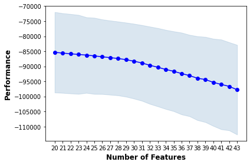
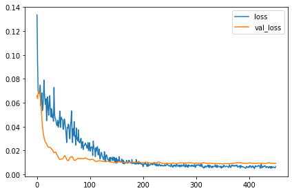
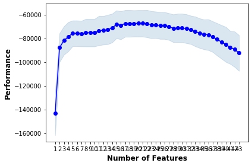

펭귄 몸무게 예측 경진대회(3)
=======
https://dacon.io/competitions/official/235862/overview/description

9개의 feature로 펭귄의 몸무게를 예측하는 모델을 만들어 성능을 겨루는 대회이다. 성능은 rmse로 평가한다. 이전에 참가했던 심장 질환 예측 경진대회와 유사한 유형의 자료 및 목표이지만 이번엔 Classification이 아니라 Regression 모델을 만든다.

## Categorical feature도 이용하기

Categorical feature도 다른 feature들과 곱하여 새로운 feature를 더 추가하면 성능을 향상시킬 수 있지 않을까?


```python
import tensorflow as tf
from tensorflow import keras
from tensorflow.keras import layers
import numpy as np
import pandas as pd
import seaborn as sns
import matplotlib.pyplot as plt

plt.rc('figure', autolayout=True)
plt.rc('axes', labelweight='bold', labelsize='large', titleweight='bold', titlesize=18, titlepad=10)
plt.rc('image', cmap='cividis')
```


```python
df_train = pd.read_csv("./train_droped.csv", index_col="id")
df_test = pd.read_csv("./test_filled.csv", index_col="id")
```


```python
df_train_target = pd.read_csv("./train_target.csv", index_col="id")
df_test_target = pd.read_csv("./test_target.csv", index_col="id")
df_train_y = pd.read_csv('./train_y.csv', index_col="id").squeeze()

body_max = df_train["Body Mass (g)"].max()
body_min = df_train["Body Mass (g)"].min()

df_train_y_rescaled = (df_train_y - body_min) / (body_max - body_min)

df_train_target.head()
```


<div>
<style scoped>
    .dataframe tbody tr th:only-of-type {
        vertical-align: middle;
    }

    .dataframe tbody tr th {
        vertical-align: top;
    }

    .dataframe thead th {
        text-align: right;
    }
</style>
<table border="1" class="dataframe">
  <thead>
    <tr style="text-align: right;">
      <th></th>
      <th>Species</th>
      <th>Island</th>
      <th>Clutch Completion</th>
      <th>Culmen Length (mm)</th>
      <th>Culmen Depth (mm)</th>
      <th>Flipper Length (mm)</th>
      <th>Sex</th>
      <th>Delta 15 N (o/oo)</th>
      <th>Delta 13 C (o/oo)</th>
    </tr>
    <tr>
      <th>id</th>
      <th></th>
      <th></th>
      <th></th>
      <th></th>
      <th></th>
      <th></th>
      <th></th>
      <th></th>
      <th></th>
    </tr>
  </thead>
  <tbody>
    <tr>
      <th>0</th>
      <td>0.714592</td>
      <td>0.653719</td>
      <td>0.498907</td>
      <td>0.763889</td>
      <td>0.265823</td>
      <td>0.807018</td>
      <td>0.584736</td>
      <td>0.281188</td>
      <td>0.627015</td>
    </tr>
    <tr>
      <th>1</th>
      <td>0.320000</td>
      <td>0.316420</td>
      <td>0.414601</td>
      <td>0.740741</td>
      <td>0.734177</td>
      <td>0.456140</td>
      <td>0.584736</td>
      <td>0.835077</td>
      <td>0.916224</td>
    </tr>
    <tr>
      <th>2</th>
      <td>0.714592</td>
      <td>0.653719</td>
      <td>0.498907</td>
      <td>0.537037</td>
      <td>0.151899</td>
      <td>0.631579</td>
      <td>0.395903</td>
      <td>0.370757</td>
      <td>0.000000</td>
    </tr>
    <tr>
      <th>3</th>
      <td>0.714592</td>
      <td>0.653719</td>
      <td>0.498907</td>
      <td>0.509259</td>
      <td>0.189873</td>
      <td>0.701754</td>
      <td>0.395903</td>
      <td>0.237695</td>
      <td>0.292628</td>
    </tr>
    <tr>
      <th>4</th>
      <td>0.714592</td>
      <td>0.653719</td>
      <td>0.414601</td>
      <td>0.745370</td>
      <td>0.354430</td>
      <td>0.894737</td>
      <td>0.584736</td>
      <td>0.313817</td>
      <td>0.060295</td>
    </tr>
  </tbody>
</table>
</div>


```python
train_n = int(df_train_target.count()[0]*0.8)
```


```python
df_train_target.drop(["Island", "Clutch Completion"], axis=1, inplace=True)
```


```python
df_test_target.drop(["Island", "Clutch Completion"], axis=1, inplace=True)
```


```python
df_train_target.loc[df_train_target["Sex"] > 0.5, "Sex"] = 1
df_train_target.loc[df_train_target["Sex"] < 0.5, "Sex"] = 0
df_test_target.loc[df_test_target["Sex"] > 0.5, "Sex"] = 1
df_test_target.loc[df_test_target["Sex"] < 0.5, "Sex"] = 0
df_train_target
```


<div>
<style scoped>
    .dataframe tbody tr th:only-of-type {
        vertical-align: middle;
    }

    .dataframe tbody tr th {
        vertical-align: top;
    }

    .dataframe thead th {
        text-align: right;
    }
</style>
<table border="1" class="dataframe">
  <thead>
    <tr style="text-align: right;">
      <th></th>
      <th>Species</th>
      <th>Culmen Length (mm)</th>
      <th>Culmen Depth (mm)</th>
      <th>Flipper Length (mm)</th>
      <th>Sex</th>
      <th>Delta 15 N (o/oo)</th>
      <th>Delta 13 C (o/oo)</th>
    </tr>
    <tr>
      <th>id</th>
      <th></th>
      <th></th>
      <th></th>
      <th></th>
      <th></th>
      <th></th>
      <th></th>
    </tr>
  </thead>
  <tbody>
    <tr>
      <th>0</th>
      <td>0.714592</td>
      <td>0.763889</td>
      <td>0.265823</td>
      <td>0.807018</td>
      <td>1.0</td>
      <td>0.281188</td>
      <td>0.627015</td>
    </tr>
    <tr>
      <th>1</th>
      <td>0.320000</td>
      <td>0.740741</td>
      <td>0.734177</td>
      <td>0.456140</td>
      <td>1.0</td>
      <td>0.835077</td>
      <td>0.916224</td>
    </tr>
    <tr>
      <th>2</th>
      <td>0.714592</td>
      <td>0.537037</td>
      <td>0.151899</td>
      <td>0.631579</td>
      <td>0.0</td>
      <td>0.370757</td>
      <td>0.000000</td>
    </tr>
    <tr>
      <th>3</th>
      <td>0.714592</td>
      <td>0.509259</td>
      <td>0.189873</td>
      <td>0.701754</td>
      <td>0.0</td>
      <td>0.237695</td>
      <td>0.292628</td>
    </tr>
    <tr>
      <th>4</th>
      <td>0.714592</td>
      <td>0.745370</td>
      <td>0.354430</td>
      <td>0.894737</td>
      <td>1.0</td>
      <td>0.313817</td>
      <td>0.060295</td>
    </tr>
    <tr>
      <th>...</th>
      <td>...</td>
      <td>...</td>
      <td>...</td>
      <td>...</td>
      <td>...</td>
      <td>...</td>
      <td>...</td>
    </tr>
    <tr>
      <th>103</th>
      <td>0.320000</td>
      <td>0.717593</td>
      <td>0.810127</td>
      <td>0.666667</td>
      <td>1.0</td>
      <td>0.713965</td>
      <td>0.880198</td>
    </tr>
    <tr>
      <th>104</th>
      <td>0.326577</td>
      <td>0.263889</td>
      <td>0.683544</td>
      <td>0.280702</td>
      <td>1.0</td>
      <td>0.617514</td>
      <td>0.419429</td>
    </tr>
    <tr>
      <th>105</th>
      <td>0.326577</td>
      <td>0.449074</td>
      <td>0.670886</td>
      <td>0.315789</td>
      <td>1.0</td>
      <td>0.559096</td>
      <td>0.336678</td>
    </tr>
    <tr>
      <th>106</th>
      <td>0.320000</td>
      <td>0.620370</td>
      <td>0.430380</td>
      <td>0.315789</td>
      <td>0.0</td>
      <td>0.908262</td>
      <td>0.782304</td>
    </tr>
    <tr>
      <th>107</th>
      <td>0.714592</td>
      <td>0.800926</td>
      <td>0.518987</td>
      <td>0.947368</td>
      <td>1.0</td>
      <td>0.268289</td>
      <td>0.246349</td>
    </tr>
  </tbody>
</table>
<p>108 rows × 7 columns</p>
</div>


```python
from itertools import combinations

def min_max_scale_2(df, col, col_min, col_max):
    df[col] = ( df[col] - col_min) / (col_max - col_min)

cnt_cols = ["Culmen Length (mm)", "Culmen Depth (mm)", "Flipper Length (mm)", "Delta 15 N (o/oo)", "Delta 13 C (o/oo)"]
cat_cols = ["Species", "Island", "Sex", "Clutch Completion"]


for i, col in enumerate(combinations(cnt_cols, 2)):
    df_train_target["m_{}_{}".format(col[0], col[1])] = df_train[col[0]] * df_train[col[1]]
    df_train_target["d_{}_{}".format(col[0], col[1])] = df_train[col[0]] / df_train[col[1]]
    df_test_target["m_{}_{}".format(col[0], col[1])] = df_test[col[0]] * df_test[col[1]]
    df_test_target["d_{}_{}".format(col[0], col[1])] = df_test[col[0]] / df_test[col[1]]
    
    col_max_m = df_train_target["m_{}_{}".format(col[0], col[1])].max()
    col_max_d = df_train_target["d_{}_{}".format(col[0], col[1])].max()
    col_min_m = df_train_target["m_{}_{}".format(col[0], col[1])].min()
    col_min_d = df_train_target["d_{}_{}".format(col[0], col[1])].min()
    
    min_max_scale_2(df_train_target, "m_{}_{}".format(col[0], col[1]), col_min_m, col_max_m)
    min_max_scale_2(df_train_target, "d_{}_{}".format(col[0], col[1]), col_min_d, col_max_d)
    min_max_scale_2(df_test_target, "m_{}_{}".format(col[0], col[1]), col_min_m, col_max_m)
    min_max_scale_2(df_test_target, "d_{}_{}".format(col[0], col[1]), col_min_d, col_max_d)

    
for i, col in enumerate(cnt_cols):
    df_train_target["p_{}".format(i)] = df_train[col] * df_train[col]
    df_test_target["p_{}".format(i)] = df_test[col] * df_test[col]

    col_max_p = df_train_target["p_{}".format(i)].max()
    col_min_p = df_train_target["p_{}".format(i)].min()

    min_max_scale_2(df_train_target, "p_{}".format(i), col_min_p, col_max_p)
    min_max_scale_2(df_test_target, "p_{}".format(i), col_min_p, col_max_p)

```


```python
for cnt_col in cnt_cols:
    for col in ["Species", "Sex"]:
        df_train_target["m_{}_{}".format(cnt_col, col)] = df_train_target[cnt_col] * df_train_target[col]
#        df_train_target["d_{}_{}".format(cnt_col, col)] = df_train_target[cnt_col] / df_train_target[col]
        df_test_target["m_{}_{}".format(cnt_col, col)] = df_test_target[cnt_col] * df_test_target[col]
#        df_test_target["d_{}_{}".format(cnt_col, col)] = df_test_target[cnt_col] / df_test_target[col]
```


```python
df_train_target["p_Sp"] = df_train_target["Species"] * df_train_target["Species"]
df_test_target["p_Sp"] = df_test_target["Species"] * df_test_target["Species"]
```

## sklearn의 여러 모델 비교

sklearn에서 기본적으로 제공하는 다양한 모델들을 이용하여 앙상블 모델을 만들어본다. 간단하지만 강력한 모델을 만들 수 있었다.


```python
from sklearn.neighbors import KNeighborsRegressor
from sklearn.linear_model import LinearRegression
from sklearn.linear_model import Ridge
from sklearn.linear_model import Lasso
from sklearn.tree import DecisionTreeRegressor
from sklearn.ensemble import RandomForestRegressor
from sklearn.ensemble import GradientBoostingRegressor
from lightgbm import LGBMRegressor
```


```python
from sklearn.model_selection import train_test_split

x_train, x_test, y_train, y_test = train_test_split(df_train_selected, df_train_y, test_size=0.1)
```


```python
score_List=[]

model = KNeighborsRegressor(n_neighbors=5).fit(x_train, y_train)
score_List.append(f'KNeighborsRegressor: train_score: {model.score(x_train, y_train)}, val_score: {model.score(x_test, y_test)}')

model = LinearRegression().fit(x_train, y_train)
score_List.append(f'LinearRegression: train_score: {model.score(x_train, y_train)}, val_score: {model.score(x_test, y_test)}')

model = Ridge().fit(x_train, y_train)
score_List.append(f'Ridge: train_score: {model.score(x_train, y_train)}, val_score: {model.score(x_test, y_test)}')

model = Lasso().fit(x_train, y_train)
score_List.append(f'Lasso: train_score: {model.score(x_train, y_train)}, val_score: {model.score(x_test, y_test)}')

model = DecisionTreeRegressor().fit(x_train, y_train)
score_List.append(f'DecisionTreeRegressor: train_score: {model.score(x_train, y_train)}, val_score: {model.score(x_test, y_test)}')

model = RandomForestRegressor().fit(x_train, y_train)
score_List.append(f'RandomForestRegressor: train_score: {model.score(x_train, y_train)}, val_score: {model.score(x_test, y_test)}')

model = GradientBoostingRegressor().fit(x_train, y_train)
score_List.append(f'GradientBoostingRegressor: train_score: {model.score(x_train, y_train)}, val_score: {model.score(x_test, y_test)}')

model = LGBMRegressor().fit(x_train, y_train)
score_List.append(f'LGBMRegressor: train_score: {model.score(x_train, y_train)}, val_score: {model.score(x_test, y_test)}')
```

    C:\Users\yhoon\Anaconda3\envs\python39\lib\site-packages\sklearn\linear_model\_coordinate_descent.py:647: ConvergenceWarning: Objective did not converge. You might want to increase the number of iterations, check the scale of the features or consider increasing regularisation. Duality gap: 1.062e+04, tolerance: 5.358e+03
      model = cd_fast.enet_coordinate_descent(
    


```python
[print(i) for i in score_List]
```

    KNeighborsRegressor: train_score: 0.8942648113171925, val_score: 0.7883045883501465
    LinearRegression: train_score: 0.8690049951177102, val_score: 0.8773628823402111
    Ridge: train_score: 0.8642515295817694, val_score: 0.8808149007678485
    Lasso: train_score: 0.8673799831862858, val_score: 0.886364009544866
    DecisionTreeRegressor: train_score: 1.0, val_score: 0.7570370972990563
    RandomForestRegressor: train_score: 0.9729965815273323, val_score: 0.8674470826553856
    GradientBoostingRegressor: train_score: 0.9942055395026416, val_score: 0.8765712075267096
    LGBMRegressor: train_score: 0.9153491073545459, val_score: 0.9236731391069891
    


    [None, None, None, None, None, None, None, None]


```python
X = df_train_selected
Y = df_train_y

model_LR = LinearRegression().fit(X, Y)
model_RID = Ridge().fit(X, Y)
model_LA = Lasso().fit(X, Y)
model_GBR = GradientBoostingRegressor().fit(X,Y)
model_LGBM = LGBMRegressor().fit(X, Y)
```

    C:\Users\yhoon\Anaconda3\envs\python39\lib\site-packages\sklearn\linear_model\_coordinate_descent.py:647: ConvergenceWarning: Objective did not converge. You might want to increase the number of iterations, check the scale of the features or consider increasing regularisation. Duality gap: 1.027e+04, tolerance: 6.383e+03
      model = cd_fast.enet_coordinate_descent(
    


```python
pred_LR = model_LR.predict(df_test_selected)
pred_RID = model_RID.predict(df_test_selected)
pred_LA = model_LA.predict(df_test_selected)
pred_LGBM = model_LGBM.predict(df_test_selected)
pred_GBR = model_RF.predict(df_test_selected)
pred_en = pred_KN*0.2 + pred_RID*0.2 + pred_LA*0.2 + pred_LGBM*0.2 + pred_RF*0.2
pred_en
```


    array([4256.75674574, 5563.61354986, 3629.13992849, 3383.08230823,
           3399.08615073, 4187.9716809 , 4688.59017991, 5046.32346488,
           4696.78875661, 3860.77546611, 4209.17624157, 4617.38057969,
           4756.16678334, 4724.94416244, 4988.26396747, 5147.71013308,
           4213.70925028, 3914.31064053, 3433.46405817, 3554.12367208,
           4158.24764295, 5514.44671871, 5394.75284003, 4030.07163397,
           3542.059623  , 4676.0478756 , 3456.19624203, 3961.54085478,
           4036.01938438, 4648.54192463, 3617.91403821, 4738.6440607 ,
           3582.57427984, 4874.20766742, 3983.33080711, 3314.80977428,
           4585.51914489, 3596.46318913, 3866.79212581, 4650.94347995,
           4051.0870025 , 3560.16605212, 3953.29487565, 5392.49591363,
           3672.53150169, 4619.3636904 , 3417.85424953, 4113.31940446,
           4718.86513699, 5514.94130489, 3686.3694882 , 3993.99461634,
           3426.38974552, 4157.1292441 , 4112.30943269, 3992.42819722,
           4683.74770838, 3994.9410105 , 4726.41200855, 3628.34338317,
           4100.95853039, 3494.64826933, 3982.15563701, 5567.05908213,
           3397.15235566, 4123.71578298, 4180.16134902, 4525.83239235,
           3847.95084079, 3962.30087572, 4756.17023328, 3241.94717801,
           3459.3713247 , 3527.73558728, 5405.60963005, 4654.46995063,
           3357.61009304, 3909.16469822, 5321.64117082, 4678.70890909,
           4025.91821797, 3850.48253395, 4190.67908782, 4673.14571698,
           5053.67860368, 4052.4307387 , 5218.5383885 , 4136.44779191,
           3517.8012095 , 5155.72685108, 4589.02889698, 3537.14379185,
           3550.20240578, 3671.26622933, 3380.50725991, 3515.36329869,
           3472.6142453 , 3365.93898382, 4727.62586041, 4102.90204175,
           3698.74208698, 3400.68610627, 3277.74180381, 5257.28319073,
           5634.22290365, 3383.89639004, 5177.99196401, 5274.66380058,
           4216.93352866, 3325.43606604, 4592.0778646 , 3308.5202837 ,
           4150.71132957, 3895.57776089, 5031.74208927, 3949.84072272,
           3634.53478592, 3577.25722025, 4010.51137442, 3989.99230087,
           3922.38560395, 5371.85682188, 3405.6427526 , 4359.75734171,
           3967.81325203, 4029.49471486, 5043.02130928, 4132.62043276,
           3382.89902088, 3732.51312613, 4044.79556676, 3991.49352419,
           5287.73205794, 5081.82332112, 5227.54208459, 3814.37805885,
           3511.1952371 , 3378.1358049 , 4724.0594727 , 3558.14939291,
           3983.91095194, 4669.85700296, 3324.76893879, 3406.34155846,
           4255.65583104, 3530.54828424, 4662.52809693, 3540.97523351,
           5422.7720576 , 4025.47418229, 5184.12328299, 3396.9354697 ,
           5219.30394622, 5430.04909585, 4073.54104204, 5511.42326011,
           3516.868988  , 4035.93613224, 3597.23741741, 3448.48058154,
           3980.93440242, 3495.30618697, 3469.72476148, 3260.04275853,
           5188.51881305, 3377.83949457, 5527.57673904, 4779.1513503 ,
           3900.09872815, 3729.18751141, 5567.72228997, 3544.05544756,
           5299.3617571 , 3389.74675981, 3450.76417093, 4063.39688507,
           4073.59285217, 4549.55597687, 5327.98182928, 3453.61895094,
           3972.26923052, 4323.06547622, 3892.05103863, 4402.61306787,
           4588.96080975, 4247.72729349, 4899.20667006, 5092.07807115,
           3446.7712747 , 3233.45469699, 4064.94904649, 3519.84761121,
           3609.92516831, 4173.35280877, 4788.75918268, 5471.47067904,
           4019.74187057, 5131.09769931, 3482.02455359, 3430.4626273 ,
           3869.78548317, 4651.33478233, 3882.45598236, 4693.65185836,
           4054.20158502, 3828.5935693 , 3567.97381043, 4166.12684147,
           4847.27110561, 4725.88152709, 3429.64494852, 3343.81095817,
           3371.14699006, 3581.1952571 , 3663.82695906, 3912.0803399 ,
           5305.88219005, 3714.42503507, 4115.98431255, 3898.11508098,
           3494.5481307 , 3411.34037356, 4717.23158018, 4033.93130465,
           4719.26599064, 4575.30607637, 3992.77020336, 4027.62609487])


```python
df_pred = pd.DataFrame(pred, columns=["Body Mass (g)"])
df_pred.index.name = "id"
df_pred.to_csv("sub_en.csv")
```


```python
df_train_target
```


<div>
<style scoped>
    .dataframe tbody tr th:only-of-type {
        vertical-align: middle;
    }

    .dataframe tbody tr th {
        vertical-align: top;
    }

    .dataframe thead th {
        text-align: right;
    }
</style>
<table border="1" class="dataframe">
  <thead>
    <tr style="text-align: right;">
      <th></th>
      <th>Species</th>
      <th>Culmen Length (mm)</th>
      <th>Culmen Depth (mm)</th>
      <th>Flipper Length (mm)</th>
      <th>Sex</th>
      <th>Delta 15 N (o/oo)</th>
      <th>Delta 13 C (o/oo)</th>
      <th>m_Culmen Length (mm)_Culmen Depth (mm)</th>
      <th>d_Culmen Length (mm)_Culmen Depth (mm)</th>
      <th>m_Culmen Length (mm)_Flipper Length (mm)</th>
      <th>...</th>
      <th>m_Culmen Length (mm)_Sex</th>
      <th>m_Culmen Depth (mm)_Species</th>
      <th>m_Culmen Depth (mm)_Sex</th>
      <th>m_Flipper Length (mm)_Species</th>
      <th>m_Flipper Length (mm)_Sex</th>
      <th>m_Delta 15 N (o/oo)_Species</th>
      <th>m_Delta 15 N (o/oo)_Sex</th>
      <th>m_Delta 13 C (o/oo)_Species</th>
      <th>m_Delta 13 C (o/oo)_Sex</th>
      <th>p_Sp</th>
    </tr>
    <tr>
      <th>id</th>
      <th></th>
      <th></th>
      <th></th>
      <th></th>
      <th></th>
      <th></th>
      <th></th>
      <th></th>
      <th></th>
      <th></th>
      <th></th>
      <th></th>
      <th></th>
      <th></th>
      <th></th>
      <th></th>
      <th></th>
      <th></th>
      <th></th>
      <th></th>
      <th></th>
    </tr>
  </thead>
  <tbody>
    <tr>
      <th>0</th>
      <td>0.714592</td>
      <td>0.763889</td>
      <td>0.265823</td>
      <td>0.807018</td>
      <td>1.0</td>
      <td>0.281188</td>
      <td>0.627015</td>
      <td>0.397870</td>
      <td>0.870205</td>
      <td>0.737898</td>
      <td>...</td>
      <td>0.763889</td>
      <td>0.189955</td>
      <td>0.265823</td>
      <td>0.576688</td>
      <td>0.807018</td>
      <td>0.200934</td>
      <td>0.281188</td>
      <td>0.448060</td>
      <td>0.627015</td>
      <td>0.510641</td>
    </tr>
    <tr>
      <th>1</th>
      <td>0.320000</td>
      <td>0.740741</td>
      <td>0.734177</td>
      <td>0.456140</td>
      <td>1.0</td>
      <td>0.835077</td>
      <td>0.916224</td>
      <td>0.750527</td>
      <td>0.486973</td>
      <td>0.565565</td>
      <td>...</td>
      <td>0.740741</td>
      <td>0.234937</td>
      <td>0.734177</td>
      <td>0.145965</td>
      <td>0.456140</td>
      <td>0.267225</td>
      <td>0.835077</td>
      <td>0.293192</td>
      <td>0.916224</td>
      <td>0.102400</td>
    </tr>
    <tr>
      <th>2</th>
      <td>0.714592</td>
      <td>0.537037</td>
      <td>0.151899</td>
      <td>0.631579</td>
      <td>0.0</td>
      <td>0.370757</td>
      <td>0.000000</td>
      <td>0.165659</td>
      <td>0.791542</td>
      <td>0.498355</td>
      <td>...</td>
      <td>0.000000</td>
      <td>0.108546</td>
      <td>0.000000</td>
      <td>0.451321</td>
      <td>0.000000</td>
      <td>0.264940</td>
      <td>0.000000</td>
      <td>0.000000</td>
      <td>0.000000</td>
      <td>0.510641</td>
    </tr>
    <tr>
      <th>3</th>
      <td>0.714592</td>
      <td>0.509259</td>
      <td>0.189873</td>
      <td>0.701754</td>
      <td>0.0</td>
      <td>0.237695</td>
      <td>0.292628</td>
      <td>0.175123</td>
      <td>0.730976</td>
      <td>0.506502</td>
      <td>...</td>
      <td>0.000000</td>
      <td>0.135682</td>
      <td>0.000000</td>
      <td>0.501468</td>
      <td>0.000000</td>
      <td>0.169854</td>
      <td>0.000000</td>
      <td>0.209109</td>
      <td>0.000000</td>
      <td>0.510641</td>
    </tr>
    <tr>
      <th>4</th>
      <td>0.714592</td>
      <td>0.745370</td>
      <td>0.354430</td>
      <td>0.894737</td>
      <td>1.0</td>
      <td>0.313817</td>
      <td>0.060295</td>
      <td>0.455340</td>
      <td>0.773069</td>
      <td>0.762964</td>
      <td>...</td>
      <td>0.745370</td>
      <td>0.253273</td>
      <td>0.354430</td>
      <td>0.639371</td>
      <td>0.894737</td>
      <td>0.224251</td>
      <td>0.313817</td>
      <td>0.043086</td>
      <td>0.060295</td>
      <td>0.510641</td>
    </tr>
    <tr>
      <th>...</th>
      <td>...</td>
      <td>...</td>
      <td>...</td>
      <td>...</td>
      <td>...</td>
      <td>...</td>
      <td>...</td>
      <td>...</td>
      <td>...</td>
      <td>...</td>
      <td>...</td>
      <td>...</td>
      <td>...</td>
      <td>...</td>
      <td>...</td>
      <td>...</td>
      <td>...</td>
      <td>...</td>
      <td>...</td>
      <td>...</td>
      <td>...</td>
    </tr>
    <tr>
      <th>103</th>
      <td>0.320000</td>
      <td>0.717593</td>
      <td>0.810127</td>
      <td>0.666667</td>
      <td>1.0</td>
      <td>0.713965</td>
      <td>0.880198</td>
      <td>0.790515</td>
      <td>0.426101</td>
      <td>0.642018</td>
      <td>...</td>
      <td>0.717593</td>
      <td>0.259241</td>
      <td>0.810127</td>
      <td>0.213333</td>
      <td>0.666667</td>
      <td>0.228469</td>
      <td>0.713965</td>
      <td>0.281664</td>
      <td>0.880198</td>
      <td>0.102400</td>
    </tr>
    <tr>
      <th>104</th>
      <td>0.326577</td>
      <td>0.263889</td>
      <td>0.683544</td>
      <td>0.280702</td>
      <td>1.0</td>
      <td>0.617514</td>
      <td>0.419429</td>
      <td>0.325771</td>
      <td>0.199142</td>
      <td>0.181419</td>
      <td>...</td>
      <td>0.263889</td>
      <td>0.223230</td>
      <td>0.683544</td>
      <td>0.091671</td>
      <td>0.280702</td>
      <td>0.201666</td>
      <td>0.617514</td>
      <td>0.136976</td>
      <td>0.419429</td>
      <td>0.106652</td>
    </tr>
    <tr>
      <th>105</th>
      <td>0.326577</td>
      <td>0.449074</td>
      <td>0.670886</td>
      <td>0.315789</td>
      <td>1.0</td>
      <td>0.559096</td>
      <td>0.336678</td>
      <td>0.466593</td>
      <td>0.330763</td>
      <td>0.314022</td>
      <td>...</td>
      <td>0.449074</td>
      <td>0.219096</td>
      <td>0.670886</td>
      <td>0.103129</td>
      <td>0.315789</td>
      <td>0.182588</td>
      <td>0.559096</td>
      <td>0.109951</td>
      <td>0.336678</td>
      <td>0.106652</td>
    </tr>
    <tr>
      <th>106</th>
      <td>0.320000</td>
      <td>0.620370</td>
      <td>0.430380</td>
      <td>0.315789</td>
      <td>0.0</td>
      <td>0.908262</td>
      <td>0.782304</td>
      <td>0.425078</td>
      <td>0.614216</td>
      <td>0.425317</td>
      <td>...</td>
      <td>0.000000</td>
      <td>0.137722</td>
      <td>0.000000</td>
      <td>0.101053</td>
      <td>0.000000</td>
      <td>0.290644</td>
      <td>0.000000</td>
      <td>0.250337</td>
      <td>0.000000</td>
      <td>0.102400</td>
    </tr>
    <tr>
      <th>107</th>
      <td>0.714592</td>
      <td>0.800926</td>
      <td>0.518987</td>
      <td>0.947368</td>
      <td>1.0</td>
      <td>0.268289</td>
      <td>0.246349</td>
      <td>0.626625</td>
      <td>0.678472</td>
      <td>0.829140</td>
      <td>...</td>
      <td>0.800926</td>
      <td>0.370864</td>
      <td>0.518987</td>
      <td>0.676981</td>
      <td>0.947368</td>
      <td>0.191717</td>
      <td>0.268289</td>
      <td>0.176039</td>
      <td>0.246349</td>
      <td>0.510641</td>
    </tr>
  </tbody>
</table>
<p>108 rows × 43 columns</p>
</div>


## 다양한 모델 학습

새로운 dataset으로 기존에 이용했던 모델들 및 Lasso, Ridge regulation을 적용한 모델들도 학습시켜보자.


```python
def get_mse(pred, y):
    rmse = np.sqrt(np.multiply((y-pred), (y-pred))) / len(pred)
    return sum(rmse)
```


```python
def mk_Dataset(X, y):
    ds_ = tf.data.Dataset.from_tensor_slices((X.values.astype(float), y.values.astype(float)))

    AUTOTUNE = tf.data.experimental.AUTOTUNE

    ds = (
        ds_
        .batch(32)
        .cache()
        .prefetch(buffer_size=AUTOTUNE)
    )
    
    return ds
```


```python
def Dense_model():
    
    model = keras.Sequential([
        layers.Dense(512, input_shape=[43], kernel_initializer=keras.initializers.he_normal()),
        layers.PReLU(),
        layers.BatchNormalization(),
        layers.Dropout(0.5),

        layers.Dense(128, kernel_initializer=keras.initializers.he_normal()),
        layers.PReLU(),
        layers.BatchNormalization(),
        layers.Dropout(0.5),

        layers.Dense(1, kernel_initializer=keras.initializers.he_normal(), activation='relu')

    ])
    
    model.compile(optimizer=keras.optimizers.Adam(learning_rate=0.01), loss="mse")
    
    return model
```


```python
from sklearn.model_selection import StratifiedKFold

NFOLDS = 5

kfold = StratifiedKFold(n_splits=NFOLDS, shuffle=True, random_state = 102)

num_seeds = 5
cv_train = np.zeros(len(df_train_target))
cv_pred = np.zeros(len(df_test_target))

early = keras.callbacks.EarlyStopping(patience=300, restore_best_weights=True)

for s in range(num_seeds):
    
    np.random.seed(s)

    for (tr_idx, te_idx) in kfold.split(df_train_target, df_train_y):
        ds_train = mk_Dataset(df_train_target.loc[tr_idx, :], df_train_y.loc[tr_idx])
        ds_test = mk_Dataset(df_train_target.loc[te_idx, :], df_train_y.loc[te_idx])
        
        model = Dense_model()
        
        model.fit(
            ds_train,
            validation_data=ds_test,
            verbose=0,
            callbacks=[early],
            epochs=2000
        )
        
        cv_train[te_idx] += np.squeeze(model.predict(df_train_target.loc[te_idx, :].values.astype(float)))
        print("mse: {}".format(get_mse( cv_train[te_idx] / (s + 1) , df_train_y[te_idx]) ))

        cv_pred += np.squeeze(model.predict(df_test_target.values.astype(float)))

    print("-----------------")
    print("seed{}_mse: {}".format(s, get_mse(cv_train / (s + 1), df_train_y)))
    print("-----------------")
```

    C:\Users\yhoon\Anaconda3\envs\python39\lib\site-packages\sklearn\model_selection\_split.py:676: UserWarning: The least populated class in y has only 1 members, which is less than n_splits=5.
      warnings.warn(
    

    mse: 237.31010298295456
    mse: 417.266093860973
    mse: 199.62481134588074
    mse: 167.66579473586307
    mse: 178.1468098958333
    -----------------
    seed0_mse: 241.24524886519816
    -----------------
    

    C:\Users\yhoon\Anaconda3\envs\python39\lib\site-packages\sklearn\model_selection\_split.py:676: UserWarning: The least populated class in y has only 1 members, which is less than n_splits=5.
      warnings.warn(
    


    ---------------------------------------------------------------------------

    KeyboardInterrupt                         Traceback (most recent call last)

    ~\AppData\Local\Temp/ipykernel_16972/3594462871.py in <module>
         21         model = Dense_model()
         22 
    ---> 23         model.fit(
         24             ds_train,
         25             validation_data=ds_test,
    

    ~\Anaconda3\envs\python39\lib\site-packages\keras\utils\traceback_utils.py in error_handler(*args, **kwargs)
         62     filtered_tb = None
         63     try:
    ---> 64       return fn(*args, **kwargs)
         65     except Exception as e:  # pylint: disable=broad-except
         66       filtered_tb = _process_traceback_frames(e.__traceback__)
    

    ~\Anaconda3\envs\python39\lib\site-packages\keras\engine\training.py in fit(self, x, y, batch_size, epochs, verbose, callbacks, validation_split, validation_data, shuffle, class_weight, sample_weight, initial_epoch, steps_per_epoch, validation_steps, validation_batch_size, validation_freq, max_queue_size, workers, use_multiprocessing)
       1202           self._maybe_load_initial_epoch_from_ckpt(initial_epoch))
       1203       logs = None
    -> 1204       for epoch, iterator in data_handler.enumerate_epochs():
       1205         self.reset_metrics()
       1206         callbacks.on_epoch_begin(epoch)
    

    ~\Anaconda3\envs\python39\lib\site-packages\keras\engine\data_adapter.py in enumerate_epochs(self)
       1198           break
       1199         if self._adapter.should_recreate_iterator():
    -> 1200           data_iterator = iter(self._dataset)
       1201         yield epoch, data_iterator
       1202         self._adapter.on_epoch_end()
    

    ~\Anaconda3\envs\python39\lib\site-packages\tensorflow\python\data\ops\dataset_ops.py in __iter__(self)
        488     if context.executing_eagerly() or ops.inside_function():
        489       with ops.colocate_with(self._variant_tensor):
    --> 490         return iterator_ops.OwnedIterator(self)
        491     else:
        492       raise RuntimeError("`tf.data.Dataset` only supports Python-style "
    

    ~\Anaconda3\envs\python39\lib\site-packages\tensorflow\python\data\ops\iterator_ops.py in __init__(self, dataset, components, element_spec)
        724             "When `dataset` is provided, `element_spec` and `components` must "
        725             "not be specified.")
    --> 726       self._create_iterator(dataset)
        727 
        728     self._get_next_call_count = 0
    

    ~\Anaconda3\envs\python39\lib\site-packages\tensorflow\python\data\ops\iterator_ops.py in _create_iterator(self, dataset)
        746     with ops.colocate_with(ds_variant):
        747       self._iterator_resource, self._deleter = (
    --> 748           gen_dataset_ops.anonymous_iterator_v2(
        749               output_types=self._flat_output_types,
        750               output_shapes=self._flat_output_shapes))
    

    ~\Anaconda3\envs\python39\lib\site-packages\tensorflow\python\ops\gen_dataset_ops.py in anonymous_iterator_v2(output_types, output_shapes, name)
        121   if tld.is_eager:
        122     try:
    --> 123       _result = pywrap_tfe.TFE_Py_FastPathExecute(
        124         _ctx, "AnonymousIteratorV2", name, "output_types", output_types,
        125         "output_shapes", output_shapes)
    

    KeyboardInterrupt: 


```python
cv_pred = cv_pred / (NFOLDS * num_seeds)
df_cv_pred = pd.DataFrame(cv_pred, columns=["Body Mass (g)"])
df_cv_pred.index.name = "id"
df_cv_pred
```


<div>
<style scoped>
    .dataframe tbody tr th:only-of-type {
        vertical-align: middle;
    }

    .dataframe tbody tr th {
        vertical-align: top;
    }

    .dataframe thead th {
        text-align: right;
    }
</style>
<table border="1" class="dataframe">
  <thead>
    <tr style="text-align: right;">
      <th></th>
      <th>Body Mass (g)</th>
    </tr>
    <tr>
      <th>id</th>
      <th></th>
    </tr>
  </thead>
  <tbody>
    <tr>
      <th>0</th>
      <td>4285.551387</td>
    </tr>
    <tr>
      <th>1</th>
      <td>5678.815586</td>
    </tr>
    <tr>
      <th>2</th>
      <td>3635.048750</td>
    </tr>
    <tr>
      <th>3</th>
      <td>3340.176729</td>
    </tr>
    <tr>
      <th>4</th>
      <td>3099.430693</td>
    </tr>
    <tr>
      <th>...</th>
      <td>...</td>
    </tr>
    <tr>
      <th>223</th>
      <td>4007.072617</td>
    </tr>
    <tr>
      <th>224</th>
      <td>4799.264199</td>
    </tr>
    <tr>
      <th>225</th>
      <td>4544.474883</td>
    </tr>
    <tr>
      <th>226</th>
      <td>3988.482031</td>
    </tr>
    <tr>
      <th>227</th>
      <td>4032.950742</td>
    </tr>
  </tbody>
</table>
<p>228 rows × 1 columns</p>
</div>


## Lasso


```python
def lasso_model():
    
    model = keras.Sequential([
        layers.Dense(512, input_shape=[43], kernel_initializer=keras.initializers.he_normal(), kernel_regularizer='l1'),
        layers.PReLU(),
        layers.BatchNormalization(),
        layers.Dropout(0.5),

        layers.Dense(128, kernel_initializer=keras.initializers.he_normal(), kernel_regularizer='l1'),
        layers.PReLU(),
        layers.BatchNormalization(),
        layers.Dropout(0.5),

        layers.Dense(1, kernel_initializer=keras.initializers.he_normal(), activation='relu')

    ])
    
    model.compile(optimizer=keras.optimizers.Adam(learning_rate=0.01), loss="mse")
    
    return model
```


```python
from sklearn.model_selection import StratifiedKFold

NFOLDS = 5

kfold = StratifiedKFold(n_splits=NFOLDS, shuffle=True, random_state = 102)

num_seeds = 5
l1_cv_train = np.zeros(len(df_train_target))
l1_cv_pred = np.zeros(len(df_test_target))

early = keras.callbacks.EarlyStopping(patience=300, restore_best_weights=True)

for s in range(num_seeds):
    
    np.random.seed(s)

    for (tr_idx, te_idx) in kfold.split(df_train_target, df_train_y):
        ds_train = mk_Dataset(df_train_target.loc[tr_idx, :], df_train_y.loc[tr_idx])
        ds_test = mk_Dataset(df_train_target.loc[te_idx, :], df_train_y.loc[te_idx])
        
        model = lasso_model()
        
        model.fit(
            ds_train,
            validation_data=ds_test,
            verbose=0,
            callbacks=[early],
            epochs=2000
        )
        
        l1_cv_train[te_idx] += np.squeeze(model.predict(df_train_target.loc[te_idx, :].values.astype(float)))
        print("mse: {}".format(get_mse( l1_cv_train[te_idx] / (s + 1) , df_train_y[te_idx]) ))

        l1_cv_pred += np.squeeze(model.predict(df_test_target.values.astype(float)))

    print("-----------------")
    print("seed{}_mse: {}".format(s, get_mse(l1_cv_train / (s + 1), df_train_y)))
    print("-----------------")
```

    C:\Users\yhoon\Anaconda3\envs\python39\lib\site-packages\sklearn\model_selection\_split.py:676: UserWarning: The least populated class in y has only 1 members, which is less than n_splits=5.
      warnings.warn(
    

    mse: 236.89746093750003
    mse: 295.87190385298294
    mse: 171.8261052911932
    mse: 181.0433640252976
    mse: 166.84056454613096
    -----------------
    seed0_mse: 211.17280409071176
    -----------------
    

    C:\Users\yhoon\Anaconda3\envs\python39\lib\site-packages\sklearn\model_selection\_split.py:676: UserWarning: The least populated class in y has only 1 members, which is less than n_splits=5.
      warnings.warn(
    

    mse: 234.8128662109375
    mse: 262.32958429509944
    mse: 177.54170365767044
    mse: 184.45924014136904
    mse: 166.0359351748512
    -----------------
    seed1_mse: 205.58750067816834
    -----------------
    

    C:\Users\yhoon\Anaconda3\envs\python39\lib\site-packages\sklearn\model_selection\_split.py:676: UserWarning: The least populated class in y has only 1 members, which is less than n_splits=5.
      warnings.warn(
    

    mse: 241.26568788470647
    mse: 261.86350689512307
    mse: 175.6551624644887
    mse: 181.10518585689485
    mse: 166.48862614707343
    -----------------
    seed2_mse: 205.85857325424394
    -----------------
    

    C:\Users\yhoon\Anaconda3\envs\python39\lib\site-packages\sklearn\model_selection\_split.py:676: UserWarning: The least populated class in y has only 1 members, which is less than n_splits=5.
      warnings.warn(
    

    mse: 238.07653531161225
    mse: 258.5113525390625
    mse: 177.92621127041903
    mse: 182.7309366861979
    mse: 167.90904889787942
    -----------------
    seed3_mse: 205.5810173882377
    -----------------
    

    C:\Users\yhoon\Anaconda3\envs\python39\lib\site-packages\sklearn\model_selection\_split.py:676: UserWarning: The least populated class in y has only 1 members, which is less than n_splits=5.
      warnings.warn(
    

    mse: 239.82624511718754
    mse: 247.2961581143466
    mse: 177.97216352982957
    mse: 182.97580682663695
    mse: 169.39054129464287
    -----------------
    seed4_mse: 203.99790536386
    -----------------
    


```python
l1_cv_pred = l1_cv_pred / (NFOLDS * num_seeds)
df_l1_cv_pred = pd.DataFrame(l1_cv_pred, columns=["Body Mass (g)"])
df_l1_cv_pred.index.name = "id"
df_l1_cv_pred
```


<div>
<style scoped>
    .dataframe tbody tr th:only-of-type {
        vertical-align: middle;
    }

    .dataframe tbody tr th {
        vertical-align: top;
    }

    .dataframe thead th {
        text-align: right;
    }
</style>
<table border="1" class="dataframe">
  <thead>
    <tr style="text-align: right;">
      <th></th>
      <th>Body Mass (g)</th>
    </tr>
    <tr>
      <th>id</th>
      <th></th>
    </tr>
  </thead>
  <tbody>
    <tr>
      <th>0</th>
      <td>4300.248203</td>
    </tr>
    <tr>
      <th>1</th>
      <td>5690.782441</td>
    </tr>
    <tr>
      <th>2</th>
      <td>3607.577422</td>
    </tr>
    <tr>
      <th>3</th>
      <td>3365.990869</td>
    </tr>
    <tr>
      <th>4</th>
      <td>2948.385879</td>
    </tr>
    <tr>
      <th>...</th>
      <td>...</td>
    </tr>
    <tr>
      <th>223</th>
      <td>4012.603271</td>
    </tr>
    <tr>
      <th>224</th>
      <td>4791.417695</td>
    </tr>
    <tr>
      <th>225</th>
      <td>4526.418496</td>
    </tr>
    <tr>
      <th>226</th>
      <td>4006.182305</td>
    </tr>
    <tr>
      <th>227</th>
      <td>4028.869531</td>
    </tr>
  </tbody>
</table>
<p>228 rows × 1 columns</p>
</div>


## Ridge


```python
def ridge_model():
    
    model = keras.Sequential([
        layers.Dense(512, input_shape=[43], kernel_initializer=keras.initializers.he_normal(), kernel_regularizer='l2'),
        layers.PReLU(),
        layers.BatchNormalization(),
        layers.Dropout(0.5),

        layers.Dense(128, kernel_initializer=keras.initializers.he_normal(), kernel_regularizer='l2'),
        layers.PReLU(),
        layers.BatchNormalization(),
        layers.Dropout(0.5),

        layers.Dense(1, kernel_initializer=keras.initializers.he_normal(), activation='relu')

    ])
    
    model.compile(optimizer=keras.optimizers.Adam(learning_rate=0.01), loss="mse")
    
    return model
```


```python
from sklearn.model_selection import StratifiedKFold

NFOLDS = 5

kfold = StratifiedKFold(n_splits=NFOLDS, shuffle=True, random_state = 102)

num_seeds = 5
l2_cv_train = np.zeros(len(df_train_target))
l2_cv_pred = np.zeros(len(df_test_target))

early = keras.callbacks.EarlyStopping(patience=300, restore_best_weights=True)

for s in range(num_seeds):
    
    np.random.seed(s)

    for (tr_idx, te_idx) in kfold.split(df_train_target, df_train_y):
        ds_train = mk_Dataset(df_train_target.loc[tr_idx, :], df_train_y.loc[tr_idx])
        ds_test = mk_Dataset(df_train_target.loc[te_idx, :], df_train_y.loc[te_idx])
        
        model = ridge_model()
        
        model.fit(
            ds_train,
            validation_data=ds_test,
            verbose=0,
            callbacks=[early],
            epochs=2000
        )
        
        l2_cv_train[te_idx] += np.squeeze(model.predict(df_train_target.loc[te_idx, :].values.astype(float)))
        print("mse: {}".format(get_mse( l2_cv_train[te_idx] / (s + 1) , df_train_y[te_idx]) ))

        l2_cv_pred += np.squeeze(model.predict(df_test_target.values.astype(float)))

    print("-----------------")
    print("seed{}_mse: {}".format(s, get_mse(l2_cv_train / (s + 1), df_train_y)))
    print("-----------------")
```

    C:\Users\yhoon\Anaconda3\envs\python39\lib\site-packages\sklearn\model_selection\_split.py:676: UserWarning: The least populated class in y has only 1 members, which is less than n_splits=5.
      warnings.warn(
    

    mse: 242.42649147727275
    mse: 254.3595414595171
    mse: 192.6587579900568
    mse: 196.4037620907738
    mse: 177.6670851934524
    -----------------
    seed0_mse: 213.17845549406823
    -----------------
    

    C:\Users\yhoon\Anaconda3\envs\python39\lib\site-packages\sklearn\model_selection\_split.py:676: UserWarning: The least populated class in y has only 1 members, which is less than n_splits=5.
      warnings.warn(
    

    mse: 242.97014271129257
    mse: 329.31163995916194
    mse: 182.6117831143466
    mse: 183.11375790550593
    mse: 177.19874209449404
    -----------------
    seed1_mse: 223.83537914134828
    -----------------
    

    C:\Users\yhoon\Anaconda3\envs\python39\lib\site-packages\sklearn\model_selection\_split.py:676: UserWarning: The least populated class in y has only 1 members, which is less than n_splits=5.
      warnings.warn(
    

    mse: 239.30786502722535
    mse: 297.6209383877841
    mse: 189.8510002367424
    mse: 176.99832976810507
    mse: 182.59358336433522
    -----------------
    seed2_mse: 217.9683875566648
    -----------------
    

    C:\Users\yhoon\Anaconda3\envs\python39\lib\site-packages\sklearn\model_selection\_split.py:676: UserWarning: The least populated class in y has only 1 members, which is less than n_splits=5.
      warnings.warn(
    

    mse: 239.61657714843753
    mse: 285.12989945845175
    mse: 183.23794555664062
    mse: 177.92910039992563
    mse: 180.27351888020837
    -----------------
    seed3_mse: 213.869558263708
    -----------------
    

    C:\Users\yhoon\Anaconda3\envs\python39\lib\site-packages\sklearn\model_selection\_split.py:676: UserWarning: The least populated class in y has only 1 members, which is less than n_splits=5.
      warnings.warn(
    

    mse: 238.76638183593758
    mse: 267.5302667791193
    mse: 179.9577481356533
    mse: 178.00723353794638
    mse: 178.8024600074404
    -----------------
    seed4_mse: 209.17222493489587
    -----------------
    


```python
l2_cv_pred = l2_cv_pred / (NFOLDS * num_seeds)
df_l2_cv_pred = pd.DataFrame(l2_cv_pred, columns=["Body Mass (g)"])
df_l2_cv_pred.index.name = "id"
df_l2_cv_pred
```


<div>
<style scoped>
    .dataframe tbody tr th:only-of-type {
        vertical-align: middle;
    }

    .dataframe tbody tr th {
        vertical-align: top;
    }

    .dataframe thead th {
        text-align: right;
    }
</style>
<table border="1" class="dataframe">
  <thead>
    <tr style="text-align: right;">
      <th></th>
      <th>Body Mass (g)</th>
    </tr>
    <tr>
      <th>id</th>
      <th></th>
    </tr>
  </thead>
  <tbody>
    <tr>
      <th>0</th>
      <td>4281.974277</td>
    </tr>
    <tr>
      <th>1</th>
      <td>5661.294766</td>
    </tr>
    <tr>
      <th>2</th>
      <td>3648.507412</td>
    </tr>
    <tr>
      <th>3</th>
      <td>3371.122910</td>
    </tr>
    <tr>
      <th>4</th>
      <td>2921.944268</td>
    </tr>
    <tr>
      <th>...</th>
      <td>...</td>
    </tr>
    <tr>
      <th>223</th>
      <td>4004.414658</td>
    </tr>
    <tr>
      <th>224</th>
      <td>4794.243750</td>
    </tr>
    <tr>
      <th>225</th>
      <td>4549.151660</td>
    </tr>
    <tr>
      <th>226</th>
      <td>3995.037744</td>
    </tr>
    <tr>
      <th>227</th>
      <td>4016.513369</td>
    </tr>
  </tbody>
</table>
<p>228 rows × 1 columns</p>
</div>


## Lasso & Ridge


```python
def lr_model():
    
    model = keras.Sequential([
        layers.Dense(512, input_shape=[43], kernel_initializer=keras.initializers.he_normal() 
                     ,kernel_regularizer=keras.regularizers.l1_l2(l1=0.01, l2=0.01)),
        layers.PReLU(),
        layers.BatchNormalization(),
        layers.Dropout(0.5),

        layers.Dense(128, kernel_initializer=keras.initializers.he_normal()
                     ,kernel_regularizer=keras.regularizers.l1_l2(l1=0.01, l2=0.01)),
        layers.PReLU(),
        layers.BatchNormalization(),
        layers.Dropout(0.5),

        layers.Dense(1, kernel_initializer=keras.initializers.he_normal(), activation='relu')

    ])
    
    model.compile(optimizer=keras.optimizers.Adam(learning_rate=0.01), loss="mse")
    
    return model
```


```python
from sklearn.model_selection import StratifiedKFold

NFOLDS = 5

kfold = StratifiedKFold(n_splits=NFOLDS, shuffle=True, random_state = 102)

num_seeds = 5
lr_cv_train = np.zeros(len(df_train_target))
lr_cv_pred = np.zeros(len(df_test_target))

early = keras.callbacks.EarlyStopping(patience=300, restore_best_weights=True)

for s in range(num_seeds):
    
    np.random.seed(s)

    for (tr_idx, te_idx) in kfold.split(df_train_target, df_train_y):
        ds_train = mk_Dataset(df_train_target.loc[tr_idx, :], df_train_y.loc[tr_idx])
        ds_test = mk_Dataset(df_train_target.loc[te_idx, :], df_train_y.loc[te_idx])
        
        model = lr_model()
        
        model.fit(
            ds_train,
            validation_data=ds_test,
            verbose=0,
            callbacks=[early],
            epochs=2000
        )
        
        lr_cv_train[te_idx] += np.squeeze(model.predict(df_train_target.loc[te_idx, :].values.astype(float)))
        print("mse: {}".format(get_mse( lr_cv_train[te_idx] / (s + 1) , df_train_y[te_idx]) ))

        lr_cv_pred += np.squeeze(model.predict(df_test_target.values.astype(float)))

    print("-----------------")
    print("seed{}_mse: {}".format(s, get_mse(lr_cv_train / (s + 1), df_train_y)))
    print("-----------------")
```

    C:\Users\yhoon\Anaconda3\envs\python39\lib\site-packages\sklearn\model_selection\_split.py:676: UserWarning: The least populated class in y has only 1 members, which is less than n_splits=5.
      warnings.warn(
    

    mse: 228.58162064985794
    mse: 239.83099920099434
    mse: 192.994384765625
    mse: 186.6948009672619
    mse: 179.61058407738093
    -----------------
    seed0_mse: 205.95710358796293
    -----------------
    

    C:\Users\yhoon\Anaconda3\envs\python39\lib\site-packages\sklearn\model_selection\_split.py:676: UserWarning: The least populated class in y has only 1 members, which is less than n_splits=5.
      warnings.warn(
    

    mse: 231.32632168856537
    mse: 250.60406494140628
    mse: 185.42019375887784
    mse: 182.40619187127976
    mse: 170.20285179501485
    -----------------
    seed1_mse: 204.5046544958044
    -----------------
    

    C:\Users\yhoon\Anaconda3\envs\python39\lib\site-packages\sklearn\model_selection\_split.py:676: UserWarning: The least populated class in y has only 1 members, which is less than n_splits=5.
      warnings.warn(
    

    mse: 232.45556640625006
    mse: 250.5868770714962
    mse: 181.1823286576704
    mse: 183.05577256944443
    mse: 171.83553059895834
    -----------------
    seed2_mse: 204.311688458478
    -----------------
    

    C:\Users\yhoon\Anaconda3\envs\python39\lib\site-packages\sklearn\model_selection\_split.py:676: UserWarning: The least populated class in y has only 1 members, which is less than n_splits=5.
      warnings.warn(
    

    mse: 236.84474875710228
    mse: 250.09877152876422
    mse: 179.06755204634234
    mse: 176.8690650576637
    mse: 174.30444045293905
    -----------------
    seed3_mse: 203.95265932436337
    -----------------
    

    C:\Users\yhoon\Anaconda3\envs\python39\lib\site-packages\sklearn\model_selection\_split.py:676: UserWarning: The least populated class in y has only 1 members, which is less than n_splits=5.
      warnings.warn(
    

    mse: 234.02422762784096
    mse: 275.7734186345882
    mse: 181.04571422230114
    mse: 179.99730747767856
    mse: 168.71890811011906
    -----------------
    seed4_mse: 208.5332820185908
    -----------------
    


```python
lr_cv_pred = lr_cv_pred / (NFOLDS * num_seeds)
df_lr_cv_pred = pd.DataFrame(lr_cv_pred, columns=["Body Mass (g)"])
df_lr_cv_pred.index.name = "id"
df_lr_cv_pred
```


<div>
<style scoped>
    .dataframe tbody tr th:only-of-type {
        vertical-align: middle;
    }

    .dataframe tbody tr th {
        vertical-align: top;
    }

    .dataframe thead th {
        text-align: right;
    }
</style>
<table border="1" class="dataframe">
  <thead>
    <tr style="text-align: right;">
      <th></th>
      <th>Body Mass (g)</th>
    </tr>
    <tr>
      <th>id</th>
      <th></th>
    </tr>
  </thead>
  <tbody>
    <tr>
      <th>0</th>
      <td>4302.343477</td>
    </tr>
    <tr>
      <th>1</th>
      <td>5638.185137</td>
    </tr>
    <tr>
      <th>2</th>
      <td>3615.451670</td>
    </tr>
    <tr>
      <th>3</th>
      <td>3294.773506</td>
    </tr>
    <tr>
      <th>4</th>
      <td>3189.232617</td>
    </tr>
    <tr>
      <th>...</th>
      <td>...</td>
    </tr>
    <tr>
      <th>223</th>
      <td>4031.799746</td>
    </tr>
    <tr>
      <th>224</th>
      <td>4749.269102</td>
    </tr>
    <tr>
      <th>225</th>
      <td>4481.307861</td>
    </tr>
    <tr>
      <th>226</th>
      <td>4017.599473</td>
    </tr>
    <tr>
      <th>227</th>
      <td>4022.669980</td>
    </tr>
  </tbody>
</table>
<p>228 rows × 1 columns</p>
</div>


## lgb


```python
from sklearn.model_selection import StratifiedKFold
import lightgbm as lgb

NFOLDS = 5

kfold = StratifiedKFold(n_splits=NFOLDS, shuffle=True, random_state = 102)

param = {'boosting_type': 'gbdt', 'learning_rate': 0.1, 'max_depth': 3, 'n_estimators': 31, 'random_state': 30,
         'objective': 'mse', 'device_type': 'gpu', 'verbosity' : -1, 'feature_fraction': 0.8}

num_seeds = 16
n_round = 10000

cv_train_lgb = np.zeros(len(df_train_target))
cv_pred_lgb = np.zeros(len(df_test_target))

early = lgb.early_stopping(100)

for s in range(num_seeds):
    
    param['random_state'] = s

    for (tr_idx, te_idx) in kfold.split(df_train_target, df_train_y):
        
        train_data_lgb = lgb.Dataset(df_train_target.loc[tr_idx, :].values, label=df_train_y.loc[tr_idx].values)
        val_data_lgb = train_data_lgb.create_valid(df_train_target.loc[te_idx, :].values, label=df_train_y.loc[te_idx].values)
        
        bst = lgb.train(param, train_data_lgb, n_round, valid_sets=[val_data_lgb], callbacks=[early])
        print('best score: {}'.format(bst.best_score))

        cv_train_lgb[te_idx] += np.squeeze(bst.predict(df_train_target.loc[te_idx, :].values.astype(float)))
        print("mse: {}".format(get_mse( cv_train_lgb[te_idx] / (s + 1) , df_train_y.loc[te_idx]) ))
        
        cv_pred_lgb += np.squeeze(bst.predict(df_test_target.values.astype(float)))

    print("-----------------")
    print("seed{}_mse: {}".format(s, get_mse( cv_train_lgb / (s + 1), df_train_y)))
    print("-----------------")
```

    C:\Users\yhoon\Anaconda3\envs\python39\lib\site-packages\sklearn\model_selection\_split.py:676: UserWarning: The least populated class in y has only 1 members, which is less than n_splits=5.
      warnings.warn(
    C:\Users\yhoon\Anaconda3\envs\python39\lib\site-packages\lightgbm\engine.py:177: UserWarning: Found `n_estimators` in params. Will use it instead of argument
      _log_warning(f"Found `{alias}` in params. Will use it instead of argument")
    

    Training until validation scores don't improve for 100 rounds
    Did not meet early stopping. Best iteration is:
    [31]	valid_0's l2: 109558
    best score: defaultdict(<class 'collections.OrderedDict'>, {'valid_0': OrderedDict([('l2', 109557.82433016071)])})
    mse: 279.29793448233016
    Did not meet early stopping. Best iteration is:
    [31]	valid_0's l2: 109558
    best score: defaultdict(<class 'collections.OrderedDict'>, {'valid_0': OrderedDict([('l2', 109557.82433016071)])})
    mse: 254.78721538398688
    Did not meet early stopping. Best iteration is:
    [31]	valid_0's l2: 109558
    best score: defaultdict(<class 'collections.OrderedDict'>, {'valid_0': OrderedDict([('l2', 109557.82433016071)])})
    mse: 295.4773123858608
    Did not meet early stopping. Best iteration is:
    [31]	valid_0's l2: 55992.2
    best score: defaultdict(<class 'collections.OrderedDict'>, {'valid_0': OrderedDict([('l2', 55992.21493314522)])})
    mse: 174.58820702901772
    Did not meet early stopping. Best iteration is:
    [31]	valid_0's l2: 55992.2
    best score: defaultdict(<class 'collections.OrderedDict'>, {'valid_0': OrderedDict([('l2', 55992.21493314522)])})
    mse: 198.95228423400457
    -----------------
    seed0_mse: 241.61781931547583
    -----------------
    Did not meet early stopping. Best iteration is:
    [31]	valid_0's l2: 55992.2
    

    C:\Users\yhoon\Anaconda3\envs\python39\lib\site-packages\sklearn\model_selection\_split.py:676: UserWarning: The least populated class in y has only 1 members, which is less than n_splits=5.
      warnings.warn(
    C:\Users\yhoon\Anaconda3\envs\python39\lib\site-packages\lightgbm\engine.py:177: UserWarning: Found `n_estimators` in params. Will use it instead of argument
      _log_warning(f"Found `{alias}` in params. Will use it instead of argument")
    

    best score: defaultdict(<class 'collections.OrderedDict'>, {'valid_0': OrderedDict([('l2', 55992.21493314522)])})
    mse: 277.45034113951846
    Did not meet early stopping. Best iteration is:
    [31]	valid_0's l2: 55992.2
    best score: defaultdict(<class 'collections.OrderedDict'>, {'valid_0': OrderedDict([('l2', 55992.21493314522)])})
    mse: 255.55116902843184
    Did not meet early stopping. Best iteration is:
    [31]	valid_0's l2: 55992.2
    best score: defaultdict(<class 'collections.OrderedDict'>, {'valid_0': OrderedDict([('l2', 55992.21493314522)])})
    mse: 293.84168588815214
    Did not meet early stopping. Best iteration is:
    [31]	valid_0's l2: 55992.2
    best score: defaultdict(<class 'collections.OrderedDict'>, {'valid_0': OrderedDict([('l2', 55992.21493314522)])})
    mse: 177.63685029746227
    Did not meet early stopping. Best iteration is:
    [28]	valid_0's l2: 51997.6
    best score: defaultdict(<class 'collections.OrderedDict'>, {'valid_0': OrderedDict([('l2', 51997.633749310895)])})
    mse: 190.80645635197277
    -----------------
    seed1_mse: 240.0727754895591
    -----------------
    Did not meet early stopping. Best iteration is:
    [28]	valid_0's l2: 51997.6
    best score: defaultdict(<class 'collections.OrderedDict'>, {'valid_0': OrderedDict([('l2', 51997.633749310895)])})
    

    C:\Users\yhoon\Anaconda3\envs\python39\lib\site-packages\sklearn\model_selection\_split.py:676: UserWarning: The least populated class in y has only 1 members, which is less than n_splits=5.
      warnings.warn(
    C:\Users\yhoon\Anaconda3\envs\python39\lib\site-packages\lightgbm\engine.py:177: UserWarning: Found `n_estimators` in params. Will use it instead of argument
      _log_warning(f"Found `{alias}` in params. Will use it instead of argument")
    

    mse: 278.1677281597388
    Did not meet early stopping. Best iteration is:
    [28]	valid_0's l2: 51997.6
    best score: defaultdict(<class 'collections.OrderedDict'>, {'valid_0': OrderedDict([('l2', 51997.633749310895)])})
    mse: 254.8341971722969
    Did not meet early stopping. Best iteration is:
    [28]	valid_0's l2: 51997.6
    best score: defaultdict(<class 'collections.OrderedDict'>, {'valid_0': OrderedDict([('l2', 51997.633749310895)])})
    mse: 292.7453496601956
    Did not meet early stopping. Best iteration is:
    [28]	valid_0's l2: 51997.6
    best score: defaultdict(<class 'collections.OrderedDict'>, {'valid_0': OrderedDict([('l2', 51997.633749310895)])})
    mse: 180.97581055082043
    Did not meet early stopping. Best iteration is:
    [28]	valid_0's l2: 51997.6
    best score: defaultdict(<class 'collections.OrderedDict'>, {'valid_0': OrderedDict([('l2', 51997.633749310895)])})
    mse: 191.9148009351277
    -----------------
    seed2_mse: 240.7142860280925
    -----------------
    Did not meet early stopping. Best iteration is:
    [28]	valid_0's l2: 51997.6
    best score: defaultdict(<class 'collections.OrderedDict'>, {'valid_0': OrderedDict([('l2', 51997.633749310895)])})
    mse: 276.1781737796784
    

    C:\Users\yhoon\Anaconda3\envs\python39\lib\site-packages\sklearn\model_selection\_split.py:676: UserWarning: The least populated class in y has only 1 members, which is less than n_splits=5.
      warnings.warn(
    C:\Users\yhoon\Anaconda3\envs\python39\lib\site-packages\lightgbm\engine.py:177: UserWarning: Found `n_estimators` in params. Will use it instead of argument
      _log_warning(f"Found `{alias}` in params. Will use it instead of argument")
    

    Did not meet early stopping. Best iteration is:
    [28]	valid_0's l2: 51997.6
    best score: defaultdict(<class 'collections.OrderedDict'>, {'valid_0': OrderedDict([('l2', 51997.633749310895)])})
    mse: 256.36029635199503
    Did not meet early stopping. Best iteration is:
    [28]	valid_0's l2: 51997.6
    best score: defaultdict(<class 'collections.OrderedDict'>, {'valid_0': OrderedDict([('l2', 51997.633749310895)])})
    mse: 293.9555542627943
    Did not meet early stopping. Best iteration is:
    [28]	valid_0's l2: 51997.6
    best score: defaultdict(<class 'collections.OrderedDict'>, {'valid_0': OrderedDict([('l2', 51997.633749310895)])})
    mse: 182.60282177123355
    Did not meet early stopping. Best iteration is:
    [25]	valid_0's l2: 51366.9
    best score: defaultdict(<class 'collections.OrderedDict'>, {'valid_0': OrderedDict([('l2', 51366.90586545704)])})
    mse: 190.33974937442858
    -----------------
    seed3_mse: 240.8765049142333
    -----------------
    Did not meet early stopping. Best iteration is:
    [25]	valid_0's l2: 51366.9
    best score: defaultdict(<class 'collections.OrderedDict'>, {'valid_0': OrderedDict([('l2', 51366.90586545704)])})
    mse: 277.6050655933067
    

    C:\Users\yhoon\Anaconda3\envs\python39\lib\site-packages\sklearn\model_selection\_split.py:676: UserWarning: The least populated class in y has only 1 members, which is less than n_splits=5.
      warnings.warn(
    C:\Users\yhoon\Anaconda3\envs\python39\lib\site-packages\lightgbm\engine.py:177: UserWarning: Found `n_estimators` in params. Will use it instead of argument
      _log_warning(f"Found `{alias}` in params. Will use it instead of argument")
    

    Did not meet early stopping. Best iteration is:
    [25]	valid_0's l2: 51366.9
    best score: defaultdict(<class 'collections.OrderedDict'>, {'valid_0': OrderedDict([('l2', 51366.90586545704)])})
    mse: 257.45183812258335
    Did not meet early stopping. Best iteration is:
    [25]	valid_0's l2: 51366.9
    best score: defaultdict(<class 'collections.OrderedDict'>, {'valid_0': OrderedDict([('l2', 51366.90586545704)])})
    mse: 296.5230264290379
    Did not meet early stopping. Best iteration is:
    [25]	valid_0's l2: 51366.9
    best score: defaultdict(<class 'collections.OrderedDict'>, {'valid_0': OrderedDict([('l2', 51366.90586545704)])})
    mse: 187.32041396456506
    Did not meet early stopping. Best iteration is:
    [28]	valid_0's l2: 50486.4
    best score: defaultdict(<class 'collections.OrderedDict'>, {'valid_0': OrderedDict([('l2', 50486.37205202783)])})
    mse: 188.79288565554953
    -----------------
    seed4_mse: 242.52905328898908
    -----------------
    Did not meet early stopping. Best iteration is:
    [28]	valid_0's l2: 50486.4
    best score: defaultdict(<class 'collections.OrderedDict'>, {'valid_0': OrderedDict([('l2', 50486.37205202783)])})
    

    C:\Users\yhoon\Anaconda3\envs\python39\lib\site-packages\sklearn\model_selection\_split.py:676: UserWarning: The least populated class in y has only 1 members, which is less than n_splits=5.
      warnings.warn(
    C:\Users\yhoon\Anaconda3\envs\python39\lib\site-packages\lightgbm\engine.py:177: UserWarning: Found `n_estimators` in params. Will use it instead of argument
      _log_warning(f"Found `{alias}` in params. Will use it instead of argument")
    

    mse: 278.0568937952497
    Did not meet early stopping. Best iteration is:
    [28]	valid_0's l2: 50486.4
    best score: defaultdict(<class 'collections.OrderedDict'>, {'valid_0': OrderedDict([('l2', 50486.37205202783)])})
    mse: 258.1280694185605
    Did not meet early stopping. Best iteration is:
    [28]	valid_0's l2: 50486.4
    best score: defaultdict(<class 'collections.OrderedDict'>, {'valid_0': OrderedDict([('l2', 50486.37205202783)])})
    mse: 297.1539320859703
    Did not meet early stopping. Best iteration is:
    [28]	valid_0's l2: 50486.4
    best score: defaultdict(<class 'collections.OrderedDict'>, {'valid_0': OrderedDict([('l2', 50486.37205202783)])})
    mse: 187.01994903723826
    Did not meet early stopping. Best iteration is:
    [28]	valid_0's l2: 50191.7
    best score: defaultdict(<class 'collections.OrderedDict'>, {'valid_0': OrderedDict([('l2', 50191.745897998604)])})
    mse: 188.0453094913724
    -----------------
    seed5_mse: 242.68357523792594
    -----------------
    Did not meet early stopping. Best iteration is:
    [28]	valid_0's l2: 50191.7
    best score: defaultdict(<class 'collections.OrderedDict'>, {'valid_0': OrderedDict([('l2', 50191.745897998604)])})
    

    C:\Users\yhoon\Anaconda3\envs\python39\lib\site-packages\sklearn\model_selection\_split.py:676: UserWarning: The least populated class in y has only 1 members, which is less than n_splits=5.
      warnings.warn(
    C:\Users\yhoon\Anaconda3\envs\python39\lib\site-packages\lightgbm\engine.py:177: UserWarning: Found `n_estimators` in params. Will use it instead of argument
      _log_warning(f"Found `{alias}` in params. Will use it instead of argument")
    

    mse: 277.97508369607095
    Did not meet early stopping. Best iteration is:
    [28]	valid_0's l2: 50191.7
    best score: defaultdict(<class 'collections.OrderedDict'>, {'valid_0': OrderedDict([('l2', 50191.745897998604)])})
    mse: 258.6454124092892
    Did not meet early stopping. Best iteration is:
    [28]	valid_0's l2: 50191.7
    best score: defaultdict(<class 'collections.OrderedDict'>, {'valid_0': OrderedDict([('l2', 50191.745897998604)])})
    mse: 296.83842372931963
    Did not meet early stopping. Best iteration is:
    [28]	valid_0's l2: 50191.7
    best score: defaultdict(<class 'collections.OrderedDict'>, {'valid_0': OrderedDict([('l2', 50191.745897998604)])})
    mse: 186.9116899224657
    Did not meet early stopping. Best iteration is:
    [26]	valid_0's l2: 49741.2
    best score: defaultdict(<class 'collections.OrderedDict'>, {'valid_0': OrderedDict([('l2', 49741.22293061476)])})
    mse: 187.4641783462555
    -----------------
    seed6_mse: 242.5739765741305
    -----------------
    Did not meet early stopping. Best iteration is:
    [26]	valid_0's l2: 49741.2
    best score: defaultdict(<class 'collections.OrderedDict'>, {'valid_0': OrderedDict([('l2', 49741.22293061476)])})
    

    C:\Users\yhoon\Anaconda3\envs\python39\lib\site-packages\sklearn\model_selection\_split.py:676: UserWarning: The least populated class in y has only 1 members, which is less than n_splits=5.
      warnings.warn(
    C:\Users\yhoon\Anaconda3\envs\python39\lib\site-packages\lightgbm\engine.py:177: UserWarning: Found `n_estimators` in params. Will use it instead of argument
      _log_warning(f"Found `{alias}` in params. Will use it instead of argument")
    

    mse: 277.4954178955009
    Did not meet early stopping. Best iteration is:
    [26]	valid_0's l2: 49741.2
    best score: defaultdict(<class 'collections.OrderedDict'>, {'valid_0': OrderedDict([('l2', 49741.22293061476)])})
    mse: 258.47442886157546
    Did not meet early stopping. Best iteration is:
    [26]	valid_0's l2: 49741.2
    best score: defaultdict(<class 'collections.OrderedDict'>, {'valid_0': OrderedDict([('l2', 49741.22293061476)])})
    mse: 298.0286194825006
    Did not meet early stopping. Best iteration is:
    [26]	valid_0's l2: 49741.2
    best score: defaultdict(<class 'collections.OrderedDict'>, {'valid_0': OrderedDict([('l2', 49741.22293061476)])})
    mse: 188.58240323585997
    Did not meet early stopping. Best iteration is:
    [26]	valid_0's l2: 49258.4
    best score: defaultdict(<class 'collections.OrderedDict'>, {'valid_0': OrderedDict([('l2', 49258.42784397885)])})
    mse: 187.1125220302352
    -----------------
    seed7_mse: 242.94036748017314
    -----------------
    Did not meet early stopping. Best iteration is:
    [26]	valid_0's l2: 49258.4
    best score: defaultdict(<class 'collections.OrderedDict'>, {'valid_0': OrderedDict([('l2', 49258.42784397885)])})
    

    C:\Users\yhoon\Anaconda3\envs\python39\lib\site-packages\sklearn\model_selection\_split.py:676: UserWarning: The least populated class in y has only 1 members, which is less than n_splits=5.
      warnings.warn(
    C:\Users\yhoon\Anaconda3\envs\python39\lib\site-packages\lightgbm\engine.py:177: UserWarning: Found `n_estimators` in params. Will use it instead of argument
      _log_warning(f"Found `{alias}` in params. Will use it instead of argument")
    

    mse: 278.38439477474697
    Did not meet early stopping. Best iteration is:
    [26]	valid_0's l2: 49258.4
    best score: defaultdict(<class 'collections.OrderedDict'>, {'valid_0': OrderedDict([('l2', 49258.42784397885)])})
    mse: 258.54313929568514
    Did not meet early stopping. Best iteration is:
    [26]	valid_0's l2: 49258.4
    best score: defaultdict(<class 'collections.OrderedDict'>, {'valid_0': OrderedDict([('l2', 49258.42784397885)])})
    mse: 298.8938350080822
    Did not meet early stopping. Best iteration is:
    [26]	valid_0's l2: 49258.4
    best score: defaultdict(<class 'collections.OrderedDict'>, {'valid_0': OrderedDict([('l2', 49258.42784397885)])})
    mse: 189.4092489852172
    Did not meet early stopping. Best iteration is:
    [26]	valid_0's l2: 49258.4
    best score: defaultdict(<class 'collections.OrderedDict'>, {'valid_0': OrderedDict([('l2', 49258.42784397885)])})
    mse: 187.93172719168604
    -----------------
    seed8_mse: 243.63176499483603
    -----------------
    Did not meet early stopping. Best iteration is:
    [26]	valid_0's l2: 49258.4
    

    C:\Users\yhoon\Anaconda3\envs\python39\lib\site-packages\sklearn\model_selection\_split.py:676: UserWarning: The least populated class in y has only 1 members, which is less than n_splits=5.
      warnings.warn(
    C:\Users\yhoon\Anaconda3\envs\python39\lib\site-packages\lightgbm\engine.py:177: UserWarning: Found `n_estimators` in params. Will use it instead of argument
      _log_warning(f"Found `{alias}` in params. Will use it instead of argument")
    

    best score: defaultdict(<class 'collections.OrderedDict'>, {'valid_0': OrderedDict([('l2', 49258.42784397885)])})
    mse: 278.80016441961243
    Did not meet early stopping. Best iteration is:
    [26]	valid_0's l2: 49258.4
    best score: defaultdict(<class 'collections.OrderedDict'>, {'valid_0': OrderedDict([('l2', 49258.42784397885)])})
    mse: 259.0308960044586
    Did not meet early stopping. Best iteration is:
    [26]	valid_0's l2: 49258.4
    best score: defaultdict(<class 'collections.OrderedDict'>, {'valid_0': OrderedDict([('l2', 49258.42784397885)])})
    mse: 298.7952770908405
    Did not meet early stopping. Best iteration is:
    [26]	valid_0's l2: 49258.4
    best score: defaultdict(<class 'collections.OrderedDict'>, {'valid_0': OrderedDict([('l2', 49258.42784397885)])})
    mse: 189.68757647476468
    Did not meet early stopping. Best iteration is:
    [30]	valid_0's l2: 47357.9
    best score: defaultdict(<class 'collections.OrderedDict'>, {'valid_0': OrderedDict([('l2', 47357.88650516356)])})
    mse: 187.51025814806678
    -----------------
    seed9_mse: 243.76790696673615
    -----------------
    Did not meet early stopping. Best iteration is:
    [30]	valid_0's l2: 47357.9
    

    C:\Users\yhoon\Anaconda3\envs\python39\lib\site-packages\sklearn\model_selection\_split.py:676: UserWarning: The least populated class in y has only 1 members, which is less than n_splits=5.
      warnings.warn(
    C:\Users\yhoon\Anaconda3\envs\python39\lib\site-packages\lightgbm\engine.py:177: UserWarning: Found `n_estimators` in params. Will use it instead of argument
      _log_warning(f"Found `{alias}` in params. Will use it instead of argument")
    

    best score: defaultdict(<class 'collections.OrderedDict'>, {'valid_0': OrderedDict([('l2', 47357.88650516356)])})
    mse: 279.0830996331659
    Did not meet early stopping. Best iteration is:
    [30]	valid_0's l2: 47357.9
    best score: defaultdict(<class 'collections.OrderedDict'>, {'valid_0': OrderedDict([('l2', 47357.88650516356)])})
    mse: 258.61474426769666
    Did not meet early stopping. Best iteration is:
    [30]	valid_0's l2: 47357.9
    best score: defaultdict(<class 'collections.OrderedDict'>, {'valid_0': OrderedDict([('l2', 47357.88650516356)])})
    mse: 298.09451054517194
    Did not meet early stopping. Best iteration is:
    [30]	valid_0's l2: 47357.9
    best score: defaultdict(<class 'collections.OrderedDict'>, {'valid_0': OrderedDict([('l2', 47357.88650516356)])})
    mse: 188.77198821754862
    Did not meet early stopping. Best iteration is:
    [30]	valid_0's l2: 47357.9
    best score: defaultdict(<class 'collections.OrderedDict'>, {'valid_0': OrderedDict([('l2', 47357.88650516356)])})
    mse: 187.3689934481467
    -----------------
    seed10_mse: 243.3925223406698
    -----------------
    

    C:\Users\yhoon\Anaconda3\envs\python39\lib\site-packages\sklearn\model_selection\_split.py:676: UserWarning: The least populated class in y has only 1 members, which is less than n_splits=5.
      warnings.warn(
    C:\Users\yhoon\Anaconda3\envs\python39\lib\site-packages\lightgbm\engine.py:177: UserWarning: Found `n_estimators` in params. Will use it instead of argument
      _log_warning(f"Found `{alias}` in params. Will use it instead of argument")
    

    Did not meet early stopping. Best iteration is:
    [30]	valid_0's l2: 47357.9
    best score: defaultdict(<class 'collections.OrderedDict'>, {'valid_0': OrderedDict([('l2', 47357.88650516356)])})
    mse: 279.71146249028834
    Did not meet early stopping. Best iteration is:
    [30]	valid_0's l2: 47357.9
    best score: defaultdict(<class 'collections.OrderedDict'>, {'valid_0': OrderedDict([('l2', 47357.88650516356)])})
    mse: 258.7735866573353
    Did not meet early stopping. Best iteration is:
    [30]	valid_0's l2: 47357.9
    best score: defaultdict(<class 'collections.OrderedDict'>, {'valid_0': OrderedDict([('l2', 47357.88650516356)])})
    mse: 297.4065047783128
    Did not meet early stopping. Best iteration is:
    [30]	valid_0's l2: 47357.9
    best score: defaultdict(<class 'collections.OrderedDict'>, {'valid_0': OrderedDict([('l2', 47357.88650516356)])})
    mse: 188.38487484033334
    Did not meet early stopping. Best iteration is:
    [30]	valid_0's l2: 47357.9
    best score: defaultdict(<class 'collections.OrderedDict'>, {'valid_0': OrderedDict([('l2', 47357.88650516356)])})
    mse: 187.68631455400123
    -----------------
    seed11_mse: 243.39915892270034
    -----------------
    Did not meet early stopping. Best iteration is:
    [30]	valid_0's l2: 47357.9
    best score: defaultdict(<class 'collections.OrderedDict'>, {'valid_0': OrderedDict([('l2', 47357.88650516356)])})
    

    C:\Users\yhoon\Anaconda3\envs\python39\lib\site-packages\sklearn\model_selection\_split.py:676: UserWarning: The least populated class in y has only 1 members, which is less than n_splits=5.
      warnings.warn(
    C:\Users\yhoon\Anaconda3\envs\python39\lib\site-packages\lightgbm\engine.py:177: UserWarning: Found `n_estimators` in params. Will use it instead of argument
      _log_warning(f"Found `{alias}` in params. Will use it instead of argument")
    

    mse: 279.2808796388037
    Did not meet early stopping. Best iteration is:
    [30]	valid_0's l2: 47357.9
    best score: defaultdict(<class 'collections.OrderedDict'>, {'valid_0': OrderedDict([('l2', 47357.88650516356)])})
    mse: 259.1375032303856
    Did not meet early stopping. Best iteration is:
    [30]	valid_0's l2: 47357.9
    best score: defaultdict(<class 'collections.OrderedDict'>, {'valid_0': OrderedDict([('l2', 47357.88650516356)])})
    mse: 297.49812131352434
    Did not meet early stopping. Best iteration is:
    [30]	valid_0's l2: 47357.9
    best score: defaultdict(<class 'collections.OrderedDict'>, {'valid_0': OrderedDict([('l2', 47357.88650516356)])})
    mse: 188.01117305470976
    Did not meet early stopping. Best iteration is:
    [30]	valid_0's l2: 47357.9
    best score: defaultdict(<class 'collections.OrderedDict'>, {'valid_0': OrderedDict([('l2', 47357.88650516356)])})
    mse: 188.31842493835575
    -----------------
    seed12_mse: 243.45448749883408
    -----------------
    Did not meet early stopping. Best iteration is:
    [30]	valid_0's l2: 47357.9
    best score: defaultdict(<class 'collections.OrderedDict'>, {'valid_0': OrderedDict([('l2', 47357.88650516356)])})
    

    C:\Users\yhoon\Anaconda3\envs\python39\lib\site-packages\sklearn\model_selection\_split.py:676: UserWarning: The least populated class in y has only 1 members, which is less than n_splits=5.
      warnings.warn(
    C:\Users\yhoon\Anaconda3\envs\python39\lib\site-packages\lightgbm\engine.py:177: UserWarning: Found `n_estimators` in params. Will use it instead of argument
      _log_warning(f"Found `{alias}` in params. Will use it instead of argument")
    

    mse: 279.74952574422105
    Did not meet early stopping. Best iteration is:
    [30]	valid_0's l2: 47357.9
    best score: defaultdict(<class 'collections.OrderedDict'>, {'valid_0': OrderedDict([('l2', 47357.88650516356)])})
    mse: 258.78660182315434
    Did not meet early stopping. Best iteration is:
    [30]	valid_0's l2: 47357.9
    best score: defaultdict(<class 'collections.OrderedDict'>, {'valid_0': OrderedDict([('l2', 47357.88650516356)])})
    mse: 297.0955840802156
    Did not meet early stopping. Best iteration is:
    [30]	valid_0's l2: 47357.9
    best score: defaultdict(<class 'collections.OrderedDict'>, {'valid_0': OrderedDict([('l2', 47357.88650516356)])})
    mse: 187.50799519577893
    Did not meet early stopping. Best iteration is:
    [30]	valid_0's l2: 47357.9
    best score: defaultdict(<class 'collections.OrderedDict'>, {'valid_0': OrderedDict([('l2', 47357.88650516356)])})
    mse: 188.35037189656663
    -----------------
    seed13_mse: 243.30484597394693
    -----------------
    Did not meet early stopping. Best iteration is:
    [30]	valid_0's l2: 47357.9
    best score: defaultdict(<class 'collections.OrderedDict'>, {'valid_0': OrderedDict([('l2', 47357.88650516356)])})
    

    C:\Users\yhoon\Anaconda3\envs\python39\lib\site-packages\sklearn\model_selection\_split.py:676: UserWarning: The least populated class in y has only 1 members, which is less than n_splits=5.
      warnings.warn(
    C:\Users\yhoon\Anaconda3\envs\python39\lib\site-packages\lightgbm\engine.py:177: UserWarning: Found `n_estimators` in params. Will use it instead of argument
      _log_warning(f"Found `{alias}` in params. Will use it instead of argument")
    

    mse: 279.46336662666613
    Did not meet early stopping. Best iteration is:
    [30]	valid_0's l2: 47357.9
    best score: defaultdict(<class 'collections.OrderedDict'>, {'valid_0': OrderedDict([('l2', 47357.88650516356)])})
    mse: 258.7258551480279
    Did not meet early stopping. Best iteration is:
    [30]	valid_0's l2: 47357.9
    best score: defaultdict(<class 'collections.OrderedDict'>, {'valid_0': OrderedDict([('l2', 47357.88650516356)])})
    mse: 296.9010702857404
    Did not meet early stopping. Best iteration is:
    [30]	valid_0's l2: 47357.9
    best score: defaultdict(<class 'collections.OrderedDict'>, {'valid_0': OrderedDict([('l2', 47357.88650516356)])})
    mse: 187.7602325754735
    Did not meet early stopping. Best iteration is:
    [30]	valid_0's l2: 47357.9
    best score: defaultdict(<class 'collections.OrderedDict'>, {'valid_0': OrderedDict([('l2', 47357.88650516356)])})
    mse: 188.0574205543814
    -----------------
    seed14_mse: 243.1866401949677
    -----------------
    Did not meet early stopping. Best iteration is:
    [30]	valid_0's l2: 47357.9
    best score: defaultdict(<class 'collections.OrderedDict'>, {'valid_0': OrderedDict([('l2', 47357.88650516356)])})
    

    C:\Users\yhoon\Anaconda3\envs\python39\lib\site-packages\sklearn\model_selection\_split.py:676: UserWarning: The least populated class in y has only 1 members, which is less than n_splits=5.
      warnings.warn(
    C:\Users\yhoon\Anaconda3\envs\python39\lib\site-packages\lightgbm\engine.py:177: UserWarning: Found `n_estimators` in params. Will use it instead of argument
      _log_warning(f"Found `{alias}` in params. Will use it instead of argument")
    

    mse: 279.1331116761863
    Did not meet early stopping. Best iteration is:
    [30]	valid_0's l2: 47357.9
    best score: defaultdict(<class 'collections.OrderedDict'>, {'valid_0': OrderedDict([('l2', 47357.88650516356)])})
    mse: 258.1829085019269
    Did not meet early stopping. Best iteration is:
    [30]	valid_0's l2: 47357.9
    best score: defaultdict(<class 'collections.OrderedDict'>, {'valid_0': OrderedDict([('l2', 47357.88650516356)])})
    mse: 296.92258319504543
    Did not meet early stopping. Best iteration is:
    [30]	valid_0's l2: 47357.9
    best score: defaultdict(<class 'collections.OrderedDict'>, {'valid_0': OrderedDict([('l2', 47357.88650516356)])})
    mse: 187.81783449231185
    Did not meet early stopping. Best iteration is:
    [30]	valid_0's l2: 47357.9
    best score: defaultdict(<class 'collections.OrderedDict'>, {'valid_0': OrderedDict([('l2', 47357.88650516356)])})
    mse: 188.42942992492922
    -----------------
    seed15_mse: 243.09668358307005
    -----------------
    


```python
cv_pred_lgb = cv_pred_lgb / (NFOLDS * num_seeds)
df_cv_pred_lgb = pd.DataFrame(cv_pred_lgb, columns=["Body Mass (g)"])
df_cv_pred_lgb.index.name = "id"
df_cv_pred_lgb
```


<div>
<style scoped>
    .dataframe tbody tr th:only-of-type {
        vertical-align: middle;
    }

    .dataframe tbody tr th {
        vertical-align: top;
    }

    .dataframe thead th {
        text-align: right;
    }
</style>
<table border="1" class="dataframe">
  <thead>
    <tr style="text-align: right;">
      <th></th>
      <th>Body Mass (g)</th>
    </tr>
    <tr>
      <th>id</th>
      <th></th>
    </tr>
  </thead>
  <tbody>
    <tr>
      <th>0</th>
      <td>4412.447942</td>
    </tr>
    <tr>
      <th>1</th>
      <td>5337.145839</td>
    </tr>
    <tr>
      <th>2</th>
      <td>3629.052008</td>
    </tr>
    <tr>
      <th>3</th>
      <td>3486.817952</td>
    </tr>
    <tr>
      <th>4</th>
      <td>3549.508761</td>
    </tr>
    <tr>
      <th>...</th>
      <td>...</td>
    </tr>
    <tr>
      <th>223</th>
      <td>4151.361671</td>
    </tr>
    <tr>
      <th>224</th>
      <td>4769.970356</td>
    </tr>
    <tr>
      <th>225</th>
      <td>4572.731897</td>
    </tr>
    <tr>
      <th>226</th>
      <td>4013.953353</td>
    </tr>
    <tr>
      <th>227</th>
      <td>3922.713213</td>
    </tr>
  </tbody>
</table>
<p>228 rows × 1 columns</p>
</div>


```python
cv_pred_mix = cv_pred * 0.2 + l1_cv_pred * 0.2 + l2_cv_pred * 0.2 + lr_cv_pred * 0.2 + cv_pred_lgb * 0.2
df_cv_mix = pd.DataFrame(cv_pred_mix, columns=["Body Mass (g)"])
df_cv_mix.index.name = "id"
df_cv_mix
```


<div>
<style scoped>
    .dataframe tbody tr th:only-of-type {
        vertical-align: middle;
    }

    .dataframe tbody tr th {
        vertical-align: top;
    }

    .dataframe thead th {
        text-align: right;
    }
</style>
<table border="1" class="dataframe">
  <thead>
    <tr style="text-align: right;">
      <th></th>
      <th>Body Mass (g)</th>
    </tr>
    <tr>
      <th>id</th>
      <th></th>
    </tr>
  </thead>
  <tbody>
    <tr>
      <th>0</th>
      <td>4316.513057</td>
    </tr>
    <tr>
      <th>1</th>
      <td>5601.244754</td>
    </tr>
    <tr>
      <th>2</th>
      <td>3627.127452</td>
    </tr>
    <tr>
      <th>3</th>
      <td>3371.776393</td>
    </tr>
    <tr>
      <th>4</th>
      <td>3141.700444</td>
    </tr>
    <tr>
      <th>...</th>
      <td>...</td>
    </tr>
    <tr>
      <th>223</th>
      <td>4041.450393</td>
    </tr>
    <tr>
      <th>224</th>
      <td>4780.833020</td>
    </tr>
    <tr>
      <th>225</th>
      <td>4534.816959</td>
    </tr>
    <tr>
      <th>226</th>
      <td>4004.250981</td>
    </tr>
    <tr>
      <th>227</th>
      <td>4004.743367</td>
    </tr>
  </tbody>
</table>
<p>228 rows × 1 columns</p>
</div>


```python
df_cv_mix.to_csv("submission_cv_mix_lr.csv")
```

## mlxtend로 feature selection


많은 feature를 이용한 모델이 가장 처음에 시도했던(feature를 가장 적게 이용했던) 모델과 비슷하거나 떨어지는 퍼포먼스를 보였다. 너무 많은 feature가 오히려 성능을 저하시켰던 것이 아닐까? 가장 적합한 feature를 골라내본다.


```python
from mlxtend.feature_selection import SequentialFeatureSelector
from mlxtend.plotting import plot_sequential_feature_selection as plot_sfs

X = df_train_target
y = df_train_y

selector = SequentialFeatureSelector(
    Ridge(), 
    scoring='neg_mean_squared_error', 
    k_features=20, 
    forward=False, 
    floating=True,
    cv=10
)

selector = selector.fit(X, y)
fig = plot_sfs(selector.get_metric_dict(), kind='std_err')

```


    

    


```python
selector.k_feature_names_
```


    ('Species',
     'Culmen Length (mm)',
     'Sex',
     'Delta 15 N (o/oo)',
     'm_Culmen Length (mm)_Culmen Depth (mm)',
     'm_Culmen Length (mm)_Flipper Length (mm)',
     'd_Culmen Length (mm)_Flipper Length (mm)',
     'm_Culmen Length (mm)_Delta 15 N (o/oo)',
     'd_Culmen Length (mm)_Delta 15 N (o/oo)',
     'm_Culmen Depth (mm)_Flipper Length (mm)',
     'd_Culmen Depth (mm)_Delta 15 N (o/oo)',
     'm_Flipper Length (mm)_Delta 15 N (o/oo)',
     'p_0',
     'p_3',
     'm_Culmen Length (mm)_Species',
     'm_Culmen Length (mm)_Sex',
     'm_Culmen Depth (mm)_Species',
     'm_Flipper Length (mm)_Species',
     'm_Delta 15 N (o/oo)_Species',
     'p_Sp')


Ridge 모델로 평가한 20개의 중요한 feature들이다. Dense 모델로 직접 해볼 시간이 부족하여 Ridge 모델을 바탕으로 고른 이 feature들에서 최적의 feature들을 골라내보자.


```python
df_train_selected = df_train_target.loc[:, selector.k_feature_names_]
df_test_selected = df_test_target.loc[:, selector.k_feature_names_]
df_train_selected
```


<div>
<style scoped>
    .dataframe tbody tr th:only-of-type {
        vertical-align: middle;
    }

    .dataframe tbody tr th {
        vertical-align: top;
    }

    .dataframe thead th {
        text-align: right;
    }
</style>
<table border="1" class="dataframe">
  <thead>
    <tr style="text-align: right;">
      <th></th>
      <th>Species</th>
      <th>Sex</th>
      <th>m_Culmen Depth (mm)_Flipper Length (mm)</th>
      <th>d_Flipper Length (mm)_Delta 15 N (o/oo)</th>
      <th>m_Culmen Length (mm)_Species</th>
      <th>m_Culmen Depth (mm)_Species</th>
      <th>m_Flipper Length (mm)_Species</th>
      <th>p_Sp</th>
    </tr>
    <tr>
      <th>id</th>
      <th></th>
      <th></th>
      <th></th>
      <th></th>
      <th></th>
      <th></th>
      <th></th>
      <th></th>
    </tr>
  </thead>
  <tbody>
    <tr>
      <th>0</th>
      <td>0.714592</td>
      <td>1.0</td>
      <td>0.423942</td>
      <td>0.806658</td>
      <td>0.545869</td>
      <td>0.189955</td>
      <td>0.576688</td>
      <td>0.510641</td>
    </tr>
    <tr>
      <th>1</th>
      <td>0.320000</td>
      <td>1.0</td>
      <td>0.740730</td>
      <td>0.243090</td>
      <td>0.237037</td>
      <td>0.234937</td>
      <td>0.145965</td>
      <td>0.102400</td>
    </tr>
    <tr>
      <th>2</th>
      <td>0.714592</td>
      <td>0.0</td>
      <td>0.174307</td>
      <td>0.625430</td>
      <td>0.383762</td>
      <td>0.108546</td>
      <td>0.451321</td>
      <td>0.510641</td>
    </tr>
    <tr>
      <th>3</th>
      <td>0.714592</td>
      <td>0.0</td>
      <td>0.263212</td>
      <td>0.767720</td>
      <td>0.363912</td>
      <td>0.135682</td>
      <td>0.501468</td>
      <td>0.510641</td>
    </tr>
    <tr>
      <th>4</th>
      <td>0.714592</td>
      <td>1.0</td>
      <td>0.594745</td>
      <td>0.841094</td>
      <td>0.532635</td>
      <td>0.253273</td>
      <td>0.639371</td>
      <td>0.510641</td>
    </tr>
    <tr>
      <th>...</th>
      <td>...</td>
      <td>...</td>
      <td>...</td>
      <td>...</td>
      <td>...</td>
      <td>...</td>
      <td>...</td>
      <td>...</td>
    </tr>
    <tr>
      <th>103</th>
      <td>0.320000</td>
      <td>1.0</td>
      <td>1.000000</td>
      <td>0.433062</td>
      <td>0.229630</td>
      <td>0.259241</td>
      <td>0.213333</td>
      <td>0.102400</td>
    </tr>
    <tr>
      <th>104</th>
      <td>0.326577</td>
      <td>1.0</td>
      <td>0.546569</td>
      <td>0.251877</td>
      <td>0.086180</td>
      <td>0.223230</td>
      <td>0.091671</td>
      <td>0.106652</td>
    </tr>
    <tr>
      <th>105</th>
      <td>0.326577</td>
      <td>1.0</td>
      <td>0.559708</td>
      <td>0.305846</td>
      <td>0.146657</td>
      <td>0.219096</td>
      <td>0.103129</td>
      <td>0.106652</td>
    </tr>
    <tr>
      <th>106</th>
      <td>0.320000</td>
      <td>0.0</td>
      <td>0.293431</td>
      <td>0.126219</td>
      <td>0.198519</td>
      <td>0.137722</td>
      <td>0.101053</td>
      <td>0.102400</td>
    </tr>
    <tr>
      <th>107</th>
      <td>0.714592</td>
      <td>1.0</td>
      <td>0.846131</td>
      <td>0.911604</td>
      <td>0.572335</td>
      <td>0.370864</td>
      <td>0.676981</td>
      <td>0.510641</td>
    </tr>
  </tbody>
</table>
<p>108 rows × 8 columns</p>
</div>


```python
loss_list = []
for i in range(7, 15, 2):
    important_col = selector.k_feature_names_[:i]
    df_train_selected = df_train_target.loc[:, important_col]
    df_test_selected = df_test_target.loc[:, important_col]

    
    ds_train = mk_Dataset(df_train_selected[:train_n], df_train_y[:train_n])
    ds_val = mk_Dataset(df_train_selected[train_n:], df_train_y[train_n:])

    sel_model = keras.Sequential([
        layers.Dense(512, kernel_initializer=keras.initializers.he_normal()),
        layers.PReLU(),
        layers.BatchNormalization(),
        layers.Dropout(0.5),

        layers.Dense(128, kernel_initializer=keras.initializers.he_normal()),
        layers.PReLU(),
        layers.BatchNormalization(),
        layers.Dropout(0.5),

        layers.Dense(1, kernel_initializer=keras.initializers.he_normal(), activation='relu')

    ])

    sel_model.compile(optimizer=keras.optimizers.Adam(learning_rate=0.01), loss="mse")

    sel_hist = sel_model.fit(
        ds_train,
        validation_data = ds_val,
        callbacks=[early],
        epochs=2000
    )
    
    loss_list.append((i, min(sel_hist.history["val_loss"])))
print(loss_list)
```

    Epoch 1/2000
    3/3 [==============================] - 1s 72ms/step - loss: 18772754.0000 - val_loss: 20963400.0000
    Epoch 2/2000
    3/3 [==============================] - 0s 20ms/step - loss: 18743514.0000 - val_loss: 20871790.0000
    Epoch 3/2000
    3/3 [==============================] - 0s 20ms/step - loss: 18710792.0000 - val_loss: 20792872.0000
    Epoch 4/2000
    3/3 [==============================] - 0s 20ms/step - loss: 18686926.0000 - val_loss: 20739628.0000
    Epoch 5/2000
    3/3 [==============================] - 0s 23ms/step - loss: 18655120.0000 - val_loss: 20701150.0000
    Epoch 6/2000
    3/3 [==============================] - 0s 23ms/step - loss: 18629752.0000 - val_loss: 20664950.0000
    Epoch 7/2000
    3/3 [==============================] - 0s 19ms/step - loss: 18601768.0000 - val_loss: 20628424.0000
    Epoch 8/2000
    3/3 [==============================] - 0s 20ms/step - loss: 18563670.0000 - val_loss: 20583840.0000
    Epoch 9/2000
    3/3 [==============================] - 0s 20ms/step - loss: 18527438.0000 - val_loss: 20528372.0000
    Epoch 10/2000
    3/3 [==============================] - 0s 18ms/step - loss: 18488782.0000 - val_loss: 20463000.0000
    Epoch 11/2000
    3/3 [==============================] - 0s 19ms/step - loss: 18447526.0000 - val_loss: 20397588.0000
    Epoch 12/2000
    3/3 [==============================] - 0s 21ms/step - loss: 18402002.0000 - val_loss: 20333660.0000
    Epoch 13/2000
    3/3 [==============================] - 0s 19ms/step - loss: 18363842.0000 - val_loss: 20266294.0000
    Epoch 14/2000
    3/3 [==============================] - 0s 19ms/step - loss: 18311420.0000 - val_loss: 20188760.0000
    Epoch 15/2000
    3/3 [==============================] - 0s 20ms/step - loss: 18257364.0000 - val_loss: 20098074.0000
    Epoch 16/2000
    3/3 [==============================] - 0s 19ms/step - loss: 18197710.0000 - val_loss: 20010798.0000
    Epoch 17/2000
    3/3 [==============================] - 0s 21ms/step - loss: 18128166.0000 - val_loss: 19922046.0000
    Epoch 18/2000
    3/3 [==============================] - 0s 20ms/step - loss: 18060600.0000 - val_loss: 19818658.0000
    Epoch 19/2000
    3/3 [==============================] - 0s 19ms/step - loss: 17984262.0000 - val_loss: 19693928.0000
    Epoch 20/2000
    3/3 [==============================] - 0s 18ms/step - loss: 17917286.0000 - val_loss: 19558482.0000
    Epoch 21/2000
    3/3 [==============================] - 0s 19ms/step - loss: 17874580.0000 - val_loss: 19419776.0000
    Epoch 22/2000
    3/3 [==============================] - 0s 19ms/step - loss: 17757648.0000 - val_loss: 19267348.0000
    Epoch 23/2000
    3/3 [==============================] - 0s 18ms/step - loss: 17690716.0000 - val_loss: 19105930.0000
    Epoch 24/2000
    3/3 [==============================] - 0s 20ms/step - loss: 17618880.0000 - val_loss: 18993260.0000
    Epoch 25/2000
    3/3 [==============================] - 0s 22ms/step - loss: 17493950.0000 - val_loss: 18879078.0000
    Epoch 26/2000
    3/3 [==============================] - 0s 19ms/step - loss: 17399474.0000 - val_loss: 18760882.0000
    Epoch 27/2000
    3/3 [==============================] - 0s 19ms/step - loss: 17297420.0000 - val_loss: 18599588.0000
    Epoch 28/2000
    3/3 [==============================] - 0s 19ms/step - loss: 17208136.0000 - val_loss: 18414620.0000
    Epoch 29/2000
    3/3 [==============================] - 0s 21ms/step - loss: 17139394.0000 - val_loss: 18217768.0000
    Epoch 30/2000
    3/3 [==============================] - 0s 21ms/step - loss: 17002088.0000 - val_loss: 17935330.0000
    Epoch 31/2000
    3/3 [==============================] - 0s 21ms/step - loss: 16907180.0000 - val_loss: 17671178.0000
    Epoch 32/2000
    3/3 [==============================] - 0s 19ms/step - loss: 16783332.0000 - val_loss: 17455122.0000
    Epoch 33/2000
    3/3 [==============================] - 0s 18ms/step - loss: 16634639.0000 - val_loss: 17291616.0000
    Epoch 34/2000
    3/3 [==============================] - 0s 20ms/step - loss: 16512978.0000 - val_loss: 17128472.0000
    Epoch 35/2000
    3/3 [==============================] - 0s 19ms/step - loss: 16408862.0000 - val_loss: 16930024.0000
    Epoch 36/2000
    3/3 [==============================] - 0s 18ms/step - loss: 16266119.0000 - val_loss: 16651713.0000
    Epoch 37/2000
    3/3 [==============================] - 0s 18ms/step - loss: 16159366.0000 - val_loss: 16282650.0000
    Epoch 38/2000
    3/3 [==============================] - 0s 20ms/step - loss: 15978148.0000 - val_loss: 15913949.0000
    Epoch 39/2000
    3/3 [==============================] - 0s 18ms/step - loss: 15760074.0000 - val_loss: 15596937.0000
    Epoch 40/2000
    3/3 [==============================] - 0s 20ms/step - loss: 15666879.0000 - val_loss: 15304308.0000
    Epoch 41/2000
    3/3 [==============================] - 0s 18ms/step - loss: 15323112.0000 - val_loss: 15124655.0000
    Epoch 42/2000
    3/3 [==============================] - 0s 20ms/step - loss: 15116508.0000 - val_loss: 14962591.0000
    Epoch 43/2000
    3/3 [==============================] - 0s 19ms/step - loss: 14808266.0000 - val_loss: 14721786.0000
    Epoch 44/2000
    3/3 [==============================] - 0s 19ms/step - loss: 14682131.0000 - val_loss: 14434854.0000
    Epoch 45/2000
    3/3 [==============================] - 0s 19ms/step - loss: 14427416.0000 - val_loss: 14074332.0000
    Epoch 46/2000
    3/3 [==============================] - 0s 19ms/step - loss: 14251758.0000 - val_loss: 13729577.0000
    Epoch 47/2000
    3/3 [==============================] - 0s 19ms/step - loss: 13958391.0000 - val_loss: 13373267.0000
    Epoch 48/2000
    3/3 [==============================] - 0s 21ms/step - loss: 13761357.0000 - val_loss: 13033855.0000
    Epoch 49/2000
    3/3 [==============================] - 0s 19ms/step - loss: 13543162.0000 - val_loss: 12725967.0000
    Epoch 50/2000
    3/3 [==============================] - 0s 19ms/step - loss: 13497213.0000 - val_loss: 12442096.0000
    Epoch 51/2000
    3/3 [==============================] - 0s 19ms/step - loss: 13102125.0000 - val_loss: 12126052.0000
    Epoch 52/2000
    3/3 [==============================] - 0s 20ms/step - loss: 12945539.0000 - val_loss: 11769928.0000
    Epoch 53/2000
    3/3 [==============================] - 0s 19ms/step - loss: 12746149.0000 - val_loss: 11442344.0000
    Epoch 54/2000
    3/3 [==============================] - 0s 21ms/step - loss: 12489779.0000 - val_loss: 11223615.0000
    Epoch 55/2000
    3/3 [==============================] - 0s 19ms/step - loss: 12181165.0000 - val_loss: 11064187.0000
    Epoch 56/2000
    3/3 [==============================] - 0s 18ms/step - loss: 12023028.0000 - val_loss: 10898866.0000
    Epoch 57/2000
    3/3 [==============================] - 0s 18ms/step - loss: 11791583.0000 - val_loss: 10595917.0000
    Epoch 58/2000
    3/3 [==============================] - 0s 19ms/step - loss: 11723400.0000 - val_loss: 10214125.0000
    Epoch 59/2000
    3/3 [==============================] - 0s 20ms/step - loss: 11497282.0000 - val_loss: 9891787.0000
    Epoch 60/2000
    3/3 [==============================] - 0s 19ms/step - loss: 11150001.0000 - val_loss: 9699016.0000
    Epoch 61/2000
    3/3 [==============================] - 0s 18ms/step - loss: 10972023.0000 - val_loss: 9622906.0000
    Epoch 62/2000
    3/3 [==============================] - 0s 19ms/step - loss: 10861048.0000 - val_loss: 9447697.0000
    Epoch 63/2000
    3/3 [==============================] - 0s 22ms/step - loss: 10510556.0000 - val_loss: 9184748.0000
    Epoch 64/2000
    3/3 [==============================] - 0s 20ms/step - loss: 10569002.0000 - val_loss: 8959786.0000
    Epoch 65/2000
    3/3 [==============================] - 0s 20ms/step - loss: 10124773.0000 - val_loss: 8735956.0000
    Epoch 66/2000
    3/3 [==============================] - 0s 19ms/step - loss: 10054213.0000 - val_loss: 8451293.0000
    Epoch 67/2000
    3/3 [==============================] - 0s 19ms/step - loss: 9648362.0000 - val_loss: 8219937.5000
    Epoch 68/2000
    3/3 [==============================] - 0s 19ms/step - loss: 9561408.0000 - val_loss: 8053304.5000
    Epoch 69/2000
    3/3 [==============================] - 0s 18ms/step - loss: 9499274.0000 - val_loss: 7902375.5000
    Epoch 70/2000
    3/3 [==============================] - 0s 19ms/step - loss: 9167554.0000 - val_loss: 7673729.5000
    Epoch 71/2000
    3/3 [==============================] - 0s 20ms/step - loss: 9080577.0000 - val_loss: 7424928.0000
    Epoch 72/2000
    3/3 [==============================] - 0s 20ms/step - loss: 8776191.0000 - val_loss: 7184978.0000
    Epoch 73/2000
    3/3 [==============================] - 0s 19ms/step - loss: 8492413.0000 - val_loss: 6922474.0000
    Epoch 74/2000
    3/3 [==============================] - 0s 21ms/step - loss: 8374860.0000 - val_loss: 6552051.5000
    Epoch 75/2000
    3/3 [==============================] - 0s 19ms/step - loss: 8335840.5000 - val_loss: 6354660.5000
    Epoch 76/2000
    3/3 [==============================] - 0s 20ms/step - loss: 8127368.0000 - val_loss: 6255191.5000
    Epoch 77/2000
    3/3 [==============================] - 0s 21ms/step - loss: 7712498.5000 - val_loss: 6157614.5000
    Epoch 78/2000
    3/3 [==============================] - 0s 18ms/step - loss: 7758057.0000 - val_loss: 6004155.0000
    Epoch 79/2000
    3/3 [==============================] - 0s 20ms/step - loss: 7552678.5000 - val_loss: 5782537.5000
    Epoch 80/2000
    3/3 [==============================] - 0s 19ms/step - loss: 7455129.5000 - val_loss: 5554992.5000
    Epoch 81/2000
    3/3 [==============================] - 0s 20ms/step - loss: 7304782.0000 - val_loss: 5428798.0000
    Epoch 82/2000
    3/3 [==============================] - 0s 18ms/step - loss: 7113176.0000 - val_loss: 5396794.5000
    Epoch 83/2000
    3/3 [==============================] - 0s 18ms/step - loss: 6984227.5000 - val_loss: 5415885.0000
    Epoch 84/2000
    3/3 [==============================] - 0s 18ms/step - loss: 6707605.0000 - val_loss: 5531612.5000
    Epoch 85/2000
    3/3 [==============================] - 0s 19ms/step - loss: 6682061.5000 - val_loss: 5694648.0000
    Epoch 86/2000
    3/3 [==============================] - 0s 16ms/step - loss: 6365284.5000 - val_loss: 5884293.5000
    Epoch 87/2000
    3/3 [==============================] - 0s 20ms/step - loss: 6413344.5000 - val_loss: 5814008.5000
    Epoch 88/2000
    3/3 [==============================] - 0s 17ms/step - loss: 5933679.5000 - val_loss: 5640025.5000
    Epoch 89/2000
    3/3 [==============================] - 0s 24ms/step - loss: 5818008.5000 - val_loss: 5351185.5000
    Epoch 90/2000
    3/3 [==============================] - 0s 19ms/step - loss: 5605980.5000 - val_loss: 5068705.5000
    Epoch 91/2000
    3/3 [==============================] - 0s 20ms/step - loss: 5300839.0000 - val_loss: 4939727.5000
    Epoch 92/2000
    3/3 [==============================] - 0s 21ms/step - loss: 5347655.5000 - val_loss: 4927618.5000
    Epoch 93/2000
    3/3 [==============================] - 0s 19ms/step - loss: 5292109.0000 - val_loss: 4855045.5000
    Epoch 94/2000
    3/3 [==============================] - 0s 20ms/step - loss: 5218386.0000 - val_loss: 4744264.5000
    Epoch 95/2000
    3/3 [==============================] - 0s 20ms/step - loss: 5052952.5000 - val_loss: 4471329.0000
    Epoch 96/2000
    3/3 [==============================] - 0s 19ms/step - loss: 4923215.0000 - val_loss: 4307103.5000
    Epoch 97/2000
    3/3 [==============================] - 0s 19ms/step - loss: 4596560.5000 - val_loss: 4156566.5000
    Epoch 98/2000
    3/3 [==============================] - 0s 20ms/step - loss: 4603814.0000 - val_loss: 4141807.7500
    Epoch 99/2000
    3/3 [==============================] - 0s 20ms/step - loss: 4406954.0000 - val_loss: 4019186.2500
    Epoch 100/2000
    3/3 [==============================] - 0s 20ms/step - loss: 4344635.0000 - val_loss: 3825855.0000
    Epoch 101/2000
    3/3 [==============================] - 0s 21ms/step - loss: 4169528.5000 - val_loss: 3735968.0000
    Epoch 102/2000
    3/3 [==============================] - 0s 19ms/step - loss: 4125974.2500 - val_loss: 3551628.7500
    Epoch 103/2000
    3/3 [==============================] - 0s 21ms/step - loss: 4017725.0000 - val_loss: 3341561.0000
    Epoch 104/2000
    3/3 [==============================] - 0s 19ms/step - loss: 3834683.5000 - val_loss: 3035891.7500
    Epoch 105/2000
    3/3 [==============================] - 0s 17ms/step - loss: 3570967.0000 - val_loss: 2737033.7500
    Epoch 106/2000
    3/3 [==============================] - 0s 18ms/step - loss: 3579800.2500 - val_loss: 2603829.5000
    Epoch 107/2000
    3/3 [==============================] - 0s 17ms/step - loss: 3416508.7500 - val_loss: 2323791.2500
    Epoch 108/2000
    3/3 [==============================] - 0s 17ms/step - loss: 3519596.7500 - val_loss: 2532458.0000
    Epoch 109/2000
    3/3 [==============================] - 0s 17ms/step - loss: 3440834.5000 - val_loss: 2783223.0000
    Epoch 110/2000
    3/3 [==============================] - 0s 16ms/step - loss: 3321529.2500 - val_loss: 2767009.5000
    Epoch 111/2000
    3/3 [==============================] - 0s 17ms/step - loss: 3270816.7500 - val_loss: 2759389.7500
    Epoch 112/2000
    3/3 [==============================] - 0s 16ms/step - loss: 3250638.2500 - val_loss: 2720240.7500
    Epoch 113/2000
    3/3 [==============================] - 0s 18ms/step - loss: 3069915.0000 - val_loss: 2619380.0000
    Epoch 114/2000
    3/3 [==============================] - 0s 16ms/step - loss: 3147388.0000 - val_loss: 2624864.0000
    Epoch 115/2000
    3/3 [==============================] - 0s 19ms/step - loss: 3134518.2500 - val_loss: 2607322.0000
    Epoch 116/2000
    3/3 [==============================] - 0s 16ms/step - loss: 2766999.0000 - val_loss: 2545625.0000
    Epoch 117/2000
    3/3 [==============================] - 0s 16ms/step - loss: 2590095.7500 - val_loss: 2338244.7500
    Epoch 118/2000
    3/3 [==============================] - 0s 19ms/step - loss: 2672909.5000 - val_loss: 1807561.8750
    Epoch 119/2000
    3/3 [==============================] - 0s 20ms/step - loss: 2525289.2500 - val_loss: 1257662.3750
    Epoch 120/2000
    3/3 [==============================] - 0s 16ms/step - loss: 2764122.0000 - val_loss: 1310984.7500
    Epoch 121/2000
    3/3 [==============================] - 0s 17ms/step - loss: 2640446.5000 - val_loss: 1487669.8750
    Epoch 122/2000
    3/3 [==============================] - 0s 17ms/step - loss: 2315296.0000 - val_loss: 1648143.2500
    Epoch 123/2000
    3/3 [==============================] - 0s 17ms/step - loss: 2321925.5000 - val_loss: 1702315.8750
    Epoch 124/2000
    3/3 [==============================] - 0s 16ms/step - loss: 2322121.0000 - val_loss: 1743669.5000
    Epoch 125/2000
    3/3 [==============================] - 0s 16ms/step - loss: 2257575.7500 - val_loss: 1743135.1250
    Epoch 126/2000
    3/3 [==============================] - 0s 16ms/step - loss: 2118389.0000 - val_loss: 1744208.8750
    Epoch 127/2000
    3/3 [==============================] - 0s 16ms/step - loss: 2092791.8750 - val_loss: 1965063.1250
    Epoch 128/2000
    3/3 [==============================] - 0s 16ms/step - loss: 2171108.5000 - val_loss: 2221652.2500
    Epoch 129/2000
    3/3 [==============================] - 0s 17ms/step - loss: 2104076.7500 - val_loss: 2024451.6250
    Epoch 130/2000
    3/3 [==============================] - 0s 18ms/step - loss: 2038199.8750 - val_loss: 1839950.1250
    Epoch 131/2000
    3/3 [==============================] - 0s 17ms/step - loss: 1961827.1250 - val_loss: 1654360.3750
    Epoch 132/2000
    3/3 [==============================] - 0s 16ms/step - loss: 2023856.5000 - val_loss: 1549581.8750
    Epoch 133/2000
    3/3 [==============================] - 0s 16ms/step - loss: 1955170.6250 - val_loss: 1471198.7500
    Epoch 134/2000
    3/3 [==============================] - 0s 18ms/step - loss: 1813142.7500 - val_loss: 1115235.0000
    Epoch 135/2000
    3/3 [==============================] - 0s 19ms/step - loss: 1629526.3750 - val_loss: 698825.9375
    Epoch 136/2000
    3/3 [==============================] - 0s 20ms/step - loss: 1529595.2500 - val_loss: 647512.1875
    Epoch 137/2000
    3/3 [==============================] - 0s 19ms/step - loss: 1362574.1250 - val_loss: 458079.4688
    Epoch 138/2000
    3/3 [==============================] - 0s 18ms/step - loss: 1760286.8750 - val_loss: 484106.5312
    Epoch 139/2000
    3/3 [==============================] - 0s 21ms/step - loss: 1433398.8750 - val_loss: 448356.3125
    Epoch 140/2000
    3/3 [==============================] - 0s 21ms/step - loss: 1465171.8750 - val_loss: 429132.7812
    Epoch 141/2000
    3/3 [==============================] - 0s 19ms/step - loss: 1440266.3750 - val_loss: 513452.5938
    Epoch 142/2000
    3/3 [==============================] - 0s 17ms/step - loss: 1275804.8750 - val_loss: 524847.7500
    Epoch 143/2000
    3/3 [==============================] - 0s 18ms/step - loss: 1360459.2500 - val_loss: 522107.3125
    Epoch 144/2000
    3/3 [==============================] - 0s 18ms/step - loss: 1268945.6250 - val_loss: 487924.0938
    Epoch 145/2000
    3/3 [==============================] - 0s 18ms/step - loss: 1172611.3750 - val_loss: 288425.5312
    Epoch 146/2000
    3/3 [==============================] - 0s 19ms/step - loss: 1037161.5000 - val_loss: 233244.2500
    Epoch 147/2000
    3/3 [==============================] - 0s 18ms/step - loss: 1386959.3750 - val_loss: 261439.5938
    Epoch 148/2000
    3/3 [==============================] - 0s 17ms/step - loss: 1101963.8750 - val_loss: 346112.0312
    Epoch 149/2000
    3/3 [==============================] - 0s 16ms/step - loss: 929215.2500 - val_loss: 529476.9375
    Epoch 150/2000
    3/3 [==============================] - 0s 17ms/step - loss: 1209871.5000 - val_loss: 538799.0000
    Epoch 151/2000
    3/3 [==============================] - 0s 16ms/step - loss: 974635.8125 - val_loss: 539366.6875
    Epoch 152/2000
    3/3 [==============================] - 0s 17ms/step - loss: 1129302.7500 - val_loss: 536521.0000
    Epoch 153/2000
    3/3 [==============================] - 0s 18ms/step - loss: 952781.5625 - val_loss: 533185.7500
    Epoch 154/2000
    3/3 [==============================] - 0s 18ms/step - loss: 941886.2500 - val_loss: 527834.2500
    Epoch 155/2000
    3/3 [==============================] - 0s 15ms/step - loss: 939383.4375 - val_loss: 518426.6875
    Epoch 156/2000
    3/3 [==============================] - 0s 17ms/step - loss: 944425.8750 - val_loss: 520502.7812
    Epoch 157/2000
    3/3 [==============================] - 0s 18ms/step - loss: 1018480.8125 - val_loss: 526507.0000
    Epoch 158/2000
    3/3 [==============================] - 0s 18ms/step - loss: 823291.5625 - val_loss: 520809.4688
    Epoch 159/2000
    3/3 [==============================] - 0s 18ms/step - loss: 850790.5000 - val_loss: 513883.6875
    Epoch 160/2000
    3/3 [==============================] - 0s 16ms/step - loss: 821433.1250 - val_loss: 500315.7812
    Epoch 161/2000
    3/3 [==============================] - 0s 17ms/step - loss: 819276.8125 - val_loss: 495431.5000
    Epoch 162/2000
    3/3 [==============================] - 0s 17ms/step - loss: 850920.7500 - val_loss: 503534.2812
    Epoch 163/2000
    3/3 [==============================] - 0s 17ms/step - loss: 724130.4375 - val_loss: 516178.3125
    Epoch 164/2000
    3/3 [==============================] - 0s 15ms/step - loss: 848407.6250 - val_loss: 528708.4375
    Epoch 165/2000
    3/3 [==============================] - 0s 17ms/step - loss: 866150.8750 - val_loss: 541537.0625
    Epoch 166/2000
    3/3 [==============================] - 0s 16ms/step - loss: 758627.7500 - val_loss: 533887.9375
    Epoch 167/2000
    3/3 [==============================] - 0s 16ms/step - loss: 780822.3125 - val_loss: 510837.5938
    Epoch 168/2000
    3/3 [==============================] - 0s 18ms/step - loss: 792889.8750 - val_loss: 498446.4062
    Epoch 169/2000
    3/3 [==============================] - 0s 17ms/step - loss: 729540.9375 - val_loss: 525542.5000
    Epoch 170/2000
    3/3 [==============================] - 0s 17ms/step - loss: 827643.7500 - val_loss: 586977.8125
    Epoch 171/2000
    3/3 [==============================] - 0s 18ms/step - loss: 672512.1875 - val_loss: 618104.8750
    Epoch 172/2000
    3/3 [==============================] - 0s 18ms/step - loss: 956689.3750 - val_loss: 640535.8125
    Epoch 173/2000
    3/3 [==============================] - 0s 16ms/step - loss: 754246.4375 - val_loss: 579868.2500
    Epoch 174/2000
    3/3 [==============================] - 0s 15ms/step - loss: 889860.6250 - val_loss: 522033.7188
    Epoch 175/2000
    3/3 [==============================] - 0s 17ms/step - loss: 647675.0625 - val_loss: 504174.3125
    Epoch 176/2000
    3/3 [==============================] - 0s 17ms/step - loss: 830210.8750 - val_loss: 500622.8125
    Epoch 177/2000
    3/3 [==============================] - 0s 18ms/step - loss: 754635.0625 - val_loss: 498443.5000
    Epoch 178/2000
    3/3 [==============================] - 0s 18ms/step - loss: 779924.6250 - val_loss: 506995.0000
    Epoch 179/2000
    3/3 [==============================] - 0s 19ms/step - loss: 731883.5000 - val_loss: 525697.5000
    Epoch 180/2000
    3/3 [==============================] - 0s 18ms/step - loss: 658578.4375 - val_loss: 539732.0000
    Epoch 181/2000
    3/3 [==============================] - 0s 19ms/step - loss: 663829.1875 - val_loss: 547678.6250
    Epoch 182/2000
    3/3 [==============================] - 0s 17ms/step - loss: 895893.5625 - val_loss: 527176.5625
    Epoch 183/2000
    3/3 [==============================] - 0s 17ms/step - loss: 799071.0625 - val_loss: 502659.6875
    Epoch 184/2000
    3/3 [==============================] - 0s 19ms/step - loss: 702155.3750 - val_loss: 503628.5938
    Epoch 185/2000
    3/3 [==============================] - 0s 17ms/step - loss: 696211.5625 - val_loss: 509790.3125
    Epoch 186/2000
    3/3 [==============================] - 0s 17ms/step - loss: 642030.8125 - val_loss: 514048.2812
    Epoch 187/2000
    3/3 [==============================] - 0s 19ms/step - loss: 741171.9375 - val_loss: 520370.2188
    Epoch 188/2000
    3/3 [==============================] - 0s 20ms/step - loss: 736802.1250 - val_loss: 557631.6250
    Epoch 189/2000
    3/3 [==============================] - 0s 23ms/step - loss: 787083.1875 - val_loss: 545743.6250
    Epoch 190/2000
    3/3 [==============================] - 0s 18ms/step - loss: 896985.8750 - val_loss: 538956.6250
    Epoch 191/2000
    3/3 [==============================] - 0s 18ms/step - loss: 709290.2500 - val_loss: 521974.0312
    Epoch 192/2000
    3/3 [==============================] - 0s 17ms/step - loss: 657438.2500 - val_loss: 510657.1875
    Epoch 193/2000
    3/3 [==============================] - 0s 16ms/step - loss: 728258.5000 - val_loss: 513088.1875
    Epoch 194/2000
    3/3 [==============================] - 0s 23ms/step - loss: 621438.4375 - val_loss: 548640.6875
    Epoch 195/2000
    3/3 [==============================] - 0s 19ms/step - loss: 665707.7500 - val_loss: 600241.0000
    Epoch 196/2000
    3/3 [==============================] - 0s 20ms/step - loss: 681911.5625 - val_loss: 625478.0000
    Epoch 197/2000
    3/3 [==============================] - 0s 16ms/step - loss: 761049.3750 - val_loss: 621260.8125
    Epoch 198/2000
    3/3 [==============================] - 0s 17ms/step - loss: 922183.6250 - val_loss: 622783.6250
    Epoch 199/2000
    3/3 [==============================] - 0s 15ms/step - loss: 788767.9375 - val_loss: 611528.5000
    Epoch 200/2000
    3/3 [==============================] - 0s 15ms/step - loss: 659562.4375 - val_loss: 606670.9375
    Epoch 201/2000
    3/3 [==============================] - 0s 17ms/step - loss: 678240.2500 - val_loss: 644843.0625
    Epoch 202/2000
    3/3 [==============================] - 0s 17ms/step - loss: 642679.6250 - val_loss: 680265.5000
    Epoch 203/2000
    3/3 [==============================] - 0s 18ms/step - loss: 810623.5625 - val_loss: 685233.9375
    Epoch 204/2000
    3/3 [==============================] - 0s 19ms/step - loss: 755077.3125 - val_loss: 613299.5625
    Epoch 205/2000
    3/3 [==============================] - 0s 16ms/step - loss: 647917.5625 - val_loss: 558331.3125
    Epoch 206/2000
    3/3 [==============================] - 0s 16ms/step - loss: 729802.3125 - val_loss: 521339.7188
    Epoch 207/2000
    3/3 [==============================] - 0s 18ms/step - loss: 602602.1250 - val_loss: 455318.0000
    Epoch 208/2000
    3/3 [==============================] - 0s 17ms/step - loss: 695731.6250 - val_loss: 277695.7188
    Epoch 209/2000
    3/3 [==============================] - 0s 18ms/step - loss: 479824.5625 - val_loss: 239918.8438
    Epoch 210/2000
    3/3 [==============================] - 0s 17ms/step - loss: 557311.0625 - val_loss: 277045.6250
    Epoch 211/2000
    3/3 [==============================] - 0s 18ms/step - loss: 508700.6562 - val_loss: 287811.4062
    Epoch 212/2000
    3/3 [==============================] - 0s 16ms/step - loss: 535992.2500 - val_loss: 324875.3125
    Epoch 213/2000
    3/3 [==============================] - 0s 16ms/step - loss: 521261.7812 - val_loss: 557008.3750
    Epoch 214/2000
    3/3 [==============================] - 0s 15ms/step - loss: 582123.2500 - val_loss: 955187.8125
    Epoch 215/2000
    3/3 [==============================] - 0s 16ms/step - loss: 437831.6875 - val_loss: 1543389.5000
    Epoch 216/2000
    3/3 [==============================] - 0s 17ms/step - loss: 430356.7500 - val_loss: 1977995.5000
    Epoch 217/2000
    3/3 [==============================] - 0s 17ms/step - loss: 457217.9688 - val_loss: 1915101.2500
    Epoch 218/2000
    3/3 [==============================] - 0s 17ms/step - loss: 449360.5625 - val_loss: 1593824.8750
    Epoch 219/2000
    3/3 [==============================] - 0s 16ms/step - loss: 343116.2812 - val_loss: 1291452.8750
    Epoch 220/2000
    3/3 [==============================] - 0s 17ms/step - loss: 382211.8125 - val_loss: 1093094.6250
    Epoch 221/2000
    3/3 [==============================] - 0s 16ms/step - loss: 352880.9375 - val_loss: 1064237.1250
    Epoch 222/2000
    3/3 [==============================] - 0s 17ms/step - loss: 404482.3750 - val_loss: 967468.4375
    Epoch 223/2000
    3/3 [==============================] - 0s 18ms/step - loss: 445147.9062 - val_loss: 752832.5625
    Epoch 224/2000
    3/3 [==============================] - 0s 17ms/step - loss: 430327.0312 - val_loss: 586480.9375
    Epoch 225/2000
    3/3 [==============================] - 0s 18ms/step - loss: 365107.3750 - val_loss: 536529.3750
    Epoch 226/2000
    3/3 [==============================] - 0s 16ms/step - loss: 433386.4062 - val_loss: 637159.3750
    Epoch 227/2000
    3/3 [==============================] - 0s 17ms/step - loss: 424677.1250 - val_loss: 602587.9375
    Epoch 228/2000
    3/3 [==============================] - 0s 16ms/step - loss: 405938.6875 - val_loss: 450740.6875
    Epoch 229/2000
    3/3 [==============================] - 0s 16ms/step - loss: 434679.0312 - val_loss: 281844.3438
    Epoch 230/2000
    3/3 [==============================] - 0s 17ms/step - loss: 424936.3125 - val_loss: 205667.5469
    Epoch 231/2000
    3/3 [==============================] - 0s 17ms/step - loss: 325002.8438 - val_loss: 230976.2500
    Epoch 232/2000
    3/3 [==============================] - 0s 17ms/step - loss: 358064.1875 - val_loss: 235773.3125
    Epoch 233/2000
    3/3 [==============================] - 0s 17ms/step - loss: 369836.0312 - val_loss: 162917.4844
    Epoch 234/2000
    3/3 [==============================] - 0s 20ms/step - loss: 369864.0000 - val_loss: 129110.5000
    Epoch 235/2000
    3/3 [==============================] - 0s 19ms/step - loss: 361752.2500 - val_loss: 123721.6484
    Epoch 236/2000
    3/3 [==============================] - 0s 17ms/step - loss: 370810.1875 - val_loss: 128418.6562
    Epoch 237/2000
    3/3 [==============================] - 0s 15ms/step - loss: 286767.3750 - val_loss: 132310.2031
    Epoch 238/2000
    3/3 [==============================] - 0s 17ms/step - loss: 339589.9688 - val_loss: 131063.0312
    Epoch 239/2000
    3/3 [==============================] - 0s 16ms/step - loss: 374103.5938 - val_loss: 133083.0938
    Epoch 240/2000
    3/3 [==============================] - 0s 16ms/step - loss: 290679.7188 - val_loss: 144320.8594
    Epoch 241/2000
    3/3 [==============================] - 0s 17ms/step - loss: 324231.1562 - val_loss: 176399.7969
    Epoch 242/2000
    3/3 [==============================] - 0s 17ms/step - loss: 304607.7812 - val_loss: 180837.5000
    Epoch 243/2000
    3/3 [==============================] - 0s 16ms/step - loss: 291033.7188 - val_loss: 154210.9844
    Epoch 244/2000
    3/3 [==============================] - 0s 17ms/step - loss: 278943.4375 - val_loss: 137118.3438
    Epoch 245/2000
    3/3 [==============================] - 0s 17ms/step - loss: 320582.2500 - val_loss: 127601.4219
    Epoch 246/2000
    3/3 [==============================] - 0s 20ms/step - loss: 290319.1562 - val_loss: 119496.8750
    Epoch 247/2000
    3/3 [==============================] - 0s 18ms/step - loss: 490931.5000 - val_loss: 124443.4062
    Epoch 248/2000
    3/3 [==============================] - 0s 18ms/step - loss: 334013.4688 - val_loss: 134247.6875
    Epoch 249/2000
    3/3 [==============================] - 0s 17ms/step - loss: 337353.0312 - val_loss: 142403.3906
    Epoch 250/2000
    3/3 [==============================] - 0s 18ms/step - loss: 232644.2344 - val_loss: 155730.1875
    Epoch 251/2000
    3/3 [==============================] - 0s 19ms/step - loss: 289614.8750 - val_loss: 182022.5156
    Epoch 252/2000
    3/3 [==============================] - 0s 18ms/step - loss: 402109.7812 - val_loss: 196816.2344
    Epoch 253/2000
    3/3 [==============================] - 0s 17ms/step - loss: 295552.8438 - val_loss: 208614.7344
    Epoch 254/2000
    3/3 [==============================] - 0s 19ms/step - loss: 365016.1875 - val_loss: 209872.6875
    Epoch 255/2000
    3/3 [==============================] - 0s 17ms/step - loss: 189053.0156 - val_loss: 164065.1875
    Epoch 256/2000
    3/3 [==============================] - 0s 16ms/step - loss: 302051.4375 - val_loss: 130904.2266
    Epoch 257/2000
    3/3 [==============================] - 0s 19ms/step - loss: 240305.0938 - val_loss: 121962.0078
    Epoch 258/2000
    3/3 [==============================] - 0s 20ms/step - loss: 308669.6250 - val_loss: 118299.0469
    Epoch 259/2000
    3/3 [==============================] - 0s 20ms/step - loss: 396992.0312 - val_loss: 114192.1016
    Epoch 260/2000
    3/3 [==============================] - 0s 19ms/step - loss: 314373.2188 - val_loss: 106992.1250
    Epoch 261/2000
    3/3 [==============================] - 0s 20ms/step - loss: 354822.0938 - val_loss: 104791.5703
    Epoch 262/2000
    3/3 [==============================] - 0s 20ms/step - loss: 310900.2812 - val_loss: 100609.1016
    Epoch 263/2000
    3/3 [==============================] - 0s 19ms/step - loss: 262175.0000 - val_loss: 98698.4531
    Epoch 264/2000
    3/3 [==============================] - 0s 19ms/step - loss: 344251.7500 - val_loss: 95613.2266
    Epoch 265/2000
    3/3 [==============================] - 0s 18ms/step - loss: 374710.8750 - val_loss: 105390.9219
    Epoch 266/2000
    3/3 [==============================] - 0s 18ms/step - loss: 367536.3125 - val_loss: 120686.6562
    Epoch 267/2000
    3/3 [==============================] - 0s 17ms/step - loss: 276741.2500 - val_loss: 145411.4375
    Epoch 268/2000
    3/3 [==============================] - 0s 17ms/step - loss: 340750.8750 - val_loss: 186187.2656
    Epoch 269/2000
    3/3 [==============================] - 0s 15ms/step - loss: 317647.7812 - val_loss: 175141.1562
    Epoch 270/2000
    3/3 [==============================] - 0s 16ms/step - loss: 323183.0000 - val_loss: 144040.7969
    Epoch 271/2000
    3/3 [==============================] - 0s 16ms/step - loss: 351434.4062 - val_loss: 144937.6562
    Epoch 272/2000
    3/3 [==============================] - 0s 16ms/step - loss: 300352.3750 - val_loss: 146319.1875
    Epoch 273/2000
    3/3 [==============================] - 0s 16ms/step - loss: 380172.6875 - val_loss: 149902.6875
    Epoch 274/2000
    3/3 [==============================] - 0s 15ms/step - loss: 378267.2812 - val_loss: 165668.7344
    Epoch 275/2000
    3/3 [==============================] - 0s 15ms/step - loss: 302359.2500 - val_loss: 181371.3281
    Epoch 276/2000
    3/3 [==============================] - 0s 17ms/step - loss: 343788.6875 - val_loss: 186100.0625
    Epoch 277/2000
    3/3 [==============================] - 0s 15ms/step - loss: 381055.0625 - val_loss: 154524.0156
    Epoch 278/2000
    3/3 [==============================] - 0s 18ms/step - loss: 378700.0312 - val_loss: 142368.4531
    Epoch 279/2000
    3/3 [==============================] - 0s 17ms/step - loss: 246161.1406 - val_loss: 136434.3750
    Epoch 280/2000
    3/3 [==============================] - 0s 17ms/step - loss: 289012.4688 - val_loss: 117297.0312
    Epoch 281/2000
    3/3 [==============================] - 0s 18ms/step - loss: 251776.5156 - val_loss: 107599.3516
    Epoch 282/2000
    3/3 [==============================] - 0s 18ms/step - loss: 319639.5000 - val_loss: 99555.2734
    Epoch 283/2000
    3/3 [==============================] - 0s 19ms/step - loss: 249337.7969 - val_loss: 105356.5234
    Epoch 284/2000
    3/3 [==============================] - 0s 16ms/step - loss: 386366.3125 - val_loss: 117449.2031
    Epoch 285/2000
    3/3 [==============================] - 0s 15ms/step - loss: 321755.5938 - val_loss: 122502.7734
    Epoch 286/2000
    3/3 [==============================] - 0s 17ms/step - loss: 311375.2500 - val_loss: 121118.7031
    Epoch 287/2000
    3/3 [==============================] - 0s 16ms/step - loss: 305970.9375 - val_loss: 116529.7969
    Epoch 288/2000
    3/3 [==============================] - 0s 19ms/step - loss: 344431.8438 - val_loss: 118307.9453
    Epoch 289/2000
    3/3 [==============================] - 0s 19ms/step - loss: 295350.9062 - val_loss: 130757.7734
    Epoch 290/2000
    3/3 [==============================] - 0s 16ms/step - loss: 261860.7031 - val_loss: 137195.3906
    Epoch 291/2000
    3/3 [==============================] - 0s 16ms/step - loss: 264463.6250 - val_loss: 135075.1875
    Epoch 292/2000
    3/3 [==============================] - 0s 17ms/step - loss: 341276.5938 - val_loss: 129045.9531
    Epoch 293/2000
    3/3 [==============================] - 0s 18ms/step - loss: 277816.4062 - val_loss: 125332.1172
    Epoch 294/2000
    3/3 [==============================] - 0s 16ms/step - loss: 321560.9688 - val_loss: 115674.9766
    Epoch 295/2000
    3/3 [==============================] - 0s 17ms/step - loss: 361494.2812 - val_loss: 118440.8984
    Epoch 296/2000
    3/3 [==============================] - 0s 15ms/step - loss: 275421.1562 - val_loss: 130344.5938
    Epoch 297/2000
    3/3 [==============================] - 0s 19ms/step - loss: 335056.2812 - val_loss: 134767.5938
    Epoch 298/2000
    3/3 [==============================] - 0s 18ms/step - loss: 251390.7500 - val_loss: 130880.0938
    Epoch 299/2000
    3/3 [==============================] - 0s 18ms/step - loss: 287700.8750 - val_loss: 133688.5938
    Epoch 300/2000
    3/3 [==============================] - 0s 18ms/step - loss: 342345.5312 - val_loss: 127809.9453
    Epoch 301/2000
    3/3 [==============================] - 0s 16ms/step - loss: 323012.2188 - val_loss: 123014.8438
    Epoch 302/2000
    3/3 [==============================] - 0s 18ms/step - loss: 279018.4062 - val_loss: 127771.4922
    Epoch 303/2000
    3/3 [==============================] - 0s 16ms/step - loss: 310285.2188 - val_loss: 122917.8438
    Epoch 304/2000
    3/3 [==============================] - 0s 17ms/step - loss: 369194.5625 - val_loss: 119726.6953
    Epoch 305/2000
    3/3 [==============================] - 0s 17ms/step - loss: 325588.1875 - val_loss: 121494.3750
    Epoch 306/2000
    3/3 [==============================] - 0s 17ms/step - loss: 244723.1094 - val_loss: 129454.0000
    Epoch 307/2000
    3/3 [==============================] - 0s 20ms/step - loss: 302568.9375 - val_loss: 139606.2188
    Epoch 308/2000
    3/3 [==============================] - 0s 17ms/step - loss: 379838.7812 - val_loss: 140357.2656
    Epoch 309/2000
    3/3 [==============================] - 0s 18ms/step - loss: 224933.8438 - val_loss: 137777.3125
    Epoch 310/2000
    3/3 [==============================] - 0s 15ms/step - loss: 304167.9688 - val_loss: 123443.9922
    Epoch 311/2000
    3/3 [==============================] - 0s 15ms/step - loss: 301645.9062 - val_loss: 111683.6797
    Epoch 312/2000
    3/3 [==============================] - 0s 17ms/step - loss: 413342.7500 - val_loss: 110877.1250
    Epoch 313/2000
    3/3 [==============================] - 0s 18ms/step - loss: 354907.7812 - val_loss: 102015.1250
    Epoch 314/2000
    3/3 [==============================] - 0s 18ms/step - loss: 336872.6250 - val_loss: 94197.2266
    Epoch 315/2000
    3/3 [==============================] - 0s 18ms/step - loss: 272310.8438 - val_loss: 93747.8438
    Epoch 316/2000
    3/3 [==============================] - 0s 20ms/step - loss: 333754.8125 - val_loss: 92653.6016
    Epoch 317/2000
    3/3 [==============================] - 0s 17ms/step - loss: 365870.7500 - val_loss: 98891.0547
    Epoch 318/2000
    3/3 [==============================] - 0s 17ms/step - loss: 265198.4375 - val_loss: 113173.1172
    Epoch 319/2000
    3/3 [==============================] - 0s 18ms/step - loss: 276335.1562 - val_loss: 109725.4531
    Epoch 320/2000
    3/3 [==============================] - 0s 16ms/step - loss: 380086.1562 - val_loss: 104035.2266
    Epoch 321/2000
    3/3 [==============================] - 0s 17ms/step - loss: 306456.4688 - val_loss: 101955.7266
    Epoch 322/2000
    3/3 [==============================] - 0s 17ms/step - loss: 376343.3125 - val_loss: 104311.8438
    Epoch 323/2000
    3/3 [==============================] - 0s 18ms/step - loss: 275155.4688 - val_loss: 111181.3984
    Epoch 324/2000
    3/3 [==============================] - 0s 17ms/step - loss: 300622.3750 - val_loss: 110399.4453
    Epoch 325/2000
    3/3 [==============================] - 0s 17ms/step - loss: 262602.4062 - val_loss: 103971.4531
    Epoch 326/2000
    3/3 [==============================] - 0s 17ms/step - loss: 306245.0312 - val_loss: 103228.0234
    Epoch 327/2000
    3/3 [==============================] - 0s 15ms/step - loss: 347915.3750 - val_loss: 106433.0781
    Epoch 328/2000
    3/3 [==============================] - 0s 16ms/step - loss: 354266.4062 - val_loss: 107589.4531
    Epoch 329/2000
    3/3 [==============================] - 0s 16ms/step - loss: 274246.1250 - val_loss: 111101.9297
    Epoch 330/2000
    3/3 [==============================] - 0s 16ms/step - loss: 379336.6875 - val_loss: 107346.3516
    Epoch 331/2000
    3/3 [==============================] - 0s 16ms/step - loss: 384973.1250 - val_loss: 96716.0469
    Epoch 332/2000
    3/3 [==============================] - 0s 20ms/step - loss: 299236.9375 - val_loss: 89238.5781
    Epoch 333/2000
    3/3 [==============================] - 0s 20ms/step - loss: 269918.5938 - val_loss: 85855.6719
    Epoch 334/2000
    3/3 [==============================] - 0s 16ms/step - loss: 229585.9531 - val_loss: 103073.6172
    Epoch 335/2000
    3/3 [==============================] - 0s 16ms/step - loss: 266041.2500 - val_loss: 110846.0000
    Epoch 336/2000
    3/3 [==============================] - 0s 15ms/step - loss: 342131.2500 - val_loss: 100187.9297
    Epoch 337/2000
    3/3 [==============================] - 0s 19ms/step - loss: 257381.3438 - val_loss: 95451.4688
    Epoch 338/2000
    3/3 [==============================] - 0s 16ms/step - loss: 326549.9062 - val_loss: 94964.4219
    Epoch 339/2000
    3/3 [==============================] - 0s 18ms/step - loss: 278637.1562 - val_loss: 101145.9297
    Epoch 340/2000
    3/3 [==============================] - 0s 18ms/step - loss: 323735.6562 - val_loss: 103074.8203
    Epoch 341/2000
    3/3 [==============================] - 0s 17ms/step - loss: 316784.8750 - val_loss: 94908.6484
    Epoch 342/2000
    3/3 [==============================] - 0s 18ms/step - loss: 286438.0625 - val_loss: 89381.6094
    Epoch 343/2000
    3/3 [==============================] - 0s 16ms/step - loss: 241997.1875 - val_loss: 86297.1797
    Epoch 344/2000
    3/3 [==============================] - 0s 18ms/step - loss: 262859.5938 - val_loss: 83667.0703
    Epoch 345/2000
    3/3 [==============================] - 0s 17ms/step - loss: 343594.6562 - val_loss: 87487.1797
    Epoch 346/2000
    3/3 [==============================] - 0s 18ms/step - loss: 248855.3906 - val_loss: 91283.3594
    Epoch 347/2000
    3/3 [==============================] - 0s 17ms/step - loss: 290359.0312 - val_loss: 94310.4297
    Epoch 348/2000
    3/3 [==============================] - 0s 16ms/step - loss: 260892.7031 - val_loss: 97658.5469
    Epoch 349/2000
    3/3 [==============================] - 0s 17ms/step - loss: 294116.5000 - val_loss: 98931.4922
    Epoch 350/2000
    3/3 [==============================] - 0s 17ms/step - loss: 287402.7812 - val_loss: 94883.9766
    Epoch 351/2000
    3/3 [==============================] - 0s 16ms/step - loss: 254778.1875 - val_loss: 90476.2422
    Epoch 352/2000
    3/3 [==============================] - 0s 18ms/step - loss: 315490.4062 - val_loss: 89303.9531
    Epoch 353/2000
    3/3 [==============================] - 0s 17ms/step - loss: 317469.9688 - val_loss: 92816.9922
    Epoch 354/2000
    3/3 [==============================] - 0s 18ms/step - loss: 282506.7500 - val_loss: 99403.7969
    Epoch 355/2000
    3/3 [==============================] - 0s 15ms/step - loss: 358073.4375 - val_loss: 104488.2969
    Epoch 356/2000
    3/3 [==============================] - 0s 16ms/step - loss: 344592.5625 - val_loss: 104465.5781
    Epoch 357/2000
    3/3 [==============================] - 0s 15ms/step - loss: 273393.7812 - val_loss: 102032.0234
    Epoch 358/2000
    3/3 [==============================] - 0s 17ms/step - loss: 352945.3438 - val_loss: 96108.4219
    Epoch 359/2000
    3/3 [==============================] - 0s 18ms/step - loss: 301739.8125 - val_loss: 102720.1797
    Epoch 360/2000
    3/3 [==============================] - 0s 17ms/step - loss: 335474.3438 - val_loss: 108072.2812
    Epoch 361/2000
    3/3 [==============================] - 0s 16ms/step - loss: 318560.5938 - val_loss: 105649.6953
    Epoch 362/2000
    3/3 [==============================] - 0s 17ms/step - loss: 294810.1562 - val_loss: 101786.0938
    Epoch 363/2000
    3/3 [==============================] - 0s 17ms/step - loss: 230208.2812 - val_loss: 101990.4922
    Epoch 364/2000
    3/3 [==============================] - 0s 16ms/step - loss: 267225.3125 - val_loss: 104495.9531
    Epoch 365/2000
    3/3 [==============================] - 0s 21ms/step - loss: 334115.1875 - val_loss: 105247.2969
    Epoch 366/2000
    3/3 [==============================] - 0s 17ms/step - loss: 247905.8125 - val_loss: 105349.6562
    Epoch 367/2000
    3/3 [==============================] - 0s 18ms/step - loss: 342437.8125 - val_loss: 99306.1328
    Epoch 368/2000
    3/3 [==============================] - 0s 17ms/step - loss: 275035.1250 - val_loss: 92807.4219
    Epoch 369/2000
    3/3 [==============================] - 0s 16ms/step - loss: 313849.0312 - val_loss: 89634.3203
    Epoch 370/2000
    3/3 [==============================] - 0s 17ms/step - loss: 311377.3125 - val_loss: 89584.5312
    Epoch 371/2000
    3/3 [==============================] - 0s 16ms/step - loss: 270654.1875 - val_loss: 94007.7734
    Epoch 372/2000
    3/3 [==============================] - 0s 18ms/step - loss: 289122.9688 - val_loss: 96509.3672
    Epoch 373/2000
    3/3 [==============================] - 0s 17ms/step - loss: 243622.6562 - val_loss: 94262.8672
    Epoch 374/2000
    3/3 [==============================] - 0s 16ms/step - loss: 360451.2500 - val_loss: 89966.5391
    Epoch 375/2000
    3/3 [==============================] - 0s 15ms/step - loss: 354674.9688 - val_loss: 98807.9531
    Epoch 376/2000
    3/3 [==============================] - 0s 15ms/step - loss: 286364.6875 - val_loss: 111930.9688
    Epoch 377/2000
    3/3 [==============================] - 0s 18ms/step - loss: 333079.3750 - val_loss: 109271.7578
    Epoch 378/2000
    3/3 [==============================] - 0s 21ms/step - loss: 337738.5938 - val_loss: 94733.3828
    Epoch 379/2000
    3/3 [==============================] - 0s 19ms/step - loss: 310217.2812 - val_loss: 89844.9062
    Epoch 380/2000
    3/3 [==============================] - 0s 19ms/step - loss: 363894.0312 - val_loss: 92375.2734
    Epoch 381/2000
    3/3 [==============================] - 0s 17ms/step - loss: 265849.4688 - val_loss: 92338.4219
    Epoch 382/2000
    3/3 [==============================] - 0s 19ms/step - loss: 355070.3125 - val_loss: 95496.3984
    Epoch 383/2000
    3/3 [==============================] - 0s 17ms/step - loss: 295183.0000 - val_loss: 100861.2734
    Epoch 384/2000
    3/3 [==============================] - 0s 18ms/step - loss: 311144.2188 - val_loss: 107561.4297
    Epoch 385/2000
    3/3 [==============================] - 0s 15ms/step - loss: 338480.7188 - val_loss: 110765.4688
    Epoch 386/2000
    3/3 [==============================] - 0s 18ms/step - loss: 371991.6250 - val_loss: 107930.5234
    Epoch 387/2000
    3/3 [==============================] - 0s 17ms/step - loss: 265352.9375 - val_loss: 102990.4531
    Epoch 388/2000
    3/3 [==============================] - 0s 17ms/step - loss: 252096.7031 - val_loss: 97891.6953
    Epoch 389/2000
    3/3 [==============================] - 0s 17ms/step - loss: 258218.9062 - val_loss: 96526.8672
    Epoch 390/2000
    3/3 [==============================] - 0s 17ms/step - loss: 376577.3438 - val_loss: 94851.7500
    Epoch 391/2000
    3/3 [==============================] - 0s 17ms/step - loss: 315020.9375 - val_loss: 96361.4766
    Epoch 392/2000
    3/3 [==============================] - 0s 17ms/step - loss: 259565.8906 - val_loss: 100173.5234
    Epoch 393/2000
    3/3 [==============================] - 0s 19ms/step - loss: 310130.8750 - val_loss: 103548.2422
    Epoch 394/2000
    3/3 [==============================] - 0s 16ms/step - loss: 269447.3438 - val_loss: 103378.2500
    Epoch 395/2000
    3/3 [==============================] - 0s 17ms/step - loss: 305732.3125 - val_loss: 103370.0547
    Epoch 396/2000
    3/3 [==============================] - 0s 18ms/step - loss: 365348.8750 - val_loss: 102033.2812
    Epoch 397/2000
    3/3 [==============================] - 0s 18ms/step - loss: 408883.7812 - val_loss: 96805.5781
    Epoch 398/2000
    3/3 [==============================] - 0s 15ms/step - loss: 353971.6250 - val_loss: 91893.5234
    Epoch 399/2000
    3/3 [==============================] - 0s 16ms/step - loss: 211373.1562 - val_loss: 92945.8203
    Epoch 400/2000
    3/3 [==============================] - 0s 17ms/step - loss: 261234.0469 - val_loss: 94497.0391
    Epoch 401/2000
    3/3 [==============================] - 0s 15ms/step - loss: 378265.3125 - val_loss: 101931.1797
    Epoch 402/2000
    3/3 [==============================] - 0s 16ms/step - loss: 316199.2188 - val_loss: 107484.3672
    Epoch 403/2000
    3/3 [==============================] - 0s 16ms/step - loss: 325402.5000 - val_loss: 113732.2422
    Epoch 404/2000
    3/3 [==============================] - 0s 15ms/step - loss: 323811.5312 - val_loss: 125711.5469
    Epoch 405/2000
    3/3 [==============================] - 0s 16ms/step - loss: 258237.6719 - val_loss: 151927.8125
    Epoch 406/2000
    3/3 [==============================] - 0s 17ms/step - loss: 315200.2500 - val_loss: 177292.0469
    Epoch 407/2000
    3/3 [==============================] - 0s 16ms/step - loss: 253072.1406 - val_loss: 196883.3125
    Epoch 408/2000
    3/3 [==============================] - 0s 18ms/step - loss: 310689.5312 - val_loss: 191347.5625
    Epoch 409/2000
    3/3 [==============================] - 0s 16ms/step - loss: 208021.3438 - val_loss: 163433.9844
    Epoch 410/2000
    3/3 [==============================] - 0s 18ms/step - loss: 276526.5938 - val_loss: 143051.8125
    Epoch 411/2000
    3/3 [==============================] - 0s 16ms/step - loss: 307302.1875 - val_loss: 125868.9531
    Epoch 412/2000
    3/3 [==============================] - 0s 17ms/step - loss: 312321.2188 - val_loss: 111927.0703
    Epoch 413/2000
    3/3 [==============================] - 0s 15ms/step - loss: 427725.2188 - val_loss: 103066.6797
    Epoch 414/2000
    3/3 [==============================] - 0s 17ms/step - loss: 279843.0312 - val_loss: 98774.8828
    Epoch 415/2000
    3/3 [==============================] - 0s 17ms/step - loss: 297272.3125 - val_loss: 99715.4922
    Epoch 416/2000
    3/3 [==============================] - 0s 18ms/step - loss: 242418.4844 - val_loss: 104259.9219
    Epoch 417/2000
    3/3 [==============================] - 0s 16ms/step - loss: 287822.8438 - val_loss: 103585.0938
    Epoch 418/2000
    3/3 [==============================] - 0s 17ms/step - loss: 401496.0000 - val_loss: 102141.8438
    Epoch 419/2000
    3/3 [==============================] - 0s 15ms/step - loss: 322234.6875 - val_loss: 96937.3984
    Epoch 420/2000
    3/3 [==============================] - 0s 16ms/step - loss: 269226.7812 - val_loss: 93416.7109
    Epoch 421/2000
    3/3 [==============================] - 0s 16ms/step - loss: 229487.9531 - val_loss: 97702.6172
    Epoch 422/2000
    3/3 [==============================] - 0s 17ms/step - loss: 342568.3750 - val_loss: 108466.0781
    Epoch 423/2000
    3/3 [==============================] - 0s 18ms/step - loss: 337782.9688 - val_loss: 111689.0703
    Epoch 424/2000
    3/3 [==============================] - 0s 16ms/step - loss: 313200.1250 - val_loss: 107253.4453
    Epoch 425/2000
    3/3 [==============================] - 0s 16ms/step - loss: 337780.1875 - val_loss: 111628.3828
    Epoch 426/2000
    3/3 [==============================] - 0s 18ms/step - loss: 357771.1562 - val_loss: 119593.2969
    Epoch 427/2000
    3/3 [==============================] - 0s 16ms/step - loss: 321765.2812 - val_loss: 137493.6406
    Epoch 428/2000
    3/3 [==============================] - 0s 16ms/step - loss: 267332.3750 - val_loss: 154458.9375
    Epoch 429/2000
    3/3 [==============================] - 0s 17ms/step - loss: 333018.5000 - val_loss: 166702.6562
    Epoch 430/2000
    3/3 [==============================] - 0s 16ms/step - loss: 332912.4688 - val_loss: 152973.2656
    Epoch 431/2000
    3/3 [==============================] - 0s 17ms/step - loss: 332474.9062 - val_loss: 133041.5625
    Epoch 432/2000
    3/3 [==============================] - 0s 18ms/step - loss: 352875.1875 - val_loss: 120263.2734
    Epoch 433/2000
    3/3 [==============================] - 0s 16ms/step - loss: 311908.5000 - val_loss: 106735.0312
    Epoch 434/2000
    3/3 [==============================] - 0s 19ms/step - loss: 344755.6875 - val_loss: 104727.5938
    Epoch 435/2000
    3/3 [==============================] - 0s 18ms/step - loss: 276344.5000 - val_loss: 107556.2422
    Epoch 436/2000
    3/3 [==============================] - 0s 20ms/step - loss: 323638.6562 - val_loss: 108467.7734
    Epoch 437/2000
    3/3 [==============================] - 0s 17ms/step - loss: 257786.9062 - val_loss: 107436.2812
    Epoch 438/2000
    3/3 [==============================] - 0s 16ms/step - loss: 309153.9375 - val_loss: 104442.0078
    Epoch 439/2000
    3/3 [==============================] - 0s 16ms/step - loss: 252575.5156 - val_loss: 102772.5000
    Epoch 440/2000
    3/3 [==============================] - 0s 17ms/step - loss: 237486.6562 - val_loss: 100979.5938
    Epoch 441/2000
    3/3 [==============================] - 0s 17ms/step - loss: 247758.7031 - val_loss: 100642.9219
    Epoch 442/2000
    3/3 [==============================] - 0s 20ms/step - loss: 320943.2500 - val_loss: 103939.7266
    Epoch 443/2000
    3/3 [==============================] - 0s 17ms/step - loss: 317437.2812 - val_loss: 104384.0469
    Epoch 444/2000
    3/3 [==============================] - 0s 17ms/step - loss: 311874.6875 - val_loss: 104556.6328
    Epoch 445/2000
    3/3 [==============================] - 0s 17ms/step - loss: 220647.2969 - val_loss: 102692.0547
    Epoch 446/2000
    3/3 [==============================] - 0s 20ms/step - loss: 338666.4062 - val_loss: 103044.0703
    Epoch 447/2000
    3/3 [==============================] - 0s 19ms/step - loss: 291785.7812 - val_loss: 101708.4297
    Epoch 448/2000
    3/3 [==============================] - 0s 18ms/step - loss: 325015.9375 - val_loss: 100402.4766
    Epoch 449/2000
    3/3 [==============================] - 0s 18ms/step - loss: 277998.0938 - val_loss: 99148.0938
    Epoch 450/2000
    3/3 [==============================] - 0s 15ms/step - loss: 348720.9375 - val_loss: 101021.4766
    Epoch 451/2000
    3/3 [==============================] - 0s 17ms/step - loss: 425717.9688 - val_loss: 101612.9062
    Epoch 452/2000
    3/3 [==============================] - 0s 17ms/step - loss: 319349.8438 - val_loss: 99146.2734
    Epoch 453/2000
    3/3 [==============================] - 0s 16ms/step - loss: 299878.5625 - val_loss: 97927.2266
    Epoch 454/2000
    3/3 [==============================] - 0s 16ms/step - loss: 311337.5000 - val_loss: 96643.9766
    Epoch 455/2000
    3/3 [==============================] - 0s 16ms/step - loss: 311381.1250 - val_loss: 97642.9297
    Epoch 456/2000
    3/3 [==============================] - 0s 16ms/step - loss: 288878.1250 - val_loss: 99153.7188
    Epoch 457/2000
    3/3 [==============================] - 0s 16ms/step - loss: 320645.2188 - val_loss: 99778.1172
    Epoch 458/2000
    3/3 [==============================] - 0s 18ms/step - loss: 266502.7812 - val_loss: 98956.0234
    Epoch 459/2000
    3/3 [==============================] - 0s 16ms/step - loss: 256124.5156 - val_loss: 97901.4062
    Epoch 460/2000
    3/3 [==============================] - 0s 19ms/step - loss: 196599.8594 - val_loss: 97314.7500
    Epoch 461/2000
    3/3 [==============================] - 0s 17ms/step - loss: 335217.6875 - val_loss: 103584.0000
    Epoch 462/2000
    3/3 [==============================] - 0s 18ms/step - loss: 287794.8438 - val_loss: 110595.3828
    Epoch 463/2000
    3/3 [==============================] - 0s 17ms/step - loss: 307912.7500 - val_loss: 115536.0703
    Epoch 464/2000
    3/3 [==============================] - 0s 19ms/step - loss: 326991.8438 - val_loss: 112725.1484
    Epoch 465/2000
    3/3 [==============================] - 0s 18ms/step - loss: 260428.2812 - val_loss: 109623.5234
    Epoch 466/2000
    3/3 [==============================] - 0s 16ms/step - loss: 357806.1250 - val_loss: 98289.9766
    Epoch 467/2000
    3/3 [==============================] - 0s 17ms/step - loss: 240473.4375 - val_loss: 94430.3594
    Epoch 468/2000
    3/3 [==============================] - 0s 20ms/step - loss: 195244.2031 - val_loss: 91365.7188
    Epoch 469/2000
    3/3 [==============================] - 0s 17ms/step - loss: 230920.6562 - val_loss: 90835.9062
    Epoch 470/2000
    3/3 [==============================] - 0s 17ms/step - loss: 269423.2188 - val_loss: 91820.4766
    Epoch 471/2000
    3/3 [==============================] - 0s 18ms/step - loss: 344267.5938 - val_loss: 93032.9062
    Epoch 472/2000
    3/3 [==============================] - 0s 18ms/step - loss: 199291.7969 - val_loss: 91602.8516
    Epoch 473/2000
    3/3 [==============================] - 0s 18ms/step - loss: 241680.6562 - val_loss: 89877.1328
    Epoch 474/2000
    3/3 [==============================] - 0s 19ms/step - loss: 274615.7188 - val_loss: 89668.6328
    Epoch 475/2000
    3/3 [==============================] - 0s 18ms/step - loss: 317929.9688 - val_loss: 92595.4766
    Epoch 476/2000
    3/3 [==============================] - 0s 17ms/step - loss: 253835.8438 - val_loss: 94580.7422
    Epoch 477/2000
    3/3 [==============================] - 0s 16ms/step - loss: 304101.7812 - val_loss: 97271.2500
    Epoch 478/2000
    3/3 [==============================] - 0s 15ms/step - loss: 313850.5000 - val_loss: 99677.0234
    Epoch 479/2000
    3/3 [==============================] - 0s 17ms/step - loss: 292649.5312 - val_loss: 106492.7969
    Epoch 480/2000
    3/3 [==============================] - 0s 16ms/step - loss: 256461.7969 - val_loss: 117437.4062
    Epoch 481/2000
    3/3 [==============================] - 0s 18ms/step - loss: 289456.9062 - val_loss: 125474.2422
    Epoch 482/2000
    3/3 [==============================] - 0s 18ms/step - loss: 288904.2812 - val_loss: 120379.7734
    Epoch 483/2000
    3/3 [==============================] - 0s 19ms/step - loss: 276700.4688 - val_loss: 117034.0703
    Epoch 484/2000
    3/3 [==============================] - 0s 18ms/step - loss: 341276.1250 - val_loss: 111911.5469
    Epoch 485/2000
    3/3 [==============================] - 0s 17ms/step - loss: 362797.4688 - val_loss: 105931.4766
    Epoch 486/2000
    3/3 [==============================] - 0s 16ms/step - loss: 362717.5000 - val_loss: 105408.7266
    Epoch 487/2000
    3/3 [==============================] - 0s 15ms/step - loss: 294529.7188 - val_loss: 107997.5703
    Epoch 488/2000
    3/3 [==============================] - 0s 18ms/step - loss: 277449.3125 - val_loss: 111598.6172
    Epoch 489/2000
    3/3 [==============================] - 0s 15ms/step - loss: 245177.9844 - val_loss: 112852.9766
    Epoch 490/2000
    3/3 [==============================] - 0s 18ms/step - loss: 286315.5000 - val_loss: 118648.3984
    Epoch 491/2000
    3/3 [==============================] - 0s 16ms/step - loss: 331035.5938 - val_loss: 127776.4297
    Epoch 492/2000
    3/3 [==============================] - 0s 18ms/step - loss: 310145.4062 - val_loss: 129147.7500
    Epoch 493/2000
    3/3 [==============================] - 0s 18ms/step - loss: 336340.2188 - val_loss: 125268.2969
    Epoch 494/2000
    3/3 [==============================] - 0s 16ms/step - loss: 334542.7188 - val_loss: 120674.1328
    Epoch 495/2000
    3/3 [==============================] - 0s 20ms/step - loss: 260333.3281 - val_loss: 115975.9688
    Epoch 496/2000
    3/3 [==============================] - 0s 16ms/step - loss: 241608.9844 - val_loss: 115037.0703
    Epoch 497/2000
    3/3 [==============================] - 0s 16ms/step - loss: 253831.1562 - val_loss: 114078.7812
    Epoch 498/2000
    3/3 [==============================] - 0s 17ms/step - loss: 288277.5000 - val_loss: 110840.7578
    Epoch 499/2000
    3/3 [==============================] - 0s 18ms/step - loss: 296054.7812 - val_loss: 108145.0234
    Epoch 500/2000
    3/3 [==============================] - 0s 18ms/step - loss: 247517.2031 - val_loss: 106457.2734
    Epoch 501/2000
    3/3 [==============================] - 0s 18ms/step - loss: 294139.2188 - val_loss: 105806.4922
    Epoch 502/2000
    3/3 [==============================] - 0s 17ms/step - loss: 272523.3750 - val_loss: 108559.5938
    Epoch 503/2000
    3/3 [==============================] - 0s 16ms/step - loss: 290170.7500 - val_loss: 109078.0000
    Epoch 504/2000
    3/3 [==============================] - 0s 18ms/step - loss: 301364.5000 - val_loss: 108378.3281
    Epoch 505/2000
    3/3 [==============================] - 0s 15ms/step - loss: 320890.9375 - val_loss: 109482.8750
    Epoch 506/2000
    3/3 [==============================] - 0s 17ms/step - loss: 265671.0938 - val_loss: 115664.6172
    Epoch 507/2000
    3/3 [==============================] - 0s 16ms/step - loss: 246899.7500 - val_loss: 117727.0078
    Epoch 508/2000
    3/3 [==============================] - 0s 21ms/step - loss: 319890.2812 - val_loss: 114558.3828
    Epoch 509/2000
    3/3 [==============================] - 0s 16ms/step - loss: 378991.4062 - val_loss: 105502.4688
    Epoch 510/2000
    3/3 [==============================] - 0s 17ms/step - loss: 330828.6875 - val_loss: 99910.8203
    Epoch 511/2000
    3/3 [==============================] - 0s 19ms/step - loss: 291180.7500 - val_loss: 101650.3047
    Epoch 512/2000
    3/3 [==============================] - 0s 17ms/step - loss: 414322.7500 - val_loss: 102423.7266
    Epoch 513/2000
    3/3 [==============================] - 0s 15ms/step - loss: 310774.8750 - val_loss: 104324.2969
    Epoch 514/2000
    3/3 [==============================] - 0s 18ms/step - loss: 268357.3125 - val_loss: 109346.7812
    Epoch 515/2000
    3/3 [==============================] - 0s 18ms/step - loss: 265361.2500 - val_loss: 115230.2422
    Epoch 516/2000
    3/3 [==============================] - 0s 17ms/step - loss: 349245.3125 - val_loss: 121549.5547
    Epoch 517/2000
    3/3 [==============================] - 0s 16ms/step - loss: 340068.2188 - val_loss: 124630.3672
    Epoch 518/2000
    3/3 [==============================] - 0s 16ms/step - loss: 322728.0000 - val_loss: 117192.9297
    Epoch 519/2000
    3/3 [==============================] - 0s 18ms/step - loss: 279545.6250 - val_loss: 111709.7969
    Epoch 520/2000
    3/3 [==============================] - 0s 16ms/step - loss: 266960.5938 - val_loss: 108314.9531
    Epoch 521/2000
    3/3 [==============================] - 0s 14ms/step - loss: 261823.0156 - val_loss: 106827.6250
    Epoch 522/2000
    3/3 [==============================] - 0s 15ms/step - loss: 455886.0000 - val_loss: 104414.0469
    Epoch 523/2000
    3/3 [==============================] - 0s 19ms/step - loss: 238529.6250 - val_loss: 104187.4766
    Epoch 524/2000
    3/3 [==============================] - 0s 18ms/step - loss: 258410.1094 - val_loss: 103503.0000
    Epoch 525/2000
    3/3 [==============================] - 0s 17ms/step - loss: 212464.0000 - val_loss: 103910.7969
    Epoch 526/2000
    3/3 [==============================] - 0s 18ms/step - loss: 254145.9531 - val_loss: 103279.0703
    Epoch 527/2000
    3/3 [==============================] - 0s 19ms/step - loss: 230452.1875 - val_loss: 102547.3281
    Epoch 528/2000
    3/3 [==============================] - 0s 18ms/step - loss: 250747.2812 - val_loss: 101122.4922
    Epoch 529/2000
    3/3 [==============================] - 0s 17ms/step - loss: 265223.6875 - val_loss: 100974.2188
    Epoch 530/2000
    3/3 [==============================] - 0s 18ms/step - loss: 347713.7500 - val_loss: 99649.2578
    Epoch 531/2000
    3/3 [==============================] - 0s 17ms/step - loss: 313011.7500 - val_loss: 100467.6484
    Epoch 532/2000
    3/3 [==============================] - 0s 18ms/step - loss: 232828.7969 - val_loss: 100748.1328
    Epoch 533/2000
    3/3 [==============================] - 0s 15ms/step - loss: 261361.0156 - val_loss: 99496.8203
    Epoch 534/2000
    3/3 [==============================] - 0s 20ms/step - loss: 336883.5938 - val_loss: 99246.4688
    Epoch 535/2000
    3/3 [==============================] - 0s 17ms/step - loss: 271619.0938 - val_loss: 101370.9219
    Epoch 536/2000
    3/3 [==============================] - 0s 19ms/step - loss: 219768.2969 - val_loss: 103336.7266
    Epoch 537/2000
    3/3 [==============================] - 0s 18ms/step - loss: 325222.8438 - val_loss: 101752.4297
    Epoch 538/2000
    3/3 [==============================] - 0s 17ms/step - loss: 322644.2188 - val_loss: 96542.2734
    Epoch 539/2000
    3/3 [==============================] - 0s 17ms/step - loss: 232795.0000 - val_loss: 92378.9453
    Epoch 540/2000
    3/3 [==============================] - 0s 17ms/step - loss: 312891.0000 - val_loss: 90554.3047
    Epoch 541/2000
    3/3 [==============================] - 0s 16ms/step - loss: 241097.0000 - val_loss: 89080.5312
    Epoch 542/2000
    3/3 [==============================] - 0s 15ms/step - loss: 277849.3125 - val_loss: 89635.2188
    Epoch 543/2000
    3/3 [==============================] - 0s 16ms/step - loss: 246820.1406 - val_loss: 89997.4062
    Epoch 544/2000
    3/3 [==============================] - 0s 17ms/step - loss: 252305.2969 - val_loss: 90512.2266
    Epoch 545/2000
    3/3 [==============================] - 0s 16ms/step - loss: 229973.5156 - val_loss: 91000.5156
    Epoch 546/2000
    3/3 [==============================] - 0s 16ms/step - loss: 242305.9531 - val_loss: 91568.2578
    Epoch 547/2000
    3/3 [==============================] - 0s 18ms/step - loss: 264351.7500 - val_loss: 92089.1641
    Epoch 548/2000
    3/3 [==============================] - 0s 17ms/step - loss: 331153.8438 - val_loss: 90872.0703
    Epoch 549/2000
    3/3 [==============================] - 0s 17ms/step - loss: 287091.9688 - val_loss: 89758.8281
    Epoch 550/2000
    3/3 [==============================] - 0s 16ms/step - loss: 238261.3281 - val_loss: 88878.4531
    Epoch 551/2000
    3/3 [==============================] - 0s 17ms/step - loss: 328521.3438 - val_loss: 88258.6719
    Epoch 552/2000
    3/3 [==============================] - 0s 15ms/step - loss: 292437.2500 - val_loss: 86834.6797
    Epoch 553/2000
    3/3 [==============================] - 0s 17ms/step - loss: 329142.4688 - val_loss: 85962.0312
    Epoch 554/2000
    3/3 [==============================] - 0s 17ms/step - loss: 354986.5938 - val_loss: 87072.8750
    Epoch 555/2000
    3/3 [==============================] - 0s 16ms/step - loss: 290712.0000 - val_loss: 88251.1719
    Epoch 556/2000
    3/3 [==============================] - 0s 18ms/step - loss: 228493.8594 - val_loss: 89380.0547
    Epoch 557/2000
    3/3 [==============================] - 0s 16ms/step - loss: 270107.0625 - val_loss: 90748.2734
    Epoch 558/2000
    3/3 [==============================] - 0s 15ms/step - loss: 274201.9688 - val_loss: 94059.6953
    Epoch 559/2000
    3/3 [==============================] - 0s 16ms/step - loss: 298699.7812 - val_loss: 94694.7734
    Epoch 560/2000
    3/3 [==============================] - 0s 16ms/step - loss: 299776.2188 - val_loss: 95904.6250
    Epoch 561/2000
    3/3 [==============================] - 0s 15ms/step - loss: 258558.3438 - val_loss: 99232.5469
    Epoch 562/2000
    3/3 [==============================] - 0s 16ms/step - loss: 263177.6250 - val_loss: 101574.7578
    Epoch 563/2000
    3/3 [==============================] - 0s 18ms/step - loss: 272401.9688 - val_loss: 100369.0781
    Epoch 564/2000
    3/3 [==============================] - 0s 17ms/step - loss: 325731.7812 - val_loss: 99555.8828
    Epoch 565/2000
    3/3 [==============================] - 0s 18ms/step - loss: 235619.9062 - val_loss: 99307.2266
    Epoch 566/2000
    3/3 [==============================] - 0s 16ms/step - loss: 264505.3125 - val_loss: 99049.4531
    Epoch 567/2000
    3/3 [==============================] - 0s 16ms/step - loss: 322987.0938 - val_loss: 96801.7969
    Epoch 568/2000
    3/3 [==============================] - 0s 16ms/step - loss: 249141.8594 - val_loss: 94848.7578
    Epoch 569/2000
    3/3 [==============================] - 0s 16ms/step - loss: 266566.2188 - val_loss: 91889.4453
    Epoch 570/2000
    3/3 [==============================] - 0s 16ms/step - loss: 200020.7500 - val_loss: 90038.2422
    Epoch 571/2000
    3/3 [==============================] - 0s 17ms/step - loss: 342107.5625 - val_loss: 88318.0234
    Epoch 572/2000
    3/3 [==============================] - 0s 16ms/step - loss: 242739.4688 - val_loss: 88146.6797
    Epoch 573/2000
    3/3 [==============================] - 0s 19ms/step - loss: 280316.4062 - val_loss: 88952.0234
    Epoch 574/2000
    3/3 [==============================] - 0s 18ms/step - loss: 302486.7500 - val_loss: 89897.5469
    Epoch 575/2000
    3/3 [==============================] - 0s 16ms/step - loss: 224635.8594 - val_loss: 90476.0312
    Epoch 576/2000
    3/3 [==============================] - 0s 15ms/step - loss: 324069.3125 - val_loss: 92563.6797
    Epoch 577/2000
    3/3 [==============================] - 0s 15ms/step - loss: 232459.0000 - val_loss: 95951.6562
    Epoch 578/2000
    3/3 [==============================] - ETA: 0s - loss: 308400.18 - 0s 18ms/step - loss: 296912.7812 - val_loss: 99978.2266
    Epoch 579/2000
    3/3 [==============================] - 0s 19ms/step - loss: 238994.7656 - val_loss: 103645.5547
    Epoch 580/2000
    3/3 [==============================] - 0s 18ms/step - loss: 235528.8906 - val_loss: 106676.6562
    Epoch 581/2000
    3/3 [==============================] - 0s 16ms/step - loss: 290037.0625 - val_loss: 114288.2812
    Epoch 582/2000
    3/3 [==============================] - 0s 17ms/step - loss: 314059.4062 - val_loss: 123976.2500
    Epoch 583/2000
    3/3 [==============================] - 0s 16ms/step - loss: 265268.6875 - val_loss: 128847.8516
    Epoch 584/2000
    3/3 [==============================] - 0s 17ms/step - loss: 272315.0312 - val_loss: 134946.3125
    Epoch 585/2000
    3/3 [==============================] - 0s 17ms/step - loss: 269932.5000 - val_loss: 153117.3906
    Epoch 586/2000
    3/3 [==============================] - 0s 18ms/step - loss: 294319.6875 - val_loss: 162272.9844
    Epoch 587/2000
    3/3 [==============================] - 0s 17ms/step - loss: 237010.4688 - val_loss: 158520.1250
    Epoch 588/2000
    3/3 [==============================] - 0s 16ms/step - loss: 211213.7656 - val_loss: 146464.3125
    Epoch 589/2000
    3/3 [==============================] - 0s 17ms/step - loss: 305493.2188 - val_loss: 133997.8125
    Epoch 590/2000
    3/3 [==============================] - 0s 16ms/step - loss: 285902.9688 - val_loss: 129486.2031
    Epoch 591/2000
    3/3 [==============================] - 0s 18ms/step - loss: 366826.2812 - val_loss: 129051.2578
    Epoch 592/2000
    3/3 [==============================] - 0s 19ms/step - loss: 307753.6875 - val_loss: 130788.4531
    Epoch 593/2000
    3/3 [==============================] - 0s 17ms/step - loss: 197710.6094 - val_loss: 134058.4844
    Epoch 594/2000
    3/3 [==============================] - 0s 17ms/step - loss: 272444.9688 - val_loss: 142762.0625
    Epoch 595/2000
    3/3 [==============================] - 0s 17ms/step - loss: 271400.1562 - val_loss: 150382.7344
    Epoch 596/2000
    3/3 [==============================] - 0s 18ms/step - loss: 241192.0938 - val_loss: 153357.3125
    Epoch 597/2000
    3/3 [==============================] - 0s 17ms/step - loss: 300710.4375 - val_loss: 149219.2812
    Epoch 598/2000
    3/3 [==============================] - 0s 16ms/step - loss: 250196.3906 - val_loss: 139085.6094
    Epoch 599/2000
    3/3 [==============================] - 0s 16ms/step - loss: 218758.9375 - val_loss: 131056.8984
    Epoch 600/2000
    3/3 [==============================] - 0s 17ms/step - loss: 248706.8125 - val_loss: 125332.5078
    Epoch 601/2000
    3/3 [==============================] - 0s 17ms/step - loss: 273770.3750 - val_loss: 119919.3828
    Epoch 602/2000
    3/3 [==============================] - 0s 16ms/step - loss: 203803.7500 - val_loss: 115792.3750
    Epoch 603/2000
    3/3 [==============================] - 0s 17ms/step - loss: 251790.4688 - val_loss: 112565.7422
    Epoch 604/2000
    3/3 [==============================] - 0s 18ms/step - loss: 269196.0000 - val_loss: 109265.7188
    Epoch 605/2000
    3/3 [==============================] - 0s 18ms/step - loss: 268670.0312 - val_loss: 108597.3438
    Epoch 606/2000
    3/3 [==============================] - 0s 17ms/step - loss: 306128.2500 - val_loss: 107746.5234
    Epoch 607/2000
    3/3 [==============================] - 0s 18ms/step - loss: 276172.6875 - val_loss: 106728.4062
    Epoch 608/2000
    3/3 [==============================] - 0s 18ms/step - loss: 301510.1250 - val_loss: 109106.0703
    Epoch 609/2000
    3/3 [==============================] - 0s 15ms/step - loss: 251107.0625 - val_loss: 109725.1797
    Epoch 610/2000
    3/3 [==============================] - 0s 17ms/step - loss: 239162.1406 - val_loss: 109493.7422
    Epoch 611/2000
    3/3 [==============================] - 0s 18ms/step - loss: 286840.5938 - val_loss: 109005.0469
    Epoch 612/2000
    3/3 [==============================] - 0s 17ms/step - loss: 297324.2188 - val_loss: 112882.8750
    Epoch 613/2000
    3/3 [==============================] - 0s 19ms/step - loss: 200637.4844 - val_loss: 118697.3203
    Epoch 614/2000
    3/3 [==============================] - 0s 19ms/step - loss: 279654.1562 - val_loss: 121449.2734
    Epoch 615/2000
    3/3 [==============================] - 0s 18ms/step - loss: 260209.0938 - val_loss: 119557.3203
    Epoch 616/2000
    3/3 [==============================] - 0s 18ms/step - loss: 276884.4688 - val_loss: 116812.1328
    Epoch 617/2000
    3/3 [==============================] - 0s 17ms/step - loss: 293135.5312 - val_loss: 112373.7969
    Epoch 618/2000
    3/3 [==============================] - 0s 19ms/step - loss: 281287.9688 - val_loss: 110047.4922
    Epoch 619/2000
    3/3 [==============================] - 0s 15ms/step - loss: 198080.2344 - val_loss: 110522.4297
    Epoch 620/2000
    3/3 [==============================] - 0s 18ms/step - loss: 338012.5312 - val_loss: 108451.3516
    Epoch 621/2000
    3/3 [==============================] - 0s 16ms/step - loss: 220767.0000 - val_loss: 107473.0703
    Epoch 622/2000
    3/3 [==============================] - 0s 17ms/step - loss: 315763.0625 - val_loss: 107087.3203
    Epoch 623/2000
    3/3 [==============================] - 0s 16ms/step - loss: 227796.9062 - val_loss: 100024.6719
    Epoch 624/2000
    3/3 [==============================] - 0s 18ms/step - loss: 215984.7188 - val_loss: 97505.8047
    Epoch 625/2000
    3/3 [==============================] - 0s 16ms/step - loss: 182988.8125 - val_loss: 98030.6953
    Epoch 626/2000
    3/3 [==============================] - 0s 17ms/step - loss: 253146.2031 - val_loss: 100244.0547
    Epoch 627/2000
    3/3 [==============================] - 0s 18ms/step - loss: 314776.2188 - val_loss: 101524.5781
    Epoch 628/2000
    3/3 [==============================] - 0s 18ms/step - loss: 252723.6719 - val_loss: 104060.0547
    Epoch 629/2000
    3/3 [==============================] - 0s 16ms/step - loss: 354176.5000 - val_loss: 107005.6719
    Epoch 630/2000
    3/3 [==============================] - 0s 16ms/step - loss: 235390.9844 - val_loss: 109374.1250
    Epoch 631/2000
    3/3 [==============================] - 0s 18ms/step - loss: 289414.0000 - val_loss: 108883.0000
    Epoch 632/2000
    3/3 [==============================] - 0s 18ms/step - loss: 231202.2031 - val_loss: 109975.0547
    Epoch 633/2000
    3/3 [==============================] - 0s 18ms/step - loss: 292000.0312 - val_loss: 109035.4062
    Epoch 634/2000
    3/3 [==============================] - 0s 16ms/step - loss: 234600.0156 - val_loss: 110464.5938
    Epoch 635/2000
    3/3 [==============================] - 0s 15ms/step - loss: 212193.6719 - val_loss: 110627.6328
    Epoch 636/2000
    3/3 [==============================] - 0s 15ms/step - loss: 239763.7969 - val_loss: 110623.9297
    Epoch 637/2000
    3/3 [==============================] - 0s 15ms/step - loss: 291014.5625 - val_loss: 105422.0781
    Epoch 638/2000
    3/3 [==============================] - 0s 17ms/step - loss: 271315.6875 - val_loss: 101035.9922
    Epoch 639/2000
    3/3 [==============================] - 0s 16ms/step - loss: 217481.5312 - val_loss: 100866.6484
    Epoch 640/2000
    3/3 [==============================] - 0s 18ms/step - loss: 309165.6875 - val_loss: 103827.7188
    Epoch 641/2000
    3/3 [==============================] - 0s 19ms/step - loss: 238190.3750 - val_loss: 108123.0469
    Epoch 642/2000
    3/3 [==============================] - 0s 17ms/step - loss: 188468.6094 - val_loss: 113670.3203
    Epoch 643/2000
    3/3 [==============================] - 0s 16ms/step - loss: 215578.1875 - val_loss: 120870.2969
    Epoch 644/2000
    3/3 [==============================] - 0s 20ms/step - loss: 239441.3906 - val_loss: 124249.5938
    Epoch 1/2000
    3/3 [==============================] - 1s 70ms/step - loss: 18770908.0000 - val_loss: 21011592.0000
    Epoch 2/2000
    3/3 [==============================] - 0s 21ms/step - loss: 18745592.0000 - val_loss: 21011592.0000
    Epoch 3/2000
    3/3 [==============================] - 0s 19ms/step - loss: 18718926.0000 - val_loss: 21010446.0000
    Epoch 4/2000
    3/3 [==============================] - 0s 17ms/step - loss: 18695834.0000 - val_loss: 20999850.0000
    Epoch 5/2000
    3/3 [==============================] - 0s 17ms/step - loss: 18670630.0000 - val_loss: 20985044.0000
    Epoch 6/2000
    3/3 [==============================] - 0s 19ms/step - loss: 18648434.0000 - val_loss: 20967766.0000
    Epoch 7/2000
    3/3 [==============================] - 0s 18ms/step - loss: 18620158.0000 - val_loss: 20952340.0000
    Epoch 8/2000
    3/3 [==============================] - 0s 19ms/step - loss: 18584326.0000 - val_loss: 20935904.0000
    Epoch 9/2000
    3/3 [==============================] - 0s 19ms/step - loss: 18557390.0000 - val_loss: 20912202.0000
    Epoch 10/2000
    3/3 [==============================] - 0s 20ms/step - loss: 18513700.0000 - val_loss: 20881752.0000
    Epoch 11/2000
    3/3 [==============================] - 0s 19ms/step - loss: 18474918.0000 - val_loss: 20858684.0000
    Epoch 12/2000
    3/3 [==============================] - 0s 18ms/step - loss: 18450010.0000 - val_loss: 20841850.0000
    Epoch 13/2000
    3/3 [==============================] - 0s 18ms/step - loss: 18396892.0000 - val_loss: 20823720.0000
    Epoch 14/2000
    3/3 [==============================] - 0s 20ms/step - loss: 18344080.0000 - val_loss: 20795278.0000
    Epoch 15/2000
    3/3 [==============================] - 0s 18ms/step - loss: 18301240.0000 - val_loss: 20762272.0000
    Epoch 16/2000
    3/3 [==============================] - 0s 18ms/step - loss: 18222262.0000 - val_loss: 20726062.0000
    Epoch 17/2000
    3/3 [==============================] - 0s 18ms/step - loss: 18180798.0000 - val_loss: 20691960.0000
    Epoch 18/2000
    3/3 [==============================] - 0s 19ms/step - loss: 18109294.0000 - val_loss: 20655602.0000
    Epoch 19/2000
    3/3 [==============================] - 0s 20ms/step - loss: 18064704.0000 - val_loss: 20613070.0000
    Epoch 20/2000
    3/3 [==============================] - 0s 18ms/step - loss: 17979538.0000 - val_loss: 20558496.0000
    Epoch 21/2000
    3/3 [==============================] - 0s 19ms/step - loss: 17888112.0000 - val_loss: 20494438.0000
    Epoch 22/2000
    3/3 [==============================] - 0s 21ms/step - loss: 17825056.0000 - val_loss: 20437288.0000
    Epoch 23/2000
    3/3 [==============================] - 0s 22ms/step - loss: 17758078.0000 - val_loss: 20391628.0000
    Epoch 24/2000
    3/3 [==============================] - 0s 21ms/step - loss: 17689002.0000 - val_loss: 20340226.0000
    Epoch 25/2000
    3/3 [==============================] - 0s 22ms/step - loss: 17599340.0000 - val_loss: 20288802.0000
    Epoch 26/2000
    3/3 [==============================] - 0s 22ms/step - loss: 17476602.0000 - val_loss: 20232034.0000
    Epoch 27/2000
    3/3 [==============================] - 0s 20ms/step - loss: 17396086.0000 - val_loss: 20162616.0000
    Epoch 28/2000
    3/3 [==============================] - 0s 20ms/step - loss: 17322756.0000 - val_loss: 20079446.0000
    Epoch 29/2000
    3/3 [==============================] - 0s 21ms/step - loss: 17213084.0000 - val_loss: 19986712.0000
    Epoch 30/2000
    3/3 [==============================] - 0s 19ms/step - loss: 17153734.0000 - val_loss: 19888042.0000
    Epoch 31/2000
    3/3 [==============================] - 0s 22ms/step - loss: 17056666.0000 - val_loss: 19815142.0000
    Epoch 32/2000
    3/3 [==============================] - 0s 20ms/step - loss: 16916406.0000 - val_loss: 19748254.0000
    Epoch 33/2000
    3/3 [==============================] - 0s 20ms/step - loss: 16866896.0000 - val_loss: 19680112.0000
    Epoch 34/2000
    3/3 [==============================] - 0s 18ms/step - loss: 16721267.0000 - val_loss: 19593836.0000
    Epoch 35/2000
    3/3 [==============================] - 0s 20ms/step - loss: 16624006.0000 - val_loss: 19495248.0000
    Epoch 36/2000
    3/3 [==============================] - 0s 20ms/step - loss: 16451644.0000 - val_loss: 19388226.0000
    Epoch 37/2000
    3/3 [==============================] - 0s 20ms/step - loss: 16413312.0000 - val_loss: 19288260.0000
    Epoch 38/2000
    3/3 [==============================] - 0s 18ms/step - loss: 16246498.0000 - val_loss: 19234036.0000
    Epoch 39/2000
    3/3 [==============================] - 0s 18ms/step - loss: 16090859.0000 - val_loss: 19167372.0000
    Epoch 40/2000
    3/3 [==============================] - 0s 18ms/step - loss: 15987096.0000 - val_loss: 19056826.0000
    Epoch 41/2000
    3/3 [==============================] - 0s 19ms/step - loss: 15903172.0000 - val_loss: 18942734.0000
    Epoch 42/2000
    3/3 [==============================] - 0s 18ms/step - loss: 15752957.0000 - val_loss: 18842424.0000
    Epoch 43/2000
    3/3 [==============================] - 0s 19ms/step - loss: 15493236.0000 - val_loss: 18735708.0000
    Epoch 44/2000
    3/3 [==============================] - 0s 18ms/step - loss: 15542528.0000 - val_loss: 18639134.0000
    Epoch 45/2000
    3/3 [==============================] - 0s 19ms/step - loss: 15348824.0000 - val_loss: 18569360.0000
    Epoch 46/2000
    3/3 [==============================] - 0s 19ms/step - loss: 15199899.0000 - val_loss: 18454406.0000
    Epoch 47/2000
    3/3 [==============================] - 0s 19ms/step - loss: 15167580.0000 - val_loss: 18301502.0000
    Epoch 48/2000
    3/3 [==============================] - 0s 19ms/step - loss: 15038845.0000 - val_loss: 18186526.0000
    Epoch 49/2000
    3/3 [==============================] - 0s 19ms/step - loss: 14870913.0000 - val_loss: 18115810.0000
    Epoch 50/2000
    3/3 [==============================] - 0s 19ms/step - loss: 14635517.0000 - val_loss: 18024504.0000
    Epoch 51/2000
    3/3 [==============================] - 0s 21ms/step - loss: 14648842.0000 - val_loss: 17912020.0000
    Epoch 52/2000
    3/3 [==============================] - 0s 18ms/step - loss: 14434861.0000 - val_loss: 17763808.0000
    Epoch 53/2000
    3/3 [==============================] - 0s 19ms/step - loss: 14282895.0000 - val_loss: 17637644.0000
    Epoch 54/2000
    3/3 [==============================] - 0s 18ms/step - loss: 14225738.0000 - val_loss: 17582464.0000
    Epoch 55/2000
    3/3 [==============================] - 0s 18ms/step - loss: 14112628.0000 - val_loss: 17527048.0000
    Epoch 56/2000
    3/3 [==============================] - 0s 19ms/step - loss: 13822122.0000 - val_loss: 17434804.0000
    Epoch 57/2000
    3/3 [==============================] - 0s 17ms/step - loss: 13806899.0000 - val_loss: 17273170.0000
    Epoch 58/2000
    3/3 [==============================] - 0s 17ms/step - loss: 13766860.0000 - val_loss: 17102786.0000
    Epoch 59/2000
    3/3 [==============================] - 0s 21ms/step - loss: 13491001.0000 - val_loss: 16969826.0000
    Epoch 60/2000
    3/3 [==============================] - 0s 18ms/step - loss: 13348272.0000 - val_loss: 16849032.0000
    Epoch 61/2000
    3/3 [==============================] - 0s 21ms/step - loss: 13335391.0000 - val_loss: 16745740.0000
    Epoch 62/2000
    3/3 [==============================] - 0s 19ms/step - loss: 13174698.0000 - val_loss: 16654100.0000
    Epoch 63/2000
    3/3 [==============================] - 0s 20ms/step - loss: 13090069.0000 - val_loss: 16623488.0000
    Epoch 64/2000
    3/3 [==============================] - 0s 16ms/step - loss: 12969793.0000 - val_loss: 16632833.0000
    Epoch 65/2000
    3/3 [==============================] - 0s 16ms/step - loss: 12938710.0000 - val_loss: 16683420.0000
    Epoch 66/2000
    3/3 [==============================] - 0s 16ms/step - loss: 12593185.0000 - val_loss: 16832532.0000
    Epoch 67/2000
    3/3 [==============================] - 0s 18ms/step - loss: 12544701.0000 - val_loss: 17256082.0000
    Epoch 68/2000
    3/3 [==============================] - 0s 16ms/step - loss: 12013598.0000 - val_loss: 17883176.0000
    Epoch 69/2000
    3/3 [==============================] - 0s 18ms/step - loss: 11600484.0000 - val_loss: 18292116.0000
    Epoch 70/2000
    3/3 [==============================] - 0s 17ms/step - loss: 11346800.0000 - val_loss: 18173586.0000
    Epoch 71/2000
    3/3 [==============================] - 0s 17ms/step - loss: 11063897.0000 - val_loss: 17746974.0000
    Epoch 72/2000
    3/3 [==============================] - 0s 15ms/step - loss: 10793402.0000 - val_loss: 17321406.0000
    Epoch 73/2000
    3/3 [==============================] - 0s 16ms/step - loss: 10687079.0000 - val_loss: 17080204.0000
    Epoch 74/2000
    3/3 [==============================] - 0s 17ms/step - loss: 10593060.0000 - val_loss: 17075418.0000
    Epoch 75/2000
    3/3 [==============================] - 0s 16ms/step - loss: 10267065.0000 - val_loss: 17202576.0000
    Epoch 76/2000
    3/3 [==============================] - 0s 16ms/step - loss: 10189973.0000 - val_loss: 17331198.0000
    Epoch 77/2000
    3/3 [==============================] - 0s 16ms/step - loss: 10094102.0000 - val_loss: 17314624.0000
    Epoch 78/2000
    3/3 [==============================] - 0s 16ms/step - loss: 9915645.0000 - val_loss: 17227916.0000
    Epoch 79/2000
    3/3 [==============================] - 0s 17ms/step - loss: 9771615.0000 - val_loss: 17043054.0000
    Epoch 80/2000
    3/3 [==============================] - 0s 17ms/step - loss: 9682891.0000 - val_loss: 16871662.0000
    Epoch 81/2000
    3/3 [==============================] - 0s 16ms/step - loss: 9563915.0000 - val_loss: 16702342.0000
    Epoch 82/2000
    3/3 [==============================] - 0s 19ms/step - loss: 9324164.0000 - val_loss: 16396369.0000
    Epoch 83/2000
    3/3 [==============================] - 0s 17ms/step - loss: 9147833.0000 - val_loss: 16084063.0000
    Epoch 84/2000
    3/3 [==============================] - 0s 19ms/step - loss: 9007500.0000 - val_loss: 15762208.0000
    Epoch 85/2000
    3/3 [==============================] - 0s 21ms/step - loss: 8817005.0000 - val_loss: 15521232.0000
    Epoch 86/2000
    3/3 [==============================] - 0s 19ms/step - loss: 8646464.0000 - val_loss: 15043188.0000
    Epoch 87/2000
    3/3 [==============================] - 0s 23ms/step - loss: 8453454.0000 - val_loss: 14510310.0000
    Epoch 88/2000
    3/3 [==============================] - 0s 20ms/step - loss: 8201718.5000 - val_loss: 13579103.0000
    Epoch 89/2000
    3/3 [==============================] - 0s 18ms/step - loss: 7934716.5000 - val_loss: 12244204.0000
    Epoch 90/2000
    3/3 [==============================] - 0s 19ms/step - loss: 7683253.0000 - val_loss: 11020412.0000
    Epoch 91/2000
    3/3 [==============================] - 0s 18ms/step - loss: 7555486.0000 - val_loss: 10758083.0000
    Epoch 92/2000
    3/3 [==============================] - 0s 15ms/step - loss: 7261526.5000 - val_loss: 11237833.0000
    Epoch 93/2000
    3/3 [==============================] - 0s 15ms/step - loss: 7392082.5000 - val_loss: 11240649.0000
    Epoch 94/2000
    3/3 [==============================] - 0s 15ms/step - loss: 7084422.0000 - val_loss: 11058966.0000
    Epoch 95/2000
    3/3 [==============================] - 0s 16ms/step - loss: 7063971.5000 - val_loss: 10930101.0000
    Epoch 96/2000
    3/3 [==============================] - 0s 22ms/step - loss: 6733331.5000 - val_loss: 10680612.0000
    Epoch 97/2000
    3/3 [==============================] - 0s 16ms/step - loss: 6671941.0000 - val_loss: 10839452.0000
    Epoch 98/2000
    3/3 [==============================] - 0s 16ms/step - loss: 6545500.5000 - val_loss: 10944409.0000
    Epoch 99/2000
    3/3 [==============================] - 0s 17ms/step - loss: 6605672.0000 - val_loss: 10848124.0000
    Epoch 100/2000
    3/3 [==============================] - 0s 20ms/step - loss: 6415103.5000 - val_loss: 10612473.0000
    Epoch 101/2000
    3/3 [==============================] - 0s 20ms/step - loss: 6383436.0000 - val_loss: 10346831.0000
    Epoch 102/2000
    3/3 [==============================] - 0s 18ms/step - loss: 6216569.5000 - val_loss: 9916865.0000
    Epoch 103/2000
    3/3 [==============================] - 0s 16ms/step - loss: 6190282.0000 - val_loss: 10056544.0000
    Epoch 104/2000
    3/3 [==============================] - 0s 16ms/step - loss: 6089075.0000 - val_loss: 10226482.0000
    Epoch 105/2000
    3/3 [==============================] - 0s 19ms/step - loss: 6092709.0000 - val_loss: 9991853.0000
    Epoch 106/2000
    3/3 [==============================] - 0s 20ms/step - loss: 5839154.0000 - val_loss: 9610852.0000
    Epoch 107/2000
    3/3 [==============================] - 0s 20ms/step - loss: 5843012.5000 - val_loss: 8958151.0000
    Epoch 108/2000
    3/3 [==============================] - 0s 20ms/step - loss: 5885005.5000 - val_loss: 8896261.0000
    Epoch 109/2000
    3/3 [==============================] - 0s 16ms/step - loss: 5669211.5000 - val_loss: 9144046.0000
    Epoch 110/2000
    3/3 [==============================] - 0s 16ms/step - loss: 5716895.5000 - val_loss: 9030364.0000
    Epoch 111/2000
    3/3 [==============================] - 0s 20ms/step - loss: 5733482.5000 - val_loss: 8204686.5000
    Epoch 112/2000
    3/3 [==============================] - 0s 18ms/step - loss: 5468027.5000 - val_loss: 8231614.5000
    Epoch 113/2000
    3/3 [==============================] - 0s 17ms/step - loss: 5494729.0000 - val_loss: 8521438.0000
    Epoch 114/2000
    3/3 [==============================] - 0s 16ms/step - loss: 5612696.0000 - val_loss: 8866292.0000
    Epoch 115/2000
    3/3 [==============================] - 0s 18ms/step - loss: 5601339.0000 - val_loss: 8636825.0000
    Epoch 116/2000
    3/3 [==============================] - 0s 18ms/step - loss: 5520118.0000 - val_loss: 7697633.5000
    Epoch 117/2000
    3/3 [==============================] - 0s 20ms/step - loss: 5341455.5000 - val_loss: 5934315.0000
    Epoch 118/2000
    3/3 [==============================] - 0s 19ms/step - loss: 5420792.0000 - val_loss: 4904240.5000
    Epoch 119/2000
    3/3 [==============================] - 0s 19ms/step - loss: 5259671.0000 - val_loss: 3889726.2500
    Epoch 120/2000
    3/3 [==============================] - 0s 20ms/step - loss: 4792722.0000 - val_loss: 3320965.7500
    Epoch 121/2000
    3/3 [==============================] - 0s 19ms/step - loss: 4426180.0000 - val_loss: 3112185.5000
    Epoch 122/2000
    3/3 [==============================] - 0s 18ms/step - loss: 3750996.7500 - val_loss: 2977701.0000
    Epoch 123/2000
    3/3 [==============================] - 0s 16ms/step - loss: 3706354.2500 - val_loss: 3044181.0000
    Epoch 124/2000
    3/3 [==============================] - 0s 17ms/step - loss: 3556287.7500 - val_loss: 3406803.0000
    Epoch 125/2000
    3/3 [==============================] - 0s 16ms/step - loss: 3012135.7500 - val_loss: 3653995.7500
    Epoch 126/2000
    3/3 [==============================] - 0s 18ms/step - loss: 2862849.5000 - val_loss: 3752025.7500
    Epoch 127/2000
    3/3 [==============================] - 0s 18ms/step - loss: 2759092.7500 - val_loss: 3592522.2500
    Epoch 128/2000
    3/3 [==============================] - 0s 15ms/step - loss: 2561930.5000 - val_loss: 3371081.7500
    Epoch 129/2000
    3/3 [==============================] - 0s 15ms/step - loss: 2658106.7500 - val_loss: 3158558.5000
    Epoch 130/2000
    3/3 [==============================] - 0s 15ms/step - loss: 2378393.2500 - val_loss: 3099427.2500
    Epoch 131/2000
    3/3 [==============================] - 0s 15ms/step - loss: 2199079.0000 - val_loss: 3127075.0000
    Epoch 132/2000
    3/3 [==============================] - 0s 16ms/step - loss: 2156560.2500 - val_loss: 3203628.7500
    Epoch 133/2000
    3/3 [==============================] - 0s 15ms/step - loss: 1787052.6250 - val_loss: 3072384.0000
    Epoch 134/2000
    3/3 [==============================] - 0s 18ms/step - loss: 1877187.5000 - val_loss: 2870399.0000
    Epoch 135/2000
    3/3 [==============================] - 0s 19ms/step - loss: 1562826.6250 - val_loss: 2639126.7500
    Epoch 136/2000
    3/3 [==============================] - 0s 19ms/step - loss: 1730000.5000 - val_loss: 2358632.0000
    Epoch 137/2000
    3/3 [==============================] - 0s 19ms/step - loss: 1642470.3750 - val_loss: 2078566.1250
    Epoch 138/2000
    3/3 [==============================] - 0s 19ms/step - loss: 1422859.7500 - val_loss: 1845609.8750
    Epoch 139/2000
    3/3 [==============================] - 0s 21ms/step - loss: 1423494.7500 - val_loss: 1761602.0000
    Epoch 140/2000
    3/3 [==============================] - 0s 21ms/step - loss: 1246878.5000 - val_loss: 1745893.6250
    Epoch 141/2000
    3/3 [==============================] - 0s 16ms/step - loss: 1117461.2500 - val_loss: 1754537.8750
    Epoch 142/2000
    3/3 [==============================] - 0s 15ms/step - loss: 1057772.7500 - val_loss: 1820915.2500
    Epoch 143/2000
    3/3 [==============================] - 0s 18ms/step - loss: 922451.7500 - val_loss: 1715746.3750
    Epoch 144/2000
    3/3 [==============================] - 0s 18ms/step - loss: 1011536.7500 - val_loss: 1369461.8750
    Epoch 145/2000
    3/3 [==============================] - 0s 18ms/step - loss: 832507.0625 - val_loss: 1083958.8750
    Epoch 146/2000
    3/3 [==============================] - 0s 20ms/step - loss: 817388.4375 - val_loss: 920890.2500
    Epoch 147/2000
    3/3 [==============================] - 0s 19ms/step - loss: 952088.3750 - val_loss: 870067.6250
    Epoch 148/2000
    3/3 [==============================] - 0s 18ms/step - loss: 908535.4375 - val_loss: 766561.1875
    Epoch 149/2000
    3/3 [==============================] - 0s 19ms/step - loss: 652882.1250 - val_loss: 629260.7500
    Epoch 150/2000
    3/3 [==============================] - 0s 21ms/step - loss: 765045.6875 - val_loss: 543033.6250
    Epoch 151/2000
    3/3 [==============================] - 0s 19ms/step - loss: 518733.2188 - val_loss: 522135.0000
    Epoch 152/2000
    3/3 [==============================] - 0s 16ms/step - loss: 609661.4375 - val_loss: 550739.4375
    Epoch 153/2000
    3/3 [==============================] - 0s 20ms/step - loss: 730378.8750 - val_loss: 471170.0000
    Epoch 154/2000
    3/3 [==============================] - 0s 17ms/step - loss: 566293.1250 - val_loss: 358232.2812
    Epoch 155/2000
    3/3 [==============================] - 0s 20ms/step - loss: 555141.5625 - val_loss: 293674.2812
    Epoch 156/2000
    3/3 [==============================] - 0s 22ms/step - loss: 590665.1875 - val_loss: 289130.0938
    Epoch 157/2000
    3/3 [==============================] - 0s 20ms/step - loss: 421890.1250 - val_loss: 263634.9688
    Epoch 158/2000
    3/3 [==============================] - 0s 18ms/step - loss: 495277.7188 - val_loss: 236989.6875
    Epoch 159/2000
    3/3 [==============================] - 0s 21ms/step - loss: 479807.9062 - val_loss: 221180.5625
    Epoch 160/2000
    3/3 [==============================] - 0s 20ms/step - loss: 425808.0312 - val_loss: 204550.0000
    Epoch 161/2000
    3/3 [==============================] - 0s 17ms/step - loss: 477330.3750 - val_loss: 208082.3594
    Epoch 162/2000
    3/3 [==============================] - 0s 16ms/step - loss: 462174.1250 - val_loss: 222223.6562
    Epoch 163/2000
    3/3 [==============================] - 0s 18ms/step - loss: 556361.1875 - val_loss: 208399.3594
    Epoch 164/2000
    3/3 [==============================] - 0s 20ms/step - loss: 402810.8750 - val_loss: 197429.9531
    Epoch 165/2000
    3/3 [==============================] - 0s 18ms/step - loss: 347780.2812 - val_loss: 191487.7031
    Epoch 166/2000
    3/3 [==============================] - 0s 17ms/step - loss: 441921.7812 - val_loss: 174938.4844
    Epoch 167/2000
    3/3 [==============================] - 0s 17ms/step - loss: 409425.4062 - val_loss: 144020.5000
    Epoch 168/2000
    3/3 [==============================] - 0s 17ms/step - loss: 349127.5938 - val_loss: 124866.7969
    Epoch 169/2000
    3/3 [==============================] - 0s 19ms/step - loss: 346617.4375 - val_loss: 115164.1250
    Epoch 170/2000
    3/3 [==============================] - 0s 17ms/step - loss: 333082.9375 - val_loss: 127607.8828
    Epoch 171/2000
    3/3 [==============================] - 0s 20ms/step - loss: 365556.9688 - val_loss: 140850.7031
    Epoch 172/2000
    3/3 [==============================] - 0s 19ms/step - loss: 288434.3438 - val_loss: 129675.8516
    Epoch 173/2000
    3/3 [==============================] - 0s 19ms/step - loss: 401478.8750 - val_loss: 117107.4688
    Epoch 174/2000
    3/3 [==============================] - 0s 22ms/step - loss: 331916.5938 - val_loss: 104439.2500
    Epoch 175/2000
    3/3 [==============================] - 0s 21ms/step - loss: 398329.2188 - val_loss: 100228.2734
    Epoch 176/2000
    3/3 [==============================] - 0s 21ms/step - loss: 322094.5938 - val_loss: 91515.5781
    Epoch 177/2000
    3/3 [==============================] - 0s 17ms/step - loss: 358868.5000 - val_loss: 93255.5078
    Epoch 178/2000
    3/3 [==============================] - 0s 16ms/step - loss: 274784.5312 - val_loss: 96442.2500
    Epoch 179/2000
    3/3 [==============================] - 0s 16ms/step - loss: 312399.7812 - val_loss: 94568.9219
    Epoch 180/2000
    3/3 [==============================] - 0s 18ms/step - loss: 401561.9062 - val_loss: 92157.0703
    Epoch 181/2000
    3/3 [==============================] - 0s 18ms/step - loss: 400706.0312 - val_loss: 96089.2578
    Epoch 182/2000
    3/3 [==============================] - 0s 17ms/step - loss: 317268.3438 - val_loss: 103859.4531
    Epoch 183/2000
    3/3 [==============================] - 0s 18ms/step - loss: 386910.5000 - val_loss: 107397.6328
    Epoch 184/2000
    3/3 [==============================] - 0s 19ms/step - loss: 429959.6250 - val_loss: 109563.8828
    Epoch 185/2000
    3/3 [==============================] - 0s 18ms/step - loss: 378971.3125 - val_loss: 110059.3516
    Epoch 186/2000
    3/3 [==============================] - 0s 17ms/step - loss: 364667.2188 - val_loss: 105933.9688
    Epoch 187/2000
    3/3 [==============================] - 0s 17ms/step - loss: 422730.6875 - val_loss: 101936.2266
    Epoch 188/2000
    3/3 [==============================] - 0s 16ms/step - loss: 343651.0312 - val_loss: 107351.5234
    Epoch 189/2000
    3/3 [==============================] - 0s 16ms/step - loss: 349232.2188 - val_loss: 110370.0703
    Epoch 190/2000
    3/3 [==============================] - 0s 18ms/step - loss: 368343.2812 - val_loss: 103269.7188
    Epoch 191/2000
    3/3 [==============================] - 0s 15ms/step - loss: 381269.3125 - val_loss: 95266.2812
    Epoch 192/2000
    3/3 [==============================] - 0s 16ms/step - loss: 368927.0312 - val_loss: 106975.6172
    Epoch 193/2000
    3/3 [==============================] - 0s 15ms/step - loss: 323663.3438 - val_loss: 153052.2031
    Epoch 194/2000
    3/3 [==============================] - 0s 16ms/step - loss: 352869.5938 - val_loss: 183722.0469
    Epoch 195/2000
    3/3 [==============================] - 0s 18ms/step - loss: 291413.6875 - val_loss: 175537.2031
    Epoch 196/2000
    3/3 [==============================] - 0s 17ms/step - loss: 389672.3125 - val_loss: 149951.5625
    Epoch 197/2000
    3/3 [==============================] - 0s 16ms/step - loss: 246248.7969 - val_loss: 125154.6016
    Epoch 198/2000
    3/3 [==============================] - 0s 18ms/step - loss: 270486.3750 - val_loss: 104016.1719
    Epoch 199/2000
    3/3 [==============================] - 0s 16ms/step - loss: 284769.6875 - val_loss: 97558.0469
    Epoch 200/2000
    3/3 [==============================] - 0s 16ms/step - loss: 299268.2188 - val_loss: 102259.0000
    Epoch 201/2000
    3/3 [==============================] - 0s 16ms/step - loss: 309378.9062 - val_loss: 114770.1719
    Epoch 202/2000
    3/3 [==============================] - 0s 16ms/step - loss: 289527.5938 - val_loss: 128272.2578
    Epoch 203/2000
    3/3 [==============================] - 0s 19ms/step - loss: 411413.9688 - val_loss: 137505.5625
    Epoch 204/2000
    3/3 [==============================] - 0s 18ms/step - loss: 259976.6562 - val_loss: 156901.7812
    Epoch 205/2000
    3/3 [==============================] - 0s 19ms/step - loss: 378161.7812 - val_loss: 149508.8906
    Epoch 206/2000
    3/3 [==============================] - 0s 18ms/step - loss: 297985.0938 - val_loss: 141208.0312
    Epoch 207/2000
    3/3 [==============================] - 0s 18ms/step - loss: 395300.8438 - val_loss: 125109.2031
    Epoch 208/2000
    3/3 [==============================] - 0s 16ms/step - loss: 360615.8125 - val_loss: 124840.2734
    Epoch 209/2000
    3/3 [==============================] - 0s 21ms/step - loss: 348801.7188 - val_loss: 130030.0781
    Epoch 210/2000
    3/3 [==============================] - 0s 17ms/step - loss: 322812.0938 - val_loss: 131427.3438
    Epoch 211/2000
    3/3 [==============================] - 0s 16ms/step - loss: 418049.2188 - val_loss: 132593.5312
    Epoch 212/2000
    3/3 [==============================] - 0s 19ms/step - loss: 423468.7500 - val_loss: 140265.2500
    Epoch 213/2000
    3/3 [==============================] - 0s 16ms/step - loss: 307653.0312 - val_loss: 154664.6094
    Epoch 214/2000
    3/3 [==============================] - 0s 18ms/step - loss: 291076.7188 - val_loss: 167222.2500
    Epoch 215/2000
    3/3 [==============================] - 0s 16ms/step - loss: 342053.0625 - val_loss: 171123.2344
    Epoch 216/2000
    3/3 [==============================] - 0s 17ms/step - loss: 267604.9688 - val_loss: 156803.0625
    Epoch 217/2000
    3/3 [==============================] - ETA: 0s - loss: 335470.03 - 0s 15ms/step - loss: 328296.5625 - val_loss: 136448.2969
    Epoch 218/2000
    3/3 [==============================] - 0s 17ms/step - loss: 319980.1250 - val_loss: 126689.4297
    Epoch 219/2000
    3/3 [==============================] - 0s 18ms/step - loss: 257614.1875 - val_loss: 124295.2734
    Epoch 220/2000
    3/3 [==============================] - 0s 16ms/step - loss: 356003.6562 - val_loss: 124049.2969
    Epoch 221/2000
    3/3 [==============================] - 0s 17ms/step - loss: 332430.8750 - val_loss: 129953.5078
    Epoch 222/2000
    3/3 [==============================] - 0s 16ms/step - loss: 355729.2188 - val_loss: 124021.1562
    Epoch 223/2000
    3/3 [==============================] - 0s 17ms/step - loss: 252903.1562 - val_loss: 116378.8203
    Epoch 224/2000
    3/3 [==============================] - 0s 17ms/step - loss: 306416.1250 - val_loss: 109860.7266
    Epoch 225/2000
    3/3 [==============================] - 0s 15ms/step - loss: 335162.1250 - val_loss: 103394.8047
    Epoch 226/2000
    3/3 [==============================] - 0s 16ms/step - loss: 262420.5938 - val_loss: 101167.6172
    Epoch 227/2000
    3/3 [==============================] - 0s 15ms/step - loss: 340273.0312 - val_loss: 98606.8828
    Epoch 228/2000
    3/3 [==============================] - 0s 17ms/step - loss: 316951.8125 - val_loss: 93849.6797
    Epoch 229/2000
    3/3 [==============================] - 0s 17ms/step - loss: 322847.5938 - val_loss: 92678.0547
    Epoch 230/2000
    3/3 [==============================] - 0s 18ms/step - loss: 263230.8125 - val_loss: 102214.0000
    Epoch 231/2000
    3/3 [==============================] - 0s 16ms/step - loss: 246316.3906 - val_loss: 108418.9531
    Epoch 232/2000
    3/3 [==============================] - 0s 16ms/step - loss: 325150.3438 - val_loss: 114269.3203
    Epoch 233/2000
    3/3 [==============================] - 0s 15ms/step - loss: 231767.8906 - val_loss: 123264.0234
    Epoch 234/2000
    3/3 [==============================] - 0s 17ms/step - loss: 390220.6875 - val_loss: 125463.8828
    Epoch 235/2000
    3/3 [==============================] - 0s 17ms/step - loss: 292302.4062 - val_loss: 126237.3750
    Epoch 236/2000
    3/3 [==============================] - 0s 17ms/step - loss: 306057.7812 - val_loss: 132922.9375
    Epoch 237/2000
    3/3 [==============================] - 0s 18ms/step - loss: 289252.5938 - val_loss: 147668.7656
    Epoch 238/2000
    3/3 [==============================] - 0s 17ms/step - loss: 349468.9375 - val_loss: 172344.7188
    Epoch 239/2000
    3/3 [==============================] - 0s 17ms/step - loss: 380949.9688 - val_loss: 176985.8125
    Epoch 240/2000
    3/3 [==============================] - 0s 18ms/step - loss: 303683.0312 - val_loss: 151692.2031
    Epoch 241/2000
    3/3 [==============================] - 0s 15ms/step - loss: 351284.0625 - val_loss: 123980.8828
    Epoch 242/2000
    3/3 [==============================] - 0s 16ms/step - loss: 235889.7500 - val_loss: 107801.3672
    Epoch 243/2000
    3/3 [==============================] - 0s 16ms/step - loss: 242773.9844 - val_loss: 100301.8203
    Epoch 244/2000
    3/3 [==============================] - 0s 16ms/step - loss: 325452.2188 - val_loss: 96424.3438
    Epoch 245/2000
    3/3 [==============================] - 0s 19ms/step - loss: 314106.5625 - val_loss: 99212.0938
    Epoch 246/2000
    3/3 [==============================] - 0s 16ms/step - loss: 331370.8438 - val_loss: 99367.3438
    Epoch 247/2000
    3/3 [==============================] - 0s 16ms/step - loss: 343303.0312 - val_loss: 97013.2266
    Epoch 248/2000
    3/3 [==============================] - 0s 16ms/step - loss: 261488.7969 - val_loss: 100525.4688
    Epoch 249/2000
    3/3 [==============================] - 0s 17ms/step - loss: 380046.2188 - val_loss: 110122.3750
    Epoch 250/2000
    3/3 [==============================] - 0s 15ms/step - loss: 276575.7812 - val_loss: 123626.3203
    Epoch 251/2000
    3/3 [==============================] - 0s 16ms/step - loss: 254206.0469 - val_loss: 133344.0156
    Epoch 252/2000
    3/3 [==============================] - 0s 16ms/step - loss: 377384.7812 - val_loss: 124356.8828
    Epoch 253/2000
    3/3 [==============================] - 0s 16ms/step - loss: 439747.9688 - val_loss: 111303.2500
    Epoch 254/2000
    3/3 [==============================] - 0s 15ms/step - loss: 290584.1875 - val_loss: 105672.1016
    Epoch 255/2000
    3/3 [==============================] - 0s 17ms/step - loss: 250945.3906 - val_loss: 108672.7031
    Epoch 256/2000
    3/3 [==============================] - 0s 17ms/step - loss: 366269.5000 - val_loss: 104477.6797
    Epoch 257/2000
    3/3 [==============================] - 0s 16ms/step - loss: 329821.9062 - val_loss: 98620.5469
    Epoch 258/2000
    3/3 [==============================] - 0s 15ms/step - loss: 248249.6250 - val_loss: 96636.7266
    Epoch 259/2000
    3/3 [==============================] - 0s 18ms/step - loss: 273493.5625 - val_loss: 95749.2734
    Epoch 260/2000
    3/3 [==============================] - 0s 16ms/step - loss: 359013.5000 - val_loss: 93824.3750
    Epoch 261/2000
    3/3 [==============================] - 0s 16ms/step - loss: 313571.7812 - val_loss: 93616.9531
    Epoch 262/2000
    3/3 [==============================] - 0s 16ms/step - loss: 307945.0625 - val_loss: 95161.2969
    Epoch 263/2000
    3/3 [==============================] - 0s 17ms/step - loss: 262781.5625 - val_loss: 101137.1172
    Epoch 264/2000
    3/3 [==============================] - 0s 16ms/step - loss: 272287.9062 - val_loss: 108758.1328
    Epoch 265/2000
    3/3 [==============================] - 0s 17ms/step - loss: 297804.3438 - val_loss: 114168.8828
    Epoch 266/2000
    3/3 [==============================] - 0s 14ms/step - loss: 390166.5312 - val_loss: 116450.9766
    Epoch 267/2000
    3/3 [==============================] - 0s 16ms/step - loss: 261844.9062 - val_loss: 116765.9688
    Epoch 268/2000
    3/3 [==============================] - 0s 16ms/step - loss: 393959.7188 - val_loss: 121398.6797
    Epoch 269/2000
    3/3 [==============================] - 0s 14ms/step - loss: 267717.0312 - val_loss: 123208.9453
    Epoch 270/2000
    3/3 [==============================] - 0s 16ms/step - loss: 250567.6719 - val_loss: 122267.9062
    Epoch 271/2000
    3/3 [==============================] - 0s 16ms/step - loss: 343222.0625 - val_loss: 119113.0547
    Epoch 272/2000
    3/3 [==============================] - 0s 15ms/step - loss: 322717.8750 - val_loss: 116182.0234
    Epoch 273/2000
    3/3 [==============================] - 0s 15ms/step - loss: 237841.7188 - val_loss: 114699.4766
    Epoch 274/2000
    3/3 [==============================] - 0s 16ms/step - loss: 298619.0625 - val_loss: 118912.7812
    Epoch 275/2000
    3/3 [==============================] - 0s 16ms/step - loss: 259469.4375 - val_loss: 125372.1172
    Epoch 276/2000
    3/3 [==============================] - 0s 17ms/step - loss: 387239.6875 - val_loss: 133393.1094
    Epoch 277/2000
    3/3 [==============================] - 0s 17ms/step - loss: 261880.9375 - val_loss: 145926.8594
    Epoch 278/2000
    3/3 [==============================] - 0s 16ms/step - loss: 340664.1250 - val_loss: 157883.3125
    Epoch 279/2000
    3/3 [==============================] - 0s 18ms/step - loss: 286101.1250 - val_loss: 168198.9531
    Epoch 280/2000
    3/3 [==============================] - 0s 16ms/step - loss: 227348.0469 - val_loss: 178004.0000
    Epoch 281/2000
    3/3 [==============================] - 0s 16ms/step - loss: 280557.4062 - val_loss: 173519.6250
    Epoch 282/2000
    3/3 [==============================] - 0s 15ms/step - loss: 252779.5312 - val_loss: 161857.2188
    Epoch 283/2000
    3/3 [==============================] - 0s 16ms/step - loss: 304439.1250 - val_loss: 144790.2969
    Epoch 284/2000
    3/3 [==============================] - 0s 16ms/step - loss: 358794.0000 - val_loss: 139001.1719
    Epoch 285/2000
    3/3 [==============================] - 0s 15ms/step - loss: 297939.1250 - val_loss: 142415.3438
    Epoch 286/2000
    3/3 [==============================] - 0s 16ms/step - loss: 266542.2812 - val_loss: 145823.1094
    Epoch 287/2000
    3/3 [==============================] - 0s 16ms/step - loss: 259909.1875 - val_loss: 134856.8125
    Epoch 288/2000
    3/3 [==============================] - 0s 16ms/step - loss: 366153.0625 - val_loss: 113929.1484
    Epoch 289/2000
    3/3 [==============================] - 0s 18ms/step - loss: 251055.4375 - val_loss: 101286.6562
    Epoch 290/2000
    3/3 [==============================] - 0s 16ms/step - loss: 307635.2500 - val_loss: 95122.1328
    Epoch 291/2000
    3/3 [==============================] - 0s 18ms/step - loss: 300542.3750 - val_loss: 91086.9219
    Epoch 292/2000
    3/3 [==============================] - 0s 18ms/step - loss: 288923.8125 - val_loss: 89309.7734
    Epoch 293/2000
    3/3 [==============================] - 0s 17ms/step - loss: 291709.0938 - val_loss: 90158.0312
    Epoch 294/2000
    3/3 [==============================] - 0s 15ms/step - loss: 287276.5938 - val_loss: 95546.1719
    Epoch 295/2000
    3/3 [==============================] - 0s 17ms/step - loss: 288542.5625 - val_loss: 107484.8750
    Epoch 296/2000
    3/3 [==============================] - 0s 16ms/step - loss: 338004.6875 - val_loss: 122271.2500
    Epoch 297/2000
    3/3 [==============================] - 0s 17ms/step - loss: 218095.6719 - val_loss: 136536.6406
    Epoch 298/2000
    3/3 [==============================] - 0s 17ms/step - loss: 338019.3125 - val_loss: 145224.1250
    Epoch 299/2000
    3/3 [==============================] - 0s 18ms/step - loss: 298630.9375 - val_loss: 136461.0312
    Epoch 300/2000
    3/3 [==============================] - 0s 18ms/step - loss: 302852.9688 - val_loss: 117703.4453
    Epoch 301/2000
    3/3 [==============================] - 0s 16ms/step - loss: 319228.8750 - val_loss: 107633.3203
    Epoch 302/2000
    3/3 [==============================] - 0s 16ms/step - loss: 278954.5938 - val_loss: 109547.4219
    Epoch 303/2000
    3/3 [==============================] - 0s 16ms/step - loss: 297267.6250 - val_loss: 118084.1719
    Epoch 304/2000
    3/3 [==============================] - 0s 16ms/step - loss: 240236.4688 - val_loss: 135855.5625
    Epoch 305/2000
    3/3 [==============================] - 0s 17ms/step - loss: 262506.9375 - val_loss: 143265.1875
    Epoch 306/2000
    3/3 [==============================] - 0s 16ms/step - loss: 277008.4062 - val_loss: 131629.8594
    Epoch 307/2000
    3/3 [==============================] - 0s 16ms/step - loss: 314951.4375 - val_loss: 124169.3750
    Epoch 308/2000
    3/3 [==============================] - 0s 19ms/step - loss: 235032.0000 - val_loss: 122587.6016
    Epoch 309/2000
    3/3 [==============================] - 0s 18ms/step - loss: 328423.2188 - val_loss: 123372.3672
    Epoch 310/2000
    3/3 [==============================] - 0s 15ms/step - loss: 234638.4844 - val_loss: 126949.0078
    Epoch 311/2000
    3/3 [==============================] - 0s 17ms/step - loss: 315660.0000 - val_loss: 136351.8125
    Epoch 312/2000
    3/3 [==============================] - 0s 16ms/step - loss: 342389.5312 - val_loss: 141414.5625
    Epoch 313/2000
    3/3 [==============================] - 0s 18ms/step - loss: 282610.8750 - val_loss: 141486.8438
    Epoch 314/2000
    3/3 [==============================] - 0s 16ms/step - loss: 355318.3125 - val_loss: 137916.7969
    Epoch 315/2000
    3/3 [==============================] - 0s 16ms/step - loss: 257782.5156 - val_loss: 134257.1406
    Epoch 316/2000
    3/3 [==============================] - 0s 16ms/step - loss: 320697.6875 - val_loss: 135549.0156
    Epoch 317/2000
    3/3 [==============================] - 0s 17ms/step - loss: 296388.1875 - val_loss: 138301.9844
    Epoch 318/2000
    3/3 [==============================] - 0s 16ms/step - loss: 245442.6562 - val_loss: 135438.7344
    Epoch 319/2000
    3/3 [==============================] - 0s 18ms/step - loss: 258921.2500 - val_loss: 137269.5469
    Epoch 320/2000
    3/3 [==============================] - 0s 16ms/step - loss: 244420.3281 - val_loss: 131723.0156
    Epoch 321/2000
    3/3 [==============================] - 0s 16ms/step - loss: 309062.8125 - val_loss: 124749.0078
    Epoch 322/2000
    3/3 [==============================] - 0s 16ms/step - loss: 252762.6719 - val_loss: 118470.8828
    Epoch 323/2000
    3/3 [==============================] - 0s 16ms/step - loss: 250038.0469 - val_loss: 122501.4531
    Epoch 324/2000
    3/3 [==============================] - 0s 17ms/step - loss: 222192.6562 - val_loss: 137678.6562
    Epoch 325/2000
    3/3 [==============================] - 0s 16ms/step - loss: 279362.8750 - val_loss: 139033.5938
    Epoch 326/2000
    3/3 [==============================] - 0s 15ms/step - loss: 333457.5312 - val_loss: 130570.1797
    Epoch 327/2000
    3/3 [==============================] - 0s 17ms/step - loss: 374776.7500 - val_loss: 123135.0312
    Epoch 328/2000
    3/3 [==============================] - 0s 17ms/step - loss: 264421.1562 - val_loss: 112423.7188
    Epoch 329/2000
    3/3 [==============================] - 0s 17ms/step - loss: 300591.5312 - val_loss: 108318.2266
    Epoch 330/2000
    3/3 [==============================] - 0s 15ms/step - loss: 314231.4688 - val_loss: 104861.7500
    Epoch 331/2000
    3/3 [==============================] - 0s 17ms/step - loss: 384589.5312 - val_loss: 107052.4297
    Epoch 332/2000
    3/3 [==============================] - 0s 17ms/step - loss: 242279.8594 - val_loss: 110107.0078
    Epoch 333/2000
    3/3 [==============================] - 0s 16ms/step - loss: 273533.4375 - val_loss: 106640.4766
    Epoch 334/2000
    3/3 [==============================] - 0s 17ms/step - loss: 305690.4062 - val_loss: 102126.1016
    Epoch 335/2000
    3/3 [==============================] - 0s 17ms/step - loss: 302405.3750 - val_loss: 96251.6328
    Epoch 336/2000
    3/3 [==============================] - 0s 17ms/step - loss: 318731.0000 - val_loss: 95691.5078
    Epoch 337/2000
    3/3 [==============================] - 0s 17ms/step - loss: 266705.5312 - val_loss: 95172.9141
    Epoch 338/2000
    3/3 [==============================] - 0s 17ms/step - loss: 276228.9062 - val_loss: 97966.6719
    Epoch 339/2000
    3/3 [==============================] - 0s 16ms/step - loss: 251791.6250 - val_loss: 100774.4766
    Epoch 340/2000
    3/3 [==============================] - 0s 17ms/step - loss: 255760.0000 - val_loss: 98044.5000
    Epoch 341/2000
    3/3 [==============================] - 0s 15ms/step - loss: 192492.7500 - val_loss: 97677.2188
    Epoch 342/2000
    3/3 [==============================] - 0s 16ms/step - loss: 220309.2344 - val_loss: 98646.0938
    Epoch 343/2000
    3/3 [==============================] - 0s 16ms/step - loss: 314131.5000 - val_loss: 98594.2500
    Epoch 344/2000
    3/3 [==============================] - 0s 16ms/step - loss: 317134.0938 - val_loss: 94100.7812
    Epoch 345/2000
    3/3 [==============================] - 0s 18ms/step - loss: 270901.6875 - val_loss: 93739.8516
    Epoch 346/2000
    3/3 [==============================] - 0s 19ms/step - loss: 311898.3438 - val_loss: 93102.4062
    Epoch 347/2000
    3/3 [==============================] - 0s 18ms/step - loss: 246769.7969 - val_loss: 94285.6797
    Epoch 348/2000
    3/3 [==============================] - 0s 15ms/step - loss: 293596.0938 - val_loss: 93632.6562
    Epoch 349/2000
    3/3 [==============================] - 0s 17ms/step - loss: 208244.3750 - val_loss: 92174.9688
    Epoch 350/2000
    3/3 [==============================] - 0s 16ms/step - loss: 352092.5000 - val_loss: 91928.0000
    Epoch 351/2000
    3/3 [==============================] - 0s 17ms/step - loss: 282141.1562 - val_loss: 95225.6484
    Epoch 352/2000
    3/3 [==============================] - 0s 16ms/step - loss: 230077.9375 - val_loss: 100369.7031
    Epoch 353/2000
    3/3 [==============================] - 0s 17ms/step - loss: 251517.5156 - val_loss: 103595.0703
    Epoch 354/2000
    3/3 [==============================] - 0s 15ms/step - loss: 318305.5000 - val_loss: 104784.1484
    Epoch 355/2000
    3/3 [==============================] - 0s 16ms/step - loss: 342353.6250 - val_loss: 106619.8984
    Epoch 356/2000
    3/3 [==============================] - 0s 17ms/step - loss: 299237.9375 - val_loss: 109065.1562
    Epoch 357/2000
    3/3 [==============================] - 0s 17ms/step - loss: 323681.3438 - val_loss: 110015.5469
    Epoch 358/2000
    3/3 [==============================] - 0s 16ms/step - loss: 315427.7812 - val_loss: 112511.5781
    Epoch 359/2000
    3/3 [==============================] - 0s 17ms/step - loss: 367832.7812 - val_loss: 110782.4766
    Epoch 360/2000
    3/3 [==============================] - 0s 17ms/step - loss: 375518.8750 - val_loss: 108211.0703
    Epoch 361/2000
    3/3 [==============================] - 0s 16ms/step - loss: 258381.3281 - val_loss: 112789.4297
    Epoch 362/2000
    3/3 [==============================] - 0s 16ms/step - loss: 353866.2188 - val_loss: 113297.9531
    Epoch 363/2000
    3/3 [==============================] - 0s 15ms/step - loss: 205749.8594 - val_loss: 114199.3984
    Epoch 364/2000
    3/3 [==============================] - 0s 16ms/step - loss: 323748.0938 - val_loss: 120544.8438
    Epoch 365/2000
    3/3 [==============================] - 0s 18ms/step - loss: 325344.3125 - val_loss: 130336.2266
    Epoch 366/2000
    3/3 [==============================] - 0s 17ms/step - loss: 307243.4062 - val_loss: 136308.4531
    Epoch 367/2000
    3/3 [==============================] - 0s 17ms/step - loss: 286496.1250 - val_loss: 141444.5000
    Epoch 368/2000
    3/3 [==============================] - 0s 16ms/step - loss: 303138.4688 - val_loss: 134648.5000
    Epoch 369/2000
    3/3 [==============================] - 0s 17ms/step - loss: 293423.2500 - val_loss: 119662.7188
    Epoch 370/2000
    3/3 [==============================] - 0s 16ms/step - loss: 328054.0312 - val_loss: 105500.7266
    Epoch 371/2000
    3/3 [==============================] - 0s 17ms/step - loss: 308118.1250 - val_loss: 104422.3203
    Epoch 372/2000
    3/3 [==============================] - 0s 15ms/step - loss: 237201.5156 - val_loss: 111712.4766
    Epoch 373/2000
    3/3 [==============================] - 0s 16ms/step - loss: 271301.2188 - val_loss: 119272.7578
    Epoch 374/2000
    3/3 [==============================] - 0s 16ms/step - loss: 239257.6719 - val_loss: 118594.1328
    Epoch 375/2000
    3/3 [==============================] - 0s 17ms/step - loss: 287362.8750 - val_loss: 119654.6328
    Epoch 376/2000
    3/3 [==============================] - 0s 18ms/step - loss: 393950.8438 - val_loss: 124466.5234
    Epoch 377/2000
    3/3 [==============================] - 0s 17ms/step - loss: 325328.3125 - val_loss: 124397.6484
    Epoch 378/2000
    3/3 [==============================] - 0s 18ms/step - loss: 299454.8438 - val_loss: 121498.5938
    Epoch 379/2000
    3/3 [==============================] - 0s 18ms/step - loss: 262850.5625 - val_loss: 110567.1250
    Epoch 380/2000
    3/3 [==============================] - 0s 17ms/step - loss: 344947.9062 - val_loss: 103338.5078
    Epoch 381/2000
    3/3 [==============================] - 0s 16ms/step - loss: 227095.3906 - val_loss: 102402.0000
    Epoch 382/2000
    3/3 [==============================] - 0s 17ms/step - loss: 248398.3438 - val_loss: 108857.8203
    Epoch 383/2000
    3/3 [==============================] - 0s 17ms/step - loss: 261744.5625 - val_loss: 119386.3984
    Epoch 384/2000
    3/3 [==============================] - 0s 15ms/step - loss: 283310.0000 - val_loss: 129106.3438
    Epoch 385/2000
    3/3 [==============================] - 0s 19ms/step - loss: 337808.0000 - val_loss: 129613.8672
    Epoch 386/2000
    3/3 [==============================] - 0s 18ms/step - loss: 312834.7188 - val_loss: 119144.6562
    Epoch 387/2000
    3/3 [==============================] - 0s 15ms/step - loss: 351610.7500 - val_loss: 104587.9531
    Epoch 388/2000
    3/3 [==============================] - 0s 16ms/step - loss: 225827.2344 - val_loss: 97062.1484
    Epoch 389/2000
    3/3 [==============================] - 0s 18ms/step - loss: 344552.0938 - val_loss: 93522.0547
    Epoch 390/2000
    3/3 [==============================] - 0s 16ms/step - loss: 268960.5625 - val_loss: 94701.2109
    Epoch 391/2000
    3/3 [==============================] - 0s 17ms/step - loss: 301357.1562 - val_loss: 98788.5938
    Epoch 392/2000
    3/3 [==============================] - 0s 16ms/step - loss: 327890.2188 - val_loss: 100133.1328
    Epoch 393/2000
    3/3 [==============================] - 0s 16ms/step - loss: 333969.3125 - val_loss: 99336.6719
    Epoch 394/2000
    3/3 [==============================] - 0s 16ms/step - loss: 293605.0312 - val_loss: 107802.3750
    Epoch 395/2000
    3/3 [==============================] - 0s 17ms/step - loss: 264584.0938 - val_loss: 121712.2188
    Epoch 396/2000
    3/3 [==============================] - 0s 16ms/step - loss: 266622.1875 - val_loss: 128208.9922
    Epoch 397/2000
    3/3 [==============================] - 0s 17ms/step - loss: 206523.3438 - val_loss: 131319.0156
    Epoch 398/2000
    3/3 [==============================] - 0s 18ms/step - loss: 293196.8438 - val_loss: 126105.2812
    Epoch 399/2000
    3/3 [==============================] - 0s 17ms/step - loss: 275055.4062 - val_loss: 127521.8203
    Epoch 400/2000
    3/3 [==============================] - 0s 16ms/step - loss: 286717.4688 - val_loss: 122255.8281
    Epoch 401/2000
    3/3 [==============================] - 0s 16ms/step - loss: 340865.1875 - val_loss: 104744.8672
    Epoch 402/2000
    3/3 [==============================] - 0s 17ms/step - loss: 226938.6250 - val_loss: 96468.4453
    Epoch 403/2000
    3/3 [==============================] - 0s 15ms/step - loss: 298444.5938 - val_loss: 94836.1953
    Epoch 404/2000
    3/3 [==============================] - 0s 18ms/step - loss: 235110.0938 - val_loss: 101239.8516
    Epoch 405/2000
    3/3 [==============================] - 0s 16ms/step - loss: 236814.5156 - val_loss: 105749.9219
    Epoch 406/2000
    3/3 [==============================] - 0s 17ms/step - loss: 328355.0312 - val_loss: 108316.6172
    Epoch 407/2000
    3/3 [==============================] - 0s 18ms/step - loss: 385989.8750 - val_loss: 113092.8750
    Epoch 408/2000
    3/3 [==============================] - 0s 16ms/step - loss: 293591.1562 - val_loss: 113364.4453
    Epoch 409/2000
    3/3 [==============================] - 0s 17ms/step - loss: 239688.8906 - val_loss: 114478.5469
    Epoch 410/2000
    3/3 [==============================] - 0s 16ms/step - loss: 282091.9062 - val_loss: 116628.4688
    Epoch 411/2000
    3/3 [==============================] - 0s 18ms/step - loss: 259998.9062 - val_loss: 119137.0234
    Epoch 412/2000
    3/3 [==============================] - 0s 16ms/step - loss: 253802.3750 - val_loss: 120640.0000
    Epoch 413/2000
    3/3 [==============================] - 0s 16ms/step - loss: 268991.5938 - val_loss: 120339.3438
    Epoch 414/2000
    3/3 [==============================] - 0s 16ms/step - loss: 352722.7188 - val_loss: 118954.7188
    Epoch 415/2000
    3/3 [==============================] - 0s 16ms/step - loss: 256422.5781 - val_loss: 109860.4297
    Epoch 416/2000
    3/3 [==============================] - 0s 15ms/step - loss: 200132.4375 - val_loss: 100903.0703
    Epoch 417/2000
    3/3 [==============================] - 0s 17ms/step - loss: 325964.9375 - val_loss: 93652.1172
    Epoch 418/2000
    3/3 [==============================] - 0s 16ms/step - loss: 252368.6250 - val_loss: 91756.7734
    Epoch 419/2000
    3/3 [==============================] - 0s 16ms/step - loss: 302027.2812 - val_loss: 93314.2266
    Epoch 420/2000
    3/3 [==============================] - 0s 17ms/step - loss: 257966.2812 - val_loss: 94876.2734
    Epoch 421/2000
    3/3 [==============================] - 0s 16ms/step - loss: 245402.1875 - val_loss: 94935.5156
    Epoch 422/2000
    3/3 [==============================] - 0s 16ms/step - loss: 320469.7500 - val_loss: 94916.0078
    Epoch 423/2000
    3/3 [==============================] - 0s 16ms/step - loss: 316479.3750 - val_loss: 95804.3438
    Epoch 424/2000
    3/3 [==============================] - 0s 16ms/step - loss: 272405.1562 - val_loss: 93443.4141
    Epoch 425/2000
    3/3 [==============================] - 0s 18ms/step - loss: 197388.4844 - val_loss: 89171.8047
    Epoch 426/2000
    3/3 [==============================] - 0s 16ms/step - loss: 406843.3125 - val_loss: 89462.2578
    Epoch 427/2000
    3/3 [==============================] - 0s 17ms/step - loss: 301485.4062 - val_loss: 91692.5781
    Epoch 428/2000
    3/3 [==============================] - 0s 18ms/step - loss: 220335.7969 - val_loss: 93032.7578
    Epoch 429/2000
    3/3 [==============================] - 0s 17ms/step - loss: 266376.2188 - val_loss: 93917.0312
    Epoch 430/2000
    3/3 [==============================] - 0s 18ms/step - loss: 292457.6875 - val_loss: 99246.7266
    Epoch 431/2000
    3/3 [==============================] - 0s 19ms/step - loss: 239894.9062 - val_loss: 107156.4531
    Epoch 432/2000
    3/3 [==============================] - 0s 16ms/step - loss: 280757.5000 - val_loss: 110894.7031
    Epoch 433/2000
    3/3 [==============================] - 0s 15ms/step - loss: 275943.9062 - val_loss: 112251.7422
    Epoch 434/2000
    3/3 [==============================] - 0s 16ms/step - loss: 215223.4688 - val_loss: 114932.5703
    Epoch 435/2000
    3/3 [==============================] - 0s 17ms/step - loss: 271431.0312 - val_loss: 118107.1250
    Epoch 436/2000
    3/3 [==============================] - 0s 16ms/step - loss: 334274.3438 - val_loss: 109079.8828
    Epoch 437/2000
    3/3 [==============================] - 0s 16ms/step - loss: 246508.2500 - val_loss: 98608.3047
    Epoch 438/2000
    3/3 [==============================] - 0s 15ms/step - loss: 289056.1250 - val_loss: 94137.7812
    Epoch 439/2000
    3/3 [==============================] - 0s 16ms/step - loss: 218205.5781 - val_loss: 92880.8047
    Epoch 440/2000
    3/3 [==============================] - 0s 16ms/step - loss: 327692.6562 - val_loss: 92483.5312
    Epoch 441/2000
    3/3 [==============================] - 0s 18ms/step - loss: 266389.6875 - val_loss: 91885.0000
    Epoch 442/2000
    3/3 [==============================] - 0s 17ms/step - loss: 286131.9688 - val_loss: 92499.1953
    Epoch 443/2000
    3/3 [==============================] - 0s 15ms/step - loss: 271193.5625 - val_loss: 95956.5938
    Epoch 444/2000
    3/3 [==============================] - 0s 17ms/step - loss: 280564.0312 - val_loss: 99531.2578
    Epoch 445/2000
    3/3 [==============================] - 0s 17ms/step - loss: 253148.1094 - val_loss: 102312.4531
    Epoch 446/2000
    3/3 [==============================] - 0s 15ms/step - loss: 300146.0625 - val_loss: 103358.8047
    Epoch 447/2000
    3/3 [==============================] - 0s 17ms/step - loss: 246254.9844 - val_loss: 102927.5000
    Epoch 448/2000
    3/3 [==============================] - 0s 17ms/step - loss: 213480.2031 - val_loss: 103215.0078
    Epoch 449/2000
    3/3 [==============================] - 0s 16ms/step - loss: 234409.6719 - val_loss: 96084.5312
    Epoch 450/2000
    3/3 [==============================] - 0s 16ms/step - loss: 275463.2188 - val_loss: 91271.9688
    Epoch 451/2000
    3/3 [==============================] - 0s 17ms/step - loss: 276162.9375 - val_loss: 89520.0938
    Epoch 452/2000
    3/3 [==============================] - 0s 16ms/step - loss: 326118.4062 - val_loss: 91125.9922
    Epoch 453/2000
    3/3 [==============================] - 0s 18ms/step - loss: 236247.3750 - val_loss: 97654.3516
    Epoch 454/2000
    3/3 [==============================] - 0s 17ms/step - loss: 297409.5938 - val_loss: 97199.4766
    Epoch 455/2000
    3/3 [==============================] - 0s 17ms/step - loss: 260873.8594 - val_loss: 99231.5312
    Epoch 456/2000
    3/3 [==============================] - 0s 18ms/step - loss: 238272.6562 - val_loss: 99153.9922
    Epoch 457/2000
    3/3 [==============================] - 0s 16ms/step - loss: 280765.7500 - val_loss: 99999.8203
    Epoch 458/2000
    3/3 [==============================] - 0s 16ms/step - loss: 247022.1562 - val_loss: 101989.9531
    Epoch 459/2000
    3/3 [==============================] - 0s 16ms/step - loss: 315153.9375 - val_loss: 105054.0781
    Epoch 460/2000
    3/3 [==============================] - 0s 16ms/step - loss: 310946.6562 - val_loss: 108628.3438
    Epoch 461/2000
    3/3 [==============================] - 0s 16ms/step - loss: 298888.3438 - val_loss: 114943.2969
    Epoch 462/2000
    3/3 [==============================] - 0s 16ms/step - loss: 214705.2500 - val_loss: 117786.2188
    Epoch 463/2000
    3/3 [==============================] - 0s 15ms/step - loss: 293439.5938 - val_loss: 119241.9531
    Epoch 464/2000
    3/3 [==============================] - 0s 17ms/step - loss: 269881.5312 - val_loss: 125070.8203
    Epoch 465/2000
    3/3 [==============================] - 0s 16ms/step - loss: 260321.1406 - val_loss: 122398.5000
    Epoch 466/2000
    3/3 [==============================] - 0s 16ms/step - loss: 172885.1250 - val_loss: 114070.5234
    Epoch 467/2000
    3/3 [==============================] - 0s 16ms/step - loss: 255804.0938 - val_loss: 112047.4766
    Epoch 468/2000
    3/3 [==============================] - 0s 16ms/step - loss: 259503.1562 - val_loss: 111387.2812
    Epoch 469/2000
    3/3 [==============================] - 0s 15ms/step - loss: 185759.8438 - val_loss: 108385.7031
    Epoch 470/2000
    3/3 [==============================] - 0s 15ms/step - loss: 295649.7500 - val_loss: 106621.0469
    Epoch 471/2000
    3/3 [==============================] - 0s 16ms/step - loss: 299013.4062 - val_loss: 102973.9219
    Epoch 472/2000
    3/3 [==============================] - 0s 15ms/step - loss: 236095.1406 - val_loss: 97420.1172
    Epoch 473/2000
    3/3 [==============================] - 0s 17ms/step - loss: 312400.7500 - val_loss: 94925.7266
    Epoch 474/2000
    3/3 [==============================] - 0s 17ms/step - loss: 246184.5625 - val_loss: 93499.2188
    Epoch 475/2000
    3/3 [==============================] - 0s 17ms/step - loss: 244851.8438 - val_loss: 94913.6953
    Epoch 476/2000
    3/3 [==============================] - 0s 17ms/step - loss: 291452.0312 - val_loss: 99042.9453
    Epoch 477/2000
    3/3 [==============================] - 0s 16ms/step - loss: 163902.1562 - val_loss: 106008.5000
    Epoch 478/2000
    3/3 [==============================] - 0s 17ms/step - loss: 231669.3281 - val_loss: 109447.4531
    Epoch 479/2000
    3/3 [==============================] - 0s 16ms/step - loss: 299032.5625 - val_loss: 114892.0781
    Epoch 480/2000
    3/3 [==============================] - 0s 18ms/step - loss: 273795.1250 - val_loss: 115401.1172
    Epoch 481/2000
    3/3 [==============================] - 0s 17ms/step - loss: 263230.2812 - val_loss: 116877.6797
    Epoch 482/2000
    3/3 [==============================] - 0s 17ms/step - loss: 247730.8125 - val_loss: 115446.6484
    Epoch 483/2000
    3/3 [==============================] - 0s 16ms/step - loss: 277251.4375 - val_loss: 111330.8281
    Epoch 484/2000
    3/3 [==============================] - 0s 18ms/step - loss: 294496.5938 - val_loss: 110463.4062
    Epoch 485/2000
    3/3 [==============================] - 0s 17ms/step - loss: 234175.6094 - val_loss: 103933.0000
    Epoch 486/2000
    3/3 [==============================] - 0s 17ms/step - loss: 264383.5625 - val_loss: 98177.6172
    Epoch 487/2000
    3/3 [==============================] - 0s 17ms/step - loss: 298249.5938 - val_loss: 91525.5547
    Epoch 488/2000
    3/3 [==============================] - 0s 17ms/step - loss: 311110.2188 - val_loss: 92855.4453
    Epoch 489/2000
    3/3 [==============================] - 0s 17ms/step - loss: 206715.4375 - val_loss: 92251.6406
    Epoch 490/2000
    3/3 [==============================] - 0s 16ms/step - loss: 284339.7188 - val_loss: 93441.4688
    Epoch 491/2000
    3/3 [==============================] - 0s 15ms/step - loss: 281494.0000 - val_loss: 92118.2578
    Epoch 492/2000
    3/3 [==============================] - 0s 17ms/step - loss: 295814.6875 - val_loss: 91372.1641
    Epoch 493/2000
    3/3 [==============================] - 0s 17ms/step - loss: 229526.3906 - val_loss: 93686.3828
    Epoch 494/2000
    3/3 [==============================] - 0s 17ms/step - loss: 259203.6250 - val_loss: 102702.6016
    Epoch 495/2000
    3/3 [==============================] - 0s 17ms/step - loss: 280342.7188 - val_loss: 110244.4531
    Epoch 496/2000
    3/3 [==============================] - 0s 17ms/step - loss: 245529.7500 - val_loss: 116099.1562
    Epoch 497/2000
    3/3 [==============================] - 0s 17ms/step - loss: 273941.5938 - val_loss: 124336.4062
    Epoch 498/2000
    3/3 [==============================] - 0s 16ms/step - loss: 326301.7188 - val_loss: 130605.9922
    Epoch 499/2000
    3/3 [==============================] - 0s 17ms/step - loss: 232250.7031 - val_loss: 136564.4375
    Epoch 500/2000
    3/3 [==============================] - 0s 16ms/step - loss: 279751.8438 - val_loss: 129534.2266
    Epoch 501/2000
    3/3 [==============================] - 0s 15ms/step - loss: 212940.6250 - val_loss: 118737.3438
    Epoch 502/2000
    3/3 [==============================] - 0s 16ms/step - loss: 284279.1250 - val_loss: 114072.2266
    Epoch 503/2000
    3/3 [==============================] - 0s 17ms/step - loss: 279852.5312 - val_loss: 112361.5938
    Epoch 504/2000
    3/3 [==============================] - 0s 16ms/step - loss: 287580.1875 - val_loss: 113821.9219
    Epoch 505/2000
    3/3 [==============================] - 0s 17ms/step - loss: 259940.5781 - val_loss: 110305.6953
    Epoch 506/2000
    3/3 [==============================] - 0s 16ms/step - loss: 250813.1562 - val_loss: 114138.6172
    Epoch 507/2000
    3/3 [==============================] - 0s 16ms/step - loss: 272902.8438 - val_loss: 121291.2969
    Epoch 508/2000
    3/3 [==============================] - 0s 15ms/step - loss: 268547.2500 - val_loss: 128363.7500
    Epoch 509/2000
    3/3 [==============================] - 0s 15ms/step - loss: 212958.0469 - val_loss: 128519.2422
    Epoch 510/2000
    3/3 [==============================] - 0s 15ms/step - loss: 229891.0938 - val_loss: 126347.6172
    Epoch 511/2000
    3/3 [==============================] - 0s 17ms/step - loss: 281476.8438 - val_loss: 125624.3828
    Epoch 512/2000
    3/3 [==============================] - 0s 17ms/step - loss: 226870.5625 - val_loss: 125627.8438
    Epoch 513/2000
    3/3 [==============================] - 0s 16ms/step - loss: 240128.4688 - val_loss: 123422.8281
    Epoch 514/2000
    3/3 [==============================] - 0s 17ms/step - loss: 276940.1562 - val_loss: 118342.6562
    Epoch 515/2000
    3/3 [==============================] - 0s 17ms/step - loss: 325471.8750 - val_loss: 116199.5469
    Epoch 516/2000
    3/3 [==============================] - 0s 20ms/step - loss: 279109.1562 - val_loss: 113386.9219
    Epoch 517/2000
    3/3 [==============================] - 0s 17ms/step - loss: 252691.9844 - val_loss: 113841.8672
    Epoch 518/2000
    3/3 [==============================] - 0s 16ms/step - loss: 380040.8438 - val_loss: 121429.3750
    Epoch 519/2000
    3/3 [==============================] - 0s 16ms/step - loss: 291689.4688 - val_loss: 134829.2344
    Epoch 520/2000
    3/3 [==============================] - 0s 16ms/step - loss: 207779.6250 - val_loss: 141362.2969
    Epoch 521/2000
    3/3 [==============================] - 0s 18ms/step - loss: 300026.6250 - val_loss: 140269.6094
    Epoch 522/2000
    3/3 [==============================] - 0s 18ms/step - loss: 318072.3438 - val_loss: 138593.4062
    Epoch 523/2000
    3/3 [==============================] - 0s 17ms/step - loss: 241050.7969 - val_loss: 138695.9844
    Epoch 524/2000
    3/3 [==============================] - 0s 17ms/step - loss: 223353.3438 - val_loss: 134661.6094
    Epoch 525/2000
    3/3 [==============================] - 0s 16ms/step - loss: 296362.8438 - val_loss: 132096.9844
    Epoch 526/2000
    3/3 [==============================] - 0s 17ms/step - loss: 249526.6094 - val_loss: 130780.1328
    Epoch 527/2000
    3/3 [==============================] - 0s 15ms/step - loss: 235065.9062 - val_loss: 126939.3828
    Epoch 528/2000
    3/3 [==============================] - 0s 15ms/step - loss: 337087.6875 - val_loss: 125375.1562
    Epoch 529/2000
    3/3 [==============================] - 0s 18ms/step - loss: 271932.3750 - val_loss: 120709.4766
    Epoch 530/2000
    3/3 [==============================] - 0s 16ms/step - loss: 227880.3750 - val_loss: 114605.6328
    Epoch 531/2000
    3/3 [==============================] - 0s 16ms/step - loss: 269189.8438 - val_loss: 108953.6953
    Epoch 532/2000
    3/3 [==============================] - 0s 17ms/step - loss: 262559.1875 - val_loss: 104923.0547
    Epoch 533/2000
    3/3 [==============================] - 0s 18ms/step - loss: 206071.6250 - val_loss: 105621.7266
    Epoch 534/2000
    3/3 [==============================] - 0s 17ms/step - loss: 276988.3750 - val_loss: 110280.0703
    Epoch 535/2000
    3/3 [==============================] - 0s 16ms/step - loss: 215628.2500 - val_loss: 113115.1562
    Epoch 536/2000
    3/3 [==============================] - 0s 15ms/step - loss: 228832.4219 - val_loss: 111293.8828
    Epoch 537/2000
    3/3 [==============================] - 0s 18ms/step - loss: 312512.8438 - val_loss: 108237.8672
    Epoch 538/2000
    3/3 [==============================] - 0s 16ms/step - loss: 255475.9844 - val_loss: 108028.0938
    Epoch 539/2000
    3/3 [==============================] - 0s 15ms/step - loss: 256874.8438 - val_loss: 109121.7734
    Epoch 540/2000
    3/3 [==============================] - 0s 17ms/step - loss: 240498.0625 - val_loss: 107950.6016
    Epoch 541/2000
    3/3 [==============================] - 0s 16ms/step - loss: 287071.5625 - val_loss: 109590.4766
    Epoch 542/2000
    3/3 [==============================] - 0s 16ms/step - loss: 187428.0156 - val_loss: 109987.2031
    Epoch 543/2000
    3/3 [==============================] - 0s 17ms/step - loss: 241460.7188 - val_loss: 116232.8516
    Epoch 544/2000
    3/3 [==============================] - 0s 18ms/step - loss: 333598.9688 - val_loss: 120632.5000
    Epoch 545/2000
    3/3 [==============================] - 0s 17ms/step - loss: 242368.7656 - val_loss: 123823.3984
    Epoch 546/2000
    3/3 [==============================] - 0s 17ms/step - loss: 283938.3438 - val_loss: 123115.7812
    Epoch 547/2000
    3/3 [==============================] - 0s 17ms/step - loss: 333779.6875 - val_loss: 112026.0703
    Epoch 548/2000
    3/3 [==============================] - 0s 17ms/step - loss: 203904.2031 - val_loss: 103437.8203
    Epoch 549/2000
    3/3 [==============================] - 0s 15ms/step - loss: 202605.4688 - val_loss: 98076.2969
    Epoch 550/2000
    3/3 [==============================] - 0s 17ms/step - loss: 350041.8750 - val_loss: 96439.4531
    Epoch 551/2000
    3/3 [==============================] - 0s 15ms/step - loss: 260305.2031 - val_loss: 97538.6016
    Epoch 552/2000
    3/3 [==============================] - 0s 17ms/step - loss: 245564.9531 - val_loss: 101092.4531
    Epoch 553/2000
    3/3 [==============================] - 0s 17ms/step - loss: 260970.2344 - val_loss: 102622.7734
    Epoch 554/2000
    3/3 [==============================] - 0s 16ms/step - loss: 267096.4688 - val_loss: 104253.7031
    Epoch 555/2000
    3/3 [==============================] - 0s 17ms/step - loss: 321888.3750 - val_loss: 103292.5000
    Epoch 556/2000
    3/3 [==============================] - 0s 17ms/step - loss: 218984.7031 - val_loss: 100521.6562
    Epoch 557/2000
    3/3 [==============================] - 0s 19ms/step - loss: 256710.3750 - val_loss: 90806.2344
    Epoch 558/2000
    3/3 [==============================] - 0s 19ms/step - loss: 224640.2344 - val_loss: 87293.0312
    Epoch 559/2000
    3/3 [==============================] - 0s 16ms/step - loss: 239127.5625 - val_loss: 88926.7578
    Epoch 560/2000
    3/3 [==============================] - 0s 18ms/step - loss: 333977.3125 - val_loss: 88727.1172
    Epoch 561/2000
    3/3 [==============================] - 0s 17ms/step - loss: 307572.9688 - val_loss: 88352.5078
    Epoch 562/2000
    3/3 [==============================] - 0s 16ms/step - loss: 243905.4844 - val_loss: 88921.8984
    Epoch 563/2000
    3/3 [==============================] - 0s 16ms/step - loss: 247367.3906 - val_loss: 90176.9688
    Epoch 564/2000
    3/3 [==============================] - 0s 15ms/step - loss: 228377.6094 - val_loss: 92645.7188
    Epoch 565/2000
    3/3 [==============================] - 0s 15ms/step - loss: 308242.0312 - val_loss: 94678.9062
    Epoch 566/2000
    3/3 [==============================] - 0s 16ms/step - loss: 248949.1562 - val_loss: 99892.4219
    Epoch 567/2000
    3/3 [==============================] - 0s 16ms/step - loss: 302630.6562 - val_loss: 104280.2031
    Epoch 568/2000
    3/3 [==============================] - 0s 16ms/step - loss: 232002.2344 - val_loss: 104482.5469
    Epoch 569/2000
    3/3 [==============================] - 0s 16ms/step - loss: 224977.0625 - val_loss: 103796.5312
    Epoch 570/2000
    3/3 [==============================] - 0s 16ms/step - loss: 263095.1875 - val_loss: 102578.2500
    Epoch 571/2000
    3/3 [==============================] - 0s 18ms/step - loss: 275752.8438 - val_loss: 101996.0547
    Epoch 572/2000
    3/3 [==============================] - 0s 16ms/step - loss: 271825.3438 - val_loss: 100913.4062
    Epoch 573/2000
    3/3 [==============================] - 0s 16ms/step - loss: 295943.9688 - val_loss: 98155.4766
    Epoch 574/2000
    3/3 [==============================] - 0s 16ms/step - loss: 289087.1875 - val_loss: 96241.7031
    Epoch 575/2000
    3/3 [==============================] - 0s 15ms/step - loss: 267433.5000 - val_loss: 93255.1719
    Epoch 576/2000
    3/3 [==============================] - 0s 18ms/step - loss: 232151.7969 - val_loss: 92542.9141
    Epoch 577/2000
    3/3 [==============================] - 0s 17ms/step - loss: 272957.6875 - val_loss: 94554.7812
    Epoch 578/2000
    3/3 [==============================] - 0s 17ms/step - loss: 216241.8438 - val_loss: 97411.3516
    Epoch 579/2000
    3/3 [==============================] - 0s 16ms/step - loss: 262434.6562 - val_loss: 99538.6250
    Epoch 580/2000
    3/3 [==============================] - 0s 17ms/step - loss: 222259.6250 - val_loss: 101546.7578
    Epoch 581/2000
    3/3 [==============================] - 0s 17ms/step - loss: 280645.1562 - val_loss: 104630.1016
    Epoch 582/2000
    3/3 [==============================] - 0s 18ms/step - loss: 293467.9688 - val_loss: 106310.0078
    Epoch 583/2000
    3/3 [==============================] - 0s 16ms/step - loss: 271478.0938 - val_loss: 108433.4062
    Epoch 584/2000
    3/3 [==============================] - 0s 16ms/step - loss: 240002.5625 - val_loss: 116911.1250
    Epoch 585/2000
    3/3 [==============================] - 0s 16ms/step - loss: 261743.7188 - val_loss: 125613.9062
    Epoch 586/2000
    3/3 [==============================] - 0s 16ms/step - loss: 291707.2188 - val_loss: 129333.9062
    Epoch 587/2000
    3/3 [==============================] - 0s 16ms/step - loss: 308446.0938 - val_loss: 128463.1172
    Epoch 588/2000
    3/3 [==============================] - 0s 16ms/step - loss: 227159.3438 - val_loss: 125387.7031
    Epoch 589/2000
    3/3 [==============================] - 0s 17ms/step - loss: 257215.8594 - val_loss: 119712.7266
    Epoch 590/2000
    3/3 [==============================] - 0s 15ms/step - loss: 232914.7969 - val_loss: 111187.2578
    Epoch 591/2000
    3/3 [==============================] - 0s 17ms/step - loss: 221644.0469 - val_loss: 103853.1797
    Epoch 592/2000
    3/3 [==============================] - 0s 16ms/step - loss: 276159.8750 - val_loss: 98954.9297
    Epoch 593/2000
    3/3 [==============================] - 0s 16ms/step - loss: 254222.6094 - val_loss: 101158.9531
    Epoch 594/2000
    3/3 [==============================] - 0s 16ms/step - loss: 267742.9688 - val_loss: 107026.4297
    Epoch 595/2000
    3/3 [==============================] - 0s 16ms/step - loss: 236089.7188 - val_loss: 113184.4453
    Epoch 596/2000
    3/3 [==============================] - 0s 16ms/step - loss: 306527.8438 - val_loss: 112244.2969
    Epoch 597/2000
    3/3 [==============================] - 0s 15ms/step - loss: 265077.1875 - val_loss: 105319.6797
    Epoch 598/2000
    3/3 [==============================] - 0s 17ms/step - loss: 287970.9688 - val_loss: 103976.0312
    Epoch 599/2000
    3/3 [==============================] - 0s 15ms/step - loss: 292132.7500 - val_loss: 105658.6250
    Epoch 600/2000
    3/3 [==============================] - 0s 17ms/step - loss: 271403.3750 - val_loss: 108252.7188
    Epoch 601/2000
    3/3 [==============================] - 0s 15ms/step - loss: 215075.4375 - val_loss: 107551.2188
    Epoch 602/2000
    3/3 [==============================] - 0s 16ms/step - loss: 230886.4688 - val_loss: 104677.2188
    Epoch 603/2000
    3/3 [==============================] - 0s 16ms/step - loss: 245883.3438 - val_loss: 101949.5000
    Epoch 604/2000
    3/3 [==============================] - 0s 15ms/step - loss: 202165.3281 - val_loss: 100758.2031
    Epoch 605/2000
    3/3 [==============================] - 0s 16ms/step - loss: 325225.4062 - val_loss: 100875.5469
    Epoch 606/2000
    3/3 [==============================] - 0s 16ms/step - loss: 261055.9844 - val_loss: 102232.6797
    Epoch 607/2000
    3/3 [==============================] - 0s 18ms/step - loss: 236287.2500 - val_loss: 103231.6250
    Epoch 608/2000
    3/3 [==============================] - 0s 16ms/step - loss: 218760.2344 - val_loss: 102798.0000
    Epoch 609/2000
    3/3 [==============================] - 0s 15ms/step - loss: 254370.1875 - val_loss: 103920.9297
    Epoch 610/2000
    3/3 [==============================] - 0s 17ms/step - loss: 274976.1250 - val_loss: 104541.5781
    Epoch 611/2000
    3/3 [==============================] - 0s 17ms/step - loss: 231222.5781 - val_loss: 100996.4219
    Epoch 612/2000
    3/3 [==============================] - 0s 18ms/step - loss: 317841.7812 - val_loss: 96552.1328
    Epoch 613/2000
    3/3 [==============================] - 0s 17ms/step - loss: 224804.7031 - val_loss: 97531.8750
    Epoch 614/2000
    3/3 [==============================] - 0s 15ms/step - loss: 237348.5312 - val_loss: 97252.4922
    Epoch 615/2000
    3/3 [==============================] - 0s 16ms/step - loss: 242891.9531 - val_loss: 94690.9297
    Epoch 616/2000
    3/3 [==============================] - 0s 16ms/step - loss: 377530.7500 - val_loss: 95258.6250
    Epoch 617/2000
    3/3 [==============================] - 0s 17ms/step - loss: 274565.6875 - val_loss: 94531.2422
    Epoch 618/2000
    3/3 [==============================] - 0s 18ms/step - loss: 223714.0938 - val_loss: 92898.0078
    Epoch 619/2000
    3/3 [==============================] - 0s 18ms/step - loss: 264351.0625 - val_loss: 92147.1953
    Epoch 620/2000
    3/3 [==============================] - 0s 15ms/step - loss: 194764.2969 - val_loss: 91402.0781
    Epoch 621/2000
    3/3 [==============================] - 0s 16ms/step - loss: 330267.8438 - val_loss: 92182.5547
    Epoch 622/2000
    3/3 [==============================] - 0s 15ms/step - loss: 315175.7188 - val_loss: 94609.2578
    Epoch 623/2000
    3/3 [==============================] - 0s 18ms/step - loss: 177353.9062 - val_loss: 98746.8281
    Epoch 624/2000
    3/3 [==============================] - 0s 17ms/step - loss: 320403.0625 - val_loss: 102610.9062
    Epoch 625/2000
    3/3 [==============================] - 0s 17ms/step - loss: 274985.9062 - val_loss: 103506.8672
    Epoch 626/2000
    3/3 [==============================] - 0s 16ms/step - loss: 283688.9688 - val_loss: 103665.4688
    Epoch 627/2000
    3/3 [==============================] - 0s 17ms/step - loss: 246200.0938 - val_loss: 105979.0000
    Epoch 628/2000
    3/3 [==============================] - 0s 18ms/step - loss: 267096.0000 - val_loss: 108891.8672
    Epoch 629/2000
    3/3 [==============================] - 0s 17ms/step - loss: 291280.2812 - val_loss: 113097.6250
    Epoch 630/2000
    3/3 [==============================] - 0s 18ms/step - loss: 254871.5781 - val_loss: 113978.6250
    Epoch 631/2000
    3/3 [==============================] - 0s 17ms/step - loss: 246864.2812 - val_loss: 111824.6172
    Epoch 632/2000
    3/3 [==============================] - 0s 18ms/step - loss: 267423.4688 - val_loss: 111611.4531
    Epoch 633/2000
    3/3 [==============================] - 0s 16ms/step - loss: 269981.0938 - val_loss: 111797.5547
    Epoch 634/2000
    3/3 [==============================] - 0s 15ms/step - loss: 224080.6719 - val_loss: 111092.1719
    Epoch 635/2000
    3/3 [==============================] - 0s 17ms/step - loss: 298244.8125 - val_loss: 112773.9219
    Epoch 636/2000
    3/3 [==============================] - 0s 17ms/step - loss: 203813.3438 - val_loss: 114837.2969
    Epoch 637/2000
    3/3 [==============================] - 0s 16ms/step - loss: 297099.0938 - val_loss: 111674.1953
    Epoch 638/2000
    3/3 [==============================] - 0s 19ms/step - loss: 290090.2188 - val_loss: 108586.5078
    Epoch 639/2000
    3/3 [==============================] - 0s 16ms/step - loss: 238618.3750 - val_loss: 106365.0312
    Epoch 640/2000
    3/3 [==============================] - 0s 16ms/step - loss: 211691.9531 - val_loss: 106422.7266
    Epoch 641/2000
    3/3 [==============================] - 0s 16ms/step - loss: 258501.4844 - val_loss: 105147.2969
    Epoch 642/2000
    3/3 [==============================] - 0s 16ms/step - loss: 152834.7500 - val_loss: 102717.6328
    Epoch 643/2000
    3/3 [==============================] - 0s 17ms/step - loss: 265437.8438 - val_loss: 98504.7266
    Epoch 644/2000
    3/3 [==============================] - 0s 17ms/step - loss: 248943.2031 - val_loss: 94813.7188
    Epoch 645/2000
    3/3 [==============================] - 0s 17ms/step - loss: 190289.0469 - val_loss: 93530.2188
    Epoch 646/2000
    3/3 [==============================] - 0s 18ms/step - loss: 317612.3125 - val_loss: 94090.0938
    Epoch 647/2000
    3/3 [==============================] - 0s 15ms/step - loss: 263483.8438 - val_loss: 95585.5703
    Epoch 648/2000
    3/3 [==============================] - 0s 18ms/step - loss: 300884.5625 - val_loss: 97678.0234
    Epoch 649/2000
    3/3 [==============================] - 0s 16ms/step - loss: 273030.4062 - val_loss: 102926.0234
    Epoch 650/2000
    3/3 [==============================] - 0s 16ms/step - loss: 188493.9531 - val_loss: 108777.5703
    Epoch 651/2000
    3/3 [==============================] - 0s 17ms/step - loss: 185539.7344 - val_loss: 112144.0000
    Epoch 652/2000
    3/3 [==============================] - 0s 16ms/step - loss: 318579.6250 - val_loss: 116575.9531
    Epoch 653/2000
    3/3 [==============================] - 0s 16ms/step - loss: 312190.1875 - val_loss: 117092.4219
    Epoch 654/2000
    3/3 [==============================] - 0s 16ms/step - loss: 272932.0312 - val_loss: 115587.0078
    Epoch 655/2000
    3/3 [==============================] - 0s 16ms/step - loss: 272293.3750 - val_loss: 114547.7734
    Epoch 656/2000
    3/3 [==============================] - 0s 18ms/step - loss: 211841.0469 - val_loss: 112418.0000
    Epoch 657/2000
    3/3 [==============================] - 0s 16ms/step - loss: 221865.0156 - val_loss: 111150.7734
    Epoch 658/2000
    3/3 [==============================] - 0s 16ms/step - loss: 242651.2500 - val_loss: 110907.6172
    Epoch 659/2000
    3/3 [==============================] - 0s 17ms/step - loss: 244888.3438 - val_loss: 105366.7969
    Epoch 660/2000
    3/3 [==============================] - 0s 18ms/step - loss: 310287.9062 - val_loss: 98385.0938
    Epoch 661/2000
    3/3 [==============================] - 0s 17ms/step - loss: 368273.8125 - val_loss: 94558.5547
    Epoch 662/2000
    3/3 [==============================] - 0s 20ms/step - loss: 229511.2500 - val_loss: 92301.0938
    Epoch 663/2000
    3/3 [==============================] - 0s 17ms/step - loss: 301427.5625 - val_loss: 91422.6172
    Epoch 664/2000
    3/3 [==============================] - 0s 16ms/step - loss: 205130.8594 - val_loss: 94155.8750
    Epoch 665/2000
    3/3 [==============================] - 0s 18ms/step - loss: 345946.0312 - val_loss: 100520.2969
    Epoch 666/2000
    3/3 [==============================] - 0s 19ms/step - loss: 282439.7188 - val_loss: 105635.2266
    Epoch 667/2000
    3/3 [==============================] - 0s 17ms/step - loss: 234854.1406 - val_loss: 104305.9297
    Epoch 668/2000
    3/3 [==============================] - 0s 18ms/step - loss: 246968.0156 - val_loss: 101573.5078
    Epoch 669/2000
    3/3 [==============================] - 0s 17ms/step - loss: 253120.3438 - val_loss: 100785.0703
    Epoch 670/2000
    3/3 [==============================] - 0s 17ms/step - loss: 272851.8750 - val_loss: 105158.2969
    Epoch 671/2000
    3/3 [==============================] - 0s 15ms/step - loss: 272979.6562 - val_loss: 109759.9062
    Epoch 672/2000
    3/3 [==============================] - 0s 16ms/step - loss: 293261.8750 - val_loss: 109055.0000
    Epoch 673/2000
    3/3 [==============================] - 0s 17ms/step - loss: 221575.5156 - val_loss: 103912.6719
    Epoch 674/2000
    3/3 [==============================] - 0s 16ms/step - loss: 297578.3125 - val_loss: 97164.8672
    Epoch 675/2000
    3/3 [==============================] - 0s 17ms/step - loss: 259641.2500 - val_loss: 94401.4219
    Epoch 676/2000
    3/3 [==============================] - 0s 16ms/step - loss: 281214.6562 - val_loss: 93198.6562
    Epoch 677/2000
    3/3 [==============================] - 0s 18ms/step - loss: 240948.3906 - val_loss: 95728.5312
    Epoch 678/2000
    3/3 [==============================] - 0s 16ms/step - loss: 228643.9844 - val_loss: 100524.1953
    Epoch 679/2000
    3/3 [==============================] - 0s 18ms/step - loss: 221510.1562 - val_loss: 103493.0547
    Epoch 680/2000
    3/3 [==============================] - 0s 18ms/step - loss: 188943.8281 - val_loss: 102011.6172
    Epoch 681/2000
    3/3 [==============================] - 0s 18ms/step - loss: 228785.3750 - val_loss: 98813.2188
    Epoch 682/2000
    3/3 [==============================] - 0s 17ms/step - loss: 273291.8125 - val_loss: 97557.7422
    Epoch 683/2000
    3/3 [==============================] - 0s 17ms/step - loss: 309289.9062 - val_loss: 99853.7969
    Epoch 684/2000
    3/3 [==============================] - 0s 17ms/step - loss: 253057.2031 - val_loss: 105269.6562
    Epoch 685/2000
    3/3 [==============================] - 0s 16ms/step - loss: 308285.5000 - val_loss: 109554.7266
    Epoch 686/2000
    3/3 [==============================] - 0s 17ms/step - loss: 218393.5781 - val_loss: 105808.5000
    Epoch 687/2000
    3/3 [==============================] - 0s 15ms/step - loss: 198128.3438 - val_loss: 102777.4453
    Epoch 688/2000
    3/3 [==============================] - 0s 16ms/step - loss: 245074.6719 - val_loss: 102144.5547
    Epoch 689/2000
    3/3 [==============================] - 0s 16ms/step - loss: 228741.5312 - val_loss: 102181.6797
    Epoch 690/2000
    3/3 [==============================] - 0s 16ms/step - loss: 219989.1562 - val_loss: 102831.4688
    Epoch 691/2000
    3/3 [==============================] - 0s 18ms/step - loss: 239408.1875 - val_loss: 102045.9766
    Epoch 692/2000
    3/3 [==============================] - 0s 16ms/step - loss: 325687.1250 - val_loss: 101745.2188
    Epoch 693/2000
    3/3 [==============================] - 0s 16ms/step - loss: 206722.2812 - val_loss: 101846.0312
    Epoch 694/2000
    3/3 [==============================] - 0s 16ms/step - loss: 244618.4219 - val_loss: 100238.7031
    Epoch 695/2000
    3/3 [==============================] - 0s 16ms/step - loss: 328150.3438 - val_loss: 100155.5781
    Epoch 696/2000
    3/3 [==============================] - 0s 18ms/step - loss: 311203.1875 - val_loss: 102225.8438
    Epoch 697/2000
    3/3 [==============================] - 0s 17ms/step - loss: 341943.3125 - val_loss: 103169.8672
    Epoch 698/2000
    3/3 [==============================] - 0s 16ms/step - loss: 234964.4375 - val_loss: 102893.9219
    Epoch 699/2000
    3/3 [==============================] - 0s 16ms/step - loss: 238485.9844 - val_loss: 103819.2031
    Epoch 700/2000
    3/3 [==============================] - 0s 16ms/step - loss: 202514.8438 - val_loss: 103818.5547
    Epoch 701/2000
    3/3 [==============================] - 0s 17ms/step - loss: 311390.8750 - val_loss: 99876.6328
    Epoch 702/2000
    3/3 [==============================] - 0s 19ms/step - loss: 201055.5781 - val_loss: 97475.6562
    Epoch 703/2000
    3/3 [==============================] - 0s 16ms/step - loss: 309693.5625 - val_loss: 98450.3047
    Epoch 704/2000
    3/3 [==============================] - 0s 17ms/step - loss: 259267.4219 - val_loss: 103849.8438
    Epoch 705/2000
    3/3 [==============================] - 0s 16ms/step - loss: 189644.0938 - val_loss: 105821.5781
    Epoch 706/2000
    3/3 [==============================] - 0s 17ms/step - loss: 304878.5312 - val_loss: 104494.4219
    Epoch 707/2000
    3/3 [==============================] - 0s 16ms/step - loss: 231594.9531 - val_loss: 103883.2031
    Epoch 708/2000
    3/3 [==============================] - 0s 14ms/step - loss: 282988.2188 - val_loss: 102879.0703
    Epoch 709/2000
    3/3 [==============================] - 0s 16ms/step - loss: 231423.6250 - val_loss: 98809.8828
    Epoch 710/2000
    3/3 [==============================] - 0s 16ms/step - loss: 191762.4844 - val_loss: 98835.6719
    Epoch 711/2000
    3/3 [==============================] - 0s 16ms/step - loss: 247278.7969 - val_loss: 96660.3672
    Epoch 712/2000
    3/3 [==============================] - 0s 16ms/step - loss: 272961.3438 - val_loss: 95298.4062
    Epoch 713/2000
    3/3 [==============================] - 0s 15ms/step - loss: 196962.4688 - val_loss: 94749.1797
    Epoch 714/2000
    3/3 [==============================] - 0s 15ms/step - loss: 238560.6250 - val_loss: 96397.6328
    Epoch 715/2000
    3/3 [==============================] - 0s 17ms/step - loss: 293242.8125 - val_loss: 96341.7031
    Epoch 716/2000
    3/3 [==============================] - 0s 16ms/step - loss: 257645.3906 - val_loss: 95121.2656
    Epoch 717/2000
    3/3 [==============================] - 0s 17ms/step - loss: 231316.4219 - val_loss: 93594.5391
    Epoch 718/2000
    3/3 [==============================] - 0s 16ms/step - loss: 252858.8125 - val_loss: 93207.8984
    Epoch 719/2000
    3/3 [==============================] - 0s 17ms/step - loss: 255176.1875 - val_loss: 92795.8828
    Epoch 720/2000
    3/3 [==============================] - 0s 17ms/step - loss: 193742.7969 - val_loss: 91438.0078
    Epoch 721/2000
    3/3 [==============================] - 0s 15ms/step - loss: 239179.5156 - val_loss: 89194.6484
    Epoch 722/2000
    3/3 [==============================] - 0s 16ms/step - loss: 215169.4844 - val_loss: 90020.1484
    Epoch 723/2000
    3/3 [==============================] - 0s 19ms/step - loss: 291994.1562 - val_loss: 93171.7031
    Epoch 724/2000
    3/3 [==============================] - 0s 16ms/step - loss: 235242.8906 - val_loss: 95739.1250
    Epoch 725/2000
    3/3 [==============================] - 0s 16ms/step - loss: 203753.5625 - val_loss: 96106.2969
    Epoch 726/2000
    3/3 [==============================] - 0s 16ms/step - loss: 192985.0156 - val_loss: 96142.7031
    Epoch 727/2000
    3/3 [==============================] - 0s 15ms/step - loss: 203189.6094 - val_loss: 97185.9297
    Epoch 728/2000
    3/3 [==============================] - 0s 16ms/step - loss: 320815.3125 - val_loss: 97585.7812
    Epoch 729/2000
    3/3 [==============================] - 0s 15ms/step - loss: 243898.4219 - val_loss: 97226.9453
    Epoch 730/2000
    3/3 [==============================] - 0s 16ms/step - loss: 217033.3281 - val_loss: 95077.1953
    Epoch 731/2000
    3/3 [==============================] - 0s 17ms/step - loss: 200895.5781 - val_loss: 91717.1797
    Epoch 732/2000
    3/3 [==============================] - 0s 17ms/step - loss: 222395.0156 - val_loss: 90512.6562
    Epoch 733/2000
    3/3 [==============================] - 0s 17ms/step - loss: 257356.4688 - val_loss: 90765.1719
    Epoch 734/2000
    3/3 [==============================] - 0s 15ms/step - loss: 305404.0000 - val_loss: 91062.1562
    Epoch 735/2000
    3/3 [==============================] - 0s 15ms/step - loss: 265738.4688 - val_loss: 90653.2266
    Epoch 736/2000
    3/3 [==============================] - 0s 16ms/step - loss: 246248.6562 - val_loss: 89537.3594
    Epoch 737/2000
    3/3 [==============================] - 0s 16ms/step - loss: 169249.2500 - val_loss: 89071.1797
    Epoch 738/2000
    3/3 [==============================] - 0s 16ms/step - loss: 272510.2500 - val_loss: 90571.9766
    Epoch 739/2000
    3/3 [==============================] - 0s 16ms/step - loss: 240114.0469 - val_loss: 94735.7266
    Epoch 740/2000
    3/3 [==============================] - 0s 17ms/step - loss: 266693.5938 - val_loss: 96211.6484
    Epoch 741/2000
    3/3 [==============================] - 0s 15ms/step - loss: 273555.5938 - val_loss: 94042.1250
    Epoch 742/2000
    3/3 [==============================] - 0s 18ms/step - loss: 248550.9844 - val_loss: 92095.6953
    Epoch 743/2000
    3/3 [==============================] - 0s 16ms/step - loss: 260835.3906 - val_loss: 93555.7188
    Epoch 744/2000
    3/3 [==============================] - 0s 17ms/step - loss: 240811.9375 - val_loss: 93853.9922
    Epoch 745/2000
    3/3 [==============================] - 0s 17ms/step - loss: 321940.9375 - val_loss: 93547.6250
    Epoch 746/2000
    3/3 [==============================] - 0s 17ms/step - loss: 266136.3125 - val_loss: 92206.3203
    Epoch 747/2000
    3/3 [==============================] - 0s 17ms/step - loss: 219684.0000 - val_loss: 90481.3906
    Epoch 748/2000
    3/3 [==============================] - 0s 15ms/step - loss: 269759.1875 - val_loss: 87638.7266
    Epoch 749/2000
    3/3 [==============================] - 0s 20ms/step - loss: 224092.1406 - val_loss: 87064.2578
    Epoch 750/2000
    3/3 [==============================] - 0s 17ms/step - loss: 226882.5781 - val_loss: 89546.2344
    Epoch 751/2000
    3/3 [==============================] - 0s 17ms/step - loss: 237540.1875 - val_loss: 93253.2969
    Epoch 752/2000
    3/3 [==============================] - 0s 17ms/step - loss: 295015.0625 - val_loss: 98812.5000
    Epoch 753/2000
    3/3 [==============================] - 0s 16ms/step - loss: 281656.9688 - val_loss: 103742.4062
    Epoch 754/2000
    3/3 [==============================] - 0s 19ms/step - loss: 230121.8125 - val_loss: 108276.2500
    Epoch 755/2000
    3/3 [==============================] - 0s 16ms/step - loss: 302800.7812 - val_loss: 108089.0078
    Epoch 756/2000
    3/3 [==============================] - 0s 18ms/step - loss: 230647.9062 - val_loss: 108869.7266
    Epoch 757/2000
    3/3 [==============================] - 0s 18ms/step - loss: 226631.5625 - val_loss: 108255.0469
    Epoch 758/2000
    3/3 [==============================] - 0s 16ms/step - loss: 252003.1562 - val_loss: 105796.9219
    Epoch 759/2000
    3/3 [==============================] - 0s 17ms/step - loss: 270662.9688 - val_loss: 103401.5703
    Epoch 760/2000
    3/3 [==============================] - 0s 17ms/step - loss: 278580.7500 - val_loss: 102129.3984
    Epoch 761/2000
    3/3 [==============================] - 0s 15ms/step - loss: 259302.0000 - val_loss: 100710.5938
    Epoch 762/2000
    3/3 [==============================] - 0s 15ms/step - loss: 284414.6562 - val_loss: 97705.0938
    Epoch 763/2000
    3/3 [==============================] - 0s 17ms/step - loss: 262126.8594 - val_loss: 96834.7578
    Epoch 764/2000
    3/3 [==============================] - 0s 16ms/step - loss: 246136.7031 - val_loss: 97414.7266
    Epoch 765/2000
    3/3 [==============================] - 0s 16ms/step - loss: 247361.8594 - val_loss: 96624.0234
    Epoch 766/2000
    3/3 [==============================] - 0s 15ms/step - loss: 178928.0469 - val_loss: 95180.2266
    Epoch 767/2000
    3/3 [==============================] - 0s 19ms/step - loss: 309967.8750 - val_loss: 95825.1250
    Epoch 768/2000
    3/3 [==============================] - 0s 18ms/step - loss: 247528.1562 - val_loss: 97035.2500
    Epoch 769/2000
    3/3 [==============================] - 0s 18ms/step - loss: 239597.4375 - val_loss: 98156.4766
    Epoch 770/2000
    3/3 [==============================] - 0s 18ms/step - loss: 270442.8438 - val_loss: 99134.2734
    Epoch 771/2000
    3/3 [==============================] - 0s 17ms/step - loss: 224434.2812 - val_loss: 101607.2969
    Epoch 772/2000
    3/3 [==============================] - 0s 16ms/step - loss: 231498.0469 - val_loss: 104532.8438
    Epoch 773/2000
    3/3 [==============================] - 0s 17ms/step - loss: 242496.6250 - val_loss: 105255.8828
    Epoch 774/2000
    3/3 [==============================] - 0s 16ms/step - loss: 243453.7500 - val_loss: 105856.2422
    Epoch 775/2000
    3/3 [==============================] - 0s 18ms/step - loss: 285955.4062 - val_loss: 105343.9922
    Epoch 776/2000
    3/3 [==============================] - 0s 17ms/step - loss: 233947.8438 - val_loss: 106811.1328
    Epoch 777/2000
    3/3 [==============================] - 0s 17ms/step - loss: 288600.3438 - val_loss: 105480.8672
    Epoch 778/2000
    3/3 [==============================] - 0s 17ms/step - loss: 223857.3906 - val_loss: 105762.8203
    Epoch 779/2000
    3/3 [==============================] - 0s 15ms/step - loss: 259276.6719 - val_loss: 107325.8438
    Epoch 780/2000
    3/3 [==============================] - 0s 19ms/step - loss: 241303.6562 - val_loss: 109344.7578
    Epoch 781/2000
    3/3 [==============================] - 0s 17ms/step - loss: 241591.9062 - val_loss: 106073.9688
    Epoch 782/2000
    3/3 [==============================] - 0s 17ms/step - loss: 229222.4844 - val_loss: 103390.1719
    Epoch 783/2000
    3/3 [==============================] - 0s 17ms/step - loss: 261238.8906 - val_loss: 103727.2031
    Epoch 784/2000
    3/3 [==============================] - 0s 16ms/step - loss: 236562.7500 - val_loss: 104604.3672
    Epoch 785/2000
    3/3 [==============================] - 0s 15ms/step - loss: 238301.9531 - val_loss: 103751.1328
    Epoch 786/2000
    3/3 [==============================] - 0s 16ms/step - loss: 217387.9531 - val_loss: 100950.6484
    Epoch 787/2000
    3/3 [==============================] - 0s 17ms/step - loss: 248904.3750 - val_loss: 99828.3828
    Epoch 788/2000
    3/3 [==============================] - 0s 16ms/step - loss: 275120.2812 - val_loss: 100137.7500
    Epoch 789/2000
    3/3 [==============================] - 0s 18ms/step - loss: 297548.3750 - val_loss: 99472.6328
    Epoch 790/2000
    3/3 [==============================] - 0s 17ms/step - loss: 213600.6719 - val_loss: 99860.9531
    Epoch 791/2000
    3/3 [==============================] - 0s 16ms/step - loss: 205359.8594 - val_loss: 101382.7969
    Epoch 792/2000
    3/3 [==============================] - 0s 17ms/step - loss: 225037.0469 - val_loss: 104254.0312
    Epoch 793/2000
    3/3 [==============================] - 0s 16ms/step - loss: 219745.0156 - val_loss: 107646.5234
    Epoch 794/2000
    3/3 [==============================] - 0s 18ms/step - loss: 185105.6094 - val_loss: 109923.4688
    Epoch 795/2000
    3/3 [==============================] - 0s 16ms/step - loss: 228194.5156 - val_loss: 111479.9531
    Epoch 796/2000
    3/3 [==============================] - 0s 16ms/step - loss: 247502.1406 - val_loss: 111366.9297
    Epoch 797/2000
    3/3 [==============================] - 0s 17ms/step - loss: 213078.8438 - val_loss: 111506.7188
    Epoch 798/2000
    3/3 [==============================] - 0s 17ms/step - loss: 237192.9375 - val_loss: 110826.1328
    Epoch 799/2000
    3/3 [==============================] - 0s 17ms/step - loss: 223163.1562 - val_loss: 109763.5234
    Epoch 800/2000
    3/3 [==============================] - 0s 15ms/step - loss: 240837.2031 - val_loss: 107668.9922
    Epoch 801/2000
    3/3 [==============================] - 0s 15ms/step - loss: 284307.7500 - val_loss: 105244.2578
    Epoch 802/2000
    3/3 [==============================] - 0s 16ms/step - loss: 311809.4688 - val_loss: 103074.1797
    Epoch 803/2000
    3/3 [==============================] - 0s 17ms/step - loss: 270641.2500 - val_loss: 99828.4062
    Epoch 804/2000
    3/3 [==============================] - 0s 17ms/step - loss: 259452.8125 - val_loss: 95721.7500
    Epoch 805/2000
    3/3 [==============================] - 0s 17ms/step - loss: 251292.9844 - val_loss: 93064.1562
    Epoch 806/2000
    3/3 [==============================] - 0s 19ms/step - loss: 244751.0469 - val_loss: 91171.5391
    Epoch 807/2000
    3/3 [==============================] - 0s 17ms/step - loss: 229300.1875 - val_loss: 90741.9297
    Epoch 808/2000
    3/3 [==============================] - 0s 15ms/step - loss: 189596.1562 - val_loss: 90675.0312
    Epoch 809/2000
    3/3 [==============================] - 0s 16ms/step - loss: 215135.3750 - val_loss: 92154.8750
    Epoch 810/2000
    3/3 [==============================] - 0s 17ms/step - loss: 260242.0000 - val_loss: 92601.6172
    Epoch 811/2000
    3/3 [==============================] - 0s 17ms/step - loss: 271892.3125 - val_loss: 94087.0938
    Epoch 812/2000
    3/3 [==============================] - 0s 16ms/step - loss: 176482.6562 - val_loss: 96603.3281
    Epoch 813/2000
    3/3 [==============================] - 0s 18ms/step - loss: 185134.1094 - val_loss: 99159.1484
    Epoch 814/2000
    3/3 [==============================] - 0s 18ms/step - loss: 301615.9688 - val_loss: 100870.4219
    Epoch 815/2000
    3/3 [==============================] - 0s 16ms/step - loss: 250176.2969 - val_loss: 101029.7422
    Epoch 816/2000
    3/3 [==============================] - 0s 16ms/step - loss: 278443.9688 - val_loss: 101252.5469
    Epoch 817/2000
    3/3 [==============================] - 0s 20ms/step - loss: 252602.0938 - val_loss: 100623.6328
    Epoch 818/2000
    3/3 [==============================] - 0s 16ms/step - loss: 250272.8906 - val_loss: 100741.2812
    Epoch 819/2000
    3/3 [==============================] - 0s 15ms/step - loss: 300790.4062 - val_loss: 100146.3984
    Epoch 820/2000
    3/3 [==============================] - 0s 17ms/step - loss: 264318.0312 - val_loss: 101157.2188
    Epoch 821/2000
    3/3 [==============================] - 0s 15ms/step - loss: 206348.1406 - val_loss: 101977.5703
    Epoch 822/2000
    3/3 [==============================] - 0s 16ms/step - loss: 260226.4219 - val_loss: 99706.4922
    Epoch 823/2000
    3/3 [==============================] - 0s 16ms/step - loss: 205489.0000 - val_loss: 100680.1797
    Epoch 824/2000
    3/3 [==============================] - 0s 17ms/step - loss: 254841.7969 - val_loss: 108312.7031
    Epoch 825/2000
    3/3 [==============================] - 0s 15ms/step - loss: 269601.2812 - val_loss: 113888.0703
    Epoch 826/2000
    3/3 [==============================] - 0s 16ms/step - loss: 196242.7031 - val_loss: 116460.6797
    Epoch 827/2000
    3/3 [==============================] - 0s 16ms/step - loss: 182969.4375 - val_loss: 114610.2969
    Epoch 828/2000
    3/3 [==============================] - 0s 21ms/step - loss: 292687.4375 - val_loss: 111507.0703
    Epoch 829/2000
    3/3 [==============================] - 0s 18ms/step - loss: 239115.9062 - val_loss: 104476.0703
    Epoch 830/2000
    3/3 [==============================] - 0s 17ms/step - loss: 232354.3750 - val_loss: 98239.1562
    Epoch 831/2000
    3/3 [==============================] - 0s 16ms/step - loss: 252003.0938 - val_loss: 94991.4609
    Epoch 832/2000
    3/3 [==============================] - 0s 15ms/step - loss: 213490.6094 - val_loss: 93315.4766
    Epoch 833/2000
    3/3 [==============================] - 0s 17ms/step - loss: 270637.0312 - val_loss: 91089.5000
    Epoch 834/2000
    3/3 [==============================] - 0s 16ms/step - loss: 221625.7188 - val_loss: 88364.7734
    Epoch 835/2000
    3/3 [==============================] - 0s 17ms/step - loss: 261162.5312 - val_loss: 87419.1328
    Epoch 836/2000
    3/3 [==============================] - 0s 19ms/step - loss: 205005.5781 - val_loss: 86967.3828
    Epoch 837/2000
    3/3 [==============================] - 0s 16ms/step - loss: 197052.7969 - val_loss: 87514.7266
    Epoch 838/2000
    3/3 [==============================] - 0s 16ms/step - loss: 243594.6094 - val_loss: 87902.2891
    Epoch 839/2000
    3/3 [==============================] - 0s 17ms/step - loss: 166917.5469 - val_loss: 89676.9062
    Epoch 840/2000
    3/3 [==============================] - 0s 16ms/step - loss: 236628.8438 - val_loss: 93006.0625
    Epoch 841/2000
    3/3 [==============================] - 0s 17ms/step - loss: 296594.3125 - val_loss: 98932.4219
    Epoch 842/2000
    3/3 [==============================] - 0s 18ms/step - loss: 254188.5156 - val_loss: 104715.4219
    Epoch 843/2000
    3/3 [==============================] - 0s 16ms/step - loss: 234504.1094 - val_loss: 103968.3828
    Epoch 844/2000
    3/3 [==============================] - 0s 17ms/step - loss: 252925.6562 - val_loss: 105300.6797
    Epoch 845/2000
    3/3 [==============================] - 0s 17ms/step - loss: 253887.6250 - val_loss: 102360.5000
    Epoch 846/2000
    3/3 [==============================] - 0s 17ms/step - loss: 221893.9375 - val_loss: 100092.8203
    Epoch 847/2000
    3/3 [==============================] - 0s 16ms/step - loss: 181668.7500 - val_loss: 100605.5469
    Epoch 848/2000
    3/3 [==============================] - 0s 17ms/step - loss: 228921.8906 - val_loss: 100984.0078
    Epoch 849/2000
    3/3 [==============================] - 0s 16ms/step - loss: 331116.0312 - val_loss: 99170.8750
    Epoch 850/2000
    3/3 [==============================] - 0s 18ms/step - loss: 218666.8438 - val_loss: 98458.8438
    Epoch 851/2000
    3/3 [==============================] - 0s 17ms/step - loss: 249475.2969 - val_loss: 98441.8203
    Epoch 852/2000
    3/3 [==============================] - 0s 17ms/step - loss: 198451.0938 - val_loss: 98265.5938
    Epoch 853/2000
    3/3 [==============================] - 0s 15ms/step - loss: 211346.9062 - val_loss: 98504.9062
    Epoch 854/2000
    3/3 [==============================] - 0s 16ms/step - loss: 165076.0625 - val_loss: 96630.1328
    Epoch 855/2000
    3/3 [==============================] - 0s 16ms/step - loss: 237728.7031 - val_loss: 92394.8438
    Epoch 856/2000
    3/3 [==============================] - 0s 17ms/step - loss: 189590.3750 - val_loss: 89567.0234
    Epoch 857/2000
    3/3 [==============================] - 0s 17ms/step - loss: 218243.8125 - val_loss: 89770.4297
    Epoch 858/2000
    3/3 [==============================] - 0s 17ms/step - loss: 188335.2812 - val_loss: 90723.7969
    Epoch 859/2000
    3/3 [==============================] - 0s 15ms/step - loss: 264468.9062 - val_loss: 92561.7969
    Epoch 860/2000
    3/3 [==============================] - 0s 18ms/step - loss: 197599.2344 - val_loss: 93800.0391
    Epoch 861/2000
    3/3 [==============================] - 0s 16ms/step - loss: 217342.9844 - val_loss: 95931.8047
    Epoch 862/2000
    3/3 [==============================] - 0s 14ms/step - loss: 232304.4688 - val_loss: 98524.0234
    Epoch 863/2000
    3/3 [==============================] - 0s 16ms/step - loss: 237515.0625 - val_loss: 99826.0312
    Epoch 864/2000
    3/3 [==============================] - 0s 17ms/step - loss: 251811.4375 - val_loss: 101231.3281
    Epoch 865/2000
    3/3 [==============================] - 0s 15ms/step - loss: 268466.6875 - val_loss: 103256.7500
    Epoch 866/2000
    3/3 [==============================] - 0s 17ms/step - loss: 218068.8906 - val_loss: 104910.3281
    Epoch 867/2000
    3/3 [==============================] - 0s 17ms/step - loss: 226620.7500 - val_loss: 106095.0234
    Epoch 868/2000
    3/3 [==============================] - 0s 16ms/step - loss: 262186.5625 - val_loss: 105742.7500
    Epoch 869/2000
    3/3 [==============================] - 0s 17ms/step - loss: 147363.3594 - val_loss: 106584.6328
    Epoch 870/2000
    3/3 [==============================] - 0s 15ms/step - loss: 196336.3906 - val_loss: 110409.5703
    Epoch 871/2000
    3/3 [==============================] - 0s 16ms/step - loss: 264701.7812 - val_loss: 114150.7188
    Epoch 872/2000
    3/3 [==============================] - 0s 16ms/step - loss: 268242.1250 - val_loss: 122543.0938
    Epoch 873/2000
    3/3 [==============================] - 0s 17ms/step - loss: 255776.2500 - val_loss: 123737.8438
    Epoch 874/2000
    3/3 [==============================] - 0s 17ms/step - loss: 261474.1406 - val_loss: 118305.8672
    Epoch 875/2000
    3/3 [==============================] - 0s 18ms/step - loss: 259894.5781 - val_loss: 113701.6328
    Epoch 876/2000
    3/3 [==============================] - 0s 16ms/step - loss: 253000.0469 - val_loss: 108312.3828
    Epoch 877/2000
    3/3 [==============================] - 0s 17ms/step - loss: 241448.6094 - val_loss: 104996.0703
    Epoch 878/2000
    3/3 [==============================] - 0s 17ms/step - loss: 213931.1875 - val_loss: 105665.6562
    Epoch 879/2000
    3/3 [==============================] - 0s 16ms/step - loss: 211830.6094 - val_loss: 105541.3047
    Epoch 880/2000
    3/3 [==============================] - 0s 15ms/step - loss: 193076.3281 - val_loss: 104706.1016
    Epoch 881/2000
    3/3 [==============================] - 0s 16ms/step - loss: 284700.0312 - val_loss: 100673.2734
    Epoch 882/2000
    3/3 [==============================] - 0s 15ms/step - loss: 284465.5938 - val_loss: 92137.5625
    Epoch 883/2000
    3/3 [==============================] - 0s 16ms/step - loss: 193625.0156 - val_loss: 88289.8203
    Epoch 884/2000
    3/3 [==============================] - 0s 16ms/step - loss: 268449.9375 - val_loss: 88807.3203
    Epoch 885/2000
    3/3 [==============================] - 0s 16ms/step - loss: 254966.2969 - val_loss: 89010.8750
    Epoch 886/2000
    3/3 [==============================] - 0s 18ms/step - loss: 217599.5625 - val_loss: 90403.1797
    Epoch 887/2000
    3/3 [==============================] - 0s 16ms/step - loss: 198665.4844 - val_loss: 91584.0938
    Epoch 888/2000
    3/3 [==============================] - 0s 16ms/step - loss: 223352.2344 - val_loss: 91631.7266
    Epoch 889/2000
    3/3 [==============================] - 0s 18ms/step - loss: 185494.3125 - val_loss: 92251.4844
    Epoch 890/2000
    3/3 [==============================] - 0s 16ms/step - loss: 193144.9844 - val_loss: 93111.8125
    Epoch 891/2000
    3/3 [==============================] - 0s 16ms/step - loss: 226488.2031 - val_loss: 92438.8047
    Epoch 892/2000
    3/3 [==============================] - 0s 15ms/step - loss: 264089.3438 - val_loss: 89826.9531
    Epoch 893/2000
    3/3 [==============================] - 0s 17ms/step - loss: 229459.2812 - val_loss: 88269.5938
    Epoch 894/2000
    3/3 [==============================] - 0s 18ms/step - loss: 179163.7500 - val_loss: 88416.9922
    Epoch 895/2000
    3/3 [==============================] - 0s 19ms/step - loss: 230520.9062 - val_loss: 88136.2422
    Epoch 896/2000
    3/3 [==============================] - 0s 20ms/step - loss: 233936.2031 - val_loss: 85092.9609
    Epoch 897/2000
    3/3 [==============================] - 0s 18ms/step - loss: 156785.6719 - val_loss: 84582.9062
    Epoch 898/2000
    3/3 [==============================] - 0s 19ms/step - loss: 179310.7812 - val_loss: 84341.7188
    Epoch 899/2000
    3/3 [==============================] - 0s 20ms/step - loss: 250067.2969 - val_loss: 82994.2656
    Epoch 900/2000
    3/3 [==============================] - 0s 15ms/step - loss: 273897.9062 - val_loss: 84345.1016
    Epoch 901/2000
    3/3 [==============================] - 0s 15ms/step - loss: 205596.6250 - val_loss: 88406.8438
    Epoch 902/2000
    3/3 [==============================] - 0s 16ms/step - loss: 239259.4844 - val_loss: 92685.9453
    Epoch 903/2000
    3/3 [==============================] - 0s 17ms/step - loss: 194179.1406 - val_loss: 96800.4062
    Epoch 904/2000
    3/3 [==============================] - 0s 17ms/step - loss: 320029.5312 - val_loss: 102802.6953
    Epoch 905/2000
    3/3 [==============================] - 0s 15ms/step - loss: 261270.6094 - val_loss: 110415.9297
    Epoch 906/2000
    3/3 [==============================] - 0s 16ms/step - loss: 243214.6562 - val_loss: 117062.5703
    Epoch 907/2000
    3/3 [==============================] - 0s 16ms/step - loss: 235256.9375 - val_loss: 114394.1797
    Epoch 908/2000
    3/3 [==============================] - 0s 16ms/step - loss: 281903.3438 - val_loss: 107940.1016
    Epoch 909/2000
    3/3 [==============================] - 0s 17ms/step - loss: 174154.6562 - val_loss: 105313.6328
    Epoch 910/2000
    3/3 [==============================] - 0s 16ms/step - loss: 208729.1094 - val_loss: 103837.1562
    Epoch 911/2000
    3/3 [==============================] - 0s 16ms/step - loss: 227022.4688 - val_loss: 100477.3281
    Epoch 912/2000
    3/3 [==============================] - 0s 19ms/step - loss: 171814.9375 - val_loss: 98310.9062
    Epoch 913/2000
    3/3 [==============================] - 0s 18ms/step - loss: 187635.6094 - val_loss: 98670.8438
    Epoch 914/2000
    3/3 [==============================] - 0s 16ms/step - loss: 190363.5781 - val_loss: 98228.9531
    Epoch 915/2000
    3/3 [==============================] - 0s 17ms/step - loss: 212801.0156 - val_loss: 100303.8516
    Epoch 916/2000
    3/3 [==============================] - 0s 16ms/step - loss: 220565.7969 - val_loss: 105404.3750
    Epoch 917/2000
    3/3 [==============================] - 0s 16ms/step - loss: 181729.2500 - val_loss: 104259.9219
    Epoch 918/2000
    3/3 [==============================] - 0s 16ms/step - loss: 249521.9844 - val_loss: 99794.5234
    Epoch 919/2000
    3/3 [==============================] - 0s 17ms/step - loss: 264528.2812 - val_loss: 96310.8672
    Epoch 920/2000
    3/3 [==============================] - 0s 17ms/step - loss: 186740.8906 - val_loss: 93005.5547
    Epoch 921/2000
    3/3 [==============================] - 0s 16ms/step - loss: 297095.6250 - val_loss: 92301.1719
    Epoch 922/2000
    3/3 [==============================] - 0s 17ms/step - loss: 213535.0938 - val_loss: 94348.3203
    Epoch 923/2000
    3/3 [==============================] - 0s 17ms/step - loss: 184226.5312 - val_loss: 96928.6016
    Epoch 924/2000
    3/3 [==============================] - 0s 16ms/step - loss: 263687.5000 - val_loss: 97961.4688
    Epoch 925/2000
    3/3 [==============================] - 0s 17ms/step - loss: 251970.5625 - val_loss: 97915.0469
    Epoch 926/2000
    3/3 [==============================] - 0s 17ms/step - loss: 237930.8906 - val_loss: 98749.7969
    Epoch 927/2000
    3/3 [==============================] - 0s 15ms/step - loss: 196330.9062 - val_loss: 100837.2734
    Epoch 928/2000
    3/3 [==============================] - 0s 16ms/step - loss: 272467.6250 - val_loss: 101667.7734
    Epoch 929/2000
    3/3 [==============================] - 0s 17ms/step - loss: 239149.8125 - val_loss: 101492.4766
    Epoch 930/2000
    3/3 [==============================] - 0s 17ms/step - loss: 256080.7031 - val_loss: 99909.9297
    Epoch 931/2000
    3/3 [==============================] - 0s 16ms/step - loss: 224925.2969 - val_loss: 99145.0000
    Epoch 932/2000
    3/3 [==============================] - 0s 15ms/step - loss: 172324.3906 - val_loss: 99912.9062
    Epoch 933/2000
    3/3 [==============================] - 0s 17ms/step - loss: 293392.5625 - val_loss: 96543.0469
    Epoch 934/2000
    3/3 [==============================] - 0s 16ms/step - loss: 216591.9062 - val_loss: 95487.9297
    Epoch 935/2000
    3/3 [==============================] - 0s 17ms/step - loss: 266718.4062 - val_loss: 96166.6562
    Epoch 936/2000
    3/3 [==============================] - 0s 15ms/step - loss: 285362.5938 - val_loss: 96523.1172
    Epoch 937/2000
    3/3 [==============================] - 0s 18ms/step - loss: 195693.0000 - val_loss: 97491.7422
    Epoch 938/2000
    3/3 [==============================] - 0s 16ms/step - loss: 205159.1562 - val_loss: 97736.0938
    Epoch 939/2000
    3/3 [==============================] - 0s 15ms/step - loss: 274641.6875 - val_loss: 99213.0547
    Epoch 940/2000
    3/3 [==============================] - 0s 16ms/step - loss: 266478.0000 - val_loss: 101824.9922
    Epoch 941/2000
    3/3 [==============================] - 0s 16ms/step - loss: 300816.1562 - val_loss: 106296.0938
    Epoch 942/2000
    3/3 [==============================] - 0s 17ms/step - loss: 295643.0312 - val_loss: 109776.4062
    Epoch 943/2000
    3/3 [==============================] - 0s 18ms/step - loss: 190157.0469 - val_loss: 115798.9297
    Epoch 944/2000
    3/3 [==============================] - 0s 15ms/step - loss: 268556.7188 - val_loss: 119339.2734
    Epoch 945/2000
    3/3 [==============================] - 0s 17ms/step - loss: 270046.3125 - val_loss: 122494.0938
    Epoch 946/2000
    3/3 [==============================] - 0s 15ms/step - loss: 213614.6094 - val_loss: 123207.6562
    Epoch 947/2000
    3/3 [==============================] - 0s 16ms/step - loss: 187200.3281 - val_loss: 119508.1250
    Epoch 948/2000
    3/3 [==============================] - 0s 15ms/step - loss: 211943.2812 - val_loss: 115552.7031
    Epoch 949/2000
    3/3 [==============================] - 0s 15ms/step - loss: 272523.3438 - val_loss: 112283.5938
    Epoch 950/2000
    3/3 [==============================] - 0s 17ms/step - loss: 179399.4375 - val_loss: 107166.1484
    Epoch 951/2000
    3/3 [==============================] - 0s 18ms/step - loss: 224950.3906 - val_loss: 101229.8438
    Epoch 952/2000
    3/3 [==============================] - 0s 18ms/step - loss: 256956.7656 - val_loss: 99555.3516
    Epoch 953/2000
    3/3 [==============================] - 0s 17ms/step - loss: 157571.4844 - val_loss: 99674.1172
    Epoch 954/2000
    3/3 [==============================] - 0s 17ms/step - loss: 253921.6562 - val_loss: 101724.0312
    Epoch 955/2000
    3/3 [==============================] - 0s 17ms/step - loss: 262713.8750 - val_loss: 101992.1562
    Epoch 956/2000
    3/3 [==============================] - 0s 16ms/step - loss: 218339.3438 - val_loss: 104326.6328
    Epoch 957/2000
    3/3 [==============================] - 0s 17ms/step - loss: 153199.5156 - val_loss: 106753.8281
    Epoch 958/2000
    3/3 [==============================] - 0s 17ms/step - loss: 301102.0000 - val_loss: 108504.9297
    Epoch 959/2000
    3/3 [==============================] - 0s 15ms/step - loss: 249371.2812 - val_loss: 108921.1562
    Epoch 960/2000
    3/3 [==============================] - 0s 16ms/step - loss: 278298.3125 - val_loss: 107461.5547
    Epoch 961/2000
    3/3 [==============================] - 0s 16ms/step - loss: 210786.4688 - val_loss: 105240.2422
    Epoch 962/2000
    3/3 [==============================] - 0s 16ms/step - loss: 215919.7031 - val_loss: 101602.2500
    Epoch 963/2000
    3/3 [==============================] - 0s 16ms/step - loss: 216242.2344 - val_loss: 99603.2734
    Epoch 964/2000
    3/3 [==============================] - 0s 18ms/step - loss: 192822.0156 - val_loss: 97594.7266
    Epoch 965/2000
    3/3 [==============================] - 0s 16ms/step - loss: 283406.0938 - val_loss: 96539.8438
    Epoch 966/2000
    3/3 [==============================] - 0s 16ms/step - loss: 199099.2500 - val_loss: 95232.1172
    Epoch 967/2000
    3/3 [==============================] - 0s 17ms/step - loss: 224101.7031 - val_loss: 93821.9766
    Epoch 968/2000
    3/3 [==============================] - 0s 16ms/step - loss: 222716.8438 - val_loss: 94026.4375
    Epoch 969/2000
    3/3 [==============================] - 0s 18ms/step - loss: 235387.6719 - val_loss: 94612.1094
    Epoch 970/2000
    3/3 [==============================] - 0s 17ms/step - loss: 207005.9062 - val_loss: 95264.5078
    Epoch 971/2000
    3/3 [==============================] - 0s 16ms/step - loss: 214880.1406 - val_loss: 95705.6250
    Epoch 972/2000
    3/3 [==============================] - 0s 17ms/step - loss: 224361.0625 - val_loss: 96358.9219
    Epoch 973/2000
    3/3 [==============================] - 0s 17ms/step - loss: 227194.5156 - val_loss: 98099.9688
    Epoch 974/2000
    3/3 [==============================] - 0s 17ms/step - loss: 245593.8906 - val_loss: 97829.7031
    Epoch 975/2000
    3/3 [==============================] - 0s 16ms/step - loss: 226311.7188 - val_loss: 96957.0703
    Epoch 976/2000
    3/3 [==============================] - 0s 17ms/step - loss: 158825.4062 - val_loss: 95741.7578
    Epoch 977/2000
    3/3 [==============================] - 0s 16ms/step - loss: 236984.6719 - val_loss: 95990.1719
    Epoch 978/2000
    3/3 [==============================] - 0s 17ms/step - loss: 260204.6562 - val_loss: 96396.8438
    Epoch 979/2000
    3/3 [==============================] - 0s 16ms/step - loss: 197413.8594 - val_loss: 95325.5000
    Epoch 980/2000
    3/3 [==============================] - 0s 16ms/step - loss: 249980.2344 - val_loss: 93983.1641
    Epoch 981/2000
    3/3 [==============================] - 0s 15ms/step - loss: 266633.1250 - val_loss: 92413.0078
    Epoch 982/2000
    3/3 [==============================] - 0s 16ms/step - loss: 236666.8594 - val_loss: 93979.7891
    Epoch 983/2000
    3/3 [==============================] - 0s 15ms/step - loss: 198867.5312 - val_loss: 96927.5000
    Epoch 984/2000
    3/3 [==============================] - 0s 18ms/step - loss: 339818.2812 - val_loss: 97843.0781
    Epoch 985/2000
    3/3 [==============================] - 0s 17ms/step - loss: 237323.2500 - val_loss: 98679.9453
    Epoch 986/2000
    3/3 [==============================] - 0s 17ms/step - loss: 206586.8906 - val_loss: 99049.3750
    Epoch 987/2000
    3/3 [==============================] - 0s 17ms/step - loss: 280469.2188 - val_loss: 97454.3438
    Epoch 988/2000
    3/3 [==============================] - 0s 17ms/step - loss: 175074.2344 - val_loss: 97322.0234
    Epoch 989/2000
    3/3 [==============================] - 0s 17ms/step - loss: 223468.1094 - val_loss: 97348.5234
    Epoch 990/2000
    3/3 [==============================] - 0s 16ms/step - loss: 240817.4375 - val_loss: 96838.4531
    Epoch 991/2000
    3/3 [==============================] - 0s 16ms/step - loss: 249761.7500 - val_loss: 95283.6797
    Epoch 992/2000
    3/3 [==============================] - 0s 16ms/step - loss: 213422.4688 - val_loss: 90105.8906
    Epoch 993/2000
    3/3 [==============================] - 0s 16ms/step - loss: 223841.3750 - val_loss: 85879.2109
    Epoch 994/2000
    3/3 [==============================] - 0s 17ms/step - loss: 202276.3750 - val_loss: 89369.1406
    Epoch 995/2000
    3/3 [==============================] - 0s 16ms/step - loss: 272004.9688 - val_loss: 94320.6328
    Epoch 996/2000
    3/3 [==============================] - 0s 15ms/step - loss: 229355.3750 - val_loss: 97148.2969
    Epoch 997/2000
    3/3 [==============================] - 0s 16ms/step - loss: 236131.2031 - val_loss: 98377.6562
    Epoch 998/2000
    3/3 [==============================] - 0s 17ms/step - loss: 216294.6562 - val_loss: 98356.2188
    Epoch 999/2000
    3/3 [==============================] - 0s 15ms/step - loss: 245412.9844 - val_loss: 94155.5547
    Epoch 1000/2000
    3/3 [==============================] - 0s 16ms/step - loss: 200293.9062 - val_loss: 91337.8984
    Epoch 1001/2000
    3/3 [==============================] - 0s 18ms/step - loss: 203827.1406 - val_loss: 89874.1406
    Epoch 1002/2000
    3/3 [==============================] - 0s 16ms/step - loss: 143983.9062 - val_loss: 88865.4453
    Epoch 1003/2000
    3/3 [==============================] - 0s 15ms/step - loss: 262353.1250 - val_loss: 89253.5234
    Epoch 1004/2000
    3/3 [==============================] - 0s 18ms/step - loss: 215082.5156 - val_loss: 90926.3594
    Epoch 1005/2000
    3/3 [==============================] - 0s 16ms/step - loss: 209025.7656 - val_loss: 95023.3594
    Epoch 1006/2000
    3/3 [==============================] - 0s 15ms/step - loss: 258064.3281 - val_loss: 99005.1719
    Epoch 1007/2000
    3/3 [==============================] - 0s 16ms/step - loss: 201608.9844 - val_loss: 100976.4766
    Epoch 1008/2000
    3/3 [==============================] - 0s 15ms/step - loss: 271481.0312 - val_loss: 101462.7266
    Epoch 1009/2000
    3/3 [==============================] - 0s 15ms/step - loss: 220278.0469 - val_loss: 101333.9922
    Epoch 1010/2000
    3/3 [==============================] - 0s 18ms/step - loss: 254584.2969 - val_loss: 97620.0781
    Epoch 1011/2000
    3/3 [==============================] - 0s 17ms/step - loss: 211528.4219 - val_loss: 94615.4453
    Epoch 1012/2000
    3/3 [==============================] - 0s 15ms/step - loss: 221531.8906 - val_loss: 93684.4766
    Epoch 1013/2000
    3/3 [==============================] - 0s 15ms/step - loss: 234658.6562 - val_loss: 96100.9297
    Epoch 1014/2000
    3/3 [==============================] - 0s 17ms/step - loss: 213314.7969 - val_loss: 100147.3672
    Epoch 1015/2000
    3/3 [==============================] - 0s 16ms/step - loss: 223939.0469 - val_loss: 102346.0938
    Epoch 1016/2000
    3/3 [==============================] - 0s 17ms/step - loss: 259620.2031 - val_loss: 103836.3984
    Epoch 1017/2000
    3/3 [==============================] - 0s 16ms/step - loss: 274478.5000 - val_loss: 104275.3047
    Epoch 1018/2000
    3/3 [==============================] - 0s 16ms/step - loss: 243091.2500 - val_loss: 104092.3516
    Epoch 1019/2000
    3/3 [==============================] - 0s 16ms/step - loss: 277243.1250 - val_loss: 102702.9531
    Epoch 1020/2000
    3/3 [==============================] - 0s 17ms/step - loss: 268848.6875 - val_loss: 101715.1797
    Epoch 1021/2000
    3/3 [==============================] - 0s 16ms/step - loss: 294693.3125 - val_loss: 102982.3281
    Epoch 1022/2000
    3/3 [==============================] - 0s 16ms/step - loss: 245926.0000 - val_loss: 102526.9531
    Epoch 1023/2000
    3/3 [==============================] - 0s 16ms/step - loss: 218947.1094 - val_loss: 100967.7031
    Epoch 1024/2000
    3/3 [==============================] - 0s 17ms/step - loss: 246843.1875 - val_loss: 100118.7500
    Epoch 1025/2000
    3/3 [==============================] - 0s 16ms/step - loss: 251257.1875 - val_loss: 98634.2266
    Epoch 1026/2000
    3/3 [==============================] - 0s 15ms/step - loss: 201860.0938 - val_loss: 97303.4688
    Epoch 1027/2000
    3/3 [==============================] - 0s 18ms/step - loss: 255553.0469 - val_loss: 94387.5156
    Epoch 1028/2000
    3/3 [==============================] - 0s 17ms/step - loss: 234830.4688 - val_loss: 96269.9922
    Epoch 1029/2000
    3/3 [==============================] - 0s 18ms/step - loss: 271064.1250 - val_loss: 98241.3203
    Epoch 1030/2000
    3/3 [==============================] - 0s 15ms/step - loss: 233809.7969 - val_loss: 97765.6172
    Epoch 1031/2000
    3/3 [==============================] - 0s 17ms/step - loss: 221339.8438 - val_loss: 98795.0000
    Epoch 1032/2000
    3/3 [==============================] - 0s 16ms/step - loss: 249357.5625 - val_loss: 98259.1328
    Epoch 1033/2000
    3/3 [==============================] - 0s 17ms/step - loss: 245120.8906 - val_loss: 98932.8203
    Epoch 1034/2000
    3/3 [==============================] - 0s 16ms/step - loss: 241256.3438 - val_loss: 98884.6172
    Epoch 1035/2000
    3/3 [==============================] - 0s 15ms/step - loss: 218145.9531 - val_loss: 97940.1250
    Epoch 1036/2000
    3/3 [==============================] - 0s 19ms/step - loss: 206999.1094 - val_loss: 96596.9297
    Epoch 1037/2000
    3/3 [==============================] - 0s 17ms/step - loss: 179417.7969 - val_loss: 94861.5156
    Epoch 1038/2000
    3/3 [==============================] - 0s 18ms/step - loss: 207968.7031 - val_loss: 92707.9453
    Epoch 1039/2000
    3/3 [==============================] - 0s 18ms/step - loss: 257920.2344 - val_loss: 92201.4688
    Epoch 1040/2000
    3/3 [==============================] - 0s 18ms/step - loss: 221484.4219 - val_loss: 91167.2812
    Epoch 1041/2000
    3/3 [==============================] - 0s 16ms/step - loss: 210253.5625 - val_loss: 89647.8984
    Epoch 1042/2000
    3/3 [==============================] - 0s 17ms/step - loss: 306162.1875 - val_loss: 91613.2266
    Epoch 1043/2000
    3/3 [==============================] - 0s 17ms/step - loss: 211325.3438 - val_loss: 96465.8828
    Epoch 1044/2000
    3/3 [==============================] - 0s 17ms/step - loss: 215247.1562 - val_loss: 101677.5000
    Epoch 1045/2000
    3/3 [==============================] - 0s 16ms/step - loss: 241000.9375 - val_loss: 106089.4297
    Epoch 1046/2000
    3/3 [==============================] - 0s 17ms/step - loss: 222610.6719 - val_loss: 105188.5312
    Epoch 1047/2000
    3/3 [==============================] - 0s 17ms/step - loss: 252457.9062 - val_loss: 99504.6953
    Epoch 1048/2000
    3/3 [==============================] - 0s 18ms/step - loss: 311635.5312 - val_loss: 95549.5234
    Epoch 1049/2000
    3/3 [==============================] - 0s 16ms/step - loss: 269700.6562 - val_loss: 93456.7969
    Epoch 1050/2000
    3/3 [==============================] - 0s 16ms/step - loss: 187519.5938 - val_loss: 97577.1562
    Epoch 1051/2000
    3/3 [==============================] - 0s 16ms/step - loss: 200098.2812 - val_loss: 101987.2422
    Epoch 1052/2000
    3/3 [==============================] - 0s 16ms/step - loss: 244053.3750 - val_loss: 103300.5938
    Epoch 1053/2000
    3/3 [==============================] - 0s 18ms/step - loss: 206332.0469 - val_loss: 105712.6172
    Epoch 1054/2000
    3/3 [==============================] - 0s 16ms/step - loss: 176348.0312 - val_loss: 107059.9062
    Epoch 1055/2000
    3/3 [==============================] - 0s 16ms/step - loss: 196663.1094 - val_loss: 109907.0938
    Epoch 1056/2000
    3/3 [==============================] - 0s 17ms/step - loss: 208767.0156 - val_loss: 111521.0000
    Epoch 1057/2000
    3/3 [==============================] - 0s 19ms/step - loss: 238912.1875 - val_loss: 110840.7422
    Epoch 1058/2000
    3/3 [==============================] - 0s 17ms/step - loss: 237762.5625 - val_loss: 106300.2812
    Epoch 1059/2000
    3/3 [==============================] - 0s 15ms/step - loss: 223622.7031 - val_loss: 105236.3281
    Epoch 1060/2000
    3/3 [==============================] - 0s 17ms/step - loss: 261250.0469 - val_loss: 103977.1016
    Epoch 1061/2000
    3/3 [==============================] - 0s 16ms/step - loss: 318349.5938 - val_loss: 103770.7422
    Epoch 1062/2000
    3/3 [==============================] - 0s 16ms/step - loss: 220211.6094 - val_loss: 103760.5234
    Epoch 1063/2000
    3/3 [==============================] - 0s 17ms/step - loss: 199112.9844 - val_loss: 103503.3750
    Epoch 1064/2000
    3/3 [==============================] - 0s 16ms/step - loss: 314631.6250 - val_loss: 102429.2031
    Epoch 1065/2000
    3/3 [==============================] - 0s 16ms/step - loss: 237468.9375 - val_loss: 101688.3438
    Epoch 1066/2000
    3/3 [==============================] - 0s 18ms/step - loss: 181504.8594 - val_loss: 100995.8672
    Epoch 1067/2000
    3/3 [==============================] - 0s 16ms/step - loss: 206685.8438 - val_loss: 100480.8203
    Epoch 1068/2000
    3/3 [==============================] - 0s 16ms/step - loss: 236109.5156 - val_loss: 99901.5078
    Epoch 1069/2000
    3/3 [==============================] - 0s 16ms/step - loss: 221898.0156 - val_loss: 97929.5703
    Epoch 1070/2000
    3/3 [==============================] - 0s 17ms/step - loss: 224485.9844 - val_loss: 97581.3203
    Epoch 1071/2000
    3/3 [==============================] - 0s 17ms/step - loss: 202709.1094 - val_loss: 101072.6797
    Epoch 1072/2000
    3/3 [==============================] - 0s 16ms/step - loss: 256032.8906 - val_loss: 106611.9531
    Epoch 1073/2000
    3/3 [==============================] - 0s 16ms/step - loss: 180031.7188 - val_loss: 108356.0781
    Epoch 1074/2000
    3/3 [==============================] - 0s 16ms/step - loss: 266821.5312 - val_loss: 105704.7188
    Epoch 1075/2000
    3/3 [==============================] - 0s 18ms/step - loss: 227878.9062 - val_loss: 102226.0703
    Epoch 1076/2000
    3/3 [==============================] - 0s 17ms/step - loss: 212491.9844 - val_loss: 100569.7031
    Epoch 1077/2000
    3/3 [==============================] - 0s 17ms/step - loss: 188984.9062 - val_loss: 102440.6328
    Epoch 1078/2000
    3/3 [==============================] - 0s 15ms/step - loss: 269638.1875 - val_loss: 100575.6172
    Epoch 1079/2000
    3/3 [==============================] - 0s 17ms/step - loss: 190566.2500 - val_loss: 97789.4922
    Epoch 1080/2000
    3/3 [==============================] - 0s 16ms/step - loss: 214061.7188 - val_loss: 98998.0703
    Epoch 1081/2000
    3/3 [==============================] - 0s 17ms/step - loss: 179690.3438 - val_loss: 101607.9062
    Epoch 1082/2000
    3/3 [==============================] - 0s 16ms/step - loss: 195351.5156 - val_loss: 101955.3828
    Epoch 1083/2000
    3/3 [==============================] - 0s 17ms/step - loss: 251033.8438 - val_loss: 102362.8516
    Epoch 1084/2000
    3/3 [==============================] - 0s 16ms/step - loss: 190654.1875 - val_loss: 102770.6250
    Epoch 1085/2000
    3/3 [==============================] - 0s 17ms/step - loss: 198633.7656 - val_loss: 102225.8047
    Epoch 1086/2000
    3/3 [==============================] - 0s 16ms/step - loss: 218799.3750 - val_loss: 103507.7500
    Epoch 1087/2000
    3/3 [==============================] - 0s 18ms/step - loss: 340593.7812 - val_loss: 106228.5703
    Epoch 1088/2000
    3/3 [==============================] - 0s 17ms/step - loss: 191839.9844 - val_loss: 106924.4297
    Epoch 1089/2000
    3/3 [==============================] - 0s 15ms/step - loss: 311119.5000 - val_loss: 110095.5078
    Epoch 1090/2000
    3/3 [==============================] - 0s 16ms/step - loss: 279777.9062 - val_loss: 109961.8672
    Epoch 1091/2000
    3/3 [==============================] - 0s 17ms/step - loss: 229016.4219 - val_loss: 108084.8516
    Epoch 1092/2000
    3/3 [==============================] - 0s 17ms/step - loss: 277474.0312 - val_loss: 103868.9531
    Epoch 1093/2000
    3/3 [==============================] - 0s 16ms/step - loss: 254366.4375 - val_loss: 99592.7812
    Epoch 1094/2000
    3/3 [==============================] - 0s 16ms/step - loss: 202853.3281 - val_loss: 95441.5547
    Epoch 1095/2000
    3/3 [==============================] - 0s 16ms/step - loss: 234762.5156 - val_loss: 92784.9688
    Epoch 1096/2000
    3/3 [==============================] - 0s 17ms/step - loss: 219430.2812 - val_loss: 92490.8516
    Epoch 1097/2000
    3/3 [==============================] - 0s 16ms/step - loss: 204231.3438 - val_loss: 92815.8984
    Epoch 1098/2000
    3/3 [==============================] - 0s 16ms/step - loss: 211703.6562 - val_loss: 93327.7031
    Epoch 1099/2000
    3/3 [==============================] - 0s 16ms/step - loss: 286000.8125 - val_loss: 93913.9922
    Epoch 1100/2000
    3/3 [==============================] - 0s 17ms/step - loss: 231354.1094 - val_loss: 94990.1953
    Epoch 1101/2000
    3/3 [==============================] - 0s 15ms/step - loss: 190714.3281 - val_loss: 96658.2188
    Epoch 1102/2000
    3/3 [==============================] - 0s 18ms/step - loss: 173881.1719 - val_loss: 100109.3516
    Epoch 1103/2000
    3/3 [==============================] - 0s 17ms/step - loss: 250214.7188 - val_loss: 105564.0000
    Epoch 1104/2000
    3/3 [==============================] - 0s 17ms/step - loss: 281708.5000 - val_loss: 114126.5469
    Epoch 1105/2000
    3/3 [==============================] - 0s 16ms/step - loss: 179360.4844 - val_loss: 118098.6484
    Epoch 1106/2000
    3/3 [==============================] - 0s 17ms/step - loss: 241089.0625 - val_loss: 113325.7734
    Epoch 1107/2000
    3/3 [==============================] - 0s 15ms/step - loss: 220766.5781 - val_loss: 107781.5781
    Epoch 1108/2000
    3/3 [==============================] - 0s 17ms/step - loss: 237172.0469 - val_loss: 106031.4297
    Epoch 1109/2000
    3/3 [==============================] - 0s 18ms/step - loss: 236188.9375 - val_loss: 105286.6250
    Epoch 1110/2000
    3/3 [==============================] - 0s 17ms/step - loss: 181115.8750 - val_loss: 104705.2500
    Epoch 1111/2000
    3/3 [==============================] - 0s 16ms/step - loss: 258569.2031 - val_loss: 102530.8281
    Epoch 1112/2000
    3/3 [==============================] - 0s 17ms/step - loss: 205572.0625 - val_loss: 100589.3281
    Epoch 1113/2000
    3/3 [==============================] - 0s 16ms/step - loss: 166422.6562 - val_loss: 98585.2266
    Epoch 1114/2000
    3/3 [==============================] - 0s 16ms/step - loss: 233501.7656 - val_loss: 97355.2422
    Epoch 1115/2000
    3/3 [==============================] - 0s 17ms/step - loss: 201605.5312 - val_loss: 97841.2500
    Epoch 1116/2000
    3/3 [==============================] - 0s 17ms/step - loss: 176374.5625 - val_loss: 98785.0234
    Epoch 1117/2000
    3/3 [==============================] - 0s 22ms/step - loss: 250264.2969 - val_loss: 100012.6172
    Epoch 1118/2000
    3/3 [==============================] - 0s 16ms/step - loss: 169939.3906 - val_loss: 99532.9688
    Epoch 1119/2000
    3/3 [==============================] - 0s 18ms/step - loss: 273810.5000 - val_loss: 98287.1172
    Epoch 1120/2000
    3/3 [==============================] - 0s 16ms/step - loss: 259404.0469 - val_loss: 99049.8203
    Epoch 1121/2000
    3/3 [==============================] - 0s 17ms/step - loss: 209639.6562 - val_loss: 99646.0469
    Epoch 1122/2000
    3/3 [==============================] - 0s 18ms/step - loss: 198773.3281 - val_loss: 98274.6797
    Epoch 1123/2000
    3/3 [==============================] - 0s 15ms/step - loss: 242950.7031 - val_loss: 96790.1562
    Epoch 1124/2000
    3/3 [==============================] - 0s 16ms/step - loss: 247883.2344 - val_loss: 95221.9375
    Epoch 1125/2000
    3/3 [==============================] - 0s 16ms/step - loss: 232114.4219 - val_loss: 94070.2188
    Epoch 1126/2000
    3/3 [==============================] - 0s 16ms/step - loss: 168773.6719 - val_loss: 93818.8125
    Epoch 1127/2000
    3/3 [==============================] - 0s 17ms/step - loss: 234056.8906 - val_loss: 92920.7891
    Epoch 1128/2000
    3/3 [==============================] - 0s 16ms/step - loss: 197718.3750 - val_loss: 93893.0859
    Epoch 1129/2000
    3/3 [==============================] - 0s 18ms/step - loss: 231222.1406 - val_loss: 93946.6094
    Epoch 1130/2000
    3/3 [==============================] - 0s 15ms/step - loss: 217310.0938 - val_loss: 95223.5078
    Epoch 1131/2000
    3/3 [==============================] - 0s 16ms/step - loss: 199489.1875 - val_loss: 95832.4531
    Epoch 1132/2000
    3/3 [==============================] - 0s 16ms/step - loss: 259558.1875 - val_loss: 95772.7266
    Epoch 1133/2000
    3/3 [==============================] - 0s 16ms/step - loss: 183400.5781 - val_loss: 96429.8828
    Epoch 1134/2000
    3/3 [==============================] - 0s 16ms/step - loss: 235822.0625 - val_loss: 98423.3984
    Epoch 1135/2000
    3/3 [==============================] - 0s 15ms/step - loss: 258016.5312 - val_loss: 99704.2266
    Epoch 1136/2000
    3/3 [==============================] - 0s 17ms/step - loss: 198392.3906 - val_loss: 100550.3672
    Epoch 1137/2000
    3/3 [==============================] - 0s 17ms/step - loss: 230103.2500 - val_loss: 101205.8203
    Epoch 1138/2000
    3/3 [==============================] - 0s 17ms/step - loss: 255201.3750 - val_loss: 101550.5547
    Epoch 1139/2000
    3/3 [==============================] - 0s 17ms/step - loss: 189552.1562 - val_loss: 100288.6016
    Epoch 1140/2000
    3/3 [==============================] - 0s 15ms/step - loss: 194990.4062 - val_loss: 101257.5547
    Epoch 1141/2000
    3/3 [==============================] - 0s 17ms/step - loss: 210770.1406 - val_loss: 104484.5312
    Epoch 1142/2000
    3/3 [==============================] - 0s 17ms/step - loss: 243144.6719 - val_loss: 106666.2422
    Epoch 1143/2000
    3/3 [==============================] - 0s 18ms/step - loss: 233223.4219 - val_loss: 105848.2031
    Epoch 1144/2000
    3/3 [==============================] - 0s 16ms/step - loss: 196059.7656 - val_loss: 103592.8203
    Epoch 1145/2000
    3/3 [==============================] - 0s 15ms/step - loss: 191410.5625 - val_loss: 100455.3047
    Epoch 1146/2000
    3/3 [==============================] - 0s 17ms/step - loss: 258803.6719 - val_loss: 98542.4062
    Epoch 1147/2000
    3/3 [==============================] - 0s 17ms/step - loss: 188572.8906 - val_loss: 98101.7812
    Epoch 1148/2000
    3/3 [==============================] - 0s 16ms/step - loss: 283877.6875 - val_loss: 99729.8438
    Epoch 1149/2000
    3/3 [==============================] - 0s 18ms/step - loss: 223255.0469 - val_loss: 101101.4922
    Epoch 1150/2000
    3/3 [==============================] - 0s 18ms/step - loss: 181582.8594 - val_loss: 101214.8281
    Epoch 1151/2000
    3/3 [==============================] - 0s 15ms/step - loss: 205695.4844 - val_loss: 100756.0703
    Epoch 1152/2000
    3/3 [==============================] - 0s 15ms/step - loss: 217028.9375 - val_loss: 101925.7969
    Epoch 1153/2000
    3/3 [==============================] - 0s 18ms/step - loss: 258286.4688 - val_loss: 102216.3438
    Epoch 1154/2000
    3/3 [==============================] - 0s 16ms/step - loss: 259297.5312 - val_loss: 98040.5078
    Epoch 1155/2000
    3/3 [==============================] - 0s 16ms/step - loss: 229448.9844 - val_loss: 92952.6016
    Epoch 1156/2000
    3/3 [==============================] - 0s 17ms/step - loss: 226607.1562 - val_loss: 91648.8438
    Epoch 1157/2000
    3/3 [==============================] - 0s 17ms/step - loss: 247179.7500 - val_loss: 95926.3203
    Epoch 1158/2000
    3/3 [==============================] - 0s 17ms/step - loss: 164165.3750 - val_loss: 99198.0781
    Epoch 1159/2000
    3/3 [==============================] - 0s 15ms/step - loss: 234750.4219 - val_loss: 96729.7969
    Epoch 1160/2000
    3/3 [==============================] - 0s 18ms/step - loss: 203339.8125 - val_loss: 94350.6172
    Epoch 1161/2000
    3/3 [==============================] - 0s 16ms/step - loss: 273887.0625 - val_loss: 94920.6719
    Epoch 1162/2000
    3/3 [==============================] - 0s 18ms/step - loss: 277688.0625 - val_loss: 99353.9766
    Epoch 1163/2000
    3/3 [==============================] - 0s 16ms/step - loss: 175853.6562 - val_loss: 102990.5703
    Epoch 1164/2000
    3/3 [==============================] - 0s 16ms/step - loss: 257320.9844 - val_loss: 105408.3750
    Epoch 1165/2000
    3/3 [==============================] - 0s 17ms/step - loss: 236927.6719 - val_loss: 107310.7969
    Epoch 1166/2000
    3/3 [==============================] - 0s 18ms/step - loss: 242306.2812 - val_loss: 107939.7969
    Epoch 1167/2000
    3/3 [==============================] - 0s 18ms/step - loss: 188010.7188 - val_loss: 109086.2969
    Epoch 1168/2000
    3/3 [==============================] - 0s 18ms/step - loss: 261458.9531 - val_loss: 109325.7578
    Epoch 1169/2000
    3/3 [==============================] - 0s 16ms/step - loss: 250876.1875 - val_loss: 107498.9766
    Epoch 1170/2000
    3/3 [==============================] - 0s 16ms/step - loss: 192213.4531 - val_loss: 104453.8203
    Epoch 1171/2000
    3/3 [==============================] - 0s 17ms/step - loss: 270843.0938 - val_loss: 99984.7500
    Epoch 1172/2000
    3/3 [==============================] - 0s 15ms/step - loss: 169618.2812 - val_loss: 96282.9531
    Epoch 1173/2000
    3/3 [==============================] - 0s 17ms/step - loss: 278220.2812 - val_loss: 96247.6797
    Epoch 1174/2000
    3/3 [==============================] - 0s 16ms/step - loss: 177779.0312 - val_loss: 96528.4062
    Epoch 1175/2000
    3/3 [==============================] - 0s 17ms/step - loss: 208885.6250 - val_loss: 96368.7734
    Epoch 1176/2000
    3/3 [==============================] - 0s 16ms/step - loss: 241615.9844 - val_loss: 96826.6250
    Epoch 1177/2000
    3/3 [==============================] - 0s 16ms/step - loss: 170556.1875 - val_loss: 97511.3516
    Epoch 1178/2000
    3/3 [==============================] - 0s 17ms/step - loss: 185659.5625 - val_loss: 97294.5938
    Epoch 1179/2000
    3/3 [==============================] - 0s 16ms/step - loss: 215649.2344 - val_loss: 97564.4688
    Epoch 1180/2000
    3/3 [==============================] - 0s 17ms/step - loss: 237491.5781 - val_loss: 99858.2031
    Epoch 1181/2000
    3/3 [==============================] - 0s 18ms/step - loss: 263318.6875 - val_loss: 100424.5312
    Epoch 1182/2000
    3/3 [==============================] - 0s 17ms/step - loss: 222036.6094 - val_loss: 100357.3516
    Epoch 1183/2000
    3/3 [==============================] - 0s 17ms/step - loss: 251183.5312 - val_loss: 101216.5938
    Epoch 1184/2000
    3/3 [==============================] - 0s 17ms/step - loss: 217321.7031 - val_loss: 102329.4453
    Epoch 1185/2000
    3/3 [==============================] - 0s 16ms/step - loss: 265071.2188 - val_loss: 102937.7266
    Epoch 1186/2000
    3/3 [==============================] - 0s 16ms/step - loss: 237322.1562 - val_loss: 104304.4766
    Epoch 1187/2000
    3/3 [==============================] - 0s 16ms/step - loss: 267150.6562 - val_loss: 103004.1562
    Epoch 1188/2000
    3/3 [==============================] - 0s 16ms/step - loss: 199074.6094 - val_loss: 103826.9453
    Epoch 1189/2000
    3/3 [==============================] - 0s 17ms/step - loss: 236762.3438 - val_loss: 104730.1016
    Epoch 1190/2000
    3/3 [==============================] - 0s 16ms/step - loss: 199208.1875 - val_loss: 106049.2734
    Epoch 1191/2000
    3/3 [==============================] - 0s 17ms/step - loss: 184333.2500 - val_loss: 108492.7734
    Epoch 1192/2000
    3/3 [==============================] - 0s 19ms/step - loss: 294856.9062 - val_loss: 110256.2500
    Epoch 1193/2000
    3/3 [==============================] - 0s 16ms/step - loss: 247645.3438 - val_loss: 110691.6797
    Epoch 1194/2000
    3/3 [==============================] - 0s 19ms/step - loss: 274376.0000 - val_loss: 109662.3984
    Epoch 1195/2000
    3/3 [==============================] - 0s 16ms/step - loss: 191082.7188 - val_loss: 107189.4531
    Epoch 1196/2000
    3/3 [==============================] - 0s 16ms/step - loss: 214826.8438 - val_loss: 104717.6172
    Epoch 1197/2000
    3/3 [==============================] - 0s 18ms/step - loss: 167417.3750 - val_loss: 103775.3438
    Epoch 1198/2000
    3/3 [==============================] - 0s 16ms/step - loss: 225384.9375 - val_loss: 104974.5938
    Epoch 1199/2000
    3/3 [==============================] - 0s 19ms/step - loss: 156538.6719 - val_loss: 106167.9688
    Epoch 1/2000
    3/3 [==============================] - 1s 68ms/step - loss: 18771326.0000 - val_loss: 20945192.0000
    Epoch 2/2000
    3/3 [==============================] - 0s 17ms/step - loss: 18739794.0000 - val_loss: 20854560.0000
    Epoch 3/2000
    3/3 [==============================] - 0s 18ms/step - loss: 18713864.0000 - val_loss: 20774544.0000
    Epoch 4/2000
    3/3 [==============================] - 0s 19ms/step - loss: 18688718.0000 - val_loss: 20709556.0000
    Epoch 5/2000
    3/3 [==============================] - 0s 19ms/step - loss: 18660152.0000 - val_loss: 20656946.0000
    Epoch 6/2000
    3/3 [==============================] - 0s 20ms/step - loss: 18634344.0000 - val_loss: 20594112.0000
    Epoch 7/2000
    3/3 [==============================] - 0s 19ms/step - loss: 18590290.0000 - val_loss: 20533192.0000
    Epoch 8/2000
    3/3 [==============================] - 0s 17ms/step - loss: 18559212.0000 - val_loss: 20458254.0000
    Epoch 9/2000
    3/3 [==============================] - 0s 18ms/step - loss: 18515854.0000 - val_loss: 20366392.0000
    Epoch 10/2000
    3/3 [==============================] - 0s 19ms/step - loss: 18476040.0000 - val_loss: 20285410.0000
    Epoch 11/2000
    3/3 [==============================] - 0s 18ms/step - loss: 18417952.0000 - val_loss: 20212318.0000
    Epoch 12/2000
    3/3 [==============================] - 0s 18ms/step - loss: 18366052.0000 - val_loss: 20131758.0000
    Epoch 13/2000
    3/3 [==============================] - 0s 19ms/step - loss: 18314230.0000 - val_loss: 20021502.0000
    Epoch 14/2000
    3/3 [==============================] - 0s 17ms/step - loss: 18245748.0000 - val_loss: 19889664.0000
    Epoch 15/2000
    3/3 [==============================] - 0s 18ms/step - loss: 18198560.0000 - val_loss: 19756070.0000
    Epoch 16/2000
    3/3 [==============================] - 0s 18ms/step - loss: 18111142.0000 - val_loss: 19641912.0000
    Epoch 17/2000
    3/3 [==============================] - 0s 20ms/step - loss: 18062636.0000 - val_loss: 19526074.0000
    Epoch 18/2000
    3/3 [==============================] - 0s 18ms/step - loss: 17980142.0000 - val_loss: 19410598.0000
    Epoch 19/2000
    3/3 [==============================] - 0s 19ms/step - loss: 17894444.0000 - val_loss: 19269276.0000
    Epoch 20/2000
    3/3 [==============================] - 0s 19ms/step - loss: 17810682.0000 - val_loss: 19110788.0000
    Epoch 21/2000
    3/3 [==============================] - 0s 19ms/step - loss: 17748932.0000 - val_loss: 18942008.0000
    Epoch 22/2000
    3/3 [==============================] - 0s 19ms/step - loss: 17620628.0000 - val_loss: 18748894.0000
    Epoch 23/2000
    3/3 [==============================] - 0s 18ms/step - loss: 17557588.0000 - val_loss: 18539448.0000
    Epoch 24/2000
    3/3 [==============================] - 0s 18ms/step - loss: 17444012.0000 - val_loss: 18352578.0000
    Epoch 25/2000
    3/3 [==============================] - 0s 18ms/step - loss: 17332990.0000 - val_loss: 18205594.0000
    Epoch 26/2000
    3/3 [==============================] - 0s 18ms/step - loss: 17201444.0000 - val_loss: 18089432.0000
    Epoch 27/2000
    3/3 [==============================] - 0s 19ms/step - loss: 17073814.0000 - val_loss: 17879848.0000
    Epoch 28/2000
    3/3 [==============================] - 0s 17ms/step - loss: 16966814.0000 - val_loss: 17586072.0000
    Epoch 29/2000
    3/3 [==============================] - 0s 19ms/step - loss: 16847558.0000 - val_loss: 17302482.0000
    Epoch 30/2000
    3/3 [==============================] - 0s 19ms/step - loss: 16692025.0000 - val_loss: 17120380.0000
    Epoch 31/2000
    3/3 [==============================] - 0s 18ms/step - loss: 16568366.0000 - val_loss: 16963672.0000
    Epoch 32/2000
    3/3 [==============================] - 0s 18ms/step - loss: 16470791.0000 - val_loss: 16723183.0000
    Epoch 33/2000
    3/3 [==============================] - 0s 19ms/step - loss: 16311437.0000 - val_loss: 16464023.0000
    Epoch 34/2000
    3/3 [==============================] - 0s 19ms/step - loss: 16144872.0000 - val_loss: 16215647.0000
    Epoch 35/2000
    3/3 [==============================] - 0s 18ms/step - loss: 15909736.0000 - val_loss: 15991613.0000
    Epoch 36/2000
    3/3 [==============================] - 0s 17ms/step - loss: 15909444.0000 - val_loss: 15731987.0000
    Epoch 37/2000
    3/3 [==============================] - 0s 18ms/step - loss: 15693787.0000 - val_loss: 15443369.0000
    Epoch 38/2000
    3/3 [==============================] - 0s 17ms/step - loss: 15548779.0000 - val_loss: 15166993.0000
    Epoch 39/2000
    3/3 [==============================] - 0s 19ms/step - loss: 15411129.0000 - val_loss: 14876265.0000
    Epoch 40/2000
    3/3 [==============================] - 0s 18ms/step - loss: 15233777.0000 - val_loss: 14446976.0000
    Epoch 41/2000
    3/3 [==============================] - 0s 18ms/step - loss: 15034128.0000 - val_loss: 14071939.0000
    Epoch 42/2000
    3/3 [==============================] - 0s 17ms/step - loss: 14890925.0000 - val_loss: 13768435.0000
    Epoch 43/2000
    3/3 [==============================] - 0s 20ms/step - loss: 14694650.0000 - val_loss: 13511343.0000
    Epoch 44/2000
    3/3 [==============================] - 0s 18ms/step - loss: 14474865.0000 - val_loss: 13233168.0000
    Epoch 45/2000
    3/3 [==============================] - 0s 19ms/step - loss: 14343997.0000 - val_loss: 12829219.0000
    Epoch 46/2000
    3/3 [==============================] - 0s 19ms/step - loss: 14204955.0000 - val_loss: 12441635.0000
    Epoch 47/2000
    3/3 [==============================] - 0s 20ms/step - loss: 13982101.0000 - val_loss: 12126417.0000
    Epoch 48/2000
    3/3 [==============================] - 0s 17ms/step - loss: 13789529.0000 - val_loss: 11954375.0000
    Epoch 49/2000
    3/3 [==============================] - 0s 18ms/step - loss: 13600476.0000 - val_loss: 11655830.0000
    Epoch 50/2000
    3/3 [==============================] - 0s 18ms/step - loss: 13485775.0000 - val_loss: 11353022.0000
    Epoch 51/2000
    3/3 [==============================] - 0s 19ms/step - loss: 13161109.0000 - val_loss: 11045414.0000
    Epoch 52/2000
    3/3 [==============================] - 0s 18ms/step - loss: 13025432.0000 - val_loss: 10700999.0000
    Epoch 53/2000
    3/3 [==============================] - 0s 18ms/step - loss: 12831408.0000 - val_loss: 10282242.0000
    Epoch 54/2000
    3/3 [==============================] - 0s 18ms/step - loss: 12743726.0000 - val_loss: 9992109.0000
    Epoch 55/2000
    3/3 [==============================] - 0s 19ms/step - loss: 12464518.0000 - val_loss: 9776673.0000
    Epoch 56/2000
    3/3 [==============================] - 0s 19ms/step - loss: 12228925.0000 - val_loss: 9519687.0000
    Epoch 57/2000
    3/3 [==============================] - 0s 18ms/step - loss: 12072916.0000 - val_loss: 9322362.0000
    Epoch 58/2000
    3/3 [==============================] - 0s 21ms/step - loss: 11831500.0000 - val_loss: 9210657.0000
    Epoch 59/2000
    3/3 [==============================] - 0s 18ms/step - loss: 11764389.0000 - val_loss: 9037661.0000
    Epoch 60/2000
    3/3 [==============================] - 0s 21ms/step - loss: 11343353.0000 - val_loss: 8689402.0000
    Epoch 61/2000
    3/3 [==============================] - 0s 19ms/step - loss: 11246598.0000 - val_loss: 8265155.0000
    Epoch 62/2000
    3/3 [==============================] - 0s 20ms/step - loss: 11101316.0000 - val_loss: 7849456.0000
    Epoch 63/2000
    3/3 [==============================] - 0s 19ms/step - loss: 11077079.0000 - val_loss: 7587844.5000
    Epoch 64/2000
    3/3 [==============================] - 0s 17ms/step - loss: 10729607.0000 - val_loss: 7665271.5000
    Epoch 65/2000
    3/3 [==============================] - 0s 17ms/step - loss: 10402288.0000 - val_loss: 7699344.5000
    Epoch 66/2000
    3/3 [==============================] - 0s 20ms/step - loss: 10500519.0000 - val_loss: 7328876.5000
    Epoch 67/2000
    3/3 [==============================] - 0s 18ms/step - loss: 10156163.0000 - val_loss: 6834686.5000
    Epoch 68/2000
    3/3 [==============================] - 0s 20ms/step - loss: 9845803.0000 - val_loss: 6320368.5000
    Epoch 69/2000
    3/3 [==============================] - 0s 19ms/step - loss: 9633155.0000 - val_loss: 5871634.0000
    Epoch 70/2000
    3/3 [==============================] - 0s 18ms/step - loss: 9580498.0000 - val_loss: 5420154.0000
    Epoch 71/2000
    3/3 [==============================] - 0s 18ms/step - loss: 9412691.0000 - val_loss: 5192714.0000
    Epoch 72/2000
    3/3 [==============================] - 0s 18ms/step - loss: 8962452.0000 - val_loss: 4905742.5000
    Epoch 73/2000
    3/3 [==============================] - 0s 18ms/step - loss: 9002469.0000 - val_loss: 4510398.0000
    Epoch 74/2000
    3/3 [==============================] - 0s 19ms/step - loss: 8743092.0000 - val_loss: 3986132.2500
    Epoch 75/2000
    3/3 [==============================] - 0s 18ms/step - loss: 8500843.0000 - val_loss: 3560328.0000
    Epoch 76/2000
    3/3 [==============================] - 0s 19ms/step - loss: 8329763.0000 - val_loss: 3438084.0000
    Epoch 77/2000
    3/3 [==============================] - 0s 16ms/step - loss: 8124603.5000 - val_loss: 3530756.2500
    Epoch 78/2000
    3/3 [==============================] - 0s 17ms/step - loss: 7869970.0000 - val_loss: 3563206.5000
    Epoch 79/2000
    3/3 [==============================] - 0s 18ms/step - loss: 7828740.5000 - val_loss: 3391836.2500
    Epoch 80/2000
    3/3 [==============================] - 0s 19ms/step - loss: 7702693.0000 - val_loss: 3099327.7500
    Epoch 81/2000
    3/3 [==============================] - 0s 18ms/step - loss: 7348363.0000 - val_loss: 2832650.2500
    Epoch 82/2000
    3/3 [==============================] - 0s 19ms/step - loss: 7122036.0000 - val_loss: 2570774.5000
    Epoch 83/2000
    3/3 [==============================] - 0s 19ms/step - loss: 6965828.5000 - val_loss: 2481306.5000
    Epoch 84/2000
    3/3 [==============================] - 0s 20ms/step - loss: 6774470.0000 - val_loss: 2354247.7500
    Epoch 85/2000
    3/3 [==============================] - 0s 19ms/step - loss: 6640515.0000 - val_loss: 2186797.7500
    Epoch 86/2000
    3/3 [==============================] - 0s 18ms/step - loss: 6454912.5000 - val_loss: 2147546.2500
    Epoch 87/2000
    3/3 [==============================] - 0s 20ms/step - loss: 6363745.5000 - val_loss: 2022173.8750
    Epoch 88/2000
    3/3 [==============================] - 0s 19ms/step - loss: 6252815.0000 - val_loss: 1950833.8750
    Epoch 89/2000
    3/3 [==============================] - 0s 20ms/step - loss: 6070641.0000 - val_loss: 1949197.5000
    Epoch 90/2000
    3/3 [==============================] - 0s 19ms/step - loss: 5872954.5000 - val_loss: 1696490.8750
    Epoch 91/2000
    3/3 [==============================] - 0s 19ms/step - loss: 5817260.0000 - val_loss: 1230358.7500
    Epoch 92/2000
    3/3 [==============================] - 0s 18ms/step - loss: 5587471.0000 - val_loss: 986372.0000
    Epoch 93/2000
    3/3 [==============================] - 0s 18ms/step - loss: 5572377.0000 - val_loss: 977580.9375
    Epoch 94/2000
    3/3 [==============================] - 0s 16ms/step - loss: 5272058.0000 - val_loss: 1086080.3750
    Epoch 95/2000
    3/3 [==============================] - 0s 16ms/step - loss: 5083747.0000 - val_loss: 1015798.3750
    Epoch 96/2000
    3/3 [==============================] - 0s 17ms/step - loss: 5144867.0000 - val_loss: 778532.7500
    Epoch 97/2000
    3/3 [==============================] - 0s 19ms/step - loss: 4764481.0000 - val_loss: 683133.8125
    Epoch 98/2000
    3/3 [==============================] - 0s 16ms/step - loss: 4731969.5000 - val_loss: 854687.7500
    Epoch 99/2000
    3/3 [==============================] - 0s 17ms/step - loss: 4644982.0000 - val_loss: 1092534.3750
    Epoch 100/2000
    3/3 [==============================] - 0s 16ms/step - loss: 4300278.0000 - val_loss: 1130294.8750
    Epoch 101/2000
    3/3 [==============================] - 0s 18ms/step - loss: 4298604.5000 - val_loss: 971815.9375
    Epoch 102/2000
    3/3 [==============================] - 0s 18ms/step - loss: 4037133.5000 - val_loss: 762732.3750
    Epoch 103/2000
    3/3 [==============================] - 0s 16ms/step - loss: 3934805.5000 - val_loss: 686475.5000
    Epoch 104/2000
    3/3 [==============================] - 0s 19ms/step - loss: 3745824.2500 - val_loss: 682853.3125
    Epoch 105/2000
    3/3 [==============================] - 0s 18ms/step - loss: 3833952.0000 - val_loss: 629035.7500
    Epoch 106/2000
    3/3 [==============================] - 0s 17ms/step - loss: 3637975.5000 - val_loss: 493713.9062
    Epoch 107/2000
    3/3 [==============================] - 0s 18ms/step - loss: 3496505.7500 - val_loss: 453423.2188
    Epoch 108/2000
    3/3 [==============================] - 0s 17ms/step - loss: 3328121.2500 - val_loss: 545949.0625
    Epoch 109/2000
    3/3 [==============================] - 0s 18ms/step - loss: 3159138.5000 - val_loss: 550517.4375
    Epoch 110/2000
    3/3 [==============================] - 0s 16ms/step - loss: 3187255.7500 - val_loss: 525928.9375
    Epoch 111/2000
    3/3 [==============================] - 0s 18ms/step - loss: 2972234.0000 - val_loss: 519571.3125
    Epoch 112/2000
    3/3 [==============================] - 0s 16ms/step - loss: 3006597.2500 - val_loss: 520508.9688
    Epoch 113/2000
    3/3 [==============================] - 0s 15ms/step - loss: 2800211.7500 - val_loss: 526616.7500
    Epoch 114/2000
    3/3 [==============================] - 0s 16ms/step - loss: 2764545.5000 - val_loss: 538214.0625
    Epoch 115/2000
    3/3 [==============================] - 0s 16ms/step - loss: 2637280.5000 - val_loss: 536966.7500
    Epoch 116/2000
    3/3 [==============================] - 0s 16ms/step - loss: 2544537.0000 - val_loss: 539703.1875
    Epoch 117/2000
    3/3 [==============================] - 0s 18ms/step - loss: 2705784.2500 - val_loss: 542144.7500
    Epoch 118/2000
    3/3 [==============================] - 0s 15ms/step - loss: 2600971.0000 - val_loss: 539472.0000
    Epoch 119/2000
    3/3 [==============================] - 0s 16ms/step - loss: 2457436.2500 - val_loss: 529837.5000
    Epoch 120/2000
    3/3 [==============================] - 0s 17ms/step - loss: 2459785.0000 - val_loss: 533888.3750
    Epoch 121/2000
    3/3 [==============================] - 0s 15ms/step - loss: 2359807.0000 - val_loss: 537479.3125
    Epoch 122/2000
    3/3 [==============================] - 0s 16ms/step - loss: 2215968.0000 - val_loss: 533380.6875
    Epoch 123/2000
    3/3 [==============================] - 0s 16ms/step - loss: 2346261.0000 - val_loss: 533699.4375
    Epoch 124/2000
    3/3 [==============================] - 0s 16ms/step - loss: 2239411.7500 - val_loss: 526758.5000
    Epoch 125/2000
    3/3 [==============================] - 0s 16ms/step - loss: 2274624.5000 - val_loss: 520388.7188
    Epoch 126/2000
    3/3 [==============================] - 0s 17ms/step - loss: 2018433.5000 - val_loss: 539445.5000
    Epoch 127/2000
    3/3 [==============================] - 0s 16ms/step - loss: 2197790.7500 - val_loss: 545062.0625
    Epoch 128/2000
    3/3 [==============================] - 0s 16ms/step - loss: 1966127.2500 - val_loss: 526263.9375
    Epoch 129/2000
    3/3 [==============================] - 0s 16ms/step - loss: 1942256.3750 - val_loss: 531478.5625
    Epoch 130/2000
    3/3 [==============================] - 0s 14ms/step - loss: 1846400.7500 - val_loss: 542952.2500
    Epoch 131/2000
    3/3 [==============================] - 0s 16ms/step - loss: 1955598.5000 - val_loss: 516908.1250
    Epoch 132/2000
    3/3 [==============================] - 0s 16ms/step - loss: 1759628.2500 - val_loss: 538772.3750
    Epoch 133/2000
    3/3 [==============================] - 0s 16ms/step - loss: 1751470.1250 - val_loss: 539659.4375
    Epoch 134/2000
    3/3 [==============================] - 0s 17ms/step - loss: 1697238.5000 - val_loss: 520114.1250
    Epoch 135/2000
    3/3 [==============================] - 0s 16ms/step - loss: 1787857.5000 - val_loss: 514651.1875
    Epoch 136/2000
    3/3 [==============================] - 0s 15ms/step - loss: 1640287.6250 - val_loss: 526244.5625
    Epoch 137/2000
    3/3 [==============================] - 0s 17ms/step - loss: 1611638.0000 - val_loss: 533561.5625
    Epoch 138/2000
    3/3 [==============================] - 0s 17ms/step - loss: 1779695.2500 - val_loss: 507734.8125
    Epoch 139/2000
    3/3 [==============================] - 0s 15ms/step - loss: 1666431.5000 - val_loss: 554823.4375
    Epoch 140/2000
    3/3 [==============================] - 0s 16ms/step - loss: 1659933.7500 - val_loss: 629385.5625
    Epoch 141/2000
    3/3 [==============================] - 0s 16ms/step - loss: 1507675.1250 - val_loss: 609498.5625
    Epoch 142/2000
    3/3 [==============================] - 0s 17ms/step - loss: 1458807.7500 - val_loss: 548834.8125
    Epoch 143/2000
    3/3 [==============================] - 0s 19ms/step - loss: 1554558.0000 - val_loss: 513571.6250
    Epoch 144/2000
    3/3 [==============================] - 0s 16ms/step - loss: 1463443.5000 - val_loss: 515070.1875
    Epoch 145/2000
    3/3 [==============================] - 0s 17ms/step - loss: 1444390.7500 - val_loss: 512025.3125
    Epoch 146/2000
    3/3 [==============================] - 0s 16ms/step - loss: 1480336.1250 - val_loss: 507272.9688
    Epoch 147/2000
    3/3 [==============================] - 0s 17ms/step - loss: 1431752.6250 - val_loss: 502279.0938
    Epoch 148/2000
    3/3 [==============================] - 0s 15ms/step - loss: 1465032.3750 - val_loss: 502693.4062
    Epoch 149/2000
    3/3 [==============================] - 0s 18ms/step - loss: 1491399.7500 - val_loss: 500880.4688
    Epoch 150/2000
    3/3 [==============================] - 0s 15ms/step - loss: 1442556.1250 - val_loss: 508453.5000
    Epoch 151/2000
    3/3 [==============================] - 0s 16ms/step - loss: 1439396.1250 - val_loss: 538057.5625
    Epoch 152/2000
    3/3 [==============================] - 0s 18ms/step - loss: 1461036.6250 - val_loss: 552636.7500
    Epoch 153/2000
    3/3 [==============================] - 0s 19ms/step - loss: 1451691.1250 - val_loss: 538660.1250
    Epoch 154/2000
    3/3 [==============================] - 0s 17ms/step - loss: 1405808.7500 - val_loss: 518951.0000
    Epoch 155/2000
    3/3 [==============================] - 0s 15ms/step - loss: 1418204.7500 - val_loss: 507295.6250
    Epoch 156/2000
    3/3 [==============================] - 0s 17ms/step - loss: 1337418.3750 - val_loss: 520554.2188
    Epoch 157/2000
    3/3 [==============================] - 0s 19ms/step - loss: 1329459.5000 - val_loss: 537647.6875
    Epoch 158/2000
    3/3 [==============================] - 0s 19ms/step - loss: 1411995.0000 - val_loss: 534517.1875
    Epoch 159/2000
    3/3 [==============================] - 0s 19ms/step - loss: 1380249.0000 - val_loss: 521517.0938
    Epoch 160/2000
    3/3 [==============================] - 0s 16ms/step - loss: 1384537.6250 - val_loss: 505067.9688
    Epoch 161/2000
    3/3 [==============================] - 0s 16ms/step - loss: 1363621.6250 - val_loss: 503874.0000
    Epoch 162/2000
    3/3 [==============================] - 0s 16ms/step - loss: 1353109.6250 - val_loss: 505713.4062
    Epoch 163/2000
    3/3 [==============================] - 0s 16ms/step - loss: 1319957.3750 - val_loss: 504560.5312
    Epoch 164/2000
    3/3 [==============================] - 0s 17ms/step - loss: 1398087.7500 - val_loss: 509300.1250
    Epoch 165/2000
    3/3 [==============================] - 0s 17ms/step - loss: 1386205.2500 - val_loss: 501167.1875
    Epoch 166/2000
    3/3 [==============================] - 0s 17ms/step - loss: 1391117.5000 - val_loss: 503058.7188
    Epoch 167/2000
    3/3 [==============================] - 0s 15ms/step - loss: 1333963.0000 - val_loss: 504360.0000
    Epoch 168/2000
    3/3 [==============================] - 0s 17ms/step - loss: 1357281.1250 - val_loss: 518795.7188
    Epoch 169/2000
    3/3 [==============================] - 0s 15ms/step - loss: 1352021.2500 - val_loss: 590617.4375
    Epoch 170/2000
    3/3 [==============================] - 0s 16ms/step - loss: 1191099.1250 - val_loss: 712741.5625
    Epoch 171/2000
    3/3 [==============================] - 0s 16ms/step - loss: 1231950.2500 - val_loss: 894603.8125
    Epoch 172/2000
    3/3 [==============================] - 0s 17ms/step - loss: 1131915.1250 - val_loss: 996440.2500
    Epoch 173/2000
    3/3 [==============================] - 0s 16ms/step - loss: 1171554.7500 - val_loss: 1041113.7500
    Epoch 174/2000
    3/3 [==============================] - 0s 18ms/step - loss: 1359216.8750 - val_loss: 1157777.1250
    Epoch 175/2000
    3/3 [==============================] - 0s 16ms/step - loss: 1231736.8750 - val_loss: 1100858.0000
    Epoch 176/2000
    3/3 [==============================] - 0s 17ms/step - loss: 1094137.2500 - val_loss: 1030252.4375
    Epoch 177/2000
    3/3 [==============================] - 0s 17ms/step - loss: 1167251.1250 - val_loss: 1171430.8750
    Epoch 178/2000
    3/3 [==============================] - 0s 17ms/step - loss: 1098588.8750 - val_loss: 1227078.3750
    Epoch 179/2000
    3/3 [==============================] - 0s 18ms/step - loss: 1075748.0000 - val_loss: 1056039.1250
    Epoch 180/2000
    3/3 [==============================] - 0s 18ms/step - loss: 938538.8750 - val_loss: 963822.6250
    Epoch 181/2000
    3/3 [==============================] - 0s 17ms/step - loss: 829039.6250 - val_loss: 868281.0000
    Epoch 182/2000
    3/3 [==============================] - 0s 16ms/step - loss: 937130.3125 - val_loss: 802812.3750
    Epoch 183/2000
    3/3 [==============================] - 0s 16ms/step - loss: 895933.1875 - val_loss: 670513.7500
    Epoch 184/2000
    3/3 [==============================] - 0s 17ms/step - loss: 861286.6250 - val_loss: 512124.3750
    Epoch 185/2000
    3/3 [==============================] - 0s 17ms/step - loss: 980473.0000 - val_loss: 465690.9062
    Epoch 186/2000
    3/3 [==============================] - 0s 17ms/step - loss: 841152.5625 - val_loss: 457421.0938
    Epoch 187/2000
    3/3 [==============================] - 0s 20ms/step - loss: 776741.8750 - val_loss: 409478.1875
    Epoch 188/2000
    3/3 [==============================] - 0s 17ms/step - loss: 842683.5625 - val_loss: 273623.9062
    Epoch 189/2000
    3/3 [==============================] - 0s 18ms/step - loss: 748119.4375 - val_loss: 168375.9062
    Epoch 190/2000
    3/3 [==============================] - 0s 17ms/step - loss: 830242.2500 - val_loss: 131898.1094
    Epoch 191/2000
    3/3 [==============================] - 0s 16ms/step - loss: 776862.2500 - val_loss: 144741.2500
    Epoch 192/2000
    3/3 [==============================] - 0s 16ms/step - loss: 872555.8125 - val_loss: 156017.0938
    Epoch 193/2000
    3/3 [==============================] - 0s 17ms/step - loss: 772853.6250 - val_loss: 138737.4844
    Epoch 194/2000
    3/3 [==============================] - 0s 17ms/step - loss: 909453.9375 - val_loss: 141055.3125
    Epoch 195/2000
    3/3 [==============================] - 0s 16ms/step - loss: 841205.1250 - val_loss: 167878.1094
    Epoch 196/2000
    3/3 [==============================] - 0s 15ms/step - loss: 802779.0000 - val_loss: 215142.2969
    Epoch 197/2000
    3/3 [==============================] - 0s 16ms/step - loss: 699518.9375 - val_loss: 225804.8906
    Epoch 198/2000
    3/3 [==============================] - 0s 17ms/step - loss: 725577.5625 - val_loss: 208645.1562
    Epoch 199/2000
    3/3 [==============================] - 0s 17ms/step - loss: 753383.7500 - val_loss: 169951.3125
    Epoch 200/2000
    3/3 [==============================] - 0s 20ms/step - loss: 737869.1875 - val_loss: 128199.1172
    Epoch 201/2000
    3/3 [==============================] - 0s 19ms/step - loss: 726322.3125 - val_loss: 108176.3281
    Epoch 202/2000
    3/3 [==============================] - 0s 18ms/step - loss: 750369.7500 - val_loss: 105728.2812
    Epoch 203/2000
    3/3 [==============================] - 0s 15ms/step - loss: 734208.6250 - val_loss: 111256.1719
    Epoch 204/2000
    3/3 [==============================] - 0s 16ms/step - loss: 876723.4375 - val_loss: 124412.6562
    Epoch 205/2000
    3/3 [==============================] - 0s 21ms/step - loss: 749567.5625 - val_loss: 145033.0156
    Epoch 206/2000
    3/3 [==============================] - 0s 18ms/step - loss: 705808.5625 - val_loss: 169471.1094
    Epoch 207/2000
    3/3 [==============================] - 0s 15ms/step - loss: 665007.6250 - val_loss: 242015.1406
    Epoch 208/2000
    3/3 [==============================] - 0s 17ms/step - loss: 688096.3750 - val_loss: 235506.3438
    Epoch 209/2000
    3/3 [==============================] - 0s 16ms/step - loss: 699090.8125 - val_loss: 242138.7344
    Epoch 210/2000
    3/3 [==============================] - 0s 18ms/step - loss: 758328.1875 - val_loss: 210369.4375
    Epoch 211/2000
    3/3 [==============================] - 0s 18ms/step - loss: 679965.5625 - val_loss: 192472.8594
    Epoch 212/2000
    3/3 [==============================] - 0s 17ms/step - loss: 799293.3750 - val_loss: 166571.8594
    Epoch 213/2000
    3/3 [==============================] - 0s 16ms/step - loss: 774069.8125 - val_loss: 122079.4688
    Epoch 214/2000
    3/3 [==============================] - 0s 16ms/step - loss: 701287.9375 - val_loss: 109383.3672
    Epoch 215/2000
    3/3 [==============================] - 0s 18ms/step - loss: 617026.8125 - val_loss: 108658.4922
    Epoch 216/2000
    3/3 [==============================] - 0s 18ms/step - loss: 730502.4375 - val_loss: 105496.7500
    Epoch 217/2000
    3/3 [==============================] - 0s 19ms/step - loss: 702393.9375 - val_loss: 102822.0000
    Epoch 218/2000
    3/3 [==============================] - 0s 16ms/step - loss: 726686.2500 - val_loss: 105146.0938
    Epoch 219/2000
    3/3 [==============================] - 0s 15ms/step - loss: 731067.8750 - val_loss: 105962.1953
    Epoch 220/2000
    3/3 [==============================] - 0s 17ms/step - loss: 760969.6875 - val_loss: 103118.0234
    Epoch 221/2000
    3/3 [==============================] - 0s 20ms/step - loss: 695708.8125 - val_loss: 101787.0000
    Epoch 222/2000
    3/3 [==============================] - 0s 18ms/step - loss: 786044.5625 - val_loss: 101531.6562
    Epoch 223/2000
    3/3 [==============================] - 0s 15ms/step - loss: 761082.3125 - val_loss: 113280.7500
    Epoch 224/2000
    3/3 [==============================] - 0s 19ms/step - loss: 787270.6250 - val_loss: 120552.9297
    Epoch 225/2000
    3/3 [==============================] - 0s 17ms/step - loss: 780216.7500 - val_loss: 120296.1562
    Epoch 226/2000
    3/3 [==============================] - 0s 17ms/step - loss: 739316.8125 - val_loss: 113671.1328
    Epoch 227/2000
    3/3 [==============================] - 0s 18ms/step - loss: 797753.6875 - val_loss: 110086.9453
    Epoch 228/2000
    3/3 [==============================] - 0s 17ms/step - loss: 708545.3125 - val_loss: 117067.6172
    Epoch 229/2000
    3/3 [==============================] - 0s 16ms/step - loss: 701303.5625 - val_loss: 121476.3203
    Epoch 230/2000
    3/3 [==============================] - 0s 16ms/step - loss: 670262.8125 - val_loss: 120462.3281
    Epoch 231/2000
    3/3 [==============================] - 0s 17ms/step - loss: 669980.5000 - val_loss: 115076.2500
    Epoch 232/2000
    3/3 [==============================] - 0s 17ms/step - loss: 731109.9375 - val_loss: 104245.1250
    Epoch 233/2000
    3/3 [==============================] - 0s 17ms/step - loss: 699343.0000 - val_loss: 108827.7031
    Epoch 234/2000
    3/3 [==============================] - 0s 17ms/step - loss: 727112.4375 - val_loss: 108181.5469
    Epoch 235/2000
    3/3 [==============================] - 0s 19ms/step - loss: 703634.3125 - val_loss: 97491.5781
    Epoch 236/2000
    3/3 [==============================] - 0s 19ms/step - loss: 635684.6875 - val_loss: 95172.9219
    Epoch 237/2000
    3/3 [==============================] - 0s 19ms/step - loss: 781106.4375 - val_loss: 94248.9141
    Epoch 238/2000
    3/3 [==============================] - 0s 18ms/step - loss: 732289.0625 - val_loss: 94461.7188
    Epoch 239/2000
    3/3 [==============================] - 0s 17ms/step - loss: 706813.5625 - val_loss: 117384.3984
    Epoch 240/2000
    3/3 [==============================] - 0s 16ms/step - loss: 676879.4375 - val_loss: 163301.6719
    Epoch 241/2000
    3/3 [==============================] - 0s 17ms/step - loss: 708248.8125 - val_loss: 201156.1406
    Epoch 242/2000
    3/3 [==============================] - 0s 16ms/step - loss: 790269.9375 - val_loss: 164086.7344
    Epoch 243/2000
    3/3 [==============================] - 0s 17ms/step - loss: 703227.5625 - val_loss: 125183.6797
    Epoch 244/2000
    3/3 [==============================] - 0s 17ms/step - loss: 687777.6875 - val_loss: 105019.8672
    Epoch 245/2000
    3/3 [==============================] - 0s 17ms/step - loss: 727665.8750 - val_loss: 95680.9062
    Epoch 246/2000
    3/3 [==============================] - 0s 16ms/step - loss: 690058.6250 - val_loss: 99468.8203
    Epoch 247/2000
    3/3 [==============================] - 0s 17ms/step - loss: 753787.3125 - val_loss: 101623.1172
    Epoch 248/2000
    3/3 [==============================] - 0s 16ms/step - loss: 629332.8125 - val_loss: 97864.9922
    Epoch 249/2000
    3/3 [==============================] - 0s 17ms/step - loss: 726809.0000 - val_loss: 95778.0078
    Epoch 250/2000
    3/3 [==============================] - 0s 18ms/step - loss: 658990.6250 - val_loss: 98852.3516
    Epoch 251/2000
    3/3 [==============================] - 0s 17ms/step - loss: 728379.7500 - val_loss: 102626.6719
    Epoch 252/2000
    3/3 [==============================] - 0s 17ms/step - loss: 693977.2500 - val_loss: 102098.7266
    Epoch 253/2000
    3/3 [==============================] - 0s 15ms/step - loss: 699514.6250 - val_loss: 94860.2656
    Epoch 254/2000
    3/3 [==============================] - 0s 15ms/step - loss: 698861.3750 - val_loss: 109583.7969
    Epoch 255/2000
    3/3 [==============================] - 0s 16ms/step - loss: 729219.0625 - val_loss: 104467.5078
    Epoch 256/2000
    3/3 [==============================] - 0s 17ms/step - loss: 662666.7500 - val_loss: 96524.8203
    Epoch 257/2000
    3/3 [==============================] - 0s 16ms/step - loss: 708091.2500 - val_loss: 102165.5078
    Epoch 258/2000
    3/3 [==============================] - 0s 15ms/step - loss: 703498.3750 - val_loss: 110911.5469
    Epoch 259/2000
    3/3 [==============================] - 0s 17ms/step - loss: 659585.3125 - val_loss: 120653.1797
    Epoch 260/2000
    3/3 [==============================] - 0s 16ms/step - loss: 644465.8125 - val_loss: 135080.5312
    Epoch 261/2000
    3/3 [==============================] - 0s 16ms/step - loss: 732537.8750 - val_loss: 132495.4062
    Epoch 262/2000
    3/3 [==============================] - 0s 15ms/step - loss: 714408.7500 - val_loss: 133989.8125
    Epoch 263/2000
    3/3 [==============================] - 0s 16ms/step - loss: 669442.7500 - val_loss: 139241.8750
    Epoch 264/2000
    3/3 [==============================] - 0s 18ms/step - loss: 712552.8125 - val_loss: 154834.3906
    Epoch 265/2000
    3/3 [==============================] - 0s 16ms/step - loss: 718638.2500 - val_loss: 153972.7344
    Epoch 266/2000
    3/3 [==============================] - 0s 16ms/step - loss: 692641.7500 - val_loss: 152414.8125
    Epoch 267/2000
    3/3 [==============================] - 0s 15ms/step - loss: 655599.1875 - val_loss: 123728.2031
    Epoch 268/2000
    3/3 [==============================] - 0s 16ms/step - loss: 729632.9375 - val_loss: 105595.8047
    Epoch 269/2000
    3/3 [==============================] - 0s 17ms/step - loss: 697223.3750 - val_loss: 102259.2188
    Epoch 270/2000
    3/3 [==============================] - 0s 16ms/step - loss: 799578.6875 - val_loss: 105618.8984
    Epoch 271/2000
    3/3 [==============================] - 0s 17ms/step - loss: 700704.0625 - val_loss: 120796.8828
    Epoch 272/2000
    3/3 [==============================] - 0s 17ms/step - loss: 666494.3125 - val_loss: 126058.3828
    Epoch 273/2000
    3/3 [==============================] - 0s 15ms/step - loss: 695158.2500 - val_loss: 119864.7266
    Epoch 274/2000
    3/3 [==============================] - 0s 17ms/step - loss: 675718.4375 - val_loss: 108658.6797
    Epoch 275/2000
    3/3 [==============================] - 0s 18ms/step - loss: 710068.5000 - val_loss: 97752.1562
    Epoch 276/2000
    3/3 [==============================] - 0s 19ms/step - loss: 667631.7500 - val_loss: 92000.5781
    Epoch 277/2000
    3/3 [==============================] - 0s 19ms/step - loss: 708183.5000 - val_loss: 90696.2891
    Epoch 278/2000
    3/3 [==============================] - 0s 19ms/step - loss: 747360.9375 - val_loss: 87450.7969
    Epoch 279/2000
    3/3 [==============================] - 0s 19ms/step - loss: 694938.5000 - val_loss: 87021.5859
    Epoch 280/2000
    3/3 [==============================] - 0s 15ms/step - loss: 724994.0625 - val_loss: 87400.8438
    Epoch 281/2000
    3/3 [==============================] - 0s 17ms/step - loss: 694923.2500 - val_loss: 89347.2031
    Epoch 282/2000
    3/3 [==============================] - 0s 16ms/step - loss: 782388.8125 - val_loss: 93692.1406
    Epoch 283/2000
    3/3 [==============================] - 0s 16ms/step - loss: 698362.1250 - val_loss: 94440.8516
    Epoch 284/2000
    3/3 [==============================] - 0s 18ms/step - loss: 677644.8125 - val_loss: 98585.4531
    Epoch 285/2000
    3/3 [==============================] - 0s 17ms/step - loss: 713641.8750 - val_loss: 103509.8672
    Epoch 286/2000
    3/3 [==============================] - 0s 17ms/step - loss: 764394.8750 - val_loss: 103004.7734
    Epoch 287/2000
    3/3 [==============================] - 0s 16ms/step - loss: 781892.6250 - val_loss: 97632.4453
    Epoch 288/2000
    3/3 [==============================] - 0s 17ms/step - loss: 716744.8125 - val_loss: 96202.5234
    Epoch 289/2000
    3/3 [==============================] - 0s 17ms/step - loss: 715436.8125 - val_loss: 91935.0000
    Epoch 290/2000
    3/3 [==============================] - 0s 16ms/step - loss: 683849.7500 - val_loss: 88735.0156
    Epoch 291/2000
    3/3 [==============================] - 0s 18ms/step - loss: 741934.8125 - val_loss: 92189.5547
    Epoch 292/2000
    3/3 [==============================] - 0s 17ms/step - loss: 675798.5000 - val_loss: 111781.1797
    Epoch 293/2000
    3/3 [==============================] - 0s 16ms/step - loss: 703365.1875 - val_loss: 140909.8281
    Epoch 294/2000
    3/3 [==============================] - 0s 17ms/step - loss: 723084.1250 - val_loss: 166480.2812
    Epoch 295/2000
    3/3 [==============================] - 0s 18ms/step - loss: 742014.6250 - val_loss: 155685.0938
    Epoch 296/2000
    3/3 [==============================] - 0s 17ms/step - loss: 685302.1250 - val_loss: 130167.2266
    Epoch 297/2000
    3/3 [==============================] - 0s 17ms/step - loss: 701541.9375 - val_loss: 114354.1719
    Epoch 298/2000
    3/3 [==============================] - 0s 18ms/step - loss: 725200.3750 - val_loss: 111093.5000
    Epoch 299/2000
    3/3 [==============================] - 0s 18ms/step - loss: 753709.1875 - val_loss: 111406.1172
    Epoch 300/2000
    3/3 [==============================] - 0s 17ms/step - loss: 819136.5625 - val_loss: 108194.9219
    Epoch 301/2000
    3/3 [==============================] - 0s 17ms/step - loss: 679857.1875 - val_loss: 102065.9531
    Epoch 302/2000
    3/3 [==============================] - 0s 16ms/step - loss: 751635.6875 - val_loss: 93952.6797
    Epoch 303/2000
    3/3 [==============================] - 0s 16ms/step - loss: 741292.0625 - val_loss: 100220.8203
    Epoch 304/2000
    3/3 [==============================] - 0s 17ms/step - loss: 677278.8125 - val_loss: 108959.6562
    Epoch 305/2000
    3/3 [==============================] - 0s 16ms/step - loss: 685294.5000 - val_loss: 129840.7422
    Epoch 306/2000
    3/3 [==============================] - 0s 17ms/step - loss: 721079.8125 - val_loss: 156986.2656
    Epoch 307/2000
    3/3 [==============================] - 0s 17ms/step - loss: 674185.8750 - val_loss: 167578.2656
    Epoch 308/2000
    3/3 [==============================] - 0s 17ms/step - loss: 706721.9375 - val_loss: 158265.4688
    Epoch 309/2000
    3/3 [==============================] - 0s 16ms/step - loss: 665442.0000 - val_loss: 142709.6406
    Epoch 310/2000
    3/3 [==============================] - 0s 17ms/step - loss: 775586.8125 - val_loss: 122140.7500
    Epoch 311/2000
    3/3 [==============================] - 0s 16ms/step - loss: 746399.0625 - val_loss: 111301.1953
    Epoch 312/2000
    3/3 [==============================] - 0s 16ms/step - loss: 692159.0000 - val_loss: 110192.1172
    Epoch 313/2000
    3/3 [==============================] - 0s 17ms/step - loss: 690948.6250 - val_loss: 111341.2031
    Epoch 314/2000
    3/3 [==============================] - 0s 17ms/step - loss: 626875.4375 - val_loss: 111263.7266
    Epoch 315/2000
    3/3 [==============================] - 0s 16ms/step - loss: 657553.6875 - val_loss: 115849.3047
    Epoch 316/2000
    3/3 [==============================] - 0s 18ms/step - loss: 748164.2500 - val_loss: 126807.8281
    Epoch 317/2000
    3/3 [==============================] - 0s 16ms/step - loss: 750277.0625 - val_loss: 123617.3203
    Epoch 318/2000
    3/3 [==============================] - 0s 16ms/step - loss: 676279.6250 - val_loss: 112328.9453
    Epoch 319/2000
    3/3 [==============================] - 0s 16ms/step - loss: 745831.5625 - val_loss: 98972.5469
    Epoch 320/2000
    3/3 [==============================] - 0s 16ms/step - loss: 717170.8125 - val_loss: 99163.0000
    Epoch 321/2000
    3/3 [==============================] - 0s 16ms/step - loss: 689533.6875 - val_loss: 109588.1328
    Epoch 322/2000
    3/3 [==============================] - 0s 18ms/step - loss: 655961.0625 - val_loss: 112320.0703
    Epoch 323/2000
    3/3 [==============================] - 0s 16ms/step - loss: 670790.8750 - val_loss: 110341.4531
    Epoch 324/2000
    3/3 [==============================] - 0s 17ms/step - loss: 669804.8125 - val_loss: 109395.2734
    Epoch 325/2000
    3/3 [==============================] - 0s 16ms/step - loss: 675660.4375 - val_loss: 110072.1016
    Epoch 326/2000
    3/3 [==============================] - 0s 16ms/step - loss: 706204.0000 - val_loss: 106086.5703
    Epoch 327/2000
    3/3 [==============================] - 0s 18ms/step - loss: 680801.3750 - val_loss: 100649.0312
    Epoch 328/2000
    3/3 [==============================] - 0s 16ms/step - loss: 728707.9375 - val_loss: 95298.6406
    Epoch 329/2000
    3/3 [==============================] - 0s 16ms/step - loss: 669559.1875 - val_loss: 97743.5234
    Epoch 330/2000
    3/3 [==============================] - 0s 17ms/step - loss: 766352.6875 - val_loss: 98961.0547
    Epoch 331/2000
    3/3 [==============================] - 0s 18ms/step - loss: 730377.0000 - val_loss: 95749.0703
    Epoch 332/2000
    3/3 [==============================] - 0s 15ms/step - loss: 687668.2500 - val_loss: 93612.5625
    Epoch 333/2000
    3/3 [==============================] - 0s 16ms/step - loss: 748052.9375 - val_loss: 94906.0781
    Epoch 334/2000
    3/3 [==============================] - 0s 17ms/step - loss: 729226.6875 - val_loss: 92925.0078
    Epoch 335/2000
    3/3 [==============================] - 0s 18ms/step - loss: 678029.3750 - val_loss: 101088.0469
    Epoch 336/2000
    3/3 [==============================] - 0s 16ms/step - loss: 732696.4375 - val_loss: 100224.4297
    Epoch 337/2000
    3/3 [==============================] - 0s 17ms/step - loss: 685432.3750 - val_loss: 99528.9766
    Epoch 338/2000
    3/3 [==============================] - 0s 16ms/step - loss: 729489.3750 - val_loss: 99509.7266
    Epoch 339/2000
    3/3 [==============================] - 0s 17ms/step - loss: 700416.6250 - val_loss: 102060.0078
    Epoch 340/2000
    3/3 [==============================] - 0s 17ms/step - loss: 701803.4375 - val_loss: 110373.5781
    Epoch 341/2000
    3/3 [==============================] - 0s 15ms/step - loss: 700035.9375 - val_loss: 122215.4062
    Epoch 342/2000
    3/3 [==============================] - 0s 15ms/step - loss: 692197.3750 - val_loss: 142084.5625
    Epoch 343/2000
    3/3 [==============================] - 0s 16ms/step - loss: 735856.7500 - val_loss: 144601.1406
    Epoch 344/2000
    3/3 [==============================] - 0s 17ms/step - loss: 737611.1250 - val_loss: 136110.9844
    Epoch 345/2000
    3/3 [==============================] - 0s 16ms/step - loss: 689482.8125 - val_loss: 112609.3281
    Epoch 346/2000
    3/3 [==============================] - 0s 17ms/step - loss: 742301.2500 - val_loss: 94641.3047
    Epoch 347/2000
    3/3 [==============================] - 0s 16ms/step - loss: 710720.8125 - val_loss: 91431.4609
    Epoch 348/2000
    3/3 [==============================] - 0s 16ms/step - loss: 658536.5625 - val_loss: 91669.4453
    Epoch 349/2000
    3/3 [==============================] - 0s 16ms/step - loss: 705828.6250 - val_loss: 91494.3125
    Epoch 350/2000
    3/3 [==============================] - 0s 15ms/step - loss: 711626.2500 - val_loss: 92944.5547
    Epoch 351/2000
    3/3 [==============================] - 0s 17ms/step - loss: 728109.5625 - val_loss: 95441.2266
    Epoch 352/2000
    3/3 [==============================] - 0s 16ms/step - loss: 673125.9375 - val_loss: 98204.4688
    Epoch 353/2000
    3/3 [==============================] - 0s 15ms/step - loss: 743429.1250 - val_loss: 105939.5000
    Epoch 354/2000
    3/3 [==============================] - 0s 16ms/step - loss: 697603.4375 - val_loss: 114490.5000
    Epoch 355/2000
    3/3 [==============================] - 0s 17ms/step - loss: 779887.6875 - val_loss: 113578.3203
    Epoch 356/2000
    3/3 [==============================] - 0s 16ms/step - loss: 624173.1875 - val_loss: 101640.1562
    Epoch 357/2000
    3/3 [==============================] - 0s 15ms/step - loss: 700023.8125 - val_loss: 98846.1562
    Epoch 358/2000
    3/3 [==============================] - 0s 17ms/step - loss: 655002.2500 - val_loss: 99321.2500
    Epoch 359/2000
    3/3 [==============================] - 0s 16ms/step - loss: 663213.5625 - val_loss: 97717.7812
    Epoch 360/2000
    3/3 [==============================] - 0s 16ms/step - loss: 736680.5625 - val_loss: 103834.8047
    Epoch 361/2000
    3/3 [==============================] - 0s 16ms/step - loss: 653871.6250 - val_loss: 114607.6484
    Epoch 362/2000
    3/3 [==============================] - 0s 16ms/step - loss: 694205.9375 - val_loss: 120438.2266
    Epoch 363/2000
    3/3 [==============================] - 0s 17ms/step - loss: 699583.0625 - val_loss: 108326.7734
    Epoch 364/2000
    3/3 [==============================] - 0s 16ms/step - loss: 681734.1250 - val_loss: 96027.3750
    Epoch 365/2000
    3/3 [==============================] - 0s 19ms/step - loss: 638885.6875 - val_loss: 86990.8047
    Epoch 366/2000
    3/3 [==============================] - 0s 20ms/step - loss: 713922.2500 - val_loss: 84807.3359
    Epoch 367/2000
    3/3 [==============================] - 0s 18ms/step - loss: 641172.2500 - val_loss: 83885.7969
    Epoch 368/2000
    3/3 [==============================] - 0s 17ms/step - loss: 765039.4375 - val_loss: 85113.1094
    Epoch 369/2000
    3/3 [==============================] - 0s 16ms/step - loss: 685429.3125 - val_loss: 87305.5469
    Epoch 370/2000
    3/3 [==============================] - 0s 17ms/step - loss: 723606.2500 - val_loss: 84242.1250
    Epoch 371/2000
    3/3 [==============================] - 0s 16ms/step - loss: 683436.4375 - val_loss: 85128.2578
    Epoch 372/2000
    3/3 [==============================] - 0s 17ms/step - loss: 757885.1250 - val_loss: 84755.3047
    Epoch 373/2000
    3/3 [==============================] - 0s 16ms/step - loss: 754352.2500 - val_loss: 86042.8828
    Epoch 374/2000
    3/3 [==============================] - 0s 17ms/step - loss: 712070.6250 - val_loss: 88120.2188
    Epoch 375/2000
    3/3 [==============================] - 0s 16ms/step - loss: 695909.6875 - val_loss: 92109.6094
    Epoch 376/2000
    3/3 [==============================] - 0s 16ms/step - loss: 690408.9375 - val_loss: 94896.2578
    Epoch 377/2000
    3/3 [==============================] - 0s 15ms/step - loss: 722510.7500 - val_loss: 94897.6094
    Epoch 378/2000
    3/3 [==============================] - 0s 16ms/step - loss: 726406.0625 - val_loss: 98948.5703
    Epoch 379/2000
    3/3 [==============================] - 0s 17ms/step - loss: 680298.1875 - val_loss: 109034.1172
    Epoch 380/2000
    3/3 [==============================] - 0s 16ms/step - loss: 713766.8125 - val_loss: 122636.4531
    Epoch 381/2000
    3/3 [==============================] - 0s 17ms/step - loss: 721779.7500 - val_loss: 125307.1562
    Epoch 382/2000
    3/3 [==============================] - 0s 16ms/step - loss: 739840.6875 - val_loss: 116702.6328
    Epoch 383/2000
    3/3 [==============================] - 0s 16ms/step - loss: 665056.7500 - val_loss: 101751.7266
    Epoch 384/2000
    3/3 [==============================] - 0s 16ms/step - loss: 718094.8750 - val_loss: 94986.2422
    Epoch 385/2000
    3/3 [==============================] - 0s 18ms/step - loss: 634422.2500 - val_loss: 103911.7969
    Epoch 386/2000
    3/3 [==============================] - 0s 18ms/step - loss: 696159.3125 - val_loss: 108786.8203
    Epoch 387/2000
    3/3 [==============================] - 0s 16ms/step - loss: 683684.0625 - val_loss: 104314.6562
    Epoch 388/2000
    3/3 [==============================] - 0s 16ms/step - loss: 700694.5000 - val_loss: 98201.2812
    Epoch 389/2000
    3/3 [==============================] - 0s 16ms/step - loss: 743120.0625 - val_loss: 89702.2656
    Epoch 390/2000
    3/3 [==============================] - 0s 16ms/step - loss: 728783.5625 - val_loss: 91493.8203
    Epoch 391/2000
    3/3 [==============================] - 0s 16ms/step - loss: 673519.5625 - val_loss: 92039.8672
    Epoch 392/2000
    3/3 [==============================] - 0s 17ms/step - loss: 669027.0000 - val_loss: 93262.6328
    Epoch 393/2000
    3/3 [==============================] - 0s 16ms/step - loss: 635414.2500 - val_loss: 93389.8203
    Epoch 394/2000
    3/3 [==============================] - 0s 18ms/step - loss: 687602.2500 - val_loss: 92336.3359
    Epoch 395/2000
    3/3 [==============================] - 0s 17ms/step - loss: 689020.4375 - val_loss: 91429.6484
    Epoch 396/2000
    3/3 [==============================] - 0s 15ms/step - loss: 679737.6875 - val_loss: 93156.7031
    Epoch 397/2000
    3/3 [==============================] - 0s 18ms/step - loss: 650027.9375 - val_loss: 94503.1328
    Epoch 398/2000
    3/3 [==============================] - 0s 16ms/step - loss: 720589.7500 - val_loss: 97355.0234
    Epoch 399/2000
    3/3 [==============================] - 0s 18ms/step - loss: 743338.7500 - val_loss: 99365.4297
    Epoch 400/2000
    3/3 [==============================] - 0s 17ms/step - loss: 651386.5625 - val_loss: 97356.4219
    Epoch 401/2000
    3/3 [==============================] - 0s 15ms/step - loss: 680462.8750 - val_loss: 97375.4062
    Epoch 402/2000
    3/3 [==============================] - 0s 16ms/step - loss: 651248.3750 - val_loss: 98469.2500
    Epoch 403/2000
    3/3 [==============================] - 0s 15ms/step - loss: 699485.8125 - val_loss: 103015.1484
    Epoch 404/2000
    3/3 [==============================] - 0s 16ms/step - loss: 733591.5625 - val_loss: 108237.6328
    Epoch 405/2000
    3/3 [==============================] - 0s 16ms/step - loss: 669133.7500 - val_loss: 108205.2031
    Epoch 406/2000
    3/3 [==============================] - 0s 18ms/step - loss: 684151.8125 - val_loss: 108846.2500
    Epoch 407/2000
    3/3 [==============================] - 0s 15ms/step - loss: 690414.8125 - val_loss: 106726.5078
    Epoch 408/2000
    3/3 [==============================] - 0s 16ms/step - loss: 683615.0000 - val_loss: 105372.1328
    Epoch 409/2000
    3/3 [==============================] - 0s 16ms/step - loss: 679061.7500 - val_loss: 103816.2500
    Epoch 410/2000
    3/3 [==============================] - 0s 15ms/step - loss: 660239.1875 - val_loss: 99838.4297
    Epoch 411/2000
    3/3 [==============================] - 0s 15ms/step - loss: 692632.9375 - val_loss: 96593.7266
    Epoch 412/2000
    3/3 [==============================] - 0s 17ms/step - loss: 716743.3750 - val_loss: 94620.6719
    Epoch 413/2000
    3/3 [==============================] - 0s 16ms/step - loss: 694546.3750 - val_loss: 94807.5312
    Epoch 414/2000
    3/3 [==============================] - 0s 15ms/step - loss: 653651.3750 - val_loss: 100654.7266
    Epoch 415/2000
    3/3 [==============================] - 0s 16ms/step - loss: 689416.1250 - val_loss: 106643.7422
    Epoch 416/2000
    3/3 [==============================] - 0s 17ms/step - loss: 731469.1875 - val_loss: 105691.5703
    Epoch 417/2000
    3/3 [==============================] - 0s 17ms/step - loss: 721763.5625 - val_loss: 104896.8203
    Epoch 418/2000
    3/3 [==============================] - 0s 18ms/step - loss: 688746.9375 - val_loss: 98695.5938
    Epoch 419/2000
    3/3 [==============================] - 0s 17ms/step - loss: 702859.6250 - val_loss: 102227.3984
    Epoch 420/2000
    3/3 [==============================] - 0s 16ms/step - loss: 695787.0625 - val_loss: 103478.6797
    Epoch 421/2000
    3/3 [==============================] - 0s 16ms/step - loss: 663067.0000 - val_loss: 97577.0547
    Epoch 422/2000
    3/3 [==============================] - 0s 16ms/step - loss: 660133.3750 - val_loss: 92114.6406
    Epoch 423/2000
    3/3 [==============================] - 0s 16ms/step - loss: 736259.1875 - val_loss: 94719.5547
    Epoch 424/2000
    3/3 [==============================] - 0s 17ms/step - loss: 644412.1875 - val_loss: 94379.3125
    Epoch 425/2000
    3/3 [==============================] - 0s 17ms/step - loss: 692013.3750 - val_loss: 94618.8984
    Epoch 426/2000
    3/3 [==============================] - 0s 16ms/step - loss: 722743.5625 - val_loss: 99042.9453
    Epoch 427/2000
    3/3 [==============================] - 0s 17ms/step - loss: 671214.4375 - val_loss: 102288.2969
    Epoch 428/2000
    3/3 [==============================] - 0s 16ms/step - loss: 660296.0000 - val_loss: 101733.6172
    Epoch 429/2000
    3/3 [==============================] - 0s 17ms/step - loss: 705391.0625 - val_loss: 98916.0547
    Epoch 430/2000
    3/3 [==============================] - 0s 18ms/step - loss: 667694.4375 - val_loss: 91128.8828
    Epoch 431/2000
    3/3 [==============================] - 0s 15ms/step - loss: 728702.8750 - val_loss: 93948.8672
    Epoch 432/2000
    3/3 [==============================] - 0s 17ms/step - loss: 688756.4375 - val_loss: 97991.2031
    Epoch 433/2000
    3/3 [==============================] - 0s 17ms/step - loss: 713417.6875 - val_loss: 103995.1562
    Epoch 434/2000
    3/3 [==============================] - 0s 17ms/step - loss: 710219.0000 - val_loss: 124099.7969
    Epoch 435/2000
    3/3 [==============================] - 0s 16ms/step - loss: 658218.0625 - val_loss: 161227.2344
    Epoch 436/2000
    3/3 [==============================] - 0s 18ms/step - loss: 780657.3750 - val_loss: 167410.3125
    Epoch 437/2000
    3/3 [==============================] - 0s 17ms/step - loss: 695593.1875 - val_loss: 140460.6406
    Epoch 438/2000
    3/3 [==============================] - 0s 16ms/step - loss: 681384.0000 - val_loss: 111104.2969
    Epoch 439/2000
    3/3 [==============================] - 0s 17ms/step - loss: 707031.6250 - val_loss: 97496.7500
    Epoch 440/2000
    3/3 [==============================] - 0s 16ms/step - loss: 694685.8750 - val_loss: 91995.8750
    Epoch 441/2000
    3/3 [==============================] - 0s 17ms/step - loss: 702885.1875 - val_loss: 90559.6172
    Epoch 442/2000
    3/3 [==============================] - 0s 16ms/step - loss: 692098.2500 - val_loss: 92900.9141
    Epoch 443/2000
    3/3 [==============================] - 0s 17ms/step - loss: 704453.1875 - val_loss: 106706.5781
    Epoch 444/2000
    3/3 [==============================] - 0s 17ms/step - loss: 798880.9375 - val_loss: 144263.8750
    Epoch 445/2000
    3/3 [==============================] - 0s 18ms/step - loss: 683250.8750 - val_loss: 194078.8125
    Epoch 446/2000
    3/3 [==============================] - 0s 17ms/step - loss: 743984.6875 - val_loss: 204219.4844
    Epoch 447/2000
    3/3 [==============================] - 0s 17ms/step - loss: 686270.1250 - val_loss: 175189.6094
    Epoch 448/2000
    3/3 [==============================] - 0s 16ms/step - loss: 654193.6875 - val_loss: 124230.3516
    Epoch 449/2000
    3/3 [==============================] - 0s 17ms/step - loss: 692608.1875 - val_loss: 109372.9922
    Epoch 450/2000
    3/3 [==============================] - 0s 16ms/step - loss: 677664.3750 - val_loss: 97443.6172
    Epoch 451/2000
    3/3 [==============================] - 0s 18ms/step - loss: 669106.6875 - val_loss: 91505.7734
    Epoch 452/2000
    3/3 [==============================] - 0s 16ms/step - loss: 722144.0625 - val_loss: 89437.2500
    Epoch 453/2000
    3/3 [==============================] - 0s 16ms/step - loss: 696227.5625 - val_loss: 90884.2422
    Epoch 454/2000
    3/3 [==============================] - 0s 18ms/step - loss: 754795.1875 - val_loss: 90312.5469
    Epoch 455/2000
    3/3 [==============================] - 0s 18ms/step - loss: 665548.9375 - val_loss: 87951.2734
    Epoch 456/2000
    3/3 [==============================] - 0s 15ms/step - loss: 664319.5625 - val_loss: 90156.0547
    Epoch 457/2000
    3/3 [==============================] - 0s 16ms/step - loss: 707265.9375 - val_loss: 91651.7031
    Epoch 458/2000
    3/3 [==============================] - 0s 17ms/step - loss: 687126.8125 - val_loss: 94689.3125
    Epoch 459/2000
    3/3 [==============================] - 0s 18ms/step - loss: 666279.3750 - val_loss: 99328.2734
    Epoch 460/2000
    3/3 [==============================] - 0s 17ms/step - loss: 647715.7500 - val_loss: 103187.2500
    Epoch 461/2000
    3/3 [==============================] - 0s 17ms/step - loss: 679752.3750 - val_loss: 97199.0938
    Epoch 462/2000
    3/3 [==============================] - 0s 16ms/step - loss: 704954.2500 - val_loss: 93661.2109
    Epoch 463/2000
    3/3 [==============================] - 0s 16ms/step - loss: 775194.5000 - val_loss: 90963.2188
    Epoch 464/2000
    3/3 [==============================] - 0s 18ms/step - loss: 709414.3125 - val_loss: 91586.0078
    Epoch 465/2000
    3/3 [==============================] - 0s 16ms/step - loss: 649065.7500 - val_loss: 94388.6484
    Epoch 466/2000
    3/3 [==============================] - 0s 17ms/step - loss: 652978.0625 - val_loss: 97549.8828
    Epoch 467/2000
    3/3 [==============================] - 0s 16ms/step - loss: 718669.1875 - val_loss: 100653.2812
    Epoch 468/2000
    3/3 [==============================] - 0s 15ms/step - loss: 731380.8125 - val_loss: 104326.7500
    Epoch 469/2000
    3/3 [==============================] - 0s 15ms/step - loss: 739446.3125 - val_loss: 110470.1016
    Epoch 470/2000
    3/3 [==============================] - 0s 17ms/step - loss: 652836.6875 - val_loss: 120985.5312
    Epoch 471/2000
    3/3 [==============================] - 0s 17ms/step - loss: 743605.7500 - val_loss: 114557.4922
    Epoch 472/2000
    3/3 [==============================] - 0s 17ms/step - loss: 729660.0625 - val_loss: 103661.6250
    Epoch 473/2000
    3/3 [==============================] - 0s 17ms/step - loss: 696273.9375 - val_loss: 98339.4531
    Epoch 474/2000
    3/3 [==============================] - 0s 17ms/step - loss: 685436.6250 - val_loss: 99610.9766
    Epoch 475/2000
    3/3 [==============================] - 0s 17ms/step - loss: 696888.3750 - val_loss: 104442.0000
    Epoch 476/2000
    3/3 [==============================] - 0s 16ms/step - loss: 653938.8750 - val_loss: 102991.7500
    Epoch 477/2000
    3/3 [==============================] - 0s 17ms/step - loss: 682085.7500 - val_loss: 97965.6328
    Epoch 478/2000
    3/3 [==============================] - 0s 18ms/step - loss: 703026.0625 - val_loss: 93000.5547
    Epoch 479/2000
    3/3 [==============================] - 0s 16ms/step - loss: 696929.3125 - val_loss: 86967.2031
    Epoch 480/2000
    3/3 [==============================] - 0s 17ms/step - loss: 673012.0625 - val_loss: 91435.4688
    Epoch 481/2000
    3/3 [==============================] - 0s 15ms/step - loss: 688894.8750 - val_loss: 95198.4453
    Epoch 482/2000
    3/3 [==============================] - 0s 16ms/step - loss: 695425.1875 - val_loss: 95469.9766
    Epoch 483/2000
    3/3 [==============================] - 0s 16ms/step - loss: 739082.8125 - val_loss: 97725.4219
    Epoch 484/2000
    3/3 [==============================] - 0s 16ms/step - loss: 645627.3750 - val_loss: 104771.1797
    Epoch 485/2000
    3/3 [==============================] - 0s 15ms/step - loss: 731306.5000 - val_loss: 112043.2500
    Epoch 486/2000
    3/3 [==============================] - 0s 17ms/step - loss: 702107.8125 - val_loss: 120511.1172
    Epoch 487/2000
    3/3 [==============================] - 0s 18ms/step - loss: 717912.3125 - val_loss: 129988.6172
    Epoch 488/2000
    3/3 [==============================] - 0s 18ms/step - loss: 697465.1875 - val_loss: 128938.0312
    Epoch 489/2000
    3/3 [==============================] - 0s 17ms/step - loss: 685456.6250 - val_loss: 116461.6484
    Epoch 490/2000
    3/3 [==============================] - 0s 18ms/step - loss: 664719.3750 - val_loss: 115366.8672
    Epoch 491/2000
    3/3 [==============================] - 0s 16ms/step - loss: 688571.6250 - val_loss: 118476.0469
    Epoch 492/2000
    3/3 [==============================] - 0s 17ms/step - loss: 724921.8750 - val_loss: 122542.8672
    Epoch 493/2000
    3/3 [==============================] - 0s 17ms/step - loss: 676380.2500 - val_loss: 141253.4062
    Epoch 494/2000
    3/3 [==============================] - 0s 17ms/step - loss: 745303.0625 - val_loss: 160865.6875
    Epoch 495/2000
    3/3 [==============================] - 0s 17ms/step - loss: 669423.1875 - val_loss: 153188.5938
    Epoch 496/2000
    3/3 [==============================] - 0s 18ms/step - loss: 716845.1250 - val_loss: 131497.5781
    Epoch 497/2000
    3/3 [==============================] - 0s 17ms/step - loss: 683333.3750 - val_loss: 104713.2812
    Epoch 498/2000
    3/3 [==============================] - 0s 15ms/step - loss: 667797.1875 - val_loss: 89759.1875
    Epoch 499/2000
    3/3 [==============================] - 0s 18ms/step - loss: 716716.7500 - val_loss: 86288.9297
    Epoch 500/2000
    3/3 [==============================] - 0s 22ms/step - loss: 729672.4375 - val_loss: 91418.5234
    Epoch 501/2000
    3/3 [==============================] - 0s 19ms/step - loss: 757881.7500 - val_loss: 102549.6172
    Epoch 502/2000
    3/3 [==============================] - 0s 20ms/step - loss: 723990.2500 - val_loss: 113724.9688
    Epoch 503/2000
    3/3 [==============================] - 0s 15ms/step - loss: 791814.0625 - val_loss: 103959.0234
    Epoch 504/2000
    3/3 [==============================] - 0s 17ms/step - loss: 650690.4375 - val_loss: 91395.8750
    Epoch 505/2000
    3/3 [==============================] - 0s 18ms/step - loss: 673623.8125 - val_loss: 85628.7031
    Epoch 506/2000
    3/3 [==============================] - 0s 18ms/step - loss: 709597.5000 - val_loss: 88015.5703
    Epoch 507/2000
    3/3 [==============================] - 0s 17ms/step - loss: 732462.1875 - val_loss: 90723.0000
    Epoch 508/2000
    3/3 [==============================] - 0s 15ms/step - loss: 692139.7500 - val_loss: 89400.4922
    Epoch 509/2000
    3/3 [==============================] - 0s 17ms/step - loss: 662643.5625 - val_loss: 88290.5312
    Epoch 510/2000
    3/3 [==============================] - 0s 17ms/step - loss: 625442.3125 - val_loss: 89299.0859
    Epoch 511/2000
    3/3 [==============================] - 0s 16ms/step - loss: 668936.8125 - val_loss: 90966.1484
    Epoch 512/2000
    3/3 [==============================] - 0s 16ms/step - loss: 647116.6250 - val_loss: 90246.3984
    Epoch 513/2000
    3/3 [==============================] - 0s 15ms/step - loss: 726825.7500 - val_loss: 89407.9609
    Epoch 514/2000
    3/3 [==============================] - 0s 15ms/step - loss: 722703.8125 - val_loss: 89153.9844
    Epoch 515/2000
    3/3 [==============================] - 0s 17ms/step - loss: 701635.0000 - val_loss: 88829.7578
    Epoch 516/2000
    3/3 [==============================] - 0s 17ms/step - loss: 697962.9375 - val_loss: 90082.6797
    Epoch 517/2000
    3/3 [==============================] - 0s 18ms/step - loss: 761733.7500 - val_loss: 90205.6797
    Epoch 518/2000
    3/3 [==============================] - 0s 16ms/step - loss: 654681.8750 - val_loss: 86550.7422
    Epoch 519/2000
    3/3 [==============================] - 0s 17ms/step - loss: 675074.4375 - val_loss: 83892.3828
    Epoch 520/2000
    3/3 [==============================] - 0s 16ms/step - loss: 769940.4375 - val_loss: 84568.3047
    Epoch 521/2000
    3/3 [==============================] - 0s 18ms/step - loss: 707908.3125 - val_loss: 88581.9688
    Epoch 522/2000
    3/3 [==============================] - 0s 17ms/step - loss: 668921.9375 - val_loss: 94908.2812
    Epoch 523/2000
    3/3 [==============================] - 0s 19ms/step - loss: 652682.0000 - val_loss: 99610.5703
    Epoch 524/2000
    3/3 [==============================] - 0s 16ms/step - loss: 701421.8750 - val_loss: 97195.5703
    Epoch 525/2000
    3/3 [==============================] - 0s 15ms/step - loss: 724889.7500 - val_loss: 90348.4453
    Epoch 526/2000
    3/3 [==============================] - 0s 17ms/step - loss: 657776.6250 - val_loss: 86104.9688
    Epoch 527/2000
    3/3 [==============================] - 0s 17ms/step - loss: 660351.2500 - val_loss: 88671.7578
    Epoch 528/2000
    3/3 [==============================] - 0s 16ms/step - loss: 626120.4375 - val_loss: 98139.8750
    Epoch 529/2000
    3/3 [==============================] - 0s 17ms/step - loss: 687012.8125 - val_loss: 99780.2578
    Epoch 530/2000
    3/3 [==============================] - 0s 16ms/step - loss: 667529.9375 - val_loss: 102791.3828
    Epoch 531/2000
    3/3 [==============================] - 0s 15ms/step - loss: 705258.2500 - val_loss: 111499.9297
    Epoch 532/2000
    3/3 [==============================] - 0s 16ms/step - loss: 628790.3125 - val_loss: 117098.1797
    Epoch 533/2000
    3/3 [==============================] - 0s 18ms/step - loss: 778378.8750 - val_loss: 99184.6797
    Epoch 534/2000
    3/3 [==============================] - 0s 16ms/step - loss: 677376.6250 - val_loss: 91439.4062
    Epoch 535/2000
    3/3 [==============================] - 0s 16ms/step - loss: 737107.3750 - val_loss: 96332.9766
    Epoch 536/2000
    3/3 [==============================] - 0s 16ms/step - loss: 641262.4375 - val_loss: 99397.1328
    Epoch 537/2000
    3/3 [==============================] - 0s 16ms/step - loss: 741210.7500 - val_loss: 92825.3750
    Epoch 538/2000
    3/3 [==============================] - 0s 17ms/step - loss: 701269.6875 - val_loss: 86851.3281
    Epoch 539/2000
    3/3 [==============================] - 0s 16ms/step - loss: 663099.5625 - val_loss: 87299.6094
    Epoch 540/2000
    3/3 [==============================] - 0s 16ms/step - loss: 669983.8125 - val_loss: 88940.6719
    Epoch 541/2000
    3/3 [==============================] - 0s 17ms/step - loss: 668017.1875 - val_loss: 90183.0078
    Epoch 542/2000
    3/3 [==============================] - 0s 17ms/step - loss: 714943.6250 - val_loss: 89359.7812
    Epoch 543/2000
    3/3 [==============================] - 0s 19ms/step - loss: 713004.1875 - val_loss: 83492.5312
    Epoch 544/2000
    3/3 [==============================] - 0s 17ms/step - loss: 632627.7500 - val_loss: 84158.0703
    Epoch 545/2000
    3/3 [==============================] - 0s 18ms/step - loss: 682649.5000 - val_loss: 94217.2969
    Epoch 546/2000
    3/3 [==============================] - 0s 16ms/step - loss: 707193.6875 - val_loss: 97238.1328
    Epoch 547/2000
    3/3 [==============================] - 0s 17ms/step - loss: 607237.8750 - val_loss: 92742.7109
    Epoch 548/2000
    3/3 [==============================] - 0s 17ms/step - loss: 699760.9375 - val_loss: 92199.3516
    Epoch 549/2000
    3/3 [==============================] - 0s 16ms/step - loss: 679284.6250 - val_loss: 95601.2031
    Epoch 550/2000
    3/3 [==============================] - 0s 17ms/step - loss: 638615.2500 - val_loss: 95170.2422
    Epoch 551/2000
    3/3 [==============================] - 0s 14ms/step - loss: 677336.6875 - val_loss: 89602.2266
    Epoch 552/2000
    3/3 [==============================] - 0s 17ms/step - loss: 745203.7500 - val_loss: 102267.4531
    Epoch 553/2000
    3/3 [==============================] - 0s 16ms/step - loss: 646107.1875 - val_loss: 143904.1875
    Epoch 554/2000
    3/3 [==============================] - 0s 18ms/step - loss: 715353.0000 - val_loss: 191495.8125
    Epoch 555/2000
    3/3 [==============================] - 0s 14ms/step - loss: 679973.6875 - val_loss: 206841.2500
    Epoch 556/2000
    3/3 [==============================] - 0s 16ms/step - loss: 649465.9375 - val_loss: 183325.2344
    Epoch 557/2000
    3/3 [==============================] - 0s 18ms/step - loss: 696051.4375 - val_loss: 145163.6406
    Epoch 558/2000
    3/3 [==============================] - 0s 17ms/step - loss: 776344.0000 - val_loss: 108990.1484
    Epoch 559/2000
    3/3 [==============================] - 0s 18ms/step - loss: 686704.8125 - val_loss: 89936.7422
    Epoch 560/2000
    3/3 [==============================] - 0s 15ms/step - loss: 759481.0000 - val_loss: 92549.2578
    Epoch 561/2000
    3/3 [==============================] - 0s 15ms/step - loss: 685991.5625 - val_loss: 100118.3828
    Epoch 562/2000
    3/3 [==============================] - 0s 15ms/step - loss: 739048.5000 - val_loss: 104585.7500
    Epoch 563/2000
    3/3 [==============================] - 0s 15ms/step - loss: 713387.1875 - val_loss: 107123.0938
    Epoch 564/2000
    3/3 [==============================] - 0s 17ms/step - loss: 728784.3750 - val_loss: 104019.5547
    Epoch 565/2000
    3/3 [==============================] - 0s 18ms/step - loss: 708099.8125 - val_loss: 101594.0703
    Epoch 566/2000
    3/3 [==============================] - 0s 14ms/step - loss: 704749.1875 - val_loss: 100997.5234
    Epoch 567/2000
    3/3 [==============================] - 0s 15ms/step - loss: 688800.0000 - val_loss: 101149.2500
    Epoch 568/2000
    3/3 [==============================] - 0s 18ms/step - loss: 711839.0625 - val_loss: 104594.3203
    Epoch 569/2000
    3/3 [==============================] - 0s 17ms/step - loss: 700734.8125 - val_loss: 104609.4219
    Epoch 570/2000
    3/3 [==============================] - 0s 15ms/step - loss: 639035.3750 - val_loss: 103641.6172
    Epoch 571/2000
    3/3 [==============================] - 0s 16ms/step - loss: 671707.6250 - val_loss: 106437.5469
    Epoch 572/2000
    3/3 [==============================] - 0s 18ms/step - loss: 699493.9375 - val_loss: 117161.7031
    Epoch 573/2000
    3/3 [==============================] - 0s 15ms/step - loss: 737963.3750 - val_loss: 120683.6562
    Epoch 574/2000
    3/3 [==============================] - 0s 17ms/step - loss: 718663.0000 - val_loss: 114679.4531
    Epoch 575/2000
    3/3 [==============================] - 0s 16ms/step - loss: 672973.5000 - val_loss: 109717.3438
    Epoch 576/2000
    3/3 [==============================] - 0s 18ms/step - loss: 686898.1875 - val_loss: 104895.7812
    Epoch 577/2000
    3/3 [==============================] - 0s 16ms/step - loss: 721225.6875 - val_loss: 96514.4531
    Epoch 578/2000
    3/3 [==============================] - 0s 18ms/step - loss: 659952.8125 - val_loss: 92763.3203
    Epoch 579/2000
    3/3 [==============================] - 0s 17ms/step - loss: 666705.3125 - val_loss: 91432.1562
    Epoch 580/2000
    3/3 [==============================] - 0s 17ms/step - loss: 659456.9375 - val_loss: 92626.7734
    Epoch 581/2000
    3/3 [==============================] - 0s 18ms/step - loss: 748129.1875 - val_loss: 93505.1797
    Epoch 582/2000
    3/3 [==============================] - 0s 16ms/step - loss: 685485.7500 - val_loss: 90473.2734
    Epoch 583/2000
    3/3 [==============================] - 0s 17ms/step - loss: 685684.2500 - val_loss: 90017.9062
    Epoch 584/2000
    3/3 [==============================] - 0s 17ms/step - loss: 690152.4375 - val_loss: 91758.6797
    Epoch 585/2000
    3/3 [==============================] - 0s 17ms/step - loss: 665973.0000 - val_loss: 92444.8594
    Epoch 586/2000
    3/3 [==============================] - 0s 16ms/step - loss: 709269.5000 - val_loss: 93339.8828
    Epoch 587/2000
    3/3 [==============================] - 0s 16ms/step - loss: 617115.0625 - val_loss: 101334.1484
    Epoch 588/2000
    3/3 [==============================] - 0s 15ms/step - loss: 629432.2500 - val_loss: 114496.3828
    Epoch 589/2000
    3/3 [==============================] - 0s 17ms/step - loss: 708193.3125 - val_loss: 122179.0078
    Epoch 590/2000
    3/3 [==============================] - 0s 15ms/step - loss: 704173.0000 - val_loss: 115178.6250
    Epoch 591/2000
    3/3 [==============================] - 0s 16ms/step - loss: 680474.3125 - val_loss: 105088.6250
    Epoch 592/2000
    3/3 [==============================] - 0s 19ms/step - loss: 685182.8750 - val_loss: 101027.8672
    Epoch 593/2000
    3/3 [==============================] - 0s 16ms/step - loss: 691752.1875 - val_loss: 98764.3203
    Epoch 594/2000
    3/3 [==============================] - 0s 17ms/step - loss: 671142.4375 - val_loss: 98665.5312
    Epoch 595/2000
    3/3 [==============================] - 0s 17ms/step - loss: 769137.1875 - val_loss: 96980.7500
    Epoch 596/2000
    3/3 [==============================] - 0s 16ms/step - loss: 653099.9375 - val_loss: 96483.7969
    Epoch 597/2000
    3/3 [==============================] - 0s 18ms/step - loss: 685964.0000 - val_loss: 94747.2031
    Epoch 598/2000
    3/3 [==============================] - 0s 15ms/step - loss: 730774.2500 - val_loss: 95553.9766
    Epoch 599/2000
    3/3 [==============================] - 0s 16ms/step - loss: 668856.8750 - val_loss: 99126.7031
    Epoch 600/2000
    3/3 [==============================] - 0s 16ms/step - loss: 720429.7500 - val_loss: 100806.7266
    Epoch 601/2000
    3/3 [==============================] - 0s 16ms/step - loss: 659800.3750 - val_loss: 91898.7812
    Epoch 602/2000
    3/3 [==============================] - 0s 16ms/step - loss: 669864.5000 - val_loss: 85994.9766
    Epoch 603/2000
    3/3 [==============================] - 0s 15ms/step - loss: 687617.6875 - val_loss: 86124.2578
    Epoch 604/2000
    3/3 [==============================] - 0s 18ms/step - loss: 656841.8125 - val_loss: 88984.4688
    Epoch 605/2000
    3/3 [==============================] - 0s 16ms/step - loss: 688547.7500 - val_loss: 92454.2578
    Epoch 606/2000
    3/3 [==============================] - 0s 17ms/step - loss: 660323.0000 - val_loss: 90546.5938
    Epoch 607/2000
    3/3 [==============================] - 0s 17ms/step - loss: 691161.9375 - val_loss: 91014.4766
    Epoch 608/2000
    3/3 [==============================] - 0s 16ms/step - loss: 744264.3750 - val_loss: 93591.1641
    Epoch 609/2000
    3/3 [==============================] - 0s 16ms/step - loss: 615220.4375 - val_loss: 94217.6797
    Epoch 610/2000
    3/3 [==============================] - 0s 17ms/step - loss: 725390.0625 - val_loss: 94263.8672
    Epoch 611/2000
    3/3 [==============================] - 0s 16ms/step - loss: 732468.6250 - val_loss: 90212.3203
    Epoch 612/2000
    3/3 [==============================] - 0s 17ms/step - loss: 655513.7500 - val_loss: 88817.9688
    Epoch 613/2000
    3/3 [==============================] - 0s 16ms/step - loss: 745754.4375 - val_loss: 91028.9531
    Epoch 614/2000
    3/3 [==============================] - 0s 17ms/step - loss: 706833.5000 - val_loss: 93530.8125
    Epoch 615/2000
    3/3 [==============================] - 0s 17ms/step - loss: 660953.5625 - val_loss: 93449.8203
    Epoch 616/2000
    3/3 [==============================] - 0s 15ms/step - loss: 661856.0625 - val_loss: 92695.7266
    Epoch 617/2000
    3/3 [==============================] - 0s 17ms/step - loss: 673010.3125 - val_loss: 96409.0078
    Epoch 618/2000
    3/3 [==============================] - 0s 17ms/step - loss: 685813.5625 - val_loss: 99702.5234
    Epoch 619/2000
    3/3 [==============================] - 0s 15ms/step - loss: 670936.7500 - val_loss: 101594.1562
    Epoch 620/2000
    3/3 [==============================] - 0s 15ms/step - loss: 799846.5000 - val_loss: 102785.7734
    Epoch 621/2000
    3/3 [==============================] - 0s 16ms/step - loss: 682853.2500 - val_loss: 106077.1328
    Epoch 622/2000
    3/3 [==============================] - 0s 16ms/step - loss: 680668.2500 - val_loss: 113657.5234
    Epoch 623/2000
    3/3 [==============================] - 0s 19ms/step - loss: 687722.2500 - val_loss: 117107.5938
    Epoch 624/2000
    3/3 [==============================] - 0s 17ms/step - loss: 684944.0625 - val_loss: 118194.9766
    Epoch 625/2000
    3/3 [==============================] - 0s 16ms/step - loss: 670168.0625 - val_loss: 122513.9219
    Epoch 626/2000
    3/3 [==============================] - 0s 17ms/step - loss: 730640.7500 - val_loss: 124967.1562
    Epoch 627/2000
    3/3 [==============================] - 0s 16ms/step - loss: 715390.1250 - val_loss: 126220.8672
    Epoch 628/2000
    3/3 [==============================] - 0s 17ms/step - loss: 781296.5625 - val_loss: 132155.6562
    Epoch 629/2000
    3/3 [==============================] - 0s 17ms/step - loss: 612315.6875 - val_loss: 129190.5234
    Epoch 630/2000
    3/3 [==============================] - 0s 15ms/step - loss: 647790.6875 - val_loss: 123020.5234
    Epoch 631/2000
    3/3 [==============================] - 0s 15ms/step - loss: 628252.1875 - val_loss: 123903.0000
    Epoch 632/2000
    3/3 [==============================] - 0s 16ms/step - loss: 713213.8750 - val_loss: 120952.3828
    Epoch 633/2000
    3/3 [==============================] - 0s 18ms/step - loss: 675998.9375 - val_loss: 117842.0547
    Epoch 634/2000
    3/3 [==============================] - 0s 16ms/step - loss: 694502.6250 - val_loss: 109234.3984
    Epoch 635/2000
    3/3 [==============================] - 0s 17ms/step - loss: 678453.3750 - val_loss: 100600.5938
    Epoch 636/2000
    3/3 [==============================] - 0s 17ms/step - loss: 612947.7500 - val_loss: 92466.0469
    Epoch 637/2000
    3/3 [==============================] - 0s 17ms/step - loss: 722604.0625 - val_loss: 87198.4453
    Epoch 638/2000
    3/3 [==============================] - 0s 18ms/step - loss: 712767.7500 - val_loss: 101187.7422
    Epoch 639/2000
    3/3 [==============================] - 0s 15ms/step - loss: 697598.1250 - val_loss: 123416.5703
    Epoch 640/2000
    3/3 [==============================] - 0s 17ms/step - loss: 677224.0625 - val_loss: 126221.5000
    Epoch 641/2000
    3/3 [==============================] - 0s 18ms/step - loss: 711963.8125 - val_loss: 109432.7031
    Epoch 642/2000
    3/3 [==============================] - 0s 18ms/step - loss: 713104.8125 - val_loss: 90692.9062
    Epoch 643/2000
    3/3 [==============================] - 0s 17ms/step - loss: 729404.1875 - val_loss: 86752.0703
    Epoch 644/2000
    3/3 [==============================] - 0s 16ms/step - loss: 654631.7500 - val_loss: 94844.3047
    Epoch 645/2000
    3/3 [==============================] - 0s 16ms/step - loss: 628820.0625 - val_loss: 106843.2422
    Epoch 646/2000
    3/3 [==============================] - 0s 16ms/step - loss: 738642.4375 - val_loss: 101351.7969
    Epoch 647/2000
    3/3 [==============================] - 0s 16ms/step - loss: 631061.5625 - val_loss: 88773.6094
    Epoch 648/2000
    3/3 [==============================] - 0s 20ms/step - loss: 710320.4375 - val_loss: 82600.1172
    Epoch 649/2000
    3/3 [==============================] - 0s 17ms/step - loss: 678568.0625 - val_loss: 88406.3984
    Epoch 650/2000
    3/3 [==============================] - 0s 16ms/step - loss: 645464.1875 - val_loss: 100314.5000
    Epoch 651/2000
    3/3 [==============================] - 0s 16ms/step - loss: 734598.2500 - val_loss: 105059.8203
    Epoch 652/2000
    3/3 [==============================] - 0s 20ms/step - loss: 743378.5000 - val_loss: 102764.3203
    Epoch 653/2000
    3/3 [==============================] - 0s 16ms/step - loss: 686145.7500 - val_loss: 92313.6484
    Epoch 654/2000
    3/3 [==============================] - 0s 18ms/step - loss: 656956.6250 - val_loss: 82248.7500
    Epoch 655/2000
    3/3 [==============================] - 0s 18ms/step - loss: 678050.6250 - val_loss: 81955.8281
    Epoch 656/2000
    3/3 [==============================] - 0s 16ms/step - loss: 675372.3125 - val_loss: 87941.5469
    Epoch 657/2000
    3/3 [==============================] - 0s 17ms/step - loss: 648056.1250 - val_loss: 92970.6484
    Epoch 658/2000
    3/3 [==============================] - 0s 16ms/step - loss: 669325.1875 - val_loss: 94082.7344
    Epoch 659/2000
    3/3 [==============================] - 0s 19ms/step - loss: 685858.0625 - val_loss: 89870.0938
    Epoch 660/2000
    3/3 [==============================] - 0s 16ms/step - loss: 690141.1875 - val_loss: 106000.1797
    Epoch 661/2000
    3/3 [==============================] - 0s 16ms/step - loss: 720020.5625 - val_loss: 126177.9297
    Epoch 662/2000
    3/3 [==============================] - 0s 17ms/step - loss: 657584.0000 - val_loss: 129694.7031
    Epoch 663/2000
    3/3 [==============================] - 0s 17ms/step - loss: 652708.1875 - val_loss: 114184.1016
    Epoch 664/2000
    3/3 [==============================] - 0s 17ms/step - loss: 724533.0000 - val_loss: 99685.8984
    Epoch 665/2000
    3/3 [==============================] - 0s 16ms/step - loss: 704682.6875 - val_loss: 99945.1328
    Epoch 666/2000
    3/3 [==============================] - 0s 16ms/step - loss: 696817.8750 - val_loss: 99514.5000
    Epoch 667/2000
    3/3 [==============================] - 0s 17ms/step - loss: 649079.8125 - val_loss: 98659.7578
    Epoch 668/2000
    3/3 [==============================] - 0s 17ms/step - loss: 691394.6250 - val_loss: 109451.2266
    Epoch 669/2000
    3/3 [==============================] - 0s 17ms/step - loss: 582428.0625 - val_loss: 125610.8047
    Epoch 670/2000
    3/3 [==============================] - 0s 18ms/step - loss: 668784.0000 - val_loss: 156519.3281
    Epoch 671/2000
    3/3 [==============================] - 0s 15ms/step - loss: 721323.8125 - val_loss: 162982.1875
    Epoch 672/2000
    3/3 [==============================] - 0s 16ms/step - loss: 698107.9375 - val_loss: 158750.1250
    Epoch 673/2000
    3/3 [==============================] - 0s 15ms/step - loss: 727542.6875 - val_loss: 135860.9688
    Epoch 674/2000
    3/3 [==============================] - 0s 18ms/step - loss: 660957.1875 - val_loss: 108533.4922
    Epoch 675/2000
    3/3 [==============================] - 0s 17ms/step - loss: 693867.8125 - val_loss: 90805.1172
    Epoch 676/2000
    3/3 [==============================] - 0s 17ms/step - loss: 717162.4375 - val_loss: 96659.2266
    Epoch 677/2000
    3/3 [==============================] - 0s 16ms/step - loss: 725687.3750 - val_loss: 104161.9453
    Epoch 678/2000
    3/3 [==============================] - 0s 16ms/step - loss: 699657.9375 - val_loss: 101740.9688
    Epoch 679/2000
    3/3 [==============================] - 0s 16ms/step - loss: 718200.0000 - val_loss: 92323.0312
    Epoch 680/2000
    3/3 [==============================] - 0s 16ms/step - loss: 736539.0000 - val_loss: 92032.1719
    Epoch 681/2000
    3/3 [==============================] - 0s 16ms/step - loss: 644072.7500 - val_loss: 94591.0234
    Epoch 682/2000
    3/3 [==============================] - 0s 17ms/step - loss: 700619.7500 - val_loss: 94139.1094
    Epoch 683/2000
    3/3 [==============================] - 0s 17ms/step - loss: 644555.0625 - val_loss: 94576.7109
    Epoch 684/2000
    3/3 [==============================] - 0s 16ms/step - loss: 681689.5000 - val_loss: 94927.1562
    Epoch 685/2000
    3/3 [==============================] - 0s 17ms/step - loss: 740901.7500 - val_loss: 96513.4297
    Epoch 686/2000
    3/3 [==============================] - 0s 17ms/step - loss: 684426.2500 - val_loss: 96932.4531
    Epoch 687/2000
    3/3 [==============================] - 0s 18ms/step - loss: 651788.4375 - val_loss: 98455.4062
    Epoch 688/2000
    3/3 [==============================] - 0s 18ms/step - loss: 637034.6875 - val_loss: 107127.3750
    Epoch 689/2000
    3/3 [==============================] - 0s 16ms/step - loss: 705398.3125 - val_loss: 107517.9062
    Epoch 690/2000
    3/3 [==============================] - 0s 16ms/step - loss: 719180.3750 - val_loss: 106650.7500
    Epoch 691/2000
    3/3 [==============================] - 0s 16ms/step - loss: 671334.4375 - val_loss: 105041.6328
    Epoch 692/2000
    3/3 [==============================] - 0s 15ms/step - loss: 720238.8125 - val_loss: 99587.1328
    Epoch 693/2000
    3/3 [==============================] - 0s 17ms/step - loss: 694399.9375 - val_loss: 96653.2578
    Epoch 694/2000
    3/3 [==============================] - 0s 15ms/step - loss: 655076.5625 - val_loss: 94540.4688
    Epoch 695/2000
    3/3 [==============================] - 0s 14ms/step - loss: 694254.2500 - val_loss: 93529.3203
    Epoch 696/2000
    3/3 [==============================] - 0s 17ms/step - loss: 710494.5625 - val_loss: 98511.1016
    Epoch 697/2000
    3/3 [==============================] - 0s 15ms/step - loss: 704342.6250 - val_loss: 100662.6797
    Epoch 698/2000
    3/3 [==============================] - 0s 17ms/step - loss: 721965.6250 - val_loss: 96543.3750
    Epoch 699/2000
    3/3 [==============================] - 0s 16ms/step - loss: 673972.8125 - val_loss: 91756.3672
    Epoch 700/2000
    3/3 [==============================] - 0s 18ms/step - loss: 715858.0625 - val_loss: 90008.1953
    Epoch 701/2000
    3/3 [==============================] - 0s 16ms/step - loss: 695260.2500 - val_loss: 90115.8281
    Epoch 702/2000
    3/3 [==============================] - 0s 18ms/step - loss: 665986.7500 - val_loss: 89544.5703
    Epoch 703/2000
    3/3 [==============================] - 0s 18ms/step - loss: 679089.6875 - val_loss: 87798.9297
    Epoch 704/2000
    3/3 [==============================] - 0s 16ms/step - loss: 660392.7500 - val_loss: 89680.0938
    Epoch 705/2000
    3/3 [==============================] - 0s 15ms/step - loss: 670386.6250 - val_loss: 94229.0312
    Epoch 706/2000
    3/3 [==============================] - 0s 17ms/step - loss: 654199.3750 - val_loss: 94967.5938
    Epoch 707/2000
    3/3 [==============================] - 0s 18ms/step - loss: 674654.9375 - val_loss: 92751.7734
    Epoch 708/2000
    3/3 [==============================] - 0s 15ms/step - loss: 674142.8125 - val_loss: 90728.3047
    Epoch 709/2000
    3/3 [==============================] - 0s 15ms/step - loss: 677343.1875 - val_loss: 88832.5312
    Epoch 710/2000
    3/3 [==============================] - 0s 15ms/step - loss: 691704.4375 - val_loss: 89793.7812
    Epoch 711/2000
    3/3 [==============================] - 0s 16ms/step - loss: 621307.9375 - val_loss: 90800.8359
    Epoch 712/2000
    3/3 [==============================] - 0s 16ms/step - loss: 780062.2500 - val_loss: 92429.0156
    Epoch 713/2000
    3/3 [==============================] - 0s 17ms/step - loss: 653321.9375 - val_loss: 93392.3906
    Epoch 714/2000
    3/3 [==============================] - 0s 18ms/step - loss: 694118.5000 - val_loss: 95378.7812
    Epoch 715/2000
    3/3 [==============================] - 0s 17ms/step - loss: 698970.2500 - val_loss: 97340.7031
    Epoch 716/2000
    3/3 [==============================] - 0s 15ms/step - loss: 715361.5000 - val_loss: 96098.2031
    Epoch 717/2000
    3/3 [==============================] - 0s 16ms/step - loss: 626523.5625 - val_loss: 93663.6953
    Epoch 718/2000
    3/3 [==============================] - 0s 16ms/step - loss: 736049.6875 - val_loss: 86365.8281
    Epoch 719/2000
    3/3 [==============================] - 0s 16ms/step - loss: 708518.8125 - val_loss: 87369.1562
    Epoch 720/2000
    3/3 [==============================] - 0s 17ms/step - loss: 704440.1875 - val_loss: 90347.9922
    Epoch 721/2000
    3/3 [==============================] - 0s 17ms/step - loss: 684474.0625 - val_loss: 93792.0234
    Epoch 722/2000
    3/3 [==============================] - 0s 17ms/step - loss: 733397.5625 - val_loss: 100430.2266
    Epoch 723/2000
    3/3 [==============================] - 0s 17ms/step - loss: 606581.3750 - val_loss: 106371.3281
    Epoch 724/2000
    3/3 [==============================] - 0s 17ms/step - loss: 750038.3125 - val_loss: 101458.5312
    Epoch 725/2000
    3/3 [==============================] - 0s 16ms/step - loss: 677357.6250 - val_loss: 92634.2266
    Epoch 726/2000
    3/3 [==============================] - 0s 17ms/step - loss: 636603.6250 - val_loss: 87245.2500
    Epoch 727/2000
    3/3 [==============================] - 0s 16ms/step - loss: 686592.2500 - val_loss: 84856.1406
    Epoch 728/2000
    3/3 [==============================] - 0s 15ms/step - loss: 728565.1250 - val_loss: 83384.8203
    Epoch 729/2000
    3/3 [==============================] - 0s 18ms/step - loss: 688957.1875 - val_loss: 84166.4688
    Epoch 730/2000
    3/3 [==============================] - 0s 17ms/step - loss: 751232.6875 - val_loss: 84886.3594
    Epoch 731/2000
    3/3 [==============================] - 0s 16ms/step - loss: 682441.1875 - val_loss: 85308.1562
    Epoch 732/2000
    3/3 [==============================] - 0s 15ms/step - loss: 654714.8750 - val_loss: 85635.4219
    Epoch 733/2000
    3/3 [==============================] - 0s 17ms/step - loss: 718165.0000 - val_loss: 86157.6797
    Epoch 734/2000
    3/3 [==============================] - 0s 16ms/step - loss: 696636.1250 - val_loss: 88129.1953
    Epoch 735/2000
    3/3 [==============================] - 0s 16ms/step - loss: 660144.0625 - val_loss: 91480.7500
    Epoch 736/2000
    3/3 [==============================] - 0s 16ms/step - loss: 717245.0000 - val_loss: 90583.2812
    Epoch 737/2000
    3/3 [==============================] - 0s 16ms/step - loss: 669296.5625 - val_loss: 88463.8672
    Epoch 738/2000
    3/3 [==============================] - 0s 17ms/step - loss: 782990.4375 - val_loss: 90219.5547
    Epoch 739/2000
    3/3 [==============================] - 0s 18ms/step - loss: 693348.1250 - val_loss: 92312.1250
    Epoch 740/2000
    3/3 [==============================] - 0s 17ms/step - loss: 676167.9375 - val_loss: 93313.7812
    Epoch 741/2000
    3/3 [==============================] - 0s 16ms/step - loss: 598866.8125 - val_loss: 93717.9219
    Epoch 742/2000
    3/3 [==============================] - 0s 15ms/step - loss: 679318.2500 - val_loss: 94333.4609
    Epoch 743/2000
    3/3 [==============================] - 0s 17ms/step - loss: 712984.3750 - val_loss: 94652.6172
    Epoch 744/2000
    3/3 [==============================] - 0s 16ms/step - loss: 711471.5000 - val_loss: 96525.5000
    Epoch 745/2000
    3/3 [==============================] - 0s 16ms/step - loss: 739546.1250 - val_loss: 95502.3516
    Epoch 746/2000
    3/3 [==============================] - 0s 16ms/step - loss: 715286.0625 - val_loss: 92984.1797
    Epoch 747/2000
    3/3 [==============================] - 0s 16ms/step - loss: 696301.1250 - val_loss: 97501.7578
    Epoch 748/2000
    3/3 [==============================] - 0s 17ms/step - loss: 646611.3750 - val_loss: 110671.7266
    Epoch 749/2000
    3/3 [==============================] - 0s 15ms/step - loss: 633510.6875 - val_loss: 119576.6172
    Epoch 750/2000
    3/3 [==============================] - 0s 18ms/step - loss: 699104.7500 - val_loss: 121235.9453
    Epoch 751/2000
    3/3 [==============================] - 0s 15ms/step - loss: 651748.1250 - val_loss: 116366.6172
    Epoch 752/2000
    3/3 [==============================] - 0s 16ms/step - loss: 688557.3125 - val_loss: 104397.4297
    Epoch 753/2000
    3/3 [==============================] - 0s 16ms/step - loss: 765416.7500 - val_loss: 94959.5547
    Epoch 754/2000
    3/3 [==============================] - 0s 16ms/step - loss: 748350.8750 - val_loss: 89738.7969
    Epoch 755/2000
    3/3 [==============================] - 0s 16ms/step - loss: 676926.5000 - val_loss: 91062.7656
    Epoch 756/2000
    3/3 [==============================] - 0s 15ms/step - loss: 635384.0000 - val_loss: 100980.5703
    Epoch 757/2000
    3/3 [==============================] - 0s 17ms/step - loss: 664161.1875 - val_loss: 103319.2188
    Epoch 758/2000
    3/3 [==============================] - 0s 15ms/step - loss: 692468.9375 - val_loss: 96510.0469
    Epoch 759/2000
    3/3 [==============================] - 0s 16ms/step - loss: 635442.1250 - val_loss: 95219.6172
    Epoch 760/2000
    3/3 [==============================] - 0s 16ms/step - loss: 682815.0625 - val_loss: 94757.3828
    Epoch 761/2000
    3/3 [==============================] - 0s 16ms/step - loss: 664224.6875 - val_loss: 96191.8750
    Epoch 762/2000
    3/3 [==============================] - 0s 17ms/step - loss: 682071.9375 - val_loss: 103401.4453
    Epoch 763/2000
    3/3 [==============================] - 0s 17ms/step - loss: 695365.3125 - val_loss: 110060.1797
    Epoch 764/2000
    3/3 [==============================] - 0s 17ms/step - loss: 706488.1875 - val_loss: 103725.2969
    Epoch 765/2000
    3/3 [==============================] - 0s 18ms/step - loss: 728704.6250 - val_loss: 98951.6172
    Epoch 766/2000
    3/3 [==============================] - 0s 17ms/step - loss: 649524.2500 - val_loss: 96594.5938
    Epoch 767/2000
    3/3 [==============================] - 0s 15ms/step - loss: 735368.4375 - val_loss: 101931.2969
    Epoch 768/2000
    3/3 [==============================] - 0s 16ms/step - loss: 652510.5000 - val_loss: 110508.2031
    Epoch 769/2000
    3/3 [==============================] - 0s 18ms/step - loss: 692208.3750 - val_loss: 104047.2266
    Epoch 770/2000
    3/3 [==============================] - 0s 18ms/step - loss: 669847.1875 - val_loss: 91441.6562
    Epoch 771/2000
    3/3 [==============================] - 0s 15ms/step - loss: 679770.0625 - val_loss: 94485.7031
    Epoch 772/2000
    3/3 [==============================] - 0s 15ms/step - loss: 733089.3750 - val_loss: 106059.3281
    Epoch 773/2000
    3/3 [==============================] - 0s 18ms/step - loss: 668746.4375 - val_loss: 101433.9531
    Epoch 774/2000
    3/3 [==============================] - 0s 16ms/step - loss: 668161.3750 - val_loss: 95314.1172
    Epoch 775/2000
    3/3 [==============================] - 0s 17ms/step - loss: 681184.0000 - val_loss: 96819.9531
    Epoch 776/2000
    3/3 [==============================] - 0s 18ms/step - loss: 686917.4375 - val_loss: 93513.0312
    Epoch 777/2000
    3/3 [==============================] - 0s 17ms/step - loss: 711946.6875 - val_loss: 85613.2266
    Epoch 778/2000
    3/3 [==============================] - 0s 17ms/step - loss: 683410.6250 - val_loss: 83446.8750
    Epoch 779/2000
    3/3 [==============================] - 0s 16ms/step - loss: 602412.4375 - val_loss: 88623.0156
    Epoch 780/2000
    3/3 [==============================] - 0s 17ms/step - loss: 700827.6250 - val_loss: 90655.7422
    Epoch 781/2000
    3/3 [==============================] - 0s 15ms/step - loss: 675792.6250 - val_loss: 91965.0234
    Epoch 782/2000
    3/3 [==============================] - 0s 16ms/step - loss: 728111.3750 - val_loss: 90927.7031
    Epoch 783/2000
    3/3 [==============================] - 0s 17ms/step - loss: 674547.6250 - val_loss: 90847.0234
    Epoch 784/2000
    3/3 [==============================] - 0s 18ms/step - loss: 683914.7500 - val_loss: 90568.0703
    Epoch 785/2000
    3/3 [==============================] - 0s 18ms/step - loss: 679010.6250 - val_loss: 92168.4688
    Epoch 786/2000
    3/3 [==============================] - 0s 19ms/step - loss: 742851.0000 - val_loss: 94207.1562
    Epoch 787/2000
    3/3 [==============================] - 0s 20ms/step - loss: 724545.0625 - val_loss: 95302.1875
    Epoch 788/2000
    3/3 [==============================] - 0s 19ms/step - loss: 718354.8125 - val_loss: 97022.6250
    Epoch 789/2000
    3/3 [==============================] - 0s 16ms/step - loss: 672188.8125 - val_loss: 102175.9766
    Epoch 790/2000
    3/3 [==============================] - 0s 16ms/step - loss: 649684.6250 - val_loss: 98898.0547
    Epoch 791/2000
    3/3 [==============================] - 0s 17ms/step - loss: 717347.1250 - val_loss: 95991.8438
    Epoch 792/2000
    3/3 [==============================] - 0s 17ms/step - loss: 726248.5000 - val_loss: 95311.2188
    Epoch 793/2000
    3/3 [==============================] - 0s 15ms/step - loss: 652301.6875 - val_loss: 94385.0547
    Epoch 794/2000
    3/3 [==============================] - 0s 17ms/step - loss: 639201.3750 - val_loss: 93367.3438
    Epoch 795/2000
    3/3 [==============================] - 0s 16ms/step - loss: 677114.5625 - val_loss: 91089.5703
    Epoch 796/2000
    3/3 [==============================] - 0s 18ms/step - loss: 684183.2500 - val_loss: 88916.8516
    Epoch 797/2000
    3/3 [==============================] - 0s 17ms/step - loss: 748706.8125 - val_loss: 88838.9688
    Epoch 798/2000
    3/3 [==============================] - 0s 16ms/step - loss: 653458.0625 - val_loss: 91622.0312
    Epoch 799/2000
    3/3 [==============================] - 0s 17ms/step - loss: 685934.6250 - val_loss: 94626.1562
    Epoch 800/2000
    3/3 [==============================] - 0s 16ms/step - loss: 750632.4375 - val_loss: 97269.7031
    Epoch 801/2000
    3/3 [==============================] - 0s 17ms/step - loss: 678428.0000 - val_loss: 101504.1250
    Epoch 802/2000
    3/3 [==============================] - 0s 16ms/step - loss: 731865.1250 - val_loss: 109023.7969
    Epoch 803/2000
    3/3 [==============================] - 0s 17ms/step - loss: 692826.3750 - val_loss: 117125.4688
    Epoch 804/2000
    3/3 [==============================] - 0s 16ms/step - loss: 648818.4375 - val_loss: 115950.1562
    Epoch 805/2000
    3/3 [==============================] - 0s 18ms/step - loss: 627425.5625 - val_loss: 108291.2188
    Epoch 806/2000
    3/3 [==============================] - 0s 18ms/step - loss: 680820.7500 - val_loss: 100623.5234
    Epoch 807/2000
    3/3 [==============================] - 0s 19ms/step - loss: 688272.0000 - val_loss: 96509.9766
    Epoch 808/2000
    3/3 [==============================] - 0s 16ms/step - loss: 695404.0625 - val_loss: 93377.3672
    Epoch 809/2000
    3/3 [==============================] - 0s 16ms/step - loss: 629232.8125 - val_loss: 93147.9141
    Epoch 810/2000
    3/3 [==============================] - 0s 16ms/step - loss: 805592.0000 - val_loss: 96997.1719
    Epoch 811/2000
    3/3 [==============================] - 0s 17ms/step - loss: 673685.1875 - val_loss: 98079.3984
    Epoch 812/2000
    3/3 [==============================] - 0s 15ms/step - loss: 729212.4375 - val_loss: 95353.4297
    Epoch 813/2000
    3/3 [==============================] - 0s 17ms/step - loss: 672184.5625 - val_loss: 92933.3672
    Epoch 814/2000
    3/3 [==============================] - 0s 15ms/step - loss: 608355.3750 - val_loss: 92533.6562
    Epoch 815/2000
    3/3 [==============================] - 0s 17ms/step - loss: 730310.5000 - val_loss: 93819.9688
    Epoch 816/2000
    3/3 [==============================] - 0s 16ms/step - loss: 698075.9375 - val_loss: 97744.0234
    Epoch 817/2000
    3/3 [==============================] - 0s 16ms/step - loss: 685248.9375 - val_loss: 104980.3203
    Epoch 818/2000
    3/3 [==============================] - 0s 16ms/step - loss: 739050.0625 - val_loss: 112515.5000
    Epoch 819/2000
    3/3 [==============================] - 0s 17ms/step - loss: 680489.9375 - val_loss: 110918.8438
    Epoch 820/2000
    3/3 [==============================] - 0s 16ms/step - loss: 665929.6875 - val_loss: 101428.6953
    Epoch 821/2000
    3/3 [==============================] - 0s 17ms/step - loss: 704721.4375 - val_loss: 93575.9453
    Epoch 822/2000
    3/3 [==============================] - 0s 17ms/step - loss: 634682.6875 - val_loss: 91073.0391
    Epoch 823/2000
    3/3 [==============================] - 0s 16ms/step - loss: 636388.6250 - val_loss: 89485.7578
    Epoch 824/2000
    3/3 [==============================] - 0s 16ms/step - loss: 655110.8125 - val_loss: 88909.9688
    Epoch 825/2000
    3/3 [==============================] - 0s 16ms/step - loss: 663912.5000 - val_loss: 89381.7578
    Epoch 826/2000
    3/3 [==============================] - 0s 17ms/step - loss: 646096.0625 - val_loss: 90391.4453
    Epoch 827/2000
    3/3 [==============================] - 0s 15ms/step - loss: 705817.6875 - val_loss: 88731.4219
    Epoch 828/2000
    3/3 [==============================] - 0s 18ms/step - loss: 728017.9375 - val_loss: 87539.9375
    Epoch 829/2000
    3/3 [==============================] - 0s 17ms/step - loss: 704871.1875 - val_loss: 86703.5078
    Epoch 830/2000
    3/3 [==============================] - 0s 15ms/step - loss: 655038.3125 - val_loss: 88949.5078
    Epoch 831/2000
    3/3 [==============================] - 0s 17ms/step - loss: 652342.1250 - val_loss: 91618.5703
    Epoch 832/2000
    3/3 [==============================] - 0s 16ms/step - loss: 649307.8125 - val_loss: 95251.1719
    Epoch 833/2000
    3/3 [==============================] - 0s 17ms/step - loss: 647489.0000 - val_loss: 95961.8828
    Epoch 834/2000
    3/3 [==============================] - 0s 16ms/step - loss: 677854.4375 - val_loss: 91353.1250
    Epoch 835/2000
    3/3 [==============================] - 0s 15ms/step - loss: 648242.1875 - val_loss: 89558.3281
    Epoch 836/2000
    3/3 [==============================] - 0s 17ms/step - loss: 638555.2500 - val_loss: 90827.8438
    Epoch 837/2000
    3/3 [==============================] - 0s 16ms/step - loss: 683284.5625 - val_loss: 94869.1484
    Epoch 838/2000
    3/3 [==============================] - 0s 16ms/step - loss: 621192.0625 - val_loss: 103340.2031
    Epoch 839/2000
    3/3 [==============================] - 0s 16ms/step - loss: 663480.6875 - val_loss: 107252.6328
    Epoch 840/2000
    3/3 [==============================] - 0s 16ms/step - loss: 633463.7500 - val_loss: 105158.7422
    Epoch 841/2000
    3/3 [==============================] - 0s 17ms/step - loss: 700453.6250 - val_loss: 101565.4766
    Epoch 842/2000
    3/3 [==============================] - 0s 18ms/step - loss: 686055.3750 - val_loss: 94172.9453
    Epoch 843/2000
    3/3 [==============================] - 0s 17ms/step - loss: 699289.7500 - val_loss: 91833.4453
    Epoch 844/2000
    3/3 [==============================] - 0s 19ms/step - loss: 665910.0000 - val_loss: 94394.2422
    Epoch 845/2000
    3/3 [==============================] - 0s 15ms/step - loss: 681257.6875 - val_loss: 94305.7031
    Epoch 846/2000
    3/3 [==============================] - 0s 16ms/step - loss: 731871.4375 - val_loss: 92367.1953
    Epoch 847/2000
    3/3 [==============================] - 0s 16ms/step - loss: 670164.6250 - val_loss: 90352.2031
    Epoch 848/2000
    3/3 [==============================] - 0s 15ms/step - loss: 638061.5625 - val_loss: 89746.2188
    Epoch 849/2000
    3/3 [==============================] - 0s 18ms/step - loss: 624963.0000 - val_loss: 90874.5312
    Epoch 850/2000
    3/3 [==============================] - 0s 16ms/step - loss: 645527.0625 - val_loss: 92900.4609
    Epoch 851/2000
    3/3 [==============================] - 0s 17ms/step - loss: 633055.8750 - val_loss: 96815.0312
    Epoch 852/2000
    3/3 [==============================] - 0s 17ms/step - loss: 667220.3750 - val_loss: 103546.7500
    Epoch 853/2000
    3/3 [==============================] - 0s 18ms/step - loss: 679805.9375 - val_loss: 106738.5938
    Epoch 854/2000
    3/3 [==============================] - 0s 16ms/step - loss: 655585.1875 - val_loss: 105800.1797
    Epoch 855/2000
    3/3 [==============================] - 0s 15ms/step - loss: 736247.8750 - val_loss: 103684.7266
    Epoch 856/2000
    3/3 [==============================] - 0s 17ms/step - loss: 651715.8125 - val_loss: 104255.8828
    Epoch 857/2000
    3/3 [==============================] - 0s 16ms/step - loss: 697877.2500 - val_loss: 107791.7969
    Epoch 858/2000
    3/3 [==============================] - 0s 17ms/step - loss: 701286.1250 - val_loss: 112012.3047
    Epoch 859/2000
    3/3 [==============================] - 0s 17ms/step - loss: 709942.8750 - val_loss: 114598.0703
    Epoch 860/2000
    3/3 [==============================] - 0s 15ms/step - loss: 664356.0625 - val_loss: 118967.3438
    Epoch 861/2000
    3/3 [==============================] - 0s 16ms/step - loss: 638731.8125 - val_loss: 122070.8828
    Epoch 862/2000
    3/3 [==============================] - 0s 17ms/step - loss: 651704.6250 - val_loss: 126504.0703
    Epoch 863/2000
    3/3 [==============================] - 0s 16ms/step - loss: 686665.6250 - val_loss: 129787.9922
    Epoch 864/2000
    3/3 [==============================] - 0s 17ms/step - loss: 643703.1875 - val_loss: 137723.9844
    Epoch 865/2000
    3/3 [==============================] - 0s 16ms/step - loss: 668271.1250 - val_loss: 138273.2344
    Epoch 866/2000
    3/3 [==============================] - 0s 17ms/step - loss: 653286.8750 - val_loss: 124442.7031
    Epoch 867/2000
    3/3 [==============================] - 0s 16ms/step - loss: 739162.3750 - val_loss: 116177.5547
    Epoch 868/2000
    3/3 [==============================] - 0s 16ms/step - loss: 690424.9375 - val_loss: 110234.3438
    Epoch 869/2000
    3/3 [==============================] - 0s 16ms/step - loss: 656700.9375 - val_loss: 106859.5000
    Epoch 870/2000
    3/3 [==============================] - 0s 16ms/step - loss: 652259.5000 - val_loss: 110674.5000
    Epoch 871/2000
    3/3 [==============================] - 0s 16ms/step - loss: 725563.2500 - val_loss: 113259.6562
    Epoch 872/2000
    3/3 [==============================] - 0s 16ms/step - loss: 728549.0000 - val_loss: 113064.4922
    Epoch 873/2000
    3/3 [==============================] - 0s 18ms/step - loss: 688003.4375 - val_loss: 112168.7812
    Epoch 874/2000
    3/3 [==============================] - 0s 17ms/step - loss: 660791.0625 - val_loss: 117302.9688
    Epoch 875/2000
    3/3 [==============================] - 0s 16ms/step - loss: 658154.5000 - val_loss: 123945.6953
    Epoch 876/2000
    3/3 [==============================] - 0s 18ms/step - loss: 729536.0625 - val_loss: 119262.6250
    Epoch 877/2000
    3/3 [==============================] - 0s 17ms/step - loss: 687284.3750 - val_loss: 106003.2266
    Epoch 878/2000
    3/3 [==============================] - 0s 15ms/step - loss: 663802.9375 - val_loss: 96479.2266
    Epoch 879/2000
    3/3 [==============================] - 0s 16ms/step - loss: 659619.6250 - val_loss: 96359.2734
    Epoch 880/2000
    3/3 [==============================] - 0s 18ms/step - loss: 726965.9375 - val_loss: 99716.4219
    Epoch 881/2000
    3/3 [==============================] - 0s 18ms/step - loss: 675757.3750 - val_loss: 99609.0703
    Epoch 882/2000
    3/3 [==============================] - 0s 16ms/step - loss: 685835.8125 - val_loss: 99213.2266
    Epoch 883/2000
    3/3 [==============================] - 0s 16ms/step - loss: 716077.5000 - val_loss: 101913.0234
    Epoch 884/2000
    3/3 [==============================] - 0s 15ms/step - loss: 662736.3750 - val_loss: 104410.3203
    Epoch 885/2000
    3/3 [==============================] - 0s 17ms/step - loss: 661223.5625 - val_loss: 108325.3438
    Epoch 886/2000
    3/3 [==============================] - 0s 16ms/step - loss: 648639.2500 - val_loss: 115647.2500
    Epoch 887/2000
    3/3 [==============================] - 0s 17ms/step - loss: 670661.7500 - val_loss: 121895.3516
    Epoch 888/2000
    3/3 [==============================] - 0s 17ms/step - loss: 676715.3750 - val_loss: 113691.1016
    Epoch 889/2000
    3/3 [==============================] - 0s 18ms/step - loss: 652492.1875 - val_loss: 103101.7969
    Epoch 890/2000
    3/3 [==============================] - 0s 17ms/step - loss: 671748.9375 - val_loss: 96651.7266
    Epoch 891/2000
    3/3 [==============================] - 0s 16ms/step - loss: 628798.6250 - val_loss: 92050.0547
    Epoch 892/2000
    3/3 [==============================] - 0s 16ms/step - loss: 691330.3750 - val_loss: 88674.4297
    Epoch 893/2000
    3/3 [==============================] - 0s 16ms/step - loss: 684018.6875 - val_loss: 86090.1328
    Epoch 894/2000
    3/3 [==============================] - 0s 17ms/step - loss: 642060.1875 - val_loss: 85808.8438
    Epoch 895/2000
    3/3 [==============================] - 0s 16ms/step - loss: 637268.7500 - val_loss: 86012.7891
    Epoch 896/2000
    3/3 [==============================] - 0s 16ms/step - loss: 709206.2500 - val_loss: 88394.9062
    Epoch 897/2000
    3/3 [==============================] - 0s 16ms/step - loss: 697129.6875 - val_loss: 88456.9219
    Epoch 898/2000
    3/3 [==============================] - 0s 16ms/step - loss: 682259.1875 - val_loss: 88496.9531
    Epoch 899/2000
    3/3 [==============================] - 0s 18ms/step - loss: 699758.9375 - val_loss: 90167.0859
    Epoch 900/2000
    3/3 [==============================] - 0s 16ms/step - loss: 729783.8125 - val_loss: 94165.0703
    Epoch 901/2000
    3/3 [==============================] - 0s 17ms/step - loss: 735259.8125 - val_loss: 90456.1328
    Epoch 902/2000
    3/3 [==============================] - 0s 16ms/step - loss: 634511.6250 - val_loss: 93300.7266
    Epoch 903/2000
    3/3 [==============================] - 0s 16ms/step - loss: 701180.6250 - val_loss: 100123.7500
    Epoch 904/2000
    3/3 [==============================] - 0s 15ms/step - loss: 638423.1875 - val_loss: 104495.9531
    Epoch 905/2000
    3/3 [==============================] - 0s 17ms/step - loss: 671610.8125 - val_loss: 104765.4062
    Epoch 906/2000
    3/3 [==============================] - 0s 17ms/step - loss: 675863.3750 - val_loss: 104851.8516
    Epoch 907/2000
    3/3 [==============================] - 0s 17ms/step - loss: 690720.5625 - val_loss: 102874.9766
    Epoch 908/2000
    3/3 [==============================] - 0s 16ms/step - loss: 643962.8125 - val_loss: 104024.5547
    Epoch 909/2000
    3/3 [==============================] - 0s 17ms/step - loss: 701602.7500 - val_loss: 102375.8828
    Epoch 910/2000
    3/3 [==============================] - 0s 17ms/step - loss: 739631.9375 - val_loss: 101181.4219
    Epoch 911/2000
    3/3 [==============================] - 0s 17ms/step - loss: 701071.6250 - val_loss: 99095.2812
    Epoch 912/2000
    3/3 [==============================] - 0s 15ms/step - loss: 677649.0000 - val_loss: 96934.5469
    Epoch 913/2000
    3/3 [==============================] - 0s 15ms/step - loss: 669639.8125 - val_loss: 97469.1016
    Epoch 914/2000
    3/3 [==============================] - 0s 16ms/step - loss: 690621.5000 - val_loss: 99647.1484
    Epoch 915/2000
    3/3 [==============================] - 0s 17ms/step - loss: 622818.2500 - val_loss: 96456.4766
    Epoch 916/2000
    3/3 [==============================] - 0s 16ms/step - loss: 680204.0000 - val_loss: 99321.3828
    Epoch 917/2000
    3/3 [==============================] - 0s 16ms/step - loss: 716681.1250 - val_loss: 100682.0000
    Epoch 918/2000
    3/3 [==============================] - 0s 17ms/step - loss: 693827.4375 - val_loss: 98952.8984
    Epoch 919/2000
    3/3 [==============================] - 0s 16ms/step - loss: 705813.0000 - val_loss: 100744.5312
    Epoch 920/2000
    3/3 [==============================] - 0s 17ms/step - loss: 702771.1250 - val_loss: 100974.3750
    Epoch 921/2000
    3/3 [==============================] - 0s 16ms/step - loss: 676910.8750 - val_loss: 100841.3438
    Epoch 922/2000
    3/3 [==============================] - 0s 15ms/step - loss: 650076.6875 - val_loss: 99826.4297
    Epoch 923/2000
    3/3 [==============================] - 0s 17ms/step - loss: 681071.8125 - val_loss: 97265.0703
    Epoch 924/2000
    3/3 [==============================] - 0s 17ms/step - loss: 652029.4375 - val_loss: 92922.4219
    Epoch 925/2000
    3/3 [==============================] - 0s 17ms/step - loss: 631307.5625 - val_loss: 91104.1562
    Epoch 926/2000
    3/3 [==============================] - 0s 17ms/step - loss: 651494.4375 - val_loss: 95910.5078
    Epoch 927/2000
    3/3 [==============================] - 0s 17ms/step - loss: 691826.3125 - val_loss: 104507.3672
    Epoch 928/2000
    3/3 [==============================] - 0s 16ms/step - loss: 695615.8750 - val_loss: 106491.3203
    Epoch 929/2000
    3/3 [==============================] - 0s 15ms/step - loss: 691786.4375 - val_loss: 95238.1484
    Epoch 930/2000
    3/3 [==============================] - 0s 17ms/step - loss: 735988.1875 - val_loss: 92120.1484
    Epoch 931/2000
    3/3 [==============================] - 0s 16ms/step - loss: 640336.0000 - val_loss: 95081.7578
    Epoch 932/2000
    3/3 [==============================] - 0s 17ms/step - loss: 660154.0625 - val_loss: 102419.6016
    Epoch 933/2000
    3/3 [==============================] - 0s 17ms/step - loss: 709248.0625 - val_loss: 107290.0234
    Epoch 934/2000
    3/3 [==============================] - 0s 16ms/step - loss: 676412.4375 - val_loss: 113264.2812
    Epoch 935/2000
    3/3 [==============================] - 0s 17ms/step - loss: 750663.5625 - val_loss: 118244.3984
    Epoch 936/2000
    3/3 [==============================] - 0s 17ms/step - loss: 689827.1875 - val_loss: 113504.5703
    Epoch 937/2000
    3/3 [==============================] - 0s 16ms/step - loss: 678781.1250 - val_loss: 107295.1172
    Epoch 938/2000
    3/3 [==============================] - 0s 17ms/step - loss: 662302.5000 - val_loss: 98651.0234
    Epoch 939/2000
    3/3 [==============================] - 0s 16ms/step - loss: 656415.6250 - val_loss: 93189.9609
    Epoch 940/2000
    3/3 [==============================] - 0s 17ms/step - loss: 671878.3125 - val_loss: 91775.8516
    Epoch 941/2000
    3/3 [==============================] - 0s 15ms/step - loss: 657094.0625 - val_loss: 90062.3047
    Epoch 942/2000
    3/3 [==============================] - 0s 18ms/step - loss: 686496.8750 - val_loss: 89060.8281
    Epoch 943/2000
    3/3 [==============================] - 0s 17ms/step - loss: 696753.5000 - val_loss: 89232.0781
    Epoch 944/2000
    3/3 [==============================] - 0s 16ms/step - loss: 721660.8750 - val_loss: 91958.1562
    Epoch 945/2000
    3/3 [==============================] - 0s 17ms/step - loss: 711679.8125 - val_loss: 94903.1562
    Epoch 946/2000
    3/3 [==============================] - 0s 18ms/step - loss: 677922.0625 - val_loss: 94961.8359
    Epoch 947/2000
    3/3 [==============================] - 0s 16ms/step - loss: 649660.8125 - val_loss: 93121.7734
    Epoch 948/2000
    3/3 [==============================] - 0s 16ms/step - loss: 698484.1875 - val_loss: 89370.8516
    Epoch 949/2000
    3/3 [==============================] - 0s 18ms/step - loss: 709007.1250 - val_loss: 84987.0547
    Epoch 950/2000
    3/3 [==============================] - 0s 16ms/step - loss: 744341.7500 - val_loss: 85341.1875
    Epoch 951/2000
    3/3 [==============================] - 0s 18ms/step - loss: 738152.1875 - val_loss: 84711.3906
    Epoch 952/2000
    3/3 [==============================] - 0s 16ms/step - loss: 689495.3750 - val_loss: 87547.5078
    Epoch 953/2000
    3/3 [==============================] - 0s 17ms/step - loss: 656277.3125 - val_loss: 89580.9688
    Epoch 954/2000
    3/3 [==============================] - 0s 17ms/step - loss: 635228.9375 - val_loss: 89469.2344
    Epoch 955/2000
    3/3 [==============================] - 0s 19ms/step - loss: 704915.0000 - val_loss: 90763.3047
    Epoch 1/2000
    3/3 [==============================] - 2s 68ms/step - loss: 18774880.0000 - val_loss: 21010766.0000
    Epoch 2/2000
    3/3 [==============================] - 0s 19ms/step - loss: 18760686.0000 - val_loss: 20979640.0000
    Epoch 3/2000
    3/3 [==============================] - 0s 18ms/step - loss: 18740254.0000 - val_loss: 20929912.0000
    Epoch 4/2000
    3/3 [==============================] - 0s 20ms/step - loss: 18717134.0000 - val_loss: 20870794.0000
    Epoch 5/2000
    3/3 [==============================] - 0s 21ms/step - loss: 18684410.0000 - val_loss: 20793874.0000
    Epoch 6/2000
    3/3 [==============================] - 0s 18ms/step - loss: 18652018.0000 - val_loss: 20712498.0000
    Epoch 7/2000
    3/3 [==============================] - 0s 19ms/step - loss: 18618400.0000 - val_loss: 20649302.0000
    Epoch 8/2000
    3/3 [==============================] - 0s 20ms/step - loss: 18588404.0000 - val_loss: 20601080.0000
    Epoch 9/2000
    3/3 [==============================] - 0s 18ms/step - loss: 18553284.0000 - val_loss: 20551886.0000
    Epoch 10/2000
    3/3 [==============================] - 0s 18ms/step - loss: 18510468.0000 - val_loss: 20494220.0000
    Epoch 11/2000
    3/3 [==============================] - 0s 17ms/step - loss: 18468628.0000 - val_loss: 20431638.0000
    Epoch 12/2000
    3/3 [==============================] - 0s 18ms/step - loss: 18413810.0000 - val_loss: 20366130.0000
    Epoch 13/2000
    3/3 [==============================] - 0s 19ms/step - loss: 18372630.0000 - val_loss: 20299790.0000
    Epoch 14/2000
    3/3 [==============================] - 0s 20ms/step - loss: 18323174.0000 - val_loss: 20234668.0000
    Epoch 15/2000
    3/3 [==============================] - 0s 18ms/step - loss: 18254762.0000 - val_loss: 20144066.0000
    Epoch 16/2000
    3/3 [==============================] - 0s 19ms/step - loss: 18195326.0000 - val_loss: 20006338.0000
    Epoch 17/2000
    3/3 [==============================] - 0s 20ms/step - loss: 18133600.0000 - val_loss: 19867230.0000
    Epoch 18/2000
    3/3 [==============================] - 0s 18ms/step - loss: 18022228.0000 - val_loss: 19761310.0000
    Epoch 19/2000
    3/3 [==============================] - 0s 19ms/step - loss: 17950788.0000 - val_loss: 19652852.0000
    Epoch 20/2000
    3/3 [==============================] - 0s 19ms/step - loss: 17836920.0000 - val_loss: 19502868.0000
    Epoch 21/2000
    3/3 [==============================] - 0s 20ms/step - loss: 17757282.0000 - val_loss: 19289096.0000
    Epoch 22/2000
    3/3 [==============================] - 0s 18ms/step - loss: 17631924.0000 - val_loss: 19061074.0000
    Epoch 23/2000
    3/3 [==============================] - 0s 19ms/step - loss: 17554654.0000 - val_loss: 18817996.0000
    Epoch 24/2000
    3/3 [==============================] - 0s 19ms/step - loss: 17426906.0000 - val_loss: 18610136.0000
    Epoch 25/2000
    3/3 [==============================] - 0s 19ms/step - loss: 17315204.0000 - val_loss: 18477902.0000
    Epoch 26/2000
    3/3 [==============================] - 0s 22ms/step - loss: 17198744.0000 - val_loss: 18301064.0000
    Epoch 27/2000
    3/3 [==============================] - 0s 18ms/step - loss: 17018542.0000 - val_loss: 18109630.0000
    Epoch 28/2000
    3/3 [==============================] - 0s 19ms/step - loss: 16933804.0000 - val_loss: 17902014.0000
    Epoch 29/2000
    3/3 [==============================] - 0s 18ms/step - loss: 16771193.0000 - val_loss: 17696094.0000
    Epoch 30/2000
    3/3 [==============================] - 0s 19ms/step - loss: 16643075.0000 - val_loss: 17514642.0000
    Epoch 31/2000
    3/3 [==============================] - 0s 19ms/step - loss: 16513250.0000 - val_loss: 17331354.0000
    Epoch 32/2000
    3/3 [==============================] - 0s 20ms/step - loss: 16378719.0000 - val_loss: 17149190.0000
    Epoch 33/2000
    3/3 [==============================] - 0s 19ms/step - loss: 16216948.0000 - val_loss: 16956594.0000
    Epoch 34/2000
    3/3 [==============================] - 0s 20ms/step - loss: 16055536.0000 - val_loss: 16732721.0000
    Epoch 35/2000
    3/3 [==============================] - 0s 18ms/step - loss: 15909078.0000 - val_loss: 16424569.0000
    Epoch 36/2000
    3/3 [==============================] - 0s 19ms/step - loss: 15744414.0000 - val_loss: 16092102.0000
    Epoch 37/2000
    3/3 [==============================] - 0s 19ms/step - loss: 15581913.0000 - val_loss: 15819933.0000
    Epoch 38/2000
    3/3 [==============================] - 0s 19ms/step - loss: 15341724.0000 - val_loss: 15591798.0000
    Epoch 39/2000
    3/3 [==============================] - 0s 19ms/step - loss: 15239868.0000 - val_loss: 15419316.0000
    Epoch 40/2000
    3/3 [==============================] - 0s 19ms/step - loss: 15069805.0000 - val_loss: 15271485.0000
    Epoch 41/2000
    3/3 [==============================] - 0s 18ms/step - loss: 14913008.0000 - val_loss: 15054028.0000
    Epoch 42/2000
    3/3 [==============================] - 0s 19ms/step - loss: 14713985.0000 - val_loss: 14670513.0000
    Epoch 43/2000
    3/3 [==============================] - 0s 19ms/step - loss: 14460687.0000 - val_loss: 14276557.0000
    Epoch 44/2000
    3/3 [==============================] - 0s 20ms/step - loss: 14292285.0000 - val_loss: 14093151.0000
    Epoch 45/2000
    3/3 [==============================] - 0s 19ms/step - loss: 14188598.0000 - val_loss: 13926820.0000
    Epoch 46/2000
    3/3 [==============================] - 0s 20ms/step - loss: 13872045.0000 - val_loss: 13685001.0000
    Epoch 47/2000
    3/3 [==============================] - 0s 19ms/step - loss: 13758571.0000 - val_loss: 13401139.0000
    Epoch 48/2000
    3/3 [==============================] - 0s 18ms/step - loss: 13570122.0000 - val_loss: 13000893.0000
    Epoch 49/2000
    3/3 [==============================] - 0s 18ms/step - loss: 13332239.0000 - val_loss: 12741031.0000
    Epoch 50/2000
    3/3 [==============================] - 0s 19ms/step - loss: 13131301.0000 - val_loss: 12561732.0000
    Epoch 51/2000
    3/3 [==============================] - 0s 20ms/step - loss: 12975591.0000 - val_loss: 12451777.0000
    Epoch 52/2000
    3/3 [==============================] - 0s 19ms/step - loss: 12734948.0000 - val_loss: 12302516.0000
    Epoch 53/2000
    3/3 [==============================] - 0s 18ms/step - loss: 12530106.0000 - val_loss: 12002077.0000
    Epoch 54/2000
    3/3 [==============================] - 0s 19ms/step - loss: 12345131.0000 - val_loss: 11645355.0000
    Epoch 55/2000
    3/3 [==============================] - 0s 20ms/step - loss: 12186706.0000 - val_loss: 11281980.0000
    Epoch 56/2000
    3/3 [==============================] - 0s 20ms/step - loss: 12019638.0000 - val_loss: 11107910.0000
    Epoch 57/2000
    3/3 [==============================] - 0s 19ms/step - loss: 11690302.0000 - val_loss: 10913543.0000
    Epoch 58/2000
    3/3 [==============================] - 0s 19ms/step - loss: 11464156.0000 - val_loss: 10559283.0000
    Epoch 59/2000
    3/3 [==============================] - 0s 20ms/step - loss: 11285604.0000 - val_loss: 10236457.0000
    Epoch 60/2000
    3/3 [==============================] - 0s 17ms/step - loss: 11110083.0000 - val_loss: 9819109.0000
    Epoch 61/2000
    3/3 [==============================] - 0s 21ms/step - loss: 11128740.0000 - val_loss: 9600810.0000
    Epoch 62/2000
    3/3 [==============================] - 0s 20ms/step - loss: 10759006.0000 - val_loss: 9515631.0000
    Epoch 63/2000
    3/3 [==============================] - 0s 20ms/step - loss: 10587031.0000 - val_loss: 9307999.0000
    Epoch 64/2000
    3/3 [==============================] - 0s 20ms/step - loss: 10242567.0000 - val_loss: 9072545.0000
    Epoch 65/2000
    3/3 [==============================] - 0s 18ms/step - loss: 10105347.0000 - val_loss: 8834680.0000
    Epoch 66/2000
    3/3 [==============================] - 0s 19ms/step - loss: 9946006.0000 - val_loss: 8565761.0000
    Epoch 67/2000
    3/3 [==============================] - 0s 20ms/step - loss: 9811033.0000 - val_loss: 8518952.0000
    Epoch 68/2000
    3/3 [==============================] - 0s 19ms/step - loss: 9646963.0000 - val_loss: 8462366.0000
    Epoch 69/2000
    3/3 [==============================] - 0s 19ms/step - loss: 9430014.0000 - val_loss: 7994648.0000
    Epoch 70/2000
    3/3 [==============================] - 0s 20ms/step - loss: 9290401.0000 - val_loss: 7640058.0000
    Epoch 71/2000
    3/3 [==============================] - 0s 19ms/step - loss: 9101945.0000 - val_loss: 7618917.0000
    Epoch 72/2000
    3/3 [==============================] - 0s 18ms/step - loss: 8772171.0000 - val_loss: 7592734.0000
    Epoch 73/2000
    3/3 [==============================] - 0s 19ms/step - loss: 8697084.0000 - val_loss: 7271936.0000
    Epoch 74/2000
    3/3 [==============================] - 0s 18ms/step - loss: 8644028.0000 - val_loss: 6966994.0000
    Epoch 75/2000
    3/3 [==============================] - 0s 19ms/step - loss: 8319464.0000 - val_loss: 6598115.0000
    Epoch 76/2000
    3/3 [==============================] - 0s 20ms/step - loss: 8279436.0000 - val_loss: 6406455.5000
    Epoch 77/2000
    3/3 [==============================] - 0s 18ms/step - loss: 8067824.5000 - val_loss: 6178151.5000
    Epoch 78/2000
    3/3 [==============================] - 0s 19ms/step - loss: 7827817.5000 - val_loss: 6043632.5000
    Epoch 79/2000
    3/3 [==============================] - 0s 18ms/step - loss: 7816172.5000 - val_loss: 5929416.5000
    Epoch 80/2000
    3/3 [==============================] - 0s 19ms/step - loss: 7533519.5000 - val_loss: 5745278.0000
    Epoch 81/2000
    3/3 [==============================] - 0s 20ms/step - loss: 7275645.0000 - val_loss: 5680384.5000
    Epoch 82/2000
    3/3 [==============================] - 0s 20ms/step - loss: 7193461.0000 - val_loss: 5552368.5000
    Epoch 83/2000
    3/3 [==============================] - 0s 19ms/step - loss: 7126654.5000 - val_loss: 5413018.0000
    Epoch 84/2000
    3/3 [==============================] - 0s 19ms/step - loss: 6988094.5000 - val_loss: 5280430.0000
    Epoch 85/2000
    3/3 [==============================] - 0s 20ms/step - loss: 6767723.0000 - val_loss: 5113260.5000
    Epoch 86/2000
    3/3 [==============================] - 0s 19ms/step - loss: 6757982.0000 - val_loss: 5106218.5000
    Epoch 87/2000
    3/3 [==============================] - 0s 19ms/step - loss: 6526897.0000 - val_loss: 5085407.5000
    Epoch 88/2000
    3/3 [==============================] - 0s 19ms/step - loss: 6553896.0000 - val_loss: 4850073.0000
    Epoch 89/2000
    3/3 [==============================] - 0s 20ms/step - loss: 6258396.5000 - val_loss: 4567933.0000
    Epoch 90/2000
    3/3 [==============================] - 0s 18ms/step - loss: 6349012.0000 - val_loss: 4336571.5000
    Epoch 91/2000
    3/3 [==============================] - 0s 18ms/step - loss: 5992406.5000 - val_loss: 4301367.0000
    Epoch 92/2000
    3/3 [==============================] - 0s 20ms/step - loss: 5933360.5000 - val_loss: 4201292.5000
    Epoch 93/2000
    3/3 [==============================] - 0s 19ms/step - loss: 5925265.0000 - val_loss: 4049365.0000
    Epoch 94/2000
    3/3 [==============================] - 0s 19ms/step - loss: 5951441.0000 - val_loss: 3802602.2500
    Epoch 95/2000
    3/3 [==============================] - 0s 20ms/step - loss: 5696263.5000 - val_loss: 3655562.2500
    Epoch 96/2000
    3/3 [==============================] - 0s 19ms/step - loss: 5615661.0000 - val_loss: 3616916.7500
    Epoch 97/2000
    3/3 [==============================] - 0s 16ms/step - loss: 5608882.5000 - val_loss: 3619288.2500
    Epoch 98/2000
    3/3 [==============================] - 0s 20ms/step - loss: 5506093.5000 - val_loss: 3501346.2500
    Epoch 99/2000
    3/3 [==============================] - 0s 19ms/step - loss: 5455440.5000 - val_loss: 3340822.2500
    Epoch 100/2000
    3/3 [==============================] - 0s 18ms/step - loss: 5413590.0000 - val_loss: 3172599.2500
    Epoch 101/2000
    3/3 [==============================] - 0s 19ms/step - loss: 5048444.5000 - val_loss: 3158360.2500
    Epoch 102/2000
    3/3 [==============================] - 0s 19ms/step - loss: 5098041.0000 - val_loss: 3141891.7500
    Epoch 103/2000
    3/3 [==============================] - 0s 18ms/step - loss: 5197426.0000 - val_loss: 3094844.2500
    Epoch 104/2000
    3/3 [==============================] - 0s 19ms/step - loss: 5073263.5000 - val_loss: 2950939.0000
    Epoch 105/2000
    3/3 [==============================] - 0s 19ms/step - loss: 4924888.5000 - val_loss: 2776274.2500
    Epoch 106/2000
    3/3 [==============================] - 0s 18ms/step - loss: 4820430.0000 - val_loss: 2698134.2500
    Epoch 107/2000
    3/3 [==============================] - 0s 20ms/step - loss: 4795354.0000 - val_loss: 2696616.0000
    Epoch 108/2000
    3/3 [==============================] - 0s 20ms/step - loss: 4916233.0000 - val_loss: 2673185.0000
    Epoch 109/2000
    3/3 [==============================] - 0s 19ms/step - loss: 4775672.0000 - val_loss: 2591589.5000
    Epoch 110/2000
    3/3 [==============================] - 0s 18ms/step - loss: 4685176.5000 - val_loss: 2539548.2500
    Epoch 111/2000
    3/3 [==============================] - 0s 17ms/step - loss: 4666827.0000 - val_loss: 2646078.2500
    Epoch 112/2000
    3/3 [==============================] - 0s 19ms/step - loss: 4648592.5000 - val_loss: 2676677.7500
    Epoch 113/2000
    3/3 [==============================] - 0s 16ms/step - loss: 4568431.5000 - val_loss: 2549097.5000
    Epoch 114/2000
    3/3 [==============================] - 0s 18ms/step - loss: 4579785.5000 - val_loss: 2449408.2500
    Epoch 115/2000
    3/3 [==============================] - 0s 18ms/step - loss: 4526319.0000 - val_loss: 2436535.2500
    Epoch 116/2000
    3/3 [==============================] - 0s 16ms/step - loss: 4463456.0000 - val_loss: 2527751.0000
    Epoch 117/2000
    3/3 [==============================] - 0s 18ms/step - loss: 4495265.5000 - val_loss: 2441126.5000
    Epoch 118/2000
    3/3 [==============================] - 0s 19ms/step - loss: 4337991.5000 - val_loss: 2341826.0000
    Epoch 119/2000
    3/3 [==============================] - 0s 17ms/step - loss: 4472219.0000 - val_loss: 2361056.0000
    Epoch 120/2000
    3/3 [==============================] - 0s 18ms/step - loss: 4392062.5000 - val_loss: 2315750.2500
    Epoch 121/2000
    3/3 [==============================] - 0s 28ms/step - loss: 4375404.5000 - val_loss: 2288735.0000
    Epoch 122/2000
    3/3 [==============================] - 0s 18ms/step - loss: 4348428.5000 - val_loss: 2316685.7500
    Epoch 123/2000
    3/3 [==============================] - 0s 17ms/step - loss: 4328476.0000 - val_loss: 2273101.0000
    Epoch 124/2000
    3/3 [==============================] - 0s 19ms/step - loss: 4475164.5000 - val_loss: 2170465.0000
    Epoch 125/2000
    3/3 [==============================] - 0s 19ms/step - loss: 4353595.5000 - val_loss: 2107575.7500
    Epoch 126/2000
    3/3 [==============================] - 0s 18ms/step - loss: 4209830.0000 - val_loss: 2097431.0000
    Epoch 127/2000
    3/3 [==============================] - 0s 16ms/step - loss: 4315288.5000 - val_loss: 2173508.0000
    Epoch 128/2000
    3/3 [==============================] - 0s 16ms/step - loss: 4275621.0000 - val_loss: 2206516.5000
    Epoch 129/2000
    3/3 [==============================] - 0s 16ms/step - loss: 4291736.0000 - val_loss: 2137027.7500
    Epoch 130/2000
    3/3 [==============================] - 0s 18ms/step - loss: 4150895.7500 - val_loss: 1934936.3750
    Epoch 131/2000
    3/3 [==============================] - 0s 20ms/step - loss: 4240646.0000 - val_loss: 1695828.0000
    Epoch 132/2000
    3/3 [==============================] - 0s 16ms/step - loss: 4190910.2500 - val_loss: 2043733.8750
    Epoch 133/2000
    3/3 [==============================] - 0s 15ms/step - loss: 3983853.0000 - val_loss: 2213007.7500
    Epoch 134/2000
    3/3 [==============================] - 0s 18ms/step - loss: 4033576.5000 - val_loss: 2260241.2500
    Epoch 135/2000
    3/3 [==============================] - 0s 17ms/step - loss: 3925425.7500 - val_loss: 2252348.2500
    Epoch 136/2000
    3/3 [==============================] - 0s 18ms/step - loss: 3771229.0000 - val_loss: 1845697.6250
    Epoch 137/2000
    3/3 [==============================] - 0s 18ms/step - loss: 3492053.2500 - val_loss: 682979.0625
    Epoch 138/2000
    3/3 [==============================] - 0s 20ms/step - loss: 3047029.2500 - val_loss: 529014.7500
    Epoch 139/2000
    3/3 [==============================] - 0s 18ms/step - loss: 3050140.2500 - val_loss: 523724.7812
    Epoch 140/2000
    3/3 [==============================] - 0s 20ms/step - loss: 2931000.2500 - val_loss: 512970.8125
    Epoch 141/2000
    3/3 [==============================] - 0s 21ms/step - loss: 2820544.2500 - val_loss: 471511.3750
    Epoch 142/2000
    3/3 [==============================] - 0s 19ms/step - loss: 2633300.7500 - val_loss: 377881.8438
    Epoch 143/2000
    3/3 [==============================] - 0s 18ms/step - loss: 2442174.5000 - val_loss: 352161.0938
    Epoch 144/2000
    3/3 [==============================] - 0s 16ms/step - loss: 2605982.7500 - val_loss: 353903.8750
    Epoch 145/2000
    3/3 [==============================] - 0s 17ms/step - loss: 2216727.7500 - val_loss: 359689.4375
    Epoch 146/2000
    3/3 [==============================] - 0s 18ms/step - loss: 2189874.2500 - val_loss: 432155.2812
    Epoch 147/2000
    3/3 [==============================] - 0s 15ms/step - loss: 2189064.7500 - val_loss: 487339.9062
    Epoch 148/2000
    3/3 [==============================] - 0s 17ms/step - loss: 2257751.0000 - val_loss: 477010.3125
    Epoch 149/2000
    3/3 [==============================] - 0s 16ms/step - loss: 1952557.3750 - val_loss: 353598.2812
    Epoch 150/2000
    3/3 [==============================] - 0s 19ms/step - loss: 1712170.0000 - val_loss: 280308.6250
    Epoch 151/2000
    3/3 [==============================] - 0s 17ms/step - loss: 1848222.5000 - val_loss: 268826.9062
    Epoch 152/2000
    3/3 [==============================] - 0s 17ms/step - loss: 1818544.7500 - val_loss: 294126.0312
    Epoch 153/2000
    3/3 [==============================] - 0s 17ms/step - loss: 1588042.0000 - val_loss: 306217.0000
    Epoch 154/2000
    3/3 [==============================] - 0s 16ms/step - loss: 1652371.0000 - val_loss: 308000.0312
    Epoch 155/2000
    3/3 [==============================] - 0s 18ms/step - loss: 1711200.7500 - val_loss: 201627.7031
    Epoch 156/2000
    3/3 [==============================] - 0s 18ms/step - loss: 1674783.2500 - val_loss: 147658.9375
    Epoch 157/2000
    3/3 [==============================] - 0s 18ms/step - loss: 1470984.8750 - val_loss: 130366.1953
    Epoch 158/2000
    3/3 [==============================] - 0s 19ms/step - loss: 1413549.8750 - val_loss: 118497.1172
    Epoch 159/2000
    3/3 [==============================] - 0s 17ms/step - loss: 1397686.2500 - val_loss: 125084.5938
    Epoch 160/2000
    3/3 [==============================] - 0s 16ms/step - loss: 1333961.6250 - val_loss: 137980.8281
    Epoch 161/2000
    3/3 [==============================] - 0s 17ms/step - loss: 1303990.5000 - val_loss: 135414.1562
    Epoch 162/2000
    3/3 [==============================] - 0s 19ms/step - loss: 1425361.2500 - val_loss: 117099.2422
    Epoch 163/2000
    3/3 [==============================] - 0s 16ms/step - loss: 1437444.8750 - val_loss: 119175.9766
    Epoch 164/2000
    3/3 [==============================] - 0s 19ms/step - loss: 1200005.3750 - val_loss: 121816.3828
    Epoch 165/2000
    3/3 [==============================] - 0s 17ms/step - loss: 1326066.0000 - val_loss: 121001.7266
    Epoch 166/2000
    3/3 [==============================] - 0s 17ms/step - loss: 1275136.8750 - val_loss: 120008.0938
    Epoch 167/2000
    3/3 [==============================] - 0s 21ms/step - loss: 1160704.3750 - val_loss: 111060.5234
    Epoch 168/2000
    3/3 [==============================] - 0s 20ms/step - loss: 1230887.7500 - val_loss: 108511.9062
    Epoch 169/2000
    3/3 [==============================] - 0s 16ms/step - loss: 1219654.1250 - val_loss: 108781.6328
    Epoch 170/2000
    3/3 [==============================] - 0s 17ms/step - loss: 1025581.7500 - val_loss: 127620.5547
    Epoch 171/2000
    3/3 [==============================] - 0s 17ms/step - loss: 1151576.0000 - val_loss: 146330.1562
    Epoch 172/2000
    3/3 [==============================] - 0s 17ms/step - loss: 1269710.8750 - val_loss: 138343.5312
    Epoch 173/2000
    3/3 [==============================] - 0s 17ms/step - loss: 956950.8125 - val_loss: 119806.0547
    Epoch 174/2000
    3/3 [==============================] - 0s 17ms/step - loss: 1037263.2500 - val_loss: 126245.4766
    Epoch 175/2000
    3/3 [==============================] - 0s 17ms/step - loss: 1124639.1250 - val_loss: 141252.6719
    Epoch 176/2000
    3/3 [==============================] - 0s 17ms/step - loss: 1111569.2500 - val_loss: 161875.4062
    Epoch 177/2000
    3/3 [==============================] - 0s 16ms/step - loss: 1034639.2500 - val_loss: 196143.6875
    Epoch 178/2000
    3/3 [==============================] - 0s 17ms/step - loss: 1013243.9375 - val_loss: 221302.2344
    Epoch 179/2000
    3/3 [==============================] - 0s 17ms/step - loss: 1015142.4375 - val_loss: 233398.5625
    Epoch 180/2000
    3/3 [==============================] - 0s 17ms/step - loss: 930393.5000 - val_loss: 226956.5000
    Epoch 181/2000
    3/3 [==============================] - 0s 17ms/step - loss: 1032717.6875 - val_loss: 196731.7656
    Epoch 182/2000
    3/3 [==============================] - 0s 17ms/step - loss: 887148.8125 - val_loss: 157962.4531
    Epoch 183/2000
    3/3 [==============================] - 0s 19ms/step - loss: 854004.3750 - val_loss: 162749.8125
    Epoch 184/2000
    3/3 [==============================] - 0s 16ms/step - loss: 777725.8125 - val_loss: 170042.0156
    Epoch 185/2000
    3/3 [==============================] - 0s 17ms/step - loss: 906976.4375 - val_loss: 180099.6875
    Epoch 186/2000
    3/3 [==============================] - 0s 17ms/step - loss: 782073.9375 - val_loss: 183928.2969
    Epoch 187/2000
    3/3 [==============================] - 0s 18ms/step - loss: 859539.5625 - val_loss: 186001.0156
    Epoch 188/2000
    3/3 [==============================] - 0s 16ms/step - loss: 952344.5625 - val_loss: 243473.2656
    Epoch 189/2000
    3/3 [==============================] - 0s 17ms/step - loss: 976864.4375 - val_loss: 420424.4688
    Epoch 190/2000
    3/3 [==============================] - 0s 17ms/step - loss: 768694.0625 - val_loss: 483801.1875
    Epoch 191/2000
    3/3 [==============================] - 0s 17ms/step - loss: 926873.6875 - val_loss: 429948.7812
    Epoch 192/2000
    3/3 [==============================] - 0s 16ms/step - loss: 772415.2500 - val_loss: 352006.3125
    Epoch 193/2000
    3/3 [==============================] - 0s 17ms/step - loss: 878702.0625 - val_loss: 351432.0938
    Epoch 194/2000
    3/3 [==============================] - 0s 17ms/step - loss: 810683.5625 - val_loss: 290789.8438
    Epoch 195/2000
    3/3 [==============================] - 0s 17ms/step - loss: 770283.1875 - val_loss: 286668.9375
    Epoch 196/2000
    3/3 [==============================] - 0s 19ms/step - loss: 877869.5625 - val_loss: 466145.7188
    Epoch 197/2000
    3/3 [==============================] - 0s 17ms/step - loss: 800955.5625 - val_loss: 683399.3125
    Epoch 198/2000
    3/3 [==============================] - 0s 16ms/step - loss: 665706.9375 - val_loss: 647989.5000
    Epoch 199/2000
    3/3 [==============================] - 0s 18ms/step - loss: 752842.6875 - val_loss: 488839.6250
    Epoch 200/2000
    3/3 [==============================] - 0s 17ms/step - loss: 774170.6250 - val_loss: 427299.2188
    Epoch 201/2000
    3/3 [==============================] - 0s 16ms/step - loss: 734774.6250 - val_loss: 494447.3125
    Epoch 202/2000
    3/3 [==============================] - 0s 17ms/step - loss: 756100.0625 - val_loss: 622047.0625
    Epoch 203/2000
    3/3 [==============================] - 0s 17ms/step - loss: 646211.2500 - val_loss: 699962.2500
    Epoch 204/2000
    3/3 [==============================] - 0s 18ms/step - loss: 666433.2500 - val_loss: 676753.0000
    Epoch 205/2000
    3/3 [==============================] - 0s 16ms/step - loss: 736346.7500 - val_loss: 635366.1875
    Epoch 206/2000
    3/3 [==============================] - 0s 18ms/step - loss: 802790.6250 - val_loss: 495635.1875
    Epoch 207/2000
    3/3 [==============================] - 0s 17ms/step - loss: 627472.2500 - val_loss: 448018.3125
    Epoch 208/2000
    3/3 [==============================] - 0s 17ms/step - loss: 713628.7500 - val_loss: 431380.4062
    Epoch 209/2000
    3/3 [==============================] - 0s 17ms/step - loss: 759107.9375 - val_loss: 574298.8125
    Epoch 210/2000
    3/3 [==============================] - 0s 16ms/step - loss: 734677.1250 - val_loss: 787915.4375
    Epoch 211/2000
    3/3 [==============================] - 0s 16ms/step - loss: 731485.0625 - val_loss: 856364.7500
    Epoch 212/2000
    3/3 [==============================] - 0s 17ms/step - loss: 646990.0625 - val_loss: 801629.0000
    Epoch 213/2000
    3/3 [==============================] - 0s 17ms/step - loss: 637790.4375 - val_loss: 716754.9375
    Epoch 214/2000
    3/3 [==============================] - 0s 17ms/step - loss: 654868.3125 - val_loss: 660431.8125
    Epoch 215/2000
    3/3 [==============================] - 0s 18ms/step - loss: 658437.0625 - val_loss: 619596.0000
    Epoch 216/2000
    3/3 [==============================] - 0s 16ms/step - loss: 753572.9375 - val_loss: 716400.0000
    Epoch 217/2000
    3/3 [==============================] - 0s 18ms/step - loss: 650944.6875 - val_loss: 884705.8125
    Epoch 218/2000
    3/3 [==============================] - 0s 17ms/step - loss: 639317.4375 - val_loss: 1052508.0000
    Epoch 219/2000
    3/3 [==============================] - 0s 17ms/step - loss: 634687.2500 - val_loss: 1092976.2500
    Epoch 220/2000
    3/3 [==============================] - 0s 18ms/step - loss: 601096.6875 - val_loss: 811276.0000
    Epoch 221/2000
    3/3 [==============================] - 0s 16ms/step - loss: 587115.3750 - val_loss: 707144.4375
    Epoch 222/2000
    3/3 [==============================] - 0s 16ms/step - loss: 570932.5625 - val_loss: 679643.6250
    Epoch 223/2000
    3/3 [==============================] - 0s 17ms/step - loss: 714857.8750 - val_loss: 839160.8125
    Epoch 224/2000
    3/3 [==============================] - 0s 17ms/step - loss: 639320.8125 - val_loss: 1038177.0625
    Epoch 225/2000
    3/3 [==============================] - 0s 18ms/step - loss: 608621.5625 - val_loss: 1067040.1250
    Epoch 226/2000
    3/3 [==============================] - 0s 16ms/step - loss: 482489.9062 - val_loss: 1012360.3750
    Epoch 227/2000
    3/3 [==============================] - 0s 16ms/step - loss: 738298.5625 - val_loss: 987627.0625
    Epoch 228/2000
    3/3 [==============================] - 0s 17ms/step - loss: 474868.0000 - val_loss: 1000161.0625
    Epoch 229/2000
    3/3 [==============================] - 0s 16ms/step - loss: 632915.3750 - val_loss: 1165392.8750
    Epoch 230/2000
    3/3 [==============================] - 0s 16ms/step - loss: 616866.4375 - val_loss: 1289999.1250
    Epoch 231/2000
    3/3 [==============================] - 0s 17ms/step - loss: 593551.9375 - val_loss: 1478442.7500
    Epoch 232/2000
    3/3 [==============================] - 0s 17ms/step - loss: 606713.7500 - val_loss: 1648632.0000
    Epoch 233/2000
    3/3 [==============================] - 0s 16ms/step - loss: 658591.7500 - val_loss: 1587612.8750
    Epoch 234/2000
    3/3 [==============================] - 0s 17ms/step - loss: 642202.6875 - val_loss: 1392410.3750
    Epoch 235/2000
    3/3 [==============================] - 0s 16ms/step - loss: 575167.9375 - val_loss: 1118854.1250
    Epoch 236/2000
    3/3 [==============================] - 0s 19ms/step - loss: 592434.6875 - val_loss: 772062.9375
    Epoch 237/2000
    3/3 [==============================] - 0s 17ms/step - loss: 466379.0625 - val_loss: 451851.7812
    Epoch 238/2000
    3/3 [==============================] - 0s 16ms/step - loss: 579074.0000 - val_loss: 272594.7188
    Epoch 239/2000
    3/3 [==============================] - 0s 16ms/step - loss: 611069.5000 - val_loss: 175546.6719
    Epoch 240/2000
    3/3 [==============================] - 0s 17ms/step - loss: 376489.7812 - val_loss: 149572.0000
    Epoch 241/2000
    3/3 [==============================] - 0s 16ms/step - loss: 314015.8438 - val_loss: 137587.6250
    Epoch 242/2000
    3/3 [==============================] - 0s 17ms/step - loss: 386145.5000 - val_loss: 134243.8594
    Epoch 243/2000
    3/3 [==============================] - 0s 16ms/step - loss: 415724.3750 - val_loss: 136743.5781
    Epoch 244/2000
    3/3 [==============================] - 0s 16ms/step - loss: 405606.8750 - val_loss: 136314.3125
    Epoch 245/2000
    3/3 [==============================] - 0s 17ms/step - loss: 510069.2188 - val_loss: 135450.4844
    Epoch 246/2000
    3/3 [==============================] - 0s 17ms/step - loss: 436729.0312 - val_loss: 151335.5625
    Epoch 247/2000
    3/3 [==============================] - 0s 16ms/step - loss: 421879.8125 - val_loss: 158055.0469
    Epoch 248/2000
    3/3 [==============================] - 0s 16ms/step - loss: 408421.2188 - val_loss: 145648.7188
    Epoch 249/2000
    3/3 [==============================] - 0s 16ms/step - loss: 411474.2812 - val_loss: 120866.5938
    Epoch 250/2000
    3/3 [==============================] - 0s 17ms/step - loss: 363002.9688 - val_loss: 123726.2266
    Epoch 251/2000
    3/3 [==============================] - 0s 17ms/step - loss: 379783.5000 - val_loss: 142099.0156
    Epoch 252/2000
    3/3 [==============================] - 0s 15ms/step - loss: 388488.3438 - val_loss: 151046.8594
    Epoch 253/2000
    3/3 [==============================] - 0s 17ms/step - loss: 327068.4062 - val_loss: 136709.1094
    Epoch 254/2000
    3/3 [==============================] - 0s 16ms/step - loss: 432024.9688 - val_loss: 161124.3906
    Epoch 255/2000
    3/3 [==============================] - 0s 17ms/step - loss: 429459.7812 - val_loss: 148944.0156
    Epoch 256/2000
    3/3 [==============================] - 0s 17ms/step - loss: 333927.7812 - val_loss: 121022.6797
    Epoch 257/2000
    3/3 [==============================] - 0s 19ms/step - loss: 400141.4062 - val_loss: 105883.4062
    Epoch 258/2000
    3/3 [==============================] - 0s 16ms/step - loss: 391318.1250 - val_loss: 110182.2188
    Epoch 259/2000
    3/3 [==============================] - 0s 17ms/step - loss: 300485.3438 - val_loss: 123334.1328
    Epoch 260/2000
    3/3 [==============================] - 0s 18ms/step - loss: 380679.2188 - val_loss: 134722.3438
    Epoch 261/2000
    3/3 [==============================] - 0s 19ms/step - loss: 384383.7188 - val_loss: 137597.5469
    Epoch 262/2000
    3/3 [==============================] - 0s 16ms/step - loss: 355887.6875 - val_loss: 126026.9688
    Epoch 263/2000
    3/3 [==============================] - 0s 16ms/step - loss: 357643.7812 - val_loss: 115212.7969
    Epoch 264/2000
    3/3 [==============================] - 0s 15ms/step - loss: 341838.8438 - val_loss: 116243.3984
    Epoch 265/2000
    3/3 [==============================] - 0s 16ms/step - loss: 473468.4062 - val_loss: 118638.0078
    Epoch 266/2000
    3/3 [==============================] - 0s 14ms/step - loss: 467120.9375 - val_loss: 114128.2734
    Epoch 267/2000
    3/3 [==============================] - 0s 14ms/step - loss: 396035.7812 - val_loss: 118394.9688
    Epoch 268/2000
    3/3 [==============================] - 0s 16ms/step - loss: 342960.8750 - val_loss: 123405.3203
    Epoch 269/2000
    3/3 [==============================] - 0s 14ms/step - loss: 361775.8125 - val_loss: 122645.4922
    Epoch 270/2000
    3/3 [==============================] - 0s 15ms/step - loss: 349337.1250 - val_loss: 129815.8750
    Epoch 271/2000
    3/3 [==============================] - 0s 16ms/step - loss: 320362.4688 - val_loss: 150886.1094
    Epoch 272/2000
    3/3 [==============================] - 0s 15ms/step - loss: 457608.2812 - val_loss: 169568.8281
    Epoch 273/2000
    3/3 [==============================] - 0s 15ms/step - loss: 278933.2500 - val_loss: 204389.3594
    Epoch 274/2000
    3/3 [==============================] - 0s 15ms/step - loss: 411806.5000 - val_loss: 233386.4531
    Epoch 275/2000
    3/3 [==============================] - 0s 16ms/step - loss: 371497.2812 - val_loss: 278480.5000
    Epoch 276/2000
    3/3 [==============================] - 0s 17ms/step - loss: 383372.2500 - val_loss: 265934.6562
    Epoch 277/2000
    3/3 [==============================] - 0s 15ms/step - loss: 479784.0000 - val_loss: 278179.1875
    Epoch 278/2000
    3/3 [==============================] - 0s 19ms/step - loss: 479460.0938 - val_loss: 223256.7969
    Epoch 279/2000
    3/3 [==============================] - 0s 16ms/step - loss: 326051.3750 - val_loss: 174934.8594
    Epoch 280/2000
    3/3 [==============================] - 0s 18ms/step - loss: 330166.5000 - val_loss: 158656.8906
    Epoch 281/2000
    3/3 [==============================] - 0s 17ms/step - loss: 391737.2188 - val_loss: 162543.6719
    Epoch 282/2000
    3/3 [==============================] - 0s 17ms/step - loss: 305404.1250 - val_loss: 165276.9844
    Epoch 283/2000
    3/3 [==============================] - 0s 17ms/step - loss: 304652.4062 - val_loss: 168837.9531
    Epoch 284/2000
    3/3 [==============================] - 0s 19ms/step - loss: 274643.6875 - val_loss: 186440.8438
    Epoch 285/2000
    3/3 [==============================] - 0s 17ms/step - loss: 324325.4062 - val_loss: 199733.8594
    Epoch 286/2000
    3/3 [==============================] - 0s 17ms/step - loss: 377413.3750 - val_loss: 219398.3594
    Epoch 287/2000
    3/3 [==============================] - 0s 17ms/step - loss: 464842.7812 - val_loss: 242071.5938
    Epoch 288/2000
    3/3 [==============================] - 0s 17ms/step - loss: 251618.7188 - val_loss: 264774.4062
    Epoch 289/2000
    3/3 [==============================] - 0s 19ms/step - loss: 395016.5625 - val_loss: 258037.6094
    Epoch 290/2000
    3/3 [==============================] - 0s 18ms/step - loss: 321456.3750 - val_loss: 248977.1562
    Epoch 291/2000
    3/3 [==============================] - 0s 17ms/step - loss: 359072.3750 - val_loss: 242381.4531
    Epoch 292/2000
    3/3 [==============================] - 0s 17ms/step - loss: 379881.6875 - val_loss: 258880.1406
    Epoch 293/2000
    3/3 [==============================] - 0s 16ms/step - loss: 333495.9062 - val_loss: 243640.5938
    Epoch 294/2000
    3/3 [==============================] - 0s 16ms/step - loss: 334661.8750 - val_loss: 190014.3750
    Epoch 295/2000
    3/3 [==============================] - 0s 15ms/step - loss: 409383.6875 - val_loss: 156789.6406
    Epoch 296/2000
    3/3 [==============================] - 0s 17ms/step - loss: 436441.2500 - val_loss: 135432.3906
    Epoch 297/2000
    3/3 [==============================] - 0s 18ms/step - loss: 281843.5000 - val_loss: 123327.2500
    Epoch 298/2000
    3/3 [==============================] - 0s 17ms/step - loss: 372516.1250 - val_loss: 128182.9453
    Epoch 299/2000
    3/3 [==============================] - 0s 16ms/step - loss: 314055.5312 - val_loss: 153681.5156
    Epoch 300/2000
    3/3 [==============================] - 0s 17ms/step - loss: 404989.6875 - val_loss: 186106.3438
    Epoch 301/2000
    3/3 [==============================] - 0s 17ms/step - loss: 433800.4688 - val_loss: 174088.5625
    Epoch 302/2000
    3/3 [==============================] - 0s 17ms/step - loss: 301667.0000 - val_loss: 159833.4219
    Epoch 303/2000
    3/3 [==============================] - 0s 18ms/step - loss: 373741.1875 - val_loss: 167434.0938
    Epoch 304/2000
    3/3 [==============================] - 0s 18ms/step - loss: 395648.0938 - val_loss: 164112.5156
    Epoch 305/2000
    3/3 [==============================] - 0s 17ms/step - loss: 324898.4688 - val_loss: 153333.4844
    Epoch 306/2000
    3/3 [==============================] - 0s 15ms/step - loss: 305545.4375 - val_loss: 135207.8281
    Epoch 307/2000
    3/3 [==============================] - 0s 16ms/step - loss: 339276.9688 - val_loss: 125937.6250
    Epoch 308/2000
    3/3 [==============================] - 0s 17ms/step - loss: 385448.4375 - val_loss: 132186.8281
    Epoch 309/2000
    3/3 [==============================] - 0s 18ms/step - loss: 342723.1250 - val_loss: 139681.3125
    Epoch 310/2000
    3/3 [==============================] - 0s 16ms/step - loss: 402864.0938 - val_loss: 129723.3438
    Epoch 311/2000
    3/3 [==============================] - 0s 18ms/step - loss: 331647.9375 - val_loss: 119487.4531
    Epoch 312/2000
    3/3 [==============================] - 0s 17ms/step - loss: 308192.5938 - val_loss: 124135.8828
    Epoch 313/2000
    3/3 [==============================] - 0s 16ms/step - loss: 320688.1250 - val_loss: 131474.3594
    Epoch 314/2000
    3/3 [==============================] - 0s 17ms/step - loss: 334856.9688 - val_loss: 150876.1875
    Epoch 315/2000
    3/3 [==============================] - 0s 16ms/step - loss: 298306.6250 - val_loss: 171075.9062
    Epoch 316/2000
    3/3 [==============================] - 0s 17ms/step - loss: 317510.9688 - val_loss: 174387.3906
    Epoch 317/2000
    3/3 [==============================] - 0s 17ms/step - loss: 369463.9688 - val_loss: 173859.1719
    Epoch 318/2000
    3/3 [==============================] - 0s 17ms/step - loss: 247397.5781 - val_loss: 174857.6406
    Epoch 319/2000
    3/3 [==============================] - 0s 18ms/step - loss: 411090.3125 - val_loss: 158496.8125
    Epoch 320/2000
    3/3 [==============================] - 0s 17ms/step - loss: 307506.4062 - val_loss: 129606.5312
    Epoch 321/2000
    3/3 [==============================] - 0s 17ms/step - loss: 301503.9375 - val_loss: 121439.5000
    Epoch 322/2000
    3/3 [==============================] - 0s 18ms/step - loss: 355659.0312 - val_loss: 118920.1250
    Epoch 323/2000
    3/3 [==============================] - 0s 16ms/step - loss: 400187.1562 - val_loss: 111791.9453
    Epoch 324/2000
    3/3 [==============================] - 0s 16ms/step - loss: 353166.0312 - val_loss: 105903.6328
    Epoch 325/2000
    3/3 [==============================] - 0s 17ms/step - loss: 291473.0625 - val_loss: 111080.0938
    Epoch 326/2000
    3/3 [==============================] - 0s 16ms/step - loss: 292550.7188 - val_loss: 119889.3438
    Epoch 327/2000
    3/3 [==============================] - 0s 18ms/step - loss: 302355.6875 - val_loss: 129451.9531
    Epoch 328/2000
    3/3 [==============================] - 0s 16ms/step - loss: 434406.1875 - val_loss: 126092.8438
    Epoch 329/2000
    3/3 [==============================] - 0s 15ms/step - loss: 401206.2188 - val_loss: 126810.1953
    Epoch 330/2000
    3/3 [==============================] - 0s 17ms/step - loss: 215277.5156 - val_loss: 133191.6094
    Epoch 331/2000
    3/3 [==============================] - 0s 18ms/step - loss: 390328.8750 - val_loss: 145976.9375
    Epoch 332/2000
    3/3 [==============================] - 0s 17ms/step - loss: 332551.7500 - val_loss: 153060.8438
    Epoch 333/2000
    3/3 [==============================] - 0s 17ms/step - loss: 310050.8750 - val_loss: 153429.2969
    Epoch 334/2000
    3/3 [==============================] - 0s 17ms/step - loss: 391990.9375 - val_loss: 141587.4219
    Epoch 335/2000
    3/3 [==============================] - 0s 17ms/step - loss: 314098.0000 - val_loss: 120819.6250
    Epoch 336/2000
    3/3 [==============================] - 0s 19ms/step - loss: 463011.3125 - val_loss: 99923.4062
    Epoch 337/2000
    3/3 [==============================] - 0s 20ms/step - loss: 369303.9688 - val_loss: 88774.2031
    Epoch 338/2000
    3/3 [==============================] - 0s 17ms/step - loss: 457518.1250 - val_loss: 89089.1797
    Epoch 339/2000
    3/3 [==============================] - 0s 17ms/step - loss: 338176.8750 - val_loss: 91865.9922
    Epoch 340/2000
    3/3 [==============================] - 0s 18ms/step - loss: 392871.1250 - val_loss: 94766.8438
    Epoch 341/2000
    3/3 [==============================] - 0s 17ms/step - loss: 343492.6562 - val_loss: 89785.0312
    Epoch 342/2000
    3/3 [==============================] - 0s 17ms/step - loss: 275403.5000 - val_loss: 90273.0625
    Epoch 343/2000
    3/3 [==============================] - 0s 17ms/step - loss: 268499.9062 - val_loss: 92901.2344
    Epoch 344/2000
    3/3 [==============================] - 0s 16ms/step - loss: 424414.6562 - val_loss: 92360.9062
    Epoch 345/2000
    3/3 [==============================] - 0s 16ms/step - loss: 399481.2188 - val_loss: 99373.4766
    Epoch 346/2000
    3/3 [==============================] - 0s 16ms/step - loss: 347860.7812 - val_loss: 106305.5703
    Epoch 347/2000
    3/3 [==============================] - 0s 18ms/step - loss: 315814.0938 - val_loss: 112029.7422
    Epoch 348/2000
    3/3 [==============================] - 0s 16ms/step - loss: 314642.2812 - val_loss: 111482.4219
    Epoch 349/2000
    3/3 [==============================] - 0s 15ms/step - loss: 290996.9688 - val_loss: 117188.5469
    Epoch 350/2000
    3/3 [==============================] - 0s 17ms/step - loss: 361937.1562 - val_loss: 114581.0703
    Epoch 351/2000
    3/3 [==============================] - 0s 17ms/step - loss: 282323.4688 - val_loss: 117933.1016
    Epoch 352/2000
    3/3 [==============================] - 0s 16ms/step - loss: 364901.8125 - val_loss: 121793.4688
    Epoch 353/2000
    3/3 [==============================] - 0s 16ms/step - loss: 333489.5938 - val_loss: 119521.1562
    Epoch 354/2000
    3/3 [==============================] - 0s 16ms/step - loss: 338586.1250 - val_loss: 112847.7969
    Epoch 355/2000
    3/3 [==============================] - 0s 17ms/step - loss: 252952.0156 - val_loss: 109282.5469
    Epoch 356/2000
    3/3 [==============================] - 0s 15ms/step - loss: 378337.2812 - val_loss: 112661.8750
    Epoch 357/2000
    3/3 [==============================] - 0s 15ms/step - loss: 237285.8906 - val_loss: 122853.9297
    Epoch 358/2000
    3/3 [==============================] - 0s 16ms/step - loss: 279377.3438 - val_loss: 120377.0234
    Epoch 359/2000
    3/3 [==============================] - 0s 18ms/step - loss: 337908.7500 - val_loss: 109225.3828
    Epoch 360/2000
    3/3 [==============================] - 0s 17ms/step - loss: 368543.1250 - val_loss: 101772.6484
    Epoch 361/2000
    3/3 [==============================] - 0s 17ms/step - loss: 294144.8750 - val_loss: 100872.7734
    Epoch 362/2000
    3/3 [==============================] - 0s 17ms/step - loss: 344544.3750 - val_loss: 100400.5938
    Epoch 363/2000
    3/3 [==============================] - 0s 16ms/step - loss: 299915.0938 - val_loss: 100517.2031
    Epoch 364/2000
    3/3 [==============================] - 0s 17ms/step - loss: 259945.4375 - val_loss: 98764.5469
    Epoch 365/2000
    3/3 [==============================] - 0s 20ms/step - loss: 379729.4062 - val_loss: 96800.7031
    Epoch 366/2000
    3/3 [==============================] - 0s 16ms/step - loss: 399087.2500 - val_loss: 91735.6172
    Epoch 367/2000
    3/3 [==============================] - 0s 18ms/step - loss: 322653.7500 - val_loss: 89277.8828
    Epoch 368/2000
    3/3 [==============================] - 0s 19ms/step - loss: 310803.3438 - val_loss: 88634.4062
    Epoch 369/2000
    3/3 [==============================] - 0s 16ms/step - loss: 288285.5938 - val_loss: 90469.6797
    Epoch 370/2000
    3/3 [==============================] - 0s 16ms/step - loss: 320832.9688 - val_loss: 89648.4297
    Epoch 371/2000
    3/3 [==============================] - 0s 16ms/step - loss: 374077.8125 - val_loss: 93746.6094
    Epoch 372/2000
    3/3 [==============================] - 0s 16ms/step - loss: 361434.8750 - val_loss: 96856.0000
    Epoch 373/2000
    3/3 [==============================] - 0s 16ms/step - loss: 375731.1562 - val_loss: 98648.2578
    Epoch 374/2000
    3/3 [==============================] - 0s 16ms/step - loss: 298077.5000 - val_loss: 100951.1172
    Epoch 375/2000
    3/3 [==============================] - 0s 17ms/step - loss: 292399.4062 - val_loss: 98976.5000
    Epoch 376/2000
    3/3 [==============================] - 0s 16ms/step - loss: 392521.4062 - val_loss: 93821.2109
    Epoch 377/2000
    3/3 [==============================] - 0s 16ms/step - loss: 374165.4062 - val_loss: 95404.8984
    Epoch 378/2000
    3/3 [==============================] - 0s 15ms/step - loss: 296141.3125 - val_loss: 115898.6484
    Epoch 379/2000
    3/3 [==============================] - 0s 17ms/step - loss: 311985.6875 - val_loss: 112837.7500
    Epoch 380/2000
    3/3 [==============================] - 0s 16ms/step - loss: 305233.1562 - val_loss: 95807.5234
    Epoch 381/2000
    3/3 [==============================] - 0s 18ms/step - loss: 405582.3750 - val_loss: 81538.8203
    Epoch 382/2000
    3/3 [==============================] - 0s 16ms/step - loss: 277212.9062 - val_loss: 100362.9062
    Epoch 383/2000
    3/3 [==============================] - 0s 19ms/step - loss: 303698.6875 - val_loss: 141258.8594
    Epoch 384/2000
    3/3 [==============================] - 0s 17ms/step - loss: 360116.5938 - val_loss: 136322.5625
    Epoch 385/2000
    3/3 [==============================] - 0s 17ms/step - loss: 254682.8906 - val_loss: 113596.0312
    Epoch 386/2000
    3/3 [==============================] - 0s 17ms/step - loss: 300775.3750 - val_loss: 99810.0781
    Epoch 387/2000
    3/3 [==============================] - 0s 16ms/step - loss: 251658.9844 - val_loss: 89548.3203
    Epoch 388/2000
    3/3 [==============================] - 0s 17ms/step - loss: 226287.5312 - val_loss: 85459.0703
    Epoch 389/2000
    3/3 [==============================] - 0s 17ms/step - loss: 354558.5938 - val_loss: 84080.7578
    Epoch 390/2000
    3/3 [==============================] - 0s 16ms/step - loss: 345499.2812 - val_loss: 83753.4922
    Epoch 391/2000
    3/3 [==============================] - 0s 17ms/step - loss: 354933.3438 - val_loss: 87790.6562
    Epoch 392/2000
    3/3 [==============================] - 0s 16ms/step - loss: 319177.0000 - val_loss: 94683.5547
    Epoch 393/2000
    3/3 [==============================] - 0s 17ms/step - loss: 267460.0000 - val_loss: 98479.5000
    Epoch 394/2000
    3/3 [==============================] - 0s 17ms/step - loss: 364394.4062 - val_loss: 100722.6250
    Epoch 395/2000
    3/3 [==============================] - 0s 16ms/step - loss: 331259.9688 - val_loss: 107124.1562
    Epoch 396/2000
    3/3 [==============================] - 0s 16ms/step - loss: 248260.2500 - val_loss: 109150.3281
    Epoch 397/2000
    3/3 [==============================] - 0s 17ms/step - loss: 288371.6562 - val_loss: 106131.1562
    Epoch 398/2000
    3/3 [==============================] - 0s 15ms/step - loss: 321158.9688 - val_loss: 105811.8828
    Epoch 399/2000
    3/3 [==============================] - 0s 18ms/step - loss: 289404.8438 - val_loss: 101077.1328
    Epoch 400/2000
    3/3 [==============================] - 0s 18ms/step - loss: 294855.2812 - val_loss: 94724.9766
    Epoch 401/2000
    3/3 [==============================] - 0s 17ms/step - loss: 323626.4062 - val_loss: 88688.2734
    Epoch 402/2000
    3/3 [==============================] - 0s 16ms/step - loss: 257075.7031 - val_loss: 86575.3672
    Epoch 403/2000
    3/3 [==============================] - 0s 17ms/step - loss: 221637.3750 - val_loss: 86508.6172
    Epoch 404/2000
    3/3 [==============================] - 0s 16ms/step - loss: 323795.6250 - val_loss: 87733.7188
    Epoch 405/2000
    3/3 [==============================] - 0s 17ms/step - loss: 345664.5625 - val_loss: 89625.3984
    Epoch 406/2000
    3/3 [==============================] - 0s 16ms/step - loss: 292085.6875 - val_loss: 89091.2969
    Epoch 407/2000
    3/3 [==============================] - 0s 17ms/step - loss: 300598.0000 - val_loss: 92617.4531
    Epoch 408/2000
    3/3 [==============================] - 0s 16ms/step - loss: 290361.1250 - val_loss: 91501.0078
    Epoch 409/2000
    3/3 [==============================] - 0s 19ms/step - loss: 290298.3750 - val_loss: 88776.4297
    Epoch 410/2000
    3/3 [==============================] - 0s 16ms/step - loss: 360361.7812 - val_loss: 90367.2422
    Epoch 411/2000
    3/3 [==============================] - 0s 16ms/step - loss: 340792.0312 - val_loss: 99888.0547
    Epoch 412/2000
    3/3 [==============================] - 0s 18ms/step - loss: 298173.9688 - val_loss: 97464.3672
    Epoch 413/2000
    3/3 [==============================] - 0s 17ms/step - loss: 291746.2500 - val_loss: 87025.6484
    Epoch 414/2000
    3/3 [==============================] - 0s 18ms/step - loss: 367429.5000 - val_loss: 86780.3828
    Epoch 415/2000
    3/3 [==============================] - 0s 16ms/step - loss: 255836.3281 - val_loss: 91364.6719
    Epoch 416/2000
    3/3 [==============================] - 0s 16ms/step - loss: 331427.8438 - val_loss: 97848.6562
    Epoch 417/2000
    3/3 [==============================] - 0s 17ms/step - loss: 343421.9062 - val_loss: 104418.0703
    Epoch 418/2000
    3/3 [==============================] - 0s 17ms/step - loss: 280149.7812 - val_loss: 103844.0938
    Epoch 419/2000
    3/3 [==============================] - 0s 16ms/step - loss: 341381.8750 - val_loss: 97925.9219
    Epoch 420/2000
    3/3 [==============================] - 0s 18ms/step - loss: 337742.1250 - val_loss: 90389.7891
    Epoch 421/2000
    3/3 [==============================] - 0s 17ms/step - loss: 323518.0625 - val_loss: 86801.8203
    Epoch 422/2000
    3/3 [==============================] - 0s 17ms/step - loss: 376701.2188 - val_loss: 85420.4062
    Epoch 423/2000
    3/3 [==============================] - 0s 15ms/step - loss: 305749.2500 - val_loss: 86578.5781
    Epoch 424/2000
    3/3 [==============================] - 0s 18ms/step - loss: 305597.6562 - val_loss: 87010.4922
    Epoch 425/2000
    3/3 [==============================] - 0s 16ms/step - loss: 403522.3125 - val_loss: 85201.5234
    Epoch 426/2000
    3/3 [==============================] - 0s 17ms/step - loss: 321638.7500 - val_loss: 84617.2812
    Epoch 427/2000
    3/3 [==============================] - 0s 17ms/step - loss: 330838.0312 - val_loss: 86452.9219
    Epoch 428/2000
    3/3 [==============================] - 0s 17ms/step - loss: 354589.9062 - val_loss: 90333.2031
    Epoch 429/2000
    3/3 [==============================] - 0s 17ms/step - loss: 312084.8438 - val_loss: 93377.6484
    Epoch 430/2000
    3/3 [==============================] - 0s 18ms/step - loss: 264777.2500 - val_loss: 95476.9766
    Epoch 431/2000
    3/3 [==============================] - 0s 18ms/step - loss: 328071.8750 - val_loss: 93669.1172
    Epoch 432/2000
    3/3 [==============================] - 0s 16ms/step - loss: 421013.5312 - val_loss: 91690.2500
    Epoch 433/2000
    3/3 [==============================] - 0s 18ms/step - loss: 361012.3750 - val_loss: 90434.7422
    Epoch 434/2000
    3/3 [==============================] - 0s 16ms/step - loss: 349500.1875 - val_loss: 90289.7578
    Epoch 435/2000
    3/3 [==============================] - 0s 15ms/step - loss: 217031.5156 - val_loss: 89085.4062
    Epoch 436/2000
    3/3 [==============================] - 0s 18ms/step - loss: 281949.5938 - val_loss: 89253.8984
    Epoch 437/2000
    3/3 [==============================] - 0s 17ms/step - loss: 345266.6875 - val_loss: 93785.3828
    Epoch 438/2000
    3/3 [==============================] - 0s 16ms/step - loss: 340790.8438 - val_loss: 96856.7969
    Epoch 439/2000
    3/3 [==============================] - 0s 17ms/step - loss: 309809.3438 - val_loss: 98082.1250
    Epoch 440/2000
    3/3 [==============================] - 0s 17ms/step - loss: 341164.4062 - val_loss: 94871.5547
    Epoch 441/2000
    3/3 [==============================] - 0s 16ms/step - loss: 246739.0938 - val_loss: 92868.8984
    Epoch 442/2000
    3/3 [==============================] - 0s 16ms/step - loss: 263125.4688 - val_loss: 93636.2188
    Epoch 443/2000
    3/3 [==============================] - 0s 20ms/step - loss: 413551.6875 - val_loss: 89439.3438
    Epoch 444/2000
    3/3 [==============================] - 0s 17ms/step - loss: 244578.6250 - val_loss: 86870.6172
    Epoch 445/2000
    3/3 [==============================] - 0s 18ms/step - loss: 292295.7188 - val_loss: 86665.4844
    Epoch 446/2000
    3/3 [==============================] - 0s 17ms/step - loss: 338008.5000 - val_loss: 84159.9922
    Epoch 447/2000
    3/3 [==============================] - 0s 16ms/step - loss: 319991.5000 - val_loss: 81804.8984
    Epoch 448/2000
    3/3 [==============================] - 0s 15ms/step - loss: 365848.0625 - val_loss: 81767.1797
    Epoch 449/2000
    3/3 [==============================] - 0s 17ms/step - loss: 343405.0000 - val_loss: 82837.3828
    Epoch 450/2000
    3/3 [==============================] - 0s 15ms/step - loss: 374982.1562 - val_loss: 83692.9531
    Epoch 451/2000
    3/3 [==============================] - 0s 19ms/step - loss: 368971.3438 - val_loss: 80082.1719
    Epoch 452/2000
    3/3 [==============================] - 0s 19ms/step - loss: 182462.0938 - val_loss: 79382.6172
    Epoch 453/2000
    3/3 [==============================] - 0s 16ms/step - loss: 310550.0312 - val_loss: 81055.4141
    Epoch 454/2000
    3/3 [==============================] - 0s 17ms/step - loss: 399304.8750 - val_loss: 85394.2500
    Epoch 455/2000
    3/3 [==============================] - 0s 15ms/step - loss: 236782.1875 - val_loss: 92852.9219
    Epoch 456/2000
    3/3 [==============================] - 0s 17ms/step - loss: 308077.8750 - val_loss: 105340.0312
    Epoch 457/2000
    3/3 [==============================] - 0s 16ms/step - loss: 314923.5938 - val_loss: 126830.3672
    Epoch 458/2000
    3/3 [==============================] - 0s 17ms/step - loss: 308534.6875 - val_loss: 137480.1562
    Epoch 459/2000
    3/3 [==============================] - 0s 17ms/step - loss: 338444.9688 - val_loss: 130873.9297
    Epoch 460/2000
    3/3 [==============================] - 0s 17ms/step - loss: 260582.7500 - val_loss: 118407.3438
    Epoch 461/2000
    3/3 [==============================] - 0s 16ms/step - loss: 266111.5938 - val_loss: 112602.0234
    Epoch 462/2000
    3/3 [==============================] - 0s 16ms/step - loss: 258212.0469 - val_loss: 107466.0469
    Epoch 463/2000
    3/3 [==============================] - 0s 17ms/step - loss: 327991.9688 - val_loss: 100756.6250
    Epoch 464/2000
    3/3 [==============================] - 0s 17ms/step - loss: 308676.2188 - val_loss: 90384.8047
    Epoch 465/2000
    3/3 [==============================] - 0s 19ms/step - loss: 247478.0938 - val_loss: 84892.7500
    Epoch 466/2000
    3/3 [==============================] - 0s 17ms/step - loss: 362636.3125 - val_loss: 81511.3047
    Epoch 467/2000
    3/3 [==============================] - 0s 16ms/step - loss: 254014.0625 - val_loss: 80673.8750
    Epoch 468/2000
    3/3 [==============================] - 0s 16ms/step - loss: 250284.2031 - val_loss: 81326.5078
    Epoch 469/2000
    3/3 [==============================] - 0s 16ms/step - loss: 254782.9531 - val_loss: 83202.5156
    Epoch 470/2000
    3/3 [==============================] - 0s 17ms/step - loss: 310962.0938 - val_loss: 84772.5078
    Epoch 471/2000
    3/3 [==============================] - 0s 17ms/step - loss: 395748.3750 - val_loss: 86549.2891
    Epoch 472/2000
    3/3 [==============================] - 0s 16ms/step - loss: 273069.5938 - val_loss: 88955.9766
    Epoch 473/2000
    3/3 [==============================] - 0s 16ms/step - loss: 330171.5312 - val_loss: 88097.7578
    Epoch 474/2000
    3/3 [==============================] - 0s 16ms/step - loss: 358089.5000 - val_loss: 87639.1016
    Epoch 475/2000
    3/3 [==============================] - 0s 17ms/step - loss: 306779.5938 - val_loss: 89046.9609
    Epoch 476/2000
    3/3 [==============================] - 0s 16ms/step - loss: 226913.9062 - val_loss: 89927.0000
    Epoch 477/2000
    3/3 [==============================] - 0s 17ms/step - loss: 283072.4062 - val_loss: 89091.4922
    Epoch 478/2000
    3/3 [==============================] - 0s 18ms/step - loss: 339485.5000 - val_loss: 90122.0234
    Epoch 479/2000
    3/3 [==============================] - 0s 16ms/step - loss: 273393.4688 - val_loss: 96553.1016
    Epoch 480/2000
    3/3 [==============================] - 0s 18ms/step - loss: 269319.7188 - val_loss: 106079.1719
    Epoch 481/2000
    3/3 [==============================] - 0s 16ms/step - loss: 300849.3438 - val_loss: 119162.4297
    Epoch 482/2000
    3/3 [==============================] - 0s 16ms/step - loss: 296152.9688 - val_loss: 121136.7188
    Epoch 483/2000
    3/3 [==============================] - 0s 18ms/step - loss: 304758.0938 - val_loss: 126242.2734
    Epoch 484/2000
    3/3 [==============================] - 0s 16ms/step - loss: 261321.4219 - val_loss: 129969.6328
    Epoch 485/2000
    3/3 [==============================] - 0s 15ms/step - loss: 285684.2812 - val_loss: 122848.3750
    Epoch 486/2000
    3/3 [==============================] - 0s 17ms/step - loss: 368460.0938 - val_loss: 110285.4922
    Epoch 487/2000
    3/3 [==============================] - 0s 16ms/step - loss: 220552.3281 - val_loss: 106476.5547
    Epoch 488/2000
    3/3 [==============================] - 0s 17ms/step - loss: 349841.4062 - val_loss: 117216.0234
    Epoch 489/2000
    3/3 [==============================] - 0s 16ms/step - loss: 270502.4062 - val_loss: 127464.5234
    Epoch 490/2000
    3/3 [==============================] - 0s 15ms/step - loss: 359434.1875 - val_loss: 120620.7266
    Epoch 491/2000
    3/3 [==============================] - 0s 16ms/step - loss: 261459.2500 - val_loss: 110683.1484
    Epoch 492/2000
    3/3 [==============================] - 0s 16ms/step - loss: 331314.8438 - val_loss: 105289.3672
    Epoch 493/2000
    3/3 [==============================] - 0s 16ms/step - loss: 288097.9688 - val_loss: 107307.9219
    Epoch 494/2000
    3/3 [==============================] - 0s 16ms/step - loss: 376025.2500 - val_loss: 114934.9062
    Epoch 495/2000
    3/3 [==============================] - 0s 16ms/step - loss: 364244.8438 - val_loss: 120007.4766
    Epoch 496/2000
    3/3 [==============================] - 0s 16ms/step - loss: 369108.0312 - val_loss: 124061.3672
    Epoch 497/2000
    3/3 [==============================] - 0s 18ms/step - loss: 219225.1562 - val_loss: 117253.7188
    Epoch 498/2000
    3/3 [==============================] - 0s 17ms/step - loss: 287098.5000 - val_loss: 108612.4219
    Epoch 499/2000
    3/3 [==============================] - 0s 17ms/step - loss: 288595.3438 - val_loss: 104095.2812
    Epoch 500/2000
    3/3 [==============================] - 0s 17ms/step - loss: 247273.7656 - val_loss: 105341.0781
    Epoch 501/2000
    3/3 [==============================] - 0s 16ms/step - loss: 282114.4375 - val_loss: 109797.2734
    Epoch 502/2000
    3/3 [==============================] - 0s 18ms/step - loss: 316150.8750 - val_loss: 110820.3828
    Epoch 503/2000
    3/3 [==============================] - 0s 17ms/step - loss: 310479.9688 - val_loss: 109650.4062
    Epoch 504/2000
    3/3 [==============================] - 0s 16ms/step - loss: 335291.7188 - val_loss: 110874.4453
    Epoch 505/2000
    3/3 [==============================] - 0s 19ms/step - loss: 255321.0156 - val_loss: 112169.8672
    Epoch 506/2000
    3/3 [==============================] - 0s 18ms/step - loss: 258688.4844 - val_loss: 112214.1562
    Epoch 507/2000
    3/3 [==============================] - 0s 17ms/step - loss: 245778.5312 - val_loss: 113394.6250
    Epoch 508/2000
    3/3 [==============================] - 0s 18ms/step - loss: 340444.4062 - val_loss: 113890.1016
    Epoch 509/2000
    3/3 [==============================] - 0s 17ms/step - loss: 318323.0312 - val_loss: 115642.9766
    Epoch 510/2000
    3/3 [==============================] - 0s 15ms/step - loss: 411327.5000 - val_loss: 113922.1562
    Epoch 511/2000
    3/3 [==============================] - 0s 18ms/step - loss: 279084.4062 - val_loss: 113097.6328
    Epoch 512/2000
    3/3 [==============================] - 0s 16ms/step - loss: 242334.1875 - val_loss: 120634.8672
    Epoch 513/2000
    3/3 [==============================] - 0s 17ms/step - loss: 297172.3125 - val_loss: 118811.5078
    Epoch 514/2000
    3/3 [==============================] - 0s 16ms/step - loss: 300495.5938 - val_loss: 116021.3438
    Epoch 515/2000
    3/3 [==============================] - 0s 16ms/step - loss: 321630.7500 - val_loss: 116112.5000
    Epoch 516/2000
    3/3 [==============================] - 0s 15ms/step - loss: 230644.6562 - val_loss: 118630.6172
    Epoch 517/2000
    3/3 [==============================] - 0s 17ms/step - loss: 247437.2344 - val_loss: 121742.0938
    Epoch 518/2000
    3/3 [==============================] - 0s 18ms/step - loss: 232699.0000 - val_loss: 122646.7500
    Epoch 519/2000
    3/3 [==============================] - 0s 17ms/step - loss: 288459.8125 - val_loss: 130204.7500
    Epoch 520/2000
    3/3 [==============================] - 0s 16ms/step - loss: 328190.1875 - val_loss: 141433.0938
    Epoch 521/2000
    3/3 [==============================] - 0s 21ms/step - loss: 273760.7188 - val_loss: 150855.8906
    Epoch 522/2000
    3/3 [==============================] - 0s 18ms/step - loss: 234051.6719 - val_loss: 146533.2344
    Epoch 523/2000
    3/3 [==============================] - 0s 16ms/step - loss: 296351.7500 - val_loss: 138003.3594
    Epoch 524/2000
    3/3 [==============================] - 0s 16ms/step - loss: 208583.0156 - val_loss: 127282.3438
    Epoch 525/2000
    3/3 [==============================] - 0s 16ms/step - loss: 314772.3125 - val_loss: 116809.0234
    Epoch 526/2000
    3/3 [==============================] - 0s 16ms/step - loss: 280145.0312 - val_loss: 114011.1953
    Epoch 527/2000
    3/3 [==============================] - 0s 16ms/step - loss: 257008.0000 - val_loss: 116614.3516
    Epoch 528/2000
    3/3 [==============================] - 0s 17ms/step - loss: 223535.0625 - val_loss: 119854.9531
    Epoch 529/2000
    3/3 [==============================] - 0s 16ms/step - loss: 213229.5781 - val_loss: 120541.0547
    Epoch 530/2000
    3/3 [==============================] - 0s 16ms/step - loss: 380603.3750 - val_loss: 116891.5547
    Epoch 531/2000
    3/3 [==============================] - 0s 17ms/step - loss: 322068.0312 - val_loss: 109197.5469
    Epoch 532/2000
    3/3 [==============================] - 0s 18ms/step - loss: 290492.1250 - val_loss: 106183.8516
    Epoch 533/2000
    3/3 [==============================] - 0s 17ms/step - loss: 313049.5625 - val_loss: 106589.0703
    Epoch 534/2000
    3/3 [==============================] - 0s 17ms/step - loss: 285279.8438 - val_loss: 102793.8828
    Epoch 535/2000
    3/3 [==============================] - 0s 15ms/step - loss: 273006.2188 - val_loss: 98212.7188
    Epoch 536/2000
    3/3 [==============================] - 0s 17ms/step - loss: 341154.3125 - val_loss: 96431.5703
    Epoch 537/2000
    3/3 [==============================] - 0s 17ms/step - loss: 216457.1406 - val_loss: 95725.0781
    Epoch 538/2000
    3/3 [==============================] - 0s 17ms/step - loss: 314408.7500 - val_loss: 97063.6953
    Epoch 539/2000
    3/3 [==============================] - 0s 17ms/step - loss: 256350.0469 - val_loss: 100389.2500
    Epoch 540/2000
    3/3 [==============================] - 0s 16ms/step - loss: 316497.7188 - val_loss: 101671.1562
    Epoch 541/2000
    3/3 [==============================] - 0s 17ms/step - loss: 305458.9375 - val_loss: 100663.0938
    Epoch 542/2000
    3/3 [==============================] - 0s 16ms/step - loss: 277780.9688 - val_loss: 96830.8203
    Epoch 543/2000
    3/3 [==============================] - 0s 19ms/step - loss: 318519.0625 - val_loss: 94645.4766
    Epoch 544/2000
    3/3 [==============================] - 0s 17ms/step - loss: 213430.6094 - val_loss: 94037.8750
    Epoch 545/2000
    3/3 [==============================] - 0s 15ms/step - loss: 225657.2344 - val_loss: 93502.9766
    Epoch 546/2000
    3/3 [==============================] - 0s 17ms/step - loss: 272971.7188 - val_loss: 90997.5391
    Epoch 547/2000
    3/3 [==============================] - 0s 19ms/step - loss: 268569.4688 - val_loss: 89905.2422
    Epoch 548/2000
    3/3 [==============================] - 0s 17ms/step - loss: 280173.9375 - val_loss: 91305.8203
    Epoch 549/2000
    3/3 [==============================] - 0s 18ms/step - loss: 250155.3906 - val_loss: 94043.8672
    Epoch 550/2000
    3/3 [==============================] - 0s 19ms/step - loss: 252675.3906 - val_loss: 94180.2969
    Epoch 551/2000
    3/3 [==============================] - 0s 16ms/step - loss: 263788.9688 - val_loss: 95559.9219
    Epoch 552/2000
    3/3 [==============================] - 0s 18ms/step - loss: 204452.9375 - val_loss: 97290.0234
    Epoch 553/2000
    3/3 [==============================] - 0s 19ms/step - loss: 266050.1250 - val_loss: 98439.6016
    Epoch 554/2000
    3/3 [==============================] - 0s 20ms/step - loss: 265786.1562 - val_loss: 103320.4453
    Epoch 555/2000
    3/3 [==============================] - 0s 17ms/step - loss: 188411.3281 - val_loss: 110344.5547
    Epoch 556/2000
    3/3 [==============================] - 0s 19ms/step - loss: 223324.3438 - val_loss: 112079.1328
    Epoch 557/2000
    3/3 [==============================] - 0s 18ms/step - loss: 272706.0312 - val_loss: 115931.6797
    Epoch 558/2000
    3/3 [==============================] - 0s 17ms/step - loss: 277951.6875 - val_loss: 117943.8828
    Epoch 559/2000
    3/3 [==============================] - 0s 17ms/step - loss: 321026.5938 - val_loss: 118620.7969
    Epoch 560/2000
    3/3 [==============================] - 0s 18ms/step - loss: 289981.6875 - val_loss: 110239.4531
    Epoch 561/2000
    3/3 [==============================] - 0s 17ms/step - loss: 311860.7812 - val_loss: 102539.8828
    Epoch 562/2000
    3/3 [==============================] - 0s 17ms/step - loss: 284056.0312 - val_loss: 103150.8047
    Epoch 563/2000
    3/3 [==============================] - 0s 16ms/step - loss: 368863.0938 - val_loss: 107888.1328
    Epoch 564/2000
    3/3 [==============================] - 0s 17ms/step - loss: 306938.5625 - val_loss: 115161.3828
    Epoch 565/2000
    3/3 [==============================] - 0s 17ms/step - loss: 315735.9062 - val_loss: 117384.1953
    Epoch 566/2000
    3/3 [==============================] - 0s 20ms/step - loss: 272779.8438 - val_loss: 115886.9688
    Epoch 567/2000
    3/3 [==============================] - 0s 20ms/step - loss: 262447.8438 - val_loss: 112847.4297
    Epoch 568/2000
    3/3 [==============================] - 0s 17ms/step - loss: 324483.1875 - val_loss: 109985.5938
    Epoch 569/2000
    3/3 [==============================] - 0s 18ms/step - loss: 288915.5625 - val_loss: 103453.3203
    Epoch 570/2000
    3/3 [==============================] - 0s 18ms/step - loss: 242062.8594 - val_loss: 101322.3672
    Epoch 571/2000
    3/3 [==============================] - 0s 19ms/step - loss: 291943.9062 - val_loss: 99488.0703
    Epoch 572/2000
    3/3 [==============================] - 0s 18ms/step - loss: 295305.3125 - val_loss: 101073.4297
    Epoch 573/2000
    3/3 [==============================] - 0s 16ms/step - loss: 321058.4688 - val_loss: 106650.7969
    Epoch 574/2000
    3/3 [==============================] - 0s 18ms/step - loss: 303094.1250 - val_loss: 114952.7266
    Epoch 575/2000
    3/3 [==============================] - 0s 17ms/step - loss: 241219.2031 - val_loss: 119880.5000
    Epoch 576/2000
    3/3 [==============================] - 0s 18ms/step - loss: 256558.6250 - val_loss: 118399.4297
    Epoch 577/2000
    3/3 [==============================] - 0s 16ms/step - loss: 288986.3750 - val_loss: 112606.6172
    Epoch 578/2000
    3/3 [==============================] - 0s 19ms/step - loss: 304871.9062 - val_loss: 104569.8984
    Epoch 579/2000
    3/3 [==============================] - 0s 17ms/step - loss: 323735.1250 - val_loss: 98463.7578
    Epoch 580/2000
    3/3 [==============================] - 0s 17ms/step - loss: 282836.2188 - val_loss: 94663.6094
    Epoch 581/2000
    3/3 [==============================] - 0s 16ms/step - loss: 196997.6250 - val_loss: 94962.3672
    Epoch 582/2000
    3/3 [==============================] - 0s 17ms/step - loss: 275995.5938 - val_loss: 95808.9062
    Epoch 583/2000
    3/3 [==============================] - 0s 17ms/step - loss: 288552.1562 - val_loss: 95839.6484
    Epoch 584/2000
    3/3 [==============================] - 0s 17ms/step - loss: 282547.0000 - val_loss: 98344.9766
    Epoch 585/2000
    3/3 [==============================] - 0s 17ms/step - loss: 209220.3750 - val_loss: 102790.4297
    Epoch 586/2000
    3/3 [==============================] - 0s 17ms/step - loss: 311524.5625 - val_loss: 108052.2812
    Epoch 587/2000
    3/3 [==============================] - 0s 17ms/step - loss: 256979.3750 - val_loss: 112102.7812
    Epoch 588/2000
    3/3 [==============================] - 0s 17ms/step - loss: 256549.7031 - val_loss: 113026.3750
    Epoch 589/2000
    3/3 [==============================] - 0s 17ms/step - loss: 344207.9688 - val_loss: 106897.0469
    Epoch 590/2000
    3/3 [==============================] - 0s 18ms/step - loss: 270570.2812 - val_loss: 100181.0703
    Epoch 591/2000
    3/3 [==============================] - 0s 15ms/step - loss: 334190.3750 - val_loss: 97317.7969
    Epoch 592/2000
    3/3 [==============================] - 0s 16ms/step - loss: 224752.6094 - val_loss: 96148.6328
    Epoch 593/2000
    3/3 [==============================] - 0s 16ms/step - loss: 218575.4844 - val_loss: 97950.6016
    Epoch 594/2000
    3/3 [==============================] - 0s 17ms/step - loss: 275552.2188 - val_loss: 102693.8438
    Epoch 595/2000
    3/3 [==============================] - 0s 16ms/step - loss: 270865.5938 - val_loss: 105370.2266
    Epoch 596/2000
    3/3 [==============================] - 0s 16ms/step - loss: 323637.0625 - val_loss: 104383.1250
    Epoch 597/2000
    3/3 [==============================] - 0s 18ms/step - loss: 283862.0938 - val_loss: 100670.1016
    Epoch 598/2000
    3/3 [==============================] - 0s 18ms/step - loss: 315241.5000 - val_loss: 97378.6562
    Epoch 599/2000
    3/3 [==============================] - 0s 18ms/step - loss: 363195.0625 - val_loss: 96345.1172
    Epoch 600/2000
    3/3 [==============================] - 0s 19ms/step - loss: 315008.2500 - val_loss: 97127.3203
    Epoch 601/2000
    3/3 [==============================] - 0s 18ms/step - loss: 326241.2812 - val_loss: 101950.2734
    Epoch 602/2000
    3/3 [==============================] - 0s 18ms/step - loss: 238670.3438 - val_loss: 99592.2734
    Epoch 603/2000
    3/3 [==============================] - 0s 16ms/step - loss: 308452.7812 - val_loss: 91953.9844
    Epoch 604/2000
    3/3 [==============================] - 0s 15ms/step - loss: 220037.0000 - val_loss: 87689.2422
    Epoch 605/2000
    3/3 [==============================] - 0s 18ms/step - loss: 302538.3125 - val_loss: 84436.6250
    Epoch 606/2000
    3/3 [==============================] - 0s 17ms/step - loss: 253112.8906 - val_loss: 85026.7500
    Epoch 607/2000
    3/3 [==============================] - 0s 19ms/step - loss: 343840.7500 - val_loss: 90166.6562
    Epoch 608/2000
    3/3 [==============================] - 0s 18ms/step - loss: 301098.5938 - val_loss: 92753.9922
    Epoch 609/2000
    3/3 [==============================] - 0s 17ms/step - loss: 287798.0938 - val_loss: 90633.5234
    Epoch 610/2000
    3/3 [==============================] - 0s 20ms/step - loss: 388248.0312 - val_loss: 91092.3828
    Epoch 611/2000
    3/3 [==============================] - 0s 21ms/step - loss: 264237.3750 - val_loss: 92448.2578
    Epoch 612/2000
    3/3 [==============================] - 0s 16ms/step - loss: 335034.5000 - val_loss: 94048.9453
    Epoch 613/2000
    3/3 [==============================] - 0s 17ms/step - loss: 235359.9062 - val_loss: 95883.6328
    Epoch 614/2000
    3/3 [==============================] - 0s 16ms/step - loss: 355152.8125 - val_loss: 96825.8672
    Epoch 615/2000
    3/3 [==============================] - 0s 17ms/step - loss: 384622.7812 - val_loss: 94113.0938
    Epoch 616/2000
    3/3 [==============================] - 0s 19ms/step - loss: 295129.9688 - val_loss: 92028.7500
    Epoch 617/2000
    3/3 [==============================] - 0s 16ms/step - loss: 358577.5312 - val_loss: 90527.5312
    Epoch 618/2000
    3/3 [==============================] - 0s 18ms/step - loss: 231593.3906 - val_loss: 88748.3828
    Epoch 619/2000
    3/3 [==============================] - 0s 18ms/step - loss: 183595.9844 - val_loss: 87280.4453
    Epoch 620/2000
    3/3 [==============================] - 0s 16ms/step - loss: 310541.5312 - val_loss: 87136.4766
    Epoch 621/2000
    3/3 [==============================] - 0s 18ms/step - loss: 369607.7812 - val_loss: 88120.4062
    Epoch 622/2000
    3/3 [==============================] - 0s 17ms/step - loss: 240829.6250 - val_loss: 91911.5703
    Epoch 623/2000
    3/3 [==============================] - 0s 18ms/step - loss: 379045.0625 - val_loss: 95777.8516
    Epoch 624/2000
    3/3 [==============================] - 0s 18ms/step - loss: 269100.9688 - val_loss: 104970.4766
    Epoch 625/2000
    3/3 [==============================] - 0s 20ms/step - loss: 245276.0625 - val_loss: 115903.5703
    Epoch 626/2000
    3/3 [==============================] - 0s 18ms/step - loss: 262543.3438 - val_loss: 123988.9688
    Epoch 627/2000
    3/3 [==============================] - 0s 19ms/step - loss: 242554.4688 - val_loss: 121939.4062
    Epoch 628/2000
    3/3 [==============================] - 0s 18ms/step - loss: 244237.3281 - val_loss: 111948.5000
    Epoch 629/2000
    3/3 [==============================] - 0s 18ms/step - loss: 294178.5938 - val_loss: 105432.0078
    Epoch 630/2000
    3/3 [==============================] - 0s 20ms/step - loss: 253900.4844 - val_loss: 101147.0938
    Epoch 631/2000
    3/3 [==============================] - 0s 19ms/step - loss: 295922.4375 - val_loss: 100039.9297
    Epoch 632/2000
    3/3 [==============================] - 0s 19ms/step - loss: 277685.3125 - val_loss: 97157.9688
    Epoch 633/2000
    3/3 [==============================] - 0s 19ms/step - loss: 255658.3750 - val_loss: 96028.8828
    Epoch 634/2000
    3/3 [==============================] - 0s 18ms/step - loss: 219190.4219 - val_loss: 94267.5000
    Epoch 635/2000
    3/3 [==============================] - 0s 18ms/step - loss: 325553.3125 - val_loss: 93968.9688
    Epoch 636/2000
    3/3 [==============================] - 0s 18ms/step - loss: 275560.4062 - val_loss: 92719.8359
    Epoch 637/2000
    3/3 [==============================] - 0s 18ms/step - loss: 228437.4219 - val_loss: 93901.0703
    Epoch 638/2000
    3/3 [==============================] - 0s 19ms/step - loss: 260035.8594 - val_loss: 96964.2734
    Epoch 639/2000
    3/3 [==============================] - 0s 19ms/step - loss: 270053.4375 - val_loss: 102867.3281
    Epoch 640/2000
    3/3 [==============================] - 0s 18ms/step - loss: 238515.3438 - val_loss: 107615.6016
    Epoch 641/2000
    3/3 [==============================] - 0s 17ms/step - loss: 284893.6250 - val_loss: 108362.5938
    Epoch 642/2000
    3/3 [==============================] - 0s 17ms/step - loss: 251685.5156 - val_loss: 107173.2422
    Epoch 643/2000
    3/3 [==============================] - 0s 18ms/step - loss: 250037.2344 - val_loss: 107180.2422
    Epoch 644/2000
    3/3 [==============================] - 0s 18ms/step - loss: 245155.2500 - val_loss: 107299.1172
    Epoch 645/2000
    3/3 [==============================] - 0s 16ms/step - loss: 229582.0000 - val_loss: 105564.0469
    Epoch 646/2000
    3/3 [==============================] - 0s 18ms/step - loss: 254557.2969 - val_loss: 102680.3281
    Epoch 647/2000
    3/3 [==============================] - 0s 16ms/step - loss: 248997.4688 - val_loss: 103585.6328
    Epoch 648/2000
    3/3 [==============================] - 0s 16ms/step - loss: 367677.8438 - val_loss: 103493.6172
    Epoch 649/2000
    3/3 [==============================] - 0s 16ms/step - loss: 237856.1406 - val_loss: 101416.8438
    Epoch 650/2000
    3/3 [==============================] - 0s 17ms/step - loss: 251326.9375 - val_loss: 100137.5781
    Epoch 651/2000
    3/3 [==============================] - 0s 17ms/step - loss: 379357.4375 - val_loss: 98285.9453
    Epoch 652/2000
    3/3 [==============================] - 0s 18ms/step - loss: 344525.2188 - val_loss: 99394.4219
    Epoch 653/2000
    3/3 [==============================] - 0s 17ms/step - loss: 256774.3281 - val_loss: 99072.9531
    Epoch 654/2000
    3/3 [==============================] - 0s 16ms/step - loss: 212108.8594 - val_loss: 97782.8438
    Epoch 655/2000
    3/3 [==============================] - 0s 16ms/step - loss: 278518.3438 - val_loss: 100720.3047
    Epoch 656/2000
    3/3 [==============================] - 0s 17ms/step - loss: 365052.5000 - val_loss: 100721.7188
    Epoch 657/2000
    3/3 [==============================] - 0s 17ms/step - loss: 285679.7188 - val_loss: 97339.9297
    Epoch 658/2000
    3/3 [==============================] - 0s 17ms/step - loss: 376170.0312 - val_loss: 92254.7812
    Epoch 659/2000
    3/3 [==============================] - 0s 17ms/step - loss: 237140.7188 - val_loss: 93351.0703
    Epoch 660/2000
    3/3 [==============================] - ETA: 0s - loss: 218398.62 - 0s 16ms/step - loss: 253505.1406 - val_loss: 96298.4453
    Epoch 661/2000
    3/3 [==============================] - 0s 17ms/step - loss: 295518.0312 - val_loss: 97906.7422
    Epoch 662/2000
    3/3 [==============================] - 0s 18ms/step - loss: 264542.6562 - val_loss: 99412.2266
    Epoch 663/2000
    3/3 [==============================] - 0s 17ms/step - loss: 246959.1094 - val_loss: 103301.0938
    Epoch 664/2000
    3/3 [==============================] - 0s 16ms/step - loss: 317465.4375 - val_loss: 105172.6797
    Epoch 665/2000
    3/3 [==============================] - 0s 16ms/step - loss: 235737.9531 - val_loss: 105829.5938
    Epoch 666/2000
    3/3 [==============================] - 0s 17ms/step - loss: 331409.8125 - val_loss: 109010.0312
    Epoch 667/2000
    3/3 [==============================] - 0s 17ms/step - loss: 266210.5625 - val_loss: 112810.7266
    Epoch 668/2000
    3/3 [==============================] - 0s 18ms/step - loss: 384385.2812 - val_loss: 112038.8672
    Epoch 669/2000
    3/3 [==============================] - 0s 16ms/step - loss: 331097.8438 - val_loss: 109421.8516
    Epoch 670/2000
    3/3 [==============================] - 0s 16ms/step - loss: 242562.2500 - val_loss: 106906.3438
    Epoch 671/2000
    3/3 [==============================] - 0s 16ms/step - loss: 253660.2812 - val_loss: 107821.0000
    Epoch 672/2000
    3/3 [==============================] - 0s 16ms/step - loss: 343922.7812 - val_loss: 109532.8203
    Epoch 673/2000
    3/3 [==============================] - 0s 16ms/step - loss: 259438.5625 - val_loss: 107041.6016
    Epoch 674/2000
    3/3 [==============================] - 0s 16ms/step - loss: 198899.6250 - val_loss: 106176.2422
    Epoch 675/2000
    3/3 [==============================] - 0s 17ms/step - loss: 272880.9688 - val_loss: 101582.3828
    Epoch 676/2000
    3/3 [==============================] - 0s 18ms/step - loss: 352347.8438 - val_loss: 97472.9062
    Epoch 677/2000
    3/3 [==============================] - 0s 17ms/step - loss: 341204.7812 - val_loss: 97406.5938
    Epoch 678/2000
    3/3 [==============================] - 0s 18ms/step - loss: 242919.5156 - val_loss: 99859.0469
    Epoch 679/2000
    3/3 [==============================] - 0s 17ms/step - loss: 287646.2188 - val_loss: 100062.6953
    Epoch 680/2000
    3/3 [==============================] - 0s 16ms/step - loss: 270455.7812 - val_loss: 98379.7031
    Epoch 681/2000
    3/3 [==============================] - 0s 18ms/step - loss: 231368.5156 - val_loss: 95474.8438
    Epoch 682/2000
    3/3 [==============================] - 0s 17ms/step - loss: 239938.2969 - val_loss: 95968.2266
    Epoch 683/2000
    3/3 [==============================] - 0s 17ms/step - loss: 248291.9062 - val_loss: 98344.4766
    Epoch 684/2000
    3/3 [==============================] - 0s 17ms/step - loss: 170537.6406 - val_loss: 97428.2500
    Epoch 685/2000
    3/3 [==============================] - 0s 17ms/step - loss: 322503.3125 - val_loss: 94527.8672
    Epoch 686/2000
    3/3 [==============================] - 0s 17ms/step - loss: 270643.9688 - val_loss: 93524.7734
    Epoch 687/2000
    3/3 [==============================] - 0s 17ms/step - loss: 278277.5000 - val_loss: 93528.1797
    Epoch 688/2000
    3/3 [==============================] - 0s 18ms/step - loss: 264925.2812 - val_loss: 93896.1562
    Epoch 689/2000
    3/3 [==============================] - 0s 17ms/step - loss: 326085.4062 - val_loss: 94045.2812
    Epoch 690/2000
    3/3 [==============================] - 0s 16ms/step - loss: 268622.5000 - val_loss: 92270.6953
    Epoch 691/2000
    3/3 [==============================] - 0s 20ms/step - loss: 264346.5625 - val_loss: 93039.9141
    Epoch 692/2000
    3/3 [==============================] - 0s 16ms/step - loss: 307705.6875 - val_loss: 94821.6719
    Epoch 693/2000
    3/3 [==============================] - 0s 17ms/step - loss: 284422.7500 - val_loss: 98316.8516
    Epoch 694/2000
    3/3 [==============================] - 0s 17ms/step - loss: 313378.7500 - val_loss: 101884.5703
    Epoch 695/2000
    3/3 [==============================] - 0s 18ms/step - loss: 260041.0000 - val_loss: 100916.0469
    Epoch 696/2000
    3/3 [==============================] - 0s 16ms/step - loss: 250077.7656 - val_loss: 91780.6016
    Epoch 697/2000
    3/3 [==============================] - 0s 20ms/step - loss: 289519.9062 - val_loss: 85453.2109
    Epoch 698/2000
    3/3 [==============================] - 0s 18ms/step - loss: 213506.5625 - val_loss: 86920.6797
    Epoch 699/2000
    3/3 [==============================] - 0s 16ms/step - loss: 284941.6250 - val_loss: 92858.1953
    Epoch 700/2000
    3/3 [==============================] - 0s 15ms/step - loss: 346154.1562 - val_loss: 96116.0703
    Epoch 701/2000
    3/3 [==============================] - 0s 16ms/step - loss: 330951.4062 - val_loss: 94319.4922
    Epoch 702/2000
    3/3 [==============================] - 0s 16ms/step - loss: 235891.7656 - val_loss: 92950.1562
    Epoch 703/2000
    3/3 [==============================] - 0s 17ms/step - loss: 382346.1875 - val_loss: 93204.2969
    Epoch 704/2000
    3/3 [==============================] - 0s 17ms/step - loss: 285320.6562 - val_loss: 97078.5234
    Epoch 705/2000
    3/3 [==============================] - 0s 16ms/step - loss: 264502.1250 - val_loss: 101997.9062
    Epoch 706/2000
    3/3 [==============================] - 0s 17ms/step - loss: 290707.3125 - val_loss: 101838.9297
    Epoch 707/2000
    3/3 [==============================] - 0s 17ms/step - loss: 269373.5938 - val_loss: 99298.1484
    Epoch 708/2000
    3/3 [==============================] - 0s 18ms/step - loss: 302434.8438 - val_loss: 96762.5938
    Epoch 709/2000
    3/3 [==============================] - 0s 18ms/step - loss: 336954.7812 - val_loss: 90595.2891
    Epoch 710/2000
    3/3 [==============================] - 0s 16ms/step - loss: 274027.3438 - val_loss: 83535.4531
    Epoch 711/2000
    3/3 [==============================] - 0s 17ms/step - loss: 264301.9688 - val_loss: 81116.1172
    Epoch 712/2000
    3/3 [==============================] - 0s 16ms/step - loss: 249211.5625 - val_loss: 81061.2422
    Epoch 713/2000
    3/3 [==============================] - 0s 17ms/step - loss: 221744.6094 - val_loss: 82939.9297
    Epoch 714/2000
    3/3 [==============================] - 0s 16ms/step - loss: 238770.5156 - val_loss: 85326.6797
    Epoch 715/2000
    3/3 [==============================] - 0s 20ms/step - loss: 303442.3125 - val_loss: 85856.5469
    Epoch 716/2000
    3/3 [==============================] - 0s 16ms/step - loss: 334601.7500 - val_loss: 86045.8672
    Epoch 717/2000
    3/3 [==============================] - 0s 16ms/step - loss: 309771.7812 - val_loss: 84689.1016
    Epoch 718/2000
    3/3 [==============================] - 0s 16ms/step - loss: 300648.9375 - val_loss: 84112.5469
    Epoch 719/2000
    3/3 [==============================] - 0s 17ms/step - loss: 189095.0938 - val_loss: 84420.3359
    Epoch 720/2000
    3/3 [==============================] - 0s 15ms/step - loss: 269370.1875 - val_loss: 86888.0938
    Epoch 721/2000
    3/3 [==============================] - 0s 16ms/step - loss: 272598.7812 - val_loss: 84936.5234
    Epoch 722/2000
    3/3 [==============================] - 0s 17ms/step - loss: 280122.2812 - val_loss: 82812.2578
    Epoch 723/2000
    3/3 [==============================] - 0s 17ms/step - loss: 364608.7188 - val_loss: 82272.3203
    Epoch 724/2000
    3/3 [==============================] - 0s 19ms/step - loss: 297566.6875 - val_loss: 83446.4609
    Epoch 725/2000
    3/3 [==============================] - 0s 16ms/step - loss: 294376.9375 - val_loss: 88267.3438
    Epoch 726/2000
    3/3 [==============================] - 0s 17ms/step - loss: 263167.2812 - val_loss: 91807.9219
    Epoch 727/2000
    3/3 [==============================] - 0s 17ms/step - loss: 285065.3750 - val_loss: 94775.9297
    Epoch 728/2000
    3/3 [==============================] - 0s 16ms/step - loss: 232693.7031 - val_loss: 96401.8438
    Epoch 729/2000
    3/3 [==============================] - 0s 18ms/step - loss: 248610.0938 - val_loss: 94976.0234
    Epoch 730/2000
    3/3 [==============================] - 0s 17ms/step - loss: 304763.1250 - val_loss: 93267.6406
    Epoch 731/2000
    3/3 [==============================] - 0s 16ms/step - loss: 384997.4062 - val_loss: 91302.1797
    Epoch 732/2000
    3/3 [==============================] - 0s 17ms/step - loss: 241095.2812 - val_loss: 88913.4141
    Epoch 733/2000
    3/3 [==============================] - 0s 16ms/step - loss: 270457.0625 - val_loss: 87887.0000
    Epoch 734/2000
    3/3 [==============================] - 0s 18ms/step - loss: 353963.5625 - val_loss: 86941.6562
    Epoch 735/2000
    3/3 [==============================] - 0s 17ms/step - loss: 213833.1875 - val_loss: 85999.8672
    Epoch 736/2000
    3/3 [==============================] - 0s 17ms/step - loss: 287973.8125 - val_loss: 85030.5547
    Epoch 737/2000
    3/3 [==============================] - 0s 16ms/step - loss: 267834.5938 - val_loss: 86090.4062
    Epoch 738/2000
    3/3 [==============================] - 0s 16ms/step - loss: 252580.7500 - val_loss: 88504.4688
    Epoch 739/2000
    3/3 [==============================] - 0s 16ms/step - loss: 286905.2812 - val_loss: 91477.2422
    Epoch 740/2000
    3/3 [==============================] - 0s 15ms/step - loss: 221599.2969 - val_loss: 88651.8828
    Epoch 741/2000
    3/3 [==============================] - 0s 17ms/step - loss: 230126.5781 - val_loss: 86626.2812
    Epoch 742/2000
    3/3 [==============================] - 0s 17ms/step - loss: 242956.7969 - val_loss: 85956.4297
    Epoch 743/2000
    3/3 [==============================] - 0s 18ms/step - loss: 248696.4844 - val_loss: 88538.4297
    Epoch 744/2000
    3/3 [==============================] - 0s 16ms/step - loss: 292665.1875 - val_loss: 92926.9062
    Epoch 745/2000
    3/3 [==============================] - 0s 16ms/step - loss: 347550.0625 - val_loss: 97593.0547
    Epoch 746/2000
    3/3 [==============================] - 0s 17ms/step - loss: 369081.1250 - val_loss: 96454.3828
    Epoch 747/2000
    3/3 [==============================] - 0s 18ms/step - loss: 266883.4062 - val_loss: 94852.2188
    Epoch 748/2000
    3/3 [==============================] - 0s 16ms/step - loss: 218805.7031 - val_loss: 91530.1172
    Epoch 749/2000
    3/3 [==============================] - 0s 18ms/step - loss: 267209.0000 - val_loss: 91374.9766
    Epoch 750/2000
    3/3 [==============================] - 0s 16ms/step - loss: 277540.0938 - val_loss: 92703.8281
    Epoch 751/2000
    3/3 [==============================] - 0s 16ms/step - loss: 262682.6250 - val_loss: 94253.7422
    Epoch 752/2000
    3/3 [==============================] - 0s 20ms/step - loss: 242349.6719 - val_loss: 96667.0312
    [(7, 83667.0703125), (9, 82994.265625), (11, 81955.828125), (13, 79382.6171875)]
    


```python
print(loss_list)
```

    [(7, 83667.0703125), (9, 82994.265625), (11, 81955.828125), (13, 79382.6171875)]
    

그리 큰 차이는 아니지만 15개의 feature가 가장 성능이 우수했다. 


```python
important_col = selector.k_feature_names_[:15]
df_train_selected = df_train_target.loc[:, important_col]
df_test_selected = df_test_target.loc[:, important_col]
```


```python
early = keras.callbacks.EarlyStopping(patience=100, restore_best_weights=True)

ds_train = mk_Dataset(df_train_target[:train_n], df_train_y_rescaled[:train_n])
ds_val = mk_Dataset(df_train_target[train_n:], df_train_y_rescaled[train_n:])

sel_model = keras.Sequential([
        layers.Dense(512, kernel_initializer=keras.initializers.he_normal()),
        layers.PReLU(),
        layers.BatchNormalization(),
        layers.Dropout(0.75),

        layers.Dense(128, kernel_initializer=keras.initializers.he_normal()),
        layers.PReLU(),
        layers.BatchNormalization(),
        layers.Dropout(0.5),

        layers.Dense(1, kernel_initializer=keras.initializers.he_normal(), activation='sigmoid')

    ])

sel_model.compile(optimizer='adam', loss="mse")

sel_hist = sel_model.fit(
    ds_train,
    validation_data = ds_val,
    callbacks=[early],
    epochs=2000
)
```

    Epoch 1/2000
    3/3 [==============================] - 1s 72ms/step - loss: 0.1336 - val_loss: 0.0661
    Epoch 2/2000
    3/3 [==============================] - 0s 21ms/step - loss: 0.0941 - val_loss: 0.0635
    Epoch 3/2000
    3/3 [==============================] - 0s 18ms/step - loss: 0.0698 - val_loss: 0.0679
    Epoch 4/2000
    3/3 [==============================] - 0s 17ms/step - loss: 0.0680 - val_loss: 0.0695
    Epoch 5/2000
    3/3 [==============================] - 0s 18ms/step - loss: 0.0683 - val_loss: 0.0692
    Epoch 6/2000
    3/3 [==============================] - 0s 17ms/step - loss: 0.0691 - val_loss: 0.0678
    Epoch 7/2000
    3/3 [==============================] - 0s 17ms/step - loss: 0.0748 - val_loss: 0.0651
    Epoch 8/2000
    3/3 [==============================] - 0s 23ms/step - loss: 0.0577 - val_loss: 0.0598
    Epoch 9/2000
    3/3 [==============================] - 0s 21ms/step - loss: 0.0606 - val_loss: 0.0546
    Epoch 10/2000
    3/3 [==============================] - 0s 22ms/step - loss: 0.0684 - val_loss: 0.0479
    Epoch 11/2000
    3/3 [==============================] - 0s 20ms/step - loss: 0.0534 - val_loss: 0.0414
    Epoch 12/2000
    3/3 [==============================] - 0s 21ms/step - loss: 0.0556 - val_loss: 0.0368
    Epoch 13/2000
    3/3 [==============================] - 0s 20ms/step - loss: 0.0630 - val_loss: 0.0338
    Epoch 14/2000
    3/3 [==============================] - 0s 18ms/step - loss: 0.0791 - val_loss: 0.0317
    Epoch 15/2000
    3/3 [==============================] - 0s 18ms/step - loss: 0.0673 - val_loss: 0.0295
    Epoch 16/2000
    3/3 [==============================] - 0s 22ms/step - loss: 0.0621 - val_loss: 0.0279
    Epoch 17/2000
    3/3 [==============================] - 0s 17ms/step - loss: 0.0586 - val_loss: 0.0270
    Epoch 18/2000
    3/3 [==============================] - 0s 19ms/step - loss: 0.0635 - val_loss: 0.0263
    Epoch 19/2000
    3/3 [==============================] - 0s 21ms/step - loss: 0.0450 - val_loss: 0.0257
    Epoch 20/2000
    3/3 [==============================] - 0s 19ms/step - loss: 0.0565 - val_loss: 0.0244
    Epoch 21/2000
    3/3 [==============================] - 0s 19ms/step - loss: 0.0650 - val_loss: 0.0236
    Epoch 22/2000
    3/3 [==============================] - 0s 20ms/step - loss: 0.0544 - val_loss: 0.0230
    Epoch 23/2000
    3/3 [==============================] - 0s 20ms/step - loss: 0.0496 - val_loss: 0.0229
    Epoch 24/2000
    3/3 [==============================] - 0s 20ms/step - loss: 0.0603 - val_loss: 0.0228
    Epoch 25/2000
    3/3 [==============================] - 0s 20ms/step - loss: 0.0659 - val_loss: 0.0228
    Epoch 26/2000
    3/3 [==============================] - 0s 20ms/step - loss: 0.0558 - val_loss: 0.0226
    Epoch 27/2000
    3/3 [==============================] - 0s 18ms/step - loss: 0.0482 - val_loss: 0.0220
    Epoch 28/2000
    3/3 [==============================] - 0s 20ms/step - loss: 0.0552 - val_loss: 0.0217
    Epoch 29/2000
    3/3 [==============================] - 0s 18ms/step - loss: 0.0539 - val_loss: 0.0211
    Epoch 30/2000
    3/3 [==============================] - 0s 19ms/step - loss: 0.0476 - val_loss: 0.0205
    Epoch 31/2000
    3/3 [==============================] - 0s 22ms/step - loss: 0.0501 - val_loss: 0.0198
    Epoch 32/2000
    3/3 [==============================] - 0s 18ms/step - loss: 0.0445 - val_loss: 0.0187
    Epoch 33/2000
    3/3 [==============================] - 0s 20ms/step - loss: 0.0728 - val_loss: 0.0182
    Epoch 34/2000
    3/3 [==============================] - 0s 18ms/step - loss: 0.0513 - val_loss: 0.0184
    Epoch 35/2000
    3/3 [==============================] - 0s 16ms/step - loss: 0.0470 - val_loss: 0.0187
    Epoch 36/2000
    3/3 [==============================] - 0s 18ms/step - loss: 0.0467 - val_loss: 0.0188
    Epoch 37/2000
    3/3 [==============================] - 0s 21ms/step - loss: 0.0441 - val_loss: 0.0181
    Epoch 38/2000
    3/3 [==============================] - 0s 18ms/step - loss: 0.0416 - val_loss: 0.0170
    Epoch 39/2000
    3/3 [==============================] - 0s 21ms/step - loss: 0.0409 - val_loss: 0.0164
    Epoch 40/2000
    3/3 [==============================] - 0s 18ms/step - loss: 0.0453 - val_loss: 0.0155
    Epoch 41/2000
    3/3 [==============================] - 0s 19ms/step - loss: 0.0396 - val_loss: 0.0144
    Epoch 42/2000
    3/3 [==============================] - 0s 22ms/step - loss: 0.0425 - val_loss: 0.0136
    Epoch 43/2000
    3/3 [==============================] - 0s 22ms/step - loss: 0.0446 - val_loss: 0.0128
    Epoch 44/2000
    3/3 [==============================] - 0s 20ms/step - loss: 0.0531 - val_loss: 0.0127
    Epoch 45/2000
    3/3 [==============================] - 0s 20ms/step - loss: 0.0393 - val_loss: 0.0126
    Epoch 46/2000
    3/3 [==============================] - 0s 18ms/step - loss: 0.0465 - val_loss: 0.0127
    Epoch 47/2000
    3/3 [==============================] - 0s 18ms/step - loss: 0.0480 - val_loss: 0.0129
    Epoch 48/2000
    3/3 [==============================] - 0s 16ms/step - loss: 0.0459 - val_loss: 0.0130
    Epoch 49/2000
    3/3 [==============================] - 0s 16ms/step - loss: 0.0457 - val_loss: 0.0131
    Epoch 50/2000
    3/3 [==============================] - 0s 18ms/step - loss: 0.0384 - val_loss: 0.0135
    Epoch 51/2000
    3/3 [==============================] - 0s 17ms/step - loss: 0.0377 - val_loss: 0.0144
    Epoch 52/2000
    3/3 [==============================] - 0s 15ms/step - loss: 0.0463 - val_loss: 0.0153
    Epoch 53/2000
    3/3 [==============================] - 0s 18ms/step - loss: 0.0461 - val_loss: 0.0158
    Epoch 54/2000
    3/3 [==============================] - 0s 17ms/step - loss: 0.0415 - val_loss: 0.0155
    Epoch 55/2000
    3/3 [==============================] - 0s 16ms/step - loss: 0.0387 - val_loss: 0.0146
    Epoch 56/2000
    3/3 [==============================] - 0s 17ms/step - loss: 0.0320 - val_loss: 0.0136
    Epoch 57/2000
    3/3 [==============================] - 0s 18ms/step - loss: 0.0266 - val_loss: 0.0126
    Epoch 58/2000
    3/3 [==============================] - 0s 21ms/step - loss: 0.0393 - val_loss: 0.0119
    Epoch 59/2000
    3/3 [==============================] - 0s 20ms/step - loss: 0.0389 - val_loss: 0.0116
    Epoch 60/2000
    3/3 [==============================] - 0s 21ms/step - loss: 0.0422 - val_loss: 0.0116
    Epoch 61/2000
    3/3 [==============================] - 0s 20ms/step - loss: 0.0410 - val_loss: 0.0123
    Epoch 62/2000
    3/3 [==============================] - 0s 16ms/step - loss: 0.0309 - val_loss: 0.0133
    Epoch 63/2000
    3/3 [==============================] - 0s 17ms/step - loss: 0.0298 - val_loss: 0.0143
    Epoch 64/2000
    3/3 [==============================] - 0s 16ms/step - loss: 0.0408 - val_loss: 0.0145
    Epoch 65/2000
    3/3 [==============================] - 0s 17ms/step - loss: 0.0443 - val_loss: 0.0145
    Epoch 66/2000
    3/3 [==============================] - 0s 17ms/step - loss: 0.0532 - val_loss: 0.0146
    Epoch 67/2000
    3/3 [==============================] - 0s 18ms/step - loss: 0.0357 - val_loss: 0.0150
    Epoch 68/2000
    3/3 [==============================] - 0s 18ms/step - loss: 0.0266 - val_loss: 0.0147
    Epoch 69/2000
    3/3 [==============================] - 0s 18ms/step - loss: 0.0386 - val_loss: 0.0137
    Epoch 70/2000
    3/3 [==============================] - 0s 18ms/step - loss: 0.0328 - val_loss: 0.0125
    Epoch 71/2000
    3/3 [==============================] - 0s 18ms/step - loss: 0.0443 - val_loss: 0.0118
    Epoch 72/2000
    3/3 [==============================] - 0s 17ms/step - loss: 0.0318 - val_loss: 0.0117
    Epoch 73/2000
    3/3 [==============================] - 0s 20ms/step - loss: 0.0326 - val_loss: 0.0119
    Epoch 74/2000
    3/3 [==============================] - 0s 18ms/step - loss: 0.0246 - val_loss: 0.0122
    Epoch 75/2000
    3/3 [==============================] - 0s 18ms/step - loss: 0.0388 - val_loss: 0.0126
    Epoch 76/2000
    3/3 [==============================] - 0s 18ms/step - loss: 0.0296 - val_loss: 0.0127
    Epoch 77/2000
    3/3 [==============================] - 0s 17ms/step - loss: 0.0306 - val_loss: 0.0131
    Epoch 78/2000
    3/3 [==============================] - 0s 18ms/step - loss: 0.0279 - val_loss: 0.0136
    Epoch 79/2000
    3/3 [==============================] - 0s 18ms/step - loss: 0.0376 - val_loss: 0.0137
    Epoch 80/2000
    3/3 [==============================] - 0s 16ms/step - loss: 0.0276 - val_loss: 0.0135
    Epoch 81/2000
    3/3 [==============================] - 0s 17ms/step - loss: 0.0267 - val_loss: 0.0132
    Epoch 82/2000
    3/3 [==============================] - 0s 16ms/step - loss: 0.0265 - val_loss: 0.0132
    Epoch 83/2000
    3/3 [==============================] - 0s 19ms/step - loss: 0.0296 - val_loss: 0.0132
    Epoch 84/2000
    3/3 [==============================] - 0s 16ms/step - loss: 0.0302 - val_loss: 0.0133
    Epoch 85/2000
    3/3 [==============================] - 0s 17ms/step - loss: 0.0221 - val_loss: 0.0134
    Epoch 86/2000
    3/3 [==============================] - 0s 18ms/step - loss: 0.0264 - val_loss: 0.0134
    Epoch 87/2000
    3/3 [==============================] - 0s 16ms/step - loss: 0.0276 - val_loss: 0.0132
    Epoch 88/2000
    3/3 [==============================] - 0s 18ms/step - loss: 0.0209 - val_loss: 0.0131
    Epoch 89/2000
    3/3 [==============================] - 0s 17ms/step - loss: 0.0241 - val_loss: 0.0133
    Epoch 90/2000
    3/3 [==============================] - 0s 18ms/step - loss: 0.0241 - val_loss: 0.0135
    Epoch 91/2000
    3/3 [==============================] - 0s 15ms/step - loss: 0.0253 - val_loss: 0.0138
    Epoch 92/2000
    3/3 [==============================] - 0s 15ms/step - loss: 0.0264 - val_loss: 0.0139
    Epoch 93/2000
    3/3 [==============================] - 0s 18ms/step - loss: 0.0248 - val_loss: 0.0135
    Epoch 94/2000
    3/3 [==============================] - 0s 16ms/step - loss: 0.0247 - val_loss: 0.0134
    Epoch 95/2000
    3/3 [==============================] - 0s 17ms/step - loss: 0.0221 - val_loss: 0.0133
    Epoch 96/2000
    3/3 [==============================] - 0s 16ms/step - loss: 0.0222 - val_loss: 0.0131
    Epoch 97/2000
    3/3 [==============================] - 0s 17ms/step - loss: 0.0267 - val_loss: 0.0128
    Epoch 98/2000
    3/3 [==============================] - 0s 17ms/step - loss: 0.0201 - val_loss: 0.0127
    Epoch 99/2000
    3/3 [==============================] - 0s 17ms/step - loss: 0.0223 - val_loss: 0.0125
    Epoch 100/2000
    3/3 [==============================] - 0s 17ms/step - loss: 0.0267 - val_loss: 0.0124
    Epoch 101/2000
    3/3 [==============================] - 0s 17ms/step - loss: 0.0195 - val_loss: 0.0123
    Epoch 102/2000
    3/3 [==============================] - 0s 17ms/step - loss: 0.0211 - val_loss: 0.0124
    Epoch 103/2000
    3/3 [==============================] - 0s 15ms/step - loss: 0.0232 - val_loss: 0.0125
    Epoch 104/2000
    3/3 [==============================] - 0s 17ms/step - loss: 0.0230 - val_loss: 0.0127
    Epoch 105/2000
    3/3 [==============================] - 0s 17ms/step - loss: 0.0222 - val_loss: 0.0128
    Epoch 106/2000
    3/3 [==============================] - 0s 17ms/step - loss: 0.0159 - val_loss: 0.0126
    Epoch 107/2000
    3/3 [==============================] - 0s 16ms/step - loss: 0.0280 - val_loss: 0.0124
    Epoch 108/2000
    3/3 [==============================] - 0s 17ms/step - loss: 0.0231 - val_loss: 0.0122
    Epoch 109/2000
    3/3 [==============================] - 0s 18ms/step - loss: 0.0215 - val_loss: 0.0119
    Epoch 110/2000
    3/3 [==============================] - 0s 19ms/step - loss: 0.0203 - val_loss: 0.0115
    Epoch 111/2000
    3/3 [==============================] - 0s 17ms/step - loss: 0.0150 - val_loss: 0.0111
    Epoch 112/2000
    3/3 [==============================] - 0s 18ms/step - loss: 0.0224 - val_loss: 0.0109
    Epoch 113/2000
    3/3 [==============================] - 0s 20ms/step - loss: 0.0195 - val_loss: 0.0108
    Epoch 114/2000
    3/3 [==============================] - 0s 19ms/step - loss: 0.0225 - val_loss: 0.0109
    Epoch 115/2000
    3/3 [==============================] - 0s 15ms/step - loss: 0.0233 - val_loss: 0.0111
    Epoch 116/2000
    3/3 [==============================] - 0s 17ms/step - loss: 0.0164 - val_loss: 0.0113
    Epoch 117/2000
    3/3 [==============================] - 0s 16ms/step - loss: 0.0166 - val_loss: 0.0115
    Epoch 118/2000
    3/3 [==============================] - 0s 17ms/step - loss: 0.0215 - val_loss: 0.0115
    Epoch 119/2000
    3/3 [==============================] - 0s 16ms/step - loss: 0.0149 - val_loss: 0.0114
    Epoch 120/2000
    3/3 [==============================] - 0s 16ms/step - loss: 0.0129 - val_loss: 0.0113
    Epoch 121/2000
    3/3 [==============================] - 0s 17ms/step - loss: 0.0160 - val_loss: 0.0113
    Epoch 122/2000
    3/3 [==============================] - 0s 16ms/step - loss: 0.0186 - val_loss: 0.0112
    Epoch 123/2000
    3/3 [==============================] - 0s 16ms/step - loss: 0.0173 - val_loss: 0.0112
    Epoch 124/2000
    3/3 [==============================] - 0s 17ms/step - loss: 0.0151 - val_loss: 0.0111
    Epoch 125/2000
    3/3 [==============================] - 0s 17ms/step - loss: 0.0147 - val_loss: 0.0111
    Epoch 126/2000
    3/3 [==============================] - 0s 17ms/step - loss: 0.0128 - val_loss: 0.0110
    Epoch 127/2000
    3/3 [==============================] - 0s 16ms/step - loss: 0.0122 - val_loss: 0.0109
    Epoch 128/2000
    3/3 [==============================] - 0s 19ms/step - loss: 0.0191 - val_loss: 0.0108
    Epoch 129/2000
    3/3 [==============================] - 0s 19ms/step - loss: 0.0164 - val_loss: 0.0107
    Epoch 130/2000
    3/3 [==============================] - 0s 20ms/step - loss: 0.0112 - val_loss: 0.0107
    Epoch 131/2000
    3/3 [==============================] - 0s 17ms/step - loss: 0.0153 - val_loss: 0.0108
    Epoch 132/2000
    3/3 [==============================] - 0s 17ms/step - loss: 0.0165 - val_loss: 0.0111
    Epoch 133/2000
    3/3 [==============================] - 0s 16ms/step - loss: 0.0152 - val_loss: 0.0112
    Epoch 134/2000
    3/3 [==============================] - 0s 16ms/step - loss: 0.0127 - val_loss: 0.0111
    Epoch 135/2000
    3/3 [==============================] - 0s 16ms/step - loss: 0.0130 - val_loss: 0.0110
    Epoch 136/2000
    3/3 [==============================] - 0s 15ms/step - loss: 0.0119 - val_loss: 0.0108
    Epoch 137/2000
    3/3 [==============================] - 0s 19ms/step - loss: 0.0114 - val_loss: 0.0106
    Epoch 138/2000
    3/3 [==============================] - 0s 16ms/step - loss: 0.0141 - val_loss: 0.0107
    Epoch 139/2000
    3/3 [==============================] - 0s 20ms/step - loss: 0.0108 - val_loss: 0.0106
    Epoch 140/2000
    3/3 [==============================] - 0s 19ms/step - loss: 0.0144 - val_loss: 0.0105
    Epoch 141/2000
    3/3 [==============================] - 0s 20ms/step - loss: 0.0140 - val_loss: 0.0104
    Epoch 142/2000
    3/3 [==============================] - 0s 21ms/step - loss: 0.0131 - val_loss: 0.0103
    Epoch 143/2000
    3/3 [==============================] - 0s 19ms/step - loss: 0.0116 - val_loss: 0.0102
    Epoch 144/2000
    3/3 [==============================] - 0s 21ms/step - loss: 0.0147 - val_loss: 0.0101
    Epoch 145/2000
    3/3 [==============================] - 0s 21ms/step - loss: 0.0137 - val_loss: 0.0101
    Epoch 146/2000
    3/3 [==============================] - 0s 19ms/step - loss: 0.0115 - val_loss: 0.0100
    Epoch 147/2000
    3/3 [==============================] - 0s 18ms/step - loss: 0.0144 - val_loss: 0.0101
    Epoch 148/2000
    3/3 [==============================] - 0s 20ms/step - loss: 0.0106 - val_loss: 0.0101
    Epoch 149/2000
    3/3 [==============================] - 0s 20ms/step - loss: 0.0134 - val_loss: 0.0100
    Epoch 150/2000
    3/3 [==============================] - 0s 20ms/step - loss: 0.0094 - val_loss: 0.0100
    Epoch 151/2000
    3/3 [==============================] - 0s 17ms/step - loss: 0.0139 - val_loss: 0.0101
    Epoch 152/2000
    3/3 [==============================] - 0s 17ms/step - loss: 0.0097 - val_loss: 0.0102
    Epoch 153/2000
    3/3 [==============================] - 0s 18ms/step - loss: 0.0124 - val_loss: 0.0104
    Epoch 154/2000
    3/3 [==============================] - 0s 18ms/step - loss: 0.0117 - val_loss: 0.0104
    Epoch 155/2000
    3/3 [==============================] - 0s 17ms/step - loss: 0.0110 - val_loss: 0.0105
    Epoch 156/2000
    3/3 [==============================] - 0s 17ms/step - loss: 0.0149 - val_loss: 0.0107
    Epoch 157/2000
    3/3 [==============================] - 0s 15ms/step - loss: 0.0114 - val_loss: 0.0106
    Epoch 158/2000
    3/3 [==============================] - 0s 16ms/step - loss: 0.0103 - val_loss: 0.0105
    Epoch 159/2000
    3/3 [==============================] - 0s 16ms/step - loss: 0.0108 - val_loss: 0.0104
    Epoch 160/2000
    3/3 [==============================] - 0s 16ms/step - loss: 0.0110 - val_loss: 0.0103
    Epoch 161/2000
    3/3 [==============================] - 0s 17ms/step - loss: 0.0130 - val_loss: 0.0103
    Epoch 162/2000
    3/3 [==============================] - 0s 18ms/step - loss: 0.0099 - val_loss: 0.0103
    Epoch 163/2000
    3/3 [==============================] - 0s 16ms/step - loss: 0.0092 - val_loss: 0.0102
    Epoch 164/2000
    3/3 [==============================] - 0s 17ms/step - loss: 0.0121 - val_loss: 0.0100
    Epoch 165/2000
    3/3 [==============================] - 0s 19ms/step - loss: 0.0089 - val_loss: 0.0100
    Epoch 166/2000
    3/3 [==============================] - 0s 18ms/step - loss: 0.0105 - val_loss: 0.0100
    Epoch 167/2000
    3/3 [==============================] - 0s 19ms/step - loss: 0.0094 - val_loss: 0.0100
    Epoch 168/2000
    3/3 [==============================] - 0s 19ms/step - loss: 0.0095 - val_loss: 0.0100
    Epoch 169/2000
    3/3 [==============================] - 0s 17ms/step - loss: 0.0100 - val_loss: 0.0100
    Epoch 170/2000
    3/3 [==============================] - 0s 19ms/step - loss: 0.0118 - val_loss: 0.0100
    Epoch 171/2000
    3/3 [==============================] - 0s 18ms/step - loss: 0.0098 - val_loss: 0.0099
    Epoch 172/2000
    3/3 [==============================] - 0s 19ms/step - loss: 0.0093 - val_loss: 0.0098
    Epoch 173/2000
    3/3 [==============================] - 0s 16ms/step - loss: 0.0100 - val_loss: 0.0099
    Epoch 174/2000
    3/3 [==============================] - 0s 16ms/step - loss: 0.0119 - val_loss: 0.0099
    Epoch 175/2000
    3/3 [==============================] - 0s 17ms/step - loss: 0.0117 - val_loss: 0.0099
    Epoch 176/2000
    3/3 [==============================] - 0s 18ms/step - loss: 0.0106 - val_loss: 0.0099
    Epoch 177/2000
    3/3 [==============================] - 0s 18ms/step - loss: 0.0102 - val_loss: 0.0100
    Epoch 178/2000
    3/3 [==============================] - 0s 19ms/step - loss: 0.0097 - val_loss: 0.0101
    Epoch 179/2000
    3/3 [==============================] - 0s 16ms/step - loss: 0.0093 - val_loss: 0.0102
    Epoch 180/2000
    3/3 [==============================] - 0s 18ms/step - loss: 0.0126 - val_loss: 0.0103
    Epoch 181/2000
    3/3 [==============================] - 0s 18ms/step - loss: 0.0092 - val_loss: 0.0103
    Epoch 182/2000
    3/3 [==============================] - 0s 18ms/step - loss: 0.0097 - val_loss: 0.0103
    Epoch 183/2000
    3/3 [==============================] - 0s 18ms/step - loss: 0.0094 - val_loss: 0.0103
    Epoch 184/2000
    3/3 [==============================] - 0s 16ms/step - loss: 0.0101 - val_loss: 0.0102
    Epoch 185/2000
    3/3 [==============================] - 0s 18ms/step - loss: 0.0089 - val_loss: 0.0102
    Epoch 186/2000
    3/3 [==============================] - 0s 17ms/step - loss: 0.0096 - val_loss: 0.0101
    Epoch 187/2000
    3/3 [==============================] - 0s 18ms/step - loss: 0.0086 - val_loss: 0.0101
    Epoch 188/2000
    3/3 [==============================] - 0s 19ms/step - loss: 0.0125 - val_loss: 0.0101
    Epoch 189/2000
    3/3 [==============================] - 0s 17ms/step - loss: 0.0089 - val_loss: 0.0102
    Epoch 190/2000
    3/3 [==============================] - 0s 19ms/step - loss: 0.0105 - val_loss: 0.0103
    Epoch 191/2000
    3/3 [==============================] - 0s 16ms/step - loss: 0.0094 - val_loss: 0.0103
    Epoch 192/2000
    3/3 [==============================] - 0s 16ms/step - loss: 0.0086 - val_loss: 0.0103
    Epoch 193/2000
    3/3 [==============================] - 0s 16ms/step - loss: 0.0109 - val_loss: 0.0103
    Epoch 194/2000
    3/3 [==============================] - 0s 18ms/step - loss: 0.0092 - val_loss: 0.0102
    Epoch 195/2000
    3/3 [==============================] - 0s 17ms/step - loss: 0.0092 - val_loss: 0.0101
    Epoch 196/2000
    3/3 [==============================] - 0s 17ms/step - loss: 0.0102 - val_loss: 0.0100
    Epoch 197/2000
    3/3 [==============================] - 0s 18ms/step - loss: 0.0087 - val_loss: 0.0098
    Epoch 198/2000
    3/3 [==============================] - 0s 17ms/step - loss: 0.0089 - val_loss: 0.0098
    Epoch 199/2000
    3/3 [==============================] - 0s 19ms/step - loss: 0.0092 - val_loss: 0.0098
    Epoch 200/2000
    3/3 [==============================] - 0s 17ms/step - loss: 0.0080 - val_loss: 0.0099
    Epoch 201/2000
    3/3 [==============================] - 0s 16ms/step - loss: 0.0066 - val_loss: 0.0099
    Epoch 202/2000
    3/3 [==============================] - 0s 16ms/step - loss: 0.0088 - val_loss: 0.0100
    Epoch 203/2000
    3/3 [==============================] - 0s 16ms/step - loss: 0.0090 - val_loss: 0.0100
    Epoch 204/2000
    3/3 [==============================] - 0s 18ms/step - loss: 0.0085 - val_loss: 0.0101
    Epoch 205/2000
    3/3 [==============================] - 0s 17ms/step - loss: 0.0097 - val_loss: 0.0102
    Epoch 206/2000
    3/3 [==============================] - 0s 17ms/step - loss: 0.0088 - val_loss: 0.0103
    Epoch 207/2000
    3/3 [==============================] - 0s 17ms/step - loss: 0.0089 - val_loss: 0.0104
    Epoch 208/2000
    3/3 [==============================] - 0s 18ms/step - loss: 0.0071 - val_loss: 0.0103
    Epoch 209/2000
    3/3 [==============================] - 0s 17ms/step - loss: 0.0067 - val_loss: 0.0101
    Epoch 210/2000
    3/3 [==============================] - 0s 18ms/step - loss: 0.0097 - val_loss: 0.0100
    Epoch 211/2000
    3/3 [==============================] - 0s 17ms/step - loss: 0.0070 - val_loss: 0.0098
    Epoch 212/2000
    3/3 [==============================] - 0s 19ms/step - loss: 0.0082 - val_loss: 0.0097
    Epoch 213/2000
    3/3 [==============================] - 0s 21ms/step - loss: 0.0081 - val_loss: 0.0096
    Epoch 214/2000
    3/3 [==============================] - 0s 19ms/step - loss: 0.0077 - val_loss: 0.0096
    Epoch 215/2000
    3/3 [==============================] - 0s 21ms/step - loss: 0.0085 - val_loss: 0.0096
    Epoch 216/2000
    3/3 [==============================] - 0s 19ms/step - loss: 0.0090 - val_loss: 0.0096
    Epoch 217/2000
    3/3 [==============================] - 0s 19ms/step - loss: 0.0095 - val_loss: 0.0096
    Epoch 218/2000
    3/3 [==============================] - 0s 17ms/step - loss: 0.0082 - val_loss: 0.0096
    Epoch 219/2000
    3/3 [==============================] - 0s 19ms/step - loss: 0.0081 - val_loss: 0.0096
    Epoch 220/2000
    3/3 [==============================] - 0s 16ms/step - loss: 0.0097 - val_loss: 0.0096
    Epoch 221/2000
    3/3 [==============================] - 0s 15ms/step - loss: 0.0088 - val_loss: 0.0096
    Epoch 222/2000
    3/3 [==============================] - 0s 16ms/step - loss: 0.0100 - val_loss: 0.0096
    Epoch 223/2000
    3/3 [==============================] - 0s 16ms/step - loss: 0.0081 - val_loss: 0.0097
    Epoch 224/2000
    3/3 [==============================] - 0s 19ms/step - loss: 0.0088 - val_loss: 0.0098
    Epoch 225/2000
    3/3 [==============================] - 0s 18ms/step - loss: 0.0078 - val_loss: 0.0098
    Epoch 226/2000
    3/3 [==============================] - 0s 17ms/step - loss: 0.0072 - val_loss: 0.0099
    Epoch 227/2000
    3/3 [==============================] - 0s 18ms/step - loss: 0.0092 - val_loss: 0.0100
    Epoch 228/2000
    3/3 [==============================] - 0s 17ms/step - loss: 0.0082 - val_loss: 0.0101
    Epoch 229/2000
    3/3 [==============================] - 0s 19ms/step - loss: 0.0071 - val_loss: 0.0102
    Epoch 230/2000
    3/3 [==============================] - 0s 16ms/step - loss: 0.0074 - val_loss: 0.0104
    Epoch 231/2000
    3/3 [==============================] - 0s 18ms/step - loss: 0.0090 - val_loss: 0.0104
    Epoch 232/2000
    3/3 [==============================] - 0s 17ms/step - loss: 0.0084 - val_loss: 0.0103
    Epoch 233/2000
    3/3 [==============================] - 0s 17ms/step - loss: 0.0073 - val_loss: 0.0101
    Epoch 234/2000
    3/3 [==============================] - 0s 16ms/step - loss: 0.0071 - val_loss: 0.0099
    Epoch 235/2000
    3/3 [==============================] - 0s 17ms/step - loss: 0.0080 - val_loss: 0.0097
    Epoch 236/2000
    3/3 [==============================] - 0s 20ms/step - loss: 0.0074 - val_loss: 0.0095
    Epoch 237/2000
    3/3 [==============================] - 0s 21ms/step - loss: 0.0073 - val_loss: 0.0094
    Epoch 238/2000
    3/3 [==============================] - 0s 20ms/step - loss: 0.0077 - val_loss: 0.0093
    Epoch 239/2000
    3/3 [==============================] - 0s 20ms/step - loss: 0.0071 - val_loss: 0.0092
    Epoch 240/2000
    3/3 [==============================] - 0s 19ms/step - loss: 0.0071 - val_loss: 0.0092
    Epoch 241/2000
    3/3 [==============================] - 0s 16ms/step - loss: 0.0072 - val_loss: 0.0093
    Epoch 242/2000
    3/3 [==============================] - 0s 16ms/step - loss: 0.0083 - val_loss: 0.0093
    Epoch 243/2000
    3/3 [==============================] - 0s 18ms/step - loss: 0.0073 - val_loss: 0.0093
    Epoch 244/2000
    3/3 [==============================] - 0s 17ms/step - loss: 0.0073 - val_loss: 0.0092
    Epoch 245/2000
    3/3 [==============================] - 0s 19ms/step - loss: 0.0079 - val_loss: 0.0092
    Epoch 246/2000
    3/3 [==============================] - 0s 18ms/step - loss: 0.0096 - val_loss: 0.0092
    Epoch 247/2000
    3/3 [==============================] - 0s 18ms/step - loss: 0.0084 - val_loss: 0.0092
    Epoch 248/2000
    3/3 [==============================] - 0s 19ms/step - loss: 0.0080 - val_loss: 0.0092
    Epoch 249/2000
    3/3 [==============================] - 0s 16ms/step - loss: 0.0074 - val_loss: 0.0092
    Epoch 250/2000
    3/3 [==============================] - 0s 16ms/step - loss: 0.0072 - val_loss: 0.0092
    Epoch 251/2000
    3/3 [==============================] - 0s 17ms/step - loss: 0.0075 - val_loss: 0.0092
    Epoch 252/2000
    3/3 [==============================] - 0s 16ms/step - loss: 0.0070 - val_loss: 0.0092
    Epoch 253/2000
    3/3 [==============================] - 0s 15ms/step - loss: 0.0065 - val_loss: 0.0093
    Epoch 254/2000
    3/3 [==============================] - 0s 16ms/step - loss: 0.0089 - val_loss: 0.0093
    Epoch 255/2000
    3/3 [==============================] - 0s 15ms/step - loss: 0.0074 - val_loss: 0.0094
    Epoch 256/2000
    3/3 [==============================] - 0s 17ms/step - loss: 0.0068 - val_loss: 0.0094
    Epoch 257/2000
    3/3 [==============================] - 0s 16ms/step - loss: 0.0060 - val_loss: 0.0095
    Epoch 258/2000
    3/3 [==============================] - 0s 18ms/step - loss: 0.0078 - val_loss: 0.0096
    Epoch 259/2000
    3/3 [==============================] - 0s 16ms/step - loss: 0.0068 - val_loss: 0.0095
    Epoch 260/2000
    3/3 [==============================] - 0s 15ms/step - loss: 0.0076 - val_loss: 0.0094
    Epoch 261/2000
    3/3 [==============================] - 0s 17ms/step - loss: 0.0080 - val_loss: 0.0093
    Epoch 262/2000
    3/3 [==============================] - 0s 19ms/step - loss: 0.0075 - val_loss: 0.0092
    Epoch 263/2000
    3/3 [==============================] - 0s 18ms/step - loss: 0.0064 - val_loss: 0.0091
    Epoch 264/2000
    3/3 [==============================] - 0s 19ms/step - loss: 0.0085 - val_loss: 0.0091
    Epoch 265/2000
    3/3 [==============================] - 0s 16ms/step - loss: 0.0084 - val_loss: 0.0092
    Epoch 266/2000
    3/3 [==============================] - 0s 17ms/step - loss: 0.0071 - val_loss: 0.0093
    Epoch 267/2000
    3/3 [==============================] - 0s 16ms/step - loss: 0.0068 - val_loss: 0.0095
    Epoch 268/2000
    3/3 [==============================] - 0s 17ms/step - loss: 0.0075 - val_loss: 0.0096
    Epoch 269/2000
    3/3 [==============================] - 0s 17ms/step - loss: 0.0080 - val_loss: 0.0097
    Epoch 270/2000
    3/3 [==============================] - 0s 17ms/step - loss: 0.0063 - val_loss: 0.0097
    Epoch 271/2000
    3/3 [==============================] - 0s 18ms/step - loss: 0.0079 - val_loss: 0.0097
    Epoch 272/2000
    3/3 [==============================] - 0s 18ms/step - loss: 0.0074 - val_loss: 0.0097
    Epoch 273/2000
    3/3 [==============================] - 0s 16ms/step - loss: 0.0066 - val_loss: 0.0097
    Epoch 274/2000
    3/3 [==============================] - 0s 16ms/step - loss: 0.0080 - val_loss: 0.0097
    Epoch 275/2000
    3/3 [==============================] - 0s 16ms/step - loss: 0.0074 - val_loss: 0.0097
    Epoch 276/2000
    3/3 [==============================] - 0s 16ms/step - loss: 0.0071 - val_loss: 0.0097
    Epoch 277/2000
    3/3 [==============================] - 0s 17ms/step - loss: 0.0071 - val_loss: 0.0096
    Epoch 278/2000
    3/3 [==============================] - 0s 19ms/step - loss: 0.0090 - val_loss: 0.0096
    Epoch 279/2000
    3/3 [==============================] - 0s 17ms/step - loss: 0.0070 - val_loss: 0.0095
    Epoch 280/2000
    3/3 [==============================] - 0s 17ms/step - loss: 0.0071 - val_loss: 0.0096
    Epoch 281/2000
    3/3 [==============================] - 0s 16ms/step - loss: 0.0062 - val_loss: 0.0096
    Epoch 282/2000
    3/3 [==============================] - 0s 17ms/step - loss: 0.0085 - val_loss: 0.0096
    Epoch 283/2000
    3/3 [==============================] - 0s 17ms/step - loss: 0.0071 - val_loss: 0.0096
    Epoch 284/2000
    3/3 [==============================] - 0s 17ms/step - loss: 0.0065 - val_loss: 0.0096
    Epoch 285/2000
    3/3 [==============================] - 0s 17ms/step - loss: 0.0078 - val_loss: 0.0097
    Epoch 286/2000
    3/3 [==============================] - 0s 16ms/step - loss: 0.0059 - val_loss: 0.0098
    Epoch 287/2000
    3/3 [==============================] - 0s 16ms/step - loss: 0.0082 - val_loss: 0.0097
    Epoch 288/2000
    3/3 [==============================] - 0s 17ms/step - loss: 0.0076 - val_loss: 0.0097
    Epoch 289/2000
    3/3 [==============================] - 0s 16ms/step - loss: 0.0072 - val_loss: 0.0098
    Epoch 290/2000
    3/3 [==============================] - 0s 17ms/step - loss: 0.0068 - val_loss: 0.0098
    Epoch 291/2000
    3/3 [==============================] - 0s 16ms/step - loss: 0.0070 - val_loss: 0.0098
    Epoch 292/2000
    3/3 [==============================] - 0s 16ms/step - loss: 0.0079 - val_loss: 0.0097
    Epoch 293/2000
    3/3 [==============================] - 0s 16ms/step - loss: 0.0069 - val_loss: 0.0096
    Epoch 294/2000
    3/3 [==============================] - 0s 18ms/step - loss: 0.0078 - val_loss: 0.0095
    Epoch 295/2000
    3/3 [==============================] - 0s 15ms/step - loss: 0.0075 - val_loss: 0.0094
    Epoch 296/2000
    3/3 [==============================] - 0s 16ms/step - loss: 0.0067 - val_loss: 0.0094
    Epoch 297/2000
    3/3 [==============================] - 0s 16ms/step - loss: 0.0069 - val_loss: 0.0093
    Epoch 298/2000
    3/3 [==============================] - 0s 17ms/step - loss: 0.0084 - val_loss: 0.0093
    Epoch 299/2000
    3/3 [==============================] - 0s 17ms/step - loss: 0.0061 - val_loss: 0.0094
    Epoch 300/2000
    3/3 [==============================] - 0s 16ms/step - loss: 0.0060 - val_loss: 0.0095
    Epoch 301/2000
    3/3 [==============================] - 0s 16ms/step - loss: 0.0082 - val_loss: 0.0095
    Epoch 302/2000
    3/3 [==============================] - 0s 16ms/step - loss: 0.0076 - val_loss: 0.0096
    Epoch 303/2000
    3/3 [==============================] - 0s 16ms/step - loss: 0.0079 - val_loss: 0.0096
    Epoch 304/2000
    3/3 [==============================] - 0s 18ms/step - loss: 0.0078 - val_loss: 0.0096
    Epoch 305/2000
    3/3 [==============================] - 0s 15ms/step - loss: 0.0083 - val_loss: 0.0095
    Epoch 306/2000
    3/3 [==============================] - 0s 17ms/step - loss: 0.0078 - val_loss: 0.0095
    Epoch 307/2000
    3/3 [==============================] - 0s 17ms/step - loss: 0.0080 - val_loss: 0.0094
    Epoch 308/2000
    3/3 [==============================] - 0s 18ms/step - loss: 0.0068 - val_loss: 0.0093
    Epoch 309/2000
    3/3 [==============================] - 0s 17ms/step - loss: 0.0076 - val_loss: 0.0093
    Epoch 310/2000
    3/3 [==============================] - 0s 19ms/step - loss: 0.0089 - val_loss: 0.0094
    Epoch 311/2000
    3/3 [==============================] - 0s 15ms/step - loss: 0.0065 - val_loss: 0.0095
    Epoch 312/2000
    3/3 [==============================] - 0s 16ms/step - loss: 0.0083 - val_loss: 0.0095
    Epoch 313/2000
    3/3 [==============================] - 0s 17ms/step - loss: 0.0066 - val_loss: 0.0096
    Epoch 314/2000
    3/3 [==============================] - 0s 16ms/step - loss: 0.0061 - val_loss: 0.0097
    Epoch 315/2000
    3/3 [==============================] - 0s 17ms/step - loss: 0.0054 - val_loss: 0.0098
    Epoch 316/2000
    3/3 [==============================] - 0s 18ms/step - loss: 0.0063 - val_loss: 0.0098
    Epoch 317/2000
    3/3 [==============================] - 0s 16ms/step - loss: 0.0057 - val_loss: 0.0097
    Epoch 318/2000
    3/3 [==============================] - 0s 17ms/step - loss: 0.0071 - val_loss: 0.0096
    Epoch 319/2000
    3/3 [==============================] - 0s 15ms/step - loss: 0.0069 - val_loss: 0.0095
    Epoch 320/2000
    3/3 [==============================] - 0s 17ms/step - loss: 0.0061 - val_loss: 0.0093
    Epoch 321/2000
    3/3 [==============================] - 0s 18ms/step - loss: 0.0069 - val_loss: 0.0092
    Epoch 322/2000
    3/3 [==============================] - 0s 18ms/step - loss: 0.0070 - val_loss: 0.0092
    Epoch 323/2000
    3/3 [==============================] - 0s 16ms/step - loss: 0.0078 - val_loss: 0.0092
    Epoch 324/2000
    3/3 [==============================] - 0s 16ms/step - loss: 0.0062 - val_loss: 0.0093
    Epoch 325/2000
    3/3 [==============================] - 0s 17ms/step - loss: 0.0077 - val_loss: 0.0094
    Epoch 326/2000
    3/3 [==============================] - 0s 18ms/step - loss: 0.0057 - val_loss: 0.0095
    Epoch 327/2000
    3/3 [==============================] - 0s 16ms/step - loss: 0.0078 - val_loss: 0.0094
    Epoch 328/2000
    3/3 [==============================] - 0s 17ms/step - loss: 0.0069 - val_loss: 0.0094
    Epoch 329/2000
    3/3 [==============================] - 0s 19ms/step - loss: 0.0063 - val_loss: 0.0093
    Epoch 330/2000
    3/3 [==============================] - 0s 16ms/step - loss: 0.0057 - val_loss: 0.0092
    Epoch 331/2000
    3/3 [==============================] - 0s 16ms/step - loss: 0.0070 - val_loss: 0.0092
    Epoch 332/2000
    3/3 [==============================] - 0s 16ms/step - loss: 0.0057 - val_loss: 0.0092
    Epoch 333/2000
    3/3 [==============================] - 0s 16ms/step - loss: 0.0069 - val_loss: 0.0092
    Epoch 334/2000
    3/3 [==============================] - 0s 18ms/step - loss: 0.0068 - val_loss: 0.0092
    Epoch 335/2000
    3/3 [==============================] - 0s 18ms/step - loss: 0.0066 - val_loss: 0.0092
    Epoch 336/2000
    3/3 [==============================] - 0s 16ms/step - loss: 0.0066 - val_loss: 0.0092
    Epoch 337/2000
    3/3 [==============================] - 0s 16ms/step - loss: 0.0082 - val_loss: 0.0092
    Epoch 338/2000
    3/3 [==============================] - 0s 17ms/step - loss: 0.0064 - val_loss: 0.0091
    Epoch 339/2000
    3/3 [==============================] - 0s 16ms/step - loss: 0.0063 - val_loss: 0.0091
    Epoch 340/2000
    3/3 [==============================] - 0s 18ms/step - loss: 0.0078 - val_loss: 0.0091
    Epoch 341/2000
    3/3 [==============================] - 0s 18ms/step - loss: 0.0058 - val_loss: 0.0091
    Epoch 342/2000
    3/3 [==============================] - 0s 15ms/step - loss: 0.0072 - val_loss: 0.0091
    Epoch 343/2000
    3/3 [==============================] - 0s 16ms/step - loss: 0.0071 - val_loss: 0.0091
    Epoch 344/2000
    3/3 [==============================] - 0s 17ms/step - loss: 0.0068 - val_loss: 0.0091
    Epoch 345/2000
    3/3 [==============================] - 0s 17ms/step - loss: 0.0065 - val_loss: 0.0091
    Epoch 346/2000
    3/3 [==============================] - 0s 17ms/step - loss: 0.0068 - val_loss: 0.0091
    Epoch 347/2000
    3/3 [==============================] - 0s 20ms/step - loss: 0.0058 - val_loss: 0.0090
    Epoch 348/2000
    3/3 [==============================] - 0s 20ms/step - loss: 0.0071 - val_loss: 0.0090
    Epoch 349/2000
    3/3 [==============================] - 0s 18ms/step - loss: 0.0054 - val_loss: 0.0090
    Epoch 350/2000
    3/3 [==============================] - 0s 21ms/step - loss: 0.0063 - val_loss: 0.0089
    Epoch 351/2000
    3/3 [==============================] - 0s 18ms/step - loss: 0.0067 - val_loss: 0.0089
    Epoch 352/2000
    3/3 [==============================] - 0s 17ms/step - loss: 0.0061 - val_loss: 0.0089
    Epoch 353/2000
    3/3 [==============================] - 0s 16ms/step - loss: 0.0078 - val_loss: 0.0091
    Epoch 354/2000
    3/3 [==============================] - 0s 16ms/step - loss: 0.0076 - val_loss: 0.0092
    Epoch 355/2000
    3/3 [==============================] - 0s 18ms/step - loss: 0.0064 - val_loss: 0.0092
    Epoch 356/2000
    3/3 [==============================] - 0s 16ms/step - loss: 0.0065 - val_loss: 0.0092
    Epoch 357/2000
    3/3 [==============================] - 0s 16ms/step - loss: 0.0069 - val_loss: 0.0091
    Epoch 358/2000
    3/3 [==============================] - 0s 18ms/step - loss: 0.0068 - val_loss: 0.0091
    Epoch 359/2000
    3/3 [==============================] - 0s 16ms/step - loss: 0.0070 - val_loss: 0.0090
    Epoch 360/2000
    3/3 [==============================] - 0s 16ms/step - loss: 0.0067 - val_loss: 0.0090
    Epoch 361/2000
    3/3 [==============================] - 0s 17ms/step - loss: 0.0065 - val_loss: 0.0090
    Epoch 362/2000
    3/3 [==============================] - 0s 15ms/step - loss: 0.0059 - val_loss: 0.0091
    Epoch 363/2000
    3/3 [==============================] - 0s 18ms/step - loss: 0.0065 - val_loss: 0.0092
    Epoch 364/2000
    3/3 [==============================] - 0s 17ms/step - loss: 0.0081 - val_loss: 0.0092
    Epoch 365/2000
    3/3 [==============================] - 0s 18ms/step - loss: 0.0068 - val_loss: 0.0092
    Epoch 366/2000
    3/3 [==============================] - 0s 17ms/step - loss: 0.0058 - val_loss: 0.0092
    Epoch 367/2000
    3/3 [==============================] - 0s 19ms/step - loss: 0.0065 - val_loss: 0.0092
    Epoch 368/2000
    3/3 [==============================] - 0s 15ms/step - loss: 0.0079 - val_loss: 0.0092
    Epoch 369/2000
    3/3 [==============================] - 0s 17ms/step - loss: 0.0073 - val_loss: 0.0093
    Epoch 370/2000
    3/3 [==============================] - 0s 18ms/step - loss: 0.0079 - val_loss: 0.0092
    Epoch 371/2000
    3/3 [==============================] - 0s 16ms/step - loss: 0.0073 - val_loss: 0.0093
    Epoch 372/2000
    3/3 [==============================] - 0s 17ms/step - loss: 0.0069 - val_loss: 0.0094
    Epoch 373/2000
    3/3 [==============================] - 0s 16ms/step - loss: 0.0076 - val_loss: 0.0095
    Epoch 374/2000
    3/3 [==============================] - 0s 20ms/step - loss: 0.0070 - val_loss: 0.0095
    Epoch 375/2000
    3/3 [==============================] - 0s 17ms/step - loss: 0.0071 - val_loss: 0.0095
    Epoch 376/2000
    3/3 [==============================] - 0s 17ms/step - loss: 0.0078 - val_loss: 0.0096
    Epoch 377/2000
    3/3 [==============================] - 0s 17ms/step - loss: 0.0071 - val_loss: 0.0097
    Epoch 378/2000
    3/3 [==============================] - 0s 16ms/step - loss: 0.0078 - val_loss: 0.0099
    Epoch 379/2000
    3/3 [==============================] - 0s 18ms/step - loss: 0.0065 - val_loss: 0.0099
    Epoch 380/2000
    3/3 [==============================] - 0s 17ms/step - loss: 0.0062 - val_loss: 0.0099
    Epoch 381/2000
    3/3 [==============================] - 0s 18ms/step - loss: 0.0067 - val_loss: 0.0098
    Epoch 382/2000
    3/3 [==============================] - 0s 17ms/step - loss: 0.0070 - val_loss: 0.0098
    Epoch 383/2000
    3/3 [==============================] - 0s 17ms/step - loss: 0.0074 - val_loss: 0.0098
    Epoch 384/2000
    3/3 [==============================] - 0s 17ms/step - loss: 0.0053 - val_loss: 0.0098
    Epoch 385/2000
    3/3 [==============================] - 0s 17ms/step - loss: 0.0074 - val_loss: 0.0098
    Epoch 386/2000
    3/3 [==============================] - 0s 17ms/step - loss: 0.0075 - val_loss: 0.0098
    Epoch 387/2000
    3/3 [==============================] - 0s 17ms/step - loss: 0.0061 - val_loss: 0.0096
    Epoch 388/2000
    3/3 [==============================] - 0s 15ms/step - loss: 0.0066 - val_loss: 0.0095
    Epoch 389/2000
    3/3 [==============================] - 0s 17ms/step - loss: 0.0067 - val_loss: 0.0095
    Epoch 390/2000
    3/3 [==============================] - 0s 17ms/step - loss: 0.0063 - val_loss: 0.0095
    Epoch 391/2000
    3/3 [==============================] - 0s 16ms/step - loss: 0.0062 - val_loss: 0.0095
    Epoch 392/2000
    3/3 [==============================] - 0s 17ms/step - loss: 0.0056 - val_loss: 0.0094
    Epoch 393/2000
    3/3 [==============================] - 0s 17ms/step - loss: 0.0056 - val_loss: 0.0094
    Epoch 394/2000
    3/3 [==============================] - 0s 25ms/step - loss: 0.0054 - val_loss: 0.0093
    Epoch 395/2000
    3/3 [==============================] - 0s 16ms/step - loss: 0.0053 - val_loss: 0.0093
    Epoch 396/2000
    3/3 [==============================] - 0s 19ms/step - loss: 0.0069 - val_loss: 0.0093
    Epoch 397/2000
    3/3 [==============================] - 0s 15ms/step - loss: 0.0066 - val_loss: 0.0093
    Epoch 398/2000
    3/3 [==============================] - 0s 17ms/step - loss: 0.0059 - val_loss: 0.0094
    Epoch 399/2000
    3/3 [==============================] - 0s 18ms/step - loss: 0.0059 - val_loss: 0.0096
    Epoch 400/2000
    3/3 [==============================] - 0s 17ms/step - loss: 0.0067 - val_loss: 0.0097
    Epoch 401/2000
    3/3 [==============================] - 0s 18ms/step - loss: 0.0058 - val_loss: 0.0097
    Epoch 402/2000
    3/3 [==============================] - 0s 17ms/step - loss: 0.0075 - val_loss: 0.0097
    Epoch 403/2000
    3/3 [==============================] - 0s 17ms/step - loss: 0.0070 - val_loss: 0.0097
    Epoch 404/2000
    3/3 [==============================] - 0s 17ms/step - loss: 0.0073 - val_loss: 0.0096
    Epoch 405/2000
    3/3 [==============================] - 0s 18ms/step - loss: 0.0058 - val_loss: 0.0095
    Epoch 406/2000
    3/3 [==============================] - 0s 17ms/step - loss: 0.0060 - val_loss: 0.0094
    Epoch 407/2000
    3/3 [==============================] - 0s 17ms/step - loss: 0.0069 - val_loss: 0.0094
    Epoch 408/2000
    3/3 [==============================] - 0s 15ms/step - loss: 0.0073 - val_loss: 0.0094
    Epoch 409/2000
    3/3 [==============================] - 0s 19ms/step - loss: 0.0059 - val_loss: 0.0094
    Epoch 410/2000
    3/3 [==============================] - 0s 18ms/step - loss: 0.0062 - val_loss: 0.0094
    Epoch 411/2000
    3/3 [==============================] - 0s 17ms/step - loss: 0.0049 - val_loss: 0.0094
    Epoch 412/2000
    3/3 [==============================] - 0s 15ms/step - loss: 0.0068 - val_loss: 0.0093
    Epoch 413/2000
    3/3 [==============================] - 0s 17ms/step - loss: 0.0074 - val_loss: 0.0093
    Epoch 414/2000
    3/3 [==============================] - 0s 17ms/step - loss: 0.0065 - val_loss: 0.0092
    Epoch 415/2000
    3/3 [==============================] - 0s 17ms/step - loss: 0.0066 - val_loss: 0.0093
    Epoch 416/2000
    3/3 [==============================] - 0s 16ms/step - loss: 0.0070 - val_loss: 0.0094
    Epoch 417/2000
    3/3 [==============================] - 0s 15ms/step - loss: 0.0068 - val_loss: 0.0095
    Epoch 418/2000
    3/3 [==============================] - 0s 16ms/step - loss: 0.0069 - val_loss: 0.0096
    Epoch 419/2000
    3/3 [==============================] - 0s 16ms/step - loss: 0.0077 - val_loss: 0.0096
    Epoch 420/2000
    3/3 [==============================] - 0s 16ms/step - loss: 0.0072 - val_loss: 0.0095
    Epoch 421/2000
    3/3 [==============================] - 0s 18ms/step - loss: 0.0067 - val_loss: 0.0095
    Epoch 422/2000
    3/3 [==============================] - 0s 16ms/step - loss: 0.0052 - val_loss: 0.0094
    Epoch 423/2000
    3/3 [==============================] - 0s 17ms/step - loss: 0.0078 - val_loss: 0.0095
    Epoch 424/2000
    3/3 [==============================] - 0s 17ms/step - loss: 0.0087 - val_loss: 0.0095
    Epoch 425/2000
    3/3 [==============================] - 0s 16ms/step - loss: 0.0055 - val_loss: 0.0094
    Epoch 426/2000
    3/3 [==============================] - 0s 18ms/step - loss: 0.0064 - val_loss: 0.0093
    Epoch 427/2000
    3/3 [==============================] - 0s 16ms/step - loss: 0.0068 - val_loss: 0.0093
    Epoch 428/2000
    3/3 [==============================] - 0s 16ms/step - loss: 0.0062 - val_loss: 0.0093
    Epoch 429/2000
    3/3 [==============================] - 0s 16ms/step - loss: 0.0071 - val_loss: 0.0092
    Epoch 430/2000
    3/3 [==============================] - 0s 18ms/step - loss: 0.0068 - val_loss: 0.0091
    Epoch 431/2000
    3/3 [==============================] - 0s 16ms/step - loss: 0.0073 - val_loss: 0.0091
    Epoch 432/2000
    3/3 [==============================] - 0s 16ms/step - loss: 0.0070 - val_loss: 0.0091
    Epoch 433/2000
    3/3 [==============================] - 0s 17ms/step - loss: 0.0057 - val_loss: 0.0092
    Epoch 434/2000
    3/3 [==============================] - 0s 16ms/step - loss: 0.0061 - val_loss: 0.0094
    Epoch 435/2000
    3/3 [==============================] - 0s 16ms/step - loss: 0.0066 - val_loss: 0.0095
    Epoch 436/2000
    3/3 [==============================] - 0s 17ms/step - loss: 0.0065 - val_loss: 0.0096
    Epoch 437/2000
    3/3 [==============================] - 0s 17ms/step - loss: 0.0055 - val_loss: 0.0097
    Epoch 438/2000
    3/3 [==============================] - 0s 16ms/step - loss: 0.0058 - val_loss: 0.0098
    Epoch 439/2000
    3/3 [==============================] - 0s 17ms/step - loss: 0.0067 - val_loss: 0.0098
    Epoch 440/2000
    3/3 [==============================] - 0s 16ms/step - loss: 0.0058 - val_loss: 0.0097
    Epoch 441/2000
    3/3 [==============================] - 0s 16ms/step - loss: 0.0065 - val_loss: 0.0095
    Epoch 442/2000
    3/3 [==============================] - 0s 16ms/step - loss: 0.0052 - val_loss: 0.0094
    Epoch 443/2000
    3/3 [==============================] - 0s 16ms/step - loss: 0.0067 - val_loss: 0.0094
    Epoch 444/2000
    3/3 [==============================] - 0s 17ms/step - loss: 0.0054 - val_loss: 0.0094
    Epoch 445/2000
    3/3 [==============================] - 0s 16ms/step - loss: 0.0061 - val_loss: 0.0094
    Epoch 446/2000
    3/3 [==============================] - 0s 17ms/step - loss: 0.0065 - val_loss: 0.0094
    Epoch 447/2000
    3/3 [==============================] - 0s 16ms/step - loss: 0.0060 - val_loss: 0.0093
    Epoch 448/2000
    3/3 [==============================] - 0s 16ms/step - loss: 0.0059 - val_loss: 0.0093
    Epoch 449/2000
    3/3 [==============================] - 0s 17ms/step - loss: 0.0058 - val_loss: 0.0093
    Epoch 450/2000
    3/3 [==============================] - 0s 18ms/step - loss: 0.0057 - val_loss: 0.0094
    Epoch 451/2000
    3/3 [==============================] - 0s 20ms/step - loss: 0.0068 - val_loss: 0.0094
    


```python
history_df = pd.DataFrame(sel_hist.history)
history_df.loc[:, ['loss', 'val_loss']].plot()
print("Lowest validation loss: {}".format(history_df.val_loss.min()))
```

    Lowest validation loss: 0.008868792094290257
    


    

    


```python
get_mse(np.squeeze(sel_model.predict(df_train_target)), df_train_y)
```


    178.2586149992767


## Final Submission

새로운 feature들로 마지막 모델 및 예측을 생성한다.


```python
def get_mse(pred, y):
    pred = (pred * (body_max - body_min)) + body_min
    rmse = np.sqrt(np.multiply((y-pred), (y-pred))) / len(pred)
    return sum(rmse)
```


```python
def mk_Dataset(X, y):
    ds_ = tf.data.Dataset.from_tensor_slices((X.values.astype(float), y.values.astype(float)))

    AUTOTUNE = tf.data.experimental.AUTOTUNE

    ds = (
        ds_
        .batch(32)
        .cache()
        .prefetch(buffer_size=AUTOTUNE)
    )
    
    return ds
```


```python
def Dense_model():
    
    model = keras.Sequential([
        layers.Dense(512, input_shape=[15], kernel_initializer=keras.initializers.he_normal()),
        layers.PReLU(),
        layers.BatchNormalization(),
        layers.Dropout(0.75),

        layers.Dense(128, kernel_initializer=keras.initializers.he_normal()),
        layers.PReLU(),
        layers.BatchNormalization(),
        layers.Dropout(0.5),

        layers.Dense(1, kernel_initializer=keras.initializers.he_normal(), activation='sigmoid')

    ])
    
    model.compile(optimizer='adam', loss="mse")
    
    return model
```


```python
from sklearn.model_selection import StratifiedKFold

NFOLDS = 5

kfold = StratifiedKFold(n_splits=NFOLDS, shuffle=True, random_state = 102)

num_seeds = 5
cv_train = np.zeros(len(df_train_selected))
cv_pred = np.zeros(len(df_test_selected))

early = keras.callbacks.EarlyStopping(patience=100, restore_best_weights=True)

for s in range(num_seeds):
    
    np.random.seed(s)

    for (tr_idx, te_idx) in kfold.split(df_train_selected, df_train_y):
        ds_train = mk_Dataset(df_train_selected.loc[tr_idx, :], df_train_y_rescaled.loc[tr_idx])
        ds_test = mk_Dataset(df_train_selected.loc[te_idx, :], df_train_y_rescaled.loc[te_idx])
        
        model = Dense_model()
        
        model.fit(
            ds_train,
            validation_data=ds_test,
            verbose=0,
            callbacks=[early],
            epochs=2000
        )
        
        cv_train[te_idx] += np.squeeze(model.predict(df_train_selected.loc[te_idx, :].values.astype(float)))
        print("mse: {}".format(get_mse( cv_train[te_idx] / (s + 1) , df_train_y[te_idx]) ))

        cv_pred += np.squeeze(model.predict(df_test_selected.values.astype(float)))

    print("-----------------")
    print("seed{}_mse: {}".format(s, get_mse(cv_train / (s + 1), df_train_y)))
    print("-----------------")
```

    C:\Users\yhoon\Anaconda3\envs\python39\lib\site-packages\sklearn\model_selection\_split.py:676: UserWarning: The least populated class in y has only 1 members, which is less than n_splits=5.
      warnings.warn(
    

    mse: 287.9542216658592
    mse: 231.14666308869013
    mse: 197.72730015895587
    mse: 213.27369667234873
    mse: 212.65761944509688
    -----------------
    seed0_mse: 228.84053432003222
    -----------------
    

    C:\Users\yhoon\Anaconda3\envs\python39\lib\site-packages\sklearn\model_selection\_split.py:676: UserWarning: The least populated class in y has only 1 members, which is less than n_splits=5.
      warnings.warn(
    

    mse: 280.4158128798008
    mse: 253.5564642738212
    mse: 173.41893088411203
    mse: 213.22728367078875
    mse: 222.561523069938
    -----------------
    seed1_mse: 228.8349214665316
    -----------------
    

    C:\Users\yhoon\Anaconda3\envs\python39\lib\site-packages\sklearn\model_selection\_split.py:676: UserWarning: The least populated class in y has only 1 members, which is less than n_splits=5.
      warnings.warn(
    

    mse: 271.2635949254036
    mse: 246.21295177123764
    mse: 165.0439146567475
    mse: 215.37118781180607
    mse: 216.80243632623126
    -----------------
    seed2_mse: 223.06570608030864
    -----------------
    

    C:\Users\yhoon\Anaconda3\envs\python39\lib\site-packages\sklearn\model_selection\_split.py:676: UserWarning: The least populated class in y has only 1 members, which is less than n_splits=5.
      warnings.warn(
    

    mse: 264.49682582169777
    mse: 248.42725284397602
    mse: 164.32671003382316
    mse: 205.06830234967526
    mse: 218.56105276161722
    -----------------
    seed3_mse: 220.3308685993155
    -----------------
    

    C:\Users\yhoon\Anaconda3\envs\python39\lib\site-packages\sklearn\model_selection\_split.py:676: UserWarning: The least populated class in y has only 1 members, which is less than n_splits=5.
      warnings.warn(
    

    mse: 263.85165050625807
    mse: 242.38972529768944
    mse: 165.58391298760068
    mse: 205.0084298139527
    mse: 215.58184081599828
    -----------------
    seed4_mse: 218.63474108002808
    -----------------
    


```python
cv_pred = cv_pred / (NFOLDS * num_seeds)
cv_pred = (cv_pred * (body_max - body_min)) + body_min
df_cv_pred = pd.DataFrame(cv_pred, columns=["Body Mass (g)"])
df_cv_pred.index.name = "id"
df_cv_pred
```


<div>
<style scoped>
    .dataframe tbody tr th:only-of-type {
        vertical-align: middle;
    }

    .dataframe tbody tr th {
        vertical-align: top;
    }

    .dataframe thead th {
        text-align: right;
    }
</style>
<table border="1" class="dataframe">
  <thead>
    <tr style="text-align: right;">
      <th></th>
      <th>Body Mass (g)</th>
    </tr>
    <tr>
      <th>id</th>
      <th></th>
    </tr>
  </thead>
  <tbody>
    <tr>
      <th>0</th>
      <td>4342.853720</td>
    </tr>
    <tr>
      <th>1</th>
      <td>5659.775903</td>
    </tr>
    <tr>
      <th>2</th>
      <td>3622.627399</td>
    </tr>
    <tr>
      <th>3</th>
      <td>3376.642956</td>
    </tr>
    <tr>
      <th>4</th>
      <td>3398.066418</td>
    </tr>
    <tr>
      <th>...</th>
      <td>...</td>
    </tr>
    <tr>
      <th>223</th>
      <td>3940.416048</td>
    </tr>
    <tr>
      <th>224</th>
      <td>4761.887396</td>
    </tr>
    <tr>
      <th>225</th>
      <td>4703.287767</td>
    </tr>
    <tr>
      <th>226</th>
      <td>3928.498321</td>
    </tr>
    <tr>
      <th>227</th>
      <td>4159.329552</td>
    </tr>
  </tbody>
</table>
<p>228 rows × 1 columns</p>
</div>


## Lasso


```python
def lasso_model():
    
    model = keras.Sequential([
        layers.Dense(512, input_shape=[15], kernel_initializer=keras.initializers.he_normal(), kernel_regularizer='l1'),
        layers.PReLU(),
        layers.BatchNormalization(),
        layers.Dropout(0.75),

        layers.Dense(128, kernel_initializer=keras.initializers.he_normal(), kernel_regularizer='l1'),
        layers.PReLU(),
        layers.BatchNormalization(),
        layers.Dropout(0.5),

        layers.Dense(1, kernel_initializer=keras.initializers.he_normal(), activation='sigmoid')

    ])
    
    model.compile(optimizer='adam', loss="mse")
    
    return model
```


```python
from sklearn.model_selection import StratifiedKFold

NFOLDS = 5

kfold = StratifiedKFold(n_splits=NFOLDS, shuffle=True, random_state = 102)

num_seeds = 5
l1_cv_train = np.zeros(len(df_train_selected))
l1_cv_pred = np.zeros(len(df_test_selected))

early = keras.callbacks.EarlyStopping(patience=100, restore_best_weights=True)

for s in range(num_seeds):
    
    np.random.seed(s)

    for (tr_idx, te_idx) in kfold.split(df_train_selected, df_train_y):
        ds_train = mk_Dataset(df_train_selected.loc[tr_idx, :], df_train_y_rescaled.loc[tr_idx])
        ds_test = mk_Dataset(df_train_selected.loc[te_idx, :], df_train_y_rescaled.loc[te_idx])
        
        model = lasso_model()
        
        model.fit(
            ds_train,
            validation_data=ds_test,
            verbose=0,
            callbacks=[early],
            epochs=2000
        )
        
        l1_cv_train[te_idx] += np.squeeze(model.predict(df_train_selected.loc[te_idx, :].values.astype(float)))
        print("mse: {}".format(get_mse( l1_cv_train[te_idx] / (s + 1) , df_train_y[te_idx]) ))

        l1_cv_pred += np.squeeze(model.predict(df_test_selected.values.astype(float)))

    print("-----------------")
    print("seed{}_mse: {}".format(s, get_mse(l1_cv_train / (s + 1), df_train_y)))
    print("-----------------")
```

    C:\Users\yhoon\Anaconda3\envs\python39\lib\site-packages\sklearn\model_selection\_split.py:676: UserWarning: The least populated class in y has only 1 members, which is less than n_splits=5.
      warnings.warn(
    

    mse: 273.4007110649889
    mse: 247.31271463361657
    mse: 249.90680569952187
    mse: 215.77419496717906
    mse: 193.8775503919238
    -----------------
    seed0_mse: 236.63270132685156
    -----------------
    

    C:\Users\yhoon\Anaconda3\envs\python39\lib\site-packages\sklearn\model_selection\_split.py:676: UserWarning: The least populated class in y has only 1 members, which is less than n_splits=5.
      warnings.warn(
    

    mse: 276.9049813801592
    mse: 244.5495161481879
    mse: 251.226177608425
    mse: 199.060416718324
    mse: 194.71587641608147
    -----------------
    seed1_mse: 233.96552785955106
    -----------------
    

    C:\Users\yhoon\Anaconda3\envs\python39\lib\site-packages\sklearn\model_selection\_split.py:676: UserWarning: The least populated class in y has only 1 members, which is less than n_splits=5.
      warnings.warn(
    

    mse: 273.94043708389455
    mse: 242.74206080219963
    mse: 245.0212513858622
    mse: 183.31521096683684
    mse: 193.22681512151445
    -----------------
    seed2_mse: 228.3783799244298
    -----------------
    

    C:\Users\yhoon\Anaconda3\envs\python39\lib\site-packages\sklearn\model_selection\_split.py:676: UserWarning: The least populated class in y has only 1 members, which is less than n_splits=5.
      warnings.warn(
    

    mse: 274.47958605533296
    mse: 238.48928169093352
    mse: 246.06354663317856
    mse: 179.312643657128
    mse: 192.75385120085306
    -----------------
    seed3_mse: 226.96397692930918
    -----------------
    

    C:\Users\yhoon\Anaconda3\envs\python39\lib\site-packages\sklearn\model_selection\_split.py:676: UserWarning: The least populated class in y has only 1 members, which is less than n_splits=5.
      warnings.warn(
    

    mse: 275.5765217000788
    mse: 243.8733328201554
    mse: 243.20693681185898
    mse: 177.60385088977358
    mse: 194.3940676677795
    -----------------
    seed4_mse: 227.68894165754313
    -----------------
    


```python
l1_cv_pred = l1_cv_pred / (NFOLDS * num_seeds)
l1_cv_pred = (l1_cv_pred * (body_max - body_min)) + body_min
df_l1_cv_pred = pd.DataFrame(l1_cv_pred, columns=["Body Mass (g)"])
df_l1_cv_pred.index.name = "id"
df_l1_cv_pred
```


<div>
<style scoped>
    .dataframe tbody tr th:only-of-type {
        vertical-align: middle;
    }

    .dataframe tbody tr th {
        vertical-align: top;
    }

    .dataframe thead th {
        text-align: right;
    }
</style>
<table border="1" class="dataframe">
  <thead>
    <tr style="text-align: right;">
      <th></th>
      <th>Body Mass (g)</th>
    </tr>
    <tr>
      <th>id</th>
      <th></th>
    </tr>
  </thead>
  <tbody>
    <tr>
      <th>0</th>
      <td>4339.575592</td>
    </tr>
    <tr>
      <th>1</th>
      <td>5409.749603</td>
    </tr>
    <tr>
      <th>2</th>
      <td>3616.715414</td>
    </tr>
    <tr>
      <th>3</th>
      <td>3536.996601</td>
    </tr>
    <tr>
      <th>4</th>
      <td>3495.534883</td>
    </tr>
    <tr>
      <th>...</th>
      <td>...</td>
    </tr>
    <tr>
      <th>223</th>
      <td>4131.706255</td>
    </tr>
    <tr>
      <th>224</th>
      <td>4644.666997</td>
    </tr>
    <tr>
      <th>225</th>
      <td>4675.281075</td>
    </tr>
    <tr>
      <th>226</th>
      <td>4146.823955</td>
    </tr>
    <tr>
      <th>227</th>
      <td>3982.781495</td>
    </tr>
  </tbody>
</table>
<p>228 rows × 1 columns</p>
</div>


## Ridge


```python
def ridge_model():
    
    model = keras.Sequential([
        layers.Dense(512, input_shape=[15], kernel_initializer=keras.initializers.he_normal(), kernel_regularizer='l2'),
        layers.PReLU(),
        layers.BatchNormalization(),
        layers.Dropout(0.75),

        layers.Dense(128, kernel_initializer=keras.initializers.he_normal(), kernel_regularizer='l2'),
        layers.PReLU(),
        layers.BatchNormalization(),
        layers.Dropout(0.5),

        layers.Dense(1, kernel_initializer=keras.initializers.he_normal(), activation='sigmoid')

    ])
    
    model.compile(optimizer='adam', loss="mse")
    
    return model
```


```python
from sklearn.model_selection import StratifiedKFold

NFOLDS = 5

kfold = StratifiedKFold(n_splits=NFOLDS, shuffle=True, random_state = 102)

num_seeds = 5
l2_cv_train = np.zeros(len(df_train_selected))
l2_cv_pred = np.zeros(len(df_test_selected))

early = keras.callbacks.EarlyStopping(patience=100, restore_best_weights=True)

for s in range(num_seeds):
    
    np.random.seed(s)

    for (tr_idx, te_idx) in kfold.split(df_train_selected, df_train_y):
        ds_train = mk_Dataset(df_train_selected.loc[tr_idx, :], df_train_y_rescaled.loc[tr_idx])
        ds_test = mk_Dataset(df_train_selected.loc[te_idx, :], df_train_y_rescaled.loc[te_idx])
        
        model = ridge_model()
        
        model.fit(
            ds_train,
            validation_data=ds_test,
            verbose=0,
            callbacks=[early],
            epochs=2000
        )
        
        l2_cv_train[te_idx] += np.squeeze(model.predict(df_train_selected.loc[te_idx, :].values.astype(float)))
        print("mse: {}".format(get_mse( l2_cv_train[te_idx] / (s + 1) , df_train_y[te_idx]) ))

        l2_cv_pred += np.squeeze(model.predict(df_test_selected.values.astype(float)))

    print("-----------------")
    print("seed{}_mse: {}".format(s, get_mse(l2_cv_train / (s + 1), df_train_y)))
    print("-----------------")
```

    C:\Users\yhoon\Anaconda3\envs\python39\lib\site-packages\sklearn\model_selection\_split.py:676: UserWarning: The least populated class in y has only 1 members, which is less than n_splits=5.
      warnings.warn(
    

    mse: 268.17197447473353
    mse: 255.43867559595543
    mse: 181.00268908522347
    mse: 168.52021792105268
    mse: 191.01836383342743
    -----------------
    seed0_mse: 213.44262665068663
    -----------------
    

    C:\Users\yhoon\Anaconda3\envs\python39\lib\site-packages\sklearn\model_selection\_split.py:676: UserWarning: The least populated class in y has only 1 members, which is less than n_splits=5.
      warnings.warn(
    

    mse: 266.418140178377
    mse: 257.0808513598009
    mse: 175.22243254564026
    mse: 170.25866072092734
    mse: 193.0980274365062
    -----------------
    seed1_mse: 212.9848313069454
    -----------------
    

    C:\Users\yhoon\Anaconda3\envs\python39\lib\site-packages\sklearn\model_selection\_split.py:676: UserWarning: The least populated class in y has only 1 members, which is less than n_splits=5.
      warnings.warn(
    

    mse: 266.49828722531146
    mse: 259.13938419385386
    mse: 177.33062796972015
    mse: 172.27969077371415
    mse: 190.39002997534612
    -----------------
    seed2_mse: 213.7163585396829
    -----------------
    

    C:\Users\yhoon\Anaconda3\envs\python39\lib\site-packages\sklearn\model_selection\_split.py:676: UserWarning: The least populated class in y has only 1 members, which is less than n_splits=5.
      warnings.warn(
    

    mse: 267.48325599526817
    mse: 257.4489666657014
    mse: 177.50460182062605
    mse: 171.67446315288544
    mse: 189.06492741689794
    -----------------
    seed3_mse: 213.23275315333845
    -----------------
    

    C:\Users\yhoon\Anaconda3\envs\python39\lib\site-packages\sklearn\model_selection\_split.py:676: UserWarning: The least populated class in y has only 1 members, which is less than n_splits=5.
      warnings.warn(
    

    mse: 267.0805018598383
    mse: 254.63591994209722
    mse: 177.9735957898877
    mse: 171.534059217998
    mse: 188.90038897593817
    -----------------
    seed4_mse: 212.6139240656737
    -----------------
    


```python
l2_cv_pred = l2_cv_pred / (NFOLDS * num_seeds)
l2_cv_pred = (l2_cv_pred * (body_max - body_min)) + body_min
df_l2_cv_pred = pd.DataFrame(l2_cv_pred, columns=["Body Mass (g)"])
df_l2_cv_pred.index.name = "id"
df_l2_cv_pred
```


<div>
<style scoped>
    .dataframe tbody tr th:only-of-type {
        vertical-align: middle;
    }

    .dataframe tbody tr th {
        vertical-align: top;
    }

    .dataframe thead th {
        text-align: right;
    }
</style>
<table border="1" class="dataframe">
  <thead>
    <tr style="text-align: right;">
      <th></th>
      <th>Body Mass (g)</th>
    </tr>
    <tr>
      <th>id</th>
      <th></th>
    </tr>
  </thead>
  <tbody>
    <tr>
      <th>0</th>
      <td>4325.125854</td>
    </tr>
    <tr>
      <th>1</th>
      <td>5625.644629</td>
    </tr>
    <tr>
      <th>2</th>
      <td>3663.578269</td>
    </tr>
    <tr>
      <th>3</th>
      <td>3419.507945</td>
    </tr>
    <tr>
      <th>4</th>
      <td>3411.410852</td>
    </tr>
    <tr>
      <th>...</th>
      <td>...</td>
    </tr>
    <tr>
      <th>223</th>
      <td>3990.730520</td>
    </tr>
    <tr>
      <th>224</th>
      <td>4752.402999</td>
    </tr>
    <tr>
      <th>225</th>
      <td>4774.297086</td>
    </tr>
    <tr>
      <th>226</th>
      <td>3974.469705</td>
    </tr>
    <tr>
      <th>227</th>
      <td>4037.402729</td>
    </tr>
  </tbody>
</table>
<p>228 rows × 1 columns</p>
</div>


## Lasso & Ridge


```python
def lr_model():
    
    model = keras.Sequential([
        layers.Dense(512, input_shape=[15], kernel_initializer=keras.initializers.he_normal() 
                     ,kernel_regularizer=keras.regularizers.l1_l2(l1=0.01, l2=0.01)),
        layers.PReLU(),
        layers.BatchNormalization(),
        layers.Dropout(0.75),

        layers.Dense(128, kernel_initializer=keras.initializers.he_normal()
                     ,kernel_regularizer=keras.regularizers.l1_l2(l1=0.01, l2=0.01)),
        layers.PReLU(),
        layers.BatchNormalization(),
        layers.Dropout(0.5),

        layers.Dense(1, kernel_initializer=keras.initializers.he_normal(), activation='sigmoid')

    ])
    
    model.compile(optimizer='adam', loss="mse")
    
    return model
```


```python
from sklearn.model_selection import StratifiedKFold

NFOLDS = 5

kfold = StratifiedKFold(n_splits=NFOLDS, shuffle=True, random_state = 102)

num_seeds = 5
lr_cv_train = np.zeros(len(df_train_selected))
lr_cv_pred = np.zeros(len(df_test_selected))

early = keras.callbacks.EarlyStopping(patience=100, restore_best_weights=True)

for s in range(num_seeds):
    
    np.random.seed(s)

    for (tr_idx, te_idx) in kfold.split(df_train_selected, df_train_y):
        ds_train = mk_Dataset(df_train_selected.loc[tr_idx, :], df_train_y_rescaled.loc[tr_idx])
        ds_test = mk_Dataset(df_train_selected.loc[te_idx, :], df_train_y_rescaled.loc[te_idx])
        
        model = lr_model()
        
        model.fit(
            ds_train,
            validation_data=ds_test,
            verbose=0,
            callbacks=[early],
            epochs=2000
        )
        
        lr_cv_train[te_idx] += np.squeeze(model.predict(df_train_selected.loc[te_idx, :].values.astype(float)))
        print("mse: {}".format(get_mse( lr_cv_train[te_idx] / (s + 1) , df_train_y[te_idx]) ))

        lr_cv_pred += np.squeeze(model.predict(df_test_selected.values.astype(float)))

    print("-----------------")
    print("seed{}_mse: {}".format(s, get_mse(lr_cv_train / (s + 1), df_train_y)))
    print("-----------------")
```

    C:\Users\yhoon\Anaconda3\envs\python39\lib\site-packages\sklearn\model_selection\_split.py:676: UserWarning: The least populated class in y has only 1 members, which is less than n_splits=5.
      warnings.warn(
    

    mse: 286.9388615543192
    mse: 233.70956223119387
    mse: 214.46372609246862
    mse: 192.3858501371883
    mse: 211.97308081956137
    -----------------
    seed0_mse: 228.3704152537717
    -----------------
    

    C:\Users\yhoon\Anaconda3\envs\python39\lib\site-packages\sklearn\model_selection\_split.py:676: UserWarning: The least populated class in y has only 1 members, which is less than n_splits=5.
      warnings.warn(
    

    mse: 274.1322791034525
    mse: 233.72714326462966
    mse: 231.9212735037912
    mse: 185.86176914118587
    mse: 206.43416966001195
    -----------------
    seed1_mse: 226.97583355561432
    -----------------
    

    C:\Users\yhoon\Anaconda3\envs\python39\lib\site-packages\sklearn\model_selection\_split.py:676: UserWarning: The least populated class in y has only 1 members, which is less than n_splits=5.
      warnings.warn(
    

    mse: 270.62933722680265
    mse: 242.67814376137474
    mse: 217.51944314349782
    mse: 184.02345812036876
    mse: 204.75191608780906
    -----------------
    seed2_mse: 224.4673628635979
    -----------------
    

    C:\Users\yhoon\Anaconda3\envs\python39\lib\site-packages\sklearn\model_selection\_split.py:676: UserWarning: The least populated class in y has only 1 members, which is less than n_splits=5.
      warnings.warn(
    

    mse: 268.49537825381213
    mse: 241.4635206826709
    mse: 223.88763840902936
    mse: 184.32283953187007
    mse: 207.76012154916916
    -----------------
    seed3_mse: 225.72561115095453
    -----------------
    

    C:\Users\yhoon\Anaconda3\envs\python39\lib\site-packages\sklearn\model_selection\_split.py:676: UserWarning: The least populated class in y has only 1 members, which is less than n_splits=5.
      warnings.warn(
    

    mse: 267.9735476726836
    mse: 240.69027133963328
    mse: 223.97969629276884
    mse: 182.05526238396047
    mse: 205.2261360344433
    -----------------
    seed4_mse: 224.54691392128117
    -----------------
    


```python
lr_cv_pred = lr_cv_pred / (NFOLDS * num_seeds)
lr_cv_pred = (lr_cv_pred * (body_max - body_min)) + body_min
df_lr_cv_pred = pd.DataFrame(lr_cv_pred, columns=["Body Mass (g)"])
df_lr_cv_pred.index.name = "id"
df_lr_cv_pred
```


<div>
<style scoped>
    .dataframe tbody tr th:only-of-type {
        vertical-align: middle;
    }

    .dataframe tbody tr th {
        vertical-align: top;
    }

    .dataframe thead th {
        text-align: right;
    }
</style>
<table border="1" class="dataframe">
  <thead>
    <tr style="text-align: right;">
      <th></th>
      <th>Body Mass (g)</th>
    </tr>
    <tr>
      <th>id</th>
      <th></th>
    </tr>
  </thead>
  <tbody>
    <tr>
      <th>0</th>
      <td>4353.097877</td>
    </tr>
    <tr>
      <th>1</th>
      <td>5433.397496</td>
    </tr>
    <tr>
      <th>2</th>
      <td>3620.905579</td>
    </tr>
    <tr>
      <th>3</th>
      <td>3518.171016</td>
    </tr>
    <tr>
      <th>4</th>
      <td>3497.017179</td>
    </tr>
    <tr>
      <th>...</th>
      <td>...</td>
    </tr>
    <tr>
      <th>223</th>
      <td>4125.892531</td>
    </tr>
    <tr>
      <th>224</th>
      <td>4635.922638</td>
    </tr>
    <tr>
      <th>225</th>
      <td>4686.734667</td>
    </tr>
    <tr>
      <th>226</th>
      <td>4145.357036</td>
    </tr>
    <tr>
      <th>227</th>
      <td>3992.052957</td>
    </tr>
  </tbody>
</table>
<p>228 rows × 1 columns</p>
</div>


## lgb


```python
from keras.wrappers.scikit_learn import KerasRegressor

model = lgb.LGBMRegressor()

X = df_train_target
y = df_train_y

selector = SequentialFeatureSelector(
    model, 
    scoring='neg_mean_squared_error', 
    k_features='best', 
    forward=True, 
    floating=True,
    cv=10
)

selector = selector.fit(X, y)
fig = plot_sfs(selector.get_metric_dict(), kind='std_err')

```


    

    


```python
selector.k_feature_names_
```


    ('Species',
     'Culmen Length (mm)',
     'Flipper Length (mm)',
     'm_Culmen Length (mm)_Flipper Length (mm)',
     'm_Culmen Length (mm)_Delta 15 N (o/oo)',
     'd_Culmen Length (mm)_Delta 15 N (o/oo)',
     'd_Culmen Length (mm)_Delta 13 C (o/oo)',
     'm_Culmen Depth (mm)_Flipper Length (mm)',
     'd_Culmen Depth (mm)_Flipper Length (mm)',
     'm_Culmen Depth (mm)_Delta 15 N (o/oo)',
     'd_Culmen Depth (mm)_Delta 13 C (o/oo)',
     'd_Flipper Length (mm)_Delta 15 N (o/oo)',
     'm_Flipper Length (mm)_Delta 13 C (o/oo)',
     'm_Delta 15 N (o/oo)_Delta 13 C (o/oo)',
     'p_0',
     'p_1',
     'p_2',
     'm_Culmen Depth (mm)_Sex',
     'm_Delta 13 C (o/oo)_Sex',
     'p_Sp')


```python
df_train_selected_lgb = df_train_target.loc[:, selector.k_feature_names_]
df_train_selected_lgb
```


<div>
<style scoped>
    .dataframe tbody tr th:only-of-type {
        vertical-align: middle;
    }

    .dataframe tbody tr th {
        vertical-align: top;
    }

    .dataframe thead th {
        text-align: right;
    }
</style>
<table border="1" class="dataframe">
  <thead>
    <tr style="text-align: right;">
      <th></th>
      <th>Species</th>
      <th>Culmen Length (mm)</th>
      <th>Flipper Length (mm)</th>
      <th>m_Culmen Length (mm)_Flipper Length (mm)</th>
      <th>m_Culmen Length (mm)_Delta 15 N (o/oo)</th>
      <th>d_Culmen Length (mm)_Delta 15 N (o/oo)</th>
      <th>d_Culmen Length (mm)_Delta 13 C (o/oo)</th>
      <th>m_Culmen Depth (mm)_Flipper Length (mm)</th>
      <th>d_Culmen Depth (mm)_Flipper Length (mm)</th>
      <th>m_Culmen Depth (mm)_Delta 15 N (o/oo)</th>
      <th>d_Culmen Depth (mm)_Delta 13 C (o/oo)</th>
      <th>d_Flipper Length (mm)_Delta 15 N (o/oo)</th>
      <th>m_Flipper Length (mm)_Delta 13 C (o/oo)</th>
      <th>m_Delta 15 N (o/oo)_Delta 13 C (o/oo)</th>
      <th>p_0</th>
      <th>p_1</th>
      <th>p_2</th>
      <th>m_Culmen Depth (mm)_Sex</th>
      <th>m_Delta 13 C (o/oo)_Sex</th>
      <th>p_Sp</th>
    </tr>
    <tr>
      <th>id</th>
      <th></th>
      <th></th>
      <th></th>
      <th></th>
      <th></th>
      <th></th>
      <th></th>
      <th></th>
      <th></th>
      <th></th>
      <th></th>
      <th></th>
      <th></th>
      <th></th>
      <th></th>
      <th></th>
      <th></th>
      <th></th>
      <th></th>
      <th></th>
    </tr>
  </thead>
  <tbody>
    <tr>
      <th>0</th>
      <td>0.714592</td>
      <td>0.763889</td>
      <td>0.807018</td>
      <td>0.737898</td>
      <td>0.554917</td>
      <td>0.733985</td>
      <td>0.183144</td>
      <td>0.423942</td>
      <td>0.154506</td>
      <td>0.248433</td>
      <td>0.675920</td>
      <td>0.806658</td>
      <td>0.359079</td>
      <td>0.734990</td>
      <td>0.719918</td>
      <td>0.220873</td>
      <td>0.785099</td>
      <td>0.265823</td>
      <td>0.627015</td>
      <td>0.510641</td>
    </tr>
    <tr>
      <th>1</th>
      <td>0.320000</td>
      <td>0.740741</td>
      <td>0.456140</td>
      <td>0.565565</td>
      <td>0.780812</td>
      <td>0.439694</td>
      <td>0.128965</td>
      <td>0.740730</td>
      <td>0.708109</td>
      <td>0.828576</td>
      <td>0.179255</td>
      <td>0.243090</td>
      <td>0.725728</td>
      <td>0.283996</td>
      <td>0.693922</td>
      <td>0.689228</td>
      <td>0.421226</td>
      <td>0.734177</td>
      <td>0.916224</td>
      <td>0.102400</td>
    </tr>
    <tr>
      <th>2</th>
      <td>0.714592</td>
      <td>0.537037</td>
      <td>0.631579</td>
      <td>0.498355</td>
      <td>0.440883</td>
      <td>0.491142</td>
      <td>0.537857</td>
      <td>0.174307</td>
      <td>0.133322</td>
      <td>0.202907</td>
      <td>0.889539</td>
      <td>0.625430</td>
      <td>0.287079</td>
      <td>0.360620</td>
      <td>0.476423</td>
      <td>0.122228</td>
      <td>0.598830</td>
      <td>0.000000</td>
      <td>0.000000</td>
      <td>0.510641</td>
    </tr>
    <tr>
      <th>3</th>
      <td>0.714592</td>
      <td>0.509259</td>
      <td>0.701754</td>
      <td>0.506502</td>
      <td>0.370015</td>
      <td>0.535389</td>
      <td>0.502456</td>
      <td>0.263212</td>
      <td>0.135935</td>
      <td>0.180856</td>
      <td>0.806727</td>
      <td>0.767720</td>
      <td>0.327716</td>
      <td>0.639070</td>
      <td>0.448332</td>
      <td>0.154445</td>
      <td>0.672298</td>
      <td>0.000000</td>
      <td>0.000000</td>
      <td>0.510641</td>
    </tr>
    <tr>
      <th>4</th>
      <td>0.714592</td>
      <td>0.745370</td>
      <td>0.894737</td>
      <td>0.762964</td>
      <td>0.556943</td>
      <td>0.699297</td>
      <td>0.337198</td>
      <td>0.594745</td>
      <td>0.188557</td>
      <td>0.321715</td>
      <td>0.708402</td>
      <td>0.841094</td>
      <td>0.087679</td>
      <td>0.452635</td>
      <td>0.699100</td>
      <td>0.301731</td>
      <td>0.881481</td>
      <td>0.354430</td>
      <td>0.060295</td>
      <td>0.510641</td>
    </tr>
    <tr>
      <th>...</th>
      <td>...</td>
      <td>...</td>
      <td>...</td>
      <td>...</td>
      <td>...</td>
      <td>...</td>
      <td>...</td>
      <td>...</td>
      <td>...</td>
      <td>...</td>
      <td>...</td>
      <td>...</td>
      <td>...</td>
      <td>...</td>
      <td>...</td>
      <td>...</td>
      <td>...</td>
      <td>...</td>
      <td>...</td>
      <td>...</td>
    </tr>
    <tr>
      <th>103</th>
      <td>0.320000</td>
      <td>0.717593</td>
      <td>0.666667</td>
      <td>0.642018</td>
      <td>0.710916</td>
      <td>0.475107</td>
      <td>0.161757</td>
      <td>1.000000</td>
      <td>0.652712</td>
      <td>0.829586</td>
      <td>0.118437</td>
      <td>0.433062</td>
      <td>0.554291</td>
      <td>0.392429</td>
      <td>0.668187</td>
      <td>0.774698</td>
      <td>0.635391</td>
      <td>0.810127</td>
      <td>0.880198</td>
      <td>0.102400</td>
    </tr>
    <tr>
      <th>104</th>
      <td>0.326577</td>
      <td>0.263889</td>
      <td>0.280702</td>
      <td>0.181419</td>
      <td>0.341227</td>
      <td>0.160011</td>
      <td>0.705932</td>
      <td>0.546569</td>
      <td>0.771066</td>
      <td>0.688125</td>
      <td>0.349583</td>
      <td>0.251877</td>
      <td>0.708403</td>
      <td>0.274708</td>
      <td>0.216532</td>
      <td>0.633723</td>
      <td>0.252285</td>
      <td>0.683544</td>
      <td>0.419429</td>
      <td>0.106652</td>
    </tr>
    <tr>
      <th>105</th>
      <td>0.326577</td>
      <td>0.449074</td>
      <td>0.315789</td>
      <td>0.314022</td>
      <td>0.452956</td>
      <td>0.331454</td>
      <td>0.549131</td>
      <td>0.559708</td>
      <td>0.737561</td>
      <td>0.651837</td>
      <td>0.379793</td>
      <td>0.305846</td>
      <td>0.655014</td>
      <td>0.300443</td>
      <td>0.388758</td>
      <td>0.620032</td>
      <td>0.285380</td>
      <td>0.670886</td>
      <td>0.336678</td>
      <td>0.106652</td>
    </tr>
    <tr>
      <th>106</th>
      <td>0.320000</td>
      <td>0.620370</td>
      <td>0.315789</td>
      <td>0.425317</td>
      <td>0.718974</td>
      <td>0.320398</td>
      <td>0.283130</td>
      <td>0.293431</td>
      <td>0.522339</td>
      <td>0.618928</td>
      <td>0.493138</td>
      <td>0.126219</td>
      <td>0.791044</td>
      <td>0.139548</td>
      <td>0.562955</td>
      <td>0.373916</td>
      <td>0.285380</td>
      <td>0.000000</td>
      <td>0.000000</td>
      <td>0.102400</td>
    </tr>
    <tr>
      <th>107</th>
      <td>0.714592</td>
      <td>0.800926</td>
      <td>0.947368</td>
      <td>0.829140</td>
      <td>0.573572</td>
      <td>0.773805</td>
      <td>0.243098</td>
      <td>0.846131</td>
      <td>0.292213</td>
      <td>0.415230</td>
      <td>0.531205</td>
      <td>0.911604</td>
      <td>0.111216</td>
      <td>0.584950</td>
      <td>0.762055</td>
      <td>0.461490</td>
      <td>0.940351</td>
      <td>0.518987</td>
      <td>0.246349</td>
      <td>0.510641</td>
    </tr>
  </tbody>
</table>
<p>108 rows × 20 columns</p>
</div>


```python
from sklearn.model_selection import StratifiedKFold
import lightgbm as lgb

NFOLDS = 5

kfold = StratifiedKFold(n_splits=NFOLDS, shuffle=True, random_state = 102)

param = {'boosting_type': 'gbdt', 'learning_rate': 0.1, 'max_depth': 3, 'n_estimators': 31, 'random_state': 30,
         'objective': 'mse', 'device_type': 'gpu', 'verbosity' : -1, 'feature_fraction': 0.8}

num_seeds = 16
n_round = 10000

cv_train_lgb = np.zeros(len(df_train_selected))
cv_pred_lgb = np.zeros(len(df_test_selected))

early = lgb.early_stopping(100)

for s in range(num_seeds):
    
    param['random_state'] = s

    for (tr_idx, te_idx) in kfold.split(df_train_selected, df_train_y):
        
        train_data_lgb = lgb.Dataset(df_train_selected.loc[tr_idx, :].values, label=df_train_y.loc[tr_idx].values)
        val_data_lgb = train_data_lgb.create_valid(df_train_selected.loc[te_idx, :].values, label=df_train_y.loc[te_idx].values)
        
        bst = lgb.train(param, train_data_lgb, n_round, valid_sets=[val_data_lgb], callbacks=[early])
        print('best score: {}'.format(bst.best_score))

        cv_train_lgb[te_idx] += np.squeeze(bst.predict(df_train_selected.loc[te_idx, :].values.astype(float)))
        print("mse: {}".format(get_mse( cv_train_lgb[te_idx] / (s + 1) , df_train_y.loc[te_idx]) ))
        
        cv_pred_lgb += np.squeeze(bst.predict(df_test_selected.values.astype(float)))

    print("-----------------")
    print("seed{}_mse: {}".format(s, get_mse( cv_train_lgb / (s + 1), df_train_y)))
    print("-----------------")
```

    C:\Users\yhoon\Anaconda3\envs\python39\lib\site-packages\sklearn\model_selection\_split.py:676: UserWarning: The least populated class in y has only 1 members, which is less than n_splits=5.
      warnings.warn(
    C:\Users\yhoon\Anaconda3\envs\python39\lib\site-packages\lightgbm\engine.py:177: UserWarning: Found `n_estimators` in params. Will use it instead of argument
      _log_warning(f"Found `{alias}` in params. Will use it instead of argument")
    

    Training until validation scores don't improve for 100 rounds
    Did not meet early stopping. Best iteration is:
    [31]	valid_0's l2: 123156
    best score: defaultdict(<class 'collections.OrderedDict'>, {'valid_0': OrderedDict([('l2', 123156.3174212919)])})
    mse: 287.696333385158
    Did not meet early stopping. Best iteration is:
    [31]	valid_0's l2: 123156
    best score: defaultdict(<class 'collections.OrderedDict'>, {'valid_0': OrderedDict([('l2', 123156.3174212919)])})
    mse: 270.55136644682443
    Did not meet early stopping. Best iteration is:
    [31]	valid_0's l2: 123156
    best score: defaultdict(<class 'collections.OrderedDict'>, {'valid_0': OrderedDict([('l2', 123156.3174212919)])})
    mse: 313.5897292540293
    Did not meet early stopping. Best iteration is:
    [29]	valid_0's l2: 75795
    best score: defaultdict(<class 'collections.OrderedDict'>, {'valid_0': OrderedDict([('l2', 75795.03861320794)])})
    mse: 205.2680055745756
    Did not meet early stopping. Best iteration is:
    [31]	valid_0's l2: 56364
    best score: defaultdict(<class 'collections.OrderedDict'>, {'valid_0': OrderedDict([('l2', 56364.043978878566)])})
    mse: 199.45392275535573
    -----------------
    seed0_mse: 256.29244384093334
    -----------------
    Did not meet early stopping. Best iteration is:
    [31]	valid_0's l2: 56364
    

    C:\Users\yhoon\Anaconda3\envs\python39\lib\site-packages\sklearn\model_selection\_split.py:676: UserWarning: The least populated class in y has only 1 members, which is less than n_splits=5.
      warnings.warn(
    C:\Users\yhoon\Anaconda3\envs\python39\lib\site-packages\lightgbm\engine.py:177: UserWarning: Found `n_estimators` in params. Will use it instead of argument
      _log_warning(f"Found `{alias}` in params. Will use it instead of argument")
    

    best score: defaultdict(<class 'collections.OrderedDict'>, {'valid_0': OrderedDict([('l2', 56364.043978878566)])})
    mse: 286.0506655368969
    Did not meet early stopping. Best iteration is:
    [31]	valid_0's l2: 56364
    best score: defaultdict(<class 'collections.OrderedDict'>, {'valid_0': OrderedDict([('l2', 56364.043978878566)])})
    mse: 269.91711699014974
    Did not meet early stopping. Best iteration is:
    [31]	valid_0's l2: 56364
    best score: defaultdict(<class 'collections.OrderedDict'>, {'valid_0': OrderedDict([('l2', 56364.043978878566)])})
    mse: 310.8850107635083
    Did not meet early stopping. Best iteration is:
    [31]	valid_0's l2: 56364
    best score: defaultdict(<class 'collections.OrderedDict'>, {'valid_0': OrderedDict([('l2', 56364.043978878566)])})
    mse: 203.12991737148974
    Did not meet early stopping. Best iteration is:
    [31]	valid_0's l2: 56364
    best score: defaultdict(<class 'collections.OrderedDict'>, {'valid_0': OrderedDict([('l2', 56364.043978878566)])})
    mse: 200.36488583041958
    -----------------
    seed1_mse: 255.03844740400282
    -----------------
    Did not meet early stopping. Best iteration is:
    [31]	valid_0's l2: 56364
    

    C:\Users\yhoon\Anaconda3\envs\python39\lib\site-packages\sklearn\model_selection\_split.py:676: UserWarning: The least populated class in y has only 1 members, which is less than n_splits=5.
      warnings.warn(
    C:\Users\yhoon\Anaconda3\envs\python39\lib\site-packages\lightgbm\engine.py:177: UserWarning: Found `n_estimators` in params. Will use it instead of argument
      _log_warning(f"Found `{alias}` in params. Will use it instead of argument")
    

    best score: defaultdict(<class 'collections.OrderedDict'>, {'valid_0': OrderedDict([('l2', 56364.043978878566)])})
    mse: 285.3696675986353
    Did not meet early stopping. Best iteration is:
    [31]	valid_0's l2: 56364
    best score: defaultdict(<class 'collections.OrderedDict'>, {'valid_0': OrderedDict([('l2', 56364.043978878566)])})
    mse: 269.4215564254491
    Did not meet early stopping. Best iteration is:
    [31]	valid_0's l2: 56364
    best score: defaultdict(<class 'collections.OrderedDict'>, {'valid_0': OrderedDict([('l2', 56364.043978878566)])})
    mse: 311.24101316552986
    Did not meet early stopping. Best iteration is:
    [31]	valid_0's l2: 56364
    best score: defaultdict(<class 'collections.OrderedDict'>, {'valid_0': OrderedDict([('l2', 56364.043978878566)])})
    mse: 202.2706846066039
    Did not meet early stopping. Best iteration is:
    [30]	valid_0's l2: 49645.7
    best score: defaultdict(<class 'collections.OrderedDict'>, {'valid_0': OrderedDict([('l2', 49645.71721989875)])})
    mse: 194.95112694528603
    -----------------
    seed2_mse: 253.65154871075185
    -----------------
    Did not meet early stopping. Best iteration is:
    [30]	valid_0's l2: 49645.7
    

    C:\Users\yhoon\Anaconda3\envs\python39\lib\site-packages\sklearn\model_selection\_split.py:676: UserWarning: The least populated class in y has only 1 members, which is less than n_splits=5.
      warnings.warn(
    C:\Users\yhoon\Anaconda3\envs\python39\lib\site-packages\lightgbm\engine.py:177: UserWarning: Found `n_estimators` in params. Will use it instead of argument
      _log_warning(f"Found `{alias}` in params. Will use it instead of argument")
    

    best score: defaultdict(<class 'collections.OrderedDict'>, {'valid_0': OrderedDict([('l2', 49645.71721989875)])})
    mse: 286.09538212880426
    Did not meet early stopping. Best iteration is:
    [30]	valid_0's l2: 49645.7
    best score: defaultdict(<class 'collections.OrderedDict'>, {'valid_0': OrderedDict([('l2', 49645.71721989875)])})
    mse: 269.99871117387113
    Did not meet early stopping. Best iteration is:
    [30]	valid_0's l2: 49645.7
    best score: defaultdict(<class 'collections.OrderedDict'>, {'valid_0': OrderedDict([('l2', 49645.71721989875)])})
    mse: 314.5832066843209
    Did not meet early stopping. Best iteration is:
    [30]	valid_0's l2: 49645.7
    best score: defaultdict(<class 'collections.OrderedDict'>, {'valid_0': OrderedDict([('l2', 49645.71721989875)])})
    mse: 202.94894759500363
    Did not meet early stopping. Best iteration is:
    [30]	valid_0's l2: 49645.7
    best score: defaultdict(<class 'collections.OrderedDict'>, {'valid_0': OrderedDict([('l2', 49645.71721989875)])})
    mse: 196.7072129530959
    -----------------
    seed3_mse: 255.07111084466683
    -----------------
    Did not meet early stopping. Best iteration is:
    [30]	valid_0's l2: 49645.7
    

    C:\Users\yhoon\Anaconda3\envs\python39\lib\site-packages\sklearn\model_selection\_split.py:676: UserWarning: The least populated class in y has only 1 members, which is less than n_splits=5.
      warnings.warn(
    C:\Users\yhoon\Anaconda3\envs\python39\lib\site-packages\lightgbm\engine.py:177: UserWarning: Found `n_estimators` in params. Will use it instead of argument
      _log_warning(f"Found `{alias}` in params. Will use it instead of argument")
    

    best score: defaultdict(<class 'collections.OrderedDict'>, {'valid_0': OrderedDict([('l2', 49645.71721989875)])})
    mse: 286.35477324623827
    Did not meet early stopping. Best iteration is:
    [30]	valid_0's l2: 49645.7
    best score: defaultdict(<class 'collections.OrderedDict'>, {'valid_0': OrderedDict([('l2', 49645.71721989875)])})
    mse: 270.5312570691106
    Did not meet early stopping. Best iteration is:
    [30]	valid_0's l2: 49645.7
    best score: defaultdict(<class 'collections.OrderedDict'>, {'valid_0': OrderedDict([('l2', 49645.71721989875)])})
    mse: 310.4777436189484
    Did not meet early stopping. Best iteration is:
    [30]	valid_0's l2: 49645.7
    best score: defaultdict(<class 'collections.OrderedDict'>, {'valid_0': OrderedDict([('l2', 49645.71721989875)])})
    mse: 202.02453502832125
    Did not meet early stopping. Best iteration is:
    [30]	valid_0's l2: 49645.7
    best score: defaultdict(<class 'collections.OrderedDict'>, {'valid_0': OrderedDict([('l2', 49645.71721989875)])})
    mse: 197.81428451943182
    -----------------
    seed4_mse: 254.43165034312364
    -----------------
    Did not meet early stopping. Best iteration is:
    [30]	valid_0's l2: 49645.7
    

    C:\Users\yhoon\Anaconda3\envs\python39\lib\site-packages\sklearn\model_selection\_split.py:676: UserWarning: The least populated class in y has only 1 members, which is less than n_splits=5.
      warnings.warn(
    C:\Users\yhoon\Anaconda3\envs\python39\lib\site-packages\lightgbm\engine.py:177: UserWarning: Found `n_estimators` in params. Will use it instead of argument
      _log_warning(f"Found `{alias}` in params. Will use it instead of argument")
    

    best score: defaultdict(<class 'collections.OrderedDict'>, {'valid_0': OrderedDict([('l2', 49645.71721989875)])})
    mse: 286.2133589147197
    Did not meet early stopping. Best iteration is:
    [30]	valid_0's l2: 49645.7
    best score: defaultdict(<class 'collections.OrderedDict'>, {'valid_0': OrderedDict([('l2', 49645.71721989875)])})
    mse: 271.466151120701
    Did not meet early stopping. Best iteration is:
    [30]	valid_0's l2: 49645.7
    best score: defaultdict(<class 'collections.OrderedDict'>, {'valid_0': OrderedDict([('l2', 49645.71721989875)])})
    mse: 310.959542017314
    Did not meet early stopping. Best iteration is:
    [30]	valid_0's l2: 49645.7
    best score: defaultdict(<class 'collections.OrderedDict'>, {'valid_0': OrderedDict([('l2', 49645.71721989875)])})
    mse: 201.28927176806195
    Did not meet early stopping. Best iteration is:
    [30]	valid_0's l2: 49645.7
    best score: defaultdict(<class 'collections.OrderedDict'>, {'valid_0': OrderedDict([('l2', 49645.71721989875)])})
    mse: 199.07780854072226
    -----------------
    seed5_mse: 254.79414658930202
    -----------------
    Did not meet early stopping. Best iteration is:
    [30]	valid_0's l2: 49645.7
    

    C:\Users\yhoon\Anaconda3\envs\python39\lib\site-packages\sklearn\model_selection\_split.py:676: UserWarning: The least populated class in y has only 1 members, which is less than n_splits=5.
      warnings.warn(
    C:\Users\yhoon\Anaconda3\envs\python39\lib\site-packages\lightgbm\engine.py:177: UserWarning: Found `n_estimators` in params. Will use it instead of argument
      _log_warning(f"Found `{alias}` in params. Will use it instead of argument")
    

    best score: defaultdict(<class 'collections.OrderedDict'>, {'valid_0': OrderedDict([('l2', 49645.71721989875)])})
    mse: 287.6916818792254
    Did not meet early stopping. Best iteration is:
    [30]	valid_0's l2: 49645.7
    best score: defaultdict(<class 'collections.OrderedDict'>, {'valid_0': OrderedDict([('l2', 49645.71721989875)])})
    mse: 271.5229433114265
    Did not meet early stopping. Best iteration is:
    [30]	valid_0's l2: 49645.7
    best score: defaultdict(<class 'collections.OrderedDict'>, {'valid_0': OrderedDict([('l2', 49645.71721989875)])})
    mse: 310.57914389639575
    Did not meet early stopping. Best iteration is:
    [30]	valid_0's l2: 49645.7
    best score: defaultdict(<class 'collections.OrderedDict'>, {'valid_0': OrderedDict([('l2', 49645.71721989875)])})
    mse: 203.30304261719468
    Did not meet early stopping. Best iteration is:
    [30]	valid_0's l2: 49645.7
    best score: defaultdict(<class 'collections.OrderedDict'>, {'valid_0': OrderedDict([('l2', 49645.71721989875)])})
    mse: 197.4366249757558
    -----------------
    seed6_mse: 255.10181425339823
    -----------------
    Did not meet early stopping. Best iteration is:
    [30]	valid_0's l2: 49645.7
    

    C:\Users\yhoon\Anaconda3\envs\python39\lib\site-packages\sklearn\model_selection\_split.py:676: UserWarning: The least populated class in y has only 1 members, which is less than n_splits=5.
      warnings.warn(
    C:\Users\yhoon\Anaconda3\envs\python39\lib\site-packages\lightgbm\engine.py:177: UserWarning: Found `n_estimators` in params. Will use it instead of argument
      _log_warning(f"Found `{alias}` in params. Will use it instead of argument")
    

    best score: defaultdict(<class 'collections.OrderedDict'>, {'valid_0': OrderedDict([('l2', 49645.71721989875)])})
    mse: 287.28320166634154
    Did not meet early stopping. Best iteration is:
    [30]	valid_0's l2: 49645.7
    best score: defaultdict(<class 'collections.OrderedDict'>, {'valid_0': OrderedDict([('l2', 49645.71721989875)])})
    mse: 272.3012604080254
    Did not meet early stopping. Best iteration is:
    [30]	valid_0's l2: 49645.7
    best score: defaultdict(<class 'collections.OrderedDict'>, {'valid_0': OrderedDict([('l2', 49645.71721989875)])})
    mse: 311.9604170790172
    Did not meet early stopping. Best iteration is:
    [30]	valid_0's l2: 49645.7
    best score: defaultdict(<class 'collections.OrderedDict'>, {'valid_0': OrderedDict([('l2', 49645.71721989875)])})
    mse: 203.95759619312557
    Did not meet early stopping. Best iteration is:
    [30]	valid_0's l2: 49645.7
    best score: defaultdict(<class 'collections.OrderedDict'>, {'valid_0': OrderedDict([('l2', 49645.71721989875)])})
    mse: 198.06427702644194
    -----------------
    seed7_mse: 255.70783962023484
    -----------------
    Did not meet early stopping. Best iteration is:
    [30]	valid_0's l2: 49645.7
    

    C:\Users\yhoon\Anaconda3\envs\python39\lib\site-packages\sklearn\model_selection\_split.py:676: UserWarning: The least populated class in y has only 1 members, which is less than n_splits=5.
      warnings.warn(
    C:\Users\yhoon\Anaconda3\envs\python39\lib\site-packages\lightgbm\engine.py:177: UserWarning: Found `n_estimators` in params. Will use it instead of argument
      _log_warning(f"Found `{alias}` in params. Will use it instead of argument")
    

    best score: defaultdict(<class 'collections.OrderedDict'>, {'valid_0': OrderedDict([('l2', 49645.71721989875)])})
    mse: 286.59942742359056
    Did not meet early stopping. Best iteration is:
    [30]	valid_0's l2: 49645.7
    best score: defaultdict(<class 'collections.OrderedDict'>, {'valid_0': OrderedDict([('l2', 49645.71721989875)])})
    mse: 272.17973364252873
    Did not meet early stopping. Best iteration is:
    [30]	valid_0's l2: 49645.7
    best score: defaultdict(<class 'collections.OrderedDict'>, {'valid_0': OrderedDict([('l2', 49645.71721989875)])})
    mse: 311.96671013926334
    Did not meet early stopping. Best iteration is:
    [30]	valid_0's l2: 49645.7
    best score: defaultdict(<class 'collections.OrderedDict'>, {'valid_0': OrderedDict([('l2', 49645.71721989875)])})
    mse: 204.3166189149191
    Did not meet early stopping. Best iteration is:
    [30]	valid_0's l2: 49645.7
    best score: defaultdict(<class 'collections.OrderedDict'>, {'valid_0': OrderedDict([('l2', 49645.71721989875)])})
    mse: 196.05453795972173
    -----------------
    seed8_mse: 255.22410611931377
    -----------------
    Did not meet early stopping. Best iteration is:
    [30]	valid_0's l2: 49645.7
    

    C:\Users\yhoon\Anaconda3\envs\python39\lib\site-packages\sklearn\model_selection\_split.py:676: UserWarning: The least populated class in y has only 1 members, which is less than n_splits=5.
      warnings.warn(
    C:\Users\yhoon\Anaconda3\envs\python39\lib\site-packages\lightgbm\engine.py:177: UserWarning: Found `n_estimators` in params. Will use it instead of argument
      _log_warning(f"Found `{alias}` in params. Will use it instead of argument")
    

    best score: defaultdict(<class 'collections.OrderedDict'>, {'valid_0': OrderedDict([('l2', 49645.71721989875)])})
    mse: 287.3000654904674
    Did not meet early stopping. Best iteration is:
    [30]	valid_0's l2: 49645.7
    best score: defaultdict(<class 'collections.OrderedDict'>, {'valid_0': OrderedDict([('l2', 49645.71721989875)])})
    mse: 271.84780905636813
    Did not meet early stopping. Best iteration is:
    [30]	valid_0's l2: 49645.7
    best score: defaultdict(<class 'collections.OrderedDict'>, {'valid_0': OrderedDict([('l2', 49645.71721989875)])})
    mse: 312.0127153898563
    Did not meet early stopping. Best iteration is:
    [30]	valid_0's l2: 49645.7
    best score: defaultdict(<class 'collections.OrderedDict'>, {'valid_0': OrderedDict([('l2', 49645.71721989875)])})
    mse: 204.68660962349227
    Did not meet early stopping. Best iteration is:
    [30]	valid_0's l2: 49645.7
    best score: defaultdict(<class 'collections.OrderedDict'>, {'valid_0': OrderedDict([('l2', 49645.71721989875)])})
    mse: 197.6745634897973
    -----------------
    seed9_mse: 255.69553346283607
    -----------------
    Did not meet early stopping. Best iteration is:
    [30]	valid_0's l2: 49645.7
    

    C:\Users\yhoon\Anaconda3\envs\python39\lib\site-packages\sklearn\model_selection\_split.py:676: UserWarning: The least populated class in y has only 1 members, which is less than n_splits=5.
      warnings.warn(
    C:\Users\yhoon\Anaconda3\envs\python39\lib\site-packages\lightgbm\engine.py:177: UserWarning: Found `n_estimators` in params. Will use it instead of argument
      _log_warning(f"Found `{alias}` in params. Will use it instead of argument")
    

    best score: defaultdict(<class 'collections.OrderedDict'>, {'valid_0': OrderedDict([('l2', 49645.71721989875)])})
    mse: 286.9536079327461
    Did not meet early stopping. Best iteration is:
    [30]	valid_0's l2: 49645.7
    best score: defaultdict(<class 'collections.OrderedDict'>, {'valid_0': OrderedDict([('l2', 49645.71721989875)])})
    mse: 272.1579678480742
    Did not meet early stopping. Best iteration is:
    [30]	valid_0's l2: 49645.7
    best score: defaultdict(<class 'collections.OrderedDict'>, {'valid_0': OrderedDict([('l2', 49645.71721989875)])})
    mse: 312.1657288067784
    Did not meet early stopping. Best iteration is:
    [30]	valid_0's l2: 49645.7
    best score: defaultdict(<class 'collections.OrderedDict'>, {'valid_0': OrderedDict([('l2', 49645.71721989875)])})
    mse: 204.09647644062557
    Did not meet early stopping. Best iteration is:
    [30]	valid_0's l2: 49645.7
    best score: defaultdict(<class 'collections.OrderedDict'>, {'valid_0': OrderedDict([('l2', 49645.71721989875)])})
    mse: 198.6790840440973
    -----------------
    seed10_mse: 255.79988399172552
    -----------------
    Did not meet early stopping. Best iteration is:
    [30]	valid_0's l2: 49645.7
    

    C:\Users\yhoon\Anaconda3\envs\python39\lib\site-packages\sklearn\model_selection\_split.py:676: UserWarning: The least populated class in y has only 1 members, which is less than n_splits=5.
      warnings.warn(
    C:\Users\yhoon\Anaconda3\envs\python39\lib\site-packages\lightgbm\engine.py:177: UserWarning: Found `n_estimators` in params. Will use it instead of argument
      _log_warning(f"Found `{alias}` in params. Will use it instead of argument")
    

    best score: defaultdict(<class 'collections.OrderedDict'>, {'valid_0': OrderedDict([('l2', 49645.71721989875)])})
    mse: 287.2115013870328
    Did not meet early stopping. Best iteration is:
    [30]	valid_0's l2: 49645.7
    best score: defaultdict(<class 'collections.OrderedDict'>, {'valid_0': OrderedDict([('l2', 49645.71721989875)])})
    mse: 272.1204239010456
    Did not meet early stopping. Best iteration is:
    [30]	valid_0's l2: 49645.7
    best score: defaultdict(<class 'collections.OrderedDict'>, {'valid_0': OrderedDict([('l2', 49645.71721989875)])})
    mse: 312.44619525506766
    Did not meet early stopping. Best iteration is:
    [30]	valid_0's l2: 49645.7
    best score: defaultdict(<class 'collections.OrderedDict'>, {'valid_0': OrderedDict([('l2', 49645.71721989875)])})
    mse: 204.939421150875
    Did not meet early stopping. Best iteration is:
    [30]	valid_0's l2: 49645.7
    best score: defaultdict(<class 'collections.OrderedDict'>, {'valid_0': OrderedDict([('l2', 49645.71721989875)])})
    mse: 197.76998689854972
    -----------------
    seed11_mse: 255.88903908321413
    -----------------
    Did not meet early stopping. Best iteration is:
    [30]	valid_0's l2: 49645.7
    best score: defaultdict(<class 'collections.OrderedDict'>, {'valid_0': OrderedDict([('l2', 49645.71721989875)])})
    

    C:\Users\yhoon\Anaconda3\envs\python39\lib\site-packages\sklearn\model_selection\_split.py:676: UserWarning: The least populated class in y has only 1 members, which is less than n_splits=5.
      warnings.warn(
    C:\Users\yhoon\Anaconda3\envs\python39\lib\site-packages\lightgbm\engine.py:177: UserWarning: Found `n_estimators` in params. Will use it instead of argument
      _log_warning(f"Found `{alias}` in params. Will use it instead of argument")
    

    mse: 286.68800823351773
    Did not meet early stopping. Best iteration is:
    [30]	valid_0's l2: 49645.7
    best score: defaultdict(<class 'collections.OrderedDict'>, {'valid_0': OrderedDict([('l2', 49645.71721989875)])})
    mse: 272.2179086757312
    Did not meet early stopping. Best iteration is:
    [30]	valid_0's l2: 49645.7
    best score: defaultdict(<class 'collections.OrderedDict'>, {'valid_0': OrderedDict([('l2', 49645.71721989875)])})
    mse: 312.23416231884784
    Did not meet early stopping. Best iteration is:
    [30]	valid_0's l2: 49645.7
    best score: defaultdict(<class 'collections.OrderedDict'>, {'valid_0': OrderedDict([('l2', 49645.71721989875)])})
    mse: 205.37087232147647
    Did not meet early stopping. Best iteration is:
    [30]	valid_0's l2: 49645.7
    best score: defaultdict(<class 'collections.OrderedDict'>, {'valid_0': OrderedDict([('l2', 49645.71721989875)])})
    mse: 197.18754365091976
    -----------------
    seed12_mse: 255.72970813368948
    -----------------
    Did not meet early stopping. Best iteration is:
    [30]	valid_0's l2: 49645.7
    

    C:\Users\yhoon\Anaconda3\envs\python39\lib\site-packages\sklearn\model_selection\_split.py:676: UserWarning: The least populated class in y has only 1 members, which is less than n_splits=5.
      warnings.warn(
    C:\Users\yhoon\Anaconda3\envs\python39\lib\site-packages\lightgbm\engine.py:177: UserWarning: Found `n_estimators` in params. Will use it instead of argument
      _log_warning(f"Found `{alias}` in params. Will use it instead of argument")
    

    best score: defaultdict(<class 'collections.OrderedDict'>, {'valid_0': OrderedDict([('l2', 49645.71721989875)])})
    mse: 286.83160922463344
    Did not meet early stopping. Best iteration is:
    [30]	valid_0's l2: 49645.7
    best score: defaultdict(<class 'collections.OrderedDict'>, {'valid_0': OrderedDict([('l2', 49645.71721989875)])})
    mse: 272.052585897227
    Did not meet early stopping. Best iteration is:
    [30]	valid_0's l2: 49645.7
    best score: defaultdict(<class 'collections.OrderedDict'>, {'valid_0': OrderedDict([('l2', 49645.71721989875)])})
    mse: 312.91058571617424
    Did not meet early stopping. Best iteration is:
    [30]	valid_0's l2: 49645.7
    best score: defaultdict(<class 'collections.OrderedDict'>, {'valid_0': OrderedDict([('l2', 49645.71721989875)])})
    mse: 206.71449617953397
    Did not meet early stopping. Best iteration is:
    [30]	valid_0's l2: 49645.7
    best score: defaultdict(<class 'collections.OrderedDict'>, {'valid_0': OrderedDict([('l2', 49645.71721989875)])})
    mse: 196.61913729483464
    -----------------
    seed13_mse: 256.0138100129492
    -----------------
    Did not meet early stopping. Best iteration is:
    [30]	valid_0's l2: 49645.7
    

    C:\Users\yhoon\Anaconda3\envs\python39\lib\site-packages\sklearn\model_selection\_split.py:676: UserWarning: The least populated class in y has only 1 members, which is less than n_splits=5.
      warnings.warn(
    C:\Users\yhoon\Anaconda3\envs\python39\lib\site-packages\lightgbm\engine.py:177: UserWarning: Found `n_estimators` in params. Will use it instead of argument
      _log_warning(f"Found `{alias}` in params. Will use it instead of argument")
    

    best score: defaultdict(<class 'collections.OrderedDict'>, {'valid_0': OrderedDict([('l2', 49645.71721989875)])})
    mse: 286.653015936492
    Did not meet early stopping. Best iteration is:
    [30]	valid_0's l2: 49645.7
    best score: defaultdict(<class 'collections.OrderedDict'>, {'valid_0': OrderedDict([('l2', 49645.71721989875)])})
    mse: 272.08715718671925
    Did not meet early stopping. Best iteration is:
    [30]	valid_0's l2: 49645.7
    best score: defaultdict(<class 'collections.OrderedDict'>, {'valid_0': OrderedDict([('l2', 49645.71721989875)])})
    mse: 312.331178230128
    Did not meet early stopping. Best iteration is:
    [30]	valid_0's l2: 49645.7
    best score: defaultdict(<class 'collections.OrderedDict'>, {'valid_0': OrderedDict([('l2', 49645.71721989875)])})
    mse: 207.02900980617628
    Did not meet early stopping. Best iteration is:
    [30]	valid_0's l2: 49645.7
    best score: defaultdict(<class 'collections.OrderedDict'>, {'valid_0': OrderedDict([('l2', 49645.71721989875)])})
    mse: 196.73758229417626
    -----------------
    seed14_mse: 255.95063114704502
    -----------------
    Did not meet early stopping. Best iteration is:
    [30]	valid_0's l2: 49645.7
    

    C:\Users\yhoon\Anaconda3\envs\python39\lib\site-packages\sklearn\model_selection\_split.py:676: UserWarning: The least populated class in y has only 1 members, which is less than n_splits=5.
      warnings.warn(
    C:\Users\yhoon\Anaconda3\envs\python39\lib\site-packages\lightgbm\engine.py:177: UserWarning: Found `n_estimators` in params. Will use it instead of argument
      _log_warning(f"Found `{alias}` in params. Will use it instead of argument")
    

    best score: defaultdict(<class 'collections.OrderedDict'>, {'valid_0': OrderedDict([('l2', 49645.71721989875)])})
    mse: 286.73926520076543
    Did not meet early stopping. Best iteration is:
    [30]	valid_0's l2: 49645.7
    best score: defaultdict(<class 'collections.OrderedDict'>, {'valid_0': OrderedDict([('l2', 49645.71721989875)])})
    mse: 272.1219599273191
    Did not meet early stopping. Best iteration is:
    [30]	valid_0's l2: 49645.7
    best score: defaultdict(<class 'collections.OrderedDict'>, {'valid_0': OrderedDict([('l2', 49645.71721989875)])})
    mse: 312.84680915236515
    Did not meet early stopping. Best iteration is:
    [30]	valid_0's l2: 49645.7
    best score: defaultdict(<class 'collections.OrderedDict'>, {'valid_0': OrderedDict([('l2', 49645.71721989875)])})
    mse: 207.16275268707184
    Did not meet early stopping. Best iteration is:
    [30]	valid_0's l2: 49645.7
    best score: defaultdict(<class 'collections.OrderedDict'>, {'valid_0': OrderedDict([('l2', 49645.71721989875)])})
    mse: 197.24241166939586
    -----------------
    seed15_mse: 256.20449264496034
    -----------------
    


```python
cv_pred_lgb = cv_pred_lgb *(NFOLDS * num_seeds) *(NFOLDS * num_seeds)
```


```python
cv_pred_lgb = cv_pred_lgb / (NFOLDS * num_seeds)
df_cv_pred_lgb = pd.DataFrame(cv_pred_lgb, columns=["Body Mass (g)"])
df_cv_pred_lgb.index.name = "id"
df_cv_pred_lgb
```


<div>
<style scoped>
    .dataframe tbody tr th:only-of-type {
        vertical-align: middle;
    }

    .dataframe tbody tr th {
        vertical-align: top;
    }

    .dataframe thead th {
        text-align: right;
    }
</style>
<table border="1" class="dataframe">
  <thead>
    <tr style="text-align: right;">
      <th></th>
      <th>Body Mass (g)</th>
    </tr>
    <tr>
      <th>id</th>
      <th></th>
    </tr>
  </thead>
  <tbody>
    <tr>
      <th>0</th>
      <td>4256.007189</td>
    </tr>
    <tr>
      <th>1</th>
      <td>5351.233453</td>
    </tr>
    <tr>
      <th>2</th>
      <td>3722.150934</td>
    </tr>
    <tr>
      <th>3</th>
      <td>3454.686150</td>
    </tr>
    <tr>
      <th>4</th>
      <td>3484.633145</td>
    </tr>
    <tr>
      <th>...</th>
      <td>...</td>
    </tr>
    <tr>
      <th>223</th>
      <td>4141.672633</td>
    </tr>
    <tr>
      <th>224</th>
      <td>4863.177895</td>
    </tr>
    <tr>
      <th>225</th>
      <td>4728.859797</td>
    </tr>
    <tr>
      <th>226</th>
      <td>4106.820741</td>
    </tr>
    <tr>
      <th>227</th>
      <td>4007.188909</td>
    </tr>
  </tbody>
</table>
<p>228 rows × 1 columns</p>
</div>


```python
cv_pred_mix = cv_pred * 0.2 + l1_cv_pred * 0.2 + l2_cv_pred * 0.2 + lr_cv_pred * 0.2 + cv_pred_lgb * 0.2
cv_pred_mix = cv_pred_mix * 0.5 + pred_en * 0.5
df_cv_mix = pd.DataFrame(cv_pred_mix, columns=["Body Mass (g)"])
df_cv_mix.index.name = "id"
df_cv_mix
```


<div>
<style scoped>
    .dataframe tbody tr th:only-of-type {
        vertical-align: middle;
    }

    .dataframe tbody tr th {
        vertical-align: top;
    }

    .dataframe thead th {
        text-align: right;
    }
</style>
<table border="1" class="dataframe">
  <thead>
    <tr style="text-align: right;">
      <th></th>
      <th>Body Mass (g)</th>
    </tr>
    <tr>
      <th>id</th>
      <th></th>
    </tr>
  </thead>
  <tbody>
    <tr>
      <th>0</th>
      <td>4290.044396</td>
    </tr>
    <tr>
      <th>1</th>
      <td>5529.786883</td>
    </tr>
    <tr>
      <th>2</th>
      <td>3639.167724</td>
    </tr>
    <tr>
      <th>3</th>
      <td>3422.141621</td>
    </tr>
    <tr>
      <th>4</th>
      <td>3428.209323</td>
    </tr>
    <tr>
      <th>...</th>
      <td>...</td>
    </tr>
    <tr>
      <th>223</th>
      <td>4050.007451</td>
    </tr>
    <tr>
      <th>224</th>
      <td>4725.438788</td>
    </tr>
    <tr>
      <th>225</th>
      <td>4644.499077</td>
    </tr>
    <tr>
      <th>226</th>
      <td>4026.582077</td>
    </tr>
    <tr>
      <th>227</th>
      <td>4031.688612</td>
    </tr>
  </tbody>
</table>
<p>228 rows × 1 columns</p>
</div>


```python
df_cv_mix.to_csv("submission_cv_mix_final.csv")
```

최종 순위는 52/289. 
Heart Disease 때보다 여유 있는 기간을 가져서 확실히 더 많은 것들을 시도해보고 배울 수 있었다. 또한 그만큼 부족한 부분이 눈에 띄기도 하고 아직 모르는 부분이 많다는 것을 직시하게 된다. 코드를 많이 짜고 수정하다보니 코드를 깔끔하게 짜는 것, 주피터 노트북 작성을 깔끔하게 하는 것이 부족하다는게 느껴진다. 항상 신경써야 할 부분인데, 이것이 미숙하여 작업이 비효율적이었던것 같다. 다음엔 이 부분부터 신경써보자. 갈 길이 멀다.
